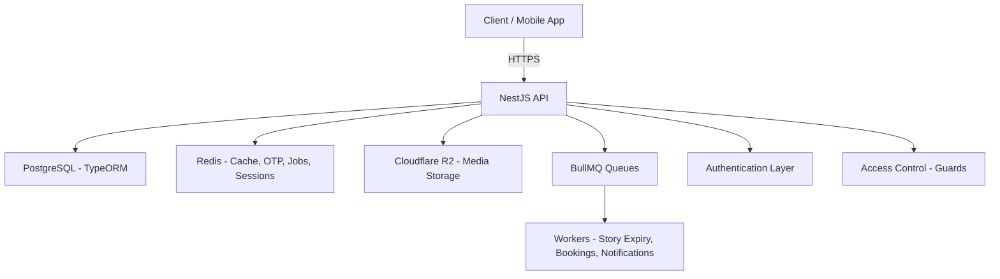
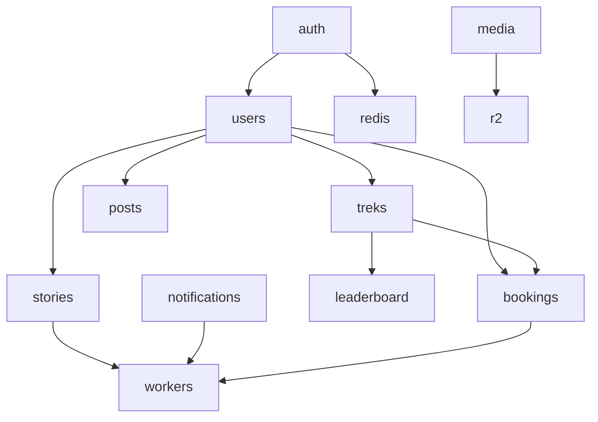
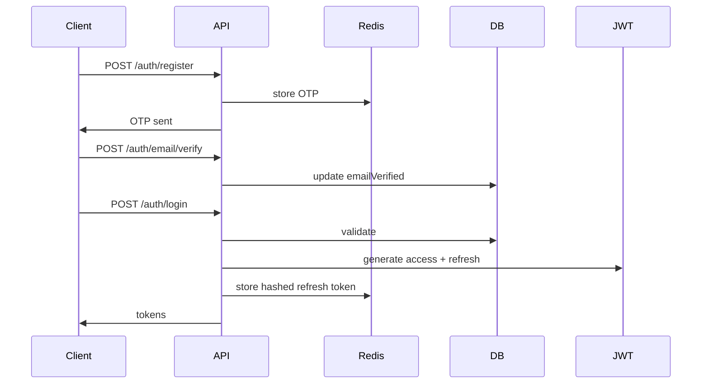

# 🚀 Offbeat प्रवासी – Backend (NestJS, TypeORM, Redis, R2, BullMQ)

A **production-grade**, **strictly typed**, **scalable backend** powering _Offbeat प्रवासी_ — a trekking, adventure, and social engagement platform featuring treks, bookings, posts, stories, leaderboards, organizers, and more.

This backend focuses on:

- Clean architecture
- Predictable API responses
- Cloud-native infrastructure
- High scalability
- Developer-friendly structure
- Strict TypeScript rules (NO `any`)
- Redis-based performance optimizations

---

# 📚 Table of Contents

1. [Project Overview](#-project-overview)
2. [Architecture](#-architecture)
3. [Tech Stack](#-tech-stack)
4. [Development Rules](#-development-rules)
5. [Folder Structure](#-folder-structure)
6. [Core Modules](#-core-modules)
7. [API Reference](#-api-reference)
8. [Postman / Thunder Client Collections](#-postman--thunder-client-collection)
9. [Completed Work](#-completed-work-so-far)
10. [Roadmap](#-roadmap)
11. [Deployment Guide](#-deployment)
12. [Contributing](#-contributing)

---

# 🚀 Project Overview

Offbeat Pravasi is a social adventure & trekking platform backend featuring:

- OTP + JWT Auth
- Treks
- Posts
- Stories
- Bookings
- Payments
- Organizer workflows
- Leaderboards
- Media uploads (R2)
- Notifications (BullMQ workers)
- Redis-backed pipelines

The backend emphasizes **clean modular architecture** and **high scalability**.

---

# 🧩 Architecture

## 🔹 High-Level System Diagram (Mermaid)



---

## 🔹 Module Interaction Overview



---

## 🔹 Core Flow: Auth + OTP + JWT



---

# 🧱 Tech Stack

| Layer       | Technology                  |
| ----------- | --------------------------- |
| Framework   | NestJS                      |
| Database    | PostgreSQL + TypeORM        |
| Cache/Queue | Redis + BullMQ              |
| Storage     | Cloudflare R2               |
| Auth        | JWT (access + refresh), OTP |
| Validation  | class-validator             |
| Workers     | BullMQ Workers              |
| Logging     | JSON structured logs        |
| Language    | TypeScript (strict)         |

---

# 🧑‍💻 Development Rules

### ✔ ConfigModule with Joi Validation

Environment variables validated at boot via `@nestjs/config` + Joi schema in `config/validation.ts`. Missing required vars (e.g., `JWT_ACCESS_SECRET`) fail immediately on startup.

### ✔ Strict TypeScript — **NO `any`**

All data structures must be strongly typed.

### ✔ Global Response Shape

Success:

```json
{
  "success": true,
  "message": "Request successful",
  "data": {}
}
```

Error:

```json
{
  "success": false,
  "statusCode": 400,
  "message": "Validation failed",
  "details": {}
}
```

### ✔ JSON Logging Only

All logs go through `LoggingInterceptor`.

### ✔ DDD-style Modular Architecture

### ✔ Redis First

Used for OTPs, refresh tokens, caching, job queues, cleanup.

---

# 📁 Folder Structure

```
src/
├── app.module.ts
├── main.ts
├── config/
│   ├── ormconfig.ts
│   ├── redis.config.ts
│   ├── swagger.config.ts
│   ├── configuration.ts      # ConfigModule factory
│   └── validation.ts         # Joi env schema
│
├── common/
│   ├── constants/
│   ├── decorators/
│   ├── filters/
│   ├── guards/
│   ├── interceptors/
│   ├── pagination/
│   ├── pipes/
│   └── utils/
│
├── modules/
│   ├── auth/                 # register, login, OTP, password reset, Google OAuth
│   ├── users/                # profile CRUD, onboarding, search
│   ├── treks/                # CRUD, geospatial nearby, recommendations
│   ├── posts/                # feed, create, like, comment
│   ├── stories/              # create, list, view tracking, expiry
│   ├── bookmarks/            # toggle, list
│   ├── friendships/          # send, accept, decline
│   ├── organizer/            # applications, dashboard, analytics
│   ├── admin/                # users, treks, bookings, audit logs
│   ├── media/                # presigned URLs for all categories
│   ├── leaderboard/
│   ├── notifications/
│   ├── bookings/             # CRUD, ticket PDF, QR verify
│   ├── payments/             # Stripe & Razorpay webhooks
│   ├── health/
│   └── mailer/
│
├── jobs/
│   ├── queues.ts
│   └── processors/
│
└── database/
    ├── migrations/
    └── seeds/
```

---

# 📦 Core Modules

### ✔ Auth Module

- Register
- OTP send/verify
- Login
- JWT access + refresh
- Refresh token rotation
- Logout
- Guards + decorators

### ✔ User Module

- User profile entity
- Organizer status
- Admin flag
- Points + distance

### ✔ Queues & Workers

- Cleanup processor
- Story expiry
- Notification jobs
- Booking reminder worker

### ✔ Health Module

- `/health`
- `/health/redis`

---

# 📘 API Reference

Below is a reference of the current available API endpoints.

## 🔹 Auth Routes

All paths prefixed with `/api/v1`.

| Method | Endpoint                     | Description                                  |
| ------ | ---------------------------- | -------------------------------------------- |
| POST   | `/auth/register`             | Register user                                |
| POST   | `/auth/login`                | Login & get tokens                           |
| POST   | `/auth/email/send-otp`       | Send email OTP                               |
| POST   | `/auth/email/verify-otp`     | Verify email OTP                             |
| POST   | `/auth/email/resend-otp`     | Resend email verification OTP                |
| POST   | `/auth/password/forgot`      | Request password reset OTP                   |
| POST   | `/auth/password/reset`       | Reset password using OTP                     |
| POST   | `/auth/refresh`              | Refresh JWT tokens                           |
| POST   | `/auth/logout`               | Logout (invalidate session)                  |
| GET    | `/auth/me`                   | Get current authenticated user               |
| GET    | `/auth/google`               | Initiate Google OAuth (returns authorize URL) |
| POST   | `/auth/google/exchange`      | Exchange Better Auth session cookie for local TokenPair |


---

## 🔹 Health Routes

| Method | Endpoint        | Description   |
| ------ | --------------- | ------------- |
| GET    | `/health`       | Server status |
| GET    | `/health/redis` | Redis status  |

---

## 🔹 Users

| Method | Endpoint                | Description                        |
| ------ | ----------------------- | ---------------------------------- |
| GET    | `/users/me`             | Get current user profile           |
| PATCH  | `/users/me`             | Update current user profile        |
| POST   | `/users/me/onboarding`  | Save onboarding answers            |
| GET    | `/users/search`         | Search users by username or name   |
| GET    | `/users/:id`            | Get user by ID                     |

---

## 🔹 Treks

| Method | Endpoint                  | Description                     |
| ------ | ------------------------- | ------------------------------- |
| GET    | `/treks`                  | List and search treks           |
| POST   | `/treks`                  | Create a trek (organizer only)  |
| GET    | `/treks/nearby`           | Find treks near a location      |
| GET    | `/treks/recommendations`  | Get trek recommendations         |
| GET    | `/treks/:id`              | Get trek details                |

---

# 📤 Postman / Thunder Client Collection

### ✔ Included in repo:

```
/docs/postman/offbeat_pravasi_collection.json
```

### If missing — generate with:

```
npm run docs:postman
```

### How to import:

**Postman**

1. Open Postman
2. Click "Import"
3. Select the JSON file

**Thunder Client**

1. Open VS Code
2. Thunder Client extension → Collections → Import
3. Select the same JSON

I can generate this file for you if you want.

---

# 🧱 Completed Work So Far

### ✔ Core backend architecture

### ✔ Full Auth system (register, login, OTP verify/resend, password reset, Google OAuth, JWT rotation)

### ✔ User module (profile CRUD, onboarding, search)

### ✔ Treks module (CRUD, geospatial nearby, recommendations, search)

### ✔ Posts module (feed, create, like, comment, delete)

### ✔ Stories module (create, list, delete, view tracking, expiry job)

### ✔ Bookmarks module (toggle, list)

### ✔ Friendships module (send, accept, decline)

### ✔ Organizer module (applications, dashboard, treks, bookings, reviews, analytics, revenue, participants)

### ✔ Admin module (users, organizer requests, trek decisions, bookings report, audit logs, platform settings)

### ✔ Media module (presigned URLs for profile, banner, post, trek, story)

### ✔ Bookings module (create, list, cancel, ticket PDF with QR, QR verification)

### ✔ Payments module (Stripe & Razorpay checkout + webhooks)

### ✔ Pagination utilities

### ✔ JSON logging interceptor

### ✔ AllExceptionsFilter + ValidationExceptionFilter

### ✔ Redis config + OTP/password-reset pipelines

### ✔ ORM config with type-safe entities

### ✔ BullMQ queues + processors (story expiry, booking release, reminders, notifications, ticket PDF, cleanup)

### ✔ Health module (server + Redis)

### ✔ ConfigModule with Joi env validation

Everything is completely type-safe with no `any`.

---

# 🛠 Roadmap

### 🟥 High Priority

- Notification module (push via FCM, device token management)
- Leaderboard module (friend leaderboard, global ranking)
- Full-text search + geolocation indexes for treks
- Content moderation (profanity filter, reporting)
- Image optimization pipeline (thumbnails via sharp)

### 🟧 Medium Priority

- Cancellation & refund policy enforcement
- Email templates (welcome, booking confirmation, organizer approval)
- Rate limiting per endpoint type (auth, upload, general)
- WebSocket support for real-time notifications

### 🟩 Low Priority

- CSV export for bookings and participants
- Push analytics (open rates, delivery metrics)
- Activity scoring / gamification
- API versioning docs for v1 → v2 migration

---

# 🚀 Getting Started

## Environment Setup

1. **Copy the development environment template:**

   ```sh
   cp env.development .env
   ```

2. **Update the `.env` file with your actual values:**
   - Database credentials (PostgreSQL)
   - Redis connection details
   - JWT secrets (generate with: `openssl rand -base64 32`)
   - API keys for external services (Google OAuth, Firebase, R2, etc.)

3. **Start required services:**

   ```sh
   # Using Docker Compose (recommended)
   docker compose -f docker/docker-compose.dev.yml up -d

   # Or manually start PostgreSQL and Redis
   ```

4. **Install dependencies and run:**
   ```sh
   npm install
   npm run start:dev
   ```

The application will be available at `http://localhost:3000` (or the PORT specified in your `.env`).

## API Documentation (Swagger)

- Runtime docs: once the server is running, visit `http://localhost:4000/docs` (or your configured `PORT`) for Swagger UI with persisted auth and request timing.
- Static spec: `npm run swagger:export` writes `docs/swagger.json`, which you can commit or share with API consumers/tools.
- Adding endpoints: keep annotating controllers and DTOs with `@ApiTags`, `@ApiResponse`, and friends—metadata is centralized in `src/config/swagger.config.ts`.

---

# 🐳 Deployment

Detailed deployment instructions can be found inside `DEPLOYMENT.md`.

### Quick Deploy:

```sh
docker compose build
docker compose up -d
```

---

# 🤝 Contributing

Contribution guidelines are in `CONTRIBUTING.md`.

Summary:

- No `any`
- Use DTOs
- Write tests when needed
- Use clean commits
- Follow module boundaries

---

# 📞 Contact

For issues, please open a GitHub issue or contact the project maintainer.

---

---

**Environment / Webhooks notes**

- The project uses a number of environment variables listed in `env.example` — ensure `JWT_TICKET_SECRET` and `JWT_TICKET_TTL` are set for signed ticket issuance (PDF tickets).
- Payment webhooks (Stripe/Razorpay) require the raw request body for signature verification. When deploying behind proxies or middleware, ensure the webhook route receives the raw payload (no JSON body-parser that strips raw body).
- Workers (BullMQ) are required to process PDF generation, booking release, and notifications. Configure Redis and run the worker process alongside the API.

