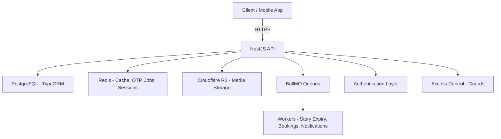
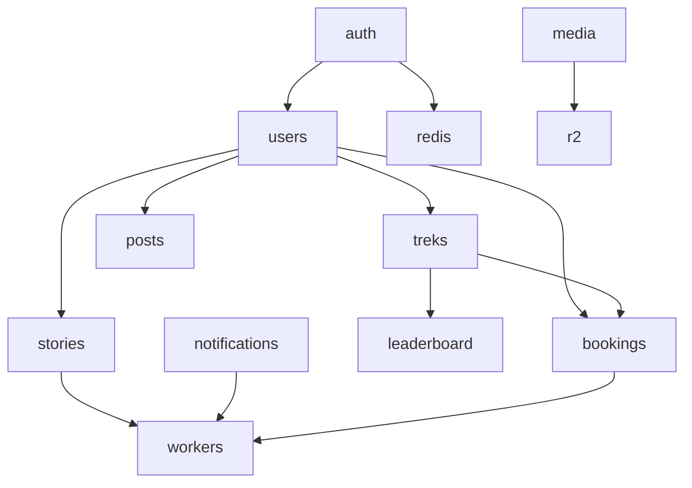
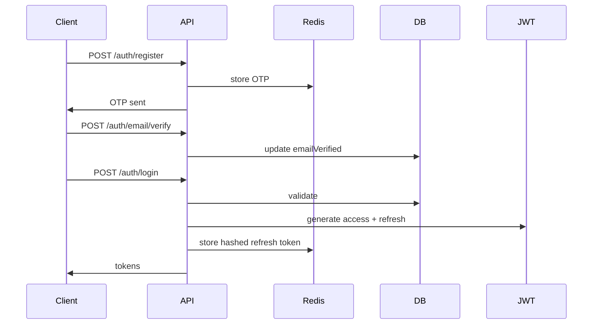

# 🚀 Offbeat प्रवासी – Backend (NestJS, TypeORM, Redis, R2, BullMQ)

A **production-grade**, **strictly typed**, **scalable backend** powering _Offbeat प्रवासी_ — a trekking, adventure, and social engagement platform featuring treks, bookings, posts, stories, leaderboards, organizers, and more.

This backend focuses on:

- Clean architecture
- Predictable API responses
- Cloud-native infrastructure
- High scalability
- Developer-friendly structure
- Strict TypeScript rules (NO `any`)
- Redis-based performance optimizations

---

# 📚 Table of Contents

1. [Project Overview](#-project-overview)
2. [Architecture](#-architecture)
3. [Tech Stack](#-tech-stack)
4. [Development Rules](#-development-rules)
5. [Folder Structure](#-folder-structure)
6. [Core Modules](#-core-modules)
7. [API Reference](#-api-reference)
8. [Postman / Thunder Client Collections](#-postman--thunder-client-collection)
9. [Completed Work](#-completed-work-so-far)
10. [Roadmap](#-roadmap)
11. [Deployment Guide](#-deployment)
12. [Contributing](#-contributing)

---

# 🚀 Project Overview

Offbeat Pravasi is a social adventure & trekking platform backend featuring:

- OTP + JWT Auth
- Treks
- Posts
- Stories
- Bookings
- Payments
- Organizer workflows
- Leaderboards
- Media uploads (R2)
- Notifications (BullMQ workers)
- Redis-backed pipelines

The backend emphasizes **clean modular architecture** and **high scalability**.

---

# 🧩 Architecture

## 🔹 High-Level System Diagram (Mermaid)



---

## 🔹 Module Interaction Overview



---

## 🔹 Core Flow: Auth + OTP + JWT



---

# 🧱 Tech Stack

| Layer       | Technology                  |
| ----------- | --------------------------- |
| Framework   | NestJS                      |
| Database    | PostgreSQL + TypeORM        |
| Cache/Queue | Redis + BullMQ              |
| Storage     | Cloudflare R2               |
| Auth        | JWT (access + refresh), OTP |
| Validation  | class-validator             |
| Workers     | BullMQ Workers              |
| Logging     | JSON structured logs        |
| Language    | TypeScript (strict)         |

---

# 🧑‍💻 Development Rules

### ✔ No ConfigModule

Environment variables accessed directly:

```ts
process.env.SOME_VAR;
```

### ✔ Strict TypeScript — **NO `any`**

All data structures must be strongly typed.

### ✔ Global Response Shape

Success:

```json
{
  "success": true,
  "message": "Request successful",
  "data": {}
}
```

Error:

```json
{
  "success": false,
  "statusCode": 400,
  "message": "Validation failed",
  "details": {}
}
```

### ✔ JSON Logging Only

All logs go through `LoggingInterceptor`.

### ✔ DDD-style Modular Architecture

### ✔ Redis First

Used for OTPs, refresh tokens, caching, job queues, cleanup.

---

# 📁 Folder Structure

```
src/
├── app.module.ts
├── config/
│   ├── ormconfig.ts
│   └── redis.config.ts
│
├── common/
│   ├── constants/
│   ├── decorators/
│   ├── filters/
│   ├── guards/
│   ├── interceptors/
│   ├── pagination/
│   ├── pipes/
│   └── utils/
│
├── modules/
│   ├── auth/
│   ├── users/
│   ├── treks/
│   ├── posts/
│   ├── stories/
│   ├── bookmarks/
│   ├── friendships/
│   ├── organizer/
│   ├── admin/
│   ├── media/
│   ├── leaderboard/
│   ├── notifications/
│   ├── bookings/
│   ├── payments/
│   └── health/
│
├── jobs/
│   ├── queues.ts
│   └── processors/
│
└── database/
    ├── migrations/
    └── seeds/
```

---

# 📦 Core Modules

### ✔ Auth Module

- Register
- OTP send/verify
- Login
- JWT access + refresh
- Refresh token rotation
- Logout
- Guards + decorators

### ✔ User Module

- User profile entity
- Organizer status
- Admin flag
- Points + distance

### ✔ Queues & Workers

- Cleanup processor
- Story expiry
- Notification jobs
- Booking reminder worker

### ✔ Health Module

- `/health`
- `/health/redis`

---

# 📘 API Reference

Below is a reference of the current available API endpoints.

## 🔹 Auth Routes

| Method | Endpoint                 | Description                    |
| ------ | ------------------------ | ------------------------------ |
| POST   | `/auth/register`         | Register user                  |
| POST   | `/auth/login`            | Login & get tokens             |
| POST   | `/auth/email/send-otp`   | Send email OTP                 |
| POST   | `/auth/email/verify-otp` | Verify email OTP               |
| POST   | `/auth/refresh`          | Refresh JWT tokens             |
| POST   | `/auth/logout`           | Logout (invalidate session)    |
| GET    | `/auth/me`               | Get current authenticated user |

---

## 🔹 Health Routes

| Method | Endpoint        | Description   |
| ------ | --------------- | ------------- |
| GET    | `/health`       | Server status |
| GET    | `/health/redis` | Redis status  |

---

## 🔹 Users (coming soon)

| Method | Endpoint     |
| ------ | ------------ |
| GET    | `/users/me`  |
| PATCH  | `/users/me`  |
| GET    | `/users/:id` |

---

## 🔹 Treks (coming soon)

| Method | Endpoint     |
| ------ | ------------ |
| GET    | `/treks`     |
| POST   | `/treks`     |
| GET    | `/treks/:id` |

---

# 📤 Postman / Thunder Client Collection

### ✔ Included in repo:

```
/docs/postman/offbeat_pravasi_collection.json
```

### If missing — generate with:

```
npm run docs:postman
```

### How to import:

**Postman**

1. Open Postman
2. Click "Import"
3. Select the JSON file

**Thunder Client**

1. Open VS Code
2. Thunder Client extension → Collections → Import
3. Select the same JSON

I can generate this file for you if you want.

---

# 🧱 Completed Work So Far

### ✔ Core backend architecture

### ✔ Full Auth system

### ✔ Pagination utilities

### ✔ JSON logging interceptor

### ✔ AllExceptionsFilter

### ✔ ValidationExceptionFilter

### ✔ API utils

### ✔ Redis config

### ✔ ORM config

### ✔ Cleanup processor

### ✔ Queue system

### ✔ User entity

### ✔ Health module

Everything is completely type-safe with no `any`.

---

# 🛠 Roadmap

### 🟥 High Priority

- User module (controller + service)
- Trek module
- Organizer module
- Media upload (R2 presigned URLs)
- Booking + payment module
- Notification processor (FCM)

### 🟧 Medium Priority

- Story interactions
- Post feed
- Leaderboard algorithm
- Admin moderation

### 🟩 Low Priority

- Reports system
- Push analytics
- Activity scoring

---

# 🚀 Getting Started

## Environment Setup

1. **Copy the development environment template:**

   ```sh
   cp env.development .env
   ```

2. **Update the `.env` file with your actual values:**
   - Database credentials (PostgreSQL)
   - Redis connection details
   - JWT secrets (generate with: `openssl rand -base64 32`)
   - API keys for external services (Google OAuth, Firebase, R2, etc.)

3. **Start required services:**

   ```sh
   # Using Docker Compose (recommended)
   docker compose -f docker/docker-compose.dev.yml up -d

   # Or manually start PostgreSQL and Redis
   ```

4. **Install dependencies and run:**
   ```sh
   npm install
   npm run start:dev
   ```

The application will be available at `http://localhost:3000` (or the PORT specified in your `.env`).

---

# 🐳 Deployment

Detailed deployment instructions can be found inside `DEPLOYMENT.md`.

### Quick Deploy:

```sh
docker compose build
docker compose up -d
```

---

# 🤝 Contributing

Contribution guidelines are in `CONTRIBUTING.md`.

Summary:

- No `any`
- Use DTOs
- Write tests when needed
- Use clean commits
- Follow module boundaries

---

# 📞 Contact

For issues, please open a GitHub issue or contact the project maintainer.

---
