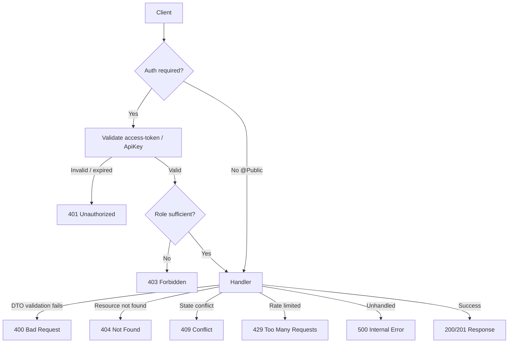

# Offbeat Pravasi — End-to-End API User Flow Documentation

> **Audience:** Senior backend engineers, QA, and integration partners.
> **Scope:** Every HTTP module and endpoint exposed by the NestJS backend, including request/response contracts, authentication/authorization requirements, success flows, edge cases, and failure/error scenarios.
> **Source of truth:** Controller source (`src/modules/**/*.controller.ts`) and DTO definitions. Generated from the live code tree.

## 1. Conventions & Global Model

### 1.1 Base URL & Environments

| Environment | Base URL |
|---|---|
| Local | `http://localhost:3000` |
| Staging | `https://staging-api.offbeatpravasi.com` |
| Production | `https://api.offbeatpravasi.com` |

All paths below are relative to the base URL. Global API prefix: `/api/v1` is applied where configured.

### 1.2 Authentication Schemes

The API uses two security schemes (from `components.securitySchemes`):

- **`access-token`** — Bearer JWT (`Authorization: Bearer <accessToken>`). Issued by the auth module; carries user identity and roles. Required for all user, organizer, and admin endpoints unless marked `@Public()`.
- **`ApiKey`** — Service-to-service key header (`x-api-key: <key>`). Used by trusted internal jobs, webhooks, and admin tooling.

Admin endpoints additionally enforce `AdminRolesGuard` / role decorators (`@Roles(...)`). Organizer endpoints enforce organizer approval/`OrganizerGuard`. Some admin endpoints allow `@SelfOrAdmin` (the owning user or an admin).

### 1.3 Response Envelope

Successful responses are wrapped by a global transform interceptor (`TransformInterceptor`) and returned with the resource or a list. Errors use NestJS `HttpException` shapes:

```json
{ "statusCode": 400, "message": "...", "error": "Bad Request", "timestamp": "ISO-8601", "path": "/..." }
```

### 1.4 Standard Status Codes

| Code | Meaning | Typical Cause |
|---|---|---|
| 200 | OK | Successful GET / non-mutating action |
| 201 | Created | Successful resource creation |
| 202 | Accepted | Async job enqueued (webhooks, exports) |
| 204 | No Content | Successful deletion / void action |
| 400 | Bad Request | DTO validation failure, malformed body |
| 401 | Unauthorized | Missing / expired / invalid token or API key |
| 403 | Forbidden | Authenticated but lacking required role/permission |
| 404 | Not Found | Resource id does not exist |
| 409 | Conflict | Unique constraint violation, duplicate, stale state |
| 422 | Unprocessable Entity | Semantic validation beyond shape (e.g., business rule) |
| 429 | Too Many Requests | Rate-limit / throttle exceeded |
| 500 | Internal Server Error | Unhandled server exception |
| 502/504 | Bad Gateway / Timeout | Upstream provider (Stripe, R2, weather) failure |

### 1.5 Module Index

| # | Module | Base Path | Endpoints |
|---|---|---|---|
| 1 | assessments | `` | 4 |
| 2 | auth | `auth` | 12 |
| 3 | bookings | `bookings` | 7 |
| 4 | friendships | `` | 7 |
| 5 | gear | `` | 8 |
| 6 | groups | `` | 9 |
| 7 | health | `health` | 2 |
| 8 | itineraries | `treks/:trekId/itinerary` | 6 |
| 9 | leaderboard | `leaderboard` | 3 |
| 10 | media | `media` | 6 |
| 11 | notifications | `notifications` | 5 |
| 12 | organizer | `organizer` | 14 |
| 13 | payments | `payments` | 2 |
| 14 | policies | `` | 7 |
| 15 | recommendations | `` | 5 |
| 16 | referrals | `` | 5 |
| 17 | reports | `` | 3 |
| 18 | safety | `` | 10 |
| 19 | treks | `treks` | 5 |
| 20 | users | `users` | 5 |
| 21 | weather | `` | 1 |
| 22 | wishlist | `` | 14 |
| 23 | admin | `admin/ab-tests` | 220 |


---

## 2.1 Module: Assessments  
**Base path:** `/`  ·  **Endpoints:** 4

Assessments module responsibilities and the primary user-facing flow are summarized below. Auth model: most endpoints require authentication; see per-endpoint guards.

### 2.1.1 Representative Flow



### 2.1.2 Endpoint Summary

| Method | Path | Handler | Auth |
|---|---|---|---|
| GET | `//assessments/questions` | `getQuestions` | Public |
| POST | `//assessments/submit` | `` | Public |
| GET | `//assessments/my-result` | `` | JWT |
| GET | `//users/:userId/assessment-result` | `` | Public |

### 2.1.3 Endpoint Detail

#### `GET //assessments/questions`

**Handler:** `getQuestions`  
**Purpose:** Get Questions for the Assessments domain. Operates on resource segment `assessments/questions`.

**Authentication / Authorization:** `@Public()`

**Request**

No parameters (path, query, or body). Empty request body where applicable.

**Response**

- **Success:** `200 OK` — resource/result serialized via `TransformInterceptor`.

**Success Case Flow**

1. Client sends authenticated request to the endpoint.
2. Request is validated against the DTO (shape + semantic rules).
3. Service executes the business logic (DB transaction / external call).
4. Response is serialized and returned with the success status code.

**Edge Cases**

- No notable edge cases beyond standard validation.

**Error / Failure Cases**

| Status | Condition | Body `message` example |
|---|---|---|
| 500 | Unhandled server/DB/provider error | "Internal server error" |

#### `POST //assessments/submit`

**Handler:** `(handler)`  
**Purpose:** Handle `POST //assessments/submit`. Operates on resource segment `assessments/submit`.

**Authentication / Authorization:** `@Public() | @UseGuards(AuthGuard('jwt'))`

**Request**

No parameters (path, query, or body). Empty request body where applicable.

**Response**

- **Success:** `201 Created` — resource/result serialized via `TransformInterceptor`.

**Success Case Flow**

1. Client sends authenticated request to the endpoint.
2. Request is validated against the DTO (shape + semantic rules).
3. Service executes the business logic (DB transaction / external call).
4. Response is serialized and returned with the success status code.

**Edge Cases**

- Duplicate creation that violates a unique constraint → `409`.

**Error / Failure Cases**

| Status | Condition | Body `message` example |
|---|---|---|
| 409 | Unique/state conflict | "Conflict: resource already exists" |
| 500 | Unhandled server/DB/provider error | "Internal server error" |

#### `GET //assessments/my-result`

**Handler:** `(handler)`  
**Purpose:** Handle `GET //assessments/my-result`. Operates on resource segment `assessments/my-result`.

**Authentication / Authorization:** `@UseGuards(AuthGuard('jwt'))`

**Request**

No parameters (path, query, or body). Empty request body where applicable.

**Response**

- **Success:** `200 OK` — resource/result serialized via `TransformInterceptor`.

**Success Case Flow**

1. Client sends authenticated request to the endpoint.
2. Guard validates token/API key and resolves the principal; role guard enforces required role(s).
3. Request is validated against the DTO (shape + semantic rules).
4. Service executes the business logic (DB transaction / external call).
5. Response is serialized and returned with the success status code.

**Edge Cases**

- No notable edge cases beyond standard validation.

**Error / Failure Cases**

| Status | Condition | Body `message` example |
|---|---|---|
| 401 | Missing/expired/invalid token or API key | "Unauthorized" |
| 500 | Unhandled server/DB/provider error | "Internal server error" |

#### `GET //users/:userId/assessment-result`

**Handler:** `(handler)`  
**Purpose:** Handle `GET //users/:userId/assessment-result`. Operates on resource segment `users/:userId/assessment-result`.

**Authentication / Authorization:** `@Public()`

**Request**

No parameters (path, query, or body). Empty request body where applicable.

**Response**

- **Success:** `200 OK` — resource/result serialized via `TransformInterceptor`.

**Success Case Flow**

1. Client sends authenticated request to the endpoint.
2. Request is validated against the DTO (shape + semantic rules).
3. Service executes the business logic (DB transaction / external call).
4. Response is serialized and returned with the success status code.

**Edge Cases**

- No notable edge cases beyond standard validation.

**Error / Failure Cases**

| Status | Condition | Body `message` example |
|---|---|---|
| 500 | Unhandled server/DB/provider error | "Internal server error" |


---

## 2.2 Module: Auth  
**Base path:** `/auth`  ·  **Endpoints:** 12

Auth module responsibilities and the primary user-facing flow are summarized below. Auth model: most endpoints require authentication; see per-endpoint guards.

### 2.2.1 Representative Flow


### 2.2.2 Endpoint Summary

| Method | Path | Handler | Auth |
|---|---|---|---|
| POST | `/auth/register` | `register` | Public |
| POST | `/auth/login` | `login` | Public |
| POST | `/auth/email/send-otp` | `sendOtp` | Public |
| POST | `/auth/email/verify-otp` | `verifyOtp` | Public |
| POST | `/auth/email/resend-otp` | `resendOtp` | Public |
| POST | `/auth/password/forgot` | `forgotPassword` | Public |
| POST | `/auth/password/reset` | `resetPassword` | Public |
| POST | `/auth/refresh` | `refresh` | Public |
| POST | `/auth/logout` | `logout` | JWT |
| GET | `/auth/me` | `me` | JWT |
| GET | `/auth/google` | `googleAuth` | Public |
| POST | `/auth/google/exchange` | `googleExchange` | Public |

### 2.2.3 Endpoint Detail

#### `POST /auth/register`

**Handler:** `register`  
**Purpose:** Register for the Auth domain. Operates on resource segment `register`.

**Authentication / Authorization:** `@Public() | @Throttle({ default: { limit: 5, ttl: 60000 } })`

**Request**

| Location | Name | Type | Source |
|---|---|---|---|
| Body | — | RegisterDto | JSON body |

**Request Body Schema — `RegisterDto`**

| Field | Type | Required |
|---|---|---|
| `fullName` | string | optional |

**Response**

- **Success:** `201 Created` — resource/result serialized via `TransformInterceptor`.
- **Shape:** mirrors request DTO / entity projection for `RegisterDto`.

**Success Case Flow**

1. Client sends authenticated request to the endpoint.
2. Request is validated against the DTO (shape + semantic rules).
3. Service executes the business logic (DB transaction / external call).
4. Response is serialized and returned with the success status code.

**Edge Cases**

- Empty or malformed JSON body → `400`.
- Missing required fields or wrong types per DTO validators → `400`.
- Duplicate creation that violates a unique constraint → `409`.
- Exceeding request rate → `429`.

**Error / Failure Cases**

| Status | Condition | Body `message` example |
|---|---|---|
| 400 | DTO validation failure | "validation failed: <field> must be ..." |
| 409 | Unique/state conflict | "Conflict: resource already exists" |
| 429 | Rate limit exceeded | "Too Many Requests" |
| 500 | Unhandled server/DB/provider error | "Internal server error" |

#### `POST /auth/login`

**Handler:** `login`  
**Purpose:** Login for the Auth domain. Operates on resource segment `login`.

**Authentication / Authorization:** `@Public() | @Throttle({ default: { limit: 10, ttl: 60000 } })`

**Request**

| Location | Name | Type | Source |
|---|---|---|---|
| Body | — | LoginDto | JSON body |

**Request Body:** typed `LoginDto` (see DTO definition). Validation decorators enforced via `class-validator`.

**Response**

- **Success:** `201 Created` — resource/result serialized via `TransformInterceptor`.
- **Shape:** mirrors request DTO / entity projection for `LoginDto`.

**Success Case Flow**

1. Client sends authenticated request to the endpoint.
2. Request is validated against the DTO (shape + semantic rules).
3. Service executes the business logic (DB transaction / external call).
4. Response is serialized and returned with the success status code.

**Edge Cases**

- Empty or malformed JSON body → `400`.
- Missing required fields or wrong types per DTO validators → `400`.
- Duplicate creation that violates a unique constraint → `409`.
- Exceeding request rate → `429`.

**Error / Failure Cases**

| Status | Condition | Body `message` example |
|---|---|---|
| 400 | DTO validation failure | "validation failed: <field> must be ..." |
| 409 | Unique/state conflict | "Conflict: resource already exists" |
| 429 | Rate limit exceeded | "Too Many Requests" |
| 500 | Unhandled server/DB/provider error | "Internal server error" |

#### `POST /auth/email/send-otp`

**Handler:** `sendOtp`  
**Purpose:** Send Otp for the Auth domain. Operates on resource segment `email/send-otp`.

**Authentication / Authorization:** `@Public() | @Throttle({ default: { limit: 3, ttl: 60000 } })`

**Request**

| Location | Name | Type | Source |
|---|---|---|---|
| Body | — | SendOtpDto | JSON body |

**Request Body:** typed `SendOtpDto` (see DTO definition). Validation decorators enforced via `class-validator`.

**Response**

- **Success:** `201 Created` — resource/result serialized via `TransformInterceptor`.
- **Shape:** mirrors request DTO / entity projection for `SendOtpDto`.

**Success Case Flow**

1. Client sends authenticated request to the endpoint.
2. Request is validated against the DTO (shape + semantic rules).
3. Service executes the business logic (DB transaction / external call).
4. Response is serialized and returned with the success status code.

**Edge Cases**

- Empty or malformed JSON body → `400`.
- Missing required fields or wrong types per DTO validators → `400`.
- Duplicate creation that violates a unique constraint → `409`.
- Exceeding request rate → `429`.

**Error / Failure Cases**

| Status | Condition | Body `message` example |
|---|---|---|
| 400 | DTO validation failure | "validation failed: <field> must be ..." |
| 409 | Unique/state conflict | "Conflict: resource already exists" |
| 429 | Rate limit exceeded | "Too Many Requests" |
| 500 | Unhandled server/DB/provider error | "Internal server error" |

#### `POST /auth/email/verify-otp`

**Handler:** `verifyOtp`  
**Purpose:** Verify Otp for the Auth domain. Operates on resource segment `email/verify-otp`.

**Authentication / Authorization:** `@Public() | @Throttle({ default: { limit: 5, ttl: 60000 } })`

**Request**

| Location | Name | Type | Source |
|---|---|---|---|
| Body | — | VerifyOtpDto | JSON body |

**Request Body:** typed `VerifyOtpDto` (see DTO definition). Validation decorators enforced via `class-validator`.

**Response**

- **Success:** `201 Created` — resource/result serialized via `TransformInterceptor`.
- **Shape:** mirrors request DTO / entity projection for `VerifyOtpDto`.

**Success Case Flow**

1. Client sends authenticated request to the endpoint.
2. Request is validated against the DTO (shape + semantic rules).
3. Service executes the business logic (DB transaction / external call).
4. Response is serialized and returned with the success status code.

**Edge Cases**

- Empty or malformed JSON body → `400`.
- Missing required fields or wrong types per DTO validators → `400`.
- Duplicate creation that violates a unique constraint → `409`.
- Exceeding request rate → `429`.

**Error / Failure Cases**

| Status | Condition | Body `message` example |
|---|---|---|
| 400 | DTO validation failure | "validation failed: <field> must be ..." |
| 409 | Unique/state conflict | "Conflict: resource already exists" |
| 429 | Rate limit exceeded | "Too Many Requests" |
| 500 | Unhandled server/DB/provider error | "Internal server error" |

#### `POST /auth/email/resend-otp`

**Handler:** `resendOtp`  
**Purpose:** Resend Otp for the Auth domain. Operates on resource segment `email/resend-otp`.

**Authentication / Authorization:** `@Public() | @Throttle({ default: { limit: 3, ttl: 60000 } })`

**Request**

| Location | Name | Type | Source |
|---|---|---|---|
| Body | — | ResendOtpDto | JSON body |

**Request Body:** typed `ResendOtpDto` (see DTO definition). Validation decorators enforced via `class-validator`.

**Response**

- **Success:** `201 Created` — resource/result serialized via `TransformInterceptor`.
- **Shape:** mirrors request DTO / entity projection for `ResendOtpDto`.

**Success Case Flow**

1. Client sends authenticated request to the endpoint.
2. Request is validated against the DTO (shape + semantic rules).
3. Service executes the business logic (DB transaction / external call).
4. Response is serialized and returned with the success status code.

**Edge Cases**

- Empty or malformed JSON body → `400`.
- Missing required fields or wrong types per DTO validators → `400`.
- Duplicate creation that violates a unique constraint → `409`.
- Exceeding request rate → `429`.

**Error / Failure Cases**

| Status | Condition | Body `message` example |
|---|---|---|
| 400 | DTO validation failure | "validation failed: <field> must be ..." |
| 409 | Unique/state conflict | "Conflict: resource already exists" |
| 429 | Rate limit exceeded | "Too Many Requests" |
| 500 | Unhandled server/DB/provider error | "Internal server error" |

#### `POST /auth/password/forgot`

**Handler:** `forgotPassword`  
**Purpose:** Forgot Password for the Auth domain. Operates on resource segment `password/forgot`.

**Authentication / Authorization:** `@Public() | @Throttle({ default: { limit: 3, ttl: 60000 } })`

**Request**

| Location | Name | Type | Source |
|---|---|---|---|
| Body | — | ForgotPasswordDto | JSON body |

**Request Body:** typed `ForgotPasswordDto` (see DTO definition). Validation decorators enforced via `class-validator`.

**Response**

- **Success:** `201 Created` — resource/result serialized via `TransformInterceptor`.
- **Shape:** mirrors request DTO / entity projection for `ForgotPasswordDto`.

**Success Case Flow**

1. Client sends authenticated request to the endpoint.
2. Request is validated against the DTO (shape + semantic rules).
3. Service executes the business logic (DB transaction / external call).
4. Response is serialized and returned with the success status code.

**Edge Cases**

- Empty or malformed JSON body → `400`.
- Missing required fields or wrong types per DTO validators → `400`.
- Duplicate creation that violates a unique constraint → `409`.
- Exceeding request rate → `429`.

**Error / Failure Cases**

| Status | Condition | Body `message` example |
|---|---|---|
| 400 | DTO validation failure | "validation failed: <field> must be ..." |
| 409 | Unique/state conflict | "Conflict: resource already exists" |
| 429 | Rate limit exceeded | "Too Many Requests" |
| 500 | Unhandled server/DB/provider error | "Internal server error" |

#### `POST /auth/password/reset`

**Handler:** `resetPassword`  
**Purpose:** Reset Password for the Auth domain. Operates on resource segment `password/reset`.

**Authentication / Authorization:** `@Public() | @Throttle({ default: { limit: 5, ttl: 60000 } })`

**Request**

| Location | Name | Type | Source |
|---|---|---|---|
| Body | — | ResetPasswordDto | JSON body |

**Request Body:** typed `ResetPasswordDto` (see DTO definition). Validation decorators enforced via `class-validator`.

**Response**

- **Success:** `201 Created` — resource/result serialized via `TransformInterceptor`.
- **Shape:** mirrors request DTO / entity projection for `ResetPasswordDto`.

**Success Case Flow**

1. Client sends authenticated request to the endpoint.
2. Request is validated against the DTO (shape + semantic rules).
3. Service executes the business logic (DB transaction / external call).
4. Response is serialized and returned with the success status code.

**Edge Cases**

- Empty or malformed JSON body → `400`.
- Missing required fields or wrong types per DTO validators → `400`.
- Duplicate creation that violates a unique constraint → `409`.
- Exceeding request rate → `429`.

**Error / Failure Cases**

| Status | Condition | Body `message` example |
|---|---|---|
| 400 | DTO validation failure | "validation failed: <field> must be ..." |
| 409 | Unique/state conflict | "Conflict: resource already exists" |
| 429 | Rate limit exceeded | "Too Many Requests" |
| 500 | Unhandled server/DB/provider error | "Internal server error" |

#### `POST /auth/refresh`

**Handler:** `refresh`  
**Purpose:** Refresh for the Auth domain. Operates on resource segment `refresh`.

**Authentication / Authorization:** `@Public() | @Throttle({ default: { limit: 10, ttl: 60000 } })`

**Request**

| Location | Name | Type | Source |
|---|---|---|---|
| Body | — | RefreshDto | JSON body |

**Request Body:** typed `RefreshDto` (see DTO definition). Validation decorators enforced via `class-validator`.

**Response**

- **Success:** `201 Created` — resource/result serialized via `TransformInterceptor`.
- **Shape:** mirrors request DTO / entity projection for `RefreshDto`.

**Success Case Flow**

1. Client sends authenticated request to the endpoint.
2. Request is validated against the DTO (shape + semantic rules).
3. Service executes the business logic (DB transaction / external call).
4. Response is serialized and returned with the success status code.

**Edge Cases**

- Empty or malformed JSON body → `400`.
- Missing required fields or wrong types per DTO validators → `400`.
- Duplicate creation that violates a unique constraint → `409`.
- Exceeding request rate → `429`.

**Error / Failure Cases**

| Status | Condition | Body `message` example |
|---|---|---|
| 400 | DTO validation failure | "validation failed: <field> must be ..." |
| 409 | Unique/state conflict | "Conflict: resource already exists" |
| 429 | Rate limit exceeded | "Too Many Requests" |
| 500 | Unhandled server/DB/provider error | "Internal server error" |

#### `POST /auth/logout`

**Handler:** `logout`  
**Purpose:** Logout for the Auth domain. Operates on resource segment `logout`.

**Authentication / Authorization:** `@UseGuards(AuthGuard('jwt'))`

**Request**

| Location | Name | Type | Source |
|---|---|---|---|
| Req | — | RequestWithSession, | injected |

**Response**

- **Success:** `201 Created` — resource/result serialized via `TransformInterceptor`.

**Success Case Flow**

1. Client sends authenticated request to the endpoint.
2. Guard validates token/API key and resolves the principal; role guard enforces required role(s).
3. Request is validated against the DTO (shape + semantic rules).
4. Service executes the business logic (DB transaction / external call).
5. Response is serialized and returned with the success status code.

**Edge Cases**

- Duplicate creation that violates a unique constraint → `409`.

**Error / Failure Cases**

| Status | Condition | Body `message` example |
|---|---|---|
| 401 | Missing/expired/invalid token or API key | "Unauthorized" |
| 409 | Unique/state conflict | "Conflict: resource already exists" |
| 500 | Unhandled server/DB/provider error | "Internal server error" |

#### `GET /auth/me`

**Handler:** `me`  
**Purpose:** Me for the Auth domain. Operates on resource segment `me`.

**Authentication / Authorization:** `@UseGuards(AuthGuard('jwt'))`

**Request**

No parameters (path, query, or body). Empty request body where applicable.

**Response**

- **Success:** `200 OK` — resource/result serialized via `TransformInterceptor`.

**Success Case Flow**

1. Client sends authenticated request to the endpoint.
2. Guard validates token/API key and resolves the principal; role guard enforces required role(s).
3. Request is validated against the DTO (shape + semantic rules).
4. Service executes the business logic (DB transaction / external call).
5. Response is serialized and returned with the success status code.

**Edge Cases**

- No notable edge cases beyond standard validation.

**Error / Failure Cases**

| Status | Condition | Body `message` example |
|---|---|---|
| 401 | Missing/expired/invalid token or API key | "Unauthorized" |
| 500 | Unhandled server/DB/provider error | "Internal server error" |

#### `GET /auth/google`

**Handler:** `googleAuth`  
**Purpose:** Google Auth for the Auth domain. Operates on resource segment `google`.

**Authentication / Authorization:** `@Public()`

**Request**

| Location | Name | Type | Source |
|---|---|---|---|
| Req | — | Request | injected |

**Response**

- **Success:** `200 OK` — resource/result serialized via `TransformInterceptor`.

**Success Case Flow**

1. Client sends authenticated request to the endpoint.
2. Request is validated against the DTO (shape + semantic rules).
3. Service executes the business logic (DB transaction / external call).
4. Response is serialized and returned with the success status code.

**Edge Cases**

- No notable edge cases beyond standard validation.

**Error / Failure Cases**

| Status | Condition | Body `message` example |
|---|---|---|
| 500 | Unhandled server/DB/provider error | "Internal server error" |

#### `POST /auth/google/exchange`

**Handler:** `googleExchange`  
**Purpose:** Google Exchange for the Auth domain. Operates on resource segment `google/exchange`.

**Authentication / Authorization:** `@Public()`

**Request**

| Location | Name | Type | Source |
|---|---|---|---|
| Req | — | Request | injected |

**Response**

- **Success:** `201 Created` — resource/result serialized via `TransformInterceptor`.

**Success Case Flow**

1. Client sends authenticated request to the endpoint.
2. Request is validated against the DTO (shape + semantic rules).
3. Service executes the business logic (DB transaction / external call).
4. Response is serialized and returned with the success status code.

**Edge Cases**

- Duplicate creation that violates a unique constraint → `409`.

**Error / Failure Cases**

| Status | Condition | Body `message` example |
|---|---|---|
| 409 | Unique/state conflict | "Conflict: resource already exists" |
| 500 | Unhandled server/DB/provider error | "Internal server error" |


---

## 2.3 Module: Bookings  
**Base path:** `/bookings`  ·  **Endpoints:** 7

Bookings module responsibilities and the primary user-facing flow are summarized below. Auth model: most endpoints require authentication; see per-endpoint guards.

### 2.3.1 Representative Flow


### 2.3.2 Endpoint Summary

| Method | Path | Handler | Auth |
|---|---|---|---|
| POST | `/bookings` | `createBooking` | — |
| GET | `/bookings` | `listMyBookings` | JWT |
| GET | `/bookings/:id` | `getBooking` | JWT |
| POST | `/bookings/:id/cancel` | `cancelBooking` | JWT |
| GET | `/bookings/:id/ticket` | `downloadTicket` | JWT |
| POST | `/bookings/verify` | `verifyBooking` | — |
| PATCH | `/bookings/release-expired` | `releaseExpired` | JWT |

### 2.3.3 Endpoint Detail

#### `POST /bookings`

**Handler:** `createBooking`  
**Purpose:** Create Booking for the Bookings domain. 

**Authentication / Authorization:** None (public endpoint).

**Request**

| Location | Name | Type | Source |
|---|---|---|---|
| Body | — | CreateBookingDto, | JSON body |
| Req | — | any | injected |

**Request Body:** typed `CreateBookingDto,` (see DTO definition). Validation decorators enforced via `class-validator`.

**Response**

- **Success:** `201 Created` — resource/result serialized via `TransformInterceptor`.
- **Shape:** mirrors request DTO / entity projection for `CreateBookingDto,`.

**Success Case Flow**

1. Client sends authenticated request to the endpoint.
2. Request is validated against the DTO (shape + semantic rules).
3. Service executes the business logic (DB transaction / external call).
4. Response is serialized and returned with the success status code.

**Edge Cases**

- Empty or malformed JSON body → `400`.
- Missing required fields or wrong types per DTO validators → `400`.
- Duplicate creation that violates a unique constraint → `409`.

**Error / Failure Cases**

| Status | Condition | Body `message` example |
|---|---|---|
| 400 | DTO validation failure | "validation failed: <field> must be ..." |
| 409 | Unique/state conflict | "Conflict: resource already exists" |
| 500 | Unhandled server/DB/provider error | "Internal server error" |

#### `GET /bookings`

**Handler:** `listMyBookings`  
**Purpose:** List My Bookings for the Bookings domain. 

**Authentication / Authorization:** `@UseGuards(AuthGuard('jwt'))`

**Request**

| Location | Name | Type | Source |
|---|---|---|---|
| Query | `PaginationDto,` | PaginationDto, | query string |

**Response**

- **Success:** `200 OK` — resource/result serialized via `TransformInterceptor`.

**Success Case Flow**

1. Client sends authenticated request to the endpoint.
2. Guard validates token/API key and resolves the principal; role guard enforces required role(s).
3. Request is validated against the DTO (shape + semantic rules).
4. Service executes the business logic (DB transaction / external call).
5. Response is serialized and returned with the success status code.

**Edge Cases**

- Unknown or unsupported query filters → ignored or `400` depending on strictness.

**Error / Failure Cases**

| Status | Condition | Body `message` example |
|---|---|---|
| 401 | Missing/expired/invalid token or API key | "Unauthorized" |
| 500 | Unhandled server/DB/provider error | "Internal server error" |

#### `GET /bookings/:id`

**Handler:** `getBooking`  
**Purpose:** Get Booking for the Bookings domain. Operates on resource segment `:id`.

**Authentication / Authorization:** `@UseGuards(AuthGuard('jwt'))`

**Request**

| Location | Name | Type | Source |
|---|---|---|---|
| Path | `'id'` | string, | from URL |

**Response**

- **Success:** `200 OK` — resource/result serialized via `TransformInterceptor`.

**Success Case Flow**

1. Client sends authenticated request to the endpoint.
2. Guard validates token/API key and resolves the principal; role guard enforces required role(s).
3. Request is validated against the DTO (shape + semantic rules).
4. Service executes the business logic (DB transaction / external call).
5. Response is serialized and returned with the success status code.

**Edge Cases**

- Non-existent or malformed id (e.g., invalid UUID) → `404` / `400`.

**Error / Failure Cases**

| Status | Condition | Body `message` example |
|---|---|---|
| 401 | Missing/expired/invalid token or API key | "Unauthorized" |
| 404 | Referenced resource not found | "Resource not found" |
| 500 | Unhandled server/DB/provider error | "Internal server error" |

#### `POST /bookings/:id/cancel`

**Handler:** `cancelBooking`  
**Purpose:** Cancel Booking for the Bookings domain. Operates on resource segment `:id/cancel`.

**Authentication / Authorization:** `@UseGuards(AuthGuard('jwt'))`

**Request**

| Location | Name | Type | Source |
|---|---|---|---|
| Path | `'id'` | string, | from URL |
| Body | — | reason?: string, | JSON body |

**Request Body:** typed `reason?: string,` (see DTO definition). Validation decorators enforced via `class-validator`.

**Response**

- **Success:** `201 Created` — resource/result serialized via `TransformInterceptor`.
- **Shape:** mirrors request DTO / entity projection for `reason?: string,`.

**Success Case Flow**

1. Client sends authenticated request to the endpoint.
2. Guard validates token/API key and resolves the principal; role guard enforces required role(s).
3. Request is validated against the DTO (shape + semantic rules).
4. Service executes the business logic (DB transaction / external call).
5. Response is serialized and returned with the success status code.

**Edge Cases**

- Empty or malformed JSON body → `400`.
- Missing required fields or wrong types per DTO validators → `400`.
- Non-existent or malformed id (e.g., invalid UUID) → `404` / `400`.
- Duplicate creation that violates a unique constraint → `409`.

**Error / Failure Cases**

| Status | Condition | Body `message` example |
|---|---|---|
| 401 | Missing/expired/invalid token or API key | "Unauthorized" |
| 400 | DTO validation failure | "validation failed: <field> must be ..." |
| 404 | Referenced resource not found | "Resource not found" |
| 409 | Unique/state conflict | "Conflict: resource already exists" |
| 500 | Unhandled server/DB/provider error | "Internal server error" |

#### `GET /bookings/:id/ticket`

**Handler:** `downloadTicket`  
**Purpose:** Download Ticket for the Bookings domain. Operates on resource segment `:id/ticket`.

**Authentication / Authorization:** `@UseGuards(AuthGuard('jwt'))`

**Request**

| Location | Name | Type | Source |
|---|---|---|---|
| Path | `'id'` | string, | from URL |

**Response**

- **Success:** `200 OK` — resource/result serialized via `TransformInterceptor`.

**Success Case Flow**

1. Client sends authenticated request to the endpoint.
2. Guard validates token/API key and resolves the principal; role guard enforces required role(s).
3. Request is validated against the DTO (shape + semantic rules).
4. Service executes the business logic (DB transaction / external call).
5. Response is serialized and returned with the success status code.

**Edge Cases**

- Non-existent or malformed id (e.g., invalid UUID) → `404` / `400`.

**Error / Failure Cases**

| Status | Condition | Body `message` example |
|---|---|---|
| 401 | Missing/expired/invalid token or API key | "Unauthorized" |
| 404 | Referenced resource not found | "Resource not found" |
| 500 | Unhandled server/DB/provider error | "Internal server error" |

#### `POST /bookings/verify`

**Handler:** `verifyBooking`  
**Purpose:** Verify Booking for the Bookings domain. Operates on resource segment `verify`.

**Authentication / Authorization:** None (public endpoint).

**Request**

| Location | Name | Type | Source |
|---|---|---|---|
| Body | — | string | JSON body |

**Request Body:** typed `string` (see DTO definition). Validation decorators enforced via `class-validator`.

**Response**

- **Success:** `201 Created` — resource/result serialized via `TransformInterceptor`.
- **Shape:** mirrors request DTO / entity projection for `string`.

**Success Case Flow**

1. Client sends authenticated request to the endpoint.
2. Request is validated against the DTO (shape + semantic rules).
3. Service executes the business logic (DB transaction / external call).
4. Response is serialized and returned with the success status code.

**Edge Cases**

- Empty or malformed JSON body → `400`.
- Missing required fields or wrong types per DTO validators → `400`.
- Duplicate creation that violates a unique constraint → `409`.

**Error / Failure Cases**

| Status | Condition | Body `message` example |
|---|---|---|
| 400 | DTO validation failure | "validation failed: <field> must be ..." |
| 409 | Unique/state conflict | "Conflict: resource already exists" |
| 500 | Unhandled server/DB/provider error | "Internal server error" |

#### `PATCH /bookings/release-expired`

**Handler:** `releaseExpired`  
**Purpose:** Release Expired for the Bookings domain. Operates on resource segment `release-expired`.

**Authentication / Authorization:** `@UseGuards(AuthGuard('jwt'))`

**Request**

No parameters (path, query, or body). Empty request body where applicable.

**Response**

- **Success:** `200 OK` — resource/result serialized via `TransformInterceptor`.

**Success Case Flow**

1. Client sends authenticated request to the endpoint.
2. Guard validates token/API key and resolves the principal; role guard enforces required role(s).
3. Request is validated against the DTO (shape + semantic rules).
4. Service executes the business logic (DB transaction / external call).
5. Response is serialized and returned with the success status code.

**Edge Cases**

- Concurrent modification / stale version → `409` or last-writer-wins.

**Error / Failure Cases**

| Status | Condition | Body `message` example |
|---|---|---|
| 401 | Missing/expired/invalid token or API key | "Unauthorized" |
| 500 | Unhandled server/DB/provider error | "Internal server error" |


---

## 2.4 Module: Friendships  
**Base path:** `/`  ·  **Endpoints:** 7

Friendships module responsibilities and the primary user-facing flow are summarized below. Auth model: most endpoints require authentication; see per-endpoint guards.

### 2.4.1 Representative Flow


### 2.4.2 Endpoint Summary

| Method | Path | Handler | Auth |
|---|---|---|---|
| POST | `//friend-requests` | `sendRequest` | JWT |
| GET | `//friend-requests` | `getPendingRequests` | — |
| GET | `//friend-requests/sent` | `getSentRequests` | — |
| POST | `//friend-requests/:id/accept` | `acceptRequest` | — |
| POST | `//friend-requests/:id/decline` | `declineRequest` | — |
| GET | `//friends` | `getFriends` | — |
| DELETE | `//friends/:id` | `removeFriend` | — |

### 2.4.3 Endpoint Detail

#### `POST //friend-requests`

**Handler:** `sendRequest`  
**Purpose:** Send Request for the Friendships domain. Operates on resource segment `friend-requests`.

**Authentication / Authorization:** `@UseGuards(AuthGuard('jwt'))`

**Request**

| Location | Name | Type | Source |
|---|---|---|---|
| Body | — | SendFriendRequestDto, | JSON body |

**Request Body:** typed `SendFriendRequestDto,` (see DTO definition). Validation decorators enforced via `class-validator`.

**Response**

- **Success:** `201 Created` — resource/result serialized via `TransformInterceptor`.
- **Shape:** mirrors request DTO / entity projection for `SendFriendRequestDto,`.

**Success Case Flow**

1. Client sends authenticated request to the endpoint.
2. Guard validates token/API key and resolves the principal; role guard enforces required role(s).
3. Request is validated against the DTO (shape + semantic rules).
4. Service executes the business logic (DB transaction / external call).
5. Response is serialized and returned with the success status code.

**Edge Cases**

- Empty or malformed JSON body → `400`.
- Missing required fields or wrong types per DTO validators → `400`.
- Duplicate creation that violates a unique constraint → `409`.

**Error / Failure Cases**

| Status | Condition | Body `message` example |
|---|---|---|
| 401 | Missing/expired/invalid token or API key | "Unauthorized" |
| 400 | DTO validation failure | "validation failed: <field> must be ..." |
| 409 | Unique/state conflict | "Conflict: resource already exists" |
| 500 | Unhandled server/DB/provider error | "Internal server error" |

#### `GET //friend-requests`

**Handler:** `getPendingRequests`  
**Purpose:** Get Pending Requests for the Friendships domain. Operates on resource segment `friend-requests`.

**Authentication / Authorization:** None (public endpoint).

**Request**

No parameters (path, query, or body). Empty request body where applicable.

**Response**

- **Success:** `200 OK` — resource/result serialized via `TransformInterceptor`.

**Success Case Flow**

1. Client sends authenticated request to the endpoint.
2. Request is validated against the DTO (shape + semantic rules).
3. Service executes the business logic (DB transaction / external call).
4. Response is serialized and returned with the success status code.

**Edge Cases**

- No notable edge cases beyond standard validation.

**Error / Failure Cases**

| Status | Condition | Body `message` example |
|---|---|---|
| 500 | Unhandled server/DB/provider error | "Internal server error" |

#### `GET //friend-requests/sent`

**Handler:** `getSentRequests`  
**Purpose:** Get Sent Requests for the Friendships domain. Operates on resource segment `friend-requests/sent`.

**Authentication / Authorization:** None (public endpoint).

**Request**

No parameters (path, query, or body). Empty request body where applicable.

**Response**

- **Success:** `200 OK` — resource/result serialized via `TransformInterceptor`.

**Success Case Flow**

1. Client sends authenticated request to the endpoint.
2. Request is validated against the DTO (shape + semantic rules).
3. Service executes the business logic (DB transaction / external call).
4. Response is serialized and returned with the success status code.

**Edge Cases**

- No notable edge cases beyond standard validation.

**Error / Failure Cases**

| Status | Condition | Body `message` example |
|---|---|---|
| 500 | Unhandled server/DB/provider error | "Internal server error" |

#### `POST //friend-requests/:id/accept`

**Handler:** `acceptRequest`  
**Purpose:** Accept Request for the Friendships domain. Operates on resource segment `friend-requests/:id/accept`.

**Authentication / Authorization:** None (public endpoint).

**Request**

| Location | Name | Type | Source |
|---|---|---|---|
| Path | `'id'` | string, | from URL |

**Response**

- **Success:** `201 Created` — resource/result serialized via `TransformInterceptor`.

**Success Case Flow**

1. Client sends authenticated request to the endpoint.
2. Request is validated against the DTO (shape + semantic rules).
3. Service executes the business logic (DB transaction / external call).
4. Response is serialized and returned with the success status code.

**Edge Cases**

- Non-existent or malformed id (e.g., invalid UUID) → `404` / `400`.
- Duplicate creation that violates a unique constraint → `409`.

**Error / Failure Cases**

| Status | Condition | Body `message` example |
|---|---|---|
| 404 | Referenced resource not found | "Resource not found" |
| 409 | Unique/state conflict | "Conflict: resource already exists" |
| 500 | Unhandled server/DB/provider error | "Internal server error" |

#### `POST //friend-requests/:id/decline`

**Handler:** `declineRequest`  
**Purpose:** Decline Request for the Friendships domain. Operates on resource segment `friend-requests/:id/decline`.

**Authentication / Authorization:** None (public endpoint).

**Request**

| Location | Name | Type | Source |
|---|---|---|---|
| Path | `'id'` | string, | from URL |

**Response**

- **Success:** `201 Created` — resource/result serialized via `TransformInterceptor`.

**Success Case Flow**

1. Client sends authenticated request to the endpoint.
2. Request is validated against the DTO (shape + semantic rules).
3. Service executes the business logic (DB transaction / external call).
4. Response is serialized and returned with the success status code.

**Edge Cases**

- Non-existent or malformed id (e.g., invalid UUID) → `404` / `400`.
- Duplicate creation that violates a unique constraint → `409`.

**Error / Failure Cases**

| Status | Condition | Body `message` example |
|---|---|---|
| 404 | Referenced resource not found | "Resource not found" |
| 409 | Unique/state conflict | "Conflict: resource already exists" |
| 500 | Unhandled server/DB/provider error | "Internal server error" |

#### `GET //friends`

**Handler:** `getFriends`  
**Purpose:** Get Friends for the Friendships domain. Operates on resource segment `friends`.

**Authentication / Authorization:** None (public endpoint).

**Request**

No parameters (path, query, or body). Empty request body where applicable.

**Response**

- **Success:** `200 OK` — resource/result serialized via `TransformInterceptor`.

**Success Case Flow**

1. Client sends authenticated request to the endpoint.
2. Request is validated against the DTO (shape + semantic rules).
3. Service executes the business logic (DB transaction / external call).
4. Response is serialized and returned with the success status code.

**Edge Cases**

- No notable edge cases beyond standard validation.

**Error / Failure Cases**

| Status | Condition | Body `message` example |
|---|---|---|
| 500 | Unhandled server/DB/provider error | "Internal server error" |

#### `DELETE //friends/:id`

**Handler:** `removeFriend`  
**Purpose:** Remove Friend for the Friendships domain. Operates on resource segment `friends/:id`.

**Authentication / Authorization:** None (public endpoint).

**Request**

| Location | Name | Type | Source |
|---|---|---|---|
| Path | `'id'` | string, | from URL |

**Response**

- **Success:** `204 No Content` — resource/result serialized via `TransformInterceptor`.

**Success Case Flow**

1. Client sends authenticated request to the endpoint.
2. Request is validated against the DTO (shape + semantic rules).
3. Service executes the business logic (DB transaction / external call).
4. Response is serialized and returned with the success status code.

**Edge Cases**

- Non-existent or malformed id (e.g., invalid UUID) → `404` / `400`.
- Concurrent modification / stale version → `409` or last-writer-wins.

**Error / Failure Cases**

| Status | Condition | Body `message` example |
|---|---|---|
| 404 | Referenced resource not found | "Resource not found" |
| 500 | Unhandled server/DB/provider error | "Internal server error" |


---

## 2.5 Module: Gear  
**Base path:** `/`  ·  **Endpoints:** 8

Gear module responsibilities and the primary user-facing flow are summarized below. Auth model: most endpoints require authentication; see per-endpoint guards.

### 2.5.1 Representative Flow


### 2.5.2 Endpoint Summary

| Method | Path | Handler | Auth |
|---|---|---|---|
| GET | `//gear-items` | `getAllGearItems` | — |
| POST | `//gear-items` | `createGearItem` | JWT |
| PUT | `//gear-items/:id` | `updateGearItem` | JWT |
| GET | `//treks/:trekId/gear` | `getTrekGear` | JWT |
| PUT | `//treks/:trekId/gear` | `setTrekGear` | — |
| GET | `//bookings/:bookingId/packing-list` | `getPackingList` | JWT |
| PATCH | `//bookings/:bookingId/packing-list/items/:itemId` | `updatePackingItem` | JWT |
| POST | `//rentals/:bookingId` | `confirmRentals` | — |

### 2.5.3 Endpoint Detail

#### `GET //gear-items`

**Handler:** `getAllGearItems`  
**Purpose:** Get All Gear Items for the Gear domain. Operates on resource segment `gear-items`.

**Authentication / Authorization:** None (public endpoint).

**Request**

No parameters (path, query, or body). Empty request body where applicable.

**Response**

- **Success:** `200 OK` — resource/result serialized via `TransformInterceptor`.

**Success Case Flow**

1. Client sends authenticated request to the endpoint.
2. Request is validated against the DTO (shape + semantic rules).
3. Service executes the business logic (DB transaction / external call).
4. Response is serialized and returned with the success status code.

**Edge Cases**

- No notable edge cases beyond standard validation.

**Error / Failure Cases**

| Status | Condition | Body `message` example |
|---|---|---|
| 500 | Unhandled server/DB/provider error | "Internal server error" |

#### `POST //gear-items`

**Handler:** `createGearItem`  
**Purpose:** Create Gear Item for the Gear domain. Operates on resource segment `gear-items`.

**Authentication / Authorization:** `@UseGuards(AuthGuard('jwt'), AdminGuard)`

**Request**

| Location | Name | Type | Source |
|---|---|---|---|
| Body | — | CreateGearItemDto | JSON body |

**Request Body Schema — `CreateGearItemDto`**

| Field | Type | Required |
|---|---|---|
| `name` | string | yes |
| `category` | GearCategory | yes |

**Response**

- **Success:** `201 Created` — resource/result serialized via `TransformInterceptor`.
- **Shape:** mirrors request DTO / entity projection for `CreateGearItemDto`.

**Success Case Flow**

1. Client sends authenticated request to the endpoint.
2. Guard validates token/API key and resolves the principal; role guard enforces required role(s).
3. Request is validated against the DTO (shape + semantic rules).
4. Service executes the business logic (DB transaction / external call).
5. Response is serialized and returned with the success status code.

**Edge Cases**

- Empty or malformed JSON body → `400`.
- Missing required fields or wrong types per DTO validators → `400`.
- Duplicate creation that violates a unique constraint → `409`.

**Error / Failure Cases**

| Status | Condition | Body `message` example |
|---|---|---|
| 401 | Missing/expired/invalid token or API key | "Unauthorized" |
| 403 | Authenticated but role/permission insufficient | "Forbidden resource" |
| 400 | DTO validation failure | "validation failed: <field> must be ..." |
| 409 | Unique/state conflict | "Conflict: resource already exists" |
| 500 | Unhandled server/DB/provider error | "Internal server error" |

#### `PUT //gear-items/:id`

**Handler:** `updateGearItem`  
**Purpose:** Update Gear Item for the Gear domain. Operates on resource segment `gear-items/:id`.

**Authentication / Authorization:** `@UseGuards(AuthGuard('jwt'), AdminGuard)`

**Request**

| Location | Name | Type | Source |
|---|---|---|---|
| Path | `'id'` | string, | from URL |
| Body | — | Partial, | JSON body |

**Request Body:** typed `Partial,` (see DTO definition). Validation decorators enforced via `class-validator`.

**Response**

- **Success:** `200 OK` — resource/result serialized via `TransformInterceptor`.
- **Shape:** mirrors request DTO / entity projection for `Partial,`.

**Success Case Flow**

1. Client sends authenticated request to the endpoint.
2. Guard validates token/API key and resolves the principal; role guard enforces required role(s).
3. Request is validated against the DTO (shape + semantic rules).
4. Service executes the business logic (DB transaction / external call).
5. Response is serialized and returned with the success status code.

**Edge Cases**

- Empty or malformed JSON body → `400`.
- Missing required fields or wrong types per DTO validators → `400`.
- Non-existent or malformed id (e.g., invalid UUID) → `404` / `400`.
- Concurrent modification / stale version → `409` or last-writer-wins.

**Error / Failure Cases**

| Status | Condition | Body `message` example |
|---|---|---|
| 401 | Missing/expired/invalid token or API key | "Unauthorized" |
| 403 | Authenticated but role/permission insufficient | "Forbidden resource" |
| 400 | DTO validation failure | "validation failed: <field> must be ..." |
| 404 | Referenced resource not found | "Resource not found" |
| 500 | Unhandled server/DB/provider error | "Internal server error" |

#### `GET //treks/:trekId/gear`

**Handler:** `getTrekGear`  
**Purpose:** Get Trek Gear for the Gear domain. Operates on resource segment `treks/:trekId/gear`.

**Authentication / Authorization:** `@UseGuards(AuthGuard('jwt'), AdminGuard)`

**Request**

| Location | Name | Type | Source |
|---|---|---|---|
| Path | `'trekId'` | string | from URL |

**Response**

- **Success:** `200 OK` — resource/result serialized via `TransformInterceptor`.

**Success Case Flow**

1. Client sends authenticated request to the endpoint.
2. Guard validates token/API key and resolves the principal; role guard enforces required role(s).
3. Request is validated against the DTO (shape + semantic rules).
4. Service executes the business logic (DB transaction / external call).
5. Response is serialized and returned with the success status code.

**Edge Cases**

- Non-existent or malformed id (e.g., invalid UUID) → `404` / `400`.

**Error / Failure Cases**

| Status | Condition | Body `message` example |
|---|---|---|
| 401 | Missing/expired/invalid token or API key | "Unauthorized" |
| 403 | Authenticated but role/permission insufficient | "Forbidden resource" |
| 404 | Referenced resource not found | "Resource not found" |
| 500 | Unhandled server/DB/provider error | "Internal server error" |

#### `PUT //treks/:trekId/gear`

**Handler:** `setTrekGear`  
**Purpose:** Set Trek Gear for the Gear domain. Operates on resource segment `treks/:trekId/gear`.

**Authentication / Authorization:** None (public endpoint).

**Request**

| Location | Name | Type | Source |
|---|---|---|---|
| Path | `'trekId'` | string, | from URL |
| Body | — | SetTrekGearDto, | JSON body |

**Request Body:** typed `SetTrekGearDto,` (see DTO definition). Validation decorators enforced via `class-validator`.

**Response**

- **Success:** `200 OK` — resource/result serialized via `TransformInterceptor`.
- **Shape:** mirrors request DTO / entity projection for `SetTrekGearDto,`.

**Success Case Flow**

1. Client sends authenticated request to the endpoint.
2. Request is validated against the DTO (shape + semantic rules).
3. Service executes the business logic (DB transaction / external call).
4. Response is serialized and returned with the success status code.

**Edge Cases**

- Empty or malformed JSON body → `400`.
- Missing required fields or wrong types per DTO validators → `400`.
- Non-existent or malformed id (e.g., invalid UUID) → `404` / `400`.
- Concurrent modification / stale version → `409` or last-writer-wins.

**Error / Failure Cases**

| Status | Condition | Body `message` example |
|---|---|---|
| 400 | DTO validation failure | "validation failed: <field> must be ..." |
| 404 | Referenced resource not found | "Resource not found" |
| 500 | Unhandled server/DB/provider error | "Internal server error" |

#### `GET //bookings/:bookingId/packing-list`

**Handler:** `getPackingList`  
**Purpose:** Get Packing List for the Gear domain. Operates on resource segment `bookings/:bookingId/packing-list`.

**Authentication / Authorization:** `@UseGuards(AuthGuard('jwt'))`

**Request**

| Location | Name | Type | Source |
|---|---|---|---|
| Path | `'bookingId'` | string, | from URL |

**Response**

- **Success:** `200 OK` — resource/result serialized via `TransformInterceptor`.

**Success Case Flow**

1. Client sends authenticated request to the endpoint.
2. Guard validates token/API key and resolves the principal; role guard enforces required role(s).
3. Request is validated against the DTO (shape + semantic rules).
4. Service executes the business logic (DB transaction / external call).
5. Response is serialized and returned with the success status code.

**Edge Cases**

- Non-existent or malformed id (e.g., invalid UUID) → `404` / `400`.

**Error / Failure Cases**

| Status | Condition | Body `message` example |
|---|---|---|
| 401 | Missing/expired/invalid token or API key | "Unauthorized" |
| 404 | Referenced resource not found | "Resource not found" |
| 500 | Unhandled server/DB/provider error | "Internal server error" |

#### `PATCH //bookings/:bookingId/packing-list/items/:itemId`

**Handler:** `updatePackingItem`  
**Purpose:** Update Packing Item for the Gear domain. Operates on resource segment `bookings/:bookingId/packing-list/items/:itemId`.

**Authentication / Authorization:** `@UseGuards(AuthGuard('jwt'))`

**Request**

| Location | Name | Type | Source |
|---|---|---|---|
| Path | `'bookingId'` | string, | from URL |
| Path | `'itemId'` | string, | from URL |
| Body | — | UpdatePackingItemDto, | JSON body |

**Request Body:** typed `UpdatePackingItemDto,` (see DTO definition). Validation decorators enforced via `class-validator`.

**Response**

- **Success:** `200 OK` — resource/result serialized via `TransformInterceptor`.
- **Shape:** mirrors request DTO / entity projection for `UpdatePackingItemDto,`.

**Success Case Flow**

1. Client sends authenticated request to the endpoint.
2. Guard validates token/API key and resolves the principal; role guard enforces required role(s).
3. Request is validated against the DTO (shape + semantic rules).
4. Service executes the business logic (DB transaction / external call).
5. Response is serialized and returned with the success status code.

**Edge Cases**

- Empty or malformed JSON body → `400`.
- Missing required fields or wrong types per DTO validators → `400`.
- Non-existent or malformed id (e.g., invalid UUID) → `404` / `400`.
- Concurrent modification / stale version → `409` or last-writer-wins.

**Error / Failure Cases**

| Status | Condition | Body `message` example |
|---|---|---|
| 401 | Missing/expired/invalid token or API key | "Unauthorized" |
| 400 | DTO validation failure | "validation failed: <field> must be ..." |
| 404 | Referenced resource not found | "Resource not found" |
| 500 | Unhandled server/DB/provider error | "Internal server error" |

#### `POST //rentals/:bookingId`

**Handler:** `confirmRentals`  
**Purpose:** Confirm Rentals for the Gear domain. Operates on resource segment `rentals/:bookingId`.

**Authentication / Authorization:** None (public endpoint).

**Request**

| Location | Name | Type | Source |
|---|---|---|---|
| Path | `'bookingId'` | string, | from URL |

**Response**

- **Success:** `201 Created` — resource/result serialized via `TransformInterceptor`.

**Success Case Flow**

1. Client sends authenticated request to the endpoint.
2. Request is validated against the DTO (shape + semantic rules).
3. Service executes the business logic (DB transaction / external call).
4. Response is serialized and returned with the success status code.

**Edge Cases**

- Non-existent or malformed id (e.g., invalid UUID) → `404` / `400`.
- Duplicate creation that violates a unique constraint → `409`.

**Error / Failure Cases**

| Status | Condition | Body `message` example |
|---|---|---|
| 404 | Referenced resource not found | "Resource not found" |
| 409 | Unique/state conflict | "Conflict: resource already exists" |
| 500 | Unhandled server/DB/provider error | "Internal server error" |


---

## 2.6 Module: Groups  
**Base path:** `/`  ·  **Endpoints:** 9

Groups module responsibilities and the primary user-facing flow are summarized below. Auth model: most endpoints require authentication; see per-endpoint guards.

### 2.6.1 Representative Flow


### 2.6.2 Endpoint Summary

| Method | Path | Handler | Auth |
|---|---|---|---|
| POST | `//groups` | `create` | JWT |
| GET | `//groups/:id` | `getById` | — |
| PATCH | `//groups/:id` | `update` | — |
| POST | `//groups/:id/invite` | `invite` | — |
| POST | `//groups/join/:shareCode` | `join` | — |
| PATCH | `//groups/:id/members/:memberId/status` | `updateMemberStatus` | — |
| DELETE | `//groups/:id/members/:memberId` | `removeMember` | — |
| POST | `//groups/:id/book` | `book` | — |
| DELETE | `//groups/:id` | `cancel` | — |

### 2.6.3 Endpoint Detail

#### `POST //groups`

**Handler:** `create`  
**Purpose:** Create for the Groups domain. Operates on resource segment `groups`.

**Authentication / Authorization:** `@UseGuards(AuthGuard('jwt'))`

**Request**

| Location | Name | Type | Source |
|---|---|---|---|
| Body | — | CreateGroupDto, | JSON body |

**Request Body:** typed `CreateGroupDto,` (see DTO definition). Validation decorators enforced via `class-validator`.

**Response**

- **Success:** `201 Created` — resource/result serialized via `TransformInterceptor`.
- **Shape:** mirrors request DTO / entity projection for `CreateGroupDto,`.

**Success Case Flow**

1. Client sends authenticated request to the endpoint.
2. Guard validates token/API key and resolves the principal; role guard enforces required role(s).
3. Request is validated against the DTO (shape + semantic rules).
4. Service executes the business logic (DB transaction / external call).
5. Response is serialized and returned with the success status code.

**Edge Cases**

- Empty or malformed JSON body → `400`.
- Missing required fields or wrong types per DTO validators → `400`.
- Duplicate creation that violates a unique constraint → `409`.

**Error / Failure Cases**

| Status | Condition | Body `message` example |
|---|---|---|
| 401 | Missing/expired/invalid token or API key | "Unauthorized" |
| 400 | DTO validation failure | "validation failed: <field> must be ..." |
| 409 | Unique/state conflict | "Conflict: resource already exists" |
| 500 | Unhandled server/DB/provider error | "Internal server error" |

#### `GET //groups/:id`

**Handler:** `getById`  
**Purpose:** Get By Id for the Groups domain. Operates on resource segment `groups/:id`.

**Authentication / Authorization:** None (public endpoint).

**Request**

| Location | Name | Type | Source |
|---|---|---|---|
| Path | `'id'` | string, | from URL |

**Response**

- **Success:** `200 OK` — resource/result serialized via `TransformInterceptor`.

**Success Case Flow**

1. Client sends authenticated request to the endpoint.
2. Request is validated against the DTO (shape + semantic rules).
3. Service executes the business logic (DB transaction / external call).
4. Response is serialized and returned with the success status code.

**Edge Cases**

- Non-existent or malformed id (e.g., invalid UUID) → `404` / `400`.

**Error / Failure Cases**

| Status | Condition | Body `message` example |
|---|---|---|
| 404 | Referenced resource not found | "Resource not found" |
| 500 | Unhandled server/DB/provider error | "Internal server error" |

#### `PATCH //groups/:id`

**Handler:** `update`  
**Purpose:** Update for the Groups domain. Operates on resource segment `groups/:id`.

**Authentication / Authorization:** None (public endpoint).

**Request**

| Location | Name | Type | Source |
|---|---|---|---|
| Path | `'id'` | string, | from URL |
| Body | — | UpdateGroupDto, | JSON body |

**Request Body:** typed `UpdateGroupDto,` (see DTO definition). Validation decorators enforced via `class-validator`.

**Response**

- **Success:** `200 OK` — resource/result serialized via `TransformInterceptor`.
- **Shape:** mirrors request DTO / entity projection for `UpdateGroupDto,`.

**Success Case Flow**

1. Client sends authenticated request to the endpoint.
2. Request is validated against the DTO (shape + semantic rules).
3. Service executes the business logic (DB transaction / external call).
4. Response is serialized and returned with the success status code.

**Edge Cases**

- Empty or malformed JSON body → `400`.
- Missing required fields or wrong types per DTO validators → `400`.
- Non-existent or malformed id (e.g., invalid UUID) → `404` / `400`.
- Concurrent modification / stale version → `409` or last-writer-wins.

**Error / Failure Cases**

| Status | Condition | Body `message` example |
|---|---|---|
| 400 | DTO validation failure | "validation failed: <field> must be ..." |
| 404 | Referenced resource not found | "Resource not found" |
| 500 | Unhandled server/DB/provider error | "Internal server error" |

#### `POST //groups/:id/invite`

**Handler:** `invite`  
**Purpose:** Invite for the Groups domain. Operates on resource segment `groups/:id/invite`.

**Authentication / Authorization:** None (public endpoint).

**Request**

| Location | Name | Type | Source |
|---|---|---|---|
| Path | `'id'` | string, | from URL |
| Body | — | InviteMembersDto, | JSON body |

**Request Body:** typed `InviteMembersDto,` (see DTO definition). Validation decorators enforced via `class-validator`.

**Response**

- **Success:** `201 Created` — resource/result serialized via `TransformInterceptor`.
- **Shape:** mirrors request DTO / entity projection for `InviteMembersDto,`.

**Success Case Flow**

1. Client sends authenticated request to the endpoint.
2. Request is validated against the DTO (shape + semantic rules).
3. Service executes the business logic (DB transaction / external call).
4. Response is serialized and returned with the success status code.

**Edge Cases**

- Empty or malformed JSON body → `400`.
- Missing required fields or wrong types per DTO validators → `400`.
- Non-existent or malformed id (e.g., invalid UUID) → `404` / `400`.
- Duplicate creation that violates a unique constraint → `409`.

**Error / Failure Cases**

| Status | Condition | Body `message` example |
|---|---|---|
| 400 | DTO validation failure | "validation failed: <field> must be ..." |
| 404 | Referenced resource not found | "Resource not found" |
| 409 | Unique/state conflict | "Conflict: resource already exists" |
| 500 | Unhandled server/DB/provider error | "Internal server error" |

#### `POST //groups/join/:shareCode`

**Handler:** `join`  
**Purpose:** Join for the Groups domain. Operates on resource segment `groups/join/:shareCode`.

**Authentication / Authorization:** None (public endpoint).

**Request**

| Location | Name | Type | Source |
|---|---|---|---|
| Path | `'shareCode'` | string, | from URL |

**Response**

- **Success:** `201 Created` — resource/result serialized via `TransformInterceptor`.

**Success Case Flow**

1. Client sends authenticated request to the endpoint.
2. Request is validated against the DTO (shape + semantic rules).
3. Service executes the business logic (DB transaction / external call).
4. Response is serialized and returned with the success status code.

**Edge Cases**

- Duplicate creation that violates a unique constraint → `409`.

**Error / Failure Cases**

| Status | Condition | Body `message` example |
|---|---|---|
| 409 | Unique/state conflict | "Conflict: resource already exists" |
| 500 | Unhandled server/DB/provider error | "Internal server error" |

#### `PATCH //groups/:id/members/:memberId/status`

**Handler:** `updateMemberStatus`  
**Purpose:** Update Member Status for the Groups domain. Operates on resource segment `groups/:id/members/:memberId/status`.

**Authentication / Authorization:** None (public endpoint).

**Request**

| Location | Name | Type | Source |
|---|---|---|---|
| Path | `'id'` | string, | from URL |
| Path | `'memberId'` | string, | from URL |
| Body | — | UpdateMemberStatusDto, | JSON body |

**Request Body:** typed `UpdateMemberStatusDto,` (see DTO definition). Validation decorators enforced via `class-validator`.

**Response**

- **Success:** `200 OK` — resource/result serialized via `TransformInterceptor`.
- **Shape:** mirrors request DTO / entity projection for `UpdateMemberStatusDto,`.

**Success Case Flow**

1. Client sends authenticated request to the endpoint.
2. Request is validated against the DTO (shape + semantic rules).
3. Service executes the business logic (DB transaction / external call).
4. Response is serialized and returned with the success status code.

**Edge Cases**

- Empty or malformed JSON body → `400`.
- Missing required fields or wrong types per DTO validators → `400`.
- Non-existent or malformed id (e.g., invalid UUID) → `404` / `400`.
- Concurrent modification / stale version → `409` or last-writer-wins.

**Error / Failure Cases**

| Status | Condition | Body `message` example |
|---|---|---|
| 400 | DTO validation failure | "validation failed: <field> must be ..." |
| 404 | Referenced resource not found | "Resource not found" |
| 500 | Unhandled server/DB/provider error | "Internal server error" |

#### `DELETE //groups/:id/members/:memberId`

**Handler:** `removeMember`  
**Purpose:** Remove Member for the Groups domain. Operates on resource segment `groups/:id/members/:memberId`.

**Authentication / Authorization:** None (public endpoint).

**Request**

| Location | Name | Type | Source |
|---|---|---|---|
| Path | `'id'` | string, | from URL |
| Path | `'memberId'` | string, | from URL |

**Response**

- **Success:** `204 No Content` — resource/result serialized via `TransformInterceptor`.

**Success Case Flow**

1. Client sends authenticated request to the endpoint.
2. Request is validated against the DTO (shape + semantic rules).
3. Service executes the business logic (DB transaction / external call).
4. Response is serialized and returned with the success status code.

**Edge Cases**

- Non-existent or malformed id (e.g., invalid UUID) → `404` / `400`.
- Concurrent modification / stale version → `409` or last-writer-wins.

**Error / Failure Cases**

| Status | Condition | Body `message` example |
|---|---|---|
| 404 | Referenced resource not found | "Resource not found" |
| 500 | Unhandled server/DB/provider error | "Internal server error" |

#### `POST //groups/:id/book`

**Handler:** `book`  
**Purpose:** Book for the Groups domain. Operates on resource segment `groups/:id/book`.

**Authentication / Authorization:** None (public endpoint).

**Request**

| Location | Name | Type | Source |
|---|---|---|---|
| Path | `'id'` | string | from URL |

**Response**

- **Success:** `201 Created` — resource/result serialized via `TransformInterceptor`.

**Success Case Flow**

1. Client sends authenticated request to the endpoint.
2. Request is validated against the DTO (shape + semantic rules).
3. Service executes the business logic (DB transaction / external call).
4. Response is serialized and returned with the success status code.

**Edge Cases**

- Non-existent or malformed id (e.g., invalid UUID) → `404` / `400`.
- Duplicate creation that violates a unique constraint → `409`.

**Error / Failure Cases**

| Status | Condition | Body `message` example |
|---|---|---|
| 404 | Referenced resource not found | "Resource not found" |
| 409 | Unique/state conflict | "Conflict: resource already exists" |
| 500 | Unhandled server/DB/provider error | "Internal server error" |

#### `DELETE //groups/:id`

**Handler:** `cancel`  
**Purpose:** Cancel for the Groups domain. Operates on resource segment `groups/:id`.

**Authentication / Authorization:** None (public endpoint).

**Request**

| Location | Name | Type | Source |
|---|---|---|---|
| Path | `'id'` | string, | from URL |

**Response**

- **Success:** `204 No Content` — resource/result serialized via `TransformInterceptor`.

**Success Case Flow**

1. Client sends authenticated request to the endpoint.
2. Request is validated against the DTO (shape + semantic rules).
3. Service executes the business logic (DB transaction / external call).
4. Response is serialized and returned with the success status code.

**Edge Cases**

- Non-existent or malformed id (e.g., invalid UUID) → `404` / `400`.
- Concurrent modification / stale version → `409` or last-writer-wins.

**Error / Failure Cases**

| Status | Condition | Body `message` example |
|---|---|---|
| 404 | Referenced resource not found | "Resource not found" |
| 500 | Unhandled server/DB/provider error | "Internal server error" |


---

## 2.7 Module: Health  
**Base path:** `/health`  ·  **Endpoints:** 2

Health module responsibilities and the primary user-facing flow are summarized below. Auth model: mixed; see per-endpoint guards.

### 2.7.1 Representative Flow


### 2.7.2 Endpoint Summary

| Method | Path | Handler | Auth |
|---|---|---|---|
| GET | `/health` | `base` | Public |
| GET | `/health/redis` | `redisCheck` | Public |

### 2.7.3 Endpoint Detail

#### `GET /health`

**Handler:** `base`  
**Purpose:** Base for the Health domain. 

**Authentication / Authorization:** `@Public()`

**Request**

No parameters (path, query, or body). Empty request body where applicable.

**Response**

- **Success:** `200 OK` — resource/result serialized via `TransformInterceptor`.

**Success Case Flow**

1. Client sends authenticated request to the endpoint.
2. Request is validated against the DTO (shape + semantic rules).
3. Service executes the business logic (DB transaction / external call).
4. Response is serialized and returned with the success status code.

**Edge Cases**

- No notable edge cases beyond standard validation.

**Error / Failure Cases**

| Status | Condition | Body `message` example |
|---|---|---|
| 500 | Unhandled server/DB/provider error | "Internal server error" |

#### `GET /health/redis`

**Handler:** `redisCheck`  
**Purpose:** Redis Check for the Health domain. Operates on resource segment `redis`.

**Authentication / Authorization:** `@Public()`

**Request**

No parameters (path, query, or body). Empty request body where applicable.

**Response**

- **Success:** `200 OK` — resource/result serialized via `TransformInterceptor`.

**Success Case Flow**

1. Client sends authenticated request to the endpoint.
2. Request is validated against the DTO (shape + semantic rules).
3. Service executes the business logic (DB transaction / external call).
4. Response is serialized and returned with the success status code.

**Edge Cases**

- No notable edge cases beyond standard validation.

**Error / Failure Cases**

| Status | Condition | Body `message` example |
|---|---|---|
| 500 | Unhandled server/DB/provider error | "Internal server error" |


---

## 2.8 Module: Itineraries  
**Base path:** `/treks/:trekId/itinerary`  ·  **Endpoints:** 6

Itineraries module responsibilities and the primary user-facing flow are summarized below. Auth model: most endpoints require authentication; see per-endpoint guards.

### 2.8.1 Representative Flow


### 2.8.2 Endpoint Summary

| Method | Path | Handler | Auth |
|---|---|---|---|
| GET | `/treks/:trekId/itinerary` | `getByTrek` | Public |
| PUT | `/treks/:trekId/itinerary` | `upsertDays` | Public |
| POST | `/treks/:trekId/itinerary/days` | `addDay` | JWT |
| PATCH | `/treks/:trekId/itinerary/days/:dayId` | `updateDay` | JWT |
| DELETE | `/treks/:trekId/itinerary/days/:dayId` | `deleteDay` | JWT |
| PATCH | `/treks/:trekId/itinerary/reorder` | `reorder` | JWT |

### 2.8.3 Endpoint Detail

#### `GET /treks/:trekId/itinerary`

**Handler:** `getByTrek`  
**Purpose:** Get By Trek for the Itineraries domain. 

**Authentication / Authorization:** `@Public()`

**Request**

| Location | Name | Type | Source |
|---|---|---|---|
| Path | `'trekId'` | string | from URL |

**Response**

- **Success:** `200 OK` — resource/result serialized via `TransformInterceptor`.

**Success Case Flow**

1. Client sends authenticated request to the endpoint.
2. Request is validated against the DTO (shape + semantic rules).
3. Service executes the business logic (DB transaction / external call).
4. Response is serialized and returned with the success status code.

**Edge Cases**

- Non-existent or malformed id (e.g., invalid UUID) → `404` / `400`.

**Error / Failure Cases**

| Status | Condition | Body `message` example |
|---|---|---|
| 404 | Referenced resource not found | "Resource not found" |
| 500 | Unhandled server/DB/provider error | "Internal server error" |

#### `PUT /treks/:trekId/itinerary`

**Handler:** `upsertDays`  
**Purpose:** Upsert Days for the Itineraries domain. 

**Authentication / Authorization:** `@Public() | @UseGuards(AuthGuard('jwt'), OrganizerGuard)`

**Request**

| Location | Name | Type | Source |
|---|---|---|---|
| Path | `'trekId'` | string, | from URL |
| Body | — | CreateItineraryDayDto[], | JSON body |

**Request Body:** typed `CreateItineraryDayDto[],` (see DTO definition). Validation decorators enforced via `class-validator`.

**Response**

- **Success:** `200 OK` — resource/result serialized via `TransformInterceptor`.
- **Shape:** mirrors request DTO / entity projection for `CreateItineraryDayDto[],`.

**Success Case Flow**

1. Client sends authenticated request to the endpoint.
2. Request is validated against the DTO (shape + semantic rules).
3. Service executes the business logic (DB transaction / external call).
4. Response is serialized and returned with the success status code.

**Edge Cases**

- Empty or malformed JSON body → `400`.
- Missing required fields or wrong types per DTO validators → `400`.
- Non-existent or malformed id (e.g., invalid UUID) → `404` / `400`.
- Concurrent modification / stale version → `409` or last-writer-wins.

**Error / Failure Cases**

| Status | Condition | Body `message` example |
|---|---|---|
| 400 | DTO validation failure | "validation failed: <field> must be ..." |
| 404 | Referenced resource not found | "Resource not found" |
| 500 | Unhandled server/DB/provider error | "Internal server error" |

#### `POST /treks/:trekId/itinerary/days`

**Handler:** `addDay`  
**Purpose:** Add Day for the Itineraries domain. Operates on resource segment `days`.

**Authentication / Authorization:** `@UseGuards(AuthGuard('jwt'), OrganizerGuard)`

**Request**

| Location | Name | Type | Source |
|---|---|---|---|
| Path | `'trekId'` | string, | from URL |
| Body | — | CreateItineraryDayDto, | JSON body |

**Request Body:** typed `CreateItineraryDayDto,` (see DTO definition). Validation decorators enforced via `class-validator`.

**Response**

- **Success:** `201 Created` — resource/result serialized via `TransformInterceptor`.
- **Shape:** mirrors request DTO / entity projection for `CreateItineraryDayDto,`.

**Success Case Flow**

1. Client sends authenticated request to the endpoint.
2. Guard validates token/API key and resolves the principal; role guard enforces required role(s).
3. Request is validated against the DTO (shape + semantic rules).
4. Service executes the business logic (DB transaction / external call).
5. Response is serialized and returned with the success status code.

**Edge Cases**

- Empty or malformed JSON body → `400`.
- Missing required fields or wrong types per DTO validators → `400`.
- Non-existent or malformed id (e.g., invalid UUID) → `404` / `400`.
- Duplicate creation that violates a unique constraint → `409`.

**Error / Failure Cases**

| Status | Condition | Body `message` example |
|---|---|---|
| 401 | Missing/expired/invalid token or API key | "Unauthorized" |
| 403 | Authenticated but role/permission insufficient | "Forbidden resource" |
| 400 | DTO validation failure | "validation failed: <field> must be ..." |
| 404 | Referenced resource not found | "Resource not found" |
| 409 | Unique/state conflict | "Conflict: resource already exists" |
| 500 | Unhandled server/DB/provider error | "Internal server error" |

#### `PATCH /treks/:trekId/itinerary/days/:dayId`

**Handler:** `updateDay`  
**Purpose:** Update Day for the Itineraries domain. Operates on resource segment `days/:dayId`.

**Authentication / Authorization:** `@UseGuards(AuthGuard('jwt'), OrganizerGuard)`

**Request**

| Location | Name | Type | Source |
|---|---|---|---|
| Path | `'dayId'` | string, | from URL |
| Body | — | UpdateItineraryDayDto, | JSON body |

**Request Body:** typed `UpdateItineraryDayDto,` (see DTO definition). Validation decorators enforced via `class-validator`.

**Response**

- **Success:** `200 OK` — resource/result serialized via `TransformInterceptor`.
- **Shape:** mirrors request DTO / entity projection for `UpdateItineraryDayDto,`.

**Success Case Flow**

1. Client sends authenticated request to the endpoint.
2. Guard validates token/API key and resolves the principal; role guard enforces required role(s).
3. Request is validated against the DTO (shape + semantic rules).
4. Service executes the business logic (DB transaction / external call).
5. Response is serialized and returned with the success status code.

**Edge Cases**

- Empty or malformed JSON body → `400`.
- Missing required fields or wrong types per DTO validators → `400`.
- Non-existent or malformed id (e.g., invalid UUID) → `404` / `400`.
- Concurrent modification / stale version → `409` or last-writer-wins.

**Error / Failure Cases**

| Status | Condition | Body `message` example |
|---|---|---|
| 401 | Missing/expired/invalid token or API key | "Unauthorized" |
| 403 | Authenticated but role/permission insufficient | "Forbidden resource" |
| 400 | DTO validation failure | "validation failed: <field> must be ..." |
| 404 | Referenced resource not found | "Resource not found" |
| 500 | Unhandled server/DB/provider error | "Internal server error" |

#### `DELETE /treks/:trekId/itinerary/days/:dayId`

**Handler:** `deleteDay`  
**Purpose:** Delete Day for the Itineraries domain. Operates on resource segment `days/:dayId`.

**Authentication / Authorization:** `@UseGuards(AuthGuard('jwt'), OrganizerGuard)`

**Request**

| Location | Name | Type | Source |
|---|---|---|---|
| Path | `'dayId'` | string, | from URL |

**Response**

- **Success:** `204 No Content` — resource/result serialized via `TransformInterceptor`.

**Success Case Flow**

1. Client sends authenticated request to the endpoint.
2. Guard validates token/API key and resolves the principal; role guard enforces required role(s).
3. Request is validated against the DTO (shape + semantic rules).
4. Service executes the business logic (DB transaction / external call).
5. Response is serialized and returned with the success status code.

**Edge Cases**

- Non-existent or malformed id (e.g., invalid UUID) → `404` / `400`.
- Concurrent modification / stale version → `409` or last-writer-wins.

**Error / Failure Cases**

| Status | Condition | Body `message` example |
|---|---|---|
| 401 | Missing/expired/invalid token or API key | "Unauthorized" |
| 403 | Authenticated but role/permission insufficient | "Forbidden resource" |
| 404 | Referenced resource not found | "Resource not found" |
| 500 | Unhandled server/DB/provider error | "Internal server error" |

#### `PATCH /treks/:trekId/itinerary/reorder`

**Handler:** `reorder`  
**Purpose:** Reorder for the Itineraries domain. Operates on resource segment `reorder`.

**Authentication / Authorization:** `@UseGuards(AuthGuard('jwt'), OrganizerGuard)`

**Request**

| Location | Name | Type | Source |
|---|---|---|---|
| Path | `'trekId'` | string, | from URL |
| Body | — | ReorderItineraryDto, | JSON body |

**Request Body:** typed `ReorderItineraryDto,` (see DTO definition). Validation decorators enforced via `class-validator`.

**Response**

- **Success:** `200 OK` — resource/result serialized via `TransformInterceptor`.
- **Shape:** mirrors request DTO / entity projection for `ReorderItineraryDto,`.

**Success Case Flow**

1. Client sends authenticated request to the endpoint.
2. Guard validates token/API key and resolves the principal; role guard enforces required role(s).
3. Request is validated against the DTO (shape + semantic rules).
4. Service executes the business logic (DB transaction / external call).
5. Response is serialized and returned with the success status code.

**Edge Cases**

- Empty or malformed JSON body → `400`.
- Missing required fields or wrong types per DTO validators → `400`.
- Non-existent or malformed id (e.g., invalid UUID) → `404` / `400`.
- Concurrent modification / stale version → `409` or last-writer-wins.

**Error / Failure Cases**

| Status | Condition | Body `message` example |
|---|---|---|
| 401 | Missing/expired/invalid token or API key | "Unauthorized" |
| 403 | Authenticated but role/permission insufficient | "Forbidden resource" |
| 400 | DTO validation failure | "validation failed: <field> must be ..." |
| 404 | Referenced resource not found | "Resource not found" |
| 500 | Unhandled server/DB/provider error | "Internal server error" |


---

## 2.9 Module: Leaderboard  
**Base path:** `/leaderboard`  ·  **Endpoints:** 3

Leaderboard module responsibilities and the primary user-facing flow are summarized below. Auth model: most endpoints require authentication; see per-endpoint guards.

### 2.9.1 Representative Flow


### 2.9.2 Endpoint Summary

| Method | Path | Handler | Auth |
|---|---|---|---|
| GET | `/leaderboard/friends` | `getFriendLeaderboard` | JWT |
| GET | `/leaderboard/global` | `getGlobalLeaderboard` | — |
| GET | `/leaderboard/rank` | `getUserRank` | — |

### 2.9.3 Endpoint Detail

#### `GET /leaderboard/friends`

**Handler:** `getFriendLeaderboard`  
**Purpose:** Get Friend Leaderboard for the Leaderboard domain. Operates on resource segment `friends`.

**Authentication / Authorization:** `@UseGuards(AuthGuard('jwt'))`

**Request**

No parameters (path, query, or body). Empty request body where applicable.

**Response**

- **Success:** `200 OK` — resource/result serialized via `TransformInterceptor`.

**Success Case Flow**

1. Client sends authenticated request to the endpoint.
2. Guard validates token/API key and resolves the principal; role guard enforces required role(s).
3. Request is validated against the DTO (shape + semantic rules).
4. Service executes the business logic (DB transaction / external call).
5. Response is serialized and returned with the success status code.

**Edge Cases**

- No notable edge cases beyond standard validation.

**Error / Failure Cases**

| Status | Condition | Body `message` example |
|---|---|---|
| 401 | Missing/expired/invalid token or API key | "Unauthorized" |
| 500 | Unhandled server/DB/provider error | "Internal server error" |

#### `GET /leaderboard/global`

**Handler:** `getGlobalLeaderboard`  
**Purpose:** Get Global Leaderboard for the Leaderboard domain. Operates on resource segment `global`.

**Authentication / Authorization:** None (public endpoint).

**Request**

| Location | Name | Type | Source |
|---|---|---|---|
| Query | `'page'` | page?: number, | query string |
| Query | `'limit'` | limit?: number, | query string |

**Response**

- **Success:** `200 OK` — resource/result serialized via `TransformInterceptor`.

**Success Case Flow**

1. Client sends authenticated request to the endpoint.
2. Request is validated against the DTO (shape + semantic rules).
3. Service executes the business logic (DB transaction / external call).
4. Response is serialized and returned with the success status code.

**Edge Cases**

- Pagination beyond available data → `200` with empty array; negative/zero page or limit → `400` or clamped to defaults.
- Unknown or unsupported query filters → ignored or `400` depending on strictness.

**Error / Failure Cases**

| Status | Condition | Body `message` example |
|---|---|---|
| 500 | Unhandled server/DB/provider error | "Internal server error" |

#### `GET /leaderboard/rank`

**Handler:** `getUserRank`  
**Purpose:** Get User Rank for the Leaderboard domain. Operates on resource segment `rank`.

**Authentication / Authorization:** None (public endpoint).

**Request**

No parameters (path, query, or body). Empty request body where applicable.

**Response**

- **Success:** `200 OK` — resource/result serialized via `TransformInterceptor`.

**Success Case Flow**

1. Client sends authenticated request to the endpoint.
2. Request is validated against the DTO (shape + semantic rules).
3. Service executes the business logic (DB transaction / external call).
4. Response is serialized and returned with the success status code.

**Edge Cases**

- No notable edge cases beyond standard validation.

**Error / Failure Cases**

| Status | Condition | Body `message` example |
|---|---|---|
| 500 | Unhandled server/DB/provider error | "Internal server error" |


---

## 2.10 Module: Media  
**Base path:** `/media`  ·  **Endpoints:** 6

Media module responsibilities and the primary user-facing flow are summarized below. Auth model: most endpoints require authentication; see per-endpoint guards.

### 2.10.1 Representative Flow


### 2.10.2 Endpoint Summary

| Method | Path | Handler | Auth |
|---|---|---|---|
| POST | `/media/presign` | `presign` | JWT |
| POST | `/media/presign/profile` | `presignProfile` | JWT |
| POST | `/media/presign/banner` | `presignBanner` | JWT |
| POST | `/media/presign/post` | `presignPost` | JWT |
| POST | `/media/presign/trek` | `presignTrek` | JWT |
| POST | `/media/presign/story` | `presignStory` | JWT |

### 2.10.3 Endpoint Detail

#### `POST /media/presign`

**Handler:** `presign`  
**Purpose:** Presign for the Media domain. Operates on resource segment `presign`.

**Authentication / Authorization:** `@UseGuards(AuthGuard('jwt'))`

**Request**

| Location | Name | Type | Source |
|---|---|---|---|
| Body | — | PresignDto | JSON body |

**Request Body:** typed `PresignDto` (see DTO definition). Validation decorators enforced via `class-validator`.

**Response**

- **Success:** `201 Created` — resource/result serialized via `TransformInterceptor`.
- **Shape:** mirrors request DTO / entity projection for `PresignDto`.

**Success Case Flow**

1. Client sends authenticated request to the endpoint.
2. Guard validates token/API key and resolves the principal; role guard enforces required role(s).
3. Request is validated against the DTO (shape + semantic rules).
4. Service executes the business logic (DB transaction / external call).
5. Response is serialized and returned with the success status code.

**Edge Cases**

- Empty or malformed JSON body → `400`.
- Missing required fields or wrong types per DTO validators → `400`.
- Duplicate creation that violates a unique constraint → `409`.

**Error / Failure Cases**

| Status | Condition | Body `message` example |
|---|---|---|
| 401 | Missing/expired/invalid token or API key | "Unauthorized" |
| 400 | DTO validation failure | "validation failed: <field> must be ..." |
| 409 | Unique/state conflict | "Conflict: resource already exists" |
| 500 | Unhandled server/DB/provider error | "Internal server error" |

#### `POST /media/presign/profile`

**Handler:** `presignProfile`  
**Purpose:** Presign Profile for the Media domain. Operates on resource segment `presign/profile`.

**Authentication / Authorization:** `@UseGuards(AuthGuard('jwt'))`

**Request**

| Location | Name | Type | Source |
|---|---|---|---|
| Body | — | PresignDto | JSON body |

**Request Body:** typed `PresignDto` (see DTO definition). Validation decorators enforced via `class-validator`.

**Response**

- **Success:** `201 Created` — resource/result serialized via `TransformInterceptor`.
- **Shape:** mirrors request DTO / entity projection for `PresignDto`.

**Success Case Flow**

1. Client sends authenticated request to the endpoint.
2. Guard validates token/API key and resolves the principal; role guard enforces required role(s).
3. Request is validated against the DTO (shape + semantic rules).
4. Service executes the business logic (DB transaction / external call).
5. Response is serialized and returned with the success status code.

**Edge Cases**

- Empty or malformed JSON body → `400`.
- Missing required fields or wrong types per DTO validators → `400`.
- Duplicate creation that violates a unique constraint → `409`.

**Error / Failure Cases**

| Status | Condition | Body `message` example |
|---|---|---|
| 401 | Missing/expired/invalid token or API key | "Unauthorized" |
| 400 | DTO validation failure | "validation failed: <field> must be ..." |
| 409 | Unique/state conflict | "Conflict: resource already exists" |
| 500 | Unhandled server/DB/provider error | "Internal server error" |

#### `POST /media/presign/banner`

**Handler:** `presignBanner`  
**Purpose:** Presign Banner for the Media domain. Operates on resource segment `presign/banner`.

**Authentication / Authorization:** `@UseGuards(AuthGuard('jwt')) | @UseGuards(AuthGuard('jwt'))`

**Request**

| Location | Name | Type | Source |
|---|---|---|---|
| Body | — | PresignDto | JSON body |

**Request Body:** typed `PresignDto` (see DTO definition). Validation decorators enforced via `class-validator`.

**Response**

- **Success:** `201 Created` — resource/result serialized via `TransformInterceptor`.
- **Shape:** mirrors request DTO / entity projection for `PresignDto`.

**Success Case Flow**

1. Client sends authenticated request to the endpoint.
2. Guard validates token/API key and resolves the principal; role guard enforces required role(s).
3. Request is validated against the DTO (shape + semantic rules).
4. Service executes the business logic (DB transaction / external call).
5. Response is serialized and returned with the success status code.

**Edge Cases**

- Empty or malformed JSON body → `400`.
- Missing required fields or wrong types per DTO validators → `400`.
- Duplicate creation that violates a unique constraint → `409`.

**Error / Failure Cases**

| Status | Condition | Body `message` example |
|---|---|---|
| 401 | Missing/expired/invalid token or API key | "Unauthorized" |
| 400 | DTO validation failure | "validation failed: <field> must be ..." |
| 409 | Unique/state conflict | "Conflict: resource already exists" |
| 500 | Unhandled server/DB/provider error | "Internal server error" |

#### `POST /media/presign/post`

**Handler:** `presignPost`  
**Purpose:** Presign Post for the Media domain. Operates on resource segment `presign/post`.

**Authentication / Authorization:** `@UseGuards(AuthGuard('jwt')) | @UseGuards(AuthGuard('jwt'))`

**Request**

| Location | Name | Type | Source |
|---|---|---|---|
| Body | — | PresignDto | JSON body |

**Request Body:** typed `PresignDto` (see DTO definition). Validation decorators enforced via `class-validator`.

**Response**

- **Success:** `201 Created` — resource/result serialized via `TransformInterceptor`.
- **Shape:** mirrors request DTO / entity projection for `PresignDto`.

**Success Case Flow**

1. Client sends authenticated request to the endpoint.
2. Guard validates token/API key and resolves the principal; role guard enforces required role(s).
3. Request is validated against the DTO (shape + semantic rules).
4. Service executes the business logic (DB transaction / external call).
5. Response is serialized and returned with the success status code.

**Edge Cases**

- Empty or malformed JSON body → `400`.
- Missing required fields or wrong types per DTO validators → `400`.
- Duplicate creation that violates a unique constraint → `409`.

**Error / Failure Cases**

| Status | Condition | Body `message` example |
|---|---|---|
| 401 | Missing/expired/invalid token or API key | "Unauthorized" |
| 400 | DTO validation failure | "validation failed: <field> must be ..." |
| 409 | Unique/state conflict | "Conflict: resource already exists" |
| 500 | Unhandled server/DB/provider error | "Internal server error" |

#### `POST /media/presign/trek`

**Handler:** `presignTrek`  
**Purpose:** Presign Trek for the Media domain. Operates on resource segment `presign/trek`.

**Authentication / Authorization:** `@UseGuards(AuthGuard('jwt')) | @UseGuards(AuthGuard('jwt'))`

**Request**

| Location | Name | Type | Source |
|---|---|---|---|
| Body | — | PresignDto | JSON body |

**Request Body:** typed `PresignDto` (see DTO definition). Validation decorators enforced via `class-validator`.

**Response**

- **Success:** `201 Created` — resource/result serialized via `TransformInterceptor`.
- **Shape:** mirrors request DTO / entity projection for `PresignDto`.

**Success Case Flow**

1. Client sends authenticated request to the endpoint.
2. Guard validates token/API key and resolves the principal; role guard enforces required role(s).
3. Request is validated against the DTO (shape + semantic rules).
4. Service executes the business logic (DB transaction / external call).
5. Response is serialized and returned with the success status code.

**Edge Cases**

- Empty or malformed JSON body → `400`.
- Missing required fields or wrong types per DTO validators → `400`.
- Duplicate creation that violates a unique constraint → `409`.

**Error / Failure Cases**

| Status | Condition | Body `message` example |
|---|---|---|
| 401 | Missing/expired/invalid token or API key | "Unauthorized" |
| 400 | DTO validation failure | "validation failed: <field> must be ..." |
| 409 | Unique/state conflict | "Conflict: resource already exists" |
| 500 | Unhandled server/DB/provider error | "Internal server error" |

#### `POST /media/presign/story`

**Handler:** `presignStory`  
**Purpose:** Presign Story for the Media domain. Operates on resource segment `presign/story`.

**Authentication / Authorization:** `@UseGuards(AuthGuard('jwt')) | @UseGuards(AuthGuard('jwt'))`

**Request**

| Location | Name | Type | Source |
|---|---|---|---|
| Body | — | PresignDto | JSON body |

**Request Body:** typed `PresignDto` (see DTO definition). Validation decorators enforced via `class-validator`.

**Response**

- **Success:** `201 Created` — resource/result serialized via `TransformInterceptor`.
- **Shape:** mirrors request DTO / entity projection for `PresignDto`.

**Success Case Flow**

1. Client sends authenticated request to the endpoint.
2. Guard validates token/API key and resolves the principal; role guard enforces required role(s).
3. Request is validated against the DTO (shape + semantic rules).
4. Service executes the business logic (DB transaction / external call).
5. Response is serialized and returned with the success status code.

**Edge Cases**

- Empty or malformed JSON body → `400`.
- Missing required fields or wrong types per DTO validators → `400`.
- Duplicate creation that violates a unique constraint → `409`.

**Error / Failure Cases**

| Status | Condition | Body `message` example |
|---|---|---|
| 401 | Missing/expired/invalid token or API key | "Unauthorized" |
| 400 | DTO validation failure | "validation failed: <field> must be ..." |
| 409 | Unique/state conflict | "Conflict: resource already exists" |
| 500 | Unhandled server/DB/provider error | "Internal server error" |


---

## 2.11 Module: Notifications  
**Base path:** `/notifications`  ·  **Endpoints:** 5

Notifications module responsibilities and the primary user-facing flow are summarized below. Auth model: most endpoints require authentication; see per-endpoint guards.

### 2.11.1 Representative Flow


### 2.11.2 Endpoint Summary

| Method | Path | Handler | Auth |
|---|---|---|---|
| POST | `/notifications/device-tokens` | `registerDeviceToken` | JWT |
| DELETE | `/notifications/device-tokens/:token` | `unregisterDeviceToken` | JWT |
| GET | `/notifications` | `getNotifications` | JWT |
| PATCH | `/notifications/:id/read` | `markAsRead` | JWT |
| PATCH | `/notifications/read-all` | `markAllAsRead` | JWT |

### 2.11.3 Endpoint Detail

#### `POST /notifications/device-tokens`

**Handler:** `registerDeviceToken`  
**Purpose:** Register Device Token for the Notifications domain. Operates on resource segment `device-tokens`.

**Authentication / Authorization:** `@UseGuards(AuthGuard('jwt'))`

**Request**

| Location | Name | Type | Source |
|---|---|---|---|
| Body | — | RegisterDeviceDto, | JSON body |

**Request Body:** typed `RegisterDeviceDto,` (see DTO definition). Validation decorators enforced via `class-validator`.

**Response**

- **Success:** `201 Created` — resource/result serialized via `TransformInterceptor`.
- **Shape:** mirrors request DTO / entity projection for `RegisterDeviceDto,`.

**Success Case Flow**

1. Client sends authenticated request to the endpoint.
2. Guard validates token/API key and resolves the principal; role guard enforces required role(s).
3. Request is validated against the DTO (shape + semantic rules).
4. Service executes the business logic (DB transaction / external call).
5. Response is serialized and returned with the success status code.

**Edge Cases**

- Empty or malformed JSON body → `400`.
- Missing required fields or wrong types per DTO validators → `400`.
- Duplicate creation that violates a unique constraint → `409`.

**Error / Failure Cases**

| Status | Condition | Body `message` example |
|---|---|---|
| 401 | Missing/expired/invalid token or API key | "Unauthorized" |
| 400 | DTO validation failure | "validation failed: <field> must be ..." |
| 409 | Unique/state conflict | "Conflict: resource already exists" |
| 500 | Unhandled server/DB/provider error | "Internal server error" |

#### `DELETE /notifications/device-tokens/:token`

**Handler:** `unregisterDeviceToken`  
**Purpose:** Unregister Device Token for the Notifications domain. Operates on resource segment `device-tokens/:token`.

**Authentication / Authorization:** `@UseGuards(AuthGuard('jwt'))`

**Request**

| Location | Name | Type | Source |
|---|---|---|---|
| Path | `'token'` | string, | from URL |

**Response**

- **Success:** `204 No Content` — resource/result serialized via `TransformInterceptor`.

**Success Case Flow**

1. Client sends authenticated request to the endpoint.
2. Guard validates token/API key and resolves the principal; role guard enforces required role(s).
3. Request is validated against the DTO (shape + semantic rules).
4. Service executes the business logic (DB transaction / external call).
5. Response is serialized and returned with the success status code.

**Edge Cases**

- Concurrent modification / stale version → `409` or last-writer-wins.

**Error / Failure Cases**

| Status | Condition | Body `message` example |
|---|---|---|
| 401 | Missing/expired/invalid token or API key | "Unauthorized" |
| 500 | Unhandled server/DB/provider error | "Internal server error" |

#### `GET /notifications`

**Handler:** `getNotifications`  
**Purpose:** Get Notifications for the Notifications domain. 

**Authentication / Authorization:** `@UseGuards(AuthGuard('jwt'))`

**Request**

| Location | Name | Type | Source |
|---|---|---|---|
| Query | `GetNotificationsDto,` | GetNotificationsDto, | query string |

**Response**

- **Success:** `200 OK` — resource/result serialized via `TransformInterceptor`.

**Success Case Flow**

1. Client sends authenticated request to the endpoint.
2. Guard validates token/API key and resolves the principal; role guard enforces required role(s).
3. Request is validated against the DTO (shape + semantic rules).
4. Service executes the business logic (DB transaction / external call).
5. Response is serialized and returned with the success status code.

**Edge Cases**

- Unknown or unsupported query filters → ignored or `400` depending on strictness.

**Error / Failure Cases**

| Status | Condition | Body `message` example |
|---|---|---|
| 401 | Missing/expired/invalid token or API key | "Unauthorized" |
| 500 | Unhandled server/DB/provider error | "Internal server error" |

#### `PATCH /notifications/:id/read`

**Handler:** `markAsRead`  
**Purpose:** Mark As Read for the Notifications domain. Operates on resource segment `:id/read`.

**Authentication / Authorization:** `@UseGuards(AuthGuard('jwt'))`

**Request**

| Location | Name | Type | Source |
|---|---|---|---|
| Path | `'id'` | string, | from URL |

**Response**

- **Success:** `200 OK` — resource/result serialized via `TransformInterceptor`.

**Success Case Flow**

1. Client sends authenticated request to the endpoint.
2. Guard validates token/API key and resolves the principal; role guard enforces required role(s).
3. Request is validated against the DTO (shape + semantic rules).
4. Service executes the business logic (DB transaction / external call).
5. Response is serialized and returned with the success status code.

**Edge Cases**

- Non-existent or malformed id (e.g., invalid UUID) → `404` / `400`.
- Concurrent modification / stale version → `409` or last-writer-wins.

**Error / Failure Cases**

| Status | Condition | Body `message` example |
|---|---|---|
| 401 | Missing/expired/invalid token or API key | "Unauthorized" |
| 404 | Referenced resource not found | "Resource not found" |
| 500 | Unhandled server/DB/provider error | "Internal server error" |

#### `PATCH /notifications/read-all`

**Handler:** `markAllAsRead`  
**Purpose:** Mark All As Read for the Notifications domain. Operates on resource segment `read-all`.

**Authentication / Authorization:** `@UseGuards(AuthGuard('jwt'))`

**Request**

No parameters (path, query, or body). Empty request body where applicable.

**Response**

- **Success:** `200 OK` — resource/result serialized via `TransformInterceptor`.

**Success Case Flow**

1. Client sends authenticated request to the endpoint.
2. Guard validates token/API key and resolves the principal; role guard enforces required role(s).
3. Request is validated against the DTO (shape + semantic rules).
4. Service executes the business logic (DB transaction / external call).
5. Response is serialized and returned with the success status code.

**Edge Cases**

- Concurrent modification / stale version → `409` or last-writer-wins.

**Error / Failure Cases**

| Status | Condition | Body `message` example |
|---|---|---|
| 401 | Missing/expired/invalid token or API key | "Unauthorized" |
| 500 | Unhandled server/DB/provider error | "Internal server error" |


---

## 2.12 Module: Organizer  
**Base path:** `/organizer`  ·  **Endpoints:** 14

Organizer module responsibilities and the primary user-facing flow are summarized below. Auth model: most endpoints require authentication; see per-endpoint guards.

### 2.12.1 Representative Flow


### 2.12.2 Endpoint Summary

| Method | Path | Handler | Auth |
|---|---|---|---|
| POST | `/organizer/applications` | `createApplication` | JWT |
| GET | `/organizer/applications/me` | `myApplication` | JWT |
| GET | `/organizer/applications/:id` | `getApplication` | JWT |
| PATCH | `/organizer/applications/:id` | `updateApplication` | JWT |
| GET | `/organizer/dashboard` | `getDashboard` | JWT |
| GET | `/organizer/treks` | `listTreks` | JWT |
| GET | `/organizer/treks/:id` | `getTrekDetail` | JWT |
| PATCH | `/organizer/treks/:id/status` | `updateTrekStatus` | JWT |
| GET | `/organizer/treks/:id/bookings` | `getTrekBookings` | JWT |
| GET | `/organizer/treks/:id/reviews` | `getTrekReviews` | JWT |
| GET | `/organizer/bookings` | `listBookings` | JWT |
| GET | `/organizer/analytics` | `getAnalytics` | JWT |
| GET | `/organizer/revenue` | `getRevenue` | JWT |
| GET | `/organizer/participants` | `getParticipants` | JWT |

### 2.12.3 Endpoint Detail

#### `POST /organizer/applications`

**Handler:** `createApplication`  
**Purpose:** Create Application for the Organizer domain. Operates on resource segment `applications`.

**Authentication / Authorization:** `@UseGuards(AuthGuard('jwt'))`

**Request**

| Location | Name | Type | Source |
|---|---|---|---|
| Body | — | CreateOrganizerRequestDto, | JSON body |

**Request Body:** typed `CreateOrganizerRequestDto,` (see DTO definition). Validation decorators enforced via `class-validator`.

**Response**

- **Success:** `201 Created` — resource/result serialized via `TransformInterceptor`.
- **Shape:** mirrors request DTO / entity projection for `CreateOrganizerRequestDto,`.

**Success Case Flow**

1. Client sends authenticated request to the endpoint.
2. Guard validates token/API key and resolves the principal; role guard enforces required role(s).
3. Request is validated against the DTO (shape + semantic rules).
4. Service executes the business logic (DB transaction / external call).
5. Response is serialized and returned with the success status code.

**Edge Cases**

- Empty or malformed JSON body → `400`.
- Missing required fields or wrong types per DTO validators → `400`.
- Duplicate creation that violates a unique constraint → `409`.

**Error / Failure Cases**

| Status | Condition | Body `message` example |
|---|---|---|
| 401 | Missing/expired/invalid token or API key | "Unauthorized" |
| 400 | DTO validation failure | "validation failed: <field> must be ..." |
| 409 | Unique/state conflict | "Conflict: resource already exists" |
| 500 | Unhandled server/DB/provider error | "Internal server error" |

#### `GET /organizer/applications/me`

**Handler:** `myApplication`  
**Purpose:** My Application for the Organizer domain. Operates on resource segment `applications/me`.

**Authentication / Authorization:** `@UseGuards(AuthGuard('jwt'))`

**Request**

No parameters (path, query, or body). Empty request body where applicable.

**Response**

- **Success:** `200 OK` — resource/result serialized via `TransformInterceptor`.

**Success Case Flow**

1. Client sends authenticated request to the endpoint.
2. Guard validates token/API key and resolves the principal; role guard enforces required role(s).
3. Request is validated against the DTO (shape + semantic rules).
4. Service executes the business logic (DB transaction / external call).
5. Response is serialized and returned with the success status code.

**Edge Cases**

- No notable edge cases beyond standard validation.

**Error / Failure Cases**

| Status | Condition | Body `message` example |
|---|---|---|
| 401 | Missing/expired/invalid token or API key | "Unauthorized" |
| 500 | Unhandled server/DB/provider error | "Internal server error" |

#### `GET /organizer/applications/:id`

**Handler:** `getApplication`  
**Purpose:** Get Application for the Organizer domain. Operates on resource segment `applications/:id`.

**Authentication / Authorization:** `@UseGuards(AuthGuard('jwt'), AdminGuard)`

**Request**

| Location | Name | Type | Source |
|---|---|---|---|
| Path | `'id'` | string | from URL |

**Response**

- **Success:** `200 OK` — resource/result serialized via `TransformInterceptor`.

**Success Case Flow**

1. Client sends authenticated request to the endpoint.
2. Guard validates token/API key and resolves the principal; role guard enforces required role(s).
3. Request is validated against the DTO (shape + semantic rules).
4. Service executes the business logic (DB transaction / external call).
5. Response is serialized and returned with the success status code.

**Edge Cases**

- Non-existent or malformed id (e.g., invalid UUID) → `404` / `400`.

**Error / Failure Cases**

| Status | Condition | Body `message` example |
|---|---|---|
| 401 | Missing/expired/invalid token or API key | "Unauthorized" |
| 403 | Authenticated but role/permission insufficient | "Forbidden resource" |
| 404 | Referenced resource not found | "Resource not found" |
| 500 | Unhandled server/DB/provider error | "Internal server error" |

#### `PATCH /organizer/applications/:id`

**Handler:** `updateApplication`  
**Purpose:** Update Application for the Organizer domain. Operates on resource segment `applications/:id`.

**Authentication / Authorization:** `@UseGuards(AuthGuard('jwt'), AdminGuard)`

**Request**

| Location | Name | Type | Source |
|---|---|---|---|
| Path | `'id'` | string, | from URL |
| Body | — | UpdateOrganizerRequestDto, | JSON body |

**Request Body:** typed `UpdateOrganizerRequestDto,` (see DTO definition). Validation decorators enforced via `class-validator`.

**Response**

- **Success:** `200 OK` — resource/result serialized via `TransformInterceptor`.
- **Shape:** mirrors request DTO / entity projection for `UpdateOrganizerRequestDto,`.

**Success Case Flow**

1. Client sends authenticated request to the endpoint.
2. Guard validates token/API key and resolves the principal; role guard enforces required role(s).
3. Request is validated against the DTO (shape + semantic rules).
4. Service executes the business logic (DB transaction / external call).
5. Response is serialized and returned with the success status code.

**Edge Cases**

- Empty or malformed JSON body → `400`.
- Missing required fields or wrong types per DTO validators → `400`.
- Non-existent or malformed id (e.g., invalid UUID) → `404` / `400`.
- Concurrent modification / stale version → `409` or last-writer-wins.

**Error / Failure Cases**

| Status | Condition | Body `message` example |
|---|---|---|
| 401 | Missing/expired/invalid token or API key | "Unauthorized" |
| 403 | Authenticated but role/permission insufficient | "Forbidden resource" |
| 400 | DTO validation failure | "validation failed: <field> must be ..." |
| 404 | Referenced resource not found | "Resource not found" |
| 500 | Unhandled server/DB/provider error | "Internal server error" |

#### `GET /organizer/dashboard`

**Handler:** `getDashboard`  
**Purpose:** Get Dashboard for the Organizer domain. Operates on resource segment `dashboard`.

**Authentication / Authorization:** `@UseGuards(AuthGuard('jwt'), OrganizerGuard)`

**Request**

No parameters (path, query, or body). Empty request body where applicable.

**Response**

- **Success:** `200 OK` — resource/result serialized via `TransformInterceptor`.

**Success Case Flow**

1. Client sends authenticated request to the endpoint.
2. Guard validates token/API key and resolves the principal; role guard enforces required role(s).
3. Request is validated against the DTO (shape + semantic rules).
4. Service executes the business logic (DB transaction / external call).
5. Response is serialized and returned with the success status code.

**Edge Cases**

- No notable edge cases beyond standard validation.

**Error / Failure Cases**

| Status | Condition | Body `message` example |
|---|---|---|
| 401 | Missing/expired/invalid token or API key | "Unauthorized" |
| 403 | Authenticated but role/permission insufficient | "Forbidden resource" |
| 500 | Unhandled server/DB/provider error | "Internal server error" |

#### `GET /organizer/treks`

**Handler:** `listTreks`  
**Purpose:** List Treks for the Organizer domain. Operates on resource segment `treks`.

**Authentication / Authorization:** `@UseGuards(AuthGuard('jwt'), OrganizerGuard) | @UseGuards(AuthGuard('jwt'), OrganizerGuard)`

**Request**

| Location | Name | Type | Source |
|---|---|---|---|
| Query | `OrganizerTrekFiltersDto,` | OrganizerTrekFiltersDto, | query string |

**Response**

- **Success:** `200 OK` — resource/result serialized via `TransformInterceptor`.

**Success Case Flow**

1. Client sends authenticated request to the endpoint.
2. Guard validates token/API key and resolves the principal; role guard enforces required role(s).
3. Request is validated against the DTO (shape + semantic rules).
4. Service executes the business logic (DB transaction / external call).
5. Response is serialized and returned with the success status code.

**Edge Cases**

- Unknown or unsupported query filters → ignored or `400` depending on strictness.

**Error / Failure Cases**

| Status | Condition | Body `message` example |
|---|---|---|
| 401 | Missing/expired/invalid token or API key | "Unauthorized" |
| 403 | Authenticated but role/permission insufficient | "Forbidden resource" |
| 500 | Unhandled server/DB/provider error | "Internal server error" |

#### `GET /organizer/treks/:id`

**Handler:** `getTrekDetail`  
**Purpose:** Get Trek Detail for the Organizer domain. Operates on resource segment `treks/:id`.

**Authentication / Authorization:** `@UseGuards(AuthGuard('jwt'), OrganizerGuard)`

**Request**

| Location | Name | Type | Source |
|---|---|---|---|
| Path | `'id'` | string, | from URL |

**Response**

- **Success:** `200 OK` — resource/result serialized via `TransformInterceptor`.

**Success Case Flow**

1. Client sends authenticated request to the endpoint.
2. Guard validates token/API key and resolves the principal; role guard enforces required role(s).
3. Request is validated against the DTO (shape + semantic rules).
4. Service executes the business logic (DB transaction / external call).
5. Response is serialized and returned with the success status code.

**Edge Cases**

- Non-existent or malformed id (e.g., invalid UUID) → `404` / `400`.

**Error / Failure Cases**

| Status | Condition | Body `message` example |
|---|---|---|
| 401 | Missing/expired/invalid token or API key | "Unauthorized" |
| 403 | Authenticated but role/permission insufficient | "Forbidden resource" |
| 404 | Referenced resource not found | "Resource not found" |
| 500 | Unhandled server/DB/provider error | "Internal server error" |

#### `PATCH /organizer/treks/:id/status`

**Handler:** `updateTrekStatus`  
**Purpose:** Update Trek Status for the Organizer domain. Operates on resource segment `treks/:id/status`.

**Authentication / Authorization:** `@UseGuards(AuthGuard('jwt'), OrganizerGuard)`

**Request**

| Location | Name | Type | Source |
|---|---|---|---|
| Path | `'id'` | string, | from URL |
| Body | — | string, | JSON body |

**Request Body:** typed `string,` (see DTO definition). Validation decorators enforced via `class-validator`.

**Response**

- **Success:** `200 OK` — resource/result serialized via `TransformInterceptor`.
- **Shape:** mirrors request DTO / entity projection for `string,`.

**Success Case Flow**

1. Client sends authenticated request to the endpoint.
2. Guard validates token/API key and resolves the principal; role guard enforces required role(s).
3. Request is validated against the DTO (shape + semantic rules).
4. Service executes the business logic (DB transaction / external call).
5. Response is serialized and returned with the success status code.

**Edge Cases**

- Empty or malformed JSON body → `400`.
- Missing required fields or wrong types per DTO validators → `400`.
- Non-existent or malformed id (e.g., invalid UUID) → `404` / `400`.
- Concurrent modification / stale version → `409` or last-writer-wins.

**Error / Failure Cases**

| Status | Condition | Body `message` example |
|---|---|---|
| 401 | Missing/expired/invalid token or API key | "Unauthorized" |
| 403 | Authenticated but role/permission insufficient | "Forbidden resource" |
| 400 | DTO validation failure | "validation failed: <field> must be ..." |
| 404 | Referenced resource not found | "Resource not found" |
| 500 | Unhandled server/DB/provider error | "Internal server error" |

#### `GET /organizer/treks/:id/bookings`

**Handler:** `getTrekBookings`  
**Purpose:** Get Trek Bookings for the Organizer domain. Operates on resource segment `treks/:id/bookings`.

**Authentication / Authorization:** `@UseGuards(AuthGuard('jwt'), OrganizerGuard)`

**Request**

| Location | Name | Type | Source |
|---|---|---|---|
| Path | `'id'` | string, | from URL |
| Query | `OrganizerBookingFiltersDto,` | OrganizerBookingFiltersDto, | query string |

**Response**

- **Success:** `200 OK` — resource/result serialized via `TransformInterceptor`.

**Success Case Flow**

1. Client sends authenticated request to the endpoint.
2. Guard validates token/API key and resolves the principal; role guard enforces required role(s).
3. Request is validated against the DTO (shape + semantic rules).
4. Service executes the business logic (DB transaction / external call).
5. Response is serialized and returned with the success status code.

**Edge Cases**

- Non-existent or malformed id (e.g., invalid UUID) → `404` / `400`.
- Unknown or unsupported query filters → ignored or `400` depending on strictness.

**Error / Failure Cases**

| Status | Condition | Body `message` example |
|---|---|---|
| 401 | Missing/expired/invalid token or API key | "Unauthorized" |
| 403 | Authenticated but role/permission insufficient | "Forbidden resource" |
| 404 | Referenced resource not found | "Resource not found" |
| 500 | Unhandled server/DB/provider error | "Internal server error" |

#### `GET /organizer/treks/:id/reviews`

**Handler:** `getTrekReviews`  
**Purpose:** Get Trek Reviews for the Organizer domain. Operates on resource segment `treks/:id/reviews`.

**Authentication / Authorization:** `@UseGuards(AuthGuard('jwt'), OrganizerGuard)`

**Request**

| Location | Name | Type | Source |
|---|---|---|---|
| Path | `'id'` | string, | from URL |

**Response**

- **Success:** `200 OK` — resource/result serialized via `TransformInterceptor`.

**Success Case Flow**

1. Client sends authenticated request to the endpoint.
2. Guard validates token/API key and resolves the principal; role guard enforces required role(s).
3. Request is validated against the DTO (shape + semantic rules).
4. Service executes the business logic (DB transaction / external call).
5. Response is serialized and returned with the success status code.

**Edge Cases**

- Non-existent or malformed id (e.g., invalid UUID) → `404` / `400`.

**Error / Failure Cases**

| Status | Condition | Body `message` example |
|---|---|---|
| 401 | Missing/expired/invalid token or API key | "Unauthorized" |
| 403 | Authenticated but role/permission insufficient | "Forbidden resource" |
| 404 | Referenced resource not found | "Resource not found" |
| 500 | Unhandled server/DB/provider error | "Internal server error" |

#### `GET /organizer/bookings`

**Handler:** `listBookings`  
**Purpose:** List Bookings for the Organizer domain. Operates on resource segment `bookings`.

**Authentication / Authorization:** `@UseGuards(AuthGuard('jwt'), OrganizerGuard)`

**Request**

| Location | Name | Type | Source |
|---|---|---|---|
| Query | `OrganizerBookingFiltersDto,` | OrganizerBookingFiltersDto, | query string |

**Response**

- **Success:** `200 OK` — resource/result serialized via `TransformInterceptor`.

**Success Case Flow**

1. Client sends authenticated request to the endpoint.
2. Guard validates token/API key and resolves the principal; role guard enforces required role(s).
3. Request is validated against the DTO (shape + semantic rules).
4. Service executes the business logic (DB transaction / external call).
5. Response is serialized and returned with the success status code.

**Edge Cases**

- Unknown or unsupported query filters → ignored or `400` depending on strictness.

**Error / Failure Cases**

| Status | Condition | Body `message` example |
|---|---|---|
| 401 | Missing/expired/invalid token or API key | "Unauthorized" |
| 403 | Authenticated but role/permission insufficient | "Forbidden resource" |
| 500 | Unhandled server/DB/provider error | "Internal server error" |

#### `GET /organizer/analytics`

**Handler:** `getAnalytics`  
**Purpose:** Get Analytics for the Organizer domain. Operates on resource segment `analytics`.

**Authentication / Authorization:** `@UseGuards(AuthGuard('jwt'), OrganizerGuard)`

**Request**

| Location | Name | Type | Source |
|---|---|---|---|
| Query | `OrganizerAnalyticsFiltersDto,` | OrganizerAnalyticsFiltersDto, | query string |

**Response**

- **Success:** `200 OK` — resource/result serialized via `TransformInterceptor`.

**Success Case Flow**

1. Client sends authenticated request to the endpoint.
2. Guard validates token/API key and resolves the principal; role guard enforces required role(s).
3. Request is validated against the DTO (shape + semantic rules).
4. Service executes the business logic (DB transaction / external call).
5. Response is serialized and returned with the success status code.

**Edge Cases**

- Unknown or unsupported query filters → ignored or `400` depending on strictness.

**Error / Failure Cases**

| Status | Condition | Body `message` example |
|---|---|---|
| 401 | Missing/expired/invalid token or API key | "Unauthorized" |
| 403 | Authenticated but role/permission insufficient | "Forbidden resource" |
| 500 | Unhandled server/DB/provider error | "Internal server error" |

#### `GET /organizer/revenue`

**Handler:** `getRevenue`  
**Purpose:** Get Revenue for the Organizer domain. Operates on resource segment `revenue`.

**Authentication / Authorization:** `@UseGuards(AuthGuard('jwt'), OrganizerGuard)`

**Request**

| Location | Name | Type | Source |
|---|---|---|---|
| Query | `OrganizerAnalyticsFiltersDto,` | OrganizerAnalyticsFiltersDto, | query string |

**Response**

- **Success:** `200 OK` — resource/result serialized via `TransformInterceptor`.

**Success Case Flow**

1. Client sends authenticated request to the endpoint.
2. Guard validates token/API key and resolves the principal; role guard enforces required role(s).
3. Request is validated against the DTO (shape + semantic rules).
4. Service executes the business logic (DB transaction / external call).
5. Response is serialized and returned with the success status code.

**Edge Cases**

- Unknown or unsupported query filters → ignored or `400` depending on strictness.

**Error / Failure Cases**

| Status | Condition | Body `message` example |
|---|---|---|
| 401 | Missing/expired/invalid token or API key | "Unauthorized" |
| 403 | Authenticated but role/permission insufficient | "Forbidden resource" |
| 500 | Unhandled server/DB/provider error | "Internal server error" |

#### `GET /organizer/participants`

**Handler:** `getParticipants`  
**Purpose:** Get Participants for the Organizer domain. Operates on resource segment `participants`.

**Authentication / Authorization:** `@UseGuards(AuthGuard('jwt'), OrganizerGuard)`

**Request**

| Location | Name | Type | Source |
|---|---|---|---|
| Query | `OrganizerBookingFiltersDto,` | OrganizerBookingFiltersDto, | query string |

**Response**

- **Success:** `200 OK` — resource/result serialized via `TransformInterceptor`.

**Success Case Flow**

1. Client sends authenticated request to the endpoint.
2. Guard validates token/API key and resolves the principal; role guard enforces required role(s).
3. Request is validated against the DTO (shape + semantic rules).
4. Service executes the business logic (DB transaction / external call).
5. Response is serialized and returned with the success status code.

**Edge Cases**

- Unknown or unsupported query filters → ignored or `400` depending on strictness.

**Error / Failure Cases**

| Status | Condition | Body `message` example |
|---|---|---|
| 401 | Missing/expired/invalid token or API key | "Unauthorized" |
| 403 | Authenticated but role/permission insufficient | "Forbidden resource" |
| 500 | Unhandled server/DB/provider error | "Internal server error" |


---

## 2.13 Module: Payments  
**Base path:** `/payments`  ·  **Endpoints:** 2

Payments module responsibilities and the primary user-facing flow are summarized below. Auth model: most endpoints require authentication; see per-endpoint guards.

### 2.13.1 Representative Flow


### 2.13.2 Endpoint Summary

| Method | Path | Handler | Auth |
|---|---|---|---|
| POST | `/payments/checkout` | `createCheckout` | — |
| POST | `/payments/webhook/:provider` | `webhook` | JWT |

### 2.13.3 Endpoint Detail

#### `POST /payments/checkout`

**Handler:** `createCheckout`  
**Purpose:** Create Checkout for the Payments domain. Operates on resource segment `checkout`.

**Authentication / Authorization:** None (public endpoint).

**Request**

| Location | Name | Type | Source |
|---|---|---|---|
| Body | — | CreateCheckoutDto, | JSON body |
| Req | — | any | injected |

**Request Body:** typed `CreateCheckoutDto,` (see DTO definition). Validation decorators enforced via `class-validator`.

**Response**

- **Success:** `201 Created` — resource/result serialized via `TransformInterceptor`.
- **Shape:** mirrors request DTO / entity projection for `CreateCheckoutDto,`.

**Success Case Flow**

1. Client sends authenticated request to the endpoint.
2. Request is validated against the DTO (shape + semantic rules).
3. Service executes the business logic (DB transaction / external call).
4. Response is serialized and returned with the success status code.

**Edge Cases**

- Empty or malformed JSON body → `400`.
- Missing required fields or wrong types per DTO validators → `400`.
- Duplicate creation that violates a unique constraint → `409`.

**Error / Failure Cases**

| Status | Condition | Body `message` example |
|---|---|---|
| 400 | DTO validation failure | "validation failed: <field> must be ..." |
| 409 | Unique/state conflict | "Conflict: resource already exists" |
| 500 | Unhandled server/DB/provider error | "Internal server error" |

#### `POST /payments/webhook/:provider`

**Handler:** `webhook`  
**Purpose:** Webhook for the Payments domain. Operates on resource segment `webhook/:provider`.

**Authentication / Authorization:** `@UseGuards(AuthGuard('jwt'))`

**Request**

| Location | Name | Type | Source |
|---|---|---|---|
| Path | `'provider'` | string, | from URL |
| Req | — | any, | injected |
| Headers | — | any, | injected |

**Response**

- **Success:** `201 Created` — resource/result serialized via `TransformInterceptor`.

**Success Case Flow**

1. Client sends authenticated request to the endpoint.
2. Guard validates token/API key and resolves the principal; role guard enforces required role(s).
3. Request is validated against the DTO (shape + semantic rules).
4. Service executes the business logic (DB transaction / external call).
5. Response is serialized and returned with the success status code.

**Edge Cases**

- Non-existent or malformed id (e.g., invalid UUID) → `404` / `400`.
- Duplicate creation that violates a unique constraint → `409`.

**Error / Failure Cases**

| Status | Condition | Body `message` example |
|---|---|---|
| 401 | Missing/expired/invalid token or API key | "Unauthorized" |
| 404 | Referenced resource not found | "Resource not found" |
| 409 | Unique/state conflict | "Conflict: resource already exists" |
| 500 | Unhandled server/DB/provider error | "Internal server error" |


---

## 2.14 Module: Policies  
**Base path:** `/`  ·  **Endpoints:** 7

Policies module responsibilities and the primary user-facing flow are summarized below. Auth model: most endpoints require authentication; see per-endpoint guards.

### 2.14.1 Representative Flow


### 2.14.2 Endpoint Summary

| Method | Path | Handler | Auth |
|---|---|---|---|
| GET | `//admin/policies` | `findAll` | — |
| POST | `//admin/policies` | `create` | JWT |
| PATCH | `//admin/policies/:id` | `update` | JWT |
| DELETE | `//admin/policies/:id` | `delete` | JWT |
| GET | `//treks/:trekId/policy` | `getForTrek` | JWT |
| PUT | `//treks/:trekId/policy` | `assignToTrek` | — |
| GET | `//bookings/:bookingId/refund-estimate` | `refundEstimate` | JWT |

### 2.14.3 Endpoint Detail

#### `GET //admin/policies`

**Handler:** `findAll`  
**Purpose:** Find All for the Policies domain. Operates on resource segment `admin/policies`.

**Authentication / Authorization:** None (public endpoint).

**Request**

No parameters (path, query, or body). Empty request body where applicable.

**Response**

- **Success:** `200 OK` — resource/result serialized via `TransformInterceptor`.

**Success Case Flow**

1. Client sends authenticated request to the endpoint.
2. Request is validated against the DTO (shape + semantic rules).
3. Service executes the business logic (DB transaction / external call).
4. Response is serialized and returned with the success status code.

**Edge Cases**

- No notable edge cases beyond standard validation.

**Error / Failure Cases**

| Status | Condition | Body `message` example |
|---|---|---|
| 500 | Unhandled server/DB/provider error | "Internal server error" |

#### `POST //admin/policies`

**Handler:** `create`  
**Purpose:** Create for the Policies domain. Operates on resource segment `admin/policies`.

**Authentication / Authorization:** `@UseGuards(AuthGuard('jwt'), AdminGuard)`

**Request**

| Location | Name | Type | Source |
|---|---|---|---|
| Body | — | CreatePolicyDto | JSON body |

**Request Body Schema — `CreatePolicyDto`**

| Field | Type | Required |
|---|---|---|
| `name` | string | yes |
| `description` | string | optional |
| `isDefault` | boolean | optional |
| `tiers` | TierDto[] | yes |

**Response**

- **Success:** `201 Created` — resource/result serialized via `TransformInterceptor`.
- **Shape:** mirrors request DTO / entity projection for `CreatePolicyDto`.

**Success Case Flow**

1. Client sends authenticated request to the endpoint.
2. Guard validates token/API key and resolves the principal; role guard enforces required role(s).
3. Request is validated against the DTO (shape + semantic rules).
4. Service executes the business logic (DB transaction / external call).
5. Response is serialized and returned with the success status code.

**Edge Cases**

- Empty or malformed JSON body → `400`.
- Missing required fields or wrong types per DTO validators → `400`.
- Duplicate creation that violates a unique constraint → `409`.

**Error / Failure Cases**

| Status | Condition | Body `message` example |
|---|---|---|
| 401 | Missing/expired/invalid token or API key | "Unauthorized" |
| 403 | Authenticated but role/permission insufficient | "Forbidden resource" |
| 400 | DTO validation failure | "validation failed: <field> must be ..." |
| 409 | Unique/state conflict | "Conflict: resource already exists" |
| 500 | Unhandled server/DB/provider error | "Internal server error" |

#### `PATCH //admin/policies/:id`

**Handler:** `update`  
**Purpose:** Update for the Policies domain. Operates on resource segment `admin/policies/:id`.

**Authentication / Authorization:** `@UseGuards(AuthGuard('jwt'), AdminGuard)`

**Request**

| Location | Name | Type | Source |
|---|---|---|---|
| Path | `'id'` | string, | from URL |
| Body | — | Partial | JSON body |

**Request Body:** typed `Partial` (see DTO definition). Validation decorators enforced via `class-validator`.

**Response**

- **Success:** `200 OK` — resource/result serialized via `TransformInterceptor`.
- **Shape:** mirrors request DTO / entity projection for `Partial`.

**Success Case Flow**

1. Client sends authenticated request to the endpoint.
2. Guard validates token/API key and resolves the principal; role guard enforces required role(s).
3. Request is validated against the DTO (shape + semantic rules).
4. Service executes the business logic (DB transaction / external call).
5. Response is serialized and returned with the success status code.

**Edge Cases**

- Empty or malformed JSON body → `400`.
- Missing required fields or wrong types per DTO validators → `400`.
- Non-existent or malformed id (e.g., invalid UUID) → `404` / `400`.
- Concurrent modification / stale version → `409` or last-writer-wins.

**Error / Failure Cases**

| Status | Condition | Body `message` example |
|---|---|---|
| 401 | Missing/expired/invalid token or API key | "Unauthorized" |
| 403 | Authenticated but role/permission insufficient | "Forbidden resource" |
| 400 | DTO validation failure | "validation failed: <field> must be ..." |
| 404 | Referenced resource not found | "Resource not found" |
| 500 | Unhandled server/DB/provider error | "Internal server error" |

#### `DELETE //admin/policies/:id`

**Handler:** `delete`  
**Purpose:** Delete for the Policies domain. Operates on resource segment `admin/policies/:id`.

**Authentication / Authorization:** `@UseGuards(AuthGuard('jwt'), AdminGuard)`

**Request**

| Location | Name | Type | Source |
|---|---|---|---|
| Path | `'id'` | string | from URL |

**Response**

- **Success:** `204 No Content` — resource/result serialized via `TransformInterceptor`.

**Success Case Flow**

1. Client sends authenticated request to the endpoint.
2. Guard validates token/API key and resolves the principal; role guard enforces required role(s).
3. Request is validated against the DTO (shape + semantic rules).
4. Service executes the business logic (DB transaction / external call).
5. Response is serialized and returned with the success status code.

**Edge Cases**

- Non-existent or malformed id (e.g., invalid UUID) → `404` / `400`.
- Concurrent modification / stale version → `409` or last-writer-wins.

**Error / Failure Cases**

| Status | Condition | Body `message` example |
|---|---|---|
| 401 | Missing/expired/invalid token or API key | "Unauthorized" |
| 403 | Authenticated but role/permission insufficient | "Forbidden resource" |
| 404 | Referenced resource not found | "Resource not found" |
| 500 | Unhandled server/DB/provider error | "Internal server error" |

#### `GET //treks/:trekId/policy`

**Handler:** `getForTrek`  
**Purpose:** Get For Trek for the Policies domain. Operates on resource segment `treks/:trekId/policy`.

**Authentication / Authorization:** `@UseGuards(AuthGuard('jwt'), AdminGuard)`

**Request**

| Location | Name | Type | Source |
|---|---|---|---|
| Path | `'trekId'` | string | from URL |

**Response**

- **Success:** `200 OK` — resource/result serialized via `TransformInterceptor`.

**Success Case Flow**

1. Client sends authenticated request to the endpoint.
2. Guard validates token/API key and resolves the principal; role guard enforces required role(s).
3. Request is validated against the DTO (shape + semantic rules).
4. Service executes the business logic (DB transaction / external call).
5. Response is serialized and returned with the success status code.

**Edge Cases**

- Non-existent or malformed id (e.g., invalid UUID) → `404` / `400`.

**Error / Failure Cases**

| Status | Condition | Body `message` example |
|---|---|---|
| 401 | Missing/expired/invalid token or API key | "Unauthorized" |
| 403 | Authenticated but role/permission insufficient | "Forbidden resource" |
| 404 | Referenced resource not found | "Resource not found" |
| 500 | Unhandled server/DB/provider error | "Internal server error" |

#### `PUT //treks/:trekId/policy`

**Handler:** `assignToTrek`  
**Purpose:** Assign To Trek for the Policies domain. Operates on resource segment `treks/:trekId/policy`.

**Authentication / Authorization:** None (public endpoint).

**Request**

| Location | Name | Type | Source |
|---|---|---|---|
| Path | `'trekId'` | string, | from URL |
| Body | — | AssignPolicyDto, | JSON body |

**Request Body:** typed `AssignPolicyDto,` (see DTO definition). Validation decorators enforced via `class-validator`.

**Response**

- **Success:** `200 OK` — resource/result serialized via `TransformInterceptor`.
- **Shape:** mirrors request DTO / entity projection for `AssignPolicyDto,`.

**Success Case Flow**

1. Client sends authenticated request to the endpoint.
2. Request is validated against the DTO (shape + semantic rules).
3. Service executes the business logic (DB transaction / external call).
4. Response is serialized and returned with the success status code.

**Edge Cases**

- Empty or malformed JSON body → `400`.
- Missing required fields or wrong types per DTO validators → `400`.
- Non-existent or malformed id (e.g., invalid UUID) → `404` / `400`.
- Concurrent modification / stale version → `409` or last-writer-wins.

**Error / Failure Cases**

| Status | Condition | Body `message` example |
|---|---|---|
| 400 | DTO validation failure | "validation failed: <field> must be ..." |
| 404 | Referenced resource not found | "Resource not found" |
| 500 | Unhandled server/DB/provider error | "Internal server error" |

#### `GET //bookings/:bookingId/refund-estimate`

**Handler:** `refundEstimate`  
**Purpose:** Refund Estimate for the Policies domain. Operates on resource segment `bookings/:bookingId/refund-estimate`.

**Authentication / Authorization:** `@UseGuards(AuthGuard('jwt'), AdminGuard)`

**Request**

| Location | Name | Type | Source |
|---|---|---|---|
| Path | `'bookingId'` | string, | from URL |

**Response**

- **Success:** `200 OK` — resource/result serialized via `TransformInterceptor`.

**Success Case Flow**

1. Client sends authenticated request to the endpoint.
2. Guard validates token/API key and resolves the principal; role guard enforces required role(s).
3. Request is validated against the DTO (shape + semantic rules).
4. Service executes the business logic (DB transaction / external call).
5. Response is serialized and returned with the success status code.

**Edge Cases**

- Non-existent or malformed id (e.g., invalid UUID) → `404` / `400`.

**Error / Failure Cases**

| Status | Condition | Body `message` example |
|---|---|---|
| 401 | Missing/expired/invalid token or API key | "Unauthorized" |
| 403 | Authenticated but role/permission insufficient | "Forbidden resource" |
| 404 | Referenced resource not found | "Resource not found" |
| 500 | Unhandled server/DB/provider error | "Internal server error" |


---

## 2.15 Module: Recommendations  
**Base path:** `/`  ·  **Endpoints:** 5

Recommendations module responsibilities and the primary user-facing flow are summarized below. Auth model: most endpoints require authentication; see per-endpoint guards.

### 2.15.1 Representative Flow


### 2.15.2 Endpoint Summary

| Method | Path | Handler | Auth |
|---|---|---|---|
| GET | `//recommendations` | `` | JWT |
| GET | `//recommendations/refresh` | `` | JWT |
| GET | `//treks/:trekId/recommendations` | `` | — |
| PUT | `//recommendations/preferences` | `` | JWT |
| GET | `//recommendations/preferences` | `` | JWT |

### 2.15.3 Endpoint Detail

#### `GET //recommendations`

**Handler:** `(handler)`  
**Purpose:** Handle `GET //recommendations`. Operates on resource segment `recommendations`.

**Authentication / Authorization:** `@UseGuards(AuthGuard('jwt'))`

**Request**

No parameters (path, query, or body). Empty request body where applicable.

**Response**

- **Success:** `200 OK` — resource/result serialized via `TransformInterceptor`.

**Success Case Flow**

1. Client sends authenticated request to the endpoint.
2. Guard validates token/API key and resolves the principal; role guard enforces required role(s).
3. Request is validated against the DTO (shape + semantic rules).
4. Service executes the business logic (DB transaction / external call).
5. Response is serialized and returned with the success status code.

**Edge Cases**

- No notable edge cases beyond standard validation.

**Error / Failure Cases**

| Status | Condition | Body `message` example |
|---|---|---|
| 401 | Missing/expired/invalid token or API key | "Unauthorized" |
| 500 | Unhandled server/DB/provider error | "Internal server error" |

#### `GET //recommendations/refresh`

**Handler:** `(handler)`  
**Purpose:** Handle `GET //recommendations/refresh`. Operates on resource segment `recommendations/refresh`.

**Authentication / Authorization:** `@UseGuards(AuthGuard('jwt'))`

**Request**

No parameters (path, query, or body). Empty request body where applicable.

**Response**

- **Success:** `200 OK` — resource/result serialized via `TransformInterceptor`.

**Success Case Flow**

1. Client sends authenticated request to the endpoint.
2. Guard validates token/API key and resolves the principal; role guard enforces required role(s).
3. Request is validated against the DTO (shape + semantic rules).
4. Service executes the business logic (DB transaction / external call).
5. Response is serialized and returned with the success status code.

**Edge Cases**

- No notable edge cases beyond standard validation.

**Error / Failure Cases**

| Status | Condition | Body `message` example |
|---|---|---|
| 401 | Missing/expired/invalid token or API key | "Unauthorized" |
| 500 | Unhandled server/DB/provider error | "Internal server error" |

#### `GET //treks/:trekId/recommendations`

**Handler:** `(handler)`  
**Purpose:** Handle `GET //treks/:trekId/recommendations`. Operates on resource segment `treks/:trekId/recommendations`.

**Authentication / Authorization:** None (public endpoint).

**Request**

No parameters (path, query, or body). Empty request body where applicable.

**Response**

- **Success:** `200 OK` — resource/result serialized via `TransformInterceptor`.

**Success Case Flow**

1. Client sends authenticated request to the endpoint.
2. Request is validated against the DTO (shape + semantic rules).
3. Service executes the business logic (DB transaction / external call).
4. Response is serialized and returned with the success status code.

**Edge Cases**

- No notable edge cases beyond standard validation.

**Error / Failure Cases**

| Status | Condition | Body `message` example |
|---|---|---|
| 500 | Unhandled server/DB/provider error | "Internal server error" |

#### `PUT //recommendations/preferences`

**Handler:** `(handler)`  
**Purpose:** Handle `PUT //recommendations/preferences`. Operates on resource segment `recommendations/preferences`.

**Authentication / Authorization:** `@UseGuards(AuthGuard('jwt'))`

**Request**

No parameters (path, query, or body). Empty request body where applicable.

**Response**

- **Success:** `200 OK` — resource/result serialized via `TransformInterceptor`.

**Success Case Flow**

1. Client sends authenticated request to the endpoint.
2. Guard validates token/API key and resolves the principal; role guard enforces required role(s).
3. Request is validated against the DTO (shape + semantic rules).
4. Service executes the business logic (DB transaction / external call).
5. Response is serialized and returned with the success status code.

**Edge Cases**

- Concurrent modification / stale version → `409` or last-writer-wins.

**Error / Failure Cases**

| Status | Condition | Body `message` example |
|---|---|---|
| 401 | Missing/expired/invalid token or API key | "Unauthorized" |
| 500 | Unhandled server/DB/provider error | "Internal server error" |

#### `GET //recommendations/preferences`

**Handler:** `(handler)`  
**Purpose:** Handle `GET //recommendations/preferences`. Operates on resource segment `recommendations/preferences`.

**Authentication / Authorization:** `@UseGuards(AuthGuard('jwt'))`

**Request**

No parameters (path, query, or body). Empty request body where applicable.

**Response**

- **Success:** `200 OK` — resource/result serialized via `TransformInterceptor`.

**Success Case Flow**

1. Client sends authenticated request to the endpoint.
2. Guard validates token/API key and resolves the principal; role guard enforces required role(s).
3. Request is validated against the DTO (shape + semantic rules).
4. Service executes the business logic (DB transaction / external call).
5. Response is serialized and returned with the success status code.

**Edge Cases**

- No notable edge cases beyond standard validation.

**Error / Failure Cases**

| Status | Condition | Body `message` example |
|---|---|---|
| 401 | Missing/expired/invalid token or API key | "Unauthorized" |
| 500 | Unhandled server/DB/provider error | "Internal server error" |


---

## 2.16 Module: Referrals  
**Base path:** `/`  ·  **Endpoints:** 5

Referrals module responsibilities and the primary user-facing flow are summarized below. Auth model: mixed; see per-endpoint guards.

### 2.16.1 Representative Flow


### 2.16.2 Endpoint Summary

| Method | Path | Handler | Auth |
|---|---|---|---|
| GET | `//referrals/my-code` | `getMyCode` | — |
| POST | `//referrals/generate` | `generate` | — |
| GET | `//referrals/my-referrals` | `getMyReferrals` | — |
| GET | `//referrals/leaderboard` | `leaderboard` | — |
| GET | `//referrals/claim/:code` | `claimInfo` | — |

### 2.16.3 Endpoint Detail

#### `GET //referrals/my-code`

**Handler:** `getMyCode`  
**Purpose:** Get My Code for the Referrals domain. Operates on resource segment `referrals/my-code`.

**Authentication / Authorization:** None (public endpoint).

**Request**

No parameters (path, query, or body). Empty request body where applicable.

**Response**

- **Success:** `200 OK` — resource/result serialized via `TransformInterceptor`.

**Success Case Flow**

1. Client sends authenticated request to the endpoint.
2. Request is validated against the DTO (shape + semantic rules).
3. Service executes the business logic (DB transaction / external call).
4. Response is serialized and returned with the success status code.

**Edge Cases**

- No notable edge cases beyond standard validation.

**Error / Failure Cases**

| Status | Condition | Body `message` example |
|---|---|---|
| 500 | Unhandled server/DB/provider error | "Internal server error" |

#### `POST //referrals/generate`

**Handler:** `generate`  
**Purpose:** Generate for the Referrals domain. Operates on resource segment `referrals/generate`.

**Authentication / Authorization:** None (public endpoint).

**Request**

No parameters (path, query, or body). Empty request body where applicable.

**Response**

- **Success:** `201 Created` — resource/result serialized via `TransformInterceptor`.

**Success Case Flow**

1. Client sends authenticated request to the endpoint.
2. Request is validated against the DTO (shape + semantic rules).
3. Service executes the business logic (DB transaction / external call).
4. Response is serialized and returned with the success status code.

**Edge Cases**

- Duplicate creation that violates a unique constraint → `409`.

**Error / Failure Cases**

| Status | Condition | Body `message` example |
|---|---|---|
| 409 | Unique/state conflict | "Conflict: resource already exists" |
| 500 | Unhandled server/DB/provider error | "Internal server error" |

#### `GET //referrals/my-referrals`

**Handler:** `getMyReferrals`  
**Purpose:** Get My Referrals for the Referrals domain. Operates on resource segment `referrals/my-referrals`.

**Authentication / Authorization:** None (public endpoint).

**Request**

| Location | Name | Type | Source |
|---|---|---|---|
| Query | `'page'` | page?: number, | query string |
| Query | `'limit'` | limit?: number, | query string |

**Response**

- **Success:** `200 OK` — resource/result serialized via `TransformInterceptor`.

**Success Case Flow**

1. Client sends authenticated request to the endpoint.
2. Request is validated against the DTO (shape + semantic rules).
3. Service executes the business logic (DB transaction / external call).
4. Response is serialized and returned with the success status code.

**Edge Cases**

- Pagination beyond available data → `200` with empty array; negative/zero page or limit → `400` or clamped to defaults.
- Unknown or unsupported query filters → ignored or `400` depending on strictness.

**Error / Failure Cases**

| Status | Condition | Body `message` example |
|---|---|---|
| 500 | Unhandled server/DB/provider error | "Internal server error" |

#### `GET //referrals/leaderboard`

**Handler:** `leaderboard`  
**Purpose:** Leaderboard for the Referrals domain. Operates on resource segment `referrals/leaderboard`.

**Authentication / Authorization:** None (public endpoint).

**Request**

| Location | Name | Type | Source |
|---|---|---|---|
| Query | `'limit'` | limit?: number | query string |

**Response**

- **Success:** `200 OK` — resource/result serialized via `TransformInterceptor`.

**Success Case Flow**

1. Client sends authenticated request to the endpoint.
2. Request is validated against the DTO (shape + semantic rules).
3. Service executes the business logic (DB transaction / external call).
4. Response is serialized and returned with the success status code.

**Edge Cases**

- Pagination beyond available data → `200` with empty array; negative/zero page or limit → `400` or clamped to defaults.
- Unknown or unsupported query filters → ignored or `400` depending on strictness.

**Error / Failure Cases**

| Status | Condition | Body `message` example |
|---|---|---|
| 500 | Unhandled server/DB/provider error | "Internal server error" |

#### `GET //referrals/claim/:code`

**Handler:** `claimInfo`  
**Purpose:** Claim Info for the Referrals domain. Operates on resource segment `referrals/claim/:code`.

**Authentication / Authorization:** None (public endpoint).

**Request**

| Location | Name | Type | Source |
|---|---|---|---|
| Path | `'code'` | string | from URL |

**Response**

- **Success:** `200 OK` — resource/result serialized via `TransformInterceptor`.

**Success Case Flow**

1. Client sends authenticated request to the endpoint.
2. Request is validated against the DTO (shape + semantic rules).
3. Service executes the business logic (DB transaction / external call).
4. Response is serialized and returned with the success status code.

**Edge Cases**

- No notable edge cases beyond standard validation.

**Error / Failure Cases**

| Status | Condition | Body `message` example |
|---|---|---|
| 500 | Unhandled server/DB/provider error | "Internal server error" |


---

## 2.17 Module: Reports  
**Base path:** `/`  ·  **Endpoints:** 3

Reports module responsibilities and the primary user-facing flow are summarized below. Auth model: most endpoints require authentication; see per-endpoint guards.

### 2.17.1 Representative Flow


### 2.17.2 Endpoint Summary

| Method | Path | Handler | Auth |
|---|---|---|---|
| POST | `//reports` | `create` | JWT |
| GET | `//admin/moderation/pending` | `getPending` | JWT |
| PATCH | `//admin/moderation/reports/:id` | `review` | JWT |

### 2.17.3 Endpoint Detail

#### `POST //reports`

**Handler:** `create`  
**Purpose:** Create for the Reports domain. Operates on resource segment `reports`.

**Authentication / Authorization:** `@UseGuards(AuthGuard('jwt'))`

**Request**

| Location | Name | Type | Source |
|---|---|---|---|
| Body | — | CreateReportDto, | JSON body |

**Request Body:** typed `CreateReportDto,` (see DTO definition). Validation decorators enforced via `class-validator`.

**Response**

- **Success:** `201 Created` — resource/result serialized via `TransformInterceptor`.
- **Shape:** mirrors request DTO / entity projection for `CreateReportDto,`.

**Success Case Flow**

1. Client sends authenticated request to the endpoint.
2. Guard validates token/API key and resolves the principal; role guard enforces required role(s).
3. Request is validated against the DTO (shape + semantic rules).
4. Service executes the business logic (DB transaction / external call).
5. Response is serialized and returned with the success status code.

**Edge Cases**

- Empty or malformed JSON body → `400`.
- Missing required fields or wrong types per DTO validators → `400`.
- Duplicate creation that violates a unique constraint → `409`.

**Error / Failure Cases**

| Status | Condition | Body `message` example |
|---|---|---|
| 401 | Missing/expired/invalid token or API key | "Unauthorized" |
| 400 | DTO validation failure | "validation failed: <field> must be ..." |
| 409 | Unique/state conflict | "Conflict: resource already exists" |
| 500 | Unhandled server/DB/provider error | "Internal server error" |

#### `GET //admin/moderation/pending`

**Handler:** `getPending`  
**Purpose:** Get Pending for the Reports domain. Operates on resource segment `admin/moderation/pending`.

**Authentication / Authorization:** `@UseGuards(AuthGuard('jwt'), AdminGuard)`

**Request**

| Location | Name | Type | Source |
|---|---|---|---|
| Query | `'page'` | page?: number, | query string |
| Query | `'limit'` | limit?: number, | query string |

**Response**

- **Success:** `200 OK` — resource/result serialized via `TransformInterceptor`.

**Success Case Flow**

1. Client sends authenticated request to the endpoint.
2. Guard validates token/API key and resolves the principal; role guard enforces required role(s).
3. Request is validated against the DTO (shape + semantic rules).
4. Service executes the business logic (DB transaction / external call).
5. Response is serialized and returned with the success status code.

**Edge Cases**

- Pagination beyond available data → `200` with empty array; negative/zero page or limit → `400` or clamped to defaults.
- Unknown or unsupported query filters → ignored or `400` depending on strictness.

**Error / Failure Cases**

| Status | Condition | Body `message` example |
|---|---|---|
| 401 | Missing/expired/invalid token or API key | "Unauthorized" |
| 403 | Authenticated but role/permission insufficient | "Forbidden resource" |
| 500 | Unhandled server/DB/provider error | "Internal server error" |

#### `PATCH //admin/moderation/reports/:id`

**Handler:** `review`  
**Purpose:** Review for the Reports domain. Operates on resource segment `admin/moderation/reports/:id`.

**Authentication / Authorization:** `@UseGuards(AuthGuard('jwt'), AdminGuard)`

**Request**

| Location | Name | Type | Source |
|---|---|---|---|
| Path | `'id'` | string, | from URL |
| Body | — | ReviewReportDto, | JSON body |

**Request Body:** typed `ReviewReportDto,` (see DTO definition). Validation decorators enforced via `class-validator`.

**Response**

- **Success:** `200 OK` — resource/result serialized via `TransformInterceptor`.
- **Shape:** mirrors request DTO / entity projection for `ReviewReportDto,`.

**Success Case Flow**

1. Client sends authenticated request to the endpoint.
2. Guard validates token/API key and resolves the principal; role guard enforces required role(s).
3. Request is validated against the DTO (shape + semantic rules).
4. Service executes the business logic (DB transaction / external call).
5. Response is serialized and returned with the success status code.

**Edge Cases**

- Empty or malformed JSON body → `400`.
- Missing required fields or wrong types per DTO validators → `400`.
- Non-existent or malformed id (e.g., invalid UUID) → `404` / `400`.
- Concurrent modification / stale version → `409` or last-writer-wins.

**Error / Failure Cases**

| Status | Condition | Body `message` example |
|---|---|---|
| 401 | Missing/expired/invalid token or API key | "Unauthorized" |
| 403 | Authenticated but role/permission insufficient | "Forbidden resource" |
| 400 | DTO validation failure | "validation failed: <field> must be ..." |
| 404 | Referenced resource not found | "Resource not found" |
| 500 | Unhandled server/DB/provider error | "Internal server error" |


---

## 2.18 Module: Safety  
**Base path:** `/`  ·  **Endpoints:** 10

Safety module responsibilities and the primary user-facing flow are summarized below. Auth model: most endpoints require authentication; see per-endpoint guards.

### 2.18.1 Representative Flow


### 2.18.2 Endpoint Summary

| Method | Path | Handler | Auth |
|---|---|---|---|
| GET | `//treks/:trekId/safety` | `getTrekSafety` | Public |
| PUT | `//treks/:trekId/safety` | `upsertTrekSafety` | Public |
| GET | `//profile/emergency-contacts` | `getEmergencyContacts` | JWT |
| POST | `//profile/emergency-contacts` | `addEmergencyContact` | JWT |
| PATCH | `//profile/emergency-contacts/:id` | `updateEmergencyContact` | JWT |
| DELETE | `//profile/emergency-contacts/:id` | `deleteEmergencyContact` | JWT |
| POST | `//bookings/:bookingId/check-in` | `checkIn` | JWT |
| POST | `//bookings/:bookingId/check-out` | `checkOut` | JWT |
| GET | `//bookings/:bookingId/check-in-status` | `getCheckInStatus` | JWT |
| POST | `//check-in/:checkInId/acknowledge` | `acknowledge` | JWT |

### 2.18.3 Endpoint Detail

#### `GET //treks/:trekId/safety`

**Handler:** `getTrekSafety`  
**Purpose:** Get Trek Safety for the Safety domain. Operates on resource segment `treks/:trekId/safety`.

**Authentication / Authorization:** `@Public()`

**Request**

| Location | Name | Type | Source |
|---|---|---|---|
| Path | `'trekId'` | string | from URL |

**Response**

- **Success:** `200 OK` — resource/result serialized via `TransformInterceptor`.

**Success Case Flow**

1. Client sends authenticated request to the endpoint.
2. Request is validated against the DTO (shape + semantic rules).
3. Service executes the business logic (DB transaction / external call).
4. Response is serialized and returned with the success status code.

**Edge Cases**

- Non-existent or malformed id (e.g., invalid UUID) → `404` / `400`.

**Error / Failure Cases**

| Status | Condition | Body `message` example |
|---|---|---|
| 404 | Referenced resource not found | "Resource not found" |
| 500 | Unhandled server/DB/provider error | "Internal server error" |

#### `PUT //treks/:trekId/safety`

**Handler:** `upsertTrekSafety`  
**Purpose:** Upsert Trek Safety for the Safety domain. Operates on resource segment `treks/:trekId/safety`.

**Authentication / Authorization:** `@Public() | @UseGuards(AuthGuard('jwt'), OrganizerGuard)`

**Request**

| Location | Name | Type | Source |
|---|---|---|---|
| Path | `'trekId'` | string, | from URL |
| Body | — | UpsertSafetyInfoDto, | JSON body |

**Request Body:** typed `UpsertSafetyInfoDto,` (see DTO definition). Validation decorators enforced via `class-validator`.

**Response**

- **Success:** `200 OK` — resource/result serialized via `TransformInterceptor`.
- **Shape:** mirrors request DTO / entity projection for `UpsertSafetyInfoDto,`.

**Success Case Flow**

1. Client sends authenticated request to the endpoint.
2. Request is validated against the DTO (shape + semantic rules).
3. Service executes the business logic (DB transaction / external call).
4. Response is serialized and returned with the success status code.

**Edge Cases**

- Empty or malformed JSON body → `400`.
- Missing required fields or wrong types per DTO validators → `400`.
- Non-existent or malformed id (e.g., invalid UUID) → `404` / `400`.
- Concurrent modification / stale version → `409` or last-writer-wins.

**Error / Failure Cases**

| Status | Condition | Body `message` example |
|---|---|---|
| 400 | DTO validation failure | "validation failed: <field> must be ..." |
| 404 | Referenced resource not found | "Resource not found" |
| 500 | Unhandled server/DB/provider error | "Internal server error" |

#### `GET //profile/emergency-contacts`

**Handler:** `getEmergencyContacts`  
**Purpose:** Get Emergency Contacts for the Safety domain. Operates on resource segment `profile/emergency-contacts`.

**Authentication / Authorization:** `@UseGuards(AuthGuard('jwt'))`

**Request**

No parameters (path, query, or body). Empty request body where applicable.

**Response**

- **Success:** `200 OK` — resource/result serialized via `TransformInterceptor`.

**Success Case Flow**

1. Client sends authenticated request to the endpoint.
2. Guard validates token/API key and resolves the principal; role guard enforces required role(s).
3. Request is validated against the DTO (shape + semantic rules).
4. Service executes the business logic (DB transaction / external call).
5. Response is serialized and returned with the success status code.

**Edge Cases**

- No notable edge cases beyond standard validation.

**Error / Failure Cases**

| Status | Condition | Body `message` example |
|---|---|---|
| 401 | Missing/expired/invalid token or API key | "Unauthorized" |
| 500 | Unhandled server/DB/provider error | "Internal server error" |

#### `POST //profile/emergency-contacts`

**Handler:** `addEmergencyContact`  
**Purpose:** Add Emergency Contact for the Safety domain. Operates on resource segment `profile/emergency-contacts`.

**Authentication / Authorization:** `@UseGuards(AuthGuard('jwt')) | @UseGuards(AuthGuard('jwt'))`

**Request**

| Location | Name | Type | Source |
|---|---|---|---|
| Body | — | CreateEmergencyContactDto, | JSON body |

**Request Body:** typed `CreateEmergencyContactDto,` (see DTO definition). Validation decorators enforced via `class-validator`.

**Response**

- **Success:** `201 Created` — resource/result serialized via `TransformInterceptor`.
- **Shape:** mirrors request DTO / entity projection for `CreateEmergencyContactDto,`.

**Success Case Flow**

1. Client sends authenticated request to the endpoint.
2. Guard validates token/API key and resolves the principal; role guard enforces required role(s).
3. Request is validated against the DTO (shape + semantic rules).
4. Service executes the business logic (DB transaction / external call).
5. Response is serialized and returned with the success status code.

**Edge Cases**

- Empty or malformed JSON body → `400`.
- Missing required fields or wrong types per DTO validators → `400`.
- Duplicate creation that violates a unique constraint → `409`.

**Error / Failure Cases**

| Status | Condition | Body `message` example |
|---|---|---|
| 401 | Missing/expired/invalid token or API key | "Unauthorized" |
| 400 | DTO validation failure | "validation failed: <field> must be ..." |
| 409 | Unique/state conflict | "Conflict: resource already exists" |
| 500 | Unhandled server/DB/provider error | "Internal server error" |

#### `PATCH //profile/emergency-contacts/:id`

**Handler:** `updateEmergencyContact`  
**Purpose:** Update Emergency Contact for the Safety domain. Operates on resource segment `profile/emergency-contacts/:id`.

**Authentication / Authorization:** `@UseGuards(AuthGuard('jwt'))`

**Request**

| Location | Name | Type | Source |
|---|---|---|---|
| Path | `'id'` | string, | from URL |
| Body | — | UpdateEmergencyContactDto, | JSON body |

**Request Body:** typed `UpdateEmergencyContactDto,` (see DTO definition). Validation decorators enforced via `class-validator`.

**Response**

- **Success:** `200 OK` — resource/result serialized via `TransformInterceptor`.
- **Shape:** mirrors request DTO / entity projection for `UpdateEmergencyContactDto,`.

**Success Case Flow**

1. Client sends authenticated request to the endpoint.
2. Guard validates token/API key and resolves the principal; role guard enforces required role(s).
3. Request is validated against the DTO (shape + semantic rules).
4. Service executes the business logic (DB transaction / external call).
5. Response is serialized and returned with the success status code.

**Edge Cases**

- Empty or malformed JSON body → `400`.
- Missing required fields or wrong types per DTO validators → `400`.
- Non-existent or malformed id (e.g., invalid UUID) → `404` / `400`.
- Concurrent modification / stale version → `409` or last-writer-wins.

**Error / Failure Cases**

| Status | Condition | Body `message` example |
|---|---|---|
| 401 | Missing/expired/invalid token or API key | "Unauthorized" |
| 400 | DTO validation failure | "validation failed: <field> must be ..." |
| 404 | Referenced resource not found | "Resource not found" |
| 500 | Unhandled server/DB/provider error | "Internal server error" |

#### `DELETE //profile/emergency-contacts/:id`

**Handler:** `deleteEmergencyContact`  
**Purpose:** Delete Emergency Contact for the Safety domain. Operates on resource segment `profile/emergency-contacts/:id`.

**Authentication / Authorization:** `@UseGuards(AuthGuard('jwt'))`

**Request**

| Location | Name | Type | Source |
|---|---|---|---|
| Path | `'id'` | string, | from URL |

**Response**

- **Success:** `204 No Content` — resource/result serialized via `TransformInterceptor`.

**Success Case Flow**

1. Client sends authenticated request to the endpoint.
2. Guard validates token/API key and resolves the principal; role guard enforces required role(s).
3. Request is validated against the DTO (shape + semantic rules).
4. Service executes the business logic (DB transaction / external call).
5. Response is serialized and returned with the success status code.

**Edge Cases**

- Non-existent or malformed id (e.g., invalid UUID) → `404` / `400`.
- Concurrent modification / stale version → `409` or last-writer-wins.

**Error / Failure Cases**

| Status | Condition | Body `message` example |
|---|---|---|
| 401 | Missing/expired/invalid token or API key | "Unauthorized" |
| 404 | Referenced resource not found | "Resource not found" |
| 500 | Unhandled server/DB/provider error | "Internal server error" |

#### `POST //bookings/:bookingId/check-in`

**Handler:** `checkIn`  
**Purpose:** Check In for the Safety domain. Operates on resource segment `bookings/:bookingId/check-in`.

**Authentication / Authorization:** `@UseGuards(AuthGuard('jwt'))`

**Request**

| Location | Name | Type | Source |
|---|---|---|---|
| Path | `'bookingId'` | string, | from URL |
| Body | — | CheckInDto, | JSON body |

**Request Body:** typed `CheckInDto,` (see DTO definition). Validation decorators enforced via `class-validator`.

**Response**

- **Success:** `201 Created` — resource/result serialized via `TransformInterceptor`.
- **Shape:** mirrors request DTO / entity projection for `CheckInDto,`.

**Success Case Flow**

1. Client sends authenticated request to the endpoint.
2. Guard validates token/API key and resolves the principal; role guard enforces required role(s).
3. Request is validated against the DTO (shape + semantic rules).
4. Service executes the business logic (DB transaction / external call).
5. Response is serialized and returned with the success status code.

**Edge Cases**

- Empty or malformed JSON body → `400`.
- Missing required fields or wrong types per DTO validators → `400`.
- Non-existent or malformed id (e.g., invalid UUID) → `404` / `400`.
- Duplicate creation that violates a unique constraint → `409`.

**Error / Failure Cases**

| Status | Condition | Body `message` example |
|---|---|---|
| 401 | Missing/expired/invalid token or API key | "Unauthorized" |
| 400 | DTO validation failure | "validation failed: <field> must be ..." |
| 404 | Referenced resource not found | "Resource not found" |
| 409 | Unique/state conflict | "Conflict: resource already exists" |
| 500 | Unhandled server/DB/provider error | "Internal server error" |

#### `POST //bookings/:bookingId/check-out`

**Handler:** `checkOut`  
**Purpose:** Check Out for the Safety domain. Operates on resource segment `bookings/:bookingId/check-out`.

**Authentication / Authorization:** `@UseGuards(AuthGuard('jwt'))`

**Request**

| Location | Name | Type | Source |
|---|---|---|---|
| Path | `'bookingId'` | string, | from URL |
| Body | — | CheckOutDto, | JSON body |

**Request Body:** typed `CheckOutDto,` (see DTO definition). Validation decorators enforced via `class-validator`.

**Response**

- **Success:** `201 Created` — resource/result serialized via `TransformInterceptor`.
- **Shape:** mirrors request DTO / entity projection for `CheckOutDto,`.

**Success Case Flow**

1. Client sends authenticated request to the endpoint.
2. Guard validates token/API key and resolves the principal; role guard enforces required role(s).
3. Request is validated against the DTO (shape + semantic rules).
4. Service executes the business logic (DB transaction / external call).
5. Response is serialized and returned with the success status code.

**Edge Cases**

- Empty or malformed JSON body → `400`.
- Missing required fields or wrong types per DTO validators → `400`.
- Non-existent or malformed id (e.g., invalid UUID) → `404` / `400`.
- Duplicate creation that violates a unique constraint → `409`.

**Error / Failure Cases**

| Status | Condition | Body `message` example |
|---|---|---|
| 401 | Missing/expired/invalid token or API key | "Unauthorized" |
| 400 | DTO validation failure | "validation failed: <field> must be ..." |
| 404 | Referenced resource not found | "Resource not found" |
| 409 | Unique/state conflict | "Conflict: resource already exists" |
| 500 | Unhandled server/DB/provider error | "Internal server error" |

#### `GET //bookings/:bookingId/check-in-status`

**Handler:** `getCheckInStatus`  
**Purpose:** Get Check In Status for the Safety domain. Operates on resource segment `bookings/:bookingId/check-in-status`.

**Authentication / Authorization:** `@UseGuards(AuthGuard('jwt'))`

**Request**

| Location | Name | Type | Source |
|---|---|---|---|
| Path | `'bookingId'` | string, | from URL |

**Response**

- **Success:** `200 OK` — resource/result serialized via `TransformInterceptor`.

**Success Case Flow**

1. Client sends authenticated request to the endpoint.
2. Guard validates token/API key and resolves the principal; role guard enforces required role(s).
3. Request is validated against the DTO (shape + semantic rules).
4. Service executes the business logic (DB transaction / external call).
5. Response is serialized and returned with the success status code.

**Edge Cases**

- Non-existent or malformed id (e.g., invalid UUID) → `404` / `400`.

**Error / Failure Cases**

| Status | Condition | Body `message` example |
|---|---|---|
| 401 | Missing/expired/invalid token or API key | "Unauthorized" |
| 404 | Referenced resource not found | "Resource not found" |
| 500 | Unhandled server/DB/provider error | "Internal server error" |

#### `POST //check-in/:checkInId/acknowledge`

**Handler:** `acknowledge`  
**Purpose:** Acknowledge for the Safety domain. Operates on resource segment `check-in/:checkInId/acknowledge`.

**Authentication / Authorization:** `@UseGuards(AuthGuard('jwt'))`

**Request**

| Location | Name | Type | Source |
|---|---|---|---|
| Path | `'checkInId'` | string, | from URL |
| Body | — | _dto?: AcknowledgeSafetyDto, | JSON body |

**Request Body:** typed `_dto?: AcknowledgeSafetyDto,` (see DTO definition). Validation decorators enforced via `class-validator`.

**Response**

- **Success:** `201 Created` — resource/result serialized via `TransformInterceptor`.
- **Shape:** mirrors request DTO / entity projection for `_dto?: AcknowledgeSafetyDto,`.

**Success Case Flow**

1. Client sends authenticated request to the endpoint.
2. Guard validates token/API key and resolves the principal; role guard enforces required role(s).
3. Request is validated against the DTO (shape + semantic rules).
4. Service executes the business logic (DB transaction / external call).
5. Response is serialized and returned with the success status code.

**Edge Cases**

- Empty or malformed JSON body → `400`.
- Missing required fields or wrong types per DTO validators → `400`.
- Non-existent or malformed id (e.g., invalid UUID) → `404` / `400`.
- Duplicate creation that violates a unique constraint → `409`.

**Error / Failure Cases**

| Status | Condition | Body `message` example |
|---|---|---|
| 401 | Missing/expired/invalid token or API key | "Unauthorized" |
| 400 | DTO validation failure | "validation failed: <field> must be ..." |
| 404 | Referenced resource not found | "Resource not found" |
| 409 | Unique/state conflict | "Conflict: resource already exists" |
| 500 | Unhandled server/DB/provider error | "Internal server error" |


---

## 2.19 Module: Treks  
**Base path:** `/treks`  ·  **Endpoints:** 5

Treks module responsibilities and the primary user-facing flow are summarized below. Auth model: most endpoints require authentication; see per-endpoint guards.

### 2.19.1 Representative Flow


### 2.19.2 Endpoint Summary

| Method | Path | Handler | Auth |
|---|---|---|---|
| POST | `/treks` | `create` | JWT |
| GET | `/treks` | `list` | — |
| GET | `/treks/nearby` | `nearby` | — |
| GET | `/treks/recommendations` | `recommendations` | — |
| GET | `/treks/:id` | `get` | — |

### 2.19.3 Endpoint Detail

#### `POST /treks`

**Handler:** `create`  
**Purpose:** Create for the Treks domain. 

**Authentication / Authorization:** `@UseGuards(AuthGuard('jwt'), OrganizerGuard)`

**Request**

| Location | Name | Type | Source |
|---|---|---|---|
| Body | — | CreateTrekDto, | JSON body |

**Request Body:** typed `CreateTrekDto,` (see DTO definition). Validation decorators enforced via `class-validator`.

**Response**

- **Success:** `201 Created` — resource/result serialized via `TransformInterceptor`.
- **Shape:** mirrors request DTO / entity projection for `CreateTrekDto,`.

**Success Case Flow**

1. Client sends authenticated request to the endpoint.
2. Guard validates token/API key and resolves the principal; role guard enforces required role(s).
3. Request is validated against the DTO (shape + semantic rules).
4. Service executes the business logic (DB transaction / external call).
5. Response is serialized and returned with the success status code.

**Edge Cases**

- Empty or malformed JSON body → `400`.
- Missing required fields or wrong types per DTO validators → `400`.
- Duplicate creation that violates a unique constraint → `409`.

**Error / Failure Cases**

| Status | Condition | Body `message` example |
|---|---|---|
| 401 | Missing/expired/invalid token or API key | "Unauthorized" |
| 403 | Authenticated but role/permission insufficient | "Forbidden resource" |
| 400 | DTO validation failure | "validation failed: <field> must be ..." |
| 409 | Unique/state conflict | "Conflict: resource already exists" |
| 500 | Unhandled server/DB/provider error | "Internal server error" |

#### `GET /treks`

**Handler:** `list`  
**Purpose:** List for the Treks domain. 

**Authentication / Authorization:** None (public endpoint).

**Request**

| Location | Name | Type | Source |
|---|---|---|---|
| Query | `TrekSearchDto` | TrekSearchDto | query string |

**Response**

- **Success:** `200 OK` — resource/result serialized via `TransformInterceptor`.

**Success Case Flow**

1. Client sends authenticated request to the endpoint.
2. Request is validated against the DTO (shape + semantic rules).
3. Service executes the business logic (DB transaction / external call).
4. Response is serialized and returned with the success status code.

**Edge Cases**

- Unknown or unsupported query filters → ignored or `400` depending on strictness.

**Error / Failure Cases**

| Status | Condition | Body `message` example |
|---|---|---|
| 500 | Unhandled server/DB/provider error | "Internal server error" |

#### `GET /treks/nearby`

**Handler:** `nearby`  
**Purpose:** Nearby for the Treks domain. Operates on resource segment `nearby`.

**Authentication / Authorization:** None (public endpoint).

**Request**

| Location | Name | Type | Source |
|---|---|---|---|
| Query | `NearbyDto` | NearbyDto | query string |

**Response**

- **Success:** `200 OK` — resource/result serialized via `TransformInterceptor`.

**Success Case Flow**

1. Client sends authenticated request to the endpoint.
2. Request is validated against the DTO (shape + semantic rules).
3. Service executes the business logic (DB transaction / external call).
4. Response is serialized and returned with the success status code.

**Edge Cases**

- Unknown or unsupported query filters → ignored or `400` depending on strictness.

**Error / Failure Cases**

| Status | Condition | Body `message` example |
|---|---|---|
| 500 | Unhandled server/DB/provider error | "Internal server error" |

#### `GET /treks/recommendations`

**Handler:** `recommendations`  
**Purpose:** Recommendations for the Treks domain. Operates on resource segment `recommendations`.

**Authentication / Authorization:** None (public endpoint).

**Request**

| Location | Name | Type | Source |
|---|---|---|---|
| Query | `'limit'` | limit?: number, | query string |
| Query | `'lat'` | lat?: number, | query string |
| Query | `'lon'` | lon?: number, | query string |

**Response**

- **Success:** `200 OK` — resource/result serialized via `TransformInterceptor`.

**Success Case Flow**

1. Client sends authenticated request to the endpoint.
2. Request is validated against the DTO (shape + semantic rules).
3. Service executes the business logic (DB transaction / external call).
4. Response is serialized and returned with the success status code.

**Edge Cases**

- Pagination beyond available data → `200` with empty array; negative/zero page or limit → `400` or clamped to defaults.
- Unknown or unsupported query filters → ignored or `400` depending on strictness.

**Error / Failure Cases**

| Status | Condition | Body `message` example |
|---|---|---|
| 500 | Unhandled server/DB/provider error | "Internal server error" |

#### `GET /treks/:id`

**Handler:** `get`  
**Purpose:** Get for the Treks domain. Operates on resource segment `:id`.

**Authentication / Authorization:** None (public endpoint).

**Request**

| Location | Name | Type | Source |
|---|---|---|---|
| Path | `'id'` | string | from URL |

**Response**

- **Success:** `200 OK` — resource/result serialized via `TransformInterceptor`.

**Success Case Flow**

1. Client sends authenticated request to the endpoint.
2. Request is validated against the DTO (shape + semantic rules).
3. Service executes the business logic (DB transaction / external call).
4. Response is serialized and returned with the success status code.

**Edge Cases**

- Non-existent or malformed id (e.g., invalid UUID) → `404` / `400`.

**Error / Failure Cases**

| Status | Condition | Body `message` example |
|---|---|---|
| 404 | Referenced resource not found | "Resource not found" |
| 500 | Unhandled server/DB/provider error | "Internal server error" |


---

## 2.20 Module: Users  
**Base path:** `/users`  ·  **Endpoints:** 5

Users module responsibilities and the primary user-facing flow are summarized below. Auth model: most endpoints require authentication; see per-endpoint guards.

### 2.20.1 Representative Flow


### 2.20.2 Endpoint Summary

| Method | Path | Handler | Auth |
|---|---|---|---|
| GET | `/users/me` | `getProfile` | JWT |
| PATCH | `/users/me` | `updateProfile` | JWT |
| POST | `/users/me/onboarding` | `saveOnboarding` | JWT |
| GET | `/users/search` | `search` | JWT |
| GET | `/users/:id` | `findById` | JWT |

### 2.20.3 Endpoint Detail

#### `GET /users/me`

**Handler:** `getProfile`  
**Purpose:** Get Profile for the Users domain. Operates on resource segment `me`.

**Authentication / Authorization:** `@UseGuards(AuthGuard('jwt'))`

**Request**

No parameters (path, query, or body). Empty request body where applicable.

**Response**

- **Success:** `200 OK` — resource/result serialized via `TransformInterceptor`.

**Success Case Flow**

1. Client sends authenticated request to the endpoint.
2. Guard validates token/API key and resolves the principal; role guard enforces required role(s).
3. Request is validated against the DTO (shape + semantic rules).
4. Service executes the business logic (DB transaction / external call).
5. Response is serialized and returned with the success status code.

**Edge Cases**

- No notable edge cases beyond standard validation.

**Error / Failure Cases**

| Status | Condition | Body `message` example |
|---|---|---|
| 401 | Missing/expired/invalid token or API key | "Unauthorized" |
| 500 | Unhandled server/DB/provider error | "Internal server error" |

#### `PATCH /users/me`

**Handler:** `updateProfile`  
**Purpose:** Update Profile for the Users domain. Operates on resource segment `me`.

**Authentication / Authorization:** `@UseGuards(AuthGuard('jwt')) | @UseGuards(AuthGuard('jwt'))`

**Request**

| Location | Name | Type | Source |
|---|---|---|---|
| Body | — | UpdateProfileDto, | JSON body |

**Request Body:** typed `UpdateProfileDto,` (see DTO definition). Validation decorators enforced via `class-validator`.

**Response**

- **Success:** `200 OK` — resource/result serialized via `TransformInterceptor`.
- **Shape:** mirrors request DTO / entity projection for `UpdateProfileDto,`.

**Success Case Flow**

1. Client sends authenticated request to the endpoint.
2. Guard validates token/API key and resolves the principal; role guard enforces required role(s).
3. Request is validated against the DTO (shape + semantic rules).
4. Service executes the business logic (DB transaction / external call).
5. Response is serialized and returned with the success status code.

**Edge Cases**

- Empty or malformed JSON body → `400`.
- Missing required fields or wrong types per DTO validators → `400`.
- Concurrent modification / stale version → `409` or last-writer-wins.

**Error / Failure Cases**

| Status | Condition | Body `message` example |
|---|---|---|
| 401 | Missing/expired/invalid token or API key | "Unauthorized" |
| 400 | DTO validation failure | "validation failed: <field> must be ..." |
| 500 | Unhandled server/DB/provider error | "Internal server error" |

#### `POST /users/me/onboarding`

**Handler:** `saveOnboarding`  
**Purpose:** Save Onboarding for the Users domain. Operates on resource segment `me/onboarding`.

**Authentication / Authorization:** `@UseGuards(AuthGuard('jwt'))`

**Request**

| Location | Name | Type | Source |
|---|---|---|---|
| Body | — | UpsertOnboardingDto, | JSON body |

**Request Body:** typed `UpsertOnboardingDto,` (see DTO definition). Validation decorators enforced via `class-validator`.

**Response**

- **Success:** `201 Created` — resource/result serialized via `TransformInterceptor`.
- **Shape:** mirrors request DTO / entity projection for `UpsertOnboardingDto,`.

**Success Case Flow**

1. Client sends authenticated request to the endpoint.
2. Guard validates token/API key and resolves the principal; role guard enforces required role(s).
3. Request is validated against the DTO (shape + semantic rules).
4. Service executes the business logic (DB transaction / external call).
5. Response is serialized and returned with the success status code.

**Edge Cases**

- Empty or malformed JSON body → `400`.
- Missing required fields or wrong types per DTO validators → `400`.
- Duplicate creation that violates a unique constraint → `409`.

**Error / Failure Cases**

| Status | Condition | Body `message` example |
|---|---|---|
| 401 | Missing/expired/invalid token or API key | "Unauthorized" |
| 400 | DTO validation failure | "validation failed: <field> must be ..." |
| 409 | Unique/state conflict | "Conflict: resource already exists" |
| 500 | Unhandled server/DB/provider error | "Internal server error" |

#### `GET /users/search`

**Handler:** `search`  
**Purpose:** Search for the Users domain. Operates on resource segment `search`.

**Authentication / Authorization:** `@UseGuards(AuthGuard('jwt'))`

**Request**

| Location | Name | Type | Source |
|---|---|---|---|
| Query | `SearchUsersDto` | SearchUsersDto | query string |

**Response**

- **Success:** `200 OK` — resource/result serialized via `TransformInterceptor`.

**Success Case Flow**

1. Client sends authenticated request to the endpoint.
2. Guard validates token/API key and resolves the principal; role guard enforces required role(s).
3. Request is validated against the DTO (shape + semantic rules).
4. Service executes the business logic (DB transaction / external call).
5. Response is serialized and returned with the success status code.

**Edge Cases**

- Unknown or unsupported query filters → ignored or `400` depending on strictness.

**Error / Failure Cases**

| Status | Condition | Body `message` example |
|---|---|---|
| 401 | Missing/expired/invalid token or API key | "Unauthorized" |
| 500 | Unhandled server/DB/provider error | "Internal server error" |

#### `GET /users/:id`

**Handler:** `findById`  
**Purpose:** Find By Id for the Users domain. Operates on resource segment `:id`.

**Authentication / Authorization:** `@UseGuards(AuthGuard('jwt')) | @UseGuards(AuthGuard('jwt'))`

**Request**

| Location | Name | Type | Source |
|---|---|---|---|
| Path | `'id'` | string | from URL |

**Response**

- **Success:** `200 OK` — resource/result serialized via `TransformInterceptor`.

**Success Case Flow**

1. Client sends authenticated request to the endpoint.
2. Guard validates token/API key and resolves the principal; role guard enforces required role(s).
3. Request is validated against the DTO (shape + semantic rules).
4. Service executes the business logic (DB transaction / external call).
5. Response is serialized and returned with the success status code.

**Edge Cases**

- Non-existent or malformed id (e.g., invalid UUID) → `404` / `400`.

**Error / Failure Cases**

| Status | Condition | Body `message` example |
|---|---|---|
| 401 | Missing/expired/invalid token or API key | "Unauthorized" |
| 404 | Referenced resource not found | "Resource not found" |
| 500 | Unhandled server/DB/provider error | "Internal server error" |


---

## 2.21 Module: Weather  
**Base path:** `/`  ·  **Endpoints:** 1

Weather module responsibilities and the primary user-facing flow are summarized below. Auth model: mixed; see per-endpoint guards.

### 2.21.1 Representative Flow

```mermaid
flowchart TD
  C[Client] --> A{Auth required?}
  A -->|Yes| T[Validate access-token / ApiKey]
  T -->|Invalid / expired| E401[401 Unauthorized]
  T -->|Valid| R{Role sufficient?}
  A -->|No @Public| H[Handler]
  R -->|No| E403[403 Forbidden]
  R -->|Yes| H[Handler]
  H -->|DTO validation fails| E400[400 Bad Request]
  H -->|Resource not found| E404[404 Not Found]
  H -->|State conflict| E409[409 Conflict]
  H -->|Rate limited| E429[429 Too Many Requests]
  H -->|Unhandled| E500[500 Internal Error]
  H -->|Success| S[200/201 Response]
```

### 2.21.2 Endpoint Summary

| Method | Path | Handler | Auth |
|---|---|---|---|
| GET | `//treks/:trekId/weather` | `` | — |

### 2.21.3 Endpoint Detail

#### `GET //treks/:trekId/weather`

**Handler:** `(handler)`  
**Purpose:** Handle `GET //treks/:trekId/weather`. Operates on resource segment `treks/:trekId/weather`.

**Authentication / Authorization:** None (public endpoint).

**Request**

No parameters (path, query, or body). Empty request body where applicable.

**Response**

- **Success:** `200 OK` — resource/result serialized via `TransformInterceptor`.

**Success Case Flow**

1. Client sends authenticated request to the endpoint.
2. Request is validated against the DTO (shape + semantic rules).
3. Service executes the business logic (DB transaction / external call).
4. Response is serialized and returned with the success status code.

**Edge Cases**

- No notable edge cases beyond standard validation.

**Error / Failure Cases**

| Status | Condition | Body `message` example |
|---|---|---|
| 500 | Unhandled server/DB/provider error | "Internal server error" |


---

## 2.22 Module: Wishlist  
**Base path:** `/`  ·  **Endpoints:** 14

Wishlist module responsibilities and the primary user-facing flow are summarized below. Auth model: most endpoints require authentication; see per-endpoint guards.

### 2.22.1 Representative Flow

```mermaid
flowchart TD
  C[Client] --> A{Auth required?}
  A -->|Yes| T[Validate access-token / ApiKey]
  T -->|Invalid / expired| E401[401 Unauthorized]
  T -->|Valid| R{Role sufficient?}
  A -->|No @Public| H[Handler]
  R -->|No| E403[403 Forbidden]
  R -->|Yes| H[Handler]
  H -->|DTO validation fails| E400[400 Bad Request]
  H -->|Resource not found| E404[404 Not Found]
  H -->|State conflict| E409[409 Conflict]
  H -->|Rate limited| E429[429 Too Many Requests]
  H -->|Unhandled| E500[500 Internal Error]
  H -->|Success| S[200/201 Response]
```

### 2.22.2 Endpoint Summary

| Method | Path | Handler | Auth |
|---|---|---|---|
| GET | `//wishlist/collections` | `` | JWT |
| POST | `//wishlist/collections` | `` | — |
| PATCH | `//wishlist/collections/:id` | `` | — |
| DELETE | `//wishlist/collections/:id` | `` | — |
| GET | `//wishlist/collections/:id/items` | `` | — |
| POST | `//wishlist/collections/:id/items` | `` | — |
| PATCH | `//wishlist/items/:id` | `` | — |
| DELETE | `//wishlist/items/:id` | `` | — |
| POST | `//wishlist/quick-add/:trekId` | `` | — |
| POST | `//wishlist/collections/:id/share` | `` | — |
| GET | `//wishlist/shared/:token` | `` | — |
| POST | `//wishlist/treks/:trekId/toggle` | `` | — |
| GET | `//wishlist/treks/:trekId/status` | `` | — |
| GET | `//wishlist/items` | `` | — |

### 2.22.3 Endpoint Detail

#### `GET //wishlist/collections`

**Handler:** `(handler)`  
**Purpose:** Handle `GET //wishlist/collections`. Operates on resource segment `wishlist/collections`.

**Authentication / Authorization:** `@UseGuards(AuthGuard('jwt'))`

**Request**

No parameters (path, query, or body). Empty request body where applicable.

**Response**

- **Success:** `200 OK` — resource/result serialized via `TransformInterceptor`.

**Success Case Flow**

1. Client sends authenticated request to the endpoint.
2. Guard validates token/API key and resolves the principal; role guard enforces required role(s).
3. Request is validated against the DTO (shape + semantic rules).
4. Service executes the business logic (DB transaction / external call).
5. Response is serialized and returned with the success status code.

**Edge Cases**

- No notable edge cases beyond standard validation.

**Error / Failure Cases**

| Status | Condition | Body `message` example |
|---|---|---|
| 401 | Missing/expired/invalid token or API key | "Unauthorized" |
| 500 | Unhandled server/DB/provider error | "Internal server error" |

#### `POST //wishlist/collections`

**Handler:** `(handler)`  
**Purpose:** Handle `POST //wishlist/collections`. Operates on resource segment `wishlist/collections`.

**Authentication / Authorization:** None (public endpoint).

**Request**

No parameters (path, query, or body). Empty request body where applicable.

**Response**

- **Success:** `201 Created` — resource/result serialized via `TransformInterceptor`.

**Success Case Flow**

1. Client sends authenticated request to the endpoint.
2. Request is validated against the DTO (shape + semantic rules).
3. Service executes the business logic (DB transaction / external call).
4. Response is serialized and returned with the success status code.

**Edge Cases**

- Duplicate creation that violates a unique constraint → `409`.

**Error / Failure Cases**

| Status | Condition | Body `message` example |
|---|---|---|
| 409 | Unique/state conflict | "Conflict: resource already exists" |
| 500 | Unhandled server/DB/provider error | "Internal server error" |

#### `PATCH //wishlist/collections/:id`

**Handler:** `(handler)`  
**Purpose:** Handle `PATCH //wishlist/collections/:id`. Operates on resource segment `wishlist/collections/:id`.

**Authentication / Authorization:** None (public endpoint).

**Request**

No parameters (path, query, or body). Empty request body where applicable.

**Response**

- **Success:** `200 OK` — resource/result serialized via `TransformInterceptor`.

**Success Case Flow**

1. Client sends authenticated request to the endpoint.
2. Request is validated against the DTO (shape + semantic rules).
3. Service executes the business logic (DB transaction / external call).
4. Response is serialized and returned with the success status code.

**Edge Cases**

- Concurrent modification / stale version → `409` or last-writer-wins.

**Error / Failure Cases**

| Status | Condition | Body `message` example |
|---|---|---|
| 500 | Unhandled server/DB/provider error | "Internal server error" |

#### `DELETE //wishlist/collections/:id`

**Handler:** `(handler)`  
**Purpose:** Handle `DELETE //wishlist/collections/:id`. Operates on resource segment `wishlist/collections/:id`.

**Authentication / Authorization:** None (public endpoint).

**Request**

No parameters (path, query, or body). Empty request body where applicable.

**Response**

- **Success:** `204 No Content` — resource/result serialized via `TransformInterceptor`.

**Success Case Flow**

1. Client sends authenticated request to the endpoint.
2. Request is validated against the DTO (shape + semantic rules).
3. Service executes the business logic (DB transaction / external call).
4. Response is serialized and returned with the success status code.

**Edge Cases**

- Concurrent modification / stale version → `409` or last-writer-wins.

**Error / Failure Cases**

| Status | Condition | Body `message` example |
|---|---|---|
| 500 | Unhandled server/DB/provider error | "Internal server error" |

#### `GET //wishlist/collections/:id/items`

**Handler:** `(handler)`  
**Purpose:** Handle `GET //wishlist/collections/:id/items`. Operates on resource segment `wishlist/collections/:id/items`.

**Authentication / Authorization:** None (public endpoint).

**Request**

No parameters (path, query, or body). Empty request body where applicable.

**Response**

- **Success:** `200 OK` — resource/result serialized via `TransformInterceptor`.

**Success Case Flow**

1. Client sends authenticated request to the endpoint.
2. Request is validated against the DTO (shape + semantic rules).
3. Service executes the business logic (DB transaction / external call).
4. Response is serialized and returned with the success status code.

**Edge Cases**

- No notable edge cases beyond standard validation.

**Error / Failure Cases**

| Status | Condition | Body `message` example |
|---|---|---|
| 500 | Unhandled server/DB/provider error | "Internal server error" |

#### `POST //wishlist/collections/:id/items`

**Handler:** `(handler)`  
**Purpose:** Handle `POST //wishlist/collections/:id/items`. Operates on resource segment `wishlist/collections/:id/items`.

**Authentication / Authorization:** None (public endpoint).

**Request**

No parameters (path, query, or body). Empty request body where applicable.

**Response**

- **Success:** `201 Created` — resource/result serialized via `TransformInterceptor`.

**Success Case Flow**

1. Client sends authenticated request to the endpoint.
2. Request is validated against the DTO (shape + semantic rules).
3. Service executes the business logic (DB transaction / external call).
4. Response is serialized and returned with the success status code.

**Edge Cases**

- Duplicate creation that violates a unique constraint → `409`.

**Error / Failure Cases**

| Status | Condition | Body `message` example |
|---|---|---|
| 409 | Unique/state conflict | "Conflict: resource already exists" |
| 500 | Unhandled server/DB/provider error | "Internal server error" |

#### `PATCH //wishlist/items/:id`

**Handler:** `(handler)`  
**Purpose:** Handle `PATCH //wishlist/items/:id`. Operates on resource segment `wishlist/items/:id`.

**Authentication / Authorization:** None (public endpoint).

**Request**

No parameters (path, query, or body). Empty request body where applicable.

**Response**

- **Success:** `200 OK` — resource/result serialized via `TransformInterceptor`.

**Success Case Flow**

1. Client sends authenticated request to the endpoint.
2. Request is validated against the DTO (shape + semantic rules).
3. Service executes the business logic (DB transaction / external call).
4. Response is serialized and returned with the success status code.

**Edge Cases**

- Concurrent modification / stale version → `409` or last-writer-wins.

**Error / Failure Cases**

| Status | Condition | Body `message` example |
|---|---|---|
| 500 | Unhandled server/DB/provider error | "Internal server error" |

#### `DELETE //wishlist/items/:id`

**Handler:** `(handler)`  
**Purpose:** Handle `DELETE //wishlist/items/:id`. Operates on resource segment `wishlist/items/:id`.

**Authentication / Authorization:** None (public endpoint).

**Request**

No parameters (path, query, or body). Empty request body where applicable.

**Response**

- **Success:** `204 No Content` — resource/result serialized via `TransformInterceptor`.

**Success Case Flow**

1. Client sends authenticated request to the endpoint.
2. Request is validated against the DTO (shape + semantic rules).
3. Service executes the business logic (DB transaction / external call).
4. Response is serialized and returned with the success status code.

**Edge Cases**

- Concurrent modification / stale version → `409` or last-writer-wins.

**Error / Failure Cases**

| Status | Condition | Body `message` example |
|---|---|---|
| 500 | Unhandled server/DB/provider error | "Internal server error" |

#### `POST //wishlist/quick-add/:trekId`

**Handler:** `(handler)`  
**Purpose:** Handle `POST //wishlist/quick-add/:trekId`. Operates on resource segment `wishlist/quick-add/:trekId`.

**Authentication / Authorization:** None (public endpoint).

**Request**

No parameters (path, query, or body). Empty request body where applicable.

**Response**

- **Success:** `201 Created` — resource/result serialized via `TransformInterceptor`.

**Success Case Flow**

1. Client sends authenticated request to the endpoint.
2. Request is validated against the DTO (shape + semantic rules).
3. Service executes the business logic (DB transaction / external call).
4. Response is serialized and returned with the success status code.

**Edge Cases**

- Duplicate creation that violates a unique constraint → `409`.

**Error / Failure Cases**

| Status | Condition | Body `message` example |
|---|---|---|
| 409 | Unique/state conflict | "Conflict: resource already exists" |
| 500 | Unhandled server/DB/provider error | "Internal server error" |

#### `POST //wishlist/collections/:id/share`

**Handler:** `(handler)`  
**Purpose:** Handle `POST //wishlist/collections/:id/share`. Operates on resource segment `wishlist/collections/:id/share`.

**Authentication / Authorization:** None (public endpoint).

**Request**

No parameters (path, query, or body). Empty request body where applicable.

**Response**

- **Success:** `201 Created` — resource/result serialized via `TransformInterceptor`.

**Success Case Flow**

1. Client sends authenticated request to the endpoint.
2. Request is validated against the DTO (shape + semantic rules).
3. Service executes the business logic (DB transaction / external call).
4. Response is serialized and returned with the success status code.

**Edge Cases**

- Duplicate creation that violates a unique constraint → `409`.

**Error / Failure Cases**

| Status | Condition | Body `message` example |
|---|---|---|
| 409 | Unique/state conflict | "Conflict: resource already exists" |
| 500 | Unhandled server/DB/provider error | "Internal server error" |

#### `GET //wishlist/shared/:token`

**Handler:** `(handler)`  
**Purpose:** Handle `GET //wishlist/shared/:token`. Operates on resource segment `wishlist/shared/:token`.

**Authentication / Authorization:** None (public endpoint).

**Request**

No parameters (path, query, or body). Empty request body where applicable.

**Response**

- **Success:** `200 OK` — resource/result serialized via `TransformInterceptor`.

**Success Case Flow**

1. Client sends authenticated request to the endpoint.
2. Request is validated against the DTO (shape + semantic rules).
3. Service executes the business logic (DB transaction / external call).
4. Response is serialized and returned with the success status code.

**Edge Cases**

- No notable edge cases beyond standard validation.

**Error / Failure Cases**

| Status | Condition | Body `message` example |
|---|---|---|
| 500 | Unhandled server/DB/provider error | "Internal server error" |

#### `POST //wishlist/treks/:trekId/toggle`

**Handler:** `(handler)`  
**Purpose:** Handle `POST //wishlist/treks/:trekId/toggle`. Operates on resource segment `wishlist/treks/:trekId/toggle`.

**Authentication / Authorization:** None (public endpoint).

**Request**

No parameters (path, query, or body). Empty request body where applicable.

**Response**

- **Success:** `201 Created` — resource/result serialized via `TransformInterceptor`.

**Success Case Flow**

1. Client sends authenticated request to the endpoint.
2. Request is validated against the DTO (shape + semantic rules).
3. Service executes the business logic (DB transaction / external call).
4. Response is serialized and returned with the success status code.

**Edge Cases**

- Duplicate creation that violates a unique constraint → `409`.

**Error / Failure Cases**

| Status | Condition | Body `message` example |
|---|---|---|
| 409 | Unique/state conflict | "Conflict: resource already exists" |
| 500 | Unhandled server/DB/provider error | "Internal server error" |

#### `GET //wishlist/treks/:trekId/status`

**Handler:** `(handler)`  
**Purpose:** Handle `GET //wishlist/treks/:trekId/status`. Operates on resource segment `wishlist/treks/:trekId/status`.

**Authentication / Authorization:** None (public endpoint).

**Request**

No parameters (path, query, or body). Empty request body where applicable.

**Response**

- **Success:** `200 OK` — resource/result serialized via `TransformInterceptor`.

**Success Case Flow**

1. Client sends authenticated request to the endpoint.
2. Request is validated against the DTO (shape + semantic rules).
3. Service executes the business logic (DB transaction / external call).
4. Response is serialized and returned with the success status code.

**Edge Cases**

- No notable edge cases beyond standard validation.

**Error / Failure Cases**

| Status | Condition | Body `message` example |
|---|---|---|
| 500 | Unhandled server/DB/provider error | "Internal server error" |

#### `GET //wishlist/items`

**Handler:** `(handler)`  
**Purpose:** Handle `GET //wishlist/items`. Operates on resource segment `wishlist/items`.

**Authentication / Authorization:** None (public endpoint).

**Request**

No parameters (path, query, or body). Empty request body where applicable.

**Response**

- **Success:** `200 OK` — resource/result serialized via `TransformInterceptor`.

**Success Case Flow**

1. Client sends authenticated request to the endpoint.
2. Request is validated against the DTO (shape + semantic rules).
3. Service executes the business logic (DB transaction / external call).
4. Response is serialized and returned with the success status code.

**Edge Cases**

- No notable edge cases beyond standard validation.

**Error / Failure Cases**

| Status | Condition | Body `message` example |
|---|---|---|
| 500 | Unhandled server/DB/provider error | "Internal server error" |


---

## 2.23 Module: Admin  
**Base path:** `/admin/ab-tests`  ·  **Endpoints:** 220

Admin module responsibilities and the primary user-facing flow are summarized below. Auth model: most endpoints require authentication; see per-endpoint guards.

### 2.23.1 Representative Flow

```mermaid
flowchart TD
  C[Client] --> A{Auth required?}
  A -->|Yes| T[Validate access-token / ApiKey]
  T -->|Invalid / expired| E401[401 Unauthorized]
  T -->|Valid| R{Role sufficient?}
  A -->|No @Public| H[Handler]
  R -->|No| E403[403 Forbidden]
  R -->|Yes| H[Handler]
  H -->|DTO validation fails| E400[400 Bad Request]
  H -->|Resource not found| E404[404 Not Found]
  H -->|State conflict| E409[409 Conflict]
  H -->|Rate limited| E429[429 Too Many Requests]
  H -->|Unhandled| E500[500 Internal Error]
  H -->|Success| S[200/201 Response]
```

### 2.23.2 Endpoint Summary

| Method | Path | Handler | Auth |
|---|---|---|---|
| GET | `/admin/ab-tests` | `list` | JWT |
| POST | `/admin/ab-tests` | `create` | — |
| GET | `/admin/ab-tests/:id/results` | `results` | — |
| POST | `/admin/ab-tests/:id/conclude` | `conclude` | — |
| GET | `/admin/ab-tests/summary` | `summary` | JWT |
| GET | `/admin/ab-tests/heatmap` | `getHeatmap` | — |
| GET | `/admin/ab-tests/recent` | `getRecent` | — |
| GET | `/admin/ab-tests/dau` | `getDau` | JWT |
| GET | `/admin/ab-tests/trek-popularity` | `bookings` | — |
| GET | `/admin/ab-tests/conversion-funnel` | `getConversionFunnel` | — |
| GET | `/admin/ab-tests/revenue-trends` | `getRevenueTrends` | — |
| GET | `/admin/ab-tests/retention-cohort` | `getRetentionCohorts` | — |
| GET | `/admin/ab-tests` | `list` | JWT |
| GET | `/admin/ab-tests/:id` | `get` | — |
| POST | `/admin/ab-tests` | `create` | — |
| PATCH | `/admin/ab-tests/:id` | `update` | — |
| DELETE | `/admin/ab-tests/:id` | `revoke` | — |
| POST | `/admin/ab-tests/:id/rotate` | `rotate` | — |
| GET | `/admin/ab-tests` | `list` | JWT |
| GET | `/admin/ab-tests/:userId` | `history` | — |
| POST | `/admin/ab-tests/:userId/flag` | `flag` | — |
| GET | `/admin/ab-tests/:resourceType/:resourceId/diff` | `diff` | JWT |
| GET | `/admin/ab-tests/timeline` | `timeline` | — |
| GET | `/admin/ab-tests/stats` | `getStats` | JWT |
| PATCH | `/admin/ab-tests/retention` | `updateRetention` | — |
| POST | `/admin/ab-tests/purge-now` | `purgeNow` | — |
| GET | `/admin/ab-tests` | `list` | JWT |
| POST | `/admin/ab-tests` | `create` | — |
| PATCH | `/admin/ab-tests/:id` | `update` | — |
| DELETE | `/admin/ab-tests/:id` | `remove` | — |
| POST | `/admin/ab-tests/:id/award` | `award` | — |
| POST | `/admin/ab-tests/:id/revoke` | `revoke` | — |
| GET | `/admin/ab-tests/stats` | `stats` | — |
| GET | `/admin/ab-tests` | `list` | JWT |
| POST | `/admin/ab-tests` | `create` | — |
| PATCH | `/admin/ab-tests/:id` | `update` | — |
| DELETE | `/admin/ab-tests/:id` | `remove` | — |
| GET | `/admin/ab-tests/stats` | `stats` | — |
| PATCH | `/admin/ab-tests/:id/override` | `overrideBooking` | JWT |
| POST | `/admin/ab-tests/:id/cancel` | `forceCancel` | — |
| GET | `/admin/ab-tests/:id/timeline` | `` | — |
| POST | `/admin/ab-tests/broadcast` | `broadcast` | JWT |
| GET | `/admin/ab-tests/broadcast/history` | `getHistory` | — |
| POST | `/admin/ab-tests/users/status` | `updateUserStatus` | JWT |
| POST | `/admin/ab-tests/treks/approve` | `approveTreks` | — |
| POST | `/admin/ab-tests/bookings/generate-tickets` | `generateTickets` | — |
| POST | `/admin/ab-tests/invalidate` | `invalidate` | JWT |
| GET | `/admin/ab-tests/stats` | `getStats` | — |
| GET | `/admin/ab-tests/keys` | `getKeys` | — |
| GET | `/admin/ab-tests` | `calendar` | JWT |
| POST | `/admin/ab-tests/build` | `build` | JWT |
| GET | `/admin/ab-tests/history` | `history` | — |
| GET | `/admin/ab-tests` | `list` | JWT |
| POST | `/admin/ab-tests` | `create` | — |
| PATCH | `/admin/ab-tests/:id/treks` | `updateTreks` | — |
| GET | `/admin/ab-tests` | `list` | JWT |
| GET | `/admin/ab-tests/:id` | `get` | — |
| POST | `/admin/ab-tests` | `create` | — |
| PATCH | `/admin/ab-tests/:id` | `update` | — |
| POST | `/admin/ab-tests/:id/expire` | `expire` | — |
| GET | `/admin/ab-tests/:id/redemptions` | `getRedemptions` | — |
| GET | `/admin/ab-tests` | `listCronJobs` | JWT |
| POST | `/admin/ab-tests/:key/disable` | `disableCronJob` | — |
| POST | `/admin/ab-tests/:key/enable` | `enableCronJob` | — |
| POST | `/admin/ab-tests/:key/trigger-now` | `triggerNow` | — |
| GET | `/admin/ab-tests` | `list` | JWT |
| POST | `/admin/ab-tests/:id/approve` | `approve` | — |
| POST | `/admin/ab-tests/:id/reject` | `reject` | — |
| GET | `/admin/ab-tests` | `list` | JWT |
| POST | `/admin/ab-tests/:id/approve` | `approve` | — |
| POST | `/admin/ab-tests/:id/reject` | `reject` | — |
| GET | `/admin/ab-tests/:id/log` | `getLog` | — |
| GET | `/admin/ab-tests/health` | `getHealth` | JWT |
| GET | `/admin/ab-tests/tables` | `statistics` | — |
| GET | `/admin/ab-tests/indexes` | `statistics` | — |
| GET | `/admin/ab-tests/slow-queries` | `getSlowQueries` | — |
| GET | `/admin/ab-tests/trek-duplicates` | `trekDuplicates` | JWT |
| GET | `/admin/ab-tests/user-duplicates` | `userDuplicates` | — |
| POST | `/admin/ab-tests/trek-duplicates/:id/resolve` | `resolveTrekDuplicate` | — |
| GET | `/admin/ab-tests` | `list` | JWT |
| GET | `/admin/ab-tests/:id` | `get` | — |
| POST | `/admin/ab-tests` | `create` | — |
| PATCH | `/admin/ab-tests/:id` | `update` | — |
| DELETE | `/admin/ab-tests/:id` | `remove` | — |
| POST | `/admin/ab-tests/:id/preview` | `preview` | — |
| GET | `/admin/ab-tests/:id/versions` | `getVersions` | — |
| GET | `/admin/ab-tests/compare` | `comparison` | JWT |
| GET | `/admin/ab-tests/drift-report` | `getDriftReport` | — |
| GET | `/admin/ab-tests/:entity` | `CSV` | JWT |
| GET | `/admin/ab-tests` | `list` | JWT |
| GET | `/admin/ab-tests/:id` | `get` | — |
| POST | `/admin/ab-tests` | `create` | — |
| PATCH | `/admin/ab-tests/:id` | `update` | — |
| DELETE | `/admin/ab-tests/:id` | `delete` | — |
| GET | `/admin/ab-tests/pending` | `listPending` | JWT |
| PATCH | `/admin/ab-tests/:id/decision` | `decide` | — |
| PATCH | `/admin/ab-tests/:id/featured` | `toggleFeatured` | — |
| DELETE | `/admin/ab-tests/:id` | `remove` | — |
| GET | `/admin/ab-tests` | `list` | JWT |
| PATCH | `/admin/ab-tests/:id/status` | `updateStatus` | — |
| GET | `/admin/ab-tests/:id/members` | `listMembers` | — |
| DELETE | `/admin/ab-tests/:id/members/:memberId` | `removeMember` | — |
| POST | `/admin/ab-tests/:id/transfer-ownership` | `transferOwnership` | — |
| POST | `/admin/ab-tests` | `start` | JWT |
| POST | `/admin/ab-tests/stop` | `stop` | — |
| GET | `/admin/ab-tests/ip-blocklist` | `listBlocklist` | JWT |
| POST | `/admin/ab-tests/ip-blocklist` | `addBlocklist` | — |
| PATCH | `/admin/ab-tests/ip-blocklist/:id` | `updateBlocklist` | — |
| DELETE | `/admin/ab-tests/ip-blocklist/:id` | `deleteBlocklist` | — |
| GET | `/admin/ab-tests/ip-allowlist` | `listAllowlist` | — |
| POST | `/admin/ab-tests/ip-allowlist` | `addAllowlist` | — |
| PATCH | `/admin/ab-tests/ip-allowlist/:id` | `updateAllowlist` | — |
| DELETE | `/admin/ab-tests/ip-allowlist/:id` | `deleteAllowlist` | — |
| GET | `/admin/ab-tests/ip-blocklist/audit` | `getBlocklistAudit` | — |
| GET | `/admin/ab-tests` | `list` | JWT |
| POST | `/admin/ab-tests` | `create` | — |
| POST | `/admin/ab-tests/:id/apply-to-trek` | `applyToTrek` | — |
| GET | `/admin/ab-tests` | `list` | JWT |
| GET | `/admin/ab-tests` | `get` | JWT |
| PATCH | `/admin/ab-tests` | `update` | — |
| POST | `/admin/ab-tests/test` | `test` | — |
| GET | `/admin/ab-tests/documents/expiring` | `getExpiring` | JWT |
| GET | `/admin/ab-tests/:id/documents` | `listDocuments` | — |
| POST | `/admin/ab-tests/:id/documents/:docId/approve` | `approve` | — |
| POST | `/admin/ab-tests/:id/documents/:docId/reject` | `reject` | — |
| POST | `/admin/ab-tests/generate` | `generate` | JWT |
| GET | `/admin/ab-tests` | `searchPayments` | JWT |
| POST | `/admin/ab-tests/:id/refund` | `refundPayment` | — |
| POST | `/admin/ab-tests/:id/retry` | `retryPayment` | — |
| GET | `/admin/ab-tests/disputes` | `getDisputes` | — |
| GET | `/admin/ab-tests` | `list` | JWT |
| GET | `/admin/ab-tests/summary` | `summary` | — |
| POST | `/admin/ab-tests/:id/approve` | `approve` | — |
| POST | `/admin/ab-tests/:id/mark-settled` | `markSettled` | — |
| GET | `/admin/ab-tests` | `list` | JWT |
| POST | `/admin/ab-tests` | `save` | — |
| POST | `/admin/ab-tests/:id/apply` | `apply` | — |
| DELETE | `/admin/ab-tests/:id` | `delete` | — |
| GET | `/admin/ab-tests/campaigns` | `list` | JWT |
| POST | `/admin/ab-tests/campaigns` | `create` | — |
| PATCH | `/admin/ab-tests/campaigns/:id` | `update` | — |
| GET | `/admin/ab-tests` | `listQueues` | JWT |
| GET | `/admin/ab-tests/:name/jobs` | `ApiQuery` | — |
| POST | `/admin/ab-tests/:name/jobs/:jobId/retry` | `retryJob` | — |
| POST | `/admin/ab-tests/:name/retry-all` | `retryAll` | — |
| POST | `/admin/ab-tests/:name/clean` | `clean` | — |
| POST | `/admin/ab-tests/:name/pause` | `pause` | — |
| POST | `/admin/ab-tests/:name/resume` | `resume` | — |
| GET | `/admin/ab-tests` | `getConfig` | JWT |
| PATCH | `/admin/ab-tests` | `updateOverride` | — |
| DELETE | `/admin/ab-tests/:endpoint` | `clearOverride` | — |
| GET | `/admin/ab-tests/tiers` | `listTiers` | JWT |
| POST | `/admin/ab-tests/tiers` | `createTier` | — |
| PATCH | `/admin/ab-tests/tiers/:id` | `updateTier` | — |
| DELETE | `/admin/ab-tests/tiers/:id` | `deleteTier` | — |
| GET | `/admin/ab-tests/settings` | `getSettings` | — |
| PATCH | `/admin/ab-tests/settings` | `updateSettings` | — |
| GET | `/admin/ab-tests/overview` | `overview` | JWT |
| GET | `/admin/ab-tests/by-trek` | `byTrek` | — |
| GET | `/admin/ab-tests/by-organizer` | `byOrganizer` | — |
| GET | `/admin/ab-tests/by-user` | `byUser` | — |
| GET | `/admin/ab-tests/trend` | `trend` | — |
| GET | `/admin/ab-tests/overview` | `getOverview` | JWT |
| GET | `/admin/ab-tests/by-trek` | `getByTrek` | — |
| GET | `/admin/ab-tests/by-organizer` | `getByOrganizer` | — |
| GET | `/admin/ab-tests/incidents` | `incidents` | JWT |
| GET | `/admin/ab-tests/incidents/:id` | `getIncident` | — |
| PATCH | `/admin/ab-tests/incidents/:id/resolve` | `resolve` | — |
| GET | `/admin/ab-tests/indexes` | `listIndexes` | JWT |
| POST | `/admin/ab-tests/indexes/:name/reindex` | `reindex` | — |
| PATCH | `/admin/ab-tests/indexes/:name/settings` | `updateSettings` | — |
| GET | `/admin/ab-tests/failed-logins` | `listFailedLogins` | JWT |
| GET | `/admin/ab-tests/failed-logins/summary` | `getSummary` | — |
| GET | `/admin/ab-tests` | `listSessions` | JWT |
| DELETE | `/admin/ab-tests/:sessionId` | `revokeSession` | — |
| DELETE | `/admin/ab-tests/user/:userId` | `revokeUserSessions` | — |
| GET | `/admin/ab-tests/overview` | `overview` | JWT |
| GET | `/admin/ab-tests/by-admin` | `byAdmin` | — |
| GET | `/admin/ab-tests/breaches` | `breaches` | — |
| GET | `/admin/ab-tests/summary` | `getSummary` | JWT |
| GET | `/admin/ab-tests/file-types` | `getFileTypes` | — |
| GET | `/admin/ab-tests/orphans` | `getOrphans` | — |
| GET | `/admin/ab-tests/tags` | `listTags` | JWT |
| POST | `/admin/ab-tests/tags` | `createTag` | — |
| DELETE | `/admin/ab-tests/tags/:id` | `deleteTag` | — |
| GET | `/admin/ab-tests/categories` | `listCategories` | — |
| POST | `/admin/ab-tests/categories` | `createCategory` | — |
| PATCH | `/admin/ab-tests/categories/:id` | `updateCategory` | — |
| DELETE | `/admin/ab-tests/categories/:id` | `deleteCategory` | — |
| POST | `/admin/ab-tests/treks/:id/tags` | `updateTrekTags` | — |
| GET | `/admin/ab-tests` | `list` | JWT |
| GET | `/admin/ab-tests/mine` | `mine` | — |
| POST | `/admin/ab-tests` | `create` | — |
| PATCH | `/admin/ab-tests/:id/assign` | `assign` | — |
| PATCH | `/admin/ab-tests/:id/status` | `updateStatus` | — |
| GET | `/admin/ab-tests/report` | `report` | JWT |
| POST | `/admin/ab-tests/dry-run` | `dryRun` | JWT |
| POST | `/admin/ab-tests/execute` | `execute` | — |
| GET | `/admin/ab-tests/history` | `history` | — |
| GET | `/admin/ab-tests/:id/timeline` | `ApiQuery` | JWT |
| GET | `/admin/ab-tests` | `list` | JWT |
| POST | `/admin/ab-tests` | `create` | — |
| DELETE | `/admin/ab-tests/:id` | `expire` | — |
| GET | `/admin/ab-tests` | `list` | JWT |
| GET | `/admin/ab-tests/:id` | `getById` | — |
| POST | `/admin/ab-tests/:id/retry` | `retry` | — |
| GET | `/admin/ab-tests/platform-settings` | `getPlatformSettings` | JWT |
| PATCH | `/admin/ab-tests/platform-settings` | `updatePlatformSettings` | — |
| POST | `/admin/ab-tests/bookings/:id/generate-ticket-pdf` | `generateBookingPdf` | — |
| GET | `/admin/ab-tests/users` | `listUsers` | — |
| PATCH | `/admin/ab-tests/users/:id/status` | `updateUserStatus` | — |
| GET | `/admin/ab-tests/organizer-requests` | `listOrganizerRequests` | — |
| PATCH | `/admin/ab-tests/organizer-requests/:id` | `decideOrganizerRequest` | — |
| GET | `/admin/ab-tests/treks/pending` | `listPendingTreks` | — |
| PATCH | `/admin/ab-tests/treks/:id/decision` | `decideTrek` | — |
| GET | `/admin/ab-tests/bookings/report` | `bookingsReport` | — |
| GET | `/admin/ab-tests/audit-logs` | `auditLogs` | — |
| GET | `/admin/ab-tests/referrals` | `listReferrals` | — |
| GET | `/admin/ab-tests/referrals/codes` | `listReferralCodes` | — |
| GET | `/admin/ab-tests/referrals/summary` | `getReferralSummary` | — |

### 2.23.3 Endpoint Detail

#### `GET /admin/ab-tests`

**Handler:** `list`  
**Purpose:** List for the Admin domain. 

**Authentication / Authorization:** `@UseGuards(AuthGuard('jwt'), AdminRolesGuard)`

**Request**

No parameters (path, query, or body). Empty request body where applicable.

**Response**

- **Success:** `200 OK` — resource/result serialized via `TransformInterceptor`.

**Success Case Flow**

1. Client sends authenticated request to the endpoint.
2. Guard validates token/API key and resolves the principal; role guard enforces required role(s).
3. Request is validated against the DTO (shape + semantic rules).
4. Service executes the business logic (DB transaction / external call).
5. Response is serialized and returned with the success status code.

**Edge Cases**

- No notable edge cases beyond standard validation.

**Error / Failure Cases**

| Status | Condition | Body `message` example |
|---|---|---|
| 401 | Missing/expired/invalid token or API key | "Unauthorized" |
| 403 | Authenticated but role/permission insufficient | "Forbidden resource" |
| 500 | Unhandled server/DB/provider error | "Internal server error" |

#### `POST /admin/ab-tests`

**Handler:** `create`  
**Purpose:** Create for the Admin domain. 

**Authentication / Authorization:** None (public endpoint).

**Request**

| Location | Name | Type | Source |
|---|---|---|---|
| Body | — | CreateAbTestDto | JSON body |

**Request Body Schema — `CreateAbTestDto`**

| Field | Type | Required |
|---|---|---|
| `description` | string | optional |
| `audienceSegment` | string | optional |
| `startDate` | string | optional |
| `endDate` | string | optional |

**Response**

- **Success:** `201 Created` — resource/result serialized via `TransformInterceptor`.
- **Shape:** mirrors request DTO / entity projection for `CreateAbTestDto`.

**Success Case Flow**

1. Client sends authenticated request to the endpoint.
2. Request is validated against the DTO (shape + semantic rules).
3. Service executes the business logic (DB transaction / external call).
4. Response is serialized and returned with the success status code.

**Edge Cases**

- Empty or malformed JSON body → `400`.
- Missing required fields or wrong types per DTO validators → `400`.
- Duplicate creation that violates a unique constraint → `409`.

**Error / Failure Cases**

| Status | Condition | Body `message` example |
|---|---|---|
| 400 | DTO validation failure | "validation failed: <field> must be ..." |
| 409 | Unique/state conflict | "Conflict: resource already exists" |
| 500 | Unhandled server/DB/provider error | "Internal server error" |

#### `GET /admin/ab-tests/:id/results`

**Handler:** `results`  
**Purpose:** Results for the Admin domain. Operates on resource segment `:id/results`.

**Authentication / Authorization:** None (public endpoint).

**Request**

| Location | Name | Type | Source |
|---|---|---|---|
| Path | `'id'` | string | from URL |

**Response**

- **Success:** `200 OK` — resource/result serialized via `TransformInterceptor`.

**Success Case Flow**

1. Client sends authenticated request to the endpoint.
2. Request is validated against the DTO (shape + semantic rules).
3. Service executes the business logic (DB transaction / external call).
4. Response is serialized and returned with the success status code.

**Edge Cases**

- Non-existent or malformed id (e.g., invalid UUID) → `404` / `400`.

**Error / Failure Cases**

| Status | Condition | Body `message` example |
|---|---|---|
| 404 | Referenced resource not found | "Resource not found" |
| 500 | Unhandled server/DB/provider error | "Internal server error" |

#### `POST /admin/ab-tests/:id/conclude`

**Handler:** `conclude`  
**Purpose:** Conclude for the Admin domain. Operates on resource segment `:id/conclude`.

**Authentication / Authorization:** None (public endpoint).

**Request**

| Location | Name | Type | Source |
|---|---|---|---|
| Path | `'id'` | string, | from URL |
| Body | — | ConcludeDto | JSON body |

**Request Body:** typed `ConcludeDto` (see DTO definition). Validation decorators enforced via `class-validator`.

**Response**

- **Success:** `201 Created` — resource/result serialized via `TransformInterceptor`.
- **Shape:** mirrors request DTO / entity projection for `ConcludeDto`.

**Success Case Flow**

1. Client sends authenticated request to the endpoint.
2. Request is validated against the DTO (shape + semantic rules).
3. Service executes the business logic (DB transaction / external call).
4. Response is serialized and returned with the success status code.

**Edge Cases**

- Empty or malformed JSON body → `400`.
- Missing required fields or wrong types per DTO validators → `400`.
- Non-existent or malformed id (e.g., invalid UUID) → `404` / `400`.
- Duplicate creation that violates a unique constraint → `409`.

**Error / Failure Cases**

| Status | Condition | Body `message` example |
|---|---|---|
| 400 | DTO validation failure | "validation failed: <field> must be ..." |
| 404 | Referenced resource not found | "Resource not found" |
| 409 | Unique/state conflict | "Conflict: resource already exists" |
| 500 | Unhandled server/DB/provider error | "Internal server error" |

#### `GET /admin/ab-tests/summary`

**Handler:** `summary`  
**Purpose:** Summary for the Admin domain. Operates on resource segment `summary`.

**Authentication / Authorization:** `@UseGuards(AuthGuard('jwt'), AdminRolesGuard)`

**Request**

No parameters (path, query, or body). Empty request body where applicable.

**Response**

- **Success:** `200 OK` — resource/result serialized via `TransformInterceptor`.

**Success Case Flow**

1. Client sends authenticated request to the endpoint.
2. Guard validates token/API key and resolves the principal; role guard enforces required role(s).
3. Request is validated against the DTO (shape + semantic rules).
4. Service executes the business logic (DB transaction / external call).
5. Response is serialized and returned with the success status code.

**Edge Cases**

- No notable edge cases beyond standard validation.

**Error / Failure Cases**

| Status | Condition | Body `message` example |
|---|---|---|
| 401 | Missing/expired/invalid token or API key | "Unauthorized" |
| 403 | Authenticated but role/permission insufficient | "Forbidden resource" |
| 500 | Unhandled server/DB/provider error | "Internal server error" |

#### `GET /admin/ab-tests/heatmap`

**Handler:** `getHeatmap`  
**Purpose:** Get Heatmap for the Admin domain. Operates on resource segment `heatmap`.

**Authentication / Authorization:** None (public endpoint).

**Request**

No parameters (path, query, or body). Empty request body where applicable.

**Response**

- **Success:** `200 OK` — resource/result serialized via `TransformInterceptor`.

**Success Case Flow**

1. Client sends authenticated request to the endpoint.
2. Request is validated against the DTO (shape + semantic rules).
3. Service executes the business logic (DB transaction / external call).
4. Response is serialized and returned with the success status code.

**Edge Cases**

- No notable edge cases beyond standard validation.

**Error / Failure Cases**

| Status | Condition | Body `message` example |
|---|---|---|
| 500 | Unhandled server/DB/provider error | "Internal server error" |

#### `GET /admin/ab-tests/recent`

**Handler:** `getRecent`  
**Purpose:** Get Recent for the Admin domain. Operates on resource segment `recent`.

**Authentication / Authorization:** None (public endpoint).

**Request**

No parameters (path, query, or body). Empty request body where applicable.

**Response**

- **Success:** `200 OK` — resource/result serialized via `TransformInterceptor`.

**Success Case Flow**

1. Client sends authenticated request to the endpoint.
2. Request is validated against the DTO (shape + semantic rules).
3. Service executes the business logic (DB transaction / external call).
4. Response is serialized and returned with the success status code.

**Edge Cases**

- No notable edge cases beyond standard validation.

**Error / Failure Cases**

| Status | Condition | Body `message` example |
|---|---|---|
| 500 | Unhandled server/DB/provider error | "Internal server error" |

#### `GET /admin/ab-tests/dau`

**Handler:** `getDau`  
**Purpose:** Get Dau for the Admin domain. Operates on resource segment `dau`.

**Authentication / Authorization:** `@UseGuards(AuthGuard('jwt'), AdminRolesGuard)`

**Request**

| Location | Name | Type | Source |
|---|---|---|---|
| Query | `AdminAnalyticsDauQueryDto` | AdminAnalyticsDauQueryDto | query string |

**Response**

- **Success:** `200 OK` — resource/result serialized via `TransformInterceptor`.

**Success Case Flow**

1. Client sends authenticated request to the endpoint.
2. Guard validates token/API key and resolves the principal; role guard enforces required role(s).
3. Request is validated against the DTO (shape + semantic rules).
4. Service executes the business logic (DB transaction / external call).
5. Response is serialized and returned with the success status code.

**Edge Cases**

- Unknown or unsupported query filters → ignored or `400` depending on strictness.

**Error / Failure Cases**

| Status | Condition | Body `message` example |
|---|---|---|
| 401 | Missing/expired/invalid token or API key | "Unauthorized" |
| 403 | Authenticated but role/permission insufficient | "Forbidden resource" |
| 500 | Unhandled server/DB/provider error | "Internal server error" |

#### `GET /admin/ab-tests/trek-popularity`

**Handler:** `bookings`  
**Purpose:** Bookings for the Admin domain. Operates on resource segment `trek-popularity`.

**Authentication / Authorization:** None (public endpoint).

**Request**

| Location | Name | Type | Source |
|---|---|---|---|
| Query | `AdminAnalyticsTrekPopularityQueryDto` | AdminAnalyticsTrekPopularityQueryDto | query string |

**Response**

- **Success:** `200 OK` — resource/result serialized via `TransformInterceptor`.

**Success Case Flow**

1. Client sends authenticated request to the endpoint.
2. Request is validated against the DTO (shape + semantic rules).
3. Service executes the business logic (DB transaction / external call).
4. Response is serialized and returned with the success status code.

**Edge Cases**

- Unknown or unsupported query filters → ignored or `400` depending on strictness.

**Error / Failure Cases**

| Status | Condition | Body `message` example |
|---|---|---|
| 500 | Unhandled server/DB/provider error | "Internal server error" |

#### `GET /admin/ab-tests/conversion-funnel`

**Handler:** `getConversionFunnel`  
**Purpose:** Get Conversion Funnel for the Admin domain. Operates on resource segment `conversion-funnel`.

**Authentication / Authorization:** None (public endpoint).

**Request**

| Location | Name | Type | Source |
|---|---|---|---|
| Query | `AdminAnalyticsFunnelQueryDto` | AdminAnalyticsFunnelQueryDto | query string |

**Response**

- **Success:** `200 OK` — resource/result serialized via `TransformInterceptor`.

**Success Case Flow**

1. Client sends authenticated request to the endpoint.
2. Request is validated against the DTO (shape + semantic rules).
3. Service executes the business logic (DB transaction / external call).
4. Response is serialized and returned with the success status code.

**Edge Cases**

- Unknown or unsupported query filters → ignored or `400` depending on strictness.

**Error / Failure Cases**

| Status | Condition | Body `message` example |
|---|---|---|
| 500 | Unhandled server/DB/provider error | "Internal server error" |

#### `GET /admin/ab-tests/revenue-trends`

**Handler:** `getRevenueTrends`  
**Purpose:** Get Revenue Trends for the Admin domain. Operates on resource segment `revenue-trends`.

**Authentication / Authorization:** None (public endpoint).

**Request**

| Location | Name | Type | Source |
|---|---|---|---|
| Query | `AdminAnalyticsRevenueQueryDto` | AdminAnalyticsRevenueQueryDto | query string |

**Response**

- **Success:** `200 OK` — resource/result serialized via `TransformInterceptor`.

**Success Case Flow**

1. Client sends authenticated request to the endpoint.
2. Request is validated against the DTO (shape + semantic rules).
3. Service executes the business logic (DB transaction / external call).
4. Response is serialized and returned with the success status code.

**Edge Cases**

- Unknown or unsupported query filters → ignored or `400` depending on strictness.

**Error / Failure Cases**

| Status | Condition | Body `message` example |
|---|---|---|
| 500 | Unhandled server/DB/provider error | "Internal server error" |

#### `GET /admin/ab-tests/retention-cohort`

**Handler:** `getRetentionCohorts`  
**Purpose:** Get Retention Cohorts for the Admin domain. Operates on resource segment `retention-cohort`.

**Authentication / Authorization:** None (public endpoint).

**Request**

| Location | Name | Type | Source |
|---|---|---|---|
| Query | `AdminAnalyticsRetentionQueryDto` | AdminAnalyticsRetentionQueryDto | query string |

**Response**

- **Success:** `200 OK` — resource/result serialized via `TransformInterceptor`.

**Success Case Flow**

1. Client sends authenticated request to the endpoint.
2. Request is validated against the DTO (shape + semantic rules).
3. Service executes the business logic (DB transaction / external call).
4. Response is serialized and returned with the success status code.

**Edge Cases**

- Unknown or unsupported query filters → ignored or `400` depending on strictness.

**Error / Failure Cases**

| Status | Condition | Body `message` example |
|---|---|---|
| 500 | Unhandled server/DB/provider error | "Internal server error" |

#### `GET /admin/ab-tests`

**Handler:** `list`  
**Purpose:** List for the Admin domain. 

**Authentication / Authorization:** `@UseGuards(AuthGuard('jwt'), AdminRolesGuard)`

**Request**

No parameters (path, query, or body). Empty request body where applicable.

**Response**

- **Success:** `200 OK` — resource/result serialized via `TransformInterceptor`.

**Success Case Flow**

1. Client sends authenticated request to the endpoint.
2. Guard validates token/API key and resolves the principal; role guard enforces required role(s).
3. Request is validated against the DTO (shape + semantic rules).
4. Service executes the business logic (DB transaction / external call).
5. Response is serialized and returned with the success status code.

**Edge Cases**

- No notable edge cases beyond standard validation.

**Error / Failure Cases**

| Status | Condition | Body `message` example |
|---|---|---|
| 401 | Missing/expired/invalid token or API key | "Unauthorized" |
| 403 | Authenticated but role/permission insufficient | "Forbidden resource" |
| 500 | Unhandled server/DB/provider error | "Internal server error" |

#### `GET /admin/ab-tests/:id`

**Handler:** `get`  
**Purpose:** Get for the Admin domain. Operates on resource segment `:id`.

**Authentication / Authorization:** None (public endpoint).

**Request**

| Location | Name | Type | Source |
|---|---|---|---|
| Path | `'id'` | string | from URL |

**Response**

- **Success:** `200 OK` — resource/result serialized via `TransformInterceptor`.

**Success Case Flow**

1. Client sends authenticated request to the endpoint.
2. Request is validated against the DTO (shape + semantic rules).
3. Service executes the business logic (DB transaction / external call).
4. Response is serialized and returned with the success status code.

**Edge Cases**

- Non-existent or malformed id (e.g., invalid UUID) → `404` / `400`.

**Error / Failure Cases**

| Status | Condition | Body `message` example |
|---|---|---|
| 404 | Referenced resource not found | "Resource not found" |
| 500 | Unhandled server/DB/provider error | "Internal server error" |

#### `POST /admin/ab-tests`

**Handler:** `create`  
**Purpose:** Create for the Admin domain. 

**Authentication / Authorization:** None (public endpoint).

**Request**

| Location | Name | Type | Source |
|---|---|---|---|
| Body | — | CreateApiKeyDto | JSON body |

**Request Body Schema — `CreateApiKeyDto`**

| Field | Type | Required |
|---|---|---|
| `permissions` | string[] | optional |
| `expiresAt` | string | optional |

**Response**

- **Success:** `201 Created` — resource/result serialized via `TransformInterceptor`.
- **Shape:** mirrors request DTO / entity projection for `CreateApiKeyDto`.

**Success Case Flow**

1. Client sends authenticated request to the endpoint.
2. Request is validated against the DTO (shape + semantic rules).
3. Service executes the business logic (DB transaction / external call).
4. Response is serialized and returned with the success status code.

**Edge Cases**

- Empty or malformed JSON body → `400`.
- Missing required fields or wrong types per DTO validators → `400`.
- Duplicate creation that violates a unique constraint → `409`.

**Error / Failure Cases**

| Status | Condition | Body `message` example |
|---|---|---|
| 400 | DTO validation failure | "validation failed: <field> must be ..." |
| 409 | Unique/state conflict | "Conflict: resource already exists" |
| 500 | Unhandled server/DB/provider error | "Internal server error" |

#### `PATCH /admin/ab-tests/:id`

**Handler:** `update`  
**Purpose:** Update for the Admin domain. Operates on resource segment `:id`.

**Authentication / Authorization:** None (public endpoint).

**Request**

| Location | Name | Type | Source |
|---|---|---|---|
| Path | `'id'` | string, | from URL |
| Body | — | UpdateApiKeyDto | JSON body |

**Request Body Schema — `UpdateApiKeyDto`**

| Field | Type | Required |
|---|---|---|
| `name` | string | optional |
| `permissions` | string[] | optional |
| `expiresAt` | string | null | optional |

**Response**

- **Success:** `200 OK` — resource/result serialized via `TransformInterceptor`.
- **Shape:** mirrors request DTO / entity projection for `UpdateApiKeyDto`.

**Success Case Flow**

1. Client sends authenticated request to the endpoint.
2. Request is validated against the DTO (shape + semantic rules).
3. Service executes the business logic (DB transaction / external call).
4. Response is serialized and returned with the success status code.

**Edge Cases**

- Empty or malformed JSON body → `400`.
- Missing required fields or wrong types per DTO validators → `400`.
- Non-existent or malformed id (e.g., invalid UUID) → `404` / `400`.
- Concurrent modification / stale version → `409` or last-writer-wins.

**Error / Failure Cases**

| Status | Condition | Body `message` example |
|---|---|---|
| 400 | DTO validation failure | "validation failed: <field> must be ..." |
| 404 | Referenced resource not found | "Resource not found" |
| 500 | Unhandled server/DB/provider error | "Internal server error" |

#### `DELETE /admin/ab-tests/:id`

**Handler:** `revoke`  
**Purpose:** Revoke for the Admin domain. Operates on resource segment `:id`.

**Authentication / Authorization:** None (public endpoint).

**Request**

| Location | Name | Type | Source |
|---|---|---|---|
| Path | `'id'` | string | from URL |

**Response**

- **Success:** `204 No Content` — resource/result serialized via `TransformInterceptor`.

**Success Case Flow**

1. Client sends authenticated request to the endpoint.
2. Request is validated against the DTO (shape + semantic rules).
3. Service executes the business logic (DB transaction / external call).
4. Response is serialized and returned with the success status code.

**Edge Cases**

- Non-existent or malformed id (e.g., invalid UUID) → `404` / `400`.
- Concurrent modification / stale version → `409` or last-writer-wins.

**Error / Failure Cases**

| Status | Condition | Body `message` example |
|---|---|---|
| 404 | Referenced resource not found | "Resource not found" |
| 500 | Unhandled server/DB/provider error | "Internal server error" |

#### `POST /admin/ab-tests/:id/rotate`

**Handler:** `rotate`  
**Purpose:** Rotate for the Admin domain. Operates on resource segment `:id/rotate`.

**Authentication / Authorization:** None (public endpoint).

**Request**

| Location | Name | Type | Source |
|---|---|---|---|
| Path | `'id'` | string | from URL |

**Response**

- **Success:** `201 Created` — resource/result serialized via `TransformInterceptor`.

**Success Case Flow**

1. Client sends authenticated request to the endpoint.
2. Request is validated against the DTO (shape + semantic rules).
3. Service executes the business logic (DB transaction / external call).
4. Response is serialized and returned with the success status code.

**Edge Cases**

- Non-existent or malformed id (e.g., invalid UUID) → `404` / `400`.
- Duplicate creation that violates a unique constraint → `409`.

**Error / Failure Cases**

| Status | Condition | Body `message` example |
|---|---|---|
| 404 | Referenced resource not found | "Resource not found" |
| 409 | Unique/state conflict | "Conflict: resource already exists" |
| 500 | Unhandled server/DB/provider error | "Internal server error" |

#### `GET /admin/ab-tests`

**Handler:** `list`  
**Purpose:** List for the Admin domain. 

**Authentication / Authorization:** `@UseGuards(AuthGuard('jwt'), AdminRolesGuard)`

**Request**

| Location | Name | Type | Source |
|---|---|---|---|
| Query | `'page'` | page?: string, | query string |
| Query | `'limit'` | limit?: string | query string |

**Response**

- **Success:** `200 OK` — resource/result serialized via `TransformInterceptor`.

**Success Case Flow**

1. Client sends authenticated request to the endpoint.
2. Guard validates token/API key and resolves the principal; role guard enforces required role(s).
3. Request is validated against the DTO (shape + semantic rules).
4. Service executes the business logic (DB transaction / external call).
5. Response is serialized and returned with the success status code.

**Edge Cases**

- Pagination beyond available data → `200` with empty array; negative/zero page or limit → `400` or clamped to defaults.
- Unknown or unsupported query filters → ignored or `400` depending on strictness.

**Error / Failure Cases**

| Status | Condition | Body `message` example |
|---|---|---|
| 401 | Missing/expired/invalid token or API key | "Unauthorized" |
| 403 | Authenticated but role/permission insufficient | "Forbidden resource" |
| 500 | Unhandled server/DB/provider error | "Internal server error" |

#### `GET /admin/ab-tests/:userId`

**Handler:** `history`  
**Purpose:** History for the Admin domain. Operates on resource segment `:userId`.

**Authentication / Authorization:** None (public endpoint).

**Request**

| Location | Name | Type | Source |
|---|---|---|---|
| Path | `'userId'` | string | from URL |

**Response**

- **Success:** `200 OK` — resource/result serialized via `TransformInterceptor`.

**Success Case Flow**

1. Client sends authenticated request to the endpoint.
2. Request is validated against the DTO (shape + semantic rules).
3. Service executes the business logic (DB transaction / external call).
4. Response is serialized and returned with the success status code.

**Edge Cases**

- Non-existent or malformed id (e.g., invalid UUID) → `404` / `400`.

**Error / Failure Cases**

| Status | Condition | Body `message` example |
|---|---|---|
| 404 | Referenced resource not found | "Resource not found" |
| 500 | Unhandled server/DB/provider error | "Internal server error" |

#### `POST /admin/ab-tests/:userId/flag`

**Handler:** `flag`  
**Purpose:** Flag for the Admin domain. Operates on resource segment `:userId/flag`.

**Authentication / Authorization:** None (public endpoint).

**Request**

| Location | Name | Type | Source |
|---|---|---|---|
| Path | `'userId'` | string | from URL |

**Response**

- **Success:** `201 Created` — resource/result serialized via `TransformInterceptor`.

**Success Case Flow**

1. Client sends authenticated request to the endpoint.
2. Request is validated against the DTO (shape + semantic rules).
3. Service executes the business logic (DB transaction / external call).
4. Response is serialized and returned with the success status code.

**Edge Cases**

- Non-existent or malformed id (e.g., invalid UUID) → `404` / `400`.
- Duplicate creation that violates a unique constraint → `409`.

**Error / Failure Cases**

| Status | Condition | Body `message` example |
|---|---|---|
| 404 | Referenced resource not found | "Resource not found" |
| 409 | Unique/state conflict | "Conflict: resource already exists" |
| 500 | Unhandled server/DB/provider error | "Internal server error" |

#### `GET /admin/ab-tests/:resourceType/:resourceId/diff`

**Handler:** `diff`  
**Purpose:** Diff for the Admin domain. Operates on resource segment `:resourceType/:resourceId/diff`.

**Authentication / Authorization:** `@UseGuards(AuthGuard('jwt'), AdminRolesGuard)`

**Request**

| Location | Name | Type | Source |
|---|---|---|---|
| Path | `'resourceType'` | string, | from URL |
| Path | `'resourceId'` | string, | from URL |

**Response**

- **Success:** `200 OK` — resource/result serialized via `TransformInterceptor`.

**Success Case Flow**

1. Client sends authenticated request to the endpoint.
2. Guard validates token/API key and resolves the principal; role guard enforces required role(s).
3. Request is validated against the DTO (shape + semantic rules).
4. Service executes the business logic (DB transaction / external call).
5. Response is serialized and returned with the success status code.

**Edge Cases**

- Non-existent or malformed id (e.g., invalid UUID) → `404` / `400`.

**Error / Failure Cases**

| Status | Condition | Body `message` example |
|---|---|---|
| 401 | Missing/expired/invalid token or API key | "Unauthorized" |
| 403 | Authenticated but role/permission insufficient | "Forbidden resource" |
| 404 | Referenced resource not found | "Resource not found" |
| 500 | Unhandled server/DB/provider error | "Internal server error" |

#### `GET /admin/ab-tests/timeline`

**Handler:** `timeline`  
**Purpose:** Timeline for the Admin domain. Operates on resource segment `timeline`.

**Authentication / Authorization:** None (public endpoint).

**Request**

| Location | Name | Type | Source |
|---|---|---|---|
| Query | `'actorId'` | actorId?: string, | query string |
| Query | `'action'` | action?: string, | query string |
| Query | `'from'` | from?: string, | query string |
| Query | `'to'` | to?: string, | query string |
| Query | `'page'` | page?: string, | query string |
| Query | `'limit'` | limit?: string, | query string |

**Response**

- **Success:** `200 OK` — resource/result serialized via `TransformInterceptor`.

**Success Case Flow**

1. Client sends authenticated request to the endpoint.
2. Request is validated against the DTO (shape + semantic rules).
3. Service executes the business logic (DB transaction / external call).
4. Response is serialized and returned with the success status code.

**Edge Cases**

- Pagination beyond available data → `200` with empty array; negative/zero page or limit → `400` or clamped to defaults.
- Unknown or unsupported query filters → ignored or `400` depending on strictness.

**Error / Failure Cases**

| Status | Condition | Body `message` example |
|---|---|---|
| 500 | Unhandled server/DB/provider error | "Internal server error" |

#### `GET /admin/ab-tests/stats`

**Handler:** `getStats`  
**Purpose:** Get Stats for the Admin domain. Operates on resource segment `stats`.

**Authentication / Authorization:** `@UseGuards(AuthGuard('jwt'), AdminRolesGuard)`

**Request**

No parameters (path, query, or body). Empty request body where applicable.

**Response**

- **Success:** `200 OK` — resource/result serialized via `TransformInterceptor`.

**Success Case Flow**

1. Client sends authenticated request to the endpoint.
2. Guard validates token/API key and resolves the principal; role guard enforces required role(s).
3. Request is validated against the DTO (shape + semantic rules).
4. Service executes the business logic (DB transaction / external call).
5. Response is serialized and returned with the success status code.

**Edge Cases**

- No notable edge cases beyond standard validation.

**Error / Failure Cases**

| Status | Condition | Body `message` example |
|---|---|---|
| 401 | Missing/expired/invalid token or API key | "Unauthorized" |
| 403 | Authenticated but role/permission insufficient | "Forbidden resource" |
| 500 | Unhandled server/DB/provider error | "Internal server error" |

#### `PATCH /admin/ab-tests/retention`

**Handler:** `updateRetention`  
**Purpose:** Update Retention for the Admin domain. Operates on resource segment `retention`.

**Authentication / Authorization:** None (public endpoint).

**Request**

| Location | Name | Type | Source |
|---|---|---|---|
| Body | — | UpdateRetentionDto | JSON body |

**Request Body Schema — `UpdateRetentionDto`**

| Field | Type | Required |
|---|---|---|
| `retentionDays` | number | optional |
| `exportBeforePurge` | boolean | optional |

**Response**

- **Success:** `200 OK` — resource/result serialized via `TransformInterceptor`.
- **Shape:** mirrors request DTO / entity projection for `UpdateRetentionDto`.

**Success Case Flow**

1. Client sends authenticated request to the endpoint.
2. Request is validated against the DTO (shape + semantic rules).
3. Service executes the business logic (DB transaction / external call).
4. Response is serialized and returned with the success status code.

**Edge Cases**

- Empty or malformed JSON body → `400`.
- Missing required fields or wrong types per DTO validators → `400`.
- Concurrent modification / stale version → `409` or last-writer-wins.

**Error / Failure Cases**

| Status | Condition | Body `message` example |
|---|---|---|
| 400 | DTO validation failure | "validation failed: <field> must be ..." |
| 500 | Unhandled server/DB/provider error | "Internal server error" |

#### `POST /admin/ab-tests/purge-now`

**Handler:** `purgeNow`  
**Purpose:** Purge Now for the Admin domain. Operates on resource segment `purge-now`.

**Authentication / Authorization:** None (public endpoint).

**Request**

No parameters (path, query, or body). Empty request body where applicable.

**Response**

- **Success:** `201 Created` — resource/result serialized via `TransformInterceptor`.

**Success Case Flow**

1. Client sends authenticated request to the endpoint.
2. Request is validated against the DTO (shape + semantic rules).
3. Service executes the business logic (DB transaction / external call).
4. Response is serialized and returned with the success status code.

**Edge Cases**

- Duplicate creation that violates a unique constraint → `409`.

**Error / Failure Cases**

| Status | Condition | Body `message` example |
|---|---|---|
| 409 | Unique/state conflict | "Conflict: resource already exists" |
| 500 | Unhandled server/DB/provider error | "Internal server error" |

#### `GET /admin/ab-tests`

**Handler:** `list`  
**Purpose:** List for the Admin domain. 

**Authentication / Authorization:** `@UseGuards(AuthGuard('jwt'), AdminRolesGuard)`

**Request**

No parameters (path, query, or body). Empty request body where applicable.

**Response**

- **Success:** `200 OK` — resource/result serialized via `TransformInterceptor`.

**Success Case Flow**

1. Client sends authenticated request to the endpoint.
2. Guard validates token/API key and resolves the principal; role guard enforces required role(s).
3. Request is validated against the DTO (shape + semantic rules).
4. Service executes the business logic (DB transaction / external call).
5. Response is serialized and returned with the success status code.

**Edge Cases**

- No notable edge cases beyond standard validation.

**Error / Failure Cases**

| Status | Condition | Body `message` example |
|---|---|---|
| 401 | Missing/expired/invalid token or API key | "Unauthorized" |
| 403 | Authenticated but role/permission insufficient | "Forbidden resource" |
| 500 | Unhandled server/DB/provider error | "Internal server error" |

#### `POST /admin/ab-tests`

**Handler:** `create`  
**Purpose:** Create for the Admin domain. 

**Authentication / Authorization:** None (public endpoint).

**Request**

| Location | Name | Type | Source |
|---|---|---|---|
| Body | — | CreateBadgeDto | JSON body |

**Request Body Schema — `CreateBadgeDto`**

| Field | Type | Required |
|---|---|---|
| `description` | string | optional |
| `iconUrl` | string | optional |
| `category` | string | optional |
| `criteria` | Record | optional |
| `isAutoAwardable` | boolean | optional |

**Response**

- **Success:** `201 Created` — resource/result serialized via `TransformInterceptor`.
- **Shape:** mirrors request DTO / entity projection for `CreateBadgeDto`.

**Success Case Flow**

1. Client sends authenticated request to the endpoint.
2. Request is validated against the DTO (shape + semantic rules).
3. Service executes the business logic (DB transaction / external call).
4. Response is serialized and returned with the success status code.

**Edge Cases**

- Empty or malformed JSON body → `400`.
- Missing required fields or wrong types per DTO validators → `400`.
- Duplicate creation that violates a unique constraint → `409`.

**Error / Failure Cases**

| Status | Condition | Body `message` example |
|---|---|---|
| 400 | DTO validation failure | "validation failed: <field> must be ..." |
| 409 | Unique/state conflict | "Conflict: resource already exists" |
| 500 | Unhandled server/DB/provider error | "Internal server error" |

#### `PATCH /admin/ab-tests/:id`

**Handler:** `update`  
**Purpose:** Update for the Admin domain. Operates on resource segment `:id`.

**Authentication / Authorization:** None (public endpoint).

**Request**

| Location | Name | Type | Source |
|---|---|---|---|
| Path | `'id'` | string, | from URL |
| Body | — | UpdateBadgeDto | JSON body |

**Request Body Schema — `UpdateBadgeDto`**

| Field | Type | Required |
|---|---|---|
| `name` | string | optional |
| `slug` | string | optional |
| `description` | string | optional |
| `iconUrl` | string | optional |
| `category` | string | optional |
| `criteria` | Record | optional |
| `isAutoAwardable` | boolean | optional |
| `isActive` | boolean | optional |

**Response**

- **Success:** `200 OK` — resource/result serialized via `TransformInterceptor`.
- **Shape:** mirrors request DTO / entity projection for `UpdateBadgeDto`.

**Success Case Flow**

1. Client sends authenticated request to the endpoint.
2. Request is validated against the DTO (shape + semantic rules).
3. Service executes the business logic (DB transaction / external call).
4. Response is serialized and returned with the success status code.

**Edge Cases**

- Empty or malformed JSON body → `400`.
- Missing required fields or wrong types per DTO validators → `400`.
- Non-existent or malformed id (e.g., invalid UUID) → `404` / `400`.
- Concurrent modification / stale version → `409` or last-writer-wins.

**Error / Failure Cases**

| Status | Condition | Body `message` example |
|---|---|---|
| 400 | DTO validation failure | "validation failed: <field> must be ..." |
| 404 | Referenced resource not found | "Resource not found" |
| 500 | Unhandled server/DB/provider error | "Internal server error" |

#### `DELETE /admin/ab-tests/:id`

**Handler:** `remove`  
**Purpose:** Remove for the Admin domain. Operates on resource segment `:id`.

**Authentication / Authorization:** None (public endpoint).

**Request**

| Location | Name | Type | Source |
|---|---|---|---|
| Path | `'id'` | string | from URL |

**Response**

- **Success:** `204 No Content` — resource/result serialized via `TransformInterceptor`.

**Success Case Flow**

1. Client sends authenticated request to the endpoint.
2. Request is validated against the DTO (shape + semantic rules).
3. Service executes the business logic (DB transaction / external call).
4. Response is serialized and returned with the success status code.

**Edge Cases**

- Non-existent or malformed id (e.g., invalid UUID) → `404` / `400`.
- Concurrent modification / stale version → `409` or last-writer-wins.

**Error / Failure Cases**

| Status | Condition | Body `message` example |
|---|---|---|
| 404 | Referenced resource not found | "Resource not found" |
| 500 | Unhandled server/DB/provider error | "Internal server error" |

#### `POST /admin/ab-tests/:id/award`

**Handler:** `award`  
**Purpose:** Award for the Admin domain. Operates on resource segment `:id/award`.

**Authentication / Authorization:** None (public endpoint).

**Request**

| Location | Name | Type | Source |
|---|---|---|---|
| Path | `'id'` | string, | from URL |

**Response**

- **Success:** `201 Created` — resource/result serialized via `TransformInterceptor`.

**Success Case Flow**

1. Client sends authenticated request to the endpoint.
2. Request is validated against the DTO (shape + semantic rules).
3. Service executes the business logic (DB transaction / external call).
4. Response is serialized and returned with the success status code.

**Edge Cases**

- Non-existent or malformed id (e.g., invalid UUID) → `404` / `400`.
- Duplicate creation that violates a unique constraint → `409`.

**Error / Failure Cases**

| Status | Condition | Body `message` example |
|---|---|---|
| 404 | Referenced resource not found | "Resource not found" |
| 409 | Unique/state conflict | "Conflict: resource already exists" |
| 500 | Unhandled server/DB/provider error | "Internal server error" |

#### `POST /admin/ab-tests/:id/revoke`

**Handler:** `revoke`  
**Purpose:** Revoke for the Admin domain. Operates on resource segment `:id/revoke`.

**Authentication / Authorization:** None (public endpoint).

**Request**

| Location | Name | Type | Source |
|---|---|---|---|
| Path | `'id'` | string, | from URL |
| Body | — | AwardBadgeDto | JSON body |

**Request Body Schema — `AwardBadgeDto`**

| Field | Type | Required |
|---|---|---|
| `reason` | string | optional |

**Response**

- **Success:** `201 Created` — resource/result serialized via `TransformInterceptor`.
- **Shape:** mirrors request DTO / entity projection for `AwardBadgeDto`.

**Success Case Flow**

1. Client sends authenticated request to the endpoint.
2. Request is validated against the DTO (shape + semantic rules).
3. Service executes the business logic (DB transaction / external call).
4. Response is serialized and returned with the success status code.

**Edge Cases**

- Empty or malformed JSON body → `400`.
- Missing required fields or wrong types per DTO validators → `400`.
- Non-existent or malformed id (e.g., invalid UUID) → `404` / `400`.
- Duplicate creation that violates a unique constraint → `409`.

**Error / Failure Cases**

| Status | Condition | Body `message` example |
|---|---|---|
| 400 | DTO validation failure | "validation failed: <field> must be ..." |
| 404 | Referenced resource not found | "Resource not found" |
| 409 | Unique/state conflict | "Conflict: resource already exists" |
| 500 | Unhandled server/DB/provider error | "Internal server error" |

#### `GET /admin/ab-tests/stats`

**Handler:** `stats`  
**Purpose:** Stats for the Admin domain. Operates on resource segment `stats`.

**Authentication / Authorization:** None (public endpoint).

**Request**

No parameters (path, query, or body). Empty request body where applicable.

**Response**

- **Success:** `200 OK` — resource/result serialized via `TransformInterceptor`.

**Success Case Flow**

1. Client sends authenticated request to the endpoint.
2. Request is validated against the DTO (shape + semantic rules).
3. Service executes the business logic (DB transaction / external call).
4. Response is serialized and returned with the success status code.

**Edge Cases**

- No notable edge cases beyond standard validation.

**Error / Failure Cases**

| Status | Condition | Body `message` example |
|---|---|---|
| 500 | Unhandled server/DB/provider error | "Internal server error" |

#### `GET /admin/ab-tests`

**Handler:** `list`  
**Purpose:** List for the Admin domain. 

**Authentication / Authorization:** `@UseGuards(AuthGuard('jwt'), AdminRolesGuard)`

**Request**

No parameters (path, query, or body). Empty request body where applicable.

**Response**

- **Success:** `200 OK` — resource/result serialized via `TransformInterceptor`.

**Success Case Flow**

1. Client sends authenticated request to the endpoint.
2. Guard validates token/API key and resolves the principal; role guard enforces required role(s).
3. Request is validated against the DTO (shape + semantic rules).
4. Service executes the business logic (DB transaction / external call).
5. Response is serialized and returned with the success status code.

**Edge Cases**

- No notable edge cases beyond standard validation.

**Error / Failure Cases**

| Status | Condition | Body `message` example |
|---|---|---|
| 401 | Missing/expired/invalid token or API key | "Unauthorized" |
| 403 | Authenticated but role/permission insufficient | "Forbidden resource" |
| 500 | Unhandled server/DB/provider error | "Internal server error" |

#### `POST /admin/ab-tests`

**Handler:** `create`  
**Purpose:** Create for the Admin domain. 

**Authentication / Authorization:** None (public endpoint).

**Request**

| Location | Name | Type | Source |
|---|---|---|---|
| Body | — | CreateBannerDto | JSON body |

**Request Body Schema — `CreateBannerDto`**

| Field | Type | Required |
|---|---|---|
| `subtitle` | string | optional |
| `ctaText` | string | optional |
| `ctaLink` | string | optional |
| `priority` | number | optional |

**Response**

- **Success:** `201 Created` — resource/result serialized via `TransformInterceptor`.
- **Shape:** mirrors request DTO / entity projection for `CreateBannerDto`.

**Success Case Flow**

1. Client sends authenticated request to the endpoint.
2. Request is validated against the DTO (shape + semantic rules).
3. Service executes the business logic (DB transaction / external call).
4. Response is serialized and returned with the success status code.

**Edge Cases**

- Empty or malformed JSON body → `400`.
- Missing required fields or wrong types per DTO validators → `400`.
- Duplicate creation that violates a unique constraint → `409`.

**Error / Failure Cases**

| Status | Condition | Body `message` example |
|---|---|---|
| 400 | DTO validation failure | "validation failed: <field> must be ..." |
| 409 | Unique/state conflict | "Conflict: resource already exists" |
| 500 | Unhandled server/DB/provider error | "Internal server error" |

#### `PATCH /admin/ab-tests/:id`

**Handler:** `update`  
**Purpose:** Update for the Admin domain. Operates on resource segment `:id`.

**Authentication / Authorization:** None (public endpoint).

**Request**

| Location | Name | Type | Source |
|---|---|---|---|
| Path | `'id'` | string, | from URL |
| Body | — | UpdateBannerDto | JSON body |

**Request Body Schema — `UpdateBannerDto`**

| Field | Type | Required |
|---|---|---|
| `title` | string | optional |
| `subtitle` | string | optional |
| `imageUrl` | string | optional |
| `ctaText` | string | optional |
| `ctaLink` | string | optional |
| `placement` | string | optional |
| `startDate` | string | optional |
| `endDate` | string | optional |
| `priority` | number | optional |
| `isActive` | boolean | optional |

**Response**

- **Success:** `200 OK` — resource/result serialized via `TransformInterceptor`.
- **Shape:** mirrors request DTO / entity projection for `UpdateBannerDto`.

**Success Case Flow**

1. Client sends authenticated request to the endpoint.
2. Request is validated against the DTO (shape + semantic rules).
3. Service executes the business logic (DB transaction / external call).
4. Response is serialized and returned with the success status code.

**Edge Cases**

- Empty or malformed JSON body → `400`.
- Missing required fields or wrong types per DTO validators → `400`.
- Non-existent or malformed id (e.g., invalid UUID) → `404` / `400`.
- Concurrent modification / stale version → `409` or last-writer-wins.

**Error / Failure Cases**

| Status | Condition | Body `message` example |
|---|---|---|
| 400 | DTO validation failure | "validation failed: <field> must be ..." |
| 404 | Referenced resource not found | "Resource not found" |
| 500 | Unhandled server/DB/provider error | "Internal server error" |

#### `DELETE /admin/ab-tests/:id`

**Handler:** `remove`  
**Purpose:** Remove for the Admin domain. Operates on resource segment `:id`.

**Authentication / Authorization:** None (public endpoint).

**Request**

| Location | Name | Type | Source |
|---|---|---|---|
| Path | `'id'` | string | from URL |

**Response**

- **Success:** `204 No Content` — resource/result serialized via `TransformInterceptor`.

**Success Case Flow**

1. Client sends authenticated request to the endpoint.
2. Request is validated against the DTO (shape + semantic rules).
3. Service executes the business logic (DB transaction / external call).
4. Response is serialized and returned with the success status code.

**Edge Cases**

- Non-existent or malformed id (e.g., invalid UUID) → `404` / `400`.
- Concurrent modification / stale version → `409` or last-writer-wins.

**Error / Failure Cases**

| Status | Condition | Body `message` example |
|---|---|---|
| 404 | Referenced resource not found | "Resource not found" |
| 500 | Unhandled server/DB/provider error | "Internal server error" |

#### `GET /admin/ab-tests/stats`

**Handler:** `stats`  
**Purpose:** Stats for the Admin domain. Operates on resource segment `stats`.

**Authentication / Authorization:** None (public endpoint).

**Request**

No parameters (path, query, or body). Empty request body where applicable.

**Response**

- **Success:** `200 OK` — resource/result serialized via `TransformInterceptor`.

**Success Case Flow**

1. Client sends authenticated request to the endpoint.
2. Request is validated against the DTO (shape + semantic rules).
3. Service executes the business logic (DB transaction / external call).
4. Response is serialized and returned with the success status code.

**Edge Cases**

- No notable edge cases beyond standard validation.

**Error / Failure Cases**

| Status | Condition | Body `message` example |
|---|---|---|
| 500 | Unhandled server/DB/provider error | "Internal server error" |

#### `PATCH /admin/ab-tests/:id/override`

**Handler:** `overrideBooking`  
**Purpose:** Override Booking for the Admin domain. Operates on resource segment `:id/override`.

**Authentication / Authorization:** `@UseGuards(AuthGuard('jwt'), AdminRolesGuard)`

**Request**

| Location | Name | Type | Source |
|---|---|---|---|
| Path | `'id'` | string, | from URL |
| Body | — | AdminBookingOverrideDto, | JSON body |
| Req | — | any, | injected |

**Request Body:** typed `AdminBookingOverrideDto,` (see DTO definition). Validation decorators enforced via `class-validator`.

**Response**

- **Success:** `200 OK` — resource/result serialized via `TransformInterceptor`.
- **Shape:** mirrors request DTO / entity projection for `AdminBookingOverrideDto,`.

**Success Case Flow**

1. Client sends authenticated request to the endpoint.
2. Guard validates token/API key and resolves the principal; role guard enforces required role(s).
3. Request is validated against the DTO (shape + semantic rules).
4. Service executes the business logic (DB transaction / external call).
5. Response is serialized and returned with the success status code.

**Edge Cases**

- Empty or malformed JSON body → `400`.
- Missing required fields or wrong types per DTO validators → `400`.
- Non-existent or malformed id (e.g., invalid UUID) → `404` / `400`.
- Concurrent modification / stale version → `409` or last-writer-wins.

**Error / Failure Cases**

| Status | Condition | Body `message` example |
|---|---|---|
| 401 | Missing/expired/invalid token or API key | "Unauthorized" |
| 403 | Authenticated but role/permission insufficient | "Forbidden resource" |
| 400 | DTO validation failure | "validation failed: <field> must be ..." |
| 404 | Referenced resource not found | "Resource not found" |
| 500 | Unhandled server/DB/provider error | "Internal server error" |

#### `POST /admin/ab-tests/:id/cancel`

**Handler:** `forceCancel`  
**Purpose:** Force Cancel for the Admin domain. Operates on resource segment `:id/cancel`.

**Authentication / Authorization:** None (public endpoint).

**Request**

| Location | Name | Type | Source |
|---|---|---|---|
| Path | `'id'` | string, | from URL |
| Body | — | AdminForceCancelDto, | JSON body |
| Req | — | any, | injected |

**Request Body:** typed `AdminForceCancelDto,` (see DTO definition). Validation decorators enforced via `class-validator`.

**Response**

- **Success:** `201 Created` — resource/result serialized via `TransformInterceptor`.
- **Shape:** mirrors request DTO / entity projection for `AdminForceCancelDto,`.

**Success Case Flow**

1. Client sends authenticated request to the endpoint.
2. Request is validated against the DTO (shape + semantic rules).
3. Service executes the business logic (DB transaction / external call).
4. Response is serialized and returned with the success status code.

**Edge Cases**

- Empty or malformed JSON body → `400`.
- Missing required fields or wrong types per DTO validators → `400`.
- Non-existent or malformed id (e.g., invalid UUID) → `404` / `400`.
- Duplicate creation that violates a unique constraint → `409`.

**Error / Failure Cases**

| Status | Condition | Body `message` example |
|---|---|---|
| 400 | DTO validation failure | "validation failed: <field> must be ..." |
| 404 | Referenced resource not found | "Resource not found" |
| 409 | Unique/state conflict | "Conflict: resource already exists" |
| 500 | Unhandled server/DB/provider error | "Internal server error" |

#### `GET /admin/ab-tests/:id/timeline`

**Handler:** `(handler)`  
**Purpose:** Handle `GET /admin/ab-tests/:id/timeline`. Operates on resource segment `:id/timeline`.

**Authentication / Authorization:** None (public endpoint).

**Request**

No parameters (path, query, or body). Empty request body where applicable.

**Response**

- **Success:** `200 OK` — resource/result serialized via `TransformInterceptor`.

**Success Case Flow**

1. Client sends authenticated request to the endpoint.
2. Request is validated against the DTO (shape + semantic rules).
3. Service executes the business logic (DB transaction / external call).
4. Response is serialized and returned with the success status code.

**Edge Cases**

- No notable edge cases beyond standard validation.

**Error / Failure Cases**

| Status | Condition | Body `message` example |
|---|---|---|
| 500 | Unhandled server/DB/provider error | "Internal server error" |

#### `POST /admin/ab-tests/broadcast`

**Handler:** `broadcast`  
**Purpose:** Broadcast for the Admin domain. Operates on resource segment `broadcast`.

**Authentication / Authorization:** `@UseGuards(AuthGuard('jwt'), AdminRolesGuard)`

**Request**

| Location | Name | Type | Source |
|---|---|---|---|
| Body | — | AdminBroadcastDto, | JSON body |
| Req | — | any | injected |

**Request Body:** typed `AdminBroadcastDto,` (see DTO definition). Validation decorators enforced via `class-validator`.

**Response**

- **Success:** `201 Created` — resource/result serialized via `TransformInterceptor`.
- **Shape:** mirrors request DTO / entity projection for `AdminBroadcastDto,`.

**Success Case Flow**

1. Client sends authenticated request to the endpoint.
2. Guard validates token/API key and resolves the principal; role guard enforces required role(s).
3. Request is validated against the DTO (shape + semantic rules).
4. Service executes the business logic (DB transaction / external call).
5. Response is serialized and returned with the success status code.

**Edge Cases**

- Empty or malformed JSON body → `400`.
- Missing required fields or wrong types per DTO validators → `400`.
- Duplicate creation that violates a unique constraint → `409`.

**Error / Failure Cases**

| Status | Condition | Body `message` example |
|---|---|---|
| 401 | Missing/expired/invalid token or API key | "Unauthorized" |
| 403 | Authenticated but role/permission insufficient | "Forbidden resource" |
| 400 | DTO validation failure | "validation failed: <field> must be ..." |
| 409 | Unique/state conflict | "Conflict: resource already exists" |
| 500 | Unhandled server/DB/provider error | "Internal server error" |

#### `GET /admin/ab-tests/broadcast/history`

**Handler:** `getHistory`  
**Purpose:** Get History for the Admin domain. Operates on resource segment `broadcast/history`.

**Authentication / Authorization:** None (public endpoint).

**Request**

| Location | Name | Type | Source |
|---|---|---|---|
| Query | `AdminBroadcastHistoryQueryDto` | AdminBroadcastHistoryQueryDto | query string |

**Response**

- **Success:** `200 OK` — resource/result serialized via `TransformInterceptor`.

**Success Case Flow**

1. Client sends authenticated request to the endpoint.
2. Request is validated against the DTO (shape + semantic rules).
3. Service executes the business logic (DB transaction / external call).
4. Response is serialized and returned with the success status code.

**Edge Cases**

- Unknown or unsupported query filters → ignored or `400` depending on strictness.

**Error / Failure Cases**

| Status | Condition | Body `message` example |
|---|---|---|
| 500 | Unhandled server/DB/provider error | "Internal server error" |

#### `POST /admin/ab-tests/users/status`

**Handler:** `updateUserStatus`  
**Purpose:** Update User Status for the Admin domain. Operates on resource segment `users/status`.

**Authentication / Authorization:** `@UseGuards(AuthGuard('jwt'), AdminRolesGuard)`

**Request**

| Location | Name | Type | Source |
|---|---|---|---|
| Body | — | BulkUserStatusDto, | JSON body |
| Req | — | Request | injected |

**Request Body:** typed `BulkUserStatusDto,` (see DTO definition). Validation decorators enforced via `class-validator`.

**Response**

- **Success:** `201 Created` — resource/result serialized via `TransformInterceptor`.
- **Shape:** mirrors request DTO / entity projection for `BulkUserStatusDto,`.

**Success Case Flow**

1. Client sends authenticated request to the endpoint.
2. Guard validates token/API key and resolves the principal; role guard enforces required role(s).
3. Request is validated against the DTO (shape + semantic rules).
4. Service executes the business logic (DB transaction / external call).
5. Response is serialized and returned with the success status code.

**Edge Cases**

- Empty or malformed JSON body → `400`.
- Missing required fields or wrong types per DTO validators → `400`.
- Duplicate creation that violates a unique constraint → `409`.

**Error / Failure Cases**

| Status | Condition | Body `message` example |
|---|---|---|
| 401 | Missing/expired/invalid token or API key | "Unauthorized" |
| 403 | Authenticated but role/permission insufficient | "Forbidden resource" |
| 400 | DTO validation failure | "validation failed: <field> must be ..." |
| 409 | Unique/state conflict | "Conflict: resource already exists" |
| 500 | Unhandled server/DB/provider error | "Internal server error" |

#### `POST /admin/ab-tests/treks/approve`

**Handler:** `approveTreks`  
**Purpose:** Approve Treks for the Admin domain. Operates on resource segment `treks/approve`.

**Authentication / Authorization:** None (public endpoint).

**Request**

| Location | Name | Type | Source |
|---|---|---|---|
| Body | — | BulkTrekApproveDto, | JSON body |
| Req | — | Request | injected |

**Request Body:** typed `BulkTrekApproveDto,` (see DTO definition). Validation decorators enforced via `class-validator`.

**Response**

- **Success:** `201 Created` — resource/result serialized via `TransformInterceptor`.
- **Shape:** mirrors request DTO / entity projection for `BulkTrekApproveDto,`.

**Success Case Flow**

1. Client sends authenticated request to the endpoint.
2. Request is validated against the DTO (shape + semantic rules).
3. Service executes the business logic (DB transaction / external call).
4. Response is serialized and returned with the success status code.

**Edge Cases**

- Empty or malformed JSON body → `400`.
- Missing required fields or wrong types per DTO validators → `400`.
- Duplicate creation that violates a unique constraint → `409`.

**Error / Failure Cases**

| Status | Condition | Body `message` example |
|---|---|---|
| 400 | DTO validation failure | "validation failed: <field> must be ..." |
| 409 | Unique/state conflict | "Conflict: resource already exists" |
| 500 | Unhandled server/DB/provider error | "Internal server error" |

#### `POST /admin/ab-tests/bookings/generate-tickets`

**Handler:** `generateTickets`  
**Purpose:** Generate Tickets for the Admin domain. Operates on resource segment `bookings/generate-tickets`.

**Authentication / Authorization:** None (public endpoint).

**Request**

| Location | Name | Type | Source |
|---|---|---|---|
| Body | — | BulkTicketGenerateDto, | JSON body |
| Req | — | Request, | injected |

**Request Body:** typed `BulkTicketGenerateDto,` (see DTO definition). Validation decorators enforced via `class-validator`.

**Response**

- **Success:** `201 Created` — resource/result serialized via `TransformInterceptor`.
- **Shape:** mirrors request DTO / entity projection for `BulkTicketGenerateDto,`.

**Success Case Flow**

1. Client sends authenticated request to the endpoint.
2. Request is validated against the DTO (shape + semantic rules).
3. Service executes the business logic (DB transaction / external call).
4. Response is serialized and returned with the success status code.

**Edge Cases**

- Empty or malformed JSON body → `400`.
- Missing required fields or wrong types per DTO validators → `400`.
- Duplicate creation that violates a unique constraint → `409`.

**Error / Failure Cases**

| Status | Condition | Body `message` example |
|---|---|---|
| 400 | DTO validation failure | "validation failed: <field> must be ..." |
| 409 | Unique/state conflict | "Conflict: resource already exists" |
| 500 | Unhandled server/DB/provider error | "Internal server error" |

#### `POST /admin/ab-tests/invalidate`

**Handler:** `invalidate`  
**Purpose:** Invalidate for the Admin domain. Operates on resource segment `invalidate`.

**Authentication / Authorization:** `@UseGuards(AuthGuard('jwt'), AdminRolesGuard)`

**Request**

No parameters (path, query, or body). Empty request body where applicable.

**Response**

- **Success:** `201 Created` — resource/result serialized via `TransformInterceptor`.

**Success Case Flow**

1. Client sends authenticated request to the endpoint.
2. Guard validates token/API key and resolves the principal; role guard enforces required role(s).
3. Request is validated against the DTO (shape + semantic rules).
4. Service executes the business logic (DB transaction / external call).
5. Response is serialized and returned with the success status code.

**Edge Cases**

- Duplicate creation that violates a unique constraint → `409`.

**Error / Failure Cases**

| Status | Condition | Body `message` example |
|---|---|---|
| 401 | Missing/expired/invalid token or API key | "Unauthorized" |
| 403 | Authenticated but role/permission insufficient | "Forbidden resource" |
| 409 | Unique/state conflict | "Conflict: resource already exists" |
| 500 | Unhandled server/DB/provider error | "Internal server error" |

#### `GET /admin/ab-tests/stats`

**Handler:** `getStats`  
**Purpose:** Get Stats for the Admin domain. Operates on resource segment `stats`.

**Authentication / Authorization:** None (public endpoint).

**Request**

No parameters (path, query, or body). Empty request body where applicable.

**Response**

- **Success:** `200 OK` — resource/result serialized via `TransformInterceptor`.

**Success Case Flow**

1. Client sends authenticated request to the endpoint.
2. Request is validated against the DTO (shape + semantic rules).
3. Service executes the business logic (DB transaction / external call).
4. Response is serialized and returned with the success status code.

**Edge Cases**

- No notable edge cases beyond standard validation.

**Error / Failure Cases**

| Status | Condition | Body `message` example |
|---|---|---|
| 500 | Unhandled server/DB/provider error | "Internal server error" |

#### `GET /admin/ab-tests/keys`

**Handler:** `getKeys`  
**Purpose:** Get Keys for the Admin domain. Operates on resource segment `keys`.

**Authentication / Authorization:** None (public endpoint).

**Request**

| Location | Name | Type | Source |
|---|---|---|---|
| Query | `'pattern'` | string | query string |

**Response**

- **Success:** `200 OK` — resource/result serialized via `TransformInterceptor`.

**Success Case Flow**

1. Client sends authenticated request to the endpoint.
2. Request is validated against the DTO (shape + semantic rules).
3. Service executes the business logic (DB transaction / external call).
4. Response is serialized and returned with the success status code.

**Edge Cases**

- Unknown or unsupported query filters → ignored or `400` depending on strictness.

**Error / Failure Cases**

| Status | Condition | Body `message` example |
|---|---|---|
| 500 | Unhandled server/DB/provider error | "Internal server error" |

#### `GET /admin/ab-tests`

**Handler:** `calendar`  
**Purpose:** Calendar for the Admin domain. 

**Authentication / Authorization:** `@UseGuards(AuthGuard('jwt'), AdminRolesGuard)`

**Request**

No parameters (path, query, or body). Empty request body where applicable.

**Response**

- **Success:** `200 OK` — resource/result serialized via `TransformInterceptor`.

**Success Case Flow**

1. Client sends authenticated request to the endpoint.
2. Guard validates token/API key and resolves the principal; role guard enforces required role(s).
3. Request is validated against the DTO (shape + semantic rules).
4. Service executes the business logic (DB transaction / external call).
5. Response is serialized and returned with the success status code.

**Edge Cases**

- No notable edge cases beyond standard validation.

**Error / Failure Cases**

| Status | Condition | Body `message` example |
|---|---|---|
| 401 | Missing/expired/invalid token or API key | "Unauthorized" |
| 403 | Authenticated but role/permission insufficient | "Forbidden resource" |
| 500 | Unhandled server/DB/provider error | "Internal server error" |

#### `POST /admin/ab-tests/build`

**Handler:** `build`  
**Purpose:** Build for the Admin domain. Operates on resource segment `build`.

**Authentication / Authorization:** `@UseGuards(AuthGuard('jwt'), AdminRolesGuard)`

**Request**

| Location | Name | Type | Source |
|---|---|---|---|
| Body | — | BuildCohortDto | JSON body |

**Request Body Schema — `BuildCohortDto`**

| Field | Type | Required |
|---|---|---|
| `minTreks` | number | optional |
| `lastBookingBefore` | string | optional |
| `lastBookingAfter` | string | optional |
| `states` | string[] | optional |
| `isOrganizer` | boolean | optional |
| `isSuspended` | boolean | optional |
| `format` | string | optional |

**Response**

- **Success:** `201 Created` — resource/result serialized via `TransformInterceptor`.
- **Shape:** mirrors request DTO / entity projection for `BuildCohortDto`.

**Success Case Flow**

1. Client sends authenticated request to the endpoint.
2. Guard validates token/API key and resolves the principal; role guard enforces required role(s).
3. Request is validated against the DTO (shape + semantic rules).
4. Service executes the business logic (DB transaction / external call).
5. Response is serialized and returned with the success status code.

**Edge Cases**

- Empty or malformed JSON body → `400`.
- Missing required fields or wrong types per DTO validators → `400`.
- Duplicate creation that violates a unique constraint → `409`.

**Error / Failure Cases**

| Status | Condition | Body `message` example |
|---|---|---|
| 401 | Missing/expired/invalid token or API key | "Unauthorized" |
| 403 | Authenticated but role/permission insufficient | "Forbidden resource" |
| 400 | DTO validation failure | "validation failed: <field> must be ..." |
| 409 | Unique/state conflict | "Conflict: resource already exists" |
| 500 | Unhandled server/DB/provider error | "Internal server error" |

#### `GET /admin/ab-tests/history`

**Handler:** `history`  
**Purpose:** History for the Admin domain. Operates on resource segment `history`.

**Authentication / Authorization:** None (public endpoint).

**Request**

No parameters (path, query, or body). Empty request body where applicable.

**Response**

- **Success:** `200 OK` — resource/result serialized via `TransformInterceptor`.

**Success Case Flow**

1. Client sends authenticated request to the endpoint.
2. Request is validated against the DTO (shape + semantic rules).
3. Service executes the business logic (DB transaction / external call).
4. Response is serialized and returned with the success status code.

**Edge Cases**

- No notable edge cases beyond standard validation.

**Error / Failure Cases**

| Status | Condition | Body `message` example |
|---|---|---|
| 500 | Unhandled server/DB/provider error | "Internal server error" |

#### `GET /admin/ab-tests`

**Handler:** `list`  
**Purpose:** List for the Admin domain. 

**Authentication / Authorization:** `@UseGuards(AuthGuard('jwt'), AdminRolesGuard)`

**Request**

No parameters (path, query, or body). Empty request body where applicable.

**Response**

- **Success:** `200 OK` — resource/result serialized via `TransformInterceptor`.

**Success Case Flow**

1. Client sends authenticated request to the endpoint.
2. Guard validates token/API key and resolves the principal; role guard enforces required role(s).
3. Request is validated against the DTO (shape + semantic rules).
4. Service executes the business logic (DB transaction / external call).
5. Response is serialized and returned with the success status code.

**Edge Cases**

- No notable edge cases beyond standard validation.

**Error / Failure Cases**

| Status | Condition | Body `message` example |
|---|---|---|
| 401 | Missing/expired/invalid token or API key | "Unauthorized" |
| 403 | Authenticated but role/permission insufficient | "Forbidden resource" |
| 500 | Unhandled server/DB/provider error | "Internal server error" |

#### `POST /admin/ab-tests`

**Handler:** `create`  
**Purpose:** Create for the Admin domain. 

**Authentication / Authorization:** None (public endpoint).

**Request**

| Location | Name | Type | Source |
|---|---|---|---|
| Body | — | CreateCollectionDto | JSON body |

**Request Body Schema — `CreateCollectionDto`**

| Field | Type | Required |
|---|---|---|
| `description` | string | optional |

**Response**

- **Success:** `201 Created` — resource/result serialized via `TransformInterceptor`.
- **Shape:** mirrors request DTO / entity projection for `CreateCollectionDto`.

**Success Case Flow**

1. Client sends authenticated request to the endpoint.
2. Request is validated against the DTO (shape + semantic rules).
3. Service executes the business logic (DB transaction / external call).
4. Response is serialized and returned with the success status code.

**Edge Cases**

- Empty or malformed JSON body → `400`.
- Missing required fields or wrong types per DTO validators → `400`.
- Duplicate creation that violates a unique constraint → `409`.

**Error / Failure Cases**

| Status | Condition | Body `message` example |
|---|---|---|
| 400 | DTO validation failure | "validation failed: <field> must be ..." |
| 409 | Unique/state conflict | "Conflict: resource already exists" |
| 500 | Unhandled server/DB/provider error | "Internal server error" |

#### `PATCH /admin/ab-tests/:id/treks`

**Handler:** `updateTreks`  
**Purpose:** Update Treks for the Admin domain. Operates on resource segment `:id/treks`.

**Authentication / Authorization:** None (public endpoint).

**Request**

| Location | Name | Type | Source |
|---|---|---|---|
| Path | `'id'` | string, | from URL |
| Body | — | UpdateTreksDto | JSON body |

**Request Body:** typed `UpdateTreksDto` (see DTO definition). Validation decorators enforced via `class-validator`.

**Response**

- **Success:** `200 OK` — resource/result serialized via `TransformInterceptor`.
- **Shape:** mirrors request DTO / entity projection for `UpdateTreksDto`.

**Success Case Flow**

1. Client sends authenticated request to the endpoint.
2. Request is validated against the DTO (shape + semantic rules).
3. Service executes the business logic (DB transaction / external call).
4. Response is serialized and returned with the success status code.

**Edge Cases**

- Empty or malformed JSON body → `400`.
- Missing required fields or wrong types per DTO validators → `400`.
- Non-existent or malformed id (e.g., invalid UUID) → `404` / `400`.
- Concurrent modification / stale version → `409` or last-writer-wins.

**Error / Failure Cases**

| Status | Condition | Body `message` example |
|---|---|---|
| 400 | DTO validation failure | "validation failed: <field> must be ..." |
| 404 | Referenced resource not found | "Resource not found" |
| 500 | Unhandled server/DB/provider error | "Internal server error" |

#### `GET /admin/ab-tests`

**Handler:** `list`  
**Purpose:** List for the Admin domain. 

**Authentication / Authorization:** `@UseGuards(AuthGuard('jwt'), AdminRolesGuard)`

**Request**

No parameters (path, query, or body). Empty request body where applicable.

**Response**

- **Success:** `200 OK` — resource/result serialized via `TransformInterceptor`.

**Success Case Flow**

1. Client sends authenticated request to the endpoint.
2. Guard validates token/API key and resolves the principal; role guard enforces required role(s).
3. Request is validated against the DTO (shape + semantic rules).
4. Service executes the business logic (DB transaction / external call).
5. Response is serialized and returned with the success status code.

**Edge Cases**

- No notable edge cases beyond standard validation.

**Error / Failure Cases**

| Status | Condition | Body `message` example |
|---|---|---|
| 401 | Missing/expired/invalid token or API key | "Unauthorized" |
| 403 | Authenticated but role/permission insufficient | "Forbidden resource" |
| 500 | Unhandled server/DB/provider error | "Internal server error" |

#### `GET /admin/ab-tests/:id`

**Handler:** `get`  
**Purpose:** Get for the Admin domain. Operates on resource segment `:id`.

**Authentication / Authorization:** None (public endpoint).

**Request**

| Location | Name | Type | Source |
|---|---|---|---|
| Path | `'id'` | string | from URL |

**Response**

- **Success:** `200 OK` — resource/result serialized via `TransformInterceptor`.

**Success Case Flow**

1. Client sends authenticated request to the endpoint.
2. Request is validated against the DTO (shape + semantic rules).
3. Service executes the business logic (DB transaction / external call).
4. Response is serialized and returned with the success status code.

**Edge Cases**

- Non-existent or malformed id (e.g., invalid UUID) → `404` / `400`.

**Error / Failure Cases**

| Status | Condition | Body `message` example |
|---|---|---|
| 404 | Referenced resource not found | "Resource not found" |
| 500 | Unhandled server/DB/provider error | "Internal server error" |

#### `POST /admin/ab-tests`

**Handler:** `create`  
**Purpose:** Create for the Admin domain. 

**Authentication / Authorization:** None (public endpoint).

**Request**

| Location | Name | Type | Source |
|---|---|---|---|
| Body | — | CreateCouponDto | JSON body |

**Request Body Schema — `CreateCouponDto`**

| Field | Type | Required |
|---|---|---|
| `maxDiscountCap` | number | optional |
| `minBookingAmount` | number | optional |
| `maxUses` | number | optional |
| `applicableTrekIds` | string[] | optional |
| `validFrom` | string | optional |
| `validTo` | string | optional |

**Response**

- **Success:** `201 Created` — resource/result serialized via `TransformInterceptor`.
- **Shape:** mirrors request DTO / entity projection for `CreateCouponDto`.

**Success Case Flow**

1. Client sends authenticated request to the endpoint.
2. Request is validated against the DTO (shape + semantic rules).
3. Service executes the business logic (DB transaction / external call).
4. Response is serialized and returned with the success status code.

**Edge Cases**

- Empty or malformed JSON body → `400`.
- Missing required fields or wrong types per DTO validators → `400`.
- Duplicate creation that violates a unique constraint → `409`.

**Error / Failure Cases**

| Status | Condition | Body `message` example |
|---|---|---|
| 400 | DTO validation failure | "validation failed: <field> must be ..." |
| 409 | Unique/state conflict | "Conflict: resource already exists" |
| 500 | Unhandled server/DB/provider error | "Internal server error" |

#### `PATCH /admin/ab-tests/:id`

**Handler:** `update`  
**Purpose:** Update for the Admin domain. Operates on resource segment `:id`.

**Authentication / Authorization:** None (public endpoint).

**Request**

| Location | Name | Type | Source |
|---|---|---|---|
| Path | `'id'` | string, | from URL |
| Body | — | UpdateCouponDto | JSON body |

**Request Body Schema — `UpdateCouponDto`**

| Field | Type | Required |
|---|---|---|
| `code` | string | optional |
| `discountType` | DiscountType | optional |
| `discountValue` | number | optional |
| `maxDiscountCap` | number | null | optional |
| `minBookingAmount` | number | optional |
| `maxUses` | number | null | optional |
| `applicableTrekIds` | string[] | optional |
| `validFrom` | string | null | optional |
| `validTo` | string | null | optional |
| `isActive` | boolean | optional |

**Response**

- **Success:** `200 OK` — resource/result serialized via `TransformInterceptor`.
- **Shape:** mirrors request DTO / entity projection for `UpdateCouponDto`.

**Success Case Flow**

1. Client sends authenticated request to the endpoint.
2. Request is validated against the DTO (shape + semantic rules).
3. Service executes the business logic (DB transaction / external call).
4. Response is serialized and returned with the success status code.

**Edge Cases**

- Empty or malformed JSON body → `400`.
- Missing required fields or wrong types per DTO validators → `400`.
- Non-existent or malformed id (e.g., invalid UUID) → `404` / `400`.
- Concurrent modification / stale version → `409` or last-writer-wins.

**Error / Failure Cases**

| Status | Condition | Body `message` example |
|---|---|---|
| 400 | DTO validation failure | "validation failed: <field> must be ..." |
| 404 | Referenced resource not found | "Resource not found" |
| 500 | Unhandled server/DB/provider error | "Internal server error" |

#### `POST /admin/ab-tests/:id/expire`

**Handler:** `expire`  
**Purpose:** Expire for the Admin domain. Operates on resource segment `:id/expire`.

**Authentication / Authorization:** None (public endpoint).

**Request**

| Location | Name | Type | Source |
|---|---|---|---|
| Path | `'id'` | string | from URL |

**Response**

- **Success:** `201 Created` — resource/result serialized via `TransformInterceptor`.

**Success Case Flow**

1. Client sends authenticated request to the endpoint.
2. Request is validated against the DTO (shape + semantic rules).
3. Service executes the business logic (DB transaction / external call).
4. Response is serialized and returned with the success status code.

**Edge Cases**

- Non-existent or malformed id (e.g., invalid UUID) → `404` / `400`.
- Duplicate creation that violates a unique constraint → `409`.

**Error / Failure Cases**

| Status | Condition | Body `message` example |
|---|---|---|
| 404 | Referenced resource not found | "Resource not found" |
| 409 | Unique/state conflict | "Conflict: resource already exists" |
| 500 | Unhandled server/DB/provider error | "Internal server error" |

#### `GET /admin/ab-tests/:id/redemptions`

**Handler:** `getRedemptions`  
**Purpose:** Get Redemptions for the Admin domain. Operates on resource segment `:id/redemptions`.

**Authentication / Authorization:** None (public endpoint).

**Request**

| Location | Name | Type | Source |
|---|---|---|---|
| Path | `'id'` | string | from URL |

**Response**

- **Success:** `200 OK` — resource/result serialized via `TransformInterceptor`.

**Success Case Flow**

1. Client sends authenticated request to the endpoint.
2. Request is validated against the DTO (shape + semantic rules).
3. Service executes the business logic (DB transaction / external call).
4. Response is serialized and returned with the success status code.

**Edge Cases**

- Non-existent or malformed id (e.g., invalid UUID) → `404` / `400`.

**Error / Failure Cases**

| Status | Condition | Body `message` example |
|---|---|---|
| 404 | Referenced resource not found | "Resource not found" |
| 500 | Unhandled server/DB/provider error | "Internal server error" |

#### `GET /admin/ab-tests`

**Handler:** `listCronJobs`  
**Purpose:** List Cron Jobs for the Admin domain. 

**Authentication / Authorization:** `@UseGuards(AuthGuard('jwt'), AdminRolesGuard)`

**Request**

No parameters (path, query, or body). Empty request body where applicable.

**Response**

- **Success:** `200 OK` — resource/result serialized via `TransformInterceptor`.

**Success Case Flow**

1. Client sends authenticated request to the endpoint.
2. Guard validates token/API key and resolves the principal; role guard enforces required role(s).
3. Request is validated against the DTO (shape + semantic rules).
4. Service executes the business logic (DB transaction / external call).
5. Response is serialized and returned with the success status code.

**Edge Cases**

- No notable edge cases beyond standard validation.

**Error / Failure Cases**

| Status | Condition | Body `message` example |
|---|---|---|
| 401 | Missing/expired/invalid token or API key | "Unauthorized" |
| 403 | Authenticated but role/permission insufficient | "Forbidden resource" |
| 500 | Unhandled server/DB/provider error | "Internal server error" |

#### `POST /admin/ab-tests/:key/disable`

**Handler:** `disableCronJob`  
**Purpose:** Disable Cron Job for the Admin domain. Operates on resource segment `:key/disable`.

**Authentication / Authorization:** None (public endpoint).

**Request**

| Location | Name | Type | Source |
|---|---|---|---|
| Path | `'key'` | string | from URL |

**Response**

- **Success:** `201 Created` — resource/result serialized via `TransformInterceptor`.

**Success Case Flow**

1. Client sends authenticated request to the endpoint.
2. Request is validated against the DTO (shape + semantic rules).
3. Service executes the business logic (DB transaction / external call).
4. Response is serialized and returned with the success status code.

**Edge Cases**

- Duplicate creation that violates a unique constraint → `409`.

**Error / Failure Cases**

| Status | Condition | Body `message` example |
|---|---|---|
| 409 | Unique/state conflict | "Conflict: resource already exists" |
| 500 | Unhandled server/DB/provider error | "Internal server error" |

#### `POST /admin/ab-tests/:key/enable`

**Handler:** `enableCronJob`  
**Purpose:** Enable Cron Job for the Admin domain. Operates on resource segment `:key/enable`.

**Authentication / Authorization:** None (public endpoint).

**Request**

| Location | Name | Type | Source |
|---|---|---|---|
| Path | `'key'` | string | from URL |

**Response**

- **Success:** `201 Created` — resource/result serialized via `TransformInterceptor`.

**Success Case Flow**

1. Client sends authenticated request to the endpoint.
2. Request is validated against the DTO (shape + semantic rules).
3. Service executes the business logic (DB transaction / external call).
4. Response is serialized and returned with the success status code.

**Edge Cases**

- Duplicate creation that violates a unique constraint → `409`.

**Error / Failure Cases**

| Status | Condition | Body `message` example |
|---|---|---|
| 409 | Unique/state conflict | "Conflict: resource already exists" |
| 500 | Unhandled server/DB/provider error | "Internal server error" |

#### `POST /admin/ab-tests/:key/trigger-now`

**Handler:** `triggerNow`  
**Purpose:** Trigger Now for the Admin domain. Operates on resource segment `:key/trigger-now`.

**Authentication / Authorization:** None (public endpoint).

**Request**

| Location | Name | Type | Source |
|---|---|---|---|
| Path | `'key'` | string | from URL |

**Response**

- **Success:** `201 Created` — resource/result serialized via `TransformInterceptor`.

**Success Case Flow**

1. Client sends authenticated request to the endpoint.
2. Request is validated against the DTO (shape + semantic rules).
3. Service executes the business logic (DB transaction / external call).
4. Response is serialized and returned with the success status code.

**Edge Cases**

- Duplicate creation that violates a unique constraint → `409`.

**Error / Failure Cases**

| Status | Condition | Body `message` example |
|---|---|---|
| 409 | Unique/state conflict | "Conflict: resource already exists" |
| 500 | Unhandled server/DB/provider error | "Internal server error" |

#### `GET /admin/ab-tests`

**Handler:** `list`  
**Purpose:** List for the Admin domain. 

**Authentication / Authorization:** `@UseGuards(AuthGuard('jwt'), AdminRolesGuard)`

**Request**

| Location | Name | Type | Source |
|---|---|---|---|
| Query | `'page'` | page?: string, | query string |
| Query | `'limit'` | limit?: string | query string |

**Response**

- **Success:** `200 OK` — resource/result serialized via `TransformInterceptor`.

**Success Case Flow**

1. Client sends authenticated request to the endpoint.
2. Guard validates token/API key and resolves the principal; role guard enforces required role(s).
3. Request is validated against the DTO (shape + semantic rules).
4. Service executes the business logic (DB transaction / external call).
5. Response is serialized and returned with the success status code.

**Edge Cases**

- Pagination beyond available data → `200` with empty array; negative/zero page or limit → `400` or clamped to defaults.
- Unknown or unsupported query filters → ignored or `400` depending on strictness.

**Error / Failure Cases**

| Status | Condition | Body `message` example |
|---|---|---|
| 401 | Missing/expired/invalid token or API key | "Unauthorized" |
| 403 | Authenticated but role/permission insufficient | "Forbidden resource" |
| 500 | Unhandled server/DB/provider error | "Internal server error" |

#### `POST /admin/ab-tests/:id/approve`

**Handler:** `approve`  
**Purpose:** Approve for the Admin domain. Operates on resource segment `:id/approve`.

**Authentication / Authorization:** None (public endpoint).

**Request**

| Location | Name | Type | Source |
|---|---|---|---|
| Path | `'id'` | string | from URL |

**Response**

- **Success:** `201 Created` — resource/result serialized via `TransformInterceptor`.

**Success Case Flow**

1. Client sends authenticated request to the endpoint.
2. Request is validated against the DTO (shape + semantic rules).
3. Service executes the business logic (DB transaction / external call).
4. Response is serialized and returned with the success status code.

**Edge Cases**

- Non-existent or malformed id (e.g., invalid UUID) → `404` / `400`.
- Duplicate creation that violates a unique constraint → `409`.

**Error / Failure Cases**

| Status | Condition | Body `message` example |
|---|---|---|
| 404 | Referenced resource not found | "Resource not found" |
| 409 | Unique/state conflict | "Conflict: resource already exists" |
| 500 | Unhandled server/DB/provider error | "Internal server error" |

#### `POST /admin/ab-tests/:id/reject`

**Handler:** `reject`  
**Purpose:** Reject for the Admin domain. Operates on resource segment `:id/reject`.

**Authentication / Authorization:** None (public endpoint).

**Request**

| Location | Name | Type | Source |
|---|---|---|---|
| Path | `'id'` | string, | from URL |
| Body | — | RejectDto | JSON body |

**Request Body:** typed `RejectDto` (see DTO definition). Validation decorators enforced via `class-validator`.

**Response**

- **Success:** `201 Created` — resource/result serialized via `TransformInterceptor`.
- **Shape:** mirrors request DTO / entity projection for `RejectDto`.

**Success Case Flow**

1. Client sends authenticated request to the endpoint.
2. Request is validated against the DTO (shape + semantic rules).
3. Service executes the business logic (DB transaction / external call).
4. Response is serialized and returned with the success status code.

**Edge Cases**

- Empty or malformed JSON body → `400`.
- Missing required fields or wrong types per DTO validators → `400`.
- Non-existent or malformed id (e.g., invalid UUID) → `404` / `400`.
- Duplicate creation that violates a unique constraint → `409`.

**Error / Failure Cases**

| Status | Condition | Body `message` example |
|---|---|---|
| 400 | DTO validation failure | "validation failed: <field> must be ..." |
| 404 | Referenced resource not found | "Resource not found" |
| 409 | Unique/state conflict | "Conflict: resource already exists" |
| 500 | Unhandled server/DB/provider error | "Internal server error" |

#### `GET /admin/ab-tests`

**Handler:** `list`  
**Purpose:** List for the Admin domain. 

**Authentication / Authorization:** `@UseGuards(AuthGuard('jwt'), AdminRolesGuard)`

**Request**

| Location | Name | Type | Source |
|---|---|---|---|
| Query | `'page'` | page?: string, | query string |
| Query | `'limit'` | limit?: string | query string |

**Response**

- **Success:** `200 OK` — resource/result serialized via `TransformInterceptor`.

**Success Case Flow**

1. Client sends authenticated request to the endpoint.
2. Guard validates token/API key and resolves the principal; role guard enforces required role(s).
3. Request is validated against the DTO (shape + semantic rules).
4. Service executes the business logic (DB transaction / external call).
5. Response is serialized and returned with the success status code.

**Edge Cases**

- Pagination beyond available data → `200` with empty array; negative/zero page or limit → `400` or clamped to defaults.
- Unknown or unsupported query filters → ignored or `400` depending on strictness.

**Error / Failure Cases**

| Status | Condition | Body `message` example |
|---|---|---|
| 401 | Missing/expired/invalid token or API key | "Unauthorized" |
| 403 | Authenticated but role/permission insufficient | "Forbidden resource" |
| 500 | Unhandled server/DB/provider error | "Internal server error" |

#### `POST /admin/ab-tests/:id/approve`

**Handler:** `approve`  
**Purpose:** Approve for the Admin domain. Operates on resource segment `:id/approve`.

**Authentication / Authorization:** None (public endpoint).

**Request**

| Location | Name | Type | Source |
|---|---|---|---|
| Path | `'id'` | string | from URL |

**Response**

- **Success:** `201 Created` — resource/result serialized via `TransformInterceptor`.

**Success Case Flow**

1. Client sends authenticated request to the endpoint.
2. Request is validated against the DTO (shape + semantic rules).
3. Service executes the business logic (DB transaction / external call).
4. Response is serialized and returned with the success status code.

**Edge Cases**

- Non-existent or malformed id (e.g., invalid UUID) → `404` / `400`.
- Duplicate creation that violates a unique constraint → `409`.

**Error / Failure Cases**

| Status | Condition | Body `message` example |
|---|---|---|
| 404 | Referenced resource not found | "Resource not found" |
| 409 | Unique/state conflict | "Conflict: resource already exists" |
| 500 | Unhandled server/DB/provider error | "Internal server error" |

#### `POST /admin/ab-tests/:id/reject`

**Handler:** `reject`  
**Purpose:** Reject for the Admin domain. Operates on resource segment `:id/reject`.

**Authentication / Authorization:** None (public endpoint).

**Request**

| Location | Name | Type | Source |
|---|---|---|---|
| Path | `'id'` | string, | from URL |
| Body | — | RejectDto | JSON body |

**Request Body:** typed `RejectDto` (see DTO definition). Validation decorators enforced via `class-validator`.

**Response**

- **Success:** `201 Created` — resource/result serialized via `TransformInterceptor`.
- **Shape:** mirrors request DTO / entity projection for `RejectDto`.

**Success Case Flow**

1. Client sends authenticated request to the endpoint.
2. Request is validated against the DTO (shape + semantic rules).
3. Service executes the business logic (DB transaction / external call).
4. Response is serialized and returned with the success status code.

**Edge Cases**

- Empty or malformed JSON body → `400`.
- Missing required fields or wrong types per DTO validators → `400`.
- Non-existent or malformed id (e.g., invalid UUID) → `404` / `400`.
- Duplicate creation that violates a unique constraint → `409`.

**Error / Failure Cases**

| Status | Condition | Body `message` example |
|---|---|---|
| 400 | DTO validation failure | "validation failed: <field> must be ..." |
| 404 | Referenced resource not found | "Resource not found" |
| 409 | Unique/state conflict | "Conflict: resource already exists" |
| 500 | Unhandled server/DB/provider error | "Internal server error" |

#### `GET /admin/ab-tests/:id/log`

**Handler:** `getLog`  
**Purpose:** Get Log for the Admin domain. Operates on resource segment `:id/log`.

**Authentication / Authorization:** None (public endpoint).

**Request**

| Location | Name | Type | Source |
|---|---|---|---|
| Path | `'id'` | string | from URL |

**Response**

- **Success:** `200 OK` — resource/result serialized via `TransformInterceptor`.

**Success Case Flow**

1. Client sends authenticated request to the endpoint.
2. Request is validated against the DTO (shape + semantic rules).
3. Service executes the business logic (DB transaction / external call).
4. Response is serialized and returned with the success status code.

**Edge Cases**

- Non-existent or malformed id (e.g., invalid UUID) → `404` / `400`.

**Error / Failure Cases**

| Status | Condition | Body `message` example |
|---|---|---|
| 404 | Referenced resource not found | "Resource not found" |
| 500 | Unhandled server/DB/provider error | "Internal server error" |

#### `GET /admin/ab-tests/health`

**Handler:** `getHealth`  
**Purpose:** Get Health for the Admin domain. Operates on resource segment `health`.

**Authentication / Authorization:** `@UseGuards(AuthGuard('jwt'), AdminRolesGuard)`

**Request**

No parameters (path, query, or body). Empty request body where applicable.

**Response**

- **Success:** `200 OK` — resource/result serialized via `TransformInterceptor`.

**Success Case Flow**

1. Client sends authenticated request to the endpoint.
2. Guard validates token/API key and resolves the principal; role guard enforces required role(s).
3. Request is validated against the DTO (shape + semantic rules).
4. Service executes the business logic (DB transaction / external call).
5. Response is serialized and returned with the success status code.

**Edge Cases**

- No notable edge cases beyond standard validation.

**Error / Failure Cases**

| Status | Condition | Body `message` example |
|---|---|---|
| 401 | Missing/expired/invalid token or API key | "Unauthorized" |
| 403 | Authenticated but role/permission insufficient | "Forbidden resource" |
| 500 | Unhandled server/DB/provider error | "Internal server error" |

#### `GET /admin/ab-tests/tables`

**Handler:** `statistics`  
**Purpose:** Statistics for the Admin domain. Operates on resource segment `tables`.

**Authentication / Authorization:** None (public endpoint).

**Request**

No parameters (path, query, or body). Empty request body where applicable.

**Response**

- **Success:** `200 OK` — resource/result serialized via `TransformInterceptor`.

**Success Case Flow**

1. Client sends authenticated request to the endpoint.
2. Request is validated against the DTO (shape + semantic rules).
3. Service executes the business logic (DB transaction / external call).
4. Response is serialized and returned with the success status code.

**Edge Cases**

- No notable edge cases beyond standard validation.

**Error / Failure Cases**

| Status | Condition | Body `message` example |
|---|---|---|
| 500 | Unhandled server/DB/provider error | "Internal server error" |

#### `GET /admin/ab-tests/indexes`

**Handler:** `statistics`  
**Purpose:** Statistics for the Admin domain. Operates on resource segment `indexes`.

**Authentication / Authorization:** None (public endpoint).

**Request**

No parameters (path, query, or body). Empty request body where applicable.

**Response**

- **Success:** `200 OK` — resource/result serialized via `TransformInterceptor`.

**Success Case Flow**

1. Client sends authenticated request to the endpoint.
2. Request is validated against the DTO (shape + semantic rules).
3. Service executes the business logic (DB transaction / external call).
4. Response is serialized and returned with the success status code.

**Edge Cases**

- No notable edge cases beyond standard validation.

**Error / Failure Cases**

| Status | Condition | Body `message` example |
|---|---|---|
| 500 | Unhandled server/DB/provider error | "Internal server error" |

#### `GET /admin/ab-tests/slow-queries`

**Handler:** `getSlowQueries`  
**Purpose:** Get Slow Queries for the Admin domain. Operates on resource segment `slow-queries`.

**Authentication / Authorization:** None (public endpoint).

**Request**

No parameters (path, query, or body). Empty request body where applicable.

**Response**

- **Success:** `200 OK` — resource/result serialized via `TransformInterceptor`.

**Success Case Flow**

1. Client sends authenticated request to the endpoint.
2. Request is validated against the DTO (shape + semantic rules).
3. Service executes the business logic (DB transaction / external call).
4. Response is serialized and returned with the success status code.

**Edge Cases**

- No notable edge cases beyond standard validation.

**Error / Failure Cases**

| Status | Condition | Body `message` example |
|---|---|---|
| 500 | Unhandled server/DB/provider error | "Internal server error" |

#### `GET /admin/ab-tests/trek-duplicates`

**Handler:** `trekDuplicates`  
**Purpose:** Trek Duplicates for the Admin domain. Operates on resource segment `trek-duplicates`.

**Authentication / Authorization:** `@UseGuards(AuthGuard('jwt'), AdminRolesGuard)`

**Request**

No parameters (path, query, or body). Empty request body where applicable.

**Response**

- **Success:** `200 OK` — resource/result serialized via `TransformInterceptor`.

**Success Case Flow**

1. Client sends authenticated request to the endpoint.
2. Guard validates token/API key and resolves the principal; role guard enforces required role(s).
3. Request is validated against the DTO (shape + semantic rules).
4. Service executes the business logic (DB transaction / external call).
5. Response is serialized and returned with the success status code.

**Edge Cases**

- No notable edge cases beyond standard validation.

**Error / Failure Cases**

| Status | Condition | Body `message` example |
|---|---|---|
| 401 | Missing/expired/invalid token or API key | "Unauthorized" |
| 403 | Authenticated but role/permission insufficient | "Forbidden resource" |
| 500 | Unhandled server/DB/provider error | "Internal server error" |

#### `GET /admin/ab-tests/user-duplicates`

**Handler:** `userDuplicates`  
**Purpose:** User Duplicates for the Admin domain. Operates on resource segment `user-duplicates`.

**Authentication / Authorization:** None (public endpoint).

**Request**

No parameters (path, query, or body). Empty request body where applicable.

**Response**

- **Success:** `200 OK` — resource/result serialized via `TransformInterceptor`.

**Success Case Flow**

1. Client sends authenticated request to the endpoint.
2. Request is validated against the DTO (shape + semantic rules).
3. Service executes the business logic (DB transaction / external call).
4. Response is serialized and returned with the success status code.

**Edge Cases**

- No notable edge cases beyond standard validation.

**Error / Failure Cases**

| Status | Condition | Body `message` example |
|---|---|---|
| 500 | Unhandled server/DB/provider error | "Internal server error" |

#### `POST /admin/ab-tests/trek-duplicates/:id/resolve`

**Handler:** `resolveTrekDuplicate`  
**Purpose:** Resolve Trek Duplicate for the Admin domain. Operates on resource segment `trek-duplicates/:id/resolve`.

**Authentication / Authorization:** None (public endpoint).

**Request**

| Location | Name | Type | Source |
|---|---|---|---|
| Path | `'id'` | string | from URL |

**Response**

- **Success:** `201 Created` — resource/result serialized via `TransformInterceptor`.

**Success Case Flow**

1. Client sends authenticated request to the endpoint.
2. Request is validated against the DTO (shape + semantic rules).
3. Service executes the business logic (DB transaction / external call).
4. Response is serialized and returned with the success status code.

**Edge Cases**

- Non-existent or malformed id (e.g., invalid UUID) → `404` / `400`.
- Duplicate creation that violates a unique constraint → `409`.

**Error / Failure Cases**

| Status | Condition | Body `message` example |
|---|---|---|
| 404 | Referenced resource not found | "Resource not found" |
| 409 | Unique/state conflict | "Conflict: resource already exists" |
| 500 | Unhandled server/DB/provider error | "Internal server error" |

#### `GET /admin/ab-tests`

**Handler:** `list`  
**Purpose:** List for the Admin domain. 

**Authentication / Authorization:** `@UseGuards(AuthGuard('jwt'), AdminRolesGuard)`

**Request**

No parameters (path, query, or body). Empty request body where applicable.

**Response**

- **Success:** `200 OK` — resource/result serialized via `TransformInterceptor`.

**Success Case Flow**

1. Client sends authenticated request to the endpoint.
2. Guard validates token/API key and resolves the principal; role guard enforces required role(s).
3. Request is validated against the DTO (shape + semantic rules).
4. Service executes the business logic (DB transaction / external call).
5. Response is serialized and returned with the success status code.

**Edge Cases**

- No notable edge cases beyond standard validation.

**Error / Failure Cases**

| Status | Condition | Body `message` example |
|---|---|---|
| 401 | Missing/expired/invalid token or API key | "Unauthorized" |
| 403 | Authenticated but role/permission insufficient | "Forbidden resource" |
| 500 | Unhandled server/DB/provider error | "Internal server error" |

#### `GET /admin/ab-tests/:id`

**Handler:** `get`  
**Purpose:** Get for the Admin domain. Operates on resource segment `:id`.

**Authentication / Authorization:** None (public endpoint).

**Request**

| Location | Name | Type | Source |
|---|---|---|---|
| Path | `'id'` | string | from URL |

**Response**

- **Success:** `200 OK` — resource/result serialized via `TransformInterceptor`.

**Success Case Flow**

1. Client sends authenticated request to the endpoint.
2. Request is validated against the DTO (shape + semantic rules).
3. Service executes the business logic (DB transaction / external call).
4. Response is serialized and returned with the success status code.

**Edge Cases**

- Non-existent or malformed id (e.g., invalid UUID) → `404` / `400`.

**Error / Failure Cases**

| Status | Condition | Body `message` example |
|---|---|---|
| 404 | Referenced resource not found | "Resource not found" |
| 500 | Unhandled server/DB/provider error | "Internal server error" |

#### `POST /admin/ab-tests`

**Handler:** `create`  
**Purpose:** Create for the Admin domain. 

**Authentication / Authorization:** None (public endpoint).

**Request**

| Location | Name | Type | Source |
|---|---|---|---|
| Body | — | CreateTemplateDto | JSON body |

**Request Body Schema — `CreateTemplateDto`**

| Field | Type | Required |
|---|---|---|
| `description` | string | optional |
| `region` | string | optional |

**Response**

- **Success:** `201 Created` — resource/result serialized via `TransformInterceptor`.
- **Shape:** mirrors request DTO / entity projection for `CreateTemplateDto`.

**Success Case Flow**

1. Client sends authenticated request to the endpoint.
2. Request is validated against the DTO (shape + semantic rules).
3. Service executes the business logic (DB transaction / external call).
4. Response is serialized and returned with the success status code.

**Edge Cases**

- Empty or malformed JSON body → `400`.
- Missing required fields or wrong types per DTO validators → `400`.
- Duplicate creation that violates a unique constraint → `409`.

**Error / Failure Cases**

| Status | Condition | Body `message` example |
|---|---|---|
| 400 | DTO validation failure | "validation failed: <field> must be ..." |
| 409 | Unique/state conflict | "Conflict: resource already exists" |
| 500 | Unhandled server/DB/provider error | "Internal server error" |

#### `PATCH /admin/ab-tests/:id`

**Handler:** `update`  
**Purpose:** Update for the Admin domain. Operates on resource segment `:id`.

**Authentication / Authorization:** None (public endpoint).

**Request**

| Location | Name | Type | Source |
|---|---|---|---|
| Path | `'id'` | string, | from URL |
| Body | — | UpdateTemplateDto | JSON body |

**Request Body Schema — `UpdateTemplateDto`**

| Field | Type | Required |
|---|---|---|
| `subject` | string | optional |
| `bodyHtml` | string | optional |
| `variables` | string[] | optional |
| `isActive` | boolean | optional |

**Response**

- **Success:** `200 OK` — resource/result serialized via `TransformInterceptor`.
- **Shape:** mirrors request DTO / entity projection for `UpdateTemplateDto`.

**Success Case Flow**

1. Client sends authenticated request to the endpoint.
2. Request is validated against the DTO (shape + semantic rules).
3. Service executes the business logic (DB transaction / external call).
4. Response is serialized and returned with the success status code.

**Edge Cases**

- Empty or malformed JSON body → `400`.
- Missing required fields or wrong types per DTO validators → `400`.
- Non-existent or malformed id (e.g., invalid UUID) → `404` / `400`.
- Concurrent modification / stale version → `409` or last-writer-wins.

**Error / Failure Cases**

| Status | Condition | Body `message` example |
|---|---|---|
| 400 | DTO validation failure | "validation failed: <field> must be ..." |
| 404 | Referenced resource not found | "Resource not found" |
| 500 | Unhandled server/DB/provider error | "Internal server error" |

#### `DELETE /admin/ab-tests/:id`

**Handler:** `remove`  
**Purpose:** Remove for the Admin domain. Operates on resource segment `:id`.

**Authentication / Authorization:** None (public endpoint).

**Request**

| Location | Name | Type | Source |
|---|---|---|---|
| Path | `'id'` | string | from URL |

**Response**

- **Success:** `204 No Content` — resource/result serialized via `TransformInterceptor`.

**Success Case Flow**

1. Client sends authenticated request to the endpoint.
2. Request is validated against the DTO (shape + semantic rules).
3. Service executes the business logic (DB transaction / external call).
4. Response is serialized and returned with the success status code.

**Edge Cases**

- Non-existent or malformed id (e.g., invalid UUID) → `404` / `400`.
- Concurrent modification / stale version → `409` or last-writer-wins.

**Error / Failure Cases**

| Status | Condition | Body `message` example |
|---|---|---|
| 404 | Referenced resource not found | "Resource not found" |
| 500 | Unhandled server/DB/provider error | "Internal server error" |

#### `POST /admin/ab-tests/:id/preview`

**Handler:** `preview`  
**Purpose:** Preview for the Admin domain. Operates on resource segment `:id/preview`.

**Authentication / Authorization:** None (public endpoint).

**Request**

| Location | Name | Type | Source |
|---|---|---|---|
| Path | `'id'` | string | from URL |

**Response**

- **Success:** `201 Created` — resource/result serialized via `TransformInterceptor`.

**Success Case Flow**

1. Client sends authenticated request to the endpoint.
2. Request is validated against the DTO (shape + semantic rules).
3. Service executes the business logic (DB transaction / external call).
4. Response is serialized and returned with the success status code.

**Edge Cases**

- Non-existent or malformed id (e.g., invalid UUID) → `404` / `400`.
- Duplicate creation that violates a unique constraint → `409`.

**Error / Failure Cases**

| Status | Condition | Body `message` example |
|---|---|---|
| 404 | Referenced resource not found | "Resource not found" |
| 409 | Unique/state conflict | "Conflict: resource already exists" |
| 500 | Unhandled server/DB/provider error | "Internal server error" |

#### `GET /admin/ab-tests/:id/versions`

**Handler:** `getVersions`  
**Purpose:** Get Versions for the Admin domain. Operates on resource segment `:id/versions`.

**Authentication / Authorization:** None (public endpoint).

**Request**

| Location | Name | Type | Source |
|---|---|---|---|
| Path | `'id'` | string | from URL |

**Response**

- **Success:** `200 OK` — resource/result serialized via `TransformInterceptor`.

**Success Case Flow**

1. Client sends authenticated request to the endpoint.
2. Request is validated against the DTO (shape + semantic rules).
3. Service executes the business logic (DB transaction / external call).
4. Response is serialized and returned with the success status code.

**Edge Cases**

- Non-existent or malformed id (e.g., invalid UUID) → `404` / `400`.

**Error / Failure Cases**

| Status | Condition | Body `message` example |
|---|---|---|
| 404 | Referenced resource not found | "Resource not found" |
| 500 | Unhandled server/DB/provider error | "Internal server error" |

#### `GET /admin/ab-tests/compare`

**Handler:** `comparison`  
**Purpose:** Comparison for the Admin domain. Operates on resource segment `compare`.

**Authentication / Authorization:** `@UseGuards(AuthGuard('jwt'), AdminRolesGuard)`

**Request**

No parameters (path, query, or body). Empty request body where applicable.

**Response**

- **Success:** `200 OK` — resource/result serialized via `TransformInterceptor`.

**Success Case Flow**

1. Client sends authenticated request to the endpoint.
2. Guard validates token/API key and resolves the principal; role guard enforces required role(s).
3. Request is validated against the DTO (shape + semantic rules).
4. Service executes the business logic (DB transaction / external call).
5. Response is serialized and returned with the success status code.

**Edge Cases**

- No notable edge cases beyond standard validation.

**Error / Failure Cases**

| Status | Condition | Body `message` example |
|---|---|---|
| 401 | Missing/expired/invalid token or API key | "Unauthorized" |
| 403 | Authenticated but role/permission insufficient | "Forbidden resource" |
| 500 | Unhandled server/DB/provider error | "Internal server error" |

#### `GET /admin/ab-tests/drift-report`

**Handler:** `getDriftReport`  
**Purpose:** Get Drift Report for the Admin domain. Operates on resource segment `drift-report`.

**Authentication / Authorization:** None (public endpoint).

**Request**

No parameters (path, query, or body). Empty request body where applicable.

**Response**

- **Success:** `200 OK` — resource/result serialized via `TransformInterceptor`.

**Success Case Flow**

1. Client sends authenticated request to the endpoint.
2. Request is validated against the DTO (shape + semantic rules).
3. Service executes the business logic (DB transaction / external call).
4. Response is serialized and returned with the success status code.

**Edge Cases**

- No notable edge cases beyond standard validation.

**Error / Failure Cases**

| Status | Condition | Body `message` example |
|---|---|---|
| 500 | Unhandled server/DB/provider error | "Internal server error" |

#### `GET /admin/ab-tests/:entity`

**Handler:** `CSV`  
**Purpose:** C S V for the Admin domain. Operates on resource segment `:entity`.

**Authentication / Authorization:** `@UseGuards(AuthGuard('jwt'), AdminRolesGuard)`

**Request**

| Location | Name | Type | Source |
|---|---|---|---|
| Path | `'entity'` | string, | from URL |
| Res | — | Response | injected |

**Response**

- **Success:** `200 OK` — resource/result serialized via `TransformInterceptor`.

**Success Case Flow**

1. Client sends authenticated request to the endpoint.
2. Guard validates token/API key and resolves the principal; role guard enforces required role(s).
3. Request is validated against the DTO (shape + semantic rules).
4. Service executes the business logic (DB transaction / external call).
5. Response is serialized and returned with the success status code.

**Edge Cases**

- No notable edge cases beyond standard validation.

**Error / Failure Cases**

| Status | Condition | Body `message` example |
|---|---|---|
| 401 | Missing/expired/invalid token or API key | "Unauthorized" |
| 403 | Authenticated but role/permission insufficient | "Forbidden resource" |
| 500 | Unhandled server/DB/provider error | "Internal server error" |

#### `GET /admin/ab-tests`

**Handler:** `list`  
**Purpose:** List for the Admin domain. 

**Authentication / Authorization:** `@UseGuards(AuthGuard('jwt'), AdminRolesGuard)`

**Request**

No parameters (path, query, or body). Empty request body where applicable.

**Response**

- **Success:** `200 OK` — resource/result serialized via `TransformInterceptor`.

**Success Case Flow**

1. Client sends authenticated request to the endpoint.
2. Guard validates token/API key and resolves the principal; role guard enforces required role(s).
3. Request is validated against the DTO (shape + semantic rules).
4. Service executes the business logic (DB transaction / external call).
5. Response is serialized and returned with the success status code.

**Edge Cases**

- No notable edge cases beyond standard validation.

**Error / Failure Cases**

| Status | Condition | Body `message` example |
|---|---|---|
| 401 | Missing/expired/invalid token or API key | "Unauthorized" |
| 403 | Authenticated but role/permission insufficient | "Forbidden resource" |
| 500 | Unhandled server/DB/provider error | "Internal server error" |

#### `GET /admin/ab-tests/:id`

**Handler:** `get`  
**Purpose:** Get for the Admin domain. Operates on resource segment `:id`.

**Authentication / Authorization:** None (public endpoint).

**Request**

| Location | Name | Type | Source |
|---|---|---|---|
| Path | `'id'` | string | from URL |

**Response**

- **Success:** `200 OK` — resource/result serialized via `TransformInterceptor`.

**Success Case Flow**

1. Client sends authenticated request to the endpoint.
2. Request is validated against the DTO (shape + semantic rules).
3. Service executes the business logic (DB transaction / external call).
4. Response is serialized and returned with the success status code.

**Edge Cases**

- Non-existent or malformed id (e.g., invalid UUID) → `404` / `400`.

**Error / Failure Cases**

| Status | Condition | Body `message` example |
|---|---|---|
| 404 | Referenced resource not found | "Resource not found" |
| 500 | Unhandled server/DB/provider error | "Internal server error" |

#### `POST /admin/ab-tests`

**Handler:** `create`  
**Purpose:** Create for the Admin domain. 

**Authentication / Authorization:** None (public endpoint).

**Request**

| Location | Name | Type | Source |
|---|---|---|---|
| Body | — | CreateFlagDto | JSON body |

**Request Body Schema — `CreateFlagDto`**

| Field | Type | Required |
|---|---|---|
| `description` | string | optional |
| `enabled` | boolean | optional |
| `percentage` | number | optional |
| `userSegment` | string | optional |

**Response**

- **Success:** `201 Created` — resource/result serialized via `TransformInterceptor`.
- **Shape:** mirrors request DTO / entity projection for `CreateFlagDto`.

**Success Case Flow**

1. Client sends authenticated request to the endpoint.
2. Request is validated against the DTO (shape + semantic rules).
3. Service executes the business logic (DB transaction / external call).
4. Response is serialized and returned with the success status code.

**Edge Cases**

- Empty or malformed JSON body → `400`.
- Missing required fields or wrong types per DTO validators → `400`.
- Duplicate creation that violates a unique constraint → `409`.

**Error / Failure Cases**

| Status | Condition | Body `message` example |
|---|---|---|
| 400 | DTO validation failure | "validation failed: <field> must be ..." |
| 409 | Unique/state conflict | "Conflict: resource already exists" |
| 500 | Unhandled server/DB/provider error | "Internal server error" |

#### `PATCH /admin/ab-tests/:id`

**Handler:** `update`  
**Purpose:** Update for the Admin domain. Operates on resource segment `:id`.

**Authentication / Authorization:** None (public endpoint).

**Request**

| Location | Name | Type | Source |
|---|---|---|---|
| Path | `'id'` | string, | from URL |
| Body | — | UpdateFlagDto | JSON body |

**Request Body Schema — `UpdateFlagDto`**

| Field | Type | Required |
|---|---|---|
| `key` | string | optional |
| `description` | string | optional |
| `enabled` | boolean | optional |
| `percentage` | number | optional |
| `userSegment` | string | null | optional |

**Response**

- **Success:** `200 OK` — resource/result serialized via `TransformInterceptor`.
- **Shape:** mirrors request DTO / entity projection for `UpdateFlagDto`.

**Success Case Flow**

1. Client sends authenticated request to the endpoint.
2. Request is validated against the DTO (shape + semantic rules).
3. Service executes the business logic (DB transaction / external call).
4. Response is serialized and returned with the success status code.

**Edge Cases**

- Empty or malformed JSON body → `400`.
- Missing required fields or wrong types per DTO validators → `400`.
- Non-existent or malformed id (e.g., invalid UUID) → `404` / `400`.
- Concurrent modification / stale version → `409` or last-writer-wins.

**Error / Failure Cases**

| Status | Condition | Body `message` example |
|---|---|---|
| 400 | DTO validation failure | "validation failed: <field> must be ..." |
| 404 | Referenced resource not found | "Resource not found" |
| 500 | Unhandled server/DB/provider error | "Internal server error" |

#### `DELETE /admin/ab-tests/:id`

**Handler:** `delete`  
**Purpose:** Delete for the Admin domain. Operates on resource segment `:id`.

**Authentication / Authorization:** None (public endpoint).

**Request**

| Location | Name | Type | Source |
|---|---|---|---|
| Path | `'id'` | string | from URL |

**Response**

- **Success:** `204 No Content` — resource/result serialized via `TransformInterceptor`.

**Success Case Flow**

1. Client sends authenticated request to the endpoint.
2. Request is validated against the DTO (shape + semantic rules).
3. Service executes the business logic (DB transaction / external call).
4. Response is serialized and returned with the success status code.

**Edge Cases**

- Non-existent or malformed id (e.g., invalid UUID) → `404` / `400`.
- Concurrent modification / stale version → `409` or last-writer-wins.

**Error / Failure Cases**

| Status | Condition | Body `message` example |
|---|---|---|
| 404 | Referenced resource not found | "Resource not found" |
| 500 | Unhandled server/DB/provider error | "Internal server error" |

#### `GET /admin/ab-tests/pending`

**Handler:** `listPending`  
**Purpose:** List Pending for the Admin domain. Operates on resource segment `pending`.

**Authentication / Authorization:** `@UseGuards(AuthGuard('jwt'), AdminRolesGuard)`

**Request**

| Location | Name | Type | Source |
|---|---|---|---|
| Query | `'page'` | page?: string, | query string |
| Query | `'limit'` | limit?: string, | query string |

**Response**

- **Success:** `200 OK` — resource/result serialized via `TransformInterceptor`.

**Success Case Flow**

1. Client sends authenticated request to the endpoint.
2. Guard validates token/API key and resolves the principal; role guard enforces required role(s).
3. Request is validated against the DTO (shape + semantic rules).
4. Service executes the business logic (DB transaction / external call).
5. Response is serialized and returned with the success status code.

**Edge Cases**

- Pagination beyond available data → `200` with empty array; negative/zero page or limit → `400` or clamped to defaults.
- Unknown or unsupported query filters → ignored or `400` depending on strictness.

**Error / Failure Cases**

| Status | Condition | Body `message` example |
|---|---|---|
| 401 | Missing/expired/invalid token or API key | "Unauthorized" |
| 403 | Authenticated but role/permission insufficient | "Forbidden resource" |
| 500 | Unhandled server/DB/provider error | "Internal server error" |

#### `PATCH /admin/ab-tests/:id/decision`

**Handler:** `decide`  
**Purpose:** Decide for the Admin domain. Operates on resource segment `:id/decision`.

**Authentication / Authorization:** None (public endpoint).

**Request**

| Location | Name | Type | Source |
|---|---|---|---|
| Path | `'id'` | string, | from URL |
| Body | — | DecisionDto | JSON body |

**Request Body Schema — `DecisionDto`**

| Field | Type | Required |
|---|---|---|
| `reason` | string | optional |

**Response**

- **Success:** `200 OK` — resource/result serialized via `TransformInterceptor`.
- **Shape:** mirrors request DTO / entity projection for `DecisionDto`.

**Success Case Flow**

1. Client sends authenticated request to the endpoint.
2. Request is validated against the DTO (shape + semantic rules).
3. Service executes the business logic (DB transaction / external call).
4. Response is serialized and returned with the success status code.

**Edge Cases**

- Empty or malformed JSON body → `400`.
- Missing required fields or wrong types per DTO validators → `400`.
- Non-existent or malformed id (e.g., invalid UUID) → `404` / `400`.
- Concurrent modification / stale version → `409` or last-writer-wins.

**Error / Failure Cases**

| Status | Condition | Body `message` example |
|---|---|---|
| 400 | DTO validation failure | "validation failed: <field> must be ..." |
| 404 | Referenced resource not found | "Resource not found" |
| 500 | Unhandled server/DB/provider error | "Internal server error" |

#### `PATCH /admin/ab-tests/:id/featured`

**Handler:** `toggleFeatured`  
**Purpose:** Toggle Featured for the Admin domain. Operates on resource segment `:id/featured`.

**Authentication / Authorization:** None (public endpoint).

**Request**

| Location | Name | Type | Source |
|---|---|---|---|
| Path | `'id'` | string | from URL |

**Response**

- **Success:** `200 OK` — resource/result serialized via `TransformInterceptor`.

**Success Case Flow**

1. Client sends authenticated request to the endpoint.
2. Request is validated against the DTO (shape + semantic rules).
3. Service executes the business logic (DB transaction / external call).
4. Response is serialized and returned with the success status code.

**Edge Cases**

- Non-existent or malformed id (e.g., invalid UUID) → `404` / `400`.
- Concurrent modification / stale version → `409` or last-writer-wins.

**Error / Failure Cases**

| Status | Condition | Body `message` example |
|---|---|---|
| 404 | Referenced resource not found | "Resource not found" |
| 500 | Unhandled server/DB/provider error | "Internal server error" |

#### `DELETE /admin/ab-tests/:id`

**Handler:** `remove`  
**Purpose:** Remove for the Admin domain. Operates on resource segment `:id`.

**Authentication / Authorization:** None (public endpoint).

**Request**

| Location | Name | Type | Source |
|---|---|---|---|
| Path | `'id'` | string | from URL |

**Response**

- **Success:** `204 No Content` — resource/result serialized via `TransformInterceptor`.

**Success Case Flow**

1. Client sends authenticated request to the endpoint.
2. Request is validated against the DTO (shape + semantic rules).
3. Service executes the business logic (DB transaction / external call).
4. Response is serialized and returned with the success status code.

**Edge Cases**

- Non-existent or malformed id (e.g., invalid UUID) → `404` / `400`.
- Concurrent modification / stale version → `409` or last-writer-wins.

**Error / Failure Cases**

| Status | Condition | Body `message` example |
|---|---|---|
| 404 | Referenced resource not found | "Resource not found" |
| 500 | Unhandled server/DB/provider error | "Internal server error" |

#### `GET /admin/ab-tests`

**Handler:** `list`  
**Purpose:** List for the Admin domain. 

**Authentication / Authorization:** `@UseGuards(AuthGuard('jwt'), AdminRolesGuard)`

**Request**

| Location | Name | Type | Source |
|---|---|---|---|
| Query | `'page'` | page?: string, | query string |
| Query | `'limit'` | limit?: string | query string |

**Response**

- **Success:** `200 OK` — resource/result serialized via `TransformInterceptor`.

**Success Case Flow**

1. Client sends authenticated request to the endpoint.
2. Guard validates token/API key and resolves the principal; role guard enforces required role(s).
3. Request is validated against the DTO (shape + semantic rules).
4. Service executes the business logic (DB transaction / external call).
5. Response is serialized and returned with the success status code.

**Edge Cases**

- Pagination beyond available data → `200` with empty array; negative/zero page or limit → `400` or clamped to defaults.
- Unknown or unsupported query filters → ignored or `400` depending on strictness.

**Error / Failure Cases**

| Status | Condition | Body `message` example |
|---|---|---|
| 401 | Missing/expired/invalid token or API key | "Unauthorized" |
| 403 | Authenticated but role/permission insufficient | "Forbidden resource" |
| 500 | Unhandled server/DB/provider error | "Internal server error" |

#### `PATCH /admin/ab-tests/:id/status`

**Handler:** `updateStatus`  
**Purpose:** Update Status for the Admin domain. Operates on resource segment `:id/status`.

**Authentication / Authorization:** None (public endpoint).

**Request**

| Location | Name | Type | Source |
|---|---|---|---|
| Path | `'id'` | string, | from URL |
| Body | — | UpdateStatusDto | JSON body |

**Request Body:** typed `UpdateStatusDto` (see DTO definition). Validation decorators enforced via `class-validator`.

**Response**

- **Success:** `200 OK` — resource/result serialized via `TransformInterceptor`.
- **Shape:** mirrors request DTO / entity projection for `UpdateStatusDto`.

**Success Case Flow**

1. Client sends authenticated request to the endpoint.
2. Request is validated against the DTO (shape + semantic rules).
3. Service executes the business logic (DB transaction / external call).
4. Response is serialized and returned with the success status code.

**Edge Cases**

- Empty or malformed JSON body → `400`.
- Missing required fields or wrong types per DTO validators → `400`.
- Non-existent or malformed id (e.g., invalid UUID) → `404` / `400`.
- Concurrent modification / stale version → `409` or last-writer-wins.

**Error / Failure Cases**

| Status | Condition | Body `message` example |
|---|---|---|
| 400 | DTO validation failure | "validation failed: <field> must be ..." |
| 404 | Referenced resource not found | "Resource not found" |
| 500 | Unhandled server/DB/provider error | "Internal server error" |

#### `GET /admin/ab-tests/:id/members`

**Handler:** `listMembers`  
**Purpose:** List Members for the Admin domain. Operates on resource segment `:id/members`.

**Authentication / Authorization:** None (public endpoint).

**Request**

| Location | Name | Type | Source |
|---|---|---|---|
| Path | `'id'` | string | from URL |

**Response**

- **Success:** `200 OK` — resource/result serialized via `TransformInterceptor`.

**Success Case Flow**

1. Client sends authenticated request to the endpoint.
2. Request is validated against the DTO (shape + semantic rules).
3. Service executes the business logic (DB transaction / external call).
4. Response is serialized and returned with the success status code.

**Edge Cases**

- Non-existent or malformed id (e.g., invalid UUID) → `404` / `400`.

**Error / Failure Cases**

| Status | Condition | Body `message` example |
|---|---|---|
| 404 | Referenced resource not found | "Resource not found" |
| 500 | Unhandled server/DB/provider error | "Internal server error" |

#### `DELETE /admin/ab-tests/:id/members/:memberId`

**Handler:** `removeMember`  
**Purpose:** Remove Member for the Admin domain. Operates on resource segment `:id/members/:memberId`.

**Authentication / Authorization:** None (public endpoint).

**Request**

| Location | Name | Type | Source |
|---|---|---|---|
| Path | `'id'` | string, | from URL |
| Path | `'memberId'` | string, | from URL |

**Response**

- **Success:** `204 No Content` — resource/result serialized via `TransformInterceptor`.

**Success Case Flow**

1. Client sends authenticated request to the endpoint.
2. Request is validated against the DTO (shape + semantic rules).
3. Service executes the business logic (DB transaction / external call).
4. Response is serialized and returned with the success status code.

**Edge Cases**

- Non-existent or malformed id (e.g., invalid UUID) → `404` / `400`.
- Concurrent modification / stale version → `409` or last-writer-wins.

**Error / Failure Cases**

| Status | Condition | Body `message` example |
|---|---|---|
| 404 | Referenced resource not found | "Resource not found" |
| 500 | Unhandled server/DB/provider error | "Internal server error" |

#### `POST /admin/ab-tests/:id/transfer-ownership`

**Handler:** `transferOwnership`  
**Purpose:** Transfer Ownership for the Admin domain. Operates on resource segment `:id/transfer-ownership`.

**Authentication / Authorization:** None (public endpoint).

**Request**

| Location | Name | Type | Source |
|---|---|---|---|
| Path | `'id'` | string, | from URL |
| Body | — | TransferOwnershipDto, | JSON body |

**Request Body:** typed `TransferOwnershipDto,` (see DTO definition). Validation decorators enforced via `class-validator`.

**Response**

- **Success:** `201 Created` — resource/result serialized via `TransformInterceptor`.
- **Shape:** mirrors request DTO / entity projection for `TransferOwnershipDto,`.

**Success Case Flow**

1. Client sends authenticated request to the endpoint.
2. Request is validated against the DTO (shape + semantic rules).
3. Service executes the business logic (DB transaction / external call).
4. Response is serialized and returned with the success status code.

**Edge Cases**

- Empty or malformed JSON body → `400`.
- Missing required fields or wrong types per DTO validators → `400`.
- Non-existent or malformed id (e.g., invalid UUID) → `404` / `400`.
- Duplicate creation that violates a unique constraint → `409`.

**Error / Failure Cases**

| Status | Condition | Body `message` example |
|---|---|---|
| 400 | DTO validation failure | "validation failed: <field> must be ..." |
| 404 | Referenced resource not found | "Resource not found" |
| 409 | Unique/state conflict | "Conflict: resource already exists" |
| 500 | Unhandled server/DB/provider error | "Internal server error" |

#### `POST /admin/ab-tests`

**Handler:** `start`  
**Purpose:** Start for the Admin domain. 

**Authentication / Authorization:** `@UseGuards(AuthGuard('jwt'), AdminRolesGuard)`

**Request**

| Location | Name | Type | Source |
|---|---|---|---|
| Body | — | ImpersonateStartDto, | JSON body |
| Req | — | Request | injected |

**Request Body:** typed `ImpersonateStartDto,` (see DTO definition). Validation decorators enforced via `class-validator`.

**Response**

- **Success:** `201 Created` — resource/result serialized via `TransformInterceptor`.
- **Shape:** mirrors request DTO / entity projection for `ImpersonateStartDto,`.

**Success Case Flow**

1. Client sends authenticated request to the endpoint.
2. Guard validates token/API key and resolves the principal; role guard enforces required role(s).
3. Request is validated against the DTO (shape + semantic rules).
4. Service executes the business logic (DB transaction / external call).
5. Response is serialized and returned with the success status code.

**Edge Cases**

- Empty or malformed JSON body → `400`.
- Missing required fields or wrong types per DTO validators → `400`.
- Duplicate creation that violates a unique constraint → `409`.

**Error / Failure Cases**

| Status | Condition | Body `message` example |
|---|---|---|
| 401 | Missing/expired/invalid token or API key | "Unauthorized" |
| 403 | Authenticated but role/permission insufficient | "Forbidden resource" |
| 400 | DTO validation failure | "validation failed: <field> must be ..." |
| 409 | Unique/state conflict | "Conflict: resource already exists" |
| 500 | Unhandled server/DB/provider error | "Internal server error" |

#### `POST /admin/ab-tests/stop`

**Handler:** `stop`  
**Purpose:** Stop for the Admin domain. Operates on resource segment `stop`.

**Authentication / Authorization:** None (public endpoint).

**Request**

| Location | Name | Type | Source |
|---|---|---|---|
| Req | — | Request | injected |

**Response**

- **Success:** `201 Created` — resource/result serialized via `TransformInterceptor`.

**Success Case Flow**

1. Client sends authenticated request to the endpoint.
2. Request is validated against the DTO (shape + semantic rules).
3. Service executes the business logic (DB transaction / external call).
4. Response is serialized and returned with the success status code.

**Edge Cases**

- Duplicate creation that violates a unique constraint → `409`.

**Error / Failure Cases**

| Status | Condition | Body `message` example |
|---|---|---|
| 409 | Unique/state conflict | "Conflict: resource already exists" |
| 500 | Unhandled server/DB/provider error | "Internal server error" |

#### `GET /admin/ab-tests/ip-blocklist`

**Handler:** `listBlocklist`  
**Purpose:** List Blocklist for the Admin domain. Operates on resource segment `ip-blocklist`.

**Authentication / Authorization:** `@UseGuards(AuthGuard('jwt'), AdminRolesGuard)`

**Request**

No parameters (path, query, or body). Empty request body where applicable.

**Response**

- **Success:** `200 OK` — resource/result serialized via `TransformInterceptor`.

**Success Case Flow**

1. Client sends authenticated request to the endpoint.
2. Guard validates token/API key and resolves the principal; role guard enforces required role(s).
3. Request is validated against the DTO (shape + semantic rules).
4. Service executes the business logic (DB transaction / external call).
5. Response is serialized and returned with the success status code.

**Edge Cases**

- No notable edge cases beyond standard validation.

**Error / Failure Cases**

| Status | Condition | Body `message` example |
|---|---|---|
| 401 | Missing/expired/invalid token or API key | "Unauthorized" |
| 403 | Authenticated but role/permission insufficient | "Forbidden resource" |
| 500 | Unhandled server/DB/provider error | "Internal server error" |

#### `POST /admin/ab-tests/ip-blocklist`

**Handler:** `addBlocklist`  
**Purpose:** Add Blocklist for the Admin domain. Operates on resource segment `ip-blocklist`.

**Authentication / Authorization:** None (public endpoint).

**Request**

| Location | Name | Type | Source |
|---|---|---|---|
| Body | — | CreateIpRuleDto | JSON body |

**Request Body Schema — `CreateIpRuleDto`**

| Field | Type | Required |
|---|---|---|
| `reason` | string | optional |
| `expiresAt` | string | optional |

**Response**

- **Success:** `201 Created` — resource/result serialized via `TransformInterceptor`.
- **Shape:** mirrors request DTO / entity projection for `CreateIpRuleDto`.

**Success Case Flow**

1. Client sends authenticated request to the endpoint.
2. Request is validated against the DTO (shape + semantic rules).
3. Service executes the business logic (DB transaction / external call).
4. Response is serialized and returned with the success status code.

**Edge Cases**

- Empty or malformed JSON body → `400`.
- Missing required fields or wrong types per DTO validators → `400`.
- Duplicate creation that violates a unique constraint → `409`.

**Error / Failure Cases**

| Status | Condition | Body `message` example |
|---|---|---|
| 400 | DTO validation failure | "validation failed: <field> must be ..." |
| 409 | Unique/state conflict | "Conflict: resource already exists" |
| 500 | Unhandled server/DB/provider error | "Internal server error" |

#### `PATCH /admin/ab-tests/ip-blocklist/:id`

**Handler:** `updateBlocklist`  
**Purpose:** Update Blocklist for the Admin domain. Operates on resource segment `ip-blocklist/:id`.

**Authentication / Authorization:** None (public endpoint).

**Request**

| Location | Name | Type | Source |
|---|---|---|---|
| Path | `'id'` | string, | from URL |
| Body | — | UpdateIpRuleDto | JSON body |

**Request Body Schema — `UpdateIpRuleDto`**

| Field | Type | Required |
|---|---|---|
| `ipCidr` | string | optional |
| `reason` | string | optional |
| `expiresAt` | string | null | optional |

**Response**

- **Success:** `200 OK` — resource/result serialized via `TransformInterceptor`.
- **Shape:** mirrors request DTO / entity projection for `UpdateIpRuleDto`.

**Success Case Flow**

1. Client sends authenticated request to the endpoint.
2. Request is validated against the DTO (shape + semantic rules).
3. Service executes the business logic (DB transaction / external call).
4. Response is serialized and returned with the success status code.

**Edge Cases**

- Empty or malformed JSON body → `400`.
- Missing required fields or wrong types per DTO validators → `400`.
- Non-existent or malformed id (e.g., invalid UUID) → `404` / `400`.
- Concurrent modification / stale version → `409` or last-writer-wins.

**Error / Failure Cases**

| Status | Condition | Body `message` example |
|---|---|---|
| 400 | DTO validation failure | "validation failed: <field> must be ..." |
| 404 | Referenced resource not found | "Resource not found" |
| 500 | Unhandled server/DB/provider error | "Internal server error" |

#### `DELETE /admin/ab-tests/ip-blocklist/:id`

**Handler:** `deleteBlocklist`  
**Purpose:** Delete Blocklist for the Admin domain. Operates on resource segment `ip-blocklist/:id`.

**Authentication / Authorization:** None (public endpoint).

**Request**

| Location | Name | Type | Source |
|---|---|---|---|
| Path | `'id'` | string | from URL |

**Response**

- **Success:** `204 No Content` — resource/result serialized via `TransformInterceptor`.

**Success Case Flow**

1. Client sends authenticated request to the endpoint.
2. Request is validated against the DTO (shape + semantic rules).
3. Service executes the business logic (DB transaction / external call).
4. Response is serialized and returned with the success status code.

**Edge Cases**

- Non-existent or malformed id (e.g., invalid UUID) → `404` / `400`.
- Concurrent modification / stale version → `409` or last-writer-wins.

**Error / Failure Cases**

| Status | Condition | Body `message` example |
|---|---|---|
| 404 | Referenced resource not found | "Resource not found" |
| 500 | Unhandled server/DB/provider error | "Internal server error" |

#### `GET /admin/ab-tests/ip-allowlist`

**Handler:** `listAllowlist`  
**Purpose:** List Allowlist for the Admin domain. Operates on resource segment `ip-allowlist`.

**Authentication / Authorization:** None (public endpoint).

**Request**

No parameters (path, query, or body). Empty request body where applicable.

**Response**

- **Success:** `200 OK` — resource/result serialized via `TransformInterceptor`.

**Success Case Flow**

1. Client sends authenticated request to the endpoint.
2. Request is validated against the DTO (shape + semantic rules).
3. Service executes the business logic (DB transaction / external call).
4. Response is serialized and returned with the success status code.

**Edge Cases**

- No notable edge cases beyond standard validation.

**Error / Failure Cases**

| Status | Condition | Body `message` example |
|---|---|---|
| 500 | Unhandled server/DB/provider error | "Internal server error" |

#### `POST /admin/ab-tests/ip-allowlist`

**Handler:** `addAllowlist`  
**Purpose:** Add Allowlist for the Admin domain. Operates on resource segment `ip-allowlist`.

**Authentication / Authorization:** None (public endpoint).

**Request**

| Location | Name | Type | Source |
|---|---|---|---|
| Body | — | CreateIpRuleDto | JSON body |

**Request Body Schema — `CreateIpRuleDto`**

| Field | Type | Required |
|---|---|---|
| `reason` | string | optional |
| `expiresAt` | string | optional |

**Response**

- **Success:** `201 Created` — resource/result serialized via `TransformInterceptor`.
- **Shape:** mirrors request DTO / entity projection for `CreateIpRuleDto`.

**Success Case Flow**

1. Client sends authenticated request to the endpoint.
2. Request is validated against the DTO (shape + semantic rules).
3. Service executes the business logic (DB transaction / external call).
4. Response is serialized and returned with the success status code.

**Edge Cases**

- Empty or malformed JSON body → `400`.
- Missing required fields or wrong types per DTO validators → `400`.
- Duplicate creation that violates a unique constraint → `409`.

**Error / Failure Cases**

| Status | Condition | Body `message` example |
|---|---|---|
| 400 | DTO validation failure | "validation failed: <field> must be ..." |
| 409 | Unique/state conflict | "Conflict: resource already exists" |
| 500 | Unhandled server/DB/provider error | "Internal server error" |

#### `PATCH /admin/ab-tests/ip-allowlist/:id`

**Handler:** `updateAllowlist`  
**Purpose:** Update Allowlist for the Admin domain. Operates on resource segment `ip-allowlist/:id`.

**Authentication / Authorization:** None (public endpoint).

**Request**

| Location | Name | Type | Source |
|---|---|---|---|
| Path | `'id'` | string, | from URL |
| Body | — | UpdateIpRuleDto | JSON body |

**Request Body Schema — `UpdateIpRuleDto`**

| Field | Type | Required |
|---|---|---|
| `ipCidr` | string | optional |
| `reason` | string | optional |
| `expiresAt` | string | null | optional |

**Response**

- **Success:** `200 OK` — resource/result serialized via `TransformInterceptor`.
- **Shape:** mirrors request DTO / entity projection for `UpdateIpRuleDto`.

**Success Case Flow**

1. Client sends authenticated request to the endpoint.
2. Request is validated against the DTO (shape + semantic rules).
3. Service executes the business logic (DB transaction / external call).
4. Response is serialized and returned with the success status code.

**Edge Cases**

- Empty or malformed JSON body → `400`.
- Missing required fields or wrong types per DTO validators → `400`.
- Non-existent or malformed id (e.g., invalid UUID) → `404` / `400`.
- Concurrent modification / stale version → `409` or last-writer-wins.

**Error / Failure Cases**

| Status | Condition | Body `message` example |
|---|---|---|
| 400 | DTO validation failure | "validation failed: <field> must be ..." |
| 404 | Referenced resource not found | "Resource not found" |
| 500 | Unhandled server/DB/provider error | "Internal server error" |

#### `DELETE /admin/ab-tests/ip-allowlist/:id`

**Handler:** `deleteAllowlist`  
**Purpose:** Delete Allowlist for the Admin domain. Operates on resource segment `ip-allowlist/:id`.

**Authentication / Authorization:** None (public endpoint).

**Request**

| Location | Name | Type | Source |
|---|---|---|---|
| Path | `'id'` | string | from URL |

**Response**

- **Success:** `204 No Content` — resource/result serialized via `TransformInterceptor`.

**Success Case Flow**

1. Client sends authenticated request to the endpoint.
2. Request is validated against the DTO (shape + semantic rules).
3. Service executes the business logic (DB transaction / external call).
4. Response is serialized and returned with the success status code.

**Edge Cases**

- Non-existent or malformed id (e.g., invalid UUID) → `404` / `400`.
- Concurrent modification / stale version → `409` or last-writer-wins.

**Error / Failure Cases**

| Status | Condition | Body `message` example |
|---|---|---|
| 404 | Referenced resource not found | "Resource not found" |
| 500 | Unhandled server/DB/provider error | "Internal server error" |

#### `GET /admin/ab-tests/ip-blocklist/audit`

**Handler:** `getBlocklistAudit`  
**Purpose:** Get Blocklist Audit for the Admin domain. Operates on resource segment `ip-blocklist/audit`.

**Authentication / Authorization:** None (public endpoint).

**Request**

No parameters (path, query, or body). Empty request body where applicable.

**Response**

- **Success:** `200 OK` — resource/result serialized via `TransformInterceptor`.

**Success Case Flow**

1. Client sends authenticated request to the endpoint.
2. Request is validated against the DTO (shape + semantic rules).
3. Service executes the business logic (DB transaction / external call).
4. Response is serialized and returned with the success status code.

**Edge Cases**

- No notable edge cases beyond standard validation.

**Error / Failure Cases**

| Status | Condition | Body `message` example |
|---|---|---|
| 500 | Unhandled server/DB/provider error | "Internal server error" |

#### `GET /admin/ab-tests`

**Handler:** `list`  
**Purpose:** List for the Admin domain. 

**Authentication / Authorization:** `@UseGuards(AuthGuard('jwt'), AdminRolesGuard)`

**Request**

No parameters (path, query, or body). Empty request body where applicable.

**Response**

- **Success:** `200 OK` — resource/result serialized via `TransformInterceptor`.

**Success Case Flow**

1. Client sends authenticated request to the endpoint.
2. Guard validates token/API key and resolves the principal; role guard enforces required role(s).
3. Request is validated against the DTO (shape + semantic rules).
4. Service executes the business logic (DB transaction / external call).
5. Response is serialized and returned with the success status code.

**Edge Cases**

- No notable edge cases beyond standard validation.

**Error / Failure Cases**

| Status | Condition | Body `message` example |
|---|---|---|
| 401 | Missing/expired/invalid token or API key | "Unauthorized" |
| 403 | Authenticated but role/permission insufficient | "Forbidden resource" |
| 500 | Unhandled server/DB/provider error | "Internal server error" |

#### `POST /admin/ab-tests`

**Handler:** `create`  
**Purpose:** Create for the Admin domain. 

**Authentication / Authorization:** None (public endpoint).

**Request**

| Location | Name | Type | Source |
|---|---|---|---|
| Body | — | CreateTemplateDto | JSON body |

**Request Body Schema — `CreateTemplateDto`**

| Field | Type | Required |
|---|---|---|
| `description` | string | optional |
| `region` | string | optional |

**Response**

- **Success:** `201 Created` — resource/result serialized via `TransformInterceptor`.
- **Shape:** mirrors request DTO / entity projection for `CreateTemplateDto`.

**Success Case Flow**

1. Client sends authenticated request to the endpoint.
2. Request is validated against the DTO (shape + semantic rules).
3. Service executes the business logic (DB transaction / external call).
4. Response is serialized and returned with the success status code.

**Edge Cases**

- Empty or malformed JSON body → `400`.
- Missing required fields or wrong types per DTO validators → `400`.
- Duplicate creation that violates a unique constraint → `409`.

**Error / Failure Cases**

| Status | Condition | Body `message` example |
|---|---|---|
| 400 | DTO validation failure | "validation failed: <field> must be ..." |
| 409 | Unique/state conflict | "Conflict: resource already exists" |
| 500 | Unhandled server/DB/provider error | "Internal server error" |

#### `POST /admin/ab-tests/:id/apply-to-trek`

**Handler:** `applyToTrek`  
**Purpose:** Apply To Trek for the Admin domain. Operates on resource segment `:id/apply-to-trek`.

**Authentication / Authorization:** None (public endpoint).

**Request**

| Location | Name | Type | Source |
|---|---|---|---|
| Path | `'id'` | string, | from URL |
| Body | — | ApplyDto | JSON body |

**Request Body:** typed `ApplyDto` (see DTO definition). Validation decorators enforced via `class-validator`.

**Response**

- **Success:** `201 Created` — resource/result serialized via `TransformInterceptor`.
- **Shape:** mirrors request DTO / entity projection for `ApplyDto`.

**Success Case Flow**

1. Client sends authenticated request to the endpoint.
2. Request is validated against the DTO (shape + semantic rules).
3. Service executes the business logic (DB transaction / external call).
4. Response is serialized and returned with the success status code.

**Edge Cases**

- Empty or malformed JSON body → `400`.
- Missing required fields or wrong types per DTO validators → `400`.
- Non-existent or malformed id (e.g., invalid UUID) → `404` / `400`.
- Duplicate creation that violates a unique constraint → `409`.

**Error / Failure Cases**

| Status | Condition | Body `message` example |
|---|---|---|
| 400 | DTO validation failure | "validation failed: <field> must be ..." |
| 404 | Referenced resource not found | "Resource not found" |
| 409 | Unique/state conflict | "Conflict: resource already exists" |
| 500 | Unhandled server/DB/provider error | "Internal server error" |

#### `GET /admin/ab-tests`

**Handler:** `list`  
**Purpose:** List for the Admin domain. 

**Authentication / Authorization:** `@UseGuards(AuthGuard('jwt'), AdminRolesGuard)`

**Request**

No parameters (path, query, or body). Empty request body where applicable.

**Response**

- **Success:** `200 OK` — resource/result serialized via `TransformInterceptor`.

**Success Case Flow**

1. Client sends authenticated request to the endpoint.
2. Guard validates token/API key and resolves the principal; role guard enforces required role(s).
3. Request is validated against the DTO (shape + semantic rules).
4. Service executes the business logic (DB transaction / external call).
5. Response is serialized and returned with the success status code.

**Edge Cases**

- No notable edge cases beyond standard validation.

**Error / Failure Cases**

| Status | Condition | Body `message` example |
|---|---|---|
| 401 | Missing/expired/invalid token or API key | "Unauthorized" |
| 403 | Authenticated but role/permission insufficient | "Forbidden resource" |
| 500 | Unhandled server/DB/provider error | "Internal server error" |

#### `GET /admin/ab-tests`

**Handler:** `get`  
**Purpose:** Get for the Admin domain. 

**Authentication / Authorization:** `@UseGuards(AuthGuard('jwt'), AdminRolesGuard)`

**Request**

No parameters (path, query, or body). Empty request body where applicable.

**Response**

- **Success:** `200 OK` — resource/result serialized via `TransformInterceptor`.

**Success Case Flow**

1. Client sends authenticated request to the endpoint.
2. Guard validates token/API key and resolves the principal; role guard enforces required role(s).
3. Request is validated against the DTO (shape + semantic rules).
4. Service executes the business logic (DB transaction / external call).
5. Response is serialized and returned with the success status code.

**Edge Cases**

- No notable edge cases beyond standard validation.

**Error / Failure Cases**

| Status | Condition | Body `message` example |
|---|---|---|
| 401 | Missing/expired/invalid token or API key | "Unauthorized" |
| 403 | Authenticated but role/permission insufficient | "Forbidden resource" |
| 500 | Unhandled server/DB/provider error | "Internal server error" |

#### `PATCH /admin/ab-tests`

**Handler:** `update`  
**Purpose:** Update for the Admin domain. 

**Authentication / Authorization:** None (public endpoint).

**Request**

| Location | Name | Type | Source |
|---|---|---|---|
| Body | — | UpdatePrefsDto | JSON body |

**Request Body:** typed `UpdatePrefsDto` (see DTO definition). Validation decorators enforced via `class-validator`.

**Response**

- **Success:** `200 OK` — resource/result serialized via `TransformInterceptor`.
- **Shape:** mirrors request DTO / entity projection for `UpdatePrefsDto`.

**Success Case Flow**

1. Client sends authenticated request to the endpoint.
2. Request is validated against the DTO (shape + semantic rules).
3. Service executes the business logic (DB transaction / external call).
4. Response is serialized and returned with the success status code.

**Edge Cases**

- Empty or malformed JSON body → `400`.
- Missing required fields or wrong types per DTO validators → `400`.
- Concurrent modification / stale version → `409` or last-writer-wins.

**Error / Failure Cases**

| Status | Condition | Body `message` example |
|---|---|---|
| 400 | DTO validation failure | "validation failed: <field> must be ..." |
| 500 | Unhandled server/DB/provider error | "Internal server error" |

#### `POST /admin/ab-tests/test`

**Handler:** `test`  
**Purpose:** Test for the Admin domain. Operates on resource segment `test`.

**Authentication / Authorization:** None (public endpoint).

**Request**

No parameters (path, query, or body). Empty request body where applicable.

**Response**

- **Success:** `201 Created` — resource/result serialized via `TransformInterceptor`.

**Success Case Flow**

1. Client sends authenticated request to the endpoint.
2. Request is validated against the DTO (shape + semantic rules).
3. Service executes the business logic (DB transaction / external call).
4. Response is serialized and returned with the success status code.

**Edge Cases**

- Duplicate creation that violates a unique constraint → `409`.

**Error / Failure Cases**

| Status | Condition | Body `message` example |
|---|---|---|
| 409 | Unique/state conflict | "Conflict: resource already exists" |
| 500 | Unhandled server/DB/provider error | "Internal server error" |

#### `GET /admin/ab-tests/documents/expiring`

**Handler:** `getExpiring`  
**Purpose:** Get Expiring for the Admin domain. Operates on resource segment `documents/expiring`.

**Authentication / Authorization:** `@UseGuards(AuthGuard('jwt'), AdminRolesGuard)`

**Request**

No parameters (path, query, or body). Empty request body where applicable.

**Response**

- **Success:** `200 OK` — resource/result serialized via `TransformInterceptor`.

**Success Case Flow**

1. Client sends authenticated request to the endpoint.
2. Guard validates token/API key and resolves the principal; role guard enforces required role(s).
3. Request is validated against the DTO (shape + semantic rules).
4. Service executes the business logic (DB transaction / external call).
5. Response is serialized and returned with the success status code.

**Edge Cases**

- No notable edge cases beyond standard validation.

**Error / Failure Cases**

| Status | Condition | Body `message` example |
|---|---|---|
| 401 | Missing/expired/invalid token or API key | "Unauthorized" |
| 403 | Authenticated but role/permission insufficient | "Forbidden resource" |
| 500 | Unhandled server/DB/provider error | "Internal server error" |

#### `GET /admin/ab-tests/:id/documents`

**Handler:** `listDocuments`  
**Purpose:** List Documents for the Admin domain. Operates on resource segment `:id/documents`.

**Authentication / Authorization:** None (public endpoint).

**Request**

| Location | Name | Type | Source |
|---|---|---|---|
| Path | `'id'` | string | from URL |

**Response**

- **Success:** `200 OK` — resource/result serialized via `TransformInterceptor`.

**Success Case Flow**

1. Client sends authenticated request to the endpoint.
2. Request is validated against the DTO (shape + semantic rules).
3. Service executes the business logic (DB transaction / external call).
4. Response is serialized and returned with the success status code.

**Edge Cases**

- Non-existent or malformed id (e.g., invalid UUID) → `404` / `400`.

**Error / Failure Cases**

| Status | Condition | Body `message` example |
|---|---|---|
| 404 | Referenced resource not found | "Resource not found" |
| 500 | Unhandled server/DB/provider error | "Internal server error" |

#### `POST /admin/ab-tests/:id/documents/:docId/approve`

**Handler:** `approve`  
**Purpose:** Approve for the Admin domain. Operates on resource segment `:id/documents/:docId/approve`.

**Authentication / Authorization:** None (public endpoint).

**Request**

| Location | Name | Type | Source |
|---|---|---|---|
| Path | `'docId'` | string | from URL |

**Response**

- **Success:** `201 Created` — resource/result serialized via `TransformInterceptor`.

**Success Case Flow**

1. Client sends authenticated request to the endpoint.
2. Request is validated against the DTO (shape + semantic rules).
3. Service executes the business logic (DB transaction / external call).
4. Response is serialized and returned with the success status code.

**Edge Cases**

- Non-existent or malformed id (e.g., invalid UUID) → `404` / `400`.
- Duplicate creation that violates a unique constraint → `409`.

**Error / Failure Cases**

| Status | Condition | Body `message` example |
|---|---|---|
| 404 | Referenced resource not found | "Resource not found" |
| 409 | Unique/state conflict | "Conflict: resource already exists" |
| 500 | Unhandled server/DB/provider error | "Internal server error" |

#### `POST /admin/ab-tests/:id/documents/:docId/reject`

**Handler:** `reject`  
**Purpose:** Reject for the Admin domain. Operates on resource segment `:id/documents/:docId/reject`.

**Authentication / Authorization:** None (public endpoint).

**Request**

| Location | Name | Type | Source |
|---|---|---|---|
| Path | `'docId'` | string, | from URL |
| Body | — | RejectDto | JSON body |

**Request Body:** typed `RejectDto` (see DTO definition). Validation decorators enforced via `class-validator`.

**Response**

- **Success:** `201 Created` — resource/result serialized via `TransformInterceptor`.
- **Shape:** mirrors request DTO / entity projection for `RejectDto`.

**Success Case Flow**

1. Client sends authenticated request to the endpoint.
2. Request is validated against the DTO (shape + semantic rules).
3. Service executes the business logic (DB transaction / external call).
4. Response is serialized and returned with the success status code.

**Edge Cases**

- Empty or malformed JSON body → `400`.
- Missing required fields or wrong types per DTO validators → `400`.
- Non-existent or malformed id (e.g., invalid UUID) → `404` / `400`.
- Duplicate creation that violates a unique constraint → `409`.

**Error / Failure Cases**

| Status | Condition | Body `message` example |
|---|---|---|
| 400 | DTO validation failure | "validation failed: <field> must be ..." |
| 404 | Referenced resource not found | "Resource not found" |
| 409 | Unique/state conflict | "Conflict: resource already exists" |
| 500 | Unhandled server/DB/provider error | "Internal server error" |

#### `POST /admin/ab-tests/generate`

**Handler:** `generate`  
**Purpose:** Generate for the Admin domain. Operates on resource segment `generate`.

**Authentication / Authorization:** `@UseGuards(AuthGuard('jwt'), AdminRolesGuard)`

**Request**

| Location | Name | Type | Source |
|---|---|---|---|
| Body | — | GenerateOtpDto, | JSON body |
| Req | — | Request | injected |

**Request Body:** typed `GenerateOtpDto,` (see DTO definition). Validation decorators enforced via `class-validator`.

**Response**

- **Success:** `201 Created` — resource/result serialized via `TransformInterceptor`.
- **Shape:** mirrors request DTO / entity projection for `GenerateOtpDto,`.

**Success Case Flow**

1. Client sends authenticated request to the endpoint.
2. Guard validates token/API key and resolves the principal; role guard enforces required role(s).
3. Request is validated against the DTO (shape + semantic rules).
4. Service executes the business logic (DB transaction / external call).
5. Response is serialized and returned with the success status code.

**Edge Cases**

- Empty or malformed JSON body → `400`.
- Missing required fields or wrong types per DTO validators → `400`.
- Duplicate creation that violates a unique constraint → `409`.

**Error / Failure Cases**

| Status | Condition | Body `message` example |
|---|---|---|
| 401 | Missing/expired/invalid token or API key | "Unauthorized" |
| 403 | Authenticated but role/permission insufficient | "Forbidden resource" |
| 400 | DTO validation failure | "validation failed: <field> must be ..." |
| 409 | Unique/state conflict | "Conflict: resource already exists" |
| 500 | Unhandled server/DB/provider error | "Internal server error" |

#### `GET /admin/ab-tests`

**Handler:** `searchPayments`  
**Purpose:** Search Payments for the Admin domain. 

**Authentication / Authorization:** `@UseGuards(AuthGuard('jwt'), AdminRolesGuard)`

**Request**

| Location | Name | Type | Source |
|---|---|---|---|
| Query | `AdminPaymentQueryDto` | AdminPaymentQueryDto | query string |

**Response**

- **Success:** `200 OK` — resource/result serialized via `TransformInterceptor`.

**Success Case Flow**

1. Client sends authenticated request to the endpoint.
2. Guard validates token/API key and resolves the principal; role guard enforces required role(s).
3. Request is validated against the DTO (shape + semantic rules).
4. Service executes the business logic (DB transaction / external call).
5. Response is serialized and returned with the success status code.

**Edge Cases**

- Unknown or unsupported query filters → ignored or `400` depending on strictness.

**Error / Failure Cases**

| Status | Condition | Body `message` example |
|---|---|---|
| 401 | Missing/expired/invalid token or API key | "Unauthorized" |
| 403 | Authenticated but role/permission insufficient | "Forbidden resource" |
| 500 | Unhandled server/DB/provider error | "Internal server error" |

#### `POST /admin/ab-tests/:id/refund`

**Handler:** `refundPayment`  
**Purpose:** Refund Payment for the Admin domain. Operates on resource segment `:id/refund`.

**Authentication / Authorization:** None (public endpoint).

**Request**

| Location | Name | Type | Source |
|---|---|---|---|
| Path | `'id'` | string, | from URL |
| Body | — | AdminRefundDto, | JSON body |
| Req | — | any, | injected |

**Request Body:** typed `AdminRefundDto,` (see DTO definition). Validation decorators enforced via `class-validator`.

**Response**

- **Success:** `201 Created` — resource/result serialized via `TransformInterceptor`.
- **Shape:** mirrors request DTO / entity projection for `AdminRefundDto,`.

**Success Case Flow**

1. Client sends authenticated request to the endpoint.
2. Request is validated against the DTO (shape + semantic rules).
3. Service executes the business logic (DB transaction / external call).
4. Response is serialized and returned with the success status code.

**Edge Cases**

- Empty or malformed JSON body → `400`.
- Missing required fields or wrong types per DTO validators → `400`.
- Non-existent or malformed id (e.g., invalid UUID) → `404` / `400`.
- Duplicate creation that violates a unique constraint → `409`.

**Error / Failure Cases**

| Status | Condition | Body `message` example |
|---|---|---|
| 400 | DTO validation failure | "validation failed: <field> must be ..." |
| 404 | Referenced resource not found | "Resource not found" |
| 409 | Unique/state conflict | "Conflict: resource already exists" |
| 500 | Unhandled server/DB/provider error | "Internal server error" |

#### `POST /admin/ab-tests/:id/retry`

**Handler:** `retryPayment`  
**Purpose:** Retry Payment for the Admin domain. Operates on resource segment `:id/retry`.

**Authentication / Authorization:** None (public endpoint).

**Request**

| Location | Name | Type | Source |
|---|---|---|---|
| Path | `'id'` | string, | from URL |
| Body | — | AdminRetryPaymentDto, | JSON body |
| Req | — | any, | injected |

**Request Body:** typed `AdminRetryPaymentDto,` (see DTO definition). Validation decorators enforced via `class-validator`.

**Response**

- **Success:** `201 Created` — resource/result serialized via `TransformInterceptor`.
- **Shape:** mirrors request DTO / entity projection for `AdminRetryPaymentDto,`.

**Success Case Flow**

1. Client sends authenticated request to the endpoint.
2. Request is validated against the DTO (shape + semantic rules).
3. Service executes the business logic (DB transaction / external call).
4. Response is serialized and returned with the success status code.

**Edge Cases**

- Empty or malformed JSON body → `400`.
- Missing required fields or wrong types per DTO validators → `400`.
- Non-existent or malformed id (e.g., invalid UUID) → `404` / `400`.
- Duplicate creation that violates a unique constraint → `409`.

**Error / Failure Cases**

| Status | Condition | Body `message` example |
|---|---|---|
| 400 | DTO validation failure | "validation failed: <field> must be ..." |
| 404 | Referenced resource not found | "Resource not found" |
| 409 | Unique/state conflict | "Conflict: resource already exists" |
| 500 | Unhandled server/DB/provider error | "Internal server error" |

#### `GET /admin/ab-tests/disputes`

**Handler:** `getDisputes`  
**Purpose:** Get Disputes for the Admin domain. Operates on resource segment `disputes`.

**Authentication / Authorization:** None (public endpoint).

**Request**

No parameters (path, query, or body). Empty request body where applicable.

**Response**

- **Success:** `200 OK` — resource/result serialized via `TransformInterceptor`.

**Success Case Flow**

1. Client sends authenticated request to the endpoint.
2. Request is validated against the DTO (shape + semantic rules).
3. Service executes the business logic (DB transaction / external call).
4. Response is serialized and returned with the success status code.

**Edge Cases**

- No notable edge cases beyond standard validation.

**Error / Failure Cases**

| Status | Condition | Body `message` example |
|---|---|---|
| 500 | Unhandled server/DB/provider error | "Internal server error" |

#### `GET /admin/ab-tests`

**Handler:** `list`  
**Purpose:** List for the Admin domain. 

**Authentication / Authorization:** `@UseGuards(AuthGuard('jwt'), AdminRolesGuard)`

**Request**

| Location | Name | Type | Source |
|---|---|---|---|
| Query | `'status'` | status?: PayoutStatus, | query string |
| Query | `'organizerId'` | organizerId?: string, | query string |
| Query | `'from'` | from?: string, | query string |
| Query | `'to'` | to?: string, | query string |
| Query | `'page'` | page?: string, | query string |
| Query | `'limit'` | limit?: string, | query string |

**Response**

- **Success:** `200 OK` — resource/result serialized via `TransformInterceptor`.

**Success Case Flow**

1. Client sends authenticated request to the endpoint.
2. Guard validates token/API key and resolves the principal; role guard enforces required role(s).
3. Request is validated against the DTO (shape + semantic rules).
4. Service executes the business logic (DB transaction / external call).
5. Response is serialized and returned with the success status code.

**Edge Cases**

- Pagination beyond available data → `200` with empty array; negative/zero page or limit → `400` or clamped to defaults.
- Unknown or unsupported query filters → ignored or `400` depending on strictness.

**Error / Failure Cases**

| Status | Condition | Body `message` example |
|---|---|---|
| 401 | Missing/expired/invalid token or API key | "Unauthorized" |
| 403 | Authenticated but role/permission insufficient | "Forbidden resource" |
| 500 | Unhandled server/DB/provider error | "Internal server error" |

#### `GET /admin/ab-tests/summary`

**Handler:** `summary`  
**Purpose:** Summary for the Admin domain. Operates on resource segment `summary`.

**Authentication / Authorization:** None (public endpoint).

**Request**

No parameters (path, query, or body). Empty request body where applicable.

**Response**

- **Success:** `200 OK` — resource/result serialized via `TransformInterceptor`.

**Success Case Flow**

1. Client sends authenticated request to the endpoint.
2. Request is validated against the DTO (shape + semantic rules).
3. Service executes the business logic (DB transaction / external call).
4. Response is serialized and returned with the success status code.

**Edge Cases**

- No notable edge cases beyond standard validation.

**Error / Failure Cases**

| Status | Condition | Body `message` example |
|---|---|---|
| 500 | Unhandled server/DB/provider error | "Internal server error" |

#### `POST /admin/ab-tests/:id/approve`

**Handler:** `approve`  
**Purpose:** Approve for the Admin domain. Operates on resource segment `:id/approve`.

**Authentication / Authorization:** None (public endpoint).

**Request**

| Location | Name | Type | Source |
|---|---|---|---|
| Path | `'id'` | string | from URL |

**Response**

- **Success:** `201 Created` — resource/result serialized via `TransformInterceptor`.

**Success Case Flow**

1. Client sends authenticated request to the endpoint.
2. Request is validated against the DTO (shape + semantic rules).
3. Service executes the business logic (DB transaction / external call).
4. Response is serialized and returned with the success status code.

**Edge Cases**

- Non-existent or malformed id (e.g., invalid UUID) → `404` / `400`.
- Duplicate creation that violates a unique constraint → `409`.

**Error / Failure Cases**

| Status | Condition | Body `message` example |
|---|---|---|
| 404 | Referenced resource not found | "Resource not found" |
| 409 | Unique/state conflict | "Conflict: resource already exists" |
| 500 | Unhandled server/DB/provider error | "Internal server error" |

#### `POST /admin/ab-tests/:id/mark-settled`

**Handler:** `markSettled`  
**Purpose:** Mark Settled for the Admin domain. Operates on resource segment `:id/mark-settled`.

**Authentication / Authorization:** None (public endpoint).

**Request**

| Location | Name | Type | Source |
|---|---|---|---|
| Path | `'id'` | string | from URL |

**Response**

- **Success:** `201 Created` — resource/result serialized via `TransformInterceptor`.

**Success Case Flow**

1. Client sends authenticated request to the endpoint.
2. Request is validated against the DTO (shape + semantic rules).
3. Service executes the business logic (DB transaction / external call).
4. Response is serialized and returned with the success status code.

**Edge Cases**

- Non-existent or malformed id (e.g., invalid UUID) → `404` / `400`.
- Duplicate creation that violates a unique constraint → `409`.

**Error / Failure Cases**

| Status | Condition | Body `message` example |
|---|---|---|
| 404 | Referenced resource not found | "Resource not found" |
| 409 | Unique/state conflict | "Conflict: resource already exists" |
| 500 | Unhandled server/DB/provider error | "Internal server error" |

#### `GET /admin/ab-tests`

**Handler:** `list`  
**Purpose:** List for the Admin domain. 

**Authentication / Authorization:** `@UseGuards(AuthGuard('jwt'), AdminRolesGuard)`

**Request**

No parameters (path, query, or body). Empty request body where applicable.

**Response**

- **Success:** `200 OK` — resource/result serialized via `TransformInterceptor`.

**Success Case Flow**

1. Client sends authenticated request to the endpoint.
2. Guard validates token/API key and resolves the principal; role guard enforces required role(s).
3. Request is validated against the DTO (shape + semantic rules).
4. Service executes the business logic (DB transaction / external call).
5. Response is serialized and returned with the success status code.

**Edge Cases**

- No notable edge cases beyond standard validation.

**Error / Failure Cases**

| Status | Condition | Body `message` example |
|---|---|---|
| 401 | Missing/expired/invalid token or API key | "Unauthorized" |
| 403 | Authenticated but role/permission insufficient | "Forbidden resource" |
| 500 | Unhandled server/DB/provider error | "Internal server error" |

#### `POST /admin/ab-tests`

**Handler:** `save`  
**Purpose:** Save for the Admin domain. 

**Authentication / Authorization:** None (public endpoint).

**Request**

| Location | Name | Type | Source |
|---|---|---|---|
| Body | — | SavePresetDto | JSON body |

**Request Body:** typed `SavePresetDto` (see DTO definition). Validation decorators enforced via `class-validator`.

**Response**

- **Success:** `201 Created` — resource/result serialized via `TransformInterceptor`.
- **Shape:** mirrors request DTO / entity projection for `SavePresetDto`.

**Success Case Flow**

1. Client sends authenticated request to the endpoint.
2. Request is validated against the DTO (shape + semantic rules).
3. Service executes the business logic (DB transaction / external call).
4. Response is serialized and returned with the success status code.

**Edge Cases**

- Empty or malformed JSON body → `400`.
- Missing required fields or wrong types per DTO validators → `400`.
- Duplicate creation that violates a unique constraint → `409`.

**Error / Failure Cases**

| Status | Condition | Body `message` example |
|---|---|---|
| 400 | DTO validation failure | "validation failed: <field> must be ..." |
| 409 | Unique/state conflict | "Conflict: resource already exists" |
| 500 | Unhandled server/DB/provider error | "Internal server error" |

#### `POST /admin/ab-tests/:id/apply`

**Handler:** `apply`  
**Purpose:** Apply for the Admin domain. Operates on resource segment `:id/apply`.

**Authentication / Authorization:** None (public endpoint).

**Request**

| Location | Name | Type | Source |
|---|---|---|---|
| Path | `'id'` | string | from URL |

**Response**

- **Success:** `201 Created` — resource/result serialized via `TransformInterceptor`.

**Success Case Flow**

1. Client sends authenticated request to the endpoint.
2. Request is validated against the DTO (shape + semantic rules).
3. Service executes the business logic (DB transaction / external call).
4. Response is serialized and returned with the success status code.

**Edge Cases**

- Non-existent or malformed id (e.g., invalid UUID) → `404` / `400`.
- Duplicate creation that violates a unique constraint → `409`.

**Error / Failure Cases**

| Status | Condition | Body `message` example |
|---|---|---|
| 404 | Referenced resource not found | "Resource not found" |
| 409 | Unique/state conflict | "Conflict: resource already exists" |
| 500 | Unhandled server/DB/provider error | "Internal server error" |

#### `DELETE /admin/ab-tests/:id`

**Handler:** `delete`  
**Purpose:** Delete for the Admin domain. Operates on resource segment `:id`.

**Authentication / Authorization:** None (public endpoint).

**Request**

| Location | Name | Type | Source |
|---|---|---|---|
| Path | `'id'` | string | from URL |

**Response**

- **Success:** `204 No Content` — resource/result serialized via `TransformInterceptor`.

**Success Case Flow**

1. Client sends authenticated request to the endpoint.
2. Request is validated against the DTO (shape + semantic rules).
3. Service executes the business logic (DB transaction / external call).
4. Response is serialized and returned with the success status code.

**Edge Cases**

- Non-existent or malformed id (e.g., invalid UUID) → `404` / `400`.
- Concurrent modification / stale version → `409` or last-writer-wins.

**Error / Failure Cases**

| Status | Condition | Body `message` example |
|---|---|---|
| 404 | Referenced resource not found | "Resource not found" |
| 500 | Unhandled server/DB/provider error | "Internal server error" |

#### `GET /admin/ab-tests/campaigns`

**Handler:** `list`  
**Purpose:** List for the Admin domain. Operates on resource segment `campaigns`.

**Authentication / Authorization:** `@UseGuards(AuthGuard('jwt'), AdminRolesGuard)`

**Request**

No parameters (path, query, or body). Empty request body where applicable.

**Response**

- **Success:** `200 OK` — resource/result serialized via `TransformInterceptor`.

**Success Case Flow**

1. Client sends authenticated request to the endpoint.
2. Guard validates token/API key and resolves the principal; role guard enforces required role(s).
3. Request is validated against the DTO (shape + semantic rules).
4. Service executes the business logic (DB transaction / external call).
5. Response is serialized and returned with the success status code.

**Edge Cases**

- No notable edge cases beyond standard validation.

**Error / Failure Cases**

| Status | Condition | Body `message` example |
|---|---|---|
| 401 | Missing/expired/invalid token or API key | "Unauthorized" |
| 403 | Authenticated but role/permission insufficient | "Forbidden resource" |
| 500 | Unhandled server/DB/provider error | "Internal server error" |

#### `POST /admin/ab-tests/campaigns`

**Handler:** `create`  
**Purpose:** Create for the Admin domain. Operates on resource segment `campaigns`.

**Authentication / Authorization:** None (public endpoint).

**Request**

| Location | Name | Type | Source |
|---|---|---|---|
| Body | — | CreateCampaignDto | JSON body |

**Request Body Schema — `CreateCampaignDto`**

| Field | Type | Required |
|---|---|---|
| `maxCap` | number | optional |
| `minBookingAmount` | number | optional |

**Response**

- **Success:** `201 Created` — resource/result serialized via `TransformInterceptor`.
- **Shape:** mirrors request DTO / entity projection for `CreateCampaignDto`.

**Success Case Flow**

1. Client sends authenticated request to the endpoint.
2. Request is validated against the DTO (shape + semantic rules).
3. Service executes the business logic (DB transaction / external call).
4. Response is serialized and returned with the success status code.

**Edge Cases**

- Empty or malformed JSON body → `400`.
- Missing required fields or wrong types per DTO validators → `400`.
- Duplicate creation that violates a unique constraint → `409`.

**Error / Failure Cases**

| Status | Condition | Body `message` example |
|---|---|---|
| 400 | DTO validation failure | "validation failed: <field> must be ..." |
| 409 | Unique/state conflict | "Conflict: resource already exists" |
| 500 | Unhandled server/DB/provider error | "Internal server error" |

#### `PATCH /admin/ab-tests/campaigns/:id`

**Handler:** `update`  
**Purpose:** Update for the Admin domain. Operates on resource segment `campaigns/:id`.

**Authentication / Authorization:** None (public endpoint).

**Request**

| Location | Name | Type | Source |
|---|---|---|---|
| Path | `'id'` | string, | from URL |
| Body | — | UpdateCampaignDto | JSON body |

**Request Body Schema — `UpdateCampaignDto`**

| Field | Type | Required |
|---|---|---|
| `name` | string | optional |
| `trekIds` | string[] | optional |
| `discountType` | string | optional |
| `discountValue` | number | optional |
| `maxCap` | number | optional |
| `minBookingAmount` | number | optional |
| `startDate` | string | optional |
| `endDate` | string | optional |
| `isActive` | boolean | optional |

**Response**

- **Success:** `200 OK` — resource/result serialized via `TransformInterceptor`.
- **Shape:** mirrors request DTO / entity projection for `UpdateCampaignDto`.

**Success Case Flow**

1. Client sends authenticated request to the endpoint.
2. Request is validated against the DTO (shape + semantic rules).
3. Service executes the business logic (DB transaction / external call).
4. Response is serialized and returned with the success status code.

**Edge Cases**

- Empty or malformed JSON body → `400`.
- Missing required fields or wrong types per DTO validators → `400`.
- Non-existent or malformed id (e.g., invalid UUID) → `404` / `400`.
- Concurrent modification / stale version → `409` or last-writer-wins.

**Error / Failure Cases**

| Status | Condition | Body `message` example |
|---|---|---|
| 400 | DTO validation failure | "validation failed: <field> must be ..." |
| 404 | Referenced resource not found | "Resource not found" |
| 500 | Unhandled server/DB/provider error | "Internal server error" |

#### `GET /admin/ab-tests`

**Handler:** `listQueues`  
**Purpose:** List Queues for the Admin domain. 

**Authentication / Authorization:** `@UseGuards(AuthGuard('jwt'), AdminRolesGuard)`

**Request**

No parameters (path, query, or body). Empty request body where applicable.

**Response**

- **Success:** `200 OK` — resource/result serialized via `TransformInterceptor`.

**Success Case Flow**

1. Client sends authenticated request to the endpoint.
2. Guard validates token/API key and resolves the principal; role guard enforces required role(s).
3. Request is validated against the DTO (shape + semantic rules).
4. Service executes the business logic (DB transaction / external call).
5. Response is serialized and returned with the success status code.

**Edge Cases**

- No notable edge cases beyond standard validation.

**Error / Failure Cases**

| Status | Condition | Body `message` example |
|---|---|---|
| 401 | Missing/expired/invalid token or API key | "Unauthorized" |
| 403 | Authenticated but role/permission insufficient | "Forbidden resource" |
| 500 | Unhandled server/DB/provider error | "Internal server error" |

#### `GET /admin/ab-tests/:name/jobs`

**Handler:** `ApiQuery`  
**Purpose:** Api Query for the Admin domain. Operates on resource segment `:name/jobs`.

**Authentication / Authorization:** None (public endpoint).

**Request**

| Location | Name | Type | Source |
|---|---|---|---|
| Path | `'name'` | string, | from URL |
| Query | `'start'` | start?: string, | query string |
| Query | `'end'` | end?: string, | query string |

**Response**

- **Success:** `200 OK` — resource/result serialized via `TransformInterceptor`.

**Success Case Flow**

1. Client sends authenticated request to the endpoint.
2. Request is validated against the DTO (shape + semantic rules).
3. Service executes the business logic (DB transaction / external call).
4. Response is serialized and returned with the success status code.

**Edge Cases**

- Unknown or unsupported query filters → ignored or `400` depending on strictness.

**Error / Failure Cases**

| Status | Condition | Body `message` example |
|---|---|---|
| 500 | Unhandled server/DB/provider error | "Internal server error" |

#### `POST /admin/ab-tests/:name/jobs/:jobId/retry`

**Handler:** `retryJob`  
**Purpose:** Retry Job for the Admin domain. Operates on resource segment `:name/jobs/:jobId/retry`.

**Authentication / Authorization:** None (public endpoint).

**Request**

| Location | Name | Type | Source |
|---|---|---|---|
| Path | `'name'` | string, | from URL |
| Path | `'jobId'` | string | from URL |

**Response**

- **Success:** `201 Created` — resource/result serialized via `TransformInterceptor`.

**Success Case Flow**

1. Client sends authenticated request to the endpoint.
2. Request is validated against the DTO (shape + semantic rules).
3. Service executes the business logic (DB transaction / external call).
4. Response is serialized and returned with the success status code.

**Edge Cases**

- Non-existent or malformed id (e.g., invalid UUID) → `404` / `400`.
- Duplicate creation that violates a unique constraint → `409`.

**Error / Failure Cases**

| Status | Condition | Body `message` example |
|---|---|---|
| 404 | Referenced resource not found | "Resource not found" |
| 409 | Unique/state conflict | "Conflict: resource already exists" |
| 500 | Unhandled server/DB/provider error | "Internal server error" |

#### `POST /admin/ab-tests/:name/retry-all`

**Handler:** `retryAll`  
**Purpose:** Retry All for the Admin domain. Operates on resource segment `:name/retry-all`.

**Authentication / Authorization:** None (public endpoint).

**Request**

| Location | Name | Type | Source |
|---|---|---|---|
| Path | `'name'` | string | from URL |

**Response**

- **Success:** `201 Created` — resource/result serialized via `TransformInterceptor`.

**Success Case Flow**

1. Client sends authenticated request to the endpoint.
2. Request is validated against the DTO (shape + semantic rules).
3. Service executes the business logic (DB transaction / external call).
4. Response is serialized and returned with the success status code.

**Edge Cases**

- Duplicate creation that violates a unique constraint → `409`.

**Error / Failure Cases**

| Status | Condition | Body `message` example |
|---|---|---|
| 409 | Unique/state conflict | "Conflict: resource already exists" |
| 500 | Unhandled server/DB/provider error | "Internal server error" |

#### `POST /admin/ab-tests/:name/clean`

**Handler:** `clean`  
**Purpose:** Clean for the Admin domain. Operates on resource segment `:name/clean`.

**Authentication / Authorization:** None (public endpoint).

**Request**

| Location | Name | Type | Source |
|---|---|---|---|
| Path | `'name'` | string, | from URL |
| Query | `'hours'` | hours?: string | query string |

**Response**

- **Success:** `201 Created` — resource/result serialized via `TransformInterceptor`.

**Success Case Flow**

1. Client sends authenticated request to the endpoint.
2. Request is validated against the DTO (shape + semantic rules).
3. Service executes the business logic (DB transaction / external call).
4. Response is serialized and returned with the success status code.

**Edge Cases**

- Unknown or unsupported query filters → ignored or `400` depending on strictness.
- Duplicate creation that violates a unique constraint → `409`.

**Error / Failure Cases**

| Status | Condition | Body `message` example |
|---|---|---|
| 409 | Unique/state conflict | "Conflict: resource already exists" |
| 500 | Unhandled server/DB/provider error | "Internal server error" |

#### `POST /admin/ab-tests/:name/pause`

**Handler:** `pause`  
**Purpose:** Pause for the Admin domain. Operates on resource segment `:name/pause`.

**Authentication / Authorization:** None (public endpoint).

**Request**

| Location | Name | Type | Source |
|---|---|---|---|
| Path | `'name'` | string | from URL |

**Response**

- **Success:** `201 Created` — resource/result serialized via `TransformInterceptor`.

**Success Case Flow**

1. Client sends authenticated request to the endpoint.
2. Request is validated against the DTO (shape + semantic rules).
3. Service executes the business logic (DB transaction / external call).
4. Response is serialized and returned with the success status code.

**Edge Cases**

- Duplicate creation that violates a unique constraint → `409`.

**Error / Failure Cases**

| Status | Condition | Body `message` example |
|---|---|---|
| 409 | Unique/state conflict | "Conflict: resource already exists" |
| 500 | Unhandled server/DB/provider error | "Internal server error" |

#### `POST /admin/ab-tests/:name/resume`

**Handler:** `resume`  
**Purpose:** Resume for the Admin domain. Operates on resource segment `:name/resume`.

**Authentication / Authorization:** None (public endpoint).

**Request**

| Location | Name | Type | Source |
|---|---|---|---|
| Path | `'name'` | string | from URL |

**Response**

- **Success:** `201 Created` — resource/result serialized via `TransformInterceptor`.

**Success Case Flow**

1. Client sends authenticated request to the endpoint.
2. Request is validated against the DTO (shape + semantic rules).
3. Service executes the business logic (DB transaction / external call).
4. Response is serialized and returned with the success status code.

**Edge Cases**

- Duplicate creation that violates a unique constraint → `409`.

**Error / Failure Cases**

| Status | Condition | Body `message` example |
|---|---|---|
| 409 | Unique/state conflict | "Conflict: resource already exists" |
| 500 | Unhandled server/DB/provider error | "Internal server error" |

#### `GET /admin/ab-tests`

**Handler:** `getConfig`  
**Purpose:** Get Config for the Admin domain. 

**Authentication / Authorization:** `@UseGuards(AuthGuard('jwt'), AdminRolesGuard)`

**Request**

No parameters (path, query, or body). Empty request body where applicable.

**Response**

- **Success:** `200 OK` — resource/result serialized via `TransformInterceptor`.

**Success Case Flow**

1. Client sends authenticated request to the endpoint.
2. Guard validates token/API key and resolves the principal; role guard enforces required role(s).
3. Request is validated against the DTO (shape + semantic rules).
4. Service executes the business logic (DB transaction / external call).
5. Response is serialized and returned with the success status code.

**Edge Cases**

- No notable edge cases beyond standard validation.

**Error / Failure Cases**

| Status | Condition | Body `message` example |
|---|---|---|
| 401 | Missing/expired/invalid token or API key | "Unauthorized" |
| 403 | Authenticated but role/permission insufficient | "Forbidden resource" |
| 500 | Unhandled server/DB/provider error | "Internal server error" |

#### `PATCH /admin/ab-tests`

**Handler:** `updateOverride`  
**Purpose:** Update Override for the Admin domain. 

**Authentication / Authorization:** None (public endpoint).

**Request**

| Location | Name | Type | Source |
|---|---|---|---|
| Body | — | UpdateRateLimitDto | JSON body |

**Request Body:** typed `UpdateRateLimitDto` (see DTO definition). Validation decorators enforced via `class-validator`.

**Response**

- **Success:** `200 OK` — resource/result serialized via `TransformInterceptor`.
- **Shape:** mirrors request DTO / entity projection for `UpdateRateLimitDto`.

**Success Case Flow**

1. Client sends authenticated request to the endpoint.
2. Request is validated against the DTO (shape + semantic rules).
3. Service executes the business logic (DB transaction / external call).
4. Response is serialized and returned with the success status code.

**Edge Cases**

- Empty or malformed JSON body → `400`.
- Missing required fields or wrong types per DTO validators → `400`.
- Concurrent modification / stale version → `409` or last-writer-wins.

**Error / Failure Cases**

| Status | Condition | Body `message` example |
|---|---|---|
| 400 | DTO validation failure | "validation failed: <field> must be ..." |
| 500 | Unhandled server/DB/provider error | "Internal server error" |

#### `DELETE /admin/ab-tests/:endpoint`

**Handler:** `clearOverride`  
**Purpose:** Clear Override for the Admin domain. Operates on resource segment `:endpoint`.

**Authentication / Authorization:** None (public endpoint).

**Request**

| Location | Name | Type | Source |
|---|---|---|---|
| Path | `'endpoint'` | string | from URL |

**Response**

- **Success:** `204 No Content` — resource/result serialized via `TransformInterceptor`.

**Success Case Flow**

1. Client sends authenticated request to the endpoint.
2. Request is validated against the DTO (shape + semantic rules).
3. Service executes the business logic (DB transaction / external call).
4. Response is serialized and returned with the success status code.

**Edge Cases**

- Concurrent modification / stale version → `409` or last-writer-wins.

**Error / Failure Cases**

| Status | Condition | Body `message` example |
|---|---|---|
| 500 | Unhandled server/DB/provider error | "Internal server error" |

#### `GET /admin/ab-tests/tiers`

**Handler:** `listTiers`  
**Purpose:** List Tiers for the Admin domain. Operates on resource segment `tiers`.

**Authentication / Authorization:** `@UseGuards(AuthGuard('jwt'), AdminRolesGuard)`

**Request**

No parameters (path, query, or body). Empty request body where applicable.

**Response**

- **Success:** `200 OK` — resource/result serialized via `TransformInterceptor`.

**Success Case Flow**

1. Client sends authenticated request to the endpoint.
2. Guard validates token/API key and resolves the principal; role guard enforces required role(s).
3. Request is validated against the DTO (shape + semantic rules).
4. Service executes the business logic (DB transaction / external call).
5. Response is serialized and returned with the success status code.

**Edge Cases**

- No notable edge cases beyond standard validation.

**Error / Failure Cases**

| Status | Condition | Body `message` example |
|---|---|---|
| 401 | Missing/expired/invalid token or API key | "Unauthorized" |
| 403 | Authenticated but role/permission insufficient | "Forbidden resource" |
| 500 | Unhandled server/DB/provider error | "Internal server error" |

#### `POST /admin/ab-tests/tiers`

**Handler:** `createTier`  
**Purpose:** Create Tier for the Admin domain. Operates on resource segment `tiers`.

**Authentication / Authorization:** None (public endpoint).

**Request**

| Location | Name | Type | Source |
|---|---|---|---|
| Body | — | CreateTierDto | JSON body |

**Request Body:** typed `CreateTierDto` (see DTO definition). Validation decorators enforced via `class-validator`.

**Response**

- **Success:** `201 Created` — resource/result serialized via `TransformInterceptor`.
- **Shape:** mirrors request DTO / entity projection for `CreateTierDto`.

**Success Case Flow**

1. Client sends authenticated request to the endpoint.
2. Request is validated against the DTO (shape + semantic rules).
3. Service executes the business logic (DB transaction / external call).
4. Response is serialized and returned with the success status code.

**Edge Cases**

- Empty or malformed JSON body → `400`.
- Missing required fields or wrong types per DTO validators → `400`.
- Duplicate creation that violates a unique constraint → `409`.

**Error / Failure Cases**

| Status | Condition | Body `message` example |
|---|---|---|
| 400 | DTO validation failure | "validation failed: <field> must be ..." |
| 409 | Unique/state conflict | "Conflict: resource already exists" |
| 500 | Unhandled server/DB/provider error | "Internal server error" |

#### `PATCH /admin/ab-tests/tiers/:id`

**Handler:** `updateTier`  
**Purpose:** Update Tier for the Admin domain. Operates on resource segment `tiers/:id`.

**Authentication / Authorization:** None (public endpoint).

**Request**

| Location | Name | Type | Source |
|---|---|---|---|
| Path | `'id'` | string, | from URL |
| Body | — | UpdateTierDto | JSON body |

**Request Body Schema — `UpdateTierDto`**

| Field | Type | Required |
|---|---|---|
| `tier` | ReferralTier | optional |
| `minSuccessfulReferrals` | number | optional |
| `rewardPerReferralInr` | number | optional |
| `refereeDiscountInr` | number | optional |

**Response**

- **Success:** `200 OK` — resource/result serialized via `TransformInterceptor`.
- **Shape:** mirrors request DTO / entity projection for `UpdateTierDto`.

**Success Case Flow**

1. Client sends authenticated request to the endpoint.
2. Request is validated against the DTO (shape + semantic rules).
3. Service executes the business logic (DB transaction / external call).
4. Response is serialized and returned with the success status code.

**Edge Cases**

- Empty or malformed JSON body → `400`.
- Missing required fields or wrong types per DTO validators → `400`.
- Non-existent or malformed id (e.g., invalid UUID) → `404` / `400`.
- Concurrent modification / stale version → `409` or last-writer-wins.

**Error / Failure Cases**

| Status | Condition | Body `message` example |
|---|---|---|
| 400 | DTO validation failure | "validation failed: <field> must be ..." |
| 404 | Referenced resource not found | "Resource not found" |
| 500 | Unhandled server/DB/provider error | "Internal server error" |

#### `DELETE /admin/ab-tests/tiers/:id`

**Handler:** `deleteTier`  
**Purpose:** Delete Tier for the Admin domain. Operates on resource segment `tiers/:id`.

**Authentication / Authorization:** None (public endpoint).

**Request**

| Location | Name | Type | Source |
|---|---|---|---|
| Path | `'id'` | string | from URL |

**Response**

- **Success:** `204 No Content` — resource/result serialized via `TransformInterceptor`.

**Success Case Flow**

1. Client sends authenticated request to the endpoint.
2. Request is validated against the DTO (shape + semantic rules).
3. Service executes the business logic (DB transaction / external call).
4. Response is serialized and returned with the success status code.

**Edge Cases**

- Non-existent or malformed id (e.g., invalid UUID) → `404` / `400`.
- Concurrent modification / stale version → `409` or last-writer-wins.

**Error / Failure Cases**

| Status | Condition | Body `message` example |
|---|---|---|
| 404 | Referenced resource not found | "Resource not found" |
| 500 | Unhandled server/DB/provider error | "Internal server error" |

#### `GET /admin/ab-tests/settings`

**Handler:** `getSettings`  
**Purpose:** Get Settings for the Admin domain. Operates on resource segment `settings`.

**Authentication / Authorization:** None (public endpoint).

**Request**

No parameters (path, query, or body). Empty request body where applicable.

**Response**

- **Success:** `200 OK` — resource/result serialized via `TransformInterceptor`.

**Success Case Flow**

1. Client sends authenticated request to the endpoint.
2. Request is validated against the DTO (shape + semantic rules).
3. Service executes the business logic (DB transaction / external call).
4. Response is serialized and returned with the success status code.

**Edge Cases**

- No notable edge cases beyond standard validation.

**Error / Failure Cases**

| Status | Condition | Body `message` example |
|---|---|---|
| 500 | Unhandled server/DB/provider error | "Internal server error" |

#### `PATCH /admin/ab-tests/settings`

**Handler:** `updateSettings`  
**Purpose:** Update Settings for the Admin domain. Operates on resource segment `settings`.

**Authentication / Authorization:** None (public endpoint).

**Request**

| Location | Name | Type | Source |
|---|---|---|---|
| Body | — | UpdateReferralSettingsDto | JSON body |

**Request Body Schema — `UpdateReferralSettingsDto`**

| Field | Type | Required |
|---|---|---|
| `pointsToInrRate` | number | optional |
| `minPayoutThreshold` | number | optional |
| `bonusForFirstReferral` | number | optional |

**Response**

- **Success:** `200 OK` — resource/result serialized via `TransformInterceptor`.
- **Shape:** mirrors request DTO / entity projection for `UpdateReferralSettingsDto`.

**Success Case Flow**

1. Client sends authenticated request to the endpoint.
2. Request is validated against the DTO (shape + semantic rules).
3. Service executes the business logic (DB transaction / external call).
4. Response is serialized and returned with the success status code.

**Edge Cases**

- Empty or malformed JSON body → `400`.
- Missing required fields or wrong types per DTO validators → `400`.
- Concurrent modification / stale version → `409` or last-writer-wins.

**Error / Failure Cases**

| Status | Condition | Body `message` example |
|---|---|---|
| 400 | DTO validation failure | "validation failed: <field> must be ..." |
| 500 | Unhandled server/DB/provider error | "Internal server error" |

#### `GET /admin/ab-tests/overview`

**Handler:** `overview`  
**Purpose:** Overview for the Admin domain. Operates on resource segment `overview`.

**Authentication / Authorization:** `@UseGuards(AuthGuard('jwt'), AdminRolesGuard)`

**Request**

No parameters (path, query, or body). Empty request body where applicable.

**Response**

- **Success:** `200 OK` — resource/result serialized via `TransformInterceptor`.

**Success Case Flow**

1. Client sends authenticated request to the endpoint.
2. Guard validates token/API key and resolves the principal; role guard enforces required role(s).
3. Request is validated against the DTO (shape + semantic rules).
4. Service executes the business logic (DB transaction / external call).
5. Response is serialized and returned with the success status code.

**Edge Cases**

- No notable edge cases beyond standard validation.

**Error / Failure Cases**

| Status | Condition | Body `message` example |
|---|---|---|
| 401 | Missing/expired/invalid token or API key | "Unauthorized" |
| 403 | Authenticated but role/permission insufficient | "Forbidden resource" |
| 500 | Unhandled server/DB/provider error | "Internal server error" |

#### `GET /admin/ab-tests/by-trek`

**Handler:** `byTrek`  
**Purpose:** By Trek for the Admin domain. Operates on resource segment `by-trek`.

**Authentication / Authorization:** None (public endpoint).

**Request**

No parameters (path, query, or body). Empty request body where applicable.

**Response**

- **Success:** `200 OK` — resource/result serialized via `TransformInterceptor`.

**Success Case Flow**

1. Client sends authenticated request to the endpoint.
2. Request is validated against the DTO (shape + semantic rules).
3. Service executes the business logic (DB transaction / external call).
4. Response is serialized and returned with the success status code.

**Edge Cases**

- No notable edge cases beyond standard validation.

**Error / Failure Cases**

| Status | Condition | Body `message` example |
|---|---|---|
| 500 | Unhandled server/DB/provider error | "Internal server error" |

#### `GET /admin/ab-tests/by-organizer`

**Handler:** `byOrganizer`  
**Purpose:** By Organizer for the Admin domain. Operates on resource segment `by-organizer`.

**Authentication / Authorization:** None (public endpoint).

**Request**

No parameters (path, query, or body). Empty request body where applicable.

**Response**

- **Success:** `200 OK` — resource/result serialized via `TransformInterceptor`.

**Success Case Flow**

1. Client sends authenticated request to the endpoint.
2. Request is validated against the DTO (shape + semantic rules).
3. Service executes the business logic (DB transaction / external call).
4. Response is serialized and returned with the success status code.

**Edge Cases**

- No notable edge cases beyond standard validation.

**Error / Failure Cases**

| Status | Condition | Body `message` example |
|---|---|---|
| 500 | Unhandled server/DB/provider error | "Internal server error" |

#### `GET /admin/ab-tests/by-user`

**Handler:** `byUser`  
**Purpose:** By User for the Admin domain. Operates on resource segment `by-user`.

**Authentication / Authorization:** None (public endpoint).

**Request**

No parameters (path, query, or body). Empty request body where applicable.

**Response**

- **Success:** `200 OK` — resource/result serialized via `TransformInterceptor`.

**Success Case Flow**

1. Client sends authenticated request to the endpoint.
2. Request is validated against the DTO (shape + semantic rules).
3. Service executes the business logic (DB transaction / external call).
4. Response is serialized and returned with the success status code.

**Edge Cases**

- No notable edge cases beyond standard validation.

**Error / Failure Cases**

| Status | Condition | Body `message` example |
|---|---|---|
| 500 | Unhandled server/DB/provider error | "Internal server error" |

#### `GET /admin/ab-tests/trend`

**Handler:** `trend`  
**Purpose:** Trend for the Admin domain. Operates on resource segment `trend`.

**Authentication / Authorization:** None (public endpoint).

**Request**

No parameters (path, query, or body). Empty request body where applicable.

**Response**

- **Success:** `200 OK` — resource/result serialized via `TransformInterceptor`.

**Success Case Flow**

1. Client sends authenticated request to the endpoint.
2. Request is validated against the DTO (shape + semantic rules).
3. Service executes the business logic (DB transaction / external call).
4. Response is serialized and returned with the success status code.

**Edge Cases**

- No notable edge cases beyond standard validation.

**Error / Failure Cases**

| Status | Condition | Body `message` example |
|---|---|---|
| 500 | Unhandled server/DB/provider error | "Internal server error" |

#### `GET /admin/ab-tests/overview`

**Handler:** `getOverview`  
**Purpose:** Get Overview for the Admin domain. Operates on resource segment `overview`.

**Authentication / Authorization:** `@UseGuards(AuthGuard('jwt'), AdminRolesGuard)`

**Request**

No parameters (path, query, or body). Empty request body where applicable.

**Response**

- **Success:** `200 OK` — resource/result serialized via `TransformInterceptor`.

**Success Case Flow**

1. Client sends authenticated request to the endpoint.
2. Guard validates token/API key and resolves the principal; role guard enforces required role(s).
3. Request is validated against the DTO (shape + semantic rules).
4. Service executes the business logic (DB transaction / external call).
5. Response is serialized and returned with the success status code.

**Edge Cases**

- No notable edge cases beyond standard validation.

**Error / Failure Cases**

| Status | Condition | Body `message` example |
|---|---|---|
| 401 | Missing/expired/invalid token or API key | "Unauthorized" |
| 403 | Authenticated but role/permission insufficient | "Forbidden resource" |
| 500 | Unhandled server/DB/provider error | "Internal server error" |

#### `GET /admin/ab-tests/by-trek`

**Handler:** `getByTrek`  
**Purpose:** Get By Trek for the Admin domain. Operates on resource segment `by-trek`.

**Authentication / Authorization:** None (public endpoint).

**Request**

No parameters (path, query, or body). Empty request body where applicable.

**Response**

- **Success:** `200 OK` — resource/result serialized via `TransformInterceptor`.

**Success Case Flow**

1. Client sends authenticated request to the endpoint.
2. Request is validated against the DTO (shape + semantic rules).
3. Service executes the business logic (DB transaction / external call).
4. Response is serialized and returned with the success status code.

**Edge Cases**

- No notable edge cases beyond standard validation.

**Error / Failure Cases**

| Status | Condition | Body `message` example |
|---|---|---|
| 500 | Unhandled server/DB/provider error | "Internal server error" |

#### `GET /admin/ab-tests/by-organizer`

**Handler:** `getByOrganizer`  
**Purpose:** Get By Organizer for the Admin domain. Operates on resource segment `by-organizer`.

**Authentication / Authorization:** None (public endpoint).

**Request**

No parameters (path, query, or body). Empty request body where applicable.

**Response**

- **Success:** `200 OK` — resource/result serialized via `TransformInterceptor`.

**Success Case Flow**

1. Client sends authenticated request to the endpoint.
2. Request is validated against the DTO (shape + semantic rules).
3. Service executes the business logic (DB transaction / external call).
4. Response is serialized and returned with the success status code.

**Edge Cases**

- No notable edge cases beyond standard validation.

**Error / Failure Cases**

| Status | Condition | Body `message` example |
|---|---|---|
| 500 | Unhandled server/DB/provider error | "Internal server error" |

#### `GET /admin/ab-tests/incidents`

**Handler:** `incidents`  
**Purpose:** Incidents for the Admin domain. Operates on resource segment `incidents`.

**Authentication / Authorization:** `@UseGuards(AuthGuard('jwt'), AdminRolesGuard)`

**Request**

| Location | Name | Type | Source |
|---|---|---|---|
| Query | `'page'` | page?: string, | query string |
| Query | `'limit'` | limit?: string, | query string |

**Response**

- **Success:** `200 OK` — resource/result serialized via `TransformInterceptor`.

**Success Case Flow**

1. Client sends authenticated request to the endpoint.
2. Guard validates token/API key and resolves the principal; role guard enforces required role(s).
3. Request is validated against the DTO (shape + semantic rules).
4. Service executes the business logic (DB transaction / external call).
5. Response is serialized and returned with the success status code.

**Edge Cases**

- Pagination beyond available data → `200` with empty array; negative/zero page or limit → `400` or clamped to defaults.
- Unknown or unsupported query filters → ignored or `400` depending on strictness.

**Error / Failure Cases**

| Status | Condition | Body `message` example |
|---|---|---|
| 401 | Missing/expired/invalid token or API key | "Unauthorized" |
| 403 | Authenticated but role/permission insufficient | "Forbidden resource" |
| 500 | Unhandled server/DB/provider error | "Internal server error" |

#### `GET /admin/ab-tests/incidents/:id`

**Handler:** `getIncident`  
**Purpose:** Get Incident for the Admin domain. Operates on resource segment `incidents/:id`.

**Authentication / Authorization:** None (public endpoint).

**Request**

| Location | Name | Type | Source |
|---|---|---|---|
| Path | `'id'` | string | from URL |

**Response**

- **Success:** `200 OK` — resource/result serialized via `TransformInterceptor`.

**Success Case Flow**

1. Client sends authenticated request to the endpoint.
2. Request is validated against the DTO (shape + semantic rules).
3. Service executes the business logic (DB transaction / external call).
4. Response is serialized and returned with the success status code.

**Edge Cases**

- Non-existent or malformed id (e.g., invalid UUID) → `404` / `400`.

**Error / Failure Cases**

| Status | Condition | Body `message` example |
|---|---|---|
| 404 | Referenced resource not found | "Resource not found" |
| 500 | Unhandled server/DB/provider error | "Internal server error" |

#### `PATCH /admin/ab-tests/incidents/:id/resolve`

**Handler:** `resolve`  
**Purpose:** Resolve for the Admin domain. Operates on resource segment `incidents/:id/resolve`.

**Authentication / Authorization:** None (public endpoint).

**Request**

| Location | Name | Type | Source |
|---|---|---|---|
| Path | `'id'` | string, | from URL |
| Body | — | ResolveIncidentDto | JSON body |

**Request Body:** typed `ResolveIncidentDto` (see DTO definition). Validation decorators enforced via `class-validator`.

**Response**

- **Success:** `200 OK` — resource/result serialized via `TransformInterceptor`.
- **Shape:** mirrors request DTO / entity projection for `ResolveIncidentDto`.

**Success Case Flow**

1. Client sends authenticated request to the endpoint.
2. Request is validated against the DTO (shape + semantic rules).
3. Service executes the business logic (DB transaction / external call).
4. Response is serialized and returned with the success status code.

**Edge Cases**

- Empty or malformed JSON body → `400`.
- Missing required fields or wrong types per DTO validators → `400`.
- Non-existent or malformed id (e.g., invalid UUID) → `404` / `400`.
- Concurrent modification / stale version → `409` or last-writer-wins.

**Error / Failure Cases**

| Status | Condition | Body `message` example |
|---|---|---|
| 400 | DTO validation failure | "validation failed: <field> must be ..." |
| 404 | Referenced resource not found | "Resource not found" |
| 500 | Unhandled server/DB/provider error | "Internal server error" |

#### `GET /admin/ab-tests/indexes`

**Handler:** `listIndexes`  
**Purpose:** List Indexes for the Admin domain. Operates on resource segment `indexes`.

**Authentication / Authorization:** `@UseGuards(AuthGuard('jwt'), AdminRolesGuard)`

**Request**

No parameters (path, query, or body). Empty request body where applicable.

**Response**

- **Success:** `200 OK` — resource/result serialized via `TransformInterceptor`.

**Success Case Flow**

1. Client sends authenticated request to the endpoint.
2. Guard validates token/API key and resolves the principal; role guard enforces required role(s).
3. Request is validated against the DTO (shape + semantic rules).
4. Service executes the business logic (DB transaction / external call).
5. Response is serialized and returned with the success status code.

**Edge Cases**

- No notable edge cases beyond standard validation.

**Error / Failure Cases**

| Status | Condition | Body `message` example |
|---|---|---|
| 401 | Missing/expired/invalid token or API key | "Unauthorized" |
| 403 | Authenticated but role/permission insufficient | "Forbidden resource" |
| 500 | Unhandled server/DB/provider error | "Internal server error" |

#### `POST /admin/ab-tests/indexes/:name/reindex`

**Handler:** `reindex`  
**Purpose:** Reindex for the Admin domain. Operates on resource segment `indexes/:name/reindex`.

**Authentication / Authorization:** None (public endpoint).

**Request**

| Location | Name | Type | Source |
|---|---|---|---|
| Path | `'name'` | string | from URL |

**Response**

- **Success:** `201 Created` — resource/result serialized via `TransformInterceptor`.

**Success Case Flow**

1. Client sends authenticated request to the endpoint.
2. Request is validated against the DTO (shape + semantic rules).
3. Service executes the business logic (DB transaction / external call).
4. Response is serialized and returned with the success status code.

**Edge Cases**

- Duplicate creation that violates a unique constraint → `409`.

**Error / Failure Cases**

| Status | Condition | Body `message` example |
|---|---|---|
| 409 | Unique/state conflict | "Conflict: resource already exists" |
| 500 | Unhandled server/DB/provider error | "Internal server error" |

#### `PATCH /admin/ab-tests/indexes/:name/settings`

**Handler:** `updateSettings`  
**Purpose:** Update Settings for the Admin domain. Operates on resource segment `indexes/:name/settings`.

**Authentication / Authorization:** None (public endpoint).

**Request**

| Location | Name | Type | Source |
|---|---|---|---|
| Path | `'name'` | string, | from URL |
| Body | — | UpdateSearchSettingsDto, | JSON body |

**Request Body:** typed `UpdateSearchSettingsDto,` (see DTO definition). Validation decorators enforced via `class-validator`.

**Response**

- **Success:** `200 OK` — resource/result serialized via `TransformInterceptor`.
- **Shape:** mirrors request DTO / entity projection for `UpdateSearchSettingsDto,`.

**Success Case Flow**

1. Client sends authenticated request to the endpoint.
2. Request is validated against the DTO (shape + semantic rules).
3. Service executes the business logic (DB transaction / external call).
4. Response is serialized and returned with the success status code.

**Edge Cases**

- Empty or malformed JSON body → `400`.
- Missing required fields or wrong types per DTO validators → `400`.
- Concurrent modification / stale version → `409` or last-writer-wins.

**Error / Failure Cases**

| Status | Condition | Body `message` example |
|---|---|---|
| 400 | DTO validation failure | "validation failed: <field> must be ..." |
| 500 | Unhandled server/DB/provider error | "Internal server error" |

#### `GET /admin/ab-tests/failed-logins`

**Handler:** `listFailedLogins`  
**Purpose:** List Failed Logins for the Admin domain. Operates on resource segment `failed-logins`.

**Authentication / Authorization:** `@UseGuards(AuthGuard('jwt'), AdminRolesGuard)`

**Request**

| Location | Name | Type | Source |
|---|---|---|---|
| Query | `'userId'` | userId?: string, | query string |
| Query | `'ip'` | ip?: string, | query string |
| Query | `'from'` | from?: string, | query string |
| Query | `'to'` | to?: string, | query string |

**Response**

- **Success:** `200 OK` — resource/result serialized via `TransformInterceptor`.

**Success Case Flow**

1. Client sends authenticated request to the endpoint.
2. Guard validates token/API key and resolves the principal; role guard enforces required role(s).
3. Request is validated against the DTO (shape + semantic rules).
4. Service executes the business logic (DB transaction / external call).
5. Response is serialized and returned with the success status code.

**Edge Cases**

- Unknown or unsupported query filters → ignored or `400` depending on strictness.

**Error / Failure Cases**

| Status | Condition | Body `message` example |
|---|---|---|
| 401 | Missing/expired/invalid token or API key | "Unauthorized" |
| 403 | Authenticated but role/permission insufficient | "Forbidden resource" |
| 500 | Unhandled server/DB/provider error | "Internal server error" |

#### `GET /admin/ab-tests/failed-logins/summary`

**Handler:** `getSummary`  
**Purpose:** Get Summary for the Admin domain. Operates on resource segment `failed-logins/summary`.

**Authentication / Authorization:** None (public endpoint).

**Request**

No parameters (path, query, or body). Empty request body where applicable.

**Response**

- **Success:** `200 OK` — resource/result serialized via `TransformInterceptor`.

**Success Case Flow**

1. Client sends authenticated request to the endpoint.
2. Request is validated against the DTO (shape + semantic rules).
3. Service executes the business logic (DB transaction / external call).
4. Response is serialized and returned with the success status code.

**Edge Cases**

- No notable edge cases beyond standard validation.

**Error / Failure Cases**

| Status | Condition | Body `message` example |
|---|---|---|
| 500 | Unhandled server/DB/provider error | "Internal server error" |

#### `GET /admin/ab-tests`

**Handler:** `listSessions`  
**Purpose:** List Sessions for the Admin domain. 

**Authentication / Authorization:** `@UseGuards(AuthGuard('jwt'), AdminRolesGuard)`

**Request**

No parameters (path, query, or body). Empty request body where applicable.

**Response**

- **Success:** `200 OK` — resource/result serialized via `TransformInterceptor`.

**Success Case Flow**

1. Client sends authenticated request to the endpoint.
2. Guard validates token/API key and resolves the principal; role guard enforces required role(s).
3. Request is validated against the DTO (shape + semantic rules).
4. Service executes the business logic (DB transaction / external call).
5. Response is serialized and returned with the success status code.

**Edge Cases**

- No notable edge cases beyond standard validation.

**Error / Failure Cases**

| Status | Condition | Body `message` example |
|---|---|---|
| 401 | Missing/expired/invalid token or API key | "Unauthorized" |
| 403 | Authenticated but role/permission insufficient | "Forbidden resource" |
| 500 | Unhandled server/DB/provider error | "Internal server error" |

#### `DELETE /admin/ab-tests/:sessionId`

**Handler:** `revokeSession`  
**Purpose:** Revoke Session for the Admin domain. Operates on resource segment `:sessionId`.

**Authentication / Authorization:** None (public endpoint).

**Request**

| Location | Name | Type | Source |
|---|---|---|---|
| Path | `'sessionId'` | string | from URL |

**Response**

- **Success:** `204 No Content` — resource/result serialized via `TransformInterceptor`.

**Success Case Flow**

1. Client sends authenticated request to the endpoint.
2. Request is validated against the DTO (shape + semantic rules).
3. Service executes the business logic (DB transaction / external call).
4. Response is serialized and returned with the success status code.

**Edge Cases**

- Non-existent or malformed id (e.g., invalid UUID) → `404` / `400`.
- Concurrent modification / stale version → `409` or last-writer-wins.

**Error / Failure Cases**

| Status | Condition | Body `message` example |
|---|---|---|
| 404 | Referenced resource not found | "Resource not found" |
| 500 | Unhandled server/DB/provider error | "Internal server error" |

#### `DELETE /admin/ab-tests/user/:userId`

**Handler:** `revokeUserSessions`  
**Purpose:** Revoke User Sessions for the Admin domain. Operates on resource segment `user/:userId`.

**Authentication / Authorization:** None (public endpoint).

**Request**

| Location | Name | Type | Source |
|---|---|---|---|
| Path | `'userId'` | string | from URL |

**Response**

- **Success:** `204 No Content` — resource/result serialized via `TransformInterceptor`.

**Success Case Flow**

1. Client sends authenticated request to the endpoint.
2. Request is validated against the DTO (shape + semantic rules).
3. Service executes the business logic (DB transaction / external call).
4. Response is serialized and returned with the success status code.

**Edge Cases**

- Non-existent or malformed id (e.g., invalid UUID) → `404` / `400`.
- Concurrent modification / stale version → `409` or last-writer-wins.

**Error / Failure Cases**

| Status | Condition | Body `message` example |
|---|---|---|
| 404 | Referenced resource not found | "Resource not found" |
| 500 | Unhandled server/DB/provider error | "Internal server error" |

#### `GET /admin/ab-tests/overview`

**Handler:** `overview`  
**Purpose:** Overview for the Admin domain. Operates on resource segment `overview`.

**Authentication / Authorization:** `@UseGuards(AuthGuard('jwt'), AdminRolesGuard)`

**Request**

No parameters (path, query, or body). Empty request body where applicable.

**Response**

- **Success:** `200 OK` — resource/result serialized via `TransformInterceptor`.

**Success Case Flow**

1. Client sends authenticated request to the endpoint.
2. Guard validates token/API key and resolves the principal; role guard enforces required role(s).
3. Request is validated against the DTO (shape + semantic rules).
4. Service executes the business logic (DB transaction / external call).
5. Response is serialized and returned with the success status code.

**Edge Cases**

- No notable edge cases beyond standard validation.

**Error / Failure Cases**

| Status | Condition | Body `message` example |
|---|---|---|
| 401 | Missing/expired/invalid token or API key | "Unauthorized" |
| 403 | Authenticated but role/permission insufficient | "Forbidden resource" |
| 500 | Unhandled server/DB/provider error | "Internal server error" |

#### `GET /admin/ab-tests/by-admin`

**Handler:** `byAdmin`  
**Purpose:** By Admin for the Admin domain. Operates on resource segment `by-admin`.

**Authentication / Authorization:** None (public endpoint).

**Request**

No parameters (path, query, or body). Empty request body where applicable.

**Response**

- **Success:** `200 OK` — resource/result serialized via `TransformInterceptor`.

**Success Case Flow**

1. Client sends authenticated request to the endpoint.
2. Request is validated against the DTO (shape + semantic rules).
3. Service executes the business logic (DB transaction / external call).
4. Response is serialized and returned with the success status code.

**Edge Cases**

- No notable edge cases beyond standard validation.

**Error / Failure Cases**

| Status | Condition | Body `message` example |
|---|---|---|
| 500 | Unhandled server/DB/provider error | "Internal server error" |

#### `GET /admin/ab-tests/breaches`

**Handler:** `breaches`  
**Purpose:** Breaches for the Admin domain. Operates on resource segment `breaches`.

**Authentication / Authorization:** None (public endpoint).

**Request**

| Location | Name | Type | Source |
|---|---|---|---|
| Query | `'thresholdHours'` | thresholdHours?: string | query string |

**Response**

- **Success:** `200 OK` — resource/result serialized via `TransformInterceptor`.

**Success Case Flow**

1. Client sends authenticated request to the endpoint.
2. Request is validated against the DTO (shape + semantic rules).
3. Service executes the business logic (DB transaction / external call).
4. Response is serialized and returned with the success status code.

**Edge Cases**

- Unknown or unsupported query filters → ignored or `400` depending on strictness.

**Error / Failure Cases**

| Status | Condition | Body `message` example |
|---|---|---|
| 500 | Unhandled server/DB/provider error | "Internal server error" |

#### `GET /admin/ab-tests/summary`

**Handler:** `getSummary`  
**Purpose:** Get Summary for the Admin domain. Operates on resource segment `summary`.

**Authentication / Authorization:** `@UseGuards(AuthGuard('jwt'), AdminRolesGuard)`

**Request**

No parameters (path, query, or body). Empty request body where applicable.

**Response**

- **Success:** `200 OK` — resource/result serialized via `TransformInterceptor`.

**Success Case Flow**

1. Client sends authenticated request to the endpoint.
2. Guard validates token/API key and resolves the principal; role guard enforces required role(s).
3. Request is validated against the DTO (shape + semantic rules).
4. Service executes the business logic (DB transaction / external call).
5. Response is serialized and returned with the success status code.

**Edge Cases**

- No notable edge cases beyond standard validation.

**Error / Failure Cases**

| Status | Condition | Body `message` example |
|---|---|---|
| 401 | Missing/expired/invalid token or API key | "Unauthorized" |
| 403 | Authenticated but role/permission insufficient | "Forbidden resource" |
| 500 | Unhandled server/DB/provider error | "Internal server error" |

#### `GET /admin/ab-tests/file-types`

**Handler:** `getFileTypes`  
**Purpose:** Get File Types for the Admin domain. Operates on resource segment `file-types`.

**Authentication / Authorization:** None (public endpoint).

**Request**

No parameters (path, query, or body). Empty request body where applicable.

**Response**

- **Success:** `200 OK` — resource/result serialized via `TransformInterceptor`.

**Success Case Flow**

1. Client sends authenticated request to the endpoint.
2. Request is validated against the DTO (shape + semantic rules).
3. Service executes the business logic (DB transaction / external call).
4. Response is serialized and returned with the success status code.

**Edge Cases**

- No notable edge cases beyond standard validation.

**Error / Failure Cases**

| Status | Condition | Body `message` example |
|---|---|---|
| 500 | Unhandled server/DB/provider error | "Internal server error" |

#### `GET /admin/ab-tests/orphans`

**Handler:** `getOrphans`  
**Purpose:** Get Orphans for the Admin domain. Operates on resource segment `orphans`.

**Authentication / Authorization:** None (public endpoint).

**Request**

No parameters (path, query, or body). Empty request body where applicable.

**Response**

- **Success:** `200 OK` — resource/result serialized via `TransformInterceptor`.

**Success Case Flow**

1. Client sends authenticated request to the endpoint.
2. Request is validated against the DTO (shape + semantic rules).
3. Service executes the business logic (DB transaction / external call).
4. Response is serialized and returned with the success status code.

**Edge Cases**

- No notable edge cases beyond standard validation.

**Error / Failure Cases**

| Status | Condition | Body `message` example |
|---|---|---|
| 500 | Unhandled server/DB/provider error | "Internal server error" |

#### `GET /admin/ab-tests/tags`

**Handler:** `listTags`  
**Purpose:** List Tags for the Admin domain. Operates on resource segment `tags`.

**Authentication / Authorization:** `@UseGuards(AuthGuard('jwt'), AdminRolesGuard)`

**Request**

No parameters (path, query, or body). Empty request body where applicable.

**Response**

- **Success:** `200 OK` — resource/result serialized via `TransformInterceptor`.

**Success Case Flow**

1. Client sends authenticated request to the endpoint.
2. Guard validates token/API key and resolves the principal; role guard enforces required role(s).
3. Request is validated against the DTO (shape + semantic rules).
4. Service executes the business logic (DB transaction / external call).
5. Response is serialized and returned with the success status code.

**Edge Cases**

- No notable edge cases beyond standard validation.

**Error / Failure Cases**

| Status | Condition | Body `message` example |
|---|---|---|
| 401 | Missing/expired/invalid token or API key | "Unauthorized" |
| 403 | Authenticated but role/permission insufficient | "Forbidden resource" |
| 500 | Unhandled server/DB/provider error | "Internal server error" |

#### `POST /admin/ab-tests/tags`

**Handler:** `createTag`  
**Purpose:** Create Tag for the Admin domain. Operates on resource segment `tags`.

**Authentication / Authorization:** None (public endpoint).

**Request**

| Location | Name | Type | Source |
|---|---|---|---|
| Body | — | CreateTagDto | JSON body |

**Request Body:** typed `CreateTagDto` (see DTO definition). Validation decorators enforced via `class-validator`.

**Response**

- **Success:** `201 Created` — resource/result serialized via `TransformInterceptor`.
- **Shape:** mirrors request DTO / entity projection for `CreateTagDto`.

**Success Case Flow**

1. Client sends authenticated request to the endpoint.
2. Request is validated against the DTO (shape + semantic rules).
3. Service executes the business logic (DB transaction / external call).
4. Response is serialized and returned with the success status code.

**Edge Cases**

- Empty or malformed JSON body → `400`.
- Missing required fields or wrong types per DTO validators → `400`.
- Duplicate creation that violates a unique constraint → `409`.

**Error / Failure Cases**

| Status | Condition | Body `message` example |
|---|---|---|
| 400 | DTO validation failure | "validation failed: <field> must be ..." |
| 409 | Unique/state conflict | "Conflict: resource already exists" |
| 500 | Unhandled server/DB/provider error | "Internal server error" |

#### `DELETE /admin/ab-tests/tags/:id`

**Handler:** `deleteTag`  
**Purpose:** Delete Tag for the Admin domain. Operates on resource segment `tags/:id`.

**Authentication / Authorization:** None (public endpoint).

**Request**

| Location | Name | Type | Source |
|---|---|---|---|
| Path | `'id'` | string | from URL |

**Response**

- **Success:** `204 No Content` — resource/result serialized via `TransformInterceptor`.

**Success Case Flow**

1. Client sends authenticated request to the endpoint.
2. Request is validated against the DTO (shape + semantic rules).
3. Service executes the business logic (DB transaction / external call).
4. Response is serialized and returned with the success status code.

**Edge Cases**

- Non-existent or malformed id (e.g., invalid UUID) → `404` / `400`.
- Concurrent modification / stale version → `409` or last-writer-wins.

**Error / Failure Cases**

| Status | Condition | Body `message` example |
|---|---|---|
| 404 | Referenced resource not found | "Resource not found" |
| 500 | Unhandled server/DB/provider error | "Internal server error" |

#### `GET /admin/ab-tests/categories`

**Handler:** `listCategories`  
**Purpose:** List Categories for the Admin domain. Operates on resource segment `categories`.

**Authentication / Authorization:** None (public endpoint).

**Request**

No parameters (path, query, or body). Empty request body where applicable.

**Response**

- **Success:** `200 OK` — resource/result serialized via `TransformInterceptor`.

**Success Case Flow**

1. Client sends authenticated request to the endpoint.
2. Request is validated against the DTO (shape + semantic rules).
3. Service executes the business logic (DB transaction / external call).
4. Response is serialized and returned with the success status code.

**Edge Cases**

- No notable edge cases beyond standard validation.

**Error / Failure Cases**

| Status | Condition | Body `message` example |
|---|---|---|
| 500 | Unhandled server/DB/provider error | "Internal server error" |

#### `POST /admin/ab-tests/categories`

**Handler:** `createCategory`  
**Purpose:** Create Category for the Admin domain. Operates on resource segment `categories`.

**Authentication / Authorization:** None (public endpoint).

**Request**

| Location | Name | Type | Source |
|---|---|---|---|
| Body | — | CreateCategoryDto | JSON body |

**Request Body Schema — `CreateCategoryDto`**

| Field | Type | Required |
|---|---|---|
| `parentId` | string | optional |
| `sortOrder` | number | optional |
| `description` | string | optional |

**Response**

- **Success:** `201 Created` — resource/result serialized via `TransformInterceptor`.
- **Shape:** mirrors request DTO / entity projection for `CreateCategoryDto`.

**Success Case Flow**

1. Client sends authenticated request to the endpoint.
2. Request is validated against the DTO (shape + semantic rules).
3. Service executes the business logic (DB transaction / external call).
4. Response is serialized and returned with the success status code.

**Edge Cases**

- Empty or malformed JSON body → `400`.
- Missing required fields or wrong types per DTO validators → `400`.
- Duplicate creation that violates a unique constraint → `409`.

**Error / Failure Cases**

| Status | Condition | Body `message` example |
|---|---|---|
| 400 | DTO validation failure | "validation failed: <field> must be ..." |
| 409 | Unique/state conflict | "Conflict: resource already exists" |
| 500 | Unhandled server/DB/provider error | "Internal server error" |

#### `PATCH /admin/ab-tests/categories/:id`

**Handler:** `updateCategory`  
**Purpose:** Update Category for the Admin domain. Operates on resource segment `categories/:id`.

**Authentication / Authorization:** None (public endpoint).

**Request**

| Location | Name | Type | Source |
|---|---|---|---|
| Path | `'id'` | string, | from URL |
| Body | — | UpdateCategoryDto, | JSON body |

**Request Body:** typed `UpdateCategoryDto,` (see DTO definition). Validation decorators enforced via `class-validator`.

**Response**

- **Success:** `200 OK` — resource/result serialized via `TransformInterceptor`.
- **Shape:** mirrors request DTO / entity projection for `UpdateCategoryDto,`.

**Success Case Flow**

1. Client sends authenticated request to the endpoint.
2. Request is validated against the DTO (shape + semantic rules).
3. Service executes the business logic (DB transaction / external call).
4. Response is serialized and returned with the success status code.

**Edge Cases**

- Empty or malformed JSON body → `400`.
- Missing required fields or wrong types per DTO validators → `400`.
- Non-existent or malformed id (e.g., invalid UUID) → `404` / `400`.
- Concurrent modification / stale version → `409` or last-writer-wins.

**Error / Failure Cases**

| Status | Condition | Body `message` example |
|---|---|---|
| 400 | DTO validation failure | "validation failed: <field> must be ..." |
| 404 | Referenced resource not found | "Resource not found" |
| 500 | Unhandled server/DB/provider error | "Internal server error" |

#### `DELETE /admin/ab-tests/categories/:id`

**Handler:** `deleteCategory`  
**Purpose:** Delete Category for the Admin domain. Operates on resource segment `categories/:id`.

**Authentication / Authorization:** None (public endpoint).

**Request**

| Location | Name | Type | Source |
|---|---|---|---|
| Path | `'id'` | string | from URL |

**Response**

- **Success:** `204 No Content` — resource/result serialized via `TransformInterceptor`.

**Success Case Flow**

1. Client sends authenticated request to the endpoint.
2. Request is validated against the DTO (shape + semantic rules).
3. Service executes the business logic (DB transaction / external call).
4. Response is serialized and returned with the success status code.

**Edge Cases**

- Non-existent or malformed id (e.g., invalid UUID) → `404` / `400`.
- Concurrent modification / stale version → `409` or last-writer-wins.

**Error / Failure Cases**

| Status | Condition | Body `message` example |
|---|---|---|
| 404 | Referenced resource not found | "Resource not found" |
| 500 | Unhandled server/DB/provider error | "Internal server error" |

#### `POST /admin/ab-tests/treks/:id/tags`

**Handler:** `updateTrekTags`  
**Purpose:** Update Trek Tags for the Admin domain. Operates on resource segment `treks/:id/tags`.

**Authentication / Authorization:** None (public endpoint).

**Request**

| Location | Name | Type | Source |
|---|---|---|---|
| Path | `'id'` | string, | from URL |
| Body | — | UpdateTrekTagsDto, | JSON body |

**Request Body:** typed `UpdateTrekTagsDto,` (see DTO definition). Validation decorators enforced via `class-validator`.

**Response**

- **Success:** `201 Created` — resource/result serialized via `TransformInterceptor`.
- **Shape:** mirrors request DTO / entity projection for `UpdateTrekTagsDto,`.

**Success Case Flow**

1. Client sends authenticated request to the endpoint.
2. Request is validated against the DTO (shape + semantic rules).
3. Service executes the business logic (DB transaction / external call).
4. Response is serialized and returned with the success status code.

**Edge Cases**

- Empty or malformed JSON body → `400`.
- Missing required fields or wrong types per DTO validators → `400`.
- Non-existent or malformed id (e.g., invalid UUID) → `404` / `400`.
- Duplicate creation that violates a unique constraint → `409`.

**Error / Failure Cases**

| Status | Condition | Body `message` example |
|---|---|---|
| 400 | DTO validation failure | "validation failed: <field> must be ..." |
| 404 | Referenced resource not found | "Resource not found" |
| 409 | Unique/state conflict | "Conflict: resource already exists" |
| 500 | Unhandled server/DB/provider error | "Internal server error" |

#### `GET /admin/ab-tests`

**Handler:** `list`  
**Purpose:** List for the Admin domain. 

**Authentication / Authorization:** `@UseGuards(AuthGuard('jwt'), AdminRolesGuard)`

**Request**

| Location | Name | Type | Source |
|---|---|---|---|
| Query | `'assignedTo'` | assignedTo?: string, | query string |
| Query | `'status'` | status?: TaskStatus, | query string |
| Query | `'type'` | type?: string, | query string |
| Query | `'priority'` | priority?: TaskPriority, | query string |
| Query | `'page'` | page?: string, | query string |
| Query | `'limit'` | limit?: string, | query string |

**Response**

- **Success:** `200 OK` — resource/result serialized via `TransformInterceptor`.

**Success Case Flow**

1. Client sends authenticated request to the endpoint.
2. Guard validates token/API key and resolves the principal; role guard enforces required role(s).
3. Request is validated against the DTO (shape + semantic rules).
4. Service executes the business logic (DB transaction / external call).
5. Response is serialized and returned with the success status code.

**Edge Cases**

- Pagination beyond available data → `200` with empty array; negative/zero page or limit → `400` or clamped to defaults.
- Unknown or unsupported query filters → ignored or `400` depending on strictness.

**Error / Failure Cases**

| Status | Condition | Body `message` example |
|---|---|---|
| 401 | Missing/expired/invalid token or API key | "Unauthorized" |
| 403 | Authenticated but role/permission insufficient | "Forbidden resource" |
| 500 | Unhandled server/DB/provider error | "Internal server error" |

#### `GET /admin/ab-tests/mine`

**Handler:** `mine`  
**Purpose:** Mine for the Admin domain. Operates on resource segment `mine`.

**Authentication / Authorization:** None (public endpoint).

**Request**

No parameters (path, query, or body). Empty request body where applicable.

**Response**

- **Success:** `200 OK` — resource/result serialized via `TransformInterceptor`.

**Success Case Flow**

1. Client sends authenticated request to the endpoint.
2. Request is validated against the DTO (shape + semantic rules).
3. Service executes the business logic (DB transaction / external call).
4. Response is serialized and returned with the success status code.

**Edge Cases**

- No notable edge cases beyond standard validation.

**Error / Failure Cases**

| Status | Condition | Body `message` example |
|---|---|---|
| 500 | Unhandled server/DB/provider error | "Internal server error" |

#### `POST /admin/ab-tests`

**Handler:** `create`  
**Purpose:** Create for the Admin domain. 

**Authentication / Authorization:** None (public endpoint).

**Request**

| Location | Name | Type | Source |
|---|---|---|---|
| Body | — | CreateTaskDto | JSON body |

**Request Body Schema — `CreateTaskDto`**

| Field | Type | Required |
|---|---|---|
| `resourceType` | string | optional |
| `resourceId` | string | optional |
| `assignedTo` | string | optional |
| `priority` | TaskPriority | optional |
| `dueBy` | string | optional |

**Response**

- **Success:** `201 Created` — resource/result serialized via `TransformInterceptor`.
- **Shape:** mirrors request DTO / entity projection for `CreateTaskDto`.

**Success Case Flow**

1. Client sends authenticated request to the endpoint.
2. Request is validated against the DTO (shape + semantic rules).
3. Service executes the business logic (DB transaction / external call).
4. Response is serialized and returned with the success status code.

**Edge Cases**

- Empty or malformed JSON body → `400`.
- Missing required fields or wrong types per DTO validators → `400`.
- Duplicate creation that violates a unique constraint → `409`.

**Error / Failure Cases**

| Status | Condition | Body `message` example |
|---|---|---|
| 400 | DTO validation failure | "validation failed: <field> must be ..." |
| 409 | Unique/state conflict | "Conflict: resource already exists" |
| 500 | Unhandled server/DB/provider error | "Internal server error" |

#### `PATCH /admin/ab-tests/:id/assign`

**Handler:** `assign`  
**Purpose:** Assign for the Admin domain. Operates on resource segment `:id/assign`.

**Authentication / Authorization:** None (public endpoint).

**Request**

| Location | Name | Type | Source |
|---|---|---|---|
| Path | `'id'` | string, | from URL |
| Body | — | AssignTaskDto | JSON body |

**Request Body:** typed `AssignTaskDto` (see DTO definition). Validation decorators enforced via `class-validator`.

**Response**

- **Success:** `200 OK` — resource/result serialized via `TransformInterceptor`.
- **Shape:** mirrors request DTO / entity projection for `AssignTaskDto`.

**Success Case Flow**

1. Client sends authenticated request to the endpoint.
2. Request is validated against the DTO (shape + semantic rules).
3. Service executes the business logic (DB transaction / external call).
4. Response is serialized and returned with the success status code.

**Edge Cases**

- Empty or malformed JSON body → `400`.
- Missing required fields or wrong types per DTO validators → `400`.
- Non-existent or malformed id (e.g., invalid UUID) → `404` / `400`.
- Concurrent modification / stale version → `409` or last-writer-wins.

**Error / Failure Cases**

| Status | Condition | Body `message` example |
|---|---|---|
| 400 | DTO validation failure | "validation failed: <field> must be ..." |
| 404 | Referenced resource not found | "Resource not found" |
| 500 | Unhandled server/DB/provider error | "Internal server error" |

#### `PATCH /admin/ab-tests/:id/status`

**Handler:** `updateStatus`  
**Purpose:** Update Status for the Admin domain. Operates on resource segment `:id/status`.

**Authentication / Authorization:** None (public endpoint).

**Request**

| Location | Name | Type | Source |
|---|---|---|---|
| Path | `'id'` | string, | from URL |
| Body | — | UpdateStatusDto | JSON body |

**Request Body:** typed `UpdateStatusDto` (see DTO definition). Validation decorators enforced via `class-validator`.

**Response**

- **Success:** `200 OK` — resource/result serialized via `TransformInterceptor`.
- **Shape:** mirrors request DTO / entity projection for `UpdateStatusDto`.

**Success Case Flow**

1. Client sends authenticated request to the endpoint.
2. Request is validated against the DTO (shape + semantic rules).
3. Service executes the business logic (DB transaction / external call).
4. Response is serialized and returned with the success status code.

**Edge Cases**

- Empty or malformed JSON body → `400`.
- Missing required fields or wrong types per DTO validators → `400`.
- Non-existent or malformed id (e.g., invalid UUID) → `404` / `400`.
- Concurrent modification / stale version → `409` or last-writer-wins.

**Error / Failure Cases**

| Status | Condition | Body `message` example |
|---|---|---|
| 400 | DTO validation failure | "validation failed: <field> must be ..." |
| 404 | Referenced resource not found | "Resource not found" |
| 500 | Unhandled server/DB/provider error | "Internal server error" |

#### `GET /admin/ab-tests/report`

**Handler:** `report`  
**Purpose:** Report for the Admin domain. Operates on resource segment `report`.

**Authentication / Authorization:** `@UseGuards(AuthGuard('jwt'), AdminRolesGuard)`

**Request**

| Location | Name | Type | Source |
|---|---|---|---|
| Query | `'from'` | string, | query string |
| Query | `'to'` | string | query string |

**Response**

- **Success:** `200 OK` — resource/result serialized via `TransformInterceptor`.

**Success Case Flow**

1. Client sends authenticated request to the endpoint.
2. Guard validates token/API key and resolves the principal; role guard enforces required role(s).
3. Request is validated against the DTO (shape + semantic rules).
4. Service executes the business logic (DB transaction / external call).
5. Response is serialized and returned with the success status code.

**Edge Cases**

- Unknown or unsupported query filters → ignored or `400` depending on strictness.

**Error / Failure Cases**

| Status | Condition | Body `message` example |
|---|---|---|
| 401 | Missing/expired/invalid token or API key | "Unauthorized" |
| 403 | Authenticated but role/permission insufficient | "Forbidden resource" |
| 500 | Unhandled server/DB/provider error | "Internal server error" |

#### `POST /admin/ab-tests/dry-run`

**Handler:** `dryRun`  
**Purpose:** Dry Run for the Admin domain. Operates on resource segment `dry-run`.

**Authentication / Authorization:** `@UseGuards(AuthGuard('jwt'), AdminRolesGuard)`

**Request**

| Location | Name | Type | Source |
|---|---|---|---|
| Body | — | MergeDto | JSON body |

**Request Body:** typed `MergeDto` (see DTO definition). Validation decorators enforced via `class-validator`.

**Response**

- **Success:** `201 Created` — resource/result serialized via `TransformInterceptor`.
- **Shape:** mirrors request DTO / entity projection for `MergeDto`.

**Success Case Flow**

1. Client sends authenticated request to the endpoint.
2. Guard validates token/API key and resolves the principal; role guard enforces required role(s).
3. Request is validated against the DTO (shape + semantic rules).
4. Service executes the business logic (DB transaction / external call).
5. Response is serialized and returned with the success status code.

**Edge Cases**

- Empty or malformed JSON body → `400`.
- Missing required fields or wrong types per DTO validators → `400`.
- Duplicate creation that violates a unique constraint → `409`.

**Error / Failure Cases**

| Status | Condition | Body `message` example |
|---|---|---|
| 401 | Missing/expired/invalid token or API key | "Unauthorized" |
| 403 | Authenticated but role/permission insufficient | "Forbidden resource" |
| 400 | DTO validation failure | "validation failed: <field> must be ..." |
| 409 | Unique/state conflict | "Conflict: resource already exists" |
| 500 | Unhandled server/DB/provider error | "Internal server error" |

#### `POST /admin/ab-tests/execute`

**Handler:** `execute`  
**Purpose:** Execute for the Admin domain. Operates on resource segment `execute`.

**Authentication / Authorization:** None (public endpoint).

**Request**

| Location | Name | Type | Source |
|---|---|---|---|
| Body | — | MergeDto | JSON body |

**Request Body:** typed `MergeDto` (see DTO definition). Validation decorators enforced via `class-validator`.

**Response**

- **Success:** `201 Created` — resource/result serialized via `TransformInterceptor`.
- **Shape:** mirrors request DTO / entity projection for `MergeDto`.

**Success Case Flow**

1. Client sends authenticated request to the endpoint.
2. Request is validated against the DTO (shape + semantic rules).
3. Service executes the business logic (DB transaction / external call).
4. Response is serialized and returned with the success status code.

**Edge Cases**

- Empty or malformed JSON body → `400`.
- Missing required fields or wrong types per DTO validators → `400`.
- Duplicate creation that violates a unique constraint → `409`.

**Error / Failure Cases**

| Status | Condition | Body `message` example |
|---|---|---|
| 400 | DTO validation failure | "validation failed: <field> must be ..." |
| 409 | Unique/state conflict | "Conflict: resource already exists" |
| 500 | Unhandled server/DB/provider error | "Internal server error" |

#### `GET /admin/ab-tests/history`

**Handler:** `history`  
**Purpose:** History for the Admin domain. Operates on resource segment `history`.

**Authentication / Authorization:** None (public endpoint).

**Request**

No parameters (path, query, or body). Empty request body where applicable.

**Response**

- **Success:** `200 OK` — resource/result serialized via `TransformInterceptor`.

**Success Case Flow**

1. Client sends authenticated request to the endpoint.
2. Request is validated against the DTO (shape + semantic rules).
3. Service executes the business logic (DB transaction / external call).
4. Response is serialized and returned with the success status code.

**Edge Cases**

- No notable edge cases beyond standard validation.

**Error / Failure Cases**

| Status | Condition | Body `message` example |
|---|---|---|
| 500 | Unhandled server/DB/provider error | "Internal server error" |

#### `GET /admin/ab-tests/:id/timeline`

**Handler:** `ApiQuery`  
**Purpose:** Api Query for the Admin domain. Operates on resource segment `:id/timeline`.

**Authentication / Authorization:** `@UseGuards(AuthGuard('jwt'), AdminRolesGuard)`

**Request**

| Location | Name | Type | Source |
|---|---|---|---|
| Path | `'id'` | string, | from URL |
| Query | `'page'` | page?: string, | query string |
| Query | `'limit'` | limit?: string, | query string |

**Response**

- **Success:** `200 OK` — resource/result serialized via `TransformInterceptor`.

**Success Case Flow**

1. Client sends authenticated request to the endpoint.
2. Guard validates token/API key and resolves the principal; role guard enforces required role(s).
3. Request is validated against the DTO (shape + semantic rules).
4. Service executes the business logic (DB transaction / external call).
5. Response is serialized and returned with the success status code.

**Edge Cases**

- Non-existent or malformed id (e.g., invalid UUID) → `404` / `400`.
- Pagination beyond available data → `200` with empty array; negative/zero page or limit → `400` or clamped to defaults.
- Unknown or unsupported query filters → ignored or `400` depending on strictness.

**Error / Failure Cases**

| Status | Condition | Body `message` example |
|---|---|---|
| 401 | Missing/expired/invalid token or API key | "Unauthorized" |
| 403 | Authenticated but role/permission insufficient | "Forbidden resource" |
| 404 | Referenced resource not found | "Resource not found" |
| 500 | Unhandled server/DB/provider error | "Internal server error" |

#### `GET /admin/ab-tests`

**Handler:** `list`  
**Purpose:** List for the Admin domain. 

**Authentication / Authorization:** `@UseGuards(AuthGuard('jwt'), AdminRolesGuard)`

**Request**

No parameters (path, query, or body). Empty request body where applicable.

**Response**

- **Success:** `200 OK` — resource/result serialized via `TransformInterceptor`.

**Success Case Flow**

1. Client sends authenticated request to the endpoint.
2. Guard validates token/API key and resolves the principal; role guard enforces required role(s).
3. Request is validated against the DTO (shape + semantic rules).
4. Service executes the business logic (DB transaction / external call).
5. Response is serialized and returned with the success status code.

**Edge Cases**

- No notable edge cases beyond standard validation.

**Error / Failure Cases**

| Status | Condition | Body `message` example |
|---|---|---|
| 401 | Missing/expired/invalid token or API key | "Unauthorized" |
| 403 | Authenticated but role/permission insufficient | "Forbidden resource" |
| 500 | Unhandled server/DB/provider error | "Internal server error" |

#### `POST /admin/ab-tests`

**Handler:** `create`  
**Purpose:** Create for the Admin domain. 

**Authentication / Authorization:** None (public endpoint).

**Request**

| Location | Name | Type | Source |
|---|---|---|---|
| Body | — | CreateAlertDto | JSON body |

**Request Body Schema — `CreateAlertDto`**

| Field | Type | Required |
|---|---|---|
| `affectedRegion` | Record | optional |
| `expiresAt` | string | optional |

**Response**

- **Success:** `201 Created` — resource/result serialized via `TransformInterceptor`.
- **Shape:** mirrors request DTO / entity projection for `CreateAlertDto`.

**Success Case Flow**

1. Client sends authenticated request to the endpoint.
2. Request is validated against the DTO (shape + semantic rules).
3. Service executes the business logic (DB transaction / external call).
4. Response is serialized and returned with the success status code.

**Edge Cases**

- Empty or malformed JSON body → `400`.
- Missing required fields or wrong types per DTO validators → `400`.
- Duplicate creation that violates a unique constraint → `409`.

**Error / Failure Cases**

| Status | Condition | Body `message` example |
|---|---|---|
| 400 | DTO validation failure | "validation failed: <field> must be ..." |
| 409 | Unique/state conflict | "Conflict: resource already exists" |
| 500 | Unhandled server/DB/provider error | "Internal server error" |

#### `DELETE /admin/ab-tests/:id`

**Handler:** `expire`  
**Purpose:** Expire for the Admin domain. Operates on resource segment `:id`.

**Authentication / Authorization:** None (public endpoint).

**Request**

| Location | Name | Type | Source |
|---|---|---|---|
| Path | `'id'` | string | from URL |

**Response**

- **Success:** `204 No Content` — resource/result serialized via `TransformInterceptor`.

**Success Case Flow**

1. Client sends authenticated request to the endpoint.
2. Request is validated against the DTO (shape + semantic rules).
3. Service executes the business logic (DB transaction / external call).
4. Response is serialized and returned with the success status code.

**Edge Cases**

- Non-existent or malformed id (e.g., invalid UUID) → `404` / `400`.
- Concurrent modification / stale version → `409` or last-writer-wins.

**Error / Failure Cases**

| Status | Condition | Body `message` example |
|---|---|---|
| 404 | Referenced resource not found | "Resource not found" |
| 500 | Unhandled server/DB/provider error | "Internal server error" |

#### `GET /admin/ab-tests`

**Handler:** `list`  
**Purpose:** List for the Admin domain. 

**Authentication / Authorization:** `@UseGuards(AuthGuard('jwt'), AdminRolesGuard)`

**Request**

| Location | Name | Type | Source |
|---|---|---|---|
| Query | `'page'` | page?: string, | query string |
| Query | `'limit'` | limit?: string, | query string |
| Query | `'provider'` | provider?: string, | query string |
| Query | `'status'` | status?: string, | query string |

**Response**

- **Success:** `200 OK` — resource/result serialized via `TransformInterceptor`.

**Success Case Flow**

1. Client sends authenticated request to the endpoint.
2. Guard validates token/API key and resolves the principal; role guard enforces required role(s).
3. Request is validated against the DTO (shape + semantic rules).
4. Service executes the business logic (DB transaction / external call).
5. Response is serialized and returned with the success status code.

**Edge Cases**

- Pagination beyond available data → `200` with empty array; negative/zero page or limit → `400` or clamped to defaults.
- Unknown or unsupported query filters → ignored or `400` depending on strictness.

**Error / Failure Cases**

| Status | Condition | Body `message` example |
|---|---|---|
| 401 | Missing/expired/invalid token or API key | "Unauthorized" |
| 403 | Authenticated but role/permission insufficient | "Forbidden resource" |
| 500 | Unhandled server/DB/provider error | "Internal server error" |

#### `GET /admin/ab-tests/:id`

**Handler:** `getById`  
**Purpose:** Get By Id for the Admin domain. Operates on resource segment `:id`.

**Authentication / Authorization:** None (public endpoint).

**Request**

| Location | Name | Type | Source |
|---|---|---|---|
| Path | `'id'` | string | from URL |

**Response**

- **Success:** `200 OK` — resource/result serialized via `TransformInterceptor`.

**Success Case Flow**

1. Client sends authenticated request to the endpoint.
2. Request is validated against the DTO (shape + semantic rules).
3. Service executes the business logic (DB transaction / external call).
4. Response is serialized and returned with the success status code.

**Edge Cases**

- Non-existent or malformed id (e.g., invalid UUID) → `404` / `400`.

**Error / Failure Cases**

| Status | Condition | Body `message` example |
|---|---|---|
| 404 | Referenced resource not found | "Resource not found" |
| 500 | Unhandled server/DB/provider error | "Internal server error" |

#### `POST /admin/ab-tests/:id/retry`

**Handler:** `retry`  
**Purpose:** Retry for the Admin domain. Operates on resource segment `:id/retry`.

**Authentication / Authorization:** None (public endpoint).

**Request**

| Location | Name | Type | Source |
|---|---|---|---|
| Path | `'id'` | string | from URL |

**Response**

- **Success:** `201 Created` — resource/result serialized via `TransformInterceptor`.

**Success Case Flow**

1. Client sends authenticated request to the endpoint.
2. Request is validated against the DTO (shape + semantic rules).
3. Service executes the business logic (DB transaction / external call).
4. Response is serialized and returned with the success status code.

**Edge Cases**

- Non-existent or malformed id (e.g., invalid UUID) → `404` / `400`.
- Duplicate creation that violates a unique constraint → `409`.

**Error / Failure Cases**

| Status | Condition | Body `message` example |
|---|---|---|
| 404 | Referenced resource not found | "Resource not found" |
| 409 | Unique/state conflict | "Conflict: resource already exists" |
| 500 | Unhandled server/DB/provider error | "Internal server error" |

#### `GET /admin/ab-tests/platform-settings`

**Handler:** `getPlatformSettings`  
**Purpose:** Get Platform Settings for the Admin domain. Operates on resource segment `platform-settings`.

**Authentication / Authorization:** `@UseGuards(AuthGuard('jwt'), AdminRolesGuard)`

**Request**

No parameters (path, query, or body). Empty request body where applicable.

**Response**

- **Success:** `200 OK` — resource/result serialized via `TransformInterceptor`.

**Success Case Flow**

1. Client sends authenticated request to the endpoint.
2. Guard validates token/API key and resolves the principal; role guard enforces required role(s).
3. Request is validated against the DTO (shape + semantic rules).
4. Service executes the business logic (DB transaction / external call).
5. Response is serialized and returned with the success status code.

**Edge Cases**

- No notable edge cases beyond standard validation.

**Error / Failure Cases**

| Status | Condition | Body `message` example |
|---|---|---|
| 401 | Missing/expired/invalid token or API key | "Unauthorized" |
| 403 | Authenticated but role/permission insufficient | "Forbidden resource" |
| 500 | Unhandled server/DB/provider error | "Internal server error" |

#### `PATCH /admin/ab-tests/platform-settings`

**Handler:** `updatePlatformSettings`  
**Purpose:** Update Platform Settings for the Admin domain. Operates on resource segment `platform-settings`.

**Authentication / Authorization:** None (public endpoint).

**Request**

| Location | Name | Type | Source |
|---|---|---|---|
| Body | — | UpdatePlatformSettingsDto, | JSON body |
| Req | — | any, | injected |

**Request Body:** typed `UpdatePlatformSettingsDto,` (see DTO definition). Validation decorators enforced via `class-validator`.

**Response**

- **Success:** `200 OK` — resource/result serialized via `TransformInterceptor`.
- **Shape:** mirrors request DTO / entity projection for `UpdatePlatformSettingsDto,`.

**Success Case Flow**

1. Client sends authenticated request to the endpoint.
2. Request is validated against the DTO (shape + semantic rules).
3. Service executes the business logic (DB transaction / external call).
4. Response is serialized and returned with the success status code.

**Edge Cases**

- Empty or malformed JSON body → `400`.
- Missing required fields or wrong types per DTO validators → `400`.
- Concurrent modification / stale version → `409` or last-writer-wins.

**Error / Failure Cases**

| Status | Condition | Body `message` example |
|---|---|---|
| 400 | DTO validation failure | "validation failed: <field> must be ..." |
| 500 | Unhandled server/DB/provider error | "Internal server error" |

#### `POST /admin/ab-tests/bookings/:id/generate-ticket-pdf`

**Handler:** `generateBookingPdf`  
**Purpose:** Generate Booking Pdf for the Admin domain. Operates on resource segment `bookings/:id/generate-ticket-pdf`.

**Authentication / Authorization:** None (public endpoint).

**Request**

| Location | Name | Type | Source |
|---|---|---|---|
| Path | `'id'` | string, | from URL |
| Req | — | any | injected |

**Response**

- **Success:** `201 Created` — resource/result serialized via `TransformInterceptor`.

**Success Case Flow**

1. Client sends authenticated request to the endpoint.
2. Request is validated against the DTO (shape + semantic rules).
3. Service executes the business logic (DB transaction / external call).
4. Response is serialized and returned with the success status code.

**Edge Cases**

- Non-existent or malformed id (e.g., invalid UUID) → `404` / `400`.
- Duplicate creation that violates a unique constraint → `409`.

**Error / Failure Cases**

| Status | Condition | Body `message` example |
|---|---|---|
| 404 | Referenced resource not found | "Resource not found" |
| 409 | Unique/state conflict | "Conflict: resource already exists" |
| 500 | Unhandled server/DB/provider error | "Internal server error" |

#### `GET /admin/ab-tests/users`

**Handler:** `listUsers`  
**Purpose:** List Users for the Admin domain. Operates on resource segment `users`.

**Authentication / Authorization:** None (public endpoint).

**Request**

| Location | Name | Type | Source |
|---|---|---|---|
| Query | `AdminUserFiltersDto` | AdminUserFiltersDto | query string |

**Response**

- **Success:** `200 OK` — resource/result serialized via `TransformInterceptor`.

**Success Case Flow**

1. Client sends authenticated request to the endpoint.
2. Request is validated against the DTO (shape + semantic rules).
3. Service executes the business logic (DB transaction / external call).
4. Response is serialized and returned with the success status code.

**Edge Cases**

- Unknown or unsupported query filters → ignored or `400` depending on strictness.

**Error / Failure Cases**

| Status | Condition | Body `message` example |
|---|---|---|
| 500 | Unhandled server/DB/provider error | "Internal server error" |

#### `PATCH /admin/ab-tests/users/:id/status`

**Handler:** `updateUserStatus`  
**Purpose:** Update User Status for the Admin domain. Operates on resource segment `users/:id/status`.

**Authentication / Authorization:** None (public endpoint).

**Request**

| Location | Name | Type | Source |
|---|---|---|---|
| Path | `'id'` | string, | from URL |
| Body | — | UpdateUserStatusDto, | JSON body |
| Req | — | any, | injected |

**Request Body:** typed `UpdateUserStatusDto,` (see DTO definition). Validation decorators enforced via `class-validator`.

**Response**

- **Success:** `200 OK` — resource/result serialized via `TransformInterceptor`.
- **Shape:** mirrors request DTO / entity projection for `UpdateUserStatusDto,`.

**Success Case Flow**

1. Client sends authenticated request to the endpoint.
2. Request is validated against the DTO (shape + semantic rules).
3. Service executes the business logic (DB transaction / external call).
4. Response is serialized and returned with the success status code.

**Edge Cases**

- Empty or malformed JSON body → `400`.
- Missing required fields or wrong types per DTO validators → `400`.
- Non-existent or malformed id (e.g., invalid UUID) → `404` / `400`.
- Concurrent modification / stale version → `409` or last-writer-wins.

**Error / Failure Cases**

| Status | Condition | Body `message` example |
|---|---|---|
| 400 | DTO validation failure | "validation failed: <field> must be ..." |
| 404 | Referenced resource not found | "Resource not found" |
| 500 | Unhandled server/DB/provider error | "Internal server error" |

#### `GET /admin/ab-tests/organizer-requests`

**Handler:** `listOrganizerRequests`  
**Purpose:** List Organizer Requests for the Admin domain. Operates on resource segment `organizer-requests`.

**Authentication / Authorization:** None (public endpoint).

**Request**

| Location | Name | Type | Source |
|---|---|---|---|
| Query | `AdminUserFiltersDto` | AdminUserFiltersDto | query string |

**Response**

- **Success:** `200 OK` — resource/result serialized via `TransformInterceptor`.

**Success Case Flow**

1. Client sends authenticated request to the endpoint.
2. Request is validated against the DTO (shape + semantic rules).
3. Service executes the business logic (DB transaction / external call).
4. Response is serialized and returned with the success status code.

**Edge Cases**

- Unknown or unsupported query filters → ignored or `400` depending on strictness.

**Error / Failure Cases**

| Status | Condition | Body `message` example |
|---|---|---|
| 500 | Unhandled server/DB/provider error | "Internal server error" |

#### `PATCH /admin/ab-tests/organizer-requests/:id`

**Handler:** `decideOrganizerRequest`  
**Purpose:** Decide Organizer Request for the Admin domain. Operates on resource segment `organizer-requests/:id`.

**Authentication / Authorization:** None (public endpoint).

**Request**

| Location | Name | Type | Source |
|---|---|---|---|
| Path | `'id'` | string, | from URL |
| Body | — | OrganizerRequestDecisionDto, | JSON body |
| Req | — | any, | injected |

**Request Body:** typed `OrganizerRequestDecisionDto,` (see DTO definition). Validation decorators enforced via `class-validator`.

**Response**

- **Success:** `200 OK` — resource/result serialized via `TransformInterceptor`.
- **Shape:** mirrors request DTO / entity projection for `OrganizerRequestDecisionDto,`.

**Success Case Flow**

1. Client sends authenticated request to the endpoint.
2. Request is validated against the DTO (shape + semantic rules).
3. Service executes the business logic (DB transaction / external call).
4. Response is serialized and returned with the success status code.

**Edge Cases**

- Empty or malformed JSON body → `400`.
- Missing required fields or wrong types per DTO validators → `400`.
- Non-existent or malformed id (e.g., invalid UUID) → `404` / `400`.
- Concurrent modification / stale version → `409` or last-writer-wins.

**Error / Failure Cases**

| Status | Condition | Body `message` example |
|---|---|---|
| 400 | DTO validation failure | "validation failed: <field> must be ..." |
| 404 | Referenced resource not found | "Resource not found" |
| 500 | Unhandled server/DB/provider error | "Internal server error" |

#### `GET /admin/ab-tests/treks/pending`

**Handler:** `listPendingTreks`  
**Purpose:** List Pending Treks for the Admin domain. Operates on resource segment `treks/pending`.

**Authentication / Authorization:** None (public endpoint).

**Request**

| Location | Name | Type | Source |
|---|---|---|---|
| Query | `AdminUserFiltersDto` | AdminUserFiltersDto | query string |

**Response**

- **Success:** `200 OK` — resource/result serialized via `TransformInterceptor`.

**Success Case Flow**

1. Client sends authenticated request to the endpoint.
2. Request is validated against the DTO (shape + semantic rules).
3. Service executes the business logic (DB transaction / external call).
4. Response is serialized and returned with the success status code.

**Edge Cases**

- Unknown or unsupported query filters → ignored or `400` depending on strictness.

**Error / Failure Cases**

| Status | Condition | Body `message` example |
|---|---|---|
| 500 | Unhandled server/DB/provider error | "Internal server error" |

#### `PATCH /admin/ab-tests/treks/:id/decision`

**Handler:** `decideTrek`  
**Purpose:** Decide Trek for the Admin domain. Operates on resource segment `treks/:id/decision`.

**Authentication / Authorization:** None (public endpoint).

**Request**

| Location | Name | Type | Source |
|---|---|---|---|
| Path | `'id'` | string, | from URL |
| Body | — | TrekDecisionDto, | JSON body |
| Req | — | any, | injected |

**Request Body:** typed `TrekDecisionDto,` (see DTO definition). Validation decorators enforced via `class-validator`.

**Response**

- **Success:** `200 OK` — resource/result serialized via `TransformInterceptor`.
- **Shape:** mirrors request DTO / entity projection for `TrekDecisionDto,`.

**Success Case Flow**

1. Client sends authenticated request to the endpoint.
2. Request is validated against the DTO (shape + semantic rules).
3. Service executes the business logic (DB transaction / external call).
4. Response is serialized and returned with the success status code.

**Edge Cases**

- Empty or malformed JSON body → `400`.
- Missing required fields or wrong types per DTO validators → `400`.
- Non-existent or malformed id (e.g., invalid UUID) → `404` / `400`.
- Concurrent modification / stale version → `409` or last-writer-wins.

**Error / Failure Cases**

| Status | Condition | Body `message` example |
|---|---|---|
| 400 | DTO validation failure | "validation failed: <field> must be ..." |
| 404 | Referenced resource not found | "Resource not found" |
| 500 | Unhandled server/DB/provider error | "Internal server error" |

#### `GET /admin/ab-tests/bookings/report`

**Handler:** `bookingsReport`  
**Purpose:** Bookings Report for the Admin domain. Operates on resource segment `bookings/report`.

**Authentication / Authorization:** None (public endpoint).

**Request**

| Location | Name | Type | Source |
|---|---|---|---|
| Query | `any` | any | query string |

**Response**

- **Success:** `200 OK` — resource/result serialized via `TransformInterceptor`.

**Success Case Flow**

1. Client sends authenticated request to the endpoint.
2. Request is validated against the DTO (shape + semantic rules).
3. Service executes the business logic (DB transaction / external call).
4. Response is serialized and returned with the success status code.

**Edge Cases**

- Unknown or unsupported query filters → ignored or `400` depending on strictness.

**Error / Failure Cases**

| Status | Condition | Body `message` example |
|---|---|---|
| 500 | Unhandled server/DB/provider error | "Internal server error" |

#### `GET /admin/ab-tests/audit-logs`

**Handler:** `auditLogs`  
**Purpose:** Audit Logs for the Admin domain. Operates on resource segment `audit-logs`.

**Authentication / Authorization:** None (public endpoint).

**Request**

| Location | Name | Type | Source |
|---|---|---|---|
| Query | `AuditLogQueryDto` | AuditLogQueryDto | query string |

**Response**

- **Success:** `200 OK` — resource/result serialized via `TransformInterceptor`.

**Success Case Flow**

1. Client sends authenticated request to the endpoint.
2. Request is validated against the DTO (shape + semantic rules).
3. Service executes the business logic (DB transaction / external call).
4. Response is serialized and returned with the success status code.

**Edge Cases**

- Unknown or unsupported query filters → ignored or `400` depending on strictness.

**Error / Failure Cases**

| Status | Condition | Body `message` example |
|---|---|---|
| 500 | Unhandled server/DB/provider error | "Internal server error" |

#### `GET /admin/ab-tests/referrals`

**Handler:** `listReferrals`  
**Purpose:** List Referrals for the Admin domain. Operates on resource segment `referrals`.

**Authentication / Authorization:** None (public endpoint).

**Request**

| Location | Name | Type | Source |
|---|---|---|---|
| Query | `AdminReferralQueryDto` | AdminReferralQueryDto | query string |

**Response**

- **Success:** `200 OK` — resource/result serialized via `TransformInterceptor`.

**Success Case Flow**

1. Client sends authenticated request to the endpoint.
2. Request is validated against the DTO (shape + semantic rules).
3. Service executes the business logic (DB transaction / external call).
4. Response is serialized and returned with the success status code.

**Edge Cases**

- Unknown or unsupported query filters → ignored or `400` depending on strictness.

**Error / Failure Cases**

| Status | Condition | Body `message` example |
|---|---|---|
| 500 | Unhandled server/DB/provider error | "Internal server error" |

#### `GET /admin/ab-tests/referrals/codes`

**Handler:** `listReferralCodes`  
**Purpose:** List Referral Codes for the Admin domain. Operates on resource segment `referrals/codes`.

**Authentication / Authorization:** None (public endpoint).

**Request**

| Location | Name | Type | Source |
|---|---|---|---|
| Query | `AdminReferralCodeQueryDto` | AdminReferralCodeQueryDto | query string |

**Response**

- **Success:** `200 OK` — resource/result serialized via `TransformInterceptor`.

**Success Case Flow**

1. Client sends authenticated request to the endpoint.
2. Request is validated against the DTO (shape + semantic rules).
3. Service executes the business logic (DB transaction / external call).
4. Response is serialized and returned with the success status code.

**Edge Cases**

- Unknown or unsupported query filters → ignored or `400` depending on strictness.

**Error / Failure Cases**

| Status | Condition | Body `message` example |
|---|---|---|
| 500 | Unhandled server/DB/provider error | "Internal server error" |

#### `GET /admin/ab-tests/referrals/summary`

**Handler:** `getReferralSummary`  
**Purpose:** Get Referral Summary for the Admin domain. Operates on resource segment `referrals/summary`.

**Authentication / Authorization:** None (public endpoint).

**Request**

No parameters (path, query, or body). Empty request body where applicable.

**Response**

- **Success:** `200 OK` — resource/result serialized via `TransformInterceptor`.

**Success Case Flow**

1. Client sends authenticated request to the endpoint.
2. Request is validated against the DTO (shape + semantic rules).
3. Service executes the business logic (DB transaction / external call).
4. Response is serialized and returned with the success status code.

**Edge Cases**

- No notable edge cases beyond standard validation.

**Error / Failure Cases**

| Status | Condition | Body `message` example |
|---|---|---|
| 500 | Unhandled server/DB/provider error | "Internal server error" |

## Appendix A — Key User Journey Diagrams

This appendix captures the distinct end-to-end user flows that span multiple
modules. Each diagram shows the step-by-step interaction between the Client,
the relevant controllers/services, and external systems (DB, Redis, Cloudflare
R2, Stripe/Razorpay, FCM, BullMQ workers), including success and failure
branches. Per-endpoint detail for every module remains in the sections above.

---

### A.1 Authentication & Session (Email OTP)

**Modules:** `auth`. **Endpoints:** `POST /auth/email/send-otp`,
`POST /auth/email/verify-otp`, `POST /auth/refresh`, `POST /auth/logout`,
`GET /auth/me`. Throttled (`@Throttle` on public auth routes).

```mermaid
sequenceDiagram
  participant C as Client
  participant AC as AuthController
  participant AS as AuthService
  participant DB as Users (DB)
  participant R as Redis (OTP / Sessions)
  participant J as JWT Issuer

  C->>AC: POST /auth/email/send-otp {email}
  AC->>AS: sendOtp(email)
  AS->>DB: findOrCreate user by email
  AS->>R: store OTP (TTL, e.g. 5m)
  AS-->>C: 200 OTP sent

  C->>AC: POST /auth/email/verify-otp {email, otp, deviceToken}
  AC->>AS: verifyOtp(...)
  AS->>R: get & compare OTP
  alt OTP invalid / expired / bruteforce
    AS-->>C: 401 Invalid or expired OTP
  else OTP valid
    AS->>J: issue access + refresh tokens
    AS->>DB: persist session / device token
    AS->>R: invalidate OTP
    AS-->>C: 200 {accessToken, refreshToken}
  end

  C->>AC: GET /auth/me (Bearer accessToken)
  AC->>AS: resolve principal
  alt token missing / expired
    AS-->>C: 401 Unauthorized
  else valid
    AS-->>C: 200 user profile
  end

  C->>AC: POST /auth/refresh {refreshToken}
  AC->>AS: rotateRefresh(token)
  alt revoked / expired
    AS-->>C: 401 Unauthorized
  else ok
    AS-->>C: 200 new token pair
  end

  C->>AC: POST /auth/logout
  AS->>R: revoke session / refresh token
  AS-->>C: 200 logged out
```

**Failure branches:** `400` malformed body / missing fields; `401` invalid,
expired, or rate-limited OTP; `429` throttle exceeded on public routes; `500`
email/Redis failure. Google OAuth (`GET /auth/google`,
`POST /auth/google/exchange`) follows the same issue/rotate-token pattern.

---

### A.2 Booking & Payment

**Modules:** `bookings`, `payments`. **Endpoints:** `POST /bookings`,
`GET /bookings`, `GET /bookings/:id`, `POST /bookings/:id/cancel`,
`GET /bookings/:id/ticket`, `POST /payments/checkout`,
`POST /payments/webhook/:provider` (public). Async jobs: `ticket-pdf.processor`.

```mermaid
sequenceDiagram
  participant C as Client
  participant BC as BookingsController
  participant BS as BookingsService
  participant PC as PaymentsController
  participant PS as PaymentsService
  participant P as Stripe / Razorpay
  participant Q as BullMQ ticket-pdf
  participant DB as Booking / Payment (DB)

  C->>BC: POST /bookings {trekId, slots, ...}
  BC->>BS: createBooking(dto, user)
  BS->>DB: check availability / hold slots
  alt trek full / invalid
    BS-->>C: 409 Conflict / 400
  else ok
    BS-->>C: 201 booking (status=PENDING_PAYMENT)
  end

  C->>PC: POST /payments/checkout {bookingId, provider}
  PC->>PS: createCheckout(...)
  PS->>P: create PaymentIntent / Order
  P-->>PS: clientSecret / orderId
  PS-->>C: 200 checkout session

  P-->>PC: POST /payments/webhook/:provider (event)
  PC->>PC: verify signature (stripe-signature / x-razorpay-signature)
  alt signature invalid / provider unknown
    PC-->>P: 400 Bad Request (webhook rejected)
  else payment_intent.succeeded / payment.captured
    PC->>PS: handleProviderSuccess(provider, paymentId, amount)
    PS->>DB: mark booking CONFIRMED, payment CAPTURED
    PS->>Q: enqueue ticket-pdf job (idempotent)
    Q->>Q: generate PDF -> upload to R2
    PS-->>P: 200 {received:true}
  else payment_intent.payment_failed
    PC->>PS: handleProviderFailure(...)
    PS->>DB: mark booking FAILED
    PS-->>P: 200 {received:true}
  end

  C->>BC: GET /bookings/:id/ticket
  BC->>BS: getTicketPdf(id, user)
  alt not owner / not confirmed
    BS-->>C: 403 / 404
  else ok
    BS-->>C: 200 application/pdf (StreamableFile)
  end
```

**Failure branches:** `400` invalid DTO / missing webhook signature/secret;
`401` unauthenticated checkout; `403` ticket access by non-owner; `404`
unknown booking; `409` slot conflict on create; `500` provider/DB error;
`502/504` upstream payment provider timeout. Webhook handlers are idempotent
(keyed by `providerPaymentId`) to survive provider retries.

---

### A.3 Trek Discovery & Personalization

**Modules:** `treks`, `recommendations`, `wishlist` (reference),
`weather`. **Endpoints:** `GET /treks`, `GET /treks/nearby`,
`GET /treks/recommendations`, `GET /treks/:id`.

```mermaid
sequenceDiagram
  participant C as Client
  participant TC as TreksController
  participant TS as TreksService
  participant RS as RecommendationsService
  participant G as Geo / DB

  C->>TC: GET /treks?q=&difficulty=&page=&limit=
  TC->>TS: search(dto)
  TS->>G: paginated + filtered query
  TS-->>C: 200 {items, meta}

  C->>TC: GET /treks/nearby?lat=&lon=&radiusMeters=
  TC->>TS: nearby(lat, lon, radius, page, limit)
  TS->>G: geo-radius query
  alt no coordinates
    TS-->>C: 400 missing lat/lon
  else ok
    TS-->>C: 200 nearby treks
  end

  C->>TC: GET /treks/recommendations?limit=&lat=&lon=
  TC->>RS: getRecommendations(userId|null, lat, lon, limit)
  RS-->>C: 200 recommended treks (personalized if authed)

  C->>TC: GET /treks/:id
  TC->>TS: findOne(id)
  alt not found
    TS-->>C: 404 Trek not found
  else ok
    TS-->>C: 200 trek detail
  end
```

**Failure branches:** `400` invalid query params / missing geo inputs;
`404` unknown trek id; `429` if search is throttled; `500` DB/geo failure.
Public endpoints — no JWT required.

---

### A.4 Group Lifecycle

**Modules:** `groups`. **Endpoints:** `POST /groups`, `GET /groups/:id`,
`PATCH /groups/:id`, `POST /groups/:id/invite`,
`POST /groups/join/:shareCode`,
`PATCH /groups/:id/members/:memberId/status`,
`DELETE /groups/:id/members/:memberId`, `POST /groups/:id/book`,
`DELETE /groups/:id`. Background: `group-expiry.scheduler` / `group-expiry.processor`.

```mermaid
sequenceDiagram
  participant O as Owner (JWT)
  participant M as Member (JWT)
  participant GC as GroupsController
  participant GS as GroupsService
  participant Q as BullMQ (group-expiry)
  participant DB as Groups / Members (DB)

  O->>GC: POST /groups {name, maxSize, expiresAt}
  GC->>GS: create(userId, dto)
  GS->>DB: insert group + owner member
  GS->>Q: schedule expiry job (expiresAt)
  GS-->>O: 200 group detail

  O->>GC: POST /groups/:id/invite {userIds/emails}
  GC->>GS: invite(id, ownerId, dto)
  GS-->>O: 200 invited

  M->>GC: POST /groups/join/:shareCode
  GC->>GS: join(shareCode, userId, email)
  alt code invalid / group full / expired
    GS-->>M: 404 / 409
  else ok
    GS-->>M: 200 joined (PENDING)
  end

  M->>GC: PATCH /groups/:id/members/:memberId/status {status:ACCEPTED}
  GC->>GS: updateMemberStatus(...)
  GS-->>M: 200 status updated

  O->>GC: POST /groups/:id/book
  GC->>GS: bookForGroup(id, ownerId)
  GS->>DB: create bookings for accepted members
  GS-->>O: 200 booking created

  Note over Q: expiresAt reached
  Q->>GS: expireGroup(id)
  GS->>DB: mark group EXPIRED, release holds
```

**Failure branches:** `401` unauthenticated; `403` non-owner mutation;
`404` unknown group/share code; `409` full group or duplicate join;
`500` DB failure. `release-expired` admin endpoint mirrors the expiry logic
on demand.

---

### A.5 Referral & Rewards

**Modules:** `referrals`. **Endpoints:** `GET /referrals/my-code`,
`POST /referrals/generate`, `GET /referrals/my-referrals`,
`GET /referrals/leaderboard` (public), `GET /referrals/claim/:code` (public).
Background: `referral-reward-delivery.processor`.

```mermaid
sequenceDiagram
  participant U as User (JWT)
  participant RC as ReferralController
  participant RS as ReferralService
  participant DB as Referral (DB)
  participant Q as BullMQ (reward-delivery)

  U->>RC: GET /referrals/my-code
  RC->>RS: getOrGenerateCode(userId)
  RS->>DB: find or create code + tier + stats
  RS-->>U: 200 {code, shareLink, tier, totals}

  Note over U: shares shareLink with friend
  Friend->>RC: GET /referrals/claim/:code (public)
  RC->>RS: getCodeInfo(code)
  alt code invalid
    RS-->>Friend: 404
  else ok
    RS-->>Friend: 200 referrer info (landing)
  end

  Friend->>RC: registers (auth/register with referralCode)
  RS->>DB: record referral (PENDING)
  RS->>Q: enqueue reward-delivery on qualifying event
  Q->>RS: deliver reward when conditions met
  RS->>DB: increment successfulReferrals / totalEarnedInr

  U->>RC: GET /referrals/my-referrals?page=&limit=
  RC->>RS: getMyReferrals(userId, page, limit)
  RS-->>U: 200 paginated referrals

  U->>RC: GET /referrals/leaderboard?limit=
  RC->>RS: getLeaderboard(limit)
  RS-->>U: 200 top referrers (public)
```

**Failure branches:** `401` accessing own-code/my-referrals without JWT;
`404` unknown referral code; `400` invalid pagination; `500` DB failure.
Reward delivery is asynchronous and idempotent per referral.

---

### A.6 Safety & Check-in / SOS Escalation

**Modules:** `safety`. **Endpoints:** `POST /bookings/:bookingId/check-in`,
`POST /bookings/:bookingId/check-out`,
`GET /bookings/:bookingId/check-in-status`,
`POST /check-in/:checkInId/acknowledge`,
`GET /treks/:trekId/safety` (public),
`PUT /treks/:trekId/safety` (organizer). Background:
`checkin-first-warning.processor`, `checkin-emergency.processor`.

```mermaid
sequenceDiagram
  participant U as User (JWT)
  participant SC as SafetyController
  participant SS as SafetyService
  participant Q as BullMQ checkin workers
  participant N as Notifications (FCM)

  U->>SC: POST /bookings/:bookingId/check-in {lat, lon, plan}
  SC->>SS: checkIn(bookingId, userId, dto)
  SS->>SS: create check-in, start escalation timer
  SS->>Q: schedule first-warning + emergency jobs
  SS-->>U: 200 check-in created

  Note over Q: warning window elapses
  Q->>SS: first-warning
  alt user acknowledged
    U->>SC: POST /check-in/:checkInId/acknowledge
    SC->>SS: acknowledge(id, userId)
    SS->>Q: cancel escalation jobs
    SS-->>U: 200 acknowledged
  else no ack -> emergency
    Q->>SS: emergency escalation
    SS->>N: notify emergency contacts + admin (SOS)
    N-->>U: push alert
  end

  U->>SC: POST /bookings/:bookingId/check-out
  SC->>SS: checkOut(bookingId, userId, dto)
  SS->>Q: clear timers
  SS-->>U: 200 checked out

  U->>SC: GET /bookings/:bookingId/check-in-status
  SC->>SS: getCheckInStatus(...)
  SS-->>U: 200 status
```

**Failure branches:** `401` unauthenticated; `403` check-in on another
user's booking; `404` unknown booking/check-in; `400` missing geo/plan;
`500` timer/DB failure. Public trek-safety read requires no auth; upsert
requires `OrganizerGuard`.

---

### A.7 Media Upload (Presigned)

**Modules:** `media`. **Endpoints:** `POST /media/presign` and category
variants (`/presign/profile`, `/presign/banner`, `/presign/post`,
`/presign/trek`, `/presign/story`).

```mermaid
sequenceDiagram
  participant C as Client (JWT)
  participant MC as MediaController
  participant MS as MediaService
  participant R2 as Cloudflare R2
  participant CDN as CDN

  C->>MC: POST /media/presign {category, filename, mimeType}
  MC->>MS: presignUrl(category, filename, mimeType)
  alt invalid category / mime
    MS-->>C: 400
  else ok
    MS->>R2: generate presigned PUT URL (TTL)
    MS-->>C: 200 {uploadUrl, key}
  end

  C->>R2: PUT uploadUrl (binary)
  alt signature / size / mime mismatch
    R2-->>C: 403 / 400
  else ok
    R2-->>C: 200 stored
  end

  C->>CDN: GET /<key> (read via CDN URL)
  CDN-->>C: 200 media bytes
```

**Failure branches:** `401` missing JWT; `400` unsupported category/mime/empty
filename; `403` invalid presigned URL or tampered upload; `500` R2 client
misconfiguration.

---

### A.8 Itinerary Management (Organizer)

**Modules:** `itineraries`. **Endpoints:** `GET /treks/:trekId/itinerary`
(public), `PUT /treks/:trekId/itinerary` (bulk upsert, organizer),
`POST /treks/:trekId/itinerary/days`,
`PATCH /treks/:trekId/itinerary/days/:dayId`,
`DELETE .../days/:dayId`, `PATCH .../reorder`.

```mermaid
sequenceDiagram
  participant O as Organizer (JWT + OrganizerGuard)
  participant IC as ItinerariesController
  participant IS as ItinerariesService
  participant DB as Itinerary (DB)

  O->>IC: PUT /treks/:trekId/itinerary {days[]}
  IC->>IS: upsertDays(trekId, userId, dto)
  alt trek not owned by organizer
    IS-->>O: 403 Forbidden
  else ok
    IS->>DB: replace all days (transaction)
    IS-->>O: 200 updated days
  end

  O->>IC: POST .../days {day}
  IC->>IS: addDay(trekId, userId, dto)
  IS->>DB: insert day
  IS-->>O: 200 created day

  O->>IC: PATCH .../days/:dayId {patch}
  IC->>IS: updateDay(dayId, userId, dto)
  IS->>DB: update
  IS-->>O: 200 updated day

  O->>IC: DELETE .../days/:dayId
  IC->>IS: deleteDay(dayId, userId)
  IS-->>O: 200 removed

  O->>IC: PATCH .../reorder {dayIds[]}
  IC->>IS: reorder(trekId, userId, dayIds)
  IS->>DB: persist order
  IS-->>O: 200 reordered
```

**Failure branches:** `401` unauthenticated; `403` non-organizer (no
`OrganizerGuard`); `400` invalid day schema / duplicate day number;
`404` unknown trek/day; `500` DB failure. Public `GET` returns ordered days
with no auth.

---

### A.9 Notification Fan-out

**Modules:** `notifications`. **Endpoints:** `POST /notifications/device-tokens`,
`DELETE /notifications/device-tokens/:token`, `GET /notifications`,
`PATCH /notifications/:id/read`, `PATCH /notifications/read-all`.
Background: `notifications.processor`, FCM delivery.

```mermaid
sequenceDiagram
  participant U as User (JWT)
  participant NC as NotificationsController
  participant NS as NotificationsService
  participant Q as BullMQ notifications
  participant F as FCM
  participant D as Device

  U->>NC: POST /notifications/device-tokens {token, platform}
  NC->>NS: registerDeviceToken(userId, dto)
  NS->>NS: upsert token (dedupe by user+token)
  NS-->>U: 200 {id, platform}

  Note over Q: server event (booking/safety/referral)
  Q->>NS: enqueue push
  NS->>F: send via FCM
  alt invalid / unregistered token
    F-->>NS: error -> NS marks token stale / removes
  else delivered
    F-->>D: push notification
  end

  U->>NC: GET /notifications?page=&limit=&unreadOnly=
  NC->>NS: getNotifications(userId, dto)
  NS-->>U: 200 paginated history

  U->>NC: PATCH /notifications/:id/read
  NC->>NS: markAsRead(userId, id)
  NS-->>U: 200 marked

  U->>NC: PATCH /notifications/read-all
  NC->>NS: markAllAsRead(userId)
  NS-->>U: 200 all read

  U->>NC: DELETE /notifications/device-tokens/:token
  NC->>NS: unregisterDeviceToken(userId, token)
  NS-->>U: 200 removed
```

**Failure branches:** `401` missing JWT; `400` invalid/missing device token
or platform; `404` unknown notification id on mark-read; `500` FCM/DB failure
(with retry/backoff in the worker). Push failures do not fail the originating
API call (decoupled via queue).

---

*End of document.*
