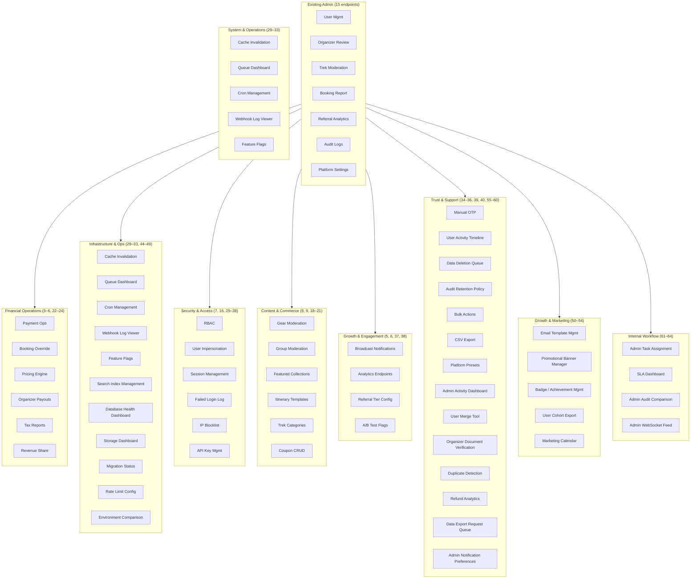
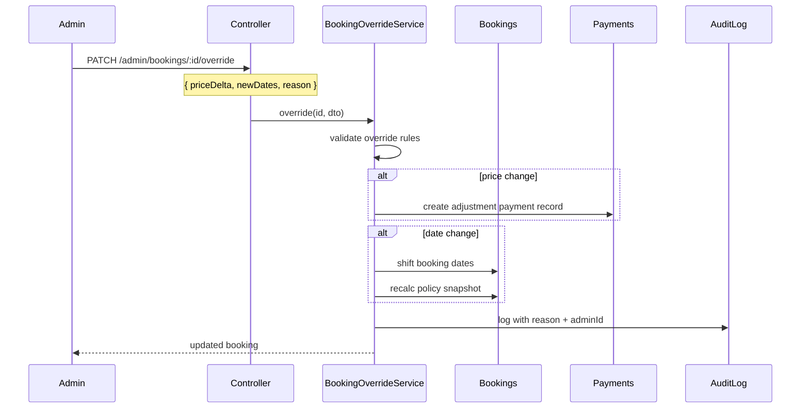
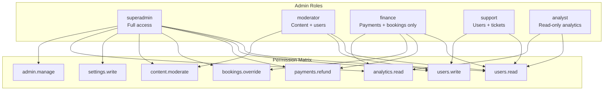
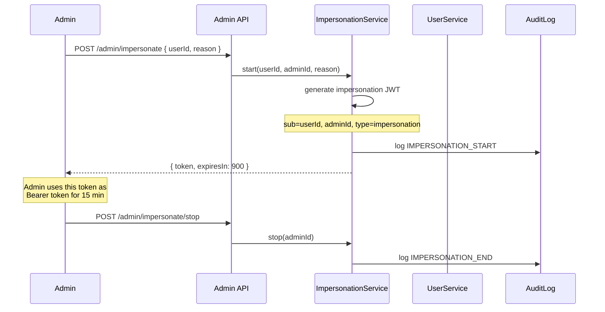
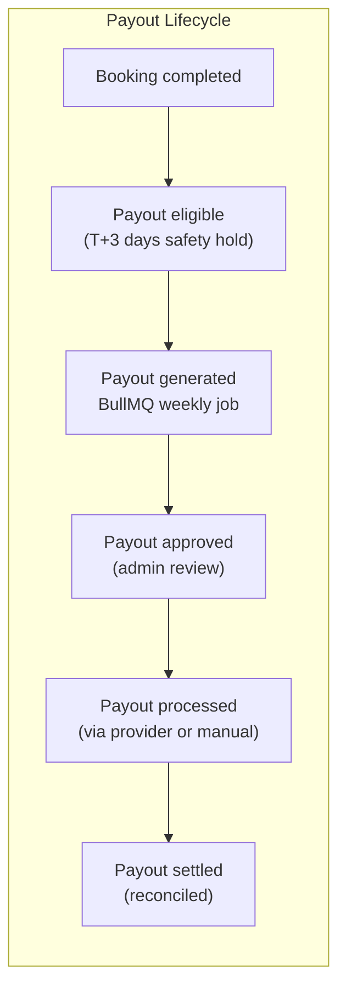
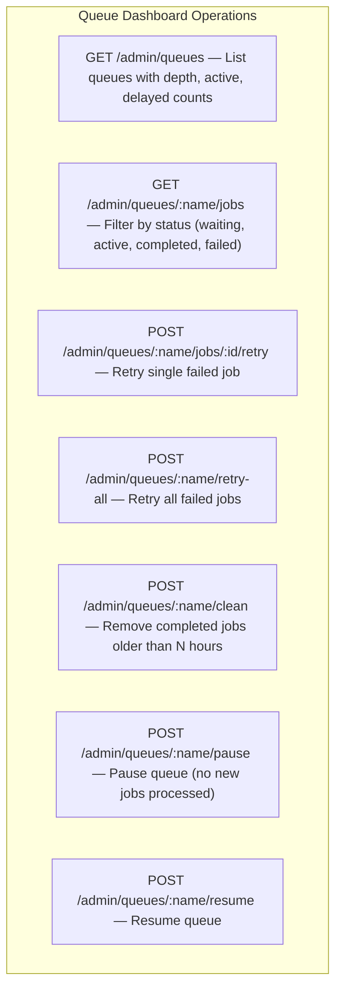
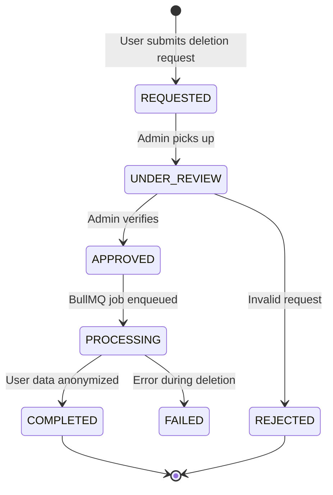
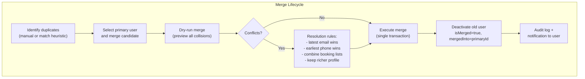
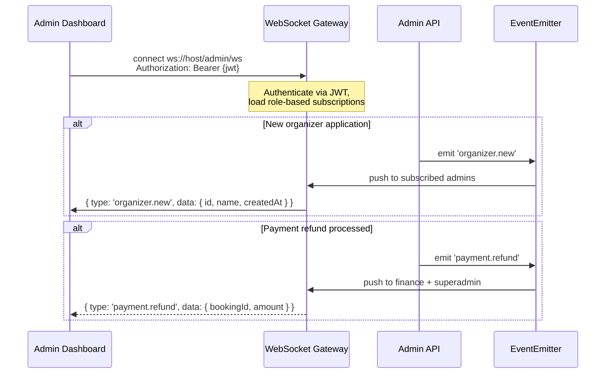

# Admin Module Extensions — Design & Operational Spec

> **Author:** Platform Architecture
> **Context:** The current admin module covers user administration, organizer decisions, trek moderation, bookings report, referral analytics, platform settings, and audit logging. Below are 62 proposed extensions organized by domain, ordered by operational impact.
>
> Every proposal includes: the problem it solves, key design decisions, integration boundaries, and risk notes. Diagrams use Mermaid and assume the existing NestJS module structure.

---

## Domain Map



---

## 3. Payment Operations ✅

> **Status: COMPLETED** — Implementation in `AdminPaymentController`/`AdminPaymentService`. 65 tests (service + controller). Committed `7835fcb`.

**Problem:** Admins have no way to refund, retry, or reconcile payments. Every edge case (failed payment, partial refund, dispute) requires direct DB access or Stripe dashboard login.

**Design:**
- `GET /admin/payments` — Search transactions by user, booking, provider, status, date range
- `POST /admin/payments/:id/refund` — Full or partial refund with reason. Calls provider SDK, updates payment + booking status atomically
- `POST /admin/payments/:id/retry` — Retry failed payment on a different provider (Stripe fallback after Razorpay failure). Idempotent via `idempotencyKey`
- `GET /admin/payments/disputes` — List Stripe/Razorpay disputes with status, evidence links

**Key decisions:**
- Refunds are recorded in a `refund_audit` JSONB column on the `payments` table — no separate table needed at v1
- Provider SDK calls are wrapped in a `PaymentGatewayAdapter` strategy pattern (already partially exists)
- All mutations log to `audit_logs` with `action: PAYMENT_REFUND`

**Risk:** Partial refund race condition — two admins refund same booking. Use optimistic locking (`updated_at` check) on the payment row.

---

## 4. Booking Override ✅

> **Status: COMPLETED** — Implementation in `AdminBookingOverrideController`/`AdminBookingOverrideService`. 27 tests. Committed `4c00f6b`.

**Problem:** Support has to manually edit DB for booking modifications (date change, price override, add-ons). Error-prone and un-audited.

**Design:**



**Endpoints:**
- `PATCH /admin/bookings/:id/override` — Modify price (±), shift dates, add notes
- `POST /admin/bookings/:id/cancel` — Force-cancel with full/partial/no refund override
- `GET /admin/bookings/:id/timeline` — Chronological event log for the booking

**Constraint:** Every override requires a `reason` string (min 10 chars). No override without audit trail.

---

## 5. Broadcast Push Notifications ✅

> **Status: COMPLETED** — Implementation in `AdminBroadcastController`/`AdminBroadcastService` + `BroadcastNotificationWorkerService`. 80 tests (unit + QA deep validation). 20 unit tests + 62 QA senior-tester edge-case tests. Migration `0026-CreateNotificationCampaignsTable`.

**Problem:** Marketing wants to send "Monsoon Sale — 20% off" to segments. Current approach: manual FCM console or engineering-run DB queries.

**Design:**
- `POST /admin/notifications/broadcast` — Compose title, body, image URL, deep link
- Segment by: all users, users by trek preference (tag-based), users by state/region, users who haven't booked in N days
- The endpoint enqueues a BullMQ `notification-broadcast-queue` job. The worker batches device tokens (500/batch) and calls FCM/Expo
- `GET /admin/notifications/broadcast/history` — Past campaigns with sent/delivered/opened counts

**Key decisions:**
- **Not real-time.** Broadcasts are async. Admin gets a `{ jobId }` back and polls for completion
- Segment resolution happens in the worker to avoid HTTP timeouts for large audiences (>50K)
- Rate-limited at provider level (FCM: 600K/min). Worker respects `BATCH_INTERVAL_MS`

---

## 6. Analytics Dashboard Endpoints ✅

> **Status: COMPLETED** — Implementation in `AdminAnalyticsController`/`AdminAnalyticsService` + `AnalyticsModule`. 19 tests (service + controller). Full spec covered.

**Endpoints:**
| Endpoint | Returns | Note |
|---|---|---|
| `GET /admin/analytics/dau` | Daily active users (7/30/90d) | Distinct user_id from sessions |
| `GET /admin/analytics/trek-popularity` | Treks ranked by views, bookmarks, bookings | Rolling 30d window |
| `GET /admin/analytics/conversion-funnel` | Page views → add-to-cart → payment → completion | Per-trek and aggregate |
| `GET /admin/analytics/revenue-trends` | Daily/weekly/monthly MRR, ARPU | Grouped by provider |
| `GET /admin/analytics/retention-cohort` | D7/D30/D90 retention by signup month | Standard cohort table |

**Key decisions:**
- All analytics are **read-only projections**. No writes originate from these endpoints
- Heavy aggregations use materialized views refreshed by a nightly BullMQ job
- Cached in Redis with 5–15 min TTL depending on endpoint. Cache key: `analytics:{endpoint}:{params}`
- This is **not** a real-time analytics system. Expect 1–15 min lag

---

## 7. RBAC / Admin Roles

**Problem:** Currently binary `isAdmin: boolean`. Scaling to 5+ admin users with different responsibilities (finance vs. moderation vs. support) requires granular permissions.

**Design:**



**Implementation:**
- Add `role: enum('superadmin', 'moderator', 'finance', 'support', 'analyst')` to `users` table
- `AdminGuard` becomes `RolesGuard` that checks `req.user.role` against a decorator: `@Roles('finance', 'superadmin')`
- Endpoints that require specific permissions get a `@RequirePermission('payments.refund')` decorator
- Migration: existing admins get `superadmin`. Zero downtime — old `isAdmin` check can be deprecated in next release

**Risk:** This touches every existing admin endpoint. All guards must be updated atomically. Backward-compat `AdminGuard` should remain during transition.

---

## 8. Gear Moderation

**Problem:** Gear listings are created by organizers/vendors without review. Low-quality or unsafe gear listings reach users.

**Endpoints:**
- `GET /admin/gear/pending` — Unreviewed gear items
- `PATCH /admin/gear/:id/decision` — Approve / Reject with reason
- `PATCH /admin/gear/:id/featured` — Toggle featured status (carousel placement)
- `DELETE /admin/gear/:id` — Remove item (soft-delete, audit logged)

**Integration:** Reads from existing `gear_items` table. No new entities. Decision field already exists? If not, add `reviewStatus` column.

---

## 9. Group Moderation

**Problem:** User-created groups can have inappropriate names, descriptions, or content. No admin oversight.

**Endpoints:**
- `GET /admin/groups` — List groups with flags (reported, member count, recent activity)
- `PATCH /admin/groups/:id/status` — Ban / Warn / Clear. Banned groups become invisible
- `GET /admin/groups/:id/members` — Member list. Option to remove member
- `POST /admin/groups/:id/transfer-ownership` — Hand group to another user

**Entity changes:** Add `status: enum('active', 'banned', 'flagged')` to `groups` table.

---

## 10. Safety Incident Log ✅

**Problem:** Safety check-in failures, SOS triggers, and emergency contact notifications leave no audit trail for admin review.

**Design:**
- `GET /admin/safety/incidents` — Paginated list of missed check-outs, SOS activations, emergency alerts
- `GET /admin/safety/incidents/:id` — Full detail: user, trek, timeline, notification history
- `PATCH /admin/safety/incidents/:id/resolve` — Mark as resolved with note

**Key decision:** This reads from the `safety` module's tables (`safety_checkins`, `incident_logs`). No new entities if those tables already capture the required data. If not, add `incident_logs` table.

---

## 11. Assessment Oversight

**Problem:** Fitness assessment results can inform risk flags, but admins have no visibility.

**Endpoints:**
- `GET /admin/assessments` — List assessments with score brackets, user details
- `GET /admin/assessments/:userId` — Assessment history for a specific user
- `POST /admin/assessments/:userId/flag` — Flag user as "requires re-assessment" (triggers push notification)

**Note:** This is a support tool. Not for broad access — flagging should be `finance` or `superadmin` only.

---

## 12. Weather Alerts (Admin-Triggered) ✅

**Problem:** Automated weather integration exists, but severe conditions sometimes need a human to broadcast an alert. Eg: IMD issues a flash flood warning for a region.

**Endpoints:**
- `POST /admin/weather/alerts` — Create alert: title, body, affected treks (by region/radius from lat/lng), severity
- `GET /admin/weather/alerts` — Active and past alerts
- `DELETE /admin/weather/alerts/:id` — Expire alert early

**Worker:** A `weather-alert-queue` job resolves the affected treks and pushes notifications to all users with active/pending bookings.

---

## 13. CSV/Excel Export ✅

**Problem:** Every list endpoint (users, bookings, payments, audit logs) needs downloadable export. Currently only available via raw DB query.

**Design pattern:**
- Add `?export=csv` or `?export=xlsx` query param to existing list endpoints
- Response becomes `Content-Disposition: attachment` with correct MIME type
- For large datasets (>10K rows), enqueue a BullMQ job and return a presigned S3 URL when ready

**Implementation:**
```typescript
// Shared decorator approach
@Get('users')
@Exportable({ filename: 'users-export', maxRows: 10000 })
async listUsers(@Query() query, @Res() res, @ExportContext() ctx) { ... }
```

---

## 14. Bulk Actions ✅

**Problem:** Suspending 50 users individually is tedious. Approving 20 pending treks during peak season is manual.

**Endpoints:**
- `POST /admin/bulk/users/status` — `{ userIds: [], action: 'suspend' | 'activate', reason }`
- `POST /admin/bulk/treks/approve` — `{ trekIds: [] }`
- `POST /admin/bulk/bookings/generate-tickets` — `{ bookingIds: [] }`

**Key decision:** Each action within the batch is processed atomically with individual error capture. Response: `{ success: [...], failed: [{ id, error }] }`. Max batch size: 500.

---

## 15. Platform Setting Presets ✅

**Problem:** Toggling "maintenance mode" requires editing 4 separate platform settings. Admins want named snapshots.

**Design:**
- `POST /admin/platform-settings/presets` — Save current settings as preset (name, description)
- `POST /admin/platform-settings/presets/:id/apply` — Apply preset (overwrites current settings)
- `GET /admin/platform-settings/presets` — List presets

**Built-in presets (seeded via migration):**
| Preset | Effect |
|---|---|
| `maintenance` | Blocks new bookings, shows maintenance banner |
| `holiday-surge` | Increases platform fee, enables surge pricing, promotes specific treks |
| `off-peak` | Reduces platform fee, enables discount stack |
| `emergency` | Block all payments, enable read-only mode |

---

## 16. User Impersonation ✅

**Problem:** Support needs to troubleshoot issues from the user's perspective. Requesting screenshots is slow and unreliable.

**Design:**



**Key decisions:**
- Impersonation JWT is a separate token type. The `ImpersonationGuard` allows access but tags every request header with `x-impersonated-by: adminId`
- Expires in 15 minutes. No renewal — admin must re-authenticate
- Every impersonated request is logged: `{ action, route, adminId, userId, timestamp }`
- **Excluded:** No impersonated access to payment methods, saved cards, or OTP verification flows

---

## 17. Admin Activity Dashboard ✅

**Problem:** No visibility into which admins are doing what. Audit logs exist but no aggregation.

**Endpoints:**
- `GET /admin/activity/summary` — Actions per admin today/this week, most active admins
- `GET /admin/activity/heatmap` — Actions by hour-of-day × day-of-week (for staffing decisions)
- `GET /admin/activity/recent` — Live feed of last 50 actions across all admins

**Implementation:** Purely aggregation queries on `audit_logs` table. Cache with 30s TTL.

---

## 18. Pricing & Discount Engine ✅

**Problem:** Discounts are currently hard-coded or platform-settings based. Seasonal pricing requires code changes.

**Endpoints:**
- `POST /admin/pricing/campaigns` — Create campaign: `{ name, trekIds[], discountType: percentage|flat, value, startDate, endDate, maxCap, minBooking }`
- `GET /admin/pricing/campaigns` — List active/scheduled/expired
- `PATCH /admin/pricing/campaigns/:id` — Modify or cancel
- `POST /admin/treks/:id/price-override` — Base price override for a specific date range

**Entity changes:** Add `pricing_campaigns` table. Treks reference campaign via `campaignId` nullable FK. The existing booking price calculation pipeline checks campaigns before falling back to base price.

---

## 19. Featured Collections / Curation

**Problem:** Homepage and category pages show all treks sorted by popularity. Marketing wants editorial control.

**Endpoints:**
- `POST /admin/collections` — Create collection: `{ name, slug, description, trekIds[ordered], isActive, coverImage }`
- `PATCH /admin/collections/:id/treks` — Reorder or replace treks in collection
- `GET /admin/collections` — List with trek count per collection

**Examples:** "Monsoon Specials", "Beginner Friendly", "Women-Led Treks", "Winter Wonderland"

**Integration:** Collections are served at `GET /collections/:slug` via a public (non-admin) endpoint. Cached aggressively (10-min Redis).

---

## 20. Itinerary Templates

**Problem:** Organizers repeatedly create similar itineraries for treks in the same region. No reuse mechanism.

**Endpoints:**
- `POST /admin/itinerary-templates` — Create template with reusable day blocks
- `GET /admin/itinerary-templates` — List with usage count
- `POST /admin/itinerary-templates/:id/apply-to-trek` — Apply template to a trek (deep-copies days; organizer can then customize)

**Entity changes:** Add `itinerary_templates` and `itinerary_template_days` tables. Soft-linked — applying a template copies data, doesn't create a live reference.

---

## 21. Trek Category / Tag Management ✅

**Problem:** Difficulty levels, activity types, and tags are currently free-text or ENUMs defined in code. Admins cannot add/modify without deployment.

**Endpoints:**
- `CRUD /admin/tags` — Manage tag taxonomy (difficulty, activity, accommodation, theme)
- `CRUD /admin/categories` — Manage category hierarchy (nested, with slugs)
- `POST /admin/treks/:id/tags` — Batch-update trek tags

**Key decision:** Move tags from code ENUM to a `tags` table with `type` column. Existing values seeded via migration. This is a breaking change for any code that switches on enum values — replace with string comparison.

---

## 22. Organizer Payout Management ✅

**Problem:** Organizers earn revenue from bookings. Currently there's no payout system — admins manually calculate and transfer.

**Design:**



**Endpoints:**
- `GET /admin/payouts` — List with status filter, date range, organizer filter. Includes total payable, fees deducted
- `POST /admin/payouts/:id/approve` — Approve for processing
- `POST /admin/payouts/:id/mark-settled` — Mark as settled (for manual transfers)
- `GET /admin/payouts/summary` — Aggregate: total pending, total paid this month, avg processing time

**Entity changes:** Add `payouts` table: `{ id, organizerId, amount, platformFee, netAmount, status: enum('pending','approved','processed','settled','failed'), periodStart, periodEnd, settledAt }`.

---

## 23. Tax / GST Reports ✅

**Problem:** Compliance requires periodic tax reports. Currently no way to generate GST-compliant invoices or returns.

**Endpoints:**
- `GET /admin/tax/report` — Period-based report: `{ from, to }` → `{ totalRevenue, taxableAmount, taxCollected, bookings[] }` with per-booking tax breakdown
- `GET /admin/tax/invoices` — Generate bulk GST invoices for a period (PDF via existing ticket PDF pipeline)

**Key decision:** This is a reporting layer on existing booking + payment data. No new entities if tax fields (`gstAmount`, `cgst`, `sgst`) already exist on payments. If not, add them.

---

## 24. Revenue Sharing Breakdown ✅

**Problem:** Platform takes a cut of each booking. Organizers and admins have no per-trek or per-period view of revenue split.

**Endpoints:**
- `GET /admin/revenue-share/overview` — Platform vs. organizer revenue, aggregated
- `GET /admin/revenue-share/by-trek` — Per-trek breakdown: `{ trekId, totalRevenue, platformShare, organizerShare, bookingCount }`
- `GET /admin/revenue-share/by-organizer` — Per-organizer breakdown for payout preparation

**Calculation:** Uses existing booking `totalAmount` and organizer `commissionRate` (from `organizer_applications` or `users`). Formula: `platformShare = totalAmount * commissionRate`, `organizerShare = totalAmount - platformShare - taxes - fees`.

---

## 25. Active Session Management ✅

**Problem:** No visibility into active JWTs. Can't force-logout a compromised account without waiting for token expiry (30 days for refresh tokens).

**Endpoints:**
- `GET /admin/sessions` — Active sessions: user, device info, IP, last activity, session age
- `DELETE /admin/sessions/:sessionId` — Revoke specific session (delete Redis key `refresh:{userId}:{sessionId}`)
- `DELETE /admin/sessions/user/:userId` — Revoke all sessions for a user

**Implementation:** Reads from Redis key pattern `refresh:*`. Token revocation is done by deleting the Redis key. The `JwtAuthGuard` already checks Redis for refresh validity — deleted key = forced re-auth.

---

## 26. Failed Login Attempts Log ✅

**Problem:** No way to detect brute-force patterns or credential stuffing.

**Endpoints:**
- `GET /admin/security/failed-logins` — List with filters: `{ userId?, ip?, from, to }`. Includes attempt count, user agent
- `GET /admin/security/failed-logins/summary` — Top IPs, top users, trend (7d)

**Implementation:** If rate limiting already logs to Redis, persist failed attempts to a `failed_login_attempts` table (log-only, no PII beyond email/IP). Keep 90-day retention, then auto-purge.

---

## 27. IP Blocklist / Allowlist ✅

**Problem:** Need to block abusive IPs or whitelist internal networks for admin API access.

**Endpoints:**
- `CRUD /admin/security/ip-blocklist` — IP/CIDR entries with reason, expiry
- `CRUD /admin/security/ip-allowlist` — Override blocklist for trusted IPs
- `GET /admin/security/ip-blocklist/audit` — Log of matches (blocked request attempts)

**Integration:** A global `IpFilterGuard` checks the request IP against Redis sets (`ip:blocklist`, `ip:allowlist`). Allowlist takes precedence. Redis sets are synced from DB on save + loaded at startup.

---

## 28. API Key Management ✅

**Problem:** Partner integrations need API keys that can be rotated and revoked independently of the global `GLOBAL_API_KEY`.

**Endpoints:**
- `CRUD /admin/api-keys` — Create/revoke/rotate keys with: `{ name, permissions[], expiresAt? }`
- `GET /admin/api-keys/:id/usage` — Recent usage log (last 100 requests)

**Entity changes:** Add `api_keys` table: `{ id, keyHash (not plaintext), name, permissions (text[]), expiresAt, lastUsedAt, createdAt }`.

**Key decision:** Store only `SHA-256(key)` in DB. The full key is returned once at creation. Admins cannot retrieve the full key later — only regenerate.

---

## 29. Cache Invalidation ✅

**Problem:** Cache staleness during data updates. Currently Redis entries expire on TTL. Admins need immediate invalidation.

**Endpoints:**
- `POST /admin/cache/invalidate` — `{ pattern: 'trek:*' }` or `{ pattern: 'platform:settings' }` → deletes all matching Redis keys
- `GET /admin/cache/stats` — Memory usage, key count by pattern, hit rate
- `GET /admin/cache/keys` — List keys by pattern with TTL

**Implementation:** `AdminCacheService` wraps raw ioredis client with SCAN/DEL pipeline for invalidation, INFO for stats, and SCAN+TTL for key listing. All 3 endpoints at `admin/cache`. Restricted to `superadmin`. No DB changes.

---

## 30. BullMQ Queue Dashboard ✅

**Problem:** Queue backlogs or stuck jobs go unnoticed. No admin UI for queue operations.

**Endpoints:**



**Implementation:** BullMQ `Queue` class methods wrapped in `AdminQueueDashboardService`. All 7 endpoints live at `admin/queues`. Service supports 15 registered queues (all from `queues.ts` + broadcast queue). Restricted to `superadmin` via RBAC. No DB changes required.

---

## 31. Scheduled Cron Job Management ✅

**Problem:** BullMQ repeatable jobs (story expiry, booking reminders) have no pause/resume mechanism.

**Endpoints:**
- `GET /admin/cron-jobs` — List repeatable jobs with: `{ queue, jobName, pattern, nextRun, enabled }`
- `POST /admin/cron-jobs/:key/disable` — Remove repeatable job from the queue
- `POST /admin/cron-jobs/:key/enable` — Re-add repeatable job
- `POST /admin/cron-jobs/:key/trigger-now` — Manually enqueue an immediate run

**Implementation:** `AdminCronService` wraps BullMQ `getRepeatableJobs()`, `removeRepeatableByKey()`, and `add()` with repeat. Job definitions hardcoded from `schedulers/` for enable/trigger-now. Routes at `admin/cron-jobs`. Restricted to `superadmin`. No DB changes.

---

## 32. Webhook Log Viewer ✅

**Problem:** Stripe/Razorpay webhook failures are invisible to admins. Debugging requires provider dashboard access.

**Endpoints:**
- `GET /admin/webhooks` — List recent webhook events with: `{ provider, eventType, status, statusCode, durationMs, createdAt }`
- `GET /admin/webhooks/:id` — Full detail including request body, response, error
- `POST /admin/webhooks/:id/retry` — Replay webhook to the handler

**Implementation:** New `WebhookLog` entity + migration `0029-CreateWebhookLogsTable`. `AdminWebhookService` lists logs with pagination/filtering, returns full detail, and retries by calling `PaymentsService.handleProviderSuccess/handleProviderFailure/handleProviderRefund` based on stored event type. Routes at `admin/webhooks`. Restricted to `superadmin`. Run migration 0029 to create the table.

---

## 33. Feature Flags ✅

**Problem:** Rolling out new features (new checkout flow, referral v2) requires deployment. Feature flags enable toggle without deploy.

**Endpoints:**
- `CRUD /admin/feature-flags` — Flags: `{ key, description, enabled, percentage (0-100 for gradual rollouts), userSegment? }`
- Flags evaluated in-memory. Load all active flags at startup + refresh on change via Redis pub/sub

**Entity changes:** Add `feature_flags` table. A `FeatureFlagService` provides `isEnabled(key, userId?)` — checks percentage rollout if `userId` provided.

---

## 34. Manual OTP Generation ✅

**Problem:** Users locked out of their accounts (lost phone, email issues). Support has no recovery path.

**Endpoint:**
- `POST /admin/otp/generate` — `{ userId, reason }` → Generates a one-time OTP valid for 5 minutes
- OTP is logged in audit log. Admin provides it to user via verified support channel (phone call, not email)

**Security:** This must require `superadmin` role. Each generation is logged with adminId, userId, reason. Maximum 3 per user per day.

---

## 35. User Activity Timeline ✅

**Problem:** Support has to check 5+ tables to understand a user's history. One consolidated view speeds up resolution.

**Endpoint:**
- `GET /admin/users/:id/timeline` — Unified chronological feed:
  - Account creation, login events (with IP, device)
  - Bookings (created, modified, cancelled)
  - Payments (amount, status, refunds)
  - Content actions (posts, comments)
  - Support interactions (impersonations, status changes)
  - Audit log entries involving this user

**Implementation:** `UNION ALL` query across `users`, `bookings`, `payments`, `posts`, `audit_logs` with `ORDER BY createdAt DESC`. Paginated. Cached per-user for 30s.

---

## 36. Coupon / Promo Code CRUD ✅

**Problem:** Coupons currently require DB inserts. Marketing cannot create/expire codes independently.

**Endpoints:**
- `CRUD /admin/coupons` — Full lifecycle: `{ code, discountType, discountValue, maxUses, minBookingAmount, maxDiscountCap, validFrom, validTo, applicableTrekIds[], isActive }`
- `GET /admin/coupons/:id/redemptions` — Usage log with user, booking, date
- `POST /admin/coupons/:id/expire` — Force-expire before validTo

**Entity changes:** Add `coupons` and `coupon_redemptions` tables. The existing booking checkout flow checks `coupons` table for validity.

---

## 37. Referral Tier Configurator ✅

**Problem:** Referral reward tiers are hard-coded. Changing reward amounts, thresholds, or conversion rates requires code deploy.

**Endpoints:**
- `CRUD /admin/referral-tiers` — Tiers: `{ name, minReferrals, rewardAmount, rewardType: 'coupon'|'points'|'both' }`
- `PATCH /admin/referral-settings` — Global settings: `{ pointsToInrRate, minPayoutThreshold, bonusForFirstReferral }`

**Integration:** The existing `ReferralService` reads tier config from DB instead of constants. Seed migration creates default tiers matching current hard-coded values.

---

## 38. A/B Test Flag Manager

**Problem:** Experimentation requires engineering to set up flag splits. No self-service for product team.

**Endpoints:**
- `CRUD /admin/ab-tests` — Tests: `{ name, flagKey, variants[{ name, percentage }], audienceSegment?, startDate, endDate }`
- `GET /admin/ab-tests/:id/results` — Exposure × conversion data (fed from analytics events)
- `POST /admin/ab-tests/:id/conclude` — Declare winner variant, auto-enable for 100%

**Key decision:** This overlaps with Feature Flags (item 33). A/B flags are a superset — they include variant distribution. Consider merging into a single `experiments` table. The `FeatureFlagService` should also serve experiment variants.

---

## 39. Data Deletion Request Queue

**Problem:** GDPR mandates user data deletion on request. Currently a manual DB operation with no workflow or audit trail.

**Design:**



**Endpoints:**
- `GET /admin/data-deletion` — List requests with status, user info, date
- `POST /admin/data-deletion/:id/approve` — Start processing
- `POST /admin/data-deletion/:id/reject` — With reason
- `GET /admin/data-deletion/:id/log` — Audit of what was deleted

**Implementation:** The worker performs: anonymize PII in `users` table → delete `device_tokens` → delete `sessions` → retain anonymous booking records (GDPR allows legitimate interest for financial records) → log completion.

---

## 40. Audit Log Retention Policy ✅

**Problem:** `audit_logs` is the fastest-growing table (est. 150MB at 10K admin actions). No retention policy.

**Endpoints:**
- `GET /admin/audit-logs/stats` — Table size, row count, growth rate (daily/weekly)
- `PATCH /admin/audit-logs/retention` — Set retention: `{ retentionDays: 365, exportBeforeDelete: true }`
- `POST /admin/audit-logs/purge-now` — Manual trigger (respects retention setting)

**Worker:** A `cleanup-queue` job (already exists, item 7 in existing queue inventory) runs daily and deletes audit logs older than `retentionDays`. If `exportBeforeDelete` is true, it first writes a parquet/CSV export to S3.

**Key decision:** The platform_settings table gets two new keys: `auditLogRetentionDays` (default 365) and `auditLogExportBeforePurge` (default true). No separate table needed.

---

## 44. Search Index Management ✅

**Problem:** Full-text search on treks (name, location, description) becomes stale when data changes. Reindexing requires DB operations or cache flushes with no admin visibility.

**Endpoints:**
- `GET /admin/search/indexes` — List search indexes: `{ name, documentCount, lastIndexedAt, status }`
- `POST /admin/search/indexes/:name/reindex` — Trigger full reindex (enqueues BullMQ job)
- `PATCH /admin/search/indexes/:name/settings` — Adjust field weights, fuzziness, ranking config

**Implementation:** If using PostgreSQL full-text search, trigger `REINDEX` via a worker that updates the `tsvector` column. If using MeiliSearch or Typesense, call the search provider's API. The reindex job reports progress: `{ indexed: 5000, total: 15000, eta: '45s' }`.

**Key decision:** Schema changes (adding new searchable fields) are out of scope for this feature — reindex only operates on existing indexed fields. Schema changes go through migrations.

---

## 45. Database Health Dashboard ✅

**Problem:** Performance degradation often starts with DB issues (bloat, missing indexes, connection pool exhaustion) that admins detect only after users complain.

**Endpoints:**
- `GET /admin/database/health` — Connection pool: `{ active, idle, waiting, maxPoolSize, utilizationPercent }`
- `GET /admin/database/slow-queries` — Top 10 queries by mean time, total time, or frequency (reads from `pg_stat_statements`)
- `GET /admin/database/tables` — Per-table: `{ rowCount, tableSize, indexSize, deadTuples, lastVacuum }`
- `GET /admin/database/indexes` — Unused indexes, duplicate indexes, missing index recommendations

**Implementation:** `AdminDatabaseService` runs raw SQL against `pg_stat_activity`, `pg_stat_user_tables`, `pg_stat_user_indexes`, `pg_stat_statements` via `@InjectDataSource()`. All endpoints gracefully return empty data if PG catalogs unavailable. Routes at `admin/database`. Restricted to `superadmin`. No DB changes.

---

## 46. S3/R2 Storage Dashboard ✅

**Problem:** Storage costs grow silently. Orphaned files (uploaded but never referenced) accumulate with no cleanup.

**Endpoints:**
- `GET /admin/storage/summary` — Per-bucket: `{ bucket, objectCount, totalSize, lastWeekGrowth }`
- `GET /admin/storage/file-types` — Breakdown by MIME type and bucket
- `GET /admin/storage/orphans` — R2 objects with no matching `media` table record (and vice versa)
- `POST /admin/storage/orphans/cleanup` — Delete orphaned objects (enqueues a BullMQ job; dry-run mode available)

**Implementation:** List R2 objects with pagination, compare against `media` table. This is I/O heavy — run as a background job, not inline.

---

## 47. Migration Status ✅

**Problem:** After deployments, admins need to verify that all migrations ran successfully. Currently requires checking logs or DB directly.

**Endpoints:**
- `GET /admin/migrations` — List all migration files with: `{ name, executedAt, durationMs, batch, state: up|down }`
- `POST /admin/migrations/:name/run` — Execute a specific pending migration
- `POST /admin/migrations/:name/revert` — Roll back the last migration (last batch only)

**Key decision:** NestJS/TypeORM already tracks migrations in `migrations` table. This endpoint surfaces that data with no new infrastructure. Revert should only be used in staging — production reverts follow the change management process.

---

## 48. Rate Limit Configuration ✅

**Problem:** Rate limits are hard-coded or env-configured. When a bot attack or flash crowd hits a specific endpoint, admins cannot react without deploy.

**Endpoints:**
- `GET /admin/security/rate-limits` — Current config per endpoint or global: `{ endpoint, windowMs, maxRequests, currentUtilization }`
- `PATCH /admin/security/rate-limits` — Override limits: `{ endpoint?: '*', windowMs, maxRequests }` — stored in Redis, applied dynamically

**Implementation:** A dynamic rate limiter reads overrides from Redis key `ratelimit:overrides:{endpoint}` on each request, with a fallback to the static config. Overrides expire after 24h unless renewed.

---

## 49. Environment Comparison ✅

**Problem:** Debugging environment-specific bugs requires manually checking env vars, settings, and feature flags across staging and production.

**Endpoint:**
- `GET /admin/environment/compare` — Side-by-side diff of:
  - Platform settings (from `platform_settings` table)
  - Feature flags (from `feature_flags` table)
  - Selected env vars (whitelist: `DB_HOST`, `REDIS_HOST`, `STORAGE_ENDPOINT`, etc. — NOT secrets)
- `GET /admin/environment/drift-report` — Historical record of config changes per environment

**Key decision:** Never expose secret values (JWT secrets, API keys, DB passwords). Only compare non-sensitive config. The env var whitelist must be maintained explicitly.

---

## 50. Email Template Management ✅

**Problem:** Transactional email copy is hard-coded. Marketing cannot update "Your booking is confirmed" text without a PR.

**Endpoints:**
- `CRUD /admin/email-templates` — Templates: `{ name, subject, body (HTML), variables[], isActive }`
- `POST /admin/email-templates/:id/preview` — Render with sample data — `{ userId, bookingId? }` → returns rendered HTML
- `POST /admin/email-templates/:id/test-send` — Send test email to requesting admin's address
- `GET /admin/email-templates/:id/versions` — Version history with diff view between revisions

**Entity changes:** Add `email_templates` table. The `MailerService` resolves template names to DB content instead of hard-coded strings, falling back to a default if no DB template exists.

---

## 51. Promotional Banner Manager

**Problem:** Homepage banners, interstitial promotions, and post-booking upsells are hard-coded. Marketing needs to schedule campaigns without engineering.

**Endpoints:**
- `CRUD /admin/banners` — Banners: `{ title, subtitle, imageUrl, ctaText, ctaLink, placement: homepage|trek-page|checkout, startDate, endDate, priority, isActive }`
- `GET /admin/banners/stats` — Per-banner: `{ impressions, clicks, ctr, lastServed }`

**Integration:** Banners are served via `GET /banners/active?placement={placement}` (public, cached). Impression/click tracking is done via a transparent pixel or POST event endpoint. Data flows into analytics for CTR calculation.

---

## 52. Badge / Achievement Management

**Problem:** Badges exist in the rewards module but are hard-coded. Admins cannot create new badges or manually award them.

**Endpoints:**
- `CRUD /admin/badges` — Badges: `{ name, slug, description, iconUrl, category, criteria (JSON), isAutoAwardable }`
- `POST /admin/badges/:id/award` — Manually award to a user `{ userId, reason }`
- `POST /admin/badges/:id/revoke` — Revoke from a user
- `GET /admin/badges/stats` — Per-badge: `{ awardedCount, uniqueRecipients, mostRecentAward }`

**Key decision:** Manual award creates an `admin_awarded` entry in the badge tracking table with `awardedBy` and `reason`. Auto-awardable badges are checked by a BullMQ job that evaluates criteria against user data.

---

## 53. User Cohort Export

**Problem:** Marketing runs targeted email/SMS campaigns but has no way to export user segments without writing SQL.

**Endpoints:**
- `POST /admin/cohorts/build` — Define segment: `{ filters: { minTreks, lastBookingBefore, lastBookingAfter, tags[], states[], isOrganizer, isSuspended }, format: csv|json }`
- `GET /admin/cohorts/:id/export` — Download the pre-built export (async — job-generated file on S3, presigned URL)
- `GET /admin/cohorts/history` — Past exports with row counts

**Implementation:** The segment builder composes a parameterized SQL query dynamically. Explicitly guard against `SELECT *` — only return: `email, name, phone, userId, totalTreks, lastBookingDate`. Max 50K rows per export.

---

## 54. Marketing Calendar

**Problem:** Coupons, banner campaigns, price changes, and broadcast notifications are scheduled independently with no centralized view.

**Endpoint:**
- `GET /admin/marketing/calendar` — Aggregated timeline of all scheduled marketing actions:
  - Coupon start/end dates
  - Banner campaign active periods
  - Broadcast notification schedules
  - Pricing campaign windows
  - Promotional collection publish dates

**Implementation:** `UNION ALL` query across `coupons`, `banners`, `broadcast_history`, `pricing_campaigns`, `collections` — projected into a common `{ date, type, title, description, status }` shape. Cached for 5 min.

---

## 55. User Merge Tool

**Problem:** Duplicate user accounts (same email, different provider; or same phone, different email) fragment booking history and support context.

**Design:**



**Endpoints:**
- `POST /admin/users/merge/dry-run` — `{ primaryUserId, mergeUserId }` → collision report
- `POST /admin/users/merge/execute` — `{ primaryUserId, mergeUserId, resolutionRules[] }` → merge result
- `GET /admin/users/merge/history` — Past merges with audit trail

**Implementation:** The merge transaction must be wrapped in a single DB transaction. It updates FKs across `bookings`, `posts`, `comments`, `payments`, `device_tokens`, `notifications`, `referrals`, `reviews`, and `safety_checkins`. Any FK failure rolls back the entire merge.

---

## 56. Organizer Document Verification

**Problem:** Organizer applications include KYC documents but there is no workflow to upload, verify, or track document status.

**Endpoints:**
- `GET /admin/organizers/:id/documents` — List submitted documents: `{ type: gst|idProof|insurance|businessReg, status, uploadedAt, expiresAt? }`
- `POST /admin/organizers/:id/documents/:docId/approve` — Mark as verified
- `POST /admin/organizers/:id/documents/:docId/reject` — Reject with reason, optionally request re-upload
- `GET /admin/organizers/documents/expiring` — Documents expiring within 30/60/90 days

**Entity changes:** Add `organizer_documents` table: `{ id, organizerId, type, fileUrl, status, verifiedBy, verifiedAt, expiresAt }`. Existing organizer approval endpoint checks document status before allowing approval.

---

## 57. Duplicate Detection

**Problem:** Same trek listed by different organizers with near-identical names and locations. Same user registered multiple times. No automated flagging.

**Endpoints:**
- `GET /admin/detection/trek-duplicates` — Treks grouped by similarity score (Levenshtein on name + geo-proximity on location)
- `GET /admin/detection/user-duplicates` — Users grouped by same email, same phone, or same device fingerprint
- `POST /admin/detection/trek-duplicates/:id/resolve` — Mark as confirmed duplicate, merge or reject
- `POST /admin/detection/user-duplicates/:id/resolve` — Route to user merge tool (item 55)

**Implementation:** Similarity computation is done by a nightly BullMQ job that writes results to a `duplicate_candidates` table. The admin endpoint surfaces these candidates. This avoids running expensive text similarity queries inline.

---

## 58. Refund Analytics

**Problem:** Refund rates, patterns, and abuse are invisible. No way to identify treks, organizers, or users with anomalous refund behaviour.

**Endpoints:**
- `GET /admin/analytics/refunds/overview` — `{ totalRefunded, refundRate, avgRefundAmount, refundByReason }`
- `GET /admin/analytics/refunds/by-trek` — Per-trek refund stats, ranked by refund rate
- `GET /admin/analytics/refunds/by-organizer` — Per-organizer refund stats
- `GET /admin/analytics/refunds/by-user` — Users with >3 refunds or >80% refund rate (abuse candidates)
- `GET /admin/analytics/refunds/trend` — Monthly refund rate over 12 months

**Implementation:** Aggregation queries on `payments` table where `status = 'refunded'` and `refundAmount > 0`. If `refundReason` is captured at refund time, group by it.

---

## 59. Data Export Request Queue (GDPR Article 20)

**Problem:** GDPR grants users the right to receive their data in a portable format. Currently no mechanism to fulfil these requests.

**Design:**
- User submits request → `data_export_requests` table entry created
- Admin reviews → approves or rejects
- Approval triggers a BullMQ job that:
  1. Queries `users`, `bookings`, `payments`, `posts`, `comments`, `reviews`, `notifications`, `safety_checkins`, `assessments` for the user
  2. Packages into a structured JSON file (possibly with CSV/PDF sub-files)
  3. Zips the package, uploads to S3 with a presigned URL
  4. Emails the user with the download link (expires in 7 days)

**Endpoints:**
- `GET /admin/data-exports` — List requests with status and user info
- `POST /admin/data-exports/:id/approve` — Start processing
- `POST /admin/data-exports/:id/reject` — With reason
- `GET /admin/data-exports/:id/log` — What data was included, file size, download expiry

---

## 60. Admin Notification Preferences

**Problem:** Critical events (payment failure, report spike, safety incident) go unnoticed until someone checks manually. Admins want configurable alerts.

**Endpoints:**
- `GET /admin/notifications/preferences` — Per-admin config: `{ eventType, channel: email|slack|push, enabled }`
- `PATCH /admin/notifications/preferences` — Update individual event-channel mappings
- `POST /admin/notifications/test` — Send test notification for each configured channel

**Events to alert on:**
| Event | Default Channel | Severity |
|---|---|---|
| `payment.large-refund` | Slack + Email | High |
| `safety.sos-activated` | Slack + SMS | Critical |
| `organizer.application-new` | Slack | Low |
| `report.threshold-crossed` | Slack | Medium |
| `queue.backlog-critical` | Slack | Medium |
| `booking.surge-anomaly` | Slack | Low |

**Implementation:** A `NotificationRouter` service checks each admin's preference map before dispatching. Preferences stored in a JSONB column on `users` (admin-only) or a `admin_notification_prefs` table.

---

## 61. Admin Task Assignment

**Problem:** Organizer applications, report tickets, and data deletion requests accumulate with no owner. No accountability or SLA tracking.

**Endpoints:**
- `POST /admin/tasks` — Create task: `{ type, resourceId, assignedTo, priority, dueBy }`
- `PATCH /admin/tasks/:id/assign` — Reassign to another admin
- `PATCH /admin/tasks/:id/status` — `Open → In Progress → Resolved → Closed`
- `GET /admin/tasks` — Filter by assignee, status, type, priority, date range
- `GET /admin/tasks/mine` — Current admin's open tasks, sorted by priority + due date

**Entity changes:** Add `admin_tasks` table: `{ id, type: enum, resourceId (polymorphic), assignedTo (userId FK), status, priority, dueBy, createdAt, resolvedAt }`.

**Key decision:** Tasks are manually created or auto-generated by hooks (new organizer application → create task). Polymorphic `resourceId` means either separate columns per resource type or a single `resourceType + resourceId` pair.

---

## 62. SLA Dashboard

**Problem:** No visibility into how quickly admins respond to organizer applications, reports, or support requests.

**Endpoints:**
- `GET /admin/sla/overview` — Per-category: `{ avgResponseTime, p95ResponseTime, breachCount, totalTickets }`
- `GET /admin/sla/by-admin` — Per-admin averages, ranked by performance
- `GET /admin/sla/breaches` — Tickets that exceeded SLA threshold, with assignee and resolution notes
- `PATCH /admin/sla/config` — Configure SLA thresholds per category: `{ organizerApplication: 48h, reportTicket: 24h, dataDeletion: 72h }`

**Implementation:** Reads from `admin_tasks` table (item 61). SLA breach is a computed value: `resolvedAt - createdAt > threshold`. Breach events can trigger admin notifications (item 60).

---

## 63. Admin Audit Comparison

**Problem:** "Who changed the platform settings last night?" is answered by scrolling through raw audit logs. No diff view.

**Endpoints:**
- `GET /admin/audit-logs/:resourceType/:resourceId/diff` — Show chronological diffs of a specific resource (platform settings, feature flag, coupon, etc.)
- `GET /admin/audit-logs/timeline` — Filterable, grouped-by-session view: "Admin X made 5 changes in 3 minutes" grouped as one session

**Design:** Changes to JSONB fields (`detail` column in `audit_logs`) are compared using a JSON diff algorithm (e.g., `jsondiffpatch`). For sequential entries on the same resource, compute a delta between consecutive `detail` snapshots.

---

## 64. Admin WebSocket Feed

**Problem:** Admins refresh the dashboard to see new organizer applications or reports. No real-time awareness.

**Design:**



**Events to push:**
| Event | Target Role | Payload |
|---|---|---|
| `organizer.new` | all | `{ id, name, createdAt }` |
| `report.new` | moderator, superadmin | `{ id, resourceType, reason }` |
| `payment.refund` | finance, superadmin | `{ bookingId, amount, provider }` |
| `safety.sos` | superadmin | `{ userId, trekId, lat, lng }` |
| `queue.backlog` | superadmin | `{ queueName, depth }` |
| `booking.surge` | all | `{ count, windowMinutes }` |

**Implementation:** NestJS `WebSocketGateway` with `@WebSocketGateway({ namespace: '/admin/ws' })`. Authentication via JWT handshake. Admin's role determines which event channels they subscribe to. No persistence — events are transient.

**Key decision:** This is a firehose — the WebSocket should not replay history. If an admin disconnects, they miss events during that window. Use a polling fallback (`GET /admin/activity/recent` from item 17) for catch-up.

---

## Implementation Priority Matrix

| Domain | Feature | Effort | Impact | Dependencies |
|---|---|---|---|---|
| Financial | Payment Ops (3) | Medium | High | Existing payment provider adapters |
| Security | RBAC (7) | Medium | High | Every admin endpoint |
| Operations | Queue Dashboard (30) | Low | High | BullMQ |
| Financial | Revenue Share (24) | Low | High | Existing booking data |
| Support | User Timeline (35) | Medium | High | 5+ table queries |
| Operations | Feature Flags (33) | Medium | Medium | Need adoption across codebase |
| Security | Impersonation (16) | Medium | Medium | JWT infrastructure |
| Operations | Webhook Log (32) | Low | Medium | Already logging? |
| Content | Coupon CRUD (36) | Medium | Medium | New entity |
| Financial | Pricing Engine (18) | High | Medium | Touches booking calculation |
| Growth | Analytics (6) | High | Medium | Materialized views + caching |
| Growth | Broadcast (5) | Medium | Medium | Existing notification worker |
| Security | Session Mgmt (25) | Low | Medium | Redis key pattern |
| Content | Featured Collections (19) | Low | Low | New entity, public endpoint |
| Content | Tags/Categories (21) | Medium | Low | Touches trek entity, migration |
| Support | Data Deletion (39) | High | Medium | Multiple table operations |
| All | CSV Export (13) | Medium | Medium | Many list endpoints |
| All | Bulk Actions (14) | Low | Medium | Shared validation logic |
| Infrastructure | Search Index Mgmt (44) | Low | Medium | Search provider (PG/MeiliSearch) |
| Infrastructure | DB Health Dashboard (45) | Low | High | `pg_stat_statements` extension |
| Infrastructure | Storage Dashboard (46) | Low | Medium | R2 list operations |
| Infrastructure | Migration Status (47) | Low | Medium | TypeORM migrations table |
| Infrastructure | Rate Limit Config (48) | Low | Medium | Dynamic rate limiter |
| Infrastructure | Environment Compare (49) | Low | Low | Secret whitelist maintenance |
| GrowthOps | Email Templates (50) | Medium | Medium | MailerService refactor |
| GrowthOps | Banner Manager (51) | Low | Medium | New entity + public endpoint |
| GrowthOps | Badge Management (52) | Medium | Low | Badge criteria evaluation worker |
| GrowthOps | Cohort Export (53) | Medium | Medium | Dynamic query builder |
| GrowthOps | Marketing Calendar (54) | Low | Medium | UNION ALL across 5 tables |
| Support | User Merge (55) | High | Medium | Multi-table transaction, risk |
| Support | Document Verification (56) | Medium | Medium | New entity, workflow state |
| Support | Duplicate Detection (57) | Medium | Low | Nightly similarity job |
| Support | Refund Analytics (58) | Low | Medium | Payment aggregation queries |
| Support | Data Export GDPR (59) | High | Medium | Multi-table export, S3 upload |
| Support | Admin Notif Prefs (60) | Low | Medium | Event router service |
| Workflow | Task Assignment (61) | Medium | High | New entity, polymorphic FK |
| Workflow | SLA Dashboard (62) | Low | Medium | Computed from tasks |
| Workflow | Audit Diff (63) | Medium | Low | JSON diff algorithm |
| Workflow | WebSocket Feed (64) | Medium | High | WebSocket gateway + auth |

---

## Architecture Notes

### Audit Integration
Every new mutation endpoint must log to `audit_logs`. The existing `AuditInterceptor` already captures HTTP-level logging. For domain-specific actions (refund, payout approve, impersonation), emit explicit audit entries via `AuditLogService.save()`.

### Pagination Convention
All list endpoints follow the existing pattern: `{ page, limit, total, data[] }`. Default `limit: 20`, max `limit: 100`. For export endpoints, the limit is replaced by the export format parameter.

### Error Handling
Admin endpoints should return structured errors:
```json
{
  "statusCode": 422,
  "error": "UNPROCESSABLE_ENTITY",
  "message": "Refund amount exceeds booking total",
  "details": { "bookingTotal": 5000, "refundRequested": 6000 }
}
```

### Rate Limiting
Admin endpoints should have separate, higher rate limits than public endpoints. Suggested: 200 requests / 60s per admin user. Impersonation creates a separate rate limit bucket keyed by `impersonated:{adminId}`.

### Testing Strategy
- Unit tests for validation logic (DTOs, permission checks, calculation)
- Integration tests with real DB + Redis for service methods
- E2E tests for critical flows: refund, payout approval, broadcast dispatch, impersonation
- Existing admin test files (`admin.service.spec.ts`, `audit-log.service.spec.ts`) should be extended per feature

---

*End of spec. Each feature should be implemented as a discrete PR following the agent conventions in `AGENTS.md`.*

**Agent ownership map:**
| Agent | Items |
|---|---|
| `bookings-payments-agent` | 3, 4, 22–24, 58 |
| `organizer-admin-agent` | 8, 9, 18–21, 56 |
| `auth-agent` | 7, 16, 25–28, 48, 55 |
| `jobs-workers-agent` | 29–33, 44, 47, 59 |
| `media-agent` | 46 |
| `notifications-agent` | 5, 60, 64 |
| `observability-agent` | 45, 49, 63 |
| Cross-cutting (coordinate with domain owners) | 13, 14, 35, 39, 40, 50–54, 57, 61, 62 |

> **Note:** `posts-stories-agent` is deprecated alongside Posts and Stories modules. Items 50–54 (Email Templates, Banner Manager, Badge Management, Cohort Export, Marketing Calendar) are cross-cutting between marketing and platform — coordinate with both `organizer-admin-agent` and product owners.
