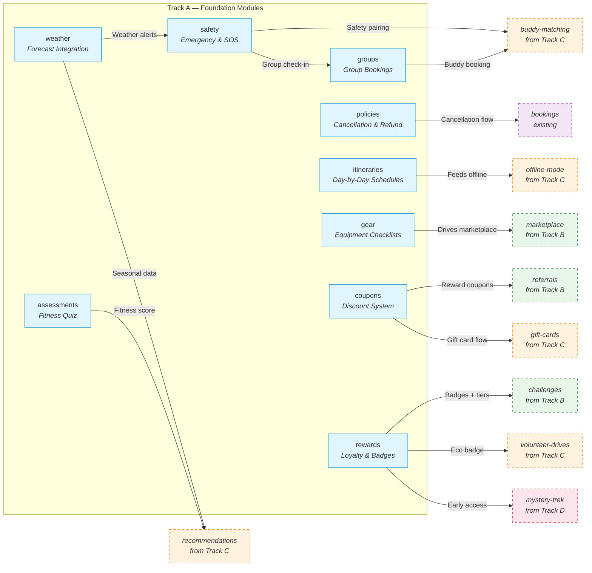
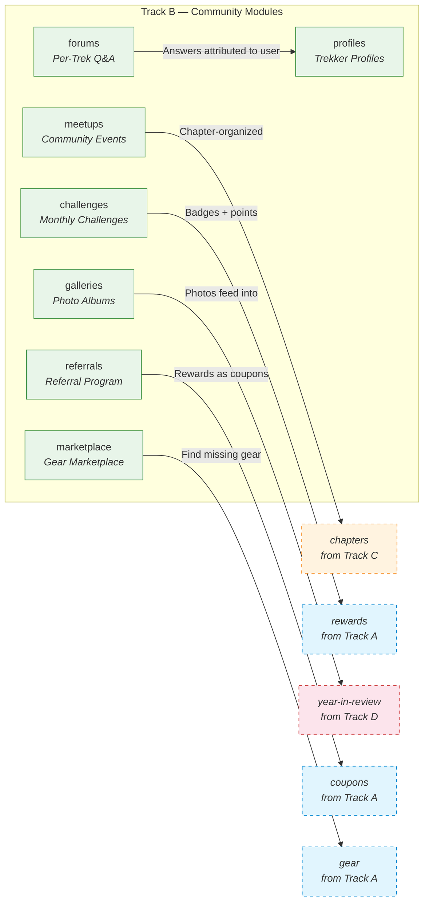
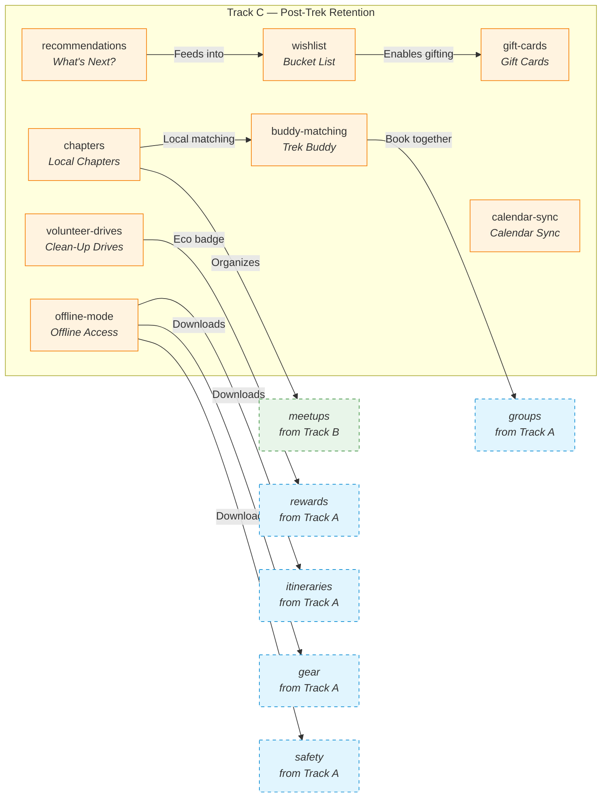
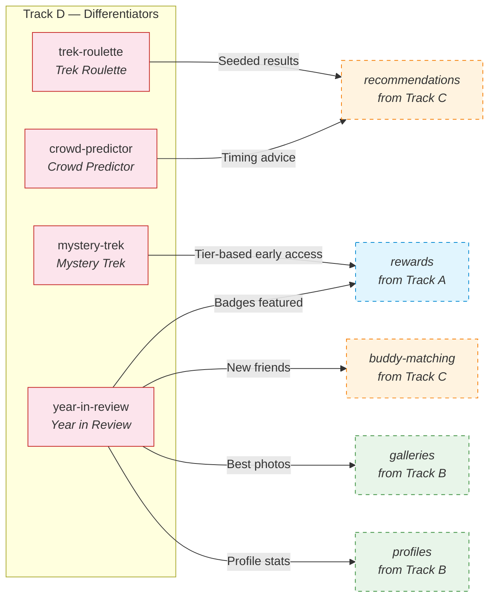

# Offbeat Pravasi — Complete Feature Roadmap

> **28 planned modules** across 4 tracks. Every feature in this document is described in plain language — what it does, how a user experiences it, what real-world problem it solves, and how it connects to the rest of the app.

---

## How to read this document

Each module follows the same structure:

| Section | What you'll find |
|---------|-----------------|
| **What it does** | A one-line summary of the core purpose |
| **The user journey** | Step-by-step walkthrough of what a real user sees and does — from first interaction to completion |
| **A real scenario** | A named example that makes the feature concrete |
| **Why this exists** | The problem it solves and the pain point it addresses |
| **Who it serves** | Which user type gets value (Trekkers, Organizers, Admins, or all) |
| **Feature connections** | How this module talks to other modules in the roadmap |
| **Why it matters** | Business value — retention, conversion, revenue, or engagement impact |

---

## Ecosystem Overview

```mermaid
graph TB
    subgraph TrackA["Track A — Foundation"]
        A1["policies<br/><i>Cancellation & Refund</i>"]
        A2["itineraries<br/><i>Day-by-Day Schedules</i>"]
        A3["gear<br/><i>Equipment Checklists</i>"]
        A4["weather<br/><i>Forecast Integration</i>"]
        A5["safety<br/><i>Emergency & SOS</i>"]
        A6["assessments<br/><i>Fitness Quiz</i>"]
        A7["coupons<br/><i>Discount System</i>"]
        A8["groups<br/><i>Group Bookings</i>"]
        A9["rewards<br/><i>Loyalty & Badges</i>"]
    end

    subgraph TrackB["Track B — Community"]
        B1["forums<br/><i>Per-Trek Q&A</i>"]
        B2["profiles<br/><i>Trekker Profiles</i>"]
        B3["meetups<br/><i>Community Events</i>"]
        B4["challenges<br/><i>Monthly Challenges</i>"]
        B5["galleries<br/><i>Photo Albums</i>"]
        B6["referrals<br/><i>Referral Program</i>"]
        B7["marketplace<br/><i>Gear Marketplace</i>"]
    end

    subgraph TrackC["Track C — Post-Trek Retention"]
        C1["recommendations<br/><i>What's Next?</i>"]
        C2["wishlist<br/><i>Bucket List</i>"]
        C3["chapters<br/><i>Local Chapters</i>"]
        C4["buddy-matching<br/><i>Trek Buddy</i>"]
        C5["volunteer-drives<br/><i>Clean-Up Drives</i>"]
        C6["gift-cards<br/><i>Gift Cards</i>"]
        C7["offline-mode<br/><i>Offline Access</i>"]
        C8["calendar-sync<br/><i>Calendar Sync</i>"]
    end

    subgraph TrackD["Track D — Differentiators"]
        D1["mystery-trek<br/><i>Mystery Trek</i>"]
        D2["trek-roulette<br/><i>Trek Roulette</i>"]
        D3["crowd-predictor<br/><i>Crowd Predictor</i>"]
        D4["year-in-review<br/><i>Year in Review</i>"]
    end

    A2 --> A3
    A2 --> A4
    A3 --> B7
    A4 --> A5
    A5 --> C4
    A6 --> C1
    A7 --> B6
    A7 --> C6
    A8 --> C4
    A9 --> B4
    A9 --> D1
    B1 --> B2
    B3 --> C3
    B5 --> D4
    B6 --> A7
    C1 --> C2
    C2 --> C6
    C3 --> B3
    C3 --> C4
    C4 --> A8
    C7 --> A2
    C7 --> A3
    C7 --> A5
    D2 --> C1
    D3 --> C1
    D4 --> B2
    D4 --> A9
    D4 --> B5
    D4 --> C4

    style A1 fill:#e1f5fe,stroke:#0288d1
    style A2 fill:#e1f5fe,stroke:#0288d1
    style A3 fill:#e1f5fe,stroke:#0288d1
    style A4 fill:#e1f5fe,stroke:#0288d1
    style A5 fill:#e1f5fe,stroke:#0288d1
    style A6 fill:#e1f5fe,stroke:#0288d1
    style A7 fill:#e1f5fe,stroke:#0288d1
    style A8 fill:#e1f5fe,stroke:#0288d1
    style A9 fill:#e1f5fe,stroke:#0288d1

    style B1 fill:#e8f5e9,stroke:#388e3c
    style B2 fill:#e8f5e9,stroke:#388e3c
    style B3 fill:#e8f5e9,stroke:#388e3c
    style B4 fill:#e8f5e9,stroke:#388e3c
    style B5 fill:#e8f5e9,stroke:#388e3c
    style B6 fill:#e8f5e9,stroke:#388e3c
    style B7 fill:#e8f5e9,stroke:#388e3c

    style C1 fill:#fff3e0,stroke:#f57c00
    style C2 fill:#fff3e0,stroke:#f57c00
    style C3 fill:#fff3e0,stroke:#f57c00
    style C4 fill:#fff3e0,stroke:#f57c00
    style C5 fill:#fff3e0,stroke:#f57c00
    style C6 fill:#fff3e0,stroke:#f57c00
    style C7 fill:#fff3e0,stroke:#f57c00
    style C8 fill:#fff3e0,stroke:#f57c00

    style D1 fill:#fce4ec,stroke:#c62828
    style D2 fill:#fce4ec,stroke:#c62828
    style D3 fill:#fce4ec,stroke:#c62828
    style D4 fill:#fce4ec,stroke:#c62828
```

---

## Track A — Foundation

### These modules build the core trekking experience. They are the backbone that every other feature depends on.

---

### 1. Cancellation & Refund Policies (`policies`)

**What it does:** Defines clear cancellation windows and refund percentages for trek bookings. Policies can be set globally (applied to all treks by default) or customized per trek. Each policy has a name ("Flexible", "Standard", "Strict"), a cancellation window in hours before the start date, and a refund percentage.

**The user journey:**

- **Organizer side:** When creating or editing a trek, the organizer picks a policy from a dropdown. They can see a preview of what the user will see: "Cancel 7+ days before → 100% refund. Cancel 3-7 days before → 50% refund. Cancel less than 3 days before → No refund." They can also create custom policies.
- **Trekkers side:** On the booking page, the policy is displayed prominently before payment: "Free cancellation until June 10th. 50% refund until June 14th." After booking, the cancellation button in "My Bookings" always shows the current refund amount in rupees — updated in real time based on how close the trek is.
- **Cancellation flow:** When a user clicks "Cancel Booking", they first see a summary: "Your refund: ₹2,500 (50% of ₹5,000). Cancellation policy: Standard (cancel 3+ days before for 50% refund)." They confirm, the refund is processed automatically through the payment provider, and both the user and organizer receive confirmation emails.

**A real scenario:**

> Priya books a trek to Valley of Flowers for ₹6,000 on June 1st. The trek starts June 20th. The policy is "Standard": 100% refund up to 7 days before (June 13th), 50% refund up to 3 days before (June 17th). On June 10th, Priya realizes she has a work conflict. She goes to My Bookings, sees "Refund: ₹6,000". She cancels. Full refund issued. On June 15th, another user takes her slot automatically.

**Why this exists:** Cancellation policies are the #1 source of support tickets and disputes on booking platforms. Without a clear, automated system, every cancellation becomes a manual email thread. With it, everything is transparent, consistent, and hands-free.

**Who it serves:**
- **Trekkers** — Know exactly where they stand. No guessing, no contacting support.
- **Organizers** — No more manual refund calculations. Policies protect them from last-minute cancellations.
- **Admins** — Disputes drop to near zero. Audit log shows every cancellation and its policy basis.

**Feature connections:**
- → **Bookings module** — Cancellation flow triggers refund logic
- → **Payments module** — Refunds are processed through Stripe/Razorpay
- → **Notifications module** — Both parties get email/push on cancellation + refund

**Why it matters:** Trust is the currency of a booking platform. Clear, fair cancellation policies are one of the first things users check before paying. This module eliminates support overhead for one of the most common reasons users contact help.

---

### 2. Itinerary Management (`itineraries`)

**What it does:** A tool for organizers to build a complete day-by-day schedule for each trek. Each day captures: title, description, trail distance in kilometres, altitude gain and loss in metres, maximum altitude reached, meal plan (breakfast, lunch, dinner), accommodation type (tent, guesthouse, camp, homestay), and the type of activity (trekking, rest day, acclimatization, sightseeing). Days are ordered and reorderable.

**The user journey:**

- **Organizer side:** In the trek editor, the organizer clicks "Add Day" and fills out the details. They can drag days to reorder. A preview panel shows the full itinerary as trekkers will see it. They can mark certain days as "Rest / Acclimatization" so trekkers understand why they're not trekking that day.
- **Trekkers side:** On the trek detail page, the itinerary is the first thing most users scroll to read. It renders as a vertical timeline with each day as an expandable card. Day 1: "Arrival at Base Camp — 5 km, +300m". Day 2: "Summit Attempt — 8 km, +1,200m". Users can expand any day to read the full description, meal plan, and accommodation. The itinerary is also available in the "My Bookings" section after booking and in the Offline Mode download.

**A real scenario:**

> Ravi is comparing two treks in Himachal. Trek A shows: "Day 1: Drive to base, Day 2: Trek to camp, Day 3: Summit, Day 4: Descend." Trek B shows: "Day 1 (4km, +200m): Arrive at Jibhi village, settle into forest guesthouse. Evening walk to waterfall. Dinner: Himachali dham. Day 2 (8km, +1,100m): Early start to Sar Pass summit. Packed lunch en route. Descend to campsite by 4pm. Campfire dinner. Day 3 (6km, -400m): Leisurely descent through rhododendron forest. Lunch at base. Depart." Ravi books Trek B — he knows exactly what to expect.

**Why this exists:** A trek without a detailed itinerary is a black box. Trekkers want to know what each day looks like — how many hours they'll walk, where they'll sleep, what they'll eat. A detailed itinerary is the single most persuasive piece of content on a trek page. It also sets expectations: trekkers who know what's coming are less likely to be surprised, complain, or drop out midway.

**Who it serves:**
- **Trekkers** — The primary decision-making tool when choosing a trek
- **Organizers** — Differentiator from organizers who don't provide detailed schedules

**Feature connections:**
- → **Offline Mode** — Itinerary is the most important content to download for offline access
- → **Weather module** — Each day's altitude and location can show day-specific weather
- → **Safety module** — Knowing the day's route helps position safety info (steep sections, exposed ridges)

**Why it matters:** Conversion. A trek with a detailed itinerary converts significantly better than one without. It's also the foundation for nearly every other content feature — gear, weather, safety, and offline mode all reference the itinerary.

---

### 3. Equipment & Gear Checklists (`gear`)

**What it does:** Per-trek gear lists organized by category (Clothing, Footwear, Camping, Navigation, Toiletries, Documents, Optional). Each item shows: item name, whether it's required or recommended, whether the organizer provides it, and whether it's available for rent with the rental price. Organizers curate the list for their trek.

**The user journey:**

- **Organizer side:** The organizer picks from a master gear library or creates custom items. They mark each as "Required", "Provided by us", or "Available for rent (₹300/trip)". They can create separate lists for different seasons (summer vs. winter gear for the same trek).
- **Trekkers side:** On the trek page, a "Gear List" tab shows everything needed. Items the organizer provides are marked with a green checkmark ("Provided"). Items available for rent show a "Rent for ₹XXX" button. Users can check off items they already own to create a personal packing list. Before the trek, they receive a reminder: "You haven't marked 5 items yet — tap to prepare your packing list."
- **Rental flow:** If a user needs a rented item, they add it during booking. The organizer prepares the gear and hands it over at the trek start. Payment is added to the booking total.

**A real scenario:**

> Anika is booking her first-ever trek — Kedarkantha. She's nervous because she's never done this before. She opens the Gear tab and sees: "Trekking shoes — Required. Not provided. Rent: ₹500." "Sleeping bag — Provided by organizer." "Headlamp — Required. Not provided. Rent: ₹200." "Waterproof jacket — Recommended." She checks off what she already has (warm clothes, backpack, water bottle), rents the shoes and headlamp, buys a waterproof jacket from the Marketplace, and books with confidence.

**Why this exists:** The most common question from first-time trekkers is "What do I need to bring?" A clear checklist eliminates anxiety and prevents people from arriving unprepared. The rental option also removes a major barrier — buying expensive gear for a single trek.

**Who it serves:**
- **Trekkers** — Especially first-timers who own no gear
- **Organizers** — Additional revenue from gear rental
- **Admins** — Standardized gear expectations reduce disputes

**Feature connections:**
- → **Marketplace** — Items marked "Not provided, not for rent" can be sourced from the marketplace
- → **Groups module** — Group members can coordinate who brings what (one tent between two, etc.)
- → **Offline Mode** — Packing list is a core offline download
- → **Calendar Sync** — Gear reminder appears in the calendar event

**Why it matters:** Reduces the "I don't have gear" objection that kills bookings. Creates a rental revenue stream. Increases preparedness → better trek experience → higher satisfaction → repeat bookings.

---

### 4. Weather Integration (`weather`)

**What it does:** Fetches live weather forecasts for trek locations using the trek's latitude and longitude coordinates. Shows current conditions, hourly breakdown, and a 7-day forecast directly on the trek detail page. Data is cached in Redis for performance so the app doesn't hit the weather API on every page load.

**The user journey:**

- **Browsing treks:** A small weather widget on each trek card shows the current temperature and condition icon (☀️/⛅/🌧️/❄️) for that location. Users get an immediate sense of what to expect.
- **Trek detail page:** A full weather section shows: current temperature, feels-like, wind speed, humidity, sunrise/sunset, and a 7-day forecast. If the trek has a specific start date (fixed departure), the forecast defaults to those dates. If it's an open calendar trek, users can pick their intended dates and see the forecast.
- **Pre-trek notifications:** 3 days before the trek starts, a push notification says: "Heavy rainfall expected at Valley of Flowers this weekend. Make sure your rain gear is ready!" If conditions are dangerous (storm warning, extreme cold), an alert recommends checking with the organizer or rescheduling.
- **After booking:** The weather forecast appears in "My Bookings" so users can check it without going to the trek page.

**A real scenario:**

> Arjun is planning a Stok Kangri trek in September but is worried about early winter conditions. He opens the trek page, picks "September 15-20" as his intended dates, and sees: "Sept 15: 8°C / -2°C, light snow. Sept 16: 6°C / -5°C, snow. Sept 17-18: Clear, -8°C summit day." He books knowing exactly what thermal layers to pack.

**Why this exists:** Weather is the single most unpredictable factor in any outdoor adventure. Having live, location-specific forecasts in the app means trekkers don't need to cross-reference three different weather apps. It also helps organizers by reducing "Is the trek still on?" messages when weather looks uncertain.

**Who it serves:**
- **Trekkers** — Plan better, pack better, decide with confidence
- **Organizers** — Fewer cancellation inquiries, better-prepared participants

**Feature connections:**
- → **Safety module** — Severe weather alerts trigger safety notifications
- → **Notifications module** — Automated pre-trek weather alerts
- → **Recommendations module** — Suggest treks with favourable weather windows
- → **Gear module** — Weather data can auto-suggest gear adjustments ("Rain expected → pack rain cover")

**Why it matters:** Increases booking confidence. Reduces weather-related surprises. Keeps users in the app instead of switching to a weather app (and potentially getting distracted).

---

### 5. Emergency & Safety (`safety`)

**What it does:** A comprehensive safety layer covering: per-trek safety guidelines (terrain risks, altitude warnings, wildlife advisories), emergency contact numbers (base camp, local rescue services, nearest hospitals with GPS coordinates), and a check-in/check-out system. When a user checks in at the trek start and fails to check out by the expected end time, their emergency contacts are alerted automatically.

**The user journey:**

- **Before the trek:** On the trek page, a "Safety" tab lists: "Terrain: Steep scree sections from km 3-5. Risk of loose rocks." "Altitude: Max 4,200m — read about AMS symptoms." "Wildlife: Leopard activity reported in this region — stay in groups." Users can also save emergency contacts (name, phone, relationship) that will be notified in case of a missed check-out.
- **At the trek start:** The user opens the app and taps "Check In". The app records their location, time, and sends a confirmation to their emergency contact: "Anika has started her Valley of Flowers trek. Expected check-out: June 15th, 6pm."
- **During the trek:** If the user misses the check-out window by more than 2 hours, the system sends: (1) Push notification to user — "You haven't checked out yet. Everything okay?" (2) If no response in 30 min — SMS to emergency contact: "Anika hasn't checked out from her trek as expected. Her last known location was [GPS coordinates]. Please contact the organizer at [number]."
- **After the trek:** User checks out. Emergency contact receives: "Anika has successfully completed her trek and checked out safely."

**A real scenario:**

> Vikram's family is nervous about him doing a solo trek to Hampta Pass. Before leaving, he registers his mother as his emergency contact and shows her the safety page: "See? If I don't check out by 6pm on the 12th, you'll get an alert with my last location." His mother relaxes. On the trek, Vikram's phone dies. He checks out a day late. His mother gets the alert, calls the organizer, who confirms: "He's fine, just delayed by weather. He'll check out tonight." Peace of mind for everyone.

**Why this exists:** Trekking involves genuine risk. Families worry. A proper safety system provides peace of mind and, in genuine emergencies, can save lives. It also legally protects the platform and organizers by demonstrating duty of care.

**Who it serves:**
- **Trekkers** — Safety net on the trail. Peace of mind for families.
- **Organizers** — Legal protection. Fewer "have you seen my son/daughter?" calls.
- **Admins** — Audit trail. Demonstrable safety standards for insurance/liability.

**Feature connections:**
- → **Weather module** — Severe weather can trigger early safety alerts
- → **Groups module** — Group check-in (leader checks in for everyone)
- → **Notifications module** — SMS fallback for emergency alerts
- → **Buddy Matching** — Solo trekkers matched with buddies have a built-in safety partner

**Why it matters:** Trust. No one will book a trek on a platform they don't trust to handle emergencies. This module is the foundation of that trust. It also opens up the solo trekker market — people who wouldn't go alone feel safer knowing the system has their back.

---

### 6. Fitness Assessment Quiz (`assessments`)

**What it does:** A short, intelligent questionnaire (8-12 questions) that evaluates a user's fitness level, trekking experience, altitude comfort, medical history, and preferences. Based on the score, the system recommends a difficulty bracket (Easy / Moderate / Difficult / Extreme) and specific treks that match the user's profile. Users can retake the quiz anytime.

**The user journey:**

- **First visit:** When a new user signs up, or when they browse treks for the first time, a prompt appears: "Not sure where to start? Take our 2-minute fitness quiz to find your perfect trek."
- **The quiz:** Questions are simple and multiple-choice:
  - "How often do you exercise?" (Never / 1-2x week / 3-5x week / Daily)
  - "What's the longest walk you've done recently?" (Under 2km / 2-5km / 5-10km / 10+ km)
  - "Have you ever been above 3,000m altitude?" (Never / Once / Multiple times)
  - "How do you feel about camping?" (Love it / Okay / Prefer indoors)
  - "Do you have any medical conditions?" (with a list to check)
  - "What's your primary goal?" (Scenic views / Physical challenge / New experience / Social)
- **Results:** The user sees: "You're a **Moderate Explorer**! You're fit enough for moderate treks but should build up to difficult ones. We recommend these 5 treks for you..." Each recommendation shows the match reason: "Similar fitness level users loved this" or "Great intro to high altitude".
- **Re-taking:** The quiz is always accessible from the profile. If the user completes a Moderate trek and wants to try Difficult, they can retake the quiz to confirm their readiness.

**A real scenario:**

> Neha has never trekked but is curious. She takes the quiz and scores "Easy / Beginner". The app recommends 3 beginner-friendly treks: "Trikling Lake (Day hike, no camping)", "Kheerganga (Easy overnight, hot springs)", "Valley of Flowers (Moderate — for when you're ready)". She books Kheerganga, loves it, retakes the quiz, scores "Moderate", and books Valley of Flowers for her next trip.

**Why this exists:** The most common trekking mistake is choosing wrong. Too hard → misery, injury, or quitting. Too easy → boredom, wasted money. A well-designed quiz guides users to treks they'll enjoy and complete successfully, maximizing satisfaction and repeat bookings.

**Who it serves:**
- **Trekkers** — Especially first-timers who have no baseline for comparison
- **Organizers** — Participants arrive at the right difficulty level → better group cohesion
- **Admins** — Reduced safety incidents from ill-prepared trekkers

**Feature connections:**
- → **Recommendations module** — Quiz score feeds the recommendation engine
- → **Groups module** — Group members' fitness levels visible to the leader for planning
- → **Safety module** — Low fitness scorers get additional safety guidance

**Why it matters:** Conversion + retention. Users who are guided to the right trek are more likely to book (they trust the recommendation) and more likely to have a positive experience (right difficulty + right expectation). One good trek → loyal customer.

---

### 7. Coupon & Discount System (`coupons`)

**What it does:** A full promotional engine for creating and managing discount codes. Supports percentage discounts (e.g., 20% off), flat discounts (e.g., ₹500 off), minimum booking amounts, max discount caps, per-user usage limits, total usage limits, trek-specific restrictions, and date ranges. Every coupon has a tracking dashboard showing redemptions, revenue impact, and user demographics.

**The user journey:**

- **Admin side:** An admin creates a coupon via a form: Code: "WELCOME20" | Type: Percentage | Value: 20 | Min booking: ₹2,000 | Max discount: ₹1,000 | Valid: June 1 - Aug 31 | Max uses: 500 | Users can use it once. They can also create auto-generated bulk codes for specific campaigns.
- **Trekkers side:** During checkout, there's a coupon input field: "Have a promo code?" User enters "WELCOME20". The discount is calculated and displayed instantly: "Subtotal: ₹5,000. Discount: -₹1,000 (max cap applied). Total: ₹4,000."
- **Post-booking:** If the coupon was applied, it shows in the booking details. If it was a referral coupon, both the referrer and referee get notifications about the earned reward.
- **Marketing triggers:** Coupons can be auto-triggered — birthday coupon, first-trek anniversary coupon, "We miss you" coupon after 6 months of inactivity, "Complete your wishlist" coupon for wishlisted treks.

**A real scenario:**

> Offbeat Pravasi runs a Diwali campaign: "FESTIVAL500" — ₹500 off treks above ₹3,000. Valid for 10 days. The marketing team creates the coupon in 2 minutes, sets a cap of ₹500 discount and 1,000 total uses. They share the code on social media. Users apply it at checkout. After the campaign, they check the dashboard: 847 redemptions, average order value ₹4,200, total discounts given ₹4,23,500. ROI calculation: the campaign generated ₹35,57,400 in revenue.

**Why this exists:** Discounts drive urgency and conversions. A proper coupon system means marketing can run campaigns without engineering involvement. The tracking dashboard ensures every rupee of discount has measurable ROI.

**Who it serves:**
- **Trekkers** — Save money, feel rewarded
- **Admins** — Run campaigns independently, measure ROI
- **Organizers** — Can opt in/out of platform-wide discounts

**Feature connections:**
- → **Referrals module** — Referral rewards are delivered as coupons
- → **Gift Cards module** — Gift cards are a different monetary instrument but share the redemption flow
- → **Groups module** — Group discounts can be applied at group level
- → **Rewards module** — Loyalty tier discounts stack or substitute with coupon discounts

**Why it matters:** Direct revenue driver. A well-timed coupon campaign can fill treks during off-peak season, reactivate dormant users, and reward loyal customers. Measurable ROI on every campaign.

---

### 8. Group Bookings (`groups`)

**What it does:** Allows one person (the lead booker) to create a trekking group, invite others to join, and manage a single group reservation. The group has a size limit, an expiry date (auto-cancels if not booked in time), and member status tracking (invited / joined / declined). When the group is ready, the lead booker makes one payment covering all members.

**The user journey:**

- **Creating a group:** Meera wants to do a Chadar Trek with 4 friends. She opens the trek page, taps "Book as Group", sets the size to 5, gives the group a name ("Chadar Crew 2026"), and sets an expiry date (1 week). She gets a shareable link.
- **Inviting members:** Meera sends the link to her 4 friends via WhatsApp. Each friend opens the link, sees the trek details, their name (if Meera pre-filled), and a "Join Group" / "Decline" button. When they join, they optionally fill in their details (age, phone, emergency contact, medical conditions).
- **Tracking progress:** Meera sees a dashboard: "5/5 members joined. 3 filled details. 2 pending." She can message pending members from the app: "Hey, please fill your details so I can book!"
- **Booking:** Once everyone has joined and filled details, Meera clicks "Book for All". She pays once. Each member gets a confirmation with their individual details. They can each see the booking in "My Bookings" with the group name.
- **After booking:** All members receive the same pre-trek communications, itinerary, gear list, and safety info. They can see who else is in the group.

**A real scenario:**

> Five college friends want to do Roopkund Trek together. Rahul takes the lead: he creates the group "Roopkund 2026" for 6 people (5 friends + 1 slot open for anyone). He sends the link. Three friends join immediately. One is unsure — Rahul can see "pending". He messages him. The last slot is open — someone from Buddy Matching joins. Rahul books for all 6. Everyone gets a confirmation. They're excited.

**Why this exists:** Trekking is inherently social — people go with friends. But coordinating 5 people to individually book the same trek is a mess. "You book first, I'll pay you later" creates friction and drop-off. Group booking removes all of that.

**Who it serves:**
- **Trekkers** — One-person coordination, everyone benefits
- **Organizers** — Larger group sizes, fewer no-shows (social accountability)
- **Admins** — Higher average order value (group bookings are larger transactions)

**Feature connections:**
- → **Buddy Matching** — Solo trekkers can join groups that have open slots
- → **Groups → Bookings** — The booking is created with all member details pre-filled
- → **Safety module** — Group check-in (leader checks in for all)
- → **Notifications module** — Group-wide notifications for all members

**Why it matters:** Increases average booking size (more participants per booking). Removes the "coordination tax" that kills group plans. Social accountability reduces cancellations.

---

### 9. Loyalty & Badges (`rewards`)

**What it does:** A tiered loyalty system where users earn points for every platform activity: booking a trek, completing a trek, referring a friend, writing a review, joining a challenge, attending a meetup. Points determine the user's tier (Bronze → Silver → Gold → Platinum → Legend). Each tier unlocks perks: discount percentages, free cancellations, priority booking, exclusive Mystery Trek access. Badges are awarded for specific achievements and displayed on the user's profile.

**The user journey:**

- **Earning points:** Every action shows the potential points before the user does it: "Complete this trek → +500 pts" "Refer a friend → +200 pts" "Review this trek → +50 pts" After the action, a toast notification: "🎉 +500 points! You're now a Silver member!"
- **Tier progression:** The profile shows a progress bar: "Gold Tier — 2,800/5,000 points to Platinum." Each tier's benefits are displayed: "Platinum: 15% off all treks, free cancellation, priority support."
- **Badges:** A badge collection page shows all available badges, earned and locked: "🏅 Summit Seeker — Complete 5 treks" "🌍 States Explorer — Trek in 10 states" "❄️ Winter Warrior — Complete a winter trek" "🌱 Eco Warrior — Join a clean-up drive" "🔥 Streak Master — Trek 3 months in a row"
- **Perks in action:** When a Platinum user checks out, they automatically see "Platinum discount: 15% off" applied. When they cancel, there's no deduction. When a new Mystery Trek drops, Platinum users get 24-hour early access.

**A real scenario:**

> Deepak is a regular trekker. After his 5th trek with Offbeat Pravasi, he reaches Silver tier. He notices: "5% off all treks — nice." He refers 3 friends (+600 pts), reviews his last trek (+50 pts), joins a challenge (+100 pts). He's now Gold with 10% off. He sees the "Summit Seeker" badge is 1 trek away. He books a 6th trek specifically to earn it. The badge unlocks. He posts it on Instagram. His friends ask about the app.

**Why this exists:** Points and tiers create a progression loop that keeps users coming back. Every completed trek is not just a memory — it's progress toward the next tier. Badges add a collection mechanic that appeals to the completionist instinct. The sunk cost of accumulated points makes users less likely to switch to a competitor.

**Who it serves:**
- **Trekkers** — Tangible rewards for loyalty. Status. Collection.
- **Organizers** — Loyalty discounts can be subsidized by the platform to drive volume
- **Admins** — Highest retention lever. A user who reaches Silver is 3x more likely to book again.

**Feature connections:**
- → **Referrals** — Referral rewards can be points or tier-based
- → **Challenges** — Challenge completions award badge progress
- → **Volunteer Drives** — Eco Warrior badge
- → **Coupons** — Tier discounts can stack or compete with promo codes
- → **Mystery Trek** — Tier-limited early access

**Why it matters:** Retention. A user with points, tiers, and badges has built something on the platform that they don't want to lose. The tier system also provides a clear upgrade path — "If I do one more trek, I get Gold" — that directly drives booking decisions.

---

## Track B — Community

### These modules transform the app from a booking platform into a community. They keep users engaged between treks and long after their last booking.

---

### 10. Per-Trek Q&A / Forums (`forums`)

**What it does:** Every trek gets its own discussion space where past participants answer questions from future ones. Questions are organized by topic tag (Transport, Gear, Difficulty, Safety, Accommodation, Food). Users can upvote helpful answers. The organizer can pin official responses. The best Q&A rises to the top over time.

**The user journey:**

- **Before booking:** A potential trekker scrolls to the Q&A section on the trek page. She searches: "Is there phone signal on the trail?" She finds 3 answers from past participants: "BSNL works up to camp 2" (12 upvotes), "I had Jio — no signal after base camp" (8 upvotes), "The organizer provides a satellite phone" (official pin from organizer). She has all the info she needs without asking.
- **Asking a question:** She doesn't find an answer about leech protection. She posts: "How bad are leeches in August? Any tips?" She gets notified when answers come in — from past participants and the organizer.
- **After trekking:** After returning, she gets a prompt: "You just completed this trek! Answer questions from other trekkers." She answers 3 questions. Each answer earns her points toward her loyalty tier.
- **Organizer side:** The organizer sees all unanswered questions and can respond officially. Their responses are pinned and marked "Official Organizer Response". Frequently asked questions can be promoted to the trek's FAQ section.

**A real scenario:**

> Amit wants to do Pin Parvati Pass — a tough trek. He has 10 questions. He opens the Q&A section. Eight are already answered with detailed responses. He asks the remaining 2. Within 24 hours, he has answers from 2 past trekkers and the organizer. He books with confidence. After completing the trek, he answers 5 questions himself. The cycle continues.

**Why this exists:** No FAQ page can anticipate every question a trekker might have. Real answers from real people are more trusted than anything the platform writes. Over time, every trek builds a self-sustaining knowledge base that requires zero effort from organizers or support staff.

**Who it serves:**
- **Trekkers** — Get honest answers from peers. Ask freely.
- **Organizers** — Reduce support questions. Build authority.
- **Admins** — Reduced support tickets. Evergreen content that improves with age.

**Feature connections:**
- → **Profiles** — Answers are attributed to the user's public profile, building their reputation
- → **Notifications** — Question authors get notified when someone answers
- → **Rewards** — Points for answering questions

**Why it matters:** Conversion support. A trek with 50 answered questions converts better than a trek with none — the user has all their doubts resolved. It's also a massive SEO play: "Best time to do Kedarkantha" → real answers from real people → Google ranks the page.

---

### 11. Trekker Public Profiles (`profiles`)

**What it does:** Every user gets a public-facing profile page that showcases their trekking journey. The profile includes: completed treks with dates and photos, badges earned, total distance travelled, cumulative altitude gained, states explored, highest peak reached, reviews written, forum answers given, and gear lists. Users customize their bio, profile photo, and can link social media.

**The user journey:**

- **Setting up:** After the first trek, the user gets a prompt: "Your profile is ready! Add a bio and photo to show off your trekker identity." They spend 2 minutes setting it up.
- **Viewing others:** On a trek page, the Q&A answer mentions a username. The user taps the name → sees their profile: "Rahul — 12 treks completed. 6 states. Highest: Stok Kangri (6,153m). Badges: Summit Seeker, States Explorer, Winter Warrior." Instant credibility.
- **Buddy matching:** When looking for a trek buddy, profiles show compatibility: trek count, difficulty history, states explored — helps users find like-minded partners.
- **Sharing:** After a trek, the user can share their profile as a card: "I just completed my 10th trek with Offbeat Pravasi!" Includes their stats and badges. Shareable to Instagram/WhatsApp.

**A real scenario:**

> Priya is considering booking a difficult trek but isn't sure she's ready. She looks at profiles of people who completed it: "Anjali — before this, had only done 2 moderate treks." Priya thinks: "If Anjali could do it, so can I." She books. After completing, her profile now shows this trek too. A future user will see her profile and feel the same confidence.

**Why this exists:** Social proof is the most powerful persuasion tool in travel. Seeing real people who have done the trek — with their photos, stats, and stories — is far more convincing than any marketing copy. Profiles also give users a sense of identity and pride: "Look at what I've accomplished."

**Who it serves:**
- **Trekkers** — Identity, recognition, social proof
- **Community** — Find like-minded trekkers, verify credibility in forums
- **Platform** — Free marketing when users share profiles

**Feature connections:**
- → **Forums** — Answers attributed to profiles build reputation
- → **Buddy Matching** — Profiles are the primary evaluation tool
- → **Chapters** — Chapter members can see each other's profiles
- → **Rewards** — Badges displayed prominently on profiles
- → **Year in Review** — Annual recap feeds into profile stats

**Why it matters:** User-generated social proof. Every profile is a testimonial for the platform. The more profiles grow (with treks, badges, stats), the harder it is for users to abandon the platform.

---

### 12. Community Meetups (`meetups`)

**What it does:** A platform for organizing real-world events around trekking. Three types of meetups: (1) Pre-trek meetups — gear check, route briefing, team introductions before a booked trek. (2) Post-trek meetups — photo sharing, story swapping, celebration after a trek. (3) Community events — weekend day hikes, photography workshops, first-aid training, camping skill sessions. Users RSVP, see attendee lists, and receive reminders.

**The user journey:**

- **Browsing meetups:** A "Meetups" tab in the app shows upcoming events near the user's city. Each card shows: event name, date, location, attendee count, and a brief description. Users can filter by type (pre-trek / post-trek / community).
- **Pre-trek meetup:** Meera books a trek. A week before, she gets a notification: "Your trek has a pre-trek meetup! Meet your group at The Trek Cafe, Saturday 5pm." She RSVPs, sees who else is coming (her group mates), and attends. She meets her trek buddies before the trek, sorts out gear sharing, and gets briefed by the organizer.
- **Post-trek meetup:** After returning, the organizer hosts a photo-sharing session. Meera brings her photos. Everyone swaps stories. They plan the next trek together.
- **Community event:** A local chapter organizes a weekend day hike to a nearby hill. Open to all. Meera meets new trekkers, learns about a trail she didn't know existed. She makes 3 new trek plans.

**A real scenario:**

> The Mumbai Chapter organizes a "Weekend Trek Prep Workshop" — how to pack, what to eat, basic first aid. 30 people RSVP. Among them, 5 are going on the same Kashmir Great Lakes trek next month. They find each other at the workshop, form a WhatsApp group, and become trek buddies. After the trek, the organizer hosts a "KGL Reunion" meetup. Most of them book another trek together.

**Why this exists:** Real-world community is the strongest retention driver. A user who attends meetups forms friendships on the platform — leaving the app means leaving those connections. Meetups also convert casual users into active community members.

**Who it serves:**
- **Trekkers** — Build friendships, learn skills, discover new treks
- **Organizers** — Build rapport with participants, cross-sell future treks
- **Platform** — Strongest retention lever. Meetup attendees have 2x higher retention.

**Feature connections:**
- → **Chapters** — Meetups are organized at chapter level
- → **Groups** — Pre-trek meetups bring group members together before the trek
- → **Notifications** — RSVP reminders, event updates
- → **Galleries** — Post-trek meetups often feed into trek photo albums

**Why it matters:** Retention. A user who attends a meetup has formed social bonds on the platform. Those bonds are the stickiest form of retention — harder to lose than points or badges.

---

### 13. Monthly Challenges (`challenges`)

**What it does:** Time-bound themed challenges that encourage specific trekking behaviours. Examples: "Monsoon Warrior — Complete a trek in July or August" "Altitude Hunter — Gain 5,000m cumulative altitude in one month" "States Explorer — Trek in 2 different states in 30 days" "Streak Master — Book a trek every month for 3 months". Challenges have start/end dates, progress tracking, leaderboards, and reward tiers.

**The user journey:**

- **Discovering challenges:** At the start of each month, a push notification: "🏔️ June Challenge: 'Summer Summit' — Complete any moderate+ trek this month. Win 500 bonus points!" The Challenges tab shows active, upcoming, and completed challenges.
- **Enrolling:** The user taps "Join Challenge". Progress starts tracking automatically — they don't need to do anything extra. Every trek they book during the challenge period counts.
- **Tracking progress:** A live progress bar shows: "2/3 treks completed." "1 state done. 1 more needed." A leaderboard shows top participants (optional — users can opt out of public ranking).
- **Completing:** When the user completes the challenge, they get: (1) A special badge on their profile. (2) Bonus loyalty points. (3) A coupon for their next booking. A celebration animation plays.
- **Seasonal themes:** March → "Women on Trails" (booked by women trekkers). June → "Monsoon Magic". October → "Harvest Season — Trek in Agri-tourism regions". December → "Winter Wonderland".

**A real scenario:**

> January challenge: "New Year, New Peaks — Complete your first trek of the year by Jan 31." Ravi, who hasn't trekked in 4 months, sees the notification. He books a weekend trek for Jan 15th. Completes it. Gets a "New Year New Peaks" badge + 300 bonus points. He's back in the habit. February challenge: "Love the Outdoors" — bring a friend on their first trek. Ravi brings his colleague. Referral + challenge reward. Two bookings generated.

**Why this exists:** Challenges combat the natural drop-off between treks. They give users a reason to open the app and book during off-peak periods. The collection mechanic (earning all badges of a season) appeals to completionist behaviour.

**Who it serves:**
- **Trekkers** — Fun goals, bonus rewards, friendly competition
- **Organizers** — Steady bookings during traditionally slow months
- **Platform** — Drives bookings in off-peak seasons. Increases booking frequency.

**Feature connections:**
- → **Rewards** — Challenge completion awards badges and points
- → **Leaderboard** — Optional ranking within challenges (replaces generic leaderboard)
- → **Referrals** — "Bring a friend" challenge integrates with referral tracking
- → **Notifications** — Monthly challenge launch, progress reminders, completion celebration

**Why it matters:** Booking frequency. A user who participates in challenges books 1.5x more frequently. Challenges convert dormant users ("I haven't trekked in months") into active bookers.

---

### 14. Trek Photo Albums (`galleries`)

**What it does:** After a trek is completed, participants can contribute their photos to a shared trek album. Photos are organized by day and tagged with location (if geotagged). The organizer or system curates the best shots as a featured carousel on the trek page. Albums are publicly viewable, and participants can download full-resolution versions.

**The user journey:**

- **After the trek:** Participants receive an email: "Your Valley of Flowers trek album is ready! Upload your photos." They tap, see a shared album for their trek date group. They upload 10-15 photos.
- **Curating:** The organizer reviews submitted photos and "stars" the best ones. Starred photos become the trek page's featured gallery — visible to everyone browsing the trek.
- **Browsing:** A future trekker opens the Valley of Flowers page and sees: "500+ photos from 120 trekkers." They scroll through day-by-day galleries: real photos of the actual trail, accommodations, meals, summit views. No stock photos, no filters. Real expectations set.
- **Downloading:** Participants can download any photo from their batch at full resolution — no need to chase other trekkers for pictures taken of them.

**A real scenario:**

> Vikram returns from Kashmir Great Lakes. He has 200 photos on his phone. He uploads 30 to the trek album. The organizer stars 8 for the featured gallery. Six months later, Anika is researching the same trek. She opens the gallery and sees real photos of the trail conditions in September, the tents, the lake colours. She books. After her trek, she adds 20 more photos. The gallery grows with every batch.

**Why this exists:** Authentic user-generated photos are more persuasive than professionally shot marketing material. A gallery that grows with every completed trek becomes richer over time, making the trek page more compelling for future bookers.

**Who it serves:**
- **Trekkers** — Relive the experience. Get photos others took of you.
- **Organizers** — Free marketing content. Their trek page gets richer over time.
- **Platform** — Authentic visual content drives conversion. Reduces reliance on stock photography.

**Feature connections:**
- → **Media module (R2)** — Photos stored in Cloudflare R2
- → **Profiles** — Users' contributed photos appear on their profile
- → **Year in Review** — Best photos from the year featured in annual recap

**Why it matters:** Conversion. A trek page with 200+ real user photos converts significantly better than one with 5 professional photos. The gallery is a self-improving asset — every completed trek makes every future trek page better.

---

### 15. Referral Program (`referrals`)

**What it does:** Every user gets a unique referral code and shareable link. When a new user signs up and books their first trek using the referral, both the referrer and the referee earn rewards. Rewards can be: discount coupons, loyalty points, or both. Users can track their referral history, earnings, and leaderboard position.

**The user journey:**

- **Getting started:** After completing a trek, a prompt: "Loved your trek? Share it with friends and earn rewards!" The user gets a custom link: `offbeatpravasi.com/r/RAHUL25`. They can share via WhatsApp, Instagram, SMS, or email.
- **How it works:** "When your friend books their first trek, you both get ₹500 off your next booking!" The referred friend sees the discount on sign-up — "You were referred by Rahul! Get ₹500 off your first trek."
- **Tracking:** The user's dashboard shows: "You referred 5 friends. 3 signed up. 2 booked. You've earned ₹1,000 in referral rewards." They can see pending rewards that will unlock when the friend completes their trek.
- **Double-sided reward:** The referee gets a discount on their first trek (reduces barrier to entry). The referrer gets a reward after the referee completes a trek (incentivizes quality referrals, not spam).
- **Tiered referral bonuses:** "Refer 5 friends → unlock Silver referrer status (₹750 per referral). Refer 10 → Gold (₹1,000 per referral)."

**A real scenario:**

> Anika completes Kedarkantha. She's thrilled. She shares her referral link with 3 trekking friends. Two of them sign up and book treks. Anika gets ₹500 credit per friend. The friends each get ₹500 off. One friend loves his trek and refers 2 more people. The chain grows. Anika reaches Silver referrer status.

**Why this exists:** Word-of-mouth is the most cost-effective acquisition channel for adventure travel. A referral program formalizes and incentivizes what happy users already do naturally — tell their friends. The double-sided reward ensures both parties benefit.

**Who it serves:**
- **Trekkers** — Free discounts, bragging rights on referral leaderboard
- **Platform** — Lowest-CAC acquisition channel. Self-reinforcing growth loop.

**Feature connections:**
- → **Coupons** — Referral rewards delivered as coupons
- → **Rewards** — Can also reward loyalty points
- → **Notifications** — Referral milestone notifications
- → **Year in Review** — "You referred 12 friends this year — you saved ₹6,000!"

**Why it matters:** Growth. A successful referral program can become the primary acquisition channel. Each existing user is a potential marketer — they just need the right incentive and a frictionless sharing mechanism.

---

### 16. Gear Marketplace (`marketplace`)

**What it does:** A peer-to-peer marketplace where trekkers buy and sell used trekking gear. Listings include: photos (up to 5), condition description (New / Like New / Good / Fair), original price, selling price, location (city for local pickup), and shipping availability. Categories: Footwear, Clothing, Camping, Climbing, Navigation, Accessories. Buyers browse by category, search by keyword, or get recommendations from the Gear module ("You need trekking poles — here's what's available in the marketplace").

**The user journey:**

- **Listing:** Vikram completed his trek and won't need his sleeping bag again. He opens the app, taps "Sell Gear", takes 3 photos, sets price ₹1,500 (original ₹4,000), marks condition "Good", and adds a note: "Used for 2 treks, zipper replaced, still in great condition." The listing goes live in 2 minutes.
- **Buying:** Anika needs a sleeping bag for her first trek. She checks the gear checklist → sleeping bag is "Required, not provided." A link says: "Find sleeping bags in the marketplace — 8 available." She browses, finds Vikram's listing, messages him: "Is this still available?" They agree, meet locally, exchange.
- **Trust & safety:** Users have seller ratings ("Sold 5 items, 4.8★"). Payments are in-app (optional). Shipping can be facilitated if both parties agree.
- **Integration with gear module:** The gear checklist has a "Find on Marketplace" link for every item marked "Required, not provided." If a user is missing 5 items, they can shop for all 5 in one flow.

**A real scenario:**

> Ravi wants to do Stok Kangri but needs a 4-season sleeping bag and crampons — ₹15,000 new. He checks the marketplace: a used 4-season bag for ₹4,000 (barely used, 1 trek), and crampons for ₹2,500. He buys both. Total saved: ₹8,500. After his trek, he resells the crampons for ₹2,000. His net gear cost: ₹4,500. The cycle continues.

**Why this exists:** Trekking gear is expensive and often used only a few times. The marketplace keeps gear circulating in the community — sellers recover costs, buyers get affordable access, and the community self-supplies. Lowering the cost barrier also attracts price-sensitive new trekkers.

**Who it serves:**
- **Sellers** — Recover costs, declutter
- **Buyers** — Affordable gear, especially for first-timers
- **Platform** — Increased engagement, reduced "gear is too expensive" objection

**Feature connections:**
- → **Gear module** — Every gear list item becomes a potential marketplace search
- → **Profiles** — Seller ratings visible on profiles
- → **Notifications** — Price drops, saved searches alerts

**Why it matters:** Removes a major booking barrier ("I don't have the gear"). Keeps users on the platform between treks (browsing gear, managing listings). Creates a circular economy that strengthens the community.

---

## Track C — Post-Trek Retention

### These modules are designed to keep users engaged after their trek is over — the critical moment when most platforms lose them.

---

### 17. "What's Next?" Recommendations (`recommendations`)

**What it does:** An intelligent recommendation engine that suggests the next best trek for each user based on: completed treks (difficulty progression, regions explored, trek type preferences), behavioural signals (wishlisted treks, page views, search history), community patterns ("Users who did this trek also booked..."), fitness assessment score, and seasonal context (current month, weather windows). Recommendations appear on the post-trek summary, home feed, email newsletters, and push notifications.

**The user journey:**

- **Immediately post-trek:** The user checks out from their trek. The post-checkout screen shows: "Congratulations on completing Valley of Flowers! 🎉" Then: "Trek explorers who loved this also did..." with 3 recommendations. Each shows a reason: "More alpine meadows" or "Same difficulty, different region."
- **Home feed:** The home page is personalized. It shows: "Based on your Kashmir trip, you might like..." "Trek in a new state: Himachal awaits!" "Your wishlist item is 20% off this week."
- **Email follow-up:** 3 days after returning: "Your next adventure? We noticed you enjoyed moderate treks — here are 3 with similar elevation profiles."
- **Seasonal suggestions:** As seasons change: "Monsoon treks are open! Based on your previous treks, we recommend..."
- **The logic is transparent:** Each recommendation shows why it was chosen: "You liked alpine lakes → try this one." "Similar difficulty to your last trek." "80% of trekkers who did your last trek also did this."

**A real scenario:**

> Anika completes Kedarkantha (moderate, Uttarakhand, 3 days). The next day, her recommendations include: "Har Ki Dun (moderate, Uttarakhand, 4 days) — Similar difficulty with valley views." "Dayara Bugyal (easy, Uttarakhand, 2 days) — Great weekend option." "Bhrigu Lake (moderate, Himachal, 3 days) — Try a new state!" She books Dayara Bugyal for next month — a weekend filler while she plans the bigger one.

**Why this exists:** The moment after completing a trek is peak excitement. Strike while the iron is hot. A smart recommendation at this exact moment converts one-time trekkers into repeat customers. Without it, the user leaves, and the spark fades.

**Who it serves:**
- **Trekkers** — Curated discovery, less scrolling, better matches
- **Platform** — Higher repeat booking rate, increased average treks per user

**Feature connections:**
- → **Assessments** — Quiz score feeds into recommendation logic
- → **Wishlist** — Wishlisted items get priority in recommendations
- → **Challenges** — Active challenges influence recommendations ("You need 1 more moderate trek for the challenge")
- → **Groups** — Group members see shared recommendations

**Why it matters:** Repeat bookings. The #1 metric this drives is "treks per user per year." Without recommendations, users discover new treks by scrolling — which they do less over time. With recommendations, every completed trek seeds the next one.

---

### 18. Trek Bucket List / Wishlist (`wishlist`)

**What it does:** A personal collection of treks the user wants to do. Users can add any trek to their wishlist with one tap. Wishlists can be organized: "Monsoon Plans", "Next Year Goals", "With Friends", "Solo Treks". Users can add notes ("Book in early booking window for discount"), set priority levels, and share their wishlist. The system tracks changes and sends smart alerts.

**The user journey:**

- **Adding:** While browsing, the user sees a trek they like but can't book right now. They tap the ❤️ icon. It's added to their wishlist. A small toast: "Added to Wishlist. We'll remind you when it goes on sale."
- **Organizing:** From the profile, "My Wishlist" shows all saved treks. Users can drag to reorder, add notes, and tag. "Spring 2026" "Bucket List" "Weekend Getaways".
- **Smart alerts:** The system sends: (1) "Kashmir Great Lakes is 25% off this week — from your wishlist!" (2) "Only 3 spots left for your wishlisted Rupin Pass trek." (3) "The best time to do your wishlisted Chadaar Trek is January-March. Start planning!"
- **Sharing:** The user can share their wishlist as a link. Friends view it and can gift a trek (via Gift Cards). Family can see what to gift for birthdays.
- **Cross-user discovery:** "Trekker with similar taste as you have [3 wishlist items in common]." A social discovery angle.

**A real scenario:**

> Meera has 12 treks in her wishlist. She opens it every few weeks — daydreaming, planning. One morning, she gets a notification: "3 of your wishlist treks are 15% off for Diwali." She books one immediately. Without the wishlist, she might have missed the sale. With it, the platform knows exactly what she wants and can target offers precisely.

**Why this exists:** A wishlist captures intent without requiring commitment. Every wishlist item is a potential future booking — and the platform can nurture that intent over time with targeted notifications. It also gives the user a personal space to dream and plan, which builds emotional attachment.

**Who it serves:**
- **Trekkers** — Planning tool. Never forget a trek you wanted to do.
- **Platform** — Intent data. Targeted upsell opportunities. Booking conversion from saved items.

**Feature connections:**
- → **Recommendations** — Wishlist items influence recommendation priority
- → **Gift Cards** — Shareable wishlists enable gifting
- → **Notifications** — Price drop, availability, seasonal alerts for wishlisted treks
- → **Coupons** — Targeted coupons for wishlist items on sale

**Why it matters:** Conversion from intent. A wishlist is a commitment-light signal that says "I want this." Nurturing that signal with timely alerts converts daydreamers into bookers at a high rate.

---

### 19. Local Chapters (`chapters`)

**What it does:** City-based trekking community groups. Users join their city's chapter (e.g., "Offbeat Pravasi — Pune"). Each chapter has: a feed for local announcements and discussions, a calendar of local events (weekend day hikes, workshops, meetups), a member directory, a group chat, and a leaderboard showing the most active members. Chapter leaders are power users or organizer partners who organize local activities.

**The user journey:**

- **Joining:** After sign-up, the app asks: "Which city are you based in?" It auto-suggests the nearest chapter. The user joins. They see: "Welcome to the Pune Chapter — 1,200 members. 3 events this month."
- **Chapter feed:** The feed shows: "Saturday day hike to Sinhagad Fort — 15 people going" "Gear maintenance workshop this Sunday" "Anyone want to share a cab to the Kashmir Great Lakes base camp?"
- **Events:** The chapter calendar shows weekly local hikes (nearby trails, weekend getaways), monthly workshops (map reading, first aid, photography), and social events (trekker meetups at local cafes, gear swap events).
- **Connections:** Members can message each other, form smaller groups for specific treks, and share tips about local gear shops and training spots.
- **Chapter leaderboards:** "Most events attended" "Most helpful answers" "Most referrals". Top members get recognition and perks (free trek, discount, chapter leader status).

**A real scenario:**

> The Bangalore Chapter has 3,500 members. Every weekend, someone posts: "Anyone for a day hike to Skandagiri this Saturday?" 8 people join. They meet, hike, have lunch, and discuss bigger treks. Two of them find they're both interested in the Chadar Trek. They plan together. The chapter is the social engine that keeps Bangalore members engaged even on non-trek weekends.

**Why this exists:** Trekkers want local community. They want people nearby who share their interest. A chapter system brings together trekkers from the same city, enabling spontaneous trips and local connections that a global app can't provide. It makes the platform relevant on a daily basis, not just when booking a major trek.

**Who it serves:**
- **Trekkers** — Local community. Spontaneous plans. Friends with shared interests.
- **Chapter leaders** — Status, influence, perks.
- **Platform** — Daily engagement. Strong local word-of-mouth.

**Feature connections:**
- → **Meetups** → Chapter-organized events flow into the meetups system
- → **Buddy Matching** — Chapter members are prioritized in buddy matching
- → **Profiles** — Chapter affiliation displayed on profiles
- → **Groups** — Chapter connections lead to group bookings

**Why it matters:** Daily engagement. A user who joins a chapter checks the app not just when they want to book a trek, but every week for local events and discussions. That daily habit is the strongest possible retention moat.

---

### 20. Trek Buddy Matching (`buddy-matching`)

**What it does:** A matchmaking system for solo trekkers who want company. Users create a "buddy request" specifying: preferred trek, date range, age group, gender preference (optional), experience level, and a short bio. The system shows compatible requests. Users can browse potential buddies, chat in-app, and confirm a match. Once matched, they can book the trek together using the Group Bookings module.

**The user journey:**

- **Creating a request:** Rahul wants to do the Everest Base Camp trek but none of his friends are free. He opens the Buddy Matching section, selects "EBC Trek, March 2026", age range "25-35", experience level "Moderate". He writes: "I'm a photographer, looking for someone who enjoys slow treks with lots of photo stops."
- **Browsing matches:** The system shows him profiles of 5 other solo trekkers looking for a buddy on EBC in March. He sees their profiles: "Anjali — 28, completed 3 treks, also a photographer. Her request: 'Looking for a patient trekking buddy who doesn't mind stopping for photos.'"
- **Connecting:** Rahul sends a connection request to Anjali with a message: "Hey, we seem like a good match! I'm also a photo enthusiast." They chat in-app, discuss dates, and decide to book together.
- **Booking:** Rahul creates a Group booking (via the Groups module), adds Anjali as a member, and they book the trek together.
- **Post-trek:** After the trek, they can rate each other: "Great trek buddy! Punctual, positive, patient." Ratings build trust for future matches.

**A real scenario:**

> Shreya wants to do the Rupin Pass trek. All her friends are busy. She's hesitant to go alone. She posts a buddy request. Within a day, she gets 3 match suggestions. One profile stands out: "Same age, same experience level, and her bio says 'Love meeting new people on trails.'" They chat, vibe, and book together. They become trek friends and plan 2 more treks together.

**Why this exists:** "I don't have anyone to go with" is the #1 reason people don't book a trek. Solo trekkers are a massive underserved market. Buddy matching removes this barrier completely and turns solo trekkers into pairs or groups who book together.

**Who it serves:**
- **Solo trekkers** — The primary beneficiary. Turns a barrier into a feature.
- **Platform** — Unlocks the solo trekker market. Pairs become groups → group bookings.
- **Community** — Builds social bonds on the platform.

**Feature connections:**
- → **Groups** — Matched buddies book via the Groups module
- → **Profiles** — Buddy profiles show trek history, ratings, compatibility indicators
- → **Safety** — Solo trekkers matched with buddies are no longer truly solo — safety in numbers
- → **Chat** — In-app messaging for pre-match communication

**Why it matters:** New market segment. Solo trekkers are a large, underserved audience. This module converts "I'd love to go but have no one" into confirmed bookings. It also increases booking size — pairs who might have booked individually now book together as a group.

---

### 21. Volunteer Clean-Up Drives (`volunteer-drives`)

**What it does:** Purpose-driven treks focused on environmental clean-up. Organizers or community members can create a "Clean-Up Drive" — a trek where participants hike a trail and collect plastic/waste along the way. Each drive tracks: waste collected (measured in kg at the end), trail cleaned, number of participants, and photos of the collected waste. Participants earn a special "Eco Warrior" badge, bonus loyalty points, and a discount on their next trek.

**The user journey:**

- **Discovering:** A "Volunteer" tab shows upcoming clean-up drives. Each card shows: trail name, date, current participant count, and a tagline: "Help us clean 3km of the Valley of Flowers trail."
- **Signing up:** Users can join a drive. There's no cost — it's free participation (sometimes includes a nominal fee that goes to waste management NGOs). They commit to the date.
- **On the day:** Organizer provides gloves and bags at the start. The group hikes and collects waste. At the end, all waste is weighed and sorted. A group photo is taken with the collected waste. Each participant logs their individual contribution in the app.
- **Impact tracking:** The drive page shows: "3.2 km of trail cleaned. 47 kg of waste collected. 23 participants. Equivalent to 100 plastic bottles recycled." Over time: "Total waste collected by the Offbeat Pravasi community: 2,300 kg."
- **Recognition:** Participants earn the "Eco Warrior" badge (Bronze for 1 drive, Silver for 3, Gold for 5). They also get 200 loyalty points per drive and a 10% discount coupon for their next paid trek.

**A real scenario:**

> Offbeat Pravasi partners with an NGO for a "Valley of Flowers Clean-Up" drive. 40 trekkers sign up. They spend 2 hours hiking and collecting waste. At the end, they've collected 120 kg — mostly plastic bottles left by tourists. The participants feel great. Photos circulate on social media. The NGO shares the story. Brand perception soars. Participants become loyal advocates.

**Why this exists:** Purpose-driven activities attract a highly engaged, values-aligned audience. Clean-up drives generate positive PR, social media content, and NGO partnerships. They also give users a reason to re-engage between paid treks — "I did a fun trek before, now I can do one that matters."

**Who it serves:**
- **Trekkers** — Meaningful experience. Environmental contribution. Badge and points.
- **Organizers** — Positive brand association. Community goodwill.
- **Platform** — PR, social media content, NGO partnerships, "offbeat" brand reinforcement.

**Feature connections:**
- → **Rewards** — Eco Warrior badge + bonus loyalty points
- → **Galleries** — Drive photos contribute to the trek's gallery
- → **Chapters** — Clean-up drives organized by local chapters
- → **Challenges** — Can be themed as a seasonal challenge

**Why it matters:** Brand differentiation. "We're a platform that cares about the trails we use" is a powerful brand statement. It attracts environmentally conscious users and creates a positive feedback loop of PR, community engagement, and loyalty.

---

### 22. Gift Cards (`gift-cards`)

**What it does:** Users can purchase trek gift cards for any amount (₹500 to ₹50,000), customize them with a message and design, and deliver them via email, WhatsApp, or SMS to the recipient. The recipient receives a code they can redeem toward any trek booking. Gift cards can be fully or partially redeemed (e.g., a ₹5,000 card used across 2 treks). They expire after 1 year.

**The user journey:**

- **Buying:** Priya's brother loves trekking. For his birthday, she opens Gift Cards, enters amount ₹3,000, writes a message: "For your next adventure! Love, Priya ✨" picks a design (a mountain photo), enters his email, and pays. She receives a confirmation.
- **Receiving:** Her brother gets an email: "Priya has sent you a ₹3,000 Offbeat Pravasi Gift Card! Click to redeem." He creates an account (or logs in), and the ₹3,000 is credited to his Gift Card balance.
- **Redeeming:** He books a trek worth ₹8,000. At checkout, he selects "Pay with Gift Card." ₹3,000 is deducted from his gift card balance, and he pays the remaining ₹5,000 via card/UPI. His remaining gift card balance: ₹0.
- **Partial redemption:** He could also have used ₹2,000 on this trek and saved ₹1,000 for another time.
- **Corporate gifting:** Companies can purchase bulk gift cards for employee wellness programs, team-building incentives, or client gifts.

**A real scenario:**

> A tech company wants a unique Diwali gift for 50 employees. They buy 50 gift cards of ₹2,000 each from Offbeat Pravasi. Employees receive them with a personalized message from the CEO. 30 employees create accounts. 15 book treks (many for the first time). The company becomes a recurring corporate client. The platform acquires 30 new users at zero CAC.

**Why this exists:** Gift cards introduce the platform to people who might never have discovered it. They're also the perfect solution for friends and family of trekkers who don't know what gear to buy — "I know you love trekking, here's a gift card." Corporate gifting opens an entirely new B2B revenue stream.

**Who it serves:**
- **Buyers** — Perfect gift for a trekker. No guessing what they need.
- **Recipients** — Freedom to choose their own adventure.
- **Platform** — New user acquisition. Prepaid revenue. Corporate accounts.
- **Organizers** — More bookings funded by gift cards.

**Feature connections:**
- → **Wishlist** — Users can share wishlists; buyers can gift specific treks from them
- → **Coupons** — Gift cards and coupons share the discount/redeem flow in checkout
- → **Payments** — Gift card payments integrated into the booking checkout
- → **Notifications** — Gift card sent, redeemed, and low-balance notifications

**Why it matters:** Acquisition + revenue. Gift cards bring in new users at zero marketing cost (the buyer does the acquisition). Corporate gifting creates predictable B2B revenue. Prepaid cards improve cash flow.

---

### 23. Offline Mode (`offline-mode`)

**What it does:** Before a trek, users can download all essential information to their device for offline access. This includes: full itinerary (day-by-day), safety guidelines and emergency contacts, gear checklist, weather forecast snapshot, trail map (if available), and trek details (meeting point, organizer contact, route description). Downloaded content auto-updates when the device reconnects to the internet.

**The user journey:**

- **Before the trek:** In "My Bookings", the user sees a "Download for Offline" button next to their upcoming trek. They tap it. The app downloads: itinerary (text + images), safety page, gear checklist, emergency contacts, weather snapshot, and any PDF resources. A progress bar shows "Downloading 8 files."
- **On the trail:** The user has no signal. They open the app. The offline content loads instantly. They check today's itinerary day: "Day 3: Summit attempt. Start 4am. Distance: 6km. Altitude gain: 900m." They refer to the gear checklist to pack. They check emergency contacts. Everything works without internet.
- **Auto-sync:** When they return to network coverage, the app silently checks for updates: "Weather forecast updated. Gear list has 1 change from organizer."
- **Storage management:** Users can see how much space offline content uses, delete old trek downloads, and set auto-delete after trek completion.

**A real scenario:**

> Vikram is trekking in Himachal. No signal for 3 days. He opens the app to check the day's itinerary — it loads instantly because he downloaded it before leaving. He references the altitude profile to gauge today's difficulty. He checks the emergency contact page to confirm the base camp number. All of it works because he hit "Download" once at home.

**Why this exists:** Most trekking trails have little to no network coverage. Without offline mode, the app becomes useless on the trail — exactly when users need it most. Offline mode makes the app useful at every stage of the trekking journey: before, during, and after.

**Who it serves:**
- **Trekkers** — Essential utility on the trail. Safety net.
- **Platform** — The app stays relevant beyond booking. "It helped me on the trail" → strong recommendation.

**Feature connections:**
- → **Itineraries** — Primary offline content
- → **Safety** — Emergency contacts and guidelines must be available offline
- → **Gear** — Packing checklist accessible offline
- → **Weather** — Last-synced forecast snapshot

**Why it matters:** User trust + retention. A feature that's useful on the trail, when the user is offline, creates deep trust. "This app cares about me even when I'm not paying." That trust converts into loyalty and word-of-mouth.

---

### 24. Calendar Sync (`calendar-sync`)

**What it does:** After booking, users can add the trek to Google Calendar or Apple/Outlook calendar with one tap. The calendar event includes: trek name, dates, meeting point with map link, departure time, gear checklist summary, organizer contact, and a direct link to the booking page in the app. Three automatic reminders are set: 7 days before, 1 day before, and morning of the trek.

**The user journey:**

- **After booking:** The booking confirmation screen shows: "Add to Calendar" with Google Calendar and Apple Calendar buttons. The user taps Google Calendar. The event is created.
- **In their calendar:** The event shows: "🏔️ Everest Base Camp Trek — Mar 15-25. Meeting point: Lukla Airport. Bring: 4-season sleeping bag, trekking poles (rental booked). Organizer: +91-XXXXX. Tap for details → opens app booking page."
- **Reminders:** 7 days before: "Pack your gear! Check your checklist on the app." 1 day before: "Your trek starts tomorrow! Meeting at 6am at Lukla Airport." Morning of: "Today's the day! Have an amazing trek 🏔️"
- **Sharing context:** When colleagues see "EBC Trek" on his calendar, they ask. He shares the app. Free word-of-mouth.

**A real scenario:**

> Anika books a trek, adds it to her calendar. A week before, she gets the reminder and opens the gear checklist — she forgot to pack her headlamp. She adds it. On the morning of the trek, the reminder wakes her up on time. She never misses a start.

**Why this exists:** People live in their calendars. Putting the trek in their calendar means it won't be forgotten, won't conflict with other plans, and will have automated reminders that prevent last-minute scrambling. It also serves as ambient marketing — every time someone glances at their calendar, they see the trek.

**Who it serves:**
- **Trekkers** — Never miss a trek. Automated preparation reminders.
- **Platform** — Reduced no-shows. Passive word-of-mouth (calendar visibility).

**Feature connections:**
- → **Gear** — Gear checklist summary in the calendar event
- → **Safety** — Emergency contact accessible from the event
- → **Itinerary** — Link to full itinerary from the event

**Why it matters:** No-show reduction. A calendar reminder is the simplest, most effective way to ensure users show up. The ambient marketing through visible calendar events is a bonus.

---

## Track D — Differentiators

### These features give Offbeat Pravasi a unique identity. They're fun, surprising, and hard for competitors to copy.

---

### 25. Mystery Trek (`mystery-trek`)

**What it does:** Periodically, the platform offers a special "Mystery Trek" — a heavily discounted trek where the destination is kept secret until after booking. Users see only: trek duration, difficulty level, date range, departure city, and a poetic clue ("Where the rhododendrons paint the valley red"). The actual trek name, location, and details unlock immediately after payment. Limited slots per drop. First-come, first-served.

**The user journey:**

- **Discovery:** On the home page, a teaser card: "🔮 Mystery Trek — March 2026. 3 days. Moderate. ₹2,999 (60% off). Clue: 'A hidden lake that mirrors the sky.' 12 slots remaining."
- **Decision:** The user is intrigued. They tap to see more: "Duration: 3 days. Difficulty: Moderate. Start point: Kathgodam. Includes: transport, meals, camping, guide. Actual destination revealed after booking." The price is too good to pass up. They book.
- **Reveal:** After payment, the destination is revealed: "Welcome to your Mystery Trek — **Bhrigu Lake, Himachal Pradesh**! Nestled at 4,300m, known as the 'Lake of Fairies.'" Full itinerary, gear list, and safety info load. The user is excited.
- **Post-trek:** The user loves the surprise element. They share: "I booked a Mystery Trek and ended up at Bhrigu Lake — best decision ever!" Others get curious.
- **Organizer side:** Organizers can submit treks with unsold slots to be featured as Mystery Treks. The platform bundles and markets them. Organizers fill spots they otherwise wouldn't.

**A real scenario:**

> It's March. A Himachal trek has 20 unsold slots for April. The platform converts it into a Mystery Trek: "2 days, Moderate, ₹1,999. Clue: 'Spring blooms at the base of a snow-capped giant.'" 15 slots sell in 48 hours. The organizer is happy. The trekkers are thrilled by the surprise. The platform proves the concept works.

**Why this exists:** Surprise is a powerful emotion. Mystery Trek taps into the joy of discovery and the thrill of a deal. It generates buzz ("Guess where I'm going!"), fills unsold inventory, and reinforces the "offbeat" brand identity — adventurous, spontaneous, unconventional.

**Who it serves:**
- **Trekkers** — Adventure + surprise + discount. A story to tell.
- **Organizers** — Fill unsold slots. Reach price-sensitive customers.
- **Platform** — Viral marketing. Inventory management. Brand differentiation.

**Feature connections:**
- → **Rewards** — Early access to Mystery Trek drops for higher loyalty tiers
- → **Coupons** — Mystery Trek price is effectively a deep discount
- → **Notifications** — "Mystery Trek dropping tomorrow at 10am!" alerts

**Why it matters:** Brand buzz. Mystery Trek is the kind of feature people talk about, screenshot, and share. It makes the platform feel fun and adventurous, not transactional. It also helps organizers fill last-minute inventory without publicly discounting their treks.

---

### 26. Trek Roulette (`trek-roulette`)

**What it does:** A playful "spin the wheel" feature that helps users discover treks they might not have found otherwise. Users set filters: budget range, maximum duration, preferred months, region/state, and difficulty. They hit "Spin" and the system randomly selects a matching trek. The result shows a 3-card preview — name, hero photo, difficulty, price, and a "Why this trek?" blurb. Users can re-spin for a different result, view details, or book directly.

**The user journey:**

- **Finding the feature:** On the home page, a colourful card: "🎰 Feeling lucky? Try Trek Roulette!"
- **Setting filters:** The user wants: Budget under ₹5,000, Weekend trip (2 days), Moderate difficulty, Any state. They set the dials.
- **Spinning:** They tap "Spin". The wheel animates for 2 seconds. It lands on: "🏔️ Kheerganga — 2 days, Moderate, ₹3,499. Why this? A perfect weekend getaway with natural hot springs to reward your climb."
- **Reaction:** The user thinks "Hot springs? I didn't know this existed!" They either: Book it, Spin again ("Give me another option"), or View details and save to wishlist.
- **Sharing:** A "Share my Roulette result" button generates a card: "Trek Roulette sent me to Kheerganga! 🔮"

**A real scenario:**

> Ravi has been browsing the same 5 popular treks for weeks — decision paralysis. He opens Trek Roulette, sets filters, spins. It shows him "Phulara Ridge" — a trek he's never heard of. He reads the description, watches a video, and books it. The trek becomes one of his favourites. Without Roulette, he would never have discovered it.

**Why this exists:** Choice paralysis kills conversions. When a platform has 100+ treks, users often stick to what they know or give up. Trek Roulette makes discovery fast, fun, and low-pressure. It surfaces lesser-known treks that deserve attention but get buried in the catalog.

**Who it serves:**
- **Trekkers** — Discover hidden gems. Break out of browsing loops.
- **Organizers** — Lesser-known treks get discovered.
- **Platform** — Increased catalog exploration. Higher conversion from discovery.

**Feature connections:**
- → **Recommendations** — Roulette results can be seeded by the recommendation engine
- → **Wishlist** — Roulette discoveries can be saved to wishlist
- → **Mystery Trek** — Related "surprise discovery" mechanic, different use case

**Why it matters:** Catalog utilization. Most users only browse the top 10% of treks. Roulette surfaces the long tail — which is where the unique, "offbeat" experiences live. It turns browsing into a game.

---

### 27. Crowd Predictor (`crowd-predictor`)

**What it does:** On each trek page, a live "crowd intelligence" widget that shows: current booking density ("70% booked for this date"), booking pace ("5 people booked this week"), historical trends ("This trek normally sells out 3 weeks before departure during peak season"), and recommendations ("Best to book by next Tuesday based on current pace"). It also shows off-peak alternatives: "This date is crowded — try April 10th instead (only 20% booked)."

**The user journey:**

- **On the trek page:** Below the booking button, a small widget: "📊 Crowd Predictor — 8 spots remaining. At this rate, will sell out in 4 days. Historically, this trek is 90% booked by March for April departures."
- **Choosing a date:** The user picks a date. The predictor updates: "April 5: 12 spots left (selling fast). April 12: 20 spots left (quiet). April 19: Full."
- **Urgency:** The user sees "Only 4 left at this rate" and feels the nudge to book now rather than wait.
- **Alternative discovery:** "This month is busy. But did you know? The same trek in May is only 30% booked — and the rhododendrons are in full bloom!" The user considers shifting dates.
- **The "offbeat" angle:** A filter toggle: "Show me less crowded dates" → surfaces dates where the user gets a more solitary experience. Aligns with the brand promise.

**A real scenario:**

> Anika opens Valley of Flowers. She sees: "Mid-July: 80% booked. Late July: 45% booked." She picks late July — less crowded, more peaceful, and the flowers are still in bloom. Her experience is better because the trail isn't packed. She tells her friends: "Late July is the secret window."

**Why this exists:** Nobody wants to be on a crowded trail. But most booking platforms hide availability data. Showing it builds trust and helps users make informed decisions. The urgency signals drive bookings, while the "quieter alternatives" improve the actual trek experience.

**Who it serves:**
- **Trekkers** — Informed decisions. Quiet trails. Better experiences.
- **Organizers** — Fill off-peak dates. Manage demand.
- **Platform** — Higher conversion (urgency). Better reviews (right expectations).

**Feature connections:**
- → **Recommendations** — Crowd data feeds recommendation timing
- → **Weather** — Combine crowd predictor + weather for optimal date selection
- → **Notifications** — "Your wishlisted trek is selling fast" alerts

**Why it matters:** Conversion + experience. Urgency drives immediate bookings. Better date choices lead to better trek experiences → better reviews → more bookings. A virtuous cycle.

---

### 28. Year in Review (`year-in-review`)

**What it does:** At the end of each year, every user receives a personalized "Year in Review" — a beautifully designed, interactive summary of their trekking year. It includes: total treks completed, total distance hiked, cumulative altitude gained, states explored, highest peak reached, favourite trek (most time spent on page), total loyalty points earned, badges earned this year, number of new friends made through Buddy Matching, active challenges completed, and platform-wide stats ("You were in the top 5% of trekkers this year!"). Presented as a shareable video + infographic card.

**The user journey:**

- **Trigger:** On December 26th, a push notification: "🏔️ Your 2026 Trek Year in Review is ready!"
- **Experience:** The user opens it. A full-screen animated story begins: "You started the year with a sunrise trek to Kheerganga..." (with a photo from that trek). "In March, you conquered your first 5,000m peak..." "You explored 4 states..." "You earned 3 new badges..." "You made 2 trek buddies who became friends..." The music swells.
- **Stats screen:** "12 treks. 184 km. 12,400m altitude gained. ⭐ Gold Tier."
- **Share card:** A beautifully designed static card: "Anika's 2026 — Offbeat Pravasi Year in Review" with key stats and a QR code to join the platform. She shares it on Instagram. Her friends ask: "What app is this?"
- **Platform-wide stats:** "Together, the Offbeat Pravasi community trekked 45,000 km — that's more than the Earth's circumference!"
- **Next year setup:** The final screen: "Ready for 2027? Your wishlist has 8 trecks waiting. 🎯"

**A real scenario:**

> Every December, Rahul shares his Year in Review card on Instagram. His card shows: "17 treks, 230 km, 3 new states, Platinum member." His non-trekker friends are impressed. Two of them download the app. Rahul feels proud of his accomplishments and motivated to beat his stats next year. He books his first trek of January before the year even ends.

**Why this exists:** Borrowed from Spotify Wrapped — one of the most viral features in consumer tech. A Year in Review is: (1) Emotionally powerful — users reflect on their year with pride. (2) Highly shareable — drives massive free marketing. (3) Re-engagement gold — ends by looking forward to next year, encouraging immediate re-booking.

**Who it serves:**
- **Trekkers** — Pride, reflection, social sharing
- **Platform** — Viral marketing (every share is free acquisition), end-of-year re-engagement
- **Community** — Collective stats build a sense of belonging

**Feature connections:**
- → **Profiles** — Year stats feed into the user's permanent profile
- → **Rewards** — Badges earned this year featured prominently
- → **Buddy Matching** — New friends made through matching highlighted
- → **Challenges** — Challenge completions contribute to the narrative
- → **Wishlist** — Final slide prompts wishlist completion for next year
- → **Galleries** — Best user photos from the year featured

**Why it matters:** Viral loop + re-engagement. Every share is a free acquisition impression. The emotional impact drives loyalty. The forward-looking end slide drives January bookings — traditionally a slow month.

---

## Appendix: Full Module Dependency Map

```mermaid
graph TB
    subgraph TrackA["Track A — Foundation"]
        policies["policies"]
        itineraries["itineraries"]
        gear["gear"]
        weather["weather"]
        safety["safety"]
        assessments["assessments"]
        coupons["coupons"]
        groups["groups"]
        rewards["rewards"]
    end

    subgraph TrackB["Track B — Community"]
        forums["forums"]
        profiles["profiles"]
        meetups["meetups"]
        challenges["challenges"]
        galleries["galleries"]
        referrals["referrals"]
        marketplace["marketplace"]
    end

    subgraph TrackC["Track C — Post-Trek Retention"]
        recommendations["recommendations"]
        wishlist["wishlist"]
        chapters["chapters"]
        buddy_matching["buddy-matching"]
        volunteer_drives["volunteer-drives"]
        gift_cards["gift-cards"]
        offline_mode["offline-mode"]
        calendar_sync["calendar-sync"]
    end

    subgraph TrackD["Track D — Differentiators"]
        mystery_trek["mystery-trek"]
        trek_roulette["trek-roulette"]
        crowd_predictor["crowd-predictor"]
        year_in_review["year-in-review"]
    end

    subgraph Existing["Existing Modules"]
        bookings["bookings"]
        payments["payments"]
    end

    policies -->|"Cancellation flow"| bookings
    itineraries -->|"Primary download"| offline_mode
    gear -->|"Find missing gear"| marketplace
    gear -->|"Download for offline"| offline_mode
    weather -->|"Severe weather alerts"| safety
    weather -->|"Seasonal suggestions"| recommendations
    safety -->|"Group check-in"| groups
    safety -->|"Safety in numbers"| buddy_matching
    safety -->|"Offline access"| offline_mode
    assessments -->|"Score feeds engine"| recommendations
    coupons -->|"Reward delivery"| referrals
    coupons -->|"Redemption flow"| gift_cards
    groups -->|"Matched pairs book"| buddy_matching
    groups -->|"Single transaction"| bookings
    rewards -->|"Badges + points"| challenges
    rewards -->|"Eco Warrior badge"| volunteer_drives
    rewards -->|"Tier-based access"| mystery_trek
    forums -->|"Answers attributed"| profiles
    profiles -->|"Show compatibility"| buddy_matching
    profiles -->|"Member visibility"| chapters
    meetups -->|"Chapter-organized"| chapters
    challenges -->|"Challenge-driven"| recommendations
    galleries -->|"Photos visible"| profiles
    galleries -->|"Best photos featured"| year_in_review
    referrals -->|"Coupon delivery"| coupons
    referrals -->|"Points-based"| rewards
    recommendations -->|"Drives discovery"| wishlist
    wishlist -->|"Enables gifting"| gift_cards
    chapters -->|"Local events"| meetups
    chapters -->|"Local priority"| buddy_matching
    buddy_matching -->|"Book together"| groups
    volunteer_drives -->|"Sustainability"| rewards
    gift_cards -->|"Payment method"| payments
    gift_cards -->|"Gift from list"| wishlist
    offline_mode -->|"Downloads"| itineraries
    offline_mode -->|"Downloads"| safety
    offline_mode -->|"Downloads"| gear
    offline_mode -->|"Downloads"| weather
    calendar_sync -->|"Event source"| bookings
    mystery_trek -->|"Exclusive access"| rewards
    trek_roulette -->|"Seeded results"| recommendations
    crowd_predictor -->|"Timing advice"| recommendations
    year_in_review -->|"Stats source"| profiles
    year_in_review -->|"Badges source"| rewards
    year_in_review -->|"Photos source"| galleries
    year_in_review -->|"Friends source"| buddy_matching

    style TrackA fill:#e1f5fe,stroke:#0288d1,color:#000
    style TrackB fill:#e8f5e9,stroke:#388e3c,color:#000
    style TrackC fill:#fff3e0,stroke:#f57c00,color:#000
    style TrackD fill:#fce4ec,stroke:#c62828,color:#000
    style Existing fill:#f3e5f5,stroke:#7b1fa2,color:#000
```

---

*End of document. 28 modules. 4 tracks. One platform.*
