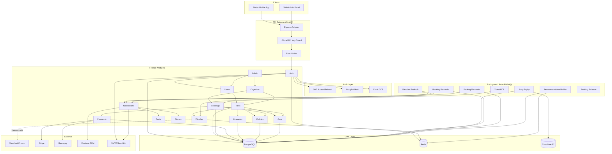
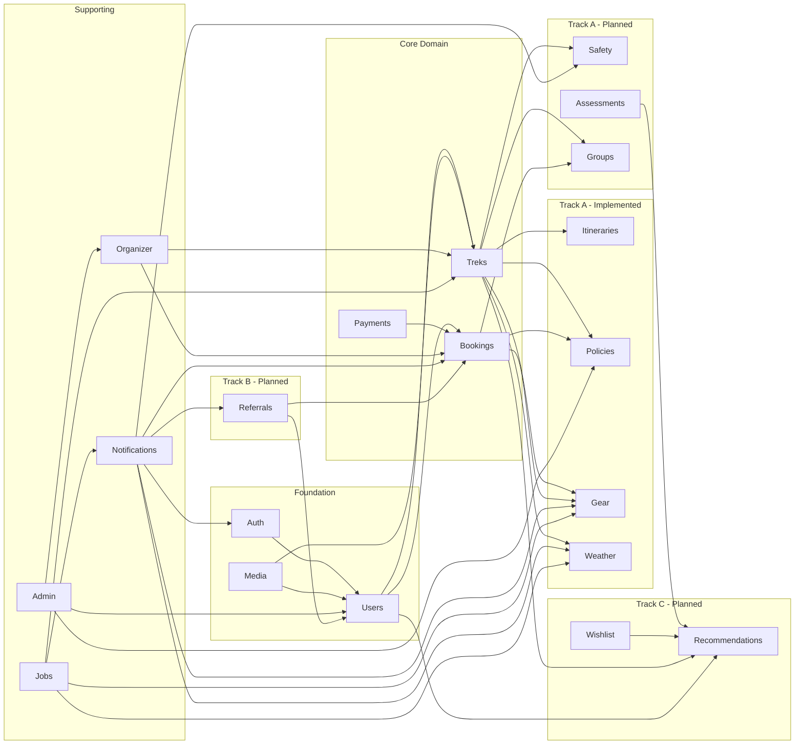

## Offbeat Pravasi Backend Migration – NestJS Blueprint

This guide captures the production-ready design for migrating the Offbeat Pravasi backend from Firebase/Appwrite to a NestJS stack. It includes architecture decisions, module boundaries, data models, DTOs, enums, infrastructure plans, and migration playbooks. Use it as the single source of truth while implementing the new service.

### System Architecture



### Module Dependency Graph



---

### 1. High-Level Architecture

- **Entry point**: NestJS (Node 22 LTS) running on Express adapter, packaged in Docker.
- **Auth & Identity**: Native JWT auth with access/refresh tokens; Google OAuth via Passport strategy.
- **Persistence**: PostgreSQL (primary relational store) with TypeORM migrations; Redis for caching, queues, and rate-limiting.
- **File Storage**: Cloudflare R2 (S3-compatible) for media assets served via CDN; signed URLs for uploads/downloads.
- **Notifications**: Firebase Admin SDK for FCM push (device tokens tracked in DB); BullMQ workers in the same codebase.
- **Background jobs**: Story expiry, notification fan-out, data cleanup handled via BullMQ + Redis.
- **Observability**: Pino logging, OpenTelemetry export (optional), Prometheus metrics, centralized structured logs.
- **Security**: Helmet, CORS, rate limiting, request validation (class-validator), secrets via dotenv + schema validation.
- **Deployment**: Container orchestrated by Kubernetes (or ECS). CI/CD runs lint, tests, and migrations before release.

---

### 2. Project Structure (Monorepo Friendly)

```
apps/
  api/
    src/
      main.ts
      app.module.ts
      config/
        configuration.ts
        validation.ts
      common/
        decorators/
        filters/
        guards/
        interceptors/
        pagination/
        types/
      modules/
        auth/
          auth.module.ts
          auth.controller.ts
          auth.service.ts
          strategies/
          guards/
          dtos/
        users/
          users.module.ts
          users.controller.ts
          users.service.ts
          dtos/
          entities/
        treks/
          treks.module.ts
          treks.controller.ts
          treks.service.ts
          dtos/
          entities/
        posts/
        stories/
        friendships/
        bookmarks/
        notifications/
        leaderboard/
        organizer/
        media/
      jobs/
        processors/
        queues.ts
    test/
      e2e/
config/
  ormconfig.ts
  redis.config.ts
docker/
  Dockerfile
  docker-compose.dev.yml
scripts/
  migrate.ts
  seed.ts
package.json
tsconfig*.json
```

> **Tip:** Place reusable Types (DTOs, enums, constants) in `libs/` if you adopt a monorepo approach with Nx or similar tooling.

---

### 3. Core Modules & Responsibilities

| Module                | Responsibility Highlights                                                                      |
| --------------------- | ---------------------------------------------------------------------------------------------- |
| `AuthModule`          | User registration, login, refresh tokens, password resets, Google OAuth.                       |
| `UsersModule`         | Profile CRUD, onboarding answers, stats, device tokens.                                        |
| `FriendshipsModule`   | Friend request lifecycle, accepted friendships, blocking (optional).                           |
| `TreksModule`         | Trek CRUD, filtering/search, reviews, bookmarking.                                             |
| `PostsModule`         | Feed posts, image attachments, likes, comments.                                                |
| `StoriesModule`       | Short-lived media, expiry jobs, view tracking (optional).                                      |
| `BookmarksModule`     | Manage per-user trek bookmarks.                                                                |
| `NotificationsModule` | Device token registration, push message orchestration.                                         |
| `LeaderboardModule`   | Aggregate friend leaderboard, optional global ranking.                                         |
| `OrganizerModule`     | Organizer application intake, dashboard, trek/booking management, analytics, revenue tracking. |
| `MediaModule`         | Presigned upload/download URLs for R2, metadata persistence.                                   |
| `AdminModule`         | Admin dashboards, moderation tools, approvals, analytics.                                      |
| `ItinerariesModule`   | Trek day-by-day itinerary management with embedded rich-text day plans.                        |
| `PoliciesModule`      | Cancellation rules, trek-specific policies, booking policy snapshots, refund timeline engine.  |
| `GearModule`          | Gear item catalog, trek-gear associations, user packing lists with per-trek check status.      |
| `WeatherModule`       | Live + forecast weather via WeatherAPI.com, 3-tier Redis cache, severe weather alert triggers. |
| `SafetyModule`        | Trek safety guidelines, emergency contacts, check-in/out system with delayed-job escalation.    |
| `AssessmentsModule`   | 8–12 question fitness quiz, scoring algorithm, difficulty bracket classification.              |
| `GroupsModule`        | Group bookings: lead booker, invites, share codes, single payment for all members.             |
| `ReferralsModule`     | Unique referral codes, tiered rewards, referral leaderboard.                                   |
| `WishlistModule`      | Personal trek collections with notes/priority, replaces Bookmarks module.                      |
| `RecommendationsModule` | Personalized trek suggestions via weighted scoring engine with cold-start strategy.         |
| `ConfigModule`        | Centralized configuration + validation of environment variables.                               |
| `HealthModule`        | Readiness/liveness probes, version info.                                                       |

---

### 4. Environment & Configuration

```env
NODE_ENV=production
PORT=4000
APP_URL=https://api.offbeatpravasi.com
FRONTEND_URL=https://app.offbeatpravasi.com

POSTGRES_HOST=
POSTGRES_PORT=5432
POSTGRES_DB=offbeat
POSTGRES_USER=
POSTGRES_PASSWORD=

REDIS_HOST=
REDIS_PORT=6379
REDIS_PASSWORD=

JWT_ACCESS_SECRET=
JWT_REFRESH_SECRET=
JWT_ACCESS_TTL=15m
JWT_REFRESH_TTL=30d

GOOGLE_CLIENT_ID=
GOOGLE_CLIENT_SECRET=

FIREBASE_SERVICE_ACCOUNT_JSON=

R2_ACCOUNT_ID=
R2_ACCESS_KEY_ID=
R2_SECRET_ACCESS_KEY=
R2_BUCKET_PROFILE=offbeat-profile
R2_BUCKET_POSTS=offbeat-posts
R2_BUCKET_TREKS=offbeat-treks
R2_PUBLIC_BASE_URL=https://cdn.offbeatpravasi.com

ADMIN_EMAILS=admin1@example.com,admin2@example.com
# Comma-separated Argon2 hashes aligned with ADMIN_EMAILS (max 2 entries)
ADMIN_PASSWORD_HASHES=$argon2id$v=19$m=65536,t=3,p=4$...
GLOBAL_API_KEY=
API_KEY_HEADER=x-api-key

EMAIL_FROM=hello@offbeatpravasi.com
SMTP_HOST=
SMTP_PORT=587
SMTP_USER=
SMTP_PASSWORD=

STRIPE_RESTRICTED_KEY=
STRIPE_PUBLISHABLE_KEY=
STRIPE_WEBHOOK_SECRET=
RAZORPAY_KEY_ID=
RAZORPAY_KEY_SECRET=
RAZORPAY_WEBHOOK_SECRET=

OTP_EXPIRY_MINUTES=10
OTP_LENGTH=6
OTP_MAX_ATTEMPTS=5

# Weather API
WEATHER_API_KEY=
WEATHER_API_BASE_URL=https://api.weatherapi.com/v1
WEATHER_API_RATE_LIMIT_PER_DAY=1000
WEATHER_CIRCUIT_BREAKER_THRESHOLD=3
WEATHER_CIRCUIT_BREAKER_DURATION_MS=3600000

# SMS (for safety module emergency escalation fallback)
SMS_PROVIDER=twilio
TWILIO_ACCOUNT_SID=
TWILIO_AUTH_TOKEN=
TWILIO_PHONE_NUMBER=
```

Use a configuration factory + Joi (or class-validator) schema to assert presence/types at boot.

---

### 5. TypeORM Entities (Representative Subset)

#### `users.entity.ts`

```ts
@Entity({ name: 'users' })
@Unique(['email'])
export class User {
  @PrimaryGeneratedColumn('uuid')
  id: string;

  @Column({ length: 120 })
  email: string;

  @Column({ select: false, nullable: true })
  passwordHash?: string;

  @Column({ length: 80, nullable: true })
  username?: string;

  @Column({ length: 120, nullable: true })
  fullName?: string;

  @Column({ type: 'date', nullable: true })
  dateOfBirth?: Date;

  @Column({ type: 'enum', enum: AuthProvider, default: AuthProvider.EMAIL })
  authProvider: AuthProvider;

  @Column({ nullable: true })
  gender?: string;

  @Column({ nullable: true })
  phone?: string;

  @Column({ nullable: true })
  location?: string;

  @Column({ nullable: true })
  profileImageUrl?: string;

  @Column({ nullable: true })
  bannerImageUrl?: string;

  @Column({ type: 'boolean', default: false })
  isOrganizer: boolean;

  @Column({
    type: 'enum',
    enum: OrganizerStatus,
    default: OrganizerStatus.NONE,
  })
  organizerStatus: OrganizerStatus;

  @Column({ type: 'boolean', default: false })
  isAdmin: boolean;

  @Column({ type: 'float', default: 0 })
  userPoints: number;

  @Column({ type: 'int', default: 0 })
  userDistanceTravelled: number;

  @Column({ type: 'boolean', default: false })
  emailVerified: boolean;

  @Column({ type: 'timestamptz', nullable: true })
  emailVerifiedAt?: Date;

  @Column({ type: 'timestamptz', default: () => 'CURRENT_TIMESTAMP' })
  createdAt: Date;

  @Column({ type: 'timestamptz', default: () => 'CURRENT_TIMESTAMP' })
  updatedAt: Date;
}
```

#### `treks.entity.ts`

```ts
@Entity({ name: "treks" })
export class Trek {
  @PrimaryGeneratedColumn("uuid")
  id: string;

  @ManyToOne(() => User, { eager: true })
  organizer: User;

  @Column({ length: 160 })
  name: string;

  @Column({ length: 160 })
  location: string;

  @Column({ length: 120 })
  state: string;

  @Column({ type: "timestamp" })
  startDate: Date;

  @Column({ type: "text" })
  overview: string;

  @Column({ type: "simple-array" })
  imageUrls: string[];

  @Column({ type: "float", default: 0 })
  rating: number;

  @Column({ type: "int", default: 0 })
  reviewsCount: number;

  @Column({ type: "int" })
  altitudeMeters: number;

  @Column({ type: "enum", enum: TrekDifficulty })
  difficulty: TrekDifficulty;

  @Column({ type: "varchar" })
  durationDays: string;

  @Column({ type: "float" })
  distanceKm: number;

  @Column({ type: "float" })
  costInr: number;

  @Column({ type: "jsonb" })
  itineraryMarkdown: Record<string, unknown>;

  @Column({ type: "text", nullable: true })
  recommendedGearMarkdown?: string;

  @Column({ type: "text", nullable: true })
  recommendedEssentialsMarkdown?: string;

  @Column({ type: "float", default: 0 })
  trekPoints: number;

  @Column({ type: "int", nullable: true })
  maxParticipants?: number; // null = unlimited

  @Column({ type: "int", default: 0 })
  currentParticipants: number; // calculated from confirmed bookings

  @Column({ type: "enum", enum: TrekStatus, default: TrekStatus.DRAFT })
  status: TrekStatus;

  @Column({ type: "boolean", default: false })
  isPublished: boolean; // only published treks appear in public listings

  @Column({ type: "decimal", precision: 10, scale: 8, nullable: true })
  latitude?: number; // for geolocation search

  @Column({ type: "decimal", precision: 11, scale: 8, nullable: true })
  longitude?: number; // for geolocation search

  @Column({ type: "timestamptz", default: () => "CURRENT_TIMESTAMP" })
  createdAt: Date;

  @Column({ type: "timestamptz", default: () => "CURRENT_TIMESTAMP" })
  updatedAt: Date;

  @Column({ type: "timestamptz", nullable: true })
  deletedAt?: Date; // soft delete

  @OneToMany(() => TrekReview, (review) => review.trek)
  reviews: TrekReview[];

  @OneToMany(() => Booking, (booking) => booking.trek)
  bookings: Booking[];

  // Indexes for performance
  @Index()
  @Index(["state", "difficulty"])
  @Index(["startDate"])
  @Index(["status", "isPublished"])
  @Index(["latitude", "longitude"]) // for geospatial queries
}
```

#### `posts.entity.ts`, `stories.entity.ts`, `friend_requests.entity.ts`, etc.

Define per feature with relations to `User`. Use `@Index()` decorators on frequent filters (e.g., `friend_requests` status, `stories` expiration).

**Important Entity Enhancements**:

1. **Soft Deletes**: Add `deletedAt?: Date` column to critical entities (`users`, `treks`, `posts`) for data retention and audit trails. Use TypeORM's `@DeleteDateColumn()` decorator.

2. **Audit Fields**: Consider adding `createdBy`, `updatedBy` (user references) for admin actions.

3. **Database Indexes**: Add indexes on:
   - `users.email` (unique, already handled by `@Unique`)
   - `users.isAdmin`, `users.organizerStatus`
   - `treks.state`, `treks.difficulty`, `treks.startDate`, `treks.status`
   - `bookings.userId`, `bookings.trekId`, `bookings.status`
   - `posts.userId`, `posts.uploadTimestamp`
   - `friend_requests.receiverId`, `friend_requests.status`
   - Full-text search indexes on `treks.name`, `treks.location`, `posts.caption`

4. **Constraints**:
   - Foreign keys with `ON DELETE CASCADE` or `ON DELETE SET NULL` as appropriate
   - Check constraints: `maxParticipants > 0`, `costInr >= 0`, `rating >= 0 AND rating <= 5`

---

#### `itinerary_days.entity.ts`

```ts
@Entity({ name: 'itinerary_days' })
export class ItineraryDay {
  @PrimaryGeneratedColumn('uuid')
  id: string;

  @ManyToOne(() => Trek, (trek) => trek.itineraryDays, { onDelete: 'CASCADE' })
  trek: Trek;

  @Column({ type: 'int' })
  dayNumber: number; // 1-based

  @Column({ length: 200 })
  title: string;

  @Column({ type: 'text', nullable: true })
  description?: string;

  @Column({ type: 'jsonb', nullable: true })
  activities?: string[];

  @Column({ type: 'jsonb', nullable: true })
  meals?: { breakfast?: string; lunch?: string; dinner?: string };

  @Column({ type: 'jsonb', nullable: true })
  accommodation?: string;

  @Column({ type: 'float', nullable: true })
  altitudeMeters?: number;

  @Column({ type: 'float', nullable: true })
  distanceKm?: number;

  @Column({ length: 50, nullable: true })
  difficulty?: string;

  @Column({ type: 'timestamptz', default: () => 'CURRENT_TIMESTAMP' })
  createdAt: Date;

  @Column({ type: 'timestamptz', nullable: true, onUpdate: 'CURRENT_TIMESTAMP' })
  updatedAt?: Date;
}
```

#### `cancellation_policies.entity.ts`

```ts
@Entity({ name: 'cancellation_policies' })
export class CancellationPolicy {
  @PrimaryGeneratedColumn('uuid')
  id: string;

  @Column({ length: 120 })
  name: string; // e.g. "Standard", "Flexible", "Strict"

  @Column({ type: 'text', nullable: true })
  description?: string;

  @Column({ type: 'boolean', default: true })
  isActive: boolean;

  @OneToMany(() => CancellationTier, (tier) => tier.policy, { cascade: true })
  tiers: CancellationTier[];

  @Column({ type: 'timestamptz', default: () => 'CURRENT_TIMESTAMP' })
  createdAt: Date;
}

@Entity({ name: 'cancellation_tiers' })
export class CancellationTier {
  @PrimaryGeneratedColumn('uuid')
  id: string;

  @ManyToOne(() => CancellationPolicy, (policy) => policy.tiers, { onDelete: 'CASCADE' })
  policy: CancellationPolicy;

  @Column({ type: 'int' })
  daysBeforeStart: number; // >= this many days before trek start

  @Column({ type: 'float' })
  refundPercentage: number; // 0–100

  @Column({ type: 'timestamptz', default: () => 'CURRENT_TIMESTAMP' })
  createdAt: Date;
}

@Entity({ name: 'trek_policies' })
export class TrekPolicy {
  @PrimaryGeneratedColumn('uuid')
  id: string;

  @OneToOne(() => Trek, { onDelete: 'CASCADE' })
  @JoinColumn()
  trek: Trek;

  @ManyToOne(() => CancellationPolicy)
  cancellationPolicy: CancellationPolicy;

  @Column({ type: 'int', default: 0 })
  maxParticipants: number;

  @Column({ type: 'int', default: 0 })
  minParticipants: number;

  @Column({ type: 'jsonb', nullable: true })
  requirements?: string[];

  @Column({ type: 'jsonb', nullable: true })
  included?: string[];

  @Column({ type: 'jsonb', nullable: true })
  excluded?: string[];

  @Column({ type: 'timestamptz', default: () => 'CURRENT_TIMESTAMP' })
  createdAt: Date;
}

@Entity({ name: 'booking_policy_snapshots' })
export class BookingPolicySnapshot {
  @PrimaryGeneratedColumn('uuid')
  id: string;

  @OneToOne(() => Booking, { onDelete: 'CASCADE' })
  @JoinColumn()
  booking: Booking;

  @Column({ type: 'jsonb' })
  policySnapshot: {
    policyName: string;
    tiers: Array<{ daysBeforeStart: number; refundPercentage: number }>;
  };

  @Column({ type: 'timestamptz', default: () => 'CURRENT_TIMESTAMP' })
  createdAt: Date;
}
```

#### `gear_items.entity.ts`

```ts
@Entity({ name: 'gear_items' })
export class GearItem {
  @PrimaryGeneratedColumn('uuid')
  id: string;

  @Column({ length: 200 })
  name: string;

  @Column({ type: 'text', nullable: true })
  description?: string;

  @Column({ length: 100, nullable: true })
  category?: string; // e.g. "Clothing", "Footwear", "Equipment"

  @Column({ type: 'boolean', default: false })
  isEssential: boolean;

  @Column({ type: 'jsonb', nullable: true })
  imageUrls?: string[];

  @Column({ type: 'timestamptz', default: () => 'CURRENT_TIMESTAMP' })
  createdAt: Date;
}

@Entity({ name: 'trek_gear_items' })
export class TrekGearItem {
  @PrimaryGeneratedColumn('uuid')
  id: string;

  @ManyToOne(() => Trek, { onDelete: 'CASCADE' })
  trek: Trek;

  @ManyToOne(() => GearItem, { onDelete: 'CASCADE' })
  gearItem: GearItem;

  @Column({ type: 'boolean', default: false })
  isRecommended: boolean;

  @Column({ type: 'int', nullable: true })
  quantity?: number;

  @Column({ type: 'timestamptz', default: () => 'CURRENT_TIMESTAMP' })
  createdAt: Date;
}

@Entity({ name: 'user_packing_list_items' })
export class UserPackingListItem {
  @PrimaryGeneratedColumn('uuid')
  id: string;

  @ManyToOne(() => User, { onDelete: 'CASCADE' })
  user: User;

  @ManyToOne(() => Trek, { onDelete: 'CASCADE' })
  trek: Trek;

  @ManyToOne(() => GearItem, { nullable: true, onDelete: 'SET NULL' })
  gearItem?: GearItem;

  @Column({ length: 200 })
  itemName: string;

  @Column({ type: 'boolean', default: false })
  isPacked: boolean;

  @Column({ type: 'int', default: 1 })
  quantity: number;

  @Column({ length: 100, nullable: true })
  category?: string;

  @Column({ type: 'timestamptz', default: () => 'CURRENT_TIMESTAMP' })
  createdAt: Date;

  @Column({ type: 'timestamptz', nullable: true, onUpdate: 'CURRENT_TIMESTAMP' })
  updatedAt?: Date;
}
```

#### `trek_safety_info.entity.ts`

```ts
@Entity({ name: 'trek_safety_info' })
export class TrekSafetyInfo {
  @PrimaryGeneratedColumn('uuid')
  id: string;

  @OneToOne(() => Trek, { onDelete: 'CASCADE' })
  @JoinColumn()
  trek: Trek;

  @Column({ type: 'text', nullable: true })
  terrainRisks?: string;

  @Column({ type: 'text', nullable: true })
  altitudeWarnings?: string;

  @Column({ type: 'text', nullable: true })
  wildlifeAdvisories?: string;

  @Column({ type: 'text', nullable: true })
  generalGuidelines?: string;

  @Column({ length: 32, nullable: true })
  baseCampContact?: string;

  @Column({ length: 32, nullable: true })
  localRescueContact?: string;

  @Column({ length: 255, nullable: true })
  nearestHospital?: string;

  @Column({ type: 'timestamptz', default: () => 'CURRENT_TIMESTAMP' })
  createdAt: Date;

  @Column({ type: 'timestamptz', nullable: true, onUpdate: 'CURRENT_TIMESTAMP' })
  updatedAt?: Date;
}

@Entity({ name: 'user_emergency_contacts' })
export class UserEmergencyContact {
  @PrimaryGeneratedColumn('uuid')
  id: string;

  @ManyToOne(() => User, { onDelete: 'CASCADE' })
  user: User;

  @Column({ length: 120 })
  name: string;

  @Column({ length: 20 })
  phone: string;

  @Column({ length: 40 })
  relationship: string;

  @Column({ type: 'boolean', default: false })
  isPrimary: boolean;

  @Column({ type: 'timestamptz', default: () => 'CURRENT_TIMESTAMP' })
  createdAt: Date;
}

@Entity({ name: 'trek_check_ins' })
export class TrekCheckIn {
  @PrimaryGeneratedColumn('uuid')
  id: string;

  @ManyToOne(() => Booking, { onDelete: 'CASCADE' })
  booking: Booking;

  @ManyToOne(() => User, { onDelete: 'CASCADE' })
  user: User;

  @Column({ type: 'timestamptz' })
  checkedInAt: Date;

  @Column({ type: 'timestamptz' })
  expectedCheckOutAt: Date;

  @Column({ type: 'timestamptz', nullable: true })
  checkedOutAt?: Date;

  @Column({ type: 'varchar', length: 16, default: 'ACTIVE' })
  status: string; // ACTIVE | COMPLETED | ESCALATED | RESOLVED

  @Column({ type: 'timestamptz', nullable: true })
  escalatedAt?: Date;

  @Column({ type: 'timestamptz', nullable: true })
  resolvedAt?: Date;

  @Column({ type: 'timestamptz', default: () => 'CURRENT_TIMESTAMP' })
  createdAt: Date;

  @Column({ type: 'timestamptz', nullable: true, onUpdate: 'CURRENT_TIMESTAMP' })
  updatedAt?: Date;
}
```

#### `fitness_assessments.entity.ts`

```ts
@Entity({ name: 'fitness_assessments' })
export class FitnessAssessment {
  @PrimaryGeneratedColumn('uuid')
  id: string;

  @ManyToOne(() => User, { onDelete: 'CASCADE' })
  user: User;

  @Column({ type: 'int' })
  totalScore: number; // 0–100

  @Column({ length: 16 })
  difficultyBracket: string; // EASY | MODERATE | DIFFICULT | EXTREME

  @Column({ type: 'jsonb' })
  answers: Record<string, unknown>;

  @Column({ type: 'timestamptz' })
  completedAt: Date;

  @Column({ type: 'timestamptz', default: () => 'CURRENT_TIMESTAMP' })
  createdAt: Date;
}
```

#### `trek_groups.entity.ts`

```ts
@Entity({ name: 'trek_groups' })
export class TrekGroup {
  @PrimaryGeneratedColumn('uuid')
  id: string;

  @ManyToOne(() => Trek)
  trek: Trek;

  @ManyToOne(() => User)
  leadUser: User;

  @Column({ length: 120 })
  name: string;

  @Column({ type: 'int' })
  maxSize: number;

  @Column({ type: 'timestamptz' })
  expiresAt: Date;

  @Column({ length: 16, default: 'OPEN' })
  status: string; // OPEN | BOOKED | EXPIRED | CANCELLED

  @Column({ length: 12, unique: true })
  shareCode: string;

  @OneToMany(() => GroupMember, (m) => m.group)
  members: GroupMember[];

  @Column({ type: 'timestamptz', default: () => 'CURRENT_TIMESTAMP' })
  createdAt: Date;

  @Column({ type: 'timestamptz', nullable: true, onUpdate: 'CURRENT_TIMESTAMP' })
  updatedAt?: Date;
}

@Entity({ name: 'group_members' })
export class GroupMember {
  @PrimaryGeneratedColumn('uuid')
  id: string;

  @ManyToOne(() => TrekGroup, (g) => g.members, { onDelete: 'CASCADE' })
  group: TrekGroup;

  @ManyToOne(() => User, { nullable: true, onDelete: 'SET NULL' })
  user?: User;

  @Column({ length: 120, nullable: true })
  email?: string;

  @Column({ length: 16 })
  status: string; // INVITED | JOINED | DECLINED

  @Column({ length: 80, nullable: true })
  fullName?: string;

  @Column({ length: 20, nullable: true })
  phone?: string;

  @Column({ type: 'jsonb', nullable: true })
  emergencyContact?: { name: string; phone: string; relationship: string };

  @Column({ type: 'text', nullable: true })
  medicalConditions?: string;

  @Column({ type: 'timestamptz', nullable: true })
  joinedAt?: Date;

  @Column({ type: 'timestamptz', default: () => 'CURRENT_TIMESTAMP' })
  createdAt: Date;
}
```

#### `referral_codes.entity.ts`

```ts
@Entity({ name: 'referral_codes' })
export class ReferralCode {
  @PrimaryGeneratedColumn('uuid')
  id: string;

  @OneToOne(() => User, { onDelete: 'CASCADE' })
  @JoinColumn()
  user: User;

  @Column({ length: 20, unique: true })
  code: string;

  @Column({ length: 16, default: 'BASE' })
  tier: string; // BASE | SILVER | GOLD

  @Column({ type: 'int', default: 0 })
  totalReferrals: number;

  @Column({ type: 'int', default: 0 })
  successfulReferrals: number;

  @Column({ type: 'int', default: 0 })
  totalEarnedInr: number;

  @Column({ type: 'timestamptz', default: () => 'CURRENT_TIMESTAMP' })
  createdAt: Date;
}

@Entity({ name: 'referrals' })
export class Referral {
  @PrimaryGeneratedColumn('uuid')
  id: string;

  @ManyToOne(() => ReferralCode)
  referrerCode: ReferralCode;

  @ManyToOne(() => User, { nullable: true })
  refereeUser?: User;

  @Column({ length: 120 })
  refereeEmail: string;

  @Column({ length: 16 })
  status: string; // PENDING | BOOKED | COMPLETED | REWARDED

  @Column({ length: 16 })
  rewardType: string; // COUPON | POINTS | BOTH

  @Column({ type: 'int' })
  rewardValueInr: number;

  @Column({ type: 'timestamptz', nullable: true })
  rewardDeliveredAt?: Date;

  @Column({ type: 'timestamptz', default: () => 'CURRENT_TIMESTAMP' })
  createdAt: Date;
}

@Entity({ name: 'referral_tier_config' })
export class ReferralTierConfig {
  @PrimaryGeneratedColumn('uuid')
  id: string;

  @Column({ length: 16, unique: true })
  tier: string; // BASE | SILVER | GOLD

  @Column({ type: 'int' })
  minSuccessfulReferrals: number;

  @Column({ type: 'int' })
  rewardPerReferralInr: number;

  @Column({ type: 'int' })
  refereeDiscountInr: number;
}
```

#### `wishlist_collections.entity.ts`

```ts
@Entity({ name: 'wishlist_collections' })
export class WishlistCollection {
  @PrimaryGeneratedColumn('uuid')
  id: string;

  @ManyToOne(() => User, { onDelete: 'CASCADE' })
  user: User;

  @Column({ length: 120 })
  name: string;

  @Column({ length: 512, nullable: true })
  description?: string;

  @Column({ type: 'int', default: 0 })
  sortOrder: number;

  @OneToMany(() => WishlistItem, (i) => i.collection)
  items: WishlistItem[];

  @Column({ type: 'timestamptz', default: () => 'CURRENT_TIMESTAMP' })
  createdAt: Date;

  @Column({ type: 'timestamptz', nullable: true, onUpdate: 'CURRENT_TIMESTAMP' })
  updatedAt?: Date;
}

@Entity({ name: 'wishlist_items' })
export class WishlistItem {
  @PrimaryGeneratedColumn('uuid')
  id: string;

  @ManyToOne(() => WishlistCollection, (c) => c.items, { onDelete: 'CASCADE' })
  collection: WishlistCollection;

  @ManyToOne(() => Trek, { onDelete: 'CASCADE' })
  trek: Trek;

  @Column({ length: 512, nullable: true })
  notes?: string;

  @Column({ type: 'int', default: 0 })
  priority: number; // 0=normal, 1=high, 2=top

  @Column({ type: 'int', default: 0 })
  sortOrder: number;

  @Column({ type: 'timestamptz', default: () => 'CURRENT_TIMESTAMP' })
  addedAt: Date;
}

@Entity({ name: 'user_recommendation_preferences' })
export class UserRecommendationPreference {
  @PrimaryGeneratedColumn('uuid')
  id: string;

  @OneToOne(() => User, { onDelete: 'CASCADE' })
  @JoinColumn()
  user: User;

  @Column({ type: 'varchar', array: true, length: 16, nullable: true })
  preferredDifficulty?: string[];

  @Column({ type: 'varchar', array: true, length: 80, nullable: true })
  preferredStates?: string[];

  @Column({ type: 'int', nullable: true })
  maxBudget?: number;

  @Column({ type: 'jsonb', nullable: true })
  interests?: string[];

  @Column({ type: 'timestamptz', nullable: true, onUpdate: 'CURRENT_TIMESTAMP' })
  updatedAt?: Date;
}

@Entity({ name: 'recommendation_results' })
export class RecommendationResult {
  @PrimaryGeneratedColumn('uuid')
  id: string;

  @ManyToOne(() => User, { onDelete: 'CASCADE' })
  user: User;

  @ManyToOne(() => Trek)
  trek: Trek;

  @Column({ type: 'float' })
  score: number; // 0.0–1.0

  @Column({ length: 32 })
  reason: string;

  @Column({ type: 'timestamptz' })
  expiresAt: Date;

  @Column({ type: 'timestamptz', default: () => 'CURRENT_TIMESTAMP' })
  createdAt: Date;
}

@Entity({ name: 'recommendation_events' })
export class RecommendationEvent {
  @PrimaryGeneratedColumn('uuid')
  id: string;

  @ManyToOne(() => User, { onDelete: 'CASCADE' })
  user: User;

  @ManyToOne(() => RecommendationResult, { nullable: true })
  recommendationResult?: RecommendationResult;

  @ManyToOne(() => Trek)
  trek: Trek;

  @Column({ length: 32 })
  eventType: string; // SERVED | CLICKED | BOOKED

  @Column({ type: 'float', nullable: true })
  score?: number;

  @Column({ length: 32, nullable: true })
  reason?: string;

  @Column({ type: 'timestamptz', default: () => 'CURRENT_TIMESTAMP' })
  createdAt: Date;
}
```

---

### 6. DTOs & Validation (class-validator)

#### Auth

```ts
export class RegisterDto {
  @IsEmail()
  email: string;

  @IsString()
  @MinLength(8)
  password: string;

  @IsOptional()
  @IsString()
  fullName?: string;
}

export class LoginDto {
  @IsEmail()
  email: string;

  @IsString()
  password: string;
}

export class RefreshDto {
  @IsString()
  refreshToken: string;
}

export class SendOtpDto {
  @IsEmail()
  email: string;
}

export class VerifyOtpDto {
  @IsEmail()
  email: string;

  @IsString()
  @Length(6, 6)
  @Matches(/^\d+$/, { message: 'OTP must be 6 digits' })
  otp: string;
}

export class ResendOtpDto {
  @IsEmail()
  email: string;
}
```

#### Users & Onboarding

```ts
export class UpdateProfileDto {
  @IsOptional() @IsString() username?: string;
  @IsOptional() @IsString() fullName?: string;
  @IsOptional() @IsPhoneNumber('IN') phone?: string;
  @IsOptional() @IsString() location?: string;
  @IsOptional() @IsEnum(Gender) gender?: Gender;
  @IsOptional() @IsDateString() dateOfBirth?: string;
  @IsOptional() @IsUrl() profileImageUrl?: string;
  @IsOptional() @IsUrl() bannerImageUrl?: string;
}

export class UpsertOnboardingDto {
  @IsArray()
  @ValidateNested({ each: true })
  @Type(() => OnboardingAnswerDto)
  answers: OnboardingAnswerDto[];
}

export class OnboardingAnswerDto {
  @IsString() questionId: string;
  @IsString() value: string;
}
```

#### Treks

```ts
export class CreateTrekDto {
  @IsString() name: string;
  @IsString() location: string;
  @IsString() state: string;
  @IsDateString() startDate: string;
  @IsString() overview: string;
  @IsArray() @IsUrl(undefined, { each: true }) imageUrls: string[];
  @IsEnum(TrekDifficulty) difficulty: TrekDifficulty;
  @IsString() durationDays: string;
  @IsNumber() altitudeMeters: number;
  @IsNumber() distanceKm: number;
  @IsNumber() costInr: number;
  @IsString() itineraryMarkdown: string;
  @IsOptional() @IsString() recommendedGearMarkdown?: string;
  @IsOptional() @IsString() recommendedEssentialsMarkdown?: string;
}

export class ReviewTrekDto {
  @IsUUID() trekId: string;
  @IsNumber() @Min(1) @Max(5) rating: number;
  @IsString() @MaxLength(2000) comment: string;
}
```

#### Itineraries

```ts
export class CreateItineraryDayDto {
  @IsUUID() trekId: string;
  @IsInt() @Min(1) dayNumber: number;
  @IsString() @MaxLength(200) title: string;
  @IsOptional() @IsString() description?: string;
  @IsOptional() @IsArray() @IsString({ each: true }) activities?: string[];
  @IsOptional() @IsObject() meals?: Record<string, string>;
  @IsOptional() @IsString() accommodation?: string;
  @IsOptional() @IsNumber() altitudeMeters?: number;
  @IsOptional() @IsNumber() distanceKm?: number;
  @IsOptional() @IsString() difficulty?: string;
}

export class UpdateItineraryDayDto extends PartialType(CreateItineraryDayDto) {}

export class ReorderItineraryDayDto {
  @IsUUID() dayId: string;
  @IsInt() @Min(1) newDayNumber: number;
}
```

#### Policies

```ts
export class CreateCancellationPolicyDto {
  @IsString() @MaxLength(120) name: string;
  @IsOptional() @IsString() description?: string;
  @IsArray() @ValidateNested({ each: true }) @Type(() => CancellationTierDto)
  tiers: CancellationTierDto[];
}

export class CancellationTierDto {
  @IsInt() @Min(0) daysBeforeStart: number;
  @IsNumber() @Min(0) @Max(100) refundPercentage: number;
}

export class SetTrekPolicyDto {
  @IsUUID() trekId: string;
  @IsUUID() cancellationPolicyId: string;
  @IsOptional() @IsInt() @Min(0) maxParticipants?: number;
  @IsOptional() @IsInt() @Min(0) minParticipants?: number;
  @IsOptional() @IsArray() @IsString({ each: true }) requirements?: string[];
  @IsOptional() @IsArray() @IsString({ each: true }) included?: string[];
  @IsOptional() @IsArray() @IsString({ each: true }) excluded?: string[];
}

export class CalculateRefundDto {
  @IsUUID() bookingId: string;
  @IsDateString() cancellationDate: string;
}
```

#### Gear

```ts
export class CreateGearItemDto {
  @IsString() @MaxLength(200) name: string;
  @IsOptional() @IsString() description?: string;
  @IsOptional() @IsString() category?: string;
  @IsOptional() @IsBoolean() isEssential?: boolean;
  @IsOptional() @IsArray() @IsUrl(undefined, { each: true }) imageUrls?: string[];
}

export class LinkGearToTrekDto {
  @IsUUID() trekId: string;
  @IsUUID() gearItemId: string;
  @IsOptional() @IsBoolean() isRecommended?: boolean;
  @IsOptional() @IsInt() @Min(1) quantity?: number;
}

export class AddPackingListItemDto {
  @IsUUID() trekId: string;
  @IsOptional() @IsUUID() gearItemId?: string;
  @IsString() @MaxLength(200) itemName: string;
  @IsOptional() @IsInt() @Min(1) quantity?: number;
  @IsOptional() @IsString() category?: string;
}

export class UpdatePackingListItemDto {
  @IsOptional() @IsBoolean() isPacked?: boolean;
  @IsOptional() @IsInt() @Min(1) quantity?: number;
}
```

#### Weather

```ts
export class GetTrekWeatherDto {
  @IsUUID() trekId: string;
  @IsOptional() @IsInt() @Min(1) @Max(10) days?: number; // forecast days
}

export class GetLocationWeatherDto {
  @IsNumber() @Min(-90) @Max(90) latitude: number;
  @IsNumber() @Min(-180) @Max(180) longitude: number;
  @IsOptional() @IsInt() @Min(1) @Max(10) days?: number;
}
```

#### Safety

```ts
export class UpsertSafetyInfoDto {
  @IsOptional() @IsString() terrainRisks?: string;
  @IsOptional() @IsString() altitudeWarnings?: string;
  @IsOptional() @IsString() wildlifeAdvisories?: string;
  @IsOptional() @IsString() generalGuidelines?: string;
  @IsOptional() @IsString() baseCampContact?: string;
  @IsOptional() @IsString() localRescueContact?: string;
  @IsOptional() @IsString() nearestHospital?: string;
}

export class CreateEmergencyContactDto {
  @IsString() name: string;
  @IsPhoneNumber('IN') phone: string;
  @IsString() relationship: string;
  @IsOptional() @IsBoolean() isPrimary?: boolean;
}

export class CheckInDto {
  @IsNumber() @IsOptional() latitude?: number;
  @IsNumber() @IsOptional() longitude?: number;
}

export class CheckOutDto {
  @IsNumber() @IsOptional() latitude?: number;
  @IsNumber() @IsOptional() longitude?: number;
}

export class AcknowledgeSafetyDto {
  @IsUUID() checkInId: string;
}
```

#### Assessments

```ts
export class SubmitAssessmentDto {
  @IsArray()
  @ValidateNested({ each: true })
  @Type(() => AssessmentAnswerDto)
  answers: AssessmentAnswerDto[];
}

export class AssessmentAnswerDto {
  @IsString() questionId: string;
  @IsString() selectedOption: string;
}

export class AssessmentResultDto {
  totalScore: number;
  difficultyBracket: string;
  recommendedDifficultyLabel: string;
  completedAt: Date;
}
```

#### Groups

```ts
export class CreateGroupDto {
  @IsUUID() trekId: string;
  @IsOptional() @IsString() @MaxLength(120) name?: string;
  @IsInt() @Min(2) @Max(50) maxSize: number;
  @IsDateString() expiresAt: string;
}

export class InviteMembersDto {
  @IsArray()
  @ValidateNested({ each: true })
  @Type(() => InviteeDto)
  invites: InviteeDto[];
}

export class InviteeDto {
  @IsOptional() @IsUUID() userId?: string;
  @IsOptional() @IsEmail() email?: string;
}

export class UpdateMemberStatusDto {
  @IsEnum(['JOINED', 'DECLINED']) status: string;
  @IsOptional() @IsString() fullName?: string;
  @IsOptional() @IsPhoneNumber('IN') phone?: string;
  @IsOptional() @IsObject() emergencyContact?: Record<string, string>;
  @IsOptional() @IsString() medicalConditions?: string;
}

export class JoinGroupDto {
  @IsString() shareCode: string;
}
```

#### Referrals

```ts
export class ClaimReferralDto {
  @IsString() code: string;
}

export class ReferralCodeResponseDto {
  code: string;
  shareLink: string;
  tier: string;
  totalReferrals: number;
  successfulReferrals: number;
  totalEarnedInr: number;
}
```

#### Wishlist

```ts
export class CreateCollectionDto {
  @IsString() @MaxLength(120) name: string;
  @IsOptional() @IsString() @MaxLength(512) description?: string;
}

export class AddToCollectionDto {
  @IsUUID() trekId: string;
  @IsOptional() @IsString() notes?: string;
  @IsOptional() @IsInt() @Min(0) @Max(2) priority?: number;
}
```

#### Recommendations

```ts
export class RecommendationPreferenceDto {
  @IsOptional() @IsArray() @IsString({ each: true }) preferredDifficulty?: string[];
  @IsOptional() @IsArray() @IsString({ each: true }) preferredStates?: string[];
  @IsOptional() @IsInt() @Min(0) maxBudget?: number;
  @IsOptional() @IsArray() @IsString({ each: true }) interests?: string[];
}
```

#### Notifications

```ts
export class RegisterDeviceDto {
  @IsString() token: string;
  @IsEnum(DevicePlatform) platform: DevicePlatform;
  @IsOptional() @IsString() appVersion?: string;
}

export class SendNotificationDto {
  @IsUUID() targetUserId: string;
  @IsString() title: string;
  @IsString() body: string;
  @IsOptional() data?: Record<string, string>;
}
```

#### Organizer Endpoints

```ts
export class UpdateTrekStatusDto {
  @IsUUID() trekId: string;
  @IsEnum(TrekStatus) status: TrekStatus;
}

export class OrganizerTrekFiltersDto {
  @IsOptional() @IsEnum(TrekStatus) status?: TrekStatus;
  @IsOptional() @IsBoolean() isPublished?: boolean;
  @IsOptional() @IsDateString() startDateFrom?: string;
  @IsOptional() @IsDateString() startDateTo?: string;
  @IsOptional() @IsString() state?: string;
  @IsOptional() @IsInt() @Min(1) page?: number;
  @IsOptional() @IsInt() @Min(1) @Max(100) limit?: number;
}

export class OrganizerBookingFiltersDto {
  @IsOptional() @IsUUID() trekId?: string;
  @IsOptional() @IsEnum(BookingStatus) status?: BookingStatus;
  @IsOptional() @IsDateString() bookingDateFrom?: string;
  @IsOptional() @IsDateString() bookingDateTo?: string;
  @IsOptional() @IsInt() @Min(1) page?: number;
  @IsOptional() @IsInt() @Min(1) @Max(100) limit?: number;
}

export class OrganizerAnalyticsFiltersDto {
  @IsOptional() @IsDateString() startDate?: string;
  @IsOptional() @IsDateString() endDate?: string;
  @IsOptional() @IsUUID() trekId?: string;
}
```

---

### 7. Enums & Constants

```ts
export enum AuthProvider {
  EMAIL = 'EMAIL',
  GOOGLE = 'GOOGLE',
}

export enum Gender {
  MALE = 'MALE',
  FEMALE = 'FEMALE',
  OTHER = 'OTHER',
  NOT_SPECIFIED = 'NOT_SPECIFIED',
}

export enum TrekDifficulty {
  EASY = 'EASY',
  MODERATE = 'MODERATE',
  DIFFICULT = 'DIFFICULT',
  EXTREME = 'EXTREME',
}

export enum DevicePlatform {
  ANDROID = 'ANDROID',
  IOS = 'IOS',
  WEB = 'WEB',
}

export enum FriendRequestStatus {
  PENDING = 'PENDING',
  ACCEPTED = 'ACCEPTED',
  DECLINED = 'DECLINED',
}

export enum OrganizerStatus {
  NONE = 'NONE',
  PENDING = 'PENDING',
  APPROVED = 'APPROVED',
  REJECTED = 'REJECTED',
}

export enum OrganizerApplicationStatus {
  PENDING = 'PENDING',
  APPROVED = 'APPROVED',
  REJECTED = 'REJECTED',
  NEEDS_MORE_INFO = 'NEEDS_MORE_INFO',
}

export enum TrekStatus {
  DRAFT = 'DRAFT',
  PUBLISHED = 'PUBLISHED',
  CANCELLED = 'CANCELLED',
  COMPLETED = 'COMPLETED',
}

export const TREK_STATES = [
  'Maharashtra',
  'Meghalaya',
  'Karnataka',
  'Tamil Nadu',
  'Kerala',
  'Andhra Pradesh',
  'Telangana',
  'Himachal Pradesh',
  'Uttarakhand',
  'Nagaland',
  'Manipur',
  'Sikkim',
  'West Bengal',
  'Arunachal Pradesh',
] as const;
```

---

### 8. Services & Business Logic – Examples

#### Auth Service

- Hash passwords with `argon2id`.
- **Email Verification Flow**:
  - On registration (`POST /auth/register`): Create user with `emailVerified = false`, generate 6-digit OTP, store in Redis with key `otp:email:{email}` and TTL of 10 minutes, send OTP via email.
  - `POST /auth/email/send-otp`: Generate new OTP for email, store in Redis, send email. Rate limit: max 3 requests per email per 15 minutes.
  - `POST /auth/email/verify-otp`: Validate OTP from Redis, if valid: set `emailVerified = true`, `emailVerifiedAt = now()`, delete OTP from Redis, allow user to proceed with login.
  - `POST /auth/email/resend-otp`: Same as send-otp but with additional validation that user exists and is not already verified.
  - **Login restriction**: Users with `emailVerified = false` cannot login until they verify email. Return `403 Forbidden` with message "Please verify your email to continue".
  - **OTP storage**: Use Redis with key pattern `otp:email:{email}` and value `{ otp: string, attempts: number, createdAt: timestamp }`. Track failed attempts (max 5) before requiring resend.
  - **OTP generation**: Use cryptographically secure random number generator (6 digits, 0-9).
- Issue access + refresh tokens; persist refresh tokens (or hashes) in `user_sessions` table.
- Google login: verify ID token, create user if new with `emailVerified = true` (Google emails are pre-verified), issue standard tokens.
- Revocation: on logout, delete session tokens; maintain device mapping to allow multiple sessions.
- Admin whitelist: on login, mark `isAdmin = true` only when user email matches `ADMIN_EMAILS` env list (max two entries); guard admin routes with a custom `AdminGuard` that checks this flag.
- Admin credentials: for emails listed in `ADMIN_EMAILS`, validate password against Argon2 hashes defined in `ADMIN_PASSWORD_HASHES` (comma-separated, same order). Do not allow admins to change their email/password through the UI; credentials are managed exclusively via environment variables and require deploy to rotate.

#### Treks Service

- Filtering: use query builder + indices for `state`, `difficulty`, `startDate` window.
- Rating aggregation: store total rating sum + count to avoid heavy queries; compute average on read.
- Organizer guard: only users whose `organizerStatus === OrganizerStatus.APPROVED` may create/update treks; enforce with custom guard/resolver that loads user from JWT.

#### Posts & Stories

- Posts: store `imageUrls` from R2; asynchronous job can generate thumbnails (optional).
- Stories: `expiresAt` column; cron job or BullMQ repeating job deletes expired stories + associated media.

#### Notifications

- Save device tokens with TTL; on refresh, update `lastSeenAt`.
- Use queue to decouple push sending from HTTP request (retry/backoff).
- Template payloads stored in code or DB for curated notifications.

---

### 9. Media Handling (Cloudflare R2)

1. Backend endpoint `POST /media/presign` returns signed PUT URL + final asset key.
2. Flutter uploads directly to R2 using signed URL.
3. Client notifies backend with final metadata (`POST /posts` etc.) referencing the key.
4. Serve via CDN using `R2_PUBLIC_BASE_URL/<key>` or signed GETs for private content.
5. Enforce validation: file size limits, MIME white-list (images/video).
6. Leverage lifecycle rules for story/temporary media cleanup.

```ts
const command = new PutObjectCommand({
  Bucket: bucketName,
  Key: objectKey,
  ContentType: mimeType,
  ACL: 'private',
});
const url = await getSignedUrl(s3Client, command, { expiresIn: 900 });
```

---

### 10. API Endpoints Overview

All HTTP requests must include the API key header defined in `API_KEY_HEADER` (default `x-api-key`) with value matching `GLOBAL_API_KEY`.

| Method | Endpoint                        | Description                            | Auth                 |
| ------ | ------------------------------- | -------------------------------------- | -------------------- |
| POST   | `/auth/register`                | Email sign-up                          | Public               |
| POST   | `/auth/login`                   | Email login                            | Public               |
| POST   | `/auth/google`                  | Google OAuth                           | Public               |
| POST   | `/auth/refresh`                 | Refresh token                          | Public               |
| POST   | `/auth/password/reset/request`  | Reset link                             | Public               |
| POST   | `/auth/password/reset/confirm`  | Finalize reset                         | Public               |
| POST   | `/auth/email/send-otp`          | Send email verification OTP            | Public               |
| POST   | `/auth/email/verify-otp`        | Verify email OTP and activate account  | Public               |
| POST   | `/auth/email/resend-otp`        | Resend email verification OTP          | Public               |
| GET    | `/users/me`                     | Current profile                        | Access token         |
| PATCH  | `/users/me`                     | Update profile                         | Access token         |
| POST   | `/users/me/device-tokens`       | Register FCM token                     | Access token         |
| POST   | `/users/me/onboarding`          | Save onboarding answers                | Access token         |
| GET    | `/users/:id`                    | Fetch other user                       | Access token         |
| GET    | `/users/search`                 | Search users by username/name          | Access token         |
| POST   | `/friend-requests`              | Send request                           | Access token         |
| POST   | `/friend-requests/:id/accept`   | Accept                                 | Access token         |
| POST   | `/friend-requests/:id/decline`  | Decline                                | Access token         |
| GET    | `/treks`                        | List/filter treks                      | Optional (paginates) |
| GET    | `/treks/search`                 | Search treks (full-text + filters)     | Optional             |
| GET    | `/treks/nearby`                 | Find treks within radius               | Optional             |
| POST   | `/treks`                        | Create trek                            | Organizer            |
| GET    | `/treks/:id`                    | Trek detail                            | Optional             |
| POST   | `/treks/:id/reviews`            | Add review                             | Access token         |
| POST   | `/treks/:id/bookmark`           | Toggle bookmark                        | Access token         |
| GET    | `/treks/:id/itinerary`          | List itinerary days for trek           | Optional             |
| POST   | `/treks/:id/itinerary`          | Add itinerary day                      | Organizer            |
| PATCH  | `/treks/:id/itinerary/:dayId`   | Update itinerary day                   | Organizer            |
| DELETE | `/treks/:id/itinerary/:dayId`   | Remove itinerary day                   | Organizer            |
| GET    | `/treks/:id/weather`            | Live + forecast weather for trek       | Optional             |
| GET    | `/treks/:id/gear`               | List gear items for trek               | Optional             |
| POST   | `/treks/:id/gear`               | Link gear item to trek                 | Organizer            |
| DELETE | `/treks/:id/gear/:linkId`       | Unlink gear item from trek             | Organizer            |
| GET    | `/itineraries/:id`              | Get single itinerary day detail        | Optional             |
| GET    | `/policies`                     | List cancellation policy templates     | Optional             |
| GET    | `/policies/:id`                 | Get cancellation policy with tiers     | Optional             |
| POST   | `/policies`                     | Create cancellation policy template    | Admin                |
| PATCH  | `/policies/:id`                 | Update cancellation policy             | Admin                |
| DELETE | `/policies/:id`                 | Delete cancellation policy             | Admin                |
| GET    | `/treks/:id/policy`             | Get trek-specific policy               | Optional             |
| PUT    | `/treks/:id/policy`             | Set/update trek-specific policy        | Organizer            |
| GET    | `/bookings/:id/refund-estimate` | Calculate refund based on cancellation | Access token         |
| GET    | `/gear`                         | List all gear items                    | Optional             |
| GET    | `/gear/:id`                     | Get gear item detail                   | Optional             |
| POST   | `/gear`                         | Create gear item                       | Admin                |
| PATCH  | `/gear/:id`                     | Update gear item                       | Admin                |
| DELETE | `/gear/:id`                     | Delete gear item                       | Admin                |
| GET    | `/users/me/packing-list`        | Get my packing list for a trek (query: trekId) | Access token  |
| POST   | `/users/me/packing-list`        | Add item to packing list               | Access token         |
| PATCH  | `/users/me/packing-list/:id`    | Update packing list item (pack status) | Access token         |
| DELETE | `/users/me/packing-list/:id`    | Remove packing list item               | Access token         |
| GET    | `/weather/current`              | Current weather for lat/lng            | Optional             |
| GET    | `/weather/forecast`             | Forecast for lat/lng (query: days)     | Optional             |
| GET    | `/weather/conditions`           | Map condition codes to categories      | Optional             |
| GET    | `/treks/:trekId/safety`         | Get safety info for trek              | Optional             |
| PUT    | `/treks/:trekId/safety`         | Upsert safety info                    | Organizer (own trek) |
| GET    | `/profile/emergency-contacts`   | List user's emergency contacts        | Access token         |
| POST   | `/profile/emergency-contacts`   | Add emergency contact                 | Access token         |
| PATCH  | `/profile/emergency-contacts/:id` | Update emergency contact            | Access token         |
| DELETE | `/profile/emergency-contacts/:id` | Delete emergency contact            | Access token         |
| POST   | `/bookings/:bookingId/check-in` | Check in to trek                      | Auth (booking owner) |
| POST   | `/bookings/:bookingId/check-out`| Check out from trek                   | Auth (booking owner) |
| GET    | `/bookings/:bookingId/check-in-status` | Get check-in status            | Auth (booking owner) |
| POST   | `/check-in/:checkInId/acknowledge` | Acknowledge safe after escalation  | Auth (booking owner) |
| GET    | `/assessments/questions`        | Get quiz questions + options          | Public               |
| POST   | `/assessments/submit`           | Submit quiz answers → score + bracket | Access token         |
| GET    | `/assessments/my-result`        | Get latest assessment result          | Access token         |
| GET    | `/users/:userId/assessment-result` | Get user's public fitness bracket  | Public               |
| POST   | `/groups`                       | Create new trek group                 | Access token         |
| GET    | `/groups/:id`                   | Get group details + members           | Auth (lead/member)   |
| PATCH  | `/groups/:id`                   | Update group name, size, expiry       | Auth (lead)          |
| POST   | `/groups/:id/invite`            | Invite members (email or userId)      | Auth (lead)          |
| POST   | `/groups/join/:shareCode`       | Join group via share code             | Access token         |
| PATCH  | `/groups/:id/members/:memberId/status` | Accept/decline invitation      | Auth (member)        |
| DELETE | `/groups/:id/members/:memberId` | Remove member from group              | Auth (lead)          |
| POST   | `/groups/:id/book`              | Book for all joined members           | Auth (lead)          |
| DELETE | `/groups/:id`                   | Cancel group                          | Auth (lead)          |
| GET    | `/referrals/my-code`            | Get own referral code + stats         | Access token         |
| POST   | `/referrals/generate`           | Generate/fetch referral code          | Access token         |
| GET    | `/referrals/my-referrals`       | List referrals made (paginated)       | Access token         |
| GET    | `/referrals/leaderboard`        | Top referrers                         | Public               |
| GET    | `/referrals/claim/:code`        | Show referral info, prompt sign-up    | Public               |
| GET    | `/wishlist/collections`         | List user's wishlist collections      | Access token         |
| POST   | `/wishlist/collections`         | Create a collection                   | Access token         |
| PATCH  | `/wishlist/collections/:id`     | Rename/reorder collection             | Access token         |
| DELETE | `/wishlist/collections/:id`     | Delete collection + its items         | Access token         |
| GET    | `/wishlist/collections/:id/items` | List items in a collection          | Access token         |
| POST   | `/wishlist/collections/:id/items` | Add trek to collection             | Access token         |
| PATCH  | `/wishlist/items/:id`           | Update notes/priority                 | Access token         |
| DELETE | `/wishlist/items/:id`           | Remove from wishlist                  | Access token         |
| POST   | `/wishlist/quick-add/:trekId`   | One-tap add to default collection     | Access token         |
| GET    | `/wishlist/shared/:shareToken`  | View a shared wishlist                | Public               |
| GET    | `/recommendations`              | Get personalized recommendations (top 10) | Access token      |
| GET    | `/recommendations/refresh`      | Force refresh recommendations         | Access token         |
| GET    | `/treks/:trekId/recommendations`| Similar treks for a specific trek     | Public               |
| PUT    | `/recommendations/preferences`  | Set recommendation preferences        | Access token         |
| GET    | `/posts/feed`                   | Feed                                   | Access token         |
| POST   | `/posts`                        | Create post                            | Access token         |
| POST   | `/posts/:id/like`               | Like/unlike                            | Access token         |
| POST   | `/posts/:id/comments`           | Comment                                | Access token         |
| GET    | `/stories`                      | Stories for friends                    | Access token         |
| POST   | `/stories`                      | Create story                           | Access token         |
| DELETE | `/stories/:id`                  | Delete story                           | Access token         |
| GET    | `/leaderboard/friends`          | Friend leaderboard                     | Access token         |
| GET    | `/bookings`                     | List my bookings                       | Access token         |
| POST   | `/bookings`                     | Create trek booking                    | Access token         |
| GET    | `/bookings/:id`                 | Booking detail                         | Access token         |
| GET    | `/bookings/:id/ticket`          | Download booking ticket (PDF)          | Access token         |
| POST   | `/bookings/verify`              | Verify booking QR code                 | Organizer/Admin      |
| POST   | `/bookings/:id/cancel`          | Cancel booking                         | Access token         |
| POST   | `/payments/checkout`            | Create payment intent                  | Access token         |
| POST   | `/payments/webhook`             | PSP webhook (Stripe/Razorpay)          | Public (verified)    |
| POST   | `/organizer-requests`           | Submit organizer request               | Access token         |
| GET    | `/organizer-requests/me`        | View my organizer application          | Access token         |
| PATCH  | `/organizer-requests/:id`       | Update organizer application (pending) | Access token         |
| GET    | `/organizer/dashboard`          | Organizer dashboard with overview      | Organizer            |
| GET    | `/organizer/treks`              | List my treks with filters             | Organizer            |
| GET    | `/organizer/treks/:id`          | Get my trek detail with stats          | Organizer            |
| PATCH  | `/organizer/treks/:id/status`   | Update trek status (draft/publish)     | Organizer            |
| GET    | `/organizer/treks/:id/bookings` | Get bookings for a specific trek       | Organizer            |
| GET    | `/organizer/treks/:id/reviews`  | Get reviews for a specific trek        | Organizer            |
| GET    | `/organizer/bookings`           | Get all bookings across my treks       | Organizer            |
| GET    | `/organizer/analytics`          | Detailed analytics (revenue, trends)   | Organizer            |
| GET    | `/organizer/revenue`            | Revenue/earnings summary               | Organizer            |
| GET    | `/organizer/participants`       | List participants across all treks     | Organizer            |
| GET    | `/admin/organizer-requests`     | Review organizer requests              | Admin                |
| PATCH  | `/admin/organizer-requests/:id` | Approve/Reject organizer               | Admin                |
| GET    | `/admin/dashboard/metrics`      | Platform KPIs (bookings, users, ARPU)  | Admin                |
| GET    | `/admin/users`                  | List/search users with filters         | Admin                |
| PATCH  | `/admin/users/:id/status`       | Update user flags (suspend/admin)      | Admin                |
| GET    | `/admin/treks/pending`          | Treks awaiting approval                | Admin                |
| PATCH  | `/admin/treks/:id/decision`     | Approve or reject trek publication     | Admin                |
| GET    | `/admin/bookings/report`        | Revenue & attendance reports           | Admin                |
| GET    | `/health`                       | Liveness/readiness                     | Public               |

Paginate lists with cursor-based pagination or limit/offset + metadata DTOs.

---

### 11. Bookings & Payments

#### Booking Domain

Users can book a trek for one or more participants, pay via Stripe or Razorpay, and receive status updates. Cancellations and refunds follow provider policies.

#### Entities

```ts
@Entity({ name: 'bookings' })
export class Booking {
  @PrimaryGeneratedColumn('uuid')
  id: string;

  @ManyToOne(() => User, { eager: true })
  user: User;

  @ManyToOne(() => Trek, { eager: true })
  trek: Trek;

  @Column({ type: 'int' })
  quantity: number; // number of participants

  @Column({ type: 'float' })
  unitPriceInr: number; // snapshot of trek cost

  @Column({ type: 'float' })
  totalAmountInr: number;

  @Column({ type: 'enum', enum: BookingStatus, default: BookingStatus.PENDING })
  status: BookingStatus;

  @Column({ type: 'jsonb', nullable: true })
  participantDetails?: Array<{ name: string; phone?: string; email?: string }>;

  @Column({ type: 'timestamptz', default: () => 'CURRENT_TIMESTAMP' })
  createdAt: Date;
}

@Entity({ name: 'payments' })
export class Payment {
  @PrimaryGeneratedColumn('uuid')
  id: string;

  @ManyToOne(() => Booking, { eager: true })
  booking: Booking;

  @Column({ type: 'enum', enum: PaymentProvider })
  provider: PaymentProvider; // STRIPE | RAZORPAY

  @Column({ length: 120 })
  providerPaymentId: string; // stripe payment_intent id | razorpay_payment_id

  @Column({ type: 'enum', enum: PaymentStatus, default: PaymentStatus.CREATED })
  status: PaymentStatus;

  @Column({ type: 'float' })
  amountInr: number;

  @Column({ type: 'jsonb', nullable: true })
  metadata?: Record<string, unknown>;

  @Column({ type: 'timestamptz', default: () => 'CURRENT_TIMESTAMP' })
  createdAt: Date;
}
```

#### Enums

```ts
export enum BookingStatus {
  PENDING = 'PENDING',
  CONFIRMED = 'CONFIRMED',
  CANCELLED = 'CANCELLED',
  FAILED = 'FAILED',
}

export enum PaymentStatus {
  CREATED = 'CREATED',
  REQUIRES_ACTION = 'REQUIRES_ACTION',
  SUCCEEDED = 'SUCCEEDED',
  FAILED = 'FAILED',
  REFUNDED = 'REFUNDED',
}

export enum PaymentProvider {
  STRIPE = 'STRIPE',
  RAZORPAY = 'RAZORPAY',
}
```

#### DTOs

```ts
export class CreateBookingDto {
  @IsUUID() trekId: string;
  @IsInt() @Min(1) quantity: number;
  @IsOptional() @IsArray() participantDetails?: Array<{
    name: string;
    phone?: string;
    email?: string;
  }>;
}

export class CreateCheckoutDto {
  @IsUUID() bookingId: string;
  @IsEnum(PaymentProvider) provider: PaymentProvider;
}
```

#### Controller Flow

1. `POST /bookings`: validate trek availability, snapshot current `costInr` into `unitPriceInr`, compute `totalAmountInr`, create `PENDING` booking.
2. `POST /payments/checkout`: for a booking, create PSP payment resource:
   - Stripe: create Payment Intent (INR), return `client_secret`.
   - Razorpay: create Order (INR), return `order_id` and key info.
3. Client completes payment via provider SDK.
4. `POST /payments/webhook`: handle provider webhook (verified signature):
   - On success, mark Payment `SUCCEEDED` and Booking `CONFIRMED`.
   - On failure, mark Payment `FAILED` and Booking `FAILED`.
5. `POST /bookings/:id/cancel`: business rules (timing, status), trigger refund via provider where eligible, set Payment `REFUNDED`, Booking `CANCELLED`.

#### Provider Integrations

- Stripe: `payment_intents.create`, confirm on client; webhook events: `payment_intent.succeeded|payment_intent.payment_failed|charge.refunded`.
- Razorpay: Create Order on server; client collects payment; webhook: `payment.captured|payment.failed|refund.processed`.

#### Security & Idempotency

- Include idempotency keys on checkout creation.
- Verify webhook signatures (Stripe signing secret, Razorpay signature) and restrict webhook route by IP allowlist if possible.

#### Notifications

- On `CONFIRMED`, enqueue push notification and email. Include booking reference, trek details, and contact.

#### Admin/Organizer

- Organizer application lifecycle: users submit or modify applications (`/organizer-requests`, `/organizer-requests/me`, `/organizer-requests/:id`); admins review and decide (`/admin/organizer-requests`, `/admin/organizer-requests/:id`).
- Optional endpoints to view bookings per trek, export CSV, manage refunds and capacity.
- Organizer approval workflow: admin decisions update user `organizerStatus`; only `APPROVED` organizers can publish treks.

#### Admin Module

- **Access Control**:
  - Admin identities are whitelisted via `ADMIN_EMAILS` environment variable (comma-separated, maximum two addresses). During authentication, set `user.isAdmin = true` only if the user’s email matches the configured list.
  - Admin passwords are provided exclusively via environment variable `ADMIN_PASSWORD_HASHES` (comma-separated Argon2 hashes aligned with `ADMIN_EMAILS`). No UI/API endpoints allow admin password changes; rotation requires updating env + redeploy.
  - `AdminGuard` ensures the request user is both authenticated and `isAdmin === true`.
  - Admins bypass organizer/capacity guards—when `isAdmin` is true they can act on any resource regardless of ownership or status (e.g., edit/delete treks, bookings, posts, reviews).
  - Fallback protection: even if `isAdmin` flag is toggled in the database, the guard should re-check the whitelist to prevent privilege escalation.

- **Responsibilities** (full platform control):
  - Review and decide on organizer applications (`/admin/organizer-requests`, `/admin/organizer-requests/:id`).
  - Moderate user accounts (suspensions, role toggles) through `/admin/users` and `/admin/users/:id/status`.
  - Approve, edit, or remove any trek (`/admin/treks/pending`, `/admin/treks/:id/decision`, plus override endpoints).
  - View and manage all bookings, initiate refunds, or cancel treks on behalf of organizers (`/admin/bookings/report`, future override endpoints).
  - Moderate community content (posts, stories, reviews, comments) and enforce platform policies.
  - Access platform analytics dashboards (`/admin/dashboard/metrics`) aggregating bookings, revenue, organizer conversion, active users.
  - Generate CSV/PDF exports or ad-hoc reports (e.g., `/admin/bookings/report`, `/admin/users/export`).
  - Impersonate/assist users (optional): create support tools to inspect user sessions, reset email verification, resend OTPs, etc.

- **Implementation Notes**:
  - Cache admin metrics with Redis to avoid heavy queries.
  - Application-level rate limiting on admin routes to guard against brute-force.
  - Maintain audit logs for every admin action (user/timestamp/action payload).
  - Ensure admin-only mutations are guarded by `AdminGuard` and recorded in auditing tables.
  - When admin list changes, require service restart or config reload to ensure guard uses updated whitelist.

#### Organizer Dashboard & Monitoring

**Purpose**: Provide organizers with comprehensive tools to monitor, manage, and analyze their treks, bookings, revenue, and participant data.

**Access Control**:

- All endpoints require `OrganizerGuard` that checks `user.organizerStatus === OrganizerStatus.APPROVED`; admins automatically bypass the guard and can access organizer views for support/escalation.
- Organizers can only access data for treks they created (`trek.organizer.id === currentUser.id`)

**Endpoints & Features**:

1. **Dashboard Overview (`GET /organizer/dashboard`)**:

   ```ts
   Response: {
     summary: {
       totalTreks: number;
       publishedTreks: number;
       draftTreks: number;
       cancelledTreks: number;
       totalBookings: number;
       confirmedBookings: number;
       pendingBookings: number;
       totalRevenue: number; // INR
       totalParticipants: number;
     };
     recentBookings: BookingDto[]; // Last 10
     upcomingTreks: TrekDto[]; // Next 5 by startDate
     lowCapacityTreks: TrekDto[]; // Treks with < 20% capacity remaining
   }
   ```

   - Quick overview of organizer's business metrics
   - Cached in Redis for 5 minutes to reduce database load

2. **Trek Management (`GET /organizer/treks`)**:

   ```ts
   Query Params: OrganizerTrekFiltersDto
   Response: {
     treks: TrekWithStatsDto[];
     pagination: { page: number; limit: number; total: number; totalPages: number };
   }

   TrekWithStatsDto extends TrekDto {
     stats: {
       totalBookings: number;
       confirmedBookings: number;
       totalParticipants: number;
       currentCapacity: number; // currentParticipants / maxParticipants
       totalRevenue: number;
       averageRating: number;
       reviewsCount: number;
     };
   }
   ```

   - List all treks created by organizer with optional filters (status, date range, state)
   - Includes aggregated statistics per trek
   - Supports pagination

3. **Trek Detail with Stats (`GET /organizer/treks/:id`)**:

   ```ts
   Response: {
     trek: TrekDto;
     stats: {
       bookings: {
         total: number;
         confirmed: number;
         pending: number;
         cancelled: number;
         byStatus: Record<BookingStatus, number>;
       }
       participants: {
         total: number;
         confirmed: number;
         capacityUtilization: number; // percentage
       }
       revenue: {
         total: number;
         confirmed: number;
         pending: number;
         refunded: number;
         byMonth: Array<{ month: string; amount: number }>;
       }
       reviews: {
         averageRating: number;
         totalCount: number;
         ratingDistribution: Record<number, number>; // 1-5 stars
       }
       trends: {
         bookingsLast7Days: number;
         bookingsLast30Days: number;
         revenueGrowth: number; // percentage
       }
     }
   }
   ```

   - Detailed view of a specific trek with comprehensive statistics
   - Revenue trends, booking patterns, review analytics

4. **Update Trek Status (`PATCH /organizer/treks/:id/status`)**:

   ```ts
   Body: {
     status: TrekStatus;
   }
   ```

   - Allow organizers to change trek status (DRAFT → PUBLISHED, PUBLISHED → CANCELLED)
   - Validation: Cannot cancel treks with confirmed bookings (require admin override)
   - On cancellation, notify all confirmed participants via email/push

5. **Trek Bookings (`GET /organizer/treks/:id/bookings`)**:

   ```ts
   Query Params: { page?, limit?, status? }
   Response: {
     bookings: BookingWithUserDto[];
     pagination: PaginationDto;
   }

   BookingWithUserDto extends BookingDto {
     user: {
       id: string;
       fullName: string;
       email: string;
       phone?: string;
       profileImageUrl?: string;
     };
     participantDetails: Array<{ name: string; phone?: string; email?: string }>;
   }
   ```

   - List all bookings for a specific trek
   - Includes participant details and user information
   - Export to CSV option (query param `?export=csv`)

6. **Trek Reviews (`GET /organizer/treks/:id/reviews`)**:

   ```ts
   Response: {
     reviews: ReviewDto[];
     summary: {
       averageRating: number;
       totalCount: number;
       ratingBreakdown: Record<number, number>;
     };
   }
   ```

   - All reviews for the trek with user information
   - Rating distribution and average

7. **All Bookings (`GET /organizer/bookings`)**:

   ```ts
   Query Params: OrganizerBookingFiltersDto
   Response: {
     bookings: BookingWithTrekDto[];
     pagination: PaginationDto;
     summary: {
       total: number;
       byStatus: Record<BookingStatus, number>;
       totalRevenue: number;
     };
   }

   BookingWithTrekDto extends BookingDto {
     trek: {
       id: string;
       name: string;
       startDate: Date;
       location: string;
     };
   }
   ```

   - View all bookings across all organizer's treks
   - Filter by trek, status, date range
   - Useful for cross-trek analysis

8. **Analytics (`GET /organizer/analytics`)**:

   ```ts
   Query Params: OrganizerAnalyticsFiltersDto
   Response: {
     period: { startDate: string; endDate: string };
     overview: {
       totalRevenue: number;
       totalBookings: number;
       totalParticipants: number;
       averageBookingValue: number;
       conversionRate: number; // bookings / views (if tracking views)
     };
     revenue: {
       byMonth: Array<{ month: string; revenue: number; bookings: number }>;
       byTrek: Array<{ trekId: string; trekName: string; revenue: number }>;
       trend: 'up' | 'down' | 'stable';
       growthPercentage: number;
     };
     bookings: {
       byStatus: Record<BookingStatus, number>;
       byMonth: Array<{ month: string; count: number }>;
       byTrek: Array<{ trekId: string; trekName: string; count: number }>;
     };
     participants: {
       total: number;
       byTrek: Array<{ trekId: string; trekName: string; count: number }>;
       averagePerTrek: number;
     };
     reviews: {
       averageRating: number;
       totalCount: number;
       byTrek: Array<{ trekId: string; trekName: string; avgRating: number; count: number }>;
     };
   }
   ```

   - Comprehensive analytics for date range or specific trek
   - Revenue trends, booking patterns, participant analysis
   - Cached for 15 minutes to reduce computation

9. **Revenue Summary (`GET /organizer/revenue`)**:

   ```ts
   Query Params: { startDate?, endDate?, trekId? }
   Response: {
     totalRevenue: number;
     confirmedRevenue: number;
     pendingRevenue: number;
     refundedAmount: number;
     byTrek: Array<{
       trekId: string;
       trekName: string;
       revenue: number;
       bookings: number;
     }>;
     byMonth: Array<{
       month: string;
       revenue: number;
       bookings: number;
     }>;
     paymentMethods: {
       stripe: number;
       razorpay: number;
     };
   }
   ```

   - Financial summary with breakdowns
   - Revenue by trek, month, payment provider

10. **Participants List (`GET /organizer/participants`)**:
    ```ts
    Query Params: { trekId?, status?, page?, limit? }
    Response: {
      participants: Array<{
        bookingId: string;
        trekId: string;
        trekName: string;
        userId: string;
        userName: string;
        userEmail: string;
        userPhone?: string;
        participantNames: string[];
        bookingDate: Date;
        status: BookingStatus;
        amountPaid: number;
      }>;
      pagination: PaginationDto;
      summary: {
        totalParticipants: number;
        uniqueUsers: number;
        byTrek: Record<string, number>;
      };
    }
    ```

    - Complete list of all participants across organizer's treks
    - Useful for communication, check-in management
    - Export to CSV for offline use

**Implementation Notes**:

- **Caching**: Dashboard and analytics endpoints use Redis caching (5-15 min TTL) to reduce database load
- **Authorization**: All queries filter by `trek.organizer.id === currentUser.id` to prevent data leakage
- **Performance**: Use database indexes on `treks.organizerId`, `bookings.trekId`, `bookings.status`
- **Aggregations**: Pre-compute statistics in background jobs for frequently accessed metrics
- **Export**: Support CSV export for bookings and participants (use streaming for large datasets)
- **Real-time Updates**: Optional WebSocket support for live booking notifications
- **Notifications**: Alert organizers when:
  - New booking received
  - Trek capacity reaches 80%
  - Trek starts in 24 hours (reminder to prepare)
  - New review posted

**Example Service Implementation**:

```ts
// organizer.service.ts
@Injectable()
export class OrganizerService {
  async getDashboard(userId: string) {
    // Check cache first
    const cacheKey = `organizer:dashboard:${userId}`;
    const cached = await this.redis.get(cacheKey);
    if (cached) return JSON.parse(cached);

    // Fetch data
    const treks = await this.trekRepository.find({
      where: { organizer: { id: userId } },
    });

    const bookings = await this.bookingRepository.find({
      where: { trek: { organizer: { id: userId } } },
      relations: ['trek', 'user'],
    });

    // Calculate summary
    const summary = {
      totalTreks: treks.length,
      publishedTreks: treks.filter((t) => t.isPublished).length,
      draftTreks: treks.filter((t) => !t.isPublished).length,
      totalBookings: bookings.length,
      confirmedBookings: bookings.filter(
        (b) => b.status === BookingStatus.CONFIRMED,
      ).length,
      totalRevenue: bookings
        .filter((b) => b.status === BookingStatus.CONFIRMED)
        .reduce((sum, b) => sum + b.totalAmountInr, 0),
    };

    const result = { summary, recentBookings: bookings.slice(0, 10) };

    // Cache for 5 minutes
    await this.redis.setex(cacheKey, 300, JSON.stringify(result));

    return result;
  }

  async getTrekWithStats(trekId: string, userId: string) {
    const trek = await this.trekRepository.findOne({
      where: { id: trekId, organizer: { id: userId } },
      relations: ['organizer'],
    });

    if (!trek) throw new NotFoundException('Trek not found');

    const bookings = await this.bookingRepository.find({
      where: { trek: { id: trekId } },
    });

    const reviews = await this.reviewRepository.find({
      where: { trek: { id: trekId } },
    });

    const stats = {
      bookings: {
        total: bookings.length,
        confirmed: bookings.filter((b) => b.status === BookingStatus.CONFIRMED)
          .length,
        // ... more stats
      },
      revenue: {
        total: bookings
          .filter((b) => b.status === BookingStatus.CONFIRMED)
          .reduce((sum, b) => sum + b.totalAmountInr, 0),
      },
      reviews: {
        averageRating:
          reviews.length > 0
            ? reviews.reduce((sum, r) => sum + r.rating, 0) / reviews.length
            : 0,
        totalCount: reviews.length,
      },
    };

    return { trek, stats };
  }
}
```

#### Ticket Generation

**Endpoint**: `GET /bookings/:id/ticket`

Generates a downloadable PDF ticket for confirmed bookings. The ticket includes booking details, QR code for verification, and participant information.

**Implementation Details**:

1. **Access Control**:
   - Only booking owner (`user.id === currentUser.id`) or trek organizer can access.
   - Booking must be in `CONFIRMED` status (not `PENDING`, `CANCELLED`, or `FAILED`).

2. **Ticket Content**:
   - **Header**: App logo, "Trek Booking Ticket" title, booking reference number.
   - **Booking Details**:
     - Booking ID (UUID)
     - Booking date and time
     - Booking status
   - **Trek Information**:
     - Trek name
     - Location and state
     - Start date and duration
     - Difficulty level
     - Organizer name and contact
   - **Participant Details**:
     - Primary booker name, email, phone
     - Number of participants
     - Individual participant names (if provided)
   - **Payment Information**:
     - Total amount paid (INR)
     - Payment method/provider
     - Payment date
   - **QR Code**:
     - Encodes booking ID + verification token (JWT with short expiry)
     - Scannable by organizers for check-in verification
   - **Footer**: Terms & conditions, cancellation policy, support contact.

3. **PDF Generation**:
   - Use `pdfkit` or `puppeteer` for PDF generation.
   - Template-based approach (HTML/CSS → PDF) recommended for flexibility.
   - Include QR code image generated via `qrcode` library.
   - Set appropriate metadata (title, author, subject).

4. **QR Code Verification**:
   - Generate JWT token: `{ bookingId, userId, expiresIn: '30d' }` signed with secret.
   - QR code data format: `offbeatpravasi://verify?token=<jwt>` or JSON: `{ bookingId, token }`.
   - Optional: Create separate verification endpoint `POST /bookings/verify` for organizers to scan and validate.

5. **Response**:
   - Content-Type: `application/pdf`
   - Content-Disposition: `attachment; filename="booking-{bookingId}-ticket.pdf"`
   - Cache-Control: `no-cache` (tickets may change if booking is cancelled/refunded).

6. **Caching Strategy**:
   - Optionally cache generated PDFs in R2/S3 with key: `tickets/{bookingId}.pdf`.
   - Invalidate cache on booking cancellation or status change.
   - Regenerate on-demand if cache miss or invalid.

7. **Example Implementation**:

```ts
// bookings.controller.ts
@Get(':id/ticket')
@UseGuards(JwtAuthGuard)
async downloadTicket(
  @Param('id') bookingId: string,
  @CurrentUser() user: User,
): Promise<StreamableFile> {
  const booking = await this.bookingsService.findOne(bookingId);

  // Authorization check
  if (booking.user.id !== user.id && booking.trek.organizer.id !== user.id) {
    throw new ForbiddenException('Access denied');
  }

  if (booking.status !== BookingStatus.CONFIRMED) {
    throw new BadRequestException('Ticket only available for confirmed bookings');
  }

  const pdfBuffer = await this.ticketService.generateTicket(booking);

  return new StreamableFile(pdfBuffer, {
    type: 'application/pdf',
    disposition: `attachment; filename="booking-${bookingId}-ticket.pdf"`,
  });
}

// ticket.service.ts
async generateTicket(booking: Booking): Promise<Buffer> {
  // Generate QR code
  const verificationToken = this.jwtService.sign(
    { bookingId: booking.id, userId: booking.user.id },
    { expiresIn: '30d' },
  );
  const qrData = JSON.stringify({ bookingId: booking.id, token: verificationToken });
  const qrCodeBuffer = await QRCode.toBuffer(qrData, { type: 'png', width: 200 });

  // Generate PDF using pdfkit or HTML template
  const doc = new PDFDocument({ size: 'A4', margin: 50 });
  const buffers: Buffer[] = [];

  doc.on('data', buffers.push.bind(buffers));
  doc.on('end', () => {});

  // Add content
  doc.fontSize(24).text('Trek Booking Ticket', { align: 'center' });
  doc.moveDown();
  doc.fontSize(12).text(`Booking ID: ${booking.id}`);
  doc.text(`Trek: ${booking.trek.name}`);
  doc.text(`Date: ${booking.trek.startDate.toLocaleDateString()}`);
  doc.text(`Participants: ${booking.quantity}`);
  doc.text(`Amount Paid: ₹${booking.totalAmountInr}`);
  doc.moveDown();

  // Add QR code
  doc.image(qrCodeBuffer, { fit: [150, 150], align: 'center' });

  doc.end();

  return Buffer.concat(buffers);
}
```

8. **Email Integration**:
   - On booking confirmation, automatically email ticket PDF as attachment.
   - Store email sent status in booking metadata to avoid duplicate sends.

9. **Organizer Verification Endpoint** (Optional):
   ```ts
   POST /bookings/verify
   Body: { qrToken: string }
   Response: { valid: boolean, booking: BookingDto }
   ```

   - Verifies JWT token, returns booking details if valid.
   - Allows organizers to mark participants as checked-in.

---

### 12. Organizer Applications

#### Domain Overview

Registered users can submit an application to become trek organizers. Applications capture business contact information, credentials, and compliance documents. Admins review submissions and, upon approval, elevate the user’s `organizerStatus` to `APPROVED`, unlocking organizer-only capabilities (trek creation, event management).

#### Entity

```ts
@Entity({ name: 'organizer_applications' })
@Unique(['user'])
export class OrganizerApplication {
  @PrimaryGeneratedColumn('uuid')
  id: string;

  @OneToOne(() => User, { eager: true })
  @JoinColumn()
  user: User;

  @Column({ length: 160 })
  businessName: string;

  @Column({ length: 160, nullable: true })
  contactPerson?: string;

  @Column({ length: 20 })
  contactPhone: string;

  @Column({ length: 160, nullable: true })
  website?: string;

  @Column({ type: 'text' })
  bio: string;

  @Column({ type: 'int', default: 0 })
  yearsOfExperience: number;

  @Column({ type: 'simple-array', nullable: true })
  certifications?: string[];

  @Column({ type: 'jsonb', nullable: true })
  documentUrls?: {
    governmentId?: string;
    businessCertificate?: string;
    insuranceCertificate?: string;
    portfolio?: string;
  };

  @Column({
    type: 'enum',
    enum: OrganizerApplicationStatus,
    default: OrganizerApplicationStatus.PENDING,
  })
  status: OrganizerApplicationStatus;

  @Column({ type: 'text', nullable: true })
  adminNotes?: string;

  @Column({ type: 'timestamptz', default: () => 'CURRENT_TIMESTAMP' })
  submittedAt: Date;

  @Column({ type: 'timestamptz', nullable: true })
  reviewedAt?: Date;
}
```

#### DTOs

```ts
// import { PartialType } from '@nestjs/mapped-types';
export class OrganizerDocumentDto {
  @IsOptional() @IsUrl() governmentId?: string;
  @IsOptional() @IsUrl() businessCertificate?: string;
  @IsOptional() @IsUrl() insuranceCertificate?: string;
  @IsOptional() @IsUrl() portfolio?: string;
}

export class CreateOrganizerRequestDto {
  @IsString() @MinLength(3) @MaxLength(160) businessName: string;
  @IsOptional() @IsString() @MaxLength(160) contactPerson?: string;
  @IsPhoneNumber('IN') contactPhone: string;
  @IsOptional() @IsUrl() website?: string;
  @IsString() @MinLength(50) bio: string;
  @IsInt() @Min(0) @Max(50) yearsOfExperience: number;
  @IsOptional() @IsArray() @IsString({ each: true }) certifications?: string[];
  @IsOptional()
  @ValidateNested()
  @Type(() => OrganizerDocumentDto)
  documentUrls?: OrganizerDocumentDto;
}

export class UpdateOrganizerRequestDto extends PartialType(
  CreateOrganizerRequestDto,
) {}
```

#### Workflow

1. **Submit (`POST /organizer-requests`)**
   - Require authenticated, email-verified user whose `organizerStatus` is `NONE` or `REJECTED`.
   - Persist application with `status = PENDING`, set user `organizerStatus = OrganizerStatus.PENDING`.
   - Upload supporting documents to R2 before submission; store URLs in payload.
   - Send acknowledgement email + push notification to applicant; notify admins (email/Slack) of new submission.

2. **View status (`GET /organizer-requests/me`)**
   - Return current application, including `status`, `adminNotes`, and `reviewedAt`.
   - If no application exists, return 404 so client can prompt user to apply.

3. **Update submission (`PATCH /organizer-requests/:id`)**
   - Applicant may update data or document URLs while status is still `PENDING` or `NEEDS_MORE_INFO`.
   - Enforce ownership: application `user.id` must match current user.

4. **Admin review (`GET /admin/organizer-requests`)**
   - Support filters: `status`, `submittedAt` range, `businessName`, `email`.
   - Provide pagination and sorting (newest first).

5. **Admin decision (`PATCH /admin/organizer-requests/:id`)**
   - Allowed transitions:
     - `PENDING` → `APPROVED`: set `user.organizerStatus = OrganizerStatus.APPROVED`, `user.isOrganizer = true`, `reviewedAt = now()`.
     - `PENDING` → `REJECTED`: keep `isOrganizer = false`, set `organizerStatus = OrganizerStatus.REJECTED`, store `adminNotes`.
     - `PENDING` → `NEEDS_MORE_INFO`: keep status but include `adminNotes`; applicant can update.
   - Trigger notification emails to applicant describing outcome and next steps.

6. **Post-approval**
   - Generate onboarding email for approved organizers with links to documentation.
   - Optionally require signed agreement (digital signature) before enabling trek creation.
   - Log audit entry with admin ID, timestamp, and decision.

#### Security & Rate Limiting

- Limit organizer application submissions to 1 per user per 24 hours (use Redis counter).
- Validate uploaded document URLs belong to the submitting user (prefix or metadata check).
- Require email verification and completed profile (phone, location) before applying.
- Admin routes protected by `AdminGuard` and API key guard.
- Use soft delete or archival on rejected applications to retain audit trail.

---

### 13. Background Jobs

- **Story expiry**: run every 5 minutes to delete `stories` where `expiresAt < now()` and remove R2 asset.
- **Notification fan-out**: queue job per notification type (friend request accepted, trek reminder, comment).
- **Booking reminders**: schedule reminder notifications X days/hours before trek start.
- **Packing reminders**: schedule reminder notifications 1–3 days before trek start, pushing user's packing list with itemised check status.
- **Weather prefetch**: recurring job every 3 hours that fetches forecast data for upcoming active treks (next 7 days), caches it in Redis (3-tier TTL: 30min/2h/6h), and triggers push alerts when severe weather conditions are detected.
- **Check-in first warning**: delayed BullMQ job scheduled at `expectedCheckOutAt + 2h` per check-in; sends push notification asking user to confirm safety.
- **Check-in emergency escalation**: delayed BullMQ job scheduled at `expectedCheckOutAt + 2h30m` per check-in; if no acknowledgement received, sends SMS/email to emergency contact with last known location + organizer contact.
- **Group expiry**: recurring hourly job that marks `OPEN` groups with `expiresAt < NOW()` as `EXPIRED` and notifies all members.
- **Group reminder**: recurring daily job that pushes reminders to group leads with pending member invites and <48h to expiry.
- **Referral reward delivery**: event-driven job triggered when a referred user's booking becomes `CONFIRMED`; creates coupon or adds loyalty points, recalculates referrer tier, sends notifications.
- **Recommendation builder**: recurring job every 6 hours that recomputes personalised recommendations for active users (last 60 days); processes in batches of 100; reads configurable weights from `PlatformSettings`; detects cold-start users (<2 completed treks + <3 wishlist items) and applies cold-start weight set.
- **Trek stats refresh**: optional scheduled job to recompute points or trending treks.
- Use Bull Board or Arena for queue monitoring.

---

### 14. Security & Compliance

- Enforce HTTPS, set HSTS headers.
- Validate every request body with DTOs.
- Rate limit per IP (e.g., `/auth/login` 5/min).
- Store refresh tokens hashed if persistence required.
- For GDPR-like compliance, implement user data export/delete endpoints.
- Audit logging for admin actions and organizer approvals.
- Admin accounts act as superusers: any `AdminGuard`-protected endpoint can mutate/read all resources (users, treks, bookings, posts); ensure robust auditing and least-privilege handling of admin credentials.
- Admin credentials (emails + Argon2 password hashes) are defined in environment variables only; limit list to two entries, rotate via secret management tooling and redeploy.
- Secrets managed via AWS Secrets Manager, GCP Secret Manager, or Vault.
- Require global API key header for every request (compare against `GLOBAL_API_KEY`); reject missing/invalid keys with 401.

---

### 15. Additional Production Considerations

#### API Versioning

- Use URL versioning: `/api/v1/treks`, `/api/v1/bookings`
- Set default version in `main.ts` via global prefix: `app.setGlobalPrefix('api/v1')`
- Document breaking changes and migration paths in changelog.

#### Error Response Standardization

```ts
// common/filters/http-exception.filter.ts
export class HttpExceptionFilter implements ExceptionFilter {
  catch(exception: HttpException, host: ArgumentsHost) {
    const ctx = host.switchToHttp();
    const response = ctx.getResponse();
    const status = exception.getStatus();
    const exceptionResponse = exception.getResponse();

    response.status(status).json({
      statusCode: status,
      timestamp: new Date().toISOString(),
      path: ctx.getRequest().url,
      message:
        typeof exceptionResponse === 'string'
          ? exceptionResponse
          : (exceptionResponse as any).message || exception.message,
      error: exception.name,
    });
  }
}
```

#### Rate Limiting Strategy

- **Public endpoints**: 100 requests/15min per IP
- **Auth endpoints**: 5 requests/min per IP (login, register, password reset)
- **OTP endpoints**: 3 requests/15min per email (`/auth/email/send-otp`, `/auth/email/resend-otp`)
- **Authenticated endpoints**: 1000 requests/15min per user
- **File upload endpoints**: 10 requests/min per user
- **Admin endpoints**: 500 requests/15min per admin
- Use `@nestjs/throttler` with Redis storage for distributed rate limiting.

#### Global API Key Guard

- Purpose: ensure only trusted clients can invoke the API, even before JWT auth.
- The API key is configured via `GLOBAL_API_KEY` and header name via `API_KEY_HEADER` (default `x-api-key`).
- Apply as a global guard so every route (REST, GraphQL, WebSocket handshake) is protected.

```ts
// common/guards/api-key.guard.ts
@Injectable()
export class ApiKeyGuard implements CanActivate {
  private readonly apiKey =
    this.configService.getOrThrow<string>('GLOBAL_API_KEY');
  private readonly headerName = this.configService.get<string>(
    'API_KEY_HEADER',
    'x-api-key',
  );

  constructor(private readonly configService: ConfigService) {}

  canActivate(context: ExecutionContext): boolean {
    const request = context.switchToHttp().getRequest<Request>();
    const apiKey = request.headers[this.headerName] as string | undefined;

    if (!apiKey || apiKey !== this.apiKey) {
      throw new UnauthorizedException('Invalid API key');
    }
    return true;
  }
}

// main.ts
app.useGlobalGuards(new ApiKeyGuard(app.get(ConfigService)));
```

- For WebSocket gateways, validate the API key during handshake (`client.handshake.headers`).
- Rotate API keys by updating the environment variable and restarting the service; invalidate old keys promptly.

#### Email Verification with OTP

**Purpose**: Verify user email addresses during registration to prevent fake accounts and ensure valid communication channels.

**Implementation Flow**:

1. **Registration (`POST /auth/register`)**:

   ```ts
   // auth.service.ts
   async register(dto: RegisterDto) {
     // Check if email already exists
     const existingUser = await this.userRepository.findOne({
       where: { email: dto.email }
     });
     if (existingUser) {
       throw new ConflictException('Email already registered');
     }

     // Hash password
     const passwordHash = await argon2.hash(dto.password);

     // Create user with emailVerified = false
     const user = this.userRepository.create({
       email: dto.email,
       passwordHash,
       fullName: dto.fullName,
       emailVerified: false,
     });
     await this.userRepository.save(user);

     // Generate and send OTP
     await this.sendOtpToEmail(dto.email);

     return {
       message: 'Registration successful. Please verify your email.',
       userId: user.id
     };
   }
   ```

2. **Send OTP (`POST /auth/email/send-otp`)**:

   ```ts
   async sendOtpToEmail(email: string) {
     // Rate limiting check (max 3 requests per 15 min)
     const rateLimitKey = `otp:rate:{email}`;
     const attempts = await this.redis.get(rateLimitKey);
     if (attempts && parseInt(attempts) >= 3) {
       throw new TooManyRequestsException('Too many OTP requests. Please wait.');
     }

     // Generate 6-digit OTP
     const otp = this.generateOtp(6);

     // Store in Redis with TTL
     const otpKey = `otp:email:{email}`;
     await this.redis.setex(otpKey, 600, JSON.stringify({ // 10 minutes
       otp,
       attempts: 0,
       createdAt: new Date().toISOString(),
     }));

     // Update rate limit counter
     await this.redis.incr(rateLimitKey);
     await this.redis.expire(rateLimitKey, 900); // 15 minutes

     // Send email
     await this.mailService.sendOtpEmail(email, otp);
   }

   private generateOtp(length: number): string {
     const min = Math.pow(10, length - 1);
     const max = Math.pow(10, length) - 1;
     return (Math.floor(Math.random() * (max - min + 1)) + min).toString();
   }
   ```

3. **Verify OTP (`POST /auth/email/verify-otp`)**:

   ```ts
   async verifyOtp(dto: VerifyOtpDto) {
     const otpKey = `otp:email:{dto.email}`;
     const stored = await this.redis.get(otpKey);

     if (!stored) {
       throw new BadRequestException('OTP expired or invalid');
     }

     const { otp, attempts } = JSON.parse(stored);

     // Check max attempts
     if (attempts >= 5) {
       await this.redis.del(otpKey);
       throw new BadRequestException('Too many failed attempts. Please request a new OTP.');
     }

     // Verify OTP
     if (dto.otp !== otp) {
       await this.redis.setex(otpKey, 600, JSON.stringify({
         ...JSON.parse(stored),
         attempts: attempts + 1,
       }));
       throw new BadRequestException('Invalid OTP');
     }

     // OTP verified - update user
     const user = await this.userRepository.findOne({
       where: { email: dto.email }
     });
     if (!user) {
       throw new NotFoundException('User not found');
     }

     user.emailVerified = true;
     user.emailVerifiedAt = new Date();
     await this.userRepository.save(user);

     // Delete OTP from Redis
     await this.redis.del(otpKey);

     return { message: 'Email verified successfully' };
   }
   ```

4. **Resend OTP (`POST /auth/email/resend-otp`)**:
   - Check if user exists and is not already verified
   - Delete existing OTP if present
   - Generate and send new OTP
   - Apply same rate limiting as send-otp

5. **Login Restriction**:

   ```ts
   async login(dto: LoginDto) {
     const user = await this.userRepository.findOne({
       where: { email: dto.email },
       select: ['id', 'email', 'passwordHash', 'emailVerified'],
     });

     if (!user || !await argon2.verify(user.passwordHash, dto.password)) {
       throw new UnauthorizedException('Invalid credentials');
     }

     // Check email verification
     if (!user.emailVerified) {
       throw new ForbiddenException('Please verify your email to continue');
     }

     // Issue tokens...
   }
   ```

**Email Template**:

```html
<!-- templates/emails/otp.hbs -->
<h2>Email Verification</h2>
<p>Your verification code is:</p>
<h1 style="font-size: 32px; letter-spacing: 8px;">{{otp}}</h1>
<p>This code will expire in 10 minutes.</p>
<p>If you didn't request this code, please ignore this email.</p>
```

**Security Considerations**:

- OTPs expire after 10 minutes (configurable via `OTP_EXPIRY_MINUTES`)
- Maximum 5 failed verification attempts before requiring new OTP
- Rate limit: max 3 OTP requests per email per 15 minutes
- OTPs are stored in Redis (not database) for automatic expiry
- Use cryptographically secure random number generation
- Google OAuth users are automatically verified (`emailVerified = true`)

#### CORS Configuration

```ts
// main.ts
app.enableCors({
  origin: process.env.FRONTEND_URL?.split(',') || ['http://localhost:3000'],
  credentials: true,
  methods: ['GET', 'POST', 'PATCH', 'DELETE', 'PUT'],
  allowedHeaders: ['Content-Type', 'Authorization'],
  maxAge: 86400, // 24 hours
});
```

#### File Upload Limits

- **Profile images**: Max 5MB, formats: JPG, PNG, WebP
- **Banner images**: Max 10MB, formats: JPG, PNG, WebP
- **Post images**: Max 10MB per image, max 4 images, formats: JPG, PNG, WebP
- **Trek images**: Max 10MB per image, max 10 images, formats: JPG, PNG, WebP
- **Story images**: Max 5MB, formats: JPG, PNG, WebP
- Use `multer` with file type and size validation middleware.

#### Image Optimization

- Generate thumbnails on upload (e.g., 300x300, 800x800) using `sharp` or `jimp`
- Store original + thumbnails in R2 with different keys
- Serve appropriate size based on client request (query param `?size=thumb|medium|large`)
- Compress images before storage (quality: 85% for photos, 90% for graphics)

#### Search Functionality

- **Full-text search**: Use PostgreSQL's `tsvector` and `tsquery` for treks/posts
- **Geolocation search**: Use PostGIS extension for "find treks within X km"
- **Search endpoints**:
  - `GET /treks/search?q=keyword&state=Maharashtra&radius=50&lat=19.0760&lng=72.8777`
  - `GET /users/search?q=username`
- Index searchable columns: `treks.name`, `treks.location`, `treks.overview`, `users.username`, `users.fullName`

#### Caching Strategy

- **Redis caching**:
  - Trek listings (filtered): TTL 5 minutes, key: `treks:list:{filters_hash}`
  - User profiles: TTL 10 minutes, key: `user:{userId}`
  - Leaderboard: TTL 15 minutes, key: `leaderboard:friends:{userId}`
  - Popular treks: TTL 30 minutes, key: `treks:popular`
- **Cache invalidation**: Clear on updates (e.g., user profile update, new trek)
- Use `@nestjs/cache-manager` with Redis adapter

#### Content Moderation

- **Review moderation**: Flag reviews with profanity using library like `bad-words` or external API
- **Post moderation**: Auto-flag posts with inappropriate content
- **Admin review queue**: Endpoint `GET /admin/moderation/pending` for flagged content
- **User reporting**: `POST /reports` endpoint to report inappropriate content
- Store moderation status in entities: `isFlagged`, `moderationStatus`, `moderatedBy`, `moderatedAt`

#### Geolocation Features

- **Nearby treks**: `GET /treks/nearby?lat=19.0760&lng=72.8777&radius=50` (radius in km)
- **Distance calculation**: Use PostGIS `ST_Distance` or Haversine formula
- **Location autocomplete**: Integrate with Google Places API or Mapbox Geocoding
- Store coordinates when trek is created (from location string via geocoding)

#### Capacity Management

- **Trek capacity**: Enforce `currentParticipants <= maxParticipants` on booking creation
- **Waitlist**: Optional feature for full treks (separate `waitlist` table)
- **Auto-update**: Background job to update `currentParticipants` from confirmed bookings
- **Booking validation**: Check capacity before payment confirmation

#### Cancellation & Refund Policies

- **Refund rules** (configurable per trek or global):
  - Full refund if cancelled > 7 days before trek
  - 50% refund if cancelled 3-7 days before
  - No refund if cancelled < 3 days before
- **Admin override**: Admins can issue manual refunds regardless of policy
- **Refund processing**: Queue job to process refunds via payment provider
- Store cancellation reason and refund amount in booking entity

#### Email Templates

- Use template engine (Handlebars, EJS) for email content
- Templates for:
  - Email verification OTP (required for registration)
  - Welcome email (sent after email verification)
  - Booking confirmation (with ticket attachment)
  - Booking cancellation
  - Password reset
  - Organizer approval/rejection
  - Trek reminders (X days before)
- Store templates in `templates/emails/` directory
- Use `@nestjs-modules/mailer` with SMTP or SendGrid/Mailgun

#### API Documentation

- **Swagger/OpenAPI**: Auto-generate from decorators using `@nestjs/swagger`
- **Documentation endpoint**: `/api/docs` (Swagger UI)
- **API versioning**: Document each version separately
- **Example requests/responses**: Include in DTO decorators
- **Authentication**: Show JWT bearer token in Swagger UI

#### Database Backup Strategy

- **Automated backups**: Daily full backup + hourly incremental (using pg_dump or managed service)
- **Retention**: 30 days of daily backups, 7 days of hourly
- **Test restores**: Monthly restore tests to verify backup integrity
- **Point-in-time recovery**: Enable WAL archiving for PostgreSQL
- **Backup storage**: Encrypted backups in separate S3/R2 bucket

#### Monitoring & Alerting

- **Key metrics to monitor**:
  - API response times (p50, p95, p99)
  - Error rates (4xx, 5xx)
  - Database connection pool usage
  - Redis memory usage
  - Queue backlog sizes
  - Payment success/failure rates
- **Alerts**:
  - Error rate > 5% for 5 minutes
  - Response time p95 > 2 seconds
  - Database connection pool > 80% utilized
  - Payment webhook failures
  - Failed background jobs > 10 in 1 hour
- Use Prometheus + Grafana or Datadog/New Relic

#### Spam Prevention

- **Rate limiting**: Per-user limits on posts, comments, friend requests
- **Content duplication**: Detect and prevent duplicate posts within 24 hours
- **Account verification**: Optional phone/email verification for new accounts
- **CAPTCHA**: Add to registration and password reset (Google reCAPTCHA v3)
- **IP-based blocking**: Temporary block after multiple failed login attempts

#### WebSocket Support (Optional)

- **Real-time features**: Friend request notifications, new comments, live booking updates
- Use `@nestjs/websockets` with Socket.IO or native WebSockets
- **Rooms**: Per-user rooms for notifications, per-trek rooms for updates
- **Authentication**: Verify JWT token on WebSocket connection
- **Fallback**: Long-polling if WebSocket unavailable

---

### 16. Observability & Operations

- Structured logs using Pino with request-scoped context (correlation IDs).
- Health checks covering DB, Redis, storage, and Firebase Admin.
- Metrics (Prometheus) for request rate, latency, queue backlog, job success/failure.
- Distributed tracing (OpenTelemetry) optional but recommended.
- Alerting on error rates, slow queries, queue failures.

---

### 17. Testing Strategy

- **Unit Tests**: Services, guards, pipes with Jest.
- **Integration Tests**: Controller + database (using in-memory Postgres or testcontainers).
- **E2E Tests**: Supertest hitting real modules with a seeded database.
- **Contract Tests**: Optional Pact tests with Flutter client or Postman collections in CI.
- **Static Analysis**: ESLint + Prettier + TypeScript strict mode (`"strict": true`).

---

### 18. Migration Playbook

1. **Extract data**: Export Firestore collections, subcollections, Appwrite bucket files.
2. **Transform**: Use Node scripts (or DBT) to normalize JSON into CSV/SQL for PostgreSQL. Generate mapping tables for old IDs → new UUIDs.
3. **Load**: Run TypeORM migrations, then bulk insert data by feature order (`users`, `friends`, `treks`, `reviews`, `posts`, `comments`, `bookmarks`, `stories`). Update references to new asset URLs from R2.
4. **Verify**: Spot-check counts, run automated data validation (e.g., ensure no orphaned references).
5. **Feature flag**: Deploy NestJS API in parallel; point staging Flutter build to new endpoints and run regression tests.
6. **Cutover**: Freeze writes on Firebase/Appwrite, run final delta sync, update Flutter production config, monitor metrics.
7. **Post-cutover**: Keep Firebase/Appwrite read-only for rollback window; after stability, decommission resources and revoke credentials.

---

### 19. Implementation Checklist

- [x] Bootstrapped NestJS project with modules scaffolded.
- [ ] Config validation + secrets management in place.
- [ ] PostgreSQL schema created via migrations.
- [ ] Auth flows implemented (JWT + Google OAuth).
- [ ] Email verification with OTP implemented (send, verify, resend endpoints).
- [ ] OTP storage in Redis with expiry and attempt tracking.
- [ ] Login restriction for unverified emails enforced.
- [ ] Media presign workflow integrated with Cloudflare R2.
- [ ] Core REST endpoints added with unit + e2e tests.
- [ ] Booking entities, services, and endpoints implemented.
- [ ] Stripe and/or Razorpay integrations with verified webhooks.
- [ ] Ticket generation service (PDF + QR code) implemented.
- [ ] Booking verification endpoint for organizers.
- [ ] Email integration for automatic ticket delivery on confirmation.
- [ ] Organizer application submission endpoints (submit/view/update) implemented.
- [ ] Organizer approval workflow (requests, admin review, status enforcement) live.
- [ ] Organizer dashboard endpoints implemented (overview, treks, bookings, analytics).
- [ ] Organizer trek management (list, detail with stats, status updates) implemented.
- [ ] Organizer booking management (view bookings, participants, export CSV) implemented.
- [ ] Organizer analytics and revenue tracking endpoints implemented.
- [ ] OrganizerGuard implemented to restrict access to approved organizers only.
- [ ] Organizer notification system (new bookings, capacity alerts, trek reminders) configured.
- [ ] Admin whitelist & guard enforced; admin dashboards/endpoints implemented.
- [ ] Admin credentials (emails + Argon2 hashes) configured via environment variables; rotation process documented.
- [x] Global API key guard applied (REST in place).
- [ ] Database indexes created for performance (treks, bookings, users, posts).
- [ ] Soft deletes implemented for critical entities (users, treks, posts).
- [ ] Full-text search and geolocation search implemented for treks.
- [ ] Image optimization pipeline (thumbnails, compression) integrated.
- [ ] Caching strategy implemented with Redis (treks, users, leaderboard).
- [x] Itineraries module implemented (entity, DTOs, endpoints — PR #12).
- [x] Policies module implemented (cancellation policies, trek policies, booking snapshots — PR #13).
- [x] Gear module implemented (gear catalog, trek links, user packing lists — PR #14).
- [x] Weather module implemented (provider adapter, 3-tier Redis cache, prefetch scheduler + worker — PR #15).
- [x] Weather severe alert triggers wired via Notifications module.
- [x] Packing-reminder background job spec added.
- [x] Weather-prefetch background job (scheduler + worker + severe alerts).
- [ ] Safety module: trek safety info, emergency contacts, check-in/out with delayed-job escalation (Section 5).
- [ ] Assessments module: 8–12 question fitness quiz, scoring algorithm, difficulty bracket (Section 6).
- [ ] Groups module: group booking with lead booker, invites, share codes, `SELECT FOR UPDATE` capacity lock (Section 7).
- [ ] Referrals module: unique codes, tiered rewards, leaderboard, `onBookingCompleted` trigger (Section 8).
- [ ] Wishlist module: collections with notes/priority, replaces Bookmarks via phased migration (Section 9a).
- [ ] Recommendations module: weighted scoring engine, cold-start strategy, conversion event tracking (Section 9b).
- [ ] Bookmarks → Wishlist data migration (Phases 5a–5c per deprecation plan).
- [ ] Recommendation builder processor: replace existing Redis-based processor with DB-backed batched version.
- [ ] Content moderation system (profanity filtering, reporting) in place.
- [ ] Rate limiting configured per endpoint type (auth, uploads, general).
- [ ] Error response standardization and global exception filter.
- [ ] API versioning and Swagger documentation setup.
- [ ] Email templates and mailer service configured.
- [ ] Database backup strategy and restore testing procedures.
- [ ] Monitoring dashboards and alerting rules configured.
- [ ] BullMQ queues wired for all jobs: notification-fanout, story-expiry, booking-reminder, packing-reminder, weather-prefetch, checkin-first-warning, checkin-emergency, group-expiry, group-reminder, referral-reward-delivery, recommendation-builder.
- [ ] Observability stack (logging, metrics, health checks) operational.
- [ ] Data migration scripts created and tested.
- [ ] Flutter client updated to use new API & storage flow.
- [ ] Deployment pipeline ready with automated rollbacks.

---

### 20. References & Tools

- [NestJS Documentation](https://docs.nestjs.com/)
- [TypeORM](https://typeorm.io/)
- [BullMQ](https://docs.bullmq.io/)
- [Firebase Admin Node SDK](https://firebase.google.com/docs/admin/setup)
- [Cloudflare R2 API](https://developers.cloudflare.com/r2/)
- [OpenAPI/Swagger Module](https://docs.nestjs.com/openapi/introduction)
- [class-validator](https://github.com/typestack/class-validator)
- [Passport Strategies](https://docs.nestjs.com/security/authentication)
- [Stripe Node SDK](https://stripe.com/docs/api/node)
- [Razorpay Node SDK](https://razorpay.com/docs/api/)
- [PDFKit](https://pdfkit.org/) or [Puppeteer](https://pptr.dev/) for PDF generation
- [QRCode](https://www.npmjs.com/package/qrcode) for QR code generation
- [Sharp](https://sharp.pixelplumbing.com/) or [Jimp](https://github.com/jimp-dev/jimp) for image processing
- [Multer](https://github.com/expressjs/multer) for file uploads
- [PostGIS](https://postgis.net/) for geospatial queries
- [@nestjs/throttler](https://docs.nestjs.com/security/rate-limiting) for rate limiting
- [@nestjs/cache-manager](https://docs.nestjs.com/techniques/caching) for caching
- [@nestjs-modules/mailer](https://github.com/notiz-dev/nestjs-mailer) for email sending
- [Handlebars](https://handlebarsjs.com/) or [EJS](https://ejs.co/) for email templates

> Keep this blueprint updated as architecture decisions evolve. Treat it as living documentation shared with frontend, QA, and DevOps teams.
