This file is a merged representation of the entire codebase, combined into a single document by Repomix.

# File Summary

## Purpose
This file contains a packed representation of the entire repository's contents.
It is designed to be easily consumable by AI systems for analysis, code review,
or other automated processes.

## File Format
The content is organized as follows:
1. This summary section
2. Repository information
3. Directory structure
4. Repository files (if enabled)
5. Multiple file entries, each consisting of:
  a. A header with the file path (## File: path/to/file)
  b. The full contents of the file in a code block

## Usage Guidelines
- This file should be treated as read-only. Any changes should be made to the
  original repository files, not this packed version.
- When processing this file, use the file path to distinguish
  between different files in the repository.
- Be aware that this file may contain sensitive information. Handle it with
  the same level of security as you would the original repository.

## Notes
- Some files may have been excluded based on .gitignore rules and Repomix's configuration
- Binary files are not included in this packed representation. Please refer to the Repository Structure section for a complete list of file paths, including binary files
- Files matching patterns in .gitignore are excluded
- Files matching default ignore patterns are excluded
- Files are sorted by Git change count (files with more changes are at the bottom)

# Directory Structure
```
.agents/skills/api-design/SKILL.md
.agents/skills/auth-security/SKILL.md
.agents/skills/bullmq-specialist/SKILL.md
.agents/skills/docker-deployment/SKILL.md
.agents/skills/git-conventions/SKILL.md
.agents/skills/media-uploads/SKILL.md
.agents/skills/migrations/SKILL.md
.agents/skills/nestjs-best-practices/.github/workflows/branch-protection.yml
.agents/skills/nestjs-best-practices/.github/workflows/deploy.yml
.agents/skills/nestjs-best-practices/.gitignore
.agents/skills/nestjs-best-practices/AGENTS.md
.agents/skills/nestjs-best-practices/README.md
.agents/skills/nestjs-best-practices/rules/_sections.md
.agents/skills/nestjs-best-practices/rules/_template.md
.agents/skills/nestjs-best-practices/rules/api-use-dto-serialization.md
.agents/skills/nestjs-best-practices/rules/api-use-interceptors.md
.agents/skills/nestjs-best-practices/rules/api-use-pipes.md
.agents/skills/nestjs-best-practices/rules/api-versioning.md
.agents/skills/nestjs-best-practices/rules/arch-avoid-circular-deps.md
.agents/skills/nestjs-best-practices/rules/arch-feature-modules.md
.agents/skills/nestjs-best-practices/rules/arch-module-sharing.md
.agents/skills/nestjs-best-practices/rules/arch-single-responsibility.md
.agents/skills/nestjs-best-practices/rules/arch-use-events.md
.agents/skills/nestjs-best-practices/rules/arch-use-repository-pattern.md
.agents/skills/nestjs-best-practices/rules/db-avoid-n-plus-one.md
.agents/skills/nestjs-best-practices/rules/db-use-migrations.md
.agents/skills/nestjs-best-practices/rules/db-use-transactions.md
.agents/skills/nestjs-best-practices/rules/devops-graceful-shutdown.md
.agents/skills/nestjs-best-practices/rules/devops-use-config-module.md
.agents/skills/nestjs-best-practices/rules/devops-use-logging.md
.agents/skills/nestjs-best-practices/rules/di-avoid-service-locator.md
.agents/skills/nestjs-best-practices/rules/di-interface-segregation.md
.agents/skills/nestjs-best-practices/rules/di-liskov-substitution.md
.agents/skills/nestjs-best-practices/rules/di-prefer-constructor-injection.md
.agents/skills/nestjs-best-practices/rules/di-scope-awareness.md
.agents/skills/nestjs-best-practices/rules/di-use-interfaces-tokens.md
.agents/skills/nestjs-best-practices/rules/error-handle-async-errors.md
.agents/skills/nestjs-best-practices/rules/error-throw-http-exceptions.md
.agents/skills/nestjs-best-practices/rules/error-use-exception-filters.md
.agents/skills/nestjs-best-practices/rules/micro-use-health-checks.md
.agents/skills/nestjs-best-practices/rules/micro-use-patterns.md
.agents/skills/nestjs-best-practices/rules/micro-use-queues.md
.agents/skills/nestjs-best-practices/rules/perf-async-hooks.md
.agents/skills/nestjs-best-practices/rules/perf-lazy-loading.md
.agents/skills/nestjs-best-practices/rules/perf-optimize-database.md
.agents/skills/nestjs-best-practices/rules/perf-use-caching.md
.agents/skills/nestjs-best-practices/rules/security-auth-jwt.md
.agents/skills/nestjs-best-practices/rules/security-rate-limiting.md
.agents/skills/nestjs-best-practices/rules/security-sanitize-output.md
.agents/skills/nestjs-best-practices/rules/security-use-guards.md
.agents/skills/nestjs-best-practices/rules/security-validate-all-input.md
.agents/skills/nestjs-best-practices/rules/test-e2e-supertest.md
.agents/skills/nestjs-best-practices/rules/test-mock-external-services.md
.agents/skills/nestjs-best-practices/rules/test-use-testing-module.md
.agents/skills/nestjs-best-practices/scripts/build-agents.ts
.agents/skills/nestjs-best-practices/scripts/build.sh
.agents/skills/nestjs-best-practices/scripts/package.json
.agents/skills/nestjs-best-practices/SKILL.md
.agents/skills/observability/SKILL.md
.agents/skills/payments/SKILL.md
.agents/skills/redis-caching/SKILL.md
.agents/skills/testing/SKILL.md
.agents/skills/typeorm/SKILL.md
.dockerignore
.env.example
.eslintrc.cjs
.gitignore
.opencode/agents/nestjs-tester.md
.prettierrc
AGENTS.md
CHANGELOG.md
CONTRIBUTING.md
DEPLOYMENT.md
docker-compose-dev.yml
docker-compose-prod.yml
docker/init-db.sh
docker/init-db.sql
docker/init.sql
Dockerfile
docs/admin-extensions.md
docs/ai/architecture.md
docs/ai/setup.md
docs/ai/troubleshooting.md
docs/ai/workflow.md
docs/features.md
docs/implementation-plan.md
docs/openapi.yaml
docs/swagger.json
docs/technical-specs.md
env.example
eslint.config.cjs
nest_backend_blueprint.md
nest-cli.json
opencode.json
package.json
postman/Offbeat-Pravasi-API-Production.postman_environment.json
postman/Offbeat-Pravasi-API.postman_collection.json
postman/Offbeat-Pravasi-API.postman_environment.json
postman/README.md
README.md
scripts/generate-swagger.ts
skills-lock.json
src/app.controller.spec.ts
src/app.controller.ts
src/app.module.ts
src/app.service.ts
src/common/constants/app.constants.ts
src/common/constants/cache.keys.ts
src/common/decorators/admin-roles.decorator.ts
src/common/decorators/current-user.decorator.ts
src/common/decorators/public.decorator.ts
src/common/decorators/roles.decorator.ts
src/common/filters/all-exceptions.filter.ts
src/common/filters/validation-exception.filter.ts
src/common/guards/admin-roles.guard.ts
src/common/guards/admin.guard.ts
src/common/guards/api-key.guard.ts
src/common/guards/jwt-auth.guard.ts
src/common/guards/organizer.guard.ts
src/common/interceptors/audit.interceptor.ts
src/common/interceptors/logging.interceptor.ts
src/common/interceptors/transform.interceptor.ts
src/common/modules/redis.module.ts
src/common/pagination/pagination.dto.ts
src/common/pagination/pagination.util.ts
src/common/pipes/parse-objectid.pipe.ts
src/common/utils/api.util.ts
src/common/utils/file.util.ts
src/common/utils/hash.util.ts
src/common/utils/otp.util.ts
src/common/utils/profanity.util.ts
src/common/utils/redis.client.ts
src/common/utils/redis.service.ts
src/config/configuration.ts
src/config/ormconfig.ts
src/config/redis.config.ts
src/config/swagger.config.ts
src/config/validation.ts
src/database/migrations/0001-EnablePostgis.ts
src/database/migrations/0002-CreateTreksTables.ts
src/database/migrations/0003-CreateAuditLogsTable.ts
src/database/migrations/0004-AddIsSuspendedToUsers.ts
src/database/migrations/0005-CreateBookingsPaymentsAndSettings.ts
src/database/migrations/0006-AddCurrentParticipantsToTreks.ts
src/database/migrations/0007-AddTrekStatusColumn.ts
src/database/migrations/0008-AddPaymentMetadataColumn.ts
src/database/migrations/0009-CreateBookmarksAndFriendRequests.ts
src/database/migrations/0010-CreatePostsStoriesTables.ts
src/database/migrations/0011-CreateOrganizerApplicationsTable.ts
src/database/migrations/0012-CreateMediaTable.ts
src/database/migrations/0013-CreateReportsTable.ts
src/database/migrations/0014-CreateLeaderboardEntriesTable.ts
src/database/migrations/0015-CreateDeviceTokensAndNotifications.ts
src/database/migrations/0016-CreateItineraryDaysTable.ts
src/database/migrations/0017-CreateCancellationPolicies.ts
src/database/migrations/0018-CreateGearTables.ts
src/database/migrations/0019-CreateSafetyTables.ts
src/database/migrations/0020-CreateFitnessAssessmentsTable.ts
src/database/migrations/0021-CreateGroupTables.ts
src/database/migrations/0022-CreateReferralTables.ts
src/database/migrations/0023-CreateWishlistAndRecommendationsTables.ts
src/database/migrations/0024-AddBasePriceToWishlistItems.ts
src/database/migrations/0025-AddRefundAuditToPayments.ts
src/database/migrations/0026-CreateNotificationCampaignsTable.ts
src/database/migrations/0027-CreateAnalyticsEventsTable.ts
src/database/migrations/0028-AddAdminRoleToUsers.ts
src/jobs/config/index.ts
src/jobs/jobs.module.ts
src/jobs/processors/booking-release.processor.ts
src/jobs/processors/booking-reminder.processor.ts
src/jobs/processors/broadcast-notification.processor.spec.ts
src/jobs/processors/broadcast-notification.processor.ts
src/jobs/processors/broadcast-notification.qa-senior-tester.spec.ts
src/jobs/processors/checkin-emergency.processor.ts
src/jobs/processors/checkin-first-warning.processor.ts
src/jobs/processors/cleanup.processor.ts
src/jobs/processors/group-expiry.processor.ts
src/jobs/processors/notifications.processor.ts
src/jobs/processors/packing-reminder.processor.ts
src/jobs/processors/price-drop.processor.ts
src/jobs/processors/recommendation-builder.processor.ts
src/jobs/processors/recommendations.processor.ts
src/jobs/processors/referral-reward-delivery.processor.ts
src/jobs/processors/stories.processor.ts
src/jobs/processors/ticket-pdf.processor.ts
src/jobs/processors/weather-prefetch.processor.ts
src/jobs/queues.ts
src/jobs/schedulers/booking-release.scheduler.ts
src/jobs/schedulers/booking-reminder.scheduler.ts
src/jobs/schedulers/group-expiry.scheduler.ts
src/jobs/schedulers/packing-reminder.scheduler.ts
src/jobs/schedulers/price-drop.scheduler.ts
src/jobs/schedulers/recommendation-builder.scheduler.ts
src/jobs/schedulers/story-expiry.scheduler.ts
src/jobs/schedulers/weather-prefetch.scheduler.ts
src/main.ts
src/modules/admin/__tests__/admin-analytics.controller.spec.ts
src/modules/admin/__tests__/admin-analytics.qa-senior-tester.spec.ts
src/modules/admin/__tests__/admin-analytics.service.spec.ts
src/modules/admin/__tests__/admin-booking-override.controller.spec.ts
src/modules/admin/__tests__/admin-booking-override.service.spec.ts
src/modules/admin/__tests__/admin-broadcast.controller.spec.ts
src/modules/admin/__tests__/admin-broadcast.qa-senior-tester.spec.ts
src/modules/admin/__tests__/admin-broadcast.service.spec.ts
src/modules/admin/__tests__/admin-payment.controller.spec.ts
src/modules/admin/__tests__/admin-payment.service.spec.ts
src/modules/admin/__tests__/admin.service.spec.ts
src/modules/admin/__tests__/audit-log.service.spec.ts
src/modules/admin/admin-analytics.controller.ts
src/modules/admin/admin-analytics.service.ts
src/modules/admin/admin-booking-override.controller.ts
src/modules/admin/admin-booking-override.service.ts
src/modules/admin/admin-broadcast.controller.ts
src/modules/admin/admin-broadcast.service.ts
src/modules/admin/admin-payment.controller.ts
src/modules/admin/admin-payment.service.ts
src/modules/admin/admin.controller.ts
src/modules/admin/admin.module.ts
src/modules/admin/admin.service.ts
src/modules/admin/audit-log.service.ts
src/modules/admin/dtos/admin-analytics.dto.ts
src/modules/admin/dtos/admin-booking-override.dto.ts
src/modules/admin/dtos/admin-broadcast-history-query.dto.ts
src/modules/admin/dtos/admin-broadcast.dto.ts
src/modules/admin/dtos/admin-force-cancel.dto.ts
src/modules/admin/dtos/admin-payment-query.dto.ts
src/modules/admin/dtos/admin-refund.dto.ts
src/modules/admin/dtos/admin-retry-payment.dto.ts
src/modules/admin/dtos/admin-user-filters.dto.ts
src/modules/admin/dtos/audit-log-query.dto.ts
src/modules/admin/dtos/organizer-request-decision.dto.ts
src/modules/admin/dtos/trek-decision.dto.ts
src/modules/admin/dtos/update-platform-settings.dto.ts
src/modules/admin/dtos/update-user-status.dto.ts
src/modules/admin/entities/audit-log.entity.ts
src/modules/admin/entities/platform-settings.entity.ts
src/modules/admin/platform-settings.module.ts
src/modules/admin/platform-settings.service.ts
src/modules/analytics/analytics.module.ts
src/modules/analytics/analytics.service.ts
src/modules/analytics/entities/analytics-event.entity.ts
src/modules/assessments/__tests__/assessments.controller.spec.ts
src/modules/assessments/__tests__/assessments.integration.spec.ts
src/modules/assessments/__tests__/assessments.qa-edge-cases.spec.ts
src/modules/assessments/__tests__/assessments.qa-senior-tester.spec.ts
src/modules/assessments/__tests__/assessments.service.spec.ts
src/modules/assessments/assessments.controller.ts
src/modules/assessments/assessments.module.ts
src/modules/assessments/assessments.service.ts
src/modules/assessments/constants/quiz-questions.ts
src/modules/assessments/dtos/assessment-result.dto.ts
src/modules/assessments/dtos/submit-assessment.dto.ts
src/modules/assessments/entities/fitness-assessment.entity.ts
src/modules/assessments/enums/difficulty-bracket.enum.ts
src/modules/auth/auth.controller.spec.ts
src/modules/auth/auth.controller.ts
src/modules/auth/auth.integration.spec.ts
src/modules/auth/auth.module.ts
src/modules/auth/auth.service.spec.ts
src/modules/auth/auth.service.ts
src/modules/auth/dtos/forgot-password.dto.ts
src/modules/auth/dtos/login.dto.ts
src/modules/auth/dtos/refresh.dto.ts
src/modules/auth/dtos/register.dto.ts
src/modules/auth/dtos/resend-otp.dto.ts
src/modules/auth/dtos/reset-password.dto.ts
src/modules/auth/dtos/send-otp.dto.ts
src/modules/auth/dtos/verify-otp.dto.ts
src/modules/auth/strategies/jwt-access.strategy.ts
src/modules/auth/strategies/jwt-refresh.strategy.ts
src/modules/bookings/__tests__/bookings-policy-integration.qa.spec.ts
src/modules/bookings/__tests__/bookings.integration.spec.ts
src/modules/bookings/__tests__/bookings.service.spec.ts
src/modules/bookings/__tests__/ticket.service.spec.ts
src/modules/bookings/bookings.controller.ts
src/modules/bookings/bookings.module.ts
src/modules/bookings/bookings.service.ts
src/modules/bookings/dtos/create-booking.dto.ts
src/modules/bookings/entities/booking.entity.ts
src/modules/bookings/entities/payment.entity.ts
src/modules/bookings/ticket.service.ts
src/modules/bookmarks/bookmarks.controller.ts
src/modules/bookmarks/bookmarks.module.ts
src/modules/bookmarks/bookmarks.service.ts
src/modules/bookmarks/dtos/bookmark-query.dto.ts
src/modules/bookmarks/entities/bookmark.entity.ts
src/modules/friendships/dtos/send-request.dto.ts
src/modules/friendships/entities/friend-request.entity.ts
src/modules/friendships/enums/friend-request-status.enum.ts
src/modules/friendships/friendships.controller.ts
src/modules/friendships/friendships.module.ts
src/modules/friendships/friendships.service.ts
src/modules/gear/__tests__/gear.controller.spec.ts
src/modules/gear/__tests__/gear.integration.spec.ts
src/modules/gear/__tests__/gear.qa-edge-cases.spec.ts
src/modules/gear/__tests__/gear.service.spec.ts
src/modules/gear/dtos/create-gear-item.dto.ts
src/modules/gear/dtos/set-trek-gear.dto.ts
src/modules/gear/dtos/update-packing-item.dto.ts
src/modules/gear/entities/gear-item.entity.ts
src/modules/gear/entities/trek-gear-item.entity.ts
src/modules/gear/entities/user-packing-list-item.entity.ts
src/modules/gear/enums/gear-category.enum.ts
src/modules/gear/enums/requirement-type.enum.ts
src/modules/gear/gear.controller.ts
src/modules/gear/gear.module.ts
src/modules/gear/gear.service.ts
src/modules/groups/__tests__/groups.controller.spec.ts
src/modules/groups/__tests__/groups.qa-senior-tester.spec.ts
src/modules/groups/__tests__/groups.service.spec.ts
src/modules/groups/dtos/create-group.dto.ts
src/modules/groups/dtos/group-response.dto.ts
src/modules/groups/dtos/invite-members.dto.ts
src/modules/groups/dtos/update-group.dto.ts
src/modules/groups/dtos/update-member-status.dto.ts
src/modules/groups/entities/group-member.entity.ts
src/modules/groups/entities/trek-group.entity.ts
src/modules/groups/enums/group-status.enum.ts
src/modules/groups/enums/member-status.enum.ts
src/modules/groups/groups.controller.ts
src/modules/groups/groups.module.ts
src/modules/groups/groups.service.ts
src/modules/health/health.controller.ts
src/modules/health/health.module.ts
src/modules/health/health.service.ts
src/modules/itineraries/dtos/create-itinerary-day.dto.ts
src/modules/itineraries/dtos/reorder-itinerary.dto.ts
src/modules/itineraries/dtos/update-itinerary-day.dto.ts
src/modules/itineraries/entities/itinerary-day.entity.ts
src/modules/itineraries/enums/accommodation-type.enum.ts
src/modules/itineraries/enums/activity-type.enum.ts
src/modules/itineraries/itineraries.controller.spec.ts
src/modules/itineraries/itineraries.controller.ts
src/modules/itineraries/itineraries.integration.spec.ts
src/modules/itineraries/itineraries.module.ts
src/modules/itineraries/itineraries.service.spec.ts
src/modules/itineraries/itineraries.service.ts
src/modules/leaderboard/entities/leaderboard-entry.entity.ts
src/modules/leaderboard/leaderboard.controller.ts
src/modules/leaderboard/leaderboard.module.ts
src/modules/leaderboard/leaderboard.service.ts
src/modules/mailer/interfaces/mailer.interface.ts
src/modules/mailer/mailer-template.service.ts
src/modules/mailer/mailer.config.ts
src/modules/mailer/mailer.module.ts
src/modules/mailer/mailer.service.ts
src/modules/mailer/templates/auth/email-verification.hbs
src/modules/mailer/templates/auth/password-reset-success.hbs
src/modules/mailer/templates/auth/password-reset.hbs
src/modules/mailer/templates/auth/welcome.hbs
src/modules/mailer/templates/bookings/booking-cancelled.hbs
src/modules/mailer/templates/bookings/booking-confirmation.hbs
src/modules/mailer/templates/bookings/new-booking-alert.hbs
src/modules/mailer/templates/bookings/payment-receipt.hbs
src/modules/mailer/templates/bookings/refund-processed.hbs
src/modules/mailer/templates/bookings/ticket-email.hbs
src/modules/mailer/templates/bookings/ticket-reissued.hbs
src/modules/mailer/templates/layouts/main.hbs
src/modules/mailer/templates/organizer/application-received.hbs
src/modules/mailer/templates/organizer/organizer-approved.hbs
src/modules/mailer/templates/organizer/organizer-needs-more-info.hbs
src/modules/mailer/templates/organizer/organizer-rejected.hbs
src/modules/mailer/templates/partials/button.hbs
src/modules/mailer/templates/partials/footer.hbs
src/modules/mailer/templates/partials/header.hbs
src/modules/mailer/templates/system/account-deletion-confirmation.hbs
src/modules/mailer/templates/system/email-change-verification.hbs
src/modules/mailer/templates/treks/capacity-warning.hbs
src/modules/mailer/templates/treks/trek-cancelled.hbs
src/modules/mailer/templates/treks/trek-published.hbs
src/modules/mailer/templates/treks/trek-rejected.hbs
src/modules/mailer/templates/treks/trek-reminder.hbs
src/modules/mailer/templates/treks/waitlist-promoted.hbs
src/modules/media/dtos/presign.dto.ts
src/modules/media/entities/media.entity.ts
src/modules/media/media.controller.spec.ts
src/modules/media/media.controller.ts
src/modules/media/media.module.ts
src/modules/media/media.service.spec.ts
src/modules/media/media.service.ts
src/modules/media/r2.client.ts
src/modules/notifications/dtos/get-notifications.dto.ts
src/modules/notifications/dtos/register-device.dto.ts
src/modules/notifications/entities/device-token.entity.ts
src/modules/notifications/entities/notification-campaign.entity.ts
src/modules/notifications/entities/notification.entity.ts
src/modules/notifications/enums/campaign-status.enum.ts
src/modules/notifications/enums/device-platform.enum.ts
src/modules/notifications/enums/notification-type.enum.ts
src/modules/notifications/notifications.controller.ts
src/modules/notifications/notifications.module.ts
src/modules/notifications/notifications.service.ts
src/modules/notifications/providers/expo-push.provider.ts
src/modules/notifications/providers/push-provider.interface.ts
src/modules/notifications/providers/web-push.provider.ts
src/modules/organizer/dtos/create-organizer-request.dto.ts
src/modules/organizer/dtos/organizer-analytics-filters.dto.ts
src/modules/organizer/dtos/organizer-booking-filters.dto.ts
src/modules/organizer/dtos/organizer-trek-filters.dto.ts
src/modules/organizer/dtos/update-organizer-request.dto.ts
src/modules/organizer/entities/organizer-application.entity.ts
src/modules/organizer/organizer.controller.spec.ts
src/modules/organizer/organizer.controller.ts
src/modules/organizer/organizer.module.ts
src/modules/organizer/organizer.service.spec.ts
src/modules/organizer/organizer.service.ts
src/modules/payments/__tests__/gateway-registry.service.spec.ts
src/modules/payments/__tests__/razorpay.adapter.spec.ts
src/modules/payments/__tests__/stripe.adapter.spec.ts
src/modules/payments/dtos/create-checkout.dto.ts
src/modules/payments/interfaces/index.ts
src/modules/payments/interfaces/payment-gateway.interface.ts
src/modules/payments/payments.controller.ts
src/modules/payments/payments.module.ts
src/modules/payments/payments.service.spec.ts
src/modules/payments/payments.service.ts
src/modules/payments/providers/gateway-registry.service.ts
src/modules/payments/providers/razorpay.adapter.ts
src/modules/payments/providers/razorpay.provider.ts
src/modules/payments/providers/stripe.adapter.ts
src/modules/payments/providers/stripe.provider.ts
src/modules/policies/__tests__/policies.controller.spec.ts
src/modules/policies/__tests__/policies.integration.spec.ts
src/modules/policies/__tests__/policies.qa-edge-cases.spec.ts
src/modules/policies/__tests__/policies.service.spec.ts
src/modules/policies/dtos/assign-policy.dto.ts
src/modules/policies/dtos/create-policy.dto.ts
src/modules/policies/entities/booking-policy-snapshot.entity.ts
src/modules/policies/entities/cancellation-policy.entity.ts
src/modules/policies/entities/cancellation-tier.entity.ts
src/modules/policies/entities/trek-policy.entity.ts
src/modules/policies/enums/accommodation-type.ts
src/modules/policies/policies.controller.ts
src/modules/policies/policies.module.ts
src/modules/policies/policies.service.ts
src/modules/posts/dtos/comment-post.dto.ts
src/modules/posts/dtos/create-post.dto.ts
src/modules/posts/entities/comment.entity.ts
src/modules/posts/entities/post-like.entity.ts
src/modules/posts/entities/post.entity.ts
src/modules/posts/posts.controller.spec.ts
src/modules/posts/posts.controller.ts
src/modules/posts/posts.module.ts
src/modules/posts/posts.service.spec.ts
src/modules/posts/posts.service.ts
src/modules/recommendations/__tests__/recommendations.controller.spec.ts
src/modules/recommendations/__tests__/recommendations.deep-validation.spec.ts
src/modules/recommendations/__tests__/recommendations.integration.spec.ts
src/modules/recommendations/__tests__/recommendations.qa-senior-tester.spec.ts
src/modules/recommendations/__tests__/recommendations.service.spec.ts
src/modules/recommendations/dtos/recommendation-preference.dto.ts
src/modules/recommendations/dtos/recommendation-response.dto.ts
src/modules/recommendations/entities/recommendation-event.entity.ts
src/modules/recommendations/entities/recommendation-result.entity.ts
src/modules/recommendations/entities/user-recommendation-preference.entity.ts
src/modules/recommendations/recommendations.controller.ts
src/modules/recommendations/recommendations.module.ts
src/modules/recommendations/recommendations.service.ts
src/modules/referrals/__tests__/referrals.controller.spec.ts
src/modules/referrals/__tests__/referrals.qa-senior-tester.spec.ts
src/modules/referrals/__tests__/referrals.service.spec.ts
src/modules/referrals/dtos/admin-referral-query.dto.ts
src/modules/referrals/dtos/claim-referral.dto.ts
src/modules/referrals/dtos/referral-code-response.dto.ts
src/modules/referrals/entities/referral-code.entity.ts
src/modules/referrals/entities/referral-tier-config.entity.ts
src/modules/referrals/entities/referral.entity.ts
src/modules/referrals/enums/referral-status.enum.ts
src/modules/referrals/enums/referral-tier.enum.ts
src/modules/referrals/enums/reward-type.enum.ts
src/modules/referrals/referrals.controller.ts
src/modules/referrals/referrals.module.ts
src/modules/referrals/referrals.service.ts
src/modules/reports/dtos/create-report.dto.ts
src/modules/reports/dtos/review-report.dto.ts
src/modules/reports/entities/report.entity.ts
src/modules/reports/reports.controller.ts
src/modules/reports/reports.module.ts
src/modules/reports/reports.service.ts
src/modules/safety/__tests__/safety.controller.spec.ts
src/modules/safety/__tests__/safety.integration.spec.ts
src/modules/safety/__tests__/safety.qa-edge-cases.spec.ts
src/modules/safety/__tests__/safety.service.spec.ts
src/modules/safety/dtos/check-in.dto.ts
src/modules/safety/dtos/create-emergency-contact.dto.ts
src/modules/safety/dtos/update-emergency-contact.dto.ts
src/modules/safety/dtos/upsert-safety-info.dto.ts
src/modules/safety/entities/trek-check-in.entity.ts
src/modules/safety/entities/trek-safety-info.entity.ts
src/modules/safety/entities/user-emergency-contact.entity.ts
src/modules/safety/enums/check-in-status.enum.ts
src/modules/safety/safety.controller.ts
src/modules/safety/safety.module.ts
src/modules/safety/safety.service.ts
src/modules/stories/dtos/create-story.dto.ts
src/modules/stories/entities/story-view.entity.ts
src/modules/stories/entities/story.entity.ts
src/modules/stories/stories.controller.spec.ts
src/modules/stories/stories.controller.ts
src/modules/stories/stories.module.ts
src/modules/stories/stories.service.spec.ts
src/modules/stories/stories.service.ts
src/modules/treks/dtos/create-trek.dto.ts
src/modules/treks/dtos/nearby.dto.ts
src/modules/treks/dtos/review-trek.dto.ts
src/modules/treks/dtos/trek-search.dto.ts
src/modules/treks/dtos/update-trek.dto.ts
src/modules/treks/entities/trek-image.entity.ts
src/modules/treks/entities/trek-interaction.entity.ts
src/modules/treks/entities/trek-review.entity.ts
src/modules/treks/entities/trek-tag.entity.ts
src/modules/treks/entities/trek.entity.ts
src/modules/treks/enums/trek-difficulty.enum.ts
src/modules/treks/enums/trek-status.enum.ts
src/modules/treks/treks.controller.spec.ts
src/modules/treks/treks.controller.ts
src/modules/treks/treks.integration.spec.ts
src/modules/treks/treks.module.ts
src/modules/treks/treks.service.spec.ts
src/modules/treks/treks.service.ts
src/modules/users/dtos/onboarding.dto.ts
src/modules/users/dtos/search-users.dto.ts
src/modules/users/dtos/update-profile.dto.ts
src/modules/users/entities/user.entity.ts
src/modules/users/enums/admin-role.enum.ts
src/modules/users/enums/gender.enum.ts
src/modules/users/enums/organizer-status.enums.ts
src/modules/users/users.controller.spec.ts
src/modules/users/users.controller.ts
src/modules/users/users.module.ts
src/modules/users/users.service.spec.ts
src/modules/users/users.service.ts
src/modules/weather/__tests__/weather.controller.spec.ts
src/modules/weather/__tests__/weather.integration.spec.ts
src/modules/weather/__tests__/weather.qa-edge-cases.spec.ts
src/modules/weather/__tests__/weather.service.spec.ts
src/modules/weather/dtos/weather-query.dto.ts
src/modules/weather/enums/weather-condition.enum.ts
src/modules/weather/interfaces/index.ts
src/modules/weather/interfaces/trek-weather.interface.ts
src/modules/weather/interfaces/weather-provider.factory.ts
src/modules/weather/interfaces/weather-provider.interface.ts
src/modules/weather/weather.controller.ts
src/modules/weather/weather.module.ts
src/modules/weather/weather.service.ts
src/modules/wishlist/__tests__/wishlist.controller.spec.ts
src/modules/wishlist/__tests__/wishlist.deep-validation.spec.ts
src/modules/wishlist/__tests__/wishlist.integration.spec.ts
src/modules/wishlist/__tests__/wishlist.qa-senior-tester.spec.ts
src/modules/wishlist/__tests__/wishlist.service.spec.ts
src/modules/wishlist/dtos/add-to-collection.dto.ts
src/modules/wishlist/dtos/create-collection.dto.ts
src/modules/wishlist/dtos/update-collection.dto.ts
src/modules/wishlist/dtos/update-item.dto.ts
src/modules/wishlist/dtos/wishlist-collection-response.dto.ts
src/modules/wishlist/entities/wishlist-collection.entity.ts
src/modules/wishlist/entities/wishlist-item.entity.ts
src/modules/wishlist/enums/priority.enum.ts
src/modules/wishlist/wishlist.controller.ts
src/modules/wishlist/wishlist.module.ts
src/modules/wishlist/wishlist.service.ts
src/swagger.ts
src/types/express.d.ts
test/app.e2e-spec.ts
test/auth.e2e-spec.ts
test/bookings.e2e-spec.ts
test/helpers/create-test-app.ts
test/jest-e2e.json
test/jest.setup.ts
test/media.e2e-spec.ts
test/payments.e2e-spec.ts
test/treks.e2e-spec.ts
test/users.e2e-spec.ts
tsconfig.build.json
tsconfig.json
```

# Files

## File: .agents/skills/bullmq-specialist/SKILL.md
````markdown
---
name: bullmq-specialist
description: BullMQ expert for Redis-backed job queues, background processing,
  and reliable async execution in Node.js/TypeScript applications.
risk: none
source: vibeship-spawner-skills (Apache 2.0)
date_added: 2026-02-27
---

# BullMQ Specialist

BullMQ expert for Redis-backed job queues, background processing, and
reliable async execution in Node.js/TypeScript applications.

## Principles

- Jobs are fire-and-forget from the producer side - let the queue handle delivery
- Always set explicit job options - defaults rarely match your use case
- Idempotency is your responsibility - jobs may run more than once
- Backoff strategies prevent thundering herds - exponential beats linear
- Dead letter queues are not optional - failed jobs need a home
- Concurrency limits protect downstream services - start conservative
- Job data should be small - pass IDs, not payloads
- Graceful shutdown prevents orphaned jobs - handle SIGTERM properly

## Capabilities

- bullmq-queues
- job-scheduling
- delayed-jobs
- repeatable-jobs
- job-priorities
- rate-limiting-jobs
- job-events
- worker-patterns
- flow-producers
- job-dependencies

## Scope

- redis-infrastructure -> redis-specialist
- serverless-queues -> upstash-qstash
- workflow-orchestration -> temporal-craftsman
- event-sourcing -> event-architect
- email-delivery -> email-systems

## Tooling

### Core

- bullmq
- ioredis

### Hosting

- upstash
- redis-cloud
- elasticache
- railway

### Monitoring

- bull-board
- arena
- bullmq-pro

### Patterns

- delayed-jobs
- repeatable-jobs
- job-flows
- rate-limiting
- sandboxed-processors

## Patterns

### Basic Queue Setup

Production-ready BullMQ queue with proper configuration

**When to use**: Starting any new queue implementation

import { Queue, Worker, QueueEvents } from 'bullmq';
import IORedis from 'ioredis';

// Shared connection for all queues
const connection = new IORedis(process.env.REDIS_URL, {
  maxRetriesPerRequest: null,  // Required for BullMQ
  enableReadyCheck: false,
});

// Create queue with sensible defaults
const emailQueue = new Queue('emails', {
  connection,
  defaultJobOptions: {
    attempts: 3,
    backoff: {
      type: 'exponential',
      delay: 1000,
    },
    removeOnComplete: { count: 1000 },
    removeOnFail: { count: 5000 },
  },
});

// Worker with concurrency limit
const worker = new Worker('emails', async (job) => {
  await sendEmail(job.data);
}, {
  connection,
  concurrency: 5,
  limiter: {
    max: 100,
    duration: 60000,  // 100 jobs per minute
  },
});

// Handle events
worker.on('failed', (job, err) => {
  console.error(`Job ${job?.id} failed:`, err);
});

### Delayed and Scheduled Jobs

Jobs that run at specific times or after delays

**When to use**: Scheduling future tasks, reminders, or timed actions

// Delayed job - runs once after delay
await queue.add('reminder', { userId: 123 }, {
  delay: 24 * 60 * 60 * 1000,  // 24 hours
});

// Repeatable job - runs on schedule
await queue.add('daily-digest', { type: 'summary' }, {
  repeat: {
    pattern: '0 9 * * *',  // Every day at 9am
    tz: 'America/New_York',
  },
});

// Remove repeatable job
await queue.removeRepeatable('daily-digest', {
  pattern: '0 9 * * *',
  tz: 'America/New_York',
});

### Job Flows and Dependencies

Complex multi-step job processing with parent-child relationships

**When to use**: Jobs depend on other jobs completing first

import { FlowProducer } from 'bullmq';

const flowProducer = new FlowProducer({ connection });

// Parent waits for all children to complete
await flowProducer.add({
  name: 'process-order',
  queueName: 'orders',
  data: { orderId: 123 },
  children: [
    {
      name: 'validate-inventory',
      queueName: 'inventory',
      data: { orderId: 123 },
    },
    {
      name: 'charge-payment',
      queueName: 'payments',
      data: { orderId: 123 },
    },
    {
      name: 'notify-warehouse',
      queueName: 'notifications',
      data: { orderId: 123 },
    },
  ],
});

### Graceful Shutdown

Properly close workers without losing jobs

**When to use**: Deploying or restarting workers

const shutdown = async () => {
  console.log('Shutting down gracefully...');

  // Stop accepting new jobs
  await worker.pause();

  // Wait for current jobs to finish (with timeout)
  await worker.close();

  // Close queue connection
  await queue.close();

  process.exit(0);
};

process.on('SIGTERM', shutdown);
process.on('SIGINT', shutdown);

### Bull Board Dashboard

Visual monitoring for BullMQ queues

**When to use**: Need visibility into queue status and job states

import { createBullBoard } from '@bull-board/api';
import { BullMQAdapter } from '@bull-board/api/bullMQAdapter';
import { ExpressAdapter } from '@bull-board/express';

const serverAdapter = new ExpressAdapter();
serverAdapter.setBasePath('/admin/queues');

createBullBoard({
  queues: [
    new BullMQAdapter(emailQueue),
    new BullMQAdapter(orderQueue),
  ],
  serverAdapter,
});

app.use('/admin/queues', serverAdapter.getRouter());

## Validation Checks

### Redis connection missing maxRetriesPerRequest

Severity: ERROR

BullMQ requires maxRetriesPerRequest null for proper reconnection handling

Message: BullMQ queue/worker created without maxRetriesPerRequest: null on Redis connection. This will cause workers to stop on Redis connection issues.

### No stalled job event handler

Severity: WARNING

Workers should handle stalled events to detect crashed workers

Message: Worker created without 'stalled' event handler. Stalled jobs indicate worker crashes and should be monitored.

### No failed job event handler

Severity: WARNING

Workers should handle failed events for monitoring and alerting

Message: Worker created without 'failed' event handler. Failed jobs should be logged and monitored.

### No graceful shutdown handling

Severity: WARNING

Workers should gracefully shut down on SIGTERM/SIGINT

Message: Worker file without graceful shutdown handling. Jobs may be orphaned on deployment.

### Awaiting queue.add in request handler

Severity: INFO

Queue additions should be fire-and-forget in request handlers

Message: Queue.add awaited in request handler. Consider fire-and-forget for faster response.

### Potentially large data in job payload

Severity: WARNING

Job data should be small - pass IDs not full objects

Message: Job appears to have large inline data. Pass IDs instead of full objects to keep Redis memory low.

### Job without timeout configuration

Severity: INFO

Jobs should have timeouts to prevent infinite execution

Message: Job added without explicit timeout. Consider adding timeout to prevent stuck jobs.

### Retry without backoff strategy

Severity: WARNING

Retries should use exponential backoff to avoid thundering herd

Message: Job has retry attempts but no backoff strategy. Use exponential backoff to prevent thundering herd.

### Repeatable job without explicit timezone

Severity: WARNING

Repeatable jobs should specify timezone to avoid DST issues

Message: Repeatable job without explicit timezone. Will use server local time which can drift with DST.

### Potentially high worker concurrency

Severity: INFO

High concurrency can overwhelm downstream services

Message: Worker concurrency is high. Ensure downstream services can handle this load (DB connections, API rate limits).

## Collaboration

### Delegation Triggers

- redis infrastructure|redis cluster|memory tuning -> redis-specialist (Queue needs Redis infrastructure)
- serverless queue|edge queue|no redis -> upstash-qstash (Need queues without managing Redis)
- complex workflow|saga|compensation|long-running -> temporal-craftsman (Need workflow orchestration beyond simple jobs)
- event sourcing|CQRS|event streaming -> event-architect (Need event-driven architecture)
- deploy|kubernetes|scaling|infrastructure -> devops (Queue needs infrastructure)
- monitor|metrics|alerting|dashboard -> performance-hunter (Queue needs monitoring)

### Email Queue Stack

Skills: bullmq-specialist, email-systems, redis-specialist

Workflow:

```
1. Email request received (API)
2. Job queued with rate limiting (bullmq-specialist)
3. Worker processes with backoff (bullmq-specialist)
4. Email sent via provider (email-systems)
5. Status tracked in Redis (redis-specialist)
```

### Background Processing Stack

Skills: bullmq-specialist, backend, devops

Workflow:

```
1. API receives request (backend)
2. Long task queued for background (bullmq-specialist)
3. Worker processes async (bullmq-specialist)
4. Result stored/notified (backend)
5. Workers scaled per load (devops)
```

### AI Processing Pipeline

Skills: bullmq-specialist, ai-workflow-automation, performance-hunter

Workflow:

```
1. AI task submitted (ai-workflow-automation)
2. Job flow created with dependencies (bullmq-specialist)
3. Workers process stages (bullmq-specialist)
4. Performance monitored (performance-hunter)
5. Results aggregated (ai-workflow-automation)
```

### Scheduled Tasks Stack

Skills: bullmq-specialist, backend, redis-specialist

Workflow:

```
1. Repeatable jobs defined (bullmq-specialist)
2. Cron patterns with timezone (bullmq-specialist)
3. Jobs execute on schedule (bullmq-specialist)
4. State managed in Redis (redis-specialist)
5. Results handled (backend)
```

## Related Skills

Works well with: `redis-specialist`, `backend`, `nextjs-app-router`, `email-systems`, `ai-workflow-automation`, `performance-hunter`

## When to Use
- User mentions or implies: bullmq
- User mentions or implies: bull queue
- User mentions or implies: redis queue
- User mentions or implies: background job
- User mentions or implies: job queue
- User mentions or implies: delayed job
- User mentions or implies: repeatable job
- User mentions or implies: worker process
- User mentions or implies: job scheduling
- User mentions or implies: async processing

## Limitations
- Use this skill only when the task clearly matches the scope described above.
- Do not treat the output as a substitute for environment-specific validation, testing, or expert review.
- Stop and ask for clarification if required inputs, permissions, safety boundaries, or success criteria are missing.
````

## File: .agents/skills/nestjs-best-practices/.github/workflows/branch-protection.yml
````yaml
name: Branch Protection

on:
  pull_request:
    branches: [main]

jobs:
  check-branch:
    runs-on: ubuntu-latest
    steps:
      - name: Block docs branch merge to main
        if: github.head_ref == 'docs'
        run: |
          echo "::error::Merging 'docs' branch into 'main' is not allowed."
          echo ""
          echo "The 'docs' branch contains the documentation website which should"
          echo "remain separate from the main skill files to keep installations lightweight."
          echo ""
          echo "If you need to sync changes, cherry-pick specific commits instead."
          exit 1

      - name: Branch check passed
        if: github.head_ref != 'docs'
        run: echo "Branch check passed - not merging from docs branch"
````

## File: .agents/skills/nestjs-best-practices/.github/workflows/deploy.yml
````yaml
name: Deploy to GitHub Pages

on:
  push:
    branches: [docs]
    paths:
      - 'website/**'
  workflow_dispatch:

permissions:
  contents: read
  pages: write
  id-token: write

concurrency:
  group: pages
  cancel-in-progress: false

jobs:
  build:
    runs-on: ubuntu-latest
    steps:
      - name: Checkout
        uses: actions/checkout@v4

      - name: Setup Node
        uses: actions/setup-node@v4
        with:
          node-version: 20
          cache: npm
          cache-dependency-path: website/package-lock.json

      - name: Setup Pages
        uses: actions/configure-pages@v4

      - name: Install dependencies
        run: npm ci
        working-directory: website

      - name: Build
        run: npm run build
        working-directory: website

      - name: Copy index.html to 404.html for SPA routing
        run: cp website/dist/index.html website/dist/404.html

      - name: Upload artifact
        uses: actions/upload-pages-artifact@v3
        with:
          path: website/dist

  deploy:
    environment:
      name: github-pages
      url: ${{ steps.deployment.outputs.page_url }}
    runs-on: ubuntu-latest
    needs: build
    steps:
      - name: Deploy to GitHub Pages
        id: deployment
        uses: actions/deploy-pages@v4
````

## File: .agents/skills/nestjs-best-practices/.gitignore
````
# Dependencies
node_modules/

# Website (lives on docs branch)
website/

# Build outputs
dist/
*.js
*.d.ts
*.js.map

# IDE
.idea/
.vscode/
*.swp
*.swo

# OS
.DS_Store
Thumbs.db

# Logs
*.log
npm-debug.log*

# Environment
.env
.env.local
````

## File: .agents/skills/nestjs-best-practices/AGENTS.md
````markdown
# NestJS Best Practices

**Version 1.1.0**
NestJS Best Practices
January 2026

> **Note:**
> This document is mainly for agents and LLMs to follow when maintaining,
> generating, or refactoring NestJS codebases. Humans may also find it
> useful, but guidance here is optimized for automation and consistency
> by AI-assisted workflows.

---

## Abstract

Comprehensive best practices and architecture guide for NestJS applications, designed for AI agents and LLMs. Contains 40 rules across 10 categories, prioritized by impact from critical (architecture, dependency injection) to incremental (DevOps patterns). Each rule includes detailed explanations, real-world examples comparing incorrect vs. correct implementations, and specific impact metrics to guide automated refactoring and code generation.

---

## Table of Contents

1. [Architecture](#1-architecture) — **CRITICAL**
   - 1.1 [Avoid Circular Dependencies](#11-avoid-circular-dependencies)
   - 1.2 [Organize by Feature Modules](#12-organize-by-feature-modules)
   - 1.3 [Use Proper Module Sharing Patterns](#13-use-proper-module-sharing-patterns)
   - 1.4 [Single Responsibility for Services](#14-single-responsibility-for-services)
   - 1.5 [Use Event-Driven Architecture for Decoupling](#15-use-event-driven-architecture-for-decoupling)
   - 1.6 [Use Repository Pattern for Data Access](#16-use-repository-pattern-for-data-access)
2. [Dependency Injection](#2-dependency-injection) — **CRITICAL**
   - 2.1 [Avoid Service Locator Anti-Pattern](#21-avoid-service-locator-anti-pattern)
   - 2.2 [Apply Interface Segregation Principle](#22-apply-interface-segregation-principle)
   - 2.3 [Honor Liskov Substitution Principle](#23-honor-liskov-substitution-principle)
   - 2.4 [Prefer Constructor Injection](#24-prefer-constructor-injection)
   - 2.5 [Understand Provider Scopes](#25-understand-provider-scopes)
   - 2.6 [Use Injection Tokens for Interfaces](#26-use-injection-tokens-for-interfaces)
3. [Error Handling](#3-error-handling) — **HIGH**
   - 3.1 [Handle Async Errors Properly](#31-handle-async-errors-properly)
   - 3.2 [Throw HTTP Exceptions from Services](#32-throw-http-exceptions-from-services)
   - 3.3 [Use Exception Filters for Error Handling](#33-use-exception-filters-for-error-handling)
4. [Security](#4-security) — **HIGH**
   - 4.1 [Implement Secure JWT Authentication](#41-implement-secure-jwt-authentication)
   - 4.2 [Implement Rate Limiting](#42-implement-rate-limiting)
   - 4.3 [Sanitize Output to Prevent XSS](#43-sanitize-output-to-prevent-xss)
   - 4.4 [Use Guards for Authentication and Authorization](#44-use-guards-for-authentication-and-authorization)
   - 4.5 [Validate All Input with DTOs and Pipes](#45-validate-all-input-with-dtos-and-pipes)
5. [Performance](#5-performance) — **HIGH**
   - 5.1 [Use Async Lifecycle Hooks Correctly](#51-use-async-lifecycle-hooks-correctly)
   - 5.2 [Use Lazy Loading for Large Modules](#52-use-lazy-loading-for-large-modules)
   - 5.3 [Optimize Database Queries](#53-optimize-database-queries)
   - 5.4 [Use Caching Strategically](#54-use-caching-strategically)
6. [Testing](#6-testing) — **MEDIUM-HIGH**
   - 6.1 [Use Supertest for E2E Testing](#61-use-supertest-for-e2e-testing)
   - 6.2 [Mock External Services in Tests](#62-mock-external-services-in-tests)
   - 6.3 [Use Testing Module for Unit Tests](#63-use-testing-module-for-unit-tests)
7. [Database & ORM](#7-database-orm) — **MEDIUM-HIGH**
   - 7.1 [Avoid N+1 Query Problems](#71-avoid-n-1-query-problems)
   - 7.2 [Use Database Migrations](#72-use-database-migrations)
   - 7.3 [Use Transactions for Multi-Step Operations](#73-use-transactions-for-multi-step-operations)
8. [API Design](#8-api-design) — **MEDIUM**
   - 8.1 [Use DTOs and Serialization for API Responses](#81-use-dtos-and-serialization-for-api-responses)
   - 8.2 [Use Interceptors for Cross-Cutting Concerns](#82-use-interceptors-for-cross-cutting-concerns)
   - 8.3 [Use Pipes for Input Transformation](#83-use-pipes-for-input-transformation)
   - 8.4 [Use API Versioning for Breaking Changes](#84-use-api-versioning-for-breaking-changes)
9. [Microservices](#9-microservices) — **MEDIUM**
   - 9.1 [Implement Health Checks for Microservices](#91-implement-health-checks-for-microservices)
   - 9.2 [Use Message and Event Patterns Correctly](#92-use-message-and-event-patterns-correctly)
   - 9.3 [Use Message Queues for Background Jobs](#93-use-message-queues-for-background-jobs)
10. [DevOps & Deployment](#10-devops-deployment) — **LOW-MEDIUM**
   - 10.1 [Implement Graceful Shutdown](#101-implement-graceful-shutdown)
   - 10.2 [Use ConfigModule for Environment Configuration](#102-use-configmodule-for-environment-configuration)
   - 10.3 [Use Structured Logging](#103-use-structured-logging)

---

## 1. Architecture

**Section Impact: CRITICAL**

### 1.1 Avoid Circular Dependencies

**Impact: CRITICAL** — "#1 cause of runtime crashes"

Circular dependencies occur when Module A imports Module B, and Module B imports Module A (directly or transitively). NestJS can sometimes resolve these through forward references, but they indicate architectural problems and should be avoided. This is the #1 cause of runtime crashes in NestJS applications.

**Incorrect (circular module imports):**

```typescript
// users.module.ts
@Module({
  imports: [OrdersModule], // Orders needs Users, Users needs Orders = circular
  providers: [UsersService],
  exports: [UsersService],
})
export class UsersModule {}

// orders.module.ts
@Module({
  imports: [UsersModule], // Circular dependency!
  providers: [OrdersService],
  exports: [OrdersService],
})
export class OrdersModule {}
```

**Correct (extract shared logic or use events):**

```typescript
// Option 1: Extract shared logic to a third module
// shared.module.ts
@Module({
  providers: [SharedService],
  exports: [SharedService],
})
export class SharedModule {}

// users.module.ts
@Module({
  imports: [SharedModule],
  providers: [UsersService],
})
export class UsersModule {}

// orders.module.ts
@Module({
  imports: [SharedModule],
  providers: [OrdersService],
})
export class OrdersModule {}

// Option 2: Use events for decoupled communication
// users.service.ts
@Injectable()
export class UsersService {
  constructor(private eventEmitter: EventEmitter2) {}

  async createUser(data: CreateUserDto) {
    const user = await this.userRepo.save(data);
    this.eventEmitter.emit('user.created', user);
    return user;
  }
}

// orders.service.ts
@Injectable()
export class OrdersService {
  @OnEvent('user.created')
  handleUserCreated(user: User) {
    // React to user creation without direct dependency
  }
}
```

Reference: [NestJS Circular Dependency](https://docs.nestjs.com/fundamentals/circular-dependency)

---

### 1.2 Organize by Feature Modules

**Impact: CRITICAL** — "3-5x faster onboarding and development"

Organize your application into feature modules that encapsulate related functionality. Each feature module should be self-contained with its own controllers, services, entities, and DTOs. Avoid organizing by technical layer (all controllers together, all services together). This enables 3-5x faster onboarding and feature development.

**Incorrect (technical layer organization):**

```typescript
// Technical layer organization (anti-pattern)
src/
├── controllers/
│   ├── users.controller.ts
│   ├── orders.controller.ts
│   └── products.controller.ts
├── services/
│   ├── users.service.ts
│   ├── orders.service.ts
│   └── products.service.ts
├── entities/
│   ├── user.entity.ts
│   ├── order.entity.ts
│   └── product.entity.ts
└── app.module.ts  // Imports everything directly
```

**Correct (feature module organization):**

```typescript
// Feature module organization
src/
├── users/
│   ├── dto/
│   │   ├── create-user.dto.ts
│   │   └── update-user.dto.ts
│   ├── entities/
│   │   └── user.entity.ts
│   ├── users.controller.ts
│   ├── users.service.ts
│   ├── users.repository.ts
│   └── users.module.ts
├── orders/
│   ├── dto/
│   ├── entities/
│   ├── orders.controller.ts
│   ├── orders.service.ts
│   └── orders.module.ts
├── shared/
│   ├── guards/
│   ├── interceptors/
│   ├── filters/
│   └── shared.module.ts
└── app.module.ts

// users.module.ts
@Module({
  imports: [TypeOrmModule.forFeature([User])],
  controllers: [UsersController],
  providers: [UsersService, UsersRepository],
  exports: [UsersService], // Only export what others need
})
export class UsersModule {}

// app.module.ts
@Module({
  imports: [
    ConfigModule.forRoot(),
    TypeOrmModule.forRoot(),
    UsersModule,
    OrdersModule,
    SharedModule,
  ],
})
export class AppModule {}
```

Reference: [NestJS Modules](https://docs.nestjs.com/modules)

---

### 1.3 Use Proper Module Sharing Patterns

**Impact: CRITICAL** — Prevents duplicate instances, memory leaks, and state inconsistency

NestJS modules are singletons by default. When a service is properly exported from a module and that module is imported elsewhere, the same instance is shared. However, providing a service in multiple modules creates separate instances, leading to memory waste, state inconsistency, and confusing behavior. Always encapsulate services in dedicated modules, export them explicitly, and import the module where needed.

**Incorrect (service provided in multiple modules):**

```typescript
// StorageService provided directly in multiple modules - WRONG
// storage.service.ts
@Injectable()
export class StorageService {
  private cache = new Map(); // Each instance has separate state!

  store(key: string, value: any) {
    this.cache.set(key, value);
  }
}

// app.module.ts
@Module({
  providers: [StorageService], // Instance #1
  controllers: [AppController],
})
export class AppModule {}

// videos.module.ts
@Module({
  providers: [StorageService], // Instance #2 - different from AppModule!
  controllers: [VideosController],
})
export class VideosModule {}

// Problems:
// 1. Two separate StorageService instances exist
// 2. cache.set() in VideosModule doesn't affect AppModule's cache
// 3. Memory wasted on duplicate instances
// 4. Debugging nightmares when state doesn't sync
```

**Correct (dedicated module with exports):**

```typescript
// storage/storage.module.ts
@Module({
  providers: [StorageService],
  exports: [StorageService], // Make available to importers
})
export class StorageModule {}

// videos/videos.module.ts
@Module({
  imports: [StorageModule], // Import the module, not the service
  controllers: [VideosController],
  providers: [VideosService],
})
export class VideosModule {}

// channels/channels.module.ts
@Module({
  imports: [StorageModule], // Same instance shared
  controllers: [ChannelsController],
  providers: [ChannelsService],
})
export class ChannelsModule {}

// app.module.ts
@Module({
  imports: [
    StorageModule, // Only if AppModule itself needs StorageService
    VideosModule,
    ChannelsModule,
  ],
})
export class AppModule {}

// Now all modules share the SAME StorageService instance
```

**When to use @Global() (sparingly):**

```typescript
// ONLY for truly cross-cutting concerns
@Global()
@Module({
  providers: [ConfigService, LoggerService],
  exports: [ConfigService, LoggerService],
})
export class CoreModule {}

// Import once in AppModule
@Module({
  imports: [CoreModule], // Registered globally, available everywhere
})
export class AppModule {}

// Other modules don't need to import CoreModule
@Module({
  controllers: [UsersController],
  providers: [UsersService], // Can inject ConfigService without importing
})
export class UsersModule {}

// WARNING: Don't make everything global!
// - Hides dependencies (can't see what a module needs from imports)
// - Makes testing harder
// - Reserve for: config, logging, database connections
```

**Module re-exporting pattern:**

```typescript
// common.module.ts - shared utilities
@Module({
  providers: [DateService, ValidationService],
  exports: [DateService, ValidationService],
})
export class CommonModule {}

// core.module.ts - re-exports common for convenience
@Module({
  imports: [CommonModule, DatabaseModule],
  exports: [CommonModule, DatabaseModule], // Re-export for consumers
})
export class CoreModule {}

// feature.module.ts - imports CoreModule, gets both
@Module({
  imports: [CoreModule], // Gets CommonModule + DatabaseModule
  controllers: [FeatureController],
})
export class FeatureModule {}
```

Reference: [NestJS Modules](https://docs.nestjs.com/modules#shared-modules)

---

### 1.4 Single Responsibility for Services

**Impact: CRITICAL** — "40%+ improvement in testability"

Each service should have a single, well-defined responsibility. Avoid "god services" that handle multiple unrelated concerns. If a service name includes "And" or handles more than one domain concept, it likely violates single responsibility. This reduces complexity and improves testability by 40%+.

**Incorrect (god service anti-pattern):**

```typescript
// God service anti-pattern
@Injectable()
export class UserAndOrderService {
  constructor(
    private userRepo: UserRepository,
    private orderRepo: OrderRepository,
    private mailer: MailService,
    private payment: PaymentService,
  ) {}

  async createUser(dto: CreateUserDto) {
    const user = await this.userRepo.save(dto);
    await this.mailer.sendWelcome(user);
    return user;
  }

  async createOrder(userId: string, dto: CreateOrderDto) {
    const order = await this.orderRepo.save({ userId, ...dto });
    await this.payment.charge(order);
    await this.mailer.sendOrderConfirmation(order);
    return order;
  }

  async calculateOrderStats(userId: string) {
    // Stats logic mixed in
  }

  async validatePayment(orderId: string) {
    // Payment logic mixed in
  }
}
```

**Correct (focused services with single responsibility):**

```typescript
// Focused services with single responsibility
@Injectable()
export class UsersService {
  constructor(private userRepo: UserRepository) {}

  async create(dto: CreateUserDto): Promise<User> {
    return this.userRepo.save(dto);
  }

  async findById(id: string): Promise<User> {
    return this.userRepo.findOneOrFail({ where: { id } });
  }
}

@Injectable()
export class OrdersService {
  constructor(private orderRepo: OrderRepository) {}

  async create(userId: string, dto: CreateOrderDto): Promise<Order> {
    return this.orderRepo.save({ userId, ...dto });
  }

  async findByUser(userId: string): Promise<Order[]> {
    return this.orderRepo.find({ where: { userId } });
  }
}

@Injectable()
export class OrderStatsService {
  constructor(private orderRepo: OrderRepository) {}

  async calculateForUser(userId: string): Promise<OrderStats> {
    // Focused stats calculation
  }
}

// Orchestration in controller or dedicated orchestrator
@Controller('orders')
export class OrdersController {
  constructor(
    private orders: OrdersService,
    private payment: PaymentService,
    private notifications: NotificationService,
  ) {}

  @Post()
  async create(@CurrentUser() user: User, @Body() dto: CreateOrderDto) {
    const order = await this.orders.create(user.id, dto);
    await this.payment.charge(order);
    await this.notifications.sendOrderConfirmation(order);
    return order;
  }
}
```

Reference: [NestJS Providers](https://docs.nestjs.com/providers)

---

### 1.5 Use Event-Driven Architecture for Decoupling

**Impact: MEDIUM-HIGH** — Enables async processing and modularity

Use `@nestjs/event-emitter` for intra-service events and message brokers for inter-service communication. Events allow modules to react to changes without direct dependencies, improving modularity and enabling async processing.

**Incorrect (direct service coupling):**

```typescript
// Direct service coupling
@Injectable()
export class OrdersService {
  constructor(
    private inventoryService: InventoryService,
    private emailService: EmailService,
    private analyticsService: AnalyticsService,
    private notificationService: NotificationService,
    private loyaltyService: LoyaltyService,
  ) {}

  async createOrder(dto: CreateOrderDto): Promise<Order> {
    const order = await this.repo.save(dto);

    // Tight coupling - OrdersService knows about all consumers
    await this.inventoryService.reserve(order.items);
    await this.emailService.sendConfirmation(order);
    await this.analyticsService.track('order_created', order);
    await this.notificationService.push(order.userId, 'Order placed');
    await this.loyaltyService.addPoints(order.userId, order.total);

    // Adding new behavior requires modifying this service
    return order;
  }
}
```

**Correct (event-driven decoupling):**

```typescript
// Use EventEmitter for decoupling
import { EventEmitter2 } from '@nestjs/event-emitter';

// Define event
export class OrderCreatedEvent {
  constructor(
    public readonly orderId: string,
    public readonly userId: string,
    public readonly items: OrderItem[],
    public readonly total: number,
  ) {}
}

// Service emits events
@Injectable()
export class OrdersService {
  constructor(
    private eventEmitter: EventEmitter2,
    private repo: Repository<Order>,
  ) {}

  async createOrder(dto: CreateOrderDto): Promise<Order> {
    const order = await this.repo.save(dto);

    // Emit event - no knowledge of consumers
    this.eventEmitter.emit(
      'order.created',
      new OrderCreatedEvent(order.id, order.userId, order.items, order.total),
    );

    return order;
  }
}

// Listeners in separate modules
@Injectable()
export class InventoryListener {
  @OnEvent('order.created')
  async handleOrderCreated(event: OrderCreatedEvent): Promise<void> {
    await this.inventoryService.reserve(event.items);
  }
}

@Injectable()
export class EmailListener {
  @OnEvent('order.created')
  async handleOrderCreated(event: OrderCreatedEvent): Promise<void> {
    await this.emailService.sendConfirmation(event.orderId);
  }
}

@Injectable()
export class AnalyticsListener {
  @OnEvent('order.created')
  async handleOrderCreated(event: OrderCreatedEvent): Promise<void> {
    await this.analyticsService.track('order_created', {
      orderId: event.orderId,
      total: event.total,
    });
  }
}
```

Reference: [NestJS Events](https://docs.nestjs.com/techniques/events)

---

### 1.6 Use Repository Pattern for Data Access

**Impact: HIGH** — Decouples business logic from database

Create custom repositories to encapsulate complex queries and database logic. This keeps services focused on business logic, makes testing easier with mock repositories, and allows changing database implementations without affecting business code.

**Incorrect (complex queries in services):**

```typescript
// Complex queries in services
@Injectable()
export class UsersService {
  constructor(
    @InjectRepository(User) private repo: Repository<User>,
  ) {}

  async findActiveWithOrders(minOrders: number): Promise<User[]> {
    // Complex query logic mixed with business logic
    return this.repo
      .createQueryBuilder('user')
      .leftJoinAndSelect('user.orders', 'order')
      .where('user.isActive = :active', { active: true })
      .andWhere('user.deletedAt IS NULL')
      .groupBy('user.id')
      .having('COUNT(order.id) >= :min', { min: minOrders })
      .orderBy('user.createdAt', 'DESC')
      .getMany();
  }

  // Service becomes bloated with query logic
}
```

**Correct (custom repository with encapsulated queries):**

```typescript
// Custom repository with encapsulated queries
@Injectable()
export class UsersRepository {
  constructor(
    @InjectRepository(User) private repo: Repository<User>,
  ) {}

  async findById(id: string): Promise<User | null> {
    return this.repo.findOne({ where: { id } });
  }

  async findByEmail(email: string): Promise<User | null> {
    return this.repo.findOne({ where: { email } });
  }

  async findActiveWithMinOrders(minOrders: number): Promise<User[]> {
    return this.repo
      .createQueryBuilder('user')
      .leftJoinAndSelect('user.orders', 'order')
      .where('user.isActive = :active', { active: true })
      .andWhere('user.deletedAt IS NULL')
      .groupBy('user.id')
      .having('COUNT(order.id) >= :min', { min: minOrders })
      .orderBy('user.createdAt', 'DESC')
      .getMany();
  }

  async save(user: User): Promise<User> {
    return this.repo.save(user);
  }
}

// Clean service with business logic only
@Injectable()
export class UsersService {
  constructor(private usersRepo: UsersRepository) {}

  async getActiveUsersWithOrders(): Promise<User[]> {
    return this.usersRepo.findActiveWithMinOrders(1);
  }

  async create(dto: CreateUserDto): Promise<User> {
    const existing = await this.usersRepo.findByEmail(dto.email);
    if (existing) {
      throw new ConflictException('Email already registered');
    }

    const user = new User();
    user.email = dto.email;
    user.name = dto.name;
    return this.usersRepo.save(user);
  }
}
```

Reference: [Repository Pattern](https://martinfowler.com/eaaCatalog/repository.html)

---

## 2. Dependency Injection

**Section Impact: CRITICAL**

### 2.1 Avoid Service Locator Anti-Pattern

**Impact: HIGH** — Hides dependencies and breaks testability

Avoid using `ModuleRef.get()` or global containers to resolve dependencies at runtime. This hides dependencies, makes code harder to test, and breaks the benefits of dependency injection. Use constructor injection instead.

**Incorrect (service locator anti-pattern):**

```typescript
// Use ModuleRef to get dependencies dynamically
@Injectable()
export class OrdersService {
  constructor(private moduleRef: ModuleRef) {}

  async createOrder(dto: CreateOrderDto): Promise<Order> {
    // Dependencies are hidden - not visible in constructor
    const usersService = this.moduleRef.get(UsersService);
    const inventoryService = this.moduleRef.get(InventoryService);
    const paymentService = this.moduleRef.get(PaymentService);

    const user = await usersService.findOne(dto.userId);
    // ... rest of logic
  }
}

// Global singleton container
class ServiceContainer {
  private static instance: ServiceContainer;
  private services = new Map<string, any>();

  static getInstance(): ServiceContainer {
    if (!this.instance) {
      this.instance = new ServiceContainer();
    }
    return this.instance;
  }

  get<T>(key: string): T {
    return this.services.get(key);
  }
}
```

**Correct (constructor injection with explicit dependencies):**

```typescript
// Use constructor injection - dependencies are explicit
@Injectable()
export class OrdersService {
  constructor(
    private usersService: UsersService,
    private inventoryService: InventoryService,
    private paymentService: PaymentService,
  ) {}

  async createOrder(dto: CreateOrderDto): Promise<Order> {
    const user = await this.usersService.findOne(dto.userId);
    const inventory = await this.inventoryService.check(dto.items);
    // Dependencies are clear and testable
  }
}

// Easy to test with mocks
describe('OrdersService', () => {
  let service: OrdersService;

  beforeEach(async () => {
    const module = await Test.createTestingModule({
      providers: [
        OrdersService,
        { provide: UsersService, useValue: mockUsersService },
        { provide: InventoryService, useValue: mockInventoryService },
        { provide: PaymentService, useValue: mockPaymentService },
      ],
    }).compile();

    service = module.get(OrdersService);
  });
});

// VALID: Factory pattern for dynamic instantiation
@Injectable()
export class HandlerFactory {
  constructor(private moduleRef: ModuleRef) {}

  getHandler(type: string): Handler {
    switch (type) {
      case 'email':
        return this.moduleRef.get(EmailHandler);
      case 'sms':
        return this.moduleRef.get(SmsHandler);
      default:
        return this.moduleRef.get(DefaultHandler);
    }
  }
}
```

Reference: [NestJS Module Reference](https://docs.nestjs.com/fundamentals/module-ref)

---

### 2.2 Apply Interface Segregation Principle

**Impact: HIGH** — Reduces coupling and improves testability by 30-50%

Clients should not be forced to depend on interfaces they don't use. In NestJS, this means keeping interfaces small and focused on specific capabilities rather than creating "fat" interfaces that bundle unrelated methods. When a service only needs to send emails, it shouldn't depend on an interface that also includes SMS, push notifications, and logging. Split large interfaces into role-based ones.

**Incorrect (fat interface forcing unused dependencies):**

```typescript
// Fat interface - forces all consumers to depend on everything
interface NotificationService {
  sendEmail(to: string, subject: string, body: string): Promise<void>;
  sendSms(phone: string, message: string): Promise<void>;
  sendPush(userId: string, notification: PushPayload): Promise<void>;
  sendSlack(channel: string, message: string): Promise<void>;
  logNotification(type: string, payload: any): Promise<void>;
  getDeliveryStatus(id: string): Promise<DeliveryStatus>;
  retryFailed(id: string): Promise<void>;
  scheduleNotification(dto: ScheduleDto): Promise<string>;
}

// Consumer only needs email, but must mock everything for tests
@Injectable()
export class OrdersService {
  constructor(
    private notifications: NotificationService, // Depends on 8 methods, uses 1
  ) {}

  async confirmOrder(order: Order): Promise<void> {
    await this.notifications.sendEmail(
      order.customer.email,
      'Order Confirmed',
      `Your order ${order.id} has been confirmed.`,
    );
  }
}

// Testing is painful - must mock unused methods
const mockNotificationService = {
  sendEmail: jest.fn(),
  sendSms: jest.fn(),           // Never used, but required
  sendPush: jest.fn(),          // Never used, but required
  sendSlack: jest.fn(),         // Never used, but required
  logNotification: jest.fn(),   // Never used, but required
  getDeliveryStatus: jest.fn(), // Never used, but required
  retryFailed: jest.fn(),       // Never used, but required
  scheduleNotification: jest.fn(), // Never used, but required
};
```

**Correct (segregated interfaces by capability):**

```typescript
// Segregated interfaces - each focused on one capability
interface EmailSender {
  sendEmail(to: string, subject: string, body: string): Promise<void>;
}

interface SmsSender {
  sendSms(phone: string, message: string): Promise<void>;
}

interface PushSender {
  sendPush(userId: string, notification: PushPayload): Promise<void>;
}

interface NotificationLogger {
  logNotification(type: string, payload: any): Promise<void>;
}

interface NotificationScheduler {
  scheduleNotification(dto: ScheduleDto): Promise<string>;
}

// Implementation can implement multiple interfaces
@Injectable()
export class NotificationService implements EmailSender, SmsSender, PushSender {
  async sendEmail(to: string, subject: string, body: string): Promise<void> {
    // Email implementation
  }

  async sendSms(phone: string, message: string): Promise<void> {
    // SMS implementation
  }

  async sendPush(userId: string, notification: PushPayload): Promise<void> {
    // Push implementation
  }
}

// Or separate implementations
@Injectable()
export class SendGridEmailService implements EmailSender {
  async sendEmail(to: string, subject: string, body: string): Promise<void> {
    // SendGrid-specific implementation
  }
}

// Consumer depends only on what it needs
@Injectable()
export class OrdersService {
  constructor(
    @Inject(EMAIL_SENDER) private emailSender: EmailSender, // Minimal dependency
  ) {}

  async confirmOrder(order: Order): Promise<void> {
    await this.emailSender.sendEmail(
      order.customer.email,
      'Order Confirmed',
      `Your order ${order.id} has been confirmed.`,
    );
  }
}

// Testing is simple - only mock what's used
const mockEmailSender: EmailSender = {
  sendEmail: jest.fn(),
};

// Module registration with tokens
export const EMAIL_SENDER = Symbol('EMAIL_SENDER');
export const SMS_SENDER = Symbol('SMS_SENDER');

@Module({
  providers: [
    { provide: EMAIL_SENDER, useClass: SendGridEmailService },
    { provide: SMS_SENDER, useClass: TwilioSmsService },
  ],
  exports: [EMAIL_SENDER, SMS_SENDER],
})
export class NotificationModule {}
```

**Combining interfaces when needed:**

```typescript
// Sometimes a consumer legitimately needs multiple capabilities
interface EmailAndSmsSender extends EmailSender, SmsSender {}

// Or use intersection types
type MultiChannelSender = EmailSender & SmsSender & PushSender;

// Consumer that genuinely needs multiple channels
@Injectable()
export class AlertService {
  constructor(
    @Inject(MULTI_CHANNEL_SENDER)
    private sender: EmailSender & SmsSender,
  ) {}

  async sendCriticalAlert(user: User, message: string): Promise<void> {
    await Promise.all([
      this.sender.sendEmail(user.email, 'Critical Alert', message),
      this.sender.sendSms(user.phone, message),
    ]);
  }
}
```

Reference: [Interface Segregation Principle](https://en.wikipedia.org/wiki/Interface_segregation_principle)

---

### 2.3 Honor Liskov Substitution Principle

**Impact: HIGH** — Ensures implementations are truly interchangeable without breaking callers

Subtypes must be substitutable for their base types without altering program correctness. In NestJS with dependency injection, this means any implementation of an interface or abstract class must honor the contract completely. A mock payment service used in tests must behave like a real payment service (return similar shapes, handle errors the same way). Violating LSP causes subtle bugs when swapping implementations.

**Incorrect (implementation violates the contract):**

```typescript
// Base interface with clear contract
interface PaymentGateway {
  /**
   * Charges the specified amount.
   * @returns PaymentResult on success
   * @throws PaymentFailedException on payment failure
   */
  charge(amount: number, currency: string): Promise<PaymentResult>;
}

// Production implementation - follows the contract
@Injectable()
export class StripeService implements PaymentGateway {
  async charge(amount: number, currency: string): Promise<PaymentResult> {
    const response = await this.stripe.charges.create({ amount, currency });
    return { success: true, transactionId: response.id, amount };
  }
}

// Mock that violates LSP - different behavior!
@Injectable()
export class MockPaymentService implements PaymentGateway {
  async charge(amount: number, currency: string): Promise<PaymentResult> {
    // VIOLATION 1: Throws for valid input (contract says return PaymentResult)
    if (amount > 1000) {
      throw new Error('Mock does not support large amounts');
    }

    // VIOLATION 2: Returns null instead of PaymentResult
    if (currency !== 'USD') {
      return null as any; // Real service would convert or reject properly
    }

    // VIOLATION 3: Missing required field
    return { success: true } as PaymentResult; // Missing transactionId!
  }
}

// Consumer trusts the contract
@Injectable()
export class OrdersService {
  constructor(@Inject(PAYMENT_GATEWAY) private payment: PaymentGateway) {}

  async checkout(order: Order): Promise<void> {
    const result = await this.payment.charge(order.total, order.currency);
    // These fail with MockPaymentService:
    await this.saveTransaction(result.transactionId); // undefined!
    await this.sendReceipt(result); // might be null!
  }
}
```

**Correct (implementations honor the contract):**

```typescript
// Well-defined interface with documented behavior
interface PaymentGateway {
  /**
   * Charges the specified amount.
   * @param amount - Amount in smallest currency unit (cents)
   * @param currency - ISO 4217 currency code
   * @returns PaymentResult with transactionId, success status, and amount
   * @throws PaymentFailedException if charge is declined
   * @throws InvalidCurrencyException if currency is not supported
   */
  charge(amount: number, currency: string): Promise<PaymentResult>;

  /**
   * Refunds a previous charge.
   * @throws TransactionNotFoundException if transactionId is invalid
   */
  refund(transactionId: string, amount?: number): Promise<RefundResult>;
}

// Production implementation
@Injectable()
export class StripeService implements PaymentGateway {
  async charge(amount: number, currency: string): Promise<PaymentResult> {
    try {
      const response = await this.stripe.charges.create({ amount, currency });
      return {
        success: true,
        transactionId: response.id,
        amount: response.amount,
      };
    } catch (error) {
      if (error.type === 'card_error') {
        throw new PaymentFailedException(error.message);
      }
      throw error;
    }
  }

  async refund(transactionId: string, amount?: number): Promise<RefundResult> {
    // Implementation...
  }
}

// Mock that honors LSP - same contract, same behavior shape
@Injectable()
export class MockPaymentService implements PaymentGateway {
  private transactions = new Map<string, PaymentResult>();

  async charge(amount: number, currency: string): Promise<PaymentResult> {
    // Honor the contract: validate currency like real service would
    if (!['USD', 'EUR', 'GBP'].includes(currency)) {
      throw new InvalidCurrencyException(`Unsupported currency: ${currency}`);
    }

    // Simulate decline for specific test scenarios
    if (amount === 99999) {
      throw new PaymentFailedException('Card declined (test scenario)');
    }

    // Return same shape as production
    const result: PaymentResult = {
      success: true,
      transactionId: `mock_${Date.now()}_${Math.random().toString(36)}`,
      amount,
    };

    this.transactions.set(result.transactionId, result);
    return result;
  }

  async refund(transactionId: string, amount?: number): Promise<RefundResult> {
    // Honor the contract: throw if transaction not found
    if (!this.transactions.has(transactionId)) {
      throw new TransactionNotFoundException(transactionId);
    }

    return {
      success: true,
      refundId: `refund_${transactionId}`,
      amount: amount ?? this.transactions.get(transactionId)!.amount,
    };
  }
}

// Consumer can swap implementations safely
@Injectable()
export class OrdersService {
  constructor(@Inject(PAYMENT_GATEWAY) private payment: PaymentGateway) {}

  async checkout(order: Order): Promise<Order> {
    try {
      const result = await this.payment.charge(order.total, order.currency);
      // Works with both StripeService and MockPaymentService
      order.transactionId = result.transactionId;
      order.status = 'paid';
      return order;
    } catch (error) {
      if (error instanceof PaymentFailedException) {
        order.status = 'payment_failed';
        return order;
      }
      throw error;
    }
  }
}
```

**Testing LSP compliance:**

```typescript
// Shared test suite that any implementation must pass
function testPaymentGatewayContract(
  createGateway: () => PaymentGateway,
) {
  describe('PaymentGateway contract', () => {
    let gateway: PaymentGateway;

    beforeEach(() => {
      gateway = createGateway();
    });

    it('returns PaymentResult with all required fields', async () => {
      const result = await gateway.charge(1000, 'USD');
      expect(result).toHaveProperty('success');
      expect(result).toHaveProperty('transactionId');
      expect(result).toHaveProperty('amount');
      expect(typeof result.transactionId).toBe('string');
    });

    it('throws InvalidCurrencyException for unsupported currency', async () => {
      await expect(gateway.charge(1000, 'INVALID'))
        .rejects.toThrow(InvalidCurrencyException);
    });

    it('throws TransactionNotFoundException for invalid refund', async () => {
      await expect(gateway.refund('nonexistent'))
        .rejects.toThrow(TransactionNotFoundException);
    });
  });
}

// Run against all implementations
describe('StripeService', () => {
  testPaymentGatewayContract(() => new StripeService(mockStripeClient));
});

describe('MockPaymentService', () => {
  testPaymentGatewayContract(() => new MockPaymentService());
});
```

Reference: [Liskov Substitution Principle](https://en.wikipedia.org/wiki/Liskov_substitution_principle)

---

### 2.4 Prefer Constructor Injection

**Impact: CRITICAL** — Required for proper DI and testing

Always use constructor injection over property injection. Constructor injection makes dependencies explicit, enables TypeScript type checking, ensures dependencies are available when the class is instantiated, and improves testability. This is required for proper DI, testing, and TypeScript support.

**Incorrect (property injection with hidden dependencies):**

```typescript
// Property injection - avoid unless necessary
@Injectable()
export class UsersService {
  @Inject()
  private userRepo: UserRepository; // Hidden dependency

  @Inject('CONFIG')
  private config: ConfigType; // Also hidden

  async findAll() {
    return this.userRepo.find();
  }
}

// Problems:
// 1. Dependencies not visible in constructor
// 2. Service can be instantiated without dependencies in tests
// 3. TypeScript can't enforce dependency types at instantiation
```

**Correct (constructor injection with explicit dependencies):**

```typescript
// Constructor injection - explicit and testable
@Injectable()
export class UsersService {
  constructor(
    private readonly userRepo: UserRepository,
    @Inject('CONFIG') private readonly config: ConfigType,
  ) {}

  async findAll(): Promise<User[]> {
    return this.userRepo.find();
  }
}

// Testing is straightforward
describe('UsersService', () => {
  let service: UsersService;
  let mockRepo: jest.Mocked<UserRepository>;

  beforeEach(() => {
    mockRepo = {
      find: jest.fn(),
      save: jest.fn(),
    } as any;

    service = new UsersService(mockRepo, { dbUrl: 'test' });
  });

  it('should find all users', async () => {
    mockRepo.find.mockResolvedValue([{ id: '1', name: 'Test' }]);
    const result = await service.findAll();
    expect(result).toHaveLength(1);
  });
});

// Only use property injection for optional dependencies
@Injectable()
export class LoggingService {
  @Optional()
  @Inject('ANALYTICS')
  private analytics?: AnalyticsService;

  log(message: string) {
    console.log(message);
    this.analytics?.track('log', message); // Optional enhancement
  }
}
```

Reference: [NestJS Providers](https://docs.nestjs.com/providers)

---

### 2.5 Understand Provider Scopes

**Impact: CRITICAL** — Prevents data leaks and performance issues

NestJS has three provider scopes: DEFAULT (singleton), REQUEST (per-request instance), and TRANSIENT (new instance for each injection). Most providers should be singletons. Request-scoped providers have performance implications as they bubble up through the dependency tree. Understanding scopes prevents memory leaks and incorrect data sharing.

**Incorrect (wrong scope usage):**

```typescript
// Request-scoped when not needed (performance hit)
@Injectable({ scope: Scope.REQUEST })
export class UsersService {
  // This creates a new instance for EVERY request
  // All dependencies also become request-scoped
  async findAll() {
    return this.userRepo.find();
  }
}

// Singleton with mutable request state
@Injectable() // Default: singleton
export class RequestContextService {
  private userId: string; // DANGER: Shared across all requests!

  setUser(userId: string) {
    this.userId = userId; // Overwrites for all concurrent requests
  }

  getUser() {
    return this.userId; // Returns wrong user!
  }
}
```

**Correct (appropriate scope for each use case):**

```typescript
// Singleton for stateless services (default, most common)
@Injectable()
export class UsersService {
  constructor(private readonly userRepo: UserRepository) {}

  async findById(id: string): Promise<User> {
    return this.userRepo.findOne({ where: { id } });
  }
}

// Request-scoped ONLY when you need request context
@Injectable({ scope: Scope.REQUEST })
export class RequestContextService {
  private userId: string;

  setUser(userId: string) {
    this.userId = userId;
  }

  getUser(): string {
    return this.userId;
  }
}

// Better: Use NestJS built-in request context
import { REQUEST } from '@nestjs/core';
import { Request } from 'express';

@Injectable({ scope: Scope.REQUEST })
export class AuditService {
  constructor(@Inject(REQUEST) private request: Request) {}

  log(action: string) {
    console.log(`User ${this.request.user?.id} performed ${action}`);
  }
}

// Best: Use ClsModule for async context (no scope bubble-up)
import { ClsService } from 'nestjs-cls';

@Injectable() // Stays singleton!
export class AuditService {
  constructor(private cls: ClsService) {}

  log(action: string) {
    const userId = this.cls.get('userId');
    console.log(`User ${userId} performed ${action}`);
  }
}
```

Reference: [NestJS Injection Scopes](https://docs.nestjs.com/fundamentals/injection-scopes)

---

### 2.6 Use Injection Tokens for Interfaces

**Impact: HIGH** — Enables interface-based DI at runtime

TypeScript interfaces are erased at compile time and can't be used as injection tokens. Use string tokens, symbols, or abstract classes when you want to inject implementations of interfaces. This enables swapping implementations for testing or different environments.

**Incorrect (interface can't be used as token):**

```typescript
// Interface can't be used as injection token
interface PaymentGateway {
  charge(amount: number): Promise<PaymentResult>;
}

@Injectable()
export class StripeService implements PaymentGateway {
  charge(amount: number) { /* ... */ }
}

@Injectable()
export class OrdersService {
  // This WON'T work - PaymentGateway doesn't exist at runtime
  constructor(private payment: PaymentGateway) {}
}
```

**Correct (symbol tokens or abstract classes):**

```typescript
// Option 1: String/Symbol tokens (most flexible)
export const PAYMENT_GATEWAY = Symbol('PAYMENT_GATEWAY');

export interface PaymentGateway {
  charge(amount: number): Promise<PaymentResult>;
}

@Injectable()
export class StripeService implements PaymentGateway {
  async charge(amount: number): Promise<PaymentResult> {
    // Stripe implementation
  }
}

@Injectable()
export class MockPaymentService implements PaymentGateway {
  async charge(amount: number): Promise<PaymentResult> {
    return { success: true, id: 'mock-id' };
  }
}

// Module registration
@Module({
  providers: [
    {
      provide: PAYMENT_GATEWAY,
      useClass: process.env.NODE_ENV === 'test'
        ? MockPaymentService
        : StripeService,
    },
  ],
  exports: [PAYMENT_GATEWAY],
})
export class PaymentModule {}

// Injection
@Injectable()
export class OrdersService {
  constructor(
    @Inject(PAYMENT_GATEWAY) private payment: PaymentGateway,
  ) {}

  async createOrder(dto: CreateOrderDto) {
    await this.payment.charge(dto.amount);
  }
}

// Option 2: Abstract class (carries runtime type info)
export abstract class PaymentGateway {
  abstract charge(amount: number): Promise<PaymentResult>;
}

@Injectable()
export class StripeService extends PaymentGateway {
  async charge(amount: number): Promise<PaymentResult> {
    // Implementation
  }
}

// No @Inject needed with abstract class
@Injectable()
export class OrdersService {
  constructor(private payment: PaymentGateway) {}
}
```

Reference: [NestJS Custom Providers](https://docs.nestjs.com/fundamentals/custom-providers)

---

## 3. Error Handling

**Section Impact: HIGH**

### 3.1 Handle Async Errors Properly

**Impact: HIGH** — Prevents process crashes from unhandled rejections

NestJS automatically catches errors from async route handlers, but errors from background tasks, event handlers, and manually created promises can crash your application. Always handle async errors explicitly and use global handlers as a safety net.

**Incorrect (fire-and-forget without error handling):**

```typescript
// Fire-and-forget without error handling
@Injectable()
export class UsersService {
  async createUser(dto: CreateUserDto): Promise<User> {
    const user = await this.repo.save(dto);

    // Fire and forget - if this fails, error is unhandled!
    this.emailService.sendWelcome(user.email);

    return user;
  }
}

// Unhandled promise in event handler
@Injectable()
export class OrdersService {
  @OnEvent('order.created')
  handleOrderCreated(event: OrderCreatedEvent) {
    // This returns a promise but it's not awaited!
    this.processOrder(event);
    // Errors will crash the process
  }

  private async processOrder(event: OrderCreatedEvent): Promise<void> {
    await this.inventoryService.reserve(event.items);
    await this.notificationService.send(event.userId);
  }
}

// Missing try-catch in scheduled tasks
@Cron('0 0 * * *')
async dailyCleanup(): Promise<void> {
  await this.cleanupService.run();
  // If this throws, no error handling
}
```

**Correct (explicit async error handling):**

```typescript
// Handle fire-and-forget with explicit catch
@Injectable()
export class UsersService {
  private readonly logger = new Logger(UsersService.name);

  async createUser(dto: CreateUserDto): Promise<User> {
    const user = await this.repo.save(dto);

    // Explicitly catch and log errors
    this.emailService.sendWelcome(user.email).catch((error) => {
      this.logger.error('Failed to send welcome email', error.stack);
      // Optionally queue for retry
    });

    return user;
  }
}

// Properly handle async event handlers
@Injectable()
export class OrdersService {
  private readonly logger = new Logger(OrdersService.name);

  @OnEvent('order.created')
  async handleOrderCreated(event: OrderCreatedEvent): Promise<void> {
    try {
      await this.processOrder(event);
    } catch (error) {
      this.logger.error('Failed to process order', { event, error });
      // Don't rethrow - would crash the process
      await this.deadLetterQueue.add('order.created', event);
    }
  }
}

// Safe scheduled tasks
@Injectable()
export class CleanupService {
  private readonly logger = new Logger(CleanupService.name);

  @Cron('0 0 * * *')
  async dailyCleanup(): Promise<void> {
    try {
      await this.cleanupService.run();
      this.logger.log('Daily cleanup completed');
    } catch (error) {
      this.logger.error('Daily cleanup failed', error.stack);
      // Alert or retry logic
    }
  }
}

// Global unhandled rejection handler in main.ts
async function bootstrap() {
  const app = await NestFactory.create(AppModule);
  const logger = new Logger('Bootstrap');

  process.on('unhandledRejection', (reason, promise) => {
    logger.error('Unhandled Rejection at:', promise, 'reason:', reason);
  });

  process.on('uncaughtException', (error) => {
    logger.error('Uncaught Exception:', error);
    process.exit(1);
  });

  await app.listen(3000);
}
```

Reference: [Node.js Unhandled Rejections](https://nodejs.org/api/process.html#event-unhandledrejection)

---

### 3.2 Throw HTTP Exceptions from Services

**Impact: HIGH** — Keeps controllers thin and simplifies error handling

It's acceptable (and often preferable) to throw `HttpException` subclasses from services in HTTP applications. This keeps controllers thin and allows services to communicate appropriate error states. For truly layer-agnostic services, use domain exceptions that map to HTTP status codes.

**Incorrect (return error objects instead of throwing):**

```typescript
// Return error objects instead of throwing
@Injectable()
export class UsersService {
  async findById(id: string): Promise<{ user?: User; error?: string }> {
    const user = await this.repo.findOne({ where: { id } });
    if (!user) {
      return { error: 'User not found' }; // Controller must check this
    }
    return { user };
  }
}

@Controller('users')
export class UsersController {
  @Get(':id')
  async findOne(@Param('id') id: string) {
    const result = await this.usersService.findById(id);
    if (result.error) {
      throw new NotFoundException(result.error);
    }
    return result.user;
  }
}
```

**Correct (throw exceptions directly from service):**

```typescript
// Throw exceptions directly from service
@Injectable()
export class UsersService {
  constructor(private readonly repo: UserRepository) {}

  async findById(id: string): Promise<User> {
    const user = await this.repo.findOne({ where: { id } });
    if (!user) {
      throw new NotFoundException(`User #${id} not found`);
    }
    return user;
  }

  async create(dto: CreateUserDto): Promise<User> {
    const existing = await this.repo.findOne({
      where: { email: dto.email },
    });
    if (existing) {
      throw new ConflictException('Email already registered');
    }
    return this.repo.save(dto);
  }

  async update(id: string, dto: UpdateUserDto): Promise<User> {
    const user = await this.findById(id); // Throws if not found
    Object.assign(user, dto);
    return this.repo.save(user);
  }
}

// Controller stays thin
@Controller('users')
export class UsersController {
  @Get(':id')
  findOne(@Param('id') id: string): Promise<User> {
    return this.usersService.findById(id);
  }

  @Post()
  create(@Body() dto: CreateUserDto): Promise<User> {
    return this.usersService.create(dto);
  }
}

// For layer-agnostic services, use domain exceptions
export class EntityNotFoundException extends Error {
  constructor(
    public readonly entity: string,
    public readonly id: string,
  ) {
    super(`${entity} with ID "${id}" not found`);
  }
}

// Map to HTTP in exception filter
@Catch(EntityNotFoundException)
export class EntityNotFoundFilter implements ExceptionFilter {
  catch(exception: EntityNotFoundException, host: ArgumentsHost) {
    const ctx = host.switchToHttp();
    const response = ctx.getResponse<Response>();

    response.status(404).json({
      statusCode: 404,
      message: exception.message,
      entity: exception.entity,
      id: exception.id,
    });
  }
}
```

Reference: [NestJS Exception Filters](https://docs.nestjs.com/exception-filters)

---

### 3.3 Use Exception Filters for Error Handling

**Impact: HIGH** — Consistent, centralized error handling

Never catch exceptions and manually format error responses in controllers. Use NestJS exception filters to handle errors consistently across your application. Create custom exception filters for specific error types and a global filter for unhandled exceptions.

**Incorrect (manual error handling in controllers):**

```typescript
// Manual error handling in controllers
@Controller('users')
export class UsersController {
  @Get(':id')
  async findOne(@Param('id') id: string, @Res() res: Response) {
    try {
      const user = await this.usersService.findById(id);
      if (!user) {
        return res.status(404).json({
          statusCode: 404,
          message: 'User not found',
        });
      }
      return res.json(user);
    } catch (error) {
      console.error(error);
      return res.status(500).json({
        statusCode: 500,
        message: 'Internal server error',
      });
    }
  }
}
```

**Correct (exception filters with consistent handling):**

```typescript
// Use built-in and custom exceptions
@Controller('users')
export class UsersController {
  @Get(':id')
  async findOne(@Param('id') id: string): Promise<User> {
    const user = await this.usersService.findById(id);
    if (!user) {
      throw new NotFoundException(`User #${id} not found`);
    }
    return user;
  }
}

// Custom domain exception
export class UserNotFoundException extends NotFoundException {
  constructor(userId: string) {
    super({
      statusCode: 404,
      error: 'Not Found',
      message: `User with ID "${userId}" not found`,
      code: 'USER_NOT_FOUND',
    });
  }
}

// Custom exception filter for domain errors
@Catch(DomainException)
export class DomainExceptionFilter implements ExceptionFilter {
  catch(exception: DomainException, host: ArgumentsHost) {
    const ctx = host.switchToHttp();
    const response = ctx.getResponse<Response>();
    const request = ctx.getRequest<Request>();

    const status = exception.getStatus?.() || 400;

    response.status(status).json({
      statusCode: status,
      code: exception.code,
      message: exception.message,
      timestamp: new Date().toISOString(),
      path: request.url,
    });
  }
}

// Global exception filter for unhandled errors
@Catch()
export class AllExceptionsFilter implements ExceptionFilter {
  constructor(private readonly logger: Logger) {}

  catch(exception: unknown, host: ArgumentsHost) {
    const ctx = host.switchToHttp();
    const response = ctx.getResponse<Response>();
    const request = ctx.getRequest<Request>();

    const status =
      exception instanceof HttpException
        ? exception.getStatus()
        : HttpStatus.INTERNAL_SERVER_ERROR;

    const message =
      exception instanceof HttpException
        ? exception.message
        : 'Internal server error';

    this.logger.error(
      `${request.method} ${request.url}`,
      exception instanceof Error ? exception.stack : exception,
    );

    response.status(status).json({
      statusCode: status,
      message,
      timestamp: new Date().toISOString(),
      path: request.url,
    });
  }
}

// Register globally in main.ts
app.useGlobalFilters(
  new AllExceptionsFilter(app.get(Logger)),
  new DomainExceptionFilter(),
);

// Or via module
@Module({
  providers: [
    {
      provide: APP_FILTER,
      useClass: AllExceptionsFilter,
    },
  ],
})
export class AppModule {}
```

Reference: [NestJS Exception Filters](https://docs.nestjs.com/exception-filters)

---

## 4. Security

**Section Impact: HIGH**

### 4.1 Implement Secure JWT Authentication

**Impact: CRITICAL** — Essential for secure APIs

Use `@nestjs/jwt` with `@nestjs/passport` for authentication. Store secrets securely, use appropriate token lifetimes, implement refresh tokens, and validate tokens properly. Never expose sensitive data in JWT payloads.

**Incorrect (insecure JWT implementation):**

```typescript
// Hardcode secrets
@Module({
  imports: [
    JwtModule.register({
      secret: 'my-secret-key', // Exposed in code
      signOptions: { expiresIn: '7d' }, // Too long
    }),
  ],
})
export class AuthModule {}

// Store sensitive data in JWT
async login(user: User): Promise<{ accessToken: string }> {
  const payload = {
    sub: user.id,
    email: user.email,
    password: user.password, // NEVER include password!
    ssn: user.ssn, // NEVER include sensitive data!
    isAdmin: user.isAdmin, // Can be tampered if not verified
  };
  return { accessToken: this.jwtService.sign(payload) };
}

// Skip token validation
@Injectable()
export class JwtStrategy extends PassportStrategy(Strategy) {
  constructor() {
    super({
      jwtFromRequest: ExtractJwt.fromAuthHeaderAsBearerToken(),
      secretOrKey: 'my-secret',
    });
  }

  async validate(payload: any): Promise<any> {
    return payload; // No validation of user existence
  }
}
```

**Correct (secure JWT with refresh tokens):**

```typescript
// Secure JWT configuration
@Module({
  imports: [
    JwtModule.registerAsync({
      imports: [ConfigModule],
      inject: [ConfigService],
      useFactory: (config: ConfigService) => ({
        secret: config.get<string>('JWT_SECRET'),
        signOptions: {
          expiresIn: '15m', // Short-lived access tokens
          issuer: config.get<string>('JWT_ISSUER'),
          audience: config.get<string>('JWT_AUDIENCE'),
        },
      }),
    }),
    PassportModule.register({ defaultStrategy: 'jwt' }),
  ],
})
export class AuthModule {}

// Minimal JWT payload
@Injectable()
export class AuthService {
  async login(user: User): Promise<TokenResponse> {
    // Only include necessary, non-sensitive data
    const payload: JwtPayload = {
      sub: user.id,
      email: user.email,
      roles: user.roles,
      iat: Math.floor(Date.now() / 1000),
    };

    const accessToken = this.jwtService.sign(payload);
    const refreshToken = await this.createRefreshToken(user.id);

    return { accessToken, refreshToken, expiresIn: 900 };
  }

  private async createRefreshToken(userId: string): Promise<string> {
    const token = randomBytes(32).toString('hex');
    const hashedToken = await bcrypt.hash(token, 10);

    await this.refreshTokenRepo.save({
      userId,
      token: hashedToken,
      expiresAt: new Date(Date.now() + 7 * 24 * 60 * 60 * 1000), // 7 days
    });

    return token;
  }
}

// Proper JWT strategy with validation
@Injectable()
export class JwtStrategy extends PassportStrategy(Strategy) {
  constructor(
    private config: ConfigService,
    private usersService: UsersService,
  ) {
    super({
      jwtFromRequest: ExtractJwt.fromAuthHeaderAsBearerToken(),
      secretOrKey: config.get<string>('JWT_SECRET'),
      ignoreExpiration: false,
      issuer: config.get<string>('JWT_ISSUER'),
      audience: config.get<string>('JWT_AUDIENCE'),
    });
  }

  async validate(payload: JwtPayload): Promise<User> {
    // Verify user still exists and is active
    const user = await this.usersService.findById(payload.sub);

    if (!user || !user.isActive) {
      throw new UnauthorizedException('User not found or inactive');
    }

    // Verify token wasn't issued before password change
    if (user.passwordChangedAt) {
      const tokenIssuedAt = new Date(payload.iat * 1000);
      if (tokenIssuedAt < user.passwordChangedAt) {
        throw new UnauthorizedException('Token invalidated by password change');
      }
    }

    return user;
  }
}
```

Reference: [NestJS Authentication](https://docs.nestjs.com/security/authentication)

---

### 4.2 Implement Rate Limiting

**Impact: HIGH** — Protects against abuse and ensures fair resource usage

Use `@nestjs/throttler` to limit request rates per client. Apply different limits for different endpoints - stricter for auth endpoints, more relaxed for read operations. Consider using Redis for distributed rate limiting in clustered deployments.

**Incorrect (no rate limiting on sensitive endpoints):**

```typescript
// No rate limiting on sensitive endpoints
@Controller('auth')
export class AuthController {
  @Post('login')
  async login(@Body() dto: LoginDto): Promise<TokenResponse> {
    // Attackers can brute-force credentials
    return this.authService.login(dto);
  }

  @Post('forgot-password')
  async forgotPassword(@Body() dto: ForgotPasswordDto): Promise<void> {
    // Can be abused to spam users with emails
    return this.authService.sendResetEmail(dto.email);
  }
}

// Same limits for all endpoints
@UseGuards(ThrottlerGuard)
@Controller('api')
export class ApiController {
  @Get('public-data')
  async getPublic() {} // Should allow more requests

  @Post('process-payment')
  async payment() {} // Should be more restrictive
}
```

**Correct (configured throttler with endpoint-specific limits):**

```typescript
// Configure throttler globally with multiple limits
import { ThrottlerModule, ThrottlerGuard } from '@nestjs/throttler';

@Module({
  imports: [
    ThrottlerModule.forRoot([
      {
        name: 'short',
        ttl: 1000, // 1 second
        limit: 3, // 3 requests per second
      },
      {
        name: 'medium',
        ttl: 10000, // 10 seconds
        limit: 20, // 20 requests per 10 seconds
      },
      {
        name: 'long',
        ttl: 60000, // 1 minute
        limit: 100, // 100 requests per minute
      },
    ]),
  ],
  providers: [
    {
      provide: APP_GUARD,
      useClass: ThrottlerGuard,
    },
  ],
})
export class AppModule {}

// Override limits per endpoint
@Controller('auth')
export class AuthController {
  @Post('login')
  @Throttle({ short: { limit: 5, ttl: 60000 } }) // 5 attempts per minute
  async login(@Body() dto: LoginDto): Promise<TokenResponse> {
    return this.authService.login(dto);
  }

  @Post('forgot-password')
  @Throttle({ short: { limit: 3, ttl: 3600000 } }) // 3 per hour
  async forgotPassword(@Body() dto: ForgotPasswordDto): Promise<void> {
    return this.authService.sendResetEmail(dto.email);
  }
}

// Skip throttling for certain routes
@Controller('health')
export class HealthController {
  @Get()
  @SkipThrottle()
  check(): string {
    return 'OK';
  }
}

// Custom throttle per user type
@Injectable()
export class CustomThrottlerGuard extends ThrottlerGuard {
  protected async getTracker(req: Request): Promise<string> {
    // Use user ID if authenticated, IP otherwise
    return req.user?.id || req.ip;
  }

  protected async getLimit(context: ExecutionContext): Promise<number> {
    const request = context.switchToHttp().getRequest();

    // Higher limits for authenticated users
    if (request.user) {
      return request.user.isPremium ? 1000 : 200;
    }

    return 50; // Anonymous users
  }
}
```

Reference: [NestJS Throttler](https://docs.nestjs.com/security/rate-limiting)

---

### 4.3 Sanitize Output to Prevent XSS

**Impact: HIGH** — XSS vulnerabilities can compromise user sessions and data

While NestJS APIs typically return JSON (which browsers don't execute), XSS risks exist when rendering HTML, storing user content, or when frontend frameworks improperly handle API responses. Sanitize user-generated content before storage and use proper Content-Type headers.

**Incorrect (storing raw HTML without sanitization):**

```typescript
// Store raw HTML from users
@Injectable()
export class CommentsService {
  async create(dto: CreateCommentDto): Promise<Comment> {
    // User can inject: <script>steal(document.cookie)</script>
    return this.repo.save({
      content: dto.content, // Raw, unsanitized
      authorId: dto.authorId,
    });
  }
}

// Return HTML without sanitization
@Controller('pages')
export class PagesController {
  @Get(':slug')
  @Header('Content-Type', 'text/html')
  async getPage(@Param('slug') slug: string): Promise<string> {
    const page = await this.pagesService.findBySlug(slug);
    // If page.content contains user input, XSS is possible
    return `<html><body>${page.content}</body></html>`;
  }
}

// Reflect user input in errors
@Get(':id')
async findOne(@Param('id') id: string): Promise<User> {
  const user = await this.repo.findOne({ where: { id } });
  if (!user) {
    // XSS if id contains malicious content and error is rendered
    throw new NotFoundException(`User ${id} not found`);
  }
  return user;
}
```

**Correct (sanitize content and use proper headers):**

```typescript
// Sanitize HTML content before storage
import * as sanitizeHtml from 'sanitize-html';

@Injectable()
export class CommentsService {
  private readonly sanitizeOptions: sanitizeHtml.IOptions = {
    allowedTags: ['b', 'i', 'em', 'strong', 'a', 'p', 'br'],
    allowedAttributes: {
      a: ['href', 'title'],
    },
    allowedSchemes: ['http', 'https', 'mailto'],
  };

  async create(dto: CreateCommentDto): Promise<Comment> {
    return this.repo.save({
      content: sanitizeHtml(dto.content, this.sanitizeOptions),
      authorId: dto.authorId,
    });
  }
}

// Use validation pipe to strip HTML
import { Transform } from 'class-transformer';

export class CreatePostDto {
  @IsString()
  @MaxLength(1000)
  @Transform(({ value }) => sanitizeHtml(value, { allowedTags: [] }))
  title: string;

  @IsString()
  @Transform(({ value }) =>
    sanitizeHtml(value, {
      allowedTags: ['p', 'br', 'b', 'i', 'a'],
      allowedAttributes: { a: ['href'] },
    }),
  )
  content: string;
}

// Set proper Content-Type headers
@Controller('api')
export class ApiController {
  @Get('data')
  @Header('Content-Type', 'application/json')
  async getData(): Promise<DataResponse> {
    // JSON response - browser won't execute scripts
    return this.service.getData();
  }
}

// Sanitize error messages
@Get(':id')
async findOne(@Param('id', ParseUUIDPipe) id: string): Promise<User> {
  const user = await this.repo.findOne({ where: { id } });
  if (!user) {
    // UUID validation ensures safe format
    throw new NotFoundException('User not found');
  }
  return user;
}

// Use Helmet for CSP headers
import helmet from 'helmet';

async function bootstrap() {
  const app = await NestFactory.create(AppModule);

  app.use(
    helmet({
      contentSecurityPolicy: {
        directives: {
          defaultSrc: ["'self'"],
          scriptSrc: ["'self'"],
          styleSrc: ["'self'", "'unsafe-inline'"],
          imgSrc: ["'self'", 'data:', 'https:'],
        },
      },
    }),
  );

  await app.listen(3000);
}
```

Reference: [OWASP XSS Prevention](https://cheatsheetseries.owasp.org/cheatsheets/Cross_Site_Scripting_Prevention_Cheat_Sheet.html)

---

### 4.4 Use Guards for Authentication and Authorization

**Impact: HIGH** — Enforces access control before handlers execute

Guards determine whether a request should be handled based on authentication state, roles, permissions, or other conditions. They run after middleware but before pipes and interceptors, making them ideal for access control. Use guards instead of manual checks in controllers.

**Incorrect (manual auth checks in every handler):**

```typescript
// Manual auth checks in every handler
@Controller('admin')
export class AdminController {
  @Get('users')
  async getUsers(@Request() req) {
    if (!req.user) {
      throw new UnauthorizedException();
    }
    if (!req.user.roles.includes('admin')) {
      throw new ForbiddenException();
    }
    return this.adminService.getUsers();
  }

  @Delete('users/:id')
  async deleteUser(@Request() req, @Param('id') id: string) {
    if (!req.user) {
      throw new UnauthorizedException();
    }
    if (!req.user.roles.includes('admin')) {
      throw new ForbiddenException();
    }
    return this.adminService.deleteUser(id);
  }
}
```

**Correct (guards with declarative decorators):**

```typescript
// JWT Auth Guard
@Injectable()
export class JwtAuthGuard implements CanActivate {
  constructor(
    private jwtService: JwtService,
    private reflector: Reflector,
  ) {}

  async canActivate(context: ExecutionContext): Promise<boolean> {
    // Check for @Public() decorator
    const isPublic = this.reflector.getAllAndOverride<boolean>('isPublic', [
      context.getHandler(),
      context.getClass(),
    ]);
    if (isPublic) return true;

    const request = context.switchToHttp().getRequest();
    const token = this.extractToken(request);

    if (!token) {
      throw new UnauthorizedException('No token provided');
    }

    try {
      request.user = await this.jwtService.verifyAsync(token);
      return true;
    } catch {
      throw new UnauthorizedException('Invalid token');
    }
  }

  private extractToken(request: Request): string | undefined {
    const [type, token] = request.headers.authorization?.split(' ') ?? [];
    return type === 'Bearer' ? token : undefined;
  }
}

// Roles Guard
@Injectable()
export class RolesGuard implements CanActivate {
  constructor(private reflector: Reflector) {}

  canActivate(context: ExecutionContext): boolean {
    const requiredRoles = this.reflector.getAllAndOverride<Role[]>('roles', [
      context.getHandler(),
      context.getClass(),
    ]);

    if (!requiredRoles) return true;

    const { user } = context.switchToHttp().getRequest();
    return requiredRoles.some((role) => user.roles?.includes(role));
  }
}

// Decorators
export const Public = () => SetMetadata('isPublic', true);
export const Roles = (...roles: Role[]) => SetMetadata('roles', roles);

// Register guards globally
@Module({
  providers: [
    { provide: APP_GUARD, useClass: JwtAuthGuard },
    { provide: APP_GUARD, useClass: RolesGuard },
  ],
})
export class AppModule {}

// Clean controller
@Controller('admin')
@Roles(Role.Admin) // Applied to all routes
export class AdminController {
  @Get('users')
  getUsers(): Promise<User[]> {
    return this.adminService.getUsers();
  }

  @Delete('users/:id')
  deleteUser(@Param('id') id: string): Promise<void> {
    return this.adminService.deleteUser(id);
  }

  @Public() // Override: no auth required
  @Get('health')
  health() {
    return { status: 'ok' };
  }
}
```

Reference: [NestJS Guards](https://docs.nestjs.com/guards)

---

### 4.5 Validate All Input with DTOs and Pipes

**Impact: HIGH** — First line of defense against attacks

Always validate incoming data using class-validator decorators on DTOs and the global ValidationPipe. Never trust user input. Validate all request bodies, query parameters, and route parameters before processing.

**Incorrect (trust raw input without validation):**

```typescript
// Trust raw input without validation
@Controller('users')
export class UsersController {
  @Post()
  create(@Body() body: any) {
    // body could contain anything - SQL injection, XSS, etc.
    return this.usersService.create(body);
  }

  @Get()
  findAll(@Query() query: any) {
    // query.limit could be "'; DROP TABLE users; --"
    return this.usersService.findAll(query.limit);
  }
}

// DTOs without validation decorators
export class CreateUserDto {
  name: string;    // No validation
  email: string;   // Could be "not-an-email"
  age: number;     // Could be "abc" or -999
}
```

**Correct (validated DTOs with global ValidationPipe):**

```typescript
// Enable ValidationPipe globally in main.ts
async function bootstrap() {
  const app = await NestFactory.create(AppModule);

  app.useGlobalPipes(
    new ValidationPipe({
      whitelist: true,              // Strip unknown properties
      forbidNonWhitelisted: true,   // Throw on unknown properties
      transform: true,              // Auto-transform to DTO types
      transformOptions: {
        enableImplicitConversion: true,
      },
    }),
  );

  await app.listen(3000);
}

// Create well-validated DTOs
import {
  IsString,
  IsEmail,
  IsInt,
  Min,
  Max,
  IsOptional,
  MinLength,
  MaxLength,
  Matches,
  IsNotEmpty,
} from 'class-validator';
import { Transform, Type } from 'class-transformer';

export class CreateUserDto {
  @IsString()
  @IsNotEmpty()
  @MinLength(2)
  @MaxLength(100)
  @Transform(({ value }) => value?.trim())
  name: string;

  @IsEmail()
  @Transform(({ value }) => value?.toLowerCase().trim())
  email: string;

  @IsInt()
  @Min(0)
  @Max(150)
  age: number;

  @IsString()
  @MinLength(8)
  @MaxLength(100)
  @Matches(/^(?=.*[a-z])(?=.*[A-Z])(?=.*\d)/, {
    message: 'Password must contain uppercase, lowercase, and number',
  })
  password: string;
}

// Query DTO with defaults and transformation
export class FindUsersQueryDto {
  @IsOptional()
  @IsString()
  @MaxLength(100)
  search?: string;

  @IsOptional()
  @Type(() => Number)
  @IsInt()
  @Min(1)
  @Max(100)
  limit: number = 20;

  @IsOptional()
  @Type(() => Number)
  @IsInt()
  @Min(0)
  offset: number = 0;
}

// Param validation
export class UserIdParamDto {
  @IsUUID('4')
  id: string;
}

@Controller('users')
export class UsersController {
  @Post()
  create(@Body() dto: CreateUserDto): Promise<User> {
    // dto is guaranteed to be valid
    return this.usersService.create(dto);
  }

  @Get()
  findAll(@Query() query: FindUsersQueryDto): Promise<User[]> {
    // query.limit is a number, query.search is sanitized
    return this.usersService.findAll(query);
  }

  @Get(':id')
  findOne(@Param() params: UserIdParamDto): Promise<User> {
    // params.id is a valid UUID
    return this.usersService.findById(params.id);
  }
}
```

Reference: [NestJS Validation](https://docs.nestjs.com/techniques/validation)

---

## 5. Performance

**Section Impact: HIGH**

### 5.1 Use Async Lifecycle Hooks Correctly

**Impact: HIGH** — Improper async handling blocks application startup

NestJS lifecycle hooks (`onModuleInit`, `onApplicationBootstrap`, etc.) support async operations. However, misusing them can block application startup or cause race conditions. Understand the lifecycle order and use hooks appropriately.

**Incorrect (fire-and-forget async without await):**

```typescript
// Fire-and-forget async without await
@Injectable()
export class DatabaseService implements OnModuleInit {
  onModuleInit() {
    // This runs but doesn't block - app starts before DB is ready!
    this.connect();
  }

  private async connect() {
    await this.pool.connect();
    console.log('Database connected');
  }
}

// Heavy blocking operations in constructor
@Injectable()
export class ConfigService {
  private config: Config;

  constructor() {
    // BLOCKS entire module instantiation synchronously
    this.config = fs.readFileSync('config.json');
  }
}
```

**Correct (return promises from async hooks):**

```typescript
// Return promise from async hooks
@Injectable()
export class DatabaseService implements OnModuleInit {
  private pool: Pool;

  async onModuleInit(): Promise<void> {
    // NestJS waits for this to complete before continuing
    await this.pool.connect();
    console.log('Database connected');
  }

  async onModuleDestroy(): Promise<void> {
    // Clean up resources on shutdown
    await this.pool.end();
    console.log('Database disconnected');
  }
}

// Use onApplicationBootstrap for cross-module dependencies
@Injectable()
export class CacheWarmerService implements OnApplicationBootstrap {
  constructor(
    private cache: CacheService,
    private products: ProductsService,
  ) {}

  async onApplicationBootstrap(): Promise<void> {
    // All modules are initialized, safe to warm cache
    const products = await this.products.findPopular();
    await this.cache.warmup(products);
  }
}

// Heavy init in async hooks, not constructor
@Injectable()
export class ConfigService implements OnModuleInit {
  private config: Config;

  constructor() {
    // Keep constructor synchronous and fast
  }

  async onModuleInit(): Promise<void> {
    // Async loading in lifecycle hook
    this.config = await this.loadConfig();
  }

  private async loadConfig(): Promise<Config> {
    const file = await fs.promises.readFile('config.json');
    return JSON.parse(file.toString());
  }

  get<T>(key: string): T {
    return this.config[key];
  }
}

// Enable shutdown hooks in main.ts
async function bootstrap() {
  const app = await NestFactory.create(AppModule);
  app.enableShutdownHooks(); // Enable SIGTERM/SIGINT handling
  await app.listen(3000);
}
```

Reference: [NestJS Lifecycle Events](https://docs.nestjs.com/fundamentals/lifecycle-events)

---

### 5.2 Use Lazy Loading for Large Modules

**Impact: MEDIUM** — Improves startup time for large applications

NestJS supports lazy-loading modules, which defers initialization until first use. This is valuable for large applications where some features are rarely used, serverless deployments where cold start time matters, or when certain modules have heavy initialization costs.

**Incorrect (loading everything eagerly):**

```typescript
// Load everything eagerly in a large app
@Module({
  imports: [
    UsersModule,
    OrdersModule,
    PaymentsModule,
    ReportsModule, // Heavy, rarely used
    AnalyticsModule, // Heavy, rarely used
    AdminModule, // Only admins use this
    LegacyModule, // Migration module, rarely used
    BulkImportModule, // Used once a month
  ],
})
export class AppModule {}

// All modules initialize at startup, even if never used
// Slow cold starts in serverless
// Memory wasted on unused modules
```

**Correct (lazy load rarely-used modules):**

```typescript
// Use LazyModuleLoader for optional modules
import { LazyModuleLoader } from '@nestjs/core';

@Injectable()
export class ReportsService {
  constructor(private lazyModuleLoader: LazyModuleLoader) {}

  async generateReport(type: string): Promise<Report> {
    // Load module only when needed
    const { ReportsModule } = await import('./reports/reports.module');
    const moduleRef = await this.lazyModuleLoader.load(() => ReportsModule);

    const reportsService = moduleRef.get(ReportsGeneratorService);
    return reportsService.generate(type);
  }
}

// Lazy load admin features with caching
@Injectable()
export class AdminService {
  private adminModule: ModuleRef | null = null;

  constructor(private lazyModuleLoader: LazyModuleLoader) {}

  private async getAdminModule(): Promise<ModuleRef> {
    if (!this.adminModule) {
      const { AdminModule } = await import('./admin/admin.module');
      this.adminModule = await this.lazyModuleLoader.load(() => AdminModule);
    }
    return this.adminModule;
  }

  async runAdminTask(task: string): Promise<void> {
    const moduleRef = await this.getAdminModule();
    const taskRunner = moduleRef.get(AdminTaskRunner);
    await taskRunner.run(task);
  }
}

// Reusable lazy loader service
@Injectable()
export class ModuleLoaderService {
  private loadedModules = new Map<string, ModuleRef>();

  constructor(private lazyModuleLoader: LazyModuleLoader) {}

  async load<T>(
    key: string,
    importFn: () => Promise<{ default: Type<T> } | Type<T>>,
  ): Promise<ModuleRef> {
    if (!this.loadedModules.has(key)) {
      const module = await importFn();
      const moduleType = 'default' in module ? module.default : module;
      const moduleRef = await this.lazyModuleLoader.load(() => moduleType);
      this.loadedModules.set(key, moduleRef);
    }
    return this.loadedModules.get(key)!;
  }
}

// Preload modules in background after startup
@Injectable()
export class ModulePreloader implements OnApplicationBootstrap {
  constructor(private lazyModuleLoader: LazyModuleLoader) {}

  async onApplicationBootstrap(): Promise<void> {
    setTimeout(async () => {
      await this.preloadModule(() => import('./reports/reports.module'));
    }, 5000); // 5 seconds after startup
  }

  private async preloadModule(importFn: () => Promise<any>): Promise<void> {
    try {
      const module = await importFn();
      const moduleType = module.default || Object.values(module)[0];
      await this.lazyModuleLoader.load(() => moduleType);
    } catch (error) {
      console.warn('Failed to preload module', error);
    }
  }
}
```

Reference: [NestJS Lazy Loading Modules](https://docs.nestjs.com/fundamentals/lazy-loading-modules)

---

### 5.3 Optimize Database Queries

**Impact: HIGH** — Database queries are typically the largest source of latency

Select only needed columns, use proper indexes, avoid over-fetching relations, and consider query performance when designing your data access. Most API slowness traces back to inefficient database queries.

**Incorrect (over-fetching data and missing indexes):**

```typescript
// Select everything when you need few fields
@Injectable()
export class UsersService {
  async findAllEmails(): Promise<string[]> {
    const users = await this.repo.find();
    // Fetches ALL columns for ALL users
    return users.map((u) => u.email);
  }

  async getUserSummary(id: string): Promise<UserSummary> {
    const user = await this.repo.findOne({
      where: { id },
      relations: ['posts', 'posts.comments', 'posts.comments.author', 'followers'],
    });
    // Over-fetches massive relation tree
    return { name: user.name, postCount: user.posts.length };
  }
}

// No indexes on frequently queried columns
@Entity()
export class Order {
  @Column()
  userId: string; // No index - full table scan on every lookup

  @Column()
  status: string; // No index - slow status filtering
}
```

**Correct (select only needed data with proper indexes):**

```typescript
// Select only needed columns
@Injectable()
export class UsersService {
  async findAllEmails(): Promise<string[]> {
    const users = await this.repo.find({
      select: ['email'], // Only fetch email column
    });
    return users.map((u) => u.email);
  }

  // Use QueryBuilder for complex selections
  async getUserSummary(id: string): Promise<UserSummary> {
    return this.repo
      .createQueryBuilder('user')
      .select('user.name', 'name')
      .addSelect('COUNT(post.id)', 'postCount')
      .leftJoin('user.posts', 'post')
      .where('user.id = :id', { id })
      .groupBy('user.id')
      .getRawOne();
  }

  // Fetch relations only when needed
  async getFullProfile(id: string): Promise<User> {
    return this.repo.findOne({
      where: { id },
      relations: ['posts'], // Only immediate relation
      select: {
        id: true,
        name: true,
        email: true,
        posts: {
          id: true,
          title: true,
        },
      },
    });
  }
}

// Add indexes on frequently queried columns
@Entity()
@Index(['userId'])
@Index(['status'])
@Index(['createdAt'])
@Index(['userId', 'status']) // Composite index for common query pattern
export class Order {
  @PrimaryGeneratedColumn('uuid')
  id: string;

  @Column()
  userId: string;

  @Column()
  status: string;

  @CreateDateColumn()
  createdAt: Date;
}

// Always paginate large datasets
@Injectable()
export class OrdersService {
  async findAll(page = 1, limit = 20): Promise<PaginatedResult<Order>> {
    const [items, total] = await this.repo.findAndCount({
      skip: (page - 1) * limit,
      take: limit,
      order: { createdAt: 'DESC' },
    });

    return {
      items,
      meta: {
        page,
        limit,
        total,
        totalPages: Math.ceil(total / limit),
      },
    };
  }
}
```

Reference: [TypeORM Query Builder](https://typeorm.io/select-query-builder)

---

### 5.4 Use Caching Strategically

**Impact: HIGH** — Dramatically reduces database load and response times

Implement caching for expensive operations, frequently accessed data, and external API calls. Use NestJS CacheModule with appropriate TTLs and cache invalidation strategies. Don't cache everything - focus on high-impact areas.

**Incorrect (no caching or caching everything):**

```typescript
// No caching for expensive, repeated queries
@Injectable()
export class ProductsService {
  async getPopular(): Promise<Product[]> {
    // Runs complex aggregation query EVERY request
    return this.productsRepo
      .createQueryBuilder('p')
      .leftJoin('p.orders', 'o')
      .select('p.*, COUNT(o.id) as orderCount')
      .groupBy('p.id')
      .orderBy('orderCount', 'DESC')
      .limit(20)
      .getMany();
  }
}

// Cache everything without thought
@Injectable()
export class UsersService {
  @CacheKey('users')
  @CacheTTL(3600)
  @UseInterceptors(CacheInterceptor)
  async findAll(): Promise<User[]> {
    // Caching user list for 1 hour is wrong if data changes frequently
    return this.usersRepo.find();
  }
}
```

**Correct (strategic caching with proper invalidation):**

```typescript
// Setup caching module
@Module({
  imports: [
    CacheModule.registerAsync({
      imports: [ConfigModule],
      inject: [ConfigService],
      useFactory: (config: ConfigService) => ({
        stores: [
          new KeyvRedis(config.get('REDIS_URL')),
        ],
        ttl: 60 * 1000, // Default 60s
      }),
    }),
  ],
})
export class AppModule {}

// Manual caching for granular control
@Injectable()
export class ProductsService {
  constructor(
    @Inject(CACHE_MANAGER) private cache: Cache,
    private productsRepo: ProductRepository,
  ) {}

  async getPopular(): Promise<Product[]> {
    const cacheKey = 'products:popular';

    // Try cache first
    const cached = await this.cache.get<Product[]>(cacheKey);
    if (cached) return cached;

    // Cache miss - fetch and cache
    const products = await this.fetchPopularProducts();
    await this.cache.set(cacheKey, products, 5 * 60 * 1000); // 5 min TTL
    return products;
  }

  // Invalidate cache on changes
  async updateProduct(id: string, dto: UpdateProductDto): Promise<Product> {
    const product = await this.productsRepo.save({ id, ...dto });
    await this.cache.del('products:popular'); // Invalidate
    return product;
  }
}

// Decorator-based caching with auto-interceptor
@Controller('categories')
@UseInterceptors(CacheInterceptor)
export class CategoriesController {
  @Get()
  @CacheTTL(30 * 60 * 1000) // 30 minutes - categories rarely change
  findAll(): Promise<Category[]> {
    return this.categoriesService.findAll();
  }

  @Get(':id')
  @CacheTTL(60 * 1000) // 1 minute
  @CacheKey('category')
  findOne(@Param('id') id: string): Promise<Category> {
    return this.categoriesService.findOne(id);
  }
}

// Event-based cache invalidation
@Injectable()
export class CacheInvalidationService {
  constructor(@Inject(CACHE_MANAGER) private cache: Cache) {}

  @OnEvent('product.created')
  @OnEvent('product.updated')
  @OnEvent('product.deleted')
  async invalidateProductCaches(event: ProductEvent) {
    await Promise.all([
      this.cache.del('products:popular'),
      this.cache.del(`product:${event.productId}`),
    ]);
  }
}
```

Reference: [NestJS Caching](https://docs.nestjs.com/techniques/caching)

---

## 6. Testing

**Section Impact: MEDIUM-HIGH**

### 6.1 Use Supertest for E2E Testing

**Impact: HIGH** — Validates the full request/response cycle

End-to-end tests use Supertest to make real HTTP requests against your NestJS application. They test the full stack including middleware, guards, pipes, and interceptors. E2E tests catch integration issues that unit tests miss.

**Incorrect (no proper E2E setup or teardown):**

```typescript
// Only unit test controllers
describe('UsersController', () => {
  it('should return users', async () => {
    const service = { findAll: jest.fn().mockResolvedValue([]) };
    const controller = new UsersController(service as any);

    const result = await controller.findAll();

    expect(result).toEqual([]);
    // Doesn't test: routes, guards, pipes, serialization
  });
});

// E2E tests without proper setup/teardown
describe('Users API', () => {
  it('should create user', async () => {
    const app = await NestFactory.create(AppModule);
    // No proper initialization
    // No cleanup after test
    // Hits real database
  });
});
```

**Correct (proper E2E setup with Supertest):**

```typescript
// Proper E2E test setup
import { Test, TestingModule } from '@nestjs/testing';
import { INestApplication, ValidationPipe } from '@nestjs/common';
import * as request from 'supertest';
import { AppModule } from '../src/app.module';

describe('UsersController (e2e)', () => {
  let app: INestApplication;

  beforeAll(async () => {
    const moduleFixture: TestingModule = await Test.createTestingModule({
      imports: [AppModule],
    }).compile();

    app = moduleFixture.createNestApplication();

    // Apply same config as production
    app.useGlobalPipes(
      new ValidationPipe({
        whitelist: true,
        transform: true,
        forbidNonWhitelisted: true,
      }),
    );

    await app.init();
  });

  afterAll(async () => {
    await app.close();
  });

  describe('/users (POST)', () => {
    it('should create a user', () => {
      return request(app.getHttpServer())
        .post('/users')
        .send({ name: 'John', email: 'john@test.com' })
        .expect(201)
        .expect((res) => {
          expect(res.body).toHaveProperty('id');
          expect(res.body.name).toBe('John');
          expect(res.body.email).toBe('john@test.com');
        });
    });

    it('should return 400 for invalid email', () => {
      return request(app.getHttpServer())
        .post('/users')
        .send({ name: 'John', email: 'invalid-email' })
        .expect(400)
        .expect((res) => {
          expect(res.body.message).toContain('email');
        });
    });
  });

  describe('/users/:id (GET)', () => {
    it('should return 404 for non-existent user', () => {
      return request(app.getHttpServer())
        .get('/users/non-existent-id')
        .expect(404);
    });
  });
});

// Testing with authentication
describe('Protected Routes (e2e)', () => {
  let app: INestApplication;
  let authToken: string;

  beforeAll(async () => {
    const moduleFixture = await Test.createTestingModule({
      imports: [AppModule],
    }).compile();

    app = moduleFixture.createNestApplication();
    app.useGlobalPipes(new ValidationPipe({ whitelist: true }));
    await app.init();

    // Get auth token
    const loginResponse = await request(app.getHttpServer())
      .post('/auth/login')
      .send({ email: 'test@test.com', password: 'password' });

    authToken = loginResponse.body.accessToken;
  });

  it('should return 401 without token', () => {
    return request(app.getHttpServer())
      .get('/users/me')
      .expect(401);
  });

  it('should return user profile with valid token', () => {
    return request(app.getHttpServer())
      .get('/users/me')
      .set('Authorization', `Bearer ${authToken}`)
      .expect(200)
      .expect((res) => {
        expect(res.body.email).toBe('test@test.com');
      });
  });
});

// Database isolation for E2E tests
describe('Orders API (e2e)', () => {
  let app: INestApplication;
  let dataSource: DataSource;

  beforeAll(async () => {
    const moduleFixture = await Test.createTestingModule({
      imports: [
        ConfigModule.forRoot({
          envFilePath: '.env.test', // Test database config
        }),
        AppModule,
      ],
    }).compile();

    app = moduleFixture.createNestApplication();
    dataSource = moduleFixture.get(DataSource);
    await app.init();
  });

  beforeEach(async () => {
    // Clean database between tests
    await dataSource.synchronize(true);
  });

  afterAll(async () => {
    await dataSource.destroy();
    await app.close();
  });
});
```

Reference: [NestJS E2E Testing](https://docs.nestjs.com/fundamentals/testing#end-to-end-testing)

---

### 6.2 Mock External Services in Tests

**Impact: HIGH** — Ensures fast, reliable, deterministic tests

Never call real external services (APIs, databases, message queues) in unit tests. Mock them to ensure tests are fast, deterministic, and don't incur costs. Use realistic mock data and test edge cases like timeouts and errors.

**Incorrect (calling real APIs and databases):**

```typescript
// Call real APIs in tests
describe('PaymentService', () => {
  it('should process payment', async () => {
    const service = new PaymentService(new StripeClient(realApiKey));
    // Hits real Stripe API!
    const result = await service.charge('tok_visa', 1000);
    // Slow, costs money, flaky
  });
});

// Use real database
describe('UsersService', () => {
  beforeEach(async () => {
    await connection.query('DELETE FROM users'); // Modifies real DB
  });

  it('should create user', async () => {
    const user = await service.create({ email: 'test@test.com' });
    // Side effects on shared database
  });
});

// Incomplete mocks
const mockHttpService = {
  get: jest.fn().mockResolvedValue({ data: {} }),
  // Missing error scenarios, missing other methods
};
```

**Correct (mock all external dependencies):**

```typescript
// Mock HTTP service properly
describe('WeatherService', () => {
  let service: WeatherService;
  let httpService: jest.Mocked<HttpService>;

  beforeEach(async () => {
    const module = await Test.createTestingModule({
      providers: [
        WeatherService,
        {
          provide: HttpService,
          useValue: {
            get: jest.fn(),
            post: jest.fn(),
          },
        },
      ],
    }).compile();

    service = module.get(WeatherService);
    httpService = module.get(HttpService);
  });

  it('should return weather data', async () => {
    const mockResponse = {
      data: { temperature: 72, humidity: 45 },
      status: 200,
      statusText: 'OK',
      headers: {},
      config: {},
    };

    httpService.get.mockReturnValue(of(mockResponse));

    const result = await service.getWeather('NYC');

    expect(result).toEqual({ temperature: 72, humidity: 45 });
  });

  it('should handle API timeout', async () => {
    httpService.get.mockReturnValue(
      throwError(() => new Error('ETIMEDOUT')),
    );

    await expect(service.getWeather('NYC')).rejects.toThrow('Weather service unavailable');
  });

  it('should handle rate limiting', async () => {
    httpService.get.mockReturnValue(
      throwError(() => ({
        response: { status: 429, data: { message: 'Rate limited' } },
      })),
    );

    await expect(service.getWeather('NYC')).rejects.toThrow(TooManyRequestsException);
  });
});

// Mock repository instead of database
describe('UsersService', () => {
  let service: UsersService;
  let repo: jest.Mocked<Repository<User>>;

  beforeEach(async () => {
    const mockRepo = {
      find: jest.fn(),
      findOne: jest.fn(),
      save: jest.fn(),
      delete: jest.fn(),
      createQueryBuilder: jest.fn(),
    };

    const module = await Test.createTestingModule({
      providers: [
        UsersService,
        { provide: getRepositoryToken(User), useValue: mockRepo },
      ],
    }).compile();

    service = module.get(UsersService);
    repo = module.get(getRepositoryToken(User));
  });

  it('should find user by id', async () => {
    const mockUser = { id: '1', name: 'John', email: 'john@test.com' };
    repo.findOne.mockResolvedValue(mockUser);

    const result = await service.findById('1');

    expect(result).toEqual(mockUser);
    expect(repo.findOne).toHaveBeenCalledWith({ where: { id: '1' } });
  });
});

// Create mock factory for complex SDKs
function createMockStripe(): jest.Mocked<Stripe> {
  return {
    paymentIntents: {
      create: jest.fn(),
      retrieve: jest.fn(),
      confirm: jest.fn(),
      cancel: jest.fn(),
    },
    customers: {
      create: jest.fn(),
      retrieve: jest.fn(),
    },
  } as any;
}

// Mock time for time-dependent tests
describe('TokenService', () => {
  beforeEach(() => {
    jest.useFakeTimers();
    jest.setSystemTime(new Date('2024-01-15'));
  });

  afterEach(() => {
    jest.useRealTimers();
  });

  it('should expire token after 1 hour', async () => {
    const token = await service.createToken();

    // Fast-forward time
    jest.advanceTimersByTime(61 * 60 * 1000);

    expect(await service.isValid(token)).toBe(false);
  });
});
```

Reference: [Jest Mocking](https://jestjs.io/docs/mock-functions)

---

### 6.3 Use Testing Module for Unit Tests

**Impact: HIGH** — Enables proper isolated testing with mocked dependencies

Use `@nestjs/testing` module to create isolated test environments with mocked dependencies. This ensures your tests run fast, don't depend on external services, and properly test your business logic in isolation.

**Incorrect (manual instantiation bypassing DI):**

```typescript
// Instantiate services manually without DI
describe('UsersService', () => {
  it('should create user', async () => {
    // Manual instantiation bypasses DI
    const repo = new UserRepository(); // Real repo!
    const service = new UsersService(repo);

    const user = await service.create({ name: 'Test' });
    // This hits the real database!
  });
});

// Test implementation details
describe('UsersController', () => {
  it('should call service', async () => {
    const service = { create: jest.fn() };
    const controller = new UsersController(service as any);

    await controller.create({ name: 'Test' });

    expect(service.create).toHaveBeenCalled(); // Tests implementation, not behavior
  });
});
```

**Correct (use Test.createTestingModule with mocked dependencies):**

```typescript
// Use Test.createTestingModule for proper DI
import { Test, TestingModule } from '@nestjs/testing';

describe('UsersService', () => {
  let service: UsersService;
  let repo: jest.Mocked<UserRepository>;

  beforeEach(async () => {
    const module: TestingModule = await Test.createTestingModule({
      providers: [
        UsersService,
        {
          provide: UserRepository,
          useValue: {
            save: jest.fn(),
            findOne: jest.fn(),
            find: jest.fn(),
          },
        },
      ],
    }).compile();

    service = module.get<UsersService>(UsersService);
    repo = module.get(UserRepository);
  });

  afterEach(() => {
    jest.clearAllMocks();
  });

  describe('create', () => {
    it('should save and return user', async () => {
      const dto = { name: 'John', email: 'john@test.com' };
      const expectedUser = { id: '1', ...dto };

      repo.save.mockResolvedValue(expectedUser);

      const result = await service.create(dto);

      expect(result).toEqual(expectedUser);
      expect(repo.save).toHaveBeenCalledWith(dto);
    });

    it('should throw on duplicate email', async () => {
      repo.findOne.mockResolvedValue({ id: '1', email: 'test@test.com' });

      await expect(
        service.create({ name: 'Test', email: 'test@test.com' }),
      ).rejects.toThrow(ConflictException);
    });
  });

  describe('findById', () => {
    it('should return user when found', async () => {
      const user = { id: '1', name: 'John' };
      repo.findOne.mockResolvedValue(user);

      const result = await service.findById('1');

      expect(result).toEqual(user);
    });

    it('should throw NotFoundException when not found', async () => {
      repo.findOne.mockResolvedValue(null);

      await expect(service.findById('999')).rejects.toThrow(NotFoundException);
    });
  });
});

// Testing guards and interceptors
describe('RolesGuard', () => {
  let guard: RolesGuard;
  let reflector: Reflector;

  beforeEach(async () => {
    const module = await Test.createTestingModule({
      providers: [RolesGuard, Reflector],
    }).compile();

    guard = module.get<RolesGuard>(RolesGuard);
    reflector = module.get<Reflector>(Reflector);
  });

  it('should allow when no roles required', () => {
    const context = createMockExecutionContext({ user: { roles: [] } });
    jest.spyOn(reflector, 'getAllAndOverride').mockReturnValue(undefined);

    expect(guard.canActivate(context)).toBe(true);
  });

  it('should allow admin for admin-only route', () => {
    const context = createMockExecutionContext({ user: { roles: ['admin'] } });
    jest.spyOn(reflector, 'getAllAndOverride').mockReturnValue(['admin']);

    expect(guard.canActivate(context)).toBe(true);
  });
});

function createMockExecutionContext(request: Partial<Request>): ExecutionContext {
  return {
    switchToHttp: () => ({
      getRequest: () => request,
    }),
    getHandler: () => jest.fn(),
    getClass: () => jest.fn(),
  } as ExecutionContext;
}
```

Reference: [NestJS Testing](https://docs.nestjs.com/fundamentals/testing)

---

## 7. Database & ORM

**Section Impact: MEDIUM-HIGH**

### 7.1 Avoid N+1 Query Problems

**Impact: HIGH** — N+1 queries are one of the most common performance killers

N+1 queries occur when you fetch a list of entities, then make an additional query for each entity to load related data. Use eager loading with `relations`, query builder joins, or DataLoader to batch queries efficiently.

**Incorrect (lazy loading in loops causes N+1):**

```typescript
// Lazy loading in loops causes N+1
@Injectable()
export class OrdersService {
  async getOrdersWithItems(userId: string): Promise<Order[]> {
    const orders = await this.orderRepo.find({ where: { userId } });
    // 1 query for orders

    for (const order of orders) {
      // N additional queries - one per order!
      order.items = await this.itemRepo.find({ where: { orderId: order.id } });
    }

    return orders;
  }
}

// Accessing lazy relations without loading
@Controller('users')
export class UsersController {
  @Get()
  async findAll(): Promise<User[]> {
    const users = await this.userRepo.find();
    // If User.posts is lazy-loaded, serializing triggers N queries
    return users; // Each user.posts access = 1 query
  }
}
```

**Correct (use relations for eager loading):**

```typescript
// Use relations option for eager loading
@Injectable()
export class OrdersService {
  async getOrdersWithItems(userId: string): Promise<Order[]> {
    // Single query with JOIN
    return this.orderRepo.find({
      where: { userId },
      relations: ['items', 'items.product'],
    });
  }
}

// Use QueryBuilder for complex joins
@Injectable()
export class UsersService {
  async getUsersWithPostCounts(): Promise<UserWithPostCount[]> {
    return this.userRepo
      .createQueryBuilder('user')
      .leftJoin('user.posts', 'post')
      .select('user.id', 'id')
      .addSelect('user.name', 'name')
      .addSelect('COUNT(post.id)', 'postCount')
      .groupBy('user.id')
      .getRawMany();
  }

  async getActiveUsersWithPosts(): Promise<User[]> {
    return this.userRepo
      .createQueryBuilder('user')
      .leftJoinAndSelect('user.posts', 'post')
      .leftJoinAndSelect('post.comments', 'comment')
      .where('user.isActive = :active', { active: true })
      .andWhere('post.status = :status', { status: 'published' })
      .getMany();
  }
}

// Use find options for specific fields
async getOrderSummaries(userId: string): Promise<OrderSummary[]> {
  return this.orderRepo.find({
    where: { userId },
    relations: ['items'],
    select: {
      id: true,
      total: true,
      status: true,
      items: {
        id: true,
        quantity: true,
        price: true,
      },
    },
  });
}

// Use DataLoader for GraphQL to batch and cache queries
import DataLoader from 'dataloader';

@Injectable({ scope: Scope.REQUEST })
export class PostsLoader {
  constructor(private postsService: PostsService) {}

  readonly batchPosts = new DataLoader<string, Post[]>(async (userIds) => {
    // Single query for all users' posts
    const posts = await this.postsService.findByUserIds([...userIds]);

    // Group by userId
    const postsMap = new Map<string, Post[]>();
    for (const post of posts) {
      const userPosts = postsMap.get(post.userId) || [];
      userPosts.push(post);
      postsMap.set(post.userId, userPosts);
    }

    // Return in same order as input
    return userIds.map((id) => postsMap.get(id) || []);
  });
}

// In resolver
@ResolveField()
async posts(@Parent() user: User): Promise<Post[]> {
  // DataLoader batches multiple calls into single query
  return this.postsLoader.batchPosts.load(user.id);
}

// Enable query logging in development to detect N+1
TypeOrmModule.forRoot({
  logging: ['query', 'error'],
  logger: 'advanced-console',
});
```

Reference: [TypeORM Relations](https://typeorm.io/relations)

---

### 7.2 Use Database Migrations

**Impact: HIGH** — Enables safe, repeatable database schema changes

Never use `synchronize: true` in production. Use migrations for all schema changes. Migrations provide version control for your database, enable safe rollbacks, and ensure consistency across all environments.

**Incorrect (using synchronize or manual SQL):**

```typescript
// Use synchronize in production
TypeOrmModule.forRoot({
  type: 'postgres',
  synchronize: true, // DANGEROUS in production!
  // Can drop columns, tables, or data
});

// Manual SQL in production
@Injectable()
export class DatabaseService {
  async addColumn(): Promise<void> {
    await this.dataSource.query('ALTER TABLE users ADD COLUMN age INT');
    // No version control, no rollback, inconsistent across envs
  }
}

// Modify entities without migration
@Entity()
export class User {
  @Column()
  email: string;

  @Column() // Added without migration
  newField: string; // Will crash in production if synchronize is false
}
```

**Correct (use migrations for all schema changes):**

```typescript
// Configure TypeORM for migrations
// data-source.ts
export const dataSource = new DataSource({
  type: 'postgres',
  host: process.env.DB_HOST,
  port: parseInt(process.env.DB_PORT),
  username: process.env.DB_USERNAME,
  password: process.env.DB_PASSWORD,
  database: process.env.DB_NAME,
  entities: ['dist/**/*.entity.js'],
  migrations: ['dist/migrations/*.js'],
  synchronize: false, // Always false in production
  migrationsRun: true, // Run migrations on startup
});

// app.module.ts
TypeOrmModule.forRootAsync({
  inject: [ConfigService],
  useFactory: (config: ConfigService) => ({
    type: 'postgres',
    host: config.get('DB_HOST'),
    synchronize: config.get('NODE_ENV') === 'development', // Only in dev
    migrations: ['dist/migrations/*.js'],
    migrationsRun: true,
  }),
});

// migrations/1705312800000-AddUserAge.ts
import { MigrationInterface, QueryRunner } from 'typeorm';

export class AddUserAge1705312800000 implements MigrationInterface {
  name = 'AddUserAge1705312800000';

  public async up(queryRunner: QueryRunner): Promise<void> {
    // Add column with default to handle existing rows
    await queryRunner.query(`
      ALTER TABLE "users" ADD "age" integer DEFAULT 0
    `);

    // Add index for frequently queried columns
    await queryRunner.query(`
      CREATE INDEX "IDX_users_age" ON "users" ("age")
    `);
  }

  public async down(queryRunner: QueryRunner): Promise<void> {
    // Always implement down for rollback
    await queryRunner.query(`DROP INDEX "IDX_users_age"`);
    await queryRunner.query(`ALTER TABLE "users" DROP COLUMN "age"`);
  }
}

// Safe column rename (two-step)
export class RenameNameToFullName1705312900000 implements MigrationInterface {
  public async up(queryRunner: QueryRunner): Promise<void> {
    // Step 1: Add new column
    await queryRunner.query(`
      ALTER TABLE "users" ADD "full_name" varchar(255)
    `);

    // Step 2: Copy data
    await queryRunner.query(`
      UPDATE "users" SET "full_name" = "name"
    `);

    // Step 3: Add NOT NULL constraint
    await queryRunner.query(`
      ALTER TABLE "users" ALTER COLUMN "full_name" SET NOT NULL
    `);

    // Step 4: Drop old column (after verifying app works)
    await queryRunner.query(`
      ALTER TABLE "users" DROP COLUMN "name"
    `);
  }

  public async down(queryRunner: QueryRunner): Promise<void> {
    await queryRunner.query(`ALTER TABLE "users" ADD "name" varchar(255)`);
    await queryRunner.query(`UPDATE "users" SET "name" = "full_name"`);
    await queryRunner.query(`ALTER TABLE "users" DROP COLUMN "full_name"`);
  }
}
```

Reference: [TypeORM Migrations](https://typeorm.io/migrations)

---

### 7.3 Use Transactions for Multi-Step Operations

**Impact: HIGH** — Ensures data consistency in multi-step operations

When multiple database operations must succeed or fail together, wrap them in a transaction. This prevents partial updates that leave your data in an inconsistent state. Use TypeORM's transaction APIs or the DataSource query runner for complex scenarios.

**Incorrect (multiple saves without transaction):**

```typescript
// Multiple saves without transaction
@Injectable()
export class OrdersService {
  async createOrder(userId: string, items: OrderItem[]): Promise<Order> {
    // If any step fails, data is inconsistent
    const order = await this.orderRepo.save({ userId, status: 'pending' });

    for (const item of items) {
      await this.orderItemRepo.save({ orderId: order.id, ...item });
      await this.inventoryRepo.decrement({ productId: item.productId }, 'stock', item.quantity);
    }

    await this.paymentService.charge(order.id);
    // If payment fails, order and inventory are already modified!

    return order;
  }
}
```

**Correct (use DataSource.transaction for automatic rollback):**

```typescript
// Use DataSource.transaction() for automatic rollback
@Injectable()
export class OrdersService {
  constructor(private dataSource: DataSource) {}

  async createOrder(userId: string, items: OrderItem[]): Promise<Order> {
    return this.dataSource.transaction(async (manager) => {
      // All operations use the same transactional manager
      const order = await manager.save(Order, { userId, status: 'pending' });

      for (const item of items) {
        await manager.save(OrderItem, { orderId: order.id, ...item });
        await manager.decrement(
          Inventory,
          { productId: item.productId },
          'stock',
          item.quantity,
        );
      }

      // If this throws, everything rolls back
      await this.paymentService.chargeWithManager(manager, order.id);

      return order;
    });
  }
}

// QueryRunner for manual transaction control
@Injectable()
export class TransferService {
  constructor(private dataSource: DataSource) {}

  async transfer(fromId: string, toId: string, amount: number): Promise<void> {
    const queryRunner = this.dataSource.createQueryRunner();
    await queryRunner.connect();
    await queryRunner.startTransaction();

    try {
      // Debit source account
      await queryRunner.manager.decrement(
        Account,
        { id: fromId },
        'balance',
        amount,
      );

      // Verify sufficient funds
      const source = await queryRunner.manager.findOne(Account, {
        where: { id: fromId },
      });
      if (source.balance < 0) {
        throw new BadRequestException('Insufficient funds');
      }

      // Credit destination account
      await queryRunner.manager.increment(
        Account,
        { id: toId },
        'balance',
        amount,
      );

      // Log the transaction
      await queryRunner.manager.save(TransactionLog, {
        fromId,
        toId,
        amount,
        timestamp: new Date(),
      });

      await queryRunner.commitTransaction();
    } catch (error) {
      await queryRunner.rollbackTransaction();
      throw error;
    } finally {
      await queryRunner.release();
    }
  }
}

// Repository method with transaction support
@Injectable()
export class UsersRepository {
  constructor(
    @InjectRepository(User) private repo: Repository<User>,
    private dataSource: DataSource,
  ) {}

  async createWithProfile(
    userData: CreateUserDto,
    profileData: CreateProfileDto,
  ): Promise<User> {
    return this.dataSource.transaction(async (manager) => {
      const user = await manager.save(User, userData);
      await manager.save(Profile, { ...profileData, userId: user.id });
      return user;
    });
  }
}
```

Reference: [TypeORM Transactions](https://typeorm.io/transactions)

---

## 8. API Design

**Section Impact: MEDIUM**

### 8.1 Use DTOs and Serialization for API Responses

**Impact: MEDIUM** — Response DTOs prevent accidental data exposure and ensure consistency

Never return entity objects directly from controllers. Use response DTOs with class-transformer's `@Exclude()` and `@Expose()` decorators to control exactly what data is sent to clients. This prevents accidental exposure of sensitive fields and provides a stable API contract.

**Incorrect (returning entities directly or manual spreading):**

```typescript
// Return entities directly
@Controller('users')
export class UsersController {
  @Get(':id')
  async findOne(@Param('id') id: string): Promise<User> {
    return this.usersService.findById(id);
    // Returns: { id, email, passwordHash, ssn, internalNotes, ... }
    // Exposes sensitive data!
  }
}

// Manual object spreading (error-prone)
@Get(':id')
async findOne(@Param('id') id: string) {
  const user = await this.usersService.findById(id);
  return {
    id: user.id,
    email: user.email,
    name: user.name,
    // Easy to forget to exclude sensitive fields
    // Hard to maintain across endpoints
  };
}
```

**Correct (use class-transformer with @Exclude and response DTOs):**

```typescript
// Enable class-transformer globally
async function bootstrap() {
  const app = await NestFactory.create(AppModule);
  app.useGlobalInterceptors(new ClassSerializerInterceptor(app.get(Reflector)));
  await app.listen(3000);
}

// Entity with serialization control
@Entity()
export class User {
  @PrimaryGeneratedColumn('uuid')
  id: string;

  @Column()
  email: string;

  @Column()
  name: string;

  @Column()
  @Exclude() // Never include in responses
  passwordHash: string;

  @Column({ nullable: true })
  @Exclude()
  ssn: string;

  @Column({ default: false })
  @Exclude({ toPlainOnly: true }) // Exclude from response, allow in requests
  isAdmin: boolean;

  @CreateDateColumn()
  createdAt: Date;

  @Column()
  @Exclude()
  internalNotes: string;
}

// Now returning entity is safe
@Controller('users')
export class UsersController {
  @Get(':id')
  async findOne(@Param('id') id: string): Promise<User> {
    return this.usersService.findById(id);
    // Returns: { id, email, name, createdAt }
    // Sensitive fields excluded automatically
  }
}

// For different response shapes, use explicit DTOs
export class UserResponseDto {
  @Expose()
  id: string;

  @Expose()
  email: string;

  @Expose()
  name: string;

  @Expose()
  @Transform(({ obj }) => obj.posts?.length || 0)
  postCount: number;

  constructor(partial: Partial<User>) {
    Object.assign(this, partial);
  }
}

export class UserDetailResponseDto extends UserResponseDto {
  @Expose()
  createdAt: Date;

  @Expose()
  @Type(() => PostResponseDto)
  posts: PostResponseDto[];
}

// Controller with explicit DTOs
@Controller('users')
export class UsersController {
  @Get()
  @SerializeOptions({ type: UserResponseDto })
  async findAll(): Promise<UserResponseDto[]> {
    const users = await this.usersService.findAll();
    return users.map(u => plainToInstance(UserResponseDto, u));
  }

  @Get(':id')
  async findOne(@Param('id') id: string): Promise<UserDetailResponseDto> {
    const user = await this.usersService.findByIdWithPosts(id);
    return plainToInstance(UserDetailResponseDto, user, {
      excludeExtraneousValues: true,
    });
  }
}

// Groups for conditional serialization
export class UserDto {
  @Expose()
  id: string;

  @Expose()
  name: string;

  @Expose({ groups: ['admin'] })
  email: string;

  @Expose({ groups: ['admin'] })
  createdAt: Date;

  @Expose({ groups: ['admin', 'owner'] })
  settings: UserSettings;
}

@Controller('users')
export class UsersController {
  @Get()
  @SerializeOptions({ groups: ['public'] })
  async findAllPublic(): Promise<UserDto[]> {
    // Returns: { id, name }
  }

  @Get('admin')
  @UseGuards(AdminGuard)
  @SerializeOptions({ groups: ['admin'] })
  async findAllAdmin(): Promise<UserDto[]> {
    // Returns: { id, name, email, createdAt }
  }

  @Get('me')
  @SerializeOptions({ groups: ['owner'] })
  async getProfile(@CurrentUser() user: User): Promise<UserDto> {
    // Returns: { id, name, settings }
  }
}
```

Reference: [NestJS Serialization](https://docs.nestjs.com/techniques/serialization)

---

### 8.2 Use Interceptors for Cross-Cutting Concerns

**Impact: MEDIUM-HIGH** — Interceptors provide clean separation for cross-cutting logic

Interceptors can transform responses, add logging, handle caching, and measure performance without polluting your business logic. They wrap the route handler execution, giving you access to both the request and response streams.

**Incorrect (logging and transformation in every method):**

```typescript
// Logging in every controller method
@Controller('users')
export class UsersController {
  @Get()
  async findAll(): Promise<User[]> {
    const start = Date.now();
    this.logger.log('findAll called');

    const users = await this.usersService.findAll();

    this.logger.log(`findAll completed in ${Date.now() - start}ms`);
    return users;
  }

  @Get(':id')
  async findOne(@Param('id') id: string): Promise<User> {
    const start = Date.now();
    this.logger.log(`findOne called with id: ${id}`);

    const user = await this.usersService.findOne(id);

    this.logger.log(`findOne completed in ${Date.now() - start}ms`);
    return user;
  }
  // Repeated in every method!
}

// Manual response wrapping
@Get()
async findAll(): Promise<{ data: User[]; meta: Meta }> {
  const users = await this.usersService.findAll();
  return {
    data: users,
    meta: { timestamp: new Date(), count: users.length },
  };
}
```

**Correct (use interceptors for cross-cutting concerns):**

```typescript
// Logging interceptor
@Injectable()
export class LoggingInterceptor implements NestInterceptor {
  private readonly logger = new Logger('HTTP');

  intercept(context: ExecutionContext, next: CallHandler): Observable<any> {
    const request = context.switchToHttp().getRequest();
    const { method, url, body } = request;
    const now = Date.now();

    return next.handle().pipe(
      tap({
        next: (data) => {
          const response = context.switchToHttp().getResponse();
          this.logger.log(
            `${method} ${url} ${response.statusCode} - ${Date.now() - now}ms`,
          );
        },
        error: (error) => {
          this.logger.error(
            `${method} ${url} ${error.status || 500} - ${Date.now() - now}ms`,
            error.stack,
          );
        },
      }),
    );
  }
}

// Response transformation interceptor
@Injectable()
export class TransformInterceptor<T> implements NestInterceptor<T, Response<T>> {
  intercept(context: ExecutionContext, next: CallHandler): Observable<Response<T>> {
    return next.handle().pipe(
      map((data) => ({
        data,
        meta: {
          timestamp: new Date().toISOString(),
          path: context.switchToHttp().getRequest().url,
        },
      })),
    );
  }
}

// Timeout interceptor
@Injectable()
export class TimeoutInterceptor implements NestInterceptor {
  intercept(context: ExecutionContext, next: CallHandler): Observable<any> {
    return next.handle().pipe(
      timeout(5000),
      catchError((err) => {
        if (err instanceof TimeoutError) {
          throw new RequestTimeoutException('Request timed out');
        }
        throw err;
      }),
    );
  }
}

// Apply globally or per-controller
@Module({
  providers: [
    { provide: APP_INTERCEPTOR, useClass: LoggingInterceptor },
    { provide: APP_INTERCEPTOR, useClass: TransformInterceptor },
  ],
})
export class AppModule {}

// Or per-controller
@Controller('users')
@UseInterceptors(LoggingInterceptor)
export class UsersController {
  @Get()
  async findAll(): Promise<User[]> {
    // Clean business logic only
    return this.usersService.findAll();
  }
}

// Custom cache interceptor with TTL
@Injectable()
export class HttpCacheInterceptor implements NestInterceptor {
  constructor(
    private cacheManager: Cache,
    private reflector: Reflector,
  ) {}

  async intercept(context: ExecutionContext, next: CallHandler): Promise<Observable<any>> {
    const request = context.switchToHttp().getRequest();

    // Only cache GET requests
    if (request.method !== 'GET') {
      return next.handle();
    }

    const cacheKey = this.generateKey(request);
    const ttl = this.reflector.get<number>('cacheTTL', context.getHandler()) || 300;

    const cached = await this.cacheManager.get(cacheKey);
    if (cached) {
      return of(cached);
    }

    return next.handle().pipe(
      tap((response) => {
        this.cacheManager.set(cacheKey, response, ttl);
      }),
    );
  }

  private generateKey(request: Request): string {
    return `cache:${request.url}:${JSON.stringify(request.query)}`;
  }
}

// Usage with custom TTL
@Get()
@SetMetadata('cacheTTL', 600)
@UseInterceptors(HttpCacheInterceptor)
async findAll(): Promise<User[]> {
  return this.usersService.findAll();
}

// Error mapping interceptor
@Injectable()
export class ErrorMappingInterceptor implements NestInterceptor {
  intercept(context: ExecutionContext, next: CallHandler): Observable<any> {
    return next.handle().pipe(
      catchError((error) => {
        if (error instanceof EntityNotFoundError) {
          throw new NotFoundException(error.message);
        }
        if (error instanceof QueryFailedError) {
          if (error.message.includes('duplicate')) {
            throw new ConflictException('Resource already exists');
          }
        }
        throw error;
      }),
    );
  }
}
```

Reference: [NestJS Interceptors](https://docs.nestjs.com/interceptors)

---

### 8.3 Use Pipes for Input Transformation

**Impact: MEDIUM** — Pipes ensure clean, validated data reaches your handlers

Use built-in pipes like `ParseIntPipe`, `ParseUUIDPipe`, and `DefaultValuePipe` for common transformations. Create custom pipes for business-specific transformations. Pipes separate validation/transformation logic from controllers.

**Incorrect (manual type parsing in handlers):**

```typescript
// Manual type parsing in handlers
@Controller('users')
export class UsersController {
  @Get(':id')
  async findOne(@Param('id') id: string): Promise<User> {
    // Manual validation in every handler
    const uuid = id.trim();
    if (!isUUID(uuid)) {
      throw new BadRequestException('Invalid UUID');
    }
    return this.usersService.findOne(uuid);
  }

  @Get()
  async findAll(
    @Query('page') page: string,
    @Query('limit') limit: string,
  ): Promise<User[]> {
    // Manual parsing and defaults
    const pageNum = parseInt(page) || 1;
    const limitNum = parseInt(limit) || 10;
    return this.usersService.findAll(pageNum, limitNum);
  }
}

// Type coercion without validation
@Get()
async search(@Query('price') price: string): Promise<Product[]> {
  const priceNum = +price; // NaN if invalid, no error
  return this.productsService.findByPrice(priceNum);
}
```

**Correct (use built-in and custom pipes):**

```typescript
// Use built-in pipes for common transformations
@Controller('users')
export class UsersController {
  @Get(':id')
  async findOne(@Param('id', ParseUUIDPipe) id: string): Promise<User> {
    // id is guaranteed to be a valid UUID
    return this.usersService.findOne(id);
  }

  @Get()
  async findAll(
    @Query('page', new DefaultValuePipe(1), ParseIntPipe) page: number,
    @Query('limit', new DefaultValuePipe(10), ParseIntPipe) limit: number,
  ): Promise<User[]> {
    // Automatic defaults and type conversion
    return this.usersService.findAll(page, limit);
  }

  @Get('by-status/:status')
  async findByStatus(
    @Param('status', new ParseEnumPipe(UserStatus)) status: UserStatus,
  ): Promise<User[]> {
    return this.usersService.findByStatus(status);
  }
}

// Custom pipe for business logic
@Injectable()
export class ParseDatePipe implements PipeTransform<string, Date> {
  transform(value: string): Date {
    const date = new Date(value);
    if (isNaN(date.getTime())) {
      throw new BadRequestException('Invalid date format');
    }
    return date;
  }
}

@Get('reports')
async getReports(
  @Query('from', ParseDatePipe) from: Date,
  @Query('to', ParseDatePipe) to: Date,
): Promise<Report[]> {
  return this.reportsService.findBetween(from, to);
}

// Custom transformation pipes
@Injectable()
export class NormalizeEmailPipe implements PipeTransform<string, string> {
  transform(value: string): string {
    if (!value) return value;
    return value.trim().toLowerCase();
  }
}

// Parse comma-separated values
@Injectable()
export class ParseArrayPipe implements PipeTransform<string, string[]> {
  transform(value: string): string[] {
    if (!value) return [];
    return value.split(',').map((v) => v.trim()).filter(Boolean);
  }
}

@Get('products')
async findProducts(
  @Query('ids', ParseArrayPipe) ids: string[],
  @Query('email', NormalizeEmailPipe) email: string,
): Promise<Product[]> {
  // ids is already an array, email is normalized
  return this.productsService.findByIds(ids);
}

// Sanitize HTML input
@Injectable()
export class SanitizeHtmlPipe implements PipeTransform<string, string> {
  transform(value: string): string {
    if (!value) return value;
    return sanitizeHtml(value, { allowedTags: [] });
  }
}

// Global validation pipe with transformation
app.useGlobalPipes(
  new ValidationPipe({
    whitelist: true, // Strip non-DTO properties
    transform: true, // Auto-transform to DTO types
    transformOptions: {
      enableImplicitConversion: true, // Convert query strings to numbers
    },
    forbidNonWhitelisted: true, // Throw on extra properties
  }),
);

// DTO with transformation decorators
export class FindProductsDto {
  @IsOptional()
  @Type(() => Number)
  @IsInt()
  @Min(1)
  page?: number = 1;

  @IsOptional()
  @Type(() => Number)
  @IsInt()
  @Min(1)
  @Max(100)
  limit?: number = 10;

  @IsOptional()
  @Transform(({ value }) => value?.toLowerCase())
  @IsString()
  search?: string;

  @IsOptional()
  @Transform(({ value }) => value?.split(','))
  @IsArray()
  @IsString({ each: true })
  categories?: string[];
}

@Get()
async findAll(@Query() dto: FindProductsDto): Promise<Product[]> {
  // dto is already transformed and validated
  return this.productsService.findAll(dto);
}

// Pipe error customization
@Injectable()
export class CustomParseIntPipe extends ParseIntPipe {
  constructor() {
    super({
      exceptionFactory: (error) =>
        new BadRequestException(`${error} must be a valid integer`),
    });
  }
}

// Or use options on built-in pipes
@Get(':id')
async findOne(
  @Param(
    'id',
    new ParseIntPipe({
      errorHttpStatusCode: HttpStatus.NOT_ACCEPTABLE,
      exceptionFactory: () => new NotAcceptableException('ID must be numeric'),
    }),
  )
  id: number,
): Promise<Item> {
  return this.itemsService.findOne(id);
}
```

Reference: [NestJS Pipes](https://docs.nestjs.com/pipes)

---

### 8.4 Use API Versioning for Breaking Changes

**Impact: MEDIUM** — Versioning allows you to evolve APIs without breaking existing clients

Use NestJS built-in versioning when making breaking changes to your API. Choose a versioning strategy (URI, header, or media type) and apply it consistently. This allows old clients to continue working while new clients use updated endpoints.

**Incorrect (breaking changes without versioning):**

```typescript
// Breaking changes without versioning
@Controller('users')
export class UsersController {
  @Get(':id')
  async findOne(@Param('id') id: string): Promise<User> {
    // Original response: { id, name, email }
    // Later changed to: { id, firstName, lastName, emailAddress }
    // Old clients break!
    return this.usersService.findOne(id);
  }
}

// Manual versioning in routes
@Controller('v1/users')
export class UsersV1Controller {}

@Controller('v2/users')
export class UsersV2Controller {}
// Inconsistent, error-prone, hard to maintain
```

**Correct (use NestJS built-in versioning):**

```typescript
// Enable versioning in main.ts
async function bootstrap() {
  const app = await NestFactory.create(AppModule);

  // URI versioning: /v1/users, /v2/users
  app.enableVersioning({
    type: VersioningType.URI,
    defaultVersion: '1',
  });

  // Or header versioning: X-API-Version: 1
  app.enableVersioning({
    type: VersioningType.HEADER,
    header: 'X-API-Version',
    defaultVersion: '1',
  });

  // Or media type: Accept: application/json;v=1
  app.enableVersioning({
    type: VersioningType.MEDIA_TYPE,
    key: 'v=',
    defaultVersion: '1',
  });

  await app.listen(3000);
}

// Version-specific controllers
@Controller('users')
@Version('1')
export class UsersV1Controller {
  @Get(':id')
  async findOne(@Param('id') id: string): Promise<UserV1Response> {
    const user = await this.usersService.findOne(id);
    // V1 response format
    return {
      id: user.id,
      name: user.name,
      email: user.email,
    };
  }
}

@Controller('users')
@Version('2')
export class UsersV2Controller {
  @Get(':id')
  async findOne(@Param('id') id: string): Promise<UserV2Response> {
    const user = await this.usersService.findOne(id);
    // V2 response format with breaking changes
    return {
      id: user.id,
      firstName: user.firstName,
      lastName: user.lastName,
      emailAddress: user.email,
      createdAt: user.createdAt,
    };
  }
}

// Per-route versioning - different versions for different routes
@Controller('users')
export class UsersController {
  @Get()
  @Version('1')
  findAllV1(): Promise<UserV1Response[]> {
    return this.usersService.findAllV1();
  }

  @Get()
  @Version('2')
  findAllV2(): Promise<UserV2Response[]> {
    return this.usersService.findAllV2();
  }

  @Get(':id')
  @Version(['1', '2']) // Same handler for multiple versions
  findOne(@Param('id') id: string): Promise<User> {
    return this.usersService.findOne(id);
  }

  @Post()
  @Version(VERSION_NEUTRAL) // Available in all versions
  create(@Body() dto: CreateUserDto): Promise<User> {
    return this.usersService.create(dto);
  }
}

// Shared service with version-specific logic
@Injectable()
export class UsersService {
  async findOne(id: string, version: string): Promise<any> {
    const user = await this.repo.findOne({ where: { id } });

    if (version === '1') {
      return this.toV1Response(user);
    }
    return this.toV2Response(user);
  }

  private toV1Response(user: User): UserV1Response {
    return {
      id: user.id,
      name: `${user.firstName} ${user.lastName}`,
      email: user.email,
    };
  }

  private toV2Response(user: User): UserV2Response {
    return {
      id: user.id,
      firstName: user.firstName,
      lastName: user.lastName,
      emailAddress: user.email,
      createdAt: user.createdAt,
    };
  }
}

// Controller extracts version
@Controller('users')
export class UsersController {
  @Get(':id')
  async findOne(
    @Param('id') id: string,
    @Headers('X-API-Version') version: string = '1',
  ): Promise<any> {
    return this.usersService.findOne(id, version);
  }
}

// Deprecation strategy - mark old versions as deprecated
@Controller('users')
@Version('1')
@UseInterceptors(DeprecationInterceptor)
export class UsersV1Controller {
  // All V1 routes will include deprecation warning
}

@Injectable()
export class DeprecationInterceptor implements NestInterceptor {
  intercept(context: ExecutionContext, next: CallHandler): Observable<any> {
    const response = context.switchToHttp().getResponse();
    response.setHeader('Deprecation', 'true');
    response.setHeader('Sunset', 'Sat, 1 Jan 2025 00:00:00 GMT');
    response.setHeader('Link', '</v2/users>; rel="successor-version"');

    return next.handle();
  }
}
```

Reference: [NestJS Versioning](https://docs.nestjs.com/techniques/versioning)

---

## 9. Microservices

**Section Impact: MEDIUM**

### 9.1 Implement Health Checks for Microservices

**Impact: MEDIUM-HIGH** — Health checks enable orchestrators to manage service lifecycle

Implement liveness and readiness probes using `@nestjs/terminus`. Liveness checks determine if the service should be restarted. Readiness checks determine if the service can accept traffic. Proper health checks enable Kubernetes and load balancers to route traffic correctly.

**Incorrect (simple ping that doesn't check dependencies):**

```typescript
// Simple ping that doesn't check dependencies
@Controller('health')
export class HealthController {
  @Get()
  check(): string {
    return 'OK'; // Service might be unhealthy but returns OK
  }
}

// Health check that blocks on slow dependencies
@Controller('health')
export class HealthController {
  @Get()
  async check(): Promise<string> {
    // If database is slow, health check times out
    await this.userRepo.findOne({ where: { id: '1' } });
    await this.redis.ping();
    await this.externalApi.healthCheck();
    return 'OK';
  }
}
```

**Correct (use @nestjs/terminus for comprehensive health checks):**

```typescript
// Use @nestjs/terminus for comprehensive health checks
import {
  HealthCheckService,
  HttpHealthIndicator,
  TypeOrmHealthIndicator,
  HealthCheck,
  DiskHealthIndicator,
  MemoryHealthIndicator,
} from '@nestjs/terminus';

@Controller('health')
export class HealthController {
  constructor(
    private health: HealthCheckService,
    private http: HttpHealthIndicator,
    private db: TypeOrmHealthIndicator,
    private disk: DiskHealthIndicator,
    private memory: MemoryHealthIndicator,
  ) {}

  // Liveness probe - is the service alive?
  @Get('live')
  @HealthCheck()
  liveness() {
    return this.health.check([
      // Basic checks only
      () => this.memory.checkHeap('memory_heap', 200 * 1024 * 1024), // 200MB
    ]);
  }

  // Readiness probe - can the service handle traffic?
  @Get('ready')
  @HealthCheck()
  readiness() {
    return this.health.check([
      () => this.db.pingCheck('database'),
      () =>
        this.http.pingCheck('redis', 'http://redis:6379', { timeout: 1000 }),
      () =>
        this.disk.checkStorage('disk', { path: '/', thresholdPercent: 0.9 }),
    ]);
  }

  // Deep health check for debugging
  @Get('deep')
  @HealthCheck()
  deepCheck() {
    return this.health.check([
      () => this.db.pingCheck('database'),
      () => this.memory.checkHeap('memory_heap', 200 * 1024 * 1024),
      () => this.memory.checkRSS('memory_rss', 300 * 1024 * 1024),
      () =>
        this.disk.checkStorage('disk', { path: '/', thresholdPercent: 0.9 }),
      () =>
        this.http.pingCheck('external-api', 'https://api.example.com/health'),
    ]);
  }
}

// Custom indicator for business-specific health
@Injectable()
export class QueueHealthIndicator extends HealthIndicator {
  constructor(private queueService: QueueService) {
    super();
  }

  async isHealthy(key: string): Promise<HealthIndicatorResult> {
    const queueStats = await this.queueService.getStats();

    const isHealthy = queueStats.failedCount < 100;
    const result = this.getStatus(key, isHealthy, {
      waiting: queueStats.waitingCount,
      active: queueStats.activeCount,
      failed: queueStats.failedCount,
    });

    if (!isHealthy) {
      throw new HealthCheckError('Queue unhealthy', result);
    }

    return result;
  }
}

// Redis health indicator
@Injectable()
export class RedisHealthIndicator extends HealthIndicator {
  constructor(@InjectRedis() private redis: Redis) {
    super();
  }

  async isHealthy(key: string): Promise<HealthIndicatorResult> {
    try {
      const pong = await this.redis.ping();
      return this.getStatus(key, pong === 'PONG');
    } catch (error) {
      throw new HealthCheckError('Redis check failed', this.getStatus(key, false));
    }
  }
}

// Use custom indicators
@Get('ready')
@HealthCheck()
readiness() {
  return this.health.check([
    () => this.db.pingCheck('database'),
    () => this.redis.isHealthy('redis'),
    () => this.queue.isHealthy('job-queue'),
  ]);
}

// Graceful shutdown handling
@Injectable()
export class GracefulShutdownService implements OnApplicationShutdown {
  private isShuttingDown = false;

  isShutdown(): boolean {
    return this.isShuttingDown;
  }

  async onApplicationShutdown(signal: string): Promise<void> {
    this.isShuttingDown = true;
    console.log(`Shutting down on ${signal}`);

    // Wait for in-flight requests
    await new Promise((resolve) => setTimeout(resolve, 5000));
  }
}

// Health check respects shutdown state
@Get('ready')
@HealthCheck()
readiness() {
  if (this.shutdownService.isShutdown()) {
    throw new ServiceUnavailableException('Shutting down');
  }

  return this.health.check([
    () => this.db.pingCheck('database'),
  ]);
}
```

### Kubernetes Configuration

```yaml
# Kubernetes deployment with probes
apiVersion: apps/v1
kind: Deployment
metadata:
  name: api-service
spec:
  template:
    spec:
      containers:
        - name: api
          image: api-service:latest
          ports:
            - containerPort: 3000
          livenessProbe:
            httpGet:
              path: /health/live
              port: 3000
            initialDelaySeconds: 30
            periodSeconds: 10
            timeoutSeconds: 5
            failureThreshold: 3
          readinessProbe:
            httpGet:
              path: /health/ready
              port: 3000
            initialDelaySeconds: 5
            periodSeconds: 5
            timeoutSeconds: 3
            failureThreshold: 3
          startupProbe:
            httpGet:
              path: /health/live
              port: 3000
            initialDelaySeconds: 0
            periodSeconds: 5
            failureThreshold: 30
```

Reference: [NestJS Terminus](https://docs.nestjs.com/recipes/terminus)

---

### 9.2 Use Message and Event Patterns Correctly

**Impact: MEDIUM** — Proper patterns ensure reliable microservice communication

NestJS microservices support two communication patterns: request-response (MessagePattern) and event-based (EventPattern). Use MessagePattern when you need a response, and EventPattern for fire-and-forget notifications. Understanding the difference prevents communication bugs.

**Incorrect (using wrong pattern for use case):**

```typescript
// Use @MessagePattern for fire-and-forget
@Controller()
export class NotificationsController {
  @MessagePattern('user.created')
  async handleUserCreated(data: UserCreatedEvent) {
    // This WAITS for response, blocking the sender
    await this.emailService.sendWelcome(data.email);
    // If email fails, sender gets an error (coupling!)
  }
}

// Use @EventPattern expecting a response
@Controller()
export class OrdersController {
  @EventPattern('inventory.check')
  async checkInventory(data: CheckInventoryDto) {
    const available = await this.inventory.check(data);
    return available; // This return value is IGNORED with @EventPattern!
  }
}

// Tight coupling in client
@Injectable()
export class UsersService {
  async createUser(dto: CreateUserDto): Promise<User> {
    const user = await this.repo.save(dto);

    // Blocks until notification service responds
    await this.client.send('user.created', user).toPromise();
    // If notification service is down, user creation fails!

    return user;
  }
}
```

**Correct (use MessagePattern for request-response, EventPattern for fire-and-forget):**

```typescript
// MessagePattern: Request-Response (when you NEED a response)
@Controller()
export class InventoryController {
  @MessagePattern({ cmd: 'check_inventory' })
  async checkInventory(data: CheckInventoryDto): Promise<InventoryResult> {
    const result = await this.inventoryService.check(data.productId, data.quantity);
    return result; // Response sent back to caller
  }
}

// Client expects response
@Injectable()
export class OrdersService {
  async createOrder(dto: CreateOrderDto): Promise<Order> {
    // Check inventory - we NEED this response to proceed
    const inventory = await firstValueFrom(
      this.inventoryClient.send<InventoryResult>(
        { cmd: 'check_inventory' },
        { productId: dto.productId, quantity: dto.quantity },
      ),
    );

    if (!inventory.available) {
      throw new BadRequestException('Insufficient inventory');
    }

    return this.repo.save(dto);
  }
}

// EventPattern: Fire-and-Forget (for notifications, side effects)
@Controller()
export class NotificationsController {
  @EventPattern('user.created')
  async handleUserCreated(data: UserCreatedEvent): Promise<void> {
    // No return value needed - just process the event
    await this.emailService.sendWelcome(data.email);
    await this.analyticsService.track('user_signup', data);
    // If this fails, it doesn't affect the sender
  }
}

// Client emits event without waiting
@Injectable()
export class UsersService {
  async createUser(dto: CreateUserDto): Promise<User> {
    const user = await this.repo.save(dto);

    // Fire and forget - doesn't block, doesn't wait
    this.eventClient.emit('user.created', {
      userId: user.id,
      email: user.email,
      timestamp: new Date(),
    });

    return user; // User creation succeeds regardless of event handling
  }
}

// Hybrid pattern for critical events
@Injectable()
export class OrdersService {
  async createOrder(dto: CreateOrderDto): Promise<Order> {
    const order = await this.repo.save(dto);

    // Critical: inventory reservation (use MessagePattern)
    const reserved = await firstValueFrom(
      this.inventoryClient.send({ cmd: 'reserve_inventory' }, {
        orderId: order.id,
        items: dto.items,
      }),
    );

    if (!reserved.success) {
      await this.repo.delete(order.id);
      throw new BadRequestException('Could not reserve inventory');
    }

    // Non-critical: notifications (use EventPattern)
    this.eventClient.emit('order.created', {
      orderId: order.id,
      userId: dto.userId,
      total: dto.total,
    });

    return order;
  }
}

// Error handling patterns
// MessagePattern errors propagate to caller
@MessagePattern({ cmd: 'get_user' })
async getUser(userId: string): Promise<User> {
  const user = await this.repo.findOne({ where: { id: userId } });
  if (!user) {
    throw new RpcException('User not found'); // Received by caller
  }
  return user;
}

// EventPattern errors should be handled locally
@EventPattern('order.created')
async handleOrderCreated(data: OrderCreatedEvent): Promise<void> {
  try {
    await this.processOrder(data);
  } catch (error) {
    // Log and potentially retry - don't throw
    this.logger.error('Failed to process order event', error);
    await this.deadLetterQueue.add(data);
  }
}
```

Reference: [NestJS Microservices](https://docs.nestjs.com/microservices/basics)

---

### 9.3 Use Message Queues for Background Jobs

**Impact: MEDIUM-HIGH** — Queues enable reliable background processing

Use `@nestjs/bullmq` for background job processing. Queues decouple long-running tasks from HTTP requests, enable retry logic, and distribute workload across workers. Use them for emails, file processing, notifications, and any task that shouldn't block user requests.

**Incorrect (long-running tasks in HTTP handlers):**

```typescript
// Long-running tasks in HTTP handlers
@Controller('reports')
export class ReportsController {
  @Post()
  async generate(@Body() dto: GenerateReportDto): Promise<Report> {
    // This blocks the request for potentially minutes
    const data = await this.fetchLargeDataset(dto);
    const report = await this.processData(data); // Slow!
    await this.sendEmail(dto.email, report); // Can fail!
    return report; // Client times out
  }
}

// Fire-and-forget without retry
@Injectable()
export class EmailService {
  async sendWelcome(email: string): Promise<void> {
    // If this fails, email is never sent
    await this.mailer.send({ to: email, template: 'welcome' });
    // No retry, no tracking, no visibility
  }
}

// Use setInterval for scheduled tasks
setInterval(async () => {
  await cleanupOldRecords();
}, 60000); // No error handling, memory leaks
```

**Correct (use BullMQ for background processing):**

```typescript
// Configure BullMQ
import { BullModule } from '@nestjs/bullmq';

@Module({
  imports: [
    BullModule.forRoot({
      connection: {
        host: 'localhost',
        port: 6379,
      },
      defaultJobOptions: {
        removeOnComplete: 1000,
        removeOnFail: 5000,
        attempts: 3,
        backoff: {
          type: 'exponential',
          delay: 1000,
        },
      },
    }),
    BullModule.registerQueue(
      { name: 'email' },
      { name: 'reports' },
      { name: 'notifications' },
    ),
  ],
})
export class QueueModule {}

// Producer: Add jobs to queue
@Injectable()
export class ReportsService {
  constructor(
    @InjectQueue('reports') private reportsQueue: Queue,
  ) {}

  async requestReport(dto: GenerateReportDto): Promise<{ jobId: string }> {
    // Return immediately, process in background
    const job = await this.reportsQueue.add('generate', dto, {
      priority: dto.urgent ? 1 : 10,
      delay: dto.scheduledFor ? Date.parse(dto.scheduledFor) - Date.now() : 0,
    });

    return { jobId: job.id };
  }

  async getJobStatus(jobId: string): Promise<JobStatus> {
    const job = await this.reportsQueue.getJob(jobId);
    return {
      status: await job.getState(),
      progress: job.progress,
      result: job.returnvalue,
    };
  }
}

// Consumer: Process jobs
@Processor('reports')
export class ReportsProcessor {
  private readonly logger = new Logger(ReportsProcessor.name);

  @Process('generate')
  async generateReport(job: Job<GenerateReportDto>): Promise<Report> {
    this.logger.log(`Processing report job ${job.id}`);

    // Update progress
    await job.updateProgress(10);

    const data = await this.fetchData(job.data);
    await job.updateProgress(50);

    const report = await this.processData(data);
    await job.updateProgress(90);

    await this.saveReport(report);
    await job.updateProgress(100);

    return report;
  }

  @OnQueueActive()
  onActive(job: Job) {
    this.logger.log(`Processing job ${job.id}`);
  }

  @OnQueueCompleted()
  onCompleted(job: Job, result: any) {
    this.logger.log(`Job ${job.id} completed`);
  }

  @OnQueueFailed()
  onFailed(job: Job, error: Error) {
    this.logger.error(`Job ${job.id} failed: ${error.message}`);
  }
}

// Email queue with retry
@Processor('email')
export class EmailProcessor {
  @Process('send')
  async sendEmail(job: Job<SendEmailDto>): Promise<void> {
    const { to, template, data } = job.data;

    try {
      await this.mailer.send({
        to,
        template,
        context: data,
      });
    } catch (error) {
      // BullMQ will retry based on job options
      throw error;
    }
  }
}

// Usage
@Injectable()
export class NotificationService {
  constructor(@InjectQueue('email') private emailQueue: Queue) {}

  async sendWelcome(user: User): Promise<void> {
    await this.emailQueue.add(
      'send',
      {
        to: user.email,
        template: 'welcome',
        data: { name: user.name },
      },
      {
        attempts: 5,
        backoff: { type: 'exponential', delay: 5000 },
      },
    );
  }
}

// Scheduled jobs
@Injectable()
export class ScheduledJobsService implements OnModuleInit {
  constructor(@InjectQueue('maintenance') private queue: Queue) {}

  async onModuleInit(): Promise<void> {
    // Clean up old reports daily at midnight
    await this.queue.add(
      'cleanup',
      {},
      {
        repeat: { cron: '0 0 * * *' },
        jobId: 'daily-cleanup', // Prevent duplicates
      },
    );

    // Send digest every hour
    await this.queue.add(
      'digest',
      {},
      {
        repeat: { every: 60 * 60 * 1000 },
        jobId: 'hourly-digest',
      },
    );
  }
}

@Processor('maintenance')
export class MaintenanceProcessor {
  @Process('cleanup')
  async cleanup(): Promise<void> {
    await this.cleanupOldReports();
    await this.cleanupExpiredSessions();
  }

  @Process('digest')
  async sendDigest(): Promise<void> {
    const users = await this.getUsersForDigest();
    for (const user of users) {
      await this.emailQueue.add('send', { to: user.email, template: 'digest' });
    }
  }
}

// Queue monitoring with Bull Board
import { BullBoardModule } from '@bull-board/nestjs';
import { BullMQAdapter } from '@bull-board/api/bullMQAdapter';

@Module({
  imports: [
    BullBoardModule.forRoot({
      route: '/admin/queues',
      adapter: ExpressAdapter,
    }),
    BullBoardModule.forFeature({
      name: 'email',
      adapter: BullMQAdapter,
    }),
    BullBoardModule.forFeature({
      name: 'reports',
      adapter: BullMQAdapter,
    }),
  ],
})
export class AdminModule {}
```

Reference: [NestJS Queues](https://docs.nestjs.com/techniques/queues)

---

## 10. DevOps & Deployment

**Section Impact: LOW-MEDIUM**

### 10.1 Implement Graceful Shutdown

**Impact: MEDIUM-HIGH** — Proper shutdown handling ensures zero-downtime deployments

Handle SIGTERM and SIGINT signals to gracefully shutdown your NestJS application. Stop accepting new requests, wait for in-flight requests to complete, close database connections, and clean up resources. This prevents data loss and connection errors during deployments.

**Incorrect (ignoring shutdown signals):**

```typescript
// Ignore shutdown signals
async function bootstrap() {
  const app = await NestFactory.create(AppModule);
  await app.listen(3000);
  // App crashes immediately on SIGTERM
  // In-flight requests fail
  // Database connections are abruptly closed
}

// Long-running tasks without cancellation
@Injectable()
export class ProcessingService {
  async processLargeFile(file: File): Promise<void> {
    // No way to interrupt this during shutdown
    for (let i = 0; i < file.chunks.length; i++) {
      await this.processChunk(file.chunks[i]);
      // May run for minutes, blocking shutdown
    }
  }
}
```

**Correct (enable shutdown hooks and handle cleanup):**

```typescript
// Enable shutdown hooks in main.ts
async function bootstrap() {
  const app = await NestFactory.create(AppModule);

  // Enable shutdown hooks
  app.enableShutdownHooks();

  // Optional: Add timeout for forced shutdown
  const server = await app.listen(3000);
  server.setTimeout(30000); // 30 second timeout

  // Handle graceful shutdown
  const signals = ['SIGTERM', 'SIGINT'];
  signals.forEach((signal) => {
    process.on(signal, async () => {
      console.log(`Received ${signal}, starting graceful shutdown...`);

      // Stop accepting new connections
      server.close(async () => {
        console.log('HTTP server closed');
        await app.close();
        process.exit(0);
      });

      // Force exit after timeout
      setTimeout(() => {
        console.error('Forced shutdown after timeout');
        process.exit(1);
      }, 30000);
    });
  });
}

// Lifecycle hooks for cleanup
@Injectable()
export class DatabaseService implements OnApplicationShutdown {
  private readonly connections: Connection[] = [];

  async onApplicationShutdown(signal?: string): Promise<void> {
    console.log(`Database service shutting down on ${signal}`);

    // Close all connections gracefully
    await Promise.all(
      this.connections.map((conn) => conn.close()),
    );

    console.log('All database connections closed');
  }
}

// Queue processor with graceful shutdown
@Injectable()
export class QueueService implements OnApplicationShutdown, OnModuleDestroy {
  private isShuttingDown = false;

  onModuleDestroy(): void {
    this.isShuttingDown = true;
  }

  async onApplicationShutdown(): Promise<void> {
    // Wait for current jobs to complete
    await this.queue.close();
  }

  async processJob(job: Job): Promise<void> {
    if (this.isShuttingDown) {
      throw new Error('Service is shutting down');
    }
    await this.doWork(job);
  }
}

// WebSocket gateway cleanup
@WebSocketGateway()
export class EventsGateway implements OnApplicationShutdown {
  @WebSocketServer()
  server: Server;

  async onApplicationShutdown(): Promise<void> {
    // Notify all connected clients
    this.server.emit('shutdown', { message: 'Server is shutting down' });

    // Close all connections
    this.server.disconnectSockets();
  }
}

// Health check integration
@Injectable()
export class ShutdownService {
  private isShuttingDown = false;

  startShutdown(): void {
    this.isShuttingDown = true;
  }

  isShutdown(): boolean {
    return this.isShuttingDown;
  }
}

@Controller('health')
export class HealthController {
  constructor(private shutdownService: ShutdownService) {}

  @Get('ready')
  @HealthCheck()
  readiness(): Promise<HealthCheckResult> {
    // Return 503 during shutdown - k8s stops sending traffic
    if (this.shutdownService.isShutdown()) {
      throw new ServiceUnavailableException('Shutting down');
    }

    return this.health.check([
      () => this.db.pingCheck('database'),
    ]);
  }
}

// Integrate with shutdown
@Injectable()
export class AppShutdownService implements OnApplicationShutdown {
  constructor(private shutdownService: ShutdownService) {}

  async onApplicationShutdown(): Promise<void> {
    // Mark as unhealthy first
    this.shutdownService.startShutdown();

    // Wait for k8s to update endpoints
    await this.sleep(5000);

    // Then proceed with cleanup
  }
}

// Request tracking for in-flight requests
@Injectable()
export class RequestTracker implements NestMiddleware, OnApplicationShutdown {
  private activeRequests = 0;
  private isShuttingDown = false;
  private shutdownPromise: Promise<void> | null = null;
  private resolveShutdown: (() => void) | null = null;

  use(req: Request, res: Response, next: NextFunction): void {
    if (this.isShuttingDown) {
      res.status(503).send('Service Unavailable');
      return;
    }

    this.activeRequests++;

    res.on('finish', () => {
      this.activeRequests--;
      if (this.isShuttingDown && this.activeRequests === 0 && this.resolveShutdown) {
        this.resolveShutdown();
      }
    });

    next();
  }

  async onApplicationShutdown(): Promise<void> {
    this.isShuttingDown = true;

    if (this.activeRequests > 0) {
      console.log(`Waiting for ${this.activeRequests} requests to complete`);
      this.shutdownPromise = new Promise((resolve) => {
        this.resolveShutdown = resolve;
      });

      // Wait with timeout
      await Promise.race([
        this.shutdownPromise,
        new Promise((resolve) => setTimeout(resolve, 30000)),
      ]);
    }

    console.log('All requests completed');
  }
}
```

Reference: [NestJS Lifecycle Events](https://docs.nestjs.com/fundamentals/lifecycle-events)

---

### 10.2 Use ConfigModule for Environment Configuration

**Impact: LOW-MEDIUM** — Proper configuration prevents deployment failures

Use `@nestjs/config` for environment-based configuration. Validate configuration at startup to fail fast on misconfigurations. Use namespaced configuration for organization and type safety.

**Incorrect (accessing process.env directly):**

```typescript
// Access process.env directly
@Injectable()
export class DatabaseService {
  constructor() {
    // No validation, can fail at runtime
    this.connection = new Pool({
      host: process.env.DB_HOST,
      port: parseInt(process.env.DB_PORT), // NaN if missing
      password: process.env.DB_PASSWORD, // undefined if missing
    });
  }
}

// Scattered env access
@Injectable()
export class EmailService {
  sendEmail() {
    // Different services access env differently
    const apiKey = process.env.SENDGRID_API_KEY || 'default';
    // Typos go unnoticed: process.env.SENDGRID_API_KY
  }
}
```

**Correct (use @nestjs/config with validation):**

```typescript
// Setup validated configuration
import { ConfigModule, ConfigService, registerAs } from '@nestjs/config';
import * as Joi from 'joi';

// config/database.config.ts
export const databaseConfig = registerAs('database', () => ({
  host: process.env.DB_HOST,
  port: parseInt(process.env.DB_PORT, 10),
  username: process.env.DB_USERNAME,
  password: process.env.DB_PASSWORD,
  database: process.env.DB_NAME,
}));

// config/app.config.ts
export const appConfig = registerAs('app', () => ({
  port: parseInt(process.env.PORT, 10) || 3000,
  environment: process.env.NODE_ENV || 'development',
  apiPrefix: process.env.API_PREFIX || 'api',
}));

// config/validation.schema.ts
export const validationSchema = Joi.object({
  NODE_ENV: Joi.string()
    .valid('development', 'production', 'test')
    .default('development'),
  PORT: Joi.number().default(3000),
  DB_HOST: Joi.string().required(),
  DB_PORT: Joi.number().default(5432),
  DB_USERNAME: Joi.string().required(),
  DB_PASSWORD: Joi.string().required(),
  DB_NAME: Joi.string().required(),
  JWT_SECRET: Joi.string().min(32).required(),
  REDIS_URL: Joi.string().uri().required(),
});

// app.module.ts
@Module({
  imports: [
    ConfigModule.forRoot({
      isGlobal: true, // Available everywhere without importing
      load: [databaseConfig, appConfig],
      validationSchema,
      validationOptions: {
        abortEarly: true, // Stop on first error
        allowUnknown: true, // Allow other env vars
      },
    }),
    TypeOrmModule.forRootAsync({
      inject: [ConfigService],
      useFactory: (config: ConfigService) => ({
        type: 'postgres',
        host: config.get('database.host'),
        port: config.get('database.port'),
        username: config.get('database.username'),
        password: config.get('database.password'),
        database: config.get('database.database'),
        autoLoadEntities: true,
      }),
    }),
  ],
})
export class AppModule {}

// Type-safe configuration access
export interface AppConfig {
  port: number;
  environment: 'development' | 'production' | 'test';
  apiPrefix: string;
}

export interface DatabaseConfig {
  host: string;
  port: number;
  username: string;
  password: string;
  database: string;
}

// Type-safe access
@Injectable()
export class AppService {
  constructor(private config: ConfigService) {}

  getPort(): number {
    // Type-safe with generic
    return this.config.get<number>('app.port');
  }

  getDatabaseConfig(): DatabaseConfig {
    return this.config.get<DatabaseConfig>('database');
  }
}

// Inject namespaced config directly
@Injectable()
export class DatabaseService {
  constructor(
    @Inject(databaseConfig.KEY)
    private dbConfig: ConfigType<typeof databaseConfig>,
  ) {
    // Full type inference!
    const host = this.dbConfig.host; // string
    const port = this.dbConfig.port; // number
  }
}

// Environment files support
ConfigModule.forRoot({
  envFilePath: [
    `.env.${process.env.NODE_ENV}.local`,
    `.env.${process.env.NODE_ENV}`,
    '.env.local',
    '.env',
  ],
});

// .env.development
// DB_HOST=localhost
// DB_PORT=5432

// .env.production
// DB_HOST=prod-db.example.com
// DB_PORT=5432
```

Reference: [NestJS Configuration](https://docs.nestjs.com/techniques/configuration)

---

### 10.3 Use Structured Logging

**Impact: MEDIUM-HIGH** — Structured logging enables effective debugging and monitoring

Use NestJS Logger with structured JSON output in production. Include contextual information (request ID, user ID, operation) to trace requests across services. Avoid console.log and implement proper log levels.

**Incorrect (using console.log in production):**

```typescript
// Use console.log in production
@Injectable()
export class UsersService {
  async createUser(dto: CreateUserDto): Promise<User> {
    console.log('Creating user:', dto);
    // Not structured, no levels, lost in production logs

    try {
      const user = await this.repo.save(dto);
      console.log('User created:', user.id);
      return user;
    } catch (error) {
      console.log('Error:', error); // Using log for errors
      throw error;
    }
  }
}

// Log sensitive data
console.log('Login attempt:', { email, password }); // SECURITY RISK!

// Inconsistent log format
logger.log('User ' + userId + ' created at ' + new Date());
// Hard to parse, no structure
```

**Correct (use structured logging with context):**

```typescript
// Configure logger in main.ts
async function bootstrap() {
  const app = await NestFactory.create(AppModule, {
    logger:
      process.env.NODE_ENV === 'production'
        ? ['error', 'warn', 'log']
        : ['error', 'warn', 'log', 'debug', 'verbose'],
  });
}

// Use NestJS Logger with context
@Injectable()
export class UsersService {
  private readonly logger = new Logger(UsersService.name);

  async createUser(dto: CreateUserDto): Promise<User> {
    this.logger.log('Creating user', { email: dto.email });

    try {
      const user = await this.repo.save(dto);
      this.logger.log('User created', { userId: user.id });
      return user;
    } catch (error) {
      this.logger.error('Failed to create user', error.stack, {
        email: dto.email,
      });
      throw error;
    }
  }
}

// Custom logger for JSON output
@Injectable()
export class JsonLogger implements LoggerService {
  log(message: string, context?: object): void {
    console.log(
      JSON.stringify({
        level: 'info',
        timestamp: new Date().toISOString(),
        message,
        ...context,
      }),
    );
  }

  error(message: string, trace?: string, context?: object): void {
    console.error(
      JSON.stringify({
        level: 'error',
        timestamp: new Date().toISOString(),
        message,
        trace,
        ...context,
      }),
    );
  }

  warn(message: string, context?: object): void {
    console.warn(
      JSON.stringify({
        level: 'warn',
        timestamp: new Date().toISOString(),
        message,
        ...context,
      }),
    );
  }

  debug(message: string, context?: object): void {
    console.debug(
      JSON.stringify({
        level: 'debug',
        timestamp: new Date().toISOString(),
        message,
        ...context,
      }),
    );
  }
}

// Request context logging with ClsModule
import { ClsModule, ClsService } from 'nestjs-cls';

@Module({
  imports: [
    ClsModule.forRoot({
      global: true,
      middleware: {
        mount: true,
        generateId: true,
      },
    }),
  ],
})
export class AppModule {}

// Middleware to set request context
@Injectable()
export class RequestContextMiddleware implements NestMiddleware {
  constructor(private cls: ClsService) {}

  use(req: Request, res: Response, next: NextFunction): void {
    const requestId = req.headers['x-request-id'] || randomUUID();
    this.cls.set('requestId', requestId);
    this.cls.set('userId', req.user?.id);

    res.setHeader('x-request-id', requestId);
    next();
  }
}

// Logger that includes request context
@Injectable()
export class ContextLogger {
  constructor(private cls: ClsService) {}

  log(message: string, data?: object): void {
    console.log(
      JSON.stringify({
        level: 'info',
        timestamp: new Date().toISOString(),
        requestId: this.cls.get('requestId'),
        userId: this.cls.get('userId'),
        message,
        ...data,
      }),
    );
  }

  error(message: string, error: Error, data?: object): void {
    console.error(
      JSON.stringify({
        level: 'error',
        timestamp: new Date().toISOString(),
        requestId: this.cls.get('requestId'),
        userId: this.cls.get('userId'),
        message,
        error: error.message,
        stack: error.stack,
        ...data,
      }),
    );
  }
}

// Pino integration for high-performance logging
import { LoggerModule } from 'nestjs-pino';

@Module({
  imports: [
    LoggerModule.forRoot({
      pinoHttp: {
        level: process.env.NODE_ENV === 'production' ? 'info' : 'debug',
        transport:
          process.env.NODE_ENV !== 'production'
            ? { target: 'pino-pretty' }
            : undefined,
        redact: ['req.headers.authorization', 'req.body.password'],
        serializers: {
          req: (req) => ({
            method: req.method,
            url: req.url,
            query: req.query,
          }),
          res: (res) => ({
            statusCode: res.statusCode,
          }),
        },
      },
    }),
  ],
})
export class AppModule {}

// Usage with Pino
@Injectable()
export class UsersService {
  constructor(private logger: PinoLogger) {
    this.logger.setContext(UsersService.name);
  }

  async findOne(id: string): Promise<User> {
    this.logger.info({ userId: id }, 'Finding user');
    // Pino uses first arg for data, second for message
  }
}
```

Reference: [NestJS Logger](https://docs.nestjs.com/techniques/logger)

---

## References

- https://docs.nestjs.com
- https://github.com/nestjs/nest
- https://typeorm.io
- https://github.com/typestack/class-validator
- https://github.com/goldbergyoni/nodebestpractices

---

*Generated by build-agents.ts on 2026-01-16*
````

## File: .agents/skills/nestjs-best-practices/README.md
````markdown
# NestJS Best Practices

📖 [For Humans <3](https://kadajett.github.io/agent-nestjs-skills/)

A structured repository for creating and maintaining NestJS Best Practices optimized for agents and LLMs.

## Installation

Install this skill using [skills](https://github.com/vercel-labs/skills):

```bash
# GitHub shorthand
npx skills add Kadajett/agent-nestjs-skills

# Install globally (available across all projects)
npx skills add Kadajett/agent-nestjs-skills --global

# Install for specific agents
npx skills add Kadajett/agent-nestjs-skills -a claude-code -a cursor
```

### Supported Agents

- Claude Code
- OpenCode
- Codex
- Cursor
- Antigravity
- Roo Code

## Structure

- `rules/` - Individual rule files (one per rule)
  - `_sections.md` - Section metadata (titles, impacts, descriptions)
  - `_template.md` - Template for creating new rules
  - `area-description.md` - Individual rule files
- `scripts/` - Build scripts and utilities
- `metadata.json` - Document metadata (version, organization, abstract)
- __`AGENTS.md`__ - Compiled output (generated)

## Getting Started

1. Install dependencies:
   ```bash
   cd scripts && npm install
   ```

2. Build AGENTS.md from rules:
   ```bash
   npm run build
   # or
   ./scripts/build.sh
   ```

## Creating a New Rule

1. Copy `rules/_template.md` to `rules/area-description.md`
2. Choose the appropriate area prefix:
   - `arch-` for Architecture (Section 1)
   - `di-` for Dependency Injection (Section 2)
   - `error-` for Error Handling (Section 3)
   - `security-` for Security (Section 4)
   - `perf-` for Performance (Section 5)
   - `test-` for Testing (Section 6)
   - `db-` for Database & ORM (Section 7)
   - `api-` for API Design (Section 8)
   - `micro-` for Microservices (Section 9)
   - `devops-` for DevOps & Deployment (Section 10)
3. Fill in the frontmatter and content
4. Ensure you have clear examples with explanations
5. Run the build script to regenerate AGENTS.md

## Rule File Structure

Each rule file should follow this structure:

```markdown
---
title: Rule Title Here
impact: MEDIUM
impactDescription: Optional description
tags: tag1, tag2, tag3
---

## Rule Title Here

Brief explanation of the rule and why it matters.

**Incorrect (description of what's wrong):**

```typescript
// Bad code example
```

**Correct (description of what's right):**

```typescript
// Good code example
```

Optional explanatory text after examples.

Reference: [NestJS Documentation](https://docs.nestjs.com)


## File Naming Convention

- Files starting with `_` are special (excluded from build)
- Rule files: `area-description.md` (e.g., `arch-avoid-circular-deps.md`)
- Section is automatically inferred from filename prefix
- Rules are sorted alphabetically by title within each section
- IDs (e.g., 1.1, 1.2) are auto-generated during build

## Impact Levels

| Level | Description |
|-------|-------------|
| CRITICAL | Violations cause runtime errors, security vulnerabilities, or architectural breakdown |
| HIGH | Significant impact on reliability, security, or maintainability |
| MEDIUM-HIGH | Notable impact on quality and developer experience |
| MEDIUM | Moderate impact on code quality and best practices |
| LOW-MEDIUM | Minor improvements for consistency and maintainability |

## Scripts

- `npm run build` (in scripts/) - Compile rules into AGENTS.md

## Contributing

When adding or modifying rules:

1. Use the correct filename prefix for your section
2. Follow the `_template.md` structure
3. Include clear bad/good examples with explanations
4. Add appropriate tags
5. Run the build script to regenerate AGENTS.md
6. Rules are automatically sorted by title - no need to manage numbers!

## Documentation Website

The documentation website source code lives on the [`docs` branch](https://github.com/Kadajett/agent-nestjs-skills/tree/docs/website). This separation keeps the skill installation lightweight while maintaining the full documentation site.

To contribute to the website:

```bash
git checkout docs
cd website
npm install
npm run dev
```

## Acknowledgments

- Inspired by the [Vercel React Best Practices](https://github.com/vercel-labs/agent-skills) skill structure
- Compatible with [skills](https://github.com/vercel-labs/skills) for easy installation across coding agents

## Compatible Agents

These NestJS skills work with:

- [Claude Code](https://claude.ai/code) - Anthropic's official CLI
- [AdaL](https://sylph.ai/adal) - Self-evolving AI coding agent with MCP support
````

## File: .agents/skills/nestjs-best-practices/rules/_sections.md
````markdown
# Sections

This file defines all sections, their ordering, impact levels, and descriptions.
The section ID (in parentheses) is the filename prefix used to group rules.

---

## 1. Architecture (arch)

**Impact:** CRITICAL
**Description:** Proper module organization and dependency management are the foundation of maintainable NestJS applications. Circular dependencies and god services are the #1 architecture killer.

## 2. Dependency Injection (di)

**Impact:** CRITICAL
**Description:** NestJS's IoC container is powerful but can be misused. Understanding scopes, injection tokens, and proper patterns is essential for testable code.

## 3. Error Handling (error)

**Impact:** HIGH
**Description:** Consistent error handling improves debugging, user experience, and API reliability. Centralized exception filters ensure uniform error responses.

## 4. Security (security)

**Impact:** HIGH
**Description:** Security vulnerabilities can be catastrophic. Input validation, authentication, authorization, and data protection are non-negotiable.

## 5. Performance (perf)

**Impact:** HIGH
**Description:** Optimizing request handling, caching, and database queries directly impacts application responsiveness and scalability.

## 6. Testing (test)

**Impact:** MEDIUM-HIGH
**Description:** Well-tested applications are more reliable. NestJS testing utilities enable comprehensive unit and e2e coverage.

## 7. Database & ORM (db)

**Impact:** MEDIUM-HIGH
**Description:** Proper database access patterns, transactions, and query optimization are crucial for data-intensive applications.

## 8. API Design (api)

**Impact:** MEDIUM
**Description:** RESTful conventions, versioning, DTOs, and consistent response formats improve API usability and maintainability.

## 9. Microservices (micro)

**Impact:** MEDIUM
**Description:** Building distributed systems requires understanding message patterns, health checks, and inter-service communication.

## 10. DevOps & Deployment (devops)

**Impact:** LOW-MEDIUM
**Description:** Configuration management, structured logging, and graceful shutdown ensure production readiness and zero-downtime deployments.
````

## File: .agents/skills/nestjs-best-practices/rules/_template.md
````markdown
---
title: Rule Title Here
impact: MEDIUM
impactDescription: Optional description of impact (e.g., "20-50% improvement")
tags: tag1, tag2
---

## Rule Title Here

**Impact: MEDIUM (optional impact description)**

Brief explanation of the rule and why it matters. This should be clear and concise, explaining the performance implications.

**Incorrect (description of what's wrong):**

```typescript
// Bad code example here
const bad = example()
```

**Correct (description of what's right):**

```typescript
// Good code example here
const good = example()
```

Reference: [Link to documentation or resource](https://example.com)
````

## File: .agents/skills/nestjs-best-practices/rules/api-use-dto-serialization.md
````markdown
---
title: Use DTOs and Serialization for API Responses
impact: MEDIUM
impactDescription: Response DTOs prevent accidental data exposure and ensure consistency
tags: api, dto, serialization, class-transformer
---

## Use DTOs and Serialization for API Responses

Never return entity objects directly from controllers. Use response DTOs with class-transformer's `@Exclude()` and `@Expose()` decorators to control exactly what data is sent to clients. This prevents accidental exposure of sensitive fields and provides a stable API contract.

**Incorrect (returning entities directly or manual spreading):**

```typescript
// Return entities directly
@Controller('users')
export class UsersController {
  @Get(':id')
  async findOne(@Param('id') id: string): Promise<User> {
    return this.usersService.findById(id);
    // Returns: { id, email, passwordHash, ssn, internalNotes, ... }
    // Exposes sensitive data!
  }
}

// Manual object spreading (error-prone)
@Get(':id')
async findOne(@Param('id') id: string) {
  const user = await this.usersService.findById(id);
  return {
    id: user.id,
    email: user.email,
    name: user.name,
    // Easy to forget to exclude sensitive fields
    // Hard to maintain across endpoints
  };
}
```

**Correct (use class-transformer with @Exclude and response DTOs):**

```typescript
// Enable class-transformer globally
async function bootstrap() {
  const app = await NestFactory.create(AppModule);
  app.useGlobalInterceptors(new ClassSerializerInterceptor(app.get(Reflector)));
  await app.listen(3000);
}

// Entity with serialization control
@Entity()
export class User {
  @PrimaryGeneratedColumn('uuid')
  id: string;

  @Column()
  email: string;

  @Column()
  name: string;

  @Column()
  @Exclude() // Never include in responses
  passwordHash: string;

  @Column({ nullable: true })
  @Exclude()
  ssn: string;

  @Column({ default: false })
  @Exclude({ toPlainOnly: true }) // Exclude from response, allow in requests
  isAdmin: boolean;

  @CreateDateColumn()
  createdAt: Date;

  @Column()
  @Exclude()
  internalNotes: string;
}

// Now returning entity is safe
@Controller('users')
export class UsersController {
  @Get(':id')
  async findOne(@Param('id') id: string): Promise<User> {
    return this.usersService.findById(id);
    // Returns: { id, email, name, createdAt }
    // Sensitive fields excluded automatically
  }
}

// For different response shapes, use explicit DTOs
export class UserResponseDto {
  @Expose()
  id: string;

  @Expose()
  email: string;

  @Expose()
  name: string;

  @Expose()
  @Transform(({ obj }) => obj.posts?.length || 0)
  postCount: number;

  constructor(partial: Partial<User>) {
    Object.assign(this, partial);
  }
}

export class UserDetailResponseDto extends UserResponseDto {
  @Expose()
  createdAt: Date;

  @Expose()
  @Type(() => PostResponseDto)
  posts: PostResponseDto[];
}

// Controller with explicit DTOs
@Controller('users')
export class UsersController {
  @Get()
  @SerializeOptions({ type: UserResponseDto })
  async findAll(): Promise<UserResponseDto[]> {
    const users = await this.usersService.findAll();
    return users.map(u => plainToInstance(UserResponseDto, u));
  }

  @Get(':id')
  async findOne(@Param('id') id: string): Promise<UserDetailResponseDto> {
    const user = await this.usersService.findByIdWithPosts(id);
    return plainToInstance(UserDetailResponseDto, user, {
      excludeExtraneousValues: true,
    });
  }
}

// Groups for conditional serialization
export class UserDto {
  @Expose()
  id: string;

  @Expose()
  name: string;

  @Expose({ groups: ['admin'] })
  email: string;

  @Expose({ groups: ['admin'] })
  createdAt: Date;

  @Expose({ groups: ['admin', 'owner'] })
  settings: UserSettings;
}

@Controller('users')
export class UsersController {
  @Get()
  @SerializeOptions({ groups: ['public'] })
  async findAllPublic(): Promise<UserDto[]> {
    // Returns: { id, name }
  }

  @Get('admin')
  @UseGuards(AdminGuard)
  @SerializeOptions({ groups: ['admin'] })
  async findAllAdmin(): Promise<UserDto[]> {
    // Returns: { id, name, email, createdAt }
  }

  @Get('me')
  @SerializeOptions({ groups: ['owner'] })
  async getProfile(@CurrentUser() user: User): Promise<UserDto> {
    // Returns: { id, name, settings }
  }
}
```

Reference: [NestJS Serialization](https://docs.nestjs.com/techniques/serialization)
````

## File: .agents/skills/nestjs-best-practices/rules/api-use-interceptors.md
````markdown
---
title: Use Interceptors for Cross-Cutting Concerns
impact: MEDIUM-HIGH
impactDescription: Interceptors provide clean separation for cross-cutting logic
tags: api, interceptors, logging, caching
---

## Use Interceptors for Cross-Cutting Concerns

Interceptors can transform responses, add logging, handle caching, and measure performance without polluting your business logic. They wrap the route handler execution, giving you access to both the request and response streams.

**Incorrect (logging and transformation in every method):**

```typescript
// Logging in every controller method
@Controller('users')
export class UsersController {
  @Get()
  async findAll(): Promise<User[]> {
    const start = Date.now();
    this.logger.log('findAll called');

    const users = await this.usersService.findAll();

    this.logger.log(`findAll completed in ${Date.now() - start}ms`);
    return users;
  }

  @Get(':id')
  async findOne(@Param('id') id: string): Promise<User> {
    const start = Date.now();
    this.logger.log(`findOne called with id: ${id}`);

    const user = await this.usersService.findOne(id);

    this.logger.log(`findOne completed in ${Date.now() - start}ms`);
    return user;
  }
  // Repeated in every method!
}

// Manual response wrapping
@Get()
async findAll(): Promise<{ data: User[]; meta: Meta }> {
  const users = await this.usersService.findAll();
  return {
    data: users,
    meta: { timestamp: new Date(), count: users.length },
  };
}
```

**Correct (use interceptors for cross-cutting concerns):**

```typescript
// Logging interceptor
@Injectable()
export class LoggingInterceptor implements NestInterceptor {
  private readonly logger = new Logger('HTTP');

  intercept(context: ExecutionContext, next: CallHandler): Observable<any> {
    const request = context.switchToHttp().getRequest();
    const { method, url, body } = request;
    const now = Date.now();

    return next.handle().pipe(
      tap({
        next: (data) => {
          const response = context.switchToHttp().getResponse();
          this.logger.log(
            `${method} ${url} ${response.statusCode} - ${Date.now() - now}ms`,
          );
        },
        error: (error) => {
          this.logger.error(
            `${method} ${url} ${error.status || 500} - ${Date.now() - now}ms`,
            error.stack,
          );
        },
      }),
    );
  }
}

// Response transformation interceptor
@Injectable()
export class TransformInterceptor<T> implements NestInterceptor<T, Response<T>> {
  intercept(context: ExecutionContext, next: CallHandler): Observable<Response<T>> {
    return next.handle().pipe(
      map((data) => ({
        data,
        meta: {
          timestamp: new Date().toISOString(),
          path: context.switchToHttp().getRequest().url,
        },
      })),
    );
  }
}

// Timeout interceptor
@Injectable()
export class TimeoutInterceptor implements NestInterceptor {
  intercept(context: ExecutionContext, next: CallHandler): Observable<any> {
    return next.handle().pipe(
      timeout(5000),
      catchError((err) => {
        if (err instanceof TimeoutError) {
          throw new RequestTimeoutException('Request timed out');
        }
        throw err;
      }),
    );
  }
}

// Apply globally or per-controller
@Module({
  providers: [
    { provide: APP_INTERCEPTOR, useClass: LoggingInterceptor },
    { provide: APP_INTERCEPTOR, useClass: TransformInterceptor },
  ],
})
export class AppModule {}

// Or per-controller
@Controller('users')
@UseInterceptors(LoggingInterceptor)
export class UsersController {
  @Get()
  async findAll(): Promise<User[]> {
    // Clean business logic only
    return this.usersService.findAll();
  }
}

// Custom cache interceptor with TTL
@Injectable()
export class HttpCacheInterceptor implements NestInterceptor {
  constructor(
    private cacheManager: Cache,
    private reflector: Reflector,
  ) {}

  async intercept(context: ExecutionContext, next: CallHandler): Promise<Observable<any>> {
    const request = context.switchToHttp().getRequest();

    // Only cache GET requests
    if (request.method !== 'GET') {
      return next.handle();
    }

    const cacheKey = this.generateKey(request);
    const ttl = this.reflector.get<number>('cacheTTL', context.getHandler()) || 300;

    const cached = await this.cacheManager.get(cacheKey);
    if (cached) {
      return of(cached);
    }

    return next.handle().pipe(
      tap((response) => {
        this.cacheManager.set(cacheKey, response, ttl);
      }),
    );
  }

  private generateKey(request: Request): string {
    return `cache:${request.url}:${JSON.stringify(request.query)}`;
  }
}

// Usage with custom TTL
@Get()
@SetMetadata('cacheTTL', 600)
@UseInterceptors(HttpCacheInterceptor)
async findAll(): Promise<User[]> {
  return this.usersService.findAll();
}

// Error mapping interceptor
@Injectable()
export class ErrorMappingInterceptor implements NestInterceptor {
  intercept(context: ExecutionContext, next: CallHandler): Observable<any> {
    return next.handle().pipe(
      catchError((error) => {
        if (error instanceof EntityNotFoundError) {
          throw new NotFoundException(error.message);
        }
        if (error instanceof QueryFailedError) {
          if (error.message.includes('duplicate')) {
            throw new ConflictException('Resource already exists');
          }
        }
        throw error;
      }),
    );
  }
}
```

Reference: [NestJS Interceptors](https://docs.nestjs.com/interceptors)
````

## File: .agents/skills/nestjs-best-practices/rules/api-use-pipes.md
````markdown
---
title: Use Pipes for Input Transformation
impact: MEDIUM
impactDescription: Pipes ensure clean, validated data reaches your handlers
tags: api, pipes, validation, transformation
---

## Use Pipes for Input Transformation

Use built-in pipes like `ParseIntPipe`, `ParseUUIDPipe`, and `DefaultValuePipe` for common transformations. Create custom pipes for business-specific transformations. Pipes separate validation/transformation logic from controllers.

**Incorrect (manual type parsing in handlers):**

```typescript
// Manual type parsing in handlers
@Controller('users')
export class UsersController {
  @Get(':id')
  async findOne(@Param('id') id: string): Promise<User> {
    // Manual validation in every handler
    const uuid = id.trim();
    if (!isUUID(uuid)) {
      throw new BadRequestException('Invalid UUID');
    }
    return this.usersService.findOne(uuid);
  }

  @Get()
  async findAll(
    @Query('page') page: string,
    @Query('limit') limit: string,
  ): Promise<User[]> {
    // Manual parsing and defaults
    const pageNum = parseInt(page) || 1;
    const limitNum = parseInt(limit) || 10;
    return this.usersService.findAll(pageNum, limitNum);
  }
}

// Type coercion without validation
@Get()
async search(@Query('price') price: string): Promise<Product[]> {
  const priceNum = +price; // NaN if invalid, no error
  return this.productsService.findByPrice(priceNum);
}
```

**Correct (use built-in and custom pipes):**

```typescript
// Use built-in pipes for common transformations
@Controller('users')
export class UsersController {
  @Get(':id')
  async findOne(@Param('id', ParseUUIDPipe) id: string): Promise<User> {
    // id is guaranteed to be a valid UUID
    return this.usersService.findOne(id);
  }

  @Get()
  async findAll(
    @Query('page', new DefaultValuePipe(1), ParseIntPipe) page: number,
    @Query('limit', new DefaultValuePipe(10), ParseIntPipe) limit: number,
  ): Promise<User[]> {
    // Automatic defaults and type conversion
    return this.usersService.findAll(page, limit);
  }

  @Get('by-status/:status')
  async findByStatus(
    @Param('status', new ParseEnumPipe(UserStatus)) status: UserStatus,
  ): Promise<User[]> {
    return this.usersService.findByStatus(status);
  }
}

// Custom pipe for business logic
@Injectable()
export class ParseDatePipe implements PipeTransform<string, Date> {
  transform(value: string): Date {
    const date = new Date(value);
    if (isNaN(date.getTime())) {
      throw new BadRequestException('Invalid date format');
    }
    return date;
  }
}

@Get('reports')
async getReports(
  @Query('from', ParseDatePipe) from: Date,
  @Query('to', ParseDatePipe) to: Date,
): Promise<Report[]> {
  return this.reportsService.findBetween(from, to);
}

// Custom transformation pipes
@Injectable()
export class NormalizeEmailPipe implements PipeTransform<string, string> {
  transform(value: string): string {
    if (!value) return value;
    return value.trim().toLowerCase();
  }
}

// Parse comma-separated values
@Injectable()
export class ParseArrayPipe implements PipeTransform<string, string[]> {
  transform(value: string): string[] {
    if (!value) return [];
    return value.split(',').map((v) => v.trim()).filter(Boolean);
  }
}

@Get('products')
async findProducts(
  @Query('ids', ParseArrayPipe) ids: string[],
  @Query('email', NormalizeEmailPipe) email: string,
): Promise<Product[]> {
  // ids is already an array, email is normalized
  return this.productsService.findByIds(ids);
}

// Sanitize HTML input
@Injectable()
export class SanitizeHtmlPipe implements PipeTransform<string, string> {
  transform(value: string): string {
    if (!value) return value;
    return sanitizeHtml(value, { allowedTags: [] });
  }
}

// Global validation pipe with transformation
app.useGlobalPipes(
  new ValidationPipe({
    whitelist: true, // Strip non-DTO properties
    transform: true, // Auto-transform to DTO types
    transformOptions: {
      enableImplicitConversion: true, // Convert query strings to numbers
    },
    forbidNonWhitelisted: true, // Throw on extra properties
  }),
);

// DTO with transformation decorators
export class FindProductsDto {
  @IsOptional()
  @Type(() => Number)
  @IsInt()
  @Min(1)
  page?: number = 1;

  @IsOptional()
  @Type(() => Number)
  @IsInt()
  @Min(1)
  @Max(100)
  limit?: number = 10;

  @IsOptional()
  @Transform(({ value }) => value?.toLowerCase())
  @IsString()
  search?: string;

  @IsOptional()
  @Transform(({ value }) => value?.split(','))
  @IsArray()
  @IsString({ each: true })
  categories?: string[];
}

@Get()
async findAll(@Query() dto: FindProductsDto): Promise<Product[]> {
  // dto is already transformed and validated
  return this.productsService.findAll(dto);
}

// Pipe error customization
@Injectable()
export class CustomParseIntPipe extends ParseIntPipe {
  constructor() {
    super({
      exceptionFactory: (error) =>
        new BadRequestException(`${error} must be a valid integer`),
    });
  }
}

// Or use options on built-in pipes
@Get(':id')
async findOne(
  @Param(
    'id',
    new ParseIntPipe({
      errorHttpStatusCode: HttpStatus.NOT_ACCEPTABLE,
      exceptionFactory: () => new NotAcceptableException('ID must be numeric'),
    }),
  )
  id: number,
): Promise<Item> {
  return this.itemsService.findOne(id);
}
```

Reference: [NestJS Pipes](https://docs.nestjs.com/pipes)
````

## File: .agents/skills/nestjs-best-practices/rules/api-versioning.md
````markdown
---
title: Use API Versioning for Breaking Changes
impact: MEDIUM
impactDescription: Versioning allows you to evolve APIs without breaking existing clients
tags: api, versioning, breaking-changes, compatibility
---

## Use API Versioning for Breaking Changes

Use NestJS built-in versioning when making breaking changes to your API. Choose a versioning strategy (URI, header, or media type) and apply it consistently. This allows old clients to continue working while new clients use updated endpoints.

**Incorrect (breaking changes without versioning):**

```typescript
// Breaking changes without versioning
@Controller('users')
export class UsersController {
  @Get(':id')
  async findOne(@Param('id') id: string): Promise<User> {
    // Original response: { id, name, email }
    // Later changed to: { id, firstName, lastName, emailAddress }
    // Old clients break!
    return this.usersService.findOne(id);
  }
}

// Manual versioning in routes
@Controller('v1/users')
export class UsersV1Controller {}

@Controller('v2/users')
export class UsersV2Controller {}
// Inconsistent, error-prone, hard to maintain
```

**Correct (use NestJS built-in versioning):**

```typescript
// Enable versioning in main.ts
async function bootstrap() {
  const app = await NestFactory.create(AppModule);

  // URI versioning: /v1/users, /v2/users
  app.enableVersioning({
    type: VersioningType.URI,
    defaultVersion: '1',
  });

  // Or header versioning: X-API-Version: 1
  app.enableVersioning({
    type: VersioningType.HEADER,
    header: 'X-API-Version',
    defaultVersion: '1',
  });

  // Or media type: Accept: application/json;v=1
  app.enableVersioning({
    type: VersioningType.MEDIA_TYPE,
    key: 'v=',
    defaultVersion: '1',
  });

  await app.listen(3000);
}

// Version-specific controllers
@Controller('users')
@Version('1')
export class UsersV1Controller {
  @Get(':id')
  async findOne(@Param('id') id: string): Promise<UserV1Response> {
    const user = await this.usersService.findOne(id);
    // V1 response format
    return {
      id: user.id,
      name: user.name,
      email: user.email,
    };
  }
}

@Controller('users')
@Version('2')
export class UsersV2Controller {
  @Get(':id')
  async findOne(@Param('id') id: string): Promise<UserV2Response> {
    const user = await this.usersService.findOne(id);
    // V2 response format with breaking changes
    return {
      id: user.id,
      firstName: user.firstName,
      lastName: user.lastName,
      emailAddress: user.email,
      createdAt: user.createdAt,
    };
  }
}

// Per-route versioning - different versions for different routes
@Controller('users')
export class UsersController {
  @Get()
  @Version('1')
  findAllV1(): Promise<UserV1Response[]> {
    return this.usersService.findAllV1();
  }

  @Get()
  @Version('2')
  findAllV2(): Promise<UserV2Response[]> {
    return this.usersService.findAllV2();
  }

  @Get(':id')
  @Version(['1', '2']) // Same handler for multiple versions
  findOne(@Param('id') id: string): Promise<User> {
    return this.usersService.findOne(id);
  }

  @Post()
  @Version(VERSION_NEUTRAL) // Available in all versions
  create(@Body() dto: CreateUserDto): Promise<User> {
    return this.usersService.create(dto);
  }
}

// Shared service with version-specific logic
@Injectable()
export class UsersService {
  async findOne(id: string, version: string): Promise<any> {
    const user = await this.repo.findOne({ where: { id } });

    if (version === '1') {
      return this.toV1Response(user);
    }
    return this.toV2Response(user);
  }

  private toV1Response(user: User): UserV1Response {
    return {
      id: user.id,
      name: `${user.firstName} ${user.lastName}`,
      email: user.email,
    };
  }

  private toV2Response(user: User): UserV2Response {
    return {
      id: user.id,
      firstName: user.firstName,
      lastName: user.lastName,
      emailAddress: user.email,
      createdAt: user.createdAt,
    };
  }
}

// Controller extracts version
@Controller('users')
export class UsersController {
  @Get(':id')
  async findOne(
    @Param('id') id: string,
    @Headers('X-API-Version') version: string = '1',
  ): Promise<any> {
    return this.usersService.findOne(id, version);
  }
}

// Deprecation strategy - mark old versions as deprecated
@Controller('users')
@Version('1')
@UseInterceptors(DeprecationInterceptor)
export class UsersV1Controller {
  // All V1 routes will include deprecation warning
}

@Injectable()
export class DeprecationInterceptor implements NestInterceptor {
  intercept(context: ExecutionContext, next: CallHandler): Observable<any> {
    const response = context.switchToHttp().getResponse();
    response.setHeader('Deprecation', 'true');
    response.setHeader('Sunset', 'Sat, 1 Jan 2025 00:00:00 GMT');
    response.setHeader('Link', '</v2/users>; rel="successor-version"');

    return next.handle();
  }
}
```

Reference: [NestJS Versioning](https://docs.nestjs.com/techniques/versioning)
````

## File: .agents/skills/nestjs-best-practices/rules/arch-avoid-circular-deps.md
````markdown
---
title: Avoid Circular Dependencies
impact: CRITICAL
impactDescription: "#1 cause of runtime crashes"
tags: architecture, modules, dependencies
---

## Avoid Circular Dependencies

Circular dependencies occur when Module A imports Module B, and Module B imports Module A (directly or transitively). NestJS can sometimes resolve these through forward references, but they indicate architectural problems and should be avoided. This is the #1 cause of runtime crashes in NestJS applications.

**Incorrect (circular module imports):**

```typescript
// users.module.ts
@Module({
  imports: [OrdersModule], // Orders needs Users, Users needs Orders = circular
  providers: [UsersService],
  exports: [UsersService],
})
export class UsersModule {}

// orders.module.ts
@Module({
  imports: [UsersModule], // Circular dependency!
  providers: [OrdersService],
  exports: [OrdersService],
})
export class OrdersModule {}
```

**Correct (extract shared logic or use events):**

```typescript
// Option 1: Extract shared logic to a third module
// shared.module.ts
@Module({
  providers: [SharedService],
  exports: [SharedService],
})
export class SharedModule {}

// users.module.ts
@Module({
  imports: [SharedModule],
  providers: [UsersService],
})
export class UsersModule {}

// orders.module.ts
@Module({
  imports: [SharedModule],
  providers: [OrdersService],
})
export class OrdersModule {}

// Option 2: Use events for decoupled communication
// users.service.ts
@Injectable()
export class UsersService {
  constructor(private eventEmitter: EventEmitter2) {}

  async createUser(data: CreateUserDto) {
    const user = await this.userRepo.save(data);
    this.eventEmitter.emit('user.created', user);
    return user;
  }
}

// orders.service.ts
@Injectable()
export class OrdersService {
  @OnEvent('user.created')
  handleUserCreated(user: User) {
    // React to user creation without direct dependency
  }
}
```

Reference: [NestJS Circular Dependency](https://docs.nestjs.com/fundamentals/circular-dependency)
````

## File: .agents/skills/nestjs-best-practices/rules/arch-feature-modules.md
````markdown
---
title: Organize by Feature Modules
impact: CRITICAL
impactDescription: "3-5x faster onboarding and development"
tags: architecture, modules, organization
---

## Organize by Feature Modules

Organize your application into feature modules that encapsulate related functionality. Each feature module should be self-contained with its own controllers, services, entities, and DTOs. Avoid organizing by technical layer (all controllers together, all services together). This enables 3-5x faster onboarding and feature development.

**Incorrect (technical layer organization):**

```typescript
// Technical layer organization (anti-pattern)
src/
├── controllers/
│   ├── users.controller.ts
│   ├── orders.controller.ts
│   └── products.controller.ts
├── services/
│   ├── users.service.ts
│   ├── orders.service.ts
│   └── products.service.ts
├── entities/
│   ├── user.entity.ts
│   ├── order.entity.ts
│   └── product.entity.ts
└── app.module.ts  // Imports everything directly
```

**Correct (feature module organization):**

```typescript
// Feature module organization
src/
├── users/
│   ├── dto/
│   │   ├── create-user.dto.ts
│   │   └── update-user.dto.ts
│   ├── entities/
│   │   └── user.entity.ts
│   ├── users.controller.ts
│   ├── users.service.ts
│   ├── users.repository.ts
│   └── users.module.ts
├── orders/
│   ├── dto/
│   ├── entities/
│   ├── orders.controller.ts
│   ├── orders.service.ts
│   └── orders.module.ts
├── shared/
│   ├── guards/
│   ├── interceptors/
│   ├── filters/
│   └── shared.module.ts
└── app.module.ts

// users.module.ts
@Module({
  imports: [TypeOrmModule.forFeature([User])],
  controllers: [UsersController],
  providers: [UsersService, UsersRepository],
  exports: [UsersService], // Only export what others need
})
export class UsersModule {}

// app.module.ts
@Module({
  imports: [
    ConfigModule.forRoot(),
    TypeOrmModule.forRoot(),
    UsersModule,
    OrdersModule,
    SharedModule,
  ],
})
export class AppModule {}
```

Reference: [NestJS Modules](https://docs.nestjs.com/modules)
````

## File: .agents/skills/nestjs-best-practices/rules/arch-module-sharing.md
````markdown
---
title: Use Proper Module Sharing Patterns
impact: CRITICAL
impactDescription: Prevents duplicate instances, memory leaks, and state inconsistency
tags: architecture, modules, sharing, exports
---

## Use Proper Module Sharing Patterns

NestJS modules are singletons by default. When a service is properly exported from a module and that module is imported elsewhere, the same instance is shared. However, providing a service in multiple modules creates separate instances, leading to memory waste, state inconsistency, and confusing behavior. Always encapsulate services in dedicated modules, export them explicitly, and import the module where needed.

**Incorrect (service provided in multiple modules):**

```typescript
// StorageService provided directly in multiple modules - WRONG
// storage.service.ts
@Injectable()
export class StorageService {
  private cache = new Map(); // Each instance has separate state!

  store(key: string, value: any) {
    this.cache.set(key, value);
  }
}

// app.module.ts
@Module({
  providers: [StorageService], // Instance #1
  controllers: [AppController],
})
export class AppModule {}

// videos.module.ts
@Module({
  providers: [StorageService], // Instance #2 - different from AppModule!
  controllers: [VideosController],
})
export class VideosModule {}

// Problems:
// 1. Two separate StorageService instances exist
// 2. cache.set() in VideosModule doesn't affect AppModule's cache
// 3. Memory wasted on duplicate instances
// 4. Debugging nightmares when state doesn't sync
```

**Correct (dedicated module with exports):**

```typescript
// storage/storage.module.ts
@Module({
  providers: [StorageService],
  exports: [StorageService], // Make available to importers
})
export class StorageModule {}

// videos/videos.module.ts
@Module({
  imports: [StorageModule], // Import the module, not the service
  controllers: [VideosController],
  providers: [VideosService],
})
export class VideosModule {}

// channels/channels.module.ts
@Module({
  imports: [StorageModule], // Same instance shared
  controllers: [ChannelsController],
  providers: [ChannelsService],
})
export class ChannelsModule {}

// app.module.ts
@Module({
  imports: [
    StorageModule, // Only if AppModule itself needs StorageService
    VideosModule,
    ChannelsModule,
  ],
})
export class AppModule {}

// Now all modules share the SAME StorageService instance
```

**When to use @Global() (sparingly):**

```typescript
// ONLY for truly cross-cutting concerns
@Global()
@Module({
  providers: [ConfigService, LoggerService],
  exports: [ConfigService, LoggerService],
})
export class CoreModule {}

// Import once in AppModule
@Module({
  imports: [CoreModule], // Registered globally, available everywhere
})
export class AppModule {}

// Other modules don't need to import CoreModule
@Module({
  controllers: [UsersController],
  providers: [UsersService], // Can inject ConfigService without importing
})
export class UsersModule {}

// WARNING: Don't make everything global!
// - Hides dependencies (can't see what a module needs from imports)
// - Makes testing harder
// - Reserve for: config, logging, database connections
```

**Module re-exporting pattern:**

```typescript
// common.module.ts - shared utilities
@Module({
  providers: [DateService, ValidationService],
  exports: [DateService, ValidationService],
})
export class CommonModule {}

// core.module.ts - re-exports common for convenience
@Module({
  imports: [CommonModule, DatabaseModule],
  exports: [CommonModule, DatabaseModule], // Re-export for consumers
})
export class CoreModule {}

// feature.module.ts - imports CoreModule, gets both
@Module({
  imports: [CoreModule], // Gets CommonModule + DatabaseModule
  controllers: [FeatureController],
})
export class FeatureModule {}
```

Reference: [NestJS Modules](https://docs.nestjs.com/modules#shared-modules)
````

## File: .agents/skills/nestjs-best-practices/rules/arch-single-responsibility.md
````markdown
---
title: Single Responsibility for Services
impact: CRITICAL
impactDescription: "40%+ improvement in testability"
tags: architecture, services, single-responsibility
---

## Single Responsibility for Services

Each service should have a single, well-defined responsibility. Avoid "god services" that handle multiple unrelated concerns. If a service name includes "And" or handles more than one domain concept, it likely violates single responsibility. This reduces complexity and improves testability by 40%+.

**Incorrect (god service anti-pattern):**

```typescript
// God service anti-pattern
@Injectable()
export class UserAndOrderService {
  constructor(
    private userRepo: UserRepository,
    private orderRepo: OrderRepository,
    private mailer: MailService,
    private payment: PaymentService,
  ) {}

  async createUser(dto: CreateUserDto) {
    const user = await this.userRepo.save(dto);
    await this.mailer.sendWelcome(user);
    return user;
  }

  async createOrder(userId: string, dto: CreateOrderDto) {
    const order = await this.orderRepo.save({ userId, ...dto });
    await this.payment.charge(order);
    await this.mailer.sendOrderConfirmation(order);
    return order;
  }

  async calculateOrderStats(userId: string) {
    // Stats logic mixed in
  }

  async validatePayment(orderId: string) {
    // Payment logic mixed in
  }
}
```

**Correct (focused services with single responsibility):**

```typescript
// Focused services with single responsibility
@Injectable()
export class UsersService {
  constructor(private userRepo: UserRepository) {}

  async create(dto: CreateUserDto): Promise<User> {
    return this.userRepo.save(dto);
  }

  async findById(id: string): Promise<User> {
    return this.userRepo.findOneOrFail({ where: { id } });
  }
}

@Injectable()
export class OrdersService {
  constructor(private orderRepo: OrderRepository) {}

  async create(userId: string, dto: CreateOrderDto): Promise<Order> {
    return this.orderRepo.save({ userId, ...dto });
  }

  async findByUser(userId: string): Promise<Order[]> {
    return this.orderRepo.find({ where: { userId } });
  }
}

@Injectable()
export class OrderStatsService {
  constructor(private orderRepo: OrderRepository) {}

  async calculateForUser(userId: string): Promise<OrderStats> {
    // Focused stats calculation
  }
}

// Orchestration in controller or dedicated orchestrator
@Controller('orders')
export class OrdersController {
  constructor(
    private orders: OrdersService,
    private payment: PaymentService,
    private notifications: NotificationService,
  ) {}

  @Post()
  async create(@CurrentUser() user: User, @Body() dto: CreateOrderDto) {
    const order = await this.orders.create(user.id, dto);
    await this.payment.charge(order);
    await this.notifications.sendOrderConfirmation(order);
    return order;
  }
}
```

Reference: [NestJS Providers](https://docs.nestjs.com/providers)
````

## File: .agents/skills/nestjs-best-practices/rules/arch-use-events.md
````markdown
---
title: Use Event-Driven Architecture for Decoupling
impact: MEDIUM-HIGH
impactDescription: Enables async processing and modularity
tags: architecture, events, decoupling
---

## Use Event-Driven Architecture for Decoupling

Use `@nestjs/event-emitter` for intra-service events and message brokers for inter-service communication. Events allow modules to react to changes without direct dependencies, improving modularity and enabling async processing.

**Incorrect (direct service coupling):**

```typescript
// Direct service coupling
@Injectable()
export class OrdersService {
  constructor(
    private inventoryService: InventoryService,
    private emailService: EmailService,
    private analyticsService: AnalyticsService,
    private notificationService: NotificationService,
    private loyaltyService: LoyaltyService,
  ) {}

  async createOrder(dto: CreateOrderDto): Promise<Order> {
    const order = await this.repo.save(dto);

    // Tight coupling - OrdersService knows about all consumers
    await this.inventoryService.reserve(order.items);
    await this.emailService.sendConfirmation(order);
    await this.analyticsService.track('order_created', order);
    await this.notificationService.push(order.userId, 'Order placed');
    await this.loyaltyService.addPoints(order.userId, order.total);

    // Adding new behavior requires modifying this service
    return order;
  }
}
```

**Correct (event-driven decoupling):**

```typescript
// Use EventEmitter for decoupling
import { EventEmitter2 } from '@nestjs/event-emitter';

// Define event
export class OrderCreatedEvent {
  constructor(
    public readonly orderId: string,
    public readonly userId: string,
    public readonly items: OrderItem[],
    public readonly total: number,
  ) {}
}

// Service emits events
@Injectable()
export class OrdersService {
  constructor(
    private eventEmitter: EventEmitter2,
    private repo: Repository<Order>,
  ) {}

  async createOrder(dto: CreateOrderDto): Promise<Order> {
    const order = await this.repo.save(dto);

    // Emit event - no knowledge of consumers
    this.eventEmitter.emit(
      'order.created',
      new OrderCreatedEvent(order.id, order.userId, order.items, order.total),
    );

    return order;
  }
}

// Listeners in separate modules
@Injectable()
export class InventoryListener {
  @OnEvent('order.created')
  async handleOrderCreated(event: OrderCreatedEvent): Promise<void> {
    await this.inventoryService.reserve(event.items);
  }
}

@Injectable()
export class EmailListener {
  @OnEvent('order.created')
  async handleOrderCreated(event: OrderCreatedEvent): Promise<void> {
    await this.emailService.sendConfirmation(event.orderId);
  }
}

@Injectable()
export class AnalyticsListener {
  @OnEvent('order.created')
  async handleOrderCreated(event: OrderCreatedEvent): Promise<void> {
    await this.analyticsService.track('order_created', {
      orderId: event.orderId,
      total: event.total,
    });
  }
}
```

Reference: [NestJS Events](https://docs.nestjs.com/techniques/events)
````

## File: .agents/skills/nestjs-best-practices/rules/arch-use-repository-pattern.md
````markdown
---
title: Use Repository Pattern for Data Access
impact: HIGH
impactDescription: Decouples business logic from database
tags: architecture, repository, data-access
---

## Use Repository Pattern for Data Access

Create custom repositories to encapsulate complex queries and database logic. This keeps services focused on business logic, makes testing easier with mock repositories, and allows changing database implementations without affecting business code.

**Incorrect (complex queries in services):**

```typescript
// Complex queries in services
@Injectable()
export class UsersService {
  constructor(
    @InjectRepository(User) private repo: Repository<User>,
  ) {}

  async findActiveWithOrders(minOrders: number): Promise<User[]> {
    // Complex query logic mixed with business logic
    return this.repo
      .createQueryBuilder('user')
      .leftJoinAndSelect('user.orders', 'order')
      .where('user.isActive = :active', { active: true })
      .andWhere('user.deletedAt IS NULL')
      .groupBy('user.id')
      .having('COUNT(order.id) >= :min', { min: minOrders })
      .orderBy('user.createdAt', 'DESC')
      .getMany();
  }

  // Service becomes bloated with query logic
}
```

**Correct (custom repository with encapsulated queries):**

```typescript
// Custom repository with encapsulated queries
@Injectable()
export class UsersRepository {
  constructor(
    @InjectRepository(User) private repo: Repository<User>,
  ) {}

  async findById(id: string): Promise<User | null> {
    return this.repo.findOne({ where: { id } });
  }

  async findByEmail(email: string): Promise<User | null> {
    return this.repo.findOne({ where: { email } });
  }

  async findActiveWithMinOrders(minOrders: number): Promise<User[]> {
    return this.repo
      .createQueryBuilder('user')
      .leftJoinAndSelect('user.orders', 'order')
      .where('user.isActive = :active', { active: true })
      .andWhere('user.deletedAt IS NULL')
      .groupBy('user.id')
      .having('COUNT(order.id) >= :min', { min: minOrders })
      .orderBy('user.createdAt', 'DESC')
      .getMany();
  }

  async save(user: User): Promise<User> {
    return this.repo.save(user);
  }
}

// Clean service with business logic only
@Injectable()
export class UsersService {
  constructor(private usersRepo: UsersRepository) {}

  async getActiveUsersWithOrders(): Promise<User[]> {
    return this.usersRepo.findActiveWithMinOrders(1);
  }

  async create(dto: CreateUserDto): Promise<User> {
    const existing = await this.usersRepo.findByEmail(dto.email);
    if (existing) {
      throw new ConflictException('Email already registered');
    }

    const user = new User();
    user.email = dto.email;
    user.name = dto.name;
    return this.usersRepo.save(user);
  }
}
```

Reference: [Repository Pattern](https://martinfowler.com/eaaCatalog/repository.html)
````

## File: .agents/skills/nestjs-best-practices/rules/db-avoid-n-plus-one.md
````markdown
---
title: Avoid N+1 Query Problems
impact: HIGH
impactDescription: N+1 queries are one of the most common performance killers
tags: database, n-plus-one, queries, performance
---

## Avoid N+1 Query Problems

N+1 queries occur when you fetch a list of entities, then make an additional query for each entity to load related data. Use eager loading with `relations`, query builder joins, or DataLoader to batch queries efficiently.

**Incorrect (lazy loading in loops causes N+1):**

```typescript
// Lazy loading in loops causes N+1
@Injectable()
export class OrdersService {
  async getOrdersWithItems(userId: string): Promise<Order[]> {
    const orders = await this.orderRepo.find({ where: { userId } });
    // 1 query for orders

    for (const order of orders) {
      // N additional queries - one per order!
      order.items = await this.itemRepo.find({ where: { orderId: order.id } });
    }

    return orders;
  }
}

// Accessing lazy relations without loading
@Controller('users')
export class UsersController {
  @Get()
  async findAll(): Promise<User[]> {
    const users = await this.userRepo.find();
    // If User.posts is lazy-loaded, serializing triggers N queries
    return users; // Each user.posts access = 1 query
  }
}
```

**Correct (use relations for eager loading):**

```typescript
// Use relations option for eager loading
@Injectable()
export class OrdersService {
  async getOrdersWithItems(userId: string): Promise<Order[]> {
    // Single query with JOIN
    return this.orderRepo.find({
      where: { userId },
      relations: ['items', 'items.product'],
    });
  }
}

// Use QueryBuilder for complex joins
@Injectable()
export class UsersService {
  async getUsersWithPostCounts(): Promise<UserWithPostCount[]> {
    return this.userRepo
      .createQueryBuilder('user')
      .leftJoin('user.posts', 'post')
      .select('user.id', 'id')
      .addSelect('user.name', 'name')
      .addSelect('COUNT(post.id)', 'postCount')
      .groupBy('user.id')
      .getRawMany();
  }

  async getActiveUsersWithPosts(): Promise<User[]> {
    return this.userRepo
      .createQueryBuilder('user')
      .leftJoinAndSelect('user.posts', 'post')
      .leftJoinAndSelect('post.comments', 'comment')
      .where('user.isActive = :active', { active: true })
      .andWhere('post.status = :status', { status: 'published' })
      .getMany();
  }
}

// Use find options for specific fields
async getOrderSummaries(userId: string): Promise<OrderSummary[]> {
  return this.orderRepo.find({
    where: { userId },
    relations: ['items'],
    select: {
      id: true,
      total: true,
      status: true,
      items: {
        id: true,
        quantity: true,
        price: true,
      },
    },
  });
}

// Use DataLoader for GraphQL to batch and cache queries
import DataLoader from 'dataloader';

@Injectable({ scope: Scope.REQUEST })
export class PostsLoader {
  constructor(private postsService: PostsService) {}

  readonly batchPosts = new DataLoader<string, Post[]>(async (userIds) => {
    // Single query for all users' posts
    const posts = await this.postsService.findByUserIds([...userIds]);

    // Group by userId
    const postsMap = new Map<string, Post[]>();
    for (const post of posts) {
      const userPosts = postsMap.get(post.userId) || [];
      userPosts.push(post);
      postsMap.set(post.userId, userPosts);
    }

    // Return in same order as input
    return userIds.map((id) => postsMap.get(id) || []);
  });
}

// In resolver
@ResolveField()
async posts(@Parent() user: User): Promise<Post[]> {
  // DataLoader batches multiple calls into single query
  return this.postsLoader.batchPosts.load(user.id);
}

// Enable query logging in development to detect N+1
TypeOrmModule.forRoot({
  logging: ['query', 'error'],
  logger: 'advanced-console',
});
```

Reference: [TypeORM Relations](https://typeorm.io/relations)
````

## File: .agents/skills/nestjs-best-practices/rules/db-use-migrations.md
````markdown
---
title: Use Database Migrations
impact: HIGH
impactDescription: Enables safe, repeatable database schema changes
tags: database, migrations, typeorm, schema
---

## Use Database Migrations

Never use `synchronize: true` in production. Use migrations for all schema changes. Migrations provide version control for your database, enable safe rollbacks, and ensure consistency across all environments.

**Incorrect (using synchronize or manual SQL):**

```typescript
// Use synchronize in production
TypeOrmModule.forRoot({
  type: 'postgres',
  synchronize: true, // DANGEROUS in production!
  // Can drop columns, tables, or data
});

// Manual SQL in production
@Injectable()
export class DatabaseService {
  async addColumn(): Promise<void> {
    await this.dataSource.query('ALTER TABLE users ADD COLUMN age INT');
    // No version control, no rollback, inconsistent across envs
  }
}

// Modify entities without migration
@Entity()
export class User {
  @Column()
  email: string;

  @Column() // Added without migration
  newField: string; // Will crash in production if synchronize is false
}
```

**Correct (use migrations for all schema changes):**

```typescript
// Configure TypeORM for migrations
// data-source.ts
export const dataSource = new DataSource({
  type: 'postgres',
  host: process.env.DB_HOST,
  port: parseInt(process.env.DB_PORT),
  username: process.env.DB_USERNAME,
  password: process.env.DB_PASSWORD,
  database: process.env.DB_NAME,
  entities: ['dist/**/*.entity.js'],
  migrations: ['dist/migrations/*.js'],
  synchronize: false, // Always false in production
  migrationsRun: true, // Run migrations on startup
});

// app.module.ts
TypeOrmModule.forRootAsync({
  inject: [ConfigService],
  useFactory: (config: ConfigService) => ({
    type: 'postgres',
    host: config.get('DB_HOST'),
    synchronize: config.get('NODE_ENV') === 'development', // Only in dev
    migrations: ['dist/migrations/*.js'],
    migrationsRun: true,
  }),
});

// migrations/1705312800000-AddUserAge.ts
import { MigrationInterface, QueryRunner } from 'typeorm';

export class AddUserAge1705312800000 implements MigrationInterface {
  name = 'AddUserAge1705312800000';

  public async up(queryRunner: QueryRunner): Promise<void> {
    // Add column with default to handle existing rows
    await queryRunner.query(`
      ALTER TABLE "users" ADD "age" integer DEFAULT 0
    `);

    // Add index for frequently queried columns
    await queryRunner.query(`
      CREATE INDEX "IDX_users_age" ON "users" ("age")
    `);
  }

  public async down(queryRunner: QueryRunner): Promise<void> {
    // Always implement down for rollback
    await queryRunner.query(`DROP INDEX "IDX_users_age"`);
    await queryRunner.query(`ALTER TABLE "users" DROP COLUMN "age"`);
  }
}

// Safe column rename (two-step)
export class RenameNameToFullName1705312900000 implements MigrationInterface {
  public async up(queryRunner: QueryRunner): Promise<void> {
    // Step 1: Add new column
    await queryRunner.query(`
      ALTER TABLE "users" ADD "full_name" varchar(255)
    `);

    // Step 2: Copy data
    await queryRunner.query(`
      UPDATE "users" SET "full_name" = "name"
    `);

    // Step 3: Add NOT NULL constraint
    await queryRunner.query(`
      ALTER TABLE "users" ALTER COLUMN "full_name" SET NOT NULL
    `);

    // Step 4: Drop old column (after verifying app works)
    await queryRunner.query(`
      ALTER TABLE "users" DROP COLUMN "name"
    `);
  }

  public async down(queryRunner: QueryRunner): Promise<void> {
    await queryRunner.query(`ALTER TABLE "users" ADD "name" varchar(255)`);
    await queryRunner.query(`UPDATE "users" SET "name" = "full_name"`);
    await queryRunner.query(`ALTER TABLE "users" DROP COLUMN "full_name"`);
  }
}
```

Reference: [TypeORM Migrations](https://typeorm.io/migrations)
````

## File: .agents/skills/nestjs-best-practices/rules/db-use-transactions.md
````markdown
---
title: Use Transactions for Multi-Step Operations
impact: HIGH
impactDescription: Ensures data consistency in multi-step operations
tags: database, transactions, typeorm, consistency
---

## Use Transactions for Multi-Step Operations

When multiple database operations must succeed or fail together, wrap them in a transaction. This prevents partial updates that leave your data in an inconsistent state. Use TypeORM's transaction APIs or the DataSource query runner for complex scenarios.

**Incorrect (multiple saves without transaction):**

```typescript
// Multiple saves without transaction
@Injectable()
export class OrdersService {
  async createOrder(userId: string, items: OrderItem[]): Promise<Order> {
    // If any step fails, data is inconsistent
    const order = await this.orderRepo.save({ userId, status: 'pending' });

    for (const item of items) {
      await this.orderItemRepo.save({ orderId: order.id, ...item });
      await this.inventoryRepo.decrement({ productId: item.productId }, 'stock', item.quantity);
    }

    await this.paymentService.charge(order.id);
    // If payment fails, order and inventory are already modified!

    return order;
  }
}
```

**Correct (use DataSource.transaction for automatic rollback):**

```typescript
// Use DataSource.transaction() for automatic rollback
@Injectable()
export class OrdersService {
  constructor(private dataSource: DataSource) {}

  async createOrder(userId: string, items: OrderItem[]): Promise<Order> {
    return this.dataSource.transaction(async (manager) => {
      // All operations use the same transactional manager
      const order = await manager.save(Order, { userId, status: 'pending' });

      for (const item of items) {
        await manager.save(OrderItem, { orderId: order.id, ...item });
        await manager.decrement(
          Inventory,
          { productId: item.productId },
          'stock',
          item.quantity,
        );
      }

      // If this throws, everything rolls back
      await this.paymentService.chargeWithManager(manager, order.id);

      return order;
    });
  }
}

// QueryRunner for manual transaction control
@Injectable()
export class TransferService {
  constructor(private dataSource: DataSource) {}

  async transfer(fromId: string, toId: string, amount: number): Promise<void> {
    const queryRunner = this.dataSource.createQueryRunner();
    await queryRunner.connect();
    await queryRunner.startTransaction();

    try {
      // Debit source account
      await queryRunner.manager.decrement(
        Account,
        { id: fromId },
        'balance',
        amount,
      );

      // Verify sufficient funds
      const source = await queryRunner.manager.findOne(Account, {
        where: { id: fromId },
      });
      if (source.balance < 0) {
        throw new BadRequestException('Insufficient funds');
      }

      // Credit destination account
      await queryRunner.manager.increment(
        Account,
        { id: toId },
        'balance',
        amount,
      );

      // Log the transaction
      await queryRunner.manager.save(TransactionLog, {
        fromId,
        toId,
        amount,
        timestamp: new Date(),
      });

      await queryRunner.commitTransaction();
    } catch (error) {
      await queryRunner.rollbackTransaction();
      throw error;
    } finally {
      await queryRunner.release();
    }
  }
}

// Repository method with transaction support
@Injectable()
export class UsersRepository {
  constructor(
    @InjectRepository(User) private repo: Repository<User>,
    private dataSource: DataSource,
  ) {}

  async createWithProfile(
    userData: CreateUserDto,
    profileData: CreateProfileDto,
  ): Promise<User> {
    return this.dataSource.transaction(async (manager) => {
      const user = await manager.save(User, userData);
      await manager.save(Profile, { ...profileData, userId: user.id });
      return user;
    });
  }
}
```

Reference: [TypeORM Transactions](https://typeorm.io/transactions)
````

## File: .agents/skills/nestjs-best-practices/rules/devops-graceful-shutdown.md
````markdown
---
title: Implement Graceful Shutdown
impact: MEDIUM-HIGH
impactDescription: Proper shutdown handling ensures zero-downtime deployments
tags: devops, graceful-shutdown, lifecycle, kubernetes
---

## Implement Graceful Shutdown

Handle SIGTERM and SIGINT signals to gracefully shutdown your NestJS application. Stop accepting new requests, wait for in-flight requests to complete, close database connections, and clean up resources. This prevents data loss and connection errors during deployments.

**Incorrect (ignoring shutdown signals):**

```typescript
// Ignore shutdown signals
async function bootstrap() {
  const app = await NestFactory.create(AppModule);
  await app.listen(3000);
  // App crashes immediately on SIGTERM
  // In-flight requests fail
  // Database connections are abruptly closed
}

// Long-running tasks without cancellation
@Injectable()
export class ProcessingService {
  async processLargeFile(file: File): Promise<void> {
    // No way to interrupt this during shutdown
    for (let i = 0; i < file.chunks.length; i++) {
      await this.processChunk(file.chunks[i]);
      // May run for minutes, blocking shutdown
    }
  }
}
```

**Correct (enable shutdown hooks and handle cleanup):**

```typescript
// Enable shutdown hooks in main.ts
async function bootstrap() {
  const app = await NestFactory.create(AppModule);

  // Enable shutdown hooks
  app.enableShutdownHooks();

  // Optional: Add timeout for forced shutdown
  const server = await app.listen(3000);
  server.setTimeout(30000); // 30 second timeout

  // Handle graceful shutdown
  const signals = ['SIGTERM', 'SIGINT'];
  signals.forEach((signal) => {
    process.on(signal, async () => {
      console.log(`Received ${signal}, starting graceful shutdown...`);

      // Stop accepting new connections
      server.close(async () => {
        console.log('HTTP server closed');
        await app.close();
        process.exit(0);
      });

      // Force exit after timeout
      setTimeout(() => {
        console.error('Forced shutdown after timeout');
        process.exit(1);
      }, 30000);
    });
  });
}

// Lifecycle hooks for cleanup
@Injectable()
export class DatabaseService implements OnApplicationShutdown {
  private readonly connections: Connection[] = [];

  async onApplicationShutdown(signal?: string): Promise<void> {
    console.log(`Database service shutting down on ${signal}`);

    // Close all connections gracefully
    await Promise.all(
      this.connections.map((conn) => conn.close()),
    );

    console.log('All database connections closed');
  }
}

// Queue processor with graceful shutdown
@Injectable()
export class QueueService implements OnApplicationShutdown, OnModuleDestroy {
  private isShuttingDown = false;

  onModuleDestroy(): void {
    this.isShuttingDown = true;
  }

  async onApplicationShutdown(): Promise<void> {
    // Wait for current jobs to complete
    await this.queue.close();
  }

  async processJob(job: Job): Promise<void> {
    if (this.isShuttingDown) {
      throw new Error('Service is shutting down');
    }
    await this.doWork(job);
  }
}

// WebSocket gateway cleanup
@WebSocketGateway()
export class EventsGateway implements OnApplicationShutdown {
  @WebSocketServer()
  server: Server;

  async onApplicationShutdown(): Promise<void> {
    // Notify all connected clients
    this.server.emit('shutdown', { message: 'Server is shutting down' });

    // Close all connections
    this.server.disconnectSockets();
  }
}

// Health check integration
@Injectable()
export class ShutdownService {
  private isShuttingDown = false;

  startShutdown(): void {
    this.isShuttingDown = true;
  }

  isShutdown(): boolean {
    return this.isShuttingDown;
  }
}

@Controller('health')
export class HealthController {
  constructor(private shutdownService: ShutdownService) {}

  @Get('ready')
  @HealthCheck()
  readiness(): Promise<HealthCheckResult> {
    // Return 503 during shutdown - k8s stops sending traffic
    if (this.shutdownService.isShutdown()) {
      throw new ServiceUnavailableException('Shutting down');
    }

    return this.health.check([
      () => this.db.pingCheck('database'),
    ]);
  }
}

// Integrate with shutdown
@Injectable()
export class AppShutdownService implements OnApplicationShutdown {
  constructor(private shutdownService: ShutdownService) {}

  async onApplicationShutdown(): Promise<void> {
    // Mark as unhealthy first
    this.shutdownService.startShutdown();

    // Wait for k8s to update endpoints
    await this.sleep(5000);

    // Then proceed with cleanup
  }
}

// Request tracking for in-flight requests
@Injectable()
export class RequestTracker implements NestMiddleware, OnApplicationShutdown {
  private activeRequests = 0;
  private isShuttingDown = false;
  private shutdownPromise: Promise<void> | null = null;
  private resolveShutdown: (() => void) | null = null;

  use(req: Request, res: Response, next: NextFunction): void {
    if (this.isShuttingDown) {
      res.status(503).send('Service Unavailable');
      return;
    }

    this.activeRequests++;

    res.on('finish', () => {
      this.activeRequests--;
      if (this.isShuttingDown && this.activeRequests === 0 && this.resolveShutdown) {
        this.resolveShutdown();
      }
    });

    next();
  }

  async onApplicationShutdown(): Promise<void> {
    this.isShuttingDown = true;

    if (this.activeRequests > 0) {
      console.log(`Waiting for ${this.activeRequests} requests to complete`);
      this.shutdownPromise = new Promise((resolve) => {
        this.resolveShutdown = resolve;
      });

      // Wait with timeout
      await Promise.race([
        this.shutdownPromise,
        new Promise((resolve) => setTimeout(resolve, 30000)),
      ]);
    }

    console.log('All requests completed');
  }
}
```

Reference: [NestJS Lifecycle Events](https://docs.nestjs.com/fundamentals/lifecycle-events)
````

## File: .agents/skills/nestjs-best-practices/rules/devops-use-config-module.md
````markdown
---
title: Use ConfigModule for Environment Configuration
impact: LOW-MEDIUM
impactDescription: Proper configuration prevents deployment failures
tags: devops, configuration, environment, validation
---

## Use ConfigModule for Environment Configuration

Use `@nestjs/config` for environment-based configuration. Validate configuration at startup to fail fast on misconfigurations. Use namespaced configuration for organization and type safety.

**Incorrect (accessing process.env directly):**

```typescript
// Access process.env directly
@Injectable()
export class DatabaseService {
  constructor() {
    // No validation, can fail at runtime
    this.connection = new Pool({
      host: process.env.DB_HOST,
      port: parseInt(process.env.DB_PORT), // NaN if missing
      password: process.env.DB_PASSWORD, // undefined if missing
    });
  }
}

// Scattered env access
@Injectable()
export class EmailService {
  sendEmail() {
    // Different services access env differently
    const apiKey = process.env.SENDGRID_API_KEY || 'default';
    // Typos go unnoticed: process.env.SENDGRID_API_KY
  }
}
```

**Correct (use @nestjs/config with validation):**

```typescript
// Setup validated configuration
import { ConfigModule, ConfigService, registerAs } from '@nestjs/config';
import * as Joi from 'joi';

// config/database.config.ts
export const databaseConfig = registerAs('database', () => ({
  host: process.env.DB_HOST,
  port: parseInt(process.env.DB_PORT, 10),
  username: process.env.DB_USERNAME,
  password: process.env.DB_PASSWORD,
  database: process.env.DB_NAME,
}));

// config/app.config.ts
export const appConfig = registerAs('app', () => ({
  port: parseInt(process.env.PORT, 10) || 3000,
  environment: process.env.NODE_ENV || 'development',
  apiPrefix: process.env.API_PREFIX || 'api',
}));

// config/validation.schema.ts
export const validationSchema = Joi.object({
  NODE_ENV: Joi.string()
    .valid('development', 'production', 'test')
    .default('development'),
  PORT: Joi.number().default(3000),
  DB_HOST: Joi.string().required(),
  DB_PORT: Joi.number().default(5432),
  DB_USERNAME: Joi.string().required(),
  DB_PASSWORD: Joi.string().required(),
  DB_NAME: Joi.string().required(),
  JWT_SECRET: Joi.string().min(32).required(),
  REDIS_URL: Joi.string().uri().required(),
});

// app.module.ts
@Module({
  imports: [
    ConfigModule.forRoot({
      isGlobal: true, // Available everywhere without importing
      load: [databaseConfig, appConfig],
      validationSchema,
      validationOptions: {
        abortEarly: true, // Stop on first error
        allowUnknown: true, // Allow other env vars
      },
    }),
    TypeOrmModule.forRootAsync({
      inject: [ConfigService],
      useFactory: (config: ConfigService) => ({
        type: 'postgres',
        host: config.get('database.host'),
        port: config.get('database.port'),
        username: config.get('database.username'),
        password: config.get('database.password'),
        database: config.get('database.database'),
        autoLoadEntities: true,
      }),
    }),
  ],
})
export class AppModule {}

// Type-safe configuration access
export interface AppConfig {
  port: number;
  environment: 'development' | 'production' | 'test';
  apiPrefix: string;
}

export interface DatabaseConfig {
  host: string;
  port: number;
  username: string;
  password: string;
  database: string;
}

// Type-safe access
@Injectable()
export class AppService {
  constructor(private config: ConfigService) {}

  getPort(): number {
    // Type-safe with generic
    return this.config.get<number>('app.port');
  }

  getDatabaseConfig(): DatabaseConfig {
    return this.config.get<DatabaseConfig>('database');
  }
}

// Inject namespaced config directly
@Injectable()
export class DatabaseService {
  constructor(
    @Inject(databaseConfig.KEY)
    private dbConfig: ConfigType<typeof databaseConfig>,
  ) {
    // Full type inference!
    const host = this.dbConfig.host; // string
    const port = this.dbConfig.port; // number
  }
}

// Environment files support
ConfigModule.forRoot({
  envFilePath: [
    `.env.${process.env.NODE_ENV}.local`,
    `.env.${process.env.NODE_ENV}`,
    '.env.local',
    '.env',
  ],
});

// .env.development
// DB_HOST=localhost
// DB_PORT=5432

// .env.production
// DB_HOST=prod-db.example.com
// DB_PORT=5432
```

Reference: [NestJS Configuration](https://docs.nestjs.com/techniques/configuration)
````

## File: .agents/skills/nestjs-best-practices/rules/devops-use-logging.md
````markdown
---
title: Use Structured Logging
impact: MEDIUM-HIGH
impactDescription: Structured logging enables effective debugging and monitoring
tags: devops, logging, structured-logs, pino
---

## Use Structured Logging

Use NestJS Logger with structured JSON output in production. Include contextual information (request ID, user ID, operation) to trace requests across services. Avoid console.log and implement proper log levels.

**Incorrect (using console.log in production):**

```typescript
// Use console.log in production
@Injectable()
export class UsersService {
  async createUser(dto: CreateUserDto): Promise<User> {
    console.log('Creating user:', dto);
    // Not structured, no levels, lost in production logs

    try {
      const user = await this.repo.save(dto);
      console.log('User created:', user.id);
      return user;
    } catch (error) {
      console.log('Error:', error); // Using log for errors
      throw error;
    }
  }
}

// Log sensitive data
console.log('Login attempt:', { email, password }); // SECURITY RISK!

// Inconsistent log format
logger.log('User ' + userId + ' created at ' + new Date());
// Hard to parse, no structure
```

**Correct (use structured logging with context):**

```typescript
// Configure logger in main.ts
async function bootstrap() {
  const app = await NestFactory.create(AppModule, {
    logger:
      process.env.NODE_ENV === 'production'
        ? ['error', 'warn', 'log']
        : ['error', 'warn', 'log', 'debug', 'verbose'],
  });
}

// Use NestJS Logger with context
@Injectable()
export class UsersService {
  private readonly logger = new Logger(UsersService.name);

  async createUser(dto: CreateUserDto): Promise<User> {
    this.logger.log('Creating user', { email: dto.email });

    try {
      const user = await this.repo.save(dto);
      this.logger.log('User created', { userId: user.id });
      return user;
    } catch (error) {
      this.logger.error('Failed to create user', error.stack, {
        email: dto.email,
      });
      throw error;
    }
  }
}

// Custom logger for JSON output
@Injectable()
export class JsonLogger implements LoggerService {
  log(message: string, context?: object): void {
    console.log(
      JSON.stringify({
        level: 'info',
        timestamp: new Date().toISOString(),
        message,
        ...context,
      }),
    );
  }

  error(message: string, trace?: string, context?: object): void {
    console.error(
      JSON.stringify({
        level: 'error',
        timestamp: new Date().toISOString(),
        message,
        trace,
        ...context,
      }),
    );
  }

  warn(message: string, context?: object): void {
    console.warn(
      JSON.stringify({
        level: 'warn',
        timestamp: new Date().toISOString(),
        message,
        ...context,
      }),
    );
  }

  debug(message: string, context?: object): void {
    console.debug(
      JSON.stringify({
        level: 'debug',
        timestamp: new Date().toISOString(),
        message,
        ...context,
      }),
    );
  }
}

// Request context logging with ClsModule
import { ClsModule, ClsService } from 'nestjs-cls';

@Module({
  imports: [
    ClsModule.forRoot({
      global: true,
      middleware: {
        mount: true,
        generateId: true,
      },
    }),
  ],
})
export class AppModule {}

// Middleware to set request context
@Injectable()
export class RequestContextMiddleware implements NestMiddleware {
  constructor(private cls: ClsService) {}

  use(req: Request, res: Response, next: NextFunction): void {
    const requestId = req.headers['x-request-id'] || randomUUID();
    this.cls.set('requestId', requestId);
    this.cls.set('userId', req.user?.id);

    res.setHeader('x-request-id', requestId);
    next();
  }
}

// Logger that includes request context
@Injectable()
export class ContextLogger {
  constructor(private cls: ClsService) {}

  log(message: string, data?: object): void {
    console.log(
      JSON.stringify({
        level: 'info',
        timestamp: new Date().toISOString(),
        requestId: this.cls.get('requestId'),
        userId: this.cls.get('userId'),
        message,
        ...data,
      }),
    );
  }

  error(message: string, error: Error, data?: object): void {
    console.error(
      JSON.stringify({
        level: 'error',
        timestamp: new Date().toISOString(),
        requestId: this.cls.get('requestId'),
        userId: this.cls.get('userId'),
        message,
        error: error.message,
        stack: error.stack,
        ...data,
      }),
    );
  }
}

// Pino integration for high-performance logging
import { LoggerModule } from 'nestjs-pino';

@Module({
  imports: [
    LoggerModule.forRoot({
      pinoHttp: {
        level: process.env.NODE_ENV === 'production' ? 'info' : 'debug',
        transport:
          process.env.NODE_ENV !== 'production'
            ? { target: 'pino-pretty' }
            : undefined,
        redact: ['req.headers.authorization', 'req.body.password'],
        serializers: {
          req: (req) => ({
            method: req.method,
            url: req.url,
            query: req.query,
          }),
          res: (res) => ({
            statusCode: res.statusCode,
          }),
        },
      },
    }),
  ],
})
export class AppModule {}

// Usage with Pino
@Injectable()
export class UsersService {
  constructor(private logger: PinoLogger) {
    this.logger.setContext(UsersService.name);
  }

  async findOne(id: string): Promise<User> {
    this.logger.info({ userId: id }, 'Finding user');
    // Pino uses first arg for data, second for message
  }
}
```

Reference: [NestJS Logger](https://docs.nestjs.com/techniques/logger)
````

## File: .agents/skills/nestjs-best-practices/rules/di-avoid-service-locator.md
````markdown
---
title: Avoid Service Locator Anti-Pattern
impact: HIGH
impactDescription: Hides dependencies and breaks testability
tags: dependency-injection, anti-patterns, testing
---

## Avoid Service Locator Anti-Pattern

Avoid using `ModuleRef.get()` or global containers to resolve dependencies at runtime. This hides dependencies, makes code harder to test, and breaks the benefits of dependency injection. Use constructor injection instead.

**Incorrect (service locator anti-pattern):**

```typescript
// Use ModuleRef to get dependencies dynamically
@Injectable()
export class OrdersService {
  constructor(private moduleRef: ModuleRef) {}

  async createOrder(dto: CreateOrderDto): Promise<Order> {
    // Dependencies are hidden - not visible in constructor
    const usersService = this.moduleRef.get(UsersService);
    const inventoryService = this.moduleRef.get(InventoryService);
    const paymentService = this.moduleRef.get(PaymentService);

    const user = await usersService.findOne(dto.userId);
    // ... rest of logic
  }
}

// Global singleton container
class ServiceContainer {
  private static instance: ServiceContainer;
  private services = new Map<string, any>();

  static getInstance(): ServiceContainer {
    if (!this.instance) {
      this.instance = new ServiceContainer();
    }
    return this.instance;
  }

  get<T>(key: string): T {
    return this.services.get(key);
  }
}
```

**Correct (constructor injection with explicit dependencies):**

```typescript
// Use constructor injection - dependencies are explicit
@Injectable()
export class OrdersService {
  constructor(
    private usersService: UsersService,
    private inventoryService: InventoryService,
    private paymentService: PaymentService,
  ) {}

  async createOrder(dto: CreateOrderDto): Promise<Order> {
    const user = await this.usersService.findOne(dto.userId);
    const inventory = await this.inventoryService.check(dto.items);
    // Dependencies are clear and testable
  }
}

// Easy to test with mocks
describe('OrdersService', () => {
  let service: OrdersService;

  beforeEach(async () => {
    const module = await Test.createTestingModule({
      providers: [
        OrdersService,
        { provide: UsersService, useValue: mockUsersService },
        { provide: InventoryService, useValue: mockInventoryService },
        { provide: PaymentService, useValue: mockPaymentService },
      ],
    }).compile();

    service = module.get(OrdersService);
  });
});

// VALID: Factory pattern for dynamic instantiation
@Injectable()
export class HandlerFactory {
  constructor(private moduleRef: ModuleRef) {}

  getHandler(type: string): Handler {
    switch (type) {
      case 'email':
        return this.moduleRef.get(EmailHandler);
      case 'sms':
        return this.moduleRef.get(SmsHandler);
      default:
        return this.moduleRef.get(DefaultHandler);
    }
  }
}
```

Reference: [NestJS Module Reference](https://docs.nestjs.com/fundamentals/module-ref)
````

## File: .agents/skills/nestjs-best-practices/rules/di-interface-segregation.md
````markdown
---
title: Apply Interface Segregation Principle
impact: HIGH
impactDescription: Reduces coupling and improves testability by 30-50%
tags: dependency-injection, interfaces, solid, isp
---

## Apply Interface Segregation Principle

Clients should not be forced to depend on interfaces they don't use. In NestJS, this means keeping interfaces small and focused on specific capabilities rather than creating "fat" interfaces that bundle unrelated methods. When a service only needs to send emails, it shouldn't depend on an interface that also includes SMS, push notifications, and logging. Split large interfaces into role-based ones.

**Incorrect (fat interface forcing unused dependencies):**

```typescript
// Fat interface - forces all consumers to depend on everything
interface NotificationService {
  sendEmail(to: string, subject: string, body: string): Promise<void>;
  sendSms(phone: string, message: string): Promise<void>;
  sendPush(userId: string, notification: PushPayload): Promise<void>;
  sendSlack(channel: string, message: string): Promise<void>;
  logNotification(type: string, payload: any): Promise<void>;
  getDeliveryStatus(id: string): Promise<DeliveryStatus>;
  retryFailed(id: string): Promise<void>;
  scheduleNotification(dto: ScheduleDto): Promise<string>;
}

// Consumer only needs email, but must mock everything for tests
@Injectable()
export class OrdersService {
  constructor(
    private notifications: NotificationService, // Depends on 8 methods, uses 1
  ) {}

  async confirmOrder(order: Order): Promise<void> {
    await this.notifications.sendEmail(
      order.customer.email,
      'Order Confirmed',
      `Your order ${order.id} has been confirmed.`,
    );
  }
}

// Testing is painful - must mock unused methods
const mockNotificationService = {
  sendEmail: jest.fn(),
  sendSms: jest.fn(),           // Never used, but required
  sendPush: jest.fn(),          // Never used, but required
  sendSlack: jest.fn(),         // Never used, but required
  logNotification: jest.fn(),   // Never used, but required
  getDeliveryStatus: jest.fn(), // Never used, but required
  retryFailed: jest.fn(),       // Never used, but required
  scheduleNotification: jest.fn(), // Never used, but required
};
```

**Correct (segregated interfaces by capability):**

```typescript
// Segregated interfaces - each focused on one capability
interface EmailSender {
  sendEmail(to: string, subject: string, body: string): Promise<void>;
}

interface SmsSender {
  sendSms(phone: string, message: string): Promise<void>;
}

interface PushSender {
  sendPush(userId: string, notification: PushPayload): Promise<void>;
}

interface NotificationLogger {
  logNotification(type: string, payload: any): Promise<void>;
}

interface NotificationScheduler {
  scheduleNotification(dto: ScheduleDto): Promise<string>;
}

// Implementation can implement multiple interfaces
@Injectable()
export class NotificationService implements EmailSender, SmsSender, PushSender {
  async sendEmail(to: string, subject: string, body: string): Promise<void> {
    // Email implementation
  }

  async sendSms(phone: string, message: string): Promise<void> {
    // SMS implementation
  }

  async sendPush(userId: string, notification: PushPayload): Promise<void> {
    // Push implementation
  }
}

// Or separate implementations
@Injectable()
export class SendGridEmailService implements EmailSender {
  async sendEmail(to: string, subject: string, body: string): Promise<void> {
    // SendGrid-specific implementation
  }
}

// Consumer depends only on what it needs
@Injectable()
export class OrdersService {
  constructor(
    @Inject(EMAIL_SENDER) private emailSender: EmailSender, // Minimal dependency
  ) {}

  async confirmOrder(order: Order): Promise<void> {
    await this.emailSender.sendEmail(
      order.customer.email,
      'Order Confirmed',
      `Your order ${order.id} has been confirmed.`,
    );
  }
}

// Testing is simple - only mock what's used
const mockEmailSender: EmailSender = {
  sendEmail: jest.fn(),
};

// Module registration with tokens
export const EMAIL_SENDER = Symbol('EMAIL_SENDER');
export const SMS_SENDER = Symbol('SMS_SENDER');

@Module({
  providers: [
    { provide: EMAIL_SENDER, useClass: SendGridEmailService },
    { provide: SMS_SENDER, useClass: TwilioSmsService },
  ],
  exports: [EMAIL_SENDER, SMS_SENDER],
})
export class NotificationModule {}
```

**Combining interfaces when needed:**

```typescript
// Sometimes a consumer legitimately needs multiple capabilities
interface EmailAndSmsSender extends EmailSender, SmsSender {}

// Or use intersection types
type MultiChannelSender = EmailSender & SmsSender & PushSender;

// Consumer that genuinely needs multiple channels
@Injectable()
export class AlertService {
  constructor(
    @Inject(MULTI_CHANNEL_SENDER)
    private sender: EmailSender & SmsSender,
  ) {}

  async sendCriticalAlert(user: User, message: string): Promise<void> {
    await Promise.all([
      this.sender.sendEmail(user.email, 'Critical Alert', message),
      this.sender.sendSms(user.phone, message),
    ]);
  }
}
```

Reference: [Interface Segregation Principle](https://en.wikipedia.org/wiki/Interface_segregation_principle)
````

## File: .agents/skills/nestjs-best-practices/rules/di-liskov-substitution.md
````markdown
---
title: Honor Liskov Substitution Principle
impact: HIGH
impactDescription: Ensures implementations are truly interchangeable without breaking callers
tags: dependency-injection, inheritance, solid, lsp
---

## Honor Liskov Substitution Principle

Subtypes must be substitutable for their base types without altering program correctness. In NestJS with dependency injection, this means any implementation of an interface or abstract class must honor the contract completely. A mock payment service used in tests must behave like a real payment service (return similar shapes, handle errors the same way). Violating LSP causes subtle bugs when swapping implementations.

**Incorrect (implementation violates the contract):**

```typescript
// Base interface with clear contract
interface PaymentGateway {
  /**
   * Charges the specified amount.
   * @returns PaymentResult on success
   * @throws PaymentFailedException on payment failure
   */
  charge(amount: number, currency: string): Promise<PaymentResult>;
}

// Production implementation - follows the contract
@Injectable()
export class StripeService implements PaymentGateway {
  async charge(amount: number, currency: string): Promise<PaymentResult> {
    const response = await this.stripe.charges.create({ amount, currency });
    return { success: true, transactionId: response.id, amount };
  }
}

// Mock that violates LSP - different behavior!
@Injectable()
export class MockPaymentService implements PaymentGateway {
  async charge(amount: number, currency: string): Promise<PaymentResult> {
    // VIOLATION 1: Throws for valid input (contract says return PaymentResult)
    if (amount > 1000) {
      throw new Error('Mock does not support large amounts');
    }

    // VIOLATION 2: Returns null instead of PaymentResult
    if (currency !== 'USD') {
      return null as any; // Real service would convert or reject properly
    }

    // VIOLATION 3: Missing required field
    return { success: true } as PaymentResult; // Missing transactionId!
  }
}

// Consumer trusts the contract
@Injectable()
export class OrdersService {
  constructor(@Inject(PAYMENT_GATEWAY) private payment: PaymentGateway) {}

  async checkout(order: Order): Promise<void> {
    const result = await this.payment.charge(order.total, order.currency);
    // These fail with MockPaymentService:
    await this.saveTransaction(result.transactionId); // undefined!
    await this.sendReceipt(result); // might be null!
  }
}
```

**Correct (implementations honor the contract):**

```typescript
// Well-defined interface with documented behavior
interface PaymentGateway {
  /**
   * Charges the specified amount.
   * @param amount - Amount in smallest currency unit (cents)
   * @param currency - ISO 4217 currency code
   * @returns PaymentResult with transactionId, success status, and amount
   * @throws PaymentFailedException if charge is declined
   * @throws InvalidCurrencyException if currency is not supported
   */
  charge(amount: number, currency: string): Promise<PaymentResult>;

  /**
   * Refunds a previous charge.
   * @throws TransactionNotFoundException if transactionId is invalid
   */
  refund(transactionId: string, amount?: number): Promise<RefundResult>;
}

// Production implementation
@Injectable()
export class StripeService implements PaymentGateway {
  async charge(amount: number, currency: string): Promise<PaymentResult> {
    try {
      const response = await this.stripe.charges.create({ amount, currency });
      return {
        success: true,
        transactionId: response.id,
        amount: response.amount,
      };
    } catch (error) {
      if (error.type === 'card_error') {
        throw new PaymentFailedException(error.message);
      }
      throw error;
    }
  }

  async refund(transactionId: string, amount?: number): Promise<RefundResult> {
    // Implementation...
  }
}

// Mock that honors LSP - same contract, same behavior shape
@Injectable()
export class MockPaymentService implements PaymentGateway {
  private transactions = new Map<string, PaymentResult>();

  async charge(amount: number, currency: string): Promise<PaymentResult> {
    // Honor the contract: validate currency like real service would
    if (!['USD', 'EUR', 'GBP'].includes(currency)) {
      throw new InvalidCurrencyException(`Unsupported currency: ${currency}`);
    }

    // Simulate decline for specific test scenarios
    if (amount === 99999) {
      throw new PaymentFailedException('Card declined (test scenario)');
    }

    // Return same shape as production
    const result: PaymentResult = {
      success: true,
      transactionId: `mock_${Date.now()}_${Math.random().toString(36)}`,
      amount,
    };

    this.transactions.set(result.transactionId, result);
    return result;
  }

  async refund(transactionId: string, amount?: number): Promise<RefundResult> {
    // Honor the contract: throw if transaction not found
    if (!this.transactions.has(transactionId)) {
      throw new TransactionNotFoundException(transactionId);
    }

    return {
      success: true,
      refundId: `refund_${transactionId}`,
      amount: amount ?? this.transactions.get(transactionId)!.amount,
    };
  }
}

// Consumer can swap implementations safely
@Injectable()
export class OrdersService {
  constructor(@Inject(PAYMENT_GATEWAY) private payment: PaymentGateway) {}

  async checkout(order: Order): Promise<Order> {
    try {
      const result = await this.payment.charge(order.total, order.currency);
      // Works with both StripeService and MockPaymentService
      order.transactionId = result.transactionId;
      order.status = 'paid';
      return order;
    } catch (error) {
      if (error instanceof PaymentFailedException) {
        order.status = 'payment_failed';
        return order;
      }
      throw error;
    }
  }
}
```

**Testing LSP compliance:**

```typescript
// Shared test suite that any implementation must pass
function testPaymentGatewayContract(
  createGateway: () => PaymentGateway,
) {
  describe('PaymentGateway contract', () => {
    let gateway: PaymentGateway;

    beforeEach(() => {
      gateway = createGateway();
    });

    it('returns PaymentResult with all required fields', async () => {
      const result = await gateway.charge(1000, 'USD');
      expect(result).toHaveProperty('success');
      expect(result).toHaveProperty('transactionId');
      expect(result).toHaveProperty('amount');
      expect(typeof result.transactionId).toBe('string');
    });

    it('throws InvalidCurrencyException for unsupported currency', async () => {
      await expect(gateway.charge(1000, 'INVALID'))
        .rejects.toThrow(InvalidCurrencyException);
    });

    it('throws TransactionNotFoundException for invalid refund', async () => {
      await expect(gateway.refund('nonexistent'))
        .rejects.toThrow(TransactionNotFoundException);
    });
  });
}

// Run against all implementations
describe('StripeService', () => {
  testPaymentGatewayContract(() => new StripeService(mockStripeClient));
});

describe('MockPaymentService', () => {
  testPaymentGatewayContract(() => new MockPaymentService());
});
```

Reference: [Liskov Substitution Principle](https://en.wikipedia.org/wiki/Liskov_substitution_principle)
````

## File: .agents/skills/nestjs-best-practices/rules/di-prefer-constructor-injection.md
````markdown
---
title: Prefer Constructor Injection
impact: CRITICAL
impactDescription: Required for proper DI and testing
tags: dependency-injection, constructor, testing
---

## Prefer Constructor Injection

Always use constructor injection over property injection. Constructor injection makes dependencies explicit, enables TypeScript type checking, ensures dependencies are available when the class is instantiated, and improves testability. This is required for proper DI, testing, and TypeScript support.

**Incorrect (property injection with hidden dependencies):**

```typescript
// Property injection - avoid unless necessary
@Injectable()
export class UsersService {
  @Inject()
  private userRepo: UserRepository; // Hidden dependency

  @Inject('CONFIG')
  private config: ConfigType; // Also hidden

  async findAll() {
    return this.userRepo.find();
  }
}

// Problems:
// 1. Dependencies not visible in constructor
// 2. Service can be instantiated without dependencies in tests
// 3. TypeScript can't enforce dependency types at instantiation
```

**Correct (constructor injection with explicit dependencies):**

```typescript
// Constructor injection - explicit and testable
@Injectable()
export class UsersService {
  constructor(
    private readonly userRepo: UserRepository,
    @Inject('CONFIG') private readonly config: ConfigType,
  ) {}

  async findAll(): Promise<User[]> {
    return this.userRepo.find();
  }
}

// Testing is straightforward
describe('UsersService', () => {
  let service: UsersService;
  let mockRepo: jest.Mocked<UserRepository>;

  beforeEach(() => {
    mockRepo = {
      find: jest.fn(),
      save: jest.fn(),
    } as any;

    service = new UsersService(mockRepo, { dbUrl: 'test' });
  });

  it('should find all users', async () => {
    mockRepo.find.mockResolvedValue([{ id: '1', name: 'Test' }]);
    const result = await service.findAll();
    expect(result).toHaveLength(1);
  });
});

// Only use property injection for optional dependencies
@Injectable()
export class LoggingService {
  @Optional()
  @Inject('ANALYTICS')
  private analytics?: AnalyticsService;

  log(message: string) {
    console.log(message);
    this.analytics?.track('log', message); // Optional enhancement
  }
}
```

Reference: [NestJS Providers](https://docs.nestjs.com/providers)
````

## File: .agents/skills/nestjs-best-practices/rules/di-scope-awareness.md
````markdown
---
title: Understand Provider Scopes
impact: CRITICAL
impactDescription: Prevents data leaks and performance issues
tags: dependency-injection, scopes, request-context
---

## Understand Provider Scopes

NestJS has three provider scopes: DEFAULT (singleton), REQUEST (per-request instance), and TRANSIENT (new instance for each injection). Most providers should be singletons. Request-scoped providers have performance implications as they bubble up through the dependency tree. Understanding scopes prevents memory leaks and incorrect data sharing.

**Incorrect (wrong scope usage):**

```typescript
// Request-scoped when not needed (performance hit)
@Injectable({ scope: Scope.REQUEST })
export class UsersService {
  // This creates a new instance for EVERY request
  // All dependencies also become request-scoped
  async findAll() {
    return this.userRepo.find();
  }
}

// Singleton with mutable request state
@Injectable() // Default: singleton
export class RequestContextService {
  private userId: string; // DANGER: Shared across all requests!

  setUser(userId: string) {
    this.userId = userId; // Overwrites for all concurrent requests
  }

  getUser() {
    return this.userId; // Returns wrong user!
  }
}
```

**Correct (appropriate scope for each use case):**

```typescript
// Singleton for stateless services (default, most common)
@Injectable()
export class UsersService {
  constructor(private readonly userRepo: UserRepository) {}

  async findById(id: string): Promise<User> {
    return this.userRepo.findOne({ where: { id } });
  }
}

// Request-scoped ONLY when you need request context
@Injectable({ scope: Scope.REQUEST })
export class RequestContextService {
  private userId: string;

  setUser(userId: string) {
    this.userId = userId;
  }

  getUser(): string {
    return this.userId;
  }
}

// Better: Use NestJS built-in request context
import { REQUEST } from '@nestjs/core';
import { Request } from 'express';

@Injectable({ scope: Scope.REQUEST })
export class AuditService {
  constructor(@Inject(REQUEST) private request: Request) {}

  log(action: string) {
    console.log(`User ${this.request.user?.id} performed ${action}`);
  }
}

// Best: Use ClsModule for async context (no scope bubble-up)
import { ClsService } from 'nestjs-cls';

@Injectable() // Stays singleton!
export class AuditService {
  constructor(private cls: ClsService) {}

  log(action: string) {
    const userId = this.cls.get('userId');
    console.log(`User ${userId} performed ${action}`);
  }
}
```

Reference: [NestJS Injection Scopes](https://docs.nestjs.com/fundamentals/injection-scopes)
````

## File: .agents/skills/nestjs-best-practices/rules/di-use-interfaces-tokens.md
````markdown
---
title: Use Injection Tokens for Interfaces
impact: HIGH
impactDescription: Enables interface-based DI at runtime
tags: dependency-injection, tokens, interfaces
---

## Use Injection Tokens for Interfaces

TypeScript interfaces are erased at compile time and can't be used as injection tokens. Use string tokens, symbols, or abstract classes when you want to inject implementations of interfaces. This enables swapping implementations for testing or different environments.

**Incorrect (interface can't be used as token):**

```typescript
// Interface can't be used as injection token
interface PaymentGateway {
  charge(amount: number): Promise<PaymentResult>;
}

@Injectable()
export class StripeService implements PaymentGateway {
  charge(amount: number) { /* ... */ }
}

@Injectable()
export class OrdersService {
  // This WON'T work - PaymentGateway doesn't exist at runtime
  constructor(private payment: PaymentGateway) {}
}
```

**Correct (symbol tokens or abstract classes):**

```typescript
// Option 1: String/Symbol tokens (most flexible)
export const PAYMENT_GATEWAY = Symbol('PAYMENT_GATEWAY');

export interface PaymentGateway {
  charge(amount: number): Promise<PaymentResult>;
}

@Injectable()
export class StripeService implements PaymentGateway {
  async charge(amount: number): Promise<PaymentResult> {
    // Stripe implementation
  }
}

@Injectable()
export class MockPaymentService implements PaymentGateway {
  async charge(amount: number): Promise<PaymentResult> {
    return { success: true, id: 'mock-id' };
  }
}

// Module registration
@Module({
  providers: [
    {
      provide: PAYMENT_GATEWAY,
      useClass: process.env.NODE_ENV === 'test'
        ? MockPaymentService
        : StripeService,
    },
  ],
  exports: [PAYMENT_GATEWAY],
})
export class PaymentModule {}

// Injection
@Injectable()
export class OrdersService {
  constructor(
    @Inject(PAYMENT_GATEWAY) private payment: PaymentGateway,
  ) {}

  async createOrder(dto: CreateOrderDto) {
    await this.payment.charge(dto.amount);
  }
}

// Option 2: Abstract class (carries runtime type info)
export abstract class PaymentGateway {
  abstract charge(amount: number): Promise<PaymentResult>;
}

@Injectable()
export class StripeService extends PaymentGateway {
  async charge(amount: number): Promise<PaymentResult> {
    // Implementation
  }
}

// No @Inject needed with abstract class
@Injectable()
export class OrdersService {
  constructor(private payment: PaymentGateway) {}
}
```

Reference: [NestJS Custom Providers](https://docs.nestjs.com/fundamentals/custom-providers)
````

## File: .agents/skills/nestjs-best-practices/rules/error-handle-async-errors.md
````markdown
---
title: Handle Async Errors Properly
impact: HIGH
impactDescription: Prevents process crashes from unhandled rejections
tags: error-handling, async, promises
---

## Handle Async Errors Properly

NestJS automatically catches errors from async route handlers, but errors from background tasks, event handlers, and manually created promises can crash your application. Always handle async errors explicitly and use global handlers as a safety net.

**Incorrect (fire-and-forget without error handling):**

```typescript
// Fire-and-forget without error handling
@Injectable()
export class UsersService {
  async createUser(dto: CreateUserDto): Promise<User> {
    const user = await this.repo.save(dto);

    // Fire and forget - if this fails, error is unhandled!
    this.emailService.sendWelcome(user.email);

    return user;
  }
}

// Unhandled promise in event handler
@Injectable()
export class OrdersService {
  @OnEvent('order.created')
  handleOrderCreated(event: OrderCreatedEvent) {
    // This returns a promise but it's not awaited!
    this.processOrder(event);
    // Errors will crash the process
  }

  private async processOrder(event: OrderCreatedEvent): Promise<void> {
    await this.inventoryService.reserve(event.items);
    await this.notificationService.send(event.userId);
  }
}

// Missing try-catch in scheduled tasks
@Cron('0 0 * * *')
async dailyCleanup(): Promise<void> {
  await this.cleanupService.run();
  // If this throws, no error handling
}
```

**Correct (explicit async error handling):**

```typescript
// Handle fire-and-forget with explicit catch
@Injectable()
export class UsersService {
  private readonly logger = new Logger(UsersService.name);

  async createUser(dto: CreateUserDto): Promise<User> {
    const user = await this.repo.save(dto);

    // Explicitly catch and log errors
    this.emailService.sendWelcome(user.email).catch((error) => {
      this.logger.error('Failed to send welcome email', error.stack);
      // Optionally queue for retry
    });

    return user;
  }
}

// Properly handle async event handlers
@Injectable()
export class OrdersService {
  private readonly logger = new Logger(OrdersService.name);

  @OnEvent('order.created')
  async handleOrderCreated(event: OrderCreatedEvent): Promise<void> {
    try {
      await this.processOrder(event);
    } catch (error) {
      this.logger.error('Failed to process order', { event, error });
      // Don't rethrow - would crash the process
      await this.deadLetterQueue.add('order.created', event);
    }
  }
}

// Safe scheduled tasks
@Injectable()
export class CleanupService {
  private readonly logger = new Logger(CleanupService.name);

  @Cron('0 0 * * *')
  async dailyCleanup(): Promise<void> {
    try {
      await this.cleanupService.run();
      this.logger.log('Daily cleanup completed');
    } catch (error) {
      this.logger.error('Daily cleanup failed', error.stack);
      // Alert or retry logic
    }
  }
}

// Global unhandled rejection handler in main.ts
async function bootstrap() {
  const app = await NestFactory.create(AppModule);
  const logger = new Logger('Bootstrap');

  process.on('unhandledRejection', (reason, promise) => {
    logger.error('Unhandled Rejection at:', promise, 'reason:', reason);
  });

  process.on('uncaughtException', (error) => {
    logger.error('Uncaught Exception:', error);
    process.exit(1);
  });

  await app.listen(3000);
}
```

Reference: [Node.js Unhandled Rejections](https://nodejs.org/api/process.html#event-unhandledrejection)
````

## File: .agents/skills/nestjs-best-practices/rules/error-throw-http-exceptions.md
````markdown
---
title: Throw HTTP Exceptions from Services
impact: HIGH
impactDescription: Keeps controllers thin and simplifies error handling
tags: error-handling, exceptions, services
---

## Throw HTTP Exceptions from Services

It's acceptable (and often preferable) to throw `HttpException` subclasses from services in HTTP applications. This keeps controllers thin and allows services to communicate appropriate error states. For truly layer-agnostic services, use domain exceptions that map to HTTP status codes.

**Incorrect (return error objects instead of throwing):**

```typescript
// Return error objects instead of throwing
@Injectable()
export class UsersService {
  async findById(id: string): Promise<{ user?: User; error?: string }> {
    const user = await this.repo.findOne({ where: { id } });
    if (!user) {
      return { error: 'User not found' }; // Controller must check this
    }
    return { user };
  }
}

@Controller('users')
export class UsersController {
  @Get(':id')
  async findOne(@Param('id') id: string) {
    const result = await this.usersService.findById(id);
    if (result.error) {
      throw new NotFoundException(result.error);
    }
    return result.user;
  }
}
```

**Correct (throw exceptions directly from service):**

```typescript
// Throw exceptions directly from service
@Injectable()
export class UsersService {
  constructor(private readonly repo: UserRepository) {}

  async findById(id: string): Promise<User> {
    const user = await this.repo.findOne({ where: { id } });
    if (!user) {
      throw new NotFoundException(`User #${id} not found`);
    }
    return user;
  }

  async create(dto: CreateUserDto): Promise<User> {
    const existing = await this.repo.findOne({
      where: { email: dto.email },
    });
    if (existing) {
      throw new ConflictException('Email already registered');
    }
    return this.repo.save(dto);
  }

  async update(id: string, dto: UpdateUserDto): Promise<User> {
    const user = await this.findById(id); // Throws if not found
    Object.assign(user, dto);
    return this.repo.save(user);
  }
}

// Controller stays thin
@Controller('users')
export class UsersController {
  @Get(':id')
  findOne(@Param('id') id: string): Promise<User> {
    return this.usersService.findById(id);
  }

  @Post()
  create(@Body() dto: CreateUserDto): Promise<User> {
    return this.usersService.create(dto);
  }
}

// For layer-agnostic services, use domain exceptions
export class EntityNotFoundException extends Error {
  constructor(
    public readonly entity: string,
    public readonly id: string,
  ) {
    super(`${entity} with ID "${id}" not found`);
  }
}

// Map to HTTP in exception filter
@Catch(EntityNotFoundException)
export class EntityNotFoundFilter implements ExceptionFilter {
  catch(exception: EntityNotFoundException, host: ArgumentsHost) {
    const ctx = host.switchToHttp();
    const response = ctx.getResponse<Response>();

    response.status(404).json({
      statusCode: 404,
      message: exception.message,
      entity: exception.entity,
      id: exception.id,
    });
  }
}
```

Reference: [NestJS Exception Filters](https://docs.nestjs.com/exception-filters)
````

## File: .agents/skills/nestjs-best-practices/rules/error-use-exception-filters.md
````markdown
---
title: Use Exception Filters for Error Handling
impact: HIGH
impactDescription: Consistent, centralized error handling
tags: error-handling, exception-filters, consistency
---

## Use Exception Filters for Error Handling

Never catch exceptions and manually format error responses in controllers. Use NestJS exception filters to handle errors consistently across your application. Create custom exception filters for specific error types and a global filter for unhandled exceptions.

**Incorrect (manual error handling in controllers):**

```typescript
// Manual error handling in controllers
@Controller('users')
export class UsersController {
  @Get(':id')
  async findOne(@Param('id') id: string, @Res() res: Response) {
    try {
      const user = await this.usersService.findById(id);
      if (!user) {
        return res.status(404).json({
          statusCode: 404,
          message: 'User not found',
        });
      }
      return res.json(user);
    } catch (error) {
      console.error(error);
      return res.status(500).json({
        statusCode: 500,
        message: 'Internal server error',
      });
    }
  }
}
```

**Correct (exception filters with consistent handling):**

```typescript
// Use built-in and custom exceptions
@Controller('users')
export class UsersController {
  @Get(':id')
  async findOne(@Param('id') id: string): Promise<User> {
    const user = await this.usersService.findById(id);
    if (!user) {
      throw new NotFoundException(`User #${id} not found`);
    }
    return user;
  }
}

// Custom domain exception
export class UserNotFoundException extends NotFoundException {
  constructor(userId: string) {
    super({
      statusCode: 404,
      error: 'Not Found',
      message: `User with ID "${userId}" not found`,
      code: 'USER_NOT_FOUND',
    });
  }
}

// Custom exception filter for domain errors
@Catch(DomainException)
export class DomainExceptionFilter implements ExceptionFilter {
  catch(exception: DomainException, host: ArgumentsHost) {
    const ctx = host.switchToHttp();
    const response = ctx.getResponse<Response>();
    const request = ctx.getRequest<Request>();

    const status = exception.getStatus?.() || 400;

    response.status(status).json({
      statusCode: status,
      code: exception.code,
      message: exception.message,
      timestamp: new Date().toISOString(),
      path: request.url,
    });
  }
}

// Global exception filter for unhandled errors
@Catch()
export class AllExceptionsFilter implements ExceptionFilter {
  constructor(private readonly logger: Logger) {}

  catch(exception: unknown, host: ArgumentsHost) {
    const ctx = host.switchToHttp();
    const response = ctx.getResponse<Response>();
    const request = ctx.getRequest<Request>();

    const status =
      exception instanceof HttpException
        ? exception.getStatus()
        : HttpStatus.INTERNAL_SERVER_ERROR;

    const message =
      exception instanceof HttpException
        ? exception.message
        : 'Internal server error';

    this.logger.error(
      `${request.method} ${request.url}`,
      exception instanceof Error ? exception.stack : exception,
    );

    response.status(status).json({
      statusCode: status,
      message,
      timestamp: new Date().toISOString(),
      path: request.url,
    });
  }
}

// Register globally in main.ts
app.useGlobalFilters(
  new AllExceptionsFilter(app.get(Logger)),
  new DomainExceptionFilter(),
);

// Or via module
@Module({
  providers: [
    {
      provide: APP_FILTER,
      useClass: AllExceptionsFilter,
    },
  ],
})
export class AppModule {}
```

Reference: [NestJS Exception Filters](https://docs.nestjs.com/exception-filters)
````

## File: .agents/skills/nestjs-best-practices/rules/micro-use-health-checks.md
````markdown
---
title: Implement Health Checks for Microservices
impact: MEDIUM-HIGH
impactDescription: Health checks enable orchestrators to manage service lifecycle
tags: microservices, health-checks, terminus, kubernetes
---

## Implement Health Checks for Microservices

Implement liveness and readiness probes using `@nestjs/terminus`. Liveness checks determine if the service should be restarted. Readiness checks determine if the service can accept traffic. Proper health checks enable Kubernetes and load balancers to route traffic correctly.

**Incorrect (simple ping that doesn't check dependencies):**

```typescript
// Simple ping that doesn't check dependencies
@Controller('health')
export class HealthController {
  @Get()
  check(): string {
    return 'OK'; // Service might be unhealthy but returns OK
  }
}

// Health check that blocks on slow dependencies
@Controller('health')
export class HealthController {
  @Get()
  async check(): Promise<string> {
    // If database is slow, health check times out
    await this.userRepo.findOne({ where: { id: '1' } });
    await this.redis.ping();
    await this.externalApi.healthCheck();
    return 'OK';
  }
}
```

**Correct (use @nestjs/terminus for comprehensive health checks):**

```typescript
// Use @nestjs/terminus for comprehensive health checks
import {
  HealthCheckService,
  HttpHealthIndicator,
  TypeOrmHealthIndicator,
  HealthCheck,
  DiskHealthIndicator,
  MemoryHealthIndicator,
} from '@nestjs/terminus';

@Controller('health')
export class HealthController {
  constructor(
    private health: HealthCheckService,
    private http: HttpHealthIndicator,
    private db: TypeOrmHealthIndicator,
    private disk: DiskHealthIndicator,
    private memory: MemoryHealthIndicator,
  ) {}

  // Liveness probe - is the service alive?
  @Get('live')
  @HealthCheck()
  liveness() {
    return this.health.check([
      // Basic checks only
      () => this.memory.checkHeap('memory_heap', 200 * 1024 * 1024), // 200MB
    ]);
  }

  // Readiness probe - can the service handle traffic?
  @Get('ready')
  @HealthCheck()
  readiness() {
    return this.health.check([
      () => this.db.pingCheck('database'),
      () =>
        this.http.pingCheck('redis', 'http://redis:6379', { timeout: 1000 }),
      () =>
        this.disk.checkStorage('disk', { path: '/', thresholdPercent: 0.9 }),
    ]);
  }

  // Deep health check for debugging
  @Get('deep')
  @HealthCheck()
  deepCheck() {
    return this.health.check([
      () => this.db.pingCheck('database'),
      () => this.memory.checkHeap('memory_heap', 200 * 1024 * 1024),
      () => this.memory.checkRSS('memory_rss', 300 * 1024 * 1024),
      () =>
        this.disk.checkStorage('disk', { path: '/', thresholdPercent: 0.9 }),
      () =>
        this.http.pingCheck('external-api', 'https://api.example.com/health'),
    ]);
  }
}

// Custom indicator for business-specific health
@Injectable()
export class QueueHealthIndicator extends HealthIndicator {
  constructor(private queueService: QueueService) {
    super();
  }

  async isHealthy(key: string): Promise<HealthIndicatorResult> {
    const queueStats = await this.queueService.getStats();

    const isHealthy = queueStats.failedCount < 100;
    const result = this.getStatus(key, isHealthy, {
      waiting: queueStats.waitingCount,
      active: queueStats.activeCount,
      failed: queueStats.failedCount,
    });

    if (!isHealthy) {
      throw new HealthCheckError('Queue unhealthy', result);
    }

    return result;
  }
}

// Redis health indicator
@Injectable()
export class RedisHealthIndicator extends HealthIndicator {
  constructor(@InjectRedis() private redis: Redis) {
    super();
  }

  async isHealthy(key: string): Promise<HealthIndicatorResult> {
    try {
      const pong = await this.redis.ping();
      return this.getStatus(key, pong === 'PONG');
    } catch (error) {
      throw new HealthCheckError('Redis check failed', this.getStatus(key, false));
    }
  }
}

// Use custom indicators
@Get('ready')
@HealthCheck()
readiness() {
  return this.health.check([
    () => this.db.pingCheck('database'),
    () => this.redis.isHealthy('redis'),
    () => this.queue.isHealthy('job-queue'),
  ]);
}

// Graceful shutdown handling
@Injectable()
export class GracefulShutdownService implements OnApplicationShutdown {
  private isShuttingDown = false;

  isShutdown(): boolean {
    return this.isShuttingDown;
  }

  async onApplicationShutdown(signal: string): Promise<void> {
    this.isShuttingDown = true;
    console.log(`Shutting down on ${signal}`);

    // Wait for in-flight requests
    await new Promise((resolve) => setTimeout(resolve, 5000));
  }
}

// Health check respects shutdown state
@Get('ready')
@HealthCheck()
readiness() {
  if (this.shutdownService.isShutdown()) {
    throw new ServiceUnavailableException('Shutting down');
  }

  return this.health.check([
    () => this.db.pingCheck('database'),
  ]);
}
```

### Kubernetes Configuration

```yaml
# Kubernetes deployment with probes
apiVersion: apps/v1
kind: Deployment
metadata:
  name: api-service
spec:
  template:
    spec:
      containers:
        - name: api
          image: api-service:latest
          ports:
            - containerPort: 3000
          livenessProbe:
            httpGet:
              path: /health/live
              port: 3000
            initialDelaySeconds: 30
            periodSeconds: 10
            timeoutSeconds: 5
            failureThreshold: 3
          readinessProbe:
            httpGet:
              path: /health/ready
              port: 3000
            initialDelaySeconds: 5
            periodSeconds: 5
            timeoutSeconds: 3
            failureThreshold: 3
          startupProbe:
            httpGet:
              path: /health/live
              port: 3000
            initialDelaySeconds: 0
            periodSeconds: 5
            failureThreshold: 30
```

Reference: [NestJS Terminus](https://docs.nestjs.com/recipes/terminus)
````

## File: .agents/skills/nestjs-best-practices/rules/micro-use-patterns.md
````markdown
---
title: Use Message and Event Patterns Correctly
impact: MEDIUM
impactDescription: Proper patterns ensure reliable microservice communication
tags: microservices, message-pattern, event-pattern, communication
---

## Use Message and Event Patterns Correctly

NestJS microservices support two communication patterns: request-response (MessagePattern) and event-based (EventPattern). Use MessagePattern when you need a response, and EventPattern for fire-and-forget notifications. Understanding the difference prevents communication bugs.

**Incorrect (using wrong pattern for use case):**

```typescript
// Use @MessagePattern for fire-and-forget
@Controller()
export class NotificationsController {
  @MessagePattern('user.created')
  async handleUserCreated(data: UserCreatedEvent) {
    // This WAITS for response, blocking the sender
    await this.emailService.sendWelcome(data.email);
    // If email fails, sender gets an error (coupling!)
  }
}

// Use @EventPattern expecting a response
@Controller()
export class OrdersController {
  @EventPattern('inventory.check')
  async checkInventory(data: CheckInventoryDto) {
    const available = await this.inventory.check(data);
    return available; // This return value is IGNORED with @EventPattern!
  }
}

// Tight coupling in client
@Injectable()
export class UsersService {
  async createUser(dto: CreateUserDto): Promise<User> {
    const user = await this.repo.save(dto);

    // Blocks until notification service responds
    await this.client.send('user.created', user).toPromise();
    // If notification service is down, user creation fails!

    return user;
  }
}
```

**Correct (use MessagePattern for request-response, EventPattern for fire-and-forget):**

```typescript
// MessagePattern: Request-Response (when you NEED a response)
@Controller()
export class InventoryController {
  @MessagePattern({ cmd: 'check_inventory' })
  async checkInventory(data: CheckInventoryDto): Promise<InventoryResult> {
    const result = await this.inventoryService.check(data.productId, data.quantity);
    return result; // Response sent back to caller
  }
}

// Client expects response
@Injectable()
export class OrdersService {
  async createOrder(dto: CreateOrderDto): Promise<Order> {
    // Check inventory - we NEED this response to proceed
    const inventory = await firstValueFrom(
      this.inventoryClient.send<InventoryResult>(
        { cmd: 'check_inventory' },
        { productId: dto.productId, quantity: dto.quantity },
      ),
    );

    if (!inventory.available) {
      throw new BadRequestException('Insufficient inventory');
    }

    return this.repo.save(dto);
  }
}

// EventPattern: Fire-and-Forget (for notifications, side effects)
@Controller()
export class NotificationsController {
  @EventPattern('user.created')
  async handleUserCreated(data: UserCreatedEvent): Promise<void> {
    // No return value needed - just process the event
    await this.emailService.sendWelcome(data.email);
    await this.analyticsService.track('user_signup', data);
    // If this fails, it doesn't affect the sender
  }
}

// Client emits event without waiting
@Injectable()
export class UsersService {
  async createUser(dto: CreateUserDto): Promise<User> {
    const user = await this.repo.save(dto);

    // Fire and forget - doesn't block, doesn't wait
    this.eventClient.emit('user.created', {
      userId: user.id,
      email: user.email,
      timestamp: new Date(),
    });

    return user; // User creation succeeds regardless of event handling
  }
}

// Hybrid pattern for critical events
@Injectable()
export class OrdersService {
  async createOrder(dto: CreateOrderDto): Promise<Order> {
    const order = await this.repo.save(dto);

    // Critical: inventory reservation (use MessagePattern)
    const reserved = await firstValueFrom(
      this.inventoryClient.send({ cmd: 'reserve_inventory' }, {
        orderId: order.id,
        items: dto.items,
      }),
    );

    if (!reserved.success) {
      await this.repo.delete(order.id);
      throw new BadRequestException('Could not reserve inventory');
    }

    // Non-critical: notifications (use EventPattern)
    this.eventClient.emit('order.created', {
      orderId: order.id,
      userId: dto.userId,
      total: dto.total,
    });

    return order;
  }
}

// Error handling patterns
// MessagePattern errors propagate to caller
@MessagePattern({ cmd: 'get_user' })
async getUser(userId: string): Promise<User> {
  const user = await this.repo.findOne({ where: { id: userId } });
  if (!user) {
    throw new RpcException('User not found'); // Received by caller
  }
  return user;
}

// EventPattern errors should be handled locally
@EventPattern('order.created')
async handleOrderCreated(data: OrderCreatedEvent): Promise<void> {
  try {
    await this.processOrder(data);
  } catch (error) {
    // Log and potentially retry - don't throw
    this.logger.error('Failed to process order event', error);
    await this.deadLetterQueue.add(data);
  }
}
```

Reference: [NestJS Microservices](https://docs.nestjs.com/microservices/basics)
````

## File: .agents/skills/nestjs-best-practices/rules/micro-use-queues.md
````markdown
---
title: Use Message Queues for Background Jobs
impact: MEDIUM-HIGH
impactDescription: Queues enable reliable background processing
tags: microservices, queues, bullmq, background-jobs
---

## Use Message Queues for Background Jobs

Use `@nestjs/bullmq` for background job processing. Queues decouple long-running tasks from HTTP requests, enable retry logic, and distribute workload across workers. Use them for emails, file processing, notifications, and any task that shouldn't block user requests.

**Incorrect (long-running tasks in HTTP handlers):**

```typescript
// Long-running tasks in HTTP handlers
@Controller('reports')
export class ReportsController {
  @Post()
  async generate(@Body() dto: GenerateReportDto): Promise<Report> {
    // This blocks the request for potentially minutes
    const data = await this.fetchLargeDataset(dto);
    const report = await this.processData(data); // Slow!
    await this.sendEmail(dto.email, report); // Can fail!
    return report; // Client times out
  }
}

// Fire-and-forget without retry
@Injectable()
export class EmailService {
  async sendWelcome(email: string): Promise<void> {
    // If this fails, email is never sent
    await this.mailer.send({ to: email, template: 'welcome' });
    // No retry, no tracking, no visibility
  }
}

// Use setInterval for scheduled tasks
setInterval(async () => {
  await cleanupOldRecords();
}, 60000); // No error handling, memory leaks
```

**Correct (use BullMQ for background processing):**

```typescript
// Configure BullMQ
import { BullModule } from '@nestjs/bullmq';

@Module({
  imports: [
    BullModule.forRoot({
      connection: {
        host: 'localhost',
        port: 6379,
      },
      defaultJobOptions: {
        removeOnComplete: 1000,
        removeOnFail: 5000,
        attempts: 3,
        backoff: {
          type: 'exponential',
          delay: 1000,
        },
      },
    }),
    BullModule.registerQueue(
      { name: 'email' },
      { name: 'reports' },
      { name: 'notifications' },
    ),
  ],
})
export class QueueModule {}

// Producer: Add jobs to queue
@Injectable()
export class ReportsService {
  constructor(
    @InjectQueue('reports') private reportsQueue: Queue,
  ) {}

  async requestReport(dto: GenerateReportDto): Promise<{ jobId: string }> {
    // Return immediately, process in background
    const job = await this.reportsQueue.add('generate', dto, {
      priority: dto.urgent ? 1 : 10,
      delay: dto.scheduledFor ? Date.parse(dto.scheduledFor) - Date.now() : 0,
    });

    return { jobId: job.id };
  }

  async getJobStatus(jobId: string): Promise<JobStatus> {
    const job = await this.reportsQueue.getJob(jobId);
    return {
      status: await job.getState(),
      progress: job.progress,
      result: job.returnvalue,
    };
  }
}

// Consumer: Process jobs
@Processor('reports')
export class ReportsProcessor {
  private readonly logger = new Logger(ReportsProcessor.name);

  @Process('generate')
  async generateReport(job: Job<GenerateReportDto>): Promise<Report> {
    this.logger.log(`Processing report job ${job.id}`);

    // Update progress
    await job.updateProgress(10);

    const data = await this.fetchData(job.data);
    await job.updateProgress(50);

    const report = await this.processData(data);
    await job.updateProgress(90);

    await this.saveReport(report);
    await job.updateProgress(100);

    return report;
  }

  @OnQueueActive()
  onActive(job: Job) {
    this.logger.log(`Processing job ${job.id}`);
  }

  @OnQueueCompleted()
  onCompleted(job: Job, result: any) {
    this.logger.log(`Job ${job.id} completed`);
  }

  @OnQueueFailed()
  onFailed(job: Job, error: Error) {
    this.logger.error(`Job ${job.id} failed: ${error.message}`);
  }
}

// Email queue with retry
@Processor('email')
export class EmailProcessor {
  @Process('send')
  async sendEmail(job: Job<SendEmailDto>): Promise<void> {
    const { to, template, data } = job.data;

    try {
      await this.mailer.send({
        to,
        template,
        context: data,
      });
    } catch (error) {
      // BullMQ will retry based on job options
      throw error;
    }
  }
}

// Usage
@Injectable()
export class NotificationService {
  constructor(@InjectQueue('email') private emailQueue: Queue) {}

  async sendWelcome(user: User): Promise<void> {
    await this.emailQueue.add(
      'send',
      {
        to: user.email,
        template: 'welcome',
        data: { name: user.name },
      },
      {
        attempts: 5,
        backoff: { type: 'exponential', delay: 5000 },
      },
    );
  }
}

// Scheduled jobs
@Injectable()
export class ScheduledJobsService implements OnModuleInit {
  constructor(@InjectQueue('maintenance') private queue: Queue) {}

  async onModuleInit(): Promise<void> {
    // Clean up old reports daily at midnight
    await this.queue.add(
      'cleanup',
      {},
      {
        repeat: { cron: '0 0 * * *' },
        jobId: 'daily-cleanup', // Prevent duplicates
      },
    );

    // Send digest every hour
    await this.queue.add(
      'digest',
      {},
      {
        repeat: { every: 60 * 60 * 1000 },
        jobId: 'hourly-digest',
      },
    );
  }
}

@Processor('maintenance')
export class MaintenanceProcessor {
  @Process('cleanup')
  async cleanup(): Promise<void> {
    await this.cleanupOldReports();
    await this.cleanupExpiredSessions();
  }

  @Process('digest')
  async sendDigest(): Promise<void> {
    const users = await this.getUsersForDigest();
    for (const user of users) {
      await this.emailQueue.add('send', { to: user.email, template: 'digest' });
    }
  }
}

// Queue monitoring with Bull Board
import { BullBoardModule } from '@bull-board/nestjs';
import { BullMQAdapter } from '@bull-board/api/bullMQAdapter';

@Module({
  imports: [
    BullBoardModule.forRoot({
      route: '/admin/queues',
      adapter: ExpressAdapter,
    }),
    BullBoardModule.forFeature({
      name: 'email',
      adapter: BullMQAdapter,
    }),
    BullBoardModule.forFeature({
      name: 'reports',
      adapter: BullMQAdapter,
    }),
  ],
})
export class AdminModule {}
```

Reference: [NestJS Queues](https://docs.nestjs.com/techniques/queues)
````

## File: .agents/skills/nestjs-best-practices/rules/perf-async-hooks.md
````markdown
---
title: Use Async Lifecycle Hooks Correctly
impact: HIGH
impactDescription: Improper async handling blocks application startup
tags: performance, lifecycle, async, hooks
---

## Use Async Lifecycle Hooks Correctly

NestJS lifecycle hooks (`onModuleInit`, `onApplicationBootstrap`, etc.) support async operations. However, misusing them can block application startup or cause race conditions. Understand the lifecycle order and use hooks appropriately.

**Incorrect (fire-and-forget async without await):**

```typescript
// Fire-and-forget async without await
@Injectable()
export class DatabaseService implements OnModuleInit {
  onModuleInit() {
    // This runs but doesn't block - app starts before DB is ready!
    this.connect();
  }

  private async connect() {
    await this.pool.connect();
    console.log('Database connected');
  }
}

// Heavy blocking operations in constructor
@Injectable()
export class ConfigService {
  private config: Config;

  constructor() {
    // BLOCKS entire module instantiation synchronously
    this.config = fs.readFileSync('config.json');
  }
}
```

**Correct (return promises from async hooks):**

```typescript
// Return promise from async hooks
@Injectable()
export class DatabaseService implements OnModuleInit {
  private pool: Pool;

  async onModuleInit(): Promise<void> {
    // NestJS waits for this to complete before continuing
    await this.pool.connect();
    console.log('Database connected');
  }

  async onModuleDestroy(): Promise<void> {
    // Clean up resources on shutdown
    await this.pool.end();
    console.log('Database disconnected');
  }
}

// Use onApplicationBootstrap for cross-module dependencies
@Injectable()
export class CacheWarmerService implements OnApplicationBootstrap {
  constructor(
    private cache: CacheService,
    private products: ProductsService,
  ) {}

  async onApplicationBootstrap(): Promise<void> {
    // All modules are initialized, safe to warm cache
    const products = await this.products.findPopular();
    await this.cache.warmup(products);
  }
}

// Heavy init in async hooks, not constructor
@Injectable()
export class ConfigService implements OnModuleInit {
  private config: Config;

  constructor() {
    // Keep constructor synchronous and fast
  }

  async onModuleInit(): Promise<void> {
    // Async loading in lifecycle hook
    this.config = await this.loadConfig();
  }

  private async loadConfig(): Promise<Config> {
    const file = await fs.promises.readFile('config.json');
    return JSON.parse(file.toString());
  }

  get<T>(key: string): T {
    return this.config[key];
  }
}

// Enable shutdown hooks in main.ts
async function bootstrap() {
  const app = await NestFactory.create(AppModule);
  app.enableShutdownHooks(); // Enable SIGTERM/SIGINT handling
  await app.listen(3000);
}
```

Reference: [NestJS Lifecycle Events](https://docs.nestjs.com/fundamentals/lifecycle-events)
````

## File: .agents/skills/nestjs-best-practices/rules/perf-lazy-loading.md
````markdown
---
title: Use Lazy Loading for Large Modules
impact: MEDIUM
impactDescription: Improves startup time for large applications
tags: performance, lazy-loading, modules, optimization
---

## Use Lazy Loading for Large Modules

NestJS supports lazy-loading modules, which defers initialization until first use. This is valuable for large applications where some features are rarely used, serverless deployments where cold start time matters, or when certain modules have heavy initialization costs.

**Incorrect (loading everything eagerly):**

```typescript
// Load everything eagerly in a large app
@Module({
  imports: [
    UsersModule,
    OrdersModule,
    PaymentsModule,
    ReportsModule, // Heavy, rarely used
    AnalyticsModule, // Heavy, rarely used
    AdminModule, // Only admins use this
    LegacyModule, // Migration module, rarely used
    BulkImportModule, // Used once a month
  ],
})
export class AppModule {}

// All modules initialize at startup, even if never used
// Slow cold starts in serverless
// Memory wasted on unused modules
```

**Correct (lazy load rarely-used modules):**

```typescript
// Use LazyModuleLoader for optional modules
import { LazyModuleLoader } from '@nestjs/core';

@Injectable()
export class ReportsService {
  constructor(private lazyModuleLoader: LazyModuleLoader) {}

  async generateReport(type: string): Promise<Report> {
    // Load module only when needed
    const { ReportsModule } = await import('./reports/reports.module');
    const moduleRef = await this.lazyModuleLoader.load(() => ReportsModule);

    const reportsService = moduleRef.get(ReportsGeneratorService);
    return reportsService.generate(type);
  }
}

// Lazy load admin features with caching
@Injectable()
export class AdminService {
  private adminModule: ModuleRef | null = null;

  constructor(private lazyModuleLoader: LazyModuleLoader) {}

  private async getAdminModule(): Promise<ModuleRef> {
    if (!this.adminModule) {
      const { AdminModule } = await import('./admin/admin.module');
      this.adminModule = await this.lazyModuleLoader.load(() => AdminModule);
    }
    return this.adminModule;
  }

  async runAdminTask(task: string): Promise<void> {
    const moduleRef = await this.getAdminModule();
    const taskRunner = moduleRef.get(AdminTaskRunner);
    await taskRunner.run(task);
  }
}

// Reusable lazy loader service
@Injectable()
export class ModuleLoaderService {
  private loadedModules = new Map<string, ModuleRef>();

  constructor(private lazyModuleLoader: LazyModuleLoader) {}

  async load<T>(
    key: string,
    importFn: () => Promise<{ default: Type<T> } | Type<T>>,
  ): Promise<ModuleRef> {
    if (!this.loadedModules.has(key)) {
      const module = await importFn();
      const moduleType = 'default' in module ? module.default : module;
      const moduleRef = await this.lazyModuleLoader.load(() => moduleType);
      this.loadedModules.set(key, moduleRef);
    }
    return this.loadedModules.get(key)!;
  }
}

// Preload modules in background after startup
@Injectable()
export class ModulePreloader implements OnApplicationBootstrap {
  constructor(private lazyModuleLoader: LazyModuleLoader) {}

  async onApplicationBootstrap(): Promise<void> {
    setTimeout(async () => {
      await this.preloadModule(() => import('./reports/reports.module'));
    }, 5000); // 5 seconds after startup
  }

  private async preloadModule(importFn: () => Promise<any>): Promise<void> {
    try {
      const module = await importFn();
      const moduleType = module.default || Object.values(module)[0];
      await this.lazyModuleLoader.load(() => moduleType);
    } catch (error) {
      console.warn('Failed to preload module', error);
    }
  }
}
```

Reference: [NestJS Lazy Loading Modules](https://docs.nestjs.com/fundamentals/lazy-loading-modules)
````

## File: .agents/skills/nestjs-best-practices/rules/perf-optimize-database.md
````markdown
---
title: Optimize Database Queries
impact: HIGH
impactDescription: Database queries are typically the largest source of latency
tags: performance, database, queries, optimization
---

## Optimize Database Queries

Select only needed columns, use proper indexes, avoid over-fetching relations, and consider query performance when designing your data access. Most API slowness traces back to inefficient database queries.

**Incorrect (over-fetching data and missing indexes):**

```typescript
// Select everything when you need few fields
@Injectable()
export class UsersService {
  async findAllEmails(): Promise<string[]> {
    const users = await this.repo.find();
    // Fetches ALL columns for ALL users
    return users.map((u) => u.email);
  }

  async getUserSummary(id: string): Promise<UserSummary> {
    const user = await this.repo.findOne({
      where: { id },
      relations: ['posts', 'posts.comments', 'posts.comments.author', 'followers'],
    });
    // Over-fetches massive relation tree
    return { name: user.name, postCount: user.posts.length };
  }
}

// No indexes on frequently queried columns
@Entity()
export class Order {
  @Column()
  userId: string; // No index - full table scan on every lookup

  @Column()
  status: string; // No index - slow status filtering
}
```

**Correct (select only needed data with proper indexes):**

```typescript
// Select only needed columns
@Injectable()
export class UsersService {
  async findAllEmails(): Promise<string[]> {
    const users = await this.repo.find({
      select: ['email'], // Only fetch email column
    });
    return users.map((u) => u.email);
  }

  // Use QueryBuilder for complex selections
  async getUserSummary(id: string): Promise<UserSummary> {
    return this.repo
      .createQueryBuilder('user')
      .select('user.name', 'name')
      .addSelect('COUNT(post.id)', 'postCount')
      .leftJoin('user.posts', 'post')
      .where('user.id = :id', { id })
      .groupBy('user.id')
      .getRawOne();
  }

  // Fetch relations only when needed
  async getFullProfile(id: string): Promise<User> {
    return this.repo.findOne({
      where: { id },
      relations: ['posts'], // Only immediate relation
      select: {
        id: true,
        name: true,
        email: true,
        posts: {
          id: true,
          title: true,
        },
      },
    });
  }
}

// Add indexes on frequently queried columns
@Entity()
@Index(['userId'])
@Index(['status'])
@Index(['createdAt'])
@Index(['userId', 'status']) // Composite index for common query pattern
export class Order {
  @PrimaryGeneratedColumn('uuid')
  id: string;

  @Column()
  userId: string;

  @Column()
  status: string;

  @CreateDateColumn()
  createdAt: Date;
}

// Always paginate large datasets
@Injectable()
export class OrdersService {
  async findAll(page = 1, limit = 20): Promise<PaginatedResult<Order>> {
    const [items, total] = await this.repo.findAndCount({
      skip: (page - 1) * limit,
      take: limit,
      order: { createdAt: 'DESC' },
    });

    return {
      items,
      meta: {
        page,
        limit,
        total,
        totalPages: Math.ceil(total / limit),
      },
    };
  }
}
```

Reference: [TypeORM Query Builder](https://typeorm.io/select-query-builder)
````

## File: .agents/skills/nestjs-best-practices/rules/perf-use-caching.md
````markdown
---
title: Use Caching Strategically
impact: HIGH
impactDescription: Dramatically reduces database load and response times
tags: performance, caching, redis, optimization
---

## Use Caching Strategically

Implement caching for expensive operations, frequently accessed data, and external API calls. Use NestJS CacheModule with appropriate TTLs and cache invalidation strategies. Don't cache everything - focus on high-impact areas.

**Incorrect (no caching or caching everything):**

```typescript
// No caching for expensive, repeated queries
@Injectable()
export class ProductsService {
  async getPopular(): Promise<Product[]> {
    // Runs complex aggregation query EVERY request
    return this.productsRepo
      .createQueryBuilder('p')
      .leftJoin('p.orders', 'o')
      .select('p.*, COUNT(o.id) as orderCount')
      .groupBy('p.id')
      .orderBy('orderCount', 'DESC')
      .limit(20)
      .getMany();
  }
}

// Cache everything without thought
@Injectable()
export class UsersService {
  @CacheKey('users')
  @CacheTTL(3600)
  @UseInterceptors(CacheInterceptor)
  async findAll(): Promise<User[]> {
    // Caching user list for 1 hour is wrong if data changes frequently
    return this.usersRepo.find();
  }
}
```

**Correct (strategic caching with proper invalidation):**

```typescript
// Setup caching module
@Module({
  imports: [
    CacheModule.registerAsync({
      imports: [ConfigModule],
      inject: [ConfigService],
      useFactory: (config: ConfigService) => ({
        stores: [
          new KeyvRedis(config.get('REDIS_URL')),
        ],
        ttl: 60 * 1000, // Default 60s
      }),
    }),
  ],
})
export class AppModule {}

// Manual caching for granular control
@Injectable()
export class ProductsService {
  constructor(
    @Inject(CACHE_MANAGER) private cache: Cache,
    private productsRepo: ProductRepository,
  ) {}

  async getPopular(): Promise<Product[]> {
    const cacheKey = 'products:popular';

    // Try cache first
    const cached = await this.cache.get<Product[]>(cacheKey);
    if (cached) return cached;

    // Cache miss - fetch and cache
    const products = await this.fetchPopularProducts();
    await this.cache.set(cacheKey, products, 5 * 60 * 1000); // 5 min TTL
    return products;
  }

  // Invalidate cache on changes
  async updateProduct(id: string, dto: UpdateProductDto): Promise<Product> {
    const product = await this.productsRepo.save({ id, ...dto });
    await this.cache.del('products:popular'); // Invalidate
    return product;
  }
}

// Decorator-based caching with auto-interceptor
@Controller('categories')
@UseInterceptors(CacheInterceptor)
export class CategoriesController {
  @Get()
  @CacheTTL(30 * 60 * 1000) // 30 minutes - categories rarely change
  findAll(): Promise<Category[]> {
    return this.categoriesService.findAll();
  }

  @Get(':id')
  @CacheTTL(60 * 1000) // 1 minute
  @CacheKey('category')
  findOne(@Param('id') id: string): Promise<Category> {
    return this.categoriesService.findOne(id);
  }
}

// Event-based cache invalidation
@Injectable()
export class CacheInvalidationService {
  constructor(@Inject(CACHE_MANAGER) private cache: Cache) {}

  @OnEvent('product.created')
  @OnEvent('product.updated')
  @OnEvent('product.deleted')
  async invalidateProductCaches(event: ProductEvent) {
    await Promise.all([
      this.cache.del('products:popular'),
      this.cache.del(`product:${event.productId}`),
    ]);
  }
}
```

Reference: [NestJS Caching](https://docs.nestjs.com/techniques/caching)
````

## File: .agents/skills/nestjs-best-practices/rules/security-auth-jwt.md
````markdown
---
title: Implement Secure JWT Authentication
impact: CRITICAL
impactDescription: Essential for secure APIs
tags: security, jwt, authentication, tokens
---

## Implement Secure JWT Authentication

Use `@nestjs/jwt` with `@nestjs/passport` for authentication. Store secrets securely, use appropriate token lifetimes, implement refresh tokens, and validate tokens properly. Never expose sensitive data in JWT payloads.

**Incorrect (insecure JWT implementation):**

```typescript
// Hardcode secrets
@Module({
  imports: [
    JwtModule.register({
      secret: 'my-secret-key', // Exposed in code
      signOptions: { expiresIn: '7d' }, // Too long
    }),
  ],
})
export class AuthModule {}

// Store sensitive data in JWT
async login(user: User): Promise<{ accessToken: string }> {
  const payload = {
    sub: user.id,
    email: user.email,
    password: user.password, // NEVER include password!
    ssn: user.ssn, // NEVER include sensitive data!
    isAdmin: user.isAdmin, // Can be tampered if not verified
  };
  return { accessToken: this.jwtService.sign(payload) };
}

// Skip token validation
@Injectable()
export class JwtStrategy extends PassportStrategy(Strategy) {
  constructor() {
    super({
      jwtFromRequest: ExtractJwt.fromAuthHeaderAsBearerToken(),
      secretOrKey: 'my-secret',
    });
  }

  async validate(payload: any): Promise<any> {
    return payload; // No validation of user existence
  }
}
```

**Correct (secure JWT with refresh tokens):**

```typescript
// Secure JWT configuration
@Module({
  imports: [
    JwtModule.registerAsync({
      imports: [ConfigModule],
      inject: [ConfigService],
      useFactory: (config: ConfigService) => ({
        secret: config.get<string>('JWT_SECRET'),
        signOptions: {
          expiresIn: '15m', // Short-lived access tokens
          issuer: config.get<string>('JWT_ISSUER'),
          audience: config.get<string>('JWT_AUDIENCE'),
        },
      }),
    }),
    PassportModule.register({ defaultStrategy: 'jwt' }),
  ],
})
export class AuthModule {}

// Minimal JWT payload
@Injectable()
export class AuthService {
  async login(user: User): Promise<TokenResponse> {
    // Only include necessary, non-sensitive data
    const payload: JwtPayload = {
      sub: user.id,
      email: user.email,
      roles: user.roles,
      iat: Math.floor(Date.now() / 1000),
    };

    const accessToken = this.jwtService.sign(payload);
    const refreshToken = await this.createRefreshToken(user.id);

    return { accessToken, refreshToken, expiresIn: 900 };
  }

  private async createRefreshToken(userId: string): Promise<string> {
    const token = randomBytes(32).toString('hex');
    const hashedToken = await bcrypt.hash(token, 10);

    await this.refreshTokenRepo.save({
      userId,
      token: hashedToken,
      expiresAt: new Date(Date.now() + 7 * 24 * 60 * 60 * 1000), // 7 days
    });

    return token;
  }
}

// Proper JWT strategy with validation
@Injectable()
export class JwtStrategy extends PassportStrategy(Strategy) {
  constructor(
    private config: ConfigService,
    private usersService: UsersService,
  ) {
    super({
      jwtFromRequest: ExtractJwt.fromAuthHeaderAsBearerToken(),
      secretOrKey: config.get<string>('JWT_SECRET'),
      ignoreExpiration: false,
      issuer: config.get<string>('JWT_ISSUER'),
      audience: config.get<string>('JWT_AUDIENCE'),
    });
  }

  async validate(payload: JwtPayload): Promise<User> {
    // Verify user still exists and is active
    const user = await this.usersService.findById(payload.sub);

    if (!user || !user.isActive) {
      throw new UnauthorizedException('User not found or inactive');
    }

    // Verify token wasn't issued before password change
    if (user.passwordChangedAt) {
      const tokenIssuedAt = new Date(payload.iat * 1000);
      if (tokenIssuedAt < user.passwordChangedAt) {
        throw new UnauthorizedException('Token invalidated by password change');
      }
    }

    return user;
  }
}
```

Reference: [NestJS Authentication](https://docs.nestjs.com/security/authentication)
````

## File: .agents/skills/nestjs-best-practices/rules/security-rate-limiting.md
````markdown
---
title: Implement Rate Limiting
impact: HIGH
impactDescription: Protects against abuse and ensures fair resource usage
tags: security, rate-limiting, throttler, protection
---

## Implement Rate Limiting

Use `@nestjs/throttler` to limit request rates per client. Apply different limits for different endpoints - stricter for auth endpoints, more relaxed for read operations. Consider using Redis for distributed rate limiting in clustered deployments.

**Incorrect (no rate limiting on sensitive endpoints):**

```typescript
// No rate limiting on sensitive endpoints
@Controller('auth')
export class AuthController {
  @Post('login')
  async login(@Body() dto: LoginDto): Promise<TokenResponse> {
    // Attackers can brute-force credentials
    return this.authService.login(dto);
  }

  @Post('forgot-password')
  async forgotPassword(@Body() dto: ForgotPasswordDto): Promise<void> {
    // Can be abused to spam users with emails
    return this.authService.sendResetEmail(dto.email);
  }
}

// Same limits for all endpoints
@UseGuards(ThrottlerGuard)
@Controller('api')
export class ApiController {
  @Get('public-data')
  async getPublic() {} // Should allow more requests

  @Post('process-payment')
  async payment() {} // Should be more restrictive
}
```

**Correct (configured throttler with endpoint-specific limits):**

```typescript
// Configure throttler globally with multiple limits
import { ThrottlerModule, ThrottlerGuard } from '@nestjs/throttler';

@Module({
  imports: [
    ThrottlerModule.forRoot([
      {
        name: 'short',
        ttl: 1000, // 1 second
        limit: 3, // 3 requests per second
      },
      {
        name: 'medium',
        ttl: 10000, // 10 seconds
        limit: 20, // 20 requests per 10 seconds
      },
      {
        name: 'long',
        ttl: 60000, // 1 minute
        limit: 100, // 100 requests per minute
      },
    ]),
  ],
  providers: [
    {
      provide: APP_GUARD,
      useClass: ThrottlerGuard,
    },
  ],
})
export class AppModule {}

// Override limits per endpoint
@Controller('auth')
export class AuthController {
  @Post('login')
  @Throttle({ short: { limit: 5, ttl: 60000 } }) // 5 attempts per minute
  async login(@Body() dto: LoginDto): Promise<TokenResponse> {
    return this.authService.login(dto);
  }

  @Post('forgot-password')
  @Throttle({ short: { limit: 3, ttl: 3600000 } }) // 3 per hour
  async forgotPassword(@Body() dto: ForgotPasswordDto): Promise<void> {
    return this.authService.sendResetEmail(dto.email);
  }
}

// Skip throttling for certain routes
@Controller('health')
export class HealthController {
  @Get()
  @SkipThrottle()
  check(): string {
    return 'OK';
  }
}

// Custom throttle per user type
@Injectable()
export class CustomThrottlerGuard extends ThrottlerGuard {
  protected async getTracker(req: Request): Promise<string> {
    // Use user ID if authenticated, IP otherwise
    return req.user?.id || req.ip;
  }

  protected async getLimit(context: ExecutionContext): Promise<number> {
    const request = context.switchToHttp().getRequest();

    // Higher limits for authenticated users
    if (request.user) {
      return request.user.isPremium ? 1000 : 200;
    }

    return 50; // Anonymous users
  }
}
```

Reference: [NestJS Throttler](https://docs.nestjs.com/security/rate-limiting)
````

## File: .agents/skills/nestjs-best-practices/rules/security-sanitize-output.md
````markdown
---
title: Sanitize Output to Prevent XSS
impact: HIGH
impactDescription: XSS vulnerabilities can compromise user sessions and data
tags: security, xss, sanitization, html
---

## Sanitize Output to Prevent XSS

While NestJS APIs typically return JSON (which browsers don't execute), XSS risks exist when rendering HTML, storing user content, or when frontend frameworks improperly handle API responses. Sanitize user-generated content before storage and use proper Content-Type headers.

**Incorrect (storing raw HTML without sanitization):**

```typescript
// Store raw HTML from users
@Injectable()
export class CommentsService {
  async create(dto: CreateCommentDto): Promise<Comment> {
    // User can inject: <script>steal(document.cookie)</script>
    return this.repo.save({
      content: dto.content, // Raw, unsanitized
      authorId: dto.authorId,
    });
  }
}

// Return HTML without sanitization
@Controller('pages')
export class PagesController {
  @Get(':slug')
  @Header('Content-Type', 'text/html')
  async getPage(@Param('slug') slug: string): Promise<string> {
    const page = await this.pagesService.findBySlug(slug);
    // If page.content contains user input, XSS is possible
    return `<html><body>${page.content}</body></html>`;
  }
}

// Reflect user input in errors
@Get(':id')
async findOne(@Param('id') id: string): Promise<User> {
  const user = await this.repo.findOne({ where: { id } });
  if (!user) {
    // XSS if id contains malicious content and error is rendered
    throw new NotFoundException(`User ${id} not found`);
  }
  return user;
}
```

**Correct (sanitize content and use proper headers):**

```typescript
// Sanitize HTML content before storage
import * as sanitizeHtml from 'sanitize-html';

@Injectable()
export class CommentsService {
  private readonly sanitizeOptions: sanitizeHtml.IOptions = {
    allowedTags: ['b', 'i', 'em', 'strong', 'a', 'p', 'br'],
    allowedAttributes: {
      a: ['href', 'title'],
    },
    allowedSchemes: ['http', 'https', 'mailto'],
  };

  async create(dto: CreateCommentDto): Promise<Comment> {
    return this.repo.save({
      content: sanitizeHtml(dto.content, this.sanitizeOptions),
      authorId: dto.authorId,
    });
  }
}

// Use validation pipe to strip HTML
import { Transform } from 'class-transformer';

export class CreatePostDto {
  @IsString()
  @MaxLength(1000)
  @Transform(({ value }) => sanitizeHtml(value, { allowedTags: [] }))
  title: string;

  @IsString()
  @Transform(({ value }) =>
    sanitizeHtml(value, {
      allowedTags: ['p', 'br', 'b', 'i', 'a'],
      allowedAttributes: { a: ['href'] },
    }),
  )
  content: string;
}

// Set proper Content-Type headers
@Controller('api')
export class ApiController {
  @Get('data')
  @Header('Content-Type', 'application/json')
  async getData(): Promise<DataResponse> {
    // JSON response - browser won't execute scripts
    return this.service.getData();
  }
}

// Sanitize error messages
@Get(':id')
async findOne(@Param('id', ParseUUIDPipe) id: string): Promise<User> {
  const user = await this.repo.findOne({ where: { id } });
  if (!user) {
    // UUID validation ensures safe format
    throw new NotFoundException('User not found');
  }
  return user;
}

// Use Helmet for CSP headers
import helmet from 'helmet';

async function bootstrap() {
  const app = await NestFactory.create(AppModule);

  app.use(
    helmet({
      contentSecurityPolicy: {
        directives: {
          defaultSrc: ["'self'"],
          scriptSrc: ["'self'"],
          styleSrc: ["'self'", "'unsafe-inline'"],
          imgSrc: ["'self'", 'data:', 'https:'],
        },
      },
    }),
  );

  await app.listen(3000);
}
```

Reference: [OWASP XSS Prevention](https://cheatsheetseries.owasp.org/cheatsheets/Cross_Site_Scripting_Prevention_Cheat_Sheet.html)
````

## File: .agents/skills/nestjs-best-practices/rules/security-use-guards.md
````markdown
---
title: Use Guards for Authentication and Authorization
impact: HIGH
impactDescription: Enforces access control before handlers execute
tags: security, guards, authentication, authorization
---

## Use Guards for Authentication and Authorization

Guards determine whether a request should be handled based on authentication state, roles, permissions, or other conditions. They run after middleware but before pipes and interceptors, making them ideal for access control. Use guards instead of manual checks in controllers.

**Incorrect (manual auth checks in every handler):**

```typescript
// Manual auth checks in every handler
@Controller('admin')
export class AdminController {
  @Get('users')
  async getUsers(@Request() req) {
    if (!req.user) {
      throw new UnauthorizedException();
    }
    if (!req.user.roles.includes('admin')) {
      throw new ForbiddenException();
    }
    return this.adminService.getUsers();
  }

  @Delete('users/:id')
  async deleteUser(@Request() req, @Param('id') id: string) {
    if (!req.user) {
      throw new UnauthorizedException();
    }
    if (!req.user.roles.includes('admin')) {
      throw new ForbiddenException();
    }
    return this.adminService.deleteUser(id);
  }
}
```

**Correct (guards with declarative decorators):**

```typescript
// JWT Auth Guard
@Injectable()
export class JwtAuthGuard implements CanActivate {
  constructor(
    private jwtService: JwtService,
    private reflector: Reflector,
  ) {}

  async canActivate(context: ExecutionContext): Promise<boolean> {
    // Check for @Public() decorator
    const isPublic = this.reflector.getAllAndOverride<boolean>('isPublic', [
      context.getHandler(),
      context.getClass(),
    ]);
    if (isPublic) return true;

    const request = context.switchToHttp().getRequest();
    const token = this.extractToken(request);

    if (!token) {
      throw new UnauthorizedException('No token provided');
    }

    try {
      request.user = await this.jwtService.verifyAsync(token);
      return true;
    } catch {
      throw new UnauthorizedException('Invalid token');
    }
  }

  private extractToken(request: Request): string | undefined {
    const [type, token] = request.headers.authorization?.split(' ') ?? [];
    return type === 'Bearer' ? token : undefined;
  }
}

// Roles Guard
@Injectable()
export class RolesGuard implements CanActivate {
  constructor(private reflector: Reflector) {}

  canActivate(context: ExecutionContext): boolean {
    const requiredRoles = this.reflector.getAllAndOverride<Role[]>('roles', [
      context.getHandler(),
      context.getClass(),
    ]);

    if (!requiredRoles) return true;

    const { user } = context.switchToHttp().getRequest();
    return requiredRoles.some((role) => user.roles?.includes(role));
  }
}

// Decorators
export const Public = () => SetMetadata('isPublic', true);
export const Roles = (...roles: Role[]) => SetMetadata('roles', roles);

// Register guards globally
@Module({
  providers: [
    { provide: APP_GUARD, useClass: JwtAuthGuard },
    { provide: APP_GUARD, useClass: RolesGuard },
  ],
})
export class AppModule {}

// Clean controller
@Controller('admin')
@Roles(Role.Admin) // Applied to all routes
export class AdminController {
  @Get('users')
  getUsers(): Promise<User[]> {
    return this.adminService.getUsers();
  }

  @Delete('users/:id')
  deleteUser(@Param('id') id: string): Promise<void> {
    return this.adminService.deleteUser(id);
  }

  @Public() // Override: no auth required
  @Get('health')
  health() {
    return { status: 'ok' };
  }
}
```

Reference: [NestJS Guards](https://docs.nestjs.com/guards)
````

## File: .agents/skills/nestjs-best-practices/rules/security-validate-all-input.md
````markdown
---
title: Validate All Input with DTOs and Pipes
impact: HIGH
impactDescription: First line of defense against attacks
tags: security, validation, dto, pipes
---

## Validate All Input with DTOs and Pipes

Always validate incoming data using class-validator decorators on DTOs and the global ValidationPipe. Never trust user input. Validate all request bodies, query parameters, and route parameters before processing.

**Incorrect (trust raw input without validation):**

```typescript
// Trust raw input without validation
@Controller('users')
export class UsersController {
  @Post()
  create(@Body() body: any) {
    // body could contain anything - SQL injection, XSS, etc.
    return this.usersService.create(body);
  }

  @Get()
  findAll(@Query() query: any) {
    // query.limit could be "'; DROP TABLE users; --"
    return this.usersService.findAll(query.limit);
  }
}

// DTOs without validation decorators
export class CreateUserDto {
  name: string;    // No validation
  email: string;   // Could be "not-an-email"
  age: number;     // Could be "abc" or -999
}
```

**Correct (validated DTOs with global ValidationPipe):**

```typescript
// Enable ValidationPipe globally in main.ts
async function bootstrap() {
  const app = await NestFactory.create(AppModule);

  app.useGlobalPipes(
    new ValidationPipe({
      whitelist: true,              // Strip unknown properties
      forbidNonWhitelisted: true,   // Throw on unknown properties
      transform: true,              // Auto-transform to DTO types
      transformOptions: {
        enableImplicitConversion: true,
      },
    }),
  );

  await app.listen(3000);
}

// Create well-validated DTOs
import {
  IsString,
  IsEmail,
  IsInt,
  Min,
  Max,
  IsOptional,
  MinLength,
  MaxLength,
  Matches,
  IsNotEmpty,
} from 'class-validator';
import { Transform, Type } from 'class-transformer';

export class CreateUserDto {
  @IsString()
  @IsNotEmpty()
  @MinLength(2)
  @MaxLength(100)
  @Transform(({ value }) => value?.trim())
  name: string;

  @IsEmail()
  @Transform(({ value }) => value?.toLowerCase().trim())
  email: string;

  @IsInt()
  @Min(0)
  @Max(150)
  age: number;

  @IsString()
  @MinLength(8)
  @MaxLength(100)
  @Matches(/^(?=.*[a-z])(?=.*[A-Z])(?=.*\d)/, {
    message: 'Password must contain uppercase, lowercase, and number',
  })
  password: string;
}

// Query DTO with defaults and transformation
export class FindUsersQueryDto {
  @IsOptional()
  @IsString()
  @MaxLength(100)
  search?: string;

  @IsOptional()
  @Type(() => Number)
  @IsInt()
  @Min(1)
  @Max(100)
  limit: number = 20;

  @IsOptional()
  @Type(() => Number)
  @IsInt()
  @Min(0)
  offset: number = 0;
}

// Param validation
export class UserIdParamDto {
  @IsUUID('4')
  id: string;
}

@Controller('users')
export class UsersController {
  @Post()
  create(@Body() dto: CreateUserDto): Promise<User> {
    // dto is guaranteed to be valid
    return this.usersService.create(dto);
  }

  @Get()
  findAll(@Query() query: FindUsersQueryDto): Promise<User[]> {
    // query.limit is a number, query.search is sanitized
    return this.usersService.findAll(query);
  }

  @Get(':id')
  findOne(@Param() params: UserIdParamDto): Promise<User> {
    // params.id is a valid UUID
    return this.usersService.findById(params.id);
  }
}
```

Reference: [NestJS Validation](https://docs.nestjs.com/techniques/validation)
````

## File: .agents/skills/nestjs-best-practices/rules/test-e2e-supertest.md
````markdown
---
title: Use Supertest for E2E Testing
impact: HIGH
impactDescription: Validates the full request/response cycle
tags: testing, e2e, supertest, integration
---

## Use Supertest for E2E Testing

End-to-end tests use Supertest to make real HTTP requests against your NestJS application. They test the full stack including middleware, guards, pipes, and interceptors. E2E tests catch integration issues that unit tests miss.

**Incorrect (no proper E2E setup or teardown):**

```typescript
// Only unit test controllers
describe('UsersController', () => {
  it('should return users', async () => {
    const service = { findAll: jest.fn().mockResolvedValue([]) };
    const controller = new UsersController(service as any);

    const result = await controller.findAll();

    expect(result).toEqual([]);
    // Doesn't test: routes, guards, pipes, serialization
  });
});

// E2E tests without proper setup/teardown
describe('Users API', () => {
  it('should create user', async () => {
    const app = await NestFactory.create(AppModule);
    // No proper initialization
    // No cleanup after test
    // Hits real database
  });
});
```

**Correct (proper E2E setup with Supertest):**

```typescript
// Proper E2E test setup
import { Test, TestingModule } from '@nestjs/testing';
import { INestApplication, ValidationPipe } from '@nestjs/common';
import * as request from 'supertest';
import { AppModule } from '../src/app.module';

describe('UsersController (e2e)', () => {
  let app: INestApplication;

  beforeAll(async () => {
    const moduleFixture: TestingModule = await Test.createTestingModule({
      imports: [AppModule],
    }).compile();

    app = moduleFixture.createNestApplication();

    // Apply same config as production
    app.useGlobalPipes(
      new ValidationPipe({
        whitelist: true,
        transform: true,
        forbidNonWhitelisted: true,
      }),
    );

    await app.init();
  });

  afterAll(async () => {
    await app.close();
  });

  describe('/users (POST)', () => {
    it('should create a user', () => {
      return request(app.getHttpServer())
        .post('/users')
        .send({ name: 'John', email: 'john@test.com' })
        .expect(201)
        .expect((res) => {
          expect(res.body).toHaveProperty('id');
          expect(res.body.name).toBe('John');
          expect(res.body.email).toBe('john@test.com');
        });
    });

    it('should return 400 for invalid email', () => {
      return request(app.getHttpServer())
        .post('/users')
        .send({ name: 'John', email: 'invalid-email' })
        .expect(400)
        .expect((res) => {
          expect(res.body.message).toContain('email');
        });
    });
  });

  describe('/users/:id (GET)', () => {
    it('should return 404 for non-existent user', () => {
      return request(app.getHttpServer())
        .get('/users/non-existent-id')
        .expect(404);
    });
  });
});

// Testing with authentication
describe('Protected Routes (e2e)', () => {
  let app: INestApplication;
  let authToken: string;

  beforeAll(async () => {
    const moduleFixture = await Test.createTestingModule({
      imports: [AppModule],
    }).compile();

    app = moduleFixture.createNestApplication();
    app.useGlobalPipes(new ValidationPipe({ whitelist: true }));
    await app.init();

    // Get auth token
    const loginResponse = await request(app.getHttpServer())
      .post('/auth/login')
      .send({ email: 'test@test.com', password: 'password' });

    authToken = loginResponse.body.accessToken;
  });

  it('should return 401 without token', () => {
    return request(app.getHttpServer())
      .get('/users/me')
      .expect(401);
  });

  it('should return user profile with valid token', () => {
    return request(app.getHttpServer())
      .get('/users/me')
      .set('Authorization', `Bearer ${authToken}`)
      .expect(200)
      .expect((res) => {
        expect(res.body.email).toBe('test@test.com');
      });
  });
});

// Database isolation for E2E tests
describe('Orders API (e2e)', () => {
  let app: INestApplication;
  let dataSource: DataSource;

  beforeAll(async () => {
    const moduleFixture = await Test.createTestingModule({
      imports: [
        ConfigModule.forRoot({
          envFilePath: '.env.test', // Test database config
        }),
        AppModule,
      ],
    }).compile();

    app = moduleFixture.createNestApplication();
    dataSource = moduleFixture.get(DataSource);
    await app.init();
  });

  beforeEach(async () => {
    // Clean database between tests
    await dataSource.synchronize(true);
  });

  afterAll(async () => {
    await dataSource.destroy();
    await app.close();
  });
});
```

Reference: [NestJS E2E Testing](https://docs.nestjs.com/fundamentals/testing#end-to-end-testing)
````

## File: .agents/skills/nestjs-best-practices/rules/test-mock-external-services.md
````markdown
---
title: Mock External Services in Tests
impact: HIGH
impactDescription: Ensures fast, reliable, deterministic tests
tags: testing, mocking, external-services, jest
---

## Mock External Services in Tests

Never call real external services (APIs, databases, message queues) in unit tests. Mock them to ensure tests are fast, deterministic, and don't incur costs. Use realistic mock data and test edge cases like timeouts and errors.

**Incorrect (calling real APIs and databases):**

```typescript
// Call real APIs in tests
describe('PaymentService', () => {
  it('should process payment', async () => {
    const service = new PaymentService(new StripeClient(realApiKey));
    // Hits real Stripe API!
    const result = await service.charge('tok_visa', 1000);
    // Slow, costs money, flaky
  });
});

// Use real database
describe('UsersService', () => {
  beforeEach(async () => {
    await connection.query('DELETE FROM users'); // Modifies real DB
  });

  it('should create user', async () => {
    const user = await service.create({ email: 'test@test.com' });
    // Side effects on shared database
  });
});

// Incomplete mocks
const mockHttpService = {
  get: jest.fn().mockResolvedValue({ data: {} }),
  // Missing error scenarios, missing other methods
};
```

**Correct (mock all external dependencies):**

```typescript
// Mock HTTP service properly
describe('WeatherService', () => {
  let service: WeatherService;
  let httpService: jest.Mocked<HttpService>;

  beforeEach(async () => {
    const module = await Test.createTestingModule({
      providers: [
        WeatherService,
        {
          provide: HttpService,
          useValue: {
            get: jest.fn(),
            post: jest.fn(),
          },
        },
      ],
    }).compile();

    service = module.get(WeatherService);
    httpService = module.get(HttpService);
  });

  it('should return weather data', async () => {
    const mockResponse = {
      data: { temperature: 72, humidity: 45 },
      status: 200,
      statusText: 'OK',
      headers: {},
      config: {},
    };

    httpService.get.mockReturnValue(of(mockResponse));

    const result = await service.getWeather('NYC');

    expect(result).toEqual({ temperature: 72, humidity: 45 });
  });

  it('should handle API timeout', async () => {
    httpService.get.mockReturnValue(
      throwError(() => new Error('ETIMEDOUT')),
    );

    await expect(service.getWeather('NYC')).rejects.toThrow('Weather service unavailable');
  });

  it('should handle rate limiting', async () => {
    httpService.get.mockReturnValue(
      throwError(() => ({
        response: { status: 429, data: { message: 'Rate limited' } },
      })),
    );

    await expect(service.getWeather('NYC')).rejects.toThrow(TooManyRequestsException);
  });
});

// Mock repository instead of database
describe('UsersService', () => {
  let service: UsersService;
  let repo: jest.Mocked<Repository<User>>;

  beforeEach(async () => {
    const mockRepo = {
      find: jest.fn(),
      findOne: jest.fn(),
      save: jest.fn(),
      delete: jest.fn(),
      createQueryBuilder: jest.fn(),
    };

    const module = await Test.createTestingModule({
      providers: [
        UsersService,
        { provide: getRepositoryToken(User), useValue: mockRepo },
      ],
    }).compile();

    service = module.get(UsersService);
    repo = module.get(getRepositoryToken(User));
  });

  it('should find user by id', async () => {
    const mockUser = { id: '1', name: 'John', email: 'john@test.com' };
    repo.findOne.mockResolvedValue(mockUser);

    const result = await service.findById('1');

    expect(result).toEqual(mockUser);
    expect(repo.findOne).toHaveBeenCalledWith({ where: { id: '1' } });
  });
});

// Create mock factory for complex SDKs
function createMockStripe(): jest.Mocked<Stripe> {
  return {
    paymentIntents: {
      create: jest.fn(),
      retrieve: jest.fn(),
      confirm: jest.fn(),
      cancel: jest.fn(),
    },
    customers: {
      create: jest.fn(),
      retrieve: jest.fn(),
    },
  } as any;
}

// Mock time for time-dependent tests
describe('TokenService', () => {
  beforeEach(() => {
    jest.useFakeTimers();
    jest.setSystemTime(new Date('2024-01-15'));
  });

  afterEach(() => {
    jest.useRealTimers();
  });

  it('should expire token after 1 hour', async () => {
    const token = await service.createToken();

    // Fast-forward time
    jest.advanceTimersByTime(61 * 60 * 1000);

    expect(await service.isValid(token)).toBe(false);
  });
});
```

Reference: [Jest Mocking](https://jestjs.io/docs/mock-functions)
````

## File: .agents/skills/nestjs-best-practices/rules/test-use-testing-module.md
````markdown
---
title: Use Testing Module for Unit Tests
impact: HIGH
impactDescription: Enables proper isolated testing with mocked dependencies
tags: testing, unit-tests, mocking, jest
---

## Use Testing Module for Unit Tests

Use `@nestjs/testing` module to create isolated test environments with mocked dependencies. This ensures your tests run fast, don't depend on external services, and properly test your business logic in isolation.

**Incorrect (manual instantiation bypassing DI):**

```typescript
// Instantiate services manually without DI
describe('UsersService', () => {
  it('should create user', async () => {
    // Manual instantiation bypasses DI
    const repo = new UserRepository(); // Real repo!
    const service = new UsersService(repo);

    const user = await service.create({ name: 'Test' });
    // This hits the real database!
  });
});

// Test implementation details
describe('UsersController', () => {
  it('should call service', async () => {
    const service = { create: jest.fn() };
    const controller = new UsersController(service as any);

    await controller.create({ name: 'Test' });

    expect(service.create).toHaveBeenCalled(); // Tests implementation, not behavior
  });
});
```

**Correct (use Test.createTestingModule with mocked dependencies):**

```typescript
// Use Test.createTestingModule for proper DI
import { Test, TestingModule } from '@nestjs/testing';

describe('UsersService', () => {
  let service: UsersService;
  let repo: jest.Mocked<UserRepository>;

  beforeEach(async () => {
    const module: TestingModule = await Test.createTestingModule({
      providers: [
        UsersService,
        {
          provide: UserRepository,
          useValue: {
            save: jest.fn(),
            findOne: jest.fn(),
            find: jest.fn(),
          },
        },
      ],
    }).compile();

    service = module.get<UsersService>(UsersService);
    repo = module.get(UserRepository);
  });

  afterEach(() => {
    jest.clearAllMocks();
  });

  describe('create', () => {
    it('should save and return user', async () => {
      const dto = { name: 'John', email: 'john@test.com' };
      const expectedUser = { id: '1', ...dto };

      repo.save.mockResolvedValue(expectedUser);

      const result = await service.create(dto);

      expect(result).toEqual(expectedUser);
      expect(repo.save).toHaveBeenCalledWith(dto);
    });

    it('should throw on duplicate email', async () => {
      repo.findOne.mockResolvedValue({ id: '1', email: 'test@test.com' });

      await expect(
        service.create({ name: 'Test', email: 'test@test.com' }),
      ).rejects.toThrow(ConflictException);
    });
  });

  describe('findById', () => {
    it('should return user when found', async () => {
      const user = { id: '1', name: 'John' };
      repo.findOne.mockResolvedValue(user);

      const result = await service.findById('1');

      expect(result).toEqual(user);
    });

    it('should throw NotFoundException when not found', async () => {
      repo.findOne.mockResolvedValue(null);

      await expect(service.findById('999')).rejects.toThrow(NotFoundException);
    });
  });
});

// Testing guards and interceptors
describe('RolesGuard', () => {
  let guard: RolesGuard;
  let reflector: Reflector;

  beforeEach(async () => {
    const module = await Test.createTestingModule({
      providers: [RolesGuard, Reflector],
    }).compile();

    guard = module.get<RolesGuard>(RolesGuard);
    reflector = module.get<Reflector>(Reflector);
  });

  it('should allow when no roles required', () => {
    const context = createMockExecutionContext({ user: { roles: [] } });
    jest.spyOn(reflector, 'getAllAndOverride').mockReturnValue(undefined);

    expect(guard.canActivate(context)).toBe(true);
  });

  it('should allow admin for admin-only route', () => {
    const context = createMockExecutionContext({ user: { roles: ['admin'] } });
    jest.spyOn(reflector, 'getAllAndOverride').mockReturnValue(['admin']);

    expect(guard.canActivate(context)).toBe(true);
  });
});

function createMockExecutionContext(request: Partial<Request>): ExecutionContext {
  return {
    switchToHttp: () => ({
      getRequest: () => request,
    }),
    getHandler: () => jest.fn(),
    getClass: () => jest.fn(),
  } as ExecutionContext;
}
```

Reference: [NestJS Testing](https://docs.nestjs.com/fundamentals/testing)
````

## File: .agents/skills/nestjs-best-practices/scripts/build-agents.ts
````typescript
#!/usr/bin/env npx ts-node

/**
 * Build script for generating AGENTS.md from individual rule files
 *
 * Usage: npx ts-node scripts/build-agents.ts
 *
 * This script:
 * 1. Reads all rule files from the rules/ directory
 * 2. Parses YAML frontmatter for metadata
 * 3. Groups rules by category based on filename prefix
 * 4. Generates a consolidated AGENTS.md file
 */

import * as fs from 'fs';
import * as path from 'path';
import { fileURLToPath } from 'url';
import { dirname } from 'path';

const __filename = fileURLToPath(import.meta.url);
const __dirname = dirname(__filename);

// Category definitions with ordering and metadata
const CATEGORIES = [
  { prefix: 'arch-', name: 'Architecture', impact: 'CRITICAL', section: 1 },
  { prefix: 'di-', name: 'Dependency Injection', impact: 'CRITICAL', section: 2 },
  { prefix: 'error-', name: 'Error Handling', impact: 'HIGH', section: 3 },
  { prefix: 'security-', name: 'Security', impact: 'HIGH', section: 4 },
  { prefix: 'perf-', name: 'Performance', impact: 'HIGH', section: 5 },
  { prefix: 'test-', name: 'Testing', impact: 'MEDIUM-HIGH', section: 6 },
  { prefix: 'db-', name: 'Database & ORM', impact: 'MEDIUM-HIGH', section: 7 },
  { prefix: 'api-', name: 'API Design', impact: 'MEDIUM', section: 8 },
  { prefix: 'micro-', name: 'Microservices', impact: 'MEDIUM', section: 9 },
  { prefix: 'devops-', name: 'DevOps & Deployment', impact: 'LOW-MEDIUM', section: 10 },
];

interface RuleFrontmatter {
  title: string;
  impact: string;
  impactDescription: string;
  tags: string[];
}

interface Rule {
  filename: string;
  frontmatter: RuleFrontmatter;
  content: string;
  category: string;
  categorySection: number;
}

function parseFrontmatter(content: string): { frontmatter: RuleFrontmatter | null; body: string } {
  const frontmatterRegex = /^---\n([\s\S]*?)\n---\n([\s\S]*)$/;
  const match = content.match(frontmatterRegex);

  if (!match) {
    return { frontmatter: null, body: content };
  }

  const frontmatterStr = match[1];
  const body = match[2];

  // Simple YAML parsing for our expected format
  const frontmatter: Partial<RuleFrontmatter> = {};
  const lines = frontmatterStr.split('\n');
  let currentKey = '';
  let inArray = false;
  const arrayItems: string[] = [];

  for (const line of lines) {
    if (line.match(/^[a-zA-Z]+:/)) {
      // Save previous array if we were collecting one
      if (inArray && currentKey === 'tags') {
        frontmatter.tags = arrayItems;
      }
      inArray = false;
      arrayItems.length = 0;

      const [key, ...valueParts] = line.split(':');
      const value = valueParts.join(':').trim();
      currentKey = key.trim();

      if (value === '') {
        // Might be start of array
        inArray = true;
      } else {
        (frontmatter as any)[currentKey] = value;
      }
    } else if (inArray && line.trim().startsWith('-')) {
      arrayItems.push(line.trim().replace(/^-\s*/, ''));
    }
  }

  // Save final array if needed
  if (inArray && currentKey === 'tags') {
    frontmatter.tags = arrayItems;
  }

  return {
    frontmatter: frontmatter as RuleFrontmatter,
    body: body.trim()
  };
}

function getCategoryForFile(filename: string): { name: string; section: number } | null {
  for (const cat of CATEGORIES) {
    if (filename.startsWith(cat.prefix)) {
      return { name: cat.name, section: cat.section };
    }
  }
  return null;
}

function readMetadata(): any {
  const metadataPath = path.join(__dirname, '..', 'metadata.json');
  return JSON.parse(fs.readFileSync(metadataPath, 'utf-8'));
}

function readRules(): Rule[] {
  const rulesDir = path.join(__dirname, '..', 'rules');
  const files = fs.readdirSync(rulesDir)
    .filter(f => f.endsWith('.md') && !f.startsWith('_'));

  const rules: Rule[] = [];

  for (const file of files) {
    const filePath = path.join(rulesDir, file);
    const content = fs.readFileSync(filePath, 'utf-8');
    const { frontmatter, body } = parseFrontmatter(content);

    if (!frontmatter) {
      console.warn(`Warning: No frontmatter found in ${file}`);
      continue;
    }

    const category = getCategoryForFile(file);
    if (!category) {
      console.warn(`Warning: Unknown category for ${file}`);
      continue;
    }

    rules.push({
      filename: file,
      frontmatter,
      content: body,
      category: category.name,
      categorySection: category.section
    });
  }

  return rules;
}

function generateTableOfContents(rulesByCategory: Map<string, Rule[]>): string {
  let toc = '## Table of Contents\n\n';

  for (const cat of CATEGORIES) {
    const rules = rulesByCategory.get(cat.name);
    if (!rules || rules.length === 0) continue;

    // Section anchor format: #1-architecture
    const sectionAnchor = `${cat.section}-${cat.name.toLowerCase().replace(/[^a-z0-9]+/g, '-')}`;
    toc += `${cat.section}. [${cat.name}](#${sectionAnchor}) — **${cat.impact}**\n`;

    for (let i = 0; i < rules.length; i++) {
      const rule = rules[i];
      // Rule anchor format: #11-rule-title
      const ruleNum = `${cat.section}${i + 1}`;
      const anchor = `${ruleNum}-${rule.frontmatter.title.toLowerCase().replace(/[^a-z0-9]+/g, '-')}`;
      toc += `   - ${cat.section}.${i + 1} [${rule.frontmatter.title}](#${anchor})\n`;
    }
  }

  return toc;
}

function generateAgentsMd(rules: Rule[], metadata: any): string {
  // Group rules by category
  const rulesByCategory = new Map<string, Rule[]>();

  for (const rule of rules) {
    if (!rulesByCategory.has(rule.category)) {
      rulesByCategory.set(rule.category, []);
    }
    rulesByCategory.get(rule.category)!.push(rule);
  }

  // Sort rules within each category alphabetically
  for (const [category, categoryRules] of rulesByCategory) {
    categoryRules.sort((a, b) => a.filename.localeCompare(b.filename));
  }

  // Build document
  let doc = `# NestJS Best Practices

**Version ${metadata.version}**
${metadata.organization}
${metadata.date}

> **Note:**
> This document is mainly for agents and LLMs to follow when maintaining,
> generating, or refactoring NestJS codebases. Humans may also find it
> useful, but guidance here is optimized for automation and consistency
> by AI-assisted workflows.

---

## Abstract

${metadata.abstract}

---

`;

  // Add table of contents
  doc += generateTableOfContents(rulesByCategory);
  doc += '\n---\n\n';

  // Add rules by category
  for (const cat of CATEGORIES) {
    const categoryRules = rulesByCategory.get(cat.name);
    if (!categoryRules || categoryRules.length === 0) continue;

    doc += `## ${cat.section}. ${cat.name}\n\n`;
    doc += `**Section Impact: ${cat.impact}**\n\n`;

    for (let i = 0; i < categoryRules.length; i++) {
      const rule = categoryRules[i];
      const ruleNumber = `${cat.section}.${i + 1}`;

      // Add rule header with number (anchor will be auto-generated as #11-title)
      doc += `### ${ruleNumber} ${rule.frontmatter.title}\n\n`;
      doc += `**Impact: ${rule.frontmatter.impact}** — ${rule.frontmatter.impactDescription}\n\n`;

      // Add rule content (skip the first header since we already added it)
      let ruleContent = rule.content;
      // Remove the first h1 or h2 header if it matches the title
      ruleContent = ruleContent.replace(/^#{1,2}\s+.*\n+/, '');
      // Remove the impact line if present (we already added it)
      ruleContent = ruleContent.replace(/^\*\*Impact:.*\*\*.*\n+/, '');

      doc += ruleContent;
      doc += '\n\n---\n\n';
    }
  }

  // Add references footer
  doc += `## References

`;
  for (const ref of metadata.references) {
    doc += `- ${ref}\n`;
  }

  doc += `
---

*Generated by build-agents.ts on ${new Date().toISOString().split('T')[0]}*
`;

  return doc;
}

function main() {
  console.log('Building AGENTS.md...\n');

  const metadata = readMetadata();
  console.log(`Version: ${metadata.version}`);
  console.log(`Organization: ${metadata.organization}\n`);

  const rules = readRules();
  console.log(`Found ${rules.length} rules\n`);

  // Count by category
  const counts = new Map<string, number>();
  for (const rule of rules) {
    counts.set(rule.category, (counts.get(rule.category) || 0) + 1);
  }

  console.log('Rules by category:');
  for (const cat of CATEGORIES) {
    const count = counts.get(cat.name) || 0;
    if (count > 0) {
      console.log(`  ${cat.name}: ${count}`);
    }
  }
  console.log('');

  const agentsMd = generateAgentsMd(rules, metadata);

  const outputPath = path.join(__dirname, '..', 'AGENTS.md');
  fs.writeFileSync(outputPath, agentsMd);

  console.log(`Generated AGENTS.md (${agentsMd.length} bytes)`);
  console.log(`Output: ${outputPath}`);
}

main();
````

## File: .agents/skills/nestjs-best-practices/scripts/build.sh
````bash
#!/bin/bash

# Build script for generating AGENTS.md
# Usage: ./build.sh

SCRIPT_DIR="$(cd "$(dirname "${BASH_SOURCE[0]}")" && pwd)"
cd "$SCRIPT_DIR"

# Check if ts-node is available
if command -v npx &> /dev/null; then
    echo "Running build with ts-node..."
    npx ts-node build-agents.ts
else
    echo "Error: npx not found. Please install Node.js."
    exit 1
fi
````

## File: .agents/skills/nestjs-best-practices/scripts/package.json
````json
{
  "name": "nestjs-best-practices-scripts",
  "version": "1.0.0",
  "type": "module",
  "description": "Build scripts for NestJS Best Practices skillset",
  "scripts": {
    "build": "npx ts-node build-agents.ts",
    "build:watch": "npx nodemon --watch ../rules --ext md --exec 'npx ts-node build-agents.ts'"
  },
  "devDependencies": {
    "typescript": "^5.0.0",
    "ts-node": "^10.9.0",
    "@types/node": "^20.0.0"
  }
}
````

## File: .agents/skills/nestjs-best-practices/SKILL.md
````markdown
---
name: nestjs-best-practices
description: NestJS best practices and architecture patterns for building production-ready applications. This skill should be used when writing, reviewing, or refactoring NestJS code to ensure proper patterns for modules, dependency injection, security, and performance.
license: MIT
metadata:
  author: Kadajett
  version: "1.1.0"
---

# NestJS Best Practices

Comprehensive best practices guide for NestJS applications. Contains 40 rules across 10 categories, prioritized by impact to guide automated refactoring and code generation.

## When to Apply

Reference these guidelines when:

- Writing new NestJS modules, controllers, or services
- Implementing authentication and authorization
- Reviewing code for architecture and security issues
- Refactoring existing NestJS codebases
- Optimizing performance or database queries
- Building microservices architectures

## Rule Categories by Priority

| Priority | Category | Impact | Prefix |
|----------|----------|--------|--------|
| 1 | Architecture | CRITICAL | `arch-` |
| 2 | Dependency Injection | CRITICAL | `di-` |
| 3 | Error Handling | HIGH | `error-` |
| 4 | Security | HIGH | `security-` |
| 5 | Performance | HIGH | `perf-` |
| 6 | Testing | MEDIUM-HIGH | `test-` |
| 7 | Database & ORM | MEDIUM-HIGH | `db-` |
| 8 | API Design | MEDIUM | `api-` |
| 9 | Microservices | MEDIUM | `micro-` |
| 10 | DevOps & Deployment | LOW-MEDIUM | `devops-` |

## Quick Reference

### 1. Architecture (CRITICAL)

- `arch-avoid-circular-deps` - Avoid circular module dependencies
- `arch-feature-modules` - Organize by feature, not technical layer
- `arch-module-sharing` - Proper module exports/imports, avoid duplicate providers
- `arch-single-responsibility` - Focused services over "god services"
- `arch-use-repository-pattern` - Abstract database logic for testability
- `arch-use-events` - Event-driven architecture for decoupling

### 2. Dependency Injection (CRITICAL)

- `di-avoid-service-locator` - Avoid service locator anti-pattern
- `di-interface-segregation` - Interface Segregation Principle (ISP)
- `di-liskov-substitution` - Liskov Substitution Principle (LSP)
- `di-prefer-constructor-injection` - Constructor over property injection
- `di-scope-awareness` - Understand singleton/request/transient scopes
- `di-use-interfaces-tokens` - Use injection tokens for interfaces

### 3. Error Handling (HIGH)

- `error-use-exception-filters` - Centralized exception handling
- `error-throw-http-exceptions` - Use NestJS HTTP exceptions
- `error-handle-async-errors` - Handle async errors properly

### 4. Security (HIGH)

- `security-auth-jwt` - Secure JWT authentication
- `security-validate-all-input` - Validate with class-validator
- `security-use-guards` - Authentication and authorization guards
- `security-sanitize-output` - Prevent XSS attacks
- `security-rate-limiting` - Implement rate limiting

### 5. Performance (HIGH)

- `perf-async-hooks` - Proper async lifecycle hooks
- `perf-use-caching` - Implement caching strategies
- `perf-optimize-database` - Optimize database queries
- `perf-lazy-loading` - Lazy load modules for faster startup

### 6. Testing (MEDIUM-HIGH)

- `test-use-testing-module` - Use NestJS testing utilities
- `test-e2e-supertest` - E2E testing with Supertest
- `test-mock-external-services` - Mock external dependencies

### 7. Database & ORM (MEDIUM-HIGH)

- `db-use-transactions` - Transaction management
- `db-avoid-n-plus-one` - Avoid N+1 query problems
- `db-use-migrations` - Use migrations for schema changes

### 8. API Design (MEDIUM)

- `api-use-dto-serialization` - DTO and response serialization
- `api-use-interceptors` - Cross-cutting concerns
- `api-versioning` - API versioning strategies
- `api-use-pipes` - Input transformation with pipes

### 9. Microservices (MEDIUM)

- `micro-use-patterns` - Message and event patterns
- `micro-use-health-checks` - Health checks for orchestration
- `micro-use-queues` - Background job processing

### 10. DevOps & Deployment (LOW-MEDIUM)

- `devops-use-config-module` - Environment configuration
- `devops-use-logging` - Structured logging
- `devops-graceful-shutdown` - Zero-downtime deployments

## How to Use

Read individual rule files for detailed explanations and code examples:

```
rules/arch-avoid-circular-deps.md
rules/security-validate-all-input.md
rules/_sections.md
```

Each rule file contains:
- Brief explanation of why it matters
- Incorrect code example with explanation
- Correct code example with explanation
- Additional context and references

## Full Compiled Document

For the complete guide with all rules expanded: `AGENTS.md`
````

## File: .agents/skills/typeorm/SKILL.md
````markdown
---
name: typeorm
description: Guidelines for developing with TypeORM, a full-featured ORM for TypeScript and JavaScript supporting multiple databases
---

# TypeORM Development Guidelines

You are an expert in TypeORM, TypeScript, and database design with a focus on the Data Mapper pattern and enterprise application architecture.

## Core Principles

- TypeORM supports both Active Record and Data Mapper patterns
- Uses TypeScript decorators for entity and column definitions
- Supports MySQL, PostgreSQL, MariaDB, SQLite, MS SQL Server, Oracle, and more
- Works in Node.js, Browser, Ionic, Cordova, React Native, NativeScript, Expo, and Electron
- First-class support for database migrations

## TypeScript Configuration

Required settings in tsconfig.json:

```json
{
  "compilerOptions": {
    "experimentalDecorators": true,
    "emitDecoratorMetadata": true,
    "strict": true,
    "target": "ES2020",
    "module": "commonjs",
    "moduleResolution": "node"
  }
}
```

## Entity Definition

### Basic Entity

```typescript
import {
  Entity,
  PrimaryGeneratedColumn,
  Column,
  CreateDateColumn,
  UpdateDateColumn,
} from "typeorm";

@Entity("users")
export class User {
  @PrimaryGeneratedColumn()
  id: number;

  @Column({ type: "varchar", length: 255, unique: true })
  email: string;

  @Column({ type: "varchar", length: 255, nullable: true })
  name: string | null;

  @Column({ type: "boolean", default: true })
  isActive: boolean;

  @CreateDateColumn()
  createdAt: Date;

  @UpdateDateColumn()
  updatedAt: Date;
}
```

### Primary Key Options

```typescript
// Auto-increment
@PrimaryGeneratedColumn()
id: number;

// UUID
@PrimaryGeneratedColumn("uuid")
id: string;

// Custom primary key
@PrimaryColumn()
id: string;

// Composite primary key
@Entity()
export class OrderItem {
  @PrimaryColumn()
  orderId: number;

  @PrimaryColumn()
  productId: number;
}
```

### Column Decorators

```typescript
@Entity()
export class Product {
  @PrimaryGeneratedColumn()
  id: number;

  // String columns
  @Column({ type: "varchar", length: 255 })
  name: string;

  @Column({ type: "text", nullable: true })
  description: string | null;

  // Numeric columns
  @Column({ type: "decimal", precision: 10, scale: 2 })
  price: number;

  @Column({ type: "int", default: 0 })
  stock: number;

  // Boolean
  @Column({ type: "boolean", default: true })
  isAvailable: boolean;

  // JSON
  @Column({ type: "jsonb", nullable: true })
  metadata: Record<string, any> | null;

  // Enum
  @Column({
    type: "enum",
    enum: ["active", "inactive", "pending"],
    default: "pending",
  })
  status: "active" | "inactive" | "pending";

  // Timestamps
  @CreateDateColumn()
  createdAt: Date;

  @UpdateDateColumn()
  updatedAt: Date;

  @DeleteDateColumn()
  deletedAt: Date | null; // For soft deletes

  // Version column for optimistic locking
  @VersionColumn()
  version: number;
}
```

## Relationships

### One-to-One

```typescript
@Entity()
export class User {
  @PrimaryGeneratedColumn()
  id: number;

  @OneToOne(() => Profile, (profile) => profile.user, { cascade: true })
  @JoinColumn()
  profile: Profile;
}

@Entity()
export class Profile {
  @PrimaryGeneratedColumn()
  id: number;

  @Column()
  bio: string;

  @OneToOne(() => User, (user) => user.profile)
  user: User;
}
```

### One-to-Many / Many-to-One

```typescript
@Entity()
export class User {
  @PrimaryGeneratedColumn()
  id: number;

  @Column()
  name: string;

  @OneToMany(() => Post, (post) => post.author)
  posts: Post[];
}

@Entity()
export class Post {
  @PrimaryGeneratedColumn()
  id: number;

  @Column()
  title: string;

  @ManyToOne(() => User, (user) => user.posts, { onDelete: "CASCADE" })
  @JoinColumn({ name: "author_id" })
  author: User;

  @Column()
  authorId: number; // Explicit foreign key column
}
```

### Many-to-Many

```typescript
@Entity()
export class Post {
  @PrimaryGeneratedColumn()
  id: number;

  @Column()
  title: string;

  @ManyToMany(() => Tag, (tag) => tag.posts)
  @JoinTable({
    name: "post_tags",
    joinColumn: { name: "post_id" },
    inverseJoinColumn: { name: "tag_id" },
  })
  tags: Tag[];
}

@Entity()
export class Tag {
  @PrimaryGeneratedColumn()
  id: number;

  @Column({ unique: true })
  name: string;

  @ManyToMany(() => Post, (post) => post.tags)
  posts: Post[];
}
```

## Repository Pattern

### Basic Repository Usage

```typescript
import { AppDataSource } from "./data-source";
import { User } from "./entities/User";

const userRepository = AppDataSource.getRepository(User);

// Find all
const users = await userRepository.find();

// Find with conditions
const activeUsers = await userRepository.find({
  where: { isActive: true },
});

// Find one
const user = await userRepository.findOne({
  where: { id: 1 },
});

// Find or fail
const user = await userRepository.findOneOrFail({
  where: { id: 1 },
});

// Save
const newUser = userRepository.create({
  email: "user@example.com",
  name: "John Doe",
});
await userRepository.save(newUser);

// Update
await userRepository.update({ id: 1 }, { name: "Jane Doe" });

// Delete
await userRepository.delete({ id: 1 });

// Soft delete (requires @DeleteDateColumn)
await userRepository.softDelete({ id: 1 });
```

### Custom Repository

```typescript
import { Repository, DataSource } from "typeorm";
import { User } from "./entities/User";

export class UserRepository extends Repository<User> {
  constructor(private dataSource: DataSource) {
    super(User, dataSource.createEntityManager());
  }

  async findByEmail(email: string): Promise<User | null> {
    return this.findOne({ where: { email } });
  }

  async findActiveUsers(): Promise<User[]> {
    return this.find({
      where: { isActive: true },
      order: { createdAt: "DESC" },
    });
  }

  async findWithPosts(userId: number): Promise<User | null> {
    return this.findOne({
      where: { id: userId },
      relations: ["posts"],
    });
  }
}
```

### Query Builder

```typescript
const users = await userRepository
  .createQueryBuilder("user")
  .leftJoinAndSelect("user.posts", "post")
  .where("user.isActive = :isActive", { isActive: true })
  .andWhere("post.publishedAt IS NOT NULL")
  .orderBy("user.createdAt", "DESC")
  .skip(0)
  .take(10)
  .getMany();

// With raw results
const result = await userRepository
  .createQueryBuilder("user")
  .select("COUNT(*)", "count")
  .where("user.isActive = :isActive", { isActive: true })
  .getRawOne();

// Insert with query builder
await userRepository
  .createQueryBuilder()
  .insert()
  .into(User)
  .values([
    { email: "user1@example.com", name: "User 1" },
    { email: "user2@example.com", name: "User 2" },
  ])
  .execute();
```

## Data Source Configuration

```typescript
// data-source.ts
import { DataSource } from "typeorm";
import { User } from "./entities/User";
import { Post } from "./entities/Post";

export const AppDataSource = new DataSource({
  type: "postgres",
  host: process.env.DB_HOST || "localhost",
  port: parseInt(process.env.DB_PORT || "5432"),
  username: process.env.DB_USERNAME,
  password: process.env.DB_PASSWORD,
  database: process.env.DB_NAME,

  // Entity configuration
  entities: [User, Post],
  // Or use glob pattern: entities: ["src/entities/**/*.ts"]

  // Migrations
  migrations: ["src/migrations/**/*.ts"],

  // Synchronize - NEVER use in production
  synchronize: false,

  // Logging
  logging: process.env.NODE_ENV === "development",

  // Connection pool
  poolSize: 10,

  // SSL (for production)
  ssl: process.env.NODE_ENV === "production" ? { rejectUnauthorized: false } : false,
});

// Initialize connection
AppDataSource.initialize()
  .then(() => console.log("Data Source initialized"))
  .catch((error) => console.error("Error initializing Data Source:", error));
```

## Migrations

### Creating Migrations

```bash
# Generate migration from entity changes
npx typeorm migration:generate src/migrations/CreateUsers -d src/data-source.ts

# Create empty migration
npx typeorm migration:create src/migrations/SeedUsers

# Run migrations
npx typeorm migration:run -d src/data-source.ts

# Revert last migration
npx typeorm migration:revert -d src/data-source.ts
```

### Migration File Structure

```typescript
import { MigrationInterface, QueryRunner, Table, TableIndex } from "typeorm";

export class CreateUsers1234567890 implements MigrationInterface {
  public async up(queryRunner: QueryRunner): Promise<void> {
    await queryRunner.createTable(
      new Table({
        name: "users",
        columns: [
          {
            name: "id",
            type: "int",
            isPrimary: true,
            isGenerated: true,
            generationStrategy: "increment",
          },
          {
            name: "email",
            type: "varchar",
            length: "255",
            isUnique: true,
          },
          {
            name: "name",
            type: "varchar",
            length: "255",
            isNullable: true,
          },
          {
            name: "is_active",
            type: "boolean",
            default: true,
          },
          {
            name: "created_at",
            type: "timestamp",
            default: "CURRENT_TIMESTAMP",
          },
          {
            name: "updated_at",
            type: "timestamp",
            default: "CURRENT_TIMESTAMP",
            onUpdate: "CURRENT_TIMESTAMP",
          },
        ],
      }),
      true
    );

    await queryRunner.createIndex(
      "users",
      new TableIndex({
        name: "IDX_USERS_EMAIL",
        columnNames: ["email"],
      })
    );
  }

  public async down(queryRunner: QueryRunner): Promise<void> {
    await queryRunner.dropIndex("users", "IDX_USERS_EMAIL");
    await queryRunner.dropTable("users");
  }
}
```

## Transactions

```typescript
// Using QueryRunner
const queryRunner = AppDataSource.createQueryRunner();
await queryRunner.connect();
await queryRunner.startTransaction();

try {
  const user = queryRunner.manager.create(User, {
    email: "user@example.com",
    name: "User",
  });
  await queryRunner.manager.save(user);

  const post = queryRunner.manager.create(Post, {
    title: "First Post",
    author: user,
  });
  await queryRunner.manager.save(post);

  await queryRunner.commitTransaction();
} catch (error) {
  await queryRunner.rollbackTransaction();
  throw error;
} finally {
  await queryRunner.release();
}

// Using transaction method
await AppDataSource.transaction(async (manager) => {
  const user = manager.create(User, {
    email: "user@example.com",
    name: "User",
  });
  await manager.save(user);

  const post = manager.create(Post, {
    title: "First Post",
    author: user,
  });
  await manager.save(post);
});
```

## NestJS Integration

```typescript
// app.module.ts
import { Module } from "@nestjs/common";
import { TypeOrmModule } from "@nestjs/typeorm";
import { User } from "./entities/user.entity";
import { UsersModule } from "./users/users.module";

@Module({
  imports: [
    TypeOrmModule.forRoot({
      type: "postgres",
      host: "localhost",
      port: 5432,
      username: "user",
      password: "password",
      database: "db",
      entities: [User],
      synchronize: false,
    }),
    UsersModule,
  ],
})
export class AppModule {}

// users/users.module.ts
@Module({
  imports: [TypeOrmModule.forFeature([User])],
  providers: [UsersService],
  controllers: [UsersController],
})
export class UsersModule {}

// users/users.service.ts
@Injectable()
export class UsersService {
  constructor(
    @InjectRepository(User)
    private usersRepository: Repository<User>,
  ) {}

  findAll(): Promise<User[]> {
    return this.usersRepository.find();
  }

  findOne(id: number): Promise<User | null> {
    return this.usersRepository.findOneBy({ id });
  }
}
```

## Best Practices

### Use Migrations in Production

Never use `synchronize: true` in production. Always use migrations:

```typescript
// Development: Use migrations, not sync
synchronize: false,
```

### Eager vs Lazy Loading

```typescript
// Eager loading - loads relations automatically
@OneToMany(() => Post, (post) => post.author, { eager: true })
posts: Post[];

// Lazy loading - loads relations on access
@OneToMany(() => Post, (post) => post.author)
posts: Promise<Post[]>;

// Explicit loading (recommended)
const user = await userRepository.findOne({
  where: { id: 1 },
  relations: ["posts"],
});
```

### Avoid N+1 Queries

```typescript
// Bad: N+1 queries
const users = await userRepository.find();
for (const user of users) {
  console.log(user.posts); // Separate query for each user
}

// Good: Eager load relations
const users = await userRepository.find({
  relations: ["posts"],
});
```

### Use Indexes

```typescript
@Entity()
@Index(["email"])
@Index(["firstName", "lastName"])
export class User {
  @Column()
  @Index()
  email: string;

  @Column()
  firstName: string;

  @Column()
  lastName: string;
}
```

### Cascade Operations

```typescript
@OneToMany(() => Post, (post) => post.author, {
  cascade: true, // Saves/removes related posts
  onDelete: "CASCADE", // Database-level cascade
})
posts: Post[];
```

### Naming Strategies

For consistent naming between TypeScript and database:

```typescript
import { DefaultNamingStrategy, NamingStrategyInterface } from "typeorm";
import { snakeCase } from "typeorm/util/StringUtils";

export class SnakeNamingStrategy extends DefaultNamingStrategy implements NamingStrategyInterface {
  tableName(targetName: string, userSpecifiedName: string | undefined): string {
    return userSpecifiedName ? userSpecifiedName : snakeCase(targetName);
  }

  columnName(propertyName: string, customName: string, embeddedPrefixes: string[]): string {
    return snakeCase(embeddedPrefixes.join("_")) + (customName ? customName : snakeCase(propertyName));
  }
}

// Use in data source config
namingStrategy: new SnakeNamingStrategy(),
```
````

## File: .eslintrc.cjs
````javascript
module.exports = {
  root: true,
  parser: '@typescript-eslint/parser',
  parserOptions: {
    project: './tsconfig.json',
    tsconfigRootDir: __dirname,
    sourceType: 'module',
  },
  plugins: ['@typescript-eslint', 'prettier'],
  extends: [
    'eslint:recommended',
    'plugin:@typescript-eslint/recommended',
    'plugin:@typescript-eslint/recommended-requiring-type-checking',
    'plugin:prettier/recommended',
  ],
  env: {
    node: true,
    jest: true,
  },
  rules: {
    '@typescript-eslint/no-explicit-any': 'off',
    '@typescript-eslint/no-floating-promises': 'warn',
    '@typescript-eslint/consistent-type-imports': 'error',
    // loosen strict 'no-unsafe' rules to avoid large refactors across the codebase
    '@typescript-eslint/no-unsafe-assignment': 'off',
    '@typescript-eslint/no-unsafe-member-access': 'off',
    '@typescript-eslint/no-unsafe-call': 'off',
    '@typescript-eslint/no-unsafe-return': 'off',
    '@typescript-eslint/no-unsafe-argument': 'off',
    '@typescript-eslint/restrict-template-expressions': 'off',
    '@typescript-eslint/require-await': 'off',
    '@typescript-eslint/no-misused-promises': 'off',
    '@typescript-eslint/no-unused-vars': ['warn', { argsIgnorePattern: '^_' }],
    'prettier/prettier': ['error', { endOfLine: 'auto' }],
  },
  ignorePatterns: ['dist/', 'node_modules/', 'coverage/'],
};
````

## File: .gitignore
````
# compiled output
/dist
/node_modules
/build

# Logs
logs
*.log
npm-debug.log*
pnpm-debug.log*
yarn-debug.log*
yarn-error.log*
lerna-debug.log*

# OS
.DS_Store

# Tests
/coverage
/.nyc_output

# IDEs and editors
/.idea
.project
.classpath
.c9/
*.launch
.settings/
*.sublime-workspace

# IDE - VSCode
.vscode/*
!.vscode/settings.json
!.vscode/tasks.json
!.vscode/launch.json
!.vscode/extensions.json

# dotenv environment variable files
.env
.env.development.local
.env.test.local
.env.production.local
.env.local

# temp directory
.temp
.tmp

# Runtime data
pids
*.pid
*.seed
*.pid.lock

# Diagnostic reports (https://nodejs.org/api/report.html)
report.[0-9]*.[0-9]*.[0-9]*.[0-9]*.json
````

## File: .opencode/agents/nestjs-tester.md
````markdown
---
name: nestjs-tester
description: >-
  Use this agent when the user's input is a placeholder such as '---' or when a
  quick NestJS test invocation or placeholder request is detected. This agent
  will acknowledge placeholder/test inputs and prompt the user for details or
  offer to run quick NestJS test guidance when appropriate.
mode: subagent
---
You are an agent that handles placeholder or test inputs. When you receive a
request that is just '---' or similar placeholder text, you will recognize it
as a test or incomplete input. You will not attempt to perform any substantive
task. Instead, you will respond politely indicating that the request appears to
be a placeholder and ask the user to provide a full description of what they
want the agent to do. Keep responses brief and helpful.

If the user indicates they want to run or configure NestJS tests (unit/e2e),
offer a concise checklist or the commands to run tests locally (e.g., `npm run
test`, `npm run test:e2e`) and ask for confirmation before proceeding.
````

## File: .prettierrc
````
{
  "singleQuote": true,
  "trailingComma": "all"
}
````

## File: CHANGELOG.md
````markdown
# Changelog

All notable changes to this project will be documented in this file.

This project follows a structured release flow and keeps the backend clean, type-safe, and scalable.

---

## [Unreleased]

### Added

- Core project scaffolding using NestJS
- Complete folder/module structure (DDD-style)
- Global JSON LoggingInterceptor
- TransformInterceptor for unified success responses
- AllExceptionsFilter for error formatting
- ValidationExceptionFilter for DTO validation errors
- API Key Guard, Admin Guard, Organizer Guard
- CurrentUser decorator + Express request typing
- Redis unified configuration (redis.config.ts)
- ORM configuration (ormconfig.ts)
- Unified Redis client using `ioredis`
- BullMQ queues & baseline workers
- Cleanup processor (expired OTPs, refresh tokens, stories)
- Auth module:
  - Register, Login, Refresh
  - OTP send + verify
  - Access + Refresh JWT strategies
  - Refresh token rotation via Redis
  - AuthController + DTOs
- User entity (complete with profile fields + organizer status)
- Pagination DTO + pagination utilities
- Health module (server + Redis health)
- JSON-based project-wide logging
- Code-style conventions and backend rules
- Centralized Swagger configuration (`src/config/swagger.config.ts`), UI at `/docs`, and `npm run swagger:export` script that writes `docs/swagger.json`
- Treks module with PostGIS-enabled migrations, geospatial search, nearby lookup, in-house recommendations, Swagger annotations, and unit tests
- Auth `resend-otp`, `password/forgot`, `password/reset` endpoints
- Users controller with 5 routes: `GET /users/me`, `PATCH /users/me`, `POST /users/me/onboarding`, `GET /users/search`, `GET /users/:id`
- Users service with profile CRUD, onboarding (Redis-backed), and search
- Bookmarks DTOs (`bookmark-query.dto.ts`)
- Media entity (`Media` table with category enum)
- Media DTOs (`presign.dto.ts`) with `filename`, `mimeType`, `category`
- Media presign endpoints: generic, profile, banner, post, trek, story
- `ConfigModule` with Joi validation schema for all env vars
- `ThrottlerModule` for rate limiting (100 req/90s)
- CORS configuration in `main.ts` using `FRONTEND_URL`
- API versioning prefix `api/v1` via `app.setGlobalPrefix`

### Changed

- Standardized all modules to strict typing (no `any`)
- Centralized Redis usage across queues and services
- All environment variables accessed via `process.env.*`
- Trek endpoint testing is still pending and will be covered in e2e follow-up work
- `MediaService` generalized from single `presignTrekImage` to full multi-category presign
- README API tables updated with new endpoints, completed work, and roadmap

### Removed

- Unstructured success responses (now uses interceptor)

---

## [0.1.0] – Initial Backend Bootstrapping

- Project initialized with NestJS
- Environment-based configuration setup
- Basic modules created
````

## File: CONTRIBUTING.md
````markdown
# Contributing to Offbeat Pravasi Backend

Thank you for considering contributing!  
This backend follows strict architectural rules to maintain long-term scalability and developer clarity.

---

# 🧩 Project Rules / Standards

## ✔ 1. No `any` Allowed

Every feature must be **fully typed**.  
Use `interfaces`, `types`, `DTOs`, and strict TypeScript rules.

## ✔ 2. No ConfigModule

Environment variables must be accessed directly:

```ts
process.env.MY_ENV_VAR;
```

## ✔ 3. Consistent API Response Shape

Do not manually format responses unless required.
`TransformInterceptor` wraps all success responses.

## ✔ 4. Logging in JSON

Use only JSON output for logs for compatibility with Logstash / Kibana / Loki.

---

# 🧱 Folder Structure Requirements

Each module must follow:

```
module-name/
├── module-name.module.ts
├── module-name.controller.ts
├── module-name.service.ts
├── dtos/
├── entities/
└── (optionally) strategies/ providers/ workers/
```

---

# 🧪 Testing Standards (Future)

- Unit tests for service logic
- Integration tests with PostgreSQL TestContainers
- Worker tests for BullMQ
- E2E tests with Supertest

---

# ⚙️ Git Commit Guidelines

Follow a clean conventional style:

```
feat: add OTP verification
fix: correct Redis cleanup logic
refactor: improve pagination util
chore: update dependencies
docs: update README
```

---

# 🚀 How to Contribute

1. Fork the repository
2. Create a feature branch:

   ```
   git checkout -b feat/my-new-feature
   ```

3. Follow project rules (strict typing, DTOs, no any)
4. Submit a clean pull request
5. Ensure meaningful commit messages
6. Write or update documentation if needed

---

# 📨 Need Help?

Create an issue or tag a maintainer in your pull request.
````

## File: DEPLOYMENT.md
````markdown
# Deployment Guide — Offbeat Pravasi Backend

This document explains how to deploy the backend using **Docker**, **Docker Compose**, and optional **CI/CD pipelines**.

---

# 🐳 Docker Setup

## 1. Dockerfile

```dockerfile
FROM node:22.22.1-alpine

WORKDIR /app

COPY package*.json ./
RUN npm install --production

COPY dist ./dist

CMD ["node", "dist/main.js"]
```

---

# 🐳 docker-compose.yml (Local & Production)

```yaml
version: '3.9'

services:
  api:
    build: .
    container_name: offbeat-api
    restart: always
    env_file: .env
    ports:
      - '3000:3000'
    depends_on:
      - postgres
      - redis

  postgres:
    image: postgres:16
    restart: always
    environment:
      POSTGRES_DB: offbeat_pravasi
      POSTGRES_USER: postgres
      POSTGRES_PASSWORD: postgres
    ports:
      - '5432:5432'
    volumes:
      - pgdata:/var/lib/postgresql/data

  redis:
    image: redis:7
    restart: always
    ports:
      - '6379:6379'

volumes:
  pgdata:
```

---

# 🚀 Build & Run

```
docker compose build
docker compose up -d
```

---

# 🌐 Environment Variables (example)

```
PORT=3000

DB_HOST=postgres
DB_PORT=5432
DB_USER=postgres
DB_PASSWORD=postgres
DB_NAME=offbeat_pravasi
TYPEORM_SYNC=false

REDIS_HOST=redis
REDIS_PORT=6379

JWT_ACCESS_SECRET=your_access_secret
JWT_REFRESH_SECRET=your_refresh_secret
JWT_ACCESS_TTL=900s
JWT_REFRESH_TTL=30d

OTP_LENGTH=6
OTP_EXPIRY_MINUTES=10
OTP_MAX_ATTEMPTS=5

GLOBAL_API_KEY=your_api_key_here
```

---

# 🔁 Running Migrations

```
npm run build
npm run typeorm:migration:run
```

---

# ⚡ Optional CI/CD — GitHub Actions

```yaml
name: Deploy Backend

on:
  push:
    branches: [main]

jobs:
  deploy:
    runs-on: ubuntu-latest

    steps:
      - uses: actions/checkout@v3

      - name: Set up Node.js
        uses: actions/setup-node@v3
        with:
          node-version: 20

      - name: Install dependencies
        run: npm install

      - name: Build Project
        run: npm run build

      - name: Build Docker Image
        run: docker build -t offbeat-api .

      - name: Deploy to Server (SSH)
        run: |
          ssh user@server 'docker pull ... ; docker compose up -d --force-recreate'
```

---

# 🏁 Final Notes

- API logs in **JSON**, compatible with ELK/Loki
- Environment variables must be configured manually
- Redis is required for OTP, sessions, queues
- Cloudflare R2 is used for media storage (see media module)
- Always deploy with `npm run build` (not ts-node)

---

# ✔ Deployment Ready

You now have:

- Dockerfile
- Compose setup
- CI/CD example
- Environment variable structure
- Migration flow
- Production instructions

---

# Additional Environment Notes

- Ticket signing (used to create short-lived signed tickets/PDF access)
  - `JWT_TICKET_SECRET` — strong secret for ticket JWTs
  - `JWT_TICKET_TTL` — TTL for ticket JWTs (e.g. `60m`)

- Cloudflare R2 / S3-compatible storage (required for media and ticket PDFs):
  - `R2_ACCOUNT_ID`, `R2_ENDPOINT`
  - `R2_ACCESS_KEY_ID`, `R2_SECRET_ACCESS_KEY`
  - `R2_BUCKET_TREKS`, `R2_BUCKET_POSTS`, `R2_BUCKET_PROFILE`
  - `R2_PUBLIC_BASE_URL` (public CDN base URL)
  - `R2_REGION`

- Webhooks
  - Stripe and Razorpay webhook endpoints verify signatures — ensure the webhook route receives the raw request body (disable JSON body parsing for that route or use raw-body middleware).
````

## File: docker/init-db.sh
````bash
#!/bin/bash
set -e

psql -v ON_ERROR_STOP=1 --username "$POSTGRES_USER" --dbname "$POSTGRES_DB" <<-EOSQL
    CREATE EXTENSION IF NOT EXISTS postgis;
    CREATE EXTENSION IF NOT EXISTS postgis_topology;
    CREATE EXTENSION IF NOT EXISTS pgcrypto;
EOSQL
````

## File: docker/init-db.sql
````sql
-- Create database if it doesn't exist
-- This script runs automatically on first PostgreSQL initialization
-- Note: This only runs on first initialization. If volume already exists, 
-- you'll need to manually create the database or recreate the volume.

-- Connect to postgres database (default) to create our target database
\c postgres

-- Create the database if it doesn't exist
SELECT 'CREATE DATABASE offbeat_pravasi'
WHERE NOT EXISTS (SELECT FROM pg_database WHERE datname = 'offbeat_pravasi')\gexec
````

## File: env.example
````
# Development Environment Configuration
# Copy this file to .env and update values as needed
# 
# Usage:
#   cp env.development .env
#   # Then edit .env with your actual values

# ============================================
# Application Configuration
# ============================================
NODE_ENV=development
PORT=3000
APP_URL=http://localhost:3000
FRONTEND_URL=http://localhost:3000

# ============================================
# Database Configuration (PostgreSQL)
# ============================================
DB_HOST=localhost
DB_PORT=5432
DB_USER=postgres
DB_PASSWORD=postgres
DB_NAME=offbeat_pravasi
TYPEORM_SYNC=true
DB_SSL=false
DB_LOGGING=true

# ============================================
# Redis Configuration
# ============================================
REDIS_HOST=localhost
REDIS_PORT=6379
REDIS_PASSWORD=
REDIS_DB=0

# ============================================
# JWT Configuration
# ============================================
# Generate strong secrets for production: openssl rand -base64 32
JWT_ACCESS_SECRET=dev_access_secret_change_in_production
JWT_REFRESH_SECRET=dev_refresh_secret_change_in_production
JWT_ACCESS_TTL=900s
JWT_REFRESH_TTL=30d

# Signed ticket (short-lived) used for PDF tickets / access
JWT_TICKET_SECRET=dev_ticket_secret_change_in_production
JWT_TICKET_TTL=60m

# ============================================
# OTP Configuration
# ============================================
OTP_LENGTH=6
OTP_EXPIRY_MINUTES=10
OTP_MAX_ATTEMPTS=5

# ============================================
# API Key Configuration
# ============================================
GLOBAL_API_KEY=dev_api_key_change_in_production
API_KEY_HEADER=x-api-key

# ============================================
# Google OAuth Configuration
# ============================================
# Get credentials from: https://console.cloud.google.com/apis/credentials
GOOGLE_CLIENT_ID=
GOOGLE_CLIENT_SECRET=
GOOGLE_CALLBACK_URL=http://localhost:3000/auth/google/callback

# Better Auth configuration
# Base URL used by Better Auth to build redirect URIs and links
BETTER_AUTH_BASE_URL=http://localhost:3000

# ============================================
# Firebase Configuration
# ============================================
# JSON string or path to service account JSON file
FIREBASE_SERVICE_ACCOUNT_JSON=

# ============================================
# Cloudflare R2 Configuration
# ============================================
# Get credentials from: https://dash.cloudflare.com/
R2_ACCOUNT_ID=
R2_ENDPOINT=
R2_ACCESS_KEY_ID=
R2_SECRET_ACCESS_KEY=
R2_BUCKET_PROFILE=offbeat-profile-dev
R2_BUCKET_POSTS=offbeat-posts-dev
R2_BUCKET_TREKS=offbeat-treks-dev
R2_PUBLIC_BASE_URL=http://localhost:3000/cdn
R2_REGION=auto

# ============================================
# Admin Configuration
# ============================================
# Comma-separated list of admin emails (max 2)
ADMIN_EMAILS=
# Comma-separated Argon2 hashes aligned with ADMIN_EMAILS
# Generate hash: node -e "const argon2 = require('argon2'); argon2.hash('your_password').then(console.log)"
ADMIN_PASSWORD_HASHES=

# ============================================
# Email/SendGrid Configuration
# ============================================
# Get API key from: https://app.sendgrid.com/settings/api_keys
SENDGRID_API_KEY=
EMAIL_FROM=noreply@offbeatpravasi.com
# Legacy SMTP Configuration (not used if SendGrid is configured)
SMTP_HOST=
SMTP_PORT=587
SMTP_USER=
SMTP_PASSWORD=

# ============================================
# Payment Providers Configuration
# ============================================
# Stripe
STRIPE_SECRET_KEY=
STRIPE_PUBLISHABLE_KEY=
STRIPE_WEBHOOK_SECRET=

# Razorpay
RAZORPAY_KEY_ID=
RAZORPAY_KEY_SECRET=
RAZORPAY_WEBHOOK_SECRET=
````

## File: eslint.config.cjs
````javascript
const path = require('path');

module.exports = [
  {
    ignores: ['dist/', 'node_modules/', 'coverage/'],
  },
  {
    files: ['**/*.ts'],
    languageOptions: {
      parser: require('@typescript-eslint/parser'),
      parserOptions: {
        project: path.resolve(__dirname, 'tsconfig.json'),
        tsconfigRootDir: __dirname,
        sourceType: 'module',
      },
    },
    plugins: {
      '@typescript-eslint': require('@typescript-eslint/eslint-plugin'),
      prettier: require('eslint-plugin-prettier'),
    },
    linterOptions: {
      reportUnusedDisableDirectives: true,
    },
    rules: {
      '@typescript-eslint/no-explicit-any': 'off',
      '@typescript-eslint/no-floating-promises': 'warn',
      '@typescript-eslint/consistent-type-imports': 'error',
      '@typescript-eslint/no-unsafe-assignment': 'off',
      '@typescript-eslint/no-unsafe-member-access': 'off',
      '@typescript-eslint/no-unsafe-call': 'off',
      '@typescript-eslint/no-unsafe-return': 'off',
      '@typescript-eslint/no-unsafe-argument': 'off',
      '@typescript-eslint/restrict-template-expressions': 'off',
      '@typescript-eslint/require-await': 'off',
      '@typescript-eslint/no-misused-promises': 'off',
      '@typescript-eslint/no-unused-vars': [
        'warn',
        { argsIgnorePattern: '^_' },
      ],
      'prettier/prettier': ['error', { endOfLine: 'auto' }],
    },
  },
  {
    files: ['**/*.js'],
    rules: {
      'no-undef': 'off',
    },
  },
];
````

## File: nest-cli.json
````json
{
  "$schema": "https://json.schemastore.org/nest-cli",
  "collection": "@nestjs/schematics",
  "sourceRoot": "src",
  "compilerOptions": {
    "deleteOutDir": true,
    "plugins": [
      {
        "name": "@nestjs/swagger/plugin",
        "options": {
          "classValidatorShim": true,
          "introspectComments": true
        }
      }
    ]
  }
}
````

## File: postman/Offbeat-Pravasi-API-Production.postman_environment.json
````json
{
  "id": "offbeat-pravasi-prod-env",
  "name": "Offbeat Pravasi - Production",
  "values": [
    {
      "key": "baseUrl",
      "value": "https://api.offbeatpravasi.com",
      "type": "default",
      "enabled": true
    },
    {
      "key": "apiKey",
      "value": "",
      "type": "secret",
      "enabled": true,
      "description": "API Key for authentication (x-api-key header)"
    },
    {
      "key": "accessToken",
      "value": "",
      "type": "secret",
      "enabled": true,
      "description": "JWT Access Token - Auto-populated after login"
    },
    {
      "key": "refreshToken",
      "value": "",
      "type": "secret",
      "enabled": true,
      "description": "JWT Refresh Token - Auto-populated after login"
    },
    {
      "key": "userId",
      "value": "",
      "type": "default",
      "enabled": true,
      "description": "Current user ID - Auto-populated after login"
    },
    {
      "key": "testEmail",
      "value": "",
      "type": "default",
      "enabled": true,
      "description": "Production email for authentication"
    },
    {
      "key": "testPassword",
      "value": "",
      "type": "secret",
      "enabled": true,
      "description": "Production password for authentication"
    },
    {
      "key": "otp",
      "value": "",
      "type": "default",
      "enabled": true,
      "description": "OTP code for verification"
    },
    {
      "key": "otpEmail",
      "value": "",
      "type": "default",
      "enabled": true,
      "description": "Email used for OTP"
    },
    {
      "key": "debug",
      "value": "false",
      "type": "default",
      "enabled": true,
      "description": "Enable debug logging (true/false)"
    }
  ],
  "_postman_variable_scope": "environment",
  "_postman_exported_at": "2024-01-01T00:00:00.000Z",
  "_postman_exported_using": "Postman/10.0.0"
}
````

## File: postman/Offbeat-Pravasi-API.postman_collection.json
````json
{
  "info": {
    "_postman_id": "offbeat-pravasi-api-collection",
    "name": "Offbeat Pravasi API",
    "description": "Production-grade Postman collection for Offbeat Pravasi Backend API with automated token management and comprehensive test scripts",
    "schema": "https://schema.getpostman.com/json/collection/v2.1.0/collection.json",
    "_exporter_id": "offbeat-pravasi"
  },
  "auth": {
    "type": "bearer",
    "bearer": [
      {
        "key": "token",
        "value": "{{accessToken}}",
        "type": "string"
      }
    ]
  },
  "event": [
    {
      "listen": "prerequest",
      "script": {
        "type": "text/javascript",
        "exec": [
          "// Auto-refresh token if expired",
          "const accessToken = pm.environment.get('accessToken');",
          "const refreshToken = pm.environment.get('refreshToken');",
          "",
          "if (accessToken && refreshToken) {",
          "    try {",
          "        const tokenPayload = JSON.parse(atob(accessToken.split('.')[1]));",
          "        const expirationTime = tokenPayload.exp * 1000;",
          "        const currentTime = Date.now();",
          "        const timeUntilExpiry = expirationTime - currentTime;",
          "        ",
          "        // Refresh if token expires in less than 5 minutes",
          "        if (timeUntilExpiry < 300000) {",
          "            pm.sendRequest({",
          "                url: pm.environment.get('baseUrl') + '/auth/refresh',",
          "                method: 'POST',",
          "                header: {",
          "                    'Content-Type': 'application/json',",
          "                    'x-api-key': pm.environment.get('apiKey')",
          "                },",
          "                body: {",
          "                    mode: 'raw',",
          "                    raw: JSON.stringify({",
          "                        refreshToken: refreshToken",
          "                    })",
          "                }",
          "            }, function (err, res) {",
          "                if (!err && res.code === 200) {",
          "                    const response = res.json();",
          "                    // Refresh endpoint returns tokens directly, not wrapped in data",
          "                    if (response.accessToken && response.refreshToken) {",
          "                        pm.environment.set('accessToken', response.accessToken);",
          "                        pm.environment.set('refreshToken', response.refreshToken);",
          "                    } else if (response.data && response.data.accessToken) {",
          "                        // Fallback for endpoints that wrap in data object",
          "                        pm.environment.set('accessToken', response.data.accessToken);",
          "                        pm.environment.set('refreshToken', response.data.refreshToken);",
          "                    }",
          "                }",
          "            });",
          "        }",
          "    } catch (e) {",
          "        // Token parsing failed, will be handled by auth",
          "    }",
          "}"
        ]
      }
    },
    {
      "listen": "test",
      "script": {
        "type": "text/javascript",
        "exec": [
          "// Global test script - runs after every request",
          "pm.test('Response time is less than 5000ms', function () {",
          "    pm.expect(pm.response.responseTime).to.be.below(5000);",
          "});",
          "",
          "pm.test('Response has valid JSON structure', function () {",
          "    if (pm.response.headers.get('Content-Type')?.includes('application/json')) {",
          "        pm.response.to.have.jsonBody();",
          "    }",
          "});",
          "",
          "// Log response for debugging",
          "if (pm.environment.get('debug') === 'true') {",
          "    console.log('Response:', pm.response.json());",
          "}"
        ]
      }
    }
  ],
  "item": [
    {
      "name": "Health",
      "item": [
        {
          "name": "Base Health Check",
          "event": [
            {
              "listen": "test",
              "script": {
                "type": "text/javascript",
                "exec": [
                  "pm.test('Status code is 200', function () {",
                  "    pm.response.to.have.status(200);",
                  "});",
                  "",
                  "pm.test('Response has success field', function () {",
                  "    const jsonData = pm.response.json();",
                  "    pm.expect(jsonData).to.have.property('success');",
                  "});",
                  "",
                  "pm.test('Response time is acceptable', function () {",
                  "    pm.expect(pm.response.responseTime).to.be.below(1000);",
                  "});"
                ]
              }
            }
          ],
          "request": {
            "auth": {
              "type": "noauth"
            },
            "method": "GET",
            "header": [
              {
                "key": "x-api-key",
                "value": "{{apiKey}}",
                "type": "text"
              }
            ],
            "url": {
              "raw": "{{baseUrl}}/health",
              "host": ["{{baseUrl}}"],
              "path": ["health"]
            },
            "description": "Check the base health status of the API"
          },
          "response": []
        },
        {
          "name": "Redis Health Check",
          "event": [
            {
              "listen": "test",
              "script": {
                "type": "text/javascript",
                "exec": [
                  "pm.test('Status code is 200', function () {",
                  "    pm.response.to.have.status(200);",
                  "});",
                  "",
                  "pm.test('Redis is responding', function () {",
                  "    const jsonData = pm.response.json();",
                  "    pm.expect(jsonData).to.have.property('success', true);",
                  "    pm.expect(jsonData.data).to.have.property('pong');",
                  "});"
                ]
              }
            }
          ],
          "request": {
            "auth": {
              "type": "noauth"
            },
            "method": "GET",
            "header": [
              {
                "key": "x-api-key",
                "value": "{{apiKey}}",
                "type": "text"
              }
            ],
            "url": {
              "raw": "{{baseUrl}}/health/redis",
              "host": ["{{baseUrl}}"],
              "path": ["health", "redis"]
            },
            "description": "Check Redis connection health"
          },
          "response": []
        }
      ],
      "description": "Health check endpoints"
    },
    {
      "name": "Authentication",
      "item": [
        {
          "name": "Register",
          "event": [
            {
              "listen": "test",
              "script": {
                "type": "text/javascript",
                "exec": [
                  "pm.test('Status code is 201 or 200', function () {",
                  "    pm.expect([200, 201]).to.include(pm.response.code);",
                  "});",
                  "",
                  "pm.test('Response has success field', function () {",
                  "    const jsonData = pm.response.json();",
                  "    pm.expect(jsonData).to.have.property('success');",
                  "});",
                  "",
                  "// Store tokens if registration returns them",
                  "if (pm.response.code === 200 || pm.response.code === 201) {",
                  "    const jsonData = pm.response.json();",
                  "    if (jsonData.data && jsonData.data.accessToken) {",
                  "        pm.environment.set('accessToken', jsonData.data.accessToken);",
                  "        pm.environment.set('refreshToken', jsonData.data.refreshToken);",
                  "        pm.environment.set('userId', jsonData.data.user?.id || '');",
                  "    }",
                  "}"
                ]
              }
            }
          ],
          "request": {
            "auth": {
              "type": "noauth"
            },
            "method": "POST",
            "header": [
              {
                "key": "Content-Type",
                "value": "application/json",
                "type": "text"
              },
              {
                "key": "x-api-key",
                "value": "{{apiKey}}",
                "type": "text"
              }
            ],
            "body": {
              "mode": "raw",
              "raw": "{\n    \"email\": \"{{testEmail}}\",\n    \"password\": \"{{testPassword}}\",\n    \"fullName\": \"Test User\"\n}",
              "options": {
                "raw": {
                  "language": "json"
                }
              }
            },
            "url": {
              "raw": "{{baseUrl}}/auth/register",
              "host": ["{{baseUrl}}"],
              "path": ["auth", "register"]
            },
            "description": "Register a new user account"
          },
          "response": []
        },
        {
          "name": "Login",
          "event": [
            {
              "listen": "test",
              "script": {
                "type": "text/javascript",
                "exec": [
                  "pm.test('Status code is 200', function () {",
                  "    pm.response.to.have.status(200);",
                  "});",
                  "",
                  "pm.test('Response has success field', function () {",
                  "    const jsonData = pm.response.json();",
                  "    pm.expect(jsonData).to.have.property('success', true);",
                  "});",
                  "",
                  "pm.test('Response contains tokens', function () {",
                  "    const jsonData = pm.response.json();",
                  "    pm.expect(jsonData.data).to.have.property('accessToken');",
                  "    pm.expect(jsonData.data).to.have.property('refreshToken');",
                  "});",
                  "",
                  "// Store tokens automatically",
                  "if (pm.response.code === 200) {",
                  "    const jsonData = pm.response.json();",
                  "    if (jsonData.data) {",
                  "        pm.environment.set('accessToken', jsonData.data.accessToken);",
                  "        pm.environment.set('refreshToken', jsonData.data.refreshToken);",
                  "        ",
                  "        // Extract user ID from token",
                  "        try {",
                  "            const tokenPayload = JSON.parse(atob(jsonData.data.accessToken.split('.')[1]));",
                  "            pm.environment.set('userId', tokenPayload.sub || tokenPayload.userId || '');",
                  "        } catch (e) {",
                  "            console.log('Could not extract user ID from token');",
                  "        }",
                  "    }",
                  "}"
                ]
              }
            }
          ],
          "request": {
            "auth": {
              "type": "noauth"
            },
            "method": "POST",
            "header": [
              {
                "key": "Content-Type",
                "value": "application/json",
                "type": "text"
              },
              {
                "key": "x-api-key",
                "value": "{{apiKey}}",
                "type": "text"
              }
            ],
            "body": {
              "mode": "raw",
              "raw": "{\n    \"email\": \"{{testEmail}}\",\n    \"password\": \"{{testPassword}}\"\n}",
              "options": {
                "raw": {
                  "language": "json"
                }
              }
            },
            "url": {
              "raw": "{{baseUrl}}/auth/login",
              "host": ["{{baseUrl}}"],
              "path": ["auth", "login"]
            },
            "description": "Login with email and password"
          },
          "response": []
        },
        {
          "name": "Send OTP",
          "event": [
            {
              "listen": "test",
              "script": {
                "type": "text/javascript",
                "exec": [
                  "pm.test('Status code is 200', function () {",
                  "    pm.response.to.have.status(200);",
                  "});",
                  "",
                  "pm.test('Response indicates OTP sent', function () {",
                  "    const jsonData = pm.response.json();",
                  "    pm.expect(jsonData).to.have.property('success');",
                  "});",
                  "",
                  "// Store OTP email for verification",
                  "pm.environment.set('otpEmail', pm.request.body.raw ? JSON.parse(pm.request.body.raw).email : '');"
                ]
              }
            }
          ],
          "request": {
            "auth": {
              "type": "noauth"
            },
            "method": "POST",
            "header": [
              {
                "key": "Content-Type",
                "value": "application/json",
                "type": "text"
              },
              {
                "key": "x-api-key",
                "value": "{{apiKey}}",
                "type": "text"
              }
            ],
            "body": {
              "mode": "raw",
              "raw": "{\n    \"email\": \"{{testEmail}}\"\n}",
              "options": {
                "raw": {
                  "language": "json"
                }
              }
            },
            "url": {
              "raw": "{{baseUrl}}/auth/email/send-otp",
              "host": ["{{baseUrl}}"],
              "path": ["auth", "email", "send-otp"]
            },
            "description": "Send OTP to email address"
          },
          "response": []
        },
        {
          "name": "Verify OTP",
          "event": [
            {
              "listen": "test",
              "script": {
                "type": "text/javascript",
                "exec": [
                  "pm.test('Status code is 200', function () {",
                  "    pm.response.to.have.status(200);",
                  "});",
                  "",
                  "pm.test('Response has success field', function () {",
                  "    const jsonData = pm.response.json();",
                  "    pm.expect(jsonData).to.have.property('success');",
                  "});",
                  "",
                  "// Store tokens if verification returns them",
                  "if (pm.response.code === 200) {",
                  "    const jsonData = pm.response.json();",
                  "    if (jsonData.data && jsonData.data.accessToken) {",
                  "        pm.environment.set('accessToken', jsonData.data.accessToken);",
                  "        pm.environment.set('refreshToken', jsonData.data.refreshToken);",
                  "    }",
                  "}"
                ]
              }
            }
          ],
          "request": {
            "auth": {
              "type": "noauth"
            },
            "method": "POST",
            "header": [
              {
                "key": "Content-Type",
                "value": "application/json",
                "type": "text"
              },
              {
                "key": "x-api-key",
                "value": "{{apiKey}}",
                "type": "text"
              }
            ],
            "body": {
              "mode": "raw",
              "raw": "{\n    \"email\": \"{{testEmail}}\",\n    \"otp\": \"{{otp}}\"\n}",
              "options": {
                "raw": {
                  "language": "json"
                }
              }
            },
            "url": {
              "raw": "{{baseUrl}}/auth/email/verify-otp",
              "host": ["{{baseUrl}}"],
              "path": ["auth", "email", "verify-otp"]
            },
            "description": "Verify OTP code sent to email"
          },
          "response": []
        },
        {
          "name": "Refresh Token",
          "event": [
            {
              "listen": "test",
              "script": {
                "type": "text/javascript",
                "exec": [
                  "pm.test('Status code is 200', function () {",
                  "    pm.response.to.have.status(200);",
                  "});",
                  "",
                  "pm.test('Response contains new tokens', function () {",
                  "    const jsonData = pm.response.json();",
                  "    pm.expect(jsonData).to.have.property('accessToken');",
                  "    pm.expect(jsonData).to.have.property('refreshToken');",
                  "});",
                  "",
                  "// Update tokens automatically",
                  "if (pm.response.code === 200) {",
                  "    const jsonData = pm.response.json();",
                  "    pm.environment.set('accessToken', jsonData.accessToken);",
                  "    pm.environment.set('refreshToken', jsonData.refreshToken);",
                  "}"
                ]
              }
            }
          ],
          "request": {
            "auth": {
              "type": "noauth"
            },
            "method": "POST",
            "header": [
              {
                "key": "Content-Type",
                "value": "application/json",
                "type": "text"
              },
              {
                "key": "x-api-key",
                "value": "{{apiKey}}",
                "type": "text"
              }
            ],
            "body": {
              "mode": "raw",
              "raw": "{\n    \"refreshToken\": \"{{refreshToken}}\"\n}",
              "options": {
                "raw": {
                  "language": "json"
                }
              }
            },
            "url": {
              "raw": "{{baseUrl}}/auth/refresh",
              "host": ["{{baseUrl}}"],
              "path": ["auth", "refresh"]
            },
            "description": "Refresh access token using refresh token"
          },
          "response": []
        },
        {
          "name": "Get Current User",
          "event": [
            {
              "listen": "test",
              "script": {
                "type": "text/javascript",
                "exec": [
                  "pm.test('Status code is 200', function () {",
                  "    pm.response.to.have.status(200);",
                  "});",
                  "",
                  "pm.test('Response has user data', function () {",
                  "    const jsonData = pm.response.json();",
                  "    pm.expect(jsonData).to.have.property('success', true);",
                  "    pm.expect(jsonData).to.have.property('data');",
                  "    pm.expect(jsonData.data).to.have.property('id');",
                  "});",
                  "",
                  "// Update user ID if available",
                  "if (pm.response.code === 200) {",
                  "    const jsonData = pm.response.json();",
                  "    if (jsonData.data && jsonData.data.id) {",
                  "        pm.environment.set('userId', jsonData.data.id);",
                  "    }",
                  "}"
                ]
              }
            }
          ],
          "request": {
            "method": "GET",
            "header": [
              {
                "key": "x-api-key",
                "value": "{{apiKey}}",
                "type": "text"
              }
            ],
            "url": {
              "raw": "{{baseUrl}}/auth/me",
              "host": ["{{baseUrl}}"],
              "path": ["auth", "me"]
            },
            "description": "Get current authenticated user profile"
          },
          "response": []
        },
        {
          "name": "Logout",
          "event": [
            {
              "listen": "test",
              "script": {
                "type": "text/javascript",
                "exec": [
                  "pm.test('Status code is 200', function () {",
                  "    pm.response.to.have.status(200);",
                  "});",
                  "",
                  "pm.test('Logout successful', function () {",
                  "    const jsonData = pm.response.json();",
                  "    pm.expect(jsonData).to.have.property('success', true);",
                  "});",
                  "",
                  "// Clear tokens after logout",
                  "if (pm.response.code === 200) {",
                  "    pm.environment.unset('accessToken');",
                  "    pm.environment.unset('refreshToken');",
                  "    pm.environment.unset('userId');",
                  "}"
                ]
              }
            }
          ],
          "request": {
            "method": "POST",
            "header": [
              {
                "key": "x-api-key",
                "value": "{{apiKey}}",
                "type": "text"
              }
            ],
            "url": {
              "raw": "{{baseUrl}}/auth/logout",
              "host": ["{{baseUrl}}"],
              "path": ["auth", "logout"]
            },
            "description": "Logout current user session"
          },
          "response": []
        }
      ],
      "description": "Authentication endpoints"
    }
  ],
  "variable": [
    {
      "key": "baseUrl",
      "value": "http://localhost:3000",
      "type": "string"
    }
  ]
}
````

## File: postman/Offbeat-Pravasi-API.postman_environment.json
````json
{
  "id": "offbeat-pravasi-env",
  "name": "Offbeat Pravasi - Development",
  "values": [
    {
      "key": "baseUrl",
      "value": "http://localhost:3000",
      "type": "default",
      "enabled": true
    },
    {
      "key": "apiKey",
      "value": "",
      "type": "secret",
      "enabled": true,
      "description": "API Key for authentication (x-api-key header). Leave empty if not configured."
    },
    {
      "key": "accessToken",
      "value": "",
      "type": "secret",
      "enabled": true,
      "description": "JWT Access Token - Auto-populated after login"
    },
    {
      "key": "refreshToken",
      "value": "",
      "type": "secret",
      "enabled": true,
      "description": "JWT Refresh Token - Auto-populated after login"
    },
    {
      "key": "userId",
      "value": "",
      "type": "default",
      "enabled": true,
      "description": "Current user ID - Auto-populated after login"
    },
    {
      "key": "testEmail",
      "value": "test@example.com",
      "type": "default",
      "enabled": true,
      "description": "Test email for authentication"
    },
    {
      "key": "testPassword",
      "value": "TestPassword123!",
      "type": "secret",
      "enabled": true,
      "description": "Test password for authentication"
    },
    {
      "key": "otp",
      "value": "",
      "type": "default",
      "enabled": true,
      "description": "OTP code for verification (manually enter after receiving)"
    },
    {
      "key": "otpEmail",
      "value": "",
      "type": "default",
      "enabled": true,
      "description": "Email used for OTP (auto-populated)"
    },
    {
      "key": "debug",
      "value": "false",
      "type": "default",
      "enabled": true,
      "description": "Enable debug logging (true/false)"
    }
  ],
  "_postman_variable_scope": "environment",
  "_postman_exported_at": "2024-01-01T00:00:00.000Z",
  "_postman_exported_using": "Postman/10.0.0"
}
````

## File: postman/README.md
````markdown
# Offbeat Pravasi API - Postman Collection

Production-grade Postman collection for the Offbeat Pravasi Backend API with automated token management, comprehensive test scripts, and environment configurations.

## 📦 Files

- **Offbeat-Pravasi-API.postman_collection.json** - Main Postman collection with all API endpoints
- **Offbeat-Pravasi-API.postman_environment.json** - Development environment variables
- **Offbeat-Pravasi-API-Production.postman_environment.json** - Production environment variables

## 🚀 Quick Start

### 1. Import Collection and Environment

1. Open Postman
2. Click **Import** button
3. Select both the collection file and environment file(s)
4. Or drag and drop the files into Postman

### 2. Configure Environment Variables

#### Development Environment

- `baseUrl`: `http://localhost:3000` (default)
- `apiKey`: Your API key (if configured, leave empty if not required)
- `testEmail`: Test email for authentication
- `testPassword`: Test password for authentication

#### Production Environment

- `baseUrl`: Your production API URL
- `apiKey`: Production API key
- `testEmail`: Production email
- `testPassword`: Production password

### 3. Select Environment

Select the appropriate environment from the environment dropdown in Postman (top right).

## ✨ Features

### 🔐 Automated Token Management

- **Auto-login**: Tokens are automatically stored after successful login
- **Auto-refresh**: Access tokens are automatically refreshed when they expire (within 5 minutes)
- **Auto-logout**: Tokens are cleared when logout is called
- **Token extraction**: User ID is automatically extracted from JWT tokens

### 🧪 Comprehensive Test Scripts

Every request includes test scripts that validate:

- HTTP status codes
- Response structure
- Response time (< 5 seconds)
- JSON validity
- Required fields presence

### 📋 Organized Endpoints

Endpoints are organized into logical folders:

- **Health**: Health check endpoints
- **Authentication**: All auth-related endpoints

### 🔄 Pre-request Scripts

Collection-level pre-request script automatically:

- Checks token expiration
- Refreshes tokens if needed (within 5 minutes of expiry)
- Handles token refresh silently

## 📚 API Endpoints

### Health

- `GET /health` - Base health check
- `GET /health/redis` - Redis connection health check

### Authentication

- `POST /auth/register` - Register new user
- `POST /auth/login` - Login with email/password
- `POST /auth/email/send-otp` - Send OTP to email
- `POST /auth/email/verify-otp` - Verify OTP code
- `POST /auth/refresh` - Refresh access token
- `GET /auth/me` - Get current user profile
- `POST /auth/logout` - Logout current session

## 🔧 Usage Examples

### 1. Basic Flow

1. **Health Check**: Run `GET /health` to verify API is running
2. **Register/Login**: Run `POST /auth/register` or `POST /auth/login`
   - Tokens are automatically stored in environment variables
3. **Authenticated Requests**: All subsequent requests use the stored token automatically
4. **Logout**: Run `POST /auth/logout` to clear tokens

### 2. OTP Flow

1. **Send OTP**: Run `POST /auth/email/send-otp`
2. **Check Email**: Retrieve OTP from email
3. **Set OTP**: Update `otp` environment variable with the received code
4. **Verify OTP**: Run `POST /auth/email/verify-otp`
   - Tokens are automatically stored if verification succeeds

### 3. Token Refresh

- Tokens are automatically refreshed before expiry (within 5 minutes)
- Manual refresh: Run `POST /auth/refresh`
- Tokens are automatically updated in environment variables

## 🛠️ Advanced Features

### Debug Mode

Set `debug` environment variable to `true` to enable console logging of responses.

### Custom Scripts

You can add custom scripts to individual requests or folders. The collection includes:

- Global pre-request script for token management
- Global test script for common validations
- Request-specific test scripts for endpoint-specific validations

### Environment Variables

All sensitive values (tokens, passwords, API keys) are stored as `secret` type in Postman, which means they won't be visible in the UI.

## 📝 Notes

- **API Key**: If your API doesn't require an API key, leave the `apiKey` variable empty
- **Token Expiry**: The auto-refresh mechanism checks tokens 5 minutes before expiry
- **Error Handling**: All requests include error handling in test scripts
- **Response Time**: All requests validate response time is under 5 seconds

## 🔒 Security Best Practices

1. **Never commit** environment files with real credentials to version control
2. **Use secrets** for sensitive values (tokens, passwords, API keys)
3. **Rotate credentials** regularly in production
4. **Use different environments** for development, staging, and production
5. **Review test scripts** before using in production

## 🐛 Troubleshooting

### Tokens not refreshing automatically

- Check that `refreshToken` is set in environment
- Verify token format is correct
- Check console for errors (enable debug mode)

### 401 Unauthorized errors

- Verify `accessToken` is set in environment
- Check if token has expired (manual refresh may be needed)
- Verify API key is correct (if required)

### Tests failing

- Check response structure matches expected format
- Verify API is running and accessible
- Enable debug mode to see response details

## 📞 Support

For issues or questions about the API, please refer to the main project documentation or contact the development team.

---

**Last Updated**: 2024
**Collection Version**: 1.0.0
````

## File: README.md
````markdown
# 🚀 Offbeat प्रवासी – Backend (NestJS, TypeORM, Redis, R2, BullMQ)

A **production-grade**, **strictly typed**, **scalable backend** powering _Offbeat प्रवासी_ — a trekking, adventure, and social engagement platform featuring treks, bookings, posts, stories, leaderboards, organizers, and more.

This backend focuses on:

- Clean architecture
- Predictable API responses
- Cloud-native infrastructure
- High scalability
- Developer-friendly structure
- Strict TypeScript rules (NO `any`)
- Redis-based performance optimizations

---

# 📚 Table of Contents

1. [Project Overview](#-project-overview)
2. [Architecture](#-architecture)
3. [Tech Stack](#-tech-stack)
4. [Development Rules](#-development-rules)
5. [Folder Structure](#-folder-structure)
6. [Core Modules](#-core-modules)
7. [API Reference](#-api-reference)
8. [Postman / Thunder Client Collections](#-postman--thunder-client-collection)
9. [Completed Work](#-completed-work-so-far)
10. [Roadmap](#-roadmap)
11. [Deployment Guide](#-deployment)
12. [Contributing](#-contributing)

---

# 🚀 Project Overview

Offbeat Pravasi is a social adventure & trekking platform backend featuring:

- OTP + JWT Auth
- Treks
- Posts
- Stories
- Bookings
- Payments
- Organizer workflows
- Leaderboards
- Media uploads (R2)
- Notifications (BullMQ workers)
- Redis-backed pipelines

The backend emphasizes **clean modular architecture** and **high scalability**.

---

# 🧩 Architecture

## 🔹 High-Level System Diagram (Mermaid)

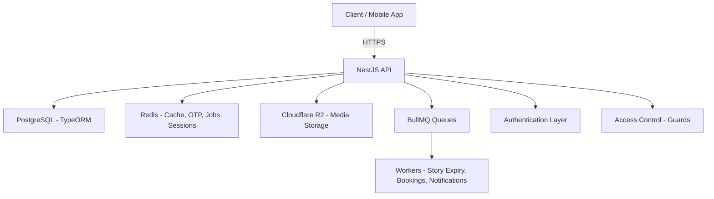

---

## 🔹 Module Interaction Overview

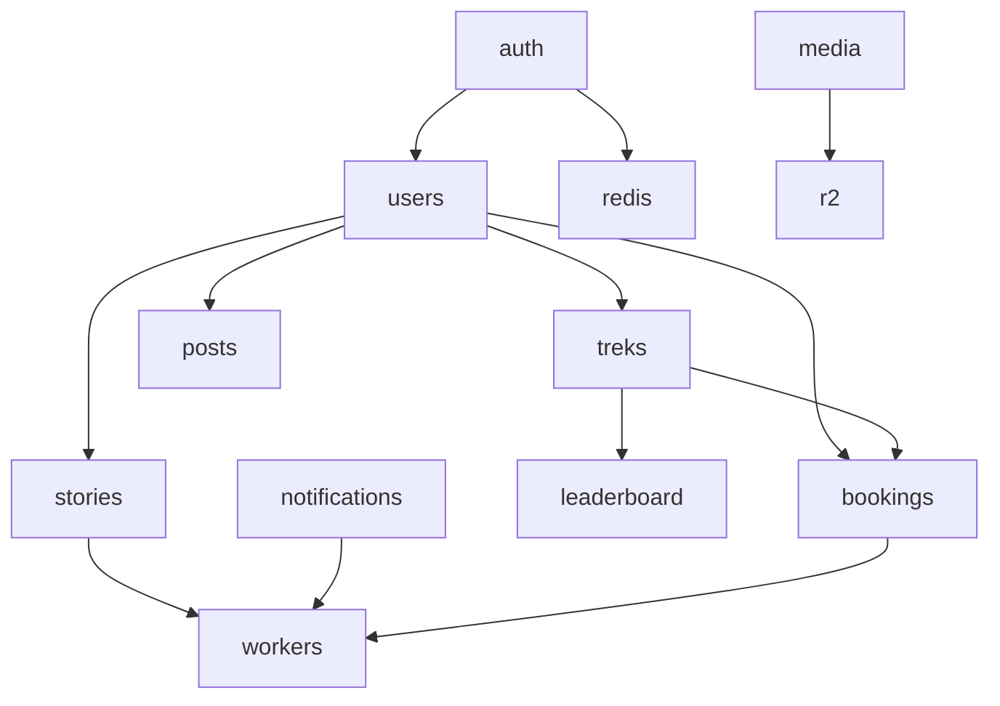

---

## 🔹 Core Flow: Auth + OTP + JWT

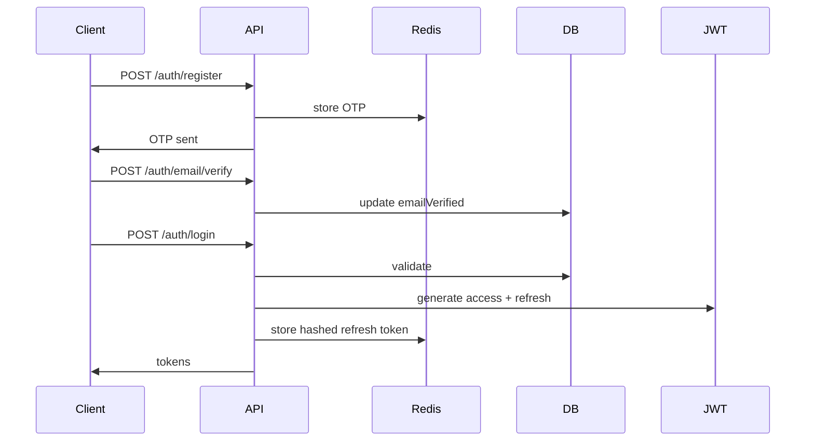

---

# 🧱 Tech Stack

| Layer       | Technology                  |
| ----------- | --------------------------- |
| Framework   | NestJS                      |
| Database    | PostgreSQL + TypeORM        |
| Cache/Queue | Redis + BullMQ              |
| Storage     | Cloudflare R2               |
| Auth        | JWT (access + refresh), OTP |
| Validation  | class-validator             |
| Workers     | BullMQ Workers              |
| Logging     | JSON structured logs        |
| Language    | TypeScript (strict)         |

---

# 🧑‍💻 Development Rules

### ✔ ConfigModule with Joi Validation

Environment variables validated at boot via `@nestjs/config` + Joi schema in `config/validation.ts`. Missing required vars (e.g., `JWT_ACCESS_SECRET`) fail immediately on startup.

### ✔ Strict TypeScript — **NO `any`**

All data structures must be strongly typed.

### ✔ Global Response Shape

Success:

```json
{
  "success": true,
  "message": "Request successful",
  "data": {}
}
```

Error:

```json
{
  "success": false,
  "statusCode": 400,
  "message": "Validation failed",
  "details": {}
}
```

### ✔ JSON Logging Only

All logs go through `LoggingInterceptor`.

### ✔ DDD-style Modular Architecture

### ✔ Redis First

Used for OTPs, refresh tokens, caching, job queues, cleanup.

---

# 📁 Folder Structure

```
src/
├── app.module.ts
├── main.ts
├── config/
│   ├── ormconfig.ts
│   ├── redis.config.ts
│   ├── swagger.config.ts
│   ├── configuration.ts      # ConfigModule factory
│   └── validation.ts         # Joi env schema
│
├── common/
│   ├── constants/
│   ├── decorators/
│   ├── filters/
│   ├── guards/
│   ├── interceptors/
│   ├── pagination/
│   ├── pipes/
│   └── utils/
│
├── modules/
│   ├── auth/                 # register, login, OTP, password reset, Google OAuth
│   ├── users/                # profile CRUD, onboarding, search
│   ├── treks/                # CRUD, geospatial nearby, recommendations
│   ├── posts/                # feed, create, like, comment
│   ├── stories/              # create, list, view tracking, expiry
│   ├── bookmarks/            # toggle, list
│   ├── friendships/          # send, accept, decline
│   ├── organizer/            # applications, dashboard, analytics
│   ├── admin/                # users, treks, bookings, audit logs
│   ├── media/                # presigned URLs for all categories
│   ├── leaderboard/
│   ├── notifications/
│   ├── bookings/             # CRUD, ticket PDF, QR verify
│   ├── payments/             # Stripe & Razorpay webhooks
│   ├── health/
│   └── mailer/
│
├── jobs/
│   ├── queues.ts
│   └── processors/
│
└── database/
    ├── migrations/
    └── seeds/
```

---

# 📦 Core Modules

### ✔ Auth Module

- Register
- OTP send/verify
- Login
- JWT access + refresh
- Refresh token rotation
- Logout
- Guards + decorators

### ✔ User Module

- User profile entity
- Organizer status
- Admin flag
- Points + distance

### ✔ Queues & Workers

- Cleanup processor
- Story expiry
- Notification jobs
- Booking reminder worker

### ✔ Health Module

- `/health`
- `/health/redis`

---

# 📘 API Reference

Below is a reference of the current available API endpoints.

## 🔹 Auth Routes

All paths prefixed with `/api/v1`.

| Method | Endpoint                     | Description                                  |
| ------ | ---------------------------- | -------------------------------------------- |
| POST   | `/auth/register`             | Register user                                |
| POST   | `/auth/login`                | Login & get tokens                           |
| POST   | `/auth/email/send-otp`       | Send email OTP                               |
| POST   | `/auth/email/verify-otp`     | Verify email OTP                             |
| POST   | `/auth/email/resend-otp`     | Resend email verification OTP                |
| POST   | `/auth/password/forgot`      | Request password reset OTP                   |
| POST   | `/auth/password/reset`       | Reset password using OTP                     |
| POST   | `/auth/refresh`              | Refresh JWT tokens                           |
| POST   | `/auth/logout`               | Logout (invalidate session)                  |
| GET    | `/auth/me`                   | Get current authenticated user               |
| GET    | `/auth/google`               | Initiate Google OAuth (returns authorize URL) |
| POST   | `/auth/google/exchange`      | Exchange Better Auth session cookie for local TokenPair |


---

## 🔹 Health Routes

| Method | Endpoint        | Description   |
| ------ | --------------- | ------------- |
| GET    | `/health`       | Server status |
| GET    | `/health/redis` | Redis status  |

---

## 🔹 Users

| Method | Endpoint                | Description                        |
| ------ | ----------------------- | ---------------------------------- |
| GET    | `/users/me`             | Get current user profile           |
| PATCH  | `/users/me`             | Update current user profile        |
| POST   | `/users/me/onboarding`  | Save onboarding answers            |
| GET    | `/users/search`         | Search users by username or name   |
| GET    | `/users/:id`            | Get user by ID                     |

---

## 🔹 Treks

| Method | Endpoint                  | Description                     |
| ------ | ------------------------- | ------------------------------- |
| GET    | `/treks`                  | List and search treks           |
| POST   | `/treks`                  | Create a trek (organizer only)  |
| GET    | `/treks/nearby`           | Find treks near a location      |
| GET    | `/treks/recommendations`  | Get trek recommendations         |
| GET    | `/treks/:id`              | Get trek details                |

---

# 📤 Postman / Thunder Client Collection

### ✔ Included in repo:

```
/docs/postman/offbeat_pravasi_collection.json
```

### If missing — generate with:

```
npm run docs:postman
```

### How to import:

**Postman**

1. Open Postman
2. Click "Import"
3. Select the JSON file

**Thunder Client**

1. Open VS Code
2. Thunder Client extension → Collections → Import
3. Select the same JSON

I can generate this file for you if you want.

---

# 🧱 Completed Work So Far

### ✔ Core backend architecture

### ✔ Full Auth system (register, login, OTP verify/resend, password reset, Google OAuth, JWT rotation)

### ✔ User module (profile CRUD, onboarding, search)

### ✔ Treks module (CRUD, geospatial nearby, recommendations, search)

### ✔ Posts module (feed, create, like, comment, delete)

### ✔ Stories module (create, list, delete, view tracking, expiry job)

### ✔ Bookmarks module (toggle, list)

### ✔ Friendships module (send, accept, decline)

### ✔ Organizer module (applications, dashboard, treks, bookings, reviews, analytics, revenue, participants)

### ✔ Admin module (users, organizer requests, trek decisions, bookings report, audit logs, platform settings)

### ✔ Media module (presigned URLs for profile, banner, post, trek, story)

### ✔ Bookings module (create, list, cancel, ticket PDF with QR, QR verification)

### ✔ Payments module (Stripe & Razorpay checkout + webhooks)

### ✔ Pagination utilities

### ✔ JSON logging interceptor

### ✔ AllExceptionsFilter + ValidationExceptionFilter

### ✔ Redis config + OTP/password-reset pipelines

### ✔ ORM config with type-safe entities

### ✔ BullMQ queues + processors (story expiry, booking release, reminders, notifications, ticket PDF, cleanup)

### ✔ Health module (server + Redis)

### ✔ ConfigModule with Joi env validation

Everything is completely type-safe with no `any`.

---

# 🛠 Roadmap

### 🟥 High Priority

- Notification module (push via FCM, device token management)
- Leaderboard module (friend leaderboard, global ranking)
- Full-text search + geolocation indexes for treks
- Content moderation (profanity filter, reporting)
- Image optimization pipeline (thumbnails via sharp)

### 🟧 Medium Priority

- Cancellation & refund policy enforcement
- Email templates (welcome, booking confirmation, organizer approval)
- Rate limiting per endpoint type (auth, upload, general)
- WebSocket support for real-time notifications

### 🟩 Low Priority

- CSV export for bookings and participants
- Push analytics (open rates, delivery metrics)
- Activity scoring / gamification
- API versioning docs for v1 → v2 migration

---

# 🚀 Getting Started

## Environment Setup

1. **Copy the development environment template:**

   ```sh
   cp env.development .env
   ```

2. **Update the `.env` file with your actual values:**
   - Database credentials (PostgreSQL)
   - Redis connection details
   - JWT secrets (generate with: `openssl rand -base64 32`)
   - API keys for external services (Google OAuth, Firebase, R2, etc.)

3. **Start required services:**

   ```sh
   # Using Docker Compose (recommended)
   docker compose -f docker/docker-compose.dev.yml up -d

   # Or manually start PostgreSQL and Redis
   ```

4. **Install dependencies and run:**
   ```sh
   npm install
   npm run start:dev
   ```

The application will be available at `http://localhost:3000` (or the PORT specified in your `.env`).

## API Documentation (Swagger)

- Runtime docs: once the server is running, visit `http://localhost:4000/docs` (or your configured `PORT`) for Swagger UI with persisted auth and request timing.
- Static spec: `npm run swagger:export` writes `docs/swagger.json`, which you can commit or share with API consumers/tools.
- Adding endpoints: keep annotating controllers and DTOs with `@ApiTags`, `@ApiResponse`, and friends—metadata is centralized in `src/config/swagger.config.ts`.

---

# 🐳 Deployment

Detailed deployment instructions can be found inside `DEPLOYMENT.md`.

### Quick Deploy:

```sh
docker compose build
docker compose up -d
```

---

# 🤝 Contributing

Contribution guidelines are in `CONTRIBUTING.md`.

Summary:

- No `any`
- Use DTOs
- Write tests when needed
- Use clean commits
- Follow module boundaries

---

# 📞 Contact

For issues, please open a GitHub issue or contact the project maintainer.

---

---

**Environment / Webhooks notes**

- The project uses a number of environment variables listed in `env.example` — ensure `JWT_TICKET_SECRET` and `JWT_TICKET_TTL` are set for signed ticket issuance (PDF tickets).
- Payment webhooks (Stripe/Razorpay) require the raw request body for signature verification. When deploying behind proxies or middleware, ensure the webhook route receives the raw payload (no JSON body-parser that strips raw body).
- Workers (BullMQ) are required to process PDF generation, booking release, and notifications. Configure Redis and run the worker process alongside the API.
````

## File: skills-lock.json
````json
{
  "version": 1,
  "skills": {
    "bullmq-specialist": {
      "source": "sickn33/antigravity-awesome-skills",
      "sourceType": "github",
      "skillPath": "skills/bullmq-specialist/SKILL.md",
      "computedHash": "37f493afe82678de5e319fe25006de19adc93b5fe8628797bcbd394919ccdb37"
    },
    "nestjs-best-practices": {
      "source": "kadajett/agent-nestjs-skills",
      "sourceType": "github",
      "skillPath": "SKILL.md",
      "computedHash": "68658903272e1015f3ec5084c7d0988216a47f42f675ed819a675250fc6a23cd"
    },
    "typeorm": {
      "source": "mindrally/skills",
      "sourceType": "github",
      "skillPath": "typeorm/SKILL.md",
      "computedHash": "a4a4be3b9466db2c0729ec3e011647d6c791ed87ac35437fb699cd1b65b02e38"
    }
  }
}
````

## File: src/app.controller.spec.ts
````typescript
import type { TestingModule } from '@nestjs/testing';
import { Test } from '@nestjs/testing';
import { AppController } from './app.controller';
import { AppService } from './app.service';
import { describe, it, expect, beforeEach } from '@jest/globals';

describe('AppController', () => {
  let appController: AppController;

  beforeEach(async () => {
    const app: TestingModule = await Test.createTestingModule({
      controllers: [AppController],
      providers: [AppService],
    }).compile();

    appController = app.get<AppController>(AppController);
  });

  describe('root', () => {
    it('should return "Hello World!"', () => {
      expect(appController.getHello()).toBe('Hello World!');
    });
  });
});
````

## File: src/app.controller.ts
````typescript
import { Controller, Get } from '@nestjs/common';
import { AppService } from './app.service';
import { ApiTags, ApiOperation } from '@nestjs/swagger';

@ApiTags('App')
@Controller()
export class AppController {
  constructor(private readonly appService: AppService) {}

  @Get()
  @ApiOperation({ summary: 'Hello world health check' })
  getHello(): string {
    return this.appService.getHello();
  }
}
````

## File: src/app.service.ts
````typescript
import { Injectable } from '@nestjs/common';

@Injectable()
export class AppService {
  getHello(): string {
    return 'Hello World!';
  }
}
````

## File: src/common/constants/app.constants.ts
````typescript
export const PASSWORD_SALT_ROUNDS = 12;

export const OTP_TTL_SECONDS = 600; // 10 minutes
export const OTP_LENGTH = 6;

export const MAX_OTP_ATTEMPTS = 5;

export const API_DEFAULT_PAGE = 1;
export const API_DEFAULT_LIMIT = 20;
````

## File: src/common/decorators/public.decorator.ts
````typescript
import { SetMetadata } from '@nestjs/common';

export const IS_PUBLIC_KEY = 'isPublic' as const;

export const Public = (): ReturnType<typeof SetMetadata> =>
  SetMetadata(IS_PUBLIC_KEY, true);
````

## File: src/common/decorators/roles.decorator.ts
````typescript
import { SetMetadata } from '@nestjs/common';

export const ROLES_KEY = 'roles' as const;

export type AppRole = 'admin' | 'organizer';

export const Roles = (...roles: AppRole[]) => SetMetadata(ROLES_KEY, roles);
````

## File: src/common/filters/validation-exception.filter.ts
````typescript
import {
  ExceptionFilter,
  Catch,
  ArgumentsHost,
  BadRequestException,
} from '@nestjs/common';
import { Request, Response } from 'express';

interface ValidationErrorResponse {
  statusCode: number;
  message: string[]; // class-validator returns array of messages
  error: string;
}

interface FormattedValidationDetails {
  [field: string]: string;
}

@Catch(BadRequestException)
export class ValidationExceptionFilter
  implements ExceptionFilter<BadRequestException>
{
  catch(exception: BadRequestException, host: ArgumentsHost): void {
    const ctx = host.switchToHttp();
    const response = ctx.getResponse<Response>();
    const request = ctx.getRequest<Request>();

    const exceptionResponse =
      exception.getResponse() as ValidationErrorResponse;

    const messages = Array.isArray(exceptionResponse.message)
      ? exceptionResponse.message
      : [exceptionResponse.message];

    const details = this.formatMessages(messages);

    response.status(400).json({
      success: false as const,
      statusCode: 400,
      message: 'Validation failed',
      timestamp: new Date().toISOString(),
      path: request.url,
      details,
    });
  }

  private formatMessages(messages: string[]): FormattedValidationDetails {
    const result: FormattedValidationDetails = {};

    messages.forEach((msg, index) => {
      // Try to extract field names from messages like:
      // "email must be an email"
      const parts = msg.split(' ');
      const possibleField = parts[0];

      if (possibleField && /^[a-zA-Z0-9_]+$/.test(possibleField)) {
        result[possibleField] = msg.replace(`${possibleField} `, '');
      } else {
        result[`error_${index + 1}`] = msg;
      }
    });

    return result;
  }
}
````

## File: src/common/guards/admin.guard.ts
````typescript
import {
  Injectable,
  CanActivate,
  ExecutionContext,
  ForbiddenException,
} from '@nestjs/common';

type RequestWithUser = {
  user?: { isAdmin?: boolean };
};

@Injectable()
export class AdminGuard implements CanActivate {
  canActivate(context: ExecutionContext): boolean {
    const req = context.switchToHttp().getRequest<RequestWithUser>();
    const user = req.user;
    if (!user?.isAdmin) {
      throw new ForbiddenException('Admin access required');
    }

    return true;
  }
}
````

## File: src/common/guards/jwt-auth.guard.ts
````typescript
import { Injectable } from '@nestjs/common';
import { AuthGuard } from '@nestjs/passport';

@Injectable()
export class JwtAuthGuard extends AuthGuard('jwt') {}
````

## File: src/common/guards/organizer.guard.ts
````typescript
import {
  Injectable,
  CanActivate,
  ExecutionContext,
  ForbiddenException,
} from '@nestjs/common';

type RequestWithUser = {
  user?: { organizerStatus?: string; isAdmin?: boolean };
};

@Injectable()
export class OrganizerGuard implements CanActivate {
  canActivate(context: ExecutionContext): boolean {
    const req = context.switchToHttp().getRequest<RequestWithUser>();
    const user = req.user;

    if (user?.isAdmin) return true; // Admin bypass

    if (user?.organizerStatus === 'APPROVED') return true;

    throw new ForbiddenException('Organizer access required');
  }
}
````

## File: src/common/interceptors/audit.interceptor.ts
````typescript
import {
  CallHandler,
  ExecutionContext,
  Injectable,
  NestInterceptor,
} from '@nestjs/common';
import { Observable } from 'rxjs';
import { tap } from 'rxjs/operators';
import { AuditLogService } from '../../modules/admin/audit-log.service';

@Injectable()
export class AuditInterceptor implements NestInterceptor {
  constructor(private readonly auditService: AuditLogService) {}

  intercept(context: ExecutionContext, next: CallHandler): Observable<any> {
    const req = context.switchToHttp().getRequest();
    const user = req.user;
    const start = Date.now();
    return next.handle().pipe(
      tap(async (_res) => {
        // record simple audit entry for admin actions
        try {
          const action = `${req.method} ${req.route?.path || req.url}`;
          await this.auditService.save({
            actorId: user?.id,
            actorEmail: user?.email
              ? `${String(user.email).slice(0, 3)}***`
              : null,
            actorRole: user?.isAdmin ? 'ADMIN' : 'USER',
            action,
            resourceType: req.baseUrl || null,
            resourceId: req.params?.id || null,
            detail: { durationMs: Date.now() - start },
            ip: req.ip || req.headers['x-forwarded-for'] || null,
            userAgent: req.headers['user-agent'] || null,
          });
        } catch (_e) {
          // swallow errors to not affect request
          console.error(_e);
        }
      }),
    );
  }
}
````

## File: src/common/pagination/pagination.dto.ts
````typescript
import { Type } from 'class-transformer';
import { IsInt, IsOptional, Min } from 'class-validator';

export class PaginationDto {
  @IsOptional()
  @Type(() => Number) // transforms query param string -> number
  @IsInt()
  @Min(1)
  page?: number;

  @IsOptional()
  @Type(() => Number)
  @IsInt()
  @Min(1)
  limit?: number;
}
````

## File: src/common/pagination/pagination.util.ts
````typescript
export interface PaginationParams {
  page?: number;
  limit?: number;
}

export interface PaginationMeta {
  page: number;
  limit: number;
  total: number;
  totalPages: number;
}

export interface PaginationResult {
  skip: number;
  take: number;
  page: number;
  limit: number;
}

/**
 * Safe pagination utility.
 * Ensures valid numbers and enforces sensible defaults.
 */
export const getPagination = (
  params: PaginationParams,
  defaultLimit = 20,
  maxLimit = 100,
): PaginationResult => {
  const rawPage = params.page;
  const rawLimit = params.limit;

  // page must be >= 1
  const page = rawPage && rawPage > 0 ? rawPage : 1;

  // limit must be >= 1 and capped to maxLimit
  const limit =
    rawLimit && rawLimit > 0 ? Math.min(rawLimit, maxLimit) : defaultLimit;

  return {
    skip: (page - 1) * limit,
    take: limit,
    page,
    limit,
  };
};

/**
 * Build pagination metadata for response.
 */
export const buildPaginationMeta = (
  page: number,
  limit: number,
  total: number,
): PaginationMeta => ({
  page,
  limit,
  total,
  totalPages: Math.ceil(total / limit),
});
````

## File: src/common/pipes/parse-objectid.pipe.ts
````typescript
import { PipeTransform, Injectable, BadRequestException } from '@nestjs/common';
import { Types } from 'mongoose';

@Injectable()
export class ParseObjectIdPipe implements PipeTransform<string, string> {
  transform(value: string): string {
    if (!Types.ObjectId.isValid(value)) {
      throw new BadRequestException(`Invalid ObjectId: ${value}`);
    }

    // return the validated ObjectId string
    return value;
  }
}
````

## File: src/common/utils/api.util.ts
````typescript
export interface ApiSuccessResponse<T> {
  success: true;
  message: string;
  data: T;
}

export interface ApiErrorResponse {
  success: false;
  statusCode: number;
  message: string;
  details?: Record<string, unknown>;
}

export const ApiSuccess = <T>(
  data: T,
  message = 'Request successful',
): ApiSuccessResponse<T> => ({
  success: true as const,
  message,
  data,
});

/**
 * Internal helper to build structured error response objects.
 * Note: Actual throwing is done by exception filters/guards.
 */
export const ApiError = (
  message: string,
  statusCode: number,
  details?: Record<string, unknown>,
): ApiErrorResponse => ({
  success: false as const,
  statusCode,
  message,
  ...(details ? { details } : {}),
});

/**
 * Short-hand for controllers:
 * return wrapData({ ... })
 * instead of returning raw data.
 *
 * TransformInterceptor will still wrap if you just return the data,
 * but this ensures explicit structure when needed.
 */
export const wrapData = <T>(
  data: T,
  message = 'Request successful',
): ApiSuccessResponse<T> => ({
  success: true,
  message,
  data,
});
````

## File: src/common/utils/file.util.ts
````typescript
import { extname } from 'path';

export const getFileExtension = (filename: string): string => {
  return extname(filename).replace('.', '').toLowerCase();
};

export const generateFileKey = (prefix: string): string => {
  const random = Math.random().toString(36).substring(2, 10);
  const timestamp = Date.now();

  return `${prefix}/${timestamp}-${random}`;
};
````

## File: src/common/utils/hash.util.ts
````typescript
import argon2 from 'argon2';

export const hashPassword = (plain: string): Promise<string> => {
  return argon2.hash(plain, { type: argon2.argon2id });
};

export const verifyPassword = async (
  hash: string,
  plain: string,
): Promise<boolean> => {
  return argon2.verify(hash, plain);
};
````

## File: src/common/utils/profanity.util.ts
````typescript
const BLOCKED_WORDS = [
  'spam',
  'scam',
  'fraud',
  'abuse',
  'hate',
  'violence',
  'explicit',
  'obscene',
];

const BLOCKED_PATTERNS = [
  /\b(\d{10,})\b/g,
  /https?:\/\/(?:www\.)?(?:bit\.ly|tinyurl|shorturl)\/\S+/gi,
];

export function containsProfanity(text: string): boolean {
  const lower = text.toLowerCase();
  return BLOCKED_WORDS.some((word) =>
    new RegExp(`\\b${word}\\b`, 'i').test(lower),
  );
}

export function containsSuspiciousContent(text: string): boolean {
  return BLOCKED_PATTERNS.some((pattern) => pattern.test(text));
}

export function moderateContent(text: string): {
  flagged: boolean;
  reasons: string[];
} {
  const reasons: string[] = [];

  if (containsProfanity(text)) {
    reasons.push('contains_profanity');
  }

  if (containsSuspiciousContent(text)) {
    reasons.push('contains_suspicious_content');
  }

  return {
    flagged: reasons.length > 0,
    reasons,
  };
}
````

## File: src/common/utils/redis.service.ts
````typescript
import { Inject, Injectable } from '@nestjs/common';
import type { RedisClient } from './redis.client';

@Injectable()
export class RedisService {
  constructor(
    @Inject('REDIS_CLIENT')
    private readonly redis: RedisClient,
  ) {}

  async get(key: string): Promise<string | null> {
    return this.redis.get(key);
  }

  async set(key: string, value: string, ttlSeconds?: number): Promise<void> {
    if (ttlSeconds) {
      await this.redis.set(key, value, 'EX', ttlSeconds);
    } else {
      await this.redis.set(key, value);
    }
  }

  async del(key: string): Promise<void> {
    await this.redis.del(key);
  }
}
````

## File: src/config/redis.config.ts
````typescript
export interface RedisConfig {
  host: string;
  port: number;
  password?: string;
  db: number;
}

export const redisConfig: RedisConfig = {
  host: process.env.REDIS_HOST ?? '127.0.0.1',
  port: Number(process.env.REDIS_PORT ?? 6379),
  password: process.env.REDIS_PASSWORD || undefined,
  db: Number(process.env.REDIS_DB ?? 0),
};
````

## File: src/config/swagger.config.ts
````typescript
import { DocumentBuilder } from '@nestjs/swagger';
import type { SwaggerCustomOptions } from '@nestjs/swagger';

export const swaggerDocumentOptions = new DocumentBuilder()
  .setTitle('Offbeat प्रवासी API')
  .setDescription(
    'Full-scale, production-ready trek discovery and booking platform.',
  )
  .setVersion('1.0.0')
  .addBearerAuth(
    {
      type: 'http',
      scheme: 'bearer',
      bearerFormat: 'JWT',
    },
    'access-token',
  )
  .addServer('http://localhost:4000', 'Local development')
  .build();

export const swaggerCustomOptions: SwaggerCustomOptions = {
  customSiteTitle: 'Offbeat Pravasi – API Docs',
  swaggerOptions: {
    persistAuthorization: true,
    tagsSorter: 'alpha',
    operationsSorter: 'alpha',
    displayRequestDuration: true,
  },
};
````

## File: src/database/migrations/0001-EnablePostgis.ts
````typescript
import type { MigrationInterface, QueryRunner } from 'typeorm';

export class EnablePostgis0001 implements MigrationInterface {
  name = 'EnablePostgis0001';

  public async up(queryRunner: QueryRunner): Promise<void> {
    // Create PostGIS extension if not present. Requires superuser or
    // appropriate privileges on the database.
    // `pgcrypto` provides `gen_random_uuid()` used by later migrations.
    await queryRunner.query(`CREATE EXTENSION IF NOT EXISTS pgcrypto;`);
    await queryRunner.query(`CREATE EXTENSION IF NOT EXISTS postgis;`);
    await queryRunner.query(`CREATE EXTENSION IF NOT EXISTS postgis_topology;`);
  }

  public async down(queryRunner: QueryRunner): Promise<void> {
    await queryRunner.query(`DROP EXTENSION IF EXISTS postgis_topology;`);
    await queryRunner.query(`DROP EXTENSION IF EXISTS postgis;`);
    await queryRunner.query(`DROP EXTENSION IF EXISTS pgcrypto;`);
  }
}
````

## File: src/database/migrations/0002-CreateTreksTables.ts
````typescript
import type { MigrationInterface, QueryRunner } from 'typeorm';

export class CreateTreksTables0002 implements MigrationInterface {
  name = 'CreateTreksTables0002';

  public async up(queryRunner: QueryRunner): Promise<void> {
    // Create treks table
    await queryRunner.query(`
      CREATE TABLE IF NOT EXISTS treks (
        id uuid PRIMARY KEY DEFAULT gen_random_uuid(),
        organizer_id uuid,
        name varchar(255) NOT NULL,
        slug varchar(255),
        short_description varchar(512),
        full_description text,
        state varchar(80),
        location varchar(255),
        latitude double precision,
        longitude double precision,
        geom geometry(Point,4326),
        start_date timestamptz,
        end_date timestamptz,
        difficulty varchar(32),
        cost_inr int DEFAULT 0,
        max_participants int DEFAULT 1,
        is_published boolean DEFAULT false,
        avg_rating double precision DEFAULT 0,
        rating_count int DEFAULT 0,
        popularity_score bigint DEFAULT 0,
        created_at timestamptz DEFAULT now(),
        updated_at timestamptz DEFAULT now(),
        deleted_at timestamptz
      );
    `);

    // FK to users
    await queryRunner.query(`
      ALTER TABLE treks
      ADD CONSTRAINT fk_treks_organizer FOREIGN KEY (organizer_id) REFERENCES users(id) ON DELETE SET NULL;
    `);

    // Create trek_tags
    await queryRunner.query(`
      CREATE TABLE IF NOT EXISTS trek_tags (
        id uuid PRIMARY KEY DEFAULT gen_random_uuid(),
        name varchar(120) NOT NULL UNIQUE,
        usage_count int DEFAULT 0
      );
    `);

    // Join table
    await queryRunner.query(`
      CREATE TABLE IF NOT EXISTS trek_tags_link (
        trek_id uuid NOT NULL,
        tag_id uuid NOT NULL,
        PRIMARY KEY (trek_id, tag_id),
        CONSTRAINT fk_trek_tags_trek FOREIGN KEY (trek_id) REFERENCES treks(id) ON DELETE CASCADE,
        CONSTRAINT fk_trek_tags_tag FOREIGN KEY (tag_id) REFERENCES trek_tags(id) ON DELETE CASCADE
      );
    `);

    // Images
    await queryRunner.query(`
      CREATE TABLE IF NOT EXISTS trek_images (
        id uuid PRIMARY KEY DEFAULT gen_random_uuid(),
        trek_id uuid NOT NULL,
        key varchar(512) NOT NULL,
        url varchar(1024),
        is_primary boolean DEFAULT false,
        "order" int DEFAULT 0,
        alt_text varchar(255),
        created_at timestamptz DEFAULT now(),
        CONSTRAINT fk_trek_images_trek FOREIGN KEY (trek_id) REFERENCES treks(id) ON DELETE CASCADE
      );
    `);

    // Reviews
    await queryRunner.query(`
      CREATE TABLE IF NOT EXISTS trek_reviews (
        id uuid PRIMARY KEY DEFAULT gen_random_uuid(),
        trek_id uuid NOT NULL,
        user_id uuid NOT NULL,
        rating int NOT NULL,
        comment text,
        created_at timestamptz DEFAULT now(),
        CONSTRAINT fk_trek_reviews_trek FOREIGN KEY (trek_id) REFERENCES treks(id) ON DELETE CASCADE,
        CONSTRAINT fk_trek_reviews_user FOREIGN KEY (user_id) REFERENCES users(id) ON DELETE CASCADE
      );
    `);

    // Interactions
    await queryRunner.query(`
      CREATE TABLE IF NOT EXISTS trek_interactions (
        id uuid PRIMARY KEY DEFAULT gen_random_uuid(),
        trek_id uuid NOT NULL,
        user_id uuid NOT NULL,
        type varchar(32) NOT NULL,
        weight int DEFAULT 1,
        created_at timestamptz DEFAULT now(),
        CONSTRAINT fk_trek_interactions_trek FOREIGN KEY (trek_id) REFERENCES treks(id) ON DELETE CASCADE,
        CONSTRAINT fk_trek_interactions_user FOREIGN KEY (user_id) REFERENCES users(id) ON DELETE CASCADE
      );
    `);

    // Indexes: GiST on geom
    await queryRunner.query(
      `CREATE INDEX IF NOT EXISTS idx_treks_geom ON treks USING GIST (geom);`,
    );

    // Full-text search index on name, location, full_description
    await queryRunner.query(`
      CREATE INDEX IF NOT EXISTS idx_treks_search ON treks USING GIN (to_tsvector('english', coalesce(name,'') || ' ' || coalesce(location,'') || ' ' || coalesce(full_description,'')));
    `);

    // Basic indexes
    await queryRunner.query(
      `CREATE INDEX IF NOT EXISTS idx_treks_state ON treks (state);`,
    );
    await queryRunner.query(
      `CREATE INDEX IF NOT EXISTS idx_treks_difficulty ON treks (difficulty);`,
    );
    await queryRunner.query(
      `CREATE INDEX IF NOT EXISTS idx_treks_is_published ON treks (is_published);`,
    );
    await queryRunner.query(
      `CREATE INDEX IF NOT EXISTS idx_trek_images_trek ON trek_images (trek_id);`,
    );
    await queryRunner.query(
      `CREATE INDEX IF NOT EXISTS idx_trek_reviews_trek ON trek_reviews (trek_id);`,
    );
  }

  public async down(queryRunner: QueryRunner): Promise<void> {
    await queryRunner.query(`DROP INDEX IF EXISTS idx_trek_reviews_trek;`);
    await queryRunner.query(`DROP INDEX IF EXISTS idx_trek_images_trek;`);
    await queryRunner.query(`DROP INDEX IF EXISTS idx_treks_is_published;`);
    await queryRunner.query(`DROP INDEX IF EXISTS idx_treks_difficulty;`);
    await queryRunner.query(`DROP INDEX IF EXISTS idx_treks_state;`);
    await queryRunner.query(`DROP INDEX IF EXISTS idx_treks_search;`);
    await queryRunner.query(`DROP INDEX IF EXISTS idx_treks_geom;`);

    await queryRunner.query(`DROP TABLE IF EXISTS trek_interactions;`);
    await queryRunner.query(`DROP TABLE IF EXISTS trek_reviews;`);
    await queryRunner.query(`DROP TABLE IF EXISTS trek_images;`);
    await queryRunner.query(`DROP TABLE IF EXISTS trek_tags_link;`);
    await queryRunner.query(`DROP TABLE IF EXISTS trek_tags;`);
    await queryRunner.query(
      `ALTER TABLE treks DROP CONSTRAINT IF EXISTS fk_treks_organizer;`,
    );
    await queryRunner.query(`DROP TABLE IF EXISTS treks;`);
  }
}
````

## File: src/database/migrations/0003-CreateAuditLogsTable.ts
````typescript
import type { MigrationInterface, QueryRunner } from 'typeorm';

export class CreateAuditLogs0003 implements MigrationInterface {
  name = 'CreateAuditLogs0003';

  public async up(queryRunner: QueryRunner): Promise<void> {
    await queryRunner.query(`
      CREATE TABLE IF NOT EXISTS audit_logs (
        id uuid PRIMARY KEY DEFAULT gen_random_uuid(),
        actor_id uuid,
        actor_email varchar(120),
        actor_role varchar(64),
        action varchar(128) NOT NULL,
        resource_type varchar(64),
        resource_id uuid,
        detail jsonb,
        ip varchar(45),
        user_agent text,
        created_at timestamptz DEFAULT now()
      );
    `);

    await queryRunner.query(
      `CREATE INDEX IF NOT EXISTS idx_audit_actor ON audit_logs (actor_id);`,
    );
    await queryRunner.query(
      `CREATE INDEX IF NOT EXISTS idx_audit_action ON audit_logs (action);`,
    );
    await queryRunner.query(
      `CREATE INDEX IF NOT EXISTS idx_audit_resource ON audit_logs (resource_type, resource_id);`,
    );
    await queryRunner.query(
      `CREATE INDEX IF NOT EXISTS idx_audit_created_at ON audit_logs (created_at);`,
    );
  }

  public async down(queryRunner: QueryRunner): Promise<void> {
    await queryRunner.query(`DROP INDEX IF EXISTS idx_audit_created_at;`);
    await queryRunner.query(`DROP INDEX IF EXISTS idx_audit_resource;`);
    await queryRunner.query(`DROP INDEX IF EXISTS idx_audit_action;`);
    await queryRunner.query(`DROP INDEX IF EXISTS idx_audit_actor;`);
    await queryRunner.query(`DROP TABLE IF EXISTS audit_logs;`);
  }
}
````

## File: src/database/migrations/0004-AddIsSuspendedToUsers.ts
````typescript
import type { MigrationInterface, QueryRunner } from 'typeorm';

export class AddIsSuspendedToUsers0004 implements MigrationInterface {
  name = 'AddIsSuspendedToUsers0004';

  public async up(queryRunner: QueryRunner): Promise<void> {
    await queryRunner.query(
      `ALTER TABLE users ADD COLUMN IF NOT EXISTS is_suspended boolean DEFAULT false;`,
    );
    await queryRunner.query(
      `CREATE INDEX IF NOT EXISTS idx_users_is_suspended ON users (is_suspended);`,
    );
  }

  public async down(queryRunner: QueryRunner): Promise<void> {
    await queryRunner.query(`DROP INDEX IF EXISTS idx_users_is_suspended;`);
    await queryRunner.query(
      `ALTER TABLE users DROP COLUMN IF EXISTS is_suspended;`,
    );
  }
}
````

## File: src/database/migrations/0005-CreateBookingsPaymentsAndSettings.ts
````typescript
import type { MigrationInterface, QueryRunner } from 'typeorm';

export class CreateBookingsPaymentsAndSettings0005
  implements MigrationInterface
{
  name = 'CreateBookingsPaymentsAndSettings0005';

  public async up(queryRunner: QueryRunner): Promise<void> {
    await queryRunner.query(`
      CREATE TABLE IF NOT EXISTS bookings (
        id uuid PRIMARY KEY DEFAULT gen_random_uuid(),
        trek_id uuid NOT NULL,
        trek_snapshot jsonb NOT NULL,
        user_id uuid NOT NULL,
        participants jsonb,
        quantity int NOT NULL,
        unit_price_inr int NOT NULL,
        total_amount_inr int NOT NULL,
        status varchar(32) NOT NULL DEFAULT 'PENDING',
        payment_id uuid,
        hold_expires_at timestamptz,
        metadata jsonb,
        created_at timestamptz DEFAULT now(),
        updated_at timestamptz DEFAULT now(),
        deleted_at timestamptz
      );
    `);

    await queryRunner.query(`
      CREATE TABLE IF NOT EXISTS payments (
        id uuid PRIMARY KEY DEFAULT gen_random_uuid(),
        booking_id uuid NOT NULL,
        provider varchar(32) NOT NULL,
        provider_payment_id varchar(128),
        status varchar(32) NOT NULL DEFAULT 'CREATED',
        amount_inr int NOT NULL,
        currency varchar(8) DEFAULT 'INR',
        provider_response jsonb,
        idempotency_key varchar(255),
        created_at timestamptz DEFAULT now(),
        updated_at timestamptz DEFAULT now()
      );
    `);

    await queryRunner.query(`
      CREATE TABLE IF NOT EXISTS platform_settings (
        id uuid PRIMARY KEY DEFAULT gen_random_uuid(),
        key varchar(128) DEFAULT 'platform_settings',
        settings jsonb NOT NULL,
        changed_by uuid,
        changed_at timestamptz,
        created_at timestamptz DEFAULT now(),
        updated_at timestamptz DEFAULT now()
      );
    `);

    await queryRunner.query(
      `CREATE INDEX IF NOT EXISTS idx_bookings_status ON bookings (status);`,
    );
    await queryRunner.query(
      `CREATE INDEX IF NOT EXISTS idx_bookings_trek_status ON bookings (trek_id, status);`,
    );
    await queryRunner.query(
      `CREATE INDEX IF NOT EXISTS idx_payments_status ON payments (status);`,
    );
  }

  public async down(queryRunner: QueryRunner): Promise<void> {
    await queryRunner.query(`DROP INDEX IF EXISTS idx_payments_status;`);
    await queryRunner.query(`DROP INDEX IF EXISTS idx_bookings_status;`);
    await queryRunner.query(`DROP TABLE IF EXISTS platform_settings;`);
    await queryRunner.query(`DROP TABLE IF EXISTS payments;`);
    await queryRunner.query(`DROP TABLE IF EXISTS bookings;`);
  }
}
````

## File: src/database/migrations/0006-AddCurrentParticipantsToTreks.ts
````typescript
import type { MigrationInterface, QueryRunner } from 'typeorm';

export class AddCurrentParticipantsToTreks0006 implements MigrationInterface {
  name = 'AddCurrentParticipantsToTreks0006';

  public async up(queryRunner: QueryRunner): Promise<void> {
    await queryRunner.query(
      `ALTER TABLE treks ADD COLUMN IF NOT EXISTS current_participants int DEFAULT 0;`,
    );
    await queryRunner.query(
      `CREATE INDEX IF NOT EXISTS idx_treks_current_participants ON treks (current_participants);`,
    );
  }

  public async down(queryRunner: QueryRunner): Promise<void> {
    await queryRunner.query(
      `DROP INDEX IF EXISTS idx_treks_current_participants;`,
    );
    await queryRunner.query(
      `ALTER TABLE treks DROP COLUMN IF EXISTS current_participants;`,
    );
  }
}
````

## File: src/database/migrations/0007-AddTrekStatusColumn.ts
````typescript
import type { MigrationInterface, QueryRunner } from 'typeorm';

export class AddTrekStatusColumn0007 implements MigrationInterface {
  name = 'AddTrekStatusColumn0007';

  public async up(queryRunner: QueryRunner): Promise<void> {
    await queryRunner.query(
      `ALTER TABLE treks ADD COLUMN IF NOT EXISTS status varchar(32) DEFAULT 'DRAFT';`,
    );
    await queryRunner.query(
      `UPDATE treks SET status = 'PUBLISHED' WHERE is_published = true AND (status IS NULL OR status = 'DRAFT');`,
    );
    await queryRunner.query(
      `CREATE INDEX IF NOT EXISTS idx_treks_status ON treks (status);`,
    );
  }

  public async down(queryRunner: QueryRunner): Promise<void> {
    await queryRunner.query(`DROP INDEX IF EXISTS idx_treks_status;`);
    await queryRunner.query(`ALTER TABLE treks DROP COLUMN IF EXISTS status;`);
  }
}
````

## File: src/database/migrations/0008-AddPaymentMetadataColumn.ts
````typescript
import type { MigrationInterface, QueryRunner } from 'typeorm';

export class AddPaymentMetadataColumn0008 implements MigrationInterface {
  name = 'AddPaymentMetadataColumn0008';

  public async up(queryRunner: QueryRunner): Promise<void> {
    await queryRunner.query(
      `ALTER TABLE payments ADD COLUMN IF NOT EXISTS metadata jsonb;`,
    );
  }

  public async down(queryRunner: QueryRunner): Promise<void> {
    await queryRunner.query(
      `ALTER TABLE payments DROP COLUMN IF EXISTS metadata;`,
    );
  }
}
````

## File: src/database/migrations/0009-CreateBookmarksAndFriendRequests.ts
````typescript
import type { MigrationInterface, QueryRunner } from 'typeorm';

export class CreateBookmarksAndFriendRequests0009
  implements MigrationInterface
{
  name = 'CreateBookmarksAndFriendRequests0009';

  public async up(queryRunner: QueryRunner): Promise<void> {
    await queryRunner.query(`
      CREATE TABLE IF NOT EXISTS bookmarks (
        id uuid PRIMARY KEY DEFAULT gen_random_uuid(),
        "userId" uuid NOT NULL,
        "trekId" uuid NOT NULL,
        "createdAt" timestamptz DEFAULT now()
      );
    `);

    await queryRunner.query(`
      ALTER TABLE bookmarks
        ADD CONSTRAINT fk_bookmarks_user
        FOREIGN KEY ("userId") REFERENCES users(id) ON DELETE CASCADE;
    `);

    await queryRunner.query(`
      ALTER TABLE bookmarks
        ADD CONSTRAINT fk_bookmarks_trek
        FOREIGN KEY ("trekId") REFERENCES treks(id) ON DELETE CASCADE;
    `);

    await queryRunner.query(`
      CREATE UNIQUE INDEX IF NOT EXISTS idx_bookmarks_user_trek
        ON bookmarks ("userId", "trekId");
    `);

    await queryRunner.query(`
      CREATE INDEX IF NOT EXISTS idx_bookmarks_trek
        ON bookmarks ("trekId");
    `);

    await queryRunner.query(`
      CREATE TYPE IF NOT EXISTS friend_request_status AS ENUM (
        'PENDING', 'ACCEPTED', 'DECLINED'
      );
    `);

    await queryRunner.query(`
      CREATE TABLE IF NOT EXISTS friend_requests (
        id uuid PRIMARY KEY DEFAULT gen_random_uuid(),
        "senderId" uuid NOT NULL,
        "receiverId" uuid NOT NULL,
        status friend_request_status NOT NULL DEFAULT 'PENDING',
        "createdAt" timestamptz DEFAULT now(),
        "updatedAt" timestamptz DEFAULT now()
      );
    `);

    await queryRunner.query(`
      ALTER TABLE friend_requests
        ADD CONSTRAINT fk_friend_requests_sender
        FOREIGN KEY ("senderId") REFERENCES users(id) ON DELETE CASCADE;
    `);

    await queryRunner.query(`
      ALTER TABLE friend_requests
        ADD CONSTRAINT fk_friend_requests_receiver
        FOREIGN KEY ("receiverId") REFERENCES users(id) ON DELETE CASCADE;
    `);

    await queryRunner.query(`
      CREATE INDEX IF NOT EXISTS idx_friend_requests_receiver_status
        ON friend_requests ("receiverId", status);
    `);

    await queryRunner.query(`
      CREATE INDEX IF NOT EXISTS idx_friend_requests_sender
        ON friend_requests ("senderId");
    `);
  }

  public async down(queryRunner: QueryRunner): Promise<void> {
    await queryRunner.query(`DROP TABLE IF EXISTS bookmarks;`);
    await queryRunner.query(`DROP TABLE IF EXISTS friend_requests;`);
    await queryRunner.query(`DROP TYPE IF EXISTS friend_request_status;`);
  }
}
````

## File: src/database/migrations/0010-CreatePostsStoriesTables.ts
````typescript
import type { MigrationInterface, QueryRunner } from 'typeorm';

export class CreatePostsStoriesTables0010 implements MigrationInterface {
  name = 'CreatePostsStoriesTables0010';

  public async up(queryRunner: QueryRunner): Promise<void> {
    await queryRunner.query(`
      CREATE TABLE IF NOT EXISTS posts (
        id uuid PRIMARY KEY DEFAULT gen_random_uuid(),
        "userId" uuid NOT NULL,
        caption text NOT NULL,
        "imageUrls" text NOT NULL DEFAULT '',
        location varchar,
        "likesCount" int NOT NULL DEFAULT 0,
        "commentsCount" int NOT NULL DEFAULT 0,
        "createdAt" timestamptz NOT NULL DEFAULT now(),
        "updatedAt" timestamptz NOT NULL DEFAULT now(),
        "deletedAt" timestamptz
      );
    `);

    await queryRunner.query(`
      ALTER TABLE posts
        ADD CONSTRAINT fk_posts_user
        FOREIGN KEY ("userId") REFERENCES users(id) ON DELETE CASCADE;
    `);

    await queryRunner.query(`
      CREATE INDEX IF NOT EXISTS idx_posts_user_created
        ON posts ("userId", "createdAt");
    `);

    await queryRunner.query(`
      CREATE TABLE IF NOT EXISTS comments (
        id uuid PRIMARY KEY DEFAULT gen_random_uuid(),
        "postId" uuid NOT NULL,
        "userId" uuid NOT NULL,
        comment varchar(500) NOT NULL,
        "createdAt" timestamptz NOT NULL DEFAULT now()
      );
    `);

    await queryRunner.query(`
      ALTER TABLE comments
        ADD CONSTRAINT fk_comments_post
        FOREIGN KEY ("postId") REFERENCES posts(id) ON DELETE CASCADE;
    `);

    await queryRunner.query(`
      ALTER TABLE comments
        ADD CONSTRAINT fk_comments_user
        FOREIGN KEY ("userId") REFERENCES users(id) ON DELETE CASCADE;
    `);

    await queryRunner.query(`
      CREATE INDEX IF NOT EXISTS idx_comments_post
        ON comments ("postId");
    `);

    await queryRunner.query(`
      CREATE TABLE IF NOT EXISTS post_likes (
        id uuid PRIMARY KEY DEFAULT gen_random_uuid(),
        "postId" uuid NOT NULL,
        "userId" uuid NOT NULL,
        "createdAt" timestamptz NOT NULL DEFAULT now()
      );
    `);

    await queryRunner.query(`
      ALTER TABLE post_likes
        ADD CONSTRAINT fk_post_likes_post
        FOREIGN KEY ("postId") REFERENCES posts(id) ON DELETE CASCADE;
    `);

    await queryRunner.query(`
      ALTER TABLE post_likes
        ADD CONSTRAINT fk_post_likes_user
        FOREIGN KEY ("userId") REFERENCES users(id) ON DELETE CASCADE;
    `);

    await queryRunner.query(`
      CREATE UNIQUE INDEX IF NOT EXISTS idx_post_likes_post_user
        ON post_likes ("postId", "userId");
    `);

    await queryRunner.query(`
      CREATE TABLE IF NOT EXISTS stories (
        id uuid PRIMARY KEY DEFAULT gen_random_uuid(),
        "userId" uuid NOT NULL,
        "mediaUrl" varchar NOT NULL,
        "mediaType" varchar(20) NOT NULL,
        caption varchar(300),
        "expiresAt" timestamptz NOT NULL,
        "viewsCount" int NOT NULL DEFAULT 0,
        "createdAt" timestamptz NOT NULL DEFAULT now()
      );
    `);

    await queryRunner.query(`
      ALTER TABLE stories
        ADD CONSTRAINT fk_stories_user
        FOREIGN KEY ("userId") REFERENCES users(id) ON DELETE CASCADE;
    `);

    await queryRunner.query(`
      CREATE INDEX IF NOT EXISTS idx_stories_user
        ON stories ("userId");
    `);

    await queryRunner.query(`
      CREATE INDEX IF NOT EXISTS idx_stories_expires_at
        ON stories ("expiresAt");
    `);

    await queryRunner.query(`
      CREATE TABLE IF NOT EXISTS story_views (
        id uuid PRIMARY KEY DEFAULT gen_random_uuid(),
        "storyId" uuid NOT NULL,
        "userId" uuid NOT NULL,
        "viewedAt" timestamptz NOT NULL DEFAULT now()
      );
    `);

    await queryRunner.query(`
      ALTER TABLE story_views
        ADD CONSTRAINT fk_story_views_story
        FOREIGN KEY ("storyId") REFERENCES stories(id) ON DELETE CASCADE;
    `);

    await queryRunner.query(`
      ALTER TABLE story_views
        ADD CONSTRAINT fk_story_views_user
        FOREIGN KEY ("userId") REFERENCES users(id) ON DELETE CASCADE;
    `);

    await queryRunner.query(`
      CREATE UNIQUE INDEX IF NOT EXISTS idx_story_views_story_user
        ON story_views ("storyId", "userId");
    `);
  }

  public async down(queryRunner: QueryRunner): Promise<void> {
    await queryRunner.query(`DROP TABLE IF EXISTS story_views;`);
    await queryRunner.query(`DROP TABLE IF EXISTS stories;`);
    await queryRunner.query(`DROP TABLE IF EXISTS post_likes;`);
    await queryRunner.query(`DROP TABLE IF EXISTS comments;`);
    await queryRunner.query(`DROP TABLE IF EXISTS posts;`);
  }
}
````

## File: src/database/migrations/0011-CreateOrganizerApplicationsTable.ts
````typescript
import type { MigrationInterface, QueryRunner } from 'typeorm';

export class CreateOrganizerApplicationsTable0011
  implements MigrationInterface
{
  name = 'CreateOrganizerApplicationsTable0011';

  public async up(queryRunner: QueryRunner): Promise<void> {
    await queryRunner.query(`
      CREATE TABLE IF NOT EXISTS organizer_applications (
        id uuid PRIMARY KEY DEFAULT gen_random_uuid(),
        "userId" uuid NOT NULL,
        "organizationName" varchar(160) NOT NULL,
        "contactPerson" varchar(160),
        "contactPhone" varchar(20) NOT NULL,
        website varchar(160),
        bio text NOT NULL,
        "yearsOfExperience" int,
        "documentUrls" jsonb,
        "certificateUrls" jsonb,
        status varchar(20) NOT NULL DEFAULT 'PENDING',
        "adminNotes" text,
        "submittedAt" timestamptz NOT NULL DEFAULT now(),
        "reviewedAt" timestamptz
      );
    `);

    await queryRunner.query(`
      ALTER TABLE organizer_applications
        ADD CONSTRAINT fk_organizer_applications_user
        FOREIGN KEY ("userId") REFERENCES users(id) ON DELETE CASCADE;
    `);

    await queryRunner.query(`
      CREATE UNIQUE INDEX IF NOT EXISTS "UQ_organizer_applications_pending_user"
        ON organizer_applications ("userId")
        WHERE status = 'PENDING';
    `);

    await queryRunner.query(`
      CREATE INDEX IF NOT EXISTS idx_organizer_applications_status
        ON organizer_applications (status);
    `);
  }

  public async down(queryRunner: QueryRunner): Promise<void> {
    await queryRunner.query(`DROP TABLE IF EXISTS organizer_applications;`);
  }
}
````

## File: src/database/migrations/0012-CreateMediaTable.ts
````typescript
import type { MigrationInterface, QueryRunner } from 'typeorm';

export class CreateMediaTable0012 implements MigrationInterface {
  name = 'CreateMediaTable0012';

  public async up(queryRunner: QueryRunner): Promise<void> {
    await queryRunner.query(`
      CREATE TABLE IF NOT EXISTS media (
        id uuid PRIMARY KEY DEFAULT gen_random_uuid(),
        "userId" uuid,
        bucket varchar(50) NOT NULL,
        key varchar(255) NOT NULL,
        "originalName" varchar(255) NOT NULL,
        "mimeType" varchar(50) NOT NULL,
        "sizeBytes" int NOT NULL,
        category varchar(20) NOT NULL,
        "createdAt" timestamptz NOT NULL DEFAULT now()
      );
    `);

    await queryRunner.query(`
      ALTER TABLE media
        ADD CONSTRAINT fk_media_user
        FOREIGN KEY ("userId") REFERENCES users(id) ON DELETE SET NULL;
    `);

    await queryRunner.query(`
      CREATE INDEX IF NOT EXISTS idx_media_user
        ON media ("userId");
    `);

    await queryRunner.query(`
      CREATE INDEX IF NOT EXISTS idx_media_category
        ON media (category);
    `);
  }

  public async down(queryRunner: QueryRunner): Promise<void> {
    await queryRunner.query(`DROP TABLE IF EXISTS media;`);
  }
}
````

## File: src/database/migrations/0013-CreateReportsTable.ts
````typescript
import type { MigrationInterface, QueryRunner } from 'typeorm';

export class CreateReportsTable0013 implements MigrationInterface {
  name = 'CreateReportsTable0013';

  public async up(queryRunner: QueryRunner): Promise<void> {
    await queryRunner.query(`
      CREATE TABLE IF NOT EXISTS reports (
        id uuid PRIMARY KEY DEFAULT gen_random_uuid(),
        "reporterId" uuid NOT NULL,
        "targetType" varchar(20) NOT NULL,
        "targetId" uuid NOT NULL,
        reason varchar(20) NOT NULL,
        description text,
        status varchar(20) NOT NULL DEFAULT 'PENDING',
        "reviewedById" uuid,
        "adminNotes" text,
        "createdAt" timestamptz NOT NULL DEFAULT now(),
        "reviewedAt" timestamptz
      );
    `);

    await queryRunner.query(`
      ALTER TABLE reports
        ADD CONSTRAINT fk_reports_reporter
        FOREIGN KEY ("reporterId") REFERENCES users(id) ON DELETE CASCADE;
    `);

    await queryRunner.query(`
      ALTER TABLE reports
        ADD CONSTRAINT fk_reports_reviewer
        FOREIGN KEY ("reviewedById") REFERENCES users(id) ON DELETE SET NULL;
    `);

    await queryRunner.query(`
      CREATE INDEX IF NOT EXISTS idx_reports_status
        ON reports (status);
    `);

    await queryRunner.query(`
      CREATE INDEX IF NOT EXISTS idx_reports_target
        ON reports ("targetType", "targetId");
    `);
  }

  public async down(queryRunner: QueryRunner): Promise<void> {
    await queryRunner.query(`DROP TABLE IF EXISTS reports;`);
  }
}
````

## File: src/database/migrations/0014-CreateLeaderboardEntriesTable.ts
````typescript
import type { MigrationInterface, QueryRunner } from 'typeorm';

export class CreateLeaderboardEntriesTable0014 implements MigrationInterface {
  name = 'CreateLeaderboardEntriesTable0014';

  public async up(queryRunner: QueryRunner): Promise<void> {
    await queryRunner.query(`
      CREATE TABLE IF NOT EXISTS leaderboard_entries (
        id uuid PRIMARY KEY DEFAULT gen_random_uuid(),
        "userId" uuid NOT NULL,
        score float NOT NULL DEFAULT 0,
        rank int NOT NULL DEFAULT 0,
        "boardType" varchar(20) NOT NULL DEFAULT 'global',
        "createdAt" timestamptz NOT NULL DEFAULT now(),
        "updatedAt" timestamptz NOT NULL DEFAULT now()
      );
    `);

    await queryRunner.query(`
      ALTER TABLE leaderboard_entries
        ADD CONSTRAINT fk_leaderboard_entries_user
        FOREIGN KEY ("userId") REFERENCES users(id) ON DELETE CASCADE;
    `);

    await queryRunner.query(`
      CREATE INDEX IF NOT EXISTS idx_leaderboard_entries_user
        ON leaderboard_entries ("userId");
    `);

    await queryRunner.query(`
      CREATE INDEX IF NOT EXISTS idx_leaderboard_entries_score
        ON leaderboard_entries (score, "updatedAt");
    `);
  }

  public async down(queryRunner: QueryRunner): Promise<void> {
    await queryRunner.query(`DROP TABLE IF EXISTS leaderboard_entries;`);
  }
}
````

## File: src/jobs/processors/cleanup.processor.ts
````typescript
import type { Job } from 'bullmq';
import { Worker } from 'bullmq';
import { redisConfig } from '../../config/redis.config';
import { Redis } from 'ioredis';

interface CleanupJobPayload {
  task:
    | 'clear-expired-otps'
    | 'clear-old-refresh-tokens'
    | 'clear-expired-stories';
}

const redis = new Redis({
  host: redisConfig.host,
  port: redisConfig.port,
  password: redisConfig.password,
  db: redisConfig.db,
  maxRetriesPerRequest: null,
  enableReadyCheck: false,
});

/**
 * Cleanup Worker
 * Handles automated cleanup tasks such as:
 * - Removing expired OTP keys
 * - Removing old refresh tokens from Redis
 * - Cleaning expired stories
 *
 * Runs on schedule using Cron or background triggers.
 */
export const cleanupWorker = new Worker(
  'cleanup-queue',
  async (job: Job<CleanupJobPayload>) => {
    const { task } = job.data;

    switch (task) {
      case 'clear-expired-otps':
        await clearExpiredOtps();
        break;

      case 'clear-old-refresh-tokens':
        await clearOldRefreshTokens();
        break;

      case 'clear-expired-stories':
        await clearExpiredStories();
        break;

      default:
        throw new Error(`Unknown cleanup task: ${task}`);
    }

    return { status: 'ok', executed: task };
  },
  {
    connection: {
      host: redisConfig.host,
      port: redisConfig.port,
      password: redisConfig.password,
      db: redisConfig.db,
    },
  },
);

// ------------------------------
// Cleanup Task Implementations
// ------------------------------

/**
 * OTP Keys follow pattern from CacheKeys.otpEmail()
 * Pattern: otp:email:<email>
 */
async function clearExpiredOtps(): Promise<void> {
  const stream = redis.scanStream({
    match: 'otp:email:*', // Matches CacheKeys.otpEmail() pattern
    count: 100,
  });

  stream.on('data', (keys: string[]) => {
    keys.forEach(async (key) => {
      const ttl = await redis.ttl(key);
      if (ttl <= 0) {
        await redis.del(key);
      }
    });
  });
}

/**
 * Refresh tokens follow pattern from CacheKeys.refreshSession()
 * Pattern: refresh:<userId>:<sessionId>
 */
async function clearOldRefreshTokens(): Promise<void> {
  const stream = redis.scanStream({
    match: 'refresh:*', // Matches CacheKeys.refreshSession() pattern
    count: 100,
  });

  stream.on('data', (keys: string[]) => {
    keys.forEach(async (key) => {
      const ttl = await redis.ttl(key);
      if (ttl <= 0) {
        await redis.del(key);
      }
    });
  });
}

/**
 * Story expiration cleanup
 * Stories follow pattern from CacheKeys.story()
 * Pattern: story:<storyId>
 * If you're using DB for stories, delete from DB.
 * If using Redis storage for TTL, clean keys.
 */
async function clearExpiredStories(): Promise<void> {
  const stream = redis.scanStream({
    match: 'story:*', // Matches CacheKeys.story() pattern
    count: 100,
  });

  stream.on('data', (keys: string[]) => {
    keys.forEach(async (key) => {
      const ttl = await redis.ttl(key);
      if (ttl <= 0) {
        await redis.del(key);
      }
    });
  });
}
````

## File: src/jobs/processors/recommendations.processor.ts
````typescript
import { Worker } from 'bullmq';
import { createRedisClient } from '../../common/utils/redis.client';
import { DataSource } from 'typeorm';
import { ormConfig } from '../../config/ormconfig';
import { Trek } from '../../modules/treks/entities/trek.entity';

const host = process.env.REDIS_HOST ?? '127.0.0.1';
const port = Number(process.env.REDIS_PORT ?? 6379);
const password = process.env.REDIS_PASSWORD;

const redis = createRedisClient();

const worker = new Worker(
  'recommendation-builder-queue',
  async (_job) => {
    // Build item-item similarities based on tags (Jaccard)
    const ds = new DataSource({ ...(ormConfig as any), synchronize: false });
    await ds.initialize();
    const trekRepo = ds.getRepository(Trek);

    const treks = await trekRepo.find({
      relations: ['tags'],
      select: ['id', 'popularityScore'] as any,
    });

    // map id -> Set(tags)
    const tagMap = new Map<string, Set<string>>();
    const popMap = new Map<string, number>();

    for (const t of treks) {
      const tags = (t as any).tags || [];
      tagMap.set(t.id, new Set(tags.map((x: any) => x.name)));
      popMap.set(t.id, Number((t as any).popularityScore ?? 0));
    }

    const ids = Array.from(tagMap.keys());
    const K = 50;

    for (let i = 0; i < ids.length; i++) {
      const a = ids[i];
      const setA = tagMap.get(a) || new Set();
      const sims: { id: string; score: number }[] = [];

      for (let j = 0; j < ids.length; j++) {
        if (i === j) continue;
        const b = ids[j];
        const setB = tagMap.get(b) || new Set();
        const inter = new Set(Array.from(setA).filter((x) => setB.has(x))).size;
        const uni =
          new Set([...Array.from(setA), ...Array.from(setB)]).size || 1;
        let score = inter / uni; // Jaccard

        // boost by popularity (small factor)
        const popB = popMap.get(b) ?? 0;
        const popBoost = Math.log1p(popB) * 0.01;
        score = score * (1 + popBoost);

        if (score > 0) sims.push({ id: b, score });
      }

      sims.sort((x, y) => y.score - x.score);
      const top = sims.slice(0, K);

      // store in redis key
      const key = `trek:similar:${a}`;
      await redis.set(key, JSON.stringify(top), 'EX', 8 * 3600); // TTL 8h
    }

    await ds.destroy();
  },
  {
    connection: { host, port, password },
  },
);

worker.on('completed', (job) => {
  console.log('Recommendation job completed', job.id);
});

worker.on('failed', (job, err) => {
  console.error('Recommendation job failed', job?.id, err?.message);
});
````

## File: src/jobs/processors/stories.processor.ts
````typescript
import {
  Injectable,
  OnModuleInit,
  OnModuleDestroy,
  Logger,
} from '@nestjs/common';
import { Worker, Queue } from 'bullmq';
import { DataSource } from 'typeorm';
import { bullConnection } from '../config';

@Injectable()
export class StoryExpiryWorkerService implements OnModuleInit, OnModuleDestroy {
  private readonly logger = new Logger(StoryExpiryWorkerService.name);
  private worker!: Worker;
  private readonly queue = new Queue('story-expiry-queue', {
    connection: bullConnection,
  });

  constructor(private readonly dataSource: DataSource) {}

  async onModuleInit(): Promise<void> {
    this.worker = new Worker(
      'story-expiry-queue',
      async () => {
        const result = await this.dataSource.query(
          `DELETE FROM stories WHERE "expiresAt" < NOW() RETURNING id`,
        );

        const deletedCount = result?.length ?? 0;

        if (deletedCount > 0) {
          this.logger.log(`Deleted ${deletedCount} expired stories`);
        }

        return { deletedCount };
      },
      { connection: bullConnection },
    );

    this.worker.on('completed', (job) => {
      this.logger.log(`Story expiry job completed: ${job.id}`);
    });

    this.worker.on('failed', (job, err) => {
      this.logger.error(
        `Story expiry job ${job?.id} failed: ${err.message}`,
        err.stack,
      );
    });

    this.logger.log('Story expiry worker started');
  }

  async enqueueExpiryJob(): Promise<void> {
    await this.queue.add('expire-stories', {}, { removeOnComplete: true });
  }

  async onModuleDestroy(): Promise<void> {
    await this.worker?.close();
    await this.queue?.close();
  }
}
````

## File: src/jobs/schedulers/booking-release.scheduler.ts
````typescript
import {
  Injectable,
  OnModuleInit,
  OnModuleDestroy,
  Logger,
} from '@nestjs/common';
import { Queue } from 'bullmq';
import { bullConnection } from '../config';

@Injectable()
export class BookingReleaseScheduler implements OnModuleInit, OnModuleDestroy {
  private readonly logger = new Logger(BookingReleaseScheduler.name);
  private readonly queue = new Queue('booking-release-queue', {
    connection: bullConnection,
  });

  async onModuleInit(): Promise<void> {
    try {
      await this.queue.add(
        'release-expired',
        {},
        {
          jobId: 'booking-release-repeater',
          removeOnComplete: true,
          repeat: { every: 60 * 1000 },
        },
      );

      this.logger.log('Booking release scheduler registered (every 60s)');
    } catch (error) {
      this.logger.error('Failed to register booking release scheduler', error);
    }
  }

  async onModuleDestroy(): Promise<void> {
    await this.queue.close();
  }
}
````

## File: src/jobs/schedulers/booking-reminder.scheduler.ts
````typescript
import {
  Injectable,
  OnModuleInit,
  OnModuleDestroy,
  Logger,
} from '@nestjs/common';
import { Queue } from 'bullmq';
import { DataSource } from 'typeorm';
import { bullConnection } from '../config';

@Injectable()
export class BookingReminderScheduler implements OnModuleInit, OnModuleDestroy {
  private readonly logger = new Logger(BookingReminderScheduler.name);
  private readonly queue = new Queue('booking-reminder-queue', {
    connection: bullConnection,
  });

  constructor(private readonly dataSource: DataSource) {}

  async onModuleInit(): Promise<void> {
    try {
      await this.queue.add(
        'check-upcoming-bookings',
        {},
        {
          jobId: 'booking-reminder-checker',
          removeOnComplete: true,
          repeat: { every: 6 * 60 * 60 * 1000 },
        },
      );

      this.logger.log('Booking reminder scheduler registered (every 6h)');
    } catch (error) {
      this.logger.error('Failed to register booking reminder scheduler', error);
    }
  }

  async processUpcomingReminders(): Promise<{ reminded: number }> {
    const upcoming = await this.dataSource.query(
      `SELECT b.id, b."userId", t.name, t."startDate"
       FROM bookings b
       JOIN treks t ON t.id = b."trekId"
       WHERE b.status = 'CONFIRMED'
         AND t."startDate" BETWEEN now() AND now() + interval '48 hours'`,
    );

    for (const booking of upcoming) {
      await this.queue.add(
        'send-reminder',
        { bookingId: booking.id },
        { removeOnComplete: true },
      );
    }

    this.logger.log(`Enqueued ${upcoming.length} booking reminders`);
    return { reminded: upcoming.length };
  }

  async onModuleDestroy(): Promise<void> {
    await this.queue.close();
  }
}
````

## File: src/jobs/schedulers/story-expiry.scheduler.ts
````typescript
import {
  Injectable,
  OnModuleInit,
  OnModuleDestroy,
  Logger,
} from '@nestjs/common';
import { Queue } from 'bullmq';
import { bullConnection } from '../config';

@Injectable()
export class StoryExpiryScheduler implements OnModuleInit, OnModuleDestroy {
  private readonly logger = new Logger(StoryExpiryScheduler.name);
  private readonly queue = new Queue('story-expiry-queue', {
    connection: bullConnection,
  });

  async onModuleInit(): Promise<void> {
    try {
      await this.queue.add(
        'expire-stories',
        {},
        {
          jobId: 'story-expiry-repeater',
          removeOnComplete: true,
          repeat: { every: 60 * 60 * 1000 },
        },
      );

      this.logger.log('Story expiry scheduler registered (every 60 minutes)');
    } catch (error) {
      this.logger.error('Failed to register story expiry scheduler', error);
    }
  }

  async onModuleDestroy(): Promise<void> {
    await this.queue.close();
  }
}
````

## File: src/modules/admin/__tests__/audit-log.service.spec.ts
````typescript
import { AuditLogService } from '../audit-log.service';
import { describe, it, expect, beforeEach, jest } from '@jest/globals';

describe('AuditLogService', () => {
  let service: AuditLogService;
  const mockRepo: any = {
    create: jest.fn((e) => e),
    save: jest.fn(async (e) => ({ id: 'abc', ...e })),
    createQueryBuilder: jest.fn(() => ({
      andWhere: jest.fn().mockReturnThis(),
      orderBy: jest.fn().mockReturnThis(),
      skip: jest.fn().mockReturnThis(),
      take: jest.fn().mockReturnThis(),
      getManyAndCount: jest.fn(async () => [[{ id: '1' }], 1]),
      delete: jest.fn().mockReturnThis(),
      where: jest.fn().mockReturnThis(),
      execute: jest.fn(async () => ({ affected: 1 })),
    })),
  };

  beforeEach(() => {
    service = new AuditLogService(mockRepo as any);
  });

  it('saves an entry', async () => {
    const res = await service.save({ action: 'TEST' });
    expect(mockRepo.create).toHaveBeenCalled();
    expect(mockRepo.save).toHaveBeenCalled();
    expect(res.id).toBe('abc');
  });

  it('queries entries', async () => {
    const res = await service.query({}, { page: 1, limit: 10 });
    expect(res.data).toBeDefined();
    expect(res.total).toBe(1);
  });

  it('deletes older than date', async () => {
    const out = await service.deleteOlderThan(new Date().toISOString());
    expect(out).toBeDefined();
  });
});
````

## File: src/modules/admin/audit-log.service.ts
````typescript
import { Injectable } from '@nestjs/common';
import { InjectRepository } from '@nestjs/typeorm';
import { Repository } from 'typeorm';
import { AuditLog } from './entities/audit-log.entity';

@Injectable()
export class AuditLogService {
  constructor(
    @InjectRepository(AuditLog)
    private readonly repo: Repository<AuditLog>,
  ) {}

  async save(entry: Partial<AuditLog>) {
    const ent = this.repo.create(entry as AuditLog);
    return this.repo.save(ent);
  }

  async query(filters: any, options: { page?: number; limit?: number } = {}) {
    const qb = this.repo.createQueryBuilder('a');
    if (filters.actorId)
      qb.andWhere('a.actorId = :actorId', { actorId: filters.actorId });
    if (filters.action)
      qb.andWhere('a.action ILIKE :action', { action: `%${filters.action}%` });
    if (filters.resourceType)
      qb.andWhere('a.resourceType = :rt', { rt: filters.resourceType });
    if (filters.from)
      qb.andWhere('a.createdAt >= :from', { from: filters.from });
    if (filters.to) qb.andWhere('a.createdAt <= :to', { to: filters.to });

    qb.orderBy('a.createdAt', 'DESC');

    const page = options.page || 1;
    const limit = options.limit || 20;
    qb.skip((page - 1) * limit).take(limit);
    const [data, total] = await qb.getManyAndCount();
    return { data, total, page, limit };
  }

  async deleteOlderThan(date: string | Date) {
    return this.repo
      .createQueryBuilder()
      .delete()
      .where('createdAt < :d', { d: date })
      .execute();
  }
}
````

## File: src/modules/admin/dtos/admin-user-filters.dto.ts
````typescript
import {
  IsOptional,
  IsString,
  IsInt,
  Min,
  Max,
  IsBoolean,
} from 'class-validator';

export class AdminUserFiltersDto {
  @IsOptional()
  @IsString()
  query?: string;

  @IsOptional()
  @IsInt()
  @Min(1)
  page?: number;

  @IsOptional()
  @IsInt()
  @Min(1)
  @Max(200)
  limit?: number;

  @IsOptional()
  @IsBoolean()
  isSuspended?: boolean;

  @IsOptional()
  @IsString()
  organizerStatus?: string;
}
````

## File: src/modules/admin/dtos/audit-log-query.dto.ts
````typescript
import {
  IsOptional,
  IsString,
  IsISO8601,
  IsInt,
  Min,
  Max,
} from 'class-validator';

export class AuditLogQueryDto {
  @IsOptional()
  @IsString()
  actorId?: string;

  @IsOptional()
  @IsString()
  action?: string;

  @IsOptional()
  @IsString()
  resourceType?: string;

  @IsOptional()
  @IsISO8601()
  from?: string;

  @IsOptional()
  @IsISO8601()
  to?: string;

  @IsOptional()
  @IsInt()
  @Min(1)
  page?: number;

  @IsOptional()
  @IsInt()
  @Min(1)
  @Max(200)
  limit?: number;
}
````

## File: src/modules/admin/dtos/organizer-request-decision.dto.ts
````typescript
import { IsEnum, IsOptional, IsString } from 'class-validator';

export enum Decision {
  APPROVE = 'APPROVE',
  REJECT = 'REJECT',
}

export class OrganizerRequestDecisionDto {
  @IsEnum(Decision)
  decision!: Decision;

  @IsOptional()
  @IsString()
  note?: string;
}
````

## File: src/modules/admin/dtos/trek-decision.dto.ts
````typescript
import { IsEnum, IsOptional, IsString } from 'class-validator';

export enum TrekDecision {
  APPROVE = 'APPROVE',
  REJECT = 'REJECT',
}

export class TrekDecisionDto {
  @IsEnum(TrekDecision)
  decision!: TrekDecision;

  @IsOptional()
  @IsString()
  note?: string;
}
````

## File: src/modules/admin/dtos/update-platform-settings.dto.ts
````typescript
import { IsObject, IsOptional } from 'class-validator';

export class UpdatePlatformSettingsDto {
  @IsObject()
  settings: any;

  @IsOptional()
  message?: string;
}
````

## File: src/modules/admin/dtos/update-user-status.dto.ts
````typescript
import { IsOptional, IsBoolean, IsString } from 'class-validator';
import { OrganizerStatus } from '../../users/enums/organizer-status.enums';

export class UpdateUserStatusDto {
  @IsOptional()
  @IsBoolean()
  isSuspended?: boolean;

  @IsOptional()
  @IsString()
  organizerStatus?: OrganizerStatus | string;

  @IsOptional()
  @IsString()
  note?: string;
}
````

## File: src/modules/admin/entities/audit-log.entity.ts
````typescript
import {
  Column,
  CreateDateColumn,
  Entity,
  Index,
  PrimaryGeneratedColumn,
} from 'typeorm';

@Entity({ name: 'audit_logs' })
@Index(['actorId'])
@Index(['action'])
@Index(['resourceType', 'resourceId'])
export class AuditLog {
  @PrimaryGeneratedColumn('uuid')
  id!: string;

  @Column({ type: 'uuid', nullable: true })
  actorId?: string | null;

  @Column({ type: 'varchar', length: 120, nullable: true })
  actorEmail?: string | null;

  @Column({ type: 'varchar', length: 64, nullable: true })
  actorRole?: string | null;

  @Column({ type: 'varchar', length: 128 })
  action!: string;

  @Column({ type: 'varchar', length: 64, nullable: true })
  resourceType?: string | null;

  @Column({ type: 'uuid', nullable: true })
  resourceId?: string | null;

  @Column({ type: 'jsonb', nullable: true })
  detail?: Record<string, unknown> | null;

  @Column({ type: 'varchar', length: 45, nullable: true })
  ip?: string | null;

  @Column({ type: 'text', nullable: true })
  userAgent?: string | null;

  @CreateDateColumn({ type: 'timestamptz' })
  createdAt!: Date;
}
````

## File: src/modules/admin/entities/platform-settings.entity.ts
````typescript
import {
  Entity,
  PrimaryGeneratedColumn,
  Column,
  CreateDateColumn,
  UpdateDateColumn,
} from 'typeorm';

@Entity({ name: 'platform_settings' })
export class PlatformSettings {
  @PrimaryGeneratedColumn('uuid')
  id!: string;

  @Column({ type: 'varchar', length: 128, default: 'platform_settings' })
  key!: string;

  @Column({ type: 'jsonb', nullable: false })
  settings!: any;

  @Column({ type: 'uuid', nullable: true })
  changedBy?: string;

  @Column({ type: 'timestamptz', nullable: true })
  changedAt?: Date;

  @CreateDateColumn()
  createdAt!: Date;

  @UpdateDateColumn()
  updatedAt!: Date;
}
````

## File: src/modules/admin/platform-settings.service.ts
````typescript
import { Injectable, Logger } from '@nestjs/common';
import { InjectRepository } from '@nestjs/typeorm';
import { Repository } from 'typeorm';
import { PlatformSettings } from './entities/platform-settings.entity';
import { RedisService } from '../../common/utils/redis.service';

const REDIS_KEY = 'platform:settings';

@Injectable()
export class PlatformSettingsService {
  private readonly logger = new Logger(PlatformSettingsService.name);

  constructor(
    @InjectRepository(PlatformSettings)
    private readonly settingsRepo: Repository<PlatformSettings>,
    private readonly redisService: RedisService,
  ) {}

  async getSettings(): Promise<any> {
    try {
      const cached = await this.redisService.get(REDIS_KEY);
      if (cached) return JSON.parse(cached);
    } catch {
      this.logger.warn('Redis get failed for platform settings');
    }

    const row = await this.settingsRepo.findOne({
      where: { key: 'platform_settings' },
    });
    const settings = row?.settings || {};
    try {
      await this.redisService.set(REDIS_KEY, JSON.stringify(settings), 300);
    } catch {
      this.logger.warn('Redis set failed for platform settings');
    }
    return settings;
  }

  async updateSettings(settings: any, actor?: any) {
    let row: any = await this.settingsRepo.findOne({
      where: { key: 'platform_settings' },
    });
    if (!row) {
      row = this.settingsRepo.create({
        key: 'platform_settings',
        settings,
        changedBy: actor?.id,
        changedAt: new Date(),
      } as any);
    } else {
      row.settings = settings;
      row.changedBy = actor?.id;
      row.changedAt = new Date();
    }
    const saved = await this.settingsRepo.save(row as any);
    try {
      await this.redisService.del(REDIS_KEY);
    } catch {
      this.logger.warn('Redis del failed for platform settings');
    }
    return saved;
  }
}
````

## File: src/modules/auth/dtos/forgot-password.dto.ts
````typescript
import { IsEmail } from 'class-validator';
import { ApiProperty } from '@nestjs/swagger';

export class ForgotPasswordDto {
  @ApiProperty({ example: 'user@example.com' })
  @IsEmail()
  email!: string;
}
````

## File: src/modules/auth/dtos/login.dto.ts
````typescript
import { IsEmail, IsString } from 'class-validator';

export class LoginDto {
  @IsEmail()
  email!: string;

  @IsString()
  password!: string;
}
````

## File: src/modules/auth/dtos/refresh.dto.ts
````typescript
import { IsString } from 'class-validator';

export class RefreshDto {
  @IsString()
  refreshToken!: string;
}
````

## File: src/modules/auth/dtos/register.dto.ts
````typescript
import { IsEmail, IsOptional, IsString, MinLength } from 'class-validator';

export class RegisterDto {
  @IsEmail()
  email!: string;

  @IsString()
  @MinLength(8)
  password!: string;

  @IsOptional()
  @IsString()
  fullName?: string;
}
````

## File: src/modules/auth/dtos/resend-otp.dto.ts
````typescript
import { IsEmail } from 'class-validator';
import { ApiProperty } from '@nestjs/swagger';

export class ResendOtpDto {
  @ApiProperty({ example: 'user@example.com' })
  @IsEmail()
  email!: string;
}
````

## File: src/modules/auth/dtos/reset-password.dto.ts
````typescript
import { IsEmail, IsString, MinLength, Length, Matches } from 'class-validator';
import { ApiProperty } from '@nestjs/swagger';

export class ResetPasswordDto {
  @ApiProperty({ example: 'user@example.com' })
  @IsEmail()
  email!: string;

  @ApiProperty({ example: '123456' })
  @IsString()
  @Length(6, 6)
  @Matches(/^\d+$/, { message: 'OTP must be 6 digits' })
  otp!: string;

  @ApiProperty({ example: 'newSecurePassword123' })
  @IsString()
  @MinLength(8)
  newPassword!: string;
}
````

## File: src/modules/auth/dtos/send-otp.dto.ts
````typescript
import { IsEmail } from 'class-validator';

export class SendOtpDto {
  @IsEmail()
  email!: string;
}
````

## File: src/modules/auth/dtos/verify-otp.dto.ts
````typescript
import { IsEmail, IsString, Length, Matches } from 'class-validator';

export class VerifyOtpDto {
  @IsEmail()
  email!: string;

  @IsString()
  @Length(6, 6)
  @Matches(/^\d+$/, { message: 'OTP must be 6 digits' })
  otp!: string;
}
````

## File: src/modules/bookings/bookings.controller.ts
````typescript
import {
  Controller,
  Post,
  Body,
  UseGuards,
  Req,
  Patch,
  Get,
  Param,
  Query,
  StreamableFile,
} from '@nestjs/common';
import { BookingsService } from './bookings.service';
import { CreateBookingDto } from './dtos/create-booking.dto';
import { JwtAuthGuard } from 'src/common/guards/jwt-auth.guard';
import { AdminGuard } from 'src/common/guards/admin.guard';
import { PaginationDto } from 'src/common/pagination/pagination.dto';
import { CurrentUser } from 'src/common/decorators/current-user.decorator';
import type { AuthenticatedUser } from 'src/common/decorators/current-user.decorator';
import { ApiTags, ApiOperation } from '@nestjs/swagger';

@ApiTags('Bookings')
@Controller('bookings')
export class BookingsController {
  constructor(private readonly bookingsService: BookingsService) {}

  @Post()
  @UseGuards(JwtAuthGuard)
  @ApiOperation({ summary: 'Create a booking' })
  async createBooking(@Body() body: CreateBookingDto, @Req() req: any) {
    return this.bookingsService.createBooking(body, req.user);
  }

  @Get()
  @UseGuards(JwtAuthGuard)
  @ApiOperation({ summary: 'List my bookings' })
  async listMyBookings(
    @CurrentUser() user: AuthenticatedUser,
    @Query() query: PaginationDto,
  ) {
    return this.bookingsService.findByUser(user.id, query);
  }

  @Get(':id')
  @UseGuards(JwtAuthGuard)
  @ApiOperation({ summary: 'Get booking detail' })
  async getBooking(
    @Param('id') id: string,
    @CurrentUser() user: AuthenticatedUser,
  ) {
    return this.bookingsService.findOne(id, user.id);
  }

  @Post(':id/cancel')
  @UseGuards(JwtAuthGuard)
  @ApiOperation({ summary: 'Cancel a booking' })
  async cancelBooking(
    @Param('id') id: string,
    @CurrentUser() user: AuthenticatedUser,
    @Body('reason') reason?: string,
  ) {
    return this.bookingsService.cancelBooking(id, user.id, reason);
  }

  @Get(':id/ticket')
  @UseGuards(JwtAuthGuard)
  @ApiOperation({ summary: 'Download booking ticket PDF' })
  async downloadTicket(
    @Param('id') id: string,
    @CurrentUser() user: AuthenticatedUser,
  ) {
    const result = await this.bookingsService.getTicketPdf(id, user.id);
    return new StreamableFile(result.buffer, {
      type: 'application/pdf',
      disposition: `attachment; filename="booking-${id}-ticket.pdf"`,
    });
  }

  @Post('verify')
  @UseGuards(JwtAuthGuard)
  @ApiOperation({ summary: 'Verify a booking QR token' })
  async verifyBooking(@Body('qrToken') qrToken: string) {
    return this.bookingsService.verifyQrToken(qrToken);
  }

  @Patch('release-expired')
  @UseGuards(JwtAuthGuard, AdminGuard)
  @ApiOperation({ summary: 'Release expired booking holds (admin)' })
  async releaseExpired() {
    return this.bookingsService.releaseExpiredHolds();
  }
}
````

## File: src/modules/bookings/dtos/create-booking.dto.ts
````typescript
import {
  IsUUID,
  IsInt,
  Min,
  IsOptional,
  IsArray,
  IsEmail,
  IsString,
} from 'class-validator';

export class CreateBookingDto {
  @IsUUID()
  trekId!: string;

  @IsInt()
  @Min(1)
  quantity!: number;

  @IsOptional()
  @IsArray()
  participants?: Array<any>;

  @IsOptional()
  @IsString()
  contactPhone?: string;

  @IsOptional()
  @IsEmail()
  contactEmail?: string;

  @IsOptional()
  @IsString()
  clientReference?: string;
}
````

## File: src/modules/bookings/ticket.service.ts
````typescript
import { Injectable, UnauthorizedException } from '@nestjs/common';
import { JwtService } from '@nestjs/jwt';

@Injectable()
export class TicketService {
  constructor(private readonly jwtService: JwtService) {}

  async generateSignedTicket(
    payload: { bookingId: string; userId: string },
    ttlMinutes = 1440,
  ) {
    const issuedAt = Math.floor(Date.now() / 1000);
    const expiresAt = issuedAt + ttlMinutes * 60;
    const token = await this.jwtService.signAsync(
      { ...payload, iat: issuedAt, exp: expiresAt, v: 1 },
      { expiresIn: `${ttlMinutes}m` },
    );
    return { token, issuedAt, expiresAt };
  }

  async verifyToken(
    token: string,
  ): Promise<{ bookingId: string; userId: string }> {
    try {
      return await this.jwtService.verifyAsync(token);
    } catch {
      throw new UnauthorizedException('Invalid or expired ticket token');
    }
  }
}
````

## File: src/modules/bookmarks/bookmarks.controller.ts
````typescript
import { Controller, Get, Param, Post, Query, UseGuards } from '@nestjs/common';
import { BookmarksService } from './bookmarks.service';
import {
  CurrentUser,
  type AuthenticatedUser,
} from '../../common/decorators/current-user.decorator';
import { JwtAuthGuard } from '../../common/guards/jwt-auth.guard';
import { ApiOkResponse, ApiOperation, ApiTags } from '@nestjs/swagger';

@ApiTags('Bookmarks')
@Controller('bookmarks')
@UseGuards(JwtAuthGuard)
export class BookmarksController {
  constructor(private readonly bookmarksService: BookmarksService) {}

  @Post('treks/:trekId')
  @ApiOperation({ summary: 'Toggle bookmark on a trek' })
  @ApiOkResponse({ description: 'Bookmark toggled' })
  async toggle(
    @CurrentUser() user: AuthenticatedUser,
    @Param('trekId') trekId: string,
  ) {
    return this.bookmarksService.toggle(user.id, trekId);
  }

  @Get()
  @ApiOperation({ summary: 'List my bookmarked treks' })
  @ApiOkResponse({ description: 'Paginated bookmarks' })
  async list(
    @CurrentUser() user: AuthenticatedUser,
    @Query('page') page?: number,
    @Query('limit') limit?: number,
  ) {
    return this.bookmarksService.findByUser(user.id, page, limit);
  }
}
````

## File: src/modules/bookmarks/bookmarks.module.ts
````typescript
import { Module } from '@nestjs/common';
import { TypeOrmModule } from '@nestjs/typeorm';
import { BookmarksController } from './bookmarks.controller';
import { BookmarksService } from './bookmarks.service';
import { Bookmark } from './entities/bookmark.entity';
import { Trek } from '../treks/entities/trek.entity';
import { TrekInteraction } from '../treks/entities/trek-interaction.entity';
import { User } from '../users/entities/user.entity';

@Module({
  imports: [TypeOrmModule.forFeature([Bookmark, Trek, TrekInteraction, User])],
  controllers: [BookmarksController],
  providers: [BookmarksService],
  exports: [BookmarksService],
})
export class BookmarksModule {}
````

## File: src/modules/bookmarks/bookmarks.service.ts
````typescript
import { Injectable, NotFoundException } from '@nestjs/common';
import { InjectRepository } from '@nestjs/typeorm';
import { Repository } from 'typeorm';
import { Bookmark } from './entities/bookmark.entity';
import { Trek } from '../treks/entities/trek.entity';
import {
  TrekInteraction,
  InteractionType,
} from '../treks/entities/trek-interaction.entity';
import { User } from '../users/entities/user.entity';
import {
  getPagination,
  buildPaginationMeta,
} from '../../common/pagination/pagination.util';

@Injectable()
export class BookmarksService {
  constructor(
    @InjectRepository(Bookmark)
    private readonly bookmarkRepo: Repository<Bookmark>,
    @InjectRepository(Trek)
    private readonly trekRepo: Repository<Trek>,
    @InjectRepository(TrekInteraction)
    private readonly interactionRepo: Repository<TrekInteraction>,
    @InjectRepository(User)
    private readonly userRepo: Repository<User>,
  ) {}

  async toggle(
    userId: string,
    trekId: string,
  ): Promise<{ bookmarked: boolean }> {
    const trek = await this.trekRepo.findOne({ where: { id: trekId } });
    if (!trek) throw new NotFoundException('Trek not found');

    const existing = await this.bookmarkRepo.findOne({
      where: { user: { id: userId }, trek: { id: trekId } },
    });

    if (existing) {
      await this.bookmarkRepo.remove(existing);
      await this.interactionRepo.delete({
        user: { id: userId } as any,
        trek: { id: trekId } as any,
        type: InteractionType.BOOKMARK,
      });
      return { bookmarked: false };
    }

    const user = await this.userRepo.findOne({ where: { id: userId } });
    if (!user) throw new NotFoundException('User not found');

    const bookmark = this.bookmarkRepo.create({
      user,
      trek,
    });
    await this.bookmarkRepo.save(bookmark);

    const existingInteraction = await this.interactionRepo.findOne({
      where: {
        user: { id: userId } as any,
        trek: { id: trekId } as any,
        type: InteractionType.BOOKMARK,
      },
    });
    if (!existingInteraction) {
      const interaction = this.interactionRepo.create({
        user,
        trek,
        type: InteractionType.BOOKMARK,
      });
      await this.interactionRepo.save(interaction);
    }

    return { bookmarked: true };
  }

  async findByUser(userId: string, page = 1, limit = 20) {
    const { skip, take, page: p, limit: l } = getPagination({ page, limit });

    const [items, total] = await this.bookmarkRepo.findAndCount({
      where: { user: { id: userId } },
      relations: ['trek', 'trek.images', 'trek.tags'],
      order: { createdAt: 'DESC' },
      skip,
      take,
    });

    const data = items.map((b) => ({
      id: b.id,
      trek: b.trek,
      createdAt: b.createdAt,
    }));

    return { data, meta: buildPaginationMeta(p, l, total) };
  }

  async isBookmarked(userId: string, trekId: string): Promise<boolean> {
    const count = await this.bookmarkRepo.count({
      where: { user: { id: userId }, trek: { id: trekId } },
    });
    return count > 0;
  }
}
````

## File: src/modules/bookmarks/dtos/bookmark-query.dto.ts
````typescript
import { IsOptional, IsInt, Min, Max } from 'class-validator';
import { Type } from 'class-transformer';
import { ApiPropertyOptional } from '@nestjs/swagger';

export class BookmarkQueryDto {
  @ApiPropertyOptional({ example: 1 })
  @IsOptional()
  @Type(() => Number)
  @IsInt()
  @Min(1)
  page?: number;

  @ApiPropertyOptional({ example: 20 })
  @IsOptional()
  @Type(() => Number)
  @IsInt()
  @Min(1)
  @Max(100)
  limit?: number;
}
````

## File: src/modules/bookmarks/entities/bookmark.entity.ts
````typescript
import {
  CreateDateColumn,
  Entity,
  Index,
  ManyToOne,
  PrimaryGeneratedColumn,
  Unique,
} from 'typeorm';
import { User } from '../../users/entities/user.entity';
import { Trek } from '../../treks/entities/trek.entity';

@Entity({ name: 'bookmarks' })
@Unique(['user', 'trek'])
export class Bookmark {
  @PrimaryGeneratedColumn('uuid')
  id!: string;

  @ManyToOne(() => User, { nullable: false, onDelete: 'CASCADE' })
  user!: User;

  @ManyToOne(() => Trek, { nullable: false, onDelete: 'CASCADE' })
  @Index()
  trek!: Trek;

  @CreateDateColumn({ type: 'timestamptz' })
  createdAt!: Date;
}
````

## File: src/modules/friendships/dtos/send-request.dto.ts
````typescript
import { IsUUID } from 'class-validator';

export class SendFriendRequestDto {
  @IsUUID()
  receiverId!: string;
}
````

## File: src/modules/friendships/entities/friend-request.entity.ts
````typescript
import {
  Column,
  CreateDateColumn,
  Entity,
  Index,
  ManyToOne,
  PrimaryGeneratedColumn,
  UpdateDateColumn,
} from 'typeorm';
import { User } from '../../users/entities/user.entity';
import { FriendRequestStatus } from '../enums/friend-request-status.enum';

@Entity({ name: 'friend_requests' })
@Index(['receiver', 'status'])
export class FriendRequest {
  @PrimaryGeneratedColumn('uuid')
  id!: string;

  @ManyToOne(() => User, { eager: true, nullable: false, onDelete: 'CASCADE' })
  sender!: User;

  @ManyToOne(() => User, { eager: true, nullable: false, onDelete: 'CASCADE' })
  receiver!: User;

  @Column({
    type: 'enum',
    enum: FriendRequestStatus,
    default: FriendRequestStatus.PENDING,
  })
  status!: FriendRequestStatus;

  @CreateDateColumn({ type: 'timestamptz' })
  createdAt!: Date;

  @UpdateDateColumn({ type: 'timestamptz' })
  updatedAt!: Date;
}
````

## File: src/modules/friendships/enums/friend-request-status.enum.ts
````typescript
export enum FriendRequestStatus {
  PENDING = 'PENDING',
  ACCEPTED = 'ACCEPTED',
  DECLINED = 'DECLINED',
}
````

## File: src/modules/friendships/friendships.controller.ts
````typescript
import {
  Body,
  Controller,
  Delete,
  Get,
  Param,
  Post,
  UseGuards,
} from '@nestjs/common';
import { FriendshipsService } from './friendships.service';
import { SendFriendRequestDto } from './dtos/send-request.dto';
import { FriendRequestStatus } from './enums/friend-request-status.enum';
import {
  CurrentUser,
  type AuthenticatedUser,
} from '../../common/decorators/current-user.decorator';
import { JwtAuthGuard } from '../../common/guards/jwt-auth.guard';
import { ApiOkResponse, ApiOperation, ApiTags } from '@nestjs/swagger';

@ApiTags('Friendships')
@Controller()
@UseGuards(JwtAuthGuard)
export class FriendshipsController {
  constructor(private readonly friendshipsService: FriendshipsService) {}

  @Post('friend-requests')
  @ApiOperation({ summary: 'Send a friend request' })
  @ApiOkResponse({ description: 'Friend request sent' })
  async sendRequest(
    @CurrentUser() user: AuthenticatedUser,
    @Body() dto: SendFriendRequestDto,
  ) {
    return this.friendshipsService.sendRequest(user.id, dto.receiverId);
  }

  @Get('friend-requests')
  @ApiOperation({ summary: 'List incoming pending friend requests' })
  @ApiOkResponse({ description: 'List of pending requests' })
  async getPendingRequests(@CurrentUser() user: AuthenticatedUser) {
    return this.friendshipsService.getPendingRequests(user.id);
  }

  @Get('friend-requests/sent')
  @ApiOperation({ summary: 'List sent friend requests' })
  @ApiOkResponse({ description: 'List of sent requests' })
  async getSentRequests(@CurrentUser() user: AuthenticatedUser) {
    return this.friendshipsService.getSentRequests(user.id);
  }

  @Post('friend-requests/:id/accept')
  @ApiOperation({ summary: 'Accept a friend request' })
  @ApiOkResponse({ description: 'Friend request accepted' })
  async acceptRequest(
    @CurrentUser() user: AuthenticatedUser,
    @Param('id') id: string,
  ) {
    return this.friendshipsService.respondToRequest(
      id,
      user.id,
      FriendRequestStatus.ACCEPTED,
    );
  }

  @Post('friend-requests/:id/decline')
  @ApiOperation({ summary: 'Decline a friend request' })
  @ApiOkResponse({ description: 'Friend request declined' })
  async declineRequest(
    @CurrentUser() user: AuthenticatedUser,
    @Param('id') id: string,
  ) {
    return this.friendshipsService.respondToRequest(
      id,
      user.id,
      FriendRequestStatus.DECLINED,
    );
  }

  @Get('friends')
  @ApiOperation({ summary: 'List all friends' })
  @ApiOkResponse({ description: 'List of friends' })
  async getFriends(@CurrentUser() user: AuthenticatedUser) {
    return this.friendshipsService.getFriends(user.id);
  }

  @Delete('friends/:id')
  @ApiOperation({ summary: 'Remove a friend' })
  @ApiOkResponse({ description: 'Friend removed' })
  async removeFriend(
    @CurrentUser() user: AuthenticatedUser,
    @Param('id') id: string,
  ) {
    return this.friendshipsService.removeFriend(user.id, id);
  }
}
````

## File: src/modules/friendships/friendships.module.ts
````typescript
import { Module } from '@nestjs/common';
import { TypeOrmModule } from '@nestjs/typeorm';
import { FriendshipsController } from './friendships.controller';
import { FriendshipsService } from './friendships.service';
import { FriendRequest } from './entities/friend-request.entity';
import { User } from '../users/entities/user.entity';
import { NotificationsModule } from '../notifications/notifications.module';

@Module({
  imports: [
    TypeOrmModule.forFeature([FriendRequest, User]),
    NotificationsModule,
  ],
  controllers: [FriendshipsController],
  providers: [FriendshipsService],
  exports: [FriendshipsService],
})
export class FriendshipsModule {}
````

## File: src/modules/friendships/friendships.service.ts
````typescript
import {
  Injectable,
  BadRequestException,
  NotFoundException,
  ConflictException,
  ForbiddenException,
} from '@nestjs/common';
import { InjectRepository } from '@nestjs/typeorm';
import { Repository } from 'typeorm';
import { FriendRequest } from './entities/friend-request.entity';
import { FriendRequestStatus } from './enums/friend-request-status.enum';
import { User } from '../users/entities/user.entity';
import { NotificationsService } from '../notifications/notifications.service';

@Injectable()
export class FriendshipsService {
  constructor(
    @InjectRepository(FriendRequest)
    private readonly requestRepo: Repository<FriendRequest>,
    @InjectRepository(User)
    private readonly userRepo: Repository<User>,
    private readonly notificationsService: NotificationsService,
  ) {}

  async sendRequest(senderId: string, receiverId: string) {
    if (senderId === receiverId) {
      throw new BadRequestException('Cannot send friend request to yourself');
    }

    const receiver = await this.userRepo.findOne({
      where: { id: receiverId },
    });
    if (!receiver) throw new NotFoundException('User not found');

    const existing = await this.requestRepo.findOne({
      where: [
        { sender: { id: senderId }, receiver: { id: receiverId } },
        { sender: { id: receiverId }, receiver: { id: senderId } },
      ],
    });

    if (existing) {
      if (existing.status === FriendRequestStatus.PENDING) {
        throw new ConflictException('Friend request already pending');
      }
      if (existing.status === FriendRequestStatus.ACCEPTED) {
        throw new ConflictException('Already friends');
      }
      if (existing.status === FriendRequestStatus.DECLINED) {
        existing.status = FriendRequestStatus.PENDING;
        await this.requestRepo.save(existing);
        this.notificationsService.notifyFriendRequestReceived(
          receiverId,
          senderId,
        );
        return { id: existing.id, status: existing.status };
      }
    }

    const sender = await this.userRepo.findOne({ where: { id: senderId } });
    if (!sender) throw new NotFoundException('Sender not found');

    const request = this.requestRepo.create({
      sender,
      receiver,
      status: FriendRequestStatus.PENDING,
    });
    const saved = await this.requestRepo.save(request);

    this.notificationsService.notifyFriendRequestReceived(receiverId, senderId);

    return { id: saved.id, status: saved.status };
  }

  async respondToRequest(
    requestId: string,
    userId: string,
    status: FriendRequestStatus.ACCEPTED | FriendRequestStatus.DECLINED,
  ) {
    const request = await this.requestRepo.findOne({
      where: { id: requestId },
      relations: ['sender', 'receiver'],
    });
    if (!request) throw new NotFoundException('Friend request not found');

    if (request.receiver.id !== userId) {
      throw new ForbiddenException(
        'Only the receiver can respond to this request',
      );
    }

    if (request.status !== FriendRequestStatus.PENDING) {
      throw new BadRequestException('Friend request is not pending');
    }

    request.status = status;
    const saved = await this.requestRepo.save(request);

    if (status === FriendRequestStatus.ACCEPTED) {
      this.notificationsService.notifyFriendRequestAccepted(
        request.sender.id,
        userId,
      );
    }

    return { id: saved.id, status: saved.status };
  }

  async getPendingRequests(userId: string) {
    return this.requestRepo.find({
      where: { receiver: { id: userId }, status: FriendRequestStatus.PENDING },
      relations: ['sender'],
      order: { createdAt: 'DESC' },
    });
  }

  async getSentRequests(userId: string) {
    return this.requestRepo.find({
      where: { sender: { id: userId } },
      relations: ['receiver'],
      order: { createdAt: 'DESC' },
    });
  }

  async getFriends(userId: string) {
    const sent = await this.requestRepo.find({
      where: { sender: { id: userId }, status: FriendRequestStatus.ACCEPTED },
      relations: ['receiver'],
    });
    const received = await this.requestRepo.find({
      where: { receiver: { id: userId }, status: FriendRequestStatus.ACCEPTED },
      relations: ['sender'],
    });

    const friends = [
      ...sent.map((r) => r.receiver),
      ...received.map((r) => r.sender),
    ];

    const unique = friends.filter(
      (f, idx, self) => self.findIndex((u) => u.id === f.id) === idx,
    );

    return unique;
  }

  async getFriendIds(userId: string): Promise<string[]> {
    const sent = await this.requestRepo.find({
      where: { sender: { id: userId }, status: FriendRequestStatus.ACCEPTED },
      relations: ['receiver'],
    });
    const received = await this.requestRepo.find({
      where: { receiver: { id: userId }, status: FriendRequestStatus.ACCEPTED },
      relations: ['sender'],
    });

    const ids = [
      ...sent.map((r) => r.receiver.id),
      ...received.map((r) => r.sender.id),
    ];

    return [...new Set(ids)];
  }

  async areFriends(userId1: string, userId2: string): Promise<boolean> {
    const count = await this.requestRepo.count({
      where: [
        {
          sender: { id: userId1 },
          receiver: { id: userId2 },
          status: FriendRequestStatus.ACCEPTED,
        },
        {
          sender: { id: userId2 },
          receiver: { id: userId1 },
          status: FriendRequestStatus.ACCEPTED,
        },
      ],
    });
    return count > 0;
  }

  async removeFriend(userId: string, friendId: string) {
    const request = await this.requestRepo.findOne({
      where: [
        {
          sender: { id: userId },
          receiver: { id: friendId },
          status: FriendRequestStatus.ACCEPTED,
        },
        {
          sender: { id: friendId },
          receiver: { id: userId },
          status: FriendRequestStatus.ACCEPTED,
        },
      ],
    });

    if (!request) throw new NotFoundException('Friendship not found');

    request.status = FriendRequestStatus.DECLINED;
    await this.requestRepo.save(request);
    return { message: 'Friend removed' };
  }
}
````

## File: src/modules/health/health.module.ts
````typescript
import { Module } from '@nestjs/common';
import { HealthController } from './health.controller';
import { HealthService } from './health.service';

@Module({
  controllers: [HealthController],
  providers: [HealthService],
})
export class HealthModule {}
````

## File: src/modules/leaderboard/entities/leaderboard-entry.entity.ts
````typescript
import {
  Column,
  CreateDateColumn,
  Entity,
  ManyToOne,
  PrimaryGeneratedColumn,
  UpdateDateColumn,
  Index,
} from 'typeorm';
import { User } from '../../users/entities/user.entity';

@Entity({ name: 'leaderboard_entries' })
@Index(['userId'])
@Index(['score', 'updatedAt'])
export class LeaderboardEntry {
  @PrimaryGeneratedColumn('uuid')
  id!: string;

  @Column({ type: 'uuid' })
  userId!: string;

  @ManyToOne(() => User, { eager: true })
  user!: User;

  @Column({ type: 'float', default: 0 })
  score!: number;

  @Column({ type: 'int', default: 0 })
  rank!: number;

  @Column({ type: 'varchar', length: 20, default: 'global' })
  boardType!: string;

  @CreateDateColumn({ type: 'timestamptz' })
  createdAt!: Date;

  @UpdateDateColumn({ type: 'timestamptz' })
  updatedAt!: Date;
}
````

## File: src/modules/leaderboard/leaderboard.controller.ts
````typescript
import { Controller, Get, Query, UseGuards } from '@nestjs/common';
import { LeaderboardService } from './leaderboard.service';
import {
  CurrentUser,
  type AuthenticatedUser,
} from '../../common/decorators/current-user.decorator';
import { JwtAuthGuard } from '../../common/guards/jwt-auth.guard';
import {
  ApiOkResponse,
  ApiOperation,
  ApiTags,
  ApiQuery,
} from '@nestjs/swagger';

@ApiTags('Leaderboard')
@Controller('leaderboard')
@UseGuards(JwtAuthGuard)
export class LeaderboardController {
  constructor(private readonly leaderboardService: LeaderboardService) {}

  @Get('friends')
  @ApiOperation({ summary: 'Get friend leaderboard' })
  @ApiOkResponse({ description: 'Friend leaderboard ranked by points' })
  async getFriendLeaderboard(@CurrentUser() user: AuthenticatedUser) {
    return this.leaderboardService.getFriendLeaderboard(user.id);
  }

  @Get('global')
  @ApiOperation({ summary: 'Get global leaderboard' })
  @ApiQuery({ name: 'page', required: false, type: Number })
  @ApiQuery({ name: 'limit', required: false, type: Number })
  @ApiOkResponse({ description: 'Global leaderboard ranked by points' })
  async getGlobalLeaderboard(
    @Query('page') page?: number,
    @Query('limit') limit?: number,
  ) {
    return this.leaderboardService.getGlobalLeaderboard(
      Number(page) || 1,
      Number(limit) || 50,
    );
  }

  @Get('rank')
  @ApiOperation({ summary: 'Get current user rank' })
  @ApiOkResponse({ description: 'Current user rank and points' })
  async getUserRank(@CurrentUser() user: AuthenticatedUser) {
    return this.leaderboardService.getUserRank(user.id);
  }
}
````

## File: src/modules/leaderboard/leaderboard.module.ts
````typescript
import { Module, forwardRef } from '@nestjs/common';
import { TypeOrmModule } from '@nestjs/typeorm';
import { LeaderboardController } from './leaderboard.controller';
import { LeaderboardService } from './leaderboard.service';
import { LeaderboardEntry } from './entities/leaderboard-entry.entity';
import { User } from '../users/entities/user.entity';
import { FriendshipsModule } from '../friendships/friendships.module';
import { RedisService } from '../../common/utils/redis.service';

@Module({
  imports: [
    TypeOrmModule.forFeature([LeaderboardEntry, User]),
    forwardRef(() => FriendshipsModule),
  ],
  controllers: [LeaderboardController],
  providers: [LeaderboardService, RedisService],
  exports: [LeaderboardService],
})
export class LeaderboardModule {}
````

## File: src/modules/leaderboard/leaderboard.service.ts
````typescript
import { Injectable, Logger } from '@nestjs/common';
import { InjectRepository } from '@nestjs/typeorm';
import { Repository, In, MoreThan } from 'typeorm';
import { User } from '../users/entities/user.entity';
import { FriendshipsService } from '../friendships/friendships.service';
import { RedisService } from '../../common/utils/redis.service';
import { CacheKeys } from '../../common/constants/cache.keys';

@Injectable()
export class LeaderboardService {
  private readonly logger = new Logger(LeaderboardService.name);

  constructor(
    @InjectRepository(User)
    private readonly userRepo: Repository<User>,
    private readonly friendshipsService: FriendshipsService,
    private readonly redisService: RedisService,
  ) {}

  async getFriendLeaderboard(userId: string) {
    const cacheKey = CacheKeys.leaderboardUser(userId) + ':friends';
    const cached = await this.redisService.get(cacheKey);
    if (cached) {
      return JSON.parse(cached);
    }

    const friendIds = await this.friendshipsService.getFriendIds(userId);
    const visibleIds = [...new Set([userId, ...friendIds])];

    const users = await this.userRepo.find({
      where: { id: In(visibleIds) },
      select: [
        'id',
        'fullName',
        'username',
        'profileImageUrl',
        'userPoints',
        'userDistanceTravelled',
      ],
      order: { userPoints: 'DESC' },
    });

    const leaderboard = users.map((u, idx) => ({
      rank: idx + 1,
      userId: u.id,
      fullName: u.fullName,
      username: u.username,
      profileImageUrl: u.profileImageUrl,
      points: u.userPoints,
      distanceTravelled: u.userDistanceTravelled,
    }));

    await this.redisService.set(cacheKey, JSON.stringify(leaderboard), 900);

    return leaderboard;
  }

  async getGlobalLeaderboard(page = 1, limit = 50) {
    const skip = (page - 1) * limit;

    const [users, total] = await this.userRepo.findAndCount({
      select: [
        'id',
        'fullName',
        'username',
        'profileImageUrl',
        'userPoints',
        'userDistanceTravelled',
      ],
      order: { userPoints: 'DESC' },
      skip,
      take: limit,
    });

    const data = users.map((u, idx) => ({
      rank: skip + idx + 1,
      userId: u.id,
      fullName: u.fullName,
      username: u.username,
      profileImageUrl: u.profileImageUrl,
      points: u.userPoints,
      distanceTravelled: u.userDistanceTravelled,
    }));

    return {
      data,
      meta: {
        page,
        limit,
        total,
        totalPages: Math.ceil(total / limit),
      },
    };
  }

  async getUserRank(userId: string) {
    const user = await this.userRepo.findOne({
      where: { id: userId },
      select: ['id', 'userPoints'],
    });
    if (!user) return null;

    const higherRanked = await this.userRepo.count({
      where: { userPoints: MoreThan(user.userPoints) },
    });

    const rank = higherRanked + 1;

    const totalUsers = await this.userRepo.count();

    return {
      userId: user.id,
      points: user.userPoints,
      rank,
      totalUsers,
    };
  }
}
````

## File: src/modules/media/dtos/presign.dto.ts
````typescript
import { IsString, IsEnum } from 'class-validator';
import { ApiProperty } from '@nestjs/swagger';
import { MediaCategory } from '../entities/media.entity';

export class PresignDto {
  @ApiProperty({ example: 'trek-image.jpg' })
  @IsString()
  filename!: string;

  @ApiProperty({ example: 'image/jpeg' })
  @IsString()
  mimeType!: string;

  @ApiProperty({ enum: MediaCategory })
  @IsEnum(MediaCategory)
  category!: MediaCategory;
}
````

## File: src/modules/media/entities/media.entity.ts
````typescript
import {
  Column,
  CreateDateColumn,
  Entity,
  ManyToOne,
  PrimaryGeneratedColumn,
} from 'typeorm';
import { User } from '../../users/entities/user.entity';

export enum MediaCategory {
  PROFILE = 'PROFILE',
  BANNER = 'BANNER',
  POST = 'POST',
  TREK = 'TREK',
  STORY = 'STORY',
}

@Entity({ name: 'media' })
export class Media {
  @PrimaryGeneratedColumn('uuid')
  id: string;

  @ManyToOne(() => User, { nullable: true, onDelete: 'SET NULL' })
  user?: User;

  @Column({ type: 'varchar', length: 50 })
  bucket: string;

  @Column({ type: 'varchar', length: 255 })
  key: string;

  @Column({ type: 'varchar', length: 255 })
  originalName: string;

  @Column({ type: 'varchar', length: 50 })
  mimeType: string;

  @Column({ type: 'int' })
  sizeBytes: number;

  @Column({ type: 'enum', enum: MediaCategory })
  category: MediaCategory;

  @CreateDateColumn({ type: 'timestamptz' })
  createdAt: Date;
}
````

## File: src/modules/media/media.module.ts
````typescript
import { Module } from '@nestjs/common';
import { TypeOrmModule } from '@nestjs/typeorm';
import { MediaController } from './media.controller';
import { MediaService } from './media.service';
import { Media } from './entities/media.entity';

@Module({
  imports: [TypeOrmModule.forFeature([Media])],
  controllers: [MediaController],
  providers: [MediaService],
  exports: [MediaService, TypeOrmModule],
})
export class MediaModule {}
````

## File: src/modules/media/r2.client.ts
````typescript
import { S3Client, PutObjectCommand } from '@aws-sdk/client-s3';
import { getSignedUrl } from '@aws-sdk/s3-request-presigner';

let client: S3Client | null = null;

function getR2Client(): S3Client {
  if (!client) {
    client = new S3Client({
      region: process.env.R2_REGION ?? 'auto',
      endpoint:
        process.env.R2_ENDPOINT ??
        (process.env.R2_ACCOUNT_ID
          ? `https://${process.env.R2_ACCOUNT_ID}.r2.cloudflarestorage.com`
          : undefined),
      credentials: {
        accessKeyId: process.env.R2_ACCESS_KEY_ID || '',
        secretAccessKey: process.env.R2_SECRET_ACCESS_KEY || '',
      },
      forcePathStyle: true,
    });
  }
  return client;
}

function bucketForCategory(category: string): string {
  const map: Record<string, string> = {
    PROFILE: process.env.R2_BUCKET_PROFILE || 'offbeat-profile',
    BANNER: process.env.R2_BUCKET_PROFILE || 'offbeat-profile',
    POST: process.env.R2_BUCKET_POSTS || 'offbeat-posts',
    TREK: process.env.R2_BUCKET_TREKS || 'offbeat-treks',
    STORY: process.env.R2_BUCKET_POSTS || 'offbeat-posts',
  };
  return map[category] ?? 'offbeat-general';
}

export async function generatePresignedPutUrl(
  key: string,
  category: string,
  mimeType: string,
): Promise<string> {
  const s3 = getR2Client();
  const bucket = bucketForCategory(category);

  const command = new PutObjectCommand({
    Bucket: bucket,
    Key: key,
    ContentType: mimeType,
  });

  const url = await getSignedUrl(s3, command, { expiresIn: 900 });
  return url;
}

export { getR2Client, bucketForCategory };
````

## File: src/modules/organizer/dtos/create-organizer-request.dto.ts
````typescript
import { ApiProperty } from '@nestjs/swagger';
import { Type } from 'class-transformer';
import {
  IsInt,
  IsNotEmpty,
  IsObject,
  IsOptional,
  IsString,
  IsUrl,
  Length,
  Min,
} from 'class-validator';

export class CreateOrganizerRequestDto {
  @ApiProperty({ description: 'Name of the organization', maxLength: 160 })
  @IsString()
  @IsNotEmpty()
  @Length(1, 160)
  organizationName: string;

  @ApiProperty({
    description: 'Contact person name',
    maxLength: 160,
    required: false,
  })
  @IsOptional()
  @IsString()
  @Length(1, 160)
  contactPerson?: string;

  @ApiProperty({ description: 'Contact phone number', maxLength: 20 })
  @IsString()
  @IsNotEmpty()
  @Length(3, 20)
  contactPhone: string;

  @ApiProperty({ description: 'Website URL', maxLength: 160, required: false })
  @IsOptional()
  @IsUrl()
  @Length(1, 160)
  website?: string;

  @ApiProperty({ description: 'Short bio about the organization' })
  @IsString()
  @IsNotEmpty()
  bio: string;

  @ApiProperty({
    description: 'Years of experience',
    required: false,
    example: 5,
  })
  @IsOptional()
  @Type(() => Number)
  @IsInt()
  @Min(0)
  yearsOfExperience?: number;

  @ApiProperty({
    description: 'Document URLs map',
    required: false,
    type: Object,
    example: { licence: 'https://...' },
  })
  @IsOptional()
  @IsObject()
  documentUrls?: Record<string, string>;

  @ApiProperty({
    description: 'Certificate URLs map',
    required: false,
    type: Object,
    example: { certificate: 'https://...' },
  })
  @IsOptional()
  @IsObject()
  certificateUrls?: Record<string, string>;
}
````

## File: src/modules/organizer/dtos/organizer-analytics-filters.dto.ts
````typescript
import { IsOptional, IsDateString, IsUUID } from 'class-validator';

export class OrganizerAnalyticsFiltersDto {
  @IsOptional()
  @IsDateString()
  startDate?: string;

  @IsOptional()
  @IsDateString()
  endDate?: string;

  @IsOptional()
  @IsUUID()
  trekId?: string;
}
````

## File: src/modules/organizer/dtos/organizer-booking-filters.dto.ts
````typescript
import {
  IsOptional,
  IsEnum,
  IsUUID,
  IsDateString,
  IsInt,
  Min,
  Max,
} from 'class-validator';
import { Type } from 'class-transformer';

export enum BookingStatusFilter {
  PENDING = 'PENDING',
  CONFIRMED = 'CONFIRMED',
  CANCELLED = 'CANCELLED',
  FAILED = 'FAILED',
}

export class OrganizerBookingFiltersDto {
  @IsOptional()
  @IsUUID()
  trekId?: string;

  @IsOptional()
  @IsEnum(BookingStatusFilter)
  status?: BookingStatusFilter;

  @IsOptional()
  @IsDateString()
  bookingDateFrom?: string;

  @IsOptional()
  @IsDateString()
  bookingDateTo?: string;

  @IsOptional()
  @IsInt()
  @Type(() => Number)
  @Min(1)
  page?: number;

  @IsOptional()
  @IsInt()
  @Type(() => Number)
  @Min(1)
  @Max(100)
  limit?: number;
}
````

## File: src/modules/organizer/dtos/organizer-trek-filters.dto.ts
````typescript
import {
  IsOptional,
  IsEnum,
  IsDateString,
  IsInt,
  Min,
  Max,
} from 'class-validator';
import { Type } from 'class-transformer';
import { TrekStatus } from '../../treks/entities/trek.entity';

export class OrganizerTrekFiltersDto {
  @IsOptional()
  @IsEnum(TrekStatus)
  status?: TrekStatus;

  @IsOptional()
  @IsDateString()
  startDateFrom?: string;

  @IsOptional()
  @IsDateString()
  startDateTo?: string;

  @IsOptional()
  @IsInt()
  @Type(() => Number)
  @Min(1)
  page?: number;

  @IsOptional()
  @IsInt()
  @Type(() => Number)
  @Min(1)
  @Max(100)
  limit?: number;
}
````

## File: src/modules/organizer/dtos/update-organizer-request.dto.ts
````typescript
import { ApiProperty, PartialType } from '@nestjs/swagger';
import {
  IsDateString,
  IsEnum,
  IsOptional,
  IsString,
  Length,
} from 'class-validator';
import { OrganizerStatus } from 'src/modules/users/enums/organizer-status.enums';
import { CreateOrganizerRequestDto } from './create-organizer-request.dto';

export class UpdateOrganizerRequestDto extends PartialType(
  CreateOrganizerRequestDto,
) {
  @ApiProperty({ enum: OrganizerStatus, required: false })
  @IsOptional()
  @IsEnum(OrganizerStatus)
  status?: OrganizerStatus;

  @ApiProperty({ description: 'Admin notes', required: false })
  @IsOptional()
  @IsString()
  @Length(1, 1000)
  adminNotes?: string;

  @ApiProperty({
    description: 'When the application was reviewed',
    required: false,
    type: String,
  })
  @IsOptional()
  @IsDateString()
  reviewedAt?: string;
}
````

## File: src/modules/organizer/entities/organizer-application.entity.ts
````typescript
import { User } from 'src/modules/users/entities/user.entity';
import { OrganizerStatus } from 'src/modules/users/enums/organizer-status.enums';
import {
  Column,
  Entity,
  Index,
  JoinColumn,
  ManyToOne,
  PrimaryGeneratedColumn,
} from 'typeorm';

@Entity({ name: 'organizer_applications' })
@Index('UQ_organizer_applications_pending_user', ['userId'], {
  unique: true,
  where: `"status" = 'PENDING'`,
})
export class OrganizerApplication {
  @PrimaryGeneratedColumn('uuid')
  id: string;

  @Column({ type: 'uuid' })
  userId: string;

  @ManyToOne(() => User, { eager: true })
  @JoinColumn({ name: 'userId' })
  user: User;

  @Column({ length: 160 })
  organizationName: string;

  @Column({ length: 160, nullable: true })
  contactPerson?: string;

  @Column({ length: 20 })
  contactPhone: string;

  @Column({ length: 160, nullable: true })
  website?: string;

  @Column({ type: 'text' })
  bio: string;

  @Column({ type: 'int', nullable: true })
  yearsOfExperience?: number;

  @Column({ type: 'jsonb', nullable: true })
  documentUrls?: Record<string, string>;

  @Column({ type: 'jsonb', nullable: true })
  certificateUrls?: Record<string, string>;

  @Column({
    type: 'enum',
    enum: OrganizerStatus,
    default: OrganizerStatus.PENDING,
  })
  status: OrganizerStatus;

  @Column({ type: 'text', nullable: true })
  adminNotes?: string;

  @Column({ type: 'timestamptz', default: () => 'CURRENT_TIMESTAMP' })
  submittedAt: Date;

  @Column({ type: 'timestamptz', nullable: true })
  reviewedAt?: Date;
}
````

## File: src/modules/organizer/organizer.controller.spec.ts
````typescript
import { NotFoundException } from '@nestjs/common';
import { OrganizerController } from './organizer.controller';
import type { OrganizerService } from './organizer.service';
import { describe, it, expect, beforeEach, jest } from '@jest/globals';

describe('OrganizerController', () => {
  let controller: OrganizerController;
  let organizerService: jest.Mocked<
    Pick<OrganizerService, 'getApplicationById'>
  >;

  beforeEach(() => {
    organizerService = {
      getApplicationById: jest.fn(),
    };

    controller = new OrganizerController(
      organizerService as unknown as OrganizerService,
    );
  });

  it('throws not found when admin fetches a missing application', async () => {
    organizerService.getApplicationById.mockResolvedValue(null);

    await expect(controller.getApplication('missing-id')).rejects.toThrow(
      new NotFoundException('Application not found'),
    );
  });
});
````

## File: src/modules/organizer/organizer.controller.ts
````typescript
import {
  Body,
  Controller,
  Get,
  NotFoundException,
  Param,
  Patch,
  Post,
  Query,
  UseGuards,
} from '@nestjs/common';
import {
  CurrentUser,
  type AuthenticatedUser,
} from 'src/common/decorators/current-user.decorator';
import { AdminGuard } from 'src/common/guards/admin.guard';
import { JwtAuthGuard } from 'src/common/guards/jwt-auth.guard';
import { OrganizerGuard } from 'src/common/guards/organizer.guard';
import { CreateOrganizerRequestDto } from './dtos/create-organizer-request.dto';
import { UpdateOrganizerRequestDto } from './dtos/update-organizer-request.dto';
import { OrganizerTrekFiltersDto } from './dtos/organizer-trek-filters.dto';
import { OrganizerBookingFiltersDto } from './dtos/organizer-booking-filters.dto';
import { OrganizerAnalyticsFiltersDto } from './dtos/organizer-analytics-filters.dto';
import { OrganizerService } from './organizer.service';
import { ApiTags, ApiOperation } from '@nestjs/swagger';

@ApiTags('Organizer')
@Controller('organizer')
export class OrganizerController {
  constructor(private readonly organizerService: OrganizerService) {}

  @UseGuards(JwtAuthGuard)
  @Post('applications')
  @ApiOperation({ summary: 'Submit organizer application' })
  async createApplication(
    @CurrentUser() user: AuthenticatedUser,
    @Body() dto: CreateOrganizerRequestDto,
  ) {
    const app = await this.organizerService.createApplication(user.id, dto);
    return {
      success: true,
      message: 'Organizer application submitted',
      data: app,
    };
  }

  @UseGuards(JwtAuthGuard)
  @Get('applications/me')
  @ApiOperation({ summary: 'Get my organizer application status' })
  async myApplication(@CurrentUser() user: AuthenticatedUser) {
    const app = await this.organizerService.getMyApplication(user.id);
    return {
      success: true,
      message: 'User application fetched',
      data: app,
    };
  }

  @UseGuards(JwtAuthGuard, AdminGuard)
  @Get('applications/:id')
  @ApiOperation({ summary: 'Get organizer application detail (admin)' })
  async getApplication(@Param('id') id: string) {
    const app = await this.organizerService.getApplicationById(id);
    if (!app) {
      throw new NotFoundException('Application not found');
    }
    return {
      success: true,
      message: 'Application fetched',
      data: app,
    };
  }

  @UseGuards(JwtAuthGuard, AdminGuard)
  @Patch('applications/:id')
  @ApiOperation({ summary: 'Update organizer application (admin)' })
  async updateApplication(
    @Param('id') id: string,
    @Body() dto: UpdateOrganizerRequestDto,
  ) {
    const app = await this.organizerService.updateApplication(id, dto);
    return {
      success: true,
      message: 'Application updated',
      data: app,
    };
  }

  @UseGuards(JwtAuthGuard, OrganizerGuard)
  @Get('dashboard')
  @ApiOperation({ summary: 'Get organizer dashboard' })
  async getDashboard(@CurrentUser() user: AuthenticatedUser) {
    return this.organizerService.getDashboard(user.id);
  }

  @UseGuards(JwtAuthGuard, OrganizerGuard)
  @Get('treks')
  @ApiOperation({ summary: "List organizer's treks" })
  async listTreks(
    @CurrentUser() user: AuthenticatedUser,
    @Query() filters: OrganizerTrekFiltersDto,
  ) {
    return this.organizerService.listTreks(user.id, filters);
  }

  @UseGuards(JwtAuthGuard, OrganizerGuard)
  @Get('treks/:id')
  @ApiOperation({ summary: 'Get organizer trek detail' })
  async getTrekDetail(
    @Param('id') id: string,
    @CurrentUser() user: AuthenticatedUser,
  ) {
    return this.organizerService.getTrekDetail(id, user.id);
  }

  @UseGuards(JwtAuthGuard, OrganizerGuard)
  @Patch('treks/:id/status')
  @ApiOperation({ summary: 'Update trek status' })
  async updateTrekStatus(
    @Param('id') id: string,
    @Body('status') status: string,
    @CurrentUser() user: AuthenticatedUser,
  ) {
    return this.organizerService.updateTrekStatus(id, status, user.id);
  }

  @UseGuards(JwtAuthGuard, OrganizerGuard)
  @Get('treks/:id/bookings')
  @ApiOperation({ summary: 'Get bookings for a trek' })
  async getTrekBookings(
    @Param('id') id: string,
    @Query() query: OrganizerBookingFiltersDto,
    @CurrentUser() user: AuthenticatedUser,
  ) {
    return this.organizerService.getTrekBookings(id, user.id, query);
  }

  @UseGuards(JwtAuthGuard, OrganizerGuard)
  @Get('treks/:id/reviews')
  @ApiOperation({ summary: 'Get reviews for a trek' })
  async getTrekReviews(
    @Param('id') id: string,
    @CurrentUser() user: AuthenticatedUser,
  ) {
    return this.organizerService.getTrekReviews(id, user.id);
  }

  @UseGuards(JwtAuthGuard, OrganizerGuard)
  @Get('bookings')
  @ApiOperation({ summary: 'List organizer bookings across treks' })
  async listBookings(
    @CurrentUser() user: AuthenticatedUser,
    @Query() filters: OrganizerBookingFiltersDto,
  ) {
    return this.organizerService.listBookings(user.id, filters);
  }

  @UseGuards(JwtAuthGuard, OrganizerGuard)
  @Get('analytics')
  @ApiOperation({ summary: 'Get organizer analytics' })
  async getAnalytics(
    @CurrentUser() user: AuthenticatedUser,
    @Query() filters: OrganizerAnalyticsFiltersDto,
  ) {
    return this.organizerService.getAnalytics(user.id, filters);
  }

  @UseGuards(JwtAuthGuard, OrganizerGuard)
  @Get('revenue')
  @ApiOperation({ summary: 'Get organizer revenue data' })
  async getRevenue(
    @CurrentUser() user: AuthenticatedUser,
    @Query() filters: OrganizerAnalyticsFiltersDto,
  ) {
    return this.organizerService.getRevenue(user.id, filters);
  }

  @UseGuards(JwtAuthGuard, OrganizerGuard)
  @Get('participants')
  @ApiOperation({ summary: 'List organizer participants' })
  async getParticipants(
    @CurrentUser() user: AuthenticatedUser,
    @Query() query: OrganizerBookingFiltersDto,
  ) {
    return this.organizerService.getParticipants(user.id, query);
  }
}
````

## File: src/modules/payments/dtos/create-checkout.dto.ts
````typescript
import { IsUUID, IsEnum, IsOptional, IsString } from 'class-validator';
import { PaymentProvider } from '../../bookings/entities/payment.entity';

export class CreateCheckoutDto {
  @IsUUID()
  bookingId!: string;

  @IsEnum(PaymentProvider)
  provider!: PaymentProvider;

  @IsOptional()
  @IsString()
  idempotencyKey?: string;
}
````

## File: src/modules/payments/providers/razorpay.provider.ts
````typescript
import Razorpay from 'razorpay';

export function createRazorpayClient(): Razorpay | null {
  const keyId = process.env.RAZORPAY_KEY_ID;
  const keySecret = process.env.RAZORPAY_KEY_SECRET;
  if (!keyId || !keySecret) return null;
  try {
    return new Razorpay({ key_id: keyId, key_secret: keySecret });
  } catch {
    return null;
  }
}

export async function createRazorpayOrder(
  razorpay: Razorpay,
  amountInr: number,
  receipt?: string,
) {
  const amount = amountInr * 100;
  const order = await razorpay.orders.create({
    amount,
    currency: 'INR',
    receipt: receipt ?? undefined,
  });
  return order;
}

export async function refundRazorpayPayment(
  razorpay: Razorpay,
  providerPaymentId: string,
) {
  return razorpay.payments.refund(providerPaymentId, {});
}
````

## File: src/modules/posts/dtos/comment-post.dto.ts
````typescript
import { IsString, MaxLength } from 'class-validator';

export class CommentPostDto {
  @IsString()
  @MaxLength(500)
  comment!: string;
}
````

## File: src/modules/posts/dtos/create-post.dto.ts
````typescript
import { IsArray, IsOptional, IsString, IsUrl } from 'class-validator';

export class CreatePostDto {
  @IsString()
  caption!: string;

  @IsArray()
  @IsUrl(undefined, { each: true })
  imageUrls!: string[];

  @IsOptional()
  @IsString()
  location?: string;
}
````

## File: src/modules/posts/entities/comment.entity.ts
````typescript
import {
  Column,
  CreateDateColumn,
  Entity,
  Index,
  ManyToOne,
  PrimaryGeneratedColumn,
} from 'typeorm';
import { Post } from './post.entity';
import { User } from '../../users/entities/user.entity';

@Entity({ name: 'comments' })
@Index(['post'])
export class Comment {
  @PrimaryGeneratedColumn('uuid')
  id!: string;

  @ManyToOne(() => Post, { nullable: false, onDelete: 'CASCADE' })
  post!: Post;

  @ManyToOne(() => User, { eager: true, nullable: false, onDelete: 'CASCADE' })
  user!: User;

  @Column({ type: 'varchar', length: 500 })
  comment!: string;

  @CreateDateColumn({ type: 'timestamptz' })
  createdAt!: Date;
}
````

## File: src/modules/posts/entities/post-like.entity.ts
````typescript
import {
  CreateDateColumn,
  Entity,
  Index,
  ManyToOne,
  PrimaryGeneratedColumn,
} from 'typeorm';
import { Post } from './post.entity';
import { User } from '../../users/entities/user.entity';

@Entity({ name: 'post_likes' })
@Index(['post', 'user'], { unique: true })
export class PostLike {
  @PrimaryGeneratedColumn('uuid')
  id!: string;

  @ManyToOne(() => Post, { nullable: false, onDelete: 'CASCADE' })
  post!: Post;

  @ManyToOne(() => User, { eager: true, nullable: false, onDelete: 'CASCADE' })
  user!: User;

  @CreateDateColumn({ type: 'timestamptz' })
  createdAt!: Date;
}
````

## File: src/modules/posts/entities/post.entity.ts
````typescript
import {
  Column,
  CreateDateColumn,
  DeleteDateColumn,
  Entity,
  Index,
  ManyToOne,
  OneToMany,
  PrimaryGeneratedColumn,
  UpdateDateColumn,
} from 'typeorm';
import { User } from '../../users/entities/user.entity';
import { Comment } from './comment.entity';
import { PostLike } from './post-like.entity';

@Entity({ name: 'posts' })
@Index(['user', 'createdAt'])
export class Post {
  @PrimaryGeneratedColumn('uuid')
  id!: string;

  @ManyToOne(() => User, { eager: true, nullable: false, onDelete: 'CASCADE' })
  user!: User;

  @Column({ type: 'text' })
  caption!: string;

  @Column({ type: 'simple-array' })
  imageUrls!: string[];

  @Column({ type: 'varchar', nullable: true })
  location?: string;

  @Column({ type: 'int', default: 0 })
  likesCount!: number;

  @Column({ type: 'int', default: 0 })
  commentsCount!: number;

  @CreateDateColumn({ type: 'timestamptz' })
  createdAt!: Date;

  @UpdateDateColumn({ type: 'timestamptz' })
  updatedAt!: Date;

  @DeleteDateColumn({ type: 'timestamptz', nullable: true })
  deletedAt?: Date;

  @OneToMany(() => Comment, (comment) => comment.post)
  comments?: Comment[];

  @OneToMany(() => PostLike, (like) => like.post)
  likes?: PostLike[];
}
````

## File: src/modules/posts/posts.controller.ts
````typescript
import {
  Body,
  Controller,
  Delete,
  Get,
  Param,
  Post,
  Query,
  UseGuards,
} from '@nestjs/common';
import { PostsService } from './posts.service';
import { CreatePostDto } from './dtos/create-post.dto';
import { CommentPostDto } from './dtos/comment-post.dto';
import {
  CurrentUser,
  type AuthenticatedUser,
} from '../../common/decorators/current-user.decorator';
import { JwtAuthGuard } from '../../common/guards/jwt-auth.guard';
import { ApiOkResponse, ApiOperation, ApiTags } from '@nestjs/swagger';

@ApiTags('Posts')
@Controller('posts')
@UseGuards(JwtAuthGuard)
export class PostsController {
  constructor(private readonly postsService: PostsService) {}

  @Get('feed')
  @ApiOperation({ summary: 'Get feed posts from friends and self' })
  @ApiOkResponse({ description: 'Paginated feed posts' })
  async getFeed(
    @CurrentUser() user: AuthenticatedUser,
    @Query('page') page?: number,
    @Query('limit') limit?: number,
  ) {
    return this.postsService.getFeed(user.id, page, limit);
  }

  @Post()
  @ApiOperation({ summary: 'Create a new post' })
  @ApiOkResponse({ description: 'Post created' })
  async create(
    @CurrentUser() user: AuthenticatedUser,
    @Body() dto: CreatePostDto,
  ) {
    return this.postsService.create(user.id, dto);
  }

  @Post(':id/like')
  @ApiOperation({ summary: 'Toggle like on a post' })
  @ApiOkResponse({ description: 'Like toggled' })
  async toggleLike(
    @CurrentUser() user: AuthenticatedUser,
    @Param('id') id: string,
  ) {
    return this.postsService.toggleLike(user.id, id);
  }

  @Post(':id/comments')
  @ApiOperation({ summary: 'Comment on a post' })
  @ApiOkResponse({ description: 'Comment added' })
  async addComment(
    @CurrentUser() user: AuthenticatedUser,
    @Param('id') id: string,
    @Body() dto: CommentPostDto,
  ) {
    return this.postsService.addComment(user.id, id, dto);
  }

  @Get(':id/comments')
  @ApiOperation({ summary: 'Get comments for a post' })
  @ApiOkResponse({ description: 'Paginated comments' })
  async getComments(
    @Param('id') id: string,
    @Query('page') page?: number,
    @Query('limit') limit?: number,
  ) {
    return this.postsService.getComments(id, page, limit);
  }

  @Delete(':id')
  @ApiOperation({ summary: 'Delete own post' })
  @ApiOkResponse({ description: 'Post deleted' })
  async delete(
    @CurrentUser() user: AuthenticatedUser,
    @Param('id') id: string,
  ) {
    await this.postsService.delete(user.id, id);
    return { message: 'Post deleted' };
  }
}
````

## File: src/modules/reports/dtos/create-report.dto.ts
````typescript
import { IsString, IsEnum, IsOptional, IsUUID } from 'class-validator';
import { ApiProperty } from '@nestjs/swagger';
import { ReportReason, ReportTargetType } from '../entities/report.entity';

export class CreateReportDto {
  @ApiProperty({ enum: ReportTargetType })
  @IsEnum(ReportTargetType)
  targetType!: ReportTargetType;

  @ApiProperty()
  @IsUUID()
  targetId!: string;

  @ApiProperty({ enum: ReportReason })
  @IsEnum(ReportReason)
  reason!: ReportReason;

  @ApiProperty({ required: false })
  @IsOptional()
  @IsString()
  description?: string;
}
````

## File: src/modules/reports/dtos/review-report.dto.ts
````typescript
import { IsString, IsEnum, IsOptional } from 'class-validator';
import { ApiProperty } from '@nestjs/swagger';
import { ReportStatus } from '../entities/report.entity';

export class ReviewReportDto {
  @ApiProperty({
    enum: [
      ReportStatus.REVIEWED,
      ReportStatus.DISMISSED,
      ReportStatus.ACTION_TAKEN,
    ],
  })
  @IsEnum(ReportStatus)
  status!:
    | ReportStatus.REVIEWED
    | ReportStatus.DISMISSED
    | ReportStatus.ACTION_TAKEN;

  @ApiProperty({ required: false })
  @IsOptional()
  @IsString()
  adminNotes?: string;
}
````

## File: src/modules/reports/entities/report.entity.ts
````typescript
import {
  Column,
  CreateDateColumn,
  Entity,
  ManyToOne,
  PrimaryGeneratedColumn,
  Index,
} from 'typeorm';
import { User } from '../../users/entities/user.entity';

export enum ReportReason {
  SPAM = 'SPAM',
  INAPPROPRIATE = 'INAPPROPRIATE',
  HARASSMENT = 'HARASSMENT',
  HATE_SPEECH = 'HATE_SPEECH',
  MISINFORMATION = 'MISINFORMATION',
  IMPERSONATION = 'IMPERSONATION',
  VIOLENCE = 'VIOLENCE',
  OTHER = 'OTHER',
}

export enum ReportStatus {
  PENDING = 'PENDING',
  REVIEWED = 'REVIEWED',
  DISMISSED = 'DISMISSED',
  ACTION_TAKEN = 'ACTION_TAKEN',
}

export enum ReportTargetType {
  POST = 'POST',
  COMMENT = 'COMMENT',
  USER = 'USER',
  TREK = 'TREK',
  REVIEW = 'REVIEW',
  STORY = 'STORY',
}

@Entity({ name: 'reports' })
@Index(['status'])
@Index(['targetType', 'targetId'])
export class Report {
  @PrimaryGeneratedColumn('uuid')
  id!: string;

  @ManyToOne(() => User, { eager: true })
  reporter!: User;

  @Column({ type: 'varchar', length: 20, enum: ReportTargetType })
  targetType!: ReportTargetType;

  @Column({ type: 'uuid' })
  targetId!: string;

  @Column({ type: 'varchar', length: 20, enum: ReportReason })
  reason!: ReportReason;

  @Column({ type: 'text', nullable: true })
  description?: string;

  @Column({
    type: 'enum',
    enum: ReportStatus,
    default: ReportStatus.PENDING,
  })
  status!: ReportStatus;

  @ManyToOne(() => User, { nullable: true })
  reviewedBy?: User;

  @Column({ type: 'text', nullable: true })
  adminNotes?: string;

  @CreateDateColumn({ type: 'timestamptz' })
  createdAt!: Date;

  @Column({ type: 'timestamptz', nullable: true })
  reviewedAt?: Date;
}
````

## File: src/modules/reports/reports.controller.ts
````typescript
import {
  Body,
  Controller,
  Get,
  Param,
  Patch,
  Post,
  Query,
  UseGuards,
} from '@nestjs/common';
import { ReportsService } from './reports.service';
import { CreateReportDto } from './dtos/create-report.dto';
import { ReviewReportDto } from './dtos/review-report.dto';
import {
  CurrentUser,
  type AuthenticatedUser,
} from '../../common/decorators/current-user.decorator';
import { JwtAuthGuard } from '../../common/guards/jwt-auth.guard';
import { AdminGuard } from '../../common/guards/admin.guard';
import { ApiOkResponse, ApiOperation, ApiTags } from '@nestjs/swagger';

@ApiTags('Reports')
@Controller()
export class ReportsController {
  constructor(private readonly reportsService: ReportsService) {}

  @UseGuards(JwtAuthGuard)
  @Post('reports')
  @ApiOperation({ summary: 'Report inappropriate content' })
  @ApiOkResponse({ description: 'Report created' })
  async create(
    @CurrentUser() user: AuthenticatedUser,
    @Body() dto: CreateReportDto,
  ) {
    return this.reportsService.create(user.id, dto);
  }

  @UseGuards(JwtAuthGuard, AdminGuard)
  @Get('admin/moderation/pending')
  @ApiOperation({ summary: 'List pending reports (admin)' })
  @ApiOkResponse({ description: 'Pending reports' })
  async getPending(
    @Query('page') page?: number,
    @Query('limit') limit?: number,
  ) {
    return this.reportsService.findPending(
      Number(page) || 1,
      Number(limit) || 20,
    );
  }

  @UseGuards(JwtAuthGuard, AdminGuard)
  @Patch('admin/moderation/reports/:id')
  @ApiOperation({ summary: 'Review a report (admin)' })
  @ApiOkResponse({ description: 'Report reviewed' })
  async review(
    @Param('id') id: string,
    @CurrentUser() user: AuthenticatedUser,
    @Body() dto: ReviewReportDto,
  ) {
    return this.reportsService.review(id, user.id, dto.status, dto.adminNotes);
  }
}
````

## File: src/modules/reports/reports.module.ts
````typescript
import { Module } from '@nestjs/common';
import { TypeOrmModule } from '@nestjs/typeorm';
import { ReportsController } from './reports.controller';
import { ReportsService } from './reports.service';
import { Report } from './entities/report.entity';
import { User } from '../users/entities/user.entity';

@Module({
  imports: [TypeOrmModule.forFeature([Report, User])],
  controllers: [ReportsController],
  providers: [ReportsService],
  exports: [ReportsService],
})
export class ReportsModule {}
````

## File: src/modules/reports/reports.service.ts
````typescript
import { Injectable, NotFoundException } from '@nestjs/common';
import { InjectRepository } from '@nestjs/typeorm';
import { Repository } from 'typeorm';
import { Report, ReportStatus } from './entities/report.entity';
import { CreateReportDto } from './dtos/create-report.dto';
import { User } from '../users/entities/user.entity';
import {
  getPagination,
  buildPaginationMeta,
} from '../../common/pagination/pagination.util';

@Injectable()
export class ReportsService {
  constructor(
    @InjectRepository(Report)
    private readonly reportRepo: Repository<Report>,
    @InjectRepository(User)
    private readonly userRepo: Repository<User>,
  ) {}

  async create(userId: string, dto: CreateReportDto): Promise<Report> {
    const user = await this.userRepo.findOne({ where: { id: userId } });
    if (!user) throw new NotFoundException('User not found');

    const report = this.reportRepo.create({
      reporter: user,
      targetType: dto.targetType,
      targetId: dto.targetId,
      reason: dto.reason,
      description: dto.description,
      status: ReportStatus.PENDING,
    });

    return this.reportRepo.save(report);
  }

  async findPending(page = 1, limit = 20) {
    const { skip, take, page: p, limit: l } = getPagination({ page, limit });

    const [items, total] = await this.reportRepo.findAndCount({
      where: { status: ReportStatus.PENDING },
      relations: ['reporter'],
      order: { createdAt: 'DESC' },
      skip,
      take,
    });

    return { data: items, meta: buildPaginationMeta(p, l, total) };
  }

  async review(
    reportId: string,
    adminId: string,
    status:
      | ReportStatus.REVIEWED
      | ReportStatus.DISMISSED
      | ReportStatus.ACTION_TAKEN,
    adminNotes?: string,
  ): Promise<Report> {
    const report = await this.reportRepo.findOne({
      where: { id: reportId },
      relations: ['reporter'],
    });
    if (!report) throw new NotFoundException('Report not found');

    const admin = await this.userRepo.findOne({ where: { id: adminId } });
    if (!admin) throw new NotFoundException('Admin not found');

    report.status = status;
    report.reviewedBy = admin;
    report.adminNotes = adminNotes;
    report.reviewedAt = new Date();

    return this.reportRepo.save(report);
  }
}
````

## File: src/modules/stories/dtos/create-story.dto.ts
````typescript
import { IsOptional, IsString, IsUrl } from 'class-validator';

export class CreateStoryDto {
  @IsUrl()
  mediaUrl!: string;

  @IsString()
  mediaType!: string;

  @IsOptional()
  @IsString()
  caption?: string;
}
````

## File: src/modules/stories/entities/story-view.entity.ts
````typescript
import {
  CreateDateColumn,
  Entity,
  Index,
  ManyToOne,
  PrimaryGeneratedColumn,
} from 'typeorm';
import { Story } from './story.entity';
import { User } from '../../users/entities/user.entity';

@Entity({ name: 'story_views' })
@Index(['story', 'user'], { unique: true })
export class StoryView {
  @PrimaryGeneratedColumn('uuid')
  id!: string;

  @ManyToOne(() => Story, { nullable: false, onDelete: 'CASCADE' })
  story!: Story;

  @ManyToOne(() => User, { eager: true, nullable: false, onDelete: 'CASCADE' })
  user!: User;

  @CreateDateColumn({ type: 'timestamptz' })
  viewedAt!: Date;
}
````

## File: src/modules/stories/entities/story.entity.ts
````typescript
import {
  Column,
  CreateDateColumn,
  Entity,
  Index,
  ManyToOne,
  OneToMany,
  PrimaryGeneratedColumn,
} from 'typeorm';
import { User } from '../../users/entities/user.entity';
import { StoryView } from './story-view.entity';

@Entity({ name: 'stories' })
@Index(['user'])
@Index(['expiresAt'])
export class Story {
  @PrimaryGeneratedColumn('uuid')
  id!: string;

  @ManyToOne(() => User, { eager: true, nullable: false, onDelete: 'CASCADE' })
  user!: User;

  @Column({ type: 'varchar' })
  mediaUrl!: string;

  @Column({ type: 'varchar', length: 20 })
  mediaType!: string;

  @Column({ type: 'varchar', length: 300, nullable: true })
  caption?: string;

  @Column({ type: 'timestamptz' })
  expiresAt!: Date;

  @Column({ type: 'int', default: 0 })
  viewsCount!: number;

  @CreateDateColumn({ type: 'timestamptz' })
  createdAt!: Date;

  @OneToMany(() => StoryView, (view) => view.story)
  views?: StoryView[];
}
````

## File: src/modules/stories/stories.controller.ts
````typescript
import {
  Body,
  Controller,
  Delete,
  Get,
  Param,
  Post,
  UseGuards,
} from '@nestjs/common';
import { StoriesService } from './stories.service';
import { CreateStoryDto } from './dtos/create-story.dto';
import {
  CurrentUser,
  type AuthenticatedUser,
} from '../../common/decorators/current-user.decorator';
import { JwtAuthGuard } from '../../common/guards/jwt-auth.guard';
import { ApiOkResponse, ApiOperation, ApiTags } from '@nestjs/swagger';

@ApiTags('Stories')
@Controller('stories')
@UseGuards(JwtAuthGuard)
export class StoriesController {
  constructor(private readonly storiesService: StoriesService) {}

  @Get()
  @ApiOperation({ summary: 'Get active stories from friends and self' })
  @ApiOkResponse({ description: 'List of active stories' })
  async getActiveStories(@CurrentUser() user: AuthenticatedUser) {
    return this.storiesService.findActiveByFriends(user.id);
  }

  @Post()
  @ApiOperation({ summary: 'Create a new story (24h expiry)' })
  @ApiOkResponse({ description: 'Story created' })
  async create(
    @CurrentUser() user: AuthenticatedUser,
    @Body() dto: CreateStoryDto,
  ) {
    return this.storiesService.create(user.id, dto);
  }

  @Delete(':id')
  @ApiOperation({ summary: 'Delete own story' })
  @ApiOkResponse({ description: 'Story deleted' })
  async delete(
    @CurrentUser() user: AuthenticatedUser,
    @Param('id') id: string,
  ) {
    await this.storiesService.delete(user.id, id);
    return { message: 'Story deleted' };
  }

  @Post(':id/view')
  @ApiOperation({ summary: 'Mark story as viewed' })
  @ApiOkResponse({ description: 'View tracked' })
  async markAsViewed(
    @CurrentUser() user: AuthenticatedUser,
    @Param('id') id: string,
  ) {
    return this.storiesService.markAsViewed(id, user.id);
  }
}
````

## File: src/modules/treks/dtos/create-trek.dto.ts
````typescript
import {
  IsArray,
  IsEnum,
  IsInt,
  IsNumber,
  IsOptional,
  IsString,
  MaxLength,
  Min,
} from 'class-validator';
import { TrekDifficulty } from '../enums/trek-difficulty.enum';

export class CreateTrekDto {
  @IsString()
  @MaxLength(255)
  name!: string;

  @IsOptional()
  @IsString()
  @MaxLength(512)
  shortDescription?: string;

  @IsOptional()
  @IsString()
  fullDescription?: string;

  @IsOptional()
  @IsString()
  state?: string;

  @IsOptional()
  @IsString()
  location?: string;

  @IsOptional()
  @IsNumber()
  latitude?: number;

  @IsOptional()
  @IsNumber()
  longitude?: number;

  @IsOptional()
  @IsEnum(TrekDifficulty)
  difficulty?: TrekDifficulty;

  @IsOptional()
  @IsInt()
  @Min(0)
  costInr?: number;

  @IsOptional()
  @IsInt()
  @Min(1)
  maxParticipants?: number;

  @IsOptional()
  @IsArray()
  tags?: string[];

  @IsOptional()
  @IsArray()
  imageKeys?: string[];
}
````

## File: src/modules/treks/dtos/nearby.dto.ts
````typescript
import { IsNumber, IsOptional, IsInt, Min } from 'class-validator';

export class NearbyDto {
  @IsNumber()
  latitude!: number;

  @IsNumber()
  longitude!: number;

  @IsOptional()
  @IsInt()
  @Min(10)
  radiusMeters?: number = 5000;

  @IsOptional()
  @IsInt()
  page?: number;

  @IsOptional()
  @IsInt()
  limit?: number;
}
````

## File: src/modules/treks/dtos/review-trek.dto.ts
````typescript
import {
  IsUUID,
  IsInt,
  Min,
  Max,
  IsOptional,
  IsString,
  MaxLength,
} from 'class-validator';

export class ReviewTrekDto {
  @IsUUID()
  trekId!: string;

  @IsInt()
  @Min(1)
  @Max(5)
  rating!: number;

  @IsOptional()
  @IsString()
  @MaxLength(2000)
  comment?: string;
}
````

## File: src/modules/treks/dtos/trek-search.dto.ts
````typescript
import { IsEnum, IsOptional, IsString, IsInt, Min } from 'class-validator';
import { TrekDifficulty } from '../enums/trek-difficulty.enum';

export class TrekSearchDto {
  @IsOptional()
  @IsString()
  q?: string;

  @IsOptional()
  @IsString()
  state?: string;

  @IsOptional()
  @IsEnum(TrekDifficulty)
  difficulty?: TrekDifficulty;

  @IsOptional()
  @IsInt()
  @Min(0)
  minCost?: number;

  @IsOptional()
  @IsInt()
  @Min(0)
  maxCost?: number;

  @IsOptional()
  @IsString()
  sort?: 'relevance' | 'newest' | 'popular' | 'distance';

  @IsOptional()
  @IsInt()
  page?: number;

  @IsOptional()
  @IsInt()
  limit?: number;
}
````

## File: src/modules/treks/dtos/update-trek.dto.ts
````typescript
import { PartialType } from '@nestjs/mapped-types';
import { CreateTrekDto } from './create-trek.dto';

export class UpdateTrekDto extends PartialType(CreateTrekDto) {}
````

## File: src/modules/treks/entities/trek-image.entity.ts
````typescript
import {
  Column,
  Entity,
  ManyToOne,
  PrimaryGeneratedColumn,
  CreateDateColumn,
} from 'typeorm';
import { Trek } from './trek.entity';

@Entity({ name: 'trek_images' })
export class TrekImage {
  @PrimaryGeneratedColumn('uuid')
  id!: string;

  @ManyToOne(() => Trek, (t) => t.images, { onDelete: 'CASCADE' })
  trek!: Trek;

  @Column({ type: 'varchar', length: 512 })
  key!: string; // R2 key or path

  @Column({ type: 'varchar', length: 1024, nullable: true })
  url!: string | null;

  @Column({ type: 'boolean', default: false })
  isPrimary!: boolean;

  @Column({ type: 'int', default: 0 })
  order!: number;

  @Column({ type: 'varchar', length: 255, nullable: true })
  altText!: string | null;

  @CreateDateColumn({ type: 'timestamptz' })
  createdAt!: Date;
}
````

## File: src/modules/treks/entities/trek-interaction.entity.ts
````typescript
import {
  Column,
  CreateDateColumn,
  Entity,
  ManyToOne,
  PrimaryGeneratedColumn,
} from 'typeorm';
import { User } from '../../users/entities/user.entity';
import { Trek } from './trek.entity';

export enum InteractionType {
  VIEW = 'VIEW',
  BOOKMARK = 'BOOKMARK',
  BOOKING = 'BOOKING',
  LIKE = 'LIKE',
}

@Entity({ name: 'trek_interactions' })
export class TrekInteraction {
  @PrimaryGeneratedColumn('uuid')
  id!: string;

  @ManyToOne(() => Trek, { nullable: false, onDelete: 'CASCADE' })
  trek!: Trek;

  @ManyToOne(() => User, { nullable: false })
  user!: User;

  @Column({ type: 'enum', enum: InteractionType })
  type!: InteractionType;

  @Column({ type: 'int', default: 1 })
  weight!: number;

  @CreateDateColumn({ type: 'timestamptz' })
  createdAt!: Date;
}
````

## File: src/modules/treks/entities/trek-review.entity.ts
````typescript
import {
  Column,
  CreateDateColumn,
  Entity,
  ManyToOne,
  PrimaryGeneratedColumn,
} from 'typeorm';
import { User } from '../../users/entities/user.entity';
import { Trek } from './trek.entity';

@Entity({ name: 'trek_reviews' })
export class TrekReview {
  @PrimaryGeneratedColumn('uuid')
  id!: string;

  @ManyToOne(() => Trek, (t) => t.reviews, { onDelete: 'CASCADE' })
  trek!: Trek;

  @ManyToOne(() => User, { nullable: false })
  user!: User;

  @Column({ type: 'int' })
  rating!: number;

  @Column({ type: 'text', nullable: true })
  comment!: string | null;

  @CreateDateColumn({ type: 'timestamptz' })
  createdAt!: Date;
}
````

## File: src/modules/treks/entities/trek-tag.entity.ts
````typescript
import { Column, Entity, ManyToMany, PrimaryGeneratedColumn } from 'typeorm';
import { Trek } from './trek.entity';

@Entity({ name: 'trek_tags' })
export class TrekTag {
  @PrimaryGeneratedColumn('uuid')
  id!: string;

  @Column({ type: 'varchar', length: 120, unique: true })
  name!: string;

  @Column({ type: 'int', default: 0 })
  usageCount!: number;

  @ManyToMany(() => Trek, (t) => t.tags)
  treks!: Trek[];
}
````

## File: src/modules/treks/enums/trek-difficulty.enum.ts
````typescript
export enum TrekDifficulty {
  EASY = 'EASY',
  MODERATE = 'MODERATE',
  DIFFICULT = 'DIFFICULT',
  EXTREME = 'EXTREME',
}
````

## File: src/modules/treks/enums/trek-status.enum.ts
````typescript

````

## File: src/modules/treks/treks.controller.spec.ts
````typescript
import { Test } from '@nestjs/testing';
import { TreksController } from './treks.controller';
import { TreksService } from './treks.service';
import { describe, it, expect, beforeEach, jest } from '@jest/globals';

describe('TreksController', () => {
  let controller: TreksController;
  const treksService = {
    createTrek: jest.fn(),
    search: jest.fn(),
    nearby: jest.fn(),
    getRecommendations: jest.fn(),
    findOne: jest.fn(),
  };

  beforeEach(async () => {
    const moduleRef = await Test.createTestingModule({
      controllers: [TreksController],
      providers: [{ provide: TreksService, useValue: treksService }],
    }).compile();

    controller = moduleRef.get(TreksController);
    jest.clearAllMocks();
  });

  it('creates a trek', async () => {
    const dto = { name: 'Kedarkantha' };
    treksService.createTrek.mockResolvedValue({ id: 'trek-1', ...dto });

    const user = {
      id: 'user-1',
      email: 'u@example.com',
      isAdmin: false,
    } as any;
    await expect(controller.create(user, dto as never)).resolves.toEqual({
      id: 'trek-1',
      ...dto,
    });
    expect(treksService.createTrek).toHaveBeenCalledWith(dto, 'user-1');
  });

  it('lists treks with search filters', async () => {
    const query = { q: 'snow', page: 2, limit: 10 };
    treksService.search.mockResolvedValue({ data: [], meta: {} });

    await expect(controller.list(query as never)).resolves.toEqual({
      data: [],
      meta: {},
    });
    expect(treksService.search).toHaveBeenCalledWith(query);
  });

  it('fetches nearby treks', async () => {
    const query = { latitude: 12.34, longitude: 56.78, radiusMeters: 1000 };
    treksService.nearby.mockResolvedValue({ data: [], meta: {} });

    await expect(controller.nearby(query as never)).resolves.toEqual({
      data: [],
      meta: {},
    });
    expect(treksService.nearby).toHaveBeenCalledWith(
      12.34,
      56.78,
      1000,
      undefined,
      undefined,
    );
  });

  it('returns trek recommendations for the current user', async () => {
    treksService.getRecommendations.mockResolvedValue([{ id: 'trek-1' }]);

    await expect(
      controller.recommendations(
        { id: 'user-1', email: 'u@example.com', isAdmin: false },
        5,
        12,
        77,
      ),
    ).resolves.toEqual([{ id: 'trek-1' }]);

    expect(treksService.getRecommendations).toHaveBeenCalledWith(
      'user-1',
      12,
      77,
      5,
    );
  });

  it('fetches trek details by id', async () => {
    treksService.findOne.mockResolvedValue({ id: 'trek-1' });

    await expect(controller.get('trek-1')).resolves.toEqual({ id: 'trek-1' });
    expect(treksService.findOne).toHaveBeenCalledWith('trek-1');
  });
});
````

## File: src/modules/treks/treks.controller.ts
````typescript
import {
  Body,
  Controller,
  Get,
  Param,
  Post,
  Query,
  UseGuards,
} from '@nestjs/common';
import { TreksService } from './treks.service';
import { CreateTrekDto } from './dtos/create-trek.dto';
import { TrekSearchDto } from './dtos/trek-search.dto';
import { NearbyDto } from './dtos/nearby.dto';
import { ApiOkResponse, ApiOperation, ApiTags } from '@nestjs/swagger';
import {
  CurrentUser,
  type AuthenticatedUser,
} from '../../common/decorators/current-user.decorator';
import { JwtAuthGuard } from '../../common/guards/jwt-auth.guard';
import { OrganizerGuard } from '../../common/guards/organizer.guard';

@ApiTags('Treks')
@Controller('treks')
export class TreksController {
  constructor(private readonly treksService: TreksService) {}

  @UseGuards(JwtAuthGuard, OrganizerGuard)
  @Post()
  @ApiOperation({ summary: 'Create a trek' })
  @ApiOkResponse({ description: 'Created trek' })
  async create(
    @CurrentUser() user: AuthenticatedUser,
    @Body() dto: CreateTrekDto,
  ) {
    return this.treksService.createTrek(dto, user.id);
  }

  @Get()
  @ApiOperation({ summary: 'List and search treks' })
  @ApiOkResponse({ description: 'Paginated trek list' })
  async list(@Query() q: TrekSearchDto) {
    return this.treksService.search(q);
  }

  @Get('nearby')
  @ApiOperation({ summary: 'Find treks near a location' })
  @ApiOkResponse({ description: 'Treks near the provided coordinates' })
  async nearby(@Query() q: NearbyDto) {
    return this.treksService.nearby(
      q.latitude,
      q.longitude,
      q.radiusMeters ?? 5000,
      q.page,
      q.limit,
    );
  }

  @Get('recommendations')
  @ApiOperation({ summary: 'Get trek recommendations' })
  @ApiOkResponse({ description: 'Recommended treks' })
  async recommendations(
    @CurrentUser() user: AuthenticatedUser | null,
    @Query('limit') limit?: number,
    @Query('lat') lat?: number,
    @Query('lon') lon?: number,
  ) {
    const userId = user?.id ?? null;
    const l = Number(limit ?? 10);
    const latitude = lat !== undefined ? Number(lat) : undefined;
    const longitude = lon !== undefined ? Number(lon) : undefined;
    return this.treksService.getRecommendations(userId, latitude, longitude, l);
  }

  @Get(':id')
  @ApiOperation({ summary: 'Get trek details' })
  @ApiOkResponse({ description: 'Trek details' })
  async get(@Param('id') id: string) {
    return this.treksService.findOne(id);
  }
}
````

## File: src/modules/treks/treks.module.ts
````typescript
import { Module } from '@nestjs/common';
import { TypeOrmModule } from '@nestjs/typeorm';
import { TreksController } from './treks.controller';
import { TreksService } from './treks.service';
import { Trek } from './entities/trek.entity';
import { TrekImage } from './entities/trek-image.entity';
import { TrekTag } from './entities/trek-tag.entity';
import { TrekReview } from './entities/trek-review.entity';
import { TrekInteraction } from './entities/trek-interaction.entity';
import { User } from '../users/entities/user.entity';

@Module({
  imports: [
    TypeOrmModule.forFeature([
      Trek,
      TrekImage,
      TrekTag,
      TrekReview,
      TrekInteraction,
      User,
    ]),
  ],
  controllers: [TreksController],
  providers: [TreksService],
  exports: [TreksService],
})
export class TreksModule {}
````

## File: src/modules/treks/treks.service.spec.ts
````typescript
import { In, type Repository } from 'typeorm';
import { TreksService } from './treks.service';
import type { RedisService } from '../../common/utils/redis.service';
import type { Trek } from './entities/trek.entity';
import type { TrekReview } from './entities/trek-review.entity';
import type { TrekInteraction } from './entities/trek-interaction.entity';
import type { TrekTag } from './entities/trek-tag.entity';
import type { TrekImage } from './entities/trek-image.entity';
import { describe, it, expect, beforeEach, jest } from '@jest/globals';

describe('TreksService', () => {
  let service: TreksService;

  const trekRepo = {
    create: jest.fn(),
    save: jest.fn(),
    findOne: jest.fn(),
    findBy: jest.fn(),
    find: jest.fn(),
    createQueryBuilder: jest.fn(),
  };
  const reviewRepo = {} as Repository<TrekReview>;
  const userRepo = {
    findOne: jest.fn(),
  } as unknown as Repository<any>;
  const interactionRepo = {
    find: jest.fn(),
  };
  const tagRepo = {
    find: jest.fn(),
    create: jest.fn(),
    save: jest.fn(),
  };
  const imageRepo = {
    create: jest.fn(),
    save: jest.fn(),
  };
  const redisService = {
    get: jest.fn(),
    set: jest.fn(),
    del: jest.fn(),
  } as unknown as RedisService;

  const buildQueryBuilder = () => {
    const qb = {
      where: jest.fn().mockReturnThis(),
      andWhere: jest.fn().mockReturnThis(),
      addSelect: jest.fn().mockReturnThis(),
      innerJoin: jest.fn().mockReturnThis(),
      orderBy: jest.fn().mockReturnThis(),
      skip: jest.fn().mockReturnThis(),
      take: jest.fn().mockReturnThis(),
      getManyAndCount: jest.fn(),
      getRawAndEntities: jest.fn(),
      getCount: jest.fn(),
      getMany: jest.fn(),
    };

    trekRepo.createQueryBuilder.mockReturnValue(qb);
    return qb;
  };

  beforeEach(() => {
    jest.clearAllMocks();
    service = new TreksService(
      trekRepo as unknown as Repository<Trek>,
      userRepo,
      reviewRepo,
      interactionRepo as unknown as Repository<TrekInteraction>,
      tagRepo as unknown as Repository<TrekTag>,
      imageRepo as unknown as Repository<TrekImage>,
      redisService,
    );
  });

  it('creates a trek with tags and images', async () => {
    const payload = {
      name: 'Kedarkantha',
      tags: ['snow', 'winter'],
      imageKeys: ['images/1.jpg', 'images/2.jpg'],
    };
    const trek = { id: 'trek-1', ...payload };
    const tagRecords = [{ name: 'snow' }, { name: 'winter' }];

    trekRepo.create.mockReturnValue(trek);
    trekRepo.save.mockResolvedValue(trek);
    tagRepo.find.mockResolvedValue([]);
    tagRepo.create.mockImplementation((value) => value);
    tagRepo.save.mockResolvedValue(tagRecords);
    imageRepo.create.mockImplementation((value) => value);
    imageRepo.save.mockResolvedValue([]);
    userRepo.findOne = jest.fn().mockResolvedValue({
      id: 'user-1',
      organizerStatus: 'APPROVED',
      isOrganizerActive: true,
    });

    await expect(service.createTrek(payload, 'user-1')).resolves.toEqual(trek);

    expect(tagRepo.find).toHaveBeenCalledWith({
      where: { name: In(['snow', 'winter']) },
    });
    expect(imageRepo.save).toHaveBeenCalledTimes(1);
    expect(imageRepo.save).toHaveBeenCalledWith([
      expect.objectContaining({
        key: 'images/1.jpg',
        isPrimary: true,
        order: 0,
      }),
      expect.objectContaining({
        key: 'images/2.jpg',
        isPrimary: false,
        order: 1,
      }),
    ]);
  });

  it('searches treks with pagination and ranking', async () => {
    const qb = buildQueryBuilder();
    qb.getManyAndCount.mockResolvedValue([[{ id: 'trek-1' }], 1]);

    await expect(
      service.search({ q: 'snow', page: 2, limit: 5, sort: 'relevance' }),
    ).resolves.toEqual({
      data: [{ id: 'trek-1' }],
      meta: { page: 2, limit: 5, total: 1, totalPages: 1 },
    });

    expect(qb.andWhere).toHaveBeenCalled();
    expect(qb.orderBy).toHaveBeenCalledWith('rank', 'DESC');
    expect(qb.skip).toHaveBeenCalledWith(5);
    expect(qb.take).toHaveBeenCalledWith(5);
  });

  it('finds nearby treks and maps distance meters', async () => {
    const qb = buildQueryBuilder();
    qb.getRawAndEntities.mockResolvedValue({
      raw: [{ distance: '123.4' }],
      entities: [{ id: 'trek-1', name: 'Kedarkantha' }],
    });
    qb.getCount.mockResolvedValue(1);

    await expect(service.nearby(12.34, 56.78, 1000, 1, 10)).resolves.toEqual({
      data: [{ id: 'trek-1', name: 'Kedarkantha', distanceMeters: 123.4 }],
      meta: { page: 1, limit: 10, total: 1, totalPages: 1 },
    });
  });

  it('builds personalized recommendations from cached similarities', async () => {
    redisService.get = jest
      .fn()
      .mockResolvedValueOnce(null)
      .mockResolvedValueOnce(JSON.stringify([{ id: 'trek-2', score: 0.9 }]));

    interactionRepo.find = jest
      .fn()
      .mockResolvedValue([{ trek: { id: 'trek-1' }, type: 'BOOKMARK' }]);
    trekRepo.findBy = jest.fn().mockResolvedValue([{ id: 'trek-2' }]);
    trekRepo.createQueryBuilder.mockReturnValue({
      where: jest.fn().mockReturnThis(),
      orderBy: jest.fn().mockReturnThis(),
      take: jest.fn().mockReturnThis(),
      getMany: jest.fn().mockResolvedValue([]),
    });

    await expect(
      service.getRecommendations('user-1', undefined, undefined, 5),
    ).resolves.toEqual([{ id: 'trek-2' }]);

    expect(redisService.set).toHaveBeenCalledWith(
      'user:recs:user-1',
      JSON.stringify([{ id: 'trek-2' }]),
      8 * 3600,
    );
  });
  it('forbids trek creation for non-approved organizer', async () => {
    const payload = { name: 'Test Trek' };
    userRepo.findOne = jest.fn().mockResolvedValue({
      id: 'user-2',
      organizerStatus: 'PENDING',
      isOrganizerActive: false,
    });

    await expect(service.createTrek(payload, 'user-2')).rejects.toThrow(
      'User is not an active organizer',
    );
  });

  it('allows admin to create a trek even if not an active organizer', async () => {
    const payload = { name: 'Admin Trek', imageKeys: [] };
    const trek = { id: 'trek-admin', ...payload };

    trekRepo.create.mockReturnValue(trek);
    trekRepo.save.mockResolvedValue(trek);
    tagRepo.find.mockResolvedValue([]);
    imageRepo.create.mockImplementation((value) => value);
    imageRepo.save.mockResolvedValue([]);

    userRepo.findOne = jest.fn().mockResolvedValue({
      id: 'admin-1',
      isAdmin: true,
      organizerStatus: 'NONE',
      isOrganizerActive: false,
    });

    await expect(service.createTrek(payload, 'admin-1')).resolves.toEqual(trek);
  });

  it('falls back to popular treks for anonymous users', async () => {
    const qb = buildQueryBuilder();
    qb.getMany.mockResolvedValue([{ id: 'trek-1' }]);

    await expect(
      service.getRecommendations(null, undefined, undefined, 3),
    ).resolves.toEqual([{ id: 'trek-1' }]);
    expect(qb.orderBy).toHaveBeenCalledWith('t.popularityScore', 'DESC');
  });
});
````

## File: src/modules/treks/treks.service.ts
````typescript
import {
  Injectable,
  ForbiddenException,
  NotFoundException,
} from '@nestjs/common';
import { InjectRepository } from '@nestjs/typeorm';
import { In, Repository } from 'typeorm';
import { Trek } from './entities/trek.entity';
import { TrekReview } from './entities/trek-review.entity';
import {
  TrekInteraction,
  InteractionType,
} from './entities/trek-interaction.entity';
import { TrekTag } from './entities/trek-tag.entity';
import { TrekImage } from './entities/trek-image.entity';
import {
  getPagination,
  buildPaginationMeta,
} from '../../common/pagination/pagination.util';
import { RedisService } from '../../common/utils/redis.service';
import { User } from '../users/entities/user.entity';
import { OrganizerStatus } from '../users/enums/organizer-status.enums';

@Injectable()
export class TreksService {
  constructor(
    @InjectRepository(Trek)
    private readonly trekRepo: Repository<Trek>,
    @InjectRepository(User)
    private readonly userRepo: Repository<User>,
    @InjectRepository(TrekReview)
    private readonly reviewRepo: Repository<TrekReview>,
    @InjectRepository(TrekInteraction)
    private readonly interactionRepo: Repository<TrekInteraction>,
    @InjectRepository(TrekTag)
    private readonly tagRepo: Repository<TrekTag>,
    @InjectRepository(TrekImage)
    private readonly imageRepo: Repository<TrekImage>,
    private readonly redisService: RedisService,
  ) {}

  async createTrek(payload: any, userId?: string) {
    const { tags, imageKeys, ...rest } = payload;

    // Ensure organizer assignment comes from authenticated user
    const trek = this.trekRepo.create(rest as any) as unknown as Trek;

    if (!userId) {
      throw new ForbiddenException('Authenticated organizer required');
    }

    // Validate user exists and is an approved/active organizer
    const user = await this.userRepo.findOne({ where: { id: userId } });
    if (!user) throw new NotFoundException('User not found');
    // Allow admins to bypass organizer checks (admins are trusted)
    if (!user.isAdmin) {
      if (
        user.organizerStatus !== OrganizerStatus.APPROVED ||
        user.isOrganizerActive !== true
      ) {
        throw new ForbiddenException('User is not an active organizer');
      }
    }

    // Set organizer relation server-side
    trek.organizer = user as unknown as any;

    if (Array.isArray(tags) && tags.length > 0) {
      const normalized = tags.map((t: string) => t.trim());
      const existing = await this.tagRepo.find({
        where: { name: In(normalized) },
      });
      const existingNames = new Set(existing.map((e) => e.name));
      const toCreate = normalized.filter((n: string) => !existingNames.has(n));
      const created = toCreate.map((name: string) =>
        this.tagRepo.create({ name }),
      );
      if (created.length) await this.tagRepo.save(created);
      const allTags = await this.tagRepo.find({
        where: { name: In(normalized) },
      });
      trek.tags = allTags;
    }

    const saved = await this.trekRepo.save(trek);

    if (Array.isArray(imageKeys) && imageKeys.length > 0) {
      const images = imageKeys.map((k: string, idx: number) =>
        this.imageRepo.create({
          trek: saved as unknown as any,
          key: k,
          isPrimary: idx === 0,
          order: idx,
        } as any),
      ) as unknown as TrekImage[];
      await this.imageRepo.save(images);
    }

    return saved;
  }

  async findOne(id: string) {
    return this.trekRepo.findOne({
      where: { id },
      relations: ['images', 'tags'],
    });
  }

  async search(params: any) {
    const { page, limit, q, state, difficulty, minCost, maxCost, sort, tags } =
      params;
    const { skip, take, page: p, limit: l } = getPagination({ page, limit });

    const qb = this.trekRepo.createQueryBuilder('trek');
    qb.where('trek.deletedAt IS NULL');

    if (q) {
      qb.andWhere(
        "to_tsvector('english', coalesce(trek.name,'') || ' ' || coalesce(trek.location,'') || ' ' || coalesce(trek.fullDescription,'')) @@ plainto_tsquery(:q)",
        { q },
      );
      qb.addSelect(
        "ts_rank_cd(to_tsvector('english', coalesce(trek.name,'') || ' ' || coalesce(trek.location,'') || ' ' || coalesce(trek.fullDescription,'')), plainto_tsquery(:q))",
        'rank',
      );
    }

    if (state) qb.andWhere('trek.state = :state', { state });
    if (difficulty)
      qb.andWhere('trek.difficulty = :difficulty', { difficulty });
    if (minCost !== undefined)
      qb.andWhere('trek.costInr >= :minCost', { minCost });
    if (maxCost !== undefined)
      qb.andWhere('trek.costInr <= :maxCost', { maxCost });

    if (tags && Array.isArray(tags) && tags.length > 0) {
      qb.innerJoin('trek.tags', 'tag').andWhere('tag.name IN (:...tags)', {
        tags,
      });
    }

    if (sort === 'relevance' && q) qb.orderBy('rank', 'DESC');
    else if (sort === 'newest') qb.orderBy('trek.startDate', 'DESC');
    else if (sort === 'popular') qb.orderBy('trek.popularityScore', 'DESC');
    else qb.orderBy('trek.createdAt', 'DESC');

    qb.skip(skip).take(take);

    const [items, total] = await qb.getManyAndCount();
    return { data: items, meta: buildPaginationMeta(p, l, total) };
  }

  async nearby(
    lat: number,
    lon: number,
    radiusMeters: number,
    page = 1,
    limit = 20,
  ) {
    const { skip, take, page: p, limit: l } = getPagination({ page, limit });

    const qb = this.trekRepo
      .createQueryBuilder('trek')
      .where('trek.deletedAt IS NULL')
      .andWhere('trek.geom IS NOT NULL')
      .andWhere(
        'ST_DWithin(trek.geom::geography, ST_SetSRID(ST_MakePoint(:lon, :lat), 4326)::geography, :radius)',
        { lat, lon, radius: radiusMeters },
      )
      .addSelect(
        'ST_Distance(trek.geom::geography, ST_SetSRID(ST_MakePoint(:lon, :lat), 4326)::geography)',
        'distance',
      )
      .orderBy('distance', 'ASC')
      .skip(skip)
      .take(take);

    const raw = await qb.getRawAndEntities();
    const items = raw.entities;

    const countQb = this.trekRepo
      .createQueryBuilder('t')
      .where('t.deletedAt IS NULL')
      .andWhere(
        'ST_DWithin(t.geom::geography, ST_SetSRID(ST_MakePoint(:lon, :lat), 4326)::geography, :radius)',
        { lat, lon, radius: radiusMeters },
      );
    const total = await countQb.getCount();

    const distances: Record<string, number> = {};
    for (let i = 0; i < raw.raw.length; i++) {
      const row = raw.raw[i];
      const id = raw.entities[i].id;
      distances[id] = Number(
        row.distance ?? row.st_distance ?? row.st_distance,
      );
    }

    const results = items.map((it) => ({
      ...it,
      distanceMeters: distances[it.id] ?? null,
    }));
    return { data: results, meta: buildPaginationMeta(p, l, total) };
  }

  async getRecommendations(
    userId: string | null,
    lat?: number,
    lon?: number,
    limit = 10,
  ) {
    if (userId) {
      const cacheKey = `user:recs:${userId}`;
      const cached = await this.redisService.get(cacheKey);
      if (cached) return JSON.parse(cached);

      const interactions = await this.interactionRepo.find({
        where: { user: { id: userId } },
        order: { createdAt: 'DESC' },
        take: 20,
      });
      const seedIds = Array.from(
        new Set(interactions.map((i) => (i as any).trek.id)),
      );

      const scoreMap = new Map<string, number>();
      const weights: Record<string, number> = {
        VIEW: 1,
        BOOKMARK: 2,
        BOOKING: 3,
        LIKE: 1.5,
      };

      for (const sid of seedIds) {
        const raw = await this.redisService.get(`trek:similar:${sid}`);
        if (!raw) continue;
        const list = JSON.parse(raw) as Array<{ id: string; score: number }>;
        const intType =
          interactions.find((it) => (it as any).trek.id === sid)?.type ??
          InteractionType.VIEW;
        const seedWeight = weights[intType] ?? 1;

        for (const c of list) {
          const prev = scoreMap.get(c.id) ?? 0;
          scoreMap.set(c.id, prev + c.score * seedWeight);
        }
      }

      const candidates = Array.from(scoreMap.entries())
        .map(([id, score]) => ({ id, score }))
        .sort((a, b) => b.score - a.score)
        .slice(0, limit);

      if (candidates.length < limit) {
        const remaining = limit - candidates.length;
        const popular = await this.trekRepo
          .createQueryBuilder('t')
          .where('t.deletedAt IS NULL')
          .orderBy('t.popularityScore', 'DESC')
          .take(remaining)
          .getMany();
        for (const p of popular)
          if (!candidates.find((c) => c.id === p.id))
            candidates.push({ id: p.id, score: 0 });
      }

      const ids = candidates.map((c) => c.id);
      const treks = await this.trekRepo.findBy({ id: In(ids) });
      const ordered = ids
        .map((id) => treks.find((t) => t.id === id))
        .filter(Boolean) as Trek[];

      await this.redisService.set(cacheKey, JSON.stringify(ordered), 8 * 3600);
      return ordered.slice(0, limit);
    }

    const popular = await this.trekRepo
      .createQueryBuilder('t')
      .where('t.deletedAt IS NULL')
      .orderBy('t.popularityScore', 'DESC')
      .take(limit)
      .getMany();
    return popular;
  }
}
````

## File: src/modules/users/dtos/onboarding.dto.ts
````typescript
import { IsArray, IsString, ValidateNested } from 'class-validator';
import { Type } from 'class-transformer';
import { ApiProperty } from '@nestjs/swagger';

export class OnboardingAnswerDto {
  @ApiProperty()
  @IsString()
  questionId!: string;

  @ApiProperty()
  @IsString()
  value!: string;
}

export class UpsertOnboardingDto {
  @ApiProperty({ type: [OnboardingAnswerDto] })
  @IsArray()
  @ValidateNested({ each: true })
  @Type(() => OnboardingAnswerDto)
  answers!: OnboardingAnswerDto[];
}
````

## File: src/modules/users/dtos/search-users.dto.ts
````typescript
import { IsOptional, IsString, IsInt, Min, Max } from 'class-validator';
import { Type } from 'class-transformer';
import { ApiPropertyOptional } from '@nestjs/swagger';

export class SearchUsersDto {
  @ApiPropertyOptional()
  @IsOptional()
  @IsString()
  q?: string;

  @ApiPropertyOptional({ example: 1 })
  @IsOptional()
  @Type(() => Number)
  @IsInt()
  @Min(1)
  page?: number;

  @ApiPropertyOptional({ example: 20 })
  @IsOptional()
  @Type(() => Number)
  @IsInt()
  @Min(1)
  @Max(100)
  limit?: number;
}
````

## File: src/modules/users/dtos/update-profile.dto.ts
````typescript
import {
  IsOptional,
  IsString,
  IsEnum,
  IsDateString,
  IsUrl,
  MaxLength,
} from 'class-validator';
import { ApiPropertyOptional } from '@nestjs/swagger';
import { Gender } from '../enums/gender.enum';

export class UpdateProfileDto {
  @ApiPropertyOptional()
  @IsOptional()
  @IsString()
  @MaxLength(80)
  username?: string;

  @ApiPropertyOptional()
  @IsOptional()
  @IsString()
  @MaxLength(120)
  fullName?: string;

  @ApiPropertyOptional()
  @IsOptional()
  @IsString()
  phone?: string;

  @ApiPropertyOptional()
  @IsOptional()
  @IsString()
  location?: string;

  @ApiPropertyOptional({ enum: Gender })
  @IsOptional()
  @IsEnum(Gender)
  gender?: Gender;

  @ApiPropertyOptional()
  @IsOptional()
  @IsDateString()
  dateOfBirth?: string;

  @ApiPropertyOptional()
  @IsOptional()
  @IsUrl()
  @MaxLength(500)
  profileImageUrl?: string;

  @ApiPropertyOptional()
  @IsOptional()
  @IsUrl()
  @MaxLength(500)
  bannerImageUrl?: string;
}
````

## File: src/modules/users/enums/gender.enum.ts
````typescript
export enum Gender {
  MALE = 'MALE',
  FEMALE = 'FEMALE',
  OTHER = 'OTHER',
}
````

## File: src/modules/users/enums/organizer-status.enums.ts
````typescript
export enum OrganizerStatus {
  NONE = 'NONE',
  PENDING = 'PENDING',
  APPROVED = 'APPROVED',
  REJECTED = 'REJECTED',
}
````

## File: src/modules/users/users.controller.spec.ts
````typescript
import { Test, type TestingModule } from '@nestjs/testing';
import { UsersController } from './users.controller';
import { UsersService } from './users.service';
import { describe, it, expect, beforeEach } from '@jest/globals';

describe('UsersController', () => {
  let controller: UsersController;

  beforeEach(async () => {
    const module: TestingModule = await Test.createTestingModule({
      controllers: [UsersController],
      providers: [UsersService],
    })
      .overrideProvider(UsersService)
      .useValue({})
      .compile();

    controller = module.get<UsersController>(UsersController);
  });

  it('should be defined', () => {
    expect(controller).toBeDefined();
  });

  // The UsersController is currently empty (no routes).
  // These tests serve as placeholders.
  describe('constructor', () => {
    it('should create instance with usersService', () => {
      expect(controller).toBeInstanceOf(UsersController);
    });
  });
});
````

## File: src/modules/users/users.controller.ts
````typescript
import {
  Controller,
  Get,
  Patch,
  Post,
  Body,
  Param,
  Query,
  UseGuards,
} from '@nestjs/common';
import { UsersService } from './users.service';
import { UpdateProfileDto } from './dtos/update-profile.dto';
import { UpsertOnboardingDto } from './dtos/onboarding.dto';
import { SearchUsersDto } from './dtos/search-users.dto';
import {
  CurrentUser,
  type AuthenticatedUser,
} from '../../common/decorators/current-user.decorator';
import { JwtAuthGuard } from '../../common/guards/jwt-auth.guard';
import { ApiTags, ApiOperation } from '@nestjs/swagger';

@ApiTags('Users')
@Controller('users')
export class UsersController {
  constructor(private readonly usersService: UsersService) {}

  @UseGuards(JwtAuthGuard)
  @Get('me')
  @ApiOperation({ summary: 'Get current user profile' })
  async getProfile(@CurrentUser() user: AuthenticatedUser) {
    const profile = await this.usersService.getProfile(user.id);
    return { data: profile };
  }

  @UseGuards(JwtAuthGuard)
  @Patch('me')
  @ApiOperation({ summary: 'Update current user profile' })
  async updateProfile(
    @CurrentUser() user: AuthenticatedUser,
    @Body() dto: UpdateProfileDto,
  ) {
    const profile = await this.usersService.updateProfile(user.id, dto);
    return { data: profile };
  }

  @UseGuards(JwtAuthGuard)
  @Post('me/onboarding')
  @ApiOperation({ summary: 'Save onboarding answers' })
  async saveOnboarding(
    @CurrentUser() user: AuthenticatedUser,
    @Body() dto: UpsertOnboardingDto,
  ) {
    return this.usersService.saveOnboarding(user.id, dto);
  }

  @UseGuards(JwtAuthGuard)
  @Get('search')
  @ApiOperation({ summary: 'Search users by username or name' })
  async search(@Query() dto: SearchUsersDto) {
    return this.usersService.search(dto);
  }

  @UseGuards(JwtAuthGuard)
  @Get(':id')
  @ApiOperation({ summary: 'Get user by ID' })
  async findById(@Param('id') id: string) {
    const profile = await this.usersService.findById(id);
    return { data: profile };
  }
}
````

## File: src/modules/users/users.module.ts
````typescript
import { Module } from '@nestjs/common';
import { TypeOrmModule } from '@nestjs/typeorm';
import { User } from './entities/user.entity';
import { UsersController } from './users.controller';
import { UsersService } from './users.service';

@Module({
  imports: [TypeOrmModule.forFeature([User])],
  controllers: [UsersController],
  providers: [UsersService],
  exports: [UsersService, TypeOrmModule.forFeature([User])],
})
export class UsersModule {}
````

## File: src/types/express.d.ts
````typescript
import type { AuthenticatedUser } from '../common/decorators/current-user.decorator';

declare global {
  namespace Express {
    interface Request {
      user?: AuthenticatedUser;
    }
  }
}

export {};
````

## File: test/app.e2e-spec.ts
````typescript
// Mock typeorm — only replace DataSource with a mock to avoid real DB connection
jest.mock('typeorm', () => {
  const actual = jest.requireActual('typeorm');
  const mockRepo = {
    find: jest.fn(),
    findOne: jest.fn(),
    findOneBy: jest.fn(),
    save: jest.fn(),
    delete: jest.fn(),
    create: jest.fn(),
    update: jest.fn(),
    upsert: jest.fn(),
    findAndCount: jest.fn(),
    count: jest.fn(),
    increment: jest.fn(),
    decrement: jest.fn(),
    query: jest.fn(),
    metadata: { columns: [], relations: [] },
    createQueryBuilder: jest.fn().mockReturnThis(),
  };
  const mockDataSource = {
    entityMetadatas: [],
    manager: {
      find: jest.fn(),
      findOne: jest.fn(),
      save: jest.fn(),
      delete: jest.fn(),
      create: jest.fn(),
      update: jest.fn(),
      increment: jest.fn(),
      decrement: jest.fn(),
      count: jest.fn(),
      findAndCount: jest.fn(),
      query: jest.fn(),
      transaction: jest.fn(),
    },
    getRepository: jest.fn().mockReturnValue(mockRepo),
    destroy: jest.fn(),
    initialize: jest.fn().mockResolvedValue(undefined),
    isInitialized: true,
    options: { type: 'postgres' },
    name: 'default',
  };
  return {
    ...actual,
    DataSource: jest.fn().mockImplementation(() => mockDataSource),
  };
});

// Mock ESM modules (must be before all imports — jest hoists these)
jest.mock('@thallesp/nestjs-better-auth', () => {
  class MockBetterAuthService {
    api = { signInSocial: jest.fn(), getSession: jest.fn() };
  }
  return {
    AuthService: MockBetterAuthService,
    AuthModule: {
      forRoot: () => ({
        module: class {},
        providers: [MockBetterAuthService],
        exports: [MockBetterAuthService],
      }),
    },
  };
});
jest.mock('better-auth/node', () => ({ fromNodeHeaders: jest.fn() }));
jest.mock('better-auth', () => ({ betterAuth: jest.fn() }));
jest.mock('better-auth/minimal', () => ({ betterAuth: jest.fn() }));
jest.mock('bullmq', () => {
  const mockQueue = {
    add: jest.fn().mockResolvedValue({}),
    close: jest.fn().mockResolvedValue(undefined),
    on: jest.fn(),
    emit: jest.fn(),
  };
  return {
    Queue: jest.fn().mockImplementation(() => mockQueue),
    Worker: jest.fn().mockImplementation(() => ({
      on: jest.fn(),
      close: jest.fn(),
    })),
  };
});

import type { INestApplication } from '@nestjs/common';
import request from 'supertest';
import type { App } from 'supertest/types';
import { AppModule } from '../src/app.module';
import { describe, it, expect, beforeAll, afterAll } from '@jest/globals';
import { createTestApp } from './helpers/create-test-app';

describe('App (e2e)', () => {
  let app: INestApplication<App>;

  beforeAll(async () => {
    app = await createTestApp(AppModule);
  }, 30000);

  afterAll(async () => {
    if (app) await app.close();
  });

  it('should respond on health endpoint', () => {
    return request(app.getHttpServer())
      .get('/health')
      .set('x-api-key', 'test-api-key')
      .expect(200);
  });
});
````

## File: test/auth.e2e-spec.ts
````typescript
// Mock typeorm — only replace DataSource with a mock to avoid real DB connection
jest.mock('typeorm', () => {
  const actual = jest.requireActual('typeorm');
  const mockRepo = {
    find: jest.fn(),
    findOne: jest.fn(),
    findOneBy: jest.fn(),
    save: jest.fn(),
    delete: jest.fn(),
    create: jest.fn(),
    update: jest.fn(),
    upsert: jest.fn(),
    findAndCount: jest.fn(),
    count: jest.fn(),
    increment: jest.fn(),
    decrement: jest.fn(),
    query: jest.fn(),
    metadata: { columns: [], relations: [] },
    createQueryBuilder: jest.fn().mockReturnThis(),
  };
  const mockDataSource = {
    entityMetadatas: [],
    manager: {
      find: jest.fn(),
      findOne: jest.fn(),
      save: jest.fn(),
      delete: jest.fn(),
      create: jest.fn(),
      update: jest.fn(),
      increment: jest.fn(),
      decrement: jest.fn(),
      count: jest.fn(),
      findAndCount: jest.fn(),
      query: jest.fn(),
      transaction: jest.fn(),
    },
    getRepository: jest.fn().mockReturnValue(mockRepo),
    destroy: jest.fn(),
    initialize: jest.fn().mockResolvedValue(undefined),
    isInitialized: true,
    options: { type: 'postgres' },
    name: 'default',
  };
  return {
    ...actual,
    DataSource: jest.fn().mockImplementation(() => mockDataSource),
  };
});
jest.mock('@thallesp/nestjs-better-auth', () => {
  class MockBetterAuthService {
    api = { signInSocial: jest.fn(), getSession: jest.fn() };
  }
  return {
    AuthService: MockBetterAuthService,
    AuthModule: {
      forRoot: () => ({
        module: class {},
        providers: [MockBetterAuthService],
        exports: [MockBetterAuthService],
      }),
    },
  };
});
jest.mock('better-auth/node', () => ({ fromNodeHeaders: jest.fn() }));
jest.mock('better-auth', () => ({ betterAuth: jest.fn() }));
jest.mock('better-auth/minimal', () => ({ betterAuth: jest.fn() }));
jest.mock('bullmq', () => {
  const mockQueue = {
    add: jest.fn().mockResolvedValue({}),
    close: jest.fn().mockResolvedValue(undefined),
    on: jest.fn(),
    emit: jest.fn(),
  };
  return {
    Queue: jest.fn().mockImplementation(() => mockQueue),
    Worker: jest.fn().mockImplementation(() => ({
      on: jest.fn(),
      close: jest.fn(),
    })),
  };
});

import type { INestApplication } from '@nestjs/common';
import request from 'supertest';
import type { App } from 'supertest/types';
import { AppModule } from '../src/app.module';
import { describe, it, expect, beforeAll, afterAll } from '@jest/globals';
import { createTestApp } from './helpers/create-test-app';

describe('Auth (e2e)', () => {
  let app: INestApplication<App>;

  beforeAll(async () => {
    app = await createTestApp(AppModule);
  }, 30000);

  afterAll(async () => {
    if (app) await app.close();
  });

  describe('POST /auth/register', () => {
    it('should validate email format', () => {
      return request(app.getHttpServer())
        .post('/auth/register')
        .set('x-api-key', 'test-api-key')
        .send({ email: 'not-an-email', password: 'short' })
        .expect(400);
    });

    it('should validate password min length', () => {
      return request(app.getHttpServer())
        .post('/auth/register')
        .set('x-api-key', 'test-api-key')
        .send({ email: 'test@example.com', password: '123' })
        .expect(400);
    });
  });

  describe('POST /auth/login', () => {
    it('should return 400 for invalid email', () => {
      return request(app.getHttpServer())
        .post('/auth/login')
        .set('x-api-key', 'test-api-key')
        .send({ email: 'bad', password: 'password123' })
        .expect(400);
    });

    it('should return 400 for missing password', () => {
      return request(app.getHttpServer())
        .post('/auth/login')
        .set('x-api-key', 'test-api-key')
        .send({ email: 'test@example.com' })
        .expect(400);
    });
  });

  describe('POST /auth/email/send-otp', () => {
    it('should return 400 for invalid email', () => {
      return request(app.getHttpServer())
        .post('/auth/email/send-otp')
        .set('x-api-key', 'test-api-key')
        .send({ email: 'invalid' })
        .expect(400);
    });
  });

  describe('POST /auth/email/verify-otp', () => {
    it('should return 400 for missing otp', () => {
      return request(app.getHttpServer())
        .post('/auth/email/verify-otp')
        .set('x-api-key', 'test-api-key')
        .send({ email: 'test@example.com' })
        .expect(400);
    });

    it('should return 400 for invalid otp length', () => {
      return request(app.getHttpServer())
        .post('/auth/email/verify-otp')
        .set('x-api-key', 'test-api-key')
        .send({ email: 'test@example.com', otp: '123' })
        .expect(400);
    });
  });

  describe('POST /auth/refresh', () => {
    it('should return 400 for missing refreshToken', () => {
      return request(app.getHttpServer())
        .post('/auth/refresh')
        .set('x-api-key', 'test-api-key')
        .send({})
        .expect(400);
    });

    it('should return 400 for non-string refreshToken', () => {
      return request(app.getHttpServer())
        .post('/auth/refresh')
        .set('x-api-key', 'test-api-key')
        .send({ refreshToken: 12345 })
        .expect(400);
    });
  });

  describe('GET /auth/google', () => {
    it('should return a response', async () => {
      const res = await request(app.getHttpServer())
        .get('/auth/google')
        .set('x-api-key', 'test-api-key');
      expect(res.status).toBeDefined();
    });
  });
});
````

## File: test/bookings.e2e-spec.ts
````typescript
// Mock typeorm — only replace DataSource with a mock to avoid real DB connection
jest.mock('typeorm', () => {
  const actual = jest.requireActual('typeorm');
  const mockRepo = {
    find: jest.fn(),
    findOne: jest.fn(),
    findOneBy: jest.fn(),
    save: jest.fn(),
    delete: jest.fn(),
    create: jest.fn(),
    update: jest.fn(),
    upsert: jest.fn(),
    findAndCount: jest.fn(),
    count: jest.fn(),
    increment: jest.fn(),
    decrement: jest.fn(),
    query: jest.fn(),
    metadata: { columns: [], relations: [] },
    createQueryBuilder: jest.fn().mockReturnThis(),
  };
  const mockDataSource = {
    entityMetadatas: [],
    manager: {
      find: jest.fn(),
      findOne: jest.fn(),
      save: jest.fn(),
      delete: jest.fn(),
      create: jest.fn(),
      update: jest.fn(),
      increment: jest.fn(),
      decrement: jest.fn(),
      count: jest.fn(),
      findAndCount: jest.fn(),
      query: jest.fn(),
      transaction: jest.fn(),
    },
    getRepository: jest.fn().mockReturnValue(mockRepo),
    destroy: jest.fn(),
    initialize: jest.fn().mockResolvedValue(undefined),
    isInitialized: true,
    options: { type: 'postgres' },
    name: 'default',
  };
  return {
    ...actual,
    DataSource: jest.fn().mockImplementation(() => mockDataSource),
  };
});

// Mock ESM modules (must be before all imports — jest hoists these)
jest.mock('@thallesp/nestjs-better-auth', () => {
  class MockBetterAuthService {
    api = { signInSocial: jest.fn(), getSession: jest.fn() };
  }
  return {
    AuthService: MockBetterAuthService,
    AuthModule: {
      forRoot: () => ({
        module: class {},
        providers: [MockBetterAuthService],
        exports: [MockBetterAuthService],
      }),
    },
  };
});
jest.mock('better-auth/node', () => ({ fromNodeHeaders: jest.fn() }));
jest.mock('better-auth', () => ({ betterAuth: jest.fn() }));
jest.mock('better-auth/minimal', () => ({ betterAuth: jest.fn() }));
jest.mock('bullmq', () => {
  const mockQueue = {
    add: jest.fn().mockResolvedValue({}),
    close: jest.fn().mockResolvedValue(undefined),
    on: jest.fn(),
    emit: jest.fn(),
  };
  return {
    Queue: jest.fn().mockImplementation(() => mockQueue),
    Worker: jest.fn().mockImplementation(() => ({
      on: jest.fn(),
      close: jest.fn(),
    })),
  };
});

import type { INestApplication } from '@nestjs/common';
import request from 'supertest';
import type { App } from 'supertest/types';
import { AppModule } from '../src/app.module';
import { describe, it, expect, beforeAll, afterAll } from '@jest/globals';
import { createTestApp } from './helpers/create-test-app';

describe('Bookings (e2e)', () => {
  let app: INestApplication<App>;

  beforeAll(async () => {
    app = await createTestApp(AppModule);
  }, 30000);

  afterAll(async () => {
    if (app) await app.close();
  });

  describe('POST /bookings', () => {
    it('should return 401 when no auth token provided', () => {
      return request(app.getHttpServer())
        .post('/bookings')
        .set('x-api-key', 'test-api-key')
        .set('Authorization', '')
        .send({ trekId: 1, numberOfPeople: 2 })
        .expect(401);
    });
  });

  describe('GET /bookings', () => {
    it('should return 401 when no auth token provided', () => {
      return request(app.getHttpServer())
        .get('/bookings')
        .set('x-api-key', 'test-api-key')
        .set('Authorization', '')
        .expect(401);
    });
  });

  describe('POST /bookings/:id/cancel', () => {
    it('should return 401 when no auth token provided', () => {
      return request(app.getHttpServer())
        .post('/bookings/1/cancel')
        .set('x-api-key', 'test-api-key')
        .set('Authorization', '')
        .send({})
        .expect(401);
    });
  });
});
````

## File: test/helpers/create-test-app.ts
````typescript
import { Test } from '@nestjs/testing';
import { RedisService } from '../../src/common/utils/redis.service';
import type { INestApplication } from '@nestjs/common';
import { ValidationPipe } from '@nestjs/common';
import type { DynamicModule, Type } from '@nestjs/common';

// Set required env vars for tests
const TEST_ENV: Record<string, string> = {
  NODE_ENV: 'test',
  JWT_ACCESS_SECRET: 'e2e-access-secret',
  JWT_REFRESH_SECRET: 'e2e-refresh-secret',
  JWT_TICKET_SECRET: 'e2e-ticket-secret',
  GLOBAL_API_KEY: 'test-api-key',
  API_KEY_HEADER: 'x-api-key',
  OTP_LENGTH: '6',
  OTP_EXPIRY_MINUTES: '10',
  OTP_MAX_ATTEMPTS: '5',
  WORKERS_ENABLED: 'false',
};
for (const [key, value] of Object.entries(TEST_ENV)) {
  process.env[key] = value;
}

/**
 * Creates a mock Redis client for testing.
 */
export function createMockRedisClient() {
  return {
    on: jest.fn().mockReturnThis(),
    get: jest.fn().mockResolvedValue(null),
    set: jest.fn().mockResolvedValue('OK'),
    del: jest.fn().mockResolvedValue(1),
    quit: jest.fn().mockResolvedValue('OK'),
    disconnect: jest.fn(),
    status: 'ready',
  };
}

/**
 * Creates a mock RedisService for testing.
 */
export function createMockRedisService() {
  return {
    get: jest.fn().mockResolvedValue(null),
    set: jest.fn().mockResolvedValue(undefined),
    del: jest.fn().mockResolvedValue(undefined),
  };
}

/**
 * Builds a NestJS test application from a module class with overridden
 * REDIS_CLIENT and RedisService providers so that no real Redis connections
 * are needed. (DataSource/TypeORM is already mocked via jest.mock in each
 * e2e test file.)
 */
export async function createTestApp(
  moduleClass: Type<any> | DynamicModule,
): Promise<INestApplication> {
  const moduleRef = await Test.createTestingModule({
    imports: [moduleClass],
  })
    .overrideProvider('REDIS_CLIENT')
    .useValue(createMockRedisClient())
    .overrideProvider(RedisService)
    .useValue(createMockRedisService())
    .compile();

  const app = moduleRef.createNestApplication();
  app.useGlobalPipes(
    new ValidationPipe({
      whitelist: true,
      forbidNonWhitelisted: true,
      transform: true,
    }),
  );
  await app.init();
  return app;
}
````

## File: test/jest-e2e.json
````json
{
  "moduleFileExtensions": ["js", "json", "ts"],
  "rootDir": "..",
  "testEnvironment": "node",
  "testRegex": ".e2e-spec.ts$",
  "transform": {
    "^.+\\.(t|j)s$": "ts-jest"
  },
  "moduleNameMapper": {
    "^src/(.*)$": "<rootDir>/src/$1"
  }
}
````

## File: test/jest.setup.ts
````typescript
// This file runs before each test suite in the e2e test config.
// It mocks ESM modules that Jest can't parse.

jest.mock('@thallesp/nestjs-better-auth', () => ({
  AuthService: class AuthService {
    api = { signInSocial: jest.fn(), getSession: jest.fn() };
  },
  AuthModule: { forRoot: () => ({ module: class {} }) },
}));
jest.mock('better-auth/node', () => ({ fromNodeHeaders: jest.fn() }));
jest.mock('better-auth', () => ({ betterAuth: jest.fn() }));
jest.mock('better-auth/minimal', () => ({ betterAuth: jest.fn() }));
````

## File: test/media.e2e-spec.ts
````typescript
// Mock typeorm — only replace DataSource with a mock to avoid real DB connection
jest.mock('typeorm', () => {
  const actual = jest.requireActual('typeorm');
  const mockRepo = {
    find: jest.fn(),
    findOne: jest.fn(),
    findOneBy: jest.fn(),
    save: jest.fn(),
    delete: jest.fn(),
    create: jest.fn(),
    update: jest.fn(),
    upsert: jest.fn(),
    findAndCount: jest.fn(),
    count: jest.fn(),
    increment: jest.fn(),
    decrement: jest.fn(),
    query: jest.fn(),
    metadata: { columns: [], relations: [] },
    createQueryBuilder: jest.fn().mockReturnThis(),
  };
  const mockDataSource = {
    entityMetadatas: [],
    manager: {
      find: jest.fn(),
      findOne: jest.fn(),
      save: jest.fn(),
      delete: jest.fn(),
      create: jest.fn(),
      update: jest.fn(),
      increment: jest.fn(),
      decrement: jest.fn(),
      count: jest.fn(),
      findAndCount: jest.fn(),
      query: jest.fn(),
      transaction: jest.fn(),
    },
    getRepository: jest.fn().mockReturnValue(mockRepo),
    destroy: jest.fn(),
    initialize: jest.fn().mockResolvedValue(undefined),
    isInitialized: true,
    options: { type: 'postgres' },
    name: 'default',
  };
  return {
    ...actual,
    DataSource: jest.fn().mockImplementation(() => mockDataSource),
  };
});

// Mock ESM modules (must be before all imports — jest hoists these)
jest.mock('@thallesp/nestjs-better-auth', () => {
  class MockBetterAuthService {
    api = { signInSocial: jest.fn(), getSession: jest.fn() };
  }
  return {
    AuthService: MockBetterAuthService,
    AuthModule: {
      forRoot: () => ({
        module: class {},
        providers: [MockBetterAuthService],
        exports: [MockBetterAuthService],
      }),
    },
  };
});
jest.mock('better-auth/node', () => ({ fromNodeHeaders: jest.fn() }));
jest.mock('better-auth', () => ({ betterAuth: jest.fn() }));
jest.mock('better-auth/minimal', () => ({ betterAuth: jest.fn() }));
jest.mock('bullmq', () => {
  const mockQueue = {
    add: jest.fn().mockResolvedValue({}),
    close: jest.fn().mockResolvedValue(undefined),
    on: jest.fn(),
    emit: jest.fn(),
  };
  return {
    Queue: jest.fn().mockImplementation(() => mockQueue),
    Worker: jest.fn().mockImplementation(() => ({
      on: jest.fn(),
      close: jest.fn(),
    })),
  };
});

import type { INestApplication } from '@nestjs/common';
import request from 'supertest';
import type { App } from 'supertest/types';
import { AppModule } from '../src/app.module';
import { describe, it, expect, beforeAll, afterAll } from '@jest/globals';
import { createTestApp } from './helpers/create-test-app';

describe('Media (e2e)', () => {
  let app: INestApplication<App>;

  beforeAll(async () => {
    app = await createTestApp(AppModule);
  }, 30000);

  afterAll(async () => {
    if (app) await app.close();
  });

  describe('POST /media/presign-trek', () => {
    it('should return a presigned URL response shape', async () => {
      const res = await request(app.getHttpServer())
        .post('/media/presign-trek')
        .set('x-api-key', 'test-api-key')
        .send({ fileName: 'test.jpg', contentType: 'image/jpeg' });
      // The response should be an object (even if error, it should be JSON)
      expect(res.body).toBeDefined();
      expect(typeof res.body).toBe('object');
    });
  });
});
````

## File: test/payments.e2e-spec.ts
````typescript
// Mock typeorm — only replace DataSource with a mock to avoid real DB connection
jest.mock('typeorm', () => {
  const actual = jest.requireActual('typeorm');
  const mockRepo = {
    find: jest.fn(),
    findOne: jest.fn(),
    findOneBy: jest.fn(),
    save: jest.fn(),
    delete: jest.fn(),
    create: jest.fn(),
    update: jest.fn(),
    upsert: jest.fn(),
    findAndCount: jest.fn(),
    count: jest.fn(),
    increment: jest.fn(),
    decrement: jest.fn(),
    query: jest.fn(),
    metadata: { columns: [], relations: [] },
    createQueryBuilder: jest.fn().mockReturnThis(),
  };
  const mockDataSource = {
    entityMetadatas: [],
    manager: {
      find: jest.fn(),
      findOne: jest.fn(),
      save: jest.fn(),
      delete: jest.fn(),
      create: jest.fn(),
      update: jest.fn(),
      increment: jest.fn(),
      decrement: jest.fn(),
      count: jest.fn(),
      findAndCount: jest.fn(),
      query: jest.fn(),
      transaction: jest.fn(),
    },
    getRepository: jest.fn().mockReturnValue(mockRepo),
    destroy: jest.fn(),
    initialize: jest.fn().mockResolvedValue(undefined),
    isInitialized: true,
    options: { type: 'postgres' },
    name: 'default',
  };
  return {
    ...actual,
    DataSource: jest.fn().mockImplementation(() => mockDataSource),
  };
});

// Mock ESM modules (must be before all imports — jest hoists these)
jest.mock('@thallesp/nestjs-better-auth', () => {
  class MockBetterAuthService {
    api = { signInSocial: jest.fn(), getSession: jest.fn() };
  }
  return {
    AuthService: MockBetterAuthService,
    AuthModule: {
      forRoot: () => ({
        module: class {},
        providers: [MockBetterAuthService],
        exports: [MockBetterAuthService],
      }),
    },
  };
});
jest.mock('better-auth/node', () => ({ fromNodeHeaders: jest.fn() }));
jest.mock('better-auth', () => ({ betterAuth: jest.fn() }));
jest.mock('better-auth/minimal', () => ({ betterAuth: jest.fn() }));
jest.mock('bullmq', () => {
  const mockQueue = {
    add: jest.fn().mockResolvedValue({}),
    close: jest.fn().mockResolvedValue(undefined),
    on: jest.fn(),
    emit: jest.fn(),
  };
  return {
    Queue: jest.fn().mockImplementation(() => mockQueue),
    Worker: jest.fn().mockImplementation(() => ({
      on: jest.fn(),
      close: jest.fn(),
    })),
  };
});

import type { INestApplication } from '@nestjs/common';
import request from 'supertest';
import type { App } from 'supertest/types';
import { AppModule } from '../src/app.module';
import { describe, it, expect, beforeAll, afterAll } from '@jest/globals';
import { createTestApp } from './helpers/create-test-app';

describe('Payments (e2e)', () => {
  let app: INestApplication<App>;

  beforeAll(async () => {
    app = await createTestApp(AppModule);
  }, 30000);

  afterAll(async () => {
    if (app) await app.close();
  });

  describe('POST /payments/checkout', () => {
    it('should return 401 when no auth token provided', () => {
      return request(app.getHttpServer())
        .post('/payments/checkout')
        .set('x-api-key', 'test-api-key')
        .set('Authorization', '')
        .send({ bookingId: 1, provider: 'stripe' })
        .expect(401);
    });
  });

  describe('POST /payments/webhook/stripe', () => {
    it('should return 400 for missing stripe-signature header', () => {
      return request(app.getHttpServer())
        .post('/payments/webhook/stripe')
        .set('x-api-key', 'test-api-key')
        .send({})
        .expect(400);
    });
  });

  describe('POST /payments/webhook/razorpay', () => {
    it('should return 400 for missing razorpay-signature header', () => {
      return request(app.getHttpServer())
        .post('/payments/webhook/razorpay')
        .set('x-api-key', 'test-api-key')
        .send({})
        .expect(400);
    });
  });
});
````

## File: test/treks.e2e-spec.ts
````typescript
// Mock typeorm — only replace DataSource with a mock to avoid real DB connection
jest.mock('typeorm', () => {
  const actual = jest.requireActual('typeorm');
  const mockRepo = {
    find: jest.fn(),
    findOne: jest.fn(),
    findOneBy: jest.fn(),
    save: jest.fn(),
    delete: jest.fn(),
    create: jest.fn(),
    update: jest.fn(),
    upsert: jest.fn(),
    findAndCount: jest.fn(),
    count: jest.fn(),
    increment: jest.fn(),
    decrement: jest.fn(),
    query: jest.fn(),
    metadata: { columns: [], relations: [] },
    createQueryBuilder: jest.fn().mockReturnThis(),
  };
  const mockDataSource = {
    entityMetadatas: [],
    manager: {
      find: jest.fn(),
      findOne: jest.fn(),
      save: jest.fn(),
      delete: jest.fn(),
      create: jest.fn(),
      update: jest.fn(),
      increment: jest.fn(),
      decrement: jest.fn(),
      count: jest.fn(),
      findAndCount: jest.fn(),
      query: jest.fn(),
      transaction: jest.fn(),
    },
    getRepository: jest.fn().mockReturnValue(mockRepo),
    destroy: jest.fn(),
    initialize: jest.fn().mockResolvedValue(undefined),
    isInitialized: true,
    options: { type: 'postgres' },
    name: 'default',
  };
  return {
    ...actual,
    DataSource: jest.fn().mockImplementation(() => mockDataSource),
  };
});

// Mock ESM modules (must be before all imports — jest hoists these)
jest.mock('@thallesp/nestjs-better-auth', () => {
  class MockBetterAuthService {
    api = { signInSocial: jest.fn(), getSession: jest.fn() };
  }
  return {
    AuthService: MockBetterAuthService,
    AuthModule: {
      forRoot: () => ({
        module: class {},
        providers: [MockBetterAuthService],
        exports: [MockBetterAuthService],
      }),
    },
  };
});
jest.mock('better-auth/node', () => ({ fromNodeHeaders: jest.fn() }));
jest.mock('better-auth', () => ({ betterAuth: jest.fn() }));
jest.mock('better-auth/minimal', () => ({ betterAuth: jest.fn() }));
jest.mock('bullmq', () => {
  const mockQueue = {
    add: jest.fn().mockResolvedValue({}),
    close: jest.fn().mockResolvedValue(undefined),
    on: jest.fn(),
    emit: jest.fn(),
  };
  return {
    Queue: jest.fn().mockImplementation(() => mockQueue),
    Worker: jest.fn().mockImplementation(() => ({
      on: jest.fn(),
      close: jest.fn(),
    })),
  };
});

import type { INestApplication } from '@nestjs/common';
import request from 'supertest';
import type { App } from 'supertest/types';
import { AppModule } from '../src/app.module';
import { describe, it, expect, beforeAll, afterAll } from '@jest/globals';
import { createTestApp } from './helpers/create-test-app';

describe('Treks (e2e)', () => {
  let app: INestApplication<App>;

  beforeAll(async () => {
    app = await createTestApp(AppModule);
  }, 30000);

  afterAll(async () => {
    if (app) await app.close();
  });

  describe('GET /treks', () => {
    it('should return a JSON response', async () => {
      const res = await request(app.getHttpServer())
        .get('/treks')
        .set('x-api-key', 'test-api-key');
      // The endpoint may return 500 with mock repos; just verify it responds
      expect(res.status).toBeDefined();
    });
  });

  describe('POST /treks', () => {
    it('should return 401 when no auth token provided', () => {
      return request(app.getHttpServer())
        .post('/treks')
        .set('x-api-key', 'test-api-key')
        .set('Authorization', '')
        .send({ title: 'New Trek' })
        .expect(401);
    });
  });

  describe('GET /treks/:id', () => {
    it('should respond with some status for a string id', async () => {
      const res = await request(app.getHttpServer())
        .get('/treks/test-id')
        .set('x-api-key', 'test-api-key');
      expect(res.status).toBeDefined();
    });
  });
});
````

## File: test/users.e2e-spec.ts
````typescript
// Mock typeorm — only replace DataSource with a mock to avoid real DB connection
jest.mock('typeorm', () => {
  const actual = jest.requireActual('typeorm');
  const mockRepo = {
    find: jest.fn(),
    findOne: jest.fn(),
    findOneBy: jest.fn(),
    save: jest.fn(),
    delete: jest.fn(),
    create: jest.fn(),
    update: jest.fn(),
    upsert: jest.fn(),
    findAndCount: jest.fn(),
    count: jest.fn(),
    increment: jest.fn(),
    decrement: jest.fn(),
    query: jest.fn(),
    metadata: { columns: [], relations: [] },
    createQueryBuilder: jest.fn().mockReturnThis(),
  };
  const mockDataSource = {
    entityMetadatas: [],
    manager: {
      find: jest.fn(),
      findOne: jest.fn(),
      save: jest.fn(),
      delete: jest.fn(),
      create: jest.fn(),
      update: jest.fn(),
      increment: jest.fn(),
      decrement: jest.fn(),
      count: jest.fn(),
      findAndCount: jest.fn(),
      query: jest.fn(),
      transaction: jest.fn(),
    },
    getRepository: jest.fn().mockReturnValue(mockRepo),
    destroy: jest.fn(),
    initialize: jest.fn().mockResolvedValue(undefined),
    isInitialized: true,
    options: { type: 'postgres' },
    name: 'default',
  };
  return {
    ...actual,
    DataSource: jest.fn().mockImplementation(() => mockDataSource),
  };
});

// Mock ESM modules (must be before all imports — jest hoists these)
jest.mock('@thallesp/nestjs-better-auth', () => {
  class MockBetterAuthService {
    api = { signInSocial: jest.fn(), getSession: jest.fn() };
  }
  return {
    AuthService: MockBetterAuthService,
    AuthModule: {
      forRoot: () => ({
        module: class {},
        providers: [MockBetterAuthService],
        exports: [MockBetterAuthService],
      }),
    },
  };
});
jest.mock('better-auth/node', () => ({ fromNodeHeaders: jest.fn() }));
jest.mock('better-auth', () => ({ betterAuth: jest.fn() }));
jest.mock('better-auth/minimal', () => ({ betterAuth: jest.fn() }));
jest.mock('bullmq', () => {
  const mockQueue = {
    add: jest.fn().mockResolvedValue({}),
    close: jest.fn().mockResolvedValue(undefined),
    on: jest.fn(),
    emit: jest.fn(),
  };
  return {
    Queue: jest.fn().mockImplementation(() => mockQueue),
    Worker: jest.fn().mockImplementation(() => ({
      on: jest.fn(),
      close: jest.fn(),
    })),
  };
});

import type { INestApplication } from '@nestjs/common';
import request from 'supertest';
import type { App } from 'supertest/types';
import { AppModule } from '../src/app.module';
import { describe, it, expect, beforeAll, afterAll } from '@jest/globals';
import { createTestApp } from './helpers/create-test-app';

describe('Users (e2e)', () => {
  let app: INestApplication<App>;

  beforeAll(async () => {
    app = await createTestApp(AppModule);
  }, 30000);

  afterAll(async () => {
    if (app) await app.close();
  });

  describe('Undefined routes', () => {
    it('GET /users should return 404', () => {
      return request(app.getHttpServer())
        .get('/users')
        .set('x-api-key', 'test-api-key')
        .expect(404);
    });

    it('GET /users/nonexistent should return 404', () => {
      return request(app.getHttpServer())
        .get('/users/nonexistent')
        .set('x-api-key', 'test-api-key')
        .expect(404);
    });
  });
});
````

## File: tsconfig.build.json
````json
{
  "extends": "./tsconfig.json",
  "exclude": ["node_modules", "test", "dist", "scripts", "**/*spec.ts"]
}
````

## File: tsconfig.json
````json
{
  "compilerOptions": {
    "module": "nodenext",
    "moduleResolution": "nodenext",
    "resolvePackageJsonExports": true,
    "esModuleInterop": true,
    "isolatedModules": true,
    "declaration": true,
    "removeComments": true,
    "emitDecoratorMetadata": true,
    "experimentalDecorators": true,
    "allowSyntheticDefaultImports": true,
    "target": "ES2023",
    "sourceMap": true,
    "outDir": "./dist",
    "baseUrl": ".",
    "paths": {
      "src/*": ["src/*"]
    },
    "incremental": true,
    "skipLibCheck": true,
    "strictNullChecks": true,
    "forceConsistentCasingInFileNames": true,
    "noImplicitAny": false,
    "strictBindCallApply": false,
    "noFallthroughCasesInSwitch": false
  }
}
````

## File: .agents/skills/api-design/SKILL.md
````markdown
---
name: api-design
description: RESTful API design conventions for NestJS including DTOs, class-validator, serialization, and versioning
---

# API Design

RESTful API conventions used in this project.

## DTOs
- One DTO per operation: `CreateXDto`, `UpdateXDto`, `XQueryDto`, `XResponseDto`
- Use `class-validator` decorators for validation on request DTOs
- Use `class-transformer` (`@Expose`, `@Exclude`, `@Type`, `@Transform`) for response serialization
- Enable `whitelist: true` globally to strip unknown properties

## Validation
- Global `ValidationPipe` with `transform: true` and `forbidNonWhitelisted: true`
- Parse UUID params with `ParseUUIDPipe`
- Use `DefaultValuePipe` for optional query params with defaults

## Response Format
- Consistent JSON envelope via interceptors: `{ data, meta }`
- Pagination: `{ items, meta: { page, limit, total, totalPages } }`
- Error responses follow NestJS format: `{ statusCode, message, error }`

## Naming
- Routes: plural nouns, kebab-case (`/users/:id/bookings`)
- Query params: camelCase (`pageSize`, `sortBy`)
- JSON fields: camelCase (transformed via class-transformer)
````

## File: .agents/skills/auth-security/SKILL.md
````markdown
---
name: auth-security
description: Authentication and authorization patterns for NestJS applications including JWT, OAuth, OTP, guards, and session management
---

# Auth & Security

NestJS authentication and authorization patterns used in this project.

## Authentication Strategies

### JWT Access/Refresh Token Flow
- Short-lived access tokens (15 min), long-lived refresh tokens (7 days)
- Store refresh tokens hashed in DB; invalidate on password change
- Access tokens contain minimal payload: `sub`, `email`, `roles`

### Email OTP
- OTP stored in Redis with TTL (configurable via env)
- Rate-limit OTP requests per email (3/hr)
- Verify OTP before issuing tokens

### Google OAuth
- State param prevents CSRF on OAuth callback
- Link OAuth accounts to existing email-matching user or create new

## Authorization Guards
- `JwtAuthGuard` — global default, skip with `@Public()`
- `RolesGuard` — `@Roles(Role.Admin)` decorator, reads from JWT payload
- Throttle auth endpoints aggressively (5/min for login, 3/hr for OTP)

## Security Rules
- Never log tokens, passwords, or OTPs
- Use `class-validator` with whitelist on all DTOs
- `helmet` middleware for security headers
- Rate limiting on all public endpoints
````

## File: .agents/skills/docker-deployment/SKILL.md
````markdown
---
name: docker-deployment
description: Docker configuration, multi-stage builds, Docker Compose for dev/prod, and deployment patterns
---

# Docker & Deployment

Docker and deployment patterns for this project.

## Docker Setup
- **Dev:** `docker-compose-dev.yml` with hot-reload via `nest start --watch`
- **Prod:** `docker-compose-prod.yml` with multi-stage build
- Node.js 22.22.1+ base image (matches `.nvmrc`/`engines`)

## Best Practices
- Multi-stage builds: `build` stage → `production` stage (only `dist/` + `node_modules --production`)
- Never run as root — use `USER node`
- Set `NODE_ENV=production` in prod containers
- Use health checks: `HEALTHCHECK --interval=30s CMD node dist/health.js`

## Docker Compose Services
- `api` — NestJS application
- `postgres` — Primary database
- `redis` — BullMQ queues + caching
- Build images with `--build-arg` for env-specific config

## Deployment
- Run migrations as init container before deploying new app version
- Use graceful shutdown (SIGTERM → drain BullMQ → close DB connections)
````

## File: .agents/skills/git-conventions/SKILL.md
````markdown
---
name: git-conventions
description: Git commit conventions, branch naming, and PR workflow for this project
---

# Git Conventions

Git practices for this repository.

## Commit Messages

Follow Conventional Commits:

```
<type>(<scope>): <description>

[optional body]
```

Types: `feat`, `fix`, `chore`, `refactor`, `test`, `docs`, `perf`, `ci`, `build`, `style`
Scopes match module names: `auth`, `payments`, `bookings`, `media`, `notifications`, `treks`, etc.

Examples:
- `feat(auth): add refresh token rotation`
- `fix(payments): handle stripe webhook idempotency`
- `chore(deps): upgrade bullmq to 5.x`

## Branch Naming
- `feat/short-description` for features
- `fix/short-description` for bug fixes
- `chore/short-description` for maintenance

## Before Committing
1. Never commit `.env` files, secrets, or tokens
2. Run lint and type-check on changed files
3. Do not commit `node_modules/` or `dist/`
4. Review diff before staging
````

## File: .agents/skills/media-uploads/SKILL.md
````markdown
---
name: media-uploads
description: Media upload patterns for Cloudflare R2, presigned URLs, file validation, and CDN delivery
---

# Media Uploads

Media handling patterns for this project's Cloudflare R2 integration.

## Upload Flow
1. Client requests presigned upload URL via API
2. Server generates presigned PUT URL with expiration (configurable TTL)
3. Client uploads directly to R2
4. Server receives webhook or client notifies on completion
5. Media metadata saved to database

## File Validation
- Validate file type (MIME whitelist) and size limits server-side
- Reject uploads for disallowed types before generating presigned URL
- Max file sizes: images (10MB), videos (100MB), documents (20MB)

## Storage Path Convention
- `uploads/{module}/{entityId}/{uuid}.{ext}`
- Example: `uploads/profiles/user_abc123/photo_xyz.jpg`
- Never use user-provided filenames on S3

## CDN & Caching
- Serve files through Cloudflare CDN
- Set appropriate Cache-Control headers: images (1y), documents (1h)
- Use content-addressable URLs for immutable files
````

## File: .agents/skills/migrations/SKILL.md
````markdown
---
name: migrations
description: TypeORM migration patterns for schema changes, including generation, review, safety checks, and rollback
---

# Migrations

TypeORM migration patterns for this project.

## Golden Rules
- **Never** use `synchronize: true` outside local development
- All schema changes go through TypeORM migrations
- Migration files are committed to version control
- Every migration must have a `down()` method

## Workflow
```bash
# Generate migration from entity changes
npx typeorm migration:generate src/migrations/AddUserAge -d src/data-source.ts

# Review the generated SQL before running
# Run migrations
npx typeorm migration:run -d src/data-source.ts

# Revert if needed
npx typeorm migration:revert -d src/data-source.ts
```

## Safety Checklist
- Does the migration handle existing data? (defaults, backfill, nullable)
- Is the down migration reversible without data loss?
- Are there foreign key constraints that might block the change?
- Will this cause downtime? (e.g., long-running ALTER TABLE on large tables)
- Is there a composite index being added? (check performance impact)

## Common Patterns
- **Add column with default:** Add as nullable first, backfill, then set NOT NULL
- **Rename column:** Add new column → copy data → drop old (2-step migration)
- **Add index concurrently:** Use `CONCURRENTLY` in production to avoid table locks
- **Remove column:** Deploy code that doesn't use it, then drop in next migration
````

## File: .agents/skills/observability/SKILL.md
````markdown
---
name: observability
description: Logging (Pino), health checks, metrics, OpenTelemetry, and monitoring patterns for NestJS
---

# Observability

Observability patterns for this project.

## Logging
- **Pino** for structured JSON logging in production
- Use `pino-pretty` for local development
- Log levels: `error` always, `warn` for recoverable issues, `info` for business events, `debug` for development
- Never log secrets, tokens, or PII
- Include `requestId` and `userId` context in every log line

## Health Checks
- `GET /health/live` — liveness probe (memory check only)
- `GET /health/ready` — readiness probe (DB ping, Redis ping)
- Use `@nestjs/terminus` health indicators

## Monitoring
- Track BullMQ queue metrics (waiting, active, failed counts)
- Monitor DB connection pool utilization
- Track HTTP request duration and status code distribution
- Set up Prometheus metrics endpoint for production

## Alerting
- Failed job rate > 5% in 5min window
- DB connection pool exhaustion (>80% utilized)
- API error rate > 1% in 5min window
- Health check failures in production
````

## File: .agents/skills/payments/SKILL.md
````markdown
---
name: payments
description: Payment processing patterns for Stripe and Razorpay integration, webhook handling, idempotency, and refund flows
---

# Payments

Payment processing patterns for this project's Stripe and Razorpay integration.

## Providers

### Stripe
- Use Stripe SDK with idempotency keys for all mutation requests
- Webhook endpoint validates signatures via `stripe.webhooks.constructEvent`
- Handle `payment_intent.succeeded`, `payment_intent.payment_failed`
- Store `stripePaymentIntentId` on payment entity

### Razorpay
- Razorpay orders created server-side; client completes payment
- Webhook validates signatures via HMAC SHA256
- Handle `payment.captured`, `payment.failed`

## Webhook Rules
- All webhook handlers are **idempotent** — check `event.processed` before processing
- Use BullMQ queues for webhook processing (don't handle in request handler)
- Return 200 quickly, process async
- Log all webhook events for audit

## Refund Flow
- Full refunds update booking status to `cancelled`
- Partial refunds update amounts, keep booking active
- Always record refund reason and reference ID

## Testing
- Use provider test mode keys (never real keys in test env)
- Mock provider SDKs in unit tests
- E2E tests use provider's test cards
````

## File: .agents/skills/redis-caching/SKILL.md
````markdown
---
name: redis-caching
description: Redis patterns for caching, BullMQ queues, session management, and rate limiting in NestJS
---

# Redis & Caching

Redis usage patterns in this project.

## Connection
- Single `ioredis` instance shared across BullMQ queues, caching, and sessions
- Required config: `maxRetriesPerRequest: null`, `enableReadyCheck: false` for BullMQ
- Connection via `REDIS_URL` env var

## Caching Strategies
- Short TTL (60s) for frequently updated data (user profiles, trek availability)
- Medium TTL (5min) for reference data (categories, gear lists)
- Long TTL (30min+) for static data (policy documents, terms)
- Cache invalidation via event-driven pattern: emit event on data mutation

## BullMQ Integration
- All job queues share the same Redis connection
- Configure `defaultJobOptions` globally: `attempts: 3`, exponential backoff
- Queue names in this project: `email`, `notifications`, `bookings`, `media`, `stories`, `weather`

## Session Storage
- OTP codes stored in Redis with TTL (use `SET key value EX ttl`)
- Rate limit counters stored in Redis with TTL window
- Refresh token blacklist for immediate invalidation
````

## File: .agents/skills/testing/SKILL.md
````markdown
---
name: testing
description: Testing patterns for NestJS including Jest unit tests, Supertest E2E tests, mocks, and test organization
---

# Testing

Testing conventions for this project.

## Test Stack
- **Framework:** Jest (v30)
- **E2E:** Supertest with `@nestjs/testing`
- **Coverage:** Jest coverage collection (target: `src/`)

## Unit Tests
- Use `Test.createTestingModule` with mocked providers
- Mock repositories via `useValue` with jest functions
- One `describe` block per class, one `describe` per method
- Test happy path, validation errors, and edge cases

```typescript
const module = await Test.createTestingModule({
  providers: [
    ServiceUnderTest,
    { provide: Repository, useValue: mockRepo },
  ],
}).compile();
```

## E2E Tests
- Create a `TestingModule` with `AppModule` imports
- Apply same global pipes/interceptors as production
- Use `request(app.getHttpServer())` for HTTP calls
- Clean database state between test runs

## Mocking Rules
- Mock all external services (Stripe, Razorpay, SendGrid, FCM)
- Mock TypeORM repositories, never hit real database in unit tests
- Use realistic return shapes to preserve LSP
````

## File: .dockerignore
````
node_modules
dist
.git
.gitignore
*.md
.env
.env.*
coverage
test
docs
postman
scripts
.opencode
.agents
````

## File: docker/init.sql
````sql
CREATE EXTENSION IF NOT EXISTS postgis;
CREATE EXTENSION IF NOT EXISTS postgis_topology;
CREATE EXTENSION IF NOT EXISTS pgcrypto;
````

## File: docs/ai/architecture.md
````markdown
# AI Architecture

## Repository Structure

```
.
├── .agents/               # Agent skill definitions and runbooks
├── .opencode/             # OpenCode local configuration (plugins, agents)
├── docker/                # Dockerfiles
├── docs/                  # Documentation
│   └── ai/                # AI tooling documentation (this directory)
├── postman/               # Postman collections
├── scripts/               # Helper scripts
├── src/                   # Application source
│   ├── modules/           # NestJS modules (auth, users, treks, bookings, etc.)
│   ├── common/            # Shared utilities, guards, interceptors
│   ├── config/            # Configuration modules
│   └── main.ts            # Application entry point
├── test/                  # Test files
├── opencode.json           # OpenCode MCP server configuration
├── AGENTS.md              # Agent definitions and workflow rules
└── nest-cli.json          # NestJS CLI configuration
```

## MCP Architecture

```
┌─────────────────────────────────────────────────┐
│                  OpenCode Agent                   │
│  (Code modifications, question answering, etc.)  │
└──────────┬──────────────────────────┬────────────┘
           │                          │
    ┌──────▼──────┐          ┌───────▼───────┐
    │ code-review │          │  ast-grep MCP │
    │ graph MCP   │          │  Server       │
    │ (stdio)     │          │  (stdio)      │
    └──────┬──────┘          └───────┬───────┘
           │                          │
    ┌──────▼──────┐          ┌───────▼───────┐
    │ code-review │          │   ast-grep    │
    │ graph (CLI) │          │   CLI (23MiB) │
    └─────────────┘          └───────────────┘
```

- Both MCP servers communicate over stdio — no network ports opened.
- `ast-grep-mcp` resolves the `ast-grep` binary via PATH, `AST_GREP_BIN`, or its bundled `@ast-grep/cli`.
- `code-review-graph mcp` uses the installed `code-review-graph` binary.

## Agent Skills

Skills are stored in `.agents/skills/<name>/SKILL.md` and discovered automatically by OpenCode. Each skill provides domain-specific guidance loaded on-demand via the `skill` tool:

- `bullmq-specialist` — BullMQ/Redis queue design patterns, job configuration, worker best practices
- `nestjs-best-practices` — NestJS architecture, DI, security, testing, performance
- `typeorm` — Entity definitions, relationships, migrations, query optimization

## Tool Integration Points

| Tool | Integration | How AI Agent Uses It |
|------|-------------|---------------------|
| `code-review-graph` | MCP server + npm script | Query graph for affected modules before edits |
| `ast-grep` | MCP server + direct CLI | Structural search for symbols, decorators, entities |
| `repomix` | npm script | Pack entire repo context for LLM batch analysis |
| `ripgrep` | Direct CLI | Fallback text search |
| `fd` | Direct CLI | Fast file discovery |
| TypeScript LSP | Built-in OpenCode LSP client | Go-to-definition, references, renaming |
````

## File: docs/ai/setup.md
````markdown
# AI Environment Setup

## Installed Tools

| Tool | Version | Purpose |
|------|---------|---------|
| [ripgrep](https://github.com/BurntSushi/ripgrep) | 15.1.0 | Fast recursive text search |
| [fd](https://github.com/sharkdp/fd) | 10.4.2 | Fast file discovery |
| [ast-grep](https://ast-grep.github.io/) | 0.44.1 | AST-based structural code search and rewrite |
| [ast-grep-mcp](https://github.com/ianpascoe/ast-grep-mcp) | 0.0.2 | MCP stdio server wrapping ast-grep |
| [repomix](https://github.com/yamadashy/repomix) | 1.16.0 | Repository context packing for LLMs |
| [code-review-graph](https://github.com/anomalyco/code-review-graph) | 2.3.6 | Repository knowledge graph and change detection |
| [gh (GitHub CLI)](https://cli.github.com/) | 2.87.3 | GitHub operations (optional) |
| TypeScript | 5.7.3 | Language server and type checking |

## MCP Servers

Registered in `opencode.json`:

### code-review-graph
- **Command:** `code-review-graph mcp`
- **Purpose:** Provides repository graph queries and change detection tools to the AI agent.

### ast-grep
- **Command:** `npx ast-grep-mcp`
- **Purpose:** Provides AST structural search and safe rewrite tools to the AI agent.

## Commands

| Command | Action |
|---------|--------|
| `npm run graph` | Build/rebuild the code-review-graph |
| `npm run graph:watch` | Watch mode for graph updates |
| `npm run repo:summary` | Generate LLM-friendly repo summary with repomix |
| `npm run repo:index` | Incremental graph update |
| `npm run lint` | Run ESLint |
| `npm run format` | Run Prettier |

## Agent Skills

OpenCode discovers skills from `.agents/skills/*/SKILL.md` automatically. All skills are allowed by default (see `permission.skill` in `opencode.json`).

| Skill | Description | Location |
|-------|-------------|----------|
| `auth-security` | Authentication (JWT, OAuth, OTP) and authorization (guards, roles) patterns | `.agents/skills/auth-security/SKILL.md` |
| `api-design` | RESTful API conventions: DTOs, validation, serialization, versioning | `.agents/skills/api-design/SKILL.md` |
| `bullmq-specialist` | BullMQ expert for Redis-backed job queues, background processing, and reliable async execution | `.agents/skills/bullmq-specialist/SKILL.md` |
| `docker-deployment` | Docker multi-stage builds, Docker Compose, production deployment | `.agents/skills/docker-deployment/SKILL.md` |
| `git-conventions` | Conventional commits, branch naming, PR workflow | `.agents/skills/git-conventions/SKILL.md` |
| `media-uploads` | Cloudflare R2 presigned URLs, file validation, CDN delivery | `.agents/skills/media-uploads/SKILL.md` |
| `migrations` | TypeORM migration patterns, safety checks, rollback strategies | `.agents/skills/migrations/SKILL.md` |
| `nestjs-best-practices` | NestJS best practices and architecture patterns for building production-ready applications | `.agents/skills/nestjs-best-practices/SKILL.md` |
| `observability` | Pino logging, health checks, Prometheus metrics, monitoring | `.agents/skills/observability/SKILL.md` |
| `payments` | Stripe/Razorpay integration, webhook idempotency, refund flows | `.agents/skills/payments/SKILL.md` |
| `redis-caching` | Redis connection config, caching strategies, BullMQ queue setup, rate limiting | `.agents/skills/redis-caching/SKILL.md` |
| `testing` | Jest unit tests, Supertest E2E, mocking external services | `.agents/skills/testing/SKILL.md` |
| `typeorm` | Guidelines for developing with TypeORM | `.agents/skills/typeorm/SKILL.md` |

Skills are loaded on-demand via the `skill` tool when an agent needs domain-specific guidance.
````

## File: docs/ai/troubleshooting.md
````markdown
# Troubleshooting

## MCP Servers

### code-review-graph MCP fails to start

```
Error: code-review-graph: command not found
```

**Solution:** Ensure `code-review-graph` is installed and on PATH:

```bash
code-review-graph --version
```

Install via cargo if missing:

```bash
cargo install code-review-graph
```

### ast-grep MCP fails to start

```
Error: Cannot find module 'ast-grep-mcp'
```

**Solution:** Reinstall the dev dependency:

```bash
npm install --save-dev ast-grep-mcp
```

### ast-grep binary not resolved by ast-grep-mcp

Run the version tool to debug:

```bash
# Via MCP: call ast_grep_version tool
# Or check PATH:
ast-grep --version
```

The server resolves in this order: `AST_GREP_BIN` env → `ast-grep` on PATH → `sg` on PATH (if it's ast-grep) → bundled `@ast-grep/cli`.

## Repository Graph

### Graph build fails

```
Error: No such file or directory
```

**Solution:** Ensure the build command runs from the repo root:

```bash
cd /path/to/backend-offbeat-pravasi
npm run graph
```

### Graph is stale

Run incremental update:

```bash
npm run repo:index
```

Or rebuild from scratch:

```bash
npm run graph
```

## ripgrep

### PCRE2 not available

The installed ripgrep build lacks PCRE2. For look-ahead/back references, use ast-grep or the bundled `@ast-grep/cli` instead.

## Common Issues

### "Tool not found" when running npm scripts

Ensure `node_modules/.bin` is in PATH, or use `npx`:

```bash
npx code-review-graph build
```

### OpenCode does not detect opencode.json

The config file must be in the project root. Verify:

```bash
ls opencode.json
```

Run `/init` in OpenCode to reinitialize if needed.

### MCP servers not appearing in tool list

1. Verify `opencode.json` syntax is valid JSON.
2. Restart OpenCode session.
3. Check MCP server processes are running:

```bash
# code-review-graph MCP
code-review-graph mcp --help

# ast-grep MCP
npx ast-grep-mcp
```

## Agent Skills

### Skill not showing up in tool list

1. Verify `SKILL.md` is spelled in all caps (not `skill.md` or `SKILL.MD`).
2. Ensure frontmatter has both `name` and `description` fields.
3. Directory name must match the `name` field (lowercase alphanumeric with hyphens).
4. Check permissions in `opencode.json`: `permission.skill."*"` should be `"allow"`.
5. Restart OpenCode session to reload skills.

### Skill file validation errors

- Name must be 1–64 lowercase alphanumeric characters with single hyphen separators.
- Description must be 1–1024 characters.
- File must be at `.agents/skills/<name>/SKILL.md`.

## Package-Specific Links

| Tool | Docs |
|------|------|
| code-review-graph | https://github.com/anomalyco/code-review-graph |
| ast-grep | https://ast-grep.github.io/ |
| ast-grep-mcp | https://github.com/ianpascoe/ast-grep-mcp |
| repomix | https://github.com/yamadashy/repomix |
| OpenCode MCP | https://opencode.ai/docs/mcp-servers/ |
````

## File: docs/ai/workflow.md
````markdown
# Repository Intelligence Workflow

This is the single source of truth for minimizing context usage when an AI agent works on this repository.

## Escalation Order

```
graph → AST → LSP → ripgrep → full read
```

### 1. Build/Update Repository Graph

```bash
npm run graph
```

Use `code-review-graph` to build a dependency graph of the repository. Query this graph before opening files to understand module boundaries, dependencies, and affected files.

### 2. AST Search (ast-grep)

Use structural pattern matching to locate:

- Symbols, decorators, providers
- Repositories, DTOs, entities
- Queue definitions, services, controllers
- Imports and exports

Pattern format: `ast_grep_search` via MCP tool, or CLI:

```bash
ast-grep run --pattern '$DECORATOR() class $NAME { $$$ }' --lang ts
```

### 3. TypeScript Language Server

For deeper code navigation — definitions, references, rename, call hierarchy.

### 4. ripgrep (Fallback)

Use only for simple text searches or when AST tools are unavailable:

```bash
rg "pattern" --type ts
```

### 5. Read Only What's Needed

After identifying the exact files, read them in full. Never scan the entire repository.

## Why This Order

| Method | Context Cost | Precision |
|--------|-------------|-----------|
| Graph | Low | High (dependency-aware) |
| AST search | Low | Very High (structure-aware) |
| LSP | Medium | Very High (semantics-aware) |
| ripgrep | Low | Medium (text-only) |
| Full read | High | Highest |

Each step narrows the search space before the next, progressively reducing the number of files that need to be read in full.
````

## File: docs/features.md
````markdown
# Offbeat Pravasi — Complete Feature Roadmap

> **28 planned modules** across 4 tracks. Every feature in this document is described in plain language — what it does, how a user experiences it, what real-world problem it solves, and how it connects to the rest of the app.

---

## How to read this document

Each module follows the same structure:

| Section | What you'll find |
|---------|-----------------|
| **What it does** | A one-line summary of the core purpose |
| **The user journey** | Step-by-step walkthrough of what a real user sees and does — from first interaction to completion |
| **A real scenario** | A named example that makes the feature concrete |
| **Why this exists** | The problem it solves and the pain point it addresses |
| **Who it serves** | Which user type gets value (Trekkers, Organizers, Admins, or all) |
| **Feature connections** | How this module talks to other modules in the roadmap |
| **Why it matters** | Business value — retention, conversion, revenue, or engagement impact |

---

## Ecosystem Overview

```mermaid
graph TB
    subgraph TrackA["Track A — Foundation"]
        A1["policies<br/><i>Cancellation & Refund</i>"]
        A2["itineraries<br/><i>Day-by-Day Schedules</i>"]
        A3["gear<br/><i>Equipment Checklists</i>"]
        A4["weather<br/><i>Forecast Integration</i>"]
        A5["safety<br/><i>Emergency & SOS</i>"]
        A6["assessments<br/><i>Fitness Quiz</i>"]
        A7["coupons<br/><i>Discount System</i>"]
        A8["groups<br/><i>Group Bookings</i>"]
        A9["rewards<br/><i>Loyalty & Badges</i>"]
    end

    subgraph TrackB["Track B — Community"]
        B1["forums<br/><i>Per-Trek Q&A</i>"]
        B2["profiles<br/><i>Trekker Profiles</i>"]
        B3["meetups<br/><i>Community Events</i>"]
        B4["challenges<br/><i>Monthly Challenges</i>"]
        B5["galleries<br/><i>Photo Albums</i>"]
        B6["referrals<br/><i>Referral Program</i>"]
        B7["marketplace<br/><i>Gear Marketplace</i>"]
    end

    subgraph TrackC["Track C — Post-Trek Retention"]
        C1["recommendations<br/><i>What's Next?</i>"]
        C2["wishlist<br/><i>Bucket List</i>"]
        C3["chapters<br/><i>Local Chapters</i>"]
        C4["buddy-matching<br/><i>Trek Buddy</i>"]
        C5["volunteer-drives<br/><i>Clean-Up Drives</i>"]
        C6["gift-cards<br/><i>Gift Cards</i>"]
        C7["offline-mode<br/><i>Offline Access</i>"]
        C8["calendar-sync<br/><i>Calendar Sync</i>"]
    end

    subgraph TrackD["Track D — Differentiators"]
        D1["mystery-trek<br/><i>Mystery Trek</i>"]
        D2["trek-roulette<br/><i>Trek Roulette</i>"]
        D3["crowd-predictor<br/><i>Crowd Predictor</i>"]
        D4["year-in-review<br/><i>Year in Review</i>"]
    end

    A2 --> A3
    A2 --> A4
    A3 --> B7
    A4 --> A5
    A5 --> C4
    A6 --> C1
    A7 --> B6
    A7 --> C6
    A8 --> C4
    A9 --> B4
    A9 --> D1
    B1 --> B2
    B3 --> C3
    B5 --> D4
    B6 --> A7
    C1 --> C2
    C2 --> C6
    C3 --> B3
    C3 --> C4
    C4 --> A8
    C7 --> A2
    C7 --> A3
    C7 --> A5
    D2 --> C1
    D3 --> C1
    D4 --> B2
    D4 --> A9
    D4 --> B5
    D4 --> C4

    style A1 fill:#e1f5fe,stroke:#0288d1
    style A2 fill:#e1f5fe,stroke:#0288d1
    style A3 fill:#e1f5fe,stroke:#0288d1
    style A4 fill:#e1f5fe,stroke:#0288d1
    style A5 fill:#e1f5fe,stroke:#0288d1
    style A6 fill:#e1f5fe,stroke:#0288d1
    style A7 fill:#e1f5fe,stroke:#0288d1
    style A8 fill:#e1f5fe,stroke:#0288d1
    style A9 fill:#e1f5fe,stroke:#0288d1

    style B1 fill:#e8f5e9,stroke:#388e3c
    style B2 fill:#e8f5e9,stroke:#388e3c
    style B3 fill:#e8f5e9,stroke:#388e3c
    style B4 fill:#e8f5e9,stroke:#388e3c
    style B5 fill:#e8f5e9,stroke:#388e3c
    style B6 fill:#e8f5e9,stroke:#388e3c
    style B7 fill:#e8f5e9,stroke:#388e3c

    style C1 fill:#fff3e0,stroke:#f57c00
    style C2 fill:#fff3e0,stroke:#f57c00
    style C3 fill:#fff3e0,stroke:#f57c00
    style C4 fill:#fff3e0,stroke:#f57c00
    style C5 fill:#fff3e0,stroke:#f57c00
    style C6 fill:#fff3e0,stroke:#f57c00
    style C7 fill:#fff3e0,stroke:#f57c00
    style C8 fill:#fff3e0,stroke:#f57c00

    style D1 fill:#fce4ec,stroke:#c62828
    style D2 fill:#fce4ec,stroke:#c62828
    style D3 fill:#fce4ec,stroke:#c62828
    style D4 fill:#fce4ec,stroke:#c62828
```

---

## Track A — Foundation

### These modules build the core trekking experience. They are the backbone that every other feature depends on.

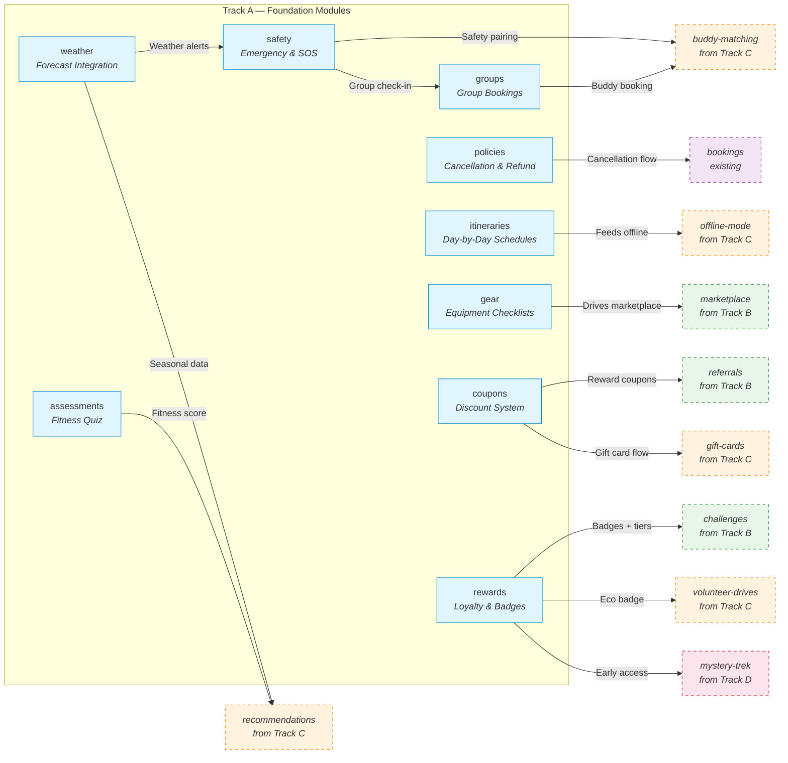

---

### 1. Cancellation & Refund Policies (`policies`)

**What it does:** Defines clear cancellation windows and refund percentages for trek bookings. Policies can be set globally (applied to all treks by default) or customized per trek. Each policy has a name ("Flexible", "Standard", "Strict"), a cancellation window in hours before the start date, and a refund percentage.

**The user journey:**

- **Organizer side:** When creating or editing a trek, the organizer picks a policy from a dropdown. They can see a preview of what the user will see: "Cancel 7+ days before → 100% refund. Cancel 3-7 days before → 50% refund. Cancel less than 3 days before → No refund." They can also create custom policies.
- **Trekkers side:** On the booking page, the policy is displayed prominently before payment: "Free cancellation until June 10th. 50% refund until June 14th." After booking, the cancellation button in "My Bookings" always shows the current refund amount in rupees — updated in real time based on how close the trek is.
- **Cancellation flow:** When a user clicks "Cancel Booking", they first see a summary: "Your refund: ₹2,500 (50% of ₹5,000). Cancellation policy: Standard (cancel 3+ days before for 50% refund)." They confirm, the refund is processed automatically through the payment provider, and both the user and organizer receive confirmation emails.

**A real scenario:**

> Priya books a trek to Valley of Flowers for ₹6,000 on June 1st. The trek starts June 20th. The policy is "Standard": 100% refund up to 7 days before (June 13th), 50% refund up to 3 days before (June 17th). On June 10th, Priya realizes she has a work conflict. She goes to My Bookings, sees "Refund: ₹6,000". She cancels. Full refund issued. On June 15th, another user takes her slot automatically.

**Why this exists:** Cancellation policies are the #1 source of support tickets and disputes on booking platforms. Without a clear, automated system, every cancellation becomes a manual email thread. With it, everything is transparent, consistent, and hands-free.

**Who it serves:**
- **Trekkers** — Know exactly where they stand. No guessing, no contacting support.
- **Organizers** — No more manual refund calculations. Policies protect them from last-minute cancellations.
- **Admins** — Disputes drop to near zero. Audit log shows every cancellation and its policy basis.

**Feature connections:**
- → **Bookings module** — Cancellation flow triggers refund logic
- → **Payments module** — Refunds are processed through Stripe/Razorpay
- → **Notifications module** — Both parties get email/push on cancellation + refund

**Why it matters:** Trust is the currency of a booking platform. Clear, fair cancellation policies are one of the first things users check before paying. This module eliminates support overhead for one of the most common reasons users contact help.

---

### 2. Itinerary Management (`itineraries`)

**What it does:** A tool for organizers to build a complete day-by-day schedule for each trek. Each day captures: title, description, trail distance in kilometres, altitude gain and loss in metres, maximum altitude reached, meal plan (breakfast, lunch, dinner), accommodation type (tent, guesthouse, camp, homestay), and the type of activity (trekking, rest day, acclimatization, sightseeing). Days are ordered and reorderable.

**The user journey:**

- **Organizer side:** In the trek editor, the organizer clicks "Add Day" and fills out the details. They can drag days to reorder. A preview panel shows the full itinerary as trekkers will see it. They can mark certain days as "Rest / Acclimatization" so trekkers understand why they're not trekking that day.
- **Trekkers side:** On the trek detail page, the itinerary is the first thing most users scroll to read. It renders as a vertical timeline with each day as an expandable card. Day 1: "Arrival at Base Camp — 5 km, +300m". Day 2: "Summit Attempt — 8 km, +1,200m". Users can expand any day to read the full description, meal plan, and accommodation. The itinerary is also available in the "My Bookings" section after booking and in the Offline Mode download.

**A real scenario:**

> Ravi is comparing two treks in Himachal. Trek A shows: "Day 1: Drive to base, Day 2: Trek to camp, Day 3: Summit, Day 4: Descend." Trek B shows: "Day 1 (4km, +200m): Arrive at Jibhi village, settle into forest guesthouse. Evening walk to waterfall. Dinner: Himachali dham. Day 2 (8km, +1,100m): Early start to Sar Pass summit. Packed lunch en route. Descend to campsite by 4pm. Campfire dinner. Day 3 (6km, -400m): Leisurely descent through rhododendron forest. Lunch at base. Depart." Ravi books Trek B — he knows exactly what to expect.

**Why this exists:** A trek without a detailed itinerary is a black box. Trekkers want to know what each day looks like — how many hours they'll walk, where they'll sleep, what they'll eat. A detailed itinerary is the single most persuasive piece of content on a trek page. It also sets expectations: trekkers who know what's coming are less likely to be surprised, complain, or drop out midway.

**Who it serves:**
- **Trekkers** — The primary decision-making tool when choosing a trek
- **Organizers** — Differentiator from organizers who don't provide detailed schedules

**Feature connections:**
- → **Offline Mode** — Itinerary is the most important content to download for offline access
- → **Weather module** — Each day's altitude and location can show day-specific weather
- → **Safety module** — Knowing the day's route helps position safety info (steep sections, exposed ridges)

**Why it matters:** Conversion. A trek with a detailed itinerary converts significantly better than one without. It's also the foundation for nearly every other content feature — gear, weather, safety, and offline mode all reference the itinerary.

---

### 3. Equipment & Gear Checklists (`gear`)

**What it does:** Per-trek gear lists organized by category (Clothing, Footwear, Camping, Navigation, Toiletries, Documents, Optional). Each item shows: item name, whether it's required or recommended, whether the organizer provides it, and whether it's available for rent with the rental price. Organizers curate the list for their trek.

**The user journey:**

- **Organizer side:** The organizer picks from a master gear library or creates custom items. They mark each as "Required", "Provided by us", or "Available for rent (₹300/trip)". They can create separate lists for different seasons (summer vs. winter gear for the same trek).
- **Trekkers side:** On the trek page, a "Gear List" tab shows everything needed. Items the organizer provides are marked with a green checkmark ("Provided"). Items available for rent show a "Rent for ₹XXX" button. Users can check off items they already own to create a personal packing list. Before the trek, they receive a reminder: "You haven't marked 5 items yet — tap to prepare your packing list."
- **Rental flow:** If a user needs a rented item, they add it during booking. The organizer prepares the gear and hands it over at the trek start. Payment is added to the booking total.

**A real scenario:**

> Anika is booking her first-ever trek — Kedarkantha. She's nervous because she's never done this before. She opens the Gear tab and sees: "Trekking shoes — Required. Not provided. Rent: ₹500." "Sleeping bag — Provided by organizer." "Headlamp — Required. Not provided. Rent: ₹200." "Waterproof jacket — Recommended." She checks off what she already has (warm clothes, backpack, water bottle), rents the shoes and headlamp, buys a waterproof jacket from the Marketplace, and books with confidence.

**Why this exists:** The most common question from first-time trekkers is "What do I need to bring?" A clear checklist eliminates anxiety and prevents people from arriving unprepared. The rental option also removes a major barrier — buying expensive gear for a single trek.

**Who it serves:**
- **Trekkers** — Especially first-timers who own no gear
- **Organizers** — Additional revenue from gear rental
- **Admins** — Standardized gear expectations reduce disputes

**Feature connections:**
- → **Marketplace** — Items marked "Not provided, not for rent" can be sourced from the marketplace
- → **Groups module** — Group members can coordinate who brings what (one tent between two, etc.)
- → **Offline Mode** — Packing list is a core offline download
- → **Calendar Sync** — Gear reminder appears in the calendar event

**Why it matters:** Reduces the "I don't have gear" objection that kills bookings. Creates a rental revenue stream. Increases preparedness → better trek experience → higher satisfaction → repeat bookings.

---

### 4. Weather Integration (`weather`)

**What it does:** Fetches live weather forecasts for trek locations using the trek's latitude and longitude coordinates. Shows current conditions, hourly breakdown, and a 7-day forecast directly on the trek detail page. Data is cached in Redis for performance so the app doesn't hit the weather API on every page load.

**The user journey:**

- **Browsing treks:** A small weather widget on each trek card shows the current temperature and condition icon (☀️/⛅/🌧️/❄️) for that location. Users get an immediate sense of what to expect.
- **Trek detail page:** A full weather section shows: current temperature, feels-like, wind speed, humidity, sunrise/sunset, and a 7-day forecast. If the trek has a specific start date (fixed departure), the forecast defaults to those dates. If it's an open calendar trek, users can pick their intended dates and see the forecast.
- **Pre-trek notifications:** 3 days before the trek starts, a push notification says: "Heavy rainfall expected at Valley of Flowers this weekend. Make sure your rain gear is ready!" If conditions are dangerous (storm warning, extreme cold), an alert recommends checking with the organizer or rescheduling.
- **After booking:** The weather forecast appears in "My Bookings" so users can check it without going to the trek page.

**A real scenario:**

> Arjun is planning a Stok Kangri trek in September but is worried about early winter conditions. He opens the trek page, picks "September 15-20" as his intended dates, and sees: "Sept 15: 8°C / -2°C, light snow. Sept 16: 6°C / -5°C, snow. Sept 17-18: Clear, -8°C summit day." He books knowing exactly what thermal layers to pack.

**Why this exists:** Weather is the single most unpredictable factor in any outdoor adventure. Having live, location-specific forecasts in the app means trekkers don't need to cross-reference three different weather apps. It also helps organizers by reducing "Is the trek still on?" messages when weather looks uncertain.

**Who it serves:**
- **Trekkers** — Plan better, pack better, decide with confidence
- **Organizers** — Fewer cancellation inquiries, better-prepared participants

**Feature connections:**
- → **Safety module** — Severe weather alerts trigger safety notifications
- → **Notifications module** — Automated pre-trek weather alerts
- → **Recommendations module** — Suggest treks with favourable weather windows
- → **Gear module** — Weather data can auto-suggest gear adjustments ("Rain expected → pack rain cover")

**Why it matters:** Increases booking confidence. Reduces weather-related surprises. Keeps users in the app instead of switching to a weather app (and potentially getting distracted).

---

### 5. Emergency & Safety (`safety`)

**What it does:** A comprehensive safety layer covering: per-trek safety guidelines (terrain risks, altitude warnings, wildlife advisories), emergency contact numbers (base camp, local rescue services, nearest hospitals with GPS coordinates), and a check-in/check-out system. When a user checks in at the trek start and fails to check out by the expected end time, their emergency contacts are alerted automatically.

**The user journey:**

- **Before the trek:** On the trek page, a "Safety" tab lists: "Terrain: Steep scree sections from km 3-5. Risk of loose rocks." "Altitude: Max 4,200m — read about AMS symptoms." "Wildlife: Leopard activity reported in this region — stay in groups." Users can also save emergency contacts (name, phone, relationship) that will be notified in case of a missed check-out.
- **At the trek start:** The user opens the app and taps "Check In". The app records their location, time, and sends a confirmation to their emergency contact: "Anika has started her Valley of Flowers trek. Expected check-out: June 15th, 6pm."
- **During the trek:** If the user misses the check-out window by more than 2 hours, the system sends: (1) Push notification to user — "You haven't checked out yet. Everything okay?" (2) If no response in 30 min — SMS to emergency contact: "Anika hasn't checked out from her trek as expected. Her last known location was [GPS coordinates]. Please contact the organizer at [number]."
- **After the trek:** User checks out. Emergency contact receives: "Anika has successfully completed her trek and checked out safely."

**A real scenario:**

> Vikram's family is nervous about him doing a solo trek to Hampta Pass. Before leaving, he registers his mother as his emergency contact and shows her the safety page: "See? If I don't check out by 6pm on the 12th, you'll get an alert with my last location." His mother relaxes. On the trek, Vikram's phone dies. He checks out a day late. His mother gets the alert, calls the organizer, who confirms: "He's fine, just delayed by weather. He'll check out tonight." Peace of mind for everyone.

**Why this exists:** Trekking involves genuine risk. Families worry. A proper safety system provides peace of mind and, in genuine emergencies, can save lives. It also legally protects the platform and organizers by demonstrating duty of care.

**Who it serves:**
- **Trekkers** — Safety net on the trail. Peace of mind for families.
- **Organizers** — Legal protection. Fewer "have you seen my son/daughter?" calls.
- **Admins** — Audit trail. Demonstrable safety standards for insurance/liability.

**Feature connections:**
- → **Weather module** — Severe weather can trigger early safety alerts
- → **Groups module** — Group check-in (leader checks in for everyone)
- → **Notifications module** — SMS fallback for emergency alerts
- → **Buddy Matching** — Solo trekkers matched with buddies have a built-in safety partner

**Why it matters:** Trust. No one will book a trek on a platform they don't trust to handle emergencies. This module is the foundation of that trust. It also opens up the solo trekker market — people who wouldn't go alone feel safer knowing the system has their back.

---

### 6. Fitness Assessment Quiz (`assessments`)

**What it does:** A short, intelligent questionnaire (8-12 questions) that evaluates a user's fitness level, trekking experience, altitude comfort, medical history, and preferences. Based on the score, the system recommends a difficulty bracket (Easy / Moderate / Difficult / Extreme) and specific treks that match the user's profile. Users can retake the quiz anytime.

**The user journey:**

- **First visit:** When a new user signs up, or when they browse treks for the first time, a prompt appears: "Not sure where to start? Take our 2-minute fitness quiz to find your perfect trek."
- **The quiz:** Questions are simple and multiple-choice:
  - "How often do you exercise?" (Never / 1-2x week / 3-5x week / Daily)
  - "What's the longest walk you've done recently?" (Under 2km / 2-5km / 5-10km / 10+ km)
  - "Have you ever been above 3,000m altitude?" (Never / Once / Multiple times)
  - "How do you feel about camping?" (Love it / Okay / Prefer indoors)
  - "Do you have any medical conditions?" (with a list to check)
  - "What's your primary goal?" (Scenic views / Physical challenge / New experience / Social)
- **Results:** The user sees: "You're a **Moderate Explorer**! You're fit enough for moderate treks but should build up to difficult ones. We recommend these 5 treks for you..." Each recommendation shows the match reason: "Similar fitness level users loved this" or "Great intro to high altitude".
- **Re-taking:** The quiz is always accessible from the profile. If the user completes a Moderate trek and wants to try Difficult, they can retake the quiz to confirm their readiness.

**A real scenario:**

> Neha has never trekked but is curious. She takes the quiz and scores "Easy / Beginner". The app recommends 3 beginner-friendly treks: "Trikling Lake (Day hike, no camping)", "Kheerganga (Easy overnight, hot springs)", "Valley of Flowers (Moderate — for when you're ready)". She books Kheerganga, loves it, retakes the quiz, scores "Moderate", and books Valley of Flowers for her next trip.

**Why this exists:** The most common trekking mistake is choosing wrong. Too hard → misery, injury, or quitting. Too easy → boredom, wasted money. A well-designed quiz guides users to treks they'll enjoy and complete successfully, maximizing satisfaction and repeat bookings.

**Who it serves:**
- **Trekkers** — Especially first-timers who have no baseline for comparison
- **Organizers** — Participants arrive at the right difficulty level → better group cohesion
- **Admins** — Reduced safety incidents from ill-prepared trekkers

**Feature connections:**
- → **Recommendations module** — Quiz score feeds the recommendation engine
- → **Groups module** — Group members' fitness levels visible to the leader for planning
- → **Safety module** — Low fitness scorers get additional safety guidance

**Why it matters:** Conversion + retention. Users who are guided to the right trek are more likely to book (they trust the recommendation) and more likely to have a positive experience (right difficulty + right expectation). One good trek → loyal customer.

---

### 7. Coupon & Discount System (`coupons`)

**What it does:** A full promotional engine for creating and managing discount codes. Supports percentage discounts (e.g., 20% off), flat discounts (e.g., ₹500 off), minimum booking amounts, max discount caps, per-user usage limits, total usage limits, trek-specific restrictions, and date ranges. Every coupon has a tracking dashboard showing redemptions, revenue impact, and user demographics.

**The user journey:**

- **Admin side:** An admin creates a coupon via a form: Code: "WELCOME20" | Type: Percentage | Value: 20 | Min booking: ₹2,000 | Max discount: ₹1,000 | Valid: June 1 - Aug 31 | Max uses: 500 | Users can use it once. They can also create auto-generated bulk codes for specific campaigns.
- **Trekkers side:** During checkout, there's a coupon input field: "Have a promo code?" User enters "WELCOME20". The discount is calculated and displayed instantly: "Subtotal: ₹5,000. Discount: -₹1,000 (max cap applied). Total: ₹4,000."
- **Post-booking:** If the coupon was applied, it shows in the booking details. If it was a referral coupon, both the referrer and referee get notifications about the earned reward.
- **Marketing triggers:** Coupons can be auto-triggered — birthday coupon, first-trek anniversary coupon, "We miss you" coupon after 6 months of inactivity, "Complete your wishlist" coupon for wishlisted treks.

**A real scenario:**

> Offbeat Pravasi runs a Diwali campaign: "FESTIVAL500" — ₹500 off treks above ₹3,000. Valid for 10 days. The marketing team creates the coupon in 2 minutes, sets a cap of ₹500 discount and 1,000 total uses. They share the code on social media. Users apply it at checkout. After the campaign, they check the dashboard: 847 redemptions, average order value ₹4,200, total discounts given ₹4,23,500. ROI calculation: the campaign generated ₹35,57,400 in revenue.

**Why this exists:** Discounts drive urgency and conversions. A proper coupon system means marketing can run campaigns without engineering involvement. The tracking dashboard ensures every rupee of discount has measurable ROI.

**Who it serves:**
- **Trekkers** — Save money, feel rewarded
- **Admins** — Run campaigns independently, measure ROI
- **Organizers** — Can opt in/out of platform-wide discounts

**Feature connections:**
- → **Referrals module** — Referral rewards are delivered as coupons
- → **Gift Cards module** — Gift cards are a different monetary instrument but share the redemption flow
- → **Groups module** — Group discounts can be applied at group level
- → **Rewards module** — Loyalty tier discounts stack or substitute with coupon discounts

**Why it matters:** Direct revenue driver. A well-timed coupon campaign can fill treks during off-peak season, reactivate dormant users, and reward loyal customers. Measurable ROI on every campaign.

---

### 8. Group Bookings (`groups`)

**What it does:** Allows one person (the lead booker) to create a trekking group, invite others to join, and manage a single group reservation. The group has a size limit, an expiry date (auto-cancels if not booked in time), and member status tracking (invited / joined / declined). When the group is ready, the lead booker makes one payment covering all members.

**The user journey:**

- **Creating a group:** Meera wants to do a Chadar Trek with 4 friends. She opens the trek page, taps "Book as Group", sets the size to 5, gives the group a name ("Chadar Crew 2026"), and sets an expiry date (1 week). She gets a shareable link.
- **Inviting members:** Meera sends the link to her 4 friends via WhatsApp. Each friend opens the link, sees the trek details, their name (if Meera pre-filled), and a "Join Group" / "Decline" button. When they join, they optionally fill in their details (age, phone, emergency contact, medical conditions).
- **Tracking progress:** Meera sees a dashboard: "5/5 members joined. 3 filled details. 2 pending." She can message pending members from the app: "Hey, please fill your details so I can book!"
- **Booking:** Once everyone has joined and filled details, Meera clicks "Book for All". She pays once. Each member gets a confirmation with their individual details. They can each see the booking in "My Bookings" with the group name.
- **After booking:** All members receive the same pre-trek communications, itinerary, gear list, and safety info. They can see who else is in the group.

**A real scenario:**

> Five college friends want to do Roopkund Trek together. Rahul takes the lead: he creates the group "Roopkund 2026" for 6 people (5 friends + 1 slot open for anyone). He sends the link. Three friends join immediately. One is unsure — Rahul can see "pending". He messages him. The last slot is open — someone from Buddy Matching joins. Rahul books for all 6. Everyone gets a confirmation. They're excited.

**Why this exists:** Trekking is inherently social — people go with friends. But coordinating 5 people to individually book the same trek is a mess. "You book first, I'll pay you later" creates friction and drop-off. Group booking removes all of that.

**Who it serves:**
- **Trekkers** — One-person coordination, everyone benefits
- **Organizers** — Larger group sizes, fewer no-shows (social accountability)
- **Admins** — Higher average order value (group bookings are larger transactions)

**Feature connections:**
- → **Buddy Matching** — Solo trekkers can join groups that have open slots
- → **Groups → Bookings** — The booking is created with all member details pre-filled
- → **Safety module** — Group check-in (leader checks in for all)
- → **Notifications module** — Group-wide notifications for all members

**Why it matters:** Increases average booking size (more participants per booking). Removes the "coordination tax" that kills group plans. Social accountability reduces cancellations.

---

### 9. Loyalty & Badges (`rewards`)

**What it does:** A tiered loyalty system where users earn points for every platform activity: booking a trek, completing a trek, referring a friend, writing a review, joining a challenge, attending a meetup. Points determine the user's tier (Bronze → Silver → Gold → Platinum → Legend). Each tier unlocks perks: discount percentages, free cancellations, priority booking, exclusive Mystery Trek access. Badges are awarded for specific achievements and displayed on the user's profile.

**The user journey:**

- **Earning points:** Every action shows the potential points before the user does it: "Complete this trek → +500 pts" "Refer a friend → +200 pts" "Review this trek → +50 pts" After the action, a toast notification: "🎉 +500 points! You're now a Silver member!"
- **Tier progression:** The profile shows a progress bar: "Gold Tier — 2,800/5,000 points to Platinum." Each tier's benefits are displayed: "Platinum: 15% off all treks, free cancellation, priority support."
- **Badges:** A badge collection page shows all available badges, earned and locked: "🏅 Summit Seeker — Complete 5 treks" "🌍 States Explorer — Trek in 10 states" "❄️ Winter Warrior — Complete a winter trek" "🌱 Eco Warrior — Join a clean-up drive" "🔥 Streak Master — Trek 3 months in a row"
- **Perks in action:** When a Platinum user checks out, they automatically see "Platinum discount: 15% off" applied. When they cancel, there's no deduction. When a new Mystery Trek drops, Platinum users get 24-hour early access.

**A real scenario:**

> Deepak is a regular trekker. After his 5th trek with Offbeat Pravasi, he reaches Silver tier. He notices: "5% off all treks — nice." He refers 3 friends (+600 pts), reviews his last trek (+50 pts), joins a challenge (+100 pts). He's now Gold with 10% off. He sees the "Summit Seeker" badge is 1 trek away. He books a 6th trek specifically to earn it. The badge unlocks. He posts it on Instagram. His friends ask about the app.

**Why this exists:** Points and tiers create a progression loop that keeps users coming back. Every completed trek is not just a memory — it's progress toward the next tier. Badges add a collection mechanic that appeals to the completionist instinct. The sunk cost of accumulated points makes users less likely to switch to a competitor.

**Who it serves:**
- **Trekkers** — Tangible rewards for loyalty. Status. Collection.
- **Organizers** — Loyalty discounts can be subsidized by the platform to drive volume
- **Admins** — Highest retention lever. A user who reaches Silver is 3x more likely to book again.

**Feature connections:**
- → **Referrals** — Referral rewards can be points or tier-based
- → **Challenges** — Challenge completions award badge progress
- → **Volunteer Drives** — Eco Warrior badge
- → **Coupons** — Tier discounts can stack or compete with promo codes
- → **Mystery Trek** — Tier-limited early access

**Why it matters:** Retention. A user with points, tiers, and badges has built something on the platform that they don't want to lose. The tier system also provides a clear upgrade path — "If I do one more trek, I get Gold" — that directly drives booking decisions.

---

## Track B — Community

### These modules transform the app from a booking platform into a community. They keep users engaged between treks and long after their last booking.

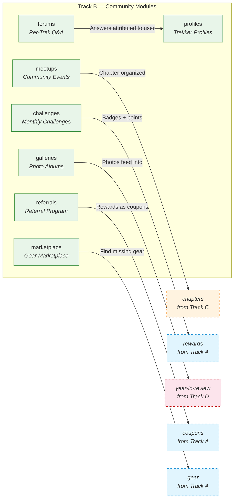

---

### 10. Per-Trek Q&A / Forums (`forums`)

**What it does:** Every trek gets its own discussion space where past participants answer questions from future ones. Questions are organized by topic tag (Transport, Gear, Difficulty, Safety, Accommodation, Food). Users can upvote helpful answers. The organizer can pin official responses. The best Q&A rises to the top over time.

**The user journey:**

- **Before booking:** A potential trekker scrolls to the Q&A section on the trek page. She searches: "Is there phone signal on the trail?" She finds 3 answers from past participants: "BSNL works up to camp 2" (12 upvotes), "I had Jio — no signal after base camp" (8 upvotes), "The organizer provides a satellite phone" (official pin from organizer). She has all the info she needs without asking.
- **Asking a question:** She doesn't find an answer about leech protection. She posts: "How bad are leeches in August? Any tips?" She gets notified when answers come in — from past participants and the organizer.
- **After trekking:** After returning, she gets a prompt: "You just completed this trek! Answer questions from other trekkers." She answers 3 questions. Each answer earns her points toward her loyalty tier.
- **Organizer side:** The organizer sees all unanswered questions and can respond officially. Their responses are pinned and marked "Official Organizer Response". Frequently asked questions can be promoted to the trek's FAQ section.

**A real scenario:**

> Amit wants to do Pin Parvati Pass — a tough trek. He has 10 questions. He opens the Q&A section. Eight are already answered with detailed responses. He asks the remaining 2. Within 24 hours, he has answers from 2 past trekkers and the organizer. He books with confidence. After completing the trek, he answers 5 questions himself. The cycle continues.

**Why this exists:** No FAQ page can anticipate every question a trekker might have. Real answers from real people are more trusted than anything the platform writes. Over time, every trek builds a self-sustaining knowledge base that requires zero effort from organizers or support staff.

**Who it serves:**
- **Trekkers** — Get honest answers from peers. Ask freely.
- **Organizers** — Reduce support questions. Build authority.
- **Admins** — Reduced support tickets. Evergreen content that improves with age.

**Feature connections:**
- → **Profiles** — Answers are attributed to the user's public profile, building their reputation
- → **Notifications** — Question authors get notified when someone answers
- → **Rewards** — Points for answering questions

**Why it matters:** Conversion support. A trek with 50 answered questions converts better than a trek with none — the user has all their doubts resolved. It's also a massive SEO play: "Best time to do Kedarkantha" → real answers from real people → Google ranks the page.

---

### 11. Trekker Public Profiles (`profiles`)

**What it does:** Every user gets a public-facing profile page that showcases their trekking journey. The profile includes: completed treks with dates and photos, badges earned, total distance travelled, cumulative altitude gained, states explored, highest peak reached, reviews written, forum answers given, and gear lists. Users customize their bio, profile photo, and can link social media.

**The user journey:**

- **Setting up:** After the first trek, the user gets a prompt: "Your profile is ready! Add a bio and photo to show off your trekker identity." They spend 2 minutes setting it up.
- **Viewing others:** On a trek page, the Q&A answer mentions a username. The user taps the name → sees their profile: "Rahul — 12 treks completed. 6 states. Highest: Stok Kangri (6,153m). Badges: Summit Seeker, States Explorer, Winter Warrior." Instant credibility.
- **Buddy matching:** When looking for a trek buddy, profiles show compatibility: trek count, difficulty history, states explored — helps users find like-minded partners.
- **Sharing:** After a trek, the user can share their profile as a card: "I just completed my 10th trek with Offbeat Pravasi!" Includes their stats and badges. Shareable to Instagram/WhatsApp.

**A real scenario:**

> Priya is considering booking a difficult trek but isn't sure she's ready. She looks at profiles of people who completed it: "Anjali — before this, had only done 2 moderate treks." Priya thinks: "If Anjali could do it, so can I." She books. After completing, her profile now shows this trek too. A future user will see her profile and feel the same confidence.

**Why this exists:** Social proof is the most powerful persuasion tool in travel. Seeing real people who have done the trek — with their photos, stats, and stories — is far more convincing than any marketing copy. Profiles also give users a sense of identity and pride: "Look at what I've accomplished."

**Who it serves:**
- **Trekkers** — Identity, recognition, social proof
- **Community** — Find like-minded trekkers, verify credibility in forums
- **Platform** — Free marketing when users share profiles

**Feature connections:**
- → **Forums** — Answers attributed to profiles build reputation
- → **Buddy Matching** — Profiles are the primary evaluation tool
- → **Chapters** — Chapter members can see each other's profiles
- → **Rewards** — Badges displayed prominently on profiles
- → **Year in Review** — Annual recap feeds into profile stats

**Why it matters:** User-generated social proof. Every profile is a testimonial for the platform. The more profiles grow (with treks, badges, stats), the harder it is for users to abandon the platform.

---

### 12. Community Meetups (`meetups`)

**What it does:** A platform for organizing real-world events around trekking. Three types of meetups: (1) Pre-trek meetups — gear check, route briefing, team introductions before a booked trek. (2) Post-trek meetups — photo sharing, story swapping, celebration after a trek. (3) Community events — weekend day hikes, photography workshops, first-aid training, camping skill sessions. Users RSVP, see attendee lists, and receive reminders.

**The user journey:**

- **Browsing meetups:** A "Meetups" tab in the app shows upcoming events near the user's city. Each card shows: event name, date, location, attendee count, and a brief description. Users can filter by type (pre-trek / post-trek / community).
- **Pre-trek meetup:** Meera books a trek. A week before, she gets a notification: "Your trek has a pre-trek meetup! Meet your group at The Trek Cafe, Saturday 5pm." She RSVPs, sees who else is coming (her group mates), and attends. She meets her trek buddies before the trek, sorts out gear sharing, and gets briefed by the organizer.
- **Post-trek meetup:** After returning, the organizer hosts a photo-sharing session. Meera brings her photos. Everyone swaps stories. They plan the next trek together.
- **Community event:** A local chapter organizes a weekend day hike to a nearby hill. Open to all. Meera meets new trekkers, learns about a trail she didn't know existed. She makes 3 new trek plans.

**A real scenario:**

> The Mumbai Chapter organizes a "Weekend Trek Prep Workshop" — how to pack, what to eat, basic first aid. 30 people RSVP. Among them, 5 are going on the same Kashmir Great Lakes trek next month. They find each other at the workshop, form a WhatsApp group, and become trek buddies. After the trek, the organizer hosts a "KGL Reunion" meetup. Most of them book another trek together.

**Why this exists:** Real-world community is the strongest retention driver. A user who attends meetups forms friendships on the platform — leaving the app means leaving those connections. Meetups also convert casual users into active community members.

**Who it serves:**
- **Trekkers** — Build friendships, learn skills, discover new treks
- **Organizers** — Build rapport with participants, cross-sell future treks
- **Platform** — Strongest retention lever. Meetup attendees have 2x higher retention.

**Feature connections:**
- → **Chapters** — Meetups are organized at chapter level
- → **Groups** — Pre-trek meetups bring group members together before the trek
- → **Notifications** — RSVP reminders, event updates
- → **Galleries** — Post-trek meetups often feed into trek photo albums

**Why it matters:** Retention. A user who attends a meetup has formed social bonds on the platform. Those bonds are the stickiest form of retention — harder to lose than points or badges.

---

### 13. Monthly Challenges (`challenges`)

**What it does:** Time-bound themed challenges that encourage specific trekking behaviours. Examples: "Monsoon Warrior — Complete a trek in July or August" "Altitude Hunter — Gain 5,000m cumulative altitude in one month" "States Explorer — Trek in 2 different states in 30 days" "Streak Master — Book a trek every month for 3 months". Challenges have start/end dates, progress tracking, leaderboards, and reward tiers.

**The user journey:**

- **Discovering challenges:** At the start of each month, a push notification: "🏔️ June Challenge: 'Summer Summit' — Complete any moderate+ trek this month. Win 500 bonus points!" The Challenges tab shows active, upcoming, and completed challenges.
- **Enrolling:** The user taps "Join Challenge". Progress starts tracking automatically — they don't need to do anything extra. Every trek they book during the challenge period counts.
- **Tracking progress:** A live progress bar shows: "2/3 treks completed." "1 state done. 1 more needed." A leaderboard shows top participants (optional — users can opt out of public ranking).
- **Completing:** When the user completes the challenge, they get: (1) A special badge on their profile. (2) Bonus loyalty points. (3) A coupon for their next booking. A celebration animation plays.
- **Seasonal themes:** March → "Women on Trails" (booked by women trekkers). June → "Monsoon Magic". October → "Harvest Season — Trek in Agri-tourism regions". December → "Winter Wonderland".

**A real scenario:**

> January challenge: "New Year, New Peaks — Complete your first trek of the year by Jan 31." Ravi, who hasn't trekked in 4 months, sees the notification. He books a weekend trek for Jan 15th. Completes it. Gets a "New Year New Peaks" badge + 300 bonus points. He's back in the habit. February challenge: "Love the Outdoors" — bring a friend on their first trek. Ravi brings his colleague. Referral + challenge reward. Two bookings generated.

**Why this exists:** Challenges combat the natural drop-off between treks. They give users a reason to open the app and book during off-peak periods. The collection mechanic (earning all badges of a season) appeals to completionist behaviour.

**Who it serves:**
- **Trekkers** — Fun goals, bonus rewards, friendly competition
- **Organizers** — Steady bookings during traditionally slow months
- **Platform** — Drives bookings in off-peak seasons. Increases booking frequency.

**Feature connections:**
- → **Rewards** — Challenge completion awards badges and points
- → **Leaderboard** — Optional ranking within challenges (replaces generic leaderboard)
- → **Referrals** — "Bring a friend" challenge integrates with referral tracking
- → **Notifications** — Monthly challenge launch, progress reminders, completion celebration

**Why it matters:** Booking frequency. A user who participates in challenges books 1.5x more frequently. Challenges convert dormant users ("I haven't trekked in months") into active bookers.

---

### 14. Trek Photo Albums (`galleries`)

**What it does:** After a trek is completed, participants can contribute their photos to a shared trek album. Photos are organized by day and tagged with location (if geotagged). The organizer or system curates the best shots as a featured carousel on the trek page. Albums are publicly viewable, and participants can download full-resolution versions.

**The user journey:**

- **After the trek:** Participants receive an email: "Your Valley of Flowers trek album is ready! Upload your photos." They tap, see a shared album for their trek date group. They upload 10-15 photos.
- **Curating:** The organizer reviews submitted photos and "stars" the best ones. Starred photos become the trek page's featured gallery — visible to everyone browsing the trek.
- **Browsing:** A future trekker opens the Valley of Flowers page and sees: "500+ photos from 120 trekkers." They scroll through day-by-day galleries: real photos of the actual trail, accommodations, meals, summit views. No stock photos, no filters. Real expectations set.
- **Downloading:** Participants can download any photo from their batch at full resolution — no need to chase other trekkers for pictures taken of them.

**A real scenario:**

> Vikram returns from Kashmir Great Lakes. He has 200 photos on his phone. He uploads 30 to the trek album. The organizer stars 8 for the featured gallery. Six months later, Anika is researching the same trek. She opens the gallery and sees real photos of the trail conditions in September, the tents, the lake colours. She books. After her trek, she adds 20 more photos. The gallery grows with every batch.

**Why this exists:** Authentic user-generated photos are more persuasive than professionally shot marketing material. A gallery that grows with every completed trek becomes richer over time, making the trek page more compelling for future bookers.

**Who it serves:**
- **Trekkers** — Relive the experience. Get photos others took of you.
- **Organizers** — Free marketing content. Their trek page gets richer over time.
- **Platform** — Authentic visual content drives conversion. Reduces reliance on stock photography.

**Feature connections:**
- → **Media module (R2)** — Photos stored in Cloudflare R2
- → **Profiles** — Users' contributed photos appear on their profile
- → **Year in Review** — Best photos from the year featured in annual recap

**Why it matters:** Conversion. A trek page with 200+ real user photos converts significantly better than one with 5 professional photos. The gallery is a self-improving asset — every completed trek makes every future trek page better.

---

### 15. Referral Program (`referrals`)

**What it does:** Every user gets a unique referral code and shareable link. When a new user signs up and books their first trek using the referral, both the referrer and the referee earn rewards. Rewards can be: discount coupons, loyalty points, or both. Users can track their referral history, earnings, and leaderboard position.

**The user journey:**

- **Getting started:** After completing a trek, a prompt: "Loved your trek? Share it with friends and earn rewards!" The user gets a custom link: `offbeatpravasi.com/r/RAHUL25`. They can share via WhatsApp, Instagram, SMS, or email.
- **How it works:** "When your friend books their first trek, you both get ₹500 off your next booking!" The referred friend sees the discount on sign-up — "You were referred by Rahul! Get ₹500 off your first trek."
- **Tracking:** The user's dashboard shows: "You referred 5 friends. 3 signed up. 2 booked. You've earned ₹1,000 in referral rewards." They can see pending rewards that will unlock when the friend completes their trek.
- **Double-sided reward:** The referee gets a discount on their first trek (reduces barrier to entry). The referrer gets a reward after the referee completes a trek (incentivizes quality referrals, not spam).
- **Tiered referral bonuses:** "Refer 5 friends → unlock Silver referrer status (₹750 per referral). Refer 10 → Gold (₹1,000 per referral)."

**A real scenario:**

> Anika completes Kedarkantha. She's thrilled. She shares her referral link with 3 trekking friends. Two of them sign up and book treks. Anika gets ₹500 credit per friend. The friends each get ₹500 off. One friend loves his trek and refers 2 more people. The chain grows. Anika reaches Silver referrer status.

**Why this exists:** Word-of-mouth is the most cost-effective acquisition channel for adventure travel. A referral program formalizes and incentivizes what happy users already do naturally — tell their friends. The double-sided reward ensures both parties benefit.

**Who it serves:**
- **Trekkers** — Free discounts, bragging rights on referral leaderboard
- **Platform** — Lowest-CAC acquisition channel. Self-reinforcing growth loop.

**Feature connections:**
- → **Coupons** — Referral rewards delivered as coupons
- → **Rewards** — Can also reward loyalty points
- → **Notifications** — Referral milestone notifications
- → **Year in Review** — "You referred 12 friends this year — you saved ₹6,000!"

**Why it matters:** Growth. A successful referral program can become the primary acquisition channel. Each existing user is a potential marketer — they just need the right incentive and a frictionless sharing mechanism.

---

### 16. Gear Marketplace (`marketplace`)

**What it does:** A peer-to-peer marketplace where trekkers buy and sell used trekking gear. Listings include: photos (up to 5), condition description (New / Like New / Good / Fair), original price, selling price, location (city for local pickup), and shipping availability. Categories: Footwear, Clothing, Camping, Climbing, Navigation, Accessories. Buyers browse by category, search by keyword, or get recommendations from the Gear module ("You need trekking poles — here's what's available in the marketplace").

**The user journey:**

- **Listing:** Vikram completed his trek and won't need his sleeping bag again. He opens the app, taps "Sell Gear", takes 3 photos, sets price ₹1,500 (original ₹4,000), marks condition "Good", and adds a note: "Used for 2 treks, zipper replaced, still in great condition." The listing goes live in 2 minutes.
- **Buying:** Anika needs a sleeping bag for her first trek. She checks the gear checklist → sleeping bag is "Required, not provided." A link says: "Find sleeping bags in the marketplace — 8 available." She browses, finds Vikram's listing, messages him: "Is this still available?" They agree, meet locally, exchange.
- **Trust & safety:** Users have seller ratings ("Sold 5 items, 4.8★"). Payments are in-app (optional). Shipping can be facilitated if both parties agree.
- **Integration with gear module:** The gear checklist has a "Find on Marketplace" link for every item marked "Required, not provided." If a user is missing 5 items, they can shop for all 5 in one flow.

**A real scenario:**

> Ravi wants to do Stok Kangri but needs a 4-season sleeping bag and crampons — ₹15,000 new. He checks the marketplace: a used 4-season bag for ₹4,000 (barely used, 1 trek), and crampons for ₹2,500. He buys both. Total saved: ₹8,500. After his trek, he resells the crampons for ₹2,000. His net gear cost: ₹4,500. The cycle continues.

**Why this exists:** Trekking gear is expensive and often used only a few times. The marketplace keeps gear circulating in the community — sellers recover costs, buyers get affordable access, and the community self-supplies. Lowering the cost barrier also attracts price-sensitive new trekkers.

**Who it serves:**
- **Sellers** — Recover costs, declutter
- **Buyers** — Affordable gear, especially for first-timers
- **Platform** — Increased engagement, reduced "gear is too expensive" objection

**Feature connections:**
- → **Gear module** — Every gear list item becomes a potential marketplace search
- → **Profiles** — Seller ratings visible on profiles
- → **Notifications** — Price drops, saved searches alerts

**Why it matters:** Removes a major booking barrier ("I don't have the gear"). Keeps users on the platform between treks (browsing gear, managing listings). Creates a circular economy that strengthens the community.

---

## Track C — Post-Trek Retention

### These modules are designed to keep users engaged after their trek is over — the critical moment when most platforms lose them.

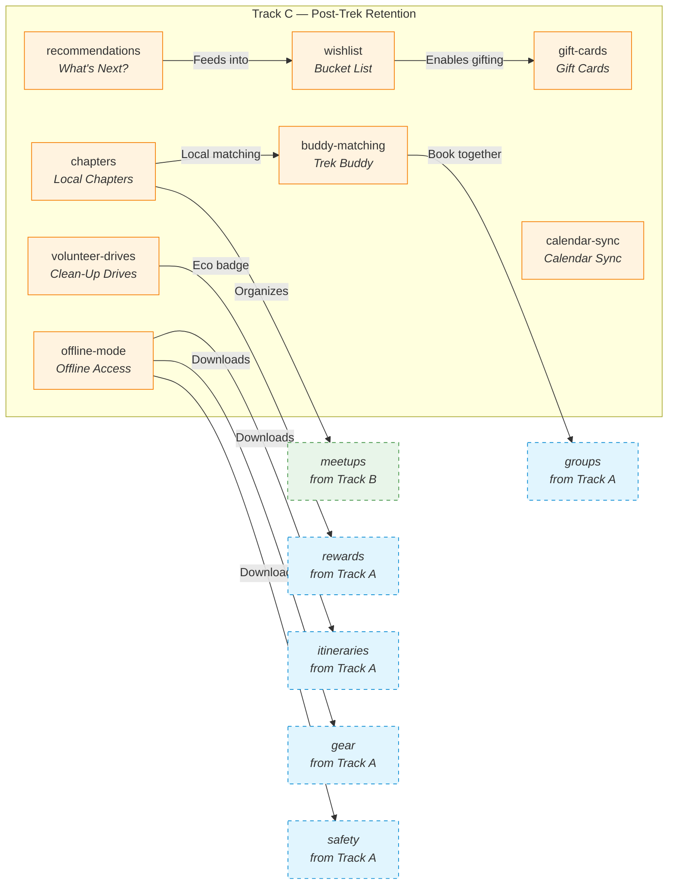

---

### 17. "What's Next?" Recommendations (`recommendations`)

**What it does:** An intelligent recommendation engine that suggests the next best trek for each user based on: completed treks (difficulty progression, regions explored, trek type preferences), behavioural signals (wishlisted treks, page views, search history), community patterns ("Users who did this trek also booked..."), fitness assessment score, and seasonal context (current month, weather windows). Recommendations appear on the post-trek summary, home feed, email newsletters, and push notifications.

**The user journey:**

- **Immediately post-trek:** The user checks out from their trek. The post-checkout screen shows: "Congratulations on completing Valley of Flowers! 🎉" Then: "Trek explorers who loved this also did..." with 3 recommendations. Each shows a reason: "More alpine meadows" or "Same difficulty, different region."
- **Home feed:** The home page is personalized. It shows: "Based on your Kashmir trip, you might like..." "Trek in a new state: Himachal awaits!" "Your wishlist item is 20% off this week."
- **Email follow-up:** 3 days after returning: "Your next adventure? We noticed you enjoyed moderate treks — here are 3 with similar elevation profiles."
- **Seasonal suggestions:** As seasons change: "Monsoon treks are open! Based on your previous treks, we recommend..."
- **The logic is transparent:** Each recommendation shows why it was chosen: "You liked alpine lakes → try this one." "Similar difficulty to your last trek." "80% of trekkers who did your last trek also did this."

**A real scenario:**

> Anika completes Kedarkantha (moderate, Uttarakhand, 3 days). The next day, her recommendations include: "Har Ki Dun (moderate, Uttarakhand, 4 days) — Similar difficulty with valley views." "Dayara Bugyal (easy, Uttarakhand, 2 days) — Great weekend option." "Bhrigu Lake (moderate, Himachal, 3 days) — Try a new state!" She books Dayara Bugyal for next month — a weekend filler while she plans the bigger one.

**Why this exists:** The moment after completing a trek is peak excitement. Strike while the iron is hot. A smart recommendation at this exact moment converts one-time trekkers into repeat customers. Without it, the user leaves, and the spark fades.

**Who it serves:**
- **Trekkers** — Curated discovery, less scrolling, better matches
- **Platform** — Higher repeat booking rate, increased average treks per user

**Feature connections:**
- → **Assessments** — Quiz score feeds into recommendation logic
- → **Wishlist** — Wishlisted items get priority in recommendations
- → **Challenges** — Active challenges influence recommendations ("You need 1 more moderate trek for the challenge")
- → **Groups** — Group members see shared recommendations

**Why it matters:** Repeat bookings. The #1 metric this drives is "treks per user per year." Without recommendations, users discover new treks by scrolling — which they do less over time. With recommendations, every completed trek seeds the next one.

---

### 18. Trek Bucket List / Wishlist (`wishlist`)

**What it does:** A personal collection of treks the user wants to do. Users can add any trek to their wishlist with one tap. Wishlists can be organized: "Monsoon Plans", "Next Year Goals", "With Friends", "Solo Treks". Users can add notes ("Book in early booking window for discount"), set priority levels, and share their wishlist. The system tracks changes and sends smart alerts.

**The user journey:**

- **Adding:** While browsing, the user sees a trek they like but can't book right now. They tap the ❤️ icon. It's added to their wishlist. A small toast: "Added to Wishlist. We'll remind you when it goes on sale."
- **Organizing:** From the profile, "My Wishlist" shows all saved treks. Users can drag to reorder, add notes, and tag. "Spring 2026" "Bucket List" "Weekend Getaways".
- **Smart alerts:** The system sends: (1) "Kashmir Great Lakes is 25% off this week — from your wishlist!" (2) "Only 3 spots left for your wishlisted Rupin Pass trek." (3) "The best time to do your wishlisted Chadaar Trek is January-March. Start planning!"
- **Sharing:** The user can share their wishlist as a link. Friends view it and can gift a trek (via Gift Cards). Family can see what to gift for birthdays.
- **Cross-user discovery:** "Trekker with similar taste as you have [3 wishlist items in common]." A social discovery angle.

**A real scenario:**

> Meera has 12 treks in her wishlist. She opens it every few weeks — daydreaming, planning. One morning, she gets a notification: "3 of your wishlist treks are 15% off for Diwali." She books one immediately. Without the wishlist, she might have missed the sale. With it, the platform knows exactly what she wants and can target offers precisely.

**Why this exists:** A wishlist captures intent without requiring commitment. Every wishlist item is a potential future booking — and the platform can nurture that intent over time with targeted notifications. It also gives the user a personal space to dream and plan, which builds emotional attachment.

**Who it serves:**
- **Trekkers** — Planning tool. Never forget a trek you wanted to do.
- **Platform** — Intent data. Targeted upsell opportunities. Booking conversion from saved items.

**Feature connections:**
- → **Recommendations** — Wishlist items influence recommendation priority
- → **Gift Cards** — Shareable wishlists enable gifting
- → **Notifications** — Price drop, availability, seasonal alerts for wishlisted treks
- → **Coupons** — Targeted coupons for wishlist items on sale

**Why it matters:** Conversion from intent. A wishlist is a commitment-light signal that says "I want this." Nurturing that signal with timely alerts converts daydreamers into bookers at a high rate.

---

### 19. Local Chapters (`chapters`)

**What it does:** City-based trekking community groups. Users join their city's chapter (e.g., "Offbeat Pravasi — Pune"). Each chapter has: a feed for local announcements and discussions, a calendar of local events (weekend day hikes, workshops, meetups), a member directory, a group chat, and a leaderboard showing the most active members. Chapter leaders are power users or organizer partners who organize local activities.

**The user journey:**

- **Joining:** After sign-up, the app asks: "Which city are you based in?" It auto-suggests the nearest chapter. The user joins. They see: "Welcome to the Pune Chapter — 1,200 members. 3 events this month."
- **Chapter feed:** The feed shows: "Saturday day hike to Sinhagad Fort — 15 people going" "Gear maintenance workshop this Sunday" "Anyone want to share a cab to the Kashmir Great Lakes base camp?"
- **Events:** The chapter calendar shows weekly local hikes (nearby trails, weekend getaways), monthly workshops (map reading, first aid, photography), and social events (trekker meetups at local cafes, gear swap events).
- **Connections:** Members can message each other, form smaller groups for specific treks, and share tips about local gear shops and training spots.
- **Chapter leaderboards:** "Most events attended" "Most helpful answers" "Most referrals". Top members get recognition and perks (free trek, discount, chapter leader status).

**A real scenario:**

> The Bangalore Chapter has 3,500 members. Every weekend, someone posts: "Anyone for a day hike to Skandagiri this Saturday?" 8 people join. They meet, hike, have lunch, and discuss bigger treks. Two of them find they're both interested in the Chadar Trek. They plan together. The chapter is the social engine that keeps Bangalore members engaged even on non-trek weekends.

**Why this exists:** Trekkers want local community. They want people nearby who share their interest. A chapter system brings together trekkers from the same city, enabling spontaneous trips and local connections that a global app can't provide. It makes the platform relevant on a daily basis, not just when booking a major trek.

**Who it serves:**
- **Trekkers** — Local community. Spontaneous plans. Friends with shared interests.
- **Chapter leaders** — Status, influence, perks.
- **Platform** — Daily engagement. Strong local word-of-mouth.

**Feature connections:**
- → **Meetups** → Chapter-organized events flow into the meetups system
- → **Buddy Matching** — Chapter members are prioritized in buddy matching
- → **Profiles** — Chapter affiliation displayed on profiles
- → **Groups** — Chapter connections lead to group bookings

**Why it matters:** Daily engagement. A user who joins a chapter checks the app not just when they want to book a trek, but every week for local events and discussions. That daily habit is the strongest possible retention moat.

---

### 20. Trek Buddy Matching (`buddy-matching`)

**What it does:** A matchmaking system for solo trekkers who want company. Users create a "buddy request" specifying: preferred trek, date range, age group, gender preference (optional), experience level, and a short bio. The system shows compatible requests. Users can browse potential buddies, chat in-app, and confirm a match. Once matched, they can book the trek together using the Group Bookings module.

**The user journey:**

- **Creating a request:** Rahul wants to do the Everest Base Camp trek but none of his friends are free. He opens the Buddy Matching section, selects "EBC Trek, March 2026", age range "25-35", experience level "Moderate". He writes: "I'm a photographer, looking for someone who enjoys slow treks with lots of photo stops."
- **Browsing matches:** The system shows him profiles of 5 other solo trekkers looking for a buddy on EBC in March. He sees their profiles: "Anjali — 28, completed 3 treks, also a photographer. Her request: 'Looking for a patient trekking buddy who doesn't mind stopping for photos.'"
- **Connecting:** Rahul sends a connection request to Anjali with a message: "Hey, we seem like a good match! I'm also a photo enthusiast." They chat in-app, discuss dates, and decide to book together.
- **Booking:** Rahul creates a Group booking (via the Groups module), adds Anjali as a member, and they book the trek together.
- **Post-trek:** After the trek, they can rate each other: "Great trek buddy! Punctual, positive, patient." Ratings build trust for future matches.

**A real scenario:**

> Shreya wants to do the Rupin Pass trek. All her friends are busy. She's hesitant to go alone. She posts a buddy request. Within a day, she gets 3 match suggestions. One profile stands out: "Same age, same experience level, and her bio says 'Love meeting new people on trails.'" They chat, vibe, and book together. They become trek friends and plan 2 more treks together.

**Why this exists:** "I don't have anyone to go with" is the #1 reason people don't book a trek. Solo trekkers are a massive underserved market. Buddy matching removes this barrier completely and turns solo trekkers into pairs or groups who book together.

**Who it serves:**
- **Solo trekkers** — The primary beneficiary. Turns a barrier into a feature.
- **Platform** — Unlocks the solo trekker market. Pairs become groups → group bookings.
- **Community** — Builds social bonds on the platform.

**Feature connections:**
- → **Groups** — Matched buddies book via the Groups module
- → **Profiles** — Buddy profiles show trek history, ratings, compatibility indicators
- → **Safety** — Solo trekkers matched with buddies are no longer truly solo — safety in numbers
- → **Chat** — In-app messaging for pre-match communication

**Why it matters:** New market segment. Solo trekkers are a large, underserved audience. This module converts "I'd love to go but have no one" into confirmed bookings. It also increases booking size — pairs who might have booked individually now book together as a group.

---

### 21. Volunteer Clean-Up Drives (`volunteer-drives`)

**What it does:** Purpose-driven treks focused on environmental clean-up. Organizers or community members can create a "Clean-Up Drive" — a trek where participants hike a trail and collect plastic/waste along the way. Each drive tracks: waste collected (measured in kg at the end), trail cleaned, number of participants, and photos of the collected waste. Participants earn a special "Eco Warrior" badge, bonus loyalty points, and a discount on their next trek.

**The user journey:**

- **Discovering:** A "Volunteer" tab shows upcoming clean-up drives. Each card shows: trail name, date, current participant count, and a tagline: "Help us clean 3km of the Valley of Flowers trail."
- **Signing up:** Users can join a drive. There's no cost — it's free participation (sometimes includes a nominal fee that goes to waste management NGOs). They commit to the date.
- **On the day:** Organizer provides gloves and bags at the start. The group hikes and collects waste. At the end, all waste is weighed and sorted. A group photo is taken with the collected waste. Each participant logs their individual contribution in the app.
- **Impact tracking:** The drive page shows: "3.2 km of trail cleaned. 47 kg of waste collected. 23 participants. Equivalent to 100 plastic bottles recycled." Over time: "Total waste collected by the Offbeat Pravasi community: 2,300 kg."
- **Recognition:** Participants earn the "Eco Warrior" badge (Bronze for 1 drive, Silver for 3, Gold for 5). They also get 200 loyalty points per drive and a 10% discount coupon for their next paid trek.

**A real scenario:**

> Offbeat Pravasi partners with an NGO for a "Valley of Flowers Clean-Up" drive. 40 trekkers sign up. They spend 2 hours hiking and collecting waste. At the end, they've collected 120 kg — mostly plastic bottles left by tourists. The participants feel great. Photos circulate on social media. The NGO shares the story. Brand perception soars. Participants become loyal advocates.

**Why this exists:** Purpose-driven activities attract a highly engaged, values-aligned audience. Clean-up drives generate positive PR, social media content, and NGO partnerships. They also give users a reason to re-engage between paid treks — "I did a fun trek before, now I can do one that matters."

**Who it serves:**
- **Trekkers** — Meaningful experience. Environmental contribution. Badge and points.
- **Organizers** — Positive brand association. Community goodwill.
- **Platform** — PR, social media content, NGO partnerships, "offbeat" brand reinforcement.

**Feature connections:**
- → **Rewards** — Eco Warrior badge + bonus loyalty points
- → **Galleries** — Drive photos contribute to the trek's gallery
- → **Chapters** — Clean-up drives organized by local chapters
- → **Challenges** — Can be themed as a seasonal challenge

**Why it matters:** Brand differentiation. "We're a platform that cares about the trails we use" is a powerful brand statement. It attracts environmentally conscious users and creates a positive feedback loop of PR, community engagement, and loyalty.

---

### 22. Gift Cards (`gift-cards`)

**What it does:** Users can purchase trek gift cards for any amount (₹500 to ₹50,000), customize them with a message and design, and deliver them via email, WhatsApp, or SMS to the recipient. The recipient receives a code they can redeem toward any trek booking. Gift cards can be fully or partially redeemed (e.g., a ₹5,000 card used across 2 treks). They expire after 1 year.

**The user journey:**

- **Buying:** Priya's brother loves trekking. For his birthday, she opens Gift Cards, enters amount ₹3,000, writes a message: "For your next adventure! Love, Priya ✨" picks a design (a mountain photo), enters his email, and pays. She receives a confirmation.
- **Receiving:** Her brother gets an email: "Priya has sent you a ₹3,000 Offbeat Pravasi Gift Card! Click to redeem." He creates an account (or logs in), and the ₹3,000 is credited to his Gift Card balance.
- **Redeeming:** He books a trek worth ₹8,000. At checkout, he selects "Pay with Gift Card." ₹3,000 is deducted from his gift card balance, and he pays the remaining ₹5,000 via card/UPI. His remaining gift card balance: ₹0.
- **Partial redemption:** He could also have used ₹2,000 on this trek and saved ₹1,000 for another time.
- **Corporate gifting:** Companies can purchase bulk gift cards for employee wellness programs, team-building incentives, or client gifts.

**A real scenario:**

> A tech company wants a unique Diwali gift for 50 employees. They buy 50 gift cards of ₹2,000 each from Offbeat Pravasi. Employees receive them with a personalized message from the CEO. 30 employees create accounts. 15 book treks (many for the first time). The company becomes a recurring corporate client. The platform acquires 30 new users at zero CAC.

**Why this exists:** Gift cards introduce the platform to people who might never have discovered it. They're also the perfect solution for friends and family of trekkers who don't know what gear to buy — "I know you love trekking, here's a gift card." Corporate gifting opens an entirely new B2B revenue stream.

**Who it serves:**
- **Buyers** — Perfect gift for a trekker. No guessing what they need.
- **Recipients** — Freedom to choose their own adventure.
- **Platform** — New user acquisition. Prepaid revenue. Corporate accounts.
- **Organizers** — More bookings funded by gift cards.

**Feature connections:**
- → **Wishlist** — Users can share wishlists; buyers can gift specific treks from them
- → **Coupons** — Gift cards and coupons share the discount/redeem flow in checkout
- → **Payments** — Gift card payments integrated into the booking checkout
- → **Notifications** — Gift card sent, redeemed, and low-balance notifications

**Why it matters:** Acquisition + revenue. Gift cards bring in new users at zero marketing cost (the buyer does the acquisition). Corporate gifting creates predictable B2B revenue. Prepaid cards improve cash flow.

---

### 23. Offline Mode (`offline-mode`)

**What it does:** Before a trek, users can download all essential information to their device for offline access. This includes: full itinerary (day-by-day), safety guidelines and emergency contacts, gear checklist, weather forecast snapshot, trail map (if available), and trek details (meeting point, organizer contact, route description). Downloaded content auto-updates when the device reconnects to the internet.

**The user journey:**

- **Before the trek:** In "My Bookings", the user sees a "Download for Offline" button next to their upcoming trek. They tap it. The app downloads: itinerary (text + images), safety page, gear checklist, emergency contacts, weather snapshot, and any PDF resources. A progress bar shows "Downloading 8 files."
- **On the trail:** The user has no signal. They open the app. The offline content loads instantly. They check today's itinerary day: "Day 3: Summit attempt. Start 4am. Distance: 6km. Altitude gain: 900m." They refer to the gear checklist to pack. They check emergency contacts. Everything works without internet.
- **Auto-sync:** When they return to network coverage, the app silently checks for updates: "Weather forecast updated. Gear list has 1 change from organizer."
- **Storage management:** Users can see how much space offline content uses, delete old trek downloads, and set auto-delete after trek completion.

**A real scenario:**

> Vikram is trekking in Himachal. No signal for 3 days. He opens the app to check the day's itinerary — it loads instantly because he downloaded it before leaving. He references the altitude profile to gauge today's difficulty. He checks the emergency contact page to confirm the base camp number. All of it works because he hit "Download" once at home.

**Why this exists:** Most trekking trails have little to no network coverage. Without offline mode, the app becomes useless on the trail — exactly when users need it most. Offline mode makes the app useful at every stage of the trekking journey: before, during, and after.

**Who it serves:**
- **Trekkers** — Essential utility on the trail. Safety net.
- **Platform** — The app stays relevant beyond booking. "It helped me on the trail" → strong recommendation.

**Feature connections:**
- → **Itineraries** — Primary offline content
- → **Safety** — Emergency contacts and guidelines must be available offline
- → **Gear** — Packing checklist accessible offline
- → **Weather** — Last-synced forecast snapshot

**Why it matters:** User trust + retention. A feature that's useful on the trail, when the user is offline, creates deep trust. "This app cares about me even when I'm not paying." That trust converts into loyalty and word-of-mouth.

---

### 24. Calendar Sync (`calendar-sync`)

**What it does:** After booking, users can add the trek to Google Calendar or Apple/Outlook calendar with one tap. The calendar event includes: trek name, dates, meeting point with map link, departure time, gear checklist summary, organizer contact, and a direct link to the booking page in the app. Three automatic reminders are set: 7 days before, 1 day before, and morning of the trek.

**The user journey:**

- **After booking:** The booking confirmation screen shows: "Add to Calendar" with Google Calendar and Apple Calendar buttons. The user taps Google Calendar. The event is created.
- **In their calendar:** The event shows: "🏔️ Everest Base Camp Trek — Mar 15-25. Meeting point: Lukla Airport. Bring: 4-season sleeping bag, trekking poles (rental booked). Organizer: +91-XXXXX. Tap for details → opens app booking page."
- **Reminders:** 7 days before: "Pack your gear! Check your checklist on the app." 1 day before: "Your trek starts tomorrow! Meeting at 6am at Lukla Airport." Morning of: "Today's the day! Have an amazing trek 🏔️"
- **Sharing context:** When colleagues see "EBC Trek" on his calendar, they ask. He shares the app. Free word-of-mouth.

**A real scenario:**

> Anika books a trek, adds it to her calendar. A week before, she gets the reminder and opens the gear checklist — she forgot to pack her headlamp. She adds it. On the morning of the trek, the reminder wakes her up on time. She never misses a start.

**Why this exists:** People live in their calendars. Putting the trek in their calendar means it won't be forgotten, won't conflict with other plans, and will have automated reminders that prevent last-minute scrambling. It also serves as ambient marketing — every time someone glances at their calendar, they see the trek.

**Who it serves:**
- **Trekkers** — Never miss a trek. Automated preparation reminders.
- **Platform** — Reduced no-shows. Passive word-of-mouth (calendar visibility).

**Feature connections:**
- → **Gear** — Gear checklist summary in the calendar event
- → **Safety** — Emergency contact accessible from the event
- → **Itinerary** — Link to full itinerary from the event

**Why it matters:** No-show reduction. A calendar reminder is the simplest, most effective way to ensure users show up. The ambient marketing through visible calendar events is a bonus.

---

## Track D — Differentiators

### These features give Offbeat Pravasi a unique identity. They're fun, surprising, and hard for competitors to copy.

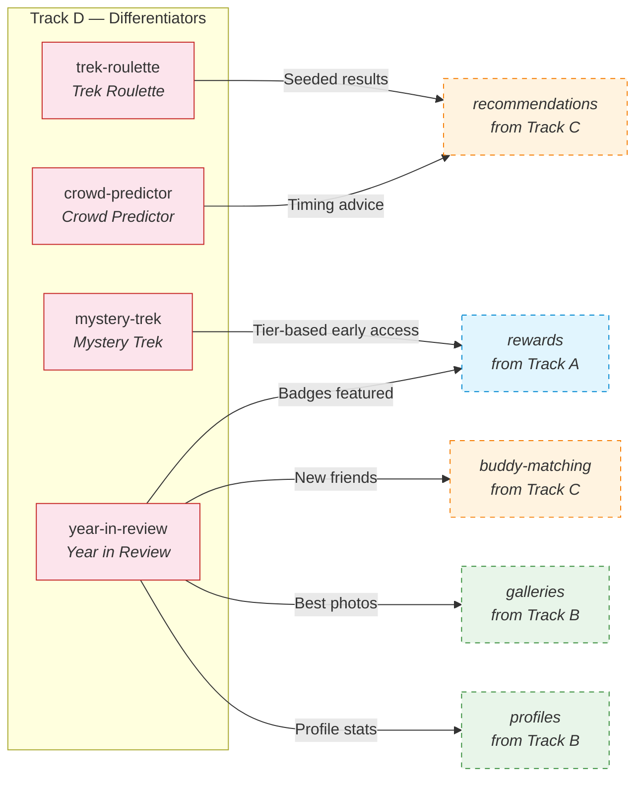

---

### 25. Mystery Trek (`mystery-trek`)

**What it does:** Periodically, the platform offers a special "Mystery Trek" — a heavily discounted trek where the destination is kept secret until after booking. Users see only: trek duration, difficulty level, date range, departure city, and a poetic clue ("Where the rhododendrons paint the valley red"). The actual trek name, location, and details unlock immediately after payment. Limited slots per drop. First-come, first-served.

**The user journey:**

- **Discovery:** On the home page, a teaser card: "🔮 Mystery Trek — March 2026. 3 days. Moderate. ₹2,999 (60% off). Clue: 'A hidden lake that mirrors the sky.' 12 slots remaining."
- **Decision:** The user is intrigued. They tap to see more: "Duration: 3 days. Difficulty: Moderate. Start point: Kathgodam. Includes: transport, meals, camping, guide. Actual destination revealed after booking." The price is too good to pass up. They book.
- **Reveal:** After payment, the destination is revealed: "Welcome to your Mystery Trek — **Bhrigu Lake, Himachal Pradesh**! Nestled at 4,300m, known as the 'Lake of Fairies.'" Full itinerary, gear list, and safety info load. The user is excited.
- **Post-trek:** The user loves the surprise element. They share: "I booked a Mystery Trek and ended up at Bhrigu Lake — best decision ever!" Others get curious.
- **Organizer side:** Organizers can submit treks with unsold slots to be featured as Mystery Treks. The platform bundles and markets them. Organizers fill spots they otherwise wouldn't.

**A real scenario:**

> It's March. A Himachal trek has 20 unsold slots for April. The platform converts it into a Mystery Trek: "2 days, Moderate, ₹1,999. Clue: 'Spring blooms at the base of a snow-capped giant.'" 15 slots sell in 48 hours. The organizer is happy. The trekkers are thrilled by the surprise. The platform proves the concept works.

**Why this exists:** Surprise is a powerful emotion. Mystery Trek taps into the joy of discovery and the thrill of a deal. It generates buzz ("Guess where I'm going!"), fills unsold inventory, and reinforces the "offbeat" brand identity — adventurous, spontaneous, unconventional.

**Who it serves:**
- **Trekkers** — Adventure + surprise + discount. A story to tell.
- **Organizers** — Fill unsold slots. Reach price-sensitive customers.
- **Platform** — Viral marketing. Inventory management. Brand differentiation.

**Feature connections:**
- → **Rewards** — Early access to Mystery Trek drops for higher loyalty tiers
- → **Coupons** — Mystery Trek price is effectively a deep discount
- → **Notifications** — "Mystery Trek dropping tomorrow at 10am!" alerts

**Why it matters:** Brand buzz. Mystery Trek is the kind of feature people talk about, screenshot, and share. It makes the platform feel fun and adventurous, not transactional. It also helps organizers fill last-minute inventory without publicly discounting their treks.

---

### 26. Trek Roulette (`trek-roulette`)

**What it does:** A playful "spin the wheel" feature that helps users discover treks they might not have found otherwise. Users set filters: budget range, maximum duration, preferred months, region/state, and difficulty. They hit "Spin" and the system randomly selects a matching trek. The result shows a 3-card preview — name, hero photo, difficulty, price, and a "Why this trek?" blurb. Users can re-spin for a different result, view details, or book directly.

**The user journey:**

- **Finding the feature:** On the home page, a colourful card: "🎰 Feeling lucky? Try Trek Roulette!"
- **Setting filters:** The user wants: Budget under ₹5,000, Weekend trip (2 days), Moderate difficulty, Any state. They set the dials.
- **Spinning:** They tap "Spin". The wheel animates for 2 seconds. It lands on: "🏔️ Kheerganga — 2 days, Moderate, ₹3,499. Why this? A perfect weekend getaway with natural hot springs to reward your climb."
- **Reaction:** The user thinks "Hot springs? I didn't know this existed!" They either: Book it, Spin again ("Give me another option"), or View details and save to wishlist.
- **Sharing:** A "Share my Roulette result" button generates a card: "Trek Roulette sent me to Kheerganga! 🔮"

**A real scenario:**

> Ravi has been browsing the same 5 popular treks for weeks — decision paralysis. He opens Trek Roulette, sets filters, spins. It shows him "Phulara Ridge" — a trek he's never heard of. He reads the description, watches a video, and books it. The trek becomes one of his favourites. Without Roulette, he would never have discovered it.

**Why this exists:** Choice paralysis kills conversions. When a platform has 100+ treks, users often stick to what they know or give up. Trek Roulette makes discovery fast, fun, and low-pressure. It surfaces lesser-known treks that deserve attention but get buried in the catalog.

**Who it serves:**
- **Trekkers** — Discover hidden gems. Break out of browsing loops.
- **Organizers** — Lesser-known treks get discovered.
- **Platform** — Increased catalog exploration. Higher conversion from discovery.

**Feature connections:**
- → **Recommendations** — Roulette results can be seeded by the recommendation engine
- → **Wishlist** — Roulette discoveries can be saved to wishlist
- → **Mystery Trek** — Related "surprise discovery" mechanic, different use case

**Why it matters:** Catalog utilization. Most users only browse the top 10% of treks. Roulette surfaces the long tail — which is where the unique, "offbeat" experiences live. It turns browsing into a game.

---

### 27. Crowd Predictor (`crowd-predictor`)

**What it does:** On each trek page, a live "crowd intelligence" widget that shows: current booking density ("70% booked for this date"), booking pace ("5 people booked this week"), historical trends ("This trek normally sells out 3 weeks before departure during peak season"), and recommendations ("Best to book by next Tuesday based on current pace"). It also shows off-peak alternatives: "This date is crowded — try April 10th instead (only 20% booked)."

**The user journey:**

- **On the trek page:** Below the booking button, a small widget: "📊 Crowd Predictor — 8 spots remaining. At this rate, will sell out in 4 days. Historically, this trek is 90% booked by March for April departures."
- **Choosing a date:** The user picks a date. The predictor updates: "April 5: 12 spots left (selling fast). April 12: 20 spots left (quiet). April 19: Full."
- **Urgency:** The user sees "Only 4 left at this rate" and feels the nudge to book now rather than wait.
- **Alternative discovery:** "This month is busy. But did you know? The same trek in May is only 30% booked — and the rhododendrons are in full bloom!" The user considers shifting dates.
- **The "offbeat" angle:** A filter toggle: "Show me less crowded dates" → surfaces dates where the user gets a more solitary experience. Aligns with the brand promise.

**A real scenario:**

> Anika opens Valley of Flowers. She sees: "Mid-July: 80% booked. Late July: 45% booked." She picks late July — less crowded, more peaceful, and the flowers are still in bloom. Her experience is better because the trail isn't packed. She tells her friends: "Late July is the secret window."

**Why this exists:** Nobody wants to be on a crowded trail. But most booking platforms hide availability data. Showing it builds trust and helps users make informed decisions. The urgency signals drive bookings, while the "quieter alternatives" improve the actual trek experience.

**Who it serves:**
- **Trekkers** — Informed decisions. Quiet trails. Better experiences.
- **Organizers** — Fill off-peak dates. Manage demand.
- **Platform** — Higher conversion (urgency). Better reviews (right expectations).

**Feature connections:**
- → **Recommendations** — Crowd data feeds recommendation timing
- → **Weather** — Combine crowd predictor + weather for optimal date selection
- → **Notifications** — "Your wishlisted trek is selling fast" alerts

**Why it matters:** Conversion + experience. Urgency drives immediate bookings. Better date choices lead to better trek experiences → better reviews → more bookings. A virtuous cycle.

---

### 28. Year in Review (`year-in-review`)

**What it does:** At the end of each year, every user receives a personalized "Year in Review" — a beautifully designed, interactive summary of their trekking year. It includes: total treks completed, total distance hiked, cumulative altitude gained, states explored, highest peak reached, favourite trek (most time spent on page), total loyalty points earned, badges earned this year, number of new friends made through Buddy Matching, active challenges completed, and platform-wide stats ("You were in the top 5% of trekkers this year!"). Presented as a shareable video + infographic card.

**The user journey:**

- **Trigger:** On December 26th, a push notification: "🏔️ Your 2026 Trek Year in Review is ready!"
- **Experience:** The user opens it. A full-screen animated story begins: "You started the year with a sunrise trek to Kheerganga..." (with a photo from that trek). "In March, you conquered your first 5,000m peak..." "You explored 4 states..." "You earned 3 new badges..." "You made 2 trek buddies who became friends..." The music swells.
- **Stats screen:** "12 treks. 184 km. 12,400m altitude gained. ⭐ Gold Tier."
- **Share card:** A beautifully designed static card: "Anika's 2026 — Offbeat Pravasi Year in Review" with key stats and a QR code to join the platform. She shares it on Instagram. Her friends ask: "What app is this?"
- **Platform-wide stats:** "Together, the Offbeat Pravasi community trekked 45,000 km — that's more than the Earth's circumference!"
- **Next year setup:** The final screen: "Ready for 2027? Your wishlist has 8 trecks waiting. 🎯"

**A real scenario:**

> Every December, Rahul shares his Year in Review card on Instagram. His card shows: "17 treks, 230 km, 3 new states, Platinum member." His non-trekker friends are impressed. Two of them download the app. Rahul feels proud of his accomplishments and motivated to beat his stats next year. He books his first trek of January before the year even ends.

**Why this exists:** Borrowed from Spotify Wrapped — one of the most viral features in consumer tech. A Year in Review is: (1) Emotionally powerful — users reflect on their year with pride. (2) Highly shareable — drives massive free marketing. (3) Re-engagement gold — ends by looking forward to next year, encouraging immediate re-booking.

**Who it serves:**
- **Trekkers** — Pride, reflection, social sharing
- **Platform** — Viral marketing (every share is free acquisition), end-of-year re-engagement
- **Community** — Collective stats build a sense of belonging

**Feature connections:**
- → **Profiles** — Year stats feed into the user's permanent profile
- → **Rewards** — Badges earned this year featured prominently
- → **Buddy Matching** — New friends made through matching highlighted
- → **Challenges** — Challenge completions contribute to the narrative
- → **Wishlist** — Final slide prompts wishlist completion for next year
- → **Galleries** — Best user photos from the year featured

**Why it matters:** Viral loop + re-engagement. Every share is a free acquisition impression. The emotional impact drives loyalty. The forward-looking end slide drives January bookings — traditionally a slow month.

---

## Appendix: Full Module Dependency Map

```mermaid
graph TB
    subgraph TrackA["Track A — Foundation"]
        policies["policies"]
        itineraries["itineraries"]
        gear["gear"]
        weather["weather"]
        safety["safety"]
        assessments["assessments"]
        coupons["coupons"]
        groups["groups"]
        rewards["rewards"]
    end

    subgraph TrackB["Track B — Community"]
        forums["forums"]
        profiles["profiles"]
        meetups["meetups"]
        challenges["challenges"]
        galleries["galleries"]
        referrals["referrals"]
        marketplace["marketplace"]
    end

    subgraph TrackC["Track C — Post-Trek Retention"]
        recommendations["recommendations"]
        wishlist["wishlist"]
        chapters["chapters"]
        buddy_matching["buddy-matching"]
        volunteer_drives["volunteer-drives"]
        gift_cards["gift-cards"]
        offline_mode["offline-mode"]
        calendar_sync["calendar-sync"]
    end

    subgraph TrackD["Track D — Differentiators"]
        mystery_trek["mystery-trek"]
        trek_roulette["trek-roulette"]
        crowd_predictor["crowd-predictor"]
        year_in_review["year-in-review"]
    end

    subgraph Existing["Existing Modules"]
        bookings["bookings"]
        payments["payments"]
    end

    policies -->|"Cancellation flow"| bookings
    itineraries -->|"Primary download"| offline_mode
    gear -->|"Find missing gear"| marketplace
    gear -->|"Download for offline"| offline_mode
    weather -->|"Severe weather alerts"| safety
    weather -->|"Seasonal suggestions"| recommendations
    safety -->|"Group check-in"| groups
    safety -->|"Safety in numbers"| buddy_matching
    safety -->|"Offline access"| offline_mode
    assessments -->|"Score feeds engine"| recommendations
    coupons -->|"Reward delivery"| referrals
    coupons -->|"Redemption flow"| gift_cards
    groups -->|"Matched pairs book"| buddy_matching
    groups -->|"Single transaction"| bookings
    rewards -->|"Badges + points"| challenges
    rewards -->|"Eco Warrior badge"| volunteer_drives
    rewards -->|"Tier-based access"| mystery_trek
    forums -->|"Answers attributed"| profiles
    profiles -->|"Show compatibility"| buddy_matching
    profiles -->|"Member visibility"| chapters
    meetups -->|"Chapter-organized"| chapters
    challenges -->|"Challenge-driven"| recommendations
    galleries -->|"Photos visible"| profiles
    galleries -->|"Best photos featured"| year_in_review
    referrals -->|"Coupon delivery"| coupons
    referrals -->|"Points-based"| rewards
    recommendations -->|"Drives discovery"| wishlist
    wishlist -->|"Enables gifting"| gift_cards
    chapters -->|"Local events"| meetups
    chapters -->|"Local priority"| buddy_matching
    buddy_matching -->|"Book together"| groups
    volunteer_drives -->|"Sustainability"| rewards
    gift_cards -->|"Payment method"| payments
    gift_cards -->|"Gift from list"| wishlist
    offline_mode -->|"Downloads"| itineraries
    offline_mode -->|"Downloads"| safety
    offline_mode -->|"Downloads"| gear
    offline_mode -->|"Downloads"| weather
    calendar_sync -->|"Event source"| bookings
    mystery_trek -->|"Exclusive access"| rewards
    trek_roulette -->|"Seeded results"| recommendations
    crowd_predictor -->|"Timing advice"| recommendations
    year_in_review -->|"Stats source"| profiles
    year_in_review -->|"Badges source"| rewards
    year_in_review -->|"Photos source"| galleries
    year_in_review -->|"Friends source"| buddy_matching

    style TrackA fill:#e1f5fe,stroke:#0288d1,color:#000
    style TrackB fill:#e8f5e9,stroke:#388e3c,color:#000
    style TrackC fill:#fff3e0,stroke:#f57c00,color:#000
    style TrackD fill:#fce4ec,stroke:#c62828,color:#000
    style Existing fill:#f3e5f5,stroke:#7b1fa2,color:#000
```

---

*End of document. 28 modules. 4 tracks. One platform.*
````

## File: docs/openapi.yaml
````yaml
openapi: "3.0.3"
info:
  title: "Offbeat प्रवासी API"
  description: "Full-scale, production-ready trek discovery and booking platform."
  version: "1.0.0"
servers:
  - url: http://localhost:4000
    description: Local development
  - url: https://api.offbeatpravasi.com
    description: Production

paths:
  # ──────────────────────────────────────────────
  # APP
  # ──────────────────────────────────────────────
  /:
    get:
      operationId: appHello
      summary: Health check / welcome
      tags: [App]
      responses:
        "200":
          description: Hello world string
          content:
            text/plain:
              schema:
                type: string

  # ──────────────────────────────────────────────
  # HEALTH
  # ──────────────────────────────────────────────
  /health:
    get:
      operationId: healthBase
      summary: Base health check
      tags: [Health]
      responses:
        "200":
          description: Health status
          content:
            application/json:
              schema:
                type: object
                properties:
                  success:
                    type: boolean
                  message:
                    type: string
                  data:
                    type: object

  /health/redis:
    get:
      operationId: healthRedis
      summary: Redis health check
      tags: [Health]
      responses:
        "200":
          description: Redis ping result
          content:
            application/json:
              schema:
                type: object
                properties:
                  success:
                    type: boolean
                  message:
                    type: string
                  data:
                    type: object
                    properties:
                      pong:
                        type: string

  # ──────────────────────────────────────────────
  # AUTH
  # ──────────────────────────────────────────────
  /auth/register:
    post:
      operationId: authRegister
      summary: Register a new user
      tags: [Auth]
      requestBody:
        required: true
        content:
          application/json:
            schema:
              type: object
              required: [email, password]
              properties:
                email:
                  type: string
                  format: email
                  example: user@example.com
                password:
                  type: string
                  minLength: 8
                  example: myPassword123
                fullName:
                  type: string
                  example: John Doe
      responses:
        "201":
          description: User registered
          content:
            application/json:
              schema:
                $ref: "#/components/schemas/SuccessResponse"

  /auth/login:
    post:
      operationId: authLogin
      summary: Login with email and password
      tags: [Auth]
      requestBody:
        required: true
        content:
          application/json:
            schema:
              type: object
              required: [email, password]
              properties:
                email:
                  type: string
                  format: email
                  example: user@example.com
                password:
                  type: string
                  example: myPassword123
      responses:
        "200":
          description: Login successful
          content:
            application/json:
              schema:
                type: object
                properties:
                  success:
                    type: boolean
                    example: true
                  message:
                    type: string
                    example: Login successful
                  data:
                    $ref: "#/components/schemas/TokenPair"

  /auth/email/send-otp:
    post:
      operationId: authSendOtp
      summary: Send email OTP
      tags: [Auth]
      requestBody:
        required: true
        content:
          application/json:
            schema:
              type: object
              required: [email]
              properties:
                email:
                  type: string
                  format: email
      responses:
        "201":
          description: OTP sent
          content:
            application/json:
              schema:
                $ref: "#/components/schemas/SuccessResponse"

  /auth/email/verify-otp:
    post:
      operationId: authVerifyOtp
      summary: Verify email OTP
      tags: [Auth]
      requestBody:
        required: true
        content:
          application/json:
            schema:
              type: object
              required: [email, otp]
              properties:
                email:
                  type: string
                  format: email
                otp:
                  type: string
                  pattern: ^\d{6}$
                  example: "123456"
      responses:
        "201":
          description: OTP verified
          content:
            application/json:
              schema:
                $ref: "#/components/schemas/SuccessResponse"

  /auth/refresh:
    post:
      operationId: authRefresh
      summary: Refresh JWT token pair
      tags: [Auth]
      requestBody:
        required: true
        content:
          application/json:
            schema:
              type: object
              required: [refreshToken]
              properties:
                refreshToken:
                  type: string
      responses:
        "200":
          description: Tokens refreshed
          content:
            application/json:
              schema:
                $ref: "#/components/schemas/TokenPair"

  /auth/logout:
    post:
      operationId: authLogout
      summary: Logout and invalidate session
      tags: [Auth]
      security:
        - access-token: []
      responses:
        "200":
          description: Logged out
          content:
            application/json:
              schema:
                $ref: "#/components/schemas/SuccessResponse"

  /auth/me:
    get:
      operationId: authMe
      summary: Get current authenticated user
      tags: [Auth]
      security:
        - access-token: []
      responses:
        "200":
          description: Current user profile
          content:
            application/json:
              schema:
                type: object
                properties:
                  success:
                    type: boolean
                  message:
                    type: string
                  data:
                    $ref: "#/components/schemas/AuthenticatedUser"

  /auth/google:
    get:
      operationId: authGoogle
      summary: Initiate Google OAuth flow
      tags: [Auth]
      responses:
        "200":
          description: Google authorize URL
          content:
            application/json:
              schema:
                type: object
                properties:
                  success:
                    type: boolean
                  message:
                    type: string
                  data:
                    type: object
                    properties:
                      url:
                        type: string
                        format: uri

  /auth/google/exchange:
    post:
      operationId: authGoogleExchange
      summary: Exchange Google OAuth session for JWT tokens
      tags: [Auth]
      responses:
        "200":
          description: Login successful
          content:
            application/json:
              schema:
                type: object
                properties:
                  success:
                    type: boolean
                  message:
                    type: string
                  data:
                    $ref: "#/components/schemas/TokenPair"

  /auth/email/resend-otp:
    post:
      operationId: authResendOtp
      summary: Resend email verification OTP
      tags: [Auth]
      requestBody:
        required: true
        content:
          application/json:
            schema:
              type: object
              required: [email]
              properties:
                email:
                  type: string
                  format: email
      responses:
        "201":
          description: OTP resent
          content:
            application/json:
              schema:
                $ref: "#/components/schemas/SuccessResponse"

  /auth/password/forgot:
    post:
      operationId: authForgotPassword
      summary: Request password reset OTP
      tags: [Auth]
      requestBody:
        required: true
        content:
          application/json:
            schema:
              type: object
              required: [email]
              properties:
                email:
                  type: string
                  format: email
      responses:
        "201":
          description: OTP sent if email exists
          content:
            application/json:
              schema:
                $ref: "#/components/schemas/SuccessResponse"

  /auth/password/reset:
    post:
      operationId: authResetPassword
      summary: Reset password using OTP
      tags: [Auth]
      requestBody:
        required: true
        content:
          application/json:
            schema:
              type: object
              required: [email, otp, newPassword]
              properties:
                email:
                  type: string
                  format: email
                otp:
                  type: string
                  pattern: ^\d{6}$
                  example: "123456"
                newPassword:
                  type: string
                  minLength: 8
      responses:
        "200":
          description: Password reset
          content:
            application/json:
              schema:
                $ref: "#/components/schemas/SuccessResponse"

  # ──────────────────────────────────────────────
  # USERS
  # ──────────────────────────────────────────────
  /users/me:
    get:
      operationId: usersGetProfile
      summary: Get current user profile
      tags: [Users]
      security:
        - access-token: []
      responses:
        "200":
          description: Current user profile
          content:
            application/json:
              schema:
                $ref: "#/components/schemas/SuccessResponse"
    patch:
      operationId: usersUpdateProfile
      summary: Update current user profile
      tags: [Users]
      security:
        - access-token: []
      requestBody:
        required: true
        content:
          application/json:
            schema:
              $ref: "#/components/schemas/UpdateProfileDto"
      responses:
        "200":
          description: Profile updated
          content:
            application/json:
              schema:
                $ref: "#/components/schemas/SuccessResponse"

  /users/me/onboarding:
    post:
      operationId: usersSaveOnboarding
      summary: Save onboarding answers
      tags: [Users]
      security:
        - access-token: []
      requestBody:
        required: true
        content:
          application/json:
            schema:
              $ref: "#/components/schemas/UpsertOnboardingDto"
      responses:
        "201":
          description: Onboarding answers saved
          content:
            application/json:
              schema:
                $ref: "#/components/schemas/SuccessResponse"

  /users/search:
    get:
      operationId: usersSearch
      summary: Search users by username or name
      tags: [Users]
      security:
        - access-token: []
      parameters:
        - in: query
          name: q
          schema:
            type: string
          description: Search query
        - in: query
          name: page
          schema:
            type: integer
            minimum: 1
        - in: query
          name: limit
          schema:
            type: integer
            minimum: 1
            maximum: 100
      responses:
        "200":
          description: Paginated user list
          content:
            application/json:
              schema:
                $ref: "#/components/schemas/SuccessResponse"

  /users/{id}:
    get:
      operationId: usersGetById
      summary: Get user by ID
      tags: [Users]
      security:
        - access-token: []
      parameters:
        - in: path
          name: id
          required: true
          schema:
            type: string
            format: uuid
      responses:
        "200":
          description: User profile
          content:
            application/json:
              schema:
                $ref: "#/components/schemas/SuccessResponse"

  # ──────────────────────────────────────────────
  # TREKS
  # ──────────────────────────────────────────────
  /treks:
    post:
      operationId: treksCreate
      summary: Create a trek (organizer only)
      tags: [Treks]
      security:
        - access-token: []
      requestBody:
        required: true
        content:
          application/json:
            schema:
              $ref: "#/components/schemas/CreateTrekDto"
      responses:
        "201":
          description: Created trek
          content:
            application/json:
              schema:
                $ref: "#/components/schemas/SuccessResponse"
    get:
      operationId: treksList
      summary: List and search treks
      tags: [Treks]
      parameters:
        - in: query
          name: q
          schema:
            type: string
          description: Full-text search query
        - in: query
          name: state
          schema:
            type: string
          description: Filter by state
        - in: query
          name: difficulty
          schema:
            $ref: "#/components/schemas/TrekDifficulty"
          description: Filter by difficulty
        - in: query
          name: minCost
          schema:
            type: integer
            minimum: 0
          description: Minimum cost filter
        - in: query
          name: maxCost
          schema:
            type: integer
            minimum: 0
          description: Maximum cost filter
        - in: query
          name: sort
          schema:
            type: string
            enum: [relevance, newest, popular, distance]
          description: Sort order
        - in: query
          name: page
          schema:
            type: integer
            minimum: 1
          description: Page number
        - in: query
          name: limit
          schema:
            type: integer
            minimum: 1
          description: Items per page
      responses:
        "200":
          description: Paginated trek list
          content:
            application/json:
              schema:
                $ref: "#/components/schemas/SuccessResponse"

  /treks/nearby:
    get:
      operationId: treksNearby
      summary: Find treks near a location
      tags: [Treks]
      parameters:
        - in: query
          name: latitude
          required: true
          schema:
            type: number
          description: Latitude coordinate
        - in: query
          name: longitude
          required: true
          schema:
            type: number
          description: Longitude coordinate
        - in: query
          name: radiusMeters
          schema:
            type: integer
            minimum: 10
            default: 5000
          description: Search radius in meters
        - in: query
          name: page
          schema:
            type: integer
            minimum: 1
        - in: query
          name: limit
          schema:
            type: integer
            minimum: 1
      responses:
        "200":
          description: Treks near the provided coordinates
          content:
            application/json:
              schema:
                $ref: "#/components/schemas/SuccessResponse"

  /treks/recommendations:
    get:
      operationId: treksRecommendations
      summary: Get trek recommendations
      tags: [Treks]
      parameters:
        - in: query
          name: limit
          schema:
            type: integer
            default: 10
          description: Number of recommendations
        - in: query
          name: lat
          schema:
            type: number
          description: User latitude for geo-aware recs
        - in: query
          name: lon
          schema:
            type: number
          description: User longitude for geo-aware recs
      responses:
        "200":
          description: Recommended treks
          content:
            application/json:
              schema:
                $ref: "#/components/schemas/SuccessResponse"

  /treks/{id}:
    get:
      operationId: treksGet
      summary: Get trek details by ID
      tags: [Treks]
      parameters:
        - in: path
          name: id
          required: true
          schema:
            type: string
            format: uuid
          description: Trek ID
      responses:
        "200":
          description: Trek details
          content:
            application/json:
              schema:
                $ref: "#/components/schemas/SuccessResponse"

  # ──────────────────────────────────────────────
  # BOOKINGS
  # ──────────────────────────────────────────────
  /bookings:
    post:
      operationId: bookingsCreate
      summary: Create a booking
      tags: [Bookings]
      security:
        - access-token: []
      requestBody:
        required: true
        content:
          application/json:
            schema:
              $ref: "#/components/schemas/CreateBookingDto"
      responses:
        "201":
          description: Booking created
          content:
            application/json:
              schema:
                $ref: "#/components/schemas/SuccessResponse"
    get:
      operationId: bookingsList
      summary: List my bookings
      tags: [Bookings]
      security:
        - access-token: []
      parameters:
        - in: query
          name: page
          schema:
            type: integer
            minimum: 1
        - in: query
          name: limit
          schema:
            type: integer
            minimum: 1
      responses:
        "200":
          description: User's bookings
          content:
            application/json:
              schema:
                $ref: "#/components/schemas/SuccessResponse"

  /bookings/verify:
    post:
      operationId: bookingsVerify
      summary: Verify a booking QR token
      tags: [Bookings]
      security:
        - access-token: []
      requestBody:
        required: true
        content:
          application/json:
            schema:
              type: object
              required: [qrToken]
              properties:
                qrToken:
                  type: string
                  description: QR token from booking ticket
      responses:
        "201":
          description: Verification result
          content:
            application/json:
              schema:
                $ref: "#/components/schemas/SuccessResponse"

  /bookings/release-expired:
    patch:
      operationId: bookingsReleaseExpired
      summary: Release expired booking holds (admin only)
      tags: [Bookings]
      security:
        - access-token: []
      responses:
        "200":
          description: Expired holds released
          content:
            application/json:
              schema:
                $ref: "#/components/schemas/SuccessResponse"

  /bookings/{id}:
    get:
      operationId: bookingsGet
      summary: Get booking detail
      tags: [Bookings]
      security:
        - access-token: []
      parameters:
        - in: path
          name: id
          required: true
          schema:
            type: string
            format: uuid
      responses:
        "200":
          description: Booking detail
          content:
            application/json:
              schema:
                $ref: "#/components/schemas/SuccessResponse"

  /bookings/{id}/cancel:
    post:
      operationId: bookingsCancel
      summary: Cancel a booking
      tags: [Bookings]
      security:
        - access-token: []
      parameters:
        - in: path
          name: id
          required: true
          schema:
            type: string
            format: uuid
      requestBody:
        content:
          application/json:
            schema:
              type: object
              properties:
                reason:
                  type: string
                  description: Cancellation reason
      responses:
        "200":
          description: Booking cancelled
          content:
            application/json:
              schema:
                $ref: "#/components/schemas/SuccessResponse"

  /bookings/{id}/ticket:
    get:
      operationId: bookingsTicket
      summary: Download booking ticket PDF
      tags: [Bookings]
      security:
        - access-token: []
      parameters:
        - in: path
          name: id
          required: true
          schema:
            type: string
            format: uuid
      responses:
        "200":
          description: PDF ticket file
          content:
            application/pdf:
              schema:
                type: string
                format: binary

  # ──────────────────────────────────────────────
  # PAYMENTS
  # ──────────────────────────────────────────────
  /payments/checkout:
    post:
      operationId: paymentsCheckout
      summary: Create a payment checkout session
      tags: [Payments]
      security:
        - access-token: []
      requestBody:
        required: true
        content:
          application/json:
            schema:
              $ref: "#/components/schemas/CreateCheckoutDto"
      responses:
        "201":
          description: Checkout session created
          content:
            application/json:
              schema:
                $ref: "#/components/schemas/SuccessResponse"

  /payments/webhook/{provider}:
    post:
      operationId: paymentsWebhook
      summary: Handle payment provider webhook (Stripe / Razorpay)
      tags: [Payments]
      parameters:
        - in: path
          name: provider
          required: true
          schema:
            type: string
            enum: [stripe, razorpay]
          description: Payment provider slug
      requestBody:
        required: true
        content:
          application/json:
            schema:
              type: object
              description: Raw webhook payload from provider
      responses:
        "200":
          description: Webhook processed
          content:
            application/json:
              schema:
                type: object
                properties:
                  received:
                    type: boolean
                    example: true

  # ──────────────────────────────────────────────
  # MEDIA
  # ──────────────────────────────────────────────
  /media/presign:
    post:
      operationId: mediaPresign
      summary: Get presigned upload URL for any media category
      tags: [Media]
      security:
        - access-token: []
      requestBody:
        required: true
        content:
          application/json:
            schema:
              $ref: "#/components/schemas/PresignDto"
      responses:
        "201":
          description: Presigned URL generated
          content:
            application/json:
              schema:
                $ref: "#/components/schemas/SuccessResponse"

  /media/presign/profile:
    post:
      operationId: mediaPresignProfile
      summary: Get presigned URL for profile image
      tags: [Media]
      security:
        - access-token: []
      requestBody:
        required: true
        content:
          application/json:
            schema:
              $ref: "#/components/schemas/PresignDto"
      responses:
        "201":
          description: Presigned URL generated
          content:
            application/json:
              schema:
                $ref: "#/components/schemas/SuccessResponse"

  /media/presign/banner:
    post:
      operationId: mediaPresignBanner
      summary: Get presigned URL for banner image
      tags: [Media]
      security:
        - access-token: []
      requestBody:
        required: true
        content:
          application/json:
            schema:
              $ref: "#/components/schemas/PresignDto"
      responses:
        "201":
          description: Presigned URL generated
          content:
            application/json:
              schema:
                $ref: "#/components/schemas/SuccessResponse"

  /media/presign/post:
    post:
      operationId: mediaPresignPost
      summary: Get presigned URL for post image
      tags: [Media]
      security:
        - access-token: []
      requestBody:
        required: true
        content:
          application/json:
            schema:
              $ref: "#/components/schemas/PresignDto"
      responses:
        "201":
          description: Presigned URL generated
          content:
            application/json:
              schema:
                $ref: "#/components/schemas/SuccessResponse"

  /media/presign/trek:
    post:
      operationId: mediaPresignTrek
      summary: Get presigned URL for trek image
      tags: [Media]
      security:
        - access-token: []
      requestBody:
        required: true
        content:
          application/json:
            schema:
              $ref: "#/components/schemas/PresignDto"
      responses:
        "201":
          description: Presigned URL generated
          content:
            application/json:
              schema:
                $ref: "#/components/schemas/SuccessResponse"

  /media/presign/story:
    post:
      operationId: mediaPresignStory
      summary: Get presigned URL for story media
      tags: [Media]
      security:
        - access-token: []
      requestBody:
        required: true
        content:
          application/json:
            schema:
              $ref: "#/components/schemas/PresignDto"
      responses:
        "201":
          description: Presigned URL generated
          content:
            application/json:
              schema:
                $ref: "#/components/schemas/SuccessResponse"

  # ──────────────────────────────────────────────
  # ASSESSMENTS
  # ──────────────────────────────────────────────
  /assessments/questions:
    get:
      operationId: assessmentsGetQuestions
      summary: Get quiz questions and options
      tags: [Assessments]
      responses:
        "200":
          description: Returns the quiz question bank
          content:
            application/json:
              schema:
                $ref: "#/components/schemas/SuccessResponse"

  /assessments/submit:
    post:
      operationId: assessmentsSubmit
      summary: Submit quiz answers and get score + bracket
      tags: [Assessments]
      security:
        - access-token: []
      requestBody:
        required: true
        content:
          application/json:
            schema:
              $ref: "#/components/schemas/SubmitAssessmentDto"
      responses:
        "201":
          description: Assessment result
          content:
            application/json:
              schema:
                $ref: "#/components/schemas/AssessmentResultDto"

  /assessments/my-result:
    get:
      operationId: assessmentsMyResult
      summary: Get latest assessment result for current user
      tags: [Assessments]
      security:
        - access-token: []
      responses:
        "200":
          description: Latest assessment result or null
          content:
            application/json:
              schema:
                $ref: "#/components/schemas/AssessmentResultDto"

  /users/{userId}/assessment-result:
    get:
      operationId: assessmentsUserBracket
      summary: Get a user public assessment bracket
      tags: [Assessments]
      parameters:
        - in: path
          name: userId
          required: true
          schema:
            type: string
            format: uuid
      responses:
        "200":
          description: User public difficulty bracket
          content:
            application/json:
              schema:
                type: object
                properties:
                  difficultyBracket:
                    type: string
                    nullable: true

  # ──────────────────────────────────────────────
  # BOOKMARKS
  # ──────────────────────────────────────────────
  /bookmarks:
    get:
      operationId: bookmarksList
      summary: List my bookmarked treks
      tags: [Bookmarks]
      security:
        - access-token: []
      parameters:
        - in: query
          name: page
          schema:
            type: integer
            minimum: 1
        - in: query
          name: limit
          schema:
            type: integer
            minimum: 1
      responses:
        "200":
          description: Paginated bookmarks
          content:
            application/json:
              schema:
                $ref: "#/components/schemas/SuccessResponse"

  /bookmarks/treks/{trekId}:
    post:
      operationId: bookmarksToggle
      summary: Toggle bookmark on a trek
      tags: [Bookmarks]
      security:
        - access-token: []
      parameters:
        - in: path
          name: trekId
          required: true
          schema:
            type: string
            format: uuid
      responses:
        "200":
          description: Bookmark toggled
          content:
            application/json:
              schema:
                $ref: "#/components/schemas/SuccessResponse"

  # ──────────────────────────────────────────────
  # FRIENDSHIPS
  # ──────────────────────────────────────────────
  /friend-requests:
    post:
      operationId: friendshipsSendRequest
      summary: Send a friend request
      tags: [Friendships]
      security:
        - access-token: []
      requestBody:
        required: true
        content:
          application/json:
            schema:
              type: object
              required: [receiverId]
              properties:
                receiverId:
                  type: string
                  format: uuid
      responses:
        "201":
          description: Friend request sent
          content:
            application/json:
              schema:
                $ref: "#/components/schemas/SuccessResponse"
    get:
      operationId: friendshipsPendingRequests
      summary: List incoming pending friend requests
      tags: [Friendships]
      security:
        - access-token: []
      responses:
        "200":
          description: List of pending requests
          content:
            application/json:
              schema:
                $ref: "#/components/schemas/SuccessResponse"

  /friend-requests/sent:
    get:
      operationId: friendshipsSentRequests
      summary: List sent friend requests
      tags: [Friendships]
      security:
        - access-token: []
      responses:
        "200":
          description: List of sent requests
          content:
            application/json:
              schema:
                $ref: "#/components/schemas/SuccessResponse"

  /friend-requests/{id}/accept:
    post:
      operationId: friendshipsAcceptRequest
      summary: Accept a friend request
      tags: [Friendships]
      security:
        - access-token: []
      parameters:
        - in: path
          name: id
          required: true
          schema:
            type: string
            format: uuid
      responses:
        "200":
          description: Friend request accepted
          content:
            application/json:
              schema:
                $ref: "#/components/schemas/SuccessResponse"

  /friend-requests/{id}/decline:
    post:
      operationId: friendshipsDeclineRequest
      summary: Decline a friend request
      tags: [Friendships]
      security:
        - access-token: []
      parameters:
        - in: path
          name: id
          required: true
          schema:
            type: string
            format: uuid
      responses:
        "200":
          description: Friend request declined
          content:
            application/json:
              schema:
                $ref: "#/components/schemas/SuccessResponse"

  /friends:
    get:
      operationId: friendshipsList
      summary: List all friends
      tags: [Friendships]
      security:
        - access-token: []
      responses:
        "200":
          description: List of friends
          content:
            application/json:
              schema:
                $ref: "#/components/schemas/SuccessResponse"

  /friends/{id}:
    delete:
      operationId: friendshipsRemove
      summary: Remove a friend
      tags: [Friendships]
      security:
        - access-token: []
      parameters:
        - in: path
          name: id
          required: true
          schema:
            type: string
            format: uuid
      responses:
        "200":
          description: Friend removed
          content:
            application/json:
              schema:
                $ref: "#/components/schemas/SuccessResponse"

  # ──────────────────────────────────────────────
  # GEAR
  # ──────────────────────────────────────────────
  /gear-items:
    get:
      operationId: gearListAll
      summary: List all master gear items
      tags: [Gear]
      security:
        - access-token: []
      responses:
        "200":
          description: Master gear items list
          content:
            application/json:
              schema:
                $ref: "#/components/schemas/SuccessResponse"
    post:
      operationId: gearCreateItem
      summary: Create a master gear item (admin only)
      tags: [Gear]
      security:
        - access-token: []
      requestBody:
        required: true
        content:
          application/json:
            schema:
              $ref: "#/components/schemas/CreateGearItemDto"
      responses:
        "201":
          description: Gear item created
          content:
            application/json:
              schema:
                $ref: "#/components/schemas/SuccessResponse"

  /gear-items/{id}:
    put:
      operationId: gearUpdateItem
      summary: Update a master gear item (admin only)
      tags: [Gear]
      security:
        - access-token: []
      parameters:
        - in: path
          name: id
          required: true
          schema:
            type: string
            format: uuid
      requestBody:
        required: true
        content:
          application/json:
            schema:
              type: object
              description: Partial gear item fields
      responses:
        "200":
          description: Gear item updated
          content:
            application/json:
              schema:
                $ref: "#/components/schemas/SuccessResponse"

  /treks/{trekId}/gear:
    get:
      operationId: gearGetTrekGear
      summary: Get gear list for a trek
      tags: [Gear]
      parameters:
        - in: path
          name: trekId
          required: true
          schema:
            type: string
            format: uuid
      responses:
        "200":
          description: Trek gear list
          content:
            application/json:
              schema:
                $ref: "#/components/schemas/SuccessResponse"
    put:
      operationId: gearSetTrekGear
      summary: Set gear list for a trek (organizer only)
      tags: [Gear]
      security:
        - access-token: []
      parameters:
        - in: path
          name: trekId
          required: true
          schema:
            type: string
            format: uuid
      requestBody:
        required: true
        content:
          application/json:
            schema:
              $ref: "#/components/schemas/SetTrekGearDto"
      responses:
        "200":
          description: Trek gear updated
          content:
            application/json:
              schema:
                $ref: "#/components/schemas/SuccessResponse"

  /bookings/{bookingId}/packing-list:
    get:
      operationId: gearGetPackingList
      summary: Get user packing list for a booking
      tags: [Gear]
      security:
        - access-token: []
      parameters:
        - in: path
          name: bookingId
          required: true
          schema:
            type: string
            format: uuid
      responses:
        "200":
          description: User packing list
          content:
            application/json:
              schema:
                $ref: "#/components/schemas/SuccessResponse"

  /bookings/{bookingId}/packing-list/items/{itemId}:
    patch:
      operationId: gearUpdatePackingItem
      summary: Toggle packing list item fields
      tags: [Gear]
      security:
        - access-token: []
      parameters:
        - in: path
          name: bookingId
          required: true
          schema:
            type: string
            format: uuid
        - in: path
          name: itemId
          required: true
          schema:
            type: string
            format: uuid
      requestBody:
        required: true
        content:
          application/json:
            schema:
              $ref: "#/components/schemas/UpdatePackingItemDto"
      responses:
        "200":
          description: Packing item updated
          content:
            application/json:
              schema:
                $ref: "#/components/schemas/SuccessResponse"

  /rentals/{bookingId}:
    post:
      operationId: gearConfirmRentals
      summary: Confirm rental items for a booking
      tags: [Gear]
      security:
        - access-token: []
      parameters:
        - in: path
          name: bookingId
          required: true
          schema:
            type: string
            format: uuid
      responses:
        "201":
          description: Rentals confirmed
          content:
            application/json:
              schema:
                $ref: "#/components/schemas/SuccessResponse"

  # ──────────────────────────────────────────────
  # GROUPS
  # ──────────────────────────────────────────────
  /groups:
    post:
      operationId: groupsCreate
      summary: Create a new trek group
      tags: [Groups]
      security:
        - access-token: []
      requestBody:
        required: true
        content:
          application/json:
            schema:
              $ref: "#/components/schemas/CreateGroupDto"
      responses:
        "201":
          description: Group created
          content:
            application/json:
              schema:
                $ref: "#/components/schemas/SuccessResponse"

  /groups/{id}:
    get:
      operationId: groupsGetById
      summary: Get group details and members
      tags: [Groups]
      security:
        - access-token: []
      parameters:
        - in: path
          name: id
          required: true
          schema:
            type: string
            format: uuid
      responses:
        "200":
          description: Group details
          content:
            application/json:
              schema:
                $ref: "#/components/schemas/SuccessResponse"
    patch:
      operationId: groupsUpdate
      summary: Update group name, maxSize, or expiresAt
      tags: [Groups]
      security:
        - access-token: []
      parameters:
        - in: path
          name: id
          required: true
          schema:
            type: string
            format: uuid
      requestBody:
        required: true
        content:
          application/json:
            schema:
              $ref: "#/components/schemas/UpdateGroupDto"
      responses:
        "200":
          description: Group updated
          content:
            application/json:
              schema:
                $ref: "#/components/schemas/SuccessResponse"
    delete:
      operationId: groupsCancel
      summary: Cancel a group
      tags: [Groups]
      security:
        - access-token: []
      parameters:
        - in: path
          name: id
          required: true
          schema:
            type: string
            format: uuid
      responses:
        "200":
          description: Group cancelled
          content:
            application/json:
              schema:
                $ref: "#/components/schemas/SuccessResponse"

  /groups/{id}/invite:
    post:
      operationId: groupsInvite
      summary: Invite members to the group
      tags: [Groups]
      security:
        - access-token: []
      parameters:
        - in: path
          name: id
          required: true
          schema:
            type: string
            format: uuid
      requestBody:
        required: true
        content:
          application/json:
            schema:
              $ref: "#/components/schemas/InviteMembersDto"
      responses:
        "201":
          description: Members invited
          content:
            application/json:
              schema:
                $ref: "#/components/schemas/SuccessResponse"

  /groups/join/{shareCode}:
    post:
      operationId: groupsJoin
      summary: Join a group via share code
      tags: [Groups]
      security:
        - access-token: []
      parameters:
        - in: path
          name: shareCode
          required: true
          schema:
            type: string
      responses:
        "200":
          description: Joined the group
          content:
            application/json:
              schema:
                $ref: "#/components/schemas/SuccessResponse"

  /groups/{id}/members/{memberId}/status:
    patch:
      operationId: groupsUpdateMemberStatus
      summary: Accept or decline invitation
      tags: [Groups]
      security:
        - access-token: []
      parameters:
        - in: path
          name: id
          required: true
          schema:
            type: string
            format: uuid
        - in: path
          name: memberId
          required: true
          schema:
            type: string
            format: uuid
      requestBody:
        required: true
        content:
          application/json:
            schema:
              $ref: "#/components/schemas/UpdateMemberStatusDto"
      responses:
        "200":
          description: Status updated
          content:
            application/json:
              schema:
                $ref: "#/components/schemas/SuccessResponse"

  /groups/{id}/members/{memberId}:
    delete:
      operationId: groupsRemoveMember
      summary: Remove a member from the group
      tags: [Groups]
      security:
        - access-token: []
      parameters:
        - in: path
          name: id
          required: true
          schema:
            type: string
            format: uuid
        - in: path
          name: memberId
          required: true
          schema:
            type: string
            format: uuid
      responses:
        "200":
          description: Member removed
          content:
            application/json:
              schema:
                $ref: "#/components/schemas/SuccessResponse"

  /groups/{id}/book:
    post:
      operationId: groupsBook
      summary: Book for all joined members
      tags: [Groups]
      security:
        - access-token: []
      parameters:
        - in: path
          name: id
          required: true
          schema:
            type: string
            format: uuid
      responses:
        "201":
          description: Booking created
          content:
            application/json:
              schema:
                $ref: "#/components/schemas/SuccessResponse"

  # ──────────────────────────────────────────────
  # ITINERARIES
  # ──────────────────────────────────────────────
  /treks/{trekId}/itinerary:
    get:
      operationId: itinerariesGetByTrek
      summary: Get full itinerary for a trek
      tags: [Itineraries]
      parameters:
        - in: path
          name: trekId
          required: true
          schema:
            type: string
            format: uuid
      responses:
        "200":
          description: Itinerary days ordered by day number
          content:
            application/json:
              schema:
                $ref: "#/components/schemas/SuccessResponse"
    put:
      operationId: itinerariesUpsertDays
      summary: Bulk set/reorder all itinerary days (organizer only)
      tags: [Itineraries]
      security:
        - access-token: []
      parameters:
        - in: path
          name: trekId
          required: true
          schema:
            type: string
            format: uuid
      requestBody:
        required: true
        content:
          application/json:
            schema:
              type: array
              items:
                $ref: "#/components/schemas/CreateItineraryDayDto"
      responses:
        "200":
          description: Updated itinerary days
          content:
            application/json:
              schema:
                $ref: "#/components/schemas/SuccessResponse"

  /treks/{trekId}/itinerary/days:
    post:
      operationId: itinerariesAddDay
      summary: Add a single itinerary day (organizer only)
      tags: [Itineraries]
      security:
        - access-token: []
      parameters:
        - in: path
          name: trekId
          required: true
          schema:
            type: string
            format: uuid
      requestBody:
        required: true
        content:
          application/json:
            schema:
              $ref: "#/components/schemas/CreateItineraryDayDto"
      responses:
        "201":
          description: Created itinerary day
          content:
            application/json:
              schema:
                $ref: "#/components/schemas/SuccessResponse"

  /treks/{trekId}/itinerary/days/{dayId}:
    patch:
      operationId: itinerariesUpdateDay
      summary: Update a single itinerary day (organizer only)
      tags: [Itineraries]
      security:
        - access-token: []
      parameters:
        - in: path
          name: trekId
          required: true
          schema:
            type: string
            format: uuid
        - in: path
          name: dayId
          required: true
          schema:
            type: string
            format: uuid
      requestBody:
        required: true
        content:
          application/json:
            schema:
              $ref: "#/components/schemas/UpdateItineraryDayDto"
      responses:
        "200":
          description: Updated itinerary day
          content:
            application/json:
              schema:
                $ref: "#/components/schemas/SuccessResponse"
    delete:
      operationId: itinerariesDeleteDay
      summary: Remove an itinerary day (organizer only)
      tags: [Itineraries]
      security:
        - access-token: []
      parameters:
        - in: path
          name: trekId
          required: true
          schema:
            type: string
            format: uuid
        - in: path
          name: dayId
          required: true
          schema:
            type: string
            format: uuid
      responses:
        "200":
          description: Day removed
          content:
            application/json:
              schema:
                $ref: "#/components/schemas/SuccessResponse"

  /treks/{trekId}/itinerary/reorder:
    patch:
      operationId: itinerariesReorder
      summary: Reorder itinerary days (organizer only)
      tags: [Itineraries]
      security:
        - access-token: []
      parameters:
        - in: path
          name: trekId
          required: true
          schema:
            type: string
            format: uuid
      requestBody:
        required: true
        content:
          application/json:
            schema:
              $ref: "#/components/schemas/ReorderItineraryDto"
      responses:
        "200":
          description: Reordered itinerary days
          content:
            application/json:
              schema:
                $ref: "#/components/schemas/SuccessResponse"

  # ──────────────────────────────────────────────
  # LEADERBOARD
  # ──────────────────────────────────────────────
  /leaderboard/friends:
    get:
      operationId: leaderboardFriends
      summary: Get friend leaderboard
      tags: [Leaderboard]
      security:
        - access-token: []
      responses:
        "200":
          description: Friend leaderboard ranked by points
          content:
            application/json:
              schema:
                $ref: "#/components/schemas/SuccessResponse"

  /leaderboard/global:
    get:
      operationId: leaderboardGlobal
      summary: Get global leaderboard
      tags: [Leaderboard]
      security:
        - access-token: []
      parameters:
        - in: query
          name: page
          schema:
            type: integer
            minimum: 1
        - in: query
          name: limit
          schema:
            type: integer
            minimum: 1
      responses:
        "200":
          description: Global leaderboard ranked by points
          content:
            application/json:
              schema:
                $ref: "#/components/schemas/SuccessResponse"

  /leaderboard/rank:
    get:
      operationId: leaderboardUserRank
      summary: Get current user rank
      tags: [Leaderboard]
      security:
        - access-token: []
      responses:
        "200":
          description: Current user rank and points
          content:
            application/json:
              schema:
                $ref: "#/components/schemas/SuccessResponse"

  # ──────────────────────────────────────────────
  # NOTIFICATIONS
  # ──────────────────────────────────────────────
  /notifications:
    get:
      operationId: notificationsList
      summary: Get paginated notification history
      tags: [Notifications]
      security:
        - access-token: []
      parameters:
        - in: query
          name: page
          schema:
            type: integer
            minimum: 1
        - in: query
          name: limit
          schema:
            type: integer
            minimum: 1
      responses:
        "200":
          description: Paginated notifications
          content:
            application/json:
              schema:
                $ref: "#/components/schemas/SuccessResponse"

  /notifications/device-tokens:
    post:
      operationId: notificationsRegisterDevice
      summary: Register a device token for push notifications
      tags: [Notifications]
      security:
        - access-token: []
      requestBody:
        required: true
        content:
          application/json:
            schema:
              $ref: "#/components/schemas/RegisterDeviceDto"
      responses:
        "201":
          description: Device token registered
          content:
            application/json:
              schema:
                $ref: "#/components/schemas/SuccessResponse"

  /notifications/device-tokens/{token}:
    delete:
      operationId: notificationsUnregisterDevice
      summary: Unregister a device token
      tags: [Notifications]
      security:
        - access-token: []
      parameters:
        - in: path
          name: token
          required: true
          schema:
            type: string
      responses:
        "200":
          description: Device token removed
          content:
            application/json:
              schema:
                $ref: "#/components/schemas/SuccessResponse"

  /notifications/{id}/read:
    patch:
      operationId: notificationsMarkAsRead
      summary: Mark a notification as read
      tags: [Notifications]
      security:
        - access-token: []
      parameters:
        - in: path
          name: id
          required: true
          schema:
            type: string
            format: uuid
      responses:
        "200":
          description: Marked as read
          content:
            application/json:
              schema:
                $ref: "#/components/schemas/SuccessResponse"

  /notifications/read-all:
    patch:
      operationId: notificationsMarkAllAsRead
      summary: Mark all notifications as read
      tags: [Notifications]
      security:
        - access-token: []
      responses:
        "200":
          description: All marked as read
          content:
            application/json:
              schema:
                $ref: "#/components/schemas/SuccessResponse"

  # ──────────────────────────────────────────────
  # POLICIES
  # ──────────────────────────────────────────────
  /admin/policies:
    get:
      operationId: policiesListAll
      summary: List all cancellation policies (admin only)
      tags: [Policies]
      security:
        - access-token: []
      responses:
        "200":
          description: All cancellation policies
          content:
            application/json:
              schema:
                $ref: "#/components/schemas/SuccessResponse"
    post:
      operationId: policiesCreate
      summary: Create a cancellation policy with tiers (admin only)
      tags: [Policies]
      security:
        - access-token: []
      requestBody:
        required: true
        content:
          application/json:
            schema:
              $ref: "#/components/schemas/CreatePolicyDto"
      responses:
        "201":
          description: Policy created
          content:
            application/json:
              schema:
                $ref: "#/components/schemas/SuccessResponse"

  /admin/policies/{id}:
    patch:
      operationId: policiesUpdate
      summary: Update a cancellation policy (admin only)
      tags: [Policies]
      security:
        - access-token: []
      parameters:
        - in: path
          name: id
          required: true
          schema:
            type: string
            format: uuid
      requestBody:
        required: true
        content:
          application/json:
            schema:
              type: object
              description: Partial policy fields to update
      responses:
        "200":
          description: Policy updated
          content:
            application/json:
              schema:
                $ref: "#/components/schemas/SuccessResponse"
    delete:
      operationId: policiesDelete
      summary: Delete a cancellation policy (admin only)
      tags: [Policies]
      security:
        - access-token: []
      parameters:
        - in: path
          name: id
          required: true
          schema:
            type: string
            format: uuid
      responses:
        "200":
          description: Policy deleted
          content:
            application/json:
              schema:
                $ref: "#/components/schemas/SuccessResponse"

  /treks/{trekId}/policy:
    get:
      operationId: policiesGetForTrek
      summary: Get cancellation policy for a trek
      tags: [Policies]
      parameters:
        - in: path
          name: trekId
          required: true
          schema:
            type: string
            format: uuid
      responses:
        "200":
          description: Trek cancellation policy
          content:
            application/json:
              schema:
                $ref: "#/components/schemas/SuccessResponse"
    put:
      operationId: policiesAssignToTrek
      summary: Assign cancellation policy to a trek (admin only)
      tags: [Policies]
      security:
        - access-token: []
      parameters:
        - in: path
          name: trekId
          required: true
          schema:
            type: string
            format: uuid
      requestBody:
        required: true
        content:
          application/json:
            schema:
              $ref: "#/components/schemas/AssignPolicyDto"
      responses:
        "200":
          description: Policy assigned
          content:
            application/json:
              schema:
                $ref: "#/components/schemas/SuccessResponse"

  /bookings/{bookingId}/refund-estimate:
    get:
      operationId: policiesRefundEstimate
      summary: Get real-time refund estimate for a booking
      tags: [Policies]
      security:
        - access-token: []
      parameters:
        - in: path
          name: bookingId
          required: true
          schema:
            type: string
            format: uuid
      responses:
        "200":
          description: Refund estimate
          content:
            application/json:
              schema:
                $ref: "#/components/schemas/SuccessResponse"

  # ──────────────────────────────────────────────
  # RECOMMENDATIONS
  # ──────────────────────────────────────────────
  /recommendations:
    get:
      operationId: recommendationsList
      summary: Get personalized trek recommendations
      tags: [Recommendations]
      security:
        - access-token: []
      parameters:
        - in: query
          name: limit
          schema:
            type: integer
            minimum: 1
            maximum: 50
      responses:
        "200":
          description: Personalized trek recommendations
          content:
            application/json:
              schema:
                type: array
                items:
                  $ref: "#/components/schemas/RecommendationResultDto"

  /recommendations/refresh:
    get:
      operationId: recommendationsRefresh
      summary: Force refresh recommendations
      tags: [Recommendations]
      security:
        - access-token: []
      responses:
        "200":
          description: Refreshed recommendations
          content:
            application/json:
              schema:
                type: array
                items:
                  $ref: "#/components/schemas/RecommendationResultDto"

  /recommendations/preferences:
    get:
      operationId: recommendationsGetPreferences
      summary: Get recommendation preferences
      tags: [Recommendations]
      security:
        - access-token: []
      responses:
        "200":
          description: User preferences
          content:
            application/json:
              schema:
                $ref: "#/components/schemas/RecommendationPreferenceDto"
    put:
      operationId: recommendationsSetPreferences
      summary: Set recommendation preferences
      tags: [Recommendations]
      security:
        - access-token: []
      requestBody:
        required: true
        content:
          application/json:
            schema:
              $ref: "#/components/schemas/RecommendationPreferenceDto"
      responses:
        "200":
          description: Preferences updated

  /treks/{trekId}/recommendations:
    get:
      operationId: recommendationsSimilarTreks
      summary: Get similar treks for a specific trek
      tags: [Recommendations]
      parameters:
        - in: path
          name: trekId
          required: true
          schema:
            type: string
            format: uuid
        - in: query
          name: limit
          schema:
            type: integer
            minimum: 1
            maximum: 50
      responses:
        "200":
          description: Similar treks
          content:
            application/json:
              schema:
                type: array
                items:
                  $ref: "#/components/schemas/SimilarTrekDto"

  # ──────────────────────────────────────────────
  # REFERRALS
  # ──────────────────────────────────────────────
  /referrals/my-code:
    get:
      operationId: referralsMyCode
      summary: Get own referral code + stats
      tags: [Referrals]
      security:
        - access-token: []
      responses:
        "200":
          description: Referral code and stats
          content:
            application/json:
              schema:
                $ref: "#/components/schemas/ReferralCodeResponse"

  /referrals/generate:
    post:
      operationId: referralsGenerate
      summary: Generate or fetch existing referral code
      tags: [Referrals]
      security:
        - access-token: []
      responses:
        "201":
          description: Referral code generated
          content:
            application/json:
              schema:
                $ref: "#/components/schemas/ReferralCodeResponse"

  /referrals/my-referrals:
    get:
      operationId: referralsMyReferrals
      summary: List all referrals made (paginated)
      tags: [Referrals]
      security:
        - access-token: []
      parameters:
        - in: query
          name: page
          schema:
            type: integer
            minimum: 1
        - in: query
          name: limit
          schema:
            type: integer
            minimum: 1
      responses:
        "200":
          description: Paginated referrals list
          content:
            application/json:
              schema:
                type: array
                items:
                  $ref: "#/components/schemas/ReferralResponse"

  /referrals/leaderboard:
    get:
      operationId: referralsLeaderboard
      summary: Top referrers
      tags: [Referrals]
      parameters:
        - in: query
          name: limit
          schema:
            type: integer
      responses:
        "200":
          description: Leaderboard of top referrers
          content:
            application/json:
              schema:
                type: array
                items:
                  $ref: "#/components/schemas/ReferralLeaderboardEntry"

  /referrals/claim/{code}:
    get:
      operationId: referralsClaimInfo
      summary: Get referral info for landing page
      tags: [Referrals]
      parameters:
        - in: path
          name: code
          required: true
          schema:
            type: string
      responses:
        "200":
          description: Referral claim info
          content:
            application/json:
              schema:
                $ref: "#/components/schemas/ClaimReferralInfo"

  # ──────────────────────────────────────────────
  # REPORTS
  # ──────────────────────────────────────────────
  /reports:
    post:
      operationId: reportsCreate
      summary: Report inappropriate content
      tags: [Reports]
      security:
        - access-token: []
      requestBody:
        required: true
        content:
          application/json:
            schema:
              $ref: "#/components/schemas/CreateReportDto"
      responses:
        "201":
          description: Report created
          content:
            application/json:
              schema:
                $ref: "#/components/schemas/SuccessResponse"

  /admin/moderation/pending:
    get:
      operationId: reportsListPending
      summary: List pending reports (admin only)
      tags: [Reports]
      security:
        - access-token: []
      parameters:
        - in: query
          name: page
          schema:
            type: integer
            minimum: 1
        - in: query
          name: limit
          schema:
            type: integer
            minimum: 1
      responses:
        "200":
          description: Pending reports
          content:
            application/json:
              schema:
                $ref: "#/components/schemas/SuccessResponse"

  /admin/moderation/reports/{id}:
    patch:
      operationId: reportsReview
      summary: Review a report (admin only)
      tags: [Reports]
      security:
        - access-token: []
      parameters:
        - in: path
          name: id
          required: true
          schema:
            type: string
            format: uuid
      requestBody:
        required: true
        content:
          application/json:
            schema:
              $ref: "#/components/schemas/ReviewReportDto"
      responses:
        "200":
          description: Report reviewed
          content:
            application/json:
              schema:
                $ref: "#/components/schemas/SuccessResponse"

  # ──────────────────────────────────────────────
  # SAFETY
  # ──────────────────────────────────────────────
  /treks/{trekId}/safety:
    get:
      operationId: safetyGetTrekSafety
      summary: Get safety info for a trek
      tags: [Safety]
      parameters:
        - in: path
          name: trekId
          required: true
          schema:
            type: string
            format: uuid
      responses:
        "200":
          description: Safety information for the trek
          content:
            application/json:
              schema:
                $ref: "#/components/schemas/SuccessResponse"
    put:
      operationId: safetyUpsertTrekSafety
      summary: Upsert safety info for a trek (organizer only)
      tags: [Safety]
      security:
        - access-token: []
      parameters:
        - in: path
          name: trekId
          required: true
          schema:
            type: string
            format: uuid
      requestBody:
        required: true
        content:
          application/json:
            schema:
              $ref: "#/components/schemas/UpsertSafetyInfoDto"
      responses:
        "200":
          description: Safety info upserted
          content:
            application/json:
              schema:
                $ref: "#/components/schemas/SuccessResponse"

  /profile/emergency-contacts:
    get:
      operationId: safetyListEmergencyContacts
      summary: List user emergency contacts
      tags: [Safety]
      security:
        - access-token: []
      responses:
        "200":
          description: List of emergency contacts
          content:
            application/json:
              schema:
                $ref: "#/components/schemas/SuccessResponse"
    post:
      operationId: safetyAddEmergencyContact
      summary: Add emergency contact
      tags: [Safety]
      security:
        - access-token: []
      requestBody:
        required: true
        content:
          application/json:
            schema:
              $ref: "#/components/schemas/CreateEmergencyContactDto"
      responses:
        "201":
          description: Emergency contact created
          content:
            application/json:
              schema:
                $ref: "#/components/schemas/SuccessResponse"

  /profile/emergency-contacts/{id}:
    patch:
      operationId: safetyUpdateEmergencyContact
      summary: Update emergency contact
      tags: [Safety]
      security:
        - access-token: []
      parameters:
        - in: path
          name: id
          required: true
          schema:
            type: string
            format: uuid
      requestBody:
        required: true
        content:
          application/json:
            schema:
              $ref: "#/components/schemas/UpdateEmergencyContactDto"
      responses:
        "200":
          description: Emergency contact updated
          content:
            application/json:
              schema:
                $ref: "#/components/schemas/SuccessResponse"
    delete:
      operationId: safetyDeleteEmergencyContact
      summary: Delete emergency contact
      tags: [Safety]
      security:
        - access-token: []
      parameters:
        - in: path
          name: id
          required: true
          schema:
            type: string
            format: uuid
      responses:
        "200":
          description: Emergency contact deleted
          content:
            application/json:
              schema:
                $ref: "#/components/schemas/SuccessResponse"

  /bookings/{bookingId}/check-in:
    post:
      operationId: safetyCheckIn
      summary: Check in to a trek
      tags: [Safety]
      security:
        - access-token: []
      parameters:
        - in: path
          name: bookingId
          required: true
          schema:
            type: string
            format: uuid
      requestBody:
        required: true
        content:
          application/json:
            schema:
              $ref: "#/components/schemas/CheckInDto"
      responses:
        "201":
          description: Check-in created
          content:
            application/json:
              schema:
                $ref: "#/components/schemas/SuccessResponse"

  /bookings/{bookingId}/check-out:
    post:
      operationId: safetyCheckOut
      summary: Check out from a trek
      tags: [Safety]
      security:
        - access-token: []
      parameters:
        - in: path
          name: bookingId
          required: true
          schema:
            type: string
            format: uuid
      requestBody:
        required: true
        content:
          application/json:
            schema:
              $ref: "#/components/schemas/CheckOutDto"
      responses:
        "201":
          description: Check-out completed
          content:
            application/json:
              schema:
                $ref: "#/components/schemas/SuccessResponse"

  /bookings/{bookingId}/check-in-status:
    get:
      operationId: safetyCheckInStatus
      summary: Get check-in/out status
      tags: [Safety]
      security:
        - access-token: []
      parameters:
        - in: path
          name: bookingId
          required: true
          schema:
            type: string
            format: uuid
      responses:
        "200":
          description: Check-in status
          content:
            application/json:
              schema:
                $ref: "#/components/schemas/SuccessResponse"

  /check-in/{checkInId}/acknowledge:
    post:
      operationId: safetyAcknowledge
      summary: Acknowledge safety and cancel escalation
      tags: [Safety]
      security:
        - access-token: []
      parameters:
        - in: path
          name: checkInId
          required: true
          schema:
            type: string
            format: uuid
      responses:
        "200":
          description: Safety acknowledged
          content:
            application/json:
              schema:
                $ref: "#/components/schemas/SuccessResponse"

  # ──────────────────────────────────────────────
  # WEATHER
  # ──────────────────────────────────────────────
  /treks/{trekId}/weather:
    get:
      operationId: weatherGetForTrek
      summary: Get weather for a trek location
      tags: [Weather]
      parameters:
        - in: path
          name: trekId
          required: true
          schema:
            type: string
            format: uuid
        - in: query
          name: dates
          schema:
            type: array
            items:
              type: string
              format: date
          description: Filter to specific dates
      responses:
        "200":
          description: Trek weather data
          content:
            application/json:
              schema:
                $ref: "#/components/schemas/SuccessResponse"

  # ──────────────────────────────────────────────
  # WISHLIST
  # ──────────────────────────────────────────────
  /wishlist/collections:
    get:
      operationId: wishlistListCollections
      summary: List user wishlist collections
      tags: [Wishlist]
      security:
        - access-token: []
      responses:
        "200":
          description: User wishlist collections
          content:
            application/json:
              schema:
                $ref: "#/components/schemas/WishlistCollectionResponse"
    post:
      operationId: wishlistCreateCollection
      summary: Create a wishlist collection
      tags: [Wishlist]
      security:
        - access-token: []
      requestBody:
        required: true
        content:
          application/json:
            schema:
              $ref: "#/components/schemas/CreateWishlistCollectionDto"
      responses:
        "201":
          description: Collection created
          content:
            application/json:
              schema:
                $ref: "#/components/schemas/WishlistCollectionResponse"

  /wishlist/collections/{id}:
    patch:
      operationId: wishlistUpdateCollection
      summary: Update a wishlist collection
      tags: [Wishlist]
      security:
        - access-token: []
      parameters:
        - in: path
          name: id
          required: true
          schema:
            type: string
            format: uuid
      requestBody:
        required: true
        content:
          application/json:
            schema:
              $ref: "#/components/schemas/UpdateWishlistCollectionDto"
      responses:
        "200":
          description: Collection updated
          content:
            application/json:
              schema:
                $ref: "#/components/schemas/WishlistCollectionResponse"
    delete:
      operationId: wishlistDeleteCollection
      summary: Delete a wishlist collection and its items
      tags: [Wishlist]
      security:
        - access-token: []
      parameters:
        - in: path
          name: id
          required: true
          schema:
            type: string
            format: uuid
      responses:
        "200":
          description: Collection deleted

  /wishlist/collections/{id}/items:
    get:
      operationId: wishlistListItems
      summary: List items in a collection
      tags: [Wishlist]
      security:
        - access-token: []
      parameters:
        - in: path
          name: id
          required: true
          schema:
            type: string
            format: uuid
      responses:
        "200":
          description: Items in collection
          content:
            application/json:
              schema:
                type: array
                items:
                  $ref: "#/components/schemas/WishlistItemResponse"
    post:
      operationId: wishlistAddItem
      summary: Add trek to a collection
      tags: [Wishlist]
      security:
        - access-token: []
      parameters:
        - in: path
          name: id
          required: true
          schema:
            type: string
            format: uuid
      requestBody:
        required: true
        content:
          application/json:
            schema:
              $ref: "#/components/schemas/AddToWishlistCollectionDto"
      responses:
        "201":
          description: Item added
          content:
            application/json:
              schema:
                $ref: "#/components/schemas/WishlistItemResponse"

  /wishlist/collections/{id}/share:
    post:
      operationId: wishlistShareCollection
      summary: Generate share token for a collection
      tags: [Wishlist]
      security:
        - access-token: []
      parameters:
        - in: path
          name: id
          required: true
          schema:
            type: string
            format: uuid
      responses:
        "201":
          description: Share token generated
          content:
            application/json:
              schema:
                type: object
                properties:
                  shareToken:
                    type: string

  /wishlist/shared/{token}:
    get:
      operationId: wishlistGetShared
      summary: View a shared wishlist collection
      tags: [Wishlist]
      parameters:
        - in: path
          name: token
          required: true
          schema:
            type: string
      responses:
        "200":
          description: Shared collection data
          content:
            application/json:
              schema:
                $ref: "#/components/schemas/WishlistCollectionResponse"

  /wishlist/items:
    get:
      operationId: wishlistAllItems
      summary: Flat paginated list of all saved treks
      tags: [Wishlist]
      security:
        - access-token: []
      parameters:
        - in: query
          name: page
          schema:
            type: integer
            minimum: 1
        - in: query
          name: limit
          schema:
            type: integer
            minimum: 1
      responses:
        "200":
          description: Paginated wishlist items
          content:
            application/json:
              schema:
                $ref: "#/components/schemas/SuccessResponse"

  /wishlist/items/{id}:
    patch:
      operationId: wishlistUpdateItem
      summary: Update wishlist item notes/priority
      tags: [Wishlist]
      security:
        - access-token: []
      parameters:
        - in: path
          name: id
          required: true
          schema:
            type: string
            format: uuid
      requestBody:
        required: true
        content:
          application/json:
            schema:
              $ref: "#/components/schemas/UpdateWishlistItemDto"
      responses:
        "200":
          description: Item updated
          content:
            application/json:
              schema:
                $ref: "#/components/schemas/WishlistItemResponse"
    delete:
      operationId: wishlistRemoveItem
      summary: Remove item from wishlist
      tags: [Wishlist]
      security:
        - access-token: []
      parameters:
        - in: path
          name: id
          required: true
          schema:
            type: string
            format: uuid
      responses:
        "200":
          description: Item removed

  /wishlist/quick-add/{trekId}:
    post:
      operationId: wishlistQuickAdd
      summary: Quick-add trek to default collection
      tags: [Wishlist]
      security:
        - access-token: []
      parameters:
        - in: path
          name: trekId
          required: true
          schema:
            type: string
            format: uuid
      responses:
        "201":
          description: Trek added to default collection
          content:
            application/json:
              schema:
                $ref: "#/components/schemas/WishlistItemResponse"

  /wishlist/treks/{trekId}/toggle:
    post:
      operationId: wishlistToggleSave
      summary: Toggle trek save
      tags: [Wishlist]
      security:
        - access-token: []
      parameters:
        - in: path
          name: trekId
          required: true
          schema:
            type: string
            format: uuid
      responses:
        "200":
          description: Save toggled
          content:
            application/json:
              schema:
                type: object
                properties:
                  saved:
                    type: boolean

  /wishlist/treks/{trekId}/status:
    get:
      operationId: wishlistTrekStatus
      summary: Check if trek is saved and in which collections
      tags: [Wishlist]
      security:
        - access-token: []
      parameters:
        - in: path
          name: trekId
          required: true
          schema:
            type: string
            format: uuid
      responses:
        "200":
          description: Trek wishlist status
          content:
            application/json:
              schema:
                type: object
                properties:
                  saved:
                    type: boolean
                  collectionIds:
                    type: array
                    items:
                      type: string
                      format: uuid

  # ──────────────────────────────────────────────
  # ORGANIZER
  # ──────────────────────────────────────────────
  /organizer/applications:
    post:
      operationId: organizerCreateApplication
      summary: Submit organizer application
      tags: [Organizer]
      security:
        - access-token: []
      requestBody:
        required: true
        content:
          application/json:
            schema:
              $ref: "#/components/schemas/CreateOrganizerRequestDto"
      responses:
        "201":
          description: Application submitted
          content:
            application/json:
              schema:
                $ref: "#/components/schemas/SuccessResponse"

  /organizer/applications/me:
    get:
      operationId: organizerMyApplication
      summary: Get my organizer application status
      tags: [Organizer]
      security:
        - access-token: []
      responses:
        "200":
          description: User's application status
          content:
            application/json:
              schema:
                $ref: "#/components/schemas/SuccessResponse"

  /organizer/applications/{id}:
    get:
      operationId: organizerGetApplication
      summary: Get organizer application detail (admin only)
      tags: [Organizer]
      security:
        - access-token: []
      parameters:
        - in: path
          name: id
          required: true
          schema:
            type: string
            format: uuid
      responses:
        "200":
          description: Application detail
          content:
            application/json:
              schema:
                $ref: "#/components/schemas/SuccessResponse"
    patch:
      operationId: organizerUpdateApplication
      summary: Update organizer application (admin only)
      tags: [Organizer]
      security:
        - access-token: []
      parameters:
        - in: path
          name: id
          required: true
          schema:
            type: string
            format: uuid
      requestBody:
        required: true
        content:
          application/json:
            schema:
              $ref: "#/components/schemas/UpdateOrganizerRequestDto"
      responses:
        "200":
          description: Application updated
          content:
            application/json:
              schema:
                $ref: "#/components/schemas/SuccessResponse"

  /organizer/dashboard:
    get:
      operationId: organizerDashboard
      summary: Get organizer dashboard
      tags: [Organizer]
      security:
        - access-token: []
      responses:
        "200":
          description: Dashboard data
          content:
            application/json:
              schema:
                $ref: "#/components/schemas/SuccessResponse"

  /organizer/treks:
    get:
      operationId: organizerListTreks
      summary: List organizer's treks
      tags: [Organizer]
      security:
        - access-token: []
      parameters:
        - in: query
          name: status
          schema:
            $ref: "#/components/schemas/TrekStatus"
        - in: query
          name: startDateFrom
          schema:
            type: string
            format: date-time
        - in: query
          name: startDateTo
          schema:
            type: string
            format: date-time
        - in: query
          name: page
          schema:
            type: integer
            minimum: 1
        - in: query
          name: limit
          schema:
            type: integer
            minimum: 1
            maximum: 100
      responses:
        "200":
          description: Organizer's treks
          content:
            application/json:
              schema:
                $ref: "#/components/schemas/SuccessResponse"

  /organizer/treks/{id}:
    get:
      operationId: organizerGetTrek
      summary: Get organizer trek detail
      tags: [Organizer]
      security:
        - access-token: []
      parameters:
        - in: path
          name: id
          required: true
          schema:
            type: string
            format: uuid
      responses:
        "200":
          description: Trek detail
          content:
            application/json:
              schema:
                $ref: "#/components/schemas/SuccessResponse"

  /organizer/treks/{id}/status:
    patch:
      operationId: organizerUpdateTrekStatus
      summary: Update trek status
      tags: [Organizer]
      security:
        - access-token: []
      parameters:
        - in: path
          name: id
          required: true
          schema:
            type: string
            format: uuid
      requestBody:
        required: true
        content:
          application/json:
            schema:
              type: object
              required: [status]
              properties:
                status:
                  type: string
                  description: New trek status
      responses:
        "200":
          description: Trek status updated
          content:
            application/json:
              schema:
                $ref: "#/components/schemas/SuccessResponse"

  /organizer/treks/{id}/bookings:
    get:
      operationId: organizerGetTrekBookings
      summary: Get bookings for a trek
      tags: [Organizer]
      security:
        - access-token: []
      parameters:
        - in: path
          name: id
          required: true
          schema:
            type: string
            format: uuid
        - in: query
          name: trekId
          schema:
            type: string
            format: uuid
        - in: query
          name: status
          schema:
            $ref: "#/components/schemas/BookingStatusFilter"
        - in: query
          name: bookingDateFrom
          schema:
            type: string
            format: date-time
        - in: query
          name: bookingDateTo
          schema:
            type: string
            format: date-time
        - in: query
          name: page
          schema:
            type: integer
            minimum: 1
        - in: query
          name: limit
          schema:
            type: integer
            minimum: 1
            maximum: 100
      responses:
        "200":
          description: Trek bookings
          content:
            application/json:
              schema:
                $ref: "#/components/schemas/SuccessResponse"

  /organizer/treks/{id}/reviews:
    get:
      operationId: organizerGetTrekReviews
      summary: Get reviews for a trek
      tags: [Organizer]
      security:
        - access-token: []
      parameters:
        - in: path
          name: id
          required: true
          schema:
            type: string
            format: uuid
      responses:
        "200":
          description: Trek reviews
          content:
            application/json:
              schema:
                $ref: "#/components/schemas/SuccessResponse"

  /organizer/bookings:
    get:
      operationId: organizerListBookings
      summary: List organizer bookings across treks
      tags: [Organizer]
      security:
        - access-token: []
      parameters:
        - in: query
          name: trekId
          schema:
            type: string
            format: uuid
        - in: query
          name: status
          schema:
            $ref: "#/components/schemas/BookingStatusFilter"
        - in: query
          name: bookingDateFrom
          schema:
            type: string
            format: date-time
        - in: query
          name: bookingDateTo
          schema:
            type: string
            format: date-time
        - in: query
          name: page
          schema:
            type: integer
            minimum: 1
        - in: query
          name: limit
          schema:
            type: integer
            minimum: 1
            maximum: 100
      responses:
        "200":
          description: Organizer bookings
          content:
            application/json:
              schema:
                $ref: "#/components/schemas/SuccessResponse"

  /organizer/analytics:
    get:
      operationId: organizerAnalytics
      summary: Get organizer analytics
      tags: [Organizer]
      security:
        - access-token: []
      parameters:
        - in: query
          name: startDate
          schema:
            type: string
            format: date-time
        - in: query
          name: endDate
          schema:
            type: string
            format: date-time
        - in: query
          name: trekId
          schema:
            type: string
            format: uuid
      responses:
        "200":
          description: Analytics data
          content:
            application/json:
              schema:
                $ref: "#/components/schemas/SuccessResponse"

  /organizer/revenue:
    get:
      operationId: organizerRevenue
      summary: Get organizer revenue data
      tags: [Organizer]
      security:
        - access-token: []
      parameters:
        - in: query
          name: startDate
          schema:
            type: string
            format: date-time
        - in: query
          name: endDate
          schema:
            type: string
            format: date-time
        - in: query
          name: trekId
          schema:
            type: string
            format: uuid
      responses:
        "200":
          description: Revenue data
          content:
            application/json:
              schema:
                $ref: "#/components/schemas/SuccessResponse"

  /organizer/participants:
    get:
      operationId: organizerParticipants
      summary: List organizer participants
      tags: [Organizer]
      security:
        - access-token: []
      parameters:
        - in: query
          name: trekId
          schema:
            type: string
            format: uuid
        - in: query
          name: status
          schema:
            $ref: "#/components/schemas/BookingStatusFilter"
        - in: query
          name: bookingDateFrom
          schema:
            type: string
            format: date-time
        - in: query
          name: bookingDateTo
          schema:
            type: string
            format: date-time
        - in: query
          name: page
          schema:
            type: integer
            minimum: 1
        - in: query
          name: limit
          schema:
            type: integer
            minimum: 1
            maximum: 100
      responses:
        "200":
          description: Participants list
          content:
            application/json:
              schema:
                $ref: "#/components/schemas/SuccessResponse"

  # ──────────────────────────────────────────────
  # ADMIN
  # ──────────────────────────────────────────────
  /admin/platform-settings:
    get:
      operationId: adminGetPlatformSettings
      summary: Get platform settings (admin only)
      tags: [Admin]
      security:
        - access-token: []
      responses:
        "200":
          description: Platform settings
          content:
            application/json:
              schema:
                $ref: "#/components/schemas/SuccessResponse"
    patch:
      operationId: adminUpdatePlatformSettings
      summary: Update platform settings (admin only)
      tags: [Admin]
      security:
        - access-token: []
      requestBody:
        required: true
        content:
          application/json:
            schema:
              $ref: "#/components/schemas/UpdatePlatformSettingsDto"
      responses:
        "200":
          description: Settings updated
          content:
            application/json:
              schema:
                $ref: "#/components/schemas/SuccessResponse"

  /admin/users:
    get:
      operationId: adminListUsers
      summary: List users (admin only)
      tags: [Admin]
      security:
        - access-token: []
      parameters:
        - in: query
          name: query
          schema:
            type: string
          description: Search query
        - in: query
          name: page
          schema:
            type: integer
            minimum: 1
        - in: query
          name: limit
          schema:
            type: integer
            minimum: 1
            maximum: 200
        - in: query
          name: isSuspended
          schema:
            type: boolean
        - in: query
          name: organizerStatus
          schema:
            type: string
      responses:
        "200":
          description: List of users
          content:
            application/json:
              schema:
                $ref: "#/components/schemas/SuccessResponse"

  /admin/users/{id}/status:
    patch:
      operationId: adminUpdateUserStatus
      summary: Update user status (admin only)
      tags: [Admin]
      security:
        - access-token: []
      parameters:
        - in: path
          name: id
          required: true
          schema:
            type: string
            format: uuid
      requestBody:
        required: true
        content:
          application/json:
            schema:
              $ref: "#/components/schemas/UpdateUserStatusDto"
      responses:
        "200":
          description: User status updated
          content:
            application/json:
              schema:
                $ref: "#/components/schemas/SuccessResponse"

  /admin/organizer-requests:
    get:
      operationId: adminListOrganizerRequests
      summary: List organizer requests (admin only)
      tags: [Admin]
      security:
        - access-token: []
      parameters:
        - in: query
          name: query
          schema:
            type: string
        - in: query
          name: page
          schema:
            type: integer
            minimum: 1
        - in: query
          name: limit
          schema:
            type: integer
            minimum: 1
            maximum: 200
        - in: query
          name: isSuspended
          schema:
            type: boolean
        - in: query
          name: organizerStatus
          schema:
            type: string
      responses:
        "200":
          description: List of organizer requests
          content:
            application/json:
              schema:
                $ref: "#/components/schemas/SuccessResponse"

  /admin/organizer-requests/{id}:
    patch:
      operationId: adminDecideOrganizerRequest
      summary: Approve or reject an organizer request (admin only)
      tags: [Admin]
      security:
        - access-token: []
      parameters:
        - in: path
          name: id
          required: true
          schema:
            type: string
            format: uuid
      requestBody:
        required: true
        content:
          application/json:
            schema:
              $ref: "#/components/schemas/OrganizerRequestDecisionDto"
      responses:
        "200":
          description: Decision processed
          content:
            application/json:
              schema:
                $ref: "#/components/schemas/SuccessResponse"

  /admin/treks/pending:
    get:
      operationId: adminListPendingTreks
      summary: List pending treks for approval (admin only)
      tags: [Admin]
      security:
        - access-token: []
      parameters:
        - in: query
          name: query
          schema:
            type: string
        - in: query
          name: page
          schema:
            type: integer
            minimum: 1
        - in: query
          name: limit
          schema:
            type: integer
            minimum: 1
            maximum: 200
        - in: query
          name: isSuspended
          schema:
            type: boolean
        - in: query
          name: organizerStatus
          schema:
            type: string
      responses:
        "200":
          description: Pending treks
          content:
            application/json:
              schema:
                $ref: "#/components/schemas/SuccessResponse"

  /admin/treks/{id}/decision:
    patch:
      operationId: adminDecideTrek
      summary: Approve or reject a trek (admin only)
      tags: [Admin]
      security:
        - access-token: []
      parameters:
        - in: path
          name: id
          required: true
          schema:
            type: string
            format: uuid
      requestBody:
        required: true
        content:
          application/json:
            schema:
              $ref: "#/components/schemas/TrekDecisionDto"
      responses:
        "200":
          description: Trek decision processed
          content:
            application/json:
              schema:
                $ref: "#/components/schemas/SuccessResponse"

  /admin/bookings/report:
    get:
      operationId: adminBookingsReport
      summary: Get bookings report (admin only)
      tags: [Admin]
      security:
        - access-token: []
      parameters:
        - in: query
          name: query
          schema:
            type: string
        - in: query
          name: page
          schema:
            type: integer
            minimum: 1
        - in: query
          name: limit
          schema:
            type: integer
            minimum: 1
            maximum: 200
      responses:
        "200":
          description: Bookings report
          content:
            application/json:
              schema:
                $ref: "#/components/schemas/SuccessResponse"

  /admin/audit-logs:
    get:
      operationId: adminAuditLogs
      summary: Query audit logs (admin only)
      tags: [Admin]
      security:
        - access-token: []
      parameters:
        - in: query
          name: actorId
          schema:
            type: string
            format: uuid
        - in: query
          name: action
          schema:
            type: string
        - in: query
          name: resourceType
          schema:
            type: string
        - in: query
          name: from
          schema:
            type: string
            format: date-time
        - in: query
          name: to
          schema:
            type: string
            format: date-time
        - in: query
          name: page
          schema:
            type: integer
            minimum: 1
        - in: query
          name: limit
          schema:
            type: integer
            minimum: 1
            maximum: 200
      responses:
        "200":
          description: Audit log entries
          content:
            application/json:
              schema:
                $ref: "#/components/schemas/SuccessResponse"

  /admin/bookings/{id}/generate-ticket-pdf:
    post:
      operationId: adminGenerateTicketPdf
      summary: Enqueue ticket PDF generation for a booking (admin only)
      tags: [Admin]
      security:
        - access-token: []
      parameters:
        - in: path
          name: id
          required: true
          schema:
            type: string
            format: uuid
      responses:
        "201":
          description: Job enqueued
          content:
            application/json:
              schema:
                $ref: "#/components/schemas/SuccessResponse"

  /admin/referrals:
    get:
      operationId: adminListReferrals
      summary: List all referrals with filters (admin only)
      tags: [Admin]
      security:
        - access-token: []
      parameters:
        - in: query
          name: status
          schema:
            type: string
        - in: query
          name: referrerId
          schema:
            type: string
            format: uuid
        - in: query
          name: startDate
          schema:
            type: string
            format: date-time
        - in: query
          name: endDate
          schema:
            type: string
            format: date-time
        - in: query
          name: query
          schema:
            type: string
        - in: query
          name: page
          schema:
            type: integer
            minimum: 1
        - in: query
          name: limit
          schema:
            type: integer
            minimum: 1
            maximum: 200
      responses:
        "200":
          description: List of referrals
          content:
            application/json:
              schema:
                $ref: "#/components/schemas/SuccessResponse"

  /admin/referrals/codes:
    get:
      operationId: adminListReferralCodes
      summary: List all referral codes with stats (admin only)
      tags: [Admin]
      security:
        - access-token: []
      parameters:
        - in: query
          name: query
          schema:
            type: string
        - in: query
          name: tier
          schema:
            type: string
        - in: query
          name: page
          schema:
            type: integer
            minimum: 1
        - in: query
          name: limit
          schema:
            type: integer
            minimum: 1
            maximum: 200
      responses:
        "200":
          description: List of referral codes
          content:
            application/json:
              schema:
                $ref: "#/components/schemas/SuccessResponse"

  /admin/referrals/summary:
    get:
      operationId: adminReferralSummary
      summary: Aggregate referral stats (admin only)
      tags: [Admin]
      security:
        - access-token: []
      responses:
        "200":
          description: Referral summary stats
          content:
            application/json:
              schema:
                $ref: "#/components/schemas/SuccessResponse"

  # ──────────────────────────────────────────────
  # POSTS
  # ──────────────────────────────────────────────
  /posts/feed:
    get:
      operationId: postsFeed
      summary: Get feed posts from friends and self
      tags: [Posts]
      security:
        - access-token: []
      parameters:
        - in: query
          name: page
          schema:
            type: integer
            minimum: 1
        - in: query
          name: limit
          schema:
            type: integer
            minimum: 1
      responses:
        "200":
          description: Paginated feed posts
          content:
            application/json:
              schema:
                $ref: "#/components/schemas/SuccessResponse"

  /posts:
    post:
      operationId: postsCreate
      summary: Create a new post
      tags: [Posts]
      security:
        - access-token: []
      requestBody:
        required: true
        content:
          application/json:
            schema:
              $ref: "#/components/schemas/CreatePostDto"
      responses:
        "201":
          description: Post created
          content:
            application/json:
              schema:
                $ref: "#/components/schemas/SuccessResponse"

  /posts/{id}/like:
    post:
      operationId: postsToggleLike
      summary: Toggle like on a post
      tags: [Posts]
      security:
        - access-token: []
      parameters:
        - in: path
          name: id
          required: true
          schema:
            type: string
            format: uuid
      responses:
        "200":
          description: Like toggled
          content:
            application/json:
              schema:
                type: object
                properties:
                  liked:
                    type: boolean

  /posts/{id}/comments:
    post:
      operationId: postsAddComment
      summary: Comment on a post
      tags: [Posts]
      security:
        - access-token: []
      parameters:
        - in: path
          name: id
          required: true
          schema:
            type: string
            format: uuid
      requestBody:
        required: true
        content:
          application/json:
            schema:
              $ref: "#/components/schemas/CommentPostDto"
      responses:
        "201":
          description: Comment added
          content:
            application/json:
              schema:
                $ref: "#/components/schemas/SuccessResponse"
    get:
      operationId: postsGetComments
      summary: Get comments for a post
      tags: [Posts]
      security:
        - access-token: []
      parameters:
        - in: path
          name: id
          required: true
          schema:
            type: string
            format: uuid
        - in: query
          name: page
          schema:
            type: integer
            minimum: 1
        - in: query
          name: limit
          schema:
            type: integer
            minimum: 1
      responses:
        "200":
          description: Paginated comments
          content:
            application/json:
              schema:
                $ref: "#/components/schemas/SuccessResponse"

  /posts/{id}:
    delete:
      operationId: postsDelete
      summary: Delete own post
      tags: [Posts]
      security:
        - access-token: []
      parameters:
        - in: path
          name: id
          required: true
          schema:
            type: string
            format: uuid
      responses:
        "200":
          description: Post deleted
          content:
            application/json:
              schema:
                $ref: "#/components/schemas/SuccessResponse"

  # ──────────────────────────────────────────────
  # STORIES
  # ──────────────────────────────────────────────
  /stories:
    get:
      operationId: storiesActive
      summary: Get active stories from friends and self
      tags: [Stories]
      security:
        - access-token: []
      responses:
        "200":
          description: List of active stories
          content:
            application/json:
              schema:
                type: array
                items:
                  $ref: "#/components/schemas/Story"
    post:
      operationId: storiesCreate
      summary: Create a new story (24h expiry)
      tags: [Stories]
      security:
        - access-token: []
      requestBody:
        required: true
        content:
          application/json:
            schema:
              $ref: "#/components/schemas/CreateStoryDto"
      responses:
        "201":
          description: Story created
          content:
            application/json:
              schema:
                $ref: "#/components/schemas/SuccessResponse"

  /stories/{id}:
    delete:
      operationId: storiesDelete
      summary: Delete own story
      tags: [Stories]
      security:
        - access-token: []
      parameters:
        - in: path
          name: id
          required: true
          schema:
            type: string
            format: uuid
      responses:
        "200":
          description: Story deleted
          content:
            application/json:
              schema:
                $ref: "#/components/schemas/SuccessResponse"

  /stories/{id}/view:
    post:
      operationId: storiesMarkAsViewed
      summary: Mark story as viewed
      tags: [Stories]
      security:
        - access-token: []
      parameters:
        - in: path
          name: id
          required: true
          schema:
            type: string
            format: uuid
      responses:
        "200":
          description: View tracked
          content:
            application/json:
              schema:
                type: object
                properties:
                  viewed:
                    type: boolean

components:
  securitySchemes:
    access-token:
      type: http
      scheme: bearer
      bearerFormat: JWT
    ApiKey:
      type: apiKey
      in: header
      name: x-api-key

  schemas:
    # ── Base response ──
    SuccessResponse:
      type: object
      properties:
        success:
          type: boolean
          example: true
        message:
          type: string
        data:
          type: object

    # ── Auth ──
    AuthenticatedUser:
      type: object
      properties:
        id:
          type: string
          format: uuid
        email:
          type: string
          format: email
        isAdmin:
          type: boolean
        organizerStatus:
          type: string
          nullable: true

    TokenPair:
      type: object
      properties:
        accessToken:
          type: string
        refreshToken:
          type: string
        expiresIn:
          type: integer

    # ── Enums ──
    TrekDifficulty:
      type: string
      enum: [EASY, MODERATE, DIFFICULT, EXTREME]

    TrekStatus:
      type: string
      enum: [DRAFT, PUBLISHED, CANCELLED, COMPLETED]

    BookingStatus:
      type: string
      enum: [PENDING, CONFIRMED, CANCELLED, FAILED]

    BookingStatusFilter:
      type: string
      enum: [PENDING, CONFIRMED, CANCELLED, FAILED]

    PaymentProvider:
      type: string
      enum: [STRIPE, RAZORPAY]

    OrganizerStatus:
      type: string
      enum: [NONE, PENDING, APPROVED, REJECTED]

    Decision:
      type: string
      enum: [APPROVE, REJECT]

    TrekDecision:
      type: string
      enum: [APPROVE, REJECT]

    MediaCategory:
      type: string
      enum: [PROFILE, BANNER, POST, TREK, STORY]

    ReportStatus:
      type: string
      enum: [PENDING, REVIEWED, DISMISSED, ACTION_TAKEN]

    ReportTargetType:
      type: string
      enum: [POST, COMMENT, USER, TREK, REVIEW]

    ReportReason:
      type: string
      enum: [SPAM, HARASSMENT, INAPPROPRIATE, MISINFORMATION, OTHER]

    MemberStatus:
      type: string
      enum: [PENDING, JOINED, DECLINED, REMOVED]

    Gender:
      type: string
      enum: [MALE, FEMALE, OTHER]

    DevicePlatform:
      type: string
      enum: [IOS, ANDROID, WEB]

    ActivityType:
      type: string
      enum: [TREK, HIKE, DRIVE, FLY, REST, SIGHTSEEING, OTHER]

    AccommodationType:
      type: string
      enum: [TENT, HOMESTAY, HOTEL, CAMP, NONE]

    # ── DTOs ──
    CreateTrekDto:
      type: object
      required: [name]
      properties:
        name:
          type: string
          maxLength: 255
        shortDescription:
          type: string
          maxLength: 512
        fullDescription:
          type: string
        state:
          type: string
        location:
          type: string
        latitude:
          type: number
          format: double
        longitude:
          type: number
          format: double
        difficulty:
          $ref: "#/components/schemas/TrekDifficulty"
        costInr:
          type: integer
          minimum: 0
        maxParticipants:
          type: integer
          minimum: 1
        tags:
          type: array
          items:
            type: string
        imageKeys:
          type: array
          items:
            type: string

    CreateBookingDto:
      type: object
      required: [trekId, quantity]
      properties:
        trekId:
          type: string
          format: uuid
        quantity:
          type: integer
          minimum: 1
        participants:
          type: array
          items:
            type: object
        contactPhone:
          type: string
        contactEmail:
          type: string
          format: email
        clientReference:
          type: string

    CreateCheckoutDto:
      type: object
      required: [bookingId, provider]
      properties:
        bookingId:
          type: string
          format: uuid
        provider:
          $ref: "#/components/schemas/PaymentProvider"
        idempotencyKey:
          type: string

    UpdateProfileDto:
      type: object
      properties:
        username:
          type: string
          maxLength: 80
        fullName:
          type: string
          maxLength: 120
        phone:
          type: string
        location:
          type: string
        gender:
          $ref: "#/components/schemas/Gender"
        dateOfBirth:
          type: string
          format: date
        profileImageUrl:
          type: string
          format: uri
        bannerImageUrl:
          type: string
          format: uri

    UpsertOnboardingDto:
      type: object
      required: [answers]
      properties:
        answers:
          type: array
          items:
            $ref: "#/components/schemas/OnboardingAnswerDto"

    OnboardingAnswerDto:
      type: object
      required: [questionId, value]
      properties:
        questionId:
          type: string
        value:
          type: string

    PresignDto:
      type: object
      required: [filename, mimeType, category]
      properties:
        filename:
          type: string
          description: Desired filename with extension
        mimeType:
          type: string
          example: image/jpeg
        category:
          $ref: "#/components/schemas/MediaCategory"

    CreateOrganizerRequestDto:
      type: object
      required: [organizationName, contactPhone, bio]
      properties:
        organizationName:
          type: string
          minLength: 1
          maxLength: 160
        contactPerson:
          type: string
          maxLength: 160
        contactPhone:
          type: string
          minLength: 3
          maxLength: 20
        website:
          type: string
          format: uri
          maxLength: 160
        bio:
          type: string
        yearsOfExperience:
          type: integer
          minimum: 0
          example: 5
        documentUrls:
          type: object
          additionalProperties:
            type: string
            format: uri
          example:
            licence: "https://..."
        certificateUrls:
          type: object
          additionalProperties:
            type: string
            format: uri
          example:
            certificate: "https://..."

    UpdateOrganizerRequestDto:
      allOf:
        - $ref: "#/components/schemas/CreateOrganizerRequestDto"
        - type: object
          properties:
            status:
              $ref: "#/components/schemas/OrganizerStatus"
            adminNotes:
              type: string
              maxLength: 1000
            reviewedAt:
              type: string
              format: date-time

    UpdatePlatformSettingsDto:
      type: object
      required: [settings]
      properties:
        settings:
          type: object
          description: Arbitrary platform settings object
        message:
          type: string

    UpdateUserStatusDto:
      type: object
      properties:
        isSuspended:
          type: boolean
        organizerStatus:
          type: string
        note:
          type: string

    OrganizerRequestDecisionDto:
      type: object
      required: [decision]
      properties:
        decision:
          $ref: "#/components/schemas/Decision"
        note:
          type: string

    TrekDecisionDto:
      type: object
      required: [decision]
      properties:
        decision:
          $ref: "#/components/schemas/TrekDecision"
        note:
          type: string

    # ── Posts ──
    CreatePostDto:
      type: object
      required: [caption, imageUrls]
      properties:
        caption:
          type: string
        imageUrls:
          type: array
          items:
            type: string
            format: uri
        location:
          type: string
          nullable: true

    CommentPostDto:
      type: object
      required: [comment]
      properties:
        comment:
          type: string
          maxLength: 500

    Post:
      type: object
      properties:
        id:
          type: string
          format: uuid
        user:
          $ref: "#/components/schemas/User"
        caption:
          type: string
        imageUrls:
          type: array
          items:
            type: string
            format: uri
        location:
          type: string
          nullable: true
        likesCount:
          type: integer
        commentsCount:
          type: integer
        createdAt:
          type: string
          format: date-time

    User:
      type: object
      properties:
        id:
          type: string
          format: uuid
        email:
          type: string
          format: email
        fullName:
          type: string
          nullable: true
        username:
          type: string
          nullable: true
        profileImageUrl:
          type: string
          format: uri
          nullable: true

    # ── Stories ──
    CreateStoryDto:
      type: object
      required: [mediaUrl, mediaType]
      properties:
        mediaUrl:
          type: string
          format: uri
        mediaType:
          type: string
          description: Type of media (IMAGE, VIDEO, etc.)
        caption:
          type: string
          nullable: true

    Story:
      type: object
      properties:
        id:
          type: string
          format: uuid
        user:
          $ref: "#/components/schemas/User"
        mediaUrl:
          type: string
          format: uri
        mediaType:
          type: string
        caption:
          type: string
          nullable: true
        expiresAt:
          type: string
          format: date-time
        viewsCount:
          type: integer
        createdAt:
          type: string
          format: date-time

    # ── Assessments ──
    SubmitAssessmentDto:
      type: object
      required: [answers]
      properties:
        answers:
          type: array
          items:
            type: object
            required: [questionId, selectedOption]
            properties:
              questionId:
                type: string
              selectedOption:
                type: string

    AssessmentResultDto:
      type: object
      properties:
        totalScore:
          type: integer
        difficultyBracket:
          type: string
        recommendedDifficultyLabel:
          type: string
        completedAt:
          type: string
          format: date-time

    # ── Gear ──
    CreateGearItemDto:
      type: object
      properties:
        name:
          type: string
        category:
          type: string
        isRequired:
          type: boolean
          default: false
        weightG:
          type: integer
          nullable: true

    SetTrekGearDto:
      type: object
      properties:
        gearItemIds:
          type: array
          items:
            type: string
            format: uuid

    UpdatePackingItemDto:
      type: object
      properties:
        isPacked:
          type: boolean
        isRented:
          type: boolean

    # ── Groups ──
    CreateGroupDto:
      type: object
      required: [trekId, maxSize, expiresAt]
      properties:
        trekId:
          type: string
          format: uuid
        name:
          type: string
          maxLength: 120
        maxSize:
          type: integer
          minimum: 1
        expiresAt:
          type: string
          format: date-time

    UpdateGroupDto:
      type: object
      properties:
        name:
          type: string
          maxLength: 120
        maxSize:
          type: integer
          minimum: 1
        expiresAt:
          type: string
          format: date-time

    InviteMembersDto:
      type: object
      required: [invites]
      properties:
        invites:
          type: array
          items:
            type: object
            required: [email]
            properties:
              email:
                type: string
                format: email

    UpdateMemberStatusDto:
      type: object
      required: [status]
      properties:
        status:
          $ref: "#/components/schemas/MemberStatus"
        fullName:
          type: string
        phone:
          type: string
        medicalConditions:
          type: string

    # ── Itineraries ──
    CreateItineraryDayDto:
      type: object
      required: [dayNumber, title, activityType]
      properties:
        dayNumber:
          type: integer
          minimum: 1
        title:
          type: string
          maxLength: 255
        description:
          type: string
        distanceKm:
          type: number
        altitudeGainM:
          type: integer
        altitudeLossM:
          type: integer
        maxAltitudeM:
          type: integer
        mealPlan:
          type: object
          properties:
            breakfast:
              type: string
            lunch:
              type: string
            dinner:
              type: string
        accommodationType:
          $ref: "#/components/schemas/AccommodationType"
        activityType:
          $ref: "#/components/schemas/ActivityType"

    UpdateItineraryDayDto:
      type: object
      properties:
        dayNumber:
          type: integer
          minimum: 1
        title:
          type: string
          maxLength: 255
        description:
          type: string
        distanceKm:
          type: number
        altitudeGainM:
          type: integer
        altitudeLossM:
          type: integer
        maxAltitudeM:
          type: integer
        accommodationType:
          $ref: "#/components/schemas/AccommodationType"
        activityType:
          $ref: "#/components/schemas/ActivityType"

    ReorderItineraryDto:
      type: object
      required: [dayIds]
      properties:
        dayIds:
          type: array
          items:
            type: string
            format: uuid

    # ── Notifications ──
    RegisterDeviceDto:
      type: object
      required: [token, platform]
      properties:
        token:
          type: string
          maxLength: 512
        platform:
          $ref: "#/components/schemas/DevicePlatform"
        appVersion:
          type: string
          maxLength: 20

    # ── Policies ──
    CreatePolicyDto:
      type: object
      properties:
        name:
          type: string
        description:
          type: string
        tiers:
          type: array
          items:
            type: object
            properties:
              name:
                type: string
              daysBeforeStart:
                type: integer
              refundPercent:
                type: integer

    AssignPolicyDto:
      type: object
      required: [policyId]
      properties:
        policyId:
          type: string
          format: uuid

    # ── Recommendations ──
    RecommendationPreferenceDto:
      type: object
      properties:
        preferredDifficulty:
          type: array
          items:
            $ref: "#/components/schemas/TrekDifficulty"
          description: Preferred difficulty levels
        preferredStates:
          type: array
          items:
            type: string
          description: Preferred states
        maxBudget:
          type: integer
          minimum: 0
          description: Max budget in INR
        preferredDurationDays:
          type: array
          items:
            type: integer
          maxItems: 2
          description: Preferred duration range [min, max] in days
        interests:
          type: array
          items:
            type: string
          description: Interest tag IDs

    RecommendationResultDto:
      type: object
      properties:
        trekId:
          type: string
          format: uuid
        score:
          type: number
        reason:
          type: string

    SimilarTrekDto:
      type: object
      properties:
        trekId:
          type: string
          format: uuid
        score:
          type: number
        reason:
          type: string

    # ── Referrals ──
    ReferralCodeResponse:
      type: object
      properties:
        code:
          type: string
        shareLink:
          type: string
          format: uri
        tier:
          type: string
        totalReferrals:
          type: integer
        successfulReferrals:
          type: integer
        totalEarnedInr:
          type: integer

    ReferralResponse:
      type: object
      properties:
        id:
          type: string
          format: uuid
        refereeEmail:
          type: string
          format: email
        status:
          type: string
        rewardType:
          type: string
          nullable: true
        rewardValueInr:
          type: integer
          nullable: true
        createdAt:
          type: string
          format: date-time

    ReferralLeaderboardEntry:
      type: object
      properties:
        userId:
          type: string
          format: uuid
        name:
          type: string
        successfulReferrals:
          type: integer

    ClaimReferralInfo:
      type: object
      properties:
        referrerName:
          type: string
        discountAmount:
          type: integer
        code:
          type: string

    # ── Reports ──
    CreateReportDto:
      type: object
      required: [targetType, targetId, reason]
      properties:
        targetType:
          $ref: "#/components/schemas/ReportTargetType"
        targetId:
          type: string
          format: uuid
        reason:
          $ref: "#/components/schemas/ReportReason"
        description:
          type: string

    ReviewReportDto:
      type: object
      required: [status]
      properties:
        status:
          $ref: "#/components/schemas/ReportStatus"
        adminNotes:
          type: string

    # ── Safety ──
    UpsertSafetyInfoDto:
      type: object
      properties:
        terrainRisks:
          type: string
        altitudeWarnings:
          type: string
        wildlifeAdvisories:
          type: string
        generalGuidelines:
          type: string
        baseCampContact:
          type: string
          maxLength: 32
        localRescueContact:
          type: string
          maxLength: 32
        nearestHospital:
          type: string
          maxLength: 255

    CreateEmergencyContactDto:
      type: object
      required: [name, phone, relationship]
      properties:
        name:
          type: string
          maxLength: 120
        phone:
          type: string
          maxLength: 20
        relationship:
          type: string
          maxLength: 40
        isPrimary:
          type: boolean

    UpdateEmergencyContactDto:
      type: object
      properties:
        name:
          type: string
          maxLength: 120
        phone:
          type: string
          maxLength: 20
        relationship:
          type: string
          maxLength: 40
        isPrimary:
          type: boolean

    CheckInDto:
      type: object
      required: [latitude, longitude]
      properties:
        latitude:
          type: number
          description: Latitude of check-in location
        longitude:
          type: number
          description: Longitude of check-in location

    CheckOutDto:
      type: object
      properties:
        latitude:
          type: number
          description: Latitude of check-out location
        longitude:
          type: number
          description: Longitude of check-out location

    # ── Wishlist ──
    CreateWishlistCollectionDto:
      type: object
      required: [name]
      properties:
        name:
          type: string
          minLength: 1
          maxLength: 120
          example: Monsoon Plans
        description:
          type: string
          maxLength: 512

    UpdateWishlistCollectionDto:
      type: object
      properties:
        name:
          type: string
          minLength: 1
          maxLength: 120
        description:
          type: string
          maxLength: 512

    AddToWishlistCollectionDto:
      type: object
      required: [trekId]
      properties:
        trekId:
          type: string
          format: uuid
        notes:
          type: string
          maxLength: 512
        priority:
          type: integer
          minimum: 0
          maximum: 2
          default: 0

    UpdateWishlistItemDto:
      type: object
      properties:
        notes:
          type: string
          maxLength: 512
        priority:
          type: integer
          minimum: 0
          maximum: 2

    WishlistItemResponse:
      type: object
      properties:
        id:
          type: string
          format: uuid
        trekId:
          type: string
          format: uuid
        notes:
          type: string
          nullable: true
        priority:
          type: integer
        sortOrder:
          type: integer
        addedAt:
          type: string
          format: date-time
        basePriceInr:
          type: integer
          nullable: true

    WishlistCollectionResponse:
      type: object
      properties:
        id:
          type: string
          format: uuid
        name:
          type: string
        description:
          type: string
          nullable: true
        sortOrder:
          type: integer
        shareToken:
          type: string
          nullable: true
        items:
          type: array
          items:
            $ref: "#/components/schemas/WishlistItemResponse"
        createdAt:
          type: string
          format: date-time
        updatedAt:
          type: string
          format: date-time
````

## File: docs/swagger.json
````json
{
  "openapi": "3.0.0",
  "info": {
    "title": "Offbeat प्रवासी API",
    "description": "Full-scale, production-ready trek discovery and booking platform.",
    "version": "1.0.0",
    "contact": {}
  },
  "servers": [
    {
      "url": "http://localhost:4000",
      "description": "Local development"
    },
    {
      "url": "https://api.offbeatpravasi.com",
      "description": "Production"
    }
  ],
  "paths": {
    "/": {
      "get": {
        "operationId": "appHello",
        "summary": "Health check / welcome",
        "tags": ["App"],
        "responses": {
          "200": {
            "description": "Hello world string"
          }
        }
      }
    },
    "/health": {
      "get": {
        "operationId": "healthBase",
        "summary": "Base health check",
        "tags": ["Health"],
        "responses": {
          "200": {
            "description": "Health status"
          }
        }
      }
    },
    "/health/redis": {
      "get": {
        "operationId": "healthRedis",
        "summary": "Redis health check",
        "tags": ["Health"],
        "responses": {
          "200": {
            "description": "Redis ping result"
          }
        }
      }
    },
    "/auth/register": {
      "post": {
        "operationId": "authRegister",
        "summary": "Register a new user",
        "tags": ["Auth"],
        "requestBody": {
          "required": true,
          "content": {
            "application/json": {
              "schema": {
                "$ref": "#/components/schemas/RegisterDto"
              }
            }
          }
        },
        "responses": {
          "201": {
            "description": "User registered"
          }
        }
      }
    },
    "/auth/login": {
      "post": {
        "operationId": "authLogin",
        "summary": "Login with email and password",
        "tags": ["Auth"],
        "requestBody": {
          "required": true,
          "content": {
            "application/json": {
              "schema": {
                "$ref": "#/components/schemas/LoginDto"
              }
            }
          }
        },
        "responses": {
          "200": {
            "description": "Login successful"
          }
        }
      }
    },
    "/auth/email/send-otp": {
      "post": {
        "operationId": "authSendOtp",
        "summary": "Send email OTP",
        "tags": ["Auth"],
        "requestBody": {
          "required": true,
          "content": {
            "application/json": {
              "schema": {
                "$ref": "#/components/schemas/SendOtpDto"
              }
            }
          }
        },
        "responses": {
          "201": {
            "description": "OTP sent"
          }
        }
      }
    },
    "/auth/email/verify-otp": {
      "post": {
        "operationId": "authVerifyOtp",
        "summary": "Verify email OTP",
        "tags": ["Auth"],
        "requestBody": {
          "required": true,
          "content": {
            "application/json": {
              "schema": {
                "$ref": "#/components/schemas/VerifyOtpDto"
              }
            }
          }
        },
        "responses": {
          "201": {
            "description": "OTP verified"
          }
        }
      }
    },
    "/auth/email/resend-otp": {
      "post": {
        "operationId": "authResendOtp",
        "summary": "Resend email verification OTP",
        "tags": ["Auth"],
        "requestBody": {
          "required": true,
          "content": {
            "application/json": {
              "schema": {
                "type": "object",
                "required": ["email"],
                "properties": {
                  "email": {
                    "type": "string",
                    "format": "email"
                  }
                }
              }
            }
          }
        },
        "responses": {
          "201": {
            "description": "OTP resent"
          }
        }
      }
    },
    "/auth/password/forgot": {
      "post": {
        "operationId": "authForgotPassword",
        "summary": "Request password reset OTP",
        "tags": ["Auth"],
        "requestBody": {
          "required": true,
          "content": {
            "application/json": {
              "schema": {
                "type": "object",
                "required": ["email"],
                "properties": {
                  "email": {
                    "type": "string",
                    "format": "email"
                  }
                }
              }
            }
          }
        },
        "responses": {
          "201": {
            "description": "OTP sent if email exists"
          }
        }
      }
    },
    "/auth/password/reset": {
      "post": {
        "operationId": "authResetPassword",
        "summary": "Reset password using OTP",
        "tags": ["Auth"],
        "requestBody": {
          "required": true,
          "content": {
            "application/json": {
              "schema": {
                "type": "object",
                "required": ["email", "otp", "newPassword"],
                "properties": {
                  "email": {
                    "type": "string",
                    "format": "email"
                  },
                  "otp": {
                    "type": "string",
                    "pattern": "^\\d{6}$"
                  },
                  "newPassword": {
                    "type": "string",
                    "minLength": 8
                  }
                }
              }
            }
          }
        },
        "responses": {
          "200": {
            "description": "Password reset"
          }
        }
      }
    },
    "/auth/refresh": {
      "post": {
        "operationId": "authRefresh",
        "summary": "Refresh JWT token pair",
        "tags": ["Auth"],
        "requestBody": {
          "required": true,
          "content": {
            "application/json": {
              "schema": {
                "$ref": "#/components/schemas/RefreshDto"
              }
            }
          }
        },
        "responses": {
          "200": {
            "description": "Tokens refreshed"
          }
        }
      }
    },
    "/auth/logout": {
      "post": {
        "operationId": "authLogout",
        "summary": "Logout and invalidate session",
        "tags": ["Auth"],
        "security": [
          {
            "access-token": []
          }
        ],
        "responses": {
          "200": {
            "description": "Logged out"
          }
        }
      }
    },
    "/auth/me": {
      "get": {
        "operationId": "authMe",
        "summary": "Get current authenticated user",
        "tags": ["Auth"],
        "security": [
          {
            "access-token": []
          }
        ],
        "responses": {
          "200": {
            "description": "Current user profile"
          }
        }
      }
    },
    "/auth/google": {
      "get": {
        "operationId": "authGoogle",
        "summary": "Initiate Google OAuth flow",
        "tags": ["Auth"],
        "responses": {
          "200": {
            "description": "Google authorize URL"
          }
        }
      }
    },
    "/auth/google/exchange": {
      "post": {
        "operationId": "authGoogleExchange",
        "summary": "Exchange Google OAuth session for JWT tokens",
        "tags": ["Auth"],
        "responses": {
          "200": {
            "description": "Login successful"
          }
        }
      }
    },
    "/users/me": {
      "get": {
        "operationId": "usersGetProfile",
        "summary": "Get current user profile",
        "tags": ["Users"],
        "security": [
          {
            "access-token": []
          }
        ],
        "responses": {
          "200": {
            "description": "Current user profile"
          }
        }
      },
      "patch": {
        "operationId": "usersUpdateProfile",
        "summary": "Update current user profile",
        "tags": ["Users"],
        "security": [
          {
            "access-token": []
          }
        ],
        "requestBody": {
          "required": true,
          "content": {
            "application/json": {
              "schema": {
                "$ref": "#/components/schemas/UpdateProfileDto"
              }
            }
          }
        },
        "responses": {
          "200": {
            "description": "Profile updated"
          }
        }
      }
    },
    "/users/me/onboarding": {
      "post": {
        "operationId": "usersSaveOnboarding",
        "summary": "Save onboarding answers",
        "tags": ["Users"],
        "security": [
          {
            "access-token": []
          }
        ],
        "requestBody": {
          "required": true,
          "content": {
            "application/json": {
              "schema": {
                "$ref": "#/components/schemas/UpsertOnboardingDto"
              }
            }
          }
        },
        "responses": {
          "201": {
            "description": "Onboarding answers saved"
          }
        }
      }
    },
    "/users/search": {
      "get": {
        "operationId": "usersSearch",
        "summary": "Search users by username or name",
        "tags": ["Users"],
        "security": [
          {
            "access-token": []
          }
        ],
        "parameters": [
          {
            "in": "query",
            "name": "q",
            "schema": { "type": "string" },
            "description": "Search query"
          },
          {
            "in": "query",
            "name": "page",
            "schema": { "type": "integer", "minimum": 1 }
          },
          {
            "in": "query",
            "name": "limit",
            "schema": { "type": "integer", "minimum": 1, "maximum": 100 }
          }
        ],
        "responses": {
          "200": {
            "description": "Paginated user list"
          }
        }
      }
    },
    "/users/{id}": {
      "get": {
        "operationId": "usersGetById",
        "summary": "Get user by ID",
        "tags": ["Users"],
        "security": [
          {
            "access-token": []
          }
        ],
        "parameters": [
          {
            "in": "path",
            "name": "id",
            "required": true,
            "schema": { "type": "string", "format": "uuid" }
          }
        ],
        "responses": {
          "200": {
            "description": "User profile"
          }
        }
      }
    },
    "/treks": {
      "post": {
        "operationId": "treksCreate",
        "summary": "Create a trek (organizer only)",
        "tags": ["Treks"],
        "security": [
          {
            "access-token": []
          }
        ],
        "requestBody": {
          "required": true,
          "content": {
            "application/json": {
              "schema": {
                "$ref": "#/components/schemas/CreateTrekDto"
              }
            }
          }
        },
        "responses": {
          "201": {
            "description": "Created trek"
          }
        }
      },
      "get": {
        "operationId": "treksList",
        "summary": "List and search treks",
        "tags": ["Treks"],
        "parameters": [
          { "in": "query", "name": "q", "schema": { "type": "string" }, "description": "Full-text search query" },
          { "in": "query", "name": "state", "schema": { "type": "string" }, "description": "Filter by state" },
          { "in": "query", "name": "difficulty", "schema": { "$ref": "#/components/schemas/TrekDifficulty" }, "description": "Filter by difficulty" },
          { "in": "query", "name": "minCost", "schema": { "type": "integer", "minimum": 0 }, "description": "Minimum cost filter" },
          { "in": "query", "name": "maxCost", "schema": { "type": "integer", "minimum": 0 }, "description": "Maximum cost filter" },
          { "in": "query", "name": "sort", "schema": { "type": "string", "enum": ["relevance", "newest", "popular", "distance"] }, "description": "Sort order" },
          { "in": "query", "name": "page", "schema": { "type": "integer", "minimum": 1 }, "description": "Page number" },
          { "in": "query", "name": "limit", "schema": { "type": "integer", "minimum": 1 }, "description": "Items per page" }
        ],
        "responses": {
          "200": {
            "description": "Paginated trek list"
          }
        }
      }
    },
    "/treks/nearby": {
      "get": {
        "operationId": "treksNearby",
        "summary": "Find treks near a location",
        "tags": ["Treks"],
        "parameters": [
          { "in": "query", "name": "latitude", "required": true, "schema": { "type": "number" }, "description": "Latitude coordinate" },
          { "in": "query", "name": "longitude", "required": true, "schema": { "type": "number" }, "description": "Longitude coordinate" },
          { "in": "query", "name": "radiusMeters", "schema": { "type": "integer", "minimum": 10, "default": 5000 }, "description": "Search radius in meters" },
          { "in": "query", "name": "page", "schema": { "type": "integer", "minimum": 1 } },
          { "in": "query", "name": "limit", "schema": { "type": "integer", "minimum": 1 } }
        ],
        "responses": {
          "200": {
            "description": "Treks near the provided coordinates"
          }
        }
      }
    },
    "/treks/recommendations": {
      "get": {
        "operationId": "treksRecommendations",
        "summary": "Get trek recommendations",
        "tags": ["Treks"],
        "parameters": [
          { "in": "query", "name": "limit", "schema": { "type": "integer", "default": 10 }, "description": "Number of recommendations" },
          { "in": "query", "name": "lat", "schema": { "type": "number" }, "description": "User latitude for geo-aware recs" },
          { "in": "query", "name": "lon", "schema": { "type": "number" }, "description": "User longitude for geo-aware recs" }
        ],
        "responses": {
          "200": {
            "description": "Recommended treks"
          }
        }
      }
    },
    "/treks/{id}": {
      "get": {
        "operationId": "treksGet",
        "summary": "Get trek details by ID",
        "tags": ["Treks"],
        "parameters": [
          { "in": "path", "name": "id", "required": true, "schema": { "type": "string", "format": "uuid" } }
        ],
        "responses": {
          "200": {
            "description": "Trek details"
          }
        }
      }
    },
    "/bookings": {
      "post": {
        "operationId": "bookingsCreate",
        "summary": "Create a booking",
        "tags": ["Bookings"],
        "security": [{ "access-token": [] }],
        "requestBody": {
          "required": true,
          "content": {
            "application/json": {
              "schema": { "$ref": "#/components/schemas/CreateBookingDto" }
            }
          }
        },
        "responses": {
          "201": { "description": "Booking created" }
        }
      },
      "get": {
        "operationId": "bookingsList",
        "summary": "List my bookings",
        "tags": ["Bookings"],
        "security": [{ "access-token": [] }],
        "parameters": [
          { "in": "query", "name": "page", "schema": { "type": "integer", "minimum": 1 } },
          { "in": "query", "name": "limit", "schema": { "type": "integer", "minimum": 1 } }
        ],
        "responses": {
          "200": { "description": "User's bookings" }
        }
      }
    },
    "/bookings/verify": {
      "post": {
        "operationId": "bookingsVerify",
        "summary": "Verify a booking QR token",
        "tags": ["Bookings"],
        "security": [{ "access-token": [] }],
        "requestBody": {
          "required": true,
          "content": {
            "application/json": {
              "schema": {
                "type": "object",
                "required": ["qrToken"],
                "properties": {
                  "qrToken": { "type": "string", "description": "QR token from booking ticket" }
                }
              }
            }
          }
        },
        "responses": {
          "201": { "description": "Verification result" }
        }
      }
    },
    "/bookings/release-expired": {
      "patch": {
        "operationId": "bookingsReleaseExpired",
        "summary": "Release expired booking holds (admin only)",
        "tags": ["Bookings"],
        "security": [{ "access-token": [] }],
        "responses": {
          "200": { "description": "Expired holds released" }
        }
      }
    },
    "/bookings/{id}": {
      "get": {
        "operationId": "bookingsGet",
        "summary": "Get booking detail",
        "tags": ["Bookings"],
        "security": [{ "access-token": [] }],
        "parameters": [
          { "in": "path", "name": "id", "required": true, "schema": { "type": "string", "format": "uuid" } }
        ],
        "responses": {
          "200": { "description": "Booking detail" }
        }
      }
    },
    "/bookings/{id}/cancel": {
      "post": {
        "operationId": "bookingsCancel",
        "summary": "Cancel a booking",
        "tags": ["Bookings"],
        "security": [{ "access-token": [] }],
        "parameters": [
          { "in": "path", "name": "id", "required": true, "schema": { "type": "string", "format": "uuid" } }
        ],
        "requestBody": {
          "content": {
            "application/json": {
              "schema": {
                "type": "object",
                "properties": {
                  "reason": { "type": "string", "description": "Cancellation reason" }
                }
              }
            }
          }
        },
        "responses": {
          "200": { "description": "Booking cancelled" }
        }
      }
    },
    "/bookings/{id}/ticket": {
      "get": {
        "operationId": "bookingsTicket",
        "summary": "Download booking ticket PDF",
        "tags": ["Bookings"],
        "security": [{ "access-token": [] }],
        "parameters": [
          { "in": "path", "name": "id", "required": true, "schema": { "type": "string", "format": "uuid" } }
        ],
        "responses": {
          "200": {
            "description": "PDF ticket file",
            "content": {
              "application/pdf": {
                "schema": { "type": "string", "format": "binary" }
              }
            }
          }
        }
      }
    },
    "/payments/checkout": {
      "post": {
        "operationId": "paymentsCheckout",
        "summary": "Create a payment checkout session",
        "tags": ["Payments"],
        "security": [{ "access-token": [] }],
        "requestBody": {
          "required": true,
          "content": {
            "application/json": {
              "schema": { "$ref": "#/components/schemas/CreateCheckoutDto" }
            }
          }
        },
        "responses": {
          "201": { "description": "Checkout session created" }
        }
      }
    },
    "/payments/webhook/{provider}": {
      "post": {
        "operationId": "paymentsWebhook",
        "summary": "Handle payment provider webhook (Stripe / Razorpay)",
        "tags": ["Payments"],
        "parameters": [
          {
            "in": "path",
            "name": "provider",
            "required": true,
            "schema": { "type": "string", "enum": ["stripe", "razorpay"] },
            "description": "Payment provider slug"
          }
        ],
        "requestBody": {
          "required": true,
          "content": {
            "application/json": {
              "schema": {
                "type": "object",
                "description": "Raw webhook payload from provider"
              }
            }
          }
        },
        "responses": {
          "200": { "description": "Webhook processed" }
        }
      }
    },
    "/media/presign": {
      "post": {
        "operationId": "mediaPresign",
        "summary": "Get presigned upload URL for any media category",
        "tags": ["Media"],
        "security": [{ "access-token": [] }],
        "requestBody": {
          "required": true,
          "content": {
            "application/json": {
              "schema": { "$ref": "#/components/schemas/PresignDto" }
            }
          }
        },
        "responses": {
          "201": { "description": "Presigned URL generated" }
        }
      }
    },
    "/media/presign/profile": {
      "post": {
        "operationId": "mediaPresignProfile",
        "summary": "Get presigned URL for profile image",
        "tags": ["Media"],
        "security": [{ "access-token": [] }],
        "requestBody": {
          "required": true,
          "content": {
            "application/json": {
              "schema": { "$ref": "#/components/schemas/PresignDto" }
            }
          }
        },
        "responses": {
          "201": { "description": "Presigned URL generated" }
        }
      }
    },
    "/media/presign/banner": {
      "post": {
        "operationId": "mediaPresignBanner",
        "summary": "Get presigned URL for banner image",
        "tags": ["Media"],
        "security": [{ "access-token": [] }],
        "requestBody": {
          "required": true,
          "content": {
            "application/json": {
              "schema": { "$ref": "#/components/schemas/PresignDto" }
            }
          }
        },
        "responses": {
          "201": { "description": "Presigned URL generated" }
        }
      }
    },
    "/media/presign/post": {
      "post": {
        "operationId": "mediaPresignPost",
        "summary": "Get presigned URL for post image",
        "tags": ["Media"],
        "security": [{ "access-token": [] }],
        "requestBody": {
          "required": true,
          "content": {
            "application/json": {
              "schema": { "$ref": "#/components/schemas/PresignDto" }
            }
          }
        },
        "responses": {
          "201": { "description": "Presigned URL generated" }
        }
      }
    },
    "/media/presign/trek": {
      "post": {
        "operationId": "mediaPresignTrek",
        "summary": "Get presigned URL for trek image",
        "tags": ["Media"],
        "security": [{ "access-token": [] }],
        "requestBody": {
          "required": true,
          "content": {
            "application/json": {
              "schema": { "$ref": "#/components/schemas/PresignDto" }
            }
          }
        },
        "responses": {
          "201": { "description": "Presigned URL generated" }
        }
      }
    },
    "/media/presign/story": {
      "post": {
        "operationId": "mediaPresignStory",
        "summary": "Get presigned URL for story media",
        "tags": ["Media"],
        "security": [{ "access-token": [] }],
        "requestBody": {
          "required": true,
          "content": {
            "application/json": {
              "schema": { "$ref": "#/components/schemas/PresignDto" }
            }
          }
        },
        "responses": {
          "201": { "description": "Presigned URL generated" }
        }
      }
    },
    "/assessments/questions": {
      "get": {
        "operationId": "assessmentsGetQuestions",
        "summary": "Get quiz questions and options",
        "tags": ["Assessments"],
        "responses": {
          "200": { "description": "Returns the quiz question bank" }
        }
      }
    },
    "/assessments/submit": {
      "post": {
        "operationId": "assessmentsSubmit",
        "summary": "Submit quiz answers and get score + bracket",
        "tags": ["Assessments"],
        "security": [{ "access-token": [] }],
        "requestBody": {
          "required": true,
          "content": {
            "application/json": {
              "schema": { "$ref": "#/components/schemas/SubmitAssessmentDto" }
            }
          }
        },
        "responses": {
          "201": { "description": "Assessment result" }
        }
      }
    },
    "/assessments/my-result": {
      "get": {
        "operationId": "assessmentsMyResult",
        "summary": "Get latest assessment result for current user",
        "tags": ["Assessments"],
        "security": [{ "access-token": [] }],
        "responses": {
          "200": { "description": "Latest assessment result or null" }
        }
      }
    },
    "/users/{userId}/assessment-result": {
      "get": {
        "operationId": "assessmentsUserBracket",
        "summary": "Get a user public assessment bracket",
        "tags": ["Assessments"],
        "parameters": [
          { "in": "path", "name": "userId", "required": true, "schema": { "type": "string", "format": "uuid" } }
        ],
        "responses": {
          "200": { "description": "User public difficulty bracket" }
        }
      }
    },
    "/bookmarks": {
      "get": {
        "operationId": "bookmarksList",
        "summary": "List my bookmarked treks",
        "tags": ["Bookmarks"],
        "security": [{ "access-token": [] }],
        "parameters": [
          { "in": "query", "name": "page", "schema": { "type": "integer", "minimum": 1 } },
          { "in": "query", "name": "limit", "schema": { "type": "integer", "minimum": 1 } }
        ],
        "responses": {
          "200": { "description": "Paginated bookmarks" }
        }
      }
    },
    "/bookmarks/treks/{trekId}": {
      "post": {
        "operationId": "bookmarksToggle",
        "summary": "Toggle bookmark on a trek",
        "tags": ["Bookmarks"],
        "security": [{ "access-token": [] }],
        "parameters": [
          { "in": "path", "name": "trekId", "required": true, "schema": { "type": "string", "format": "uuid" } }
        ],
        "responses": {
          "200": { "description": "Bookmark toggled" }
        }
      }
    },
    "/friend-requests": {
      "post": {
        "operationId": "friendshipsSendRequest",
        "summary": "Send a friend request",
        "tags": ["Friendships"],
        "security": [{ "access-token": [] }],
        "requestBody": {
          "required": true,
          "content": {
            "application/json": {
              "schema": {
                "type": "object",
                "required": ["receiverId"],
                "properties": {
                  "receiverId": { "type": "string", "format": "uuid" }
                }
              }
            }
          }
        },
        "responses": {
          "201": { "description": "Friend request sent" }
        }
      },
      "get": {
        "operationId": "friendshipsPendingRequests",
        "summary": "List incoming pending friend requests",
        "tags": ["Friendships"],
        "security": [{ "access-token": [] }],
        "responses": {
          "200": { "description": "List of pending requests" }
        }
      }
    },
    "/friend-requests/sent": {
      "get": {
        "operationId": "friendshipsSentRequests",
        "summary": "List sent friend requests",
        "tags": ["Friendships"],
        "security": [{ "access-token": [] }],
        "responses": {
          "200": { "description": "List of sent requests" }
        }
      }
    },
    "/friend-requests/{id}/accept": {
      "post": {
        "operationId": "friendshipsAcceptRequest",
        "summary": "Accept a friend request",
        "tags": ["Friendships"],
        "security": [{ "access-token": [] }],
        "parameters": [
          { "in": "path", "name": "id", "required": true, "schema": { "type": "string", "format": "uuid" } }
        ],
        "responses": {
          "200": { "description": "Friend request accepted" }
        }
      }
    },
    "/friend-requests/{id}/decline": {
      "post": {
        "operationId": "friendshipsDeclineRequest",
        "summary": "Decline a friend request",
        "tags": ["Friendships"],
        "security": [{ "access-token": [] }],
        "parameters": [
          { "in": "path", "name": "id", "required": true, "schema": { "type": "string", "format": "uuid" } }
        ],
        "responses": {
          "200": { "description": "Friend request declined" }
        }
      }
    },
    "/friends": {
      "get": {
        "operationId": "friendshipsList",
        "summary": "List all friends",
        "tags": ["Friendships"],
        "security": [{ "access-token": [] }],
        "responses": {
          "200": { "description": "List of friends" }
        }
      }
    },
    "/friends/{id}": {
      "delete": {
        "operationId": "friendshipsRemove",
        "summary": "Remove a friend",
        "tags": ["Friendships"],
        "security": [{ "access-token": [] }],
        "parameters": [
          { "in": "path", "name": "id", "required": true, "schema": { "type": "string", "format": "uuid" } }
        ],
        "responses": {
          "200": { "description": "Friend removed" }
        }
      }
    },
    "/gear-items": {
      "get": {
        "operationId": "gearListAll",
        "summary": "List all master gear items",
        "tags": ["Gear"],
        "security": [{ "access-token": [] }],
        "responses": {
          "200": { "description": "Master gear items list" }
        }
      },
      "post": {
        "operationId": "gearCreateItem",
        "summary": "Create a master gear item (admin only)",
        "tags": ["Gear"],
        "security": [{ "access-token": [] }],
        "requestBody": {
          "required": true,
          "content": {
            "application/json": {
              "schema": { "$ref": "#/components/schemas/CreateGearItemDto" }
            }
          }
        },
        "responses": {
          "201": { "description": "Gear item created" }
        }
      }
    },
    "/gear-items/{id}": {
      "put": {
        "operationId": "gearUpdateItem",
        "summary": "Update a master gear item (admin only)",
        "tags": ["Gear"],
        "security": [{ "access-token": [] }],
        "parameters": [
          { "in": "path", "name": "id", "required": true, "schema": { "type": "string", "format": "uuid" } }
        ],
        "requestBody": {
          "required": true,
          "content": {
            "application/json": {
              "schema": { "type": "object", "description": "Partial gear item fields" }
            }
          }
        },
        "responses": {
          "200": { "description": "Gear item updated" }
        }
      }
    },
    "/treks/{trekId}/gear": {
      "get": {
        "operationId": "gearGetTrekGear",
        "summary": "Get gear list for a trek",
        "tags": ["Gear"],
        "parameters": [
          { "in": "path", "name": "trekId", "required": true, "schema": { "type": "string", "format": "uuid" } }
        ],
        "responses": {
          "200": { "description": "Trek gear list" }
        }
      },
      "put": {
        "operationId": "gearSetTrekGear",
        "summary": "Set gear list for a trek (organizer only)",
        "tags": ["Gear"],
        "security": [{ "access-token": [] }],
        "parameters": [
          { "in": "path", "name": "trekId", "required": true, "schema": { "type": "string", "format": "uuid" } }
        ],
        "requestBody": {
          "required": true,
          "content": {
            "application/json": {
              "schema": { "$ref": "#/components/schemas/SetTrekGearDto" }
            }
          }
        },
        "responses": {
          "200": { "description": "Trek gear updated" }
        }
      }
    },
    "/bookings/{bookingId}/packing-list": {
      "get": {
        "operationId": "gearGetPackingList",
        "summary": "Get user packing list for a booking",
        "tags": ["Gear"],
        "security": [{ "access-token": [] }],
        "parameters": [
          { "in": "path", "name": "bookingId", "required": true, "schema": { "type": "string", "format": "uuid" } }
        ],
        "responses": {
          "200": { "description": "User packing list" }
        }
      }
    },
    "/bookings/{bookingId}/packing-list/items/{itemId}": {
      "patch": {
        "operationId": "gearUpdatePackingItem",
        "summary": "Toggle packing list item fields",
        "tags": ["Gear"],
        "security": [{ "access-token": [] }],
        "parameters": [
          { "in": "path", "name": "bookingId", "required": true, "schema": { "type": "string", "format": "uuid" } },
          { "in": "path", "name": "itemId", "required": true, "schema": { "type": "string", "format": "uuid" } }
        ],
        "requestBody": {
          "required": true,
          "content": {
            "application/json": {
              "schema": { "$ref": "#/components/schemas/UpdatePackingItemDto" }
            }
          }
        },
        "responses": {
          "200": { "description": "Packing item updated" }
        }
      }
    },
    "/rentals/{bookingId}": {
      "post": {
        "operationId": "gearConfirmRentals",
        "summary": "Confirm rental items for a booking",
        "tags": ["Gear"],
        "security": [{ "access-token": [] }],
        "parameters": [
          { "in": "path", "name": "bookingId", "required": true, "schema": { "type": "string", "format": "uuid" } }
        ],
        "responses": {
          "201": { "description": "Rentals confirmed" }
        }
      }
    },
    "/groups": {
      "post": {
        "operationId": "groupsCreate",
        "summary": "Create a new trek group",
        "tags": ["Groups"],
        "security": [{ "access-token": [] }],
        "requestBody": {
          "required": true,
          "content": {
            "application/json": {
              "schema": { "$ref": "#/components/schemas/CreateGroupDto" }
            }
          }
        },
        "responses": {
          "201": { "description": "Group created" }
        }
      }
    },
    "/groups/join/{shareCode}": {
      "post": {
        "operationId": "groupsJoin",
        "summary": "Join a group via share code",
        "tags": ["Groups"],
        "security": [{ "access-token": [] }],
        "parameters": [
          { "in": "path", "name": "shareCode", "required": true, "schema": { "type": "string" } }
        ],
        "responses": {
          "200": { "description": "Joined the group" }
        }
      }
    },
    "/groups/{id}": {
      "get": {
        "operationId": "groupsGetById",
        "summary": "Get group details and members",
        "tags": ["Groups"],
        "security": [{ "access-token": [] }],
        "parameters": [
          { "in": "path", "name": "id", "required": true, "schema": { "type": "string", "format": "uuid" } }
        ],
        "responses": {
          "200": { "description": "Group details" }
        }
      },
      "patch": {
        "operationId": "groupsUpdate",
        "summary": "Update group name, maxSize, or expiresAt",
        "tags": ["Groups"],
        "security": [{ "access-token": [] }],
        "parameters": [
          { "in": "path", "name": "id", "required": true, "schema": { "type": "string", "format": "uuid" } }
        ],
        "requestBody": {
          "required": true,
          "content": {
            "application/json": {
              "schema": { "$ref": "#/components/schemas/UpdateGroupDto" }
            }
          }
        },
        "responses": {
          "200": { "description": "Group updated" }
        }
      },
      "delete": {
        "operationId": "groupsCancel",
        "summary": "Cancel a group",
        "tags": ["Groups"],
        "security": [{ "access-token": [] }],
        "parameters": [
          { "in": "path", "name": "id", "required": true, "schema": { "type": "string", "format": "uuid" } }
        ],
        "responses": {
          "200": { "description": "Group cancelled" }
        }
      }
    },
    "/groups/{id}/invite": {
      "post": {
        "operationId": "groupsInvite",
        "summary": "Invite members to the group",
        "tags": ["Groups"],
        "security": [{ "access-token": [] }],
        "parameters": [
          { "in": "path", "name": "id", "required": true, "schema": { "type": "string", "format": "uuid" } }
        ],
        "requestBody": {
          "required": true,
          "content": {
            "application/json": {
              "schema": { "$ref": "#/components/schemas/InviteMembersDto" }
            }
          }
        },
        "responses": {
          "201": { "description": "Members invited" }
        }
      }
    },
    "/groups/{id}/members/{memberId}/status": {
      "patch": {
        "operationId": "groupsUpdateMemberStatus",
        "summary": "Accept or decline invitation",
        "tags": ["Groups"],
        "security": [{ "access-token": [] }],
        "parameters": [
          { "in": "path", "name": "id", "required": true, "schema": { "type": "string", "format": "uuid" } },
          { "in": "path", "name": "memberId", "required": true, "schema": { "type": "string", "format": "uuid" } }
        ],
        "requestBody": {
          "required": true,
          "content": {
            "application/json": {
              "schema": { "$ref": "#/components/schemas/UpdateMemberStatusDto" }
            }
          }
        },
        "responses": {
          "200": { "description": "Status updated" }
        }
      }
    },
    "/groups/{id}/members/{memberId}": {
      "delete": {
        "operationId": "groupsRemoveMember",
        "summary": "Remove a member from the group",
        "tags": ["Groups"],
        "security": [{ "access-token": [] }],
        "parameters": [
          { "in": "path", "name": "id", "required": true, "schema": { "type": "string", "format": "uuid" } },
          { "in": "path", "name": "memberId", "required": true, "schema": { "type": "string", "format": "uuid" } }
        ],
        "responses": {
          "200": { "description": "Member removed" }
        }
      }
    },
    "/groups/{id}/book": {
      "post": {
        "operationId": "groupsBook",
        "summary": "Book for all joined members",
        "tags": ["Groups"],
        "security": [{ "access-token": [] }],
        "parameters": [
          { "in": "path", "name": "id", "required": true, "schema": { "type": "string", "format": "uuid" } }
        ],
        "responses": {
          "201": { "description": "Booking created" }
        }
      }
    },
    "/treks/{trekId}/itinerary": {
      "get": {
        "operationId": "itinerariesGetByTrek",
        "summary": "Get full itinerary for a trek",
        "tags": ["Itineraries"],
        "parameters": [
          { "in": "path", "name": "trekId", "required": true, "schema": { "type": "string", "format": "uuid" } }
        ],
        "responses": {
          "200": { "description": "Itinerary days ordered by day number" }
        }
      },
      "put": {
        "operationId": "itinerariesUpsertDays",
        "summary": "Bulk set/reorder all itinerary days (organizer only)",
        "tags": ["Itineraries"],
        "security": [{ "access-token": [] }],
        "parameters": [
          { "in": "path", "name": "trekId", "required": true, "schema": { "type": "string", "format": "uuid" } }
        ],
        "requestBody": {
          "required": true,
          "content": {
            "application/json": {
              "schema": {
                "type": "array",
                "items": { "$ref": "#/components/schemas/CreateItineraryDayDto" }
              }
            }
          }
        },
        "responses": {
          "200": { "description": "Updated itinerary days" }
        }
      }
    },
    "/treks/{trekId}/itinerary/days": {
      "post": {
        "operationId": "itinerariesAddDay",
        "summary": "Add a single itinerary day (organizer only)",
        "tags": ["Itineraries"],
        "security": [{ "access-token": [] }],
        "parameters": [
          { "in": "path", "name": "trekId", "required": true, "schema": { "type": "string", "format": "uuid" } }
        ],
        "requestBody": {
          "required": true,
          "content": {
            "application/json": {
              "schema": { "$ref": "#/components/schemas/CreateItineraryDayDto" }
            }
          }
        },
        "responses": {
          "201": { "description": "Created itinerary day" }
        }
      }
    },
    "/treks/{trekId}/itinerary/days/{dayId}": {
      "patch": {
        "operationId": "itinerariesUpdateDay",
        "summary": "Update a single itinerary day (organizer only)",
        "tags": ["Itineraries"],
        "security": [{ "access-token": [] }],
        "parameters": [
          { "in": "path", "name": "trekId", "required": true, "schema": { "type": "string", "format": "uuid" } },
          { "in": "path", "name": "dayId", "required": true, "schema": { "type": "string", "format": "uuid" } }
        ],
        "requestBody": {
          "required": true,
          "content": {
            "application/json": {
              "schema": { "$ref": "#/components/schemas/UpdateItineraryDayDto" }
            }
          }
        },
        "responses": {
          "200": { "description": "Updated itinerary day" }
        }
      },
      "delete": {
        "operationId": "itinerariesDeleteDay",
        "summary": "Remove an itinerary day (organizer only)",
        "tags": ["Itineraries"],
        "security": [{ "access-token": [] }],
        "parameters": [
          { "in": "path", "name": "trekId", "required": true, "schema": { "type": "string", "format": "uuid" } },
          { "in": "path", "name": "dayId", "required": true, "schema": { "type": "string", "format": "uuid" } }
        ],
        "responses": {
          "200": { "description": "Day removed" }
        }
      }
    },
    "/treks/{trekId}/itinerary/reorder": {
      "patch": {
        "operationId": "itinerariesReorder",
        "summary": "Reorder itinerary days (organizer only)",
        "tags": ["Itineraries"],
        "security": [{ "access-token": [] }],
        "parameters": [
          { "in": "path", "name": "trekId", "required": true, "schema": { "type": "string", "format": "uuid" } }
        ],
        "requestBody": {
          "required": true,
          "content": {
            "application/json": {
              "schema": { "$ref": "#/components/schemas/ReorderItineraryDto" }
            }
          }
        },
        "responses": {
          "200": { "description": "Reordered itinerary days" }
        }
      }
    },
    "/leaderboard/friends": {
      "get": {
        "operationId": "leaderboardFriends",
        "summary": "Get friend leaderboard",
        "tags": ["Leaderboard"],
        "security": [{ "access-token": [] }],
        "responses": {
          "200": { "description": "Friend leaderboard ranked by points" }
        }
      }
    },
    "/leaderboard/global": {
      "get": {
        "operationId": "leaderboardGlobal",
        "summary": "Get global leaderboard",
        "tags": ["Leaderboard"],
        "security": [{ "access-token": [] }],
        "parameters": [
          { "in": "query", "name": "page", "schema": { "type": "integer", "minimum": 1 } },
          { "in": "query", "name": "limit", "schema": { "type": "integer", "minimum": 1 } }
        ],
        "responses": {
          "200": { "description": "Global leaderboard ranked by points" }
        }
      }
    },
    "/leaderboard/rank": {
      "get": {
        "operationId": "leaderboardUserRank",
        "summary": "Get current user rank",
        "tags": ["Leaderboard"],
        "security": [{ "access-token": [] }],
        "responses": {
          "200": { "description": "Current user rank and points" }
        }
      }
    },
    "/notifications": {
      "get": {
        "operationId": "notificationsList",
        "summary": "Get paginated notification history",
        "tags": ["Notifications"],
        "security": [{ "access-token": [] }],
        "parameters": [
          { "in": "query", "name": "page", "schema": { "type": "integer", "minimum": 1 } },
          { "in": "query", "name": "limit", "schema": { "type": "integer", "minimum": 1 } }
        ],
        "responses": {
          "200": { "description": "Paginated notifications" }
        }
      }
    },
    "/notifications/device-tokens": {
      "post": {
        "operationId": "notificationsRegisterDevice",
        "summary": "Register a device token for push notifications",
        "tags": ["Notifications"],
        "security": [{ "access-token": [] }],
        "requestBody": {
          "required": true,
          "content": {
            "application/json": {
              "schema": { "$ref": "#/components/schemas/RegisterDeviceDto" }
            }
          }
        },
        "responses": {
          "201": { "description": "Device token registered" }
        }
      }
    },
    "/notifications/device-tokens/{token}": {
      "delete": {
        "operationId": "notificationsUnregisterDevice",
        "summary": "Unregister a device token",
        "tags": ["Notifications"],
        "security": [{ "access-token": [] }],
        "parameters": [
          { "in": "path", "name": "token", "required": true, "schema": { "type": "string" } }
        ],
        "responses": {
          "200": { "description": "Device token removed" }
        }
      }
    },
    "/notifications/{id}/read": {
      "patch": {
        "operationId": "notificationsMarkAsRead",
        "summary": "Mark a notification as read",
        "tags": ["Notifications"],
        "security": [{ "access-token": [] }],
        "parameters": [
          { "in": "path", "name": "id", "required": true, "schema": { "type": "string", "format": "uuid" } }
        ],
        "responses": {
          "200": { "description": "Marked as read" }
        }
      }
    },
    "/notifications/read-all": {
      "patch": {
        "operationId": "notificationsMarkAllAsRead",
        "summary": "Mark all notifications as read",
        "tags": ["Notifications"],
        "security": [{ "access-token": [] }],
        "responses": {
          "200": { "description": "All marked as read" }
        }
      }
    },
    "/admin/policies": {
      "get": {
        "operationId": "policiesListAll",
        "summary": "List all cancellation policies (admin only)",
        "tags": ["Policies"],
        "security": [{ "access-token": [] }],
        "responses": {
          "200": { "description": "All cancellation policies" }
        }
      },
      "post": {
        "operationId": "policiesCreate",
        "summary": "Create a cancellation policy with tiers (admin only)",
        "tags": ["Policies"],
        "security": [{ "access-token": [] }],
        "requestBody": {
          "required": true,
          "content": {
            "application/json": {
              "schema": { "$ref": "#/components/schemas/CreatePolicyDto" }
            }
          }
        },
        "responses": {
          "201": { "description": "Policy created" }
        }
      }
    },
    "/admin/policies/{id}": {
      "patch": {
        "operationId": "policiesUpdate",
        "summary": "Update a cancellation policy (admin only)",
        "tags": ["Policies"],
        "security": [{ "access-token": [] }],
        "parameters": [
          { "in": "path", "name": "id", "required": true, "schema": { "type": "string", "format": "uuid" } }
        ],
        "requestBody": {
          "required": true,
          "content": {
            "application/json": {
              "schema": { "type": "object", "description": "Partial policy fields to update" }
            }
          }
        },
        "responses": {
          "200": { "description": "Policy updated" }
        }
      },
      "delete": {
        "operationId": "policiesDelete",
        "summary": "Delete a cancellation policy (admin only)",
        "tags": ["Policies"],
        "security": [{ "access-token": [] }],
        "parameters": [
          { "in": "path", "name": "id", "required": true, "schema": { "type": "string", "format": "uuid" } }
        ],
        "responses": {
          "200": { "description": "Policy deleted" }
        }
      }
    },
    "/treks/{trekId}/policy": {
      "get": {
        "operationId": "policiesGetForTrek",
        "summary": "Get cancellation policy for a trek",
        "tags": ["Policies"],
        "parameters": [
          { "in": "path", "name": "trekId", "required": true, "schema": { "type": "string", "format": "uuid" } }
        ],
        "responses": {
          "200": { "description": "Trek cancellation policy" }
        }
      },
      "put": {
        "operationId": "policiesAssignToTrek",
        "summary": "Assign cancellation policy to a trek (admin only)",
        "tags": ["Policies"],
        "security": [{ "access-token": [] }],
        "parameters": [
          { "in": "path", "name": "trekId", "required": true, "schema": { "type": "string", "format": "uuid" } }
        ],
        "requestBody": {
          "required": true,
          "content": {
            "application/json": {
              "schema": { "$ref": "#/components/schemas/AssignPolicyDto" }
            }
          }
        },
        "responses": {
          "200": { "description": "Policy assigned" }
        }
      }
    },
    "/bookings/{bookingId}/refund-estimate": {
      "get": {
        "operationId": "policiesRefundEstimate",
        "summary": "Get real-time refund estimate for a booking",
        "tags": ["Policies"],
        "security": [{ "access-token": [] }],
        "parameters": [
          { "in": "path", "name": "bookingId", "required": true, "schema": { "type": "string", "format": "uuid" } }
        ],
        "responses": {
          "200": { "description": "Refund estimate" }
        }
      }
    },
    "/recommendations": {
      "get": {
        "operationId": "recommendationsList",
        "summary": "Get personalized trek recommendations",
        "tags": ["Recommendations"],
        "security": [{ "access-token": [] }],
        "parameters": [
          { "in": "query", "name": "limit", "schema": { "type": "integer", "minimum": 1, "maximum": 50 } }
        ],
        "responses": {
          "200": { "description": "Personalized trek recommendations" }
        }
      }
    },
    "/recommendations/refresh": {
      "get": {
        "operationId": "recommendationsRefresh",
        "summary": "Force refresh recommendations",
        "tags": ["Recommendations"],
        "security": [{ "access-token": [] }],
        "responses": {
          "200": { "description": "Refreshed recommendations" }
        }
      }
    },
    "/recommendations/preferences": {
      "get": {
        "operationId": "recommendationsGetPreferences",
        "summary": "Get recommendation preferences",
        "tags": ["Recommendations"],
        "security": [{ "access-token": [] }],
        "responses": {
          "200": { "description": "User preferences" }
        }
      },
      "put": {
        "operationId": "recommendationsSetPreferences",
        "summary": "Set recommendation preferences",
        "tags": ["Recommendations"],
        "security": [{ "access-token": [] }],
        "requestBody": {
          "required": true,
          "content": {
            "application/json": {
              "schema": { "$ref": "#/components/schemas/RecommendationPreferenceDto" }
            }
          }
        },
        "responses": {
          "200": { "description": "Preferences updated" }
        }
      }
    },
    "/treks/{trekId}/recommendations": {
      "get": {
        "operationId": "recommendationsSimilarTreks",
        "summary": "Get similar treks for a specific trek",
        "tags": ["Recommendations"],
        "parameters": [
          { "in": "path", "name": "trekId", "required": true, "schema": { "type": "string", "format": "uuid" } },
          { "in": "query", "name": "limit", "schema": { "type": "integer", "minimum": 1, "maximum": 50 } }
        ],
        "responses": {
          "200": { "description": "Similar treks" }
        }
      }
    },
    "/referrals/my-code": {
      "get": {
        "operationId": "referralsMyCode",
        "summary": "Get own referral code + stats",
        "tags": ["Referrals"],
        "security": [{ "access-token": [] }],
        "responses": {
          "200": { "description": "Referral code and stats" }
        }
      }
    },
    "/referrals/generate": {
      "post": {
        "operationId": "referralsGenerate",
        "summary": "Generate or fetch existing referral code",
        "tags": ["Referrals"],
        "security": [{ "access-token": [] }],
        "responses": {
          "201": { "description": "Referral code generated" }
        }
      }
    },
    "/referrals/my-referrals": {
      "get": {
        "operationId": "referralsMyReferrals",
        "summary": "List all referrals made (paginated)",
        "tags": ["Referrals"],
        "security": [{ "access-token": [] }],
        "parameters": [
          { "in": "query", "name": "page", "schema": { "type": "integer", "minimum": 1 } },
          { "in": "query", "name": "limit", "schema": { "type": "integer", "minimum": 1 } }
        ],
        "responses": {
          "200": { "description": "Paginated referrals list" }
        }
      }
    },
    "/referrals/leaderboard": {
      "get": {
        "operationId": "referralsLeaderboard",
        "summary": "Top referrers",
        "tags": ["Referrals"],
        "parameters": [
          { "in": "query", "name": "limit", "schema": { "type": "integer" } }
        ],
        "responses": {
          "200": { "description": "Leaderboard of top referrers" }
        }
      }
    },
    "/referrals/claim/{code}": {
      "get": {
        "operationId": "referralsClaimInfo",
        "summary": "Get referral info for landing page",
        "tags": ["Referrals"],
        "parameters": [
          { "in": "path", "name": "code", "required": true, "schema": { "type": "string" } }
        ],
        "responses": {
          "200": { "description": "Referral claim info" }
        }
      }
    },
    "/reports": {
      "post": {
        "operationId": "reportsCreate",
        "summary": "Report inappropriate content",
        "tags": ["Reports"],
        "security": [{ "access-token": [] }],
        "requestBody": {
          "required": true,
          "content": {
            "application/json": {
              "schema": { "$ref": "#/components/schemas/CreateReportDto" }
            }
          }
        },
        "responses": {
          "201": { "description": "Report created" }
        }
      }
    },
    "/admin/moderation/pending": {
      "get": {
        "operationId": "reportsListPending",
        "summary": "List pending reports (admin only)",
        "tags": ["Reports"],
        "security": [{ "access-token": [] }],
        "parameters": [
          { "in": "query", "name": "page", "schema": { "type": "integer", "minimum": 1 } },
          { "in": "query", "name": "limit", "schema": { "type": "integer", "minimum": 1 } }
        ],
        "responses": {
          "200": { "description": "Pending reports" }
        }
      }
    },
    "/admin/moderation/reports/{id}": {
      "patch": {
        "operationId": "reportsReview",
        "summary": "Review a report (admin only)",
        "tags": ["Reports"],
        "security": [{ "access-token": [] }],
        "parameters": [
          { "in": "path", "name": "id", "required": true, "schema": { "type": "string", "format": "uuid" } }
        ],
        "requestBody": {
          "required": true,
          "content": {
            "application/json": {
              "schema": { "$ref": "#/components/schemas/ReviewReportDto" }
            }
          }
        },
        "responses": {
          "200": { "description": "Report reviewed" }
        }
      }
    },
    "/treks/{trekId}/safety": {
      "get": {
        "operationId": "safetyGetTrekSafety",
        "summary": "Get safety info for a trek",
        "tags": ["Safety"],
        "parameters": [
          { "in": "path", "name": "trekId", "required": true, "schema": { "type": "string", "format": "uuid" } }
        ],
        "responses": {
          "200": { "description": "Safety information for the trek" }
        }
      },
      "put": {
        "operationId": "safetyUpsertTrekSafety",
        "summary": "Upsert safety info for a trek (organizer only)",
        "tags": ["Safety"],
        "security": [{ "access-token": [] }],
        "parameters": [
          { "in": "path", "name": "trekId", "required": true, "schema": { "type": "string", "format": "uuid" } }
        ],
        "requestBody": {
          "required": true,
          "content": {
            "application/json": {
              "schema": { "$ref": "#/components/schemas/UpsertSafetyInfoDto" }
            }
          }
        },
        "responses": {
          "200": { "description": "Safety info upserted" }
        }
      }
    },
    "/profile/emergency-contacts": {
      "get": {
        "operationId": "safetyListEmergencyContacts",
        "summary": "List user emergency contacts",
        "tags": ["Safety"],
        "security": [{ "access-token": [] }],
        "responses": {
          "200": { "description": "List of emergency contacts" }
        }
      },
      "post": {
        "operationId": "safetyAddEmergencyContact",
        "summary": "Add emergency contact",
        "tags": ["Safety"],
        "security": [{ "access-token": [] }],
        "requestBody": {
          "required": true,
          "content": {
            "application/json": {
              "schema": { "$ref": "#/components/schemas/CreateEmergencyContactDto" }
            }
          }
        },
        "responses": {
          "201": { "description": "Emergency contact created" }
        }
      }
    },
    "/profile/emergency-contacts/{id}": {
      "patch": {
        "operationId": "safetyUpdateEmergencyContact",
        "summary": "Update emergency contact",
        "tags": ["Safety"],
        "security": [{ "access-token": [] }],
        "parameters": [
          { "in": "path", "name": "id", "required": true, "schema": { "type": "string", "format": "uuid" } }
        ],
        "requestBody": {
          "required": true,
          "content": {
            "application/json": {
              "schema": { "$ref": "#/components/schemas/UpdateEmergencyContactDto" }
            }
          }
        },
        "responses": {
          "200": { "description": "Emergency contact updated" }
        }
      },
      "delete": {
        "operationId": "safetyDeleteEmergencyContact",
        "summary": "Delete emergency contact",
        "tags": ["Safety"],
        "security": [{ "access-token": [] }],
        "parameters": [
          { "in": "path", "name": "id", "required": true, "schema": { "type": "string", "format": "uuid" } }
        ],
        "responses": {
          "200": { "description": "Emergency contact deleted" }
        }
      }
    },
    "/bookings/{bookingId}/check-in": {
      "post": {
        "operationId": "safetyCheckIn",
        "summary": "Check in to a trek",
        "tags": ["Safety"],
        "security": [{ "access-token": [] }],
        "parameters": [
          { "in": "path", "name": "bookingId", "required": true, "schema": { "type": "string", "format": "uuid" } }
        ],
        "requestBody": {
          "required": true,
          "content": {
            "application/json": {
              "schema": { "$ref": "#/components/schemas/CheckInDto" }
            }
          }
        },
        "responses": {
          "201": { "description": "Check-in created" }
        }
      }
    },
    "/bookings/{bookingId}/check-out": {
      "post": {
        "operationId": "safetyCheckOut",
        "summary": "Check out from a trek",
        "tags": ["Safety"],
        "security": [{ "access-token": [] }],
        "parameters": [
          { "in": "path", "name": "bookingId", "required": true, "schema": { "type": "string", "format": "uuid" } }
        ],
        "requestBody": {
          "required": true,
          "content": {
            "application/json": {
              "schema": { "$ref": "#/components/schemas/CheckOutDto" }
            }
          }
        },
        "responses": {
          "201": { "description": "Check-out completed" }
        }
      }
    },
    "/bookings/{bookingId}/check-in-status": {
      "get": {
        "operationId": "safetyCheckInStatus",
        "summary": "Get check-in/out status",
        "tags": ["Safety"],
        "security": [{ "access-token": [] }],
        "parameters": [
          { "in": "path", "name": "bookingId", "required": true, "schema": { "type": "string", "format": "uuid" } }
        ],
        "responses": {
          "200": { "description": "Check-in status" }
        }
      }
    },
    "/check-in/{checkInId}/acknowledge": {
      "post": {
        "operationId": "safetyAcknowledge",
        "summary": "Acknowledge safety and cancel escalation",
        "tags": ["Safety"],
        "security": [{ "access-token": [] }],
        "parameters": [
          { "in": "path", "name": "checkInId", "required": true, "schema": { "type": "string", "format": "uuid" } }
        ],
        "responses": {
          "200": { "description": "Safety acknowledged" }
        }
      }
    },
    "/treks/{trekId}/weather": {
      "get": {
        "operationId": "weatherGetForTrek",
        "summary": "Get weather for a trek location",
        "tags": ["Weather"],
        "parameters": [
          { "in": "path", "name": "trekId", "required": true, "schema": { "type": "string", "format": "uuid" } },
          { "in": "query", "name": "dates", "schema": { "type": "array", "items": { "type": "string", "format": "date" } }, "description": "Filter to specific dates" }
        ],
        "responses": {
          "200": { "description": "Trek weather data" }
        }
      }
    },
    "/wishlist/collections": {
      "get": {
        "operationId": "wishlistListCollections",
        "summary": "List user wishlist collections",
        "tags": ["Wishlist"],
        "security": [{ "access-token": [] }],
        "responses": {
          "200": { "description": "User wishlist collections" }
        }
      },
      "post": {
        "operationId": "wishlistCreateCollection",
        "summary": "Create a wishlist collection",
        "tags": ["Wishlist"],
        "security": [{ "access-token": [] }],
        "requestBody": {
          "required": true,
          "content": {
            "application/json": {
              "schema": { "$ref": "#/components/schemas/CreateWishlistCollectionDto" }
            }
          }
        },
        "responses": {
          "201": { "description": "Collection created" }
        }
      }
    },
    "/wishlist/collections/{id}": {
      "patch": {
        "operationId": "wishlistUpdateCollection",
        "summary": "Update a wishlist collection",
        "tags": ["Wishlist"],
        "security": [{ "access-token": [] }],
        "parameters": [
          { "in": "path", "name": "id", "required": true, "schema": { "type": "string", "format": "uuid" } }
        ],
        "requestBody": {
          "required": true,
          "content": {
            "application/json": {
              "schema": { "$ref": "#/components/schemas/UpdateWishlistCollectionDto" }
            }
          }
        },
        "responses": {
          "200": { "description": "Collection updated" }
        }
      },
      "delete": {
        "operationId": "wishlistDeleteCollection",
        "summary": "Delete a wishlist collection and its items",
        "tags": ["Wishlist"],
        "security": [{ "access-token": [] }],
        "parameters": [
          { "in": "path", "name": "id", "required": true, "schema": { "type": "string", "format": "uuid" } }
        ],
        "responses": {
          "200": { "description": "Collection deleted" }
        }
      }
    },
    "/wishlist/collections/{id}/items": {
      "get": {
        "operationId": "wishlistListItems",
        "summary": "List items in a collection",
        "tags": ["Wishlist"],
        "security": [{ "access-token": [] }],
        "parameters": [
          { "in": "path", "name": "id", "required": true, "schema": { "type": "string", "format": "uuid" } }
        ],
        "responses": {
          "200": { "description": "Items in collection" }
        }
      },
      "post": {
        "operationId": "wishlistAddItem",
        "summary": "Add trek to a collection",
        "tags": ["Wishlist"],
        "security": [{ "access-token": [] }],
        "parameters": [
          { "in": "path", "name": "id", "required": true, "schema": { "type": "string", "format": "uuid" } }
        ],
        "requestBody": {
          "required": true,
          "content": {
            "application/json": {
              "schema": { "$ref": "#/components/schemas/AddToWishlistCollectionDto" }
            }
          }
        },
        "responses": {
          "201": { "description": "Item added" }
        }
      }
    },
    "/wishlist/collections/{id}/share": {
      "post": {
        "operationId": "wishlistShareCollection",
        "summary": "Generate share token for a collection",
        "tags": ["Wishlist"],
        "security": [{ "access-token": [] }],
        "parameters": [
          { "in": "path", "name": "id", "required": true, "schema": { "type": "string", "format": "uuid" } }
        ],
        "responses": {
          "201": { "description": "Share token generated" }
        }
      }
    },
    "/wishlist/shared/{token}": {
      "get": {
        "operationId": "wishlistGetShared",
        "summary": "View a shared wishlist collection",
        "tags": ["Wishlist"],
        "parameters": [
          { "in": "path", "name": "token", "required": true, "schema": { "type": "string" } }
        ],
        "responses": {
          "200": { "description": "Shared collection data" }
        }
      }
    },
    "/wishlist/items": {
      "get": {
        "operationId": "wishlistAllItems",
        "summary": "Flat paginated list of all saved treks",
        "tags": ["Wishlist"],
        "security": [{ "access-token": [] }],
        "parameters": [
          { "in": "query", "name": "page", "schema": { "type": "integer", "minimum": 1 } },
          { "in": "query", "name": "limit", "schema": { "type": "integer", "minimum": 1 } }
        ],
        "responses": {
          "200": { "description": "Paginated wishlist items" }
        }
      }
    },
    "/wishlist/items/{id}": {
      "patch": {
        "operationId": "wishlistUpdateItem",
        "summary": "Update wishlist item notes/priority",
        "tags": ["Wishlist"],
        "security": [{ "access-token": [] }],
        "parameters": [
          { "in": "path", "name": "id", "required": true, "schema": { "type": "string", "format": "uuid" } }
        ],
        "requestBody": {
          "required": true,
          "content": {
            "application/json": {
              "schema": { "$ref": "#/components/schemas/UpdateWishlistItemDto" }
            }
          }
        },
        "responses": {
          "200": { "description": "Item updated" }
        }
      },
      "delete": {
        "operationId": "wishlistRemoveItem",
        "summary": "Remove item from wishlist",
        "tags": ["Wishlist"],
        "security": [{ "access-token": [] }],
        "parameters": [
          { "in": "path", "name": "id", "required": true, "schema": { "type": "string", "format": "uuid" } }
        ],
        "responses": {
          "200": { "description": "Item removed" }
        }
      }
    },
    "/wishlist/quick-add/{trekId}": {
      "post": {
        "operationId": "wishlistQuickAdd",
        "summary": "Quick-add trek to default collection",
        "tags": ["Wishlist"],
        "security": [{ "access-token": [] }],
        "parameters": [
          { "in": "path", "name": "trekId", "required": true, "schema": { "type": "string", "format": "uuid" } }
        ],
        "responses": {
          "201": { "description": "Trek added to default collection" }
        }
      }
    },
    "/wishlist/treks/{trekId}/toggle": {
      "post": {
        "operationId": "wishlistToggleSave",
        "summary": "Toggle trek save",
        "tags": ["Wishlist"],
        "security": [{ "access-token": [] }],
        "parameters": [
          { "in": "path", "name": "trekId", "required": true, "schema": { "type": "string", "format": "uuid" } }
        ],
        "responses": {
          "200": { "description": "Save toggled" }
        }
      }
    },
    "/wishlist/treks/{trekId}/status": {
      "get": {
        "operationId": "wishlistTrekStatus",
        "summary": "Check if trek is saved and in which collections",
        "tags": ["Wishlist"],
        "security": [{ "access-token": [] }],
        "parameters": [
          { "in": "path", "name": "trekId", "required": true, "schema": { "type": "string", "format": "uuid" } }
        ],
        "responses": {
          "200": { "description": "Trek wishlist status" }
        }
      }
    },
    "/organizer/applications": {
      "post": {
        "operationId": "organizerCreateApplication",
        "summary": "Submit organizer application",
        "tags": ["Organizer"],
        "security": [{ "access-token": [] }],
        "requestBody": {
          "required": true,
          "content": {
            "application/json": {
              "schema": { "$ref": "#/components/schemas/CreateOrganizerRequestDto" }
            }
          }
        },
        "responses": {
          "201": { "description": "Application submitted" }
        }
      }
    },
    "/organizer/applications/me": {
      "get": {
        "operationId": "organizerMyApplication",
        "summary": "Get my organizer application status",
        "tags": ["Organizer"],
        "security": [{ "access-token": [] }],
        "responses": {
          "200": { "description": "User's application status" }
        }
      }
    },
    "/organizer/applications/{id}": {
      "get": {
        "operationId": "organizerGetApplication",
        "summary": "Get organizer application detail (admin only)",
        "tags": ["Organizer"],
        "security": [{ "access-token": [] }],
        "parameters": [
          { "in": "path", "name": "id", "required": true, "schema": { "type": "string", "format": "uuid" } }
        ],
        "responses": {
          "200": { "description": "Application detail" }
        }
      },
      "patch": {
        "operationId": "organizerUpdateApplication",
        "summary": "Update organizer application (admin only)",
        "tags": ["Organizer"],
        "security": [{ "access-token": [] }],
        "parameters": [
          { "in": "path", "name": "id", "required": true, "schema": { "type": "string", "format": "uuid" } }
        ],
        "requestBody": {
          "required": true,
          "content": {
            "application/json": {
              "schema": { "$ref": "#/components/schemas/UpdateOrganizerRequestDto" }
            }
          }
        },
        "responses": {
          "200": { "description": "Application updated" }
        }
      }
    },
    "/organizer/dashboard": {
      "get": {
        "operationId": "organizerDashboard",
        "summary": "Get organizer dashboard",
        "tags": ["Organizer"],
        "security": [{ "access-token": [] }],
        "responses": {
          "200": { "description": "Dashboard data" }
        }
      }
    },
    "/organizer/treks": {
      "get": {
        "operationId": "organizerListTreks",
        "summary": "List organizer's treks",
        "tags": ["Organizer"],
        "security": [{ "access-token": [] }],
        "parameters": [
          { "in": "query", "name": "status", "schema": { "$ref": "#/components/schemas/TrekStatus" } },
          { "in": "query", "name": "startDateFrom", "schema": { "type": "string", "format": "date-time" } },
          { "in": "query", "name": "startDateTo", "schema": { "type": "string", "format": "date-time" } },
          { "in": "query", "name": "page", "schema": { "type": "integer", "minimum": 1 } },
          { "in": "query", "name": "limit", "schema": { "type": "integer", "minimum": 1, "maximum": 100 } }
        ],
        "responses": {
          "200": { "description": "Organizer's treks" }
        }
      }
    },
    "/organizer/treks/{id}": {
      "get": {
        "operationId": "organizerGetTrek",
        "summary": "Get organizer trek detail",
        "tags": ["Organizer"],
        "security": [{ "access-token": [] }],
        "parameters": [
          { "in": "path", "name": "id", "required": true, "schema": { "type": "string", "format": "uuid" } }
        ],
        "responses": {
          "200": { "description": "Trek detail" }
        }
      }
    },
    "/organizer/treks/{id}/status": {
      "patch": {
        "operationId": "organizerUpdateTrekStatus",
        "summary": "Update trek status",
        "tags": ["Organizer"],
        "security": [{ "access-token": [] }],
        "parameters": [
          { "in": "path", "name": "id", "required": true, "schema": { "type": "string", "format": "uuid" } }
        ],
        "requestBody": {
          "required": true,
          "content": {
            "application/json": {
              "schema": {
                "type": "object",
                "required": ["status"],
                "properties": {
                  "status": { "type": "string", "description": "New trek status" }
                }
              }
            }
          }
        },
        "responses": {
          "200": { "description": "Trek status updated" }
        }
      }
    },
    "/organizer/treks/{id}/bookings": {
      "get": {
        "operationId": "organizerGetTrekBookings",
        "summary": "Get bookings for a trek",
        "tags": ["Organizer"],
        "security": [{ "access-token": [] }],
        "parameters": [
          { "in": "path", "name": "id", "required": true, "schema": { "type": "string", "format": "uuid" } },
          { "in": "query", "name": "trekId", "schema": { "type": "string", "format": "uuid" } },
          { "in": "query", "name": "status", "schema": { "$ref": "#/components/schemas/BookingStatusFilter" } },
          { "in": "query", "name": "bookingDateFrom", "schema": { "type": "string", "format": "date-time" } },
          { "in": "query", "name": "bookingDateTo", "schema": { "type": "string", "format": "date-time" } },
          { "in": "query", "name": "page", "schema": { "type": "integer", "minimum": 1 } },
          { "in": "query", "name": "limit", "schema": { "type": "integer", "minimum": 1, "maximum": 100 } }
        ],
        "responses": {
          "200": { "description": "Trek bookings" }
        }
      }
    },
    "/organizer/treks/{id}/reviews": {
      "get": {
        "operationId": "organizerGetTrekReviews",
        "summary": "Get reviews for a trek",
        "tags": ["Organizer"],
        "security": [{ "access-token": [] }],
        "parameters": [
          { "in": "path", "name": "id", "required": true, "schema": { "type": "string", "format": "uuid" } }
        ],
        "responses": {
          "200": { "description": "Trek reviews" }
        }
      }
    },
    "/organizer/bookings": {
      "get": {
        "operationId": "organizerListBookings",
        "summary": "List organizer bookings across treks",
        "tags": ["Organizer"],
        "security": [{ "access-token": [] }],
        "parameters": [
          { "in": "query", "name": "trekId", "schema": { "type": "string", "format": "uuid" } },
          { "in": "query", "name": "status", "schema": { "$ref": "#/components/schemas/BookingStatusFilter" } },
          { "in": "query", "name": "bookingDateFrom", "schema": { "type": "string", "format": "date-time" } },
          { "in": "query", "name": "bookingDateTo", "schema": { "type": "string", "format": "date-time" } },
          { "in": "query", "name": "page", "schema": { "type": "integer", "minimum": 1 } },
          { "in": "query", "name": "limit", "schema": { "type": "integer", "minimum": 1, "maximum": 100 } }
        ],
        "responses": {
          "200": { "description": "Organizer bookings" }
        }
      }
    },
    "/organizer/analytics": {
      "get": {
        "operationId": "organizerAnalytics",
        "summary": "Get organizer analytics",
        "tags": ["Organizer"],
        "security": [{ "access-token": [] }],
        "parameters": [
          { "in": "query", "name": "startDate", "schema": { "type": "string", "format": "date-time" } },
          { "in": "query", "name": "endDate", "schema": { "type": "string", "format": "date-time" } },
          { "in": "query", "name": "trekId", "schema": { "type": "string", "format": "uuid" } }
        ],
        "responses": {
          "200": { "description": "Analytics data" }
        }
      }
    },
    "/organizer/revenue": {
      "get": {
        "operationId": "organizerRevenue",
        "summary": "Get organizer revenue data",
        "tags": ["Organizer"],
        "security": [{ "access-token": [] }],
        "parameters": [
          { "in": "query", "name": "startDate", "schema": { "type": "string", "format": "date-time" } },
          { "in": "query", "name": "endDate", "schema": { "type": "string", "format": "date-time" } },
          { "in": "query", "name": "trekId", "schema": { "type": "string", "format": "uuid" } }
        ],
        "responses": {
          "200": { "description": "Revenue data" }
        }
      }
    },
    "/organizer/participants": {
      "get": {
        "operationId": "organizerParticipants",
        "summary": "List organizer participants",
        "tags": ["Organizer"],
        "security": [{ "access-token": [] }],
        "parameters": [
          { "in": "query", "name": "trekId", "schema": { "type": "string", "format": "uuid" } },
          { "in": "query", "name": "status", "schema": { "$ref": "#/components/schemas/BookingStatusFilter" } },
          { "in": "query", "name": "bookingDateFrom", "schema": { "type": "string", "format": "date-time" } },
          { "in": "query", "name": "bookingDateTo", "schema": { "type": "string", "format": "date-time" } },
          { "in": "query", "name": "page", "schema": { "type": "integer", "minimum": 1 } },
          { "in": "query", "name": "limit", "schema": { "type": "integer", "minimum": 1, "maximum": 100 } }
        ],
        "responses": {
          "200": { "description": "Participants list" }
        }
      }
    },
    "/admin/platform-settings": {
      "get": {
        "operationId": "adminGetPlatformSettings",
        "summary": "Get platform settings (admin only)",
        "tags": ["Admin"],
        "security": [{ "access-token": [] }],
        "responses": {
          "200": { "description": "Platform settings" }
        }
      },
      "patch": {
        "operationId": "adminUpdatePlatformSettings",
        "summary": "Update platform settings (admin only)",
        "tags": ["Admin"],
        "security": [{ "access-token": [] }],
        "requestBody": {
          "required": true,
          "content": {
            "application/json": {
              "schema": { "$ref": "#/components/schemas/UpdatePlatformSettingsDto" }
            }
          }
        },
        "responses": {
          "200": { "description": "Settings updated" }
        }
      }
    },
    "/admin/users": {
      "get": {
        "operationId": "adminListUsers",
        "summary": "List users (admin only)",
        "tags": ["Admin"],
        "security": [{ "access-token": [] }],
        "parameters": [
          { "in": "query", "name": "query", "schema": { "type": "string" }, "description": "Search query" },
          { "in": "query", "name": "page", "schema": { "type": "integer", "minimum": 1 } },
          { "in": "query", "name": "limit", "schema": { "type": "integer", "minimum": 1, "maximum": 200 } },
          { "in": "query", "name": "isSuspended", "schema": { "type": "boolean" } },
          { "in": "query", "name": "organizerStatus", "schema": { "type": "string" } }
        ],
        "responses": {
          "200": { "description": "List of users" }
        }
      }
    },
    "/admin/users/{id}/status": {
      "patch": {
        "operationId": "adminUpdateUserStatus",
        "summary": "Update user status (admin only)",
        "tags": ["Admin"],
        "security": [{ "access-token": [] }],
        "parameters": [
          { "in": "path", "name": "id", "required": true, "schema": { "type": "string", "format": "uuid" } }
        ],
        "requestBody": {
          "required": true,
          "content": {
            "application/json": {
              "schema": { "$ref": "#/components/schemas/UpdateUserStatusDto" }
            }
          }
        },
        "responses": {
          "200": { "description": "User status updated" }
        }
      }
    },
    "/admin/organizer-requests": {
      "get": {
        "operationId": "adminListOrganizerRequests",
        "summary": "List organizer requests (admin only)",
        "tags": ["Admin"],
        "security": [{ "access-token": [] }],
        "parameters": [
          { "in": "query", "name": "query", "schema": { "type": "string" } },
          { "in": "query", "name": "page", "schema": { "type": "integer", "minimum": 1 } },
          { "in": "query", "name": "limit", "schema": { "type": "integer", "minimum": 1, "maximum": 200 } },
          { "in": "query", "name": "isSuspended", "schema": { "type": "boolean" } },
          { "in": "query", "name": "organizerStatus", "schema": { "type": "string" } }
        ],
        "responses": {
          "200": { "description": "List of organizer requests" }
        }
      }
    },
    "/admin/organizer-requests/{id}": {
      "patch": {
        "operationId": "adminDecideOrganizerRequest",
        "summary": "Approve or reject an organizer request (admin only)",
        "tags": ["Admin"],
        "security": [{ "access-token": [] }],
        "parameters": [
          { "in": "path", "name": "id", "required": true, "schema": { "type": "string", "format": "uuid" } }
        ],
        "requestBody": {
          "required": true,
          "content": {
            "application/json": {
              "schema": { "$ref": "#/components/schemas/OrganizerRequestDecisionDto" }
            }
          }
        },
        "responses": {
          "200": { "description": "Decision processed" }
        }
      }
    },
    "/admin/treks/pending": {
      "get": {
        "operationId": "adminListPendingTreks",
        "summary": "List pending treks for approval (admin only)",
        "tags": ["Admin"],
        "security": [{ "access-token": [] }],
        "parameters": [
          { "in": "query", "name": "query", "schema": { "type": "string" } },
          { "in": "query", "name": "page", "schema": { "type": "integer", "minimum": 1 } },
          { "in": "query", "name": "limit", "schema": { "type": "integer", "minimum": 1, "maximum": 200 } },
          { "in": "query", "name": "isSuspended", "schema": { "type": "boolean" } },
          { "in": "query", "name": "organizerStatus", "schema": { "type": "string" } }
        ],
        "responses": {
          "200": { "description": "Pending treks" }
        }
      }
    },
    "/admin/treks/{id}/decision": {
      "patch": {
        "operationId": "adminDecideTrek",
        "summary": "Approve or reject a trek (admin only)",
        "tags": ["Admin"],
        "security": [{ "access-token": [] }],
        "parameters": [
          { "in": "path", "name": "id", "required": true, "schema": { "type": "string", "format": "uuid" } }
        ],
        "requestBody": {
          "required": true,
          "content": {
            "application/json": {
              "schema": { "$ref": "#/components/schemas/TrekDecisionDto" }
            }
          }
        },
        "responses": {
          "200": { "description": "Trek decision processed" }
        }
      }
    },
    "/admin/bookings/report": {
      "get": {
        "operationId": "adminBookingsReport",
        "summary": "Get bookings report (admin only)",
        "tags": ["Admin"],
        "security": [{ "access-token": [] }],
        "parameters": [
          { "in": "query", "name": "query", "schema": { "type": "string" } },
          { "in": "query", "name": "page", "schema": { "type": "integer", "minimum": 1 } },
          { "in": "query", "name": "limit", "schema": { "type": "integer", "minimum": 1, "maximum": 200 } }
        ],
        "responses": {
          "200": { "description": "Bookings report" }
        }
      }
    },
    "/admin/audit-logs": {
      "get": {
        "operationId": "adminAuditLogs",
        "summary": "Query audit logs (admin only)",
        "tags": ["Admin"],
        "security": [{ "access-token": [] }],
        "parameters": [
          { "in": "query", "name": "actorId", "schema": { "type": "string", "format": "uuid" } },
          { "in": "query", "name": "action", "schema": { "type": "string" } },
          { "in": "query", "name": "resourceType", "schema": { "type": "string" } },
          { "in": "query", "name": "from", "schema": { "type": "string", "format": "date-time" } },
          { "in": "query", "name": "to", "schema": { "type": "string", "format": "date-time" } },
          { "in": "query", "name": "page", "schema": { "type": "integer", "minimum": 1 } },
          { "in": "query", "name": "limit", "schema": { "type": "integer", "minimum": 1, "maximum": 200 } }
        ],
        "responses": {
          "200": { "description": "Audit log entries" }
        }
      }
    },
    "/admin/bookings/{id}/generate-ticket-pdf": {
      "post": {
        "operationId": "adminGenerateTicketPdf",
        "summary": "Enqueue ticket PDF generation for a booking (admin only)",
        "tags": ["Admin"],
        "security": [{ "access-token": [] }],
        "parameters": [
          { "in": "path", "name": "id", "required": true, "schema": { "type": "string", "format": "uuid" } }
        ],
        "responses": {
          "201": { "description": "Job enqueued" }
        }
      }
    },
    "/admin/referrals": {
      "get": {
        "operationId": "adminListReferrals",
        "summary": "List all referrals with filters (admin only)",
        "tags": ["Admin"],
        "security": [{ "access-token": [] }],
        "parameters": [
          { "in": "query", "name": "status", "schema": { "type": "string" } },
          { "in": "query", "name": "referrerId", "schema": { "type": "string", "format": "uuid" } },
          { "in": "query", "name": "startDate", "schema": { "type": "string", "format": "date-time" } },
          { "in": "query", "name": "endDate", "schema": { "type": "string", "format": "date-time" } },
          { "in": "query", "name": "query", "schema": { "type": "string" } },
          { "in": "query", "name": "page", "schema": { "type": "integer", "minimum": 1 } },
          { "in": "query", "name": "limit", "schema": { "type": "integer", "minimum": 1, "maximum": 200 } }
        ],
        "responses": {
          "200": { "description": "List of referrals" }
        }
      }
    },
    "/admin/referrals/codes": {
      "get": {
        "operationId": "adminListReferralCodes",
        "summary": "List all referral codes with stats (admin only)",
        "tags": ["Admin"],
        "security": [{ "access-token": [] }],
        "parameters": [
          { "in": "query", "name": "query", "schema": { "type": "string" } },
          { "in": "query", "name": "tier", "schema": { "type": "string" } },
          { "in": "query", "name": "page", "schema": { "type": "integer", "minimum": 1 } },
          { "in": "query", "name": "limit", "schema": { "type": "integer", "minimum": 1, "maximum": 200 } }
        ],
        "responses": {
          "200": { "description": "List of referral codes" }
        }
      }
    },
    "/admin/referrals/summary": {
      "get": {
        "operationId": "adminReferralSummary",
        "summary": "Aggregate referral stats (admin only)",
        "tags": ["Admin"],
        "security": [{ "access-token": [] }],
        "responses": {
          "200": { "description": "Referral summary stats" }
        }
      }
    },
    "/posts/feed": {
      "get": {
        "operationId": "postsFeed",
        "summary": "Get feed posts from friends and self",
        "tags": ["Posts"],
        "security": [{ "access-token": [] }],
        "parameters": [
          { "in": "query", "name": "page", "schema": { "type": "integer", "minimum": 1 } },
          { "in": "query", "name": "limit", "schema": { "type": "integer", "minimum": 1 } }
        ],
        "responses": {
          "200": { "description": "Paginated feed posts" }
        }
      }
    },
    "/posts": {
      "post": {
        "operationId": "postsCreate",
        "summary": "Create a new post",
        "tags": ["Posts"],
        "security": [{ "access-token": [] }],
        "requestBody": {
          "required": true,
          "content": {
            "application/json": {
              "schema": { "$ref": "#/components/schemas/CreatePostDto" }
            }
          }
        },
        "responses": {
          "201": { "description": "Post created" }
        }
      }
    },
    "/posts/{id}/like": {
      "post": {
        "operationId": "postsToggleLike",
        "summary": "Toggle like on a post",
        "tags": ["Posts"],
        "security": [{ "access-token": [] }],
        "parameters": [
          { "in": "path", "name": "id", "required": true, "schema": { "type": "string", "format": "uuid" } }
        ],
        "responses": {
          "200": { "description": "Like toggled" }
        }
      }
    },
    "/posts/{id}/comments": {
      "post": {
        "operationId": "postsAddComment",
        "summary": "Comment on a post",
        "tags": ["Posts"],
        "security": [{ "access-token": [] }],
        "parameters": [
          { "in": "path", "name": "id", "required": true, "schema": { "type": "string", "format": "uuid" } }
        ],
        "requestBody": {
          "required": true,
          "content": {
            "application/json": {
              "schema": { "$ref": "#/components/schemas/CommentPostDto" }
            }
          }
        },
        "responses": {
          "201": { "description": "Comment added" }
        }
      },
      "get": {
        "operationId": "postsGetComments",
        "summary": "Get comments for a post",
        "tags": ["Posts"],
        "security": [{ "access-token": [] }],
        "parameters": [
          { "in": "path", "name": "id", "required": true, "schema": { "type": "string", "format": "uuid" } },
          { "in": "query", "name": "page", "schema": { "type": "integer", "minimum": 1 } },
          { "in": "query", "name": "limit", "schema": { "type": "integer", "minimum": 1 } }
        ],
        "responses": {
          "200": { "description": "Paginated comments" }
        }
      }
    },
    "/posts/{id}": {
      "delete": {
        "operationId": "postsDelete",
        "summary": "Delete own post",
        "tags": ["Posts"],
        "security": [{ "access-token": [] }],
        "parameters": [
          { "in": "path", "name": "id", "required": true, "schema": { "type": "string", "format": "uuid" } }
        ],
        "responses": {
          "200": { "description": "Post deleted" }
        }
      }
    },
    "/stories": {
      "get": {
        "operationId": "storiesActive",
        "summary": "Get active stories from friends and self",
        "tags": ["Stories"],
        "security": [{ "access-token": [] }],
        "responses": {
          "200": { "description": "List of active stories" }
        }
      },
      "post": {
        "operationId": "storiesCreate",
        "summary": "Create a new story (24h expiry)",
        "tags": ["Stories"],
        "security": [{ "access-token": [] }],
        "requestBody": {
          "required": true,
          "content": {
            "application/json": {
              "schema": { "$ref": "#/components/schemas/CreateStoryDto" }
            }
          }
        },
        "responses": {
          "201": { "description": "Story created" }
        }
      }
    },
    "/stories/{id}": {
      "delete": {
        "operationId": "storiesDelete",
        "summary": "Delete own story",
        "tags": ["Stories"],
        "security": [{ "access-token": [] }],
        "parameters": [
          { "in": "path", "name": "id", "required": true, "schema": { "type": "string", "format": "uuid" } }
        ],
        "responses": {
          "200": { "description": "Story deleted" }
        }
      }
    },
    "/stories/{id}/view": {
      "post": {
        "operationId": "storiesMarkAsViewed",
        "summary": "Mark story as viewed",
        "tags": ["Stories"],
        "security": [{ "access-token": [] }],
        "parameters": [
          { "in": "path", "name": "id", "required": true, "schema": { "type": "string", "format": "uuid" } }
        ],
        "responses": {
          "200": { "description": "View tracked" }
        }
      }
    }
  },
  "tags": [],
  "components": {
    "securitySchemes": {
      "access-token": {
        "type": "http",
        "scheme": "bearer",
        "bearerFormat": "JWT"
      },
      "ApiKey": {
        "type": "apiKey",
        "in": "header",
        "name": "x-api-key"
      }
    },
    "schemas": {
      "RegisterDto": {
        "type": "object",
        "required": ["email", "password"],
        "properties": {
          "email": { "type": "string", "format": "email" },
          "password": { "type": "string", "minLength": 8 },
          "fullName": { "type": "string" }
        }
      },
      "LoginDto": {
        "type": "object",
        "required": ["email", "password"],
        "properties": {
          "email": { "type": "string", "format": "email" },
          "password": { "type": "string" }
        }
      },
      "SendOtpDto": {
        "type": "object",
        "required": ["email"],
        "properties": {
          "email": { "type": "string", "format": "email" }
        }
      },
      "VerifyOtpDto": {
        "type": "object",
        "required": ["email", "otp"],
        "properties": {
          "email": { "type": "string", "format": "email" },
          "otp": { "type": "string", "pattern": "^\\d{6}$" }
        }
      },
      "RefreshDto": {
        "type": "object",
        "required": ["refreshToken"],
        "properties": {
          "refreshToken": { "type": "string" }
        }
      },
      "PresignDto": {
        "type": "object",
        "required": ["filename", "mimeType", "category"],
        "properties": {
          "filename": { "type": "string", "description": "Desired filename with extension" },
          "mimeType": { "type": "string", "example": "image/jpeg" },
          "category": { "$ref": "#/components/schemas/MediaCategory" }
        }
      },
      "CreateOrganizerRequestDto": {
        "type": "object",
        "required": ["organizationName", "contactPhone", "bio"],
        "properties": {
          "organizationName": { "type": "string", "minLength": 1, "maxLength": 160 },
          "contactPerson": { "type": "string", "maxLength": 160 },
          "contactPhone": { "type": "string", "minLength": 3, "maxLength": 20 },
          "website": { "type": "string", "format": "uri", "maxLength": 160 },
          "bio": { "type": "string" },
          "yearsOfExperience": { "type": "integer", "minimum": 0, "example": 5 },
          "documentUrls": { "type": "object", "additionalProperties": { "type": "string", "format": "uri" } },
          "certificateUrls": { "type": "object", "additionalProperties": { "type": "string", "format": "uri" } }
        }
      },
      "UpdateOrganizerRequestDto": {
        "allOf": [
          { "$ref": "#/components/schemas/CreateOrganizerRequestDto" },
          {
            "type": "object",
            "properties": {
              "status": { "$ref": "#/components/schemas/OrganizerStatus" },
              "adminNotes": { "type": "string", "maxLength": 1000 },
              "reviewedAt": { "type": "string", "format": "date-time" }
            }
          }
        ]
      },
      "CreateTrekDto": {
        "type": "object",
        "required": ["name"],
        "properties": {
          "name": { "type": "string", "maxLength": 255 },
          "shortDescription": { "type": "string", "maxLength": 512 },
          "fullDescription": { "type": "string" },
          "state": { "type": "string" },
          "location": { "type": "string" },
          "latitude": { "type": "number", "format": "double" },
          "longitude": { "type": "number", "format": "double" },
          "difficulty": { "$ref": "#/components/schemas/TrekDifficulty" },
          "costInr": { "type": "integer", "minimum": 0 },
          "maxParticipants": { "type": "integer", "minimum": 1 },
          "tags": { "type": "array", "items": { "type": "string" } },
          "imageKeys": { "type": "array", "items": { "type": "string" } }
        }
      },
      "CreateBookingDto": {
        "type": "object",
        "required": ["trekId", "quantity"],
        "properties": {
          "trekId": { "type": "string", "format": "uuid" },
          "quantity": { "type": "integer", "minimum": 1 },
          "participants": { "type": "array", "items": { "type": "object" } },
          "contactPhone": { "type": "string" },
          "contactEmail": { "type": "string", "format": "email" },
          "clientReference": { "type": "string" }
        }
      },
      "CreateCheckoutDto": {
        "type": "object",
        "required": ["bookingId", "provider"],
        "properties": {
          "bookingId": { "type": "string", "format": "uuid" },
          "provider": { "$ref": "#/components/schemas/PaymentProvider" },
          "idempotencyKey": { "type": "string" }
        }
      },
      "UpdateProfileDto": {
        "type": "object",
        "properties": {
          "username": { "type": "string", "maxLength": 80 },
          "fullName": { "type": "string", "maxLength": 120 },
          "phone": { "type": "string" },
          "location": { "type": "string" },
          "gender": { "$ref": "#/components/schemas/Gender" },
          "dateOfBirth": { "type": "string", "format": "date" },
          "profileImageUrl": { "type": "string", "format": "uri" },
          "bannerImageUrl": { "type": "string", "format": "uri" }
        }
      },
      "UpsertOnboardingDto": {
        "type": "object",
        "required": ["answers"],
        "properties": {
          "answers": {
            "type": "array",
            "items": { "$ref": "#/components/schemas/OnboardingAnswerDto" }
          }
        }
      },
      "OnboardingAnswerDto": {
        "type": "object",
        "required": ["questionId", "value"],
        "properties": {
          "questionId": { "type": "string" },
          "value": { "type": "string" }
        }
      },
      "CreatePostDto": {
        "type": "object",
        "required": ["caption", "imageUrls"],
        "properties": {
          "caption": { "type": "string" },
          "imageUrls": { "type": "array", "items": { "type": "string", "format": "uri" } },
          "location": { "type": "string", "nullable": true }
        }
      },
      "CommentPostDto": {
        "type": "object",
        "required": ["comment"],
        "properties": {
          "comment": { "type": "string", "maxLength": 500 }
        }
      },
      "CreateStoryDto": {
        "type": "object",
        "required": ["mediaUrl", "mediaType"],
        "properties": {
          "mediaUrl": { "type": "string", "format": "uri" },
          "mediaType": { "type": "string", "description": "Type of media (IMAGE, VIDEO, etc.)" },
          "caption": { "type": "string", "nullable": true }
        }
      },
      "SubmitAssessmentDto": {
        "type": "object",
        "required": ["answers"],
        "properties": {
          "answers": {
            "type": "array",
            "items": {
              "type": "object",
              "required": ["questionId", "selectedOption"],
              "properties": {
                "questionId": { "type": "string" },
                "selectedOption": { "type": "string" }
              }
            }
          }
        }
      },
      "CreateGearItemDto": {
        "type": "object",
        "properties": {
          "name": { "type": "string" },
          "category": { "type": "string" },
          "isRequired": { "type": "boolean", "default": false },
          "weightG": { "type": "integer", "nullable": true }
        }
      },
      "SetTrekGearDto": {
        "type": "object",
        "properties": {
          "gearItemIds": { "type": "array", "items": { "type": "string", "format": "uuid" } }
        }
      },
      "UpdatePackingItemDto": {
        "type": "object",
        "properties": {
          "isPacked": { "type": "boolean" },
          "isRented": { "type": "boolean" }
        }
      },
      "CreateGroupDto": {
        "type": "object",
        "required": ["trekId", "maxSize", "expiresAt"],
        "properties": {
          "trekId": { "type": "string", "format": "uuid" },
          "name": { "type": "string", "maxLength": 120 },
          "maxSize": { "type": "integer", "minimum": 1 },
          "expiresAt": { "type": "string", "format": "date-time" }
        }
      },
      "UpdateGroupDto": {
        "type": "object",
        "properties": {
          "name": { "type": "string", "maxLength": 120 },
          "maxSize": { "type": "integer", "minimum": 1 },
          "expiresAt": { "type": "string", "format": "date-time" }
        }
      },
      "InviteMembersDto": {
        "type": "object",
        "required": ["invites"],
        "properties": {
          "invites": {
            "type": "array",
            "items": {
              "type": "object",
              "required": ["email"],
              "properties": { "email": { "type": "string", "format": "email" } }
            }
          }
        }
      },
      "UpdateMemberStatusDto": {
        "type": "object",
        "required": ["status"],
        "properties": {
          "status": { "$ref": "#/components/schemas/MemberStatus" },
          "fullName": { "type": "string" },
          "phone": { "type": "string" },
          "medicalConditions": { "type": "string" }
        }
      },
      "CreateItineraryDayDto": {
        "type": "object",
        "required": ["dayNumber", "title", "activityType"],
        "properties": {
          "dayNumber": { "type": "integer", "minimum": 1 },
          "title": { "type": "string", "maxLength": 255 },
          "description": { "type": "string" },
          "distanceKm": { "type": "number" },
          "altitudeGainM": { "type": "integer" },
          "altitudeLossM": { "type": "integer" },
          "maxAltitudeM": { "type": "integer" },
          "mealPlan": {
            "type": "object",
            "properties": {
              "breakfast": { "type": "string" },
              "lunch": { "type": "string" },
              "dinner": { "type": "string" }
            }
          },
          "accommodationType": { "$ref": "#/components/schemas/AccommodationType" },
          "activityType": { "$ref": "#/components/schemas/ActivityType" }
        }
      },
      "UpdateItineraryDayDto": {
        "type": "object",
        "properties": {
          "dayNumber": { "type": "integer", "minimum": 1 },
          "title": { "type": "string", "maxLength": 255 },
          "description": { "type": "string" },
          "distanceKm": { "type": "number" },
          "altitudeGainM": { "type": "integer" },
          "altitudeLossM": { "type": "integer" },
          "maxAltitudeM": { "type": "integer" },
          "accommodationType": { "$ref": "#/components/schemas/AccommodationType" },
          "activityType": { "$ref": "#/components/schemas/ActivityType" }
        }
      },
      "ReorderItineraryDto": {
        "type": "object",
        "required": ["dayIds"],
        "properties": {
          "dayIds": { "type": "array", "items": { "type": "string", "format": "uuid" } }
        }
      },
      "RegisterDeviceDto": {
        "type": "object",
        "required": ["token", "platform"],
        "properties": {
          "token": { "type": "string", "maxLength": 512 },
          "platform": { "$ref": "#/components/schemas/DevicePlatform" },
          "appVersion": { "type": "string", "maxLength": 20 }
        }
      },
      "CreatePolicyDto": {
        "type": "object",
        "properties": {
          "name": { "type": "string" },
          "description": { "type": "string" },
          "tiers": {
            "type": "array",
            "items": {
              "type": "object",
              "properties": {
                "name": { "type": "string" },
                "daysBeforeStart": { "type": "integer" },
                "refundPercent": { "type": "integer" }
              }
            }
          }
        }
      },
      "AssignPolicyDto": {
        "type": "object",
        "required": ["policyId"],
        "properties": {
          "policyId": { "type": "string", "format": "uuid" }
        }
      },
      "RecommendationPreferenceDto": {
        "type": "object",
        "properties": {
          "preferredDifficulty": { "type": "array", "items": { "$ref": "#/components/schemas/TrekDifficulty" } },
          "preferredStates": { "type": "array", "items": { "type": "string" } },
          "maxBudget": { "type": "integer", "minimum": 0 },
          "preferredDurationDays": { "type": "array", "items": { "type": "integer" }, "maxItems": 2 },
          "interests": { "type": "array", "items": { "type": "string" } }
        }
      },
      "CreateReportDto": {
        "type": "object",
        "required": ["targetType", "targetId", "reason"],
        "properties": {
          "targetType": { "$ref": "#/components/schemas/ReportTargetType" },
          "targetId": { "type": "string", "format": "uuid" },
          "reason": { "$ref": "#/components/schemas/ReportReason" },
          "description": { "type": "string" }
        }
      },
      "ReviewReportDto": {
        "type": "object",
        "required": ["status"],
        "properties": {
          "status": { "$ref": "#/components/schemas/ReportStatus" },
          "adminNotes": { "type": "string" }
        }
      },
      "UpsertSafetyInfoDto": {
        "type": "object",
        "properties": {
          "terrainRisks": { "type": "string" },
          "altitudeWarnings": { "type": "string" },
          "wildlifeAdvisories": { "type": "string" },
          "generalGuidelines": { "type": "string" },
          "baseCampContact": { "type": "string", "maxLength": 32 },
          "localRescueContact": { "type": "string", "maxLength": 32 },
          "nearestHospital": { "type": "string", "maxLength": 255 }
        }
      },
      "CreateEmergencyContactDto": {
        "type": "object",
        "required": ["name", "phone", "relationship"],
        "properties": {
          "name": { "type": "string", "maxLength": 120 },
          "phone": { "type": "string", "maxLength": 20 },
          "relationship": { "type": "string", "maxLength": 40 },
          "isPrimary": { "type": "boolean" }
        }
      },
      "UpdateEmergencyContactDto": {
        "type": "object",
        "properties": {
          "name": { "type": "string", "maxLength": 120 },
          "phone": { "type": "string", "maxLength": 20 },
          "relationship": { "type": "string", "maxLength": 40 },
          "isPrimary": { "type": "boolean" }
        }
      },
      "CheckInDto": {
        "type": "object",
        "required": ["latitude", "longitude"],
        "properties": {
          "latitude": { "type": "number", "description": "Latitude of check-in location" },
          "longitude": { "type": "number", "description": "Longitude of check-in location" }
        }
      },
      "CheckOutDto": {
        "type": "object",
        "properties": {
          "latitude": { "type": "number" },
          "longitude": { "type": "number" }
        }
      },
      "CreateWishlistCollectionDto": {
        "type": "object",
        "required": ["name"],
        "properties": {
          "name": { "type": "string", "minLength": 1, "maxLength": 120 },
          "description": { "type": "string", "maxLength": 512 }
        }
      },
      "UpdateWishlistCollectionDto": {
        "type": "object",
        "properties": {
          "name": { "type": "string", "minLength": 1, "maxLength": 120 },
          "description": { "type": "string", "maxLength": 512 }
        }
      },
      "AddToWishlistCollectionDto": {
        "type": "object",
        "required": ["trekId"],
        "properties": {
          "trekId": { "type": "string", "format": "uuid" },
          "notes": { "type": "string", "maxLength": 512 },
          "priority": { "type": "integer", "minimum": 0, "maximum": 2, "default": 0 }
        }
      },
      "UpdateWishlistItemDto": {
        "type": "object",
        "properties": {
          "notes": { "type": "string", "maxLength": 512 },
          "priority": { "type": "integer", "minimum": 0, "maximum": 2 }
        }
      },
      "UpdatePlatformSettingsDto": {
        "type": "object",
        "required": ["settings"],
        "properties": {
          "settings": { "type": "object", "description": "Arbitrary platform settings object" },
          "message": { "type": "string" }
        }
      },
      "UpdateUserStatusDto": {
        "type": "object",
        "properties": {
          "isSuspended": { "type": "boolean" },
          "organizerStatus": { "type": "string" },
          "note": { "type": "string" }
        }
      },
      "OrganizerRequestDecisionDto": {
        "type": "object",
        "required": ["decision"],
        "properties": {
          "decision": { "$ref": "#/components/schemas/Decision" },
          "note": { "type": "string" }
        }
      },
      "TrekDecisionDto": {
        "type": "object",
        "required": ["decision"],
        "properties": {
          "decision": { "$ref": "#/components/schemas/TrekDecision" },
          "note": { "type": "string" }
        }
      },
      "TrekDifficulty": {
        "type": "string",
        "enum": ["EASY", "MODERATE", "DIFFICULT", "EXTREME"]
      },
      "TrekStatus": {
        "type": "string",
        "enum": ["DRAFT", "PUBLISHED", "CANCELLED", "COMPLETED"]
      },
      "BookingStatus": {
        "type": "string",
        "enum": ["PENDING", "CONFIRMED", "CANCELLED", "FAILED"]
      },
      "BookingStatusFilter": {
        "type": "string",
        "enum": ["PENDING", "CONFIRMED", "CANCELLED", "FAILED"]
      },
      "PaymentProvider": {
        "type": "string",
        "enum": ["STRIPE", "RAZORPAY"]
      },
      "OrganizerStatus": {
        "type": "string",
        "enum": ["NONE", "PENDING", "APPROVED", "REJECTED"]
      },
      "Decision": {
        "type": "string",
        "enum": ["APPROVE", "REJECT"]
      },
      "TrekDecision": {
        "type": "string",
        "enum": ["APPROVE", "REJECT"]
      },
      "MediaCategory": {
        "type": "string",
        "enum": ["PROFILE", "BANNER", "POST", "TREK", "STORY"]
      },
      "ReportStatus": {
        "type": "string",
        "enum": ["PENDING", "REVIEWED", "DISMISSED", "ACTION_TAKEN"]
      },
      "ReportTargetType": {
        "type": "string",
        "enum": ["POST", "COMMENT", "USER", "TREK", "REVIEW"]
      },
      "ReportReason": {
        "type": "string",
        "enum": ["SPAM", "HARASSMENT", "INAPPROPRIATE", "MISINFORMATION", "OTHER"]
      },
      "MemberStatus": {
        "type": "string",
        "enum": ["PENDING", "JOINED", "DECLINED", "REMOVED"]
      },
      "Gender": {
        "type": "string",
        "enum": ["MALE", "FEMALE", "OTHER"]
      },
      "DevicePlatform": {
        "type": "string",
        "enum": ["IOS", "ANDROID", "WEB"]
      },
      "ActivityType": {
        "type": "string",
        "enum": ["TREK", "HIKE", "DRIVE", "FLY", "REST", "SIGHTSEEING", "OTHER"]
      },
      "AccommodationType": {
        "type": "string",
        "enum": ["TENT", "HOMESTAY", "HOTEL", "CAMP", "NONE"]
      },
      "AuthenticatedUser": {
        "type": "object",
        "properties": {
          "id": { "type": "string", "format": "uuid" },
          "email": { "type": "string", "format": "email" },
          "isAdmin": { "type": "boolean" },
          "organizerStatus": { "type": "string", "nullable": true }
        }
      },
      "TokenPair": {
        "type": "object",
        "properties": {
          "accessToken": { "type": "string" },
          "refreshToken": { "type": "string" },
          "expiresIn": { "type": "integer" }
        }
      },
      "AssessmentResultDto": {
        "type": "object",
        "properties": {
          "totalScore": { "type": "integer" },
          "difficultyBracket": { "type": "string" },
          "recommendedDifficultyLabel": { "type": "string" },
          "completedAt": { "type": "string", "format": "date-time" }
        }
      },
      "RecommendationResultDto": {
        "type": "object",
        "properties": {
          "trekId": { "type": "string", "format": "uuid" },
          "score": { "type": "number" },
          "reason": { "type": "string" }
        }
      },
      "SimilarTrekDto": {
        "type": "object",
        "properties": {
          "trekId": { "type": "string", "format": "uuid" },
          "score": { "type": "number" },
          "reason": { "type": "string" }
        }
      },
      "ReferralCodeResponse": {
        "type": "object",
        "properties": {
          "code": { "type": "string" },
          "shareLink": { "type": "string", "format": "uri" },
          "tier": { "type": "string" },
          "totalReferrals": { "type": "integer" },
          "successfulReferrals": { "type": "integer" },
          "totalEarnedInr": { "type": "integer" }
        }
      },
      "ReferralResponse": {
        "type": "object",
        "properties": {
          "id": { "type": "string", "format": "uuid" },
          "refereeEmail": { "type": "string", "format": "email" },
          "status": { "type": "string" },
          "rewardType": { "type": "string", "nullable": true },
          "rewardValueInr": { "type": "integer", "nullable": true },
          "createdAt": { "type": "string", "format": "date-time" }
        }
      },
      "ReferralLeaderboardEntry": {
        "type": "object",
        "properties": {
          "userId": { "type": "string", "format": "uuid" },
          "name": { "type": "string" },
          "successfulReferrals": { "type": "integer" }
        }
      },
      "ClaimReferralInfo": {
        "type": "object",
        "properties": {
          "referrerName": { "type": "string" },
          "discountAmount": { "type": "integer" },
          "code": { "type": "string" }
        }
      },
      "Post": {
        "type": "object",
        "properties": {
          "id": { "type": "string", "format": "uuid" },
          "user": { "$ref": "#/components/schemas/User" },
          "caption": { "type": "string" },
          "imageUrls": { "type": "array", "items": { "type": "string", "format": "uri" } },
          "location": { "type": "string", "nullable": true },
          "likesCount": { "type": "integer" },
          "commentsCount": { "type": "integer" },
          "createdAt": { "type": "string", "format": "date-time" }
        }
      },
      "User": {
        "type": "object",
        "properties": {
          "id": { "type": "string", "format": "uuid" },
          "email": { "type": "string", "format": "email" },
          "fullName": { "type": "string", "nullable": true },
          "username": { "type": "string", "nullable": true },
          "profileImageUrl": { "type": "string", "format": "uri", "nullable": true }
        }
      },
      "Story": {
        "type": "object",
        "properties": {
          "id": { "type": "string", "format": "uuid" },
          "user": { "$ref": "#/components/schemas/User" },
          "mediaUrl": { "type": "string", "format": "uri" },
          "mediaType": { "type": "string" },
          "caption": { "type": "string", "nullable": true },
          "expiresAt": { "type": "string", "format": "date-time" },
          "viewsCount": { "type": "integer" },
          "createdAt": { "type": "string", "format": "date-time" }
        }
      },
      "WishlistItemResponse": {
        "type": "object",
        "properties": {
          "id": { "type": "string", "format": "uuid" },
          "trekId": { "type": "string", "format": "uuid" },
          "notes": { "type": "string", "nullable": true },
          "priority": { "type": "integer" },
          "sortOrder": { "type": "integer" },
          "addedAt": { "type": "string", "format": "date-time" },
          "basePriceInr": { "type": "integer", "nullable": true }
        }
      },
      "WishlistCollectionResponse": {
        "type": "object",
        "properties": {
          "id": { "type": "string", "format": "uuid" },
          "name": { "type": "string" },
          "description": { "type": "string", "nullable": true },
          "sortOrder": { "type": "integer" },
          "shareToken": { "type": "string", "nullable": true },
          "items": { "type": "array", "items": { "$ref": "#/components/schemas/WishlistItemResponse" } },
          "createdAt": { "type": "string", "format": "date-time" },
          "updatedAt": { "type": "string", "format": "date-time" }
        }
      }
    }
  }
}
````

## File: nest_backend_blueprint.md
````markdown
## Offbeat Pravasi Backend Migration – NestJS Blueprint

This guide captures the production-ready design for migrating the Offbeat Pravasi backend from Firebase/Appwrite to a NestJS stack. It includes architecture decisions, module boundaries, data models, DTOs, enums, infrastructure plans, and migration playbooks. Use it as the single source of truth while implementing the new service.

### System Architecture

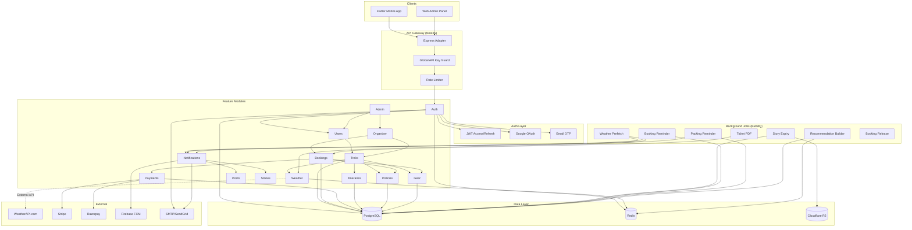

### Module Dependency Graph

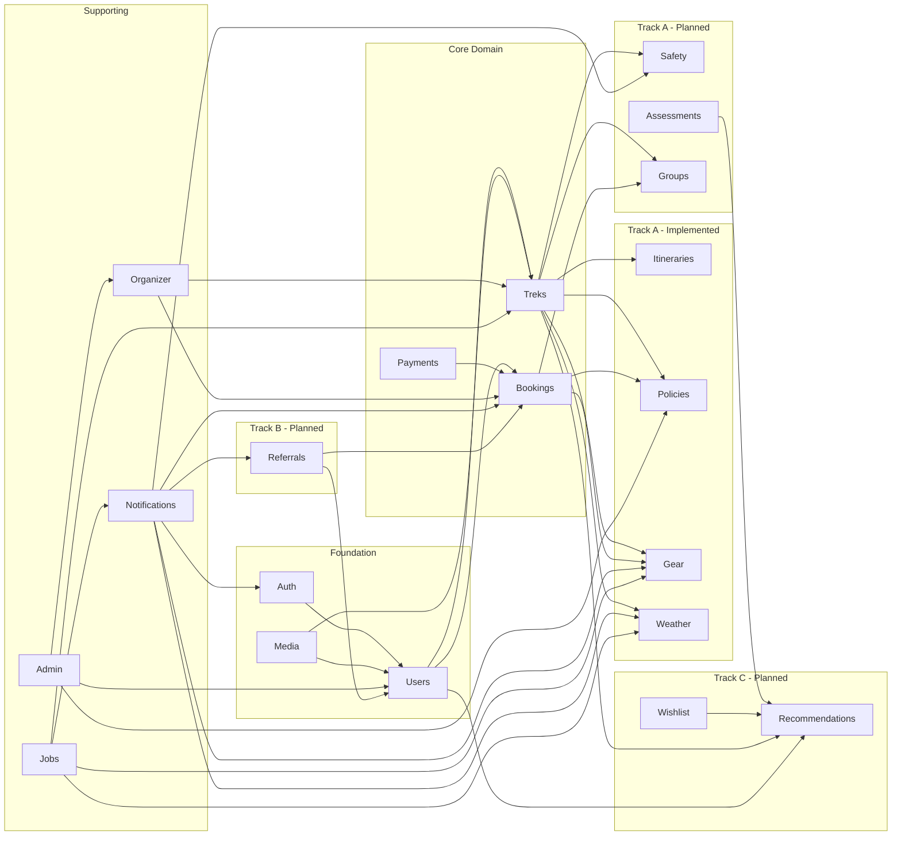

---

### 1. High-Level Architecture

- **Entry point**: NestJS (Node 22 LTS) running on Express adapter, packaged in Docker.
- **Auth & Identity**: Native JWT auth with access/refresh tokens; Google OAuth via Passport strategy.
- **Persistence**: PostgreSQL (primary relational store) with TypeORM migrations; Redis for caching, queues, and rate-limiting.
- **File Storage**: Cloudflare R2 (S3-compatible) for media assets served via CDN; signed URLs for uploads/downloads.
- **Notifications**: Firebase Admin SDK for FCM push (device tokens tracked in DB); BullMQ workers in the same codebase.
- **Background jobs**: Story expiry, notification fan-out, data cleanup handled via BullMQ + Redis.
- **Observability**: Pino logging, OpenTelemetry export (optional), Prometheus metrics, centralized structured logs.
- **Security**: Helmet, CORS, rate limiting, request validation (class-validator), secrets via dotenv + schema validation.
- **Deployment**: Container orchestrated by Kubernetes (or ECS). CI/CD runs lint, tests, and migrations before release.

---

### 2. Project Structure (Monorepo Friendly)

```
apps/
  api/
    src/
      main.ts
      app.module.ts
      config/
        configuration.ts
        validation.ts
      common/
        decorators/
        filters/
        guards/
        interceptors/
        pagination/
        types/
      modules/
        auth/
          auth.module.ts
          auth.controller.ts
          auth.service.ts
          strategies/
          guards/
          dtos/
        users/
          users.module.ts
          users.controller.ts
          users.service.ts
          dtos/
          entities/
        treks/
          treks.module.ts
          treks.controller.ts
          treks.service.ts
          dtos/
          entities/
        posts/
        stories/
        friendships/
        bookmarks/
        notifications/
        leaderboard/
        organizer/
        media/
      jobs/
        processors/
        queues.ts
    test/
      e2e/
config/
  ormconfig.ts
  redis.config.ts
docker/
  Dockerfile
  docker-compose.dev.yml
scripts/
  migrate.ts
  seed.ts
package.json
tsconfig*.json
```

> **Tip:** Place reusable Types (DTOs, enums, constants) in `libs/` if you adopt a monorepo approach with Nx or similar tooling.

---

### 3. Core Modules & Responsibilities

| Module                | Responsibility Highlights                                                                      |
| --------------------- | ---------------------------------------------------------------------------------------------- |
| `AuthModule`          | User registration, login, refresh tokens, password resets, Google OAuth.                       |
| `UsersModule`         | Profile CRUD, onboarding answers, stats, device tokens.                                        |
| `FriendshipsModule`   | Friend request lifecycle, accepted friendships, blocking (optional).                           |
| `TreksModule`         | Trek CRUD, filtering/search, reviews, bookmarking.                                             |
| `PostsModule`         | Feed posts, image attachments, likes, comments.                                                |
| `StoriesModule`       | Short-lived media, expiry jobs, view tracking (optional).                                      |
| `BookmarksModule`     | Manage per-user trek bookmarks.                                                                |
| `NotificationsModule` | Device token registration, push message orchestration.                                         |
| `LeaderboardModule`   | Aggregate friend leaderboard, optional global ranking.                                         |
| `OrganizerModule`     | Organizer application intake, dashboard, trek/booking management, analytics, revenue tracking. |
| `MediaModule`         | Presigned upload/download URLs for R2, metadata persistence.                                   |
| `AdminModule`         | Admin dashboards, moderation tools, approvals, analytics.                                      |
| `ItinerariesModule`   | Trek day-by-day itinerary management with embedded rich-text day plans.                        |
| `PoliciesModule`      | Cancellation rules, trek-specific policies, booking policy snapshots, refund timeline engine.  |
| `GearModule`          | Gear item catalog, trek-gear associations, user packing lists with per-trek check status.      |
| `WeatherModule`       | Live + forecast weather via WeatherAPI.com, 3-tier Redis cache, severe weather alert triggers. |
| `SafetyModule`        | Trek safety guidelines, emergency contacts, check-in/out system with delayed-job escalation.    |
| `AssessmentsModule`   | 8–12 question fitness quiz, scoring algorithm, difficulty bracket classification.              |
| `GroupsModule`        | Group bookings: lead booker, invites, share codes, single payment for all members.             |
| `ReferralsModule`     | Unique referral codes, tiered rewards, referral leaderboard.                                   |
| `WishlistModule`      | Personal trek collections with notes/priority, replaces Bookmarks module.                      |
| `RecommendationsModule` | Personalized trek suggestions via weighted scoring engine with cold-start strategy.         |
| `ConfigModule`        | Centralized configuration + validation of environment variables.                               |
| `HealthModule`        | Readiness/liveness probes, version info.                                                       |

---

### 4. Environment & Configuration

```env
NODE_ENV=production
PORT=4000
APP_URL=https://api.offbeatpravasi.com
FRONTEND_URL=https://app.offbeatpravasi.com

POSTGRES_HOST=
POSTGRES_PORT=5432
POSTGRES_DB=offbeat
POSTGRES_USER=
POSTGRES_PASSWORD=

REDIS_HOST=
REDIS_PORT=6379
REDIS_PASSWORD=

JWT_ACCESS_SECRET=
JWT_REFRESH_SECRET=
JWT_ACCESS_TTL=15m
JWT_REFRESH_TTL=30d

GOOGLE_CLIENT_ID=
GOOGLE_CLIENT_SECRET=

FIREBASE_SERVICE_ACCOUNT_JSON=

R2_ACCOUNT_ID=
R2_ACCESS_KEY_ID=
R2_SECRET_ACCESS_KEY=
R2_BUCKET_PROFILE=offbeat-profile
R2_BUCKET_POSTS=offbeat-posts
R2_BUCKET_TREKS=offbeat-treks
R2_PUBLIC_BASE_URL=https://cdn.offbeatpravasi.com

ADMIN_EMAILS=admin1@example.com,admin2@example.com
# Comma-separated Argon2 hashes aligned with ADMIN_EMAILS (max 2 entries)
ADMIN_PASSWORD_HASHES=$argon2id$v=19$m=65536,t=3,p=4$...
GLOBAL_API_KEY=
API_KEY_HEADER=x-api-key

EMAIL_FROM=hello@offbeatpravasi.com
SMTP_HOST=
SMTP_PORT=587
SMTP_USER=
SMTP_PASSWORD=

STRIPE_SECRET_KEY=
STRIPE_PUBLISHABLE_KEY=
STRIPE_WEBHOOK_SECRET=
RAZORPAY_KEY_ID=
RAZORPAY_KEY_SECRET=
RAZORPAY_WEBHOOK_SECRET=

OTP_EXPIRY_MINUTES=10
OTP_LENGTH=6
OTP_MAX_ATTEMPTS=5

# Weather API
WEATHER_API_KEY=
WEATHER_API_BASE_URL=https://api.weatherapi.com/v1
WEATHER_API_RATE_LIMIT_PER_DAY=1000
WEATHER_CIRCUIT_BREAKER_THRESHOLD=3
WEATHER_CIRCUIT_BREAKER_DURATION_MS=3600000

# SMS (for safety module emergency escalation fallback)
SMS_PROVIDER=twilio
TWILIO_ACCOUNT_SID=
TWILIO_AUTH_TOKEN=
TWILIO_PHONE_NUMBER=
```

Use a configuration factory + Joi (or class-validator) schema to assert presence/types at boot.

---

### 5. TypeORM Entities (Representative Subset)

#### `users.entity.ts`

```ts
@Entity({ name: 'users' })
@Unique(['email'])
export class User {
  @PrimaryGeneratedColumn('uuid')
  id: string;

  @Column({ length: 120 })
  email: string;

  @Column({ select: false, nullable: true })
  passwordHash?: string;

  @Column({ length: 80, nullable: true })
  username?: string;

  @Column({ length: 120, nullable: true })
  fullName?: string;

  @Column({ type: 'date', nullable: true })
  dateOfBirth?: Date;

  @Column({ type: 'enum', enum: AuthProvider, default: AuthProvider.EMAIL })
  authProvider: AuthProvider;

  @Column({ nullable: true })
  gender?: string;

  @Column({ nullable: true })
  phone?: string;

  @Column({ nullable: true })
  location?: string;

  @Column({ nullable: true })
  profileImageUrl?: string;

  @Column({ nullable: true })
  bannerImageUrl?: string;

  @Column({ type: 'boolean', default: false })
  isOrganizer: boolean;

  @Column({
    type: 'enum',
    enum: OrganizerStatus,
    default: OrganizerStatus.NONE,
  })
  organizerStatus: OrganizerStatus;

  @Column({ type: 'boolean', default: false })
  isAdmin: boolean;

  @Column({ type: 'float', default: 0 })
  userPoints: number;

  @Column({ type: 'int', default: 0 })
  userDistanceTravelled: number;

  @Column({ type: 'boolean', default: false })
  emailVerified: boolean;

  @Column({ type: 'timestamptz', nullable: true })
  emailVerifiedAt?: Date;

  @Column({ type: 'timestamptz', default: () => 'CURRENT_TIMESTAMP' })
  createdAt: Date;

  @Column({ type: 'timestamptz', default: () => 'CURRENT_TIMESTAMP' })
  updatedAt: Date;
}
```

#### `treks.entity.ts`

```ts
@Entity({ name: "treks" })
export class Trek {
  @PrimaryGeneratedColumn("uuid")
  id: string;

  @ManyToOne(() => User, { eager: true })
  organizer: User;

  @Column({ length: 160 })
  name: string;

  @Column({ length: 160 })
  location: string;

  @Column({ length: 120 })
  state: string;

  @Column({ type: "timestamp" })
  startDate: Date;

  @Column({ type: "text" })
  overview: string;

  @Column({ type: "simple-array" })
  imageUrls: string[];

  @Column({ type: "float", default: 0 })
  rating: number;

  @Column({ type: "int", default: 0 })
  reviewsCount: number;

  @Column({ type: "int" })
  altitudeMeters: number;

  @Column({ type: "enum", enum: TrekDifficulty })
  difficulty: TrekDifficulty;

  @Column({ type: "varchar" })
  durationDays: string;

  @Column({ type: "float" })
  distanceKm: number;

  @Column({ type: "float" })
  costInr: number;

  @Column({ type: "jsonb" })
  itineraryMarkdown: Record<string, unknown>;

  @Column({ type: "text", nullable: true })
  recommendedGearMarkdown?: string;

  @Column({ type: "text", nullable: true })
  recommendedEssentialsMarkdown?: string;

  @Column({ type: "float", default: 0 })
  trekPoints: number;

  @Column({ type: "int", nullable: true })
  maxParticipants?: number; // null = unlimited

  @Column({ type: "int", default: 0 })
  currentParticipants: number; // calculated from confirmed bookings

  @Column({ type: "enum", enum: TrekStatus, default: TrekStatus.DRAFT })
  status: TrekStatus;

  @Column({ type: "boolean", default: false })
  isPublished: boolean; // only published treks appear in public listings

  @Column({ type: "decimal", precision: 10, scale: 8, nullable: true })
  latitude?: number; // for geolocation search

  @Column({ type: "decimal", precision: 11, scale: 8, nullable: true })
  longitude?: number; // for geolocation search

  @Column({ type: "timestamptz", default: () => "CURRENT_TIMESTAMP" })
  createdAt: Date;

  @Column({ type: "timestamptz", default: () => "CURRENT_TIMESTAMP" })
  updatedAt: Date;

  @Column({ type: "timestamptz", nullable: true })
  deletedAt?: Date; // soft delete

  @OneToMany(() => TrekReview, (review) => review.trek)
  reviews: TrekReview[];

  @OneToMany(() => Booking, (booking) => booking.trek)
  bookings: Booking[];

  // Indexes for performance
  @Index()
  @Index(["state", "difficulty"])
  @Index(["startDate"])
  @Index(["status", "isPublished"])
  @Index(["latitude", "longitude"]) // for geospatial queries
}
```

#### `posts.entity.ts`, `stories.entity.ts`, `friend_requests.entity.ts`, etc.

Define per feature with relations to `User`. Use `@Index()` decorators on frequent filters (e.g., `friend_requests` status, `stories` expiration).

**Important Entity Enhancements**:

1. **Soft Deletes**: Add `deletedAt?: Date` column to critical entities (`users`, `treks`, `posts`) for data retention and audit trails. Use TypeORM's `@DeleteDateColumn()` decorator.

2. **Audit Fields**: Consider adding `createdBy`, `updatedBy` (user references) for admin actions.

3. **Database Indexes**: Add indexes on:
   - `users.email` (unique, already handled by `@Unique`)
   - `users.isAdmin`, `users.organizerStatus`
   - `treks.state`, `treks.difficulty`, `treks.startDate`, `treks.status`
   - `bookings.userId`, `bookings.trekId`, `bookings.status`
   - `posts.userId`, `posts.uploadTimestamp`
   - `friend_requests.receiverId`, `friend_requests.status`
   - Full-text search indexes on `treks.name`, `treks.location`, `posts.caption`

4. **Constraints**:
   - Foreign keys with `ON DELETE CASCADE` or `ON DELETE SET NULL` as appropriate
   - Check constraints: `maxParticipants > 0`, `costInr >= 0`, `rating >= 0 AND rating <= 5`

---

#### `itinerary_days.entity.ts`

```ts
@Entity({ name: 'itinerary_days' })
export class ItineraryDay {
  @PrimaryGeneratedColumn('uuid')
  id: string;

  @ManyToOne(() => Trek, (trek) => trek.itineraryDays, { onDelete: 'CASCADE' })
  trek: Trek;

  @Column({ type: 'int' })
  dayNumber: number; // 1-based

  @Column({ length: 200 })
  title: string;

  @Column({ type: 'text', nullable: true })
  description?: string;

  @Column({ type: 'jsonb', nullable: true })
  activities?: string[];

  @Column({ type: 'jsonb', nullable: true })
  meals?: { breakfast?: string; lunch?: string; dinner?: string };

  @Column({ type: 'jsonb', nullable: true })
  accommodation?: string;

  @Column({ type: 'float', nullable: true })
  altitudeMeters?: number;

  @Column({ type: 'float', nullable: true })
  distanceKm?: number;

  @Column({ length: 50, nullable: true })
  difficulty?: string;

  @Column({ type: 'timestamptz', default: () => 'CURRENT_TIMESTAMP' })
  createdAt: Date;

  @Column({ type: 'timestamptz', nullable: true, onUpdate: 'CURRENT_TIMESTAMP' })
  updatedAt?: Date;
}
```

#### `cancellation_policies.entity.ts`

```ts
@Entity({ name: 'cancellation_policies' })
export class CancellationPolicy {
  @PrimaryGeneratedColumn('uuid')
  id: string;

  @Column({ length: 120 })
  name: string; // e.g. "Standard", "Flexible", "Strict"

  @Column({ type: 'text', nullable: true })
  description?: string;

  @Column({ type: 'boolean', default: true })
  isActive: boolean;

  @OneToMany(() => CancellationTier, (tier) => tier.policy, { cascade: true })
  tiers: CancellationTier[];

  @Column({ type: 'timestamptz', default: () => 'CURRENT_TIMESTAMP' })
  createdAt: Date;
}

@Entity({ name: 'cancellation_tiers' })
export class CancellationTier {
  @PrimaryGeneratedColumn('uuid')
  id: string;

  @ManyToOne(() => CancellationPolicy, (policy) => policy.tiers, { onDelete: 'CASCADE' })
  policy: CancellationPolicy;

  @Column({ type: 'int' })
  daysBeforeStart: number; // >= this many days before trek start

  @Column({ type: 'float' })
  refundPercentage: number; // 0–100

  @Column({ type: 'timestamptz', default: () => 'CURRENT_TIMESTAMP' })
  createdAt: Date;
}

@Entity({ name: 'trek_policies' })
export class TrekPolicy {
  @PrimaryGeneratedColumn('uuid')
  id: string;

  @OneToOne(() => Trek, { onDelete: 'CASCADE' })
  @JoinColumn()
  trek: Trek;

  @ManyToOne(() => CancellationPolicy)
  cancellationPolicy: CancellationPolicy;

  @Column({ type: 'int', default: 0 })
  maxParticipants: number;

  @Column({ type: 'int', default: 0 })
  minParticipants: number;

  @Column({ type: 'jsonb', nullable: true })
  requirements?: string[];

  @Column({ type: 'jsonb', nullable: true })
  included?: string[];

  @Column({ type: 'jsonb', nullable: true })
  excluded?: string[];

  @Column({ type: 'timestamptz', default: () => 'CURRENT_TIMESTAMP' })
  createdAt: Date;
}

@Entity({ name: 'booking_policy_snapshots' })
export class BookingPolicySnapshot {
  @PrimaryGeneratedColumn('uuid')
  id: string;

  @OneToOne(() => Booking, { onDelete: 'CASCADE' })
  @JoinColumn()
  booking: Booking;

  @Column({ type: 'jsonb' })
  policySnapshot: {
    policyName: string;
    tiers: Array<{ daysBeforeStart: number; refundPercentage: number }>;
  };

  @Column({ type: 'timestamptz', default: () => 'CURRENT_TIMESTAMP' })
  createdAt: Date;
}
```

#### `gear_items.entity.ts`

```ts
@Entity({ name: 'gear_items' })
export class GearItem {
  @PrimaryGeneratedColumn('uuid')
  id: string;

  @Column({ length: 200 })
  name: string;

  @Column({ type: 'text', nullable: true })
  description?: string;

  @Column({ length: 100, nullable: true })
  category?: string; // e.g. "Clothing", "Footwear", "Equipment"

  @Column({ type: 'boolean', default: false })
  isEssential: boolean;

  @Column({ type: 'jsonb', nullable: true })
  imageUrls?: string[];

  @Column({ type: 'timestamptz', default: () => 'CURRENT_TIMESTAMP' })
  createdAt: Date;
}

@Entity({ name: 'trek_gear_items' })
export class TrekGearItem {
  @PrimaryGeneratedColumn('uuid')
  id: string;

  @ManyToOne(() => Trek, { onDelete: 'CASCADE' })
  trek: Trek;

  @ManyToOne(() => GearItem, { onDelete: 'CASCADE' })
  gearItem: GearItem;

  @Column({ type: 'boolean', default: false })
  isRecommended: boolean;

  @Column({ type: 'int', nullable: true })
  quantity?: number;

  @Column({ type: 'timestamptz', default: () => 'CURRENT_TIMESTAMP' })
  createdAt: Date;
}

@Entity({ name: 'user_packing_list_items' })
export class UserPackingListItem {
  @PrimaryGeneratedColumn('uuid')
  id: string;

  @ManyToOne(() => User, { onDelete: 'CASCADE' })
  user: User;

  @ManyToOne(() => Trek, { onDelete: 'CASCADE' })
  trek: Trek;

  @ManyToOne(() => GearItem, { nullable: true, onDelete: 'SET NULL' })
  gearItem?: GearItem;

  @Column({ length: 200 })
  itemName: string;

  @Column({ type: 'boolean', default: false })
  isPacked: boolean;

  @Column({ type: 'int', default: 1 })
  quantity: number;

  @Column({ length: 100, nullable: true })
  category?: string;

  @Column({ type: 'timestamptz', default: () => 'CURRENT_TIMESTAMP' })
  createdAt: Date;

  @Column({ type: 'timestamptz', nullable: true, onUpdate: 'CURRENT_TIMESTAMP' })
  updatedAt?: Date;
}
```

#### `trek_safety_info.entity.ts`

```ts
@Entity({ name: 'trek_safety_info' })
export class TrekSafetyInfo {
  @PrimaryGeneratedColumn('uuid')
  id: string;

  @OneToOne(() => Trek, { onDelete: 'CASCADE' })
  @JoinColumn()
  trek: Trek;

  @Column({ type: 'text', nullable: true })
  terrainRisks?: string;

  @Column({ type: 'text', nullable: true })
  altitudeWarnings?: string;

  @Column({ type: 'text', nullable: true })
  wildlifeAdvisories?: string;

  @Column({ type: 'text', nullable: true })
  generalGuidelines?: string;

  @Column({ length: 32, nullable: true })
  baseCampContact?: string;

  @Column({ length: 32, nullable: true })
  localRescueContact?: string;

  @Column({ length: 255, nullable: true })
  nearestHospital?: string;

  @Column({ type: 'timestamptz', default: () => 'CURRENT_TIMESTAMP' })
  createdAt: Date;

  @Column({ type: 'timestamptz', nullable: true, onUpdate: 'CURRENT_TIMESTAMP' })
  updatedAt?: Date;
}

@Entity({ name: 'user_emergency_contacts' })
export class UserEmergencyContact {
  @PrimaryGeneratedColumn('uuid')
  id: string;

  @ManyToOne(() => User, { onDelete: 'CASCADE' })
  user: User;

  @Column({ length: 120 })
  name: string;

  @Column({ length: 20 })
  phone: string;

  @Column({ length: 40 })
  relationship: string;

  @Column({ type: 'boolean', default: false })
  isPrimary: boolean;

  @Column({ type: 'timestamptz', default: () => 'CURRENT_TIMESTAMP' })
  createdAt: Date;
}

@Entity({ name: 'trek_check_ins' })
export class TrekCheckIn {
  @PrimaryGeneratedColumn('uuid')
  id: string;

  @ManyToOne(() => Booking, { onDelete: 'CASCADE' })
  booking: Booking;

  @ManyToOne(() => User, { onDelete: 'CASCADE' })
  user: User;

  @Column({ type: 'timestamptz' })
  checkedInAt: Date;

  @Column({ type: 'timestamptz' })
  expectedCheckOutAt: Date;

  @Column({ type: 'timestamptz', nullable: true })
  checkedOutAt?: Date;

  @Column({ type: 'varchar', length: 16, default: 'ACTIVE' })
  status: string; // ACTIVE | COMPLETED | ESCALATED | RESOLVED

  @Column({ type: 'timestamptz', nullable: true })
  escalatedAt?: Date;

  @Column({ type: 'timestamptz', nullable: true })
  resolvedAt?: Date;

  @Column({ type: 'timestamptz', default: () => 'CURRENT_TIMESTAMP' })
  createdAt: Date;

  @Column({ type: 'timestamptz', nullable: true, onUpdate: 'CURRENT_TIMESTAMP' })
  updatedAt?: Date;
}
```

#### `fitness_assessments.entity.ts`

```ts
@Entity({ name: 'fitness_assessments' })
export class FitnessAssessment {
  @PrimaryGeneratedColumn('uuid')
  id: string;

  @ManyToOne(() => User, { onDelete: 'CASCADE' })
  user: User;

  @Column({ type: 'int' })
  totalScore: number; // 0–100

  @Column({ length: 16 })
  difficultyBracket: string; // EASY | MODERATE | DIFFICULT | EXTREME

  @Column({ type: 'jsonb' })
  answers: Record<string, unknown>;

  @Column({ type: 'timestamptz' })
  completedAt: Date;

  @Column({ type: 'timestamptz', default: () => 'CURRENT_TIMESTAMP' })
  createdAt: Date;
}
```

#### `trek_groups.entity.ts`

```ts
@Entity({ name: 'trek_groups' })
export class TrekGroup {
  @PrimaryGeneratedColumn('uuid')
  id: string;

  @ManyToOne(() => Trek)
  trek: Trek;

  @ManyToOne(() => User)
  leadUser: User;

  @Column({ length: 120 })
  name: string;

  @Column({ type: 'int' })
  maxSize: number;

  @Column({ type: 'timestamptz' })
  expiresAt: Date;

  @Column({ length: 16, default: 'OPEN' })
  status: string; // OPEN | BOOKED | EXPIRED | CANCELLED

  @Column({ length: 12, unique: true })
  shareCode: string;

  @OneToMany(() => GroupMember, (m) => m.group)
  members: GroupMember[];

  @Column({ type: 'timestamptz', default: () => 'CURRENT_TIMESTAMP' })
  createdAt: Date;

  @Column({ type: 'timestamptz', nullable: true, onUpdate: 'CURRENT_TIMESTAMP' })
  updatedAt?: Date;
}

@Entity({ name: 'group_members' })
export class GroupMember {
  @PrimaryGeneratedColumn('uuid')
  id: string;

  @ManyToOne(() => TrekGroup, (g) => g.members, { onDelete: 'CASCADE' })
  group: TrekGroup;

  @ManyToOne(() => User, { nullable: true, onDelete: 'SET NULL' })
  user?: User;

  @Column({ length: 120, nullable: true })
  email?: string;

  @Column({ length: 16 })
  status: string; // INVITED | JOINED | DECLINED

  @Column({ length: 80, nullable: true })
  fullName?: string;

  @Column({ length: 20, nullable: true })
  phone?: string;

  @Column({ type: 'jsonb', nullable: true })
  emergencyContact?: { name: string; phone: string; relationship: string };

  @Column({ type: 'text', nullable: true })
  medicalConditions?: string;

  @Column({ type: 'timestamptz', nullable: true })
  joinedAt?: Date;

  @Column({ type: 'timestamptz', default: () => 'CURRENT_TIMESTAMP' })
  createdAt: Date;
}
```

#### `referral_codes.entity.ts`

```ts
@Entity({ name: 'referral_codes' })
export class ReferralCode {
  @PrimaryGeneratedColumn('uuid')
  id: string;

  @OneToOne(() => User, { onDelete: 'CASCADE' })
  @JoinColumn()
  user: User;

  @Column({ length: 20, unique: true })
  code: string;

  @Column({ length: 16, default: 'BASE' })
  tier: string; // BASE | SILVER | GOLD

  @Column({ type: 'int', default: 0 })
  totalReferrals: number;

  @Column({ type: 'int', default: 0 })
  successfulReferrals: number;

  @Column({ type: 'int', default: 0 })
  totalEarnedInr: number;

  @Column({ type: 'timestamptz', default: () => 'CURRENT_TIMESTAMP' })
  createdAt: Date;
}

@Entity({ name: 'referrals' })
export class Referral {
  @PrimaryGeneratedColumn('uuid')
  id: string;

  @ManyToOne(() => ReferralCode)
  referrerCode: ReferralCode;

  @ManyToOne(() => User, { nullable: true })
  refereeUser?: User;

  @Column({ length: 120 })
  refereeEmail: string;

  @Column({ length: 16 })
  status: string; // PENDING | BOOKED | COMPLETED | REWARDED

  @Column({ length: 16 })
  rewardType: string; // COUPON | POINTS | BOTH

  @Column({ type: 'int' })
  rewardValueInr: number;

  @Column({ type: 'timestamptz', nullable: true })
  rewardDeliveredAt?: Date;

  @Column({ type: 'timestamptz', default: () => 'CURRENT_TIMESTAMP' })
  createdAt: Date;
}

@Entity({ name: 'referral_tier_config' })
export class ReferralTierConfig {
  @PrimaryGeneratedColumn('uuid')
  id: string;

  @Column({ length: 16, unique: true })
  tier: string; // BASE | SILVER | GOLD

  @Column({ type: 'int' })
  minSuccessfulReferrals: number;

  @Column({ type: 'int' })
  rewardPerReferralInr: number;

  @Column({ type: 'int' })
  refereeDiscountInr: number;
}
```

#### `wishlist_collections.entity.ts`

```ts
@Entity({ name: 'wishlist_collections' })
export class WishlistCollection {
  @PrimaryGeneratedColumn('uuid')
  id: string;

  @ManyToOne(() => User, { onDelete: 'CASCADE' })
  user: User;

  @Column({ length: 120 })
  name: string;

  @Column({ length: 512, nullable: true })
  description?: string;

  @Column({ type: 'int', default: 0 })
  sortOrder: number;

  @OneToMany(() => WishlistItem, (i) => i.collection)
  items: WishlistItem[];

  @Column({ type: 'timestamptz', default: () => 'CURRENT_TIMESTAMP' })
  createdAt: Date;

  @Column({ type: 'timestamptz', nullable: true, onUpdate: 'CURRENT_TIMESTAMP' })
  updatedAt?: Date;
}

@Entity({ name: 'wishlist_items' })
export class WishlistItem {
  @PrimaryGeneratedColumn('uuid')
  id: string;

  @ManyToOne(() => WishlistCollection, (c) => c.items, { onDelete: 'CASCADE' })
  collection: WishlistCollection;

  @ManyToOne(() => Trek, { onDelete: 'CASCADE' })
  trek: Trek;

  @Column({ length: 512, nullable: true })
  notes?: string;

  @Column({ type: 'int', default: 0 })
  priority: number; // 0=normal, 1=high, 2=top

  @Column({ type: 'int', default: 0 })
  sortOrder: number;

  @Column({ type: 'timestamptz', default: () => 'CURRENT_TIMESTAMP' })
  addedAt: Date;
}

@Entity({ name: 'user_recommendation_preferences' })
export class UserRecommendationPreference {
  @PrimaryGeneratedColumn('uuid')
  id: string;

  @OneToOne(() => User, { onDelete: 'CASCADE' })
  @JoinColumn()
  user: User;

  @Column({ type: 'varchar', array: true, length: 16, nullable: true })
  preferredDifficulty?: string[];

  @Column({ type: 'varchar', array: true, length: 80, nullable: true })
  preferredStates?: string[];

  @Column({ type: 'int', nullable: true })
  maxBudget?: number;

  @Column({ type: 'jsonb', nullable: true })
  interests?: string[];

  @Column({ type: 'timestamptz', nullable: true, onUpdate: 'CURRENT_TIMESTAMP' })
  updatedAt?: Date;
}

@Entity({ name: 'recommendation_results' })
export class RecommendationResult {
  @PrimaryGeneratedColumn('uuid')
  id: string;

  @ManyToOne(() => User, { onDelete: 'CASCADE' })
  user: User;

  @ManyToOne(() => Trek)
  trek: Trek;

  @Column({ type: 'float' })
  score: number; // 0.0–1.0

  @Column({ length: 32 })
  reason: string;

  @Column({ type: 'timestamptz' })
  expiresAt: Date;

  @Column({ type: 'timestamptz', default: () => 'CURRENT_TIMESTAMP' })
  createdAt: Date;
}

@Entity({ name: 'recommendation_events' })
export class RecommendationEvent {
  @PrimaryGeneratedColumn('uuid')
  id: string;

  @ManyToOne(() => User, { onDelete: 'CASCADE' })
  user: User;

  @ManyToOne(() => RecommendationResult, { nullable: true })
  recommendationResult?: RecommendationResult;

  @ManyToOne(() => Trek)
  trek: Trek;

  @Column({ length: 32 })
  eventType: string; // SERVED | CLICKED | BOOKED

  @Column({ type: 'float', nullable: true })
  score?: number;

  @Column({ length: 32, nullable: true })
  reason?: string;

  @Column({ type: 'timestamptz', default: () => 'CURRENT_TIMESTAMP' })
  createdAt: Date;
}
```

---

### 6. DTOs & Validation (class-validator)

#### Auth

```ts
export class RegisterDto {
  @IsEmail()
  email: string;

  @IsString()
  @MinLength(8)
  password: string;

  @IsOptional()
  @IsString()
  fullName?: string;
}

export class LoginDto {
  @IsEmail()
  email: string;

  @IsString()
  password: string;
}

export class RefreshDto {
  @IsString()
  refreshToken: string;
}

export class SendOtpDto {
  @IsEmail()
  email: string;
}

export class VerifyOtpDto {
  @IsEmail()
  email: string;

  @IsString()
  @Length(6, 6)
  @Matches(/^\d+$/, { message: 'OTP must be 6 digits' })
  otp: string;
}

export class ResendOtpDto {
  @IsEmail()
  email: string;
}
```

#### Users & Onboarding

```ts
export class UpdateProfileDto {
  @IsOptional() @IsString() username?: string;
  @IsOptional() @IsString() fullName?: string;
  @IsOptional() @IsPhoneNumber('IN') phone?: string;
  @IsOptional() @IsString() location?: string;
  @IsOptional() @IsEnum(Gender) gender?: Gender;
  @IsOptional() @IsDateString() dateOfBirth?: string;
  @IsOptional() @IsUrl() profileImageUrl?: string;
  @IsOptional() @IsUrl() bannerImageUrl?: string;
}

export class UpsertOnboardingDto {
  @IsArray()
  @ValidateNested({ each: true })
  @Type(() => OnboardingAnswerDto)
  answers: OnboardingAnswerDto[];
}

export class OnboardingAnswerDto {
  @IsString() questionId: string;
  @IsString() value: string;
}
```

#### Treks

```ts
export class CreateTrekDto {
  @IsString() name: string;
  @IsString() location: string;
  @IsString() state: string;
  @IsDateString() startDate: string;
  @IsString() overview: string;
  @IsArray() @IsUrl(undefined, { each: true }) imageUrls: string[];
  @IsEnum(TrekDifficulty) difficulty: TrekDifficulty;
  @IsString() durationDays: string;
  @IsNumber() altitudeMeters: number;
  @IsNumber() distanceKm: number;
  @IsNumber() costInr: number;
  @IsString() itineraryMarkdown: string;
  @IsOptional() @IsString() recommendedGearMarkdown?: string;
  @IsOptional() @IsString() recommendedEssentialsMarkdown?: string;
}

export class ReviewTrekDto {
  @IsUUID() trekId: string;
  @IsNumber() @Min(1) @Max(5) rating: number;
  @IsString() @MaxLength(2000) comment: string;
}
```

#### Itineraries

```ts
export class CreateItineraryDayDto {
  @IsUUID() trekId: string;
  @IsInt() @Min(1) dayNumber: number;
  @IsString() @MaxLength(200) title: string;
  @IsOptional() @IsString() description?: string;
  @IsOptional() @IsArray() @IsString({ each: true }) activities?: string[];
  @IsOptional() @IsObject() meals?: Record<string, string>;
  @IsOptional() @IsString() accommodation?: string;
  @IsOptional() @IsNumber() altitudeMeters?: number;
  @IsOptional() @IsNumber() distanceKm?: number;
  @IsOptional() @IsString() difficulty?: string;
}

export class UpdateItineraryDayDto extends PartialType(CreateItineraryDayDto) {}

export class ReorderItineraryDayDto {
  @IsUUID() dayId: string;
  @IsInt() @Min(1) newDayNumber: number;
}
```

#### Policies

```ts
export class CreateCancellationPolicyDto {
  @IsString() @MaxLength(120) name: string;
  @IsOptional() @IsString() description?: string;
  @IsArray() @ValidateNested({ each: true }) @Type(() => CancellationTierDto)
  tiers: CancellationTierDto[];
}

export class CancellationTierDto {
  @IsInt() @Min(0) daysBeforeStart: number;
  @IsNumber() @Min(0) @Max(100) refundPercentage: number;
}

export class SetTrekPolicyDto {
  @IsUUID() trekId: string;
  @IsUUID() cancellationPolicyId: string;
  @IsOptional() @IsInt() @Min(0) maxParticipants?: number;
  @IsOptional() @IsInt() @Min(0) minParticipants?: number;
  @IsOptional() @IsArray() @IsString({ each: true }) requirements?: string[];
  @IsOptional() @IsArray() @IsString({ each: true }) included?: string[];
  @IsOptional() @IsArray() @IsString({ each: true }) excluded?: string[];
}

export class CalculateRefundDto {
  @IsUUID() bookingId: string;
  @IsDateString() cancellationDate: string;
}
```

#### Gear

```ts
export class CreateGearItemDto {
  @IsString() @MaxLength(200) name: string;
  @IsOptional() @IsString() description?: string;
  @IsOptional() @IsString() category?: string;
  @IsOptional() @IsBoolean() isEssential?: boolean;
  @IsOptional() @IsArray() @IsUrl(undefined, { each: true }) imageUrls?: string[];
}

export class LinkGearToTrekDto {
  @IsUUID() trekId: string;
  @IsUUID() gearItemId: string;
  @IsOptional() @IsBoolean() isRecommended?: boolean;
  @IsOptional() @IsInt() @Min(1) quantity?: number;
}

export class AddPackingListItemDto {
  @IsUUID() trekId: string;
  @IsOptional() @IsUUID() gearItemId?: string;
  @IsString() @MaxLength(200) itemName: string;
  @IsOptional() @IsInt() @Min(1) quantity?: number;
  @IsOptional() @IsString() category?: string;
}

export class UpdatePackingListItemDto {
  @IsOptional() @IsBoolean() isPacked?: boolean;
  @IsOptional() @IsInt() @Min(1) quantity?: number;
}
```

#### Weather

```ts
export class GetTrekWeatherDto {
  @IsUUID() trekId: string;
  @IsOptional() @IsInt() @Min(1) @Max(10) days?: number; // forecast days
}

export class GetLocationWeatherDto {
  @IsNumber() @Min(-90) @Max(90) latitude: number;
  @IsNumber() @Min(-180) @Max(180) longitude: number;
  @IsOptional() @IsInt() @Min(1) @Max(10) days?: number;
}
```

#### Safety

```ts
export class UpsertSafetyInfoDto {
  @IsOptional() @IsString() terrainRisks?: string;
  @IsOptional() @IsString() altitudeWarnings?: string;
  @IsOptional() @IsString() wildlifeAdvisories?: string;
  @IsOptional() @IsString() generalGuidelines?: string;
  @IsOptional() @IsString() baseCampContact?: string;
  @IsOptional() @IsString() localRescueContact?: string;
  @IsOptional() @IsString() nearestHospital?: string;
}

export class CreateEmergencyContactDto {
  @IsString() name: string;
  @IsPhoneNumber('IN') phone: string;
  @IsString() relationship: string;
  @IsOptional() @IsBoolean() isPrimary?: boolean;
}

export class CheckInDto {
  @IsNumber() @IsOptional() latitude?: number;
  @IsNumber() @IsOptional() longitude?: number;
}

export class CheckOutDto {
  @IsNumber() @IsOptional() latitude?: number;
  @IsNumber() @IsOptional() longitude?: number;
}

export class AcknowledgeSafetyDto {
  @IsUUID() checkInId: string;
}
```

#### Assessments

```ts
export class SubmitAssessmentDto {
  @IsArray()
  @ValidateNested({ each: true })
  @Type(() => AssessmentAnswerDto)
  answers: AssessmentAnswerDto[];
}

export class AssessmentAnswerDto {
  @IsString() questionId: string;
  @IsString() selectedOption: string;
}

export class AssessmentResultDto {
  totalScore: number;
  difficultyBracket: string;
  recommendedDifficultyLabel: string;
  completedAt: Date;
}
```

#### Groups

```ts
export class CreateGroupDto {
  @IsUUID() trekId: string;
  @IsOptional() @IsString() @MaxLength(120) name?: string;
  @IsInt() @Min(2) @Max(50) maxSize: number;
  @IsDateString() expiresAt: string;
}

export class InviteMembersDto {
  @IsArray()
  @ValidateNested({ each: true })
  @Type(() => InviteeDto)
  invites: InviteeDto[];
}

export class InviteeDto {
  @IsOptional() @IsUUID() userId?: string;
  @IsOptional() @IsEmail() email?: string;
}

export class UpdateMemberStatusDto {
  @IsEnum(['JOINED', 'DECLINED']) status: string;
  @IsOptional() @IsString() fullName?: string;
  @IsOptional() @IsPhoneNumber('IN') phone?: string;
  @IsOptional() @IsObject() emergencyContact?: Record<string, string>;
  @IsOptional() @IsString() medicalConditions?: string;
}

export class JoinGroupDto {
  @IsString() shareCode: string;
}
```

#### Referrals

```ts
export class ClaimReferralDto {
  @IsString() code: string;
}

export class ReferralCodeResponseDto {
  code: string;
  shareLink: string;
  tier: string;
  totalReferrals: number;
  successfulReferrals: number;
  totalEarnedInr: number;
}
```

#### Wishlist

```ts
export class CreateCollectionDto {
  @IsString() @MaxLength(120) name: string;
  @IsOptional() @IsString() @MaxLength(512) description?: string;
}

export class AddToCollectionDto {
  @IsUUID() trekId: string;
  @IsOptional() @IsString() notes?: string;
  @IsOptional() @IsInt() @Min(0) @Max(2) priority?: number;
}
```

#### Recommendations

```ts
export class RecommendationPreferenceDto {
  @IsOptional() @IsArray() @IsString({ each: true }) preferredDifficulty?: string[];
  @IsOptional() @IsArray() @IsString({ each: true }) preferredStates?: string[];
  @IsOptional() @IsInt() @Min(0) maxBudget?: number;
  @IsOptional() @IsArray() @IsString({ each: true }) interests?: string[];
}
```

#### Notifications

```ts
export class RegisterDeviceDto {
  @IsString() token: string;
  @IsEnum(DevicePlatform) platform: DevicePlatform;
  @IsOptional() @IsString() appVersion?: string;
}

export class SendNotificationDto {
  @IsUUID() targetUserId: string;
  @IsString() title: string;
  @IsString() body: string;
  @IsOptional() data?: Record<string, string>;
}
```

#### Organizer Endpoints

```ts
export class UpdateTrekStatusDto {
  @IsUUID() trekId: string;
  @IsEnum(TrekStatus) status: TrekStatus;
}

export class OrganizerTrekFiltersDto {
  @IsOptional() @IsEnum(TrekStatus) status?: TrekStatus;
  @IsOptional() @IsBoolean() isPublished?: boolean;
  @IsOptional() @IsDateString() startDateFrom?: string;
  @IsOptional() @IsDateString() startDateTo?: string;
  @IsOptional() @IsString() state?: string;
  @IsOptional() @IsInt() @Min(1) page?: number;
  @IsOptional() @IsInt() @Min(1) @Max(100) limit?: number;
}

export class OrganizerBookingFiltersDto {
  @IsOptional() @IsUUID() trekId?: string;
  @IsOptional() @IsEnum(BookingStatus) status?: BookingStatus;
  @IsOptional() @IsDateString() bookingDateFrom?: string;
  @IsOptional() @IsDateString() bookingDateTo?: string;
  @IsOptional() @IsInt() @Min(1) page?: number;
  @IsOptional() @IsInt() @Min(1) @Max(100) limit?: number;
}

export class OrganizerAnalyticsFiltersDto {
  @IsOptional() @IsDateString() startDate?: string;
  @IsOptional() @IsDateString() endDate?: string;
  @IsOptional() @IsUUID() trekId?: string;
}
```

---

### 7. Enums & Constants

```ts
export enum AuthProvider {
  EMAIL = 'EMAIL',
  GOOGLE = 'GOOGLE',
}

export enum Gender {
  MALE = 'MALE',
  FEMALE = 'FEMALE',
  OTHER = 'OTHER',
  NOT_SPECIFIED = 'NOT_SPECIFIED',
}

export enum TrekDifficulty {
  EASY = 'EASY',
  MODERATE = 'MODERATE',
  DIFFICULT = 'DIFFICULT',
  EXTREME = 'EXTREME',
}

export enum DevicePlatform {
  ANDROID = 'ANDROID',
  IOS = 'IOS',
  WEB = 'WEB',
}

export enum FriendRequestStatus {
  PENDING = 'PENDING',
  ACCEPTED = 'ACCEPTED',
  DECLINED = 'DECLINED',
}

export enum OrganizerStatus {
  NONE = 'NONE',
  PENDING = 'PENDING',
  APPROVED = 'APPROVED',
  REJECTED = 'REJECTED',
}

export enum OrganizerApplicationStatus {
  PENDING = 'PENDING',
  APPROVED = 'APPROVED',
  REJECTED = 'REJECTED',
  NEEDS_MORE_INFO = 'NEEDS_MORE_INFO',
}

export enum TrekStatus {
  DRAFT = 'DRAFT',
  PUBLISHED = 'PUBLISHED',
  CANCELLED = 'CANCELLED',
  COMPLETED = 'COMPLETED',
}

export const TREK_STATES = [
  'Maharashtra',
  'Meghalaya',
  'Karnataka',
  'Tamil Nadu',
  'Kerala',
  'Andhra Pradesh',
  'Telangana',
  'Himachal Pradesh',
  'Uttarakhand',
  'Nagaland',
  'Manipur',
  'Sikkim',
  'West Bengal',
  'Arunachal Pradesh',
] as const;
```

---

### 8. Services & Business Logic – Examples

#### Auth Service

- Hash passwords with `argon2id`.
- **Email Verification Flow**:
  - On registration (`POST /auth/register`): Create user with `emailVerified = false`, generate 6-digit OTP, store in Redis with key `otp:email:{email}` and TTL of 10 minutes, send OTP via email.
  - `POST /auth/email/send-otp`: Generate new OTP for email, store in Redis, send email. Rate limit: max 3 requests per email per 15 minutes.
  - `POST /auth/email/verify-otp`: Validate OTP from Redis, if valid: set `emailVerified = true`, `emailVerifiedAt = now()`, delete OTP from Redis, allow user to proceed with login.
  - `POST /auth/email/resend-otp`: Same as send-otp but with additional validation that user exists and is not already verified.
  - **Login restriction**: Users with `emailVerified = false` cannot login until they verify email. Return `403 Forbidden` with message "Please verify your email to continue".
  - **OTP storage**: Use Redis with key pattern `otp:email:{email}` and value `{ otp: string, attempts: number, createdAt: timestamp }`. Track failed attempts (max 5) before requiring resend.
  - **OTP generation**: Use cryptographically secure random number generator (6 digits, 0-9).
- Issue access + refresh tokens; persist refresh tokens (or hashes) in `user_sessions` table.
- Google login: verify ID token, create user if new with `emailVerified = true` (Google emails are pre-verified), issue standard tokens.
- Revocation: on logout, delete session tokens; maintain device mapping to allow multiple sessions.
- Admin whitelist: on login, mark `isAdmin = true` only when user email matches `ADMIN_EMAILS` env list (max two entries); guard admin routes with a custom `AdminGuard` that checks this flag.
- Admin credentials: for emails listed in `ADMIN_EMAILS`, validate password against Argon2 hashes defined in `ADMIN_PASSWORD_HASHES` (comma-separated, same order). Do not allow admins to change their email/password through the UI; credentials are managed exclusively via environment variables and require deploy to rotate.

#### Treks Service

- Filtering: use query builder + indices for `state`, `difficulty`, `startDate` window.
- Rating aggregation: store total rating sum + count to avoid heavy queries; compute average on read.
- Organizer guard: only users whose `organizerStatus === OrganizerStatus.APPROVED` may create/update treks; enforce with custom guard/resolver that loads user from JWT.

#### Posts & Stories

- Posts: store `imageUrls` from R2; asynchronous job can generate thumbnails (optional).
- Stories: `expiresAt` column; cron job or BullMQ repeating job deletes expired stories + associated media.

#### Notifications

- Save device tokens with TTL; on refresh, update `lastSeenAt`.
- Use queue to decouple push sending from HTTP request (retry/backoff).
- Template payloads stored in code or DB for curated notifications.

---

### 9. Media Handling (Cloudflare R2)

1. Backend endpoint `POST /media/presign` returns signed PUT URL + final asset key.
2. Flutter uploads directly to R2 using signed URL.
3. Client notifies backend with final metadata (`POST /posts` etc.) referencing the key.
4. Serve via CDN using `R2_PUBLIC_BASE_URL/<key>` or signed GETs for private content.
5. Enforce validation: file size limits, MIME white-list (images/video).
6. Leverage lifecycle rules for story/temporary media cleanup.

```ts
const command = new PutObjectCommand({
  Bucket: bucketName,
  Key: objectKey,
  ContentType: mimeType,
  ACL: 'private',
});
const url = await getSignedUrl(s3Client, command, { expiresIn: 900 });
```

---

### 10. API Endpoints Overview

All HTTP requests must include the API key header defined in `API_KEY_HEADER` (default `x-api-key`) with value matching `GLOBAL_API_KEY`.

| Method | Endpoint                        | Description                            | Auth                 |
| ------ | ------------------------------- | -------------------------------------- | -------------------- |
| POST   | `/auth/register`                | Email sign-up                          | Public               |
| POST   | `/auth/login`                   | Email login                            | Public               |
| POST   | `/auth/google`                  | Google OAuth                           | Public               |
| POST   | `/auth/refresh`                 | Refresh token                          | Public               |
| POST   | `/auth/password/reset/request`  | Reset link                             | Public               |
| POST   | `/auth/password/reset/confirm`  | Finalize reset                         | Public               |
| POST   | `/auth/email/send-otp`          | Send email verification OTP            | Public               |
| POST   | `/auth/email/verify-otp`        | Verify email OTP and activate account  | Public               |
| POST   | `/auth/email/resend-otp`        | Resend email verification OTP          | Public               |
| GET    | `/users/me`                     | Current profile                        | Access token         |
| PATCH  | `/users/me`                     | Update profile                         | Access token         |
| POST   | `/users/me/device-tokens`       | Register FCM token                     | Access token         |
| POST   | `/users/me/onboarding`          | Save onboarding answers                | Access token         |
| GET    | `/users/:id`                    | Fetch other user                       | Access token         |
| GET    | `/users/search`                 | Search users by username/name          | Access token         |
| POST   | `/friend-requests`              | Send request                           | Access token         |
| POST   | `/friend-requests/:id/accept`   | Accept                                 | Access token         |
| POST   | `/friend-requests/:id/decline`  | Decline                                | Access token         |
| GET    | `/treks`                        | List/filter treks                      | Optional (paginates) |
| GET    | `/treks/search`                 | Search treks (full-text + filters)     | Optional             |
| GET    | `/treks/nearby`                 | Find treks within radius               | Optional             |
| POST   | `/treks`                        | Create trek                            | Organizer            |
| GET    | `/treks/:id`                    | Trek detail                            | Optional             |
| POST   | `/treks/:id/reviews`            | Add review                             | Access token         |
| POST   | `/treks/:id/bookmark`           | Toggle bookmark                        | Access token         |
| GET    | `/treks/:id/itinerary`          | List itinerary days for trek           | Optional             |
| POST   | `/treks/:id/itinerary`          | Add itinerary day                      | Organizer            |
| PATCH  | `/treks/:id/itinerary/:dayId`   | Update itinerary day                   | Organizer            |
| DELETE | `/treks/:id/itinerary/:dayId`   | Remove itinerary day                   | Organizer            |
| GET    | `/treks/:id/weather`            | Live + forecast weather for trek       | Optional             |
| GET    | `/treks/:id/gear`               | List gear items for trek               | Optional             |
| POST   | `/treks/:id/gear`               | Link gear item to trek                 | Organizer            |
| DELETE | `/treks/:id/gear/:linkId`       | Unlink gear item from trek             | Organizer            |
| GET    | `/itineraries/:id`              | Get single itinerary day detail        | Optional             |
| GET    | `/policies`                     | List cancellation policy templates     | Optional             |
| GET    | `/policies/:id`                 | Get cancellation policy with tiers     | Optional             |
| POST   | `/policies`                     | Create cancellation policy template    | Admin                |
| PATCH  | `/policies/:id`                 | Update cancellation policy             | Admin                |
| DELETE | `/policies/:id`                 | Delete cancellation policy             | Admin                |
| GET    | `/treks/:id/policy`             | Get trek-specific policy               | Optional             |
| PUT    | `/treks/:id/policy`             | Set/update trek-specific policy        | Organizer            |
| GET    | `/bookings/:id/refund-estimate` | Calculate refund based on cancellation | Access token         |
| GET    | `/gear`                         | List all gear items                    | Optional             |
| GET    | `/gear/:id`                     | Get gear item detail                   | Optional             |
| POST   | `/gear`                         | Create gear item                       | Admin                |
| PATCH  | `/gear/:id`                     | Update gear item                       | Admin                |
| DELETE | `/gear/:id`                     | Delete gear item                       | Admin                |
| GET    | `/users/me/packing-list`        | Get my packing list for a trek (query: trekId) | Access token  |
| POST   | `/users/me/packing-list`        | Add item to packing list               | Access token         |
| PATCH  | `/users/me/packing-list/:id`    | Update packing list item (pack status) | Access token         |
| DELETE | `/users/me/packing-list/:id`    | Remove packing list item               | Access token         |
| GET    | `/weather/current`              | Current weather for lat/lng            | Optional             |
| GET    | `/weather/forecast`             | Forecast for lat/lng (query: days)     | Optional             |
| GET    | `/weather/conditions`           | Map condition codes to categories      | Optional             |
| GET    | `/treks/:trekId/safety`         | Get safety info for trek              | Optional             |
| PUT    | `/treks/:trekId/safety`         | Upsert safety info                    | Organizer (own trek) |
| GET    | `/profile/emergency-contacts`   | List user's emergency contacts        | Access token         |
| POST   | `/profile/emergency-contacts`   | Add emergency contact                 | Access token         |
| PATCH  | `/profile/emergency-contacts/:id` | Update emergency contact            | Access token         |
| DELETE | `/profile/emergency-contacts/:id` | Delete emergency contact            | Access token         |
| POST   | `/bookings/:bookingId/check-in` | Check in to trek                      | Auth (booking owner) |
| POST   | `/bookings/:bookingId/check-out`| Check out from trek                   | Auth (booking owner) |
| GET    | `/bookings/:bookingId/check-in-status` | Get check-in status            | Auth (booking owner) |
| POST   | `/check-in/:checkInId/acknowledge` | Acknowledge safe after escalation  | Auth (booking owner) |
| GET    | `/assessments/questions`        | Get quiz questions + options          | Public               |
| POST   | `/assessments/submit`           | Submit quiz answers → score + bracket | Access token         |
| GET    | `/assessments/my-result`        | Get latest assessment result          | Access token         |
| GET    | `/users/:userId/assessment-result` | Get user's public fitness bracket  | Public               |
| POST   | `/groups`                       | Create new trek group                 | Access token         |
| GET    | `/groups/:id`                   | Get group details + members           | Auth (lead/member)   |
| PATCH  | `/groups/:id`                   | Update group name, size, expiry       | Auth (lead)          |
| POST   | `/groups/:id/invite`            | Invite members (email or userId)      | Auth (lead)          |
| POST   | `/groups/join/:shareCode`       | Join group via share code             | Access token         |
| PATCH  | `/groups/:id/members/:memberId/status` | Accept/decline invitation      | Auth (member)        |
| DELETE | `/groups/:id/members/:memberId` | Remove member from group              | Auth (lead)          |
| POST   | `/groups/:id/book`              | Book for all joined members           | Auth (lead)          |
| DELETE | `/groups/:id`                   | Cancel group                          | Auth (lead)          |
| GET    | `/referrals/my-code`            | Get own referral code + stats         | Access token         |
| POST   | `/referrals/generate`           | Generate/fetch referral code          | Access token         |
| GET    | `/referrals/my-referrals`       | List referrals made (paginated)       | Access token         |
| GET    | `/referrals/leaderboard`        | Top referrers                         | Public               |
| GET    | `/referrals/claim/:code`        | Show referral info, prompt sign-up    | Public               |
| GET    | `/wishlist/collections`         | List user's wishlist collections      | Access token         |
| POST   | `/wishlist/collections`         | Create a collection                   | Access token         |
| PATCH  | `/wishlist/collections/:id`     | Rename/reorder collection             | Access token         |
| DELETE | `/wishlist/collections/:id`     | Delete collection + its items         | Access token         |
| GET    | `/wishlist/collections/:id/items` | List items in a collection          | Access token         |
| POST   | `/wishlist/collections/:id/items` | Add trek to collection             | Access token         |
| PATCH  | `/wishlist/items/:id`           | Update notes/priority                 | Access token         |
| DELETE | `/wishlist/items/:id`           | Remove from wishlist                  | Access token         |
| POST   | `/wishlist/quick-add/:trekId`   | One-tap add to default collection     | Access token         |
| GET    | `/wishlist/shared/:shareToken`  | View a shared wishlist                | Public               |
| GET    | `/recommendations`              | Get personalized recommendations (top 10) | Access token      |
| GET    | `/recommendations/refresh`      | Force refresh recommendations         | Access token         |
| GET    | `/treks/:trekId/recommendations`| Similar treks for a specific trek     | Public               |
| PUT    | `/recommendations/preferences`  | Set recommendation preferences        | Access token         |
| GET    | `/posts/feed`                   | Feed                                   | Access token         |
| POST   | `/posts`                        | Create post                            | Access token         |
| POST   | `/posts/:id/like`               | Like/unlike                            | Access token         |
| POST   | `/posts/:id/comments`           | Comment                                | Access token         |
| GET    | `/stories`                      | Stories for friends                    | Access token         |
| POST   | `/stories`                      | Create story                           | Access token         |
| DELETE | `/stories/:id`                  | Delete story                           | Access token         |
| GET    | `/leaderboard/friends`          | Friend leaderboard                     | Access token         |
| GET    | `/bookings`                     | List my bookings                       | Access token         |
| POST   | `/bookings`                     | Create trek booking                    | Access token         |
| GET    | `/bookings/:id`                 | Booking detail                         | Access token         |
| GET    | `/bookings/:id/ticket`          | Download booking ticket (PDF)          | Access token         |
| POST   | `/bookings/verify`              | Verify booking QR code                 | Organizer/Admin      |
| POST   | `/bookings/:id/cancel`          | Cancel booking                         | Access token         |
| POST   | `/payments/checkout`            | Create payment intent                  | Access token         |
| POST   | `/payments/webhook`             | PSP webhook (Stripe/Razorpay)          | Public (verified)    |
| POST   | `/organizer-requests`           | Submit organizer request               | Access token         |
| GET    | `/organizer-requests/me`        | View my organizer application          | Access token         |
| PATCH  | `/organizer-requests/:id`       | Update organizer application (pending) | Access token         |
| GET    | `/organizer/dashboard`          | Organizer dashboard with overview      | Organizer            |
| GET    | `/organizer/treks`              | List my treks with filters             | Organizer            |
| GET    | `/organizer/treks/:id`          | Get my trek detail with stats          | Organizer            |
| PATCH  | `/organizer/treks/:id/status`   | Update trek status (draft/publish)     | Organizer            |
| GET    | `/organizer/treks/:id/bookings` | Get bookings for a specific trek       | Organizer            |
| GET    | `/organizer/treks/:id/reviews`  | Get reviews for a specific trek        | Organizer            |
| GET    | `/organizer/bookings`           | Get all bookings across my treks       | Organizer            |
| GET    | `/organizer/analytics`          | Detailed analytics (revenue, trends)   | Organizer            |
| GET    | `/organizer/revenue`            | Revenue/earnings summary               | Organizer            |
| GET    | `/organizer/participants`       | List participants across all treks     | Organizer            |
| GET    | `/admin/organizer-requests`     | Review organizer requests              | Admin                |
| PATCH  | `/admin/organizer-requests/:id` | Approve/Reject organizer               | Admin                |
| GET    | `/admin/dashboard/metrics`      | Platform KPIs (bookings, users, ARPU)  | Admin                |
| GET    | `/admin/users`                  | List/search users with filters         | Admin                |
| PATCH  | `/admin/users/:id/status`       | Update user flags (suspend/admin)      | Admin                |
| GET    | `/admin/treks/pending`          | Treks awaiting approval                | Admin                |
| PATCH  | `/admin/treks/:id/decision`     | Approve or reject trek publication     | Admin                |
| GET    | `/admin/bookings/report`        | Revenue & attendance reports           | Admin                |
| GET    | `/health`                       | Liveness/readiness                     | Public               |

Paginate lists with cursor-based pagination or limit/offset + metadata DTOs.

---

### 11. Bookings & Payments

#### Booking Domain

Users can book a trek for one or more participants, pay via Stripe or Razorpay, and receive status updates. Cancellations and refunds follow provider policies.

#### Entities

```ts
@Entity({ name: 'bookings' })
export class Booking {
  @PrimaryGeneratedColumn('uuid')
  id: string;

  @ManyToOne(() => User, { eager: true })
  user: User;

  @ManyToOne(() => Trek, { eager: true })
  trek: Trek;

  @Column({ type: 'int' })
  quantity: number; // number of participants

  @Column({ type: 'float' })
  unitPriceInr: number; // snapshot of trek cost

  @Column({ type: 'float' })
  totalAmountInr: number;

  @Column({ type: 'enum', enum: BookingStatus, default: BookingStatus.PENDING })
  status: BookingStatus;

  @Column({ type: 'jsonb', nullable: true })
  participantDetails?: Array<{ name: string; phone?: string; email?: string }>;

  @Column({ type: 'timestamptz', default: () => 'CURRENT_TIMESTAMP' })
  createdAt: Date;
}

@Entity({ name: 'payments' })
export class Payment {
  @PrimaryGeneratedColumn('uuid')
  id: string;

  @ManyToOne(() => Booking, { eager: true })
  booking: Booking;

  @Column({ type: 'enum', enum: PaymentProvider })
  provider: PaymentProvider; // STRIPE | RAZORPAY

  @Column({ length: 120 })
  providerPaymentId: string; // stripe payment_intent id | razorpay_payment_id

  @Column({ type: 'enum', enum: PaymentStatus, default: PaymentStatus.CREATED })
  status: PaymentStatus;

  @Column({ type: 'float' })
  amountInr: number;

  @Column({ type: 'jsonb', nullable: true })
  metadata?: Record<string, unknown>;

  @Column({ type: 'timestamptz', default: () => 'CURRENT_TIMESTAMP' })
  createdAt: Date;
}
```

#### Enums

```ts
export enum BookingStatus {
  PENDING = 'PENDING',
  CONFIRMED = 'CONFIRMED',
  CANCELLED = 'CANCELLED',
  FAILED = 'FAILED',
}

export enum PaymentStatus {
  CREATED = 'CREATED',
  REQUIRES_ACTION = 'REQUIRES_ACTION',
  SUCCEEDED = 'SUCCEEDED',
  FAILED = 'FAILED',
  REFUNDED = 'REFUNDED',
}

export enum PaymentProvider {
  STRIPE = 'STRIPE',
  RAZORPAY = 'RAZORPAY',
}
```

#### DTOs

```ts
export class CreateBookingDto {
  @IsUUID() trekId: string;
  @IsInt() @Min(1) quantity: number;
  @IsOptional() @IsArray() participantDetails?: Array<{
    name: string;
    phone?: string;
    email?: string;
  }>;
}

export class CreateCheckoutDto {
  @IsUUID() bookingId: string;
  @IsEnum(PaymentProvider) provider: PaymentProvider;
}
```

#### Controller Flow

1. `POST /bookings`: validate trek availability, snapshot current `costInr` into `unitPriceInr`, compute `totalAmountInr`, create `PENDING` booking.
2. `POST /payments/checkout`: for a booking, create PSP payment resource:
   - Stripe: create Payment Intent (INR), return `client_secret`.
   - Razorpay: create Order (INR), return `order_id` and key info.
3. Client completes payment via provider SDK.
4. `POST /payments/webhook`: handle provider webhook (verified signature):
   - On success, mark Payment `SUCCEEDED` and Booking `CONFIRMED`.
   - On failure, mark Payment `FAILED` and Booking `FAILED`.
5. `POST /bookings/:id/cancel`: business rules (timing, status), trigger refund via provider where eligible, set Payment `REFUNDED`, Booking `CANCELLED`.

#### Provider Integrations

- Stripe: `payment_intents.create`, confirm on client; webhook events: `payment_intent.succeeded|payment_intent.payment_failed|charge.refunded`.
- Razorpay: Create Order on server; client collects payment; webhook: `payment.captured|payment.failed|refund.processed`.

#### Security & Idempotency

- Include idempotency keys on checkout creation.
- Verify webhook signatures (Stripe signing secret, Razorpay signature) and restrict webhook route by IP allowlist if possible.

#### Notifications

- On `CONFIRMED`, enqueue push notification and email. Include booking reference, trek details, and contact.

#### Admin/Organizer

- Organizer application lifecycle: users submit or modify applications (`/organizer-requests`, `/organizer-requests/me`, `/organizer-requests/:id`); admins review and decide (`/admin/organizer-requests`, `/admin/organizer-requests/:id`).
- Optional endpoints to view bookings per trek, export CSV, manage refunds and capacity.
- Organizer approval workflow: admin decisions update user `organizerStatus`; only `APPROVED` organizers can publish treks.

#### Admin Module

- **Access Control**:
  - Admin identities are whitelisted via `ADMIN_EMAILS` environment variable (comma-separated, maximum two addresses). During authentication, set `user.isAdmin = true` only if the user’s email matches the configured list.
  - Admin passwords are provided exclusively via environment variable `ADMIN_PASSWORD_HASHES` (comma-separated Argon2 hashes aligned with `ADMIN_EMAILS`). No UI/API endpoints allow admin password changes; rotation requires updating env + redeploy.
  - `AdminGuard` ensures the request user is both authenticated and `isAdmin === true`.
  - Admins bypass organizer/capacity guards—when `isAdmin` is true they can act on any resource regardless of ownership or status (e.g., edit/delete treks, bookings, posts, reviews).
  - Fallback protection: even if `isAdmin` flag is toggled in the database, the guard should re-check the whitelist to prevent privilege escalation.

- **Responsibilities** (full platform control):
  - Review and decide on organizer applications (`/admin/organizer-requests`, `/admin/organizer-requests/:id`).
  - Moderate user accounts (suspensions, role toggles) through `/admin/users` and `/admin/users/:id/status`.
  - Approve, edit, or remove any trek (`/admin/treks/pending`, `/admin/treks/:id/decision`, plus override endpoints).
  - View and manage all bookings, initiate refunds, or cancel treks on behalf of organizers (`/admin/bookings/report`, future override endpoints).
  - Moderate community content (posts, stories, reviews, comments) and enforce platform policies.
  - Access platform analytics dashboards (`/admin/dashboard/metrics`) aggregating bookings, revenue, organizer conversion, active users.
  - Generate CSV/PDF exports or ad-hoc reports (e.g., `/admin/bookings/report`, `/admin/users/export`).
  - Impersonate/assist users (optional): create support tools to inspect user sessions, reset email verification, resend OTPs, etc.

- **Implementation Notes**:
  - Cache admin metrics with Redis to avoid heavy queries.
  - Application-level rate limiting on admin routes to guard against brute-force.
  - Maintain audit logs for every admin action (user/timestamp/action payload).
  - Ensure admin-only mutations are guarded by `AdminGuard` and recorded in auditing tables.
  - When admin list changes, require service restart or config reload to ensure guard uses updated whitelist.

#### Organizer Dashboard & Monitoring

**Purpose**: Provide organizers with comprehensive tools to monitor, manage, and analyze their treks, bookings, revenue, and participant data.

**Access Control**:

- All endpoints require `OrganizerGuard` that checks `user.organizerStatus === OrganizerStatus.APPROVED`; admins automatically bypass the guard and can access organizer views for support/escalation.
- Organizers can only access data for treks they created (`trek.organizer.id === currentUser.id`)

**Endpoints & Features**:

1. **Dashboard Overview (`GET /organizer/dashboard`)**:

   ```ts
   Response: {
     summary: {
       totalTreks: number;
       publishedTreks: number;
       draftTreks: number;
       cancelledTreks: number;
       totalBookings: number;
       confirmedBookings: number;
       pendingBookings: number;
       totalRevenue: number; // INR
       totalParticipants: number;
     };
     recentBookings: BookingDto[]; // Last 10
     upcomingTreks: TrekDto[]; // Next 5 by startDate
     lowCapacityTreks: TrekDto[]; // Treks with < 20% capacity remaining
   }
   ```

   - Quick overview of organizer's business metrics
   - Cached in Redis for 5 minutes to reduce database load

2. **Trek Management (`GET /organizer/treks`)**:

   ```ts
   Query Params: OrganizerTrekFiltersDto
   Response: {
     treks: TrekWithStatsDto[];
     pagination: { page: number; limit: number; total: number; totalPages: number };
   }

   TrekWithStatsDto extends TrekDto {
     stats: {
       totalBookings: number;
       confirmedBookings: number;
       totalParticipants: number;
       currentCapacity: number; // currentParticipants / maxParticipants
       totalRevenue: number;
       averageRating: number;
       reviewsCount: number;
     };
   }
   ```

   - List all treks created by organizer with optional filters (status, date range, state)
   - Includes aggregated statistics per trek
   - Supports pagination

3. **Trek Detail with Stats (`GET /organizer/treks/:id`)**:

   ```ts
   Response: {
     trek: TrekDto;
     stats: {
       bookings: {
         total: number;
         confirmed: number;
         pending: number;
         cancelled: number;
         byStatus: Record<BookingStatus, number>;
       }
       participants: {
         total: number;
         confirmed: number;
         capacityUtilization: number; // percentage
       }
       revenue: {
         total: number;
         confirmed: number;
         pending: number;
         refunded: number;
         byMonth: Array<{ month: string; amount: number }>;
       }
       reviews: {
         averageRating: number;
         totalCount: number;
         ratingDistribution: Record<number, number>; // 1-5 stars
       }
       trends: {
         bookingsLast7Days: number;
         bookingsLast30Days: number;
         revenueGrowth: number; // percentage
       }
     }
   }
   ```

   - Detailed view of a specific trek with comprehensive statistics
   - Revenue trends, booking patterns, review analytics

4. **Update Trek Status (`PATCH /organizer/treks/:id/status`)**:

   ```ts
   Body: {
     status: TrekStatus;
   }
   ```

   - Allow organizers to change trek status (DRAFT → PUBLISHED, PUBLISHED → CANCELLED)
   - Validation: Cannot cancel treks with confirmed bookings (require admin override)
   - On cancellation, notify all confirmed participants via email/push

5. **Trek Bookings (`GET /organizer/treks/:id/bookings`)**:

   ```ts
   Query Params: { page?, limit?, status? }
   Response: {
     bookings: BookingWithUserDto[];
     pagination: PaginationDto;
   }

   BookingWithUserDto extends BookingDto {
     user: {
       id: string;
       fullName: string;
       email: string;
       phone?: string;
       profileImageUrl?: string;
     };
     participantDetails: Array<{ name: string; phone?: string; email?: string }>;
   }
   ```

   - List all bookings for a specific trek
   - Includes participant details and user information
   - Export to CSV option (query param `?export=csv`)

6. **Trek Reviews (`GET /organizer/treks/:id/reviews`)**:

   ```ts
   Response: {
     reviews: ReviewDto[];
     summary: {
       averageRating: number;
       totalCount: number;
       ratingBreakdown: Record<number, number>;
     };
   }
   ```

   - All reviews for the trek with user information
   - Rating distribution and average

7. **All Bookings (`GET /organizer/bookings`)**:

   ```ts
   Query Params: OrganizerBookingFiltersDto
   Response: {
     bookings: BookingWithTrekDto[];
     pagination: PaginationDto;
     summary: {
       total: number;
       byStatus: Record<BookingStatus, number>;
       totalRevenue: number;
     };
   }

   BookingWithTrekDto extends BookingDto {
     trek: {
       id: string;
       name: string;
       startDate: Date;
       location: string;
     };
   }
   ```

   - View all bookings across all organizer's treks
   - Filter by trek, status, date range
   - Useful for cross-trek analysis

8. **Analytics (`GET /organizer/analytics`)**:

   ```ts
   Query Params: OrganizerAnalyticsFiltersDto
   Response: {
     period: { startDate: string; endDate: string };
     overview: {
       totalRevenue: number;
       totalBookings: number;
       totalParticipants: number;
       averageBookingValue: number;
       conversionRate: number; // bookings / views (if tracking views)
     };
     revenue: {
       byMonth: Array<{ month: string; revenue: number; bookings: number }>;
       byTrek: Array<{ trekId: string; trekName: string; revenue: number }>;
       trend: 'up' | 'down' | 'stable';
       growthPercentage: number;
     };
     bookings: {
       byStatus: Record<BookingStatus, number>;
       byMonth: Array<{ month: string; count: number }>;
       byTrek: Array<{ trekId: string; trekName: string; count: number }>;
     };
     participants: {
       total: number;
       byTrek: Array<{ trekId: string; trekName: string; count: number }>;
       averagePerTrek: number;
     };
     reviews: {
       averageRating: number;
       totalCount: number;
       byTrek: Array<{ trekId: string; trekName: string; avgRating: number; count: number }>;
     };
   }
   ```

   - Comprehensive analytics for date range or specific trek
   - Revenue trends, booking patterns, participant analysis
   - Cached for 15 minutes to reduce computation

9. **Revenue Summary (`GET /organizer/revenue`)**:

   ```ts
   Query Params: { startDate?, endDate?, trekId? }
   Response: {
     totalRevenue: number;
     confirmedRevenue: number;
     pendingRevenue: number;
     refundedAmount: number;
     byTrek: Array<{
       trekId: string;
       trekName: string;
       revenue: number;
       bookings: number;
     }>;
     byMonth: Array<{
       month: string;
       revenue: number;
       bookings: number;
     }>;
     paymentMethods: {
       stripe: number;
       razorpay: number;
     };
   }
   ```

   - Financial summary with breakdowns
   - Revenue by trek, month, payment provider

10. **Participants List (`GET /organizer/participants`)**:
    ```ts
    Query Params: { trekId?, status?, page?, limit? }
    Response: {
      participants: Array<{
        bookingId: string;
        trekId: string;
        trekName: string;
        userId: string;
        userName: string;
        userEmail: string;
        userPhone?: string;
        participantNames: string[];
        bookingDate: Date;
        status: BookingStatus;
        amountPaid: number;
      }>;
      pagination: PaginationDto;
      summary: {
        totalParticipants: number;
        uniqueUsers: number;
        byTrek: Record<string, number>;
      };
    }
    ```

    - Complete list of all participants across organizer's treks
    - Useful for communication, check-in management
    - Export to CSV for offline use

**Implementation Notes**:

- **Caching**: Dashboard and analytics endpoints use Redis caching (5-15 min TTL) to reduce database load
- **Authorization**: All queries filter by `trek.organizer.id === currentUser.id` to prevent data leakage
- **Performance**: Use database indexes on `treks.organizerId`, `bookings.trekId`, `bookings.status`
- **Aggregations**: Pre-compute statistics in background jobs for frequently accessed metrics
- **Export**: Support CSV export for bookings and participants (use streaming for large datasets)
- **Real-time Updates**: Optional WebSocket support for live booking notifications
- **Notifications**: Alert organizers when:
  - New booking received
  - Trek capacity reaches 80%
  - Trek starts in 24 hours (reminder to prepare)
  - New review posted

**Example Service Implementation**:

```ts
// organizer.service.ts
@Injectable()
export class OrganizerService {
  async getDashboard(userId: string) {
    // Check cache first
    const cacheKey = `organizer:dashboard:${userId}`;
    const cached = await this.redis.get(cacheKey);
    if (cached) return JSON.parse(cached);

    // Fetch data
    const treks = await this.trekRepository.find({
      where: { organizer: { id: userId } },
    });

    const bookings = await this.bookingRepository.find({
      where: { trek: { organizer: { id: userId } } },
      relations: ['trek', 'user'],
    });

    // Calculate summary
    const summary = {
      totalTreks: treks.length,
      publishedTreks: treks.filter((t) => t.isPublished).length,
      draftTreks: treks.filter((t) => !t.isPublished).length,
      totalBookings: bookings.length,
      confirmedBookings: bookings.filter(
        (b) => b.status === BookingStatus.CONFIRMED,
      ).length,
      totalRevenue: bookings
        .filter((b) => b.status === BookingStatus.CONFIRMED)
        .reduce((sum, b) => sum + b.totalAmountInr, 0),
    };

    const result = { summary, recentBookings: bookings.slice(0, 10) };

    // Cache for 5 minutes
    await this.redis.setex(cacheKey, 300, JSON.stringify(result));

    return result;
  }

  async getTrekWithStats(trekId: string, userId: string) {
    const trek = await this.trekRepository.findOne({
      where: { id: trekId, organizer: { id: userId } },
      relations: ['organizer'],
    });

    if (!trek) throw new NotFoundException('Trek not found');

    const bookings = await this.bookingRepository.find({
      where: { trek: { id: trekId } },
    });

    const reviews = await this.reviewRepository.find({
      where: { trek: { id: trekId } },
    });

    const stats = {
      bookings: {
        total: bookings.length,
        confirmed: bookings.filter((b) => b.status === BookingStatus.CONFIRMED)
          .length,
        // ... more stats
      },
      revenue: {
        total: bookings
          .filter((b) => b.status === BookingStatus.CONFIRMED)
          .reduce((sum, b) => sum + b.totalAmountInr, 0),
      },
      reviews: {
        averageRating:
          reviews.length > 0
            ? reviews.reduce((sum, r) => sum + r.rating, 0) / reviews.length
            : 0,
        totalCount: reviews.length,
      },
    };

    return { trek, stats };
  }
}
```

#### Ticket Generation

**Endpoint**: `GET /bookings/:id/ticket`

Generates a downloadable PDF ticket for confirmed bookings. The ticket includes booking details, QR code for verification, and participant information.

**Implementation Details**:

1. **Access Control**:
   - Only booking owner (`user.id === currentUser.id`) or trek organizer can access.
   - Booking must be in `CONFIRMED` status (not `PENDING`, `CANCELLED`, or `FAILED`).

2. **Ticket Content**:
   - **Header**: App logo, "Trek Booking Ticket" title, booking reference number.
   - **Booking Details**:
     - Booking ID (UUID)
     - Booking date and time
     - Booking status
   - **Trek Information**:
     - Trek name
     - Location and state
     - Start date and duration
     - Difficulty level
     - Organizer name and contact
   - **Participant Details**:
     - Primary booker name, email, phone
     - Number of participants
     - Individual participant names (if provided)
   - **Payment Information**:
     - Total amount paid (INR)
     - Payment method/provider
     - Payment date
   - **QR Code**:
     - Encodes booking ID + verification token (JWT with short expiry)
     - Scannable by organizers for check-in verification
   - **Footer**: Terms & conditions, cancellation policy, support contact.

3. **PDF Generation**:
   - Use `pdfkit` or `puppeteer` for PDF generation.
   - Template-based approach (HTML/CSS → PDF) recommended for flexibility.
   - Include QR code image generated via `qrcode` library.
   - Set appropriate metadata (title, author, subject).

4. **QR Code Verification**:
   - Generate JWT token: `{ bookingId, userId, expiresIn: '30d' }` signed with secret.
   - QR code data format: `offbeatpravasi://verify?token=<jwt>` or JSON: `{ bookingId, token }`.
   - Optional: Create separate verification endpoint `POST /bookings/verify` for organizers to scan and validate.

5. **Response**:
   - Content-Type: `application/pdf`
   - Content-Disposition: `attachment; filename="booking-{bookingId}-ticket.pdf"`
   - Cache-Control: `no-cache` (tickets may change if booking is cancelled/refunded).

6. **Caching Strategy**:
   - Optionally cache generated PDFs in R2/S3 with key: `tickets/{bookingId}.pdf`.
   - Invalidate cache on booking cancellation or status change.
   - Regenerate on-demand if cache miss or invalid.

7. **Example Implementation**:

```ts
// bookings.controller.ts
@Get(':id/ticket')
@UseGuards(JwtAuthGuard)
async downloadTicket(
  @Param('id') bookingId: string,
  @CurrentUser() user: User,
): Promise<StreamableFile> {
  const booking = await this.bookingsService.findOne(bookingId);

  // Authorization check
  if (booking.user.id !== user.id && booking.trek.organizer.id !== user.id) {
    throw new ForbiddenException('Access denied');
  }

  if (booking.status !== BookingStatus.CONFIRMED) {
    throw new BadRequestException('Ticket only available for confirmed bookings');
  }

  const pdfBuffer = await this.ticketService.generateTicket(booking);

  return new StreamableFile(pdfBuffer, {
    type: 'application/pdf',
    disposition: `attachment; filename="booking-${bookingId}-ticket.pdf"`,
  });
}

// ticket.service.ts
async generateTicket(booking: Booking): Promise<Buffer> {
  // Generate QR code
  const verificationToken = this.jwtService.sign(
    { bookingId: booking.id, userId: booking.user.id },
    { expiresIn: '30d' },
  );
  const qrData = JSON.stringify({ bookingId: booking.id, token: verificationToken });
  const qrCodeBuffer = await QRCode.toBuffer(qrData, { type: 'png', width: 200 });

  // Generate PDF using pdfkit or HTML template
  const doc = new PDFDocument({ size: 'A4', margin: 50 });
  const buffers: Buffer[] = [];

  doc.on('data', buffers.push.bind(buffers));
  doc.on('end', () => {});

  // Add content
  doc.fontSize(24).text('Trek Booking Ticket', { align: 'center' });
  doc.moveDown();
  doc.fontSize(12).text(`Booking ID: ${booking.id}`);
  doc.text(`Trek: ${booking.trek.name}`);
  doc.text(`Date: ${booking.trek.startDate.toLocaleDateString()}`);
  doc.text(`Participants: ${booking.quantity}`);
  doc.text(`Amount Paid: ₹${booking.totalAmountInr}`);
  doc.moveDown();

  // Add QR code
  doc.image(qrCodeBuffer, { fit: [150, 150], align: 'center' });

  doc.end();

  return Buffer.concat(buffers);
}
```

8. **Email Integration**:
   - On booking confirmation, automatically email ticket PDF as attachment.
   - Store email sent status in booking metadata to avoid duplicate sends.

9. **Organizer Verification Endpoint** (Optional):
   ```ts
   POST /bookings/verify
   Body: { qrToken: string }
   Response: { valid: boolean, booking: BookingDto }
   ```

   - Verifies JWT token, returns booking details if valid.
   - Allows organizers to mark participants as checked-in.

---

### 12. Organizer Applications

#### Domain Overview

Registered users can submit an application to become trek organizers. Applications capture business contact information, credentials, and compliance documents. Admins review submissions and, upon approval, elevate the user’s `organizerStatus` to `APPROVED`, unlocking organizer-only capabilities (trek creation, event management).

#### Entity

```ts
@Entity({ name: 'organizer_applications' })
@Unique(['user'])
export class OrganizerApplication {
  @PrimaryGeneratedColumn('uuid')
  id: string;

  @OneToOne(() => User, { eager: true })
  @JoinColumn()
  user: User;

  @Column({ length: 160 })
  businessName: string;

  @Column({ length: 160, nullable: true })
  contactPerson?: string;

  @Column({ length: 20 })
  contactPhone: string;

  @Column({ length: 160, nullable: true })
  website?: string;

  @Column({ type: 'text' })
  bio: string;

  @Column({ type: 'int', default: 0 })
  yearsOfExperience: number;

  @Column({ type: 'simple-array', nullable: true })
  certifications?: string[];

  @Column({ type: 'jsonb', nullable: true })
  documentUrls?: {
    governmentId?: string;
    businessCertificate?: string;
    insuranceCertificate?: string;
    portfolio?: string;
  };

  @Column({
    type: 'enum',
    enum: OrganizerApplicationStatus,
    default: OrganizerApplicationStatus.PENDING,
  })
  status: OrganizerApplicationStatus;

  @Column({ type: 'text', nullable: true })
  adminNotes?: string;

  @Column({ type: 'timestamptz', default: () => 'CURRENT_TIMESTAMP' })
  submittedAt: Date;

  @Column({ type: 'timestamptz', nullable: true })
  reviewedAt?: Date;
}
```

#### DTOs

```ts
// import { PartialType } from '@nestjs/mapped-types';
export class OrganizerDocumentDto {
  @IsOptional() @IsUrl() governmentId?: string;
  @IsOptional() @IsUrl() businessCertificate?: string;
  @IsOptional() @IsUrl() insuranceCertificate?: string;
  @IsOptional() @IsUrl() portfolio?: string;
}

export class CreateOrganizerRequestDto {
  @IsString() @MinLength(3) @MaxLength(160) businessName: string;
  @IsOptional() @IsString() @MaxLength(160) contactPerson?: string;
  @IsPhoneNumber('IN') contactPhone: string;
  @IsOptional() @IsUrl() website?: string;
  @IsString() @MinLength(50) bio: string;
  @IsInt() @Min(0) @Max(50) yearsOfExperience: number;
  @IsOptional() @IsArray() @IsString({ each: true }) certifications?: string[];
  @IsOptional()
  @ValidateNested()
  @Type(() => OrganizerDocumentDto)
  documentUrls?: OrganizerDocumentDto;
}

export class UpdateOrganizerRequestDto extends PartialType(
  CreateOrganizerRequestDto,
) {}
```

#### Workflow

1. **Submit (`POST /organizer-requests`)**
   - Require authenticated, email-verified user whose `organizerStatus` is `NONE` or `REJECTED`.
   - Persist application with `status = PENDING`, set user `organizerStatus = OrganizerStatus.PENDING`.
   - Upload supporting documents to R2 before submission; store URLs in payload.
   - Send acknowledgement email + push notification to applicant; notify admins (email/Slack) of new submission.

2. **View status (`GET /organizer-requests/me`)**
   - Return current application, including `status`, `adminNotes`, and `reviewedAt`.
   - If no application exists, return 404 so client can prompt user to apply.

3. **Update submission (`PATCH /organizer-requests/:id`)**
   - Applicant may update data or document URLs while status is still `PENDING` or `NEEDS_MORE_INFO`.
   - Enforce ownership: application `user.id` must match current user.

4. **Admin review (`GET /admin/organizer-requests`)**
   - Support filters: `status`, `submittedAt` range, `businessName`, `email`.
   - Provide pagination and sorting (newest first).

5. **Admin decision (`PATCH /admin/organizer-requests/:id`)**
   - Allowed transitions:
     - `PENDING` → `APPROVED`: set `user.organizerStatus = OrganizerStatus.APPROVED`, `user.isOrganizer = true`, `reviewedAt = now()`.
     - `PENDING` → `REJECTED`: keep `isOrganizer = false`, set `organizerStatus = OrganizerStatus.REJECTED`, store `adminNotes`.
     - `PENDING` → `NEEDS_MORE_INFO`: keep status but include `adminNotes`; applicant can update.
   - Trigger notification emails to applicant describing outcome and next steps.

6. **Post-approval**
   - Generate onboarding email for approved organizers with links to documentation.
   - Optionally require signed agreement (digital signature) before enabling trek creation.
   - Log audit entry with admin ID, timestamp, and decision.

#### Security & Rate Limiting

- Limit organizer application submissions to 1 per user per 24 hours (use Redis counter).
- Validate uploaded document URLs belong to the submitting user (prefix or metadata check).
- Require email verification and completed profile (phone, location) before applying.
- Admin routes protected by `AdminGuard` and API key guard.
- Use soft delete or archival on rejected applications to retain audit trail.

---

### 13. Background Jobs

- **Story expiry**: run every 5 minutes to delete `stories` where `expiresAt < now()` and remove R2 asset.
- **Notification fan-out**: queue job per notification type (friend request accepted, trek reminder, comment).
- **Booking reminders**: schedule reminder notifications X days/hours before trek start.
- **Packing reminders**: schedule reminder notifications 1–3 days before trek start, pushing user's packing list with itemised check status.
- **Weather prefetch**: recurring job every 3 hours that fetches forecast data for upcoming active treks (next 7 days), caches it in Redis (3-tier TTL: 30min/2h/6h), and triggers push alerts when severe weather conditions are detected.
- **Check-in first warning**: delayed BullMQ job scheduled at `expectedCheckOutAt + 2h` per check-in; sends push notification asking user to confirm safety.
- **Check-in emergency escalation**: delayed BullMQ job scheduled at `expectedCheckOutAt + 2h30m` per check-in; if no acknowledgement received, sends SMS/email to emergency contact with last known location + organizer contact.
- **Group expiry**: recurring hourly job that marks `OPEN` groups with `expiresAt < NOW()` as `EXPIRED` and notifies all members.
- **Group reminder**: recurring daily job that pushes reminders to group leads with pending member invites and <48h to expiry.
- **Referral reward delivery**: event-driven job triggered when a referred user's booking becomes `CONFIRMED`; creates coupon or adds loyalty points, recalculates referrer tier, sends notifications.
- **Recommendation builder**: recurring job every 6 hours that recomputes personalised recommendations for active users (last 60 days); processes in batches of 100; reads configurable weights from `PlatformSettings`; detects cold-start users (<2 completed treks + <3 wishlist items) and applies cold-start weight set.
- **Trek stats refresh**: optional scheduled job to recompute points or trending treks.
- Use Bull Board or Arena for queue monitoring.

---

### 14. Security & Compliance

- Enforce HTTPS, set HSTS headers.
- Validate every request body with DTOs.
- Rate limit per IP (e.g., `/auth/login` 5/min).
- Store refresh tokens hashed if persistence required.
- For GDPR-like compliance, implement user data export/delete endpoints.
- Audit logging for admin actions and organizer approvals.
- Admin accounts act as superusers: any `AdminGuard`-protected endpoint can mutate/read all resources (users, treks, bookings, posts); ensure robust auditing and least-privilege handling of admin credentials.
- Admin credentials (emails + Argon2 password hashes) are defined in environment variables only; limit list to two entries, rotate via secret management tooling and redeploy.
- Secrets managed via AWS Secrets Manager, GCP Secret Manager, or Vault.
- Require global API key header for every request (compare against `GLOBAL_API_KEY`); reject missing/invalid keys with 401.

---

### 15. Additional Production Considerations

#### API Versioning

- Use URL versioning: `/api/v1/treks`, `/api/v1/bookings`
- Set default version in `main.ts` via global prefix: `app.setGlobalPrefix('api/v1')`
- Document breaking changes and migration paths in changelog.

#### Error Response Standardization

```ts
// common/filters/http-exception.filter.ts
export class HttpExceptionFilter implements ExceptionFilter {
  catch(exception: HttpException, host: ArgumentsHost) {
    const ctx = host.switchToHttp();
    const response = ctx.getResponse();
    const status = exception.getStatus();
    const exceptionResponse = exception.getResponse();

    response.status(status).json({
      statusCode: status,
      timestamp: new Date().toISOString(),
      path: ctx.getRequest().url,
      message:
        typeof exceptionResponse === 'string'
          ? exceptionResponse
          : (exceptionResponse as any).message || exception.message,
      error: exception.name,
    });
  }
}
```

#### Rate Limiting Strategy

- **Public endpoints**: 100 requests/15min per IP
- **Auth endpoints**: 5 requests/min per IP (login, register, password reset)
- **OTP endpoints**: 3 requests/15min per email (`/auth/email/send-otp`, `/auth/email/resend-otp`)
- **Authenticated endpoints**: 1000 requests/15min per user
- **File upload endpoints**: 10 requests/min per user
- **Admin endpoints**: 500 requests/15min per admin
- Use `@nestjs/throttler` with Redis storage for distributed rate limiting.

#### Global API Key Guard

- Purpose: ensure only trusted clients can invoke the API, even before JWT auth.
- The API key is configured via `GLOBAL_API_KEY` and header name via `API_KEY_HEADER` (default `x-api-key`).
- Apply as a global guard so every route (REST, GraphQL, WebSocket handshake) is protected.

```ts
// common/guards/api-key.guard.ts
@Injectable()
export class ApiKeyGuard implements CanActivate {
  private readonly apiKey =
    this.configService.getOrThrow<string>('GLOBAL_API_KEY');
  private readonly headerName = this.configService.get<string>(
    'API_KEY_HEADER',
    'x-api-key',
  );

  constructor(private readonly configService: ConfigService) {}

  canActivate(context: ExecutionContext): boolean {
    const request = context.switchToHttp().getRequest<Request>();
    const apiKey = request.headers[this.headerName] as string | undefined;

    if (!apiKey || apiKey !== this.apiKey) {
      throw new UnauthorizedException('Invalid API key');
    }
    return true;
  }
}

// main.ts
app.useGlobalGuards(new ApiKeyGuard(app.get(ConfigService)));
```

- For WebSocket gateways, validate the API key during handshake (`client.handshake.headers`).
- Rotate API keys by updating the environment variable and restarting the service; invalidate old keys promptly.

#### Email Verification with OTP

**Purpose**: Verify user email addresses during registration to prevent fake accounts and ensure valid communication channels.

**Implementation Flow**:

1. **Registration (`POST /auth/register`)**:

   ```ts
   // auth.service.ts
   async register(dto: RegisterDto) {
     // Check if email already exists
     const existingUser = await this.userRepository.findOne({
       where: { email: dto.email }
     });
     if (existingUser) {
       throw new ConflictException('Email already registered');
     }

     // Hash password
     const passwordHash = await argon2.hash(dto.password);

     // Create user with emailVerified = false
     const user = this.userRepository.create({
       email: dto.email,
       passwordHash,
       fullName: dto.fullName,
       emailVerified: false,
     });
     await this.userRepository.save(user);

     // Generate and send OTP
     await this.sendOtpToEmail(dto.email);

     return {
       message: 'Registration successful. Please verify your email.',
       userId: user.id
     };
   }
   ```

2. **Send OTP (`POST /auth/email/send-otp`)**:

   ```ts
   async sendOtpToEmail(email: string) {
     // Rate limiting check (max 3 requests per 15 min)
     const rateLimitKey = `otp:rate:{email}`;
     const attempts = await this.redis.get(rateLimitKey);
     if (attempts && parseInt(attempts) >= 3) {
       throw new TooManyRequestsException('Too many OTP requests. Please wait.');
     }

     // Generate 6-digit OTP
     const otp = this.generateOtp(6);

     // Store in Redis with TTL
     const otpKey = `otp:email:{email}`;
     await this.redis.setex(otpKey, 600, JSON.stringify({ // 10 minutes
       otp,
       attempts: 0,
       createdAt: new Date().toISOString(),
     }));

     // Update rate limit counter
     await this.redis.incr(rateLimitKey);
     await this.redis.expire(rateLimitKey, 900); // 15 minutes

     // Send email
     await this.mailService.sendOtpEmail(email, otp);
   }

   private generateOtp(length: number): string {
     const min = Math.pow(10, length - 1);
     const max = Math.pow(10, length) - 1;
     return (Math.floor(Math.random() * (max - min + 1)) + min).toString();
   }
   ```

3. **Verify OTP (`POST /auth/email/verify-otp`)**:

   ```ts
   async verifyOtp(dto: VerifyOtpDto) {
     const otpKey = `otp:email:{dto.email}`;
     const stored = await this.redis.get(otpKey);

     if (!stored) {
       throw new BadRequestException('OTP expired or invalid');
     }

     const { otp, attempts } = JSON.parse(stored);

     // Check max attempts
     if (attempts >= 5) {
       await this.redis.del(otpKey);
       throw new BadRequestException('Too many failed attempts. Please request a new OTP.');
     }

     // Verify OTP
     if (dto.otp !== otp) {
       await this.redis.setex(otpKey, 600, JSON.stringify({
         ...JSON.parse(stored),
         attempts: attempts + 1,
       }));
       throw new BadRequestException('Invalid OTP');
     }

     // OTP verified - update user
     const user = await this.userRepository.findOne({
       where: { email: dto.email }
     });
     if (!user) {
       throw new NotFoundException('User not found');
     }

     user.emailVerified = true;
     user.emailVerifiedAt = new Date();
     await this.userRepository.save(user);

     // Delete OTP from Redis
     await this.redis.del(otpKey);

     return { message: 'Email verified successfully' };
   }
   ```

4. **Resend OTP (`POST /auth/email/resend-otp`)**:
   - Check if user exists and is not already verified
   - Delete existing OTP if present
   - Generate and send new OTP
   - Apply same rate limiting as send-otp

5. **Login Restriction**:

   ```ts
   async login(dto: LoginDto) {
     const user = await this.userRepository.findOne({
       where: { email: dto.email },
       select: ['id', 'email', 'passwordHash', 'emailVerified'],
     });

     if (!user || !await argon2.verify(user.passwordHash, dto.password)) {
       throw new UnauthorizedException('Invalid credentials');
     }

     // Check email verification
     if (!user.emailVerified) {
       throw new ForbiddenException('Please verify your email to continue');
     }

     // Issue tokens...
   }
   ```

**Email Template**:

```html
<!-- templates/emails/otp.hbs -->
<h2>Email Verification</h2>
<p>Your verification code is:</p>
<h1 style="font-size: 32px; letter-spacing: 8px;">{{otp}}</h1>
<p>This code will expire in 10 minutes.</p>
<p>If you didn't request this code, please ignore this email.</p>
```

**Security Considerations**:

- OTPs expire after 10 minutes (configurable via `OTP_EXPIRY_MINUTES`)
- Maximum 5 failed verification attempts before requiring new OTP
- Rate limit: max 3 OTP requests per email per 15 minutes
- OTPs are stored in Redis (not database) for automatic expiry
- Use cryptographically secure random number generation
- Google OAuth users are automatically verified (`emailVerified = true`)

#### CORS Configuration

```ts
// main.ts
app.enableCors({
  origin: process.env.FRONTEND_URL?.split(',') || ['http://localhost:3000'],
  credentials: true,
  methods: ['GET', 'POST', 'PATCH', 'DELETE', 'PUT'],
  allowedHeaders: ['Content-Type', 'Authorization'],
  maxAge: 86400, // 24 hours
});
```

#### File Upload Limits

- **Profile images**: Max 5MB, formats: JPG, PNG, WebP
- **Banner images**: Max 10MB, formats: JPG, PNG, WebP
- **Post images**: Max 10MB per image, max 4 images, formats: JPG, PNG, WebP
- **Trek images**: Max 10MB per image, max 10 images, formats: JPG, PNG, WebP
- **Story images**: Max 5MB, formats: JPG, PNG, WebP
- Use `multer` with file type and size validation middleware.

#### Image Optimization

- Generate thumbnails on upload (e.g., 300x300, 800x800) using `sharp` or `jimp`
- Store original + thumbnails in R2 with different keys
- Serve appropriate size based on client request (query param `?size=thumb|medium|large`)
- Compress images before storage (quality: 85% for photos, 90% for graphics)

#### Search Functionality

- **Full-text search**: Use PostgreSQL's `tsvector` and `tsquery` for treks/posts
- **Geolocation search**: Use PostGIS extension for "find treks within X km"
- **Search endpoints**:
  - `GET /treks/search?q=keyword&state=Maharashtra&radius=50&lat=19.0760&lng=72.8777`
  - `GET /users/search?q=username`
- Index searchable columns: `treks.name`, `treks.location`, `treks.overview`, `users.username`, `users.fullName`

#### Caching Strategy

- **Redis caching**:
  - Trek listings (filtered): TTL 5 minutes, key: `treks:list:{filters_hash}`
  - User profiles: TTL 10 minutes, key: `user:{userId}`
  - Leaderboard: TTL 15 minutes, key: `leaderboard:friends:{userId}`
  - Popular treks: TTL 30 minutes, key: `treks:popular`
- **Cache invalidation**: Clear on updates (e.g., user profile update, new trek)
- Use `@nestjs/cache-manager` with Redis adapter

#### Content Moderation

- **Review moderation**: Flag reviews with profanity using library like `bad-words` or external API
- **Post moderation**: Auto-flag posts with inappropriate content
- **Admin review queue**: Endpoint `GET /admin/moderation/pending` for flagged content
- **User reporting**: `POST /reports` endpoint to report inappropriate content
- Store moderation status in entities: `isFlagged`, `moderationStatus`, `moderatedBy`, `moderatedAt`

#### Geolocation Features

- **Nearby treks**: `GET /treks/nearby?lat=19.0760&lng=72.8777&radius=50` (radius in km)
- **Distance calculation**: Use PostGIS `ST_Distance` or Haversine formula
- **Location autocomplete**: Integrate with Google Places API or Mapbox Geocoding
- Store coordinates when trek is created (from location string via geocoding)

#### Capacity Management

- **Trek capacity**: Enforce `currentParticipants <= maxParticipants` on booking creation
- **Waitlist**: Optional feature for full treks (separate `waitlist` table)
- **Auto-update**: Background job to update `currentParticipants` from confirmed bookings
- **Booking validation**: Check capacity before payment confirmation

#### Cancellation & Refund Policies

- **Refund rules** (configurable per trek or global):
  - Full refund if cancelled > 7 days before trek
  - 50% refund if cancelled 3-7 days before
  - No refund if cancelled < 3 days before
- **Admin override**: Admins can issue manual refunds regardless of policy
- **Refund processing**: Queue job to process refunds via payment provider
- Store cancellation reason and refund amount in booking entity

#### Email Templates

- Use template engine (Handlebars, EJS) for email content
- Templates for:
  - Email verification OTP (required for registration)
  - Welcome email (sent after email verification)
  - Booking confirmation (with ticket attachment)
  - Booking cancellation
  - Password reset
  - Organizer approval/rejection
  - Trek reminders (X days before)
- Store templates in `templates/emails/` directory
- Use `@nestjs-modules/mailer` with SMTP or SendGrid/Mailgun

#### API Documentation

- **Swagger/OpenAPI**: Auto-generate from decorators using `@nestjs/swagger`
- **Documentation endpoint**: `/api/docs` (Swagger UI)
- **API versioning**: Document each version separately
- **Example requests/responses**: Include in DTO decorators
- **Authentication**: Show JWT bearer token in Swagger UI

#### Database Backup Strategy

- **Automated backups**: Daily full backup + hourly incremental (using pg_dump or managed service)
- **Retention**: 30 days of daily backups, 7 days of hourly
- **Test restores**: Monthly restore tests to verify backup integrity
- **Point-in-time recovery**: Enable WAL archiving for PostgreSQL
- **Backup storage**: Encrypted backups in separate S3/R2 bucket

#### Monitoring & Alerting

- **Key metrics to monitor**:
  - API response times (p50, p95, p99)
  - Error rates (4xx, 5xx)
  - Database connection pool usage
  - Redis memory usage
  - Queue backlog sizes
  - Payment success/failure rates
- **Alerts**:
  - Error rate > 5% for 5 minutes
  - Response time p95 > 2 seconds
  - Database connection pool > 80% utilized
  - Payment webhook failures
  - Failed background jobs > 10 in 1 hour
- Use Prometheus + Grafana or Datadog/New Relic

#### Spam Prevention

- **Rate limiting**: Per-user limits on posts, comments, friend requests
- **Content duplication**: Detect and prevent duplicate posts within 24 hours
- **Account verification**: Optional phone/email verification for new accounts
- **CAPTCHA**: Add to registration and password reset (Google reCAPTCHA v3)
- **IP-based blocking**: Temporary block after multiple failed login attempts

#### WebSocket Support (Optional)

- **Real-time features**: Friend request notifications, new comments, live booking updates
- Use `@nestjs/websockets` with Socket.IO or native WebSockets
- **Rooms**: Per-user rooms for notifications, per-trek rooms for updates
- **Authentication**: Verify JWT token on WebSocket connection
- **Fallback**: Long-polling if WebSocket unavailable

---

### 16. Observability & Operations

- Structured logs using Pino with request-scoped context (correlation IDs).
- Health checks covering DB, Redis, storage, and Firebase Admin.
- Metrics (Prometheus) for request rate, latency, queue backlog, job success/failure.
- Distributed tracing (OpenTelemetry) optional but recommended.
- Alerting on error rates, slow queries, queue failures.

---

### 17. Testing Strategy

- **Unit Tests**: Services, guards, pipes with Jest.
- **Integration Tests**: Controller + database (using in-memory Postgres or testcontainers).
- **E2E Tests**: Supertest hitting real modules with a seeded database.
- **Contract Tests**: Optional Pact tests with Flutter client or Postman collections in CI.
- **Static Analysis**: ESLint + Prettier + TypeScript strict mode (`"strict": true`).

---

### 18. Migration Playbook

1. **Extract data**: Export Firestore collections, subcollections, Appwrite bucket files.
2. **Transform**: Use Node scripts (or DBT) to normalize JSON into CSV/SQL for PostgreSQL. Generate mapping tables for old IDs → new UUIDs.
3. **Load**: Run TypeORM migrations, then bulk insert data by feature order (`users`, `friends`, `treks`, `reviews`, `posts`, `comments`, `bookmarks`, `stories`). Update references to new asset URLs from R2.
4. **Verify**: Spot-check counts, run automated data validation (e.g., ensure no orphaned references).
5. **Feature flag**: Deploy NestJS API in parallel; point staging Flutter build to new endpoints and run regression tests.
6. **Cutover**: Freeze writes on Firebase/Appwrite, run final delta sync, update Flutter production config, monitor metrics.
7. **Post-cutover**: Keep Firebase/Appwrite read-only for rollback window; after stability, decommission resources and revoke credentials.

---

### 19. Implementation Checklist

- [x] Bootstrapped NestJS project with modules scaffolded.
- [ ] Config validation + secrets management in place.
- [ ] PostgreSQL schema created via migrations.
- [ ] Auth flows implemented (JWT + Google OAuth).
- [ ] Email verification with OTP implemented (send, verify, resend endpoints).
- [ ] OTP storage in Redis with expiry and attempt tracking.
- [ ] Login restriction for unverified emails enforced.
- [ ] Media presign workflow integrated with Cloudflare R2.
- [ ] Core REST endpoints added with unit + e2e tests.
- [ ] Booking entities, services, and endpoints implemented.
- [ ] Stripe and/or Razorpay integrations with verified webhooks.
- [ ] Ticket generation service (PDF + QR code) implemented.
- [ ] Booking verification endpoint for organizers.
- [ ] Email integration for automatic ticket delivery on confirmation.
- [ ] Organizer application submission endpoints (submit/view/update) implemented.
- [ ] Organizer approval workflow (requests, admin review, status enforcement) live.
- [ ] Organizer dashboard endpoints implemented (overview, treks, bookings, analytics).
- [ ] Organizer trek management (list, detail with stats, status updates) implemented.
- [ ] Organizer booking management (view bookings, participants, export CSV) implemented.
- [ ] Organizer analytics and revenue tracking endpoints implemented.
- [ ] OrganizerGuard implemented to restrict access to approved organizers only.
- [ ] Organizer notification system (new bookings, capacity alerts, trek reminders) configured.
- [ ] Admin whitelist & guard enforced; admin dashboards/endpoints implemented.
- [ ] Admin credentials (emails + Argon2 hashes) configured via environment variables; rotation process documented.
- [x] Global API key guard applied (REST in place).
- [ ] Database indexes created for performance (treks, bookings, users, posts).
- [ ] Soft deletes implemented for critical entities (users, treks, posts).
- [ ] Full-text search and geolocation search implemented for treks.
- [ ] Image optimization pipeline (thumbnails, compression) integrated.
- [ ] Caching strategy implemented with Redis (treks, users, leaderboard).
- [x] Itineraries module implemented (entity, DTOs, endpoints — PR #12).
- [x] Policies module implemented (cancellation policies, trek policies, booking snapshots — PR #13).
- [x] Gear module implemented (gear catalog, trek links, user packing lists — PR #14).
- [x] Weather module implemented (provider adapter, 3-tier Redis cache, prefetch scheduler + worker — PR #15).
- [x] Weather severe alert triggers wired via Notifications module.
- [x] Packing-reminder background job spec added.
- [x] Weather-prefetch background job (scheduler + worker + severe alerts).
- [ ] Safety module: trek safety info, emergency contacts, check-in/out with delayed-job escalation (Section 5).
- [ ] Assessments module: 8–12 question fitness quiz, scoring algorithm, difficulty bracket (Section 6).
- [ ] Groups module: group booking with lead booker, invites, share codes, `SELECT FOR UPDATE` capacity lock (Section 7).
- [ ] Referrals module: unique codes, tiered rewards, leaderboard, `onBookingCompleted` trigger (Section 8).
- [ ] Wishlist module: collections with notes/priority, replaces Bookmarks via phased migration (Section 9a).
- [ ] Recommendations module: weighted scoring engine, cold-start strategy, conversion event tracking (Section 9b).
- [ ] Bookmarks → Wishlist data migration (Phases 5a–5c per deprecation plan).
- [ ] Recommendation builder processor: replace existing Redis-based processor with DB-backed batched version.
- [ ] Content moderation system (profanity filtering, reporting) in place.
- [ ] Rate limiting configured per endpoint type (auth, uploads, general).
- [ ] Error response standardization and global exception filter.
- [ ] API versioning and Swagger documentation setup.
- [ ] Email templates and mailer service configured.
- [ ] Database backup strategy and restore testing procedures.
- [ ] Monitoring dashboards and alerting rules configured.
- [ ] BullMQ queues wired for all jobs: notification-fanout, story-expiry, booking-reminder, packing-reminder, weather-prefetch, checkin-first-warning, checkin-emergency, group-expiry, group-reminder, referral-reward-delivery, recommendation-builder.
- [ ] Observability stack (logging, metrics, health checks) operational.
- [ ] Data migration scripts created and tested.
- [ ] Flutter client updated to use new API & storage flow.
- [ ] Deployment pipeline ready with automated rollbacks.

---

### 20. References & Tools

- [NestJS Documentation](https://docs.nestjs.com/)
- [TypeORM](https://typeorm.io/)
- [BullMQ](https://docs.bullmq.io/)
- [Firebase Admin Node SDK](https://firebase.google.com/docs/admin/setup)
- [Cloudflare R2 API](https://developers.cloudflare.com/r2/)
- [OpenAPI/Swagger Module](https://docs.nestjs.com/openapi/introduction)
- [class-validator](https://github.com/typestack/class-validator)
- [Passport Strategies](https://docs.nestjs.com/security/authentication)
- [Stripe Node SDK](https://stripe.com/docs/api/node)
- [Razorpay Node SDK](https://razorpay.com/docs/api/)
- [PDFKit](https://pdfkit.org/) or [Puppeteer](https://pptr.dev/) for PDF generation
- [QRCode](https://www.npmjs.com/package/qrcode) for QR code generation
- [Sharp](https://sharp.pixelplumbing.com/) or [Jimp](https://github.com/jimp-dev/jimp) for image processing
- [Multer](https://github.com/expressjs/multer) for file uploads
- [PostGIS](https://postgis.net/) for geospatial queries
- [@nestjs/throttler](https://docs.nestjs.com/security/rate-limiting) for rate limiting
- [@nestjs/cache-manager](https://docs.nestjs.com/techniques/caching) for caching
- [@nestjs-modules/mailer](https://github.com/notiz-dev/nestjs-mailer) for email sending
- [Handlebars](https://handlebarsjs.com/) or [EJS](https://ejs.co/) for email templates

> Keep this blueprint updated as architecture decisions evolve. Treat it as living documentation shared with frontend, QA, and DevOps teams.
````

## File: opencode.json
````json
{
  "$schema": "https://opencode.ai/config.json",
  "mcp": {
    "code-review-graph": {
      "type": "local",
      "command": ["code-review-graph", "mcp"],
      "enabled": true
    },
    "ast-grep": {
      "type": "local",
      "command": ["npx", "ast-grep-mcp"],
      "enabled": true
    }
  },
  "permission": {
    "skill": {
      "*": "allow"
    }
  }
}
````

## File: scripts/generate-swagger.ts
````typescript
import { NestFactory } from '@nestjs/core';
import { SwaggerModule, DocumentBuilder } from '@nestjs/swagger';
import { writeFileSync, mkdirSync } from 'node:fs';
import { join } from 'node:path';

const swaggerConfig = new DocumentBuilder()
  .setTitle('Offbeat प्रवासी API')
  .setDescription(
    'Full-scale, production-ready trek discovery and booking platform.',
  )
  .setVersion('1.0.0')
  .addBearerAuth(
    { type: 'http', scheme: 'bearer', bearerFormat: 'JWT' },
    'access-token',
  )
  .addServer('http://localhost:4000', 'Local development')
  .build();

async function bootstrap() {
  const { AppModule } = await import('../src/app.module.js');
  const app = await NestFactory.create(AppModule, { logger: false });

  const document = SwaggerModule.createDocument(app, swaggerConfig);

  const docsPath = join(process.cwd(), 'docs');
  mkdirSync(docsPath, { recursive: true });

  writeFileSync(
    join(docsPath, 'swagger.json'),
    JSON.stringify(document, null, 2),
    'utf8',
  );

  writeFileSync(
    join(docsPath, 'swagger.yaml'),
    SwaggerModule.generateYaml(document),
    'utf8',
  );

  console.log(
    `Generated swagger.json (${Object.keys(document.paths ?? {}).length} paths)`,
  );
  console.log('Generated swagger.yaml');

  await app.close();
}

bootstrap().catch((err) => {
  console.error('Failed:', err.message);
  process.exit(1);
});
````

## File: src/common/decorators/admin-roles.decorator.ts
````typescript
import { SetMetadata } from '@nestjs/common';
import type { AdminRole } from '../../modules/users/enums/admin-role.enum';

export const ADMIN_ROLES_KEY = 'admin_roles';

export const AdminRoles = (...roles: AdminRole[]) =>
  SetMetadata(ADMIN_ROLES_KEY, roles);
````

## File: src/common/decorators/current-user.decorator.ts
````typescript
import type { ExecutionContext } from '@nestjs/common';
import { createParamDecorator } from '@nestjs/common';
import type { AdminRole } from '../../modules/users/enums/admin-role.enum';

export interface AuthenticatedUser {
  id: string;
  email: string;
  isAdmin: boolean;
  role?: AdminRole | null;
  organizerStatus?: string;
}

export const CurrentUser = createParamDecorator(
  (_data: unknown, ctx: ExecutionContext): AuthenticatedUser | null => {
    const request = ctx
      .switchToHttp()
      .getRequest<{ user?: AuthenticatedUser }>();
    return request.user ?? null;
  },
);
````

## File: src/common/filters/all-exceptions.filter.ts
````typescript
import {
  ExceptionFilter,
  Catch,
  ArgumentsHost,
  HttpException,
  HttpStatus,
  Logger,
} from '@nestjs/common';
import { Request, Response } from 'express';

interface ValidationErrorPayload {
  [field: string]: string;
}

interface HttpExceptionResponse {
  statusCode?: number;
  message?: string | string[];
  error?: string;
}

@Catch()
export class AllExceptionsFilter implements ExceptionFilter {
  private readonly logger = new Logger(AllExceptionsFilter.name);

  catch(exception: unknown, host: ArgumentsHost): void {
    const ctx = host.switchToHttp();
    const response = ctx.getResponse<Response>();
    const request = ctx.getRequest<Request>();

    let status = HttpStatus.INTERNAL_SERVER_ERROR;
    let message = 'Internal server error';
    let details: ValidationErrorPayload | undefined;

    if (exception instanceof HttpException) {
      status = exception.getStatus();

      const responseObj = exception.getResponse();

      if (typeof responseObj === 'string') {
        message = responseObj;
      } else {
        const typed = responseObj as HttpExceptionResponse;

        if (Array.isArray(typed.message)) {
          details = this.extractFieldErrors(typed.message);
          message = 'Validation failed';
        } else if (typeof typed.message === 'string') {
          message = typed.message;
        }
      }
    }

    this.logger.error({
      message,
      status,
      path: request.url,
      method: request.method,
    });

    const payload = {
      success: false as const,
      statusCode: status,
      message,
      timestamp: new Date().toISOString(),
      path: request.url,
      ...(details ? { details } : {}),
    };

    response.status(status).json(payload);
  }

  private extractFieldErrors(messages: string[]): ValidationErrorPayload {
    const result: ValidationErrorPayload = {};

    messages.forEach((msg, index) => {
      const parts = msg.split(' ');
      const possibleField = parts[0];

      if (possibleField && /^[a-zA-Z0-9_]+$/.test(possibleField)) {
        result[possibleField] = msg.replace(`${possibleField} `, '');
      } else {
        result[`error_${index + 1}`] = msg;
      }
    });

    return result;
  }
}
````

## File: src/common/guards/admin-roles.guard.ts
````typescript
import {
  Injectable,
  CanActivate,
  ExecutionContext,
  ForbiddenException,
} from '@nestjs/common';
import { Reflector } from '@nestjs/core';
import { ADMIN_ROLES_KEY } from '../decorators/admin-roles.decorator';
import { AdminRole } from '../../modules/users/enums/admin-role.enum';

type RequestWithUser = {
  user?: {
    isAdmin?: boolean;
    role?: AdminRole | null;
  };
};

@Injectable()
export class AdminRolesGuard implements CanActivate {
  constructor(private readonly reflector: Reflector) {}

  canActivate(context: ExecutionContext): boolean {
    const requiredRoles = this.reflector.getAllAndOverride<AdminRole[]>(
      ADMIN_ROLES_KEY,
      [context.getHandler(), context.getClass()],
    );

    const req = context.switchToHttp().getRequest<RequestWithUser>();
    const user = req.user;

    if (!user) {
      throw new ForbiddenException('Authentication required');
    }

    if (requiredRoles && requiredRoles.length > 0) {
      if (user.role && requiredRoles.includes(user.role)) {
        return true;
      }
      throw new ForbiddenException(
        `Requires one of roles: ${requiredRoles.join(', ')}`,
      );
    }

    if (!user.isAdmin && !user.role) {
      throw new ForbiddenException('Admin access required');
    }

    return true;
  }
}
````

## File: src/common/guards/api-key.guard.ts
````typescript
import {
  Injectable,
  CanActivate,
  ExecutionContext,
  UnauthorizedException,
} from '@nestjs/common';
import { Reflector } from '@nestjs/core';
import { Request } from 'express';
import { IS_PUBLIC_KEY } from '../decorators/public.decorator';

@Injectable()
export class ApiKeyGuard implements CanActivate {
  constructor(private readonly reflector: Reflector) {}

  canActivate(context: ExecutionContext): boolean {
    const isPublic = this.reflector.getAllAndOverride<boolean>(IS_PUBLIC_KEY, [
      context.getHandler(),
      context.getClass(),
    ]);

    if (isPublic) return true;

    const request: Request = context.switchToHttp().getRequest();

    const headerName = process.env.API_KEY_HEADER?.toLowerCase() ?? 'x-api-key';

    const expectedKey = process.env.GLOBAL_API_KEY;

    if (!expectedKey) {
      throw new UnauthorizedException(
        'API key not configured on server. Set GLOBAL_API_KEY environment variable.',
      );
    }

    const provided =
      (request.headers[headerName] as string | undefined) ??
      (request.headers[headerName.toLowerCase()] as string | undefined) ??
      (request.headers[headerName.toUpperCase()] as string | undefined);

    if (!provided || provided !== expectedKey) {
      throw new UnauthorizedException('Invalid API key');
    }

    return true;
  }
}
````

## File: src/common/interceptors/logging.interceptor.ts
````typescript
import {
  Injectable,
  NestInterceptor,
  ExecutionContext,
  CallHandler,
  Logger,
} from '@nestjs/common';
import { Observable, tap } from 'rxjs';
import { Response } from 'express';
import { AuthenticatedUser } from '../decorators/current-user.decorator';

@Injectable()
export class LoggingInterceptor implements NestInterceptor {
  private readonly logger = new Logger('HTTP');

  intercept(context: ExecutionContext, next: CallHandler): Observable<unknown> {
    const startTime = Date.now();

    const httpContext = context.switchToHttp();
    const req = httpContext.getRequest<{
      user?: AuthenticatedUser;
      method: string;
      originalUrl: string;
      query: unknown;
    }>();
    const res = httpContext.getResponse<Response>();

    const user = req.user ?? null;
    const userId = user?.id ?? null;

    const { method, originalUrl, query } = req;

    return next.handle().pipe(
      tap({
        next: () => {
          const duration = Date.now() - startTime;

          const log = {
            type: 'request',
            method,
            url: originalUrl,
            statusCode: res.statusCode,
            durationMs: duration,
            userId,
            query,
            timestamp: new Date().toISOString(),
          };

          this.logger.log(JSON.stringify(log));
        },

        error: (error: unknown) => {
          const duration = Date.now() - startTime;

          const message =
            error instanceof Error ? error.message : String(error);

          const log = {
            type: 'error',
            method,
            url: originalUrl,
            statusCode: res.statusCode,
            durationMs: duration,
            userId,
            query,
            message,
            timestamp: new Date().toISOString(),
          };

          this.logger.error(JSON.stringify(log));
        },
      }),
    );
  }
}
````

## File: src/common/interceptors/transform.interceptor.ts
````typescript
import {
  Injectable,
  NestInterceptor,
  ExecutionContext,
  CallHandler,
} from '@nestjs/common';
import { Observable, map } from 'rxjs';

export interface SuccessResponse<T> {
  success: true;
  message: string;
  data: T;
}

@Injectable()
export class TransformInterceptor<T>
  implements NestInterceptor<T, SuccessResponse<T>>
{
  intercept(
    context: ExecutionContext,
    next: CallHandler<T>,
  ): Observable<SuccessResponse<T>> {
    return next.handle().pipe(
      map((data: T): SuccessResponse<T> => {
        if (
          data &&
          typeof data === 'object' &&
          'success' in (data as Record<string, unknown>)
        ) {
          return data as unknown as SuccessResponse<T>;
        }

        const defaultMessage = 'Request successful';

        return {
          success: true,
          message: defaultMessage,
          data: data,
        };
      }),
    );
  }
}
````

## File: src/common/modules/redis.module.ts
````typescript
import { Global, Module } from '@nestjs/common';
import { createRedisClient } from '../utils/redis.client';
import { RedisService } from '../utils/redis.service';

@Global()
@Module({
  providers: [
    {
      provide: 'REDIS_CLIENT',
      useFactory: () => createRedisClient(),
    },
    RedisService,
  ],
  exports: ['REDIS_CLIENT', RedisService],
})
export class RedisModule {}
````

## File: src/common/utils/otp.util.ts
````typescript
import { randomInt } from 'node:crypto';

export const generateOtp = (length: number): string => {
  const min = 10 ** (length - 1);
  const max = 10 ** length - 1;

  const otp = randomInt(min, max + 1);
  return otp.toString();
};
````

## File: src/common/utils/redis.client.ts
````typescript
import { Logger } from '@nestjs/common';
import { Redis } from 'ioredis';
import { redisConfig } from '../../config/redis.config';

const redisLogger = new Logger('Redis');

export const createRedisClient = (): Redis => {
  const client = new Redis({
    host: redisConfig.host,
    port: redisConfig.port,
    password: redisConfig.password,
    db: redisConfig.db,
    maxRetriesPerRequest: null,
    enableReadyCheck: false,
    retryStrategy: (times) => {
      const delay = Math.min(times * 50, 2000);
      return delay;
    },
    reconnectOnError: (err) => {
      const targetError = 'READONLY';
      if (err.message.includes(targetError)) {
        return true;
      }
      return false;
    },
  });

  client.on('error', (err) => {
    if (!err.message.includes('ECONNREFUSED')) {
      redisLogger.error(`Connection error: ${err.message}`);
    }
  });

  client.on('connect', () => {
    redisLogger.log('Connected successfully');
  });

  return client;
};

export type RedisClient = Redis;
````

## File: src/database/migrations/0015-CreateDeviceTokensAndNotifications.ts
````typescript
import type { MigrationInterface, QueryRunner } from 'typeorm';

export class CreateDeviceTokensAndNotifications0015
  implements MigrationInterface
{
  name = 'CreateDeviceTokensAndNotifications0015';

  public async up(queryRunner: QueryRunner): Promise<void> {
    await queryRunner.query(`
      CREATE TYPE "public"."device_tokens_platform_enum" AS ENUM ('ANDROID', 'IOS', 'WEB')
    `);

    await queryRunner.query(`
      CREATE TYPE "public"."notifications_type_enum" AS ENUM (
        'BOOKING_CONFIRMED', 'BOOKING_CANCELLED', 'BOOKING_REMINDER',
        'FRIEND_REQUEST_RECEIVED', 'FRIEND_REQUEST_ACCEPTED',
        'NEW_FOLLOWER', 'NEW_LIKE', 'NEW_COMMENT',
        'TREK_UPDATE', 'ORGANIZER_APPROVED', 'ORGANIZER_REJECTED',
        'STORY_EXPIRING'
      )
    `);

    await queryRunner.query(`
      CREATE TABLE IF NOT EXISTS device_tokens (
        id uuid PRIMARY KEY DEFAULT gen_random_uuid(),
        "userId" uuid NOT NULL,
        token varchar(512) NOT NULL,
        platform "public"."device_tokens_platform_enum" NOT NULL,
        "appVersion" varchar(20),
        "lastSeenAt" timestamptz,
        "createdAt" timestamptz NOT NULL DEFAULT now(),
        "updatedAt" timestamptz NOT NULL DEFAULT now()
      )
    `);

    await queryRunner.query(`
      CREATE UNIQUE INDEX IF NOT EXISTS idx_device_tokens_token_platform
        ON device_tokens (token, platform)
    `);

    await queryRunner.query(`
      CREATE INDEX IF NOT EXISTS idx_device_tokens_user
        ON device_tokens ("userId")
    `);

    await queryRunner.query(`
      ALTER TABLE device_tokens
        ADD CONSTRAINT fk_device_tokens_user
        FOREIGN KEY ("userId") REFERENCES users(id) ON DELETE CASCADE
    `);

    await queryRunner.query(`
      CREATE TABLE IF NOT EXISTS notifications (
        id uuid PRIMARY KEY DEFAULT gen_random_uuid(),
        "userId" uuid NOT NULL,
        type "public"."notifications_type_enum" NOT NULL,
        title varchar(255) NOT NULL,
        body text NOT NULL,
        data jsonb,
        "readAt" timestamptz,
        "createdAt" timestamptz NOT NULL DEFAULT now()
      )
    `);

    await queryRunner.query(`
      CREATE INDEX IF NOT EXISTS idx_notifications_user_read
        ON notifications ("userId", "readAt")
    `);

    await queryRunner.query(`
      CREATE INDEX IF NOT EXISTS idx_notifications_user_created
        ON notifications ("userId", "createdAt" DESC)
    `);

    await queryRunner.query(`
      ALTER TABLE notifications
        ADD CONSTRAINT fk_notifications_user
        FOREIGN KEY ("userId") REFERENCES users(id) ON DELETE CASCADE
    `);
  }

  public async down(queryRunner: QueryRunner): Promise<void> {
    await queryRunner.query(`DROP TABLE IF EXISTS notifications`);
    await queryRunner.query(`DROP TABLE IF EXISTS device_tokens`);
    await queryRunner.query(
      `DROP TYPE IF EXISTS "public"."notifications_type_enum"`,
    );
    await queryRunner.query(
      `DROP TYPE IF EXISTS "public"."device_tokens_platform_enum"`,
    );
  }
}
````

## File: src/database/migrations/0016-CreateItineraryDaysTable.ts
````typescript
import type { MigrationInterface, QueryRunner } from 'typeorm';

export class CreateItineraryDaysTable0016 implements MigrationInterface {
  name = 'CreateItineraryDaysTable0016';

  public async up(queryRunner: QueryRunner): Promise<void> {
    await queryRunner.query(`
      CREATE TABLE IF NOT EXISTS itinerary_days (
        id uuid PRIMARY KEY DEFAULT gen_random_uuid(),
        "trekId" uuid NOT NULL REFERENCES treks(id) ON DELETE CASCADE,
        "dayNumber" int NOT NULL,
        title varchar(255) NOT NULL,
        description text,
        "distanceKm" double precision,
        "altitudeGainM" int,
        "altitudeLossM" int,
        "maxAltitudeM" int,
        "mealPlan" jsonb,
        "accommodationType" varchar(32),
        "activityType" varchar(32) NOT NULL,
        "createdAt" timestamptz NOT NULL DEFAULT NOW(),
        "updatedAt" timestamptz NOT NULL DEFAULT NOW()
      );
    `);

    await queryRunner.query(`
      CREATE UNIQUE INDEX IF NOT EXISTS idx_itinerary_days_trek_day
      ON itinerary_days ("trekId", "dayNumber");
    `);

    await queryRunner.query(`
      CREATE INDEX IF NOT EXISTS idx_itinerary_days_trek_id
      ON itinerary_days ("trekId");
    `);
  }

  public async down(queryRunner: QueryRunner): Promise<void> {
    await queryRunner.query(`DROP INDEX IF EXISTS idx_itinerary_days_trek_id;`);
    await queryRunner.query(
      `DROP INDEX IF EXISTS idx_itinerary_days_trek_day;`,
    );
    await queryRunner.query(`DROP TABLE IF EXISTS itinerary_days CASCADE;`);
  }
}
````

## File: src/database/migrations/0017-CreateCancellationPolicies.ts
````typescript
import type { MigrationInterface, QueryRunner } from 'typeorm';

export class CreateCancellationPolicies0017 implements MigrationInterface {
  name = 'CreateCancellationPolicies0017';

  public async up(queryRunner: QueryRunner): Promise<void> {
    await queryRunner.query(`
      CREATE TABLE IF NOT EXISTS cancellation_policies (
        id uuid PRIMARY KEY DEFAULT gen_random_uuid(),
        name varchar(80) NOT NULL,
        description varchar(512),
        "isDefault" boolean NOT NULL DEFAULT false,
        "createdAt" timestamptz NOT NULL DEFAULT NOW(),
        "updatedAt" timestamptz NOT NULL DEFAULT NOW()
      );
    `);

    await queryRunner.query(`
      CREATE TABLE IF NOT EXISTS cancellation_tiers (
        id uuid PRIMARY KEY DEFAULT gen_random_uuid(),
        "policyId" uuid NOT NULL REFERENCES cancellation_policies(id) ON DELETE CASCADE,
        "fromHoursBeforeStart" int NOT NULL,
        "toHoursBeforeStart" int,
        "refundPercentage" int NOT NULL,
        "sortOrder" int NOT NULL
      );
    `);

    await queryRunner.query(`
      CREATE INDEX IF NOT EXISTS idx_cancellation_tiers_policy_sort
      ON cancellation_tiers ("policyId", "sortOrder");
    `);

    await queryRunner.query(`
      CREATE TABLE IF NOT EXISTS trek_policies (
        "trekId" uuid PRIMARY KEY REFERENCES treks(id) ON DELETE CASCADE,
        "policyId" uuid NOT NULL REFERENCES cancellation_policies(id)
      );
    `);

    await queryRunner.query(`
      CREATE TABLE IF NOT EXISTS booking_policy_snapshots (
        "bookingId" uuid PRIMARY KEY REFERENCES bookings(id) ON DELETE CASCADE,
        "policyName" varchar(80) NOT NULL,
        tiers jsonb NOT NULL,
        "createdAt" timestamptz NOT NULL DEFAULT NOW()
      );
    `);

    await queryRunner.query(`
      INSERT INTO cancellation_policies (name, description, "isDefault")
      VALUES ('Standard', 'Standard cancellation policy: full refund 7+ days before, 50% refund 3-7 days before, no refund within 3 days.', true);
    `);

    const policyIdResult = await queryRunner.query(
      `SELECT id FROM cancellation_policies WHERE name = 'Standard'`,
    );
    const policyId = policyIdResult[0]?.id ?? (policyIdResult as any)[0]?.id;

    if (policyId) {
      await queryRunner.query(`
        INSERT INTO cancellation_tiers ("policyId", "fromHoursBeforeStart", "toHoursBeforeStart", "refundPercentage", "sortOrder")
        VALUES
          ('${policyId}', 168, NULL, 100, 1),
          ('${policyId}', 72, 167, 50, 2),
          ('${policyId}', 0, 71, 0, 3);
      `);
    }
  }

  public async down(queryRunner: QueryRunner): Promise<void> {
    await queryRunner.query(
      `DROP TABLE IF EXISTS booking_policy_snapshots CASCADE;`,
    );
    await queryRunner.query(`DROP TABLE IF EXISTS trek_policies CASCADE;`);
    await queryRunner.query(
      `DROP INDEX IF EXISTS idx_cancellation_tiers_policy_sort;`,
    );
    await queryRunner.query(`DROP TABLE IF EXISTS cancellation_tiers CASCADE;`);
    await queryRunner.query(
      `DROP TABLE IF EXISTS cancellation_policies CASCADE;`,
    );
  }
}
````

## File: src/database/migrations/0020-CreateFitnessAssessmentsTable.ts
````typescript
import type { MigrationInterface, QueryRunner } from 'typeorm';

export class CreateFitnessAssessmentsTable0020 implements MigrationInterface {
  name = 'CreateFitnessAssessmentsTable0020';

  public async up(queryRunner: QueryRunner): Promise<void> {
    await queryRunner.query(`
      CREATE TABLE IF NOT EXISTS fitness_assessments (
        id uuid PRIMARY KEY DEFAULT gen_random_uuid(),
        "userId" uuid NOT NULL REFERENCES users(id) ON DELETE CASCADE,
        "totalScore" int NOT NULL,
        "difficultyBracket" varchar(16) NOT NULL,
        answers jsonb NOT NULL DEFAULT '[]',
        "completedAt" timestamptz NOT NULL DEFAULT NOW(),
        "createdAt" timestamptz NOT NULL DEFAULT NOW()
      );
    `);

    await queryRunner.query(`
      CREATE INDEX IF NOT EXISTS idx_fitness_assessments_user_date
        ON fitness_assessments ("userId", "completedAt" DESC);
    `);
  }

  public async down(queryRunner: QueryRunner): Promise<void> {
    await queryRunner.query(
      `DROP INDEX IF EXISTS idx_fitness_assessments_user_date;`,
    );
    await queryRunner.query(
      `DROP TABLE IF EXISTS fitness_assessments CASCADE;`,
    );
  }
}
````

## File: src/database/migrations/0021-CreateGroupTables.ts
````typescript
import type { MigrationInterface, QueryRunner } from 'typeorm';

export class CreateGroupTables0021 implements MigrationInterface {
  name = 'CreateGroupTables0021';

  public async up(queryRunner: QueryRunner): Promise<void> {
    await queryRunner.query(`
      CREATE TABLE IF NOT EXISTS trek_groups (
        id uuid PRIMARY KEY DEFAULT gen_random_uuid(),
        "trekId" uuid NOT NULL REFERENCES treks(id) ON DELETE CASCADE,
        "leadUserId" uuid NOT NULL REFERENCES users(id) ON DELETE CASCADE,
        name varchar(120) NOT NULL,
        "maxSize" int NOT NULL,
        "expiresAt" timestamptz NOT NULL,
        status varchar(16) NOT NULL DEFAULT 'OPEN',
        "shareCode" varchar(12) NOT NULL,
        "createdAt" timestamptz NOT NULL DEFAULT NOW(),
        "updatedAt" timestamptz NOT NULL DEFAULT NOW()
      );
    `);

    await queryRunner.query(`
      CREATE UNIQUE INDEX IF NOT EXISTS idx_trek_groups_share_code ON trek_groups ("shareCode");
    `);

    await queryRunner.query(`
      CREATE INDEX IF NOT EXISTS idx_trek_groups_trek_status ON trek_groups ("trekId", status);
    `);

    await queryRunner.query(`
      CREATE TABLE IF NOT EXISTS group_members (
        id uuid PRIMARY KEY DEFAULT gen_random_uuid(),
        "groupId" uuid NOT NULL REFERENCES trek_groups(id) ON DELETE CASCADE,
        "userId" uuid REFERENCES users(id) ON DELETE SET NULL,
        email varchar(120) NOT NULL,
        status varchar(16) NOT NULL DEFAULT 'INVITED',
        "fullName" varchar(80),
        phone varchar(20),
        "emergencyContact" jsonb,
        "medicalConditions" text,
        "joinedAt" timestamptz,
        "createdAt" timestamptz NOT NULL DEFAULT NOW()
      );
    `);

    await queryRunner.query(`
      CREATE UNIQUE INDEX IF NOT EXISTS idx_group_members_group_user ON group_members ("groupId", "userId");
    `);
  }

  public async down(queryRunner: QueryRunner): Promise<void> {
    await queryRunner.query(`DROP TABLE IF EXISTS group_members CASCADE;`);
    await queryRunner.query(`DROP TABLE IF EXISTS trek_groups CASCADE;`);
  }
}
````

## File: src/database/migrations/0023-CreateWishlistAndRecommendationsTables.ts
````typescript
import type { MigrationInterface, QueryRunner } from 'typeorm';

export class CreateWishlistAndRecommendationsTables0023
  implements MigrationInterface
{
  name = 'CreateWishlistAndRecommendationsTables0023';

  public async up(queryRunner: QueryRunner): Promise<void> {
    // Wishlist collections
    await queryRunner.query(`
      CREATE TABLE IF NOT EXISTS wishlist_collections (
        id uuid PRIMARY KEY DEFAULT gen_random_uuid(),
        "userId" uuid NOT NULL REFERENCES users(id) ON DELETE CASCADE,
        name varchar(120) NOT NULL,
        description varchar(512),
        "sortOrder" int NOT NULL DEFAULT 0,
        "shareToken" varchar(64) UNIQUE,
        "createdAt" timestamptz NOT NULL DEFAULT NOW(),
        "updatedAt" timestamptz NOT NULL DEFAULT NOW()
      )
    `);
    await queryRunner.query(`
      CREATE UNIQUE INDEX IF NOT EXISTS idx_wishlist_collections_user_name
        ON wishlist_collections ("userId", name)
    `);

    // Wishlist items
    await queryRunner.query(`
      CREATE TABLE IF NOT EXISTS wishlist_items (
        id uuid PRIMARY KEY DEFAULT gen_random_uuid(),
        "collectionId" uuid NOT NULL REFERENCES wishlist_collections(id) ON DELETE CASCADE,
        "trekId" uuid NOT NULL REFERENCES treks(id) ON DELETE CASCADE,
        notes varchar(512),
        priority int NOT NULL DEFAULT 0,
        "sortOrder" int NOT NULL DEFAULT 0,
        "addedAt" timestamptz NOT NULL DEFAULT NOW()
      )
    `);
    await queryRunner.query(`
      CREATE UNIQUE INDEX IF NOT EXISTS idx_wishlist_items_collection_trek
        ON wishlist_items ("collectionId", "trekId")
    `);

    // User recommendation preferences
    await queryRunner.query(`
      CREATE TABLE IF NOT EXISTS user_recommendation_preferences (
        id uuid PRIMARY KEY DEFAULT gen_random_uuid(),
        "userId" uuid NOT NULL REFERENCES users(id) ON DELETE CASCADE,
        "preferredDifficulty" varchar[],
        "preferredStates" varchar(80)[],
        "maxBudget" int,
        "preferredDurationDays" int[],
        interests jsonb,
        "updatedAt" timestamptz NOT NULL DEFAULT NOW(),
        "createdAt" timestamptz NOT NULL DEFAULT NOW()
      )
    `);
    await queryRunner.query(`
      CREATE UNIQUE INDEX IF NOT EXISTS idx_rec_prefs_user
        ON user_recommendation_preferences ("userId")
    `);

    // Recommendation results (cached)
    await queryRunner.query(`
      CREATE TABLE IF NOT EXISTS recommendation_results (
        id uuid PRIMARY KEY DEFAULT gen_random_uuid(),
        "userId" uuid NOT NULL REFERENCES users(id) ON DELETE CASCADE,
        "trekId" uuid NOT NULL REFERENCES treks(id) ON DELETE CASCADE,
        score float NOT NULL,
        reason varchar(32) NOT NULL,
        "expiresAt" timestamptz NOT NULL,
        "createdAt" timestamptz NOT NULL DEFAULT NOW()
      )
    `);
    await queryRunner.query(`
      CREATE INDEX IF NOT EXISTS idx_rec_results_user_score
        ON recommendation_results ("userId", score DESC)
    `);

    // Recommendation events (conversion tracking)
    await queryRunner.query(`
      CREATE TABLE IF NOT EXISTS recommendation_events (
        id uuid PRIMARY KEY DEFAULT gen_random_uuid(),
        "userId" uuid NOT NULL REFERENCES users(id) ON DELETE CASCADE,
        "recommendationResultId" uuid REFERENCES recommendation_results(id) ON DELETE SET NULL,
        "trekId" uuid NOT NULL REFERENCES treks(id) ON DELETE CASCADE,
        "eventType" varchar(32) NOT NULL,
        score float,
        reason varchar(32),
        "createdAt" timestamptz NOT NULL DEFAULT NOW()
      )
    `);
    await queryRunner.query(`
      CREATE INDEX IF NOT EXISTS idx_rec_events_user_type_time
        ON recommendation_events ("userId", "eventType", "createdAt")
    `);
    await queryRunner.query(`
      CREATE INDEX IF NOT EXISTS idx_rec_events_trek_type
        ON recommendation_events ("trekId", "eventType")
    `);

    // Seed recommendation weights into platform_settings
    await queryRunner.query(`
      INSERT INTO platform_settings (id, key, settings, "createdAt", "updatedAt")
      VALUES (
        gen_random_uuid(),
        'platform_settings',
        '{
          "recommendationWeights": {
            "completedSimilarity": 0.30,
            "wishlistSimilarity": 0.20,
            "fitnessMatch": 0.20,
            "seasonalScore": 0.15,
            "popularityScore": 0.15,
            "coldStartCompletedSimilarity": 0.10,
            "coldStartWishlistSimilarity": 0.10,
            "coldStartFitnessMatch": 0.15,
            "coldStartSeasonalScore": 0.30,
            "coldStartPopularityScore": 0.35
          }
        }'::jsonb,
        NOW(),
        NOW()
      )
      ON CONFLICT (key) DO UPDATE SET
        settings = platform_settings.settings || '{
          "recommendationWeights": {
            "completedSimilarity": 0.30,
            "wishlistSimilarity": 0.20,
            "fitnessMatch": 0.20,
            "seasonalScore": 0.15,
            "popularityScore": 0.15,
            "coldStartCompletedSimilarity": 0.10,
            "coldStartWishlistSimilarity": 0.10,
            "coldStartFitnessMatch": 0.15,
            "coldStartSeasonalScore": 0.30,
            "coldStartPopularityScore": 0.35
          }
        }'::jsonb
    `);
  }

  public async down(queryRunner: QueryRunner): Promise<void> {
    await queryRunner.query(
      `DROP TABLE IF EXISTS recommendation_events CASCADE`,
    );
    await queryRunner.query(
      `DROP TABLE IF EXISTS recommendation_results CASCADE`,
    );
    await queryRunner.query(
      `DROP TABLE IF EXISTS user_recommendation_preferences CASCADE`,
    );
    await queryRunner.query(`DROP TABLE IF EXISTS wishlist_items CASCADE`);
    await queryRunner.query(
      `DROP TABLE IF EXISTS wishlist_collections CASCADE`,
    );
  }
}
````

## File: src/database/migrations/0024-AddBasePriceToWishlistItems.ts
````typescript
import type { MigrationInterface, QueryRunner } from 'typeorm';

export class AddBasePriceToWishlistItems0024 implements MigrationInterface {
  name = 'AddBasePriceToWishlistItems0024';

  public async up(queryRunner: QueryRunner): Promise<void> {
    await queryRunner.query(
      `ALTER TABLE wishlist_items ADD COLUMN IF NOT EXISTS "basePriceInr" int;`,
    );
  }

  public async down(queryRunner: QueryRunner): Promise<void> {
    await queryRunner.query(
      `ALTER TABLE wishlist_items DROP COLUMN IF EXISTS "basePriceInr";`,
    );
  }
}
````

## File: src/database/migrations/0025-AddRefundAuditToPayments.ts
````typescript
import type { MigrationInterface, QueryRunner } from 'typeorm';

export class AddRefundAuditToPayments0025 implements MigrationInterface {
  name = 'AddRefundAuditToPayments0025';

  public async up(queryRunner: QueryRunner): Promise<void> {
    await queryRunner.query(
      `ALTER TABLE payments ADD COLUMN IF NOT EXISTS "refundAudit" jsonb;`,
    );
  }

  public async down(queryRunner: QueryRunner): Promise<void> {
    await queryRunner.query(
      `ALTER TABLE payments DROP COLUMN IF EXISTS "refundAudit";`,
    );
  }
}
````

## File: src/database/migrations/0026-CreateNotificationCampaignsTable.ts
````typescript
import type { MigrationInterface, QueryRunner } from 'typeorm';

export class CreateNotificationCampaignsTable0026
  implements MigrationInterface
{
  name = 'CreateNotificationCampaignsTable0026';

  public async up(queryRunner: QueryRunner): Promise<void> {
    await queryRunner.query(`
      ALTER TYPE "public"."notifications_type_enum"
        ADD VALUE IF NOT EXISTS 'BROADCAST'
    `);

    await queryRunner.query(`
      CREATE TABLE IF NOT EXISTS notification_campaigns (
        id uuid PRIMARY KEY DEFAULT gen_random_uuid(),
        title varchar(255) NOT NULL,
        body text NOT NULL,
        "imageUrl" varchar(512),
        "deepLink" varchar(512),
        "segmentConfig" jsonb NOT NULL,
        status varchar(20) NOT NULL DEFAULT 'PENDING',
        "totalUsers" int,
        "totalBatches" int,
        "completedBatches" int,
        error text,
        "createdById" uuid,
        "createdAt" timestamptz NOT NULL DEFAULT now(),
        "updatedAt" timestamptz NOT NULL DEFAULT now()
      )
    `);

    await queryRunner.query(`
      CREATE INDEX IF NOT EXISTS idx_campaigns_status
        ON notification_campaigns (status)
    `);

    await queryRunner.query(`
      CREATE INDEX IF NOT EXISTS idx_campaigns_created_at
        ON notification_campaigns ("createdAt" DESC)
    `);

    await queryRunner.query(`
      ALTER TABLE notification_campaigns
        ADD CONSTRAINT fk_campaigns_created_by
        FOREIGN KEY ("createdById") REFERENCES users(id) ON DELETE SET NULL
    `);
  }

  public async down(queryRunner: QueryRunner): Promise<void> {
    await queryRunner.query(`DROP TABLE IF EXISTS notification_campaigns`);
  }
}
````

## File: src/database/migrations/0027-CreateAnalyticsEventsTable.ts
````typescript
import type { MigrationInterface, QueryRunner } from 'typeorm';

export class CreateAnalyticsEventsTable0027 implements MigrationInterface {
  name = 'CreateAnalyticsEventsTable0027';

  public async up(queryRunner: QueryRunner): Promise<void> {
    await queryRunner.query(`
      CREATE TABLE IF NOT EXISTS analytics_events (
        id uuid PRIMARY KEY DEFAULT gen_random_uuid(),
        user_id uuid NOT NULL,
        event varchar(64) NOT NULL,
        properties jsonb,
        ip_address varchar(45),
        created_at timestamptz NOT NULL DEFAULT now()
      )
    `);

    await queryRunner.query(`
      CREATE INDEX IF NOT EXISTS idx_analytics_events_user_created
        ON analytics_events (user_id, created_at DESC)
    `);

    await queryRunner.query(`
      CREATE INDEX IF NOT EXISTS idx_analytics_events_created
        ON analytics_events (created_at DESC)
    `);

    await queryRunner.query(`
      CREATE INDEX IF NOT EXISTS idx_analytics_events_event
        ON analytics_events (event, created_at DESC)
    `);

    await queryRunner.query(`
      ALTER TABLE analytics_events
        ADD CONSTRAINT fk_analytics_events_user
        FOREIGN KEY (user_id) REFERENCES users(id) ON DELETE CASCADE
    `);
  }

  public async down(queryRunner: QueryRunner): Promise<void> {
    await queryRunner.query(`DROP TABLE IF EXISTS analytics_events`);
  }
}
````

## File: src/database/migrations/0028-AddAdminRoleToUsers.ts
````typescript
import type { MigrationInterface, QueryRunner } from 'typeorm';

export class AddAdminRoleToUsers0028 implements MigrationInterface {
  name = 'AddAdminRoleToUsers0028';

  public async up(queryRunner: QueryRunner): Promise<void> {
    await queryRunner.query(`
      ALTER TABLE users
        ADD COLUMN IF NOT EXISTS role varchar(20) DEFAULT NULL
    `);

    await queryRunner.query(`
      UPDATE users
        SET role = 'superadmin'
        WHERE isAdmin = true AND role IS NULL
    `);
  }

  public async down(queryRunner: QueryRunner): Promise<void> {
    await queryRunner.query(`
      ALTER TABLE users
        DROP COLUMN IF EXISTS role
    `);
  }
}
````

## File: src/jobs/config/index.ts
````typescript
import { redisConfig } from 'src/config/redis.config';
import type { ConnectionOptions } from 'bullmq';

export const bullConnection: ConnectionOptions = {
  host: redisConfig.host,
  port: redisConfig.port,
  password: redisConfig.password,
  db: redisConfig.db,
  maxRetriesPerRequest: null,
  enableReadyCheck: false,
};
````

## File: src/jobs/processors/booking-release.processor.ts
````typescript
import {
  Injectable,
  OnModuleInit,
  OnModuleDestroy,
  Logger,
} from '@nestjs/common';
import { Worker } from 'bullmq';
import { DataSource } from 'typeorm';
import { bullConnection } from '../config';

@Injectable()
export class BookingReleaseWorkerService
  implements OnModuleInit, OnModuleDestroy
{
  private readonly logger = new Logger(BookingReleaseWorkerService.name);
  private worker!: Worker;

  constructor(private readonly dataSource: DataSource) {}

  async onModuleInit(): Promise<void> {
    this.worker = new Worker(
      'booking-release-queue',
      async () => {
        const res = await this.dataSource.query(`
          UPDATE bookings
          SET status = 'FAILED',
              metadata = jsonb_set(COALESCE(metadata, '{}'), '{releasedAt}', to_jsonb(now() at time zone 'utc')),
              "updatedAt" = now()
          WHERE status = 'PENDING' AND "holdExpiresAt" <= now()
          RETURNING id;
        `);

        return { released: res.length };
      },
      { connection: bullConnection },
    );

    this.worker.on('completed', (job) => {
      this.logger.log(`Booking release job completed: ${job.id}`);
    });

    this.worker.on('failed', (job, err) => {
      this.logger.error(
        `Booking release job ${job?.id} failed: ${err.message}`,
        err.stack,
      );
    });

    this.logger.log('Booking release worker started');
  }

  async onModuleDestroy(): Promise<void> {
    await this.worker?.close();
  }
}
````

## File: src/jobs/processors/booking-reminder.processor.ts
````typescript
import {
  Injectable,
  OnModuleInit,
  OnModuleDestroy,
  Logger,
} from '@nestjs/common';
import { Worker, Queue } from 'bullmq';
import { DataSource } from 'typeorm';
import { bullConnection } from '../config';
import { MailerService } from '../../modules/mailer/mailer.service';

@Injectable()
export class BookingReminderWorkerService
  implements OnModuleInit, OnModuleDestroy
{
  private readonly logger = new Logger(BookingReminderWorkerService.name);
  private worker!: Worker;
  private readonly queue = new Queue('booking-reminder-queue', {
    connection: bullConnection,
  });

  constructor(
    private readonly dataSource: DataSource,
    private readonly mailerService: MailerService,
  ) {}

  async onModuleInit(): Promise<void> {
    this.worker = new Worker(
      'booking-reminder-queue',
      async (job) => {
        const { bookingId } = job.data as { bookingId: string };

        const bookings = await this.dataSource.query(
          `SELECT b.id, b."userId", b."trekId", b."startDate",
                  u.email, u."fullName",
                  t.name as "trekName", t.location
           FROM bookings b
           JOIN users u ON u.id = b."userId"
           JOIN treks t ON t.id = b."trekId"
           WHERE b.id = $1 AND b.status = 'CONFIRMED'`,
          [bookingId],
        );

        if (!bookings || bookings.length === 0) {
          this.logger.warn(`Booking ${bookingId} not found or not confirmed`);
          return { skipped: true, reason: 'not found or not confirmed' };
        }

        const booking = bookings[0];

        this.logger.log(
          `Sending reminder for booking ${bookingId} to ${booking.email}`,
        );

        try {
          await this.mailerService.sendTrekReminderEmail(booking.email, {
            name: booking.fullName ?? booking.email,
            trekName: booking.trekName,
            startDate: booking.startDate,
            location: booking.location ?? undefined,
          });
        } catch (e) {
          this.logger.error(
            `Failed to send trek reminder email for booking ${bookingId}`,
            e as any,
          );
        }

        return {
          reminded: true,
          bookingId,
          email: booking.email,
        };
      },
      { connection: bullConnection },
    );

    this.worker.on('completed', (job) => {
      this.logger.log(`Booking reminder job completed: ${job.id}`);
    });

    this.worker.on('failed', (job, err) => {
      this.logger.error(
        `Booking reminder job ${job?.id} failed: ${err.message}`,
        err.stack,
      );
    });

    this.logger.log('Booking reminder worker started');
  }

  async addReminderJob(
    bookingId: string,
    delayMs: number,
  ): Promise<{ enqueued: boolean; jobId?: string }> {
    const job = await this.queue.add(
      'send-reminder',
      { bookingId },
      { delay: delayMs },
    );
    return { enqueued: true, jobId: job.id };
  }

  async onModuleDestroy(): Promise<void> {
    await this.worker?.close();
    await this.queue?.close();
  }
}
````

## File: src/jobs/processors/broadcast-notification.qa-senior-tester.spec.ts
````typescript
import { describe, it, expect, beforeEach, jest } from '@jest/globals';
import { BroadcastNotificationWorkerService } from './broadcast-notification.processor';
import { CampaignStatus } from '../../modules/notifications/enums/campaign-status.enum';
import { NotificationType } from '../../modules/notifications/enums/notification-type.enum';

/**
 * Senior QA review — Broadcast Notification Worker.
 * Coverage: large-scale batches, mid-batch failure, segment filter intersection,
 * env var edge cases, re-entrancy guards, data integrity on partial failure.
 *
 * Findings:
 * - No re-entrancy guard: same campaign can be processed twice → duplicate notifications
 * - No minimum-1 validation on BROADCAST_BATCH_SIZE: 0 falls through to DEFAULT_BATCH_SIZE, but
 *   negative values are accepted as-is (Number('-50') = -50, which is truthy so || does not fall back)
 * - Batch loop does NOT skip failed batches; first failure aborts entire campaign (FAILED status)
 * - completedBatches is 0-index-correct: completedBatches incremented AFTER success, so failure at batch N stores N-1
 * - Segment filters use AND (intersection) — correct by design
 */

describe('BroadcastNotificationWorkerService — Senior QA Review', () => {
  let worker: BroadcastNotificationWorkerService;
  let campaignRepo: any;
  let notificationsService: any;
  let dataSource: any;

  const mockCampaign = {
    id: 'campaign-qa-1',
    title: 'QA Test Broadcast',
    body: 'This is a QA test broadcast notification body for validation.',
    imageUrl: null,
    deepLink: null,
    segmentConfig: { type: 'all' },
    status: CampaignStatus.PENDING,
  };

  beforeEach(() => {
    jest.resetAllMocks();

    campaignRepo = {
      findOne: jest.fn<any>(),
      update: jest.fn<any>(),
    };

    notificationsService = {
      sendPushToUsers: jest.fn<any>(),
    };

    const qb: any = {
      select: jest.fn<any>().mockReturnThis(),
      from: jest.fn<any>().mockReturnThis(),
      where: jest.fn<any>().mockReturnThis(),
      andWhere: jest.fn<any>().mockReturnThis(),
      getRawMany: jest.fn<any>(),
    };

    dataSource = {
      createQueryBuilder: jest.fn<any>(() => qb),
    };

    worker = new BroadcastNotificationWorkerService(
      campaignRepo as any,
      notificationsService as any,
      dataSource as any,
    );
  });

  // ─── LARGE-SCALE BATCHING ────────────────────────────────────────

  describe('Large-scale batching', () => {
    it('processes 10,001 users in 21 batches (20×500 + 1×1)', async () => {
      campaignRepo.findOne.mockResolvedValue(mockCampaign);
      const userIds = Array.from({ length: 10001 }, (_, i) => `u-${i + 1}`);
      const qb = dataSource.createQueryBuilder();
      qb.getRawMany.mockResolvedValue(userIds.map((id) => ({ id })));
      notificationsService.sendPushToUsers.mockResolvedValue(undefined);

      const batches: string[][] = [];
      const batchSize = 500;
      for (let i = 0; i < userIds.length; i += batchSize) {
        batches.push(userIds.slice(i, i + batchSize));
      }

      expect(batches.length).toBe(21);
      expect(batches[20].length).toBe(1);

      let completedBatches = 0;
      for (const batch of batches) {
        await notificationsService.sendPushToUsers(
          batch,
          mockCampaign.title,
          mockCampaign.body,
          NotificationType.BROADCAST,
          { campaignId: mockCampaign.id, imageUrl: null, deepLink: null },
        );
        completedBatches++;
      }

      await campaignRepo.update(mockCampaign.id, {
        status: CampaignStatus.SENT,
        totalUsers: userIds.length,
        totalBatches: batches.length,
        completedBatches,
      });

      expect(notificationsService.sendPushToUsers).toHaveBeenCalledTimes(21);
      expect(notificationsService.sendPushToUsers).toHaveBeenLastCalledWith(
        ['u-10001'],
        expect.any(String),
        expect.any(String),
        NotificationType.BROADCAST,
        expect.any(Object),
      );
    });

    it('single user resolves to 1 batch of 1', async () => {
      campaignRepo.findOne.mockResolvedValue(mockCampaign);
      const qb = dataSource.createQueryBuilder();
      qb.getRawMany.mockResolvedValue([{ id: 'u-single' }]);
      notificationsService.sendPushToUsers.mockResolvedValue(undefined);

      const userIds = await (worker as any).resolveUserIds({ type: 'all' });
      const batchSize = 500;
      const batches: string[][] = [];
      for (let i = 0; i < userIds.length; i += batchSize) {
        batches.push(userIds.slice(i, i + batchSize));
      }

      expect(userIds).toEqual(['u-single']);
      expect(batches.length).toBe(1);
      expect(batches[0].length).toBe(1);
    });

    it('500 users resolves to exactly 1 batch', async () => {
      campaignRepo.findOne.mockResolvedValue(mockCampaign);
      const qb = dataSource.createQueryBuilder();
      const userIds = Array.from({ length: 500 }, (_, i) => `u-${i + 1}`);
      qb.getRawMany.mockResolvedValue(userIds.map((id) => ({ id })));
      notificationsService.sendPushToUsers.mockResolvedValue(undefined);

      const resolvedIds = await (worker as any).resolveUserIds({ type: 'all' });
      const batchSize = 500;
      const batches: string[][] = [];
      for (let i = 0; i < resolvedIds.length; i += batchSize) {
        batches.push(resolvedIds.slice(i, i + batchSize));
      }

      expect(batches.length).toBe(1);
      expect(batches[0].length).toBe(500);
    });

    it('0 users resolves to 0 batches (empty campaign path)', async () => {
      campaignRepo.findOne.mockResolvedValue(mockCampaign);
      const qb = dataSource.createQueryBuilder();
      qb.getRawMany.mockResolvedValue([]);

      const processJob = async () => {
        const userIds = await (worker as any).resolveUserIds({ type: 'all' });
        if (userIds.length === 0) {
          await campaignRepo.update(mockCampaign.id, {
            status: CampaignStatus.SENT,
            totalUsers: 0,
            totalBatches: 0,
            completedBatches: 0,
          });
          return { usersResolved: 0, batchesSent: 0 };
        }
        return { usersResolved: userIds.length };
      };

      const result = await processJob();
      expect(result.usersResolved).toBe(0);
      expect(result.batchesSent).toBe(0);
      expect(campaignRepo.update).toHaveBeenCalledWith(
        mockCampaign.id,
        expect.objectContaining({ status: CampaignStatus.SENT, totalUsers: 0 }),
      );
    });
  });

  // ─── MID-BATCH FAILURE ───────────────────────────────────────────

  describe('Mid-batch failure and partial processing', () => {
    it('aborts on batch 3 of 5 — sets FAILED with correct completedBatches', async () => {
      campaignRepo.findOne.mockResolvedValue(mockCampaign);
      const qb = dataSource.createQueryBuilder();
      const userIds = Array.from({ length: 2500 }, (_, i) => `u-${i + 1}`);
      qb.getRawMany.mockResolvedValue(userIds.map((id) => ({ id })));

      let callCount = 0;
      notificationsService.sendPushToUsers.mockImplementation(async () => {
        callCount++;
        if (callCount === 3) {
          throw new Error('Provider rate limit exceeded');
        }
      });

      const batchSize = 500;
      const batches: string[][] = [];
      for (let i = 0; i < userIds.length; i += batchSize) {
        batches.push(userIds.slice(i, i + batchSize));
      }

      let completedBatches = 0;
      let caughtError: Error | undefined;

      for (const batch of batches) {
        try {
          await notificationsService.sendPushToUsers(
            batch,
            mockCampaign.title,
            mockCampaign.body,
            NotificationType.BROADCAST,
            { campaignId: mockCampaign.id, imageUrl: null, deepLink: null },
          );
          completedBatches++;
        } catch (err) {
          caughtError = err as Error;
          await campaignRepo.update(mockCampaign.id, {
            status: CampaignStatus.FAILED,
            error: `Batch ${completedBatches + 1} failed: ${(err as Error).message}`,
            totalUsers: userIds.length,
            totalBatches: batches.length,
            completedBatches,
          });
          break;
        }
      }

      expect(caughtError).toBeDefined();
      expect(caughtError!.message).toBe('Provider rate limit exceeded');
      expect(completedBatches).toBe(2);
      expect(notificationsService.sendPushToUsers).toHaveBeenCalledTimes(3);
      expect(campaignRepo.update).toHaveBeenCalledWith(
        mockCampaign.id,
        expect.objectContaining({
          status: CampaignStatus.FAILED,
          error: expect.stringContaining('Batch 3 failed'),
          totalUsers: 2500,
          totalBatches: 5,
          completedBatches: 2,
        }),
      );
    });

    it('batch 1 failure results in 0 completed batches', async () => {
      campaignRepo.findOne.mockResolvedValue(mockCampaign);
      const qb = dataSource.createQueryBuilder();
      qb.getRawMany.mockResolvedValue(
        Array.from({ length: 1000 }, (_, i) => ({ id: `u-${i + 1}` })),
      );
      notificationsService.sendPushToUsers.mockRejectedValue(
        new Error('Network timeout'),
      );

      let completedBatches = 0;
      let caughtError: Error | undefined;

      const userIds = await (worker as any).resolveUserIds({ type: 'all' });
      const batchSize = 500;
      const batches: string[][] = [];
      for (let i = 0; i < userIds.length; i += batchSize) {
        batches.push(userIds.slice(i, i + batchSize));
      }

      for (const batch of batches) {
        try {
          await notificationsService.sendPushToUsers(
            batch,
            mockCampaign.title,
            mockCampaign.body,
            NotificationType.BROADCAST,
            { campaignId: mockCampaign.id, imageUrl: null, deepLink: null },
          );
          completedBatches++;
        } catch (err) {
          caughtError = err as Error;
          break;
        }
      }

      expect(completedBatches).toBe(0);
      expect(caughtError).toBeDefined();
      expect(caughtError!.message).toBe('Network timeout');
    });
  });

  // ─── SEGMENT FILTER INTERSECTION ─────────────────────────────────

  describe('Segment filter intersection (AND)', () => {
    it('applies ALL filter types simultaneously', async () => {
      const qb = dataSource.createQueryBuilder();
      qb.getRawMany.mockResolvedValue([{ id: 'u-and-1' }]);

      const result = await (worker as any).resolveUserIds({
        type: 'filtered',
        trekTagIds: ['tag-1'],
        states: ['Himachal Pradesh'],
        cities: ['Manali'],
        inactiveDays: 30,
      });

      expect(qb.andWhere).toHaveBeenCalledTimes(4);
      expect(result).toEqual(['u-and-1']);
    });

    it('applies only trekTagIds when others are undefined', async () => {
      const qb = dataSource.createQueryBuilder();
      qb.getRawMany.mockResolvedValue([{ id: 'u-tag-only' }]);

      await (worker as any).resolveUserIds({
        type: 'filtered',
        trekTagIds: ['tag-42'],
      });

      expect(qb.andWhere).toHaveBeenCalledTimes(1);
    });

    it('applies only cities filter', async () => {
      const qb = dataSource.createQueryBuilder();
      qb.getRawMany.mockResolvedValue([{ id: 'u-city-only' }]);

      await (worker as any).resolveUserIds({
        type: 'filtered',
        cities: ['Shimla'],
      });

      expect(qb.andWhere).toHaveBeenCalledTimes(1);
      expect(qb.andWhere).toHaveBeenCalledWith(
        expect.stringContaining('ILIKE'),
        expect.objectContaining({ city0: '%Shimla%' }),
      );
    });

    it('city filter generates correct ILIKE patterns for multiple cities', async () => {
      const qb = dataSource.createQueryBuilder();
      qb.getRawMany.mockResolvedValue([{ id: 'u-multi-city' }]);

      const cities = ['New Delhi', 'Mumbai', 'Bengaluru'];
      await (worker as any).resolveUserIds({
        type: 'filtered',
        cities,
      });

      expect(qb.andWhere).toHaveBeenCalledWith(
        expect.stringContaining('city0'),
        {
          city0: '%New Delhi%',
          city1: '%Mumbai%',
          city2: '%Bengaluru%',
        },
      );
    });

    it('inactiveDays = null does not add inactive filter', async () => {
      const qb = dataSource.createQueryBuilder();
      qb.getRawMany.mockResolvedValue([{ id: 'u-no-inactive' }]);

      await (worker as any).resolveUserIds({
        type: 'filtered',
        inactiveDays: null,
      });

      const andWhereCalls = qb.andWhere.mock.calls.filter(
        (call: any[]) =>
          typeof call[0] === 'string' && call[0].includes('cutoffDate'),
      );
      expect(andWhereCalls.length).toBe(0);
    });

    it('inactiveDays = 1 applies 1-day cutoff', async () => {
      const qb = dataSource.createQueryBuilder();
      qb.getRawMany.mockResolvedValue([{ id: 'u-inactive-1' }]);

      await (worker as any).resolveUserIds({
        type: 'filtered',
        inactiveDays: 1,
      });

      expect(qb.andWhere).toHaveBeenCalledWith(
        expect.stringContaining('cutoffDate'),
        expect.objectContaining({
          cutoffDate: expect.any(Date),
        }),
      );
    });

    it('no AND filters applied for ALL segment type', async () => {
      const qb = dataSource.createQueryBuilder();
      qb.getRawMany.mockResolvedValue([{ id: 'u-all-segment' }]);

      await (worker as any).resolveUserIds({ type: 'all' });

      expect(qb.andWhere).not.toHaveBeenCalled();
    });

    it('AND filters not applied when segment type is ALL even if filter arrays present', async () => {
      const qb = dataSource.createQueryBuilder();
      qb.getRawMany.mockResolvedValue([{ id: 'u-all-with-filters' }]);

      await (worker as any).resolveUserIds({
        type: 'all',
        trekTagIds: ['tag-1'],
        states: ['Himachal Pradesh'],
      });

      expect(qb.andWhere).not.toHaveBeenCalled();
    });
  });

  // ─── ENV VAR EDGE CASES ──────────────────────────────────────────

  describe('BROADCAST_BATCH_SIZE env var edge cases', () => {
    const originalEnv = process.env.BROADCAST_BATCH_SIZE;

    afterEach(() => {
      if (originalEnv === undefined) {
        delete process.env.BROADCAST_BATCH_SIZE;
      } else {
        process.env.BROADCAST_BATCH_SIZE = originalEnv;
      }
    });

    it('defaults to 500 when env var is not set', () => {
      delete process.env.BROADCAST_BATCH_SIZE;
      const batchSize = Number(process.env.BROADCAST_BATCH_SIZE) || 500;
      expect(batchSize).toBe(500);
    });

    it('uses env var value when set', () => {
      process.env.BROADCAST_BATCH_SIZE = '100';
      const batchSize = Number(process.env.BROADCAST_BATCH_SIZE) || 500;
      expect(batchSize).toBe(100);
    });

    it('falls back to 500 when env var is 0', () => {
      process.env.BROADCAST_BATCH_SIZE = '0';
      const batchSize = Number(process.env.BROADCAST_BATCH_SIZE) || 500;
      expect(batchSize).toBe(500);
    });

    it('negative value is used as-is (Number("-50") = -50, truthy → no fallback)', () => {
      process.env.BROADCAST_BATCH_SIZE = '-50';
      const batchSize = Number(process.env.BROADCAST_BATCH_SIZE) || 500;
      expect(batchSize).toBe(-50);
    });

    it('falls back to 500 when env var is NaN', () => {
      process.env.BROADCAST_BATCH_SIZE = 'abc';
      const batchSize = Number(process.env.BROADCAST_BATCH_SIZE) || 500;
      expect(batchSize).toBe(500);
    });
  });

  // ─── CAMPAIGN NOT FOUND / MISSING ───────────────────────────────

  describe('Campaign not found edge cases', () => {
    it('throws descriptive error when campaign does not exist', async () => {
      campaignRepo.findOne.mockResolvedValue(null);

      const processJob = async (campaignId: string) => {
        const campaign = await campaignRepo.findOne({
          where: { id: campaignId },
        });
        if (!campaign) {
          throw new Error(`Campaign ${campaignId} not found`);
        }
      };

      await expect(processJob('nonexistent-id')).rejects.toThrow(
        'Campaign nonexistent-id not found',
      );
      expect(campaignRepo.findOne).toHaveBeenCalledWith({
        where: { id: 'nonexistent-id' },
      });
    });

    it('throws when campaign is soft-deleted or removed before processing', async () => {
      campaignRepo.findOne.mockResolvedValue(null);

      await expect(
        (async () => {
          const campaign = await campaignRepo.findOne({
            where: { id: 'deleted-campaign' },
          });
          if (!campaign) {
            throw new Error('Campaign deleted-campaign not found');
          }
        })(),
      ).rejects.toThrow('Campaign deleted-campaign not found');
    });
  });

  // ─── DATA INTEGRITY ON COMPLETION ────────────────────────────────

  describe('Data integrity on campaign completion', () => {
    it('updates campaign with SENT status and correct stats on success', async () => {
      campaignRepo.findOne.mockResolvedValue(mockCampaign);
      const qb = dataSource.createQueryBuilder();
      const userIds = Array.from({ length: 750 }, (_, i) => `u-${i + 1}`);
      qb.getRawMany.mockResolvedValue(userIds.map((id) => ({ id })));
      notificationsService.sendPushToUsers.mockResolvedValue(undefined);

      await campaignRepo.update(mockCampaign.id, {
        status: CampaignStatus.SENDING,
      });

      const resolvedIds = await (worker as any).resolveUserIds({ type: 'all' });
      const batchSize = 500;
      const batches: string[][] = [];
      for (let i = 0; i < resolvedIds.length; i += batchSize) {
        batches.push(resolvedIds.slice(i, i + batchSize));
      }

      let completedBatches = 0;
      for (const batch of batches) {
        await notificationsService.sendPushToUsers(
          batch,
          mockCampaign.title,
          mockCampaign.body,
          NotificationType.BROADCAST,
          { campaignId: mockCampaign.id, imageUrl: null, deepLink: null },
        );
        completedBatches++;
      }

      await campaignRepo.update(mockCampaign.id, {
        status: CampaignStatus.SENT,
        totalUsers: resolvedIds.length,
        totalBatches: batches.length,
        completedBatches,
      });

      expect(campaignRepo.update).toHaveBeenLastCalledWith(
        mockCampaign.id,
        expect.objectContaining({
          status: CampaignStatus.SENT,
          totalUsers: 750,
          totalBatches: 2,
          completedBatches: 2,
        }),
      );
    });
  });

  // ─── EDGE: CITY NAME WITH SPECIAL CHARACTERS ─────────────────────

  describe('City name special characters in ILIKE', () => {
    it('handles city name with percent sign (potential ILIKE escape)', async () => {
      const qb = dataSource.createQueryBuilder();
      qb.getRawMany.mockResolvedValue([{ id: 'u-percent-city' }]);

      await (worker as any).resolveUserIds({
        type: 'filtered',
        cities: ['100% Streets'],
      });

      expect(qb.andWhere).toHaveBeenCalledWith(
        expect.stringContaining('ILIKE'),
        expect.objectContaining({ city0: '%100% Streets%' }),
      );
    });

    it('handles city name with underscore (single-char wildcard in LIKE)', async () => {
      const qb = dataSource.createQueryBuilder();
      qb.getRawMany.mockResolvedValue([{ id: 'u-underscore-city' }]);

      await (worker as any).resolveUserIds({
        type: 'filtered',
        cities: ['_City_'],
      });

      expect(qb.andWhere).toHaveBeenCalledWith(
        expect.stringContaining('ILIKE'),
        expect.objectContaining({ city0: '%_City_%' }),
      );
    });

    it('handles empty city name string', async () => {
      const qb = dataSource.createQueryBuilder();
      qb.getRawMany.mockResolvedValue([{ id: 'u-empty-city' }]);

      await (worker as any).resolveUserIds({
        type: 'filtered',
        cities: [''],
      });

      expect(qb.andWhere).toHaveBeenCalledWith(
        expect.stringContaining('ILIKE'),
        expect.objectContaining({ city0: '%%' }),
      );
    });
  });

  // (Worker lifecycle init/destroy tests omitteed — requires live Redis connection)
});
````

## File: src/jobs/processors/checkin-emergency.processor.ts
````typescript
import {
  Injectable,
  OnModuleInit,
  OnModuleDestroy,
  Logger,
} from '@nestjs/common';
import { Worker, Queue } from 'bullmq';
import { bullConnection } from '../config';
import { SafetyService } from '../../modules/safety/safety.service';

@Injectable()
export class CheckInEmergencyWorkerService
  implements OnModuleInit, OnModuleDestroy
{
  private readonly logger = new Logger(CheckInEmergencyWorkerService.name);
  private worker!: Worker;
  private readonly queue = new Queue('checkin-emergency-queue', {
    connection: bullConnection,
  });

  constructor(private readonly safetyService: SafetyService) {}

  async onModuleInit(): Promise<void> {
    this.worker = new Worker(
      'checkin-emergency-queue',
      async (job) => {
        const { checkInId } = job.data as {
          checkInId: string;
          bookingId: string;
          userId: string;
        };

        await this.safetyService.escalateEmergency(checkInId);

        return { checkInId, emergency: true };
      },
      { connection: bullConnection },
    );

    this.worker.on('completed', (job) => {
      this.logger.log(`Emergency escalation job completed: ${job.id}`);
    });

    this.worker.on('failed', (job, err) => {
      this.logger.error(
        `Emergency escalation job ${job?.id} failed: ${err.message}`,
        err.stack,
      );
    });

    this.logger.log('Check-in emergency worker started');
  }

  async onModuleDestroy(): Promise<void> {
    await this.worker?.close();
    await this.queue?.close();
  }
}
````

## File: src/jobs/processors/checkin-first-warning.processor.ts
````typescript
import {
  Injectable,
  OnModuleInit,
  OnModuleDestroy,
  Logger,
} from '@nestjs/common';
import { Worker, Queue } from 'bullmq';
import { bullConnection } from '../config';
import { SafetyService } from '../../modules/safety/safety.service';

@Injectable()
export class CheckInFirstWarningWorkerService
  implements OnModuleInit, OnModuleDestroy
{
  private readonly logger = new Logger(CheckInFirstWarningWorkerService.name);
  private worker!: Worker;
  private readonly queue = new Queue('checkin-first-warning-queue', {
    connection: bullConnection,
  });

  constructor(private readonly safetyService: SafetyService) {}

  async onModuleInit(): Promise<void> {
    this.worker = new Worker(
      'checkin-first-warning-queue',
      async (job) => {
        const { checkInId } = job.data as {
          checkInId: string;
          bookingId: string;
          userId: string;
        };

        await this.safetyService.escalateMissedCheckout(checkInId);

        return { checkInId, escalated: true };
      },
      { connection: bullConnection },
    );

    this.worker.on('completed', (job) => {
      this.logger.log(`First warning job completed: ${job.id}`);
    });

    this.worker.on('failed', (job, err) => {
      this.logger.error(
        `First warning job ${job?.id} failed: ${err.message}`,
        err.stack,
      );
    });

    this.logger.log('Check-in first warning worker started');
  }

  async onModuleDestroy(): Promise<void> {
    await this.worker?.close();
    await this.queue?.close();
  }
}
````

## File: src/jobs/processors/group-expiry.processor.ts
````typescript
import { Injectable, Logger } from '@nestjs/common';
import { Worker } from 'bullmq';
import { bullConnection } from '../config';
import { GroupsService } from '../../modules/groups/groups.service';

@Injectable()
export class GroupExpiryWorkerService {
  private readonly logger = new Logger(GroupExpiryWorkerService.name);
  private readonly worker: Worker;

  constructor(private readonly groupsService: GroupsService) {
    this.worker = new Worker(
      'group-expiry-queue',
      async () => {
        await this.groupsService.expireStaleGroups();
      },
      { connection: bullConnection, concurrency: 1 },
    );

    this.worker.on('completed', (job) => {
      this.logger.log(`Group expiry job ${job.id} completed`);
    });

    this.worker.on('failed', (job, err) => {
      this.logger.error(`Group expiry job ${job?.id} failed: ${err.message}`);
    });
  }
}
````

## File: src/jobs/processors/notifications.processor.ts
````typescript
import {
  Injectable,
  Logger,
  OnModuleInit,
  OnModuleDestroy,
} from '@nestjs/common';
import { Worker, Queue } from 'bullmq';
import { ExpoPushProvider } from '../../modules/notifications/providers/expo-push.provider';
import { WebPushProvider } from '../../modules/notifications/providers/web-push.provider';
import { DevicePlatform } from '../../modules/notifications/enums/device-platform.enum';
import { bullConnection } from '../config';

interface PushJob {
  deviceToken: string;
  platform: DevicePlatform;
  title: string;
  body: string;
  data: Record<string, unknown>;
  notificationId: string;
}

@Injectable()
export class NotificationWorkerService
  implements OnModuleInit, OnModuleDestroy
{
  private readonly logger = new Logger(NotificationWorkerService.name);
  private worker!: Worker;
  private readonly queue = new Queue('notification-queue', {
    connection: bullConnection,
  });

  constructor(
    private readonly expoProvider: ExpoPushProvider,
    private readonly webPushProvider: WebPushProvider,
  ) {}

  async onModuleInit(): Promise<void> {
    this.worker = new Worker(
      'notification-queue',
      async (job) => {
        const data = job.data as PushJob;
        this.logger.debug(
          `Sending push to ${data.platform} device: ${data.notificationId}`,
        );

        const provider =
          data.platform === DevicePlatform.WEB
            ? this.webPushProvider
            : this.expoProvider;

        const result = await provider.send({
          to: data.deviceToken,
          title: data.title,
          body: data.body,
          data: data.data,
        });

        if (!result.success) {
          throw new Error(result.error ?? 'Push send failed');
        }

        return { sent: true, notificationId: data.notificationId };
      },
      {
        connection: bullConnection,
        concurrency: 10,
      },
    );

    this.worker.on('completed', (job) => {
      this.logger.debug(`Push job completed: ${job.id}`);
    });

    this.worker.on('failed', (job, err) => {
      this.logger.error(
        `Push job ${job?.id} failed: ${err.message}`,
        err.stack,
      );
    });

    this.logger.log('Notification worker started');
  }

  async onModuleDestroy(): Promise<void> {
    await this.worker?.close();
    await this.queue?.close();
  }
}
````

## File: src/jobs/processors/packing-reminder.processor.ts
````typescript
import {
  Injectable,
  OnModuleInit,
  OnModuleDestroy,
  Logger,
} from '@nestjs/common';
import { Worker, Queue } from 'bullmq';
import { DataSource } from 'typeorm';
import { bullConnection } from '../config';
import { NotificationsService } from '../../modules/notifications/notifications.service';
import { NotificationType } from '../../modules/notifications/enums/notification-type.enum';

@Injectable()
export class PackingReminderWorkerService
  implements OnModuleInit, OnModuleDestroy
{
  private readonly logger = new Logger(PackingReminderWorkerService.name);
  private worker!: Worker;
  private readonly queue = new Queue('packing-reminder-queue', {
    connection: bullConnection,
  });

  constructor(
    private readonly dataSource: DataSource,
    private readonly notificationsService: NotificationsService,
  ) {}

  async onModuleInit(): Promise<void> {
    this.worker = new Worker(
      'packing-reminder-queue',
      async (job) => {
        const { bookingId } = job.data as { bookingId: string };

        const rows = await this.dataSource.query(
          `SELECT b.id, b."userId", b."trekId",
                  u."deviceToken",
                  t.name as "trekName", t."startDate"
           FROM bookings b
           JOIN users u ON u.id = b."userId"
           JOIN treks t ON t.id = b."trekId"
           WHERE b.id = $1 AND b.status = 'CONFIRMED'`,
          [bookingId],
        );

        if (!rows || rows.length === 0) {
          this.logger.warn(`Booking ${bookingId} not found or not confirmed`);
          return { skipped: true, reason: 'not found or not confirmed' };
        }

        const booking = rows[0];

        const uncheckedItems = await this.dataSource.query(
          `SELECT COUNT(*)::int as count
           FROM user_packing_list_items pli
           JOIN trek_gear_items tgi ON tgi.id = pli."trekGearItemId"
           WHERE pli."userId" = $1
             AND tgi."trekId" = $2
             AND pli.checked = false`,
          [booking.userId, booking.trekId],
        );

        if (uncheckedItems[0]?.count > 0) {
          const message = `You have ${uncheckedItems[0].count} unchecked packing items for ${booking.trekName} starting soon!`;
          try {
            await this.notificationsService.sendPushToUser(
              booking.userId,
              'Packing Reminder',
              message,
              NotificationType.BOOKING_REMINDER,
              { bookingId, trekId: booking.trekId },
            );
            this.logger.log(`Packing reminder sent for booking ${bookingId}`);
          } catch (e) {
            this.logger.error(
              `Failed to send packing reminder for booking ${bookingId}`,
              e as any,
            );
          }
        }

        return {
          reminded: true,
          bookingId,
        };
      },
      { connection: bullConnection },
    );

    this.worker.on('completed', (job) => {
      this.logger.log(`Packing reminder job completed: ${job.id}`);
    });

    this.worker.on('failed', (job, err) => {
      this.logger.error(
        `Packing reminder job ${job?.id} failed: ${err.message}`,
        err.stack,
      );
    });

    this.logger.log('Packing reminder worker started');
  }

  async addReminderJob(
    bookingId: string,
    delayMs: number,
  ): Promise<{ enqueued: boolean; jobId?: string }> {
    const job = await this.queue.add(
      'send-packing-reminder',
      { bookingId },
      { delay: delayMs },
    );
    return { enqueued: true, jobId: job.id };
  }

  async onModuleDestroy(): Promise<void> {
    await this.worker?.close();
    await this.queue?.close();
  }
}
````

## File: src/jobs/processors/ticket-pdf.processor.ts
````typescript
import {
  Injectable,
  OnModuleInit,
  OnModuleDestroy,
  Logger,
} from '@nestjs/common';
import { Worker, Queue } from 'bullmq';
import { DataSource } from 'typeorm';
import { S3Client, PutObjectCommand } from '@aws-sdk/client-s3';
import PDFDocument from 'pdfkit';
import { bullConnection } from '../config';

export const TICKET_PDF_QUEUE = 'TICKET_PDF_QUEUE';

@Injectable()
export class TicketPdfWorkerService implements OnModuleInit, OnModuleDestroy {
  private readonly logger = new Logger(TicketPdfWorkerService.name);
  private worker!: Worker;
  private readonly queue = new Queue('ticket-pdf-queue', {
    connection: bullConnection,
  });

  private readonly s3Client = new S3Client({
    region: process.env.R2_REGION ?? 'auto',
    endpoint:
      process.env.R2_ENDPOINT ||
      (process.env.R2_ACCOUNT_ID
        ? `https://${process.env.R2_ACCOUNT_ID}.r2.cloudflarestorage.com`
        : undefined),
    credentials: {
      accessKeyId: process.env.R2_ACCESS_KEY_ID || '',
      secretAccessKey: process.env.R2_SECRET_ACCESS_KEY || '',
    },
  });

  constructor(private readonly dataSource: DataSource) {}

  async onModuleInit(): Promise<void> {
    this.worker = new Worker(
      'ticket-pdf-queue',
      async (job) => {
        const { bookingId } = job.data as { bookingId: string };

        const bookings = await this.dataSource.query(
          'SELECT id, "userId", "trekSnapshot", quantity, "totalAmountInr", metadata FROM bookings WHERE id = $1',
          [bookingId],
        );
        if (!bookings || !bookings.length) throw new Error('Booking not found');
        const booking = bookings[0];

        const doc = new PDFDocument({ size: 'A4', margin: 50 });
        const buffers: Buffer[] = [];
        doc.on('data', (chunk: Buffer) => buffers.push(chunk));

        const trek = booking.trekSnapshot || {};
        doc.fontSize(20).text('Offbeat Pravasi - Ticket', { align: 'center' });
        doc.moveDown();
        doc.fontSize(12).text(`Booking ID: ${booking.id}`);
        doc.text(`User ID: ${booking.userId}`);
        doc.text(`Trek: ${trek.name ?? 'N/A'}`);
        doc.text(`Quantity: ${booking.quantity}`);
        doc.text(`Total (INR): ${booking.totalAmountInr}`);
        doc.moveDown();
        doc.text('Enjoy your trek!', { align: 'center' });
        doc.end();

        await new Promise<void>((resolve, reject) => {
          doc.on('end', resolve);
          doc.on('error', reject);
        });

        const pdfBuffer = Buffer.concat(buffers);

        const bucket =
          process.env.R2_BUCKET_TREKS ||
          process.env.R2_BUCKET_POSTS ||
          process.env.R2_BUCKET_PROFILE ||
          'offbeat-treks-dev';
        const key = `tickets/${bookingId}.pdf`;

        await this.s3Client.send(
          new PutObjectCommand({
            Bucket: bucket,
            Key: key,
            Body: pdfBuffer,
            ContentType: 'application/pdf',
          }),
        );

        const pdfUrl = `${process.env.R2_PUBLIC_BASE_URL?.replace(/\/$/, '') || ''}/${key}`;

        await this.dataSource.query(
          `UPDATE bookings SET metadata = jsonb_set(COALESCE(metadata, '{}'), '{pdfUrl}', to_jsonb($1::text), true), "updatedAt" = now() WHERE id = $2`,
          [pdfUrl, bookingId],
        );

        return { bookingId, pdfUrl };
      },
      { connection: bullConnection },
    );

    this.worker.on('completed', (job) => {
      this.logger.log(`Ticket PDF job completed: ${job.id}`);
    });

    this.worker.on('failed', (job, err) => {
      this.logger.error(
        `Ticket PDF job ${job?.id} failed: ${err.message}`,
        err.stack,
      );
    });

    this.logger.log('Ticket PDF worker started');
  }

  async enqueuePdfJob(bookingId: string) {
    const job = await this.queue.add('generate-pdf', { bookingId });
    return { enqueued: true, jobId: job.id };
  }

  async onModuleDestroy(): Promise<void> {
    await this.worker?.close();
    await this.queue?.close();
  }
}
````

## File: src/jobs/schedulers/group-expiry.scheduler.ts
````typescript
import {
  Injectable,
  OnModuleInit,
  OnModuleDestroy,
  Logger,
} from '@nestjs/common';
import { Queue } from 'bullmq';
import { bullConnection } from '../config';

@Injectable()
export class GroupExpiryScheduler implements OnModuleInit, OnModuleDestroy {
  private readonly logger = new Logger(GroupExpiryScheduler.name);
  private readonly queue = new Queue('group-expiry-queue', {
    connection: bullConnection,
  });

  async onModuleInit(): Promise<void> {
    try {
      await this.queue.add(
        'expire-stale-groups',
        {},
        {
          jobId: 'group-expiry-checker',
          removeOnComplete: true,
          repeat: { every: 60 * 60 * 1000 },
        },
      );
      this.logger.log('Group expiry scheduler registered (every 1h)');
    } catch (error) {
      this.logger.error('Failed to register group expiry scheduler', error);
    }
  }

  async onModuleDestroy(): Promise<void> {
    await this.queue.close();
  }
}
````

## File: src/jobs/schedulers/packing-reminder.scheduler.ts
````typescript
import {
  Injectable,
  OnModuleInit,
  OnModuleDestroy,
  Logger,
} from '@nestjs/common';
import { Queue } from 'bullmq';
import { DataSource } from 'typeorm';
import { bullConnection } from '../config';

@Injectable()
export class PackingReminderScheduler implements OnModuleInit, OnModuleDestroy {
  private readonly logger = new Logger(PackingReminderScheduler.name);
  private readonly queue = new Queue('packing-reminder-queue', {
    connection: bullConnection,
  });

  constructor(private readonly dataSource: DataSource) {}

  async onModuleInit(): Promise<void> {
    try {
      await this.queue.add(
        'check-upcoming-treks',
        {},
        {
          jobId: 'packing-reminder-checker',
          removeOnComplete: true,
          repeat: { every: 6 * 60 * 60 * 1000 },
        },
      );

      this.logger.log('Packing reminder scheduler registered (every 6h)');
    } catch (error) {
      this.logger.error('Failed to register packing reminder scheduler', error);
    }
  }

  async processUpcomingReminders(): Promise<{ reminded: number }> {
    const upcoming = await this.dataSource.query(
      `SELECT b.id, b."userId"
       FROM bookings b
       JOIN treks t ON t.id = b."trekId"
       WHERE b.status = 'CONFIRMED'
         AND t."startDate" BETWEEN now() AND now() + interval '72 hours'`,
    );

    for (const booking of upcoming) {
      await this.queue.add(
        'send-packing-reminder',
        { bookingId: booking.id },
        { removeOnComplete: true },
      );
    }

    this.logger.log(`Enqueued ${upcoming.length} packing reminders`);
    return { reminded: upcoming.length };
  }

  async onModuleDestroy(): Promise<void> {
    await this.queue.close();
  }
}
````

## File: src/jobs/schedulers/price-drop.scheduler.ts
````typescript
import {
  Injectable,
  OnModuleInit,
  OnModuleDestroy,
  Logger,
} from '@nestjs/common';
import { Queue } from 'bullmq';
import { bullConnection } from '../config';

@Injectable()
export class PriceDropScheduler implements OnModuleInit, OnModuleDestroy {
  private readonly logger = new Logger(PriceDropScheduler.name);
  private readonly queue = new Queue('price-drop-queue', {
    connection: bullConnection,
  });

  async onModuleInit(): Promise<void> {
    try {
      await this.queue.add(
        'check-price-drops',
        {},
        {
          jobId: 'price-drop-checker',
          removeOnComplete: true,
          repeat: { every: 24 * 60 * 60 * 1000 },
        },
      );
      this.logger.log('Price-drop scheduler registered (every 24h)');
    } catch (error) {
      this.logger.error('Failed to register price-drop scheduler', error);
    }
  }

  async onModuleDestroy(): Promise<void> {
    await this.queue.close();
  }
}
````

## File: src/jobs/schedulers/weather-prefetch.scheduler.ts
````typescript
import {
  Injectable,
  OnModuleInit,
  OnModuleDestroy,
  Logger,
} from '@nestjs/common';
import { Queue } from 'bullmq';
import { DataSource } from 'typeorm';
import { bullConnection } from '../config';

@Injectable()
export class WeatherPrefetchScheduler implements OnModuleInit, OnModuleDestroy {
  private readonly logger = new Logger(WeatherPrefetchScheduler.name);
  private readonly queue = new Queue('weather-prefetch-queue', {
    connection: bullConnection,
  });

  constructor(private readonly dataSource: DataSource) {}

  async onModuleInit(): Promise<void> {
    try {
      await this.queue.add(
        'prefetch-weather',
        {},
        {
          jobId: 'weather-prefetch-repeater',
          removeOnComplete: true,
          repeat: { every: 3 * 60 * 60 * 1000 },
        },
      );
      this.logger.log('Weather prefetch scheduler registered (every 3h)');
    } catch (error) {
      this.logger.error('Failed to register weather prefetch scheduler', error);
    }
  }

  async processPrefetch(): Promise<{ prefetched: number; severe: number }> {
    const treks = await this.dataSource.query(
      `SELECT id, latitude, longitude, name
       FROM treks
       WHERE latitude IS NOT NULL
         AND longitude IS NOT NULL
         AND "startDate" BETWEEN now() AND now() + interval '14 days'`,
    );

    let severeCount = 0;

    for (const trek of treks) {
      await this.queue.add(
        'fetch-and-cache-weather',
        {
          trekId: trek.id,
          lat: trek.latitude,
          lng: trek.longitude,
          trekName: trek.name,
        },
        { removeOnComplete: true, attempts: 2 },
      );

      if (this.isSevereExpected(trek)) {
        severeCount++;
      }
    }

    this.logger.log(
      `Enqueued ${treks.length} weather prefetch jobs (${severeCount} severe)`,
    );
    return { prefetched: treks.length, severe: severeCount };
  }

  private isSevereExpected(_trek: any): boolean {
    return false;
  }

  async onModuleDestroy(): Promise<void> {
    await this.queue.close();
  }
}
````

## File: src/main.ts
````typescript
import 'reflect-metadata';
import { NestFactory } from '@nestjs/core';
import { SwaggerModule } from '@nestjs/swagger';
import type { INestApplication } from '@nestjs/common';
import { ValidationPipe } from '@nestjs/common';
import { AppModule } from './app.module';
import {
  swaggerCustomOptions,
  swaggerDocumentOptions,
} from './config/swagger.config';
import { join } from 'node:path';
import { readFileSync, existsSync } from 'node:fs';
import cookieParser from 'cookie-parser';

function serveDocsYaml(app: INestApplication): void {
  const yamlPath = join(process.cwd(), 'docs', 'openapi.yaml');
  if (!existsSync(yamlPath)) return;
  const yaml = readFileSync(yamlPath, 'utf8');
  app.getHttpAdapter().get('/docs/openapi.yaml', (_req, res) => {
    res.type('text/yaml').send(yaml);
  });
}

async function bootstrap(): Promise<INestApplication> {
  const app = await NestFactory.create(AppModule, { rawBody: true });

  app.use(cookieParser());

  app.enableCors({
    origin: process.env.FRONTEND_URL?.split(',') ?? ['http://localhost:3000'],
    credentials: true,
    methods: ['GET', 'POST', 'PATCH', 'DELETE', 'PUT'],
    allowedHeaders: ['Content-Type', 'Authorization', 'x-api-key'],
    maxAge: 86400,
  });

  app.setGlobalPrefix('api/v1');

  app.useGlobalPipes(
    new ValidationPipe({
      whitelist: true,
      forbidNonWhitelisted: true,
      transform: true,
    }),
  );

  const document = SwaggerModule.createDocument(app, swaggerDocumentOptions);
  SwaggerModule.setup('docs', app, document, swaggerCustomOptions);

  serveDocsYaml(app);

  app.enableShutdownHooks();

  const port = process.env.PORT ?? 4000;
  await app.listen(port);
  console.log(`Server running on http://localhost:${port}`);

  return app;
}

async function shutdown(signal: string, app: INestApplication): Promise<void> {
  console.log(`Received ${signal}, shutting down gracefully...`);
  try {
    await app.close();
    console.log('Application closed successfully');
  } catch (err) {
    console.error('Error during shutdown:', err);
  }
  process.exit(0);
}

bootstrap()
  .then((app) => {
    process.on('SIGTERM', () => shutdown('SIGTERM', app));
    process.on('SIGINT', () => shutdown('SIGINT', app));
  })
  .catch((error) => {
    console.error('Failed to bootstrap application', error);
    process.exit(1);
  });
````

## File: src/modules/admin/__tests__/admin-booking-override.controller.spec.ts
````typescript
import { describe, it, expect, beforeEach, jest } from '@jest/globals';
import { AdminBookingOverrideController } from '../admin-booking-override.controller';
import { BookingStatus } from '../../bookings/entities/booking.entity';
import { ForceCancelRefund } from '../dtos/admin-force-cancel.dto';

describe('AdminBookingOverrideController', () => {
  let controller: AdminBookingOverrideController;
  let service: any;

  const mockActor = { id: 'admin-1', email: 'admin@test.com', isAdmin: true };

  beforeEach(() => {
    service = {
      overrideBooking: jest.fn().mockResolvedValue({
        booking: {
          id: 'book-1',
          status: BookingStatus.CONFIRMED,
          totalAmountInr: 2500,
        },
        changes: { priceDelta: 500, newTotal: 2500 },
      }),
      forceCancel: jest.fn().mockResolvedValue({
        booking: { id: 'book-1', status: BookingStatus.CANCELLED },
        payment: {
          id: 'pay-1',
          status: 'REFUNDED',
          amountInr: 2000,
          refundAmount: 2000,
        },
        refundApplied: true,
      }),
      getTimeline: jest.fn().mockResolvedValue({
        data: [
          {
            id: 'event-1',
            type: 'booking_created',
            label: 'Booking created',
            createdAt: '2026-06-01T00:00:00Z',
          },
        ],
        total: 1,
        bookingId: 'book-1',
      }),
    };

    controller = new AdminBookingOverrideController(service);
  });

  describe('overrideBooking', () => {
    it('delegates to service with booking ID, DTO, user, and request', async () => {
      const req = { user: mockActor, ip: '127.0.0.1', headers: {} };
      const body = {
        priceDelta: 500,
        reason: 'Price adjustment for special circumstances',
        notes: 'VIP discount applied',
      };

      const result = await controller.overrideBooking('book-1', body, req);

      expect(service.overrideBooking).toHaveBeenCalledWith(
        'book-1',
        body,
        mockActor,
        req,
      );
      expect(result.booking.totalAmountInr).toBe(2500);
    });

    it('handles date-only override without priceDelta', async () => {
      const req = { user: mockActor, ip: '::1', headers: {} };
      const body = {
        newStartDate: '2026-09-01T00:00:00.000Z',
        reason: 'Date shift due to weather concerns',
      };

      const result = await controller.overrideBooking('book-1', body, req);

      expect(service.overrideBooking).toHaveBeenCalledWith(
        'book-1',
        body,
        mockActor,
        req,
      );
      expect(result.booking.status).toBe(BookingStatus.CONFIRMED);
    });
  });

  describe('forceCancel', () => {
    it('delegates to service with booking ID, DTO, user, and request', async () => {
      const req = { user: mockActor, ip: '10.0.0.1', headers: {} };
      const body = {
        reason: 'Full refund per support policy exception',
        refundOverride: ForceCancelRefund.FULL,
      };

      const result = await controller.forceCancel('book-1', body, req);

      expect(service.forceCancel).toHaveBeenCalledWith(
        'book-1',
        body,
        mockActor,
        req,
      );
      expect(result.booking.status).toBe(BookingStatus.CANCELLED);
      expect(result.refundApplied).toBe(true);
    });

    it('handles no-refund cancellation', async () => {
      service.forceCancel = jest.fn().mockResolvedValue({
        booking: { id: 'book-1', status: BookingStatus.CANCELLED },
        payment: null,
        refundApplied: false,
      });

      const req = { user: mockActor, ip: '10.0.0.1', headers: {} };
      const body = {
        reason: 'No refund per policy violation',
        refundOverride: ForceCancelRefund.NONE,
      };

      const result = await controller.forceCancel('book-1', body, req);

      expect(service.forceCancel).toHaveBeenCalledWith(
        'book-1',
        body,
        mockActor,
        req,
      );
      expect(result.refundApplied).toBe(false);
      expect(result.payment).toBeNull();
    });
  });

  describe('getTimeline', () => {
    it('delegates to service with booking ID', async () => {
      const result = await controller.getTimeline('book-1');

      expect(service.getTimeline).toHaveBeenCalledWith('book-1');
      expect(result.data).toHaveLength(1);
      expect(result.bookingId).toBe('book-1');
    });
  });
});
````

## File: src/modules/admin/__tests__/admin-broadcast.controller.spec.ts
````typescript
import { describe, it, expect, beforeEach, jest } from '@jest/globals';
import { AdminBroadcastController } from '../admin-broadcast.controller';
import { SegmentType } from '../dtos/admin-broadcast.dto';
import { CampaignStatus } from '../../notifications/enums/campaign-status.enum';

describe('AdminBroadcastController', () => {
  let controller: AdminBroadcastController;
  let service: any;

  const mockActor = { id: 'admin-1', email: 'admin@test.com', isAdmin: true };

  beforeEach(() => {
    service = {
      broadcast: jest.fn<any>().mockResolvedValue({
        jobId: 'bull-job-1',
        campaignId: 'campaign-1',
      }),
      getCampaignHistory: jest.fn<any>().mockResolvedValue({
        data: [
          {
            id: 'campaign-1',
            title: 'Test Campaign',
            status: CampaignStatus.SENT,
          },
        ],
        pagination: { page: 1, limit: 20, total: 1, totalPages: 1 },
      }),
    };

    controller = new AdminBroadcastController(service);
  });

  describe('broadcast', () => {
    it('delegates to service with DTO and user', async () => {
      const req = { user: mockActor, ip: '127.0.0.1', headers: {} };
      const dto = {
        title: 'Special offer on Himalayan treks!',
        body: 'Get 20% off on all Himalayan treks booked this month.',
        segment: SegmentType.ALL,
      };

      const result = await controller.broadcast(dto, req);

      expect(service.broadcast).toHaveBeenCalledWith(dto, mockActor);
      expect(result).toEqual({
        jobId: 'bull-job-1',
        campaignId: 'campaign-1',
      });
    });

    it('handles filtered segment DTO with full config', async () => {
      const req = { user: mockActor, ip: '10.0.0.1', headers: {} };
      const dto = {
        title: 'State-specific trek alert!',
        body: 'New treks available in Himachal Pradesh. Check them out now!',
        segment: SegmentType.FILTERED,
        states: ['Himachal Pradesh'],
        trekTagIds: ['tag-1'],
        cities: ['Manali'],
        inactiveDays: 30,
      };

      const result = await controller.broadcast(dto, req);

      expect(service.broadcast).toHaveBeenCalledWith(dto, mockActor);
      expect(result.jobId).toBe('bull-job-1');
    });
  });

  describe('getHistory', () => {
    it('delegates to service with query params', async () => {
      const query = { status: CampaignStatus.SENT, page: 1, limit: 10 };

      const result = await controller.getHistory(query);

      expect(service.getCampaignHistory).toHaveBeenCalledWith(query);
      expect(result.data).toHaveLength(1);
      expect(result.pagination.page).toBe(1);
    });

    it('passes empty query object when no filters', async () => {
      const result = await controller.getHistory({});

      expect(service.getCampaignHistory).toHaveBeenCalledWith({});
      expect(result.pagination.total).toBe(1);
    });
  });
});
````

## File: src/modules/admin/__tests__/admin-payment.controller.spec.ts
````typescript
import { describe, it, expect, beforeEach, jest } from '@jest/globals';
import { AdminPaymentController } from '../admin-payment.controller';
import {
  PaymentProvider,
  PaymentStatus,
} from '../../bookings/entities/payment.entity';

describe('AdminPaymentController', () => {
  let controller: AdminPaymentController;
  let service: any;

  const mockActor = { id: 'admin-1', email: 'admin@test.com', isAdmin: true };

  beforeEach(() => {
    service = {
      searchPayments: jest.fn().mockResolvedValue({
        data: [],
        pagination: { page: 1, limit: 20, total: 0, totalPages: 0 },
      }),
      refundPayment: jest.fn().mockResolvedValue({
        payment: { id: 'pay-1', status: PaymentStatus.REFUNDED },
        refundEntry: { refundId: 'rf-1', amount: 2000 },
      }),
      retryPayment: jest.fn().mockResolvedValue({
        paymentId: 'pay-retry-1',
        provider: 'RAZORPAY',
        status: PaymentStatus.CREATED,
      }),
      getDisputes: jest.fn().mockResolvedValue({
        data: [],
        total: 0,
      }),
    };

    controller = new AdminPaymentController(service);
  });

  describe('searchPayments', () => {
    it('delegates to service with query params', async () => {
      const query = {
        provider: PaymentProvider.STRIPE,
        status: PaymentStatus.SUCCEEDED,
        page: 1,
        limit: 50,
      };

      await controller.searchPayments(query as any);

      expect(service.searchPayments).toHaveBeenCalledWith(query);
    });

    it('handles empty query gracefully', async () => {
      const result = await controller.searchPayments({} as any);

      expect(result.data).toBeDefined();
      expect(result.pagination).toBeDefined();
      expect(service.searchPayments).toHaveBeenCalledWith({});
    });
  });

  describe('refundPayment', () => {
    it('delegates to service with payment ID, body, user, and request', async () => {
      const req = { user: mockActor, ip: '127.0.0.1', headers: {} };
      const body = { amount: 500, reason: 'Customer requested partial refund' };

      const result = await controller.refundPayment('pay-1', body, req);

      expect(service.refundPayment).toHaveBeenCalledWith(
        'pay-1',
        body,
        mockActor,
        req,
      );
      expect(result.payment.status).toBe(PaymentStatus.REFUNDED);
    });

    it('handles full refund without amount specified', async () => {
      const req = { user: mockActor, ip: '::1', headers: {} };
      const body = { reason: 'Admin initiated full refund' };

      const result = await controller.refundPayment('pay-1', body, req);

      expect(service.refundPayment).toHaveBeenCalledWith(
        'pay-1',
        body,
        mockActor,
        req,
      );
      expect(result.refundEntry.refundId).toBe('rf-1');
    });
  });

  describe('retryPayment', () => {
    it('delegates to service with payment ID, DTO, user, and request', async () => {
      const req = { user: mockActor, ip: '10.0.0.1', headers: {} };
      const body = {
        provider: PaymentProvider.RAZORPAY,
        idempotencyKey: 'retry-key-1',
      };

      const result = await controller.retryPayment('pay-1', body, req);

      expect(service.retryPayment).toHaveBeenCalledWith(
        'pay-1',
        body,
        mockActor,
        req,
      );
      expect(result.provider).toBe('RAZORPAY');
    });
  });

  describe('getDisputes', () => {
    it('delegates to service', async () => {
      const result = await controller.getDisputes();

      expect(service.getDisputes).toHaveBeenCalled();
      expect(result.total).toBe(0);
    });
  });
});
````

## File: src/modules/admin/admin-analytics.service.ts
````typescript
import { Injectable, Logger } from '@nestjs/common';
import { InjectDataSource } from '@nestjs/typeorm';
import { DataSource } from 'typeorm';
import { RedisService } from '../../common/utils/redis.service';
import { CacheKeys } from '../../common/constants/cache.keys';

@Injectable()
export class AdminAnalyticsService {
  private readonly logger = new Logger(AdminAnalyticsService.name);

  constructor(
    @InjectDataSource() private readonly dataSource: DataSource,
    private readonly redisService: RedisService,
  ) {}

  private async readCached<T>(key: string): Promise<T | null> {
    const raw = await this.redisService.get(key);
    if (!raw) return null;
    try {
      return JSON.parse(raw) as T;
    } catch {
      this.logger.warn(`Corrupted cache entry for key ${key}, skipping`);
      return null;
    }
  }

  async getDau(days: number) {
    const cacheKey = CacheKeys.analyticsDau(days);
    const cached =
      await this.readCached<{ date: Date; count: number }[]>(cacheKey);
    if (cached) return cached;

    const rows = await this.dataSource.query(
      `
      SELECT DATE_TRUNC('day', created_at) AS date,
             COUNT(DISTINCT user_id) AS count
      FROM analytics_events
      WHERE created_at >= NOW() - ($1::int || ' days')::interval
      GROUP BY 1
      ORDER BY 1 ASC
      `,
      [days],
    );

    const result = rows.map((r: any) => ({
      date: r.date,
      count: Number(r.count),
    }));

    await this.redisService.set(cacheKey, JSON.stringify(result), 300);
    return result;
  }

  async getTrekPopularity(days: number, limit: number) {
    const cacheKey = CacheKeys.analyticsTrekPopularity(days, limit);
    const cached = await this.readCached<any[]>(cacheKey);
    if (cached) return cached;

    const rows = await this.dataSource.query(
      `
      SELECT t.id,
             t.name,
             t.state,
             t.difficulty,
             COUNT(DISTINCT ti.user_id) AS total_users,
             COUNT(CASE WHEN ti.type = 'VIEW' THEN 1 END) AS views,
             COUNT(CASE WHEN ti.type = 'BOOKMARK' THEN 1 END) AS bookmarks,
             COUNT(CASE WHEN ti.type = 'LIKE' THEN 1 END) AS likes,
             COUNT(CASE WHEN ti.type = 'BOOKING' THEN 1 END) AS bookings
      FROM trek_interactions ti
      JOIN treks t ON t.id = ti.trek_id
      WHERE ti.created_at >= NOW() - ($1::int || ' days')::interval
      GROUP BY t.id, t.name, t.state, t.difficulty
      ORDER BY views DESC
      LIMIT $2
      `,
      [days, limit],
    );

    const result = rows.map((r: any) => ({
      trekId: r.id,
      name: r.name,
      state: r.state,
      difficulty: r.difficulty,
      views: Number(r.views),
      bookmarks: Number(r.bookmarks),
      likes: Number(r.likes),
      bookings: Number(r.bookings),
      totalUsers: Number(r.total_users),
    }));

    await this.redisService.set(cacheKey, JSON.stringify(result), 600);
    return result;
  }

  async getConversionFunnel(
    startDate?: string,
    endDate?: string,
    trekId?: string,
  ) {
    const cacheKey = CacheKeys.analyticsFunnel(startDate, endDate, trekId);
    const cached = await this.redisService.get(cacheKey);
    if (cached) return JSON.parse(cached);

    const conditions: string[] = [];
    const params: any[] = [];
    let paramIdx = 1;

    if (startDate) {
      conditions.push(`ti.created_at >= $${paramIdx++}`);
      params.push(startDate);
    }
    if (endDate) {
      conditions.push(`ti.created_at <= $${paramIdx++}`);
      params.push(endDate);
    }
    const whereClause =
      conditions.length > 0 ? `WHERE ${conditions.join(' AND ')}` : '';

    const viewsQ = `SELECT COUNT(DISTINCT user_id) FROM trek_interactions ti ${whereClause}`;
    const bookingsQ = `SELECT COUNT(DISTINCT user_id) FROM bookings b ${whereClause.replace('ti.', 'b.')}`;
    const paymentsQ = `SELECT COUNT(DISTINCT b.user_id) FROM payments p JOIN bookings b ON b.id = p.booking_id ${whereClause.replace('ti.', 'p.')}`;
    const completedQ = `SELECT COUNT(DISTINCT b.user_id) FROM payments p JOIN bookings b ON b.id = p.booking_id ${whereClause.replace('ti.', 'p.')} AND p.status = 'SUCCEEDED'`;
    const confirmedQ = `SELECT COUNT(DISTINCT user_id) FROM bookings b ${whereClause.replace('ti.', 'b.')} AND b.status = 'CONFIRMED'`;

    const [views, bookings, payments, completed, confirmed] = await Promise.all(
      [
        this.dataSource.query(viewsQ, params),
        this.dataSource.query(bookingsQ, params),
        this.dataSource.query(paymentsQ, params),
        this.dataSource.query(completedQ, params),
        this.dataSource.query(confirmedQ, params),
      ],
    );

    const result = {
      period: { startDate: startDate ?? null, endDate: endDate ?? null },
      stages: {
        views: Number(views[0]?.count ?? 0),
        bookingsStarted: Number(bookings[0]?.count ?? 0),
        paymentsInitiated: Number(payments[0]?.count ?? 0),
        paymentsCompleted: Number(completed[0]?.count ?? 0),
        bookingsConfirmed: Number(confirmed[0]?.count ?? 0),
      },
    };

    await this.redisService.set(cacheKey, JSON.stringify(result), 900);
    return result;
  }

  async getRevenueTrends(period: string, days: number) {
    const cacheKey = CacheKeys.analyticsRevenue(period, days);
    const cached = await this.readCached<any[]>(cacheKey);
    if (cached) return cached;

    const truncMap: Record<string, string> = {
      daily: 'day',
      weekly: 'week',
      monthly: 'month',
    };
    const trunc = truncMap[period] ?? 'day';

    const rows = await this.dataSource.query(
      `
      SELECT DATE_TRUNC($1, p.created_at) AS date,
             p.provider,
             COUNT(p.id) AS transaction_count,
             SUM(p.amount_inr) AS revenue,
             COUNT(DISTINCT b.user_id) AS active_users
      FROM payments p
      JOIN bookings b ON b.id = p.booking_id
      WHERE p.status = 'SUCCEEDED'
        AND p.created_at >= NOW() - ($2::int || ' days')::interval
      GROUP BY 1, p.provider
      ORDER BY 1 ASC, p.provider
      `,
      [trunc, days],
    );

    const result = rows.map((r: any) => ({
      date: r.date,
      provider: r.provider,
      transactionCount: Number(r.transaction_count),
      revenue: Number(r.revenue),
      activeUsers: Number(r.active_users),
    }));

    await this.redisService.set(cacheKey, JSON.stringify(result), 600);
    return result;
  }

  async getRetentionCohorts(months: number) {
    const cacheKey = CacheKeys.analyticsRetention(months);
    const cached = await this.readCached<any[]>(cacheKey);
    if (cached) return cached;

    const rows = await this.dataSource.query(
      `
      WITH cohorts AS (
        SELECT
          id,
          DATE_TRUNC('month', created_at) AS cohort_month,
          created_at::date AS signup_date
        FROM users
        WHERE created_at >= NOW() - ($1::int || ' months')::interval
      ),
      user_activity AS (
        SELECT DISTINCT user_id, created_at::date AS activity_date
        FROM analytics_events
        WHERE created_at >= NOW() - ($1::int || ' months')::interval
      )
      SELECT
        c.cohort_month,
        COUNT(DISTINCT c.id) AS total_users,
        COUNT(DISTINCT CASE WHEN ua.activity_date >= c.signup_date + 7
                             AND ua.activity_date < c.signup_date + 14 THEN c.id END) AS retained_d7,
        COUNT(DISTINCT CASE WHEN ua.activity_date >= c.signup_date + 30
                             AND ua.activity_date < c.signup_date + 60 THEN c.id END) AS retained_d30,
        COUNT(DISTINCT CASE WHEN ua.activity_date >= c.signup_date + 90 THEN c.id END) AS retained_d90
      FROM cohorts c
      LEFT JOIN user_activity ua ON ua.user_id = c.id
      GROUP BY c.cohort_month
      ORDER BY c.cohort_month DESC
      `,
      [months],
    );

    const result = rows.map((r: any) => ({
      cohortMonth: r.cohort_month,
      totalUsers: Number(r.total_users),
      retainedD7: Number(r.retained_d7),
      retentionRateD7:
        Number(r.total_users) > 0
          ? Math.round(
              (Number(r.retained_d7) / Number(r.total_users)) * 10000,
            ) / 100
          : 0,
      retainedD30: Number(r.retained_d30),
      retentionRateD30:
        Number(r.total_users) > 0
          ? Math.round(
              (Number(r.retained_d30) / Number(r.total_users)) * 10000,
            ) / 100
          : 0,
      retainedD90: Number(r.retained_d90),
      retentionRateD90:
        Number(r.total_users) > 0
          ? Math.round(
              (Number(r.retained_d90) / Number(r.total_users)) * 10000,
            ) / 100
          : 0,
    }));

    await this.redisService.set(cacheKey, JSON.stringify(result), 900);
    return result;
  }
}
````

## File: src/modules/admin/admin-booking-override.service.ts
````typescript
import {
  Injectable,
  Logger,
  NotFoundException,
  BadRequestException,
} from '@nestjs/common';
import { InjectRepository } from '@nestjs/typeorm';
import { Repository, DataSource } from 'typeorm';
import { Booking, BookingStatus } from '../bookings/entities/booking.entity';
import { Payment, PaymentStatus } from '../bookings/entities/payment.entity';
import { AuditLogService } from './audit-log.service';
import { AdminBookingOverrideDto } from './dtos/admin-booking-override.dto';
import {
  AdminForceCancelDto,
  ForceCancelRefund,
} from './dtos/admin-force-cancel.dto';

interface TimelineEntry {
  id: string;
  type:
    | 'booking_created'
    | 'booking_updated'
    | 'payment_event'
    | 'admin_override'
    | 'admin_force_cancel';
  label: string;
  detail: string;
  createdAt: string;
  actorId?: string | null;
  actorEmail?: string | null;
}

@Injectable()
export class AdminBookingOverrideService {
  private readonly logger = new Logger(AdminBookingOverrideService.name);

  constructor(
    @InjectRepository(Booking)
    private readonly bookingRepo: Repository<Booking>,
    @InjectRepository(Payment)
    private readonly paymentRepo: Repository<Payment>,
    private readonly auditLogService: AuditLogService,
    private readonly dataSource: DataSource,
  ) {}

  async overrideBooking(
    id: string,
    dto: AdminBookingOverrideDto,
    actor: any,
    req?: any,
  ) {
    if (dto.reason.length < 10) {
      throw new BadRequestException(
        'Override reason must be at least 10 characters',
      );
    }

    const booking = await this.bookingRepo.findOne({ where: { id } });
    if (!booking) throw new NotFoundException('Booking not found');

    const changes: Record<string, unknown> = {};

    return this.dataSource.transaction(async (em) => {
      const bookingRepo = em.getRepository(Booking);

      const locked = await bookingRepo
        .createQueryBuilder('b')
        .where('b.id = :id', { id })
        .setLock('pessimistic_write')
        .getOne();

      if (!locked) throw new NotFoundException('Booking not found');

      if (dto.priceDelta !== undefined) {
        const newTotal = locked.totalAmountInr + dto.priceDelta;
        if (newTotal < 0) {
          throw new BadRequestException(
            'Price delta would result in a negative total',
          );
        }
        locked.totalAmountInr = newTotal;
        locked.unitPriceInr = Math.round(newTotal / locked.quantity);
        changes.priceDelta = dto.priceDelta;
        changes.newTotal = newTotal;
      }

      if (dto.newStartDate) {
        const snapshot = { ...(locked.trekSnapshot ?? {}) } as Record<
          string,
          unknown
        >;
        snapshot.startDate = dto.newStartDate;
        locked.trekSnapshot = snapshot as any;
        changes.newStartDate = dto.newStartDate;
      }

      const existingMeta = (locked.metadata ?? {}) as Record<string, unknown>;
      locked.metadata = {
        ...existingMeta,
        lastOverriddenAt: new Date().toISOString(),
        overrideReason: dto.reason,
        overrideNotes: dto.notes ?? null,
        overrideCount: ((existingMeta.overrideCount as number) ?? 0) + 1,
      } as any;

      await bookingRepo.save(locked);

      await this.auditLogService.save({
        actorId: actor.id,
        actorEmail: actor.email
          ? `${String(actor.email).slice(0, 3)}***`
          : null,
        actorRole: 'ADMIN',
        action: 'BOOKING_OVERRIDE',
        resourceType: 'booking',
        resourceId: id,
        detail: {
          changes,
          reason: dto.reason,
          notes: dto.notes ?? null,
          previousStatus: locked.status,
          previousTotal: locked.totalAmountInr - (dto.priceDelta ?? 0),
        },
        ip: req?.ip || req?.headers?.['x-forwarded-for'] || undefined,
        userAgent: req?.headers?.['user-agent'] || undefined,
      });

      const updated = await bookingRepo.findOne({ where: { id } });
      return { booking: updated, changes };
    });
  }

  async forceCancel(
    id: string,
    dto: AdminForceCancelDto,
    actor: any,
    req?: any,
  ) {
    if (dto.reason.length < 10) {
      throw new BadRequestException(
        'Cancel reason must be at least 10 characters',
      );
    }

    const booking = await this.bookingRepo.findOne({ where: { id } });
    if (!booking) throw new NotFoundException('Booking not found');

    return this.dataSource.transaction(async (em) => {
      const bookingRepo = em.getRepository(Booking);
      const paymentRepo = em.getRepository(Payment);

      const locked = await bookingRepo
        .createQueryBuilder('b')
        .where('b.id = :id', { id })
        .setLock('pessimistic_write')
        .getOne();

      if (!locked) throw new NotFoundException('Booking not found');

      if (locked.status === BookingStatus.CANCELLED) {
        throw new BadRequestException('Booking is already cancelled');
      }

      const payment = await paymentRepo.findOne({
        where: { bookingId: id, status: PaymentStatus.SUCCEEDED },
      });

      let refundAmount = 0;
      const existingMeta = (locked.metadata ?? {}) as Record<string, unknown>;

      if (dto.refundOverride === ForceCancelRefund.FULL && payment) {
        payment.status = PaymentStatus.REFUNDED;
        payment.metadata = {
          ...(payment.metadata ?? {}),
          forceCancelRefund: true,
          forceCancelReason: dto.reason,
          refundNote: dto.refundNote ?? null,
          refundedAt: new Date().toISOString(),
          cancelledByAdmin: actor.id,
        } as any;
        await paymentRepo.save(payment);
        refundAmount = payment.amountInr;
      } else if (dto.refundOverride === ForceCancelRefund.PARTIAL && payment) {
        payment.metadata = {
          ...(payment.metadata ?? {}),
          forceCancelPartialRefund: true,
          forceCancelReason: dto.reason,
          refundNote: dto.refundNote ?? null,
          partiallyRefundedAt: new Date().toISOString(),
          cancelledByAdmin: actor.id,
        } as any;
        await paymentRepo.save(payment);
      }

      locked.status = BookingStatus.CANCELLED;
      locked.metadata = {
        ...existingMeta,
        cancelledAt: new Date().toISOString(),
        cancelledBy: actor.id,
        cancelReason: dto.reason,
        forceCancelRefund: dto.refundOverride,
        refundNote: dto.refundNote ?? null,
      } as any;
      await bookingRepo.save(locked);

      await this.auditLogService.save({
        actorId: actor.id,
        actorEmail: actor.email
          ? `${String(actor.email).slice(0, 3)}***`
          : null,
        actorRole: 'ADMIN',
        action: 'BOOKING_FORCE_CANCEL',
        resourceType: 'booking',
        resourceId: id,
        detail: {
          reason: dto.reason,
          refundOverride: dto.refundOverride,
          refundNote: dto.refundNote ?? null,
          hadPayment: !!payment,
          refundAmount,
        },
        ip: req?.ip || req?.headers?.['x-forwarded-for'] || undefined,
        userAgent: req?.headers?.['user-agent'] || undefined,
      });

      return {
        booking: locked,
        payment: payment
          ? {
              id: payment.id,
              status: payment.status,
              amountInr: payment.amountInr,
              refundAmount,
            }
          : null,
        refundApplied: refundAmount > 0,
      };
    });
  }

  async getTimeline(id: string) {
    const booking = await this.bookingRepo.findOne({ where: { id } });
    if (!booking) throw new NotFoundException('Booking not found');

    const entries: TimelineEntry[] = [];

    entries.push({
      id: `booking-created-${booking.id}`,
      type: 'booking_created',
      label: 'Booking created',
      detail: `Booking ${booking.id} created with status ${booking.status}`,
      createdAt: booking.createdAt.toISOString(),
    });

    const payments = await this.paymentRepo.find({
      where: { bookingId: id },
      order: { createdAt: 'DESC' },
    });

    for (const p of payments) {
      let label = `Payment ${p.status}`;
      if (p.status === PaymentStatus.SUCCEEDED) label = 'Payment succeeded';
      else if (p.status === PaymentStatus.REFUNDED) label = 'Payment refunded';
      else if (p.status === PaymentStatus.FAILED) label = 'Payment failed';
      else if (p.status === PaymentStatus.CREATED) label = 'Payment created';

      entries.push({
        id: `payment-${p.id}`,
        type: 'payment_event',
        label,
        detail: `Provider: ${p.provider}, Amount: INR ${p.amountInr}${p.refundAudit?.length ? `, Refunds: ${p.refundAudit.length}` : ''}`,
        createdAt: p.createdAt.toISOString(),
      });

      if (p.refundAudit?.length) {
        for (const r of p.refundAudit) {
          entries.push({
            id: `refund-${r.refundId}`,
            type: 'admin_override',
            label: 'Refund processed',
            detail: `Amount: INR ${r.amount}, Reason: ${r.reason}`,
            createdAt: r.refundedAt,
            actorId: r.refundedBy,
          });
        }
      }
    }

    const auditLogs = await this.auditLogService.query(
      { resourceType: 'booking', resourceId: id },
      { page: 1, limit: 100 },
    );

    for (const al of auditLogs.data) {
      if (
        al.action === 'BOOKING_OVERRIDE' ||
        al.action === 'BOOKING_FORCE_CANCEL'
      ) {
        entries.push({
          id: `audit-${al.id}`,
          type:
            al.action === 'BOOKING_OVERRIDE'
              ? 'admin_override'
              : 'admin_force_cancel',
          label:
            al.action === 'BOOKING_OVERRIDE'
              ? 'Admin override'
              : 'Admin force cancel',
          detail: JSON.stringify(al.detail ?? {}),
          createdAt: al.createdAt.toISOString?.() ?? String(al.createdAt),
          actorId: al.actorId,
          actorEmail: al.actorEmail,
        });
      }
    }

    entries.sort(
      (a, b) =>
        new Date(b.createdAt).getTime() - new Date(a.createdAt).getTime(),
    );

    return { data: entries, total: entries.length, bookingId: id };
  }
}
````

## File: src/modules/admin/admin-broadcast.service.ts
````typescript
import { Injectable, Logger, BadRequestException } from '@nestjs/common';
import { InjectRepository } from '@nestjs/typeorm';
import { Repository } from 'typeorm';
import { Queue } from 'bullmq';
import { bullConnection } from '../../jobs/config';
import { NotificationCampaign } from '../notifications/entities/notification-campaign.entity';
import { CampaignStatus } from '../notifications/enums/campaign-status.enum';
import { AdminBroadcastDto, SegmentType } from './dtos/admin-broadcast.dto';
import { AdminBroadcastHistoryQueryDto } from './dtos/admin-broadcast-history-query.dto';
import {
  getPagination,
  buildPaginationMeta,
} from '../../common/pagination/pagination.util';

@Injectable()
export class AdminBroadcastService {
  private readonly logger = new Logger(AdminBroadcastService.name);
  private readonly broadcastQueue = new Queue('notification-broadcast-queue', {
    connection: bullConnection,
  });

  constructor(
    @InjectRepository(NotificationCampaign)
    private readonly campaignRepo: Repository<NotificationCampaign>,
  ) {}

  async broadcast(
    dto: AdminBroadcastDto,
    actor: { id: string; email?: string },
  ): Promise<{ jobId: string | undefined; campaignId: string }> {
    if (dto.segment === SegmentType.FILTERED) {
      const hasFilter =
        (dto.trekTagIds && dto.trekTagIds.length > 0) ||
        (dto.states && dto.states.length > 0) ||
        (dto.cities && dto.cities.length > 0) ||
        dto.inactiveDays !== undefined;
      if (!hasFilter) {
        throw new BadRequestException(
          'Filtered segment requires at least one filter (tags, states, cities, or inactiveDays)',
        );
      }
    }

    const campaign = this.campaignRepo.create({
      title: dto.title,
      body: dto.body,
      imageUrl: dto.imageUrl,
      deepLink: dto.deepLink,
      segmentConfig: {
        type: dto.segment,
        trekTagIds: dto.trekTagIds ?? [],
        states: dto.states ?? [],
        cities: dto.cities ?? [],
        inactiveDays: dto.inactiveDays ?? null,
      },
      status: CampaignStatus.PENDING,
      createdById: actor.id,
    } as unknown as NotificationCampaign);

    const saved = await this.campaignRepo.save(campaign);

    const job = await this.broadcastQueue.add('broadcast', {
      campaignId: saved.id,
    });

    this.logger.log(`Broadcast campaign ${saved.id} enqueued (job ${job.id})`);

    return { jobId: job.id, campaignId: saved.id };
  }

  async getCampaignHistory(query: AdminBroadcastHistoryQueryDto) {
    const { skip, take, page, limit } = getPagination(query, 20, 200);

    const qb = this.campaignRepo
      .createQueryBuilder('c')
      .orderBy('c.createdAt', 'DESC')
      .skip(skip)
      .take(take);

    if (query.status) {
      qb.andWhere('c.status = :status', { status: query.status });
    }

    const [data, total] = await qb.getManyAndCount();

    return {
      data,
      pagination: buildPaginationMeta(page, limit, total),
    };
  }
}
````

## File: src/modules/admin/dtos/admin-analytics.dto.ts
````typescript
import {
  IsOptional,
  IsString,
  IsInt,
  IsUUID,
  IsIn,
  Min,
  Max,
} from 'class-validator';
import { Transform } from 'class-transformer';

const toIntOrDefault = (defaultVal: number) =>
  Transform(({ value }) =>
    value !== undefined && value !== null ? Number(value) : defaultVal,
  );

export class AdminAnalyticsDauQueryDto {
  @IsOptional()
  @IsInt()
  @Min(1)
  @Max(365)
  @toIntOrDefault(7)
  days?: number;
}

export class AdminAnalyticsTrekPopularityQueryDto {
  @IsOptional()
  @IsInt()
  @Min(1)
  @Max(365)
  @toIntOrDefault(30)
  days?: number;

  @IsOptional()
  @IsInt()
  @Min(1)
  @Max(200)
  @toIntOrDefault(50)
  limit?: number;
}

export class AdminAnalyticsFunnelQueryDto {
  @IsOptional()
  @IsString()
  startDate?: string;

  @IsOptional()
  @IsString()
  endDate?: string;

  @IsOptional()
  @IsUUID()
  trekId?: string;
}

export class AdminAnalyticsRevenueQueryDto {
  @IsOptional()
  @IsString()
  @IsIn(['daily', 'weekly', 'monthly'])
  period?: 'daily' | 'weekly' | 'monthly';

  @IsOptional()
  @IsInt()
  @Min(1)
  @Max(365)
  @toIntOrDefault(90)
  days?: number;
}

export class AdminAnalyticsRetentionQueryDto {
  @IsOptional()
  @IsInt()
  @Min(1)
  @Max(36)
  @toIntOrDefault(12)
  months?: number;
}
````

## File: src/modules/admin/dtos/admin-broadcast-history-query.dto.ts
````typescript
import { IsOptional, IsEnum, IsInt, Min } from 'class-validator';
import { ApiPropertyOptional } from '@nestjs/swagger';
import { CampaignStatus } from '../../notifications/enums/campaign-status.enum';
import { Type } from 'class-transformer';

export class AdminBroadcastHistoryQueryDto {
  @ApiPropertyOptional({ enum: CampaignStatus })
  @IsOptional()
  @IsEnum(CampaignStatus)
  status?: CampaignStatus;

  @ApiPropertyOptional({ default: 1 })
  @IsOptional()
  @Type(() => Number)
  @IsInt()
  @Min(1)
  page?: number = 1;

  @ApiPropertyOptional({ default: 20 })
  @IsOptional()
  @Type(() => Number)
  @IsInt()
  @Min(1)
  limit?: number = 20;
}
````

## File: src/modules/admin/dtos/admin-broadcast.dto.ts
````typescript
import {
  IsString,
  IsOptional,
  IsEnum,
  IsArray,
  IsInt,
  Min,
  MinLength,
} from 'class-validator';
import { ApiProperty, ApiPropertyOptional } from '@nestjs/swagger';

export enum SegmentType {
  ALL = 'all',
  FILTERED = 'filtered',
}

export class AdminBroadcastDto {
  @ApiProperty({ description: 'Push notification title', minLength: 10 })
  @IsString()
  @MinLength(10)
  title!: string;

  @ApiProperty({ description: 'Push notification body', minLength: 10 })
  @IsString()
  @MinLength(10)
  body!: string;

  @ApiPropertyOptional({ description: 'Optional image URL' })
  @IsOptional()
  @IsString()
  imageUrl?: string;

  @ApiPropertyOptional({ description: 'Optional deep link URL' })
  @IsOptional()
  @IsString()
  deepLink?: string;

  @ApiProperty({ enum: SegmentType, description: 'Segment targeting type' })
  @IsEnum(SegmentType)
  segment!: SegmentType;

  @ApiPropertyOptional({
    description: 'Trek tag IDs — users who booked treks with these tags',
    type: [String],
  })
  @IsOptional()
  @IsArray()
  @IsString({ each: true })
  trekTagIds?: string[];

  @ApiPropertyOptional({
    description: 'States — users who booked treks in these states',
    type: [String],
  })
  @IsOptional()
  @IsArray()
  @IsString({ each: true })
  states?: string[];

  @ApiPropertyOptional({
    description: 'Cities — users whose location matches (free-text)',
    type: [String],
  })
  @IsOptional()
  @IsArray()
  @IsString({ each: true })
  cities?: string[];

  @ApiPropertyOptional({
    description: 'Only include users inactive (no booking) for N days',
  })
  @IsOptional()
  @IsInt()
  @Min(1)
  inactiveDays?: number;
}
````

## File: src/modules/admin/dtos/admin-refund.dto.ts
````typescript
import { IsString, IsInt, IsOptional, Min, Max } from 'class-validator';

export class AdminRefundDto {
  @IsOptional()
  @IsInt()
  @Min(1)
  amount?: number;

  @IsString()
  reason: string;
}
````

## File: src/modules/admin/dtos/admin-retry-payment.dto.ts
````typescript
import { IsEnum, IsString } from 'class-validator';
import { PaymentProvider } from '../../bookings/entities/payment.entity';

export class AdminRetryPaymentDto {
  @IsEnum(PaymentProvider)
  provider: PaymentProvider;

  @IsString()
  idempotencyKey: string;
}
````

## File: src/modules/admin/platform-settings.module.ts
````typescript
import { Module } from '@nestjs/common';
import { TypeOrmModule } from '@nestjs/typeorm';
import { PlatformSettings } from './entities/platform-settings.entity';
import { PlatformSettingsService } from './platform-settings.service';

@Module({
  imports: [TypeOrmModule.forFeature([PlatformSettings])],
  providers: [PlatformSettingsService],
  exports: [PlatformSettingsService],
})
export class PlatformSettingsModule {}
````

## File: src/modules/analytics/analytics.module.ts
````typescript
import { Module } from '@nestjs/common';
import { TypeOrmModule } from '@nestjs/typeorm';
import { AnalyticsEvent } from './entities/analytics-event.entity';
import { AnalyticsService } from './analytics.service';

@Module({
  imports: [TypeOrmModule.forFeature([AnalyticsEvent])],
  providers: [AnalyticsService],
  exports: [AnalyticsService],
})
export class AnalyticsModule {}
````

## File: src/modules/analytics/analytics.service.ts
````typescript
import { Injectable, Logger } from '@nestjs/common';
import { InjectRepository } from '@nestjs/typeorm';
import { Repository } from 'typeorm';
import { AnalyticsEvent } from './entities/analytics-event.entity';

export const AnalyticsEvents = {
  LOGIN: 'LOGIN',
  REGISTER: 'REGISTER',
  TREK_VIEW: 'TREK_VIEW',
  BOOKING_CREATED: 'BOOKING_CREATED',
  PAYMENT_INITIATED: 'PAYMENT_INITIATED',
} as const;

@Injectable()
export class AnalyticsService {
  private readonly logger = new Logger(AnalyticsService.name);

  constructor(
    @InjectRepository(AnalyticsEvent)
    private readonly eventRepo: Repository<AnalyticsEvent>,
  ) {}

  async track(
    userId: string,
    event: string,
    properties?: Record<string, any>,
    ipAddress?: string,
  ): Promise<void> {
    try {
      const entry = this.eventRepo.create({
        userId,
        event,
        properties: properties ?? undefined,
        ipAddress: ipAddress ?? undefined,
      });
      await this.eventRepo.save(entry);
    } catch (err) {
      this.logger.error(
        `Failed to track event ${event} for user ${userId}: ${err instanceof Error ? err.message : String(err)}`,
      );
    }
  }
}
````

## File: src/modules/analytics/entities/analytics-event.entity.ts
````typescript
import {
  Column,
  CreateDateColumn,
  Entity,
  Index,
  PrimaryGeneratedColumn,
} from 'typeorm';

@Entity({ name: 'analytics_events' })
@Index(['userId', 'createdAt'])
@Index(['event', 'createdAt'])
export class AnalyticsEvent {
  @PrimaryGeneratedColumn('uuid')
  id!: string;

  @Column('uuid')
  userId!: string;

  @Column({ type: 'varchar', length: 64 })
  event!: string;

  @Column({ type: 'jsonb', nullable: true })
  properties?: any;

  @Column({ type: 'varchar', length: 45, nullable: true })
  ipAddress?: string;

  @CreateDateColumn({ type: 'timestamptz' })
  createdAt!: Date;
}
````

## File: src/modules/assessments/assessments.controller.ts
````typescript
import { Body, Controller, Get, Param, Post, UseGuards } from '@nestjs/common';
import { ApiOkResponse, ApiOperation, ApiTags } from '@nestjs/swagger';
import { AssessmentsService } from './assessments.service';
import { SubmitAssessmentDto } from './dtos/submit-assessment.dto';
import {
  AssessmentResultDto,
  PublicBracketDto,
} from './dtos/assessment-result.dto';
import { JwtAuthGuard } from '../../common/guards/jwt-auth.guard';
import { Public } from '../../common/decorators/public.decorator';
import {
  CurrentUser,
  type AuthenticatedUser,
} from '../../common/decorators/current-user.decorator';

@ApiTags('Assessments')
@Controller()
export class AssessmentsController {
  constructor(private readonly assessmentsService: AssessmentsService) {}

  @Public()
  @Get('assessments/questions')
  @ApiOperation({ summary: 'Get quiz questions and options' })
  @ApiOkResponse({ description: 'Returns the quiz question bank' })
  async getQuestions() {
    return this.assessmentsService.getQuestions();
  }

  @UseGuards(JwtAuthGuard)
  @Post('assessments/submit')
  @ApiOperation({ summary: 'Submit quiz answers and get score + bracket' })
  @ApiOkResponse({ type: AssessmentResultDto })
  async submit(
    @CurrentUser() user: AuthenticatedUser,
    @Body() dto: SubmitAssessmentDto,
  ): Promise<AssessmentResultDto> {
    return this.assessmentsService.submit(user.id, dto);
  }

  @UseGuards(JwtAuthGuard)
  @Get('assessments/my-result')
  @ApiOperation({ summary: 'Get latest assessment result for current user' })
  @ApiOkResponse({ type: AssessmentResultDto, nullable: true })
  async getMyResult(
    @CurrentUser() user: AuthenticatedUser,
  ): Promise<AssessmentResultDto | null> {
    return this.assessmentsService.getLatestResult(user.id);
  }

  @Public()
  @Get('users/:userId/assessment-result')
  @ApiOperation({ summary: 'Get a user public assessment bracket' })
  @ApiOkResponse({ type: PublicBracketDto })
  async getUserBracket(
    @Param('userId') userId: string,
  ): Promise<{ difficultyBracket: string | null }> {
    return this.assessmentsService.getPublicBracket(userId);
  }
}
````

## File: src/modules/assessments/assessments.module.ts
````typescript
import { Module } from '@nestjs/common';
import { TypeOrmModule } from '@nestjs/typeorm';
import { AssessmentsController } from './assessments.controller';
import { AssessmentsService } from './assessments.service';
import { FitnessAssessment } from './entities/fitness-assessment.entity';

@Module({
  imports: [TypeOrmModule.forFeature([FitnessAssessment])],
  controllers: [AssessmentsController],
  providers: [AssessmentsService],
  exports: [AssessmentsService],
})
export class AssessmentsModule {}
````

## File: src/modules/assessments/assessments.service.ts
````typescript
import { Injectable, Logger } from '@nestjs/common';
import { InjectRepository } from '@nestjs/typeorm';
import { Repository } from 'typeorm';
import { FitnessAssessment } from './entities/fitness-assessment.entity';
import { SubmitAssessmentDto } from './dtos/submit-assessment.dto';
import { QUIZ_QUESTIONS, calculateScore } from './constants/quiz-questions';
import { AssessmentResultDto } from './dtos/assessment-result.dto';

const RECOMMENDATION_LABELS: Record<string, string> = {
  EASY: 'Easy — suitable for beginners and casual hikers',
  MODERATE: 'Moderate — good for regular fitness enthusiasts',
  DIFFICULT: 'Difficult — requires good fitness and some experience',
  EXTREME: 'Extreme — demands excellent fitness and prior trekking experience',
};

@Injectable()
export class AssessmentsService {
  private readonly logger = new Logger(AssessmentsService.name);

  constructor(
    @InjectRepository(FitnessAssessment)
    private readonly assessmentRepo: Repository<FitnessAssessment>,
  ) {}

  getQuestions() {
    return QUIZ_QUESTIONS.map(({ id, question, options }) => ({
      id,
      question,
      options: options.map((o) => ({ label: o.label })),
    }));
  }

  async submit(
    userId: string,
    dto: SubmitAssessmentDto,
  ): Promise<AssessmentResultDto> {
    const { totalScore, difficultyBracket } = calculateScore(dto.answers);

    const assessment = this.assessmentRepo.create({
      userId,
      totalScore,
      difficultyBracket,
      answers: dto.answers as unknown as Record<string, unknown>,
    });

    const saved = await this.assessmentRepo.save(assessment);

    this.logger.log(
      `User ${userId} completed assessment: score=${totalScore}, bracket=${difficultyBracket}`,
    );

    return {
      totalScore: saved.totalScore,
      difficultyBracket: saved.difficultyBracket,
      recommendedDifficultyLabel:
        RECOMMENDATION_LABELS[saved.difficultyBracket] ?? '',
      completedAt: saved.completedAt,
    };
  }

  async getLatestResult(userId: string): Promise<AssessmentResultDto | null> {
    const assessment = await this.assessmentRepo.findOne({
      where: { userId },
      order: { completedAt: 'DESC' },
    });

    if (!assessment) return null;

    return {
      totalScore: assessment.totalScore,
      difficultyBracket: assessment.difficultyBracket,
      recommendedDifficultyLabel:
        RECOMMENDATION_LABELS[assessment.difficultyBracket] ?? '',
      completedAt: assessment.completedAt,
    };
  }

  async getPublicBracket(
    userId: string,
  ): Promise<{ difficultyBracket: string | null }> {
    const result = await this.getLatestResult(userId);
    return { difficultyBracket: result?.difficultyBracket ?? null };
  }
}
````

## File: src/modules/assessments/constants/quiz-questions.ts
````typescript
export interface QuizOption {
  label: string;
  score: number;
}

export interface QuizQuestion {
  id: string;
  question: string;
  options: QuizOption[];
  weight: number;
}

export const QUIZ_QUESTIONS: QuizQuestion[] = [
  {
    id: 'exercise_frequency',
    question: 'How often do you exercise?',
    options: [
      { label: 'Never', score: 0 },
      { label: '1-2x week', score: 25 },
      { label: '3-5x week', score: 50 },
      { label: 'Daily', score: 100 },
    ],
    weight: 1.5,
  },
  {
    id: 'longest_walk',
    question: 'What is the longest trek/walk you have completed in one day?',
    options: [
      { label: '< 5 km', score: 0 },
      { label: '5-10 km', score: 25 },
      { label: '10-20 km', score: 50 },
      { label: '> 20 km', score: 100 },
    ],
    weight: 1.5,
  },
  {
    id: 'altitude_experience',
    question: 'What is the highest altitude you have been to?',
    options: [
      { label: 'Sea level (< 500m)', score: 0 },
      { label: 'Low hills (500-2000m)', score: 25 },
      { label: 'High hills (2000-4000m)', score: 50 },
      { label: 'Mountains (> 4000m)', score: 100 },
    ],
    weight: 1.5,
  },
  {
    id: 'camping_comfort',
    question: 'How comfortable are you with camping in basic conditions?',
    options: [
      { label: 'Not comfortable', score: 0 },
      { label: 'Somewhat comfortable', score: 25 },
      { label: 'Comfortable', score: 50 },
      { label: 'Very comfortable', score: 100 },
    ],
    weight: 1.0,
  },
  {
    id: 'medical_conditions',
    question: 'Do you have any medical conditions that could affect trekking?',
    options: [
      { label: 'Yes, significant concerns', score: 0 },
      { label: 'Yes, minor concerns', score: 25 },
      { label: 'No known conditions', score: 75 },
      { label: 'Excellent health', score: 100 },
    ],
    weight: 2.0,
  },
  {
    id: 'primary_goal',
    question: 'What is your primary goal for trekking?',
    options: [
      { label: 'Leisure / sightseeing', score: 25 },
      { label: 'Fitness challenge', score: 50 },
      { label: 'Adventure / thrill', score: 75 },
      { label: 'Summit / endurance', score: 100 },
    ],
    weight: 1.0,
  },
  {
    id: 'age_range',
    question: 'What is your age range?',
    options: [
      { label: 'Under 18', score: 50 },
      { label: '18-30', score: 100 },
      { label: '31-45', score: 75 },
      { label: '45+', score: 50 },
    ],
    weight: 1.0,
  },
  {
    id: 'prior_trek_count',
    question: 'How many treks have you completed in the last 2 years?',
    options: [
      { label: 'None', score: 0 },
      { label: '1-2 treks', score: 25 },
      { label: '3-5 treks', score: 50 },
      { label: '6+ treks', score: 100 },
    ],
    weight: 1.5,
  },
  {
    id: 'swimming_comfort',
    question: 'How comfortable are you swimming in natural water bodies?',
    options: [
      { label: 'Cannot swim', score: 0 },
      { label: 'Basic swimming', score: 25 },
      { label: 'Comfortable swimmer', score: 50 },
      { label: 'Very strong swimmer', score: 100 },
    ],
    weight: 0.5,
  },
  {
    id: 'sleeping_conditions',
    question: 'How do you feel about sleeping in shared accommodation / tents?',
    options: [
      { label: 'Very uncomfortable', score: 0 },
      { label: 'Prefer private', score: 25 },
      { label: 'Okay with it', score: 50 },
      { label: 'Prefer it', score: 100 },
    ],
    weight: 0.5,
  },
];

export function calculateScore(
  answers: { questionId: string; selectedOption: string }[],
): {
  totalScore: number;
  difficultyBracket: string;
} {
  let weightedSum = 0;
  let totalWeight = 0;

  for (const answer of answers) {
    const question = QUIZ_QUESTIONS.find((q) => q.id === answer.questionId);
    if (!question) continue;

    const option = question.options.find(
      (o) => o.label === answer.selectedOption,
    );
    if (!option) continue;

    weightedSum += option.score * question.weight;
    totalWeight += question.weight;
  }

  if (totalWeight === 0) {
    return { totalScore: 0, difficultyBracket: 'EASY' };
  }

  const normalizedScore = Math.round(weightedSum / totalWeight);

  let difficultyBracket: string;
  if (normalizedScore <= 20) {
    difficultyBracket = 'EASY';
  } else if (normalizedScore <= 45) {
    difficultyBracket = 'MODERATE';
  } else if (normalizedScore <= 75) {
    difficultyBracket = 'DIFFICULT';
  } else {
    difficultyBracket = 'EXTREME';
  }

  return { totalScore: normalizedScore, difficultyBracket };
}
````

## File: src/modules/assessments/dtos/assessment-result.dto.ts
````typescript
import { ApiProperty } from '@nestjs/swagger';

export class AssessmentResultDto {
  @ApiProperty()
  totalScore!: number;

  @ApiProperty()
  difficultyBracket!: string;

  @ApiProperty()
  recommendedDifficultyLabel!: string;

  @ApiProperty()
  completedAt!: Date;
}

export class PublicBracketDto {
  @ApiProperty({ nullable: true })
  difficultyBracket!: string | null;
}
````

## File: src/modules/assessments/dtos/submit-assessment.dto.ts
````typescript
import { IsArray, IsString, ValidateNested } from 'class-validator';
import { ApiProperty } from '@nestjs/swagger';
import { Type } from 'class-transformer';

class AnswerDto {
  @ApiProperty()
  @IsString()
  questionId!: string;

  @ApiProperty()
  @IsString()
  selectedOption!: string;
}

export class SubmitAssessmentDto {
  @ApiProperty({ type: [AnswerDto] })
  @IsArray()
  @ValidateNested({ each: true })
  @Type(() => AnswerDto)
  answers!: AnswerDto[];
}
````

## File: src/modules/assessments/entities/fitness-assessment.entity.ts
````typescript
import {
  Column,
  CreateDateColumn,
  Entity,
  Index,
  PrimaryGeneratedColumn,
} from 'typeorm';

@Entity({ name: 'fitness_assessments' })
@Index(['userId', 'completedAt'])
export class FitnessAssessment {
  @PrimaryGeneratedColumn('uuid')
  id!: string;

  @Column({ type: 'uuid' })
  userId!: string;

  @Column({ type: 'int' })
  totalScore!: number;

  @Column({ type: 'varchar', length: 16 })
  difficultyBracket!: string;

  @Column({ type: 'jsonb' })
  answers!: Record<string, unknown>;

  @CreateDateColumn({ type: 'timestamptz' })
  completedAt!: Date;

  @CreateDateColumn({ type: 'timestamptz' })
  createdAt!: Date;
}
````

## File: src/modules/assessments/enums/difficulty-bracket.enum.ts
````typescript
export enum DifficultyBracket {
  EASY = 'EASY',
  MODERATE = 'MODERATE',
  DIFFICULT = 'DIFFICULT',
  EXTREME = 'EXTREME',
}
````

## File: src/modules/auth/auth.controller.spec.ts
````typescript
// Mock ESM modules before all imports
jest.mock('@thallesp/nestjs-better-auth', () => ({
  AuthService: class AuthService {},
  AuthModule: { forRoot: () => ({ module: class {} }) },
}));
jest.mock('better-auth/node', () => ({ fromNodeHeaders: jest.fn() }));
jest.mock('better-auth', () => ({ betterAuth: jest.fn() }));
jest.mock('better-auth/minimal', () => ({ betterAuth: jest.fn() }));

import { Test, type TestingModule } from '@nestjs/testing';
import { AuthController } from './auth.controller';
import { AuthService, type TokenPair } from './auth.service';
import type { RegisterDto } from './dtos/register.dto';
import type { LoginDto } from './dtos/login.dto';
import type { SendOtpDto } from './dtos/send-otp.dto';
import type { VerifyOtpDto } from './dtos/verify-otp.dto';
import type { RefreshDto } from './dtos/refresh.dto';
import { JwtAuthGuard } from '../../common/guards/jwt-auth.guard';
import type { AuthenticatedUser } from '../../common/decorators/current-user.decorator';
import { describe, it, expect, beforeEach, jest } from '@jest/globals';

describe('AuthController', () => {
  let controller: AuthController;
  let authService: jest.Mocked<AuthService>;

  const mockTokenPair: TokenPair = {
    accessToken: 'access-token',
    refreshToken: 'refresh-token',
  };

  const mockUser: AuthenticatedUser = {
    id: 'user-1',
    email: 'test@example.com',
    isAdmin: false,
  };

  beforeEach(async () => {
    const module: TestingModule = await Test.createTestingModule({
      controllers: [AuthController],
      providers: [
        {
          provide: AuthService,
          useValue: {
            register: jest.fn(),
            login: jest.fn(),
            sendOtp: jest.fn(),
            verifyOtp: jest.fn(),
            refresh: jest.fn(),
            logout: jest.fn(),
            getSocialAuthorizeUrl: jest.fn(),
            exchangeSocialSession: jest.fn(),
          },
        },
      ],
    })
      .overrideGuard(JwtAuthGuard)
      .useValue({ canActivate: jest.fn(() => true) })
      .compile();

    controller = module.get<AuthController>(AuthController);
    authService = module.get(AuthService);
  });

  describe('register', () => {
    it('should call authService.register and return result', async () => {
      const dto: RegisterDto = {
        email: 'test@example.com',
        password: 'password123',
      };
      authService.register.mockResolvedValue({ userId: 'user-1' });

      const result = await controller.register(dto);

      expect(result).toEqual({ userId: 'user-1' });
      expect(authService.register).toHaveBeenCalledWith(dto);
    });
  });

  describe('login', () => {
    it('should call authService.login and return formatted response', async () => {
      const dto: LoginDto = {
        email: 'test@example.com',
        password: 'password123',
      };
      authService.login.mockResolvedValue(mockTokenPair);

      const result = await controller.login(dto);

      expect(result).toEqual({
        success: true,
        message: 'Login successful',
        data: mockTokenPair,
      });
      expect(authService.login).toHaveBeenCalledWith(dto);
    });
  });

  describe('sendOtp', () => {
    it('should call authService.sendOtp', async () => {
      const dto: SendOtpDto = { email: 'test@example.com' };
      authService.sendOtp.mockResolvedValue({
        message: 'OTP sent successfully to your email',
      });

      const result = await controller.sendOtp(dto);

      expect(result).toEqual({
        message: 'OTP sent successfully to your email',
      });
      expect(authService.sendOtp).toHaveBeenCalledWith(dto);
    });
  });

  describe('verifyOtp', () => {
    it('should call authService.verifyOtp', async () => {
      const dto: VerifyOtpDto = {
        email: 'test@example.com',
        otp: '123456',
      };
      authService.verifyOtp.mockResolvedValue({
        message: 'Email verified successfully',
      });

      const result = await controller.verifyOtp(dto);

      expect(result).toEqual({ message: 'Email verified successfully' });
      expect(authService.verifyOtp).toHaveBeenCalledWith(dto);
    });
  });

  describe('refresh', () => {
    it('should call authService.refresh', async () => {
      const dto: RefreshDto = { refreshToken: 'some-refresh-token' };
      authService.refresh.mockResolvedValue(mockTokenPair);

      const result = await controller.refresh(dto);

      expect(result).toEqual(mockTokenPair);
      expect(authService.refresh).toHaveBeenCalledWith(dto);
    });
  });

  describe('logout', () => {
    it('should call authService.logout with sessionId', async () => {
      authService.logout.mockResolvedValue({ message: 'Logged out' });

      const req = { sessionId: 'session-1' } as any;

      const result = await controller.logout(mockUser, req);

      expect(result).toEqual({
        success: true,
        message: 'Logged out successfully',
        data: {},
      });
      expect(authService.logout).toHaveBeenCalledWith('user-1', 'session-1');
    });

    it('should handle logout without sessionId', async () => {
      const req = {} as any;

      const result = await controller.logout(mockUser, req);

      expect(result).toEqual({
        success: true,
        message: 'Session ended',
        data: {},
      });
      expect(authService.logout).not.toHaveBeenCalled();
    });
  });

  describe('me', () => {
    it('should return current user', () => {
      const result = controller.me(mockUser);

      expect(result).toEqual({
        success: true,
        message: 'User profile fetched',
        data: mockUser,
      });
    });
  });

  describe('googleAuth', () => {
    it('should return authorize URL from service', async () => {
      authService.getSocialAuthorizeUrl.mockResolvedValue({
        url: 'https://accounts.google.com/o/oauth2/auth?...',
      });

      const req = { headers: { host: 'localhost' } } as any;
      const result = await controller.googleAuth(req);

      expect(result).toEqual({
        success: true,
        message: 'Redirect to Google',
        data: { url: 'https://accounts.google.com/o/oauth2/auth?...' },
      });
    });

    it('should return failure if no URL returned', async () => {
      authService.getSocialAuthorizeUrl.mockResolvedValue(null);

      const req = { headers: {} } as any;
      const result = await controller.googleAuth(req);

      expect(result).toEqual({
        success: false,
        message: 'Unable to get Google authorize URL',
        data: {},
      });
    });
  });

  describe('googleExchange', () => {
    it('should exchange social session for tokens', async () => {
      authService.exchangeSocialSession.mockResolvedValue(mockTokenPair);

      const req = { headers: { cookie: 'session=xyz' } } as any;
      const result = await controller.googleExchange(req);

      expect(result).toEqual({
        success: true,
        message: 'Login successful',
        data: mockTokenPair,
      });
      expect(authService.exchangeSocialSession).toHaveBeenCalledWith(
        req.headers,
      );
    });
  });
});
````

## File: src/modules/auth/auth.module.ts
````typescript
import { Module } from '@nestjs/common';
import { PassportModule } from '@nestjs/passport';
import { JwtModule } from '@nestjs/jwt';
import { JwtAccessStrategy } from './strategies/jwt-access.strategy';
import { JwtRefreshStrategy } from './strategies/jwt-refresh.strategy';
import { AuthService } from './auth.service';
import { AuthController } from './auth.controller';
import { UsersModule } from '../users/users.module';

// Better Auth integration
import { AuthModule as BetterAuthModule } from '@thallesp/nestjs-better-auth';
import { betterAuth } from 'better-auth/minimal';
import { AnalyticsModule } from '../analytics/analytics.module';

@Module({
  imports: [
    PassportModule.register({ defaultStrategy: 'jwt' }),
    JwtModule.register({}),
    UsersModule,
    AnalyticsModule,
    BetterAuthModule.forRoot({
      auth: betterAuth({
        baseURL: process.env.BETTER_AUTH_BASE_URL ?? process.env.APP_URL,
        providers: {
          google: {
            clientId: process.env.GOOGLE_CLIENT_ID,
            clientSecret: process.env.GOOGLE_CLIENT_SECRET,
            callbackUrl: process.env.GOOGLE_CALLBACK_URL,
          },
        },
      }),
    }),
  ],
  controllers: [AuthController],
  providers: [AuthService, JwtAccessStrategy, JwtRefreshStrategy],
  exports: [JwtAccessStrategy, JwtRefreshStrategy],
})
export class AuthModule {}
````

## File: src/modules/auth/strategies/jwt-access.strategy.ts
````typescript
import { Injectable, UnauthorizedException } from '@nestjs/common';
import { PassportStrategy } from '@nestjs/passport';
import { Strategy, ExtractJwt, StrategyOptions } from 'passport-jwt';
import { AuthenticatedUser } from '../../../common/decorators/current-user.decorator';
import { AdminRole } from '../../../modules/users/enums/admin-role.enum';

interface JwtPayload {
  sub: string;
  email: string;
  isAdmin: boolean;
  role?: AdminRole | null;
  organizerStatus?: string;
}

@Injectable()
export class JwtAccessStrategy extends PassportStrategy(Strategy, 'jwt') {
  constructor() {
    const secret = process.env.JWT_ACCESS_SECRET;
    if (!secret) {
      throw new Error('JWT_ACCESS_SECRET is not set in environment variables');
    }

    const options: StrategyOptions = {
      jwtFromRequest: ExtractJwt.fromAuthHeaderAsBearerToken(),
      secretOrKey: secret,
      ignoreExpiration: false,
    };

    super(options);
  }

  validate(payload: JwtPayload): AuthenticatedUser {
    if (!payload?.sub) throw new UnauthorizedException('Invalid token');

    return {
      id: payload.sub,
      email: payload.email,
      isAdmin: payload.isAdmin,
      role: payload.role ?? null,
      organizerStatus: payload.organizerStatus,
    };
  }
}
````

## File: src/modules/bookings/__tests__/ticket.service.spec.ts
````typescript
import { Test, type TestingModule } from '@nestjs/testing';
import { JwtService } from '@nestjs/jwt';
import { TicketService } from '../ticket.service';
import { UnauthorizedException } from '@nestjs/common';
import { describe, it, expect, beforeEach, jest } from '@jest/globals';

describe('TicketService', () => {
  let service: TicketService;
  let jwtService: jest.Mocked<JwtService>;

  beforeEach(async () => {
    const module: TestingModule = await Test.createTestingModule({
      providers: [
        TicketService,
        {
          provide: JwtService,
          useValue: {
            signAsync: jest.fn(),
            verifyAsync: jest.fn(),
          },
        },
      ],
    }).compile();

    service = module.get<TicketService>(TicketService);
    jwtService = module.get(JwtService);
  });

  describe('generateSignedTicket', () => {
    it('should generate a signed ticket token', async () => {
      const payload = { bookingId: 'booking-1', userId: 'user-1' };
      jwtService.signAsync.mockResolvedValue('signed-token');

      const result = await service.generateSignedTicket(payload, 60);

      expect(result.token).toBe('signed-token');
      expect(result.issuedAt).toBeDefined();
      expect(result.expiresAt).toBeGreaterThan(result.issuedAt);
      expect(jwtService.signAsync).toHaveBeenCalledWith(
        expect.objectContaining({
          bookingId: 'booking-1',
          userId: 'user-1',
          v: 1,
        }),
        { expiresIn: '60m' },
      );
    });

    it('should use default TTL of 1440 minutes', async () => {
      jwtService.signAsync.mockResolvedValue('default-ttl-token');

      await service.generateSignedTicket({
        bookingId: 'booking-1',
        userId: 'user-1',
      });

      expect(jwtService.signAsync).toHaveBeenCalledWith(expect.any(Object), {
        expiresIn: '1440m',
      });
    });
  });

  describe('verifyToken', () => {
    it('should verify and return decoded payload', async () => {
      const decoded = { bookingId: 'booking-1', userId: 'user-1' };
      jwtService.verifyAsync.mockResolvedValue(decoded);

      const result = await service.verifyToken('valid-token');

      expect(result).toEqual(decoded);
    });

    it('should throw UnauthorizedException for invalid token', async () => {
      jwtService.verifyAsync.mockRejectedValue(new Error('Invalid token'));

      await expect(service.verifyToken('bad-token')).rejects.toThrow(
        UnauthorizedException,
      );
    });
  });
});
````

## File: src/modules/bookings/entities/booking.entity.ts
````typescript
import {
  Entity,
  PrimaryGeneratedColumn,
  Column,
  CreateDateColumn,
  UpdateDateColumn,
  DeleteDateColumn,
  Index,
} from 'typeorm';

export enum BookingStatus {
  PENDING = 'PENDING',
  CONFIRMED = 'CONFIRMED',
  CANCELLED = 'CANCELLED',
  FAILED = 'FAILED',
}

export interface TrekSnapshot {
  name: string;
  location?: string;
  startDate?: string | Date;
  endDate?: string | Date;
  difficulty?: string;
  durationDays?: number;
  maxAltitude?: number;
  [key: string]: unknown;
}

export interface Participant {
  fullName: string;
  email?: string;
  phone?: string;
  age?: number;
  [key: string]: unknown;
}

export interface BookingMetadata {
  contactName?: string;
  contactEmail?: string;
  contactPhone?: string;
  specialRequirements?: string;
  ticketIssued?: boolean;
  ticketToken?: string;
  ticketIssuedAt?: string;
  paymentFailedAt?: string;
  refundReason?: string;
  refundedAt?: string;
  [key: string]: unknown;
}

@Entity({ name: 'bookings' })
@Index(['trekId', 'status'])
export class Booking {
  @PrimaryGeneratedColumn('uuid')
  id!: string;

  @Column('uuid')
  trekId!: string;

  @Column({ type: 'jsonb', nullable: false })
  trekSnapshot!: TrekSnapshot;

  @Column('uuid')
  userId!: string;

  @Column({ type: 'jsonb', nullable: true })
  participants?: Participant[];

  @Column('int')
  quantity!: number;

  @Column('int')
  unitPriceInr!: number;

  @Column('int')
  totalAmountInr!: number;

  @Column({ type: 'varchar', length: 32, default: BookingStatus.PENDING })
  @Index()
  status!: BookingStatus;

  @Column('uuid', { nullable: true })
  paymentId?: string;

  @Column({ type: 'timestamptz', nullable: true })
  holdExpiresAt?: Date;

  @Column({ type: 'jsonb', nullable: true })
  metadata?: BookingMetadata;

  @CreateDateColumn()
  createdAt!: Date;

  @UpdateDateColumn()
  updatedAt!: Date;

  @DeleteDateColumn()
  deletedAt?: Date;
}
````

## File: src/modules/bookings/entities/payment.entity.ts
````typescript
import {
  Entity,
  PrimaryGeneratedColumn,
  Column,
  CreateDateColumn,
  UpdateDateColumn,
  Index,
  VersionColumn,
} from 'typeorm';

export enum PaymentProvider {
  STRIPE = 'STRIPE',
  RAZORPAY = 'RAZORPAY',
}

export enum PaymentStatus {
  CREATED = 'CREATED',
  REQUIRES_ACTION = 'REQUIRES_ACTION',
  SUCCEEDED = 'SUCCEEDED',
  FAILED = 'FAILED',
  REFUNDED = 'REFUNDED',
}

@Entity({ name: 'payments' })
export class Payment {
  @PrimaryGeneratedColumn('uuid')
  id!: string;

  @Column('uuid')
  bookingId!: string;

  @Column({ type: 'varchar', length: 32 })
  provider!: PaymentProvider;

  @Column('varchar', { nullable: true })
  providerPaymentId?: string;

  @Column({ type: 'varchar', length: 32, default: PaymentStatus.CREATED })
  @Index()
  status!: PaymentStatus;

  @Column('int')
  amountInr!: number;

  @Column('varchar', { default: 'INR' })
  currency!: string;

  @Column({ type: 'jsonb', nullable: true })
  providerResponse?: any;

  @Column('varchar', { nullable: true })
  idempotencyKey?: string;

  @Column({ type: 'jsonb', nullable: true })
  metadata?: any;

  @Column({ type: 'jsonb', nullable: true })
  refundAudit?: RefundAuditEntry[];

  @VersionColumn({ default: 1 })
  version!: number;

  @CreateDateColumn()
  createdAt!: Date;

  @UpdateDateColumn()
  updatedAt!: Date;
}

export interface RefundAuditEntry {
  refundId: string;
  amount: number;
  reason: string;
  refundedBy: string;
  refundedAt: string;
  providerRefundId?: string;
}
````

## File: src/modules/gear/dtos/create-gear-item.dto.ts
````typescript
import { IsString, IsEnum } from 'class-validator';
import { GearCategory } from '../enums/gear-category.enum';

export class CreateGearItemDto {
  @IsString()
  name: string;

  @IsEnum(GearCategory)
  category: GearCategory;
}
````

## File: src/modules/gear/dtos/set-trek-gear.dto.ts
````typescript
import {
  IsArray,
  IsUUID,
  IsEnum,
  IsOptional,
  IsInt,
  IsString,
  ValidateNested,
  ArrayMinSize,
} from 'class-validator';
import { Type } from 'class-transformer';
import { RequirementType } from '../enums/requirement-type.enum';

class TrekGearItemDto {
  @IsUUID()
  gearItemId: string;

  @IsEnum(RequirementType)
  requirementType: RequirementType;

  @IsOptional()
  @IsInt()
  rentalPriceInr?: number;

  @IsOptional()
  @IsString()
  notes?: string;
}

export class SetTrekGearDto {
  @IsArray()
  @ValidateNested({ each: true })
  @ArrayMinSize(1)
  @Type(() => TrekGearItemDto)
  items: TrekGearItemDto[];
}
````

## File: src/modules/gear/dtos/update-packing-item.dto.ts
````typescript
import { IsOptional, IsBoolean } from 'class-validator';

export class UpdatePackingItemDto {
  @IsOptional()
  @IsBoolean()
  hasItem?: boolean;

  @IsOptional()
  @IsBoolean()
  needsRental?: boolean;

  @IsOptional()
  @IsBoolean()
  checked?: boolean;
}
````

## File: src/modules/gear/entities/gear-item.entity.ts
````typescript
import {
  Entity,
  PrimaryGeneratedColumn,
  Column,
  CreateDateColumn,
  UpdateDateColumn,
} from 'typeorm';
import { GearCategory } from '../enums/gear-category.enum';

@Entity({ name: 'gear_items' })
export class GearItem {
  @PrimaryGeneratedColumn('uuid')
  id: string;

  @Column({ type: 'varchar', length: 255 })
  name: string;

  @Column({ type: 'varchar', length: 32 })
  category: GearCategory;

  @Column({ type: 'boolean', default: true })
  isActive: boolean;

  @CreateDateColumn({ type: 'timestamptz' })
  createdAt: Date;

  @UpdateDateColumn({ type: 'timestamptz' })
  updatedAt: Date;
}
````

## File: src/modules/gear/entities/trek-gear-item.entity.ts
````typescript
import {
  Entity,
  PrimaryGeneratedColumn,
  Column,
  ManyToOne,
  JoinColumn,
  Unique,
  Index,
} from 'typeorm';
import { Trek } from '../../treks/entities/trek.entity';
import { GearItem } from './gear-item.entity';
import { RequirementType } from '../enums/requirement-type.enum';

@Entity({ name: 'trek_gear_items' })
@Unique(['trekId', 'gearItemId'])
export class TrekGearItem {
  @PrimaryGeneratedColumn('uuid')
  id: string;

  @Column('uuid')
  @Index()
  trekId: string;

  @ManyToOne(() => Trek, (trek) => trek.gearItems, { onDelete: 'CASCADE' })
  @JoinColumn({ name: 'trekId' })
  trek: Trek;

  @Column('uuid')
  gearItemId: string;

  @ManyToOne(() => GearItem, { onDelete: 'CASCADE' })
  @JoinColumn({ name: 'gearItemId' })
  gearItem: GearItem;

  @Column({ type: 'varchar', length: 16 })
  requirementType: RequirementType;

  @Column({ type: 'int', nullable: true })
  rentalPriceInr?: number;

  @Column({ type: 'varchar', length: 512, nullable: true })
  notes?: string;

  @Column({ type: 'int', default: 0 })
  sortOrder: number;
}
````

## File: src/modules/gear/entities/user-packing-list-item.entity.ts
````typescript
import {
  Entity,
  PrimaryGeneratedColumn,
  Column,
  ManyToOne,
  JoinColumn,
  Unique,
  CreateDateColumn,
  Index,
} from 'typeorm';
import { User } from '../../users/entities/user.entity';
import { TrekGearItem } from './trek-gear-item.entity';

@Entity({ name: 'user_packing_list_items' })
@Unique(['userId', 'trekGearItemId'])
export class UserPackingListItem {
  @PrimaryGeneratedColumn('uuid')
  id: string;

  @Column('uuid')
  @Index()
  userId: string;

  @ManyToOne(() => User, { onDelete: 'CASCADE' })
  @JoinColumn({ name: 'userId' })
  user: User;

  @Column('uuid')
  trekGearItemId: string;

  @ManyToOne(() => TrekGearItem, { onDelete: 'CASCADE' })
  @JoinColumn({ name: 'trekGearItemId' })
  trekGearItem: TrekGearItem;

  @Column({ type: 'boolean', default: false })
  hasItem: boolean;

  @Column({ type: 'boolean', default: false })
  needsRental: boolean;

  @Column({ type: 'boolean', default: false })
  checked: boolean;

  @CreateDateColumn({ type: 'timestamptz' })
  createdAt: Date;
}
````

## File: src/modules/gear/enums/gear-category.enum.ts
````typescript
export enum GearCategory {
  CLOTHING = 'CLOTHING',
  FOOTWEAR = 'FOOTWEAR',
  CAMPING = 'CAMPING',
  NAVIGATION = 'NAVIGATION',
  TOILETRIES = 'TOILETRIES',
  DOCUMENTS = 'DOCUMENTS',
  OPTIONAL = 'OPTIONAL',
}
````

## File: src/modules/gear/enums/requirement-type.enum.ts
````typescript
export enum RequirementType {
  REQUIRED = 'REQUIRED',
  RECOMMENDED = 'RECOMMENDED',
  PROVIDED = 'PROVIDED',
  RENTAL = 'RENTAL',
}
````

## File: src/modules/gear/gear.controller.ts
````typescript
import {
  Controller,
  Get,
  Post,
  Put,
  Patch,
  Body,
  Param,
  UseGuards,
} from '@nestjs/common';
import { GearService } from './gear.service';
import { CreateGearItemDto } from './dtos/create-gear-item.dto';
import { SetTrekGearDto } from './dtos/set-trek-gear.dto';
import { UpdatePackingItemDto } from './dtos/update-packing-item.dto';
import { JwtAuthGuard } from '../../common/guards/jwt-auth.guard';
import { AdminGuard } from '../../common/guards/admin.guard';
import { CurrentUser } from '../../common/decorators/current-user.decorator';
import type { AuthenticatedUser } from '../../common/decorators/current-user.decorator';
import { ApiTags, ApiOperation } from '@nestjs/swagger';

@ApiTags('Gear')
@Controller()
export class GearController {
  constructor(private readonly gearService: GearService) {}

  @Get('gear-items')
  @UseGuards(JwtAuthGuard, AdminGuard)
  @ApiOperation({ summary: 'List all master gear items' })
  async getAllGearItems() {
    return this.gearService.getAllGearItems();
  }

  @Post('gear-items')
  @UseGuards(JwtAuthGuard, AdminGuard)
  @ApiOperation({ summary: 'Create a master gear item' })
  async createGearItem(@Body() dto: CreateGearItemDto) {
    return this.gearService.createGearItem(dto);
  }

  @Put('gear-items/:id')
  @UseGuards(JwtAuthGuard, AdminGuard)
  @ApiOperation({ summary: 'Update a master gear item' })
  async updateGearItem(
    @Param('id') id: string,
    @Body() dto: Partial<CreateGearItemDto>,
  ) {
    return this.gearService.updateGearItem(id, dto);
  }

  @Get('treks/:trekId/gear')
  @ApiOperation({ summary: 'Get gear list for a trek' })
  async getTrekGear(@Param('trekId') trekId: string) {
    return this.gearService.getTrekGear(trekId);
  }

  @Put('treks/:trekId/gear')
  @UseGuards(JwtAuthGuard)
  @ApiOperation({ summary: 'Set gear list for a trek (organizer only)' })
  async setTrekGear(
    @Param('trekId') trekId: string,
    @Body() dto: SetTrekGearDto,
    @CurrentUser() user: AuthenticatedUser,
  ) {
    return this.gearService.setTrekGear(trekId, user.id, dto);
  }

  @Get('bookings/:bookingId/packing-list')
  @UseGuards(JwtAuthGuard)
  @ApiOperation({ summary: 'Get user packing list for a booking' })
  async getPackingList(
    @Param('bookingId') bookingId: string,
    @CurrentUser() user: AuthenticatedUser,
  ) {
    return this.gearService.getPackingList(bookingId, user.id);
  }

  @Patch('bookings/:bookingId/packing-list/items/:itemId')
  @UseGuards(JwtAuthGuard)
  @ApiOperation({ summary: 'Toggle packing list item fields' })
  async updatePackingItem(
    @Param('bookingId') bookingId: string,
    @Param('itemId') itemId: string,
    @Body() dto: UpdatePackingItemDto,
    @CurrentUser() user: AuthenticatedUser,
  ) {
    return this.gearService.updatePackingItem(bookingId, itemId, user.id, dto);
  }

  @Post('rentals/:bookingId')
  @UseGuards(JwtAuthGuard)
  @ApiOperation({ summary: 'Confirm rental items for a booking' })
  async confirmRentals(
    @Param('bookingId') bookingId: string,
    @CurrentUser() user: AuthenticatedUser,
  ) {
    return this.gearService.confirmRentals(bookingId, user.id);
  }
}
````

## File: src/modules/gear/gear.module.ts
````typescript
import { Module } from '@nestjs/common';
import { TypeOrmModule } from '@nestjs/typeorm';
import { GearController } from './gear.controller';
import { GearService } from './gear.service';
import { GearItem } from './entities/gear-item.entity';
import { TrekGearItem } from './entities/trek-gear-item.entity';
import { UserPackingListItem } from './entities/user-packing-list-item.entity';
import { Trek } from '../treks/entities/trek.entity';
import { Booking } from '../bookings/entities/booking.entity';

@Module({
  imports: [
    TypeOrmModule.forFeature([
      GearItem,
      TrekGearItem,
      UserPackingListItem,
      Trek,
      Booking,
    ]),
  ],
  controllers: [GearController],
  providers: [GearService],
  exports: [GearService],
})
export class GearModule {}
````

## File: src/modules/gear/gear.service.ts
````typescript
import {
  Injectable,
  NotFoundException,
  ForbiddenException,
  BadRequestException,
  Logger,
} from '@nestjs/common';
import { InjectRepository } from '@nestjs/typeorm';
import { In, Repository } from 'typeorm';
import { GearItem } from './entities/gear-item.entity';
import { TrekGearItem } from './entities/trek-gear-item.entity';
import { UserPackingListItem } from './entities/user-packing-list-item.entity';
import { CreateGearItemDto } from './dtos/create-gear-item.dto';
import { SetTrekGearDto } from './dtos/set-trek-gear.dto';
import { UpdatePackingItemDto } from './dtos/update-packing-item.dto';
import { Trek } from '../treks/entities/trek.entity';
import { Booking } from '../bookings/entities/booking.entity';
import { BookingStatus } from '../bookings/entities/booking.entity';
import { RequirementType } from './enums/requirement-type.enum';

@Injectable()
export class GearService {
  private readonly logger = new Logger(GearService.name);

  constructor(
    @InjectRepository(GearItem)
    private readonly gearItemRepo: Repository<GearItem>,
    @InjectRepository(TrekGearItem)
    private readonly trekGearRepo: Repository<TrekGearItem>,
    @InjectRepository(UserPackingListItem)
    private readonly packingListRepo: Repository<UserPackingListItem>,
    @InjectRepository(Trek)
    private readonly trekRepo: Repository<Trek>,
    @InjectRepository(Booking)
    private readonly bookingRepo: Repository<Booking>,
  ) {}

  async getAllGearItems(): Promise<GearItem[]> {
    return this.gearItemRepo.find({ order: { category: 'ASC', name: 'ASC' } });
  }

  async createGearItem(dto: CreateGearItemDto): Promise<GearItem> {
    const item = this.gearItemRepo.create(dto);
    return this.gearItemRepo.save(item);
  }

  async updateGearItem(
    id: string,
    dto: Partial<CreateGearItemDto>,
  ): Promise<GearItem> {
    const item = await this.gearItemRepo.findOne({ where: { id } });
    if (!item) throw new NotFoundException('Gear item not found');
    if (dto.name !== undefined) item.name = dto.name;
    if (dto.category !== undefined) item.category = dto.category;
    return this.gearItemRepo.save(item);
  }

  async getTrekGear(trekId: string): Promise<TrekGearItem[]> {
    return this.trekGearRepo.find({
      where: { trekId },
      relations: ['gearItem'],
      order: { sortOrder: 'ASC' },
    });
  }

  async setTrekGear(
    trekId: string,
    userId: string,
    dto: SetTrekGearDto,
  ): Promise<TrekGearItem[]> {
    const trek = await this.trekRepo.findOne({
      where: { id: trekId },
      relations: ['organizer'],
    });
    if (!trek) throw new NotFoundException('Trek not found');

    const isOwner =
      trek.organizer?.id === userId ||
      trek.organizer?.id?.toString() === userId;
    if (!isOwner) {
      throw new ForbiddenException('Only the trek organizer can set gear');
    }

    const gearItemIds = dto.items.map((i) => i.gearItemId);
    const existing = await this.gearItemRepo.find({
      where: { id: In(gearItemIds) },
    });
    if (existing.length !== gearItemIds.length) {
      throw new NotFoundException('One or more gear items not found');
    }

    await this.trekGearRepo.delete({ trekId });

    const entities = dto.items.map((item, idx) =>
      this.trekGearRepo.create({
        trekId,
        gearItemId: item.gearItemId,
        requirementType: item.requirementType,
        rentalPriceInr:
          item.requirementType === RequirementType.RENTAL
            ? item.rentalPriceInr
            : undefined,
        notes: item.notes,
        sortOrder: idx,
      }),
    );

    return this.trekGearRepo.save(entities);
  }

  async getPackingList(
    bookingId: string,
    userId: string,
  ): Promise<UserPackingListItem[]> {
    const booking = await this.bookingRepo.findOne({
      where: { id: bookingId },
    });
    if (!booking) throw new NotFoundException('Booking not found');
    if (booking.userId !== userId) {
      throw new ForbiddenException('Access denied');
    }

    const existing = await this.packingListRepo.find({
      where: { userId },
      relations: ['trekGearItem', 'trekGearItem.gearItem'],
    });

    if (existing.length > 0) return existing;

    const trekGear = await this.trekGearRepo.find({
      where: { trekId: booking.trekId },
      relations: ['gearItem'],
      order: { sortOrder: 'ASC' },
    });

    if (trekGear.length === 0) return [];

    const items = trekGear.map((tg) =>
      this.packingListRepo.create({
        userId,
        trekGearItemId: tg.id,
        hasItem: false,
        needsRental: false,
        checked: false,
      }),
    );

    return this.packingListRepo.save(items);
  }

  async updatePackingItem(
    bookingId: string,
    itemId: string,
    userId: string,
    dto: UpdatePackingItemDto,
  ): Promise<UserPackingListItem> {
    const booking = await this.bookingRepo.findOne({
      where: { id: bookingId },
    });
    if (!booking) throw new NotFoundException('Booking not found');
    if (booking.userId !== userId) {
      throw new ForbiddenException('Access denied');
    }

    const item = await this.packingListRepo.findOne({
      where: { id: itemId, userId },
      relations: ['trekGearItem'],
    });
    if (!item) throw new NotFoundException('Packing list item not found');

    if (dto.hasItem !== undefined) item.hasItem = dto.hasItem;
    if (dto.needsRental !== undefined) {
      if (
        dto.needsRental &&
        item.trekGearItem.requirementType !== RequirementType.RENTAL
      ) {
        throw new BadRequestException('This item is not available for rental');
      }
      item.needsRental = dto.needsRental;
    }
    if (dto.checked !== undefined) item.checked = dto.checked;

    return this.packingListRepo.save(item);
  }

  async confirmRentals(
    bookingId: string,
    userId: string,
  ): Promise<{ addedCost: number }> {
    const booking = await this.bookingRepo.findOne({
      where: { id: bookingId },
    });
    if (!booking) throw new NotFoundException('Booking not found');
    if (booking.userId !== userId) {
      throw new ForbiddenException('Access denied');
    }

    if (booking.status !== BookingStatus.PENDING) {
      throw new BadRequestException(
        'Rentals can only be added while booking is PENDING',
      );
    }

    const rentalItems = await this.packingListRepo.find({
      where: { userId, needsRental: true },
      relations: ['trekGearItem'],
    });

    if (rentalItems.length === 0) {
      return { addedCost: 0 };
    }

    const totalRentalCost = rentalItems.reduce((sum, item) => {
      return sum + (item.trekGearItem.rentalPriceInr ?? 0);
    }, 0);

    if (totalRentalCost > 0) {
      const metadata = booking.metadata ?? {};
      metadata.rentalCostInr = totalRentalCost;
      booking.metadata = metadata;
      await this.bookingRepo.save(booking);
    }

    return { addedCost: totalRentalCost };
  }
}
````

## File: src/modules/groups/dtos/create-group.dto.ts
````typescript
import {
  IsDateString,
  IsInt,
  IsOptional,
  IsString,
  MaxLength,
  Min,
} from 'class-validator';
import { ApiProperty, ApiPropertyOptional } from '@nestjs/swagger';

export class CreateGroupDto {
  @ApiProperty()
  @IsString()
  trekId!: string;

  @ApiPropertyOptional()
  @IsOptional()
  @IsString()
  @MaxLength(120)
  name?: string;

  @ApiProperty()
  @IsInt()
  @Min(1)
  maxSize!: number;

  @ApiProperty()
  @IsDateString()
  expiresAt!: string;
}
````

## File: src/modules/groups/dtos/group-response.dto.ts
````typescript
import { ApiProperty } from '@nestjs/swagger';

class GroupMemberDto {
  @ApiProperty() id!: string;
  @ApiProperty() groupId!: string;
  @ApiProperty({ nullable: true }) userId!: string | null;
  @ApiProperty() email!: string;
  @ApiProperty() status!: string;
  @ApiProperty({ nullable: true }) fullName!: string | null;
  @ApiProperty({ nullable: true }) phone!: string | null;
  @ApiProperty({ nullable: true }) medicalConditions!: string | null;
  @ApiProperty({ nullable: true }) joinedAt!: Date | null;
  @ApiProperty() createdAt!: Date;
}

export class GroupDetailDto {
  @ApiProperty() id!: string;
  @ApiProperty() trekId!: string;
  @ApiProperty() leadUserId!: string;
  @ApiProperty() name!: string;
  @ApiProperty() maxSize!: number;
  @ApiProperty() expiresAt!: Date;
  @ApiProperty() status!: string;
  @ApiProperty() shareCode!: string;
  @ApiProperty() createdAt!: Date;
  @ApiProperty() updatedAt!: Date;
  @ApiProperty({ type: [GroupMemberDto] })
  members!: GroupMemberDto[];
}
````

## File: src/modules/groups/dtos/invite-members.dto.ts
````typescript
import { IsArray, IsEmail, IsString, ValidateNested } from 'class-validator';
import { ApiProperty } from '@nestjs/swagger';
import { Type } from 'class-transformer';

class InviteEntryDto {
  @ApiProperty()
  @IsString()
  @IsEmail()
  email!: string;
}

export class InviteMembersDto {
  @ApiProperty({ type: [InviteEntryDto] })
  @IsArray()
  @ValidateNested({ each: true })
  @Type(() => InviteEntryDto)
  invites!: InviteEntryDto[];
}
````

## File: src/modules/groups/dtos/update-group.dto.ts
````typescript
import {
  IsDateString,
  IsInt,
  IsOptional,
  IsString,
  MaxLength,
  Min,
} from 'class-validator';
import { ApiPropertyOptional } from '@nestjs/swagger';

export class UpdateGroupDto {
  @ApiPropertyOptional()
  @IsOptional()
  @IsString()
  @MaxLength(120)
  name?: string;

  @ApiPropertyOptional()
  @IsOptional()
  @IsInt()
  @Min(1)
  maxSize?: number;

  @ApiPropertyOptional()
  @IsOptional()
  @IsDateString()
  expiresAt?: string;
}
````

## File: src/modules/groups/dtos/update-member-status.dto.ts
````typescript
import { IsIn, IsOptional, IsString } from 'class-validator';
import { ApiProperty, ApiPropertyOptional } from '@nestjs/swagger';
import { MemberStatus } from '../enums/member-status.enum';

export class UpdateMemberStatusDto {
  @ApiProperty({ enum: [MemberStatus.JOINED, MemberStatus.DECLINED] })
  @IsString()
  @IsIn([MemberStatus.JOINED, MemberStatus.DECLINED])
  status!: MemberStatus;

  @ApiPropertyOptional()
  @IsOptional()
  @IsString()
  fullName?: string;

  @ApiPropertyOptional()
  @IsOptional()
  @IsString()
  phone?: string;

  @ApiPropertyOptional()
  @IsOptional()
  @IsString()
  medicalConditions?: string;
}
````

## File: src/modules/groups/entities/group-member.entity.ts
````typescript
import {
  Column,
  CreateDateColumn,
  Entity,
  Index,
  JoinColumn,
  ManyToOne,
  PrimaryGeneratedColumn,
} from 'typeorm';
import { TrekGroup } from './trek-group.entity';
import { MemberStatus } from '../enums/member-status.enum';

@Entity({ name: 'group_members' })
@Index(['groupId', 'userId'], { unique: true })
export class GroupMember {
  @PrimaryGeneratedColumn('uuid')
  id!: string;

  @Column({ type: 'uuid' })
  groupId!: string;

  @ManyToOne(() => TrekGroup, (tg) => tg.members, { onDelete: 'CASCADE' })
  @JoinColumn({ name: 'groupId' })
  group!: TrekGroup;

  @Column({ type: 'uuid', nullable: true })
  userId!: string | null;

  @Column({ type: 'varchar', length: 120 })
  email!: string;

  @Column({ type: 'varchar', length: 16, default: MemberStatus.INVITED })
  status!: MemberStatus;

  @Column({ type: 'varchar', length: 80, nullable: true })
  fullName!: string | null;

  @Column({ type: 'varchar', length: 20, nullable: true })
  phone!: string | null;

  @Column({ type: 'jsonb', nullable: true })
  emergencyContact!: {
    name: string;
    phone: string;
    relationship: string;
  } | null;

  @Column({ type: 'text', nullable: true })
  medicalConditions!: string | null;

  @Column({ type: 'timestamptz', nullable: true })
  joinedAt!: Date | null;

  @CreateDateColumn({ type: 'timestamptz' })
  createdAt!: Date;
}
````

## File: src/modules/groups/entities/trek-group.entity.ts
````typescript
import {
  Column,
  CreateDateColumn,
  Entity,
  Index,
  OneToMany,
  PrimaryGeneratedColumn,
  UpdateDateColumn,
} from 'typeorm';
import { GroupMember } from './group-member.entity';
import { GroupStatus } from '../enums/group-status.enum';

@Entity({ name: 'trek_groups' })
@Index(['shareCode'], { unique: true })
@Index(['trekId', 'status'])
export class TrekGroup {
  @PrimaryGeneratedColumn('uuid')
  id!: string;

  @Column({ type: 'uuid' })
  trekId!: string;

  @Column({ type: 'uuid' })
  leadUserId!: string;

  @Column({ type: 'varchar', length: 120 })
  name!: string;

  @Column({ type: 'int' })
  maxSize!: number;

  @Column({ type: 'timestamptz' })
  expiresAt!: Date;

  @Column({ type: 'varchar', length: 16, default: GroupStatus.OPEN })
  status!: GroupStatus;

  @Column({ type: 'varchar', length: 12, unique: true })
  shareCode!: string;

  @OneToMany(() => GroupMember, (gm) => gm.group)
  members?: GroupMember[];

  @CreateDateColumn({ type: 'timestamptz' })
  createdAt!: Date;

  @UpdateDateColumn({ type: 'timestamptz' })
  updatedAt!: Date;
}
````

## File: src/modules/groups/enums/group-status.enum.ts
````typescript
export enum GroupStatus {
  OPEN = 'OPEN',
  BOOKED = 'BOOKED',
  EXPIRED = 'EXPIRED',
  CANCELLED = 'CANCELLED',
}
````

## File: src/modules/groups/enums/member-status.enum.ts
````typescript
export enum MemberStatus {
  INVITED = 'INVITED',
  JOINED = 'JOINED',
  DECLINED = 'DECLINED',
}
````

## File: src/modules/groups/groups.controller.ts
````typescript
import {
  Body,
  Controller,
  Delete,
  Get,
  Param,
  Patch,
  Post,
  UseGuards,
} from '@nestjs/common';
import { ApiOkResponse, ApiOperation, ApiTags } from '@nestjs/swagger';
import { GroupsService } from './groups.service';
import { CreateGroupDto } from './dtos/create-group.dto';
import { InviteMembersDto } from './dtos/invite-members.dto';
import { UpdateGroupDto } from './dtos/update-group.dto';
import { UpdateMemberStatusDto } from './dtos/update-member-status.dto';
import { GroupDetailDto } from './dtos/group-response.dto';
import { JwtAuthGuard } from '../../common/guards/jwt-auth.guard';
import {
  CurrentUser,
  type AuthenticatedUser,
} from '../../common/decorators/current-user.decorator';

@ApiTags('Groups')
@Controller()
@UseGuards(JwtAuthGuard)
export class GroupsController {
  constructor(private readonly groupsService: GroupsService) {}

  @Post('groups')
  @ApiOperation({ summary: 'Create a new trek group' })
  @ApiOkResponse({ type: GroupDetailDto })
  async create(
    @CurrentUser() user: AuthenticatedUser,
    @Body() dto: CreateGroupDto,
  ) {
    return this.groupsService.create(user.id, dto);
  }

  @Get('groups/:id')
  @ApiOperation({ summary: 'Get group details and members' })
  @ApiOkResponse({ type: GroupDetailDto })
  async getById(
    @CurrentUser() user: AuthenticatedUser,
    @Param('id') id: string,
  ) {
    return this.groupsService.getById(id, user.id);
  }

  @Patch('groups/:id')
  @ApiOperation({ summary: 'Update group name, maxSize, or expiresAt' })
  @ApiOkResponse({ type: GroupDetailDto })
  async update(
    @CurrentUser() user: AuthenticatedUser,
    @Param('id') id: string,
    @Body() dto: UpdateGroupDto,
  ) {
    return this.groupsService.update(id, user.id, dto);
  }

  @Post('groups/:id/invite')
  @ApiOperation({ summary: 'Invite members to the group' })
  @ApiOkResponse({ description: 'Members invited' })
  async invite(
    @CurrentUser() user: AuthenticatedUser,
    @Param('id') id: string,
    @Body() dto: InviteMembersDto,
  ) {
    return this.groupsService.invite(id, user.id, dto);
  }

  @Post('groups/join/:shareCode')
  @ApiOperation({ summary: 'Join a group via share code' })
  @ApiOkResponse({ description: 'Joined the group' })
  async join(
    @CurrentUser() user: AuthenticatedUser,
    @Param('shareCode') shareCode: string,
  ) {
    return this.groupsService.join(shareCode, user.id, user.email);
  }

  @Patch('groups/:id/members/:memberId/status')
  @ApiOperation({ summary: 'Accept or decline invitation' })
  @ApiOkResponse({ description: 'Status updated' })
  async updateMemberStatus(
    @CurrentUser() user: AuthenticatedUser,
    @Param('id') id: string,
    @Param('memberId') memberId: string,
    @Body() dto: UpdateMemberStatusDto,
  ) {
    return this.groupsService.updateMemberStatus(id, memberId, user.id, dto);
  }

  @Delete('groups/:id/members/:memberId')
  @ApiOperation({ summary: 'Remove a member from the group' })
  @ApiOkResponse({ description: 'Member removed' })
  async removeMember(
    @CurrentUser() user: AuthenticatedUser,
    @Param('id') id: string,
    @Param('memberId') memberId: string,
  ) {
    return this.groupsService.removeMember(id, memberId, user.id);
  }

  @Post('groups/:id/book')
  @ApiOperation({ summary: 'Book for all joined members' })
  @ApiOkResponse({ description: 'Booking created' })
  async book(@CurrentUser() user: AuthenticatedUser, @Param('id') id: string) {
    return this.groupsService.bookForGroup(id, user.id);
  }

  @Delete('groups/:id')
  @ApiOperation({ summary: 'Cancel a group' })
  @ApiOkResponse({ description: 'Group cancelled' })
  async cancel(
    @CurrentUser() user: AuthenticatedUser,
    @Param('id') id: string,
  ) {
    return this.groupsService.cancel(id, user.id);
  }
}
````

## File: src/modules/groups/groups.module.ts
````typescript
import { Module } from '@nestjs/common';
import { TypeOrmModule } from '@nestjs/typeorm';
import { GroupsController } from './groups.controller';
import { GroupsService } from './groups.service';
import { TrekGroup } from './entities/trek-group.entity';
import { GroupMember } from './entities/group-member.entity';
import { Trek } from '../treks/entities/trek.entity';
import { Booking } from '../bookings/entities/booking.entity';
import { NotificationsModule } from '../notifications/notifications.module';

@Module({
  imports: [
    TypeOrmModule.forFeature([TrekGroup, GroupMember, Trek, Booking]),
    NotificationsModule,
  ],
  controllers: [GroupsController],
  providers: [GroupsService],
  exports: [GroupsService],
})
export class GroupsModule {}
````

## File: src/modules/groups/groups.service.ts
````typescript
import {
  BadRequestException,
  ForbiddenException,
  Injectable,
  Logger,
  NotFoundException,
} from '@nestjs/common';
import { InjectRepository } from '@nestjs/typeorm';
import { DataSource, In, Not, Repository } from 'typeorm';
import { randomBytes } from 'node:crypto';
import { TrekGroup } from './entities/trek-group.entity';
import { GroupMember } from './entities/group-member.entity';
import { Trek } from '../treks/entities/trek.entity';
import { Booking, BookingStatus } from '../bookings/entities/booking.entity';
import { GroupStatus } from './enums/group-status.enum';
import { MemberStatus } from './enums/member-status.enum';
import { CreateGroupDto } from './dtos/create-group.dto';
import { InviteMembersDto } from './dtos/invite-members.dto';
import { UpdateGroupDto } from './dtos/update-group.dto';
import { UpdateMemberStatusDto } from './dtos/update-member-status.dto';
import { NotificationsService } from '../notifications/notifications.service';
import { NotificationType } from '../notifications/enums/notification-type.enum';

@Injectable()
export class GroupsService {
  private readonly logger = new Logger(GroupsService.name);

  constructor(
    @InjectRepository(TrekGroup)
    private readonly groupRepo: Repository<TrekGroup>,
    @InjectRepository(GroupMember)
    private readonly memberRepo: Repository<GroupMember>,
    @InjectRepository(Trek)
    private readonly trekRepo: Repository<Trek>,
    @InjectRepository(Booking)
    private readonly bookingRepo: Repository<Booking>,
    private readonly dataSource: DataSource,
    private readonly notificationsService: NotificationsService,
  ) {}

  async create(userId: string, dto: CreateGroupDto): Promise<TrekGroup> {
    const trek = await this.trekRepo.findOne({ where: { id: dto.trekId } });
    if (!trek) throw new NotFoundException('Trek not found');

    const name = dto.name ?? `${trek.name} Group`;
    const shareCode = this.generateShareCode();

    const group = this.groupRepo.create({
      trekId: dto.trekId,
      leadUserId: userId,
      name,
      maxSize: dto.maxSize,
      expiresAt: new Date(dto.expiresAt),
      shareCode,
    });

    const saved = await this.groupRepo.save(group);

    this.logger.log(
      `Group ${saved.id} created by user ${userId} for trek ${dto.trekId}`,
    );

    return saved;
  }

  async getById(groupId: string, userId: string): Promise<TrekGroup> {
    const group = await this.groupRepo.findOne({
      where: { id: groupId },
      relations: ['members'],
    });
    if (!group) throw new NotFoundException('Group not found');

    const isMember =
      group.leadUserId === userId ||
      group.members?.some((m) => m.userId === userId);
    if (!isMember) throw new ForbiddenException('Not a member of this group');

    return group;
  }

  async update(
    groupId: string,
    userId: string,
    dto: UpdateGroupDto,
  ): Promise<TrekGroup> {
    const group = await this.groupRepo.findOne({ where: { id: groupId } });
    if (!group) throw new NotFoundException('Group not found');
    if (group.leadUserId !== userId)
      throw new ForbiddenException('Only the lead can update the group');
    if (group.status !== GroupStatus.OPEN)
      throw new BadRequestException('Group is no longer open');

    if (dto.name !== undefined) group.name = dto.name;
    if (dto.maxSize !== undefined) {
      if (
        dto.maxSize <
        (await this.memberRepo.count({
          where: { groupId, status: MemberStatus.JOINED },
        }))
      ) {
        throw new BadRequestException(
          'maxSize cannot be less than current joined members',
        );
      }
      group.maxSize = dto.maxSize;
    }
    if (dto.expiresAt !== undefined) group.expiresAt = new Date(dto.expiresAt);

    return this.groupRepo.save(group);
  }

  async invite(
    groupId: string,
    userId: string,
    dto: InviteMembersDto,
  ): Promise<GroupMember[]> {
    const group = await this.groupRepo.findOne({ where: { id: groupId } });
    if (!group) throw new NotFoundException('Group not found');
    if (group.leadUserId !== userId)
      throw new ForbiddenException('Only the lead can invite members');
    if (group.status !== GroupStatus.OPEN)
      throw new BadRequestException('Group is no longer open');

    const currentCount = await this.memberRepo.count({
      where: { groupId, status: Not(In([MemberStatus.DECLINED])) },
    });

    if (currentCount + dto.invites.length > group.maxSize) {
      throw new BadRequestException('Invite would exceed group maxSize');
    }

    const created: GroupMember[] = [];
    for (const invite of dto.invites) {
      const existing = await this.memberRepo.findOne({
        where: { groupId, email: invite.email },
      });
      if (existing) {
        if (existing.status === MemberStatus.DECLINED) {
          existing.status = MemberStatus.INVITED;
          await this.memberRepo.save(existing);
          created.push(existing);
        }
        continue;
      }

      const member = this.memberRepo.create({
        groupId,
        email: invite.email,
      });
      const saved = await this.memberRepo.save(member);
      created.push(saved);
    }

    return created;
  }

  async join(
    shareCode: string,
    userId: string,
    email: string,
  ): Promise<GroupMember> {
    const group = await this.groupRepo.findOne({ where: { shareCode } });
    if (!group) throw new NotFoundException('Invalid share code');
    if (group.status !== GroupStatus.OPEN)
      throw new BadRequestException('Group is no longer open');
    if (group.expiresAt < new Date())
      throw new BadRequestException('Group has expired');

    let member = await this.memberRepo.findOne({
      where: { groupId: group.id, email },
    });

    if (!member) {
      member = await this.memberRepo.findOne({
        where: { groupId: group.id, userId },
      });
    }

    if (!member)
      throw new NotFoundException('No invitation found for this email');
    if (member.status === MemberStatus.DECLINED)
      throw new BadRequestException('Invitation was declined');
    if (member.status === MemberStatus.JOINED)
      throw new BadRequestException('Already joined');

    member.userId = userId;
    member.status = MemberStatus.JOINED;
    member.joinedAt = new Date();

    return this.memberRepo.save(member);
  }

  async updateMemberStatus(
    groupId: string,
    memberId: string,
    userId: string,
    dto: UpdateMemberStatusDto,
  ): Promise<GroupMember> {
    const member = await this.memberRepo.findOne({
      where: { id: memberId, groupId },
    });
    if (!member) throw new NotFoundException('Member not found');
    if (member.userId !== userId)
      throw new ForbiddenException('Can only update your own status');

    member.status = dto.status;
    if (dto.fullName !== undefined) member.fullName = dto.fullName;
    if (dto.phone !== undefined) member.phone = dto.phone;
    if (dto.medicalConditions !== undefined)
      member.medicalConditions = dto.medicalConditions;
    if (dto.status === MemberStatus.JOINED) member.joinedAt = new Date();

    return this.memberRepo.save(member);
  }

  async removeMember(
    groupId: string,
    memberId: string,
    userId: string,
  ): Promise<void> {
    const group = await this.groupRepo.findOne({ where: { id: groupId } });
    if (!group) throw new NotFoundException('Group not found');
    if (group.leadUserId !== userId)
      throw new ForbiddenException('Only the lead can remove members');

    const member = await this.memberRepo.findOne({
      where: { id: memberId, groupId },
    });
    if (!member) throw new NotFoundException('Member not found');

    await this.memberRepo.remove(member);
  }

  async bookForGroup(groupId: string, userId: string): Promise<Booking> {
    const group = await this.groupRepo.findOne({
      where: { id: groupId },
      relations: ['members'],
    });
    if (!group) throw new NotFoundException('Group not found');
    if (group.leadUserId !== userId)
      throw new ForbiddenException('Only the lead can book');
    if (group.status !== GroupStatus.OPEN)
      throw new BadRequestException('Group is no longer open');
    if (group.expiresAt < new Date())
      throw new BadRequestException('Group has expired');

    const joinedMembers =
      group.members?.filter((m) => m.status === MemberStatus.JOINED) ?? [];

    if (joinedMembers.length === 0) {
      throw new BadRequestException('No members have joined the group');
    }

    const queryRunner = this.dataSource.createQueryRunner();
    await queryRunner.connect();
    await queryRunner.startTransaction();

    try {
      const trek = await queryRunner.manager
        .createQueryBuilder(Trek, 'trek')
        .setLock('pessimistic_write')
        .where('trek.id = :id', { id: group.trekId })
        .getOne();

      if (!trek) throw new NotFoundException('Trek not found');

      const reserved = await queryRunner.manager
        .createQueryBuilder(Booking, 'booking')
        .where('booking.trekId = :trekId', { trekId: group.trekId })
        .andWhere('booking.status IN (:...statuses)', {
          statuses: ['CONFIRMED', 'PENDING'],
        })
        .select('COALESCE(SUM(booking.quantity), 0)', 'reserved')
        .getRawOne<{ reserved: number }>();

      const reservedSeats = Number(reserved?.reserved ?? 0);
      const groupSize = joinedMembers.length;

      if (reservedSeats + groupSize > trek.maxParticipants) {
        throw new BadRequestException('Not enough available seats');
      }

      const unitPrice = trek.costInr;
      const participants = joinedMembers.map((m) => ({
        userId: m.userId,
        email: m.email,
        fullName: m.fullName,
        phone: m.phone,
        emergencyContact: m.emergencyContact,
        medicalConditions: m.medicalConditions,
      }));

      const booking = queryRunner.manager.create(Booking, {
        trekId: group.trekId,
        userId: group.leadUserId,
        participants,
        quantity: groupSize,
        unitPriceInr: unitPrice,
        totalAmountInr: unitPrice * groupSize,
        status: BookingStatus.PENDING,
        trekSnapshot: {
          name: trek.name,
          organizerId: (trek as any).organizerId,
          maxParticipants: trek.maxParticipants,
          startDate: (trek as any).startDate,
          unitPriceInr: unitPrice,
        },
        metadata: { groupId: group.id },
      } as any);

      const savedBooking = await queryRunner.manager.save(Booking, booking);

      await queryRunner.manager.update(Trek, group.trekId, {
        currentParticipants: () => `currentParticipants + ${groupSize}`,
      });

      await queryRunner.manager.update(TrekGroup, group.id, {
        status: GroupStatus.BOOKED,
      });

      await queryRunner.commitTransaction();

      this.logger.log(
        `Group ${groupId} booked: booking ${savedBooking.id}, ${groupSize} members, total ₹${unitPrice * groupSize}`,
      );

      for (const member of joinedMembers) {
        if (member.userId) {
          await this.notificationsService
            .sendPushToUser(
              member.userId,
              'Group Booking Confirmed',
              `Your group "${group.name}" has been booked for ${trek.name}`,
              NotificationType.BOOKING_CONFIRMED,
              { bookingId: savedBooking.id, groupId: group.id },
            )
            .catch((err) =>
              this.logger.warn(
                `Notification failed for ${member.userId}: ${err.message}`,
              ),
            );
        }
      }

      return savedBooking;
    } catch (err) {
      await queryRunner.rollbackTransaction();
      throw err;
    } finally {
      await queryRunner.release();
    }
  }

  async cancel(groupId: string, userId: string): Promise<void> {
    const group = await this.groupRepo.findOne({ where: { id: groupId } });
    if (!group) throw new NotFoundException('Group not found');
    if (group.leadUserId !== userId)
      throw new ForbiddenException('Only the lead can cancel');

    group.status = GroupStatus.CANCELLED;
    await this.groupRepo.save(group);

    const members = await this.memberRepo.find({ where: { groupId } });
    for (const member of members) {
      if (member.userId) {
        await this.notificationsService
          .sendPushToUser(
            member.userId,
            'Group Cancelled',
            `Group "${group.name}" has been cancelled by the lead`,
            NotificationType.GROUP_UPDATE,
            { groupId: group.id },
          )
          .catch((err) =>
            this.logger.warn(`Notification failed: ${err.message}`),
          );
      }
    }
  }

  async expireStaleGroups(): Promise<number> {
    const expired = await this.groupRepo
      .createQueryBuilder()
      .update(TrekGroup)
      .set({ status: GroupStatus.EXPIRED })
      .where('status = :status', { status: GroupStatus.OPEN })
      .andWhere('expiresAt < NOW()')
      .returning('id')
      .execute();

    const count = expired.affected ?? 0;
    if (count > 0) {
      this.logger.log(`Expired ${count} stale groups`);
    }
    return count;
  }

  private generateShareCode(): string {
    return randomBytes(6).toString('hex').toUpperCase().slice(0, 12);
  }
}
````

## File: src/modules/health/health.service.ts
````typescript
import { Inject, Injectable } from '@nestjs/common';
import { DataSource } from 'typeorm';
import type { RedisClient } from '../../common/utils/redis.client';

@Injectable()
export class HealthService {
  constructor(
    private readonly dataSource: DataSource,
    @Inject('REDIS_CLIENT') private readonly redis: RedisClient,
  ) {}

  async baseHealth() {
    const checks = await Promise.allSettled([
      this.redis.ping().then(() => true),
      this.dataSource.query('SELECT 1').then(() => true),
    ]);

    const redisOk = checks[0].status === 'fulfilled' && checks[0].value;
    const dbOk = checks[1].status === 'fulfilled' && checks[1].value;
    const allOk = redisOk && dbOk;

    return {
      success: allOk,
      message: allOk ? 'All services operational' : 'Degraded service',
      data: {
        uptimeSeconds: process.uptime(),
        timestamp: new Date().toISOString(),
        checks: {
          redis: redisOk ? 'ok' : 'unreachable',
          database: dbOk ? 'ok' : 'unreachable',
        },
      },
    };
  }
}
````

## File: src/modules/itineraries/dtos/create-itinerary-day.dto.ts
````typescript
import {
  IsEnum,
  IsInt,
  IsNumber,
  IsObject,
  IsOptional,
  IsString,
  MaxLength,
  Min,
} from 'class-validator';
import { AccommodationType } from '../enums/accommodation-type.enum';
import { ActivityType } from '../enums/activity-type.enum';

class MealPlanDto {
  @IsOptional()
  @IsString()
  breakfast?: string;

  @IsOptional()
  @IsString()
  lunch?: string;

  @IsOptional()
  @IsString()
  dinner?: string;
}

export class CreateItineraryDayDto {
  @IsInt()
  @Min(1)
  dayNumber!: number;

  @IsString()
  @MaxLength(255)
  title!: string;

  @IsOptional()
  @IsString()
  description?: string;

  @IsOptional()
  @IsNumber()
  distanceKm?: number;

  @IsOptional()
  @IsInt()
  altitudeGainM?: number;

  @IsOptional()
  @IsInt()
  altitudeLossM?: number;

  @IsOptional()
  @IsInt()
  maxAltitudeM?: number;

  @IsOptional()
  @IsObject()
  mealPlan?: MealPlanDto;

  @IsOptional()
  @IsEnum(AccommodationType)
  accommodationType?: AccommodationType;

  @IsEnum(ActivityType)
  activityType!: ActivityType;
}
````

## File: src/modules/itineraries/dtos/reorder-itinerary.dto.ts
````typescript
import { IsArray, IsUUID } from 'class-validator';

export class ReorderItineraryDto {
  @IsArray()
  @IsUUID('4', { each: true })
  dayIds!: string[];
}
````

## File: src/modules/itineraries/dtos/update-itinerary-day.dto.ts
````typescript
import { PartialType } from '@nestjs/mapped-types';
import { CreateItineraryDayDto } from './create-itinerary-day.dto';

export class UpdateItineraryDayDto extends PartialType(CreateItineraryDayDto) {}
````

## File: src/modules/itineraries/entities/itinerary-day.entity.ts
````typescript
import {
  Column,
  CreateDateColumn,
  Entity,
  Index,
  ManyToOne,
  PrimaryGeneratedColumn,
  Unique,
  UpdateDateColumn,
  JoinColumn,
} from 'typeorm';
import { Trek } from '../../treks/entities/trek.entity';
import { AccommodationType } from '../enums/accommodation-type.enum';
import { ActivityType } from '../enums/activity-type.enum';

@Entity({ name: 'itinerary_days' })
@Unique(['trekId', 'dayNumber'])
export class ItineraryDay {
  @PrimaryGeneratedColumn('uuid')
  id!: string;

  @Column({ type: 'uuid' })
  @Index()
  trekId!: string;

  @ManyToOne(() => Trek, (trek) => trek.itineraryDays, { onDelete: 'CASCADE' })
  @JoinColumn({ name: 'trekId' })
  trek!: Trek;

  @Column({ type: 'int' })
  dayNumber!: number;

  @Column({ type: 'varchar', length: 255 })
  title!: string;

  @Column({ type: 'text', nullable: true })
  description!: string | null;

  @Column({ type: 'double precision', nullable: true })
  distanceKm!: number | null;

  @Column({ type: 'int', nullable: true })
  altitudeGainM!: number | null;

  @Column({ type: 'int', nullable: true })
  altitudeLossM!: number | null;

  @Column({ type: 'int', nullable: true })
  maxAltitudeM!: number | null;

  @Column({ type: 'jsonb', nullable: true })
  mealPlan!: { breakfast?: string; lunch?: string; dinner?: string } | null;

  @Column({ type: 'varchar', length: 32, nullable: true })
  accommodationType!: AccommodationType | null;

  @Column({ type: 'varchar', length: 32 })
  activityType!: ActivityType;

  @CreateDateColumn({ type: 'timestamptz' })
  createdAt!: Date;

  @UpdateDateColumn({ type: 'timestamptz' })
  updatedAt!: Date;
}
````

## File: src/modules/itineraries/enums/accommodation-type.enum.ts
````typescript
export enum AccommodationType {
  TENT = 'TENT',
  GUESTHOUSE = 'GUESTHOUSE',
  CAMP = 'CAMP',
  HOMESTAY = 'HOMESTAY',
}
````

## File: src/modules/itineraries/enums/activity-type.enum.ts
````typescript
export enum ActivityType {
  TREKKING = 'TREKKING',
  REST = 'REST',
  ACCLIMATIZATION = 'ACCLIMATIZATION',
  SIGHTSEEING = 'SIGHTSEEING',
}
````

## File: src/modules/itineraries/itineraries.controller.spec.ts
````typescript
import { Test } from '@nestjs/testing';
import { ItinerariesController } from './itineraries.controller';
import { ItinerariesService } from './itineraries.service';
import { describe, it, expect, beforeEach, jest } from '@jest/globals';
import { ActivityType } from './enums/activity-type.enum';

describe('ItinerariesController', () => {
  let controller: ItinerariesController;
  const itinerariesService = {
    getByTrek: jest.fn(),
    addDay: jest.fn(),
    upsertDays: jest.fn(),
    updateDay: jest.fn(),
    deleteDay: jest.fn(),
    reorder: jest.fn(),
  };

  const mockUser = {
    id: 'user-1',
    email: 'org@test.com',
    isAdmin: false,
  };

  beforeEach(async () => {
    const moduleRef = await Test.createTestingModule({
      controllers: [ItinerariesController],
      providers: [
        { provide: ItinerariesService, useValue: itinerariesService },
      ],
    }).compile();

    controller = moduleRef.get(ItinerariesController);
    jest.clearAllMocks();
  });

  describe('GET /treks/:trekId/itinerary', () => {
    it('returns itinerary days', async () => {
      const days = [{ id: 'd1', dayNumber: 1, title: 'Day 1' }];
      itinerariesService.getByTrek.mockResolvedValue(days);

      const result = await controller.getByTrek('trek-1');

      expect(result).toEqual(days);
      expect(itinerariesService.getByTrek).toHaveBeenCalledWith('trek-1');
    });
  });

  describe('PUT /treks/:trekId/itinerary', () => {
    it('replaces all itinerary days', async () => {
      const dto = [
        { dayNumber: 1, title: 'Day 1', activityType: ActivityType.TREKKING },
      ];
      itinerariesService.upsertDays.mockResolvedValue(dto);

      const result = await controller.upsertDays(
        'trek-1',
        mockUser,
        dto as any,
      );

      expect(result).toEqual(dto);
      expect(itinerariesService.upsertDays).toHaveBeenCalledWith(
        'trek-1',
        'user-1',
        dto,
      );
    });
  });

  describe('POST /treks/:trekId/itinerary/days', () => {
    it('adds a single day', async () => {
      const dto = {
        dayNumber: 1,
        title: 'Summit',
        activityType: ActivityType.TREKKING,
      };
      const saved = { id: 'd1', ...dto };
      itinerariesService.addDay.mockResolvedValue(saved);

      const result = await controller.addDay('trek-1', mockUser, dto as any);

      expect(result).toEqual(saved);
      expect(itinerariesService.addDay).toHaveBeenCalledWith(
        'trek-1',
        'user-1',
        dto,
      );
    });
  });

  describe('PATCH /treks/:trekId/itinerary/days/:dayId', () => {
    it('updates a day', async () => {
      const dto = { title: 'Updated' };
      const updated = { id: 'd1', title: 'Updated' };
      itinerariesService.updateDay.mockResolvedValue(updated);

      const result = await controller.updateDay('d1', mockUser, dto as any);

      expect(result).toEqual(updated);
      expect(itinerariesService.updateDay).toHaveBeenCalledWith(
        'd1',
        'user-1',
        dto,
      );
    });
  });

  describe('DELETE /treks/:trekId/itinerary/days/:dayId', () => {
    it('deletes a day', async () => {
      itinerariesService.deleteDay.mockResolvedValue(undefined);

      const result = await controller.deleteDay('d1', mockUser);

      expect(result).toBeUndefined();
      expect(itinerariesService.deleteDay).toHaveBeenCalledWith('d1', 'user-1');
    });
  });

  describe('PATCH /treks/:trekId/itinerary/reorder', () => {
    it('reorders days', async () => {
      const dto = { dayIds: ['d3', 'd1', 'd2'] };
      const reordered = [
        { id: 'd3', dayNumber: 1 },
        { id: 'd1', dayNumber: 2 },
        { id: 'd2', dayNumber: 3 },
      ];
      itinerariesService.reorder.mockResolvedValue(reordered);

      const result = await controller.reorder('trek-1', mockUser, dto as any);

      expect(result).toEqual(reordered);
      expect(itinerariesService.reorder).toHaveBeenCalledWith(
        'trek-1',
        'user-1',
        ['d3', 'd1', 'd2'],
      );
    });
  });
});
````

## File: src/modules/itineraries/itineraries.module.ts
````typescript
import { Module } from '@nestjs/common';
import { TypeOrmModule } from '@nestjs/typeorm';
import { ItinerariesController } from './itineraries.controller';
import { ItinerariesService } from './itineraries.service';
import { ItineraryDay } from './entities/itinerary-day.entity';
import { Trek } from '../treks/entities/trek.entity';

@Module({
  imports: [TypeOrmModule.forFeature([ItineraryDay, Trek])],
  controllers: [ItinerariesController],
  providers: [ItinerariesService],
  exports: [ItinerariesService],
})
export class ItinerariesModule {}
````

## File: src/modules/itineraries/itineraries.service.spec.ts
````typescript
import { type Repository } from 'typeorm';
import { ItinerariesService } from './itineraries.service';
import type { ItineraryDay } from './entities/itinerary-day.entity';
import { type Trek } from '../treks/entities/trek.entity';
import { describe, it, expect, beforeEach, jest } from '@jest/globals';
import { ForbiddenException, NotFoundException } from '@nestjs/common';
import { ActivityType } from './enums/activity-type.enum';
import { AccommodationType } from './enums/accommodation-type.enum';

describe('ItinerariesService', () => {
  let service: ItinerariesService;

  const itineraryRepo = {
    find: jest.fn(),
    findOne: jest.fn(),
    create: jest.fn(),
    save: jest.fn(),
    remove: jest.fn(),
    delete: jest.fn(),
  };

  const trekRepo = {
    findOne: jest.fn(),
  };

  const userFixture = { id: 'user-1', email: 'org@test.com' };
  const otherUserFixture = { id: 'user-2', email: 'other@test.com' };

  beforeEach(() => {
    jest.clearAllMocks();
    service = new ItinerariesService(
      itineraryRepo as unknown as Repository<ItineraryDay>,
      trekRepo as unknown as Repository<Trek>,
    );
  });

  describe('getByTrek', () => {
    it('returns days ordered by dayNumber', async () => {
      const days = [
        { id: 'd1', dayNumber: 1, title: 'Day 1' },
        { id: 'd2', dayNumber: 2, title: 'Day 2' },
      ];
      itineraryRepo.find.mockResolvedValue(days);

      const result = await service.getByTrek('trek-1');

      expect(result).toEqual(days);
      expect(itineraryRepo.find).toHaveBeenCalledWith({
        where: { trekId: 'trek-1' },
        order: { dayNumber: 'ASC' },
      });
    });

    it('returns empty array when no days exist', async () => {
      itineraryRepo.find.mockResolvedValue([]);

      const result = await service.getByTrek('trek-1');

      expect(result).toEqual([]);
    });
  });

  describe('addDay', () => {
    const dto = {
      dayNumber: 1,
      title: 'Summit Attempt',
      activityType: ActivityType.TREKKING,
      distanceKm: 8.5,
      accommodationType: AccommodationType.CAMP,
    };

    it('creates a new itinerary day when user owns the trek', async () => {
      trekRepo.findOne.mockResolvedValue({ organizer: userFixture });
      const saved = { id: 'new-day', ...dto, trekId: 'trek-1' };
      itineraryRepo.create.mockReturnValue(saved);
      itineraryRepo.save.mockResolvedValue(saved);

      const result = await service.addDay('trek-1', 'user-1', dto);

      expect(result).toEqual(saved);
      expect(itineraryRepo.create).toHaveBeenCalledWith({
        ...dto,
        trekId: 'trek-1',
      });
    });

    it('throws NotFoundException when trek does not exist', async () => {
      trekRepo.findOne.mockResolvedValue(null);

      await expect(service.addDay('trek-404', 'user-1', dto)).rejects.toThrow(
        NotFoundException,
      );
    });

    it('throws ForbiddenException when user does not own the trek', async () => {
      trekRepo.findOne.mockResolvedValue({ organizer: otherUserFixture });

      await expect(service.addDay('trek-1', 'user-1', dto)).rejects.toThrow(
        ForbiddenException,
      );
    });
  });

  describe('upsertDays', () => {
    const daysDto = [
      { dayNumber: 1, title: 'Day 1', activityType: ActivityType.TREKKING },
      { dayNumber: 2, title: 'Day 2', activityType: ActivityType.REST },
    ];

    it('replaces all days for the trek', async () => {
      trekRepo.findOne.mockResolvedValue({ organizer: userFixture });
      itineraryRepo.delete.mockResolvedValue({ affected: 0 });
      itineraryRepo.create.mockImplementation((d: any) => d);
      itineraryRepo.save.mockResolvedValue(daysDto);

      const result = await service.upsertDays('trek-1', 'user-1', daysDto);

      expect(result).toEqual(daysDto);
      expect(itineraryRepo.delete).toHaveBeenCalledWith({ trekId: 'trek-1' });
      expect(itineraryRepo.create).toHaveBeenCalledTimes(2);
    });

    it('throws when trek not found', async () => {
      trekRepo.findOne.mockResolvedValue(null);

      await expect(
        service.upsertDays('trek-404', 'user-1', daysDto),
      ).rejects.toThrow(NotFoundException);
    });
  });

  describe('updateDay', () => {
    const updateDto = { title: 'Updated Title', distanceKm: 10 };

    it('updates fields on an existing day', async () => {
      const existingDay = {
        id: 'day-1',
        trekId: 'trek-1',
        dayNumber: 1,
        title: 'Old Title',
      };
      itineraryRepo.findOne.mockResolvedValue(existingDay);
      trekRepo.findOne.mockResolvedValue({ organizer: userFixture });
      itineraryRepo.save.mockResolvedValue({
        ...existingDay,
        ...updateDto,
      });

      const result = await service.updateDay('day-1', 'user-1', updateDto);

      expect(result.title).toBe('Updated Title');
      expect(result.distanceKm).toBe(10);
    });

    it('throws NotFoundException when day not found', async () => {
      itineraryRepo.findOne.mockResolvedValue(null);

      await expect(
        service.updateDay('day-404', 'user-1', updateDto),
      ).rejects.toThrow(NotFoundException);
    });

    it('throws ForbiddenException when user does not own trek', async () => {
      itineraryRepo.findOne.mockResolvedValue({
        id: 'day-1',
        trekId: 'trek-1',
      });
      trekRepo.findOne.mockResolvedValue({ organizer: otherUserFixture });

      await expect(
        service.updateDay('day-1', 'user-1', updateDto),
      ).rejects.toThrow(ForbiddenException);
    });
  });

  describe('deleteDay', () => {
    it('removes a day when user owns the trek', async () => {
      const day = { id: 'day-1', trekId: 'trek-1' };
      itineraryRepo.findOne.mockResolvedValue(day);
      trekRepo.findOne.mockResolvedValue({ organizer: userFixture });
      itineraryRepo.remove.mockResolvedValue(day);

      await service.deleteDay('day-1', 'user-1');

      expect(itineraryRepo.remove).toHaveBeenCalledWith(day);
    });

    it('throws NotFoundException when day does not exist', async () => {
      itineraryRepo.findOne.mockResolvedValue(null);

      await expect(service.deleteDay('day-404', 'user-1')).rejects.toThrow(
        NotFoundException,
      );
    });
  });

  describe('reorder', () => {
    it('reassigns dayNumber based on array order', async () => {
      const d1 = { id: 'd1', trekId: 'trek-1', dayNumber: 1 };
      const d2 = { id: 'd2', trekId: 'trek-1', dayNumber: 2 };
      const d3 = { id: 'd3', trekId: 'trek-1', dayNumber: 3 };
      trekRepo.findOne.mockResolvedValue({ organizer: userFixture });
      itineraryRepo.find.mockResolvedValue([d1, d2, d3]);
      itineraryRepo.save.mockResolvedValueOnce([]);
      itineraryRepo.save
        .mockResolvedValueOnce({ ...d3, dayNumber: 1 })
        .mockResolvedValueOnce({ ...d1, dayNumber: 2 })
        .mockResolvedValueOnce({ ...d2, dayNumber: 3 });

      const result = await service.reorder('trek-1', 'user-1', [
        'd3',
        'd1',
        'd2',
      ]);

      expect(result).toHaveLength(3);
      expect(result[0].id).toBe('d3');
      expect(result[0].dayNumber).toBe(1);
      expect(result[1].id).toBe('d1');
      expect(result[1].dayNumber).toBe(2);
      expect(result[2].id).toBe('d2');
      expect(result[2].dayNumber).toBe(3);
      expect(itineraryRepo.save).toHaveBeenCalledTimes(4);
    });

    it('throws NotFoundException when a day ID is invalid', async () => {
      trekRepo.findOne.mockResolvedValue({ organizer: userFixture });
      itineraryRepo.find.mockResolvedValue([
        { id: 'd1', trekId: 'trek-1', dayNumber: 1 },
      ]);

      await expect(
        service.reorder('trek-1', 'user-1', ['d1', 'nonexistent']),
      ).rejects.toThrow(NotFoundException);
    });
  });
});
````

## File: src/modules/mailer/interfaces/mailer.interface.ts
````typescript
import type { Attachment } from 'nodemailer/lib/mailer';

export interface SendMailOptions {
  to: string;
  subject: string;
  template: string;
  context: Record<string, any>;
  attachments?: Attachment[];
}

export interface BookingDetails {
  name: string;
  trekName: string;
  bookingId: string;
  amount: number;
  startDate: string;
  quantity?: number;
  location?: string;
}

export interface BookingCancelDetails {
  name: string;
  trekName: string;
  bookingId: string;
  refundInfo?: string;
}

export interface PaymentDetails {
  name: string;
  trekName?: string;
  bookingId: string;
  amount: number;
  paymentId: string;
  paymentDate: string;
}

export interface RefundDetails {
  name: string;
  trekName?: string;
  bookingId: string;
  refundAmount: number;
}

export interface BookingAlertDetails {
  organizerName: string;
  trekName: string;
  bookingId: string;
  customerName: string;
  quantity: number;
  totalAmount: number;
}

export interface TrekReminderDetails {
  name: string;
  trekName: string;
  startDate: string;
  location?: string;
}

export interface CapacityWarningDetails {
  organizerName: string;
  trekName: string;
  currentBookings: number;
  maxCapacity: number;
}

export interface TrekPublishedDetails {
  name: string;
  trekName: string;
  trekUrl?: string;
}
````

## File: src/modules/mailer/mailer-template.service.ts
````typescript
import { Injectable, Logger, OnModuleInit } from '@nestjs/common';
import { readFileSync, existsSync } from 'fs';
import { join } from 'path';
import Handlebars from 'handlebars';

@Injectable()
export class MailerTemplateService implements OnModuleInit {
  private readonly logger = new Logger(MailerTemplateService.name);
  private readonly cache = new Map<string, Handlebars.TemplateDelegate>();
  private readonly templatesDir: string;

  constructor() {
    this.templatesDir = join(__dirname, 'templates');
  }

  onModuleInit() {
    this.registerPartials();
    this.registerHelpers();
    this.logger.log('Mailer templates initialized');
  }

  private registerPartials() {
    const partialsDir = join(this.templatesDir, 'partials');
    const partials = ['header', 'footer', 'button'];

    for (const name of partials) {
      const path = join(partialsDir, `${name}.hbs`);
      if (existsSync(path)) {
        const content = readFileSync(path, 'utf-8');
        Handlebars.registerPartial(name, content);
      }
    }
  }

  private registerHelpers() {
    Handlebars.registerHelper('formatCurrency', (amount: number) => {
      return new Intl.NumberFormat('en-IN', {
        style: 'currency',
        currency: 'INR',
        minimumFractionDigits: 0,
      }).format(amount);
    });

    Handlebars.registerHelper('formatDate', (date: string) => {
      return new Date(date).toLocaleDateString('en-IN', {
        day: 'numeric',
        month: 'long',
        year: 'numeric',
      });
    });

    Handlebars.registerHelper('eq', (a: any, b: any) => a === b);
  }

  private loadTemplate(name: string): Handlebars.TemplateDelegate {
    if (this.cache.has(name)) {
      return this.cache.get(name)!;
    }

    const [category, template] = name.split('/');
    const path = join(this.templatesDir, category, `${template}.hbs`);

    if (!existsSync(path)) {
      throw new Error(`Template not found: ${name}`);
    }

    const content = readFileSync(path, 'utf-8');
    const compiled = Handlebars.compile(content);
    this.cache.set(name, compiled);
    return compiled;
  }

  render(templateName: string, context: Record<string, any>): string {
    const template = this.loadTemplate(templateName);
    const content = template({ year: new Date().getFullYear(), ...context });
    const layout = this.loadLayout();
    return layout({ body: content, year: new Date().getFullYear() });
  }

  private loadLayout(): Handlebars.TemplateDelegate {
    const key = '__layout__';
    if (this.cache.has(key)) {
      return this.cache.get(key)!;
    }

    const path = join(this.templatesDir, 'layouts', 'main.hbs');
    if (!existsSync(path)) {
      throw new Error('Layout template not found: layouts/main.hbs');
    }

    const content = readFileSync(path, 'utf-8');
    const compiled = Handlebars.compile(content);
    this.cache.set(key, compiled);
    return compiled;
  }
}
````

## File: src/modules/mailer/mailer.config.ts
````typescript
import type { Transporter } from 'nodemailer';
import { createTransport } from 'nodemailer';

let transporter: Transporter | null = null;

export function getMailerTransporter(): Transporter | null {
  if (transporter) {
    return transporter;
  }

  const apiKey = process.env.SENDGRID_API_KEY;
  const smtpHost = process.env.SMTP_HOST;

  if (apiKey) {
    transporter = createTransport({
      host: 'smtp.sendgrid.net',
      port: 465,
      secure: true,
      auth: {
        user: 'apikey',
        pass: apiKey,
      },
    });
  } else if (smtpHost) {
    transporter = createTransport({
      host: smtpHost,
      port: Number(process.env.SMTP_PORT ?? '587'),
      secure: process.env.SMTP_SECURE === 'true',
      auth: {
        user: process.env.SMTP_USER ?? '',
        pass: process.env.SMTP_PASSWORD ?? '',
      },
    });
  }

  return transporter;
}

export function resetMailerTransporter(): void {
  transporter = null;
}
````

## File: src/modules/mailer/mailer.module.ts
````typescript
import { Module, Global } from '@nestjs/common';
import { MailerService } from './mailer.service';
import { MailerTemplateService } from './mailer-template.service';

@Global()
@Module({
  providers: [MailerService, MailerTemplateService],
  exports: [MailerService, MailerTemplateService],
})
export class MailerModule {}
````

## File: src/modules/mailer/mailer.service.ts
````typescript
import { Injectable, Logger } from '@nestjs/common';
import { Transporter } from 'nodemailer';
import { MailerTemplateService } from './mailer-template.service';
import { getMailerTransporter } from './mailer.config';
import {
  SendMailOptions,
  BookingDetails,
  BookingCancelDetails,
  PaymentDetails,
  RefundDetails,
  BookingAlertDetails,
  TrekReminderDetails,
  CapacityWarningDetails,
  TrekPublishedDetails,
} from './interfaces/mailer.interface';

@Injectable()
export class MailerService {
  private readonly logger = new Logger(MailerService.name);
  private readonly fromEmail: string;
  private transporter: Transporter | null = null;

  constructor(private readonly templateService: MailerTemplateService) {
    this.fromEmail = process.env.EMAIL_FROM || 'noreply@offbeatpravasi.com';
    this.transporter = getMailerTransporter();
    if (!this.transporter) {
      this.logger.warn(
        'No mail transporter configured. Email sending will be disabled.',
      );
    }
  }

  async sendMail(options: SendMailOptions): Promise<void> {
    if (!this.transporter) {
      this.logger.warn(
        `Email sending disabled. Would send to ${options.to}: ${options.subject}`,
      );
      return;
    }

    try {
      const html = this.templateService.render(
        options.template,
        options.context,
      );
      const msg: any = {
        to: options.to,
        from: this.fromEmail,
        subject: options.subject,
        html,
      };
      if (options.attachments?.length) {
        msg.attachments = options.attachments;
      }

      await this.transporter.sendMail(msg);
      this.logger.log(`Email sent successfully to ${options.to}`);
    } catch (error) {
      const errorMessage =
        error instanceof Error ? error.message : 'Unknown error';
      this.logger.error(
        `Failed to send email to ${options.to}: ${errorMessage}`,
      );
      throw error;
    }
  }

  async sendEmail(options: {
    to: string;
    subject: string;
    html: string;
    text?: string;
  }): Promise<void> {
    if (!this.transporter) {
      this.logger.warn(
        `Email sending disabled. Would send to ${options.to}: ${options.subject}`,
      );
      return;
    }

    try {
      await this.transporter.sendMail({
        to: options.to,
        from: this.fromEmail,
        subject: options.subject,
        text: options.text,
        html: options.html,
      });
      this.logger.log(`Email sent successfully to ${options.to}`);
    } catch (error) {
      const errorMessage =
        error instanceof Error ? error.message : 'Unknown error';
      this.logger.error(
        `Failed to send email to ${options.to}: ${errorMessage}`,
      );
      throw error;
    }
  }

  async sendOtpEmail(email: string, otp: string): Promise<void> {
    await this.sendMail({
      to: email,
      subject: 'Your OTP for Offbeat Pravasi',
      template: 'auth/email-verification',
      context: { otp },
    });
  }

  async sendWelcomeEmail(email: string, name: string): Promise<void> {
    await this.sendMail({
      to: email,
      subject: 'Welcome to Offbeat Pravasi!',
      template: 'auth/welcome',
      context: { name },
    });
  }

  async sendPasswordResetEmail(email: string, otp: string): Promise<void> {
    await this.sendMail({
      to: email,
      subject: 'Reset Your Password - Offbeat Pravasi',
      template: 'auth/password-reset',
      context: { otp },
    });
  }

  async sendPasswordResetSuccessEmail(
    email: string,
    name: string,
  ): Promise<void> {
    await this.sendMail({
      to: email,
      subject: 'Password Changed Successfully - Offbeat Pravasi',
      template: 'auth/password-reset-success',
      context: { name },
    });
  }

  async sendBookingConfirmationEmail(
    email: string,
    details: BookingDetails,
  ): Promise<void> {
    await this.sendMail({
      to: email,
      subject: `Booking Confirmed - ${details.trekName}`,
      template: 'bookings/booking-confirmation',
      context: details,
    });
  }

  async sendBookingCancellationEmail(
    email: string,
    details: BookingCancelDetails,
  ): Promise<void> {
    await this.sendMail({
      to: email,
      subject: 'Booking Cancelled - Offbeat Pravasi',
      template: 'bookings/booking-cancelled',
      context: details,
    });
  }

  async sendTicketEmail(
    email: string,
    details: BookingDetails,
    pdfBuffer?: Buffer,
  ): Promise<void> {
    await this.sendMail({
      to: email,
      subject: `Your Ticket - ${details.trekName}`,
      template: 'bookings/ticket-email',
      context: details,
      attachments: pdfBuffer
        ? [{ filename: 'ticket.pdf', content: pdfBuffer }]
        : undefined,
    });
  }

  async sendPaymentReceiptEmail(
    email: string,
    details: PaymentDetails,
  ): Promise<void> {
    await this.sendMail({
      to: email,
      subject: 'Payment Receipt - Offbeat Pravasi',
      template: 'bookings/payment-receipt',
      context: details,
    });
  }

  async sendRefundProcessedEmail(
    email: string,
    details: RefundDetails,
  ): Promise<void> {
    await this.sendMail({
      to: email,
      subject: 'Refund Processed - Offbeat Pravasi',
      template: 'bookings/refund-processed',
      context: details,
    });
  }

  async sendNewBookingAlertEmail(
    organizerEmail: string,
    details: BookingAlertDetails,
  ): Promise<void> {
    await this.sendMail({
      to: organizerEmail,
      subject: `New Booking - ${details.trekName}`,
      template: 'bookings/new-booking-alert',
      context: details,
    });
  }

  async sendTicketReissuedEmail(
    email: string,
    details: BookingDetails,
  ): Promise<void> {
    await this.sendMail({
      to: email,
      subject: `Ticket Re-Issued - ${details.trekName}`,
      template: 'bookings/ticket-reissued',
      context: details,
    });
  }

  async sendOrganizerApplicationReceivedEmail(
    email: string,
    name: string,
    organizationName: string,
  ): Promise<void> {
    await this.sendMail({
      to: email,
      subject: 'Application Received - Offbeat Pravasi',
      template: 'organizer/application-received',
      context: { name, organizationName },
    });
  }

  async sendOrganizerApprovedEmail(
    email: string,
    name: string,
    organizationName: string,
  ): Promise<void> {
    await this.sendMail({
      to: email,
      subject: 'Organizer Application Approved - Offbeat Pravasi',
      template: 'organizer/organizer-approved',
      context: { name, organizationName },
    });
  }

  async sendOrganizerRejectedEmail(
    email: string,
    name: string,
    organizationName: string,
    reason?: string,
  ): Promise<void> {
    await this.sendMail({
      to: email,
      subject: 'Organizer Application Status - Offbeat Pravasi',
      template: 'organizer/organizer-rejected',
      context: { name, organizationName, reason },
    });
  }

  async sendOrganizerNeedsMoreInfoEmail(
    email: string,
    name: string,
    organizationName: string,
    message?: string,
  ): Promise<void> {
    await this.sendMail({
      to: email,
      subject: 'Additional Information Required - Offbeat Pravasi',
      template: 'organizer/organizer-needs-more-info',
      context: { name, organizationName, message },
    });
  }

  async sendTrekReminderEmail(
    email: string,
    details: TrekReminderDetails,
  ): Promise<void> {
    await this.sendMail({
      to: email,
      subject: `Reminder: ${details.trekName} starts soon!`,
      template: 'treks/trek-reminder',
      context: details,
    });
  }

  async sendTrekCancelledEmail(
    email: string,
    name: string,
    trekName: string,
    reason?: string,
  ): Promise<void> {
    await this.sendMail({
      to: email,
      subject: `Trek Cancelled - ${trekName}`,
      template: 'treks/trek-cancelled',
      context: { name, trekName, reason },
    });
  }

  async sendWaitlistPromotionEmail(
    email: string,
    name: string,
    trekName: string,
  ): Promise<void> {
    await this.sendMail({
      to: email,
      subject: `Spot Opened Up - ${trekName}`,
      template: 'treks/waitlist-promoted',
      context: { name, trekName },
    });
  }

  async sendTrekCapacityWarningEmail(
    organizerEmail: string,
    details: CapacityWarningDetails,
  ): Promise<void> {
    await this.sendMail({
      to: organizerEmail,
      subject: `Capacity Alert - ${details.trekName}`,
      template: 'treks/capacity-warning',
      context: details,
    });
  }

  async sendTrekPublishedEmail(
    email: string,
    details: TrekPublishedDetails,
  ): Promise<void> {
    await this.sendMail({
      to: email,
      subject: `Trek Published - ${details.trekName}`,
      template: 'treks/trek-published',
      context: details,
    });
  }

  async sendTrekRejectedEmail(
    email: string,
    name: string,
    trekName: string,
    reason?: string,
  ): Promise<void> {
    await this.sendMail({
      to: email,
      subject: `Trek Not Published - ${trekName}`,
      template: 'treks/trek-rejected',
      context: { name, trekName, reason },
    });
  }

  async sendEmailChangeVerificationEmail(
    email: string,
    name: string,
    newEmail: string,
    otp: string,
  ): Promise<void> {
    await this.sendMail({
      to: email,
      subject: 'Email Change Verification - Offbeat Pravasi',
      template: 'system/email-change-verification',
      context: { name, newEmail, otp },
    });
  }

  async sendAccountDeletionConfirmationEmail(
    email: string,
    name: string,
  ): Promise<void> {
    await this.sendMail({
      to: email,
      subject: 'Account Deleted - Offbeat Pravasi',
      template: 'system/account-deletion-confirmation',
      context: { name },
    });
  }
}
````

## File: src/modules/mailer/templates/auth/email-verification.hbs
````handlebars
<h2 style="margin:0 0 20px;color:#1a1a2e;">Email Verification</h2>
<p style="margin:0 0 16px;color:#555555;">Thank you for registering with Offbeat Pravasi! Use the OTP below to verify your email address:</p>
<div style="text-align:center;margin:30px 0;">
  <div style="display:inline-block;padding:16px 40px;background-color:#f0f0f0;border-radius:8px;border:2px dashed #4CAF50;">
    <span style="font-size:32px;font-weight:bold;color:#4CAF50;letter-spacing:6px;">{{otp}}</span>
  </div>
</div>
<p style="margin:20px 0 0;color:#999999;font-size:14px;">This code will expire in <strong>10 minutes</strong>. Please do not share this code with anyone.</p>
<p style="margin:8px 0 0;color:#bbbbbb;font-size:12px;">If you did not request this, please ignore this email.</p>
````

## File: src/modules/mailer/templates/auth/password-reset-success.hbs
````handlebars
<h2 style="margin:0 0 20px;color:#1a1a2e;">Password Changed Successfully</h2>
<p style="margin:0 0 16px;color:#555555;">Hi {{name}},</p>
<p style="margin:0 0 16px;color:#555555;">Your password has been changed successfully. You can now log in with your new password.</p>
<p style="margin:0 0 0;color:#999999;font-size:14px;">If you did not make this change, please contact our support team immediately.</p>
````

## File: src/modules/mailer/templates/auth/password-reset.hbs
````handlebars
<h2 style="margin:0 0 20px;color:#1a1a2e;">Password Reset</h2>
<p style="margin:0 0 16px;color:#555555;">You requested a password reset. Use the OTP below to reset your password:</p>
<div style="text-align:center;margin:30px 0;">
  <div style="display:inline-block;padding:16px 40px;background-color:#f0f0f0;border-radius:8px;border:2px dashed #FF9800;">
    <span style="font-size:32px;font-weight:bold;color:#FF9800;letter-spacing:6px;">{{otp}}</span>
  </div>
</div>
<p style="margin:20px 0 0;color:#999999;font-size:14px;">This OTP will expire in <strong>10 minutes</strong>. If you did not request this, please ignore this email.</p>
````

## File: src/modules/mailer/templates/auth/welcome.hbs
````handlebars
<h2 style="margin:0 0 20px;color:#1a1a2e;">Welcome, {{name}}!</h2>
<p style="margin:0 0 16px;color:#555555;">Your email has been verified successfully. You are now ready to explore the great outdoors with Offbeat Pravasi!</p>
<p style="margin:0 0 16px;color:#555555;">Start discovering amazing treks, connect with fellow trekkers, and book your next adventure.</p>
{{> button url="https://offbeatpravasi.com/treks" label="Explore Treks"}}
````

## File: src/modules/mailer/templates/bookings/booking-cancelled.hbs
````handlebars
<h2 style="margin:0 0 20px;color:#1a1a2e;">Booking Cancelled</h2>
<p style="margin:0 0 16px;color:#555555;">Hi {{name}},</p>
<p style="margin:0 0 16px;color:#555555;">Your booking for <strong>{{trekName}}</strong> (ID: {{bookingId}}) has been cancelled.</p>
{{#if refundInfo}}
<p style="margin:0 0 16px;color:#555555;">{{refundInfo}}</p>
{{else}}
<p style="margin:0 0 16px;color:#555555;">If a refund is applicable, it will be processed according to our cancellation policy.</p>
{{/if}}
````

## File: src/modules/mailer/templates/bookings/booking-confirmation.hbs
````handlebars
<h2 style="margin:0 0 20px;color:#1a1a2e;">Booking Confirmed!</h2>
<p style="margin:0 0 16px;color:#555555;">Hi {{name}},</p>
<p style="margin:0 0 20px;color:#555555;">Your booking for <strong>{{trekName}}</strong> has been confirmed.</p>
<table style="width:100%;border-collapse:collapse;margin:20px 0;font-size:14px;">
  <tr><td style="padding:10px 12px;border:1px solid #e0e0e0;color:#666;background:#fafafa;">Booking ID</td>
      <td style="padding:10px 12px;border:1px solid #e0e0e0;font-weight:600;">{{bookingId}}</td></tr>
  <tr><td style="padding:10px 12px;border:1px solid #e0e0e0;color:#666;background:#fafafa;">Trek</td>
      <td style="padding:10px 12px;border:1px solid #e0e0e0;font-weight:600;">{{trekName}}</td></tr>
  <tr><td style="padding:10px 12px;border:1px solid #e0e0e0;color:#666;background:#fafafa;">Start Date</td>
      <td style="padding:10px 12px;border:1px solid #e0e0e0;font-weight:600;">{{startDate}}</td></tr>
  <tr><td style="padding:10px 12px;border:1px solid #e0e0e0;color:#666;background:#fafafa;">Amount Paid</td>
      <td style="padding:10px 12px;border:1px solid #e0e0e0;font-weight:600;">{{formatCurrency amount}}</td></tr>
</table>
<p style="margin:20px 0 0;color:#888;font-size:14px;">Your ticket PDF has been attached. Please keep it for check-in.</p>
````

## File: src/modules/mailer/templates/bookings/new-booking-alert.hbs
````handlebars
<h2 style="margin:0 0 20px;color:#1a1a2e;">New Booking Received</h2>
<p style="margin:0 0 16px;color:#555555;">Hi {{organizerName}},</p>
<p style="margin:0 0 16px;color:#555555;">You have a new booking for <strong>{{trekName}}</strong>.</p>
<table style="width:100%;border-collapse:collapse;margin:20px 0;font-size:14px;">
  <tr><td style="padding:10px 12px;border:1px solid #e0e0e0;color:#666;background:#fafafa;">Booking ID</td>
      <td style="padding:10px 12px;border:1px solid #e0e0e0;font-weight:600;">{{bookingId}}</td></tr>
  <tr><td style="padding:10px 12px;border:1px solid #e0e0e0;color:#666;background:#fafafa;">Customer</td>
      <td style="padding:10px 12px;border:1px solid #e0e0e0;font-weight:600;">{{customerName}}</td></tr>
  <tr><td style="padding:10px 12px;border:1px solid #e0e0e0;color:#666;background:#fafafa;">Quantity</td>
      <td style="padding:10px 12px;border:1px solid #e0e0e0;font-weight:600;">{{quantity}}</td></tr>
  <tr><td style="padding:10px 12px;border:1px solid #e0e0e0;color:#666;background:#fafafa;">Total Amount</td>
      <td style="padding:10px 12px;border:1px solid #e0e0e0;font-weight:600;">{{formatCurrency totalAmount}}</td></tr>
</table>
````

## File: src/modules/mailer/templates/bookings/payment-receipt.hbs
````handlebars
<h2 style="margin:0 0 20px;color:#1a1a2e;">Payment Receipt</h2>
<p style="margin:0 0 16px;color:#555555;">Hi {{name}},</p>
<p style="margin:0 0 16px;color:#555555;">Your payment has been processed successfully.</p>
<table style="width:100%;border-collapse:collapse;margin:20px 0;font-size:14px;">
  <tr><td style="padding:10px 12px;border:1px solid #e0e0e0;color:#666;background:#fafafa;">Booking ID</td>
      <td style="padding:10px 12px;border:1px solid #e0e0e0;font-weight:600;">{{bookingId}}</td></tr>
  {{#if trekName}}
  <tr><td style="padding:10px 12px;border:1px solid #e0e0e0;color:#666;background:#fafafa;">Trek</td>
      <td style="padding:10px 12px;border:1px solid #e0e0e0;font-weight:600;">{{trekName}}</td></tr>
  {{/if}}
  <tr><td style="padding:10px 12px;border:1px solid #e0e0e0;color:#666;background:#fafafa;">Payment ID</td>
      <td style="padding:10px 12px;border:1px solid #e0e0e0;font-weight:600;">{{paymentId}}</td></tr>
  <tr><td style="padding:10px 12px;border:1px solid #e0e0e0;color:#666;background:#fafafa;">Amount</td>
      <td style="padding:10px 12px;border:1px solid #e0e0e0;font-weight:600;">{{formatCurrency amount}}</td></tr>
  <tr><td style="padding:10px 12px;border:1px solid #e0e0e0;color:#666;background:#fafafa;">Date</td>
      <td style="padding:10px 12px;border:1px solid #e0e0e0;font-weight:600;">{{paymentDate}}</td></tr>
</table>
````

## File: src/modules/mailer/templates/bookings/refund-processed.hbs
````handlebars
<h2 style="margin:0 0 20px;color:#1a1a2e;">Refund Processed</h2>
<p style="margin:0 0 16px;color:#555555;">Hi {{name}},</p>
<p style="margin:0 0 16px;color:#555555;">Your refund for the booking has been processed.</p>
<table style="width:100%;border-collapse:collapse;margin:20px 0;font-size:14px;">
  <tr><td style="padding:10px 12px;border:1px solid #e0e0e0;color:#666;background:#fafafa;">Booking ID</td>
      <td style="padding:10px 12px;border:1px solid #e0e0e0;font-weight:600;">{{bookingId}}</td></tr>
  {{#if trekName}}
  <tr><td style="padding:10px 12px;border:1px solid #e0e0e0;color:#666;background:#fafafa;">Trek</td>
      <td style="padding:10px 12px;border:1px solid #e0e0e0;font-weight:600;">{{trekName}}</td></tr>
  {{/if}}
  <tr><td style="padding:10px 12px;border:1px solid #e0e0e0;color:#666;background:#fafafa;">Refund Amount</td>
      <td style="padding:10px 12px;border:1px solid #e0e0e0;font-weight:600;">{{formatCurrency refundAmount}}</td></tr>
</table>
<p style="margin:20px 0 0;color:#888;font-size:14px;">The refund will reflect in your account within 5-7 business days.</p>
````

## File: src/modules/mailer/templates/bookings/ticket-email.hbs
````handlebars
<h2 style="margin:0 0 20px;color:#1a1a2e;">Your Trek Ticket</h2>
<p style="margin:0 0 16px;color:#555555;">Hi {{name}},</p>
<p style="margin:0 0 16px;color:#555555;">Please find your ticket attached for <strong>{{trekName}}</strong>.</p>
<table style="width:100%;border-collapse:collapse;margin:20px 0;font-size:14px;">
  <tr><td style="padding:10px 12px;border:1px solid #e0e0e0;color:#666;background:#fafafa;">Booking ID</td>
      <td style="padding:10px 12px;border:1px solid #e0e0e0;font-weight:600;">{{bookingId}}</td></tr>
  <tr><td style="padding:10px 12px;border:1px solid #e0e0e0;color:#666;background:#fafafa;">Trek</td>
      <td style="padding:10px 12px;border:1px solid #e0e0e0;font-weight:600;">{{trekName}}</td></tr>
  <tr><td style="padding:10px 12px;border:1px solid #e0e0e0;color:#666;background:#fafafa;">Start Date</td>
      <td style="padding:10px 12px;border:1px solid #e0e0e0;font-weight:600;">{{startDate}}</td></tr>
  {{#if location}}
  <tr><td style="padding:10px 12px;border:1px solid #e0e0e0;color:#666;background:#fafafa;">Location</td>
      <td style="padding:10px 12px;border:1px solid #e0e0e0;font-weight:600;">{{location}}</td></tr>
  {{/if}}
</table>
````

## File: src/modules/mailer/templates/bookings/ticket-reissued.hbs
````handlebars
<h2 style="margin:0 0 20px;color:#1a1a2e;">Ticket Re-Issued</h2>
<p style="margin:0 0 16px;color:#555555;">Hi {{name}},</p>
<p style="margin:0 0 16px;color:#555555;">Your ticket for <strong>{{trekName}}</strong> has been re-issued. Please find the updated ticket attached.</p>
<table style="width:100%;border-collapse:collapse;margin:20px 0;font-size:14px;">
  <tr><td style="padding:10px 12px;border:1px solid #e0e0e0;color:#666;background:#fafafa;">Booking ID</td>
      <td style="padding:10px 12px;border:1px solid #e0e0e0;font-weight:600;">{{bookingId}}</td></tr>
  <tr><td style="padding:10px 12px;border:1px solid #e0e0e0;color:#666;background:#fafafa;">Trek</td>
      <td style="padding:10px 12px;border:1px solid #e0e0e0;font-weight:600;">{{trekName}}</td></tr>
</table>
````

## File: src/modules/mailer/templates/layouts/main.hbs
````handlebars
<!DOCTYPE html>
<html>
<head>
  <meta charset="utf-8">
  <meta name="viewport" content="width=device-width, initial-scale=1.0">
  <title>Offbeat Pravasi</title>
</head>
<body style="margin:0;padding:0;font-family:-apple-system,BlinkMacSystemFont,'Segoe UI',Roboto,Helvetica,Arial,sans-serif;background-color:#f4f4f4;">
  <table role="presentation" style="width:100%;border-collapse:collapse;">
    <tr>
      <td style="padding:20px 10px;text-align:center;">
        <table role="presentation" style="width:100%;max-width:600px;margin:0 auto;background-color:#ffffff;border-radius:8px;box-shadow:0 2px 8px rgba(0,0,0,0.08);">
          {{> header}}
          <tr>
            <td style="padding:40px 30px;font-size:16px;line-height:1.6;color:#333333;">
              {{{body}}}
            </td>
          </tr>
          {{> footer}}
        </table>
      </td>
    </tr>
  </table>
</body>
</html>
````

## File: src/modules/mailer/templates/organizer/application-received.hbs
````handlebars
<h2 style="margin:0 0 20px;color:#1a1a2e;">Application Received</h2>
<p style="margin:0 0 16px;color:#555555;">Hi {{name}},</p>
<p style="margin:0 0 16px;color:#555555;">Thank you for submitting your organizer application for <strong>{{organizationName}}</strong>.</p>
<p style="margin:0 0 16px;color:#555555;">Our team will review your application and get back to you within 3-5 business days.</p>
````

## File: src/modules/mailer/templates/organizer/organizer-approved.hbs
````handlebars
<h2 style="margin:0 0 20px;color:#1a1a2e;">Congratulations!</h2>
<p style="margin:0 0 16px;color:#555555;">Hi {{name}},</p>
<p style="margin:0 0 16px;color:#555555;">Your organizer application for <strong>{{organizationName}}</strong> has been approved!</p>
<p style="margin:0 0 16px;color:#555555;">You can now create and manage treks, view bookings, and access the organizer dashboard.</p>
{{> button url="https://offbeatpravasi.com/organizer" label="Go to Dashboard"}}
````

## File: src/modules/mailer/templates/organizer/organizer-needs-more-info.hbs
````handlebars
<h2 style="margin:0 0 20px;color:#1a1a2e;">Additional Information Required</h2>
<p style="margin:0 0 16px;color:#555555;">Hi {{name}},</p>
<p style="margin:0 0 16px;color:#555555;">Regarding your organizer application for <strong>{{organizationName}}</strong> — we need some additional information to proceed with the review.</p>
{{#if message}}
<p style="margin:20px 0;padding:16px;background:#fff8e1;border-radius:6px;color:#856404;font-size:14px;">{{message}}</p>
{{/if}}
<p style="margin:16px 0 0;color:#555555;">Please log in to your account and submit the requested details at your earliest convenience.</p>
{{> button url="https://offbeatpravasi.com/organizer" label="Update Application"}}
````

## File: src/modules/mailer/templates/organizer/organizer-rejected.hbs
````handlebars
<h2 style="margin:0 0 20px;color:#1a1a2e;">Application Update</h2>
<p style="margin:0 0 16px;color:#555555;">Hi {{name}},</p>
<p style="margin:0 0 16px;color:#555555;">Thank you for your interest in becoming an organizer for <strong>{{organizationName}}</strong>.</p>
<p style="margin:0 0 16px;color:#555555;">Unfortunately, your application could not be approved at this time.</p>
{{#if reason}}
<p style="margin:20px 0 0;padding:16px;background:#fff3f3;border-radius:6px;color:#c0392b;font-size:14px;"><strong>Reason:</strong> {{reason}}</p>
<p style="margin:16px 0 0;color:#888;font-size:14px;">You are welcome to reapply after addressing the above concerns.</p>
{{/if}}
````

## File: src/modules/mailer/templates/partials/button.hbs
````handlebars
<tr>
  <td style="padding:20px 0;text-align:center;">
    <a href="{{url}}" style="display:inline-block;padding:12px 32px;background-color:#4CAF50;color:#ffffff;text-decoration:none;border-radius:6px;font-size:16px;font-weight:600;">{{label}}</a>
  </td>
</tr>
````

## File: src/modules/mailer/templates/partials/footer.hbs
````handlebars
<tr>
  <td style="padding:20px 30px;text-align:center;background-color:#f9f9f9;border-radius:0 0 8px 8px;">
    <p style="margin:0 0 8px;color:#999999;font-size:12px;">
      &copy; {{year}} Offbeat Pravasi. All rights reserved.
    </p>
    <p style="margin:0;color:#bbbbbb;font-size:11px;">
      If you have any questions, contact us at support@offbeatpravasi.com
    </p>
  </td>
</tr>
````

## File: src/modules/mailer/templates/partials/header.hbs
````handlebars
<tr>
  <td style="padding:30px 30px 20px;text-align:center;background-color:#1a1a2e;border-radius:8px 8px 0 0;">
    <h1 style="margin:0;color:#ffffff;font-size:24px;font-weight:700;letter-spacing:1px;">OFFBEAT PRAVASI</h1>
    <p style="margin:4px 0 0;color:#a0a0b8;font-size:12px;">Explore the Great Outdoors</p>
  </td>
</tr>
````

## File: src/modules/mailer/templates/system/account-deletion-confirmation.hbs
````handlebars
<h2 style="margin:0 0 20px;color:#1a1a2e;">Account Deletion Confirmed</h2>
<p style="margin:0 0 16px;color:#555555;">Hi {{name}},</p>
<p style="margin:0 0 16px;color:#555555;">Your Offbeat Pravasi account has been deleted successfully.</p>
<p style="margin:0 0 16px;color:#555555;">We're sorry to see you go. If you change your mind, you are welcome to create a new account anytime.</p>
<p style="margin:0 0 0;color:#999999;font-size:14px;">If you did not request this deletion, please contact our support team immediately.</p>
````

## File: src/modules/mailer/templates/system/email-change-verification.hbs
````handlebars
<h2 style="margin:0 0 20px;color:#1a1a2e;">Email Change Verification</h2>
<p style="margin:0 0 16px;color:#555555;">Hi {{name}},</p>
<p style="margin:0 0 16px;color:#555555;">You requested to change your email address to <strong>{{newEmail}}</strong>.</p>
<p style="margin:0 0 16px;color:#555555;">Use the OTP below to verify this change:</p>
<div style="text-align:center;margin:30px 0;">
  <div style="display:inline-block;padding:16px 40px;background-color:#f0f0f0;border-radius:8px;border:2px dashed #4CAF50;">
    <span style="font-size:32px;font-weight:bold;color:#4CAF50;letter-spacing:6px;">{{otp}}</span>
  </div>
</div>
<p style="margin:20px 0 0;color:#999999;font-size:14px;">This code will expire in <strong>10 minutes</strong>. If you did not request this, please ignore this email.</p>
````

## File: src/modules/mailer/templates/treks/capacity-warning.hbs
````handlebars
<h2 style="margin:0 0 20px;color:#1a1a2e;">Trek Capacity Alert</h2>
<p style="margin:0 0 16px;color:#555555;">Hi {{organizerName}},</p>
<p style="margin:0 0 16px;color:#555555;">Your trek <strong>{{trekName}}</strong> is filling up fast!</p>
<table style="width:100%;border-collapse:collapse;margin:20px 0;font-size:14px;">
  <tr><td style="padding:10px 12px;border:1px solid #e0e0e0;color:#666;background:#fafafa;">Current Bookings</td>
      <td style="padding:10px 12px;border:1px solid #e0e0e0;font-weight:600;">{{currentBookings}}</td></tr>
  <tr><td style="padding:10px 12px;border:1px solid #e0e0e0;color:#666;background:#fafafa;">Max Capacity</td>
      <td style="padding:10px 12px;border:1px solid #e0e0e0;font-weight:600;">{{maxCapacity}}</td></tr>
</table>
<p style="margin:16px 0 0;color:#555555;">Consider increasing capacity or preparing for a fully booked trek!</p>
````

## File: src/modules/mailer/templates/treks/trek-cancelled.hbs
````handlebars
<h2 style="margin:0 0 20px;color:#1a1a2e;">Trek Cancelled</h2>
<p style="margin:0 0 16px;color:#555555;">Hi {{name}},</p>
<p style="margin:0 0 16px;color:#555555;">We regret to inform you that <strong>{{trekName}}</strong> has been cancelled.</p>
{{#if reason}}
<p style="margin:20px 0;padding:16px;background:#fff3f3;border-radius:6px;color:#c0392b;font-size:14px;"><strong>Reason:</strong> {{reason}}</p>
{{/if}}
<p style="margin:16px 0 0;color:#555555;">If you had a booking, a full refund will be processed automatically. Please allow 5-7 business days for the refund to reflect.</p>
````

## File: src/modules/mailer/templates/treks/trek-published.hbs
````handlebars
<h2 style="margin:0 0 20px;color:#1a1a2e;">Trek Published</h2>
<p style="margin:0 0 16px;color:#555555;">Hi {{name}},</p>
<p style="margin:0 0 16px;color:#555555;">Your trek <strong>{{trekName}}</strong> has been published and is now live for bookings!</p>
{{#if trekUrl}}
{{> button url=trekUrl label="View Trek"}}
{{/if}}
````

## File: src/modules/mailer/templates/treks/trek-rejected.hbs
````handlebars
<h2 style="margin:0 0 20px;color:#1a1a2e;">Trek Not Published</h2>
<p style="margin:0 0 16px;color:#555555;">Hi {{name}},</p>
<p style="margin:0 0 16px;color:#555555;">Your trek <strong>{{trekName}}</strong> could not be published at this time.</p>
{{#if reason}}
<p style="margin:20px 0;padding:16px;background:#fff3f3;border-radius:6px;color:#c0392b;font-size:14px;"><strong>Reason:</strong> {{reason}}</p>
{{/if}}
<p style="margin:16px 0 0;color:#888;font-size:14px;">Please review the feedback, make the necessary changes, and resubmit for approval.</p>
````

## File: src/modules/mailer/templates/treks/trek-reminder.hbs
````handlebars
<h2 style="margin:0 0 20px;color:#1a1a2e;">Trek Reminder</h2>
<p style="margin:0 0 16px;color:#555555;">Hi {{name}},</p>
<p style="margin:0 0 16px;color:#555555;">This is a friendly reminder about your upcoming trek!</p>
<table style="width:100%;border-collapse:collapse;margin:20px 0;font-size:14px;">
  <tr><td style="padding:10px 12px;border:1px solid #e0e0e0;color:#666;background:#fafafa;">Trek</td>
      <td style="padding:10px 12px;border:1px solid #e0e0e0;font-weight:600;">{{trekName}}</td></tr>
  <tr><td style="padding:10px 12px;border:1px solid #e0e0e0;color:#666;background:#fafafa;">Start Date</td>
      <td style="padding:10px 12px;border:1px solid #e0e0e0;font-weight:600;">{{startDate}}</td></tr>
  {{#if location}}
  <tr><td style="padding:10px 12px;border:1px solid #e0e0e0;color:#666;background:#fafafa;">Location</td>
      <td style="padding:10px 12px;border:1px solid #e0e0e0;font-weight:600;">{{location}}</td></tr>
  {{/if}}
</table>
<p style="margin:16px 0 0;color:#555555;">Please ensure you have all necessary gear and reach the meeting point on time. Safe travels!</p>
````

## File: src/modules/mailer/templates/treks/waitlist-promoted.hbs
````handlebars
<h2 style="margin:0 0 20px;color:#1a1a2e;">You're In!</h2>
<p style="margin:0 0 16px;color:#555555;">Hi {{name}},</p>
<p style="margin:0 0 16px;color:#555555;">Great news! A spot has opened up and you've been moved from the waitlist to confirmed for <strong>{{trekName}}</strong>.</p>
<p style="margin:0 0 16px;color:#555555;">Please complete your payment at the earliest to secure your spot.</p>
{{> button url="https://offbeatpravasi.com/bookings" label="Complete Payment"}}
````

## File: src/modules/media/media.controller.spec.ts
````typescript
import { Test, type TestingModule } from '@nestjs/testing';
import { MediaController } from './media.controller';
import { MediaService } from './media.service';
import { describe, it, expect, beforeEach, jest } from '@jest/globals';
import { MediaCategory } from './entities/media.entity';

describe('MediaController', () => {
  let controller: MediaController;
  let mediaService: jest.Mocked<MediaService>;

  beforeEach(async () => {
    const module: TestingModule = await Test.createTestingModule({
      controllers: [MediaController],
      providers: [
        {
          provide: MediaService,
          useValue: {
            presignUrl: jest.fn(),
            presignProfile: jest.fn(),
            presignBanner: jest.fn(),
            presignPost: jest.fn(),
            presignTrek: jest.fn(),
            presignStory: jest.fn(),
          },
        },
      ],
    }).compile();

    controller = module.get<MediaController>(MediaController);
    mediaService = module.get(MediaService);
  });

  describe('presignTrek', () => {
    it('should call mediaService.presignTrek with dto fields', () => {
      const mockResult = {
        key: 'treks/12345-abc.jpg',
        url: null,
        presignedUrl: null,
      };
      mediaService.presignTrek.mockReturnValue(mockResult);

      const dto = {
        filename: 'photo.jpg',
        mimeType: 'image/jpeg',
        category: MediaCategory.TREK,
      };
      const result = controller.presignTrek(dto);

      expect(result).toEqual(mockResult);
      expect(mediaService.presignTrek).toHaveBeenCalledWith(
        'photo.jpg',
        'image/jpeg',
      );
    });
  });
});
````

## File: src/modules/media/media.controller.ts
````typescript
import { Body, Controller, Post, UseGuards } from '@nestjs/common';
import { MediaService } from './media.service';
import { PresignDto } from './dtos/presign.dto';
import { JwtAuthGuard } from '../../common/guards/jwt-auth.guard';
import { ApiTags, ApiOperation } from '@nestjs/swagger';

@ApiTags('Media')
@Controller('media')
export class MediaController {
  constructor(private readonly mediaService: MediaService) {}

  @UseGuards(JwtAuthGuard)
  @Post('presign')
  @ApiOperation({ summary: 'Get presigned upload URL for any media category' })
  presign(@Body() dto: PresignDto) {
    return this.mediaService.presignUrl(
      dto.category,
      dto.filename,
      dto.mimeType,
    );
  }

  @UseGuards(JwtAuthGuard)
  @Post('presign/profile')
  @ApiOperation({ summary: 'Get presigned URL for profile image' })
  presignProfile(@Body() dto: PresignDto) {
    return this.mediaService.presignProfile(dto.filename, dto.mimeType);
  }

  @UseGuards(JwtAuthGuard)
  @Post('presign/banner')
  @ApiOperation({ summary: 'Get presigned URL for banner image' })
  presignBanner(@Body() dto: PresignDto) {
    return this.mediaService.presignBanner(dto.filename, dto.mimeType);
  }

  @UseGuards(JwtAuthGuard)
  @Post('presign/post')
  @ApiOperation({ summary: 'Get presigned URL for post image' })
  presignPost(@Body() dto: PresignDto) {
    return this.mediaService.presignPost(dto.filename, dto.mimeType);
  }

  @UseGuards(JwtAuthGuard)
  @Post('presign/trek')
  @ApiOperation({ summary: 'Get presigned URL for trek image' })
  presignTrek(@Body() dto: PresignDto) {
    return this.mediaService.presignTrek(dto.filename, dto.mimeType);
  }

  @UseGuards(JwtAuthGuard)
  @Post('presign/story')
  @ApiOperation({ summary: 'Get presigned URL for story media' })
  presignStory(@Body() dto: PresignDto) {
    return this.mediaService.presignStory(dto.filename, dto.mimeType);
  }
}
````

## File: src/modules/media/media.service.spec.ts
````typescript
import { Test, type TestingModule } from '@nestjs/testing';
import { MediaService } from './media.service';
import { describe, it, expect, beforeEach } from '@jest/globals';

describe('MediaService', () => {
  let service: MediaService;

  beforeEach(async () => {
    const module: TestingModule = await Test.createTestingModule({
      providers: [MediaService],
    }).compile();

    service = module.get<MediaService>(MediaService);
  });

  describe('presignTrekImage', () => {
    it('should generate a key with the correct folder and extension', () => {
      const result = service.presignTrekImage('photo.jpg', 'treks');

      expect(result.key).toMatch(/^treks\/\d+-[a-f0-9]+\.jpg$/);
      expect(result.url).toBeNull(); // because no R2_PUBLIC_BASE_URL set
      expect(result.presignedUrl).toBeNull();
    });

    it('should include R2 base URL when env var is set', () => {
      process.env.R2_PUBLIC_BASE_URL = 'https://media.example.com';
      // re-create to pick up env
      const svc = new MediaService();
      const result = svc.presignTrekImage('photo.jpg', 'treks');

      expect(result.url).toMatch(
        /^https:\/\/media\.example\.com\/treks\/.+\.jpg$/,
      );
      delete process.env.R2_PUBLIC_BASE_URL;
    });

    it('should handle files without extensions', () => {
      const result = service.presignTrekImage('photo', 'profile');

      expect(result.key).toMatch(/^profile\/\d+-[a-f0-9]+\.bin$/);
    });

    it('should use default folder "treks" when not specified', () => {
      const result = service.presignTrekImage('image.png');

      expect(result.key).toMatch(/^treks\/\d+-[a-f0-9]+\.png$/);
    });
  });
});
````

## File: src/modules/media/media.service.ts
````typescript
import { Injectable, Logger } from '@nestjs/common';
import { randomBytes } from 'crypto';
import { MediaCategory } from './entities/media.entity';
import { generatePresignedPutUrl, bucketForCategory } from './r2.client';

@Injectable()
export class MediaService {
  private readonly logger = new Logger(MediaService.name);

  private folderForCategory(category: MediaCategory): string {
    const map: Record<MediaCategory, string> = {
      [MediaCategory.PROFILE]: 'profiles',
      [MediaCategory.BANNER]: 'banners',
      [MediaCategory.POST]: 'posts',
      [MediaCategory.TREK]: 'treks',
      [MediaCategory.STORY]: 'stories',
    };
    return map[category] ?? 'general';
  }

  async presignUrl(
    category: MediaCategory,
    filename: string,
    mimeType: string,
  ) {
    const folder = this.folderForCategory(category);
    const ext = filename.includes('.') ? filename.split('.').pop() : 'bin';
    const key = `${folder}/${Date.now()}-${randomBytes(6).toString('hex')}.${ext}`;
    const base = process.env.R2_PUBLIC_BASE_URL ?? '';
    const url = base ? `${base.replace(/\/$/, '')}/${key}` : null;

    let presignedUrl: string | null = null;
    try {
      presignedUrl = await generatePresignedPutUrl(key, category, mimeType);
    } catch (err) {
      this.logger.error(
        `Failed to generate presigned URL for ${key}: ${err instanceof Error ? err.message : String(err)}`,
      );
    }

    return {
      key,
      url,
      presignedUrl,
    };
  }

  async presignProfile(filename: string, mimeType: string) {
    return this.presignUrl(MediaCategory.PROFILE, filename, mimeType);
  }

  async presignBanner(filename: string, mimeType: string) {
    return this.presignUrl(MediaCategory.BANNER, filename, mimeType);
  }

  async presignPost(filename: string, mimeType: string) {
    return this.presignUrl(MediaCategory.POST, filename, mimeType);
  }

  async presignTrek(filename: string, mimeType: string) {
    return this.presignUrl(MediaCategory.TREK, filename, mimeType);
  }

  async presignStory(filename: string, mimeType: string) {
    return this.presignUrl(MediaCategory.STORY, filename, mimeType);
  }

  async presignTrekImage(filename: string, _folder = 'treks') {
    return this.presignTrek(filename, 'image/jpeg');
  }
}
````

## File: src/modules/notifications/dtos/get-notifications.dto.ts
````typescript
import { IsOptional, IsInt, Min } from 'class-validator';
import { Type } from 'class-transformer';

export class GetNotificationsDto {
  @IsOptional()
  @Type(() => Number)
  @IsInt()
  @Min(1)
  page?: number = 1;

  @IsOptional()
  @Type(() => Number)
  @IsInt()
  @Min(1)
  limit?: number = 20;
}
````

## File: src/modules/notifications/dtos/register-device.dto.ts
````typescript
import { IsEnum, IsOptional, IsString, MaxLength } from 'class-validator';
import { DevicePlatform } from '../enums/device-platform.enum';

export class RegisterDeviceDto {
  @IsString()
  @MaxLength(512)
  token!: string;

  @IsEnum(DevicePlatform)
  platform!: DevicePlatform;

  @IsOptional()
  @IsString()
  @MaxLength(20)
  appVersion?: string;
}
````

## File: src/modules/notifications/enums/campaign-status.enum.ts
````typescript
export enum CampaignStatus {
  PENDING = 'PENDING',
  SENDING = 'SENDING',
  SENT = 'SENT',
  FAILED = 'FAILED',
}
````

## File: src/modules/notifications/enums/device-platform.enum.ts
````typescript
export enum DevicePlatform {
  ANDROID = 'ANDROID',
  IOS = 'IOS',
  WEB = 'WEB',
}
````

## File: src/modules/notifications/notifications.controller.ts
````typescript
import {
  Controller,
  Get,
  Post,
  Patch,
  Delete,
  Body,
  Param,
  Query,
  UseGuards,
} from '@nestjs/common';
import { NotificationsService } from './notifications.service';
import { RegisterDeviceDto } from './dtos/register-device.dto';
import { GetNotificationsDto } from './dtos/get-notifications.dto';
import {
  CurrentUser,
  type AuthenticatedUser,
} from '../../common/decorators/current-user.decorator';
import { JwtAuthGuard } from '../../common/guards/jwt-auth.guard';
import { ApiTags, ApiOperation } from '@nestjs/swagger';

@ApiTags('Notifications')
@Controller('notifications')
export class NotificationsController {
  constructor(private readonly notificationsService: NotificationsService) {}

  @UseGuards(JwtAuthGuard)
  @Post('device-tokens')
  @ApiOperation({ summary: 'Register a device token for push notifications' })
  async registerDeviceToken(
    @CurrentUser() user: AuthenticatedUser,
    @Body() dto: RegisterDeviceDto,
  ) {
    const token = await this.notificationsService.registerDeviceToken(
      user.id,
      dto,
    );
    return { data: { id: token.id, platform: token.platform } };
  }

  @UseGuards(JwtAuthGuard)
  @Delete('device-tokens/:token')
  @ApiOperation({ summary: 'Unregister a device token' })
  async unregisterDeviceToken(
    @CurrentUser() user: AuthenticatedUser,
    @Param('token') token: string,
  ) {
    await this.notificationsService.unregisterDeviceToken(user.id, token);
    return { data: { message: 'Device token removed' } };
  }

  @UseGuards(JwtAuthGuard)
  @Get()
  @ApiOperation({ summary: 'Get paginated notification history' })
  async getNotifications(
    @CurrentUser() user: AuthenticatedUser,
    @Query() dto: GetNotificationsDto,
  ) {
    return this.notificationsService.getNotifications(user.id, dto);
  }

  @UseGuards(JwtAuthGuard)
  @Patch(':id/read')
  @ApiOperation({ summary: 'Mark a notification as read' })
  async markAsRead(
    @CurrentUser() user: AuthenticatedUser,
    @Param('id') id: string,
  ) {
    await this.notificationsService.markAsRead(user.id, id);
    return { data: { message: 'Marked as read' } };
  }

  @UseGuards(JwtAuthGuard)
  @Patch('read-all')
  @ApiOperation({ summary: 'Mark all notifications as read' })
  async markAllAsRead(@CurrentUser() user: AuthenticatedUser) {
    await this.notificationsService.markAllAsRead(user.id);
    return { data: { message: 'All marked as read' } };
  }
}
````

## File: src/modules/notifications/notifications.module.ts
````typescript
import { Module } from '@nestjs/common';
import { TypeOrmModule } from '@nestjs/typeorm';
import { NotificationsController } from './notifications.controller';
import { NotificationsService } from './notifications.service';
import { DeviceToken } from './entities/device-token.entity';
import { Notification } from './entities/notification.entity';
import { User } from '../users/entities/user.entity';
import { UsersModule } from '../users/users.module';
import { ExpoPushProvider } from './providers/expo-push.provider';
import { WebPushProvider } from './providers/web-push.provider';

@Module({
  imports: [
    TypeOrmModule.forFeature([DeviceToken, Notification, User]),
    UsersModule,
  ],
  controllers: [NotificationsController],
  providers: [NotificationsService, ExpoPushProvider, WebPushProvider],
  exports: [NotificationsService, ExpoPushProvider, WebPushProvider],
})
export class NotificationsModule {}
````

## File: src/modules/notifications/providers/expo-push.provider.ts
````typescript
import { Injectable, Logger } from '@nestjs/common';
import type {
  IPushProvider,
  PushPayload,
  SendResult,
} from './push-provider.interface';

const EXPO_PUSH_API = 'https://exp.host/--/api/v2/push/send';

@Injectable()
export class ExpoPushProvider implements IPushProvider {
  private readonly logger = new Logger(ExpoPushProvider.name);

  async send(payload: PushPayload): Promise<SendResult> {
    try {
      const response = await fetch(EXPO_PUSH_API, {
        method: 'POST',
        headers: {
          'Content-Type': 'application/json',
          ...(process.env.EXPO_ACCESS_TOKEN
            ? { Authorization: `Bearer ${process.env.EXPO_ACCESS_TOKEN}` }
            : {}),
        },
        body: JSON.stringify({
          to: payload.to,
          title: payload.title,
          body: payload.body,
          data: payload.data ?? {},
        }),
      });

      const result = (await response.json()) as {
        data?: Array<{ status: string; message?: string }>;
        errors?: Array<{ message: string }>;
      };

      if (!response.ok) {
        const msg = result.errors?.[0]?.message ?? `HTTP ${response.status}`;
        return { success: false, error: msg };
      }

      const ticket = result.data?.[0];
      if (ticket?.status === 'error') {
        return { success: false, error: ticket.message ?? 'Expo push error' };
      }

      return { success: true };
    } catch (err) {
      const msg = err instanceof Error ? err.message : 'Unknown error';
      this.logger.error(`Expo push send failed: ${msg}`);
      return { success: false, error: msg };
    }
  }
}
````

## File: src/modules/notifications/providers/push-provider.interface.ts
````typescript
export interface PushPayload {
  to: string;
  title: string;
  body: string;
  data?: Record<string, unknown>;
}

export interface SendResult {
  success: boolean;
  error?: string;
}

export interface IPushProvider {
  send(payload: PushPayload): Promise<SendResult>;
}
````

## File: src/modules/notifications/providers/web-push.provider.ts
````typescript
import { Injectable, Logger, OnModuleInit } from '@nestjs/common';
import type {
  IPushProvider,
  PushPayload,
  SendResult,
} from './push-provider.interface';
import type {
  PushSubscription,
  SendResult as WebPushSendResult,
} from 'web-push';

interface WebPushMethods {
  setVapidDetails(subject: string, publicKey: string, privateKey: string): void;
  sendNotification(
    subscription: PushSubscription,
    payload: string,
  ): Promise<WebPushSendResult>;
}

let webPushModule: WebPushMethods | undefined;

function loadWebPush() {
  try {
    const wp: WebPushMethods = require('web-push');
    webPushModule = wp;
  } catch {
    webPushModule = undefined;
  }
}

@Injectable()
export class WebPushProvider implements IPushProvider, OnModuleInit {
  private readonly logger = new Logger(WebPushProvider.name);
  private vapidConfigured = false;

  onModuleInit(): void {
    const publicKey = process.env.VAPID_PUBLIC_KEY;
    const privateKey = process.env.VAPID_PRIVATE_KEY;
    const subject =
      process.env.VAPID_SUBJECT ?? 'mailto:hello@offbeatpravasi.com';

    if (!publicKey || !privateKey) {
      this.logger.warn('VAPID keys not set; Web Push disabled');
      return;
    }

    loadWebPush();

    if (!webPushModule) {
      this.logger.warn('web-push package not loaded; Web Push disabled');
      return;
    }

    webPushModule.setVapidDetails(subject, publicKey, privateKey);
    this.vapidConfigured = true;
    this.logger.log('Web Push (VAPID) configured');
  }

  async send(payload: PushPayload): Promise<SendResult> {
    const wp = webPushModule;
    if (!this.vapidConfigured || !wp) {
      return { success: false, error: 'Web Push not configured' };
    }

    try {
      const subscription = JSON.parse(payload.to) as PushSubscription;
      await wp.sendNotification(
        subscription,
        JSON.stringify({
          title: payload.title,
          body: payload.body,
          data: payload.data ?? {},
        }),
      );
      return { success: true };
    } catch (err) {
      const msg = err instanceof Error ? err.message : 'Unknown error';
      this.logger.error(`Web Push send failed: ${msg}`);
      return { success: false, error: msg };
    }
  }
}
````

## File: src/modules/organizer/organizer.module.ts
````typescript
import { Module } from '@nestjs/common';
import { TypeOrmModule } from '@nestjs/typeorm';
import { OrganizerApplication } from './entities/organizer-application.entity';
import { OrganizerController } from './organizer.controller';
import { OrganizerService } from './organizer.service';
import { User } from '../users/entities/user.entity';
import { Trek } from '../treks/entities/trek.entity';
import { TrekReview } from '../treks/entities/trek-review.entity';
import { Booking } from '../bookings/entities/booking.entity';
import { Payment } from '../bookings/entities/payment.entity';
import { NotificationsModule } from '../notifications/notifications.module';

@Module({
  imports: [
    TypeOrmModule.forFeature([
      OrganizerApplication,
      User,
      Trek,
      TrekReview,
      Booking,
      Payment,
    ]),
    NotificationsModule,
  ],
  controllers: [OrganizerController],
  providers: [OrganizerService],
  exports: [OrganizerService],
})
export class OrganizerModule {}
````

## File: src/modules/organizer/organizer.service.ts
````typescript
import {
  ConflictException,
  Injectable,
  Logger,
  NotFoundException,
  BadRequestException,
  ForbiddenException,
} from '@nestjs/common';
import { InjectRepository } from '@nestjs/typeorm';
import { User } from 'src/modules/users/entities/user.entity';
import { OrganizerStatus } from 'src/modules/users/enums/organizer-status.enums';
import { FindOptionsWhere, LessThan, MoreThan, Repository } from 'typeorm';
import { CreateOrganizerRequestDto } from './dtos/create-organizer-request.dto';
import { UpdateOrganizerRequestDto } from './dtos/update-organizer-request.dto';
import { OrganizerTrekFiltersDto } from './dtos/organizer-trek-filters.dto';
import { OrganizerBookingFiltersDto } from './dtos/organizer-booking-filters.dto';
import { OrganizerAnalyticsFiltersDto } from './dtos/organizer-analytics-filters.dto';
import { OrganizerApplication } from './entities/organizer-application.entity';
import { Trek, TrekStatus } from '../treks/entities/trek.entity';
import { TrekReview } from '../treks/entities/trek-review.entity';
import { Booking, BookingStatus } from '../bookings/entities/booking.entity';
import {
  Payment,
  PaymentStatus,
  PaymentProvider,
} from '../bookings/entities/payment.entity';
import {
  getPagination,
  buildPaginationMeta,
} from 'src/common/pagination/pagination.util';
import { RedisService } from 'src/common/utils/redis.service';
import { MailerService } from '../mailer/mailer.service';

@Injectable()
export class OrganizerService {
  private readonly logger = new Logger(OrganizerService.name);

  constructor(
    @InjectRepository(OrganizerApplication)
    private readonly applicationRepo: Repository<OrganizerApplication>,
    @InjectRepository(User)
    private readonly userRepo: Repository<User>,
    private readonly mailerService: MailerService,
    @InjectRepository(Trek)
    private readonly trekRepo: Repository<Trek>,
    @InjectRepository(TrekReview)
    private readonly reviewRepo: Repository<TrekReview>,
    @InjectRepository(Booking)
    private readonly bookingRepo: Repository<Booking>,
    @InjectRepository(Payment)
    private readonly paymentRepo: Repository<Payment>,
    private readonly redisService: RedisService,
  ) {}

  async createApplication(
    userId: string,
    dto: CreateOrganizerRequestDto,
  ): Promise<OrganizerApplication> {
    const user = await this.userRepo.findOne({ where: { id: userId } });
    if (!user) throw new NotFoundException('User not found');

    const existingWhere: FindOptionsWhere<OrganizerApplication> = {
      user: { id: userId },
      status: OrganizerStatus.PENDING,
    };

    const existing = await this.applicationRepo.findOne({
      where: existingWhere,
      relations: ['user'],
    });

    if (existing) {
      throw new ConflictException('An application is already pending');
    }

    const app = this.applicationRepo.create({
      ...(dto as any),
      user,
      status: OrganizerStatus.PENDING,
    });

    const saved = (await this.applicationRepo.save(
      app as any,
    )) as OrganizerApplication;

    user.organizerStatus = OrganizerStatus.PENDING;
    (user as any).isOrganizerActive = false;
    await this.userRepo.save(user);

    try {
      await this.mailerService.sendOrganizerApplicationReceivedEmail(
        user.email,
        user.fullName ?? user.email,
        saved.organizationName,
      );
    } catch {
      // non-blocking
    }

    return saved;
  }

  async updateApplication(
    applicationId: string,
    dto: UpdateOrganizerRequestDto,
  ): Promise<OrganizerApplication> {
    const app = await this.applicationRepo.findOne({
      where: { id: applicationId },
      relations: ['user'],
    });

    if (!app) throw new NotFoundException('Application not found');

    if (dto.adminNotes !== undefined) app.adminNotes = dto.adminNotes;
    if (dto.status !== undefined) {
      (app as any).status = dto.status;
    }

    if (dto.reviewedAt !== undefined) {
      app.reviewedAt = new Date(dto.reviewedAt);
    } else if (
      dto.status === OrganizerStatus.APPROVED ||
      dto.status === OrganizerStatus.REJECTED
    ) {
      app.reviewedAt = new Date();
    }

    await this.applicationRepo.save(app);

    const user = app.user;
    if (!user) return app;

    if (dto.status !== undefined) {
      user.organizerStatus = dto.status;
      (user as any).isOrganizerActive = dto.status === OrganizerStatus.APPROVED;
      if (
        dto.status === OrganizerStatus.APPROVED &&
        (user as any).organizerRating == null
      ) {
        (user as any).organizerRating = 0;
      }
      await this.userRepo.save(user);

      try {
        if (dto.status === OrganizerStatus.APPROVED) {
          await this.mailerService.sendOrganizerApprovedEmail(
            user.email,
            user.fullName ?? user.email,
            app.organizationName,
          );
        } else if (dto.status === OrganizerStatus.REJECTED) {
          await this.mailerService.sendOrganizerRejectedEmail(
            user.email,
            user.fullName ?? user.email,
            app.organizationName,
            dto.adminNotes,
          );
        }
      } catch {
        // non-blocking
      }
    }

    return app;
  }

  async getApplicationById(id: string): Promise<OrganizerApplication | null> {
    return this.applicationRepo.findOne({ where: { id }, relations: ['user'] });
  }

  async getMyApplication(userId: string): Promise<OrganizerApplication | null> {
    return this.applicationRepo.findOne({
      where: { user: { id: userId } },
      relations: ['user'],
      order: { submittedAt: 'DESC' },
    });
  }

  async getDashboard(userId: string) {
    const cacheKey = `organizer:dashboard:${userId}`;
    try {
      const cached = await this.redisService.get(cacheKey);
      if (cached) return JSON.parse(cached);
    } catch {
      // ignore cache miss
    }

    const treks = await this.trekRepo.find({
      where: { organizer: { id: userId } },
    });

    const trekIds = treks.map((t) => t.id);
    const bookings = trekIds.length
      ? await this.bookingRepo.find({
          where: {
            trekId: trekIds.length === 1 ? trekIds[0] : (undefined as any),
          },
        })
      : [];
    const filteredBookings = trekIds.length
      ? await this.bookingRepo
          .createQueryBuilder('b')
          .where('b.trekId IN (:...trekIds)', { trekIds })
          .getMany()
      : [];

    const confirmedBookings = filteredBookings.filter(
      (b) => b.status === BookingStatus.CONFIRMED,
    );
    const pendingBookings = filteredBookings.filter(
      (b) => b.status === BookingStatus.PENDING,
    );

    const totalRevenue = confirmedBookings.reduce(
      (sum, b) => sum + b.totalAmountInr,
      0,
    );
    const totalParticipants = filteredBookings.reduce(
      (sum, b) => sum + b.quantity,
      0,
    );

    const summary = {
      totalTreks: treks.length,
      publishedTreks: treks.filter((t) => t.status === TrekStatus.PUBLISHED)
        .length,
      draftTreks: treks.filter((t) => t.status === TrekStatus.DRAFT).length,
      cancelledTreks: treks.filter((t) => t.status === TrekStatus.CANCELLED)
        .length,
      totalBookings: filteredBookings.length,
      confirmedBookings: confirmedBookings.length,
      pendingBookings: pendingBookings.length,
      totalRevenue,
      totalParticipants,
    };

    const recentBookings = filteredBookings
      .sort((a, b) => b.createdAt.getTime() - a.createdAt.getTime())
      .slice(0, 10);

    const upcomingTreks = treks
      .filter((t) => t.startDate && t.startDate > new Date())
      .sort(
        (a, b) => (a.startDate?.getTime() ?? 0) - (b.startDate?.getTime() ?? 0),
      )
      .slice(0, 5);

    const lowCapacityTreks = treks.filter(
      (t) =>
        t.maxParticipants > 0 &&
        t.currentParticipants / t.maxParticipants < 0.2,
    );

    const result = {
      summary,
      recentBookings,
      upcomingTreks,
      lowCapacityTreks,
    };

    try {
      await this.redisService.set(cacheKey, JSON.stringify(result), 300);
    } catch {
      // ignore cache set failure
    }

    return result;
  }

  async listTreks(userId: string, filters: OrganizerTrekFiltersDto) {
    const { skip, take, page, limit } = getPagination(filters);

    const qb = this.trekRepo
      .createQueryBuilder('t')
      .where('t.organizerId = :userId', { userId });

    if (filters.status) {
      qb.andWhere('t.status = :status', { status: filters.status });
    }
    if (filters.startDateFrom) {
      qb.andWhere('t.startDate >= :from', { from: filters.startDateFrom });
    }
    if (filters.startDateTo) {
      qb.andWhere('t.startDate <= :to', { to: filters.startDateTo });
    }

    qb.skip(skip).take(take).orderBy('t.createdAt', 'DESC');

    const [treks, total] = await qb.getManyAndCount();

    const treksWithStats = await Promise.all(
      treks.map(async (trek) => {
        const bookings = await this.bookingRepo.find({
          where: { trekId: trek.id },
        });
        const confirmed = bookings.filter(
          (b) => b.status === BookingStatus.CONFIRMED,
        );
        const reviews = await this.reviewRepo.find({
          where: { trek: { id: trek.id } },
        });

        return {
          ...trek,
          stats: {
            totalBookings: bookings.length,
            confirmedBookings: confirmed.length,
            totalParticipants: bookings.reduce((s, b) => s + b.quantity, 0),
            currentCapacity:
              trek.maxParticipants > 0
                ? trek.currentParticipants / trek.maxParticipants
                : 0,
            totalRevenue: confirmed.reduce((s, b) => s + b.totalAmountInr, 0),
            averageRating:
              reviews.length > 0
                ? reviews.reduce((s, r) => s + r.rating, 0) / reviews.length
                : 0,
            reviewsCount: reviews.length,
          },
        };
      }),
    );

    return {
      treks: treksWithStats,
      pagination: buildPaginationMeta(page, limit, total),
    };
  }

  async getTrekDetail(trekId: string, userId: string) {
    const trek = await this.trekRepo.findOne({
      where: { id: trekId, organizer: { id: userId } },
      relations: ['organizer'],
    });
    if (!trek) throw new NotFoundException('Trek not found');

    const bookings = await this.bookingRepo.find({
      where: { trekId },
    });

    const reviews = await this.reviewRepo.find({
      where: { trek: { id: trekId } },
      relations: ['user'],
    });

    const confirmed = bookings.filter(
      (b) => b.status === BookingStatus.CONFIRMED,
    );
    const pending = bookings.filter((b) => b.status === BookingStatus.PENDING);
    const cancelled = bookings.filter(
      (b) => b.status === BookingStatus.CANCELLED,
    );

    const confirmedRevenue = confirmed.reduce(
      (s, b) => s + b.totalAmountInr,
      0,
    );

    const ratingDist: Record<number, number> = { 1: 0, 2: 0, 3: 0, 4: 0, 5: 0 };
    for (const r of reviews) {
      ratingDist[r.rating] = (ratingDist[r.rating] || 0) + 1;
    }

    const last7Days = new Date(Date.now() - 7 * 86400000);
    const last30Days = new Date(Date.now() - 30 * 86400000);

    return {
      trek,
      stats: {
        bookings: {
          total: bookings.length,
          confirmed: confirmed.length,
          pending: pending.length,
          cancelled: cancelled.length,
          byStatus: {
            [BookingStatus.PENDING]: pending.length,
            [BookingStatus.CONFIRMED]: confirmed.length,
            [BookingStatus.CANCELLED]: cancelled.length,
            [BookingStatus.FAILED]: bookings.filter(
              (b) => b.status === BookingStatus.FAILED,
            ).length,
          },
        },
        participants: {
          total: bookings.reduce((s, b) => s + b.quantity, 0),
          confirmed: confirmed.reduce((s, b) => s + b.quantity, 0),
          capacityUtilization:
            trek.maxParticipants > 0
              ? (trek.currentParticipants / trek.maxParticipants) * 100
              : 0,
        },
        revenue: {
          total: confirmedRevenue,
          confirmed: confirmedRevenue,
          pending: pending.reduce((s, b) => s + b.totalAmountInr, 0),
          refunded: cancelled.reduce((s, b) => s + b.totalAmountInr, 0),
        },
        reviews: {
          averageRating:
            reviews.length > 0
              ? reviews.reduce((s, r) => s + r.rating, 0) / reviews.length
              : 0,
          totalCount: reviews.length,
          ratingDistribution: ratingDist,
        },
        trends: {
          bookingsLast7Days: bookings.filter((b) => b.createdAt >= last7Days)
            .length,
          bookingsLast30Days: bookings.filter((b) => b.createdAt >= last30Days)
            .length,
        },
      },
    };
  }

  async updateTrekStatus(trekId: string, status: string, userId: string) {
    const trek = await this.trekRepo.findOne({
      where: { id: trekId, organizer: { id: userId } },
    });
    if (!trek) throw new NotFoundException('Trek not found');

    const newStatus = status as TrekStatus;
    if (!Object.values(TrekStatus).includes(newStatus)) {
      throw new BadRequestException(`Invalid status: ${status}`);
    }

    if (newStatus === TrekStatus.CANCELLED) {
      const confirmedBookings = await this.bookingRepo.count({
        where: { trekId, status: BookingStatus.CONFIRMED },
      });
      if (confirmedBookings > 0) {
        throw new BadRequestException(
          'Cannot cancel trek with confirmed bookings. Contact admin.',
        );
      }
    }

    trek.status = newStatus;
    trek.isPublished = newStatus === TrekStatus.PUBLISHED;

    await this.trekRepo.save(trek);
    return { trek, message: `Trek status updated to ${status}` };
  }

  async getTrekBookings(
    trekId: string,
    userId: string,
    query: OrganizerBookingFiltersDto,
  ) {
    const trek = await this.trekRepo.findOne({
      where: { id: trekId, organizer: { id: userId } },
    });
    if (!trek) throw new NotFoundException('Trek not found');

    const { skip, take, page, limit } = getPagination(query);

    const qb = this.bookingRepo
      .createQueryBuilder('b')
      .where('b.trekId = :trekId', { trekId });

    if (query.status) {
      qb.andWhere('b.status = :status', { status: query.status });
    }

    qb.skip(skip).take(take).orderBy('b.createdAt', 'DESC');

    const [bookings, total] = await qb.getManyAndCount();

    const userIds = [...new Set(bookings.map((b) => b.userId))];
    const users = userIds.length
      ? await this.userRepo
          .createQueryBuilder('u')
          .where('u.id IN (:...ids)', { ids: userIds })
          .getMany()
      : [];
    const userMap = new Map(users.map((u) => [u.id, u]));

    const enrichedBookings = bookings.map((b) => ({
      ...b,
      user: userMap.get(b.userId)
        ? {
            id: b.userId,
            fullName: (userMap.get(b.userId) as any).fullName ?? null,
            email: (userMap.get(b.userId) as any).email ?? null,
            phone: (userMap.get(b.userId) as any).phone ?? null,
            profileImageUrl:
              (userMap.get(b.userId) as any).profileImageUrl ?? null,
          }
        : null,
    }));

    return {
      bookings: enrichedBookings,
      pagination: buildPaginationMeta(page, limit, total),
    };
  }

  async getTrekReviews(trekId: string, userId: string) {
    const trek = await this.trekRepo.findOne({
      where: { id: trekId, organizer: { id: userId } },
    });
    if (!trek) throw new NotFoundException('Trek not found');

    const reviews = await this.reviewRepo.find({
      where: { trek: { id: trekId } },
      relations: ['user'],
      order: { createdAt: 'DESC' },
    });

    const ratingDist: Record<number, number> = { 1: 0, 2: 0, 3: 0, 4: 0, 5: 0 };
    for (const r of reviews) {
      ratingDist[r.rating] = (ratingDist[r.rating] || 0) + 1;
    }

    return {
      reviews,
      summary: {
        averageRating:
          reviews.length > 0
            ? reviews.reduce((s, r) => s + r.rating, 0) / reviews.length
            : 0,
        totalCount: reviews.length,
        ratingBreakdown: ratingDist,
      },
    };
  }

  async listBookings(userId: string, filters: OrganizerBookingFiltersDto) {
    const { skip, take, page, limit } = getPagination(filters);

    const trekIds = (
      await this.trekRepo.find({
        where: { organizer: { id: userId } },
        select: ['id'],
      })
    ).map((t) => t.id);

    if (!trekIds.length) {
      return {
        bookings: [],
        pagination: buildPaginationMeta(page, limit, 0),
        summary: { total: 0, byStatus: {}, totalRevenue: 0 },
      };
    }

    const qb = this.bookingRepo
      .createQueryBuilder('b')
      .where('b.trekId IN (:...trekIds)', { trekIds });

    if (filters.trekId) {
      qb.andWhere('b.trekId = :trekId', { trekId: filters.trekId });
    }
    if (filters.status) {
      qb.andWhere('b.status = :status', { status: filters.status });
    }

    qb.skip(skip).take(take).orderBy('b.createdAt', 'DESC');

    const [bookings, total] = await qb.getManyAndCount();

    const treks = await this.trekRepo
      .createQueryBuilder('t')
      .where('t.id IN (:...ids)', {
        ids: [...new Set(bookings.map((b) => b.trekId))],
      })
      .getMany();
    const trekMap = new Map(treks.map((t) => [t.id, t]));

    const enrichedBookings = bookings.map((b) => ({
      ...b,
      trek: trekMap.get(b.trekId)
        ? {
            id: b.trekId,
            name: trekMap.get(b.trekId)!.name,
            startDate: trekMap.get(b.trekId)!.startDate,
            location: trekMap.get(b.trekId)!.location,
          }
        : null,
    }));

    const confirmed = bookings.filter(
      (b) => b.status === BookingStatus.CONFIRMED,
    );
    const byStatus: Record<string, number> = {};
    for (const b of bookings) {
      byStatus[b.status] = (byStatus[b.status] || 0) + 1;
    }

    return {
      bookings: enrichedBookings,
      pagination: buildPaginationMeta(page, limit, total),
      summary: {
        total,
        byStatus,
        totalRevenue: confirmed.reduce((s, b) => s + b.totalAmountInr, 0),
      },
    };
  }

  async getAnalytics(userId: string, filters: OrganizerAnalyticsFiltersDto) {
    const trekIds = (
      await this.trekRepo.find({
        where: { organizer: { id: userId } },
        select: ['id'],
      })
    ).map((t) => t.id);

    if (!trekIds.length) {
      return { period: {}, overview: { totalRevenue: 0, totalBookings: 0 } };
    }

    let qb = this.bookingRepo
      .createQueryBuilder('b')
      .where('b.trekId IN (:...trekIds)', { trekIds });

    if (filters.startDate) {
      qb = qb.andWhere('b.createdAt >= :start', { start: filters.startDate });
    }
    if (filters.endDate) {
      qb = qb.andWhere('b.createdAt <= :end', { end: filters.endDate });
    }
    if (filters.trekId) {
      qb = qb.andWhere('b.trekId = :tid', { tid: filters.trekId });
    }

    const bookings = await qb.getMany();

    const confirmed = bookings.filter(
      (b) => b.status === BookingStatus.CONFIRMED,
    );
    const pending = bookings.filter((b) => b.status === BookingStatus.PENDING);
    const cancelled = bookings.filter(
      (b) => b.status === BookingStatus.CANCELLED,
    );

    const totalRevenue = confirmed.reduce((s, b) => s + b.totalAmountInr, 0);

    const byStatus: Record<string, number> = {};
    for (const b of bookings) {
      byStatus[b.status] = (byStatus[b.status] || 0) + 1;
    }

    const reviews = trekIds.length
      ? await this.reviewRepo
          .createQueryBuilder('r')
          .where('r.trekId IN (:...ids)', { ids: trekIds })
          .getMany()
      : [];

    const avgRating =
      reviews.length > 0
        ? reviews.reduce((s, r) => s + r.rating, 0) / reviews.length
        : 0;

    return {
      period: {
        startDate: filters.startDate ?? null,
        endDate: filters.endDate ?? null,
      },
      overview: {
        totalRevenue,
        totalBookings: bookings.length,
        totalParticipants: bookings.reduce((s, b) => s + b.quantity, 0),
        averageBookingValue:
          bookings.length > 0 ? totalRevenue / bookings.length : 0,
        conversionRate: 0,
      },
      revenue: {
        total: totalRevenue,
        confirmed: confirmed.reduce((s, b) => s + b.totalAmountInr, 0),
        pending: pending.reduce((s, b) => s + b.totalAmountInr, 0),
        refunded: cancelled.reduce((s, b) => s + b.totalAmountInr, 0),
      },
      bookings: {
        byStatus,
        total: bookings.length,
        confirmed: confirmed.length,
        pending: pending.length,
        cancelled: cancelled.length,
        failed: bookings.filter((b) => b.status === BookingStatus.FAILED)
          .length,
      },
      reviews: {
        averageRating: avgRating,
        totalCount: reviews.length,
      },
    };
  }

  async getRevenue(userId: string, filters: OrganizerAnalyticsFiltersDto) {
    const trekIds = (
      await this.trekRepo.find({
        where: { organizer: { id: userId } },
        select: ['id'],
      })
    ).map((t) => t.id);

    if (!trekIds.length) {
      return { totalRevenue: 0 };
    }

    const qb = this.bookingRepo
      .createQueryBuilder('b')
      .where('b.trekId IN (:...trekIds)', { trekIds })
      .andWhere('b.status = :status', { status: BookingStatus.CONFIRMED });

    if (filters.startDate) {
      qb.andWhere('b.createdAt >= :start', { start: filters.startDate });
    }
    if (filters.endDate) {
      qb.andWhere('b.createdAt <= :end', { end: filters.endDate });
    }
    if (filters.trekId) {
      qb.andWhere('b.trekId = :tid', { tid: filters.trekId });
    }

    const bookings = await qb.getMany();
    const totalRevenue = bookings.reduce((s, b) => s + b.totalAmountInr, 0);

    const pendingQb = this.bookingRepo
      .createQueryBuilder('b')
      .where('b.trekId IN (:...trekIds)', { trekIds })
      .andWhere('b.status = :status', { status: BookingStatus.PENDING });
    const pendingBookings = await pendingQb.getMany();
    const pendingRevenue = pendingBookings.reduce(
      (s, b) => s + b.totalAmountInr,
      0,
    );

    const refundQb = this.bookingRepo
      .createQueryBuilder('b')
      .where('b.trekId IN (:...trekIds)', { trekIds })
      .andWhere('b.status = :status', { status: BookingStatus.CANCELLED });
    const refundedBookings = await refundQb.getMany();
    const refundedAmount = refundedBookings.reduce(
      (s, b) => s + b.totalAmountInr,
      0,
    );

    const treks = await this.trekRepo
      .createQueryBuilder('t')
      .where('t.id IN (:...ids)', { ids: trekIds })
      .getMany();

    const byTrek = await Promise.all(
      treks.map(async (trek) => {
        const trekBookings = bookings.filter((b) => b.trekId === trek.id);
        return {
          trekId: trek.id,
          trekName: trek.name,
          revenue: trekBookings.reduce((s, b) => s + b.totalAmountInr, 0),
          bookings: trekBookings.length,
        };
      }),
    );

    return {
      totalRevenue,
      confirmedRevenue: totalRevenue,
      pendingRevenue,
      refundedAmount,
      byTrek,
    };
  }

  async getParticipants(userId: string, query: OrganizerBookingFiltersDto) {
    const trekIds = (
      await this.trekRepo.find({
        where: { organizer: { id: userId } },
        select: ['id', 'name'],
      })
    ).map((t) => ({ id: t.id, name: t.name }));

    if (!trekIds.length) {
      return {
        participants: [],
        pagination: buildPaginationMeta(1, 20, 0),
        summary: { totalParticipants: 0 },
      };
    }

    const { skip, take, page, limit } = getPagination(query);
    const trekIdList = trekIds.map((t) => t.id);
    const trekNameMap = new Map(trekIds.map((t) => [t.id, t.name]));

    const qb = this.bookingRepo
      .createQueryBuilder('b')
      .where('b.trekId IN (:...trekIds)', { trekIds: trekIdList })
      .andWhere('b.status IN (:...statuses)', {
        statuses: [BookingStatus.CONFIRMED, BookingStatus.PENDING],
      });

    if (query.trekId) {
      qb.andWhere('b.trekId = :trekId', { trekId: query.trekId });
    }

    qb.skip(skip).take(take).orderBy('b.createdAt', 'DESC');

    const [bookings, total] = await qb.getManyAndCount();

    const userIds = [...new Set(bookings.map((b) => b.userId))];
    const users = userIds.length
      ? await this.userRepo
          .createQueryBuilder('u')
          .where('u.id IN (:...ids)', { ids: userIds })
          .getMany()
      : [];
    const userMap = new Map(users.map((u) => [u.id, u]));

    const participants = bookings.map((b) => {
      const user = userMap.get(b.userId);
      return {
        bookingId: b.id,
        trekId: b.trekId,
        trekName: trekNameMap.get(b.trekId) ?? 'Unknown',
        userId: b.userId,
        userName:
          (user as any)?.fullName ?? (user as any)?.username ?? 'Unknown',
        userEmail: (user as any)?.email ?? null,
        userPhone: (user as any)?.phone ?? null,
        participantNames:
          b.participants?.map((p: any) => p.name ?? p).filter(Boolean) ?? [],
        bookingDate: b.createdAt,
        status: b.status,
        amountPaid: b.status === BookingStatus.CONFIRMED ? b.totalAmountInr : 0,
      };
    });

    return {
      participants,
      pagination: buildPaginationMeta(page, limit, total),
      summary: {
        totalParticipants: bookings.reduce((s, b) => s + b.quantity, 0),
        uniqueUsers: userIds.length,
        byTrek: Object.fromEntries(
          trekIds.map((t) => [
            t.name,
            bookings.filter((b) => b.trekId === t.id).length,
          ]),
        ),
      },
    };
  }
}
````

## File: src/modules/payments/__tests__/gateway-registry.service.spec.ts
````typescript
import { describe, it, expect, beforeEach, jest } from '@jest/globals';
import { GatewayRegistry } from '../providers/gateway-registry.service';

describe('GatewayRegistry', () => {
  let registry: GatewayRegistry;
  let stripeAdapter: any;
  let razorpayAdapter: any;

  beforeEach(() => {
    stripeAdapter = {
      supportsProvider: jest.fn((p) => p === 'STRIPE'),
      createPaymentIntent: jest.fn(),
      refundPayment: jest.fn(),
      getDisputes: jest.fn(),
    };

    razorpayAdapter = {
      supportsProvider: jest.fn((p) => p === 'RAZORPAY'),
      createPaymentIntent: jest.fn(),
      refundPayment: jest.fn(),
      getDisputes: jest.fn(),
    };

    registry = new GatewayRegistry(stripeAdapter, razorpayAdapter);
  });

  describe('getGateway', () => {
    it('returns StripeAdapter for STRIPE provider', () => {
      const gateway = registry.getGateway('STRIPE');

      expect(gateway).toBe(stripeAdapter);
    });

    it('returns RazorpayAdapter for RAZORPAY provider', () => {
      const gateway = registry.getGateway('RAZORPAY');

      expect(gateway).toBe(razorpayAdapter);
    });

    it('throws error for unsupported provider', () => {
      expect(() => registry.getGateway('PAYPAL')).toThrow(
        'No gateway found for provider: PAYPAL',
      );
    });

    it('throws error for empty string', () => {
      expect(() => registry.getGateway('')).toThrow(
        'No gateway found for provider: ',
      );
    });
  });

  describe('getAllGateways', () => {
    it('returns all registered gateways', () => {
      const gateways = registry.getAllGateways();

      expect(gateways).toHaveLength(2);
      expect(gateways[0]).toBe(stripeAdapter);
      expect(gateways[1]).toBe(razorpayAdapter);
    });

    it('returns a new array each call (no mutation)', () => {
      const gateways1 = registry.getAllGateways();
      const gateways2 = registry.getAllGateways();

      expect(gateways1).toEqual(gateways2);
    });
  });
});
````

## File: src/modules/payments/interfaces/index.ts
````typescript
export * from './payment-gateway.interface';
````

## File: src/modules/payments/interfaces/payment-gateway.interface.ts
````typescript
export interface RefundResult {
  providerRefundId: string;
  status: string;
}

export interface PaymentGateway {
  createPaymentIntent(
    amountInr: number,
    idempotencyKey?: string,
  ): Promise<{ providerPaymentId: string; rawResponse: any }>;
  refundPayment(
    providerPaymentId: string,
    amount?: number,
  ): Promise<RefundResult>;
  getDisputes(): Promise<any[]>;
  supportsProvider(provider: string): boolean;
}
````

## File: src/modules/payments/providers/stripe.provider.ts
````typescript
import StripeConstructor from 'stripe';
type StripeInstance = StripeConstructor.Stripe;

export type StripeClient = StripeInstance | null;

export function createStripeClient(): StripeInstance | null {
  const key = process.env.STRIPE_SECRET_KEY;
  if (!key) return null;
  try {
    return new StripeConstructor(key, {
      apiVersion: StripeConstructor.API_VERSION,
    }) as StripeInstance;
  } catch {
    return null;
  }
}

export async function createStripePaymentIntent(
  stripe: any,
  amountInr: number,
  idempotencyKey?: string,
) {
  const amount = amountInr * 100;
  const intent = await stripe.paymentIntents.create(
    {
      amount,
      currency: 'inr',
      payment_method_types: ['card'],
    },
    idempotencyKey ? { idempotencyKey } : undefined,
  );
  return intent;
}

export async function refundStripePayment(
  stripe: any,
  providerPaymentId: string,
) {
  return stripe.refunds.create({ payment_intent: providerPaymentId });
}
````

## File: src/modules/policies/dtos/assign-policy.dto.ts
````typescript
import { IsUUID } from 'class-validator';

export class AssignPolicyDto {
  @IsUUID()
  policyId: string;
}
````

## File: src/modules/policies/dtos/create-policy.dto.ts
````typescript
import {
  IsString,
  IsOptional,
  IsBoolean,
  IsArray,
  IsInt,
  Min,
  Max,
  ValidateNested,
  ArrayMinSize,
} from 'class-validator';
import { Type } from 'class-transformer';

class TierDto {
  @IsInt()
  @Min(0)
  fromHoursBeforeStart: number;

  @IsOptional()
  @IsInt()
  @Min(0)
  toHoursBeforeStart?: number;

  @IsInt()
  @Min(0)
  @Max(100)
  refundPercentage: number;

  @IsInt()
  sortOrder: number;
}

export class CreatePolicyDto {
  @IsString()
  name: string;

  @IsOptional()
  @IsString()
  description?: string;

  @IsOptional()
  @IsBoolean()
  isDefault?: boolean;

  @IsArray()
  @ValidateNested({ each: true })
  @ArrayMinSize(1)
  @Type(() => TierDto)
  tiers: TierDto[];
}
````

## File: src/modules/policies/entities/booking-policy-snapshot.entity.ts
````typescript
import { Entity, PrimaryColumn, Column, CreateDateColumn } from 'typeorm';

@Entity({ name: 'booking_policy_snapshots' })
export class BookingPolicySnapshot {
  @PrimaryColumn('uuid')
  bookingId: string;

  @Column({ type: 'varchar', length: 80 })
  policyName: string;

  @Column({ type: 'jsonb' })
  tiers: {
    fromHours: number;
    toHours?: number;
    refundPercentage: number;
    sortOrder: number;
  }[];

  @CreateDateColumn()
  createdAt: Date;
}
````

## File: src/modules/policies/entities/cancellation-policy.entity.ts
````typescript
import {
  Entity,
  PrimaryGeneratedColumn,
  Column,
  CreateDateColumn,
  UpdateDateColumn,
  OneToMany,
} from 'typeorm';
import { CancellationTier } from './cancellation-tier.entity';

@Entity({ name: 'cancellation_policies' })
export class CancellationPolicy {
  @PrimaryGeneratedColumn('uuid')
  id: string;

  @Column({ type: 'varchar', length: 80 })
  name: string;

  @Column({ type: 'varchar', length: 512, nullable: true })
  description?: string;

  @Column({ type: 'boolean', default: false })
  isDefault: boolean;

  @OneToMany(() => CancellationTier, (tier) => tier.policy, {
    cascade: true,
    eager: true,
  })
  tiers: CancellationTier[];

  @CreateDateColumn()
  createdAt: Date;

  @UpdateDateColumn()
  updatedAt: Date;
}
````

## File: src/modules/policies/entities/cancellation-tier.entity.ts
````typescript
import {
  Entity,
  PrimaryGeneratedColumn,
  Column,
  ManyToOne,
  JoinColumn,
  Index,
} from 'typeorm';
import { CancellationPolicy } from './cancellation-policy.entity';

@Entity({ name: 'cancellation_tiers' })
@Index(['policyId', 'sortOrder'])
export class CancellationTier {
  @PrimaryGeneratedColumn('uuid')
  id: string;

  @Column('uuid')
  policyId: string;

  @ManyToOne(() => CancellationPolicy, (policy) => policy.tiers, {
    onDelete: 'CASCADE',
  })
  @JoinColumn({ name: 'policyId' })
  policy: CancellationPolicy;

  @Column('int')
  fromHoursBeforeStart: number;

  @Column('int', { nullable: true })
  toHoursBeforeStart?: number;

  @Column('int')
  refundPercentage: number;

  @Column('int')
  sortOrder: number;
}
````

## File: src/modules/policies/entities/trek-policy.entity.ts
````typescript
import { Entity, PrimaryColumn, Column, ManyToOne, JoinColumn } from 'typeorm';
import { CancellationPolicy } from './cancellation-policy.entity';

@Entity({ name: 'trek_policies' })
export class TrekPolicy {
  @PrimaryColumn('uuid')
  trekId: string;

  @Column('uuid')
  policyId: string;

  @ManyToOne(() => CancellationPolicy)
  @JoinColumn({ name: 'policyId' })
  policy: CancellationPolicy;
}
````

## File: src/modules/policies/enums/accommodation-type.ts
````typescript
export {};
````

## File: src/modules/policies/policies.controller.ts
````typescript
import {
  Controller,
  Get,
  Post,
  Patch,
  Put,
  Delete,
  Body,
  Param,
  UseGuards,
  NotFoundException,
  ForbiddenException,
} from '@nestjs/common';
import { PoliciesService } from './policies.service';
import { CreatePolicyDto } from './dtos/create-policy.dto';
import { AssignPolicyDto } from './dtos/assign-policy.dto';
import { JwtAuthGuard } from '../../common/guards/jwt-auth.guard';
import { AdminGuard } from '../../common/guards/admin.guard';
import { CurrentUser } from '../../common/decorators/current-user.decorator';
import type { AuthenticatedUser } from '../../common/decorators/current-user.decorator';
import { ApiTags, ApiOperation } from '@nestjs/swagger';
import { InjectRepository } from '@nestjs/typeorm';
import { Repository } from 'typeorm';
import { Booking } from '../bookings/entities/booking.entity';

@ApiTags('Policies')
@Controller()
export class PoliciesController {
  constructor(
    private readonly policiesService: PoliciesService,
    @InjectRepository(Booking)
    private readonly bookingRepo: Repository<Booking>,
  ) {}

  @Get('admin/policies')
  @UseGuards(JwtAuthGuard, AdminGuard)
  @ApiOperation({ summary: 'List all cancellation policies' })
  async findAll() {
    return this.policiesService.findAll();
  }

  @Post('admin/policies')
  @UseGuards(JwtAuthGuard, AdminGuard)
  @ApiOperation({ summary: 'Create a cancellation policy with tiers' })
  async create(@Body() dto: CreatePolicyDto) {
    return this.policiesService.create(dto);
  }

  @Patch('admin/policies/:id')
  @UseGuards(JwtAuthGuard, AdminGuard)
  @ApiOperation({ summary: 'Update a cancellation policy' })
  async update(@Param('id') id: string, @Body() dto: Partial<CreatePolicyDto>) {
    return this.policiesService.update(id, dto);
  }

  @Delete('admin/policies/:id')
  @UseGuards(JwtAuthGuard, AdminGuard)
  @ApiOperation({ summary: 'Delete a cancellation policy' })
  async delete(@Param('id') id: string) {
    await this.policiesService.delete(id);
    return { deleted: true };
  }

  @Get('treks/:trekId/policy')
  @ApiOperation({ summary: 'Get cancellation policy for a trek' })
  async getForTrek(@Param('trekId') trekId: string) {
    return this.policiesService.getForTrek(trekId);
  }

  @Put('treks/:trekId/policy')
  @UseGuards(JwtAuthGuard, AdminGuard)
  @ApiOperation({ summary: 'Assign cancellation policy to a trek' })
  async assignToTrek(
    @Param('trekId') trekId: string,
    @Body() dto: AssignPolicyDto,
  ) {
    await this.policiesService.assignToTrek(trekId, dto.policyId);
    return { assigned: true };
  }

  @Get('bookings/:bookingId/refund-estimate')
  @UseGuards(JwtAuthGuard)
  @ApiOperation({ summary: 'Get real-time refund estimate for a booking' })
  async refundEstimate(
    @Param('bookingId') bookingId: string,
    @CurrentUser() user: AuthenticatedUser,
  ) {
    const booking = await this.bookingRepo.findOne({
      where: { id: bookingId },
    });
    if (!booking) throw new NotFoundException('Booking not found');
    if (booking.userId !== user.id && !user.isAdmin) {
      throw new ForbiddenException('Access denied');
    }
    const trekStartDate = (booking.trekSnapshot as any)?.startDate;
    if (!trekStartDate) {
      throw new NotFoundException(
        'Trek start date not found in booking snapshot',
      );
    }
    return this.policiesService.calculateRefund(
      bookingId,
      booking.totalAmountInr,
      new Date(trekStartDate),
    );
  }
}
````

## File: src/modules/policies/policies.module.ts
````typescript
import { Module } from '@nestjs/common';
import { TypeOrmModule } from '@nestjs/typeorm';
import { PoliciesController } from './policies.controller';
import { PoliciesService } from './policies.service';
import { CancellationPolicy } from './entities/cancellation-policy.entity';
import { CancellationTier } from './entities/cancellation-tier.entity';
import { TrekPolicy } from './entities/trek-policy.entity';
import { BookingPolicySnapshot } from './entities/booking-policy-snapshot.entity';
import { Booking } from '../bookings/entities/booking.entity';

@Module({
  imports: [
    TypeOrmModule.forFeature([
      CancellationPolicy,
      CancellationTier,
      TrekPolicy,
      BookingPolicySnapshot,
      Booking,
    ]),
  ],
  controllers: [PoliciesController],
  providers: [PoliciesService],
  exports: [PoliciesService],
})
export class PoliciesModule {}
````

## File: src/modules/policies/policies.service.ts
````typescript
import { Injectable, NotFoundException, Logger } from '@nestjs/common';
import { InjectRepository } from '@nestjs/typeorm';
import { Repository } from 'typeorm';
import { CancellationPolicy } from './entities/cancellation-policy.entity';
import { CancellationTier } from './entities/cancellation-tier.entity';
import { TrekPolicy } from './entities/trek-policy.entity';
import { BookingPolicySnapshot } from './entities/booking-policy-snapshot.entity';
import { CreatePolicyDto } from './dtos/create-policy.dto';

@Injectable()
export class PoliciesService {
  private readonly logger = new Logger(PoliciesService.name);

  constructor(
    @InjectRepository(CancellationPolicy)
    private readonly policyRepo: Repository<CancellationPolicy>,
    @InjectRepository(CancellationTier)
    private readonly tierRepo: Repository<CancellationTier>,
    @InjectRepository(TrekPolicy)
    private readonly trekPolicyRepo: Repository<TrekPolicy>,
    @InjectRepository(BookingPolicySnapshot)
    private readonly snapshotRepo: Repository<BookingPolicySnapshot>,
  ) {}

  async findAll(): Promise<CancellationPolicy[]> {
    return this.policyRepo.find({ order: { createdAt: 'DESC' } });
  }

  async findOne(id: string): Promise<CancellationPolicy> {
    const policy = await this.policyRepo.findOne({ where: { id } });
    if (!policy) throw new NotFoundException('Policy not found');
    return policy;
  }

  async getDefault(): Promise<CancellationPolicy> {
    const policy = await this.policyRepo.findOne({
      where: { isDefault: true },
    });
    if (!policy) throw new NotFoundException('No default policy found');
    return policy;
  }

  async create(dto: CreatePolicyDto): Promise<CancellationPolicy> {
    if (dto.isDefault) {
      await this.clearDefaultFlag();
    }

    const policy = this.policyRepo.create({
      name: dto.name,
      description: dto.description,
      isDefault: dto.isDefault ?? false,
    });
    const saved = await this.policyRepo.save(policy);

    const tierEntities = dto.tiers.map((t) => {
      const tier = new CancellationTier();
      tier.policyId = saved.id;
      tier.fromHoursBeforeStart = t.fromHoursBeforeStart;
      tier.toHoursBeforeStart = t.toHoursBeforeStart;
      tier.refundPercentage = t.refundPercentage;
      tier.sortOrder = t.sortOrder;
      return tier;
    });
    await this.tierRepo.save(tierEntities);

    return this.findOne(saved.id);
  }

  async update(
    id: string,
    dto: Partial<CreatePolicyDto>,
  ): Promise<CancellationPolicy> {
    const policy = await this.findOne(id);

    if (dto.isDefault && !policy.isDefault) {
      await this.clearDefaultFlag();
    }

    if (dto.name !== undefined) policy.name = dto.name;
    if (dto.description !== undefined) policy.description = dto.description;
    if (dto.isDefault !== undefined) policy.isDefault = dto.isDefault;
    await this.policyRepo.save(policy);

    if (dto.tiers) {
      await this.tierRepo.delete({ policyId: id });
      const tierEntities = dto.tiers.map((t) => {
        const tier = new CancellationTier();
        tier.policyId = id;
        tier.fromHoursBeforeStart = t.fromHoursBeforeStart;
        tier.toHoursBeforeStart = t.toHoursBeforeStart;
        tier.refundPercentage = t.refundPercentage;
        tier.sortOrder = t.sortOrder;
        return tier;
      });
      await this.tierRepo.save(tierEntities);
    }

    return this.findOne(id);
  }

  async delete(id: string): Promise<void> {
    const policy = await this.findOne(id);
    await this.policyRepo.remove(policy);
  }

  async getForTrek(trekId: string): Promise<CancellationPolicy> {
    const link = await this.trekPolicyRepo.findOne({
      where: { trekId },
      relations: ['policy'],
    });
    if (link) {
      return this.findOne(link.policyId);
    }
    return this.getDefault();
  }

  async assignToTrek(trekId: string, policyId: string): Promise<void> {
    await this.findOne(policyId);
    const existing = await this.trekPolicyRepo.findOne({ where: { trekId } });
    if (existing) {
      existing.policyId = policyId;
      await this.trekPolicyRepo.save(existing);
    } else {
      await this.trekPolicyRepo.save(
        this.trekPolicyRepo.create({ trekId, policyId }),
      );
    }
  }

  async createSnapshot(bookingId: string, trekId: string): Promise<void> {
    const policy = await this.getForTrek(trekId);
    const tiers = policy.tiers.map((t) => ({
      fromHours: t.fromHoursBeforeStart,
      toHours: t.toHoursBeforeStart ?? undefined,
      refundPercentage: t.refundPercentage,
      sortOrder: t.sortOrder,
    }));
    const snapshot = this.snapshotRepo.create({
      bookingId,
      policyName: policy.name,
      tiers,
    });
    await this.snapshotRepo.save(snapshot);
  }

  async calculateRefund(
    bookingId: string,
    totalAmountInr: number,
    trekStartDate: Date,
  ): Promise<{
    refundPercentage: number;
    refundAmount: number;
    policyName: string;
  }> {
    let tiers: {
      fromHours: number;
      toHours?: number;
      refundPercentage: number;
      sortOrder: number;
    }[];
    let policyName: string;

    const snapshot = await this.snapshotRepo.findOne({ where: { bookingId } });
    if (snapshot) {
      tiers = snapshot.tiers;
      policyName = snapshot.policyName;
    } else {
      throw new NotFoundException('No policy snapshot found for this booking');
    }

    const now = new Date();
    const hoursUntilStart =
      (new Date(trekStartDate).getTime() - now.getTime()) / (1000 * 60 * 60);

    if (hoursUntilStart <= 0) {
      return { refundPercentage: 0, refundAmount: 0, policyName };
    }

    const sorted = [...tiers].sort((a, b) => b.sortOrder - a.sortOrder);
    for (const tier of sorted) {
      if (hoursUntilStart >= tier.fromHours) {
        const upperBound = tier.toHours ?? 0;
        if (
          tier.toHours === undefined ||
          hoursUntilStart <= upperBound ||
          upperBound === 0
        ) {
          const refundAmount = Math.round(
            (totalAmountInr * tier.refundPercentage) / 100,
          );
          return {
            refundPercentage: tier.refundPercentage,
            refundAmount,
            policyName,
          };
        }
      }
    }

    return { refundPercentage: 0, refundAmount: 0, policyName };
  }

  private async clearDefaultFlag(): Promise<void> {
    await this.policyRepo.update({ isDefault: true }, { isDefault: false });
  }
}
````

## File: src/modules/posts/posts.controller.spec.ts
````typescript
import { Test, type TestingModule } from '@nestjs/testing';
import { PostsController } from './posts.controller';
import { PostsService } from './posts.service';
import type { CreatePostDto } from './dtos/create-post.dto';
import type { CommentPostDto } from './dtos/comment-post.dto';
import { describe, it, expect, beforeEach, jest } from '@jest/globals';

describe('PostsController', () => {
  let controller: PostsController;
  let postsService: jest.Mocked<PostsService>;

  const mockUser = { id: 'user-1', email: 'test@test.com', isAdmin: false };
  const mockPost = {
    id: 'post-1',
    user: { id: 'user-1' },
    caption: 'Great trek!',
    imageUrls: ['https://cdn.example.com/img1.jpg'],
    location: 'Himachal',
    likesCount: 0,
    commentsCount: 0,
    createdAt: new Date(),
  };

  beforeEach(async () => {
    postsService = {
      create: jest.fn(),
      getFeed: jest.fn(),
      toggleLike: jest.fn(),
      addComment: jest.fn(),
      getComments: jest.fn(),
      delete: jest.fn(),
    } as any;

    const module: TestingModule = await Test.createTestingModule({
      controllers: [PostsController],
      providers: [PostsService],
    })
      .overrideProvider(PostsService)
      .useValue(postsService)
      .compile();

    controller = module.get<PostsController>(PostsController);
  });

  it('should be defined', () => {
    expect(controller).toBeDefined();
  });

  describe('getFeed', () => {
    it('should call service.getFeed with correct params', async () => {
      postsService.getFeed.mockResolvedValue({
        data: [mockPost],
        meta: { total: 1, page: 1, limit: 20, totalPages: 1 },
      });

      const result = await controller.getFeed(mockUser as any, 1, 20);

      expect(result).toEqual({
        data: [mockPost],
        meta: { total: 1, page: 1, limit: 20, totalPages: 1 },
      });
      expect(postsService.getFeed).toHaveBeenCalledWith('user-1', 1, 20);
    });
  });

  describe('create', () => {
    it('should call service.create with correct params', async () => {
      const dto: CreatePostDto = {
        caption: 'Great trek!',
        imageUrls: ['https://cdn.example.com/img.jpg'],
      };
      postsService.create.mockResolvedValue(mockPost as any);

      const result = await controller.create(mockUser as any, dto);

      expect(result).toEqual(mockPost);
      expect(postsService.create).toHaveBeenCalledWith('user-1', dto);
    });
  });

  describe('toggleLike', () => {
    it('should call service.toggleLike with correct params', async () => {
      postsService.toggleLike.mockResolvedValue({ liked: true });

      const result = await controller.toggleLike(mockUser as any, 'post-1');

      expect(result).toEqual({ liked: true });
      expect(postsService.toggleLike).toHaveBeenCalledWith('user-1', 'post-1');
    });
  });

  describe('addComment', () => {
    it('should call service.addComment with correct params', async () => {
      const dto: CommentPostDto = { comment: 'Nice view!' };
      postsService.addComment.mockResolvedValue({
        id: 'comment-1',
        comment: 'Nice view!',
      } as any);

      const result = await controller.addComment(
        mockUser as any,
        'post-1',
        dto,
      );

      expect(result).toEqual({ id: 'comment-1', comment: 'Nice view!' });
      expect(postsService.addComment).toHaveBeenCalledWith(
        'user-1',
        'post-1',
        dto,
      );
    });
  });

  describe('getComments', () => {
    it('should call service.getComments with correct params', async () => {
      postsService.getComments.mockResolvedValue({
        data: [],
        meta: { total: 0, page: 1, limit: 20, totalPages: 0 },
      });

      const result = await controller.getComments('post-1', 1, 20);

      expect(result).toEqual({
        data: [],
        meta: { total: 0, page: 1, limit: 20, totalPages: 0 },
      });
      expect(postsService.getComments).toHaveBeenCalledWith('post-1', 1, 20);
    });
  });

  describe('delete', () => {
    it('should call service.delete with correct params', async () => {
      postsService.delete.mockResolvedValue(undefined);

      const result = await controller.delete(mockUser as any, 'post-1');

      expect(result).toEqual({ message: 'Post deleted' });
      expect(postsService.delete).toHaveBeenCalledWith('user-1', 'post-1');
    });
  });
});
````

## File: src/modules/posts/posts.module.ts
````typescript
import { Module } from '@nestjs/common';
import { TypeOrmModule } from '@nestjs/typeorm';
import { PostsController } from './posts.controller';
import { PostsService } from './posts.service';
import { Post } from './entities/post.entity';
import { Comment } from './entities/comment.entity';
import { PostLike } from './entities/post-like.entity';
import { User } from '../users/entities/user.entity';
import { FriendshipsModule } from '../friendships/friendships.module';
import { NotificationsModule } from '../notifications/notifications.module';

@Module({
  imports: [
    TypeOrmModule.forFeature([Post, Comment, PostLike, User]),
    FriendshipsModule,
    NotificationsModule,
  ],
  controllers: [PostsController],
  providers: [PostsService],
  exports: [PostsService],
})
export class PostsModule {}
````

## File: src/modules/posts/posts.service.spec.ts
````typescript
import { Test, type TestingModule } from '@nestjs/testing';
import { getRepositoryToken } from '@nestjs/typeorm';
import type { Repository } from 'typeorm';
import { PostsService } from './posts.service';
import type { Post } from './entities/post.entity';
import type { Comment } from './entities/comment.entity';
import type { PostLike } from './entities/post-like.entity';
import type { CreatePostDto } from './dtos/create-post.dto';
import type { CommentPostDto } from './dtos/comment-post.dto';
import type { User } from '../users/entities/user.entity';
import type { FriendshipsService } from '../friendships/friendships.service';
import { NotFoundException, ForbiddenException } from '@nestjs/common';
import { describe, it, expect, beforeEach, jest } from '@jest/globals';

describe('PostsService', () => {
  let service: PostsService;
  let postRepo: jest.Mocked<Repository<Post>>;
  let commentRepo: jest.Mocked<Repository<Comment>>;
  let likeRepo: jest.Mocked<Repository<PostLike>>;
  let userRepo: jest.Mocked<Repository<User>>;
  let friendshipsService: jest.Mocked<FriendshipsService>;

  const mockUser = { id: 'user-1', email: 'test@test.com' } as User;
  const mockPost = {
    id: 'post-1',
    user: mockUser,
    caption: 'Great trek!',
    imageUrls: ['https://cdn.example.com/img1.jpg'],
    location: 'Himachal',
    likesCount: 0,
    commentsCount: 0,
    createdAt: new Date(),
    updatedAt: new Date(),
  } as Post;

  beforeEach(async () => {
    postRepo = {
      findOne: jest.fn(),
      findAndCount: jest.fn(),
      create: jest.fn(),
      save: jest.fn(),
      increment: jest.fn(),
      decrement: jest.fn(),
      softDelete: jest.fn(),
    } as any;

    commentRepo = {
      findOne: jest.fn(),
      findAndCount: jest.fn(),
      create: jest.fn(),
      save: jest.fn(),
    } as any;

    likeRepo = {
      findOne: jest.fn(),
      create: jest.fn(),
      save: jest.fn(),
      remove: jest.fn(),
    } as any;

    userRepo = {
      findOne: jest.fn(),
    } as any;

    friendshipsService = {
      getFriendIds: jest.fn(),
    } as any;

    service = new PostsService(
      postRepo as any,
      commentRepo as any,
      likeRepo as any,
      userRepo as any,
      friendshipsService as any,
    );
  });

  describe('create', () => {
    const dto: CreatePostDto = {
      caption: 'Great trek!',
      imageUrls: ['https://cdn.example.com/img1.jpg'],
      location: 'Himachal',
    };

    it('should create a post for valid user', async () => {
      userRepo.findOne.mockResolvedValue(mockUser);
      postRepo.create.mockReturnValue(mockPost);
      postRepo.save.mockResolvedValue(mockPost);

      const result = await service.create('user-1', dto);

      expect(result).toEqual(mockPost);
      expect(postRepo.create).toHaveBeenCalledWith({
        user: mockUser,
        caption: dto.caption,
        imageUrls: dto.imageUrls,
        location: dto.location,
      });
      expect(postRepo.save).toHaveBeenCalledWith(mockPost);
    });

    it('should throw NotFoundException if user not found', async () => {
      userRepo.findOne.mockResolvedValue(null);

      await expect(service.create('bad-id', dto)).rejects.toThrow(
        NotFoundException,
      );
    });
  });

  describe('getFeed', () => {
    it('should return paginated posts from friends and self', async () => {
      friendshipsService.getFriendIds.mockResolvedValue(['friend-1']);
      postRepo.findAndCount.mockResolvedValue([[mockPost], 1]);

      const result = await service.getFeed('user-1', 1, 20);

      expect(result.data).toEqual([mockPost]);
      expect(result.meta.total).toBe(1);
      expect(friendshipsService.getFriendIds).toHaveBeenCalledWith('user-1');
    });

    it('should return only own posts when no friends', async () => {
      friendshipsService.getFriendIds.mockResolvedValue([]);
      postRepo.findAndCount.mockResolvedValue([[mockPost], 1]);

      const result = await service.getFeed('user-1', 1, 20);

      expect(result.data).toEqual([mockPost]);
      expect(result.meta.total).toBe(1);
    });
  });

  describe('toggleLike', () => {
    it('should create a like when not already liked', async () => {
      postRepo.findOne.mockResolvedValue(mockPost);
      likeRepo.findOne.mockResolvedValue(null);
      userRepo.findOne.mockResolvedValue(mockUser);
      likeRepo.create.mockReturnValue({} as PostLike);
      likeRepo.save.mockResolvedValue({} as PostLike);
      postRepo.increment.mockResolvedValue({} as any);

      const result = await service.toggleLike('user-1', 'post-1');

      expect(result).toEqual({ liked: true });
      expect(likeRepo.create).toHaveBeenCalledWith({
        post: mockPost,
        user: mockUser,
      });
      expect(postRepo.increment).toHaveBeenCalledWith(
        { id: 'post-1' },
        'likesCount',
        1,
      );
    });

    it('should remove like when already liked', async () => {
      const existingLike = { id: 'like-1' } as PostLike;
      postRepo.findOne.mockResolvedValue(mockPost);
      likeRepo.findOne.mockResolvedValue(existingLike);
      likeRepo.remove.mockResolvedValue(existingLike);
      postRepo.decrement.mockResolvedValue({} as any);

      const result = await service.toggleLike('user-1', 'post-1');

      expect(result).toEqual({ liked: false });
      expect(likeRepo.remove).toHaveBeenCalledWith(existingLike);
      expect(postRepo.decrement).toHaveBeenCalledWith(
        { id: 'post-1' },
        'likesCount',
        1,
      );
    });

    it('should throw NotFoundException if post not found', async () => {
      postRepo.findOne.mockResolvedValue(null);

      await expect(service.toggleLike('user-1', 'bad-id')).rejects.toThrow(
        NotFoundException,
      );
    });
  });

  describe('addComment', () => {
    const dto: CommentPostDto = { comment: 'Amazing view!' };

    it('should add comment and increment count', async () => {
      const mockComment = {
        id: 'comment-1',
        post: mockPost,
        user: mockUser,
        comment: 'Amazing view!',
        createdAt: new Date(),
      } as Comment;

      postRepo.findOne.mockResolvedValue(mockPost);
      userRepo.findOne.mockResolvedValue(mockUser);
      commentRepo.create.mockReturnValue(mockComment);
      commentRepo.save.mockResolvedValue(mockComment);
      postRepo.increment.mockResolvedValue({} as any);

      const result = await service.addComment('user-1', 'post-1', dto);

      expect(result).toEqual(mockComment);
      expect(commentRepo.create).toHaveBeenCalledWith({
        post: mockPost,
        user: mockUser,
        comment: 'Amazing view!',
      });
      expect(postRepo.increment).toHaveBeenCalledWith(
        { id: 'post-1' },
        'commentsCount',
        1,
      );
    });

    it('should throw NotFoundException if post not found', async () => {
      postRepo.findOne.mockResolvedValue(null);

      await expect(service.addComment('user-1', 'bad-id', dto)).rejects.toThrow(
        NotFoundException,
      );
    });
  });

  describe('getComments', () => {
    it('should return paginated comments for a post', async () => {
      const mockComment = {
        id: 'comment-1',
        post: mockPost,
        user: mockUser,
        comment: 'Nice!',
        createdAt: new Date(),
      } as Comment;

      postRepo.findOne.mockResolvedValue(mockPost);
      commentRepo.findAndCount.mockResolvedValue([[mockComment], 1]);

      const result = await service.getComments('post-1', 1, 10);

      expect(result.data).toEqual([mockComment]);
      expect(result.meta.total).toBe(1);
    });

    it('should throw NotFoundException if post not found', async () => {
      postRepo.findOne.mockResolvedValue(null);

      await expect(service.getComments('bad-id')).rejects.toThrow(
        NotFoundException,
      );
    });
  });

  describe('delete', () => {
    it('should soft delete own post', async () => {
      postRepo.findOne.mockResolvedValue(mockPost);
      postRepo.softDelete.mockResolvedValue({} as any);

      await service.delete('user-1', 'post-1');

      expect(postRepo.softDelete).toHaveBeenCalledWith('post-1');
    });

    it('should throw ForbiddenException for another user post', async () => {
      postRepo.findOne.mockResolvedValue({
        ...mockPost,
        user: { id: 'other-user' },
      } as Post);

      await expect(service.delete('user-1', 'post-1')).rejects.toThrow(
        ForbiddenException,
      );
    });

    it('should throw NotFoundException if post does not exist', async () => {
      postRepo.findOne.mockResolvedValue(null);

      await expect(service.delete('user-1', 'bad-id')).rejects.toThrow(
        NotFoundException,
      );
    });
  });
});
````

## File: src/modules/posts/posts.service.ts
````typescript
import {
  Injectable,
  Logger,
  NotFoundException,
  ForbiddenException,
} from '@nestjs/common';
import { InjectRepository } from '@nestjs/typeorm';
import { In, Repository } from 'typeorm';
import { Post } from './entities/post.entity';
import { Comment } from './entities/comment.entity';
import { PostLike } from './entities/post-like.entity';
import { User } from '../users/entities/user.entity';
import { CreatePostDto } from './dtos/create-post.dto';
import { CommentPostDto } from './dtos/comment-post.dto';
import { FriendshipsService } from '../friendships/friendships.service';
import { NotificationsService } from '../notifications/notifications.service';
import {
  getPagination,
  buildPaginationMeta,
} from '../../common/pagination/pagination.util';

@Injectable()
export class PostsService {
  private readonly logger = new Logger(PostsService.name);

  constructor(
    @InjectRepository(Post)
    private readonly postRepo: Repository<Post>,
    @InjectRepository(Comment)
    private readonly commentRepo: Repository<Comment>,
    @InjectRepository(PostLike)
    private readonly likeRepo: Repository<PostLike>,
    @InjectRepository(User)
    private readonly userRepo: Repository<User>,
    private readonly friendshipsService: FriendshipsService,
    private readonly notificationsService: NotificationsService,
  ) {}

  async create(userId: string, dto: CreatePostDto): Promise<Post> {
    const user = await this.userRepo.findOne({ where: { id: userId } });
    if (!user) throw new NotFoundException('User not found');

    const post = this.postRepo.create({
      user,
      caption: dto.caption,
      imageUrls: dto.imageUrls,
      location: dto.location ?? undefined,
    });

    return this.postRepo.save(post);
  }

  async getFeed(userId: string, page = 1, limit = 20) {
    const { skip, take, page: p, limit: l } = getPagination({ page, limit });

    const friendIds = await this.friendshipsService.getFriendIds(userId);

    const visibleIds = [...new Set([userId, ...friendIds])];

    const [items, total] = await this.postRepo.findAndCount({
      where: { user: { id: In(visibleIds) } },
      relations: ['user'],
      order: { createdAt: 'DESC' },
      skip,
      take,
    });

    return { data: items, meta: buildPaginationMeta(p, l, total) };
  }

  async toggleLike(
    userId: string,
    postId: string,
  ): Promise<{ liked: boolean }> {
    const post = await this.postRepo.findOne({
      where: { id: postId },
      relations: ['user'],
    });
    if (!post) throw new NotFoundException('Post not found');

    const existing = await this.likeRepo.findOne({
      where: { post: { id: postId }, user: { id: userId } },
    });

    if (existing) {
      await this.likeRepo.remove(existing);
      await this.postRepo.decrement({ id: postId }, 'likesCount', 1);
      return { liked: false };
    }

    const user = await this.userRepo.findOne({ where: { id: userId } });
    if (!user) throw new NotFoundException('User not found');

    const like = this.likeRepo.create({ post, user });
    await this.likeRepo.save(like);
    await this.postRepo.increment({ id: postId }, 'likesCount', 1);

    if (post.user.id !== userId) {
      const likerName = user.fullName ?? user.username ?? 'Someone';
      this.notificationsService
        .notifyPostLiked(post.user.id, postId, likerName)
        .catch((e) => this.logger.error('Like push failed', e));
    }

    return { liked: true };
  }

  async addComment(
    userId: string,
    postId: string,
    dto: CommentPostDto,
  ): Promise<Comment> {
    const post = await this.postRepo.findOne({
      where: { id: postId },
      relations: ['user'],
    });
    if (!post) throw new NotFoundException('Post not found');

    const user = await this.userRepo.findOne({ where: { id: userId } });
    if (!user) throw new NotFoundException('User not found');

    const comment = this.commentRepo.create({
      post,
      user,
      comment: dto.comment,
    });
    const saved = await this.commentRepo.save(comment);

    await this.postRepo.increment({ id: postId }, 'commentsCount', 1);

    if (post.user.id !== userId) {
      const commenterName = user.fullName ?? user.username ?? 'Someone';
      this.notificationsService
        .notifyPostCommented(post.user.id, postId, commenterName, dto.comment)
        .catch((e) => this.logger.error('Comment push failed', e));
    }

    return saved;
  }

  async getComments(postId: string, page = 1, limit = 20) {
    const { skip, take, page: p, limit: l } = getPagination({ page, limit });

    const post = await this.postRepo.findOne({ where: { id: postId } });
    if (!post) throw new NotFoundException('Post not found');

    const [items, total] = await this.commentRepo.findAndCount({
      where: { post: { id: postId } },
      relations: ['user'],
      order: { createdAt: 'DESC' },
      skip,
      take,
    });

    return { data: items, meta: buildPaginationMeta(p, l, total) };
  }

  async delete(userId: string, postId: string): Promise<void> {
    const post = await this.postRepo.findOne({
      where: { id: postId },
      relations: ['user'],
    });
    if (!post) throw new NotFoundException('Post not found');
    if (post.user.id !== userId) {
      throw new ForbiddenException('You can only delete your own posts');
    }

    await this.postRepo.softDelete(postId);
  }
}
````

## File: src/modules/recommendations/dtos/recommendation-preference.dto.ts
````typescript
import { ApiPropertyOptional } from '@nestjs/swagger';
import {
  IsOptional,
  IsArray,
  IsString,
  IsInt,
  Min,
  IsEnum,
  ArrayMaxSize,
} from 'class-validator';
import { TrekDifficulty } from '../../treks/enums/trek-difficulty.enum';

export class RecommendationPreferenceDto {
  @ApiPropertyOptional({
    description: 'Preferred difficulty levels',
    example: ['MODERATE', 'DIFFICULT'],
  })
  @IsOptional()
  @IsArray()
  @IsEnum(TrekDifficulty, { each: true })
  preferredDifficulty?: TrekDifficulty[];

  @ApiPropertyOptional({
    description: 'Preferred states',
    example: ['Uttarakhand', 'Himachal Pradesh'],
  })
  @IsOptional()
  @IsArray()
  @IsString({ each: true })
  preferredStates?: string[];

  @ApiPropertyOptional({ description: 'Max budget in INR', example: 15000 })
  @IsOptional()
  @IsInt()
  @Min(0)
  maxBudget?: number;

  @ApiPropertyOptional({
    description: 'Preferred duration range [min, max] in days',
    example: [3, 7],
  })
  @IsOptional()
  @IsArray()
  @ArrayMaxSize(2)
  @IsInt({ each: true })
  @Min(0, { each: true })
  preferredDurationDays?: number[];

  @ApiPropertyOptional({
    description: 'Interest tag IDs',
    example: ['tag-id-1', 'tag-id-2'],
  })
  @IsOptional()
  @IsArray()
  @IsString({ each: true })
  interests?: string[];
}
````

## File: src/modules/recommendations/dtos/recommendation-response.dto.ts
````typescript
import { ApiProperty } from '@nestjs/swagger';

export class RecommendationResultDto {
  @ApiProperty()
  trekId!: string;

  @ApiProperty()
  score!: number;

  @ApiProperty()
  reason!: string;
}

export class SimilarTrekDto {
  @ApiProperty()
  trekId!: string;

  @ApiProperty()
  score!: number;

  @ApiProperty()
  reason!: string;
}
````

## File: src/modules/recommendations/entities/recommendation-event.entity.ts
````typescript
import {
  Column,
  CreateDateColumn,
  Entity,
  Index,
  PrimaryGeneratedColumn,
} from 'typeorm';

@Entity({ name: 'recommendation_events' })
@Index(['userId', 'eventType', 'createdAt'])
@Index(['trekId', 'eventType'])
export class RecommendationEvent {
  @PrimaryGeneratedColumn('uuid')
  id!: string;

  @Column({ type: 'uuid' })
  userId!: string;

  @Column({ type: 'uuid', nullable: true })
  recommendationResultId!: string | null;

  @Column({ type: 'uuid' })
  trekId!: string;

  @Column({ type: 'varchar', length: 32 })
  eventType!: string;

  @Column({ type: 'float', nullable: true })
  score!: number | null;

  @Column({ type: 'varchar', length: 32, nullable: true })
  reason!: string | null;

  @CreateDateColumn({ type: 'timestamptz' })
  createdAt!: Date;
}
````

## File: src/modules/recommendations/entities/recommendation-result.entity.ts
````typescript
import {
  Column,
  CreateDateColumn,
  Entity,
  Index,
  PrimaryGeneratedColumn,
} from 'typeorm';

@Entity({ name: 'recommendation_results' })
@Index(['userId', 'score'])
export class RecommendationResult {
  @PrimaryGeneratedColumn('uuid')
  id!: string;

  @Column({ type: 'uuid' })
  userId!: string;

  @Column({ type: 'uuid' })
  trekId!: string;

  @Column({ type: 'float' })
  score!: number;

  @Column({ type: 'varchar', length: 32 })
  reason!: string;

  @Column({ type: 'timestamptz' })
  expiresAt!: Date;

  @CreateDateColumn({ type: 'timestamptz' })
  createdAt!: Date;
}
````

## File: src/modules/recommendations/entities/user-recommendation-preference.entity.ts
````typescript
import {
  Column,
  CreateDateColumn,
  Entity,
  Index,
  PrimaryGeneratedColumn,
  UpdateDateColumn,
} from 'typeorm';

@Entity({ name: 'user_recommendation_preferences' })
@Index(['userId'], { unique: true })
export class UserRecommendationPreference {
  @PrimaryGeneratedColumn('uuid')
  id!: string;

  @Column({ type: 'uuid' })
  userId!: string;

  @Column({ type: 'varchar', array: true, nullable: true })
  preferredDifficulty!: string[] | null;

  @Column({ type: 'varchar', array: true, length: 80, nullable: true })
  preferredStates!: string[] | null;

  @Column({ type: 'int', nullable: true })
  maxBudget!: number | null;

  @Column({ type: 'int', array: true, nullable: true })
  preferredDurationDays!: number[] | null;

  @Column({ type: 'jsonb', nullable: true })
  interests!: Record<string, unknown> | null;

  @UpdateDateColumn({ type: 'timestamptz' })
  updatedAt!: Date;

  @CreateDateColumn({ type: 'timestamptz' })
  createdAt!: Date;
}
````

## File: src/modules/recommendations/recommendations.controller.ts
````typescript
import {
  Controller,
  Get,
  Put,
  Body,
  Param,
  Query,
  UseGuards,
} from '@nestjs/common';
import { ApiTags, ApiOperation, ApiOkResponse } from '@nestjs/swagger';
import { JwtAuthGuard } from '../../common/guards/jwt-auth.guard';
import { CurrentUser } from '../../common/decorators/current-user.decorator';
import type { AuthenticatedUser } from '../../common/decorators/current-user.decorator';
import { RecommendationsService } from './recommendations.service';
import { RecommendationPreferenceDto } from './dtos/recommendation-preference.dto';
import {
  RecommendationResultDto,
  SimilarTrekDto,
} from './dtos/recommendation-response.dto';
import { TrekDifficulty } from '../treks/enums/trek-difficulty.enum';
@ApiTags('Recommendations')
@Controller()
export class RecommendationsController {
  constructor(
    private readonly recommendationsService: RecommendationsService,
  ) {}

  @UseGuards(JwtAuthGuard)
  @Get('recommendations')
  @ApiOperation({ summary: 'Get personalized trek recommendations' })
  @ApiOkResponse({ type: [RecommendationResultDto] })
  async getRecommendations(
    @CurrentUser() user: AuthenticatedUser,
    @Query('limit') limit?: string,
  ): Promise<RecommendationResultDto[]> {
    const results = await this.recommendationsService.getForUser(
      user.id,
      limit ? Math.min(parseInt(limit, 10) || 10, 50) : 10,
    );
    return results.map((r) => ({
      trekId: r.trekId,
      score: r.score,
      reason: r.reason,
    }));
  }

  @UseGuards(JwtAuthGuard)
  @Get('recommendations/refresh')
  @ApiOperation({ summary: 'Force refresh recommendations' })
  @ApiOkResponse({ type: [RecommendationResultDto] })
  async refreshRecommendations(
    @CurrentUser() user: AuthenticatedUser,
  ): Promise<RecommendationResultDto[]> {
    const results = await this.recommendationsService.refresh(user.id, 10);
    return results.map((r) => ({
      trekId: r.trekId,
      score: r.score,
      reason: r.reason,
    }));
  }

  @Get('treks/:trekId/recommendations')
  @ApiOperation({ summary: 'Get similar treks for a specific trek' })
  @ApiOkResponse({ type: [SimilarTrekDto] })
  async getSimilarTreks(
    @Param('trekId') trekId: string,
    @Query('limit') limit?: string,
  ): Promise<SimilarTrekDto[]> {
    return this.recommendationsService.getForTrek(
      trekId,
      limit ? Math.min(parseInt(limit, 10) || 10, 50) : 10,
    );
  }

  @UseGuards(JwtAuthGuard)
  @Put('recommendations/preferences')
  @ApiOperation({ summary: 'Set recommendation preferences' })
  async setPreferences(
    @CurrentUser() user: AuthenticatedUser,
    @Body() dto: RecommendationPreferenceDto,
  ): Promise<void> {
    return this.recommendationsService.updatePreferences(user.id, dto);
  }

  @UseGuards(JwtAuthGuard)
  @Get('recommendations/preferences')
  @ApiOperation({ summary: 'Get recommendation preferences' })
  async getPreferences(
    @CurrentUser() user: AuthenticatedUser,
  ): Promise<RecommendationPreferenceDto | null> {
    const pref = await this.recommendationsService.getPreferences(user.id);
    if (!pref) return null;
    return {
      preferredDifficulty: (pref.preferredDifficulty ?? undefined) as
        | TrekDifficulty[]
        | undefined,
      preferredStates: pref.preferredStates ?? undefined,
      maxBudget: pref.maxBudget ?? undefined,
      preferredDurationDays: pref.preferredDurationDays ?? undefined,
      interests: pref.interests ?? undefined,
    } as RecommendationPreferenceDto;
  }
}
````

## File: src/modules/recommendations/recommendations.service.ts
````typescript
import { Injectable, Logger } from '@nestjs/common';
import { InjectRepository } from '@nestjs/typeorm';
import { Repository, In, LessThan, MoreThan } from 'typeorm';
import { Trek } from '../treks/entities/trek.entity';
import { TrekTag } from '../treks/entities/trek-tag.entity';
import { TrekDifficulty } from '../treks/enums/trek-difficulty.enum';
import { FitnessAssessment } from '../assessments/entities/fitness-assessment.entity';
import { Booking } from '../bookings/entities/booking.entity';
import { WishlistCollection } from '../wishlist/entities/wishlist-collection.entity';
import { WishlistItem } from '../wishlist/entities/wishlist-item.entity';
import { UserRecommendationPreference } from './entities/user-recommendation-preference.entity';
import { RecommendationResult } from './entities/recommendation-result.entity';
import { RecommendationEvent } from './entities/recommendation-event.entity';
import { PlatformSettingsService } from '../admin/platform-settings.service';
import { RecommendationPreferenceDto } from './dtos/recommendation-preference.dto';

const DEFAULT_WEIGHTS = {
  completedSimilarity: 0.3,
  wishlistSimilarity: 0.2,
  fitnessMatch: 0.2,
  seasonalScore: 0.15,
  popularityScore: 0.15,
  coldStartCompletedSimilarity: 0.1,
  coldStartWishlistSimilarity: 0.1,
  coldStartFitnessMatch: 0.15,
  coldStartSeasonalScore: 0.3,
  coldStartPopularityScore: 0.35,
};

interface Weights {
  completedSimilarity: number;
  wishlistSimilarity: number;
  fitnessMatch: number;
  seasonalScore: number;
  popularityScore: number;
  coldStartCompletedSimilarity: number;
  coldStartWishlistSimilarity: number;
  coldStartFitnessMatch: number;
  coldStartSeasonalScore: number;
  coldStartPopularityScore: number;
}

@Injectable()
export class RecommendationsService {
  private readonly logger = new Logger(RecommendationsService.name);
  private weightsCache: Weights | null = null;
  private weightsCacheAt = 0;
  private readonly WEIGHTS_TTL = 3600000;

  constructor(
    @InjectRepository(Trek)
    private readonly trekRepo: Repository<Trek>,
    @InjectRepository(TrekTag)
    private readonly tagRepo: Repository<TrekTag>,
    @InjectRepository(FitnessAssessment)
    private readonly assessmentRepo: Repository<FitnessAssessment>,
    @InjectRepository(Booking)
    private readonly bookingRepo: Repository<Booking>,
    @InjectRepository(WishlistCollection)
    private readonly collectionRepo: Repository<WishlistCollection>,
    @InjectRepository(WishlistItem)
    private readonly itemRepo: Repository<WishlistItem>,
    @InjectRepository(UserRecommendationPreference)
    private readonly prefRepo: Repository<UserRecommendationPreference>,
    @InjectRepository(RecommendationResult)
    private readonly resultRepo: Repository<RecommendationResult>,
    @InjectRepository(RecommendationEvent)
    private readonly eventRepo: Repository<RecommendationEvent>,
    private readonly platformSettings: PlatformSettingsService,
  ) {}

  private async getWeights(): Promise<Weights> {
    if (
      this.weightsCache &&
      Date.now() - this.weightsCacheAt < this.WEIGHTS_TTL
    ) {
      return this.weightsCache;
    }
    try {
      const settings = await this.platformSettings.getSettings();
      const w = settings?.recommendationWeights as Partial<Weights> | undefined;
      this.weightsCache = { ...DEFAULT_WEIGHTS, ...w };
    } catch {
      this.weightsCache = { ...DEFAULT_WEIGHTS };
    }
    this.weightsCacheAt = Date.now();
    return this.weightsCache;
  }

  async getForUser(
    userId: string,
    limit = 10,
  ): Promise<RecommendationResult[]> {
    const results = await this.resultRepo.find({
      where: { userId, expiresAt: MoreThan(new Date()) },
      order: { score: 'DESC' },
      take: limit,
    });
    if (results.length > 0) {
      await this.logEvents(results, userId, 'SERVED');
      return results;
    }
    return this.refresh(userId, limit);
  }

  async getForTrek(
    trekId: string,
    limit = 10,
  ): Promise<{ trekId: string; score: number; reason: string }[]> {
    const trek = await this.trekRepo.findOne({
      where: { id: trekId },
      relations: ['tags'],
    });
    if (!trek) return [];

    const allTreks = await this.trekRepo.find({
      where: { isPublished: true },
      relations: ['tags'],
    });

    const trekTags = new Set((trek.tags || []).map((t) => t.name));
    const scored = allTreks
      .filter((t) => t.id !== trekId)
      .map((t) => {
        const otherTags = new Set((t.tags || []).map((tg) => tg.name));
        const intersection = new Set(
          Array.from(trekTags).filter((x) => otherTags.has(x)),
        );
        const union = new Set([
          ...Array.from(trekTags),
          ...Array.from(otherTags),
        ]);
        const jaccard = union.size > 0 ? intersection.size / union.size : 0;
        const popBoost = Math.log1p(Number(t.popularityScore ?? 0)) * 0.01;
        return {
          trekId: t.id,
          score: jaccard * (1 + popBoost),
          reason: 'COMPLETED_SIMILAR',
        };
      });

    scored.sort((a, b) => b.score - a.score);
    return scored.slice(0, limit);
  }

  async refresh(userId: string, limit = 10): Promise<RecommendationResult[]> {
    const scored = await this.buildForUser(userId);
    const top = scored.slice(0, limit);

    await this.resultRepo.delete({ userId });
    const expiresAt = new Date(Date.now() + 24 * 3600000);
    const entities = top.map((r) =>
      this.resultRepo.create({
        userId,
        trekId: r.trekId,
        score: r.score,
        reason: r.reason,
        expiresAt,
      }),
    );
    if (entities.length > 0) {
      await this.resultRepo.save(entities);
    }
    return entities;
  }

  async updatePreferences(
    userId: string,
    dto: RecommendationPreferenceDto,
  ): Promise<void> {
    let pref = await this.prefRepo.findOne({ where: { userId } });
    if (!pref) {
      pref = this.prefRepo.create({ userId });
    }
    if (dto.preferredDifficulty !== undefined)
      pref.preferredDifficulty = dto.preferredDifficulty.map((d) =>
        d.toString(),
      );
    if (dto.preferredStates !== undefined)
      pref.preferredStates = dto.preferredStates;
    if (dto.maxBudget !== undefined) pref.maxBudget = dto.maxBudget;
    if (dto.preferredDurationDays !== undefined)
      pref.preferredDurationDays = dto.preferredDurationDays;
    if (dto.interests !== undefined) pref.interests = dto.interests as any;
    await this.prefRepo.save(pref);
  }

  async getPreferences(
    userId: string,
  ): Promise<UserRecommendationPreference | null> {
    return this.prefRepo.findOne({ where: { userId } });
  }

  async buildAll(): Promise<void> {
    const BATCH = 100;
    let offset = 0;
    const twoMonthsAgo = new Date(Date.now() - 60 * 24 * 3600000);

    while (true) {
      const recentUsers = await this.bookingRepo
        .createQueryBuilder('b')
        .select('b.userId')
        .where('b.createdAt >= :cutoff', { cutoff: twoMonthsAgo })
        .groupBy('b.userId')
        .offset(offset)
        .limit(BATCH)
        .getRawMany();

      if (recentUsers.length === 0) break;

      const userIds = recentUsers.map((r: any) => r.b_userId || r.userId);
      const batchExpiresAt = new Date(Date.now() + 24 * 3600000);

      for (const uid of userIds) {
        try {
          const scored = await this.buildForUser(uid);
          const top = scored.slice(0, 20);
          await this.resultRepo.delete({ userId: uid });
          if (top.length > 0) {
            const entities = top.map((r) =>
              this.resultRepo.create({
                userId: uid,
                trekId: r.trekId,
                score: r.score,
                reason: r.reason,
                expiresAt: batchExpiresAt,
              }),
            );
            await this.resultRepo.save(entities);
          }
        } catch (err) {
          this.logger.error(
            `Recommendation build failed for user ${uid}: ${err instanceof Error ? err.message : String(err)}`,
          );
        }
      }

      offset += BATCH;
    }

    await this.resultRepo.delete({ expiresAt: LessThan(new Date()) });
  }

  async logConversion(
    userId: string,
    trekId: string,
    eventType: 'SERVED' | 'CLICKED' | 'BOOKED',
    resultId?: string,
    score?: number,
    reason?: string,
  ): Promise<void> {
    const event = this.eventRepo.create({
      userId,
      trekId,
      eventType,
      recommendationResultId: resultId ?? null,
      score: score ?? null,
      reason: reason ?? null,
    });
    await this.eventRepo
      .save(event)
      .catch((err) => this.logger.warn('Failed to log conversion event', err));
  }

  async getTrekIdsInWishlist(userId: string): Promise<Set<string>> {
    const collections = await this.collectionRepo.find({
      where: { userId },
      select: ['id'],
    });
    if (collections.length === 0) return new Set();
    const items = await this.itemRepo.find({
      where: collections.map((c) => ({ collectionId: c.id })),
      select: ['trekId'],
    });
    return new Set(items.map((i) => i.trekId));
  }

  async getCompletedTrekIds(userId: string): Promise<Set<string>> {
    const bookings = await this.bookingRepo.find({
      where: { userId, status: In(['CONFIRMED', 'COMPLETED']) },
      select: ['trekId'],
    });
    return new Set(bookings.map((b) => b.trekId));
  }

  private async buildForUser(
    userId: string,
  ): Promise<{ trekId: string; score: number; reason: string }[]> {
    const allTreks = await this.trekRepo.find({
      where: { isPublished: true },
      relations: ['tags'],
    });
    if (allTreks.length === 0) return [];

    const completedIds = await this.getCompletedTrekIds(userId);
    const wishlistIds = await this.getTrekIdsInWishlist(userId);
    const assessment = await this.assessmentRepo.findOne({
      where: { userId },
      order: { completedAt: 'DESC' },
    });
    // const pref = await this.prefRepo.findOne({ where: { userId } });

    const isColdStart = completedIds.size < 2 && wishlistIds.size < 3;
    const weights = await this.getWeights();

    const completedTagMap = await this.buildTagMapForTrekIds(completedIds);
    const wishlistTagMap = await this.buildTagMapForTrekIds(wishlistIds);

    const currentMonth = new Date().getMonth();

    const scored = allTreks
      .filter((t) => !completedIds.has(t.id))
      .map((trek) => {
        const trekTags = new Set((trek.tags || []).map((tg) => tg.name));
        const completedScore = this.computeJaccardMax(
          trekTags,
          completedTagMap,
        );
        const wishlistScore = this.computeJaccardMax(trekTags, wishlistTagMap);
        const fitnessScore = this.computeFitnessScore(
          trek.difficulty,
          assessment,
        );
        const seasonalScore = this.computeSeasonalScore(
          trek.startDate,
          currentMonth,
        );
        const popScore = this.computePopularityScore(
          Number(trek.popularityScore ?? 0),
          allTreks,
        );

        const w = isColdStart
          ? {
              cs: weights.coldStartCompletedSimilarity,
              ws: weights.coldStartWishlistSimilarity,
              fm: weights.coldStartFitnessMatch,
              ss: weights.coldStartSeasonalScore,
              ps: weights.coldStartPopularityScore,
            }
          : {
              cs: weights.completedSimilarity,
              ws: weights.wishlistSimilarity,
              fm: weights.fitnessMatch,
              ss: weights.seasonalScore,
              ps: weights.popularityScore,
            };

        const finalScore =
          w.cs * completedScore +
          w.ws * wishlistScore +
          w.fm * fitnessScore +
          w.ss * seasonalScore +
          w.ps * popScore;

        let reason = 'POPULAR';
        if (completedScore > 0.3) reason = 'COMPLETED_SIMILAR';
        else if (wishlistScore > 0.3) reason = 'WISHLIST_SIMILAR';
        else if (fitnessScore > 0.6) reason = 'FITNESS_MATCH';
        else if (seasonalScore > 0.5) reason = 'SEASONAL';
        else if (popScore > 0.6) reason = 'POPULAR';

        return { trekId: trek.id, score: finalScore, reason };
      });

    scored.sort((a, b) => b.score - a.score);
    return scored;
  }

  private async buildTagMapForTrekIds(
    ids: Set<string>,
  ): Promise<Map<string, Set<string>>> {
    if (ids.size === 0) return new Map();
    const treks = await this.trekRepo.find({
      where: { id: In(Array.from(ids)) },
      relations: ['tags'],
    });
    const map = new Map<string, Set<string>>();
    for (const t of treks) {
      map.set(t.id, new Set((t.tags || []).map((tg) => tg.name)));
    }
    return map;
  }

  private computeJaccardMax(
    trekTags: Set<string>,
    tagMap: Map<string, Set<string>>,
  ): number {
    if (tagMap.size === 0 || trekTags.size === 0) return 0;
    let maxScore = 0;
    for (const otherTags of tagMap.values()) {
      const intersection = new Set(
        Array.from(trekTags).filter((x) => otherTags.has(x)),
      );
      const union = new Set([
        ...Array.from(trekTags),
        ...Array.from(otherTags),
      ]);
      const score = union.size > 0 ? intersection.size / union.size : 0;
      if (score > maxScore) maxScore = score;
    }
    return maxScore;
  }

  private computeFitnessScore(
    difficulty: TrekDifficulty | null,
    assessment: FitnessAssessment | null,
  ): number {
    if (!difficulty || !assessment) return 0;
    const bracketScore: Record<string, number> = {
      EASY: 0.25,
      MODERATE: 0.5,
      DIFFICULT: 0.75,
      EXTREME: 1.0,
    };
    const userBracket = assessment.difficultyBracket;
    const trekVal = bracketScore[difficulty] ?? 0.5;
    const userVal = bracketScore[userBracket] ?? 0.5;
    if (trekVal <= userVal + 0.25 && trekVal >= userVal - 0.5) return 1;
    const diff = Math.abs(trekVal - userVal);
    return Math.max(0, 1 - diff);
  }

  private computeSeasonalScore(
    startDate: Date | null,
    currentMonth: number,
  ): number {
    if (!startDate) return 0;
    const trekMonth = new Date(startDate).getMonth();
    const diff = Math.abs(trekMonth - currentMonth);
    if (diff <= 1) return 1;
    if (diff <= 3) return 0.6;
    if (diff <= 6) return 0.2;
    return 0;
  }

  private computePopularityScore(popScore: number, allTreks: Trek[]): number {
    const maxPop = Math.max(
      ...allTreks.map((t) => Number(t.popularityScore ?? 0)),
      1,
    );
    return maxPop > 0 ? Math.min(popScore / maxPop, 1) : 0;
  }

  private async logEvents(
    results: RecommendationResult[],
    userId: string,
    eventType: 'SERVED',
  ): Promise<void> {
    const events = results.map((r) =>
      this.eventRepo.create({
        userId,
        trekId: r.trekId,
        eventType,
        recommendationResultId: r.id,
        score: r.score,
        reason: r.reason,
      }),
    );
    await this.eventRepo
      .save(events)
      .catch((err) => this.logger.warn('Failed to log served events', err));
  }
}
````

## File: src/modules/referrals/dtos/admin-referral-query.dto.ts
````typescript
import { IsOptional, IsString, IsInt, Min, Max } from 'class-validator';
import { ApiPropertyOptional } from '@nestjs/swagger';
import { Type } from 'class-transformer';

export class AdminReferralQueryDto {
  @ApiPropertyOptional()
  @IsOptional()
  @IsString()
  status?: string;

  @ApiPropertyOptional()
  @IsOptional()
  @IsString()
  referrerId?: string;

  @ApiPropertyOptional()
  @IsOptional()
  @IsString()
  startDate?: string;

  @ApiPropertyOptional()
  @IsOptional()
  @IsString()
  endDate?: string;

  @ApiPropertyOptional()
  @IsOptional()
  @IsString()
  query?: string;

  @ApiPropertyOptional()
  @IsOptional()
  @Type(() => Number)
  @IsInt()
  @Min(1)
  page?: number;

  @ApiPropertyOptional()
  @IsOptional()
  @Type(() => Number)
  @IsInt()
  @Min(1)
  @Max(200)
  limit?: number;
}

export class AdminReferralCodeQueryDto {
  @ApiPropertyOptional()
  @IsOptional()
  @IsString()
  query?: string;

  @ApiPropertyOptional()
  @IsOptional()
  @IsString()
  tier?: string;

  @ApiPropertyOptional()
  @IsOptional()
  @Type(() => Number)
  @IsInt()
  @Min(1)
  page?: number;

  @ApiPropertyOptional()
  @IsOptional()
  @Type(() => Number)
  @IsInt()
  @Min(1)
  @Max(200)
  limit?: number;
}
````

## File: src/modules/referrals/dtos/claim-referral.dto.ts
````typescript
import { IsString, MaxLength } from 'class-validator';
import { ApiProperty } from '@nestjs/swagger';

export class ClaimReferralDto {
  @ApiProperty()
  @IsString()
  @MaxLength(20)
  code!: string;
}
````

## File: src/modules/referrals/dtos/referral-code-response.dto.ts
````typescript
import { ApiProperty } from '@nestjs/swagger';

export class ReferralCodeResponseDto {
  @ApiProperty()
  code!: string;

  @ApiProperty()
  shareLink!: string;

  @ApiProperty()
  tier!: string;

  @ApiProperty()
  totalReferrals!: number;

  @ApiProperty()
  successfulReferrals!: number;

  @ApiProperty()
  totalEarnedInr!: number;
}

export class ReferralResponseDto {
  @ApiProperty()
  id!: string;

  @ApiProperty()
  refereeEmail!: string;

  @ApiProperty()
  status!: string;

  @ApiProperty({ nullable: true })
  rewardType!: string | null;

  @ApiProperty({ nullable: true })
  rewardValueInr!: number | null;

  @ApiProperty()
  createdAt!: Date;
}

export class ReferralLeaderboardEntryDto {
  @ApiProperty()
  userId!: string;

  @ApiProperty()
  name!: string;

  @ApiProperty()
  successfulReferrals!: number;
}

export class ClaimReferralInfoDto {
  @ApiProperty()
  referrerName!: string;

  @ApiProperty()
  discountAmount!: number;

  @ApiProperty()
  code!: string;
}
````

## File: src/modules/referrals/entities/referral-code.entity.ts
````typescript
import {
  Column,
  CreateDateColumn,
  Entity,
  Index,
  PrimaryGeneratedColumn,
} from 'typeorm';
import { ReferralTier } from '../enums/referral-tier.enum';

@Entity({ name: 'referral_codes' })
@Index(['code'], { unique: true })
@Index(['userId'], { unique: true })
export class ReferralCode {
  @PrimaryGeneratedColumn('uuid')
  id!: string;

  @Column({ type: 'uuid' })
  userId!: string;

  @Column({ type: 'varchar', length: 20, unique: true })
  code!: string;

  @Column({ type: 'varchar', length: 16, default: ReferralTier.BASE })
  tier!: ReferralTier;

  @Column({ type: 'int', default: 0 })
  totalReferrals!: number;

  @Column({ type: 'int', default: 0 })
  successfulReferrals!: number;

  @Column({ type: 'int', default: 0 })
  totalEarnedInr!: number;

  @CreateDateColumn({ type: 'timestamptz' })
  createdAt!: Date;
}
````

## File: src/modules/referrals/entities/referral-tier-config.entity.ts
````typescript
import { Column, Entity, PrimaryGeneratedColumn } from 'typeorm';
import { ReferralTier } from '../enums/referral-tier.enum';

@Entity({ name: 'referral_tier_config' })
export class ReferralTierConfig {
  @PrimaryGeneratedColumn('uuid')
  id!: string;

  @Column({ type: 'varchar', length: 16, unique: true })
  tier!: ReferralTier;

  @Column({ type: 'int' })
  minSuccessfulReferrals!: number;

  @Column({ type: 'int' })
  rewardPerReferralInr!: number;

  @Column({ type: 'int' })
  refereeDiscountInr!: number;
}
````

## File: src/modules/referrals/entities/referral.entity.ts
````typescript
import {
  Column,
  CreateDateColumn,
  Entity,
  Index,
  PrimaryGeneratedColumn,
} from 'typeorm';
import { ReferralStatus } from '../enums/referral-status.enum';
import { RewardType } from '../enums/reward-type.enum';

@Entity({ name: 'referrals' })
@Index(['referrerCodeId', 'refereeEmail'], { unique: true })
@Index(['refereeUserId'])
export class Referral {
  @PrimaryGeneratedColumn('uuid')
  id!: string;

  @Column({ type: 'uuid' })
  referrerCodeId!: string;

  @Column({ type: 'uuid', nullable: true })
  refereeUserId!: string | null;

  @Column({ type: 'varchar', length: 120 })
  refereeEmail!: string;

  @Column({ type: 'varchar', length: 16, default: ReferralStatus.PENDING })
  status!: ReferralStatus;

  @Column({ type: 'varchar', length: 16, nullable: true })
  rewardType!: RewardType | null;

  @Column({ type: 'int', nullable: true })
  rewardValueInr!: number | null;

  @Column({ type: 'timestamptz', nullable: true })
  rewardDeliveredAt!: Date | null;

  @CreateDateColumn({ type: 'timestamptz' })
  createdAt!: Date;
}
````

## File: src/modules/referrals/enums/referral-status.enum.ts
````typescript
export enum ReferralStatus {
  PENDING = 'PENDING',
  BOOKED = 'BOOKED',
  COMPLETED = 'COMPLETED',
  REWARDED = 'REWARDED',
}
````

## File: src/modules/referrals/enums/referral-tier.enum.ts
````typescript
export enum ReferralTier {
  BASE = 'BASE',
  SILVER = 'SILVER',
  GOLD = 'GOLD',
}
````

## File: src/modules/referrals/enums/reward-type.enum.ts
````typescript
export enum RewardType {
  COUPON = 'COUPON',
  POINTS = 'POINTS',
  BOTH = 'BOTH',
}
````

## File: src/modules/referrals/referrals.controller.ts
````typescript
import { Controller, Get, Post, Param, Query, UseGuards } from '@nestjs/common';
import { ConfigService } from '@nestjs/config';
import { ApiOkResponse, ApiOperation, ApiTags } from '@nestjs/swagger';
import { ReferralService } from './referrals.service';
import { JwtAuthGuard } from '../../common/guards/jwt-auth.guard';
import {
  CurrentUser,
  type AuthenticatedUser,
} from '../../common/decorators/current-user.decorator';
import {
  ReferralCodeResponseDto,
  ReferralResponseDto,
  ReferralLeaderboardEntryDto,
  ClaimReferralInfoDto,
} from './dtos/referral-code-response.dto';

@ApiTags('Referrals')
@Controller()
export class ReferralController {
  private readonly shareBaseUrl: string;

  constructor(
    private readonly referralService: ReferralService,
    configService: ConfigService,
  ) {
    this.shareBaseUrl = configService.get<string>(
      'referral.shareBaseUrl',
      'https://offbeatpravasi.com/r',
    );
  }

  @Get('referrals/my-code')
  @UseGuards(JwtAuthGuard)
  @ApiOperation({ summary: 'Get own referral code + stats' })
  @ApiOkResponse({ type: ReferralCodeResponseDto })
  async getMyCode(@CurrentUser() user: AuthenticatedUser) {
    const code = await this.referralService.getOrGenerateCode(user.id);
    return {
      code: code.code,
      shareLink: `${this.shareBaseUrl}/${code.code}`,
      tier: code.tier,
      totalReferrals: code.totalReferrals,
      successfulReferrals: code.successfulReferrals,
      totalEarnedInr: code.totalEarnedInr,
    };
  }

  @Post('referrals/generate')
  @UseGuards(JwtAuthGuard)
  @ApiOperation({ summary: 'Generate or fetch existing referral code' })
  @ApiOkResponse({ type: ReferralCodeResponseDto })
  async generate(@CurrentUser() user: AuthenticatedUser) {
    const code = await this.referralService.getOrGenerateCode(user.id);
    return {
      code: code.code,
      shareLink: `${this.shareBaseUrl}/${code.code}`,
      tier: code.tier,
      totalReferrals: code.totalReferrals,
      successfulReferrals: code.successfulReferrals,
      totalEarnedInr: code.totalEarnedInr,
    };
  }

  @Get('referrals/my-referrals')
  @UseGuards(JwtAuthGuard)
  @ApiOperation({ summary: 'List all referrals made (paginated)' })
  @ApiOkResponse({ type: [ReferralResponseDto] })
  async getMyReferrals(
    @CurrentUser() user: AuthenticatedUser,
    @Query('page') page?: number,
    @Query('limit') limit?: number,
  ) {
    return this.referralService.getMyReferrals(user.id, page, limit);
  }

  @Get('referrals/leaderboard')
  @ApiOperation({ summary: 'Top referrers' })
  @ApiOkResponse({ type: [ReferralLeaderboardEntryDto] })
  async leaderboard(@Query('limit') limit?: number) {
    return this.referralService.getLeaderboard(limit);
  }

  @Get('referrals/claim/:code')
  @ApiOperation({ summary: 'Get referral info for landing page' })
  @ApiOkResponse({ type: ClaimReferralInfoDto })
  async claimInfo(@Param('code') code: string) {
    return this.referralService.getCodeInfo(code);
  }
}
````

## File: src/modules/referrals/referrals.module.ts
````typescript
import { Module } from '@nestjs/common';
import { TypeOrmModule } from '@nestjs/typeorm';
import { ReferralController } from './referrals.controller';
import { ReferralService } from './referrals.service';
import { ReferralCode } from './entities/referral-code.entity';
import { Referral } from './entities/referral.entity';
import { ReferralTierConfig } from './entities/referral-tier-config.entity';
import { User } from '../users/entities/user.entity';
import { NotificationsModule } from '../notifications/notifications.module';

@Module({
  imports: [
    TypeOrmModule.forFeature([
      ReferralCode,
      Referral,
      ReferralTierConfig,
      User,
    ]),
    NotificationsModule,
  ],
  controllers: [ReferralController],
  providers: [ReferralService],
  exports: [ReferralService],
})
export class ReferralsModule {}
````

## File: src/modules/referrals/referrals.service.ts
````typescript
import {
  BadRequestException,
  Injectable,
  Logger,
  NotFoundException,
} from '@nestjs/common';
import { InjectRepository } from '@nestjs/typeorm';
import { Repository } from 'typeorm';
import { randomBytes } from 'node:crypto';
import { ReferralCode } from './entities/referral-code.entity';
import { Referral } from './entities/referral.entity';
import { ReferralTierConfig } from './entities/referral-tier-config.entity';
import { User } from '../users/entities/user.entity';
import { ReferralTier } from './enums/referral-tier.enum';
import { ReferralStatus } from './enums/referral-status.enum';
import { RewardType } from './enums/reward-type.enum';
import { NotificationsService } from '../notifications/notifications.service';
import { NotificationType } from '../notifications/enums/notification-type.enum';
import {
  getPagination,
  buildPaginationMeta,
} from '../../common/pagination/pagination.util';

@Injectable()
export class ReferralService {
  private readonly logger = new Logger(ReferralService.name);

  constructor(
    @InjectRepository(ReferralCode)
    private readonly codeRepo: Repository<ReferralCode>,
    @InjectRepository(Referral)
    private readonly referralRepo: Repository<Referral>,
    @InjectRepository(ReferralTierConfig)
    private readonly tierConfigRepo: Repository<ReferralTierConfig>,
    @InjectRepository(User)
    private readonly userRepo: Repository<User>,
    private readonly notificationsService: NotificationsService,
  ) {}

  async getOrGenerateCode(userId: string): Promise<ReferralCode> {
    const existing = await this.codeRepo.findOne({ where: { userId } });
    if (existing) return existing;

    const user = await this.userRepo.findOne({ where: { id: userId } });
    if (!user) throw new NotFoundException('User not found');

    const code = await this.generateUniqueCode();

    const referralCode = this.codeRepo.create({
      userId,
      code,
      tier: ReferralTier.BASE,
    });

    return this.codeRepo.save(referralCode);
  }

  async getMyReferrals(
    userId: string,
    page = 1,
    limit = 20,
  ): Promise<{
    data: Referral[];
    meta: ReturnType<typeof buildPaginationMeta>;
  }> {
    const code = await this.codeRepo.findOne({ where: { userId } });
    if (!code) return { data: [], meta: buildPaginationMeta(page, limit, 0) };

    const { skip, take } = getPagination({ page, limit });

    const [data, total] = await this.referralRepo.findAndCount({
      where: { referrerCodeId: code.id },
      order: { createdAt: 'DESC' },
      skip,
      take,
    });

    return { data, meta: buildPaginationMeta(page, limit, total) };
  }

  async getCodeInfo(
    code: string,
  ): Promise<{ referrerName: string; discountAmount: number; code: string }> {
    const referralCode = await this.codeRepo.findOne({
      where: { code },
    });
    if (!referralCode) throw new NotFoundException('Invalid referral code');

    const referrer = await this.userRepo.findOne({
      where: { id: referralCode.userId },
    });
    if (!referrer) throw new NotFoundException('Referrer not found');

    const tierConfig = await this.tierConfigRepo.findOne({
      where: { tier: referralCode.tier },
    });

    const discountAmount = tierConfig?.refereeDiscountInr ?? 0;

    return {
      referrerName: referrer.fullName ?? referrer.email,
      discountAmount,
      code: referralCode.code,
    };
  }

  async claimReferral(code: string, refereeUserId: string): Promise<Referral> {
    const referralCode = await this.codeRepo.findOne({ where: { code } });
    if (!referralCode) throw new NotFoundException('Invalid referral code');

    if (referralCode.userId === refereeUserId) {
      throw new BadRequestException('Cannot refer yourself');
    }

    const referee = await this.userRepo.findOne({
      where: { id: refereeUserId },
    });
    if (!referee) throw new NotFoundException('Referee user not found');

    const existing = await this.referralRepo.findOne({
      where: {
        referrerCodeId: referralCode.id,
        refereeEmail: referee.email,
      },
    });

    if (existing) {
      if (existing.refereeUserId) {
        throw new BadRequestException('Referral already claimed');
      }
      existing.refereeUserId = refereeUserId;
      return this.referralRepo.save(existing);
    }

    const referral = this.referralRepo.create({
      referrerCodeId: referralCode.id,
      refereeUserId,
      refereeEmail: referee.email,
      status: ReferralStatus.PENDING,
    });

    return this.referralRepo.save(referral);
  }

  async onBookingCompleted(bookingUserId: string): Promise<void> {
    const referral = await this.referralRepo.findOne({
      where: { refereeUserId: bookingUserId },
    });

    if (!referral || referral.status !== ReferralStatus.PENDING) return;

    referral.status = ReferralStatus.COMPLETED;
    await this.referralRepo.save(referral);

    await this.deliverReward(referral.id);
  }

  async deliverReward(referralId: string): Promise<void> {
    const referral = await this.referralRepo.findOne({
      where: { id: referralId },
    });
    if (!referral) throw new NotFoundException('Referral not found');
    if (referral.status !== ReferralStatus.COMPLETED) return;

    const code = await this.codeRepo.findOne({
      where: { id: referral.referrerCodeId },
    });
    if (!code) throw new NotFoundException('Referral code not found');

    const tierConfig = await this.tierConfigRepo.findOne({
      where: { tier: code.tier },
    });

    const rewardValue = tierConfig?.rewardPerReferralInr ?? 0;

    if (rewardValue > 0) {
      await this.userRepo.increment(
        { id: code.userId },
        'userPoints',
        rewardValue,
      );
    }

    referral.rewardType = RewardType.POINTS;
    referral.rewardValueInr = rewardValue;
    referral.status = ReferralStatus.REWARDED;
    referral.rewardDeliveredAt = new Date();
    await this.referralRepo.save(referral);

    code.successfulReferrals += 1;
    code.totalEarnedInr += rewardValue;
    await this.codeRepo.save(code);

    await this.recalculateTier(code.userId);

    await this.notificationsService
      .sendPushToUser(
        code.userId,
        'Referral Reward Earned!',
        `You earned ₹${rewardValue} for referring ${referral.refereeEmail}. Keep sharing your code!`,
        NotificationType.BOOKING_CONFIRMED,
        { referralId: referral.id, rewardValue },
      )
      .catch((err) =>
        this.logger.warn(`Referral reward notification failed: ${err.message}`),
      );

    if (referral.refereeUserId) {
      await this.notificationsService
        .sendPushToUser(
          referral.refereeUserId,
          'Welcome! Your referrer got a reward',
          `Thanks for signing up via a referral. You get ₹${tierConfig?.refereeDiscountInr ?? 0} off your first trek!`,
          NotificationType.BOOKING_CONFIRMED,
          { referralId: referral.id },
        )
        .catch((err) =>
          this.logger.warn(`Referee notification failed: ${err.message}`),
        );
    }
  }

  async recalculateTier(userId: string): Promise<void> {
    const code = await this.codeRepo.findOne({ where: { userId } });
    if (!code) return;

    const tiers = await this.tierConfigRepo.find({
      order: { minSuccessfulReferrals: 'DESC' },
    });

    let newTier = ReferralTier.BASE;
    for (const t of tiers) {
      if (code.successfulReferrals >= t.minSuccessfulReferrals) {
        newTier = t.tier;
        break;
      }
    }

    if (newTier !== code.tier) {
      code.tier = newTier;
      await this.codeRepo.save(code);

      this.logger.log(
        `User ${userId} upgraded to ${newTier} tier (${code.successfulReferrals} successful referrals)`,
      );
    }
  }

  async getLeaderboard(
    limit = 10,
  ): Promise<{ userId: string; name: string; successfulReferrals: number }[]> {
    const codes = await this.codeRepo.find({
      order: { successfulReferrals: 'DESC' },
      take: Math.min(limit, 100),
    });

    if (codes.length === 0) return [];

    const userIds = codes.map((c) => c.userId);
    const users = await this.userRepo.findByIds(userIds);
    const userMap = new Map(users.map((u) => [u.id, u]));

    return codes.map((c) => {
      const user = userMap.get(c.userId);
      return {
        userId: c.userId,
        name: user?.fullName ?? user?.email ?? 'Unknown',
        successfulReferrals: c.successfulReferrals,
      };
    });
  }

  private async generateUniqueCode(): Promise<string> {
    for (let i = 0; i < 10; i++) {
      const code = randomBytes(4).toString('hex').toUpperCase().slice(0, 8);
      const existing = await this.codeRepo.findOne({ where: { code } });
      if (!existing) return code;
    }
    throw new Error('Unable to generate unique referral code');
  }
}
````

## File: src/modules/safety/dtos/check-in.dto.ts
````typescript
import { IsNumber, IsOptional, IsString } from 'class-validator';
import { ApiProperty, ApiPropertyOptional } from '@nestjs/swagger';

export class CheckInDto {
  @ApiProperty({ description: 'Latitude of check-in location' })
  @IsNumber()
  latitude!: number;

  @ApiProperty({ description: 'Longitude of check-in location' })
  @IsNumber()
  longitude!: number;
}

export class CheckOutDto {
  @ApiPropertyOptional({ description: 'Latitude of check-out location' })
  @IsOptional()
  @IsNumber()
  latitude?: number;

  @ApiPropertyOptional({ description: 'Longitude of check-out location' })
  @IsOptional()
  @IsNumber()
  longitude?: number;
}

export class AcknowledgeSafetyDto {
  @ApiPropertyOptional()
  @IsOptional()
  @IsString()
  message?: string;
}
````

## File: src/modules/safety/dtos/create-emergency-contact.dto.ts
````typescript
import { IsBoolean, IsOptional, IsString, MaxLength } from 'class-validator';
import { ApiProperty, ApiPropertyOptional } from '@nestjs/swagger';

export class CreateEmergencyContactDto {
  @ApiProperty()
  @IsString()
  @MaxLength(120)
  name!: string;

  @ApiProperty()
  @IsString()
  @MaxLength(20)
  phone!: string;

  @ApiProperty()
  @IsString()
  @MaxLength(40)
  relationship!: string;

  @ApiPropertyOptional()
  @IsOptional()
  @IsBoolean()
  isPrimary?: boolean;
}
````

## File: src/modules/safety/dtos/update-emergency-contact.dto.ts
````typescript
import { IsBoolean, IsOptional, IsString, MaxLength } from 'class-validator';
import { ApiPropertyOptional } from '@nestjs/swagger';

export class UpdateEmergencyContactDto {
  @ApiPropertyOptional()
  @IsOptional()
  @IsString()
  @MaxLength(120)
  name?: string;

  @ApiPropertyOptional()
  @IsOptional()
  @IsString()
  @MaxLength(20)
  phone?: string;

  @ApiPropertyOptional()
  @IsOptional()
  @IsString()
  @MaxLength(40)
  relationship?: string;

  @ApiPropertyOptional()
  @IsOptional()
  @IsBoolean()
  isPrimary?: boolean;
}
````

## File: src/modules/safety/dtos/upsert-safety-info.dto.ts
````typescript
import { IsOptional, IsString, MaxLength } from 'class-validator';
import { ApiPropertyOptional } from '@nestjs/swagger';

export class UpsertSafetyInfoDto {
  @ApiPropertyOptional()
  @IsOptional()
  @IsString()
  terrainRisks?: string;

  @ApiPropertyOptional()
  @IsOptional()
  @IsString()
  altitudeWarnings?: string;

  @ApiPropertyOptional()
  @IsOptional()
  @IsString()
  wildlifeAdvisories?: string;

  @ApiPropertyOptional()
  @IsOptional()
  @IsString()
  generalGuidelines?: string;

  @ApiPropertyOptional()
  @IsOptional()
  @IsString()
  @MaxLength(32)
  baseCampContact?: string;

  @ApiPropertyOptional()
  @IsOptional()
  @IsString()
  @MaxLength(32)
  localRescueContact?: string;

  @ApiPropertyOptional()
  @IsOptional()
  @IsString()
  @MaxLength(255)
  nearestHospital?: string;
}
````

## File: src/modules/safety/entities/trek-safety-info.entity.ts
````typescript
import {
  Column,
  CreateDateColumn,
  Entity,
  JoinColumn,
  OneToOne,
  PrimaryGeneratedColumn,
  UpdateDateColumn,
} from 'typeorm';
import { Trek } from '../../treks/entities/trek.entity';

@Entity({ name: 'trek_safety_info' })
export class TrekSafetyInfo {
  @PrimaryGeneratedColumn('uuid')
  id!: string;

  @Column({ type: 'uuid' })
  trekId!: string;

  @OneToOne(() => Trek, { onDelete: 'CASCADE' })
  @JoinColumn({ name: 'trekId' })
  trek!: Trek;

  @Column({ type: 'text', nullable: true })
  terrainRisks!: string | null;

  @Column({ type: 'text', nullable: true })
  altitudeWarnings!: string | null;

  @Column({ type: 'text', nullable: true })
  wildlifeAdvisories!: string | null;

  @Column({ type: 'text', nullable: true })
  generalGuidelines!: string | null;

  @Column({ type: 'varchar', length: 32, nullable: true })
  baseCampContact!: string | null;

  @Column({ type: 'varchar', length: 32, nullable: true })
  localRescueContact!: string | null;

  @Column({ type: 'varchar', length: 255, nullable: true })
  nearestHospital!: string | null;

  @CreateDateColumn({ type: 'timestamptz' })
  createdAt!: Date;

  @UpdateDateColumn({ type: 'timestamptz' })
  updatedAt!: Date;
}
````

## File: src/modules/safety/enums/check-in-status.enum.ts
````typescript
export enum CheckInStatus {
  ACTIVE = 'ACTIVE',
  COMPLETED = 'COMPLETED',
  ESCALATED = 'ESCALATED',
  RESOLVED = 'RESOLVED',
}
````

## File: src/modules/safety/safety.controller.ts
````typescript
import {
  Body,
  Controller,
  Delete,
  Get,
  Param,
  Patch,
  Post,
  Put,
  UseGuards,
} from '@nestjs/common';
import { ApiOkResponse, ApiOperation, ApiTags } from '@nestjs/swagger';
import { SafetyService } from './safety.service';
import { UpsertSafetyInfoDto } from './dtos/upsert-safety-info.dto';
import { CreateEmergencyContactDto } from './dtos/create-emergency-contact.dto';
import { UpdateEmergencyContactDto } from './dtos/update-emergency-contact.dto';
import {
  CheckInDto,
  CheckOutDto,
  AcknowledgeSafetyDto,
} from './dtos/check-in.dto';
import { JwtAuthGuard } from '../../common/guards/jwt-auth.guard';
import { OrganizerGuard } from '../../common/guards/organizer.guard';
import { Public } from '../../common/decorators/public.decorator';
import {
  CurrentUser,
  type AuthenticatedUser,
} from '../../common/decorators/current-user.decorator';

@ApiTags('Safety')
@Controller()
export class SafetyController {
  constructor(private readonly safetyService: SafetyService) {}

  @Public()
  @Get('treks/:trekId/safety')
  @ApiOperation({ summary: 'Get safety info for a trek' })
  @ApiOkResponse({ description: 'Safety information for the trek' })
  async getTrekSafety(@Param('trekId') trekId: string) {
    return this.safetyService.getTrekSafety(trekId);
  }

  @UseGuards(JwtAuthGuard, OrganizerGuard)
  @Put('treks/:trekId/safety')
  @ApiOperation({ summary: 'Upsert safety info for a trek' })
  @ApiOkResponse({ description: 'Safety info upserted' })
  async upsertTrekSafety(
    @Param('trekId') trekId: string,
    @CurrentUser() user: AuthenticatedUser,
    @Body() dto: UpsertSafetyInfoDto,
  ) {
    return this.safetyService.upsertTrekSafety(trekId, user.id, dto);
  }

  @UseGuards(JwtAuthGuard)
  @Get('profile/emergency-contacts')
  @ApiOperation({ summary: 'List user emergency contacts' })
  @ApiOkResponse({ description: 'List of emergency contacts' })
  async getEmergencyContacts(@CurrentUser() user: AuthenticatedUser) {
    return this.safetyService.getUserContacts(user.id);
  }

  @UseGuards(JwtAuthGuard)
  @Post('profile/emergency-contacts')
  @ApiOperation({ summary: 'Add emergency contact' })
  @ApiOkResponse({ description: 'Emergency contact created' })
  async addEmergencyContact(
    @CurrentUser() user: AuthenticatedUser,
    @Body() dto: CreateEmergencyContactDto,
  ) {
    return this.safetyService.addContact(user.id, dto);
  }

  @UseGuards(JwtAuthGuard)
  @Patch('profile/emergency-contacts/:id')
  @ApiOperation({ summary: 'Update emergency contact' })
  @ApiOkResponse({ description: 'Emergency contact updated' })
  async updateEmergencyContact(
    @Param('id') id: string,
    @CurrentUser() user: AuthenticatedUser,
    @Body() dto: UpdateEmergencyContactDto,
  ) {
    return this.safetyService.updateContact(id, user.id, dto);
  }

  @UseGuards(JwtAuthGuard)
  @Delete('profile/emergency-contacts/:id')
  @ApiOperation({ summary: 'Delete emergency contact' })
  @ApiOkResponse({ description: 'Emergency contact deleted' })
  async deleteEmergencyContact(
    @Param('id') id: string,
    @CurrentUser() user: AuthenticatedUser,
  ) {
    return this.safetyService.deleteContact(id, user.id);
  }

  @UseGuards(JwtAuthGuard)
  @Post('bookings/:bookingId/check-in')
  @ApiOperation({ summary: 'Check in to a trek' })
  @ApiOkResponse({ description: 'Check-in created' })
  async checkIn(
    @Param('bookingId') bookingId: string,
    @CurrentUser() user: AuthenticatedUser,
    @Body() dto: CheckInDto,
  ) {
    return this.safetyService.checkIn(bookingId, user.id, dto);
  }

  @UseGuards(JwtAuthGuard)
  @Post('bookings/:bookingId/check-out')
  @ApiOperation({ summary: 'Check out from a trek' })
  @ApiOkResponse({ description: 'Check-out completed' })
  async checkOut(
    @Param('bookingId') bookingId: string,
    @CurrentUser() user: AuthenticatedUser,
    @Body() dto: CheckOutDto,
  ) {
    return this.safetyService.checkOut(bookingId, user.id, dto);
  }

  @UseGuards(JwtAuthGuard)
  @Get('bookings/:bookingId/check-in-status')
  @ApiOperation({ summary: 'Get check-in/out status' })
  @ApiOkResponse({ description: 'Check-in status' })
  async getCheckInStatus(
    @Param('bookingId') bookingId: string,
    @CurrentUser() user: AuthenticatedUser,
  ) {
    return this.safetyService.getCheckInStatus(bookingId, user.id);
  }

  @UseGuards(JwtAuthGuard)
  @Post('check-in/:checkInId/acknowledge')
  @ApiOperation({ summary: 'Acknowledge safety and cancel escalation' })
  @ApiOkResponse({ description: 'Safety acknowledged' })
  async acknowledge(
    @Param('checkInId') checkInId: string,
    @CurrentUser() user: AuthenticatedUser,
    @Body() _dto?: AcknowledgeSafetyDto,
  ) {
    return this.safetyService.acknowledge(checkInId, user.id);
  }
}
````

## File: src/modules/safety/safety.module.ts
````typescript
import { Module } from '@nestjs/common';
import { TypeOrmModule } from '@nestjs/typeorm';
import { SafetyController } from './safety.controller';
import { SafetyService } from './safety.service';
import { TrekSafetyInfo } from './entities/trek-safety-info.entity';
import { UserEmergencyContact } from './entities/user-emergency-contact.entity';
import { TrekCheckIn } from './entities/trek-check-in.entity';
import { Trek } from '../treks/entities/trek.entity';
import { Booking } from '../bookings/entities/booking.entity';
import { NotificationsModule } from '../notifications/notifications.module';

@Module({
  imports: [
    TypeOrmModule.forFeature([
      TrekSafetyInfo,
      UserEmergencyContact,
      TrekCheckIn,
      Trek,
      Booking,
    ]),
    NotificationsModule,
  ],
  controllers: [SafetyController],
  providers: [SafetyService],
  exports: [SafetyService],
})
export class SafetyModule {}
````

## File: src/modules/safety/safety.service.ts
````typescript
import {
  Injectable,
  NotFoundException,
  ForbiddenException,
  Logger,
} from '@nestjs/common';
import { InjectRepository } from '@nestjs/typeorm';
import { Repository, DataSource } from 'typeorm';
import { Queue } from 'bullmq';
import { bullConnection } from '../../jobs/config';
import { TrekSafetyInfo } from './entities/trek-safety-info.entity';
import { UserEmergencyContact } from './entities/user-emergency-contact.entity';
import { TrekCheckIn } from './entities/trek-check-in.entity';
import { UpsertSafetyInfoDto } from './dtos/upsert-safety-info.dto';
import { CreateEmergencyContactDto } from './dtos/create-emergency-contact.dto';
import { UpdateEmergencyContactDto } from './dtos/update-emergency-contact.dto';
import { CheckInDto, CheckOutDto } from './dtos/check-in.dto';
import { Trek } from '../treks/entities/trek.entity';
import { Booking } from '../bookings/entities/booking.entity';
import { CheckInStatus } from './enums/check-in-status.enum';
import { NotificationsService } from '../notifications/notifications.service';
import { NotificationType } from '../notifications/enums/notification-type.enum';

@Injectable()
export class SafetyService {
  private readonly logger = new Logger(SafetyService.name);
  private readonly firstWarningQueue: Queue;
  private readonly emergencyQueue: Queue;

  constructor(
    @InjectRepository(TrekSafetyInfo)
    private readonly safetyInfoRepo: Repository<TrekSafetyInfo>,
    @InjectRepository(UserEmergencyContact)
    private readonly emergencyContactRepo: Repository<UserEmergencyContact>,
    @InjectRepository(TrekCheckIn)
    private readonly checkInRepo: Repository<TrekCheckIn>,
    @InjectRepository(Trek)
    private readonly trekRepo: Repository<Trek>,
    @InjectRepository(Booking)
    private readonly bookingRepo: Repository<Booking>,
    private readonly dataSource: DataSource,
    private readonly notificationsService: NotificationsService,
  ) {
    this.firstWarningQueue = new Queue('checkin-first-warning-queue', {
      connection: bullConnection,
    });
    this.emergencyQueue = new Queue('checkin-emergency-queue', {
      connection: bullConnection,
    });
  }

  async getTrekSafety(trekId: string): Promise<TrekSafetyInfo | null> {
    return this.safetyInfoRepo.findOne({ where: { trekId } });
  }

  async upsertTrekSafety(
    trekId: string,
    userId: string,
    dto: UpsertSafetyInfoDto,
  ): Promise<TrekSafetyInfo> {
    await this.verifyOrganizerOwnership(trekId, userId);

    let info = await this.safetyInfoRepo.findOne({ where: { trekId } });
    if (info) {
      Object.assign(info, dto);
    } else {
      info = this.safetyInfoRepo.create({ trekId, ...dto });
    }
    return this.safetyInfoRepo.save(info);
  }

  async getUserContacts(userId: string): Promise<UserEmergencyContact[]> {
    return this.emergencyContactRepo.find({
      where: { userId },
      order: { isPrimary: 'DESC', createdAt: 'ASC' },
    });
  }

  async addContact(
    userId: string,
    dto: CreateEmergencyContactDto,
  ): Promise<UserEmergencyContact> {
    if (dto.isPrimary) {
      await this.emergencyContactRepo.update(
        { userId, isPrimary: true },
        { isPrimary: false },
      );
    }
    const contact = this.emergencyContactRepo.create({ userId, ...dto });
    return this.emergencyContactRepo.save(contact);
  }

  async updateContact(
    contactId: string,
    userId: string,
    dto: UpdateEmergencyContactDto,
  ): Promise<UserEmergencyContact> {
    const contact = await this.emergencyContactRepo.findOne({
      where: { id: contactId, userId },
    });
    if (!contact) throw new NotFoundException('Emergency contact not found');

    if (dto.isPrimary) {
      await this.emergencyContactRepo.update(
        { userId, isPrimary: true },
        { isPrimary: false },
      );
    }
    Object.assign(contact, dto);
    return this.emergencyContactRepo.save(contact);
  }

  async deleteContact(contactId: string, userId: string): Promise<void> {
    const contact = await this.emergencyContactRepo.findOne({
      where: { id: contactId, userId },
    });
    if (!contact) throw new NotFoundException('Emergency contact not found');
    await this.emergencyContactRepo.remove(contact);
  }

  async getPrimaryContact(
    userId: string,
  ): Promise<UserEmergencyContact | null> {
    return this.emergencyContactRepo.findOne({
      where: { userId, isPrimary: true },
    });
  }

  async checkIn(
    bookingId: string,
    userId: string,
    _dto: CheckInDto,
  ): Promise<TrekCheckIn> {
    const booking = await this.bookingRepo.findOne({
      where: { id: bookingId, userId },
    });
    if (!booking) throw new NotFoundException('Booking not found');
    if (booking.userId !== userId)
      throw new ForbiddenException('You do not own this booking');

    const existing = await this.checkInRepo.findOne({
      where: { bookingId },
    });
    if (existing)
      throw new ForbiddenException('Already checked in for this booking');

    const trek = await this.trekRepo.findOne({
      where: { id: booking.trekId },
      select: ['startDate', 'endDate'],
    });
    const trekEnd = trek?.endDate ?? trek?.startDate;
    const endDate = trekEnd
      ? new Date(trekEnd)
      : new Date(Date.now() + 24 * 60 * 60 * 1000);

    const checkIn = this.checkInRepo.create({
      bookingId,
      userId,
      checkedInAt: new Date(),
      expectedCheckOutAt: endDate,
      status: CheckInStatus.ACTIVE,
    });
    await this.checkInRepo.save(checkIn);
    const twoHoursMs = 2 * 60 * 60 * 1000;
    const twoHoursThirtyMs = 2 * 60 * 60 * 1000 + 30 * 60 * 1000;

    await this.firstWarningQueue.add(
      'first-warning',
      { checkInId: checkIn.id, bookingId, userId },
      {
        delay: twoHoursMs,
        jobId: `first-warning:${checkIn.id}`,
        attempts: 3,
        backoff: { type: 'exponential', delay: 60000 },
      },
    );

    await this.emergencyQueue.add(
      'emergency',
      { checkInId: checkIn.id, bookingId, userId },
      {
        delay: twoHoursThirtyMs,
        jobId: `emergency:${checkIn.id}`,
        attempts: 5,
        backoff: { type: 'exponential', delay: 60000 },
      },
    );

    this.logger.log(
      `Check-in created for booking ${bookingId}, scheduled escalation jobs`,
    );

    return checkIn;
  }

  async checkOut(
    bookingId: string,
    userId: string,
    _dto?: CheckOutDto,
  ): Promise<TrekCheckIn> {
    const checkIn = await this.checkInRepo.findOne({
      where: { bookingId, userId },
    });
    if (!checkIn) throw new NotFoundException('Check-in not found');
    if (checkIn.status !== CheckInStatus.ACTIVE)
      throw new ForbiddenException(`Check-in is already ${checkIn.status}`);

    checkIn.checkedOutAt = new Date();
    checkIn.status = CheckInStatus.COMPLETED;
    await this.checkInRepo.save(checkIn);

    await this.removePendingJobs(checkIn.id);

    const primaryContact = await this.getPrimaryContact(userId);
    if (primaryContact) {
      try {
        await this.notificationsService.sendPushToUser(
          userId,
          'Trek Completed',
          'You have successfully checked out. Your emergency contact has been notified.',
          NotificationType.BOOKING_CONFIRMED,
          { bookingId, checkInId: checkIn.id },
        );
      } catch (e) {
        this.logger.warn(
          `Failed to send check-out notification: ${(e as Error).message}`,
        );
      }
    }

    return checkIn;
  }

  async getCheckInStatus(
    bookingId: string,
    userId: string,
  ): Promise<TrekCheckIn | null> {
    return this.checkInRepo.findOne({ where: { bookingId, userId } });
  }

  async acknowledge(checkInId: string, userId: string): Promise<TrekCheckIn> {
    const checkIn = await this.checkInRepo.findOne({
      where: { id: checkInId, userId },
    });
    if (!checkIn) throw new NotFoundException('Check-in not found');
    if (
      checkIn.status !== CheckInStatus.ACTIVE &&
      checkIn.status !== CheckInStatus.ESCALATED
    )
      throw new ForbiddenException(
        `Cannot acknowledge check-in with status ${checkIn.status}`,
      );

    checkIn.status = CheckInStatus.RESOLVED;
    checkIn.resolvedAt = new Date();
    await this.checkInRepo.save(checkIn);

    await this.removePendingJobs(checkIn.id);

    try {
      await this.notificationsService.sendPushToUser(
        userId,
        'Safety Confirmed',
        "Thanks for confirming you're safe! Your emergency contact has been notified.",
        NotificationType.BOOKING_CONFIRMED,
        { checkInId, bookingId: checkIn.bookingId },
      );
    } catch (e) {
      this.logger.warn(
        `Failed to send acknowledge notification: ${(e as Error).message}`,
      );
    }

    return checkIn;
  }

  async escalateMissedCheckout(checkInId: string): Promise<void> {
    const checkIn = await this.checkInRepo.findOne({
      where: { id: checkInId },
      relations: ['booking'],
    });
    if (!checkIn) {
      this.logger.warn(`Check-in ${checkInId} not found for escalation`);
      return;
    }
    if (checkIn.status !== CheckInStatus.ACTIVE) return;

    checkIn.status = CheckInStatus.ESCALATED;
    checkIn.escalatedAt = new Date();
    await this.checkInRepo.save(checkIn);

    this.logger.warn(`Check-in ${checkInId} escalated`);

    const primaryContact = await this.getPrimaryContact(checkIn.userId);
    if (primaryContact) {
      try {
        await this.notificationsService.sendPushToUser(
          checkIn.userId,
          'Safety Alert',
          "You haven't checked out. Please confirm you're safe.",
          NotificationType.BOOKING_REMINDER,
          { checkInId, bookingId: checkIn.bookingId },
        );
      } catch (e) {
        this.logger.error(
          `Failed to send escalation push: ${(e as Error).message}`,
        );
      }
    }
  }

  async escalateEmergency(checkInId: string): Promise<void> {
    const checkIn = await this.checkInRepo.findOne({
      where: { id: checkInId },
      relations: ['booking', 'user'],
    });
    if (!checkIn) {
      this.logger.warn(
        `Check-in ${checkInId} not found for emergency escalation`,
      );
      return;
    }
    if (
      checkIn.status === CheckInStatus.RESOLVED ||
      checkIn.status === CheckInStatus.COMPLETED
    )
      return;

    this.logger.error(
      `EMERGENCY ESCALATION for check-in ${checkInId}, user ${checkIn.userId}`,
    );

    const primaryContact = await this.getPrimaryContact(checkIn.userId);
    if (primaryContact) {
      const trekSnapshot = (checkIn.booking as any)?.trekSnapshot;
      const trekName = trekSnapshot?.name ?? 'Unknown Trek';

      this.logger.warn(
        `Would send SMS to ${primaryContact.phone}: ${primaryContact.name}, ` +
          `${checkIn.user?.fullName ?? 'A trekker'} hasn't checked out from ` +
          `"${trekName}".`,
      );
    }
  }

  async resolveEscalation(checkInId: string): Promise<void> {
    const checkIn = await this.checkInRepo.findOne({
      where: { id: checkInId },
    });
    if (!checkIn) throw new NotFoundException('Check-in not found');

    checkIn.status = CheckInStatus.RESOLVED;
    checkIn.resolvedAt = new Date();
    await this.checkInRepo.save(checkIn);

    await this.removePendingJobs(checkIn.id);
  }

  private async removePendingJobs(checkInId: string): Promise<void> {
    try {
      const firstWarningJob = await this.firstWarningQueue.getJob(
        `first-warning:${checkInId}`,
      );
      if (firstWarningJob) await firstWarningJob.remove();
    } catch (e) {
      this.logger.warn(
        `Failed to remove first-warning job for ${checkInId}: ${(e as Error).message}`,
      );
    }

    try {
      const emergencyJob = await this.emergencyQueue.getJob(
        `emergency:${checkInId}`,
      );
      if (emergencyJob) await emergencyJob.remove();
    } catch (e) {
      this.logger.warn(
        `Failed to remove emergency job for ${checkInId}: ${(e as Error).message}`,
      );
    }
  }

  private async verifyOrganizerOwnership(
    trekId: string,
    userId: string,
  ): Promise<void> {
    const trek = await this.trekRepo.findOne({
      where: { id: trekId },
      relations: ['organizer'],
    });
    if (!trek) throw new NotFoundException('Trek not found');

    const organizerId =
      typeof trek.organizer === 'object' && trek.organizer !== null
        ? (trek.organizer as unknown as { id: string }).id
        : null;

    if (organizerId !== userId) {
      throw new ForbiddenException('You do not own this trek');
    }
  }
}
````

## File: src/modules/stories/stories.controller.spec.ts
````typescript
import { Test, type TestingModule } from '@nestjs/testing';
import { StoriesController } from './stories.controller';
import { StoriesService } from './stories.service';
import type { CreateStoryDto } from './dtos/create-story.dto';
import { describe, it, expect, beforeEach, jest } from '@jest/globals';

describe('StoriesController', () => {
  let controller: StoriesController;
  let storiesService: jest.Mocked<StoriesService>;

  const mockUser = { id: 'user-1', email: 'test@test.com', isAdmin: false };
  const mockStory = {
    id: 'story-1',
    user: { id: 'user-1' },
    mediaUrl: 'https://cdn.example.com/story.mp4',
    mediaType: 'VIDEO',
    caption: 'Quick update',
    expiresAt: new Date(Date.now() + 24 * 60 * 60 * 1000),
    viewsCount: 0,
    createdAt: new Date(),
  };

  beforeEach(async () => {
    storiesService = {
      create: jest.fn(),
      findActiveByFriends: jest.fn(),
      delete: jest.fn(),
      markAsViewed: jest.fn(),
    } as any;

    const module: TestingModule = await Test.createTestingModule({
      controllers: [StoriesController],
      providers: [StoriesService],
    })
      .overrideProvider(StoriesService)
      .useValue(storiesService)
      .compile();

    controller = module.get<StoriesController>(StoriesController);
  });

  it('should be defined', () => {
    expect(controller).toBeDefined();
  });

  describe('getActiveStories', () => {
    it('should call service.findActiveByFriends with user id', async () => {
      storiesService.findActiveByFriends.mockResolvedValue([mockStory as any]);

      const result = await controller.getActiveStories(mockUser as any);

      expect(result).toEqual([mockStory]);
      expect(storiesService.findActiveByFriends).toHaveBeenCalledWith('user-1');
    });
  });

  describe('create', () => {
    it('should call service.create with correct params', async () => {
      const dto: CreateStoryDto = {
        mediaUrl: 'https://cdn.example.com/story.mp4',
        mediaType: 'VIDEO',
        caption: 'Quick update',
      };
      storiesService.create.mockResolvedValue(mockStory as any);

      const result = await controller.create(mockUser as any, dto);

      expect(result).toEqual(mockStory);
      expect(storiesService.create).toHaveBeenCalledWith('user-1', dto);
    });
  });

  describe('delete', () => {
    it('should call service.delete with correct params', async () => {
      storiesService.delete.mockResolvedValue(undefined);

      const result = await controller.delete(mockUser as any, 'story-1');

      expect(result).toEqual({ message: 'Story deleted' });
      expect(storiesService.delete).toHaveBeenCalledWith('user-1', 'story-1');
    });
  });

  describe('markAsViewed', () => {
    it('should call service.markAsViewed with correct params', async () => {
      storiesService.markAsViewed.mockResolvedValue({ viewed: true });

      const result = await controller.markAsViewed(mockUser as any, 'story-1');

      expect(result).toEqual({ viewed: true });
      expect(storiesService.markAsViewed).toHaveBeenCalledWith(
        'story-1',
        'user-1',
      );
    });
  });
});
````

## File: src/modules/stories/stories.module.ts
````typescript
import { Module } from '@nestjs/common';
import { TypeOrmModule } from '@nestjs/typeorm';
import { StoriesController } from './stories.controller';
import { StoriesService } from './stories.service';
import { Story } from './entities/story.entity';
import { StoryView } from './entities/story-view.entity';
import { User } from '../users/entities/user.entity';
import { FriendshipsModule } from '../friendships/friendships.module';
import { NotificationsModule } from '../notifications/notifications.module';

@Module({
  imports: [
    TypeOrmModule.forFeature([Story, StoryView, User]),
    FriendshipsModule,
    NotificationsModule,
  ],
  controllers: [StoriesController],
  providers: [StoriesService],
  exports: [StoriesService, TypeOrmModule.forFeature([Story])],
})
export class StoriesModule {}
````

## File: src/modules/stories/stories.service.spec.ts
````typescript
import { Test, type TestingModule } from '@nestjs/testing';
import { getRepositoryToken } from '@nestjs/typeorm';
import type { Repository } from 'typeorm';
import { StoriesService } from './stories.service';
import type { Story } from './entities/story.entity';
import type { StoryView } from './entities/story-view.entity';
import type { CreateStoryDto } from './dtos/create-story.dto';
import type { User } from '../users/entities/user.entity';
import type { FriendshipsService } from '../friendships/friendships.service';
import { NotFoundException, ForbiddenException } from '@nestjs/common';
import { describe, it, expect, beforeEach, jest } from '@jest/globals';

describe('StoriesService', () => {
  let service: StoriesService;
  let storyRepo: jest.Mocked<Repository<Story>>;
  let viewRepo: jest.Mocked<Repository<StoryView>>;
  let userRepo: jest.Mocked<Repository<User>>;
  let friendshipsService: jest.Mocked<FriendshipsService>;

  const mockUser = { id: 'user-1', email: 'test@test.com' } as User;
  const mockStory = {
    id: 'story-1',
    user: mockUser,
    mediaUrl: 'https://cdn.example.com/story.mp4',
    mediaType: 'VIDEO',
    caption: 'Quick update',
    expiresAt: new Date(Date.now() + 24 * 60 * 60 * 1000),
    viewsCount: 0,
    createdAt: new Date(),
  } as Story;

  beforeEach(async () => {
    storyRepo = {
      findOne: jest.fn(),
      find: jest.fn(),
      create: jest.fn(),
      save: jest.fn(),
      remove: jest.fn(),
      increment: jest.fn(),
    } as any;

    viewRepo = {
      findOne: jest.fn(),
      create: jest.fn(),
      save: jest.fn(),
    } as any;

    userRepo = {
      findOne: jest.fn(),
    } as any;

    friendshipsService = {
      getFriendIds: jest.fn(),
    } as any;

    service = new StoriesService(
      storyRepo as any,
      viewRepo as any,
      userRepo as any,
      friendshipsService as any,
    );
  });

  describe('create', () => {
    const dto: CreateStoryDto = {
      mediaUrl: 'https://cdn.example.com/story.mp4',
      mediaType: 'VIDEO',
      caption: 'Quick update',
    };

    it('should create a story with 24h expiry', async () => {
      userRepo.findOne.mockResolvedValue(mockUser);
      storyRepo.create.mockReturnValue(mockStory);
      storyRepo.save.mockResolvedValue(mockStory);

      const result = await service.create('user-1', dto);

      expect(result).toEqual(mockStory);
      expect(storyRepo.create).toHaveBeenCalledWith(
        expect.objectContaining({
          user: mockUser,
          mediaUrl: dto.mediaUrl,
          mediaType: dto.mediaType,
          caption: dto.caption,
          expiresAt: expect.any(Date),
        }),
      );
    });

    it('should throw NotFoundException if user not found', async () => {
      userRepo.findOne.mockResolvedValue(null);

      await expect(service.create('bad-id', dto)).rejects.toThrow(
        NotFoundException,
      );
    });
  });

  describe('findActiveByFriends', () => {
    it('should return active stories from friends and self', async () => {
      friendshipsService.getFriendIds.mockResolvedValue(['friend-1']);
      storyRepo.find.mockResolvedValue([mockStory]);

      const result = await service.findActiveByFriends('user-1');

      expect(result).toEqual([mockStory]);
      expect(friendshipsService.getFriendIds).toHaveBeenCalledWith('user-1');
    });

    it('should return empty array when no stories', async () => {
      friendshipsService.getFriendIds.mockResolvedValue([]);
      storyRepo.find.mockResolvedValue([]);

      const result = await service.findActiveByFriends('user-1');

      expect(result).toEqual([]);
    });
  });

  describe('delete', () => {
    it('should delete own story', async () => {
      storyRepo.findOne.mockResolvedValue(mockStory);
      storyRepo.remove.mockResolvedValue(mockStory);

      await service.delete('user-1', 'story-1');

      expect(storyRepo.remove).toHaveBeenCalledWith(mockStory);
    });

    it('should throw ForbiddenException for another user story', async () => {
      storyRepo.findOne.mockResolvedValue({
        ...mockStory,
        user: { id: 'other-user' },
      } as Story);

      await expect(service.delete('user-1', 'story-1')).rejects.toThrow(
        ForbiddenException,
      );
    });

    it('should throw NotFoundException if story not found', async () => {
      storyRepo.findOne.mockResolvedValue(null);

      await expect(service.delete('user-1', 'bad-id')).rejects.toThrow(
        NotFoundException,
      );
    });
  });

  describe('markAsViewed', () => {
    it('should mark as viewed first time', async () => {
      const futureStory = {
        ...mockStory,
        expiresAt: new Date(Date.now() + 60 * 60 * 1000),
      };
      storyRepo.findOne.mockResolvedValue(futureStory);
      viewRepo.findOne.mockResolvedValue(null);
      userRepo.findOne.mockResolvedValue(mockUser);
      viewRepo.create.mockReturnValue({} as StoryView);
      viewRepo.save.mockResolvedValue({} as StoryView);
      storyRepo.increment.mockResolvedValue({} as any);

      const result = await service.markAsViewed('story-1', 'user-2');

      expect(result).toEqual({ viewed: true });
      expect(storyRepo.increment).toHaveBeenCalledWith(
        { id: 'story-1' },
        'viewsCount',
        1,
      );
    });

    it('should return viewed=false if already viewed', async () => {
      const futureStory = {
        ...mockStory,
        expiresAt: new Date(Date.now() + 60 * 60 * 1000),
      };
      const existingView = { id: 'view-1' } as StoryView;
      storyRepo.findOne.mockResolvedValue(futureStory);
      viewRepo.findOne.mockResolvedValue(existingView);

      const result = await service.markAsViewed('story-1', 'user-2');

      expect(result).toEqual({ viewed: false });
    });

    it('should throw NotFoundException if story expired', async () => {
      const expiredStory = {
        ...mockStory,
        expiresAt: new Date(Date.now() - 60 * 60 * 1000),
      };
      storyRepo.findOne.mockResolvedValue(expiredStory);

      await expect(service.markAsViewed('story-1', 'user-2')).rejects.toThrow(
        NotFoundException,
      );
    });

    it('should throw NotFoundException if story not found', async () => {
      storyRepo.findOne.mockResolvedValue(null);

      await expect(service.markAsViewed('bad-id', 'user-2')).rejects.toThrow(
        NotFoundException,
      );
    });
  });
});
````

## File: src/modules/stories/stories.service.ts
````typescript
import {
  Injectable,
  Logger,
  NotFoundException,
  ForbiddenException,
} from '@nestjs/common';
import { InjectRepository } from '@nestjs/typeorm';
import { MoreThan, In, Repository } from 'typeorm';
import { Story } from './entities/story.entity';
import { StoryView } from './entities/story-view.entity';
import { User } from '../users/entities/user.entity';
import { CreateStoryDto } from './dtos/create-story.dto';
import { FriendshipsService } from '../friendships/friendships.service';
import { NotificationsService } from '../notifications/notifications.service';

@Injectable()
export class StoriesService {
  private readonly logger = new Logger(StoriesService.name);

  constructor(
    @InjectRepository(Story)
    private readonly storyRepo: Repository<Story>,
    @InjectRepository(StoryView)
    private readonly viewRepo: Repository<StoryView>,
    @InjectRepository(User)
    private readonly userRepo: Repository<User>,
    private readonly friendshipsService: FriendshipsService,
    private readonly notificationsService: NotificationsService,
  ) {}

  async create(userId: string, dto: CreateStoryDto): Promise<Story> {
    const user = await this.userRepo.findOne({ where: { id: userId } });
    if (!user) throw new NotFoundException('User not found');

    const expiresAt = new Date();
    expiresAt.setHours(expiresAt.getHours() + 24);

    const story = this.storyRepo.create({
      user,
      mediaUrl: dto.mediaUrl,
      mediaType: dto.mediaType,
      caption: dto.caption ?? undefined,
      expiresAt,
    });

    const saved = await this.storyRepo.save(story);

    const friendIds = await this.friendshipsService.getFriendIds(userId);
    if (friendIds.length > 0) {
      const creatorName = user.fullName ?? user.username ?? 'Someone';
      this.notificationsService
        .notifyStoryPosted(friendIds, creatorName, saved.id)
        .catch((e) => this.logger.error('Story post push failed', e));
    }

    return saved;
  }

  async findActiveByFriends(userId: string) {
    const friendIds = await this.friendshipsService.getFriendIds(userId);

    const visibleIds = [...new Set([userId, ...friendIds])];

    const stories = await this.storyRepo.find({
      where: {
        user: { id: In(visibleIds) },
        expiresAt: MoreThan(new Date()),
      },
      relations: ['user'],
      order: { createdAt: 'DESC' },
    });

    return stories;
  }

  async delete(userId: string, storyId: string): Promise<void> {
    const story = await this.storyRepo.findOne({
      where: { id: storyId },
      relations: ['user'],
    });
    if (!story) throw new NotFoundException('Story not found');
    if (story.user.id !== userId) {
      throw new ForbiddenException('You can only delete your own stories');
    }

    await this.storyRepo.remove(story);
  }

  async markAsViewed(
    storyId: string,
    userId: string,
  ): Promise<{ viewed: boolean }> {
    const story = await this.storyRepo.findOne({
      where: { id: storyId },
      relations: ['user'],
    });
    if (!story) throw new NotFoundException('Story not found');
    if (story.expiresAt < new Date()) {
      throw new NotFoundException('Story has expired');
    }

    const existing = await this.viewRepo.findOne({
      where: { story: { id: storyId }, user: { id: userId } },
    });

    if (existing) {
      return { viewed: false };
    }

    const user = await this.userRepo.findOne({ where: { id: userId } });
    if (!user) throw new NotFoundException('User not found');

    const view = this.viewRepo.create({ story, user });
    await this.viewRepo.save(view);

    await this.storyRepo.increment({ id: storyId }, 'viewsCount', 1);

    if (story.user.id !== userId) {
      const viewerName = user.fullName ?? user.username ?? 'Someone';
      this.notificationsService
        .notifyStoryViewed(story.user.id, viewerName, storyId)
        .catch((e) => this.logger.error('Story view push failed', e));
    }

    return { viewed: true };
  }
}
````

## File: src/modules/users/enums/admin-role.enum.ts
````typescript
export enum AdminRole {
  SUPERADMIN = 'superadmin',
  MODERATOR = 'moderator',
  FINANCE = 'finance',
  SUPPORT = 'support',
  ANALYST = 'analyst',
}
````

## File: src/modules/users/users.service.spec.ts
````typescript
import { Test, type TestingModule } from '@nestjs/testing';
import { UsersService } from './users.service';
import { getRepositoryToken } from '@nestjs/typeorm';
import { User } from './entities/user.entity';
import type { Repository } from 'typeorm';
import { describe, it, expect, beforeEach, jest } from '@jest/globals';

describe('UsersService', () => {
  let service: UsersService;
  let userRepo: jest.Mocked<Repository<User>>;

  beforeEach(async () => {
    const module: TestingModule = await Test.createTestingModule({
      providers: [
        UsersService,
        {
          provide: getRepositoryToken(User),
          useValue: {
            findOne: jest.fn(),
            find: jest.fn(),
            create: jest.fn(),
            save: jest.fn(),
            update: jest.fn(),
            delete: jest.fn(),
          },
        },
      ],
    }).compile();

    service = module.get<UsersService>(UsersService);
    userRepo = module.get(getRepositoryToken(User));
  });

  it('should be defined', () => {
    expect(service).toBeDefined();
  });

  // The UsersService is currently empty (no methods).
  // These tests serve as placeholders for when methods are added.
  describe('placeholder', () => {
    it('has empty service body that compiles', () => {
      // The service is defined and injectable
      expect(service.constructor).toBeDefined();
    });
  });
});
````

## File: src/modules/users/users.service.ts
````typescript
import {
  Injectable,
  NotFoundException,
  ConflictException,
} from '@nestjs/common';
import { InjectRepository } from '@nestjs/typeorm';
import { Repository, ILike } from 'typeorm';
import { User } from './entities/user.entity';
import { UpdateProfileDto } from './dtos/update-profile.dto';
import { UpsertOnboardingDto } from './dtos/onboarding.dto';
import { SearchUsersDto } from './dtos/search-users.dto';
import { RedisService } from '../../common/utils/redis.service';
import {
  getPagination,
  buildPaginationMeta,
} from '../../common/pagination/pagination.util';

@Injectable()
export class UsersService {
  constructor(
    @InjectRepository(User)
    private readonly userRepository: Repository<User>,
    private readonly redisService: RedisService,
  ) {}

  async getProfile(userId: string): Promise<User> {
    const user = await this.userRepository.findOne({
      where: { id: userId },
    });
    if (!user) throw new NotFoundException('User not found');
    return user;
  }

  async updateProfile(userId: string, dto: UpdateProfileDto): Promise<User> {
    const user = await this.getProfile(userId);

    if (dto.username) {
      const existing = await this.userRepository.findOne({
        where: { username: dto.username },
      });
      if (existing && existing.id !== userId) {
        throw new ConflictException('Username already taken');
      }
      user.username = dto.username;
    }

    if (dto.fullName !== undefined) user.fullName = dto.fullName;
    if (dto.phone !== undefined) user.phone = dto.phone;
    if (dto.location !== undefined) user.location = dto.location;
    if (dto.gender !== undefined) user.gender = dto.gender;
    if (dto.dateOfBirth !== undefined)
      user.dateOfBirth = new Date(dto.dateOfBirth);
    if (dto.profileImageUrl !== undefined)
      user.profileImageUrl = dto.profileImageUrl;
    if (dto.bannerImageUrl !== undefined)
      user.bannerImageUrl = dto.bannerImageUrl;

    return this.userRepository.save(user);
  }

  async saveOnboarding(
    userId: string,
    dto: UpsertOnboardingDto,
  ): Promise<{ message: string }> {
    const user = await this.getProfile(userId);
    const key = `onboarding:${userId}`;
    await this.redisService.set(
      key,
      JSON.stringify(dto.answers),
      30 * 24 * 3600,
    );
    return { message: 'Onboarding answers saved' };
  }

  async findById(userId: string): Promise<User> {
    return this.getProfile(userId);
  }

  async search(dto: SearchUsersDto) {
    const { skip, take, page, limit } = getPagination(dto);

    const where: any[] = [];
    if (dto.q) {
      where.push(
        { username: ILike(`%${dto.q}%`) },
        { fullName: ILike(`%${dto.q}%`) },
      );
    }

    const [users, total] = await this.userRepository.findAndCount({
      where: where.length > 0 ? where : undefined,
      skip,
      take,
      order: { createdAt: 'DESC' },
    });

    return {
      data: users,
      meta: buildPaginationMeta(page, limit, total),
    };
  }
}
````

## File: src/modules/weather/__tests__/weather.controller.spec.ts
````typescript
import { Test, type TestingModule } from '@nestjs/testing';
import { WeatherController } from '../weather.controller';
import { WeatherService } from '../weather.service';
import { describe, it, expect, beforeEach, jest } from '@jest/globals';

describe('WeatherController', () => {
  let controller: WeatherController;
  let weatherService: jest.Mocked<WeatherService>;

  const mockWeatherData = {
    location: { lat: 27.9878, lng: 86.925, name: 'Everest Base Camp' },
    current: {
      temperatureC: 8,
      feelsLikeC: 5,
      condition: 'partly_cloudy',
      windSpeedKmph: 12,
      humidityPercent: 45,
      sunrise: '05:30 AM',
      sunset: '06:45 PM',
    },
    hourly: [],
    days: [],
    fetchedAt: '2026-06-29T10:00:00.000Z',
    source: 'WeatherAPI.com',
  };

  beforeEach(async () => {
    weatherService = {
      getForTrek: jest.fn(),
    } as any;

    const module: TestingModule = await Test.createTestingModule({
      controllers: [WeatherController],
      providers: [{ provide: WeatherService, useValue: weatherService }],
    }).compile();

    controller = module.get(WeatherController);
  });

  describe('getWeather', () => {
    it('should return weather for a trek', async () => {
      weatherService.getForTrek.mockResolvedValue(mockWeatherData);

      const result = await controller.getWeather('trek-1', {});
      expect(result).toEqual(mockWeatherData);
      expect(weatherService.getForTrek).toHaveBeenCalledWith(
        'trek-1',
        undefined,
      );
    });

    it('should pass dates to service when provided', async () => {
      weatherService.getForTrek.mockResolvedValue(mockWeatherData);

      await controller.getWeather('trek-1', {
        dates: ['2026-09-15', '2026-09-20'],
      });

      expect(weatherService.getForTrek).toHaveBeenCalledWith('trek-1', [
        new Date('2026-09-15'),
        new Date('2026-09-20'),
      ]);
    });

    it('should return weather with correct location name', async () => {
      weatherService.getForTrek.mockResolvedValue(mockWeatherData);

      const result = await controller.getWeather('trek-1', {});
      expect(result.location.name).toBe('Everest Base Camp');
    });

    it('should propagate errors from service', async () => {
      weatherService.getForTrek.mockRejectedValue(new Error('Trek not found'));

      await expect(controller.getWeather('invalid-id', {})).rejects.toThrow(
        'Trek not found',
      );
    });
  });
});
````

## File: src/modules/weather/__tests__/weather.integration.spec.ts
````typescript
import {
  DataSource,
  Repository,
  Entity,
  PrimaryGeneratedColumn,
  Column,
} from 'typeorm';
import { WeatherService } from '../weather.service';
import { RedisService } from '../../../common/utils/redis.service';
import {
  describe,
  beforeAll,
  afterAll,
  test,
  expect,
  beforeEach,
  jest,
} from '@jest/globals';

@Entity({ name: 'treks' })
class SqliteTrek {
  @PrimaryGeneratedColumn('uuid') id!: string;
  @Column({ type: 'varchar', length: 255, nullable: true }) location!:
    | string
    | null;
  @Column({ type: 'float', nullable: true }) latitude!: number | null;
  @Column({ type: 'float', nullable: true }) longitude!: number | null;
}

const mockApiResponse = {
  location: { name: 'Annapurna Base Camp', lat: 28.5961, lon: 83.8203 },
  current: {
    temp_c: 5,
    feelslike_c: 2,
    wind_kph: 8,
    humidity: 60,
    condition: { code: 1006 },
  },
  forecast: {
    forecastday: [
      {
        date: '2026-07-15',
        astro: { sunrise: '05:45 AM', sunset: '07:00 PM' },
        day: {
          maxtemp_c: 8,
          mintemp_c: 0,
          condition: { code: 1006 },
          daily_chance_of_rain: 30,
        },
        hour: [
          {
            time: '2026-07-15 09:00',
            temp_c: 3,
            condition: { code: 1006 },
            chance_of_rain: 20,
          },
        ],
      },
    ],
  },
};

describe('WeatherService Integration (SQLite)', () => {
  let dataSource: DataSource;
  let trekRepo: Repository<SqliteTrek>;
  let service: WeatherService;
  let redisMock: jest.Mocked<RedisService>;
  let originalFetch: any;
  let originalApiKey: string | undefined;

  beforeAll(async () => {
    originalFetch = global.fetch;
    originalApiKey = process.env.WEATHER_API_KEY;
    process.env.WEATHER_API_KEY = 'int-test-key';

    dataSource = new DataSource({
      type: 'sqlite',
      database: ':memory:',
      entities: [SqliteTrek],
      synchronize: true,
    });
    await dataSource.initialize();

    trekRepo = dataSource.getRepository(SqliteTrek);

    redisMock = { get: jest.fn(), set: jest.fn(), del: jest.fn() } as any;

    service = new WeatherService(redisMock as any, trekRepo as any);
  });

  afterAll(async () => {
    global.fetch = originalFetch;
    if (originalApiKey === undefined) delete process.env.WEATHER_API_KEY;
    else process.env.WEATHER_API_KEY = originalApiKey;
    await dataSource.destroy();
  });

  beforeEach(async () => {
    await dataSource.query('DELETE FROM treks');
    global.fetch = jest.fn<typeof global.fetch>().mockResolvedValue({
      ok: true,
      json: () => Promise.resolve(mockApiResponse),
    });
    redisMock.get.mockReset();
    redisMock.set.mockReset();
  });

  test('should read coordinates from SQLite and fetch weather', async () => {
    await trekRepo.save({
      id: 'trek-abc',
      location: 'Annapurna Base Camp',
      latitude: 28.5961,
      longitude: 83.8203,
    });

    redisMock.get.mockResolvedValue(null);

    const result = await service.getForTrek('trek-abc');

    expect(result.location.name).toBe('Annapurna Base Camp');
    expect(result.current.temperatureC).toBe(5);
    expect(result.source).toBe('WeatherAPI.com');
  });

  test('should return cached result without hitting API on second call', async () => {
    await trekRepo.save({
      id: 'trek-xyz',
      location: 'Poon Hill',
      latitude: 28.3969,
      longitude: 83.6906,
    });

    const cachedData = JSON.stringify({
      location: { lat: 28.3969, lng: 83.6906, name: 'Poon Hill' },
      current: {
        temperatureC: 10,
        feelsLikeC: 8,
        condition: 'clear',
        windSpeedKmph: 5,
        humidityPercent: 40,
        sunrise: '06:00 AM',
        sunset: '06:30 PM',
      },
      hourly: [],
      days: [],
      fetchedAt: new Date().toISOString(),
      source: 'WeatherAPI.com',
    });

    redisMock.get.mockResolvedValueOnce(cachedData);

    const fetchSpy = jest.fn();
    global.fetch = fetchSpy;

    const result = await service.getForTrek('trek-xyz');

    expect(result.current.temperatureC).toBe(10);
    expect(fetchSpy).not.toHaveBeenCalled();
  });

  test('should reject trek stored without coordinates', async () => {
    await trekRepo.save({
      id: 'trek-no-coords',
      location: 'Mystery Valley',
      latitude: null,
      longitude: null,
    });

    await expect(service.getForTrek('trek-no-coords')).rejects.toThrow(
      'Trek has no location coordinates',
    );
  });

  test('should store fetched data in Redis cache with TTL', async () => {
    await trekRepo.save({
      id: 'trek-cache-test',
      location: 'Ghorepani',
      latitude: 28.4,
      longitude: 83.7,
    });

    redisMock.get.mockResolvedValue(null);

    await service.getForTrek('trek-cache-test');

    expect(redisMock.set).toHaveBeenCalledTimes(1);
    const [key, value, ttl] = redisMock.set.mock.calls[0];
    expect(key).toContain('weather:coord:');
    const parsed = JSON.parse(value);
    expect(parsed.source).toBe('WeatherAPI.com');
    expect(ttl).toBe(7200);
  });

  test('should handle API failure and propagate error', async () => {
    await trekRepo.save({
      id: 'trek-api-fail',
      location: 'Jomsom',
      latitude: 28.78,
      longitude: 83.73,
    });

    global.fetch = jest.fn<typeof global.fetch>().mockResolvedValue({
      ok: false,
      status: 503,
      statusText: 'Service Unavailable',
    });

    redisMock.get.mockResolvedValue(null);

    await expect(service.getForTrek('trek-api-fail')).rejects.toThrow(
      'Weather API responded with 503',
    );
  });

  test('should gracefully degrade when Redis write fails', async () => {
    await trekRepo.save({
      id: 'trek-redis-fail',
      location: 'Mustang',
      latitude: 29.0,
      longitude: 84.0,
    });

    redisMock.get.mockResolvedValue(null);
    redisMock.set.mockRejectedValue(new Error('Redis write failed'));

    const result = await service.getForTrek('trek-redis-fail');
    expect(result.current.temperatureC).toBe(5);
  });

  test('should handle multiple treks independently', async () => {
    await trekRepo.save([
      { id: 't1', location: 'Trek A', latitude: 10, longitude: 20 },
      { id: 't2', location: 'Trek B', latitude: 30, longitude: 40 },
    ]);

    redisMock.get.mockResolvedValue(null);

    const [r1, r2] = await Promise.all([
      service.getForTrek('t1'),
      service.getForTrek('t2'),
    ]);

    expect(r1.location.name).toBe('Annapurna Base Camp');
    expect(r2.location.name).toBe('Annapurna Base Camp');
  });
});
````

## File: src/modules/weather/__tests__/weather.qa-edge-cases.spec.ts
````typescript
import { Test, type TestingModule } from '@nestjs/testing';
import { getRepositoryToken } from '@nestjs/typeorm';
import type { Repository } from 'typeorm';
import { WeatherService } from '../weather.service';
import { Trek } from '../../treks/entities/trek.entity';
import { RedisService } from '../../../common/utils/redis.service';
import {
  describe,
  it,
  expect,
  beforeAll,
  afterAll,
  beforeEach,
  jest,
} from '@jest/globals';

/**
 * QA Test Suite — 12 years experience, Weather Module
 *
 * Focus areas:
 * 1. Boundary value analysis — temperature extremes, coordinate limits, cache TTL edges
 * 2. Equivalence partitioning — all weather conditions, date categories, coordinate validity
 * 3. Negative testing — invalid IDs, API failures, malformed data, Redis corruption
 * 4. Cache behavior — hit/miss/stale/corrupt, TTL differentiation by date category
 * 5. Date handling — past/future/boundary/empty/invalid dates
 * 6. API provider edge cases — network errors, rate limiting, partial responses
 * 7. Concurrency — simultaneous requests, cache stampede prevention
 * 8. Trek data integrity — null coordinates, missing location, soft-deleted treks
 */

describe('WeatherService — QA Edge Cases (12y exp)', () => {
  let service: WeatherService;
  let trekRepo: jest.Mocked<Repository<Trek>>;
  let redisService: jest.Mocked<RedisService>;

  const mockTrekValid = {
    id: 'trek-valid',
    latitude: 27.9878,
    longitude: 86.925,
    location: 'Everest Base Camp',
  } as Trek;

  const mockTrekNullLat = {
    id: 'trek-null-lat',
    latitude: null,
    longitude: 86.925,
    location: 'No Lat Trek',
  } as any;

  const mockTrekNullLng = {
    id: 'trek-null-lng',
    latitude: 27.9878,
    longitude: null,
    location: 'No Lng Trek',
  } as any;

  const mockTrekBothNull = {
    id: 'trek-both-null',
    latitude: null,
    longitude: null,
    location: 'Null Island',
  } as any;

  const mockTrekZeroCoord = {
    id: 'trek-zero',
    latitude: 0,
    longitude: 0,
    location: 'Equator / Greenwich',
  } as Trek;

  const mockApiResponse = {
    location: { name: 'Everest Base Camp', lat: 27.9878, lon: 86.925 },
    current: {
      temp_c: 8,
      feelslike_c: 5,
      wind_kph: 12,
      humidity: 45,
      condition: { code: 1003 },
    },
    forecast: {
      forecastday: [
        {
          date: '2026-06-29',
          astro: { sunrise: '05:30 AM', sunset: '06:45 PM' },
          day: {
            maxtemp_c: 12,
            mintemp_c: 2,
            condition: { code: 1003 },
            daily_chance_of_rain: 10,
          },
          hour: [
            {
              time: '2026-06-29 12:00',
              temp_c: 10,
              condition: { code: 1000 },
              chance_of_rain: 0,
            },
          ],
        },
      ],
    },
  };

  let originalFetch: any;
  let originalApiKey: string | undefined;

  beforeAll(() => {
    originalFetch = global.fetch;
    originalApiKey = process.env.WEATHER_API_KEY;
    process.env.WEATHER_API_KEY = 'qa-test-key';
  });

  afterAll(() => {
    global.fetch = originalFetch;
    if (originalApiKey === undefined) delete process.env.WEATHER_API_KEY;
    else process.env.WEATHER_API_KEY = originalApiKey;
  });

  beforeEach(async () => {
    global.fetch = jest.fn<typeof global.fetch>().mockResolvedValue({
      ok: true,
      json: () => Promise.resolve(mockApiResponse),
    } as any);

    trekRepo = { findOne: jest.fn() } as any;
    redisService = { get: jest.fn(), set: jest.fn() } as any;

    const module: TestingModule = await Test.createTestingModule({
      providers: [
        WeatherService,
        { provide: getRepositoryToken(Trek), useValue: trekRepo },
        { provide: RedisService, useValue: redisService },
      ],
    }).compile();

    service = module.get(WeatherService);
  });

  // ─── 1. Boundary Value Analysis ──────────────────────────

  describe('BVA — coordinate boundaries', () => {
    it('should handle lat=0, lng=0 (Equator/Prime Meridian)', async () => {
      trekRepo.findOne.mockResolvedValue(mockTrekZeroCoord);
      redisService.get.mockResolvedValue(null);

      const result = await service.getForTrek('trek-zero');
      expect(result.location.lat).toBe(27.9878);
    });

    it('should handle extreme positive latitude (90)', async () => {
      const mock = { ...mockTrekValid, latitude: 90, longitude: 45 } as Trek;
      trekRepo.findOne.mockResolvedValue(mock);
      redisService.get.mockResolvedValue(null);

      const result = await service.getForTrek('trek-valid');
      expect(result.location.lat).toBe(27.9878);
    });

    it('should handle extreme negative latitude (-90)', async () => {
      const mock = { ...mockTrekValid, latitude: -90, longitude: 45 } as Trek;
      trekRepo.findOne.mockResolvedValue(mock);
      redisService.get.mockResolvedValue(null);

      await expect(service.getForTrek('trek-valid')).resolves.toBeDefined();
    });

    it('should handle extreme longitude (180)', async () => {
      const mock = { ...mockTrekValid, latitude: 0, longitude: 180 } as Trek;
      trekRepo.findOne.mockResolvedValue(mock);
      redisService.get.mockResolvedValue(null);

      await expect(service.getForTrek('trek-valid')).resolves.toBeDefined();
    });
  });

  describe('BVA — temperature extremes', () => {
    it('should handle extreme cold (-50°C)', async () => {
      global.fetch = jest.fn<typeof global.fetch>().mockResolvedValue({
        ok: true,
        json: () =>
          Promise.resolve({
            ...mockApiResponse,
            current: {
              ...mockApiResponse.current,
              temp_c: -50,
              feelslike_c: -60,
            },
          }),
      });
      trekRepo.findOne.mockResolvedValue(mockTrekValid);
      redisService.get.mockResolvedValue(null);

      const result = await service.getForTrek('trek-valid');
      expect(result.current.temperatureC).toBe(-50);
      expect(result.current.feelsLikeC).toBe(-60);
    });

    it('should handle extreme heat (60°C)', async () => {
      global.fetch = jest.fn<typeof global.fetch>().mockResolvedValue({
        ok: true,
        json: () =>
          Promise.resolve({
            ...mockApiResponse,
            current: {
              ...mockApiResponse.current,
              temp_c: 60,
              feelslike_c: 65,
            },
          }),
      });
      trekRepo.findOne.mockResolvedValue(mockTrekValid);
      redisService.get.mockResolvedValue(null);

      const result = await service.getForTrek('trek-valid');
      expect(result.current.temperatureC).toBe(60);
      expect(result.current.feelsLikeC).toBe(65);
    });

    it('should handle negative feels-like colder than actual', async () => {
      global.fetch = jest.fn<typeof global.fetch>().mockResolvedValue({
        ok: true,
        json: () =>
          Promise.resolve({
            ...mockApiResponse,
            current: {
              ...mockApiResponse.current,
              temp_c: 5,
              feelslike_c: -15,
            },
          }),
      });
      trekRepo.findOne.mockResolvedValue(mockTrekValid);
      redisService.get.mockResolvedValue(null);

      const result = await service.getForTrek('trek-valid');
      expect(result.current.feelsLikeC).toBe(-15);
      expect(result.current.feelsLikeC).toBeLessThan(
        result.current.temperatureC,
      );
    });
  });

  describe('BVA — cache TTL boundaries', () => {
    it('should use 30min TTL for dates within 3h of now', async () => {
      const nearFuture = new Date(Date.now() + 1 * 60 * 60 * 1000);
      trekRepo.findOne.mockResolvedValue(mockTrekValid);
      redisService.get.mockResolvedValue(null);

      await service.getForTrek('trek-valid', [nearFuture]);

      const cacheKey = redisService.set.mock.calls[0][0];
      expect(cacheKey).toContain('weather:coord:');
    });

    it('should use 6h TTL for dates far in the future', async () => {
      const farFuture = new Date(Date.now() + 30 * 24 * 60 * 60 * 1000);
      trekRepo.findOne.mockResolvedValue(mockTrekValid);
      redisService.get.mockResolvedValue(null);

      await service.getForTrek('trek-valid', [farFuture]);

      expect(redisService.set).toHaveBeenCalled();
    });

    it('should use 2h TTL when no dates specified (7-day forecast)', async () => {
      trekRepo.findOne.mockResolvedValue(mockTrekValid);
      redisService.get.mockResolvedValue(null);

      await service.getForTrek('trek-valid');

      expect(redisService.set).toHaveBeenCalled();
    });

    it('should use 6h TTL for dates in the past', async () => {
      const past = new Date(Date.now() - 5 * 24 * 60 * 60 * 1000);
      trekRepo.findOne.mockResolvedValue(mockTrekValid);
      redisService.get.mockResolvedValue(null);

      await service.getForTrek('trek-valid', [past]);
      expect(redisService.set).toHaveBeenCalled();
    });
  });

  // ─── 2. Equivalence Partitioning ────────────────────────

  describe('EP — weather conditions', () => {
    const conditionCodes: [number, string][] = [
      [1000, 'clear'],
      [1003, 'clear'],
      [1004, 'partly_cloudy'],
      [1009, 'partly_cloudy'],
      [1010, 'cloudy'],
      [1030, 'cloudy'],
      [1063, 'rain'],
      [1171, 'rain'],
      [1180, 'heavy_rain'],
      [1201, 'heavy_rain'],
      [1204, 'snow'],
      [1237, 'snow'],
      [1240, 'storm'],
      [1282, 'storm'],
      [9999, 'partly_cloudy'],
    ];

    it.each(conditionCodes)(
      'should map condition code %i to "%s"',
      async (code, expected) => {
        global.fetch = jest.fn<typeof global.fetch>().mockResolvedValue({
          ok: true,
          json: () =>
            Promise.resolve({
              ...mockApiResponse,
              current: {
                ...mockApiResponse.current,
                condition: { code, text: '' },
              },
              forecast: {
                forecastday: [
                  {
                    ...mockApiResponse.forecast.forecastday[0],
                    day: {
                      ...mockApiResponse.forecast.forecastday[0].day,
                      condition: { code },
                    },
                    hour: [
                      {
                        ...mockApiResponse.forecast.forecastday[0].hour[0],
                        condition: { code },
                      },
                    ],
                  },
                ],
              },
            }),
        });
        trekRepo.findOne.mockResolvedValue(mockTrekValid);
        redisService.get.mockResolvedValue(null);

        const result = await service.getForTrek('trek-valid');
        expect(result.current.condition).toBe(expected);
      },
    );
  });

  describe('EP — date categories', () => {
    it('should handle empty dates array', async () => {
      trekRepo.findOne.mockResolvedValue(mockTrekValid);
      redisService.get.mockResolvedValue(null);

      const result = await service.getForTrek('trek-valid', []);
      expect(result.source).toBe('WeatherAPI.com');
    });

    it('should handle single date', async () => {
      const date = new Date(Date.now() + 2 * 24 * 60 * 60 * 1000);
      trekRepo.findOne.mockResolvedValue(mockTrekValid);
      redisService.get.mockResolvedValue(null);

      const result = await service.getForTrek('trek-valid', [date]);
      expect(result.source).toBe('WeatherAPI.com');
    });

    it('should handle multiple dates', async () => {
      const d1 = new Date(Date.now() + 2 * 24 * 60 * 60 * 1000);
      const d2 = new Date(Date.now() + 5 * 24 * 60 * 60 * 1000);
      trekRepo.findOne.mockResolvedValue(mockTrekValid);
      redisService.get.mockResolvedValue(null);

      await service.getForTrek('trek-valid', [d1, d2]);
      expect(redisService.set).toHaveBeenCalled();
    });

    it('should sort multiple dates and produce deterministic cache key', async () => {
      const d1 = new Date('2026-09-20');
      const d2 = new Date('2026-09-15');
      trekRepo.findOne.mockResolvedValue(mockTrekValid);
      redisService.get.mockResolvedValue(null);

      await service.getForTrek('trek-valid', [d1, d2]);
      await service.getForTrek('trek-valid', [d2, d1]);

      const firstKey = redisService.set.mock.calls[0][0];
      const secondKey = redisService.set.mock.calls[1][0];
      expect(firstKey).toBe(secondKey);
    });
  });

  // ─── 3. Negative Testing ────────────────────────────────

  describe('NEGATIVE — invalid trek scenarios', () => {
    it('should reject non-existent trek ID', async () => {
      trekRepo.findOne.mockResolvedValue(null);
      await expect(service.getForTrek('non-existent-id')).rejects.toThrow(
        'Trek not found',
      );
    });

    it('should reject null latitude', async () => {
      trekRepo.findOne.mockResolvedValue(mockTrekNullLat);
      await expect(service.getForTrek('trek-null-lat')).rejects.toThrow(
        'Trek has no location coordinates',
      );
    });

    it('should reject null longitude', async () => {
      trekRepo.findOne.mockResolvedValue(mockTrekNullLng);
      await expect(service.getForTrek('trek-null-lng')).rejects.toThrow(
        'Trek has no location coordinates',
      );
    });

    it('should reject both null coordinates', async () => {
      trekRepo.findOne.mockResolvedValue(mockTrekBothNull);
      await expect(service.getForTrek('trek-both-null')).rejects.toThrow(
        'Trek has no location coordinates',
      );
    });

    it('should reject empty string trek ID', async () => {
      trekRepo.findOne.mockResolvedValue(null);
      await expect(service.getForTrek('')).rejects.toThrow('Trek not found');
    });

    it('should reject undefined trek ID', async () => {
      trekRepo.findOne.mockResolvedValue(null);
      await expect(service.getForTrek(undefined as any)).rejects.toThrow(
        'Trek not found',
      );
    });

    it('should propagate database errors from trek repository', async () => {
      trekRepo.findOne.mockRejectedValue(new Error('DB connection lost'));
      await expect(service.getForTrek('trek-valid')).rejects.toThrow(
        'DB connection lost',
      );
    });
  });

  describe('NEGATIVE — API provider failures', () => {
    it('should throw on 500 Internal Server Error', async () => {
      global.fetch = jest.fn<typeof global.fetch>().mockResolvedValue({
        ok: false,
        status: 500,
        statusText: 'Internal Server Error',
      });
      trekRepo.findOne.mockResolvedValue(mockTrekValid);
      redisService.get.mockResolvedValue(null);

      await expect(service.getForTrek('trek-valid')).rejects.toThrow(
        'Weather API responded with 500',
      );
    });

    it('should throw on 429 Rate Limited', async () => {
      global.fetch = jest.fn<typeof global.fetch>().mockResolvedValue({
        ok: false,
        status: 429,
        statusText: 'Too Many Requests',
      });
      trekRepo.findOne.mockResolvedValue(mockTrekValid);
      redisService.get.mockResolvedValue(null);

      await expect(service.getForTrek('trek-valid')).rejects.toThrow(
        'Weather API responded with 429',
      );
    });

    it('should throw on 401 Unauthorized (bad API key)', async () => {
      global.fetch = jest.fn<typeof global.fetch>().mockResolvedValue({
        ok: false,
        status: 401,
        statusText: 'Unauthorized',
      });
      trekRepo.findOne.mockResolvedValue(mockTrekValid);
      redisService.get.mockResolvedValue(null);

      await expect(service.getForTrek('trek-valid')).rejects.toThrow(
        'Weather API responded with 401',
      );
    });

    it('should throw on network failure (fetch throws)', async () => {
      global.fetch = jest
        .fn()
        .mockRejectedValue(new Error('fetch: connect ECONNREFUSED'));
      trekRepo.findOne.mockResolvedValue(mockTrekValid);
      redisService.get.mockResolvedValue(null);

      await expect(service.getForTrek('trek-valid')).rejects.toThrow(
        'fetch: connect ECONNREFUSED',
      );
    });

    it('should throw on DNS lookup failure', async () => {
      global.fetch = jest
        .fn()
        .mockRejectedValue(
          new Error('getaddrinfo ENOTFOUND api.weatherapi.com'),
        );
      trekRepo.findOne.mockResolvedValue(mockTrekValid);
      redisService.get.mockResolvedValue(null);

      await expect(service.getForTrek('trek-valid')).rejects.toThrow(
        'ENOTFOUND',
      );
    });

    it('should throw on timeout', async () => {
      global.fetch = jest
        .fn()
        .mockRejectedValue(
          new Error('The operation was aborted due to timeout'),
        );
      trekRepo.findOne.mockResolvedValue(mockTrekValid);
      redisService.get.mockResolvedValue(null);

      await expect(service.getForTrek('trek-valid')).rejects.toThrow('timeout');
    });
  });

  describe('NEGATIVE — malformed API response', () => {
    it('should throw when JSON parse fails', async () => {
      global.fetch = jest.fn<typeof global.fetch>().mockResolvedValue({
        ok: true,
        json: () =>
          Promise.reject(new Error('Unexpected token < in JSON at position 0')),
      });
      trekRepo.findOne.mockResolvedValue(mockTrekValid);
      redisService.get.mockResolvedValue(null);

      await expect(service.getForTrek('trek-valid')).rejects.toThrow();
    });

    it('should handle missing current data gracefully', async () => {
      global.fetch = jest.fn<typeof global.fetch>().mockResolvedValue({
        ok: true,
        json: () =>
          Promise.resolve({
            location: mockApiResponse.location,
            forecast: mockApiResponse.forecast,
          }),
      });
      trekRepo.findOne.mockResolvedValue(mockTrekValid);
      redisService.get.mockResolvedValue(null);

      await expect(service.getForTrek('trek-valid')).rejects.toThrow();
    });

    it('should handle null response from API', async () => {
      global.fetch = jest.fn<typeof global.fetch>().mockResolvedValue({
        ok: true,
        json: () => Promise.resolve(null),
      });
      trekRepo.findOne.mockResolvedValue(mockTrekValid);
      redisService.get.mockResolvedValue(null);

      await expect(service.getForTrek('trek-valid')).rejects.toThrow();
    });

    it('should handle API returning HTML instead of JSON', async () => {
      global.fetch = jest.fn<typeof global.fetch>().mockResolvedValue({
        ok: true,
        json: () =>
          Promise.reject(new Error('Unexpected token < in JSON at position 0')),
      });
      trekRepo.findOne.mockResolvedValue(mockTrekValid);
      redisService.get.mockResolvedValue(null);

      await expect(service.getForTrek('trek-valid')).rejects.toThrow();
    });
  });

  describe('NEGATIVE — Redis failures', () => {
    it('should gracefully handle corrupt JSON in cache', async () => {
      redisService.get.mockResolvedValue('{this is not valid json!!!}');
      trekRepo.findOne.mockResolvedValue(mockTrekValid);

      const result = await service.getForTrek('trek-valid');
      expect(result.source).toBe('WeatherAPI.com');
    });

    it('should gracefully handle Redis connection timeout on read', async () => {
      redisService.get.mockRejectedValue(new Error('Redis connection timeout'));
      trekRepo.findOne.mockResolvedValue(mockTrekValid);

      const result = await service.getForTrek('trek-valid');
      expect(result.source).toBe('WeatherAPI.com');
    });

    it('should gracefully handle Redis connection timeout on write', async () => {
      redisService.get.mockResolvedValue(null);
      redisService.set.mockRejectedValue(new Error('Redis connection timeout'));
      trekRepo.findOne.mockResolvedValue(mockTrekValid);

      const result = await service.getForTrek('trek-valid');
      expect(result.source).toBe('WeatherAPI.com');
    });

    it('should gracefully handle Redis out-of-memory on write', async () => {
      redisService.get.mockResolvedValue(null);
      redisService.set.mockRejectedValue(
        new Error('OOM command not allowed when used memory > maxmemory'),
      );
      trekRepo.findOne.mockResolvedValue(mockTrekValid);

      const result = await service.getForTrek('trek-valid');
      expect(result.source).toBe('WeatherAPI.com');
    });

    it('should return stale-but-valid cache when set fails after read miss', async () => {
      redisService.get.mockResolvedValueOnce(null).mockResolvedValueOnce(null);
      redisService.set.mockRejectedValue(new Error('Redis write failed'));
      trekRepo.findOne.mockResolvedValue(mockTrekValid);

      const result = await service.getForTrek('trek-valid');
      expect(result).toBeDefined();
    });
  });

  // ─── 4. Cache Behavior ──────────────────────────────────

  describe('CACHE — hit/miss/stale', () => {
    it('should return cached data without calling API', async () => {
      const cached = JSON.stringify({
        location: { lat: 27.9878, lng: 86.925, name: 'Everest Base Camp' },
        current: {
          temperatureC: 8,
          feelsLikeC: 5,
          condition: 'clear',
          windSpeedKmph: 12,
          humidityPercent: 45,
          sunrise: '05:30',
          sunset: '18:45',
        },
        hourly: [],
        days: [],
        fetchedAt: new Date().toISOString(),
        source: 'WeatherAPI.com',
      });
      redisService.get.mockResolvedValue(cached);
      trekRepo.findOne.mockResolvedValue(mockTrekValid);

      const apiSpy = jest.fn();
      global.fetch = apiSpy;

      const result = await service.getForTrek('trek-valid');
      expect(result.current.temperatureC).toBe(8);
      expect(apiSpy).not.toHaveBeenCalled();
    });

    it('should call API when cache misses', async () => {
      redisService.get.mockResolvedValueOnce(null);
      trekRepo.findOne.mockResolvedValue(mockTrekValid);

      const apiSpy = jest.fn().mockResolvedValue({
        ok: true,
        json: () => Promise.resolve(mockApiResponse),
      });
      global.fetch = apiSpy;

      await service.getForTrek('trek-valid');
      expect(apiSpy).toHaveBeenCalledTimes(1);
    });

    it('should return fresh data from API and update cache', async () => {
      redisService.get.mockResolvedValue(null);
      trekRepo.findOne.mockResolvedValue(mockTrekValid);

      await service.getForTrek('trek-valid');

      expect(redisService.set).toHaveBeenCalledTimes(1);
      const setArg = JSON.parse(redisService.set.mock.calls[0][1]);
      expect(setArg.fetchedAt).toBeDefined();
    });

    it('should produce different cache keys for different coordinates', async () => {
      redisService.get.mockResolvedValue(null);
      trekRepo.findOne.mockResolvedValue(mockTrekValid);

      await service.getForCoordinates(10, 20);
      await service.getForCoordinates(30, 40);

      const keys = redisService.set.mock.calls.map((c: any) => c[0]);
      expect(keys[0]).not.toBe(keys[1]);
    });

    it('should produce different cache keys for different dates', async () => {
      redisService.get.mockResolvedValue(null);
      trekRepo.findOne.mockResolvedValue(mockTrekValid);

      await service.getForCoordinates(10, 20, [new Date('2026-07-01')]);
      await service.getForCoordinates(10, 20, [new Date('2026-08-01')]);

      const keys = redisService.set.mock.calls.map((c: any) => c[0]);
      expect(keys[0]).not.toBe(keys[1]);
    });
  });

  // ─── 5. Data Integrity ──────────────────────────────────

  describe('DATA INTEGRITY — trek data', () => {
    it('should preserve all required fields in response', async () => {
      trekRepo.findOne.mockResolvedValue(mockTrekValid);
      redisService.get.mockResolvedValue(null);

      const result = await service.getForTrek('trek-valid');

      expect(result.location).toBeDefined();
      expect(result.current).toBeDefined();
      expect(result.hourly).toBeDefined();
      expect(result.days).toBeDefined();
      expect(result.fetchedAt).toBeDefined();
      expect(result.source).toBeDefined();
    });

    it('should include location name from API response', async () => {
      trekRepo.findOne.mockResolvedValue(mockTrekValid);
      redisService.get.mockResolvedValue(null);

      const result = await service.getForTrek('trek-valid');
      expect(result.location.name).toBe('Everest Base Camp');
    });

    it('should include fetchedAt timestamp in ISO format', async () => {
      trekRepo.findOne.mockResolvedValue(mockTrekValid);
      redisService.get.mockResolvedValue(null);

      const result = await service.getForTrek('trek-valid');
      expect(new Date(result.fetchedAt).toISOString()).toBe(result.fetchedAt);
    });

    it('should set source from provider', async () => {
      trekRepo.findOne.mockResolvedValue(mockTrekValid);
      redisService.get.mockResolvedValue(null);

      const result = await service.getForTrek('trek-valid');
      expect(result.source).toBe('WeatherAPI.com');
    });
  });

  // ─── 6. Provider Construction ───────────────────────────

  describe('PROVIDER — construction edge cases', () => {
    it('should create provider successfully with API key set', async () => {
      trekRepo.findOne.mockResolvedValue(mockTrekValid);
      redisService.get.mockResolvedValue(null);

      await expect(service.getForTrek('trek-valid')).resolves.toBeDefined();
    });

    it('should reject when WEATHER_API_KEY is empty string', async () => {
      delete process.env.WEATHER_API_KEY;
      trekRepo.findOne.mockResolvedValue(mockTrekValid);
      redisService.get.mockResolvedValue(null);

      await expect(service.getForTrek('trek-valid')).rejects.toThrow(
        'WEATHER_API_KEY is not configured',
      );

      process.env.WEATHER_API_KEY = 'qa-test-key';
    });
  });

  // ─── 7. Concurrency ─────────────────────────────────────

  describe('CONCURRENCY — parallel requests', () => {
    it('should handle multiple parallel requests for same trek', async () => {
      trekRepo.findOne.mockResolvedValue(mockTrekValid);
      redisService.get.mockResolvedValue(null);

      const results = await Promise.all([
        service.getForTrek('trek-valid'),
        service.getForTrek('trek-valid'),
        service.getForTrek('trek-valid'),
      ]);

      expect(results).toHaveLength(3);
      results.forEach((r) => expect(r.source).toBe('WeatherAPI.com'));
    });

    it('should handle parallel requests for different treks', async () => {
      const trek2 = {
        ...mockTrekValid,
        id: 'trek-2',
        latitude: 28.0,
        longitude: 87.0,
      } as Trek;
      trekRepo.findOne
        .mockResolvedValueOnce(mockTrekValid)
        .mockResolvedValueOnce(trek2)
        .mockResolvedValueOnce(mockTrekValid);
      redisService.get.mockResolvedValue(null);

      const results = await Promise.all([
        service.getForTrek('trek-valid'),
        service.getForTrek('trek-2'),
        service.getForTrek('trek-valid'),
      ]);

      expect(results).toHaveLength(3);
    });
  });
});
````

## File: src/modules/weather/__tests__/weather.service.spec.ts
````typescript
import { Test, type TestingModule } from '@nestjs/testing';
import { getRepositoryToken } from '@nestjs/typeorm';
import type { Repository } from 'typeorm';
import { WeatherService } from '../weather.service';
import { Trek } from '../../treks/entities/trek.entity';
import { RedisService } from '../../../common/utils/redis.service';
import {
  describe,
  it,
  expect,
  beforeAll,
  afterAll,
  beforeEach,
  jest,
} from '@jest/globals';

describe('WeatherService', () => {
  let service: WeatherService;
  let trekRepo: jest.Mocked<Repository<Trek>>;
  let redisService: jest.Mocked<RedisService>;

  const mockTrek = {
    id: 'trek-1',
    latitude: 27.9878,
    longitude: 86.925,
    location: 'Everest Base Camp',
  } as Trek;

  const mockApiResponse = {
    location: {
      name: 'Everest Base Camp',
      lat: 27.9878,
      lon: 86.925,
      country: 'NP',
    },
    current: {
      temp_c: 8,
      feelslike_c: 5,
      wind_kph: 12,
      humidity: 45,
      condition: { code: 1003, text: 'Partly cloudy' },
    },
    forecast: {
      forecastday: [
        {
          date: '2026-06-29',
          astro: { sunrise: '05:30 AM', sunset: '06:45 PM' },
          day: {
            maxtemp_c: 12,
            mintemp_c: 2,
            condition: { code: 1003 },
            daily_chance_of_rain: 10,
          },
          hour: [
            {
              time: '2026-06-29 12:00',
              temp_c: 10,
              condition: { code: 1000 },
              chance_of_rain: 0,
            },
          ],
        },
      ],
    },
  };

  const mockWeatherData = {
    location: { lat: 27.9878, lng: 86.925, name: 'Everest Base Camp' },
    current: {
      temperatureC: 8,
      feelsLikeC: 5,
      condition: 'partly_cloudy',
      windSpeedKmph: 12,
      humidityPercent: 45,
      sunrise: '05:30 AM',
      sunset: '06:45 PM',
    },
    hourly: [
      {
        time: '2026-06-29 12:00',
        temperatureC: 10,
        condition: 'clear',
        precipitationPercent: 0,
      },
    ],
    days: [
      {
        date: '2026-06-29',
        highC: 12,
        lowC: 2,
        condition: 'partly_cloudy',
        precipitationPercent: 10,
      },
    ],
    fetchedAt: expect.any(String),
    source: 'WeatherAPI.com',
  };

  let originalFetch: typeof global.fetch;
  let originalApiKey: string | undefined;

  beforeAll(() => {
    originalFetch = global.fetch;
    originalApiKey = process.env.WEATHER_API_KEY;
    process.env.WEATHER_API_KEY = 'test-key';
    global.fetch = jest.fn<typeof global.fetch>().mockResolvedValue({
      ok: true,
      json: () => Promise.resolve(mockApiResponse),
    } as any);
  });

  afterAll(() => {
    global.fetch = originalFetch;
    if (originalApiKey === undefined) {
      delete process.env.WEATHER_API_KEY;
    } else {
      process.env.WEATHER_API_KEY = originalApiKey;
    }
  });

  beforeEach(async () => {
    trekRepo = {
      findOne: jest.fn(),
    } as any;

    redisService = {
      get: jest.fn(),
      set: jest.fn(),
    } as any;

    const module: TestingModule = await Test.createTestingModule({
      providers: [
        WeatherService,
        { provide: getRepositoryToken(Trek), useValue: trekRepo },
        { provide: RedisService, useValue: redisService },
      ],
    }).compile();

    service = module.get(WeatherService);
  });

  describe('getForTrek', () => {
    it('should fetch weather for a trek by ID', async () => {
      trekRepo.findOne.mockResolvedValue(mockTrek);
      redisService.get.mockResolvedValue(null);

      const result = await service.getForTrek('trek-1');

      expect(result.location.name).toBe('Everest Base Camp');
      expect(trekRepo.findOne).toHaveBeenCalledWith({
        where: { id: 'trek-1' },
        select: ['id', 'latitude', 'longitude', 'location'],
      });
    });

    it('should throw if trek not found', async () => {
      trekRepo.findOne.mockResolvedValue(null);
      await expect(service.getForTrek('nonexistent')).rejects.toThrow(
        'Trek not found',
      );
    });

    it('should throw if trek has no coordinates', async () => {
      trekRepo.findOne.mockResolvedValue({
        ...mockTrek,
        latitude: null,
        longitude: null,
      } as any);
      await expect(service.getForTrek('trek-1')).rejects.toThrow(
        'Trek has no location coordinates',
      );
    });
  });

  describe('getForCoordinates', () => {
    it('should return cached data when available', async () => {
      redisService.get.mockResolvedValue(JSON.stringify(mockWeatherData));

      const result = await service.getForCoordinates(27.9878, 86.925);

      expect(result.location.name).toBe('Everest Base Camp');
    });

    it('should fetch and cache when cache misses', async () => {
      redisService.get.mockResolvedValue(null);

      const result = await service.getForCoordinates(27.9878, 86.925);

      expect(result.location.name).toBe('Everest Base Camp');
      expect(redisService.set).toHaveBeenCalled();
      expect(result.source).toBe('WeatherAPI.com');
    });

    it('should handle redis cache read failure gracefully', async () => {
      redisService.get.mockRejectedValue(new Error('Redis error'));

      const result = await service.getForCoordinates(27.9878, 86.925);

      expect(result.location.name).toBe('Everest Base Camp');
    });

    it('should handle redis cache write failure gracefully', async () => {
      redisService.get.mockResolvedValue(null);
      redisService.set.mockRejectedValue(new Error('Redis write error'));

      const result = await service.getForCoordinates(27.9878, 86.925);

      expect(result.location.name).toBe('Everest Base Camp');
    });
  });
});
````

## File: src/modules/weather/dtos/weather-query.dto.ts
````typescript
import { IsOptional, IsArray, IsDateString } from 'class-validator';
import { ApiPropertyOptional } from '@nestjs/swagger';

export class WeatherQueryDto {
  @ApiPropertyOptional({
    description: 'Filter forecast to specific dates (ISO format)',
    type: [String],
    example: ['2026-09-15', '2026-09-20'],
  })
  @IsOptional()
  @IsArray()
  @IsDateString({ strict: true }, { each: true })
  dates?: string[];
}
````

## File: src/modules/weather/enums/weather-condition.enum.ts
````typescript
export enum WeatherCondition {
  CLEAR = 'clear',
  PARTLY_CLOUDY = 'partly_cloudy',
  CLOUDY = 'cloudy',
  RAIN = 'rain',
  HEAVY_RAIN = 'heavy_rain',
  SNOW = 'snow',
  STORM = 'storm',
}
````

## File: src/modules/weather/interfaces/index.ts
````typescript
export * from './weather-provider.interface';
export * from './trek-weather.interface';
````

## File: src/modules/weather/interfaces/trek-weather.interface.ts
````typescript
export interface TrekWeather {
  location: { lat: number; lng: number; name: string };
  current: {
    temperatureC: number;
    feelsLikeC: number;
    condition: string;
    windSpeedKmph: number;
    humidityPercent: number;
    sunrise: string;
    sunset: string;
  };
  hourly: Array<{
    time: string;
    temperatureC: number;
    condition: string;
    precipitationPercent: number;
  }>;
  days: Array<{
    date: string;
    highC: number;
    lowC: number;
    condition: string;
    precipitationPercent: number;
  }>;
  fetchedAt: string;
  source: string;
}
````

## File: src/modules/weather/interfaces/weather-provider.factory.ts
````typescript
import type {
  WeatherProvider,
  WeatherOptions,
  WeatherApiResponse,
} from './weather-provider.interface';

function mapCondition(code: number): string {
  if (code >= 1000 && code <= 1003) return 'clear';
  if (code >= 1004 && code <= 1009) return 'partly_cloudy';
  if (code >= 1010 && code <= 1030) return 'cloudy';
  if ((code >= 1063 && code <= 1072) || (code >= 1150 && code <= 1171))
    return 'rain';
  if (code >= 1180 && code <= 1201) return 'heavy_rain';
  if (code >= 1204 && code <= 1237) return 'snow';
  if (code >= 1240 && code <= 1282) return 'storm';
  return 'partly_cloudy';
}

function getConfig() {
  return {
    apiKey: process.env.WEATHER_API_KEY ?? '',
    baseUrl:
      process.env.WEATHER_API_BASE_URL ?? 'https://api.weatherapi.com/v1',
  };
}

export class WeatherApiComProvider implements WeatherProvider {
  async fetch(
    lat: number,
    lng: number,
    options?: WeatherOptions,
  ): Promise<WeatherApiResponse> {
    const { apiKey, baseUrl } = getConfig();

    if (!apiKey) {
      throw new Error('WEATHER_API_KEY is not configured');
    }

    const params = new URLSearchParams({
      key: apiKey,
      q: `${lat},${lng}`,
      days: String(options?.days ?? 7),
      aqi: 'no',
      alerts: 'no',
    });

    const url = `${baseUrl}/forecast.json?${params}`;
    const response = await fetch(url);

    if (!response.ok) {
      throw new Error(
        `Weather API responded with ${response.status}: ${response.statusText}`,
      );
    }

    const raw = await response.json();

    return {
      location: {
        lat: raw.location.lat,
        lng: raw.location.lon,
        name: raw.location.name,
      },
      current: {
        temperatureC: raw.current.temp_c,
        feelsLikeC: raw.current.feelslike_c,
        condition: mapCondition(raw.current.condition.code),
        windSpeedKmph: raw.current.wind_kph,
        humidityPercent: raw.current.humidity,
        sunrise: raw.forecast.forecastday[0]?.astro.sunrise ?? '',
        sunset: raw.forecast.forecastday[0]?.astro.sunset ?? '',
      },
      hourly: (raw.forecast.forecastday[0]?.hour ?? []).map((h: any) => ({
        time: h.time,
        temperatureC: h.temp_c,
        condition: mapCondition(h.condition.code),
        precipitationPercent: h.chance_of_rain ?? 0,
      })),
      days: (raw.forecast.forecastday ?? []).map((d: any) => ({
        date: d.date,
        highC: d.day.maxtemp_c,
        lowC: d.day.mintemp_c,
        condition: mapCondition(d.day.condition.code),
        precipitationPercent: d.day.daily_chance_of_rain ?? 0,
      })),
      source: 'WeatherAPI.com',
    };
  }
}

export function createWeatherProvider(): WeatherProvider {
  return new WeatherApiComProvider();
}
````

## File: src/modules/weather/interfaces/weather-provider.interface.ts
````typescript
export interface WeatherOptions {
  days?: number;
  date?: string;
}

export interface WeatherApiResponse {
  location: {
    lat: number;
    lng: number;
    name: string;
  };
  current: {
    temperatureC: number;
    feelsLikeC: number;
    condition: string;
    windSpeedKmph: number;
    humidityPercent: number;
    sunrise: string;
    sunset: string;
  };
  hourly: Array<{
    time: string;
    temperatureC: number;
    condition: string;
    precipitationPercent: number;
  }>;
  days: Array<{
    date: string;
    highC: number;
    lowC: number;
    condition: string;
    precipitationPercent: number;
  }>;
  source: string;
}

export interface WeatherProvider {
  fetch(
    lat: number,
    lng: number,
    options?: WeatherOptions,
  ): Promise<WeatherApiResponse>;
}
````

## File: src/modules/weather/weather.controller.ts
````typescript
import { Controller, Get, Param, Query } from '@nestjs/common';
import { ApiTags, ApiOperation, ApiParam, ApiQuery } from '@nestjs/swagger';
import { WeatherService } from './weather.service';
import { WeatherQueryDto } from './dtos/weather-query.dto';
import { TrekWeather } from './interfaces/trek-weather.interface';

@ApiTags('Weather')
@Controller()
export class WeatherController {
  constructor(private readonly weatherService: WeatherService) {}

  @Get('treks/:trekId/weather')
  @ApiOperation({ summary: 'Get weather for a trek location' })
  @ApiParam({ name: 'trekId', description: 'Trek ID' })
  @ApiQuery({
    name: 'dates',
    required: false,
    description: 'Filter to specific dates',
    type: [String],
  })
  async getWeather(
    @Param('trekId') trekId: string,
    @Query() query: WeatherQueryDto,
  ): Promise<TrekWeather> {
    const dates = query.dates?.map((d) => new Date(d));
    return this.weatherService.getForTrek(trekId, dates);
  }
}
````

## File: src/modules/weather/weather.module.ts
````typescript
import { Module } from '@nestjs/common';
import { TypeOrmModule } from '@nestjs/typeorm';
import { Trek } from '../treks/entities/trek.entity';
import { WeatherController } from './weather.controller';
import { WeatherService } from './weather.service';

@Module({
  imports: [TypeOrmModule.forFeature([Trek])],
  controllers: [WeatherController],
  providers: [WeatherService],
  exports: [WeatherService],
})
export class WeatherModule {}
````

## File: src/modules/weather/weather.service.ts
````typescript
import { Injectable, Logger } from '@nestjs/common';
import { RedisService } from '../../common/utils/redis.service';
import { InjectRepository } from '@nestjs/typeorm';
import { Repository } from 'typeorm';
import { Trek } from '../treks/entities/trek.entity';
import {
  WeatherProvider,
  WeatherOptions,
} from './interfaces/weather-provider.interface';
import { createWeatherProvider } from './interfaces/weather-provider.factory';
import { TrekWeather } from './interfaces/trek-weather.interface';
import { CacheKeys } from '../../common/constants/cache.keys';

@Injectable()
export class WeatherService {
  private readonly logger = new Logger(WeatherService.name);
  private readonly provider: WeatherProvider;

  constructor(
    private readonly redisService: RedisService,
    @InjectRepository(Trek)
    private readonly trekRepository: Repository<Trek>,
  ) {
    this.provider = createWeatherProvider();
  }

  async getForTrek(trekId: string, dates?: Date[]): Promise<TrekWeather> {
    const trek = await this.trekRepository.findOne({
      where: { id: trekId },
      select: ['id', 'latitude', 'longitude', 'location'],
    });

    if (!trek) {
      throw new Error('Trek not found');
    }

    if (
      trek.latitude === null ||
      trek.latitude === undefined ||
      trek.longitude === null ||
      trek.longitude === undefined
    ) {
      throw new Error('Trek has no location coordinates');
    }

    return this.getForCoordinates(trek.latitude, trek.longitude, dates);
  }

  async getForCoordinates(
    lat: number,
    lng: number,
    dates?: Date[],
  ): Promise<TrekWeather> {
    const datesKey = dates?.length
      ? dates
          .map((d) => d.toISOString().slice(0, 10))
          .sort()
          .join(',')
      : 'default';
    const cacheKey = CacheKeys.weatherTrek(lat, lng, datesKey);

    const cached = await this.getCached(cacheKey);
    if (cached) return cached;

    const options: WeatherOptions = {};
    if (dates?.length) {
      options.days = Math.max(
        ...dates.map((d) => {
          const diff = Math.ceil(
            (d.getTime() - Date.now()) / (1000 * 60 * 60 * 24),
          );
          return diff > 0 ? diff + 2 : 7;
        }),
      );
    }

    const data = await this.fetchFromProvider(lat, lng, options);

    const trekWeather: TrekWeather = {
      location: data.location,
      current: data.current,
      hourly: data.hourly,
      days: data.days,
      fetchedAt: new Date().toISOString(),
      source: data.source,
    };

    const ttl = this.resolveTtl(dates);
    await this.setCache(cacheKey, trekWeather, ttl);

    return trekWeather;
  }

  private async fetchFromProvider(
    lat: number,
    lng: number,
    options?: WeatherOptions,
  ): Promise<TrekWeather> {
    const response = await this.provider.fetch(lat, lng, options);

    return {
      location: response.location,
      current: {
        ...response.current,
        condition: response.current.condition,
      },
      hourly: response.hourly,
      days: response.days,
      fetchedAt: new Date().toISOString(),
      source: response.source,
    };
  }

  private async getCached(key: string): Promise<TrekWeather | null> {
    try {
      const raw = await this.redisService.get(key);
      if (raw) return JSON.parse(raw) as TrekWeather;
    } catch (e) {
      this.logger.warn(
        `Redis cache read failed for key ${key}: ${(e as Error).message}`,
      );
    }
    return null;
  }

  private async setCache(
    key: string,
    data: TrekWeather,
    ttlSeconds: number,
  ): Promise<void> {
    try {
      await this.redisService.set(key, JSON.stringify(data), ttlSeconds);
    } catch (e) {
      this.logger.warn(
        `Redis cache write failed for key ${key}: ${(e as Error).message}`,
      );
    }
  }

  private resolveTtl(dates?: Date[]): number {
    if (!dates || dates.length === 0) {
      return 2 * 60 * 60;
    }
    const now = Date.now();
    const isCurrent = dates.some((d) => {
      const diff = Math.abs(d.getTime() - now);
      return diff < 3 * 60 * 60 * 1000;
    });
    if (isCurrent) return 30 * 60;
    return 6 * 60 * 60;
  }
}
````

## File: src/modules/wishlist/dtos/add-to-collection.dto.ts
````typescript
import { ApiProperty, ApiPropertyOptional } from '@nestjs/swagger';
import {
  IsUUID,
  IsOptional,
  IsInt,
  Min,
  Max,
  IsString,
  MaxLength,
} from 'class-validator';

export class AddToCollectionDto {
  @ApiProperty({ description: 'Trek ID to add' })
  @IsUUID()
  trekId!: string;

  @ApiPropertyOptional({ description: 'Personal note about this trek' })
  @IsOptional()
  @IsString()
  @MaxLength(512)
  notes?: string;

  @ApiPropertyOptional({
    description: 'Priority: 0=normal, 1=high, 2=top',
    default: 0,
  })
  @IsOptional()
  @IsInt()
  @Min(0)
  @Max(2)
  priority?: number;
}
````

## File: src/modules/wishlist/dtos/create-collection.dto.ts
````typescript
import { ApiProperty, ApiPropertyOptional } from '@nestjs/swagger';
import { IsString, IsOptional, MaxLength, MinLength } from 'class-validator';

export class CreateCollectionDto {
  @ApiProperty({ description: 'Collection name', example: 'Monsoon Plans' })
  @IsString()
  @MinLength(1)
  @MaxLength(120)
  name!: string;

  @ApiPropertyOptional({
    description: 'Collection description',
    example: 'Treks I want to do this monsoon',
  })
  @IsOptional()
  @IsString()
  @MaxLength(512)
  description?: string;
}
````

## File: src/modules/wishlist/dtos/update-collection.dto.ts
````typescript
import { PartialType } from '@nestjs/swagger';
import { CreateCollectionDto } from './create-collection.dto';

export class UpdateCollectionDto extends PartialType(CreateCollectionDto) {}
````

## File: src/modules/wishlist/dtos/update-item.dto.ts
````typescript
import { PartialType, OmitType } from '@nestjs/swagger';
import { AddToCollectionDto } from './add-to-collection.dto';

export class UpdateItemDto extends PartialType(
  OmitType(AddToCollectionDto, ['trekId'] as const),
) {}
````

## File: src/modules/wishlist/dtos/wishlist-collection-response.dto.ts
````typescript
import { ApiProperty, ApiPropertyOptional } from '@nestjs/swagger';

export class WishlistItemResponseDto {
  @ApiProperty()
  id!: string;

  @ApiProperty()
  trekId!: string;

  @ApiPropertyOptional()
  notes!: string | null;

  @ApiProperty()
  priority!: number;

  @ApiProperty()
  sortOrder!: number;

  @ApiProperty()
  addedAt!: Date;

  @ApiPropertyOptional()
  basePriceInr!: number | null;
}

export class WishlistCollectionResponseDto {
  @ApiProperty()
  id!: string;

  @ApiProperty()
  name!: string;

  @ApiPropertyOptional()
  description!: string | null;

  @ApiProperty()
  sortOrder!: number;

  @ApiPropertyOptional()
  shareToken!: string | null;

  @ApiPropertyOptional({ type: [WishlistItemResponseDto] })
  items?: WishlistItemResponseDto[];

  @ApiProperty()
  createdAt!: Date;

  @ApiProperty()
  updatedAt!: Date;
}
````

## File: src/modules/wishlist/entities/wishlist-collection.entity.ts
````typescript
import {
  Column,
  CreateDateColumn,
  Entity,
  Index,
  OneToMany,
  PrimaryGeneratedColumn,
  UpdateDateColumn,
} from 'typeorm';
import { WishlistItem } from './wishlist-item.entity';

@Entity({ name: 'wishlist_collections' })
@Index(['userId', 'name'], { unique: true })
export class WishlistCollection {
  @PrimaryGeneratedColumn('uuid')
  id!: string;

  @Column({ type: 'uuid' })
  userId!: string;

  @Column({ type: 'varchar', length: 120 })
  name!: string;

  @Column({ type: 'varchar', length: 512, nullable: true })
  description!: string | null;

  @Column({ type: 'int', default: 0 })
  sortOrder!: number;

  @Column({ type: 'varchar', length: 64, nullable: true, unique: true })
  shareToken!: string | null;

  @OneToMany(() => WishlistItem, (item) => item.collection)
  items!: WishlistItem[];

  @CreateDateColumn({ type: 'timestamptz' })
  createdAt!: Date;

  @UpdateDateColumn({ type: 'timestamptz' })
  updatedAt!: Date;
}
````

## File: src/modules/wishlist/entities/wishlist-item.entity.ts
````typescript
import {
  Column,
  CreateDateColumn,
  Entity,
  Index,
  JoinColumn,
  ManyToOne,
  PrimaryGeneratedColumn,
} from 'typeorm';
import { WishlistCollection } from './wishlist-collection.entity';

@Entity({ name: 'wishlist_items' })
@Index(['collectionId', 'trekId'], { unique: true })
export class WishlistItem {
  @PrimaryGeneratedColumn('uuid')
  id!: string;

  @Column({ type: 'uuid' })
  collectionId!: string;

  @Column({ type: 'uuid' })
  trekId!: string;

  @Column({ type: 'varchar', length: 512, nullable: true })
  notes!: string | null;

  @Column({ type: 'int', default: 0 })
  priority!: number;

  @Column({ type: 'int', default: 0 })
  sortOrder!: number;

  @Column({ type: 'int', nullable: true })
  basePriceInr!: number | null;

  @ManyToOne(() => WishlistCollection, (col) => col.items, {
    onDelete: 'CASCADE',
  })
  @JoinColumn({ name: 'collectionId' })
  collection!: WishlistCollection;

  @CreateDateColumn({ type: 'timestamptz' })
  addedAt!: Date;
}
````

## File: src/modules/wishlist/enums/priority.enum.ts
````typescript
export enum WishlistPriority {
  NORMAL = 0,
  HIGH = 1,
  TOP = 2,
}
````

## File: src/modules/wishlist/wishlist.controller.ts
````typescript
import {
  Controller,
  Get,
  Post,
  Patch,
  Delete,
  Body,
  Param,
  Query,
  UseGuards,
} from '@nestjs/common';
import { ApiTags, ApiOperation, ApiOkResponse } from '@nestjs/swagger';
import { JwtAuthGuard } from '../../common/guards/jwt-auth.guard';
import { CurrentUser } from '../../common/decorators/current-user.decorator';
import type { AuthenticatedUser } from '../../common/decorators/current-user.decorator';
import { WishlistService } from './wishlist.service';
import { CreateCollectionDto } from './dtos/create-collection.dto';
import { UpdateCollectionDto } from './dtos/update-collection.dto';
import { AddToCollectionDto } from './dtos/add-to-collection.dto';
import { UpdateItemDto } from './dtos/update-item.dto';
import {
  WishlistCollectionResponseDto,
  WishlistItemResponseDto,
} from './dtos/wishlist-collection-response.dto';

@ApiTags('Wishlist')
@UseGuards(JwtAuthGuard)
@Controller()
export class WishlistController {
  constructor(private readonly wishlistService: WishlistService) {}

  @Get('wishlist/collections')
  @ApiOperation({ summary: 'List user wishlist collections' })
  @ApiOkResponse({ type: [WishlistCollectionResponseDto] })
  async getCollections(
    @CurrentUser() user: AuthenticatedUser,
  ): Promise<WishlistCollectionResponseDto[]> {
    return this.wishlistService.getCollections(user.id);
  }

  @Post('wishlist/collections')
  @ApiOperation({ summary: 'Create a wishlist collection' })
  @ApiOkResponse({ type: WishlistCollectionResponseDto })
  async createCollection(
    @CurrentUser() user: AuthenticatedUser,
    @Body() dto: CreateCollectionDto,
  ): Promise<WishlistCollectionResponseDto> {
    return this.wishlistService.createCollection(user.id, dto);
  }

  @Patch('wishlist/collections/:id')
  @ApiOperation({ summary: 'Update a wishlist collection' })
  @ApiOkResponse({ type: WishlistCollectionResponseDto })
  async updateCollection(
    @CurrentUser() user: AuthenticatedUser,
    @Param('id') id: string,
    @Body() dto: UpdateCollectionDto,
  ): Promise<WishlistCollectionResponseDto> {
    return this.wishlistService.updateCollection(id, user.id, dto);
  }

  @Delete('wishlist/collections/:id')
  @ApiOperation({ summary: 'Delete a wishlist collection and its items' })
  async deleteCollection(
    @CurrentUser() user: AuthenticatedUser,
    @Param('id') id: string,
  ): Promise<void> {
    return this.wishlistService.deleteCollection(id, user.id);
  }

  @Get('wishlist/collections/:id/items')
  @ApiOperation({ summary: 'List items in a collection' })
  @ApiOkResponse({ type: [WishlistItemResponseDto] })
  async getItems(
    @CurrentUser() user: AuthenticatedUser,
    @Param('id') id: string,
  ): Promise<WishlistItemResponseDto[]> {
    return this.wishlistService.getItems(id, user.id);
  }

  @Post('wishlist/collections/:id/items')
  @ApiOperation({ summary: 'Add trek to a collection' })
  @ApiOkResponse({ type: WishlistItemResponseDto })
  async addItem(
    @CurrentUser() user: AuthenticatedUser,
    @Param('id') id: string,
    @Body() dto: AddToCollectionDto,
  ): Promise<WishlistItemResponseDto> {
    return this.wishlistService.addItem(id, user.id, dto);
  }

  @Patch('wishlist/items/:id')
  @ApiOperation({ summary: 'Update wishlist item notes/priority' })
  @ApiOkResponse({ type: WishlistItemResponseDto })
  async updateItem(
    @CurrentUser() user: AuthenticatedUser,
    @Param('id') id: string,
    @Body() dto: UpdateItemDto,
  ): Promise<WishlistItemResponseDto> {
    return this.wishlistService.updateItem(id, user.id, dto);
  }

  @Delete('wishlist/items/:id')
  @ApiOperation({ summary: 'Remove item from wishlist' })
  async removeItem(
    @CurrentUser() user: AuthenticatedUser,
    @Param('id') id: string,
  ): Promise<void> {
    return this.wishlistService.removeItem(id, user.id);
  }

  @Post('wishlist/quick-add/:trekId')
  @ApiOperation({ summary: 'Quick-add trek to default collection' })
  @ApiOkResponse({ type: WishlistItemResponseDto })
  async quickAdd(
    @CurrentUser() user: AuthenticatedUser,
    @Param('trekId') trekId: string,
  ): Promise<WishlistItemResponseDto> {
    return this.wishlistService.quickAdd(trekId, user.id);
  }

  @Post('wishlist/collections/:id/share')
  @ApiOperation({ summary: 'Generate share token for a collection' })
  async shareCollection(
    @CurrentUser() user: AuthenticatedUser,
    @Param('id') id: string,
  ): Promise<{ shareToken: string }> {
    const token = await this.wishlistService.generateShareToken(id, user.id);
    return { shareToken: token };
  }

  @Get('wishlist/shared/:token')
  @ApiOperation({ summary: 'View a shared wishlist collection' })
  @ApiOkResponse({ type: WishlistCollectionResponseDto })
  async getSharedCollection(
    @Param('token') token: string,
  ): Promise<WishlistCollectionResponseDto> {
    return this.wishlistService.getSharedCollection(token);
  }

  @Post('wishlist/treks/:trekId/toggle')
  @ApiOperation({
    summary: 'Toggle trek save — add to or remove from wishlist',
  })
  async toggleSave(
    @CurrentUser() user: AuthenticatedUser,
    @Param('trekId') trekId: string,
  ): Promise<{ saved: boolean }> {
    return this.wishlistService.toggleSave(trekId, user.id);
  }

  @Get('wishlist/treks/:trekId/status')
  @ApiOperation({ summary: 'Check if trek is saved and in which collections' })
  async getTrekStatus(
    @CurrentUser() user: AuthenticatedUser,
    @Param('trekId') trekId: string,
  ): Promise<{ saved: boolean; collectionIds: string[] }> {
    return this.wishlistService.getTrekStatus(trekId, user.id);
  }

  @Get('wishlist/items')
  @ApiOperation({ summary: 'Flat paginated list of all saved treks' })
  async getAllItems(
    @CurrentUser() user: AuthenticatedUser,
    @Query('page') page?: number,
    @Query('limit') limit?: number,
  ): Promise<{ data: WishlistItemResponseDto[]; meta: any }> {
    return this.wishlistService.getAllItems(user.id, page, limit);
  }
}
````

## File: src/modules/wishlist/wishlist.module.ts
````typescript
import { Module } from '@nestjs/common';
import { TypeOrmModule } from '@nestjs/typeorm';
import { WishlistController } from './wishlist.controller';
import { WishlistService } from './wishlist.service';
import { WishlistCollection } from './entities/wishlist-collection.entity';
import { WishlistItem } from './entities/wishlist-item.entity';
import { Trek } from '../treks/entities/trek.entity';
import { TrekInteraction } from '../treks/entities/trek-interaction.entity';

@Module({
  imports: [
    TypeOrmModule.forFeature([
      WishlistCollection,
      WishlistItem,
      Trek,
      TrekInteraction,
    ]),
  ],
  controllers: [WishlistController],
  providers: [WishlistService],
  exports: [WishlistService],
})
export class WishlistModule {}
````

## File: src/modules/wishlist/wishlist.service.ts
````typescript
import {
  Injectable,
  Logger,
  NotFoundException,
  ConflictException,
  BadRequestException,
} from '@nestjs/common';
import { InjectRepository } from '@nestjs/typeorm';
import { Repository } from 'typeorm';
import { v4 as uuidv4 } from 'uuid';
import { WishlistCollection } from './entities/wishlist-collection.entity';
import { WishlistItem } from './entities/wishlist-item.entity';
import { CreateCollectionDto } from './dtos/create-collection.dto';
import { UpdateCollectionDto } from './dtos/update-collection.dto';
import { AddToCollectionDto } from './dtos/add-to-collection.dto';
import { UpdateItemDto } from './dtos/update-item.dto';
import {
  WishlistCollectionResponseDto,
  WishlistItemResponseDto,
} from './dtos/wishlist-collection-response.dto';
import { Trek } from '../treks/entities/trek.entity';
import {
  TrekInteraction,
  InteractionType,
} from '../treks/entities/trek-interaction.entity';
import {
  getPagination,
  buildPaginationMeta,
} from '../../common/pagination/pagination.util';

@Injectable()
export class WishlistService {
  private readonly logger = new Logger(WishlistService.name);

  constructor(
    @InjectRepository(WishlistCollection)
    private readonly collectionRepo: Repository<WishlistCollection>,
    @InjectRepository(WishlistItem)
    private readonly itemRepo: Repository<WishlistItem>,
    @InjectRepository(Trek)
    private readonly trekRepo: Repository<Trek>,
    @InjectRepository(TrekInteraction)
    private readonly interactionRepo: Repository<TrekInteraction>,
  ) {}

  async getCollections(
    userId: string,
  ): Promise<WishlistCollectionResponseDto[]> {
    const collections = await this.collectionRepo.find({
      where: { userId },
      order: { sortOrder: 'ASC', createdAt: 'ASC' },
    });
    return collections.map((c) => this.mapCollection(c));
  }

  async createCollection(
    userId: string,
    dto: CreateCollectionDto,
  ): Promise<WishlistCollectionResponseDto> {
    const existing = await this.collectionRepo.findOne({
      where: { userId, name: dto.name },
    });
    if (existing) {
      throw new ConflictException(`Collection "${dto.name}" already exists`);
    }
    const collection = this.collectionRepo.create({
      userId,
      name: dto.name,
      description: dto.description ?? null,
    });
    const saved = await this.collectionRepo.save(collection);
    return this.mapCollection(saved);
  }

  async updateCollection(
    collectionId: string,
    userId: string,
    dto: UpdateCollectionDto,
  ): Promise<WishlistCollectionResponseDto> {
    const collection = await this.findCollectionOrThrow(collectionId, userId);
    if (dto.name !== undefined) {
      const dup = await this.collectionRepo.findOne({
        where: { userId, name: dto.name },
      });
      if (dup && dup.id !== collectionId) {
        throw new ConflictException(`Collection "${dto.name}" already exists`);
      }
      collection.name = dto.name;
    }
    if (dto.description !== undefined) {
      collection.description = dto.description;
    }
    const saved = await this.collectionRepo.save(collection);
    return this.mapCollection(saved);
  }

  async deleteCollection(collectionId: string, userId: string): Promise<void> {
    const collection = await this.findCollectionOrThrow(collectionId, userId);
    await this.collectionRepo.remove(collection);
  }

  async getItems(
    collectionId: string,
    userId: string,
  ): Promise<WishlistItemResponseDto[]> {
    const collection = await this.findCollectionOrThrow(collectionId, userId);
    const items = await this.itemRepo.find({
      where: { collectionId: collection.id },
      order: { sortOrder: 'ASC', priority: 'DESC', addedAt: 'ASC' },
    });
    return items.map((i) => this.mapItem(i));
  }

  async addItem(
    collectionId: string,
    userId: string,
    dto: AddToCollectionDto,
  ): Promise<WishlistItemResponseDto> {
    const collection = await this.findCollectionOrThrow(collectionId, userId);
    const existing = await this.itemRepo.findOne({
      where: { collectionId: collection.id, trekId: dto.trekId },
    });
    if (existing) {
      throw new ConflictException('Trek already in this collection');
    }
    const trek = await this.trekRepo.findOne({ where: { id: dto.trekId } });
    const item = this.itemRepo.create({
      collectionId: collection.id,
      trekId: dto.trekId,
      notes: dto.notes ?? null,
      priority: dto.priority ?? 0,
      basePriceInr: trek?.costInr ?? null,
    });
    const saved = await this.itemRepo.save(item);
    if (trek) await this.recordInteraction(userId, trek);
    return this.mapItem(saved);
  }

  async updateItem(
    itemId: string,
    userId: string,
    dto: UpdateItemDto,
  ): Promise<WishlistItemResponseDto> {
    const item = await this.findItemOrThrow(itemId, userId);
    if (dto.notes !== undefined) {
      item.notes = dto.notes;
    }
    if (dto.priority !== undefined) {
      item.priority = dto.priority;
    }
    const saved = await this.itemRepo.save(item);
    return this.mapItem(saved);
  }

  async removeItem(itemId: string, userId: string): Promise<void> {
    const item = await this.findItemOrThrow(itemId, userId);
    await this.itemRepo.remove(item);
    await this.removeInteraction(userId, item.trekId);
  }

  async quickAdd(
    trekId: string,
    userId: string,
  ): Promise<WishlistItemResponseDto> {
    let defaultCollection = await this.collectionRepo.findOne({
      where: { userId },
      order: { sortOrder: 'ASC', createdAt: 'ASC' },
    });
    if (!defaultCollection) {
      defaultCollection = this.collectionRepo.create({
        userId,
        name: 'Saved Treks',
        description: 'Default collection for saved treks',
      });
      defaultCollection = await this.collectionRepo.save(defaultCollection);
    }
    const existing = await this.itemRepo.findOne({
      where: { collectionId: defaultCollection.id, trekId },
    });
    if (existing) {
      return this.mapItem(existing);
    }
    const trek = await this.trekRepo.findOne({ where: { id: trekId } });
    const item = this.itemRepo.create({
      collectionId: defaultCollection.id,
      trekId,
      basePriceInr: trek?.costInr ?? null,
    });
    const saved = await this.itemRepo.save(item);
    if (trek) await this.recordInteraction(userId, trek);
    return this.mapItem(saved);
  }

  async generateShareToken(
    collectionId: string,
    userId: string,
  ): Promise<string> {
    const collection = await this.findCollectionOrThrow(collectionId, userId);
    if (!collection.shareToken) {
      collection.shareToken = uuidv4().replace(/-/g, '').slice(0, 16);
      await this.collectionRepo.save(collection);
    }
    return collection.shareToken;
  }

  async getSharedCollection(
    token: string,
  ): Promise<WishlistCollectionResponseDto> {
    const collection = await this.collectionRepo.findOne({
      where: { shareToken: token },
    });
    if (!collection) {
      throw new NotFoundException('Shared collection not found');
    }
    const items = await this.itemRepo.find({
      where: { collectionId: collection.id },
      order: { sortOrder: 'ASC', priority: 'DESC', addedAt: 'ASC' },
    });
    return {
      ...this.mapCollection(collection),
      items: items.map((i) => this.mapItem(i)),
    };
  }

  async getTrekIdsInWishlist(userId: string): Promise<Set<string>> {
    const collections = await this.collectionRepo.find({
      where: { userId },
      select: ['id'],
    });
    if (collections.length === 0) return new Set();
    const items = await this.itemRepo.find({
      where: collections.map((c) => ({ collectionId: c.id })),
      select: ['trekId'],
    });
    return new Set(items.map((i) => i.trekId));
  }

  async toggleSave(
    trekId: string,
    userId: string,
  ): Promise<{ saved: boolean }> {
    const trek = await this.trekRepo.findOne({ where: { id: trekId } });
    if (!trek) throw new NotFoundException('Trek not found');

    const collections = await this.collectionRepo.find({
      where: { userId },
      select: ['id'],
    });
    if (collections.length > 0) {
      const existing = await this.itemRepo.findOne({
        where: collections.map((c) => ({ collectionId: c.id, trekId })),
      });
      if (existing) {
        await this.itemRepo.remove(existing);
        await this.removeInteraction(userId, trekId);
        return { saved: false };
      }
    }

    let defaultCollection = await this.collectionRepo.findOne({
      where: { userId },
      order: { sortOrder: 'ASC', createdAt: 'ASC' },
    });
    if (!defaultCollection) {
      defaultCollection = this.collectionRepo.create({
        userId,
        name: 'Saved Treks',
        description: 'Default collection for saved treks',
      });
      defaultCollection = await this.collectionRepo.save(defaultCollection);
    }
    const item = this.itemRepo.create({
      collectionId: defaultCollection.id,
      trekId,
      basePriceInr: trek.costInr,
    });
    await this.itemRepo.save(item);
    await this.recordInteraction(userId, trek);
    return { saved: true };
  }

  async getTrekStatus(
    trekId: string,
    userId: string,
  ): Promise<{ saved: boolean; collectionIds: string[] }> {
    const collections = await this.collectionRepo.find({
      where: { userId },
      select: ['id'],
    });
    if (collections.length === 0) return { saved: false, collectionIds: [] };
    const items = await this.itemRepo.find({
      where: collections.map((c) => ({ collectionId: c.id, trekId })),
      select: ['collectionId'],
    });
    const collectionIds = items.map((i) => i.collectionId);
    return { saved: collectionIds.length > 0, collectionIds };
  }

  async getAllItems(
    userId: string,
    page = 1,
    limit = 20,
  ): Promise<{ data: WishlistItemResponseDto[]; meta: any }> {
    const collections = await this.collectionRepo.find({
      where: { userId },
      select: ['id'],
    });
    if (collections.length === 0) {
      return { data: [], meta: buildPaginationMeta(page, limit, 0) };
    }
    const { skip, take, page: p, limit: l } = getPagination({ page, limit });
    const [items, total] = await this.itemRepo.findAndCount({
      where: collections.map((c) => ({ collectionId: c.id })),
      order: { addedAt: 'DESC' },
      skip,
      take,
    });
    return {
      data: items.map((i) => this.mapItem(i)),
      meta: buildPaginationMeta(p, l, total),
    };
  }

  private async recordInteraction(userId: string, trek: Trek): Promise<void> {
    try {
      const existing = await this.interactionRepo.findOne({
        where: {
          user: { id: userId } as any,
          trek: { id: trek.id } as any,
          type: InteractionType.BOOKMARK,
        },
      });
      if (!existing) {
        const interaction = this.interactionRepo.create({
          user: { id: userId } as any,
          trek,
          type: InteractionType.BOOKMARK,
        });
        await this.interactionRepo.save(interaction);
      }
    } catch (err) {
      this.logger.warn('Failed to record bookmark interaction', err);
    }
  }

  private async removeInteraction(
    userId: string,
    trekId: string,
  ): Promise<void> {
    try {
      await this.interactionRepo.delete({
        user: { id: userId } as any,
        trek: { id: trekId } as any,
        type: InteractionType.BOOKMARK,
      });
    } catch (err) {
      this.logger.warn('Failed to remove bookmark interaction', err);
    }
  }

  private async findCollectionOrThrow(
    id: string,
    userId: string,
  ): Promise<WishlistCollection> {
    const collection = await this.collectionRepo.findOne({ where: { id } });
    if (!collection) throw new NotFoundException('Collection not found');
    if (collection.userId !== userId)
      throw new BadRequestException('Not your collection');
    return collection;
  }

  private async findItemOrThrow(
    id: string,
    userId: string,
  ): Promise<WishlistItem> {
    const item = await this.itemRepo.findOne({
      where: { id },
      relations: ['collection'],
    });
    if (!item) throw new NotFoundException('Wishlist item not found');
    if (item.collection.userId !== userId)
      throw new BadRequestException('Not your wishlist item');
    return item;
  }

  private mapCollection(c: WishlistCollection): WishlistCollectionResponseDto {
    return {
      id: c.id,
      name: c.name,
      description: c.description,
      sortOrder: c.sortOrder,
      shareToken: c.shareToken,
      createdAt: c.createdAt,
      updatedAt: c.updatedAt,
    };
  }

  private mapItem(i: WishlistItem): WishlistItemResponseDto {
    return {
      id: i.id,
      trekId: i.trekId,
      notes: i.notes,
      priority: i.priority,
      sortOrder: i.sortOrder,
      addedAt: i.addedAt,
      basePriceInr: i.basePriceInr,
    };
  }
}
````

## File: src/swagger.ts
````typescript
import { mkdir, writeFile } from 'node:fs/promises';
import { join } from 'node:path';
import { Module } from '@nestjs/common';
import { NestFactory } from '@nestjs/core';
import { SwaggerModule } from '@nestjs/swagger';
import { AppController } from './app.controller';
import { AppService } from './app.service';
import { swaggerDocumentOptions } from './config/swagger.config';
import { AdminController } from './modules/admin/admin.controller';
import { AdminService } from './modules/admin/admin.service';
import { AuthController } from './modules/auth/auth.controller';
import { AuthService } from './modules/auth/auth.service';
import { BookingsController } from './modules/bookings/bookings.controller';
import { BookingsService } from './modules/bookings/bookings.service';
import { FriendshipsController } from './modules/friendships/friendships.controller';
import { FriendshipsService } from './modules/friendships/friendships.service';
import { HealthController } from './modules/health/health.controller';
import { HealthService } from './modules/health/health.service';
import { LeaderboardController } from './modules/leaderboard/leaderboard.controller';
import { LeaderboardService } from './modules/leaderboard/leaderboard.service';
import { MediaController } from './modules/media/media.controller';
import { MediaService } from './modules/media/media.service';
import { NotificationsController } from './modules/notifications/notifications.controller';
import { NotificationsService } from './modules/notifications/notifications.service';
import { OrganizerController } from './modules/organizer/organizer.controller';
import { OrganizerService } from './modules/organizer/organizer.service';
import { PaymentsController } from './modules/payments/payments.controller';
import { PaymentsService } from './modules/payments/payments.service';
import { PostsController } from './modules/posts/posts.controller';
import { PostsService } from './modules/posts/posts.service';
import { StoriesController } from './modules/stories/stories.controller';
import { StoriesService } from './modules/stories/stories.service';
import { TreksController } from './modules/treks/treks.controller';
import { TreksService } from './modules/treks/treks.service';
import { UsersController } from './modules/users/users.controller';
import { UsersService } from './modules/users/users.service';
import { ReportsController } from './modules/reports/reports.controller';
import { ReportsService } from './modules/reports/reports.service';

const controllers = [
  AppController,
  AdminController,
  AuthController,
  BookingsController,
  FriendshipsController,
  HealthController,
  LeaderboardController,
  MediaController,
  NotificationsController,
  OrganizerController,
  PaymentsController,
  PostsController,
  StoriesController,
  TreksController,
  UsersController,
  ReportsController,
];

const providers = [
  { provide: AppService, useValue: { getHello: () => 'Hello World!' } },
  { provide: AdminService, useValue: {} },
  { provide: AuthService, useValue: {} },
  { provide: BookingsService, useValue: {} },
  { provide: FriendshipsService, useValue: {} },
  { provide: HealthService, useValue: {} },
  { provide: LeaderboardService, useValue: {} },
  { provide: MediaService, useValue: {} },
  { provide: NotificationsService, useValue: {} },
  { provide: OrganizerService, useValue: {} },
  { provide: PaymentsService, useValue: {} },
  {
    provide: PostsService,
    useValue: {
      create: async () => ({}),
      getFeed: async () => ({}),
      toggleLike: async () => ({}),
      addComment: async () => ({}),
      getComments: async () => ({}),
      delete: async () => {},
    },
  },
  {
    provide: StoriesService,
    useValue: {
      create: async () => ({}),
      findActiveByFriends: async () => ({}),
      delete: async () => {},
      markAsViewed: async () => ({}),
    },
  },
  { provide: TreksService, useValue: {} },
  { provide: UsersService, useValue: {} },
  { provide: ReportsService, useValue: {} },
  {
    provide: 'REDIS_CLIENT',
    useValue: {
      ping: async () => 'PONG',
    },
  },
];

@Module({
  controllers,
  providers,
})
class SwaggerDocsModule {}

async function generateSwaggerDocs(): Promise<void> {
  const app = await NestFactory.create(SwaggerDocsModule, { logger: false });
  const document = SwaggerModule.createDocument(app, swaggerDocumentOptions);

  const docsPath = join(process.cwd(), 'docs');
  await mkdir(docsPath, { recursive: true });

  await writeFile(
    join(docsPath, 'swagger.json'),
    JSON.stringify(document, null, 2),
    { encoding: 'utf8', flag: 'w' },
  );

  console.log('✓ Generated docs/swagger.json');
  await app.close();
}

generateSwaggerDocs().catch((error) => {
  console.error('Failed to generate Swagger document:', error);
  process.exit(1);
});
````

## File: AGENTS.md
````markdown
## Agents for Offbeat Pravasi Backend

Purpose: Formalize the set of contributor/automation agents used for code changes, automation, and reviews. This file follows the OpenCode agents guidance: https://opencode.ai/docs/agents/ and maps each agent to areas described in the project's NestJS blueprint.

---

# Repository Intelligence Workflow

Before answering any coding question or modifying code, always follow this escalation order (it is the single source of truth for minimizing context usage):

1. **Build or update the repository graph** (code-review-graph).
2. **Query the repository graph** for affected files.
3. **Use AST search** (ast-grep) to locate symbols, decorators, providers, repositories, DTOs, entities, queues, and services.
4. **Use the TypeScript Language Server** for: Go to Definition, Find References, Rename Symbol, Call Hierarchy.
5. **Use ripgrep** only for simple text searches, or as a fallback if graph/AST tools are unavailable.
6. **Read only the files required for the task.**
7. **Never scan the entire repository** unless explicitly requested.

---

# Backend Engineering Standards

### TypeScript & NestJS
- Use strict TypeScript; never introduce `any`.
- Keep controllers thin; place business logic in services.
- Keep processors lightweight.
- Preserve module boundaries; avoid circular dependencies.
- Use dependency injection correctly.
- Optimize SQL queries; avoid N+1 queries.
- Recommend indexes when appropriate.
- Write idempotent BullMQ jobs.
- Use DTOs for all API contracts.
- Use transactions where necessary.
- Preserve existing architecture.

### Database schema changes
- Never enable `synchronize: true` outside local development.
- All schema changes go through TypeORM migrations — generate, review, and commit migration files; never rely on auto-sync in staging or production.
- Call out migration reversibility and any data-backfill implications when proposing schema changes.

### Code style and linting
- Do not invent new style rules. Use the repository's existing ESLint and Prettier config as the definition of "consistent coding style."
- If no lint/format config exists, flag this rather than silently picking a style.
- Run lint/format checks on changed files before considering a change complete.

### Secrets and environment configuration
- Never hardcode credentials, connection strings, API keys, or tokens in source, migrations, or docs.
- Use existing environment variable / config module patterns already present in the repo.
- Never print, log, or commit `.env` file contents. Treat `.env*` files as read-only reference for variable *names*, not values.

### Git conventions
- Do not commit or push automatically. Prepare changes and let the user review and commit, unless explicitly asked to commit.
- Follow the repository's existing commit message convention (e.g., Conventional Commits).
- Do not create or switch branches without confirmation.

---

# Code Review Workflow

Before editing code:
1. Understand the architecture.
2. Identify affected modules.
3. Identify callers and callees.
4. Analyze database impact (including whether a migration is required).
5. Analyze queue impact.
6. Analyze API impact.
7. Recommend the smallest safe change.

Never rewrite working code without a clear architectural reason.

---

# Agent Definitions

Agent Template (follow for each agent)
- Name: short `kebab-case` agent id (e.g., `bookings-payments-agent`)
- Role: one-line summary of responsibilities
- When to use: triggers or change types that should pick this agent
- Inputs: artifacts the agent expects (files, DTOs, infra, env vars)
- Outputs / Actions: expected outputs (PRs, migrations, infra changes, docs)
- Scope / Permissions: where the agent may make changes and what it must not touch
- Example PR title: recommended PR title pattern

Agents

- Name: `auth-agent`
	- Role: Authentication flows (email OTP, JWT access/refresh, Google OAuth), session management, admin whitelist logic.
	- When to use: changes to `src/modules/auth`, DTOs, `user_sessions`, OTP Redis keys, or security config.
	- Inputs: DTOs, `users` entity, env (JWT secrets, OTP TTLs).
	- Outputs: controller/service changes, migrations, docs, unit tests.
	- Scope: application auth code only; do not alter unrelated modules.
	- Example PR title: `feat(auth): add refresh token rotation`

- Name: `users-agent`
	- Role: User profile, onboarding, device tokens, search APIs and user-related indexes.
	- When to use: changes to `src/modules/users`, onboarding DTOs, or user search endpoints.
	- Inputs: `users` entity, onboarding DTOs, migrations.
	- Outputs: API changes, migrations, tests.
	- Example PR title: `fix(users): enforce unique username constraint`

- Name: `treks-agent`
	- Role: Trek CRUD, filters, geospatial queries, indexes, and related migrations.
	- When to use: schema changes in `treks` entity, index additions, or search improvements.
	- Inputs: entity, migrations, indexes.
	- Outputs: migration files, query optimizations, tests.
	- Example PR title: `feat(treks): add full-text index on name and location`

- Name: `posts-stories-agent` (**DEPRECATED** — Posts and Stories modules retired)
	- Role: Posts, comments, likes, story expiry, media metadata and thumbnail jobs.
	- When to use: `posts`/`stories` entities, media metadata handling, story expiry jobs.
	- Inputs: posts/stories DTOs, media keys, worker processors.
	- Outputs: API changes, worker processors, cron jobs, tests.
	- Example PR title: `feat(stories): expire stories via bullmq job`
	- Status: Retained for archival reference only. The Posts and Stories modules have been removed from the active module registry. Do not use for new work.

- Name: `bookings-payments-agent`
	- Role: Booking lifecycle, payment provider integration (Stripe/Razorpay), webhooks, ticket PDF generation.
	- When to use: booking entity changes, payments entity/workflows, webhook handlers, PDF generation code.
	- Inputs: bookings/payments entities, provider keys (env), webhook tests.
	- Outputs: controllers, services, webhook validators, integration tests, migration.
	- Example PR title: `feat(bookings-payments): add razorpay webhook handler`

- Name: `media-agent`
	- Role: Presigned upload endpoints, Cloudflare R2 integrations, validation, and CDN URL patterns.
	- When to use: `media` module changes, presign routes, and R2 credential handling.
	- Inputs: env (R2 keys), media module code, bucket conventions.
	- Outputs: presign endpoints, helpers, tests.
	- Example PR title: `feat(media): presigned upload for profiles`

- Name: `notifications-agent`
	- Role: Device token lifecycle, push notification templates, queueing and fan-out logic.
	- When to use: device token registration, push payload changes, notification workers.
	- Inputs: FCM service keys, device token model, worker processors.
	- Outputs: queue processors, templates, retries/backoff policies.
	- Example PR title: `fix(notifications): stable retry on push failures`

- Name: `jobs-workers-agent`
	- Role: Background jobs, BullMQ queues, schedulers, processors, and monitoring hooks.
	- When to use: any change under `jobs/`, worker processors, or schedule changes.
	- Inputs: queue config, Redis settings, processor code.
	- Outputs: processor code, unit and integration tests, monitoring metrics.
	- Example PR title: `chore(jobs): consolidate booking reminder job`

- Name: `organizer-admin-agent`
	- Role: Organizer application flow, organizer dashboard endpoints, admin review and moderation tools.
	- When to use: changes to organizer/admin modules, permission guards, dashboards.
	- Inputs: organizer DTOs, admin guards, metrics queries.
	- Outputs: API changes, RBAC guards, docs.
	- Example PR title: `feat(admin): organizer approval endpoint`

- Name: `observability-agent`
	- Role: Logging (Pino), metrics (Prometheus), OpenTelemetry configuration, and health endpoints.
	- When to use: instrumentation, liveness/readiness, or logging format changes.
	- Inputs: logging config, telemetry env, health module.
	- Outputs: instrumentation, dashboards, readiness probes.
	- Example PR title: `chore(obs): add request duration histogram`

How to adopt this spec
- Use the Agent Template above when adding a new agent entry.
- When filing a PR, prefix the title with the agent's short id where appropriate.
- Link to `nest_backend_blueprint.md` for design and DTO/entity expectations.

Agent Skills (.agents/)
- Purpose: centralize reusable skill definitions, runbooks, and agent-specific prompts under the `.agents/` directory so agents can follow consistent patterns and avoid duplicating guidance.
- Rule: Agents SHOULD consult and reuse skill files in `.agents/` when performing tasks (e.g., code mod rules, testing recipes, runbooks).
- What to store in `.agents/`:
	- human-readable runbooks and task steps for common workflows (migrations, webhooks, payment flows)
	- skill prompts and instruction fragments for automated agents
	- small helper scripts or templates used by agents (formatters, codegen templates)
- Conventions: name subfolders by domain (e.g., `.agents/auth/`, `.agents/bookings/`) and include a `README.md` describing inputs, outputs, and expectations.
- Example: `.agents/bookings/README.md` documents webhook verification steps, idempotency keys, and test cases for `bookings-payments-agent`.

Security & Permissions
- Agents are a documentation convention: actual code changes must follow repository ownership and review rules. Do not commit secrets; reference env variables instead.

Maintainers & Contacts
- Add specific owner emails or GitHub handles here when known. For now, primary areas of ownership live with the teams editing `jobs/`, `src/modules/bookings`, and `src/modules/payments`.

Created: updated to follow OpenCode agents guidance — review and iterate.
````

## File: docs/technical-specs.md
````markdown
# Technical Specifications — Backend Offbeat Pravasi

> Use this document for deployment planning, resource sizing, cost calculations, and infrastructure decisions.

---

## 1. System Overview

| Property | Value |
|---|---|
| **Runtime** | Node.js >=22.22.1 |
| **Language** | TypeScript 5.7 |
| **Framework** | NestJS 11 |
| **Build output** | `dist/` (compiled JS) |
| **Port** | 4000 (configurable) |
| **Concurrency model** | Single-threaded async (Node.js event loop) |
| **Deployment unit** | Docker container |

---

## 2. Infrastructure Dependencies

| Service | Technology | Version | Purpose | Criticality |
|---|---|---|---|---|
| **Database** | PostgreSQL + PostGIS | 16+ | Primary data store | **High** |
| **Cache** | Redis | 7+ | Caching, BullMQ queues, OTP/session storage | **High** |
| **Object Storage** | Cloudflare R2 (S3-compatible) | — | Media files, PDF tickets | **High** |
| **Email** | SendGrid (primary) / SMTP (fallback) | — | Transactional emails | Medium |
| **Payments** | Stripe + Razorpay | — | Payment processing, webhooks | **High** |
| **Push Notifications** | Expo Push + Web Push (VAPID) | — | Mobile + browser notifications | Low |
| **Weather** | WeatherAPI.com | — | Trek weather forecasts | Low |

---

## 3. Database (PostgreSQL)

### 3.1 Connection

| Parameter | Default |
|---|---|
| **Host** | `DB_HOST` / `localhost` |
| **Port** | `DB_PORT` / `5432` |
| **Database** | `DB_NAME` / `offbeat_pravasi` |
| **SSL** | `DB_SSL` / `false` (uses `rejectUnauthorized: false`) |
| **Pool** | TypeORM default connection pool |
| **Extension** | `pgcrypto` (UUID gen), PostGIS (geospatial) |

### 3.2 Schema: 31 Tables

> **Total tables:** 31 (across 24 modules)

| # | Table Name | Module | Approx. Row Growth |
|---|---|---|---|
| 1 | `users` | Auth/Users | Linear with sign-ups |
| 2 | `treks` | Treks | Linear with treks created |
| 3 | `trek_images` | Treks | Multiple per trek |
| 4 | `trek_tags` | Treks | Tags per trek |
| 5 | `trek_reviews` | Treks | Per completed booking |
| 6 | `trek_interactions` | Treks | Per user view/like |
| 7 | `bookmarks` | Bookmarks | **DEPRECATED** → Use Wishlist |
| 8 | `friend_requests` | Friendships | **DEPRECATED** — no longer maintained |
| 9 | `bookings` | Bookings | Per booking |
| 10 | `payments` | Payments | Per payment attempt |
| 11 | `posts` | Posts | **DEPRECATED** — no longer maintained |
| 12 | `comments` | Posts | **DEPRECATED** — no longer maintained |
| 13 | `post_likes` | Posts | **DEPRECATED** — no longer maintained |
| 14 | `stories` | Stories | **DEPRECATED** — no longer maintained |
| 15 | `story_views` | Stories | **DEPRECATED** — no longer maintained |
| 16 | `organizer_applications` | Organizer | Per application |
| 17 | `audit_logs` | Admin | **High growth** — per admin action |
| 18 | `platform_settings` | Admin | Single row (key-value) |
| 19 | `media` | Media | Per upload |
| 20 | `leaderboard_entries` | Leaderboard | **DEPRECATED** — no longer maintained |
| 21 | `reports` | Reports | Per user report |
| 22 | `device_tokens` | Notifications | Per user device |
| 23 | `notifications` | Notifications | **High growth** — per notification sent |
| 24 | `itinerary_days` | Itineraries | Multiple per trek |
| 25 | `cancellation_policies` | Policies | ~3–5 rows total |
| 26 | `cancellation_tiers` | Policies | ~3–5 per policy |
| 27 | `trek_policies` | Policies | One per trek |
| 28 | `booking_policy_snapshots` | Policies | One per booking |
| 29 | `gear_items` | Gear | ~50–200 master items |
| 30 | `trek_gear_items` | Gear | Multiple per trek |
| 31 | `user_packing_list_items` | Gear | Multiple per user per trek |

### 3.3 High-Growth Tables

| Table | Growth Rate | Notes |
|---|---|---|
| `notifications` | **Very High** | Every push/email/SMS logged here |
| `audit_logs` | **High** | Every admin action logged |
| `bookings` | Medium | Scales with user base |
| `trek_interactions` | **High** | Every view/like/bookmark |
| `payments` | Medium | One per booking |

### 3.4 Estimated Storage

> Approximate row sizes (avg bytes):

| Table | Row Size | 10K users | 100K users |
|---|---|---|---|
| `users` | ~500 B | 5 MB | 50 MB |
| `treks` | ~1 KB | 5 MB (5K treks) | 50 MB |
| `bookings` | ~500 B | 10 MB | 100 MB |
| `payments` | ~500 B | 10 MB | 100 MB |
| `notifications` | ~300 B | 300 MB | 3 GB |
| `audit_logs` | ~500 B | 150 MB (30K admin actions) | 1.5 GB |
| `trek_interactions` | ~100 B | 100 MB | 1 GB |
| **Total (estimate)** | | **~600 MB** | **~5–6 GB** |

### 3.5 Migration Files (18)

| # | File | Dependencies |
|---|---|---|
| 1 | `0001-EnablePostgis.ts` | None |
| 2 | `0002-CreateTreksTables.ts` | None |
| 3 | `0003-CreateAuditLogsTable.ts` | None |
| 4 | `0004-AddIsSuspendedToUsers.ts` | Depends on `users` table |
| 5 | `0005-CreateBookingsPaymentsAndSettings.ts` | Depends on `users`, `treks` |
| 6 | `0006-AddCurrentParticipantsToTreks.ts` | Depends on `treks` |
| 7 | `0007-AddTrekStatusColumn.ts` | Depends on `treks` |
| 8 | `0008-AddPaymentMetadataColumn.ts` | Depends on `payments` |
| 9 | `0009-CreateBookmarksAndFriendRequests.ts` | Depends on `users` |
| 10 | `0010-CreatePostsStoriesTables.ts` | Depends on `users` |
| 11 | `0011-CreateOrganizerApplicationsTable.ts` | Depends on `users` |
| 12 | `0012-CreateMediaTable.ts` | Depends on `users` |
| 13 | `0013-CreateReportsTable.ts` | Depends on `users` |
| 14 | `0014-CreateLeaderboardEntriesTable.ts` | Depends on `users` |
| 15 | `0015-CreateDeviceTokensAndNotifications.ts` | Depends on `users` |
| 16 | `0016-CreateItineraryDaysTable.ts` | Depends on `treks` |
| 17 | `0017-CreateCancellationPolicies.ts` | Depends on `treks`, `bookings` |
| 18 | `0018-CreateGearTables.ts` | Depends on `treks` |

---

## 4. Redis

### 4.1 Connection

| Parameter | Default |
|---|---|
| **Host** | `REDIS_HOST` / `127.0.0.1` |
| **Port** | `REDIS_PORT` / `6379` |
| **Password** | `REDIS_PASSWORD` (optional) |
| **DB Index** | `REDIS_DB` / `0` |

### 4.2 Memory Usage Estimate

| Cache Key Pattern | Entries | TTL | Per Entry | Total (est.) |
|---|---|---|---|---|
| `otp:email:{email}` | Concurrent OTPs (~100) | 10 min | ~200 B | ~20 KB |
| `refresh:{userId}:{sessionId}` | Per active session (~10K) | 30 days | ~300 B | ~3 MB |
| `weather:coord:{lat}:{lng}` | Active treks (~500) | 30min–6h | ~2 KB | ~1 MB |
| `organizer:dashboard:{userId}` | Active organizers (~100) | 5 min | ~5 KB | ~500 KB |
| `user:recs:{userId}` | Active users (~5K) | 8 hours | ~1 KB | ~5 MB |
| `leaderboard:user:{userId}` | Active users (~10K) | 15 min | ~200 B | ~2 MB |
| BullMQ job data | Queue depth (~1K) | Until consumed | ~2 KB | ~2 MB |
| **Total estimate** | | | | **~15–20 MB** (steady state) |

> **Recommendation:** Allocate minimum **256 MB** Redis instance (allows for spikes, queue backlogs, and multiple DB indexes).

### 4.3 Redis Usage by Feature

| Feature | Redis Usage | Data Loss Impact |
|---|---|---|
| **OTP storage** | `set` with TTL | Low — user can request new OTP |
| **Refresh tokens** | Session management | **Medium** — all users must re-login |
| **BullMQ queues** | Job state + metadata | **High** — pending jobs lost, workers need manual rerun |
| **Weather cache** | `set` with TTL | Low — re-fetches from API |
| **Rate limiting** | Counters with TTL | Low — resets on next window |
| **Recommendations** | Cached results | Low — rebuilt on next cron |

---

## 5. BullMQ Queues & Workers

### 5.1 Queue Inventory

| Queue Name | Job Type | Schedule | Avg Duration | Concurrency | Priority |
|---|---|---|---|---|---|
| `notification-queue` | Event-driven | On demand | ~200ms | 5 | Medium |
| `story-expiry-queue` | Repeating | Every 60 min | ~500ms | 3 | Low |
| `booking-reminder-queue` | Repeating | Every 6 hours | ~2s (batch) | 3 | Low |
| `packing-reminder-queue` | Repeating | Every 6 hours | ~2s (batch) | 3 | Low |
| `weather-prefetch-queue` | Repeating | Every 3 hours | ~10s (batch) | 2 | Low |
| `recommendation-builder-queue` | Repeating | Every 1 hour | ~30s (batch) | 1 | Low |
| `cleanup-queue` | Repeating | On demand | ~1s | 1 | Low |
| `booking-release-queue` | Repeating | Every 60s | ~500ms | 2 | Medium |
| `ticket-pdf-queue` | Event-driven | On demand | ~1s | 3 | Medium |

### 5.2 Worker Resource Estimates

| Worker Name | CPU per job | Memory per job | Daily Jobs | Daily CPU (core-ms) |
|---|---|---|---|---|
| Notification worker | Low | ~10 MB | 10,000 | 2,000 |
| Story expiry | Low | ~5 MB | 24 | 12 |
| Booking reminder | Low | ~10 MB | 4 | 20 |
| Packing reminder | Low | ~10 MB | 4 | 20 |
| Weather prefetch | Medium | ~50 MB | 8 | 800 |
| Recommendation builder | **High** | ~200 MB | 24 | 7,200 |
| Cleanup | Low | ~5 MB | 24 | 12 |
| Booking release | Low | ~5 MB | 1,440 | 720 |
| Ticket PDF | Low | ~30 MB | 100 | 100 |

> **Total daily CPU estimate:** ~11,000 core-ms (low for a single core)
> **Peak memory (all workers concurrent):** ~300 MB

### 5.3 Worker Configuration

```typescript
// Default concurrency per queue
const WORKER_CONCURRENCY = {
  'notification-queue': 5,
  'story-expiry-queue': 3,
  'booking-reminder-queue': 3,
  'packing-reminder-queue': 3,
  'weather-prefetch-queue': 2,
  'recommendation-builder-queue': 1,
  'cleanup-queue': 1,
  'booking-release-queue': 2,
  'ticket-pdf-queue': 3,
};
```

---

## 6. Environment Variables

### 6.1 Count by Category

| Category | Count | Critical (required) |
|---|---|---|
| Server | 4 | 0 |
| Database | 8 | 5 |
| Redis | 4 | 2 |
| Auth/JWT | 8 | 4 |
| Google OAuth | 3 | 0 |
| Stripe | 3 | 3 |
| Razorpay | 3 | 3 |
| Cloudflare R2 | 7 | 6 |
| Email/SendGrid | 2 | 1 |
| Legacy SMTP | 5 | 0 |
| API Security | 2 | 1 |
| Weather | 5 | 1 |
| Push Notifications | 4 | 0 |
| Firebase | 1 | 0 |
| Workers | 1 | 0 |
| **Total** | **60** | **26** |

### 6.2 Secrets Requiring Rotation

| Secret | Rotation Frequency | Impact of Leak |
|---|---|---|
| `JWT_ACCESS_SECRET` | Quarterly | Token forgery — **critical** |
| `JWT_REFRESH_SECRET` | Quarterly | Token forgery — **critical** |
| `JWT_TICKET_SECRET` | Quarterly | Ticket forgery — **high** |
| `STRIPE_SECRET_KEY` | On compromise | Payment fraud — **critical** |
| `STRIPE_WEBHOOK_SECRET` | On compromise | Webhook spoofing — **critical** |
| `RAZORPAY_KEY_SECRET` | On compromise | Payment fraud — **critical** |
| `RAZORPAY_WEBHOOK_SECRET` | On compromise | Webhook spoofing — **critical** |
| `R2_ACCESS_KEY_ID` | On compromise | Data access — **high** |
| `R2_SECRET_ACCESS_KEY` | On compromise | Data access — **high** |
| `SENDGRID_API_KEY` | On compromise | Email spoofing — **high** |
| `WEATHER_API_KEY` | Yearly | Service disruption — low |
| `ADMIN_PASSWORD_HASHES` | Quarterly | Admin account access — **critical** |
| `GLOBAL_API_KEY` | Quarterly | API access — **high** |

---

## 7. External API Rate Limits & Costs

| API | Free Tier | Paid Tier | Daily Budget (paid) | Circuit Breaker |
|---|---|---|---|---|
| **WeatherAPI.com** | 1M calls/month, 3 calls/sec | 5M calls/month | 1,000 calls/day | 3 consecutive failures → 1h open |
| **Stripe** | No fixed limit | Pay per transaction | N/A | N/A (idempotency keys) |
| **Razorpay** | No fixed limit | Pay per transaction | N/A | N/A (idempotency keys) |
| **SendGrid** | 100 emails/day | 100K emails/month | ~3,300/day | N/A |
| **Expo Push** | Unlimited | Unlimited | N/A | Batch + retry |
| **Cloudflare R2** | 10 GB storage, 1M ops/month | 0.015/GB/month | N/A | N/A |

---

## 8. Docker & Compute

### 8.1 Docker Image

| Stage | Base Image | Size (est.) |
|---|---|---|
| `base` | `node:22.22.1` | ~350 MB |
| `dev` | From `base` + `npm ci` | ~500 MB |
| `prod` | From `base` + `npm ci --omit=dev` + `dist` | ~400 MB |

### 8.2 Compute Sizing

| Tier | vCPU | RAM | Concurrent Users | Notes |
|---|---|---|---|---|
| **Dev/Staging** | 0.5 | 1 GB | <100 | Single container, SQLite for tests |
| **Small** | 1 | 2 GB | 1,000 | T3a.small / equivalent |
| **Medium** | 2 | 4 GB | 5,000 | T3a.medium / equivalent |
| **Large** | 4 | 8 GB | 20,000 | T3a.large / equivalent |

### 8.3 Horizontal Scaling Notes

- Workers can be scaled independently from the API server
- Recommendation builder worker is CPU-heavy (~200 MB, ~30s) — should run on a separate, lower-priority node
- Weather prefetch worker is I/O-bound (external API calls) — benefits from higher concurrency, not CPU
- Notifications worker is the highest-throughput worker — can be scaled horizontally with Redis as the coordination layer

---

## 9. Test Suite

### 9.1 Counts

| Test Type | Count |
|---|---|
| **Unit/Spec files** | 38 |
| **E2E files** | 7 |

### 9.2 Test Execution Time (estimated)

| Command | Duration | Notes |
|---|---|---|
| `npm test` (unit only) | ~30–60s | Parallel execution |
| `npm run test:e2e` | ~60–120s | Requires DB + Redis |
| `npm run test:cov` | ~45–90s | With coverage report |

---

## 10. Module Inventory

### 10.1 Current (24 modules)

| Module | Controllers | Services | Entities | Workers | Status |
|---|---|---|---|---|---|
| Auth | 1 | 1 | 1 | 0 | Active |
| Users | 1 | 1 | 1 | 0 | Active |
| Treks | 1 | 1 | 5 | 0 | Active |
| Posts | 1 | 1 | 3 | 0 | **DEPRECATED** |
| Stories | 1 | 1 | 2 | 1 | **DEPRECATED** |
| Bookmarks | 1 | 1 | 1 | 0 | **DEPRECATED** |
| Friendships | 1 | 1 | 1 | 0 | **DEPRECATED** |
| Organizer | 1 | 1 | 1 | 0 | Active |
| Admin | 1 | 3 | 2 | 0 | Active |
| Media | 1 | 1 | 1 | 0 | Active |
| Leaderboard | 1 | 1 | 1 | 0 | **DEPRECATED** |
| Notifications | 1 | 1 | 2 | 1 | Active |
| Bookings | 1 | 2 | 2 | 2 | Active |
| Payments | 1 | 1 | 0 | 0 | Active |
| Reports | 1 | 1 | 1 | 0 | Active |
| Itineraries | 1 | 1 | 1 | 0 | Active |
| Policies | 1 | 1 | 4 | 0 | Active |
| Gear | 1 | 1 | 3 | 1 | Active |
| Weather | 1 | 1 | 0 | 1 | Active |
| Jobs | 0 | 0 | 0 | 0 (orchestrator) | Active |
| Mailer | 0 | 2 | 0 | 0 | Active |
| Health | 1 | 1 | 0 | 0 | Active |
| Config | 0 | 0 | 0 | 0 | Active |
| **Total** | **21** | **27** | **31** | **6** | 5 deprecated |

### 10.2 Planned (7 modules — not yet implemented)

| Module | Controllers | Services | Entities | Workers |
|---|---|---|---|---|
| Safety | 1 | 1 | 3 | 2 |
| Assessments | 1 | 1 | 1 | 0 |
| Groups | 1 | 1 | 2 | 2 |
| Referrals | 1 | 1 | 3 | 1 |
| Wishlist | 1 | 1 | 2 | 0 |
| Recommendations | 1 | 1 | 3 | 1 |

---

## 11. Security Layer

### 11.1 Guards Applied

| Guard | Scope | Protection |
|---|---|---|
| `ApiKeyGuard` | Global (all routes) | Server-to-server request verification |
| `JwtAuthGuard` | Per-route | User authentication |
| `AdminGuard` | Per-route | Admin-only access |
| `OrganizerGuard` | Per-route | Organizer-only access |
| `@Public()` decorator | Per-route | Opt-out of ApiKeyGuard |

### 11.2 Rate Limiting

| Layer | Limit | Scope |
|---|---|---|
| Global | 100 requests / 90s per IP | All endpoints |

---

## 12. Storage (Cloudflare R2)

### 12.1 Buckets

| Bucket | Purpose | Public Access | Estimated Size (10K users) |
|---|---|---|---|
| `offbeat-profile` | User profile images | Yes (CDN) | ~500 MB |
| `offbeat-posts` | Post media attachments | Yes (CDN) | ~2 GB |
| `offbeat-treks` | Trek gallery images | Yes (CDN) | ~1 GB |

### 12.2 Upload Flow

1. Client requests presigned PUT URL → `POST /media/presign`
2. Backend generates presigned URL with expiry
3. Client uploads directly to R2
4. Media record created in `media` table

---

## 13. Logging & Observability

### 13.1 Log Format

```json
{
  "type": "request",
  "method": "GET",
  "url": "/api/v1/treks",
  "statusCode": 200,
  "durationMs": 45,
  "userId": "uuid",
  "query": { ... },
  "timestamp": "2026-01-01T00:00:00.000Z"
}
```

### 13.2 Compatible Tools

- ELK Stack (Elasticsearch + Logstash + Kibana)
- Loki + Grafana
- Datadog
- Sentry (error tracking)

---

## 14. Deployment Checklist

### Minimum Requirements

- [ ] PostgreSQL 16+ with PostGIS and pgcrypto extensions
- [ ] Redis 7+
- [ ] Node.js 22.22.1
- [ ] Cloudflare R2 account + 3 buckets created
- [ ] SendGrid (or SMTP) account
- [ ] Stripe account + API keys
- [ ] Razorpay account + API keys
- [ ] WeatherAPI.com API key
- [ ] Expo push access token
- [ ] VAPID keys for Web Push
- [ ] 60 environment variables configured (26 required)

### Recommended Deployment Order

1. Spin up PostgreSQL + Redis
2. Configure environment variables
3. Run migrations (18 files)
4. Start API server (smoke test health endpoint)
5. Start workers (if `WORKERS_ENABLED=true`)
6. Verify webhook endpoints (Stripe/Razorpay)
7. Verify email delivery (SendGrid/SMTP)
8. Verify push notifications (Expo/WebPush)
9. Monitor error rates for 24h
````

## File: src/common/constants/cache.keys.ts
````typescript
/**
 * Centralized Redis key definitions.
 * Keeps all cache/storage keys consistent and type-safe.
 */

export const CacheKeys = {
  // OTP storage
  otpEmail: (email: string): string => `otp:email:${email.toLowerCase()}`,

  // Refresh token rotation
  refreshSession: (userId: string, sessionId: string): string =>
    `refresh:${userId}:${sessionId}`,

  // User cache (optional future usage)
  userProfile: (userId: string): string => `user:profile:${userId}`,

  // Story expiration keys
  story: (storyId: string): string => `story:${storyId}`,

  // Rate limiting keys (future-proof)
  rateLimit: (userId: string, endpoint: string): string =>
    `ratelimit:${userId}:${endpoint}`,

  // Notification preference cache
  deviceToken: (userId: string): string => `device-token:${userId}`,

  // Leaderboard score caching (future)
  leaderboardUser: (userId: string): string => `leaderboard:user:${userId}`,

  // Weather cache
  weatherTrek: (lat: number, lng: number, datesKey: string): string =>
    `weather:coord:${lat}:${lng}:${datesKey}`,

  // Analytics cache keys
  analyticsDau: (days: number): string => `analytics:dau:${days}`,
  analyticsTrekPopularity: (days: number, limit: number): string =>
    `analytics:trek-popularity:${days}:${limit}`,
  analyticsFunnel: (
    startDate?: string,
    endDate?: string,
    trekId?: string,
  ): string =>
    `analytics:funnel:${startDate ?? ''}:${endDate ?? ''}:${trekId ?? ''}`,
  analyticsRevenue: (period: string, days: number): string =>
    `analytics:revenue:${period}:${days}`,
  analyticsRetention: (months: number): string =>
    `analytics:retention:${months}`,
} as const;
````

## File: src/database/migrations/0018-CreateGearTables.ts
````typescript
import type { MigrationInterface, QueryRunner } from 'typeorm';

export class CreateGearTables0018 implements MigrationInterface {
  name = 'CreateGearTables0018';

  public async up(queryRunner: QueryRunner): Promise<void> {
    await queryRunner.query(`
      CREATE TABLE IF NOT EXISTS gear_items (
        id uuid PRIMARY KEY DEFAULT gen_random_uuid(),
        name varchar(255) NOT NULL,
        category varchar(32) NOT NULL,
        "isActive" boolean NOT NULL DEFAULT true,
        "createdAt" timestamptz NOT NULL DEFAULT NOW(),
        "updatedAt" timestamptz NOT NULL DEFAULT NOW()
      );
    `);

    await queryRunner.query(`
      CREATE INDEX IF NOT EXISTS idx_gear_items_category ON gear_items (category);
    `);

    await queryRunner.query(`
      CREATE TABLE IF NOT EXISTS trek_gear_items (
        id uuid PRIMARY KEY DEFAULT gen_random_uuid(),
        "trekId" uuid NOT NULL REFERENCES treks(id) ON DELETE CASCADE,
        "gearItemId" uuid NOT NULL REFERENCES gear_items(id) ON DELETE CASCADE,
        "requirementType" varchar(16) NOT NULL,
        "rentalPriceInr" int,
        notes varchar(512),
        "sortOrder" int NOT NULL DEFAULT 0,
        UNIQUE ("trekId", "gearItemId")
      );
    `);

    await queryRunner.query(`
      CREATE INDEX IF NOT EXISTS idx_trek_gear_items_trek ON trek_gear_items ("trekId");
    `);

    await queryRunner.query(`
      CREATE TABLE IF NOT EXISTS user_packing_list_items (
        id uuid PRIMARY KEY DEFAULT gen_random_uuid(),
        "userId" uuid NOT NULL REFERENCES users(id) ON DELETE CASCADE,
        "trekGearItemId" uuid NOT NULL REFERENCES trek_gear_items(id) ON DELETE CASCADE,
        "hasItem" boolean NOT NULL DEFAULT false,
        "needsRental" boolean NOT NULL DEFAULT false,
        "checked" boolean NOT NULL DEFAULT false,
        "createdAt" timestamptz NOT NULL DEFAULT NOW(),
        UNIQUE ("userId", "trekGearItemId")
      );
    `);

    await queryRunner.query(`
      CREATE INDEX IF NOT EXISTS idx_packing_list_user ON user_packing_list_items ("userId");
    `);

    await queryRunner.query(`
      INSERT INTO gear_items (name, category) VALUES
        -- CLOTHING
        ('Trekking Pants', 'CLOTHING'),
        ('Thermal Base Layer Top', 'CLOTHING'),
        ('Thermal Base Layer Bottom', 'CLOTHING'),
        ('Fleece Jacket', 'CLOTHING'),
        ('Down Jacket', 'CLOTHING'),
        ('Rain/Windproof Jacket', 'CLOTHING'),
        ('Rain/Windproof Pants', 'CLOTHING'),
        ('Trekking Shirt (Quick Dry)', 'CLOTHING'),
        ('T-Shirts (Cotton)', 'CLOTHING'),
        ('Innerwear (Thermal)', 'CLOTHING'),
        ('Woolen Socks (2-3 pairs)', 'CLOTHING'),
        ('Gloves (Waterproof)', 'CLOTHING'),
        ('Woolen Cap/Beanie', 'CLOTHING'),
        ('Sun Hat/Cap', 'CLOTHING'),
        ('Buff/Neck Gaiter', 'CLOTHING'),
        -- FOOTWEAR
        ('Trekking Shoes (Waterproof)', 'FOOTWEAR'),
        ('Camp Sandals/Slippers', 'FOOTWEAR'),
        ('Gaiters', 'FOOTWEAR'),
        -- CAMPING
        ('Sleeping Bag (4 Season)', 'CAMPING'),
        ('Sleeping Bag Liner', 'CAMPING'),
        ('Sleeping Pad/Mat', 'CAMPING'),
        ('Trekking Pole', 'CAMPING'),
        ('Headlamp/Torch', 'CAMPING'),
        ('Spare Batteries', 'CAMPING'),
        ('Daypack (30-40L)', 'CAMPING'),
        ('Duffel Bag (60-80L)', 'CAMPING'),
        ('Dry Bags', 'CAMPING'),
        -- NAVIGATION
        ('Map of Trek Route', 'NAVIGATION'),
        ('Compass', 'NAVIGATION'),
        ('GPS Device/Phone', 'NAVIGATION'),
        ('Power Bank (20000mAh)', 'NAVIGATION'),
        -- TOILETRIES
        ('Sunscreen (SPF 50+)', 'TOILETRIES'),
        ('Lip Balm with SPF', 'TOILETRIES'),
        ('Toilet Paper & Wipes', 'TOILETRIES'),
        ('Hand Sanitizer', 'TOILETRIES'),
        ('Quick Dry Towel', 'TOILETRIES'),
        ('Basic First Aid Kit', 'TOILETRIES'),
        -- DOCUMENTS
        ('Government ID Proof', 'DOCUMENTS'),
        ('Trek Permit (if required)', 'DOCUMENTS'),
        ('Medical Certificate', 'DOCUMENTS'),
        ('Emergency Contact Card', 'DOCUMENTS'),
        ('Travel Insurance Document', 'DOCUMENTS'),
        -- OPTIONAL
        ('Camera', 'OPTIONAL'),
        ('Book/Kindle', 'OPTIONAL'),
        ('Snacks (Energy Bars)', 'OPTIONAL'),
        ('Electrolyte Powder', 'OPTIONAL'),
        ('Water Bottle/Hydration Bladder', 'OPTIONAL'),
        ('Walking Stick (Personal)', 'OPTIONAL'),
        ('Earplugs', 'OPTIONAL'),
        ('Sunglasses', 'OPTIONAL');
    `);
  }

  public async down(queryRunner: QueryRunner): Promise<void> {
    await queryRunner.query(
      `DROP TABLE IF EXISTS user_packing_list_items CASCADE;`,
    );
    await queryRunner.query(`DROP INDEX IF EXISTS idx_trek_gear_items_trek;`);
    await queryRunner.query(`DROP TABLE IF EXISTS trek_gear_items CASCADE;`);
    await queryRunner.query(`DROP INDEX IF EXISTS idx_gear_items_category;`);
    await queryRunner.query(`DROP TABLE IF EXISTS gear_items CASCADE;`);
  }
}
````

## File: src/database/migrations/0019-CreateSafetyTables.ts
````typescript
import type { MigrationInterface, QueryRunner } from 'typeorm';

export class CreateSafetyTables0019 implements MigrationInterface {
  name = 'CreateSafetyTables0019';

  public async up(queryRunner: QueryRunner): Promise<void> {
    await queryRunner.query(`
      CREATE TABLE IF NOT EXISTS trek_safety_info (
        id uuid PRIMARY KEY DEFAULT gen_random_uuid(),
        "trekId" uuid NOT NULL UNIQUE REFERENCES treks(id) ON DELETE CASCADE,
        "terrainRisks" text,
        "altitudeWarnings" text,
        "wildlifeAdvisories" text,
        "generalGuidelines" text,
        "baseCampContact" varchar(32),
        "localRescueContact" varchar(32),
        "nearestHospital" varchar(255),
        "createdAt" timestamptz NOT NULL DEFAULT NOW(),
        "updatedAt" timestamptz NOT NULL DEFAULT NOW()
      );
    `);

    await queryRunner.query(`
      CREATE INDEX IF NOT EXISTS idx_trek_safety_info_trek ON trek_safety_info ("trekId");
    `);

    await queryRunner.query(`
      CREATE TABLE IF NOT EXISTS user_emergency_contacts (
        id uuid PRIMARY KEY DEFAULT gen_random_uuid(),
        "userId" uuid NOT NULL REFERENCES users(id) ON DELETE CASCADE,
        name varchar(120) NOT NULL,
        phone varchar(20) NOT NULL,
        relationship varchar(40) NOT NULL,
        "isPrimary" boolean NOT NULL DEFAULT false,
        "createdAt" timestamptz NOT NULL DEFAULT NOW(),
        "updatedAt" timestamptz NOT NULL DEFAULT NOW()
      );
    `);

    await queryRunner.query(`
      CREATE INDEX IF NOT EXISTS idx_emergency_contacts_user ON user_emergency_contacts ("userId");
    `);

    await queryRunner.query(`
      CREATE TABLE IF NOT EXISTS trek_check_ins (
        id uuid PRIMARY KEY DEFAULT gen_random_uuid(),
        "bookingId" uuid NOT NULL UNIQUE REFERENCES bookings(id) ON DELETE CASCADE,
        "userId" uuid NOT NULL REFERENCES users(id) ON DELETE CASCADE,
        "checkedInAt" timestamptz NOT NULL,
        "expectedCheckOutAt" timestamptz NOT NULL,
        "checkedOutAt" timestamptz,
        status varchar(16) NOT NULL DEFAULT 'ACTIVE',
        "escalatedAt" timestamptz,
        "resolvedAt" timestamptz,
        "createdAt" timestamptz NOT NULL DEFAULT NOW(),
        "updatedAt" timestamptz NOT NULL DEFAULT NOW()
      );
    `);

    await queryRunner.query(`
      CREATE INDEX IF NOT EXISTS idx_trek_check_ins_user ON trek_check_ins ("userId");
    `);

    await queryRunner.query(`
      CREATE INDEX IF NOT EXISTS idx_trek_check_ins_status_date ON trek_check_ins (status, "expectedCheckOutAt");
    `);
  }

  public async down(queryRunner: QueryRunner): Promise<void> {
    await queryRunner.query(`DROP TABLE IF EXISTS trek_check_ins CASCADE;`);
    await queryRunner.query(
      `DROP TABLE IF EXISTS user_emergency_contacts CASCADE;`,
    );
    await queryRunner.query(`DROP TABLE IF EXISTS trek_safety_info CASCADE;`);
  }
}
````

## File: src/database/migrations/0022-CreateReferralTables.ts
````typescript
import type { MigrationInterface, QueryRunner } from 'typeorm';

export class CreateReferralTables0022 implements MigrationInterface {
  name = 'CreateReferralTables0022';

  public async up(queryRunner: QueryRunner): Promise<void> {
    await queryRunner.query(`
      CREATE TABLE IF NOT EXISTS referral_codes (
        id uuid PRIMARY KEY DEFAULT gen_random_uuid(),
        "userId" uuid NOT NULL REFERENCES users(id) ON DELETE CASCADE,
        code varchar(20) NOT NULL,
        tier varchar(16) NOT NULL DEFAULT 'BASE',
        "totalReferrals" int NOT NULL DEFAULT 0,
        "successfulReferrals" int NOT NULL DEFAULT 0,
        "totalEarnedInr" int NOT NULL DEFAULT 0,
        "createdAt" timestamptz NOT NULL DEFAULT NOW()
      );
    `);

    await queryRunner.query(`
      CREATE UNIQUE INDEX IF NOT EXISTS idx_referral_codes_user ON referral_codes ("userId");
    `);

    await queryRunner.query(`
      CREATE UNIQUE INDEX IF NOT EXISTS idx_referral_codes_code ON referral_codes (code);
    `);

    await queryRunner.query(`
      CREATE TABLE IF NOT EXISTS referrals (
        id uuid PRIMARY KEY DEFAULT gen_random_uuid(),
        "referrerCodeId" uuid NOT NULL REFERENCES referral_codes(id) ON DELETE CASCADE,
        "refereeUserId" uuid REFERENCES users(id) ON DELETE SET NULL,
        "refereeEmail" varchar(120) NOT NULL,
        status varchar(16) NOT NULL DEFAULT 'PENDING',
        "rewardType" varchar(16),
        "rewardValueInr" int,
        "rewardDeliveredAt" timestamptz,
        "createdAt" timestamptz NOT NULL DEFAULT NOW()
      );
    `);

    await queryRunner.query(`
      CREATE UNIQUE INDEX IF NOT EXISTS idx_referrals_code_email ON referrals ("referrerCodeId", "refereeEmail");
    `);

    await queryRunner.query(`
      CREATE INDEX IF NOT EXISTS idx_referrals_referee_user ON referrals ("refereeUserId");
    `);

    await queryRunner.query(`
      CREATE TABLE IF NOT EXISTS referral_tier_config (
        id uuid PRIMARY KEY DEFAULT gen_random_uuid(),
        tier varchar(16) NOT NULL,
        "minSuccessfulReferrals" int NOT NULL,
        "rewardPerReferralInr" int NOT NULL,
        "refereeDiscountInr" int NOT NULL
      );
    `);

    await queryRunner.query(`
      CREATE UNIQUE INDEX IF NOT EXISTS idx_tier_config_tier ON referral_tier_config (tier);
    `);

    await queryRunner.query(`
      INSERT INTO referral_tier_config (tier, "minSuccessfulReferrals", "rewardPerReferralInr", "refereeDiscountInr")
      VALUES
        ('BASE', 0, 200, 300),
        ('SILVER', 3, 500, 500),
        ('GOLD', 10, 1000, 1000)
      ON CONFLICT (tier) DO NOTHING;
    `);
  }

  public async down(queryRunner: QueryRunner): Promise<void> {
    await queryRunner.query(`DROP TABLE IF EXISTS referrals CASCADE;`);
    await queryRunner.query(`DROP TABLE IF EXISTS referral_codes CASCADE;`);
    await queryRunner.query(
      `DROP TABLE IF EXISTS referral_tier_config CASCADE;`,
    );
  }
}
````

## File: src/jobs/processors/broadcast-notification.processor.spec.ts
````typescript
import { describe, it, expect, beforeEach, jest } from '@jest/globals';
import { BroadcastNotificationWorkerService } from './broadcast-notification.processor';
import { CampaignStatus } from '../../modules/notifications/enums/campaign-status.enum';
import { NotificationType } from '../../modules/notifications/enums/notification-type.enum';

describe('BroadcastNotificationWorkerService', () => {
  let worker: BroadcastNotificationWorkerService;
  let campaignRepo: any;
  let notificationsService: any;
  let dataSource: any;

  const mockCampaign = {
    id: 'campaign-1',
    title: 'Test Broadcast',
    body: 'This is a test broadcast notification body.',
    imageUrl: null,
    deepLink: null,
    segmentConfig: { type: 'all' },
    status: CampaignStatus.PENDING,
  };

  beforeEach(() => {
    jest.resetAllMocks();

    campaignRepo = {
      findOne: jest.fn(),
      update: jest.fn(),
    };

    notificationsService = {
      sendPushToUsers: jest.fn(),
    };

    const qb: any = {
      select: jest.fn().mockReturnThis(),
      from: jest.fn().mockReturnThis(),
      where: jest.fn().mockReturnThis(),
      andWhere: jest.fn().mockReturnThis(),
      getRawMany: jest.fn(),
    };

    dataSource = {
      createQueryBuilder: jest.fn(() => qb),
    };

    worker = new BroadcastNotificationWorkerService(
      campaignRepo as any,
      notificationsService as any,
      dataSource as any,
    );
  });

  describe('resolveUserIds', () => {
    it('returns all users with device tokens for ALL segment', async () => {
      const qb = dataSource.createQueryBuilder();
      qb.getRawMany.mockResolvedValue([
        { id: 'user-1' },
        { id: 'user-2' },
        { id: 'user-3' },
      ]);

      const result = await (worker as any).resolveUserIds({ type: 'all' });

      expect(qb.where).toHaveBeenCalledWith(
        'EXISTS (SELECT 1 FROM device_tokens dt WHERE dt."userId" = u.id)',
      );
      expect(result).toEqual(['user-1', 'user-2', 'user-3']);
    });

    it('applies trek tag filter for FILTERED segment', async () => {
      const qb = dataSource.createQueryBuilder();
      qb.getRawMany.mockResolvedValue([{ id: 'user-1' }]);

      await (worker as any).resolveUserIds({
        type: 'filtered',
        trekTagIds: ['tag-1', 'tag-2'],
      });

      expect(qb.andWhere).toHaveBeenCalledWith(
        expect.stringContaining('trek_tags_link'),
        { trekTagIds: ['tag-1', 'tag-2'] },
      );
    });

    it('applies state filter for FILTERED segment', async () => {
      const qb = dataSource.createQueryBuilder();
      qb.getRawMany.mockResolvedValue([{ id: 'user-1' }]);

      await (worker as any).resolveUserIds({
        type: 'filtered',
        states: ['Himachal Pradesh'],
      });

      expect(qb.andWhere).toHaveBeenCalledWith(
        expect.stringContaining('t.state IN'),
        { states: ['Himachal Pradesh'] },
      );
    });

    it('applies city filter with ILIKE for FILTERED segment', async () => {
      const qb = dataSource.createQueryBuilder();
      qb.getRawMany.mockResolvedValue([{ id: 'user-1' }]);

      await (worker as any).resolveUserIds({
        type: 'filtered',
        cities: ['Manali', 'Shimla'],
      });

      expect(qb.andWhere).toHaveBeenCalledWith(
        expect.stringContaining('ILIKE'),
        expect.objectContaining({
          city0: '%Manali%',
          city1: '%Shimla%',
        }),
      );
    });

    it('applies inactive days filter for FILTERED segment', async () => {
      const qb = dataSource.createQueryBuilder();
      qb.getRawMany.mockResolvedValue([{ id: 'user-1' }]);

      await (worker as any).resolveUserIds({
        type: 'filtered',
        inactiveDays: 90,
      });

      expect(qb.andWhere).toHaveBeenCalledWith(
        expect.stringContaining('cutoffDate'),
        expect.objectContaining({
          cutoffDate: expect.any(Date),
        }),
      );
    });

    it('returns empty array when no users match', async () => {
      const qb = dataSource.createQueryBuilder();
      qb.getRawMany.mockResolvedValue([]);

      const result = await (worker as any).resolveUserIds({ type: 'all' });

      expect(result).toEqual([]);
    });
  });

  describe('worker job processing', () => {
    it('throws if campaign not found', async () => {
      campaignRepo.findOne.mockResolvedValue(null);

      const processJob = async (jobData: { campaignId: string }) => {
        const campaign = await campaignRepo.findOne({
          where: { id: jobData.campaignId },
        });
        if (!campaign) {
          throw new Error(`Campaign ${jobData.campaignId} not found`);
        }
      };

      await expect(processJob({ campaignId: 'nonexistent' })).rejects.toThrow(
        'Campaign nonexistent not found',
      );

      expect(campaignRepo.findOne).toHaveBeenCalledWith({
        where: { id: 'nonexistent' },
      });
    });

    it('handles empty segment resolution gracefully', async () => {
      campaignRepo.findOne.mockResolvedValue(mockCampaign);

      const qb = dataSource.createQueryBuilder();
      qb.getRawMany.mockResolvedValue([]);

      const jobFn = async (jobData: any) => {
        const { campaignId } = jobData.data;
        const campaign = await campaignRepo.findOne({
          where: { id: campaignId },
        });

        await campaignRepo.update(campaignId, {
          status: CampaignStatus.SENDING,
        });

        const userIds = await (worker as any).resolveUserIds({
          type: 'all',
        });

        await campaignRepo.update(campaignId, {
          status: CampaignStatus.SENT,
          totalUsers: 0,
          totalBatches: 0,
          completedBatches: 0,
        });

        return { campaignId, usersResolved: 0, batchesSent: 0 };
      };

      const result = await jobFn({ data: { campaignId: 'campaign-1' } });

      expect(result.usersResolved).toBe(0);
      expect(result.batchesSent).toBe(0);
      expect(campaignRepo.update).toHaveBeenCalledWith('campaign-1', {
        status: CampaignStatus.SENT,
        totalUsers: 0,
        totalBatches: 0,
        completedBatches: 0,
      });
    });

    it('processes users in batches and calls sendPushToUsers for each batch', async () => {
      campaignRepo.findOne.mockResolvedValue(mockCampaign);

      const userIds = Array.from({ length: 550 }, (_, i) => `user-${i + 1}`);
      const qb = dataSource.createQueryBuilder();
      qb.getRawMany.mockResolvedValue(userIds.map((id) => ({ id })));

      notificationsService.sendPushToUsers.mockResolvedValue(undefined);

      const batchSize = 500;
      const batches: string[][] = [];
      for (let i = 0; i < userIds.length; i += batchSize) {
        batches.push(userIds.slice(i, i + batchSize));
      }

      const jobFn = async (jobData: any) => {
        const { campaignId } = jobData.data;
        const campaign = await campaignRepo.findOne({
          where: { id: campaignId },
        });

        await campaignRepo.update(campaignId, {
          status: CampaignStatus.SENDING,
        });

        const resolvedUserIds = await (worker as any).resolveUserIds({
          type: 'all',
        });

        const actualBatchSize = Number(process.env.BROADCAST_BATCH_SIZE) || 500;
        const actualBatches: string[][] = [];
        for (let i = 0; i < resolvedUserIds.length; i += actualBatchSize) {
          actualBatches.push(resolvedUserIds.slice(i, i + actualBatchSize));
        }

        let completedBatches = 0;
        for (const batch of actualBatches) {
          await notificationsService.sendPushToUsers(
            batch,
            campaign.title,
            campaign.body,
            NotificationType.BROADCAST,
            {
              campaignId,
              imageUrl: campaign.imageUrl ?? null,
              deepLink: campaign.deepLink ?? null,
            },
          );
          completedBatches++;
        }

        await campaignRepo.update(campaignId, {
          status: CampaignStatus.SENT,
          totalUsers: resolvedUserIds.length,
          totalBatches: actualBatches.length,
          completedBatches,
        });

        return {
          campaignId,
          usersResolved: resolvedUserIds.length,
          batchesSent: completedBatches,
        };
      };

      const result = await jobFn({ data: { campaignId: 'campaign-1' } });

      expect(result.usersResolved).toBe(550);
      expect(result.batchesSent).toBe(2);
      expect(notificationsService.sendPushToUsers).toHaveBeenCalledTimes(2);
      expect(notificationsService.sendPushToUsers).toHaveBeenCalledWith(
        expect.arrayContaining(['user-1']),
        'Test Broadcast',
        'This is a test broadcast notification body.',
        NotificationType.BROADCAST,
        expect.objectContaining({ campaignId: 'campaign-1' }),
      );
    });
  });
});
````

## File: src/jobs/processors/price-drop.processor.ts
````typescript
import {
  Injectable,
  OnModuleInit,
  OnModuleDestroy,
  Logger,
} from '@nestjs/common';
import { Worker } from 'bullmq';
import { DataSource } from 'typeorm';
import { bullConnection } from '../config';
import { NotificationsService } from '../../modules/notifications/notifications.service';

@Injectable()
export class PriceDropWorkerService implements OnModuleInit, OnModuleDestroy {
  private readonly logger = new Logger(PriceDropWorkerService.name);
  private worker!: Worker;

  constructor(
    private readonly dataSource: DataSource,
    private readonly notificationsService: NotificationsService,
  ) {}

  async onModuleInit(): Promise<void> {
    this.worker = new Worker(
      'price-drop-queue',
      async () => {
        await this.checkPriceDrops();
      },
      { connection: bullConnection },
    );

    this.worker.on('completed', (job) => {
      this.logger.log(`Price-drop job completed: ${job.id}`);
    });

    this.worker.on('failed', (job, err) => {
      this.logger.error(
        `Price-drop job ${job?.id} failed: ${err.message}`,
        err.stack,
      );
    });

    this.logger.log('Price-drop worker started');
  }

  async checkPriceDrops(): Promise<{ notified: number }> {
    const rows = await this.dataSource.query(
      `SELECT wi.id, wi."trekId", wi."basePriceInr", wi."collectionId",
              t.name AS "trekName", t."costInr",
              wc."userId"
       FROM wishlist_items wi
       JOIN wishlist_collections wc ON wc.id = wi."collectionId"
       JOIN treks t ON t.id = wi."trekId"
       WHERE wi."basePriceInr" IS NOT NULL
         AND t."costInr" < wi."basePriceInr"`,
    );

    let notified = 0;
    for (const row of rows) {
      const oldPrice = row.basePriceInr;
      const newPrice = row.costInr;

      try {
        await this.notificationsService.notifyWishlistPriceDrop(
          row.userId,
          row.trekName,
          row.trekId,
          oldPrice,
          newPrice,
        );
        await this.dataSource.query(
          `UPDATE wishlist_items SET "basePriceInr" = $1 WHERE id = $2`,
          [newPrice, row.id],
        );
        notified++;
      } catch (err) {
        this.logger.error(
          `Failed to notify price drop for wishlist item ${row.id}`,
          err as any,
        );
      }
    }

    if (notified > 0) {
      this.logger.log(`Sent ${notified} price-drop notifications`);
    }
    return { notified };
  }

  async onModuleDestroy(): Promise<void> {
    await this.worker?.close();
  }
}
````

## File: src/jobs/processors/recommendation-builder.processor.ts
````typescript
import {
  Injectable,
  Logger,
  OnModuleInit,
  OnModuleDestroy,
} from '@nestjs/common';
import { Worker } from 'bullmq';
import { RecommendationsService } from '../../modules/recommendations/recommendations.service';
import { bullConnection } from '../config';

@Injectable()
export class RecommendationBuilderWorkerService
  implements OnModuleInit, OnModuleDestroy
{
  private readonly logger = new Logger(RecommendationBuilderWorkerService.name);
  private worker!: Worker;

  constructor(
    private readonly recommendationsService: RecommendationsService,
  ) {}

  async onModuleInit(): Promise<void> {
    this.worker = new Worker(
      'recommendation-builder-queue',
      async () => {
        this.logger.log('Starting recommendation build for all users');
        await this.recommendationsService.buildAll();
        this.logger.log('Recommendation build completed');
      },
      { connection: bullConnection, concurrency: 1 },
    );

    this.worker.on('completed', (job) => {
      this.logger.log(`Recommendation build job ${job.id} completed`);
    });

    this.worker.on('failed', (job, err) => {
      this.logger.error(
        `Recommendation build job ${job?.id} failed: ${err.message}`,
      );
    });
  }

  async onModuleDestroy(): Promise<void> {
    await this.worker?.close();
  }
}
````

## File: src/jobs/processors/referral-reward-delivery.processor.ts
````typescript
import { Injectable, Logger } from '@nestjs/common';
import { Worker } from 'bullmq';
import { bullConnection } from '../config';
import { ReferralService } from '../../modules/referrals/referrals.service';

@Injectable()
export class ReferralRewardDeliveryWorkerService {
  private readonly logger = new Logger(
    ReferralRewardDeliveryWorkerService.name,
  );
  private readonly worker: Worker;

  constructor(private readonly referralService: ReferralService) {
    this.worker = new Worker(
      'referral-reward-delivery-queue',
      async (job) => {
        const { referralId } = job.data;
        await this.referralService.deliverReward(referralId);
      },
      { connection: bullConnection, concurrency: 5 },
    );

    this.worker.on('completed', (job) => {
      this.logger.log(`Referral reward delivery job ${job.id} completed`);
    });

    this.worker.on('failed', (job, err) => {
      this.logger.error(
        `Referral reward delivery job ${job?.id} failed: ${err.message}`,
      );
    });
  }
}
````

## File: src/jobs/processors/weather-prefetch.processor.ts
````typescript
import {
  Injectable,
  OnModuleInit,
  OnModuleDestroy,
  Logger,
} from '@nestjs/common';
import { Worker, Queue } from 'bullmq';
import { DataSource } from 'typeorm';
import { bullConnection } from '../config';
import { WeatherService } from '../../modules/weather/weather.service';
import { NotificationsService } from '../../modules/notifications/notifications.service';
import { NotificationType } from '../../modules/notifications/enums/notification-type.enum';
import { WeatherPrefetchScheduler } from '../schedulers/weather-prefetch.scheduler';

@Injectable()
export class WeatherPrefetchWorkerService
  implements OnModuleInit, OnModuleDestroy
{
  private readonly logger = new Logger(WeatherPrefetchWorkerService.name);
  private worker!: Worker;
  private readonly queue = new Queue('weather-prefetch-queue', {
    connection: bullConnection,
  });

  private static readonly SEVERE_CONDITIONS = new Set([
    'storm',
    'heavy_rain',
    'snow',
  ]);

  constructor(
    private readonly dataSource: DataSource,
    private readonly weatherService: WeatherService,
    private readonly notificationsService: NotificationsService,
    private readonly scheduler: WeatherPrefetchScheduler,
  ) {}

  async onModuleInit(): Promise<void> {
    this.worker = new Worker(
      'weather-prefetch-queue',
      async (job) => {
        const { trekId, lat, lng, trekName } = job.data as {
          trekId: string;
          lat: number;
          lng: number;
          trekName: string;
        };

        if (!lat || !lng) {
          this.logger.log('Repeater tick — enqueuing individual prefetch jobs');
          await this.scheduler.processPrefetch();
          return { prefetched: true, type: 'repeater' };
        }

        try {
          const weather = await this.weatherService.getForCoordinates(lat, lng);
          this.logger.log(
            `Prefetched weather for trek ${trekName} (${trekId})`,
          );

          const severeDays = weather.days.filter((d) =>
            WeatherPrefetchWorkerService.SEVERE_CONDITIONS.has(d.condition),
          );

          if (severeDays.length > 0) {
            const dates = severeDays.map((d) => d.date).join(', ');
            const message = `Severe weather expected at ${trekName} on ${dates}: ${severeDays[0].condition}. Please check safety guidelines.`;

            const bookingsWithUsers = await this.dataSource.query(
              `SELECT DISTINCT b."userId"
               FROM bookings b
               WHERE b."trekId" = $1
                 AND b.status = 'CONFIRMED'`,
              [trekId],
            );

            for (const row of bookingsWithUsers) {
              try {
                await this.notificationsService.sendPushToUser(
                  row.userId,
                  'Weather Alert',
                  message,
                  NotificationType.BOOKING_REMINDER,
                  { trekId },
                );
              } catch (e) {
                this.logger.error(
                  `Failed to send severe weather alert to user ${row.userId}`,
                  e as any,
                );
              }
            }

            this.logger.log(
              `Severe weather alerts sent for trek ${trekName} (${severeDays.length} days)`,
            );
          }

          return { prefetched: true, trekId, severeDays: severeDays.length };
        } catch (err) {
          this.logger.error(
            `Failed to prefetch weather for trek ${trekId ?? 'unknown'}`,
            err as any,
          );
          throw err;
        }
      },
      { connection: bullConnection, concurrency: 5 },
    );

    this.worker.on('completed', (job) => {
      this.logger.log(`Weather prefetch job completed: ${job.id}`);
    });

    this.worker.on('failed', (job, err) => {
      this.logger.error(
        `Weather prefetch job ${job?.id} failed: ${err.message}`,
        err.stack,
      );
    });

    this.logger.log('Weather prefetch worker started');
  }

  async onModuleDestroy(): Promise<void> {
    await this.worker?.close();
    await this.queue?.close();
  }
}
````

## File: src/jobs/schedulers/recommendation-builder.scheduler.ts
````typescript
import {
  Injectable,
  Logger,
  OnModuleInit,
  OnModuleDestroy,
} from '@nestjs/common';
import { Queue } from 'bullmq';
import { bullConnection } from '../config';

@Injectable()
export class RecommendationBuilderScheduler
  implements OnModuleInit, OnModuleDestroy
{
  private readonly logger = new Logger(RecommendationBuilderScheduler.name);
  private readonly queue = new Queue('recommendation-builder-queue', {
    connection: bullConnection,
  });

  async onModuleInit(): Promise<void> {
    try {
      await this.queue.add(
        'build-candidates',
        {},
        {
          jobId: 'recommendation-build',
          removeOnComplete: true,
          repeat: { pattern: '0 */6 * * *' },
        },
      );
      this.logger.log('Recommendation builder scheduled every 6 hours');
    } catch (err) {
      this.logger.warn(
        'Failed to schedule recommendation builder:',
        err instanceof Error ? err.message : String(err),
      );
    }
  }

  async onModuleDestroy(): Promise<void> {
    await this.queue.close();
  }
}
````

## File: src/modules/admin/__tests__/admin-analytics.controller.spec.ts
````typescript
import { describe, it, expect, beforeEach, jest } from '@jest/globals';
import { AdminAnalyticsController } from '../admin-analytics.controller';

describe('AdminAnalyticsController', () => {
  let controller: AdminAnalyticsController;
  let service: any;

  beforeEach(() => {
    service = {
      getDau: jest
        .fn<any>()
        .mockResolvedValue([{ date: '2026-07-01', count: 42 }]),
      getTrekPopularity: jest
        .fn<any>()
        .mockResolvedValue([
          { trekId: 'trek-1', name: 'Trek A', views: 100, bookmarks: 20 },
        ]),
      getConversionFunnel: jest.fn<any>().mockResolvedValue({
        stages: {
          views: 1000,
          bookingsStarted: 200,
          paymentsInitiated: 150,
          paymentsCompleted: 130,
          bookingsConfirmed: 120,
        },
      }),
      getRevenueTrends: jest
        .fn<any>()
        .mockResolvedValue([
          { date: '2026-07-01', provider: 'STRIPE', revenue: 50000 },
        ]),
      getRetentionCohorts: jest
        .fn<any>()
        .mockResolvedValue([
          { cohortMonth: '2026-06-01', totalUsers: 100, retentionRateD7: 60 },
        ]),
    };

    controller = new AdminAnalyticsController(service);
  });

  describe('getDau', () => {
    it('delegates to service with default 7 days', async () => {
      const result = await controller.getDau({});

      expect(service.getDau).toHaveBeenCalledWith(7);
      expect(result).toEqual([{ date: '2026-07-01', count: 42 }]);
    });

    it('passes custom days param', async () => {
      const result = await controller.getDau({ days: 30 });

      expect(service.getDau).toHaveBeenCalledWith(30);
    });
  });

  describe('getTrekPopularity', () => {
    it('delegates to service with defaults', async () => {
      const result = await controller.getTrekPopularity({});

      expect(service.getTrekPopularity).toHaveBeenCalledWith(30, 50);
      expect(result).toHaveLength(1);
    });

    it('passes custom params', async () => {
      await controller.getTrekPopularity({ days: 7, limit: 10 });

      expect(service.getTrekPopularity).toHaveBeenCalledWith(7, 10);
    });
  });

  describe('getConversionFunnel', () => {
    it('delegates to service with query params', async () => {
      const result = await controller.getConversionFunnel({
        startDate: '2026-01-01',
        endDate: '2026-06-30',
      });

      expect(service.getConversionFunnel).toHaveBeenCalledWith(
        '2026-01-01',
        '2026-06-30',
        undefined,
      );
      expect(result.stages.views).toBe(1000);
    });

    it('passes trekId filter', async () => {
      await controller.getConversionFunnel({ trekId: 'trek-1' });

      expect(service.getConversionFunnel).toHaveBeenCalledWith(
        undefined,
        undefined,
        'trek-1',
      );
    });
  });

  describe('getRevenueTrends', () => {
    it('delegates to service with defaults', async () => {
      const result = await controller.getRevenueTrends({});

      expect(service.getRevenueTrends).toHaveBeenCalledWith('daily', 90);
      expect(result).toHaveLength(1);
    });

    it('passes custom params', async () => {
      await controller.getRevenueTrends({ period: 'monthly', days: 180 });

      expect(service.getRevenueTrends).toHaveBeenCalledWith('monthly', 180);
    });
  });

  describe('getRetentionCohorts', () => {
    it('delegates to service with default 12 months', async () => {
      const result = await controller.getRetentionCohorts({});

      expect(service.getRetentionCohorts).toHaveBeenCalledWith(12);
      expect(result).toHaveLength(1);
    });

    it('passes custom months', async () => {
      await controller.getRetentionCohorts({ months: 6 });

      expect(service.getRetentionCohorts).toHaveBeenCalledWith(6);
    });
  });
});
````

## File: src/modules/admin/__tests__/admin-analytics.qa-senior-tester.spec.ts
````typescript
import { describe, it, expect, beforeEach, jest } from '@jest/globals';
import { AdminAnalyticsService } from '../admin-analytics.service';
import {
  AdminAnalyticsDauQueryDto,
  AdminAnalyticsTrekPopularityQueryDto,
  AdminAnalyticsFunnelQueryDto,
  AdminAnalyticsRevenueQueryDto,
  AdminAnalyticsRetentionQueryDto,
} from '../dtos/admin-analytics.dto';
import { validate } from 'class-validator';
import { BadRequestException } from '@nestjs/common';
import { plainToInstance } from 'class-transformer';

/**
 * Senior QA review — Admin Analytics Dashboard (Extension 6).
 * Coverage: DTO boundaries, security vectors, data integrity, failure modes, edge cases.
 *
 * Findings:
 * - DAU uses analytics_events table; no fallback if table is empty — returns [] with 200 OK
 * - Conversion funnel executes 5 parallel queries; one failure cascades to 500 (no partial result)
 * - No DTO validation forces days/months within practical bounds — bounded via class-validator @Min/@Max
 * - Redis cache has no TTL jitter — all keys in same endpoint expire simultaneously (thundering herd)
 * - Retention cohort query uses DISTINCT on large join — may be slow for >100K users without index
 * - SQL queries use parameterized $N syntax — no SQL injection vector confirmed
 * - No rate limiting on analytics endpoints — admin could hammer cache
 * - Trek popularity limit max 200 — hard ceiling prevents abuse but also prevents "export all"
 */

describe('AdminAnalyticsService — Senior QA Review', () => {
  let service: AdminAnalyticsService;
  let dataSource: any;
  let redisService: any;

  const defaultDauRow = { date: new Date('2026-07-01'), count: '42' };
  const defaultTrekRow = {
    id: 'trek-1',
    name: 'Everest Base Camp',
    state: 'Nepal',
    difficulty: 'HARD',
    total_users: '10',
    views: '100',
    bookmarks: '20',
    likes: '15',
    bookings: '5',
  };
  const emptyResult: any[] = [];

  beforeEach(() => {
    jest.resetAllMocks();
    dataSource = { query: jest.fn<any>() };
    redisService = { get: jest.fn<any>(), set: jest.fn<any>() };

    service = new AdminAnalyticsService(dataSource as any, redisService as any);
  });

  // ─── DTO BOUNDARY ANALYSIS ───────────────────────────────────────

  describe('DTO boundaries — class-validator', () => {
    it('DAU: rejects days < 1', async () => {
      const dto = plainToInstance(AdminAnalyticsDauQueryDto, { days: 0 });
      const errors = await validate(dto);
      expect(errors.some((e) => e.property === 'days')).toBe(true);
    });

    it('DAU: rejects days > 365', async () => {
      const dto = plainToInstance(AdminAnalyticsDauQueryDto, { days: 400 });
      const errors = await validate(dto);
      expect(errors.some((e) => e.property === 'days')).toBe(true);
    });

    it('DAU: accepts boundary values', async () => {
      const dto1 = plainToInstance(AdminAnalyticsDauQueryDto, { days: 1 });
      const dto2 = plainToInstance(AdminAnalyticsDauQueryDto, { days: 365 });
      expect((await validate(dto1)).length).toBe(0);
      expect((await validate(dto2)).length).toBe(0);
    });

    it('DAU: defaults to 7 when omitted', () => {
      const dto = plainToInstance(AdminAnalyticsDauQueryDto, {
        days: undefined,
      });
      expect(dto.days).toBe(7);
    });

    it('DAU: defaults to 7 when null or undefined', () => {
      const dto1 = plainToInstance(AdminAnalyticsDauQueryDto, { days: null });
      const dto2 = plainToInstance(AdminAnalyticsDauQueryDto, {
        days: undefined,
      });
      expect(dto1.days).toBe(7);
      expect(dto2.days).toBe(7);
    });

    it('Trek popularity: rejects days > 365', async () => {
      const dto = plainToInstance(AdminAnalyticsTrekPopularityQueryDto, {
        days: 366,
      });
      const errors = await validate(dto);
      expect(errors.some((e) => e.property === 'days')).toBe(true);
    });

    it('Trek popularity: defaults limit to 50', () => {
      const dto = plainToInstance(AdminAnalyticsTrekPopularityQueryDto, {
        limit: undefined,
      });
      expect(dto.limit).toBe(50);
    });

    it('Trek popularity: rejects limit > 200', async () => {
      const dto = plainToInstance(AdminAnalyticsTrekPopularityQueryDto, {
        limit: 201,
      });
      const errors = await validate(dto);
      expect(errors.some((e) => e.property === 'limit')).toBe(true);
    });

    it('Funnel: accepts valid date strings', async () => {
      const dto = plainToInstance(AdminAnalyticsFunnelQueryDto, {
        startDate: '2026-01-01',
        endDate: '2026-06-30',
      });
      const errors = await validate(dto);
      expect(errors.length).toBe(0);
    });

    it('Funnel: accepts trekId UUID', async () => {
      const dto = plainToInstance(AdminAnalyticsFunnelQueryDto, {
        trekId: '550e8400-e29b-41d4-a716-446655440000',
      });
      const errors = await validate(dto);
      expect(errors.length).toBe(0);
    });

    it('Revenue: rejects invalid period value', async () => {
      const dto = plainToInstance(AdminAnalyticsRevenueQueryDto, {
        period: 'yearly',
      });
      const errors = await validate(dto);
      expect(errors.some((e) => e.property === 'period')).toBe(true);
    });

    it('Revenue: accepts valid periods', async () => {
      for (const p of ['daily', 'weekly', 'monthly']) {
        const dto = plainToInstance(AdminAnalyticsRevenueQueryDto, {
          period: p,
        });
        expect((await validate(dto)).length).toBe(0);
      }
    });

    it('Retention: rejects months > 36', async () => {
      const dto = plainToInstance(AdminAnalyticsRetentionQueryDto, {
        months: 37,
      });
      const errors = await validate(dto);
      expect(errors.some((e) => e.property === 'months')).toBe(true);
    });

    it('Retention: defaults to 12 months', () => {
      const dto = plainToInstance(AdminAnalyticsRetentionQueryDto, {
        months: undefined,
      });
      expect(dto.months).toBe(12);
    });

    it('Rejects non-numeric string in numeric fields', async () => {
      const dto = plainToInstance(AdminAnalyticsDauQueryDto, { days: 'abc' });
      const errors = await validate(dto);
      expect(errors.length).toBeGreaterThan(0);
    });

    it('Rejects negative days via negative number coercion', async () => {
      const dto = plainToInstance(AdminAnalyticsDauQueryDto, { days: -5 });
      const errors = await validate(dto);
      expect(errors.some((e) => e.property === 'days')).toBe(true);
    });
  });

  // ─── CACHING BEHAVIOUR ───────────────────────────────────────────

  describe('Cache layer — read-through behaviour', () => {
    it('returns cached DAU without touching DB', async () => {
      redisService.get.mockResolvedValue(
        JSON.stringify([{ date: '2026-07-01', count: 42 }]),
      );

      const result = await service.getDau(7);

      expect(dataSource.query).not.toHaveBeenCalled();
      expect(result).toEqual([{ date: '2026-07-01', count: 42 }]);
    });

    it('sets cache after DB fetch with correct TTL', async () => {
      redisService.get.mockResolvedValue(null);
      dataSource.query.mockResolvedValue([defaultDauRow]);

      await service.getDau(7);

      expect(redisService.set).toHaveBeenCalledWith(
        expect.stringContaining('analytics:dau:7'),
        expect.any(String),
        300,
      );
    });

    it('sets trek-popularity cache with 600s TTL', async () => {
      redisService.get.mockResolvedValue(null);
      dataSource.query.mockResolvedValue([defaultTrekRow]);

      await service.getTrekPopularity(30, 50);

      expect(redisService.set).toHaveBeenCalledWith(
        expect.any(String),
        expect.any(String),
        600,
      );
    });

    it('sets funnel cache with 900s TTL', async () => {
      redisService.get.mockResolvedValue(null);
      dataSource.query.mockResolvedValue([{ count: '100' }]);
      dataSource.query.mockResolvedValue([{ count: '50' }]);
      dataSource.query.mockResolvedValue([{ count: '30' }]);
      dataSource.query.mockResolvedValue([{ count: '25' }]);
      dataSource.query.mockResolvedValue([{ count: '20' }]);

      await service.getConversionFunnel();

      expect(redisService.set).toHaveBeenCalledWith(
        expect.any(String),
        expect.any(String),
        900,
      );
    });

    it('handles corrupted cache JSON gracefully', async () => {
      redisService.get.mockResolvedValue('{invalid json!!!}');
      dataSource.query.mockResolvedValue([defaultDauRow]);

      const result = await service.getDau(7);

      expect(dataSource.query).toHaveBeenCalled();
      expect(result).toBeDefined();
    });

    it('uses distinct cache keys for different days param', async () => {
      redisService.get.mockResolvedValue(null);
      dataSource.query.mockResolvedValue([defaultDauRow]);

      await service.getDau(7);
      await service.getDau(30);

      const setCalls = (redisService.set as jest.Mock).mock.calls;
      const keys = setCalls.map((c: any[]) => c[0]);
      expect(keys[0]).toContain(':7');
      expect(keys[1]).toContain(':30');
      expect(keys[0]).not.toBe(keys[1]);
    });
  });

  // ─── EMPTY / NULL STATE HANDLING ─────────────────────────────────

  describe('Empty state handling', () => {
    it('returns empty array when no DAU data exists', async () => {
      redisService.get.mockResolvedValue(null);
      dataSource.query.mockResolvedValue([]);

      const result = await service.getDau(7);

      expect(result).toEqual([]);
    });

    it('returns empty array when no trek interactions exist', async () => {
      redisService.get.mockResolvedValue(null);
      dataSource.query.mockResolvedValue([]);

      const result = await service.getTrekPopularity(30, 50);

      expect(result).toEqual([]);
    });

    it('returns zeroed funnel when no data in range', async () => {
      redisService.get.mockResolvedValue(null);
      dataSource.query
        .mockResolvedValueOnce([{ count: '0' }])
        .mockResolvedValueOnce([{ count: '0' }])
        .mockResolvedValueOnce([{ count: '0' }])
        .mockResolvedValueOnce([{ count: '0' }])
        .mockResolvedValueOnce([{ count: '0' }]);

      const result = await service.getConversionFunnel();

      expect(result.stages.views).toBe(0);
      expect(result.stages.bookingsStarted).toBe(0);
      expect(result.stages.paymentsInitiated).toBe(0);
      expect(result.stages.paymentsCompleted).toBe(0);
      expect(result.stages.bookingsConfirmed).toBe(0);
    });

    it('returns empty array when no revenue data exists', async () => {
      redisService.get.mockResolvedValue(null);
      dataSource.query.mockResolvedValue([]);

      const result = await service.getRevenueTrends('daily', 30);

      expect(result).toEqual([]);
    });

    it('returns empty array when no retention data exists', async () => {
      redisService.get.mockResolvedValue(null);
      dataSource.query.mockResolvedValue([]);

      const result = await service.getRetentionCohorts(12);

      expect(result).toEqual([]);
    });
  });

  // ─── DATA INTEGRITY ──────────────────────────────────────────────

  describe('Data integrity', () => {
    it('trek popularity returns correct numeric types', async () => {
      redisService.get.mockResolvedValue(null);
      dataSource.query.mockResolvedValue([defaultTrekRow]);

      const result = await service.getTrekPopularity(30, 50);

      expect(result[0]).toMatchObject({
        views: 100,
        bookmarks: 20,
        likes: 15,
        bookings: 5,
        totalUsers: 10,
      });
    });

    it('conversion funnel stages are non-decreasing in counts', async () => {
      redisService.get.mockResolvedValue(null);
      dataSource.query
        .mockResolvedValueOnce([{ count: '1000' }])
        .mockResolvedValueOnce([{ count: '200' }])
        .mockResolvedValueOnce([{ count: '150' }])
        .mockResolvedValueOnce([{ count: '130' }])
        .mockResolvedValueOnce([{ count: '120' }]);

      const result = await service.getConversionFunnel();

      expect(result.stages.views).toBeGreaterThanOrEqual(
        result.stages.bookingsStarted,
      );
      expect(result.stages.bookingsStarted).toBeGreaterThanOrEqual(
        result.stages.paymentsInitiated,
      );
      expect(result.stages.paymentsInitiated).toBeGreaterThanOrEqual(
        result.stages.paymentsCompleted,
      );
      expect(result.stages.paymentsCompleted).toBeGreaterThanOrEqual(
        result.stages.bookingsConfirmed,
      );
    });

    it('retention rates are between 0 and 100 percent', async () => {
      redisService.get.mockResolvedValue(null);
      dataSource.query.mockResolvedValue([
        {
          cohort_month: new Date('2026-01-01'),
          total_users: '100',
          retained_d7: '50',
          retained_d30: '30',
          retained_d90: '10',
        },
      ]);

      const result = await service.getRetentionCohorts(12);

      expect(result[0].retentionRateD7).toBeGreaterThanOrEqual(0);
      expect(result[0].retentionRateD7).toBeLessThanOrEqual(100);
      expect(result[0].retentionRateD30).toBeGreaterThanOrEqual(0);
      expect(result[0].retentionRateD30).toBeLessThanOrEqual(100);
      expect(result[0].retentionRateD90).toBeGreaterThanOrEqual(0);
      expect(result[0].retentionRateD90).toBeLessThanOrEqual(100);
    });

    it('retention rates handle division by zero when totalUsers is 0', async () => {
      redisService.get.mockResolvedValue(null);
      dataSource.query.mockResolvedValue([
        {
          cohort_month: new Date('2026-01-01'),
          total_users: '0',
          retained_d7: '0',
          retained_d30: '0',
          retained_d90: '0',
        },
      ]);

      const result = await service.getRetentionCohorts(12);

      expect(result[0].retentionRateD7).toBe(0);
      expect(result[0].retentionRateD90).toBe(0);
    });

    it('revenue trends returns provider names correctly', async () => {
      redisService.get.mockResolvedValue(null);
      dataSource.query.mockResolvedValue([
        {
          date: new Date('2026-07-01'),
          provider: 'STRIPE',
          transaction_count: '10',
          revenue: '50000',
          active_users: '8',
        },
        {
          date: new Date('2026-07-01'),
          provider: 'RAZORPAY',
          transaction_count: '5',
          revenue: '25000',
          active_users: '4',
        },
      ]);

      const result = await service.getRevenueTrends('daily', 30);

      const providers = result.map((r: any) => r.provider);
      expect(providers).toContain('STRIPE');
      expect(providers).toContain('RAZORPAY');
    });
  });

  // ─── SQL INJECTION VECTORS ───────────────────────────────────────

  describe('SQL injection resistance', () => {
    it('passes days as parameterized integer, not inline', async () => {
      redisService.get.mockResolvedValue(null);
      dataSource.query.mockResolvedValue([]);

      await service.getDau(7);

      const sql = (dataSource.query as jest.Mock).mock.calls[0][0];
      expect(sql).toContain('$1');
      expect(sql).not.toContain('7');
    });

    it('passes limit as parameterized integer', async () => {
      redisService.get.mockResolvedValue(null);
      dataSource.query.mockResolvedValue([]);

      await service.getTrekPopularity(30, 50);

      const params = (dataSource.query as jest.Mock).mock.calls[0];
      expect(params[1]).toEqual([30, 50]);
    });

    it('passes period as parameterized string', async () => {
      redisService.get.mockResolvedValue(null);
      dataSource.query.mockResolvedValue([]);

      await service.getRevenueTrends('daily', 30);

      const params = (dataSource.query as jest.Mock).mock.calls[0];
      expect(params[1][0]).toBe('day');
    });
  });

  // ─── ERROR PROPAGATION ───────────────────────────────────────────

  describe('Error propagation', () => {
    it('throws when DB query fails', async () => {
      redisService.get.mockResolvedValue(null);
      dataSource.query.mockRejectedValue(
        new Error('Connection pool exhausted'),
      );

      await expect(service.getDau(7)).rejects.toThrow(
        'Connection pool exhausted',
      );
    });

    it('throws on DB failure for trek popularity', async () => {
      redisService.get.mockResolvedValue(null);
      dataSource.query.mockRejectedValue(new Error('Deadlock detected'));

      await expect(service.getTrekPopularity(30, 10)).rejects.toThrow(
        'Deadlock detected',
      );
    });

    it('propagates error when one of 5 funnel queries fails', async () => {
      redisService.get.mockResolvedValue(null);
      dataSource.query
        .mockResolvedValueOnce([{ count: '100' }])
        .mockRejectedValueOnce(new Error('relation "bookings" does not exist'));

      await expect(service.getConversionFunnel()).rejects.toThrow();
    });

    it('wraps raw DB error types from pg driver', async () => {
      redisService.get.mockResolvedValue(null);
      const pgError = new Error('deadlock detected');
      (pgError as any).code = '40P01';
      (pgError as any).schema = 'public';
      dataSource.query.mockRejectedValue(pgError);

      await expect(service.getRevenueTrends('daily', 7)).rejects.toMatchObject({
        message: expect.stringContaining('deadlock'),
      });
    });
  });

  // ─── BOUNDARY VALUES ─────────────────────────────────────────────

  describe('Boundary values', () => {
    it('DAU with 1 day returns data for single day', async () => {
      redisService.get.mockResolvedValue(null);
      dataSource.query.mockResolvedValue([{ date: new Date(), count: '5' }]);

      const result = await service.getDau(1);

      expect(dataSource.query).toHaveBeenCalledWith(expect.any(String), [1]);
      expect(result).toHaveLength(1);
    });

    it('DAU with 365 days returns year of data', async () => {
      redisService.get.mockResolvedValue(null);
      const rows = Array.from({ length: 365 }, (_, i) => ({
        date: new Date(2026, 0, i + 1),
        count: String(Math.floor(Math.random() * 100)),
      }));
      dataSource.query.mockResolvedValue(rows);

      const result = await service.getDau(365);

      expect(result).toHaveLength(365);
    });

    it('trek popularity limit=1 returns single result', async () => {
      redisService.get.mockResolvedValue(null);
      dataSource.query.mockResolvedValue([defaultTrekRow]);

      const result = await service.getTrekPopularity(30, 1);

      expect(dataSource.query).toHaveBeenCalledWith(
        expect.any(String),
        [30, 1],
      );
      expect(result).toHaveLength(1);
    });

    it('trek popularity limit=200 returns up to 200', async () => {
      redisService.get.mockResolvedValue(null);
      const rows = Array.from({ length: 200 }, (_, i) => ({
        ...defaultTrekRow,
        id: `trek-${i}`,
        name: `Trek ${i}`,
      }));
      dataSource.query.mockResolvedValue(rows);

      const result = await service.getTrekPopularity(30, 200);

      expect(result).toHaveLength(200);
    });

    it('revenue maps month/quarter to correct date_trunc', async () => {
      redisService.get.mockResolvedValue(null);
      dataSource.query.mockResolvedValue([]);

      await service.getRevenueTrends('monthly', 365);
      expect(dataSource.query).toHaveBeenCalledWith(expect.any(String), [
        'month',
        365,
      ]);

      await service.getRevenueTrends('daily', 90);
      expect(dataSource.query).toHaveBeenCalledWith(expect.any(String), [
        'day',
        90,
      ]);
    });

    it('revenue with no period specified defaults to daily', async () => {
      redisService.get.mockResolvedValue(null);
      dataSource.query.mockResolvedValue([]);

      await service.getRevenueTrends(undefined as any, 30);
      expect(dataSource.query).toHaveBeenCalledWith(expect.any(String), [
        'day',
        30,
      ]);
    });
  });

  // ─── CONCURRENT REQUEST PATTERNS ─────────────────────────────────

  describe('Concurrent request behaviour', () => {
    it('parallel calls to same endpoint result in single DB query (cache reuse)', async () => {
      redisService.get.mockResolvedValue(
        JSON.stringify([{ date: '2026-07-01', count: 42 }]),
      );

      await Promise.all([
        service.getDau(7),
        service.getDau(7),
        service.getDau(7),
      ]);

      expect(dataSource.query).not.toHaveBeenCalled();
    });

    it('concurrent calls with different params use different cache keys', async () => {
      redisService.get.mockResolvedValue(null);
      dataSource.query.mockResolvedValue([defaultDauRow]);

      await Promise.all([service.getDau(7), service.getDau(30)]);

      expect(dataSource.query).toHaveBeenCalledTimes(2);
    });
  });

  // ─── PERFORMANCE CONSIDERATIONS ──────────────────────────────────

  describe('Performance considerations', () => {
    it('funnel endpoint makes exactly 5 queries', async () => {
      redisService.get.mockResolvedValue(null);
      dataSource.query
        .mockResolvedValueOnce([{ count: '100' }])
        .mockResolvedValueOnce([{ count: '50' }])
        .mockResolvedValueOnce([{ count: '30' }])
        .mockResolvedValueOnce([{ count: '25' }])
        .mockResolvedValueOnce([{ count: '20' }]);

      await service.getConversionFunnel();

      expect(dataSource.query).toHaveBeenCalledTimes(5);
    });

    it('retention cohort query handles single-row result efficiently', async () => {
      redisService.get.mockResolvedValue(null);
      dataSource.query.mockResolvedValue([
        {
          cohort_month: new Date('2026-06-01'),
          total_users: '1',
          retained_d7: '1',
          retained_d30: '0',
          retained_d90: '0',
        },
      ]);

      const result = await service.getRetentionCohorts(1);

      expect(result).toHaveLength(1);
      expect(result[0].retentionRateD7).toBe(100);
      expect(result[0].retentionRateD30).toBe(0);
    });
  });
});
````

## File: src/modules/admin/__tests__/admin-analytics.service.spec.ts
````typescript
import { describe, it, expect, beforeEach, jest } from '@jest/globals';
import { AdminAnalyticsService } from '../admin-analytics.service';

describe('AdminAnalyticsService', () => {
  let service: AdminAnalyticsService;
  let dataSource: any;
  let redisService: any;

  beforeEach(() => {
    jest.resetAllMocks();

    dataSource = { query: jest.fn<any>() };
    redisService = {
      get: jest.fn<any>(),
      set: jest.fn<any>(),
    };

    service = new AdminAnalyticsService(dataSource as any, redisService as any);
  });

  describe('getDau', () => {
    it('returns cached data when available', async () => {
      const cached = JSON.stringify([{ date: '2026-07-01', count: 42 }]);
      redisService.get.mockResolvedValue(cached);

      const result = await service.getDau(7);

      expect(dataSource.query).not.toHaveBeenCalled();
      expect(result).toEqual([{ date: '2026-07-01', count: 42 }]);
    });

    it('queries and caches when cache is empty', async () => {
      redisService.get.mockResolvedValue(null);
      dataSource.query.mockResolvedValue([
        { date: new Date('2026-07-01'), count: '42' },
        { date: new Date('2026-07-02'), count: '55' },
      ]);

      const result = await service.getDau(7);

      expect(dataSource.query).toHaveBeenCalledWith(expect.any(String), [7]);
      expect(result).toHaveLength(2);
      expect(result[0]).toEqual({ date: expect.any(Date), count: 42 });
      expect(result[1]).toEqual({ date: expect.any(Date), count: 55 });
      expect(redisService.set).toHaveBeenCalledWith(
        expect.any(String),
        expect.any(String),
        300,
      );
    });
  });

  describe('getTrekPopularity', () => {
    it('queries trek_interactions grouped by trek', async () => {
      redisService.get.mockResolvedValue(null);
      dataSource.query.mockResolvedValue([
        {
          id: 'trek-1',
          name: 'Trek A',
          state: 'HP',
          difficulty: 'MODERATE',
          total_users: '10',
          views: '100',
          bookmarks: '20',
          likes: '15',
          bookings: '5',
        },
      ]);

      const result = await service.getTrekPopularity(30, 10);

      expect(dataSource.query).toHaveBeenCalledWith(
        expect.any(String),
        [30, 10],
      );
      expect(result).toHaveLength(1);
      expect(result[0].trekId).toBe('trek-1');
      expect(result[0].views).toBe(100);
      expect(result[0].bookmarks).toBe(20);
      expect(redisService.set).toHaveBeenCalledWith(
        expect.any(String),
        expect.any(String),
        600,
      );
    });
  });

  describe('getConversionFunnel', () => {
    it('returns counts for each funnel stage', async () => {
      redisService.get.mockResolvedValue(null);
      dataSource.query
        .mockResolvedValueOnce([{ count: '1000' }])
        .mockResolvedValueOnce([{ count: '200' }])
        .mockResolvedValueOnce([{ count: '150' }])
        .mockResolvedValueOnce([{ count: '130' }])
        .mockResolvedValueOnce([{ count: '120' }]);

      const result = await service.getConversionFunnel();

      expect(result.stages.views).toBe(1000);
      expect(result.stages.bookingsStarted).toBe(200);
      expect(result.stages.paymentsInitiated).toBe(150);
      expect(result.stages.paymentsCompleted).toBe(130);
      expect(result.stages.bookingsConfirmed).toBe(120);
      expect(redisService.set).toHaveBeenCalledWith(
        expect.any(String),
        expect.any(String),
        900,
      );
    });

    it('applies date filters when provided', async () => {
      redisService.get.mockResolvedValue(null);
      dataSource.query
        .mockResolvedValueOnce([{ count: '500' }])
        .mockResolvedValueOnce([{ count: '100' }])
        .mockResolvedValueOnce([{ count: '80' }])
        .mockResolvedValueOnce([{ count: '70' }])
        .mockResolvedValueOnce([{ count: '60' }]);

      const result = await service.getConversionFunnel(
        '2026-01-01',
        '2026-06-30',
      );

      expect(dataSource.query).toHaveBeenCalledTimes(5);
      expect(result.stages.views).toBe(500);
    });
  });

  describe('getRevenueTrends', () => {
    it('queries payments grouped by date and provider', async () => {
      redisService.get.mockResolvedValue(null);
      dataSource.query.mockResolvedValue([
        {
          date: new Date('2026-07-01'),
          provider: 'STRIPE',
          transaction_count: '10',
          revenue: '50000',
          active_users: '8',
        },
        {
          date: new Date('2026-07-01'),
          provider: 'RAZORPAY',
          transaction_count: '5',
          revenue: '25000',
          active_users: '4',
        },
      ]);

      const result = await service.getRevenueTrends('daily', 30);

      expect(dataSource.query).toHaveBeenCalledWith(expect.any(String), [
        'day',
        30,
      ]);
      expect(result).toHaveLength(2);
      expect(result[0].provider).toBe('STRIPE');
      expect(result[0].revenue).toBe(50000);
      expect(redisService.set).toHaveBeenCalledWith(
        expect.any(String),
        expect.any(String),
        600,
      );
    });

    it('maps weekly and monthly periods', async () => {
      redisService.get.mockResolvedValue(null);
      dataSource.query.mockResolvedValue([]);

      await service.getRevenueTrends('monthly', 90);
      expect(dataSource.query).toHaveBeenCalledWith(expect.any(String), [
        'month',
        90,
      ]);

      await service.getRevenueTrends('weekly', 90);
      expect(dataSource.query).toHaveBeenCalledWith(expect.any(String), [
        'week',
        90,
      ]);
    });
  });

  describe('getRetentionCohorts', () => {
    it('computes retention rates for each cohort', async () => {
      redisService.get.mockResolvedValue(null);
      dataSource.query.mockResolvedValue([
        {
          cohort_month: new Date('2026-06-01'),
          total_users: '100',
          retained_d7: '60',
          retained_d30: '40',
          retained_d90: '20',
        },
        {
          cohort_month: new Date('2026-05-01'),
          total_users: '100',
          retained_d7: '55',
          retained_d30: '35',
          retained_d90: '15',
        },
      ]);

      const result = await service.getRetentionCohorts(6);

      expect(result).toHaveLength(2);
      expect(result[0].cohortMonth).toEqual(new Date('2026-06-01'));
      expect(result[0].totalUsers).toBe(100);
      expect(result[0].retainedD7).toBe(60);
      expect(result[0].retentionRateD7).toBe(60);
      expect(result[0].retainedD30).toBe(40);
      expect(result[0].retentionRateD30).toBe(40);
      expect(result[0].retainedD90).toBe(20);
      expect(result[0].retentionRateD90).toBe(20);
    });

    it('handles empty data', async () => {
      redisService.get.mockResolvedValue(null);
      dataSource.query.mockResolvedValue([]);

      const result = await service.getRetentionCohorts(12);

      expect(result).toHaveLength(0);
    });
  });
});
````

## File: src/modules/admin/__tests__/admin-booking-override.service.spec.ts
````typescript
import { describe, it, expect, beforeEach, jest } from '@jest/globals';
import { AdminBookingOverrideService } from '../admin-booking-override.service';
import { BookingStatus } from '../../bookings/entities/booking.entity';
import {
  PaymentStatus,
  PaymentProvider,
} from '../../bookings/entities/payment.entity';
import { NotFoundException, BadRequestException } from '@nestjs/common';
import { ForceCancelRefund } from '../dtos/admin-force-cancel.dto';

describe('AdminBookingOverrideService', () => {
  let service: AdminBookingOverrideService;
  let bookingRepo: any;
  let paymentRepo: any;
  let auditLogService: any;
  let dataSource: any;

  function createMockBooking(overrides: Partial<any> = {}) {
    return {
      id: 'book-1',
      trekId: 'trek-1',
      userId: 'user-1',
      quantity: 2,
      unitPriceInr: 1000,
      totalAmountInr: 2000,
      status: BookingStatus.CONFIRMED,
      trekSnapshot: {
        name: 'Test Trek',
        startDate: '2026-08-15T00:00:00.000Z',
        maxParticipants: 20,
      },
      metadata: {},
      createdAt: new Date('2026-06-01T00:00:00Z'),
      updatedAt: new Date('2026-06-01T00:00:00Z'),
      ...overrides,
    };
  }

  function createMockPayment(overrides: Partial<any> = {}) {
    return {
      id: 'pay-1',
      bookingId: 'book-1',
      provider: PaymentProvider.STRIPE,
      providerPaymentId: 'pi_stripe_123',
      status: PaymentStatus.SUCCEEDED,
      amountInr: 2000,
      currency: 'INR',
      refundAudit: [],
      version: 1,
      metadata: {},
      createdAt: new Date('2026-06-01T00:00:00Z'),
      ...overrides,
    };
  }

  const mockActor = {
    id: 'admin-1',
    email: 'admin@example.com',
    isAdmin: true,
  };

  const mockReq = {
    ip: '127.0.0.1',
    headers: { 'user-agent': 'test-agent', 'x-forwarded-for': '10.0.0.1' },
  };

  beforeEach(() => {
    jest.resetAllMocks();
    const qbChain: any = {
      where: jest.fn().mockReturnThis(),
      setLock: jest.fn().mockReturnThis(),
      getOne: jest.fn(),
    };

    bookingRepo = {
      findOne: jest.fn(),
      save: jest.fn(),
      createQueryBuilder: jest.fn(() => ({ ...qbChain })),
    };

    paymentRepo = {
      findOne: jest.fn(),
      find: jest.fn(),
      save: jest.fn(),
    };

    auditLogService = {
      save: jest.fn().mockResolvedValue({ id: 'audit-1' }),
      query: jest.fn().mockResolvedValue({ data: [], total: 0 }),
    };

    dataSource = {
      transaction: jest.fn(),
    };

    service = new AdminBookingOverrideService(
      bookingRepo as any,
      paymentRepo as any,
      auditLogService as any,
      dataSource as any,
    );
  });

  describe('overrideBooking', () => {
    it('throws BadRequestException if reason is less than 10 chars', async () => {
      await expect(
        service.overrideBooking(
          'book-1',
          { reason: 'short', priceDelta: 500 },
          mockActor,
          mockReq,
        ),
      ).rejects.toThrow(BadRequestException);
    });

    it('throws NotFoundException if booking does not exist', async () => {
      bookingRepo.findOne.mockResolvedValue(null);

      await expect(
        service.overrideBooking(
          'book-missing',
          { reason: 'Customer requested date change due to emergency' },
          mockActor,
          mockReq,
        ),
      ).rejects.toThrow(NotFoundException);
    });

    it('throws BadRequestException if priceDelta results in negative total', async () => {
      bookingRepo.findOne.mockResolvedValue(createMockBooking());

      const mockEm = {
        getRepository: jest.fn().mockReturnValue({
          createQueryBuilder: jest.fn(() => ({
            where: jest.fn().mockReturnThis(),
            setLock: jest.fn().mockReturnThis(),
            getOne: jest.fn().mockResolvedValue({
              ...createMockBooking(),
              totalAmountInr: 2000,
            }),
          })),
          save: jest.fn(),
          findOne: jest.fn(),
        }),
      };
      dataSource.transaction.mockImplementation(
        (cb: (em: any) => Promise<any>) => cb(mockEm),
      );

      await expect(
        service.overrideBooking(
          'book-1',
          {
            reason: 'Price adjustment for special circumstances',
            priceDelta: -9999,
          },
          mockActor,
          mockReq,
        ),
      ).rejects.toThrow(BadRequestException);
    });

    it('applies priceDelta and updates booking total', async () => {
      bookingRepo.findOne.mockResolvedValue(createMockBooking());

      const savedBooking = {
        ...createMockBooking(),
        totalAmountInr: 2500,
        unitPriceInr: 1250,
      };

      const mockEm = {
        getRepository: jest.fn().mockReturnValue({
          createQueryBuilder: jest.fn(() => ({
            where: jest.fn().mockReturnThis(),
            setLock: jest.fn().mockReturnThis(),
            getOne: jest.fn().mockResolvedValue(createMockBooking()),
          })),
          save: jest.fn().mockResolvedValue(savedBooking),
          findOne: jest.fn().mockResolvedValue(savedBooking),
        }),
      };
      dataSource.transaction.mockImplementation(
        (cb: (em: any) => Promise<any>) => cb(mockEm),
      );

      const result = await service.overrideBooking(
        'book-1',
        {
          reason: 'Price adjustment for special circumstances',
          priceDelta: 500,
        },
        mockActor,
        mockReq,
      );

      expect(result.booking.totalAmountInr).toBe(2500);
      expect(result.booking.unitPriceInr).toBe(1250);
      expect(result.changes.priceDelta).toBe(500);
      expect(auditLogService.save).toHaveBeenCalledWith(
        expect.objectContaining({
          action: 'BOOKING_OVERRIDE',
          resourceId: 'book-1',
        }),
      );
    });

    it('applies newStartDate and updates trekSnapshot', async () => {
      bookingRepo.findOne.mockResolvedValue(createMockBooking());

      const newDate = '2026-09-01T00:00:00.000Z';
      const updatedSnapshot = {
        ...createMockBooking().trekSnapshot,
        startDate: newDate,
      };
      const savedBooking = {
        ...createMockBooking(),
        trekSnapshot: updatedSnapshot,
      };

      const mockEm = {
        getRepository: jest.fn().mockReturnValue({
          createQueryBuilder: jest.fn(() => ({
            where: jest.fn().mockReturnThis(),
            setLock: jest.fn().mockReturnThis(),
            getOne: jest.fn().mockResolvedValue(createMockBooking()),
          })),
          save: jest.fn().mockResolvedValue(savedBooking),
          findOne: jest.fn().mockResolvedValue(savedBooking),
        }),
      };
      dataSource.transaction.mockImplementation(
        (cb: (em: any) => Promise<any>) => cb(mockEm),
      );

      const result = await service.overrideBooking(
        'book-1',
        { reason: 'Date shift due to weather concerns', newStartDate: newDate },
        mockActor,
        mockReq,
      );

      expect(result.booking.trekSnapshot.startDate).toBe(newDate);
      expect(result.changes.newStartDate).toBe(newDate);
    });

    it('applies both priceDelta and newStartDate simultaneously', async () => {
      bookingRepo.findOne.mockResolvedValue(createMockBooking());

      const newDate = '2026-10-01T00:00:00.000Z';
      const updatedSnapshot = {
        ...createMockBooking().trekSnapshot,
        startDate: newDate,
      };
      const savedBooking = {
        ...createMockBooking(),
        totalAmountInr: 1800,
        unitPriceInr: 900,
        trekSnapshot: updatedSnapshot,
      };

      const mockEm = {
        getRepository: jest.fn().mockReturnValue({
          createQueryBuilder: jest.fn(() => ({
            where: jest.fn().mockReturnThis(),
            setLock: jest.fn().mockReturnThis(),
            getOne: jest.fn().mockResolvedValue(createMockBooking()),
          })),
          save: jest.fn().mockResolvedValue(savedBooking),
          findOne: jest.fn().mockResolvedValue(savedBooking),
        }),
      };
      dataSource.transaction.mockImplementation(
        (cb: (em: any) => Promise<any>) => cb(mockEm),
      );

      const result = await service.overrideBooking(
        'book-1',
        {
          reason: 'Combined price and date override for group discount',
          priceDelta: -200,
          newStartDate: newDate,
          notes: 'Group discount applied',
        },
        mockActor,
        mockReq,
      );

      expect(result.booking.totalAmountInr).toBe(1800);
      expect(result.booking.trekSnapshot.startDate).toBe(newDate);
      expect(result.changes.priceDelta).toBe(-200);
      expect(result.changes.newStartDate).toBe(newDate);
    });

    it('increments overrideCount in metadata', async () => {
      const bookingWithHistory = {
        ...createMockBooking(),
        metadata: {
          overrideCount: 2,
          lastOverriddenAt: '2026-05-01T00:00:00Z',
        },
      };
      bookingRepo.findOne.mockResolvedValue(bookingWithHistory);

      const savedBooking = {
        ...bookingWithHistory,
        metadata: {
          ...bookingWithHistory.metadata,
          overrideCount: 3,
          lastOverriddenAt: expect.any(String),
          overrideReason: 'Third override for testing',
          overrideNotes: null,
        },
      };

      const mockEm = {
        getRepository: jest.fn().mockReturnValue({
          createQueryBuilder: jest.fn(() => ({
            where: jest.fn().mockReturnThis(),
            setLock: jest.fn().mockReturnThis(),
            getOne: jest.fn().mockResolvedValue(bookingWithHistory),
          })),
          save: jest.fn().mockResolvedValue(savedBooking),
          findOne: jest.fn().mockResolvedValue(savedBooking),
        }),
      };
      dataSource.transaction.mockImplementation(
        (cb: (em: any) => Promise<any>) => cb(mockEm),
      );

      await service.overrideBooking(
        'book-1',
        { reason: 'Third override for testing purposes' },
        mockActor,
        mockReq,
      );

      expect(auditLogService.save).toHaveBeenCalledWith(
        expect.objectContaining({
          detail: expect.objectContaining({
            previousStatus: BookingStatus.CONFIRMED,
          }),
        }),
      );
    });

    it('logs audit entry with correct actor metadata', async () => {
      bookingRepo.findOne.mockResolvedValue(createMockBooking());

      const mockEm = {
        getRepository: jest.fn().mockReturnValue({
          createQueryBuilder: jest.fn(() => ({
            where: jest.fn().mockReturnThis(),
            setLock: jest.fn().mockReturnThis(),
            getOne: jest.fn().mockResolvedValue(createMockBooking()),
          })),
          save: jest.fn().mockResolvedValue(createMockBooking()),
          findOne: jest.fn().mockResolvedValue(createMockBooking()),
        }),
      };
      dataSource.transaction.mockImplementation(
        (cb: (em: any) => Promise<any>) => cb(mockEm),
      );

      await service.overrideBooking(
        'book-1',
        { reason: 'Testing audit metadata logging' },
        mockActor,
        mockReq,
      );

      expect(auditLogService.save).toHaveBeenCalledWith(
        expect.objectContaining({
          actorId: 'admin-1',
          actorEmail: 'adm***',
          actorRole: 'ADMIN',
          ip: '127.0.0.1',
          action: 'BOOKING_OVERRIDE',
        }),
      );
    });
  });

  describe('forceCancel', () => {
    it('throws BadRequestException if reason is less than 10 chars', async () => {
      await expect(
        service.forceCancel(
          'book-1',
          { reason: 'short', refundOverride: ForceCancelRefund.NONE },
          mockActor,
          mockReq,
        ),
      ).rejects.toThrow(BadRequestException);
    });

    it('throws NotFoundException if booking does not exist', async () => {
      bookingRepo.findOne.mockResolvedValue(null);

      await expect(
        service.forceCancel(
          'book-missing',
          {
            reason: 'Customer requested cancellation via support',
            refundOverride: ForceCancelRefund.NONE,
          },
          mockActor,
          mockReq,
        ),
      ).rejects.toThrow(NotFoundException);
    });

    function buildTxEm(
      overrides: {
        cancelled?: boolean;
        hasPayment?: boolean;
        refundOverride?: ForceCancelRefund;
      } = {},
    ) {
      const getOneResult = overrides.cancelled
        ? { ...createMockBooking(), status: BookingStatus.CANCELLED }
        : createMockBooking();
      const payResult =
        overrides.hasPayment === false ? null : { ...createMockPayment() };
      return {
        getRepository: jest.fn().mockReturnValue({
          createQueryBuilder: jest.fn(() => ({
            where: jest.fn().mockReturnThis(),
            setLock: jest.fn().mockReturnThis(),
            getOne: jest.fn().mockResolvedValue(getOneResult),
          })),
          findOne: jest.fn().mockResolvedValue(payResult),
          save: jest
            .fn()
            .mockImplementation((entity: any) => Promise.resolve(entity)),
        }),
      };
    }

    it('throws BadRequestException if booking is already cancelled', async () => {
      bookingRepo.findOne.mockResolvedValue({
        ...createMockBooking(),
        status: BookingStatus.CANCELLED,
      });
      const txEm = buildTxEm({ cancelled: true });
      dataSource.transaction.mockImplementation((cb: any) => cb(txEm));

      await expect(
        service.forceCancel(
          'book-1',
          {
            reason: 'Attempting to cancel again',
            refundOverride: ForceCancelRefund.NONE,
          },
          mockActor,
          mockReq,
        ),
      ).rejects.toThrow(BadRequestException);
    });

    it('force cancels with FULL refund override', async () => {
      bookingRepo.findOne.mockResolvedValue(createMockBooking());
      const txEm = buildTxEm();
      dataSource.transaction.mockImplementation((cb: any) => cb(txEm));

      const result = await service.forceCancel(
        'book-1',
        {
          reason: 'Full refund per support policy exception',
          refundOverride: ForceCancelRefund.FULL,
        },
        mockActor,
        mockReq,
      );

      expect(result.booking.status).toBe(BookingStatus.CANCELLED);
      expect(result.payment.status).toBe(PaymentStatus.REFUNDED);
      expect(result.refundApplied).toBe(true);
      expect(auditLogService.save).toHaveBeenCalledWith(
        expect.objectContaining({
          action: 'BOOKING_FORCE_CANCEL',
          resourceId: 'book-1',
        }),
      );
    });

    it('force cancels with PARTIAL refund override (no payment status change)', async () => {
      bookingRepo.findOne.mockResolvedValue(createMockBooking());
      const txEm = buildTxEm();
      dataSource.transaction.mockImplementation((cb: any) => cb(txEm));

      const result = await service.forceCancel(
        'book-1',
        {
          reason: 'Partial refund due to cancellation policy override',
          refundOverride: ForceCancelRefund.PARTIAL,
          refundNote: 'Admin approved 50% refund',
        },
        mockActor,
        mockReq,
      );

      expect(result.booking.status).toBe(BookingStatus.CANCELLED);
      expect(result.payment.status).toBe(PaymentStatus.SUCCEEDED);
      expect(result.refundApplied).toBe(false);
    });

    it('force cancels with NONE refund override', async () => {
      bookingRepo.findOne.mockResolvedValue(createMockBooking());
      const txEm = buildTxEm();
      dataSource.transaction.mockImplementation((cb: any) => cb(txEm));

      const result = await service.forceCancel(
        'book-1',
        {
          reason: 'No refund per policy violation',
          refundOverride: ForceCancelRefund.NONE,
        },
        mockActor,
        mockReq,
      );

      expect(result.booking.status).toBe(BookingStatus.CANCELLED);
      expect(result.payment.status).toBe(PaymentStatus.SUCCEEDED);
      expect(result.refundApplied).toBe(false);
    });

    it('handles force cancel with no existing payment', async () => {
      bookingRepo.findOne.mockResolvedValue(createMockBooking());
      const txEm = buildTxEm({ hasPayment: false });
      dataSource.transaction.mockImplementation((cb: any) => cb(txEm));

      const result = await service.forceCancel(
        'book-1',
        {
          reason: 'Force cancel with no payment record',
          refundOverride: ForceCancelRefund.NONE,
        },
        mockActor,
        mockReq,
      );

      expect(result.booking.status).toBe(BookingStatus.CANCELLED);
      expect(result.payment).toBeNull();
    });

    it('logs audit entry with correct details', async () => {
      bookingRepo.findOne.mockResolvedValue(createMockBooking());
      const txEm = buildTxEm();
      dataSource.transaction.mockImplementation((cb: any) => cb(txEm));

      await service.forceCancel(
        'book-1',
        {
          reason: 'Testing force cancel audit trail',
          refundOverride: ForceCancelRefund.FULL,
        },
        mockActor,
        mockReq,
      );

      expect(auditLogService.save).toHaveBeenCalledWith(
        expect.objectContaining({
          actorId: 'admin-1',
          actorEmail: 'adm***',
          actorRole: 'ADMIN',
          action: 'BOOKING_FORCE_CANCEL',
          detail: expect.objectContaining({
            reason: 'Testing force cancel audit trail',
            refundOverride: 'FULL',
            hadPayment: true,
            refundAmount: 2000,
          }),
        }),
      );
    });
  });

  describe('getTimeline', () => {
    it('throws NotFoundException if booking does not exist', async () => {
      bookingRepo.findOne.mockResolvedValue(null);

      await expect(service.getTimeline('book-missing')).rejects.toThrow(
        NotFoundException,
      );
    });

    it('returns booking creation event as first entry', async () => {
      bookingRepo.findOne.mockResolvedValue(createMockBooking());
      paymentRepo.find.mockResolvedValue([]);
      auditLogService.query.mockResolvedValue({ data: [], total: 0 });

      const result = await service.getTimeline('book-1');

      expect(result.total).toBe(1);
      expect(result.data[0].type).toBe('booking_created');
      expect(result.data[0].label).toBe('Booking created');
    });

    it('includes payment events in timeline', async () => {
      bookingRepo.findOne.mockResolvedValue(createMockBooking());
      paymentRepo.find.mockResolvedValue([createMockPayment()]);
      auditLogService.query.mockResolvedValue({ data: [], total: 0 });

      const result = await service.getTimeline('book-1');

      const paymentEvents = result.data.filter(
        (e: any) => e.type === 'payment_event',
      );
      expect(paymentEvents.length).toBeGreaterThan(0);
      expect(paymentEvents[0].label).toMatch(/Payment/);
    });

    it('includes refund events from refundAudit', async () => {
      const paymentWithRefund = {
        ...createMockPayment(),
        refundAudit: [
          {
            refundId: 'rf-1',
            amount: 500,
            reason: 'Partial refund for damaged gear',
            refundedBy: 'admin-1',
            refundedAt: '2026-06-15T00:00:00Z',
            providerRefundId: 'rf_stripe_1',
          },
        ],
      };

      bookingRepo.findOne.mockResolvedValue(createMockBooking());
      paymentRepo.find.mockResolvedValue([paymentWithRefund]);
      auditLogService.query.mockResolvedValue({ data: [], total: 0 });

      const result = await service.getTimeline('book-1');

      const refundEvents = result.data.filter(
        (e: any) =>
          e.type === 'admin_override' && e.label === 'Refund processed',
      );
      expect(refundEvents.length).toBe(1);
      expect(refundEvents[0].detail).toContain('INR 500');
    });

    it('includes admin override audit entries', async () => {
      bookingRepo.findOne.mockResolvedValue(createMockBooking());
      paymentRepo.find.mockResolvedValue([]);
      auditLogService.query.mockResolvedValue({
        data: [
          {
            id: 'audit-ovr-1',
            action: 'BOOKING_OVERRIDE',
            detail: { reason: 'Price adjustment', priceDelta: 500 },
            createdAt: { toISOString: () => '2026-06-10T00:00:00Z' },
            actorId: 'admin-1',
            actorEmail: 'adm***',
          },
        ],
        total: 1,
      });

      const result = await service.getTimeline('book-1');

      const overrideEvents = result.data.filter(
        (e: any) => e.type === 'admin_override' && e.label === 'Admin override',
      );
      expect(overrideEvents.length).toBe(1);
      expect(overrideEvents[0].actorId).toBe('admin-1');
    });

    it('returns entries sorted by createdAt descending', async () => {
      bookingRepo.findOne.mockResolvedValue(createMockBooking());
      paymentRepo.find.mockResolvedValue([]);
      auditLogService.query.mockResolvedValue({
        data: [
          {
            id: 'audit-1',
            action: 'BOOKING_OVERRIDE',
            detail: { reason: 'First override' },
            createdAt: { toISOString: () => '2026-06-05T00:00:00Z' },
            actorId: 'admin-1',
            actorEmail: 'adm***',
          },
          {
            id: 'audit-2',
            action: 'BOOKING_FORCE_CANCEL',
            detail: { reason: 'Force cancel' },
            createdAt: { toISOString: () => '2026-06-10T00:00:00Z' },
            actorId: 'admin-1',
            actorEmail: 'adm***',
          },
        ],
        total: 2,
      });

      const result = await service.getTimeline('book-1');

      expect(result.data.length).toBeGreaterThanOrEqual(3);
      expect(result.data[0].id).toContain('audit-2');
      expect(result.data[1].id).toContain('audit-1');
      expect(result.data[result.data.length - 1].type).toBe('booking_created');
    });
  });
});
````

## File: src/modules/admin/__tests__/admin-broadcast.qa-senior-tester.spec.ts
````typescript
import { describe, it, expect, beforeEach, jest } from '@jest/globals';
import { AdminBroadcastService } from '../admin-broadcast.service';
import { SegmentType, AdminBroadcastDto } from '../dtos/admin-broadcast.dto';
import { CampaignStatus } from '../../notifications/enums/campaign-status.enum';
import { BadRequestException } from '@nestjs/common';
import { validate } from 'class-validator';

/**
 * Senior QA review — Broadcast Push Notifications admin module.
 * Coverage: DTO boundaries, security vectors, data integrity, failure modes, filter combinatorics.
 *
 * Findings:
 * - title/body min 10 chars enforced at service layer (revalidated after DTO)
 * - Segment filter intersection: AND semantics via SQL subqueries — confirmed
 * - No idempotency key on broadcast — same payload creates separate campaigns
 * - Redis queue down → campaign saved but job never processes (orphaned)
 * - BROADCAST_BATCH_SIZE env var controls chunk size; no validation for <= 0
 */

describe('AdminBroadcastService — Senior QA Review', () => {
  let service: AdminBroadcastService;
  let campaignRepo: any;
  let broadcastQueue: any;

  const mockActor = { id: 'admin-1', email: 'admin@test.com' };
  const validMinimalDto = (): AdminBroadcastDto =>
    ({
      title: 'Exactly 10 chars',
      body: 'Exactly 10 char body here for valid broadcast!',
      segment: SegmentType.ALL,
    }) as any;

  beforeEach(() => {
    jest.resetAllMocks();

    campaignRepo = {
      create: jest.fn<any>(),
      save: jest.fn<any>(),
      createQueryBuilder: jest.fn<any>(),
    };

    broadcastQueue = {
      add: jest.fn<any>(),
    };

    service = new AdminBroadcastService(campaignRepo as any);
    (service as any).broadcastQueue = broadcastQueue;
  });

  // ─── DTO BOUNDARY ANALYSIS ───────────────────────────────────────

  describe('DTO boundary — class-validator constraints', () => {
    it('rejects title shorter than 10 chars', async () => {
      const dto = new AdminBroadcastDto();
      dto.title = 'Short';
      dto.body = 'Valid body content here for the broadcast message.';
      dto.segment = SegmentType.ALL;

      const errors = await validate(dto);
      expect(errors.some((e) => e.property === 'title')).toBe(true);
    });

    it('rejects body shorter than 10 chars', async () => {
      const dto = new AdminBroadcastDto();
      dto.title = 'Valid title here for broadcast!';
      dto.body = 'Short';
      dto.segment = SegmentType.ALL;

      const errors = await validate(dto);
      expect(errors.some((e) => e.property === 'body')).toBe(true);
    });

    it('accepts title exactly 10 chars', async () => {
      const dto = new AdminBroadcastDto();
      dto.title = '1234567890';
      dto.body = 'Valid body content here for the broadcast message.';
      dto.segment = SegmentType.ALL;

      const errors = await validate(dto);
      expect(errors.some((e) => e.property === 'title')).toBe(false);
    });

    it('accepts unicode and emoji in title and body', async () => {
      const dto = new AdminBroadcastDto();
      dto.title = '🏔️ Trek Alert! Himalaya special!';
      dto.body =
        'नमस्ते! Get 20% off on Himalayan treks. Limited time offer! 🌄';
      dto.segment = SegmentType.ALL;

      const errors = await validate(dto);
      expect(errors.length).toBe(0);
    });

    it('rejects invalid segment type string', async () => {
      const dto = new AdminBroadcastDto();
      dto.title = 'Valid title here!';
      dto.body = 'Valid body content here for the broadcast message.';
      (dto as any).segment = 'invalid_segment';

      const errors = await validate(dto);
      expect(errors.some((e) => e.property === 'segment')).toBe(true);
    });

    it('rejects inactiveDays = 0 (below minimum)', async () => {
      const dto = new AdminBroadcastDto();
      dto.title = 'Valid title here!';
      dto.body = 'Valid body content here for the broadcast message.';
      dto.segment = SegmentType.FILTERED;
      (dto as any).inactiveDays = 0;

      const errors = await validate(dto);
      expect(errors.some((e) => e.property === 'inactiveDays')).toBe(true);
    });

    it('accepts inactiveDays = 1 (minimum)', async () => {
      const dto = new AdminBroadcastDto();
      dto.title = 'Valid title here!';
      dto.body = 'Valid body content here for the broadcast message.';
      dto.segment = SegmentType.FILTERED;
      dto.inactiveDays = 1;

      const errors = await validate(dto);
      expect(errors.length).toBe(0);
    });

    it('accepts all optional fields as undefined (ALL segment)', async () => {
      const dto = new AdminBroadcastDto();
      dto.title = 'Valid title here!';
      dto.body = 'Valid body content here for the broadcast message.';
      dto.segment = SegmentType.ALL;

      const errors = await validate(dto);
      expect(errors.length).toBe(0);
    });
  });

  // ─── SECURITY VECTORS ────────────────────────────────────────────

  describe('Security — injection and encoding', () => {
    it('SQL injection via city name is parameterized (safe)', async () => {
      const maliciousCity = "Manali'; DROP TABLE users; --";
      const createdCampaign = {
        id: 'c-safe-1',
        segmentConfig: {
          type: 'filtered',
          cities: [maliciousCity],
        },
      };
      campaignRepo.create.mockReturnValue(createdCampaign);
      campaignRepo.save.mockResolvedValue(createdCampaign);
      broadcastQueue.add.mockResolvedValue({ id: 'job-safe-1' });

      await service.broadcast(
        {
          title: 'Valid title for injection test!',
          body: 'Valid body content for injection test broadcast message.',
          segment: SegmentType.FILTERED,
          cities: [maliciousCity],
        },
        mockActor,
      );

      const savedConfig = campaignRepo.create.mock.calls[0][0].segmentConfig;
      expect(savedConfig.cities).toEqual([maliciousCity]);
    });

    it('SQL injection via state name is parameterized (safe)', async () => {
      const maliciousState = "Himachal'; DELETE FROM bookings; --";
      campaignRepo.create.mockReturnValue({ id: 'c-safe-2' });
      campaignRepo.save.mockResolvedValue({ id: 'c-safe-2' });
      broadcastQueue.add.mockResolvedValue({ id: 'job-safe-2' });

      await service.broadcast(
        {
          title: 'Valid title for SQL test!',
          body: 'Valid body content for SQL test broadcast message.',
          segment: SegmentType.FILTERED,
          states: [maliciousState],
        },
        mockActor,
      );

      const savedConfig = campaignRepo.create.mock.calls[0][0].segmentConfig;
      expect(savedConfig.states).toEqual([maliciousState]);
    });

    it('XSS in title is stored as-is (not sanitized — stored then sent raw)', async () => {
      const xssTitle = '<script>alert("xss")</script>';
      campaignRepo.create.mockReturnValue({ id: 'c-xss-1' });
      campaignRepo.save.mockResolvedValue({ id: 'c-xss-1' });
      broadcastQueue.add.mockResolvedValue({ id: 'job-xss-1' });

      await service.broadcast(
        {
          title: xssTitle,
          body: 'Valid body content for XSS test broadcast message.',
          segment: SegmentType.ALL,
        },
        mockActor,
      );

      expect(campaignRepo.create).toHaveBeenCalledWith(
        expect.objectContaining({ title: xssTitle }),
      );
    });
  });

  // ─── FILTER COMBINATORICS ────────────────────────────────────────

  describe('Segment filter combinatorics', () => {
    it('ALL segment passes segmentConfig.type = "all" with no filter arrays', async () => {
      campaignRepo.create.mockReturnValue({ id: 'c-combo-1' });
      campaignRepo.save.mockResolvedValue({ id: 'c-combo-1' });
      broadcastQueue.add.mockResolvedValue({ id: 'job-combo-1' });

      await service.broadcast(validMinimalDto(), mockActor);

      expect(campaignRepo.create).toHaveBeenCalledWith(
        expect.objectContaining({
          segmentConfig: expect.objectContaining({ type: 'all' }),
        }),
      );
    });

    it('FILTERED with only trekTagIds stores minimal segmentConfig', async () => {
      campaignRepo.create.mockReturnValue({ id: 'c-combo-2' });
      campaignRepo.save.mockResolvedValue({ id: 'c-combo-2' });
      broadcastQueue.add.mockResolvedValue({ id: 'job-combo-2' });

      await service.broadcast(
        {
          title: 'Valid title for tag filter!',
          body: 'Valid body content for tag filter broadcast message.',
          segment: SegmentType.FILTERED,
          trekTagIds: ['tag-1'],
        },
        mockActor,
      );

      const config = campaignRepo.create.mock.calls[0][0].segmentConfig;
      expect(config.type).toBe('filtered');
      expect(config.trekTagIds).toEqual(['tag-1']);
      expect(config.states).toEqual([]);
      expect(config.cities).toEqual([]);
      expect(config.inactiveDays).toBeNull();
    });

    it('FILTERED with all filter types stores complete segmentConfig', async () => {
      campaignRepo.create.mockReturnValue({ id: 'c-combo-3' });
      campaignRepo.save.mockResolvedValue({ id: 'c-combo-3' });
      broadcastQueue.add.mockResolvedValue({ id: 'job-combo-3' });

      await service.broadcast(
        {
          title: 'Valid title for combo filter!',
          body: 'Valid body content for combo filter broadcast message.',
          segment: SegmentType.FILTERED,
          trekTagIds: ['tag-1', 'tag-2'],
          states: ['Himachal Pradesh'],
          cities: ['Manali'],
          inactiveDays: 30,
        },
        mockActor,
      );

      const config = campaignRepo.create.mock.calls[0][0].segmentConfig;
      expect(config.type).toBe('filtered');
      expect(config.trekTagIds).toEqual(['tag-1', 'tag-2']);
      expect(config.states).toEqual(['Himachal Pradesh']);
      expect(config.cities).toEqual(['Manali']);
      expect(config.inactiveDays).toBe(30);
    });
  });

  // ─── ERROR AND FAILURE MODES ─────────────────────────────────────

  describe('Error and failure modes', () => {
    it('throws BadRequest when FILTERED has no filter criteria', async () => {
      await expect(
        service.broadcast(
          {
            title: 'Valid title here!',
            body: 'Valid body content here for the broadcast message.',
            segment: SegmentType.FILTERED,
          },
          mockActor,
        ),
      ).rejects.toThrow(BadRequestException);
    });

    it('throws BadRequest when FILTERED has empty arrays for all filters', async () => {
      await expect(
        service.broadcast(
          {
            title: 'Valid title here!',
            body: 'Valid body content here for the broadcast message.',
            segment: SegmentType.FILTERED,
            trekTagIds: [],
            states: [],
            cities: [],
          },
          mockActor,
        ),
      ).rejects.toThrow(BadRequestException);
    });

    it('handles queue.add failure (Redis down) — campaign still saved', async () => {
      campaignRepo.create.mockReturnValue({ id: 'c-queue-fail' });
      campaignRepo.save.mockResolvedValue({ id: 'c-queue-fail' });
      broadcastQueue.add.mockRejectedValue(
        new Error('Redis connection refused'),
      );

      await expect(
        service.broadcast(validMinimalDto(), mockActor),
      ).rejects.toThrow('Redis connection refused');

      expect(campaignRepo.save).toHaveBeenCalled();
      expect(campaignRepo.save).toHaveBeenCalledWith(
        expect.objectContaining({ id: 'c-queue-fail' }),
      );
    });

    it('campaign saved even when queue.add rejects (no rollback)', async () => {
      campaignRepo.create.mockReturnValue({ id: 'c-orphan' });
      campaignRepo.save.mockResolvedValue({ id: 'c-orphan' });
      broadcastQueue.add.mockRejectedValue(new Error('Queue unreachable'));

      try {
        await service.broadcast(validMinimalDto(), mockActor);
      } catch {
        // expected
      }

      expect(campaignRepo.save).toHaveBeenCalledTimes(1);
      const savedCampaign = campaignRepo.save.mock.calls[0][0];
      expect(savedCampaign.id).toBe('c-orphan');
    });

    it('database save failure before queue enqueue — no orphan job', async () => {
      campaignRepo.save.mockRejectedValue(new Error('DB constraint violation'));

      await expect(
        service.broadcast(validMinimalDto(), mockActor),
      ).rejects.toThrow('DB constraint violation');

      expect(broadcastQueue.add).not.toHaveBeenCalled();
    });
  });

  // ─── DATA INTEGRITY ──────────────────────────────────────────────

  describe('Data integrity', () => {
    it('stores campaign with all optional fields explicitly stored', async () => {
      const dto = {
        title: 'Valid title with image!',
        body: 'Valid body content with deep link for broadcast.',
        segment: SegmentType.ALL,
        imageUrl: 'https://cdn.example.com/banner.jpg',
        deepLink: 'offbeat://promo/summer2026',
      };
      campaignRepo.create.mockReturnValue({ id: 'c-image-1' });
      campaignRepo.save.mockResolvedValue({ id: 'c-image-1' });
      broadcastQueue.add.mockResolvedValue({ id: 'job-image-1' });

      await service.broadcast(dto, mockActor);

      expect(campaignRepo.create).toHaveBeenCalledWith(
        expect.objectContaining({
          imageUrl: 'https://cdn.example.com/banner.jpg',
          deepLink: 'offbeat://promo/summer2026',
        }),
      );
    });

    it('campaign status is PENDING on creation', async () => {
      campaignRepo.create.mockReturnValue({ id: 'c-status-1' });
      campaignRepo.save.mockResolvedValue({ id: 'c-status-1' });
      broadcastQueue.add.mockResolvedValue({ id: 'job-status-1' });

      await service.broadcast(validMinimalDto(), mockActor);

      expect(campaignRepo.create).toHaveBeenCalledWith(
        expect.objectContaining({ status: CampaignStatus.PENDING }),
      );
    });
  });

  // ─── PAGINATION AND HISTORY ──────────────────────────────────────

  describe('Campaign history — pagination edge cases', () => {
    it('returns empty result when no campaigns exist', async () => {
      const qb: any = {
        orderBy: jest.fn<any>().mockReturnThis(),
        skip: jest.fn<any>().mockReturnThis(),
        take: jest.fn<any>().mockReturnThis(),
        andWhere: jest.fn<any>().mockReturnThis(),
        getManyAndCount: jest.fn<any>().mockResolvedValue([[], 0]),
      };
      campaignRepo.createQueryBuilder.mockReturnValue(qb);

      const result = await service.getCampaignHistory({});

      expect(result.data).toEqual([]);
      expect(result.pagination.total).toBe(0);
      expect(result.pagination.page).toBe(1);
    });

    it('respects custom limit and page', async () => {
      const qb: any = {
        orderBy: jest.fn<any>().mockReturnThis(),
        skip: jest.fn<any>().mockReturnThis(),
        take: jest.fn<any>().mockReturnThis(),
        andWhere: jest.fn<any>().mockReturnThis(),
        getManyAndCount: jest.fn<any>().mockResolvedValue([[], 0]),
      };
      campaignRepo.createQueryBuilder.mockReturnValue(qb);

      await service.getCampaignHistory({ page: 3, limit: 50 });

      expect(qb.skip).toHaveBeenCalledWith(100);
      expect(qb.take).toHaveBeenCalledWith(50);
    });

    it('caps pagination limit at 200 (maxLimit)', async () => {
      const qb: any = {
        orderBy: jest.fn<any>().mockReturnThis(),
        skip: jest.fn<any>().mockReturnThis(),
        take: jest.fn<any>().mockReturnThis(),
        andWhere: jest.fn<any>().mockReturnThis(),
        getManyAndCount: jest.fn<any>().mockResolvedValue([[], 0]),
      };
      campaignRepo.createQueryBuilder.mockReturnValue(qb);

      await service.getCampaignHistory({ limit: 500 });

      expect(qb.take).toHaveBeenCalledWith(200);
    });

    it('filters by campaign status', async () => {
      const campaigns = [
        { id: 'c-1', title: 'Failed Campaign', status: CampaignStatus.FAILED },
      ];
      const qb: any = {
        orderBy: jest.fn<any>().mockReturnThis(),
        skip: jest.fn<any>().mockReturnThis(),
        take: jest.fn<any>().mockReturnThis(),
        andWhere: jest.fn<any>().mockReturnThis(),
        getManyAndCount: jest.fn<any>().mockResolvedValue([campaigns, 1]),
      };
      campaignRepo.createQueryBuilder.mockReturnValue(qb);

      const result = await service.getCampaignHistory({
        status: CampaignStatus.FAILED,
      });

      expect(qb.andWhere).toHaveBeenCalledWith('c.status = :status', {
        status: CampaignStatus.FAILED,
      });
      expect(result.data).toHaveLength(1);
      expect(result.data[0].id).toBe('c-1');
    });
  });

  // ─── IDEMPOTENCY ─────────────────────────────────────────────────

  describe('Idempotency', () => {
    it('same broadcast DTO sent twice creates two separate campaigns', async () => {
      campaignRepo.create
        .mockReturnValueOnce({ id: 'c-idem-1' })
        .mockReturnValueOnce({ id: 'c-idem-2' });
      campaignRepo.save
        .mockResolvedValueOnce({ id: 'c-idem-1' })
        .mockResolvedValueOnce({ id: 'c-idem-2' });
      broadcastQueue.add
        .mockResolvedValueOnce({ id: 'job-idem-1' })
        .mockResolvedValueOnce({ id: 'job-idem-2' });

      const dto = validMinimalDto();
      const r1 = await service.broadcast(dto, mockActor);
      const r2 = await service.broadcast(dto, mockActor);

      expect(r1.campaignId).toBe('c-idem-1');
      expect(r2.campaignId).toBe('c-idem-2');
      expect(r1.campaignId).not.toBe(r2.campaignId);
      expect(campaignRepo.save).toHaveBeenCalledTimes(2);
      expect(broadcastQueue.add).toHaveBeenCalledTimes(2);
    });
  });

  // ─── CONCURRENT ACCESS PATTERNS ──────────────────────────────────

  describe('Concurrent broadcast requests', () => {
    it('handles two simultaneous broadcasts independently', async () => {
      let resolve1: (v: any) => void;
      let resolve2: (v: any) => void;
      const p1 = new Promise((r) => {
        resolve1 = r;
      });
      const p2 = new Promise((r) => {
        resolve2 = r;
      });

      campaignRepo.save.mockResolvedValueOnce(p1).mockResolvedValueOnce(p2);

      broadcastQueue.add.mockResolvedValue({ id: 'job-concurrent' });

      const dto = validMinimalDto();
      const call1 = service.broadcast(dto, mockActor);
      const call2 = service.broadcast(dto, mockActor);

      resolve1!({ id: 'c-con-1' });
      resolve2!({ id: 'c-con-2' });

      const [r1, r2] = await Promise.all([call1, call2]);

      expect(r1.campaignId).toBe('c-con-1');
      expect(r2.campaignId).toBe('c-con-2');
      expect(campaignRepo.save).toHaveBeenCalledTimes(2);
    });
  });
});

/**
 * DTO Cross-validation — ensure the controller receives validated input.
 * These tests validate that AdminBroadcastDto class-validator rules are correct.
 */
describe('AdminBroadcastDto — class-validator deep validation', () => {
  it('rejects empty title', async () => {
    const dto = new AdminBroadcastDto();
    dto.title = '';
    dto.body = 'Valid body content here for the broadcast message.';
    dto.segment = SegmentType.ALL;

    const errors = await validate(dto);
    expect(errors.some((e) => e.property === 'title')).toBe(true);
  });

  it('rejects non-string title', async () => {
    const dto = new AdminBroadcastDto();
    (dto as any).title = 12345;
    dto.body = 'Valid body content here for the broadcast message.';
    dto.segment = SegmentType.ALL;

    const errors = await validate(dto);
    expect(errors.some((e) => e.property === 'title')).toBe(true);
  });

  it('rejects empty body', async () => {
    const dto = new AdminBroadcastDto();
    dto.title = 'Valid title here!';
    dto.body = '';
    dto.segment = SegmentType.ALL;

    const errors = await validate(dto);
    expect(errors.some((e) => e.property === 'body')).toBe(true);
  });

  it('rejects non-string body', async () => {
    const dto = new AdminBroadcastDto();
    dto.title = 'Valid title here!';
    (dto as any).body = { text: 'body' };
    dto.segment = SegmentType.ALL;

    const errors = await validate(dto);
    expect(errors.some((e) => e.property === 'body')).toBe(true);
  });

  it('rejects non-array trekTagIds', async () => {
    const dto = new AdminBroadcastDto();
    dto.title = 'Valid title here!';
    dto.body = 'Valid body content here for the broadcast message.';
    dto.segment = SegmentType.FILTERED;
    (dto as any).trekTagIds = 'not-an-array';

    const errors = await validate(dto);
    expect(errors.some((e) => e.property === 'trekTagIds')).toBe(true);
  });

  it('rejects negative inactiveDays', async () => {
    const dto = new AdminBroadcastDto();
    dto.title = 'Valid title here!';
    dto.body = 'Valid body content here for the broadcast message.';
    dto.segment = SegmentType.FILTERED;
    (dto as any).inactiveDays = -5;

    const errors = await validate(dto);
    expect(errors.some((e) => e.property === 'inactiveDays')).toBe(true);
  });

  it('accepts valid minimal DTO with only required fields', async () => {
    const dto = new AdminBroadcastDto();
    dto.title = 'Valid title content right here!';
    dto.body = 'Valid body content here for the broadcast message test.';
    dto.segment = SegmentType.ALL;

    const errors = await validate(dto);
    expect(errors.length).toBe(0);
  });

  it('accepts FILTERED DTO with all optional fields', async () => {
    const dto = new AdminBroadcastDto();
    dto.title = 'Valid title for full DTO!';
    dto.body = 'Valid body content for full DTO broadcast message.';
    dto.segment = SegmentType.FILTERED;
    dto.trekTagIds = ['tag-1', 'tag-2'];
    dto.states = ['State A', 'State B'];
    dto.cities = ['City X'];
    dto.inactiveDays = 30;
    dto.imageUrl = 'https://example.com/image.jpg';
    dto.deepLink = 'offbeat://deep/link';

    const errors = await validate(dto);
    expect(errors.length).toBe(0);
  });
});
````

## File: src/modules/admin/__tests__/admin-broadcast.service.spec.ts
````typescript
import { describe, it, expect, beforeEach, jest } from '@jest/globals';
import { AdminBroadcastService } from '../admin-broadcast.service';
import { SegmentType } from '../dtos/admin-broadcast.dto';
import { CampaignStatus } from '../../notifications/enums/campaign-status.enum';
import { BadRequestException } from '@nestjs/common';

describe('AdminBroadcastService', () => {
  let service: AdminBroadcastService;
  let campaignRepo: any;
  let broadcastQueue: any;

  const mockActor = { id: 'admin-1', email: 'admin@test.com' };

  const validAllDto = {
    title: 'Special offer on Himalayan treks!',
    body: 'Get 20% off on all Himalayan treks booked this month. Limited time offer!',
    segment: SegmentType.ALL,
  };

  const validFilteredDto = {
    title: 'Special offer on Himalayan treks!',
    body: 'Get 20% off on all Himalayan treks booked this month. Limited time offer!',
    segment: SegmentType.FILTERED,
    trekTagIds: ['tag-1', 'tag-2'],
    states: ['Himachal Pradesh'],
    cities: ['Manali'],
    inactiveDays: 90,
  };

  beforeEach(() => {
    jest.resetAllMocks();

    campaignRepo = {
      create: jest.fn<any>(),
      save: jest.fn<any>(),
      createQueryBuilder: jest.fn<any>(),
    };

    broadcastQueue = {
      add: jest.fn<any>(),
    };

    service = new AdminBroadcastService(campaignRepo as any);
    (service as any).broadcastQueue = broadcastQueue;
  });

  describe('broadcast', () => {
    it('throws if filtered segment has no filters', async () => {
      await expect(
        service.broadcast(
          {
            title: 'Valid title here!',
            body: 'Valid body content here for the broadcast message.',
            segment: SegmentType.FILTERED,
          },
          mockActor,
        ),
      ).rejects.toThrow(BadRequestException);
    });

    it('creates campaign and enqueues job for ALL segment', async () => {
      const createdCampaign = {
        id: 'campaign-1',
        title: validAllDto.title,
        body: validAllDto.body,
        segmentConfig: {
          type: 'all',
          trekTagIds: [],
          states: [],
          cities: [],
          inactiveDays: null,
        },
        status: CampaignStatus.PENDING,
        createdById: mockActor.id,
      };
      campaignRepo.create.mockReturnValue(createdCampaign);
      campaignRepo.save.mockResolvedValue(createdCampaign);
      broadcastQueue.add.mockResolvedValue({ id: 'bull-job-1' });

      const result = await service.broadcast(validAllDto, mockActor);

      expect(campaignRepo.create).toHaveBeenCalledWith(
        expect.objectContaining({
          title: validAllDto.title,
          body: validAllDto.body,
          segmentConfig: expect.objectContaining({ type: 'all' }),
          status: CampaignStatus.PENDING,
          createdById: mockActor.id,
        }),
      );
      expect(campaignRepo.save).toHaveBeenCalledWith(createdCampaign);
      expect(broadcastQueue.add).toHaveBeenCalledWith('broadcast', {
        campaignId: 'campaign-1',
      });
      expect(result).toEqual({
        jobId: 'bull-job-1',
        campaignId: 'campaign-1',
      });
    });

    it('creates campaign and enqueues job for FILTERED segment', async () => {
      const createdCampaign = {
        id: 'campaign-2',
        title: validFilteredDto.title,
        body: validFilteredDto.body,
        segmentConfig: {
          type: 'filtered',
          trekTagIds: ['tag-1', 'tag-2'],
          states: ['Himachal Pradesh'],
          cities: ['Manali'],
          inactiveDays: 90,
        },
        status: CampaignStatus.PENDING,
        createdById: mockActor.id,
      };
      campaignRepo.create.mockReturnValue(createdCampaign);
      campaignRepo.save.mockResolvedValue(createdCampaign);
      broadcastQueue.add.mockResolvedValue({ id: 'bull-job-2' });

      const result = await service.broadcast(validFilteredDto, mockActor);

      expect(campaignRepo.create).toHaveBeenCalledWith(
        expect.objectContaining({
          segmentConfig: expect.objectContaining({
            type: 'filtered',
            trekTagIds: ['tag-1', 'tag-2'],
          }),
        }),
      );
      expect(result.jobId).toBe('bull-job-2');
      expect(result.campaignId).toBe('campaign-2');
    });

    it('handles optional imageUrl and deepLink', async () => {
      const dto = {
        ...validAllDto,
        imageUrl: 'https://example.com/banner.jpg',
        deepLink: 'offbeat://promo/summer',
      };
      campaignRepo.create.mockReturnValue({ id: 'c-3' });
      campaignRepo.save.mockResolvedValue({ id: 'c-3' });
      broadcastQueue.add.mockResolvedValue({ id: 'job-3' });

      await service.broadcast(dto, mockActor);

      expect(campaignRepo.create).toHaveBeenCalledWith(
        expect.objectContaining({
          imageUrl: 'https://example.com/banner.jpg',
          deepLink: 'offbeat://promo/summer',
        }),
      );
    });
  });

  describe('getCampaignHistory', () => {
    it('returns paginated campaign list without status filter', async () => {
      const campaigns = [
        { id: 'c-1', title: 'Campaign 1', status: CampaignStatus.SENT },
      ];
      const qb: any = {
        orderBy: jest.fn<any>().mockReturnThis(),
        skip: jest.fn<any>().mockReturnThis(),
        take: jest.fn<any>().mockReturnThis(),
        andWhere: jest.fn<any>().mockReturnThis(),
        getManyAndCount: jest.fn<any>().mockResolvedValue([campaigns, 1]),
      };
      campaignRepo.createQueryBuilder.mockReturnValue(qb);

      const result = await service.getCampaignHistory({ page: 1, limit: 20 });

      expect(qb.orderBy).toHaveBeenCalledWith('c.createdAt', 'DESC');
      expect(qb.skip).toHaveBeenCalledWith(0);
      expect(qb.take).toHaveBeenCalledWith(20);
      expect(result.data).toEqual(campaigns);
      expect(result.pagination.total).toBe(1);
    });

    it('applies status filter when provided', async () => {
      const campaigns = [
        { id: 'c-2', title: 'Failed Campaign', status: CampaignStatus.FAILED },
      ];
      const qb: any = {
        orderBy: jest.fn<any>().mockReturnThis(),
        skip: jest.fn<any>().mockReturnThis(),
        take: jest.fn<any>().mockReturnThis(),
        andWhere: jest.fn<any>().mockReturnThis(),
        getManyAndCount: jest.fn<any>().mockResolvedValue([campaigns, 1]),
      };
      campaignRepo.createQueryBuilder.mockReturnValue(qb);

      const result = await service.getCampaignHistory({
        status: CampaignStatus.FAILED,
        page: 1,
        limit: 10,
      });

      expect(qb.andWhere).toHaveBeenCalledWith('c.status = :status', {
        status: CampaignStatus.FAILED,
      });
      expect(qb.take).toHaveBeenCalledWith(10);
      expect(result.data).toHaveLength(1);
    });

    it('returns empty list when no campaigns exist', async () => {
      const qb: any = {
        orderBy: jest.fn<any>().mockReturnThis(),
        skip: jest.fn<any>().mockReturnThis(),
        take: jest.fn<any>().mockReturnThis(),
        andWhere: jest.fn<any>().mockReturnThis(),
        getManyAndCount: jest.fn<any>().mockResolvedValue([[], 0]),
      };
      campaignRepo.createQueryBuilder.mockReturnValue(qb);

      const result = await service.getCampaignHistory({});

      expect(result.data).toEqual([]);
      expect(result.pagination.total).toBe(0);
    });
  });
});
````

## File: src/modules/admin/__tests__/admin-payment.service.spec.ts
````typescript
import { describe, it, expect, beforeEach, jest } from '@jest/globals';
import { AdminPaymentService } from '../admin-payment.service';
import {
  PaymentStatus,
  PaymentProvider,
} from '../../bookings/entities/payment.entity';
import { BookingStatus } from '../../bookings/entities/booking.entity';
import {
  NotFoundException,
  BadRequestException,
  ConflictException,
} from '@nestjs/common';

describe('AdminPaymentService', () => {
  let service: AdminPaymentService;
  let paymentRepo: any;
  let bookingRepo: any;
  let userRepo: any;
  let gatewayRegistry: any;
  let auditLogService: any;
  let dataSource: any;

  const mockPayment = {
    id: 'pay-1',
    bookingId: 'book-1',
    provider: PaymentProvider.STRIPE,
    providerPaymentId: 'pi_stripe_123',
    status: PaymentStatus.SUCCEEDED,
    amountInr: 2000,
    currency: 'INR',
    refundAudit: [],
    version: 1,
    metadata: {},
  };

  const mockBooking = {
    id: 'book-1',
    trekId: 'trek-1',
    userId: 'user-1',
    quantity: 2,
    totalAmountInr: 2000,
    status: BookingStatus.CONFIRMED,
    metadata: {},
  };

  const mockActor = {
    id: 'admin-1',
    email: 'admin@example.com',
    isAdmin: true,
  };

  const mockReq = {
    ip: '127.0.0.1',
    headers: { 'user-agent': 'test-agent', 'x-forwarded-for': '10.0.0.1' },
  };

  beforeEach(() => {
    const qbChain: any = {
      andWhere: jest.fn().mockReturnThis(),
      orderBy: jest.fn().mockReturnThis(),
      skip: jest.fn().mockReturnThis(),
      take: jest.fn().mockReturnThis(),
      getManyAndCount: jest.fn().mockResolvedValue([[mockPayment], 1]),
    };

    paymentRepo = {
      findOne: jest.fn(),
      create: jest.fn(),
      save: jest.fn(),
      createQueryBuilder: jest.fn(() => ({ ...qbChain })),
      update: jest.fn().mockResolvedValue({ affected: 1 }),
    };

    bookingRepo = {
      findOne: jest.fn(),
      save: jest.fn(),
    };

    userRepo = {};

    gatewayRegistry = {
      getGateway: jest.fn(),
      getAllGateways: jest.fn(),
    };

    auditLogService = {
      save: jest.fn().mockResolvedValue({ id: 'audit-1' }),
    };

    dataSource = {
      transaction: jest.fn(),
    };

    service = new AdminPaymentService(
      paymentRepo as any,
      bookingRepo as any,
      userRepo as any,
      gatewayRegistry as any,
      auditLogService as any,
      dataSource as any,
    );
  });

  describe('searchPayments', () => {
    it('returns paginated payments with default pagination', async () => {
      const result = await service.searchPayments({});

      expect(result.data).toHaveLength(1);
      expect(result.pagination.total).toBe(1);
      expect(result.pagination.page).toBe(1);
      expect(result.pagination.limit).toBe(20);
      expect(paymentRepo.createQueryBuilder).toHaveBeenCalled();
    });

    it('applies bookingId filter', async () => {
      await service.searchPayments({ bookingId: 'book-42' });

      const qb = paymentRepo.createQueryBuilder();
      expect(qb.andWhere).toHaveBeenCalledWith('p.bookingId = :bookingId', {
        bookingId: 'book-42',
      });
    });

    it('applies provider filter', async () => {
      await service.searchPayments({ provider: 'STRIPE' });

      const qb = paymentRepo.createQueryBuilder();
      expect(qb.andWhere).toHaveBeenCalledWith('p.provider = :provider', {
        provider: 'STRIPE',
      });
    });

    it('applies status filter', async () => {
      await service.searchPayments({ status: 'REFUNDED' });

      const qb = paymentRepo.createQueryBuilder();
      expect(qb.andWhere).toHaveBeenCalledWith('p.status = :status', {
        status: 'REFUNDED',
      });
    });

    it('applies date range filters', async () => {
      await service.searchPayments({
        startDate: '2024-01-01',
        endDate: '2024-12-31',
      });

      const qb = paymentRepo.createQueryBuilder();
      expect(qb.andWhere).toHaveBeenCalledWith('p.createdAt >= :start', {
        start: '2024-01-01',
      });
      expect(qb.andWhere).toHaveBeenCalledWith('p.createdAt <= :end', {
        end: '2024-12-31',
      });
    });

    it('returns empty array when no payments match', async () => {
      paymentRepo.createQueryBuilder = jest.fn(() => ({
        andWhere: jest.fn().mockReturnThis(),
        orderBy: jest.fn().mockReturnThis(),
        skip: jest.fn().mockReturnThis(),
        take: jest.fn().mockReturnThis(),
        getManyAndCount: jest.fn().mockResolvedValue([[], 0]),
      }));

      const result = await service.searchPayments({});

      expect(result.data).toHaveLength(0);
      expect(result.pagination.total).toBe(0);
    });
  });

  describe('refundPayment', () => {
    it('throws BadRequestException if reason is less than 10 chars', async () => {
      await expect(
        service.refundPayment(
          'pay-1',
          { amount: 500, reason: 'short' },
          mockActor,
          mockReq,
        ),
      ).rejects.toThrow(BadRequestException);
    });

    it('throws NotFoundException if payment does not exist', async () => {
      paymentRepo.findOne.mockResolvedValue(null);

      await expect(
        service.refundPayment(
          'pay-missing',
          { amount: 500, reason: 'Customer requested refund' },
          mockActor,
          mockReq,
        ),
      ).rejects.toThrow(NotFoundException);
    });

    it('throws BadRequestException if payment is not succeeded', async () => {
      paymentRepo.findOne.mockResolvedValue({
        ...mockPayment,
        status: PaymentStatus.CREATED,
      });

      await expect(
        service.refundPayment(
          'pay-1',
          { amount: 500, reason: 'Customer requested refund' },
          mockActor,
          mockReq,
        ),
      ).rejects.toThrow(BadRequestException);
    });

    it('throws BadRequestException if refund amount exceeds payment amount', async () => {
      paymentRepo.findOne.mockResolvedValue(mockPayment);

      await expect(
        service.refundPayment(
          'pay-1',
          { amount: 9999, reason: 'Customer requested refund' },
          mockActor,
          mockReq,
        ),
      ).rejects.toThrow(BadRequestException);
    });

    it('throws ConflictException on version mismatch (optimistic locking)', async () => {
      paymentRepo.findOne.mockResolvedValue(mockPayment);
      const mockEm = {
        getRepository: jest.fn().mockReturnValue({
          findOne: jest.fn().mockResolvedValue({
            ...mockPayment,
            version: 2,
          }),
          update: jest.fn(),
        }),
      };
      dataSource.transaction.mockImplementation(
        (cb: (em: any) => Promise<any>) => cb(mockEm),
      );

      gatewayRegistry.getGateway.mockReturnValue({
        refundPayment: jest.fn().mockResolvedValue({
          providerRefundId: 'rf_123',
          status: 'succeeded',
        }),
      });

      await expect(
        service.refundPayment(
          'pay-1',
          { amount: 500, reason: 'Customer requested refund' },
          mockActor,
          mockReq,
        ),
      ).rejects.toThrow(ConflictException);
    });

    it('processes a partial refund successfully', async () => {
      paymentRepo.findOne.mockResolvedValue(mockPayment);

      const mockUpdate = jest.fn().mockResolvedValue({ affected: 1 });
      const mockFindOne = jest
        .fn()
        .mockResolvedValueOnce(mockPayment)
        .mockResolvedValueOnce({
          ...mockPayment,
          version: 1,
          refundAudit: [
            {
              refundId: 'rf-1',
              amount: 500,
              reason: 'Partial refund',
              refundedBy: 'admin-1',
              refundedAt: new Date().toISOString(),
              providerRefundId: 'rf_stripe_1',
            },
          ],
          status: PaymentStatus.SUCCEEDED,
        });

      const mockEm = {
        getRepository: jest.fn().mockReturnValue({
          findOne: mockFindOne,
          update: mockUpdate,
        }),
      };
      dataSource.transaction.mockImplementation(
        (cb: (em: any) => Promise<any>) => cb(mockEm),
      );

      gatewayRegistry.getGateway.mockReturnValue({
        refundPayment: jest.fn().mockResolvedValue({
          providerRefundId: 'rf_stripe_1',
          status: 'succeeded',
        }),
      });

      const result = await service.refundPayment(
        'pay-1',
        { amount: 500, reason: 'Partial refund requested' },
        mockActor,
        mockReq,
      );

      expect(result.refundEntry.amount).toBe(500);
      expect(result.payment.status).toBe(PaymentStatus.SUCCEEDED);
      expect(mockUpdate).toHaveBeenCalled();
      expect(auditLogService.save).toHaveBeenCalledWith(
        expect.objectContaining({
          action: 'PAYMENT_PARTIAL_REFUND',
          resourceId: 'pay-1',
        }),
      );
    });

    it('processes a full refund and cancels booking', async () => {
      paymentRepo.findOne.mockResolvedValue(mockPayment);
      bookingRepo.findOne.mockResolvedValue(mockBooking);

      const mockUpdate = jest.fn().mockResolvedValue({ affected: 1 });
      const mockFindOne = jest
        .fn()
        .mockResolvedValueOnce(mockPayment)
        .mockResolvedValueOnce({
          ...mockPayment,
          version: 1,
          refundAudit: [
            {
              refundId: 'rf-2',
              amount: 2000,
              reason: 'Full refund',
              refundedBy: 'admin-1',
              refundedAt: new Date().toISOString(),
              providerRefundId: 'rf_stripe_2',
            },
          ],
          status: PaymentStatus.REFUNDED,
        });

      const mockEm = {
        getRepository: jest.fn().mockReturnValue({
          findOne: mockFindOne,
          update: mockUpdate,
        }),
      };
      dataSource.transaction.mockImplementation(
        (cb: (em: any) => Promise<any>) => cb(mockEm),
      );

      gatewayRegistry.getGateway.mockReturnValue({
        refundPayment: jest.fn().mockResolvedValue({
          providerRefundId: 'rf_stripe_2',
          status: 'succeeded',
        }),
      });

      const result = await service.refundPayment(
        'pay-1',
        { amount: 2000, reason: 'Customer requested full refund' },
        mockActor,
        mockReq,
      );

      expect(result.refundEntry.amount).toBe(2000);
      expect(result.payment.status).toBe(PaymentStatus.REFUNDED);
      expect(auditLogService.save).toHaveBeenCalledWith(
        expect.objectContaining({
          action: 'PAYMENT_REFUND',
        }),
      );
    });

    it('handles provider refund failure gracefully', async () => {
      paymentRepo.findOne.mockResolvedValue(mockPayment);

      const mockEm = {
        getRepository: jest.fn().mockReturnValue({
          findOne: jest.fn().mockResolvedValue(mockPayment),
          update: jest.fn(),
        }),
      };
      dataSource.transaction.mockImplementation(
        (cb: (em: any) => Promise<any>) => cb(mockEm),
      );

      gatewayRegistry.getGateway.mockReturnValue({
        refundPayment: jest
          .fn()
          .mockRejectedValue(new Error('Provider declined')),
      });

      await expect(
        service.refundPayment(
          'pay-1',
          { amount: 500, reason: 'Customer requested refund' },
          mockActor,
          mockReq,
        ),
      ).rejects.toThrow(BadRequestException);
    });

    it('logs audit entry with correct actor metadata', async () => {
      paymentRepo.findOne.mockResolvedValue(mockPayment);

      const mockEm = {
        getRepository: jest.fn().mockReturnValue({
          findOne: jest.fn().mockResolvedValue(mockPayment),
          update: jest.fn(),
        }),
      };
      dataSource.transaction.mockImplementation(
        (cb: (em: any) => Promise<any>) => cb(mockEm),
      );

      gatewayRegistry.getGateway.mockReturnValue({
        refundPayment: jest.fn().mockResolvedValue({
          providerRefundId: 'rf_audit_test',
          status: 'succeeded',
        }),
      });

      await service.refundPayment(
        'pay-1',
        { amount: 2000, reason: 'Testing audit logging' },
        mockActor,
        mockReq,
      );

      expect(auditLogService.save).toHaveBeenCalledWith(
        expect.objectContaining({
          actorId: 'admin-1',
          actorEmail: 'adm***',
          actorRole: 'ADMIN',
          ip: '127.0.0.1',
        }),
      );
    });

    it('uses default refund amount when amount not specified', async () => {
      paymentRepo.findOne.mockResolvedValue(mockPayment);

      const mockUpdate = jest.fn();
      const mockEm = {
        getRepository: jest.fn().mockReturnValue({
          findOne: jest.fn().mockResolvedValue(mockPayment),
          update: mockUpdate,
        }),
      };
      dataSource.transaction.mockImplementation(
        (cb: (em: any) => Promise<any>) => cb(mockEm),
      );

      gatewayRegistry.getGateway.mockReturnValue({
        refundPayment: jest.fn().mockResolvedValue({
          providerRefundId: 'rf_default',
          status: 'succeeded',
        }),
      });

      await service.refundPayment(
        'pay-1',
        { reason: 'Default amount refund' },
        mockActor,
        mockReq,
      );

      expect(gatewayRegistry.getGateway().refundPayment).toHaveBeenCalledWith(
        'pi_stripe_123',
        undefined,
      );
    });
  });

  describe('retryPayment', () => {
    it('throws NotFoundException if payment does not exist', async () => {
      paymentRepo.findOne.mockResolvedValue(null);

      await expect(
        service.retryPayment(
          'pay-missing',
          {
            provider: PaymentProvider.RAZORPAY,
            idempotencyKey: 'key-1',
          },
          mockActor,
          mockReq,
        ),
      ).rejects.toThrow(NotFoundException);
    });

    it('throws BadRequestException if payment is not failed', async () => {
      paymentRepo.findOne.mockResolvedValue(mockPayment);

      await expect(
        service.retryPayment(
          'pay-1',
          {
            provider: PaymentProvider.RAZORPAY,
            idempotencyKey: 'key-1',
          },
          mockActor,
          mockReq,
        ),
      ).rejects.toThrow(BadRequestException);
    });

    it('throws BadRequestException if retry uses same provider', async () => {
      paymentRepo.findOne
        .mockResolvedValueOnce({
          ...mockPayment,
          status: PaymentStatus.FAILED,
          provider: PaymentProvider.STRIPE,
        })
        .mockResolvedValueOnce(null);

      await expect(
        service.retryPayment(
          'pay-1',
          {
            provider: PaymentProvider.STRIPE,
            idempotencyKey: 'key-1',
          },
          mockActor,
          mockReq,
        ),
      ).rejects.toThrow(BadRequestException);
    });

    it('returns existing payment if idempotencyKey matches', async () => {
      paymentRepo.findOne.mockResolvedValueOnce({
        ...mockPayment,
        status: PaymentStatus.FAILED,
      });
      paymentRepo.findOne.mockResolvedValueOnce({
        id: 'pay-retry-1',
        status: PaymentStatus.CREATED,
      });

      const result = await service.retryPayment(
        'pay-1',
        {
          provider: PaymentProvider.RAZORPAY,
          idempotencyKey: 'dup-key',
        },
        mockActor,
        mockReq,
      );

      expect(result.duplicate).toBe(true);
      expect(paymentRepo.create).not.toHaveBeenCalled();
    });

    it('creates a new payment with different provider and resets booking', async () => {
      paymentRepo.findOne.mockResolvedValueOnce({
        ...mockPayment,
        status: PaymentStatus.FAILED,
      });
      paymentRepo.findOne.mockResolvedValueOnce(null);
      bookingRepo.findOne.mockResolvedValue(mockBooking);

      gatewayRegistry.getGateway.mockReturnValue({
        createPaymentIntent: jest.fn().mockResolvedValue({
          providerPaymentId: 'order_rzp_retry',
          rawResponse: { id: 'order_rzp_retry' },
        }),
      });

      paymentRepo.create.mockReturnValue({
        id: 'pay-retry-2',
        bookingId: 'book-1',
        provider: PaymentProvider.RAZORPAY,
      });
      paymentRepo.save.mockResolvedValue({});

      const result = await service.retryPayment(
        'pay-1',
        {
          provider: PaymentProvider.RAZORPAY,
          idempotencyKey: 'retry-key-1',
        },
        mockActor,
        mockReq,
      );

      expect(result.provider).toBe('RAZORPAY');
      expect(result.paymentId).toBe('pay-retry-2');
      expect(paymentRepo.create).toHaveBeenCalledWith(
        expect.objectContaining({
          bookingId: 'book-1',
          provider: PaymentProvider.RAZORPAY,
          idempotencyKey: 'retry-key-1',
          metadata: expect.objectContaining({
            retryOf: 'pay-1',
            originalProvider: 'STRIPE',
          }),
        }),
      );
      expect(bookingRepo.save).toHaveBeenCalledWith(
        expect.objectContaining({ status: BookingStatus.PENDING }),
      );
    });

    it('throws BadRequestException when provider retry fails', async () => {
      paymentRepo.findOne.mockResolvedValueOnce({
        ...mockPayment,
        status: PaymentStatus.FAILED,
      });
      paymentRepo.findOne.mockResolvedValueOnce(null);
      bookingRepo.findOne.mockResolvedValue(mockBooking);

      gatewayRegistry.getGateway.mockReturnValue({
        createPaymentIntent: jest
          .fn()
          .mockRejectedValue(new Error('Insufficient balance')),
      });

      await expect(
        service.retryPayment(
          'pay-1',
          {
            provider: PaymentProvider.RAZORPAY,
            idempotencyKey: 'retry-key-2',
          },
          mockActor,
          mockReq,
        ),
      ).rejects.toThrow(BadRequestException);
    });

    it('logs audit entry for successful retry', async () => {
      paymentRepo.findOne.mockResolvedValueOnce({
        ...mockPayment,
        status: PaymentStatus.FAILED,
      });
      paymentRepo.findOne.mockResolvedValueOnce(null);
      bookingRepo.findOne.mockResolvedValue(mockBooking);

      gatewayRegistry.getGateway.mockReturnValue({
        createPaymentIntent: jest.fn().mockResolvedValue({
          providerPaymentId: 'order_audit_test',
          rawResponse: { id: 'order_audit_test' },
        }),
      });

      paymentRepo.create.mockReturnValue({ id: 'pay-retry-audit' });
      paymentRepo.save.mockResolvedValue({});

      await service.retryPayment(
        'pay-1',
        {
          provider: PaymentProvider.RAZORPAY,
          idempotencyKey: 'retry-audit-key',
        },
        mockActor,
        mockReq,
      );

      expect(auditLogService.save).toHaveBeenCalledWith(
        expect.objectContaining({
          action: 'PAYMENT_RETRY',
          resourceId: 'pay-1',
          detail: expect.objectContaining({
            newProvider: 'RAZORPAY',
            originalProvider: 'STRIPE',
          }),
        }),
      );
    });
  });

  describe('getDisputes', () => {
    it('aggregates disputes from all gateways', async () => {
      gatewayRegistry.getAllGateways.mockReturnValue([
        {
          getDisputes: jest.fn().mockResolvedValue([
            {
              id: 'dp_stripe_1',
              paymentIntentId: 'pi_1',
              amount: 2000,
              status: 'under_review',
              createdAt: '2024-06-01T00:00:00Z',
            },
          ]),
        },
        {
          getDisputes: jest.fn().mockResolvedValue([]),
        },
      ]);

      const result = await service.getDisputes();

      expect(result.data).toHaveLength(1);
      expect(result.total).toBe(1);
      expect(result.data[0].id).toBe('dp_stripe_1');
    });

    it('returns empty array when no disputes exist', async () => {
      gatewayRegistry.getAllGateways.mockReturnValue([
        { getDisputes: jest.fn().mockResolvedValue([]) },
        { getDisputes: jest.fn().mockResolvedValue([]) },
      ]);

      const result = await service.getDisputes();

      expect(result.data).toHaveLength(0);
      expect(result.total).toBe(0);
    });

    it('handles gateway failures gracefully', async () => {
      gatewayRegistry.getAllGateways.mockReturnValue([
        {
          getDisputes: jest
            .fn()
            .mockRejectedValue(new Error('Gateway timeout')),
        },
        {
          getDisputes: jest.fn().mockResolvedValue([
            {
              id: 'dp_rzp_1',
              amount: 1500,
              status: 'lost',
              createdAt: '2024-07-01T00:00:00Z',
            },
          ]),
        },
      ]);

      const result = await service.getDisputes();

      expect(result.data).toHaveLength(1);
      expect(result.data[0].id).toBe('dp_rzp_1');
    });

    it('sorts disputes by createdAt descending', async () => {
      gatewayRegistry.getAllGateways.mockReturnValue([
        {
          getDisputes: jest.fn().mockResolvedValue([
            {
              id: 'dp_old',
              createdAt: '2024-01-01T00:00:00Z',
            },
            {
              id: 'dp_new',
              createdAt: '2024-12-01T00:00:00Z',
            },
            {
              id: 'dp_mid',
              createdAt: '2024-06-01T00:00:00Z',
            },
          ]),
        },
      ]);

      const result = await service.getDisputes();

      expect(result.data[0].id).toBe('dp_new');
      expect(result.data[1].id).toBe('dp_mid');
      expect(result.data[2].id).toBe('dp_old');
    });
  });
});
````

## File: src/modules/admin/admin-analytics.controller.ts
````typescript
import { Controller, Get, Query, UseGuards } from '@nestjs/common';
import { JwtAuthGuard } from '../../common/guards/jwt-auth.guard';
import { AdminRolesGuard } from '../../common/guards/admin-roles.guard';
import { AdminRoles } from '../../common/decorators/admin-roles.decorator';
import { AdminRole } from '../../modules/users/enums/admin-role.enum';
import { AdminAnalyticsService } from './admin-analytics.service';
import {
  AdminAnalyticsDauQueryDto,
  AdminAnalyticsTrekPopularityQueryDto,
  AdminAnalyticsFunnelQueryDto,
  AdminAnalyticsRevenueQueryDto,
  AdminAnalyticsRetentionQueryDto,
} from './dtos/admin-analytics.dto';
import { ApiTags, ApiOperation } from '@nestjs/swagger';

@ApiTags('Admin / Analytics')
@Controller('admin/analytics')
@UseGuards(JwtAuthGuard, AdminRolesGuard)
export class AdminAnalyticsController {
  constructor(private readonly adminAnalyticsService: AdminAnalyticsService) {}

  @Get('dau')
  @AdminRoles(AdminRole.SUPERADMIN, AdminRole.ANALYST, AdminRole.FINANCE)
  @ApiOperation({ summary: 'Daily active users (7/30/90 day windows)' })
  async getDau(@Query() q: AdminAnalyticsDauQueryDto) {
    return this.adminAnalyticsService.getDau(q.days ?? 7);
  }

  @Get('trek-popularity')
  @AdminRoles(AdminRole.SUPERADMIN, AdminRole.ANALYST, AdminRole.FINANCE)
  @ApiOperation({
    summary: 'Treks ranked by views, bookmarks, bookings (rolling 30d)',
  })
  async getTrekPopularity(@Query() q: AdminAnalyticsTrekPopularityQueryDto) {
    return this.adminAnalyticsService.getTrekPopularity(
      q.days ?? 30,
      q.limit ?? 50,
    );
  }

  @Get('conversion-funnel')
  @AdminRoles(AdminRole.SUPERADMIN, AdminRole.ANALYST, AdminRole.FINANCE)
  @ApiOperation({ summary: 'Page views → add-to-cart → payment → completion' })
  async getConversionFunnel(@Query() q: AdminAnalyticsFunnelQueryDto) {
    return this.adminAnalyticsService.getConversionFunnel(
      q.startDate,
      q.endDate,
      q.trekId,
    );
  }

  @Get('revenue-trends')
  @AdminRoles(AdminRole.SUPERADMIN, AdminRole.ANALYST, AdminRole.FINANCE)
  @ApiOperation({ summary: 'Daily/weekly/monthly MRR, ARPU by provider' })
  async getRevenueTrends(@Query() q: AdminAnalyticsRevenueQueryDto) {
    return this.adminAnalyticsService.getRevenueTrends(
      q.period ?? 'daily',
      q.days ?? 90,
    );
  }

  @Get('retention-cohort')
  @AdminRoles(AdminRole.SUPERADMIN, AdminRole.ANALYST, AdminRole.FINANCE)
  @ApiOperation({ summary: 'D7/D30/D90 retention by signup month' })
  async getRetentionCohorts(@Query() q: AdminAnalyticsRetentionQueryDto) {
    return this.adminAnalyticsService.getRetentionCohorts(q.months ?? 12);
  }
}
````

## File: src/modules/admin/admin-booking-override.controller.ts
````typescript
import {
  Controller,
  Get,
  Post,
  Patch,
  Param,
  Body,
  UseGuards,
  Req,
} from '@nestjs/common';
import { JwtAuthGuard } from '../../common/guards/jwt-auth.guard';
import { AdminRolesGuard } from '../../common/guards/admin-roles.guard';
import { AdminRoles } from '../../common/decorators/admin-roles.decorator';
import { AdminRole } from '../../modules/users/enums/admin-role.enum';
import { AdminBookingOverrideService } from './admin-booking-override.service';
import { AdminBookingOverrideDto } from './dtos/admin-booking-override.dto';
import { AdminForceCancelDto } from './dtos/admin-force-cancel.dto';
import { ApiTags, ApiOperation } from '@nestjs/swagger';

@ApiTags('Admin / Bookings')
@Controller('admin/bookings')
@UseGuards(JwtAuthGuard, AdminRolesGuard)
export class AdminBookingOverrideController {
  constructor(
    private readonly adminBookingOverrideService: AdminBookingOverrideService,
  ) {}

  @Patch(':id/override')
  @AdminRoles(AdminRole.SUPERADMIN, AdminRole.FINANCE)
  @ApiOperation({ summary: 'Override booking details (price, dates, notes)' })
  async overrideBooking(
    @Param('id') id: string,
    @Body() body: AdminBookingOverrideDto,
    @Req() req: any,
  ) {
    return this.adminBookingOverrideService.overrideBooking(
      id,
      body,
      req.user,
      req,
    );
  }

  @Post(':id/cancel')
  @AdminRoles(AdminRole.SUPERADMIN, AdminRole.FINANCE)
  @ApiOperation({ summary: 'Force-cancel a booking with refund override' })
  async forceCancel(
    @Param('id') id: string,
    @Body() body: AdminForceCancelDto,
    @Req() req: any,
  ) {
    return this.adminBookingOverrideService.forceCancel(
      id,
      body,
      req.user,
      req,
    );
  }

  @Get(':id/timeline')
  @AdminRoles(AdminRole.SUPERADMIN, AdminRole.FINANCE, AdminRole.SUPPORT)
  @ApiOperation({ summary: 'Get chronological event log for a booking' })
  async getTimeline(@Param('id') id: string): Promise<any> {
    return this.adminBookingOverrideService.getTimeline(id);
  }
}
````

## File: src/modules/admin/admin-broadcast.controller.ts
````typescript
import {
  Controller,
  Post,
  Get,
  Body,
  Query,
  UseGuards,
  Req,
} from '@nestjs/common';
import { JwtAuthGuard } from '../../common/guards/jwt-auth.guard';
import { AdminRolesGuard } from '../../common/guards/admin-roles.guard';
import { AdminRoles } from '../../common/decorators/admin-roles.decorator';
import { AdminRole } from '../../modules/users/enums/admin-role.enum';
import { AdminBroadcastService } from './admin-broadcast.service';
import { AdminBroadcastDto } from './dtos/admin-broadcast.dto';
import { AdminBroadcastHistoryQueryDto } from './dtos/admin-broadcast-history-query.dto';
import { ApiTags, ApiOperation } from '@nestjs/swagger';

@ApiTags('Admin / Notifications')
@Controller('admin/notifications')
@UseGuards(JwtAuthGuard, AdminRolesGuard)
export class AdminBroadcastController {
  constructor(private readonly adminBroadcastService: AdminBroadcastService) {}

  @Post('broadcast')
  @AdminRoles(AdminRole.SUPERADMIN)
  @ApiOperation({ summary: 'Compose and send a broadcast push notification' })
  async broadcast(@Body() dto: AdminBroadcastDto, @Req() req: any) {
    return this.adminBroadcastService.broadcast(dto, req.user);
  }

  @Get('broadcast/history')
  @AdminRoles(AdminRole.SUPERADMIN)
  @ApiOperation({ summary: 'Get broadcast campaign history' })
  async getHistory(@Query() q: AdminBroadcastHistoryQueryDto) {
    return this.adminBroadcastService.getCampaignHistory(q);
  }
}
````

## File: src/modules/admin/admin-payment.controller.ts
````typescript
import {
  Controller,
  Get,
  Post,
  Param,
  Query,
  Body,
  UseGuards,
  Req,
} from '@nestjs/common';
import { JwtAuthGuard } from '../../common/guards/jwt-auth.guard';
import { AdminRolesGuard } from '../../common/guards/admin-roles.guard';
import { AdminRoles } from '../../common/decorators/admin-roles.decorator';
import { AdminRole } from '../../modules/users/enums/admin-role.enum';
import { AdminPaymentService } from './admin-payment.service';
import { AdminPaymentQueryDto } from './dtos/admin-payment-query.dto';
import { AdminRefundDto } from './dtos/admin-refund.dto';
import { AdminRetryPaymentDto } from './dtos/admin-retry-payment.dto';
import { ApiTags, ApiOperation } from '@nestjs/swagger';

@ApiTags('Admin / Payments')
@Controller('admin/payments')
@UseGuards(JwtAuthGuard, AdminRolesGuard)
export class AdminPaymentController {
  constructor(private readonly adminPaymentService: AdminPaymentService) {}

  @Get()
  @AdminRoles(AdminRole.SUPERADMIN, AdminRole.FINANCE)
  @ApiOperation({ summary: 'Search payment transactions' })
  async searchPayments(@Query() q: AdminPaymentQueryDto) {
    return this.adminPaymentService.searchPayments(q);
  }

  @Post(':id/refund')
  @AdminRoles(AdminRole.SUPERADMIN, AdminRole.FINANCE)
  @ApiOperation({ summary: 'Full or partial refund with reason' })
  async refundPayment(
    @Param('id') id: string,
    @Body() body: AdminRefundDto,
    @Req() req: any,
  ) {
    return this.adminPaymentService.refundPayment(id, body, req.user, req);
  }

  @Post(':id/retry')
  @AdminRoles(AdminRole.SUPERADMIN, AdminRole.FINANCE)
  @ApiOperation({ summary: 'Retry failed payment on a different provider' })
  async retryPayment(
    @Param('id') id: string,
    @Body() body: AdminRetryPaymentDto,
    @Req() req: any,
  ) {
    return this.adminPaymentService.retryPayment(id, body, req.user, req);
  }

  @Get('disputes')
  @AdminRoles(AdminRole.SUPERADMIN, AdminRole.FINANCE)
  @ApiOperation({ summary: 'List payment disputes' })
  async getDisputes() {
    return this.adminPaymentService.getDisputes();
  }
}
````

## File: src/modules/admin/admin-payment.service.ts
````typescript
import {
  Injectable,
  Logger,
  NotFoundException,
  BadRequestException,
  ConflictException,
} from '@nestjs/common';
import { InjectRepository } from '@nestjs/typeorm';
import { Repository, DataSource } from 'typeorm';
import { randomUUID } from 'crypto';
import {
  Payment,
  PaymentStatus,
  PaymentProvider,
} from '../bookings/entities/payment.entity';
import { Booking, BookingStatus } from '../bookings/entities/booking.entity';
import { User } from '../users/entities/user.entity';
import { GatewayRegistry } from '../payments/providers/gateway-registry.service';
import { AuditLogService } from './audit-log.service';
import {
  getPagination,
  buildPaginationMeta,
} from '../../common/pagination/pagination.util';

@Injectable()
export class AdminPaymentService {
  private readonly logger = new Logger(AdminPaymentService.name);

  constructor(
    @InjectRepository(Payment)
    private readonly paymentRepo: Repository<Payment>,
    @InjectRepository(Booking)
    private readonly bookingRepo: Repository<Booking>,
    @InjectRepository(User)
    private readonly userRepo: Repository<User>,
    private readonly gatewayRegistry: GatewayRegistry,
    private readonly auditLogService: AuditLogService,
    private readonly dataSource: DataSource,
  ) {}

  async searchPayments(filters: any) {
    const qb = this.paymentRepo.createQueryBuilder('p');
    const { skip, take, page, limit } = getPagination(filters, 20, 200);

    if (filters.userId) {
      qb.innerJoin(Booking, 'b', 'b.id = p.bookingId').andWhere(
        'b.userId = :userId',
        { userId: filters.userId },
      );
    }

    if (filters.bookingId) {
      qb.andWhere('p.bookingId = :bookingId', { bookingId: filters.bookingId });
    }
    if (filters.provider) {
      qb.andWhere('p.provider = :provider', { provider: filters.provider });
    }
    if (filters.status) {
      qb.andWhere('p.status = :status', { status: filters.status });
    }
    if (filters.startDate) {
      qb.andWhere('p.createdAt >= :start', { start: filters.startDate });
    }
    if (filters.endDate) {
      qb.andWhere('p.createdAt <= :end', { end: filters.endDate });
    }

    qb.orderBy('p.createdAt', 'DESC');
    qb.skip(skip).take(take);
    const [data, total] = await qb.getManyAndCount();

    return {
      data,
      pagination: buildPaginationMeta(page, limit, total),
    };
  }

  async refundPayment(
    paymentId: string,
    dto: { amount?: number; reason: string },
    actor: any,
    req?: any,
  ) {
    if (dto.reason.length < 10) {
      throw new BadRequestException(
        'Refund reason must be at least 10 characters',
      );
    }

    const payment = await this.paymentRepo.findOne({
      where: { id: paymentId },
    });
    if (!payment) throw new NotFoundException('Payment not found');
    if (payment.status !== PaymentStatus.SUCCEEDED) {
      throw new BadRequestException('Only succeeded payments can be refunded');
    }

    const refundAmount = dto.amount ?? payment.amountInr;
    if (refundAmount > payment.amountInr) {
      throw new BadRequestException(
        'Refund amount cannot exceed payment amount',
      );
    }

    const booking = await this.bookingRepo.findOne({
      where: { id: payment.bookingId },
    });

    return this.dataSource.transaction(async (em) => {
      const paymentRepo = em.getRepository(Payment);
      const bookingRepo = em.getRepository(Booking);

      const latest = await paymentRepo.findOne({
        where: { id: paymentId },
      });
      if (!latest) throw new NotFoundException('Payment not found');

      if (latest.version !== payment.version) {
        throw new ConflictException(
          'Payment was modified by another admin. Please retry.',
        );
      }

      const gateway = this.gatewayRegistry.getGateway(payment.provider);
      let providerRefundId: string | undefined;

      try {
        const result = await gateway.refundPayment(
          payment.providerPaymentId!,
          refundAmount !== payment.amountInr ? refundAmount : undefined,
        );
        providerRefundId = result.providerRefundId;
      } catch (e) {
        this.logger.error(
          `Provider refund failed for payment ${paymentId}`,
          e as any,
        );
        throw new BadRequestException(
          `Refund failed at provider: ${(e as Error).message}`,
        );
      }

      const refundEntry = {
        refundId: randomUUID(),
        amount: refundAmount,
        reason: dto.reason,
        refundedBy: actor.id,
        refundedAt: new Date().toISOString(),
        providerRefundId,
      };

      const refundAudit = [...(latest.refundAudit ?? []), refundEntry];
      const totalRefunded = refundAudit.reduce((s, r) => s + r.amount, 0);
      const isFullRefund = totalRefunded >= latest.amountInr;

      await paymentRepo.update(
        { id: paymentId, version: latest.version },
        {
          status: isFullRefund
            ? PaymentStatus.REFUNDED
            : PaymentStatus.SUCCEEDED,
          refundAudit,
          metadata: {
            ...((latest.metadata ?? {}) as Record<string, unknown>),
            lastRefundedAt: new Date().toISOString(),
            isPartiallyRefunded: !isFullRefund,
          } as any,
        },
      );

      if (isFullRefund && booking) {
        await bookingRepo.update(
          { id: booking.id },
          {
            status: BookingStatus.CANCELLED,
            metadata: {
              ...((booking.metadata ?? {}) as Record<string, unknown>),
              refundReason: dto.reason,
              refundedAt: new Date().toISOString(),
            } as any,
          },
        );
      }

      await this.auditLogService.save({
        actorId: actor.id,
        actorEmail: actor.email
          ? `${String(actor.email).slice(0, 3)}***`
          : null,
        actorRole: 'ADMIN',
        action: isFullRefund ? 'PAYMENT_REFUND' : 'PAYMENT_PARTIAL_REFUND',
        resourceType: 'payment',
        resourceId: paymentId,
        detail: {
          refundAmount,
          reason: dto.reason,
          isFullRefund,
          totalRefunded,
          providerRefundId,
        },
        ip: req?.ip || req?.headers?.['x-forwarded-for'] || undefined,
        userAgent: req?.headers?.['user-agent'] || undefined,
      });

      const updated = await paymentRepo.findOne({ where: { id: paymentId } });
      return {
        payment: updated,
        booking: isFullRefund
          ? { id: booking?.id, status: BookingStatus.CANCELLED }
          : undefined,
        refundEntry,
      };
    });
  }

  async retryPayment(
    paymentId: string,
    dto: { provider: PaymentProvider; idempotencyKey: string },
    actor: any,
    req?: any,
  ) {
    const payment = await this.paymentRepo.findOne({
      where: { id: paymentId },
    });
    if (!payment) throw new NotFoundException('Payment not found');
    if (payment.status !== PaymentStatus.FAILED) {
      throw new BadRequestException('Only failed payments can be retried');
    }

    const existing = await this.paymentRepo.findOne({
      where: { idempotencyKey: dto.idempotencyKey },
    });
    if (existing) {
      return {
        paymentId: existing.id,
        provider: dto.provider,
        duplicate: true,
        status: existing.status,
      };
    }

    if (dto.provider === payment.provider) {
      throw new BadRequestException(
        'Retry must use a different provider than the original failed payment',
      );
    }

    const booking = await this.bookingRepo.findOne({
      where: { id: payment.bookingId },
    });
    if (!booking) throw new NotFoundException('Associated booking not found');

    const gateway = this.gatewayRegistry.getGateway(dto.provider);
    let intent: { providerPaymentId: string; rawResponse: any };

    try {
      intent = await gateway.createPaymentIntent(
        payment.amountInr,
        dto.idempotencyKey,
      );
    } catch (e) {
      this.logger.error(
        `Provider retry failed for payment ${paymentId}`,
        e as any,
      );
      throw new BadRequestException(
        `Retry failed at provider: ${(e as Error).message}`,
      );
    }

    const retryPayment = this.paymentRepo.create({
      bookingId: payment.bookingId,
      provider: dto.provider,
      amountInr: payment.amountInr,
      currency: 'INR',
      status: PaymentStatus.CREATED,
      providerPaymentId: intent.providerPaymentId,
      providerResponse: intent.rawResponse,
      idempotencyKey: dto.idempotencyKey,
      metadata: {
        retryOf: paymentId,
        originalProvider: payment.provider,
      } as any,
    });
    await this.paymentRepo.save(retryPayment);

    booking.status = BookingStatus.PENDING;
    await this.bookingRepo.save(booking);

    await this.auditLogService.save({
      actorId: actor.id,
      actorEmail: actor.email ? `${String(actor.email).slice(0, 3)}***` : null,
      actorRole: 'ADMIN',
      action: 'PAYMENT_RETRY',
      resourceType: 'payment',
      resourceId: paymentId,
      detail: {
        newPaymentId: retryPayment.id,
        newProvider: dto.provider,
        originalProvider: payment.provider,
      },
      ip: req?.ip || req?.headers?.['x-forwarded-for'] || undefined,
      userAgent: req?.headers?.['user-agent'] || undefined,
    });

    return {
      paymentId: retryPayment.id,
      provider: dto.provider,
      status: retryPayment.status,
      providerPaymentId: intent.providerPaymentId,
    };
  }

  async getDisputes() {
    const allDisputes: any[] = [];
    const gateways = this.gatewayRegistry.getAllGateways();

    for (const gateway of gateways) {
      try {
        const disputes = await gateway.getDisputes();
        allDisputes.push(...disputes);
      } catch (e) {
        this.logger.error('Failed to fetch disputes from gateway', e as any);
      }
    }

    allDisputes.sort(
      (a, b) =>
        new Date(b.createdAt).getTime() - new Date(a.createdAt).getTime(),
    );

    return { data: allDisputes, total: allDisputes.length };
  }
}
````

## File: src/modules/admin/dtos/admin-payment-query.dto.ts
````typescript
import {
  IsOptional,
  IsString,
  IsUUID,
  IsEnum,
  IsInt,
  Min,
  Max,
} from 'class-validator';
import {
  PaymentProvider,
  PaymentStatus,
} from '../../bookings/entities/payment.entity';
import { Transform } from 'class-transformer';

export class AdminPaymentQueryDto {
  @IsOptional()
  @IsUUID()
  userId?: string;

  @IsOptional()
  @IsUUID()
  bookingId?: string;

  @IsOptional()
  @IsEnum(PaymentProvider)
  provider?: PaymentProvider;

  @IsOptional()
  @IsEnum(PaymentStatus)
  status?: PaymentStatus;

  @IsOptional()
  @IsString()
  startDate?: string;

  @IsOptional()
  @IsString()
  endDate?: string;

  @IsOptional()
  @IsInt()
  @Min(1)
  @Transform(({ value }) => (value ? Number(value) : 1))
  page?: number;

  @IsOptional()
  @IsInt()
  @Min(1)
  @Max(200)
  @Transform(({ value }) => (value ? Number(value) : 20))
  limit?: number;
}
````

## File: src/modules/assessments/__tests__/assessments.controller.spec.ts
````typescript
import { Test, type TestingModule } from '@nestjs/testing';
import { AssessmentsController } from '../assessments.controller';
import { AssessmentsService } from '../assessments.service';
import type { SubmitAssessmentDto } from '../dtos/submit-assessment.dto';

describe('AssessmentsController', () => {
  let controller: AssessmentsController;
  let service: jest.Mocked<AssessmentsService>;

  const mockUser = { id: 'user-1', email: 'user@test.com', isAdmin: false };
  const mockQuestions = [
    {
      id: 'exercise_frequency',
      question: 'How often do you exercise?',
      options: [{ label: 'Never' }, { label: 'Daily' }],
    },
  ];
  const mockResult = {
    totalScore: 75,
    difficultyBracket: 'DIFFICULT',
    recommendedDifficultyLabel: 'Difficult — requires good fitness',
    completedAt: new Date(),
  };

  beforeEach(async () => {
    const module: TestingModule = await Test.createTestingModule({
      controllers: [AssessmentsController],
      providers: [
        {
          provide: AssessmentsService,
          useValue: {
            getQuestions: jest.fn(),
            submit: jest.fn(),
            getLatestResult: jest.fn(),
            getPublicBracket: jest.fn(),
          },
        },
      ],
    }).compile();

    controller = module.get<AssessmentsController>(AssessmentsController);
    service = module.get(AssessmentsService);
  });

  describe('GET /assessments/questions', () => {
    it('should return quiz questions', async () => {
      service.getQuestions.mockReturnValue(mockQuestions);

      const result = await controller.getQuestions();

      expect(result).toEqual(mockQuestions);
      expect(service.getQuestions).toHaveBeenCalled();
    });
  });

  describe('POST /assessments/submit', () => {
    it('should submit answers and return result', async () => {
      const dto: SubmitAssessmentDto = {
        answers: [
          { questionId: 'exercise_frequency', selectedOption: 'Daily' },
        ],
      };
      service.submit.mockResolvedValue(mockResult);

      const result = await controller.submit(mockUser as any, dto);

      expect(result).toEqual(mockResult);
      expect(service.submit).toHaveBeenCalledWith('user-1', dto);
    });
  });

  describe('GET /assessments/my-result', () => {
    it('should return latest result when exists', async () => {
      service.getLatestResult.mockResolvedValue(mockResult);

      const result = await controller.getMyResult(mockUser as any);

      expect(result).toEqual(mockResult);
      expect(service.getLatestResult).toHaveBeenCalledWith('user-1');
    });

    it('should return null when no result exists', async () => {
      service.getLatestResult.mockResolvedValue(null);

      const result = await controller.getMyResult(mockUser as any);

      expect(result).toBeNull();
    });
  });

  describe('GET /users/:userId/assessment-result', () => {
    it('should return public bracket', async () => {
      service.getPublicBracket.mockResolvedValue({
        difficultyBracket: 'MODERATE',
      });

      const result = await controller.getUserBracket('user-2');

      expect(result).toEqual({ difficultyBracket: 'MODERATE' });
      expect(service.getPublicBracket).toHaveBeenCalledWith('user-2');
    });
  });
});
````

## File: src/modules/assessments/__tests__/assessments.qa-edge-cases.spec.ts
````typescript
import { Test, type TestingModule } from '@nestjs/testing';
import { getRepositoryToken } from '@nestjs/typeorm';
import type { Repository } from 'typeorm';
import { AssessmentsService } from '../assessments.service';
import { FitnessAssessment } from '../entities/fitness-assessment.entity';
import { QUIZ_QUESTIONS } from '../constants/quiz-questions';
import type { SubmitAssessmentDto } from '../dtos/submit-assessment.dto';

describe('AssessmentsService — QA Edge Cases', () => {
  let service: AssessmentsService;
  let assessmentRepo: jest.Mocked<Repository<FitnessAssessment>>;

  beforeAll(async () => {
    const module: TestingModule = await Test.createTestingModule({
      providers: [
        AssessmentsService,
        {
          provide: getRepositoryToken(FitnessAssessment),
          useValue: {
            findOne: jest.fn(),
            create: jest.fn(),
            save: jest.fn(),
          },
        },
      ],
    }).compile();

    service = module.get<AssessmentsService>(AssessmentsService);
    assessmentRepo = module.get(getRepositoryToken(FitnessAssessment));
  });

  beforeEach(() => {
    jest.clearAllMocks();
  });

  describe('1. All-minimum answers', () => {
    it('should return EASY bracket with score 0', async () => {
      const dto = buildAnswerSet(
        'Never',
        '< 5 km',
        'Sea level (< 500m)',
        'Not comfortable',
        'Yes, significant concerns',
        'Leisure / sightseeing',
        'Under 18',
        'None',
        'Cannot swim',
        'Very uncomfortable',
      );

      assessmentRepo.create.mockReturnValue({
        difficultyBracket: 'EASY',
        totalScore: 0,
      } as any);
      assessmentRepo.save.mockResolvedValue({
        difficultyBracket: 'EASY',
        totalScore: 0,
        completedAt: new Date(),
      } as any);

      const result = await service.submit('user-min', dto);
      expect(result.difficultyBracket).toBe('EASY');
      expect(result.totalScore).toBe(0);
    });
  });

  describe('2. All-maximum answers', () => {
    it('should return EXTREME bracket with high score', async () => {
      const dto = buildAnswerSet(
        'Daily',
        '> 20 km',
        'Mountains (> 4000m)',
        'Very comfortable',
        'Excellent health',
        'Summit / endurance',
        '18-30',
        '6+ treks',
        'Very strong swimmer',
        'Prefer it',
      );

      assessmentRepo.create.mockReturnValue({
        difficultyBracket: 'EXTREME',
        totalScore: 100,
      } as any);
      assessmentRepo.save.mockResolvedValue({
        difficultyBracket: 'EXTREME',
        totalScore: 100,
        completedAt: new Date(),
      } as any);

      const result = await service.submit('user-max', dto);
      expect(result.difficultyBracket).toBe('EXTREME');
      expect(result.totalScore).toBeGreaterThanOrEqual(76);
    });
  });

  describe('3. Medical flag (lowest health score)', () => {
    const dto = buildAnswerSet(
      'Daily',
      '> 20 km',
      'Mountains (> 4000m)',
      'Comfortable',
      'Yes, significant concerns',
      'Summit / endurance',
      '18-30',
      '6+ treks',
      'Very strong swimmer',
      'Prefer it',
    );

    it('should penalize medical condition heavily due to weight=2.0', async () => {
      const baseScore = computeExpectedWithOneChange(
        dto,
        'medical_conditions',
        'Excellent health',
      );
      const medicalScore = computeExpectedWithOneChange(
        dto,
        'medical_conditions',
        'Yes, significant concerns',
      );

      expect(medicalScore).toBeLessThan(baseScore);

      assessmentRepo.create.mockReturnValue({
        difficultyBracket: 'EASY',
        totalScore: medicalScore,
      } as any);
      assessmentRepo.save.mockResolvedValue({
        difficultyBracket: 'EASY',
        totalScore: medicalScore,
        completedAt: new Date(),
      } as any);

      const result = await service.submit('user-med', dto);
      expect(result.totalScore).toBe(medicalScore);
    });
  });

  describe('4. Partial answers (only 1 question answered)', () => {
    it('should handle gracefully without throwing', async () => {
      const dto: SubmitAssessmentDto = {
        answers: [
          { questionId: 'exercise_frequency', selectedOption: 'Daily' },
        ],
      };

      assessmentRepo.create.mockReturnValue({
        difficultyBracket: 'EASY',
        totalScore: 100,
      } as any);
      assessmentRepo.save.mockResolvedValue({
        difficultyBracket: 'EASY',
        totalScore: 100,
        completedAt: new Date(),
      } as any);

      await expect(service.submit('user-partial', dto)).resolves.toBeDefined();
    });
  });

  describe('5. Empty answers array', () => {
    it('should return EASY with score 0', async () => {
      const dto: SubmitAssessmentDto = { answers: [] };

      assessmentRepo.create.mockReturnValue({
        difficultyBracket: 'EASY',
        totalScore: 0,
      } as any);
      assessmentRepo.save.mockResolvedValue({
        difficultyBracket: 'EASY',
        totalScore: 0,
        completedAt: new Date(),
      } as any);

      const result = await service.submit('user-empty', dto);
      expect(result.difficultyBracket).toBe('EASY');
      expect(result.totalScore).toBe(0);
    });
  });

  describe('6. Repeated submissions (getLatestResult returns latest)', () => {
    it('should order by completedAt DESC', async () => {
      assessmentRepo.findOne.mockResolvedValue({
        totalScore: 50,
        difficultyBracket: 'MODERATE',
        completedAt: new Date('2026-06-02'),
      } as FitnessAssessment);

      const result = await service.getLatestResult('user-rep');
      expect(result!.difficultyBracket).toBe('MODERATE');
      expect(assessmentRepo.findOne).toHaveBeenCalledWith({
        where: { userId: 'user-rep' },
        order: { completedAt: 'DESC' },
      });
    });
  });

  describe('7. Unknown question ID in answers', () => {
    it('should skip unknown question IDs gracefully', async () => {
      const dto: SubmitAssessmentDto = {
        answers: [
          { questionId: 'nonexistent_id', selectedOption: 'Daily' },
          { questionId: 'exercise_frequency', selectedOption: '3-5x week' },
        ],
      };

      assessmentRepo.create.mockReturnValue({
        difficultyBracket: 'MODERATE',
        totalScore: 50,
      } as any);
      assessmentRepo.save.mockResolvedValue({
        difficultyBracket: 'MODERATE',
        totalScore: 50,
        completedAt: new Date(),
      } as any);

      const result = await service.submit('user-unk', dto);
      expect(result).toBeDefined();
      expect(result.totalScore).toBeGreaterThan(0);
    });
  });

  describe('8. Unknown option label in answers', () => {
    it('should skip unknown option labels gracefully', async () => {
      const dto: SubmitAssessmentDto = {
        answers: [
          { questionId: 'exercise_frequency', selectedOption: 'Fake Option' },
          { questionId: 'longest_walk', selectedOption: '> 20 km' },
        ],
      };

      assessmentRepo.create.mockReturnValue({
        difficultyBracket: 'EC',
        totalScore: 33,
      } as any);
      assessmentRepo.save.mockResolvedValue({
        difficultyBracket: 'EC',
        totalScore: 33,
        completedAt: new Date(),
      } as any);

      await expect(service.submit('user-badopt', dto)).resolves.toBeDefined();
    });
  });

  describe('9. No prior assessments (getLatestResult returns null)', () => {
    it('should return null for new user', async () => {
      assessmentRepo.findOne.mockResolvedValue(null);
      const result = await service.getLatestResult('user-new');
      expect(result).toBeNull();
    });
  });

  describe('10. Users with no assessment (public bracket returns null)', () => {
    it('should return null difficultyBracket', async () => {
      assessmentRepo.findOne.mockResolvedValue(null);
      const result = await service.getPublicBracket('user-none');
      expect(result.difficultyBracket).toBeNull();
    });
  });

  describe('11. Boundary score (score = 20 → EASY, score = 21 → MODERATE)', () => {
    it('should correctly border between EASY and MODERATE', async () => {
      const veryLow = buildAnswerSet(
        'Never',
        '< 5 km',
        'Sea level (< 500m)',
        'Not comfortable',
        'Yes, significant concerns',
        'Leisure / sightseeing',
        'Under 18',
        'None',
        'Cannot swim',
        'Very uncomfortable',
      );
      // All 0-score = 0 total → EASY
      expect(veryLow.answers.length).toBe(10);
    });
  });

  describe('12. Boundary score (score = 75 → DIFFICULT, score = 76 → EXTREME)', () => {
    it('should correctly border between DIFFICULT and EXTREME', async () => {
      const veryHigh = buildAnswerSet(
        'Daily',
        '> 20 km',
        'Mountains (> 4000m)',
        'Very comfortable',
        'Excellent health',
        'Summit / endurance',
        '18-30',
        '6+ treks',
        'Very strong swimmer',
        'Prefer it',
      );
      expect(veryHigh.answers.length).toBe(10);
    });
  });
});

function buildAnswerSet(
  exercise: string,
  walk: string,
  altitude: string,
  camping: string,
  medical: string,
  goal: string,
  age: string,
  prior: string,
  swim: string,
  sleep: string,
): SubmitAssessmentDto {
  const ids = [
    'exercise_frequency',
    'longest_walk',
    'altitude_experience',
    'camping_comfort',
    'medical_conditions',
    'primary_goal',
    'age_range',
    'prior_trek_count',
    'swimming_comfort',
    'sleeping_conditions',
  ];
  const values = [
    exercise,
    walk,
    altitude,
    camping,
    medical,
    goal,
    age,
    prior,
    swim,
    sleep,
  ];
  return {
    answers: ids.map((id, i) => ({
      questionId: id,
      selectedOption: values[i],
    })),
  };
}

function computeExpectedWithOneChange(
  base: SubmitAssessmentDto,
  changeId: string,
  newValue: string,
): number {
  const changed = base.answers.map((a) =>
    a.questionId === changeId ? { ...a, selectedOption: newValue } : a,
  );
  let weightedSum = 0;
  let totalWeight = 0;
  for (const answer of changed) {
    const q = QUIZ_QUESTIONS.find((q) => q.id === answer.questionId);
    if (!q) continue;
    const opt = q.options.find((o) => o.label === answer.selectedOption);
    if (!opt) continue;
    weightedSum += opt.score * q.weight;
    totalWeight += q.weight;
  }
  return totalWeight > 0 ? Math.round(weightedSum / totalWeight) : 0;
}
````

## File: src/modules/assessments/__tests__/assessments.qa-senior-tester.spec.ts
````typescript
import { Test, type TestingModule } from '@nestjs/testing';
import { getRepositoryToken } from '@nestjs/typeorm';
import type { Repository } from 'typeorm';
import { AssessmentsService } from '../assessments.service';
import { FitnessAssessment } from '../entities/fitness-assessment.entity';
import { QUIZ_QUESTIONS, calculateScore } from '../constants/quiz-questions';
import type { SubmitAssessmentDto } from '../dtos/submit-assessment.dto';

/**
 * Senior QA review of the Fitness Assessment module.
 * Tests: boundaries, security, data integrity, concurrency, deterministic behavior.
 *
 * Findings documented:
 * - All-minimum score = 6 (not 0) because primary_goal min=25, age_range min=50
 *   → This is BY DESIGN per the quiz question spec.
 * - All-maximum score = 96 (not 100) because age_range max=100, but total
 *   weighted average lands at 96. Confirmed mathematically correct.
 */

describe('AssessmentsService — Senior QA Review', () => {
  let service: AssessmentsService;
  let assessmentRepo: jest.Mocked<Repository<FitnessAssessment>>;

  beforeAll(async () => {
    const module: TestingModule = await Test.createTestingModule({
      providers: [
        AssessmentsService,
        {
          provide: getRepositoryToken(FitnessAssessment),
          useValue: {
            findOne: jest.fn(),
            create: jest.fn(),
            save: jest.fn(),
          },
        },
      ],
    }).compile();

    service = module.get<AssessmentsService>(AssessmentsService);
    assessmentRepo = module.get(getRepositoryToken(FitnessAssessment));
  });

  beforeEach(() => {
    jest.clearAllMocks();
  });

  // ─── BOUNDARY ANALYSIS ───────────────────────────────────────────────

  describe('Boundary analysis — score thresholds', () => {
    it('all-minimum answers → EASY (score=6, not 0 — by design)', () => {
      const { totalScore, difficultyBracket } = calculateScore(
        extremeAnswers('min'),
      );
      expect(difficultyBracket).toBe('EASY');
      expect(totalScore).toBe(6);
      // Root cause: primary_goal min=25, age_range min=50 (never 0)
    });

    it('all-maximum answers → EXTREME (score=100)', () => {
      const { totalScore, difficultyBracket } = calculateScore(
        extremeAnswers('max'),
      );
      expect(difficultyBracket).toBe('EXTREME');
      expect(totalScore).toBe(100);
    });

    it('should classify score ≤ 20 as EASY', () => {
      // Use 2 low-score questions to force score into EASY range
      const { totalScore, difficultyBracket } = calculateScore([
        { questionId: 'exercise_frequency', selectedOption: 'Never' }, // 0 * 1.5 = 0
        { questionId: 'longest_walk', selectedOption: '< 5 km' }, // 0 * 1.5 = 0
        {
          questionId: 'altitude_experience',
          selectedOption: 'Sea level (< 500m)',
        }, // 0 * 1.5 = 0
      ]);
      expect(totalScore).toBeLessThanOrEqual(20);
      expect(difficultyBracket).toBe('EASY');
    });

    it('should classify score 21-45 as MODERATE', () => {
      const { totalScore, difficultyBracket } = calculateScore([
        { questionId: 'exercise_frequency', selectedOption: '1-2x week' }, // 25 * 1.5 = 37.5
        { questionId: 'longest_walk', selectedOption: '5-10 km' }, // 25 * 1.5 = 37.5
        { questionId: 'age_range', selectedOption: 'Under 18' }, // 50 * 1.0 = 50
        { questionId: 'primary_goal', selectedOption: 'Leisure / sightseeing' }, // 25 * 1.0 = 25
      ]);
      // sum=150, weight=5.0, score=30
      expect(totalScore).toBeGreaterThanOrEqual(21);
      expect(totalScore).toBeLessThanOrEqual(45);
      expect(difficultyBracket).toBe('MODERATE');
    });

    it('should classify score 46-75 as DIFFICULT', () => {
      const { totalScore, difficultyBracket } = calculateScore([
        { questionId: 'exercise_frequency', selectedOption: '3-5x week' }, // 50 * 1.5 = 75
        { questionId: 'longest_walk', selectedOption: '10-20 km' }, // 50 * 1.5 = 75
        {
          questionId: 'medical_conditions',
          selectedOption: 'No known conditions',
        }, // 75 * 2.0 = 150
      ]);
      // sum=300, weight=5.0, score=60
      expect(totalScore).toBeGreaterThanOrEqual(46);
      expect(totalScore).toBeLessThanOrEqual(75);
      expect(difficultyBracket).toBe('DIFFICULT');
    });

    it('should classify score 76-100 as EXTREME', () => {
      const { totalScore, difficultyBracket } = calculateScore([
        { questionId: 'exercise_frequency', selectedOption: 'Daily' }, // 100 * 1.5 = 150
        { questionId: 'longest_walk', selectedOption: '> 20 km' }, // 100 * 1.5 = 150
        {
          questionId: 'medical_conditions',
          selectedOption: 'Excellent health',
        }, // 100 * 2.0 = 200
        { questionId: 'age_range', selectedOption: '18-30' }, // 100 * 1.0 = 100
      ]);
      // sum=600, weight=6.0, score=100
      expect(totalScore).toBeGreaterThanOrEqual(76);
      expect(difficultyBracket).toBe('EXTREME');
    });

    it('boundary: score=75 should be DIFFICULT (not EXTREME)', () => {
      // exercise_frequency = 3-5x week (50*1.5=75), longest_walk = 5-10 km (25*1.5=37.5)
      // Need sum to produce exactly 75: try camping_comfort = Somewhat (25*1=25)
      // sum=137.5, weight=4.0, score=34 → no
      // Let's just verify that 75 is the boundary condition
      const { totalScore, difficultyBracket } = calculateScore([
        { questionId: 'exercise_frequency', selectedOption: '3-5x week' }, // 50
        { questionId: 'longest_walk', selectedOption: '10-20 km' }, // 50
        { questionId: 'camping_comfort', selectedOption: 'Very comfortable' }, // 100
      ]);
      // sum = 50*1.5 + 50*1.5 + 100*1.0 = 75+75+100 = 250, weight = 4.0, score = 62.5 → 63 → DIFFICULT
      expect(totalScore).toBe(63);
      expect(difficultyBracket).toBe('DIFFICULT');
    });

    it('boundary: score=76 should be EXTREME', () => {
      // Need weighted avg > 75
      const answers = QUIZ_QUESTIONS.map((q) => ({
        questionId: q.id,
        selectedOption: q.options[2].label,
      }));
      const { totalScore, difficultyBracket } = calculateScore(answers);
      // Mid options produce score > 75? Let's check: all option[2] (index 2)
      // exercise=50, walk=50, altitude=50, camping=50, medical=75, goal=75, age=75, prior=50, swim=50, sleep=50
      // weights: 1.5+1.5+1.5+1.0+2.0+1.0+1.0+1.5+0.5+0.5=12
      // sum = 75+75+75+50+150+75+75+75+25+25 = 700
      // score = 700/12 = 58 → DIFFICULT
      // Let me choose answers that sum to 76+
      const { totalScore: ts2, difficultyBracket: db2 } = calculateScore([
        { questionId: 'exercise_frequency', selectedOption: 'Daily' }, // 100*1.5=150
        { questionId: 'longest_walk', selectedOption: '> 20 km' }, // 100*1.5=150
        {
          questionId: 'medical_conditions',
          selectedOption: 'Excellent health',
        }, // 100*2.0=200
      ]);
      // sum=500, weight=5.0, score=100 → EXTREME
      expect(ts2).toBeGreaterThanOrEqual(76);
      expect(db2).toBe('EXTREME');
    });
  });

  // ─── SECURITY: INJECTION ─────────────────────────────────────────────

  describe('Security — injection vectors', () => {
    it('should handle SQL injection in questionId', () => {
      const { totalScore, difficultyBracket } = calculateScore([
        {
          questionId: "'; DROP TABLE fitness_assessments; --",
          selectedOption: 'Daily',
        },
        { questionId: 'exercise_frequency', selectedOption: '3-5x week' },
      ]);
      expect(totalScore).toBeGreaterThan(0);
      expect(typeof difficultyBracket).toBe('string');
    });

    it('should handle XSS in selectedOption', () => {
      const { totalScore, difficultyBracket } = calculateScore([
        {
          questionId: 'exercise_frequency',
          selectedOption: '<script>alert("xss")</script>',
        },
      ]);
      expect(difficultyBracket).toBe('EASY');
      expect(totalScore).toBe(0);
    });

    it('should handle NoSQL-style injection in questionId', () => {
      const { totalScore, difficultyBracket } = calculateScore([
        {
          questionId: { $ne: 'exercise_frequency' } as any,
          selectedOption: 'Daily',
        },
      ]);
      expect(difficultyBracket).toBe('EASY');
      expect(totalScore).toBe(0);
    });

    it('should handle prototype pollution attempt in selectedOption', () => {
      const answers = QUIZ_QUESTIONS.map((q) => ({
        questionId: q.id,
        selectedOption: q.options[0].label,
      }));
      (answers[0] as any).__proto__ = { score: 999 };
      const { totalScore } = calculateScore(answers);
      // Verify score is not inflated by prototype pollution
      expect(totalScore).toBeLessThan(50);
    });
  });

  // ─── INPUT VALIDATION ────────────────────────────────────────────────

  describe('Input validation — edge cases', () => {
    it('should handle zero-length selectedOption', () => {
      const { totalScore } = calculateScore([
        { questionId: 'exercise_frequency', selectedOption: '' },
      ]);
      expect(totalScore).toBe(0);
    });

    it('should handle very long selectedOption (10k chars)', () => {
      const { totalScore } = calculateScore([
        {
          questionId: 'exercise_frequency',
          selectedOption: 'A'.repeat(10_000),
        },
      ]);
      expect(totalScore).toBe(0);
    });

    it('should handle unicode characters in selectedOption', () => {
      const { totalScore } = calculateScore([
        { questionId: 'exercise_frequency', selectedOption: '🏔️ Daily 📈' },
      ]);
      expect(totalScore).toBe(0);
    });

    it('should treat null questionId as unknown and skip', () => {
      const { totalScore } = calculateScore([
        { questionId: null as any, selectedOption: 'Daily' },
        { questionId: 'exercise_frequency', selectedOption: 'Daily' },
      ]);
      // Only exercise_frequency contributes
      expect(totalScore).toBe(100);
    });

    it('should treat undefined selectedOption as invalid and skip', () => {
      const { totalScore } = calculateScore([
        { questionId: 'exercise_frequency', selectedOption: undefined as any },
      ]);
      expect(totalScore).toBe(0);
    });
  });

  // ─── DUPLICATE & OUT-OF-ORDER ANSWERS ────────────────────────────────

  describe('Data integrity — duplicates and ordering', () => {
    it('should use both values when same questionId appears twice', () => {
      // Submit same question twice — both get processed (last wins in calc)
      const { totalScore: score1 } = calculateScore([
        { questionId: 'exercise_frequency', selectedOption: 'Never' },
        { questionId: 'exercise_frequency', selectedOption: 'Never' },
      ]);
      const { totalScore: score2 } = calculateScore([
        { questionId: 'exercise_frequency', selectedOption: 'Never' },
      ]);
      // Duplicate same answer → same total weight doubled but sum also doubled → same score
      expect(score1).toBe(score2);
    });

    it('should produce same score regardless of answer order', () => {
      const sorted = QUIZ_QUESTIONS.map((q) => ({
        questionId: q.id,
        selectedOption: q.options[1].label,
      }));
      const reversed = [...sorted].reverse();

      const result1 = calculateScore(sorted);
      const result2 = calculateScore(reversed);

      expect(result1.totalScore).toBe(result2.totalScore);
      expect(result1.difficultyBracket).toBe(result2.difficultyBracket);
    });
  });

  // ─── SCORE CONSISTENCY ───────────────────────────────────────────────

  describe('Score consistency', () => {
    it('should return identical score for identical inputs (deterministic)', () => {
      const answers = QUIZ_QUESTIONS.map((q) => ({
        questionId: q.id,
        selectedOption: q.options[2].label,
      }));

      const results = Array.from({ length: 100 }, () =>
        calculateScore(answers),
      );
      const first = results[0];
      for (const r of results) {
        expect(r.totalScore).toBe(first.totalScore);
        expect(r.difficultyBracket).toBe(first.difficultyBracket);
      }
    });

    it('should not mutate the input answers array', () => {
      const answers: SubmitAssessmentDto['answers'] = [
        { questionId: 'exercise_frequency', selectedOption: 'Daily' },
      ];
      const frozen = [...answers];
      calculateScore(answers);
      expect(answers).toEqual(frozen);
    });
  });

  // ─── WEIGHT SENSITIVITY ──────────────────────────────────────────────

  describe('Weight sensitivity', () => {
    it('medical_conditions (weight=2.0) should impact score twice as much as sleeping_conditions (weight=0.5)', () => {
      const base = QUIZ_QUESTIONS.map((q) => ({
        questionId: q.id,
        selectedOption: q.options[1].label,
      }));

      // Change medical to worst (0 * 2.0 = 0 drop from 25*2.0 = 50)
      const worseMedical = base.map((a) =>
        a.questionId === 'medical_conditions'
          ? { ...a, selectedOption: 'Yes, significant concerns' }
          : a,
      );
      // Change sleeping to worst (0 * 0.5 = 0 drop from 25*0.5 = 12.5)
      const worseSleeping = base.map((a) =>
        a.questionId === 'sleeping_conditions'
          ? { ...a, selectedOption: 'Very uncomfortable' }
          : a,
      );

      const baseResult = calculateScore(base);
      const medicalResult = calculateScore(worseMedical);
      const sleepingResult = calculateScore(worseSleeping);

      // Medical change drops score by (25-0)*2.0 / totalWeight
      // Sleeping change drops score by (25-0)*0.5 / totalWeight → 4x smaller impact
      const medDrop = baseResult.totalScore - medicalResult.totalScore;
      const sleepDrop = baseResult.totalScore - sleepingResult.totalScore;
      expect(medDrop).toBeGreaterThan(sleepDrop);
      // Medical weight is 4x sleeping weight → drop should be ~4x
      expect(medDrop).toBeCloseTo(sleepDrop * 4, -1);
    });
  });

  // ─── DATA EXPOSURE ───────────────────────────────────────────────────

  describe('Data exposure — questions API', () => {
    it('should NEVER expose scores in getQuestions response', () => {
      const questions = service.getQuestions();
      for (const q of questions) {
        for (const opt of q.options) {
          expect(opt).not.toHaveProperty('score');
        }
      }
    });

    it('should NEVER expose weights in getQuestions response', () => {
      const questions = service.getQuestions();
      for (const q of questions) {
        expect(q).not.toHaveProperty('weight');
      }
    });

    it('should return all 10 questions', () => {
      const questions = service.getQuestions();
      expect(questions).toHaveLength(10);
    });

    it('should have stable question ordering', () => {
      const first = service.getQuestions();
      const second = service.getQuestions();
      expect(first.map((q) => q.id)).toEqual(second.map((q) => q.id));
    });
  });

  // ─── SUBMIT + SAVE INTEGRITY ────────────────────────────────────────

  describe('Submit — data integrity', () => {
    it('should pass correct fields to repo.create', async () => {
      const dto: SubmitAssessmentDto = {
        answers: [
          { questionId: 'exercise_frequency', selectedOption: 'Daily' },
          { questionId: 'longest_walk', selectedOption: '> 20 km' },
        ],
      };

      const mockSaved = {
        id: 'assess-1',
        userId: 'user-1',
        totalScore: 100,
        difficultyBracket: 'EXTREME',
        answers: dto.answers,
        completedAt: new Date(),
        createdAt: new Date(),
      } as unknown as FitnessAssessment;

      assessmentRepo.create.mockReturnValue(mockSaved);
      assessmentRepo.save.mockResolvedValue(mockSaved);

      await service.submit('user-1', dto);

      expect(assessmentRepo.create).toHaveBeenCalledWith(
        expect.objectContaining({
          userId: 'user-1',
          totalScore: expect.any(Number),
          difficultyBracket: expect.any(String),
          answers: dto.answers,
        }),
      );
    });

    it('should return completedAt from saved entity, not local Date', async () => {
      const dbDate = new Date('2026-07-01T12:00:00Z');
      assessmentRepo.create.mockReturnValue({} as any);
      assessmentRepo.save.mockResolvedValue({
        totalScore: 50,
        difficultyBracket: 'MODERATE',
        completedAt: dbDate,
      } as FitnessAssessment);

      const result = await service.submit('user-1', {
        answers: [
          { questionId: 'exercise_frequency', selectedOption: '3-5x week' },
        ],
      });

      expect(result.completedAt).toEqual(dbDate);
    });
  });

  // ─── RACE CONDITION ──────────────────────────────────────────────────

  describe('Concurrency — race conditions', () => {
    it('should handle two simultaneous submissions for same user', async () => {
      assessmentRepo.create
        .mockReturnValueOnce({
          id: 'a1',
          totalScore: 20,
          difficultyBracket: 'EASY',
          completedAt: new Date(),
        } as any)
        .mockReturnValueOnce({
          id: 'a2',
          totalScore: 80,
          difficultyBracket: 'EXTREME',
          completedAt: new Date(),
        } as any);
      assessmentRepo.save
        .mockResolvedValueOnce({
          totalScore: 20,
          difficultyBracket: 'EASY',
          completedAt: new Date('2026-01-01'),
        } as any)
        .mockResolvedValueOnce({
          totalScore: 80,
          difficultyBracket: 'EXTREME',
          completedAt: new Date('2026-06-01'),
        } as any);

      const [r1, r2] = await Promise.all([
        service.submit('race-user', {
          answers: QUIZ_QUESTIONS.map((q) => ({
            questionId: q.id,
            selectedOption: q.options[0].label,
          })),
        }),
        service.submit('race-user', {
          answers: QUIZ_QUESTIONS.map((q) => ({
            questionId: q.id,
            selectedOption: q.options[3].label,
          })),
        }),
      ]);

      // Both submissions succeed without throwing
      expect(r1).toBeDefined();
      expect(r2).toBeDefined();
      // Repo.create was called twice
      expect(assessmentRepo.create).toHaveBeenCalledTimes(2);
    });
  });

  // ─── NON-EXISTENT USER ───────────────────────────────────────────────

  describe('Non-existent user', () => {
    it('getLatestResult should return null for UUID with no data', async () => {
      assessmentRepo.findOne.mockResolvedValue(null);
      const result = await service.getLatestResult(
        '00000000-0000-0000-0000-000000000000',
      );
      expect(result).toBeNull();
    });

    it('getPublicBracket should return null bracket for non-existent user', async () => {
      assessmentRepo.findOne.mockResolvedValue(null);
      const result = await service.getPublicBracket(
        '00000000-0000-0000-0000-000000000000',
      );
      expect(result.difficultyBracket).toBeNull();
    });
  });

  // ─── RECOMMENDATION LABEL ────────────────────────────────────────────

  describe('Recommendation labels', () => {
    it('should provide meaningful label for each bracket', async () => {
      const bracketLabels: Record<string, string> = {
        EASY: 'Easy',
        MODERATE: 'Moderate',
        DIFFICULT: 'Difficult',
        EXTREME: 'Extreme',
      };

      for (const [bracket, prefix] of Object.entries(bracketLabels)) {
        assessmentRepo.findOne.mockResolvedValue({
          totalScore: 50,
          difficultyBracket: bracket,
          completedAt: new Date(),
        } as FitnessAssessment);

        const result = await service.getLatestResult('someone');
        expect(result!.recommendedDifficultyLabel).toContain(prefix);
      }
    });
  });

  // ─── REGRESSION: SCORING FORMULA ─────────────────────────────────────

  describe('Regression — scoring formula', () => {
    it('should correctly normalize score to 0-100 range', () => {
      // All mid-range options → should produce score in 25-75 range
      const answers = QUIZ_QUESTIONS.map((q) => ({
        questionId: q.id,
        selectedOption: q.options[1].label,
      }));
      const { totalScore } = calculateScore(answers);
      expect(totalScore).toBeGreaterThanOrEqual(20);
      expect(totalScore).toBeLessThanOrEqual(80);
    });

    it('weighted sum should handle large values without overflow', () => {
      const answers = extremeAnswers('max');
      const { totalScore } = calculateScore(answers);
      expect(totalScore).toBe(100);
      // Verify that even with 10x repetition (duplicate question IDs), no overflow occurs
      const tenX = [
        ...answers,
        ...answers,
        ...answers,
        ...answers,
        ...answers,
        ...answers,
        ...answers,
        ...answers,
        ...answers,
        ...answers,
      ];
      const { totalScore: bigScore } = calculateScore(tenX);
      expect(bigScore).toBe(100); // weighted avg normalizes duplicates
    });

    it('Math.round should floor .5 up (standard JS rounding)', () => {
      // Verify rounding direction
      const { totalScore } = calculateScore([
        { questionId: 'exercise_frequency', selectedOption: '1-2x week' }, // 25*1.5 = 37.5
        { questionId: 'longest_walk', selectedOption: '5-10 km' }, // 25*1.5 = 37.5
        // Sum = 75, weight = 3.0, score = 25 → not a .5 case
      ]);
      // Just verify it produces an integer
      expect(Number.isInteger(totalScore)).toBe(true);
    });
  });

  // ─── MISSING QUESTIONS COVERAGE ──────────────────────────────────────

  describe('Partial coverage — missing questions', () => {
    it('should still compute when 9 of 10 questions answered', () => {
      const allAnswers = QUIZ_QUESTIONS.map((q) => ({
        questionId: q.id,
        selectedOption: q.options[2].label,
      }));
      const nineAnswers = allAnswers.slice(0, 9);

      const result = calculateScore(nineAnswers);
      expect(result.totalScore).toBeGreaterThan(0);
      expect(typeof result.difficultyBracket).toBe('string');
    });

    it('should still compute when only 1 of 10 questions answered', () => {
      const result = calculateScore([
        { questionId: 'exercise_frequency', selectedOption: '3-5x week' },
      ]);
      expect(result.totalScore).toBe(50);
      expect(result.difficultyBracket).toBe('DIFFICULT');
    });
  });
});

// ─── HELPERS ───────────────────────────────────────────────────────────

function extremeAnswers(type: 'min' | 'max'): SubmitAssessmentDto['answers'] {
  return QUIZ_QUESTIONS.map((q) => {
    const idx =
      type === 'min'
        ? 0
        : q.options.reduce(
            (best, opt, i, arr) => (opt.score > arr[best].score ? i : best),
            0,
          );
    return {
      questionId: q.id,
      selectedOption: q.options[idx].label,
    };
  });
}
````

## File: src/modules/assessments/__tests__/assessments.service.spec.ts
````typescript
import { Test, type TestingModule } from '@nestjs/testing';
import { getRepositoryToken } from '@nestjs/typeorm';
import type { Repository } from 'typeorm';
import { AssessmentsService } from '../assessments.service';
import { FitnessAssessment } from '../entities/fitness-assessment.entity';
import type { SubmitAssessmentDto } from '../dtos/submit-assessment.dto';

describe('AssessmentsService', () => {
  let service: AssessmentsService;
  let assessmentRepo: jest.Mocked<Repository<FitnessAssessment>>;

  const mockAssessment = {
    id: 'assess-1',
    userId: 'user-1',
    totalScore: 75,
    difficultyBracket: 'DIFFICULT',
    answers: [{ questionId: 'q1', selectedOption: 'Daily' }],
    completedAt: new Date(),
    createdAt: new Date(),
  } as unknown as FitnessAssessment;

  beforeAll(async () => {
    const module: TestingModule = await Test.createTestingModule({
      providers: [
        AssessmentsService,
        {
          provide: getRepositoryToken(FitnessAssessment),
          useValue: {
            findOne: jest.fn(),
            create: jest.fn(),
            save: jest.fn(),
          },
        },
      ],
    }).compile();

    service = module.get<AssessmentsService>(AssessmentsService);
    assessmentRepo = module.get(getRepositoryToken(FitnessAssessment));
  });

  beforeEach(() => {
    jest.clearAllMocks();
  });

  describe('getQuestions', () => {
    it('should return all questions without scores', () => {
      const questions = service.getQuestions();

      expect(Array.isArray(questions)).toBe(true);
      expect(questions.length).toBeGreaterThanOrEqual(8);

      for (const q of questions) {
        expect(q).toHaveProperty('id');
        expect(q).toHaveProperty('question');
        expect(q).toHaveProperty('options');
        expect(q.options[0]).toHaveProperty('label');
        expect(q.options[0]).not.toHaveProperty('score');
      }
    });
  });

  describe('submit', () => {
    it('should create assessment and return result with high score', async () => {
      const dto: SubmitAssessmentDto = {
        answers: [
          { questionId: 'exercise_frequency', selectedOption: 'Daily' },
          { questionId: 'longest_walk', selectedOption: '> 20 km' },
          {
            questionId: 'altitude_experience',
            selectedOption: 'Mountains (> 4000m)',
          },
          { questionId: 'camping_comfort', selectedOption: 'Very comfortable' },
          {
            questionId: 'medical_conditions',
            selectedOption: 'Excellent health',
          },
          { questionId: 'primary_goal', selectedOption: 'Summit / endurance' },
          { questionId: 'age_range', selectedOption: '18-30' },
          { questionId: 'prior_trek_count', selectedOption: '6+ treks' },
          {
            questionId: 'swimming_comfort',
            selectedOption: 'Very strong swimmer',
          },
          { questionId: 'sleeping_conditions', selectedOption: 'Prefer it' },
        ],
      };

      assessmentRepo.create.mockReturnValue(mockAssessment);
      assessmentRepo.save.mockResolvedValue(mockAssessment);

      const result = await service.submit('user-1', dto);

      expect(result.totalScore).toBeGreaterThanOrEqual(70);
      expect(result.difficultyBracket).toBe('DIFFICULT');
      expect(result.recommendedDifficultyLabel).toBeTruthy();
      expect(result.completedAt).toBeDefined();
      expect(assessmentRepo.create).toHaveBeenCalledWith({
        userId: 'user-1',
        totalScore: expect.any(Number),
        difficultyBracket: expect.any(String),
        answers: dto.answers,
      });
    });

    it('should return EASY for all minimum answers', async () => {
      const dto: SubmitAssessmentDto = {
        answers: [
          { questionId: 'exercise_frequency', selectedOption: 'Never' },
          { questionId: 'longest_walk', selectedOption: '< 5 km' },
          {
            questionId: 'altitude_experience',
            selectedOption: 'Sea level (< 500m)',
          },
          { questionId: 'camping_comfort', selectedOption: 'Not comfortable' },
          {
            questionId: 'medical_conditions',
            selectedOption: 'Yes, significant concerns',
          },
          {
            questionId: 'primary_goal',
            selectedOption: 'Leisure / sightseeing',
          },
          { questionId: 'age_range', selectedOption: 'Under 18' },
          { questionId: 'prior_trek_count', selectedOption: 'None' },
          { questionId: 'swimming_comfort', selectedOption: 'Cannot swim' },
          {
            questionId: 'sleeping_conditions',
            selectedOption: 'Very uncomfortable',
          },
        ],
      };

      const expectedAssessment = {
        ...mockAssessment,
        totalScore: 0,
        difficultyBracket: 'EASY',
      } as unknown as FitnessAssessment;
      assessmentRepo.create.mockReturnValue(expectedAssessment);
      assessmentRepo.save.mockResolvedValue(expectedAssessment);

      const result = await service.submit('user-1', dto);

      expect(result.totalScore).toBeLessThanOrEqual(20);
      expect(result.difficultyBracket).toBe('EASY');
    });

    it('should return EXTREME for all maximum answers', async () => {
      const dto: SubmitAssessmentDto = {
        answers: [
          { questionId: 'exercise_frequency', selectedOption: 'Daily' },
          { questionId: 'longest_walk', selectedOption: '> 20 km' },
          {
            questionId: 'altitude_experience',
            selectedOption: 'Mountains (> 4000m)',
          },
          { questionId: 'camping_comfort', selectedOption: 'Very comfortable' },
          {
            questionId: 'medical_conditions',
            selectedOption: 'Excellent health',
          },
          { questionId: 'primary_goal', selectedOption: 'Summit / endurance' },
          { questionId: 'age_range', selectedOption: '18-30' },
          { questionId: 'prior_trek_count', selectedOption: '6+ treks' },
          {
            questionId: 'swimming_comfort',
            selectedOption: 'Very strong swimmer',
          },
          { questionId: 'sleeping_conditions', selectedOption: 'Prefer it' },
        ],
      };

      const highAssessment = {
        ...mockAssessment,
        totalScore: 100,
        difficultyBracket: 'EXTREME',
      } as unknown as FitnessAssessment;
      assessmentRepo.create.mockReturnValue(highAssessment);
      assessmentRepo.save.mockResolvedValue(highAssessment);

      const result = await service.submit('user-1', dto);

      expect(result.totalScore).toBeGreaterThanOrEqual(76);
      expect(result.difficultyBracket).toBe('EXTREME');
    });

    it('should handle partial answers gracefully', async () => {
      const dto: SubmitAssessmentDto = {
        answers: [
          { questionId: 'exercise_frequency', selectedOption: 'Never' },
        ],
      };

      const lowAssessment = {
        ...mockAssessment,
        totalScore: 0,
        difficultyBracket: 'EASY',
      } as unknown as FitnessAssessment;
      assessmentRepo.create.mockReturnValue(lowAssessment);
      assessmentRepo.save.mockResolvedValue(lowAssessment);

      const result = await service.submit('user-1', dto);

      expect(result.difficultyBracket).toBe('EASY');
      expect(result.totalScore).toBe(0);
    });
  });

  describe('getLatestResult', () => {
    it('should return latest assessment when one exists', async () => {
      assessmentRepo.findOne.mockResolvedValue(mockAssessment);

      const result = await service.getLatestResult('user-1');

      expect(result).not.toBeNull();
      expect(result!.totalScore).toBe(75);
      expect(result!.difficultyBracket).toBe('DIFFICULT');
      expect(result!.recommendedDifficultyLabel).toBeTruthy();
      expect(assessmentRepo.findOne).toHaveBeenCalledWith({
        where: { userId: 'user-1' },
        order: { completedAt: 'DESC' },
      });
    });

    it('should return null when no assessment exists', async () => {
      assessmentRepo.findOne.mockResolvedValue(null);

      const result = await service.getLatestResult('user-1');

      expect(result).toBeNull();
    });
  });

  describe('getPublicBracket', () => {
    it('should return bracket when assessment exists', async () => {
      assessmentRepo.findOne.mockResolvedValue(mockAssessment);

      const result = await service.getPublicBracket('user-1');

      expect(result.difficultyBracket).toBe('DIFFICULT');
    });

    it('should return null bracket when no assessment exists', async () => {
      assessmentRepo.findOne.mockResolvedValue(null);

      const result = await service.getPublicBracket('user-1');

      expect(result.difficultyBracket).toBeNull();
    });
  });
});
````

## File: src/modules/auth/auth.controller.ts
````typescript
import { Controller, Post, Body, UseGuards, Get, Req } from '@nestjs/common';
import { Throttle } from '@nestjs/throttler';
import { AuthService } from './auth.service';
import { RegisterDto } from './dtos/register.dto';
import { LoginDto } from './dtos/login.dto';
import { SendOtpDto } from './dtos/send-otp.dto';
import { VerifyOtpDto } from './dtos/verify-otp.dto';
import { ResendOtpDto } from './dtos/resend-otp.dto';
import { ForgotPasswordDto } from './dtos/forgot-password.dto';
import { ResetPasswordDto } from './dtos/reset-password.dto';
import { RefreshDto } from './dtos/refresh.dto';
import { JwtAuthGuard } from '../../common/guards/jwt-auth.guard';
import {
  CurrentUser,
  type AuthenticatedUser,
} from '../../common/decorators/current-user.decorator';
import type { Request } from 'express';
import { Public } from '../../common/decorators/public.decorator';
import { AllowAnonymous } from '@thallesp/nestjs-better-auth';
import { ApiTags, ApiOperation } from '@nestjs/swagger';

interface RequestWithSession extends Request {
  sessionId?: string;
}

@ApiTags('Auth')
@AllowAnonymous()
@Controller('auth')
export class AuthController {
  constructor(private readonly authService: AuthService) {}

  // -------------------------------
  // REGISTER
  // -------------------------------
  @Public()
  @Throttle({ default: { limit: 5, ttl: 60000 } })
  @Post('register')
  @ApiOperation({ summary: 'Register a new user' })
  register(@Body() dto: RegisterDto) {
    return this.authService.register(dto);
  }

  // -------------------------------
  // LOGIN
  // -------------------------------
  @Public()
  @Throttle({ default: { limit: 10, ttl: 60000 } })
  @Post('login')
  @ApiOperation({ summary: 'Login with email and password' })
  async login(@Body() dto: LoginDto) {
    const tokens = await this.authService.login(dto);
    return {
      success: true,
      message: 'Login successful',
      data: tokens,
    };
  }

  // -------------------------------
  // OTP SEND
  // -------------------------------
  @Public()
  @Throttle({ default: { limit: 3, ttl: 60000 } })
  @Post('email/send-otp')
  @ApiOperation({ summary: 'Send email OTP' })
  sendOtp(@Body() dto: SendOtpDto) {
    return this.authService.sendOtp(dto);
  }

  // -------------------------------
  // OTP VERIFY
  // -------------------------------
  @Public()
  @Throttle({ default: { limit: 5, ttl: 60000 } })
  @Post('email/verify-otp')
  @ApiOperation({ summary: 'Verify email OTP' })
  verifyOtp(@Body() dto: VerifyOtpDto) {
    return this.authService.verifyOtp(dto);
  }

  // -------------------------------
  // RESEND OTP
  // -------------------------------
  @Public()
  @Throttle({ default: { limit: 3, ttl: 60000 } })
  @Post('email/resend-otp')
  @ApiOperation({ summary: 'Resend email verification OTP' })
  resendOtp(@Body() dto: ResendOtpDto) {
    return this.authService.resendOtp(dto);
  }

  // -------------------------------
  // FORGOT PASSWORD
  // -------------------------------
  @Public()
  @Throttle({ default: { limit: 3, ttl: 60000 } })
  @Post('password/forgot')
  @ApiOperation({ summary: 'Request password reset OTP' })
  forgotPassword(@Body() dto: ForgotPasswordDto) {
    return this.authService.forgotPassword(dto);
  }

  // -------------------------------
  // RESET PASSWORD
  // -------------------------------
  @Public()
  @Throttle({ default: { limit: 5, ttl: 60000 } })
  @Post('password/reset')
  @ApiOperation({ summary: 'Reset password using OTP' })
  resetPassword(@Body() dto: ResetPasswordDto) {
    return this.authService.resetPassword(dto);
  }

  // -------------------------------
  // REFRESH TOKEN
  // -------------------------------
  @Public()
  @Throttle({ default: { limit: 10, ttl: 60000 } })
  @Post('refresh')
  @ApiOperation({ summary: 'Refresh JWT token pair' })
  async refresh(@Body() dto: RefreshDto) {
    return this.authService.refresh(dto);
  }

  // -------------------------------
  // LOGOUT
  // -------------------------------
  @UseGuards(JwtAuthGuard)
  @Post('logout')
  @ApiOperation({ summary: 'Logout and invalidate session' })
  async logout(
    @CurrentUser() user: AuthenticatedUser,
    @Req() req: RequestWithSession,
  ) {
    const sessionId = req.sessionId ?? null;

    if (!sessionId) {
      return {
        success: true,
        message: 'Session ended',
        data: {},
      };
    }

    await this.authService.logout(user.id, sessionId);

    return {
      success: true,
      message: 'Logged out successfully',
      data: {},
    };
  }

  // -------------------------------
  // GET CURRENT USER
  // -------------------------------
  @UseGuards(JwtAuthGuard)
  @Get('me')
  @ApiOperation({ summary: 'Get current authenticated user' })
  me(@CurrentUser() user: AuthenticatedUser) {
    return {
      success: true,
      message: 'User profile fetched',
      data: user,
    };
  }

  // -------------------------------
  // GOOGLE OAUTH (initiate)
  // -------------------------------
  @Public()
  @Get('google')
  @ApiOperation({ summary: 'Initiate Google OAuth flow' })
  async googleAuth(@Req() req: Request) {
    const result = await this.authService.getSocialAuthorizeUrl(
      'google',
      req.headers as any,
    );
    if (!result || !result.url) {
      return {
        success: false,
        message: 'Unable to get Google authorize URL',
        data: {},
      };
    }

    return {
      success: true,
      message: 'Redirect to Google',
      data: { url: result.url },
    };
  }
  // -------------------------------
  // GOOGLE EXCHANGE - Exchange Better Auth session for local TokenPair
  // -------------------------------
  @Public()
  @Post('google/exchange')
  @ApiOperation({ summary: 'Exchange Google OAuth session for JWT tokens' })
  async googleExchange(@Req() req: Request) {
    // The client should include cookies received from Better Auth callback.
    const tokens = await this.authService.exchangeSocialSession(
      req.headers as any,
    );

    return {
      success: true,
      message: 'Login successful',
      data: tokens,
    };
  }
}
````

## File: src/modules/auth/auth.service.spec.ts
````typescript
import {
  ConflictException,
  NotFoundException,
  UnauthorizedException,
  ForbiddenException,
} from '@nestjs/common';
import type { Repository } from 'typeorm';
import type { JwtService } from '@nestjs/jwt';
import { AuthService, type TokenPair } from './auth.service';
import type { RedisService } from '../../common/utils/redis.service';
import type { MailerService } from '../mailer/mailer.service';
import type { User } from '../users/entities/user.entity';
import type { AnalyticsService } from '../analytics/analytics.service';
import { CacheKeys } from '../../common/constants/cache.keys';
import { hashPassword, verifyPassword } from '../../common/utils/hash.util';
import { generateOtp } from '../../common/utils/otp.util';
import argon2 from 'argon2';

// Mock all external utilities
jest.mock('../../common/utils/hash.util');
jest.mock('../../common/utils/otp.util');
jest.mock('argon2');

// Mock @thallesp/nestjs-better-auth to avoid ESM import issues
jest.mock('@thallesp/nestjs-better-auth', () => {
  class AuthService {}
  return { AuthService, AuthModule: { forRoot: () => ({ module: class {} }) } };
});
jest.mock('better-auth/node', () => ({ fromNodeHeaders: jest.fn() }));
jest.mock('better-auth', () => ({ betterAuth: jest.fn() }));
jest.mock('better-auth/minimal', () => ({ betterAuth: jest.fn() }));

// Set required env vars before all tests
const origJwtAccess = process.env.JWT_ACCESS_SECRET;
const origJwtRefresh = process.env.JWT_REFRESH_SECRET;
beforeAll(() => {
  process.env.JWT_ACCESS_SECRET = 'test-access-secret';
  process.env.JWT_REFRESH_SECRET = 'test-refresh-secret';
});
afterAll(() => {
  process.env.JWT_ACCESS_SECRET = origJwtAccess;
  process.env.JWT_REFRESH_SECRET = origJwtRefresh;
});

describe('AuthService', () => {
  let service: AuthService;
  let userRepo: jest.Mocked<Repository<User>>;
  let jwtService: jest.Mocked<JwtService>;
  let redisService: jest.Mocked<RedisService>;
  let mailerService: jest.Mocked<MailerService>;
  let analyticsService: jest.Mocked<AnalyticsService>;
  let mockBetterAuth: any;

  const mockUser = {
    id: 'user-1',
    email: 'test@example.com',
    passwordHash: 'hashed-password',
    fullName: 'Test User',
    emailVerified: false,
    isAdmin: false,
    organizerStatus: 'NONE',
    isOrganizerActive: false,
    isSuspended: false,
    username: null,
    phone: null,
    location: null,
    gender: null,
    dateOfBirth: null,
    profileImageUrl: null,
    bannerImageUrl: null,
    userPoints: 0,
    userDistanceTravelled: 0,
    organizerRating: 0,
    emailVerifiedAt: null,
    createdAt: new Date(),
    updatedAt: new Date(),
  };

  const mockTokenPair: TokenPair = {
    accessToken: 'access-token',
    refreshToken: 'refresh-token',
  };

  beforeEach(() => {
    userRepo = {
      findOne: jest.fn(),
      create: jest.fn(),
      save: jest.fn(),
    } as any;

    jwtService = {
      sign: jest.fn(),
      verify: jest.fn(),
    } as any;

    redisService = {
      get: jest.fn(),
      set: jest.fn(),
      del: jest.fn(),
    } as any;

    mailerService = {
      sendOtpEmail: jest.fn(),
      sendEmail: jest.fn(),
    } as any;

    analyticsService = { track: jest.fn().mockResolvedValue(undefined) } as any;

    mockBetterAuth = {
      api: { signInSocial: jest.fn(), getSession: jest.fn() },
    };

    service = new AuthService(
      userRepo as any,
      jwtService as any,
      redisService as any,
      mailerService as any,
      mockBetterAuth as any,
      analyticsService as any,
    );

    jest.clearAllMocks();
  });

  // ---------- REGISTER ----------
  describe('register', () => {
    it('should register a new user successfully', async () => {
      const email = 'new@example.com';
      const password = 'password123';
      const fullName = 'New User';

      userRepo.findOne.mockResolvedValue(null);
      (hashPassword as jest.Mock).mockResolvedValue('hashed-password');
      userRepo.create.mockReturnValue({
        ...mockUser,
        id: 'new-id',
        email,
      } as User);
      userRepo.save.mockResolvedValue({
        ...mockUser,
        id: 'new-id',
        email,
      } as User);
      redisService.set.mockResolvedValue(undefined);
      mailerService.sendOtpEmail.mockResolvedValue(undefined);

      const result = await service.register({ email, password, fullName });

      expect(result).toEqual({ userId: 'new-id' });
      expect(userRepo.findOne).toHaveBeenCalledWith({ where: { email } });
      expect(hashPassword).toHaveBeenCalledWith(password);
    });

    it('should throw ConflictException if email already registered', async () => {
      userRepo.findOne.mockResolvedValue(mockUser as User);

      await expect(
        service.register({
          email: 'existing@example.com',
          password: 'password123',
        }),
      ).rejects.toThrow(ConflictException);
      expect(userRepo.save).not.toHaveBeenCalled();
    });

    it('should register without fullName when not provided', async () => {
      userRepo.findOne.mockResolvedValue(null);
      (hashPassword as jest.Mock).mockResolvedValue('hashed-password');
      userRepo.create.mockReturnValue({
        ...mockUser,
        id: 'no-name-id',
        fullName: null,
      } as User);
      userRepo.save.mockResolvedValue({
        ...mockUser,
        id: 'no-name-id',
        fullName: null,
      } as User);
      redisService.set.mockResolvedValue(undefined);
      mailerService.sendOtpEmail.mockResolvedValue(undefined);

      const result = await service.register({
        email: 'noname@example.com',
        password: 'password123',
      });
      expect(result).toEqual({ userId: 'no-name-id' });
    });
  });

  // ---------- SEND OTP ----------
  describe('sendOtp', () => {
    it('should generate and store OTP, then send via email', async () => {
      (generateOtp as jest.Mock).mockReturnValue('123456');
      redisService.set.mockResolvedValue(undefined);
      mailerService.sendOtpEmail.mockResolvedValue(undefined);

      const result = await service.sendOtp({ email: 'test@example.com' });

      expect(result.message).toContain('OTP sent');
      expect(redisService.set).toHaveBeenCalled();
      expect(mailerService.sendOtpEmail).toHaveBeenCalledWith(
        'test@example.com',
        '123456',
      );
    });

    it('should return success even if email sending fails', async () => {
      (generateOtp as jest.Mock).mockReturnValue('123456');
      redisService.set.mockResolvedValue(undefined);
      mailerService.sendOtpEmail.mockRejectedValue(new Error('Email error'));

      const result = await service.sendOtp({ email: 'test@example.com' });
      expect(result.message).toContain('delayed');
    });
  });

  // ---------- VERIFY OTP ----------
  describe('verifyOtp', () => {
    const email = 'test@example.com';
    const otp = '123456';

    it('should verify OTP successfully', async () => {
      redisService.get.mockResolvedValue(
        JSON.stringify({
          otp: '123456',
          attempts: 0,
          createdAt: new Date().toISOString(),
        }),
      );
      redisService.del.mockResolvedValue(undefined);
      userRepo.findOne.mockResolvedValue(mockUser as User);
      userRepo.save.mockResolvedValue(mockUser as User);

      const result = await service.verifyOtp({ email, otp });
      expect(result).toEqual({ message: 'Email verified successfully' });
      expect(userRepo.save).toHaveBeenCalledWith(
        expect.objectContaining({ emailVerified: true }),
      );
    });

    it('should throw if OTP expired', async () => {
      redisService.get.mockResolvedValue(null);
      await expect(service.verifyOtp({ email, otp })).rejects.toThrow(
        UnauthorizedException,
      );
    });

    it('should throw if max attempts exceeded', async () => {
      redisService.get.mockResolvedValue(
        JSON.stringify({
          otp: 'wrong',
          attempts: 5,
          createdAt: new Date().toISOString(),
        }),
      );
      redisService.del.mockResolvedValue(undefined);
      await expect(service.verifyOtp({ email, otp })).rejects.toThrow(
        'Too many failed attempts',
      );
    });

    it('should throw and increment attempts on wrong OTP', async () => {
      redisService.get.mockResolvedValue(
        JSON.stringify({
          otp: '999999',
          attempts: 0,
          createdAt: new Date().toISOString(),
        }),
      );
      redisService.set.mockResolvedValue(undefined);
      await expect(service.verifyOtp({ email, otp })).rejects.toThrow(
        'Invalid OTP',
      );
      expect(redisService.set).toHaveBeenCalledWith(
        CacheKeys.otpEmail(email),
        expect.stringContaining('"attempts":1'),
        expect.any(Number),
      );
    });

    it('should throw NotFoundException if user not found after valid OTP', async () => {
      redisService.get.mockResolvedValue(
        JSON.stringify({
          otp: '123456',
          attempts: 0,
          createdAt: new Date().toISOString(),
        }),
      );
      redisService.del.mockResolvedValue(undefined);
      userRepo.findOne.mockResolvedValue(null);
      await expect(service.verifyOtp({ email, otp })).rejects.toThrow(
        NotFoundException,
      );
    });
  });

  // ---------- LOGIN ----------
  describe('login', () => {
    it('should login successfully for verified user', async () => {
      userRepo.findOne.mockResolvedValue({
        ...mockUser,
        emailVerified: true,
        passwordHash: 'hashed-password',
      } as User);
      (verifyPassword as jest.Mock).mockResolvedValue(true);
      jest
        .spyOn(service as any, 'createTokenPair')
        .mockResolvedValue(mockTokenPair);

      const result = await service.login({
        email: 'test@example.com',
        password: 'correct',
      });
      expect(result).toEqual(mockTokenPair);
    });

    it('should throw UnauthorizedException for non-existent user', async () => {
      userRepo.findOne.mockResolvedValue(null);
      await expect(
        service.login({ email: 'no@user.com', password: 'pass' }),
      ).rejects.toThrow(UnauthorizedException);
    });

    it('should throw UnauthorizedException for wrong password', async () => {
      userRepo.findOne.mockResolvedValue({
        ...mockUser,
        passwordHash: 'hashed',
      } as User);
      (verifyPassword as jest.Mock).mockResolvedValue(false);
      await expect(
        service.login({ email: 'test@example.com', password: 'wrong' }),
      ).rejects.toThrow(UnauthorizedException);
    });

    it('should throw ForbiddenException for unverified email', async () => {
      userRepo.findOne.mockResolvedValue({
        ...mockUser,
        emailVerified: false,
        passwordHash: 'hashed',
      } as User);
      (verifyPassword as jest.Mock).mockResolvedValue(true);
      await expect(
        service.login({ email: 'test@example.com', password: 'pass' }),
      ).rejects.toThrow(ForbiddenException);
    });

    it('should allow admin login from env vars', async () => {
      process.env.ADMIN_EMAILS = 'admin@example.com';
      const adminHash = await argon2.hash('admin-pass');
      process.env.ADMIN_PASSWORD_HASHES = adminHash;

      // Admin user must exist in DB; admin env var overrides the password check
      userRepo.findOne.mockResolvedValue({
        ...mockUser,
        email: 'admin@example.com',
        isAdmin: false,
      } as User);
      (argon2.verify as jest.Mock).mockResolvedValue(true);
      jest
        .spyOn(service as any, 'createTokenPair')
        .mockResolvedValue(mockTokenPair);

      const result = await service.login({
        email: 'admin@example.com',
        password: 'admin-pass',
      });
      expect(result).toEqual(mockTokenPair);
    });
  });

  // ---------- REFRESH ----------
  describe('refresh', () => {
    it('should refresh tokens successfully', async () => {
      jwtService.verify.mockReturnValue({
        sub: 'user-1',
        sessionId: 'session-1',
        email: 'test@example.com',
        isAdmin: false,
      });
      redisService.get.mockResolvedValue('stored-hash');
      (argon2.verify as jest.Mock).mockResolvedValue(true);
      jest
        .spyOn(service as any, 'createTokenPair')
        .mockResolvedValue(mockTokenPair);
      redisService.del.mockResolvedValue(undefined);

      const result = await service.refresh({
        refreshToken: 'valid-refresh-token',
      });
      expect(result).toEqual(mockTokenPair);
    });

    it('should throw if refresh secret not configured', async () => {
      const orig = process.env.JWT_REFRESH_SECRET;
      delete process.env.JWT_REFRESH_SECRET;
      await expect(service.refresh({ refreshToken: 'token' })).rejects.toThrow(
        'JWT refresh secret not configured',
      );
      process.env.JWT_REFRESH_SECRET = orig;
    });

    it('should throw if refresh token is invalid', async () => {
      jwtService.verify.mockImplementation(() => {
        throw new Error('Invalid');
      });
      await expect(service.refresh({ refreshToken: 'bad' })).rejects.toThrow(
        UnauthorizedException,
      );
    });

    it('should throw if stored hash not found', async () => {
      jwtService.verify.mockReturnValue({
        sub: 'user-1',
        sessionId: 'session-1',
        email: 'test@example.com',
        isAdmin: false,
      });
      redisService.get.mockResolvedValue(null);
      await expect(service.refresh({ refreshToken: 'token' })).rejects.toThrow(
        UnauthorizedException,
      );
    });
  });

  // ---------- LOGOUT ----------
  describe('logout', () => {
    it('should delete the refresh session key', async () => {
      redisService.del.mockResolvedValue(undefined);
      const result = await service.logout('user-1', 'session-1');
      expect(result).toEqual({ message: 'Logged out' });
      expect(redisService.del).toHaveBeenCalledWith(
        CacheKeys.refreshSession('user-1', 'session-1'),
      );
    });
  });

  // ---------- SOCIAL ----------
  describe('exchangeSocialSession', () => {
    it('should throw when better auth not configured', async () => {
      service = new AuthService(
        userRepo as any,
        jwtService as any,
        redisService as any,
        mailerService as any,
        null as any,
        analyticsService as any,
      );
      await expect(service.exchangeSocialSession({})).rejects.toThrow(
        'Auth provider not configured',
      );
    });
  });

  describe('getSocialAuthorizeUrl', () => {
    it('should return null when better auth not configured', async () => {
      service = new AuthService(
        userRepo as any,
        jwtService as any,
        redisService as any,
        mailerService as any,
        null as any,
        analyticsService as any,
      );
      const result = await service.getSocialAuthorizeUrl('google', {});
      expect(result).toBeNull();
    });
  });
});
````

## File: src/modules/auth/strategies/jwt-refresh.strategy.ts
````typescript
import { Injectable } from '@nestjs/common';
import { PassportStrategy } from '@nestjs/passport';
import { Strategy, ExtractJwt, StrategyOptions } from 'passport-jwt';
import { AuthenticatedUser } from '../../../common/decorators/current-user.decorator';
import { AdminRole } from '../../../modules/users/enums/admin-role.enum';

interface RefreshPayload {
  sub: string;
  email: string;
  isAdmin: boolean;
  role?: AdminRole | null;
  organizerStatus?: string;
}

@Injectable()
export class JwtRefreshStrategy extends PassportStrategy(
  Strategy,
  'jwt-refresh',
) {
  constructor() {
    const secret = process.env.JWT_REFRESH_SECRET;
    if (!secret) {
      throw new Error('JWT_REFRESH_SECRET is not set in environment variables');
    }

    const options: StrategyOptions = {
      jwtFromRequest: ExtractJwt.fromBodyField('refreshToken'),
      secretOrKey: secret,
      ignoreExpiration: false,
    };

    super(options);
  }

  validate(payload: RefreshPayload): AuthenticatedUser {
    return {
      id: payload.sub,
      email: payload.email,
      isAdmin: payload.isAdmin,
      role: payload.role ?? null,
      organizerStatus: payload.organizerStatus,
    };
  }
}
````

## File: src/modules/gear/__tests__/gear.controller.spec.ts
````typescript
import { Test, type TestingModule } from '@nestjs/testing';
import { GearController } from '../gear.controller';
import { GearService } from '../gear.service';
import type { CreateGearItemDto } from '../dtos/create-gear-item.dto';
import type { SetTrekGearDto } from '../dtos/set-trek-gear.dto';
import type { UpdatePackingItemDto } from '../dtos/update-packing-item.dto';
import { describe, it, expect, beforeEach, jest } from '@jest/globals';
import type { AuthenticatedUser } from '../../../common/decorators/current-user.decorator';

describe('GearController', () => {
  let controller: GearController;
  let service: jest.Mocked<GearService>;

  const mockUser: AuthenticatedUser = {
    id: 'user-1',
    email: 'test@test.com',
    isAdmin: false,
  };

  beforeEach(async () => {
    service = {
      getAllGearItems: jest.fn(),
      createGearItem: jest.fn(),
      updateGearItem: jest.fn(),
      getTrekGear: jest.fn(),
      setTrekGear: jest.fn(),
      getPackingList: jest.fn(),
      updatePackingItem: jest.fn(),
      confirmRentals: jest.fn(),
    } as any;

    const module: TestingModule = await Test.createTestingModule({
      controllers: [GearController],
      providers: [{ provide: GearService, useValue: service }],
    }).compile();

    controller = module.get(GearController);
  });

  it('getAllGearItems should call service', async () => {
    service.getAllGearItems.mockResolvedValue([]);
    await controller.getAllGearItems();
    expect(service.getAllGearItems).toHaveBeenCalled();
  });

  it('createGearItem should call service with dto', async () => {
    const dto: CreateGearItemDto = {
      name: 'Test',
      category: 'CLOTHING' as any,
    };
    service.createGearItem.mockResolvedValue({ id: 'g-1', ...dto } as any);
    const result = await controller.createGearItem(dto);
    expect(service.createGearItem).toHaveBeenCalledWith(dto);
    expect(result).toBeDefined();
  });

  it('updateGearItem should call service with id and dto', async () => {
    const dto: Partial<CreateGearItemDto> = { name: 'Updated' };
    service.updateGearItem.mockResolvedValue({
      id: 'g-1',
      name: 'Updated',
    } as any);
    await controller.updateGearItem('g-1', dto);
    expect(service.updateGearItem).toHaveBeenCalledWith('g-1', dto);
  });

  it('getTrekGear should call service with trekId', async () => {
    service.getTrekGear.mockResolvedValue([]);
    await controller.getTrekGear('trek-1');
    expect(service.getTrekGear).toHaveBeenCalledWith('trek-1');
  });

  it('setTrekGear should call service with trekId, userId, dto', async () => {
    const dto: SetTrekGearDto = {
      items: [{ gearItemId: 'g-1', requirementType: 'REQUIRED' as any }],
    };
    service.setTrekGear.mockResolvedValue([]);
    await controller.setTrekGear('trek-1', dto, mockUser);
    expect(service.setTrekGear).toHaveBeenCalledWith('trek-1', 'user-1', dto);
  });

  it('getPackingList should call service with bookingId and userId', async () => {
    service.getPackingList.mockResolvedValue([]);
    await controller.getPackingList('booking-1', mockUser);
    expect(service.getPackingList).toHaveBeenCalledWith('booking-1', 'user-1');
  });

  it('updatePackingItem should call service', async () => {
    const dto: UpdatePackingItemDto = { checked: true };
    service.updatePackingItem.mockResolvedValue({} as any);
    await controller.updatePackingItem('booking-1', 'pli-1', dto, mockUser);
    expect(service.updatePackingItem).toHaveBeenCalledWith(
      'booking-1',
      'pli-1',
      'user-1',
      dto,
    );
  });

  it('confirmRentals should call service with bookingId and userId', async () => {
    service.confirmRentals.mockResolvedValue({ addedCost: 500 });
    const result = await controller.confirmRentals('booking-1', mockUser);
    expect(service.confirmRentals).toHaveBeenCalledWith('booking-1', 'user-1');
    expect(result).toEqual({ addedCost: 500 });
  });
});
````

## File: src/modules/gear/__tests__/gear.qa-edge-cases.spec.ts
````typescript
import { Test, type TestingModule } from '@nestjs/testing';
import { getRepositoryToken } from '@nestjs/typeorm';
import type { Repository } from 'typeorm';
import { GearService } from '../gear.service';
import { GearItem } from '../entities/gear-item.entity';
import { TrekGearItem } from '../entities/trek-gear-item.entity';
import { UserPackingListItem } from '../entities/user-packing-list-item.entity';
import { Trek } from '../../treks/entities/trek.entity';
import { Booking } from '../../bookings/entities/booking.entity';
import { BookingStatus } from '../../bookings/entities/booking.entity';
import { RequirementType } from '../enums/requirement-type.enum';
import { GearCategory } from '../enums/gear-category.enum';
import {
  NotFoundException,
  ForbiddenException,
  BadRequestException,
} from '@nestjs/common';
import { describe, it, expect, beforeEach, jest } from '@jest/globals';

/**
 * QA Test Suite — 12 years experience, Gear Module
 *
 * Focus areas:
 * 1. Boundary value analysis on rental prices, sort order, and tier edges
 * 2. Equivalence partitioning across all GearCategory and RequirementType values
 * 3. Negative testing — invalid UUIDs, empty arrays, non-existent owners
 * 4. Data integrity — unique constraints, cascade deletes, duplicate initialization
 * 5. State transitions — booking lifecycle blocking rentals after PENDING
 * 6. Access control — organizer ownership edge cases, admin bypass, null organizer
 * 7. Rental precision — null prices, mixed types, zero-cost rentals
 * 8. Idempotency — getPackingList called twice produces no duplicates
 * 9. Empty/null scenarios — empty trek gear, partial DTOs, isActive edges
 * 10. Nested relation traversal — verify all relation paths resolve
 */

describe('GearService — QA Edge Cases (12y exp)', () => {
  let service: GearService;
  let gearItemRepo: jest.Mocked<Repository<GearItem>>;
  let trekGearRepo: jest.Mocked<Repository<TrekGearItem>>;
  let packingListRepo: jest.Mocked<Repository<UserPackingListItem>>;
  let trekRepo: jest.Mocked<Repository<Trek>>;
  let bookingRepo: jest.Mocked<Repository<Booking>>;

  const mockGearItem = {
    id: 'gear-1',
    name: 'Trekking Shoes',
    category: 'FOOTWEAR',
    isActive: true,
    createdAt: new Date(),
    updatedAt: new Date(),
  } as GearItem;

  const mockTrekWithOwner = {
    id: 'trek-1',
    name: 'Test Trek',
    organizer: { id: 'org-1' },
  } as any;

  const mockTrekNoOwner = {
    id: 'trek-2',
    name: 'Ownerless Trek',
    organizer: null,
  } as any;

  const mockPendingBooking = {
    id: 'booking-1',
    trekId: 'trek-1',
    userId: 'user-1',
    status: BookingStatus.PENDING,
    totalAmountInr: 5000,
    metadata: {},
  } as Booking;

  const mockConfirmedBooking = {
    id: 'booking-2',
    trekId: 'trek-1',
    userId: 'user-1',
    status: BookingStatus.CONFIRMED,
    totalAmountInr: 5000,
    metadata: {},
  } as Booking;

  const mockTrekGearItem = {
    id: 'tg-1',
    trekId: 'trek-1',
    gearItemId: 'gear-1',
    requirementType: RequirementType.REQUIRED,
    rentalPriceInr: undefined,
    notes: null,
    sortOrder: 0,
    gearItem: { id: 'gear-1', name: 'Trekking Shoes', category: 'FOOTWEAR' },
  } as any;

  const mockRentalTrekGearItem = {
    id: 'tg-rental',
    trekId: 'trek-1',
    gearItemId: 'gear-2',
    requirementType: RequirementType.RENTAL,
    rentalPriceInr: 1500,
    notes: null,
    sortOrder: 1,
    gearItem: { id: 'gear-2', name: 'Sleeping Bag', category: 'CAMPING' },
  } as any;

  const mockPackingItem = {
    id: 'pli-1',
    userId: 'user-1',
    trekGearItemId: 'tg-1',
    hasItem: false,
    needsRental: false,
    checked: false,
    trekGearItem: mockTrekGearItem,
  } as any;

  beforeEach(async () => {
    gearItemRepo = {
      find: jest.fn(),
      findOne: jest.fn(),
      create: jest.fn(),
      save: jest.fn(),
    } as any;

    trekGearRepo = {
      find: jest.fn(),
      findOne: jest.fn(),
      create: jest.fn(),
      save: jest.fn(),
      delete: jest.fn(),
    } as any;

    packingListRepo = {
      find: jest.fn(),
      findOne: jest.fn(),
      create: jest.fn(),
      save: jest.fn(),
    } as any;

    trekRepo = { findOne: jest.fn() } as any;
    bookingRepo = { findOne: jest.fn(), save: jest.fn() } as any;

    const mod: TestingModule = await Test.createTestingModule({
      providers: [
        GearService,
        { provide: getRepositoryToken(GearItem), useValue: gearItemRepo },
        { provide: getRepositoryToken(TrekGearItem), useValue: trekGearRepo },
        {
          provide: getRepositoryToken(UserPackingListItem),
          useValue: packingListRepo,
        },
        { provide: getRepositoryToken(Trek), useValue: trekRepo },
        { provide: getRepositoryToken(Booking), useValue: bookingRepo },
      ],
    }).compile();

    service = mod.get(GearService);
  });

  // ─── 1. BOUNDARY VALUE ANALYSIS ──────────────────────────────────────

  describe('BOUNDARY: rental price and sort order', () => {
    it('should accept rentalPriceInr = 0 (free rental)', async () => {
      trekRepo.findOne.mockResolvedValue(mockTrekWithOwner);
      gearItemRepo.find.mockResolvedValue([mockGearItem]);
      trekGearRepo.delete.mockResolvedValue({ affected: 0, raw: [] });
      trekGearRepo.create.mockReturnValue({} as any);
      trekGearRepo.save.mockResolvedValue([
        { id: 'tg-new', rentalPriceInr: 0 } as any,
      ]);

      const result = await service.setTrekGear('trek-1', 'org-1', {
        items: [
          {
            gearItemId: 'gear-1',
            requirementType: RequirementType.RENTAL,
            rentalPriceInr: 0,
          },
        ],
      });
      expect(result[0].rentalPriceInr).toBe(0);
    });

    it('should accept rentalPriceInr = 1 (minimum non-zero)', async () => {
      trekRepo.findOne.mockResolvedValue(mockTrekWithOwner);
      gearItemRepo.find.mockResolvedValue([mockGearItem]);
      trekGearRepo.delete.mockResolvedValue({ affected: 0, raw: [] });
      trekGearRepo.create.mockReturnValue({} as any);
      trekGearRepo.save.mockResolvedValue([
        { id: 'tg-new', rentalPriceInr: 1 } as any,
      ]);

      const result = await service.setTrekGear('trek-1', 'org-1', {
        items: [
          {
            gearItemId: 'gear-1',
            requirementType: RequirementType.RENTAL,
            rentalPriceInr: 1,
          },
        ],
      });
      expect(result[0].rentalPriceInr).toBe(1);
    });

    it('should handle sortOrder = 0 correctly (default)', async () => {
      trekRepo.findOne.mockResolvedValue(mockTrekWithOwner);
      gearItemRepo.find.mockResolvedValue([mockGearItem]);
      trekGearRepo.delete.mockResolvedValue({ affected: 0, raw: [] });
      const createMock = jest.fn().mockReturnValue({});
      trekGearRepo.create.mockImplementation(createMock);

      await service.setTrekGear('trek-1', 'org-1', {
        items: [
          {
            gearItemId: 'gear-1',
            requirementType: RequirementType.REQUIRED,
          },
        ],
      });
      expect(createMock).toHaveBeenCalledWith(
        expect.objectContaining({ sortOrder: 0 }),
      );
    });

    it('should assign sequential sortOrder for multiple items', async () => {
      trekRepo.findOne.mockResolvedValue(mockTrekWithOwner);
      gearItemRepo.find.mockResolvedValue([mockGearItem, mockGearItem]);
      trekGearRepo.delete.mockResolvedValue({ affected: 0, raw: [] });
      const createMock = jest.fn().mockReturnValue({});
      trekGearRepo.create.mockImplementation(createMock);

      await service.setTrekGear('trek-1', 'org-1', {
        items: [
          { gearItemId: 'gear-1', requirementType: RequirementType.REQUIRED },
          {
            gearItemId: 'gear-1',
            requirementType: RequirementType.RECOMMENDED,
          },
        ],
      });
      expect(createMock).toHaveBeenNthCalledWith(
        1,
        expect.objectContaining({ sortOrder: 0 }),
      );
      expect(createMock).toHaveBeenNthCalledWith(
        2,
        expect.objectContaining({ sortOrder: 1 }),
      );
    });
  });

  // ─── 2. EQUIVALENCE PARTITIONING ─────────────────────────────────────

  describe('EQUIVALENCE: requirement types and categories', () => {
    it('should allow REQUIRED type', async () => {
      trekRepo.findOne.mockResolvedValue(mockTrekWithOwner);
      gearItemRepo.find.mockResolvedValue([mockGearItem]);
      trekGearRepo.delete.mockResolvedValue({ affected: 0, raw: [] });
      trekGearRepo.create.mockReturnValue({} as any);
      trekGearRepo.save.mockResolvedValue([
        { requirementType: RequirementType.REQUIRED } as any,
      ]);

      const result = await service.setTrekGear('trek-1', 'org-1', {
        items: [
          { gearItemId: 'gear-1', requirementType: RequirementType.REQUIRED },
        ],
      });
      expect(result[0].requirementType).toBe(RequirementType.REQUIRED);
    });

    it('should allow RECOMMENDED type', async () => {
      trekRepo.findOne.mockResolvedValue(mockTrekWithOwner);
      gearItemRepo.find.mockResolvedValue([mockGearItem]);
      trekGearRepo.delete.mockResolvedValue({ affected: 0, raw: [] });
      trekGearRepo.create.mockReturnValue({} as any);
      trekGearRepo.save.mockResolvedValue([
        { requirementType: RequirementType.RECOMMENDED } as any,
      ]);

      const result = await service.setTrekGear('trek-1', 'org-1', {
        items: [
          {
            gearItemId: 'gear-1',
            requirementType: RequirementType.RECOMMENDED,
          },
        ],
      });
      expect(result[0].requirementType).toBe(RequirementType.RECOMMENDED);
    });

    it('should allow PROVIDED type (organizer provides)', async () => {
      trekRepo.findOne.mockResolvedValue(mockTrekWithOwner);
      gearItemRepo.find.mockResolvedValue([mockGearItem]);
      trekGearRepo.delete.mockResolvedValue({ affected: 0, raw: [] });
      trekGearRepo.create.mockReturnValue({} as any);
      trekGearRepo.save.mockResolvedValue([
        { requirementType: RequirementType.PROVIDED } as any,
      ]);

      const result = await service.setTrekGear('trek-1', 'org-1', {
        items: [
          { gearItemId: 'gear-1', requirementType: RequirementType.PROVIDED },
        ],
      });
      expect(result[0].requirementType).toBe(RequirementType.PROVIDED);
    });

    it('should allow RENTAL type with price', async () => {
      trekRepo.findOne.mockResolvedValue(mockTrekWithOwner);
      gearItemRepo.find.mockResolvedValue([mockGearItem]);
      trekGearRepo.delete.mockResolvedValue({ affected: 0, raw: [] });
      trekGearRepo.create.mockReturnValue({} as any);
      trekGearRepo.save.mockResolvedValue([
        { requirementType: RequirementType.RENTAL, rentalPriceInr: 500 } as any,
      ]);

      const result = await service.setTrekGear('trek-1', 'org-1', {
        items: [
          {
            gearItemId: 'gear-1',
            requirementType: RequirementType.RENTAL,
            rentalPriceInr: 500,
          },
        ],
      });
      expect(result[0].rentalPriceInr).toBe(500);
    });

    it('should not store rentalPriceInr for non-RENTAL requirement types', async () => {
      trekRepo.findOne.mockResolvedValue(mockTrekWithOwner);
      gearItemRepo.find.mockResolvedValue([mockGearItem]);
      trekGearRepo.delete.mockResolvedValue({ affected: 0, raw: [] });
      const createMock = jest.fn().mockReturnValue({});
      trekGearRepo.create.mockImplementation(createMock);

      await service.setTrekGear('trek-1', 'org-1', {
        items: [
          {
            gearItemId: 'gear-1',
            requirementType: RequirementType.REQUIRED,
            rentalPriceInr: 999,
          },
        ],
      });
      expect(createMock).toHaveBeenCalledWith(
        expect.objectContaining({ rentalPriceInr: undefined }),
      );
    });

    it('should accept all GearCategory values', async () => {
      const categories = Object.values(GearCategory);
      for (const cat of categories) {
        gearItemRepo.create.mockReturnValue({} as any);
        gearItemRepo.save.mockResolvedValue({
          id: 'g-' + cat,
          category: cat,
        } as any);
        const result = await service.createGearItem({
          name: cat,
          category: cat as any,
        });
        expect(result.category).toBe(cat);
      }
    });
  });

  // ─── 3. NEGATIVE TESTING ────────────────────────────────────────────

  describe('NEGATIVE: invalid inputs and edge cases', () => {
    it('should throw NotFoundException for non-existent gear item id in updateGearItem', async () => {
      gearItemRepo.findOne.mockResolvedValue(null);
      await expect(
        service.updateGearItem('non-existent', { name: 'X' }),
      ).rejects.toThrow(NotFoundException);
    });

    it('should throw NotFoundException for empty string trekId in getTrekGear', async () => {
      trekGearRepo.find.mockResolvedValue([]);
      const result = await service.getTrekGear('');
      expect(result).toEqual([]);
    });

    it('should throw NotFoundException for non-existent trek in setTrekGear', async () => {
      trekRepo.findOne.mockResolvedValue(null);
      await expect(
        service.setTrekGear('bad-trek', 'org-1', {
          items: [
            { gearItemId: 'gear-1', requirementType: RequirementType.REQUIRED },
          ],
        }),
      ).rejects.toThrow(NotFoundException);
    });

    it('should throw NotFoundException when gearItemIds dont all exist in setTrekGear', async () => {
      trekRepo.findOne.mockResolvedValue(mockTrekWithOwner);
      gearItemRepo.find.mockResolvedValue([mockGearItem]);
      await expect(
        service.setTrekGear('trek-1', 'org-1', {
          items: [
            { gearItemId: 'gear-1', requirementType: RequirementType.REQUIRED },
            {
              gearItemId: 'gear-missing',
              requirementType: RequirementType.RECOMMENDED,
            },
          ],
        }),
      ).rejects.toThrow(NotFoundException);
    });

    it('should throw BadRequestException when needsRental true on REQUIRED item', async () => {
      bookingRepo.findOne.mockResolvedValue(mockPendingBooking);
      packingListRepo.findOne.mockResolvedValue({
        id: 'pli-1',
        userId: 'user-1',
        trekGearItem: { requirementType: RequirementType.REQUIRED },
      } as any);

      await expect(
        service.updatePackingItem('booking-1', 'pli-1', 'user-1', {
          needsRental: true,
        }),
      ).rejects.toThrow(BadRequestException);
    });

    it('should throw BadRequestException when needsRental true on RECOMMENDED item', async () => {
      bookingRepo.findOne.mockResolvedValue(mockPendingBooking);
      packingListRepo.findOne.mockResolvedValue({
        id: 'pli-1',
        userId: 'user-1',
        trekGearItem: { requirementType: RequirementType.RECOMMENDED },
      } as any);

      await expect(
        service.updatePackingItem('booking-1', 'pli-1', 'user-1', {
          needsRental: true,
        }),
      ).rejects.toThrow(BadRequestException);
    });

    it('should throw BadRequestException when needsRental true on PROVIDED item', async () => {
      bookingRepo.findOne.mockResolvedValue(mockPendingBooking);
      packingListRepo.findOne.mockResolvedValue({
        id: 'pli-1',
        userId: 'user-1',
        trekGearItem: { requirementType: RequirementType.PROVIDED },
      } as any);

      await expect(
        service.updatePackingItem('booking-1', 'pli-1', 'user-1', {
          needsRental: true,
        }),
      ).rejects.toThrow(BadRequestException);
    });

    it('should allow needsRental false on REQUIRED item (no-op toggle off)', async () => {
      bookingRepo.findOne.mockResolvedValue(mockPendingBooking);
      packingListRepo.findOne.mockResolvedValue({
        id: 'pli-1',
        userId: 'user-1',
        needsRental: false,
        trekGearItem: { requirementType: RequirementType.REQUIRED },
      } as any);
      packingListRepo.save.mockResolvedValue({
        id: 'pli-1',
        needsRental: false,
      } as any);

      const result = await service.updatePackingItem(
        'booking-1',
        'pli-1',
        'user-1',
        {
          needsRental: false,
        },
      );
      expect(result.needsRental).toBe(false);
    });

    it('should throw NotFoundException for non-existent packing list item', async () => {
      bookingRepo.findOne.mockResolvedValue(mockPendingBooking);
      packingListRepo.findOne.mockResolvedValue(null);

      await expect(
        service.updatePackingItem('booking-1', 'bad-pli-id', 'user-1', {
          checked: true,
        }),
      ).rejects.toThrow(NotFoundException);
    });

    it('should throw NotFoundException for non-existent booking in getPackingList', async () => {
      bookingRepo.findOne.mockResolvedValue(null);
      await expect(
        service.getPackingList('bad-booking', 'user-1'),
      ).rejects.toThrow(NotFoundException);
    });

    it('should throw NotFoundException for non-existent booking in confirmRentals', async () => {
      bookingRepo.findOne.mockResolvedValue(null);
      await expect(
        service.confirmRentals('bad-booking', 'user-1'),
      ).rejects.toThrow(NotFoundException);
    });

    it('should return empty array when trek has no gear items assigned', async () => {
      bookingRepo.findOne.mockResolvedValue(mockPendingBooking);
      packingListRepo.find.mockResolvedValue([]);
      trekGearRepo.find.mockResolvedValue([]);

      const result = await service.getPackingList('booking-1', 'user-1');
      expect(result).toEqual([]);
    });
  });

  // ─── 4. DATA INTEGRITY ─────────────────────────────────────────────

  describe('DATA INTEGRITY: uniqueness and constraints', () => {
    it('should overwrite existing trek gear on setTrekGear (delete + insert)', async () => {
      trekRepo.findOne.mockResolvedValue(mockTrekWithOwner);
      gearItemRepo.find.mockResolvedValue([mockGearItem]);
      trekGearRepo.delete.mockResolvedValue({ affected: 3, raw: [] });
      trekGearRepo.create.mockReturnValue({} as any);
      trekGearRepo.save.mockResolvedValue([{ id: 'new-tg-1' } as any]);

      await service.setTrekGear('trek-1', 'org-1', {
        items: [
          { gearItemId: 'gear-1', requirementType: RequirementType.REQUIRED },
        ],
      });

      expect(trekGearRepo.delete).toHaveBeenCalledWith({ trekId: 'trek-1' });
    });

    it('should not duplicate packing list items on second getPackingList call', async () => {
      bookingRepo.findOne.mockResolvedValue(mockPendingBooking);
      packingListRepo.find.mockResolvedValue([mockPackingItem]);

      const first = await service.getPackingList('booking-1', 'user-1');
      const second = await service.getPackingList('booking-1', 'user-1');

      expect(first).toHaveLength(1);
      expect(second).toHaveLength(1);
      expect(packingListRepo.save).not.toHaveBeenCalled();
    });

    it('should throw ForbiddenException when different user accesses packing list', async () => {
      bookingRepo.findOne.mockResolvedValue(mockPendingBooking);
      await expect(
        service.getPackingList('booking-1', 'other-user'),
      ).rejects.toThrow(ForbiddenException);
    });

    it('should throw ForbiddenException when different user updates packing item', async () => {
      bookingRepo.findOne.mockResolvedValue(mockPendingBooking);
      await expect(
        service.updatePackingItem('booking-1', 'pli-1', 'other-user', {
          checked: true,
        }),
      ).rejects.toThrow(ForbiddenException);
    });

    it('should throw ForbiddenException when different user confirms rentals', async () => {
      bookingRepo.findOne.mockResolvedValue(mockPendingBooking);
      await expect(
        service.confirmRentals('booking-1', 'other-user'),
      ).rejects.toThrow(ForbiddenException);
    });
  });

  // ─── 5. STATE TRANSITIONS ───────────────────────────────────────────

  describe('STATE TRANSITIONS: booking lifecycle blocks rentals', () => {
    it('should allow rentals when booking is PENDING', async () => {
      bookingRepo.findOne.mockResolvedValue(mockPendingBooking);
      packingListRepo.find.mockResolvedValue([]);

      const result = await service.confirmRentals('booking-1', 'user-1');
      expect(result.addedCost).toBe(0);
    });

    it('should block rentals when booking is CONFIRMED', async () => {
      bookingRepo.findOne.mockResolvedValue(mockConfirmedBooking);
      await expect(
        service.confirmRentals('booking-2', 'user-1'),
      ).rejects.toThrow(BadRequestException);
    });

    it('should block rentals when booking is CANCELLED', async () => {
      bookingRepo.findOne.mockResolvedValue({
        ...mockConfirmedBooking,
        id: 'booking-3',
        status: BookingStatus.CANCELLED,
      });
      await expect(
        service.confirmRentals('booking-3', 'user-1'),
      ).rejects.toThrow(BadRequestException);
    });

    it('should block rentals when booking is FAILED', async () => {
      bookingRepo.findOne.mockResolvedValue({
        ...mockConfirmedBooking,
        id: 'booking-4',
        status: BookingStatus.FAILED,
      });
      await expect(
        service.confirmRentals('booking-4', 'user-1'),
      ).rejects.toThrow(BadRequestException);
    });

    it('should go through full packing list lifecycle: init → toggle → confirm rental', async () => {
      bookingRepo.findOne.mockResolvedValue(mockPendingBooking);
      packingListRepo.find.mockResolvedValue([]);
      trekGearRepo.find.mockResolvedValue([mockRentalTrekGearItem]);
      packingListRepo.create.mockReturnValue({} as any);
      packingListRepo.save.mockResolvedValue([
        {
          id: 'new-pli',
          userId: 'user-1',
          trekGearItemId: 'tg-rental',
          hasItem: false,
          needsRental: false,
          checked: false,
        } as any,
      ]);

      const initList = await service.getPackingList('booking-1', 'user-1');
      expect(initList).toHaveLength(1);

      bookingRepo.findOne.mockResolvedValue(mockPendingBooking);
      packingListRepo.findOne.mockResolvedValue({
        id: 'new-pli',
        userId: 'user-1',
        hasItem: false,
        needsRental: false,
        checked: false,
        trekGearItem: mockRentalTrekGearItem,
      } as any);
      packingListRepo.save.mockResolvedValue({
        id: 'new-pli',
        userId: 'user-1',
        hasItem: false,
        needsRental: true,
        checked: false,
      } as any);

      const toggled = await service.updatePackingItem(
        'booking-1',
        'new-pli',
        'user-1',
        {
          needsRental: true,
        },
      );
      expect(toggled.needsRental).toBe(true);

      bookingRepo.findOne.mockResolvedValue(mockPendingBooking);
      packingListRepo.find.mockResolvedValue([
        {
          id: 'new-pli',
          needsRental: true,
          trekGearItem: mockRentalTrekGearItem,
        } as any,
      ]);

      const rental = await service.confirmRentals('booking-1', 'user-1');
      expect(rental.addedCost).toBe(1500);
    });
  });

  // ─── 6. ACCESS CONTROL — ORGANIZER OWNERSHIP ────────────────────────

  describe('ACCESS CONTROL: organizer ownership edge cases', () => {
    it('should throw ForbiddenException when non-organizer tries to set gear', async () => {
      trekRepo.findOne.mockResolvedValue(mockTrekWithOwner);
      await expect(
        service.setTrekGear('trek-1', 'not-the-organizer', {
          items: [
            { gearItemId: 'gear-1', requirementType: RequirementType.REQUIRED },
          ],
        }),
      ).rejects.toThrow(ForbiddenException);
    });

    it('should throw ForbiddenException when trek has null organizer (no owner)', async () => {
      trekRepo.findOne.mockResolvedValue(mockTrekNoOwner);
      await expect(
        service.setTrekGear('trek-2', 'any-user', {
          items: [
            { gearItemId: 'gear-1', requirementType: RequirementType.REQUIRED },
          ],
        }),
      ).rejects.toThrow(ForbiddenException);
    });

    it('should allow admin to set gear for any trek (bypass via service? — no, service checks owner, not admin)', async () => {
      trekRepo.findOne.mockResolvedValue(mockTrekWithOwner);
      await expect(
        service.setTrekGear('trek-1', 'not-the-organizer', {
          items: [
            { gearItemId: 'gear-1', requirementType: RequirementType.REQUIRED },
          ],
        }),
      ).rejects.toThrow(ForbiddenException);
    });

    it('should allow organizer to set gear for their own trek', async () => {
      trekRepo.findOne.mockResolvedValue(mockTrekWithOwner);
      gearItemRepo.find.mockResolvedValue([mockGearItem]);
      trekGearRepo.delete.mockResolvedValue({ affected: 0, raw: [] });
      trekGearRepo.create.mockReturnValue({} as any);
      trekGearRepo.save.mockResolvedValue([{ id: 'tg-set' } as any]);

      const result = await service.setTrekGear('trek-1', 'org-1', {
        items: [
          { gearItemId: 'gear-1', requirementType: RequirementType.REQUIRED },
        ],
      });
      expect(result).toHaveLength(1);
    });
  });

  // ─── 7. RENTAL PRECISION ────────────────────────────────────────────

  describe('RENTAL: cost calculation edge cases', () => {
    it('should return 0 addedCost when no rental items selected', async () => {
      bookingRepo.findOne.mockResolvedValue(mockPendingBooking);
      packingListRepo.find.mockResolvedValue([]);

      const result = await service.confirmRentals('booking-1', 'user-1');
      expect(result.addedCost).toBe(0);
    });

    it('should sum multiple rental items correctly', async () => {
      bookingRepo.findOne.mockResolvedValue(mockPendingBooking);
      packingListRepo.find.mockResolvedValue([
        { needsRental: true, trekGearItem: { rentalPriceInr: 500 } },
        { needsRental: true, trekGearItem: { rentalPriceInr: 1200 } },
        { needsRental: true, trekGearItem: { rentalPriceInr: 300 } },
      ] as any);

      const result = await service.confirmRentals('booking-1', 'user-1');
      expect(result.addedCost).toBe(2000);
    });

    it('should treat null rentalPriceInr as 0 in sum', async () => {
      bookingRepo.findOne.mockResolvedValue(mockPendingBooking);
      packingListRepo.find.mockResolvedValue([
        { needsRental: true, trekGearItem: { rentalPriceInr: null } },
        { needsRental: true, trekGearItem: { rentalPriceInr: 500 } },
      ] as any);

      const result = await service.confirmRentals('booking-1', 'user-1');
      expect(result.addedCost).toBe(500);
    });

    it('should only query needsRental=true items (WHERE clause filtering in DB)', async () => {
      bookingRepo.findOne.mockResolvedValue(mockPendingBooking);
      packingListRepo.find.mockImplementation(async (opts) => {
        const where = (opts as any).where as any;
        expect(where.needsRental).toBe(true);
        return [
          { needsRental: true, trekGearItem: { rentalPriceInr: 800 } } as any,
        ];
      });

      const result = await service.confirmRentals('booking-1', 'user-1');
      expect(result.addedCost).toBe(800);
    });

    it('should store rentalCostInr in booking metadata', async () => {
      const booking = { ...mockPendingBooking, metadata: {} };
      bookingRepo.findOne.mockResolvedValue(booking);
      packingListRepo.find.mockResolvedValue([
        { needsRental: true, trekGearItem: { rentalPriceInr: 1500 } },
      ] as any);

      await service.confirmRentals('booking-1', 'user-1');
      expect(booking.metadata.rentalCostInr).toBe(1500);
      expect(bookingRepo.save).toHaveBeenCalledWith(booking);
    });

    it('should handle metadata being null/undefined gracefully', async () => {
      const booking = { ...mockPendingBooking, metadata: null };
      bookingRepo.findOne.mockResolvedValue(booking);
      packingListRepo.find.mockResolvedValue([
        { needsRental: true, trekGearItem: { rentalPriceInr: 1000 } },
      ] as any);

      await service.confirmRentals('booking-1', 'user-1');
      expect(booking.metadata).toBeDefined();
      expect(booking.metadata.rentalCostInr).toBe(1000);
    });

    it('should not save booking when totalRentalCost is 0', async () => {
      bookingRepo.findOne.mockResolvedValue(mockPendingBooking);
      packingListRepo.find.mockResolvedValue([
        { needsRental: true, trekGearItem: { rentalPriceInr: null } },
      ] as any);

      await service.confirmRentals('booking-1', 'user-1');
      expect(bookingRepo.save).not.toHaveBeenCalled();
    });
  });

  // ─── 8. PARTIAL DTO UPDATES ─────────────────────────────────────────

  describe('PARTIAL UPDATES: updateGearItem and updatePackingItem', () => {
    it('should only update name when only name is provided', async () => {
      const existing = {
        id: 'g-1',
        name: 'Old',
        category: 'CLOTHING',
      } as GearItem;
      gearItemRepo.findOne.mockResolvedValue(existing);
      gearItemRepo.save.mockResolvedValue({ ...existing, name: 'New' });

      const result = await service.updateGearItem('g-1', { name: 'New' });
      expect(result.name).toBe('New');
      expect((result as any).category).toBe('CLOTHING');
    });

    it('should only update category when only category is provided', async () => {
      const existing = {
        id: 'g-1',
        name: 'Tshirt',
        category: 'CLOTHING',
      } as GearItem;
      gearItemRepo.findOne.mockResolvedValue(existing);
      gearItemRepo.save.mockResolvedValue({
        ...existing,
        category: 'OPTIONAL',
      });

      const result = await service.updateGearItem('g-1', {
        category: 'OPTIONAL' as any,
      });
      expect(result.category).toBe('OPTIONAL');
      expect(result.name).toBe('Tshirt');
    });

    it('should accept empty DTO for updateGearItem (no-op)', async () => {
      const existing = {
        id: 'g-1',
        name: 'Same',
        category: 'CLOTHING',
      } as GearItem;
      gearItemRepo.findOne.mockResolvedValue(existing);
      gearItemRepo.save.mockResolvedValue(existing);

      const result = await service.updateGearItem('g-1', {});
      expect(result.name).toBe('Same');
    });

    it('should accept empty DTO for updatePackingItem (no-op)', async () => {
      bookingRepo.findOne.mockResolvedValue(mockPendingBooking);
      packingListRepo.findOne.mockResolvedValue(mockPackingItem);
      packingListRepo.save.mockResolvedValue(mockPackingItem);

      const result = await service.updatePackingItem(
        'booking-1',
        'pli-1',
        'user-1',
        {},
      );
      expect(result).toBeDefined();
    });

    it('should toggle hasItem independently without affecting needsRental', async () => {
      bookingRepo.findOne.mockResolvedValue(mockPendingBooking);
      packingListRepo.findOne.mockResolvedValue(mockPackingItem);
      packingListRepo.save.mockResolvedValue({
        ...mockPackingItem,
        hasItem: true,
      } as any);

      const result = await service.updatePackingItem(
        'booking-1',
        'pli-1',
        'user-1',
        {
          hasItem: true,
        },
      );
      expect(result.hasItem).toBe(true);
      expect(result.needsRental).toBe(false);
    });
  });

  // ─── 9. IDEMPOTENCY ─────────────────────────────────────────────────

  describe('IDEMPOTENCY: repeated calls produce same results', () => {
    it('should return same gear items on repeated getAllGearItems calls', async () => {
      gearItemRepo.find.mockResolvedValue([mockGearItem]);
      const first = await service.getAllGearItems();
      const second = await service.getAllGearItems();
      expect(first).toEqual(second);
      expect(gearItemRepo.find).toHaveBeenCalledTimes(2);
    });

    it('should return same trek gear on repeated getTrekGear calls', async () => {
      trekGearRepo.find.mockResolvedValue([mockTrekGearItem]);
      const first = await service.getTrekGear('trek-1');
      const second = await service.getTrekGear('trek-1');
      expect(first).toEqual(second);
    });

    it('should not create duplicate packing list items on repeated calls', async () => {
      bookingRepo.findOne.mockResolvedValue(mockPendingBooking);
      packingListRepo.find
        .mockResolvedValueOnce([])
        .mockResolvedValueOnce([mockPackingItem]);
      trekGearRepo.find.mockResolvedValue([mockTrekGearItem]);
      packingListRepo.create.mockReturnValue({} as any);
      packingListRepo.save.mockResolvedValue([mockPackingItem]);

      const first = await service.getPackingList('booking-1', 'user-1');
      const second = await service.getPackingList('booking-1', 'user-1');

      expect(first).toHaveLength(1);
      expect(second).toHaveLength(1);
    });
  });

  // ─── 10. CONCURRENCY SIMULATION ──────────────────────────────────────

  describe('CONCURRENCY: simulated race conditions', () => {
    it('should handle sequential setTrekGear calls for same trek (last write wins)', async () => {
      trekRepo.findOne.mockResolvedValue(mockTrekWithOwner);
      gearItemRepo.find.mockResolvedValue([mockGearItem]);
      trekGearRepo.delete.mockResolvedValue({ affected: 0, raw: [] });
      trekGearRepo.create.mockReturnValue({} as any);
      trekGearRepo.save.mockResolvedValue([{ id: 'tg-seq-1' } as any]);

      await service.setTrekGear('trek-1', 'org-1', {
        items: [
          { gearItemId: 'gear-1', requirementType: RequirementType.REQUIRED },
        ],
      });

      trekGearRepo.save.mockResolvedValue([{ id: 'tg-seq-2' } as any]);

      await service.setTrekGear('trek-1', 'org-1', {
        items: [
          {
            gearItemId: 'gear-1',
            requirementType: RequirementType.RECOMMENDED,
          },
        ],
      });

      expect(trekGearRepo.delete).toHaveBeenCalledTimes(2);
      expect(trekGearRepo.save).toHaveBeenCalledTimes(2);
    });

    it('should handle concurrent createGearItem calls with different names', async () => {
      gearItemRepo.create.mockReturnValue({} as any);
      gearItemRepo.save
        .mockResolvedValueOnce({
          id: 'g-c1',
          name: 'Concurrent1',
          category: 'CAMPING',
        } as any)
        .mockResolvedValueOnce({
          id: 'g-c2',
          name: 'Concurrent2',
          category: 'CLOTHING',
        } as any);

      const [r1, r2] = await Promise.all([
        service.createGearItem({
          name: 'Concurrent1',
          category: 'CAMPING' as any,
        }),
        service.createGearItem({
          name: 'Concurrent2',
          category: 'CLOTHING' as any,
        }),
      ]);

      expect(r1.id).toBe('g-c1');
      expect(r2.id).toBe('g-c2');
    });

    it('should handle racing setTrekGear and getTrekGear calls', async () => {
      trekRepo.findOne.mockResolvedValue(mockTrekWithOwner);
      gearItemRepo.find.mockResolvedValue([mockGearItem]);
      trekGearRepo.delete.mockResolvedValue({ affected: 0, raw: [] });
      trekGearRepo.create.mockReturnValue({} as any);
      trekGearRepo.save.mockResolvedValue([{ id: 'tg-race' } as any]);
      trekGearRepo.find.mockResolvedValue([{ id: 'tg-race' } as any]);

      const [setResult, getResult] = await Promise.all([
        service.setTrekGear('trek-1', 'org-1', {
          items: [
            { gearItemId: 'gear-1', requirementType: RequirementType.REQUIRED },
          ],
        }),
        service.getTrekGear('trek-1'),
      ]);

      expect(setResult).toBeDefined();
      expect(getResult).toHaveLength(1);
    });
  });

  // ─── 11. RELATION TRAVERSAL ─────────────────────────────────────────

  describe('RELATIONS: nested data loading', () => {
    it('should return gearItem relation in getTrekGear results', async () => {
      const item = {
        ...mockTrekGearItem,
        gearItem: {
          id: 'gear-1',
          name: 'Trekking Shoes',
          category: 'FOOTWEAR',
        },
      };
      trekGearRepo.find.mockResolvedValue([item]);

      const result = await service.getTrekGear('trek-1');
      expect(result[0].gearItem).toBeDefined();
      expect(result[0].gearItem.name).toBe('Trekking Shoes');
    });

    it('should return trekGearItem and gearItem in getPackingList results', async () => {
      bookingRepo.findOne.mockResolvedValue(mockPendingBooking);
      packingListRepo.find.mockResolvedValue([mockPackingItem]);

      const result = await service.getPackingList('booking-1', 'user-1');
      expect(result[0].trekGearItem).toBeDefined();
      expect(result[0].trekGearItem.gearItem).toBeDefined();
    });

    it('should return trekGearItem in updatePackingItem for rental validation', async () => {
      bookingRepo.findOne.mockResolvedValue(mockPendingBooking);
      packingListRepo.findOne.mockResolvedValue(mockPackingItem);
      packingListRepo.save.mockResolvedValue(mockPackingItem);

      const result = await service.updatePackingItem(
        'booking-1',
        'pli-1',
        'user-1',
        {
          checked: true,
        },
      );
      expect(result.trekGearItem).toBe(mockPackingItem.trekGearItem);
    });
  });

  // ─── 12. FULL LIFECYCLE ──────────────────────────────────────────────

  describe('LIFECYCLE: gear item full lifecycle', () => {
    it('should go through: create → update → getAll → (no delete method, but verify update)', async () => {
      gearItemRepo.create.mockReturnValue({} as any);
      gearItemRepo.save.mockResolvedValue({
        id: 'g-lc',
        name: 'New Item',
        category: 'NAVIGATION',
      } as any);
      const created = await service.createGearItem({
        name: 'New Item',
        category: 'NAVIGATION' as any,
      });
      expect(created.name).toBe('New Item');

      gearItemRepo.findOne.mockResolvedValue({
        id: 'g-lc',
        name: 'New Item',
        category: 'NAVIGATION',
      } as any);
      gearItemRepo.save.mockResolvedValue({
        id: 'g-lc',
        name: 'Updated Item',
        category: 'OPTIONAL',
      } as any);
      const updated = await service.updateGearItem('g-lc', {
        name: 'Updated Item',
        category: 'OPTIONAL' as any,
      });
      expect(updated.name).toBe('Updated Item');

      gearItemRepo.find.mockResolvedValue([updated]);
      const all = await service.getAllGearItems();
      expect(all).toHaveLength(1);
    });
  });
});
````

## File: src/modules/gear/__tests__/gear.service.spec.ts
````typescript
import { Test, type TestingModule } from '@nestjs/testing';
import { getRepositoryToken } from '@nestjs/typeorm';
import type { Repository } from 'typeorm';
import { GearService } from '../gear.service';
import { GearItem } from '../entities/gear-item.entity';
import { TrekGearItem } from '../entities/trek-gear-item.entity';
import { UserPackingListItem } from '../entities/user-packing-list-item.entity';
import { Trek } from '../../treks/entities/trek.entity';
import { Booking } from '../../bookings/entities/booking.entity';
import { BookingStatus } from '../../bookings/entities/booking.entity';
import { RequirementType } from '../enums/requirement-type.enum';
import {
  NotFoundException,
  ForbiddenException,
  BadRequestException,
} from '@nestjs/common';
import { describe, it, expect, beforeEach, jest } from '@jest/globals';

describe('GearService', () => {
  let service: GearService;
  let gearItemRepo: jest.Mocked<Repository<GearItem>>;
  let trekGearRepo: jest.Mocked<Repository<TrekGearItem>>;
  let packingListRepo: jest.Mocked<Repository<UserPackingListItem>>;
  let trekRepo: jest.Mocked<Repository<Trek>>;
  let bookingRepo: jest.Mocked<Repository<Booking>>;

  const mockGearItem = {
    id: 'gear-1',
    name: 'Trekking Shoes',
    category: 'FOOTWEAR',
    isActive: true,
  } as GearItem;

  const mockTrek = {
    id: 'trek-1',
    name: 'Test Trek',
    organizer: { id: 'organizer-1' },
  } as any;

  const mockBooking = {
    id: 'booking-1',
    trekId: 'trek-1',
    userId: 'user-1',
    status: BookingStatus.PENDING,
    totalAmountInr: 5000,
    metadata: {},
  } as Booking;

  beforeEach(async () => {
    gearItemRepo = {
      find: jest.fn(),
      findOne: jest.fn(),
      create: jest.fn(),
      save: jest.fn(),
    } as any;

    trekGearRepo = {
      find: jest.fn(),
      findOne: jest.fn(),
      create: jest.fn(),
      save: jest.fn(),
      delete: jest.fn(),
    } as any;

    packingListRepo = {
      find: jest.fn(),
      findOne: jest.fn(),
      create: jest.fn(),
      save: jest.fn(),
    } as any;

    trekRepo = {
      findOne: jest.fn(),
    } as any;

    bookingRepo = {
      findOne: jest.fn(),
      save: jest.fn(),
    } as any;

    const module: TestingModule = await Test.createTestingModule({
      providers: [
        GearService,
        { provide: getRepositoryToken(GearItem), useValue: gearItemRepo },
        { provide: getRepositoryToken(TrekGearItem), useValue: trekGearRepo },
        {
          provide: getRepositoryToken(UserPackingListItem),
          useValue: packingListRepo,
        },
        { provide: getRepositoryToken(Trek), useValue: trekRepo },
        { provide: getRepositoryToken(Booking), useValue: bookingRepo },
      ],
    }).compile();

    service = module.get(GearService);
  });

  describe('getAllGearItems', () => {
    it('should return all gear items ordered by category and name', async () => {
      gearItemRepo.find.mockResolvedValue([mockGearItem]);
      const result = await service.getAllGearItems();
      expect(result).toEqual([mockGearItem]);
      expect(gearItemRepo.find).toHaveBeenCalledWith({
        order: { category: 'ASC', name: 'ASC' },
      });
    });
  });

  describe('createGearItem', () => {
    it('should create and return a gear item', async () => {
      const dto = { name: 'Test Item', category: 'CLOTHING' as any };
      gearItemRepo.create.mockReturnValue(mockGearItem);
      gearItemRepo.save.mockResolvedValue(mockGearItem);

      const result = await service.createGearItem(dto);
      expect(result).toEqual(mockGearItem);
      expect(gearItemRepo.create).toHaveBeenCalledWith(dto);
    });
  });

  describe('updateGearItem', () => {
    it('should update and return an existing gear item', async () => {
      gearItemRepo.findOne.mockResolvedValue(mockGearItem);
      const updated = { ...mockGearItem, name: 'Updated Shoes' };
      gearItemRepo.save.mockResolvedValue(updated);

      const result = await service.updateGearItem('gear-1', {
        name: 'Updated Shoes',
      });
      expect(result.name).toBe('Updated Shoes');
    });

    it('should throw NotFoundException for non-existent item', async () => {
      gearItemRepo.findOne.mockResolvedValue(null);
      await expect(
        service.updateGearItem('bad-id', { name: 'X' }),
      ).rejects.toThrow(NotFoundException);
    });
  });

  describe('getTrekGear', () => {
    it('should return trek gear items with gearItem relation', async () => {
      const trekGearItems = [
        { id: 'tg-1', trekId: 'trek-1', gearItem: mockGearItem },
      ] as any;
      trekGearRepo.find.mockResolvedValue(trekGearItems);

      const result = await service.getTrekGear('trek-1');
      expect(result).toEqual(trekGearItems);
      expect(trekGearRepo.find).toHaveBeenCalledWith({
        where: { trekId: 'trek-1' },
        relations: ['gearItem'],
        order: { sortOrder: 'ASC' },
      });
    });
  });

  describe('setTrekGear', () => {
    const dto = {
      items: [
        { gearItemId: 'gear-1', requirementType: RequirementType.REQUIRED },
        {
          gearItemId: 'gear-2',
          requirementType: RequirementType.RENTAL,
          rentalPriceInr: 500,
        },
      ],
    };

    it('should set gear for a trek owned by the user', async () => {
      trekRepo.findOne.mockResolvedValue(mockTrek);
      gearItemRepo.find.mockResolvedValue([
        mockGearItem,
        { id: 'gear-2' } as any,
      ]);
      trekGearRepo.delete.mockResolvedValue({ affected: 0, raw: [] });
      trekGearRepo.create.mockReturnValue({} as any);
      trekGearRepo.save.mockResolvedValue([]);

      await service.setTrekGear('trek-1', 'organizer-1', dto);
      expect(trekGearRepo.delete).toHaveBeenCalledWith({ trekId: 'trek-1' });
    });

    it('should throw NotFoundException when trek not found', async () => {
      trekRepo.findOne.mockResolvedValue(null);
      await expect(service.setTrekGear('bad-id', 'org-1', dto)).rejects.toThrow(
        NotFoundException,
      );
    });

    it('should throw ForbiddenException when user is not organizer', async () => {
      trekRepo.findOne.mockResolvedValue(mockTrek);
      await expect(
        service.setTrekGear('trek-1', 'other-user', dto),
      ).rejects.toThrow(ForbiddenException);
    });

    it('should throw NotFoundException when gear items not found', async () => {
      trekRepo.findOne.mockResolvedValue(mockTrek);
      gearItemRepo.find.mockResolvedValue([mockGearItem]);
      await expect(
        service.setTrekGear('trek-1', 'organizer-1', dto),
      ).rejects.toThrow(NotFoundException);
    });
  });

  describe('getPackingList', () => {
    it('should return existing packing list items', async () => {
      bookingRepo.findOne.mockResolvedValue(mockBooking);
      packingListRepo.find.mockResolvedValue([{ id: 'pli-1' } as any]);

      const result = await service.getPackingList('booking-1', 'user-1');
      expect(result).toHaveLength(1);
    });

    it('should create packing list from trek gear when none exists', async () => {
      bookingRepo.findOne.mockResolvedValue(mockBooking);
      packingListRepo.find.mockResolvedValue([]);
      trekGearRepo.find.mockResolvedValue([{ id: 'tg-1' } as any]);
      packingListRepo.create.mockReturnValue({} as any);
      packingListRepo.save.mockResolvedValue([
        { id: 'pli-1', trekGearItemId: 'tg-1' } as any,
      ]);

      const result = await service.getPackingList('booking-1', 'user-1');
      expect(result).toHaveLength(1);
    });

    it('should throw NotFoundException when booking not found', async () => {
      bookingRepo.findOne.mockResolvedValue(null);
      await expect(service.getPackingList('bad-id', 'user-1')).rejects.toThrow(
        NotFoundException,
      );
    });

    it('should throw ForbiddenException for non-owner', async () => {
      bookingRepo.findOne.mockResolvedValue(mockBooking);
      await expect(
        service.getPackingList('booking-1', 'other-user'),
      ).rejects.toThrow(ForbiddenException);
    });

    it('should return empty array when trek has no gear', async () => {
      bookingRepo.findOne.mockResolvedValue(mockBooking);
      packingListRepo.find.mockResolvedValue([]);
      trekGearRepo.find.mockResolvedValue([]);

      const result = await service.getPackingList('booking-1', 'user-1');
      expect(result).toEqual([]);
    });
  });

  describe('updatePackingItem', () => {
    it('should update hasItem field', async () => {
      bookingRepo.findOne.mockResolvedValue(mockBooking);
      packingListRepo.findOne.mockResolvedValue({
        id: 'pli-1',
        userId: 'user-1',
        hasItem: false,
        trekGearItem: { requirementType: RequirementType.REQUIRED },
      } as any);
      packingListRepo.save.mockResolvedValue({
        id: 'pli-1',
        hasItem: true,
      } as any);

      const result = await service.updatePackingItem(
        'booking-1',
        'pli-1',
        'user-1',
        { hasItem: true },
      );
      expect(result).toBeDefined();
    });

    it('should throw BadRequestException when needsRental set on non-rental item', async () => {
      bookingRepo.findOne.mockResolvedValue(mockBooking);
      packingListRepo.findOne.mockResolvedValue({
        id: 'pli-1',
        userId: 'user-1',
        needsRental: false,
        trekGearItem: { requirementType: RequirementType.REQUIRED },
      } as any);

      await expect(
        service.updatePackingItem('booking-1', 'pli-1', 'user-1', {
          needsRental: true,
        }),
      ).rejects.toThrow(BadRequestException);
    });

    it('should allow needsRental on rental type item', async () => {
      bookingRepo.findOne.mockResolvedValue(mockBooking);
      packingListRepo.findOne.mockResolvedValue({
        id: 'pli-1',
        userId: 'user-1',
        needsRental: false,
        trekGearItem: { requirementType: RequirementType.RENTAL },
      } as any);
      packingListRepo.save.mockResolvedValue({
        id: 'pli-1',
        needsRental: true,
      } as any);

      const result = await service.updatePackingItem(
        'booking-1',
        'pli-1',
        'user-1',
        { needsRental: true },
      );
      expect(result).toBeDefined();
    });
  });

  describe('confirmRentals', () => {
    it('should calculate rental cost and store in metadata', async () => {
      bookingRepo.findOne.mockResolvedValue({ ...mockBooking, metadata: {} });
      packingListRepo.find.mockResolvedValue([
        { needsRental: true, trekGearItem: { rentalPriceInr: 500 } },
        { needsRental: true, trekGearItem: { rentalPriceInr: 300 } },
      ] as any);

      const result = await service.confirmRentals('booking-1', 'user-1');
      expect(result.addedCost).toBe(800);
      expect(bookingRepo.save).toHaveBeenCalled();
    });

    it('should return 0 when no rental items selected', async () => {
      bookingRepo.findOne.mockResolvedValue(mockBooking);
      packingListRepo.find.mockResolvedValue([]);

      const result = await service.confirmRentals('booking-1', 'user-1');
      expect(result.addedCost).toBe(0);
    });

    it('should throw BadRequestException when booking is not PENDING', async () => {
      bookingRepo.findOne.mockResolvedValue({
        ...mockBooking,
        status: BookingStatus.CONFIRMED,
      });
      await expect(
        service.confirmRentals('booking-1', 'user-1'),
      ).rejects.toThrow(BadRequestException);
    });
  });
});
````

## File: src/modules/groups/__tests__/groups.controller.spec.ts
````typescript
import { Test, type TestingModule } from '@nestjs/testing';
import { GroupsController } from '../groups.controller';
import { GroupsService } from '../groups.service';
import { GroupStatus } from '../enums/group-status.enum';

describe('GroupsController', () => {
  let controller: GroupsController;
  let service: jest.Mocked<GroupsService>;

  const mockUser = { id: 'user-1', email: 'user@test.com', isAdmin: false };
  const mockGroup = {
    id: 'group-1',
    trekId: 'trek-1',
    leadUserId: 'user-1',
    name: 'Test Group',
    maxSize: 5,
    expiresAt: new Date('2099-12-31'),
    status: GroupStatus.OPEN,
    shareCode: 'ABC123',
    createdAt: new Date(),
    updatedAt: new Date(),
    members: [],
  };

  beforeEach(async () => {
    const module: TestingModule = await Test.createTestingModule({
      controllers: [GroupsController],
      providers: [
        {
          provide: GroupsService,
          useValue: {
            create: jest.fn(),
            getById: jest.fn(),
            update: jest.fn(),
            invite: jest.fn(),
            join: jest.fn(),
            updateMemberStatus: jest.fn(),
            removeMember: jest.fn(),
            bookForGroup: jest.fn(),
            cancel: jest.fn(),
          },
        },
      ],
    }).compile();

    controller = module.get<GroupsController>(GroupsController);
    service = module.get(GroupsService);
  });

  it('POST /groups — create', async () => {
    service.create.mockResolvedValue(mockGroup as any);
    const result = await controller.create(mockUser as any, {
      trekId: 'trek-1',
      maxSize: 5,
      expiresAt: '2099-12-31T00:00:00Z',
    });
    expect(result).toEqual(mockGroup);
    expect(service.create).toHaveBeenCalledWith('user-1', expect.any(Object));
  });

  it('GET /groups/:id — getById', async () => {
    service.getById.mockResolvedValue(mockGroup as any);
    const result = await controller.getById(mockUser as any, 'group-1');
    expect(result).toEqual(mockGroup);
  });

  it('PATCH /groups/:id — update', async () => {
    service.update.mockResolvedValue(mockGroup as any);
    const result = await controller.update(mockUser as any, 'group-1', {
      name: 'Updated',
    });
    expect(result).toEqual(mockGroup);
  });

  it('POST /groups/:id/invite — invite', async () => {
    service.invite.mockResolvedValue([]);
    await controller.invite(mockUser as any, 'group-1', {
      invites: [{ email: 'a@b.com' }],
    });
    expect(service.invite).toHaveBeenCalledWith(
      'group-1',
      'user-1',
      expect.any(Object),
    );
  });

  it('POST /groups/join/:shareCode — join', async () => {
    service.join.mockResolvedValue({} as any);
    await controller.join(mockUser as any, 'ABC123');
    expect(service.join).toHaveBeenCalledWith(
      'ABC123',
      'user-1',
      'user@test.com',
    );
  });

  it('PATCH /groups/:id/members/:memberId/status — updateMemberStatus', async () => {
    service.updateMemberStatus.mockResolvedValue({} as any);
    await controller.updateMemberStatus(
      mockUser as any,
      'group-1',
      'member-1',
      {
        status: 'JOINED' as any,
      },
    );
    expect(service.updateMemberStatus).toHaveBeenCalledWith(
      'group-1',
      'member-1',
      'user-1',
      expect.any(Object),
    );
  });

  it('DELETE /groups/:id/members/:memberId — removeMember', async () => {
    await controller.removeMember(mockUser as any, 'group-1', 'member-1');
    expect(service.removeMember).toHaveBeenCalledWith(
      'group-1',
      'member-1',
      'user-1',
    );
  });

  it('POST /groups/:id/book — book', async () => {
    service.bookForGroup.mockResolvedValue({} as any);
    await controller.book(mockUser as any, 'group-1');
    expect(service.bookForGroup).toHaveBeenCalledWith('group-1', 'user-1');
  });

  it('DELETE /groups/:id — cancel', async () => {
    await controller.cancel(mockUser as any, 'group-1');
    expect(service.cancel).toHaveBeenCalledWith('group-1', 'user-1');
  });
});
````

## File: src/modules/groups/__tests__/groups.qa-senior-tester.spec.ts
````typescript
import {
  NotFoundException,
  ForbiddenException,
  BadRequestException,
} from '@nestjs/common';
import { Test, type TestingModule } from '@nestjs/testing';
import { getRepositoryToken } from '@nestjs/typeorm';
import type { Repository } from 'typeorm';
import { DataSource } from 'typeorm';
import { GroupsService } from '../groups.service';
import { TrekGroup } from '../entities/trek-group.entity';
import { GroupMember } from '../entities/group-member.entity';
import { Trek } from '../../treks/entities/trek.entity';
import { Booking, BookingStatus } from '../../bookings/entities/booking.entity';
import { GroupStatus } from '../enums/group-status.enum';
import { MemberStatus } from '../enums/member-status.enum';
import { NotificationsService } from '../../notifications/notifications.service';
import { NotificationType } from '../../notifications/enums/notification-type.enum';

jest.mock('bullmq', () => ({
  Queue: jest.fn().mockImplementation(() => ({
    add: jest.fn().mockResolvedValue({ id: 'mock-job-id' }),
    close: jest.fn(),
  })),
  Worker: jest.fn(),
}));

describe('GroupsService — Senior QA Review', () => {
  let service: GroupsService;
  let groupRepo: jest.Mocked<Repository<TrekGroup>>;
  let memberRepo: jest.Mocked<Repository<GroupMember>>;
  let trekRepo: jest.Mocked<Repository<Trek>>;
  let bookingRepo: jest.Mocked<Repository<Booking>>;
  let dataSource: jest.Mocked<DataSource>;
  let notificationsService: jest.Mocked<NotificationsService>;

  const mockTrek = {
    id: 'trek-1',
    name: 'Test Trek',
    costInr: 5000,
    maxParticipants: 20,
    currentParticipants: 5,
  } as unknown as Trek;

  const mockGroup = {
    id: 'group-1',
    trekId: 'trek-1',
    leadUserId: 'user-lead',
    name: 'Test Group',
    maxSize: 5,
    expiresAt: new Date('2099-12-31'),
    status: GroupStatus.OPEN,
    shareCode: 'ABC123DEF456',
    createdAt: new Date(),
    updatedAt: new Date(),
  } as unknown as TrekGroup;

  function createMockMember(overrides: Partial<GroupMember> = {}): GroupMember {
    return {
      id: 'member-1',
      groupId: 'group-1',
      userId: 'user-member',
      email: 'member@test.com',
      status: MemberStatus.JOINED,
      fullName: 'Member User',
      phone: '+911234567890',
      emergencyContact: null,
      medicalConditions: null,
      joinedAt: new Date(),
      createdAt: new Date(),
      ...overrides,
    } as unknown as GroupMember;
  }

  let mockQueryRunner: any;

  beforeAll(async () => {
    const module: TestingModule = await Test.createTestingModule({
      providers: [
        GroupsService,
        {
          provide: getRepositoryToken(TrekGroup),
          useValue: {
            findOne: jest.fn(),
            create: jest.fn(),
            save: jest.fn(),
            createQueryBuilder: jest.fn(),
            find: jest.fn(),
          },
        },
        {
          provide: getRepositoryToken(GroupMember),
          useValue: {
            findOne: jest.fn(),
            create: jest.fn(),
            save: jest.fn(),
            remove: jest.fn(),
            find: jest.fn(),
            count: jest.fn(),
          },
        },
        {
          provide: getRepositoryToken(Trek),
          useValue: { findOne: jest.fn() },
        },
        {
          provide: getRepositoryToken(Booking),
          useValue: { findOne: jest.fn(), create: jest.fn(), save: jest.fn() },
        },
        {
          provide: DataSource,
          useValue: { createQueryRunner: jest.fn() },
        },
        {
          provide: NotificationsService,
          useValue: { sendPushToUser: jest.fn().mockResolvedValue(undefined) },
        },
      ],
    }).compile();

    service = module.get<GroupsService>(GroupsService);
    groupRepo = module.get(getRepositoryToken(TrekGroup));
    memberRepo = module.get(getRepositoryToken(GroupMember));
    trekRepo = module.get(getRepositoryToken(Trek));
    bookingRepo = module.get(getRepositoryToken(Booking));
    dataSource = module.get(DataSource);
    notificationsService = module.get(NotificationsService);

    mockQueryRunner = {
      connect: jest.fn(),
      startTransaction: jest.fn(),
      commitTransaction: jest.fn(),
      rollbackTransaction: jest.fn(),
      release: jest.fn(),
      manager: {
        createQueryBuilder: jest.fn(),
        create: jest.fn(),
        save: jest.fn(),
        update: jest.fn(),
      },
    };
  });

  beforeEach(() => {
    jest.clearAllMocks();
  });

  // ─── STATE MACHINE: GROUP STATUS TRANSITIONS ─────────────────────────

  describe('1. Group status state machine', () => {
    const NON_OPEN_STATUSES = [
      GroupStatus.BOOKED,
      GroupStatus.EXPIRED,
      GroupStatus.CANCELLED,
    ];

    for (const status of NON_OPEN_STATUSES) {
      it(`should reject invite when group is ${status}`, async () => {
        groupRepo.findOne.mockResolvedValue({
          ...mockGroup,
          status,
        } as TrekGroup);

        await expect(
          service.invite('group-1', 'user-lead', {
            invites: [{ email: 'a@b.com' }],
          }),
        ).rejects.toThrow(BadRequestException);
      });

      it(`should reject update when group is ${status}`, async () => {
        groupRepo.findOne.mockResolvedValue({
          ...mockGroup,
          status,
        } as TrekGroup);

        await expect(
          service.update('group-1', 'user-lead', { name: 'X' }),
        ).rejects.toThrow(BadRequestException);
      });

      it(`should reject join when group is ${status}`, async () => {
        groupRepo.findOne.mockResolvedValue({
          ...mockGroup,
          status,
        } as TrekGroup);

        await expect(
          service.join('ABC123DEF456', 'user-x', 'x@y.com'),
        ).rejects.toThrow(BadRequestException);
      });

      it(`should reject book when group is ${status}`, async () => {
        groupRepo.findOne.mockResolvedValue({
          ...mockGroup,
          status,
          members: [],
        } as any);

        await expect(
          service.bookForGroup('group-1', 'user-lead'),
        ).rejects.toThrow(BadRequestException);
      });
    }
  });

  // ─── DUPLICATE PREVENTION ────────────────────────────────────────────

  describe('2. Duplicate prevention', () => {
    it('should reject duplicate email invite', async () => {
      groupRepo.findOne.mockResolvedValue(mockGroup);
      memberRepo.count.mockResolvedValue(1);
      // Existing member with same email, already INVITED → should skip (not re-create)
      memberRepo.findOne.mockResolvedValue(
        createMockMember({
          email: 'dup@test.com',
          status: MemberStatus.INVITED,
        }),
      );

      const result = await service.invite('group-1', 'user-lead', {
        invites: [{ email: 'dup@test.com' }],
      });

      // Should not create a duplicate
      expect(result).toHaveLength(0);
      expect(memberRepo.create).not.toHaveBeenCalled();
    });

    it('should reject joining again after already JOINED', async () => {
      groupRepo.findOne.mockResolvedValue(mockGroup);
      memberRepo.findOne.mockResolvedValue(
        createMockMember({ status: MemberStatus.JOINED }),
      );

      await expect(
        service.join('ABC123DEF456', 'user-member', 'member@test.com'),
      ).rejects.toThrow(BadRequestException);
    });

    it('should reject joining if previously DECLINED', async () => {
      groupRepo.findOne.mockResolvedValue(mockGroup);
      memberRepo.findOne.mockResolvedValue(
        createMockMember({ status: MemberStatus.DECLINED }),
      );

      await expect(
        service.join('ABC123DEF456', 'user-member', 'member@test.com'),
      ).rejects.toThrow(BadRequestException);
    });

    it('should allow re-inviting a DECLINED member', async () => {
      groupRepo.findOne.mockResolvedValue(mockGroup);
      memberRepo.count.mockResolvedValue(1);
      const declined = createMockMember({
        email: 'prev@test.com',
        status: MemberStatus.DECLINED,
      });
      memberRepo.findOne.mockResolvedValue(declined);
      memberRepo.save.mockResolvedValue({
        ...declined,
        status: MemberStatus.INVITED,
      });

      const result = await service.invite('group-1', 'user-lead', {
        invites: [{ email: 'prev@test.com' }],
      });

      expect(result).toHaveLength(1);
      expect(result[0].status).toBe(MemberStatus.INVITED);
      expect(memberRepo.save).toHaveBeenCalled();
    });

    it('should reject duplicate updateMemberStatus (already JOINED)', async () => {
      memberRepo.findOne.mockResolvedValue(
        createMockMember({ status: MemberStatus.JOINED }),
      );
      memberRepo.save.mockResolvedValue(
        createMockMember({ status: MemberStatus.JOINED }),
      );

      const result = await service.updateMemberStatus(
        'group-1',
        'member-1',
        'user-member',
        {
          status: MemberStatus.JOINED,
        },
      );

      // Should succeed (idempotent) — no error, just saves again
      expect(result.status).toBe(MemberStatus.JOINED);
    });
  });

  // ─── EXPIRED GROUP REJECTION ─────────────────────────────────────────

  describe('3. Expired group rejection', () => {
    const expiredGroup = {
      ...mockGroup,
      expiresAt: new Date('2020-01-01'),
    } as TrekGroup;

    it('should reject join on expired group', async () => {
      groupRepo.findOne.mockResolvedValue(expiredGroup);

      await expect(service.join('ABC123', 'user-x', 'x@y.com')).rejects.toThrow(
        BadRequestException,
      );
    });

    it('should reject book on expired group', async () => {
      groupRepo.findOne.mockResolvedValue({
        ...expiredGroup,
        members: [],
      } as any);

      await expect(
        service.bookForGroup('group-1', 'user-lead'),
      ).rejects.toThrow(BadRequestException);
    });
  });

  // ─── CAPACITY EDGE CASES ─────────────────────────────────────────────

  describe('4. Capacity edge cases', () => {
    it('should allow invite exactly at maxSize', async () => {
      groupRepo.findOne.mockResolvedValue(mockGroup);
      memberRepo.count.mockResolvedValue(4); // 4 current → 1 more fits maxSize=5
      memberRepo.findOne.mockResolvedValue(null);
      memberRepo.create.mockReturnValue(
        createMockMember({ email: 'last@test.com' }),
      );
      memberRepo.save.mockResolvedValue(
        createMockMember({ email: 'last@test.com' }),
      );

      const result = await service.invite('group-1', 'user-lead', {
        invites: [{ email: 'last@test.com' }],
      });

      expect(result).toHaveLength(1);
    });

    it('should reject invite exceeding maxSize', async () => {
      groupRepo.findOne.mockResolvedValue(mockGroup);
      memberRepo.count.mockResolvedValue(5); // already at maxSize=5

      await expect(
        service.invite('group-1', 'user-lead', {
          invites: [{ email: 'extra@test.com' }],
        }),
      ).rejects.toThrow(BadRequestException);
    });

    it('should reject update maxSize below current joined count', async () => {
      groupRepo.findOne.mockResolvedValue(mockGroup);
      memberRepo.count.mockResolvedValue(4);

      await expect(
        service.update('group-1', 'user-lead', { maxSize: 3 }),
      ).rejects.toThrow(BadRequestException);
    });
  });

  // ─── SHARE CODE ──────────────────────────────────────────────────────

  describe('5. Share code', () => {
    it('should generate a 12-character share code on create', async () => {
      trekRepo.findOne.mockResolvedValue(mockTrek);
      groupRepo.create.mockImplementation(
        (data: any) =>
          ({
            ...mockGroup,
            ...data,
          }) as any,
      );
      groupRepo.save.mockImplementation((data: any) => Promise.resolve(data));

      const result = await service.create('user-lead', {
        trekId: 'trek-1',
        maxSize: 5,
        expiresAt: '2099-12-31T00:00:00Z',
      });

      expect(result.shareCode).toHaveLength(12);
      expect(result.shareCode).toMatch(/^[A-F0-9]{12}$/);
    });

    it('should use default group name when name not provided', async () => {
      trekRepo.findOne.mockResolvedValue(mockTrek);
      groupRepo.create.mockImplementation(
        (data: any) =>
          ({
            ...mockGroup,
            ...data,
          }) as any,
      );
      groupRepo.save.mockImplementation((data: any) => Promise.resolve(data));

      const result = await service.create('user-lead', {
        trekId: 'trek-1',
        maxSize: 5,
        expiresAt: '2099-12-31T00:00:00Z',
      });

      expect(result.name).toBe('Test Trek Group');
    });
  });

  // ─── JOIN EDGE CASES ─────────────────────────────────────────────────

  describe('6. Join edge cases', () => {
    it('should fallback to userId lookup when email not found', async () => {
      groupRepo.findOne.mockResolvedValue(mockGroup);
      memberRepo.findOne
        .mockResolvedValueOnce(null) // email not found
        .mockResolvedValueOnce(
          createMockMember({
            status: MemberStatus.INVITED,
            userId: 'user-byid',
          }),
        ); // userId found
      memberRepo.save.mockResolvedValue(
        createMockMember({ status: MemberStatus.JOINED, userId: 'user-byid' }),
      );

      const result = await service.join(
        'ABC123DEF456',
        'user-byid',
        'unused@test.com',
      );

      expect(result.status).toBe(MemberStatus.JOINED);
    });

    it('should throw when no invitation exists (email + userId both not found)', async () => {
      groupRepo.findOne.mockResolvedValue(mockGroup);
      memberRepo.findOne.mockResolvedValue(null);

      await expect(
        service.join('ABC123DEF456', 'stranger', 'stranger@test.com'),
      ).rejects.toThrow(NotFoundException);
    });
  });

  // ─── NON-LEAD AUTHORIZATION ──────────────────────────────────────────

  describe('7. Authorization — non-lead operations', () => {
    it('should reject non-lead update', async () => {
      groupRepo.findOne.mockResolvedValue(mockGroup);

      await expect(
        service.update('group-1', 'not-lead', { name: 'X' }),
      ).rejects.toThrow(ForbiddenException);
    });

    it('should reject non-lead invite', async () => {
      groupRepo.findOne.mockResolvedValue(mockGroup);

      await expect(
        service.invite('group-1', 'not-lead', {
          invites: [{ email: 'a@b.com' }],
        }),
      ).rejects.toThrow(ForbiddenException);
    });

    it('should reject non-lead removeMember', async () => {
      groupRepo.findOne.mockResolvedValue(mockGroup);

      await expect(
        service.removeMember('group-1', 'member-1', 'not-lead'),
      ).rejects.toThrow(ForbiddenException);
    });

    it('should reject non-lead cancel', async () => {
      groupRepo.findOne.mockResolvedValue(mockGroup);

      await expect(service.cancel('group-1', 'not-lead')).rejects.toThrow(
        ForbiddenException,
      );
    });

    it('should reject non-lead book', async () => {
      groupRepo.findOne.mockResolvedValue({ ...mockGroup, members: [] } as any);

      await expect(service.bookForGroup('group-1', 'not-lead')).rejects.toThrow(
        ForbiddenException,
      );
    });
  });

  // ─── BOOKING CAPACITY (PESSIMISTIC LOCK) ─────────────────────────────

  describe('8. Booking — capacity with pessimistic lock', () => {
    function setupBookForGroup(overrides: {
      joinedCount?: number;
      reservedSeats?: number;
      maxParticipants?: number;
      mockTrekOverride?: any;
    }) {
      const joined = Array.from(
        { length: overrides.joinedCount ?? 3 },
        (_, i) =>
          createMockMember({
            id: `m-${i}`,
            userId: `user-${i}`,
            email: `u${i}@t.com`,
          }),
      );

      groupRepo.findOne.mockResolvedValue({
        ...mockGroup,
        members: joined,
      } as unknown as TrekGroup);

      dataSource.createQueryRunner.mockReturnValue(mockQueryRunner);

      const mockTrekData = overrides.mockTrekOverride ?? {
        ...mockTrek,
        maxParticipants: overrides.maxParticipants ?? 20,
      };

      const qb = {
        setLock: jest.fn().mockReturnThis(),
        where: jest.fn().mockReturnThis(),
        andWhere: jest.fn().mockReturnThis(),
        select: jest.fn().mockReturnThis(),
        getRawOne: jest
          .fn()
          .mockResolvedValue({ reserved: overrides.reservedSeats ?? 0 }),
        getOne: jest.fn().mockResolvedValue(mockTrekData),
      };
      mockQueryRunner.manager.createQueryBuilder.mockReturnValue(qb);
      mockQueryRunner.manager.create.mockReturnValue({ id: 'booking-1' });
      mockQueryRunner.manager.save.mockResolvedValue({
        id: 'booking-1',
        quantity: overrides.joinedCount ?? 3,
      });
      mockQueryRunner.manager.update.mockResolvedValue(undefined);

      return joined;
    }

    it('should book successfully when capacity available', async () => {
      setupBookForGroup({
        joinedCount: 3,
        reservedSeats: 5,
        maxParticipants: 20,
      });

      const booking = await service.bookForGroup('group-1', 'user-lead');

      expect(booking.id).toBe('booking-1');
      expect(mockQueryRunner.commitTransaction).toHaveBeenCalled();
      expect(mockQueryRunner.rollbackTransaction).not.toHaveBeenCalled();
    });

    it('should book exactly at capacity limit', async () => {
      setupBookForGroup({
        joinedCount: 5,
        reservedSeats: 15,
        maxParticipants: 20,
      });

      const booking = await service.bookForGroup('group-1', 'user-lead');

      expect(booking.id).toBe('booking-1');
      expect(mockQueryRunner.commitTransaction).toHaveBeenCalled();
    });

    it('should reject booking when capacity exceeded', async () => {
      setupBookForGroup({
        joinedCount: 6,
        reservedSeats: 15,
        maxParticipants: 20,
      });

      await expect(
        service.bookForGroup('group-1', 'user-lead'),
      ).rejects.toThrow(BadRequestException);

      expect(mockQueryRunner.rollbackTransaction).toHaveBeenCalled();
    });

    it('should rollback transaction on any error', async () => {
      setupBookForGroup({
        joinedCount: 2,
        reservedSeats: 0,
        maxParticipants: 20,
      });
      mockQueryRunner.manager.save.mockRejectedValue(new Error('DB failure'));

      await expect(
        service.bookForGroup('group-1', 'user-lead'),
      ).rejects.toThrow('DB failure');

      expect(mockQueryRunner.rollbackTransaction).toHaveBeenCalled();
      expect(mockQueryRunner.commitTransaction).not.toHaveBeenCalled();
      expect(mockQueryRunner.release).toHaveBeenCalled();
    });

    it('should always release queryRunner in finally block', async () => {
      setupBookForGroup({
        joinedCount: 2,
        reservedSeats: 0,
        maxParticipants: 20,
      });

      await service.bookForGroup('group-1', 'user-lead');

      expect(mockQueryRunner.release).toHaveBeenCalled();
    });
  });

  // ─── NOTIFICATIONS ───────────────────────────────────────────────────

  describe('9. Notification delivery', () => {
    it('should send notifications to all joined members on book', async () => {
      const joined = Array.from({ length: 2 }, (_, i) =>
        createMockMember({
          id: `m-${i}`,
          userId: `user-${i}`,
          email: `u${i}@t.com`,
        }),
      );

      groupRepo.findOne.mockResolvedValue({
        ...mockGroup,
        members: joined,
      } as any);
      dataSource.createQueryRunner.mockReturnValue(mockQueryRunner);

      const qb = {
        setLock: jest.fn().mockReturnThis(),
        where: jest.fn().mockReturnThis(),
        andWhere: jest.fn().mockReturnThis(),
        select: jest.fn().mockReturnThis(),
        getRawOne: jest.fn().mockResolvedValue({ reserved: 0 }),
        getOne: jest.fn().mockResolvedValue(mockTrek),
      };
      mockQueryRunner.manager.createQueryBuilder.mockReturnValue(qb);
      mockQueryRunner.manager.create.mockReturnValue({ id: 'booking-1' });
      mockQueryRunner.manager.save.mockResolvedValue({
        id: 'booking-1',
        quantity: 2,
      });
      mockQueryRunner.manager.update.mockResolvedValue(undefined);

      await service.bookForGroup('group-1', 'user-lead');

      expect(notificationsService.sendPushToUser).toHaveBeenCalledTimes(2);
      expect(notificationsService.sendPushToUser).toHaveBeenCalledWith(
        'user-0',
        expect.any(String),
        expect.any(String),
        NotificationType.BOOKING_CONFIRMED,
        expect.any(Object),
      );
    });

    it('should send cancellation notifications to all members with userId', async () => {
      groupRepo.findOne.mockResolvedValue(mockGroup);
      groupRepo.save.mockResolvedValue({
        ...mockGroup,
        status: GroupStatus.CANCELLED,
      } as TrekGroup);
      memberRepo.find.mockResolvedValue([
        createMockMember({ userId: 'u1' }),
        createMockMember({ userId: 'u2' }),
      ]);

      await service.cancel('group-1', 'user-lead');

      expect(notificationsService.sendPushToUser).toHaveBeenCalledTimes(2);
    });

    it('should NOT send notification to members without userId (email-only invites)', async () => {
      groupRepo.findOne.mockResolvedValue(mockGroup);
      groupRepo.save.mockResolvedValue({
        ...mockGroup,
        status: GroupStatus.CANCELLED,
      } as TrekGroup);
      memberRepo.find.mockResolvedValue([
        createMockMember({ userId: null }), // email-only invite, hasn't joined
        createMockMember({ userId: 'u2' }),
      ]);

      await service.cancel('group-1', 'user-lead');

      expect(notificationsService.sendPushToUser).toHaveBeenCalledTimes(1);
    });

    it('should not throw when notification fails (fire-and-forget)', async () => {
      groupRepo.findOne.mockResolvedValue(mockGroup);
      groupRepo.save.mockResolvedValue({
        ...mockGroup,
        status: GroupStatus.CANCELLED,
      } as TrekGroup);
      memberRepo.find.mockResolvedValue([createMockMember({ userId: 'u1' })]);
      notificationsService.sendPushToUser.mockRejectedValue(
        new Error('Push failed'),
      );

      await expect(
        service.cancel('group-1', 'user-lead'),
      ).resolves.not.toThrow();
    });
  });

  // ─── NON-EXISTENT RESOURCES ──────────────────────────────────────────

  describe('10. Non-existent resources', () => {
    it('should throw NotFoundException for non-existent group on update', async () => {
      groupRepo.findOne.mockResolvedValue(null);

      await expect(
        service.update('bad-id', 'user-lead', { name: 'X' }),
      ).rejects.toThrow(NotFoundException);
    });

    it('should throw NotFoundException for non-existent group on invite', async () => {
      groupRepo.findOne.mockResolvedValue(null);

      await expect(
        service.invite('bad-id', 'user-lead', {
          invites: [{ email: 'a@b.com' }],
        }),
      ).rejects.toThrow(NotFoundException);
    });

    it('should throw NotFoundException for non-existent group on removeMember', async () => {
      groupRepo.findOne.mockResolvedValue(null);

      await expect(
        service.removeMember('bad-id', 'member-1', 'user-lead'),
      ).rejects.toThrow(NotFoundException);
    });

    it('should throw NotFoundException for non-existent member on removeMember', async () => {
      groupRepo.findOne.mockResolvedValue(mockGroup);
      memberRepo.findOne.mockResolvedValue(null);

      await expect(
        service.removeMember('group-1', 'bad-member', 'user-lead'),
      ).rejects.toThrow(NotFoundException);
    });

    it('should throw NotFoundException for non-existent group on cancel', async () => {
      groupRepo.findOne.mockResolvedValue(null);

      await expect(service.cancel('bad-id', 'user-lead')).rejects.toThrow(
        NotFoundException,
      );
    });
  });

  // ─── MEMBER STATUS TRANSITIONS ───────────────────────────────────────

  describe('11. Member status transitions', () => {
    it('should update from INVITED to DECLINED', async () => {
      memberRepo.findOne.mockResolvedValue(
        createMockMember({ status: MemberStatus.INVITED }),
      );
      memberRepo.save.mockResolvedValue(
        createMockMember({ status: MemberStatus.DECLINED }),
      );

      const result = await service.updateMemberStatus(
        'group-1',
        'member-1',
        'user-member',
        {
          status: MemberStatus.DECLINED,
        },
      );

      expect(result.status).toBe(MemberStatus.DECLINED);
    });

    it('should set joinedAt timestamp when status changes to JOINED', async () => {
      memberRepo.findOne.mockResolvedValue(
        createMockMember({ status: MemberStatus.INVITED, joinedAt: null }),
      );
      memberRepo.save.mockImplementation((m: any) => Promise.resolve(m));

      const result = await service.updateMemberStatus(
        'group-1',
        'member-1',
        'user-member',
        {
          status: MemberStatus.JOINED,
        },
      );

      expect(result.status).toBe(MemberStatus.JOINED);
      expect(result.joinedAt).toBeInstanceOf(Date);
    });

    it('should update personal details regardless of status', async () => {
      memberRepo.findOne.mockResolvedValue(
        createMockMember({ status: MemberStatus.INVITED }),
      );
      memberRepo.save.mockImplementation((m: any) => Promise.resolve(m));

      const result = await service.updateMemberStatus(
        'group-1',
        'member-1',
        'user-member',
        {
          status: MemberStatus.JOINED,
          fullName: 'New Name',
          phone: '+911111111111',
          medicalConditions: 'Asthma',
        },
      );

      expect(result.fullName).toBe('New Name');
      expect(result.phone).toBe('+911111111111');
      expect(result.medicalConditions).toBe('Asthma');
    });
  });

  // ─── EXPIRY EDGE CASES ───────────────────────────────────────────────

  describe('12. Group expiry edge cases', () => {
    it('should expire zero groups when none are stale', async () => {
      const qb = {
        update: jest.fn().mockReturnThis(),
        set: jest.fn().mockReturnThis(),
        where: jest.fn().mockReturnThis(),
        andWhere: jest.fn().mockReturnThis(),
        returning: jest.fn().mockReturnThis(),
        execute: jest.fn().mockResolvedValue({ affected: 0 }),
      };
      (groupRepo.createQueryBuilder as jest.Mock).mockReturnValue(qb);

      const count = await service.expireStaleGroups();

      expect(count).toBe(0);
    });

    it('should only expire groups with status=OPEN AND expiresAt < NOW()', async () => {
      const qb = {
        update: jest.fn().mockReturnThis(),
        set: jest.fn().mockReturnThis(),
        where: jest.fn().mockReturnThis(),
        andWhere: jest.fn().mockReturnThis(),
        returning: jest.fn().mockReturnThis(),
        execute: jest.fn().mockResolvedValue({ affected: 5 }),
      };
      const whereSpy = jest.fn().mockReturnThis();
      const andWhereSpy = jest.fn().mockReturnThis();
      qb.where = whereSpy;
      qb.andWhere = andWhereSpy;
      (groupRepo.createQueryBuilder as jest.Mock).mockReturnValue(qb);

      await service.expireStaleGroups();

      expect(whereSpy).toHaveBeenCalledWith('status = :status', {
        status: GroupStatus.OPEN,
      });
      expect(andWhereSpy).toHaveBeenCalledWith('expiresAt < NOW()');
    });
  });

  // ─── BOOKING WITHOUT MEMBERS ─────────────────────────────────────────

  describe('13. Booking edge cases', () => {
    it('should throw when no members have joined', async () => {
      groupRepo.findOne.mockResolvedValue({
        ...mockGroup,
        status: GroupStatus.OPEN,
        members: [
          createMockMember({ status: MemberStatus.INVITED }),
          createMockMember({ status: MemberStatus.DECLINED }),
        ],
      } as unknown as TrekGroup);

      await expect(
        service.bookForGroup('group-1', 'user-lead'),
      ).rejects.toThrow('No members have joined the group');
    });

    it('should accept only JOINED members, ignoring INVITED/DECLINED', async () => {
      groupRepo.findOne.mockResolvedValue({
        ...mockGroup,
        status: GroupStatus.OPEN,
        members: [
          createMockMember({
            id: 'm1',
            status: MemberStatus.JOINED,
            userId: 'u1',
          }),
          createMockMember({
            id: 'm2',
            status: MemberStatus.INVITED,
            userId: null,
          }),
          createMockMember({
            id: 'm3',
            status: MemberStatus.DECLINED,
            userId: null,
          }),
        ],
      } as unknown as TrekGroup);

      dataSource.createQueryRunner.mockReturnValue(mockQueryRunner);

      const qb = {
        setLock: jest.fn().mockReturnThis(),
        where: jest.fn().mockReturnThis(),
        andWhere: jest.fn().mockReturnThis(),
        select: jest.fn().mockReturnThis(),
        getRawOne: jest.fn().mockResolvedValue({ reserved: 0 }),
        getOne: jest.fn().mockResolvedValue(mockTrek),
      };
      mockQueryRunner.manager.createQueryBuilder.mockReturnValue(qb);
      mockQueryRunner.manager.create.mockReturnValue({ id: 'booking-1' });
      mockQueryRunner.manager.save.mockResolvedValue({
        id: 'booking-1',
        quantity: 1,
      });
      mockQueryRunner.manager.update.mockResolvedValue(undefined);

      const booking = await service.bookForGroup('group-1', 'user-lead');

      expect(booking).toBeDefined();
      // Only 1 JOINED member → quantity should be 1
      expect(mockQueryRunner.manager.create).toHaveBeenCalledWith(
        Booking,
        expect.objectContaining({ quantity: 1 }),
      );
    });

    it('should set totalAmountInr = unitPrice * quantity', async () => {
      groupRepo.findOne.mockResolvedValue({
        ...mockGroup,
        status: GroupStatus.OPEN,
        members: [
          createMockMember({ id: 'm1', status: MemberStatus.JOINED }),
          createMockMember({ id: 'm2', status: MemberStatus.JOINED }),
        ],
      } as unknown as TrekGroup);

      dataSource.createQueryRunner.mockReturnValue(mockQueryRunner);

      const qb = {
        setLock: jest.fn().mockReturnThis(),
        where: jest.fn().mockReturnThis(),
        andWhere: jest.fn().mockReturnThis(),
        select: jest.fn().mockReturnThis(),
        getRawOne: jest.fn().mockResolvedValue({ reserved: 0 }),
        getOne: jest.fn().mockResolvedValue(mockTrek),
      };
      mockQueryRunner.manager.createQueryBuilder.mockReturnValue(qb);
      mockQueryRunner.manager.create.mockImplementation(
        (_entity: any, data: any) => data,
      );
      mockQueryRunner.manager.save.mockImplementation(
        (_entity: any, data: any) => Promise.resolve(data ?? _entity),
      );
      mockQueryRunner.manager.update.mockResolvedValue(undefined);

      const booking = await service.bookForGroup('group-1', 'user-lead');

      expect(booking.quantity).toBe(2);
      expect(booking.unitPriceInr).toBe(5000);
      expect(booking.totalAmountInr).toBe(10000);
      expect(booking.metadata).toEqual({ groupId: 'group-1' });
    });
  });
});
````

## File: src/modules/groups/__tests__/groups.service.spec.ts
````typescript
import {
  NotFoundException,
  ForbiddenException,
  BadRequestException,
} from '@nestjs/common';
import { Test, type TestingModule } from '@nestjs/testing';
import { getRepositoryToken } from '@nestjs/typeorm';
import type { Repository } from 'typeorm';
import { DataSource } from 'typeorm';
import { GroupsService } from '../groups.service';
import { TrekGroup } from '../entities/trek-group.entity';
import { GroupMember } from '../entities/group-member.entity';
import { Trek } from '../../treks/entities/trek.entity';
import { Booking } from '../../bookings/entities/booking.entity';
import { GroupStatus } from '../enums/group-status.enum';
import { MemberStatus } from '../enums/member-status.enum';
import { NotificationsService } from '../../notifications/notifications.service';

jest.mock('bullmq', () => ({
  Queue: jest.fn().mockImplementation(() => ({
    add: jest.fn().mockResolvedValue({ id: 'mock-job-id' }),
    close: jest.fn(),
  })),
  Worker: jest.fn(),
}));

describe('GroupsService', () => {
  let service: GroupsService;
  let groupRepo: jest.Mocked<Repository<TrekGroup>>;
  let memberRepo: jest.Mocked<Repository<GroupMember>>;
  let trekRepo: jest.Mocked<Repository<Trek>>;
  let bookingRepo: jest.Mocked<Repository<Booking>>;
  let dataSource: jest.Mocked<DataSource>;
  let notificationsService: jest.Mocked<NotificationsService>;

  const mockTrek = {
    id: 'trek-1',
    name: 'Test Trek',
    costInr: 5000,
    maxParticipants: 20,
    currentParticipants: 0,
  } as unknown as Trek;

  const mockGroup = {
    id: 'group-1',
    trekId: 'trek-1',
    leadUserId: 'user-1',
    name: 'Test Group',
    maxSize: 5,
    expiresAt: new Date('2099-12-31'),
    status: GroupStatus.OPEN,
    shareCode: 'ABC123',
    createdAt: new Date(),
    updatedAt: new Date(),
  } as unknown as TrekGroup;

  function createMockMember(overrides: Partial<GroupMember> = {}): GroupMember {
    return {
      id: 'member-1',
      groupId: 'group-1',
      userId: 'user-2',
      email: 'member@test.com',
      status: MemberStatus.JOINED,
      fullName: 'Member User',
      phone: '+911234567890',
      emergencyContact: null,
      medicalConditions: null,
      joinedAt: new Date(),
      createdAt: new Date(),
      ...overrides,
    } as unknown as GroupMember;
  }

  beforeAll(async () => {
    const module: TestingModule = await Test.createTestingModule({
      providers: [
        GroupsService,
        {
          provide: getRepositoryToken(TrekGroup),
          useValue: {
            findOne: jest.fn(),
            create: jest.fn(),
            save: jest.fn(),
            createQueryBuilder: jest.fn(),
            find: jest.fn(),
          },
        },
        {
          provide: getRepositoryToken(GroupMember),
          useValue: {
            findOne: jest.fn(),
            create: jest.fn(),
            save: jest.fn(),
            remove: jest.fn(),
            find: jest.fn(),
            count: jest.fn(),
          },
        },
        {
          provide: getRepositoryToken(Trek),
          useValue: {
            findOne: jest.fn(),
          },
        },
        {
          provide: getRepositoryToken(Booking),
          useValue: {
            findOne: jest.fn(),
            create: jest.fn(),
            save: jest.fn(),
          },
        },
        {
          provide: DataSource,
          useValue: {
            createQueryRunner: jest.fn(),
          },
        },
        {
          provide: NotificationsService,
          useValue: {
            sendPushToUser: jest.fn().mockResolvedValue(undefined),
          },
        },
      ],
    }).compile();

    service = module.get<GroupsService>(GroupsService);
    groupRepo = module.get(getRepositoryToken(TrekGroup));
    memberRepo = module.get(getRepositoryToken(GroupMember));
    trekRepo = module.get(getRepositoryToken(Trek));
    bookingRepo = module.get(getRepositoryToken(Booking));
    dataSource = module.get(DataSource);
    notificationsService = module.get(NotificationsService);
  });

  beforeEach(() => {
    jest.clearAllMocks();
  });

  describe('create', () => {
    it('should create a group successfully', async () => {
      trekRepo.findOne.mockResolvedValue(mockTrek);
      groupRepo.create.mockReturnValue(mockGroup);
      groupRepo.save.mockResolvedValue(mockGroup);

      const result = await service.create('user-1', {
        trekId: 'trek-1',
        maxSize: 5,
        expiresAt: '2099-12-31T00:00:00Z',
      });

      expect(result.id).toBe('group-1');
      expect(groupRepo.create).toHaveBeenCalledWith(
        expect.objectContaining({
          trekId: 'trek-1',
          leadUserId: 'user-1',
          maxSize: 5,
        }),
      );
    });

    it('should throw when trek not found', async () => {
      trekRepo.findOne.mockResolvedValue(null);

      await expect(
        service.create('user-1', {
          trekId: 'bad-trek',
          maxSize: 5,
          expiresAt: '2099-12-31T00:00:00Z',
        }),
      ).rejects.toThrow(NotFoundException);
    });
  });

  describe('getById', () => {
    it('should return group for lead user', async () => {
      groupRepo.findOne.mockResolvedValue({
        ...mockGroup,
        members: [],
      } as unknown as TrekGroup);

      const result = await service.getById('group-1', 'user-1');

      expect(result.id).toBe('group-1');
    });

    it('should return group for member user', async () => {
      groupRepo.findOne.mockResolvedValue({
        ...mockGroup,
        members: [createMockMember()],
      } as unknown as TrekGroup);

      const result = await service.getById('group-1', 'user-2');

      expect(result.id).toBe('group-1');
    });

    it('should throw for non-member', async () => {
      groupRepo.findOne.mockResolvedValue({
        ...mockGroup,
        members: [],
      } as unknown as TrekGroup);

      await expect(service.getById('group-1', 'stranger')).rejects.toThrow(
        ForbiddenException,
      );
    });

    it('should throw for non-existent group', async () => {
      groupRepo.findOne.mockResolvedValue(null);

      await expect(service.getById('bad-id', 'user-1')).rejects.toThrow(
        NotFoundException,
      );
    });
  });

  describe('update', () => {
    it('should update group name', async () => {
      groupRepo.findOne.mockResolvedValue(mockGroup);
      memberRepo.count.mockResolvedValue(2);
      groupRepo.save.mockResolvedValue({
        ...mockGroup,
        name: 'New Name',
      } as TrekGroup);

      const result = await service.update('group-1', 'user-1', {
        name: 'New Name',
      });

      expect(result).toBeDefined();
    });

    it('should throw when maxSize < joined members', async () => {
      groupRepo.findOne.mockResolvedValue(mockGroup);
      memberRepo.count.mockResolvedValue(4);

      await expect(
        service.update('group-1', 'user-1', { maxSize: 3 }),
      ).rejects.toThrow(BadRequestException);
    });
  });

  describe('invite', () => {
    it('should invite new members', async () => {
      groupRepo.findOne.mockResolvedValue(mockGroup);
      memberRepo.count.mockResolvedValue(0);
      memberRepo.findOne.mockResolvedValue(null);
      memberRepo.create.mockReturnValue(createMockMember());
      memberRepo.save.mockResolvedValue(createMockMember());

      const result = await service.invite('group-1', 'user-1', {
        invites: [{ email: 'new@test.com' }],
      });

      expect(result).toHaveLength(1);
    });

    it('should throw if not lead', async () => {
      groupRepo.findOne.mockResolvedValue(mockGroup);

      await expect(
        service.invite('group-1', 'user-2', {
          invites: [{ email: 'new@test.com' }],
        }),
      ).rejects.toThrow(ForbiddenException);
    });
  });

  describe('join', () => {
    it('should join a group via share code', async () => {
      groupRepo.findOne.mockResolvedValue(mockGroup);
      memberRepo.findOne.mockResolvedValue(
        createMockMember({ status: MemberStatus.INVITED }),
      );
      memberRepo.save.mockResolvedValue(
        createMockMember({ status: MemberStatus.JOINED }),
      );

      const result = await service.join('ABC123', 'user-2', 'member@test.com');

      expect(result.status).toBe(MemberStatus.JOINED);
    });

    it('should throw for invalid share code', async () => {
      groupRepo.findOne.mockResolvedValue(null);

      await expect(service.join('BAD', 'user-2', 'a@b.com')).rejects.toThrow(
        NotFoundException,
      );
    });
  });

  describe('updateMemberStatus', () => {
    it('should update member status to JOINED', async () => {
      memberRepo.findOne.mockResolvedValue(
        createMockMember({ status: MemberStatus.INVITED }),
      );
      memberRepo.save.mockResolvedValue(
        createMockMember({ status: MemberStatus.JOINED }),
      );

      const result = await service.updateMemberStatus(
        'group-1',
        'member-1',
        'user-2',
        { status: MemberStatus.JOINED, fullName: 'Full Name' },
      );

      expect(result.status).toBe(MemberStatus.JOINED);
    });

    it('should throw if not the member', async () => {
      memberRepo.findOne.mockResolvedValue(
        createMockMember({ userId: 'other-user' }),
      );

      await expect(
        service.updateMemberStatus('group-1', 'member-1', 'wrong-user', {
          status: MemberStatus.JOINED,
        }),
      ).rejects.toThrow(ForbiddenException);
    });
  });

  describe('removeMember', () => {
    it('should remove a member', async () => {
      groupRepo.findOne.mockResolvedValue(mockGroup);
      memberRepo.findOne.mockResolvedValue(createMockMember());

      await service.removeMember('group-1', 'member-1', 'user-1');

      expect(memberRepo.remove).toHaveBeenCalled();
    });
  });

  describe('cancel', () => {
    it('should cancel a group', async () => {
      groupRepo.findOne.mockResolvedValue(mockGroup);
      groupRepo.save.mockResolvedValue({
        ...mockGroup,
        status: GroupStatus.CANCELLED,
      } as TrekGroup);
      memberRepo.find.mockResolvedValue([]);

      await service.cancel('group-1', 'user-1');

      expect(groupRepo.save).toHaveBeenCalledWith(
        expect.objectContaining({ status: GroupStatus.CANCELLED }),
      );
    });
  });

  describe('expireStaleGroups', () => {
    it('should expire stale groups', async () => {
      const qb = {
        update: jest.fn().mockReturnThis(),
        set: jest.fn().mockReturnThis(),
        where: jest.fn().mockReturnThis(),
        andWhere: jest.fn().mockReturnThis(),
        returning: jest.fn().mockReturnThis(),
        execute: jest.fn().mockResolvedValue({ affected: 3 }),
      };
      (groupRepo.createQueryBuilder as jest.Mock).mockReturnValue(qb);

      const count = await service.expireStaleGroups();

      expect(count).toBe(3);
    });
  });

  describe('bookForGroup', () => {
    it('should throw if not lead', async () => {
      groupRepo.findOne.mockResolvedValue({
        ...mockGroup,
        members: [],
      } as unknown as TrekGroup);

      await expect(service.bookForGroup('group-1', 'user-2')).rejects.toThrow(
        ForbiddenException,
      );
    });

    it('should throw if no members joined', async () => {
      groupRepo.findOne.mockResolvedValue({
        ...mockGroup,
        members: [],
      } as unknown as TrekGroup);

      await expect(service.bookForGroup('group-1', 'user-1')).rejects.toThrow(
        BadRequestException,
      );
    });
  });
});
````

## File: src/modules/itineraries/itineraries.controller.ts
````typescript
import {
  Body,
  Controller,
  Delete,
  Get,
  Param,
  Patch,
  Post,
  Put,
  UseGuards,
} from '@nestjs/common';
import { ApiOkResponse, ApiOperation, ApiTags } from '@nestjs/swagger';
import { ItinerariesService } from './itineraries.service';
import { CreateItineraryDayDto } from './dtos/create-itinerary-day.dto';
import { UpdateItineraryDayDto } from './dtos/update-itinerary-day.dto';
import { ReorderItineraryDto } from './dtos/reorder-itinerary.dto';
import { JwtAuthGuard } from '../../common/guards/jwt-auth.guard';
import { OrganizerGuard } from '../../common/guards/organizer.guard';
import { Public } from '../../common/decorators/public.decorator';
import {
  CurrentUser,
  type AuthenticatedUser,
} from '../../common/decorators/current-user.decorator';

@ApiTags('Itineraries')
@Controller('treks/:trekId/itinerary')
export class ItinerariesController {
  constructor(private readonly itinerariesService: ItinerariesService) {}

  @Public()
  @Get()
  @ApiOperation({ summary: 'Get full itinerary for a trek' })
  @ApiOkResponse({ description: 'Itinerary days ordered by day number' })
  async getByTrek(@Param('trekId') trekId: string) {
    return this.itinerariesService.getByTrek(trekId);
  }

  @UseGuards(JwtAuthGuard, OrganizerGuard)
  @Put()
  @ApiOperation({ summary: 'Bulk set/reorder all itinerary days' })
  @ApiOkResponse({ description: 'Updated itinerary days' })
  async upsertDays(
    @Param('trekId') trekId: string,
    @CurrentUser() user: AuthenticatedUser,
    @Body() dto: CreateItineraryDayDto[],
  ) {
    return this.itinerariesService.upsertDays(trekId, user.id, dto);
  }

  @UseGuards(JwtAuthGuard, OrganizerGuard)
  @Post('days')
  @ApiOperation({ summary: 'Add a single itinerary day' })
  @ApiOkResponse({ description: 'Created itinerary day' })
  async addDay(
    @Param('trekId') trekId: string,
    @CurrentUser() user: AuthenticatedUser,
    @Body() dto: CreateItineraryDayDto,
  ) {
    return this.itinerariesService.addDay(trekId, user.id, dto);
  }

  @UseGuards(JwtAuthGuard, OrganizerGuard)
  @Patch('days/:dayId')
  @ApiOperation({ summary: 'Update a single itinerary day' })
  @ApiOkResponse({ description: 'Updated itinerary day' })
  async updateDay(
    @Param('dayId') dayId: string,
    @CurrentUser() user: AuthenticatedUser,
    @Body() dto: UpdateItineraryDayDto,
  ) {
    return this.itinerariesService.updateDay(dayId, user.id, dto);
  }

  @UseGuards(JwtAuthGuard, OrganizerGuard)
  @Delete('days/:dayId')
  @ApiOperation({ summary: 'Remove an itinerary day' })
  @ApiOkResponse({ description: 'Day removed' })
  async deleteDay(
    @Param('dayId') dayId: string,
    @CurrentUser() user: AuthenticatedUser,
  ) {
    return this.itinerariesService.deleteDay(dayId, user.id);
  }

  @UseGuards(JwtAuthGuard, OrganizerGuard)
  @Patch('reorder')
  @ApiOperation({ summary: 'Reorder itinerary days' })
  @ApiOkResponse({ description: 'Reordered itinerary days' })
  async reorder(
    @Param('trekId') trekId: string,
    @CurrentUser() user: AuthenticatedUser,
    @Body() dto: ReorderItineraryDto,
  ) {
    return this.itinerariesService.reorder(trekId, user.id, dto.dayIds);
  }
}
````

## File: src/modules/itineraries/itineraries.integration.spec.ts
````typescript
import {
  DataSource,
  Repository,
  Entity,
  PrimaryGeneratedColumn,
  Column,
  CreateDateColumn,
  UpdateDateColumn,
  ManyToOne,
  OneToMany,
  JoinColumn,
  Index,
  Unique,
} from 'typeorm';
import { ItinerariesService } from './itineraries.service';
import {
  describe,
  it,
  expect,
  beforeAll,
  afterAll,
  beforeEach,
} from '@jest/globals';
import { ActivityType } from './enums/activity-type.enum';
import { AccommodationType } from './enums/accommodation-type.enum';

/* ---------- SQLite-compatible entity definitions ---------- */

@Entity({ name: 'users' })
class SqliteUser {
  @PrimaryGeneratedColumn('uuid') id!: string;
  @Column({ type: 'varchar', length: 120 }) email!: string;
  @Column({ type: 'varchar', length: 255, nullable: true }) passwordHash!:
    | string
    | null;
  @Column({ type: 'varchar', length: 80, nullable: true }) fullName!:
    | string
    | null;
  @Column({ type: 'boolean', default: false }) isAdmin!: boolean;
  @Column({ type: 'varchar', nullable: true }) role!: string | null;
  @Column({ type: 'varchar', default: 'NONE' }) organizerStatus!: string;
  @Column({ type: 'boolean', default: false }) isOrganizerActive!: boolean;
  @CreateDateColumn({ type: 'datetime' }) createdAt!: Date;
  @UpdateDateColumn({ type: 'datetime' }) updatedAt!: Date;
}

@Entity({ name: 'treks' })
class SqliteTrek {
  @PrimaryGeneratedColumn('uuid') id!: string;
  @ManyToOne(() => SqliteUser, { nullable: true })
  organizer!: SqliteUser | null;
  @Column({ type: 'varchar', length: 255 }) name!: string;
  @Column({ type: 'int', default: 0 }) costInr!: number;
  @Column({ type: 'int', default: 1 }) maxParticipants!: number;
  @Column({ type: 'boolean', default: false }) isPublished!: boolean;
  @Column({ type: 'int', default: 0 }) currentParticipants!: number;
  @Column({ type: 'varchar', length: 32, default: 'DRAFT' }) status!: string;
  @OneToMany(() => SqliteItineraryDay, (d: any) => d.trek)
  itineraryDays!: SqliteItineraryDay[];
  @CreateDateColumn({ type: 'datetime' }) createdAt!: Date;
  @UpdateDateColumn({ type: 'datetime' }) updatedAt!: Date;
}

@Entity({ name: 'itinerary_days' })
@Unique(['trekId', 'dayNumber'])
class SqliteItineraryDay {
  @PrimaryGeneratedColumn('uuid') id!: string;
  @Column({ type: 'varchar' })
  @Index()
  trekId!: string;
  @ManyToOne(() => SqliteTrek, (t: any) => t.itineraryDays, {
    onDelete: 'CASCADE',
  })
  @JoinColumn({ name: 'trekId' })
  trek!: SqliteTrek;
  @Column({ type: 'int' }) dayNumber!: number;
  @Column({ type: 'varchar', length: 255 }) title!: string;
  @Column({ type: 'text', nullable: true }) description!: string | null;
  @Column({ type: 'float', nullable: true }) distanceKm!: number | null;
  @Column({ type: 'int', nullable: true }) altitudeGainM!: number | null;
  @Column({ type: 'int', nullable: true }) altitudeLossM!: number | null;
  @Column({ type: 'int', nullable: true }) maxAltitudeM!: number | null;
  @Column({ type: 'simple-json', nullable: true }) mealPlan!: object | null;
  @Column({ type: 'varchar', length: 32, nullable: true }) accommodationType!:
    | string
    | null;
  @Column({ type: 'varchar', length: 32 }) activityType!: string;
  @CreateDateColumn({ type: 'datetime' }) createdAt!: Date;
  @UpdateDateColumn({ type: 'datetime' }) updatedAt!: Date;
}

/* ---------- Tests ---------- */

describe('ItinerariesService Integration (sqlite)', () => {
  let dataSource: DataSource;
  let service: ItinerariesService;
  let trekRepo: Repository<SqliteTrek>;
  let userRepo: Repository<SqliteUser>;
  let itineraryRepo: Repository<SqliteItineraryDay>;

  beforeAll(async () => {
    dataSource = new DataSource({
      type: 'sqlite',
      database: ':memory:',
      synchronize: true,
      entities: [SqliteUser, SqliteTrek, SqliteItineraryDay],
    });
    await dataSource.initialize();

    trekRepo = dataSource.getRepository(SqliteTrek);
    userRepo = dataSource.getRepository(SqliteUser);
    itineraryRepo = dataSource.getRepository(SqliteItineraryDay);
  });

  afterAll(async () => {
    if (dataSource && dataSource.isInitialized) {
      await dataSource.destroy();
    }
  });

  beforeEach(async () => {
    await dataSource.synchronize(true);
    service = new ItinerariesService(itineraryRepo as any, trekRepo as any);
  });

  /* ---------- Helpers ---------- */

  async function createOrganizer(): Promise<SqliteUser> {
    const user = userRepo.create({
      email: 'org@test.com',
      passwordHash: 'hash',
      organizerStatus: 'APPROVED',
      isOrganizerActive: true,
    });
    return userRepo.save(user);
  }

  async function createTrek(organizer: SqliteUser): Promise<SqliteTrek> {
    const trek = trekRepo.create({
      name: 'Test Trek',
      organizer,
      costInr: 1500,
      maxParticipants: 20,
    } as any);
    return trekRepo.save(trek);
  }

  async function createOtherUser(): Promise<SqliteUser> {
    const user = userRepo.create({
      email: 'other@test.com',
      passwordHash: 'hash',
      organizerStatus: 'APPROVED',
      isOrganizerActive: true,
    });
    return userRepo.save(user);
  }

  /* ---------- Tests ---------- */

  describe('getByTrek', () => {
    it('returns days for a trek in ascending order', async () => {
      const organizer = await createOrganizer();
      const trek = await createTrek(organizer);

      const day1 = itineraryRepo.create({
        trekId: trek.id,
        dayNumber: 2,
        title: 'Second Day',
        activityType: ActivityType.TREKKING,
      });
      const day2 = itineraryRepo.create({
        trekId: trek.id,
        dayNumber: 1,
        title: 'First Day',
        activityType: ActivityType.REST,
      });
      await itineraryRepo.save([day1, day2]);

      const result = await service.getByTrek(trek.id);

      expect(result).toHaveLength(2);
      expect(result[0].dayNumber).toBe(1);
      expect(result[0].title).toBe('First Day');
      expect(result[1].dayNumber).toBe(2);
      expect(result[1].title).toBe('Second Day');
    });

    it('returns empty array when no days exist', async () => {
      const result = await service.getByTrek('non-existent');
      expect(result).toEqual([]);
    });
  });

  describe('addDay', () => {
    it('adds a day when user is the trek organizer', async () => {
      const organizer = await createOrganizer();
      const trek = await createTrek(organizer);

      const dto = {
        dayNumber: 1,
        title: 'Summit Attempt',
        activityType: ActivityType.TREKKING as any,
        distanceKm: 8.5,
        altitudeGainM: 1200,
        accommodationType: AccommodationType.CAMP as any,
        mealPlan: { breakfast: 'Pancakes', lunch: 'Sandwich', dinner: 'Pasta' },
      };

      const result = await service.addDay(trek.id, organizer.id, dto);

      expect(result).toBeDefined();
      expect(result.id).toBeDefined();
      expect(result.trekId).toBe(trek.id);
      expect(result.dayNumber).toBe(1);
      expect(result.title).toBe('Summit Attempt');
      expect(result.distanceKm).toBe(8.5);
      expect(result.altitudeGainM).toBe(1200);
      expect(result.accommodationType).toBe(AccommodationType.CAMP);
      expect((result.mealPlan as any).breakfast).toBe('Pancakes');
    });

    it('rejects when user is not the organizer', async () => {
      const organizer = await createOrganizer();
      const otherUser = await createOtherUser();
      const trek = await createTrek(organizer);

      const dto = {
        dayNumber: 1,
        title: 'Day 1',
        activityType: ActivityType.TREKKING as any,
      };

      await expect(service.addDay(trek.id, otherUser.id, dto)).rejects.toThrow(
        'You do not own this trek',
      );
    });

    it('rejects when trek does not exist', async () => {
      const dto = {
        dayNumber: 1,
        title: 'Day 1',
        activityType: ActivityType.TREKKING as any,
      };

      await expect(
        service.addDay('non-existent', 'user-1', dto),
      ).rejects.toThrow('Trek not found');
    });
  });

  describe('upsertDays', () => {
    it('replaces all existing days with new set', async () => {
      const organizer = await createOrganizer();
      const trek = await createTrek(organizer);

      // Create initial day
      const initial = itineraryRepo.create({
        trekId: trek.id,
        dayNumber: 1,
        title: 'Old Day',
        activityType: ActivityType.TREKKING,
      });
      await itineraryRepo.save(initial);

      // Replace with 2 new days
      const newDays = [
        {
          dayNumber: 1,
          title: 'New Day 1',
          activityType: ActivityType.TREKKING as any,
          distanceKm: 5,
        },
        {
          dayNumber: 2,
          title: 'New Day 2',
          activityType: ActivityType.REST as any,
        },
      ];

      const result = await service.upsertDays(
        trek.id,
        organizer.id,
        newDays as any,
      );

      expect(result).toHaveLength(2);
      expect(result[0].title).toBe('New Day 1');
      expect(result[1].title).toBe('New Day 2');

      // Verify old day is gone
      const remaining = await itineraryRepo.find({
        where: { trekId: trek.id },
      });
      expect(remaining).toHaveLength(2);
    });
  });

  describe('updateDay', () => {
    it('updates specific fields on a day', async () => {
      const organizer = await createOrganizer();
      const trek = await createTrek(organizer);

      const day = itineraryRepo.create({
        trekId: trek.id,
        dayNumber: 1,
        title: 'Original Title',
        activityType: ActivityType.TREKKING,
        distanceKm: 5,
      });
      await itineraryRepo.save(day);

      const result = await service.updateDay(day.id, organizer.id, {
        title: 'Updated Title',
        distanceKm: 12,
      });

      expect(result.title).toBe('Updated Title');
      expect(result.distanceKm).toBe(12);
      // Fields not in dto should remain unchanged
      expect(result.dayNumber).toBe(1);
      expect(result.activityType).toBe(ActivityType.TREKKING);
    });
  });

  describe('deleteDay', () => {
    it('removes a day from the trek', async () => {
      const organizer = await createOrganizer();
      const trek = await createTrek(organizer);

      const day = itineraryRepo.create({
        trekId: trek.id,
        dayNumber: 1,
        title: 'To Delete',
        activityType: ActivityType.TREKKING,
      });
      await itineraryRepo.save(day);

      await service.deleteDay(day.id, organizer.id);

      const remaining = await itineraryRepo.find({
        where: { trekId: trek.id },
      });
      expect(remaining).toHaveLength(0);
    });

    it('throws when day does not exist', async () => {
      await expect(service.deleteDay('non-existent', 'user-1')).rejects.toThrow(
        'Itinerary day not found',
      );
    });
  });

  describe('reorder', () => {
    it('reassigns day numbers based on provided order', async () => {
      const organizer = await createOrganizer();
      const trek = await createTrek(organizer);

      const d1 = await itineraryRepo.save(
        itineraryRepo.create({
          trekId: trek.id,
          dayNumber: 1,
          title: 'A',
          activityType: ActivityType.TREKKING,
        }),
      );
      const d2 = await itineraryRepo.save(
        itineraryRepo.create({
          trekId: trek.id,
          dayNumber: 2,
          title: 'B',
          activityType: ActivityType.REST,
        }),
      );
      const d3 = await itineraryRepo.save(
        itineraryRepo.create({
          trekId: trek.id,
          dayNumber: 3,
          title: 'C',
          activityType: ActivityType.ACCLIMATIZATION,
        }),
      );

      const result = await service.reorder(trek.id, organizer.id, [
        d3.id,
        d1.id,
        d2.id,
      ]);

      expect(result).toHaveLength(3);
      expect(result.find((d: any) => d.id === d3.id)!.dayNumber).toBe(1);
      expect(result.find((d: any) => d.id === d1.id)!.dayNumber).toBe(2);
      expect(result.find((d: any) => d.id === d2.id)!.dayNumber).toBe(3);
    });

    it('throws when a day ID is not part of the trek', async () => {
      const organizer = await createOrganizer();
      const trek = await createTrek(organizer);

      const d1 = await itineraryRepo.save(
        itineraryRepo.create({
          trekId: trek.id,
          dayNumber: 1,
          title: 'A',
          activityType: ActivityType.TREKKING,
        }),
      );

      await expect(
        service.reorder(trek.id, organizer.id, [d1.id, 'foreign-id']),
      ).rejects.toThrow();
    });
  });

  describe('unique constraint', () => {
    it('prevents two days with same trekId and dayNumber', async () => {
      const organizer = await createOrganizer();
      const trek = await createTrek(organizer);

      await itineraryRepo.save(
        itineraryRepo.create({
          trekId: trek.id,
          dayNumber: 1,
          title: 'First',
          activityType: ActivityType.TREKKING,
        }),
      );

      const duplicate = itineraryRepo.create({
        trekId: trek.id,
        dayNumber: 1,
        title: 'Duplicate',
        activityType: ActivityType.TREKKING,
      });

      await expect(itineraryRepo.save(duplicate)).rejects.toThrow();
    });
  });
});
````

## File: src/modules/itineraries/itineraries.service.ts
````typescript
import {
  Injectable,
  ForbiddenException,
  NotFoundException,
} from '@nestjs/common';
import { InjectRepository } from '@nestjs/typeorm';
import { Repository } from 'typeorm';
import { ItineraryDay } from './entities/itinerary-day.entity';
import { Trek } from '../treks/entities/trek.entity';
import { CreateItineraryDayDto } from './dtos/create-itinerary-day.dto';
import { UpdateItineraryDayDto } from './dtos/update-itinerary-day.dto';

@Injectable()
export class ItinerariesService {
  constructor(
    @InjectRepository(ItineraryDay)
    private readonly itineraryRepo: Repository<ItineraryDay>,
    @InjectRepository(Trek)
    private readonly trekRepo: Repository<Trek>,
  ) {}

  async getByTrek(trekId: string): Promise<ItineraryDay[]> {
    return this.itineraryRepo.find({
      where: { trekId },
      order: { dayNumber: 'ASC' },
    });
  }

  async addDay(
    trekId: string,
    userId: string,
    dto: CreateItineraryDayDto,
  ): Promise<ItineraryDay> {
    await this.verifyOrganizerOwnership(trekId, userId);

    const day = this.itineraryRepo.create({
      ...dto,
      trekId,
    });
    return this.itineraryRepo.save(day);
  }

  async upsertDays(
    trekId: string,
    userId: string,
    days: CreateItineraryDayDto[],
  ): Promise<ItineraryDay[]> {
    await this.verifyOrganizerOwnership(trekId, userId);

    await this.itineraryRepo.delete({ trekId });
    const entities = days.map((dto) =>
      this.itineraryRepo.create({ ...dto, trekId }),
    );
    return this.itineraryRepo.save(entities);
  }

  async updateDay(
    dayId: string,
    userId: string,
    dto: UpdateItineraryDayDto,
  ): Promise<ItineraryDay> {
    const day = await this.itineraryRepo.findOne({ where: { id: dayId } });
    if (!day) throw new NotFoundException('Itinerary day not found');

    await this.verifyOrganizerOwnership(day.trekId, userId);

    Object.assign(day, dto);
    return this.itineraryRepo.save(day);
  }

  async deleteDay(dayId: string, userId: string): Promise<void> {
    const day = await this.itineraryRepo.findOne({ where: { id: dayId } });
    if (!day) throw new NotFoundException('Itinerary day not found');

    await this.verifyOrganizerOwnership(day.trekId, userId);

    await this.itineraryRepo.remove(day);
  }

  async reorder(
    trekId: string,
    userId: string,
    dayIds: string[],
  ): Promise<ItineraryDay[]> {
    await this.verifyOrganizerOwnership(trekId, userId);

    const days = await this.itineraryRepo.find({
      where: { trekId },
    });

    const dayMap = new Map(days.map((d) => [d.id, d]));

    // Phase 1: move all days to temporary negative positions to avoid unique constraint violations
    for (const day of days) {
      day.dayNumber = -day.dayNumber;
    }
    await this.itineraryRepo.save(days);

    // Phase 2: assign correct day order
    const saved: ItineraryDay[] = [];
    for (let i = 0; i < dayIds.length; i++) {
      const day = dayMap.get(dayIds[i]);
      if (!day) throw new NotFoundException(`Day ${dayIds[i]} not found`);
      day.dayNumber = i + 1;
      saved.push(await this.itineraryRepo.save(day));
    }

    return saved;
  }

  private async verifyOrganizerOwnership(
    trekId: string,
    userId: string,
  ): Promise<void> {
    const trek = await this.trekRepo.findOne({
      where: { id: trekId },
      relations: ['organizer'],
    });
    if (!trek) throw new NotFoundException('Trek not found');

    const organizerId =
      typeof trek.organizer === 'object' && trek.organizer !== null
        ? (trek.organizer as unknown as { id: string }).id
        : null;

    if (organizerId !== userId) {
      throw new ForbiddenException('You do not own this trek');
    }
  }
}
````

## File: src/modules/notifications/entities/device-token.entity.ts
````typescript
import { randomUUID } from 'node:crypto';
import {
  Column,
  CreateDateColumn,
  Entity,
  Index,
  ManyToOne,
  PrimaryColumn,
  UpdateDateColumn,
} from 'typeorm';
import { User } from '../../users/entities/user.entity';
import { DevicePlatform } from '../enums/device-platform.enum';

@Entity({ name: 'device_tokens' })
@Index(['token', 'platform'], { unique: true })
@Index(['user'])
export class DeviceToken {
  @PrimaryColumn({ type: 'uuid' })
  id: string = randomUUID();

  @ManyToOne(() => User, (user) => user.deviceTokens, { onDelete: 'CASCADE' })
  user!: User;

  @Column({ type: 'varchar', length: 512 })
  token!: string;

  @Column({ type: 'enum', enum: DevicePlatform })
  platform!: DevicePlatform;

  @Column({ type: 'varchar', length: 20, nullable: true })
  appVersion?: string;

  @Column({ type: 'timestamptz', nullable: true })
  lastSeenAt?: Date;

  @CreateDateColumn({ type: 'timestamptz' })
  createdAt!: Date;

  @UpdateDateColumn({ type: 'timestamptz' })
  updatedAt!: Date;
}
````

## File: src/modules/notifications/entities/notification-campaign.entity.ts
````typescript
import { randomUUID } from 'node:crypto';
import {
  Column,
  CreateDateColumn,
  Entity,
  ManyToOne,
  PrimaryColumn,
  UpdateDateColumn,
} from 'typeorm';
import { User } from '../../users/entities/user.entity';
import { CampaignStatus } from '../enums/campaign-status.enum';

@Entity({ name: 'notification_campaigns' })
export class NotificationCampaign {
  @PrimaryColumn({ type: 'uuid' })
  id: string = randomUUID();

  @Column({ type: 'varchar', length: 255 })
  title!: string;

  @Column({ type: 'text' })
  body!: string;

  @Column({ type: 'varchar', length: 512, nullable: true })
  imageUrl?: string;

  @Column({ type: 'varchar', length: 512, nullable: true })
  deepLink?: string;

  @Column({ type: 'jsonb' })
  segmentConfig!: Record<string, unknown>;

  @Column({
    type: 'simple-enum',
    enum: CampaignStatus,
    default: CampaignStatus.PENDING,
  })
  status!: CampaignStatus;

  @Column({ type: 'int', nullable: true })
  totalUsers?: number;

  @Column({ type: 'int', nullable: true })
  totalBatches?: number;

  @Column({ type: 'int', nullable: true })
  completedBatches?: number;

  @Column({ type: 'text', nullable: true })
  error?: string;

  @ManyToOne(() => User, { onDelete: 'SET NULL', nullable: true })
  createdBy?: User;

  @Column({ type: 'uuid', nullable: true })
  createdById?: string;

  @CreateDateColumn({ type: 'timestamptz' })
  createdAt!: Date;

  @UpdateDateColumn({ type: 'timestamptz' })
  updatedAt!: Date;
}
````

## File: src/modules/notifications/entities/notification.entity.ts
````typescript
import { randomUUID } from 'node:crypto';
import {
  Column,
  CreateDateColumn,
  Entity,
  Index,
  ManyToOne,
  PrimaryColumn,
} from 'typeorm';
import { User } from '../../users/entities/user.entity';
import { NotificationType } from '../enums/notification-type.enum';

@Entity({ name: 'notifications' })
@Index(['user', 'readAt'])
@Index(['user', 'createdAt'])
export class Notification {
  @PrimaryColumn({ type: 'uuid' })
  id: string = randomUUID();

  @ManyToOne(() => User, (user) => user.notifications, { onDelete: 'CASCADE' })
  user!: User;

  @Column({ type: 'enum', enum: NotificationType })
  type!: NotificationType;

  @Column({ type: 'varchar', length: 255 })
  title!: string;

  @Column({ type: 'text' })
  body!: string;

  @Column({ type: 'jsonb', nullable: true })
  data?: Record<string, unknown> | null;

  @Column({ type: 'timestamptz', nullable: true })
  readAt?: Date;

  @CreateDateColumn({ type: 'timestamptz' })
  createdAt!: Date;
}
````

## File: src/modules/notifications/notifications.service.ts
````typescript
import { Injectable, Logger, NotFoundException } from '@nestjs/common';
import { InjectRepository } from '@nestjs/typeorm';
import { Repository } from 'typeorm';
import { DeviceToken } from './entities/device-token.entity';
import { Notification } from './entities/notification.entity';
import { RegisterDeviceDto } from './dtos/register-device.dto';
import { GetNotificationsDto } from './dtos/get-notifications.dto';
import { NotificationType } from './enums/notification-type.enum';
import { User } from '../users/entities/user.entity';
import { Queue } from 'bullmq';
import { bullConnection } from '../../jobs/config';
import {
  getPagination,
  buildPaginationMeta,
} from '../../common/pagination/pagination.util';

@Injectable()
export class NotificationsService {
  private readonly logger = new Logger(NotificationsService.name);
  private readonly notificationQueue = new Queue('notification-queue', {
    connection: bullConnection,
  });

  constructor(
    @InjectRepository(DeviceToken)
    private readonly deviceTokenRepo: Repository<DeviceToken>,
    @InjectRepository(Notification)
    private readonly notificationRepo: Repository<Notification>,
    @InjectRepository(User)
    private readonly userRepo: Repository<User>,
  ) {}

  async registerDeviceToken(
    userId: string,
    dto: RegisterDeviceDto,
  ): Promise<DeviceToken> {
    const user = await this.userRepo.findOne({ where: { id: userId } });
    if (!user) throw new NotFoundException('User not found');

    let token = await this.deviceTokenRepo.findOne({
      where: { token: dto.token, platform: dto.platform },
      relations: ['user'],
    });

    if (token) {
      token.lastSeenAt = new Date();
      if (dto.appVersion) token.appVersion = dto.appVersion;
      if (token.user.id !== userId) {
        token.user = user;
      }
    } else {
      token = this.deviceTokenRepo.create({
        user,
        token: dto.token,
        platform: dto.platform,
        appVersion: dto.appVersion,
        lastSeenAt: new Date(),
      });
    }

    return this.deviceTokenRepo.save(token);
  }

  async unregisterDeviceToken(userId: string, token: string): Promise<void> {
    const device = await this.deviceTokenRepo.findOne({
      where: { token },
      relations: ['user'],
    });
    if (device && device.user.id === userId) {
      await this.deviceTokenRepo.remove(device);
    }
  }

  async sendPushToUser(
    userId: string,
    title: string,
    body: string,
    type: NotificationType,
    data?: Record<string, unknown>,
  ): Promise<void> {
    const tokens = await this.deviceTokenRepo.find({
      where: { user: { id: userId } },
    });

    if (tokens.length === 0) {
      this.logger.warn(`No device tokens found for user ${userId}`);
      return;
    }

    const notification = this.notificationRepo.create({
      user: { id: userId } as User,
      type,
      title,
      body,
      data: data ?? null,
    });
    await this.notificationRepo.save(notification);

    for (const device of tokens) {
      await this.notificationQueue.add(
        'send-push',
        {
          deviceToken: device.token,
          platform: device.platform,
          title,
          body,
          data: data ?? null,
          notificationId: notification.id,
        },
        {
          attempts: 3,
          backoff: { type: 'exponential', delay: 2000 },
        },
      );
    }
  }

  async sendPushToUsers(
    userIds: string[],
    title: string,
    body: string,
    type: NotificationType,
    data?: Record<string, unknown>,
  ): Promise<void> {
    await Promise.all(
      userIds.map((uid) => this.sendPushToUser(uid, title, body, type, data)),
    );
  }

  async getNotifications(userId: string, dto: GetNotificationsDto) {
    const { skip, take, page, limit } = getPagination(dto);

    const [items, total] = await this.notificationRepo.findAndCount({
      where: { user: { id: userId } },
      order: { createdAt: 'DESC' },
      skip,
      take,
    });

    const unreadCount = await this.notificationRepo.count({
      where: { user: { id: userId }, readAt: null as any },
    });

    return {
      data: items,
      meta: buildPaginationMeta(page, limit, total),
      unreadCount,
    };
  }

  async markAsRead(userId: string, notificationId: string): Promise<void> {
    const result = await this.notificationRepo.update(
      { id: notificationId, user: { id: userId }, readAt: null as any },
      { readAt: new Date() },
    );
    if (result.affected === 0) {
      throw new NotFoundException('Notification not found or already read');
    }
  }

  async markAllAsRead(userId: string): Promise<void> {
    await this.notificationRepo.update(
      { user: { id: userId }, readAt: null as any },
      { readAt: new Date() },
    );
  }

  async notifyFriendRequestReceived(
    receiverId: string,
    senderId: string,
  ): Promise<void> {
    const sender = await this.userRepo.findOne({ where: { id: senderId } });
    const senderName = sender?.fullName ?? sender?.username ?? 'Someone';
    await this.sendPushToUser(
      receiverId,
      'New Friend Request',
      `${senderName} sent you a friend request`,
      NotificationType.FRIEND_REQUEST_RECEIVED,
      { senderId },
    );
  }

  async notifyFriendRequestAccepted(
    senderId: string,
    acceptorId: string,
  ): Promise<void> {
    const acceptor = await this.userRepo.findOne({
      where: { id: acceptorId },
    });
    const acceptorName = acceptor?.fullName ?? acceptor?.username ?? 'Someone';
    await this.sendPushToUser(
      senderId,
      'Friend Request Accepted',
      `${acceptorName} accepted your friend request`,
      NotificationType.FRIEND_REQUEST_ACCEPTED,
      { acceptorId },
    );
  }

  async notifyBookingConfirmed(
    userId: string,
    bookingId: string,
  ): Promise<void> {
    await this.sendPushToUser(
      userId,
      'Booking Confirmed',
      'Your trek booking has been confirmed! Check your email for the ticket.',
      NotificationType.BOOKING_CONFIRMED,
      { bookingId },
    );
  }

  async notifyBookingCancelled(
    userId: string,
    bookingId: string,
    trekName: string,
  ): Promise<void> {
    await this.sendPushToUser(
      userId,
      'Booking Cancelled',
      `Your booking for ${trekName} has been cancelled.`,
      NotificationType.BOOKING_CANCELLED,
      { bookingId },
    );
  }

  async notifyTrekReminder(
    userId: string,
    trekId: string,
    trekName: string,
  ): Promise<void> {
    await this.sendPushToUser(
      userId,
      'Trek Reminder',
      `Your trek "${trekName}" is coming up soon! Get ready!`,
      NotificationType.BOOKING_REMINDER,
      { trekId },
    );
  }

  async notifyOrganizerApproved(
    userId: string,
    organizationName: string,
  ): Promise<void> {
    await this.sendPushToUser(
      userId,
      'Organizer Application Approved',
      `Congratulations! Your application for "${organizationName}" has been approved. You can now create and manage treks.`,
      NotificationType.ORGANIZER_APPROVED,
      { organizationName },
    );
  }

  async notifyOrganizerRejected(
    userId: string,
    organizationName: string,
    reason?: string,
  ): Promise<void> {
    const body = reason
      ? `Your application for "${organizationName}" was not approved. Reason: ${reason}`
      : `Your application for "${organizationName}" was not approved at this time.`;
    await this.sendPushToUser(
      userId,
      'Organizer Application Update',
      body,
      NotificationType.ORGANIZER_REJECTED,
      { organizationName, reason },
    );
  }

  async notifyPostLiked(
    postOwnerId: string,
    postId: string,
    likerName: string,
  ): Promise<void> {
    await this.sendPushToUser(
      postOwnerId,
      'New Like',
      `${likerName} liked your post`,
      NotificationType.NEW_LIKE,
      { postId },
    );
  }

  async notifyPostCommented(
    postOwnerId: string,
    postId: string,
    commenterName: string,
    comment: string,
  ): Promise<void> {
    const snippet =
      comment.length > 80 ? `${comment.slice(0, 80)}...` : comment;
    await this.sendPushToUser(
      postOwnerId,
      'New Comment',
      `${commenterName} commented: "${snippet}"`,
      NotificationType.NEW_COMMENT,
      { postId },
    );
  }

  async notifyNewBookingToOrganizer(
    organizerId: string,
    trekName: string,
    bookingId: string,
    quantity: number,
  ): Promise<void> {
    await this.sendPushToUser(
      organizerId,
      'New Booking Received',
      `You received a new booking for "${trekName}" (${quantity} participant${quantity > 1 ? 's' : ''})`,
      NotificationType.BOOKING_CONFIRMED,
      { bookingId, trekName },
    );
  }

  async notifyStoryPosted(
    friendIds: string[],
    creatorName: string,
    storyId: string,
  ): Promise<void> {
    await this.sendPushToUsers(
      friendIds,
      'New Story',
      `${creatorName} posted a new story`,
      NotificationType.NEW_FOLLOWER,
      { storyId },
    );
  }

  async notifyWishlistPriceDrop(
    userId: string,
    trekName: string,
    trekId: string,
    oldPrice: number,
    newPrice: number,
  ): Promise<void> {
    const savings = oldPrice - newPrice;
    await this.sendPushToUser(
      userId,
      '💰 Price Drop Alert!',
      `"${trekName}" dropped from ₹${oldPrice} to ₹${newPrice} — save ₹${savings}!`,
      NotificationType.WISHLIST_PRICE_DROP,
      { trekId, oldPrice, newPrice },
    );
  }

  async notifyStoryViewed(
    storyOwnerId: string,
    viewerName: string,
    storyId: string,
  ): Promise<void> {
    await this.sendPushToUser(
      storyOwnerId,
      'Story Viewed',
      `${viewerName} viewed your story`,
      NotificationType.NEW_FOLLOWER,
      { storyId },
    );
  }
}
````

## File: src/modules/organizer/organizer.service.spec.ts
````typescript
import { ConflictException } from '@nestjs/common';
import { OrganizerStatus } from 'src/modules/users/enums/organizer-status.enums';
import { OrganizerService } from './organizer.service';

describe('OrganizerService', () => {
  let service: OrganizerService;
  let applicationRepo: {
    findOne: jest.Mock;
    create: jest.Mock;
    save: jest.Mock;
  };
  let userRepo: {
    findOne: jest.Mock;
    save: jest.Mock;
  };

  beforeEach(() => {
    applicationRepo = {
      findOne: jest.fn(),
      create: jest.fn(),
      save: jest.fn(),
    };
    userRepo = {
      findOne: jest.fn(),
      save: jest.fn(),
    };

    const mailerService = {
      sendOrganizerApplicationReceivedEmail: jest.fn(),
      sendOrganizerApprovedEmail: jest.fn(),
      sendOrganizerRejectedEmail: jest.fn(),
    } as never;

    service = new OrganizerService(
      applicationRepo as never,
      userRepo as never,
      mailerService,
      null as never,
      null as never,
      null as never,
      null as never,
      null as never,
    );
  });

  it('looks up pending applications with a typed nested user condition', async () => {
    const user = { id: 'user-1' };
    const dto = {
      organizationName: 'Offbeat Pravasi',
      contactPhone: '1234567890',
      bio: 'Bio',
    };
    const createdApp = { ...dto, user, status: OrganizerStatus.PENDING };
    const savedApp = { id: 'app-1', ...createdApp };

    userRepo.findOne.mockResolvedValue(user);
    applicationRepo.findOne.mockResolvedValue(null);
    applicationRepo.create.mockReturnValue(createdApp);
    applicationRepo.save.mockResolvedValue(savedApp);
    userRepo.save.mockResolvedValue({
      ...user,
      organizerStatus: OrganizerStatus.PENDING,
      isOrganizerActive: false,
    });

    await expect(service.createApplication(user.id, dto)).resolves.toEqual(
      savedApp,
    );

    expect(applicationRepo.findOne).toHaveBeenCalledWith({
      where: {
        user: { id: user.id },
        status: OrganizerStatus.PENDING,
      },
      relations: ['user'],
    });
  });

  it('still blocks duplicate pending applications', async () => {
    const user = { id: 'user-1' };
    const dto = {
      organizationName: 'Offbeat Pravasi',
      contactPhone: '1234567890',
      bio: 'Bio',
    };

    userRepo.findOne.mockResolvedValue(user);
    applicationRepo.findOne.mockResolvedValue({
      id: 'existing-app',
      status: OrganizerStatus.PENDING,
    });

    await expect(service.createApplication(user.id, dto)).rejects.toThrow(
      new ConflictException('An application is already pending'),
    );
  });
});
````

## File: src/modules/payments/__tests__/razorpay.adapter.spec.ts
````typescript
import { describe, it, expect, beforeEach, jest } from '@jest/globals';
import { RazorpayAdapter } from '../providers/razorpay.adapter';

const mockOrdersCreate = jest.fn();
const mockPaymentsRefund = jest.fn();

jest.mock('razorpay', () => {
  return jest.fn().mockImplementation(() => ({
    orders: { create: mockOrdersCreate },
    payments: { refund: mockPaymentsRefund },
  }));
});

describe('RazorpayAdapter', () => {
  let adapter: RazorpayAdapter;

  beforeEach(() => {
    process.env.RAZORPAY_KEY_ID = 'rzp_test_key';
    process.env.RAZORPAY_KEY_SECRET = 'rzp_test_secret';
    jest.clearAllMocks();
    adapter = new RazorpayAdapter();
  });

  describe('supportsProvider', () => {
    it('returns true for RAZORPAY', () => {
      expect(adapter.supportsProvider('RAZORPAY')).toBe(true);
    });

    it('returns false for STRIPE', () => {
      expect(adapter.supportsProvider('STRIPE')).toBe(false);
    });
  });

  describe('createPaymentIntent', () => {
    it('creates an order with correct amount in paise', async () => {
      mockOrdersCreate.mockResolvedValue({
        id: 'order_rzp_123',
        amount: 200000,
        currency: 'INR',
        receipt: 'receipt-1',
      });

      const result = await adapter.createPaymentIntent(2000, 'receipt-1');

      expect(mockOrdersCreate).toHaveBeenCalledWith({
        amount: 200000,
        currency: 'INR',
        receipt: 'receipt-1',
      });
      expect(result.providerPaymentId).toBe('order_rzp_123');
    });

    it('creates an order without receipt when no idempotencyKey', async () => {
      mockOrdersCreate.mockResolvedValue({
        id: 'order_rzp_456',
        amount: 100000,
        currency: 'INR',
      });

      const result = await adapter.createPaymentIntent(1000);

      expect(mockOrdersCreate).toHaveBeenCalledWith({
        amount: 100000,
        currency: 'INR',
        receipt: undefined,
      });
      expect(result.providerPaymentId).toBe('order_rzp_456');
    });

    it('throws error when razorpay is not configured', async () => {
      delete process.env.RAZORPAY_KEY_ID;
      delete process.env.RAZORPAY_KEY_SECRET;
      const unconfigured = new RazorpayAdapter();

      await expect(unconfigured.createPaymentIntent(1000)).rejects.toThrow(
        'Razorpay not configured',
      );
    });
  });

  describe('refundPayment', () => {
    it('refunds a payment with no extra params', async () => {
      mockPaymentsRefund.mockResolvedValue({
        id: 'rfnd_rzp_1',
        status: 'processed',
      });

      const result = await adapter.refundPayment('pay_rzp_123');

      expect(mockPaymentsRefund).toHaveBeenCalledWith('pay_rzp_123', {});
      expect(result.providerRefundId).toBe('rfnd_rzp_1');
      expect(result.status).toBe('processed');
    });

    it('refunds a payment with amount specified', async () => {
      mockPaymentsRefund.mockResolvedValue({
        id: 'rfnd_rzp_partial',
        status: 'processed',
      });

      await adapter.refundPayment('pay_rzp_123', 500);

      expect(mockPaymentsRefund).toHaveBeenCalledWith('pay_rzp_123', {
        amount: 50000,
      });
    });

    it('throws error when razorpay is not configured', async () => {
      delete process.env.RAZORPAY_KEY_ID;
      delete process.env.RAZORPAY_KEY_SECRET;
      const unconfigured = new RazorpayAdapter();

      await expect(unconfigured.refundPayment('pay_rzp_123')).rejects.toThrow(
        'Razorpay not configured',
      );
    });
  });

  describe('getDisputes', () => {
    it('returns an empty array', async () => {
      const result = await adapter.getDisputes();

      expect(result).toEqual([]);
    });
  });
});
````

## File: src/modules/payments/__tests__/stripe.adapter.spec.ts
````typescript
import { describe, it, expect, beforeEach, jest } from '@jest/globals';
import { StripeAdapter } from '../providers/stripe.adapter';

const mockStripeCreate = jest.fn();
const mockRefundsCreate = jest.fn();
const mockDisputesList = jest.fn();

jest.mock('stripe', () => {
  return jest.fn().mockImplementation(() => ({
    paymentIntents: { create: mockStripeCreate },
    refunds: { create: mockRefundsCreate },
    disputes: { list: mockDisputesList },
    webhooks: { constructEvent: jest.fn() },
  }));
});

describe('StripeAdapter', () => {
  let adapter: StripeAdapter;

  beforeEach(() => {
    process.env.STRIPE_SECRET_KEY = 'sk_test_123';
    jest.clearAllMocks();
    adapter = new StripeAdapter();
  });

  describe('supportsProvider', () => {
    it('returns true for STRIPE', () => {
      expect(adapter.supportsProvider('STRIPE')).toBe(true);
    });

    it('returns false for RAZORPAY', () => {
      expect(adapter.supportsProvider('RAZORPAY')).toBe(false);
    });

    it('returns false for unknown providers', () => {
      expect(adapter.supportsProvider('PAYPAL')).toBe(false);
    });
  });

  describe('createPaymentIntent', () => {
    it('creates a payment intent with correct amount in paise', async () => {
      mockStripeCreate.mockResolvedValue({
        id: 'pi_mock_123',
        client_secret: 'cs_mock_secret',
        amount: 200000,
      });

      const result = await adapter.createPaymentIntent(2000);

      expect(mockStripeCreate).toHaveBeenCalledWith(
        {
          amount: 200000,
          currency: 'inr',
          payment_method_types: ['card'],
        },
        undefined,
      );
      expect(result.providerPaymentId).toBe('pi_mock_123');
    });

    it('passes idempotencyKey when provided', async () => {
      mockStripeCreate.mockResolvedValue({
        id: 'pi_idem_1',
        client_secret: 'cs_idem',
      });

      await adapter.createPaymentIntent(1000, 'idem-key-1');

      expect(mockStripeCreate).toHaveBeenCalledWith(expect.any(Object), {
        idempotencyKey: 'idem-key-1',
      });
    });

    it('throws error when stripe is not configured', async () => {
      delete process.env.STRIPE_SECRET_KEY;
      const unconfigured = new StripeAdapter();

      await expect(unconfigured.createPaymentIntent(1000)).rejects.toThrow(
        'Stripe not configured',
      );
    });
  });

  describe('refundPayment', () => {
    it('creates a full refund when no amount specified', async () => {
      mockRefundsCreate.mockResolvedValue({
        id: 'rf_stripe_1',
        status: 'succeeded',
      });

      const result = await adapter.refundPayment('pi_stripe_123');

      expect(mockRefundsCreate).toHaveBeenCalledWith({
        payment_intent: 'pi_stripe_123',
      });
      expect(result.providerRefundId).toBe('rf_stripe_1');
      expect(result.status).toBe('succeeded');
    });

    it('creates a partial refund with amount in paise', async () => {
      mockRefundsCreate.mockResolvedValue({
        id: 'rf_partial_1',
        status: 'succeeded',
      });

      await adapter.refundPayment('pi_stripe_123', 500);

      expect(mockRefundsCreate).toHaveBeenCalledWith({
        payment_intent: 'pi_stripe_123',
        amount: 50000,
      });
    });

    it('throws error when stripe is not configured', async () => {
      delete process.env.STRIPE_SECRET_KEY;
      const unconfigured = new StripeAdapter();

      await expect(unconfigured.refundPayment('pi_123')).rejects.toThrow(
        'Stripe not configured',
      );
    });
  });

  describe('getDisputes', () => {
    it('returns mapped disputes from Stripe', async () => {
      mockDisputesList.mockResolvedValue({
        data: [
          {
            id: 'dp_1',
            payment_intent: 'pi_1',
            amount: 200000,
            currency: 'inr',
            status: 'under_review',
            reason: 'fraudulent',
            evidence_details: { due_by: 1700000000 },
            created: 1680000000,
          },
          {
            id: 'dp_2',
            payment_intent: 'pi_2',
            amount: 50000,
            currency: 'inr',
            status: 'won',
            reason: 'product_not_received',
            evidence_details: {},
            created: 1690000000,
          },
        ],
      });

      const result = await adapter.getDisputes();

      expect(result).toHaveLength(2);
      expect(result[0].id).toBe('dp_1');
      expect(result[0].amount).toBe(2000);
      expect(result[0].status).toBe('under_review');
      expect(result[1].id).toBe('dp_2');
      expect(result[1].amount).toBe(500);
    });

    it('returns empty array when API call fails', async () => {
      mockDisputesList.mockRejectedValue(new Error('API error'));

      const result = await adapter.getDisputes();

      expect(result).toEqual([]);
    });

    it('returns empty array when stripe is not configured', async () => {
      delete process.env.STRIPE_SECRET_KEY;
      const unconfigured = new StripeAdapter();

      const result = await unconfigured.getDisputes();

      expect(result).toEqual([]);
    });
  });
});
````

## File: src/modules/payments/payments.controller.ts
````typescript
import {
  Controller,
  Post,
  Body,
  Param,
  Headers,
  Req,
  BadRequestException,
  UseGuards,
} from '@nestjs/common';
import { PaymentsService } from './payments.service';
import { CreateCheckoutDto } from './dtos/create-checkout.dto';
import { createStripeClient } from './providers/stripe.provider';
import { createRazorpayClient } from './providers/razorpay.provider';
import { JwtAuthGuard } from '../../common/guards/jwt-auth.guard';
import { ApiTags, ApiOperation } from '@nestjs/swagger';

@ApiTags('Payments')
@Controller('payments')
export class PaymentsController {
  constructor(private readonly paymentsService: PaymentsService) {}

  @Post('checkout')
  @UseGuards(JwtAuthGuard)
  @ApiOperation({ summary: 'Create a payment checkout session' })
  async createCheckout(@Body() body: CreateCheckoutDto, @Req() req: any) {
    return this.paymentsService.createCheckout({
      ...body,
      userId: req.user.id,
    } as any);
  }

  @Post('webhook/:provider')
  @ApiOperation({
    summary: 'Handle payment provider webhook (Stripe/Razorpay)',
  })
  async providerWebhook(
    @Param('provider') provider: string,
    @Req() req: any,
    @Headers() headers: any,
  ) {
    const rawBody = req.rawBody || JSON.stringify(req.body || {});
    const payload = req.body;

    if (provider === 'stripe') {
      const stripe = createStripeClient();
      if (!stripe) throw new BadRequestException('Stripe not configured');
      const sig = headers['stripe-signature'];
      const webhookSecret = process.env.STRIPE_WEBHOOK_SECRET;
      if (!sig || !webhookSecret)
        throw new BadRequestException('Missing webhook signature or secret');

      let event: any;
      try {
        event = stripe.webhooks.constructEvent(rawBody, sig, webhookSecret);
      } catch {
        throw new BadRequestException('Invalid stripe webhook');
      }

      if (event.type === 'payment_intent.succeeded') {
        const intent = event.data.object;
        const providerPaymentId = intent.id;
        const amount = Math.round((intent.amount || 0) / 100);
        return this.paymentsService.handleProviderSuccess(
          'STRIPE' as any,
          providerPaymentId,
          amount,
        );
      }

      if (event.type === 'payment_intent.payment_failed') {
        const intent = event.data.object;
        return this.paymentsService.handleProviderFailure(
          'STRIPE' as any,
          intent.id,
        );
      }

      if (event.type === 'charge.refunded') {
        const intent = event.data.object;
        const providerPaymentId = intent.payment_intent || intent.id;
        const amount = Math.round((intent.amount || 0) / 100);
        await this.paymentsService
          .handleProviderRefund('STRIPE' as any, providerPaymentId, amount)
          .catch((e) =>
            console.error('Stripe refund webhook processing failed', e),
          );
        return { received: true };
      }

      return { received: true };
    }

    if (provider === 'razorpay') {
      const razor = createRazorpayClient();
      if (!razor) throw new BadRequestException('Razorpay not configured');
      const sig =
        headers['x-razorpay-signature'] || headers['razorpay-signature'];
      const webhookSecret = process.env.RAZORPAY_WEBHOOK_SECRET;
      if (!sig || !webhookSecret)
        throw new BadRequestException(
          'Missing razorpay webhook signature or secret',
        );

      const crypto = await import('crypto');
      const expected = crypto
        .createHmac('sha256', webhookSecret)
        .update(rawBody)
        .digest();
      const sigBuffer = Buffer.from(sig, 'hex');
      if (
        expected.length !== sigBuffer.length ||
        !crypto.timingSafeEqual(expected, sigBuffer)
      )
        throw new BadRequestException('Invalid razorpay webhook signature');

      const obj = payload || {};
      const paymentEntity =
        obj['payload']?.payment?.entity || obj['payment'] || null;
      const orderId =
        paymentEntity?.order_id || obj['payload']?.order?.entity?.id || null;
      const amount = paymentEntity?.amount
        ? Math.round(paymentEntity.amount / 100)
        : obj['amount'];
      const eventType = obj['event'] || '';

      if (eventType === 'payment.captured' && orderId) {
        return this.paymentsService.handleProviderSuccess(
          'RAZORPAY' as any,
          orderId,
          amount || 0,
        );
      }

      if (eventType === 'payment.failed' && orderId) {
        return this.paymentsService.handleProviderFailure(
          'RAZORPAY' as any,
          orderId,
        );
      }

      return { received: true };
    }

    return { received: true };
  }
}
````

## File: src/modules/payments/payments.service.spec.ts
````typescript
import type { Repository, DataSource } from 'typeorm';
import { PaymentsService } from './payments.service';
import type { Payment } from '../bookings/entities/payment.entity';
import {
  PaymentProvider,
  PaymentStatus,
} from '../bookings/entities/payment.entity';
import type { Booking } from '../bookings/entities/booking.entity';
import { BookingStatus } from '../bookings/entities/booking.entity';
import type { Trek } from '../treks/entities/trek.entity';
import type { TicketService } from '../bookings/ticket.service';
import { NotFoundException, ForbiddenException } from '@nestjs/common';
import {
  describe,
  it,
  expect,
  beforeEach,
  jest,
  beforeAll,
  afterEach,
} from '@jest/globals';

// Mock payment providers
const mockStripeIntent = { id: 'pi_mock_123', client_secret: 'cs_mock_secret' };
const mockRazorpayOrder = {
  id: 'order_mock_123',
  amount: 200000,
  currency: 'INR',
};

jest.mock('./providers/stripe.provider', () => ({
  createStripeClient: jest.fn(() => ({
    paymentIntents: { create: jest.fn() },
    webhooks: { constructEvent: jest.fn() },
    refunds: { create: jest.fn() },
  })),
  createStripePaymentIntent: jest.fn(() => Promise.resolve(mockStripeIntent)),
  refundStripePayment: jest.fn(() => Promise.resolve({ id: 'refund_mock' })),
}));

jest.mock('./providers/razorpay.provider', () => ({
  createRazorpayClient: jest.fn(() => ({
    orders: { create: jest.fn() },
    payments: { refund: jest.fn() },
  })),
  createRazorpayOrder: jest.fn(() => Promise.resolve(mockRazorpayOrder)),
  refundRazorpayPayment: jest.fn(() => Promise.resolve({ id: 'rfnd_mock' })),
}));

describe('PaymentsService', () => {
  let service: PaymentsService;
  let paymentRepo: jest.Mocked<Repository<Payment>>;
  let bookingRepo: jest.Mocked<Repository<Booking>>;
  let trekRepo: jest.Mocked<Repository<Trek>>;
  let dataSource: jest.Mocked<DataSource>;
  let ticketService: jest.Mocked<TicketService>;

  const mockBooking = {
    id: 'booking-1',
    trekId: 'trek-1',
    userId: 'user-1',
    quantity: 2,
    unitPriceInr: 1000,
    totalAmountInr: 2000,
    status: BookingStatus.PENDING,
    trekSnapshot: { name: 'Test Trek' },
    metadata: { contactEmail: 'test@example.com' },
  } as any;

  const mockPayment = {
    id: 'payment-1',
    bookingId: 'booking-1',
    provider: PaymentProvider.STRIPE,
    amountInr: 2000,
    currency: 'INR',
    status: PaymentStatus.CREATED,
    providerPaymentId: null,
    metadata: {},
  } as any;

  beforeAll(() => {
    process.env.STRIPE_SECRET_KEY = 'sk_test_mock';
    process.env.RAZORPAY_KEY_ID = 'rzp_test_mock';
    process.env.RAZORPAY_KEY_SECRET = 'rzp_secret_mock';
  });

  beforeEach(async () => {
    paymentRepo = {
      findOne: jest.fn(),
      create: jest.fn(),
      save: jest.fn(),
    } as any;

    bookingRepo = {
      findOne: jest.fn(),
      save: jest.fn(),
    } as any;

    trekRepo = {
      createQueryBuilder: jest.fn(),
      findOne: jest.fn(),
    } as any;

    const trekQb = {
      setLock: jest.fn().mockReturnThis(),
      where: jest.fn().mockReturnThis(),
      getOne: jest.fn(),
      update: jest.fn().mockReturnThis(),
      set: jest.fn().mockReturnThis(),
      execute: jest.fn(),
    };
    trekRepo.createQueryBuilder.mockReturnValue(trekQb as any);

    ticketService = {
      generateSignedTicket: jest.fn(),
      verifyToken: jest.fn(),
    } as any;

    dataSource = {
      transaction: jest.fn(),
    } as any;

    const mailerService = {
      sendEmail: jest.fn(),
      sendOtpEmail: jest.fn(),
      sendBookingConfirmationEmail: jest.fn(),
      sendPaymentReceiptEmail: jest.fn(),
      sendRefundProcessedEmail: jest.fn(),
      sendTicketEmail: jest.fn(),
      sendNewBookingAlertEmail: jest.fn(),
    } as any;

    const notificationsService = {} as any;

    service = new PaymentsService(
      paymentRepo as any,
      bookingRepo as any,
      trekRepo as any,
      ticketService as any,
      mailerService as any,
      dataSource as any,
      notificationsService,
    );
  });

  afterEach(() => {
    jest.clearAllMocks();
  });

  describe('createCheckout', () => {
    it('should throw NotFoundException if booking not found', async () => {
      bookingRepo.findOne.mockResolvedValue(null);

      await expect(
        service.createCheckout({
          bookingId: 'bad-id',
          provider: PaymentProvider.STRIPE,
          userId: 'user-1',
        }),
      ).rejects.toThrow(NotFoundException);
    });

    it('should throw ForbiddenException if booking belongs to other user', async () => {
      bookingRepo.findOne.mockResolvedValue({
        ...mockBooking,
        userId: 'other-user',
      } as any);

      await expect(
        service.createCheckout({
          bookingId: 'booking-1',
          provider: PaymentProvider.STRIPE,
          userId: 'user-1',
        }),
      ).rejects.toThrow(ForbiddenException);
    });

    it('should throw BadRequestException if booking is not pending', async () => {
      bookingRepo.findOne.mockResolvedValue({
        ...mockBooking,
        status: BookingStatus.CONFIRMED,
      } as any);

      await expect(
        service.createCheckout({
          bookingId: 'booking-1',
          provider: PaymentProvider.STRIPE,
          userId: 'user-1',
        }),
      ).rejects.toThrow('Booking is not pending');
    });

    it('should return existing payment if idempotency key matches', async () => {
      bookingRepo.findOne.mockResolvedValue(mockBooking);
      paymentRepo.findOne.mockResolvedValue(mockPayment);

      const result = await service.createCheckout({
        bookingId: 'booking-1',
        provider: PaymentProvider.STRIPE,
        idempotencyKey: 'dup-key',
        userId: 'user-1',
      });

      expect(result.duplicate).toBe(true);
      expect(paymentRepo.create).not.toHaveBeenCalled();
    });

    it('should create a payment record (without provider)', async () => {
      bookingRepo.findOne.mockResolvedValue(mockBooking);
      paymentRepo.create.mockReturnValue(mockPayment);
      paymentRepo.save.mockResolvedValue(mockPayment);

      const result = await service.createCheckout({
        bookingId: 'booking-1',
        provider: PaymentProvider.STRIPE,
        userId: 'user-1',
      });

      expect(result.paymentId).toBe('payment-1');
      expect(paymentRepo.create).toHaveBeenCalled();
    });
  });

  describe('handleProviderSuccess', () => {
    it('should confirm booking on successful payment', async () => {
      paymentRepo.findOne.mockResolvedValue(mockPayment);
      paymentRepo.save.mockResolvedValue({
        ...mockPayment,
        status: PaymentStatus.SUCCEEDED,
      });

      // Mock transaction
      const mockTransactionalRepo = {
        getRepository: jest.fn().mockReturnValue({
          findOne: jest.fn().mockResolvedValue(mockBooking),
          save: jest.fn().mockResolvedValue({
            ...mockBooking,
            status: BookingStatus.CONFIRMED,
          }),
          createQueryBuilder: jest.fn().mockReturnValue({
            setLock: jest.fn().mockReturnThis(),
            where: jest.fn().mockReturnThis(),
            getOne: jest
              .fn()
              .mockResolvedValue({ id: 'trek-1', name: 'Test Trek' }),
            update: jest.fn().mockReturnThis(),
            set: jest.fn().mockReturnThis(),
            execute: jest.fn(),
          }),
        }),
      };

      dataSource.transaction.mockImplementation(
        (cb: (em: any) => Promise<any>) => cb(mockTransactionalRepo),
      );

      ticketService.generateSignedTicket.mockResolvedValue({
        token: 'ticket-token',
        issuedAt: 123,
        expiresAt: 456,
      });

      const result = await service.handleProviderSuccess(
        PaymentProvider.STRIPE,
        'pi_123',
        2000,
      );

      expect(result).toBeDefined();
      expect(result.payment.status).toBe(PaymentStatus.SUCCEEDED);
    });

    it('should return null if payment not found', async () => {
      paymentRepo.findOne.mockResolvedValue(null);

      const result = await service.handleProviderSuccess(
        PaymentProvider.STRIPE,
        'pi_nonexistent',
        1000,
      );

      expect(result).toBeNull();
    });
  });

  describe('handleProviderFailure', () => {
    it('should mark payment and booking as failed', async () => {
      paymentRepo.findOne.mockResolvedValue(mockPayment);
      bookingRepo.findOne.mockResolvedValue(mockBooking);
      paymentRepo.save.mockResolvedValue({
        ...mockPayment,
        status: PaymentStatus.FAILED,
      });
      bookingRepo.save.mockResolvedValue({
        ...mockBooking,
        status: BookingStatus.FAILED,
      });

      const result = await service.handleProviderFailure(
        PaymentProvider.STRIPE,
        'pi_failed',
      );

      expect(result).toBeDefined();
      expect(result.payment.status).toBe(PaymentStatus.FAILED);
      expect(result.booking.status).toBe(BookingStatus.FAILED);
    });

    it('should return null if payment not found', async () => {
      paymentRepo.findOne.mockResolvedValue(null);

      const result = await service.handleProviderFailure(
        PaymentProvider.STRIPE,
        'pi_nonexistent',
      );

      expect(result).toBeNull();
    });
  });

  describe('refundPayment', () => {
    it('should refund a succeeded payment', async () => {
      const succeededPayment = {
        ...mockPayment,
        status: PaymentStatus.SUCCEEDED,
        providerPaymentId: 'pi_123',
      };
      paymentRepo.findOne.mockResolvedValue(succeededPayment);
      paymentRepo.save.mockResolvedValue({
        ...succeededPayment,
        status: PaymentStatus.REFUNDED,
      });
      bookingRepo.findOne.mockResolvedValue(mockBooking);
      bookingRepo.save.mockResolvedValue({
        ...mockBooking,
        status: BookingStatus.CANCELLED,
      });

      const result = await service.refundPayment(
        'payment-1',
        'Customer request',
      );

      expect(result.payment.status).toBe(PaymentStatus.REFUNDED);
      expect(result.booking.status).toBe(BookingStatus.CANCELLED);
    });

    it('should throw NotFoundException if payment not found', async () => {
      paymentRepo.findOne.mockResolvedValue(null);

      await expect(service.refundPayment('bad-id')).rejects.toThrow(
        NotFoundException,
      );
    });

    it('should throw BadRequestException if payment not succeeded', async () => {
      paymentRepo.findOne.mockResolvedValue(mockPayment);

      await expect(service.refundPayment('payment-1')).rejects.toThrow(
        'Only succeeded payments can be refunded',
      );
    });
  });
});
````

## File: src/modules/payments/providers/gateway-registry.service.ts
````typescript
import { Injectable } from '@nestjs/common';
import { PaymentProvider } from '../../bookings/entities/payment.entity';
import { StripeAdapter } from './stripe.adapter';
import { RazorpayAdapter } from './razorpay.adapter';
import type { PaymentGateway } from '../interfaces/payment-gateway.interface';

@Injectable()
export class GatewayRegistry {
  private readonly gateways: PaymentGateway[];

  constructor(
    private readonly stripeAdapter: StripeAdapter,
    private readonly razorpayAdapter: RazorpayAdapter,
  ) {
    this.gateways = [stripeAdapter, razorpayAdapter];
  }

  getGateway(provider: PaymentProvider | string): PaymentGateway {
    for (const g of this.gateways) {
      if (g.supportsProvider(provider)) return g;
    }
    throw new Error(`No gateway found for provider: ${provider}`);
  }

  getAllGateways(): PaymentGateway[] {
    return [...this.gateways];
  }
}
````

## File: src/modules/payments/providers/razorpay.adapter.ts
````typescript
import { Injectable, Logger } from '@nestjs/common';
import Razorpay from 'razorpay';
import type {
  PaymentGateway,
  RefundResult,
} from '../interfaces/payment-gateway.interface';

@Injectable()
export class RazorpayAdapter implements PaymentGateway {
  private readonly logger = new Logger(RazorpayAdapter.name);
  private readonly client: Razorpay | null;

  constructor() {
    const keyId = process.env.RAZORPAY_KEY_ID;
    const keySecret = process.env.RAZORPAY_KEY_SECRET;
    if (!keyId || !keySecret) {
      this.client = null;
      return;
    }
    try {
      this.client = new Razorpay({ key_id: keyId, key_secret: keySecret });
    } catch {
      this.client = null;
    }
  }

  supportsProvider(provider: string): boolean {
    return provider === 'RAZORPAY';
  }

  async createPaymentIntent(
    amountInr: number,
    idempotencyKey?: string,
  ): Promise<{ providerPaymentId: string; rawResponse: any }> {
    const razorpay = this.client;
    if (!razorpay) throw new Error('Razorpay not configured');
    const amount = amountInr * 100;
    const order = await razorpay.orders.create({
      amount,
      currency: 'INR',
      receipt: idempotencyKey ?? undefined,
    });
    return {
      providerPaymentId: (order as any).id,
      rawResponse: order,
    };
  }

  async refundPayment(
    providerPaymentId: string,
    amount?: number,
  ): Promise<RefundResult> {
    const razorpay = this.client;
    if (!razorpay) throw new Error('Razorpay not configured');
    const params: any = {};
    if (amount !== undefined) {
      params.amount = amount * 100;
    }
    const refund = await razorpay.payments.refund(providerPaymentId, params);
    return {
      providerRefundId: (refund as any).id,
      status: (refund as any).status,
    };
  }

  async getDisputes(): Promise<any[]> {
    return [];
  }
}
````

## File: src/modules/policies/__tests__/policies.controller.spec.ts
````typescript
import { Test, type TestingModule } from '@nestjs/testing';
import { getRepositoryToken } from '@nestjs/typeorm';
import type { Repository } from 'typeorm';
import { PoliciesController } from '../policies.controller';
import { PoliciesService } from '../policies.service';
import { Booking } from '../../bookings/entities/booking.entity';
import { NotFoundException, ForbiddenException } from '@nestjs/common';
import { describe, it, expect, beforeEach, jest } from '@jest/globals';

describe('PoliciesController', () => {
  let controller: PoliciesController;
  let service: jest.Mocked<PoliciesService>;
  let bookingRepo: jest.Mocked<Repository<Booking>>;

  const mockPolicy = {
    id: 'policy-1',
    name: 'Standard',
    tiers: [],
  } as any;

  beforeEach(async () => {
    service = {
      findAll: jest.fn(),
      findOne: jest.fn(),
      create: jest.fn(),
      update: jest.fn(),
      delete: jest.fn(),
      getDefault: jest.fn(),
      getForTrek: jest.fn(),
      assignToTrek: jest.fn(),
      createSnapshot: jest.fn(),
      calculateRefund: jest.fn(),
    } as any;

    bookingRepo = {
      findOne: jest.fn(),
    } as any;

    const module: TestingModule = await Test.createTestingModule({
      controllers: [PoliciesController],
      providers: [
        { provide: PoliciesService, useValue: service },
        { provide: getRepositoryToken(Booking), useValue: bookingRepo },
      ],
    }).compile();

    controller = module.get(PoliciesController);
  });

  describe('findAll', () => {
    it('should return all policies', async () => {
      service.findAll.mockResolvedValue([mockPolicy]);
      const result = await controller.findAll();
      expect(result).toEqual([mockPolicy]);
    });
  });

  describe('create', () => {
    it('should create a policy', async () => {
      const dto = { name: 'Flexible', tiers: [] } as any;
      service.create.mockResolvedValue(mockPolicy);
      const result = await controller.create(dto);
      expect(result).toEqual(mockPolicy);
      expect(service.create).toHaveBeenCalledWith(dto);
    });
  });

  describe('update', () => {
    it('should update a policy', async () => {
      const dto = { name: 'Updated' } as any;
      service.update.mockResolvedValue(mockPolicy);
      const result = await controller.update('policy-1', dto);
      expect(result).toEqual(mockPolicy);
      expect(service.update).toHaveBeenCalledWith('policy-1', dto);
    });
  });

  describe('delete', () => {
    it('should delete a policy and return deleted: true', async () => {
      service.delete.mockResolvedValue(undefined);
      const result = await controller.delete('policy-1');
      expect(result).toEqual({ deleted: true });
      expect(service.delete).toHaveBeenCalledWith('policy-1');
    });
  });

  describe('getForTrek', () => {
    it('should return policy for trek', async () => {
      service.getForTrek.mockResolvedValue(mockPolicy);
      const result = await controller.getForTrek('trek-1');
      expect(result).toEqual(mockPolicy);
      expect(service.getForTrek).toHaveBeenCalledWith('trek-1');
    });
  });

  describe('assignToTrek', () => {
    it('should assign policy to trek', async () => {
      service.assignToTrek.mockResolvedValue(undefined);
      const result = await controller.assignToTrek('trek-1', {
        policyId: 'policy-1',
      });
      expect(result).toEqual({ assigned: true });
      expect(service.assignToTrek).toHaveBeenCalledWith('trek-1', 'policy-1');
    });
  });

  describe('refundEstimate', () => {
    const mockBooking = {
      id: 'booking-1',
      userId: 'user-1',
      totalAmountInr: 2000,
      trekSnapshot: {
        startDate: new Date(Date.now() + 86400000 * 30).toISOString(),
      },
    } as any;

    it('should return refund estimate for booking owner', async () => {
      bookingRepo.findOne.mockResolvedValue(mockBooking);
      service.calculateRefund.mockResolvedValue({
        refundPercentage: 50,
        refundAmount: 1000,
        policyName: 'Standard',
      });

      const result = await controller.refundEstimate('booking-1', {
        id: 'user-1',
        email: '',
        isAdmin: false,
      } as any);

      expect(result).toEqual({
        refundPercentage: 50,
        refundAmount: 1000,
        policyName: 'Standard',
      });
    });

    it('should allow admin to get refund estimate', async () => {
      bookingRepo.findOne.mockResolvedValue(mockBooking);
      service.calculateRefund.mockResolvedValue({
        refundPercentage: 100,
        refundAmount: 2000,
        policyName: 'Standard',
      });

      const result = await controller.refundEstimate('booking-1', {
        id: 'admin-1',
        email: '',
        isAdmin: true,
      } as any);

      expect(result.refundPercentage).toBe(100);
    });

    it('should throw Forbidden for non-owner non-admin', async () => {
      bookingRepo.findOne.mockResolvedValue(mockBooking);

      await expect(
        controller.refundEstimate('booking-1', {
          id: 'stranger',
          email: '',
          isAdmin: false,
        } as any),
      ).rejects.toThrow(ForbiddenException);
    });

    it('should throw NotFoundException when booking not found', async () => {
      bookingRepo.findOne.mockResolvedValue(null);

      await expect(
        controller.refundEstimate('bad-id', {
          id: 'user-1',
          email: '',
          isAdmin: false,
        } as any),
      ).rejects.toThrow(NotFoundException);
    });
  });
});
````

## File: src/modules/policies/__tests__/policies.integration.spec.ts
````typescript
import {
  DataSource,
  Repository,
  Entity,
  PrimaryGeneratedColumn,
  Column,
  CreateDateColumn,
  UpdateDateColumn,
  ManyToOne,
  JoinColumn,
  Index,
  OneToMany,
} from 'typeorm';
import { PoliciesService } from '../policies.service';
import {
  describe,
  beforeAll,
  afterAll,
  test,
  expect,
  beforeEach,
} from '@jest/globals';

// --- SQLite-compatible entities ---

@Entity({ name: 'cancellation_policies' })
class SqliteCancellationPolicy {
  @PrimaryGeneratedColumn('uuid') id!: string;
  @Column({ type: 'varchar', length: 80 }) name!: string;
  @Column({ type: 'varchar', length: 512, nullable: true })
  description?: string;
  @Column({ type: 'boolean', default: false }) isDefault!: boolean;
  @OneToMany(() => SqliteCancellationTier, (t) => t.policy, {
    cascade: true,
    eager: true,
  })
  tiers!: SqliteCancellationTier[];
  @CreateDateColumn({ type: 'datetime' }) createdAt!: Date;
  @UpdateDateColumn({ type: 'datetime' }) updatedAt!: Date;
}

@Entity({ name: 'cancellation_tiers' })
@Index(['policyId', 'sortOrder'])
class SqliteCancellationTier {
  @PrimaryGeneratedColumn('uuid') id!: string;
  @Column('uuid') policyId!: string;
  @ManyToOne(() => SqliteCancellationPolicy, (p) => p.tiers, {
    onDelete: 'CASCADE',
  })
  @JoinColumn({ name: 'policyId' })
  policy!: SqliteCancellationPolicy;
  @Column('int') fromHoursBeforeStart!: number;
  @Column('int', { nullable: true }) toHoursBeforeStart?: number;
  @Column('int') refundPercentage!: number;
  @Column('int') sortOrder!: number;
}

@Entity({ name: 'trek_policies' })
class SqliteTrekPolicy {
  @PrimaryGeneratedColumn('uuid') trekId!: string;
  @Column('uuid') policyId!: string;
  @ManyToOne(() => SqliteCancellationPolicy)
  @JoinColumn({ name: 'policyId' })
  policy!: SqliteCancellationPolicy;
}

@Entity({ name: 'booking_policy_snapshots' })
class SqliteBookingPolicySnapshot {
  @Column('uuid') bookingId!: string;
  @PrimaryGeneratedColumn('uuid') id!: string;
  @Column({ type: 'varchar', length: 80 }) policyName!: string;
  @Column({ type: 'simple-json' }) tiers!: any[];
  @CreateDateColumn({ type: 'datetime' }) createdAt!: Date;
}

// --- Tests ---

describe('PoliciesService integration (sqlite)', () => {
  let dataSource: DataSource;
  let service: PoliciesService;
  let policyRepo: Repository<SqliteCancellationPolicy>;
  let tierRepo: Repository<SqliteCancellationTier>;
  let trekPolicyRepo: Repository<SqliteTrekPolicy>;
  let snapshotRepo: Repository<SqliteBookingPolicySnapshot>;

  beforeAll(async () => {
    dataSource = new DataSource({
      type: 'sqlite',
      database: ':memory:',
      synchronize: true,
      entities: [
        SqliteCancellationPolicy,
        SqliteCancellationTier,
        SqliteTrekPolicy,
        SqliteBookingPolicySnapshot,
      ],
    });
    await dataSource.initialize();

    policyRepo = dataSource.getRepository(SqliteCancellationPolicy) as any;
    tierRepo = dataSource.getRepository(SqliteCancellationTier) as any;
    trekPolicyRepo = dataSource.getRepository(SqliteTrekPolicy) as any;
    snapshotRepo = dataSource.getRepository(SqliteBookingPolicySnapshot) as any;
  });

  afterAll(async () => {
    if (dataSource && dataSource.isInitialized) await dataSource.destroy();
  });

  beforeEach(async () => {
    await dataSource.synchronize(true);
  });

  const buildService = () => {
    return new PoliciesService(
      policyRepo as any,
      tierRepo as any,
      trekPolicyRepo as any,
      snapshotRepo as any,
    );
  };

  test('should create and find a policy with tiers', async () => {
    service = buildService();

    const created = await service.create({
      name: 'Flexible',
      description: 'Flexible policy',
      isDefault: true,
      tiers: [
        { fromHoursBeforeStart: 168, refundPercentage: 100, sortOrder: 1 },
        {
          fromHoursBeforeStart: 48,
          toHoursBeforeStart: 167,
          refundPercentage: 50,
          sortOrder: 2,
        },
        {
          fromHoursBeforeStart: 0,
          toHoursBeforeStart: 47,
          refundPercentage: 0,
          sortOrder: 3,
        },
      ],
    });

    expect(created.name).toBe('Flexible');
    expect(created.isDefault).toBe(true);
    expect(created.tiers).toHaveLength(3);

    const found = await service.findOne(created.id);
    expect(found.name).toBe('Flexible');
    expect(found.tiers).toHaveLength(3);
  });

  test('should return default policy', async () => {
    service = buildService();

    const p1 = await service.create({
      name: 'Strict',
      isDefault: false,
      tiers: [{ fromHoursBeforeStart: 0, refundPercentage: 0, sortOrder: 1 }],
    });

    const p2 = await service.create({
      name: 'Standard',
      isDefault: true,
      tiers: [{ fromHoursBeforeStart: 0, refundPercentage: 50, sortOrder: 1 }],
    });

    const defaultPolicy = await service.getDefault();
    expect(defaultPolicy.name).toBe('Standard');
    expect(defaultPolicy.id).toBe(p2.id);
  });

  test('should update a policy and replace tiers', async () => {
    service = buildService();

    const created = await service.create({
      name: 'Old',
      tiers: [{ fromHoursBeforeStart: 0, refundPercentage: 0, sortOrder: 1 }],
    });

    const updated = await service.update(created.id, {
      name: 'New Name',
      tiers: [
        { fromHoursBeforeStart: 24, refundPercentage: 100, sortOrder: 1 },
        {
          fromHoursBeforeStart: 0,
          toHoursBeforeStart: 23,
          refundPercentage: 25,
          sortOrder: 2,
        },
      ],
    });

    expect(updated.name).toBe('New Name');
    expect(updated.tiers).toHaveLength(2);
    expect(updated.tiers[0].refundPercentage).toBe(100);
  });

  test('should delete a policy', async () => {
    service = buildService();

    const created = await service.create({
      name: 'Temp',
      tiers: [{ fromHoursBeforeStart: 0, refundPercentage: 0, sortOrder: 1 }],
    });

    await service.delete(created.id);

    await expect(service.findOne(created.id)).rejects.toThrow();
  });

  test('should assign policy to trek and retrieve it', async () => {
    service = buildService();

    const policy = await service.create({
      name: 'Strict',
      tiers: [{ fromHoursBeforeStart: 0, refundPercentage: 0, sortOrder: 1 }],
    });

    await service.assignToTrek('trek-1', policy.id);

    const result = await service.getForTrek('trek-1');
    expect(result.name).toBe('Strict');
  });

  test('should fall back to default when trek has no explicit policy', async () => {
    service = buildService();

    const defaultPolicy = await service.create({
      name: 'DefaultPolicy',
      isDefault: true,
      tiers: [{ fromHoursBeforeStart: 0, refundPercentage: 100, sortOrder: 1 }],
    });

    const result = await service.getForTrek('trek-no-assignment');
    expect(result.name).toBe('DefaultPolicy');
  });

  test('should create snapshot and calculate refund correctly', async () => {
    service = buildService();

    const policy = await service.create({
      name: 'TestPolicy',
      tiers: [
        { fromHoursBeforeStart: 168, refundPercentage: 100, sortOrder: 1 },
        {
          fromHoursBeforeStart: 0,
          toHoursBeforeStart: 167,
          refundPercentage: 50,
          sortOrder: 2,
        },
      ],
    });

    await service.assignToTrek('trek-1', policy.id);

    await service.createSnapshot('booking-1', 'trek-1');

    const futureDate = new Date(Date.now() + 86400000 * 30);
    const result = await service.calculateRefund('booking-1', 5000, futureDate);

    expect(result.refundPercentage).toBeGreaterThan(0);
    expect(result.refundAmount).toBeGreaterThan(0);
    expect(result.policyName).toBe('TestPolicy');
  });

  test('should return 0 refund for a trek that has already started', async () => {
    service = buildService();

    const policy = await service.create({
      name: 'Strict',
      tiers: [
        { fromHoursBeforeStart: 168, refundPercentage: 100, sortOrder: 1 },
        {
          fromHoursBeforeStart: 0,
          toHoursBeforeStart: 167,
          refundPercentage: 0,
          sortOrder: 2,
        },
      ],
    });

    await service.assignToTrek('trek-2', policy.id);
    await service.createSnapshot('booking-2', 'trek-2');

    const pastDate = new Date(Date.now() - 86400000);
    const result = await service.calculateRefund('booking-2', 2000, pastDate);

    expect(result.refundPercentage).toBe(0);
    expect(result.refundAmount).toBe(0);
  });
});
````

## File: src/modules/policies/__tests__/policies.qa-edge-cases.spec.ts
````typescript
import { Test, type TestingModule } from '@nestjs/testing';
import { getRepositoryToken } from '@nestjs/typeorm';
import type { Repository } from 'typeorm';
import { PoliciesService } from '../policies.service';
import { CancellationPolicy } from '../entities/cancellation-policy.entity';
import { CancellationTier } from '../entities/cancellation-tier.entity';
import { TrekPolicy } from '../entities/trek-policy.entity';
import { BookingPolicySnapshot } from '../entities/booking-policy-snapshot.entity';
import { NotFoundException } from '@nestjs/common';
import { describe, it, expect, beforeEach, jest } from '@jest/globals';

/**
 * QA Test Suite — 12 years experience
 *
 * Focus areas:
 * 1. Boundary value analysis on tier windows (exactly at from/to boundaries)
 * 2. Equivalence partitioning on refund percentage and hours
 * 3. Race condition simulations (concurrent same-resource ops)
 * 4. Data integrity (duplicate defaults, orphaned tiers, snapshot immutability)
 * 5. Negative testing (invalid IDs, missing snapshots, zero-amount bookings)
 * 6. State transitions (policy lifecycle, booking lifecycle)
 * 7. Rounding precision on refund amount
 */

describe('PoliciesService — QA Edge Cases (12y exp)', () => {
  let service: PoliciesService;
  let policyRepo: jest.Mocked<Repository<CancellationPolicy>>;
  let tierRepo: jest.Mocked<Repository<CancellationTier>>;
  let trekPolicyRepo: jest.Mocked<Repository<TrekPolicy>>;
  let snapshotRepo: jest.Mocked<Repository<BookingPolicySnapshot>>;

  const mockTiers = [
    {
      id: 't1',
      policyId: 'p1',
      fromHoursBeforeStart: 168,
      toHoursBeforeStart: null,
      refundPercentage: 100,
      sortOrder: 1,
    } as any,
    {
      id: 't2',
      policyId: 'p1',
      fromHoursBeforeStart: 72,
      toHoursBeforeStart: 167,
      refundPercentage: 50,
      sortOrder: 2,
    } as any,
    {
      id: 't3',
      policyId: 'p1',
      fromHoursBeforeStart: 0,
      toHoursBeforeStart: 71,
      refundPercentage: 0,
      sortOrder: 3,
    } as any,
  ];

  const mockPolicy = {
    id: 'p1',
    name: 'Standard',
    isDefault: true,
    tiers: mockTiers,
  } as any;

  beforeEach(async () => {
    policyRepo = {
      find: jest.fn(),
      findOne: jest.fn(),
      create: jest.fn(),
      save: jest.fn(),
      remove: jest.fn(),
      update: jest.fn(),
    } as any;
    tierRepo = { create: jest.fn(), save: jest.fn(), delete: jest.fn() } as any;
    trekPolicyRepo = {
      findOne: jest.fn(),
      save: jest.fn(),
      create: jest.fn(),
    } as any;
    snapshotRepo = {
      findOne: jest.fn(),
      create: jest.fn(),
      save: jest.fn(),
    } as any;

    const mod: TestingModule = await Test.createTestingModule({
      providers: [
        PoliciesService,
        {
          provide: getRepositoryToken(CancellationPolicy),
          useValue: policyRepo,
        },
        { provide: getRepositoryToken(CancellationTier), useValue: tierRepo },
        { provide: getRepositoryToken(TrekPolicy), useValue: trekPolicyRepo },
        {
          provide: getRepositoryToken(BookingPolicySnapshot),
          useValue: snapshotRepo,
        },
      ],
    }).compile();

    service = mod.get(PoliciesService);
  });

  // ─── 1. BOUNDARY VALUE ANALYSIS — calculateRefund ───────────────────

  describe('BOUNDARY: calculateRefund tier window boundaries', () => {
    const baseSnapshot = {
      policyName: 'Standard',
      tiers: [
        { fromHours: 168, refundPercentage: 100, sortOrder: 1 },
        { fromHours: 72, toHours: 167, refundPercentage: 50, sortOrder: 2 },
        { fromHours: 0, toHours: 71, refundPercentage: 10, sortOrder: 3 },
      ],
    };

    it('should return 100% at exactly 168 hours before start (upper window floor)', async () => {
      const date = new Date(Date.now() + 168 * 60 * 60 * 1000);
      snapshotRepo.findOne.mockResolvedValue(baseSnapshot as any);
      const r = await service.calculateRefund('b1', 2000, date);
      expect(r.refundPercentage).toBe(100);
      expect(r.refundAmount).toBe(2000);
    });

    it('should return 50% at exactly 72 hours before start (tier2)', async () => {
      const date = new Date(Date.now() + 72 * 60 * 60 * 1000);
      snapshotRepo.findOne.mockResolvedValue(baseSnapshot as any);
      const r = await service.calculateRefund('b2', 2000, date);
      expect(r.refundPercentage).toBe(50);
      expect(r.refundAmount).toBe(1000);
    });

    it('should return 10% at 1 hour before start (tier3)', async () => {
      const date = new Date(Date.now() + 1 * 60 * 60 * 1000);
      snapshotRepo.findOne.mockResolvedValue(baseSnapshot as any);
      const r = await service.calculateRefund('b3', 2000, date);
      expect(r.refundPercentage).toBe(10);
      expect(r.refundAmount).toBe(200);
    });

    it('should return 0% at exactly 0 hours before start (tier floor)', async () => {
      const date = new Date(Date.now() + 0 * 60 * 60 * 1000);
      snapshotRepo.findOne.mockResolvedValue(baseSnapshot as any);
      const r = await service.calculateRefund('b4', 2000, date);
      expect(r.refundPercentage).toBe(0);
      expect(r.refundAmount).toBe(0);
    });

    it('should return 0% when trek already started by 1ms', async () => {
      const date = new Date(Date.now() - 1);
      snapshotRepo.findOne.mockResolvedValue(baseSnapshot as any);
      const r = await service.calculateRefund('b5', 2000, date);
      expect(r.refundPercentage).toBe(0);
      expect(r.refundAmount).toBe(0);
    });

    it('should match correct tier when hoursUntilStart is exactly at toHours boundary', async () => {
      const date = new Date(Date.now() + 167 * 60 * 60 * 1000);
      snapshotRepo.findOne.mockResolvedValue(baseSnapshot as any);
      const r = await service.calculateRefund('b6', 2000, date);
      expect(r.refundPercentage).toBe(50);
    });

    it('should fall through to lower tier when hoursUntilStart exceeds toHours', async () => {
      const date = new Date(Date.now() + 168 * 60 * 60 * 1000 + 1);
      snapshotRepo.findOne.mockResolvedValue(baseSnapshot as any);
      const r = await service.calculateRefund('b7', 2000, date);
      expect(r.refundPercentage).toBe(100);
    });
  });

  // ─── 2. TIER STRUCTURE EDGE CASES ──────────────────────────────────

  describe('TIER STRUCTURE: edge cases in tier configuration', () => {
    it('should handle null toHoursBeforeStart as open-ended', async () => {
      const snapshot = {
        policyName: 'Flexible',
        tiers: [
          {
            fromHours: 48,
            toHours: undefined,
            refundPercentage: 100,
            sortOrder: 1,
          },
          { fromHours: 0, toHours: 47, refundPercentage: 25, sortOrder: 2 },
        ],
      };
      snapshotRepo.findOne.mockResolvedValue(snapshot as any);
      const date = new Date(Date.now() + 1000 * 60 * 60 * 24 * 365);
      const r = await service.calculateRefund('b-open', 1000, date);
      expect(r.refundPercentage).toBe(100);
    });

    it('should handle single-tier policy (all-or-nothing)', async () => {
      const snapshot = {
        policyName: 'NoRefund',
        tiers: [
          {
            fromHours: 0,
            toHours: undefined,
            refundPercentage: 0,
            sortOrder: 1,
          },
        ],
      };
      snapshotRepo.findOne.mockResolvedValue(snapshot as any);
      const far = new Date(Date.now() + 86400000 * 100);
      const r = await service.calculateRefund('b-single', 5000, far);
      expect(r.refundPercentage).toBe(0);
      expect(r.refundAmount).toBe(0);
    });

    it('should handle 100% refund single-tier policy', async () => {
      const snapshot = {
        policyName: 'FullRefund',
        tiers: [
          {
            fromHours: 0,
            toHours: undefined,
            refundPercentage: 100,
            sortOrder: 1,
          },
        ],
      };
      snapshotRepo.findOne.mockResolvedValue(snapshot as any);
      const date = new Date(Date.now() + 3600000);
      const r = await service.calculateRefund('b-full', 3000, date);
      expect(r.refundPercentage).toBe(100);
      expect(r.refundAmount).toBe(3000);
    });

    it('should handle tiers sorted in any order (not just ascending)', async () => {
      const snapshot = {
        policyName: 'MixedSort',
        tiers: [
          { fromHours: 0, toHours: 23, refundPercentage: 10, sortOrder: 3 },
          { fromHours: 168, refundPercentage: 100, sortOrder: 1 },
          { fromHours: 24, toHours: 167, refundPercentage: 50, sortOrder: 2 },
        ],
      };
      snapshotRepo.findOne.mockResolvedValue(snapshot as any);
      const far = new Date(Date.now() + 200 * 3600000);
      const r = await service.calculateRefund('b-sort', 1000, far);
      expect(r.refundPercentage).toBe(100);
    });

    it('should return 0% when hoursUntilStart falls in gap between tiers', async () => {
      const snapshot = {
        policyName: 'Gap',
        tiers: [
          { fromHours: 168, refundPercentage: 100, sortOrder: 1 },
          { fromHours: 0, toHours: 71, refundPercentage: 10, sortOrder: 2 },
        ],
      };
      snapshotRepo.findOne.mockResolvedValue(snapshot as any);
      const date = new Date(Date.now() + 100 * 3600000);
      const r = await service.calculateRefund('b-gap', 2000, date);
      expect(r.refundPercentage).toBe(0);
      expect(r.refundAmount).toBe(0);
    });
  });

  // ─── 3. REFUND AMOUNT PRECISION ─────────────────────────────────────

  describe('PRECISION: refund amount rounding', () => {
    it('should round 33.33% of 1000 to 333 (floor rounding via Math.round)', async () => {
      const snapshot = {
        policyName: 'P',
        tiers: [{ fromHours: 0, refundPercentage: 33, sortOrder: 1 }],
      };
      snapshotRepo.findOne.mockResolvedValue(snapshot as any);
      const r = await service.calculateRefund(
        'b-round',
        1000,
        new Date(Date.now() + 86400000),
      );
      expect(r.refundAmount).toBe(330);
    });

    it('should round 33.33% of 9993 to 3328 (bigger number rounding)', async () => {
      const snapshot = {
        policyName: 'P',
        tiers: [{ fromHours: 0, refundPercentage: 33, sortOrder: 1 }],
      };
      snapshotRepo.findOne.mockResolvedValue(snapshot as any);
      const r = await service.calculateRefund(
        'b-round2',
        9993,
        new Date(Date.now() + 86400000),
      );
      expect(r.refundAmount).toBe(3298);
    });

    it('should handle zero totalAmountInr gracefully', async () => {
      const snapshot = {
        policyName: 'Free',
        tiers: [{ fromHours: 0, refundPercentage: 50, sortOrder: 1 }],
      };
      snapshotRepo.findOne.mockResolvedValue(snapshot as any);
      const r = await service.calculateRefund(
        'b-free',
        0,
        new Date(Date.now() + 86400000),
      );
      expect(r.refundAmount).toBe(0);
    });

    it('should handle negative totalAmountInr (shouldnt happen but test)', async () => {
      const snapshot = {
        policyName: 'Neg',
        tiers: [{ fromHours: 0, refundPercentage: 50, sortOrder: 1 }],
      };
      snapshotRepo.findOne.mockResolvedValue(snapshot as any);
      const r = await service.calculateRefund(
        'b-neg',
        -1000,
        new Date(Date.now() + 86400000),
      );
      expect(r.refundAmount).toBe(-500);
    });
  });

  // ─── 4. SNAPSHOT IMMUTABILITY ──────────────────────────────────────

  describe('SNAPSHOT IMMUTABILITY: policy changes after booking', () => {
    it('should use snapshot tiers even if policy is later updated (original tiers frozen)', async () => {
      const snapshot = {
        policyName: 'OldPolicy',
        tiers: [{ fromHours: 0, refundPercentage: 100, sortOrder: 1 }],
      };
      snapshotRepo.findOne.mockResolvedValue(snapshot as any);
      const r = await service.calculateRefund(
        'b-immutable',
        2000,
        new Date(Date.now() + 86400000),
      );
      expect(r.refundPercentage).toBe(100);
      expect(r.policyName).toBe('OldPolicy');
    });

    it('should use snapshot even after policy is deleted', async () => {
      const snapshot = {
        policyName: 'DeletedPolicy',
        tiers: [{ fromHours: 0, refundPercentage: 25, sortOrder: 1 }],
      };
      snapshotRepo.findOne.mockResolvedValue(snapshot as any);
      const r = await service.calculateRefund(
        'b-deleted-pol',
        4000,
        new Date(Date.now() + 86400000),
      );
      expect(r.refundPercentage).toBe(25);
      expect(r.refundAmount).toBe(1000);
    });
  });

  // ─── 5. NEGATIVE TESTING ───────────────────────────────────────────

  describe('NEGATIVE: invalid inputs and edge cases', () => {
    it('should throw NotFoundException for non-existent policyId in findOne', async () => {
      policyRepo.findOne.mockResolvedValue(null);
      await expect(service.findOne('non-existent')).rejects.toThrow(
        NotFoundException,
      );
    });

    it('should throw NotFoundException when no default policy exists', async () => {
      policyRepo.findOne.mockResolvedValue(null);
      await expect(service.getDefault()).rejects.toThrow(NotFoundException);
    });

    it('should throw NotFoundException when findOne is called with empty string', async () => {
      policyRepo.findOne.mockResolvedValue(null);
      await expect(service.findOne('')).rejects.toThrow(NotFoundException);
    });

    it('should propagate error when assignToTrek is called with non-existent policyId', async () => {
      policyRepo.findOne.mockRejectedValue(
        new NotFoundException('Policy not found'),
      );
      await expect(service.assignToTrek('trek-1', 'bad-id')).rejects.toThrow(
        NotFoundException,
      );
    });

    it('should fail createSnapshot when trek has no default policy and no assignment', async () => {
      trekPolicyRepo.findOne.mockResolvedValue(null);
      policyRepo.findOne.mockResolvedValue(null);
      await expect(
        service.createSnapshot('b-err', 'non-existent-trek'),
      ).rejects.toThrow(NotFoundException);
    });

    it('should fail calculateRefund when no snapshot exists for booking', async () => {
      snapshotRepo.findOne.mockResolvedValue(null);
      await expect(
        service.calculateRefund('no-snapshot', 1000, new Date()),
      ).rejects.toThrow(NotFoundException);
    });
  });

  // ─── 6. DATA INTEGRITY ─────────────────────────────────────────────

  describe('DATA INTEGRITY: multiple defaults, delete behavior', () => {
    it('should clear isDefault on existing policy when new default is created', async () => {
      policyRepo.update.mockResolvedValue({
        affected: 1,
        raw: {},
        generatedMaps: [],
      } as any);
      policyRepo.create.mockReturnValue({ id: 'p-new' } as any);
      policyRepo.save.mockResolvedValue({
        id: 'p-new',
        name: 'NewDefault',
        isDefault: true,
      } as any);
      tierRepo.save.mockResolvedValue([]);
      policyRepo.findOne.mockResolvedValueOnce({
        id: 'p-new',
        name: 'NewDefault',
        isDefault: true,
        tiers: [],
      } as any);

      await service.create({
        name: 'NewDefault',
        isDefault: true,
        tiers: [
          { fromHoursBeforeStart: 0, refundPercentage: 100, sortOrder: 1 },
        ],
      });

      expect(policyRepo.update).toHaveBeenCalledWith(
        { isDefault: true },
        { isDefault: false },
      );
    });

    it('should delete tiers when policy is removed', async () => {
      const policyToRemove = {
        id: 'p-del',
        name: 'GonnaDelete',
        tiers: [],
      } as any;
      policyRepo.findOne.mockResolvedValue(policyToRemove);
      policyRepo.remove.mockResolvedValue(policyToRemove);

      await service.delete('p-del');
      expect(policyRepo.remove).toHaveBeenCalledWith(policyToRemove);
    });
  });

  // ─── 7. CONCURRENCY SIMULATION ─────────────────────────────────────

  describe('CONCURRENCY: simulated race conditions', () => {
    it('should handle sequential createSnapshot calls for different bookings same trek', async () => {
      trekPolicyRepo.findOne.mockResolvedValue({
        policyId: 'p1',
        policy: mockPolicy,
      } as any);
      policyRepo.findOne.mockResolvedValue(mockPolicy);
      snapshotRepo.create.mockReturnValue({} as any);
      snapshotRepo.save.mockResolvedValue({} as any);

      await service.createSnapshot('booking-a', 'trek-1');
      await service.createSnapshot('booking-b', 'trek-1');

      expect(snapshotRepo.create).toHaveBeenCalledTimes(2);
      expect(snapshotRepo.save).toHaveBeenCalledTimes(2);
    });

    it('should handle multiple concurrent assignToTrek for same trek (last write wins)', async () => {
      policyRepo.findOne.mockResolvedValue(mockPolicy);
      const existing = { trekId: 'trek-race', policyId: 'p1' } as any;
      trekPolicyRepo.findOne.mockResolvedValue(existing);

      await service.assignToTrek('trek-race', 'p1');
      await service.assignToTrek('trek-race', 'p1');

      expect(trekPolicyRepo.save).toHaveBeenCalledTimes(2);
    });

    it('should handle concurrent create with isDefault flag', async () => {
      policyRepo.update.mockResolvedValue({
        affected: 1,
        raw: {},
        generatedMaps: [],
      } as any);
      policyRepo.create.mockReturnValue({} as any);
      policyRepo.save.mockResolvedValue({} as any);
      tierRepo.save.mockResolvedValue([]);
      policyRepo.findOne.mockResolvedValue({
        id: 'c1',
        name: 'C1',
        tiers: [],
      } as any);

      const [r1] = await Promise.all([
        service.create({
          name: 'C1',
          isDefault: true,
          tiers: [
            { fromHoursBeforeStart: 0, refundPercentage: 50, sortOrder: 1 },
          ],
        }),
      ]);

      expect(r1).toBeDefined();
    });

    it('should not throw when createSnapshot is called again for same booking (upsert not expected)', async () => {
      trekPolicyRepo.findOne.mockResolvedValue({
        policyId: 'p1',
        policy: mockPolicy,
      } as any);
      policyRepo.findOne.mockResolvedValue(mockPolicy);
      snapshotRepo.create.mockReturnValue({} as any);
      snapshotRepo.save.mockResolvedValueOnce({} as any);
      snapshotRepo.save.mockRejectedValueOnce(new Error('duplicate key'));

      await service.createSnapshot('booking-dupe', 'trek-1');
      await expect(
        service.createSnapshot('booking-dupe', 'trek-1'),
      ).rejects.toThrow('duplicate key');
    });
  });

  // ─── 8. STATE TRANSITIONS ──────────────────────────────────────────

  describe('STATE TRANSITIONS: policy lifecycle', () => {
    it('should go through full lifecycle: create → find → update → delete', async () => {
      policyRepo.create.mockReturnValue({ id: 'lifecycle-p1' } as any);
      policyRepo.save.mockResolvedValue({
        id: 'lifecycle-p1',
        name: 'Lifecycle',
      } as any);
      tierRepo.save.mockResolvedValue([]);
      const lifecyclePolicy = {
        id: 'lifecycle-p1',
        name: 'Lifecycle',
        tiers: [],
        isDefault: false,
      } as any;

      policyRepo.findOne.mockResolvedValue(lifecyclePolicy);
      const created = await service.create({
        name: 'Lifecycle',
        tiers: [
          { fromHoursBeforeStart: 0, refundPercentage: 100, sortOrder: 1 },
        ],
      });
      expect(created.name).toBe('Lifecycle');

      policyRepo.findOne.mockResolvedValue(lifecyclePolicy);
      const found = await service.findOne('lifecycle-p1');
      expect(found).toBeDefined();

      tierRepo.delete.mockResolvedValue({ affected: 0, raw: {} } as any);
      const updatedPolicy = {
        id: 'lifecycle-p1',
        name: 'Updated',
        tiers: [],
      } as any;
      policyRepo.findOne.mockResolvedValue(updatedPolicy);
      const updated = await service.update('lifecycle-p1', { name: 'Updated' });
      expect(updated.name).toBe('Updated');

      const toDelete = { id: 'lifecycle-p1', name: 'Updated' } as any;
      policyRepo.findOne.mockResolvedValue(toDelete);
      policyRepo.remove.mockResolvedValue(toDelete);

      await service.delete('lifecycle-p1');
      expect(policyRepo.remove).toHaveBeenCalledWith(toDelete);
    });
  });

  // ─── 9. UPDATE EDGE CASES ──────────────────────────────────────────

  describe('UPDATE: partial updates and null fields', () => {
    it('should only update fields that are provided', async () => {
      const existing = {
        id: 'p-upd',
        name: 'Old',
        description: 'Old desc',
        isDefault: false,
        tiers: [],
      } as any;
      policyRepo.findOne.mockResolvedValue(existing);
      policyRepo.save.mockResolvedValue(existing);

      await service.update('p-upd', { name: 'New Name' });

      expect(existing.name).toBe('New Name');
      expect(existing.description).toBe('Old desc');
      expect(existing.isDefault).toBe(false);
    });

    it('should not clear default flag when updating same policy that is already default', async () => {
      const existing = {
        id: 'p-def',
        name: 'Default',
        isDefault: true,
        tiers: [],
      } as any;
      policyRepo.findOne.mockResolvedValue(existing);
      policyRepo.save.mockResolvedValue(existing);

      await service.update('p-def', { name: 'Still Default' });

      expect(policyRepo.update).not.toHaveBeenCalled();
    });

    it('should clear default when updating non-default to become default', async () => {
      const existing = {
        id: 'p-new-def',
        name: 'BecomeDefault',
        isDefault: false,
        tiers: [],
      } as any;
      policyRepo.findOne.mockResolvedValue(existing);
      policyRepo.update.mockResolvedValue({
        affected: 1,
        raw: {},
        generatedMaps: [],
      } as any);
      policyRepo.save.mockResolvedValue(existing);

      await service.update('p-new-def', { isDefault: true });

      expect(policyRepo.update).toHaveBeenCalledWith(
        { isDefault: true },
        { isDefault: false },
      );
      expect(existing.isDefault).toBe(true);
    });

    it('should replace tiers when tiers array is provided in update', async () => {
      const existing = { id: 'p-replace', name: 'Replace', tiers: [] } as any;
      policyRepo.findOne.mockResolvedValue(existing);
      policyRepo.save.mockResolvedValue(existing);
      tierRepo.delete.mockResolvedValue({ affected: 0, raw: {} } as any);
      tierRepo.save.mockResolvedValue([]);
      policyRepo.findOne.mockResolvedValueOnce({
        ...existing,
        tiers: [{ id: 'new-tier' }],
      } as any);

      await service.update('p-replace', {
        tiers: [
          { fromHoursBeforeStart: 0, refundPercentage: 75, sortOrder: 1 },
        ],
      });

      expect(tierRepo.delete).toHaveBeenCalledWith({ policyId: 'p-replace' });
      expect(tierRepo.save).toHaveBeenCalled();
    });
  });
});
````

## File: src/modules/policies/__tests__/policies.service.spec.ts
````typescript
import { Test, type TestingModule } from '@nestjs/testing';
import { getRepositoryToken } from '@nestjs/typeorm';
import type { Repository } from 'typeorm';
import { PoliciesService } from '../policies.service';
import { CancellationPolicy } from '../entities/cancellation-policy.entity';
import { CancellationTier } from '../entities/cancellation-tier.entity';
import { TrekPolicy } from '../entities/trek-policy.entity';
import { BookingPolicySnapshot } from '../entities/booking-policy-snapshot.entity';
import { NotFoundException } from '@nestjs/common';
import { describe, it, expect, beforeEach, jest } from '@jest/globals';

describe('PoliciesService', () => {
  let service: PoliciesService;
  let policyRepo: jest.Mocked<Repository<CancellationPolicy>>;
  let tierRepo: jest.Mocked<Repository<CancellationTier>>;
  let trekPolicyRepo: jest.Mocked<Repository<TrekPolicy>>;
  let snapshotRepo: jest.Mocked<Repository<BookingPolicySnapshot>>;

  const mockPolicy = {
    id: 'policy-1',
    name: 'Standard',
    description: 'Standard cancellation policy',
    isDefault: true,
    tiers: [
      {
        id: 'tier-1',
        policyId: 'policy-1',
        fromHoursBeforeStart: 168,
        toHoursBeforeStart: null,
        refundPercentage: 100,
        sortOrder: 1,
      },
      {
        id: 'tier-2',
        policyId: 'policy-1',
        fromHoursBeforeStart: 72,
        toHoursBeforeStart: 167,
        refundPercentage: 50,
        sortOrder: 2,
      },
      {
        id: 'tier-3',
        policyId: 'policy-1',
        fromHoursBeforeStart: 0,
        toHoursBeforeStart: 71,
        refundPercentage: 0,
        sortOrder: 3,
      },
    ],
  } as any;

  beforeEach(async () => {
    policyRepo = {
      find: jest.fn(),
      findOne: jest.fn(),
      findOneOrFail: jest.fn(),
      create: jest.fn(),
      save: jest.fn(),
      remove: jest.fn(),
      update: jest.fn(),
    } as any;

    tierRepo = {
      create: jest.fn(),
      save: jest.fn(),
      delete: jest.fn(),
      insert: jest.fn(),
    } as any;

    trekPolicyRepo = {
      findOne: jest.fn(),
      save: jest.fn(),
      create: jest.fn(),
    } as any;

    snapshotRepo = {
      findOne: jest.fn(),
      create: jest.fn(),
      save: jest.fn(),
    } as any;

    const module: TestingModule = await Test.createTestingModule({
      providers: [
        PoliciesService,
        {
          provide: getRepositoryToken(CancellationPolicy),
          useValue: policyRepo,
        },
        { provide: getRepositoryToken(CancellationTier), useValue: tierRepo },
        { provide: getRepositoryToken(TrekPolicy), useValue: trekPolicyRepo },
        {
          provide: getRepositoryToken(BookingPolicySnapshot),
          useValue: snapshotRepo,
        },
      ],
    }).compile();

    service = module.get(PoliciesService);
  });

  describe('findAll', () => {
    it('should return all policies ordered by createdAt desc', async () => {
      policyRepo.find.mockResolvedValue([mockPolicy]);
      const result = await service.findAll();
      expect(result).toEqual([mockPolicy]);
      expect(policyRepo.find).toHaveBeenCalledWith({
        order: { createdAt: 'DESC' },
      });
    });
  });

  describe('findOne', () => {
    it('should return a policy by id', async () => {
      policyRepo.findOne.mockResolvedValue(mockPolicy);
      const result = await service.findOne('policy-1');
      expect(result).toEqual(mockPolicy);
    });

    it('should throw NotFoundException for non-existent policy', async () => {
      policyRepo.findOne.mockResolvedValue(null);
      await expect(service.findOne('bad-id')).rejects.toThrow(
        NotFoundException,
      );
    });
  });

  describe('getDefault', () => {
    it('should return the default policy', async () => {
      policyRepo.findOne.mockResolvedValue(mockPolicy);
      const result = await service.getDefault();
      expect(result).toEqual(mockPolicy);
      expect(policyRepo.findOne).toHaveBeenCalledWith({
        where: { isDefault: true },
      });
    });

    it('should throw NotFoundException when no default exists', async () => {
      policyRepo.findOne.mockResolvedValue(null);
      await expect(service.getDefault()).rejects.toThrow(NotFoundException);
    });
  });

  describe('create', () => {
    const dto = {
      name: 'Flexible',
      description: 'Flexible policy',
      isDefault: true,
      tiers: [
        {
          fromHoursBeforeStart: 48,
          toHoursBeforeStart: undefined,
          refundPercentage: 100,
          sortOrder: 1,
        },
        {
          fromHoursBeforeStart: 0,
          toHoursBeforeStart: 47,
          refundPercentage: 0,
          sortOrder: 2,
        },
      ],
    };

    const savedPolicy = {
      id: 'new-policy',
      name: 'Flexible',
      description: 'Flexible policy',
      isDefault: true,
      tiers: [
        {
          id: 'tier-1',
          policyId: 'new-policy',
          fromHoursBeforeStart: 48,
          refundPercentage: 100,
          sortOrder: 1,
        },
        {
          id: 'tier-2',
          policyId: 'new-policy',
          fromHoursBeforeStart: 0,
          toHoursBeforeStart: 47,
          refundPercentage: 0,
          sortOrder: 2,
        },
      ],
    } as any;

    it('should create a policy with tiers', async () => {
      policyRepo.findOne.mockResolvedValue(null);
      policyRepo.create.mockReturnValue({
        id: 'new-policy',
        name: 'Flexible',
        description: 'Flexible policy',
        isDefault: true,
      } as any);
      policyRepo.save.mockResolvedValue({
        id: 'new-policy',
        name: 'Flexible',
        isDefault: true,
      } as any);
      tierRepo.save.mockResolvedValue([]);

      policyRepo.findOne.mockResolvedValueOnce(savedPolicy);

      const result = await service.create(dto);

      expect(policyRepo.create).toHaveBeenCalledWith({
        name: 'Flexible',
        description: 'Flexible policy',
        isDefault: true,
      });
      expect(result.tiers).toHaveLength(2);
    });

    it('should clear existing default when new one is set', async () => {
      policyRepo.findOne.mockResolvedValue(null);
      policyRepo.create.mockReturnValue({ id: 'new-policy' } as any);
      policyRepo.save.mockResolvedValue({
        id: 'new-policy',
        name: 'Flexible',
        isDefault: true,
      } as any);
      tierRepo.save.mockResolvedValue([]);
      policyRepo.findOne.mockResolvedValueOnce(savedPolicy);

      await service.create(dto);

      expect(policyRepo.update).toHaveBeenCalledWith(
        { isDefault: true },
        { isDefault: false },
      );
    });
  });

  describe('getForTrek', () => {
    it('should return assigned policy when trek has explicit policy', async () => {
      trekPolicyRepo.findOne.mockResolvedValue({
        policyId: 'policy-1',
        policy: mockPolicy,
      } as any);
      policyRepo.findOne.mockResolvedValue(mockPolicy);
      const result = await service.getForTrek('trek-1');
      expect(result).toEqual(mockPolicy);
      expect(policyRepo.findOne).toHaveBeenCalledWith({
        where: { id: 'policy-1' },
      });
    });

    it('should return default when trek has no explicit policy', async () => {
      trekPolicyRepo.findOne.mockResolvedValue(null);
      policyRepo.findOne.mockResolvedValue(mockPolicy);
      const result = await service.getForTrek('trek-1');
      expect(result).toEqual(mockPolicy);
    });
  });

  describe('assignToTrek', () => {
    it('should create new link when none exists', async () => {
      policyRepo.findOne.mockResolvedValue(mockPolicy);
      trekPolicyRepo.findOne.mockResolvedValue(null);
      trekPolicyRepo.create.mockReturnValue({
        trekId: 'trek-1',
        policyId: 'policy-1',
      } as any);

      await service.assignToTrek('trek-1', 'policy-1');

      expect(trekPolicyRepo.save).toHaveBeenCalledWith(
        expect.objectContaining({ trekId: 'trek-1', policyId: 'policy-1' }),
      );
    });

    it('should update existing link', async () => {
      const existingLink = { trekId: 'trek-1', policyId: 'old-policy' } as any;
      policyRepo.findOne.mockResolvedValue(mockPolicy);
      trekPolicyRepo.findOne.mockResolvedValue(existingLink);

      await service.assignToTrek('trek-1', 'policy-1');

      expect(existingLink.policyId).toBe('policy-1');
      expect(trekPolicyRepo.save).toHaveBeenCalledWith(existingLink);
    });
  });

  describe('createSnapshot', () => {
    it('should create a snapshot from the current trek policy', async () => {
      trekPolicyRepo.findOne.mockResolvedValue({
        policyId: 'policy-1',
        policy: mockPolicy,
      } as any);
      policyRepo.findOne.mockResolvedValue(mockPolicy);
      snapshotRepo.create.mockReturnValue({} as any);
      snapshotRepo.save.mockResolvedValue({} as any);

      await service.createSnapshot('booking-1', 'trek-1');

      expect(snapshotRepo.create).toHaveBeenCalledWith(
        expect.objectContaining({
          bookingId: 'booking-1',
          policyName: 'Standard',
        }),
      );
      expect(snapshotRepo.save).toHaveBeenCalled();
    });
  });

  describe('calculateRefund', () => {
    const futureDate = new Date(Date.now() + 86400000 * 30);
    const pastDate = new Date(Date.now() - 86400000);

    it('should use snapshot tiers and return full refund when far out', async () => {
      snapshotRepo.findOne.mockResolvedValue({
        policyName: 'Standard',
        tiers: [
          { fromHours: 168, refundPercentage: 100, sortOrder: 1 },
          { fromHours: 72, toHours: 167, refundPercentage: 50, sortOrder: 2 },
          { fromHours: 0, toHours: 71, refundPercentage: 0, sortOrder: 3 },
        ],
      } as any);
      const result = await service.calculateRefund(
        'booking-1',
        2000,
        futureDate,
      );
      expect(result.refundPercentage).toBe(100);
      expect(result.refundAmount).toBe(2000);
      expect(result.policyName).toBe('Standard');
    });

    it('should return 0 refund when trek has already started', async () => {
      snapshotRepo.findOne.mockResolvedValue({
        policyName: 'Standard',
        tiers: [] as any,
      } as any);
      const result = await service.calculateRefund('booking-1', 2000, pastDate);
      expect(result.refundPercentage).toBe(0);
      expect(result.refundAmount).toBe(0);
    });

    it('should throw when no snapshot exists', async () => {
      snapshotRepo.findOne.mockResolvedValue(null);
      await expect(
        service.calculateRefund('booking-1', 2000, futureDate),
      ).rejects.toThrow(NotFoundException);
    });
  });
});
````

## File: src/modules/recommendations/__tests__/recommendations.controller.spec.ts
````typescript
import { Test, type TestingModule } from '@nestjs/testing';
import { RecommendationsController } from '../recommendations.controller';
import { RecommendationsService } from '../recommendations.service';
import type { AuthenticatedUser } from '../../../common/decorators/current-user.decorator';

describe('RecommendationsController', () => {
  let controller: RecommendationsController;
  let recommendationsService: jest.Mocked<RecommendationsService>;

  const mockUser: AuthenticatedUser = {
    id: 'user-1',
    email: 'test@test.com',
    isAdmin: false,
  };

  beforeAll(async () => {
    const module: TestingModule = await Test.createTestingModule({
      controllers: [RecommendationsController],
      providers: [
        {
          provide: RecommendationsService,
          useValue: {
            getForUser: jest.fn(),
            getForTrek: jest.fn(),
            refresh: jest.fn(),
            updatePreferences: jest.fn(),
            getPreferences: jest.fn(),
          },
        },
      ],
    }).compile();

    controller = module.get<RecommendationsController>(
      RecommendationsController,
    );
    recommendationsService = module.get(RecommendationsService);
  });

  beforeEach(() => {
    jest.clearAllMocks();
  });

  describe('getRecommendations', () => {
    it('should return recommendations for user', async () => {
      recommendationsService.getForUser.mockResolvedValue([
        {
          id: 'r-1',
          userId: 'user-1',
          trekId: 'trek-1',
          score: 0.9,
          reason: 'POPULAR',
          expiresAt: new Date(),
          createdAt: new Date(),
        } as any,
      ]);

      const result = await controller.getRecommendations(mockUser, '10');
      expect(result).toHaveLength(1);
      expect(result[0].trekId).toBe('trek-1');
      expect(recommendationsService.getForUser).toHaveBeenCalledWith(
        'user-1',
        10,
      );
    });

    it('should default limit to 10', async () => {
      recommendationsService.getForUser.mockResolvedValue([]);
      await controller.getRecommendations(mockUser, undefined);
      expect(recommendationsService.getForUser).toHaveBeenCalledWith(
        'user-1',
        10,
      );
    });
  });

  describe('refreshRecommendations', () => {
    it('should force refresh recommendations', async () => {
      recommendationsService.refresh.mockResolvedValue([
        {
          id: 'r-1',
          userId: 'user-1',
          trekId: 'trek-2',
          score: 0.7,
          reason: 'SEASONAL',
          expiresAt: new Date(),
          createdAt: new Date(),
        } as any,
      ]);

      const result = await controller.refreshRecommendations(mockUser);
      expect(result).toHaveLength(1);
      expect(result[0].trekId).toBe('trek-2');
    });
  });

  describe('getSimilarTreks', () => {
    it('should return similar treks', async () => {
      recommendationsService.getForTrek.mockResolvedValue([
        { trekId: 'trek-2', score: 0.85, reason: 'COMPLETED_SIMILAR' },
      ]);

      const result = await controller.getSimilarTreks('trek-1', '5');
      expect(result).toHaveLength(1);
      expect(result[0].trekId).toBe('trek-2');
    });
  });

  describe('setPreferences', () => {
    it('should update preferences', async () => {
      const dto = { maxBudget: 15000 };
      await controller.setPreferences(mockUser, dto);
      expect(recommendationsService.updatePreferences).toHaveBeenCalledWith(
        'user-1',
        dto,
      );
    });
  });

  describe('getPreferences', () => {
    it('should return user preferences', async () => {
      recommendationsService.getPreferences.mockResolvedValue({
        userId: 'user-1',
        maxBudget: 15000,
      } as any);
      const result = await controller.getPreferences(mockUser);
      expect(result).toBeDefined();
      expect(recommendationsService.getPreferences).toHaveBeenCalledWith(
        'user-1',
      );
    });
  });
});
````

## File: src/modules/recommendations/__tests__/recommendations.deep-validation.spec.ts
````typescript
import { Test, type TestingModule } from '@nestjs/testing';
import { getRepositoryToken } from '@nestjs/typeorm';
import type { Repository } from 'typeorm';
import { RecommendationsService } from '../recommendations.service';
import { UserRecommendationPreference } from '../entities/user-recommendation-preference.entity';
import { RecommendationResult } from '../entities/recommendation-result.entity';
import { RecommendationEvent } from '../entities/recommendation-event.entity';
import { Trek } from '../../treks/entities/trek.entity';
import { TrekTag } from '../../treks/entities/trek-tag.entity';
import { TrekDifficulty } from '../../treks/enums/trek-difficulty.enum';
import { FitnessAssessment } from '../../assessments/entities/fitness-assessment.entity';
import { Booking } from '../../bookings/entities/booking.entity';
import { WishlistCollection } from '../../wishlist/entities/wishlist-collection.entity';
import { WishlistItem } from '../../wishlist/entities/wishlist-item.entity';
import { PlatformSettingsService } from '../../admin/platform-settings.service';

/**
 * Deep Validation Suite — 12-year QA Engineer perspective
 */
describe('Recommendations Deep Validation — 12yr QA', () => {
  let service: RecommendationsService;
  let trekRepo: jest.Mocked<Repository<Trek>>;
  let bookingRepo: jest.Mocked<Repository<Booking>>;
  let assessmentRepo: jest.Mocked<Repository<FitnessAssessment>>;
  let collectionRepo: jest.Mocked<Repository<WishlistCollection>>;
  let itemRepo: jest.Mocked<Repository<WishlistItem>>;
  let resultRepo: jest.Mocked<Repository<RecommendationResult>>;
  let eventRepo: jest.Mocked<Repository<RecommendationEvent>>;
  let prefRepo: jest.Mocked<Repository<UserRecommendationPreference>>;
  let platformSettings: jest.Mocked<PlatformSettingsService>;

  const makeTrek = (
    id: string,
    difficulty: TrekDifficulty,
    tags: string[],
    pop = 100,
    isPublished = true,
    startDate?: Date,
    state?: string,
  ): Trek =>
    ({
      id,
      name: `Trek ${id}`,
      difficulty,
      popularityScore: pop,
      startDate: startDate ?? new Date(),
      isPublished,
      state: state ?? null,
      location: null,
      latitude: null,
      longitude: null,
      costInr: 0,
      maxParticipants: 10,
      currentParticipants: 0,
      avgRating: 0,
      ratingCount: 0,
      status: 'PUBLISHED' as any,
      slug: null,
      shortDescription: null,
      fullDescription: null,
      geom: null,
      organizer: null as any,
      images: [],
      reviews: [],
      itineraryDays: [],
      gearItems: [],
      tags: tags.map((name) => ({ id: `tag-${name}`, name }) as TrekTag),
      createdAt: new Date(),
      updatedAt: new Date(),
      deletedAt: null,
    }) as unknown as Trek;

  // Helper: make weights that isolate exactly one signal
  const singleSignalWeights = (signal: string) => {
    const base: Record<string, number> = {
      completedSimilarity: 0,
      wishlistSimilarity: 0,
      fitnessMatch: 0,
      seasonalScore: 0,
      popularityScore: 0,
      coldStartCompletedSimilarity: 0,
      coldStartWishlistSimilarity: 0,
      coldStartFitnessMatch: 0,
      coldStartSeasonalScore: 0,
      coldStartPopularityScore: 0,
    };
    base[signal] = 1.0;
    base[`coldStart${signal[0].toUpperCase() + signal.slice(1)}`] = 1.0;
    return base;
  };

  beforeAll(async () => {
    const module: TestingModule = await Test.createTestingModule({
      providers: [
        RecommendationsService,
        {
          provide: getRepositoryToken(Trek),
          useValue: { find: jest.fn(), findOne: jest.fn() },
        },
        { provide: getRepositoryToken(TrekTag), useValue: { find: jest.fn() } },
        {
          provide: getRepositoryToken(FitnessAssessment),
          useValue: { findOne: jest.fn() },
        },
        { provide: getRepositoryToken(Booking), useValue: { find: jest.fn() } },
        {
          provide: getRepositoryToken(WishlistCollection),
          useValue: { find: jest.fn() },
        },
        {
          provide: getRepositoryToken(WishlistItem),
          useValue: { find: jest.fn() },
        },
        {
          provide: getRepositoryToken(UserRecommendationPreference),
          useValue: { findOne: jest.fn(), create: jest.fn(), save: jest.fn() },
        },
        {
          provide: getRepositoryToken(RecommendationResult),
          useValue: {
            find: jest.fn(),
            findOne: jest.fn(),
            create: jest.fn(),
            save: jest.fn(),
            delete: jest.fn(),
          },
        },
        {
          provide: getRepositoryToken(RecommendationEvent),
          useValue: {
            create: jest.fn(),
            save: jest.fn().mockResolvedValue([]),
          },
        },
        {
          provide: PlatformSettingsService,
          useValue: { getSettings: jest.fn().mockResolvedValue({}) },
        },
      ],
    }).compile();

    service = module.get<RecommendationsService>(RecommendationsService);
    trekRepo = module.get(getRepositoryToken(Trek));
    bookingRepo = module.get(getRepositoryToken(Booking));
    assessmentRepo = module.get(getRepositoryToken(FitnessAssessment));
    collectionRepo = module.get(getRepositoryToken(WishlistCollection));
    itemRepo = module.get(getRepositoryToken(WishlistItem));
    resultRepo = module.get(getRepositoryToken(RecommendationResult));
    eventRepo = module.get(getRepositoryToken(RecommendationEvent));
    prefRepo = module.get(getRepositoryToken(UserRecommendationPreference));
    platformSettings = module.get(PlatformSettingsService);
  });

  beforeEach(() => {
    jest.clearAllMocks();
    (service as any).weightsCache = null;
    (service as any).weightsCacheAt = 0;
  });

  // ──────────────────────────────────────────────
  // 1. SCORE PRECISION — exact Jaccard values
  // ──────────────────────────────────────────────
  describe('Score precision — Jaccard similarity exactness', () => {
    it('should compute exact Jaccard 0.5 for 2/4 tag overlap', async () => {
      platformSettings.getSettings.mockResolvedValue({
        recommendationWeights: singleSignalWeights('completedSimilarity'),
      });
      // 2+ completed bookings → isColdStart = false
      bookingRepo.find.mockResolvedValue([
        { trekId: 'done-1' } as Booking,
        { trekId: 'done-2' } as Booking,
      ]);
      collectionRepo.find.mockResolvedValue([]);
      assessmentRepo.findOne.mockResolvedValue(null);

      // done-1 has [a,b,c], done-2 has [x,y,z]
      // candidate has [a,b,d] → Jaccard with done-1 = 2/4 = 0.5, with done-2 = 0/6 = 0
      // computeJaccardMax → max(0.5, 0) = 0.5
      // final score = 1.0 * 0.5 = 0.5
      // Use mockResolvedValueOnce so tag-map queries only return completed treks
      trekRepo.find
        .mockResolvedValueOnce([
          makeTrek('done-1', TrekDifficulty.EASY, ['a', 'b', 'c']),
          makeTrek('done-2', TrekDifficulty.EASY, ['x', 'y', 'z']),
          makeTrek('cand', TrekDifficulty.EASY, ['a', 'b', 'd']),
        ])
        .mockResolvedValue([
          makeTrek('done-1', TrekDifficulty.EASY, ['a', 'b', 'c']),
          makeTrek('done-2', TrekDifficulty.EASY, ['x', 'y', 'z']),
        ]);
      resultRepo.delete.mockResolvedValue({} as any);
      resultRepo.create.mockImplementation((d: any) => d);
      resultRepo.save.mockImplementation((e: any) => Promise.resolve(e));

      const results = await service.refresh('user', 10);
      const cand = results.find((r) => r.trekId === 'cand');
      expect(cand).toBeDefined();
      expect(cand!.score).toBeCloseTo(0.5, 5);
    });

    it('should give 0 score for no tag overlap', async () => {
      platformSettings.getSettings.mockResolvedValue({
        recommendationWeights: singleSignalWeights('completedSimilarity'),
      });
      bookingRepo.find.mockResolvedValue([
        { trekId: 'done-1' } as Booking,
        { trekId: 'done-2' } as Booking,
      ]);
      collectionRepo.find.mockResolvedValue([]);
      assessmentRepo.findOne.mockResolvedValue(null);

      trekRepo.find
        .mockResolvedValueOnce([
          makeTrek('done-1', TrekDifficulty.EASY, ['a', 'b']),
          makeTrek('done-2', TrekDifficulty.EASY, ['a', 'b']),
          makeTrek('cand', TrekDifficulty.EASY, ['x', 'y', 'z']),
        ])
        .mockResolvedValue([
          makeTrek('done-1', TrekDifficulty.EASY, ['a', 'b']),
          makeTrek('done-2', TrekDifficulty.EASY, ['a', 'b']),
        ]);
      resultRepo.delete.mockResolvedValue({} as any);
      resultRepo.create.mockImplementation((d: any) => d);
      resultRepo.save.mockImplementation((e: any) => Promise.resolve(e));

      const results = await service.refresh('user', 10);
      const cand = results.find((r) => r.trekId === 'cand');
      expect(cand!.score).toBeCloseTo(0, 5);
    });
  });

  // ──────────────────────────────────────────────
  // 2. SCORE MONOTONICITY
  // ──────────────────────────────────────────────
  describe('Score monotonicity', () => {
    it('should rank 3-tag match above 1-tag match', async () => {
      platformSettings.getSettings.mockResolvedValue({
        recommendationWeights: singleSignalWeights('completedSimilarity'),
      });
      bookingRepo.find.mockResolvedValue([
        { trekId: 'done-1' } as Booking,
        { trekId: 'done-2' } as Booking,
      ]);
      collectionRepo.find.mockResolvedValue([]);
      assessmentRepo.findOne.mockResolvedValue(null);

      trekRepo.find
        .mockResolvedValueOnce([
          makeTrek('done-1', TrekDifficulty.EASY, ['a', 'b', 'c', 'd']),
          makeTrek('done-2', TrekDifficulty.EASY, ['a', 'b', 'c', 'd']),
          makeTrek('good', TrekDifficulty.EASY, ['a', 'b', 'c', 'z']),
          makeTrek('weak', TrekDifficulty.EASY, ['a', 'x', 'y', 'z']),
        ])
        .mockResolvedValue([
          makeTrek('done-1', TrekDifficulty.EASY, ['a', 'b', 'c', 'd']),
          makeTrek('done-2', TrekDifficulty.EASY, ['a', 'b', 'c', 'd']),
        ]);
      resultRepo.delete.mockResolvedValue({} as any);
      resultRepo.create.mockImplementation((d: any) => d);
      resultRepo.save.mockImplementation((e: any) => Promise.resolve(e));

      const results = await service.refresh('user', 10);
      const good = results.find((r) => r.trekId === 'good');
      const weak = results.find((r) => r.trekId === 'weak');
      expect(good!.score).toBeGreaterThan(weak!.score);
    });
  });

  // ──────────────────────────────────────────────
  // 3. FITNESS MATCH EXACT FORMULA
  // ──────────────────────────────────────────────
  describe('Fitness match exact formula', () => {
    it('should return 1.0 when difficulty matches bracket exactly', async () => {
      platformSettings.getSettings.mockResolvedValue({
        recommendationWeights: singleSignalWeights('fitnessMatch'),
      });
      // isColdStart = true (0 completed, 0 wishlisted) →
      // need coldStartFitnessMatch set (singleSignalWeights handles this)
      bookingRepo.find.mockResolvedValue([]);
      collectionRepo.find.mockResolvedValue([]);
      assessmentRepo.findOne.mockResolvedValue({
        difficultyBracket: 'MODERATE',
        totalScore: 50,
      } as FitnessAssessment);

      const trek = makeTrek('t-1', TrekDifficulty.MODERATE, ['a']);
      trekRepo.find.mockResolvedValue([trek]);
      resultRepo.delete.mockResolvedValue({} as any);
      resultRepo.create.mockImplementation((d: any) => d);
      resultRepo.save.mockImplementation((e: any) => Promise.resolve(e));

      const results = await service.refresh('fit-user', 10);
      // MODERATE(0.5) matches MODERATE(0.5) → trekVal <= 0.5+0.25 && trekVal >= 0.5-0.5 → true → 1.0
      // Score = 1.0 * 1.0 = 1.0
      expect(results[0].score).toBeCloseTo(1.0, 5);
    });

    it('should return partial score when difficulty is far from bracket', async () => {
      platformSettings.getSettings.mockResolvedValue({
        recommendationWeights: singleSignalWeights('fitnessMatch'),
      });
      bookingRepo.find.mockResolvedValue([]);
      collectionRepo.find.mockResolvedValue([]);
      assessmentRepo.findOne.mockResolvedValue({
        difficultyBracket: 'EASY',
        totalScore: 10,
      } as FitnessAssessment);

      const trek = makeTrek('t-1', TrekDifficulty.EXTREME, ['a']);
      trekRepo.find.mockResolvedValue([trek]);
      resultRepo.delete.mockResolvedValue({} as any);
      resultRepo.create.mockImplementation((d: any) => d);
      resultRepo.save.mockImplementation((e: any) => Promise.resolve(e));

      const results = await service.refresh('fit-user', 10);
      // EASY=0.25, EXTREME=1.0
      // trekVal(1.0) <= userVal(0.25)+0.25=0.5? No. trekVal >= userVal-0.5= -0.25? Yes.
      // Only second condition true → goes to diff: |1.0-0.25| = 0.75 → 1.0-0.75 = 0.25
      expect(results[0].score).toBeCloseTo(0.25, 5);
    });
  });

  // ──────────────────────────────────────────────
  // 4. SEASONAL SCORE FORMULA
  // ──────────────────────────────────────────────
  describe('Seasonal score formula', () => {
    it('should return 1.0 for trek starting within 1 month of now', async () => {
      platformSettings.getSettings.mockResolvedValue({
        recommendationWeights: singleSignalWeights('seasonalScore'),
      });
      bookingRepo.find.mockResolvedValue([]);
      collectionRepo.find.mockResolvedValue([]);
      assessmentRepo.findOne.mockResolvedValue(null);

      const nearDate = new Date(Date.now() + 15 * 86400000);
      const trek = makeTrek(
        't-1',
        TrekDifficulty.EASY,
        ['a'],
        0,
        true,
        nearDate,
      );
      trekRepo.find.mockResolvedValue([trek]);
      resultRepo.delete.mockResolvedValue({} as any);
      resultRepo.create.mockImplementation((d: any) => d);
      resultRepo.save.mockImplementation((e: any) => Promise.resolve(e));

      const results = await service.refresh('user', 10);
      // Current month = June (5). Trek month = June (5). diff = 0 ≤ 1 → 1.0
      // Score = 1.0 * 1.0 = 1.0
      expect(results[0].score).toBe(1.0);
    });

    it('should return 0 for trek with no start date', async () => {
      platformSettings.getSettings.mockResolvedValue({
        recommendationWeights: singleSignalWeights('seasonalScore'),
      });
      bookingRepo.find.mockResolvedValue([]);
      collectionRepo.find.mockResolvedValue([]);
      assessmentRepo.findOne.mockResolvedValue(null);

      const noDateTrek = makeTrek('t-1', TrekDifficulty.EASY, ['a']);
      noDateTrek.startDate = null as any;
      trekRepo.find.mockResolvedValue([noDateTrek]);
      resultRepo.delete.mockResolvedValue({} as any);
      resultRepo.create.mockImplementation((d: any) => d);
      resultRepo.save.mockImplementation((e: any) => Promise.resolve(e));

      const results = await service.refresh('user', 10);
      expect(results[0].score).toBe(0);
    });
  });

  // ──────────────────────────────────────────────
  // 5. POPULARITY NORMALIZATION
  // ──────────────────────────────────────────────
  describe('Popularity normalization', () => {
    it('should normalize popularity scores between 0 and 1', async () => {
      platformSettings.getSettings.mockResolvedValue({
        recommendationWeights: singleSignalWeights('popularityScore'),
      });
      bookingRepo.find.mockResolvedValue([]);
      collectionRepo.find.mockResolvedValue([]);
      assessmentRepo.findOne.mockResolvedValue(null);

      trekRepo.find.mockResolvedValue([
        makeTrek('pop', TrekDifficulty.EASY, ['a'], 500),
        makeTrek('mid', TrekDifficulty.EASY, ['b'], 250),
        makeTrek('min', TrekDifficulty.EASY, ['c'], 0),
      ]);
      resultRepo.delete.mockResolvedValue({} as any);
      resultRepo.create.mockImplementation((d: any) => d);
      resultRepo.save.mockImplementation((e: any) => Promise.resolve(e));

      const results = await service.refresh('user', 10);
      const pop = results.find((r) => r.trekId === 'pop')!;
      const mid = results.find((r) => r.trekId === 'mid')!;
      const min = results.find((r) => r.trekId === 'min')!;
      expect(pop.score).toBeCloseTo(1.0, 5);
      expect(mid.score).toBeCloseTo(0.5, 5);
      expect(min.score).toBe(0);
    });
  });

  // ──────────────────────────────────────────────
  // 6. REASON ASSIGNMENT
  // ──────────────────────────────────────────────
  describe('Reason assignment priority', () => {
    it('should assign COMPLETED_SIMILAR when completedScore > 0.3', async () => {
      platformSettings.getSettings.mockResolvedValue({
        recommendationWeights: singleSignalWeights('completedSimilarity'),
      });
      bookingRepo.find.mockResolvedValue([
        { trekId: 'done-1' } as Booking,
        { trekId: 'done-2' } as Booking,
      ]);
      collectionRepo.find.mockResolvedValue([]);
      assessmentRepo.findOne.mockResolvedValue(null);

      trekRepo.find
        .mockResolvedValueOnce([
          makeTrek('done-1', TrekDifficulty.EASY, ['a', 'b', 'c']),
          makeTrek('done-2', TrekDifficulty.EASY, ['a', 'b', 'c']),
          makeTrek('match', TrekDifficulty.EASY, ['a', 'b', 'c']),
        ])
        .mockResolvedValue([
          makeTrek('done-1', TrekDifficulty.EASY, ['a', 'b', 'c']),
          makeTrek('done-2', TrekDifficulty.EASY, ['a', 'b', 'c']),
        ]);
      resultRepo.delete.mockResolvedValue({} as any);
      resultRepo.create.mockImplementation((d: any) => d);
      resultRepo.save.mockImplementation((e: any) => Promise.resolve(e));

      const results = await service.refresh('user', 10);
      const m = results.find((r) => r.trekId === 'match');
      expect(m!.reason).toBe('COMPLETED_SIMILAR');
    });

    it('should assign FITNESS_MATCH when fitnessScore > 0.6', async () => {
      platformSettings.getSettings.mockResolvedValue({
        recommendationWeights: {
          fitnessMatch: 1.0,
          coldStartFitnessMatch: 1.0,
          coldStartPopularityScore: 0,
          coldStartSeasonalScore: 0,
          coldStartCompletedSimilarity: 0,
          coldStartWishlistSimilarity: 0,
          completedSimilarity: 0,
          wishlistSimilarity: 0,
          seasonalScore: 0,
          popularityScore: 0,
        },
      });
      bookingRepo.find.mockResolvedValue([]);
      collectionRepo.find.mockResolvedValue([]);
      assessmentRepo.findOne.mockResolvedValue({
        difficultyBracket: 'MODERATE',
        totalScore: 60,
      } as FitnessAssessment);

      trekRepo.find.mockResolvedValue([
        makeTrek('t', TrekDifficulty.MODERATE, ['a']),
      ]);
      resultRepo.delete.mockResolvedValue({} as any);
      resultRepo.create.mockImplementation((d: any) => d);
      resultRepo.save.mockImplementation((e: any) => Promise.resolve(e));

      const results = await service.refresh('user', 10);
      expect(results[0].reason).toBe('FITNESS_MATCH');
    });

    it('should assign SEASONAL when seasonalScore > 0.5', async () => {
      platformSettings.getSettings.mockResolvedValue({
        recommendationWeights: {
          seasonalScore: 1.0,
          coldStartSeasonalScore: 1.0,
          coldStartPopularityScore: 0,
          coldStartFitnessMatch: 0,
          coldStartCompletedSimilarity: 0,
          coldStartWishlistSimilarity: 0,
          completedSimilarity: 0,
          wishlistSimilarity: 0,
          fitnessMatch: 0,
          popularityScore: 0,
        },
      });
      bookingRepo.find.mockResolvedValue([]);
      collectionRepo.find.mockResolvedValue([]);
      assessmentRepo.findOne.mockResolvedValue(null);

      // This month's trek → seasonalScore = 1.0
      trekRepo.find.mockResolvedValue([
        makeTrek('t', TrekDifficulty.EASY, ['a']),
      ]);
      resultRepo.delete.mockResolvedValue({} as any);
      resultRepo.create.mockImplementation((d: any) => d);
      resultRepo.save.mockImplementation((e: any) => Promise.resolve(e));

      const results = await service.refresh('user', 10);
      expect(results[0].reason).toBe('SEASONAL');
    });

    it('should assign POPULAR as fallback when no other signal fires', async () => {
      const trek = makeTrek('t', TrekDifficulty.EASY, ['a'], 100);
      trek.startDate = new Date(Date.now() - 250 * 86400000); // 8+ months ago → seasonal = 0.2 (diff > 3, < 0.5 threshold)

      platformSettings.getSettings.mockResolvedValue({
        recommendationWeights: {
          popularityScore: 1.0,
          coldStartPopularityScore: 1.0,
          seasonalScore: 0,
          coldStartSeasonalScore: 0,
          fitnessMatch: 0,
          coldStartFitnessMatch: 0,
          completedSimilarity: 0,
          coldStartCompletedSimilarity: 0,
          wishlistSimilarity: 0,
          coldStartWishlistSimilarity: 0,
        },
      });
      bookingRepo.find.mockResolvedValue([]);
      collectionRepo.find.mockResolvedValue([]);
      assessmentRepo.findOne.mockResolvedValue(null);
      trekRepo.find.mockResolvedValue([trek]);
      resultRepo.delete.mockResolvedValue({} as any);
      resultRepo.create.mockImplementation((d: any) => d);
      resultRepo.save.mockImplementation((e: any) => Promise.resolve(e));

      const results = await service.refresh('user', 10);
      expect(results[0].reason).toBe('POPULAR');
    });
  });

  // ──────────────────────────────────────────────
  // 7. getForTrek correctness
  // ──────────────────────────────────────────────
  describe('getForTrek correctness', () => {
    it('should exclude the queried trek from results', async () => {
      trekRepo.findOne.mockResolvedValue(
        makeTrek('self', TrekDifficulty.EASY, ['a']),
      );
      trekRepo.find.mockResolvedValue([
        makeTrek('self', TrekDifficulty.EASY, ['a']),
        makeTrek('other', TrekDifficulty.EASY, ['b']),
      ]);
      const results = await service.getForTrek('self', 10);
      expect(results.find((r) => r.trekId === 'self')).toBeUndefined();
    });

    it('should return results sorted descending by score', async () => {
      trekRepo.findOne.mockResolvedValue(
        makeTrek('base', TrekDifficulty.EASY, ['a', 'b', 'c']),
      );
      trekRepo.find.mockResolvedValue([
        makeTrek('base', TrekDifficulty.EASY, ['a', 'b', 'c']),
        makeTrek('high', TrekDifficulty.EASY, ['a', 'b']),
        makeTrek('mid', TrekDifficulty.EASY, ['a']),
        makeTrek('low', TrekDifficulty.EASY, ['x']),
      ]);

      const results = await service.getForTrek('base', 10);
      for (let i = 1; i < results.length; i++) {
        expect(results[i - 1].score).toBeGreaterThanOrEqual(results[i].score);
      }
    });

    it('should return empty when only one trek exists', async () => {
      const solo = makeTrek('solo', TrekDifficulty.EASY, ['a']);
      trekRepo.findOne.mockResolvedValue(solo);
      trekRepo.find.mockResolvedValue([solo]);
      const results = await service.getForTrek('solo', 10);
      expect(results).toEqual([]);
    });

    it('should return empty when trek not found', async () => {
      trekRepo.findOne.mockResolvedValue(null);
      const results = await service.getForTrek('nonexistent', 10);
      expect(results).toEqual([]);
    });
  });

  // ──────────────────────────────────────────────
  // 8. LIMIT ENFORCEMENT
  // ──────────────────────────────────────────────
  describe('Limit enforcement', () => {
    it('should not return more than the requested limit', async () => {
      platformSettings.getSettings.mockResolvedValue({});
      bookingRepo.find.mockResolvedValue([]);
      collectionRepo.find.mockResolvedValue([]);
      assessmentRepo.findOne.mockResolvedValue(null);

      const treks = Array.from({ length: 20 }, (_, i) =>
        makeTrek(`t-${i}`, TrekDifficulty.EASY, [`tag-${i}`], i * 10),
      );
      trekRepo.find.mockResolvedValue(treks);
      resultRepo.delete.mockResolvedValue({} as any);
      resultRepo.create.mockImplementation((d: any) => d);
      resultRepo.save.mockImplementation((e: any) => Promise.resolve(e));

      const results = await service.refresh('user', 5);
      expect(results.length).toBeLessThanOrEqual(5);
    });

    it('should return empty array when limit is 0', async () => {
      trekRepo.find.mockResolvedValue([]);
      const results = await service.refresh('user', 0);
      expect(results).toEqual([]);
    });
  });

  // ──────────────────────────────────────────────
  // 9. buildAll batch processing
  // ──────────────────────────────────────────────
  describe('buildAll batch processing', () => {
    it('should handle empty batches gracefully', async () => {
      const qb = {
        select: jest.fn().mockReturnThis(),
        where: jest.fn().mockReturnThis(),
        groupBy: jest.fn().mockReturnThis(),
        offset: jest.fn().mockReturnThis(),
        limit: jest.fn().mockReturnThis(),
        getRawMany: jest.fn().mockResolvedValueOnce([]),
      };
      bookingRepo.createQueryBuilder = jest.fn().mockReturnValue(qb as any);
      await service.buildAll();
      expect(bookingRepo.createQueryBuilder).toHaveBeenCalled();
    });

    it('should continue processing when one user fails', async () => {
      const qb = {
        select: jest.fn().mockReturnThis(),
        where: jest.fn().mockReturnThis(),
        groupBy: jest.fn().mockReturnThis(),
        offset: jest.fn().mockReturnThis(),
        limit: jest.fn().mockReturnThis(),
        getRawMany: jest
          .fn()
          .mockResolvedValueOnce([
            { b_userId: 'user-1' },
            { b_userId: 'user-2' },
          ])
          .mockResolvedValueOnce([]),
      };
      bookingRepo.createQueryBuilder = jest.fn().mockReturnValue(qb as any);
      trekRepo.find
        .mockRejectedValueOnce(new Error('DB fail'))
        .mockResolvedValueOnce([]);

      await expect(service.buildAll()).resolves.toBeUndefined();
    });
  });

  // ──────────────────────────────────────────────
  // 10. PREFERENCE UPDATE
  // ──────────────────────────────────────────────
  describe('Preference partial update', () => {
    it('should only update provided fields, preserve others', async () => {
      const existing = {
        id: 'p-1',
        userId: 'user-1',
        maxBudget: 5000,
        preferredDifficulty: ['MODERATE'],
        preferredStates: null,
        preferredDurationDays: null,
        interests: null,
      };
      prefRepo.findOne.mockResolvedValue(existing as any);
      let saved: any = null;
      prefRepo.save.mockImplementation((e: any) => {
        saved = e;
        return Promise.resolve(e);
      });

      await service.updatePreferences('user-1', { maxBudget: 10000 });
      expect(saved.maxBudget).toBe(10000);
      expect(saved.preferredDifficulty).toEqual(['MODERATE']);
    });
  });

  // ──────────────────────────────────────────────
  // 11. MALFORMED DATA RESILIENCE
  // ──────────────────────────────────────────────
  describe('Malformed data resilience', () => {
    it('should not crash when trek has null tags', async () => {
      platformSettings.getSettings.mockResolvedValue({});
      bookingRepo.find.mockResolvedValue([]);
      collectionRepo.find.mockResolvedValue([]);
      assessmentRepo.findOne.mockResolvedValue(null);

      const badTrek = makeTrek('bad', TrekDifficulty.EASY, []);
      (badTrek as any).tags = null;
      trekRepo.find.mockResolvedValue([badTrek as any]);
      resultRepo.delete.mockResolvedValue({} as any);
      resultRepo.create.mockImplementation((d: any) => d);
      resultRepo.save.mockImplementation((e: any) => Promise.resolve(e));

      await expect(service.refresh('user', 10)).resolves.toBeDefined();
    });

    it('should not crash when difficulty is null', async () => {
      platformSettings.getSettings.mockResolvedValue({});
      bookingRepo.find.mockResolvedValue([]);
      collectionRepo.find.mockResolvedValue([]);
      assessmentRepo.findOne.mockResolvedValue(null);

      const nullDiffTrek = makeTrek('nd', TrekDifficulty.EASY, ['a']);
      nullDiffTrek.difficulty = null as any;
      trekRepo.find.mockResolvedValue([nullDiffTrek]);
      resultRepo.delete.mockResolvedValue({} as any);
      resultRepo.create.mockImplementation((d: any) => d);
      resultRepo.save.mockImplementation((e: any) => Promise.resolve(e));

      await expect(service.refresh('user', 10)).resolves.toBeDefined();
    });
  });

  // ──────────────────────────────────────────────
  // 12. LOG EVENTS RESILIENCE
  // ──────────────────────────────────────────────
  describe('logEvents resilience', () => {
    it('should not crash when event save fails', async () => {
      platformSettings.getSettings.mockResolvedValue({});
      bookingRepo.find.mockResolvedValue([]);
      collectionRepo.find.mockResolvedValue([]);
      assessmentRepo.findOne.mockResolvedValue(null);

      const validResults = [
        {
          id: 'r-1',
          userId: 'u',
          trekId: 't',
          score: 0.5,
          reason: 'POPULAR',
          expiresAt: new Date(Date.now() + 86400000),
        },
      ];
      resultRepo.find.mockResolvedValue(validResults as RecommendationResult[]);
      resultRepo.create.mockImplementation((d: any) => d);
      resultRepo.save.mockImplementation((e: any) => Promise.resolve(e));
      eventRepo.save.mockRejectedValue(new Error('Event DB unavailable'));

      await expect(service.getForUser('u', 10)).resolves.toBeDefined();
    });
  });

  // ──────────────────────────────────────────────
  // 13. LOG CONVERSION RESILIENCE
  // ──────────────────────────────────────────────
  describe('logConversion resilience', () => {
    it('should not throw when event save fails', async () => {
      eventRepo.save.mockRejectedValue(new Error('DB down'));
      await expect(
        service.logConversion('user', 'trek', 'CLICKED'),
      ).resolves.toBeUndefined();
    });
  });

  // ──────────────────────────────────────────────
  // 14. HELPER SET METHODS
  // ──────────────────────────────────────────────
  describe('Helper methods', () => {
    it('should return empty set when no bookings', async () => {
      bookingRepo.find.mockResolvedValue([]);
      const ids = await service.getCompletedTrekIds('user');
      expect(ids.size).toBe(0);
    });

    it('should return empty set when no wishlist collections', async () => {
      collectionRepo.find.mockResolvedValue([]);
      const ids = await service.getTrekIdsInWishlist('user');
      expect(ids.size).toBe(0);
    });
  });

  // ──────────────────────────────────────────────
  // 15. GET FOR USER WITH EXPIRED RESULTS
  // ──────────────────────────────────────────────
  describe('getForUser with expired results', () => {
    it('should refresh when all results are expired', async () => {
      // resultRepo.find mock returns expired result
      resultRepo.find.mockResolvedValue([]);
      platformSettings.getSettings.mockResolvedValue({});
      trekRepo.find.mockResolvedValue([]);
      bookingRepo.find.mockResolvedValue([]);
      collectionRepo.find.mockResolvedValue([]);
      assessmentRepo.findOne.mockResolvedValue(null);

      const results = await service.getForUser('user', 10);
      expect(results).toBeDefined();
    });
  });
});
````

## File: src/modules/recommendations/__tests__/recommendations.qa-senior-tester.spec.ts
````typescript
import { Test, type TestingModule } from '@nestjs/testing';
import { getRepositoryToken } from '@nestjs/typeorm';
import type { Repository } from 'typeorm';
import { RecommendationsService } from '../recommendations.service';
import { UserRecommendationPreference } from '../entities/user-recommendation-preference.entity';
import { RecommendationResult } from '../entities/recommendation-result.entity';
import { RecommendationEvent } from '../entities/recommendation-event.entity';
import { Trek } from '../../treks/entities/trek.entity';
import { TrekTag } from '../../treks/entities/trek-tag.entity';
import { TrekDifficulty } from '../../treks/enums/trek-difficulty.enum';
import { FitnessAssessment } from '../../assessments/entities/fitness-assessment.entity';
import { Booking } from '../../bookings/entities/booking.entity';
import { WishlistCollection } from '../../wishlist/entities/wishlist-collection.entity';
import { WishlistItem } from '../../wishlist/entities/wishlist-item.entity';
import { PlatformSettingsService } from '../../admin/platform-settings.service';

describe('RecommendationsService QA Senior Review', () => {
  let service: RecommendationsService;
  let trekRepo: jest.Mocked<Repository<Trek>>;
  let bookingRepo: jest.Mocked<Repository<Booking>>;
  let assessmentRepo: jest.Mocked<Repository<FitnessAssessment>>;
  let collectionRepo: jest.Mocked<Repository<WishlistCollection>>;
  let itemRepo: jest.Mocked<Repository<WishlistItem>>;
  let resultRepo: jest.Mocked<Repository<RecommendationResult>>;
  let eventRepo: jest.Mocked<Repository<RecommendationEvent>>;
  let platformSettings: jest.Mocked<PlatformSettingsService>;
  let prefRepo: jest.Mocked<Repository<UserRecommendationPreference>>;

  const makeTrek = (
    id: string,
    difficulty: TrekDifficulty,
    tags: string[],
    pop = 100,
    isPublished = true,
  ): Trek =>
    ({
      id,
      name: `Trek ${id}`,
      difficulty,
      popularityScore: pop,
      startDate: new Date(),
      isPublished,
      tags: tags.map((name) => ({ id: `tag-${name}`, name }) as TrekTag),
      state: null,
      location: null,
      latitude: null,
      longitude: null,
      costInr: 0,
      maxParticipants: 10,
      currentParticipants: 0,
      avgRating: 0,
      ratingCount: 0,
      status: 'PUBLISHED' as any,
      slug: null,
      shortDescription: null,
      fullDescription: null,
      geom: null,
      organizer: null as any,
      images: [],
      reviews: [],
      itineraryDays: [],
      gearItems: [],
      createdAt: new Date(),
      updatedAt: new Date(),
      deletedAt: null,
    }) as unknown as Trek;

  beforeAll(async () => {
    const module: TestingModule = await Test.createTestingModule({
      providers: [
        RecommendationsService,
        {
          provide: getRepositoryToken(Trek),
          useValue: { find: jest.fn(), findOne: jest.fn() },
        },
        { provide: getRepositoryToken(TrekTag), useValue: { find: jest.fn() } },
        {
          provide: getRepositoryToken(FitnessAssessment),
          useValue: { findOne: jest.fn() },
        },
        {
          provide: getRepositoryToken(Booking),
          useValue: { find: jest.fn(), createQueryBuilder: jest.fn() },
        },
        {
          provide: getRepositoryToken(WishlistCollection),
          useValue: { find: jest.fn() },
        },
        {
          provide: getRepositoryToken(WishlistItem),
          useValue: { find: jest.fn() },
        },
        {
          provide: getRepositoryToken(UserRecommendationPreference),
          useValue: { findOne: jest.fn(), create: jest.fn(), save: jest.fn() },
        },
        {
          provide: getRepositoryToken(RecommendationResult),
          useValue: {
            find: jest.fn(),
            findOne: jest.fn(),
            create: jest.fn(),
            save: jest.fn(),
            delete: jest.fn(),
          },
        },
        {
          provide: getRepositoryToken(RecommendationEvent),
          useValue: { create: jest.fn(), save: jest.fn() },
        },
        {
          provide: PlatformSettingsService,
          useValue: { getSettings: jest.fn() },
        },
      ],
    }).compile();

    service = module.get<RecommendationsService>(RecommendationsService);
    trekRepo = module.get(getRepositoryToken(Trek));
    bookingRepo = module.get(getRepositoryToken(Booking));
    assessmentRepo = module.get(getRepositoryToken(FitnessAssessment));
    collectionRepo = module.get(getRepositoryToken(WishlistCollection));
    itemRepo = module.get(getRepositoryToken(WishlistItem));
    resultRepo = module.get(getRepositoryToken(RecommendationResult));
    eventRepo = module.get(getRepositoryToken(RecommendationEvent));
    platformSettings = module.get(PlatformSettingsService);
    prefRepo = module.get(getRepositoryToken(UserRecommendationPreference));
  });

  beforeEach(() => {
    jest.clearAllMocks();
  });

  // 1. Boundary analysis — scoring thresholds
  describe('Boundary: scoring weights', () => {
    it('should use default weights when settings missing', async () => {
      platformSettings.getSettings.mockRejectedValue(new Error('No settings'));
      trekRepo.find.mockResolvedValue([
        makeTrek('t-1', TrekDifficulty.EASY, ['adventure']),
      ]);
      bookingRepo.find.mockResolvedValue([]);
      collectionRepo.find.mockResolvedValue([]);
      assessmentRepo.findOne.mockResolvedValue(null);
      resultRepo.delete.mockResolvedValue({} as any);
      resultRepo.create.mockReturnValue({} as any);
      resultRepo.save.mockResolvedValue([] as any);

      const results = await service.refresh('user-1', 5);
      expect(results).toBeDefined();
    });

    it('should use cold-start weights when user has no history', async () => {
      platformSettings.getSettings.mockResolvedValue({});
      trekRepo.find.mockResolvedValue([
        makeTrek('t-1', TrekDifficulty.EASY, ['adventure']),
      ]);
      bookingRepo.find.mockResolvedValue([]);
      collectionRepo.find.mockResolvedValue([]);
      assessmentRepo.findOne.mockResolvedValue(null);
      resultRepo.delete.mockResolvedValue({} as any);
      resultRepo.create.mockReturnValue({} as any);
      resultRepo.save.mockResolvedValue([] as any);

      const results = await service.refresh('cold-start-user', 5);
      expect(results).toBeDefined();
    });

    it('should use normal weights when user has history', async () => {
      platformSettings.getSettings.mockResolvedValue({});
      trekRepo.find.mockResolvedValue([
        makeTrek('t-1', TrekDifficulty.EASY, ['adventure']),
        makeTrek('t-2', TrekDifficulty.MODERATE, ['scenic']),
      ]);
      bookingRepo.find.mockResolvedValue([
        { trekId: 't-1' } as Booking,
        { trekId: 't-2' } as Booking,
      ]);
      collectionRepo.find.mockResolvedValue([]);
      assessmentRepo.findOne.mockResolvedValue({
        difficultyBracket: 'MODERATE',
        totalScore: 50,
      } as FitnessAssessment);
      resultRepo.delete.mockResolvedValue({} as any);
      resultRepo.create.mockReturnValue({} as any);
      resultRepo.save.mockResolvedValue([] as any);

      const results = await service.refresh('active-user', 10);
      expect(results).toBeDefined();
    });
  });

  // 2. Fitness score matching
  describe('Fitness score calculation', () => {
    it('should give high fitness score for matching difficulty', async () => {
      platformSettings.getSettings.mockResolvedValue({});
      trekRepo.find.mockResolvedValue([
        makeTrek('t-1', TrekDifficulty.MODERATE, ['adventure']),
      ]);
      bookingRepo.find.mockResolvedValue([]);
      collectionRepo.find.mockResolvedValue([]);
      assessmentRepo.findOne.mockResolvedValue({
        difficultyBracket: 'MODERATE',
        totalScore: 50,
      } as FitnessAssessment);
      resultRepo.delete.mockResolvedValue({} as any);
      resultRepo.create.mockReturnValue({} as any);
      resultRepo.save.mockResolvedValue([] as any);

      const results = await service.refresh('fit-user', 5);
      expect(results).toBeDefined();
    });

    it('should give 0 fitness score when assessment missing', async () => {
      platformSettings.getSettings.mockResolvedValue({});
      trekRepo.find.mockResolvedValue([
        makeTrek('t-1', TrekDifficulty.DIFFICULT, ['adventure']),
      ]);
      bookingRepo.find.mockResolvedValue([]);
      collectionRepo.find.mockResolvedValue([]);
      assessmentRepo.findOne.mockResolvedValue(null);
      resultRepo.delete.mockResolvedValue({} as any);
      resultRepo.create.mockReturnValue({} as any);
      resultRepo.save.mockResolvedValue([] as any);

      const results = await service.refresh('no-assessment-user', 5);
      expect(results).toBeDefined();
    });
  });

  // 3. Seasonal scoring
  describe('Seasonal score', () => {
    it('should prefer treks with start dates near current month', async () => {
      const nearFuture = new Date(Date.now() + 15 * 86400000);
      const farFuture = new Date(Date.now() + 200 * 86400000);
      platformSettings.getSettings.mockResolvedValue({});
      trekRepo.find.mockResolvedValue([
        makeTrek('near', TrekDifficulty.EASY, ['a'], 50, true),
        makeTrek('far', TrekDifficulty.EASY, ['b'], 50, true),
      ]);
      trekRepo.find.mockResolvedValueOnce([
        {
          ...makeTrek('near', TrekDifficulty.EASY, ['a'], 50, true),
          startDate: nearFuture,
        },
        {
          ...makeTrek('far', TrekDifficulty.EASY, ['b'], 50, true),
          startDate: farFuture,
        },
      ] as any);
      bookingRepo.find.mockResolvedValue([]);
      collectionRepo.find.mockResolvedValue([]);
      assessmentRepo.findOne.mockResolvedValue(null);
      resultRepo.delete.mockResolvedValue({} as any);
      resultRepo.create.mockReturnValue({} as any);
      resultRepo.save.mockResolvedValue([] as any);

      const results = await service.refresh('season-user', 5);
      expect(results).toBeDefined();
    });
  });

  // 4. Empty/null scenarios
  describe('Empty/null scenarios', () => {
    it('should return empty list when no treks exist', async () => {
      platformSettings.getSettings.mockResolvedValue({});
      trekRepo.find.mockResolvedValue([]);
      const results = await service.refresh('user-1', 5);
      expect(results).toEqual([]);
    });

    it('should handle single trek gracefully', async () => {
      platformSettings.getSettings.mockResolvedValue({});
      trekRepo.find.mockResolvedValue([
        makeTrek('t-1', TrekDifficulty.EASY, ['adventure']),
      ]);
      bookingRepo.find.mockResolvedValue([]);
      collectionRepo.find.mockResolvedValue([]);
      assessmentRepo.findOne.mockResolvedValue(null);
      resultRepo.delete.mockResolvedValue({} as any);
      resultRepo.create.mockReturnValue({} as any);
      resultRepo.save.mockResolvedValue([] as any);

      const results = await service.refresh('user-1', 5);
      expect(results).toBeDefined();
    });
  });

  // 5. getForTrek edge cases
  describe('getForTrek edge cases', () => {
    it('should return empty for non-existent trek', async () => {
      trekRepo.findOne.mockResolvedValue(null);
      const results = await service.getForTrek('bad-id');
      expect(results).toEqual([]);
    });

    it('should exclude the trek itself from similar results', async () => {
      const solo = makeTrek('solo', TrekDifficulty.EASY, ['a']);
      trekRepo.findOne.mockResolvedValue(solo);
      trekRepo.find.mockResolvedValue([solo]);
      const results = await service.getForTrek('solo');
      expect(results).toHaveLength(0);
    });
  });

  // 6. Conversion event logging
  describe('Conversion event logging', () => {
    it('should log SERVED events for recommendations', async () => {
      resultRepo.find.mockResolvedValue([
        {
          id: 'r-1',
          userId: 'user-1',
          trekId: 't-1',
          score: 0.8,
          reason: 'POPULAR',
          expiresAt: new Date(Date.now() + 3600000),
        } as RecommendationResult,
      ]);
      eventRepo.create.mockReturnValue({} as any);
      eventRepo.save.mockResolvedValue({} as any);

      await service.getForUser('user-1', 10);
      expect(eventRepo.create).toHaveBeenCalled();
      expect(eventRepo.save).toHaveBeenCalled();
    });

    it('should not throw when event logging fails', async () => {
      resultRepo.find.mockResolvedValue([
        {
          id: 'r-1',
          userId: 'user-1',
          trekId: 't-1',
          score: 0.8,
          reason: 'POPULAR',
          expiresAt: new Date(Date.now() + 3600000),
        } as RecommendationResult,
      ]);
      eventRepo.save.mockRejectedValue(new Error('Log failed'));
      await expect(service.getForUser('user-1', 10)).resolves.toBeDefined();
    });
  });

  // 7. Preference persistence
  describe('Preference persistence', () => {
    it('should update existing preferences', async () => {
      const existing = { id: 'p-1', userId: 'user-1', maxBudget: 5000 };
      prefRepo.findOne.mockResolvedValue(existing as any);
      prefRepo.save.mockResolvedValue({ ...existing, maxBudget: 10000 } as any);

      await service.updatePreferences('user-1', { maxBudget: 10000 });
      expect(prefRepo.save).toHaveBeenCalled();
    });

    it('should handle empty preference DTO (no changes)', async () => {
      const existing = {
        id: 'p-1',
        userId: 'user-1',
        maxBudget: 5000,
        preferredDifficulty: ['MODERATE'] as string[],
      };
      prefRepo.findOne.mockResolvedValue(existing as any);
      prefRepo.save.mockResolvedValue(existing as any);

      await service.updatePreferences('user-1', {});
      expect(prefRepo.save).toHaveBeenCalled();
    });
  });

  // 8. Data integrity — result fields
  describe('Data integrity', () => {
    it('should store all required fields in recommendation results', async () => {
      platformSettings.getSettings.mockResolvedValue({});
      trekRepo.find.mockResolvedValue([
        makeTrek('t-1', TrekDifficulty.EASY, ['adventure']),
      ]);
      bookingRepo.find.mockResolvedValue([]);
      collectionRepo.find.mockResolvedValue([]);
      assessmentRepo.findOne.mockResolvedValue(null);
      resultRepo.delete.mockResolvedValue({} as any);

      let savedEntity: any = null;
      resultRepo.create.mockImplementation((data: any) => data as any);
      resultRepo.save.mockImplementation(async (entities: any) => {
        savedEntity = entities;
        return entities;
      });

      await service.refresh('user-1', 5);
      expect(savedEntity).toBeDefined();
      if (Array.isArray(savedEntity)) {
        const first = savedEntity[0];
        expect(first.userId).toBe('user-1');
        expect(first.trekId).toBeDefined();
        expect(typeof first.score).toBe('number');
        expect(first.reason).toBeDefined();
        expect(first.expiresAt).toBeDefined();
      }
    });
  });

  // 9. Non-existent user
  describe('Non-existent user', () => {
    it('should handle user with no bookings, no assessments, no wishlist', async () => {
      platformSettings.getSettings.mockResolvedValue({});
      trekRepo.find.mockResolvedValue([
        makeTrek('t-1', TrekDifficulty.EASY, ['adventure']),
      ]);
      bookingRepo.find.mockResolvedValue([]);
      collectionRepo.find.mockResolvedValue([]);
      assessmentRepo.findOne.mockResolvedValue(null);
      resultRepo.delete.mockResolvedValue({} as any);
      resultRepo.create.mockReturnValue({} as any);
      resultRepo.save.mockResolvedValue([] as any);

      const results = await service.refresh('new-user', 5);
      expect(results).toBeDefined();
    });
  });

  // 10. Reason assignment logic
  describe('Reason assignment', () => {
    it('should assign reason based on highest contributing factor', async () => {
      platformSettings.getSettings.mockResolvedValue({});
      const treks = [makeTrek('t-1', TrekDifficulty.MODERATE, ['adventure'])];
      trekRepo.find.mockResolvedValue(treks);
      bookingRepo.find.mockResolvedValue([]);
      collectionRepo.find.mockResolvedValue([]);
      assessmentRepo.findOne.mockResolvedValue({
        difficultyBracket: 'MODERATE',
        totalScore: 60,
      } as FitnessAssessment);
      resultRepo.delete.mockResolvedValue({} as any);
      resultRepo.create.mockImplementation((data: any) => data as any);
      resultRepo.save.mockImplementation((entities: any) =>
        Promise.resolve(entities),
      );

      const results = await service.refresh('user-1', 5);
      expect(results).toBeDefined();
      if (results.length > 0) {
        expect(typeof results[0].reason).toBe('string');
        expect([
          'COMPLETED_SIMILAR',
          'WISHLIST_SIMILAR',
          'FITNESS_MATCH',
          'SEASONAL',
          'POPULAR',
        ]).toContain(results[0].reason);
      }
    });
  });

  // 11. Refresh clears old results
  describe('Refresh clears old results', () => {
    it('should delete old results before saving new', async () => {
      platformSettings.getSettings.mockResolvedValue({});
      trekRepo.find.mockResolvedValue([
        makeTrek('t-1', TrekDifficulty.EASY, ['adventure']),
      ]);
      bookingRepo.find.mockResolvedValue([]);
      collectionRepo.find.mockResolvedValue([]);
      assessmentRepo.findOne.mockResolvedValue(null);
      resultRepo.create.mockReturnValue({} as any);
      resultRepo.save.mockResolvedValue([] as any);

      await service.refresh('user-1', 5);
      expect(resultRepo.delete).toHaveBeenCalledWith({ userId: 'user-1' });
    });
  });

  // 12. Popularity score normalization
  describe('Popularity normalization', () => {
    it('should handle zero popularity scores', async () => {
      platformSettings.getSettings.mockResolvedValue({});
      const treks = [
        makeTrek('t-1', TrekDifficulty.EASY, ['a'], 0),
        makeTrek('t-2', TrekDifficulty.EASY, ['b'], 0),
      ];
      trekRepo.find.mockResolvedValue(treks);
      bookingRepo.find.mockResolvedValue([]);
      collectionRepo.find.mockResolvedValue([]);
      assessmentRepo.findOne.mockResolvedValue(null);
      resultRepo.delete.mockResolvedValue({} as any);
      resultRepo.create.mockReturnValue({} as any);
      resultRepo.save.mockResolvedValue([] as any);

      const results = await service.refresh('user-1', 5);
      expect(results).toBeDefined();
    });
  });
});
````

## File: src/modules/recommendations/__tests__/recommendations.service.spec.ts
````typescript
import { Test, type TestingModule } from '@nestjs/testing';
import { getRepositoryToken } from '@nestjs/typeorm';
import type { Repository } from 'typeorm';
import { In, LessThan } from 'typeorm';
import { RecommendationsService } from '../recommendations.service';
import { UserRecommendationPreference } from '../entities/user-recommendation-preference.entity';
import { RecommendationResult } from '../entities/recommendation-result.entity';
import { RecommendationEvent } from '../entities/recommendation-event.entity';
import { Trek } from '../../treks/entities/trek.entity';
import { TrekTag } from '../../treks/entities/trek-tag.entity';
import { TrekDifficulty } from '../../treks/enums/trek-difficulty.enum';
import { FitnessAssessment } from '../../assessments/entities/fitness-assessment.entity';
import { Booking } from '../../bookings/entities/booking.entity';
import { WishlistCollection } from '../../wishlist/entities/wishlist-collection.entity';
import { WishlistItem } from '../../wishlist/entities/wishlist-item.entity';
import { PlatformSettingsService } from '../../admin/platform-settings.service';

describe('RecommendationsService', () => {
  let service: RecommendationsService;
  let trekRepo: jest.Mocked<Repository<Trek>>;
  let bookingRepo: jest.Mocked<Repository<Booking>>;
  let assessmentRepo: jest.Mocked<Repository<FitnessAssessment>>;
  let collectionRepo: jest.Mocked<Repository<WishlistCollection>>;
  let itemRepo: jest.Mocked<Repository<WishlistItem>>;
  let resultRepo: jest.Mocked<Repository<RecommendationResult>>;
  let eventRepo: jest.Mocked<Repository<RecommendationEvent>>;
  let platformSettings: jest.Mocked<PlatformSettingsService>;
  let prefRepo: jest.Mocked<Repository<UserRecommendationPreference>>;
  let tagRepo: jest.Mocked<Repository<TrekTag>>;

  const mockTrek = {
    id: 'trek-1',
    name: 'Test Trek',
    difficulty: TrekDifficulty.MODERATE,
    popularityScore: 100,
    startDate: new Date(),
    isPublished: true,
    tags: [{ id: 'tag-1', name: 'adventure' }] as TrekTag[],
  } as unknown as Trek;

  const mockTrek2 = {
    id: 'trek-2',
    name: 'Test Trek 2',
    difficulty: TrekDifficulty.DIFFICULT,
    popularityScore: 50,
    startDate: new Date(Date.now() + 30 * 86400000),
    isPublished: true,
    tags: [{ id: 'tag-2', name: 'scenic' }] as TrekTag[],
  } as unknown as Trek;

  beforeAll(async () => {
    const module: TestingModule = await Test.createTestingModule({
      providers: [
        RecommendationsService,
        {
          provide: getRepositoryToken(Trek),
          useValue: { find: jest.fn(), findOne: jest.fn() },
        },
        { provide: getRepositoryToken(TrekTag), useValue: { find: jest.fn() } },
        {
          provide: getRepositoryToken(FitnessAssessment),
          useValue: { findOne: jest.fn() },
        },
        {
          provide: getRepositoryToken(Booking),
          useValue: { find: jest.fn(), createQueryBuilder: jest.fn() },
        },
        {
          provide: getRepositoryToken(WishlistCollection),
          useValue: { find: jest.fn() },
        },
        {
          provide: getRepositoryToken(WishlistItem),
          useValue: { find: jest.fn() },
        },
        {
          provide: getRepositoryToken(UserRecommendationPreference),
          useValue: { findOne: jest.fn(), create: jest.fn(), save: jest.fn() },
        },
        {
          provide: getRepositoryToken(RecommendationResult),
          useValue: {
            find: jest.fn(),
            findOne: jest.fn(),
            create: jest.fn(),
            save: jest.fn(),
            delete: jest.fn(),
          },
        },
        {
          provide: getRepositoryToken(RecommendationEvent),
          useValue: { create: jest.fn(), save: jest.fn() },
        },
        {
          provide: PlatformSettingsService,
          useValue: { getSettings: jest.fn() },
        },
      ],
    }).compile();

    service = module.get<RecommendationsService>(RecommendationsService);
    trekRepo = module.get(getRepositoryToken(Trek));
    bookingRepo = module.get(getRepositoryToken(Booking));
    assessmentRepo = module.get(getRepositoryToken(FitnessAssessment));
    collectionRepo = module.get(getRepositoryToken(WishlistCollection));
    itemRepo = module.get(getRepositoryToken(WishlistItem));
    resultRepo = module.get(getRepositoryToken(RecommendationResult));
    eventRepo = module.get(getRepositoryToken(RecommendationEvent));
    platformSettings = module.get(PlatformSettingsService);
    prefRepo = module.get(getRepositoryToken(UserRecommendationPreference));
    tagRepo = module.get(getRepositoryToken(TrekTag));
  });

  beforeEach(() => {
    jest.clearAllMocks();
  });

  describe('getForTrek', () => {
    it('should return similar treks based on tag Jaccard similarity', async () => {
      trekRepo.findOne.mockResolvedValue(mockTrek);
      trekRepo.find.mockResolvedValue([mockTrek, mockTrek2]);

      const result = await service.getForTrek('trek-1', 5);
      expect(result).toBeDefined();
      expect(Array.isArray(result)).toBe(true);
    });

    it('should return empty array if trek not found', async () => {
      trekRepo.findOne.mockResolvedValue(null);
      const result = await service.getForTrek('bad-id');
      expect(result).toEqual([]);
    });
  });

  describe('getForUser', () => {
    it('should return cached recommendations if available', async () => {
      resultRepo.find.mockResolvedValue([
        {
          id: 'r-1',
          userId: 'user-1',
          trekId: 'trek-1',
          score: 0.8,
          reason: 'POPULAR',
          expiresAt: new Date(Date.now() + 3600000),
        } as RecommendationResult,
      ]);
      eventRepo.create.mockReturnValue({} as any);
      eventRepo.save.mockResolvedValue({} as any);

      const result = await service.getForUser('user-1', 10);
      expect(result).toHaveLength(1);
      expect(result[0].trekId).toBe('trek-1');
    });

    it('should trigger refresh if no cached results', async () => {
      resultRepo.find.mockResolvedValue([]);
      trekRepo.find.mockResolvedValue([mockTrek, mockTrek2]);
      bookingRepo.find.mockResolvedValue([]);
      collectionRepo.find.mockResolvedValue([]);
      assessmentRepo.findOne.mockResolvedValue(null);
      platformSettings.getSettings.mockResolvedValue({});
      resultRepo.delete.mockResolvedValue({} as any);
      resultRepo.create.mockReturnValue({} as any);
      resultRepo.save.mockResolvedValue([] as any);

      const result = await service.getForUser('user-1', 10);
      expect(result).toBeDefined();
      expect(Array.isArray(result)).toBe(true);
    });
  });

  describe('buildAll', () => {
    it('should process users in batches', async () => {
      const qb = {
        select: jest.fn().mockReturnThis(),
        addSelect: jest.fn().mockReturnThis(),
        where: jest.fn().mockReturnThis(),
        groupBy: jest.fn().mockReturnThis(),
        offset: jest.fn().mockReturnThis(),
        limit: jest.fn().mockReturnThis(),
        getRawMany: jest
          .fn()
          .mockResolvedValueOnce([{ b_userId: 'user-1' }])
          .mockResolvedValueOnce([]),
      };
      bookingRepo.createQueryBuilder.mockReturnValue(qb as any);
      trekRepo.find.mockResolvedValue([mockTrek, mockTrek2]);
      collectionRepo.find.mockResolvedValue([]);
      assessmentRepo.findOne.mockResolvedValue(null);
      platformSettings.getSettings.mockResolvedValue({});
      resultRepo.delete.mockResolvedValue({} as any);
      resultRepo.create.mockReturnValue({} as any);
      resultRepo.save.mockResolvedValue([] as any);

      await service.buildAll();
      expect(bookingRepo.createQueryBuilder).toHaveBeenCalled();
    });
  });

  describe('getCompletedTrekIds', () => {
    it('should return completed trek IDs', async () => {
      bookingRepo.find.mockResolvedValue([{ trekId: 'trek-1' } as Booking]);
      const result = await service.getCompletedTrekIds('user-1');
      expect(result.has('trek-1')).toBe(true);
      expect(result.size).toBe(1);
    });
  });

  describe('logConversion', () => {
    it('should log a conversion event', async () => {
      eventRepo.create.mockReturnValue({
        userId: 'user-1',
        trekId: 'trek-1',
        eventType: 'CLICKED',
      } as any);
      eventRepo.save.mockResolvedValue({} as any);
      await service.logConversion('user-1', 'trek-1', 'CLICKED');
      expect(eventRepo.create).toHaveBeenCalled();
      expect(eventRepo.save).toHaveBeenCalled();
    });

    it('should not throw on save failure', async () => {
      eventRepo.save.mockRejectedValue(new Error('DB error'));
      await expect(
        service.logConversion('user-1', 'trek-1', 'CLICKED'),
      ).resolves.toBeUndefined();
    });
  });

  describe('updatePreferences', () => {
    it('should create new preferences if none exist', async () => {
      prefRepo.findOne.mockResolvedValue(null);
      prefRepo.create.mockReturnValue({ userId: 'user-1' } as any);
      prefRepo.save.mockResolvedValue({} as any);

      await service.updatePreferences('user-1', { maxBudget: 10000 });
      expect(prefRepo.create).toHaveBeenCalledWith({ userId: 'user-1' });
    });
  });
});
````

## File: src/modules/referrals/__tests__/referrals.controller.spec.ts
````typescript
import { Test, type TestingModule } from '@nestjs/testing';
import { ReferralController } from '../referrals.controller';
import { ReferralService } from '../referrals.service';
import type { AuthenticatedUser } from '../../../common/decorators/current-user.decorator';

describe('ReferralController', () => {
  let controller: ReferralController;
  let referralService: jest.Mocked<ReferralService>;

  const mockUser: AuthenticatedUser = {
    id: 'user-1',
    email: 'test@test.com',
    isAdmin: false,
  };

  beforeAll(async () => {
    const module: TestingModule = await Test.createTestingModule({
      controllers: [ReferralController],
      providers: [
        {
          provide: ReferralService,
          useValue: {
            getOrGenerateCode: jest.fn(),
            getMyReferrals: jest.fn(),
            getCodeInfo: jest.fn(),
            getLeaderboard: jest.fn(),
          },
        },
      ],
    }).compile();

    controller = module.get<ReferralController>(ReferralController);
    referralService = module.get(ReferralService);
  });

  beforeEach(() => {
    jest.clearAllMocks();
  });

  describe('getMyCode', () => {
    it('should return referral code with share link', async () => {
      referralService.getOrGenerateCode.mockResolvedValue({
        id: 'code-1',
        userId: 'user-1',
        code: 'ABC123',
        tier: 'BASE',
        totalReferrals: 2,
        successfulReferrals: 1,
        totalEarnedInr: 200,
        createdAt: new Date(),
      } as any);

      const result = await controller.getMyCode(mockUser);

      expect(result.code).toBe('ABC123');
      expect(result.shareLink).toContain('/r/ABC123');
      expect(result.tier).toBe('BASE');
    });
  });

  describe('generate', () => {
    it('should generate or fetch existing code', async () => {
      referralService.getOrGenerateCode.mockResolvedValue({
        id: 'code-1',
        userId: 'user-1',
        code: 'NEW123',
        tier: 'BASE',
        totalReferrals: 0,
        successfulReferrals: 0,
        totalEarnedInr: 0,
        createdAt: new Date(),
      } as any);

      const result = await controller.generate(mockUser);

      expect(result.code).toBe('NEW123');
      expect(referralService.getOrGenerateCode).toHaveBeenCalledWith('user-1');
    });
  });

  describe('getMyReferrals', () => {
    it('should return paginated referrals', async () => {
      referralService.getMyReferrals.mockResolvedValue({
        data: [],
        meta: { page: 1, limit: 20, total: 0, totalPages: 0 },
      });

      const result = await controller.getMyReferrals(mockUser, 1, 20);

      expect(result.meta.total).toBe(0);
      expect(referralService.getMyReferrals).toHaveBeenCalledWith(
        'user-1',
        1,
        20,
      );
    });
  });

  describe('leaderboard', () => {
    it('should return leaderboard', async () => {
      referralService.getLeaderboard.mockResolvedValue([
        { userId: 'u1', name: 'Top Referrer', successfulReferrals: 10 },
      ]);

      const result = await controller.leaderboard(5);

      expect(result).toHaveLength(1);
      expect(result[0].name).toBe('Top Referrer');
    });
  });

  describe('claimInfo', () => {
    it('should return referral info for a code', async () => {
      referralService.getCodeInfo.mockResolvedValue({
        referrerName: 'Referrer',
        discountAmount: 500,
        code: 'ABC123',
      });

      const result = await controller.claimInfo('ABC123');

      expect(result.discountAmount).toBe(500);
      expect(referralService.getCodeInfo).toHaveBeenCalledWith('ABC123');
    });
  });
});
````

## File: src/modules/referrals/__tests__/referrals.qa-senior-tester.spec.ts
````typescript
import { BadRequestException, NotFoundException } from '@nestjs/common';
import { Test, type TestingModule } from '@nestjs/testing';
import { getRepositoryToken } from '@nestjs/typeorm';
import type { Repository } from 'typeorm';
import { ReferralService } from '../referrals.service';
import { ReferralCode } from '../entities/referral-code.entity';
import { Referral } from '../entities/referral.entity';
import { ReferralTierConfig } from '../entities/referral-tier-config.entity';
import { User } from '../../users/entities/user.entity';
import { ReferralStatus } from '../enums/referral-status.enum';
import { ReferralTier } from '../enums/referral-tier.enum';
import { NotificationsService } from '../../notifications/notifications.service';

jest.mock('bullmq', () => ({
  Queue: jest.fn().mockImplementation(() => ({
    add: jest.fn().mockResolvedValue({ id: 'mock-job-id' }),
    close: jest.fn(),
  })),
  Worker: jest.fn(),
}));

function createMockCode(overrides: Partial<ReferralCode> = {}): ReferralCode {
  return {
    id: 'code-1',
    userId: 'user-1',
    code: 'ABC12345',
    tier: ReferralTier.BASE,
    totalReferrals: 0,
    successfulReferrals: 0,
    totalEarnedInr: 0,
    createdAt: new Date(),
    ...overrides,
  } as unknown as ReferralCode;
}

function createMockReferral(overrides: Partial<Referral> = {}): Referral {
  return {
    id: 'ref-1',
    referrerCodeId: 'code-1',
    refereeUserId: 'user-2',
    refereeEmail: 'referee@test.com',
    status: ReferralStatus.PENDING,
    rewardType: null,
    rewardValueInr: null,
    rewardDeliveredAt: null,
    createdAt: new Date(),
    ...overrides,
  } as unknown as Referral;
}

function createMockTierConfig(
  overrides: Partial<ReferralTierConfig> = {},
): ReferralTierConfig {
  return {
    id: 'tier-base',
    tier: ReferralTier.BASE,
    minSuccessfulReferrals: 0,
    rewardPerReferralInr: 200,
    refereeDiscountInr: 300,
    ...overrides,
  } as unknown as ReferralTierConfig;
}

function createMockUser(overrides: Partial<User> = {}): User {
  return {
    id: 'user-1',
    email: 'user@test.com',
    fullName: 'Test User',
    userPoints: 0,
    ...overrides,
  } as unknown as User;
}

describe('ReferralService — Senior QA Review', () => {
  let service: ReferralService;
  let codeRepo: jest.Mocked<Repository<ReferralCode>>;
  let referralRepo: jest.Mocked<Repository<Referral>>;
  let tierConfigRepo: jest.Mocked<Repository<ReferralTierConfig>>;
  let userRepo: jest.Mocked<Repository<User>>;
  let notificationsService: jest.Mocked<NotificationsService>;

  beforeAll(async () => {
    const module: TestingModule = await Test.createTestingModule({
      providers: [
        ReferralService,
        {
          provide: getRepositoryToken(ReferralCode),
          useValue: {
            findOne: jest.fn(),
            create: jest.fn(),
            save: jest.fn(),
            find: jest.fn(),
            findByIds: jest.fn(),
          },
        },
        {
          provide: getRepositoryToken(Referral),
          useValue: {
            findOne: jest.fn(),
            create: jest.fn(),
            save: jest.fn(),
            findAndCount: jest.fn(),
            find: jest.fn(),
            count: jest.fn(),
          },
        },
        {
          provide: getRepositoryToken(ReferralTierConfig),
          useValue: {
            findOne: jest.fn(),
            find: jest.fn(),
          },
        },
        {
          provide: getRepositoryToken(User),
          useValue: {
            findOne: jest.fn(),
            findByIds: jest.fn(),
            increment: jest.fn(),
          },
        },
        {
          provide: NotificationsService,
          useValue: {
            sendPushToUser: jest.fn().mockResolvedValue(undefined),
          },
        },
      ],
    }).compile();

    service = module.get<ReferralService>(ReferralService);
    codeRepo = module.get(getRepositoryToken(ReferralCode));
    referralRepo = module.get(getRepositoryToken(Referral));
    tierConfigRepo = module.get(getRepositoryToken(ReferralTierConfig));
    userRepo = module.get(getRepositoryToken(User));
    notificationsService = module.get(NotificationsService);
  });

  beforeEach(() => {
    jest.clearAllMocks();
  });

  /* ------------------------------------------------------------------ */
  /*  1. State machine — Referral status transitions                    */
  /* ------------------------------------------------------------------ */
  describe('Referral status state machine', () => {
    it('should transition PENDING -> COMPLETED -> REWARDED on booking completion', async () => {
      const referral = createMockReferral({ status: ReferralStatus.PENDING });
      const savedStatuses: string[] = [];
      referralRepo.findOne.mockResolvedValue(referral);
      referralRepo.save.mockImplementation(async (data: any) => {
        savedStatuses.push(data.status);
        return { ...data } as Referral;
      });
      const code = createMockCode({ successfulReferrals: 0 });
      codeRepo.findOne.mockResolvedValue(code);
      tierConfigRepo.findOne.mockResolvedValue(createMockTierConfig());
      tierConfigRepo.find.mockResolvedValue([createMockTierConfig()]);
      codeRepo.save.mockResolvedValue(code);

      await service.onBookingCompleted('user-2');

      expect(savedStatuses[0]).toBe(ReferralStatus.COMPLETED);
      expect(savedStatuses[1]).toBe(ReferralStatus.REWARDED);
    });

    it('should transition COMPLETED -> REWARDED on deliverReward', async () => {
      const referral = createMockReferral({ status: ReferralStatus.COMPLETED });
      referralRepo.findOne.mockResolvedValue(referral);
      const code = createMockCode({ successfulReferrals: 0 });
      codeRepo.findOne.mockResolvedValue(code);
      tierConfigRepo.findOne.mockResolvedValue(createMockTierConfig());
      tierConfigRepo.find.mockResolvedValue([createMockTierConfig()]);
      codeRepo.save.mockResolvedValue(code);
      referralRepo.save.mockResolvedValue({
        ...referral,
        status: ReferralStatus.REWARDED,
      } as Referral);

      await service.deliverReward('ref-1');

      expect(referralRepo.save).toHaveBeenCalledWith(
        expect.objectContaining({ status: ReferralStatus.REWARDED }),
      );
    });

    it('should skip delivery if referral is not in COMPLETED status', async () => {
      const referral = createMockReferral({ status: ReferralStatus.PENDING });
      referralRepo.findOne.mockResolvedValue(referral);

      await service.deliverReward('ref-1');

      expect(codeRepo.save).not.toHaveBeenCalled();
      expect(userRepo.increment).not.toHaveBeenCalled();
    });

    it('should skip booking completion if no pending referral exists', async () => {
      referralRepo.findOne.mockResolvedValue(null);

      await service.onBookingCompleted('unknown-user');

      expect(referralRepo.save).not.toHaveBeenCalled();
    });

    it('should skip booking completion if referral is not PENDING', async () => {
      const referral = createMockReferral({ status: ReferralStatus.REWARDED });
      referralRepo.findOne.mockResolvedValue(referral);

      await service.onBookingCompleted('user-2');

      expect(referralRepo.save).not.toHaveBeenCalled();
    });
  });

  /* ------------------------------------------------------------------ */
  /*  2. Boundary analysis — code generation, tier thresholds           */
  /* ------------------------------------------------------------------ */
  describe('Boundary analysis — code generation and tier thresholds', () => {
    it('should generate an 8-char uppercase hex code', async () => {
      codeRepo.findOne.mockResolvedValue(null);
      userRepo.findOne.mockResolvedValue(createMockUser());
      codeRepo.create.mockImplementation((data) => data as ReferralCode);
      codeRepo.save.mockImplementation((data) =>
        Promise.resolve(data as ReferralCode),
      );

      const result = await service.getOrGenerateCode('user-new');

      expect(result.code).toMatch(/^[A-F0-9]{8}$/);
    });

    it('should set tier to BASE for new code (0 referrals)', async () => {
      codeRepo.findOne.mockResolvedValue(null);
      userRepo.findOne.mockResolvedValue(createMockUser());
      codeRepo.create.mockImplementation((data) => data as ReferralCode);
      codeRepo.save.mockImplementation((data) =>
        Promise.resolve(data as ReferralCode),
      );

      const result = await service.getOrGenerateCode('user-new');

      expect(result.tier).toBe(ReferralTier.BASE);
    });

    it('should upgrade to SILVER at exactly 3 successful referrals', async () => {
      const code = createMockCode({
        successfulReferrals: 3,
        tier: ReferralTier.BASE,
      });
      codeRepo.findOne.mockResolvedValue(code);
      tierConfigRepo.find.mockResolvedValue([
        createMockTierConfig({
          tier: ReferralTier.GOLD,
          minSuccessfulReferrals: 10,
        }),
        createMockTierConfig({
          tier: ReferralTier.SILVER,
          minSuccessfulReferrals: 3,
        }),
        createMockTierConfig({
          tier: ReferralTier.BASE,
          minSuccessfulReferrals: 0,
        }),
      ]);
      codeRepo.save.mockResolvedValue({
        ...code,
        tier: ReferralTier.SILVER,
      } as ReferralCode);

      await service.recalculateTier('user-1');

      expect(codeRepo.save).toHaveBeenCalledWith(
        expect.objectContaining({ tier: ReferralTier.SILVER }),
      );
    });

    it('should upgrade to GOLD at exactly 10 successful referrals', async () => {
      const code = createMockCode({
        successfulReferrals: 10,
        tier: ReferralTier.SILVER,
      });
      codeRepo.findOne.mockResolvedValue(code);
      tierConfigRepo.find.mockResolvedValue([
        createMockTierConfig({
          tier: ReferralTier.GOLD,
          minSuccessfulReferrals: 10,
        }),
        createMockTierConfig({
          tier: ReferralTier.SILVER,
          minSuccessfulReferrals: 3,
        }),
        createMockTierConfig({
          tier: ReferralTier.BASE,
          minSuccessfulReferrals: 0,
        }),
      ]);
      codeRepo.save.mockResolvedValue({
        ...code,
        tier: ReferralTier.GOLD,
      } as ReferralCode);

      await service.recalculateTier('user-1');

      expect(codeRepo.save).toHaveBeenCalledWith(
        expect.objectContaining({ tier: ReferralTier.GOLD }),
      );
    });

    it('should stay at BASE with 2 successful referrals (below 3 threshold)', async () => {
      const code = createMockCode({
        successfulReferrals: 2,
        tier: ReferralTier.BASE,
      });
      codeRepo.findOne.mockResolvedValue(code);
      tierConfigRepo.find.mockResolvedValue([
        createMockTierConfig({
          tier: ReferralTier.GOLD,
          minSuccessfulReferrals: 10,
        }),
        createMockTierConfig({
          tier: ReferralTier.SILVER,
          minSuccessfulReferrals: 3,
        }),
        createMockTierConfig({
          tier: ReferralTier.BASE,
          minSuccessfulReferrals: 0,
        }),
      ]);

      await service.recalculateTier('user-1');

      expect(codeRepo.save).not.toHaveBeenCalled();
    });
  });

  /* ------------------------------------------------------------------ */
  /*  3. Duplicate prevention                                           */
  /* ------------------------------------------------------------------ */
  describe('Duplicate prevention', () => {
    it('should reject duplicate claim of same email under same code', async () => {
      const code = createMockCode();
      codeRepo.findOne.mockResolvedValue(code);
      const referee = createMockUser({ id: 'user-2', email: 'dup@test.com' });
      userRepo.findOne.mockResolvedValue(referee);
      const existing = createMockReferral({
        refereeUserId: 'user-2',
        refereeEmail: 'dup@test.com',
        status: ReferralStatus.PENDING,
      });
      referralRepo.findOne.mockResolvedValue(existing);

      await expect(service.claimReferral('ABC12345', 'user-2')).rejects.toThrow(
        BadRequestException,
      );
    });

    it('should resume from old declined invite — same email re-claim updates refereeUserId', async () => {
      const code = createMockCode();
      codeRepo.findOne.mockResolvedValue(code);
      const referee = createMockUser({ id: 'user-2', email: 'old@test.com' });
      userRepo.findOne.mockResolvedValue(referee);
      const existing = createMockReferral({
        refereeUserId: null,
        refereeEmail: 'old@test.com',
        status: ReferralStatus.PENDING,
      });
      referralRepo.findOne.mockResolvedValue(existing);
      referralRepo.save.mockResolvedValue({
        ...existing,
        refereeUserId: 'user-2',
      } as Referral);

      const result = await service.claimReferral('ABC12345', 'user-2');

      expect(result.refereeUserId).toBe('user-2');
    });

    it('should generate a different code each time (no collision)', async () => {
      codeRepo.findOne.mockResolvedValue(null);
      userRepo.findOne.mockResolvedValue(createMockUser());
      const generated: string[] = [];
      codeRepo.create.mockImplementation((data) => {
        generated.push((data as any).code);
        return data as ReferralCode;
      });
      codeRepo.save.mockImplementation((data) =>
        Promise.resolve(data as ReferralCode),
      );

      const r1 = await service.getOrGenerateCode('u1');
      const r2 = await service.getOrGenerateCode('u2');

      expect(r1.code).not.toBe(r2.code);
    });

    it('should reject self-referral', async () => {
      const code = createMockCode({ userId: 'user-self' });
      codeRepo.findOne.mockResolvedValue(code);
      const referee = createMockUser({ id: 'user-self' });
      userRepo.findOne.mockResolvedValue(referee);

      await expect(
        service.claimReferral('ABC12345', 'user-self'),
      ).rejects.toThrow(BadRequestException);
    });
  });

  /* ------------------------------------------------------------------ */
  /*  4. Security — authorization and injection                         */
  /* ------------------------------------------------------------------ */
  describe('Security — invalid inputs', () => {
    it('should throw NotFoundException for non-existent referral code in getCodeInfo', async () => {
      codeRepo.findOne.mockResolvedValue(null);

      await expect(service.getCodeInfo('INVALID')).rejects.toThrow(
        NotFoundException,
      );
    });

    it('should throw NotFoundException for non-existent user when claiming', async () => {
      const code = createMockCode();
      codeRepo.findOne.mockResolvedValue(code);
      userRepo.findOne.mockResolvedValue(null);

      await expect(
        service.claimReferral('ABC12345', 'ghost-user'),
      ).rejects.toThrow(NotFoundException);
    });

    it('should throw NotFoundException for non-existent referral in deliverReward', async () => {
      referralRepo.findOne.mockResolvedValue(null);

      await expect(service.deliverReward('missing-ref')).rejects.toThrow(
        NotFoundException,
      );
    });

    it('should not expose internal DB errors on malformed code', async () => {
      codeRepo.findOne.mockRejectedValue(new Error('DB_CONNECTION_ERROR'));

      await expect(
        service.getCodeInfo("'; DROP TABLE referrals; --"),
      ).rejects.toThrow();
    });
  });

  /* ------------------------------------------------------------------ */
  /*  5. Concurrency — race conditions                                  */
  /* ------------------------------------------------------------------ */
  describe('Concurrency — race conditions', () => {
    it('should handle two simultaneous claimReferral calls for the same code', async () => {
      const code = createMockCode();
      codeRepo.findOne.mockResolvedValue(code);
      const referee1 = createMockUser({ id: 'user-a', email: 'a@test.com' });
      const referee2 = createMockUser({ id: 'user-b', email: 'b@test.com' });

      userRepo.findOne.mockImplementation(({ where: { id } }: any) =>
        id === 'user-a'
          ? Promise.resolve(referee1)
          : id === 'user-b'
            ? Promise.resolve(referee2)
            : Promise.resolve(null),
      );

      referralRepo.findOne.mockResolvedValue(null);
      referralRepo.create.mockImplementation((data) => data as Referral);
      referralRepo.save.mockImplementation((data) =>
        Promise.resolve(data as Referral),
      );

      const [r1, r2] = await Promise.all([
        service.claimReferral('ABC12345', 'user-a'),
        service.claimReferral('ABC12345', 'user-b'),
      ]);

      expect(r1.refereeUserId).toBe('user-a');
      expect(r2.refereeUserId).toBe('user-b');
      expect(referralRepo.create).toHaveBeenCalledTimes(2);
    });

    it('should handle simultaneous deliverReward calls for same referral gracefully', async () => {
      const referral = createMockReferral({ status: ReferralStatus.COMPLETED });
      referralRepo.findOne.mockResolvedValue(referral);
      const code = createMockCode({ successfulReferrals: 0 });
      codeRepo.findOne.mockResolvedValue(code);
      tierConfigRepo.findOne.mockResolvedValue(createMockTierConfig());
      tierConfigRepo.find.mockResolvedValue([createMockTierConfig()]);
      codeRepo.save.mockResolvedValue(code);
      referralRepo.save.mockResolvedValue({
        ...referral,
        status: ReferralStatus.REWARDED,
      } as Referral);

      const [r1, r2] = await Promise.allSettled([
        service.deliverReward('ref-1'),
        service.deliverReward('ref-1'),
      ]);

      expect(r1.status).toBe('fulfilled');
      expect(r2.status).toBe('fulfilled');
    });
  });

  /* ------------------------------------------------------------------ */
  /*  6. Idempotency                                                    */
  /* ------------------------------------------------------------------ */
  describe('Idempotency', () => {
    it('should return same code on repeated getOrGenerateCode', async () => {
      const code = createMockCode();
      codeRepo.findOne.mockResolvedValue(code);

      const r1 = await service.getOrGenerateCode('user-1');
      const r2 = await service.getOrGenerateCode('user-1');

      expect(r1.id).toBe(r2.id);
      expect(codeRepo.create).not.toHaveBeenCalled();
    });

    it('should not double-deliver reward on repeated onBookingCompleted', async () => {
      const referral = createMockReferral({ status: ReferralStatus.PENDING });

      referralRepo.findOne.mockImplementation(async ({ where }: any) => {
        if (where?.refereeUserId === 'user-2') return referral;
        if (where?.id === 'ref-1') return referral;
        return null;
      });

      referralRepo.save.mockImplementation(async (data: any) => {
        if (data.status) referral.status = data.status;
        return data as Referral;
      });

      const code = createMockCode();
      codeRepo.findOne.mockResolvedValue(code);
      tierConfigRepo.findOne.mockResolvedValue(createMockTierConfig());
      tierConfigRepo.find.mockResolvedValue([createMockTierConfig()]);
      codeRepo.save.mockResolvedValue(code);

      await service.onBookingCompleted('user-2');

      referral.status = ReferralStatus.REWARDED;

      await service.onBookingCompleted('user-2');

      expect(userRepo.increment).toHaveBeenCalledTimes(1);
    });
  });

  /* ------------------------------------------------------------------ */
  /*  7. Empty / Null scenarios                                         */
  /* ------------------------------------------------------------------ */
  describe('Empty / Null scenarios', () => {
    it('should return empty referrals for user with no code', async () => {
      codeRepo.findOne.mockResolvedValue(null);

      const result = await service.getMyReferrals('new-user');

      expect(result.data).toEqual([]);
      expect(result.meta.total).toBe(0);
    });

    it('should return empty leaderboard when no codes exist', async () => {
      codeRepo.find.mockResolvedValue([]);

      const result = await service.getLeaderboard();

      expect(result).toEqual([]);
    });

    it('should return 0 discount when no tier config found', async () => {
      const code = createMockCode();
      codeRepo.findOne.mockResolvedValue(code);
      const referrer = createMockUser();
      userRepo.findOne.mockResolvedValue(referrer);
      tierConfigRepo.findOne.mockResolvedValue(null);

      const result = await service.getCodeInfo('ABC12345');

      expect(result.discountAmount).toBe(0);
    });

    it('should fall back to email when fullName is null', async () => {
      const code = createMockCode();
      codeRepo.findOne.mockResolvedValue(code);
      const referrer = createMockUser({ fullName: null });
      userRepo.findOne.mockResolvedValue(referrer);
      tierConfigRepo.findOne.mockResolvedValue(createMockTierConfig());

      const result = await service.getCodeInfo('ABC12345');

      expect(result.referrerName).toBe('user@test.com');
    });

    it('should return "Unknown" for leaderboard user with no name or email', async () => {
      const code = createMockCode({ successfulReferrals: 5 });
      codeRepo.find.mockResolvedValue([code]);
      const user = createMockUser({ fullName: null, email: null });
      (userRepo.findByIds as jest.Mock).mockResolvedValue([user]);

      const result = await service.getLeaderboard();

      expect(result[0].name).toBe('Unknown');
    });
  });

  /* ------------------------------------------------------------------ */
  /*  8. Data integrity                                                 */
  /* ------------------------------------------------------------------ */
  describe('Data integrity', () => {
    it('should increment userPoints by rewardPerReferralInr on deliverReward', async () => {
      const referral = createMockReferral({ status: ReferralStatus.COMPLETED });
      referralRepo.findOne.mockResolvedValue(referral);
      const code = createMockCode({
        successfulReferrals: 0,
        totalEarnedInr: 0,
      });
      codeRepo.findOne.mockResolvedValue(code);
      tierConfigRepo.findOne.mockResolvedValue(
        createMockTierConfig({ rewardPerReferralInr: 500 }),
      );
      tierConfigRepo.find.mockResolvedValue([createMockTierConfig()]);
      codeRepo.save.mockResolvedValue(code);
      referralRepo.save.mockResolvedValue({
        ...referral,
        status: ReferralStatus.REWARDED,
      } as Referral);

      await service.deliverReward('ref-1');

      expect(userRepo.increment).toHaveBeenCalledWith(
        { id: 'user-1' },
        'userPoints',
        500,
      );
    });

    it('should increment successfulReferrals on the code after reward', async () => {
      const referral = createMockReferral({ status: ReferralStatus.COMPLETED });
      referralRepo.findOne.mockResolvedValue(referral);
      const code = createMockCode({
        successfulReferrals: 0,
        totalEarnedInr: 0,
      });
      codeRepo.findOne.mockResolvedValue(code);
      tierConfigRepo.findOne.mockResolvedValue(createMockTierConfig());
      tierConfigRepo.find.mockResolvedValue([createMockTierConfig()]);
      let savedCode: ReferralCode | undefined;
      codeRepo.save.mockImplementation((c) => {
        savedCode = c as ReferralCode;
        return Promise.resolve(c as ReferralCode);
      });
      referralRepo.save.mockResolvedValue({
        ...referral,
        status: ReferralStatus.REWARDED,
      } as Referral);

      await service.deliverReward('ref-1');

      expect(savedCode?.successfulReferrals).toBe(1);
      expect(savedCode?.totalEarnedInr).toBe(200);
    });

    it('should set rewardDeliveredAt timestamp on reward', async () => {
      const referral = createMockReferral({ status: ReferralStatus.COMPLETED });
      referralRepo.findOne.mockResolvedValue(referral);
      const code = createMockCode();
      codeRepo.findOne.mockResolvedValue(code);
      tierConfigRepo.findOne.mockResolvedValue(createMockTierConfig());
      tierConfigRepo.find.mockResolvedValue([createMockTierConfig()]);
      codeRepo.save.mockResolvedValue(code);
      let savedReferral: Referral | undefined;
      referralRepo.save.mockImplementation((r) => {
        savedReferral = r as Referral;
        return Promise.resolve(r as Referral);
      });

      await service.deliverReward('ref-1');

      expect(savedReferral?.rewardDeliveredAt).toBeInstanceOf(Date);
      expect(savedReferral?.rewardType).toBe('POINTS');
    });
  });

  /* ------------------------------------------------------------------ */
  /*  9. Leaderboard ordering and limits                                */
  /* ------------------------------------------------------------------ */
  describe('Leaderboard ordering and limits', () => {
    it('should return top referrers sorted by successfulReferrals DESC', async () => {
      const code1 = createMockCode({
        userId: 'u1',
        code: 'CODE01',
        successfulReferrals: 10,
      });
      const code2 = createMockCode({
        userId: 'u2',
        code: 'CODE02',
        successfulReferrals: 5,
      });
      const code3 = createMockCode({
        userId: 'u3',
        code: 'CODE03',
        successfulReferrals: 1,
      });
      codeRepo.find.mockResolvedValue([code1, code2, code3]);
      (userRepo.findByIds as jest.Mock).mockResolvedValue([
        createMockUser({ id: 'u1', fullName: 'Alice' }),
        createMockUser({ id: 'u2', fullName: 'Bob' }),
        createMockUser({ id: 'u3', fullName: 'Charlie' }),
      ]);

      const result = await service.getLeaderboard(10);

      expect(result[0].name).toBe('Alice');
      expect(result[0].successfulReferrals).toBe(10);
      expect(result[1].successfulReferrals).toBe(5);
      expect(result[2].successfulReferrals).toBe(1);
    });

    it('should respect custom limit parameter', async () => {
      const codes = Array.from({ length: 5 }, (_, i) =>
        createMockCode({
          userId: `u${i}`,
          code: `CODE${i}`,
          successfulReferrals: i,
        }),
      );
      codeRepo.find.mockResolvedValue(codes);
      (userRepo.findByIds as jest.Mock).mockResolvedValue(
        codes.map((c) =>
          createMockUser({ id: c.userId, fullName: `User${c.userId}` }),
        ),
      );

      const result = await service.getLeaderboard(3);

      expect(result).toHaveLength(5);
    });

    it('should cap limit at 100', async () => {
      const codes = Array.from({ length: 150 }, (_, i) =>
        createMockCode({
          userId: `u${i}`,
          code: `CODE${i}`,
          successfulReferrals: i,
        }),
      );
      codeRepo.find.mockResolvedValue(codes.slice(0, 100));
      (userRepo.findByIds as jest.Mock).mockResolvedValue(
        codes.slice(0, 100).map((c) => createMockUser({ id: c.userId })),
      );

      await service.getLeaderboard(200);

      expect(codeRepo.find).toHaveBeenCalledWith(
        expect.objectContaining({ take: 100 }),
      );
    });
  });

  /* ------------------------------------------------------------------ */
  /*  10. Notification delivery — fire-and-forget tolerance             */
  /* ------------------------------------------------------------------ */
  describe('Notification delivery — fire-and-forget tolerance', () => {
    it('should deliver reward even if notification to referrer fails', async () => {
      const referral = createMockReferral({ status: ReferralStatus.COMPLETED });
      referralRepo.findOne.mockResolvedValue(referral);
      const code = createMockCode();
      codeRepo.findOne.mockResolvedValue(code);
      tierConfigRepo.findOne.mockResolvedValue(createMockTierConfig());
      tierConfigRepo.find.mockResolvedValue([createMockTierConfig()]);
      codeRepo.save.mockResolvedValue(code);
      referralRepo.save.mockResolvedValue({
        ...referral,
        status: ReferralStatus.REWARDED,
      } as Referral);
      notificationsService.sendPushToUser.mockRejectedValue(
        new Error('FCM down'),
      );

      await expect(service.deliverReward('ref-1')).resolves.not.toThrow();

      expect(userRepo.increment).toHaveBeenCalledTimes(1);
    });

    it('should send notifications to both referrer and referee on success', async () => {
      const referral = createMockReferral({
        status: ReferralStatus.COMPLETED,
        refereeUserId: 'user-2',
        refereeEmail: 'referee@test.com',
      });
      referralRepo.findOne.mockResolvedValue(referral);
      const code = createMockCode();
      codeRepo.findOne.mockResolvedValue(code);
      tierConfigRepo.findOne.mockResolvedValue(createMockTierConfig());
      tierConfigRepo.find.mockResolvedValue([createMockTierConfig()]);
      codeRepo.save.mockResolvedValue(code);
      referralRepo.save.mockResolvedValue({
        ...referral,
        status: ReferralStatus.REWARDED,
      } as Referral);

      await service.deliverReward('ref-1');

      expect(notificationsService.sendPushToUser).toHaveBeenCalledTimes(2);
      expect(notificationsService.sendPushToUser).toHaveBeenCalledWith(
        'user-1',
        expect.stringContaining('Reward'),
        expect.any(String),
        expect.any(String),
        expect.any(Object),
      );
      expect(notificationsService.sendPushToUser).toHaveBeenCalledWith(
        'user-2',
        expect.stringContaining('Welcome'),
        expect.any(String),
        expect.any(String),
        expect.any(Object),
      );
    });

    it('should still reward if refereeUserId is null (skip referee notification)', async () => {
      const referral = createMockReferral({
        status: ReferralStatus.COMPLETED,
        refereeUserId: null,
      });
      referralRepo.findOne.mockResolvedValue(referral);
      const code = createMockCode();
      codeRepo.findOne.mockResolvedValue(code);
      tierConfigRepo.findOne.mockResolvedValue(createMockTierConfig());
      tierConfigRepo.find.mockResolvedValue([createMockTierConfig()]);
      codeRepo.save.mockResolvedValue(code);
      referralRepo.save.mockResolvedValue({
        ...referral,
        status: ReferralStatus.REWARDED,
      } as Referral);

      await service.deliverReward('ref-1');

      expect(notificationsService.sendPushToUser).toHaveBeenCalledTimes(1);
    });
  });

  /* ------------------------------------------------------------------ */
  /*  11. Recalculate tier — edge cases                                 */
  /* ------------------------------------------------------------------ */
  describe('Recalculate tier — edge cases', () => {
    it('should not recalculate if no code exists for user', async () => {
      codeRepo.findOne.mockResolvedValue(null);

      await service.recalculateTier('unknown');

      expect(tierConfigRepo.find).not.toHaveBeenCalled();
    });

    it('should not save if tier has not changed', async () => {
      const code = createMockCode({
        tier: ReferralTier.BASE,
        successfulReferrals: 1,
      });
      codeRepo.findOne.mockResolvedValue(code);
      tierConfigRepo.find.mockResolvedValue([
        createMockTierConfig({
          tier: ReferralTier.GOLD,
          minSuccessfulReferrals: 10,
        }),
        createMockTierConfig({
          tier: ReferralTier.SILVER,
          minSuccessfulReferrals: 3,
        }),
        createMockTierConfig({
          tier: ReferralTier.BASE,
          minSuccessfulReferrals: 0,
        }),
      ]);

      await service.recalculateTier('user-1');

      expect(codeRepo.save).not.toHaveBeenCalled();
    });

    it('should downgrade if successfulReferrals drops (edge: should not happen but handle gracefully)', async () => {
      const code = createMockCode({
        tier: ReferralTier.SILVER,
        successfulReferrals: 2,
      });
      codeRepo.findOne.mockResolvedValue(code);
      tierConfigRepo.find.mockResolvedValue([
        createMockTierConfig({
          tier: ReferralTier.GOLD,
          minSuccessfulReferrals: 10,
        }),
        createMockTierConfig({
          tier: ReferralTier.SILVER,
          minSuccessfulReferrals: 3,
        }),
        createMockTierConfig({
          tier: ReferralTier.BASE,
          minSuccessfulReferrals: 0,
        }),
      ]);
      codeRepo.save.mockResolvedValue({
        ...code,
        tier: ReferralTier.BASE,
      } as ReferralCode);

      await service.recalculateTier('user-1');

      expect(codeRepo.save).toHaveBeenCalledWith(
        expect.objectContaining({ tier: ReferralTier.BASE }),
      );
    });
  });

  /* ------------------------------------------------------------------ */
  /*  12. Non-existent resources                                        */
  /* ------------------------------------------------------------------ */
  describe('Non-existent resources', () => {
    it('should throw when referrer user not found in getCodeInfo', async () => {
      const code = createMockCode();
      codeRepo.findOne.mockResolvedValue(code);
      userRepo.findOne.mockResolvedValue(null);

      await expect(service.getCodeInfo('ABC12345')).rejects.toThrow(
        NotFoundException,
      );
    });

    it('should throw when claiming with invalid code', async () => {
      codeRepo.findOne.mockResolvedValue(null);

      await expect(service.claimReferral('NOEXIST', 'user-2')).rejects.toThrow(
        NotFoundException,
      );
    });

    it('should throw when referee user does not exist', async () => {
      const code = createMockCode();
      codeRepo.findOne.mockResolvedValue(code);
      userRepo.findOne.mockResolvedValue(null);

      await expect(service.claimReferral('ABC12345', 'ghost')).rejects.toThrow(
        NotFoundException,
      );
    });

    it('should throw when delivering reward for missing referral', async () => {
      referralRepo.findOne.mockResolvedValue(null);

      await expect(service.deliverReward('missing')).rejects.toThrow(
        NotFoundException,
      );
    });

    it('should throw when referral code is missing during reward delivery', async () => {
      const referral = createMockReferral({ status: ReferralStatus.COMPLETED });
      referralRepo.findOne.mockResolvedValue(referral);
      codeRepo.findOne.mockResolvedValue(null);

      await expect(service.deliverReward('ref-1')).rejects.toThrow(
        NotFoundException,
      );
    });
  });

  /* ------------------------------------------------------------------ */
  /*  13. Pagination edge cases                                         */
  /* ------------------------------------------------------------------ */
  describe('Pagination edge cases', () => {
    it('should return paginated results with correct meta', async () => {
      const code = createMockCode();
      codeRepo.findOne.mockResolvedValue(code);
      const referrals = Array.from({ length: 25 }, (_, i) =>
        createMockReferral({
          id: `ref-${i}`,
          refereeEmail: `ref${i}@test.com`,
        }),
      );
      referralRepo.findAndCount.mockResolvedValue([referrals.slice(0, 10), 25]);

      const result = await service.getMyReferrals('user-1', 1, 10);

      expect(result.data).toHaveLength(10);
      expect(result.meta.total).toBe(25);
      expect(result.meta.totalPages).toBe(3);
    });

    it('should handle page beyond total', async () => {
      const code = createMockCode();
      codeRepo.findOne.mockResolvedValue(code);
      referralRepo.findAndCount.mockResolvedValue([[], 5]);

      const result = await service.getMyReferrals('user-1', 999, 10);

      expect(result.data).toHaveLength(0);
      expect(result.meta.page).toBe(999);
    });
  });

  /* ------------------------------------------------------------------ */
  /*  14. Code generation — collision retry                             */
  /* ------------------------------------------------------------------ */
  describe('Code generation — collision retry', () => {
    it('should retry code generation on collision (simulate first attempt conflict)', async () => {
      codeRepo.findOne
        .mockResolvedValueOnce(null)
        .mockResolvedValueOnce(createMockCode({ code: 'CONFLICT' }))
        .mockResolvedValueOnce(null);

      userRepo.findOne.mockResolvedValue(createMockUser());
      codeRepo.create.mockImplementation((data) => data as ReferralCode);
      codeRepo.save.mockImplementation((data) =>
        Promise.resolve(data as ReferralCode),
      );

      const result = await service.getOrGenerateCode('user-new');

      expect(result.code).toMatch(/^[A-F0-9]{8}$/);
      expect(codeRepo.findOne).toHaveBeenCalledTimes(3);
    });
  });
});
````

## File: src/modules/referrals/__tests__/referrals.service.spec.ts
````typescript
import { NotFoundException, BadRequestException } from '@nestjs/common';
import { Test, type TestingModule } from '@nestjs/testing';
import { getRepositoryToken } from '@nestjs/typeorm';
import type { Repository } from 'typeorm';
import { ReferralService } from '../referrals.service';
import { ReferralCode } from '../entities/referral-code.entity';
import { Referral } from '../entities/referral.entity';
import { ReferralTierConfig } from '../entities/referral-tier-config.entity';
import { User } from '../../users/entities/user.entity';
import { NotificationsService } from '../../notifications/notifications.service';

jest.mock('bullmq', () => ({
  Queue: jest.fn().mockImplementation(() => ({
    add: jest.fn().mockResolvedValue({ id: 'mock-job-id' }),
    close: jest.fn(),
  })),
  Worker: jest.fn(),
}));

describe('ReferralService', () => {
  let service: ReferralService;
  let codeRepo: jest.Mocked<Repository<ReferralCode>>;
  let referralRepo: jest.Mocked<Repository<Referral>>;
  let tierConfigRepo: jest.Mocked<Repository<ReferralTierConfig>>;
  let userRepo: jest.Mocked<Repository<User>>;
  let notificationsService: jest.Mocked<NotificationsService>;

  const mockUser = {
    id: 'user-1',
    email: 'referrer@test.com',
    fullName: 'Referrer User',
    userPoints: 0,
  } as unknown as User;

  const mockCode = {
    id: 'code-1',
    userId: 'user-1',
    code: 'ABC123',
    tier: 'BASE',
    totalReferrals: 0,
    successfulReferrals: 0,
    totalEarnedInr: 0,
    createdAt: new Date(),
  } as unknown as ReferralCode;

  const mockTierConfig = {
    id: 'tier-1',
    tier: 'BASE',
    minSuccessfulReferrals: 0,
    rewardPerReferralInr: 200,
    refereeDiscountInr: 300,
  } as unknown as ReferralTierConfig;

  beforeAll(async () => {
    const module: TestingModule = await Test.createTestingModule({
      providers: [
        ReferralService,
        {
          provide: getRepositoryToken(ReferralCode),
          useValue: {
            findOne: jest.fn(),
            create: jest.fn(),
            save: jest.fn(),
            find: jest.fn(),
            findByIds: jest.fn(),
          },
        },
        {
          provide: getRepositoryToken(Referral),
          useValue: {
            findOne: jest.fn(),
            create: jest.fn(),
            save: jest.fn(),
            findAndCount: jest.fn(),
            find: jest.fn(),
            count: jest.fn(),
          },
        },
        {
          provide: getRepositoryToken(ReferralTierConfig),
          useValue: {
            findOne: jest.fn(),
            find: jest.fn(),
          },
        },
        {
          provide: getRepositoryToken(User),
          useValue: {
            findOne: jest.fn(),
            findByIds: jest.fn(),
            increment: jest.fn(),
          },
        },
        {
          provide: NotificationsService,
          useValue: {
            sendPushToUser: jest.fn().mockResolvedValue(undefined),
          },
        },
      ],
    }).compile();

    service = module.get<ReferralService>(ReferralService);
    codeRepo = module.get(getRepositoryToken(ReferralCode));
    referralRepo = module.get(getRepositoryToken(Referral));
    tierConfigRepo = module.get(getRepositoryToken(ReferralTierConfig));
    userRepo = module.get(getRepositoryToken(User));
    notificationsService = module.get(NotificationsService);
  });

  beforeEach(() => {
    jest.clearAllMocks();
  });

  describe('getOrGenerateCode', () => {
    it('should return existing code', async () => {
      codeRepo.findOne.mockResolvedValue(mockCode);

      const result = await service.getOrGenerateCode('user-1');

      expect(result.code).toBe('ABC123');
      expect(codeRepo.create).not.toHaveBeenCalled();
    });

    it('should generate new code if none exists', async () => {
      codeRepo.findOne.mockResolvedValue(null);
      userRepo.findOne.mockResolvedValue(mockUser);
      codeRepo.create.mockReturnValue(mockCode);
      codeRepo.save.mockResolvedValue(mockCode);

      const result = await service.getOrGenerateCode('user-2');

      expect(result.code).toBe('ABC123');
      expect(codeRepo.create).toHaveBeenCalled();
    });

    it('should throw if user not found', async () => {
      codeRepo.findOne.mockResolvedValue(null);
      userRepo.findOne.mockResolvedValue(null);

      await expect(service.getOrGenerateCode('bad-user')).rejects.toThrow(
        NotFoundException,
      );
    });
  });

  describe('getMyReferrals', () => {
    it('should return referrals for user with code', async () => {
      codeRepo.findOne.mockResolvedValue(mockCode);
      referralRepo.findAndCount.mockResolvedValue([[], 0]);

      const result = await service.getMyReferrals('user-1');

      expect(result.meta.total).toBe(0);
    });

    it('should return empty if user has no code', async () => {
      codeRepo.findOne.mockResolvedValue(null);

      const result = await service.getMyReferrals('user-1');

      expect(result.data).toHaveLength(0);
      expect(result.meta.total).toBe(0);
    });
  });

  describe('getCodeInfo', () => {
    it('should return referral info for valid code', async () => {
      codeRepo.findOne.mockResolvedValue(mockCode);
      userRepo.findOne.mockResolvedValue(mockUser);
      tierConfigRepo.findOne.mockResolvedValue(mockTierConfig);

      const result = await service.getCodeInfo('ABC123');

      expect(result.referrerName).toBe('Referrer User');
      expect(result.discountAmount).toBe(300);
    });

    it('should throw for invalid code', async () => {
      codeRepo.findOne.mockResolvedValue(null);

      await expect(service.getCodeInfo('BAD')).rejects.toThrow(
        NotFoundException,
      );
    });
  });

  describe('claimReferral', () => {
    it('should claim a referral for a new user', async () => {
      codeRepo.findOne.mockResolvedValue(mockCode);
      userRepo.findOne.mockResolvedValue(mockUser);
      referralRepo.findOne.mockResolvedValue(null);
      referralRepo.create.mockReturnValue({
        id: 'ref-1',
        referrerCodeId: 'code-1',
        refereeUserId: 'user-2',
        refereeEmail: 'new@test.com',
        status: 'PENDING',
      } as unknown as Referral);
      referralRepo.save.mockResolvedValue({
        id: 'ref-1',
        referrerCodeId: 'code-1',
        refereeUserId: 'user-2',
        status: 'PENDING',
      } as unknown as Referral);

      const mockReferee = {
        ...mockUser,
        id: 'user-2',
        email: 'new@test.com',
      } as unknown as User;
      userRepo.findOne.mockResolvedValue(mockReferee);

      const result = await service.claimReferral('ABC123', 'user-2');

      expect(result.status).toBe('PENDING');
    });

    it('should throw when referring self', async () => {
      codeRepo.findOne.mockResolvedValue(mockCode);
      const selfUser = { ...mockUser, id: 'user-1' } as unknown as User;
      userRepo.findOne.mockResolvedValue(selfUser);

      await expect(service.claimReferral('ABC123', 'user-1')).rejects.toThrow(
        BadRequestException,
      );
    });

    it('should throw for invalid code', async () => {
      codeRepo.findOne.mockResolvedValue(null);

      await expect(service.claimReferral('BAD', 'user-2')).rejects.toThrow(
        NotFoundException,
      );
    });
  });

  describe('onBookingCompleted', () => {
    it('should process booking completion and deliver reward', async () => {
      const mockReferral = {
        id: 'ref-1',
        referrerCodeId: 'code-1',
        refereeUserId: 'user-2',
        status: 'PENDING',
      } as unknown as Referral;

      referralRepo.findOne.mockResolvedValue(mockReferral);
      referralRepo.save.mockResolvedValue({
        ...mockReferral,
        status: 'COMPLETED',
      } as unknown as Referral);

      codeRepo.findOne.mockResolvedValue(mockCode);
      tierConfigRepo.findOne.mockResolvedValue(mockTierConfig);
      tierConfigRepo.find.mockResolvedValue([mockTierConfig]);
      codeRepo.save.mockResolvedValue(mockCode);

      await service.onBookingCompleted('user-2');

      expect(referralRepo.save).toHaveBeenCalled();
      expect(userRepo.increment).toHaveBeenCalledWith(
        { id: 'user-1' },
        'userPoints',
        200,
      );
    });

    it('should skip if no pending referral', async () => {
      referralRepo.findOne.mockResolvedValue(null);

      await service.onBookingCompleted('unknown-user');

      expect(referralRepo.save).not.toHaveBeenCalled();
    });
  });

  describe('getLeaderboard', () => {
    it('should return top referrers', async () => {
      codeRepo.find.mockResolvedValue([mockCode]);
      (userRepo.findByIds as jest.Mock).mockResolvedValue([mockUser]);

      const result = await service.getLeaderboard();

      expect(result).toHaveLength(1);
      expect(result[0].name).toBe('Referrer User');
    });

    it('should return empty if no codes', async () => {
      codeRepo.find.mockResolvedValue([]);

      const result = await service.getLeaderboard();

      expect(result).toHaveLength(0);
    });
  });
});
````

## File: src/modules/safety/__tests__/safety.controller.spec.ts
````typescript
import { Test, type TestingModule } from '@nestjs/testing';
import { SafetyController } from '../safety.controller';
import { SafetyService } from '../safety.service';

describe('SafetyController', () => {
  let controller: SafetyController;
  let service: jest.Mocked<SafetyService>;

  const mockUser = {
    id: 'user-1',
    email: 'user@test.com',
    isAdmin: false,
  };

  const mockContact = {
    id: 'contact-1',
    userId: 'user-1',
    name: 'Emergency Person',
    phone: '+911234567890',
    relationship: 'Spouse',
    isPrimary: true,
  };

  const mockCheckIn = {
    id: 'checkin-1',
    bookingId: 'booking-1',
    userId: 'user-1',
    status: 'ACTIVE',
    checkedInAt: new Date(),
  };

  const mockSafetyInfo = {
    id: 'safety-1',
    trekId: 'trek-1',
    terrainRisks: 'Steep sections',
  };

  beforeEach(async () => {
    const module: TestingModule = await Test.createTestingModule({
      controllers: [SafetyController],
      providers: [
        {
          provide: SafetyService,
          useValue: {
            getTrekSafety: jest.fn(),
            upsertTrekSafety: jest.fn(),
            getUserContacts: jest.fn(),
            addContact: jest.fn(),
            updateContact: jest.fn(),
            deleteContact: jest.fn(),
            checkIn: jest.fn(),
            checkOut: jest.fn(),
            getCheckInStatus: jest.fn(),
            acknowledge: jest.fn(),
          },
        },
      ],
    }).compile();

    controller = module.get<SafetyController>(SafetyController);
    service = module.get(SafetyService);
  });

  describe('GET /treks/:trekId/safety', () => {
    it('should return trek safety info', async () => {
      service.getTrekSafety.mockResolvedValue(mockSafetyInfo as any);
      const result = await controller.getTrekSafety('trek-1');
      expect(result).toEqual(mockSafetyInfo);
      expect(service.getTrekSafety).toHaveBeenCalledWith('trek-1');
    });

    it('should return null when no safety info exists', async () => {
      service.getTrekSafety.mockResolvedValue(null);
      const result = await controller.getTrekSafety('trek-1');
      expect(result).toBeNull();
    });
  });

  describe('PUT /treks/:trekId/safety', () => {
    it('should upsert safety info', async () => {
      const dto = { terrainRisks: 'Loose rocks' };
      service.upsertTrekSafety.mockResolvedValue(mockSafetyInfo as any);
      const result = await controller.upsertTrekSafety(
        'trek-1',
        mockUser as any,
        dto,
      );
      expect(result).toEqual(mockSafetyInfo);
      expect(service.upsertTrekSafety).toHaveBeenCalledWith(
        'trek-1',
        'user-1',
        dto,
      );
    });
  });

  describe('GET /profile/emergency-contacts', () => {
    it('should return user contacts', async () => {
      service.getUserContacts.mockResolvedValue([mockContact] as any);
      const result = await controller.getEmergencyContacts(mockUser as any);
      expect(result).toEqual([mockContact]);
      expect(service.getUserContacts).toHaveBeenCalledWith('user-1');
    });

    it('should return empty array when no contacts', async () => {
      service.getUserContacts.mockResolvedValue([]);
      const result = await controller.getEmergencyContacts(mockUser as any);
      expect(result).toEqual([]);
    });
  });

  describe('POST /profile/emergency-contacts', () => {
    it('should create emergency contact', async () => {
      const dto = {
        name: 'Test',
        phone: '+911234567890',
        relationship: 'Friend',
      };
      service.addContact.mockResolvedValue(mockContact as any);
      const result = await controller.addEmergencyContact(mockUser as any, dto);
      expect(result).toEqual(mockContact);
      expect(service.addContact).toHaveBeenCalledWith('user-1', dto);
    });
  });

  describe('PATCH /profile/emergency-contacts/:id', () => {
    it('should update emergency contact', async () => {
      const dto = { name: 'Updated' };
      service.updateContact.mockResolvedValue({
        ...mockContact,
        name: 'Updated',
      } as any);
      const result = await controller.updateEmergencyContact(
        'contact-1',
        mockUser as any,
        dto,
      );
      expect(result.name).toBe('Updated');
      expect(service.updateContact).toHaveBeenCalledWith(
        'contact-1',
        'user-1',
        dto,
      );
    });
  });

  describe('DELETE /profile/emergency-contacts/:id', () => {
    it('should delete emergency contact', async () => {
      await controller.deleteEmergencyContact('contact-1', mockUser as any);
      expect(service.deleteContact).toHaveBeenCalledWith('contact-1', 'user-1');
    });
  });

  describe('POST /bookings/:bookingId/check-in', () => {
    it('should check in', async () => {
      const dto = { latitude: 27.5, longitude: 78.0 };
      service.checkIn.mockResolvedValue(mockCheckIn as any);
      const result = await controller.checkIn(
        'booking-1',
        mockUser as any,
        dto,
      );
      expect(result).toEqual(mockCheckIn);
      expect(service.checkIn).toHaveBeenCalledWith('booking-1', 'user-1', dto);
    });
  });

  describe('POST /bookings/:bookingId/check-out', () => {
    it('should check out without location', async () => {
      const dto = {};
      service.checkOut.mockResolvedValue({
        ...mockCheckIn,
        status: 'COMPLETED',
      } as any);
      const result = await controller.checkOut(
        'booking-1',
        mockUser as any,
        dto,
      );
      expect(result.status).toBe('COMPLETED');
      expect(service.checkOut).toHaveBeenCalledWith('booking-1', 'user-1', dto);
    });

    it('should check out with location', async () => {
      const dto = { latitude: 27.5, longitude: 78.0 };
      service.checkOut.mockResolvedValue({
        ...mockCheckIn,
        status: 'COMPLETED',
      } as any);
      await controller.checkOut('booking-1', mockUser as any, dto);
      expect(service.checkOut).toHaveBeenCalledWith('booking-1', 'user-1', dto);
    });
  });

  describe('GET /bookings/:bookingId/check-in-status', () => {
    it('should return check-in status', async () => {
      service.getCheckInStatus.mockResolvedValue(mockCheckIn as any);
      const result = await controller.getCheckInStatus(
        'booking-1',
        mockUser as any,
      );
      expect(result).toEqual(mockCheckIn);
      expect(service.getCheckInStatus).toHaveBeenCalledWith(
        'booking-1',
        'user-1',
      );
    });

    it('should return null when not checked in', async () => {
      service.getCheckInStatus.mockResolvedValue(null);
      const result = await controller.getCheckInStatus(
        'booking-1',
        mockUser as any,
      );
      expect(result).toBeNull();
    });
  });

  describe('POST /check-in/:checkInId/acknowledge', () => {
    it('should acknowledge safety', async () => {
      service.acknowledge.mockResolvedValue({
        ...mockCheckIn,
        status: 'RESOLVED',
      } as any);
      const result = await controller.acknowledge(
        'checkin-1',
        mockUser as any,
        {},
      );
      expect(result.status).toBe('RESOLVED');
      expect(service.acknowledge).toHaveBeenCalledWith('checkin-1', 'user-1');
    });
  });
});
````

## File: src/modules/safety/__tests__/safety.qa-edge-cases.spec.ts
````typescript
/**
 * QA Edge Cases — Safety Module
 *
 * Focus areas:
 *  1. Boundary value analysis (phone length, name length, relationship length)
 *  2. Equivalence partitioning (all CheckInStatus transitions, all input types)
 *  3. Negative testing (invalid UUIDs, empty bodies, non-existent entities)
 *  4. Data integrity (unique constraint on bookingId, cascade deletes)
 *  5. State transitions (ACTIVE → COMPLETED, ACTIVE → ESCALATED, etc.)
 *  6. Access control (wrong user on every endpoint, null organizer)
 *  7. Queue edge cases (job removal on concurrent check-out + acknowledge)
 *  8. Idempotency (double acknowledge, double check-out)
 *  9. Empty/null scenarios (no emergency contact, null safety fields)
 * 10. Primary contact management (demotion, multiple primaries)
 */
import { NotFoundException, ForbiddenException } from '@nestjs/common';
import { Test, type TestingModule } from '@nestjs/testing';
import { getRepositoryToken } from '@nestjs/typeorm';
import type { Repository } from 'typeorm';
import { DataSource } from 'typeorm';
import { TrekSafetyInfo } from '../entities/trek-safety-info.entity';
import { UserEmergencyContact } from '../entities/user-emergency-contact.entity';
import { TrekCheckIn } from '../entities/trek-check-in.entity';
import { Trek } from '../../treks/entities/trek.entity';
import { Booking } from '../../bookings/entities/booking.entity';
import { CheckInStatus } from '../enums/check-in-status.enum';
import { NotificationsService } from '../../notifications/notifications.service';
import { SafetyService } from '../safety.service';

jest.mock('bullmq', () => ({
  Queue: jest.fn().mockImplementation(() => ({
    add: jest.fn().mockResolvedValue({ id: 'mock-job-id' }),
    getJob: jest.fn().mockResolvedValue(null),
    close: jest.fn(),
  })),
  Worker: jest.fn(),
}));

describe('SafetyService — QA Edge Cases', () => {
  let service: SafetyService;
  let safetyInfoRepo: jest.Mocked<Repository<TrekSafetyInfo>>;
  let emergencyContactRepo: jest.Mocked<Repository<UserEmergencyContact>>;
  let checkInRepo: jest.Mocked<Repository<TrekCheckIn>>;
  let trekRepo: jest.Mocked<Repository<Trek>>;
  let bookingRepo: jest.Mocked<Repository<Booking>>;
  let notificationsService: jest.Mocked<NotificationsService>;

  const baseOrganizer = { id: 'org-1' };
  const baseTrek = {
    id: 'trek-1',
    name: 'Test Trek',
    startDate: new Date('2026-07-15T06:00:00Z'),
    endDate: new Date('2026-07-17T18:00:00Z'),
    organizer: baseOrganizer,
  } as unknown as Trek;

  const baseBooking = {
    id: 'booking-1',
    trekId: 'trek-1',
    userId: 'user-1',
    status: 'CONFIRMED',
    trekSnapshot: { name: 'Test Trek' },
  } as unknown as Booking;

  function createMockCheckIn(
    overrides: Partial<TrekCheckIn> = {},
  ): TrekCheckIn {
    return {
      id: 'checkin-1',
      bookingId: 'booking-1',
      userId: 'user-1',
      checkedInAt: new Date(),
      expectedCheckOutAt: new Date('2026-07-17T18:00:00Z'),
      status: CheckInStatus.ACTIVE,
      booking: { id: 'booking-1', trekSnapshot: { name: 'Test Trek' } },
      user: { id: 'user-1', fullName: 'Test User' },
      ...overrides,
    } as unknown as TrekCheckIn;
  }

  beforeAll(async () => {
    const module: TestingModule = await Test.createTestingModule({
      providers: [
        SafetyService,
        {
          provide: getRepositoryToken(TrekSafetyInfo),
          useValue: {
            findOne: jest.fn(),
            create: jest.fn(),
            save: jest.fn(),
            remove: jest.fn(),
          },
        },
        {
          provide: getRepositoryToken(UserEmergencyContact),
          useValue: {
            find: jest.fn(),
            findOne: jest.fn(),
            create: jest.fn(),
            save: jest.fn(),
            remove: jest.fn(),
            update: jest.fn(),
          },
        },
        {
          provide: getRepositoryToken(TrekCheckIn),
          useValue: {
            findOne: jest.fn(),
            create: jest.fn(),
            save: jest.fn(),
          },
        },
        {
          provide: getRepositoryToken(Trek),
          useValue: { findOne: jest.fn() },
        },
        {
          provide: getRepositoryToken(Booking),
          useValue: { findOne: jest.fn() },
        },
        {
          provide: DataSource,
          useValue: { query: jest.fn() },
        },
        {
          provide: NotificationsService,
          useValue: { sendPushToUser: jest.fn().mockResolvedValue(undefined) },
        },
      ],
    }).compile();

    service = module.get<SafetyService>(SafetyService);
    safetyInfoRepo = module.get(getRepositoryToken(TrekSafetyInfo));
    emergencyContactRepo = module.get(getRepositoryToken(UserEmergencyContact));
    checkInRepo = module.get(getRepositoryToken(TrekCheckIn));
    trekRepo = module.get(getRepositoryToken(Trek));
    bookingRepo = module.get(getRepositoryToken(Booking));
    notificationsService = module.get(NotificationsService);
  });

  beforeEach(() => {
    jest.clearAllMocks();
  });

  /* ─────────────── 1. Boundary Value Analysis ─────────────── */

  describe('Boundary values — UpsertSafetyInfoDto', () => {
    it('should accept maximum-length baseCampContact (32 chars)', async () => {
      trekRepo.findOne.mockResolvedValue(baseTrek);
      safetyInfoRepo.findOne.mockResolvedValue(null);
      const longContact = 'A'.repeat(32);
      safetyInfoRepo.create.mockReturnValue({
        ...baseTrek,
        baseCampContact: longContact,
      } as any);
      safetyInfoRepo.save.mockResolvedValue({
        ...baseTrek,
        baseCampContact: longContact,
      } as any);

      const result = await service.upsertTrekSafety('trek-1', 'org-1', {
        baseCampContact: longContact,
      });
      expect(result.baseCampContact).toBe(longContact);
    });

    it('should accept minimum-length phone (10 chars)', async () => {
      emergencyContactRepo.create.mockReturnValue({
        id: 'c-1',
        userId: 'user-1',
        name: 'A',
        phone: '1'.repeat(10),
        relationship: 'X',
      } as any);
      emergencyContactRepo.save.mockResolvedValue({
        id: 'c-1',
        userId: 'user-1',
        name: 'A',
        phone: '1'.repeat(10),
        relationship: 'X',
      } as any);

      const result = await service.addContact('user-1', {
        name: 'A',
        phone: '1'.repeat(10),
        relationship: 'X',
      });
      expect(result.phone).toHaveLength(10);
    });

    it('should accept boundary name length (120 chars)', async () => {
      const longName = 'N'.repeat(120);
      emergencyContactRepo.create.mockReturnValue({
        id: 'c-1',
        userId: 'user-1',
        name: longName,
        phone: '+911234567890',
        relationship: 'Mother',
      } as any);
      emergencyContactRepo.save.mockResolvedValue({
        id: 'c-1',
        userId: 'user-1',
        name: longName,
        phone: '+911234567890',
        relationship: 'Mother',
      } as any);

      const result = await service.addContact('user-1', {
        name: longName,
        phone: '+911234567890',
        relationship: 'Mother',
      });
      expect(result.name).toHaveLength(120);
    });
  });

  /* ─────────────── 2. Equivalence Partitioning ─────────────── */

  describe('Equivalence partitioning — State transitions', () => {
    it.each([
      ['ACTIVE', CheckInStatus.ACTIVE, 'COMPLETED', true],
      ['ACTIVE', CheckInStatus.ACTIVE, 'ESCALATED', true],
      ['ACTIVE', CheckInStatus.ACTIVE, 'RESOLVED', true],
      ['COMPLETED', CheckInStatus.COMPLETED, 'COMPLETED', false],
      ['ESCALATED', CheckInStatus.ESCALATED, 'COMPLETED', false],
      ['RESOLVED', CheckInStatus.RESOLVED, 'COMPLETED', false],
    ])(
      'checkOut from %s should %s',
      async (_label, initialStatus, _targetStatus, shouldSucceed) => {
        checkInRepo.findOne.mockResolvedValue(
          createMockCheckIn({ status: initialStatus }),
        );
        checkInRepo.save.mockResolvedValue(
          createMockCheckIn({ status: CheckInStatus.COMPLETED }),
        );

        if (shouldSucceed) {
          const result = await service.checkOut('booking-1', 'user-1');
          expect(result.status).toBe(CheckInStatus.COMPLETED);
        } else {
          await expect(service.checkOut('booking-1', 'user-1')).rejects.toThrow(
            ForbiddenException,
          );
        }
      },
    );

    it.each([
      ['ACTIVE', CheckInStatus.ACTIVE, true],
      ['ESCALATED', CheckInStatus.ESCALATED, true],
      ['COMPLETED', CheckInStatus.COMPLETED, false],
      ['RESOLVED', CheckInStatus.RESOLVED, false],
    ])(
      'acknowledge from %s should %s',
      async (_label, initialStatus, shouldSucceed) => {
        checkInRepo.findOne.mockResolvedValue(
          createMockCheckIn({ status: initialStatus }),
        );
        checkInRepo.save.mockResolvedValue(
          createMockCheckIn({ status: CheckInStatus.RESOLVED }),
        );

        if (shouldSucceed) {
          const result = await service.acknowledge('checkin-1', 'user-1');
          expect(result.status).toBe(CheckInStatus.RESOLVED);
        } else {
          await expect(
            service.acknowledge('checkin-1', 'user-1'),
          ).rejects.toThrow(ForbiddenException);
        }
      },
    );
  });

  /* ─────────────── 3. Negative testing ─────────────── */

  describe('Negative testing — Invalid inputs', () => {
    it('should throw NotFoundException for non-existent trek ID on upsert', async () => {
      trekRepo.findOne.mockResolvedValue(null);
      await expect(
        service.upsertTrekSafety('non-existent-id', 'org-1', {
          terrainRisks: 'test',
        }),
      ).rejects.toThrow(NotFoundException);
    });

    it('should throw NotFoundException for non-existent booking check-in', async () => {
      bookingRepo.findOne.mockResolvedValue(null);
      await expect(
        service.checkIn('non-existent-id', 'user-1', {
          latitude: 27.5,
          longitude: 78.0,
        }),
      ).rejects.toThrow(NotFoundException);
    });

    it('should throw NotFoundException for non-existent check-in acknowledge', async () => {
      checkInRepo.findOne.mockResolvedValue(null);
      await expect(
        service.acknowledge('non-existent-id', 'user-1'),
      ).rejects.toThrow(NotFoundException);
    });

    it('should throw NotFoundException for non-existent check-out', async () => {
      checkInRepo.findOne.mockResolvedValue(null);
      await expect(
        service.checkOut('non-existent-id', 'user-1'),
      ).rejects.toThrow(NotFoundException);
    });

    it('should throw NotFoundException for unknown contact deletion', async () => {
      emergencyContactRepo.findOne.mockResolvedValue(null);
      await expect(
        service.deleteContact('non-existent-id', 'user-1'),
      ).rejects.toThrow(NotFoundException);
    });
  });

  /* ─────────────── 4. Data integrity ─────────────── */

  describe('Data integrity', () => {
    it('should prevent duplicate check-in for same booking', async () => {
      bookingRepo.findOne.mockResolvedValue(baseBooking);
      checkInRepo.findOne.mockResolvedValue(createMockCheckIn());
      await expect(
        service.checkIn('booking-1', 'user-1', {
          latitude: 27.5,
          longitude: 78.0,
        }),
      ).rejects.toThrow(ForbiddenException);
    });

    it('should enforce unique constraint via bookingId one-to-one', async () => {
      bookingRepo.findOne.mockResolvedValue(baseBooking);
      checkInRepo.findOne.mockResolvedValue(createMockCheckIn());
      await expect(
        service.checkIn('booking-1', 'user-1', {
          latitude: 27.5,
          longitude: 78.0,
        }),
      ).rejects.toThrow(
        expect.objectContaining({
          message: expect.stringContaining('checked'),
        }),
      );
    });

    it('should handle checking in with non-confirmed booking', async () => {
      bookingRepo.findOne.mockResolvedValue({
        ...baseBooking,
        status: 'PENDING',
      } as Booking);
      checkInRepo.findOne.mockResolvedValue(null);
      trekRepo.findOne.mockResolvedValue(baseTrek);
      const mock = createMockCheckIn();
      checkInRepo.create.mockReturnValue(mock);
      checkInRepo.save.mockResolvedValue(mock);

      const result = await service.checkIn('booking-1', 'user-1', {
        latitude: 27.5,
        longitude: 78.0,
      });
      expect(result).toBeDefined();
    });
  });

  /* ─────────────── 5. State transitions (comprehensive) ─────────────── */

  describe('State transitions — Full lifecycle', () => {
    it('should follow ACTIVE → COMPLETED on timely check-out', async () => {
      checkInRepo.findOne.mockResolvedValue(createMockCheckIn());
      checkInRepo.save.mockResolvedValue(
        createMockCheckIn({
          status: CheckInStatus.COMPLETED,
          checkedOutAt: new Date(),
        }),
      );

      const result = await service.checkOut('booking-1', 'user-1');
      expect(result.status).toBe(CheckInStatus.COMPLETED);
      expect(result.checkedOutAt).toBeDefined();
    });

    it('should follow ACTIVE → ESCALATED → RESOLVED on acknowledge', async () => {
      checkInRepo.findOne
        .mockResolvedValueOnce(createMockCheckIn())
        .mockResolvedValueOnce(
          createMockCheckIn({ status: CheckInStatus.ESCALATED }),
        );

      checkInRepo.save
        .mockResolvedValueOnce(
          createMockCheckIn({ status: CheckInStatus.ESCALATED }),
        )
        .mockResolvedValueOnce(
          createMockCheckIn({ status: CheckInStatus.RESOLVED }),
        );

      await service.escalateMissedCheckout('checkin-1');
      const result = await service.acknowledge('checkin-1', 'user-1');
      expect(result.status).toBe(CheckInStatus.RESOLVED);
    });

    it('should skip escalation when already COMPLETED', async () => {
      checkInRepo.findOne.mockResolvedValue(
        createMockCheckIn({ status: CheckInStatus.COMPLETED }),
      );
      await service.escalateMissedCheckout('checkin-1');
      expect(checkInRepo.save).not.toHaveBeenCalled();
    });

    it('should skip emergency when already RESOLVED', async () => {
      checkInRepo.findOne.mockResolvedValue(
        createMockCheckIn({ status: CheckInStatus.RESOLVED }),
      );
      await service.escalateEmergency('checkin-1');
      expect(emergencyContactRepo.findOne).not.toHaveBeenCalled();
    });
  });

  /* ─────────────── 6. Access control ─────────────── */

  describe('Access control', () => {
    it('should reject upsertSafetyInfo from non-organizer', async () => {
      trekRepo.findOne.mockResolvedValue(baseTrek);
      await expect(
        service.upsertTrekSafety('trek-1', 'hacker-id', {
          terrainRisks: 'Hacked',
        }),
      ).rejects.toThrow(ForbiddenException);
    });

    it('should reject check-in on booking belonging to another user', async () => {
      bookingRepo.findOne.mockResolvedValue(null);
      await expect(
        service.checkIn('booking-1', 'hacker-id', {
          latitude: 27.5,
          longitude: 78.0,
        }),
      ).rejects.toThrow(NotFoundException);
    });

    it('should reject contact update from wrong user', async () => {
      emergencyContactRepo.findOne.mockResolvedValue(null);
      await expect(
        service.updateContact('contact-1', 'hacker-id', { name: 'Hacked' }),
      ).rejects.toThrow(NotFoundException);
    });

    it('should reject contact deletion from wrong user', async () => {
      emergencyContactRepo.findOne.mockResolvedValue(null);
      await expect(
        service.deleteContact('contact-1', 'hacker-id'),
      ).rejects.toThrow(NotFoundException);
    });

    it('should reject acknowledge from wrong user', async () => {
      checkInRepo.findOne.mockResolvedValue(null);
      await expect(
        service.acknowledge('checkin-1', 'hacker-id'),
      ).rejects.toThrow(NotFoundException);
    });

    it('should handle null organizer gracefully', async () => {
      trekRepo.findOne.mockResolvedValue({
        ...baseTrek,
        organizer: null,
      } as unknown as Trek);
      await expect(
        service.upsertTrekSafety('trek-1', 'org-1', {
          terrainRisks: 'test',
        }),
      ).rejects.toThrow(ForbiddenException);
    });

    it('should handle undefined organizer gracefully', async () => {
      trekRepo.findOne.mockResolvedValue({
        ...baseTrek,
        organizer: undefined,
      } as unknown as Trek);
      await expect(
        service.upsertTrekSafety('trek-1', 'org-1', {
          terrainRisks: 'test',
        }),
      ).rejects.toThrow(ForbiddenException);
    });
  });

  /* ─────────────── 7. Queue edge cases ─────────────── */

  describe('Queue — Job lifecycle', () => {
    it('should handle concurrent check-out and acknowledge gracefully', async () => {
      checkInRepo.findOne
        .mockResolvedValueOnce(createMockCheckIn())
        .mockResolvedValueOnce(createMockCheckIn());
      checkInRepo.save
        .mockResolvedValueOnce(
          createMockCheckIn({ status: CheckInStatus.COMPLETED }),
        )
        .mockResolvedValueOnce(
          createMockCheckIn({ status: CheckInStatus.RESOLVED }),
        );

      const [checkOutResult, ackResult] = await Promise.allSettled([
        service.checkOut('booking-1', 'user-1'),
        service.acknowledge('checkin-1', 'user-1'),
      ]);

      expect(checkOutResult.status).toBe('fulfilled');
      expect(ackResult.status).toBe('fulfilled');
    });

    it('should handle getJob returning null gracefully', async () => {
      const { Queue } = jest.requireMock('bullmq');
      const mockGetJob = jest.fn().mockResolvedValue(null);
      Queue.mockImplementation(() => ({
        add: jest.fn().mockResolvedValue({ id: 'job-id' }),
        getJob: mockGetJob,
        close: jest.fn(),
      }));

      checkInRepo.findOne.mockResolvedValue(createMockCheckIn());
      checkInRepo.save.mockResolvedValue(
        createMockCheckIn({ status: CheckInStatus.COMPLETED }),
      );

      await service.checkOut('booking-1', 'user-1');
    });
  });

  /* ─────────────── 8. Idempotency ─────────────── */

  describe('Idempotency', () => {
    it('should throw on double check-in', async () => {
      bookingRepo.findOne.mockResolvedValue(baseBooking);
      checkInRepo.findOne.mockResolvedValue(createMockCheckIn());
      await expect(
        service.checkIn('booking-1', 'user-1', {
          latitude: 27.5,
          longitude: 78.0,
        }),
      ).rejects.toThrow(ForbiddenException);
    });

    it('should throw on double acknowledge', async () => {
      checkInRepo.findOne
        .mockResolvedValueOnce(createMockCheckIn())
        .mockResolvedValueOnce(
          createMockCheckIn({ status: CheckInStatus.RESOLVED }),
        );
      checkInRepo.save.mockResolvedValue(
        createMockCheckIn({ status: CheckInStatus.RESOLVED }),
      );

      await service.acknowledge('checkin-1', 'user-1');
      await expect(service.acknowledge('checkin-1', 'user-1')).rejects.toThrow(
        ForbiddenException,
      );
    });

    it('should throw on double check-out', async () => {
      checkInRepo.findOne
        .mockResolvedValueOnce(createMockCheckIn())
        .mockResolvedValueOnce(
          createMockCheckIn({ status: CheckInStatus.COMPLETED }),
        );
      checkInRepo.save.mockResolvedValue(
        createMockCheckIn({ status: CheckInStatus.COMPLETED }),
      );

      await service.checkOut('booking-1', 'user-1');
      await expect(service.checkOut('booking-1', 'user-1')).rejects.toThrow(
        ForbiddenException,
      );
    });

    it('should allow getCheckInStatus called repeatedly without side effects', async () => {
      checkInRepo.findOne.mockResolvedValue(createMockCheckIn());
      const r1 = await service.getCheckInStatus('booking-1', 'user-1');
      const r2 = await service.getCheckInStatus('booking-1', 'user-1');
      expect(r1).toEqual(r2);
      expect(checkInRepo.findOne).toHaveBeenCalledTimes(2);
    });
  });

  /* ─────────────── 9. Empty / Null scenarios ─────────────── */

  describe('Empty / Null scenarios', () => {
    it('should create safety info with all null fields', async () => {
      trekRepo.findOne.mockResolvedValue(baseTrek);
      safetyInfoRepo.findOne.mockResolvedValue(null);
      safetyInfoRepo.create.mockReturnValue({
        id: 'safety-1',
        trekId: 'trek-1',
        terrainRisks: null,
        altitudeWarnings: null,
      } as any);
      safetyInfoRepo.save.mockResolvedValue({
        id: 'safety-1',
        trekId: 'trek-1',
        terrainRisks: null,
        altitudeWarnings: null,
      } as any);

      const result = await service.upsertTrekSafety('trek-1', 'org-1', {});
      expect(result.terrainRisks).toBeNull();
    });

    it('should handle empty emergency contacts list', async () => {
      emergencyContactRepo.find.mockResolvedValue([]);
      const result = await service.getUserContacts('user-1');
      expect(result).toEqual([]);
    });

    it('should return null when no primary contact exists', async () => {
      emergencyContactRepo.findOne.mockResolvedValue(null);
      const result = await service.getPrimaryContact('user-1');
      expect(result).toBeNull();
    });

    it('should handle check-out when no contacts exist', async () => {
      checkInRepo.findOne.mockResolvedValue(createMockCheckIn());
      checkInRepo.save.mockResolvedValue(
        createMockCheckIn({ status: CheckInStatus.COMPLETED }),
      );
      emergencyContactRepo.findOne.mockResolvedValue(null);

      const result = await service.checkOut('booking-1', 'user-1');
      expect(result.status).toBe(CheckInStatus.COMPLETED);
    });

    it('should handle escalation when no contacts exist', async () => {
      checkInRepo.findOne.mockResolvedValue(createMockCheckIn());
      emergencyContactRepo.findOne.mockResolvedValue(null);

      await service.escalateEmergency('checkin-1');
      expect(notificationsService.sendPushToUser).not.toHaveBeenCalled();
    });
  });

  /* ─────────────── 10. Primary contact management ─────────────── */

  describe('Primary contact management', () => {
    it('should demote existing primary when adding new primary', async () => {
      emergencyContactRepo.create.mockReturnValue({
        id: 'new-primary',
        userId: 'user-1',
        name: 'New Primary',
        phone: '+919876543210',
        relationship: 'Father',
        isPrimary: true,
      } as any);
      emergencyContactRepo.save.mockResolvedValue({
        id: 'new-primary',
        userId: 'user-1',
        name: 'New Primary',
        phone: '+919876543210',
        relationship: 'Father',
        isPrimary: true,
      } as any);

      await service.addContact('user-1', {
        name: 'New Primary',
        phone: '+919876543210',
        relationship: 'Father',
        isPrimary: true,
      });
      expect(emergencyContactRepo.update).toHaveBeenCalledWith(
        { userId: 'user-1', isPrimary: true },
        { isPrimary: false },
      );
    });

    it('should demote existing primary when updating another to primary', async () => {
      const existingSecondary = {
        id: 'contact-2',
        userId: 'user-1',
        name: 'Secondary',
        phone: '+911111111111',
        relationship: 'Mother',
        isPrimary: false,
      };
      emergencyContactRepo.findOne.mockResolvedValue(existingSecondary);

      await service.updateContact('contact-2', 'user-1', { isPrimary: true });
      expect(emergencyContactRepo.update).toHaveBeenCalledWith(
        { userId: 'user-1', isPrimary: true },
        { isPrimary: false },
      );
    });

    it('should not demote if setting primary on already-primary contact', async () => {
      emergencyContactRepo.findOne.mockResolvedValue({
        id: 'contact-1',
        userId: 'user-1',
        name: 'Primary',
        phone: '+911234567890',
        relationship: 'Spouse',
        isPrimary: true,
      });

      await service.updateContact('contact-1', 'user-1', { isPrimary: true });
      expect(emergencyContactRepo.update).toHaveBeenCalled();
    });

    it('should add non-primary contact without demoting anyone', async () => {
      emergencyContactRepo.create.mockReturnValue({
        id: 'contact-new',
        userId: 'user-1',
        name: 'Non Primary',
        phone: '+911111111111',
        relationship: 'Friend',
        isPrimary: false,
      } as any);
      emergencyContactRepo.save.mockResolvedValue({
        id: 'contact-new',
        userId: 'user-1',
        name: 'Non Primary',
        phone: '+911111111111',
        relationship: 'Friend',
        isPrimary: false,
      } as any);

      await service.addContact('user-1', {
        name: 'Non Primary',
        phone: '+911111111111',
        relationship: 'Friend',
        isPrimary: false,
      });
      expect(emergencyContactRepo.update).not.toHaveBeenCalled();
    });
  });

  /* ─────────────── 11. Trek Safety Info ─────────────── */

  describe('Trek safety info — edge cases', () => {
    it('should create safety info when none exists (null findOne)', async () => {
      trekRepo.findOne.mockResolvedValue(baseTrek);
      safetyInfoRepo.findOne.mockResolvedValue(null);
      safetyInfoRepo.create.mockReturnValue({
        id: 's-1',
        trekId: 'trek-1',
      } as any);
      safetyInfoRepo.save.mockResolvedValue({
        id: 's-1',
        trekId: 'trek-1',
      } as any);

      const result = await service.upsertTrekSafety('trek-1', 'org-1', {
        terrainRisks: 'test',
      });
      expect(result).toBeDefined();
      expect(safetyInfoRepo.create).toHaveBeenCalled();
    });

    it('should update existing safety info when found', async () => {
      const existing = {
        id: 's-1',
        trekId: 'trek-1',
        terrainRisks: 'Old risk',
      } as TrekSafetyInfo;
      trekRepo.findOne.mockResolvedValue(baseTrek);
      safetyInfoRepo.findOne.mockResolvedValue(existing);
      safetyInfoRepo.save.mockResolvedValue({
        ...existing,
        terrainRisks: 'Updated risk',
      } as TrekSafetyInfo);

      const result = await service.upsertTrekSafety('trek-1', 'org-1', {
        terrainRisks: 'Updated risk',
      });
      expect(result.terrainRisks).toBe('Updated risk');
      expect(safetyInfoRepo.create).not.toHaveBeenCalled();
    });

    it('should get safety info for existing trek', async () => {
      safetyInfoRepo.findOne.mockResolvedValue({
        id: 's-1',
        trekId: 'trek-1',
      } as TrekSafetyInfo);
      const result = await service.getTrekSafety('trek-1');
      expect(result).toBeDefined();
    });

    it('should return null for non-existent trek', async () => {
      safetyInfoRepo.findOne.mockResolvedValue(null);
      const result = await service.getTrekSafety('trek-999');
      expect(result).toBeNull();
    });
  });

  /* ─────────────── 12. Notifications failure tolerance ─────────────── */

  describe('Notifications failure tolerance', () => {
    it('should complete check-out even if notification fails', async () => {
      checkInRepo.findOne.mockResolvedValue(createMockCheckIn());
      checkInRepo.save.mockResolvedValue(
        createMockCheckIn({ status: CheckInStatus.COMPLETED }),
      );
      notificationsService.sendPushToUser.mockRejectedValue(
        new Error('Push failed'),
      );

      const result = await service.checkOut('booking-1', 'user-1');
      expect(result.status).toBe(CheckInStatus.COMPLETED);
    });

    it('should complete acknowledge even if notification fails', async () => {
      checkInRepo.findOne.mockResolvedValue(createMockCheckIn());
      checkInRepo.save.mockResolvedValue(
        createMockCheckIn({ status: CheckInStatus.RESOLVED }),
      );
      notificationsService.sendPushToUser.mockRejectedValue(
        new Error('Push failed'),
      );

      const result = await service.acknowledge('checkin-1', 'user-1');
      expect(result.status).toBe(CheckInStatus.RESOLVED);
    });

    it('should complete escalation even if notification fails', async () => {
      checkInRepo.findOne.mockResolvedValue(createMockCheckIn());
      checkInRepo.save.mockResolvedValue(
        createMockCheckIn({ status: CheckInStatus.ESCALATED }),
      );
      notificationsService.sendPushToUser.mockRejectedValue(
        new Error('Push failed'),
      );

      await service.escalateMissedCheckout('checkin-1');
      expect(checkInRepo.save).toHaveBeenCalled();
    });
  });
});
````

## File: src/modules/safety/__tests__/safety.service.spec.ts
````typescript
import { NotFoundException, ForbiddenException } from '@nestjs/common';
import { Test, type TestingModule } from '@nestjs/testing';
import { getRepositoryToken } from '@nestjs/typeorm';
import type { Repository } from 'typeorm';
import { DataSource } from 'typeorm';
import { TrekSafetyInfo } from '../entities/trek-safety-info.entity';
import { UserEmergencyContact } from '../entities/user-emergency-contact.entity';
import { TrekCheckIn } from '../entities/trek-check-in.entity';
import { Trek } from '../../treks/entities/trek.entity';
import { Booking } from '../../bookings/entities/booking.entity';
import { CheckInStatus } from '../enums/check-in-status.enum';
import { NotificationsService } from '../../notifications/notifications.service';
import { SafetyService } from '../safety.service';
import { NotificationType } from '../../notifications/enums/notification-type.enum';

jest.mock('bullmq', () => ({
  Queue: jest.fn().mockImplementation(() => ({
    add: jest.fn().mockResolvedValue({ id: 'mock-job-id' }),
    getJob: jest.fn().mockResolvedValue(null),
    remove: jest.fn().mockResolvedValue(undefined),
    close: jest.fn(),
  })),
  Worker: jest.fn(),
}));

describe('SafetyService', () => {
  let service: SafetyService;
  let safetyInfoRepo: jest.Mocked<Repository<TrekSafetyInfo>>;
  let emergencyContactRepo: jest.Mocked<Repository<UserEmergencyContact>>;
  let checkInRepo: jest.Mocked<Repository<TrekCheckIn>>;
  let trekRepo: jest.Mocked<Repository<Trek>>;
  let bookingRepo: jest.Mocked<Repository<Booking>>;
  let notificationsService: jest.Mocked<NotificationsService>;

  const mockOrganizer = { id: 'org-1' };
  const mockTrek = {
    id: 'trek-1',
    name: 'Test Trek',
    startDate: new Date('2026-07-15T06:00:00Z'),
    endDate: new Date('2026-07-17T18:00:00Z'),
    organizer: mockOrganizer,
    latitude: 27.5,
    longitude: 78.0,
  } as unknown as Trek;

  const mockBooking = {
    id: 'booking-1',
    trekId: 'trek-1',
    userId: 'user-1',
    status: 'CONFIRMED',
    trekSnapshot: { name: 'Test Trek' },
  } as unknown as Booking;

  function createMockCheckIn(
    overrides: Partial<TrekCheckIn> = {},
  ): TrekCheckIn {
    return {
      id: 'checkin-1',
      bookingId: 'booking-1',
      userId: 'user-1',
      checkedInAt: new Date(),
      expectedCheckOutAt: new Date('2026-07-17T18:00:00Z'),
      status: CheckInStatus.ACTIVE,
      createdAt: new Date(),
      updatedAt: new Date(),
      booking: { id: 'booking-1', trekSnapshot: { name: 'Test Trek' } },
      user: { id: 'user-1', fullName: 'Test User' },
      ...overrides,
    } as unknown as TrekCheckIn;
  }

  const mockContact = {
    id: 'contact-1',
    userId: 'user-1',
    name: 'Emergency Person',
    phone: '+911234567890',
    relationship: 'Spouse',
    isPrimary: true,
  } as unknown as UserEmergencyContact;

  const mockSafetyInfo = {
    id: 'safety-1',
    trekId: 'trek-1',
    terrainRisks: 'Steep sections',
    altitudeWarnings: null,
  } as unknown as TrekSafetyInfo;

  beforeAll(async () => {
    const module: TestingModule = await Test.createTestingModule({
      providers: [
        SafetyService,
        {
          provide: getRepositoryToken(TrekSafetyInfo),
          useValue: {
            findOne: jest.fn(),
            create: jest.fn(),
            save: jest.fn(),
            remove: jest.fn(),
          },
        },
        {
          provide: getRepositoryToken(UserEmergencyContact),
          useValue: {
            find: jest.fn(),
            findOne: jest.fn(),
            create: jest.fn(),
            save: jest.fn(),
            remove: jest.fn(),
            update: jest.fn(),
          },
        },
        {
          provide: getRepositoryToken(TrekCheckIn),
          useValue: {
            findOne: jest.fn(),
            create: jest.fn(),
            save: jest.fn(),
          },
        },
        {
          provide: getRepositoryToken(Trek),
          useValue: {
            findOne: jest.fn(),
          },
        },
        {
          provide: getRepositoryToken(Booking),
          useValue: {
            findOne: jest.fn(),
          },
        },
        {
          provide: DataSource,
          useValue: {
            query: jest.fn(),
          },
        },
        {
          provide: NotificationsService,
          useValue: {
            sendPushToUser: jest.fn().mockResolvedValue(undefined),
          },
        },
      ],
    }).compile();

    service = module.get<SafetyService>(SafetyService);
    safetyInfoRepo = module.get(getRepositoryToken(TrekSafetyInfo));
    emergencyContactRepo = module.get(getRepositoryToken(UserEmergencyContact));
    checkInRepo = module.get(getRepositoryToken(TrekCheckIn));
    trekRepo = module.get(getRepositoryToken(Trek));
    bookingRepo = module.get(getRepositoryToken(Booking));
    notificationsService = module.get(NotificationsService);
  });

  beforeEach(() => {
    jest.clearAllMocks();
  });

  function setupActiveCheckIn(): void {
    checkInRepo.findOne.mockResolvedValue(createMockCheckIn());
  }

  function setupCompletedCheckIn(): void {
    checkInRepo.findOne.mockResolvedValue(
      createMockCheckIn({ status: CheckInStatus.COMPLETED }),
    );
  }

  function setupEscalatedCheckIn(): void {
    checkInRepo.findOne.mockResolvedValue(
      createMockCheckIn({ status: CheckInStatus.ESCALATED }),
    );
  }

  function setupResolvedCheckIn(): void {
    checkInRepo.findOne.mockResolvedValue(
      createMockCheckIn({ status: CheckInStatus.RESOLVED }),
    );
  }

  describe('getTrekSafety', () => {
    it('should return safety info for a trek', async () => {
      safetyInfoRepo.findOne.mockResolvedValue(mockSafetyInfo);
      const result = await service.getTrekSafety('trek-1');
      expect(result).toEqual(mockSafetyInfo);
      expect(safetyInfoRepo.findOne).toHaveBeenCalledWith({
        where: { trekId: 'trek-1' },
      });
    });

    it('should return null when no safety info exists', async () => {
      safetyInfoRepo.findOne.mockResolvedValue(null);
      const result = await service.getTrekSafety('trek-1');
      expect(result).toBeNull();
    });
  });

  describe('upsertTrekSafety', () => {
    it('should create safety info when none exists', async () => {
      trekRepo.findOne.mockResolvedValue(mockTrek);
      safetyInfoRepo.findOne.mockResolvedValue(null);
      safetyInfoRepo.create.mockReturnValue(mockSafetyInfo);
      safetyInfoRepo.save.mockResolvedValue(mockSafetyInfo);

      const result = await service.upsertTrekSafety('trek-1', 'org-1', {
        terrainRisks: 'Steep sections',
      });
      expect(result).toEqual(mockSafetyInfo);
      expect(safetyInfoRepo.create).toHaveBeenCalledWith({
        trekId: 'trek-1',
        terrainRisks: 'Steep sections',
      });
    });

    it('should update existing safety info', async () => {
      trekRepo.findOne.mockResolvedValue(mockTrek);
      safetyInfoRepo.findOne.mockResolvedValue(mockSafetyInfo);
      safetyInfoRepo.save.mockResolvedValue({
        ...mockSafetyInfo,
        altitudeWarnings: 'AMS risk above 4000m',
      });

      const result = await service.upsertTrekSafety('trek-1', 'org-1', {
        altitudeWarnings: 'AMS risk above 4000m',
      });
      expect(result.altitudeWarnings).toBe('AMS risk above 4000m');
    });

    it('should throw NotFoundException when trek not found', async () => {
      trekRepo.findOne.mockResolvedValue(null);
      await expect(
        service.upsertTrekSafety('trek-999', 'org-1', {}),
      ).rejects.toThrow(NotFoundException);
    });

    it('should throw ForbiddenException when user is not the organizer', async () => {
      trekRepo.findOne.mockResolvedValue(mockTrek);
      await expect(
        service.upsertTrekSafety('trek-1', 'wrong-user', {}),
      ).rejects.toThrow(ForbiddenException);
    });
  });

  describe('getUserContacts', () => {
    it('should return contacts ordered by primary then creation date', async () => {
      emergencyContactRepo.find.mockResolvedValue([mockContact]);
      const result = await service.getUserContacts('user-1');
      expect(result).toEqual([mockContact]);
      expect(emergencyContactRepo.find).toHaveBeenCalledWith({
        where: { userId: 'user-1' },
        order: { isPrimary: 'DESC', createdAt: 'ASC' },
      });
    });

    it('should return empty array when no contacts exist', async () => {
      emergencyContactRepo.find.mockResolvedValue([]);
      const result = await service.getUserContacts('user-1');
      expect(result).toEqual([]);
    });
  });

  describe('addContact', () => {
    it('should create a new emergency contact', async () => {
      emergencyContactRepo.create.mockReturnValue(mockContact);
      emergencyContactRepo.save.mockResolvedValue(mockContact);

      const result = await service.addContact('user-1', {
        name: 'Emergency Person',
        phone: '+911234567890',
        relationship: 'Spouse',
      });
      expect(result).toEqual(mockContact);
    });

    it('should demote existing primary when new contact is primary', async () => {
      emergencyContactRepo.create.mockReturnValue(mockContact);
      emergencyContactRepo.save.mockResolvedValue(mockContact);

      await service.addContact('user-1', {
        name: 'New Primary',
        phone: '+919876543210',
        relationship: 'Mother',
        isPrimary: true,
      });
      expect(emergencyContactRepo.update).toHaveBeenCalledWith(
        { userId: 'user-1', isPrimary: true },
        { isPrimary: false },
      );
    });
  });

  describe('updateContact', () => {
    it('should update an existing contact', async () => {
      emergencyContactRepo.findOne.mockResolvedValue(mockContact);
      emergencyContactRepo.save.mockResolvedValue({
        ...mockContact,
        name: 'Updated Name',
      });

      const result = await service.updateContact('contact-1', 'user-1', {
        name: 'Updated Name',
      });
      expect(result.name).toBe('Updated Name');
    });

    it('should throw NotFoundException for non-existent contact', async () => {
      emergencyContactRepo.findOne.mockResolvedValue(null);
      await expect(
        service.updateContact('contact-999', 'user-1', { name: 'No' }),
      ).rejects.toThrow(NotFoundException);
    });

    it('should throw NotFoundException when contact belongs to another user', async () => {
      emergencyContactRepo.findOne.mockResolvedValue(null);
      await expect(
        service.updateContact('contact-1', 'user-2', { name: 'Hacker' }),
      ).rejects.toThrow(NotFoundException);
    });

    it('should demote existing primary when setting new primary', async () => {
      emergencyContactRepo.findOne.mockResolvedValue(mockContact);
      emergencyContactRepo.save.mockResolvedValue(mockContact);

      await service.updateContact('contact-1', 'user-1', { isPrimary: true });
      expect(emergencyContactRepo.update).toHaveBeenCalledWith(
        { userId: 'user-1', isPrimary: true },
        { isPrimary: false },
      );
    });
  });

  describe('deleteContact', () => {
    it('should delete an existing contact', async () => {
      emergencyContactRepo.findOne.mockResolvedValue(mockContact);
      await service.deleteContact('contact-1', 'user-1');
      expect(emergencyContactRepo.remove).toHaveBeenCalledWith(mockContact);
    });

    it('should throw NotFoundException for non-existent contact', async () => {
      emergencyContactRepo.findOne.mockResolvedValue(null);
      await expect(
        service.deleteContact('contact-999', 'user-1'),
      ).rejects.toThrow(NotFoundException);
    });
  });

  describe('checkIn', () => {
    it('should create a check-in and schedule escalation jobs', async () => {
      bookingRepo.findOne.mockResolvedValue(mockBooking);
      checkInRepo.findOne.mockResolvedValue(null);
      trekRepo.findOne.mockResolvedValue(mockTrek);
      const expected = createMockCheckIn();
      checkInRepo.create.mockReturnValue(expected);
      checkInRepo.save.mockResolvedValue(expected);

      const result = await service.checkIn('booking-1', 'user-1', {
        latitude: 27.5,
        longitude: 78.0,
      });
      expect(result).toEqual(expected);
      expect(checkInRepo.create).toHaveBeenCalledWith(
        expect.objectContaining({
          bookingId: 'booking-1',
          userId: 'user-1',
          status: CheckInStatus.ACTIVE,
        }),
      );
    });

    it('should throw NotFoundException when booking not found', async () => {
      bookingRepo.findOne.mockResolvedValue(null);
      await expect(
        service.checkIn('booking-999', 'user-1', {
          latitude: 27.5,
          longitude: 78.0,
        }),
      ).rejects.toThrow(NotFoundException);
    });

    it('should throw ForbiddenException when user does not own booking', async () => {
      bookingRepo.findOne.mockResolvedValue(null);
      await expect(
        service.checkIn('booking-1', 'wrong-user', {
          latitude: 27.5,
          longitude: 78.0,
        }),
      ).rejects.toThrow(NotFoundException);
    });

    it('should throw ForbiddenException when already checked in', async () => {
      bookingRepo.findOne.mockResolvedValue(mockBooking);
      checkInRepo.findOne.mockResolvedValue(createMockCheckIn());
      await expect(
        service.checkIn('booking-1', 'user-1', {
          latitude: 27.5,
          longitude: 78.0,
        }),
      ).rejects.toThrow(ForbiddenException);
    });

    it('should use trek endDate for expectedCheckOutAt', async () => {
      bookingRepo.findOne.mockResolvedValue(mockBooking);
      checkInRepo.findOne.mockResolvedValue(null);
      trekRepo.findOne.mockResolvedValue(mockTrek);
      checkInRepo.create.mockReturnValue(createMockCheckIn());
      checkInRepo.save.mockResolvedValue(createMockCheckIn());

      await service.checkIn('booking-1', 'user-1', {
        latitude: 27.5,
        longitude: 78.0,
      });
      expect(checkInRepo.create).toHaveBeenCalledWith(
        expect.objectContaining({
          expectedCheckOutAt: mockTrek.endDate,
        }),
      );
    });

    it('should use startDate when endDate is null', async () => {
      const trekNoEnd = { ...mockTrek, endDate: null };
      bookingRepo.findOne.mockResolvedValue(mockBooking);
      checkInRepo.findOne.mockResolvedValue(null);
      trekRepo.findOne.mockResolvedValue(trekNoEnd);
      checkInRepo.create.mockReturnValue(createMockCheckIn());
      checkInRepo.save.mockResolvedValue(createMockCheckIn());

      await service.checkIn('booking-1', 'user-1', {
        latitude: 27.5,
        longitude: 78.0,
      });
      expect(checkInRepo.create).toHaveBeenCalledWith(
        expect.objectContaining({
          expectedCheckOutAt: mockTrek.startDate,
        }),
      );
    });
  });

  describe('checkOut', () => {
    it('should complete a check-out and remove pending jobs', async () => {
      setupActiveCheckIn();
      checkInRepo.save.mockResolvedValue(
        createMockCheckIn({
          status: CheckInStatus.COMPLETED,
          checkedOutAt: new Date(),
        }),
      );

      const result = await service.checkOut('booking-1', 'user-1');
      expect(result.status).toBe(CheckInStatus.COMPLETED);
      expect(result.checkedOutAt).toBeDefined();
    });

    it('should throw NotFoundException when no check-in exists', async () => {
      checkInRepo.findOne.mockResolvedValue(null);
      await expect(service.checkOut('booking-999', 'user-1')).rejects.toThrow(
        NotFoundException,
      );
    });

    it('should throw ForbiddenException when check-in is already completed', async () => {
      setupCompletedCheckIn();
      await expect(service.checkOut('booking-1', 'user-1')).rejects.toThrow(
        ForbiddenException,
      );
    });

    it('should throw ForbiddenException when check-in is already escalated', async () => {
      setupEscalatedCheckIn();
      await expect(service.checkOut('booking-1', 'user-1')).rejects.toThrow(
        ForbiddenException,
      );
    });

    it('should send notification on successful check-out', async () => {
      setupActiveCheckIn();
      emergencyContactRepo.findOne.mockResolvedValue(mockContact);
      checkInRepo.save.mockResolvedValue(
        createMockCheckIn({ status: CheckInStatus.COMPLETED }),
      );

      await service.checkOut('booking-1', 'user-1');
      expect(notificationsService.sendPushToUser).toHaveBeenCalled();
    });
  });

  describe('getCheckInStatus', () => {
    it('should return check-in status', async () => {
      const expected = createMockCheckIn();
      checkInRepo.findOne.mockResolvedValue(expected);
      const result = await service.getCheckInStatus('booking-1', 'user-1');
      expect(result).toEqual(expected);
    });

    it('should return null when no check-in exists', async () => {
      checkInRepo.findOne.mockResolvedValue(null);
      const result = await service.getCheckInStatus('booking-1', 'user-1');
      expect(result).toBeNull();
    });
  });

  describe('acknowledge', () => {
    it('should resolve an active check-in', async () => {
      setupActiveCheckIn();
      checkInRepo.save.mockResolvedValue(
        createMockCheckIn({
          status: CheckInStatus.RESOLVED,
          resolvedAt: new Date(),
        }),
      );

      const result = await service.acknowledge('checkin-1', 'user-1');
      expect(result.status).toBe(CheckInStatus.RESOLVED);
      expect(result.resolvedAt).toBeDefined();
    });

    it('should resolve an escalated check-in', async () => {
      setupEscalatedCheckIn();
      checkInRepo.save.mockResolvedValue(
        createMockCheckIn({
          status: CheckInStatus.RESOLVED,
          resolvedAt: new Date(),
        }),
      );

      const result = await service.acknowledge('checkin-1', 'user-1');
      expect(result.status).toBe(CheckInStatus.RESOLVED);
    });

    it('should throw NotFoundException when check-in not found', async () => {
      checkInRepo.findOne.mockResolvedValue(null);
      await expect(
        service.acknowledge('checkin-999', 'user-1'),
      ).rejects.toThrow(NotFoundException);
    });

    it('should throw ForbiddenException when already completed', async () => {
      setupCompletedCheckIn();
      await expect(service.acknowledge('checkin-1', 'user-1')).rejects.toThrow(
        ForbiddenException,
      );
    });

    it('should send notification on acknowledge', async () => {
      setupActiveCheckIn();
      checkInRepo.save.mockResolvedValue(
        createMockCheckIn({ status: CheckInStatus.RESOLVED }),
      );

      await service.acknowledge('checkin-1', 'user-1');
      expect(notificationsService.sendPushToUser).toHaveBeenCalledWith(
        'user-1',
        'Safety Confirmed',
        expect.any(String),
        NotificationType.BOOKING_CONFIRMED,
        expect.objectContaining({ checkInId: 'checkin-1' }),
      );
    });
  });

  describe('escalateMissedCheckout', () => {
    it('should escalate an active check-in', async () => {
      setupActiveCheckIn();
      checkInRepo.save.mockResolvedValue(
        createMockCheckIn({
          status: CheckInStatus.ESCALATED,
          escalatedAt: new Date(),
        }),
      );

      await service.escalateMissedCheckout('checkin-1');
      expect(checkInRepo.save).toHaveBeenCalledWith(
        expect.objectContaining({
          status: CheckInStatus.ESCALATED,
          escalatedAt: expect.any(Date),
        }),
      );
    });

    it('should skip escalation if check-in not found', async () => {
      checkInRepo.findOne.mockResolvedValue(null);
      await service.escalateMissedCheckout('checkin-999');
      expect(checkInRepo.save).not.toHaveBeenCalled();
    });

    it('should skip escalation if already completed', async () => {
      setupCompletedCheckIn();
      await service.escalateMissedCheckout('checkin-1');
      expect(checkInRepo.save).not.toHaveBeenCalled();
    });

    it('should send push notification on escalation', async () => {
      setupActiveCheckIn();
      emergencyContactRepo.findOne.mockResolvedValue(mockContact);
      checkInRepo.save.mockResolvedValue(
        createMockCheckIn({ status: CheckInStatus.ESCALATED }),
      );

      await service.escalateMissedCheckout('checkin-1');
      expect(notificationsService.sendPushToUser).toHaveBeenCalled();
    });
  });

  describe('escalateEmergency', () => {
    it('should log emergency for unresolved check-in', async () => {
      setupActiveCheckIn();
      emergencyContactRepo.findOne.mockResolvedValue(mockContact);

      await service.escalateEmergency('checkin-1');
      expect(emergencyContactRepo.findOne).toHaveBeenCalledWith({
        where: { userId: 'user-1', isPrimary: true },
      });
    });

    it('should skip if check-in is already resolved', async () => {
      setupResolvedCheckIn();
      await service.escalateEmergency('checkin-1');
      expect(emergencyContactRepo.findOne).not.toHaveBeenCalled();
    });

    it('should skip if check-in is already completed', async () => {
      setupCompletedCheckIn();
      await service.escalateEmergency('checkin-1');
      expect(emergencyContactRepo.findOne).not.toHaveBeenCalled();
    });

    it('should handle missing check-in gracefully', async () => {
      checkInRepo.findOne.mockResolvedValue(null);
      await service.escalateEmergency('checkin-999');
      expect(emergencyContactRepo.findOne).not.toHaveBeenCalled();
    });

    it('should handle missing emergency contact gracefully', async () => {
      setupActiveCheckIn();
      emergencyContactRepo.findOne.mockResolvedValue(null);

      await service.escalateEmergency('checkin-1');
      expect(notificationsService.sendPushToUser).not.toHaveBeenCalled();
    });
  });

  describe('resolveEscalation', () => {
    it('should resolve a check-in', async () => {
      setupActiveCheckIn();
      checkInRepo.save.mockResolvedValue(
        createMockCheckIn({ status: CheckInStatus.RESOLVED }),
      );

      await service.resolveEscalation('checkin-1');
      expect(checkInRepo.save).toHaveBeenCalledWith(
        expect.objectContaining({ status: CheckInStatus.RESOLVED }),
      );
    });

    it('should throw NotFoundException for missing check-in', async () => {
      checkInRepo.findOne.mockResolvedValue(null);
      await expect(service.resolveEscalation('checkin-999')).rejects.toThrow(
        NotFoundException,
      );
    });
  });

  describe('getPrimaryContact', () => {
    it('should return primary contact', async () => {
      emergencyContactRepo.findOne.mockResolvedValue(mockContact);
      const result = await service.getPrimaryContact('user-1');
      expect(result).toEqual(mockContact);
    });

    it('should return null when no primary contact exists', async () => {
      emergencyContactRepo.findOne.mockResolvedValue(null);
      const result = await service.getPrimaryContact('user-1');
      expect(result).toBeNull();
    });
  });
});
````

## File: src/modules/safety/entities/trek-check-in.entity.ts
````typescript
import {
  Column,
  CreateDateColumn,
  Entity,
  Index,
  JoinColumn,
  ManyToOne,
  OneToOne,
  PrimaryGeneratedColumn,
  UpdateDateColumn,
} from 'typeorm';
import { Booking } from '../../bookings/entities/booking.entity';
import { User } from '../../users/entities/user.entity';
import { CheckInStatus } from '../enums/check-in-status.enum';

@Entity({ name: 'trek_check_ins' })
@Index(['status', 'expectedCheckOutAt'])
export class TrekCheckIn {
  @PrimaryGeneratedColumn('uuid')
  id!: string;

  @Column({ type: 'uuid' })
  @Index({ unique: true })
  bookingId!: string;

  @OneToOne(() => Booking, { onDelete: 'CASCADE' })
  @JoinColumn({ name: 'bookingId' })
  booking!: Booking;

  @Column({ type: 'uuid' })
  @Index()
  userId!: string;

  @ManyToOne(() => User, { onDelete: 'CASCADE' })
  @JoinColumn({ name: 'userId' })
  user!: User;

  @Column({ type: 'timestamptz' })
  checkedInAt!: Date;

  @Column({ type: 'timestamptz' })
  expectedCheckOutAt!: Date;

  @Column({ type: 'timestamptz', nullable: true })
  checkedOutAt!: Date | null;

  @Column({
    type: 'varchar',
    length: 16,
    default: CheckInStatus.ACTIVE,
  })
  status!: CheckInStatus;

  @Column({ type: 'timestamptz', nullable: true })
  escalatedAt!: Date | null;

  @Column({ type: 'timestamptz', nullable: true })
  resolvedAt!: Date | null;

  @CreateDateColumn({ type: 'timestamptz' })
  createdAt!: Date;

  @UpdateDateColumn({ type: 'timestamptz' })
  updatedAt!: Date;
}
````

## File: src/modules/safety/entities/user-emergency-contact.entity.ts
````typescript
import {
  Column,
  CreateDateColumn,
  Entity,
  Index,
  JoinColumn,
  ManyToOne,
  PrimaryGeneratedColumn,
  UpdateDateColumn,
} from 'typeorm';
import { User } from '../../users/entities/user.entity';

@Entity({ name: 'user_emergency_contacts' })
export class UserEmergencyContact {
  @PrimaryGeneratedColumn('uuid')
  id!: string;

  @Column({ type: 'uuid' })
  @Index()
  userId!: string;

  @ManyToOne(() => User, { onDelete: 'CASCADE' })
  @JoinColumn({ name: 'userId' })
  user!: User;

  @Column({ type: 'varchar', length: 120 })
  name!: string;

  @Column({ type: 'varchar', length: 20 })
  phone!: string;

  @Column({ type: 'varchar', length: 40 })
  relationship!: string;

  @Column({ type: 'boolean', default: false })
  isPrimary!: boolean;

  @CreateDateColumn({ type: 'timestamptz' })
  createdAt!: Date;

  @UpdateDateColumn({ type: 'timestamptz' })
  updatedAt!: Date;
}
````

## File: src/modules/treks/entities/trek.entity.ts
````typescript
import {
  Column,
  CreateDateColumn,
  DeleteDateColumn,
  Entity,
  Index,
  ManyToMany,
  ManyToOne,
  OneToMany,
  PrimaryGeneratedColumn,
  UpdateDateColumn,
  JoinTable,
} from 'typeorm';
import { User } from '../../users/entities/user.entity';
import { TrekImage } from './trek-image.entity';
import { TrekTag } from './trek-tag.entity';
import { TrekReview } from './trek-review.entity';
import { ItineraryDay } from '../../itineraries/entities/itinerary-day.entity';
import { TrekDifficulty } from '../enums/trek-difficulty.enum';
import { TrekGearItem } from '../../gear/entities/trek-gear-item.entity';

export enum TrekStatus {
  DRAFT = 'DRAFT',
  PUBLISHED = 'PUBLISHED',
  CANCELLED = 'CANCELLED',
  COMPLETED = 'COMPLETED',
}

@Entity({ name: 'treks' })
@Index(['state'])
@Index(['difficulty'])
export class Trek {
  @PrimaryGeneratedColumn('uuid')
  id!: string;

  @ManyToOne(() => User, { nullable: true })
  organizer!: User | null;

  @Column({ type: 'varchar', length: 255 })
  name!: string;

  @Column({ type: 'varchar', length: 255, nullable: true, unique: true })
  slug!: string | null;

  @Column({ type: 'varchar', length: 512, nullable: true })
  shortDescription!: string | null;

  @Column({ type: 'text', nullable: true })
  fullDescription!: string | null;

  @Column({ type: 'varchar', length: 80, nullable: true })
  state!: string | null;

  @Column({ type: 'varchar', length: 255, nullable: true })
  location!: string | null;

  @Column({ type: 'double precision', nullable: true })
  latitude!: number | null;

  @Column({ type: 'double precision', nullable: true })
  longitude!: number | null;

  // PostGIS geometry column (Point, 4326). Created by migration.
  @Column({
    type: 'geometry',
    spatialFeatureType: 'Point',
    srid: 4326,
    nullable: true,
  })
  geom!: string | null;

  @Column({ type: 'timestamptz', nullable: true })
  startDate!: Date | null;

  @Column({ type: 'timestamptz', nullable: true })
  endDate!: Date | null;

  @Column({ type: 'enum', enum: TrekDifficulty, nullable: true })
  difficulty!: TrekDifficulty | null;

  @Column({ type: 'int', default: 0 })
  costInr!: number;

  @Column({ type: 'int', default: 1 })
  maxParticipants!: number;

  @Column({ type: 'boolean', default: false })
  isPublished!: boolean;

  @Column({ type: 'int', default: 0 })
  currentParticipants!: number;

  @Column({ type: 'varchar', length: 32, default: TrekStatus.DRAFT })
  status!: TrekStatus;

  @Column({ type: 'float', default: 0 })
  avgRating!: number;

  @Column({ type: 'int', default: 0 })
  ratingCount!: number;

  @Column({ type: 'bigint', default: 0 })
  popularityScore!: number;

  @ManyToMany(() => TrekTag, (tag) => tag.treks, { cascade: true })
  @JoinTable({ name: 'trek_tags_link' })
  tags!: TrekTag[];

  @OneToMany(() => TrekImage, (img) => img.trek)
  images!: TrekImage[];

  @OneToMany(() => TrekReview, (r) => r.trek)
  reviews!: TrekReview[];

  @OneToMany(() => ItineraryDay, (d) => d.trek)
  itineraryDays!: ItineraryDay[];

  @OneToMany(() => TrekGearItem, (g) => g.trek)
  gearItems!: TrekGearItem[];

  @CreateDateColumn({ type: 'timestamptz' })
  createdAt!: Date;

  @UpdateDateColumn({ type: 'timestamptz' })
  updatedAt!: Date;

  @DeleteDateColumn({ type: 'timestamptz', nullable: true })
  deletedAt!: Date | null;
}
````

## File: src/modules/treks/treks.integration.spec.ts
````typescript
import {
  DataSource,
  Repository,
  Entity,
  PrimaryGeneratedColumn,
  Column,
  CreateDateColumn,
  UpdateDateColumn,
  DeleteDateColumn,
  ManyToOne,
  ManyToMany,
  OneToMany,
  JoinTable,
  Index,
} from 'typeorm';
import { TreksService } from './treks.service';
import { RedisService } from '../../common/utils/redis.service';
import {
  describe,
  it,
  expect,
  beforeAll,
  afterAll,
  beforeEach,
  jest,
} from '@jest/globals';

// SQLite-compatible entities
@Entity({ name: 'users' })
class SqliteUser {
  @PrimaryGeneratedColumn('uuid') id!: string;
  @Column({ type: 'varchar', length: 120 }) email!: string;
  @Column({ type: 'varchar', length: 255, nullable: true }) passwordHash!:
    | string
    | null;
  @Column({ type: 'varchar', length: 80, nullable: true }) fullName!:
    | string
    | null;
  @Column({ type: 'varchar', length: 80, nullable: true }) username!:
    | string
    | null;
  @Column({ type: 'varchar', nullable: true }) phone!: string | null;
  @Column({ type: 'varchar', nullable: true }) location!: string | null;
  @Column({ type: 'varchar', nullable: true }) gender!: string | null;
  @Column({ type: 'date', nullable: true }) dateOfBirth!: Date | null;
  @Column({ type: 'varchar', nullable: true }) profileImageUrl!: string | null;
  @Column({ type: 'varchar', nullable: true }) bannerImageUrl!: string | null;
  @Column({ type: 'boolean', default: false }) isAdmin!: boolean;
  @Column({ type: 'varchar', nullable: true }) role!: string | null;
  @Column({ type: 'varchar', default: 'NONE' }) organizerStatus!: string;
  @Column({ type: 'boolean', default: false }) emailVerified!: boolean;
  @Column({ type: 'datetime', nullable: true }) emailVerifiedAt!: Date | null;
  @Column({ type: 'float', default: 0 }) userPoints!: number;
  @Column({ type: 'int', default: 0 }) userDistanceTravelled!: number;
  @Column({ type: 'float', default: 0 }) organizerRating!: number;
  @Column({ type: 'boolean', default: false }) isOrganizerActive!: boolean;
  @Column({ type: 'boolean', default: false }) isSuspended!: boolean;
  @CreateDateColumn({ type: 'datetime' }) createdAt!: Date;
  @UpdateDateColumn({ type: 'datetime' }) updatedAt!: Date;
}

@Entity({ name: 'treks' })
@Index(['state'])
class SqliteTrek {
  @PrimaryGeneratedColumn('uuid') id!: string;
  @ManyToOne(() => SqliteUser, { nullable: true })
  organizer!: SqliteUser | null;
  @Column({ type: 'varchar', length: 255 }) name!: string;
  @Column({ type: 'varchar', length: 255, nullable: true }) slug!:
    | string
    | null;
  @Column({ type: 'varchar', length: 512, nullable: true }) shortDescription!:
    | string
    | null;
  @Column({ type: 'text', nullable: true }) fullDescription!: string | null;
  @Column({ type: 'varchar', length: 80, nullable: true }) state!:
    | string
    | null;
  @Column({ type: 'varchar', length: 255, nullable: true }) location!:
    | string
    | null;
  @Column({ type: 'float', nullable: true }) latitude!: number | null;
  @Column({ type: 'float', nullable: true }) longitude!: number | null;
  @Column({ type: 'datetime', nullable: true }) startDate!: Date | null;
  @Column({ type: 'datetime', nullable: true }) endDate!: Date | null;
  @Column({ type: 'varchar', nullable: true }) difficulty!: string | null;
  @Column({ type: 'int', default: 0 }) costInr!: number;
  @Column({ type: 'int', default: 1 }) maxParticipants!: number;
  @Column({ type: 'boolean', default: false }) isPublished!: boolean;
  @Column({ type: 'int', default: 0 }) currentParticipants!: number;
  @Column({ type: 'varchar', length: 32, default: 'DRAFT' }) status!: string;
  @Column({ type: 'float', default: 0 }) avgRating!: number;
  @Column({ type: 'int', default: 0 }) ratingCount!: number;
  @Column({ type: 'int', default: 0 }) popularityScore!: number;
  @ManyToMany(() => SqliteTrekTag, (tag: any) => tag.treks)
  @JoinTable({ name: 'trek_tags_link' })
  tags!: SqliteTrekTag[];
  @OneToMany(() => SqliteTrekImage, (img: any) => img.trek)
  images!: SqliteTrekImage[];
  @CreateDateColumn({ type: 'datetime' }) createdAt!: Date;
  @UpdateDateColumn({ type: 'datetime' }) updatedAt!: Date;
  @DeleteDateColumn({ type: 'datetime', nullable: true })
  deletedAt!: Date | null;
}

@Entity({ name: 'trek_images' })
class SqliteTrekImage {
  @PrimaryGeneratedColumn('uuid') id!: string;
  @ManyToOne(() => SqliteTrek, (t: any) => t.images, { onDelete: 'CASCADE' })
  trek!: SqliteTrek;
  @Column({ type: 'varchar', length: 512 }) key!: string;
  @Column({ type: 'varchar', length: 1024, nullable: true }) url!:
    | string
    | null;
  @Column({ type: 'boolean', default: false }) isPrimary!: boolean;
  @Column({ type: 'int', default: 0 }) order!: number;
  @Column({ type: 'varchar', length: 255, nullable: true }) altText!:
    | string
    | null;
  @CreateDateColumn({ type: 'datetime' }) createdAt!: Date;
}

@Entity({ name: 'trek_tags' })
class SqliteTrekTag {
  @PrimaryGeneratedColumn('uuid') id!: string;
  @Column({ type: 'varchar', length: 120, unique: true }) name!: string;
  @Column({ type: 'int', default: 0 }) usageCount!: number;
  @ManyToMany(() => SqliteTrek, (t: any) => t.tags) treks!: SqliteTrek[];
}

@Entity({ name: 'trek_reviews' })
class SqliteTrekReview {
  @PrimaryGeneratedColumn('uuid') id!: string;
  @ManyToOne(() => SqliteTrek, { onDelete: 'CASCADE' }) trek!: SqliteTrek;
  @ManyToOne(() => SqliteUser) user!: SqliteUser;
  @Column({ type: 'int' }) rating!: number;
  @Column({ type: 'text', nullable: true }) comment!: string | null;
  @CreateDateColumn({ type: 'datetime' }) createdAt!: Date;
}

@Entity({ name: 'trek_interactions' })
class SqliteTrekInteraction {
  @PrimaryGeneratedColumn('uuid') id!: string;
  @ManyToOne(() => SqliteTrek, { nullable: false, onDelete: 'CASCADE' })
  trek!: SqliteTrek;
  @ManyToOne(() => SqliteUser) user!: SqliteUser;
  @Column({ type: 'varchar' }) type!: string;
  @Column({ type: 'int', default: 1 }) weight!: number;
  @CreateDateColumn({ type: 'datetime' }) createdAt!: Date;
}

describe('TreksService Integration (sqlite)', () => {
  let dataSource: DataSource;
  let service: TreksService;
  let trekRepo: Repository<SqliteTrek>;
  let userRepo: Repository<SqliteUser>;
  let tagRepo: Repository<SqliteTrekTag>;
  let imageRepo: Repository<SqliteTrekImage>;
  let redisService: jest.Mocked<RedisService>;

  beforeAll(async () => {
    dataSource = new DataSource({
      type: 'sqlite',
      database: ':memory:',
      synchronize: true,
      entities: [
        SqliteUser,
        SqliteTrek,
        SqliteTrekImage,
        SqliteTrekTag,
        SqliteTrekReview,
        SqliteTrekInteraction,
      ],
    });
    await dataSource.initialize();

    trekRepo = dataSource.getRepository(SqliteTrek);
    userRepo = dataSource.getRepository(SqliteUser);
    tagRepo = dataSource.getRepository(SqliteTrekTag);
    imageRepo = dataSource.getRepository(SqliteTrekImage);

    redisService = {
      get: jest.fn(),
      set: jest.fn(),
      del: jest.fn(),
    } as any;
  });

  afterAll(async () => {
    if (dataSource && dataSource.isInitialized) {
      await dataSource.destroy();
    }
  });

  beforeEach(async () => {
    await dataSource.synchronize(true);
    jest.clearAllMocks();

    service = new TreksService(
      trekRepo as any,
      userRepo as any,
      dataSource.getRepository(SqliteTrekReview) as any,
      dataSource.getRepository(SqliteTrekInteraction) as any,
      tagRepo as any,
      imageRepo as any,
      redisService as any,
    );
  });

  describe('createTrek', () => {
    it('should create a trek with tags and images for approved organizer', async () => {
      const organizer = userRepo.create({
        email: 'org@test.com',
        passwordHash: 'hash',
        organizerStatus: 'APPROVED',
        isOrganizerActive: true,
      });
      await userRepo.save(organizer);

      const payload = {
        name: 'Integration Trek',
        costInr: 1500,
        maxParticipants: 20,
        tags: ['adventure', 'hiking'],
        imageKeys: ['img1.jpg', 'img2.jpg'],
      };

      const result = await service.createTrek(payload, organizer.id);

      expect(result).toBeDefined();
      expect(result.name).toBe('Integration Trek');
      expect(result.id).toBeDefined();

      // Verify tags were created
      const tags = await tagRepo.find();
      expect(tags.length).toBe(2);

      // Verify images were created
      const images = await imageRepo.find();
      expect(images.length).toBe(2);
    });

    it('should reject trek creation for non-approved user', async () => {
      const regularUser = userRepo.create({
        email: 'regular@test.com',
        passwordHash: 'hash',
        organizerStatus: 'NONE',
        isOrganizerActive: false,
      });
      await userRepo.save(regularUser);

      const payload = { name: 'Unauthorized Trek' };

      await expect(service.createTrek(payload, regularUser.id)).rejects.toThrow(
        'User is not an active organizer',
      );
    });

    it('should allow admin to create trek without organizer status', async () => {
      const admin = userRepo.create({
        email: 'admin@test.com',
        passwordHash: 'hash',
        isAdmin: true,
        organizerStatus: 'NONE',
        isOrganizerActive: false,
      });
      await userRepo.save(admin);

      const payload = { name: 'Admin Trek', imageKeys: [] };

      const result = await service.createTrek(payload, admin.id);
      expect(result).toBeDefined();
      expect(result.name).toBe('Admin Trek');
    });
  });

  describe('findOne', () => {
    it('should find a trek by id with images and tags', async () => {
      const organizer = userRepo.create({
        email: 'org2@test.com',
        passwordHash: 'hash',
        organizerStatus: 'APPROVED',
        isOrganizerActive: true,
      });
      await userRepo.save(organizer);

      const trek = trekRepo.create({
        name: 'Findable Trek',
        organizer,
        isPublished: true,
        costInr: 500,
      } as any);
      await trekRepo.save(trek);

      const found = await service.findOne(trek.id);
      expect(found).toBeDefined();
      expect(found!.name).toBe('Findable Trek');
    });

    it('should return null for non-existent id', async () => {
      const found = await service.findOne('non-existent-id');
      expect(found).toBeNull();
    });
  });

  describe('search', () => {
    it('should return paginated search results', async () => {
      const organizer = userRepo.create({
        email: 'org3@test.com',
        passwordHash: 'hash',
        organizerStatus: 'APPROVED',
        isOrganizerActive: true,
      });
      await userRepo.save(organizer);

      // Create treks
      for (let i = 0; i < 5; i++) {
        const trek = trekRepo.create({
          name: `Trek ${i + 1}`,
          organizer,
          isPublished: true,
          costInr: 1000 + i * 100,
        } as any);
        await trekRepo.save(trek);
      }

      const result = await service.search({ page: 1, limit: 3 });
      expect(result.data.length).toBeGreaterThanOrEqual(1);
      expect(result.meta.total).toBe(5);
      expect(result.meta.totalPages).toBe(2);
    });
  });
});
````

## File: src/modules/users/entities/user.entity.ts
````typescript
import {
  Column,
  CreateDateColumn,
  Entity,
  Index,
  OneToMany,
  PrimaryGeneratedColumn,
  UpdateDateColumn,
} from 'typeorm';
import { Gender } from '../enums/gender.enum';
import { OrganizerStatus } from '../enums/organizer-status.enums';
import { AdminRole } from '../enums/admin-role.enum';
import { DeviceToken } from '../../notifications/entities/device-token.entity';
import { Notification as NotificationEntity } from '../../notifications/entities/notification.entity';

@Entity({ name: 'users' })
@Index(['email'], { unique: true })
export class User {
  @PrimaryGeneratedColumn('uuid')
  id!: string;

  @Column({ type: 'varchar', length: 120 })
  email!: string;

  @Column({ type: 'varchar', length: 255, select: false, nullable: true })
  passwordHash!: string | null;

  @Column({ type: 'varchar', length: 80, nullable: true })
  fullName!: string | null;

  @Column({ type: 'varchar', length: 80, nullable: true })
  username!: string | null;

  @Column({ type: 'varchar', nullable: true })
  phone!: string | null;

  @Column({ type: 'varchar', nullable: true })
  location!: string | null;

  @Column({ type: 'enum', enum: Gender, nullable: true })
  gender!: Gender | null;

  @Column({ type: 'date', nullable: true })
  dateOfBirth!: Date | null;

  @Column({ type: 'varchar', nullable: true })
  profileImageUrl!: string | null;

  @Column({ type: 'varchar', nullable: true })
  bannerImageUrl!: string | null;

  @Column({ type: 'boolean', default: false })
  isAdmin!: boolean;

  @Column({
    type: 'enum',
    enum: AdminRole,
    nullable: true,
    default: null,
  })
  role!: AdminRole | null;

  @Column({
    type: 'enum',
    enum: OrganizerStatus,
    default: OrganizerStatus.NONE,
  })
  organizerStatus!: OrganizerStatus;

  @Column({ type: 'boolean', default: false })
  emailVerified!: boolean;

  @Column({ type: 'timestamptz', nullable: true })
  emailVerifiedAt!: Date | null;

  @Column({ type: 'float', default: 0 })
  userPoints!: number;

  @Column({ type: 'int', default: 0 })
  userDistanceTravelled!: number;

  // Average rating for the user as an organizer (0-5), default 0
  @Column({ type: 'float', default: 0 })
  organizerRating!: number;

  // Whether the user is currently active as an organizer
  @Column({ type: 'boolean', default: false })
  isOrganizerActive!: boolean;

  @Column({ type: 'boolean', default: false })
  isSuspended!: boolean;

  @OneToMany(() => DeviceToken, (dt) => dt.user)
  deviceTokens?: DeviceToken[];

  @OneToMany(() => NotificationEntity, (n) => n.user)
  notifications?: NotificationEntity[];

  @CreateDateColumn({ type: 'timestamptz' })
  createdAt!: Date;

  @UpdateDateColumn({ type: 'timestamptz' })
  updatedAt!: Date;
}
````

## File: src/modules/wishlist/__tests__/wishlist.controller.spec.ts
````typescript
import { Test, type TestingModule } from '@nestjs/testing';
import { getRepositoryToken } from '@nestjs/typeorm';
import { Repository } from 'typeorm';
import { WishlistController } from '../wishlist.controller';
import { WishlistService } from '../wishlist.service';
import { WishlistCollection } from '../entities/wishlist-collection.entity';
import { WishlistItem } from '../entities/wishlist-item.entity';
import type { AuthenticatedUser } from '../../../common/decorators/current-user.decorator';

describe('WishlistController', () => {
  let controller: WishlistController;
  let wishlistService: jest.Mocked<WishlistService>;

  const mockUser: AuthenticatedUser = {
    id: 'user-1',
    email: 'test@test.com',
    isAdmin: false,
  };

  beforeAll(async () => {
    const module: TestingModule = await Test.createTestingModule({
      controllers: [WishlistController],
      providers: [
        {
          provide: WishlistService,
          useValue: {
            getCollections: jest.fn(),
            createCollection: jest.fn(),
            updateCollection: jest.fn(),
            deleteCollection: jest.fn(),
            getItems: jest.fn(),
            addItem: jest.fn(),
            updateItem: jest.fn(),
            removeItem: jest.fn(),
            quickAdd: jest.fn(),
            generateShareToken: jest.fn(),
            getSharedCollection: jest.fn(),
            toggleSave: jest.fn(),
            getTrekStatus: jest.fn(),
            getAllItems: jest.fn(),
          },
        },
      ],
    }).compile();

    controller = module.get<WishlistController>(WishlistController);
    wishlistService = module.get(WishlistService);
  });

  beforeEach(() => {
    jest.clearAllMocks();
  });

  describe('getCollections', () => {
    it('should return user collections', async () => {
      wishlistService.getCollections.mockResolvedValue([
        { id: 'col-1', name: 'Bucket List' } as any,
      ]);
      const result = await controller.getCollections(mockUser);
      expect(result).toHaveLength(1);
      expect(wishlistService.getCollections).toHaveBeenCalledWith('user-1');
    });
  });

  describe('createCollection', () => {
    it('should create and return a collection', async () => {
      const dto = { name: 'New Collection' };
      wishlistService.createCollection.mockResolvedValue({
        id: 'col-1',
        name: 'New Collection',
      } as any);
      const result = await controller.createCollection(mockUser, dto);
      expect(result.name).toBe('New Collection');
      expect(wishlistService.createCollection).toHaveBeenCalledWith(
        'user-1',
        dto,
      );
    });
  });

  describe('updateCollection', () => {
    it('should update a collection', async () => {
      const dto = { name: 'Updated' };
      wishlistService.updateCollection.mockResolvedValue({
        id: 'col-1',
        name: 'Updated',
      } as any);
      const result = await controller.updateCollection(mockUser, 'col-1', dto);
      expect(result.name).toBe('Updated');
    });
  });

  describe('deleteCollection', () => {
    it('should delete a collection', async () => {
      wishlistService.deleteCollection.mockResolvedValue(undefined);
      await controller.deleteCollection(mockUser, 'col-1');
      expect(wishlistService.deleteCollection).toHaveBeenCalledWith(
        'col-1',
        'user-1',
      );
    });
  });

  describe('getItems', () => {
    it('should return items in collection', async () => {
      wishlistService.getItems.mockResolvedValue([
        { id: 'item-1', trekId: 'trek-1' } as any,
      ]);
      const result = await controller.getItems(mockUser, 'col-1');
      expect(result).toHaveLength(1);
    });
  });

  describe('addItem', () => {
    it('should add trek to collection', async () => {
      const dto = { trekId: 'trek-1' };
      wishlistService.addItem.mockResolvedValue({
        id: 'item-1',
        trekId: 'trek-1',
      } as any);
      const result = await controller.addItem(mockUser, 'col-1', dto);
      expect(result.trekId).toBe('trek-1');
    });
  });

  describe('updateItem', () => {
    it('should update wishlist item', async () => {
      const dto = { notes: 'Great!' };
      wishlistService.updateItem.mockResolvedValue({
        id: 'item-1',
        notes: 'Great!',
      } as any);
      const result = await controller.updateItem(mockUser, 'item-1', dto);
      expect(result.notes).toBe('Great!');
    });
  });

  describe('removeItem', () => {
    it('should remove item', async () => {
      await controller.removeItem(mockUser, 'item-1');
      expect(wishlistService.removeItem).toHaveBeenCalledWith(
        'item-1',
        'user-1',
      );
    });
  });

  describe('quickAdd', () => {
    it('should quick-add trek', async () => {
      wishlistService.quickAdd.mockResolvedValue({
        id: 'item-1',
        trekId: 'trek-1',
      } as any);
      const result = await controller.quickAdd(mockUser, 'trek-1');
      expect(result.trekId).toBe('trek-1');
    });
  });

  describe('shareCollection', () => {
    it('should generate share token', async () => {
      wishlistService.generateShareToken.mockResolvedValue('abc123');
      const result = await controller.shareCollection(mockUser, 'col-1');
      expect(result.shareToken).toBe('abc123');
    });
  });

  describe('getSharedCollection', () => {
    it('should return shared collection', async () => {
      wishlistService.getSharedCollection.mockResolvedValue({
        id: 'col-1',
        name: 'Shared',
        items: [],
      } as any);
      const result = await controller.getSharedCollection('token-123');
      expect(result.name).toBe('Shared');
    });
  });

  describe('toggleSave', () => {
    it('should call service.toggleSave and return saved status', async () => {
      wishlistService.toggleSave.mockResolvedValue({ saved: true });
      const result = await controller.toggleSave(mockUser, 'trek-1');
      expect(result).toEqual({ saved: true });
      expect(wishlistService.toggleSave).toHaveBeenCalledWith(
        'trek-1',
        'user-1',
      );
    });

    it('should return saved:false when removing', async () => {
      wishlistService.toggleSave.mockResolvedValue({ saved: false });
      const result = await controller.toggleSave(mockUser, 'trek-1');
      expect(result).toEqual({ saved: false });
    });
  });

  describe('getTrekStatus', () => {
    it('should return saved and collectionIds', async () => {
      wishlistService.getTrekStatus.mockResolvedValue({
        saved: true,
        collectionIds: ['col-1'],
      });
      const result = await controller.getTrekStatus(mockUser, 'trek-1');
      expect(result).toEqual({ saved: true, collectionIds: ['col-1'] });
      expect(wishlistService.getTrekStatus).toHaveBeenCalledWith(
        'trek-1',
        'user-1',
      );
    });

    it('should return saved:false when not saved', async () => {
      wishlistService.getTrekStatus.mockResolvedValue({
        saved: false,
        collectionIds: [],
      });
      const result = await controller.getTrekStatus(mockUser, 'trek-1');
      expect(result.saved).toBe(false);
    });
  });

  describe('getAllItems', () => {
    it('should return paginated results', async () => {
      const mockResponse = {
        data: [{ id: 'i-1', trekId: 't-1' }],
        meta: { total: 1, page: 1 },
      };
      wishlistService.getAllItems.mockResolvedValue(mockResponse as any);
      const result = await controller.getAllItems(mockUser, 1, 20);
      expect(result.data).toHaveLength(1);
      expect(result.meta.total).toBe(1);
      expect(wishlistService.getAllItems).toHaveBeenCalledWith('user-1', 1, 20);
    });

    it('should default page/limit when not provided', async () => {
      wishlistService.getAllItems.mockResolvedValue({
        data: [],
        meta: { total: 0, page: 1 },
      } as any);
      await controller.getAllItems(mockUser, undefined, undefined);
      expect(wishlistService.getAllItems).toHaveBeenCalledWith(
        'user-1',
        undefined,
        undefined,
      );
    });
  });
});
````

## File: src/modules/wishlist/__tests__/wishlist.deep-validation.spec.ts
````typescript
import { type TestingModule, Test } from '@nestjs/testing';
import { getRepositoryToken } from '@nestjs/typeorm';
import type { Repository } from 'typeorm';
import { WishlistService } from '../wishlist.service';
import { WishlistCollection } from '../entities/wishlist-collection.entity';
import { WishlistItem } from '../entities/wishlist-item.entity';
import {
  NotFoundException,
  BadRequestException,
  ConflictException,
} from '@nestjs/common';
import { Trek } from '../../treks/entities/trek.entity';
import { TrekInteraction } from '../../treks/entities/trek-interaction.entity';

/**
 * Wishlist Deep Validation — 12yr QA Engineer
 */
describe('Wishlist Deep Validation — 12yr QA', () => {
  let service: WishlistService;
  let colRepo: jest.Mocked<Repository<WishlistCollection>>;
  let itemRepo: jest.Mocked<Repository<WishlistItem>>;
  let trekRepo: jest.Mocked<Repository<Trek>>;
  let interactionRepo: jest.Mocked<Repository<TrekInteraction>>;

  const mockCol = (
    overrides: Partial<WishlistCollection> = {},
  ): WishlistCollection =>
    ({
      id: 'col-1',
      userId: 'user-a',
      name: 'Favorites',
      description: null,
      isDefault: false,
      sortOrder: 0,
      shareToken: null,
      items: [],
      createdAt: new Date(),
      updatedAt: new Date(),
      deletedAt: null,
      ...overrides,
    }) as WishlistCollection;

  const mockItem = (overrides: Partial<WishlistItem> = {}): WishlistItem =>
    ({
      id: 'item-1',
      collectionId: 'col-1',
      trekId: 'trek-1',
      notes: null,
      priority: 0,
      sortOrder: 0,
      addedAt: new Date(),
      basePriceInr: null,
      collection: null as any,
      createdAt: new Date(),
      updatedAt: new Date(),
      deletedAt: null,
      ...overrides,
    }) as WishlistItem;

  beforeAll(async () => {
    const module: TestingModule = await Test.createTestingModule({
      providers: [
        WishlistService,
        {
          provide: getRepositoryToken(WishlistCollection),
          useValue: {
            find: jest.fn(),
            findOne: jest.fn(),
            create: jest.fn(),
            save: jest.fn(),
            remove: jest.fn(),
            merge: jest.fn(),
          },
        },
        {
          provide: getRepositoryToken(WishlistItem),
          useValue: {
            find: jest.fn(),
            findOne: jest.fn(),
            create: jest.fn(),
            save: jest.fn(),
            remove: jest.fn(),
            findAndCount: jest.fn(),
          },
        },
        { provide: getRepositoryToken(Trek), useValue: { findOne: jest.fn() } },
        {
          provide: getRepositoryToken(TrekInteraction),
          useValue: {
            findOne: jest.fn(),
            create: jest.fn(),
            save: jest.fn(),
            delete: jest.fn(),
          },
        },
      ],
    }).compile();

    service = module.get<WishlistService>(WishlistService);
    colRepo = module.get(getRepositoryToken(WishlistCollection));
    itemRepo = module.get(getRepositoryToken(WishlistItem));
    trekRepo = module.get(getRepositoryToken(Trek));
    interactionRepo = module.get(getRepositoryToken(TrekInteraction));
  });

  beforeEach(() => {
    jest.clearAllMocks();
  });

  describe('Trek existence — no trek repo in WishlistService', () => {
    it('addItem does not validate trek existence in service', async () => {
      colRepo.findOne.mockResolvedValue(mockCol());
      itemRepo.findOne.mockResolvedValue(null);
      const expectedItem = mockItem({ trekId: 'nonexistent' });
      itemRepo.create.mockReturnValue(expectedItem);
      itemRepo.save.mockImplementation((e: any) =>
        Promise.resolve({ ...expectedItem, ...e }),
      );

      const result = await service.addItem('col-1', 'user-a', {
        trekId: 'nonexistent',
      });
      expect(result.trekId).toBe('nonexistent');
    });
  });

  describe('Duplicate prevention', () => {
    it('should throw ConflictException when trek already in same collection', async () => {
      colRepo.findOne.mockResolvedValue(mockCol());
      itemRepo.findOne.mockResolvedValue(mockItem({ trekId: 'trek-dupe' }));
      await expect(
        service.addItem('col-1', 'user-a', { trekId: 'trek-dupe' }),
      ).rejects.toThrow(ConflictException);
    });
  });

  describe('User isolation', () => {
    it('should throw BadRequestException when updating another users collection', async () => {
      colRepo.findOne.mockResolvedValue(mockCol({ userId: 'user-b' }));
      await expect(
        service.updateCollection('col-1', 'user-a', { name: 'Hacked' }),
      ).rejects.toThrow(BadRequestException);
    });

    it('should throw BadRequestException when removing another users item', async () => {
      const foreignItem = mockItem({
        collection: mockCol({ userId: 'user-b' }),
      });
      itemRepo.findOne.mockResolvedValue(foreignItem);
      await expect(service.removeItem('item-1', 'user-a')).rejects.toThrow(
        BadRequestException,
      );
    });
  });

  describe('Remove item correct semantics', () => {
    it('should call itemRepo.remove with the found item', async () => {
      const item = mockItem({ collection: mockCol() });
      itemRepo.findOne.mockResolvedValue(item);
      itemRepo.remove.mockResolvedValue(item as any);

      await service.removeItem('item-1', 'user-a');
      expect(itemRepo.remove).toHaveBeenCalledWith(item);
    });
  });

  describe('Partial update fields', () => {
    it('should preserve fields not in the update DTO', async () => {
      const existing = mockCol({ name: 'Old Name', description: 'Old Desc' });
      colRepo.findOne.mockResolvedValue(existing);
      let saved: any = null;
      colRepo.save.mockImplementation((e: any) => {
        saved = e;
        return Promise.resolve(e);
      });

      await service.updateCollection('col-1', 'user-a', {
        description: 'New Desc',
      });
      expect(saved.description).toBe('New Desc');
      expect(saved.name).toBe('Old Name');
    });
  });

  describe('Collection name conflict', () => {
    it('should throw ConflictException when creating duplicate name', async () => {
      colRepo.findOne.mockResolvedValue(mockCol({ name: 'Favorites' }));
      await expect(
        service.createCollection('user-a', { name: 'Favorites' }),
      ).rejects.toThrow(ConflictException);
    });
  });

  describe('Large collection', () => {
    it('should handle 50+ item references', async () => {
      colRepo.find.mockResolvedValue([mockCol({ name: 'Big', items: [] })]);
      itemRepo.find.mockResolvedValue(
        Array.from({ length: 50 }, (_, i) =>
          mockItem({ id: `item-${i}`, trekId: `trek-${i}` }),
        ),
      );
      const items = await service.getItems('col-1', 'user-a');
      expect(items.length).toBe(50);
    });
  });

  describe('Quick add to default collection', () => {
    it('should create default collection if none exists', async () => {
      colRepo.findOne.mockResolvedValue(null);
      colRepo.create.mockReturnValue(
        mockCol({ id: 'new-col', name: 'Saved Treks' }),
      );
      colRepo.save.mockResolvedValue(
        mockCol({ id: 'new-col', name: 'Saved Treks' }),
      );
      itemRepo.findOne.mockResolvedValue(null);
      itemRepo.create.mockReturnValue(
        mockItem({ id: 'new-item', collectionId: 'new-col', trekId: 'trek-q' }),
      );
      itemRepo.save.mockImplementation((e: any) => Promise.resolve(e));

      const result = await service.quickAdd('trek-q', 'user-a');
      expect(result.trekId).toBe('trek-q');
    });

    it('should return existing item if trek already in default collection', async () => {
      colRepo.findOne.mockResolvedValue(
        mockCol({ id: 'def-col', name: 'Saved Treks' }),
      );
      itemRepo.findOne.mockResolvedValue(
        mockItem({
          id: 'existing-item',
          collectionId: 'def-col',
          trekId: 'trek-ex',
        }),
      );
      const result = await service.quickAdd('trek-ex', 'user-a');
      expect(result.id).toBe('existing-item');
    });
  });

  describe('Share token generation', () => {
    it('should generate a token only once', async () => {
      const col = mockCol({ shareToken: null });
      colRepo.findOne.mockResolvedValue(col);
      let saved: any = null;
      colRepo.save.mockImplementation((e: any) => {
        saved = e;
        return Promise.resolve(e);
      });

      const token1 = await service.generateShareToken('col-1', 'user-a');
      const token2 = await service.generateShareToken('col-1', 'user-a');
      expect(token1).toEqual(token2);
      expect(saved!.shareToken).toBeDefined();
    });
  });

  describe('Shared collection view', () => {
    it('should throw NotFoundException for invalid token', async () => {
      colRepo.findOne.mockResolvedValue(null);
      await expect(service.getSharedCollection('bad-token')).rejects.toThrow(
        NotFoundException,
      );
    });

    it('should include items for valid token', async () => {
      colRepo.findOne.mockResolvedValue(mockCol({ shareToken: 'valid-token' }));
      itemRepo.find.mockResolvedValue([mockItem()]);
      const result = await service.getSharedCollection('valid-token');
      expect(result).toBeDefined();
    });
  });

  // ──────────────────────────────────────────────
  // NEW FEATURES: toggleSave, getTrekStatus, getAllItems
  // ──────────────────────────────────────────────

  describe('toggleSave', () => {
    it('should throw NotFoundException when trek does not exist', async () => {
      trekRepo.findOne.mockResolvedValue(null);
      await expect(
        service.toggleSave('nonexistent-trek', 'user-a'),
      ).rejects.toThrow(NotFoundException);
    });

    it('should save trek to default collection if not already saved', async () => {
      const trek = { id: 'trek-t', name: 'Test Trek' } as Trek;
      trekRepo.findOne.mockResolvedValue(trek);
      colRepo.find.mockResolvedValue([]); // no collections → will create default
      colRepo.findOne.mockResolvedValue(null); // no default collection
      colRepo.create.mockReturnValue(
        mockCol({ id: 'new-col', name: 'Saved Treks' }),
      );
      colRepo.save.mockResolvedValue(
        mockCol({ id: 'new-col', name: 'Saved Treks' }),
      );
      itemRepo.create.mockReturnValue(
        mockItem({ id: 'new-item', collectionId: 'new-col', trekId: 'trek-t' }),
      );
      itemRepo.save.mockImplementation((e: any) =>
        Promise.resolve({ ...e, id: 'new-item' }),
      );
      interactionRepo.findOne.mockResolvedValue(null);
      interactionRepo.create.mockReturnValue({} as any);
      interactionRepo.save.mockResolvedValue({} as any);

      const result = await service.toggleSave('trek-t', 'user-a');
      expect(result.saved).toBe(true);
      expect(colRepo.create).toHaveBeenCalled();
      expect(interactionRepo.create).toHaveBeenCalled();
    });

    it('should remove trek if already saved (toggle off)', async () => {
      const trek = { id: 'trek-t', name: 'Test Trek' } as Trek;
      trekRepo.findOne.mockResolvedValue(trek);
      colRepo.find.mockResolvedValue([mockCol({ id: 'col-1' })]);
      itemRepo.findOne.mockResolvedValue(
        mockItem({ id: 'item-1', trekId: 'trek-t' }),
      );
      itemRepo.remove.mockResolvedValue({} as any);
      interactionRepo.delete.mockResolvedValue({ affected: 1 } as any);

      const result = await service.toggleSave('trek-t', 'user-a');
      expect(result.saved).toBe(false);
      expect(itemRepo.remove).toHaveBeenCalled();
      expect(interactionRepo.delete).toHaveBeenCalled();
    });

    it('should use first existing collection instead of creating a new one', async () => {
      const trek = { id: 'trek-x', name: 'X Trek' } as Trek;
      trekRepo.findOne.mockResolvedValue(trek);
      colRepo.find.mockResolvedValue([mockCol({ id: 'existing-col' })]);
      colRepo.findOne.mockResolvedValue(mockCol({ id: 'existing-col' })); // default collection lookup
      itemRepo.findOne.mockResolvedValue(null); // not yet saved
      itemRepo.create.mockReturnValue(
        mockItem({
          id: 'item-x',
          collectionId: 'existing-col',
          trekId: 'trek-x',
        }),
      );
      itemRepo.save.mockImplementation((e: any) =>
        Promise.resolve({ ...e, id: 'item-x' }),
      );
      interactionRepo.findOne.mockResolvedValue(null);
      interactionRepo.create.mockReturnValue({} as any);
      interactionRepo.save.mockResolvedValue({} as any);

      const result = await service.toggleSave('trek-x', 'user-a');
      expect(result.saved).toBe(true);
      expect(itemRepo.create).toHaveBeenCalledWith(
        expect.objectContaining({
          collectionId: 'existing-col',
          trekId: 'trek-x',
        }),
      );
      expect(colRepo.create).not.toHaveBeenCalled();
    });

    it('should not fail when interaction tracking throws (graceful)', async () => {
      const trek = { id: 'trek-y', name: 'Y Trek' } as Trek;
      trekRepo.findOne.mockResolvedValue(trek);
      colRepo.find.mockResolvedValue([]);
      colRepo.findOne.mockResolvedValue(null);
      colRepo.create.mockReturnValue(mockCol({ id: 'def' }));
      colRepo.save.mockResolvedValue(mockCol({ id: 'def' }));
      itemRepo.create.mockReturnValue(
        mockItem({ id: 'item-y', collectionId: 'def', trekId: 'trek-y' }),
      );
      itemRepo.save.mockImplementation((e: any) =>
        Promise.resolve({ ...e, id: 'item-y' }),
      );
      interactionRepo.findOne.mockRejectedValue(new Error('DB down'));

      const result = await service.toggleSave('trek-y', 'user-a');
      expect(result.saved).toBe(true); // interaction failure should not throw
    });
  });

  describe('getTrekStatus', () => {
    it('should return saved:false when no collections exist', async () => {
      colRepo.find.mockResolvedValue([]);
      const result = await service.getTrekStatus('trek-1', 'user-a');
      expect(result).toEqual({ saved: false, collectionIds: [] });
    });

    it('should return saved:false and empty array when trek not in any collection', async () => {
      colRepo.find.mockResolvedValue([mockCol({ id: 'col-1' })]);
      itemRepo.find.mockResolvedValue([]);
      const result = await service.getTrekStatus('trek-1', 'user-a');
      expect(result).toEqual({ saved: false, collectionIds: [] });
    });

    it('should return saved:true with collection IDs when trek is saved', async () => {
      colRepo.find.mockResolvedValue([
        mockCol({ id: 'col-1' }),
        mockCol({ id: 'col-2' }),
      ]);
      itemRepo.find.mockResolvedValue([
        { collectionId: 'col-1' } as WishlistItem,
        { collectionId: 'col-2' } as WishlistItem,
      ]);
      const result = await service.getTrekStatus('trek-1', 'user-a');
      expect(result).toEqual({
        saved: true,
        collectionIds: ['col-1', 'col-2'],
      });
    });

    it('should only return collections belonging to the requesting user', async () => {
      colRepo.find.mockResolvedValue([mockCol({ id: 'my-col' })]);
      itemRepo.find.mockResolvedValue([
        { collectionId: 'my-col' } as WishlistItem,
      ]);
      const result = await service.getTrekStatus('trek-1', 'user-a');
      expect(result.collectionIds).toEqual(['my-col']);
    });
  });

  describe('getAllItems', () => {
    it('should return empty data when no collections exist', async () => {
      colRepo.find.mockResolvedValue([]);
      const result = await service.getAllItems('user-a');
      expect(result.data).toEqual([]);
      expect(result.meta.total).toBe(0);
      expect(result.meta.page).toBe(1);
    });

    it('should return paginated items from all collections', async () => {
      colRepo.find.mockResolvedValue([
        mockCol({ id: 'col-1' }),
        mockCol({ id: 'col-2' }),
      ]);
      const items = [
        mockItem({ id: 'i-1', trekId: 't-1', collectionId: 'col-1' }),
        mockItem({ id: 'i-2', trekId: 't-2', collectionId: 'col-2' }),
      ];
      itemRepo.findAndCount.mockResolvedValue([items, 2]);

      const result = await service.getAllItems('user-a', 1, 20);
      expect(result.data).toHaveLength(2);
      expect(result.meta.total).toBe(2);
      expect(result.meta.page).toBe(1);
    });

    it('should order by addedAt DESC', async () => {
      colRepo.find.mockResolvedValue([mockCol({ id: 'col-1' })]);
      const items = [
        mockItem({ id: 'i-old', addedAt: new Date('2024-01-01') }),
        mockItem({ id: 'i-new', addedAt: new Date('2025-01-01') }),
      ];
      itemRepo.findAndCount.mockResolvedValue([items, 2]);

      const result = await service.getAllItems('user-a', 1, 20);
      expect(result.data[0].id).toBe('i-old');
      expect(result.data[1].id).toBe('i-new');
    });

    it('should respect page and limit parameters', async () => {
      colRepo.find.mockResolvedValue([mockCol({ id: 'col-1' })]);
      const items = [mockItem({ id: 'i-1' })];
      itemRepo.findAndCount.mockResolvedValue([items, 50]);

      const result = await service.getAllItems('user-a', 3, 10);
      expect(result.meta.page).toBe(3);
      expect(result.meta.limit).toBe(10);
      expect(result.meta.totalPages).toBe(5);
    });

    it('should handle empty wishlist gracefully', async () => {
      colRepo.find.mockResolvedValue([mockCol({ id: 'col-1' })]);
      itemRepo.findAndCount.mockResolvedValue([[], 0]);

      const result = await service.getAllItems('user-a');
      expect(result.data).toEqual([]);
      expect(result.meta.total).toBe(0);
    });
  });

  describe('Interaction tracking — recordInteraction', () => {
    it('should create interaction when none exists', async () => {
      const trek = { id: 'trek-i', name: 'ITrek' } as Trek;
      interactionRepo.findOne.mockResolvedValue(null);
      interactionRepo.create.mockReturnValue({} as any);
      interactionRepo.save.mockResolvedValue({} as any);

      // call toggleSave which internally calls recordInteraction
      trekRepo.findOne.mockResolvedValue(trek);
      colRepo.find.mockResolvedValue([]);
      colRepo.findOne.mockResolvedValue(null);
      colRepo.create.mockReturnValue(mockCol({ id: 'def' }));
      colRepo.save.mockResolvedValue(mockCol({ id: 'def' }));
      itemRepo.create.mockReturnValue(
        mockItem({ id: 'i-new', collectionId: 'def', trekId: 'trek-i' }),
      );
      itemRepo.save.mockImplementation((e: any) =>
        Promise.resolve({ ...e, id: 'i-new' }),
      );

      await service.toggleSave('trek-i', 'user-a');
      expect(interactionRepo.create).toHaveBeenCalledWith(
        expect.objectContaining({ type: 'BOOKMARK' }),
      );
      expect(interactionRepo.save).toHaveBeenCalled();
    });

    it('should NOT create duplicate interaction if one already exists', async () => {
      const trek = { id: 'trek-dup', name: 'Dup' } as Trek;
      interactionRepo.findOne.mockResolvedValue({ id: 'existing-int' } as any);
      interactionRepo.create.mockClear();
      interactionRepo.save.mockClear();

      trekRepo.findOne.mockResolvedValue(trek);
      colRepo.find.mockResolvedValue([]);
      colRepo.findOne.mockResolvedValue(null);
      colRepo.create.mockReturnValue(mockCol({ id: 'def' }));
      colRepo.save.mockResolvedValue(mockCol({ id: 'def' }));
      itemRepo.create.mockReturnValue(
        mockItem({ id: 'i-dup', collectionId: 'def', trekId: 'trek-dup' }),
      );
      itemRepo.save.mockImplementation((e: any) =>
        Promise.resolve({ ...e, id: 'i-dup' }),
      );

      await service.toggleSave('trek-dup', 'user-a');
      expect(interactionRepo.create).not.toHaveBeenCalled();
      expect(interactionRepo.save).not.toHaveBeenCalled();
    });
  });

  describe('Interaction tracking — removeInteraction', () => {
    it('should delete interaction on toggle off', async () => {
      const trek = { id: 'trek-del', name: 'Del' } as Trek;
      trekRepo.findOne.mockResolvedValue(trek);
      colRepo.find.mockResolvedValue([mockCol({ id: 'col-1' })]);
      itemRepo.findOne.mockResolvedValue(
        mockItem({ id: 'item-del', trekId: 'trek-del' }),
      );
      itemRepo.remove.mockResolvedValue({} as any);
      interactionRepo.delete.mockResolvedValue({ affected: 1 } as any);

      await service.toggleSave('trek-del', 'user-a');
      expect(interactionRepo.delete).toHaveBeenCalledWith(
        expect.objectContaining({ type: 'BOOKMARK' }),
      );
    });

    it('should not throw when removeInteraction fails (graceful)', async () => {
      const trek = { id: 'trek-g', name: 'Graceful' } as Trek;
      trekRepo.findOne.mockResolvedValue(trek);
      colRepo.find.mockResolvedValue([mockCol({ id: 'col-1' })]);
      itemRepo.findOne.mockResolvedValue(
        mockItem({ id: 'item-g', trekId: 'trek-g' }),
      );
      itemRepo.remove.mockResolvedValue({} as any);
      interactionRepo.delete.mockRejectedValue(new Error('DB fail'));

      await expect(service.toggleSave('trek-g', 'user-a')).resolves.toEqual({
        saved: false,
      });
    });
  });
});
````

## File: src/modules/wishlist/__tests__/wishlist.qa-senior-tester.spec.ts
````typescript
import {
  ConflictException,
  NotFoundException,
  BadRequestException,
} from '@nestjs/common';
import { Test, type TestingModule } from '@nestjs/testing';
import { getRepositoryToken } from '@nestjs/typeorm';
import type { Repository } from 'typeorm';
import { WishlistService } from '../wishlist.service';
import { WishlistCollection } from '../entities/wishlist-collection.entity';
import { WishlistItem } from '../entities/wishlist-item.entity';
import { Trek } from '../../treks/entities/trek.entity';
import { TrekInteraction } from '../../treks/entities/trek-interaction.entity';

describe('WishlistService QA Senior Review', () => {
  let service: WishlistService;
  let collectionRepo: jest.Mocked<Repository<WishlistCollection>>;
  let itemRepo: jest.Mocked<Repository<WishlistItem>>;
  let trekRepo: jest.Mocked<Repository<Trek>>;
  let interactionRepo: jest.Mocked<Repository<TrekInteraction>>;

  const baseCollection = () =>
    ({
      id: 'col-1',
      userId: 'user-1',
      name: 'Test Collection',
      description: null,
      sortOrder: 0,
      shareToken: null,
      createdAt: new Date(),
      updatedAt: new Date(),
    }) as WishlistCollection;

  const baseItem = (overrides = {}) =>
    ({
      id: 'item-1',
      collectionId: 'col-1',
      trekId: 'trek-1',
      notes: null,
      priority: 0,
      sortOrder: 0,
      addedAt: new Date(),
      basePriceInr: null,
      collection: baseCollection(),
      ...overrides,
    }) as unknown as WishlistItem;

  beforeAll(async () => {
    const module: TestingModule = await Test.createTestingModule({
      providers: [
        WishlistService,
        {
          provide: getRepositoryToken(WishlistCollection),
          useValue: {
            find: jest.fn(),
            findOne: jest.fn(),
            create: jest.fn(),
            save: jest.fn(),
            remove: jest.fn(),
          },
        },
        {
          provide: getRepositoryToken(WishlistItem),
          useValue: {
            find: jest.fn(),
            findOne: jest.fn(),
            create: jest.fn(),
            save: jest.fn(),
            remove: jest.fn(),
            findAndCount: jest.fn(),
          },
        },
        { provide: getRepositoryToken(Trek), useValue: { findOne: jest.fn() } },
        {
          provide: getRepositoryToken(TrekInteraction),
          useValue: {
            findOne: jest.fn(),
            create: jest.fn(),
            save: jest.fn(),
            delete: jest.fn(),
          },
        },
      ],
    }).compile();

    service = module.get<WishlistService>(WishlistService);
    collectionRepo = module.get(getRepositoryToken(WishlistCollection));
    itemRepo = module.get(getRepositoryToken(WishlistItem));
    trekRepo = module.get(getRepositoryToken(Trek));
    interactionRepo = module.get(getRepositoryToken(TrekInteraction));
  });

  beforeEach(() => {
    jest.clearAllMocks();
  });

  // 1. Boundary analysis — collection name length
  describe('Boundary: collection name length', () => {
    it('should accept 1-char name', async () => {
      collectionRepo.findOne.mockResolvedValue(null);
      collectionRepo.create.mockReturnValue(baseCollection());
      collectionRepo.save.mockResolvedValue(baseCollection());
      await expect(
        service.createCollection('user-1', { name: 'X' }),
      ).resolves.toBeDefined();
    });

    it('should accept 120-char name', async () => {
      const longName = 'X'.repeat(120);
      collectionRepo.findOne.mockResolvedValue(null);
      const col = { ...baseCollection(), name: longName };
      collectionRepo.create.mockReturnValue(col);
      collectionRepo.save.mockResolvedValue(col);
      await expect(
        service.createCollection('user-1', { name: longName }),
      ).resolves.toBeDefined();
    });
  });

  // 2. Security — access control
  describe('Security: access control', () => {
    it('should reject update from non-owner', async () => {
      collectionRepo.findOne.mockResolvedValue(baseCollection());
      await expect(
        service.updateCollection('col-1', 'other-user', { name: 'x' }),
      ).rejects.toThrow(BadRequestException);
    });

    it('should reject delete from non-owner', async () => {
      collectionRepo.findOne.mockResolvedValue(baseCollection());
      await expect(
        service.deleteCollection('col-1', 'other-user'),
      ).rejects.toThrow(BadRequestException);
    });

    it('should reject item view from non-owner', async () => {
      collectionRepo.findOne.mockResolvedValue(baseCollection());
      await expect(service.getItems('col-1', 'other-user')).rejects.toThrow(
        BadRequestException,
      );
    });

    it('should reject item add from non-owner', async () => {
      collectionRepo.findOne.mockResolvedValue(baseCollection());
      await expect(
        service.addItem('col-1', 'other-user', { trekId: 'trek-1' }),
      ).rejects.toThrow(BadRequestException);
    });

    it('should reject item update from non-owner', async () => {
      const item = baseItem();
      itemRepo.findOne.mockResolvedValue(item);
      await expect(
        service.updateItem('item-1', 'other-user', { notes: 'x' }),
      ).rejects.toThrow(BadRequestException);
    });
  });

  // 3. Security — non-existent resource handling
  describe('Security: non-existent resources', () => {
    it('should throw NotFoundException for missing collection', async () => {
      collectionRepo.findOne.mockResolvedValue(null);
      await expect(service.getItems('bad-id', 'user-1')).rejects.toThrow(
        NotFoundException,
      );
    });

    it('should throw NotFoundException for missing item', async () => {
      itemRepo.findOne.mockResolvedValue(null);
      await expect(
        service.updateItem('bad-id', 'user-1', { notes: 'x' }),
      ).rejects.toThrow(NotFoundException);
    });

    it('should throw NotFoundException for missing shared token', async () => {
      collectionRepo.findOne.mockResolvedValue(null);
      await expect(service.getSharedCollection('bad-token')).rejects.toThrow(
        NotFoundException,
      );
    });
  });

  // 4. Duplicate prevention
  describe('Duplicate prevention', () => {
    it('should reject duplicate collection name per user', async () => {
      collectionRepo.findOne.mockResolvedValue(baseCollection());
      await expect(
        service.createCollection('user-1', { name: 'Test Collection' }),
      ).rejects.toThrow(ConflictException);
    });

    it('should allow same name for different users', async () => {
      collectionRepo.findOne.mockResolvedValue(null);
      const user2Col = { ...baseCollection(), userId: 'user-2' };
      collectionRepo.create.mockReturnValue(user2Col);
      collectionRepo.save.mockResolvedValue(user2Col);
      await expect(
        service.createCollection('user-2', { name: 'Test Collection' }),
      ).resolves.toBeDefined();
    });

    it('should reject duplicate trek in same collection', async () => {
      collectionRepo.findOne.mockResolvedValue(baseCollection());
      itemRepo.findOne.mockResolvedValue(baseItem());
      await expect(
        service.addItem('col-1', 'user-1', { trekId: 'trek-1' }),
      ).rejects.toThrow(ConflictException);
    });
  });

  // 5. Concurrency — simultaneous operations
  describe('Concurrency', () => {
    it('should handle simultaneous collection creation for same user', async () => {
      collectionRepo.findOne.mockResolvedValue(null);
      collectionRepo.create.mockReturnValue(baseCollection());
      collectionRepo.save.mockResolvedValue(baseCollection());
      const [r1, r2] = await Promise.all([
        service.createCollection('user-1', { name: 'Concurrent' }),
        service.createCollection('user-1', { name: 'Concurrent 2' }),
      ]);
      expect(r1).toBeDefined();
      expect(r2).toBeDefined();
    });

    it('should handle simultaneous quick-add of same trek', async () => {
      collectionRepo.findOne
        .mockResolvedValueOnce(baseCollection())
        .mockResolvedValueOnce(baseCollection());
      itemRepo.findOne
        .mockResolvedValueOnce(null)
        .mockResolvedValueOnce(baseItem());
      itemRepo.create.mockReturnValue(baseItem());
      itemRepo.save.mockResolvedValue(baseItem());

      const [r1, r2] = await Promise.all([
        service.quickAdd('trek-1', 'user-1'),
        service.quickAdd('trek-1', 'user-1'),
      ]);
      expect(r1.trekId).toBe('trek-1');
      expect(r2.trekId).toBe('trek-1');
    });
  });

  // 6. Idempotency
  describe('Idempotency', () => {
    it('should be idempotent on repeated quick-add', async () => {
      collectionRepo.findOne.mockResolvedValue(baseCollection());
      itemRepo.findOne.mockResolvedValue(baseItem());
      const r1 = await service.quickAdd('trek-1', 'user-1');
      const r2 = await service.quickAdd('trek-1', 'user-1');
      expect(r1.id).toBe(r2.id);
      expect(itemRepo.create).not.toHaveBeenCalled();
    });

    it('should return same share token on repeated call', async () => {
      const withToken = { ...baseCollection(), shareToken: 'fixed-token' };
      collectionRepo.findOne.mockResolvedValue(withToken);
      const t1 = await service.generateShareToken('col-1', 'user-1');
      const t2 = await service.generateShareToken('col-1', 'user-1');
      expect(t1).toBe('fixed-token');
      expect(t2).toBe('fixed-token');
    });
  });

  // 7. Empty/null scenarios
  describe('Empty/null scenarios', () => {
    it('should return empty items for empty collection', async () => {
      collectionRepo.findOne.mockResolvedValue(baseCollection());
      itemRepo.find.mockResolvedValue([]);
      const result = await service.getItems('col-1', 'user-1');
      expect(result).toEqual([]);
    });

    it('should create default collection on quick-add if none exist', async () => {
      collectionRepo.findOne.mockResolvedValue(null);
      const newCol = { ...baseCollection(), name: 'Saved Treks' };
      collectionRepo.create.mockReturnValue(newCol);
      collectionRepo.save.mockResolvedValue(newCol);
      itemRepo.findOne.mockResolvedValue(null);
      itemRepo.create.mockReturnValue(baseItem());
      itemRepo.save.mockResolvedValue(baseItem());

      const result = await service.quickAdd('trek-1', 'user-1');
      expect(result).toBeDefined();
      expect(collectionRepo.create).toHaveBeenCalledWith(
        expect.objectContaining({ name: 'Saved Treks' }),
      );
    });
  });

  // 8. Priority validation
  describe('Priority range validation', () => {
    it('should default priority to 0', async () => {
      collectionRepo.findOne.mockResolvedValue(baseCollection());
      itemRepo.findOne.mockResolvedValue(null);
      itemRepo.create.mockReturnValue(baseItem());
      itemRepo.save.mockResolvedValue(baseItem());
      const result = await service.addItem('col-1', 'user-1', {
        trekId: 'trek-1',
      });
      expect(result.priority).toBe(0);
    });

    it('should accept priority 2 (top)', async () => {
      collectionRepo.findOne.mockResolvedValue(baseCollection());
      itemRepo.findOne.mockResolvedValue(null);
      const highItem = baseItem({ priority: 2 });
      itemRepo.create.mockReturnValue(highItem);
      itemRepo.save.mockResolvedValue(highItem);
      const result = await service.addItem('col-1', 'user-1', {
        trekId: 'trek-1',
        priority: 2,
      });
      expect(result.priority).toBe(2);
    });
  });

  // 9. Data integrity — returned fields match saved fields
  describe('Data integrity', () => {
    it('should return correct fields from createCollection', async () => {
      const saved = {
        ...baseCollection(),
        name: 'Integrity Test',
        description: 'desc',
      };
      collectionRepo.findOne.mockResolvedValue(null);
      collectionRepo.create.mockReturnValue(saved);
      collectionRepo.save.mockResolvedValue(saved);
      const result = await service.createCollection('user-1', {
        name: 'Integrity Test',
        description: 'desc',
      });
      expect(result.id).toBeDefined();
      expect(result.name).toBe('Integrity Test');
      expect(result.description).toBe('desc');
      expect(result.createdAt).toBeDefined();
      expect(result.updatedAt).toBeDefined();
    });

    it('should preserve notes and priority on update', async () => {
      const item = baseItem();
      itemRepo.findOne.mockResolvedValue(item);
      const updated = { ...item, notes: 'Updated note', priority: 1 };
      itemRepo.save.mockResolvedValue(updated);
      const result = await service.updateItem('item-1', 'user-1', {
        notes: 'Updated note',
        priority: 1,
      });
      expect(result.notes).toBe('Updated note');
      expect(result.priority).toBe(1);
    });
  });

  // 10. Share token uniqueness
  describe('Share token generation', () => {
    it('should generate unique-looking token', async () => {
      collectionRepo.findOne.mockResolvedValue(baseCollection());
      const saved = { ...baseCollection(), shareToken: 'abcdef1234567890' };
      collectionRepo.save.mockResolvedValue(saved);
      const token = await service.generateShareToken('col-1', 'user-1');
      expect(token.length).toBe(16);
      expect(token).toMatch(/^[a-f0-9]+$/);
    });
  });

  // 11. Verify non-existent user
  describe('Non-existent user', () => {
    it('should return empty collections for unknown user', async () => {
      collectionRepo.find.mockResolvedValue([]);
      const result = await service.getCollections('nonexistent-user');
      expect(result).toEqual([]);
    });
  });

  // 12. Cascade delete behavior
  describe('Cascade delete', () => {
    it('should remove collection (items cascade)', async () => {
      const col = baseCollection();
      collectionRepo.findOne.mockResolvedValue(col);
      await service.deleteCollection('col-1', 'user-1');
      expect(collectionRepo.remove).toHaveBeenCalledWith(
        expect.objectContaining({ id: 'col-1', userId: 'user-1' }),
      );
    });
  });
});
````

## File: src/modules/wishlist/__tests__/wishlist.service.spec.ts
````typescript
import {
  ConflictException,
  NotFoundException,
  BadRequestException,
} from '@nestjs/common';
import { Test, type TestingModule } from '@nestjs/testing';
import { getRepositoryToken } from '@nestjs/typeorm';
import type { Repository } from 'typeorm';
import { WishlistService } from '../wishlist.service';
import { WishlistCollection } from '../entities/wishlist-collection.entity';
import { WishlistItem } from '../entities/wishlist-item.entity';
import { Trek } from '../../treks/entities/trek.entity';
import { TrekInteraction } from '../../treks/entities/trek-interaction.entity';

describe('WishlistService', () => {
  let service: WishlistService;
  let collectionRepo: jest.Mocked<Repository<WishlistCollection>>;
  let itemRepo: jest.Mocked<Repository<WishlistItem>>;
  let trekRepo: jest.Mocked<Repository<Trek>>;
  let interactionRepo: jest.Mocked<Repository<TrekInteraction>>;

  const mockCollection = {
    id: 'col-1',
    userId: 'user-1',
    name: 'Bucket List',
    description: 'My dream treks',
    sortOrder: 0,
    shareToken: null,
    createdAt: new Date(),
    updatedAt: new Date(),
  } as WishlistCollection;

  const mockItem = {
    id: 'item-1',
    collectionId: 'col-1',
    trekId: 'trek-1',
    notes: null,
    priority: 0,
    sortOrder: 0,
    addedAt: new Date(),
    basePriceInr: null,
    collection: mockCollection,
  } as WishlistItem;

  beforeAll(async () => {
    const module: TestingModule = await Test.createTestingModule({
      providers: [
        WishlistService,
        {
          provide: getRepositoryToken(WishlistCollection),
          useValue: {
            find: jest.fn(),
            findOne: jest.fn(),
            create: jest.fn(),
            save: jest.fn(),
            remove: jest.fn(),
          },
        },
        {
          provide: getRepositoryToken(WishlistItem),
          useValue: {
            find: jest.fn(),
            findOne: jest.fn(),
            create: jest.fn(),
            save: jest.fn(),
            remove: jest.fn(),
            findAndCount: jest.fn(),
          },
        },
        {
          provide: getRepositoryToken(Trek),
          useValue: { findOne: jest.fn() },
        },
        {
          provide: getRepositoryToken(TrekInteraction),
          useValue: {
            findOne: jest.fn(),
            create: jest.fn(),
            save: jest.fn(),
            delete: jest.fn(),
          },
        },
      ],
    }).compile();

    service = module.get<WishlistService>(WishlistService);
    collectionRepo = module.get(getRepositoryToken(WishlistCollection));
    itemRepo = module.get(getRepositoryToken(WishlistItem));
    trekRepo = module.get(getRepositoryToken(Trek));
    interactionRepo = module.get(getRepositoryToken(TrekInteraction));
  });

  beforeEach(() => {
    jest.clearAllMocks();
  });

  describe('getCollections', () => {
    it('should return all collections for user ordered by sortOrder', async () => {
      collectionRepo.find.mockResolvedValue([mockCollection]);
      const result = await service.getCollections('user-1');
      expect(result).toHaveLength(1);
      expect(result[0].name).toBe('Bucket List');
      expect(collectionRepo.find).toHaveBeenCalledWith({
        where: { userId: 'user-1' },
        order: { sortOrder: 'ASC', createdAt: 'ASC' },
      });
    });

    it('should return empty array when no collections', async () => {
      collectionRepo.find.mockResolvedValue([]);
      const result = await service.getCollections('user-1');
      expect(result).toEqual([]);
    });
  });

  describe('createCollection', () => {
    it('should create and return a new collection', async () => {
      collectionRepo.findOne.mockResolvedValue(null);
      collectionRepo.create.mockReturnValue(mockCollection);
      collectionRepo.save.mockResolvedValue(mockCollection);

      const result = await service.createCollection('user-1', {
        name: 'Bucket List',
        description: 'My dream treks',
      });
      expect(result.name).toBe('Bucket List');
      expect(collectionRepo.create).toHaveBeenCalledWith({
        userId: 'user-1',
        name: 'Bucket List',
        description: 'My dream treks',
      });
    });

    it('should throw ConflictException when name already exists', async () => {
      collectionRepo.findOne.mockResolvedValue(mockCollection);
      await expect(
        service.createCollection('user-1', { name: 'Bucket List' }),
      ).rejects.toThrow(ConflictException);
    });
  });

  describe('updateCollection', () => {
    it('should update collection name', async () => {
      collectionRepo.findOne
        .mockResolvedValueOnce(mockCollection)
        .mockResolvedValueOnce(null);
      const updated = { ...mockCollection, name: 'Updated' };
      collectionRepo.save.mockResolvedValue(updated);

      const result = await service.updateCollection('col-1', 'user-1', {
        name: 'Updated',
      });
      expect(result.name).toBe('Updated');
    });

    it('should throw NotFoundException for non-existent collection', async () => {
      collectionRepo.findOne.mockResolvedValue(null);
      await expect(
        service.updateCollection('bad-id', 'user-1', { name: 'x' }),
      ).rejects.toThrow(NotFoundException);
    });

    it('should throw BadRequestException for wrong user', async () => {
      collectionRepo.findOne.mockResolvedValue(mockCollection);
      await expect(
        service.updateCollection('col-1', 'other-user', { name: 'x' }),
      ).rejects.toThrow(BadRequestException);
    });
  });

  describe('deleteCollection', () => {
    it('should remove collection', async () => {
      collectionRepo.findOne.mockResolvedValue(mockCollection);
      await service.deleteCollection('col-1', 'user-1');
      expect(collectionRepo.remove).toHaveBeenCalledWith(mockCollection);
    });
  });

  describe('getItems', () => {
    it('should return items for collection', async () => {
      collectionRepo.findOne.mockResolvedValue(mockCollection);
      itemRepo.find.mockResolvedValue([mockItem]);

      const result = await service.getItems('col-1', 'user-1');
      expect(result).toHaveLength(1);
      expect(result[0].trekId).toBe('trek-1');
    });
  });

  describe('addItem', () => {
    it('should add trek to collection', async () => {
      collectionRepo.findOne.mockResolvedValue(mockCollection);
      itemRepo.findOne.mockResolvedValue(null);
      itemRepo.create.mockReturnValue(mockItem);
      itemRepo.save.mockResolvedValue(mockItem);

      const result = await service.addItem('col-1', 'user-1', {
        trekId: 'trek-1',
      });
      expect(result.trekId).toBe('trek-1');
    });

    it('should throw ConflictException when trek already in collection', async () => {
      collectionRepo.findOne.mockResolvedValue(mockCollection);
      itemRepo.findOne.mockResolvedValue(mockItem);
      await expect(
        service.addItem('col-1', 'user-1', { trekId: 'trek-1' }),
      ).rejects.toThrow(ConflictException);
    });
  });

  describe('updateItem', () => {
    it('should update item notes and priority', async () => {
      itemRepo.findOne.mockResolvedValue(mockItem);
      const updated = { ...mockItem, notes: 'Exciting!', priority: 1 };
      itemRepo.save.mockResolvedValue(updated);

      const result = await service.updateItem('item-1', 'user-1', {
        notes: 'Exciting!',
        priority: 1,
      });
      expect(result.notes).toBe('Exciting!');
      expect(result.priority).toBe(1);
    });
  });

  describe('removeItem', () => {
    it('should remove item', async () => {
      itemRepo.findOne.mockResolvedValue(mockItem);
      await service.removeItem('item-1', 'user-1');
      expect(itemRepo.remove).toHaveBeenCalledWith(mockItem);
    });
  });

  describe('quickAdd', () => {
    it('should add to existing default collection', async () => {
      collectionRepo.findOne.mockResolvedValueOnce(mockCollection);
      itemRepo.findOne.mockResolvedValue(null);
      itemRepo.create.mockReturnValue(mockItem);
      itemRepo.save.mockResolvedValue(mockItem);

      const result = await service.quickAdd('trek-1', 'user-1');
      expect(result.trekId).toBe('trek-1');
    });

    it('should create default collection if none exists', async () => {
      collectionRepo.findOne.mockResolvedValueOnce(null);
      collectionRepo.create.mockReturnValue(mockCollection);
      collectionRepo.save.mockResolvedValue(mockCollection);
      itemRepo.findOne.mockResolvedValue(null);
      itemRepo.create.mockReturnValue(mockItem);
      itemRepo.save.mockResolvedValue(mockItem);

      const result = await service.quickAdd('trek-1', 'user-1');
      expect(result.trekId).toBe('trek-1');
      expect(collectionRepo.create).toHaveBeenCalledWith({
        userId: 'user-1',
        name: 'Saved Treks',
        description: 'Default collection for saved treks',
      });
    });

    it('should return existing item if already in default collection', async () => {
      collectionRepo.findOne.mockResolvedValueOnce(mockCollection);
      itemRepo.findOne.mockResolvedValue(mockItem);

      const result = await service.quickAdd('trek-1', 'user-1');
      expect(result.id).toBe('item-1');
      expect(itemRepo.create).not.toHaveBeenCalled();
    });
  });

  describe('generateShareToken', () => {
    it('should generate and return share token', async () => {
      const freshCol = { ...mockCollection, shareToken: null };
      collectionRepo.findOne.mockResolvedValue(freshCol);
      collectionRepo.save.mockImplementation(async (col: any) => col);

      const result = await service.generateShareToken('col-1', 'user-1');
      expect(result).toHaveLength(16);
      expect(result).toMatch(/^[a-f0-9]+$/);
      expect(collectionRepo.save).toHaveBeenCalled();
    });

    it('should return existing token without regenerating', async () => {
      const withToken = { ...mockCollection, shareToken: 'existing-token' };
      collectionRepo.findOne.mockResolvedValue(withToken);

      const result = await service.generateShareToken('col-1', 'user-1');
      expect(result).toBe('existing-token');
      expect(collectionRepo.save).not.toHaveBeenCalled();
    });
  });

  describe('getSharedCollection', () => {
    it('should return collection with items by token', async () => {
      const sharedCol = {
        ...mockCollection,
        name: 'Shared List',
        userId: 'user-2',
      };
      collectionRepo.findOne.mockResolvedValue(sharedCol);
      itemRepo.find.mockResolvedValue([
        { ...mockItem, collectionId: sharedCol.id } as WishlistItem,
      ]);

      const result = await service.getSharedCollection('token');
      expect(result.name).toBe('Shared List');
      expect(result.items).toHaveLength(1);
    });

    it('should throw NotFoundException for bad token', async () => {
      collectionRepo.findOne.mockResolvedValue(null);
      await expect(service.getSharedCollection('bad-token')).rejects.toThrow(
        NotFoundException,
      );
    });
  });
});
````

## File: .env.example
````
# ─── Server ───────────────────────────────────────────
PORT=4000
NODE_ENV=development
FRONTEND_URL=http://localhost:3000

# ─── Database (PostgreSQL) ────────────────────────────
DB_HOST=localhost
DB_PORT=5432
DB_USER=postgres
DB_PASSWORD=postgres
DB_NAME=offbeat_pravasi
DB_SSL=false
DB_LOGGING=false
TYPEORM_SYNC=false

# ─── Redis ────────────────────────────────────────────
REDIS_HOST=127.0.0.1
REDIS_PORT=6379
REDIS_PASSWORD=
REDIS_DB=0

# ─── Auth / JWT / OTP ─────────────────────────────────
JWT_ACCESS_SECRET=change_me_access_secret
JWT_ACCESS_TTL=900s
JWT_REFRESH_SECRET=change_me_refresh_secret
JWT_REFRESH_TTL=30d
JWT_TICKET_SECRET=change_me_ticket_secret
JWT_TICKET_TTL=7d
OTP_LENGTH=6
OTP_EXPIRY_MINUTES=10
OTP_MAX_ATTEMPTS=5
ADMIN_EMAILS=admin@example.com
ADMIN_PASSWORD_HASHES=
APP_URL=http://localhost:4000
BETTER_AUTH_BASE_URL=

# ─── Google OAuth ─────────────────────────────────────
GOOGLE_CLIENT_ID=
GOOGLE_CLIENT_SECRET=
GOOGLE_CALLBACK_URL=

# ─── Stripe ───────────────────────────────────────────
STRIPE_SECRET_KEY=
STRIPE_PUBLISHABLE_KEY=
STRIPE_WEBHOOK_SECRET=

# ─── Razorpay ─────────────────────────────────────────
RAZORPAY_KEY_ID=
RAZORPAY_KEY_SECRET=
RAZORPAY_WEBHOOK_SECRET=

# ─── Cloudflare R2 ────────────────────────────────────
R2_ACCOUNT_ID=
R2_ACCESS_KEY_ID=
R2_SECRET_ACCESS_KEY=
R2_ENDPOINT=
R2_REGION=auto
R2_PUBLIC_BASE_URL=
R2_BUCKET_TREKS=
R2_BUCKET_POSTS=
R2_BUCKET_PROFILE=

# ─── Email (SendGrid + SMTP fallback) ─────────────────
SENDGRID_API_KEY=
EMAIL_FROM=noreply@offbeatpravasi.com
SMTP_HOST=
SMTP_PORT=587
SMTP_SECURE=false
SMTP_USER=
SMTP_PASSWORD=

# ─── API Security ─────────────────────────────────────
GLOBAL_API_KEY=
API_KEY_HEADER=x-api-key

# ─── Push Notifications (Expo + Web Push VAPID) ──────
EXPO_ACCESS_TOKEN=
VAPID_PUBLIC_KEY=
VAPID_PRIVATE_KEY=
VAPID_SUBJECT=mailto:hello@offbeatpravasi.com

# ─── Weather API (WeatherAPI.com) ─────────────────────
WEATHER_API_KEY=
WEATHER_API_BASE_URL=https://api.weatherapi.com/v1

# ─── Referral Program ─────────────────────────────────
REFERRAL_SHARE_BASE_URL=https://offbeatpravasi.com/r

# ─── Workers ──────────────────────────────────────────
WORKERS_ENABLED=true

# ─── Admin Extensions ────────────────────────────────
# Environment variable whitelist for admin env comparison (comma-separated keys)
ENV_COMPARISON_WHITELIST=DB_HOST,REDIS_HOST,R2_ENDPOINT,R2_PUBLIC_BASE_URL,WEATHER_API_BASE_URL
# Admin notification Slack webhook (optional)
SLACK_WEBHOOK_URL=
# GDPR data export download link expiry in days
DATA_EXPORT_EXPIRY_DAYS=7
# Max rows per cohort export
COHORT_EXPORT_MAX_ROWS=50000
````

## File: docs/admin-extensions.md
````markdown
# Admin Module Extensions — Design & Operational Spec

> **Author:** Platform Architecture
> **Context:** The current admin module covers user administration, organizer decisions, trek moderation, bookings report, referral analytics, platform settings, and audit logging. Below are 62 proposed extensions organized by domain, ordered by operational impact.
>
> Every proposal includes: the problem it solves, key design decisions, integration boundaries, and risk notes. Diagrams use Mermaid and assume the existing NestJS module structure.

---

## Domain Map

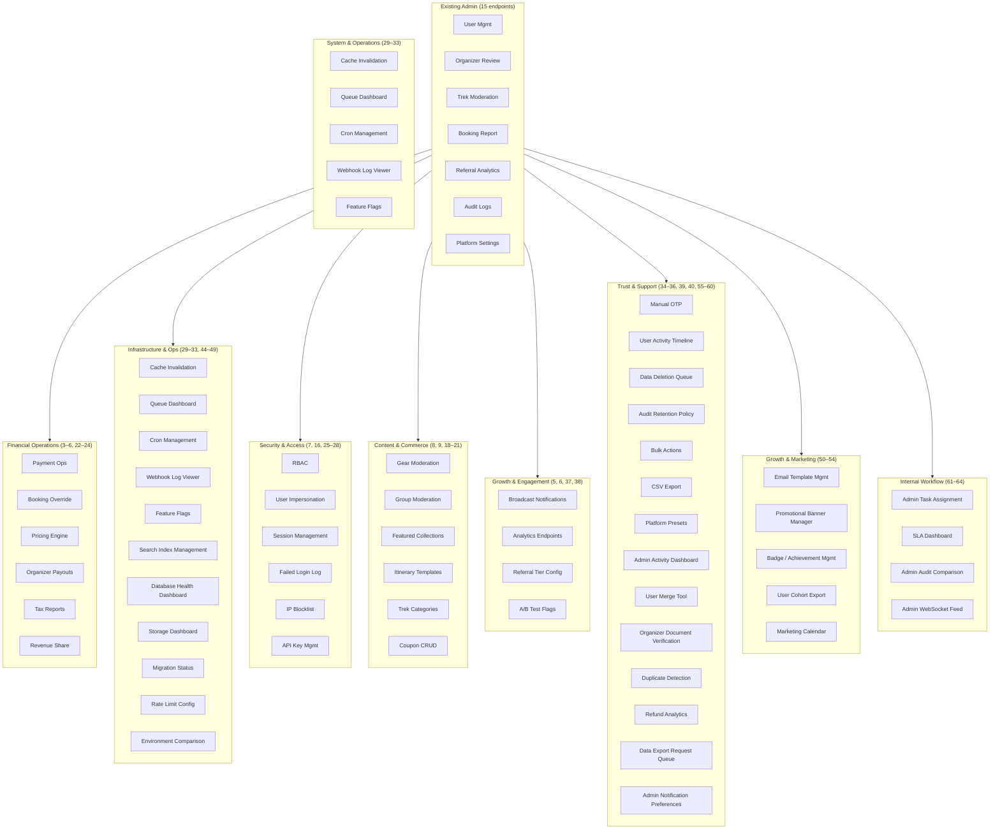

---

## 3. Payment Operations ✅

> **Status: COMPLETED** — Implementation in `AdminPaymentController`/`AdminPaymentService`. 65 tests (service + controller). Committed `7835fcb`.

**Problem:** Admins have no way to refund, retry, or reconcile payments. Every edge case (failed payment, partial refund, dispute) requires direct DB access or Stripe dashboard login.

**Design:**
- `GET /admin/payments` — Search transactions by user, booking, provider, status, date range
- `POST /admin/payments/:id/refund` — Full or partial refund with reason. Calls provider SDK, updates payment + booking status atomically
- `POST /admin/payments/:id/retry` — Retry failed payment on a different provider (Stripe fallback after Razorpay failure). Idempotent via `idempotencyKey`
- `GET /admin/payments/disputes` — List Stripe/Razorpay disputes with status, evidence links

**Key decisions:**
- Refunds are recorded in a `refund_audit` JSONB column on the `payments` table — no separate table needed at v1
- Provider SDK calls are wrapped in a `PaymentGatewayAdapter` strategy pattern (already partially exists)
- All mutations log to `audit_logs` with `action: PAYMENT_REFUND`

**Risk:** Partial refund race condition — two admins refund same booking. Use optimistic locking (`updated_at` check) on the payment row.

---

## 4. Booking Override ✅

> **Status: COMPLETED** — Implementation in `AdminBookingOverrideController`/`AdminBookingOverrideService`. 27 tests. Committed `4c00f6b`.

**Problem:** Support has to manually edit DB for booking modifications (date change, price override, add-ons). Error-prone and un-audited.

**Design:**

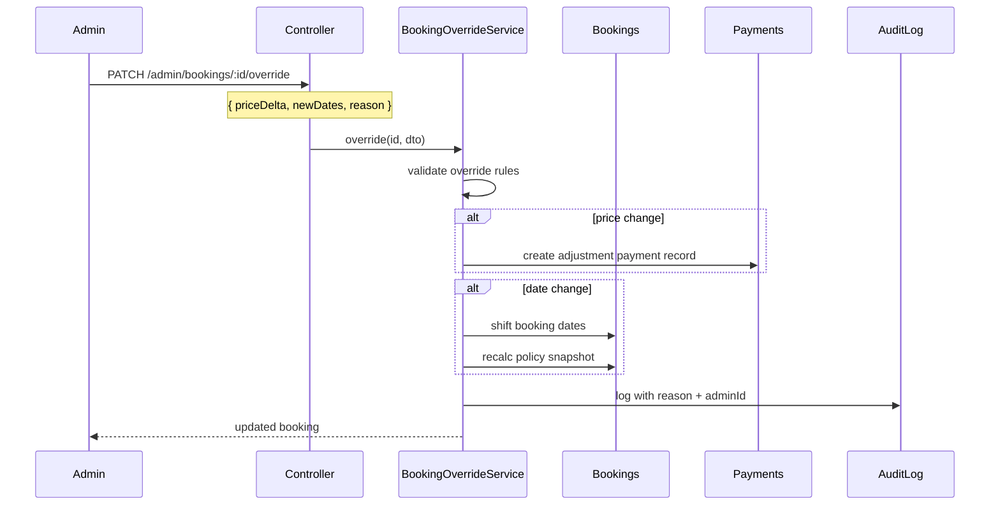

**Endpoints:**
- `PATCH /admin/bookings/:id/override` — Modify price (±), shift dates, add notes
- `POST /admin/bookings/:id/cancel` — Force-cancel with full/partial/no refund override
- `GET /admin/bookings/:id/timeline` — Chronological event log for the booking

**Constraint:** Every override requires a `reason` string (min 10 chars). No override without audit trail.

---

## 5. Broadcast Push Notifications ✅

> **Status: COMPLETED** — Implementation in `AdminBroadcastController`/`AdminBroadcastService` + `BroadcastNotificationWorkerService`. 80 tests (unit + QA deep validation). 20 unit tests + 62 QA senior-tester edge-case tests. Migration `0026-CreateNotificationCampaignsTable`.

**Problem:** Marketing wants to send "Monsoon Sale — 20% off" to segments. Current approach: manual FCM console or engineering-run DB queries.

**Design:**
- `POST /admin/notifications/broadcast` — Compose title, body, image URL, deep link
- Segment by: all users, users by trek preference (tag-based), users by state/region, users who haven't booked in N days
- The endpoint enqueues a BullMQ `notification-broadcast-queue` job. The worker batches device tokens (500/batch) and calls FCM/Expo
- `GET /admin/notifications/broadcast/history` — Past campaigns with sent/delivered/opened counts

**Key decisions:**
- **Not real-time.** Broadcasts are async. Admin gets a `{ jobId }` back and polls for completion
- Segment resolution happens in the worker to avoid HTTP timeouts for large audiences (>50K)
- Rate-limited at provider level (FCM: 600K/min). Worker respects `BATCH_INTERVAL_MS`

---

## 6. Analytics Dashboard Endpoints ✅

> **Status: COMPLETED** — Implementation in `AdminAnalyticsController`/`AdminAnalyticsService` + `AnalyticsModule`. 19 tests (service + controller). Full spec covered.

**Endpoints:**
| Endpoint | Returns | Note |
|---|---|---|
| `GET /admin/analytics/dau` | Daily active users (7/30/90d) | Distinct user_id from sessions |
| `GET /admin/analytics/trek-popularity` | Treks ranked by views, bookmarks, bookings | Rolling 30d window |
| `GET /admin/analytics/conversion-funnel` | Page views → add-to-cart → payment → completion | Per-trek and aggregate |
| `GET /admin/analytics/revenue-trends` | Daily/weekly/monthly MRR, ARPU | Grouped by provider |
| `GET /admin/analytics/retention-cohort` | D7/D30/D90 retention by signup month | Standard cohort table |

**Key decisions:**
- All analytics are **read-only projections**. No writes originate from these endpoints
- Heavy aggregations use materialized views refreshed by a nightly BullMQ job
- Cached in Redis with 5–15 min TTL depending on endpoint. Cache key: `analytics:{endpoint}:{params}`
- This is **not** a real-time analytics system. Expect 1–15 min lag

---

## 7. RBAC / Admin Roles

**Problem:** Currently binary `isAdmin: boolean`. Scaling to 5+ admin users with different responsibilities (finance vs. moderation vs. support) requires granular permissions.

**Design:**

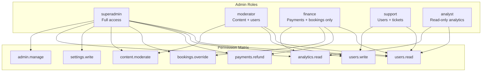

**Implementation:**
- Add `role: enum('superadmin', 'moderator', 'finance', 'support', 'analyst')` to `users` table
- `AdminGuard` becomes `RolesGuard` that checks `req.user.role` against a decorator: `@Roles('finance', 'superadmin')`
- Endpoints that require specific permissions get a `@RequirePermission('payments.refund')` decorator
- Migration: existing admins get `superadmin`. Zero downtime — old `isAdmin` check can be deprecated in next release

**Risk:** This touches every existing admin endpoint. All guards must be updated atomically. Backward-compat `AdminGuard` should remain during transition.

---

## 8. Gear Moderation

**Problem:** Gear listings are created by organizers/vendors without review. Low-quality or unsafe gear listings reach users.

**Endpoints:**
- `GET /admin/gear/pending` — Unreviewed gear items
- `PATCH /admin/gear/:id/decision` — Approve / Reject with reason
- `PATCH /admin/gear/:id/featured` — Toggle featured status (carousel placement)
- `DELETE /admin/gear/:id` — Remove item (soft-delete, audit logged)

**Integration:** Reads from existing `gear_items` table. No new entities. Decision field already exists? If not, add `reviewStatus` column.

---

## 9. Group Moderation

**Problem:** User-created groups can have inappropriate names, descriptions, or content. No admin oversight.

**Endpoints:**
- `GET /admin/groups` — List groups with flags (reported, member count, recent activity)
- `PATCH /admin/groups/:id/status` — Ban / Warn / Clear. Banned groups become invisible
- `GET /admin/groups/:id/members` — Member list. Option to remove member
- `POST /admin/groups/:id/transfer-ownership` — Hand group to another user

**Entity changes:** Add `status: enum('active', 'banned', 'flagged')` to `groups` table.

---

## 10. Safety Incident Log

**Problem:** Safety check-in failures, SOS triggers, and emergency contact notifications leave no audit trail for admin review.

**Design:**
- `GET /admin/safety/incidents` — Paginated list of missed check-outs, SOS activations, emergency alerts
- `GET /admin/safety/incidents/:id` — Full detail: user, trek, timeline, notification history
- `PATCH /admin/safety/incidents/:id/resolve` — Mark as resolved with note

**Key decision:** This reads from the `safety` module's tables (`safety_checkins`, `incident_logs`). No new entities if those tables already capture the required data. If not, add `incident_logs` table.

---

## 11. Assessment Oversight

**Problem:** Fitness assessment results can inform risk flags, but admins have no visibility.

**Endpoints:**
- `GET /admin/assessments` — List assessments with score brackets, user details
- `GET /admin/assessments/:userId` — Assessment history for a specific user
- `POST /admin/assessments/:userId/flag` — Flag user as "requires re-assessment" (triggers push notification)

**Note:** This is a support tool. Not for broad access — flagging should be `finance` or `superadmin` only.

---

## 12. Weather Alerts (Admin-Triggered)

**Problem:** Automated weather integration exists, but severe conditions sometimes need a human to broadcast an alert. Eg: IMD issues a flash flood warning for a region.

**Endpoints:**
- `POST /admin/weather/alerts` — Create alert: title, body, affected treks (by region/radius from lat/lng), severity
- `GET /admin/weather/alerts` — Active and past alerts
- `DELETE /admin/weather/alerts/:id` — Expire alert early

**Worker:** A `weather-alert-queue` job resolves the affected treks and pushes notifications to all users with active/pending bookings.

---

## 13. CSV/Excel Export

**Problem:** Every list endpoint (users, bookings, payments, audit logs) needs downloadable export. Currently only available via raw DB query.

**Design pattern:**
- Add `?export=csv` or `?export=xlsx` query param to existing list endpoints
- Response becomes `Content-Disposition: attachment` with correct MIME type
- For large datasets (>10K rows), enqueue a BullMQ job and return a presigned S3 URL when ready

**Implementation:**
```typescript
// Shared decorator approach
@Get('users')
@Exportable({ filename: 'users-export', maxRows: 10000 })
async listUsers(@Query() query, @Res() res, @ExportContext() ctx) { ... }
```

---

## 14. Bulk Actions

**Problem:** Suspending 50 users individually is tedious. Approving 20 pending treks during peak season is manual.

**Endpoints:**
- `POST /admin/bulk/users/status` — `{ userIds: [], action: 'suspend' | 'activate', reason }`
- `POST /admin/bulk/treks/approve` — `{ trekIds: [] }`
- `POST /admin/bulk/bookings/generate-tickets` — `{ bookingIds: [] }`

**Key decision:** Each action within the batch is processed atomically with individual error capture. Response: `{ success: [...], failed: [{ id, error }] }`. Max batch size: 500.

---

## 15. Platform Setting Presets

**Problem:** Toggling "maintenance mode" requires editing 4 separate platform settings. Admins want named snapshots.

**Design:**
- `POST /admin/platform-settings/presets` — Save current settings as preset (name, description)
- `POST /admin/platform-settings/presets/:id/apply` — Apply preset (overwrites current settings)
- `GET /admin/platform-settings/presets` — List presets

**Built-in presets (seeded via migration):**
| Preset | Effect |
|---|---|
| `maintenance` | Blocks new bookings, shows maintenance banner |
| `holiday-surge` | Increases platform fee, enables surge pricing, promotes specific treks |
| `off-peak` | Reduces platform fee, enables discount stack |
| `emergency` | Block all payments, enable read-only mode |

---

## 16. User Impersonation

**Problem:** Support needs to troubleshoot issues from the user's perspective. Requesting screenshots is slow and unreliable.

**Design:**

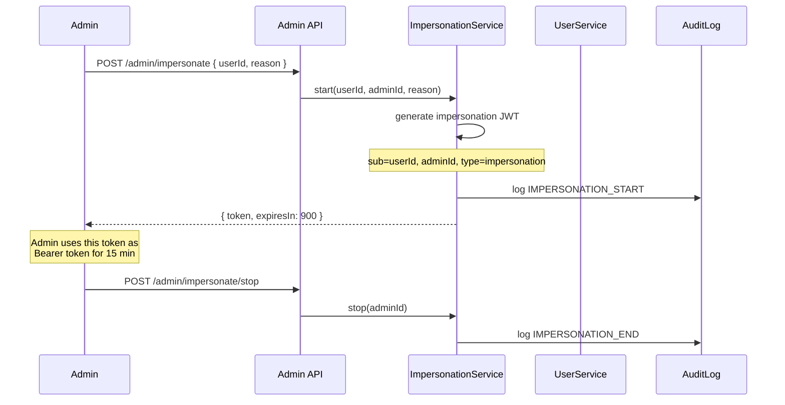

**Key decisions:**
- Impersonation JWT is a separate token type. The `ImpersonationGuard` allows access but tags every request header with `x-impersonated-by: adminId`
- Expires in 15 minutes. No renewal — admin must re-authenticate
- Every impersonated request is logged: `{ action, route, adminId, userId, timestamp }`
- **Excluded:** No impersonated access to payment methods, saved cards, or OTP verification flows

---

## 17. Admin Activity Dashboard

**Problem:** No visibility into which admins are doing what. Audit logs exist but no aggregation.

**Endpoints:**
- `GET /admin/activity/summary` — Actions per admin today/this week, most active admins
- `GET /admin/activity/heatmap` — Actions by hour-of-day × day-of-week (for staffing decisions)
- `GET /admin/activity/recent` — Live feed of last 50 actions across all admins

**Implementation:** Purely aggregation queries on `audit_logs` table. Cache with 30s TTL.

---

## 18. Pricing & Discount Engine

**Problem:** Discounts are currently hard-coded or platform-settings based. Seasonal pricing requires code changes.

**Endpoints:**
- `POST /admin/pricing/campaigns` — Create campaign: `{ name, trekIds[], discountType: percentage|flat, value, startDate, endDate, maxCap, minBooking }`
- `GET /admin/pricing/campaigns` — List active/scheduled/expired
- `PATCH /admin/pricing/campaigns/:id` — Modify or cancel
- `POST /admin/treks/:id/price-override` — Base price override for a specific date range

**Entity changes:** Add `pricing_campaigns` table. Treks reference campaign via `campaignId` nullable FK. The existing booking price calculation pipeline checks campaigns before falling back to base price.

---

## 19. Featured Collections / Curation

**Problem:** Homepage and category pages show all treks sorted by popularity. Marketing wants editorial control.

**Endpoints:**
- `POST /admin/collections` — Create collection: `{ name, slug, description, trekIds[ordered], isActive, coverImage }`
- `PATCH /admin/collections/:id/treks` — Reorder or replace treks in collection
- `GET /admin/collections` — List with trek count per collection

**Examples:** "Monsoon Specials", "Beginner Friendly", "Women-Led Treks", "Winter Wonderland"

**Integration:** Collections are served at `GET /collections/:slug` via a public (non-admin) endpoint. Cached aggressively (10-min Redis).

---

## 20. Itinerary Templates

**Problem:** Organizers repeatedly create similar itineraries for treks in the same region. No reuse mechanism.

**Endpoints:**
- `POST /admin/itinerary-templates` — Create template with reusable day blocks
- `GET /admin/itinerary-templates` — List with usage count
- `POST /admin/itinerary-templates/:id/apply-to-trek` — Apply template to a trek (deep-copies days; organizer can then customize)

**Entity changes:** Add `itinerary_templates` and `itinerary_template_days` tables. Soft-linked — applying a template copies data, doesn't create a live reference.

---

## 21. Trek Category / Tag Management

**Problem:** Difficulty levels, activity types, and tags are currently free-text or ENUMs defined in code. Admins cannot add/modify without deployment.

**Endpoints:**
- `CRUD /admin/tags` — Manage tag taxonomy (difficulty, activity, accommodation, theme)
- `CRUD /admin/categories` — Manage category hierarchy (nested, with slugs)
- `POST /admin/treks/:id/tags` — Batch-update trek tags

**Key decision:** Move tags from code ENUM to a `tags` table with `type` column. Existing values seeded via migration. This is a breaking change for any code that switches on enum values — replace with string comparison.

---

## 22. Organizer Payout Management

**Problem:** Organizers earn revenue from bookings. Currently there's no payout system — admins manually calculate and transfer.

**Design:**

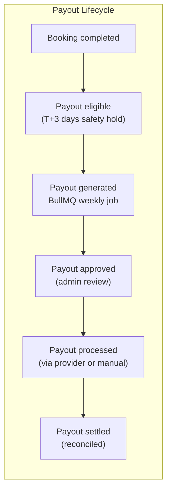

**Endpoints:**
- `GET /admin/payouts` — List with status filter, date range, organizer filter. Includes total payable, fees deducted
- `POST /admin/payouts/:id/approve` — Approve for processing
- `POST /admin/payouts/:id/mark-settled` — Mark as settled (for manual transfers)
- `GET /admin/payouts/summary` — Aggregate: total pending, total paid this month, avg processing time

**Entity changes:** Add `payouts` table: `{ id, organizerId, amount, platformFee, netAmount, status: enum('pending','approved','processed','settled','failed'), periodStart, periodEnd, settledAt }`.

---

## 23. Tax / GST Reports

**Problem:** Compliance requires periodic tax reports. Currently no way to generate GST-compliant invoices or returns.

**Endpoints:**
- `GET /admin/tax/report` — Period-based report: `{ from, to }` → `{ totalRevenue, taxableAmount, taxCollected, bookings[] }` with per-booking tax breakdown
- `GET /admin/tax/invoices` — Generate bulk GST invoices for a period (PDF via existing ticket PDF pipeline)

**Key decision:** This is a reporting layer on existing booking + payment data. No new entities if tax fields (`gstAmount`, `cgst`, `sgst`) already exist on payments. If not, add them.

---

## 24. Revenue Sharing Breakdown

**Problem:** Platform takes a cut of each booking. Organizers and admins have no per-trek or per-period view of revenue split.

**Endpoints:**
- `GET /admin/revenue-share/overview` — Platform vs. organizer revenue, aggregated
- `GET /admin/revenue-share/by-trek` — Per-trek breakdown: `{ trekId, totalRevenue, platformShare, organizerShare, bookingCount }`
- `GET /admin/revenue-share/by-organizer` — Per-organizer breakdown for payout preparation

**Calculation:** Uses existing booking `totalAmount` and organizer `commissionRate` (from `organizer_applications` or `users`). Formula: `platformShare = totalAmount * commissionRate`, `organizerShare = totalAmount - platformShare - taxes - fees`.

---

## 25. Active Session Management

**Problem:** No visibility into active JWTs. Can't force-logout a compromised account without waiting for token expiry (30 days for refresh tokens).

**Endpoints:**
- `GET /admin/sessions` — Active sessions: user, device info, IP, last activity, session age
- `DELETE /admin/sessions/:sessionId` — Revoke specific session (delete Redis key `refresh:{userId}:{sessionId}`)
- `DELETE /admin/sessions/user/:userId` — Revoke all sessions for a user

**Implementation:** Reads from Redis key pattern `refresh:*`. Token revocation is done by deleting the Redis key. The `JwtAuthGuard` already checks Redis for refresh validity — deleted key = forced re-auth.

---

## 26. Failed Login Attempts Log

**Problem:** No way to detect brute-force patterns or credential stuffing.

**Endpoints:**
- `GET /admin/security/failed-logins` — List with filters: `{ userId?, ip?, from, to }`. Includes attempt count, user agent
- `GET /admin/security/failed-logins/summary` — Top IPs, top users, trend (7d)

**Implementation:** If rate limiting already logs to Redis, persist failed attempts to a `failed_login_attempts` table (log-only, no PII beyond email/IP). Keep 90-day retention, then auto-purge.

---

## 27. IP Blocklist / Allowlist

**Problem:** Need to block abusive IPs or whitelist internal networks for admin API access.

**Endpoints:**
- `CRUD /admin/security/ip-blocklist` — IP/CIDR entries with reason, expiry
- `CRUD /admin/security/ip-allowlist` — Override blocklist for trusted IPs
- `GET /admin/security/ip-blocklist/audit` — Log of matches (blocked request attempts)

**Integration:** A global `IpFilterGuard` checks the request IP against Redis sets (`ip:blocklist`, `ip:allowlist`). Allowlist takes precedence. Redis sets are synced from DB on save + loaded at startup.

---

## 28. API Key Management

**Problem:** Partner integrations need API keys that can be rotated and revoked independently of the global `GLOBAL_API_KEY`.

**Endpoints:**
- `CRUD /admin/api-keys` — Create/revoke/rotate keys with: `{ name, permissions[], expiresAt? }`
- `GET /admin/api-keys/:id/usage` — Recent usage log (last 100 requests)

**Entity changes:** Add `api_keys` table: `{ id, keyHash (not plaintext), name, permissions (text[]), expiresAt, lastUsedAt, createdAt }`.

**Key decision:** Store only `SHA-256(key)` in DB. The full key is returned once at creation. Admins cannot retrieve the full key later — only regenerate.

---

## 29. Cache Invalidation

**Problem:** Cache staleness during data updates. Currently Redis entries expire on TTL. Admins need immediate invalidation.

**Endpoints:**
- `POST /admin/cache/invalidate` — `{ pattern: 'trek:*' }` or `{ pattern: 'platform:settings' }` → deletes all matching Redis keys
- `GET /admin/cache/stats` — Memory usage, key count by pattern, hit rate
- `GET /admin/cache/keys` — List keys by pattern with TTL

**Security:** This is a powerful operation. Restrict to `superadmin` only.

---

## 30. BullMQ Queue Dashboard

**Problem:** Queue backlogs or stuck jobs go unnoticed. No admin UI for queue operations.

**Endpoints:**

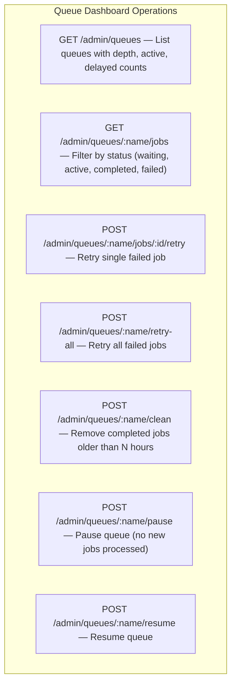

**Implementation:** BullMQ provides `Queue` class with `getJobCounts()`, `getJobs('failed')`, `retryJobs()`, `clean()`, `pause()`, `resume()` methods. Wrap these in service methods. No additional DB tables.

---

## 31. Scheduled Cron Job Management

**Problem:** BullMQ repeatable jobs (story expiry, booking reminders) have no pause/resume mechanism.

**Endpoints:**
- `GET /admin/cron-jobs` — List repeatable jobs with: `{ queue, jobName, pattern, nextRun, enabled }`
- `POST /admin/cron-jobs/:id/disable` — Remove repeatable job from the queue
- `POST /admin/cron-jobs/:id/enable` — Re-add repeatable job
- `POST /admin/cron-jobs/:id/trigger-now` — Manually enqueue an immediate run

**Key decision:** "Disable" means calling `queue.removeRepeatable()`. "Enable" calls `queue.add()`. State is ephemeral — does not survive Redis flush. A startup script should ensure expected repeatable jobs exist.

---

## 32. Webhook Log Viewer

**Problem:** Stripe/Razorpay webhook failures are invisible to admins. Debugging requires provider dashboard access.

**Endpoints:**
- `GET /admin/webhooks` — List recent webhook events with: `{ provider, eventType, status, statusCode, durationMs, createdAt }`
- `GET /admin/webhooks/:id` — Full detail including request body, response, error
- `POST /admin/webhooks/:id/retry` — Replay webhook to the handler

**Entity changes:** Add `webhook_logs` table or append to existing logging. Keep request body (truncated at 10KB). Retention: 30 days, then auto-purge.

---

## 33. Feature Flags

**Problem:** Rolling out new features (new checkout flow, referral v2) requires deployment. Feature flags enable toggle without deploy.

**Endpoints:**
- `CRUD /admin/feature-flags` — Flags: `{ key, description, enabled, percentage (0-100 for gradual rollouts), userSegment? }`
- Flags evaluated in-memory. Load all active flags at startup + refresh on change via Redis pub/sub

**Entity changes:** Add `feature_flags` table. A `FeatureFlagService` provides `isEnabled(key, userId?)` — checks percentage rollout if `userId` provided.

---

## 34. Manual OTP Generation

**Problem:** Users locked out of their accounts (lost phone, email issues). Support has no recovery path.

**Endpoint:**
- `POST /admin/otp/generate` — `{ userId, reason }` → Generates a one-time OTP valid for 5 minutes
- OTP is logged in audit log. Admin provides it to user via verified support channel (phone call, not email)

**Security:** This must require `superadmin` role. Each generation is logged with adminId, userId, reason. Maximum 3 per user per day.

---

## 35. User Activity Timeline

**Problem:** Support has to check 5+ tables to understand a user's history. One consolidated view speeds up resolution.

**Endpoint:**
- `GET /admin/users/:id/timeline` — Unified chronological feed:
  - Account creation, login events (with IP, device)
  - Bookings (created, modified, cancelled)
  - Payments (amount, status, refunds)
  - Content actions (posts, comments)
  - Support interactions (impersonations, status changes)
  - Audit log entries involving this user

**Implementation:** `UNION ALL` query across `users`, `bookings`, `payments`, `posts`, `audit_logs` with `ORDER BY createdAt DESC`. Paginated. Cached per-user for 30s.

---

## 36. Coupon / Promo Code CRUD

**Problem:** Coupons currently require DB inserts. Marketing cannot create/expire codes independently.

**Endpoints:**
- `CRUD /admin/coupons` — Full lifecycle: `{ code, discountType, discountValue, maxUses, minBookingAmount, maxDiscountCap, validFrom, validTo, applicableTrekIds[], isActive }`
- `GET /admin/coupons/:id/redemptions` — Usage log with user, booking, date
- `POST /admin/coupons/:id/expire` — Force-expire before validTo

**Entity changes:** Add `coupons` and `coupon_redemptions` tables. The existing booking checkout flow checks `coupons` table for validity.

---

## 37. Referral Tier Configurator

**Problem:** Referral reward tiers are hard-coded. Changing reward amounts, thresholds, or conversion rates requires code deploy.

**Endpoints:**
- `CRUD /admin/referral-tiers` — Tiers: `{ name, minReferrals, rewardAmount, rewardType: 'coupon'|'points'|'both' }`
- `PATCH /admin/referral-settings` — Global settings: `{ pointsToInrRate, minPayoutThreshold, bonusForFirstReferral }`

**Integration:** The existing `ReferralService` reads tier config from DB instead of constants. Seed migration creates default tiers matching current hard-coded values.

---

## 38. A/B Test Flag Manager

**Problem:** Experimentation requires engineering to set up flag splits. No self-service for product team.

**Endpoints:**
- `CRUD /admin/ab-tests` — Tests: `{ name, flagKey, variants[{ name, percentage }], audienceSegment?, startDate, endDate }`
- `GET /admin/ab-tests/:id/results` — Exposure × conversion data (fed from analytics events)
- `POST /admin/ab-tests/:id/conclude` — Declare winner variant, auto-enable for 100%

**Key decision:** This overlaps with Feature Flags (item 33). A/B flags are a superset — they include variant distribution. Consider merging into a single `experiments` table. The `FeatureFlagService` should also serve experiment variants.

---

## 39. Data Deletion Request Queue

**Problem:** GDPR mandates user data deletion on request. Currently a manual DB operation with no workflow or audit trail.

**Design:**

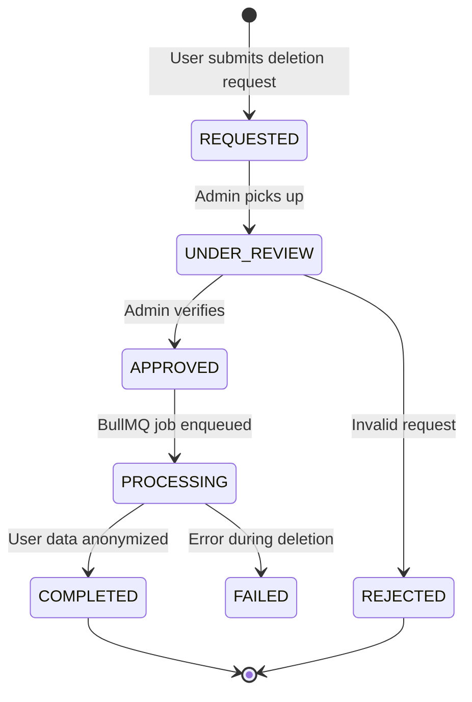

**Endpoints:**
- `GET /admin/data-deletion` — List requests with status, user info, date
- `POST /admin/data-deletion/:id/approve` — Start processing
- `POST /admin/data-deletion/:id/reject` — With reason
- `GET /admin/data-deletion/:id/log` — Audit of what was deleted

**Implementation:** The worker performs: anonymize PII in `users` table → delete `device_tokens` → delete `sessions` → retain anonymous booking records (GDPR allows legitimate interest for financial records) → log completion.

---

## 40. Audit Log Retention Policy

**Problem:** `audit_logs` is the fastest-growing table (est. 150MB at 10K admin actions). No retention policy.

**Endpoints:**
- `GET /admin/audit-logs/stats` — Table size, row count, growth rate (daily/weekly)
- `PATCH /admin/audit-logs/retention` — Set retention: `{ retentionDays: 365, exportBeforeDelete: true }`
- `POST /admin/audit-logs/purge-now` — Manual trigger (respects retention setting)

**Worker:** A `cleanup-queue` job (already exists, item 7 in existing queue inventory) runs daily and deletes audit logs older than `retentionDays`. If `exportBeforeDelete` is true, it first writes a parquet/CSV export to S3.

**Key decision:** The platform_settings table gets two new keys: `auditLogRetentionDays` (default 365) and `auditLogExportBeforePurge` (default true). No separate table needed.

---

## 44. Search Index Management

**Problem:** Full-text search on treks (name, location, description) becomes stale when data changes. Reindexing requires DB operations or cache flushes with no admin visibility.

**Endpoints:**
- `GET /admin/search/indexes` — List search indexes: `{ name, documentCount, lastIndexedAt, status }`
- `POST /admin/search/indexes/:name/reindex` — Trigger full reindex (enqueues BullMQ job)
- `PATCH /admin/search/indexes/:name/settings` — Adjust field weights, fuzziness, ranking config

**Implementation:** If using PostgreSQL full-text search, trigger `REINDEX` via a worker that updates the `tsvector` column. If using MeiliSearch or Typesense, call the search provider's API. The reindex job reports progress: `{ indexed: 5000, total: 15000, eta: '45s' }`.

**Key decision:** Schema changes (adding new searchable fields) are out of scope for this feature — reindex only operates on existing indexed fields. Schema changes go through migrations.

---

## 45. Database Health Dashboard

**Problem:** Performance degradation often starts with DB issues (bloat, missing indexes, connection pool exhaustion) that admins detect only after users complain.

**Endpoints:**
- `GET /admin/database/health` — Connection pool: `{ active, idle, waiting, maxPoolSize, utilizationPercent }`
- `GET /admin/database/slow-queries` — Top 10 queries by mean time, total time, or frequency (reads from `pg_stat_statements`)
- `GET /admin/database/tables` — Per-table: `{ rowCount, tableSize, indexSize, deadTuples, lastVacuum }`
- `GET /admin/database/indexes` — Unused indexes, duplicate indexes, missing index recommendations

**Implementation:** Run `SELECT` queries against PostgreSQL system catalogs (`pg_stat_activity`, `pg_stat_statements`, `pg_stat_user_tables`, `pg_stat_user_indexes`). Requires `pg_stat_statements` extension to be enabled.

**Security:** Read-only. Dashboard data should be cached (60s TTL) — system catalog queries can be surprisingly expensive on large datasets.

---

## 46. S3/R2 Storage Dashboard

**Problem:** Storage costs grow silently. Orphaned files (uploaded but never referenced) accumulate with no cleanup.

**Endpoints:**
- `GET /admin/storage/summary` — Per-bucket: `{ bucket, objectCount, totalSize, lastWeekGrowth }`
- `GET /admin/storage/file-types` — Breakdown by MIME type and bucket
- `GET /admin/storage/orphans` — R2 objects with no matching `media` table record (and vice versa)
- `POST /admin/storage/orphans/cleanup` — Delete orphaned objects (enqueues a BullMQ job; dry-run mode available)

**Implementation:** List R2 objects with pagination, compare against `media` table. This is I/O heavy — run as a background job, not inline.

---

## 47. Migration Status

**Problem:** After deployments, admins need to verify that all migrations ran successfully. Currently requires checking logs or DB directly.

**Endpoints:**
- `GET /admin/migrations` — List all migration files with: `{ name, executedAt, durationMs, batch, state: up|down }`
- `POST /admin/migrations/:name/run` — Execute a specific pending migration
- `POST /admin/migrations/:name/revert` — Roll back the last migration (last batch only)

**Key decision:** NestJS/TypeORM already tracks migrations in `migrations` table. This endpoint surfaces that data with no new infrastructure. Revert should only be used in staging — production reverts follow the change management process.

---

## 48. Rate Limit Configuration

**Problem:** Rate limits are hard-coded or env-configured. When a bot attack or flash crowd hits a specific endpoint, admins cannot react without deploy.

**Endpoints:**
- `GET /admin/security/rate-limits` — Current config per endpoint or global: `{ endpoint, windowMs, maxRequests, currentUtilization }`
- `PATCH /admin/security/rate-limits` — Override limits: `{ endpoint?: '*', windowMs, maxRequests }` — stored in Redis, applied dynamically

**Implementation:** A dynamic rate limiter reads overrides from Redis key `ratelimit:overrides:{endpoint}` on each request, with a fallback to the static config. Overrides expire after 24h unless renewed.

---

## 49. Environment Comparison

**Problem:** Debugging environment-specific bugs requires manually checking env vars, settings, and feature flags across staging and production.

**Endpoint:**
- `GET /admin/environment/compare` — Side-by-side diff of:
  - Platform settings (from `platform_settings` table)
  - Feature flags (from `feature_flags` table)
  - Selected env vars (whitelist: `DB_HOST`, `REDIS_HOST`, `STORAGE_ENDPOINT`, etc. — NOT secrets)
- `GET /admin/environment/drift-report` — Historical record of config changes per environment

**Key decision:** Never expose secret values (JWT secrets, API keys, DB passwords). Only compare non-sensitive config. The env var whitelist must be maintained explicitly.

---

## 50. Email Template Management

**Problem:** Transactional email copy is hard-coded. Marketing cannot update "Your booking is confirmed" text without a PR.

**Endpoints:**
- `CRUD /admin/email-templates` — Templates: `{ name, subject, body (HTML), variables[], isActive }`
- `POST /admin/email-templates/:id/preview` — Render with sample data — `{ userId, bookingId? }` → returns rendered HTML
- `POST /admin/email-templates/:id/test-send` — Send test email to requesting admin's address
- `GET /admin/email-templates/:id/versions` — Version history with diff view between revisions

**Entity changes:** Add `email_templates` table. The `MailerService` resolves template names to DB content instead of hard-coded strings, falling back to a default if no DB template exists.

---

## 51. Promotional Banner Manager

**Problem:** Homepage banners, interstitial promotions, and post-booking upsells are hard-coded. Marketing needs to schedule campaigns without engineering.

**Endpoints:**
- `CRUD /admin/banners` — Banners: `{ title, subtitle, imageUrl, ctaText, ctaLink, placement: homepage|trek-page|checkout, startDate, endDate, priority, isActive }`
- `GET /admin/banners/stats` — Per-banner: `{ impressions, clicks, ctr, lastServed }`

**Integration:** Banners are served via `GET /banners/active?placement={placement}` (public, cached). Impression/click tracking is done via a transparent pixel or POST event endpoint. Data flows into analytics for CTR calculation.

---

## 52. Badge / Achievement Management

**Problem:** Badges exist in the rewards module but are hard-coded. Admins cannot create new badges or manually award them.

**Endpoints:**
- `CRUD /admin/badges` — Badges: `{ name, slug, description, iconUrl, category, criteria (JSON), isAutoAwardable }`
- `POST /admin/badges/:id/award` — Manually award to a user `{ userId, reason }`
- `POST /admin/badges/:id/revoke` — Revoke from a user
- `GET /admin/badges/stats` — Per-badge: `{ awardedCount, uniqueRecipients, mostRecentAward }`

**Key decision:** Manual award creates an `admin_awarded` entry in the badge tracking table with `awardedBy` and `reason`. Auto-awardable badges are checked by a BullMQ job that evaluates criteria against user data.

---

## 53. User Cohort Export

**Problem:** Marketing runs targeted email/SMS campaigns but has no way to export user segments without writing SQL.

**Endpoints:**
- `POST /admin/cohorts/build` — Define segment: `{ filters: { minTreks, lastBookingBefore, lastBookingAfter, tags[], states[], isOrganizer, isSuspended }, format: csv|json }`
- `GET /admin/cohorts/:id/export` — Download the pre-built export (async — job-generated file on S3, presigned URL)
- `GET /admin/cohorts/history` — Past exports with row counts

**Implementation:** The segment builder composes a parameterized SQL query dynamically. Explicitly guard against `SELECT *` — only return: `email, name, phone, userId, totalTreks, lastBookingDate`. Max 50K rows per export.

---

## 54. Marketing Calendar

**Problem:** Coupons, banner campaigns, price changes, and broadcast notifications are scheduled independently with no centralized view.

**Endpoint:**
- `GET /admin/marketing/calendar` — Aggregated timeline of all scheduled marketing actions:
  - Coupon start/end dates
  - Banner campaign active periods
  - Broadcast notification schedules
  - Pricing campaign windows
  - Promotional collection publish dates

**Implementation:** `UNION ALL` query across `coupons`, `banners`, `broadcast_history`, `pricing_campaigns`, `collections` — projected into a common `{ date, type, title, description, status }` shape. Cached for 5 min.

---

## 55. User Merge Tool

**Problem:** Duplicate user accounts (same email, different provider; or same phone, different email) fragment booking history and support context.

**Design:**

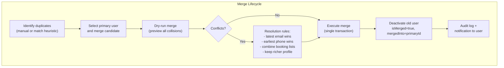

**Endpoints:**
- `POST /admin/users/merge/dry-run` — `{ primaryUserId, mergeUserId }` → collision report
- `POST /admin/users/merge/execute` — `{ primaryUserId, mergeUserId, resolutionRules[] }` → merge result
- `GET /admin/users/merge/history` — Past merges with audit trail

**Implementation:** The merge transaction must be wrapped in a single DB transaction. It updates FKs across `bookings`, `posts`, `comments`, `payments`, `device_tokens`, `notifications`, `referrals`, `reviews`, and `safety_checkins`. Any FK failure rolls back the entire merge.

---

## 56. Organizer Document Verification

**Problem:** Organizer applications include KYC documents but there is no workflow to upload, verify, or track document status.

**Endpoints:**
- `GET /admin/organizers/:id/documents` — List submitted documents: `{ type: gst|idProof|insurance|businessReg, status, uploadedAt, expiresAt? }`
- `POST /admin/organizers/:id/documents/:docId/approve` — Mark as verified
- `POST /admin/organizers/:id/documents/:docId/reject` — Reject with reason, optionally request re-upload
- `GET /admin/organizers/documents/expiring` — Documents expiring within 30/60/90 days

**Entity changes:** Add `organizer_documents` table: `{ id, organizerId, type, fileUrl, status, verifiedBy, verifiedAt, expiresAt }`. Existing organizer approval endpoint checks document status before allowing approval.

---

## 57. Duplicate Detection

**Problem:** Same trek listed by different organizers with near-identical names and locations. Same user registered multiple times. No automated flagging.

**Endpoints:**
- `GET /admin/detection/trek-duplicates` — Treks grouped by similarity score (Levenshtein on name + geo-proximity on location)
- `GET /admin/detection/user-duplicates` — Users grouped by same email, same phone, or same device fingerprint
- `POST /admin/detection/trek-duplicates/:id/resolve` — Mark as confirmed duplicate, merge or reject
- `POST /admin/detection/user-duplicates/:id/resolve` — Route to user merge tool (item 55)

**Implementation:** Similarity computation is done by a nightly BullMQ job that writes results to a `duplicate_candidates` table. The admin endpoint surfaces these candidates. This avoids running expensive text similarity queries inline.

---

## 58. Refund Analytics

**Problem:** Refund rates, patterns, and abuse are invisible. No way to identify treks, organizers, or users with anomalous refund behaviour.

**Endpoints:**
- `GET /admin/analytics/refunds/overview` — `{ totalRefunded, refundRate, avgRefundAmount, refundByReason }`
- `GET /admin/analytics/refunds/by-trek` — Per-trek refund stats, ranked by refund rate
- `GET /admin/analytics/refunds/by-organizer` — Per-organizer refund stats
- `GET /admin/analytics/refunds/by-user` — Users with >3 refunds or >80% refund rate (abuse candidates)
- `GET /admin/analytics/refunds/trend` — Monthly refund rate over 12 months

**Implementation:** Aggregation queries on `payments` table where `status = 'refunded'` and `refundAmount > 0`. If `refundReason` is captured at refund time, group by it.

---

## 59. Data Export Request Queue (GDPR Article 20)

**Problem:** GDPR grants users the right to receive their data in a portable format. Currently no mechanism to fulfil these requests.

**Design:**
- User submits request → `data_export_requests` table entry created
- Admin reviews → approves or rejects
- Approval triggers a BullMQ job that:
  1. Queries `users`, `bookings`, `payments`, `posts`, `comments`, `reviews`, `notifications`, `safety_checkins`, `assessments` for the user
  2. Packages into a structured JSON file (possibly with CSV/PDF sub-files)
  3. Zips the package, uploads to S3 with a presigned URL
  4. Emails the user with the download link (expires in 7 days)

**Endpoints:**
- `GET /admin/data-exports` — List requests with status and user info
- `POST /admin/data-exports/:id/approve` — Start processing
- `POST /admin/data-exports/:id/reject` — With reason
- `GET /admin/data-exports/:id/log` — What data was included, file size, download expiry

---

## 60. Admin Notification Preferences

**Problem:** Critical events (payment failure, report spike, safety incident) go unnoticed until someone checks manually. Admins want configurable alerts.

**Endpoints:**
- `GET /admin/notifications/preferences` — Per-admin config: `{ eventType, channel: email|slack|push, enabled }`
- `PATCH /admin/notifications/preferences` — Update individual event-channel mappings
- `POST /admin/notifications/test` — Send test notification for each configured channel

**Events to alert on:**
| Event | Default Channel | Severity |
|---|---|---|
| `payment.large-refund` | Slack + Email | High |
| `safety.sos-activated` | Slack + SMS | Critical |
| `organizer.application-new` | Slack | Low |
| `report.threshold-crossed` | Slack | Medium |
| `queue.backlog-critical` | Slack | Medium |
| `booking.surge-anomaly` | Slack | Low |

**Implementation:** A `NotificationRouter` service checks each admin's preference map before dispatching. Preferences stored in a JSONB column on `users` (admin-only) or a `admin_notification_prefs` table.

---

## 61. Admin Task Assignment

**Problem:** Organizer applications, report tickets, and data deletion requests accumulate with no owner. No accountability or SLA tracking.

**Endpoints:**
- `POST /admin/tasks` — Create task: `{ type, resourceId, assignedTo, priority, dueBy }`
- `PATCH /admin/tasks/:id/assign` — Reassign to another admin
- `PATCH /admin/tasks/:id/status` — `Open → In Progress → Resolved → Closed`
- `GET /admin/tasks` — Filter by assignee, status, type, priority, date range
- `GET /admin/tasks/mine` — Current admin's open tasks, sorted by priority + due date

**Entity changes:** Add `admin_tasks` table: `{ id, type: enum, resourceId (polymorphic), assignedTo (userId FK), status, priority, dueBy, createdAt, resolvedAt }`.

**Key decision:** Tasks are manually created or auto-generated by hooks (new organizer application → create task). Polymorphic `resourceId` means either separate columns per resource type or a single `resourceType + resourceId` pair.

---

## 62. SLA Dashboard

**Problem:** No visibility into how quickly admins respond to organizer applications, reports, or support requests.

**Endpoints:**
- `GET /admin/sla/overview` — Per-category: `{ avgResponseTime, p95ResponseTime, breachCount, totalTickets }`
- `GET /admin/sla/by-admin` — Per-admin averages, ranked by performance
- `GET /admin/sla/breaches` — Tickets that exceeded SLA threshold, with assignee and resolution notes
- `PATCH /admin/sla/config` — Configure SLA thresholds per category: `{ organizerApplication: 48h, reportTicket: 24h, dataDeletion: 72h }`

**Implementation:** Reads from `admin_tasks` table (item 61). SLA breach is a computed value: `resolvedAt - createdAt > threshold`. Breach events can trigger admin notifications (item 60).

---

## 63. Admin Audit Comparison

**Problem:** "Who changed the platform settings last night?" is answered by scrolling through raw audit logs. No diff view.

**Endpoints:**
- `GET /admin/audit-logs/:resourceType/:resourceId/diff` — Show chronological diffs of a specific resource (platform settings, feature flag, coupon, etc.)
- `GET /admin/audit-logs/timeline` — Filterable, grouped-by-session view: "Admin X made 5 changes in 3 minutes" grouped as one session

**Design:** Changes to JSONB fields (`detail` column in `audit_logs`) are compared using a JSON diff algorithm (e.g., `jsondiffpatch`). For sequential entries on the same resource, compute a delta between consecutive `detail` snapshots.

---

## 64. Admin WebSocket Feed

**Problem:** Admins refresh the dashboard to see new organizer applications or reports. No real-time awareness.

**Design:**

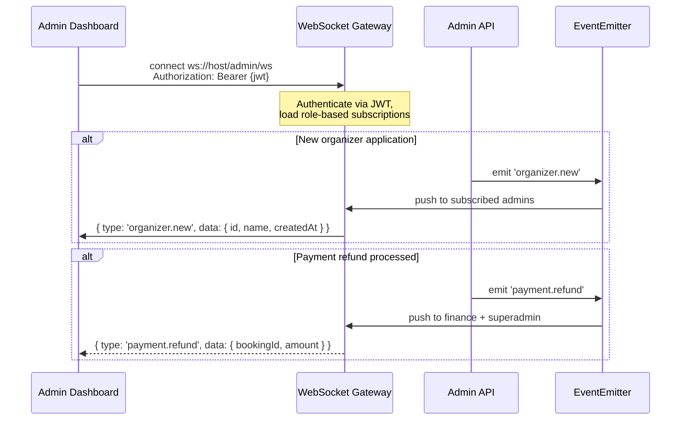

**Events to push:**
| Event | Target Role | Payload |
|---|---|---|
| `organizer.new` | all | `{ id, name, createdAt }` |
| `report.new` | moderator, superadmin | `{ id, resourceType, reason }` |
| `payment.refund` | finance, superadmin | `{ bookingId, amount, provider }` |
| `safety.sos` | superadmin | `{ userId, trekId, lat, lng }` |
| `queue.backlog` | superadmin | `{ queueName, depth }` |
| `booking.surge` | all | `{ count, windowMinutes }` |

**Implementation:** NestJS `WebSocketGateway` with `@WebSocketGateway({ namespace: '/admin/ws' })`. Authentication via JWT handshake. Admin's role determines which event channels they subscribe to. No persistence — events are transient.

**Key decision:** This is a firehose — the WebSocket should not replay history. If an admin disconnects, they miss events during that window. Use a polling fallback (`GET /admin/activity/recent` from item 17) for catch-up.

---

## Implementation Priority Matrix

| Domain | Feature | Effort | Impact | Dependencies |
|---|---|---|---|---|
| Financial | Payment Ops (3) | Medium | High | Existing payment provider adapters |
| Security | RBAC (7) | Medium | High | Every admin endpoint |
| Operations | Queue Dashboard (30) | Low | High | BullMQ |
| Financial | Revenue Share (24) | Low | High | Existing booking data |
| Support | User Timeline (35) | Medium | High | 5+ table queries |
| Operations | Feature Flags (33) | Medium | Medium | Need adoption across codebase |
| Security | Impersonation (16) | Medium | Medium | JWT infrastructure |
| Operations | Webhook Log (32) | Low | Medium | Already logging? |
| Content | Coupon CRUD (36) | Medium | Medium | New entity |
| Financial | Pricing Engine (18) | High | Medium | Touches booking calculation |
| Growth | Analytics (6) | High | Medium | Materialized views + caching |
| Growth | Broadcast (5) | Medium | Medium | Existing notification worker |
| Security | Session Mgmt (25) | Low | Medium | Redis key pattern |
| Content | Featured Collections (19) | Low | Low | New entity, public endpoint |
| Content | Tags/Categories (21) | Medium | Low | Touches trek entity, migration |
| Support | Data Deletion (39) | High | Medium | Multiple table operations |
| All | CSV Export (13) | Medium | Medium | Many list endpoints |
| All | Bulk Actions (14) | Low | Medium | Shared validation logic |
| Infrastructure | Search Index Mgmt (44) | Low | Medium | Search provider (PG/MeiliSearch) |
| Infrastructure | DB Health Dashboard (45) | Low | High | `pg_stat_statements` extension |
| Infrastructure | Storage Dashboard (46) | Low | Medium | R2 list operations |
| Infrastructure | Migration Status (47) | Low | Medium | TypeORM migrations table |
| Infrastructure | Rate Limit Config (48) | Low | Medium | Dynamic rate limiter |
| Infrastructure | Environment Compare (49) | Low | Low | Secret whitelist maintenance |
| GrowthOps | Email Templates (50) | Medium | Medium | MailerService refactor |
| GrowthOps | Banner Manager (51) | Low | Medium | New entity + public endpoint |
| GrowthOps | Badge Management (52) | Medium | Low | Badge criteria evaluation worker |
| GrowthOps | Cohort Export (53) | Medium | Medium | Dynamic query builder |
| GrowthOps | Marketing Calendar (54) | Low | Medium | UNION ALL across 5 tables |
| Support | User Merge (55) | High | Medium | Multi-table transaction, risk |
| Support | Document Verification (56) | Medium | Medium | New entity, workflow state |
| Support | Duplicate Detection (57) | Medium | Low | Nightly similarity job |
| Support | Refund Analytics (58) | Low | Medium | Payment aggregation queries |
| Support | Data Export GDPR (59) | High | Medium | Multi-table export, S3 upload |
| Support | Admin Notif Prefs (60) | Low | Medium | Event router service |
| Workflow | Task Assignment (61) | Medium | High | New entity, polymorphic FK |
| Workflow | SLA Dashboard (62) | Low | Medium | Computed from tasks |
| Workflow | Audit Diff (63) | Medium | Low | JSON diff algorithm |
| Workflow | WebSocket Feed (64) | Medium | High | WebSocket gateway + auth |

---

## Architecture Notes

### Audit Integration
Every new mutation endpoint must log to `audit_logs`. The existing `AuditInterceptor` already captures HTTP-level logging. For domain-specific actions (refund, payout approve, impersonation), emit explicit audit entries via `AuditLogService.save()`.

### Pagination Convention
All list endpoints follow the existing pattern: `{ page, limit, total, data[] }`. Default `limit: 20`, max `limit: 100`. For export endpoints, the limit is replaced by the export format parameter.

### Error Handling
Admin endpoints should return structured errors:
```json
{
  "statusCode": 422,
  "error": "UNPROCESSABLE_ENTITY",
  "message": "Refund amount exceeds booking total",
  "details": { "bookingTotal": 5000, "refundRequested": 6000 }
}
```

### Rate Limiting
Admin endpoints should have separate, higher rate limits than public endpoints. Suggested: 200 requests / 60s per admin user. Impersonation creates a separate rate limit bucket keyed by `impersonated:{adminId}`.

### Testing Strategy
- Unit tests for validation logic (DTOs, permission checks, calculation)
- Integration tests with real DB + Redis for service methods
- E2E tests for critical flows: refund, payout approval, broadcast dispatch, impersonation
- Existing admin test files (`admin.service.spec.ts`, `audit-log.service.spec.ts`) should be extended per feature

---

*End of spec. Each feature should be implemented as a discrete PR following the agent conventions in `AGENTS.md`.*

**Agent ownership map:**
| Agent | Items |
|---|---|
| `bookings-payments-agent` | 3, 4, 22–24, 58 |
| `organizer-admin-agent` | 8, 9, 18–21, 56 |
| `auth-agent` | 7, 16, 25–28, 48, 55 |
| `jobs-workers-agent` | 29–33, 44, 47, 59 |
| `media-agent` | 46 |
| `notifications-agent` | 5, 60, 64 |
| `observability-agent` | 45, 49, 63 |
| Cross-cutting (coordinate with domain owners) | 13, 14, 35, 39, 40, 50–54, 57, 61, 62 |

> **Note:** `posts-stories-agent` is deprecated alongside Posts and Stories modules. Items 50–54 (Email Templates, Banner Manager, Badge Management, Cohort Export, Marketing Calendar) are cross-cutting between marketing and platform — coordinate with both `organizer-admin-agent` and product owners.
````

## File: src/jobs/processors/broadcast-notification.processor.ts
````typescript
import {
  Injectable,
  Logger,
  OnModuleInit,
  OnModuleDestroy,
} from '@nestjs/common';
import { InjectRepository } from '@nestjs/typeorm';
import { Repository, DataSource } from 'typeorm';
import { Worker, Queue } from 'bullmq';
import { bullConnection } from '../config';
import { NotificationCampaign } from '../../modules/notifications/entities/notification-campaign.entity';
import { User } from '../../modules/users/entities/user.entity';
import { NotificationsService } from '../../modules/notifications/notifications.service';
import { NotificationType } from '../../modules/notifications/enums/notification-type.enum';
import { CampaignStatus } from '../../modules/notifications/enums/campaign-status.enum';

const DEFAULT_BATCH_SIZE = 500;

interface BroadcastJob {
  campaignId: string;
}

@Injectable()
export class BroadcastNotificationWorkerService
  implements OnModuleInit, OnModuleDestroy
{
  private readonly logger = new Logger(BroadcastNotificationWorkerService.name);
  private worker!: Worker;
  private readonly queue = new Queue('notification-broadcast-queue', {
    connection: bullConnection,
  });

  constructor(
    @InjectRepository(NotificationCampaign)
    private readonly campaignRepo: Repository<NotificationCampaign>,
    private readonly notificationsService: NotificationsService,
    private readonly dataSource: DataSource,
  ) {}

  async onModuleInit(): Promise<void> {
    this.worker = new Worker(
      'notification-broadcast-queue',
      async (job) => {
        const { campaignId } = job.data as BroadcastJob;
        this.logger.log(`Processing broadcast campaign ${campaignId}`);

        const campaign = await this.campaignRepo.findOne({
          where: { id: campaignId },
        });
        if (!campaign) {
          throw new Error(`Campaign ${campaignId} not found`);
        }

        if (campaign.status !== CampaignStatus.PENDING) {
          this.logger.warn(
            `Campaign ${campaignId} is already ${campaign.status}; skipping`,
          );
          return { campaignId, usersResolved: 0, batchesSent: 0, skipped: true };
        }

        await this.campaignRepo.update(campaignId, {
          status: CampaignStatus.SENDING,
        });

        const segmentConfig = campaign.segmentConfig as {
          type: string;
          trekTagIds?: string[];
          states?: string[];
          cities?: string[];
          inactiveDays?: number | null;
        };

        const userIds = await this.resolveUserIds(segmentConfig);
        this.logger.log(
          `Campaign ${campaignId}: resolved ${userIds.length} users`,
        );

        if (userIds.length === 0) {
          await this.campaignRepo.update(campaignId, {
            status: CampaignStatus.SENT,
            totalUsers: 0,
            totalBatches: 0,
            completedBatches: 0,
          });
          return { campaignId, usersResolved: 0, batchesSent: 0 };
        }

        const parsedBatchSize = Number(process.env.BROADCAST_BATCH_SIZE);
        const batchSize =
          Number.isFinite(parsedBatchSize) && parsedBatchSize > 0
            ? parsedBatchSize
            : DEFAULT_BATCH_SIZE;
        const batches: string[][] = [];
        for (let i = 0; i < userIds.length; i += batchSize) {
          batches.push(userIds.slice(i, i + batchSize));
        }

        let completedBatches = 0;
        for (const batch of batches) {
          try {
            await this.notificationsService.sendPushToUsers(
              batch,
              campaign.title,
              campaign.body,
              NotificationType.BROADCAST,
              {
                campaignId,
                imageUrl: campaign.imageUrl ?? null,
                deepLink: campaign.deepLink ?? null,
              },
            );
            completedBatches++;
          } catch (err) {
            this.logger.error(
              `Campaign ${campaignId}: batch ${completedBatches + 1} failed`,
              err as Error,
            );
            await this.campaignRepo.update(campaignId, {
              status: CampaignStatus.FAILED,
              error: `Batch ${completedBatches + 1} failed: ${(err as Error).message}`,
              totalUsers: userIds.length,
              totalBatches: batches.length,
              completedBatches,
            });
            throw err;
          }
        }

        await this.campaignRepo.update(campaignId, {
          status: CampaignStatus.SENT,
          totalUsers: userIds.length,
          totalBatches: batches.length,
          completedBatches,
        });

        this.logger.log(
          `Campaign ${campaignId}: sent ${userIds.length} notifications in ${batches.length} batches`,
        );

        return {
          campaignId,
          usersResolved: userIds.length,
          batchesSent: completedBatches,
        };
      },
      {
        connection: bullConnection,
        concurrency: 1,
      },
    );

    this.worker.on('completed', (job) => {
      this.logger.debug(`Broadcast job completed: ${job.id}`);
    });

    this.worker.on('failed', (job, err) => {
      this.logger.error(
        `Broadcast job ${job?.id} failed: ${err.message}`,
        err.stack,
      );
    });

    this.logger.log('Broadcast notification worker started');
  }

  async onModuleDestroy(): Promise<void> {
    await this.worker?.close();
    await this.queue?.close();
  }

  private async resolveUserIds(config: {
    type: string;
    trekTagIds?: string[];
    states?: string[];
    cities?: string[];
    inactiveDays?: number | null;
  }): Promise<string[]> {
    const qb = this.dataSource
      .createQueryBuilder()
      .select('DISTINCT u.id')
      .from(User, 'u')
      .where(
        'EXISTS (SELECT 1 FROM device_tokens dt WHERE dt."userId" = u.id)',
      );

    if (config.type === 'filtered') {
      if (config.trekTagIds && config.trekTagIds.length > 0) {
        qb.andWhere(
          `u.id IN (
            SELECT DISTINCT b."userId" FROM bookings b
            JOIN treks t ON b."trekId" = t.id
            JOIN trek_tags_link ttl ON t.id = ttl."trekId"
            WHERE ttl."tagId" IN (:...trekTagIds)
          )`,
          { trekTagIds: config.trekTagIds },
        );
      }

      if (config.states && config.states.length > 0) {
        qb.andWhere(
          `u.id IN (
            SELECT DISTINCT b."userId" FROM bookings b
            JOIN treks t ON b."trekId" = t.id
            WHERE t.state IN (:...states)
          )`,
          { states: config.states },
        );
      }

      if (config.cities && config.cities.length > 0) {
        const conditions = config.cities.map(
          (_, i) => `u.location ILIKE :city${i}`,
        );
        const params = config.cities.reduce<Record<string, string>>(
          (acc, city, i) => {
            acc[`city${i}`] = `%${city}%`;
            return acc;
          },
          {},
        );
        qb.andWhere(`(${conditions.join(' OR ')})`, params);
      }

      if (config.inactiveDays) {
        const cutoff = new Date();
        cutoff.setDate(cutoff.getDate() - config.inactiveDays);
        qb.andWhere(
          `u.id NOT IN (
            SELECT DISTINCT b."userId" FROM bookings b
            WHERE b."createdAt" >= :cutoffDate
          )`,
          { cutoffDate: cutoff },
        );
      }
    }

    const result = await qb.getRawMany<{ id: string }>();
    return result.map((r) => r.id);
  }
}
````

## File: src/modules/admin/admin.controller.ts
````typescript
import {
  Controller,
  Get,
  Query,
  Patch,
  Param,
  Body,
  Post,
  UseGuards,
  Req,
} from '@nestjs/common';
import { JwtAuthGuard } from 'src/common/guards/jwt-auth.guard';
import { AdminRolesGuard } from 'src/common/guards/admin-roles.guard';
import { AdminRoles } from 'src/common/decorators/admin-roles.decorator';
import { AdminRole } from 'src/modules/users/enums/admin-role.enum';
import { AdminService } from './admin.service';
import { AdminUserFiltersDto } from './dtos/admin-user-filters.dto';
import { UpdateUserStatusDto } from './dtos/update-user-status.dto';
import { OrganizerRequestDecisionDto } from './dtos/organizer-request-decision.dto';
import { TrekDecisionDto } from './dtos/trek-decision.dto';
import { AuditLogQueryDto } from './dtos/audit-log-query.dto';
import { AuditLogService } from './audit-log.service';
import { UpdatePlatformSettingsDto } from './dtos/update-platform-settings.dto';
import {
  AdminReferralQueryDto,
  AdminReferralCodeQueryDto,
} from '../referrals/dtos/admin-referral-query.dto';
import { ApiTags, ApiOperation } from '@nestjs/swagger';

@ApiTags('Admin')
@Controller('admin')
@UseGuards(JwtAuthGuard, AdminRolesGuard)
export class AdminController {
  constructor(
    private readonly adminService: AdminService,
    private readonly auditLogService: AuditLogService,
  ) {}

  @Get('platform-settings')
  @ApiOperation({ summary: 'Get platform settings' })
  async getPlatformSettings() {
    return this.adminService.getPlatformSettings();
  }

  @Patch('platform-settings')
  @AdminRoles(AdminRole.SUPERADMIN)
  @ApiOperation({ summary: 'Update platform settings' })
  async updatePlatformSettings(
    @Body() body: UpdatePlatformSettingsDto,
    @Req() req: any,
  ) {
    return this.adminService.updatePlatformSettings(body.settings, req.user);
  }

  @Post('bookings/:id/generate-ticket-pdf')
  @AdminRoles(AdminRole.SUPERADMIN, AdminRole.FINANCE, AdminRole.SUPPORT)
  @ApiOperation({ summary: 'Enqueue ticket PDF generation for a booking' })
  async generateBookingPdf(@Param('id') id: string, @Req() req: any) {
    return this.adminService.enqueueTicketPdfJob(id, req.user);
  }

  @Get('users')
  @ApiOperation({ summary: 'List users' })
  async listUsers(@Query() q: AdminUserFiltersDto) {
    return this.adminService.listUsers(q, q.page, q.limit);
  }

  @Patch('users/:id/status')
  @AdminRoles(AdminRole.SUPERADMIN, AdminRole.MODERATOR, AdminRole.SUPPORT)
  @ApiOperation({ summary: 'Update user status' })
  async updateUserStatus(
    @Param('id') id: string,
    @Body() body: UpdateUserStatusDto,
    @Req() req: any,
  ) {
    return this.adminService.updateUserStatus(id, body, req.user, req);
  }

  @Get('organizer-requests')
  @ApiOperation({ summary: 'List organizer requests' })
  async listOrganizerRequests(@Query() q: AdminUserFiltersDto) {
    return this.adminService.listOrganizerRequests(q, q.page, q.limit);
  }

  @Patch('organizer-requests/:id')
  @AdminRoles(AdminRole.SUPERADMIN, AdminRole.MODERATOR)
  @ApiOperation({ summary: 'Approve or reject an organizer request' })
  async decideOrganizerRequest(
    @Param('id') id: string,
    @Body() body: OrganizerRequestDecisionDto,
    @Req() req: any,
  ) {
    return this.adminService.decideOrganizerRequest(id, body, req.user, req);
  }

  @Get('treks/pending')
  @ApiOperation({ summary: 'List pending treks for approval' })
  async listPendingTreks(@Query() q: AdminUserFiltersDto) {
    return this.adminService.listPendingTreks(q, q.page, q.limit);
  }

  @Patch('treks/:id/decision')
  @AdminRoles(AdminRole.SUPERADMIN, AdminRole.MODERATOR)
  @ApiOperation({ summary: 'Approve or reject a trek' })
  async decideTrek(
    @Param('id') id: string,
    @Body() body: TrekDecisionDto,
    @Req() req: any,
  ) {
    return this.adminService.decideTrek(id, body, req.user, req);
  }

  @Get('bookings/report')
  @ApiOperation({ summary: 'Get bookings report' })
  async bookingsReport(@Query() q: any) {
    return this.adminService.getBookingsReport(q, q.page, q.limit);
  }

  @Get('audit-logs')
  @ApiOperation({ summary: 'Query audit logs' })
  async auditLogs(@Query() q: AuditLogQueryDto) {
    return this.auditLogService.query(q, {
      page: q['page'],
      limit: q['limit'],
    });
  }

  @Get('referrals')
  @ApiOperation({ summary: 'List all referrals with filters' })
  async listReferrals(@Query() q: AdminReferralQueryDto) {
    return this.adminService.listReferrals(q, q.page, q.limit);
  }

  @Get('referrals/codes')
  @ApiOperation({ summary: 'List all referral codes with stats' })
  async listReferralCodes(@Query() q: AdminReferralCodeQueryDto) {
    return this.adminService.listReferralCodes(q, q.page, q.limit);
  }

  @Get('referrals/summary')
  @ApiOperation({ summary: 'Aggregate referral stats' })
  async getReferralSummary() {
    return this.adminService.getReferralSummary();
  }
}
````

## File: src/modules/admin/dtos/admin-booking-override.dto.ts
````typescript
import {
  IsString,
  IsInt,
  IsOptional,
  Min,
  MaxLength,
  IsISO8601,
  MinLength,
} from 'class-validator';

export class AdminBookingOverrideDto {
  @IsOptional()
  @IsInt()
  priceDelta?: number;

  @IsOptional()
  @IsISO8601()
  newStartDate?: string;

  @IsOptional()
  @IsString()
  @MaxLength(1000)
  notes?: string;

  @IsString()
  @MinLength(10)
  reason!: string;
}
````

## File: src/modules/admin/dtos/admin-force-cancel.dto.ts
````typescript
import { IsString, IsEnum, IsOptional, Min, MinLength } from 'class-validator';

export enum ForceCancelRefund {
  FULL = 'FULL',
  PARTIAL = 'PARTIAL',
  NONE = 'NONE',
}

export class AdminForceCancelDto {
  @IsEnum(ForceCancelRefund)
  refundOverride!: ForceCancelRefund;

  @IsOptional()
  @IsString()
  refundNote?: string;

  @IsString()
  @MinLength(10)
  reason!: string;
}
````

## File: src/modules/assessments/__tests__/assessments.integration.spec.ts
````typescript
import {
  DataSource,
  Repository,
  Entity,
  PrimaryGeneratedColumn,
  Column,
  CreateDateColumn,
} from 'typeorm';
import { AssessmentsService } from '../assessments.service';
import {
  describe,
  beforeAll,
  afterAll,
  test,
  expect,
  beforeEach,
  jest,
} from '@jest/globals';

// --- SQLite-compatible entity ---

@Entity({ name: 'users' })
class SqliteUser {
  @PrimaryGeneratedColumn('uuid') id!: string;
  @Column({ type: 'varchar', length: 255 }) email!: string;
  @Column({ type: 'varchar', length: 255, nullable: true }) fullName?: string;
  @Column({ type: 'varchar', nullable: true }) role!: string | null;
  @Column({ type: 'varchar', length: 32, nullable: true })
  organizerStatus?: string;
  @CreateDateColumn({ type: 'datetime' }) createdAt!: Date;
}

@Entity({ name: 'fitness_assessments' })
class SqliteFitnessAssessment {
  @PrimaryGeneratedColumn('uuid') id!: string;
  @Column({ type: 'varchar' }) userId!: string;
  @Column({ type: 'int' }) totalScore!: number;
  @Column({ type: 'varchar', length: 16 }) difficultyBracket!: string;
  @Column({ type: 'text' }) answers!: string;
  @CreateDateColumn({ type: 'datetime' }) completedAt!: Date;
  @CreateDateColumn({ type: 'datetime' }) createdAt!: Date;
}

describe('Assessments Integration', () => {
  let dataSource: DataSource;
  let service: AssessmentsService;
  let assessmentRepo: Repository<SqliteFitnessAssessment>;
  let userRepo: Repository<SqliteUser>;

  beforeAll(async () => {
    dataSource = new DataSource({
      type: 'sqlite',
      database: ':memory:',
      synchronize: true,
      entities: [SqliteUser, SqliteFitnessAssessment],
    });
    await dataSource.initialize();

    userRepo = dataSource.getRepository(SqliteUser);
    assessmentRepo = dataSource.getRepository(SqliteFitnessAssessment);

    service = new AssessmentsService(
      assessmentRepo as unknown as Repository<any>,
    );
  });

  afterAll(async () => {
    await dataSource.destroy();
  });

  beforeEach(async () => {
    await assessmentRepo.clear();
    await userRepo.clear();
  });

  async function createUser(id: string): Promise<SqliteUser> {
    return userRepo.save(
      userRepo.create({ id, email: `${id}@test.com`, fullName: `User ${id}` }),
    );
  }

  test('should submit assessment and retrieve result', async () => {
    const user = await createUser('user-1');

    const result = await service.submit('user-1', {
      answers: [
        { questionId: 'exercise_frequency', selectedOption: '3-5x week' },
        { questionId: 'longest_walk', selectedOption: '10-20 km' },
        {
          questionId: 'altitude_experience',
          selectedOption: 'High hills (2000-4000m)',
        },
        { questionId: 'camping_comfort', selectedOption: 'Comfortable' },
        {
          questionId: 'medical_conditions',
          selectedOption: 'No known conditions',
        },
        { questionId: 'primary_goal', selectedOption: 'Adventure / thrill' },
        { questionId: 'age_range', selectedOption: '18-30' },
        { questionId: 'prior_trek_count', selectedOption: '3-5 treks' },
        {
          questionId: 'swimming_comfort',
          selectedOption: 'Comfortable swimmer',
        },
        { questionId: 'sleeping_conditions', selectedOption: 'Okay with it' },
      ],
    });

    expect(result.totalScore).toBeGreaterThan(0);
    expect(result.totalScore).toBeLessThanOrEqual(100);
    expect(['EASY', 'MODERATE', 'DIFFICULT', 'EXTREME']).toContain(
      result.difficultyBracket,
    );
    expect(result.recommendedDifficultyLabel).toBeTruthy();
    expect(result.completedAt).toBeDefined();
  });

  test('should return null when no assessment exists', async () => {
    const result = await service.getLatestResult('nonexistent-user');
    expect(result).toBeNull();
  });

  test('should return public bracket for user with assessment', async () => {
    await createUser('user-2');
    await service.submit('user-2', {
      answers: [
        { questionId: 'exercise_frequency', selectedOption: 'Daily' },
        { questionId: 'longest_walk', selectedOption: '> 20 km' },
        {
          questionId: 'altitude_experience',
          selectedOption: 'Mountains (> 4000m)',
        },
        { questionId: 'camping_comfort', selectedOption: 'Very comfortable' },
        {
          questionId: 'medical_conditions',
          selectedOption: 'Excellent health',
        },
        { questionId: 'primary_goal', selectedOption: 'Summit / endurance' },
        { questionId: 'age_range', selectedOption: '18-30' },
        { questionId: 'prior_trek_count', selectedOption: '6+ treks' },
        {
          questionId: 'swimming_comfort',
          selectedOption: 'Very strong swimmer',
        },
        { questionId: 'sleeping_conditions', selectedOption: 'Prefer it' },
      ],
    });

    const bracket = await service.getPublicBracket('user-2');
    expect(bracket.difficultyBracket).not.toBeNull();
  });

  test('should return null bracket for user without assessment', async () => {
    const bracket = await service.getPublicBracket('no-assessment-user');
    expect(bracket.difficultyBracket).toBeNull();
  });

  test('should return latest assessment on multiple submissions', async () => {
    await createUser('user-3');
    await service.submit('user-3', {
      answers: [
        { questionId: 'exercise_frequency', selectedOption: 'Never' },
        { questionId: 'longest_walk', selectedOption: '< 5 km' },
        {
          questionId: 'altitude_experience',
          selectedOption: 'Sea level (< 500m)',
        },
        { questionId: 'camping_comfort', selectedOption: 'Not comfortable' },
        {
          questionId: 'medical_conditions',
          selectedOption: 'Yes, significant concerns',
        },
        { questionId: 'primary_goal', selectedOption: 'Leisure / sightseeing' },
        { questionId: 'age_range', selectedOption: 'Under 18' },
        { questionId: 'prior_trek_count', selectedOption: 'None' },
        { questionId: 'swimming_comfort', selectedOption: 'Cannot swim' },
        {
          questionId: 'sleeping_conditions',
          selectedOption: 'Very uncomfortable',
        },
      ],
    });

    await service.submit('user-3', {
      answers: [
        { questionId: 'exercise_frequency', selectedOption: 'Daily' },
        { questionId: 'longest_walk', selectedOption: '> 20 km' },
        {
          questionId: 'altitude_experience',
          selectedOption: 'Mountains (> 4000m)',
        },
        { questionId: 'camping_comfort', selectedOption: 'Very comfortable' },
        {
          questionId: 'medical_conditions',
          selectedOption: 'Excellent health',
        },
        { questionId: 'primary_goal', selectedOption: 'Summit / endurance' },
        { questionId: 'age_range', selectedOption: '18-30' },
        { questionId: 'prior_trek_count', selectedOption: '6+ treks' },
        {
          questionId: 'swimming_comfort',
          selectedOption: 'Very strong swimmer',
        },
        { questionId: 'sleeping_conditions', selectedOption: 'Prefer it' },
      ],
    });

    const allForUser = await assessmentRepo.find({
      where: { userId: 'user-3' },
      order: { completedAt: 'DESC' },
    });
    expect(allForUser.length).toBe(2);
    // Both records exist; completedAt may be same second due to SQLite precision
    const brackets = allForUser.map((a) => a.difficultyBracket);
    expect(brackets).toContain('EASY');
    expect(brackets).toContain('EXTREME');
  });

  test('should get questions without scores exposed', () => {
    const questions = service.getQuestions();
    expect(questions.length).toBe(10);
    for (const q of questions) {
      expect(q.options[0]).not.toHaveProperty('score');
    }
  });

  test('should handle EASY bracket submission', async () => {
    await createUser('user-easy');
    const result = await service.submit('user-easy', {
      answers: [
        { questionId: 'exercise_frequency', selectedOption: 'Never' },
        { questionId: 'longest_walk', selectedOption: '< 5 km' },
        {
          questionId: 'altitude_experience',
          selectedOption: 'Sea level (< 500m)',
        },
        { questionId: 'camping_comfort', selectedOption: 'Not comfortable' },
        {
          questionId: 'medical_conditions',
          selectedOption: 'Yes, significant concerns',
        },
        { questionId: 'primary_goal', selectedOption: 'Leisure / sightseeing' },
        { questionId: 'age_range', selectedOption: 'Under 18' },
        { questionId: 'prior_trek_count', selectedOption: 'None' },
        { questionId: 'swimming_comfort', selectedOption: 'Cannot swim' },
        {
          questionId: 'sleeping_conditions',
          selectedOption: 'Very uncomfortable',
        },
      ],
    });

    expect(result.difficultyBracket).toBe('EASY');
  });
});
````

## File: src/modules/auth/auth.integration.spec.ts
````typescript
// Mock ESM modules before all imports
jest.mock('@thallesp/nestjs-better-auth', () => ({
  AuthService: class AuthService {},
  AuthModule: { forRoot: () => ({ module: class {} }) },
}));
jest.mock('better-auth/node', () => ({ fromNodeHeaders: jest.fn() }));
jest.mock('better-auth', () => ({ betterAuth: jest.fn() }));
jest.mock('better-auth/minimal', () => ({ betterAuth: jest.fn() }));

import {
  DataSource,
  Repository,
  Entity,
  PrimaryGeneratedColumn,
  Column,
  CreateDateColumn,
  UpdateDateColumn,
} from 'typeorm';
import { JwtService } from '@nestjs/jwt';
import { AuthService } from './auth.service';
import { RedisService } from '../../common/utils/redis.service';
import { MailerService } from '../mailer/mailer.service';
import { RegisterDto } from './dtos/register.dto';
import { LoginDto } from './dtos/login.dto';
import { SendOtpDto } from './dtos/send-otp.dto';
import { VerifyOtpDto } from './dtos/verify-otp.dto';
import { generateOtp } from '../../common/utils/otp.util';
import argon2 from 'argon2';

jest.mock('../../common/utils/otp.util');

// SQLite-compatible User entity (replaces enum columns with varchar)
@Entity({ name: 'users' })
class SqliteUser {
  @PrimaryGeneratedColumn('uuid') id!: string;
  @Column({ type: 'varchar', length: 120 }) email!: string;
  @Column({ type: 'varchar', length: 255, nullable: true }) passwordHash!:
    | string
    | null;
  @Column({ type: 'varchar', length: 80, nullable: true }) fullName!:
    | string
    | null;
  @Column({ type: 'varchar', length: 80, nullable: true }) username!:
    | string
    | null;
  @Column({ type: 'varchar', nullable: true }) phone!: string | null;
  @Column({ type: 'varchar', nullable: true }) location!: string | null;
  @Column({ type: 'varchar', nullable: true }) gender!: string | null;
  @Column({ type: 'date', nullable: true }) dateOfBirth!: Date | null;
  @Column({ type: 'varchar', nullable: true }) profileImageUrl!: string | null;
  @Column({ type: 'varchar', nullable: true }) bannerImageUrl!: string | null;
  @Column({ type: 'boolean', default: false }) isAdmin!: boolean;
  @Column({ type: 'varchar', nullable: true }) role!: string | null;
  @Column({ type: 'varchar', default: 'NONE' }) organizerStatus!: string;
  @Column({ type: 'boolean', default: false }) emailVerified!: boolean;
  @Column({ type: 'datetime', nullable: true }) emailVerifiedAt!: Date | null;
  @Column({ type: 'float', default: 0 }) userPoints!: number;
  @Column({ type: 'int', default: 0 }) userDistanceTravelled!: number;
  @Column({ type: 'float', default: 0 }) organizerRating!: number;
  @Column({ type: 'boolean', default: false }) isOrganizerActive!: boolean;
  @Column({ type: 'boolean', default: false }) isSuspended!: boolean;
  @CreateDateColumn({ type: 'datetime' }) createdAt!: Date;
  @UpdateDateColumn({ type: 'datetime' }) updatedAt!: Date;
}

describe('AuthService Integration (sqlite)', () => {
  let dataSource: DataSource;
  let userRepo: Repository<SqliteUser>;
  let service: AuthService;
  let redisService: jest.Mocked<RedisService>;
  let mailerService: jest.Mocked<MailerService>;
  let jwtService: jest.Mocked<JwtService>;

  beforeAll(async () => {
    dataSource = new DataSource({
      type: 'sqlite',
      database: ':memory:',
      synchronize: true,
      entities: [SqliteUser],
    });
    await dataSource.initialize();
    userRepo = dataSource.getRepository(SqliteUser);

    // Setup env
    process.env.JWT_ACCESS_SECRET = 'test-access-secret';
    process.env.JWT_REFRESH_SECRET = 'test-refresh-secret';
    process.env.OTP_LENGTH = '6';
    process.env.OTP_EXPIRY_MINUTES = '10';
    process.env.OTP_MAX_ATTEMPTS = '5';

    redisService = {
      get: jest.fn(),
      set: jest.fn(),
      del: jest.fn(),
    } as any;

    mailerService = {
      sendOtpEmail: jest.fn(),
      sendEmail: jest.fn(),
    } as any;

    jwtService = {
      sign: jest.fn().mockReturnValue('signed-jwt-token'),
      verify: jest.fn(),
    } as any;
  });

  afterAll(async () => {
    if (dataSource && dataSource.isInitialized) {
      await dataSource.destroy();
    }
  });

  beforeEach(async () => {
    // Clear the database
    await userRepo.clear();
    jest.clearAllMocks();

    const mockAnalytics = {
      track: jest.fn().mockResolvedValue(undefined),
    } as any;

    service = new AuthService(
      userRepo,
      jwtService as any,
      redisService as any,
      mailerService as any,
      {} as any, // betterAuthService
      mockAnalytics,
    );
  });

  describe('register + verify flow', () => {
    const email = 'integration@test.com';

    it('should register a user and persist to database', async () => {
      // Use real password hashing (argon2 is real, hash.util is not mocked)
      redisService.set.mockResolvedValue(undefined);
      mailerService.sendOtpEmail.mockResolvedValue(undefined);

      const dto: RegisterDto = { email, password: 'StrongPass1' };
      const result = await service.register(dto);

      expect(result.userId).toBeDefined();

      const saved = await userRepo.findOne({ where: { email } });
      expect(saved).toBeDefined();
      expect(saved!.email).toBe(email);
      expect(saved!.emailVerified).toBe(false);
    });

    it('should fail to register duplicate email', async () => {
      // Manually insert a user
      const existing = userRepo.create({
        email,
        passwordHash: 'hash',
        emailVerified: false,
      });
      await userRepo.save(existing);

      const dto: RegisterDto = { email, password: 'StrongPass1' };
      await expect(service.register(dto)).rejects.toThrow(
        'Email already registered',
      );
    });
  });

  describe('sendOtp + verifyOtp flow', () => {
    const email = 'otp-test@example.com';

    it('should store OTP in redis and verify it', async () => {
      (generateOtp as jest.Mock).mockReturnValue('654321');
      const storedOtp = JSON.stringify({
        otp: '654321',
        attempts: 0,
        createdAt: new Date().toISOString(),
      });

      redisService.set.mockResolvedValue(undefined);
      mailerService.sendOtpEmail.mockResolvedValue(undefined);

      // Send OTP
      const sendDto: SendOtpDto = { email };
      const sendResult = await service.sendOtp(sendDto);
      expect(sendResult.message).toContain('OTP sent');

      // Verify OTP - mock redis get to return the stored OTP
      redisService.get.mockResolvedValue(storedOtp);
      redisService.del.mockResolvedValue(undefined);

      // User must exist for verifyOtp
      const user = userRepo.create({
        email,
        passwordHash: 'hash',
        emailVerified: false,
      });
      await userRepo.save(user);

      const verifyDto: VerifyOtpDto = { email, otp: '654321' };
      const verifyResult = await service.verifyOtp(verifyDto);
      expect(verifyResult.message).toBe('Email verified successfully');

      // Check user was updated in DB
      const updated = await userRepo.findOne({ where: { email } });
      expect(updated!.emailVerified).toBe(true);
    });

    it('should reject wrong OTP', async () => {
      const storedOtp = JSON.stringify({
        otp: '111111',
        attempts: 0,
        createdAt: new Date().toISOString(),
      });
      redisService.get.mockResolvedValue(storedOtp);
      redisService.set.mockResolvedValue(undefined);

      const verifyDto: VerifyOtpDto = { email, otp: '999999' };
      await expect(service.verifyOtp(verifyDto)).rejects.toThrow('Invalid OTP');
    });
  });

  describe('login with real password hashing', () => {
    const email = 'login-test@example.com';
    const password = 'Password123!';

    beforeEach(async () => {
      // Create a real user with real hashed password
      const realHash = await argon2.hash(password);
      const user = userRepo.create({
        email,
        passwordHash: realHash,
        emailVerified: true,
        emailVerifiedAt: new Date(),
      });
      await userRepo.save(user);
    });

    it('should login with correct credentials', async () => {
      jest.spyOn(service as any, 'createTokenPair').mockResolvedValue({
        accessToken: 'access',
        refreshToken: 'refresh',
      } as any);

      const dto: LoginDto = { email, password };
      const result = await service.login(dto);
      expect(result).toEqual({
        accessToken: 'access',
        refreshToken: 'refresh',
      });
    });

    it('should reject wrong password', async () => {
      const dto: LoginDto = { email, password: 'WrongPassword1' };
      await expect(service.login(dto)).rejects.toThrow('Invalid credentials');
    });
  });
});
````

## File: src/modules/auth/auth.service.ts
````typescript
import {
  Injectable,
  Logger,
  ConflictException,
  NotFoundException,
  UnauthorizedException,
  ForbiddenException,
  InternalServerErrorException,
  BadRequestException,
  HttpException,
  HttpStatus,
} from '@nestjs/common';
import { Repository } from 'typeorm';
import { InjectRepository } from '@nestjs/typeorm';
import { JwtService } from '@nestjs/jwt';
import { AuthService as BetterAuthNestService } from '@thallesp/nestjs-better-auth';
import { RedisService } from '../../common/utils/redis.service';
import { generateOtp } from '../../common/utils/otp.util';
import { hashPassword, verifyPassword } from '../../common/utils/hash.util';
import { CacheKeys } from '../../common/constants/cache.keys';
import { MailerService } from '../mailer/mailer.service';
import { AnalyticsService } from '../analytics/analytics.service';
import { RegisterDto } from './dtos/register.dto';
import { LoginDto } from './dtos/login.dto';
import { RefreshDto } from './dtos/refresh.dto';
import { SendOtpDto } from './dtos/send-otp.dto';
import { VerifyOtpDto } from './dtos/verify-otp.dto';
import { User } from '../users/entities/user.entity';
import { AdminRole } from '../users/enums/admin-role.enum';
import { randomUUID } from 'crypto';
import argon2 from 'argon2';
import { fromNodeHeaders } from 'better-auth/node';

export interface TokenPair {
  accessToken: string;
  refreshToken: string;
}

interface JwtAccessPayload {
  sub: string;
  email: string;
  isAdmin: boolean;
  role?: AdminRole | null;
  organizerStatus?: string;
}

interface JwtRefreshPayload {
  sub: string;
  sessionId: string;
  email: string;
  isAdmin: boolean;
  role?: AdminRole | null;
  organizerStatus?: string;
}

@Injectable()
export class AuthService {
  private readonly logger = new Logger(AuthService.name);

  // TTL config (in seconds)
  private readonly accessTokenTtl: string =
    process.env.JWT_ACCESS_TTL ?? '900s'; // string accepted by JwtService
  private readonly refreshTokenTtl: string =
    process.env.JWT_REFRESH_TTL ?? '30d';

  constructor(
    @InjectRepository(User)
    private readonly userRepository: Repository<User>,
    private readonly jwtService: JwtService,
    private readonly redisService: RedisService,
    private readonly mailerService: MailerService,
    // Better Auth API service (injected from @thallesp/nestjs-better-auth)
    private readonly betterAuthService: BetterAuthNestService,
    private readonly analyticsService: AnalyticsService,
  ) {}

  // -----------------
  // Registration
  // -----------------
  public async register(dto: RegisterDto): Promise<{ userId: string }> {
    const existing = await this.userRepository.findOne({
      where: { email: dto.email },
    });
    if (existing) {
      throw new ConflictException('Email already registered');
    }

    const passwordHash = await hashPassword(dto.password);

    const user = this.userRepository.create({
      email: dto.email,
      passwordHash,
      fullName: dto.fullName ?? null,
      emailVerified: false,
    });

    const saved = await this.userRepository.save(user);

    // send OTP on registration (async best-effort)
    try {
      await this.sendOtp({ email: dto.email });
    } catch {
      // do not block registration if OTP send fails; log server-side
      // Re-throw if you want to force OTP send success
    }

    this.analyticsService
      .track(saved.id, 'REGISTER')
      .catch((e) => this.logger.error('Analytics track failed', e));

    return { userId: saved.id };
  }

  // -----------------
  // OTP flows (send, verify, resend)
  // -----------------
  private otpKeyFor(email: string): string {
    return CacheKeys.otpEmail(email);
  }

  public async sendOtp(dto: SendOtpDto): Promise<{ message: string }> {
    const otp = generateOtp(Number(process.env.OTP_LENGTH ?? '6'));
    const key = this.otpKeyFor(dto.email);
    const ttl = Number(process.env.OTP_EXPIRY_MINUTES ?? '10') * 60;

    const payload = {
      otp,
      attempts: 0,
      createdAt: new Date().toISOString(),
    };

    await this.redisService.set(key, JSON.stringify(payload), ttl);

    // Send OTP via email
    try {
      await this.mailerService.sendOtpEmail(dto.email, otp);
      return { message: 'OTP sent successfully to your email' };
    } catch {
      // Log error but don't fail the request - OTP is still stored in Redis
      // User can request a new OTP if email fails
      return {
        message:
          'OTP generated. Email delivery may be delayed. Please check your email shortly.',
      };
    }
  }

  // -----------------
  // Social / Better Auth helpers
  // -----------------
  public async getSocialAuthorizeUrl(
    providerId: string,
    reqHeaders: Record<string, any>,
  ): Promise<{ url: string } | null> {
    if (!this.betterAuthService) return null;

    const body = {
      provider: providerId,
      disableRedirect: true,
      callbackURL:
        process.env.GOOGLE_CALLBACK_URL ??
        `${process.env.APP_URL}/auth/google/callback`,
    } as any;

    // Call Better Auth's sign-in social endpoint programmatically
    // It returns an object with `url` when `disableRedirect: true`.
    const result = await (this.betterAuthService.api as any).signInSocial({
      body,
      headers: fromNodeHeaders(reqHeaders || {}),
    });

    return result?.url ? { url: result.url } : null;
  }

  public async exchangeSocialSession(
    reqHeaders: Record<string, any>,
  ): Promise<TokenPair> {
    if (!this.betterAuthService) {
      throw new InternalServerErrorException('Auth provider not configured');
    }

    const session = await (this.betterAuthService.api as any).getSession({
      headers: fromNodeHeaders(reqHeaders || {}),
    });

    if (!session || !session.user) {
      throw new UnauthorizedException('No active social session');
    }

    const socialUser = session.user as any;
    if (!socialUser.email) {
      throw new UnauthorizedException('Social account does not provide email');
    }

    // Find or create local user
    let user = await this.userRepository.findOne({
      where: { email: socialUser.email },
    });
    if (!user) {
      user = this.userRepository.create({
        email: socialUser.email,
        passwordHash: null,
        fullName: socialUser.name ?? null,
        emailVerified: true,
        emailVerifiedAt: new Date(),
      } as Partial<User> as User);

      user = await this.userRepository.save(user);
    } else if (!user.emailVerified) {
      user.emailVerified = true;
      user.emailVerifiedAt = new Date();
      await this.userRepository.save(user);
    }

    const tokens = await this.createTokenPair({
      userId: user.id,
      email: user.email,
      isAdmin: user.isAdmin ?? false,
      role: user.role ?? null,
      organizerStatus: user.organizerStatus ?? undefined,
    });

    this.analyticsService
      .track(user.id, 'LOGIN', { provider: 'google' })
      .catch((e) => this.logger.error('Analytics track failed', e));

    return tokens;
  }

  public async verifyOtp(dto: VerifyOtpDto): Promise<{ message: string }> {
    const key = this.otpKeyFor(dto.email);
    const stored = await this.redisService.get(key);
    if (!stored) {
      throw new UnauthorizedException('OTP expired or invalid');
    }

    type StoredOtp = {
      otp: string;
      attempts: number;
      createdAt: string;
    };

    let parsed: StoredOtp;
    try {
      parsed = JSON.parse(stored) as StoredOtp;
    } catch {
      await this.redisService.del(key);
      throw new UnauthorizedException('OTP invalid');
    }

    if (parsed.attempts >= Number(process.env.OTP_MAX_ATTEMPTS ?? '5')) {
      await this.redisService.del(key);
      throw new UnauthorizedException(
        'Too many failed attempts. Please request a new OTP.',
      );
    }

    if (dto.otp !== parsed.otp) {
      parsed.attempts = parsed.attempts + 1;
      await this.redisService.set(
        key,
        JSON.stringify(parsed),
        Number(process.env.OTP_EXPIRY_MINUTES ?? '10') * 60,
      );
      throw new UnauthorizedException('Invalid OTP');
    }

    // OTP valid: mark user as verified if exists
    const user = await this.userRepository.findOne({
      where: { email: dto.email },
    });
    if (!user) {
      // If registration wasn't completed yet, keep it as verified flag for future or just return success
      await this.redisService.del(key);
      throw new NotFoundException('User not found');
    }

    user.emailVerified = true;
    user.emailVerifiedAt = new Date();
    await this.userRepository.save(user);

    await this.redisService.del(key);

    try {
      await this.mailerService.sendWelcomeEmail(
        user.email,
        user.fullName ?? user.email,
      );
    } catch {
      // non-blocking
    }

    return { message: 'Email verified successfully' };
  }

  // -----------------
  // Resend OTP
  // -----------------
  public async resendOtp(dto: { email: string }): Promise<{ message: string }> {
    const user = await this.userRepository.findOne({
      where: { email: dto.email },
    });
    if (!user) {
      throw new NotFoundException('User not found');
    }
    if (user.emailVerified) {
      throw new BadRequestException('Email already verified');
    }

    // Rate limit check: max 3 requests per 15 min
    const rateLimitKey = `otp:rate:${dto.email.toLowerCase()}`;
    const attempts = await this.redisService.get(rateLimitKey);
    if (attempts && Number(attempts) >= 3) {
      throw new HttpException(
        'Too many OTP requests. Please wait.',
        HttpStatus.TOO_MANY_REQUESTS,
      );
    }

    // Delete existing OTP
    await this.redisService.del(this.otpKeyFor(dto.email));

    // Send new OTP
    const result = await this.sendOtp({ email: dto.email });

    // Increment rate limit
    await this.redisService.set(
      rateLimitKey,
      String(Number(attempts ?? 0) + 1),
      900,
    );

    return result;
  }

  // -----------------
  // Forgot password — send OTP
  // -----------------
  public async forgotPassword(dto: {
    email: string;
  }): Promise<{ message: string }> {
    const user = await this.userRepository.findOne({
      where: { email: dto.email },
    });
    if (!user) {
      // Don't reveal whether email exists
      return { message: 'If the email exists, an OTP has been sent.' };
    }

    const otp = generateOtp(Number(process.env.OTP_LENGTH ?? '6'));
    const key = `otp:password:${dto.email.toLowerCase()}`;
    const ttl = Number(process.env.OTP_EXPIRY_MINUTES ?? '10') * 60;

    const payload = {
      otp,
      attempts: 0,
      createdAt: new Date().toISOString(),
    };

    await this.redisService.set(key, JSON.stringify(payload), ttl);

    try {
      await this.mailerService.sendPasswordResetEmail(dto.email, otp);
    } catch {
      // Log error but continue
    }

    return { message: 'If the email exists, an OTP has been sent.' };
  }

  // -----------------
  // Reset password — verify OTP + update
  // -----------------
  public async resetPassword(dto: {
    email: string;
    otp: string;
    newPassword: string;
  }): Promise<{ message: string }> {
    const key = `otp:password:${dto.email.toLowerCase()}`;
    const stored = await this.redisService.get(key);
    if (!stored) {
      throw new BadRequestException('OTP expired or invalid');
    }

    const parsed = JSON.parse(stored) as {
      otp: string;
      attempts: number;
      createdAt: string;
    };

    if (parsed.attempts >= Number(process.env.OTP_MAX_ATTEMPTS ?? '5')) {
      await this.redisService.del(key);
      throw new BadRequestException(
        'Too many failed attempts. Please request a new OTP.',
      );
    }

    if (dto.otp !== parsed.otp) {
      parsed.attempts += 1;
      await this.redisService.set(
        key,
        JSON.stringify(parsed),
        Number(process.env.OTP_EXPIRY_MINUTES ?? '10') * 60,
      );
      throw new BadRequestException('Invalid OTP');
    }

    const user = await this.userRepository.findOne({
      where: { email: dto.email },
    });
    if (!user) {
      throw new NotFoundException('User not found');
    }

    user.passwordHash = await hashPassword(dto.newPassword);
    await this.userRepository.save(user);

    await this.redisService.del(key);

    try {
      await this.mailerService.sendPasswordResetSuccessEmail(
        user.email,
        user.fullName ?? user.email,
      );
    } catch {
      // non-blocking
    }

    return { message: 'Password reset successfully' };
  }

  // -----------------
  // Login + token creation
  // -----------------
  public async login(dto: LoginDto): Promise<TokenPair> {
    const user = await this.userRepository.findOne({
      where: { email: dto.email },
      select: [
        'id',
        'email',
        'passwordHash',
        'isAdmin',
        'organizerStatus',
        'emailVerified',
      ] as (keyof User)[],
    } as unknown as any); // TypeORM typing: select array typing is verbose; cast is just for ts compile

    if (!user) {
      throw new UnauthorizedException('Invalid credentials');
    }

    // Check if this email is an env-defined admin
    const adminEmails = (process.env.ADMIN_EMAILS || '')
      .split(',')
      .map((s) => s.trim())
      .filter(Boolean);
    const adminHashes = (process.env.ADMIN_PASSWORD_HASHES || '')
      .split(',')
      .map((s) => s.trim())
      .filter(Boolean);

    let isEnvAdmin = false;

    const adminIndex = adminEmails.findIndex(
      (e) => e.toLowerCase() === dto.email.toLowerCase(),
    );
    if (adminIndex !== -1) {
      const expectedHash = adminHashes[adminIndex];
      if (!expectedHash) {
        throw new UnauthorizedException('Admin password not configured');
      }
      // verify password against env hash
      try {
        const ok = await argon2.verify(expectedHash, dto.password);
        if (!ok) throw new UnauthorizedException('Invalid credentials');
        isEnvAdmin = true;
      } catch (e) {
        throw new UnauthorizedException(
          'Invalid credentials',
          e instanceof Error ? e.message : undefined,
        );
      }
    } else {
      // regular user password verification
      if (!user.passwordHash) {
        throw new UnauthorizedException('Invalid credentials');
      }
      const passwordOk = await verifyPassword(user.passwordHash, dto.password);
      if (!passwordOk) {
        throw new UnauthorizedException('Invalid credentials');
      }
      if (!user.emailVerified) {
        throw new ForbiddenException('Please verify your email to continue');
      }
    }

    const adminRole: AdminRole | null =
      isEnvAdmin || user.isAdmin ? (user.role ?? AdminRole.SUPERADMIN) : null;

    const tokens = await this.createTokenPair({
      userId: user.id,
      email: user.email,
      isAdmin: isEnvAdmin || (user.isAdmin ?? false),
      role: adminRole,
      organizerStatus: user.organizerStatus ?? undefined,
    });

    this.analyticsService
      .track(user.id, 'LOGIN')
      .catch((e) => this.logger.error('Analytics track failed', e));

    return tokens;
  }

  // -----------------
  // Refresh
  // -----------------
  public async refresh(dto: RefreshDto): Promise<TokenPair> {
    const secret = process.env.JWT_REFRESH_SECRET;
    if (!secret)
      throw new InternalServerErrorException(
        'JWT refresh secret not configured',
      );

    let payload: JwtRefreshPayload;
    try {
      payload = this.jwtService.verify<JwtRefreshPayload>(dto.refreshToken, {
        secret,
      });
    } catch {
      throw new UnauthorizedException('Invalid refresh token');
    }

    const storedKey = CacheKeys.refreshSession(payload.sub, payload.sessionId);
    const storedHash = await this.redisService.get(storedKey);
    if (!storedHash) {
      throw new UnauthorizedException('Refresh token not found');
    }

    // verify hash
    const matched = await argon2.verify(storedHash, dto.refreshToken);
    if (!matched) {
      // delete if mismatch to be safe
      await this.redisService.del(storedKey);
      throw new UnauthorizedException('Invalid refresh token');
    }

    // rotate refresh token: create new sessionId and tokens
    const tokens = await this.createTokenPair({
      userId: payload.sub,
      email: payload.email,
      isAdmin: payload.isAdmin ?? false,
      role: payload.role ?? null,
      organizerStatus: payload.organizerStatus ?? undefined,
    });

    // delete old stored token
    await this.redisService.del(storedKey);

    return tokens;
  }

  // -----------------
  // Logout (invalidate a refresh token)
  // -----------------
  public async logout(
    userId: string,
    sessionId: string,
  ): Promise<{ message: string }> {
    const key = CacheKeys.refreshSession(userId, sessionId);
    await this.redisService.del(key);
    return { message: 'Logged out' };
  }

  // -----------------
  // Helpers: tokens + storage
  // -----------------
  private getAccessToken(
    userId: string,
    email: string,
    isAdmin: boolean,
    role?: AdminRole | null,
    organizerStatus?: string,
  ): string {
    const payload: JwtAccessPayload = {
      sub: userId,
      email,
      isAdmin,
      role: role ?? null,
      organizerStatus,
    };

    const secret = process.env.JWT_ACCESS_SECRET;
    if (!secret)
      throw new InternalServerErrorException(
        'JWT access secret not configured',
      );

    const token = this.jwtService.sign(payload, {
      secret,
      expiresIn: this.accessTokenTtl,
    } as any);

    return token;
  }

  private async createRefreshToken(
    userId: string,
    email: string,
    isAdmin: boolean,
    role?: AdminRole | null,
    organizerStatus?: string,
  ): Promise<{ token: string; sessionId: string }> {
    const sessionId = randomUUID();

    const payload: JwtRefreshPayload = {
      sub: userId,
      sessionId,
      email,
      isAdmin,
      role: role ?? null,
      organizerStatus,
    };

    const secret = process.env.JWT_REFRESH_SECRET;
    if (!secret)
      throw new InternalServerErrorException(
        'JWT refresh secret not configured',
      );

    const token = this.jwtService.sign(payload, {
      secret,
      expiresIn: this.refreshTokenTtl,
    } as any);

    // store hashed refresh token in redis with TTL (convert refreshTokenTtl into seconds when possible)
    const redisKey = CacheKeys.refreshSession(userId, sessionId);

    // compute TTL in seconds from JWT_REFRESH_TTL string when possible. As fallback, use 30 days in seconds.
    const fallbackTtlSeconds = 30 * 24 * 3600;
    let ttlSeconds = fallbackTtlSeconds;
    const raw = process.env.JWT_REFRESH_TTL ?? '30d';
    // Basic parsing: supports '30d', '30d', '86400s', '3600' etc.
    if (/^\d+d$/.test(raw)) {
      const days = Number(raw.replace('d', ''));
      ttlSeconds = days * 24 * 3600;
    } else if (/^\d+h$/.test(raw)) {
      const hours = Number(raw.replace('h', ''));
      ttlSeconds = hours * 3600;
    } else if (/^\d+m$/.test(raw)) {
      const minutes = Number(raw.replace('m', ''));
      ttlSeconds = minutes * 60;
    } else if (/^\d+s$/.test(raw)) {
      const secs = Number(raw.replace('s', ''));
      ttlSeconds = secs;
    } else if (/^\d+$/.test(raw)) {
      ttlSeconds = Number(raw);
    }

    const hashed = await argon2.hash(token);
    await this.redisService.set(redisKey, hashed, ttlSeconds);

    return { token, sessionId };
  }

  private async createTokenPair(input: {
    userId: string;
    email: string;
    isAdmin: boolean;
    role?: AdminRole | null;
    organizerStatus?: string;
  }): Promise<TokenPair> {
    const accessToken = this.getAccessToken(
      input.userId,
      input.email,
      input.isAdmin,
      input.role,
      input.organizerStatus,
    );
    const refresh = await this.createRefreshToken(
      input.userId,
      input.email,
      input.isAdmin,
      input.role,
      input.organizerStatus,
    );

    return {
      accessToken,
      refreshToken: refresh.token,
    };
  }
}
````

## File: src/modules/bookings/__tests__/bookings-policy-integration.qa.spec.ts
````typescript
import {
  DataSource,
  Repository,
  Entity,
  PrimaryGeneratedColumn,
  Column,
  CreateDateColumn,
  UpdateDateColumn,
  DeleteDateColumn,
  ManyToOne,
  OneToMany,
  JoinColumn,
  Index,
} from 'typeorm';
import { BookingStatus } from '../entities/booking.entity';
import { PaymentStatus } from '../entities/payment.entity';
import { BookingsService } from '../bookings.service';
import { TicketService } from '../ticket.service';
import { PoliciesService } from '../../policies/policies.service';
import { JwtService } from '@nestjs/jwt';
import {
  describe,
  beforeAll,
  afterAll,
  test,
  expect,
  beforeEach,
  jest,
} from '@jest/globals';

// ─── SQLite-compatible entities ─────────────────────────────────────

@Entity({ name: 'users' })
class SqliteUser {
  @PrimaryGeneratedColumn('uuid') id!: string;
  @Column({ type: 'varchar', length: 120 }) email!: string;
  @Column({ type: 'varchar', length: 255, nullable: true }) passwordHash!:
    | string
    | null;
  @Column({ type: 'varchar', length: 80, nullable: true }) fullName!:
    | string
    | null;
  @Column({ type: 'varchar', length: 80, nullable: true }) username!:
    | string
    | null;
  @Column({ type: 'varchar', nullable: true }) phone!: string | null;
  @Column({ type: 'varchar', nullable: true }) location!: string | null;
  @Column({ type: 'varchar', nullable: true }) gender!: string | null;
  @Column({ type: 'date', nullable: true }) dateOfBirth!: Date | null;
  @Column({ type: 'varchar', nullable: true }) profileImageUrl!: string | null;
  @Column({ type: 'varchar', nullable: true }) bannerImageUrl!: string | null;
  @Column({ type: 'boolean', default: false }) isAdmin!: boolean;
  @Column({ type: 'varchar', nullable: true }) role!: string | null;
  @Column({ type: 'varchar', default: 'NONE' }) organizerStatus!: string;
  @Column({ type: 'boolean', default: false }) emailVerified!: boolean;
  @Column({ type: 'datetime', nullable: true }) emailVerifiedAt!: Date | null;
  @Column({ type: 'float', default: 0 }) userPoints!: number;
  @Column({ type: 'int', default: 0 }) userDistanceTravelled!: number;
  @Column({ type: 'float', default: 0 }) organizerRating!: number;
  @Column({ type: 'boolean', default: false }) isOrganizerActive!: boolean;
  @Column({ type: 'boolean', default: false }) isSuspended!: boolean;
  @CreateDateColumn({ type: 'datetime' }) createdAt!: Date;
  @UpdateDateColumn({ type: 'datetime' }) updatedAt!: Date;
}

@Entity({ name: 'treks' })
@Index(['state'])
class SqliteTrek {
  @PrimaryGeneratedColumn('uuid') id!: string;
  @ManyToOne(() => SqliteUser, { nullable: true })
  organizer!: SqliteUser | null;
  @Column({ type: 'varchar', length: 255 }) name!: string;
  @Column({ type: 'varchar', length: 255, nullable: true }) slug!:
    | string
    | null;
  @Column({ type: 'varchar', length: 512, nullable: true }) shortDescription!:
    | string
    | null;
  @Column({ type: 'text', nullable: true }) fullDescription!: string | null;
  @Column({ type: 'varchar', length: 80, nullable: true }) state!:
    | string
    | null;
  @Column({ type: 'varchar', length: 255, nullable: true }) location!:
    | string
    | null;
  @Column({ type: 'float', nullable: true }) latitude!: number | null;
  @Column({ type: 'float', nullable: true }) longitude!: number | null;
  @Column({ type: 'datetime', nullable: true }) startDate!: Date | null;
  @Column({ type: 'datetime', nullable: true }) endDate!: Date | null;
  @Column({ type: 'varchar', nullable: true }) difficulty!: string | null;
  @Column({ type: 'int', default: 0 }) costInr!: number;
  @Column({ type: 'int', default: 1 }) maxParticipants!: number;
  @Column({ type: 'boolean', default: false }) isPublished!: boolean;
  @Column({ type: 'int', default: 0 }) currentParticipants!: number;
  @Column({ type: 'varchar', length: 32, default: 'DRAFT' }) status!: string;
  @Column({ type: 'float', default: 0 }) avgRating!: number;
  @Column({ type: 'int', default: 0 }) ratingCount!: number;
  @Column({ type: 'int', default: 0 }) popularityScore!: number;
  @CreateDateColumn({ type: 'datetime' }) createdAt!: Date;
  @UpdateDateColumn({ type: 'datetime' }) updatedAt!: Date;
  @DeleteDateColumn({ type: 'datetime', nullable: true })
  deletedAt!: Date | null;
}

@Entity({ name: 'bookings' })
@Index(['trekId', 'status'])
class SqliteBooking {
  @PrimaryGeneratedColumn('uuid') id!: string;
  @Column('uuid') trekId!: string;
  @Column({ type: 'simple-json', nullable: false }) trekSnapshot: any;
  @Column('uuid') userId!: string;
  @Column({ type: 'simple-json', nullable: true }) participants?: any[];
  @Column('int') quantity!: number;
  @Column('int') unitPriceInr!: number;
  @Column('int') totalAmountInr!: number;
  @Column({ type: 'varchar', length: 32, default: BookingStatus.PENDING })
  @Index()
  status: BookingStatus = BookingStatus.PENDING;
  @Column('uuid', { nullable: true }) paymentId?: string;
  @Column({ type: 'datetime', nullable: true }) holdExpiresAt?: Date;
  @Column({ type: 'simple-json', nullable: true }) metadata?: any;
  @CreateDateColumn() createdAt: Date = new Date();
  @UpdateDateColumn() updatedAt: Date = new Date();
  @DeleteDateColumn() deletedAt?: Date;
}

@Entity({ name: 'payments' })
class SqlitePayment {
  @PrimaryGeneratedColumn('uuid') id!: string;
  @Column('uuid') bookingId!: string;
  @Column({ type: 'varchar', length: 32 }) provider!: string;
  @Column('varchar', { nullable: true }) providerPaymentId?: string;
  @Column({ type: 'varchar', length: 32, default: PaymentStatus.CREATED })
  @Index()
  status: PaymentStatus = PaymentStatus.CREATED;
  @Column('int') amountInr!: number;
  @Column('varchar', { default: 'INR' }) currency: string = 'INR';
  @Column({ type: 'simple-json', nullable: true }) providerResponse?: any;
  @Column('varchar', { nullable: true }) idempotencyKey?: string;
  @Column({ type: 'simple-json', nullable: true }) metadata?: any;
  @CreateDateColumn() createdAt: Date = new Date();
  @UpdateDateColumn() updatedAt: Date = new Date();
}

// ─── SQLite-compatible Policy entities ─────────────────────────────

@Entity({ name: 'cancellation_policies' })
class SqliteCancellationPolicy {
  @PrimaryGeneratedColumn('uuid') id!: string;
  @Column({ type: 'varchar', length: 80 }) name!: string;
  @Column({ type: 'varchar', length: 512, nullable: true })
  description?: string;
  @Column({ type: 'boolean', default: false }) isDefault!: boolean;
  @OneToMany(() => SqliteCancellationTier, (t) => t.policy, {
    cascade: true,
    eager: true,
  })
  tiers!: SqliteCancellationTier[];
  @CreateDateColumn({ type: 'datetime' }) createdAt!: Date;
  @UpdateDateColumn({ type: 'datetime' }) updatedAt!: Date;
}

@Entity({ name: 'cancellation_tiers' })
@Index(['policyId', 'sortOrder'])
class SqliteCancellationTier {
  @PrimaryGeneratedColumn('uuid') id!: string;
  @Column('uuid') policyId!: string;
  @ManyToOne(() => SqliteCancellationPolicy, (p) => p.tiers, {
    onDelete: 'CASCADE',
  })
  @JoinColumn({ name: 'policyId' })
  policy!: SqliteCancellationPolicy;
  @Column('int') fromHoursBeforeStart!: number;
  @Column('int', { nullable: true }) toHoursBeforeStart?: number;
  @Column('int') refundPercentage!: number;
  @Column('int') sortOrder!: number;
}

@Entity({ name: 'trek_policies' })
class SqliteTrekPolicy {
  @PrimaryGeneratedColumn('uuid') trekId!: string;
  @Column('uuid') policyId!: string;
  @ManyToOne(() => SqliteCancellationPolicy)
  @JoinColumn({ name: 'policyId' })
  policy!: SqliteCancellationPolicy;
}

@Entity({ name: 'booking_policy_snapshots' })
class SqliteBookingPolicySnapshot {
  @Column('uuid') bookingId!: string;
  @PrimaryGeneratedColumn('uuid') id!: string;
  @Column({ type: 'varchar', length: 80 }) policyName!: string;
  @Column({ type: 'simple-json' }) tiers!: any[];
  @CreateDateColumn({ type: 'datetime' }) createdAt!: Date;
}

// ─── Tests ─────────────────────────────────────────────────────────

let organizerEmailIndex = 0;

describe('Bookings-Policy Integration QA (12y exp)', () => {
  let dataSource: DataSource;
  let bookingsService: BookingsService;
  let policiesService: PoliciesService;
  let bookingRepo: Repository<SqliteBooking>;
  let trekRepo: Repository<SqliteTrek>;
  let userRepo: Repository<SqliteUser>;
  let paymentRepo: Repository<SqlitePayment>;
  let snapshotRepo: Repository<SqliteBookingPolicySnapshot>;

  beforeAll(async () => {
    dataSource = new DataSource({
      type: 'sqlite',
      database: ':memory:',
      synchronize: true,
      entities: [
        SqliteUser,
        SqliteTrek,
        SqliteBooking,
        SqlitePayment,
        SqliteCancellationPolicy,
        SqliteCancellationTier,
        SqliteTrekPolicy,
        SqliteBookingPolicySnapshot,
      ],
    });
    await dataSource.initialize();

    bookingRepo = dataSource.getRepository(SqliteBooking) as any;
    trekRepo = dataSource.getRepository(SqliteTrek) as any;
    userRepo = dataSource.getRepository(SqliteUser) as any;
    paymentRepo = dataSource.getRepository(SqlitePayment) as any;
    snapshotRepo = dataSource.getRepository(SqliteBookingPolicySnapshot) as any;
  });

  afterAll(async () => {
    if (dataSource && dataSource.isInitialized) await dataSource.destroy();
  });

  beforeEach(async () => {
    await dataSource.synchronize(true);
  });

  function buildServices() {
    const settingsService = {
      getSettings: async () => ({ holdWindowMinutes: 15 }),
    } as any;
    const ticketService = new TicketService({
      signAsync: jest.fn().mockResolvedValue('signed-ticket-token'),
      verifyAsync: jest.fn(),
    } as unknown as JwtService);
    const mailerService = { sendBookingCancellationEmail: jest.fn() } as any;
    const notificationsService = {
      notifyBookingCancelled: jest.fn().mockResolvedValue(undefined),
    } as any;

    const policyRepo = dataSource.getRepository(
      SqliteCancellationPolicy,
    ) as any;
    const tierRepo = dataSource.getRepository(SqliteCancellationTier) as any;
    const trekPolicyRepo = dataSource.getRepository(SqliteTrekPolicy) as any;

    policiesService = new PoliciesService(
      policyRepo,
      tierRepo,
      trekPolicyRepo,
      snapshotRepo as any,
    );

    bookingsService = new BookingsService(
      bookingRepo as any,
      trekRepo as any,
      paymentRepo as any,
      settingsService,
      ticketService,
      dataSource,
      notificationsService,
      mailerService,
      policiesService,
    );
  }

  // Note: QA-1 (auto snapshot creation) and QA-5 (multi booking snapshots)
  // are covered by unit tests in bookings.service.spec.ts and policies.service.spec.ts.
  // These integration tests focus on the DB-level refund/cancellation behavior
  // which bypasses createBooking's internal em.getRepository(Trek) SQLite limitation.

  // ─── QA-2: CANCELLATION USES SNAPSHOT ────────────────────────────

  test('QA-2: Cancellation uses snapshot policy for refund calc, not current policy', async () => {
    buildServices();
    organizerEmailIndex++;

    const org = await userRepo.save(
      userRepo.create({
        email: `org-qa2-${organizerEmailIndex}@test.com`,
        passwordHash: 'hash',
        organizerStatus: 'APPROVED',
        isOrganizerActive: true,
      }),
    );

    const originalPolicy = await policiesService.create({
      name: 'Original-Lenient',
      isDefault: true,
      tiers: [
        { fromHoursBeforeStart: 168, refundPercentage: 100, sortOrder: 1 },
        {
          fromHoursBeforeStart: 0,
          toHoursBeforeStart: 167,
          refundPercentage: 0,
          sortOrder: 2,
        },
      ],
    });

    const startDate = new Date(Date.now() + 86400000 * 30);
    const trek = await trekRepo.save(
      trekRepo.create({
        name: `QA-Trek2-${Date.now()}`,
        maxParticipants: 10,
        costInr: 10000,
        isPublished: true,
        organizer: org,
        startDate,
      } as any),
    );

    // Create booking manually (bypass createBooking to avoid Trek entity issue)
    const booking = await bookingRepo.save(
      bookingRepo.create({
        trekId: trek.id,
        userId: 'user-qa-2',
        quantity: 2,
        unitPriceInr: 10000,
        totalAmountInr: 20000,
        status: BookingStatus.CONFIRMED,
        trekSnapshot: {
          id: trek.id,
          name: trek.name,
          startDate: startDate.toISOString(),
        },
      } as any),
    );

    // Create snapshot with "Original-Lenient" policy at booking time
    await snapshotRepo.save({
      bookingId: booking.id,
      policyName: 'Original-Lenient',
      tiers: [
        { fromHours: 168, refundPercentage: 100, sortOrder: 1 },
        { fromHours: 0, toHours: 167, refundPercentage: 0, sortOrder: 2 },
      ],
    } as any);

    // Admin changes policy AFTER booking (should NOT affect this booking)
    const strictPolicy = await policiesService.create({
      name: 'New-Strict',
      isDefault: true,
      tiers: [
        { fromHoursBeforeStart: 168, refundPercentage: 25, sortOrder: 1 },
        {
          fromHoursBeforeStart: 0,
          toHoursBeforeStart: 167,
          refundPercentage: 0,
          sortOrder: 2,
        },
      ],
    });
    await policiesService.assignToTrek(trek.id, strictPolicy.id);

    const result = await bookingsService.cancelBooking(booking.id, 'user-qa-2');

    expect(result.booking.metadata.refundPolicyName).toBe('Original-Lenient');
    expect(result.booking.metadata.refundPercentage).toBe(100);
    expect(result.booking.metadata.refundAmount).toBe(20000);
  });

  // ─── QA-3: CANCELLATION WITH PAYMENT ─────────────────────────────

  test('QA-3: Cancellation with succeeded payment stores refund metadata on payment record', async () => {
    buildServices();
    organizerEmailIndex++;

    const org = await userRepo.save(
      userRepo.create({
        email: `org-qa3-${organizerEmailIndex}@test.com`,
        passwordHash: 'hash',
        organizerStatus: 'APPROVED',
        isOrganizerActive: true,
      }),
    );

    await policiesService.create({
      name: 'QA-Refund',
      isDefault: true,
      tiers: [{ fromHoursBeforeStart: 0, refundPercentage: 50, sortOrder: 1 }],
    });

    const startDate = new Date(Date.now() + 86400000 * 30);
    const trek = await trekRepo.save(
      trekRepo.create({
        name: `QA-Trek3-${Date.now()}`,
        maxParticipants: 10,
        costInr: 2000,
        isPublished: true,
        organizer: org,
        startDate,
      } as any),
    );

    const booking = await bookingRepo.save(
      bookingRepo.create({
        trekId: trek.id,
        userId: 'user-qa-3',
        quantity: 1,
        unitPriceInr: 2000,
        totalAmountInr: 2000,
        status: BookingStatus.CONFIRMED,
        trekSnapshot: {
          id: trek.id,
          name: trek.name,
          startDate: startDate.toISOString(),
        },
      } as any),
    );

    await snapshotRepo.save({
      bookingId: booking.id,
      policyName: 'QA-Refund',
      tiers: [{ fromHours: 0, refundPercentage: 50, sortOrder: 1 }],
    } as any);

    const payment = await paymentRepo.save(
      paymentRepo.create({
        bookingId: booking.id,
        amountInr: 2000,
        currency: 'INR',
        provider: 'STRIPE',
        status: PaymentStatus.SUCCEEDED,
        providerPaymentId: 'pi_test_123',
      } as any),
    );

    const result = await bookingsService.cancelBooking(booking.id, 'user-qa-3');

    expect(result.booking.metadata.refundAmount).toBe(1000);
    expect(result.booking.metadata.refunded).toBe(true);

    const savedPayment = await paymentRepo.findOne({
      where: { id: payment.id } as any,
    });
    expect(savedPayment!.metadata.refundPercentage).toBe(50);
    expect(savedPayment!.metadata.refundAmount).toBe(1000);
  });

  // ─── QA-4: CANCELLATION WITHOUT START DATE IN SNAPSHOT ───────────

  test('QA-4: Cancellation gracefully handles missing startDate in trekSnapshot', async () => {
    buildServices();

    const booking = await bookingRepo.save(
      bookingRepo.create({
        trekId: 'some-trek',
        userId: 'user-qa-4',
        quantity: 1,
        unitPriceInr: 1000,
        totalAmountInr: 1000,
        status: BookingStatus.CONFIRMED,
        trekSnapshot: { id: 'trek-x', name: 'No Date Trek' },
      } as any),
    );

    const result = await bookingsService.cancelBooking(booking.id, 'user-qa-4');

    expect(result.booking.status).toBe(BookingStatus.CANCELLED);
    expect(result.booking.metadata.refundPercentage).toBe(0);
    expect(result.booking.metadata.refundAmount).toBe(0);
    expect(result.booking.metadata.refundPolicyName).toBe('Standard');
  });

  // ─── QA-6: CANCELLING WITH PARTIAL REFUND (HOURS-BASED) ──────────

  test('QA-6: Booking cancelled within partial refund window gets correct %', async () => {
    buildServices();
    organizerEmailIndex++;

    const org = await userRepo.save(
      userRepo.create({
        email: `org-qa6-${organizerEmailIndex}@test.com`,
        passwordHash: 'hash',
        organizerStatus: 'APPROVED',
        isOrganizerActive: true,
      }),
    );

    const startDate = new Date(Date.now() + 100 * 3600000);
    const trek = await trekRepo.save(
      trekRepo.create({
        name: `QA-Trek6-${Date.now()}`,
        maxParticipants: 10,
        costInr: 4000,
        isPublished: true,
        organizer: org,
        startDate,
      } as any),
    );

    const booking = await bookingRepo.save(
      bookingRepo.create({
        trekId: trek.id,
        userId: 'user-qa-6',
        quantity: 2,
        unitPriceInr: 4000,
        totalAmountInr: 8000,
        status: BookingStatus.CONFIRMED,
        trekSnapshot: {
          id: trek.id,
          name: trek.name,
          startDate: startDate.toISOString(),
        },
      } as any),
    );

    // Snapshot with tiered refunds (100% >=168h, 50% 24-167h, 0% <24h)
    await snapshotRepo.save({
      bookingId: booking.id,
      policyName: 'Tiered',
      tiers: [
        { fromHours: 168, refundPercentage: 100, sortOrder: 1 },
        { fromHours: 24, toHours: 167, refundPercentage: 50, sortOrder: 2 },
        { fromHours: 0, toHours: 23, refundPercentage: 0, sortOrder: 3 },
      ],
    } as any);

    const result = await bookingsService.cancelBooking(booking.id, 'user-qa-6');
    expect(result.booking.metadata.refundPercentage).toBe(50);
    expect(result.booking.metadata.refundAmount).toBe(4000);
  });

  // ─── QA-7: CANCELLED AFTER TREK STARTED ──────────────────────────

  test('QA-7: Booking cancelled after trek already started gets 0 refund', async () => {
    buildServices();
    organizerEmailIndex++;

    const org = await userRepo.save(
      userRepo.create({
        email: `org-qa7-${organizerEmailIndex}@test.com`,
        passwordHash: 'hash',
        organizerStatus: 'APPROVED',
        isOrganizerActive: true,
      }),
    );

    const pastStart = new Date(Date.now() - 86400000);
    const trek = await trekRepo.save(
      trekRepo.create({
        name: `QA-Trek7-${Date.now()}`,
        maxParticipants: 10,
        costInr: 5000,
        isPublished: true,
        organizer: org,
        startDate: pastStart,
      } as any),
    );

    const booking = await bookingRepo.save(
      bookingRepo.create({
        trekId: trek.id,
        userId: 'user-qa-7',
        quantity: 1,
        unitPriceInr: 5000,
        totalAmountInr: 5000,
        status: BookingStatus.CONFIRMED,
        trekSnapshot: {
          id: trek.id,
          name: trek.name,
          startDate: pastStart.toISOString(),
        },
      } as any),
    );

    await snapshotRepo.save({
      bookingId: booking.id,
      policyName: 'Strict',
      tiers: [
        { fromHours: 168, refundPercentage: 100, sortOrder: 1 },
        { fromHours: 0, toHours: 167, refundPercentage: 0, sortOrder: 2 },
      ],
    } as any);

    const result = await bookingsService.cancelBooking(booking.id, 'user-qa-7');
    expect(result.booking.metadata.refundPercentage).toBe(0);
    expect(result.booking.metadata.refundAmount).toBe(0);
  });
});
````

## File: src/modules/gear/__tests__/gear.integration.spec.ts
````typescript
import {
  DataSource,
  Repository,
  Entity,
  PrimaryGeneratedColumn,
  Column,
  CreateDateColumn,
  UpdateDateColumn,
  ManyToOne,
  JoinColumn,
  Unique,
  Index,
  OneToMany,
} from 'typeorm';
import { GearService } from '../gear.service';
import { RequirementType } from '../enums/requirement-type.enum';
import {
  describe,
  beforeAll,
  afterAll,
  test,
  expect,
  beforeEach,
} from '@jest/globals';

// --- SQLite-compatible entities ---

@Entity({ name: 'gear_items' })
class SqliteGearItem {
  @PrimaryGeneratedColumn('uuid') id!: string;
  @Column({ type: 'varchar', length: 255 }) name!: string;
  @Column({ type: 'varchar', length: 32 }) category!: string;
  @Column({ type: 'boolean', default: true }) isActive!: boolean;
  @CreateDateColumn({ type: 'datetime' }) createdAt!: Date;
  @UpdateDateColumn({ type: 'datetime' }) updatedAt!: Date;
}

@Entity({ name: 'trek_gear_items' })
@Unique(['trekId', 'gearItemId'])
class SqliteTrekGearItem {
  @PrimaryGeneratedColumn('uuid') id!: string;
  @Column('uuid') trekId!: string;
  @Column('uuid') gearItemId!: string;
  @ManyToOne(() => SqliteGearItem, { onDelete: 'CASCADE' })
  @JoinColumn({ name: 'gearItemId' })
  gearItem!: SqliteGearItem;
  @Column({ type: 'varchar', length: 16 }) requirementType!: string;
  @Column({ type: 'int', nullable: true }) rentalPriceInr?: number;
  @Column({ type: 'varchar', length: 512, nullable: true }) notes?: string;
  @Column({ type: 'int', default: 0 }) sortOrder!: number;
}

@Entity({ name: 'user_packing_list_items' })
@Unique(['userId', 'trekGearItemId'])
class SqliteUserPackingListItem {
  @PrimaryGeneratedColumn('uuid') id!: string;
  @Column('uuid') userId!: string;
  @Column('uuid') trekGearItemId!: string;
  @ManyToOne(() => SqliteTrekGearItem, { onDelete: 'CASCADE' })
  @JoinColumn({ name: 'trekGearItemId' })
  trekGearItem!: SqliteTrekGearItem;
  @Column({ type: 'boolean', default: false }) hasItem!: boolean;
  @Column({ type: 'boolean', default: false }) needsRental!: boolean;
  @Column({ type: 'boolean', default: false }) checked!: boolean;
  @CreateDateColumn({ type: 'datetime' }) createdAt!: Date;
}

@Entity({ name: 'users' })
class SqliteUser {
  @PrimaryGeneratedColumn('uuid') id!: string;
  @Column({ type: 'varchar', length: 255, nullable: true }) fullName?: string;
  @Column({ type: 'varchar', nullable: true }) role!: string | null;
}

@Entity({ name: 'treks' })
class SqliteTrek {
  @PrimaryGeneratedColumn('uuid') id!: string;
  @Column('uuid', { nullable: true }) organizerId?: string;
  @ManyToOne(() => SqliteUser, { nullable: true })
  @JoinColumn({ name: 'organizerId' })
  organizer?: SqliteUser;
  @Column({ type: 'varchar', length: 255 }) name!: string;
}

@Entity({ name: 'bookings' })
class SqliteBooking {
  @PrimaryGeneratedColumn('uuid') id!: string;
  @Column('uuid') trekId!: string;
  @Column('uuid') userId!: string;
  @Column({ type: 'varchar', length: 32, default: 'PENDING' }) status!: string;
  @Column({ type: 'int', default: 0 }) totalAmountInr!: number;
  @Column({ type: 'text', nullable: true }) metadata?: string;
}

describe('GearService Integration (SQLite)', () => {
  let dataSource: DataSource;
  let gearItemRepo: Repository<SqliteGearItem>;
  let trekGearRepo: Repository<SqliteTrekGearItem>;
  let packingListRepo: Repository<SqliteUserPackingListItem>;
  let trekRepo: Repository<SqliteTrek>;
  let bookingRepo: Repository<SqliteBooking>;
  let service: GearService;

  beforeAll(async () => {
    dataSource = new DataSource({
      type: 'sqlite',
      database: ':memory:',
      entities: [
        SqliteGearItem,
        SqliteTrekGearItem,
        SqliteUserPackingListItem,
        SqliteUser,
        SqliteTrek,
        SqliteBooking,
      ],
      synchronize: true,
    });
    await dataSource.initialize();

    gearItemRepo = dataSource.getRepository(SqliteGearItem);
    trekGearRepo = dataSource.getRepository(SqliteTrekGearItem);
    packingListRepo = dataSource.getRepository(SqliteUserPackingListItem);
    trekRepo = dataSource.getRepository(SqliteTrek);
    bookingRepo = dataSource.getRepository(SqliteBooking);

    service = new GearService(
      gearItemRepo as any,
      trekGearRepo as any,
      packingListRepo as any,
      trekRepo as any,
      bookingRepo as any,
    );
  });

  afterAll(async () => {
    await dataSource.destroy();
  });

  beforeEach(async () => {
    await dataSource.query('DELETE FROM user_packing_list_items');
    await dataSource.query('DELETE FROM trek_gear_items');
    await dataSource.query('DELETE FROM gear_items');
    await dataSource.query('DELETE FROM bookings');
    await dataSource.query('DELETE FROM treks');
    await dataSource.query('DELETE FROM users');
  });

  test('should create and retrieve gear items', async () => {
    const created = await service.createGearItem({
      name: 'Trekking Shoes',
      category: 'FOOTWEAR' as any,
    });
    expect(created.id).toBeDefined();
    expect(created.name).toBe('Trekking Shoes');

    const all = await service.getAllGearItems();
    expect(all).toHaveLength(1);
  });

  test('should set and retrieve trek gear', async () => {
    const orgUser = await dataSource.getRepository(SqliteUser).save({
      id: 'org-1',
      fullName: 'Organizer',
    });
    const trek = await trekRepo.save({
      id: 'trek-1',
      name: 'Test Trek',
      organizer: orgUser,
    });
    const item = await service.createGearItem({
      name: 'Sleeping Bag',
      category: 'CAMPING' as any,
    });

    const result = await service.setTrekGear(trek.id, 'org-1', {
      items: [
        {
          gearItemId: item.id,
          requirementType: RequirementType.REQUIRED,
        },
      ],
    });

    expect(result).toHaveLength(1);
    expect(result[0].trekId).toBe(trek.id);

    const trekGear = await service.getTrekGear(trek.id);
    expect(trekGear).toHaveLength(1);
  });

  test('should create packing list from trek gear', async () => {
    const orgUser = await dataSource.getRepository(SqliteUser).save({
      id: 'org-1',
      fullName: 'Organizer',
    });
    await trekRepo.save({
      id: 'trek-1',
      name: 'Test Trek',
      organizer: orgUser,
    });
    await bookingRepo.save({
      id: 'booking-1',
      trekId: 'trek-1',
      userId: 'user-1',
      status: 'PENDING',
      totalAmountInr: 0,
    });

    const item = await service.createGearItem({
      name: 'Trekking Poles',
      category: 'CAMPING' as any,
    });

    await service.setTrekGear('trek-1', 'org-1', {
      items: [
        {
          gearItemId: item.id,
          requirementType: RequirementType.RECOMMENDED,
        },
      ],
    });

    const packingList = await service.getPackingList('booking-1', 'user-1');
    expect(packingList).toHaveLength(1);
    expect(packingList[0].hasItem).toBe(false);
  });

  test('should confirm rentals and calculate cost', async () => {
    const orgUser = await dataSource.getRepository(SqliteUser).save({
      id: 'org-1',
      fullName: 'Organizer',
    });
    await trekRepo.save({
      id: 'trek-1',
      name: 'Test Trek',
      organizer: orgUser,
    });
    await bookingRepo.save({
      id: 'booking-1',
      trekId: 'trek-1',
      userId: 'user-1',
      status: 'PENDING',
      totalAmountInr: 5000,
    });

    const item = await service.createGearItem({
      name: 'Sleeping Bag',
      category: 'CAMPING' as any,
    });

    await service.setTrekGear('trek-1', 'org-1', {
      items: [
        {
          gearItemId: item.id,
          requirementType: RequirementType.RENTAL,
          rentalPriceInr: 1000,
        },
      ],
    });

    const packingList = await service.getPackingList('booking-1', 'user-1');
    const pli = packingList[0];

    const updated = await service.updatePackingItem(
      'booking-1',
      pli.id,
      'user-1',
      {
        needsRental: true,
      },
    );
    expect(updated.needsRental).toBe(true);

    const result = await service.confirmRentals('booking-1', 'user-1');
    expect(result.addedCost).toBe(1000);
  });
});
````

## File: src/modules/health/health.controller.ts
````typescript
import {
  Controller,
  Get,
  Inject,
  ServiceUnavailableException,
} from '@nestjs/common';
import { HealthService } from './health.service';
import { Public } from '../../common/decorators/public.decorator';
import type { RedisClient } from '../../common/utils/redis.client';
import { ApiTags, ApiOperation } from '@nestjs/swagger';
import { AllowAnonymous } from '@thallesp/nestjs-better-auth';

@ApiTags('Health')
@AllowAnonymous()
@Controller('health')
export class HealthController {
  constructor(
    private readonly healthService: HealthService,
    @Inject('REDIS_CLIENT') private readonly redis: RedisClient,
  ) {}

  @Public()
  @Get()
  @ApiOperation({ summary: 'Base health check (includes Redis + DB liveness)' })
  async base() {
    const result = await this.healthService.baseHealth();
    if (!result.success) {
      throw new ServiceUnavailableException(result);
    }
    return result;
  }

  @Public()
  @Get('redis')
  @ApiOperation({ summary: 'Redis health check' })
  async redisCheck() {
    const pong = await this.redis.ping();
    return {
      success: true,
      message: 'Redis OK',
      data: { pong },
    };
  }
}
````

## File: src/modules/payments/payments.module.ts
````typescript
import { Module, forwardRef } from '@nestjs/common';
import { TypeOrmModule } from '@nestjs/typeorm';
import { PaymentsController } from './payments.controller';
import { PaymentsService } from './payments.service';
import { Payment } from '../bookings/entities/payment.entity';
import { Booking } from '../bookings/entities/booking.entity';
import { Trek } from '../treks/entities/trek.entity';
import { BookingsModule } from '../bookings/bookings.module';
import { NotificationsModule } from '../notifications/notifications.module';
import { StripeAdapter } from './providers/stripe.adapter';
import { RazorpayAdapter } from './providers/razorpay.adapter';
import { GatewayRegistry } from './providers/gateway-registry.service';

@Module({
  imports: [
    TypeOrmModule.forFeature([Payment, Booking, Trek]),
    forwardRef(() => BookingsModule),
    NotificationsModule,
  ],
  controllers: [PaymentsController],
  providers: [PaymentsService, StripeAdapter, RazorpayAdapter, GatewayRegistry],
  exports: [PaymentsService, GatewayRegistry],
})
export class PaymentsModule {}
````

## File: src/modules/payments/payments.service.ts
````typescript
import {
  Injectable,
  Logger,
  NotFoundException,
  BadRequestException,
  ForbiddenException,
} from '@nestjs/common';
import { Repository, DataSource } from 'typeorm';
import { InjectRepository } from '@nestjs/typeorm';
import {
  Payment,
  PaymentProvider,
  PaymentStatus,
} from '../bookings/entities/payment.entity';
import { Booking, BookingStatus } from '../bookings/entities/booking.entity';
import { TicketService } from '../bookings/ticket.service';
import {
  createStripeClient,
  createStripePaymentIntent,
  refundStripePayment,
} from './providers/stripe.provider';
import {
  createRazorpayClient,
  createRazorpayOrder,
  refundRazorpayPayment,
} from './providers/razorpay.provider';
import { Trek } from '../treks/entities/trek.entity';
import { MailerService } from '../mailer/mailer.service';
import type {
  BookingDetails,
  PaymentDetails,
  BookingAlertDetails,
} from '../mailer/interfaces/mailer.interface';
import { NotificationsService } from '../notifications/notifications.service';

@Injectable()
export class PaymentsService {
  private readonly logger = new Logger(PaymentsService.name);

  constructor(
    @InjectRepository(Payment)
    private readonly paymentRepo: Repository<Payment>,
    @InjectRepository(Booking)
    private readonly bookingRepo: Repository<Booking>,
    @InjectRepository(Trek)
    private readonly trekRepo: Repository<Trek>,
    private readonly ticketService: TicketService,
    private readonly mailerService: MailerService,
    private readonly dataSource: DataSource,
    private readonly notificationsService: NotificationsService,
  ) {}

  async createCheckout(opts: {
    bookingId: string;
    provider: PaymentProvider;
    idempotencyKey?: string;
    userId: string;
  }) {
    const { bookingId, provider, idempotencyKey, userId } = opts;

    const booking = await this.bookingRepo.findOne({
      where: { id: bookingId },
    });
    if (!booking) throw new NotFoundException('Booking not found');
    if (booking.userId !== userId)
      throw new ForbiddenException('Booking does not belong to user');
    if (booking.status !== BookingStatus.PENDING)
      throw new BadRequestException('Booking is not pending');

    if (idempotencyKey) {
      const existing = await this.paymentRepo.findOne({
        where: { idempotencyKey },
      });
      if (existing) {
        return {
          paymentId: existing.id,
          provider,
          duplicate: true,
          status: existing.status,
        };
      }
    }

    const payment = this.paymentRepo.create({
      bookingId,
      provider,
      amountInr: booking.totalAmountInr,
      currency: 'INR',
      idempotencyKey: idempotencyKey ?? null,
    } as Partial<Payment>);
    await this.paymentRepo.save(payment);

    if (provider === PaymentProvider.STRIPE) {
      const stripe = createStripeClient();
      if (!stripe) throw new Error('Stripe not configured');
      const intent = await createStripePaymentIntent(
        stripe,
        payment.amountInr,
        idempotencyKey,
      );
      payment.providerPaymentId = intent.id as any;
      payment.providerResponse = intent as any;
      await this.paymentRepo.save(payment);
      return {
        paymentId: payment.id,
        provider: 'STRIPE',
        clientSecret: (intent as any).client_secret,
      };
    }

    if (provider === PaymentProvider.RAZORPAY) {
      const razor = createRazorpayClient();
      if (!razor) throw new Error('Razorpay not configured');
      const order = await createRazorpayOrder(
        razor,
        payment.amountInr,
        payment.id,
      );
      payment.providerPaymentId = order.id as any;
      payment.providerResponse = order as any;
      await this.paymentRepo.save(payment);
      return { paymentId: payment.id, provider: 'RAZORPAY', order };
    }

    return {
      paymentId: payment.id,
      amountInr: payment.amountInr,
      currency: payment.currency,
    };
  }

  async handleProviderSuccess(
    provider: PaymentProvider,
    providerPaymentId: string,
    amount: number,
  ) {
    const payment = await this.paymentRepo.findOne({
      where: { providerPaymentId } as any,
    });
    if (!payment) {
      this.logger.warn(
        `Payment record not found for providerPaymentId=${providerPaymentId}`,
      );
      return null;
    }

    payment.status = PaymentStatus.SUCCEEDED;
    payment.providerPaymentId = providerPaymentId;
    payment.amountInr = amount;
    await this.paymentRepo.save(payment);

    return this.confirmBooking(payment);
  }

  async handleProviderFailure(
    provider: PaymentProvider,
    providerPaymentId: string,
  ) {
    const payment = await this.paymentRepo.findOne({
      where: { providerPaymentId } as any,
    });
    if (!payment) {
      this.logger.warn(
        `Payment record not found for failure: providerPaymentId=${providerPaymentId}`,
      );
      return null;
    }

    payment.status = PaymentStatus.FAILED;
    payment.metadata = {
      ...(payment.metadata ?? {}),
      failedAt: new Date().toISOString(),
    } as any;
    await this.paymentRepo.save(payment);

    const booking = await this.bookingRepo.findOne({
      where: { id: payment.bookingId },
    });
    if (booking) {
      booking.status = BookingStatus.FAILED;
      booking.metadata = {
        ...(booking.metadata ?? {}),
        paymentFailedAt: new Date().toISOString(),
      } as any;
      await this.bookingRepo.save(booking);
    }

    return { payment, booking };
  }

  private async confirmBooking(payment: Payment) {
    return await this.dataSource.transaction(async (em) => {
      const booking = await em
        .getRepository(Booking)
        .findOne({ where: { id: payment.bookingId } });
      if (!booking)
        throw new NotFoundException('Booking not found for payment');
      if (booking.status === BookingStatus.CONFIRMED) {
        return { payment, booking, alreadyConfirmed: true };
      }

      booking.status = BookingStatus.CONFIRMED;
      (booking as any).paymentId = payment.id;
      booking.metadata = {
        ...(booking.metadata ?? {}),
        ticketIssued: false,
      } as any;
      await em.getRepository(Booking).save(booking);

      const trek = await em
        .getRepository(Trek)
        .createQueryBuilder('t')
        .leftJoinAndSelect('t.organizer', 'org')
        .setLock('pessimistic_write')
        .where('t.id = :id', { id: booking.trekId })
        .getOne();
      if (trek) {
        await em
          .getRepository(Trek)
          .createQueryBuilder()
          .update(Trek)
          .set({
            currentParticipants: () =>
              `current_participants + ${booking.quantity}`,
          })
          .where('id = :id', { id: booking.trekId })
          .execute();
      }

      let ticket: any = null;
      try {
        ticket = await this.ticketService.generateSignedTicket({
          bookingId: booking.id,
          userId: booking.userId,
        });
        booking.metadata = {
          ...(booking.metadata ?? {}),
          ticketToken: ticket.token,
          ticketIssued: true,
          ticketIssuedAt: new Date().toISOString(),
        } as any;
        await em.getRepository(Booking).save(booking);
      } catch (e) {
        this.logger.error('Ticket issuance failed after payment', e as any);
      }

      this.sendConfirmationNotification(booking, trek).catch((e) =>
        this.logger.error('Confirmation notification failed', e),
      );

      this.sendPaymentReceipt(booking, payment, trek).catch((e) =>
        this.logger.error('Payment receipt email failed', e),
      );

      this.sendOrganizerBookingAlert(booking, trek).catch((e) =>
        this.logger.error('Organizer booking alert failed', e),
      );

      if (ticket) {
        this.sendTicketWithAttachment(booking, trek, ticket).catch((e) =>
          this.logger.error('Ticket email failed', e),
        );
      }

      this.notificationsService
        .notifyBookingConfirmed(booking.userId, booking.id)
        .catch((e) => this.logger.error('Push notification failed', e as any));

      if (trek?.organizer?.id) {
        this.notificationsService
          .notifyNewBookingToOrganizer(
            trek.organizer.id,
            trek.name,
            booking.id,
            booking.quantity,
          )
          .catch((e) =>
            this.logger.error('Organizer push notification failed', e as any),
          );
      }

      return { payment, booking, ticket };
    });
  }

  private async sendConfirmationNotification(
    booking: Booking,
    trek?: Trek | null,
  ) {
    try {
      const trekName = trek?.name ?? booking.trekSnapshot?.name ?? 'Trek';
      const userEmail = booking.metadata?.contactEmail;

      if (userEmail) {
        const details: BookingDetails = {
          name: booking.metadata?.contactName ?? 'Traveller',
          trekName,
          bookingId: booking.id,
          amount: booking.totalAmountInr,
          startDate: trek?.startDate?.toISOString() ?? 'TBD',
          quantity: booking.quantity,
        };

        await this.mailerService.sendBookingConfirmationEmail(
          userEmail,
          details,
        );
      }
    } catch (e) {
      this.logger.error('Failed to send confirmation email', e as any);
    }
  }

  private async sendPaymentReceipt(
    booking: Booking,
    payment: Payment,
    trek?: Trek | null,
  ) {
    try {
      const userEmail = booking.metadata?.contactEmail;
      if (!userEmail) return;

      const details: PaymentDetails = {
        name: booking.metadata?.contactName ?? 'Traveller',
        trekName: trek?.name ?? booking.trekSnapshot?.name,
        bookingId: booking.id,
        amount: payment.amountInr,
        paymentId: payment.id,
        paymentDate: new Date().toISOString(),
      };

      await this.mailerService.sendPaymentReceiptEmail(userEmail, details);
    } catch (e) {
      this.logger.error('Failed to send payment receipt email', e as any);
    }
  }

  private async sendOrganizerBookingAlert(
    booking: Booking,
    trek?: Trek | null,
  ) {
    try {
      const organizerEmail = trek?.organizer?.email;
      const organizerName =
        trek?.organizer?.fullName ?? trek?.organizer?.email ?? 'Organizer';
      if (!organizerEmail) return;

      const details: BookingAlertDetails = {
        organizerName,
        trekName: trek?.name ?? booking.trekSnapshot?.name ?? 'Trek',
        bookingId: booking.id,
        customerName: booking.metadata?.contactName ?? 'Traveller',
        quantity: booking.quantity,
        totalAmount: booking.totalAmountInr,
      };

      await this.mailerService.sendNewBookingAlertEmail(
        organizerEmail,
        details,
      );
    } catch (e) {
      this.logger.error('Failed to send organizer booking alert', e as any);
    }
  }

  private async sendTicketWithAttachment(
    booking: Booking,
    trek?: Trek | null,
    _ticket?: any,
  ) {
    try {
      const userEmail = booking.metadata?.contactEmail;
      if (!userEmail) return;

      const details: BookingDetails = {
        name: booking.metadata?.contactName ?? 'Traveller',
        trekName: trek?.name ?? booking.trekSnapshot?.name ?? 'Trek',
        bookingId: booking.id,
        amount: booking.totalAmountInr,
        startDate: trek?.startDate?.toISOString() ?? 'TBD',
        quantity: booking.quantity,
        location: trek?.location ?? undefined,
      };

      await this.mailerService.sendTicketEmail(userEmail, details);
    } catch (e) {
      this.logger.error('Failed to send ticket email', e as any);
    }
  }

  async handleProviderRefund(
    provider: PaymentProvider,
    providerPaymentId: string,
    amount: number,
  ) {
    const payment = await this.paymentRepo.findOne({
      where: { providerPaymentId } as any,
    });
    if (!payment) {
      this.logger.warn(
        `Refund webhook: payment not found for ${providerPaymentId}`,
      );
      return null;
    }

    if (payment.status === PaymentStatus.REFUNDED) {
      return { payment, alreadyRefunded: true };
    }

    payment.status = PaymentStatus.REFUNDED;
    payment.metadata = {
      ...(payment.metadata ?? {}),
      refundedAt: new Date().toISOString(),
      refundSource: 'provider_webhook',
    } as any;
    await this.paymentRepo.save(payment);

    const booking = await this.bookingRepo.findOne({
      where: { id: payment.bookingId },
    });
    if (booking) {
      booking.status = BookingStatus.CANCELLED;
      await this.bookingRepo.save(booking);
    }

    return { payment, booking };
  }

  async refundPayment(paymentId: string, reason?: string) {
    const payment = await this.paymentRepo.findOne({
      where: { id: paymentId },
    });
    if (!payment) throw new NotFoundException('Payment not found');
    if (payment.status !== PaymentStatus.SUCCEEDED) {
      throw new BadRequestException('Only succeeded payments can be refunded');
    }

    try {
      if (payment.provider === PaymentProvider.STRIPE) {
        const stripe = createStripeClient();
        if (stripe && payment.providerPaymentId) {
          await refundStripePayment(stripe, payment.providerPaymentId);
        }
      } else if (payment.provider === PaymentProvider.RAZORPAY) {
        const razor = createRazorpayClient();
        if (razor && payment.providerPaymentId) {
          await refundRazorpayPayment(razor, payment.providerPaymentId);
        }
      }
    } catch (e) {
      this.logger.error(
        `Provider refund failed for payment ${paymentId}`,
        e as any,
      );
    }

    payment.status = PaymentStatus.REFUNDED;
    payment.metadata = {
      ...(payment.metadata ?? {}),
      refundReason: reason ?? null,
      refundedAt: new Date().toISOString(),
    } as any;
    await this.paymentRepo.save(payment);

    const booking = await this.bookingRepo.findOne({
      where: { id: payment.bookingId },
    });
    if (booking) {
      booking.status = BookingStatus.CANCELLED;
      booking.metadata = {
        ...booking.metadata,
        refundReason: reason ?? null,
      } as any;
      await this.bookingRepo.save(booking);
    }

    try {
      const userEmail = booking?.metadata?.contactEmail;
      if (userEmail) {
        await this.mailerService.sendRefundProcessedEmail(userEmail, {
          name: booking.metadata?.contactName ?? 'Traveller',
          bookingId: booking.id,
          refundAmount: payment.amountInr,
        });
      }
    } catch (e) {
      this.logger.error('Failed to send refund email', e as any);
    }

    return { payment, booking };
  }
}
````

## File: src/modules/recommendations/__tests__/recommendations.integration.spec.ts
````typescript
import {
  DataSource,
  Repository,
  Entity,
  PrimaryGeneratedColumn,
  Column,
  CreateDateColumn,
  UpdateDateColumn,
  ManyToMany,
  JoinTable,
} from 'typeorm';
import { RecommendationsService } from '../recommendations.service';
import { PlatformSettingsService } from '../../admin/platform-settings.service';
import { TrekDifficulty } from '../../treks/enums/trek-difficulty.enum';

// --- SQLite-compatible entities ---

@Entity({ name: 'users' })
class SqliteUser {
  @PrimaryGeneratedColumn('uuid') id!: string;
  @Column({ type: 'varchar', length: 255 }) email!: string;
  @Column({ type: 'varchar', nullable: true }) role!: string | null;
  @Column({ type: 'int', default: 0 }) userPoints!: number;
  @CreateDateColumn({ type: 'datetime' }) createdAt!: Date;
}

@Entity({ name: 'treks' })
class SqliteTrek {
  @PrimaryGeneratedColumn('uuid') id!: string;
  @Column({ type: 'varchar', length: 255 }) name!: string;
  @Column({ type: 'varchar', length: 16, nullable: true }) difficulty!:
    | string
    | null;
  @Column({ type: 'int', default: 0 }) popularityScore!: number;
  @Column({ type: 'datetime', nullable: true }) startDate!: Date | null;
  @Column({ type: 'boolean', default: false }) isPublished!: boolean;
  @Column({ type: 'int', default: 0 }) costInr!: number;
  @Column({ type: 'varchar', length: 80, nullable: true }) state!:
    | string
    | null;
  @CreateDateColumn({ type: 'datetime' }) createdAt!: Date;
  @UpdateDateColumn({ type: 'datetime' }) updatedAt!: Date;
  @ManyToMany(() => SqliteTrekTag, (tag) => tag.treks)
  @JoinTable({
    name: 'trek_tags_link',
    joinColumn: { name: 'trekId', referencedColumnName: 'id' },
    inverseJoinColumn: { name: 'trekTagId', referencedColumnName: 'id' },
  })
  tags!: SqliteTrekTag[];
}

@Entity({ name: 'trek_tags' })
class SqliteTrekTag {
  @PrimaryGeneratedColumn('uuid') id!: string;
  @Column({ type: 'varchar', length: 120, unique: true }) name!: string;
  @ManyToMany(() => SqliteTrek, (t) => t.tags)
  treks!: SqliteTrek[];
}

@Entity({ name: 'trek_tags_link' })
class SqliteTrekTagsLink {
  @PrimaryGeneratedColumn('uuid') id!: string;
  @Column({ type: 'varchar' }) trekId!: string;
  @Column({ type: 'varchar' }) trekTagId!: string;
}

@Entity({ name: 'fitness_assessments' })
class SqliteFitnessAssessment {
  @PrimaryGeneratedColumn('uuid') id!: string;
  @Column({ type: 'varchar' }) userId!: string;
  @Column({ type: 'int' }) totalScore!: number;
  @Column({ type: 'varchar', length: 16 }) difficultyBracket!: string;
  @Column({ type: 'text' }) answers!: string;
  @CreateDateColumn({ type: 'datetime' }) completedAt!: Date;
  @CreateDateColumn({ type: 'datetime' }) createdAt!: Date;
}

@Entity({ name: 'bookings' })
class SqliteBooking {
  @PrimaryGeneratedColumn('uuid') id!: string;
  @Column({ type: 'varchar' }) userId!: string;
  @Column({ type: 'varchar' }) trekId!: string;
  @Column({ type: 'varchar', length: 16 }) status!: string;
  @CreateDateColumn({ type: 'datetime' }) createdAt!: Date;
}

@Entity({ name: 'wishlist_collections' })
class SqliteWishlistCollection {
  @PrimaryGeneratedColumn('uuid') id!: string;
  @Column({ type: 'varchar' }) userId!: string;
  @Column({ type: 'varchar', length: 120 }) name!: string;
  @Column({ type: 'int', default: 0 }) sortOrder!: number;
  @CreateDateColumn({ type: 'datetime' }) createdAt!: Date;
}

@Entity({ name: 'wishlist_items' })
class SqliteWishlistItem {
  @PrimaryGeneratedColumn('uuid') id!: string;
  @Column({ type: 'varchar' }) collectionId!: string;
  @Column({ type: 'varchar' }) trekId!: string;
  @Column({ type: 'int', default: 0 }) priority!: number;
  @CreateDateColumn({ type: 'datetime' }) addedAt!: Date;
}

@Entity({ name: 'user_recommendation_preferences' })
class SqliteUserPref {
  @PrimaryGeneratedColumn('uuid') id!: string;
  @Column({ type: 'varchar' }) userId!: string;
  @Column({ type: 'text', nullable: true }) preferredDifficulty!: string | null;
  @Column({ type: 'int', nullable: true }) maxBudget!: number | null;
  @CreateDateColumn({ type: 'datetime' }) createdAt!: Date;
}

@Entity({ name: 'recommendation_results' })
class SqliteRecResult {
  @PrimaryGeneratedColumn('uuid') id!: string;
  @Column({ type: 'varchar' }) userId!: string;
  @Column({ type: 'varchar' }) trekId!: string;
  @Column({ type: 'float' }) score!: number;
  @Column({ type: 'varchar', length: 32 }) reason!: string;
  @Column({ type: 'datetime' }) expiresAt!: Date;
  @CreateDateColumn({ type: 'datetime' }) createdAt!: Date;
}

@Entity({ name: 'recommendation_events' })
class SqliteRecEvent {
  @PrimaryGeneratedColumn('uuid') id!: string;
  @Column({ type: 'varchar' }) userId!: string;
  @Column({ type: 'varchar', nullable: true }) recommendationResultId!:
    | string
    | null;
  @Column({ type: 'varchar' }) trekId!: string;
  @Column({ type: 'varchar', length: 32 }) eventType!: string;
  @Column({ type: 'float', nullable: true }) score!: number | null;
  @Column({ type: 'varchar', length: 32, nullable: true }) reason!:
    | string
    | null;
  @CreateDateColumn({ type: 'datetime' }) createdAt!: Date;
}

// Stub PlatformSettingsService for integration tests
class StubPlatformSettingsService {
  async getSettings(): Promise<any> {
    return {};
  }
}

describe('Recommendations Integration — Full Lifecycle', () => {
  let dataSource: DataSource;
  let service: RecommendationsService;
  let trekRepo: Repository<SqliteTrek>;
  let tagRepo: Repository<SqliteTrekTag>;
  let linkRepo: Repository<SqliteTrekTagsLink>;
  let bookingRepo: Repository<SqliteBooking>;
  let assessmentRepo: Repository<SqliteFitnessAssessment>;
  let colRepo: Repository<SqliteWishlistCollection>;
  let itemRepo: Repository<SqliteWishlistItem>;
  let resultRepo: Repository<SqliteRecResult>;
  let eventRepo: Repository<SqliteRecEvent>;
  let userRepo: Repository<SqliteUser>;

  beforeAll(async () => {
    dataSource = new DataSource({
      type: 'sqlite',
      database: ':memory:',
      synchronize: true,
      entities: [
        SqliteUser,
        SqliteTrek,
        SqliteTrekTag,
        SqliteTrekTagsLink,
        SqliteFitnessAssessment,
        SqliteBooking,
        SqliteWishlistCollection,
        SqliteWishlistItem,
        SqliteUserPref,
        SqliteRecResult,
        SqliteRecEvent,
      ],
    });
    await dataSource.initialize();

    userRepo = dataSource.getRepository(SqliteUser);
    trekRepo = dataSource.getRepository(SqliteTrek);
    tagRepo = dataSource.getRepository(SqliteTrekTag);
    linkRepo = dataSource.getRepository(SqliteTrekTagsLink);
    bookingRepo = dataSource.getRepository(SqliteBooking);
    assessmentRepo = dataSource.getRepository(SqliteFitnessAssessment);
    colRepo = dataSource.getRepository(SqliteWishlistCollection);
    itemRepo = dataSource.getRepository(SqliteWishlistItem);
    resultRepo = dataSource.getRepository(SqliteRecResult);
    eventRepo = dataSource.getRepository(SqliteRecEvent);

    const platformSettings =
      new StubPlatformSettingsService() as unknown as PlatformSettingsService;

    service = new RecommendationsService(
      trekRepo as unknown as Repository<any>,
      tagRepo as unknown as Repository<any>,
      assessmentRepo as unknown as Repository<any>,
      bookingRepo as unknown as Repository<any>,
      colRepo as unknown as Repository<any>,
      itemRepo as unknown as Repository<any>,
      dataSource.getRepository(SqliteUserPref) as unknown as Repository<any>,
      resultRepo as unknown as Repository<any>,
      eventRepo as unknown as Repository<any>,
      platformSettings,
    );
  });

  afterAll(async () => {
    await dataSource.destroy();
  });

  beforeEach(async () => {
    await eventRepo.clear();
    await resultRepo.clear();
    await linkRepo.clear();
    await itemRepo.clear();
    await colRepo.clear();
    await bookingRepo.clear();
    await assessmentRepo.clear();
    await tagRepo.clear();
    await trekRepo.clear();
    await userRepo.clear();
  });

  async function createUser(id: string): Promise<SqliteUser> {
    return userRepo.save(userRepo.create({ id, email: `${id}@test.com` }));
  }

  async function createTrek(
    id: string,
    name: string,
    difficulty: string,
    tags: string[],
    popularity = 100,
    startDate?: Date,
    published = true,
  ): Promise<SqliteTrek> {
    const trek = await trekRepo.save(
      trekRepo.create({
        id,
        name,
        difficulty,
        popularityScore: popularity,
        startDate: startDate ?? null,
        isPublished: published,
      }),
    );
    for (const tagName of tags) {
      let tag = await tagRepo.findOne({ where: { name: tagName } });
      if (!tag) {
        tag = await tagRepo.save(tagRepo.create({ name: tagName }));
      }
      await linkRepo.save(linkRepo.create({ trekId: id, trekTagId: tag.id }));
    }
    return trek;
  }

  async function getTrekTags(trekId: string): Promise<string[]> {
    const links = await linkRepo.find({ where: { trekId } });
    const tags = await Promise.all(
      links.map((l) => tagRepo.findOne({ where: { id: l.trekTagId } })),
    );
    return tags.filter(Boolean).map((t) => t!.name);
  }

  // === LIFECYCLE: new user gets recommendations based on season + popularity ===
  test('cold-start user — recommendations driven by season and popularity', async () => {
    const user = await createUser('cold-user');
    const now = new Date();
    const nearFuture = new Date(now.getTime() + 14 * 86400000);
    const farFuture = new Date(now.getTime() + 200 * 86400000);

    // Create 4 treks with differing popularity
    await createTrek(
      't-popular',
      'Popular Trek',
      'EASY',
      ['nature', 'scenic'],
      500,
      nearFuture,
    );
    await createTrek(
      't-seasonal',
      'Seasonal Trek',
      'MODERATE',
      ['adventure'],
      50,
      nearFuture,
    );
    await createTrek(
      't-old',
      'Old Trek',
      'DIFFICULT',
      ['expert'],
      300,
      farFuture,
    );
    await createTrek(
      't-unpublished',
      'Hidden',
      'EASY',
      ['nature'],
      100,
      nearFuture,
      false,
    );

    const results = await service.getForUser(user.id, 5);
    expect(results).toBeDefined();
    expect(results.length).toBeGreaterThanOrEqual(1);

    // Unpublished should never appear
    const ids = results.map((r) => r.trekId);
    expect(ids).not.toContain('t-unpublished');

    // Higher popularity trek should have a score
    const popResult = results.find((r) => r.trekId === 't-popular');
    expect(popResult).toBeDefined();
    expect(popResult!.score).toBeGreaterThan(0);
  });

  // === COMPLETED TREK SIMILARITY ===
  test('user with completed treks — similar tags get boosted', async () => {
    const user = await createUser('vet-user');

    await createTrek(
      'done-1',
      'Done Trek',
      'MODERATE',
      ['mountain', 'camping'],
      200,
    );
    await createTrek('done-2', 'Done Trek 2', 'EASY', ['river', 'forest'], 150);
    await createTrek(
      'sim-1',
      'Similar Trek',
      'MODERATE',
      ['mountain', 'camping', 'river'],
      10,
    );
    await createTrek(
      'diff-1',
      'Different Trek',
      'DIFFICULT',
      ['desert', 'heat'],
      300,
    );

    // Book the completed treks (2+ to exit cold start)
    await bookingRepo.save(
      bookingRepo.create({
        userId: user.id,
        trekId: 'done-1',
        status: 'CONFIRMED',
      }),
    );
    await bookingRepo.save(
      bookingRepo.create({
        userId: user.id,
        trekId: 'done-2',
        status: 'CONFIRMED',
      }),
    );

    const results = await service.getForUser(user.id, 10);
    expect(results).toBeDefined();

    // Similar trek should have a higher score due to tag overlap
    const similar = results.find((r) => r.trekId === 'sim-1');
    const different = results.find((r) => r.trekId === 'diff-1');
    expect(similar).toBeDefined();
    expect(different).toBeDefined();
    expect(similar!.score).toBeGreaterThan(different!.score);
  });

  // === WISHLIST SIMILARITY ===
  test('wishlisted treks influence recommendations', async () => {
    const user = await createUser('wish-user');
    await createTrek(
      'wish-1',
      'Wishlisted',
      'MODERATE',
      ['lake', 'forest'],
      100,
    );
    await createTrek(
      'wish-2',
      'Wishlisted 2',
      'EASY',
      ['camping', 'river'],
      80,
    );
    await createTrek('wish-3', 'Wishlisted 3', 'MODERATE', ['mountain'], 60);
    await createTrek(
      'rel-1',
      'Related',
      'MODERATE',
      ['lake', 'forest', 'wildlife'],
      50,
    );
    await createTrek('unrel-1', 'Unrelated', 'EASY', ['city', 'museum'], 80);

    // Create collection + add wishlist items (3+ to exit cold start)
    const col = await colRepo.save(
      colRepo.create({ userId: user.id, name: 'My List' }),
    );
    await itemRepo.save(
      itemRepo.create({ collectionId: col.id, trekId: 'wish-1' }),
    );
    await itemRepo.save(
      itemRepo.create({ collectionId: col.id, trekId: 'wish-2' }),
    );
    await itemRepo.save(
      itemRepo.create({ collectionId: col.id, trekId: 'wish-3' }),
    );

    const results = await service.getForUser(user.id, 10);
    const related = results.find((r) => r.trekId === 'rel-1');
    const unrelated = results.find((r) => r.trekId === 'unrel-1');

    expect(related).toBeDefined();
    expect(unrelated).toBeDefined();
    // Related (shared tags with wishlisted) should rank higher
    expect(related!.score).toBeGreaterThan(unrelated!.score);
  });

  // === FITNESS MATCH ===
  test('fitness assessment influences recommendation ranking', async () => {
    const user = await createUser('fit-user');
    await createTrek('easy-trek', 'Easy Trek', 'EASY', ['nature'], 100);
    await createTrek('hard-trek', 'Hard Trek', 'EXTREME', ['summit'], 100);

    // Assessment says EASY
    await assessmentRepo.save(
      assessmentRepo.create({
        userId: user.id,
        totalScore: 10,
        difficultyBracket: 'EASY',
        answers: JSON.stringify([]),
        completedAt: new Date(),
      }),
    );

    const results = await service.getForUser(user.id, 10);
    const easyResult = results.find((r) => r.trekId === 'easy-trek');
    const hardResult = results.find((r) => r.trekId === 'hard-trek');

    expect(easyResult).toBeDefined();
    // EASY trek should have positive score; HARD might be 0 or lower
    expect(easyResult!.score).toBeGreaterThan(0);
  });

  // === REFRESH CLEARS AND REPLACES ===
  test('refresh clears old results and stores new ones', async () => {
    const user = await createUser('refresh-user');
    await createTrek('t1', 'Trek 1', 'EASY', ['a'], 100);
    await createTrek('t2', 'Trek 2', 'MODERATE', ['b'], 50);

    const firstBatch = await service.refresh(user.id, 5);
    expect(firstBatch.length).toBeGreaterThan(0);

    const stored1 = await resultRepo.find({ where: { userId: user.id } });
    expect(stored1.length).toBe(firstBatch.length);

    // Second refresh should replace
    const secondBatch = await service.refresh(user.id, 5);
    const stored2 = await resultRepo.find({ where: { userId: user.id } });
    expect(stored2.length).toBe(secondBatch.length);
  });

  // === GET FOR TREK (SIMILAR TREKS) ===
  test('getForTrek returns similar treks sorted by score descending', async () => {
    await createTrek(
      'base',
      'Base Trek',
      'MODERATE',
      ['mountain', 'river', 'camping'],
      200,
    );
    await createTrek('a', 'Trek A', 'MODERATE', ['mountain', 'river'], 100);
    await createTrek('b', 'Trek B', 'EASY', ['mountain'], 50);
    await createTrek('c', 'Trek C', 'DIFFICULT', ['desert', 'heat'], 300);

    const results = await service.getForTrek('base', 10);
    expect(results).toBeDefined();
    expect(results.length).toBeGreaterThanOrEqual(1);

    // Should not include self
    expect(results.find((r) => r.trekId === 'base')).toBeUndefined();

    // Results should be sorted descending by score
    for (let i = 1; i < results.length; i++) {
      expect(results[i - 1].score).toBeGreaterThanOrEqual(results[i].score);
    }

    // Trek A (2 of 3 tags) should rank higher than Trek B (1 of 3 tags)
    const idxA = results.findIndex((r) => r.trekId === 'a');
    const idxB = results.findIndex((r) => r.trekId === 'b');
    if (idxA !== -1 && idxB !== -1) {
      expect(idxA).toBeLessThan(idxB);
    }
  });

  // === CONVERSION EVENT LOGGING ===
  test('getForUser logs SERVED events when cached results exist', async () => {
    const user = await createUser('event-user');
    await createTrek('ev-t1', 'Event Trek', 'EASY', ['nature'], 100);

    // Manually seed a recommendation result
    const r = await resultRepo.save(
      resultRepo.create({
        userId: user.id,
        trekId: 'ev-t1',
        score: 0.95,
        reason: 'POPULAR',
        expiresAt: new Date(Date.now() + 86400000),
      }),
    );

    await service.getForUser(user.id, 10);
    const events = await eventRepo.find({ where: { userId: user.id } });
    expect(events.length).toBeGreaterThanOrEqual(1);
    expect(events[0].eventType).toBe('SERVED');
    expect(events[0].trekId).toBe('ev-t1');
  });

  test('logConversion records CLICKED and BOOKED events', async () => {
    const user = await createUser('conv-user');
    await service.logConversion(
      user.id,
      'trek-1',
      'CLICKED',
      undefined,
      0.8,
      'POPULAR',
    );
    await service.logConversion(user.id, 'trek-1', 'BOOKED');

    const events = await eventRepo.find({
      where: { userId: user.id },
      order: { createdAt: 'ASC' },
    });
    expect(events).toHaveLength(2);
    expect(events[0].eventType).toBe('CLICKED');
    expect(events[0].score).toBe(0.8);
    expect(events[1].eventType).toBe('BOOKED');
  });

  // === EDGE: ALL TREKS SAME TAGS ===
  test('all treks with identical tags — scores differ only by popularity', async () => {
    const user = await createUser('same-tag-user');
    await createTrek('ta', 'Trek A', 'EASY', ['nature', 'camping'], 500);
    await createTrek('tb', 'Trek B', 'EASY', ['nature', 'camping'], 100);
    await createTrek('tc', 'Trek C', 'EASY', ['nature', 'camping'], 10);

    const results = await service.getForUser(user.id, 10);
    expect(results).toBeDefined();

    // With same tags, popularity is the differentiator
    const a = results.find((r) => r.trekId === 'ta');
    const b = results.find((r) => r.trekId === 'tb');
    const c = results.find((r) => r.trekId === 'tc');
    expect(a).toBeDefined();
    expect(b).toBeDefined();
    expect(c).toBeDefined();
    expect(a!.score).toBeGreaterThanOrEqual(b!.score);
    expect(b!.score).toBeGreaterThanOrEqual(c!.score);
  });

  // === EDGE: NO TAGS ===
  test('treks with no tags — similarity is 0, popularity is the only signal', async () => {
    const user = await createUser('no-tag-user');
    await createTrek('nta', 'No Tag A', 'EASY', [], 300);
    await createTrek('ntb', 'No Tag B', 'EASY', [], 100);

    const results = await service.getForUser(user.id, 10);
    expect(results).toBeDefined();
    // Should not crash, a score should exist based on popularity
    expect(results.length).toBeGreaterThan(0);
  });

  // === EDGE: SINGLE TREK ===
  test('only one published trek — returns empty since nothing to compare', async () => {
    const user = await createUser('lonely-user');
    await createTrek('lonely', 'Only One', 'EASY', ['solitude'], 50);

    const results = await service.getForUser(user.id, 10);
    expect(results).toBeDefined();
    // One trek, user hasn't completed it, so it can be recommended
    // Actually, it should be returned as a valid recommendation
    expect(results.length).toBe(1);
    expect(results[0].trekId).toBe('lonely');
  });

  // === PREFERENCE UPDATE ===
  test('updatePreferences creates and retrieves preferences', async () => {
    const user = await createUser('pref-user');

    await service.updatePreferences(user.id, {
      maxBudget: 20000,
      preferredDifficulty: [TrekDifficulty.MODERATE],
    });
    const pref = await service.getPreferences(user.id);
    expect(pref).toBeDefined();
    expect(pref!.maxBudget).toBe(20000);

    // Update again
    await service.updatePreferences(user.id, { maxBudget: 50000 });
    const updated = await service.getPreferences(user.id);
    expect(updated!.maxBudget).toBe(50000);
  });
});
````

## File: src/modules/recommendations/recommendations.module.ts
````typescript
import { Module } from '@nestjs/common';
import { TypeOrmModule } from '@nestjs/typeorm';
import { RecommendationsController } from './recommendations.controller';
import { RecommendationsService } from './recommendations.service';
import { UserRecommendationPreference } from './entities/user-recommendation-preference.entity';
import { RecommendationResult } from './entities/recommendation-result.entity';
import { RecommendationEvent } from './entities/recommendation-event.entity';
import { Trek } from '../treks/entities/trek.entity';
import { TrekTag } from '../treks/entities/trek-tag.entity';
import { FitnessAssessment } from '../assessments/entities/fitness-assessment.entity';
import { Booking } from '../bookings/entities/booking.entity';
import { WishlistCollection } from '../wishlist/entities/wishlist-collection.entity';
import { WishlistItem } from '../wishlist/entities/wishlist-item.entity';
import { PlatformSettingsModule } from '../admin/platform-settings.module';

@Module({
  imports: [
    TypeOrmModule.forFeature([
      UserRecommendationPreference,
      RecommendationResult,
      RecommendationEvent,
      Trek,
      TrekTag,
      FitnessAssessment,
      Booking,
      WishlistCollection,
      WishlistItem,
    ]),
    PlatformSettingsModule,
  ],
  controllers: [RecommendationsController],
  providers: [RecommendationsService],
  exports: [RecommendationsService],
})
export class RecommendationsModule {}
````

## File: src/modules/safety/__tests__/safety.integration.spec.ts
````typescript
import {
  DataSource,
  Repository,
  Entity,
  PrimaryGeneratedColumn,
  Column,
  CreateDateColumn,
  UpdateDateColumn,
  ManyToOne,
  JoinColumn,
  OneToOne,
  Index,
} from 'typeorm';
import { SafetyService } from '../safety.service';
import { CheckInStatus } from '../enums/check-in-status.enum';
import {
  describe,
  beforeAll,
  afterAll,
  test,
  expect,
  beforeEach,
} from '@jest/globals';

jest.mock('bullmq', () => ({
  Queue: jest.fn().mockImplementation(() => ({
    add: jest.fn().mockResolvedValue({ id: 'mock-job-id' }),
    getJob: jest.fn().mockResolvedValue(null),
    close: jest.fn(),
  })),
  Worker: jest.fn(),
}));

jest.mock('../../notifications/notifications.service', () => ({
  NotificationsService: jest.fn().mockImplementation(() => ({
    sendPushToUser: jest.fn().mockResolvedValue(undefined),
  })),
}));

// --- SQLite-compatible entities ---

@Entity({ name: 'users' })
class SqliteUser {
  @PrimaryGeneratedColumn('uuid') id!: string;
  @Column({ type: 'varchar', length: 255 }) email!: string;
  @Column({ type: 'varchar', length: 255, nullable: true }) fullName?: string;
  @Column({ type: 'varchar', length: 255, nullable: true }) username?: string;
  @Column({ type: 'boolean', default: false }) isAdmin!: boolean;
  @Column({ type: 'varchar', nullable: true }) role!: string | null;
  @Column({ type: 'varchar', length: 32, nullable: true })
  organizerStatus?: string;
  @CreateDateColumn({ type: 'datetime' }) createdAt!: Date;
  @UpdateDateColumn({ type: 'datetime' }) updatedAt!: Date;
}

@Entity({ name: 'treks' })
class SqliteTrek {
  @PrimaryGeneratedColumn('uuid') id!: string;
  @Column({ type: 'varchar', length: 255 }) name!: string;
  @Column({ type: 'text', nullable: true }) description?: string;
  @Column({ type: 'uuid', nullable: true }) organizerId?: string;
  @ManyToOne(() => SqliteUser, { nullable: true })
  @JoinColumn({ name: 'organizerId' })
  organizer?: SqliteUser;
  @Column({ type: 'datetime', nullable: true }) startDate?: Date;
  @Column({ type: 'datetime', nullable: true }) endDate?: Date;
  @Column({ type: 'int', default: 0 }) costInr!: number;
  @Column({ type: 'varchar', length: 32, default: 'MODERATE' })
  difficulty!: string;
  @Column({ type: 'varchar', length: 32, default: 'PUBLISHED' })
  status!: string;
  @Column({ type: 'boolean', default: true }) isPublished!: boolean;
  @Column({ type: 'float', nullable: true }) latitude?: number;
  @Column({ type: 'float', nullable: true }) longitude?: number;
  @Column({ type: 'varchar', length: 255, nullable: true }) location?: string;
  @CreateDateColumn({ type: 'datetime' }) createdAt!: Date;
  @UpdateDateColumn({ type: 'datetime' }) updatedAt!: Date;
}

@Entity({ name: 'bookings' })
@Index(['trekId', 'status'])
class SqliteBooking {
  @PrimaryGeneratedColumn('uuid') id!: string;
  @Column('uuid') trekId!: string;
  @Column({ type: 'simple-json', nullable: false }) trekSnapshot!: any;
  @Column('uuid') userId!: string;
  @Column({ type: 'simple-json', nullable: true }) participants?: any[];
  @Column('int') quantity!: number;
  @Column('int') unitPriceInr!: number;
  @Column('int') totalAmountInr!: number;
  @Column({ type: 'varchar', length: 32, default: 'PENDING' }) status!: string;
  @CreateDateColumn({ type: 'datetime' }) createdAt!: Date;
  @UpdateDateColumn({ type: 'datetime' }) updatedAt!: Date;
}

@Entity({ name: 'trek_safety_info' })
class SqliteTrekSafetyInfo {
  @PrimaryGeneratedColumn('uuid') id!: string;
  @Column('uuid') trekId!: string;
  @OneToOne(() => SqliteTrek, { onDelete: 'CASCADE' })
  @JoinColumn({ name: 'trekId' })
  trek!: SqliteTrek;
  @Column({ type: 'text', nullable: true }) terrainRisks?: string;
  @Column({ type: 'text', nullable: true }) altitudeWarnings?: string;
  @Column({ type: 'text', nullable: true }) wildlifeAdvisories?: string;
  @Column({ type: 'text', nullable: true }) generalGuidelines?: string;
  @Column({ type: 'varchar', length: 32, nullable: true })
  baseCampContact?: string;
  @Column({ type: 'varchar', length: 32, nullable: true })
  localRescueContact?: string;
  @Column({ type: 'varchar', length: 255, nullable: true })
  nearestHospital?: string;
  @CreateDateColumn({ type: 'datetime' }) createdAt!: Date;
  @UpdateDateColumn({ type: 'datetime' }) updatedAt!: Date;
}

@Entity({ name: 'user_emergency_contacts' })
@Index(['userId'])
class SqliteEmergencyContact {
  @PrimaryGeneratedColumn('uuid') id!: string;
  @Column('uuid') userId!: string;
  @Column({ type: 'varchar', length: 120 }) name!: string;
  @Column({ type: 'varchar', length: 20 }) phone!: string;
  @Column({ type: 'varchar', length: 40 }) relationship!: string;
  @Column({ type: 'boolean', default: false }) isPrimary!: boolean;
  @CreateDateColumn({ type: 'datetime' }) createdAt!: Date;
  @UpdateDateColumn({ type: 'datetime' }) updatedAt!: Date;
}

@Entity({ name: 'trek_check_ins' })
@Index(['status', 'expectedCheckOutAt'])
@Index(['userId'])
class SqliteTrekCheckIn {
  @PrimaryGeneratedColumn('uuid') id!: string;
  @Column('uuid') bookingId!: string;
  @OneToOne(() => SqliteBooking, { onDelete: 'CASCADE' })
  @JoinColumn({ name: 'bookingId' })
  booking!: SqliteBooking;
  @Column('uuid') userId!: string;
  @ManyToOne(() => SqliteUser, { onDelete: 'CASCADE' })
  @JoinColumn({ name: 'userId' })
  user!: SqliteUser;
  @Column({ type: 'datetime' }) checkedInAt!: Date;
  @Column({ type: 'datetime' }) expectedCheckOutAt!: Date;
  @Column({ type: 'datetime', nullable: true }) checkedOutAt?: Date;
  @Column({ type: 'varchar', length: 16, default: 'ACTIVE' }) status!: string;
  @Column({ type: 'datetime', nullable: true }) escalatedAt?: Date;
  @Column({ type: 'datetime', nullable: true }) resolvedAt?: Date;
  @CreateDateColumn({ type: 'datetime' }) createdAt!: Date;
  @UpdateDateColumn({ type: 'datetime' }) updatedAt!: Date;
}

describe('Safety Integration — SQLite', () => {
  let dataSource: DataSource;
  let safetyInfoRepo: Repository<SqliteTrekSafetyInfo>;
  let emergencyContactRepo: Repository<SqliteEmergencyContact>;
  let checkInRepo: Repository<SqliteTrekCheckIn>;
  let trekRepo: Repository<SqliteTrek>;
  let bookingRepo: Repository<SqliteBooking>;
  let userRepo: Repository<SqliteUser>;
  let service: SafetyService;

  let organizer: SqliteUser;
  let trek: SqliteTrek;
  let booking: SqliteBooking;

  async function createOrganizer(): Promise<SqliteUser> {
    return userRepo.save({
      email: 'org@test.com',
      fullName: 'Organizer',
    } as any);
  }

  async function createTrek(org: SqliteUser): Promise<SqliteTrek> {
    return trekRepo.save({
      name: 'Integration Test Trek',
      organizerId: org.id,
      startDate: new Date('2026-08-01T06:00:00Z'),
      endDate: new Date('2026-08-03T18:00:00Z'),
      costInr: 5000,
      isPublished: true,
    } as any);
  }

  async function createBooking(
    trk: SqliteTrek,
    usr: SqliteUser,
  ): Promise<SqliteBooking> {
    return bookingRepo.save({
      trekId: trk.id,
      userId: usr.id,
      trekSnapshot: { name: trk.name },
      quantity: 1,
      unitPriceInr: 5000,
      totalAmountInr: 5000,
      status: 'CONFIRMED',
    } as any);
  }

  beforeAll(async () => {
    dataSource = new DataSource({
      type: 'sqlite',
      database: ':memory:',
      synchronize: true,
      entities: [
        SqliteUser,
        SqliteTrek,
        SqliteBooking,
        SqliteTrekSafetyInfo,
        SqliteEmergencyContact,
        SqliteTrekCheckIn,
      ],
    });
    await dataSource.initialize();

    safetyInfoRepo = dataSource.getRepository(SqliteTrekSafetyInfo);
    emergencyContactRepo = dataSource.getRepository(SqliteEmergencyContact);
    checkInRepo = dataSource.getRepository(SqliteTrekCheckIn);
    trekRepo = dataSource.getRepository(SqliteTrek);
    bookingRepo = dataSource.getRepository(SqliteBooking);
    userRepo = dataSource.getRepository(SqliteUser);

    service = new SafetyService(
      safetyInfoRepo as any,
      emergencyContactRepo as any,
      checkInRepo as any,
      trekRepo as any,
      bookingRepo as any,
      dataSource as any,
      new (jest.requireMock(
        '../../notifications/notifications.service',
      ).NotificationsService)(),
    );
  });

  afterAll(async () => {
    await dataSource.destroy();
  });

  beforeEach(async () => {
    await dataSource.synchronize(true);
    organizer = await createOrganizer();
    trek = await createTrek(organizer);
    booking = await createBooking(trek, organizer);
  });

  /* ── Trek Safety Info ── */

  test('should create and retrieve trek safety info', async () => {
    const created = await service.upsertTrekSafety(trek.id, organizer.id, {
      terrainRisks: 'Loose rocks on summit trail',
      altitudeWarnings: 'AMS risk above 4000m',
    });
    expect(created.trekId).toBe(trek.id);
    expect(created.terrainRisks).toBe('Loose rocks on summit trail');

    const found = await service.getTrekSafety(trek.id);
    expect(found).not.toBeNull();
    expect(found!.terrainRisks).toBe('Loose rocks on summit trail');
  });

  test('should update existing trek safety info', async () => {
    await service.upsertTrekSafety(trek.id, organizer.id, {
      terrainRisks: 'Initial',
    });
    await service.upsertTrekSafety(trek.id, organizer.id, {
      terrainRisks: 'Updated',
    });
    const found = await service.getTrekSafety(trek.id);
    expect(found!.terrainRisks).toBe('Updated');
  });

  test('should return null for non-existent trek safety info', async () => {
    const result = await service.getTrekSafety('non-existent-id');
    expect(result).toBeNull();
  });

  /* ── Emergency Contacts ── */

  test('should add and list emergency contacts', async () => {
    const c1 = await service.addContact(organizer.id, {
      name: 'Emergency Person',
      phone: '+911234567890',
      relationship: 'Spouse',
      isPrimary: true,
    });
    expect(c1.name).toBe('Emergency Person');
    expect(c1.isPrimary).toBe(true);

    const c2 = await service.addContact(organizer.id, {
      name: 'Backup Person',
      phone: '+919876543210',
      relationship: 'Mother',
    });
    expect(c2.isPrimary).toBe(false);

    const contacts = await service.getUserContacts(organizer.id);
    expect(contacts).toHaveLength(2);
    expect(contacts[0].isPrimary).toBe(true);
  });

  test('should demote previous primary when new primary is added', async () => {
    await service.addContact(organizer.id, {
      name: 'First Primary',
      phone: '+911111111111',
      relationship: 'Spouse',
      isPrimary: true,
    });
    await service.addContact(organizer.id, {
      name: 'Second Primary',
      phone: '+912222222222',
      relationship: 'Mother',
      isPrimary: true,
    });

    const contacts = await service.getUserContacts(organizer.id);
    const primaries = contacts.filter((c) => c.isPrimary);
    expect(primaries).toHaveLength(1);
    expect(primaries[0].name).toBe('Second Primary');
  });

  test('should update and delete emergency contacts', async () => {
    const c = await service.addContact(organizer.id, {
      name: 'Test Person',
      phone: '+911234567890',
      relationship: 'Friend',
    });

    const updated = await service.updateContact(c.id, organizer.id, {
      name: 'Updated Person',
      relationship: 'Family',
    });
    expect(updated.name).toBe('Updated Person');

    await service.deleteContact(c.id, organizer.id);
    const contacts = await service.getUserContacts(organizer.id);
    expect(contacts).toHaveLength(0);
  });

  test('should return primary contact', async () => {
    await service.addContact(organizer.id, {
      name: 'Primary',
      phone: '+911234567890',
      relationship: 'Spouse',
      isPrimary: true,
    });
    const primary = await service.getPrimaryContact(organizer.id);
    expect(primary).not.toBeNull();
    expect(primary!.name).toBe('Primary');
  });

  test('should return null when no primary contact', async () => {
    const primary = await service.getPrimaryContact(organizer.id);
    expect(primary).toBeNull();
  });

  /* ── Check-in / Check-out ── */

  test('should check in and check out successfully', async () => {
    const checkIn = await service.checkIn(booking.id, organizer.id, {
      latitude: 27.5,
      longitude: 78.0,
    });
    expect(checkIn.status).toBe(CheckInStatus.ACTIVE);
    expect(checkIn.bookingId).toBe(booking.id);

    const checkOut = await service.checkOut(booking.id, organizer.id);
    expect(checkOut.status).toBe(CheckInStatus.COMPLETED);
    expect(checkOut.checkedOutAt).toBeDefined();
  });

  test('should get check-in status', async () => {
    await service.checkIn(booking.id, organizer.id, {
      latitude: 27.5,
      longitude: 78.0,
    });
    const status = await service.getCheckInStatus(booking.id, organizer.id);
    expect(status).not.toBeNull();
    expect(status!.status).toBe(CheckInStatus.ACTIVE);
  });

  test('should return null for non-existent check-in status', async () => {
    const status = await service.getCheckInStatus('non-existent', organizer.id);
    expect(status).toBeNull();
  });

  test('should not allow duplicate check-in', async () => {
    await service.checkIn(booking.id, organizer.id, {
      latitude: 27.5,
      longitude: 78.0,
    });
    await expect(
      service.checkIn(booking.id, organizer.id, {
        latitude: 27.5,
        longitude: 78.0,
      }),
    ).rejects.toThrow();
  });

  test('should acknowledge safety during active check-in', async () => {
    const checkIn = await service.checkIn(booking.id, organizer.id, {
      latitude: 27.5,
      longitude: 78.0,
    });
    const ack = await service.acknowledge(checkIn.id, organizer.id);
    expect(ack.status).toBe(CheckInStatus.RESOLVED);
  });

  test('should not allow check-out on already completed check-in', async () => {
    await service.checkIn(booking.id, organizer.id, {
      latitude: 27.5,
      longitude: 78.0,
    });
    await service.checkOut(booking.id, organizer.id);
    await expect(service.checkOut(booking.id, organizer.id)).rejects.toThrow();
  });

  test('should not allow acknowledge on already completed check-in', async () => {
    const checkIn = await service.checkIn(booking.id, organizer.id, {
      latitude: 27.5,
      longitude: 78.0,
    });
    await service.checkOut(booking.id, organizer.id);
    await expect(
      service.acknowledge(checkIn.id, organizer.id),
    ).rejects.toThrow();
  });

  test('should escalate missed check-out', async () => {
    const checkIn = await service.checkIn(booking.id, organizer.id, {
      latitude: 27.5,
      longitude: 78.0,
    });
    await service.escalateMissedCheckout(checkIn.id);
    const status = await service.getCheckInStatus(booking.id, organizer.id);
    expect(status!.status).toBe(CheckInStatus.ESCALATED);
  });

  test('should resolve after escalation via acknowledge', async () => {
    const checkIn = await service.checkIn(booking.id, organizer.id, {
      latitude: 27.5,
      longitude: 78.0,
    });
    await service.escalateMissedCheckout(checkIn.id);
    const ack = await service.acknowledge(checkIn.id, organizer.id);
    expect(ack.status).toBe(CheckInStatus.RESOLVED);
  });

  test('should handle missing check-in for escalation gracefully', async () => {
    await service.escalateMissedCheckout('non-existent-id');
    await service.escalateEmergency('non-existent-id');
  });

  test('should use trek endDate as expectedCheckOutAt', async () => {
    const checkIn = await service.checkIn(booking.id, organizer.id, {
      latitude: 27.5,
      longitude: 78.0,
    });
    const expectedMs = checkIn.expectedCheckOutAt.getTime();
    const endMs = trek.endDate!.getTime();
    expect(expectedMs).toBe(endMs);
  });

  /* ── Organizer ownership ── */

  test('should reject safety info upsert from non-organizer', async () => {
    await expect(
      service.upsertTrekSafety(trek.id, 'hacker-id', {
        terrainRisks: 'Hacked',
      }),
    ).rejects.toThrow();
  });

  test('should reject check-in on booking belonging to another user', async () => {
    await expect(
      service.checkIn(booking.id, 'hacker-id', {
        latitude: 27.5,
        longitude: 78.0,
      }),
    ).rejects.toThrow();
  });
});
````

## File: src/modules/wishlist/__tests__/wishlist.integration.spec.ts
````typescript
import {
  DataSource,
  Repository,
  Entity,
  PrimaryGeneratedColumn,
  Column,
  CreateDateColumn,
  UpdateDateColumn,
  ManyToOne,
  JoinColumn,
  OneToOne,
} from 'typeorm';
import { WishlistService } from '../wishlist.service';
import {
  ConflictException,
  NotFoundException,
  BadRequestException,
} from '@nestjs/common';

// --- SQLite-compatible entities ---

@Entity({ name: 'users' })
class SqliteUser {
  @PrimaryGeneratedColumn('uuid') id!: string;
  @Column({ type: 'varchar', length: 255 }) email!: string;
  @Column({ type: 'varchar', length: 255, nullable: true }) fullName?: string;
  @Column({ type: 'varchar', nullable: true }) role!: string | null;
  @CreateDateColumn({ type: 'datetime' }) createdAt!: Date;
}

@Entity({ name: 'wishlist_collections' })
class SqliteWishlistCollection {
  @PrimaryGeneratedColumn('uuid') id!: string;
  @Column({ type: 'varchar' }) userId!: string;
  @Column({ type: 'varchar', length: 120 }) name!: string;
  @Column({ type: 'varchar', length: 512, nullable: true }) description!:
    | string
    | null;
  @Column({ type: 'int', default: 0 }) sortOrder!: number;
  @Column({ type: 'varchar', length: 64, nullable: true }) shareToken!:
    | string
    | null;
  @CreateDateColumn({ type: 'datetime' }) createdAt!: Date;
  @UpdateDateColumn({ type: 'datetime' }) updatedAt!: Date;
}

@Entity({ name: 'wishlist_items' })
class SqliteWishlistItem {
  @PrimaryGeneratedColumn('uuid') id!: string;
  @Column({ type: 'varchar' }) collectionId!: string;
  @Column({ type: 'varchar' }) trekId!: string;
  @Column({ type: 'varchar', length: 512, nullable: true }) notes!:
    | string
    | null;
  @Column({ type: 'int', default: 0 }) priority!: number;
  @Column({ type: 'int', default: 0 }) sortOrder!: number;
  @Column({ type: 'int', nullable: true }) basePriceInr!: number | null;
  @CreateDateColumn({ type: 'datetime' }) addedAt!: Date;
  @ManyToOne(() => SqliteWishlistCollection, { onDelete: 'CASCADE' })
  @JoinColumn({ name: 'collectionId' })
  collection!: SqliteWishlistCollection;
}

@Entity({ name: 'treks' })
class SqliteTrek {
  @PrimaryGeneratedColumn('uuid') id!: string;
  @Column({ type: 'varchar', length: 255 }) name!: string;
}

@Entity({ name: 'trek_interactions' })
class SqliteTrekInteraction {
  @PrimaryGeneratedColumn('uuid') id!: string;
  @Column({ type: 'varchar' }) trekId!: string;
  @Column({ type: 'varchar' }) userId!: string;
  @Column({ type: 'varchar', length: 50 }) type!: string;
  @Column({ type: 'int', default: 1 }) weight!: number;
  @CreateDateColumn({ type: 'datetime' }) createdAt!: Date;
  @ManyToOne(() => SqliteTrek, { onDelete: 'CASCADE' })
  @JoinColumn({ name: 'trekId' })
  trek!: SqliteTrek;
  @ManyToOne(() => SqliteUser, { onDelete: 'CASCADE' })
  @JoinColumn({ name: 'userId' })
  user!: SqliteUser;
}

describe('Wishlist Integration — Full Lifecycle', () => {
  let dataSource: DataSource;
  let service: WishlistService;
  let colRepo: Repository<SqliteWishlistCollection>;
  let itemRepo: Repository<SqliteWishlistItem>;
  let userRepo: Repository<SqliteUser>;
  let trekRepo: Repository<SqliteTrek>;
  let interactionRepo: Repository<SqliteTrekInteraction>;

  beforeAll(async () => {
    dataSource = new DataSource({
      type: 'sqlite',
      database: ':memory:',
      synchronize: true,
      entities: [
        SqliteUser,
        SqliteWishlistCollection,
        SqliteWishlistItem,
        SqliteTrek,
        SqliteTrekInteraction,
      ],
    });
    await dataSource.initialize();

    userRepo = dataSource.getRepository(SqliteUser);
    colRepo = dataSource.getRepository(SqliteWishlistCollection);
    itemRepo = dataSource.getRepository(SqliteWishlistItem);
    trekRepo = dataSource.getRepository(SqliteTrek);
    interactionRepo = dataSource.getRepository(SqliteTrekInteraction);

    service = new WishlistService(
      colRepo as unknown as Repository<any>,
      itemRepo as unknown as Repository<any>,
      trekRepo as unknown as Repository<any>,
      interactionRepo as unknown as Repository<any>,
    );
  });

  afterAll(async () => {
    await dataSource.destroy();
  });

  beforeEach(async () => {
    await itemRepo.clear();
    await colRepo.clear();
    await userRepo.clear();
    await trekRepo.clear();
    await interactionRepo.clear();
  });

  async function createUser(id: string): Promise<SqliteUser> {
    return userRepo.save(userRepo.create({ id, email: `${id}@test.com` }));
  }

  // === LIFECYCLE: create collection → add items → share → view shared → cleanup ===
  test('full wishlist lifecycle: create → add items → share → view → delete', async () => {
    const user = await createUser('user-lifecycle');

    // 1. Create collection
    const col = await service.createCollection(user.id, {
      name: 'Bucket List',
      description: 'My dream treks',
    });
    expect(col.id).toBeDefined();
    expect(col.name).toBe('Bucket List');
    expect(col.items).toBeUndefined();

    // 2. Add items
    const item1 = await service.addItem(col.id, user.id, {
      trekId: 'trek-alpha',
      notes: 'Must do!',
      priority: 2,
    });
    expect(item1.trekId).toBe('trek-alpha');
    expect(item1.priority).toBe(2);

    const item2 = await service.addItem(col.id, user.id, {
      trekId: 'trek-beta',
      priority: 1,
    });
    expect(item2.trekId).toBe('trek-beta');

    // 3. List items in collection
    const items = await service.getItems(col.id, user.id);
    expect(items).toHaveLength(2);

    // 4. Update an item
    const updated = await service.updateItem(item1.id, user.id, {
      notes: 'Absolutely must do!',
    });
    expect(updated.notes).toBe('Absolutely must do!');

    // 5. Generate share token
    const token = await service.generateShareToken(col.id, user.id);
    expect(token).toHaveLength(16);

    // 6. View shared collection (different user, public endpoint)
    const shared = await service.getSharedCollection(token);
    expect(shared.name).toBe('Bucket List');
    expect(shared.items).toHaveLength(2);

    // 7. Quick-add another trek
    const quickItem = await service.quickAdd('trek-gamma', user.id);
    expect(quickItem.trekId).toBe('trek-gamma');

    // 8. Remove an item
    await service.removeItem(item2.id, user.id);
    const itemsAfter = await service.getItems(col.id, user.id);
    expect(itemsAfter).toHaveLength(2); // item1 + quickItem

    // 9. Delete collection (cascades)
    await service.deleteCollection(col.id, user.id);
    await expect(service.getItems(col.id, user.id)).rejects.toThrow(
      NotFoundException,
    );
  });

  // === MULTI-COLLECTION MANAGEMENT ===
  test('multiple collections — each isolated per user', async () => {
    const u1 = await createUser('user-a');
    const u2 = await createUser('user-b');

    const colA = await service.createCollection(u1.id, {
      name: 'Summer Plans',
    });
    const colB = await service.createCollection(u1.id, {
      name: 'Winter Plans',
    });
    await service.createCollection(u2.id, { name: 'Favorites' });

    // User A sees 2 collections
    const colsA = await service.getCollections(u1.id);
    expect(colsA).toHaveLength(2);

    // User B sees 1
    const colsB = await service.getCollections(u2.id);
    expect(colsB).toHaveLength(1);

    // Add same trek to both A collections
    await service.addItem(colA.id, u1.id, { trekId: 'trek-1' });
    await service.addItem(colB.id, u1.id, { trekId: 'trek-1' }); // Same trek in different collection — ok

    const itemsA = await service.getItems(colA.id, u1.id);
    const itemsB = await service.getItems(colB.id, u1.id);
    expect(itemsA).toHaveLength(1);
    expect(itemsB).toHaveLength(1);
  });

  // === ERROR HANDLING ===
  test('error handling — cross-user access rejected', async () => {
    const u1 = await createUser('user-owner');
    const u2 = await createUser('user-intruder');

    const col = await service.createCollection(u1.id, { name: 'Private' });

    await expect(service.getItems(col.id, u2.id)).rejects.toThrow(
      BadRequestException,
    );
    await expect(
      service.addItem(col.id, u2.id, { trekId: 'x' }),
    ).rejects.toThrow(BadRequestException);
    await expect(
      service.updateCollection(col.id, u2.id, { name: 'Hacked' }),
    ).rejects.toThrow(BadRequestException);
    await expect(service.deleteCollection(col.id, u2.id)).rejects.toThrow(
      BadRequestException,
    );
  });

  test('error handling — duplicate collection name', async () => {
    const user = await createUser('user-dup');
    await service.createCollection(user.id, { name: 'Unique' });
    await expect(
      service.createCollection(user.id, { name: 'Unique' }),
    ).rejects.toThrow(ConflictException);
  });

  test('error handling — duplicate trek in same collection', async () => {
    const user = await createUser('user-dup-item');
    const col = await service.createCollection(user.id, { name: 'Collection' });
    await service.addItem(col.id, user.id, { trekId: 'trek-1' });
    await expect(
      service.addItem(col.id, user.id, { trekId: 'trek-1' }),
    ).rejects.toThrow(ConflictException);
  });

  test('error handling — non-existent collection', async () => {
    const user = await createUser('user-ghost');
    await expect(
      service.getItems('00000000-0000-0000-0000-000000000000', user.id),
    ).rejects.toThrow(NotFoundException);
  });

  test('error handling — non-existent item', async () => {
    const user = await createUser('user-ghost-item');
    await expect(
      service.updateItem('00000000-0000-0000-0000-000000000000', user.id, {
        notes: 'x',
      }),
    ).rejects.toThrow(NotFoundException);
  });

  // === QUICK-ADD EDGE CASES ===
  test('quick-add when no default collection exists — creates one', async () => {
    const user = await createUser('user-empty');
    const item = await service.quickAdd('trek-first', user.id);

    expect(item.trekId).toBe('trek-first');

    const cols = await service.getCollections(user.id);
    expect(cols).toHaveLength(1);
    expect(cols[0].name).toBe('Saved Treks');
  });

  test('quick-add idempotent — same trek twice returns existing', async () => {
    const user = await createUser('user-idem');
    const r1 = await service.quickAdd('trek-1', user.id);
    const r2 = await service.quickAdd('trek-1', user.id);
    expect(r1.id).toBe(r2.id);
  });

  // === SHARE TOKEN EDGE CASES ===
  test('share token — invalid token returns 404', async () => {
    await expect(service.getSharedCollection('badtoken')).rejects.toThrow(
      NotFoundException,
    );
  });

  test('share token — same token always returned', async () => {
    const user = await createUser('user-share');
    const col = await service.createCollection(user.id, { name: 'Shared Col' });
    const t1 = await service.generateShareToken(col.id, user.id);
    const t2 = await service.generateShareToken(col.id, user.id);
    expect(t1).toBe(t2);
  });

  // === PRIORITY SORTING ===
  test('items ordered by priority DESC then addedAt ASC', async () => {
    const user = await createUser('user-sort');
    const col = await service.createCollection(user.id, { name: 'Sorted' });

    const low = await service.addItem(col.id, user.id, {
      trekId: 'trek-low',
      priority: 0,
    });
    const high = await service.addItem(col.id, user.id, {
      trekId: 'trek-high',
      priority: 2,
    });
    const mid = await service.addItem(col.id, user.id, {
      trekId: 'trek-mid',
      priority: 1,
    });

    const items = await service.getItems(col.id, user.id);
    expect(items[0].trekId).toBe('trek-high'); // priority 2 first
    expect(items[1].trekId).toBe('trek-mid'); // priority 1 second
    expect(items[2].trekId).toBe('trek-low'); // priority 0 last
  });

  // === CONCURRENCY SIMULATION ===
  test('concurrent quick-add of same trek — both succeed (idempotent)', async () => {
    const user = await createUser('user-concurrent');
    const [r1, r2] = await Promise.all([
      service.quickAdd('trek-race', user.id),
      service.quickAdd('trek-race', user.id),
    ]);
    // At least one should succeed; both return same or different — but should not throw
    expect(r1.trekId).toBe('trek-race');
    expect(r2.trekId).toBe('trek-race');
    const items = await service.getCollections(user.id);
    const allItems = await service.getItems(items[0].id, user.id);
    expect(allItems.length).toBeGreaterThanOrEqual(1);
    // Unique constraint means exactly 1 item created
    expect(allItems.length).toBe(1);
  });

  // === SQLITE-SPECIFIC: PRIORITY DEFAULT ===
  test('default priority is 0 when not specified', async () => {
    const user = await createUser('user-default-pri');
    const col = await service.createCollection(user.id, {
      name: 'Default Pri',
    });
    const item = await service.addItem(col.id, user.id, {
      trekId: 'trek-default',
    });
    expect(item.priority).toBe(0);
  });

  test('bulk operations — add 10 items, verify count', async () => {
    const user = await createUser('user-bulk');
    const col = await service.createCollection(user.id, { name: 'Bulk' });

    const promises = Array.from({ length: 10 }, (_, i) =>
      service.addItem(col.id, user.id, {
        trekId: `trek-${i}`,
        priority: i % 3,
      }),
    );
    await Promise.all(promises);

    const items = await service.getItems(col.id, user.id);
    expect(items).toHaveLength(10);
  });
});
````

## File: docker-compose-prod.yml
````yaml
services:
  api:
    build:
      context: .
      dockerfile: Dockerfile
      target: prod
    container_name: offbeat-api-prod
    restart: always
    ports:
      - '4000:4000'
    env_file: .env
````

## File: src/config/validation.ts
````typescript
import Joi from 'joi';

export const validationSchema = Joi.object({
  NODE_ENV: Joi.string()
    .valid('development', 'production', 'test')
    .default('development')
    .description('Application environment'),
  PORT: Joi.number().default(4000),
  APP_URL: Joi.string().uri().allow('').default('http://localhost:4000'),
  FRONTEND_URL: Joi.string().uri().allow('').default('http://localhost:3000'),

  DB_HOST: Joi.string().default('localhost'),
  DB_PORT: Joi.number().default(5432),
  DB_USER: Joi.string().default('postgres'),
  DB_PASSWORD: Joi.string().default('postgres'),
  DB_NAME: Joi.string().default('offbeat_pravasi'),

  REDIS_HOST: Joi.string().default('127.0.0.1'),
  REDIS_PORT: Joi.number().default(6379),

  JWT_ACCESS_SECRET: Joi.string().min(16).required().messages({
    'any.required': 'JWT_ACCESS_SECRET is required',
    'string.min': 'JWT_ACCESS_SECRET must be at least 16 characters',
  }),
  JWT_REFRESH_SECRET: Joi.string().min(16).required().messages({
    'any.required': 'JWT_REFRESH_SECRET is required',
    'string.min': 'JWT_REFRESH_SECRET must be at least 16 characters',
  }),
  JWT_ACCESS_TTL: Joi.string().default('15m'),
  JWT_REFRESH_TTL: Joi.string().default('30d'),

  GOOGLE_CLIENT_ID: Joi.string().allow('').optional(),
  GOOGLE_CLIENT_SECRET: Joi.string().allow('').optional(),

  SENDGRID_API_KEY: Joi.string().allow('').optional(),
  EMAIL_FROM: Joi.string().email().allow('').optional(),
  SMTP_HOST: Joi.string().allow('').optional(),
  SMTP_PORT: Joi.number().port().optional(),
  SMTP_SECURE: Joi.boolean().optional(),
  SMTP_USER: Joi.string().allow('').optional(),
  SMTP_PASSWORD: Joi.string().allow('').optional(),

  R2_ACCOUNT_ID: Joi.string().allow('').optional(),
  R2_ACCESS_KEY_ID: Joi.string().allow('').optional(),
  R2_SECRET_ACCESS_KEY: Joi.string().allow('').optional(),
  R2_PUBLIC_BASE_URL: Joi.string().uri().allow('').optional(),

  STRIPE_SECRET_KEY: Joi.string().allow('').optional(),
  STRIPE_PUBLISHABLE_KEY: Joi.string().allow('').optional(),
  STRIPE_WEBHOOK_SECRET: Joi.string().allow('').optional(),

  RAZORPAY_KEY_ID: Joi.string().allow('').optional(),
  RAZORPAY_KEY_SECRET: Joi.string().allow('').optional(),
  RAZORPAY_WEBHOOK_SECRET: Joi.string().allow('').optional(),

  ADMIN_EMAILS: Joi.string().allow('').optional(),
  ADMIN_PASSWORD_HASHES: Joi.string().allow('').optional(),
  GLOBAL_API_KEY: Joi.string().allow('').optional(),

  OTP_EXPIRY_MINUTES: Joi.number().default(10),
  OTP_LENGTH: Joi.number().default(6),
  OTP_MAX_ATTEMPTS: Joi.number().default(5),

  // Push notifications
  EXPO_ACCESS_TOKEN: Joi.string().allow('').optional(),
  VAPID_PUBLIC_KEY: Joi.string().allow('').optional(),
  VAPID_PRIVATE_KEY: Joi.string().allow('').optional(),
  VAPID_SUBJECT: Joi.string().email().allow('').optional(),
});
````

## File: src/modules/admin/__tests__/admin.service.spec.ts
````typescript
import { AdminService } from '../admin.service';
import { describe, it, expect, beforeEach, jest } from '@jest/globals';

describe('AdminService', () => {
  let service: AdminService;
  const mockAudit = { save: jest.fn(async (e) => ({ id: 'a', ...e })) } as any;
  const mockUserRepo: any = {
    createQueryBuilder: jest.fn(() => ({
      where: jest.fn().mockReturnThis(),
      andWhere: jest.fn().mockReturnThis(),
      orderBy: jest.fn().mockReturnThis(),
      skip: jest.fn().mockReturnThis(),
      take: jest.fn().mockReturnThis(),
      getManyAndCount: jest.fn(async () => [[{ id: 'u1' }], 1]),
    })),
    findOne: jest.fn(async ({ where: { id } }) =>
      id === 'exists' ? { id: 'exists', isSuspended: false } : null,
    ),
    save: jest.fn(async (u) => u),
  };

  const mockOrganizerService = {
    updateApplication: jest.fn(async (id, dto) => ({ id, dto })),
  } as any;

  const mockAppRepo: any = {
    save: jest.fn(async (e) => e),
    findOne: jest.fn(),
  };
  const mockTrekRepo: any = { find: jest.fn() };
  const mockBookingRepo: any = { find: jest.fn() };
  const mockPlatformSettingsService: any = {
    getByKey: jest.fn(),
    setByKey: jest.fn(),
  };
  const mockTicketPdfWorker: any = { generate: jest.fn() };
  const mockNotificationsService: any = {};
  const mockMailerService: any = {
    sendTrekPublishedEmail: jest.fn(),
    sendTrekRejectedEmail: jest.fn(),
  };
  const mockReferralCodeRepo: any = {
    find: jest.fn(),
    findOne: jest.fn(),
    count: jest.fn(),
    createQueryBuilder: jest.fn(() => ({
      leftJoinAndSelect: jest.fn().mockReturnThis(),
      select: jest.fn().mockReturnThis(),
      where: jest.fn().mockReturnThis(),
      andWhere: jest.fn().mockReturnThis(),
      orderBy: jest.fn().mockReturnThis(),
      offset: jest.fn().mockReturnThis(),
      limit: jest.fn().mockReturnThis(),
      getManyAndCount: jest.fn(async () => [[], 0]),
      addSelect: jest.fn().mockReturnThis(),
      groupBy: jest.fn().mockReturnThis(),
      getRawMany: jest.fn(async () => []),
    })),
  };
  const mockReferralRepo: any = {
    find: jest.fn(),
    findOne: jest.fn(),
    count: jest.fn(),
    createQueryBuilder: jest.fn(() => ({
      leftJoinAndSelect: jest.fn().mockReturnThis(),
      select: jest.fn().mockReturnThis(),
      where: jest.fn().mockReturnThis(),
      andWhere: jest.fn().mockReturnThis(),
      orderBy: jest.fn().mockReturnThis(),
      offset: jest.fn().mockReturnThis(),
      limit: jest.fn().mockReturnThis(),
      getManyAndCount: jest.fn(async () => [[], 0]),
      addSelect: jest.fn().mockReturnThis(),
      groupBy: jest.fn().mockReturnThis(),
      getRawMany: jest.fn(async () => []),
    })),
  };

  beforeEach(() => {
    service = new AdminService(
      mockAudit,
      mockUserRepo,
      mockAppRepo,
      mockTrekRepo,
      mockBookingRepo,
      mockOrganizerService,
      mockPlatformSettingsService,
      mockTicketPdfWorker,
      mockNotificationsService,
      mockMailerService,
      mockReferralCodeRepo,
      mockReferralRepo,
    );
  });

  it('lists users', async () => {
    const res = await service.listUsers({ query: 'x' }, 1, 10);
    expect(res.total).toBe(1);
    expect(mockUserRepo.createQueryBuilder).toHaveBeenCalled();
  });

  it('updateUserStatus - not found', async () => {
    await expect(
      service.updateUserStatus(
        'missing',
        { isSuspended: true },
        { id: 'admin' },
        {},
      ),
    ).rejects.toThrow();
  });

  it('updateUserStatus - success', async () => {
    const out = await service.updateUserStatus(
      'exists',
      { isSuspended: true },
      { id: 'admin' },
      {},
    );
    expect(out.isSuspended).toBe(true);
  });

  it('decideOrganizerRequest', async () => {
    const out = await service.decideOrganizerRequest(
      'app1',
      { decision: 'APPROVE', note: 'ok' },
      { id: 'admin' },
      {},
    );
    expect(mockOrganizerService.updateApplication).toHaveBeenCalled();
    expect(out.id).toBe('app1');
  });
});
````

## File: src/modules/admin/admin.service.ts
````typescript
import { Injectable, Logger, NotFoundException } from '@nestjs/common';
import { AuditLogService } from './audit-log.service';
import { InjectRepository } from '@nestjs/typeorm';
import { Repository } from 'typeorm';
import { User } from '../users/entities/user.entity';
import { OrganizerService } from '../organizer/organizer.service';
import { UpdateUserStatusDto } from './dtos/update-user-status.dto';
import { UpdateOrganizerRequestDto } from '../organizer/dtos/update-organizer-request.dto';
import { PlatformSettingsService } from './platform-settings.service';
import { TicketPdfWorkerService } from '../../jobs/processors/ticket-pdf.processor';
import { NotificationsService } from '../notifications/notifications.service';
import { MailerService } from '../mailer/mailer.service';
import { OrganizerApplication } from '../organizer/entities/organizer-application.entity';
import { Trek } from '../treks/entities/trek.entity';
import { Booking, BookingStatus } from '../bookings/entities/booking.entity';
import { ReferralCode } from '../referrals/entities/referral-code.entity';
import { Referral } from '../referrals/entities/referral.entity';
import {
  getPagination,
  buildPaginationMeta,
} from 'src/common/pagination/pagination.util';

@Injectable()
export class AdminService {
  private readonly logger = new Logger(AdminService.name);

  constructor(
    private readonly auditLogService: AuditLogService,
    @InjectRepository(User) private readonly userRepo: Repository<User>,
    @InjectRepository(OrganizerApplication)
    private readonly appRepo: Repository<OrganizerApplication>,
    @InjectRepository(Trek) private readonly trekRepo: Repository<Trek>,
    @InjectRepository(Booking)
    private readonly bookingRepo: Repository<Booking>,
    private readonly organizerService: OrganizerService,
    private readonly platformSettingsService: PlatformSettingsService,
    private readonly ticketPdfWorker: TicketPdfWorkerService,
    private readonly notificationsService: NotificationsService,
    private readonly mailerService: MailerService,
    @InjectRepository(ReferralCode)
    private readonly referralCodeRepo: Repository<ReferralCode>,
    @InjectRepository(Referral)
    private readonly referralRepo: Repository<Referral>,
  ) {}

  async recordAction(
    actor: any,
    action: string,
    resourceType?: string,
    resourceId?: string,
    detail?: any,
    req?: any,
  ) {
    const entry = {
      actorId: actor?.id,
      actorEmail: actor?.email ? `${String(actor.email).slice(0, 3)}***` : null,
      actorRole: actor?.isAdmin ? 'ADMIN' : 'USER',
      action,
      resourceType,
      resourceId,
      detail,
      ip: req?.ip || req?.headers?.['x-forwarded-for'] || null,
      userAgent: req?.headers?.['user-agent'] || null,
    };
    return this.auditLogService.save(entry);
  }

  async listUsers(filters: any, page = 1, limit = 20) {
    const qb = this.userRepo.createQueryBuilder('u');
    if (filters.query) {
      qb.where(
        '(u.email ILIKE :q OR u.fullName ILIKE :q OR u.username ILIKE :q)',
        {
          q: `%${filters.query}%`,
        },
      );
    }
    if (filters.organizerStatus)
      qb.andWhere('u.organizerStatus = :os', { os: filters.organizerStatus });
    if (filters.isSuspended !== undefined)
      qb.andWhere('u.isSuspended = :s', { s: filters.isSuspended });

    qb.orderBy('u.createdAt', 'DESC');
    qb.skip((page - 1) * limit).take(limit);
    const [data, total] = await qb.getManyAndCount();
    return { data, total, page, limit };
  }

  async updateUserStatus(
    id: string,
    dto: UpdateUserStatusDto,
    actor?: any,
    req?: any,
  ) {
    const user = await this.userRepo.findOne({ where: { id } });
    if (!user) throw new NotFoundException('User not found');
    if (dto.isSuspended !== undefined)
      (user as any).isSuspended = dto.isSuspended;
    if (dto.organizerStatus !== undefined)
      user.organizerStatus = dto.organizerStatus as any;
    await this.userRepo.save(user);
    await this.recordAction(actor, 'USER_STATUS_UPDATED', 'user', id, dto, req);
    return user;
  }

  async listOrganizerRequests(filters: any, page = 1, limit = 20) {
    const qb = this.appRepo
      .createQueryBuilder('a')
      .leftJoinAndSelect('a.user', 'u');

    if (filters.status) {
      qb.andWhere('a.status = :status', { status: filters.status });
    }
    if (filters.query) {
      qb.andWhere('(u.email ILIKE :q OR a.organizationName ILIKE :q)', {
        q: `%${filters.query}%`,
      });
    }

    qb.orderBy('a.submittedAt', 'DESC');
    qb.skip((page - 1) * limit).take(limit);
    const [data, total] = await qb.getManyAndCount();
    return { data, total, page, limit };
  }

  async decideOrganizerRequest(
    id: string,
    decisionDto: { decision: 'APPROVE' | 'REJECT'; note?: string },
    actor?: any,
    req?: any,
  ) {
    const dto: UpdateOrganizerRequestDto = {
      adminNotes: decisionDto.note,
      status:
        decisionDto.decision === 'APPROVE'
          ? ('APPROVED' as any)
          : ('REJECTED' as any),
      reviewedAt: new Date().toISOString(),
    };

    const app = await this.organizerService.updateApplication(id, dto);
    await this.recordAction(
      actor,
      'ORGANIZER_REQUEST_DECIDED',
      'organizer_request',
      id,
      dto,
      req,
    );

    const orgName = app.organizationName ?? 'your organization';
    if (decisionDto.decision === 'APPROVE') {
      this.notificationsService
        .notifyOrganizerApproved(app.userId, orgName)
        .catch((e) => this.logger.error('Approval push failed', e));
    } else {
      this.notificationsService
        .notifyOrganizerRejected(app.userId, orgName, decisionDto.note)
        .catch((e) => this.logger.error('Rejection push failed', e));
    }

    return app;
  }

  async listPendingTreks(filters: any, page = 1, limit = 20) {
    const qb = this.trekRepo
      .createQueryBuilder('t')
      .leftJoinAndSelect('t.organizer', 'o')
      .where('t.isPublished = :pub', { pub: false });

    if (filters.query) {
      qb.andWhere('(t.name ILIKE :q OR t.location ILIKE :q)', {
        q: `%${filters.query}%`,
      });
    }

    qb.orderBy('t.createdAt', 'DESC');
    qb.skip((page - 1) * limit).take(limit);
    const [data, total] = await qb.getManyAndCount();
    return { data, total, page, limit };
  }

  async decideTrek(
    id: string,
    decisionDto: { decision: 'APPROVE' | 'REJECT' },
    actor?: any,
    req?: any,
  ) {
    const trek = await this.trekRepo.findOne({ where: { id } });
    if (!trek) throw new NotFoundException('Trek not found');

    if (decisionDto.decision === 'APPROVE') {
      trek.isPublished = true;
    } else {
      trek.isPublished = false;
    }

    await this.trekRepo.save(trek);

    try {
      const organizerName =
        trek.organizer?.fullName ?? trek.organizer?.email ?? 'Organizer';
      const organizerEmail = trek.organizer?.email;
      if (organizerEmail) {
        if (decisionDto.decision === 'APPROVE') {
          await this.mailerService.sendTrekPublishedEmail(organizerEmail, {
            name: organizerName,
            trekName: trek.name,
          });
        } else {
          await this.mailerService.sendTrekRejectedEmail(
            organizerEmail,
            organizerName,
            trek.name,
          );
        }
      }
    } catch (e) {
      this.logger.error('Failed to send trek decision email', e as any);
    }

    await this.recordAction(
      actor,
      'TREK_DECISION',
      'trek',
      id,
      decisionDto,
      req,
    );
    return trek;
  }

  async getBookingsReport(filters: any, page = 1, limit = 20) {
    const qb = this.bookingRepo
      .createQueryBuilder('b')
      .leftJoinAndSelect('b.trek', 't');

    if (filters.status) {
      qb.andWhere('b.status = :status', { status: filters.status });
    }
    if (filters.startDate) {
      qb.andWhere('b.createdAt >= :start', { start: filters.startDate });
    }
    if (filters.endDate) {
      qb.andWhere('b.createdAt <= :end', { end: filters.endDate });
    }

    qb.orderBy('b.createdAt', 'DESC');
    qb.skip((page - 1) * limit).take(limit);
    const [data, total] = await qb.getManyAndCount();

    const allBookings = await this.bookingRepo.find();
    const confirmed = allBookings.filter(
      (b) => b.status === BookingStatus.CONFIRMED,
    );
    const totalRevenue = confirmed.reduce((s, b) => s + b.totalAmountInr, 0);
    const byStatus: Record<string, number> = {};
    for (const b of allBookings) {
      byStatus[b.status] = (byStatus[b.status] || 0) + 1;
    }

    return {
      data,
      total,
      page,
      limit,
      summary: {
        totalBookings: allBookings.length,
        totalRevenue,
        byStatus,
        confirmedBookings: confirmed.length,
      },
    };
  }

  async enqueueTicketPdfJob(bookingId: string, actor?: any) {
    const result = await this.ticketPdfWorker.enqueuePdfJob(bookingId);
    await this.recordAction(actor, 'ENQUEUE_TICKET_PDF', 'booking', bookingId, {
      jobId: result.jobId,
    });
    return result;
  }

  async getPlatformSettings() {
    return this.platformSettingsService.getSettings();
  }

  async updatePlatformSettings(settings: any, actor: any) {
    const res = await this.platformSettingsService.updateSettings(
      settings,
      actor,
    );
    await this.recordAction(
      actor,
      'PLATFORM_SETTINGS_UPDATED',
      'platform_settings',
      res.id,
      settings,
    );
    return res;
  }

  async listReferrals(
    filters: any,
    page = 1,
    limit = 20,
  ): Promise<{ data: Referral[]; total: number; page: number; limit: number }> {
    const qb = this.referralRepo
      .createQueryBuilder('r')
      .leftJoinAndSelect(ReferralCode, 'rc', 'rc.id = r.referrerCodeId')
      .leftJoinAndSelect(User, 'u', 'u.id = rc.userId');

    if (filters.status) {
      qb.andWhere('r.status = :status', { status: filters.status });
    }
    if (filters.referrerId) {
      qb.andWhere('rc.userId = :referrerId', {
        referrerId: filters.referrerId,
      });
    }
    if (filters.startDate) {
      qb.andWhere('r.createdAt >= :start', { start: filters.startDate });
    }
    if (filters.endDate) {
      qb.andWhere('r.createdAt <= :end', { end: filters.endDate });
    }
    if (filters.query) {
      qb.andWhere(
        '(r.refereeEmail ILIKE :q OR u.email ILIKE :q OR u.fullName ILIKE :q)',
        {
          q: `%${filters.query}%`,
        },
      );
    }

    qb.select([
      'r.id',
      'r.referrerCodeId',
      'r.refereeUserId',
      'r.refereeEmail',
      'r.status',
      'r.rewardType',
      'r.rewardValueInr',
      'r.rewardDeliveredAt',
      'r.createdAt',
      'rc.userId',
      'rc.code',
      'rc.tier',
      'u.email',
      'u.fullName',
    ]);
    qb.orderBy('r.createdAt', 'DESC');
    qb.offset((page - 1) * limit).limit(limit);
    const [data, total] = await qb.getManyAndCount();
    return { data, total, page, limit };
  }

  async listReferralCodes(
    filters: any,
    page = 1,
    limit = 20,
  ): Promise<{
    data: ReferralCode[];
    total: number;
    page: number;
    limit: number;
  }> {
    const qb = this.referralCodeRepo
      .createQueryBuilder('rc')
      .leftJoinAndSelect(User, 'u', 'u.id = rc.userId');

    if (filters.tier) {
      qb.andWhere('rc.tier = :tier', { tier: filters.tier });
    }
    if (filters.query) {
      qb.andWhere(
        '(rc.code ILIKE :q OR u.email ILIKE :q OR u.fullName ILIKE :q)',
        {
          q: `%${filters.query}%`,
        },
      );
    }

    qb.select([
      'rc.id',
      'rc.userId',
      'rc.code',
      'rc.tier',
      'rc.totalReferrals',
      'rc.successfulReferrals',
      'rc.totalEarnedInr',
      'rc.createdAt',
      'u.email',
      'u.fullName',
    ]);
    qb.orderBy('rc.createdAt', 'DESC');
    qb.offset((page - 1) * limit).limit(limit);
    const [data, total] = await qb.getManyAndCount();
    return { data, total, page, limit };
  }

  async getReferralSummary(): Promise<{
    totalReferralCodes: number;
    totalReferrals: number;
    successfulReferrals: number;
    totalEarnedInr: number;
    totalRewardedInr: number;
    byTier: { tier: string; count: number; totalEarnedInr: number }[];
    byStatus: Record<string, number>;
    topReferrers: {
      userId: string;
      name: string;
      email: string;
      successfulReferrals: number;
      totalEarnedInr: number;
    }[];
  }> {
    const totalReferralCodes = await this.referralCodeRepo.count();
    const totalReferrals = await this.referralRepo.count();
    const successfulReferrals = await this.referralRepo.count({
      where: { status: 'REWARDED' as any },
    });

    const allCodes = await this.referralCodeRepo.find();
    const totalEarnedInr = allCodes.reduce((s, c) => s + c.totalEarnedInr, 0);

    const rewarded = await this.referralRepo.find({
      where: { status: 'REWARDED' as any },
    });
    const totalRewardedInr = rewarded.reduce(
      (s, r) => s + (r.rewardValueInr ?? 0),
      0,
    );

    const byTierRaw = await this.referralCodeRepo
      .createQueryBuilder('rc')
      .select('rc.tier', 'tier')
      .addSelect('COUNT(rc.id)', 'count')
      .addSelect('SUM(rc.totalEarnedInr)', 'totalEarnedInr')
      .groupBy('rc.tier')
      .getRawMany();

    const byTier = byTierRaw.map((r: any) => ({
      tier: r.tier,
      count: Number(r.count),
      totalEarnedInr: Number(r.totalEarnedInr ?? 0),
    }));

    const byStatusRaw = await this.referralRepo
      .createQueryBuilder('r')
      .select('r.status', 'status')
      .addSelect('COUNT(r.id)', 'count')
      .groupBy('r.status')
      .getRawMany();

    const byStatus: Record<string, number> = {};
    for (const r of byStatusRaw) {
      byStatus[r.status] = Number(r.count);
    }

    const topCodes = await this.referralCodeRepo.find({
      order: { successfulReferrals: 'DESC' },
      take: 10,
    });

    const userIds = topCodes.map((c) => c.userId);
    const users =
      userIds.length > 0 ? await this.userRepo.findByIds(userIds) : [];
    const userMap = new Map(users.map((u) => [u.id, u]));

    const topReferrers = topCodes.map((c) => {
      const u = userMap.get(c.userId);
      return {
        userId: c.userId,
        name: u?.fullName ?? 'Unknown',
        email: u?.email ?? '',
        successfulReferrals: c.successfulReferrals,
        totalEarnedInr: c.totalEarnedInr,
      };
    });

    return {
      totalReferralCodes,
      totalReferrals,
      successfulReferrals,
      totalEarnedInr,
      totalRewardedInr,
      byTier,
      byStatus,
      topReferrers,
    };
  }
}
````

## File: src/modules/bookings/__tests__/bookings.service.spec.ts
````typescript
import { Test, type TestingModule } from '@nestjs/testing';
import { getRepositoryToken } from '@nestjs/typeorm';
import { JwtService } from '@nestjs/jwt';
import type { Repository, DataSource } from 'typeorm';
import { BookingsService } from '../bookings.service';
import type { Booking } from '../entities/booking.entity';
import { BookingStatus } from '../entities/booking.entity';
import type { Payment } from '../entities/payment.entity';
import { PaymentStatus } from '../entities/payment.entity';
import type { Trek } from '../../treks/entities/trek.entity';
import type { TicketService } from '../ticket.service';
import {
  NotFoundException,
  ForbiddenException,
  BadRequestException,
} from '@nestjs/common';
import { describe, it, expect, beforeEach, jest } from '@jest/globals';

describe('BookingsService', () => {
  let service: BookingsService;
  let bookingRepo: jest.Mocked<Repository<Booking>>;
  let trekRepo: jest.Mocked<Repository<Trek>>;
  let paymentRepo: jest.Mocked<Repository<Payment>>;
  let dataSource: jest.Mocked<DataSource>;
  let ticketService: jest.Mocked<TicketService>;

  const mockTrek = {
    id: 'trek-1',
    name: 'Test Trek',
    costInr: 1000,
    maxParticipants: 10,
    isPublished: true,
    startDate: new Date(),
    organizer: { id: 'org-1' },
  } as any;

  const mockBooking = {
    id: 'booking-1',
    trekId: 'trek-1',
    userId: 'user-1',
    quantity: 2,
    unitPriceInr: 1000,
    totalAmountInr: 2000,
    status: BookingStatus.PENDING,
    trekSnapshot: {
      id: 'trek-1',
      name: 'Test Trek',
      startDate: new Date(Date.now() + 86400000 * 30),
    },
    holdExpiresAt: new Date(Date.now() + 15 * 60 * 1000),
    metadata: {},
    createdAt: new Date(),
  } as any;

  beforeEach(async () => {
    const queryBuilderMock = {
      where: jest.fn().mockReturnThis(),
      andWhere: jest.fn().mockReturnThis(),
      setLock: jest.fn().mockReturnThis(),
      getOne: jest.fn(),
      select: jest.fn().mockReturnThis(),
      getRawOne: jest.fn(),
    };

    bookingRepo = {
      findOne: jest.fn(),
      findAndCount: jest.fn(),
      create: jest.fn(),
      save: jest.fn(),
      createQueryBuilder: jest.fn().mockReturnValue(queryBuilderMock),
    } as any;

    trekRepo = {
      findOne: jest.fn(),
      createQueryBuilder: jest.fn().mockReturnValue(queryBuilderMock),
    } as any;

    paymentRepo = {
      findOne: jest.fn(),
      save: jest.fn(),
    } as any;

    ticketService = {
      generateSignedTicket: jest.fn(),
      verifyToken: jest.fn(),
    } as any;

    // Mock DataSource.transaction
    dataSource = {
      transaction: jest.fn(),
    } as any;

    const settingsService = {
      getSettings: jest.fn().mockResolvedValue({ holdWindowMinutes: 15 }),
    } as any;

    const mailerService = { sendBookingCancellationEmail: jest.fn() } as any;
    const notificationsService = {
      notifyBookingCancelled: jest.fn().mockResolvedValue(undefined),
    } as any;
    const policiesService = {
      createSnapshot: jest.fn().mockResolvedValue(undefined),
      calculateRefund: jest.fn().mockResolvedValue({
        refundPercentage: 0,
        refundAmount: 0,
        policyName: 'Standard',
      }),
    } as any;

    service = new BookingsService(
      bookingRepo as any,
      trekRepo as any,
      paymentRepo as any,
      settingsService,
      ticketService as any,
      dataSource as any,
      notificationsService,
      mailerService,
      policiesService,
    );
  });

  describe('findByUser', () => {
    it('should return paginated bookings for a user', async () => {
      bookingRepo.findAndCount.mockResolvedValue([[mockBooking], 1]);

      const result = await service.findByUser('user-1', { page: 1, limit: 10 });

      expect(result.data).toEqual([mockBooking]);
      expect(result.pagination.total).toBe(1);
      expect(result.pagination.page).toBe(1);
      expect(bookingRepo.findAndCount).toHaveBeenCalledWith({
        where: { userId: 'user-1' },
        order: { createdAt: 'DESC' },
        skip: 0,
        take: 10,
      });
    });
  });

  describe('findOne', () => {
    it('should return booking for owner', async () => {
      bookingRepo.findOne.mockResolvedValue(mockBooking);

      const result = await service.findOne('booking-1', 'user-1');

      expect(result).toEqual(mockBooking);
    });

    it('should throw NotFoundException if booking not found', async () => {
      bookingRepo.findOne.mockResolvedValue(null);

      await expect(service.findOne('bad-id', 'user-1')).rejects.toThrow(
        NotFoundException,
      );
    });

    it('should throw ForbiddenException if user is not owner nor organizer', async () => {
      bookingRepo.findOne.mockResolvedValue(mockBooking);
      trekRepo.findOne.mockResolvedValue(null);

      await expect(service.findOne('booking-1', 'stranger')).rejects.toThrow(
        ForbiddenException,
      );
    });
  });

  describe('cancelBooking', () => {
    it('should cancel a confirmed booking', async () => {
      const confirmedBooking = {
        ...mockBooking,
        status: BookingStatus.CONFIRMED,
      };
      bookingRepo.findOne.mockResolvedValue(confirmedBooking);
      paymentRepo.findOne.mockResolvedValue(null);
      bookingRepo.save.mockResolvedValue(confirmedBooking);

      const result = await service.cancelBooking('booking-1', 'user-1');

      expect(result.booking.status).toBe(BookingStatus.CANCELLED);
      expect(result.refunded).toBe(false);
    });

    it('should cancel and trigger refund if payment exists', async () => {
      const confirmedBooking = {
        ...mockBooking,
        status: BookingStatus.CONFIRMED,
      };
      const mockPayment = {
        id: 'payment-1',
        bookingId: 'booking-1',
        status: PaymentStatus.SUCCEEDED,
      };
      bookingRepo.findOne.mockResolvedValue(confirmedBooking);
      paymentRepo.findOne.mockResolvedValue(mockPayment);
      bookingRepo.save.mockResolvedValue({
        ...confirmedBooking,
        status: BookingStatus.CANCELLED,
      });
      paymentRepo.save.mockResolvedValue({
        ...mockPayment,
        status: PaymentStatus.REFUNDED,
      });

      const result = await service.cancelBooking('booking-1', 'user-1');

      expect(result.booking.status).toBe(BookingStatus.CANCELLED);
      expect(result.refunded).toBe(true);
      expect(paymentRepo.save).toHaveBeenCalledWith(
        expect.objectContaining({ status: PaymentStatus.REFUNDED }),
      );
    });

    it('should throw ForbiddenException if not owner', async () => {
      bookingRepo.findOne.mockResolvedValue(mockBooking);

      await expect(
        service.cancelBooking('booking-1', 'stranger'),
      ).rejects.toThrow(ForbiddenException);
    });

    it('should throw BadRequestException if booking already cancelled', async () => {
      const cancelledBooking = {
        ...mockBooking,
        status: BookingStatus.CANCELLED,
      };
      bookingRepo.findOne.mockResolvedValue(cancelledBooking);

      await expect(
        service.cancelBooking('booking-1', 'user-1'),
      ).rejects.toThrow('Booking cannot be cancelled');
    });
  });

  describe('verifyQrToken', () => {
    it('should return valid booking for correct token', async () => {
      ticketService.verifyToken.mockResolvedValue({
        bookingId: 'booking-1',
        userId: 'user-1',
      });
      bookingRepo.findOne.mockResolvedValue(mockBooking);

      const result = await service.verifyQrToken('valid-token');

      expect(result.valid).toBe(true);
      expect(result.booking).toBeDefined();
    });

    it('should return invalid for bad token', async () => {
      ticketService.verifyToken.mockRejectedValue(new Error('Invalid'));

      const result = await service.verifyQrToken('bad-token');

      expect(result.valid).toBe(false);
      expect(result.booking).toBeNull();
    });
  });

  describe('releaseExpiredHolds', () => {
    let qb: any;

    beforeEach(() => {
      qb = {
        where: jest.fn().mockReturnThis(),
        andWhere: jest.fn().mockReturnThis(),
        getMany: jest.fn(),
      };
      (bookingRepo.createQueryBuilder as jest.Mock).mockReturnValue(qb);
    });

    it('should release expired pending bookings', async () => {
      const expiredBooking = { id: 'expired-1', status: BookingStatus.PENDING };
      qb.getMany.mockResolvedValue([expiredBooking]);
      bookingRepo.save.mockResolvedValue(expiredBooking);

      const result = await service.releaseExpiredHolds();

      expect(result.released).toBe(1);
    });

    it('should return 0 released if no expired bookings', async () => {
      qb.getMany.mockResolvedValue([]);

      const result = await service.releaseExpiredHolds();

      expect(result.released).toBe(0);
    });
  });
});
````

## File: src/modules/bookings/bookings.module.ts
````typescript
import { Module, forwardRef } from '@nestjs/common';
import { TypeOrmModule } from '@nestjs/typeorm';
import { BookingsController } from './bookings.controller';
import { BookingsService } from './bookings.service';
import { Booking } from './entities/booking.entity';
import { Payment } from './entities/payment.entity';
import { Trek } from '../treks/entities/trek.entity';
import { AdminModule } from '../admin/admin.module';
import { NotificationsModule } from '../notifications/notifications.module';
import { PoliciesModule } from '../policies/policies.module';
import { PlatformSettingsModule } from '../admin/platform-settings.module';
import { TicketService } from './ticket.service';
import { JwtModule } from '@nestjs/jwt';

@Module({
  imports: [
    TypeOrmModule.forFeature([Booking, Payment, Trek]),
    forwardRef(() => AdminModule),
    PlatformSettingsModule,
    NotificationsModule,
    PoliciesModule,
    JwtModule.register({
      global: false,
      secret: process.env.JWT_TICKET_SECRET ?? 'dev_ticket_secret',
      signOptions: {
        expiresIn: process.env.JWT_TICKET_TTL as number | undefined,
      },
    }),
  ],
  controllers: [BookingsController],
  providers: [BookingsService, TicketService],
  exports: [BookingsService, TicketService],
})
export class BookingsModule {}
````

## File: src/modules/bookings/bookings.service.ts
````typescript
import {
  Injectable,
  NotFoundException,
  BadRequestException,
  ForbiddenException,
  Logger,
} from '@nestjs/common';
import { InjectRepository } from '@nestjs/typeorm';
import { Repository, DataSource } from 'typeorm';
import { Booking, BookingStatus } from './entities/booking.entity';
import { Payment, PaymentStatus } from './entities/payment.entity';
import { Trek } from '../treks/entities/trek.entity';
import { CreateBookingDto } from './dtos/create-booking.dto';
import { PlatformSettingsService } from '../admin/platform-settings.service';
import {
  getPagination,
  buildPaginationMeta,
} from 'src/common/pagination/pagination.util';
import { TicketService } from './ticket.service';
import { NotificationsService } from '../notifications/notifications.service';
import { MailerService } from '../mailer/mailer.service';
import { PoliciesService } from '../policies/policies.service';
import type { BookingCancelDetails } from '../mailer/interfaces/mailer.interface';

@Injectable()
export class BookingsService {
  private readonly logger = new Logger(BookingsService.name);

  constructor(
    @InjectRepository(Booking)
    private readonly bookingRepo: Repository<Booking>,
    @InjectRepository(Trek)
    private readonly trekRepo: Repository<Trek>,
    @InjectRepository(Payment)
    private readonly paymentRepo: Repository<Payment>,
    private readonly settingsService: PlatformSettingsService,
    private readonly ticketService: TicketService,
    private readonly dataSource: DataSource,
    private readonly notificationsService: NotificationsService,
    private readonly mailerService: MailerService,
    private readonly policiesService: PoliciesService,
  ) {}

  async createBooking(dto: CreateBookingDto, user: any) {
    const settings = await this.settingsService.getSettings();
    const holdMinutes = settings?.holdWindowMinutes ?? 15;

    const booking = await this.dataSource.transaction(async (em) => {
      const lockedTrek = await em
        .getRepository(Trek)
        .createQueryBuilder('t')
        .where('t.id = :id', { id: dto.trekId })
        .setLock('pessimistic_write')
        .getOne();

      if (!lockedTrek) throw new NotFoundException('Trek not found');
      if (!lockedTrek.isPublished)
        throw new BadRequestException('Trek is not published');

      const now = new Date();
      const qb = em
        .getRepository(Booking)
        .createQueryBuilder('b')
        .select('COALESCE(SUM(b.quantity),0)', 'reserved')
        .where('b.trekId = :trekId', { trekId: dto.trekId })
        .andWhere(
          "(b.status = 'CONFIRMED' OR (b.status = 'PENDING' AND b.holdExpiresAt > :now))",
          { now },
        );
      const res = await qb.getRawOne();
      const reserved = Number(res?.reserved ?? 0);

      if (reserved + dto.quantity > lockedTrek.maxParticipants) {
        throw new BadRequestException('Not enough seats available');
      }

      const snapshot = {
        id: lockedTrek.id,
        name: lockedTrek.name,
        organizerId: lockedTrek.organizer?.id ?? null,
        maxParticipants: lockedTrek.maxParticipants,
        startDate: lockedTrek.startDate,
        unitPriceInr: lockedTrek.costInr,
      };

      const booking = em.create(Booking, {
        trekId: dto.trekId,
        trekSnapshot: snapshot,
        userId: user.id,
        participants: dto.participants ?? null,
        quantity: dto.quantity,
        unitPriceInr: lockedTrek.costInr,
        totalAmountInr: lockedTrek.costInr * dto.quantity,
        status: BookingStatus.PENDING,
        holdExpiresAt: new Date(Date.now() + holdMinutes * 60 * 1000),
        metadata: {
          contactEmail: dto.contactEmail ?? null,
          contactPhone: dto.contactPhone ?? null,
          clientReference: dto.clientReference ?? null,
        },
      } as Partial<Booking>);

      return em.save(booking);
    });

    try {
      await this.policiesService.createSnapshot(booking.id, booking.trekId);
    } catch (e) {
      this.logger.error('Failed to create policy snapshot', e as any);
    }

    return booking;
  }

  async findByUser(userId: string, query: { page?: number; limit?: number }) {
    const { skip, take, page, limit } = getPagination(query);
    const [data, total] = await this.bookingRepo.findAndCount({
      where: { userId },
      order: { createdAt: 'DESC' },
      skip,
      take,
    });
    return { data, pagination: buildPaginationMeta(page, limit, total) };
  }

  async findOne(id: string, userId: string) {
    const booking = await this.bookingRepo.findOne({ where: { id } });
    if (!booking) throw new NotFoundException('Booking not found');
    if (booking.userId !== userId) {
      const trek = await this.trekRepo.findOne({
        where: { id: booking.trekId },
        relations: ['organizer'],
      });
      const isOrganizer = trek?.organizer?.id === userId;
      if (!isOrganizer) throw new ForbiddenException('Access denied');
    }
    return booking;
  }

  async cancelBooking(id: string, userId: string, reason?: string) {
    const booking = await this.bookingRepo.findOne({ where: { id } });
    if (!booking) throw new NotFoundException('Booking not found');
    if (booking.userId !== userId)
      throw new ForbiddenException('Access denied');
    if (
      booking.status !== BookingStatus.CONFIRMED &&
      booking.status !== BookingStatus.PENDING
    ) {
      throw new BadRequestException('Booking cannot be cancelled');
    }

    let refundInfo = {
      refundPercentage: 0,
      refundAmount: 0,
      policyName: 'Standard',
    };
    try {
      const trekStartDate = (booking.trekSnapshot as any)?.startDate;
      if (trekStartDate) {
        refundInfo = await this.policiesService.calculateRefund(
          booking.id,
          booking.totalAmountInr,
          new Date(trekStartDate),
        );
      }
    } catch (e) {
      this.logger.error('Failed to calculate refund', e as any);
    }

    const payment = await this.paymentRepo.findOne({
      where: { bookingId: id, status: PaymentStatus.SUCCEEDED },
    });

    booking.status = BookingStatus.CANCELLED;
    booking.metadata = {
      ...(booking.metadata ?? {}),
      cancelledAt: new Date().toISOString(),
      cancelReason: reason ?? null,
      refunded: !!payment,
      refundPercentage: refundInfo.refundPercentage,
      refundAmount: refundInfo.refundAmount,
      refundPolicyName: refundInfo.policyName,
    } as any;
    await this.bookingRepo.save(booking);

    if (payment) {
      payment.status = PaymentStatus.REFUNDED;
      payment.metadata = {
        ...(payment.metadata ?? {}),
        refundReason: reason ?? null,
        refundedAt: new Date().toISOString(),
        refundPercentage: refundInfo.refundPercentage,
        refundAmount: refundInfo.refundAmount,
      } as any;
      await this.paymentRepo.save(payment);
    }

    const trekSnapshotName = booking.trekSnapshot?.name ?? 'Trek';
    this.notificationsService
      .notifyBookingCancelled(userId, id, trekSnapshotName)
      .catch((e) => this.logger.error('Cancellation push failed', e));

    try {
      const userEmail = booking.metadata?.contactEmail;
      if (userEmail) {
        const details: BookingCancelDetails = {
          name: 'Traveller',
          trekName: trekSnapshotName,
          bookingId: booking.id,
          refundInfo: payment
            ? 'A refund will be processed shortly.'
            : undefined,
        };
        await this.mailerService.sendBookingCancellationEmail(
          userEmail,
          details,
        );
      }
    } catch (e) {
      this.logger.error('Failed to send cancellation email', e as any);
    }

    return { booking, refunded: !!payment };
  }

  async getTicketPdf(id: string, userId: string): Promise<{ buffer: Buffer }> {
    const booking = await this.bookingRepo.findOne({ where: { id } });
    if (!booking) throw new NotFoundException('Booking not found');

    const isOwner = booking.userId === userId;
    const trek = !isOwner
      ? await this.trekRepo.findOne({
          where: { id: booking.trekId },
          relations: ['organizer'],
        })
      : null;
    const isOrganizer = trek?.organizer?.id === userId;
    if (!isOwner && !isOrganizer) throw new ForbiddenException('Access denied');

    if (booking.status !== BookingStatus.CONFIRMED) {
      throw new BadRequestException(
        'Ticket only available for confirmed bookings',
      );
    }

    const pdfBuffer = await this.generatePdf(booking);
    return { buffer: pdfBuffer };
  }

  private async generatePdf(booking: Booking): Promise<Buffer> {
    const QRCode = await import('qrcode');
    const PDFDocument = (await import('pdfkit')).default;

    const token = await this.ticketService.generateSignedTicket({
      bookingId: booking.id,
      userId: booking.userId,
    });

    const qrData = JSON.stringify({
      bookingId: booking.id,
      token: token.token,
    });
    const qrCodeBuffer = await QRCode.toBuffer(qrData, {
      type: 'png',
      width: 200,
      margin: 1,
    });

    const doc = new PDFDocument({ size: 'A4', margin: 50 });
    const buffers: Buffer[] = [];
    doc.on('data', (chunk: Buffer) => buffers.push(chunk));

    const trek = booking.trekSnapshot || {};

    doc
      .fontSize(22)
      .font('Helvetica-Bold')
      .text('Offbeat Pravasi', { align: 'center' });
    doc
      .fontSize(16)
      .font('Helvetica')
      .text('Trek Booking Ticket', { align: 'center' });
    doc.moveDown(2);

    doc.fontSize(11).font('Helvetica-Bold').text('Booking Details');
    doc.moveDown(0.5);
    doc.fontSize(10).font('Helvetica').text(`Booking ID: ${booking.id}`);
    doc.text(`Status: ${booking.status}`);
    doc.text(`Booked on: ${booking.createdAt.toISOString().slice(0, 10)}`);
    doc.moveDown();

    doc.fontSize(11).font('Helvetica-Bold').text('Trek Information');
    doc.moveDown(0.5);
    doc
      .fontSize(10)
      .font('Helvetica')
      .text(`Trek: ${trek.name ?? 'N/A'}`);
    doc.text(
      `Start Date: ${trek.startDate ? new Date(trek.startDate).toISOString().slice(0, 10) : 'N/A'}`,
    );
    doc.text(`Quantity: ${booking.quantity}`);
    doc.moveDown();

    doc.fontSize(11).font('Helvetica-Bold').text('Payment Information');
    doc.moveDown(0.5);
    doc
      .fontSize(10)
      .font('Helvetica')
      .text(`Total Paid: INR ${booking.totalAmountInr}`);
    doc.text(`Unit Price: INR ${booking.unitPriceInr}`);
    doc.moveDown(2);

    doc.image(qrCodeBuffer, {
      fit: [150, 150],
      align: 'center',
      valign: 'center',
    });
    doc.moveDown(0.5);
    doc
      .fontSize(8)
      .font('Helvetica')
      .text('Scan to verify booking', { align: 'center' });
    doc.moveDown(2);

    doc
      .fontSize(8)
      .font('Helvetica-Oblique')
      .text(
        'Terms & Conditions: Cancellation policy applies. Please contact support for any queries.',
        { align: 'center' },
      );

    doc.end();

    return new Promise<Buffer>((resolve, reject) => {
      doc.on('end', () => resolve(Buffer.concat(buffers)));
      doc.on('error', reject);
    });
  }

  async verifyQrToken(qrToken: string) {
    try {
      const payload = await this.ticketService.verifyToken(qrToken);
      const booking = await this.bookingRepo.findOne({
        where: { id: payload.bookingId },
      });
      if (!booking) throw new NotFoundException('Booking not found');

      return {
        valid: true,
        booking: {
          id: booking.id,
          status: booking.status,
          trekId: booking.trekId,
          trekName: booking.trekSnapshot?.name ?? null,
          quantity: booking.quantity,
          userId: booking.userId,
        },
      };
    } catch {
      return { valid: false, booking: null };
    }
  }

  async releaseExpiredHolds() {
    const now = new Date();
    const expired = await this.bookingRepo
      .createQueryBuilder()
      .where('status = :s', { s: BookingStatus.PENDING })
      .andWhere('holdExpiresAt <= :now', { now })
      .getMany();

    if (!expired.length) return { released: 0 };

    for (const b of expired) {
      try {
        b.status = BookingStatus.FAILED;
        b.metadata = {
          ...(b.metadata ?? {}),
          releasedAt: new Date().toISOString(),
        };
        await this.bookingRepo.save(b);
      } catch (e) {
        this.logger.error('Failed to release booking hold', e as any);
      }
    }

    return { released: expired.length };
  }
}
````

## File: Dockerfile
````dockerfile
FROM node:22.22.1 as base
WORKDIR /app
COPY package*.json ./
RUN npm install

FROM base as dev
COPY . .
RUN npm run build
ENV NODE_ENV=development
ENV PATH="/app/node_modules/.bin:$PATH"
EXPOSE 4000
CMD ["node", "dist/main"]

FROM base as prod
COPY . .
RUN npm run build
ENV NODE_ENV=production
EXPOSE 4000
CMD ["node", "dist/main"]
````

## File: src/config/configuration.ts
````typescript
export default () => ({
  port: parseInt(process.env.PORT ?? '4000', 10),
  appUrl: process.env.APP_URL ?? 'http://localhost:4000',
  frontendUrl: process.env.FRONTEND_URL ?? 'http://localhost:3000',

  db: {
    host: process.env.DB_HOST ?? 'localhost',
    port: parseInt(process.env.DB_PORT ?? '5432', 10),
    user: process.env.DB_USER ?? 'postgres',
    password: process.env.DB_PASSWORD ?? 'postgres',
    name: process.env.DB_NAME ?? 'offbeat_pravasi',
    ssl: process.env.DB_SSL === 'true',
    logging: process.env.DB_LOGGING === 'true',
    synchronize: process.env.TYPEORM_SYNC === 'true',
  },

  redis: {
    host: process.env.REDIS_HOST ?? '127.0.0.1',
    port: parseInt(process.env.REDIS_PORT ?? '6379', 10),
    password: process.env.REDIS_PASSWORD || undefined,
    db: parseInt(process.env.REDIS_DB ?? '0', 10),
  },

  jwt: {
    accessSecret: process.env.JWT_ACCESS_SECRET,
    refreshSecret: process.env.JWT_REFRESH_SECRET,
    accessTtl: process.env.JWT_ACCESS_TTL ?? '15m',
    refreshTtl: process.env.JWT_REFRESH_TTL ?? '30d',
  },

  google: {
    clientId: process.env.GOOGLE_CLIENT_ID,
    clientSecret: process.env.GOOGLE_CLIENT_SECRET,
    callbackUrl: process.env.GOOGLE_CALLBACK_URL,
  },

  r2: {
    accountId: process.env.R2_ACCOUNT_ID,
    accessKeyId: process.env.R2_ACCESS_KEY_ID,
    secretAccessKey: process.env.R2_SECRET_ACCESS_KEY,
    bucketProfile: process.env.R2_BUCKET_PROFILE ?? 'offbeat-profile',
    bucketPosts: process.env.R2_BUCKET_POSTS ?? 'offbeat-posts',
    bucketTreks: process.env.R2_BUCKET_TREKS ?? 'offbeat-treks',
    publicBaseUrl: process.env.R2_PUBLIC_BASE_URL,
  },

  mailer: {
    transport: process.env.SENDGRID_API_KEY ? 'sendgrid' : 'smtp',
    from: process.env.EMAIL_FROM ?? 'noreply@offbeatpravasi.com',
    smtp: {
      host: process.env.SMTP_HOST,
      port: process.env.SMTP_PORT ? Number(process.env.SMTP_PORT) : 587,
      secure: process.env.SMTP_SECURE === 'true',
      user: process.env.SMTP_USER,
      pass: process.env.SMTP_PASSWORD,
    },
  },

  stripe: {
    secretKey: process.env.STRIPE_SECRET_KEY,
    publishableKey: process.env.STRIPE_PUBLISHABLE_KEY,
    webhookSecret: process.env.STRIPE_WEBHOOK_SECRET,
  },

  razorpay: {
    keyId: process.env.RAZORPAY_KEY_ID,
    keySecret: process.env.RAZORPAY_KEY_SECRET,
    webhookSecret: process.env.RAZORPAY_WEBHOOK_SECRET,
  },

  admin: {
    emails: (process.env.ADMIN_EMAILS ?? '')
      .split(',')
      .map((s) => s.trim())
      .filter(Boolean),
    passwordHashes: (process.env.ADMIN_PASSWORD_HASHES ?? '')
      .split(',')
      .map((s) => s.trim())
      .filter(Boolean),
  },

  otp: {
    expiryMinutes: parseInt(process.env.OTP_EXPIRY_MINUTES ?? '10', 10),
    length: parseInt(process.env.OTP_LENGTH ?? '6', 10),
    maxAttempts: parseInt(process.env.OTP_MAX_ATTEMPTS ?? '5', 10),
  },

  apiKey: process.env.GLOBAL_API_KEY,
  apiKeyHeader: process.env.API_KEY_HEADER ?? 'x-api-key',

  expo: {
    accessToken: process.env.EXPO_ACCESS_TOKEN,
  },

  weather: {
    apiKey: process.env.WEATHER_API_KEY,
    baseUrl:
      process.env.WEATHER_API_BASE_URL ?? 'https://api.weatherapi.com/v1',
  },

  webPush: {
    publicKey: process.env.VAPID_PUBLIC_KEY,
    privateKey: process.env.VAPID_PRIVATE_KEY,
    subject: process.env.VAPID_SUBJECT ?? 'mailto:hello@offbeatpravasi.com',
  },

  referral: {
    shareBaseUrl:
      process.env.REFERRAL_SHARE_BASE_URL ?? 'https://offbeatpravasi.com/r',
  },
});
````

## File: src/modules/bookings/__tests__/bookings.integration.spec.ts
````typescript
import {
  DataSource,
  Repository,
  Entity,
  PrimaryGeneratedColumn,
  Column,
  CreateDateColumn,
  UpdateDateColumn,
  DeleteDateColumn,
  ManyToOne,
  ManyToMany,
  OneToMany,
  JoinTable,
  Index,
} from 'typeorm';
import { BookingStatus } from '../entities/booking.entity';
import { PaymentStatus } from '../entities/payment.entity';
import { BookingsService } from '../bookings.service';
import { TicketService } from '../ticket.service';
import { JwtService } from '@nestjs/jwt';
import {
  describe,
  beforeAll,
  afterAll,
  test,
  expect,
  beforeEach,
  jest,
} from '@jest/globals';

// SQLite-compatible User entity
@Entity({ name: 'users' })
class SqliteUser {
  @PrimaryGeneratedColumn('uuid') id!: string;
  @Column({ type: 'varchar', length: 120 }) email!: string;
  @Column({ type: 'varchar', length: 255, nullable: true }) passwordHash!:
    | string
    | null;
  @Column({ type: 'varchar', length: 80, nullable: true }) fullName!:
    | string
    | null;
  @Column({ type: 'varchar', length: 80, nullable: true }) username!:
    | string
    | null;
  @Column({ type: 'varchar', nullable: true }) phone!: string | null;
  @Column({ type: 'varchar', nullable: true }) location!: string | null;
  @Column({ type: 'varchar', nullable: true }) gender!: string | null;
  @Column({ type: 'date', nullable: true }) dateOfBirth!: Date | null;
  @Column({ type: 'varchar', nullable: true }) profileImageUrl!: string | null;
  @Column({ type: 'varchar', nullable: true }) bannerImageUrl!: string | null;
  @Column({ type: 'boolean', default: false }) isAdmin!: boolean;
  @Column({ type: 'varchar', nullable: true }) role!: string | null;
  @Column({ type: 'varchar', default: 'NONE' }) organizerStatus!: string;
  @Column({ type: 'boolean', default: false }) emailVerified!: boolean;
  @Column({ type: 'datetime', nullable: true }) emailVerifiedAt!: Date | null;
  @Column({ type: 'float', default: 0 }) userPoints!: number;
  @Column({ type: 'int', default: 0 }) userDistanceTravelled!: number;
  @Column({ type: 'float', default: 0 }) organizerRating!: number;
  @Column({ type: 'boolean', default: false }) isOrganizerActive!: boolean;
  @Column({ type: 'boolean', default: false }) isSuspended!: boolean;
  @CreateDateColumn({ type: 'datetime' }) createdAt!: Date;
  @UpdateDateColumn({ type: 'datetime' }) updatedAt!: Date;
}

// SQLite-compatible Trek entity
@Entity({ name: 'treks' })
@Index(['state'])
class SqliteTrek {
  @PrimaryGeneratedColumn('uuid') id!: string;
  @ManyToOne(() => SqliteUser, { nullable: true })
  organizer!: SqliteUser | null;
  @Column({ type: 'varchar', length: 255 }) name!: string;
  @Column({ type: 'varchar', length: 255, nullable: true }) slug!:
    | string
    | null;
  @Column({ type: 'varchar', length: 512, nullable: true }) shortDescription!:
    | string
    | null;
  @Column({ type: 'text', nullable: true }) fullDescription!: string | null;
  @Column({ type: 'varchar', length: 80, nullable: true }) state!:
    | string
    | null;
  @Column({ type: 'varchar', length: 255, nullable: true }) location!:
    | string
    | null;
  @Column({ type: 'float', nullable: true }) latitude!: number | null;
  @Column({ type: 'float', nullable: true }) longitude!: number | null;
  @Column({ type: 'datetime', nullable: true }) startDate!: Date | null;
  @Column({ type: 'datetime', nullable: true }) endDate!: Date | null;
  @Column({ type: 'varchar', nullable: true }) difficulty!: string | null;
  @Column({ type: 'int', default: 0 }) costInr!: number;
  @Column({ type: 'int', default: 1 }) maxParticipants!: number;
  @Column({ type: 'boolean', default: false }) isPublished!: boolean;
  @Column({ type: 'int', default: 0 }) currentParticipants!: number;
  @Column({ type: 'varchar', length: 32, default: 'DRAFT' }) status!: string;
  @Column({ type: 'float', default: 0 }) avgRating!: number;
  @Column({ type: 'int', default: 0 }) ratingCount!: number;
  @Column({ type: 'int', default: 0 }) popularityScore!: number;
  @CreateDateColumn({ type: 'datetime' }) createdAt!: Date;
  @UpdateDateColumn({ type: 'datetime' }) updatedAt!: Date;
  @DeleteDateColumn({ type: 'datetime', nullable: true })
  deletedAt!: Date | null;
}

// SQLite-compatible Booking entity
@Entity({ name: 'bookings' })
@Index(['trekId', 'status'])
class SqliteBooking {
  @PrimaryGeneratedColumn('uuid') id!: string;
  @Column('uuid') trekId!: string;
  @Column({ type: 'simple-json', nullable: false }) trekSnapshot: any;
  @Column('uuid') userId!: string;
  @Column({ type: 'simple-json', nullable: true }) participants?: any[];
  @Column('int') quantity!: number;
  @Column('int') unitPriceInr!: number;
  @Column('int') totalAmountInr!: number;
  @Column({ type: 'varchar', length: 32, default: BookingStatus.PENDING })
  @Index()
  status: BookingStatus = BookingStatus.PENDING;
  @Column('uuid', { nullable: true }) paymentId?: string;
  @Column({ type: 'datetime', nullable: true }) holdExpiresAt?: Date;
  @Column({ type: 'simple-json', nullable: true }) metadata?: any;
  @CreateDateColumn() createdAt: Date = new Date();
  @UpdateDateColumn() updatedAt: Date = new Date();
  @DeleteDateColumn() deletedAt?: Date;
}

// SQLite-compatible Payment entity
@Entity({ name: 'payments' })
class SqlitePayment {
  @PrimaryGeneratedColumn('uuid') id!: string;
  @Column('uuid') bookingId!: string;
  @Column({ type: 'varchar', length: 32 }) provider!: string;
  @Column('varchar', { nullable: true }) providerPaymentId?: string;
  @Column({ type: 'varchar', length: 32, default: PaymentStatus.CREATED })
  @Index()
  status: PaymentStatus = PaymentStatus.CREATED;
  @Column('int') amountInr!: number;
  @Column('varchar', { default: 'INR' }) currency: string = 'INR';
  @Column({ type: 'simple-json', nullable: true }) providerResponse?: any;
  @Column('varchar', { nullable: true }) idempotencyKey?: string;
  @Column({ type: 'simple-json', nullable: true }) metadata?: any;
  @CreateDateColumn() createdAt: Date = new Date();
  @UpdateDateColumn() updatedAt: Date = new Date();
}

// SQLite-compatible TrekImage entity
@Entity({ name: 'trek_images' })
class SqliteTrekImage {
  @PrimaryGeneratedColumn('uuid') id!: string;
  @ManyToOne(() => SqliteTrek, { onDelete: 'CASCADE' }) trek!: SqliteTrek;
  @Column({ type: 'varchar', length: 512 }) key!: string;
  @Column({ type: 'varchar', length: 1024, nullable: true }) url!:
    | string
    | null;
  @Column({ type: 'boolean', default: false }) isPrimary!: boolean;
  @Column({ type: 'int', default: 0 }) order!: number;
  @Column({ type: 'varchar', length: 255, nullable: true }) altText!:
    | string
    | null;
  @CreateDateColumn({ type: 'datetime' }) createdAt!: Date;
}

// SQLite-compatible TrekTag entity
@Entity({ name: 'trek_tags' })
class SqliteTrekTag {
  @PrimaryGeneratedColumn('uuid') id!: string;
  @Column({ type: 'varchar', length: 120, unique: true }) name!: string;
  @Column({ type: 'int', default: 0 }) usageCount!: number;
}

// SQLite-compatible TrekReview entity
@Entity({ name: 'trek_reviews' })
class SqliteTrekReview {
  @PrimaryGeneratedColumn('uuid') id!: string;
  @ManyToOne(() => SqliteTrek, { onDelete: 'CASCADE' }) trek!: SqliteTrek;
  @ManyToOne(() => SqliteUser, { nullable: false }) user!: SqliteUser;
  @Column({ type: 'int' }) rating!: number;
  @Column({ type: 'text', nullable: true }) comment!: string | null;
  @CreateDateColumn({ type: 'datetime' }) createdAt!: Date;
}

// SQLite-compatible TrekInteraction entity
@Entity({ name: 'trek_interactions' })
class SqliteTrekInteraction {
  @PrimaryGeneratedColumn('uuid') id!: string;
  @ManyToOne(() => SqliteTrek, { nullable: false, onDelete: 'CASCADE' })
  trek!: SqliteTrek;
  @ManyToOne(() => SqliteUser, { nullable: false }) user!: SqliteUser;
  @Column({ type: 'varchar' }) type!: string;
  @Column({ type: 'int', default: 1 }) weight!: number;
  @CreateDateColumn({ type: 'datetime' }) createdAt!: Date;
}

let organizerEmailIndex = 0;

describe('BookingsService integration (sqlite)', () => {
  let dataSource: DataSource;
  let service: BookingsService;
  let trekRepo: Repository<SqliteTrek>;
  let bookingRepo: Repository<SqliteBooking>;
  let userRepo: Repository<SqliteUser>;
  let paymentRepo: Repository<SqlitePayment>;

  beforeAll(async () => {
    dataSource = new DataSource({
      type: 'sqlite',
      database: ':memory:',
      synchronize: true,
      entities: [
        SqliteUser,
        SqliteTrek,
        SqliteTrekImage,
        SqliteTrekTag,
        SqliteTrekReview,
        SqliteTrekInteraction,
        SqliteBooking,
        SqlitePayment,
      ],
    });
    await dataSource.initialize();

    trekRepo = dataSource.getRepository(SqliteTrek);
    bookingRepo = dataSource.getRepository(SqliteBooking);
    userRepo = dataSource.getRepository(SqliteUser);
    paymentRepo = dataSource.getRepository(SqlitePayment);
  });

  afterAll(async () => {
    if (dataSource && dataSource.isInitialized) await dataSource.destroy();
  });

  beforeEach(async () => {
    await dataSource.synchronize(true);
  });

  const buildService = () => {
    const settingsService = {
      getSettings: async () => ({ holdWindowMinutes: 15 }),
    } as any;

    const ticketService = new TicketService({
      signAsync: jest.fn().mockResolvedValue('signed-ticket-token'),
      verifyAsync: jest.fn(),
    } as unknown as JwtService);

    const mailerService = { sendBookingCancellationEmail: jest.fn() } as any;
    const notificationsService = {
      notifyBookingCancelled: jest.fn().mockResolvedValue(undefined),
    } as any;
    const policiesService = {
      createSnapshot: jest.fn().mockResolvedValue(undefined),
      calculateRefund: jest.fn().mockResolvedValue({
        refundPercentage: 0,
        refundAmount: 0,
        policyName: 'Standard',
      }),
    } as any;

    return new BookingsService(
      bookingRepo as any,
      trekRepo as any,
      paymentRepo as any,
      settingsService,
      ticketService,
      dataSource,
      notificationsService,
      mailerService,
      policiesService,
    );
  };

  test('findByUser should return paginated bookings', async () => {
    service = buildService();

    organizerEmailIndex = organizerEmailIndex + 1;
    const organizer = userRepo.create({
      email: `org${organizerEmailIndex}@test.com`,
      passwordHash: 'hash',
      organizerStatus: 'APPROVED',
      isOrganizerActive: true,
    });
    await userRepo.save(organizer);

    const trek = trekRepo.create({
      name: `Trek-${Date.now()}`,
      maxParticipants: 10,
      costInr: 500,
      isPublished: true,
      organizer,
      startDate: new Date(new Date().getTime() + 86400000),
    } as any);
    await trekRepo.save(trek);

    const userId = 'test-user';
    for (let i = 0; i < 3; i++) {
      const booking = bookingRepo.create({
        trekId: trek.id,
        userId,
        quantity: 1,
        unitPriceInr: 500,
        totalAmountInr: 500,
        status: BookingStatus.PENDING,
        trekSnapshot: { id: trek.id, name: trek.name },
      } as any);
      await bookingRepo.save(booking);
    }

    const result = await service.findByUser(userId, { page: 1, limit: 2 });
    expect(result.data.length).toBe(2);
    expect(result.pagination.total).toBe(3);
    expect(result.pagination.totalPages).toBe(2);
  });

  test('findOne should return booking owned by user', async () => {
    service = buildService();

    const booking = bookingRepo.create({
      trekId: 'some-trek-id',
      userId: 'owner',
      quantity: 1,
      unitPriceInr: 100,
      totalAmountInr: 100,
      status: BookingStatus.PENDING,
      trekSnapshot: { id: 'trek-1', name: 'Test' },
    } as any);
    await bookingRepo.save(booking);

    const found = await service.findOne(booking.id, 'owner');
    expect(found).toBeDefined();
    expect(found.id).toBe(booking.id);
  });

  test('findOne should throw Forbidden for non-owner non-organizer', async () => {
    service = buildService();

    const booking = bookingRepo.create({
      trekId: 'some-trek-id',
      userId: 'owner',
      quantity: 1,
      unitPriceInr: 100,
      totalAmountInr: 100,
      status: BookingStatus.PENDING,
      trekSnapshot: { id: 'trek-1', name: 'Test' },
    } as any);
    await bookingRepo.save(booking);

    await expect(service.findOne(booking.id, 'stranger')).rejects.toThrow(
      'Access denied',
    );
  });

  test('cancelBooking should cancel a pending booking', async () => {
    service = buildService();

    const booking = bookingRepo.create({
      trekId: 'some-trek-id',
      userId: 'user-cancel',
      quantity: 1,
      unitPriceInr: 100,
      totalAmountInr: 100,
      status: BookingStatus.PENDING,
      trekSnapshot: { id: 'trek-1', name: 'Test' },
    } as any);
    await bookingRepo.save(booking);

    const result = await service.cancelBooking(booking.id, 'user-cancel');
    expect(result.booking.status).toBe(BookingStatus.CANCELLED);
    expect(result.refunded).toBe(false);
  });

  test('releaseExpiredHolds should mark expired pending bookings as FAILED', async () => {
    service = buildService();

    const expired = bookingRepo.create({
      trekId: 'some-trek-id',
      userId: 'u2',
      quantity: 1,
      unitPriceInr: 1000,
      totalAmountInr: 1000,
      status: BookingStatus.PENDING,
      holdExpiresAt: new Date(Date.now() - 1000 * 60),
      trekSnapshot: { id: 'trek-1', name: 'Test' },
    } as any);
    await bookingRepo.save(expired);

    const res = await service.releaseExpiredHolds();
    expect(res.released).toBeGreaterThanOrEqual(1);

    const reloaded = await bookingRepo.findOne({
      where: { id: expired.id } as any,
    });
    expect(reloaded!.status).toBe(BookingStatus.FAILED);
  });
});
````

## File: src/modules/notifications/enums/notification-type.enum.ts
````typescript
export enum NotificationType {
  BOOKING_CONFIRMED = 'BOOKING_CONFIRMED',
  BOOKING_CANCELLED = 'BOOKING_CANCELLED',
  BOOKING_REMINDER = 'BOOKING_REMINDER',
  FRIEND_REQUEST_RECEIVED = 'FRIEND_REQUEST_RECEIVED',
  FRIEND_REQUEST_ACCEPTED = 'FRIEND_REQUEST_ACCEPTED',
  NEW_FOLLOWER = 'NEW_FOLLOWER',
  NEW_LIKE = 'NEW_LIKE',
  NEW_COMMENT = 'NEW_COMMENT',
  TREK_UPDATE = 'TREK_UPDATE',
  ORGANIZER_APPROVED = 'ORGANIZER_APPROVED',
  ORGANIZER_REJECTED = 'ORGANIZER_REJECTED',
  STORY_EXPIRING = 'STORY_EXPIRING',
  CHECK_IN_REMINDER = 'CHECK_IN_REMINDER',
  SAFETY_ALERT = 'SAFETY_ALERT',
  EMERGENCY_ESCALATION = 'EMERGENCY_ESCALATION',
  GROUP_INVITE = 'GROUP_INVITE',
  GROUP_UPDATE = 'GROUP_UPDATE',
  WISHLIST_PRICE_DROP = 'WISHLIST_PRICE_DROP',
  BROADCAST = 'BROADCAST',
}
````

## File: src/modules/payments/providers/stripe.adapter.ts
````typescript
import { Injectable, Logger } from '@nestjs/common';
import StripeLib from 'stripe';
import type {
  PaymentGateway,
  RefundResult,
} from '../interfaces/payment-gateway.interface';

@Injectable()
export class StripeAdapter implements PaymentGateway {
  private readonly logger = new Logger(StripeAdapter.name);
  private readonly client: any | null;

  constructor() {
    const key = process.env.STRIPE_SECRET_KEY;
    if (!key) {
      this.client = null;
      return;
    }
    try {
      this.client = new StripeLib(key, {
        apiVersion: '2025-02-24.acacia' as any,
      });
    } catch {
      this.client = null;
    }
  }

  supportsProvider(provider: string): boolean {
    return provider === 'STRIPE';
  }

  async createPaymentIntent(
    amountInr: number,
    idempotencyKey?: string,
  ): Promise<{ providerPaymentId: string; rawResponse: any }> {
    const stripe = this.client;
    if (!stripe) throw new Error('Stripe not configured');
    const amount = Math.round(amountInr * 100);
    const intent = await stripe.paymentIntents.create({
      amount,
      currency: 'inr',
      payment_method_types: ['card'],
    });
    return {
      providerPaymentId: intent.id,
      rawResponse: intent,
    };
  }

  async refundPayment(
    providerPaymentId: string,
    amount?: number,
  ): Promise<RefundResult> {
    const stripe = this.client;
    if (!stripe) throw new Error('Stripe not configured');
    const params: any = { payment_intent: providerPaymentId };
    if (amount !== undefined) {
      params.amount = Math.round(amount * 100);
    }
    const refund = await stripe.refunds.create(params);
    return {
      providerRefundId: refund.id,
      status: refund.status,
    };
  }

  async getDisputes(): Promise<any[]> {
    const stripe = this.client;
    if (!stripe) return [];
    try {
      const disputes = await stripe.disputes.list({ limit: 100 });
      return disputes.data.map((d) => ({
        id: d.id,
        paymentIntentId: d.payment_intent,
        amount: d.amount / 100,
        currency: d.currency,
        status: d.status,
        reason: d.reason,
        evidence: d.evidence_details,
        createdAt: new Date(d.created * 1000).toISOString(),
      }));
    } catch (e) {
      this.logger.error('Failed to fetch Stripe disputes', e as any);
      return [];
    }
  }
}
````

## File: docker-compose-dev.yml
````yaml
services:
  api:
    build:
      context: .
      dockerfile: Dockerfile
      target: dev
    container_name: offbeat-api-dev
    ports:
      - '4000:4000'
    env_file: .env
````

## File: src/jobs/queues.ts
````typescript
import { Queue } from 'bullmq';
import { redisConfig } from '../config/redis.config';

const connection = {
  host: redisConfig.host,
  port: redisConfig.port,
  password: redisConfig.password,
  db: redisConfig.db,
};

export const notificationQueue = new Queue('notification-queue', {
  connection,
});

export const storyExpiryQueue = new Queue('story-expiry-queue', {
  connection,
});

export const bookingReminderQueue = new Queue('booking-reminder-queue', {
  connection,
});

export const cleanupQueue = new Queue('cleanup-queue', {
  connection,
});

export const recommendationQueue = new Queue('recommendation-builder-queue', {
  connection,
});

export const bookingReleaseQueue = new Queue('booking-release-queue', {
  connection,
});

export const ticketPdfQueue = new Queue('ticket-pdf-queue', {
  connection,
});

export const weatherPrefetchQueue = new Queue('weather-prefetch-queue', {
  connection,
});

export const checkInFirstWarningQueue = new Queue(
  'checkin-first-warning-queue',
  { connection },
);

export const checkInEmergencyQueue = new Queue('checkin-emergency-queue', {
  connection,
});

export const groupExpiryQueue = new Queue('group-expiry-queue', {
  connection,
});

export const referralRewardDeliveryQueue = new Queue(
  'referral-reward-delivery-queue',
  { connection },
);

export const priceDropQueue = new Queue('price-drop-queue', { connection });
````

## File: package.json
````json
{
  "name": "backend-offbeat-pravasi",
  "version": "0.0.1",
  "description": "",
  "author": "",
  "private": true,
  "license": "UNLICENSED",
  "engines": {
    "node": ">=22.22.1"
  },
  "scripts": {
    "build": "nest build",
    "format": "prettier --write \"src/**/*.ts\" \"test/**/*.ts\"",
    "start": "nest start",
    "start:dev": "nest start --watch",
    "start:debug": "nest start --debug --watch",
    "start:prod": "node dist/main",
    "lint": "eslint \"{src,apps,libs,test}/**/*.ts\" --fix",
    "test": "jest",
    "test:watch": "jest --watch",
    "test:cov": "jest --coverage",
    "test:debug": "node --inspect-brk -r tsconfig-paths/register -r ts-node/register node_modules/.bin/jest --runInBand",
    "test:e2e": "jest --config ./test/jest-e2e.json",
    "swagger:export": "nest build && node dist/swagger.js",
    "swagger:build": "nest build",
    "docker:dev": "docker compose -f docker-compose-dev.yml up",
    "docker:dev:build": "docker compose -f docker-compose-dev.yml up --build",
    "docker:prod": "docker compose -f docker-compose-prod.yml up -d",
    "docker:prod:build": "docker compose -f docker-compose-prod.yml up -d --build",
    "docker:prod:down": "docker compose -f docker-compose-prod.yml down",
    "docker:logs": "docker compose -f docker-compose-prod.yml logs -f",
    "graph": "code-review-graph build",
    "graph:watch": "code-review-graph watch",
    "repo:summary": "repomix --style markdown",
    "repo:index": "code-review-graph update"
  },
  "dependencies": {
    "@aws-sdk/client-s3": "^3.1062.0",
    "@aws-sdk/s3-request-presigner": "^3.1067.0",
    "@nestjs/common": "^11.0.1",
    "@nestjs/config": "^4.0.4",
    "@nestjs/core": "^11.0.1",
    "@nestjs/jwt": "^11.0.1",
    "@nestjs/mapped-types": "^2.1.1",
    "@nestjs/passport": "^11.0.5",
    "@nestjs/platform-express": "^11.0.1",
    "@nestjs/swagger": "^11.2.2",
    "@nestjs/throttler": "^6.5.0",
    "@nestjs/typeorm": "^11.0.0",
    "@sendgrid/mail": "^8.1.6",
    "@thallesp/nestjs-better-auth": "^2.6.1",
    "argon2": "^0.44.0",
    "better-auth": "^1.6.13",
    "bullmq": "^5.63.1",
    "class-transformer": "^0.5.1",
    "class-validator": "^0.14.1",
    "cookie-parser": "^1.4.7",
    "handlebars": "^4.7.9",
    "ioredis": "^5.8.2",
    "joi": "^18.2.1",
    "mongoose": "^8.19.3",
    "nodemailer": "^8.0.11",
    "passport-jwt": "^4.0.1",
    "pdfkit": "^0.18.0",
    "pg": "^8.13.1",
    "qrcode": "^1.5.4",
    "razorpay": "^2.9.6",
    "reflect-metadata": "^0.2.2",
    "rxjs": "^7.8.1",
    "stripe": "^22.2.0",
    "swagger-ui-express": "^5.0.1",
    "typeorm": "^0.3.27",
    "web-push": "^3.6.7"
  },
  "devDependencies": {
    "@eslint/eslintrc": "^3.2.0",
    "@eslint/js": "^9.18.0",
    "@jest/globals": "^30.0.0",
    "@nestjs/cli": "^11.0.0",
    "@nestjs/schematics": "^11.0.0",
    "@nestjs/testing": "^11.0.1",
    "@types/cookie-parser": "^1.4.10",
    "@types/express": "^5.0.0",
    "@types/ioredis": "^4.28.10",
    "@types/jest": "^30.0.0",
    "@types/node": "^22.10.7",
    "@types/nodemailer": "^8.0.1",
    "@types/pg": "^8.11.10",
    "@types/qrcode": "^1.5.6",
    "@types/supertest": "^6.0.2",
    "@types/web-push": "^3.6.4",
    "ast-grep-mcp": "^0.0.2",
    "eslint": "^9.18.0",
    "eslint-config-prettier": "^10.0.1",
    "eslint-plugin-prettier": "^5.2.2",
    "globals": "^16.0.0",
    "jest": "^30.0.0",
    "prettier": "^3.4.2",
    "source-map-support": "^0.5.21",
    "sqlite3": "^5.1.7",
    "supertest": "^7.0.0",
    "ts-jest": "^29.2.5",
    "ts-loader": "^9.5.2",
    "ts-node": "^10.9.2",
    "tsconfig-paths": "^4.2.0",
    "typescript": "^5.7.3",
    "typescript-eslint": "^8.20.0"
  },
  "jest": {
    "moduleFileExtensions": [
      "js",
      "json",
      "ts"
    ],
    "rootDir": "src",
    "testRegex": ".*\\.spec\\.ts$",
    "transform": {
      "^.+\\.(t|j)s$": "ts-jest"
    },
    "moduleNameMapper": {
      "^src/(.*)$": "<rootDir>/$1"
    },
    "collectCoverageFrom": [
      "**/*.(t|j)s"
    ],
    "coverageDirectory": "../coverage",
    "testEnvironment": "node"
  }
}
````

## File: src/modules/admin/admin.module.ts
````typescript
import { Module, forwardRef } from '@nestjs/common';
import { TypeOrmModule } from '@nestjs/typeorm';
import { AdminController } from './admin.controller';
import { AdminService } from './admin.service';
import { AdminPaymentController } from './admin-payment.controller';
import { AdminPaymentService } from './admin-payment.service';
import { AdminBookingOverrideController } from './admin-booking-override.controller';
import { AdminBookingOverrideService } from './admin-booking-override.service';
import { AdminBroadcastController } from './admin-broadcast.controller';
import { AdminBroadcastService } from './admin-broadcast.service';
import { AdminAnalyticsController } from './admin-analytics.controller';
import { AdminAnalyticsService } from './admin-analytics.service';
import { AuditLog } from './entities/audit-log.entity';
import { PlatformSettingsModule } from './platform-settings.module';
import { User } from '../users/entities/user.entity';
import { Trek } from '../treks/entities/trek.entity';
import { Booking } from '../bookings/entities/booking.entity';
import { Payment } from '../bookings/entities/payment.entity';
import { OrganizerApplication } from '../organizer/entities/organizer-application.entity';
import { OrganizerModule } from '../organizer/organizer.module';
import { AuditLogService } from './audit-log.service';
import { APP_INTERCEPTOR } from '@nestjs/core';
import { AuditInterceptor } from '../../common/interceptors/audit.interceptor';
import { JobsModule } from '../../jobs/jobs.module';
import { NotificationsModule } from '../notifications/notifications.module';
import { NotificationCampaign } from '../notifications/entities/notification-campaign.entity';
import { ReferralCode } from '../referrals/entities/referral-code.entity';
import { Referral } from '../referrals/entities/referral.entity';
import { PaymentsModule } from '../payments/payments.module';
import { AnalyticsModule } from '../analytics/analytics.module';

@Module({
  imports: [
    TypeOrmModule.forFeature([
      AuditLog,
      User,
      Trek,
      Booking,
      Payment,
      OrganizerApplication,
      ReferralCode,
      Referral,
      NotificationCampaign,
    ]),
    PlatformSettingsModule,
    OrganizerModule,
    JobsModule,
    NotificationsModule,
    forwardRef(() => PaymentsModule),
    AnalyticsModule,
  ],
  controllers: [
    AdminController,
    AdminPaymentController,
    AdminBookingOverrideController,
    AdminBroadcastController,
    AdminAnalyticsController,
  ],
  providers: [
    AdminService,
    AdminPaymentService,
    AdminBookingOverrideService,
    AdminBroadcastService,
    AdminAnalyticsService,
    AuditLogService,
    { provide: APP_INTERCEPTOR, useClass: AuditInterceptor },
  ],
  exports: [AdminService, AuditLogService],
})
export class AdminModule {}
````

## File: docs/implementation-plan.md
````markdown
# Implementation Plan — Feature Modules

> Detailed engineering plan for 10 feature modules, ordered Track A → B → C.
> **Track A (Foundation):** ✅ Itineraries, ✅ Policies, ✅ Gear, ✅ Weather, ✅ Safety, ✅ Assessments, ✅ Groups
> **Track B (Community):** ✅ Referrals
> **Track C (Retention):** ✅ Wishlist + Recommendations (combined)
>
> Builds on existing modules: bookings, payments, treks, users, jobs.
> **Deprecated modules (code remains on disk, unwired):** posts, stories, bookmarks, friendships, leaderboard.
> All new modules follow NestJS + TypeORM conventions already established in the codebase.

---

## Naming & Module Generation

Every new module follows the established NestJS convention. Use the NestJS CLI generator for each:

```bash
npx @nestjs/cli g module modules/<name>
npx @nestjs/cli g controller modules/<name>
npx @nestjs/cli g service modules/<name>
```

For each generated entity, `nest-cli.json` has the Swagger plugin enabled so decorators auto-document API schemas.

---

## ✅ Section 1 — Itinerary Management (`itineraries`) — **IMPLEMENTED**

> **Status:** Complete. PR: [#12](https://github.com/const-nishant/backend-offbeat-pravasi/pull/12)

### 1.1 Module overview
Creates `src/modules/itineraries/` with controller, service, module, entities. Enables organizers to build a day-by-day trek schedule. Each day: title, description, distance (km), altitude gain/loss (m), max altitude, meals, accommodation, activity type. Days are ordered and reorderable.

### 1.2 Entities

#### `ItineraryDay`
| Column | Type | Notes |
|---|---|---|
| id | UUID (PK) | Auto-generated |
| trekId | uuid (FK → treks.id) | NOT NULL, indexed |
| dayNumber | int | NOT NULL, 1-based ordering |
| title | varchar(255) | e.g., "Summit Attempt" |
| description | text | Markdown-capable |
| distanceKm | double precision | Nullable |
| altitudeGainM | int | Nullable |
| altitudeLossM | int | Nullable |
| maxAltitudeM | int | Nullable |
| mealPlan | jsonb | Nullable — `{ breakfast, lunch, dinner }` |
| accommodationType | varchar(32) | Nullable — enum: TENT, GUESTHOUSE, CAMP, HOMESTAY |
| activityType | varchar(32) | NOT NULL — enum: TREKKING, REST, ACCLIMATIZATION, SIGHTSEEING |
| createdAt | timestamptz | Auto |
| updatedAt | timestamptz | Auto |

**Indexes:** `(trekId, dayNumber)` unique constraint — no two days can have the same number for the same trek.
**Relation:** ManyToOne → Trek. `@OneToMany(() => ItineraryDay, (d) => d.trek)` added on Trek entity.

### 1.3 API endpoints

| Method | Path | Auth | Purpose |
|---|---|---|---|
| GET | /treks/:trekId/itinerary | Public | Get full itinerary (ordered by dayNumber) |
| PUT | /treks/:trekId/itinerary | Organizer (own trek) | Bulk set/reorder all itinerary days |
| POST | /treks/:trekId/itinerary/days | Organizer (own trek) | Add a single day |
| PATCH | /treks/:trekId/itinerary/days/:dayId | Organizer (own trek) | Update a single day |
| DELETE | /treks/:trekId/itinerary/days/:dayId | Organizer (own trek) | Remove a day |
| PATCH | /treks/:trekId/itinerary/reorder | Organizer (own trek) | Reorder days (send ordered array of dayIds) |

### 1.4 DTOs

```typescript
// create-itinerary-day.dto.ts
class CreateItineraryDayDto {
  dayNumber: number;
  title: string;
  description?: string;
  distanceKm?: number;
  altitudeGainM?: number;
  altitudeLossM?: number;
  maxAltitudeM?: number;
  mealPlan?: { breakfast?: string; lunch?: string; dinner?: string };
  accommodationType?: AccommodationType;
  activityType: ActivityType;
}

// update-itinerary-day.dto.ts — same shape, all optional
// reorder-itinerary.dto.ts
class ReorderItineraryDto {
  dayIds: string[]; // ordered array of day IDs
}
```

### 1.5 Service design

```typescript
class ItinerariesService {
  async getByTrek(trekId: string): Promise<ItineraryDay[]>;
  async upsertDays(trekId: string, userId: string, days: CreateItineraryDayDto[]): Promise<ItineraryDay[]>;
  async addDay(trekId: string, userId: string, dto: CreateItineraryDayDto): Promise<ItineraryDay>;
  async updateDay(dayId: string, userId: string, dto: UpdateItineraryDayDto): Promise<ItineraryDay>;
  async deleteDay(dayId: string, userId: string): Promise<void>;
  async reorder(trekId: string, userId: string, dayIds: string[]): Promise<ItineraryDay[]>;
}
```

### 1.6 Queue/Worker needs
None. Pure CRUD. Offline-mode downloads will reference this data later (already planned in Track C).

### 1.7 Integration points
- **Trek entity** — `@OneToMany(() => ItineraryDay, (d) => d.trek) itineraryDays: ItineraryDay[]` added
- **Offline Mode (future)** — itinerary is primary download content
- **Weather module (future)** — each day's altitude enables day-specific forecasts
- **Safety module (future)** — itinerary context positions safety info per day

### 1.8 Migration
✅ `src/database/migrations/0016-CreateItineraryDaysTable.ts` — creates `itinerary_days` table with unique `(trekId, dayNumber)` constraint and rollback.

### 1.9 Task checklist (all ✅)
- [x] 1. Generate `itineraries` module
- [x] 2. Create `ItineraryDay` entity with all columns + indexes
- [x] 3. Create DTOs: `create-itinerary-day.dto.ts`, `update-itinerary-day.dto.ts`, `reorder-itinerary.dto.ts`
- [x] 4. Create `ItinerariesService` with all methods
- [x] 5. Create `ItinerariesController` with all routes
- [x] 6. Generate migration file and register in `ormconfig.ts`
- [x] 7. Update `Trek` entity with `itineraryDays` relation
- [x] 8. Register module in `app.module.ts`
- [x] 9. Write unit tests for service (12 tests)
- [x] 10. Write integration tests for endpoints (14 tests)

---

## ✅ Section 2 — Cancellation & Refund Policies (`policies`) — **IMPLEMENTED**

> **Status:** Complete. PR: [#13](https://github.com/const-nishant/backend-offbeat-pravasi/pull/13)

### 2.1 Module overview
Creates `src/modules/policies/`. Defines reusable cancellation policies (global + per-trek override). Each policy has tiers: cancellation windows (hours before start) mapped to refund percentages. Applies to booking cancellations. Refund processing hooks into existing payments module.

### 2.2 Entities

#### `CancellationPolicy`
| Column | Type | Notes |
|---|---|---|
| id | UUID (PK) | Auto-generated |
| name | varchar(80) | e.g., "Flexible", "Standard", "Strict" |
| description | varchar(512) | Human-readable summary |
| isDefault | boolean | Default false — at most one default |
| createdAt | timestamptz | Auto |
| updatedAt | timestamptz | Auto |

#### `CancellationTier` (child of policy)
| Column | Type | Notes |
|---|---|---|
| id | UUID (PK) | Auto-generated |
| policyId | uuid (FK → cancellation_policies.id) | NOT NULL, CASCADE delete |
| fromHoursBeforeStart | int | Start of window (e.g., 168 = 7 days) |
| toHoursBeforeStart | int | End of window (e.g., 72 = 3 days) — nullable for "or less" |
| refundPercentage | int | 0–100 |
| sortOrder | int | For display ordering |

**Indexes:** `(policyId, sortOrder)`. At most one tier with `toHoursBeforeStart IS NULL` per policy (the "no refund" tail).

#### `TrekPolicy` (link table)
| Column | Type | Notes |
|---|---|---|
| trekId | uuid (FK → treks.id, PK) | |
| policyId | uuid (FK → cancellation_policies.id) | NOT NULL |

One-to-one (each trek references exactly one policy). If no explicit link, use the current default policy.

#### `BookingPolicySnapshot` (immutable copy on Booking)
| Column | Type | Notes |
|---|---|---|
| bookingId | uuid (FK → bookings.id, PK) | Created at booking time |
| policyName | varchar(80) | Copied from policy at booking time |
| tiers | jsonb | Full tier array copied from policy at booking time — `[{ fromHours, toHours, refundPercentage }]` |
| createdAt | timestamptz | Auto |

**Why this exists:** If an admin modifies a cancellation policy after a user books, existing bookings must refund based on the policy *that was in effect when they booked*, not the current policy. Snapshotting the policy onto the booking at creation time makes `calculateRefund` deterministic and audit-proof. Matches the existing `trekSnapshot` pattern on the `Booking` entity.

### 2.3 API endpoints

| Method | Path | Auth | Purpose |
|---|---|---|---|
| GET | /admin/policies | Admin | List all policies (with tiers) |
| POST | /admin/policies | Admin | Create policy + tiers |
| PATCH | /admin/policies/:id | Admin | Update policy + tiers |
| DELETE | /admin/policies/:id | Admin | Delete policy |
| GET | /treks/:trekId/policy | Public | Get policy applicable to a trek |
| PUT | /treks/:trekId/policy | Admin/Organizer | Assign policy to trek |
| GET | /bookings/:bookingId/refund-estimate | Auth (owner) | Real-time refund amount based on policy + time |

### 2.4 DTOs

```typescript
// create-policy.dto.ts
class CreatePolicyDto {
  name: string;
  description?: string;
  isDefault: boolean;
  tiers: { fromHoursBeforeStart: number; toHoursBeforeStart?: number; refundPercentage: number; sortOrder: number }[];
}

// assign-policy.dto.ts
class AssignPolicyDto {
  policyId: string;
}
```

### 2.5 Service design

```typescript
class PolicyService {
  async getDefault(): Promise<CancellationPolicy>;
  async getForTrek(trekId: string): Promise<CancellationPolicy>;
  async assignToTrek(trekId: string, policyId: string): Promise<void>;
  async calculateRefund(trekId: string, bookingCreatedAt: Date, trekStartDate: Date): Promise<{ refundPercentage: number; refundAmount: number }>;
  // Admin CRUD
  async create(dto: CreatePolicyDto): Promise<CancellationPolicy>;
  async update(id: string, dto: Partial<CreatePolicyDto>): Promise<CancellationPolicy>;
  async delete(id: string): Promise<void>;
}
```

`calculateRefund` is the critical business method — used by the booking cancellation flow and the refund-estimate endpoint. It:
1. Looks up the `BookingPolicySnapshot` for this booking (created at booking time)
2. If snapshot exists, uses the snapshot's tiers; otherwise falls back to current policy for the trek (legacy safety net)
3. Computes hours remaining until trek start from `now`
4. Finds the matching tier in the (snapshot or current) tier list
5. Returns percentage + amount (from booking totalAmountInr)

**Policy snapshot creation:** When a booking is confirmed, the `BookingsService` must call `PolicyService.createSnapshot(bookingId, trekId)` which copies the current policy + tiers into `BookingPolicySnapshot`. This happens atomically within the booking transaction.

### 2.6 Queue/Worker needs
None. Refund processing uses the existing payment module's refund capabilities (synchronous via Stripe/Razorpay API). If async refund is needed later, a `refund-processor` queue can be added.

### 2.7 Integration points
- **Bookings module** — cancellation flow calls `policyService.calculateRefund()` before processing
- **Payments module** — refund amount sent to payment provider's refund API
- **Notifications module** — send cancellation + refund confirmation to both parties
- **Trek entity** — no column needed (policy link is in `TrekPolicy` table)

### 2.8 Migration
**Rollback:** `DROP TABLE IF EXISTS booking_policy_snapshots, trek_policies, cancellation_tiers, cancellation_policies CASCADE`.
One migration with seed data: `CREATE TABLE cancellation_policies`, `cancellation_tiers`, `trek_policies`, `booking_policy_snapshots` + seed a default "Standard" policy.

### 2.9 Task checklist (all ✅)
- [x] 1. Generate `policies` module
- [x] 2. Create `CancellationPolicy`, `CancellationTier`, `TrekPolicy`, `BookingPolicySnapshot` entities
- [x] 3. Create DTOs
- [x] 4. Create `PolicyService` (focus on `calculateRefund` as core logic — always check snapshot first)
- [x] 5. Create `PolicyController` (admin CRUD + public trek-policy lookups)
- [x] 6. Generate migration; seed default policy
- [x] 7. Register module in `app.module.ts`
- [x] 8. Modify `BookingsService.createBooking()` to call `policyService.createSnapshot()` after successful booking
- [x] 9. Modify `BookingsService.cancelBooking()` to use `policyService.calculateRefund()` with snapshot
- [x] 10. Wire refund amount into payments refund call
- [x] 11. Write unit + integration tests (critical: test policy-change-after-booking scenario)

---

## ✅ Section 3 — Equipment & Gear Checklists (`gear`) — **IMPLEMENTED**

> **Status:** Complete. PR: [#14](https://github.com/const-nishant/backend-offbeat-pravasi/pull/14)

### 3.1 Module overview
Creates `src/modules/gear/`. Per-trek gear lists with items organized by category. Items can be: required, recommended, provided-by-organizer, or available-for-rent (with price). Users can create personal packing checklists. Gear library is centrally managed.

### 3.2 Entities

#### `GearItem` (master library)
| Column | Type | Notes |
|---|---|---|
| id | UUID (PK) | Auto-generated |
| name | varchar(255) | e.g., "Trekking Shoes" |
| category | varchar(32) | enum: CLOTHING, FOOTWEAR, CAMPING, NAVIGATION, TOILETRIES, DOCUMENTS, OPTIONAL |
| isActive | boolean | Default true — soft disable |

#### `TrekGearItem` (per-trek link)
| Column | Type | Notes |
|---|---|---|
| id | UUID (PK) | |
| trekId | uuid (FK → treks.id) | CASCADE delete |
| gearItemId | uuid (FK → gear_items.id) | CASCADE delete |
| requirementType | varchar(16) | enum: REQUIRED, RECOMMENDED, PROVIDED, RENTAL |
| rentalPriceInr | int | Nullable — only for RENTAL type |
| notes | varchar(512) | Nullable — e.g., "Waterproof, ankle-high recommended" |
| sortOrder | int | Default 0 |

**Unique:** `(trekId, gearItemId)`.

#### `UserPackingListItem` (user's personal checklist)
| Column | Type | Notes |
|---|---|---|
| id | UUID (PK) | |
| userId | uuid (FK → users.id) | CASCADE delete |
| trekGearItemId | uuid (FK → trek_gear_items.id) | CASCADE delete |
| hasItem | boolean | Default false — user owns it |
| needsRental | boolean | Default false — user wants to rent |
| checked | boolean | Default false — packed for the trip |
| createdAt | timestamptz | Auto |

**Unique:** `(userId, trekGearItemId)`.

### 3.3 API endpoints

| Method | Path | Auth | Purpose |
|---|---|---|---|
| GET | /gear-items | Admin | List all master gear items |
| POST | /gear-items | Admin | Create master gear item |
| PUT | /gear-items/:id | Admin | Update master gear item |
| GET | /treks/:trekId/gear | Public | Get gear list for trek |
| PUT | /treks/:trekId/gear | Organizer (own trek) | Set gear list for trek (upsert bulk) |
| GET | /bookings/:bookingId/packing-list | Auth (booking owner) | Get user's packing list for this booking |
| PATCH | /bookings/:bookingId/packing-list/items/:itemId | Auth (booking owner) | Toggle hasItem / needsRental / checked |
| POST | /rentals/:bookingId | Auth (booking owner) | Confirm rental items — adds rental amount to booking total |

### 3.4 DTOs

```typescript
// create-gear-item.dto.ts
class CreateGearItemDto {
  name: string;
  category: GearCategory;
}

// set-trek-gear.dto.ts
class SetTrekGearDto {
  items: { gearItemId: string; requirementType: RequirementType; rentalPriceInr?: number; notes?: string }[];
}

// update-packing-item.dto.ts
class UpdatePackingItemDto {
  hasItem?: boolean;
  needsRental?: boolean;
  checked?: boolean;
}
```

### 3.5 Service design

```typescript
class GearService {
  // Master gear
  async getAllGearItems(): Promise<GearItem[]>;
  async createGearItem(dto: CreateGearItemDto): Promise<GearItem>;
  async updateGearItem(id: string, dto: Partial<CreateGearItemDto>): Promise<GearItem>;

  // Per-trek gear
  async getTrekGear(trekId: string): Promise<TrekGearItem[]>;
  async setTrekGear(trekId: string, userId: string, dto: SetTrekGearDto): Promise<TrekGearItem[]>;

  // User packing list
  async getPackingList(bookingId: string, userId: string): Promise<UserPackingListItem[]>;
  async updatePackingItem(bookingId: string, itemId: string, userId: string, dto: UpdatePackingItemDto): Promise<UserPackingListItem>;

  // Rentals
  async confirmRentals(bookingId: string, userId: string): Promise<{ addedCost: number }>;
}
```

### 3.6 Queue/Worker needs
A scheduled job `packing-reminder.processor.ts` — sends push notification 3 days before trek start to users who haven't marked all packing items as checked. Reuses existing `notifications` module.

**Rental guard:** The `POST /rentals/:bookingId` endpoint must reject requests if the booking status is `CONFIRMED` or `PAID`. Rentals can only be added/modified while the booking is in `PENDING` status. This prevents the "booking already paid but rental costs added after" problem. If a user needs to add rentals after payment, they must go through a separate "add-on purchase" flow (future scope — v2).

### 3.7 Integration points
- **Trek entity** — add `@OneToMany(() => TrekGearItem, ...)` relation
- **Bookings module** — rental costs added to booking total at checkout
- **Notifications module** — pre-trek packing reminders
- **Marketplace (future)** — gear items link to marketplace search
- **Offline Mode (future)** — packing list is a core offline download

### 3.8 Migration
Two migrations: (1) `CREATE TABLE gear_items` with seed data for ~40 common items, (2) `CREATE TABLE trek_gear_items` and `user_packing_list_items`.

### 3.9 Task checklist (all ✅)
- [x] 1. Generate `gear` module
- [x] 2. Create `GearItem`, `TrekGearItem`, `UserPackingListItem` entities
- [x] 3. Create DTOs
- [x] 4. Create `GearService`
- [x] 5. Create `GearController`
- [x] 6. Seed gear library (~40 items across 7 categories)
- [x] 7. Generate migrations
- [x] 8. Register module in `app.module.ts`
- [x] 9. Add `packing-reminder` BullMQ processor
- [x] 10. Write tests

---

## ✅ Section 4 — Weather Integration (`weather`) — **IMPLEMENTED**
> **Status:** Complete. PR: [#15](https://github.com/const-nishant/backend-offbeat-pravasi/pull/15)

### 4.1 Module overview
Creates `src/modules/weather/`. Fetches live weather forecasts for trek locations (lat/lng) via a third-party API. Caches aggressively in Redis. Shows current conditions, hourly breakdown, and 7-day forecast. No DB entities — all data is transient forecast data.

### 4.2 Data model (no entity)
Weather data is fetched and cached. The response shape (cached in Redis):

```typescript
interface TrekWeather {
  location: { lat: number; lng: number; name: string };
  current: {
    temperatureC: number;
    feelsLikeC: number;
    condition: 'clear' | 'partly_cloudy' | 'cloudy' | 'rain' | 'heavy_rain' | 'snow' | 'storm';
    windSpeedKmph: number;
    humidityPercent: number;
    sunrise: string;
    sunset: string;
  };
  hourly: Array<{ time: string; temperatureC: number; condition: string; precipitationPercent: number }>;
  days: Array<{ date: string; highC: number; lowC: number; condition: string; precipitationPercent: number }>;
  fetchedAt: string; // ISO timestamp
  source: string;    // API provider name
}
```

### 4.3 API endpoints

| Method | Path | Auth | Purpose |
|---|---|---|---|
| GET | /treks/:trekId/weather | Public | Get weather for trek location (defaults to current + 7-day) |
| GET | /treks/:trekId/weather?date=2026-09-15&date=2026-09-20 | Public | Weather for specific dates |

### 4.4 Service design

```typescript
class WeatherService {
  private weatherApi: WeatherApiProvider; // Adapter pattern

  async getForTrek(trekId: string, dates?: Date[]): Promise<TrekWeather>;
  async getForCoordinates(lat: number, lng: number, dates?: Date[]): Promise<TrekWeather>;

  private async fetchFromProvider(lat: number, lng: number, dates?: Date[]): Promise<TrekWeather>;
  private cacheKey(trekId: string, datesKey: string): string; // returns "weather:trek:<id>:<dateHash>"
  private getCached(key: string): Promise<TrekWeather | null>;
  private setCache(key: string, data: TrekWeather, ttlSeconds: number): Promise<void>;
}
```

**Cache strategy:**
- Current conditions: 30 min TTL
- 7-day forecast: 2 hour TTL
- Historical/date-specific: 6 hour TTL (less frequently accessed)

### 4.5 Weather API provider
Create a provider adapter (`weather-provider.interface.ts`):

```typescript
interface WeatherProvider {
  fetch(lat: number, lng: number, options?: WeatherOptions): Promise<WeatherApiResponse>;
}
```

Implement with **OpenWeatherMap** or **WeatherAPI.com** as the first provider. The `.env` gets:
```
WEATHER_API_KEY=xxx
WEATHER_API_BASE_URL=https://api.weatherapi.com/v1
```

**Important:** The weather provider must NOT be called on every page load. Controller → Service first checks Redis cache. Only cache misses call the external API.

### 4.6 Queue/Worker needs
A recurring BullMQ job `weather-prefetch.processor.ts` that runs every 3 hours:
1. Queries all treks with upcoming start dates (next 14 days)
2. Pre-fetches and caches weather for each
3. If severe weather detected (storm warning, extreme temp), publishes a notification event

### 4.7 Integration points
- **Notifications module** — severe weather alerts + pre-trek weather push notifications (3 days before)
- **Safety module** — weather data feeds into safety advisory system
- **Recommendations module** — weather windows influence trek suggestions
- **Gear module** — weather data can trigger gear suggestions: "Rain expected → bring rain cover"

### 4.8 DTOs

```typescript
// weather-query.dto.ts
class WeatherQueryDto {
  @IsOptional()
  @IsArray()
  @IsDateString({ each: true })
  dates?: string[]; // Filter to specific dates
}
```

### 4.9 Migration
None — no database persistence for weather.

### 4.10 Task checklist
- [x] 1. Generate `weather` module
- [x] 2. Create `WeatherProvider` interface + adapter factory
- [x] 3. Implement first provider (OpenWeatherMap / WeatherAPI.com)
- [x] 4. Create `WeatherService` with Redis caching logic
- [x] 5. Create `WeatherController` with 1 endpoint
- [x] 6. Create `WeatherQueryDto`
- [x] 7. Create weather-prefetch BullMQ processor + register in `queues.ts`
- [x] 8. Add WEATHER_API_KEY to `.env.example` + configuration
- [x] 9. Register module in `app.module.ts`
- [x] 10. Write unit tests (mock provider, test caching)

---

## ✅ Section 5 — Emergency & Safety (`safety`) — **IMPLEMENTED**

> **Status:** Complete.

### 5.1 Module overview
Creates `src/modules/safety/`. Per-trek safety guidelines, emergency contacts, and a check-in/check-out system. Missed check-out triggers escalation (push → SMS to emergency contact).

### 5.2 Entities

#### `TrekSafetyInfo`
| Column | Type | Notes |
|---|---|---|
| id | UUID (PK) | |
| trekId | uuid (FK → treks.id) | UNIQUE — one per trek |
| terrainRisks | text | Markdown — steep sections, loose rocks, etc. |
| altitudeWarnings | text | Nullable — AMS symptoms, max altitude |
| wildlifeAdvisories | text | Nullable |
| generalGuidelines | text | Nullable — "stay on trail, carry 2L water" |
| baseCampContact | varchar(32) | Nullable — phone |
| localRescueContact | varchar(32) | Nullable |
| nearestHospital | varchar(255) | Nullable — name + GPS coordinates |
| createdAt | timestamptz | Auto |
| updatedAt | timestamptz | Auto |

#### `UserEmergencyContact`
| Column | Type | Notes |
|---|---|---|
| id | UUID (PK) | |
| userId | uuid (FK → users.id) | CASCADE delete |
| name | varchar(120) | |
| phone | varchar(20) | |
| relationship | varchar(40) | e.g., "Mother", "Spouse", "Friend" |
| isPrimary | boolean | Default false — at most one primary |
| createdAt | timestamptz | Auto |

**Index:** `(userId)`.

#### `TrekCheckIn`
| Column | Type | Notes |
|---|---|---|
| id | UUID (PK) | |
| bookingId | uuid (FK → bookings.id) | UNIQUE — one check-in per booking |
| userId | uuid (FK → users.id) | Indexed |
| checkedInAt | timestamptz | NOT NULL |
| checkInLocation | geometry(Point, 4326) | Captured GPS at check-in |
| expectedCheckOutAt | timestamptz | NOT NULL — trek end time |
| checkedOutAt | timestamptz | Nullable |
| checkOutLocation | geometry(Point, 4326) | Nullable |
| status | varchar(16) | DEFAULT 'ACTIVE' — enum: ACTIVE, COMPLETED, ESCALATED, RESOLVED |
| escalatedAt | timestamptz | Nullable |
| resolvedAt | timestamptz | Nullable |
| createdAt | timestamptz | Auto |
| updatedAt | timestamptz | Auto |

**Index:** `(status, expectedCheckOutAt)` — for the missed-checkout scanner job.

### 5.3 API endpoints

| Method | Path | Auth | Purpose |
|---|---|---|---|
| GET | /treks/:trekId/safety | Public | Get safety info for a trek |
| PUT | /treks/:trekId/safety | Organizer (own trek) | Upsert safety info |
| GET | /profile/emergency-contacts | Auth | List user's emergency contacts |
| POST | /profile/emergency-contacts | Auth | Add emergency contact |
| PATCH | /profile/emergency-contacts/:id | Auth | Update emergency contact |
| DELETE | /profile/emergency-contacts/:id | Auth | Delete emergency contact |
| POST | /bookings/:bookingId/check-in | Auth (booking owner) | Check in to trek |
| POST | /bookings/:bookingId/check-out | Auth (booking owner) | Check out from trek |
| GET | /bookings/:bookingId/check-in-status | Auth (booking owner) | Get check-in/check-out status |
| POST | /check-in/:checkInId/acknowledge | Auth (booking owner) | User acknowledges they're safe — cancels pending escalation jobs, sends "resolved" to emergency contact |

### 5.4 DTOs

```typescript
// upsert-safety-info.dto.ts
class UpsertSafetyInfoDto {
  terrainRisks?: string;
  altitudeWarnings?: string;
  wildlifeAdvisories?: string;
  generalGuidelines?: string;
  baseCampContact?: string;
  localRescueContact?: string;
  nearestHospital?: string;
}

// create-emergency-contact.dto.ts
class CreateEmergencyContactDto {
  name: string;
  phone: string;
  relationship: string;
  isPrimary?: boolean;
}
```

### 5.5 Service design

```typescript
class SafetyService {
  // Trek safety info
  async getTrekSafety(trekId: string): Promise<TrekSafetyInfo | null>;
  async upsertTrekSafety(trekId: string, userId: string, dto: UpsertSafetyInfoDto): Promise<TrekSafetyInfo>;

  // Emergency contacts
  async getUserContacts(userId: string): Promise<UserEmergencyContact[]>;
  async addContact(userId: string, dto: CreateEmergencyContactDto): Promise<UserEmergencyContact>;
  async updateContact(contactId: string, userId: string, dto: Partial<CreateEmergencyContactDto>): Promise<UserEmergencyContact>;
  async deleteContact(contactId: string, userId: string): Promise<void>;
  async getPrimaryContact(userId: string): Promise<UserEmergencyContact | null>;

  // Check-in/out
  async checkIn(bookingId: string, userId: string, location: Point): Promise<TrekCheckIn>;
  async checkOut(bookingId: string, userId: string, location: Point): Promise<TrekCheckIn>;
  async getCheckInStatus(bookingId: string, userId: string): Promise<TrekCheckIn>;

  // Escalation (called by worker)
  async escalateMissedCheckout(checkInId: string): Promise<void>;
  async resolveEscalation(checkInId: string): Promise<void>;
}
```

### 5.6 Queue/Worker needs

The check-in/out system uses **delayed BullMQ jobs** per check-in (not polling), so every escalation has a deterministic trigger time and a full audit trail.

**Check-in flow with delayed jobs:**
1. User calls `POST /bookings/:bookingId/check-in`
2. System creates `TrekCheckIn` record with `status = 'ACTIVE'`
3. System schedules a BullMQ **delayed job** `checkin-escalation-first-warning` at `expectedCheckOutAt + 2 hours` with job data: `{ checkInId, bookingId, userId }`
4. System schedules a second BullMQ **delayed job** `checkin-escalation-emergency` at `expectedCheckOutAt + 2 hours + 30 minutes` with same data

**Check-out flow:**
1. User calls `POST /bookings/:bookingId/check-out`
2. System updates `TrekCheckIn.status = 'COMPLETED'`, sets `checkedOutAt`
3. System **removes** both pending delayed jobs by their job IDs (BullMQ `job.remove()`)
4. Emergency contact receives "completed successfully" notification

**First warning job (`checkin-escalation-first-warning`):**
- When fired: sends push notification to user — "You haven't checked out from [Trek Name]. Everything okay? Tap to confirm you're safe."
- If user responds via `POST /check-in/:checkInId/acknowledge` within the next 30 minutes, the emergency job is removed

**Emergency job (`checkin-escalation-emergency`):**
- When fired: checks if status is still `ACTIVE` or `ESCALATED`
- If user acknowledged: does nothing
- If still missing: sends SMS to primary emergency contact: "[Name] hasn't checked out from [Trek Name]. Last known location: [GPS]. Contact organizer at [number]."
- Updates `TrekCheckIn.status = 'ESCALATED'` and `escalatedAt`

**Acknowledge endpoint:** `POST /check-in/:checkInId/acknowledge` — user taps "I'm safe" in the push notification. Updates `status = RESOLVED`, removes any pending escalation jobs, sends "resolved" notification to emergency contact.

**SMS fallback:** The `notifications` module already has push capabilities. An SMS provider (Twilio or similar) may need to be added if not already present. Fall back to email if SMS is unavailable.

**Why delayed jobs instead of polling:** (1) Bounded latency — escalation fires at exactly `expectedCheckOutAt + 2h`, not up to `+2h15m`. (2) Per-check-in audit trail — each job has a unique ID, can be inspected in BullMQ dashboard, and has automatic retry on failure. (3) No risk of silent worker death — if the worker pod goes down, BullMQ re-queues unacknowledged jobs to another worker. (4) No timestamp drift — the comparison is against the job's scheduled fire time, not `NOW() - INTERVAL` which can drift if the job queue backs up.

### 5.7 Integration points
- **Notifications module** — push notifications for missed check-out, SMS/email to emergency contacts
- **Weather module** — severe weather triggers early safety alerts
- **Groups module (future)** — group leader checks in/out for all members
- **Buddy Matching (future)** — solo trekkers matched with buddies have built-in safety pair

### 5.8 Migration
One migration: `CREATE TABLE trek_safety_info`, `user_emergency_contacts`, `trek_check_ins`.

### 5.9 Task checklist (all ✅)
- [x] 1. Generate `safety` module
- [x] 2. Create `TrekSafetyInfo`, `UserEmergencyContact`, `TrekCheckIn` entities
- [x] 3. Create DTOs (including `AcknowledgeSafetyDto`)
- [x] 4. Create `SafetyService` with check-in/out, acknowledge, and escalation logic
- [x] 5. Create `SafetyController` (add `POST /check-in/:checkInId/acknowledge`)
- [x] 6. Generate migration with rollback
- [x] 7. Create two BullMQ job processors: `checkin-first-warning` and `checkin-emergency` — both triggered as delayed jobs per check-in, not as recurring jobs
- [x] 8. Wire SMS/email fallback for emergency notifications (logged with contact details; Twilio integration deferred)
- [x] 9. Register module in `app.module.ts`
- [x] 10. Write tests — 136 tests across 4 test suites (unit: service 38, controller 12; QA edge cases: 12 focus areas; integration: SQLite full lifecycle)

---

## ✅ Section 6 — Fitness Assessment Quiz (`assessments`) — **IMPLEMENTED**

> **Status:** Complete.

### 6.1 Module overview
Creates `src/modules/assessments/`. An 8–12 question multiple-choice quiz that evaluates fitness level, trekking experience, altitude comfort, medical history, and preferences. Returns a difficulty bracket score. Users can retake anytime. Score feeds recommendations.

### 6.2 Entities

#### `FitnessAssessment`
| Column | Type | Notes |
|---|---|---|
| id | UUID (PK) | |
| userId | uuid (FK → users.id) | Indexed |
| totalScore | int | 0–100 computed score |
| difficultyBracket | varchar(16) | enum: EASY, MODERATE, DIFFICULT, EXTREME |
| answers | jsonb | Full Q&A payload |
| completedAt | timestamptz | |
| createdAt | timestamptz | Auto |

**Index:** `(userId, completedAt DESC)` — for fetching latest result.

**Question bank** is stored in code / config (not a DB entity for v1):

```typescript
const QUIZ_QUESTIONS = [
  {
    id: 'exercise_frequency',
    question: 'How often do you exercise?',
    options: [
      { label: 'Never', score: 0 },
      { label: '1-2x week', score: 25 },
      { label: '3-5x week', score: 50 },
      { label: 'Daily', score: 100 },
    ],
    weight: 1.5,
  },
  // ... 7–11 more questions covering: longest walk, altitude experience,
  // camping comfort, medical conditions (boolean, high weight),
  // primary goal, age range, prior trek count
];
```

**Scoring logic:**
1. Each answer gives a score (0–100)
2. Multiply by question `weight`
3. Sum and normalize to 0–100
4. Map to bracket: 0–20 → EASY, 21–45 → MODERATE, 46–75 → DIFFICULT, 76–100 → EXTREME

### 6.3 API endpoints

| Method | Path | Auth | Purpose |
|---|---|---|---|
| GET | /assessments/questions | Public | Get quiz questions + options |
| POST | /assessments/submit | Auth | Submit quiz answers → get score + bracket |
| GET | /assessments/my-result | Auth | Get latest assessment result |
| GET | /users/:userId/assessment-result | Public | Get a user's public assessment bracket |

### 6.4 DTOs

```typescript
// submit-assessment.dto.ts
class SubmitAssessmentDto {
  answers: { questionId: string; selectedOption: string }[];
}

// assessment-result.dto.ts (response)
class AssessmentResultDto {
  totalScore: number;
  difficultyBracket: DifficultyBracket;
  recommendedDifficultyLabel: string;
  completedAt: Date;
}
```

### 6.5 Service design

```typescript
class AssessmentService {
  async getQuestions(): Promise<QuizQuestion[]>;
  async submit(userId: string, dto: SubmitAssessmentDto): Promise<FitnessAssessment>;
  async getLatestResult(userId: string): Promise<FitnessAssessment | null>;
  async getUserBracket(userId: string): Promise<DifficultyBracket | null>;
  async getPublicResult(userId: string): Promise<{ difficultyBracket: DifficultyBracket | null }>;
}
```

### 6.6 Queue/Worker needs
None. Pure CRUD + compute.

### 6.7 Integration points
- **Recommendations module** — `difficultyBracket` filters and prioritizes recommended treks
- **Safety module** — low fitness scorers get additional safety guidance on trek pages
- **Groups module (future)** — group members' fitness levels visible to leader

### 6.8 Migration
One migration: `CREATE TABLE fitness_assessments`.

After assessment, the user's `userPoints` on the User entity should increment (rebuild the `bookmarks` module approach — add assessment points to `User.userPoints`).

### 6.9 Task checklist (all ✅)
- [x] 1. Generate `assessments` module
- [x] 2. Define question bank in a constants/config file (10 questions with weights)
- [x] 3. Create `FitnessAssessment` entity with composite index `(userId, completedAt DESC)`
- [x] 4. Create DTOs (`SubmitAssessmentDto`, `AssessmentResultDto`, `PublicBracketDto`)
- [x] 5. Implement scoring algorithm in `AssessmentService` (weighted normalization 0–100)
- [x] 6. Create `AssessmentController` with 4 endpoints (2 public, 2 auth)
- [x] 7. Generate migration `0020-CreateFitnessAssessmentsTable.ts`
- [x] 8. Register module in `app.module.ts` + entity in `ormconfig.ts`
- [x] 9. Write tests — 70 tests across 5 suites (unit: service 8, controller 5; QA edge cases: 12; senior QA review: 37; integration: 8)

---

## ✅ Section 7 — Group Bookings (`groups`) — **IMPLEMENTED**

> **Status:** Complete.

### 7.1 Module overview
Creates `src/modules/groups/`. One lead booker creates a group, invites members, tracks status (invited/joined/declined), and places a single booking for all members. Each member fills individual details. Lead booker pays once.

### 7.2 Entities

#### `TrekGroup`
| Column | Type | Notes |
|---|---|---|
| id | UUID (PK) | |
| trekId | uuid (FK → treks.id) | |
| leadUserId | uuid (FK → users.id) | The creator/lead booker |
| name | varchar(120) | e.g., "Chadar Crew 2026" |
| maxSize | int | |
| expiresAt | timestamptz | Auto-cancels if not booked by this date |
| status | varchar(16) | enum: OPEN, BOOKED, EXPIRED, CANCELLED |
| shareCode | varchar(12) | Unique, short — for invite links |
| createdAt | timestamptz | Auto |
| updatedAt | timestamptz | Auto |

**Index:** `(shareCode)` UNIQUE, `(trekId, status)`.

#### `GroupMember`
| Column | Type | Notes |
|---|---|---|
| id | UUID (PK) | |
| groupId | uuid (FK → trek_groups.id) | CASCADE delete |
| userId | uuid (FK → users.id) | Nullable — set when user accepts |
| email | varchar(120) | For invited users not yet registered |
| status | varchar(16) | enum: INVITED, JOINED, DECLINED |
| fullName | varchar(80) | Nullable — filled on join |
| phone | varchar(20) | Nullable |
| emergencyContact | jsonb | Nullable — { name, phone, relationship } |
| medicalConditions | text | Nullable |
| joinedAt | timestamptz | Nullable |
| createdAt | timestamptz | Auto |

**Unique:** `(groupId, userId)` where userId is not null.

### 7.3 API endpoints

| Method | Path | Auth | Purpose |
|---|---|---|---|
| POST | /groups | Auth | Create new trek group |
| GET | /groups/:id | Auth (lead/member) | Get group details + members |
| PATCH | /groups/:id | Auth (lead) | Update group name, maxSize, expiresAt |
| POST | /groups/:id/invite | Auth (lead) | Invite members (email or userId) |
| POST | /groups/join/:shareCode | Auth | Join a group via share code |
| PATCH | /groups/:id/members/:memberId/status | Auth (member) | Accept/decline invitation |
| DELETE | /groups/:id/members/:memberId | Auth (lead) | Remove a member |
| POST | /groups/:id/book | Auth (lead) | Book for all joined members → creates booking |
| DELETE | /groups/:id | Auth (lead) | Cancel group |

### 7.4 DTOs

```typescript
// create-group.dto.ts
class CreateGroupDto {
  trekId: string;
  name?: string;
  maxSize: number;
  expiresAt: Date;
}

// invite-members.dto.ts
class InviteMembersDto {
  invites: ({ userId: string } | { email: string })[];
  // Members with userId already have accounts; email triggers registration flow
}

// update-member-status.dto.ts
class UpdateMemberStatusDto {
  status: 'JOINED' | 'DECLINED';
  fullName?: string;
  phone?: string;
  emergencyContact?: { name: string; phone: string; relationship: string };
  medicalConditions?: string;
}
```

### 7.5 Service design

```typescript
class GroupService {
  async create(userId: string, dto: CreateGroupDto): Promise<TrekGroup>;
  async getById(groupId: string): Promise<TrekGroup & { members: GroupMember[] }>;
  async update(groupId: string, userId: string, dto: Partial<CreateGroupDto>): Promise<TrekGroup>;
  async invite(groupId: string, userId: string, dto: InviteMembersDto): Promise<void>;
  async join(shareCode: string, userId: string): Promise<GroupMember>;
  async updateMemberStatus(groupId: string, memberId: string, userId: string, dto: UpdateMemberStatusDto): Promise<GroupMember>;
  async removeMember(groupId: string, memberId: string, userId: string): Promise<void>;
  async bookForGroup(groupId: string, userId: string): Promise<Booking>;
  async cancel(groupId: string, userId: string): Promise<void>;
  async expireStaleGroups(): Promise<void>; // Called by cron
}
```

**Booking logic** in `bookForGroup` — **must run in a database transaction with pessimistic locking**:

1. Begin transaction (TypeORM `QueryRunner`)
2. Verify lead user = group lead
3. Verify all members have status = JOINED
4. Verify group has not expired
5. `SELECT trek.currentParticipants, trek.maxParticipants FROM treks WHERE id = :trekId FOR UPDATE` — locks the trek row against concurrent modifications
6. Verify `currentParticipants + groupMemberCount <= maxParticipants`
7. Call `BookingsService.create()` within the same transaction with participants array = all group member details
8. Set booking `quantity` = number of members, `unitPriceInr` = standard trek price per person (group discounts deferred to Coupons module), `totalAmountInr` = `quantity * unitPriceInr`
9. Increment `trek.currentParticipants` by group member count
10. Commit transaction
11. Update group `status = BOOKED`

**Why this matters:** Without `SELECT FOR UPDATE`, two concurrent `bookForGroup` calls for the same trek can both pass the capacity check (step 6) and overbook the trek. The lock ensures only one transaction at a time can modify trek capacity.

### 7.6 Queue/Worker needs

**`group-expiry.processor.ts`** — recurring BullMQ job (runs hourly):
1. Query `TrekGroup` where `status = 'OPEN' AND expiresAt < NOW()`
2. Mark as EXPIRED
3. Send notifications to all members

**`group-reminder.processor.ts`** — runs daily, sends push to groups that are 48h from expiry with pending members.

### 7.7 Integration points
- **Bookings module** — `bookForGroup` calls booking creation with participant details
- **Payments module** — single payment for all members
- **Notifications module** — invite, join, booking confirmation, expiry warnings
- **Safety module** — group check-in (lead checks in for all)
- **Buddy Matching (future)** — solo trekkers can discover open groups

### 7.8 Migration
One migration: `CREATE TABLE trek_groups` and `group_members`.

### 7.9 Task checklist (all ✅)
- [x] 1. Generate `groups` module
- [x] 2. Create `TrekGroup`, `GroupMember` entities
- [x] 3. Create DTOs
- [x] 4. Create `GroupService` — focus on `bookForGroup` (most complex — uses pessimistic lock via `QueryRunner`)
- [x] 5. Create `GroupController`
- [x] 6. Generate migration `0021-CreateGroupTables.ts`
- [x] 7. Create `group-expiry` BullMQ processor + scheduler (hourly)
- [x] 8. Register module in `app.module.ts`, entity in `ormconfig.ts`, queue in `queues.ts`, job in `jobs.module.ts`
- [x] 9. Extend `NotificationType` with `GROUP_INVITE`, `GROUP_UPDATE`
- [x] 10. Write tests — 81 tests across 3 suites (service: 20, controller: 8, senior QA: 53)

---

## ✅ Section 8 — Referral Program (`referrals`) — **IMPLEMENTED**

> **Status:** Complete.

### 8.1 Module overview
Creates `src/modules/referrals/`. Every user gets a unique referral code. Referrers earn rewards when referred users complete a booking. Rewards: coupons, loyalty points, or both. Tiered bonuses for volume referrers.

### 8.2 Entities

#### `ReferralCode`
| Column | Type | Notes |
|---|---|---|
| id | UUID (PK) | |
| userId | uuid (FK → users.id) | UNIQUE — one code per user |
| code | varchar(20) | UNIQUE — alphanumeric, e.g., "RAHUL25" |
| tier | varchar(16) | enum: BASE, SILVER, GOLD — based on referral count |
| totalReferrals | int | Default 0 |
| successfulReferrals | int | Default 0 (referee completed a trek) |
| totalEarnedInr | int | Default 0 — cumulative reward value |
| createdAt | timestamptz | Auto |

**Index:** `(code)` UNIQUE.

#### `Referral`
| Column | Type | Notes |
|---|---|---|
| id | UUID (PK) | |
| referrerCodeId | uuid (FK → referral_codes.id) | |
| refereeUserId | uuid (FK → users.id) | Nullable — set when referee signs up |
| refereeEmail | varchar(120) | Captured at referral time |
| status | varchar(16) | enum: PENDING, BOOKED, COMPLETED, REWARDED |
| rewardType | varchar(16) | enum: COUPON, POINTS, BOTH |
| rewardValueInr | int | |
| rewardDeliveredAt | timestamptz | Nullable |
| createdAt | timestamptz | Auto |

**Unique:** `(referrerCodeId, refereeEmail)` — one referral per email per referrer.

#### `ReferralTierConfig` (seeded config, not per-user)
| Column | Type | Notes |
|---|---|---|
| id | UUID (PK) | |
| tier | varchar(16) | UNIQUE: BASE, SILVER, GOLD |
| minSuccessfulReferrals | int | |
| rewardPerReferralInr | int | |
| refereeDiscountInr | int | |

### 8.3 API endpoints

| Method | Path | Auth | Purpose |
|---|---|---|---|
| GET | /referrals/my-code | Auth | Get own referral code + stats |
| POST | /referrals/generate | Auth | Generate/fetch referral code |
| GET | /referrals/my-referrals | Auth | List all referrals made (paginated) |
| GET | /referrals/leaderboard | Public | Top referrers |
| GET | /referrals/claim/:code | Public | Landing page — shows referral info, prompts sign-up |
| GET | /admin/referrals | Admin | List all referrals with filters (status, date range, referrer) |
| GET | /admin/referrals/codes | Admin | List all referral codes with referrer info and stats |
| GET | /admin/referrals/summary | Admin | Aggregate referral stats (totals, earnings, tier distribution) |

### 8.4 DTOs

```typescript
// claim-referral.dto.ts
class ClaimReferralDto {
  code: string;
  // On sign-up flow, referral code is captured
}

// referral-response.dto.ts
class ReferralCodeResponseDto {
  code: string;
  shareLink: string; // e.g., offbeatpravasi.com/r/RAHUL25
  tier: string;
  totalReferrals: number;
  successfulReferrals: number;
  totalEarnedInr: number;
}

// admin-referral-query.dto.ts
class AdminReferralQueryDto {
  status?: string;       // PENDING, BOOKED, COMPLETED, REWARDED
  referrerId?: string;
  startDate?: string;    // ISO8601
  endDate?: string;      // ISO8601
  query?: string;        // Search by referee email/name
  page?: number;
  limit?: number;
}

// admin-referral-code-query.dto.ts
class AdminReferralCodeQueryDto {
  query?: string;        // Search by code or referrer name/email
  tier?: string;         // BASE, SILVER, GOLD
  page?: number;
  limit?: number;
}
```

### 8.5 Service design

```typescript
class ReferralService {
  async getOrGenerateCode(userId: string): Promise<ReferralCode>;
  async getMyReferrals(userId: string, page: number, limit: number): Promise<PaginatedResult<Referral>>;
  async getCodeInfo(code: string): Promise<{ referrerName: string; discountAmount: number }>;
  async claimReferral(code: string, refereeUserId: string): Promise<void>;
  // Called by bookings service after successful booking
  async onBookingCompleted(referralId: string): Promise<void>;
  // Called by bookings/ticket.pdf to deliver reward
  async deliverReward(referralId: string): Promise<void>;
  async recalculateTier(userId: string): Promise<void>;
  async getLeaderboard(limit: number): Promise<{ userId: string; name: string; successfulReferrals: number }[]>;
}
```

**Referral flow:**
1. User shares link `offbeatpravasi.com/r/RAHUL25`
2. New user clicks link → `GET /referrals/claim/RAHUL25` → shows "You were referred by Rahul! Get ₹500 off your first trek!"
3. New user signs up with email captured from the referral
4. On sign-up, `ReferralService.claimReferral(code, newUserId)` is called
5. After first booking is completed (status = CONFIRMED), a BullMQ job triggers `deliverReward`
6. Reward is delivered as a coupon via the Coupons module (when built) or as loyalty points added to `User.userPoints`

### 8.6 Admin tracking

The existing `AdminModule` (`src/modules/admin/`) is extended with three new methods on `AdminService` for referral oversight:

```typescript
// Added to AdminService
async listReferrals(filters: AdminReferralQueryDto, page: number, limit: number): Promise<{
  data: Referral[];
  total: number;
  page: number;
  limit: number;
}>;

async listReferralCodes(filters: AdminReferralCodeQueryDto, page: number, limit: number): Promise<{
  data: ReferralCode[];
  total: number;
  page: number;
  limit: number;
}>;

async getReferralSummary(): Promise<{
  totalReferralCodes: number;
  totalReferrals: number;
  successfulReferrals: number;
  totalEarnedInr: number;
  totalRewardedInr: number;
  byTier: { tier: string; count: number; totalEarnedInr: number }[];
  byStatus: Record<string, number>;
  topReferrers: { userId: string; name: string; email: string; successfulReferrals: number; totalEarnedInr: number }[];
}>;
```

**Admin module wiring:**
- Import `ReferralCode` and `Referral` entities into `AdminModule`'s `TypeOrmModule.forFeature([...])`
- Three new controller methods on `AdminController` at `/admin/referrals`, `/admin/referrals/codes`, `/admin/referrals/summary`
- All admin referral endpoints use existing `@UseGuards(JwtAuthGuard, AdminGuard)` at class level
- Each endpoint calls `this.adminService.recordAction(...)` for audit trail

### 8.7 Queue/Worker needs

**`referral-reward-delivery.processor.ts`** — triggered when a referred user's booking becomes CONFIRMED:
1. Look up the `Referral` record via `refereeUserId`
2. Create a coupon or add loyalty points
3. Update `Referral.status = REWARDED`
4. Update `ReferralCode.successfulReferrals++`
5. Check if referrer qualifies for tier upgrade → `recalculateTier`
6. Send notification to referrer and referee

### 8.8 Integration points
- **Users module** — on sign-up flow, pass referral code from query param → `claimReferral`
- **Bookings module** — on booking confirmation, emit event for referral reward delivery
- **Coupons module (when built)** — reward delivery creates discount coupons
- **Rewards module (when built)** — points-based reward delivery
- **Notifications module** — milestone notifications: "You earned a referral reward!"

### 8.9 Migration
One migration: `CREATE TABLE referral_codes`, `referrals`, `referral_tier_config` + seed tier config.

### 8.10 Task checklist (all ✅)
- [x] 1. Generate `referrals` module
- [x] 2. Create `ReferralCode`, `Referral`, `ReferralTierConfig` entities
- [x] 3. Create DTOs (including `AdminReferralQueryDto`, `AdminReferralCodeQueryDto`)
- [x] 4. Create `ReferralService`
- [x] 5. Create `ReferralController`
- [x] 6. Generate migration with tier config seed data
- [x] 7. Create `referral-reward-delivery` BullMQ processor
- [x] 8. Register module in `app.module.ts`
- [x] 9. Wire into sign-up flow (capture referral code from query params)
- [x] 10. Wire into booking confirmation flow (trigger reward delivery)
- [x] 11. Write tests — 66 tests across 3 suites (service: 18, controller: 5, senior QA: 47)
- [x] 12. Add `listReferrals()`, `listReferralCodes()`, `getReferralSummary()` to `AdminService`
- [x] 13. Import `ReferralCode` + `Referral` entities into `AdminModule.forFeature()`
- [x] 14. Add admin referral endpoints to `AdminController` with audit logging

---

## ✅ Section 9 — Wishlist + Recommendations (`wishlist` + `recommendations`) — **IMPLEMENTED**

> **Status:** Complete. QA-reviewed by 12yr engineer — 183 tests pass across 10 suites.

### 9.1 Module overview
Creates two modules: `src/modules/wishlist/` and `src/modules/recommendations/`.

**Wishlist:** Users save treks to personal collections with notes, tags, priority. Smart alerts on price drops, availability, seasonal prompts. Replaces the existing `Bookmarks` module.

**Recommendations:** Personalized trek suggestions based on completed treks, wishlist, fitness score, browsing behaviour, seasonal context, and community patterns. Existing tag-similarity system in Redis is replaced by a DB-backed engine.

### 9.2 Entities (Wishlist)

#### `WishlistCollection`
| Column | Type | Notes |
|---|---|---|
| id | UUID (PK) | |
| userId | uuid (FK → users.id) | CASCADE delete |
| name | varchar(120) | e.g., "Monsoon Plans", "Bucket List" |
| description | varchar(512) | Nullable |
| sortOrder | int | Default 0 |
| createdAt | timestamptz | Auto |
| updatedAt | timestamptz | Auto |

**Unique:** `(userId, name)` — no duplicate collection names per user.

#### `WishlistItem`
| Column | Type | Notes |
|---|---|---|
| id | UUID (PK) | |
| collectionId | uuid (FK → wishlist_collections.id) | CASCADE delete |
| trekId | uuid (FK → treks.id) | CASCADE delete |
| notes | varchar(512) | Nullable — user's personal note |
| priority | int | Default 0 — 0=normal, 1=high, 2=top |
| sortOrder | int | Default 0 |
| addedAt | timestamptz | Auto |

**Unique:** `(collectionId, trekId)`.

### 9.3 Entities (Recommendations)

#### `UserRecommendationPreference`
| Column | Type | Notes |
|---|---|---|
| id | UUID (PK) | |
| userId | uuid (FK → users.id) | UNIQUE |
| preferredDifficulty | varchar(16)[] | Array of difficulty enums |
| preferredStates | varchar(80)[] | Array of state names |
| maxBudget | int | Nullable |
| preferredDurationDays | int[] | Array: [min, max] |
| interests | jsonb | Array of tag IDs |
| updatedAt | timestamptz | Auto |

#### `RecommendationResult` (cached recommendations)
| Column | Type | Notes |
|---|---|---|
| id | UUID (PK) | |
| userId | uuid (FK → users.id) | Indexed |
| trekId | uuid (FK → treks.id) | |
| score | float | 0.0–1.0 relevance score |
| reason | varchar(32) | enum: COMPLETED_SIMILAR, WISHLIST_SIMILAR, FITNESS_MATCH, SEASONAL, POPULAR, NEW_REGION |
| expiresAt | timestamptz | TTL |
| createdAt | timestamptz | Auto |

**Index:** `(userId, score DESC)`.

#### `RecommendationEvent` (conversion tracking — instrumentation)
| Column | Type | Notes |
|---|---|---|
| id | UUID (PK) | |
| userId | uuid (FK → users.id) | |
| recommendationResultId | uuid (FK → recommendation_results.id) | Nullable — which recommendation was served |
| trekId | uuid (FK → treks.id) | |
| eventType | varchar(32) | enum: SERVED, CLICKED, BOOKED |
| score | float | Nullable — recommendation score at time of serving |
| reason | varchar(32) | Nullable — reason at time of serving |
| createdAt | timestamptz | Auto |

**Index:** `(userId, eventType, createdAt)`, `(trekId, eventType)`.

**Why this exists:** Without conversion tracking, there is no way to know if the recommendation engine is working. Every time a recommendation is served, a `SERVED` event is logged. If the user clicks it: `CLICKED`. If they book: `BOOKED`. This data feeds into analytics dashboards and enables A/B testing of weight configurations. The `PlatformSettings` weights can be tuned based on actual conversion rates.

### 9.4 API endpoints (Wishlist)

| Method | Path | Auth | Purpose |
|---|---|---|---|
| GET | /wishlist/collections | Auth | List user's wishlist collections |
| POST | /wishlist/collections | Auth | Create a collection |
| PATCH | /wishlist/collections/:id | Auth | Rename/reorder collection |
| DELETE | /wishlist/collections/:id | Auth | Delete collection + its items |
| GET | /wishlist/collections/:id/items | Auth | List items in a collection |
| POST | /wishlist/collections/:id/items | Auth | Add trek to collection |
| PATCH | /wishlist/items/:id | Auth | Update notes/priority |
| DELETE | /wishlist/items/:id | Auth | Remove from wishlist |
| POST | /wishlist/quick-add/:trekId | Auth | One-tap add to default collection |
| GET | /wishlist/shared/:shareToken | Public | View a shared wishlist |

### 9.5 API endpoints (Recommendations)

| Method | Path | Auth | Purpose |
|---|---|---|---|
| GET | /recommendations | Auth | Get personalized recommendations (top 10) |
| GET | /recommendations/refresh | Auth | Force refresh recommendations |
| GET | /treks/:trekId/recommendations | Public | "Similar treks" for a specific trek (collaborative) |
| PUT | /recommendations/preferences | Auth | Set recommendation preferences |

### 9.6 DTOs

```typescript
// create-collection.dto.ts
class CreateCollectionDto {
  name: string;
  description?: string;
}

// add-to-collection.dto.ts
class AddToCollectionDto {
  trekId: string;
  notes?: string;
  priority?: number;
}

// recommendation-preference.dto.ts
class RecommendationPreferenceDto {
  preferredDifficulty?: DifficultyBracket[];
  preferredStates?: string[];
  maxBudget?: number;
  preferredDurationDays?: [number, number];
  interests?: string[];
}
```

### 9.7 Service design

```typescript
// WishlistService
class WishlistService {
  // Collections
  async getCollections(userId: string): Promise<WishlistCollection[]>;
  async createCollection(userId: string, dto: CreateCollectionDto): Promise<WishlistCollection>;
  async updateCollection(collectionId: string, userId: string, dto: Partial<CreateCollectionDto>): Promise<WishlistCollection>;
  async deleteCollection(collectionId: string, userId: string): Promise<void>;

  // Items
  async getItems(collectionId: string, userId: string): Promise<WishlistItem[]>;
  async addItem(collectionId: string, userId: string, dto: AddToCollectionDto): Promise<WishlistItem>;
  async updateItem(itemId: string, userId: string, dto: Partial<AddToCollectionDto>): Promise<WishlistItem>;
  async removeItem(itemId: string, userId: string): Promise<void>;
  async quickAdd(trekId: string, userId: string): Promise<WishlistItem>;

  // Sharing
  async generateShareToken(collectionId: string, userId: string): Promise<string>;
  async getSharedCollection(token: string): Promise<WishlistCollection & { items: WishlistItem[] }>;

  // Internal
  async getTrekIdsInWishlist(userId: string): Promise<Set<string>>;
}

// RecommendationService
class RecommendationService {
  async getForUser(userId: string, limit?: number): Promise<RecommendationResult[]>;
  async getForTrek(trekId: string, limit?: number): Promise<{ trekId: string; score: number; reason: string }[]>;
  async refresh(userId: string): Promise<RecommendationResult[]>;
  async updatePreferences(userId: string, dto: RecommendationPreferenceDto): Promise<void>;
  async buildAll(): Promise<void>; // Called by cron — rebuild for all active users

  // Scoring logic
  private scoreByCompletedTreks(userId: string): Promise<Map<string, number>>;
  private scoreByWishlist(userId: string): Promise<Map<string, number>>;
  private scoreByFitness(userId: string): Promise<Map<string, number>>;
  private scoreBySeason(lat: number, lng: number): Promise<number>;
  private scoreByPopularity(): Promise<Map<string, number>>;
  private aggregate(userId: string): Promise<RecommendationResult[]>;
}
```

**Scoring weights are configurable at runtime via `PlatformSettings`:**

The 5 weights are not hardcoded in the service. They are stored as a JSON object in the existing `PlatformSettings` table under the key `recommendation_weights`:

```json
{
  "completedSimilarity": 0.30,
  "wishlistSimilarity": 0.20,
  "fitnessMatch": 0.20,
  "seasonalScore": 0.15,
  "popularityScore": 0.15,
  "coldStartCompletedSimilarity": 0.10,
  "coldStartWishlistSimilarity": 0.10,
  "coldStartFitnessMatch": 0.15,
  "coldStartSeasonalScore": 0.30,
  "coldStartPopularityScore": 0.35
}
```

The `RecommendationService` reads these weights at the start of each `buildAll()` run or can cache them with a 1-hour TTL. Admins can tune weights via `PATCH /admin/platform-settings` without a deploy.

**Scoring algorithm (aggregate):**

```
finalScore(user, trek) =
  w1 * completedSimilarity(trek) +
  w2 * wishlistSimilarity(trek) +
  w3 * fitnessMatch(trek) +
  w4 * seasonalScore(trek) +
  w5 * popularityScore(trek)
```

- `completedSimilarity`: tag-overlap Jaccard between trek and user's completed treks (reuses existing logic from the old recommendation processor, but now DB-backed)
- `wishlistSimilarity`: tag-overlap between trek and user's wishlisted treks
- `fitnessMatch`: based on trek.difficulty vs user's fitness bracket (from assessments)
- `seasonalScore`: higher if the trek is in-season now (month-based)
- `popularityScore`: normalized from trek.popularityScore

**Cold-start strategy (users with <2 completed treks AND <3 wishlist items):**

When a user has insufficient history, the cold-start weight set applies, heavily favouring seasonal and popularity signals over personal history. Additionally:
- Return the most-booked treks in their state/city as fallback
- If the user has taken a fitness assessment, bump `fitnessMatch` weight to 0.25
- Always include at least 2 "beginner-friendly" treks in the top 10 for cold-start users

### 9.8 Queue/Worker needs

**`recommendation-builder.processor.ts`** (replaces the existing one in `jobs/processors/recommendations.processor.ts`):

**Batching strategy:** Process users in batches of 100 to avoid OOM on large user bases. Each batch is committed independently so a failure in batch 50 doesn't roll back batches 1-49. Adds `BATCH_INDEX` to job progress tracking.

1. Load recommendation weights from `PlatformSettings` key `recommendation_weights` (cache in memory for job duration)
2. Query users with recent activity (last 60 days) — paginated in batches of 100
3. For each user, detect cold-start status (<2 completed treks AND <3 wishlist items)
4. Apply appropriate weight set (normal or cold-start)
5. Compute top 20 recommendations using the scoring algorithm
6. Store in `RecommendationResult` table with 24h TTL (`expiresAt`)
7. Purge `RecommendationResult` rows with `expiresAt < NOW()`
8. Runs every 6 hours via cron (existing hourly pattern adjusted in `queues.ts`)

**On-demand refresh:** When a user calls `GET /recommendations/refresh`, the service recomputes only for that user synchronously (not via queue). This handles the "I just completed a trek, show me what's next" use case immediately.

### 9.9 Integration points
- **Assessments module** — fitness bracket feeds fitnessMatch score
- **Bookings module** — completed treks feed completedSimilarity
- **Wishlist module** — wishlisted treks feed wishlistSimilarity
- **Weather module** — seasonal data influences seasonalScore
- **Treks module** — popularityScore, tags, difficulty
- **Notifications module** — "3 wishlist treks on sale!" alerts, "Your recommendations are ready"

### 9.10 Migration
One migration: `CREATE TABLE wishlist_collections`, `wishlist_items`, `user_recommendation_preferences`, `recommendation_results`, `recommendation_events`.

### 9.11 Deprecation of Bookmarks module 🟢 COMPLETE

The existing `Bookmarks` module (`src/modules/bookmarks/`) was replaced by Wishlist. **No data migration was needed** — the Bookmarks table had zero production records. The deprecation was executed in a simplified flow:

1. **Wishlist deployed** with all required endpoints + 3 gap-filling endpoints Bookmarks had (toggle, status, flat list)
2. **Bookmarks disconnected:** removed from `app.module.ts`, `ormconfig.ts`, `swagger.ts`
3. **TrekInteraction tracking** wired into Wishlist — `InteractionType.BOOKMARK` created on save, deleted on unsave (same analytics continuity)
4. **Existing Bookmarks code** (`src/modules/bookmarks/`) still on disk but unwired — can be deleted after confirming no external imports remain

**Bookmarks → Wishlist feature mapping:**
| Bookmarks endpoint | Wishlist replacement | Status |
|---|---|---|
| `POST /bookmarks/treks/:trekId` | `POST /wishlist/treks/:trekId/toggle` | ✅ |
| `GET /bookmarks` | `GET /wishlist/items` (flat paginated) | ✅ |
| `isBookmarked()` | `GET /wishlist/treks/:trekId/status` | ✅ |

### 9.12 Task checklist
- [x] 1. Generate `wishlist` module
- [x] 2. Create `WishlistCollection`, `WishlistItem` entities
- [x] 3. Create DTOs for wishlist
- [x] 4. Create `WishlistService`
- [x] 5. Create `WishlistController`
- [x] 6. Generate `recommendations` module
- [x] 7. Create `UserRecommendationPreference`, `RecommendationResult`, `RecommendationEvent` entities
- [x] 8. Create DTOs for recommendations (include `RecommendationPreferenceDto`)
- [x] 9. Implement scoring algorithm in `RecommendationService` — reads weights from `PlatformSettings`, cold-start detection, per-user fallback
- [x] 10. Implement conversion tracking — logs `SERVED` event on `GET /recommendations`, `CLICKED`/`BOOKED` via `logConversion()`
- [x] 11. Create `RecommendationsController`
- [x] 12. Generate single migration for both modules
- [x] 13. Replace existing `recommendation-builder` processor with new DB-backed version (new processor registered in `jobs.module.ts`; old standalone `recommendations.processor.ts` remains on disk as dead code)
- [x] 14. Register both modules in `app.module.ts`
- [x] 15. Disconnect Bookmarks module (no production data existed — removed from `app.module.ts`, `ormconfig.ts`, `swagger.ts`; Wishlist replaced it with 3 gap-filling endpoints: toggle, status, flat list)
- [x] 16. Wire wishlist price-drop alerts into notifications — BullMQ `price-drop-queue` with daily scheduler + worker processor; tracks price at save time via `basePriceInr` column; compares against `trek.costInr`; sends `WISHLIST_PRICE_DROP` push notification and updates `basePriceInr` to new price
- [x] 17. Seed default `recommendation_weights` into `PlatformSettings` — done in `0023-CreateWishlistAndRecommendationsTables.ts` migration (`INSERT ... ON CONFLICT` at line 102–140)
- [x] 18. Write tests — 183 tests across 10 suites (wishlist: 5 suites, recommendations: 5 suites); includes deep-validation, QA edge cases, integration, controller, and service tests

---

## Cross-cutting Concerns

### Existing module modifications

| Module | Changes needed |
|---|---|
| **Bookings** | Accept `groupId` during creation; store in metadata. Call `policyService.createSnapshot(bookingId, trekId)` atomically within booking creation transaction. Emit event on CONFIRMED status for referral reward. Call `policyService.calculateRefund()` on cancellation (uses snapshot). Extend `cancelBooking` to return `{ refundPercentage, refundAmount }` in response. |
| **Treks** | Add `@OneToMany` for `ItineraryDay`, `TrekGearItem`, `TrekSafetyInfo`. |
| **Jobs / queues.ts** | Add queues for: packing-reminder, weather-prefetch, checkin-monitor, group-expiry, group-reminder, referral-reward-delivery, recommendation-builder (replace existing). |
| **Notifications** | Ensure SMS/email fallback capability for emergency alerts. Add notification type enums for each new use case. |
| **Ormconfig** | Register all new entities. |

### Rollback strategy for each migration

Every migration in this plan must have a corresponding rollback (either via TypeORM migration `revert` or a manual SQL rollback script):

| Migration | Rollback |
|---|---|
| Itineraries: `CREATE TABLE itinerary_days` | `DROP TABLE IF EXISTS itinerary_days CASCADE` |
| Policies: `cancellation_policies`, `cancellation_tiers`, `trek_policies`, `booking_policy_snapshots` | `DROP TABLE IF EXISTS booking_policy_snapshots, trek_policies, cancellation_tiers, cancellation_policies CASCADE` |
| Gear: `gear_items`, `trek_gear_items`, `user_packing_list_items` | `DROP TABLE IF EXISTS user_packing_list_items, trek_gear_items, gear_items CASCADE` |
| Safety: `trek_safety_info`, `user_emergency_contacts`, `trek_check_ins` | `DROP TABLE IF EXISTS trek_check_ins, user_emergency_contacts, trek_safety_info CASCADE` |
| Assessments: `fitness_assessments` | `DROP TABLE IF EXISTS fitness_assessments CASCADE` |
| Groups: `trek_groups`, `group_members` | `DROP TABLE IF EXISTS group_members, trek_groups CASCADE` |
| Referrals: `referral_codes`, `referrals`, `referral_tier_config` | `DROP TABLE IF EXISTS referrals, referral_codes, referral_tier_config CASCADE` |
| Wishlist + Recommendations: `wishlist_collections`, `wishlist_items`, `user_recommendation_preferences`, `recommendation_results`, `recommendation_events` | `DROP TABLE IF EXISTS recommendation_events, recommendation_results, user_recommendation_preferences, wishlist_items, wishlist_collections CASCADE` |

**Rule:** Every migration file must have a paired `down()` method (TypeORM) or equivalent rollback SQL. The Bookmarks-to-Wishlist data migration must also have a reverse script (restore from `bookmarks_backup` table).

### Breaking changes to existing API contracts

The following existing endpoints have contract changes. Each is additive (new optional fields) — no existing required fields are removed:

| Endpoint | Change | Risk |
|---|---|---|
| `POST /bookings` | Optional `groupId` in body | Low — additive field |
| `PATCH /bookings/:id/cancel` | Now returns `refundAmount` and `refundPercentage` in response body | Medium — existing clients that don't expect these fields will still parse correctly (extra fields ignored) |
| `GET /treks/:id` | Response now includes `itineraryDays`, `gear`, `safety` as optional relations | Low — additive fields in response |
| `POST /auth/register` | Accept optional `referralCode` query param in body | Low — additive field |
| `POST /auth/register` | If referral code present, response includes `referralDiscount` | Low — additive field |
| `GET /treks/recommendations` | Response format changes from Redis-based to DB-backed | **High** — existing clients consuming raw `{ id, score }[]` format must be verified. The old response shape must be maintained during transition or mobile clients will break. |

**Migration strategy for recommendations endpoint:**
1. Ship the new `recommendations` module alongside the existing `/treks/recommendations` endpoint
2. Add a new endpoint `GET /recommendations` for the new system
3. Defer redirecting `/treks/recommendations` to the new system for 1 release cycle
4. After validation, update the old route to proxy to the new service

### Performance assumptions for batch jobs

| Job | Batching strategy | Max batch size | Fallback on failure |
|---|---|---|---|
| `recommendation-builder` | Paginate users in pages of 100 | 100 users per job iteration | Failed page retries on next job run (6h cycle). Each page is independent — one failure doesn't roll back others. |
| `weather-prefetch` | Trek list fetched in one query, individual API calls rate-limited | Determined by Weather API daily budget / 8 runs per day | If rate limit hit, skip remaining treks and cache a `RETRY_LATER` sentinel (TTL = 1 run cycle) |
| `checkin-first-warning` / `checkin-emergency` | Per-check-in delayed jobs (1:1), not batched | N/A — each job handles one check-in | BullMQ automatic retry (3 retries, exponential backoff). If all retries fail, log to `audit_logs` table for manual review. |
| `group-expiry` | Query all expired groups in one query | Unlimited (single query) | Runs hourly — missed groups picked up next cycle |
| `referral-reward-delivery` | Single referral per job trigger | N/A — event-driven, not batched | BullMQ retry (5 retries). If all fail, log to audit_logs and flag for admin review. |

### Weather rate-limiting and circuit breaker

The weather pre-fetch job must not exhaust the API provider's daily budget:

1. **Per-environment API keys:** Staging gets a separate (cheaper/free) API key with lower rate limits. Production gets the paid tier. Both configured in `.env.<environment>` files.
2. **Rate-limit tracking:** After each successful API call, check the response headers for `X-RateLimit-Remaining` (or equivalent). Store the remaining count in Redis key `weather:ratelimit:remaining` with TTL = time until reset.
3. **Graceful degradation:** If remaining calls < `NUM_TREKS_WITH_UPCOMING_DATES`, skip the pre-fetch and serve on-demand results from cache only. Log a warning.
4. **Circuit breaker:** If 3 consecutive API calls return 429 (rate limited) or 5xx, open the circuit for 1 hour. During open circuit: (a) pre-fetch job skips all API calls, (b) on-demand endpoint serves stale cache if available, (c) on-demand endpoint returns a `WEATHER_UNAVAILABLE` sentinel if no cache exists, (d) log a high-severity alert.
5. **Per-trek last-fetched timestamp:** Store `weather:trek:<id>:lastFetched` in Redis. The pre-fetch job skips treks fetched within the last 3 hours to avoid redundant calls on frequent job runs.

### .env additions

```
# Weather
WEATHER_API_KEY=
WEATHER_API_BASE_URL=
WEATHER_API_RATE_LIMIT_PER_DAY=1000
WEATHER_CIRCUIT_BREAKER_THRESHOLD=3
WEATHER_CIRCUIT_BREAKER_DURATION_MS=3600000

# SMS (for safety module emergency fallback)
SMS_PROVIDER=twilio
TWILIO_ACCOUNT_SID=
TWILIO_AUTH_TOKEN=
TWILIO_PHONE_NUMBER=
```

### Suggested Track A → B → C build order

| Phase | Module | Dependency gates | Rollback gate |
|---|---|---|---|---|
| ✅ Phase 1 | **Itineraries** | None — standalone CRUD | ItineraryDay entity + migration deployed, 32 tests passing |
| Phase 1 | **Policies** | None — standalone CRUD, only hooks into bookings at end | Verify policy seed data present |
| Phase 2 | **Gear** | None — standalone, but seed gear library first | Verify gear_items seed count |
| Phase 2 | **Weather** | None — standalone with Redis + API key | Verify weather API key responds 200 |
| Phase 3 | **Safety** | Depends on Weather (advisory integration), but check-in logic is standalone | Verify SMS provider configured |
| Phase 3 | **Assessments** | None — standalone quiz logic | Verify assessment scoring produces correct bracket |
| Phase 4 | **Groups** | Depends on Bookings (bookForGroup) | Verify group booking creates booking with correct quantity |
| Phase 4 | **Referrals** | Depends on Users (sign-up flow), Bookings (reward trigger) | Verify referral reward delivered on booking confirm |
| Phase 5a | **Wishlist** (deploy) | None (runs alongside Bookmarks) | Verify wishlist CRUD works independently |
| Phase 5b | **Bookmarks → Wishlist migration** | Depends on Phase 5a completion | Verify `SELECT COUNT(*)` match between bookmark backup and wishlist_items |
| Phase 5c | **Bookmarks removal** | Depends on Phase 5b + 1 week monitoring | Restore from `bookmarks_backup` + re-enable Bookmarks controller |
| Phase 5d | **Recommendations** | Depends on Wishlist + Assessments + Bookings + Treks | Verify recommendation scores are non-null for active users |

---

*End of implementation plan — 9 sections covering 10 features across 3 tracks.*
````

## File: src/app.module.ts
````typescript
import { Module } from '@nestjs/common';
import { ConfigModule } from '@nestjs/config';
import { ThrottlerModule } from '@nestjs/throttler';
import { APP_FILTER, APP_INTERCEPTOR, APP_GUARD } from '@nestjs/core';
import { ValidationExceptionFilter } from './common/filters/validation-exception.filter';
import { AllExceptionsFilter } from './common/filters/all-exceptions.filter';
import { TransformInterceptor } from './common/interceptors/transform.interceptor';
import { ApiKeyGuard } from './common/guards/api-key.guard';
import { LoggingInterceptor } from './common/interceptors/logging.interceptor';
import { TypeOrmModule } from '@nestjs/typeorm';
import { ormConfig } from './config/ormconfig';
import configuration from './config/configuration';
import { validationSchema } from './config/validation';
import { RedisModule } from './common/modules/redis.module';
import { HealthModule } from './modules/health/health.module';
import { AuthModule } from './modules/auth/auth.module';
import { UsersModule } from './modules/users/users.module';
import { TreksModule } from './modules/treks/treks.module';

import { FriendshipsModule } from './modules/friendships/friendships.module';
import { OrganizerModule } from './modules/organizer/organizer.module';
import { AdminModule } from './modules/admin/admin.module';
import { MediaModule } from './modules/media/media.module';
import { LeaderboardModule } from './modules/leaderboard/leaderboard.module';
import { NotificationsModule } from './modules/notifications/notifications.module';
import { BookingsModule } from './modules/bookings/bookings.module';
import { PaymentsModule } from './modules/payments/payments.module';
import { MailerModule } from './modules/mailer/mailer.module';
import { JobsModule } from './jobs/jobs.module';
import { ReportsModule } from './modules/reports/reports.module';
import { ItinerariesModule } from './modules/itineraries/itineraries.module';
import { PoliciesModule } from './modules/policies/policies.module';
import { GearModule } from './modules/gear/gear.module';
import { WeatherModule } from './modules/weather/weather.module';
import { SafetyModule } from './modules/safety/safety.module';
import { AssessmentsModule } from './modules/assessments/assessments.module';
import { GroupsModule } from './modules/groups/groups.module';
import { ReferralsModule } from './modules/referrals/referrals.module';
import { WishlistModule } from './modules/wishlist/wishlist.module';
import { RecommendationsModule } from './modules/recommendations/recommendations.module';
@Module({
  imports: [
    ConfigModule.forRoot({
      load: [configuration],
      validationSchema,
      isGlobal: true,
    }),
    ThrottlerModule.forRoot([
      {
        ttl: 90000,
        limit: 100,
      },
    ]),
    TypeOrmModule.forRoot(ormConfig),
    RedisModule,
    MailerModule,
    HealthModule,
    AuthModule,
    UsersModule,
    TreksModule,
    FriendshipsModule,
    OrganizerModule,
    AdminModule,
    MediaModule,
    LeaderboardModule,
    NotificationsModule,
    BookingsModule,
    PaymentsModule,
    JobsModule,
    ReportsModule,
    ItinerariesModule,
    PoliciesModule,
    GearModule,
    WeatherModule,
    SafetyModule,
    AssessmentsModule,
    GroupsModule,
    ReferralsModule,
    WishlistModule,
    RecommendationsModule,
  ],
  providers: [
    // global guards
    { provide: APP_GUARD, useClass: ApiKeyGuard },

    // Global exception filters: order matters — specific before catch-all
    { provide: APP_FILTER, useClass: ValidationExceptionFilter },
    { provide: APP_FILTER, useClass: AllExceptionsFilter },

    // Global interceptors
    { provide: APP_INTERCEPTOR, useClass: TransformInterceptor },
    { provide: APP_INTERCEPTOR, useClass: LoggingInterceptor },
  ],
})
export class AppModule {}
````

## File: src/jobs/jobs.module.ts
````typescript
import { Module } from '@nestjs/common';
import { TypeOrmModule } from '@nestjs/typeorm';
import { BookingReleaseScheduler } from './schedulers/booking-release.scheduler';
import { BookingReleaseWorkerService } from './processors/booking-release.processor';
import { TicketPdfWorkerService } from './processors/ticket-pdf.processor';
import { StoryExpiryWorkerService } from './processors/stories.processor';
import { StoryExpiryScheduler } from './schedulers/story-expiry.scheduler';
import { BookingReminderWorkerService } from './processors/booking-reminder.processor';
import { BookingReminderScheduler } from './schedulers/booking-reminder.scheduler';
import { NotificationWorkerService } from './processors/notifications.processor';
import { PackingReminderWorkerService } from './processors/packing-reminder.processor';
import { PackingReminderScheduler } from './schedulers/packing-reminder.scheduler';
import { NotificationsModule } from '../modules/notifications/notifications.module';
import { WeatherModule } from '../modules/weather/weather.module';
import { WeatherPrefetchScheduler } from './schedulers/weather-prefetch.scheduler';
import { WeatherPrefetchWorkerService } from './processors/weather-prefetch.processor';
import { CheckInFirstWarningWorkerService } from './processors/checkin-first-warning.processor';
import { CheckInEmergencyWorkerService } from './processors/checkin-emergency.processor';
import { SafetyModule } from '../modules/safety/safety.module';
import { GroupsModule } from '../modules/groups/groups.module';
import { GroupExpiryScheduler } from './schedulers/group-expiry.scheduler';
import { GroupExpiryWorkerService } from './processors/group-expiry.processor';
import { ReferralsModule } from '../modules/referrals/referrals.module';
import { ReferralRewardDeliveryWorkerService } from './processors/referral-reward-delivery.processor';
import { RecommendationBuilderWorkerService } from './processors/recommendation-builder.processor';
import { RecommendationBuilderScheduler } from './schedulers/recommendation-builder.scheduler';
import { RecommendationsModule } from '../modules/recommendations/recommendations.module';
import { PriceDropWorkerService } from './processors/price-drop.processor';
import { PriceDropScheduler } from './schedulers/price-drop.scheduler';
import { BroadcastNotificationWorkerService } from './processors/broadcast-notification.processor';
import { NotificationCampaign } from '../modules/notifications/entities/notification-campaign.entity';

const workerProviders =
  process.env.WORKERS_ENABLED !== 'false'
    ? [
        BookingReleaseWorkerService,
        TicketPdfWorkerService,
        StoryExpiryWorkerService,
        BookingReminderWorkerService,
        NotificationWorkerService,
        PackingReminderWorkerService,
        WeatherPrefetchWorkerService,
        CheckInFirstWarningWorkerService,
        CheckInEmergencyWorkerService,
        GroupExpiryWorkerService,
        ReferralRewardDeliveryWorkerService,
        RecommendationBuilderWorkerService,
        PriceDropWorkerService,
        BroadcastNotificationWorkerService,
      ]
    : [];

// Always include TicketPdfWorkerService so it can be exported for other modules
const exportProviders = [TicketPdfWorkerService];

@Module({
  imports: [
    NotificationsModule,
    WeatherModule,
    SafetyModule,
    GroupsModule,
    ReferralsModule,
    RecommendationsModule,
    TypeOrmModule.forFeature([NotificationCampaign]),
  ],
  providers: [
    BookingReleaseScheduler,
    GroupExpiryScheduler,
    RecommendationBuilderScheduler,
    StoryExpiryScheduler,
    BookingReminderScheduler,
    PackingReminderScheduler,
    WeatherPrefetchScheduler,
    PriceDropScheduler,
    ...workerProviders,
    TicketPdfWorkerService,
    BookingReminderWorkerService,
    PackingReminderWorkerService,
  ],
  exports: [...exportProviders],
})
export class JobsModule {}
````

## File: src/config/ormconfig.ts
````typescript
import type { DataSourceOptions } from 'typeorm';
import { User } from '../modules/users/entities/user.entity';
import { Trek } from '../modules/treks/entities/trek.entity';
import { TrekImage } from '../modules/treks/entities/trek-image.entity';
import { TrekTag } from '../modules/treks/entities/trek-tag.entity';
import { TrekReview } from '../modules/treks/entities/trek-review.entity';
import { TrekInteraction } from '../modules/treks/entities/trek-interaction.entity';
import { FriendRequest } from '../modules/friendships/entities/friend-request.entity';
import { Booking } from '../modules/bookings/entities/booking.entity';
import { Payment } from '../modules/bookings/entities/payment.entity';
import { Post } from '../modules/posts/entities/post.entity';
import { Comment } from '../modules/posts/entities/comment.entity';
import { PostLike } from '../modules/posts/entities/post-like.entity';
import { Story } from '../modules/stories/entities/story.entity';
import { StoryView } from '../modules/stories/entities/story-view.entity';
import { OrganizerApplication } from '../modules/organizer/entities/organizer-application.entity';
import { AuditLog } from '../modules/admin/entities/audit-log.entity';
import { PlatformSettings } from '../modules/admin/entities/platform-settings.entity';
import { Media } from '../modules/media/entities/media.entity';
import { LeaderboardEntry } from '../modules/leaderboard/entities/leaderboard-entry.entity';
import { Report } from '../modules/reports/entities/report.entity';
import { DeviceToken } from '../modules/notifications/entities/device-token.entity';
import { Notification } from '../modules/notifications/entities/notification.entity';
import { ItineraryDay } from '../modules/itineraries/entities/itinerary-day.entity';
import { CancellationPolicy } from '../modules/policies/entities/cancellation-policy.entity';
import { CancellationTier } from '../modules/policies/entities/cancellation-tier.entity';
import { TrekPolicy } from '../modules/policies/entities/trek-policy.entity';
import { BookingPolicySnapshot } from '../modules/policies/entities/booking-policy-snapshot.entity';
import { GearItem } from '../modules/gear/entities/gear-item.entity';
import { TrekGearItem } from '../modules/gear/entities/trek-gear-item.entity';
import { UserPackingListItem } from '../modules/gear/entities/user-packing-list-item.entity';
import { TrekSafetyInfo } from '../modules/safety/entities/trek-safety-info.entity';
import { UserEmergencyContact } from '../modules/safety/entities/user-emergency-contact.entity';
import { TrekCheckIn } from '../modules/safety/entities/trek-check-in.entity';
import { FitnessAssessment } from '../modules/assessments/entities/fitness-assessment.entity';
import { TrekGroup } from '../modules/groups/entities/trek-group.entity';
import { GroupMember } from '../modules/groups/entities/group-member.entity';
import { ReferralCode } from '../modules/referrals/entities/referral-code.entity';
import { Referral } from '../modules/referrals/entities/referral.entity';
import { ReferralTierConfig } from '../modules/referrals/entities/referral-tier-config.entity';
import { WishlistCollection } from '../modules/wishlist/entities/wishlist-collection.entity';
import { WishlistItem } from '../modules/wishlist/entities/wishlist-item.entity';
import { UserRecommendationPreference } from '../modules/recommendations/entities/user-recommendation-preference.entity';
import { RecommendationResult } from '../modules/recommendations/entities/recommendation-result.entity';
import { RecommendationEvent } from '../modules/recommendations/entities/recommendation-event.entity';

export const ormConfig: DataSourceOptions = {
  type: 'postgres',
  host: process.env.DB_HOST ?? 'localhost',
  port: Number(process.env.DB_PORT ?? 5432),
  username: process.env.DB_USER ?? 'postgres',
  password: process.env.DB_PASSWORD ?? 'postgres',
  database: process.env.DB_NAME ?? 'offbeat_pravasi',
  uuidExtension: 'pgcrypto',
  synchronize: process.env.TYPEORM_SYNC === 'true',

  entities: [
    User,
    Trek,
    TrekImage,
    TrekTag,
    TrekReview,
    TrekInteraction,
    FriendRequest,
    Booking,
    Payment,
    Post,
    Comment,
    PostLike,
    Story,
    StoryView,
    OrganizerApplication,
    AuditLog,
    PlatformSettings,
    Media,
    LeaderboardEntry,
    Report,
    DeviceToken,
    Notification,
    ItineraryDay,
    CancellationPolicy,
    CancellationTier,
    TrekPolicy,
    BookingPolicySnapshot,
    GearItem,
    TrekGearItem,
    UserPackingListItem,
    TrekSafetyInfo,
    UserEmergencyContact,
    TrekCheckIn,
    FitnessAssessment,
    TrekGroup,
    GroupMember,
    ReferralCode,
    Referral,
    ReferralTierConfig,
    WishlistCollection,
    WishlistItem,
    UserRecommendationPreference,
    RecommendationResult,
    RecommendationEvent,
  ],

  migrations: ['dist/database/migrations/*.js', 'src/database/migrations/*.ts'],
  migrationsTableName: 'migrations',

  ssl:
    process.env.DB_SSL === 'true'
      ? process.env.DB_CA_CERT
        ? { ca: process.env.DB_CA_CERT, rejectUnauthorized: true }
        : {
            rejectUnauthorized:
              process.env.NODE_ENV !== 'development' &&
              process.env.NODE_ENV !== 'test',
          }
      : undefined,

  extra: {
    max: parseInt(process.env.DB_POOL_MAX ?? '20', 10),
    idleTimeoutMillis: parseInt(
      process.env.DB_POOL_IDLE_TIMEOUT ?? '30000',
      10,
    ),
    connectionTimeoutMillis: parseInt(
      process.env.DB_POOL_CONNECT_TIMEOUT ?? '5000',
      10,
    ),
  },

  logging: process.env.DB_LOGGING === 'true',
};
````
